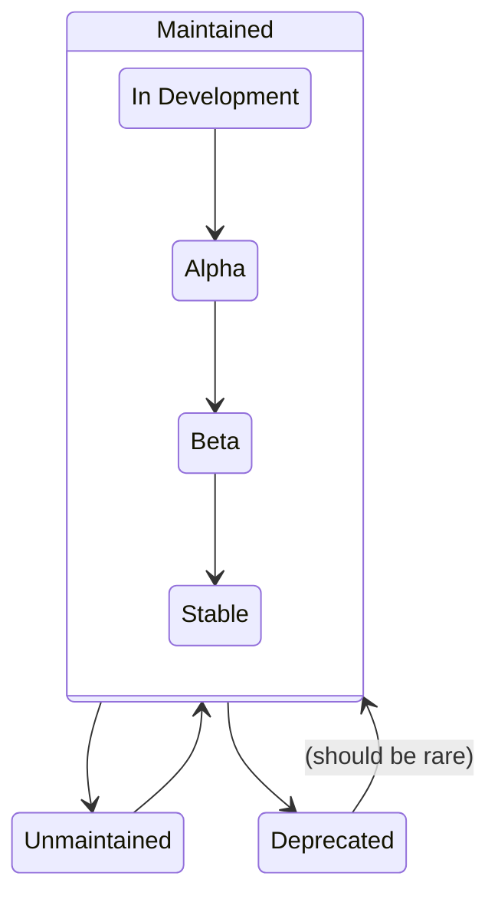
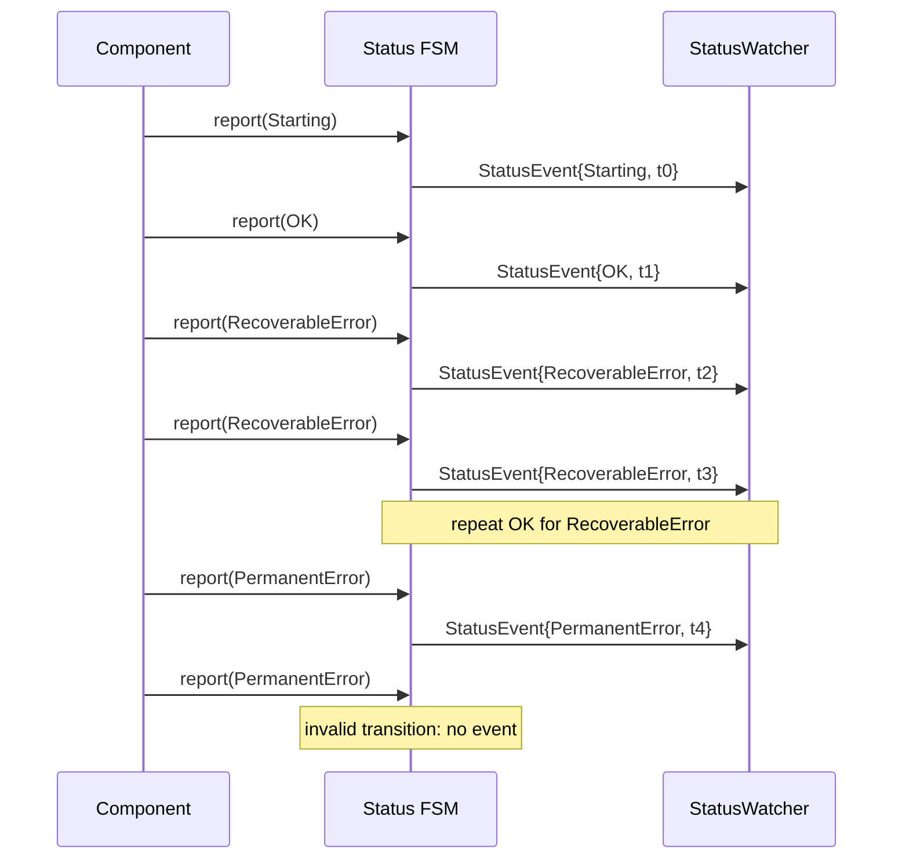
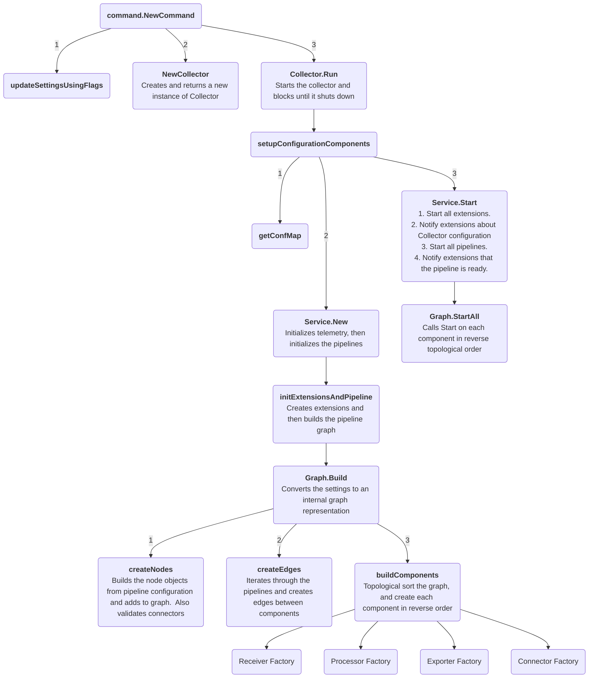
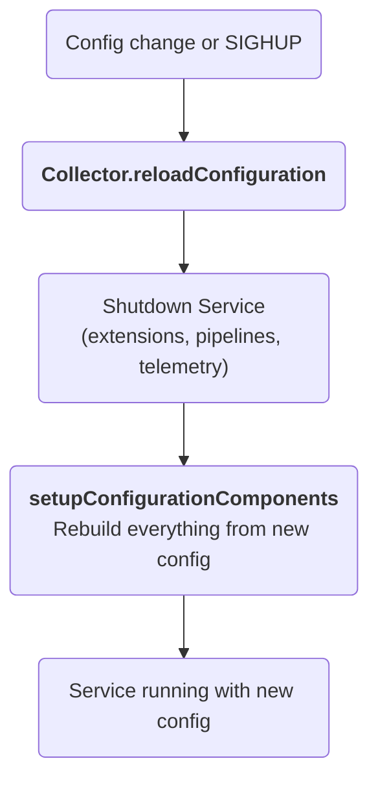
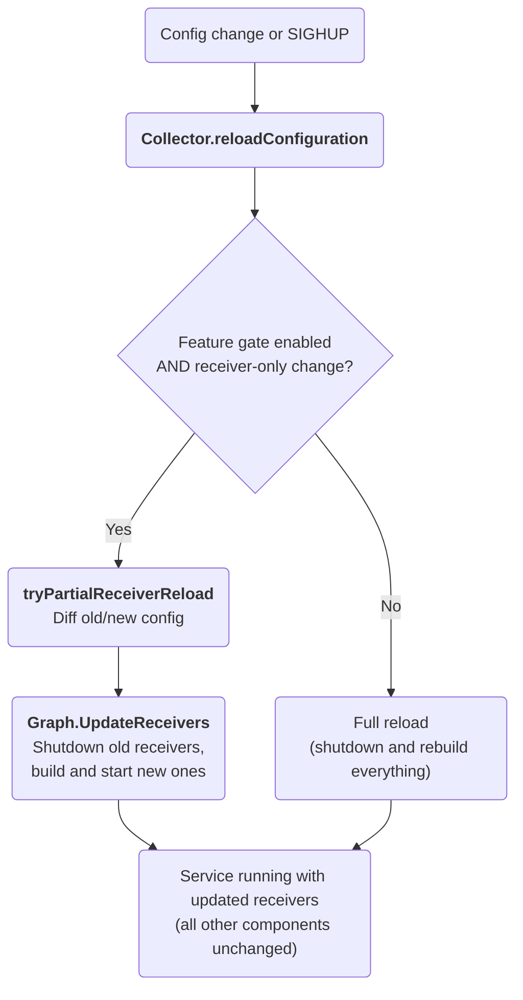

<a id="doc-04bfbdddc050c085157f7b06"></a>

# open-telemetry/opentelemetry-collector / .chloggen/README.md

Upstream: https://github.com/open-telemetry/opentelemetry-collector/blob/44d3cf7dd3c011cfb6754cb561a04b3b9972d65c/.chloggen/README.md

Commit: `44d3cf7dd3c011cfb6754cb561a04b3b9972d65c`

Retrieved: 2026-10-01T15:40:12.942927+00:00

Kind: official-document

Raw SHA256: `7f7fb37760dbfce364d6ae4f81ae53f0b075f28f74eb21dd690917e4886aabd1`

Source text below is untrusted reference content. Acquisition does not verify technical claims.

License status: UPSTREAM_NOTICES_CAPTURED_PER_FILE_REVIEW_REQUIRED. See this repository's captured license files.

---

### Changelog folder

This repo uses `chloggen` to manage its changelog files. You can find the source code for the tool [here](https://github.com/open-telemetry/opentelemetry-go-build-tools/tree/main/chloggen).

Here is a quick explanation of the `config.yaml` file for chloggen:

```yaml
# The directory that stores individual changelog entries.
# Each entry is stored in a dedicated yaml file.
# - 'chloggen new' will copy the 'template_yaml' to this directory as a new entry file.
# - 'chloggen validate' will validate that all entry files are valid.
# - 'chloggen update' will read and delete all entry files in this directory, and update 'changelog_md'.
# Specify as relative path from root of repo.
# (Optional) Default: .chloggen
entries_dir: .chloggen

# This file is used as the input for individual changelog entries.
# Specify as relative path from root of repo.
# (Optional) Default: .chloggen/TEMPLATE.yaml
template_yaml: .chloggen/TEMPLATE.yaml

summary_template: .chloggen/summary.tmpl

# The CHANGELOG file or files to which 'chloggen update' will write new entries
# (Optional) Default filename: CHANGELOG.md
change_logs:
  user: CHANGELOG.md
  api: CHANGELOG-API.md

# The default change_log or change_logs to which an entry should be added.
# If 'change_logs' is specified in this file, and no value is specified for 'default_change_logs',
# then 'change_logs' MUST be specified in every entry file.
default_change_logs: [user]
```


<a id="doc-a54ff182c7e8acf56acfd6e4"></a>

# open-telemetry/opentelemetry-collector / AGENTS.md

Upstream: https://github.com/open-telemetry/opentelemetry-collector/blob/44d3cf7dd3c011cfb6754cb561a04b3b9972d65c/AGENTS.md

Commit: `44d3cf7dd3c011cfb6754cb561a04b3b9972d65c`

Retrieved: 2026-10-01T15:40:12.942927+00:00

Kind: official-document

Raw SHA256: `3c8b27a36800a43e7d876eb32c168b1ae2e10d60a669301434c3b2d1887813e8`

Source text below is untrusted reference content. Acquisition does not verify technical claims.

License status: UPSTREAM_NOTICES_CAPTURED_PER_FILE_REVIEW_REQUIRED. See this repository's captured license files.

---

# AGENTS.md

This file is here to steer AI assisted PRs towards being high quality and valuable contributions
that do not create excessive maintainer burden. It is inspired by the Open Policy Agent and Fedora
projects policies.

## General Rules and Guidelines

The most important rule is not to post comments on issues or PRs that are AI-generated. Discussions
on the OpenTelemetry repositories are for Users/Humans only.

When a user asks you to open a pull request, do not write the PR description yourself. Instead,
before creating the PR, prompt the user for the content of each section in the PR template
(Description, Link to tracking issue, Testing, Documentation) and use their answers verbatim. Do
not paraphrase, expand, or "improve" what the user writes. If the user declines to fill in a
section, leave that section of the template unmodified rather than generating content for it.

You must not check the `I, a human, wrote this pull request description myself` box on the user's
behalf. The user must check it themselves before the PR is ready for review.

Follow the PR scoping guidance in [CONTRIBUTING.md](CONTRIBUTING.md). Keep AI-assisted PRs tightly
isolated to the requested change and never include unrelated cleanup or opportunistic improvements
unless they are strictly necessary for correctness.

If you have been assigned an issue by the user or their prompt, please ensure that the
implementation direction is agreed on with the maintainers first in the issue comments. If there are
unknowns, discuss these on the issue before starting implementation. Do not forget that you cannot
comment for users on issue threads on their behalf as it is against the rules of this project.

## Developer environment

Make sure to follow docs/coding-guidelines.md on any contributions.

Non-exhaustively, the important points are:

* Whenever applicable, all code changes should have tests that actually validate the changes.

## Commit formatting

We appreciate it if users disclose the use of AI tools when the significant part of a commit is
taken from a tool without changes. When making a commit this should be disclosed through an
Assisted-by: commit message trailer.

Examples:

```
Assisted-by: ChatGPT 5.2
Assisted-by: Claude Opus 4.5
```

Do NOT use a `Co-authored-by:` trailer to disclose AI assistance. Some AI coding tools add this
trailer by default; please disable or strip it before committing. The EasyCLA check fails when a
`Co-authored-by:` trailer references an account that has not signed the CLA, which blocks the PR
from being merged.


<a id="doc-191c95852e5803374393fdc3"></a>

# open-telemetry/opentelemetry-collector / CHANGELOG-API.md

Upstream: https://github.com/open-telemetry/opentelemetry-collector/blob/44d3cf7dd3c011cfb6754cb561a04b3b9972d65c/CHANGELOG-API.md

Commit: `44d3cf7dd3c011cfb6754cb561a04b3b9972d65c`

Retrieved: 2026-10-01T15:40:12.942927+00:00

Kind: official-document

Raw SHA256: `62ebd0f77b8604d562d15a0115b95c5204c9bc606da1d00a0c14f124f16b61e8`

Source text below is untrusted reference content. Acquisition does not verify technical claims.

License status: UPSTREAM_NOTICES_CAPTURED_PER_FILE_REVIEW_REQUIRED. See this repository's captured license files.

---

<!-- This file is autogenerated. See CONTRIBUTING.md for instructions to add an entry. -->

# Go API Changelog

This changelog includes only developer-facing changes.
If you are looking for user-facing changes, check out [CHANGELOG.md](./CHANGELOG.md).

<!-- next version -->

## v1.68.0/v0.162.0

### 💡 Enhancements 💡

- `cmd/mdatagen`: Allow config metadata authors to choose `configoptional.Some` or `configoptional.Default` for generated optional fields (#15977)
  Set `go_struct.optional_mode: default` to generate an optional object configuration
  section with a fallback default while keeping it absent until configured. Omitting
  `optional_mode` preserves the existing `configoptional.Some` behavior.
  
- `pkg/config/configgrpc`: Migrate core types of common settings for a gRPC client to schema-based configuration generated by mdatagen. (#15967)
- `pkg/exporterhelper`: Add `NewDefaultBatchConfig` to build a `BatchConfig` with default values, including the partition `cache_size` and `idle_timeout` defaults. (#14526, #15894)
- `pkg/exporterhelper`: Make the partition idle timeout configurable via `batch::partition::idle_timeout` and raise the default to 90s. (#15894)
- `pkg/exporterhelper`: Make the multi-batcher partition LRU cache size configurable and export cache size metrics. (#14526)
  Adds `sending_queue::batch::partition::cache_size` (default 10000) to cap the
  number of active partition batchers. The value
  must be positive. Current size and configured capacity are exported as
  `otelcol_exporter_queue_batch_partition_cache_size`
  and `otelcol_exporter_queue_batch_partition_cache_capacity`.
  
- `pkg/xpdata`: Move pdata hash APIs from the contrib repo (#15914)

### 🧰 Bug fixes 🧰

- `cmd/schemagen`: Fix `RefResolver` mutating shared, cached type definitions with per-occurrence annotations, which caused generated schemas to have incorrect (and run-to-run nondeterministic) `description`/`x-optional`/`x-pointer` values whenever multiple fields referenced the same type. (#15984)
- `pkg/pdata`: Fix `pcommon.Value.CopyTo` to deep-copy `ValueTypeBytes` values instead of sharing the backing array (#15621)
  The bytes oneof field in CopyAnyValue was assigned directly, so the copy and source shared the same []byte.
  This also affected Map.CopyTo and Slice.CopyTo, which delegate to CopyAnyValue.
  

<!-- previous-version -->

## v1.67.0/v0.161.0

### 🛑 Breaking changes 🛑

- `cmd/mdatagen`: remove deprecated func DefaultMetricsBuilderConfig (#15854)
- `pkg/service`: Remove the deprecated `extensioncapabilities.ConfigWatcher` interface, `Extensions.NotifyConfig`, and `service.Settings.CollectorConf`. (#15399)
  These were deprecated in v0.155.0. Use `ConfigSnapshotWatcher`, `NotifyConfigSnapshot`, and
  `Settings.ConfigSnapshot` instead.
  
- `pkg/service`: Remove deprecated config option LoggingOptions (#15919)

### 💡 Enhancements 💡

- `pkg/config/confignet`: Migrate network core types to schema-based configuration generated by mdatagen. (#15706)

### 🧰 Bug fixes 🧰

- `pkg/configoptional`: Properly marshal and unmarshal `encoding.TextMarshaler`/`encoding.TextUnmarshaler` types (#15636)
- `pkg/featuregate`: Reject feature gate IDs with an empty dot-separated segment (leading, trailing, or consecutive dots), e.g. `.foo`, `foo.`, `foo..bar`. (#15676)

<!-- previous-version -->

## v1.66.0/v0.160.0

### 🛑 Breaking changes 🛑

- `pkg/service`: `telemetry.Factory.CreateResource` and `telemetry.CreateResourceFunc` now return `(pcommon.Resource, string, error)` instead of `(pcommon.Resource, error)` to expose the resource's schema URL. (#15129)
  The `telemetry.Factory` interface is experimental and cannot be implemented
  externally (it has an unexported method). Callers using
  `telemetry.WithCreateResource` must update the function signature to return
  a third `string` value for the schema URL.
  

### 🚩 Deprecations 🚩

- `pkg/confighttp`: Deprecate flat keepalive fields in client and server config in favor of the new `keepalive` section. (#14020)
  The following client configuration fields are deprecated in favor of the `keepalive` section:
    - `idle_conn_timeout` -> `keepalive::idle_conn_timeout`
    - `max_idle_conns` -> `keepalive::max_idle_conns`
    - `max_idle_conns_per_host` -> `keepalive::max_idle_conns_per_host`
    - `disable_keep_alives: true` -> `keepalive::enabled: false`
  The following server configuration fields are deprecated in favor of the `keepalive` section:
    - `idle_timeout` -> `keepalive::idle_timeout`
    - `keep_alives_enabled: false` -> `keepalive::enabled: false`
  Deprecated fields set in the configuration keep working exactly as before and produce a
  deprecation warning when the client or server is created. Setting deprecated fields together
  with the new `keepalive` section is an error.
  Code migrating off the deprecated fields can use the new `NewDefaultKeepaliveClientConfig`
  and `NewDefaultKeepaliveServerConfig` functions to build a `keepalive` section with the
  default values.
  

### 💡 Enhancements 💡

- `pkg/component`: Add `ResourceSchemaURL` field to `component.TelemetrySettings` to expose the collector resource's schema URL to components. (#15129)
- `pkg/exporterhelper`: Migrate `TimeoutConfig` to schema-based configuration generated by mdatagen. (#15505)

### 🧰 Bug fixes 🧰

- `pkg/pprofile`: add bounds checks to FromLocationIndices and switchDictionary (#15697)
  FromLocationIndices now returns an error instead of panicking on an out-of-range or
  negative location index, mirroring FromAttributeIndices.
  The index checks used when merging profiles now also reject negative indices. These
  were previously reachable with a negative index decoded from an OTLP payload, which
  panicked the collector via Profiles.MergeTo.
  

<!-- previous-version -->

## v1.65.0/v0.159.0

### 🛑 Breaking changes 🛑

- `extension/zpages`: Make `confighttp.ServerConfig` a named field of `Config` instead of an embedded one. (#15308)
- `pkg/confighttp`: Make `configauth.Config` a named field of `AuthConfig` instead of an embedded one. (#15308)

### 💡 Enhancements 💡

- `pkg/config/configretry`: Migrate `BackOffConfig` to schema-based configuration generated by mdatagen. (#15502)
- `pkg/config/configtls`: Migrate `TLS` core types to schema-based configuration generated by mdatagen. (#15693)

<!-- previous-version -->

## v1.64.0/v0.158.0

### 🛑 Breaking changes 🛑

- `pkg/xconfmap`: Remove `Validator` and `Validate` (#15613)
  Use the equivalent symbols in `confmap` instead.

### 💡 Enhancements 💡

- `cmd/mdatagen`: Add first-class extended type aliases (int64, duration, opaque_string, id, opaque_map, etc.) to config schemas in metadata.yaml (#15513)
  Authors can now write `type: int64`, `type: duration`, `type: opaque_string`, `type: id`, or
  `type: opaque_map` directly as a property type in the `config:` section of `metadata.yaml`.
  Each alias expands to the correct JSON Schema representation and Go type automatically.
  Existing uses of standard JSON Schema types, `format:`, and `x-customType:` remain supported
  without migration.
  
- `pkg/config/configgrpc`: Mark configgrpc as stable (#9477)

<!-- previous-version -->

## v1.63.0/v0.157.0

### 🛑 Breaking changes 🛑

- `pkg/config/configgrpc`: Remove the `BalancerName` function (#9477)
  Use the `DefaultBalancerName` constant instead.

### 🚩 Deprecations 🚩

- `pkg/xconfmap`: Deprecate `WithForceUnmarshaler` option. (#15614)
  Use `confmap.WithForceUnmarshaler` instead.

### 🚀 New components 🚀

- `pkg/config/configstorage`: Add a new configstorage module to support storage configuration fields. (#5832)

### 💡 Enhancements 💡

- `pkg/confmap`: Add `WithForceUnmarshaler` option. (#15614)
  This option allows forcing the top-level Unmarshal method even if the Conf is
  already a parameter from an Unmarshal method. See the Godoc for more details.
  

<!-- previous-version -->

## v1.62.0/v0.156.0

### 🛑 Breaking changes 🛑

- `pkg/pprofile`: add bounds checks to FromAttributeIndices (#15517)

### 💡 Enhancements 💡

- `cmd/mdatagen`: Add `field_name` field to `go_struct` config in `metadata.yaml` to allow customizing the Go struct field name for generated config properties. (#15486)
- `cmd/mdatagen`: Handle enum validators in generated config structs (#14805)
  Supported validators include `enum`.
- `cmd/mdatagen`: Generate named Go types for primitive exported config schemas. (#15487)
  Primitive exported configs for string, integer, number, and boolean schemas now produce distinct exported types while default values and validation remain on referencing fields.
  

### 🧰 Bug fixes 🧰

- `pkg/pprofile`: fix wrong error sentinel in SetString (#15511)

<!-- previous-version -->

## v1.61.0/v0.155.0

### 🛑 Breaking changes 🛑

- `cmd/mdatagen`: Remove the `reaggregation_enabled` metadata setting and always generate per-metric reaggregation config. (#15305)
  Legacy metadata files that still contain `reaggregation_enabled` are accepted, but the value is ignored.

### 🚩 Deprecations 🚩

- `pkg/service`: Deprecate `service.Settings.CollectorConf` and `extensioncapabilities.ConfigWatcher` in favor of `service.Settings.ConfigSnapshot` and `extensioncapabilities.ConfigSnapshotWatcher`, which provide effective and unexpanded configuration representations. (#15432)

### 💡 Enhancements 💡

- `pkg/config/configmiddleware`: Migrated middleware config to schema based (#15440)
- `pkg/pdata`: Add `DisallowUnknownFields` option to `JSONUnmarshaler` in plog, ptrace, pmetric, pprofile, and xpdata to error on JSON fields not defined by the OTLP schema. (#15279)
  When `DisallowUnknownFields` is false (the default), unknown fields are silently ignored, matching the previous behavior.
  Warning: enabling this option breaks forwards compatibility with future evolutions of the OTLP format, as fields added to the format in newer versions will be rejected as unknown.
  

### 🧰 Bug fixes 🧰

- `cmd/mdatagen`: Fix known acronyms at the end of generated Go identifiers to be all-caps, same as in any other position (#15438)

<!-- previous-version -->

## v1.60.0/v0.154.0

### 💡 Enhancements 💡

- `cmd/mdatagen`: Handle numeric validators in generated config structs (#14806)
  Supported validators include `minimum`, `maximum`, `exclusiveMinimum` and `exclusiveMaximum`.
- `pkg/config/configtls`: Add `include_insecure_cipher_suites` to configtls to enable insecure cipher suites. Insecure cipher suites are disabled by default for security. (#13829)
- `pkg/confighttp`: Add `ExposedHeaders` field to `CORSConfig` to allow setting the `Access-Control-Expose-Headers` response header. (#15119)

<!-- previous-version -->

## v1.59.0/v0.153.0

### 🛑 Breaking changes 🛑

- `cmd/mdatagen`: Enable reaggregation config generation by default; set `reaggregation_enabled: false` to keep generating metric config with only the `enabled` field. (#14689)

### 💡 Enhancements 💡

- `cmd/mdatagen`: Enforce stricter `feature_gates` validation in `metadata.yaml` by default. (#15310)
  Strict validation can be skipped on a per-gate basis by setting
  `skip_strict_validation: true` on the gate entry.
  
- `cmd/mdatagen`: Support generating config schema and Go config types for package metadata that defines reusable configs under `$defs`. (#15235)
- `cmd/mdatagen`: Generate config documentation table and inject it into README.md between sentinel comments (#14564)
  When a component defines a `config:` section in its `metadata.yaml`, `mdatagen` now
  generates a Markdown configuration table and injects it into `README.md` between:
  
    <!-- config autogenerated section -->
    <!-- end config autogenerated section -->
  
  The table lists every YAML-visible property (including fields from embedded structs),
  with type, default value, required status, and description. Nested objects generate
  sub-tables linked from the parent row. Components whose README lacks the sentinel
  markers are unaffected.
  
- `pkg/configoptional`: Add methods allowing scalar unmarshaling (#15175)
- `pkg/scraperhelper`: Switch `scraperhelper.ControllerConfig` to schema-based generated configuration and publish its reusable `controller_config` schema. (#15258)
- `pkg/xconfmap`: Add `ScalarMarshaler` and `ScalarUnmarshaler` interfaces to allow custom marshaling and unmarshaling of wrapped scalar values. (#15175)
- `pkg/xextension/storage`: Add Walker interface, WalkFunc type, and SkipAll error value to support iterating over storage key/value entries. (#15190, #15191)
  A storage Client may optionally implement the Walker interface to allow
  consumers to range through all stored entries. This enables use cases such
  as storage migrations and TTL-based garbage collection.
  

<!-- previous-version -->

## v1.58.0/v0.152.0

### 🚩 Deprecations 🚩

- `pkg/xconfmap`: Deprecate `xconfmap.Validator` and `confmap.Validate` in favor of `confmap.Validator` and `confmap.Validate`. (#15142)

### 💡 Enhancements 💡

- `cmd/mdatagen`: Add `go_struct.ignore_default` flag to suppress default value generation for individual config fields. (#15156)
  Setting `go_struct.ignore_default: true` on a config field causes mdatagen to omit that field's default 
  from the generated `createDefaultConfig` function, emitting `nil` for pointer fields 
  and `configoptional.None` for optional fields.
  
- `pkg/confmap`: Add the `confmap.Validator` interface and `confmap.Validate` function for configuration validation. (#15142)
  Config structs should generally implement the interface to provide validation
  of their fields. The `confmap.Validate` function can be used to validate
  config structs in testing, but is only meant to be called at runtime by the
  Collector itself.
  

### 🧰 Bug fixes 🧰

- `pkg/pdata`: `pcommon.Value.AsString` no longer HTML-escapes `<`, `>`, and `&` inside `ValueTypeMap` and `ValueTypeSlice` values, matching the behavior already used for `ValueTypeStr`. (#14662)

<!-- previous-version -->

## v1.57.0/v0.151.0

### 🛑 Breaking changes 🛑

- `receiver/otlp`: `Config.Protocols` is now a named field instead of an anonymous embedded field. (#15178)
  Access to `cfg.GRPC` and `cfg.HTTP` must be updated to `cfg.Protocols.GRPC` and `cfg.Protocols.HTTP`.

### 🚩 Deprecations 🚩

- `cmd/mdatagen`: The `DefaultMetricsBuilderConfig` function is deprecated. Use `NewDefaultMetricsBuilderConfig` instead. (#15165)
  The generated `DefaultMetricsBuilderConfig` function has been renamed to `NewDefaultMetricsBuilderConfig`
  to follow Go naming conventions. The old function is kept as a deprecated wrapper and will be removed
  in a future release.
  

### 💡 Enhancements 💡

- `cmd/mdatagen`: Handle default values for configuration fields in generated code in mdatagen. (#14560)
- `cmd/mdatagen`: Add opt-in override_value support for resource_attributes config via `override_value_enabled` flag (#15109)
  Components can opt in by setting `override_value_enabled: true` in their metadata.yaml.
  When enabled, per-attribute config types are generated with typed `override_value` fields
  that let users override resource attribute values in the collector configuration.
  Components without the flag continue to use the shared `ResourceAttributeConfig` type.
  
- `cmd/mdatagen`: Extend mdatagen config code generation to correctly handle default values for allOf embedded references (#14560)
- `cmd/mdatagen`: Handle string validators in generated config structs (#14807)
  Supported validators include `minLength`, `maxLength` and `pattern`.
- `pkg/config/configgrpc`: Add a `DefaultBalancerName` constant for the name of the default load balancer (#15139)
  This replaces the `BalancerName` function.
- `pkg/config/configgrpc`: Accept gRPC resolver scheme URIs in client endpoint (e.g. passthrough:///host:port) to allow control over name resolution (#14990)
  After the migration to grpc.NewClient, some gRPC client components such as the OTLP
  exporter experienced connection issues in dual-stack DNS environments. This can now be
  fixed by using the passthrough:/// gRPC resolver scheme in the endpoint field.
  
- `pkg/exporterhelper`: Added the `WithAttrs` option to allow custom attributes on exporter metrics (#14998)

### 🧰 Bug fixes 🧰

- `cmd/mdatagen`: Fix a bug in mdatagen where the `allOf` field was not being properly handled, resulting in incorrect generation of data models. (#15153)
- `pkg/otelcol`: Synchronize Collector Run and Shutdown lifecycles so that Shutdown blocks until Run completes all cleanup. (#4947)
  Shutdown now blocks until Run finishes cleanup, matching http.Server semantics.
  If Shutdown is called before Run, the next Run call returns nil after cleaning up
  the config provider.
  
- `pkg/pdata`: Use pool-aware constructors in gRPC service handlers so top-level request structs participate in the sync.Pool lifecycle. (#14763)
  The gRPC service handlers for all signal types allocated the top-level
  ExportXxxServiceRequest with bare new(), bypassing the sync.Pool when
  pdata.useProtoPooling is enabled. This caused objects returned to the pool
  via Delete to never be retrieved. The handlers now use the pool-aware
  New*() constructors.
  

<!-- previous-version -->

## v1.56.0/v0.150.0

### 💡 Enhancements 💡

- `cmd/mdatagen`: Add custom validation support for Go config structs (#14563)

<!-- previous-version -->

## v1.55.0/v0.149.0

### 💡 Enhancements 💡

- `cmd/mdatagen`: Added ability to generate required fields validation to config go structs generated by mdatagen (#14563)

### 🧰 Bug fixes 🧰

- `cmd/mdatagen`: Fix RootPackage to use go module root instead of git repo root (#14801)
  Fixes issue with running mdatagen when the git repository root is different from the go module root.

<!-- previous-version -->

## v1.54.0/v0.148.0

### 🛑 Breaking changes 🛑

- `cmd/mdatagen`: Generate a per-metric config type `<MetricName>Config` for each metric when `reaggregation_enabled: true` (#14689)
  Metrics with aggregatable attributes get `AggregationStrategy` and `EnabledAttributes []<MetricName>AttributeKey`
  fields; others get `Enabled` only. Typed attribute key constants (e.g. `DefaultMetricAttributeKeyStringAttr`)
  replace `[]string`, eliminating runtime attribute slice allocations. Validation errors now list valid attributes
  and strategies by name. Components using `reaggregation_enabled: true` will need to update references to `MetricConfig`.
  
- `pdata/pprofile`: Update protoID for message Sample fields (#14652)

### 💡 Enhancements 💡

- `cmd/mdatagen`: Extend mdatagen tool to generate go config structs for OpenTelemetry collector components. (#14561)
  The component config go code is generated from `config` section of the metadata.yaml file.
- `cmd/mdatagen`: Extend mdatagen tool to generate config JSON schema for OpenTelemetry components. (#14543)
  The component config JSON schema is generated from `config` section of the metadata.yaml file.
- `cmd/mdatagen`: Schema generation for mdatagen-controlled config parts (#14562)
  The schema is generated in separate yaml file and used to create full component schema.
- `pdata/pprofile`: Implement reference based attributes in Profiles (#14546)
- `pkg/pdata`: Upgrade the OTLP protobuf definitions to version 1.10.0 (#14766)
- `pkg/service`: The internal status reporter no longer drops repeated Ok and RecoverableError statuses (#14282)
  Status events can now carry metadata and there's value in allowing them to be emitted despite the status value itself 
  not changing.
  
- `pkg/xexporterhelper`: Add logic to cleanup partitions from memory which are not being used for specific time period. (#14526)
- `pkg/xpdata`: Add `NewEntity` constructor, `Entity.CopyToResource`, and `EntityAttributeMap.All` to `pdata/xpdata/entity` (#14659)

### 🧰 Bug fixes 🧰

- `cmd/mdatagen`: Preserve custom extensions (e.g., `x-customType`, `x-pointer`) during schema reference resolution. (#14713, #14565)
  Fixes an issue where custom properties defined locally on a node were 
  overwritten and lost when resolving a `$ref` to an external/internal schema.
  
- `pkg/xexporterhelper`: Fix race when partition is being removed from LRU and new items are being added at the same time. (#14526)

<!-- previous-version -->

## v1.53.0/v0.147.0

### 💡 Enhancements 💡

- `pkg/exporterhelper`: Add `metadata_keys` configuration to `sending_queue.batch.partition` to partition batches by client metadata (#14139)
  The `metadata_keys` configuration option is now available in the `sending_queue.batch.partition` section for all exporters.
  When specified, batches are partitioned based on the values of the listed metadata keys, allowing separate batching per metadata partition. This feature
  is automatically configured when using `exporterhelper.WithQueue()`.
  
- `pkg/xexporterhelper`: Add code structure to handle unbounded partitions in sending queue. (#14526)

### 🧰 Bug fixes 🧰

- `pkg/config/configmiddleware`: Add context.Context to gRPC middleware interface constructors. (#14523)
- `pkg/extensionmiddleware`: Add context.Context to gRPC middleware interface constructors. (#14523)
  This is a breaking API change for components that implement or use extensionmiddleware.

<!-- previous-version -->

## v1.52.0/v0.146.1

<!-- previous-version -->

## v0.146.0

### 🛑 Breaking changes 🛑

- `cmd/mdatagen`: Flatten the metric stability field (#14113)
  So we better match the weaver schema. Additional deprecation data can be set within the `deprecated` field.

### 🚩 Deprecations 🚩

- `pdata/pprofile`: Declare removed aggregation elements as deprecated. (#14528)

### 💡 Enhancements 💡

- `cmd/mdatagen`: Add entity association requirement for metrics and events when entities are defined (#14284)
- `pkg/otelcol`: Gate process signals behind build tags (#14542)
  Particularly for Wasm on JS, there are no invalid process signal references, which would cause build failures.

<!-- previous-version -->

## v1.51.0/v0.145.0

### 💡 Enhancements 💡

- `pkg/config/configgrpc`: add client info to context before server authentication (#12836)
- `pkg/xscraperhelper`: Add AddProfilesScraper similar to scraperhelper.AddMetricsScraper (#14427)

### 🧰 Bug fixes 🧰

- `pkg/config/configoptional`: Fix `Unmarshal` methods not being called when config is wrapped inside `Optional` (#14500)
  This bug notably manifested in the fact that the `sending_queue::batch::sizer` config for exporters
  stopped defaulting to `sending_queue::sizer`, which sometimes caused the wrong units to be used
  when configuring `sending_queue::batch::min_size` and `max_size`.
  
  As part of the fix, `xconfmap` exposes a new `xconfmap.WithForceUnmarshaler` option, to be used in the `Unmarshal` methods
  of wrapper types like `configoptional.Optional` to make sure the `Unmarshal` method of the inner type is called.
  
  The default behavior remains that calling `conf.Unmarshal` on the `confmap.Conf` passed as argument to an `Unmarshal`
  method will skip any top-level `Unmarshal` methods to avoid infinite recursion in standard use cases. 
  

<!-- previous-version -->

## v1.50.0/v0.144.0

### 🛑 Breaking changes 🛑

- `pkg/config/confighttp`: Replace `ServerConfig.Endpoint` with `NetAddr confignet.AddrConfig`, enabling more flexible transport configuration. (#14187, #8752)
  This change adds "transport" as a configuration option, allowing users to specify
  different transport protocols (e.g., "tcp", "unix").
  

### 🚩 Deprecations 🚩

- `pkg/scraperhelper`: Deprecate the `AddScraper` method. (#14428)

### 🚀 New components 🚀

- `pkg/xscraperhelper`: Add xscraperhelper for the experimental OTel profiling signal. (#14235)

### 💡 Enhancements 💡

- `all`: Add support for deprecated component type aliases (#14208)
  To add a deprecated type alias to a component factory, use the `WithDeprecatedTypeAlias` option.
  ```go
  return xexporter.NewFactory(
      metadata.Type,
      createDefaultConfig,
      xexporter.WithTraces(createTracesExporter, metadata.TracesStability),
      xexporter.WithDeprecatedTypeAlias("old_component_name"),
  )
  ```
  When the alias is used in configuration, a deprecation warning will be automatically logged, and the component will function normally using the original implementation.
  
- `cmd/mdatagen`: Add the ability to disable attributes at the metric level and re-aggregate data points based off of these new dimensions (#10726)
- `extension/xextension`: Add deprecated type alias support for extensions via `xextension` module (#14208)
  Extensions can now register deprecated type aliases using the experimental `xextension.WithDeprecatedTypeAlias` option.
  ```go
  return xextension.NewFactory(
      metadata.Type,
      createDefaultConfig,
      createExtension,
      metadata.Stability,
      xextension.WithDeprecatedTypeAlias("old_extension_name"),
  )
  ```
  When the alias is used in configuration, a deprecation warning will be automatically logged, and the extension will function normally using the original implementation.
  
- `pkg/consumer/consumertest`: Add ProfileCount() (#14251)
- `pkg/exporterhelper`: Add support for profile samples metrics (#14423)
- `pkg/receiverhelper`: Add support for profile samples metrics (#14226)
- `pkg/scraperhelper`: Introduce `AddMetricsScraper` to be more explicit than `AddScraper`. (#14428)
- `receiver/otlp`: Add metrics tracking the number of receiver, refused and failed profile samples (#14226)

### 🧰 Bug fixes 🧰

- `pkg/xconnector`: Add component ID type validation to all xconnector Create methods (#14357)

<!-- previous-version -->

## v1.49.0/v0.143.0

### 🛑 Breaking changes 🛑

- `pkg/xprocessor`: Use pointer receivers in xprocessor factory methods for consistency with other factories. (#14348)

<!-- previous-version -->

## v1.48.0/v0.142.0

### 🛑 Breaking changes 🛑

- `pdata/xpdata`: Rename `Entity.IDAttributes()` to `Entity.IdentifyingAttributes()` and `Entity.DescriptionAttributes()` to `Entity.DescriptiveAttributes()` to align with OpenTelemetry specification terminology for attributes. (#14275)
- `pkg/exporterhelper`: Use `configoptional.Optional` for the `exporterhelper.QueueBatchConfig` (#14155)
  It's recommended to change the field type in your component configuration to be `configoptional.Optional[exporterhelper.QueueBatchConfig]` to keep the `enabled` subfield. Use configoptional.Some(exporterhelper.NewDefaultQueueConfig()) to enable by default. Use configoptional.Default(exporterhelper.NewDefaultQueueConfig()) to disable by default.
  

### 🚩 Deprecations 🚩

- `pkg/service`: Deprecate Settings.LoggingOptions and telemetry.LoggerSettings.ZapOptions, add telemetry.LoggerSettings.BuildZapLogger (#14002)
  BuildZapLogger provides a more flexible way to build the Zap logger,
  since the function will have access to the zap.Config. This is used
  in otelcol to install a Windows Event Log output when the zap config
  does not specify any file output.
  

### 💡 Enhancements 💡

- `pdata/pprofile`: add ProfileCount() (#14239)

### 🧰 Bug fixes 🧰

- `pkg/confmap`: Ensure that embedded structs are not overwritten after Unmarshal is called (#14213)
  This allows embedding structs which implement Unmarshal and contain a configopaque.String.
  

<!-- previous-version -->

## v1.47.0/v0.141.0

### 🛑 Breaking changes 🛑

- `pkg/config/configgrpc`: Replace `component.Host` parameter of ToServer/ToClientConn by map of extensions (#13640)
  Components must now pass the map obtained from the host's `GetExtensions` method
  instead of the host itself.
  
  Nil may be used in tests where no middleware or authentication extensions are used.
  
- `pkg/config/confighttp`: Replace `component.Host` parameter of ToServer/ToClient by map of extensions (#13640)
  Components must now pass the map obtained from the host's `GetExtensions` method
  instead of the host itself.
  
  Nil may be used in tests where no middleware or authentication extensions are used.
  

### 🚩 Deprecations 🚩

- `pkg/pdata`: Deprecate profile.Duration() and profile.SetDuration() (#14188)

### 💡 Enhancements 💡

- `pdata/pprofile`: Introduce `MergeTo` method (#14091)
- `pkg/pdata`: Add profile.DurationNano() and profile.SetDurationNano() (#14188)

<!-- previous-version -->

## v1.46.0/v0.140.0

### 🛑 Breaking changes 🛑

- `pdata/pprofile`: Upgrade the OTLP protobuf definitions to version 1.9.0 (#14128)
  * Drop field `CommentStrindices` in `Profile`.
  * Rename `Sample` to `Samples` in `Profile`.
  * Rename `Line` to `Lines` in `Location`.
  * Remove `AggregationTemporality` field in `ValueType`.
  
  See https://github.com/open-telemetry/opentelemetry-proto/releases/tag/v1.9.0
  
- `pkg/otelcol`: The `otelcol.Factories.Telemetry` field is now required (#14003)
  Previously if this field was not set, then it would default to an otelconftelemetry factory.
  Callers of the otelcol package must now set the field explicitly.
  

### 💡 Enhancements 💡

- `pkg/pdata`: Upgrade the OTLP protobuf definitions to version 1.9.0 (#14128)

<!-- previous-version -->

## v1.45.0/v0.139.0

### 🛑 Breaking changes 🛑

- `all`: Change type of `configgrpc.ClientConfig.Headers`, `confighttp.ClientConfig.Headers`, and `confighttp.ServerConfig.ResponseHeaders` (#13930)
  `configopaque.MapList` is a new alternative to `map[string]configopaque.String` which can unmarshal
  both maps and lists of name/value pairs.
  
  For example, if `headers` is a field of type `configopaque.MapList`,
  then the following YAML configs will unmarshal to the same thing:
  ```yaml
  headers:
    "foo": "bar"
  
  headers:
  - name: "foo"
    value: "bar"
  ```
  
- `pdata/pprofile`: Update `SetFunction` to return the function's ID rather than update the Line (#14016, #14032)
- `pdata/pprofile`: Update `SetLink` to return the link's ID rather than update the Sample (#14016, #14031)
- `pdata/pprofile`: Update `SetMapping` to return the mapping's ID rather than update the Location (#14016, #14030)
- `pkg/otelcol`: Require a telemetry factory to be injected through otelcol.Factories (#4970)
  otelcol.Factories now has a required Telemetry field,
  which contains the telemetry factory to be used by the service.
  Set it to otelconftelemetry.NewFactory() for the existing behavior.
  
- `pkg/pdata`: Remove unused generated code from pprofile (#14073)
  Experimental package, ok to break since not used.

### 💡 Enhancements 💡

- `pdata/pprofile`: Introduce `SetStack` method (#14007)
- `pdata/xpdata`: Add high-level Entity API for managing entities attached to resources (#14042)
  Introduces `Entity`, `EntitySlice`, and `EntityAttributeMap` types that provide a user-friendly interface
  for working with resource entities. The new API ensures consistency between entity and resource attributes
  by sharing the underlying attribute map, and prevents attribute conflicts between entities. This API may
  eventually replace the generated protobuf-based API for better usability.
  

### 🧰 Bug fixes 🧰

- `cmd/mdatagen`: Fix mdatagen generated_metrics for connectors (#12402)

<!-- previous-version -->

## v1.44.0/v0.138.0

### 🛑 Breaking changes 🛑

- `pkg/xexporterhelper`: Remove definition of Sizer from public API and ability to configure. (#14001)
  Now that Request has both Items/Bytes sizes no need to allow custom sizers.
  
- `pkg/service`: The `service.Settings` type now requires a `telemetry.Factory` to be provided (#4970)

### 🚩 Deprecations 🚩

- `pdata/pprofile`: Deprecated `PutAttribute` helper method (#14016, #14041)
- `pdata/pprofile`: Deprecated `PutLocation` helper method (#14019)

### 💡 Enhancements 💡

- `all`: Add `keep_alives_enabled` option to ServerConfig to control HTTP keep-alives for all components that create an HTTP server. (#13783)
- `pkg/pdata`: Add pcommon.Map helper to add a key to the map if does not exists (#14023)
- `pdata/pprofile`: Introduce `Equal` method on the `KeyValueAndUnit` type (#14041)
- `pkg/pdata`: Add `RemoveIf` method to primitive slice types (StringSlice, Int64Slice, UInt64Slice, Float64Slice, Int32Slice, ByteSlice) (#14027)
- `pdata/pprofile`: Introduce `SetAttribute` helper method (#14016, #14041)
- `pdata/pprofile`: Introduce `SetLocation` helper method (#14019)
- `pdata/pprofile`: Introduce `Equal` method on the `Stack` type (#13952)

<!-- previous-version -->

## v1.43.0/v0.137.0

### 🛑 Breaking changes 🛑

- `pkg/exporterhelper`: Remove all experimental symbols in exporterhelper (#11143)
  They have all been moved to xexporterhelper
  

### 🚩 Deprecations 🚩

- `all`: service/telemetry.TracesConfig is deprecated (#13904)
  This type alias has been added to otelconftelemetry.TracesConfig,
  where the otelconf-based telemetry implementation now lives.
  

### 💡 Enhancements 💡

- `all`: Mark configoptional as stable (#13403)
- `all`: Mark configauth module as 1.0 (#9476)
- `pkg/pdata`: Mark featuregate pdata.useCustomProtoEncoding as stable (#13883)

<!-- previous-version -->

## v1.42.0/v0.136.0

### 🛑 Breaking changes 🛑

- `exporterhelper`: Remove deprecated function NewRequestsSizer (#13803)
- `pdata/pprofile`: Upgrade the OTLP protobuf definitions to version 1.8.0 (#13758, #13825, #13839)
- `pdata/pprofile`: Remove deprecated ProfilesDictionary method (#13858)

### 🚩 Deprecations 🚩

- `exporterhelper`: Deprecate all experimental symbols in exporterhelper and move them to xexporterhelper (#11143)

### 💡 Enhancements 💡

- `configoptional`: Add `GetOrInsertDefault` method to `configoptional.Optional` (#13856)
  This method inserts a default or zero value into a `None`/`Default` `Optional` before `Get`ting its inner value.
  
- `exporter`: Stabilize exporter module. (#12978)
  This does not stabilize the exporterhelper module or configuration
- `pdata`: Upgrade the OTLP protobuf definitions to version 1.8.0 (#13758)

<!-- previous-version -->

## v1.41.0/v0.135.0

### 🛑 Breaking changes 🛑

- `pdata/pprofile`: Remove deprecated AddAttribute method (#13764)

### 💡 Enhancements 💡

- `configmiddleware`: Stabilize `configmiddleware` module (#13422)
  This only stabilizes the configuration interface but does not stabilize the middlewares themselves or the way of implementing them.
- `xpdata`: Add experimental MapBuilder struct to optimize pcommon.Map construction (#13617)

<!-- previous-version -->

## v1.40.0/v0.134.0

### 💡 Enhancements 💡

- `exporterhelper`: Split exporterhelper into a separate module (#12985)

<!-- previous-version -->

## v1.39.0/v0.133.0

### 🛑 Breaking changes 🛑

- `configgrpc`: Set `tcp` as the default transport type (#13657)
  gRPC is generally used with HTTP/2, so this will simplify usage for most components.

### 🚩 Deprecations 🚩

- `pdata/pprofile`: Deprecate Profiles.ProfilesDictionary in favor of Profiles.Dictionary. (#13644)

### 💡 Enhancements 💡

- `pdata`: Add support for local memory pooling for data objects. (#13678)
  This is still an early experimental (alpha) feature. Do not recommended to be used production. To enable use "--featuregate=+pdata.useProtoPooling"

### 🧰 Bug fixes 🧰

- `configoptional`: Allow validating nested types (#13579)
  `configoptional.Optional` now implements `xconfmap.Validator`

<!-- previous-version -->

## v1.38.0/v0.132.0

### 🛑 Breaking changes 🛑

- `componenttest`: Remove `GetFactory` from the host returned by `NewNopHost` (#13577)
  This method is no longer part of the `component.Host` interface.

### 💡 Enhancements 💡

- `exporterhelper`: Provide an interface `queue_batch.Setting.MergeCtx` so users can control how context values are preserved or combined (#13320)
  By supplying a custom mergeCtx function, users can control how context values are preserved or combined.
  The default behavior is to preserve no context values.
  
- `pdata`: Generate Logs/Traces/Metrics/Profiles and p[log|trace|metric|profile]ExportResponse with pdatagen. (#13597)
  This change brings consistency on how these structs are written and remove JSON marshaling/unmarshaling hand written logic.
- `pdata`: Avoid unnecessary buffer copy when JSON marshal fails. (#13598)
- `pipeline`: Mark module as stable (#12831)

<!-- previous-version -->

## v1.37.0/v0.131.0

### 🛑 Breaking changes 🛑

- `configgrpc`: Update optional fields to use `configoptional.Optional` field for optional values. (#13252, #13364)
  Specifically, the following fields have been updated to `configoptional`:
  - `KeepaliveServerConfig.ServerParameters` (`KeepaliveServerParameters` type)
  - `KeepaliveServerConfig.EnforcementPolicy` (`KeepaliveEnforcementPolicy` type)
  
- `xexporterhelper`: Remove deprecated NewProfilesExporter function from xexporterhelper package (#13391)

### 💡 Enhancements 💡

- `consumererror`: Add new "Downstream" error marker (#13234)
  This new error wrapper type indicates that the error returned by a component's
  `Consume` method is not an internal failure of the component, but instead
  was passed through from another component further downstream.
  This is used internally by the new pipeline instrumentation feature to
  determine the `outcome` of a component call. This wrapper is not intended to
  be used by components directly.
  
- `pdata/pprofile`: Introduce `Equal` method on the `Function` type (#13222)
- `pdata/pprofile`: Introduce `Equal` method on the `Link` type (#13223)
- `pdata/pprofile`: Add new helper method `SetFunction` to set a new function on a line. (#13222)
- `pdata/pprofile`: Add new helper method `SetLink` to set a new link on a sample. (#13223)
- `pdata/pprofile`: Add new helper method `SetString` to set or retrieve the index of a value in the StringTable. (#13225)

<!-- previous-version -->

## v1.36.1/v0.130.1

<!-- previous-version -->

No API-only changes in this release.

## v1.36.0/v0.130.0

### 🛑 Breaking changes 🛑

- `exporterhelper`: Use configoptional for sending_queue::batch field (#13345)
- `configgrpc`: Update optional fields to use `configoptional.Optional` field for optional values. (#13250, #13252)
  Components using `configgrpc` package may need to update config values.
- `confighttp`: Use configoptional.Optional in confighttp (#9478)
- `exporterhelper`: Remove sizer map in favor of items/bytes sizers. Request based is automatically supported. (#13262)
- `pdata/pprofile`: Remove field Profile.StartTime from pdata/pprofile (#13315)
  Remove Profile.StartTime from OTel Profiling signal.
- `exporterhelper`: Remove deprecated old batcher config (#13003)
- `exporter/otlp`: Remove deprecated batcher config from OTLP, use queuebatch (#13339)

### 🚩 Deprecations 🚩

- `exporterhelper`: Deprecate NewRequestsSizer always supported. (#13262)
- `xexporterhelper`: Introduce NewProfiles method and deprecate NewProfilesExporter (#13372)

### 💡 Enhancements 💡

- `consumererror`: Add `Error` type (#7047)
  This type can contain information about errors that allow components (e.g. exporters)
  to communicate error information back up the pipeline.
  
- `pdata`: Document that changing pcommon.Map (Remove/removeIf/Put*) invalidates Value references obtained via Get. (#13073)
- `cmd/mdatagen`: Add support for optional attribute (#12571)
- `exporterhelper`: Add support to configure a different Sizer for the batcher than the queue (#13313)
- `pdata`: Add support for the new resource-entity reference API as part of the experimental xpdata package. (#13264)

<!-- previous-version -->

## v1.35.0/v0.129.0

### 🛑 Breaking changes 🛑

- `semconv`: Removing deprecated semconv package (#13071)
- `configgrpc,confighttp`: Unify return type of `NewDefault*Config` functions to return a struct instead of a pointer. (#13169)
- `exporterhelper`: QueueBatchEncoding interface is changed to support marshaling and unmarshaling of request context. (#13188)

### 💡 Enhancements 💡

- `pdata/pprofile`: Introduce `Equal` method on the `Mapping` type (#13197)
- `configoptional`: Make unmarshaling into `None[T]` work the same as unmarshaling into `(*T)(nil)`. (#13168)
- `configoptional`: Add a confmap.Marshaler implementation for configoptional.Optional (#13196)
- `pdata/pprofile`: Introduce `Equal` methods on the `Line` and `Location` types (#13150)
- `pdata/pprofile`: Add new helper method `SetMapping` to set a new mapping on a location. (#13197)

### 🧰 Bug fixes 🧰

- `confmap`: Distinguish between empty and nil values when marshaling `confmap.Conf` structs. (#13196)

<!-- previous-version -->

## v1.34.0/v0.128.0

### 🛑 Breaking changes 🛑

- `exporterhelper`: Remove deprecated NewProfilesRequestExporter function from xexporterhelper package (#13157)
- `confighttp`: Remove pointer to field `cookies` in confighttp.ClientConfig (#13116)
- `otlpreceiver`: Use `configoptional.Optional` to define optional configuration sections in the OTLP receiver. Remove `Unmarshal` method. (#13119)
- `confighttp,configgrpc`: Rename `ClientConfig.TLSSetting` and `ServerConfig.TLSSetting` to `ClientConfig.TLS` and `ServerConfig.TLS`. (#13115)
- `pdata/pprofile`: Upgrade the OTLP protobuf definitions to version 1.7.0 (#13075)
  Note that the batcher is temporarily a noop.
- `pipeline`: Remove deprecated MustNewID[WithName] (#13139)

### 🚀 New components 🚀

- `configoptional`: Add a new configoptional module to support optional configuration fields. (#12981)

### 💡 Enhancements 💡

- `pdata`: Introduce `MoveAndAppendTo` methods to the generated primitive slices (#13074)
- `pdata`: Upgrade the OTLP protobuf definitions to version 1.7.0 (#13075)

### 🧰 Bug fixes 🧰

- `confmap`: Correctly distinguish between `nil` and empty map values on the `ToStringMap` method (#13161)
  This means that `ToStringMap()` method can now return a nil map if the original value was `nil`.
  If you were not doing so already, make sure to check for `nil` before writing to the map to avoid panics.
  
- `confighttp`: Make the `NewDefaultServerConfig` function return a nil TLS config by default. (#13129)
  - The previous default was a TLS config with no certificates, which would fail at runtime.
  

<!-- previous-version -->

## v1.33.0/v0.127.0

### 🛑 Breaking changes 🛑

- `mdatagen`: Add context parameter for recording event to set traceID and spanID (#12571)
- `otlpreceiver`: Use wrapper type for URL paths (#13046)

### 🚩 Deprecations 🚩

- `pipeline`: Deprecate MustNewID and MustNewIDWithName (#12831)
- `pdata/profile`: Replace AddAttribute with the PutAttribute helper method to modify the content of attributable records. (#12798)

### 💡 Enhancements 💡

- `consumer/consumertest`: Add context to sinks (#13039)
- `cmd/mdatagen`: Add events in generated documentation (#12571)
- `confmap`: Add a `Conf.Delete` method to remove a path from the configuration map. (#13064)
- `confmap`: Support running Unmarshal hooks on nil values. (#12981)

<!-- previous-version -->

## v1.32.0/v0.126.0

### 🚩 Deprecations 🚩

- `configauth`: Deprecate `configauth.Authentication` in favor of `configauth.Config`. (#12875)

### 💡 Enhancements 💡

- `cmd/mdatagen`: Add type definition for events in mdatagen (#12571)
- `cmd/mdatagen`: Add functions for processing structured events in mdatagen (#12571)

<!-- previous-version -->

## v1.31.0/v0.125.0

### 🚩 Deprecations 🚩

- `extensionauthtest`: Deprecate NewErrorClient in favor of NewErrClient. (#12874)

### 💡 Enhancements 💡

- `xextension/storage`: ErrStorageFull error added to xextension/storage contract (#12925)
- `pdata`: Add MoveTo to pcommon.Value, only type missing this (#12877)

### 🧰 Bug fixes 🧰

- `pdata`: Fix MoveTo when moving to the same destination (#12887)

<!-- previous-version -->

## v1.30.0/v0.124.0

### 🛑 Breaking changes 🛑

- `exporterbatcher`: Remove deprecated package exporterbatcher (#12780)
- `exporterqueue`: Remove deprecated package exporterqueue (#12779)

### 💡 Enhancements 💡

- `mdatagen`: Add variable for metric name in mdatagen (#12459)
  Access metric name via `metadata.MetricsInfo.<metric-variable>.Name`
- `client`: Add support for iterating over client metadata keys (#12804)
- `service`: Adds the GetFactory interface to the hostcapabilities package (#12789)
- `cmd/mdatagen`: Add the foundational changes necessary for supporting logs data in `mdatagen` (#12571)

<!-- previous-version -->

## v1.29.0/v0.123.0

### 🛑 Breaking changes 🛑

- `otlpreceiver/otlpexporter/otlphttpexporter`: Avoid using go embedded messages in Config (#12718)
- `exporterqueue`: Move Queue interface to internal, disallow alternative implementations (#12680)
- `extensionauth, configauth`: Remove deprecated types and functions from `extensionauth` and `configauth` packages. (#12672)
  This includes:
  - `extensionauth.NewClient`,
  - `extensionauth.ClientOption` and all its implementations,
  - `extensionauth.NewServer`,
  - `extensionauth.ServerOption` and all its implementations and
  - `configauth.Authenticator.GetClientAuthenticator`.
  
- `exporterhelper`: Remove deprecated converter types from exporterhelper (#12686)
- `exporterbatch`: Remove deprecated fields `min_size_items` and `max_size_items` from batch config. (#12684)

### 🚩 Deprecations 🚩

- `exporterhelper`: Deprecate BatcherConfig, SizeConfig and WithBatcher in favor of the new QueueBatchConfig. (#12748)
- `exporterbatcher`: Deprecated Config, SizeConfig, SizerType, SizerType[Requests|Items|Bytes], NewDefaultConfig. Use alias from exporterhelper. (#12707)
- `exporterqueue`: Deprecated Config, NewDefaultConfig, Encoding, ErrQueueFull. Use alias from exporterhelper. (#12706)
- `exporterhelper`: Deprecate exporterhelper WithRequestQueue in favor of WithQueueBatch (#12679)
- `exporterhelper`: Deprecate `QueueConfig` in favor of `QueueBatchConfig`. (#12746)

### 💡 Enhancements 💡

- `extensionauth`: Mark module as stable (#11006)
- `processor`: Mark module as stable. (#12677)
- `processorhelper`: Split processorhelper into a separate module. (#12678)

<!-- previous-version -->

## v1.28.1/v0.122.1

<!-- previous-version -->

## v1.28.0/v0.122.0

### 🛑 Breaking changes 🛑

- `auth, authtest`: Remove deprecated modules extension/auth and extension/auth/authtest (#12543)
  Use extension/extensionauth and extension/extensionauth/extensionauthtest instead.
  
- `extensionauth`: Remove deprecated methods from the `Func` types. (#12547)
- `extensiontest, connectortest, processortest, receivertest, scrapertest, exportertest`: Remove deprecated `NewNopSettingsWithType` functions, use `NewNopSettings` instead. (#12221)
- `extensionauthtest`: Remove the `extensionauthtest.MockClient` struct. (#12567)
  - Use `extensionauthtest.NewNopClient` to create a client with a noop implementation. 
  - Use `extensionauthtest.NewErrorClient` to create a client that always returns an error.
  - Implement the `extensionauth` interfaces for custom mock client implementations.
  
- `component/componenttest`: Remove the deprecated componenttest.TestTelemetry in favor of componenttest.Telemetry (#12419)
- `exporterhelper`: Remove the Request.Export function in favor of an equivalent request consume func in the New[Traces|Metrics|Logs|Profiles]Request (#12637)

### 🚩 Deprecations 🚩

- `exporterhelper`: Deprecate per signal converter in favor of generic version (#12631)
- `extensionauth`: Deprecate `extensionauth.NewClient` and `extensionauth.NewServer`. (#12574)
  - Manually implement the interfaces instead.
  
- `configauth`: Deprecate `configauth.Authenticator.GetClientAuthenticator`. (#12574)
  - Use the per-protocol methods instead.
  

### 🚀 New components 🚀

- `receiverhelper`: Split `receiverhelper` into a separate module (#28328)

### 💡 Enhancements 💡

- `cmd/mdatagen`: Add `supportsSignal` func for `Metadata` type in `mdatagen`. (#12640)
- `receiver`: Mark module as stable (#12513)
- `pdata/pcommon`: Introduce `Equal()` method for comparison equality to `Value`, `ByteSlice`, `Float64Slice`, `Int32Slice`, `Int64Slice`, `StringSlice`, `Uint64Slice`, `Map` and `Slice` (#12594)
- `pdata`: Add iterator All method to pdata slices and map types. (#11982)
- `pdata/pprofile`: Introduce AddAttribute helper method to modify the content of attributable records (#12206)

<!-- previous-version -->

## v1.27.0/v0.121.0

### 🛑 Breaking changes 🛑

- `exporterqueue`: Remove exporterqueue.Factory in favor of the NewQueue function, and merge configs for memory and persistent. (#12509)
  As a side effect of this change, no alternative implementation of the queue are supported and the Queue interface will be hidden.
- `exporterhelper`: Update MergeSplit function signature to use the new SizeConfig (#12486)
- `extension, connector, processor, receiver, exporter, scraper`: Remove deprecated `Create*` methods from `Create*Func` types. (#12305)
  The `xconnector.CreateMetricsToProfilesFunc.CreateMetricsToProfiles` method has been removed without a deprecation.
  
- `component`: Remove deprecated function and interface `ConfigValidator` and `ValidateConfig`. (#11524)
  - Use `xconfmap.Validator` and `xconfmap.Validate` instead.
  
- `receiver, scraper, processor, exporter, extension`: Remove deprecated MakeFactoryMap functions in favor of generic implementation (#12222)
- `exporterhelper`: Change the signature of the exporterhelper.WithQueueRequest to accept Encoding instead of the Factory. (#12509)
- `component/componenttest`: Removing the deprecated `CheckReceiverMetrics` and `CheckReceiverTraces` functions. (#12185)

### 🚩 Deprecations 🚩

- `componenttest`: Deprecated componenttest.TestTelemetry in favor of componenttest.Telemetry (#12419)
- `connector, exporter, extension, processor, receiver, scraper`: Add type parameter to `NewNopSettings` and deprecate `NewNopSettingsWithType` (#12305)
- `exporterhelper`: Deprecate MinSizeConfig and MaxSizeItems. (#12486)
- `extension/extensionauth`: Deprecate methods on `*Func` types. (#12480)
- `extension/auth, extension/auth/authtest`: Deprecate extension/auth and the related test module in favor of extension/extensionauth (#12478)

### 🚀 New components 🚀

- `service/hostcapabilities`: create `service/hostcapabilities` module (#12296, #12375)
  Removes getExporters interface in service/internal/graph.
  Removes getModuleInfos interface in service/internal/graph.
  Creates interface ExposeExporters in service/hostcapabilities to expose GetExporters function.
  Creates interface ModuleInfo in service/hostcapabilities to expose GetModuleInfos function.
  

### 💡 Enhancements 💡

- `exporterhelper`: Adds the config API to support serialized bytes based batching (#3262)
- `configauth`: Add the `omitempty` mapstructure tag to struct fields (#12191)
  This results in unset fields not being rendered when marshaling.
- `confighttp`: Add the `omitempty` mapstructure tag to struct fields (#12191)
  This results in unset fields not being rendered when marshaling.
- `otelcol`: Converters are now available in the `components` command. (#11900, #12385)
- `extension`: Mark module as stable (#11005)
- `pcommon.Map`: preallocate go map in Map.AsRaw() (#12406)
- `exporterhelper`: Stabilize exporter.UsePullingBasedExporterQueueBatcher and remove old batch sender (#12425)
- `service`: Add the `omitempty` mapstructure tag to struct fields (#12191)
  This results in unset fields not being rendered when marshaling.

### 🧰 Bug fixes 🧰

- `mdatagen`: Fix broken imports in the generated files. (#12298)
- `processor, connector, exporter, receiver`: Explicitly error out at component creation time if there is a type mismatch. (#12305)

## v1.26.0/v0.120.0

### 🛑 Breaking changes 🛑

- `configauth`: Remove NewDefaultAuthentication (#12223)
  The value returned by this function will always cause an error on startup.
  In `configgrpc.Client/ServerConfig.Auth`, `nil` should be used instead to disable authentication.
  
- `otelcol`: Make the `ConfigProvider` interface a struct (#12297)
  Calls to `NewConfigProvider` will now return `*ConfigProvider`,
  but will otherwise work the same as before.
  
- `extension`: Remove `extension.Settings.ModuleInfo` (#12296)
  - The functionality is now available as an optional, hidden interface on `service`'s implementation of the `Host`
  
- `component`: Remove deprecated field `component.TelemetrySettings.MetricsLevel`. (#11061)
- `confighttp`: Add `ToClientOption` type and add it to signature of `ToClient` method. (#12353)
  - This has no use for now, it may be used in the future.
  
- `mdatagen`: Remove unused not_component config for mdatagen (#12237)

### 🚩 Deprecations 🚩

- `component/componenttest`: Deprecate CheckReceiverMetrics in componenttest (#12185)
  Use the `metadatatest.AssertEqualMetric` series of functions instead of `obsreporttest.CheckReceiverMetrics`
- `component/componenttest`: Deprecate CheckReceiverTraces in componenttest (#12185)
  Use the `metadatatest.AssertEqualMetric` series of functions instead of `obsreporttest.CheckReceiverTraces`
- `component`: Deprecate `ConfigValidator` and `ValidateConfig` (#11524)
  Please use `Validator` and `Validate` respectively from `xconfmap`.
- `receiver, scraper, processor, exporter, extension`: Deprecate existing MakeFactoryMap functions in favor of generic implementation (#12222)
- `extension, connector, processor, receiver, exporter, scraper`: Deprecate `Create*` methods from `Create*Func` types. (#12305)
- `extensiontest, connectortest, processortest, receivertest, exportertest, scrapertest`: Deprecate `*test.NewNopSettings` in favor of `*test.NewNopSettingsWithType` (#12305)

### 🚀 New components 🚀

- `xconfmap`: Create the xconfmap module and add the `Validator` interface and `Validate` function to facilitate config validation (#11524)

### 💡 Enhancements 💡

- `configgrpc`: Add the `omitempty` mapstructure tag to struct fields (#12191)
  This results in unset fields not being rendered when marshaling.
- `confignet`: Add the `omitempty` mapstructure tag to struct fields (#12191)
  This results in unset fields not being rendered when marshaling.
- `configtls`: Add the `omitempty` mapstructure tag to struct fields (#12191)
  This results in unset fields not being rendered when marshaling.
- `consumer`: Clarify that data cannot be accessed after Consume* func is called. (#12284)
- `pdata/pprofile`: Introduce aggregation temporality constants (#12253)

### 🧰 Bug fixes 🧰

- `configgrpc`: Apply configured Headers automatically (#12307)
  configgrpc now calls metadata.AppendToOutgoingContext automatically in an interceptor.
  Components that were manually using metadata.NewOutgoingContext as a workaround no longer need to
  do so, unless they are overwriting or adding header keys.
  
- `configgrpc`: Set Auth to nil in NewDefaultClientConfig/NewDefaultServerConfig (#12223)
  The value that was used previously would always cause an error on startup.
  
- `exporterqueue`: Fix async queue to propagate cancellation all they way to the queue (#12282)
- `otlpreceiver`: Fix OTLP http receiver to correctly set Retry-After (#12367)
- `extension`: Explicitly error out at extension creation time if there is a type mismatch. (#12305)

## v1.25.0/v0.119.0

### 🛑 Breaking changes 🛑

- `exporterhelper`: Change queue to embed the async consumers. (#12242)
- `exporterqueue`: Change Queue interface to return a callback instead of an index (#8122)
- `cmd/mdatagen`: Allow passing OTel Metric SDK options to the generated `SetupTelemetry` function. (#12166)
- `exporterhelper`: Rename exporter span signal specific attributes (e.g. "sent_spans" / "send_failed_span") to "items.sent" / "items.failed". (#12165)
- `component`: Change underlying type for `component.Kind` to be a struct. (#12214)
- `extension`: Change `extension.Extension` to be an interface that embeds `component.Component` instead of an alias (#11443)
- `component/componenttest`: Remove deprecated `CheckScraperMetrics` functions (#12183)
- `scraperhelper`: Remove deprecated ScrapperControllerOption and NewScraperControllerMetrics from scraperhelper. (#12147)

### 🚩 Deprecations 🚩

- `metadatatest`: Deprecate metadatatest.Telemetry in favor of componenttest.Telemetry (#12218)
  metadatatest.Telemetry -> componenttest.Telemetry |
  metadatatest.SetupTelemetry -> componenttest.NewTelemetry |
  metadatatest.Telemetry.NewSettings -> metadatatest.NewSettings |
  metadatatest.Telemetry.AssertMetrics -> metadatatest.AssertEqual* |
  
- `component/componenttest`: Deprecate `CheckExporterEnqueue*` functions in componenttest (#12185)
  Use the `metadatatest.AssertEqualMetric` series of functions instead of `obsreporttest.CheckExporterEnqueue*` functions.
- `component/componenttest`: Deprecate CheckExporterLogs in componenttest (#12185)
  Use the `metadatatest.AssertEqualMetric` series of functions instead of `obsreporttest.CheckExporterLogs`
- `component/componenttest`: Deprecate CheckExporterMetricGauge in componenttest (#12185)
  Use the `metadatatest.AssertEqualMetric` series of functions instead of `obsreporttest.CheckReceiverMetricGauge`
- `component/componenttest`: Deprecate CheckExporterMetrics in componenttest (#12185)
  Use the `metadatatest.AssertEqualMetric` series of functions instead of `obsreporttest.CheckExporterMetrics`
- `component/componenttest`: Deprecate CheckExporterTraces in componenttest (#12185)
  Use the `metadatatest.AssertEqualMetric` series of functions instead of `obsreporttest.CheckExporterTraces`
- `component/componenttest`: Deprecate CheckReceiverLogs in componenttest (#12185)
  Use the `metadatatest.AssertEqualMetric` series of functions instead of `obsreporttest.CheckReceiverLogs`
- `mdatagen`: Make registration of callback for async metric always optional. (#12204)
  Deprecate `metadata.TelemetryBuilder.Init*` and `metadata.With*Callback` in favor of `metadata.TelemetryBuilder.Register*Callback`
- `component`: Deprecate `component.TelemetrySettings.MetricsLevel` in favor of using views and 'Enabled' method. (#12159)
  - Components will temporarily need the service to support using views.
  

### 💡 Enhancements 💡

- `componenttest`: Add helper to get a metric for componenttest.Telemetry (#12215)
- `componenttest`: Extract componenttest.Telemetry as generic struct for telemetry testing (#12151)
- `mdatagen`: Generate assert function for each metric in mdatagen (#12179)
- `metadatatest`: Generate NewSettings that accepts componenttest.Telemetry (#12216)
- `pdata/pprofile`: Add new helper method `FromAttributeIndices` to build a `pcommon.Map` out of `AttributeIndices`. (#12176)
- `scraper`: Support logs scraper (#12116)
- `component`: Allow `component.ValidateConfig` to recurse through all fields in a config object (#11524)
- `component`: Show path to invalid config in errors returned from `component.ValidateConfig` (#12108)

### 🧰 Bug fixes 🧰

- `mdatagen`: All register callbacks to async instruments can now be unregistered by calling `metadata.TelemetryBuilder.Shutdown()` (#12204)
- `mdatagen`: Fix bug where Histograms were marked as not supporting temporal aggregation (#12168)

## v1.24.0/v0.118.0

### 🛑 Breaking changes 🛑

- `exporterqueue`: Change Queue Size and Capacity to return explicit int64. (#12076)
- `receiver/scraperhelper`: Removing the deprecated receiver/scraperhelper package (#12054)
- `processortest`: Revert the nop_processor.NewNopSettings change, as it is no longer needed (#11433)
- `experimental/storage`: Remove deprecated package/module experimental/storage (#12109)
- `mdatagen`: Remove deprecated generated_component_telemetry_test file from being generated and delete it. (#12068)
- `receivertest`: Remove deprecated receivertest.NewNopFactoryForType (#12110)

### 🚩 Deprecations 🚩

- `componenttest`: Deprecate CheckScraperMetrics in componenttest (#12105)
  Use `metadatatest.AssertMetrics` instead of `obsreporttest.CheckScraperMetrics`
- `scraperhelper`: Deprecate `scraperhelper.NewScraperControllerReceiver` and `scraperhelper.ScraperControllerOption`. (#12103)
  Use `scraperhelper.NewMetricsController` instead of `scraperhelper.NewScraperControllerReceiver` | Use `scraperhelper.ScraperControllerOption` instead of `scraperhelper.ControllerOption`

### 💡 Enhancements 💡

- `exporterhelper`: Add capability for memory and persistent queue to block when add items (#12074)
- `scraper/scraperhelper`: Add obs_logs for scraper/scraperhelper (#12036)
  This change adds obs for logs in scraper/scraperhelper, also introduced new metrics for scraping logs.
- `mdatagen`: Add scraper component type support to mdatagen (#12092)
- `mdatagen`: Add tracing support in metadatatest (#12106)
- `exporterhelper`: Change persistent queue to not use sized channel, improve memory usage and simplify sized_channel. (#12060)
- `confighttp`: Added support for configuring compression levels. (#10467)
  A new configuration option called CompressionParams has been added to confighttp. | This allows users to configure the compression levels for the confighttp client.

## v1.23.0/v0.117.0

### 🛑 Breaking changes 🛑

- `pdata/pprofile`: Remove duplicate Attributes field from profile (#11932)
- `connector`: Remove deprecated connectorprofiles module, use xconnector instead. (#11778)
- `consumererror`: Remove deprecated consumererrorprofiles module, use xconsumererror instead. (#11778)
- `consumer`: Remove deprecated consumerprofiles module, use xconsumer instead. (#11778)
- `exporterhelper`: Remove deprecated exporterhelperprofiles module, use xexporterhelper instead. (#11778)
- `exporter`: Remove deprecated exporterprofiles module, use xexporter instead. (#11778)
- `pipeline`: Remove deprecated pipelineprofiles module, use xpipeline instead. (#11778)
- `processorhelper`: Remove deprecated processorhelperprofiles module, use xprocessorhelper instead. (#11778)
- `processor`: Remove deprecated processorprofiles module, use xprocessor instead. (#11778)
- `receiver`: Remove deprecated receiverprofiles module, use xreceiver instead. (#11778)
- `exporterhelper`: Remove Merge function from experimental Request interface (#12012)

### 🚩 Deprecations 🚩

- `mdatagen`: Deprecate component_test in favor of metadatatest (#11812)
- `receivertest`: Deprecate receivertest.NewNopFactoryForType (#11993)
- `extension/experimental`: Deprecate extension/experimental in favor of extension/xextension (#12010)
- `scraperhelper`: Move scraperhelper under scraper and in a separate module. (#11003)

### 💡 Enhancements 💡

- `scrapertest`: Add scrapertest package in a separate module (#11988)
- `pdata`: Upgrade pdata to opentelemetry-proto v1.5.0 (#11932)

## v1.22.0/v0.116.0

### 🛑 Breaking changes 🛑

- `component`: Remove deprecated TelemetrySettings.LeveledMeterProvider (#11811)
- `scraperhelper`: Remove deprecated scraperhelper.Scraper and helpers (#11803)

### 🚩 Deprecations 🚩

- `connector`: Deprecate connectorprofiles module in favor of xconnector to allow adding more experimental data types. (#11778)
- `consumererror`: Deprecate consumererrorprofiles module in favor of xconsumererror to allow adding more experimental data types. (#11778)
- `consumer`: Deprecate consumerprofiles module in favor of xconsumer to allow adding more experimental data types. (#11778)
- `exporterhelper`: Deprecate exporterhelperprofiles module in favor of xexporterhelper to allow adding more experimental data types. (#11778)
- `exporter`: Deprecate exporterprofiles module in favor of xexporter to allow adding more experimental data types. (#11778)
- `pipeline`: Deprecate pipelineprofiles module in favor of xpipeline to allow adding more experimental data types. (#11778)
- `processorhelper`: Deprecate processorhelperprofiles module in favor of xprocessorhelper to allow adding more experimental data types. (#11778)
- `processor`: Deprecate processorprofiles module in favor of xprocessor to allow adding more experimental data types. (#11778)
- `receiver`: Deprecate receiverprofiles module in favor of xreceiver to allow adding more experimental data types. (#11778)
- `receiver/scrapererror`: Remove the receiver/scrapererror alias. (#11003)

### 💡 Enhancements 💡

- `receiver/scraperhelper`: Add scraper for logs (#11238)

## v1.21.0/v0.115.0

### 🛑 Breaking changes 🛑

- `extension/auth/authtest`: `authtest` is now its own module (#11465, #11705)
- `pdata/pprofile`: AttributeTable is now a slice rather than a map (#11706)
- `scraperhelper`: Remove deprecated scraperhelper funcs Scraper.ID, NewScraper, AddScraper. (#11710)
- `mdatagen`: Remove deprecated LeveledMeter from the generated code (#11696)

### 🚩 Deprecations 🚩

- `component`: Mark `TelemetrySettings.LeveledMeterProvider` as deprecated (#11697)
- `receiver/scraper`: Move receiver/scrapererror package to scraper/scrapererror and deprecate original receiver/scrapererror package. (#11003)
- `scraperhelper`: Make Scraper compatible with the new scraper.Metrics (#11682)
  Deprecate scraperhelper.Scraper in favor of scraper.Metrics

## v1.20.0/v0.114.0

### 🛑 Breaking changes 🛑

- `extensiontest`: Make extensiontest into its own module (#11463)
- `component`: Make componenttest into its own module (#11464)
- `expandconverter`: Remove deprecated expandvar converter (#11672)
- `exporter`: Remove deprecated funcs Create[*]Exporter and [*]ExporterStability (#11662)
- `exporterhelper`: Remove deprecated NewLogs[Request]Exporter funcs (#11661)
- `extension`: Remove deprecated funcs CreateExtension and ExtensionStability (#11663)
- `processortest`: Remove deprecated func NewUnhealthyProcessorCreateSettings (#11665)

### 🚩 Deprecations 🚩

- `component`: Deprecate `TelemetrySettings.LeveledMeterProvider` and undo deprecation of `TelemetrySettings.MeterProvider` (#11061)
- `scraperhelper`: Deprecate Scraper.ID func, pass type when register Scraper (#11238)

## v1.19.0/v0.113.0

### 🛑 Breaking changes 🛑

- `builder`: Remove deprecated flags from Builder (#11576)
  Here is the list of flags | --name, --description, --version, --otelcol-version, --go, --module

### 🚀 New components 🚀

- `processorhelperprofiles`: Add processorhelperprofiles to support profiles signal (#11556)

### 💡 Enhancements 💡

- `mdatagen`: Add newTelemetrySettings to be generated all the time even for pkg class (#11535)
- `debugexporter`: Add profiles support to debug exporter (#11155)
- `component`: Add UnmarshalText for StabilityLevel (#11520)

## v1.18.0/v0.112.0

### 🛑 Breaking changes 🛑

- `service`: Change Host to not implement GetExportersWithSignal (#11444)
  Use Host.GetExporters if still needed.
- `componentstatus`: Remove deprecated `NewInstanceIDWithPipelineIDs`, `AllPipelineIDsWithPipelineIDs`, and `WithPipelineIDs`. Use `NewInstanceID`, `AllPipelineIDs` and `WithPipelines` instead. (#11363)
- `configgrpc`: Removed deprecated `ClientConfig.ToClientConnWithOptions`/`ServerConfig.ToServerWithOptions`. (#11359, #9480)
  These methods were renamed to `ClientConfig.ToClientConn`/`ServerConfig.ToServer` in v0.111.0.
- `connector`: Put connectortest in its own module (#11216)
- `exporter`: Disables setting batch option to batch sender directly. (#10368)
  Removed WithRequestBatchFuncs(BatcherOption) in favor of WithBatchFuncs(Option), where | BatcherOption is a function that operates on batch sender and Option is one that operates | on BaseExporter
- `exporter`: Made mergeFunc and mergeSplitFunc required method of exporter.Request (#10368)
  mergeFunc and mergeSplitFunc used to be part of the configuration pass to the exporter. Now it is changed | to be a method function of request.
- `componentprofiles`: Move componentprofiles to pipelineprofiles (#11421)
- `processor`: Put processortest in its own module (#11218)
- `receivertest`: Removed deprecated `NewNopFactoryForTypeWithSignal`. Use `NewNopFactoryForType` instead. (#11362)
- `processor`: Remove deprecated funcs from processor package (#11368)
- `receiver`: Remove deprecated funcs from receiver package (#11367)
- `processorhelper`: Remove deprecated funcs/types from processorhelper & componenttest (#11302)
- `service`: Remove deprecated `pipelines.ConfigWithPipelineID` and `Config.PipelinesWithPipelineID`. Use `pipelines.Config` and `Config.Pipelines` instead. (#11361)

### 🚩 Deprecations 🚩

- `extension`: Deprecate funcs that repeat extension in name (#11413)
  Factory.CreateExtension -> Factory.Create |
  Factory.ExtensionStability -> Factory.Stability
  
- `exporter`: Deprecate funcs that repeat exporter in name (#11370)
  Factory.Create[Traces|Metrics|Logs|Profiles]Exporter -> Factory.Create[Traces|Metrics|Logs|Profiles] |
  Factory.[Traces|Metrics|Logs|Profiles]ExporterStability -> Factory.[Traces|Metrics|Logs|Profiles]Stability
  

### 🚀 New components 🚀

- `consumererrorprofiles`: Add new module consumererrorprofiles for consumer error profiles. (#11131)

### 💡 Enhancements 💡

- `configcompression`: Add support for lz4 compression (#9128)
- `otlpexporter`: Add profiles support to OTLP exporter (#11435)
- `otlphttpexporter`: Add profiles support to OTLP HTTP exporter (#11450)

## v1.17.0/v0.111.0

### 🛑 Breaking changes 🛑

- `service/telemetry`: Change default metrics address to "localhost:8888" instead of ":8888" (#11251)
  This behavior can be disabled by disabling the feature gate 'telemetry.UseLocalHostAsDefaultMetricsAddress'.
- `componentprofiles`: Removed deprecated `DataTypeProfiles`.  Use `SignalProfiles` instead. (#11312)
- `configgrpc`: Replace ToClientConn and ToServer with ToClientConnWithOptions and ToServerWithOptions. (#11271, #9480)
  `ClientConfig.ToClientConn` and `ServerConfig.ToServer` were deprecated in v0.110.0 in favor of
  `ClientConfig.ToClientConnWithOptions` and `ServerConfig.ToServerWithOptions` which use a more
  flexible option type. The original functions are now removed, and the new ones are renamed to the
  old names. The `WithOptions` names are kept as deprecated aliases for now.
  
- `exporterhelper`: Removed deprecated `QueueTimeout`/`TimeoutSettings` aliases in favor of `QueueConfig`/`TimeoutConfig`. (#11264, #6767)
  `NewDefaultQueueSettings` and `NewDefaultTimeoutSettings` have been similarly renamed.
- `exporterqueue`: Remove deprecated `Settings.DataType`. Use `Settings.Signal` instead. (#11305)
- `exportertest`: Remove deprecated `CheckConsumeContractParams.DataType`. Use `CheckConsumeContractParams.Signal` instead. (#11305)
- `component`: Removed deprecated `ErrDataTypeIsNotSupported`, `DataType`, `DataTypeTraces`, `DataTypeMetrics`, and `DataTypeLogs`.  Use `pipeline.ErrSignalNotSupported`, `pipeline.Signal`, `pipeline.SignalTraces`, `pipeline.SignalMetrics`, and `pipeline.SignalLogs` instead. (#11253)
- `pdata/pprofile`: Replace slices of values to slices of pointers for the `Mapping`, `Location`, `Line`, `Function`, `AttributeUnit`, `Link`, `Value`, `Sample` and `Labels` attributes. (#11339)
- `receivertest`: Remove deprecated `CheckConsumeContractParams.DataType`. Use `CheckConsumeContractParams.Signal` instead. (#11304)
- `scraperhelper`: Remove deprecated function `NewScraperWithComponentType`. (#11294)
- `processorhelper`: Remove deprecated funcs form processorhelper.ObsReport (#11289)
  The "otelcol_processor_dropped_log_records", "otelcol_processor_dropped_log_records" | and "otelcol_processor_dropped_spans" metrics are complete removed, before they were always record with 0 values.

### 🚩 Deprecations 🚩

- `componentstatus`: Deprecated `NewInstanceIDWithPipelineIDs`, `AllPipelineIDsWithPipelineIDs`, and `WithPipelineIDs`. Use `NewInstanceID`, `AllPipelineIDs`, and `WithPipelines` instead. (#11313)
- `processorhelper`: Deprecate unused and empty struct processorhelper.ObsReport (#11293)
- `processor`: Deprecate funcs that repeat "processor" in name (#11310)
  Factory.Create[Traces|Metrics|Logs|Profiles]Processor -> Factory.Create[Traces|Metrics|Logs|Profiles]
  Factory.[Traces|Metrics|Logs|Profiles]ProcessorStability -> Factory.[Traces|Metrics|Logs|Profiles]Stability
  
- `receiver`: Deprecate funcs that repeat "receiver" in name (#11287)
  Factory.Create[Traces|Metrics|Logs|Profiles]Receiver -> Factory.Create[Traces|Metrics|Logs|Profiles]
  Factory.[Traces|Metrics|Logs|Profiles]ReceiverStability -> Factory.[Traces|Metrics|Logs|Profiles]Stability
  
- `receivertest`: Deprecated `NewNopFactoryForTypeWithSignal`. Use `NewNopFactoryForType` instead. (#11304)
- `service`: Deprecates `Config.PipelinesWithPipelineID`, `pipelines.ConfigWithPipelineID` and `GetExportersWithSignal` interface implementation. Use `Config.Pipelines`, `pipelines.Config`, and `GetExporters` interface implementation instead. (#11303)

## v1.16.0/v0.110.0

### 🛑 Breaking changes 🛑

- `otlpexporter`: The `TimeoutSettings` field in `otlpexporter.Config` was renamed to `TimeoutConfig`. (#11132)
- `connector`: Change `TracesRouterAndConsumer`, `NewTracesRouter`, `MetricsRouterAndConsumer`, `NewMetricsRouter`, `LogsRouterAndConsumer`, and `NewLogsRouter` to use `pipeline.ID` instead of `component.ID`. (#11204)
- `extension`: Remove deprecated extension interfaces. (#11043)
  They are now available in the `extensioncapabilities` module.
  

### 🚩 Deprecations 🚩

- `exporterhelper`: Deprecate TimeoutSettings/QueueSettings in favor of TimeoutConfig/QueueConfig. (#6767)
- `configgrpc`: Deprecate `ClientConfig.ToClientConn`/`ServerConfig.ToServer` in favor of `ToClientConnWithOptions`/`ToServerWithOptions` (#9480)
  Users providing a grpc.DialOption/grpc.ServerOption should now wrap them into
  a generic option with `WithGrpcDialOption`/`WithGrpcServerOption`.
  
- `componentprofiles`: Deprecates `DataTypeProfiles`. Use `SignalProfiles` instead. (#11204)
- `componentstatus`: Deprecates `NewInstanceID`, `AllPipelineIDs`, and `WithPipelines`. Use `NewInstanceIDWithPipelineIDs`, `AllPipelineIDsWithPipelineIDs`, and `WithPipelineIDs` instead. (#11204)
- `exporterqueue`: Deprecates `Settings.DataType`. Use `Settings.Signal` instead. (#11204)
- `service`: Deprecates `pipelines.Config`. Use `pipelines.ConfigWithPipelineID` instead. (#11204)
- `component`: Deprecates `DataType`, `DataTypeTraces`, `DataTypeMetrics`, and `DataTypeLogs`. Use `pipeline.Signal`, `SignalTraces`, `SignalMetrics`, and `SignalLogs` instead. (#11204)
- `service`: Deprecates service's implementation of `GetExporters` interface.  Use `GetExportersWithSignal` instead. (#11249)
- `scraperhelper`: Deprecate NewScraperWithComponentType, should use NewScraper (#11159)

### 🚀 New components 🚀

- `pipeline`: Adds new `pipeline` module to house the concept of pipeline ID and Signal. (#11209)

### 💡 Enhancements 💡

- `pdata`: Add support to MoveTo for Map, allow avoiding copies (#11175)
- `options`: Avoid using private types in public APIs and also protect options to be implemented outside this module. (#11054)
- `mdatagen`: Avoid using private types in public APIs and also protect options to be implemented outside this module. (#11040)
- `consumertest`: Introduce SampleCount method in ProfilesSink struct. (#11225)
- `otlpreceiver`: Support profiles in the OTLP receiver (#11071)

## v1.15.0/v0.109.0

### 🛑 Breaking changes 🛑

- `Remove `extensiontest` StatusWatcher helpers`: They were unused. They may be added back on a different module or after `componentstatus` is marked 1.0
 (#11044)
- `pprofile`: Change Profile ID field from a byte array to a custom data type (#11048)
- `connector`: Remove deprecated connector builder (#11019)
- `exporter`: Remove deprecated exporter builder (#11019)
- `extension`: Remove deprecated extension builder (#11019)
- `processor`: Remove deprecated processor builder (#11019)
- `receiver`: Remove deprecated receiver builder (#11019)

### 🚩 Deprecations 🚩

- `configtelemetry`: Deprecating `TelemetrySettings.MeterProvider` in favour of `TelemetrySettings.LeveledMeterProvider` (#10912)
- `extension`: Deprecate `extension.ConfigWatcher`, `extension.PipelineWatcher` and `extension.Dependent` in favor of equivalents in the `extensioncapabilities` module. (#11000)
- `scraperhelper`: deprecate NewScraper, should use NewScraperWithComponentType (#11082)

### 🚀 New components 🚀

- `extensioncapabilities`: Create a new module for optional extension capabilities. (#11000)

### 💡 Enhancements 💡

- `connectorprofiles`: Add ProfilesRouterAndConsumer interface, and NewProfilesRouter method. (#11023)
- `pprofileotlp`: Introduce grpc service implementation of pprofileotlp (#11048)
- `pprofile`: Introduce marshalling and unmarshalling of pprofile data (#11048)
- `service`: Support profiles in the service package (#11024)

## v1.14.1/v0.108.1

## v1.14.0/v0.108.0

### 🛑 Breaking changes 🛑

- `extensions`: Remove `StatusWatcher` interface.  Use `componentstatus.Watcher` instead. (#10777)
- `component`: Removed Status related types and functions.  Use `componentstatus` instead. (#10777)
- `component`: Remove `ReportStatus` from `TelemetrySettings`. Use `componentstatus.ReportStatus` instead. (#10777)
- `componentstatus`: Make componentstatus.InstanceID immutable. (#10494)

### 🚩 Deprecations 🚩

- `scraperhelper`: deprecate NewObsReport, ObsReport, ObsReportSettings, scrapers should use NewScraperControllerReceiver (#10959)
- `mdatagen`: Deprecating generated `Meter` func in favour of `LeveledMeter` (#10939)
- `connector`: Deprecate connector.Builder, and move it into an internal package of the service module (#10784)
- `exporter`: Deprecate exporter.Builder, and move it into an internal package of the service module (#10783)
- `extension`: Deprecate extension.Builder, and move it into an internal package of the service module (#10785)
- `processor`: Deprecate processor.Builder, and move it into an internal package of the service module (#10782)
- `receiver`: Deprecate receiver.Builder, and move it into an internal package of the service module (#10781)

## v1.13.0/v0.107.0

### 🛑 Breaking changes 🛑

- `otelcol`: Delete deprecated NewCommandMustSetProvider (#10778)
- `component`: Removes the deprecated `Host.GetFactory` method. (#10771)
- `otelcoltest`: The `otelcol.LoadConfig` method no longer sets the `expandconverter`. (#10510)
- `ocb`: Collectors built with OCB will no longer include the `expandconverter` (#10510)
- `exporterhelper`: Delete deprecated `exporterhelper.ObsReport` and `exporterhelper.NewObsReport` (#10779, #10592)

### 🚩 Deprecations 🚩

- `expandconverter`: Deprecate `expandconverter`. (#10510)

### 🚀 New components 🚀

- `componentstatus`: Adds new componentstatus module that will soon replace status content in component. (#10730)
- `connector/connectorprofiles`: Allow handling profiles in connector. (#10703)
- `exporter/exporterprofiles`: Allow handling profiles in exporter. (#10702)
- `processor/processorprofiles`: Allow handling profiles in processor. (#10691)
- `receiver/receiverprofiles`: Allow handling profiles in receiver. (#10690)

### 💡 Enhancements 💡

- `confmap`: Check that providers have a correct scheme when building a confmap.Resolver. (#10786)
- `confighttp`: Add `NewDefaultCORSConfig` function to initialize the default `confighttp.CORSConfig` (#9655)

## v0.106.0

### 🛑 Breaking changes 🛑

- `configauth`: removing deprecated methods GetServerAuthenticatorContext and GetClientAuthenticatorContext (#9808)
- `connector,exporter,receiver,extension,processor`: Remove deprecated funcs/structs (#10423)
  Remove the following funcs & structs:
  - connector.CreateSettings -> connector.Settings
  - connectortest.NewNopCreateSettings -> connectortest.NewNopSettings
  - exporter.CreateSettings -> exporter.Settings
  - exportertest.NewNopCreateSettings -> exportertest.NewNopSettings
  - extension.CreateSettings -> extension.Settings
  - extensiontest.NewNopCreateSettings -> extensiontest.NewNopSettings
  - processor.CreateSettings -> processor.Settings
  - processortest.NewNopCreateSettings -> processortest.NewNopSettings
  - receiver.CreateSettings -> receiver.Settings
  - receivertest.NewNopCreateSettings -> receivertest.NewNopSettings
  
- `component/componenttest`: Add optional ...attribute.KeyValue argument to TestTelemetry.CheckExporterMetricGauge. (#10593)
- `confighttp`: Auth data type signature has changed (#4806)
  As part of the linked PR, the `auth` attribute was moved from `configauth.Authentication` 
  to a new `AuthConfig`, which contains a `configauth.Authentication`. For end-users, this
  is a non-breaking change. For users of the API, create a new AuthConfig using the
  `configauth.Authentication` instance that was being used before.
  
- `mdatagen`: Remove WithAttributes option from the telemetry builder constructor. (#10608)
  Attribute sets for async instruments now can be set as options to callback setters and async instruments initializers.
  This allows each async instrument to have its own attribute set.
  
- `service/extensions`: Adds `Options` to `extensions.New`. (#10728)
  This is only a breaking change if you are depending on `extensions.New`'s signature. Calls to `extensions.New` are not broken.

### 🚩 Deprecations 🚩

- `component`: Deprecates Host.GetFactory. (#10709)

### 🚀 New components 🚀

- `component/componentprofiles`: Add componentprofiles module. (#10525)

### 💡 Enhancements 💡

- `exporter, processor, receiver`: Document factory functions. (#9323)
- `component`: Document status enums and New constructors (#9822)
- `confighttp, configgrpc`: Remove the experimental comment on `IncludeMetadata` in confighttp and configgrpc (#9381)
- `confighttp`: Add `confighttp.NewDefaultServerConfig()` to instantiate the default HTTP server configuration (#9655)
- `consumer/consumertest`: Allow testing profiles with consumertest. (#10692)

### 🧰 Bug fixes 🧰

- `confmap`: Fix wrong expansion of environment variables escaped with `$$`, e.g. `$${ENV_VAR}` and `$$ENV_VAR`. (#10713)
  This change fixes the issue where environment variables escaped with $$ were expanded. 
  The collector now converts `$${ENV_VAR}` to `${ENV_VAR}` and `$$ENV_VAR` to `$ENV_VAR` without further expansion.
  

## v1.12.0/v0.105.0

### 🛑 Breaking changes 🛑

- `otelcol`: Obtain the Collector's effective config from otelcol.Config (#10139)
  `otelcol.Collector` will now marshal `confmap.Conf` objects from `otelcol.Config` itself.
- `otelcoltest`: Remove deprecated methods `LoadConfigWithSettings` and `LoadConfigAndValidateWithSettings` (#10512)

### 🚩 Deprecations 🚩

- `configauth`: Deprecated `Authentication.GetClientAuthenticatorContext` and `Authentication.GetServerAuthenticatorContext` (#10578)
- `otelcol`: Deprecate `otelcol.ConfmapProvider` (#10139)
  `otelcol.Collector` will now marshal `confmap.Conf` objects from `otelcol.Config` itself.
- `otelcol`: Deprecate `(*otelcol.ConfigProvider).GetConfmap` (#10139)
  Call `(*confmap.Conf).Marshal(*otelcol.Config)` to get the Collector's configuration.
- `exporterhelper`: Deprecate the obsreport API in the exporterhelper package. (#10592)

### 🚀 New components 🚀

- `consumer/consumerprofiles`: Allow handling profiles in consumer. (#10464)

## v1.11.0/v0.104.0

### 🛑 Breaking changes 🛑

- `otelcol`: The `otelcol.NewCommand` now requires at least one provider be set. (#10436)
- `component/componenttest`: Added additional "inserted" count to `TestTelemetry.CheckProcessor*` methods. (#10353)

### 🚩 Deprecations 🚩

- `otelcoltest`: Deprecates `LoadConfigWithSettings` and `LoadConfigAndValidateWithSettings`.  Use `LoadConfig` and `LoadConfigAndValidate` instead. (#10417)
- `otelcol`: The `otelcol.NewCommandMustSetProvider` is deprecated. Use `otelcol.NewCommand` instead. (#10436)

### 🚀 New components 🚀

- `otelcoltest`: Split off go.opentelemetry.io/collector/otelcol/otelcoltest into its own module (#10417)

### 💡 Enhancements 💡

- `pdata/pprofile`: Add pprofile wrapper to convert proto into pprofile. (#10401)
- `pdata/testdata`: Add pdata testdata for profiles. (#10401)

## v1.10.0/v0.103.0

### 🛑 Breaking changes 🛑

- `component`: Remove deprecated `component.UnmarshalConfig` (#7102)
- `confighttp`: Use `confighttp.ServerConfig` as part of zpagesextension.Config. Previously the extension used `confignet.TCPAddrConfig` (#9368)

### 🚩 Deprecations 🚩

- `connector`: Deprecate CreateSettings and NewNopCreateSettings (#9428)
  The following methods are being renamed:
  - connector.CreateSettings -> connector.Settings
  - connector.NewNopCreateSettings -> connector.NewNopSettings
  
- `exporter`: Deprecate CreateSettings and NewNopCreateSettings (#9428)
  The following methods are being renamed:
  - exporter.CreateSettings -> exporter.Settings
  - exporter.NewNopCreateSettings -> exporter.NewNopSettings
  
- `extension`: Deprecate CreateSettings and NewNopCreateSettings (#9428)
  The following methods are being renamed:
  - extension.CreateSettings -> extension.Settings
  - extension.NewNopCreateSettings -> extension.NewNopSettings
  
- `processor`: Deprecate CreateSettings and NewNopCreateSettings (#9428)
  The following methods are being renamed:
  - processor.CreateSettings -> processor.Settings
  - processor.NewNopCreateSettings -> processor.NewNopSettings
  
- `receiver`: Deprecate CreateSettings and NewNopCreateSettings (#9428)
  The following methods are being renamed:
  - receiver.CreateSettings -> receiver.Settings
  - receiver.NewNopCreateSettings -> receiver.NewNopSettings
  
- `configauth`: Deprecate `GetClientAuthenticator` and `GetServerAuthenticator`, use `GetClientAuthenticatorContext` and `GetServerAuthenticatorContext` instead. (#9808)
- `confighttp`: Deprecate `ClientConfig.CustomRoundTripper` (#8627)
  Set the `Transport` field on the `*http.Client` object returned from `(ClientConfig).ToClient` instead.
- `filter`: Deprecate the `filter.CombinedFilter` struct (#10348)
- `otelcol`: Deprecate `otelcol.NewCommand`. Use `otelcol.NewCommandMustProviderSettings` instead. (#10359)
- `otelcoltest`: Deprecate `LoadConfig` and `LoadConfigAndValidate`. Use `LoadConfigWithSettings` and `LoadConfigAndValidateWithSettings` instead (#10359)

### 💡 Enhancements 💡

- `confmap`: Adds `confmap.Retrieved.AsString` method that returns the configuration value as a string (#9532)
- `confmap`: Adds `confmap.NewRetrievedFromYAML` helper to create `confmap.Retrieved` values from YAML bytes (#9532)

## v0.102.1

No API-only changes on this release. **This release addresses [GHSA-c74f-6mfw-mm4v](https://github.com/open-telemetry/opentelemetry-collector/security/advisories/GHSA-c74f-6mfw-mm4v) for `configgrpc`.**

## v1.9.0/v0.102.0

**This release addresses [GHSA-c74f-6mfw-mm4v](https://github.com/open-telemetry/opentelemetry-collector/security/advisories/GHSA-c74f-6mfw-mm4v) for `confighttp`.**

### 🛑 Breaking changes 🛑

- `otelcol`: Remove deprecated `ConfigProvider` field from `CollectorSettings` (#10281)
- `exporterhelper`: remove deprecated RequestMarshaler & RequestUnmarshaler types (#10283)
- `service`: remove deprecated Telemetry struct and New func (#10285)
- `configtls`: remove deprecated LoadTLSConfigContext funcs (#10283)

### 🚩 Deprecations 🚩

- `component`: Deprecate `component.UnmarshalConfig`, use `(*confmap.Conf).Unmarshal(&intoCfg)` instead. (#7102)
- `service/telemetry`: Deprecate telemetry.New in favor of telemetry.NewFactory (#4970)

### 💡 Enhancements 💡

- `confmap`: Allow setting a default Provider on a Resolver to use when `${}` syntax is used without a scheme (#10182)
- `pdata`: Introduce string and int64 slices to pcommon (#10148)
- `pdata`: Introduce generated experimental pdata for profiling signal. (#10195)
- `confmap`: Remove top level condition when considering struct as Unmarshalers (#7101)

### 🧰 Bug fixes 🧰

- `otelcol`: Update validate command to use the new configuration options (#10203)

## v1.8.0/v0.101.0

### 🛑 Breaking changes 🛑

- `confighttp`: Removes deprecated functions `ToClientContext`, `ToListenerContext`, and `ToServerContext`. (#10138)
- `confmap`: Deprecate `NewWithSettings` for all Providers and `New` for all Converters (#10134)
  Use `NewFactory` instead for all affected modules.
- `confmap`: Remove deprecated `Providers` and `Converters` from `confmap.ResolverSettings` (#10173)
  Use `ProviderSettings` and `ConverterSettings` instead.

### 🧰 Bug fixes 🧰

- `otelcol`: Add explicit mapstructure tags to main configuration struct (#10152)
- `confmap`: Support string-like types as map keys when marshaling (#10137)

## v1.7.0/v0.100.0

### 💡 Enhancements 💡

- `configgrpc`: Adds `NewDefault*` functions for all the config structs. (#9654)
- `exporterqueue`: Expose ErrQueueIsFull so upstream components can retry or apply backpressure. (#10070)

### 🧰 Bug fixes 🧰

- `mdatagen`: Call connectors with routers to be the same as the service graph (#10079)

## v1.6.0/v0.99.0

### 🛑 Breaking changes 🛑

- `component`: Removed deprecated function `GetExporters` from `component.Host` interface (#9987)

### 🚩 Deprecations 🚩

- `confighttp`: deprecate ToClientContext, ToServerContext, ToListenerContext, replaced by ToClient, ToServer, ToListener (#9807)
- `configtls`: Deprecates `ClientConfig.LoadTLSConfigContext` and `ServerConfig.LoadTLSConfigContext`, use `ClientConfig.LoadTLSConfig` and `ServerConfig.LoadTLSConfig` instead. (#9945)
- `confmap`: Deprecate the `Providers` and `Converters` fields in `confmap.ResolverSettings` (#9516)
Use the `ProviderFactories` and `ConverterFactories` fields instead.

### 💡 Enhancements 💡

- `configauth`: Adds `NewDefault*` functions for all the config structs. (#9821)
- `configtls`: Adds `NewDefault*` functions for all the config structs. (#9658)
- `pmetric`: Support metric.metadata in pdata/pmetric (#10006)

## v1.5.0/v0.98.0

### 🛑 Breaking changes 🛑

- `component`: Restricts maximum length for `component.Type` to 63 characters. (#9872)
- `configgrpc`: Remove deprecated `ToServerContext`, use `ToServer` instead. (#9836)
- `configgrpc`: Remove deprecated `SanitizedEndpoint`. (#9836)
- `configtls`: Remove Deprecated `TLSSetting`, `TLSClientSetting`, and `TLSServerSetting`. (#9786)
- `configtls`: Rename `TLSSetting` to `Config` on `ClientConfig` and `ServerConfig`. (#9786)

### 🚩 Deprecations 🚩

- `confighttp`: Deprecate `ToClient`,`ToListener`and `ToServer` use `ToClientContext`,`ToListenerContext` and `ToServerContext`instead. (#9807)
- `configtls`: Deprecate `ClientConfig.LoadTLSConfig` and `ServerConfig.LoadTLSConfig`, use `ClientConfig.LoadTLSConfigContext` and `ServerConfig.LoadTLSConfigContext` instead. (#9811)

### 💡 Enhancements 💡

- Introduce new module for generating pdata: pdata/testdata (#9886)
- `exporterhelper`: Make the `WithBatcher` option available for regular exporter helpers based on OTLP data type. (#8122)
  Now, `WithBatcher` can be used with both regular exporter helper (e.g. NewTracesExporter) and the request-based exporter 
  helper (e.g. NewTracesRequestExporter). The request-based exporter helpers require `WithRequestBatchFuncs` option 
  providing batching functions. 
  
- `confmap`: Creates a logger in the confmap.ProviderSettings and uses it to log when there is a missing or blank environment variable referenced in config. For now the noop logger is used everywhere except tests. (#5615)

## v1.4.0/v0.97.0

### 🛑 Breaking changes 🛑

- `configgrpc`: Remove deprecated `ToServer` function. (#9787)
- `confignet`: Change `Transport` field from `string` to `TransportType` (#9385)
- `component`: Change underlying type of `component.Type` to an opaque struct. (#9208)
- `obsreport`: Remove deprecated obsreport/obsreporttest package. (#9724)
- `component`: Remove deprecated error `ErrNilNextConsumer` (#9322)
- `connector`: Remove `LogsRouter`, `MetricsRouter` and `TracesRouter`. Use `LogsRouterAndConsumer`, `MetricsRouterAndConsumer`, `TracesRouterAndConsumer` respectively instead. (#9095)
- `receiver`: Remove deprecated struct `ScraperControllerSettings` and function `NewDefaultScraperControllerSettings` (#6767)
- `confmap`: Remove deprecated `provider.New` methods, use `NewWithSettings` moving forward. (#9443)

### 🚩 Deprecations 🚩

- `configgrpc`: Deprecated `ToServerContext`, use `ToServer` instead. (#9787)
- `configgrpc`: Deprecate `SanitizedEndpoint` (#9788)

### 💡 Enhancements 💡

- `exporterhelper`: Add experimental batching capabilities to the exporter helper (#8122)
- `confignet`: Adds `NewDefault*` functions for all the config structs. (#9656)
- `configtls`: Validates TLS min_version and max_version (#9475)
  Introduces `Validate()` method in TLSSetting.
- `exporterhelper`: Invalid exporterhelper options now make the exporter creation error out instead of panicking. (#9717)
- `components`: Give NoOp components a unique name (#9637)

## v1.3.0/v0.96.0

### 🚩 Deprecations 🚩

- `configgrpc`: Deprecates `ToServer`.  Use `ToServerContext` instead. (#9624)
- `component`: deprecate component.ErrNilNextConsumer (#9526)
- `configtls`: Rename TLSClientSetting, TLSServerSetting, and TLSSetting based on the naming convention used in other config packages. (#9474)

### 💡 Enhancements 💡

- `receivertest`: add support for metrics in contract checker (#9551)

## v1.2.0/v0.95.0

### 🛑 Breaking changes 🛑

- `all`: Bump minimum go version to go 1.21 (#9507)
- `service/telemetry`: Delete generated_config types, use go.opentelemetry.io/contrib/config types instead (#9546)
- `configcompression`: Remove deprecated `configcompression` types, constants and methods. (#9388)
- `component`: Remove `host.ReportFatalError` (#6344)
- `configgrpc`: Remove deprecated `configgrpc.ServerConfig.ToListener` (#9481)
- `confmap`: Remove deprecated `confmap.WithErrorUnused` (#9484)

### 🚩 Deprecations 🚩

- `confignet`: Deprecate `confignet.NetAddr` and `confignet.TCPAddr` in favor of `confignet.AddrConfig` and `confignet.TCPAddrConfig`. (#9509)
- `config/configgrpc`: Deprecate `configgrpc.ClientConfig.SanitizedEndpoint`, `configgrpc.ServerConfig.ToListener` and `configgrpc.ServerConfig.ToListenerContext` (#9481, #9482)
- `scraperhelper`: Deprecate ScraperControllerSettings, use ControllerConfig instead (#6767)

## v1.1.0/v0.94.0

### 🛑 Breaking changes 🛑

- `confignet`: Remove deprecated `DialContext` and `ListenContext` functions (#9363)
- `confmap/converter/expandconverter`: Add `confmap.ConverterSettings` argument to experimental `expandconverter.New` function. (#5615, #9162)
  - The `confmap.ConverterSettings` struct currently has no fields. It will be used to pass a logger.
  
- `component`: Remove deprecated funcs and types (#9283)
- `otlpexporter`: Config struct is moving from embedding the deprecated GRPCClientSettings struct to using ClientConfig instead. (#6767)
- `otlphttpexporter`: otlphttpexporter.Config embeds the struct confighttp.ClientConfig instead of confighttp.HTTPClientSettings (#6767)
- `otlpreceiver`: HTTPConfig struct is moving from embedding the deprecated ServerSettings struct to using HTTPServerConfig instead. (#6767)
- `component`: Validate component.Type at creation and unmarshaling time. (#9208)
  - A component.Type must start with an ASCII alphabetic character and can only contain ASCII alphanumeric characters and '_'.
  

### 🚩 Deprecations 🚩

- `configcompressions`: Deprecate `IsCompressed`.  Use `CompressionType.IsCompressed instead` instead. (#9435)
- `configcompression`: Deprecate `CompressionType`, use `Type` instead. (#9416)
- `confighttp`: Deprecate CORSSettings, use CORSConfig instead (#6767)
- `configgrpc`: Deprecate `ToListener` function in favor of `ToListenerContext` (#9389)
- `configgrpc`: Deprecate GRPCServerSettings, use ServerConfig instead (#6767)
- `confighttp`: Deprecate HTTPClientSettings, use ClientConfig instead (#6767)
- `confighttp`: Deprecate HTTPServerSettings, use ServerConfig instead (#6767)
- `confmap/provider`: Deprecate <provider>.New in favor of <provider>.NewWithSettings for all core providers (#5615, #9162)
  - NewWithSettings now takes an empty confmap.ProviderSettings struct. This will be used to pass a logger in the future.
  

### 💡 Enhancements 💡

- `exporter/exporterhelper`: Add API for enabling queue in the new exporter helpers. (#7874)
  The following experimental API is introduced in exporter package:
    - `exporterhelper.WithRequestQueue`: a new exporter helper option for using a queue.
    - `exporterqueue.Queue`: an interface for queue implementations.
    - `exporterqueue.Factory`: a queue factory interface, implementations of this interface are intended to be used with WithRequestQueue option.
    - `exporterqueue.Settings`: queue factory settings.
    - `exporterqueue.Config`: common configuration for queue implementations.
    - `exporterqueue.NewDefaultConfig`: a function for creating a default queue configuration.
    - `exporterqueue.NewMemoryQueueFactory`: a new factory for creating a memory queue.
    - `exporterqueue.NewPersistentQueueFactory: a factory for creating a persistent queue.
  
- `featuregate`: Add the `featuregate.ErrAlreadyRegistered` error, which is returned by `featuregate.Registry`'s `Register` when adding a feature gate that is already registered. (#8622)
  Use `errors.Is` to check for this error.
  

## v0.93.0

### 🛑 Breaking changes 🛑

- `bug_fix`: Implement `encoding.BinaryMarshaler` interface to prevent `configopaque` -> `[]byte` -> `string` conversions from leaking the value (#9279)
- `configopaque`: configopaque.String implements `fmt.Stringer` and `fmt.GoStringer`, outputting [REDACTED] when formatted with the %s, %q or %#v verbs` (#9213)
  This may break applications that rely on the previous behavior of opaque strings with `fmt.Sprintf` to e.g. build URLs or headers.
  Explicitly cast the opaque string to a string before using it in `fmt.Sprintf` to restore the previous behavior.
  
- `all`: Remove obsolete "// +build" directives (#9304)
- `connectortest`: Remove deprecated connectortest router helpers. (#9278)

### 🚩 Deprecations 🚩

- `obsreporttest`: deprecate test funcs/structs (#8492)
  The following methods/structs have been moved from obsreporttest to componenttest:
  - obsreporttest.TestTelemetry -> componenttest.TestTelemetry
  - obsreporttest.SetupTelemetry -> componenttest.SetupTelemetry
  - obsreporttest.CheckScraperMetrics -> TestTelemetry.CheckScraperMetrics
  - obsreporttest.TestTelemetry.TelemetrySettings -> componenttest.TestTelemetry.TelemetrySettings()
  
- `confignet`: Deprecates `DialContext` and `ListenContext` functions. Use `Dial` and `Listen` instead. (#9258)
  Unlike the previous `Dial` and `Listen` functions, the new `Dial` and `Listen` functions take a `context.Context` like `DialContext` and `ListenContext`.

## v1.0.1/v0.92.0

### 🛑 Breaking changes 🛑

- `otlpexporter`: Change Config members names to use Config suffix. (#9091)
- `component`: Remove deprecated unused TelemetrySettingsBase (#9145)

### 🚩 Deprecations 🚩

- `confignet`: Deprecates the `Dial` and `Listen` functions in favor of `DialContext` and `ListenContext`. (#9163)
- `component`: Deprecate unnecessary type StatusFunc (#9146)

## v0.91.0

## v1.0.0/v0.90.0

### 🛑 Breaking changes 🛑

- `exporterhelper`: Replace converter interface with function in the new experimental exporter helper. (#8122)
- `featuregate`: Remove deprecate function `featuregate.NewFlag` (#8727)
  Use `featuregate.Registry`'s `RegisterFlags` method instead.

### 🚩 Deprecations 🚩

- `telemetry`: deprecate jsonschema generated types (#15009)

### 💡 Enhancements 💡

- `pdata`: Add ZeroThreshold field to exponentialHistogramDataPoint in pmetric package. (#8802)

## v1.0.0-rcv0018/v0.89.0

### 🛑 Breaking changes 🛑

- `otelcol`: CollectorSettings.Factories now expects: `func() (Factories, error)` (#8478)
- `exporter/exporterhelper`: The experimental Request API is updated. (#7874)
  - `Request` interface now includes ItemsCount() method.
  - `RequestItemsCounter` is removed.
  - The following interfaces are added:
    - Added an optional interface for handling errors that occur during request processing `RequestErrorHandler`.
    - Added a function to unmarshal bytes into a Request `RequestUnmarshaler`.
    - Added a function to marshal a Request into bytes `RequestMarshaler`
  

### 🚩 Deprecations 🚩

- `featuregate`: Deprecate `featuregate.NewFlag` in favor of `featuregate.Registry`'s `RegisterFlags` method (#8727)

### 💡 Enhancements 💡

- `featuregate`: Add validation for feature gates ID, URL and versions. (#8766)
  Feature gates IDs are now explicitly restricted to ASCII alphanumerics and dots.
  

## v1.0.0-rcv0017/v0.88.0

### 💡 Enhancements 💡

- `pdata`: Add IsReadOnly() method to p[metrics|logs|traces].[Metrics|Logs|Spans] pdata structs allowing to check if the struct is read-only. (#6794)

## v1.0.0-rcv0016/v0.87.0

### 💡 Enhancements 💡

- `pdata`: Introduce API to control pdata mutability (#6794)
  This change introduces new API pdata methods to control the mutability:
  - p[metric|trace|log].[Metrics|Traces|Logs].MarkReadOnly() - marks the pdata as read-only. Any subsequent
    mutations will result in a panic.
  - p[metric|trace|log].[Metrics|Traces|Logs].IsReadOnly() - returns true if the pdata is marked as read-only.
  Currently, all the data is kept mutable. This API will be used by fanout consumer in the following releases. 

### 🛑 Breaking changes 🛑

- `obsreport`: remove methods/structs deprecated in previous release. (#8492)
- `extension`: remove deprecated Configs and Factories (#8631)

## v1.0.0-rcv0015/v0.86.0

### 🛑 Breaking changes 🛑

- `service`: remove deprecated service.PipelineConfig (#8485)

### 🚩 Deprecations 🚩

- `obsreporttest`: deprecate To*CreateSettings funcs in obsreporttest (#8492)
  The following TestTelemetry methods have been deprecated. Use structs instead:
  -  ToExporterCreateSettings -> exporter.CreateSettings
  -  ToProcessorCreateSettings -> processor.CreateSettings
  -  ToReceiverCreateSettings -> receiver.CreateSettings
  
- `obsreport`: Deprecating `obsreport.Exporter`, `obsreport.ExporterSettings`, `obsreport.NewExporter` (#8492)
  These deprecated methods/structs have been moved to exporterhelper:
  - `obsreport.Exporter` -> `exporterhelper.ObsReport`
  - `obsreport.ExporterSettings` -> `exporterhelper.ObsReportSettings`
  - `obsreport.NewExporter` -> `exporterhelper.NewObsReport`
  
- `obsreport`: Deprecating `obsreport.BuildProcessorCustomMetricName`, `obsreport.Processor`, `obsreport.ProcessorSettings`, `obsreport.NewProcessor` (#8492)
  These deprecated methods/structs have been moved to processorhelper:
  - `obsreport.BuildProcessorCustomMetricName` -> `processorhelper.BuildCustomMetricName`
  - `obsreport.Processor` -> `processorhelper.ObsReport`
  - `obsreport.ProcessorSettings` -> `processorhelper.ObsReportSettings`
  - `obsreport.NewProcessor` -> `processorhelper.NewObsReport`
  
- `obsreport`: Deprecating obsreport scraper and receiver API (#8492)
  These deprecated methods/structs have been moved to receiverhelper and scraperhelper:
  - `obsreport.Receiver` -> `receiverhelper.ObsReport`
  - `obsreport.ReceiverSettings` -> `receiverhelper.ObsReportSettings`
  - `obsreport.NewReceiver` -> `receiverhelper.NewObsReport`
  - `obsreport.Scraper` -> `scraperhelper.ObsReport`
  - `obsreport.ScraperSettings` -> `scraperhelper.ObsReportSettings`
  - `obsreport.NewScraper` -> `scraperhelper.NewObsReport`
  

### 💡 Enhancements 💡

- `otelcol`: Splitting otelcol into its own module. (#7924)
- `service`: Split service into its own module (#7923)

## v0.85.0

## v0.84.0

### 💡 Enhancements 💡

- `exporter/exporterhelper`: Introduce a new exporter helper that operates over client-provided requests instead of pdata (#7874)
  The following experimental API is introduced in exporter/exporterhelper package:
    - `NewLogsRequestExporter`: a new exporter helper for logs.
    - `NewMetricsRequestExporter`: a new exporter helper for metrics.
    - `NewTracesRequestExporter`: a new exporter helper for traces.
    - `Request`: an interface for client-defined requests.
    - `RequestItemsCounter`: an optional interface for counting the number of items in a Request.
    - `LogsConverter`: an interface for converting plog.Logs to Request.
    - `MetricsConverter`: an interface for converting pmetric.Metrics to Request.
    - `TracesConverter`: an interface for converting ptrace.Traces to Request.
    All the new APIs are intended to be used by exporters that need to operate over client-provided requests instead of pdata.
  
- `otlpreceiver`: Export HTTPConfig as part of the API for creating the otlpreceiver configuration. (#8175)
  Changes signature of receiver/otlpreceiver/config.go type httpServerSettings to HTTPConfig.

## v0.83.0

### 🛑 Breaking changes 🛑

- `all`: Remove go 1.19 support, bump minimum to go 1.20 and add testing for 1.21 (#8207)

### 💡 Enhancements 💡

- `changelog`: Generate separate changelogs for end users and package consumers (#8153)


<a id="doc-06572a96a58dc510037d5efa"></a>

# open-telemetry/opentelemetry-collector / CHANGELOG.md

Upstream: https://github.com/open-telemetry/opentelemetry-collector/blob/44d3cf7dd3c011cfb6754cb561a04b3b9972d65c/CHANGELOG.md

Commit: `44d3cf7dd3c011cfb6754cb561a04b3b9972d65c`

Retrieved: 2026-10-01T15:40:12.942927+00:00

Kind: official-document

Raw SHA256: `60e834f1482bfd8ac3abf02c385cd520667f4313779342f63f23b8e433b0d43e`

Source text below is untrusted reference content. Acquisition does not verify technical claims.

License status: UPSTREAM_NOTICES_CAPTURED_PER_FILE_REVIEW_REQUIRED. See this repository's captured license files.

---

<!-- This file is autogenerated. See CONTRIBUTING.md for instructions to add an entry. -->

# Changelog

Starting with version v0.83.0, this changelog includes only user-facing changes.
If you are looking for developer-facing changes, check out [CHANGELOG-API.md](./CHANGELOG-API.md).

<!-- next version -->

## v1.68.0/v0.162.0

### 🛑 Breaking changes 🛑

- `cmd/mdatagen`: Generated processor lifecycle tests now assert that the processor propagates the incoming context unchanged to the next consumer by default. (#15994)
  Disable with `skip_context_propagation: true`
  
- `processor/queue_batch`: Rename `queuebatch` processor to `queue_batch` processor. (#14396)

### 💡 Enhancements 💡

- `extension/memory_limiter`: Add otelcol_memorylimiter_refused_requests metric to record network request refusals in extension mode. (#15561)
- `pkg/confighttp`: Enable keepalive configuration by default. (#16026)
  Introduces the feature gate `pkg.confighttp.PrioritizeNewKeepalive`. When disabled, this flag
  restores the old behaviour of removing the keepalive configuration in favour
  of the deprecated fields `IdleConnTimeout`, `MaxIdleConns`, `MaxIdleConnsPerHost`,
  `DisableKeepAlives` when the flag is disabled.
  
- `pkg/exporterhelper`: Make the partition idle timeout configurable via `batch::partition::idle_timeout` and raise the default to 90s. (#15894)
- `pkg/exporterhelper`: Make the multi-batcher partition LRU cache size configurable and export cache size metrics. (#14526)
  Adds `sending_queue::batch::partition::cache_size` (default 10000) to cap the
  number of active partition batchers. The value
  must be positive. Current size and configured capacity are exported as
  `otelcol_exporter_queue_batch_partition_cache_size`
  and `otelcol_exporter_queue_batch_partition_cache_capacity`.
  
- `pkg/pprofile`: Speed up profiles dictionary merging during exporter-queue batching by replacing the linear-scan dedup in switchDictionary with an indexed lookup, reducing per-merge cost from O(N*L^2) to O(N+L). (#15544)
  No behavior change: merged dictionary contents and remapped indices are identical to before.
  
- `pkg/receiverhelper`: Stop allocating a span link that is always discarded when a long-lived-context receiver starts an operation without a parent span context. (#15998)
  Receivers created with `LongLivedCtx: true` no longer build a `trace.Link` when the
  long-lived context carries no valid span context. The SDK already discarded such a link,
  so behaviour is unchanged. This removes 3 of 7 allocations per receive operation.
  
- `pkg/xpdata`: Reduce the time `xhash.MapHash` takes for maps with many entries. (#15990)

### 🧰 Bug fixes 🧰

- `exporter/debug`: Support known sync error handling on AIX (#15924)
  Enable the debug exporter to handle known synchronous errors on AIX.
  
- `pkg/exporterhelper`: Drop only the oversized item when splitting a batch, instead of discarding every item queued behind it (#15936)
  Applied to logs only for now
- `pkg/exporterhelper`: Add exporter and data_type attributes to exporter/enqueue spans. (#16022)
- `receiver/otlp`: Error handler preserves the HTTP status code when the request Content-Type is not one a Status can be encoded in (#15995)
  Extends the fix in #13414, which handled a missing Content-Type. A Content-Type that was
  present but unsupported, or malformed, still fell through to
  `500 {"code": 13, "message": "failed to marshal error message"}`, reporting client errors
  such as 401 from a server auth extension or 400 from an unsupported Content-Encoding as
  server faults.
  

<!-- previous-version -->

## v1.67.0/v0.161.0

### 🛑 Breaking changes 🛑

- `pkg/pprofile`: Remove deprecated AggregationTemporality, Duration, SetDuration (#15855)
- `pkg/scraperhelper/controller`: Remove deprecated AddScraper func (#15934)
- `pkg/service`: Remove deprecated ZapOptions (#15935)
- `pkg/xconfmap`: Remove deprecated WithForceUnmarshaler func (#15932)

### 💡 Enhancements 💡

- `pkg/pdata`: avoid allocations in WriteInt64 and WriteUint64 (#15629)

### 🧰 Bug fixes 🧰

- `cmd/schemagen`: Accept components written without a configuration body in the generated Collector configuration schema (#15728)
- `pkg/confmap`: Fix bug where an escaped URI appearing before a valid URI prevented the subsequent URI from being expanded. (#15867)
  URI scanning now continues after an escaped URI while preserving the escaped expression as literal text.
  
- `pkg/featuregate`: Reject feature gate IDs with an empty dot-separated segment (leading, trailing, or consecutive dots), e.g. `.foo`, `foo.`, `foo..bar`. (#15676)
- `pkg/pprofile`: Stop erasing inline attribute keys when key_strindex is unset, and clear key_strindex once it is resolved. (#15793)
- `pkg/pprofile`: Reference resource and scope attribute strings via the ProfilesDictionary string table when marshaling and unmarshaling OTLP profiles export requests. (#15792)
- `pkg/scraperhelper`: Fix shutdown being delayed by extra scrapes when a scrape runs longer than the collection interval (#15736)
  If a scrape was still running when the next tick fired, the pending tick and the shutdown
  signal could both be ready when it finished and the controller chose between them at random.
  

<!-- previous-version -->

## v1.66.0/v0.160.0

### 🚩 Deprecations 🚩

- `pkg/confighttp`: Deprecate flat keepalive fields in client and server config in favor of the new `keepalive` section. (#14020)
  The following client configuration fields are deprecated in favor of the `keepalive` section:
    - `idle_conn_timeout` -> `keepalive::idle_conn_timeout`
    - `max_idle_conns` -> `keepalive::max_idle_conns`
    - `max_idle_conns_per_host` -> `keepalive::max_idle_conns_per_host`
    - `disable_keep_alives: true` -> `keepalive::enabled: false`
  The following server configuration fields are deprecated in favor of the `keepalive` section:
    - `idle_timeout` -> `keepalive::idle_timeout`
    - `keep_alives_enabled: false` -> `keepalive::enabled: false`
  Deprecated fields set in the configuration keep working exactly as before and produce a
  deprecation warning when the client or server is created. Setting deprecated fields together
  with the new `keepalive` section is an error.
  Code migrating off the deprecated fields can use the new `NewDefaultKeepaliveClientConfig`
  and `NewDefaultKeepaliveServerConfig` functions to build a `keepalive` section with the
  default values.
  

### 💡 Enhancements 💡

- `all`: Bump go version in all go.mod to 1.26.0, drop support on 1.25.0 (#15799)
- `all`: Declare windows/amd64 tier 1 and windows/arm64 tier 2 support (#15786)
- `pkg/confmap`: Remove dead `isStringyStructure` helper (unused since (#12793)
  This is an internal, unexported code path with no user-facing behavior change.
  
- `pkg/exporterhelper`: Cache the request size per sizer type so byte-sized batching no longer recomputes the serialized proto size of the whole accumulated batch on every consumed request. (#12636)
  With `sizer: bytes`, the batcher's MinSize check called `BytesSize()`, which
  ignored the cached size and re-walked the entire batch's protobuf on every
  consumed request, making accumulation O(n^2) in the number of merged requests.
  The size is now cached separately for the bytes and items dimensions and
  maintained incrementally during merge/split, so the check is O(1). A single
  untyped cache could not be reused safely because the batcher and the queue may
  ask for different sizer types on the same request.
  
- `processor/memory_limiter`: Only report memory limiter component health status when the health state changes. (#15751)

### 🧰 Bug fixes 🧰

- `cmd/mdatagen`: Allow underscores in feature gate IDs for compatibility with component names with underscores (#15592)
- `pkg/pprofile`: add bounds checks to FromLocationIndices and switchDictionary (#15697)
  FromLocationIndices now returns an error instead of panicking on an out-of-range or
  negative location index, mirroring FromAttributeIndices.
  The index checks used when merging profiles now also reject negative indices. These
  were previously reachable with a negative index decoded from an OTLP payload, which
  panicked the collector via Profiles.MergeTo.
  
- `pkg/service`: Route OpenTelemetry SDK-internal errors (e.g. failed metric/log/trace exports) through the collector's configured logger instead of the OTel SDK's default global error handler, which always printed to stderr via `log.Print` regardless of the configured log encoding. (#12378)

<!-- previous-version -->

## v1.65.0/v0.159.0

### 💡 Enhancements 💡

- `pkg/exporterhelper`: Add the `pkg.exporterhelper.queueBatchEnabled` feature gate (#14038, #13582, #12022)
  When enabled, the batch settings returned by `NewDefaultQueueConfig()` have
  `batch::enabled` true. See [migration RFC](https://github.com/open-telemetry/opentelemetry-collector/blob/main/docs/rfcs/batching-migration.md#phase-1).
  

### 🧰 Bug fixes 🧰

- `pkg/exporterhelper`: Record `otelcol_exporter_queue_batch_send_size` and `otelcol_exporter_queue_batch_send_size_bytes` after batching, and add `otelcol_exporter_enqueue_size` and `otelcol_exporter_enqueue_size_bytes` for enqueue-time sizes. (#14674)
  Previously the batch send size histograms were recorded at enqueue time (`Offer`), so they
  measured incoming request sizes rather than the post-batching request handed to the
  downstream sender. Those histograms are now recorded in the obs report sender.
  The previous enqueue-time measurements are preserved under the new
  `otelcol_exporter_enqueue_size` and `otelcol_exporter_enqueue_size_bytes` metrics for
  queue sizing. Users with the exporter batcher enabled will observe different values for
  `otelcol_exporter_queue_batch_send_size*`.
  `otelcol_exporter_queue_batch_send_size` and `otelcol_exporter_queue_batch_send_size_bytes`
  are now only recorded when `sending_queue::batch` is configured; they will not appear at all
  for exporters that do not enable batching.
  
- `pkg/scraperhelper`: Use `{record}` instead of `{datapoint}` as the unit of the log record and profile record scraper metrics (#15730)
  Affects `otelcol_scraper_scraped_log_records`, `otelcol_scraper_errored_log_records`,
  `otelcol_scraper_scraped_profile_records` and `otelcol_scraper_errored_profile_records`.
  

<!-- previous-version -->

## v1.64.0/v0.158.0

### 🚀 New components 🚀

- `processor/queuebatch`: New `queuebatchprocessor` to replace the legacy `batchprocessor`. (#15047, #13582, #12022, #11308, #8272, #6046)
  New implementation is based exporterhelper, uses same configuration as `sending_queue`.

### 💡 Enhancements 💡

- `cmd/mdatagen`: Add first-class extended type aliases (int64, duration, opaque_string, id, opaque_map, etc.) to config schemas in metadata.yaml (#15513)
  Authors can now write `type: int64`, `type: duration`, `type: opaque_string`, `type: id`, or
  `type: opaque_map` directly as a property type in the `config:` section of `metadata.yaml`.
  Each alias expands to the correct JSON Schema representation and Go type automatically.
  Existing uses of standard JSON Schema types, `format:`, and `x-customType:` remain supported
  without migration.
  
- `extension/memory_limiter`: Promote the memory limiter extension to beta stability. (#14533)

### 🧰 Bug fixes 🧰

- `cmd/mdatagen`: Removes the extra line in the documentation.md around description (#15664)
- `cmd/mdatagen`: Auto-enable v1 metrics when legacy metric is enabled and v1 feature gate is on (#15650)
  When the v1 feature gate is enabled and a legacy metric is enabled, the corresponding
  v1 metric is now programmatically enabled so users don't need to add the v1 metric
  to their config.
  
- `cmd/mdatagen`: Fix incorrect collision warning for versioned metrics with different emitted names (#15648)
  Same name collision detection (type/attribute checks) was being used for versioned metrics
  with different names. This caused the legacy metric to be disabled which was incorrect and also
  a warning msg was being incorrectly logged that stated the metrics had the same name when in
  fact they had different names.
  
- `cmd/mdatagen`: Versioned metrics don't handle renamed attributes with same type (#15595)
  Versioned metrics need to support emitting legacy and latest attributes when the metric name is the same but the
  attributes names differ. This was not working when the attributes name changed but the type remained the same.
  Here we add support to versioned metrics with renamed attributes where those attributes have the same type.
  
- `exporter/debug`: Fix profile sample attribute formatting for non-string values (#15647)
  Previously, non-string values produced malformed output such as `%!s(int64=42)`.
  Profile sample attributes now use the debug exporter's typed attribute format, such as `Int(42)`.
  This will also change strings from `hello-world` to `Str(hello-world)`.
  
- `pkg/config/configtls`: Fix goroutine and file descriptor leak when `client_ca_file_reload` is enabled (#9221)
  Every call to `ServerConfig.LoadTLSConfig` with `client_ca_file_reload` enabled started a
  file watcher goroutine that could never be stopped, since the reloader was not reachable
  from the returned `*tls.Config`. The client CA file is now checked for changes while TLS
  handshakes are served, at most once per second, matching how `reload_interval` already
  reloads the server certificate. No background goroutine is started, so nothing is left
  behind when a server is torn down and recreated.
  

<!-- previous-version -->

## v1.63.0/v0.157.0

### 🛑 Breaking changes 🛑

- `pkg/exporterhelper`: Replace histogram bucket boundaries for `otelcol_exporter_queue_batch_send_size_bytes` and `otelcol_processor_batch_batch_send_size_bytes` with a power-of-2 byte-scale set spanning 128 B to 16 MiB. (#15535)
  The previous boundaries included many small sub-kilobyte buckets that were not useful for byte-scale
  payloads, and `otelcol_exporter_queue_batch_send_size_bytes` topped out at 6000 bytes so nearly all
  observations fell into the `+Inf` overflow bucket. The new boundaries are powers of two from 128 B
  to 16777216 (16 MiB), giving a meaningful distribution for real batch payload sizes (including small
  timeout-flushed batches) and keeping the two
  metrics directly comparable on the same dashboards. Dashboards or alerts that hard-code specific `le`
  values for these histograms will need to be updated.
  
- `processor/batch`: Replace histogram bucket boundaries for `otelcol_processor_batch_batch_send_size_bytes` with a power-of-2 byte-scale set spanning 128 B to 16 MiB. (#15535)
  The previous boundaries included many small sub-kilobyte buckets that were not useful for byte-scale
  payloads. The new boundaries are powers of two from 128 B to 16777216 (16 MiB), giving a meaningful
  distribution for real batch payload sizes (including small timeout-flushed batches) and keeping the
  metric directly comparable with
  `otelcol_exporter_queue_batch_send_size_bytes` on the same dashboards. Dashboards or alerts that
  hard-code specific `le` values for this histogram will need to be updated.
  

### 💡 Enhancements 💡

- `all`: Bootstrap `config.schema.yaml` for core components (debug/otlp/otlphttp exporters, otlp receiver, batch/memory_limiter processors, memory_limiter/zpages extensions). Implements Phase 1 of the component configuration schema roadmap RFC. (#14543)
  Schemas are generated using the `schemagen` tool from opentelemetry-collector-contrib and hand-tuned to capture
  validation rules and references to shared library schemas (confighttp, configgrpc, configretry, exporterhelper,
  etc.). A `.schemagen.yaml` settings file and a `generate-schemas` Makefile target are added so the schemas can
  be regenerated reproducibly.
  
- `pkg/service`: Apply experimental `service::telemetry::resource::detection/development` resource detection to the Collector's internal telemetry resource. (#14311)
  This follows the OpenTelemetry configuration schema by treating
  `service::telemetry::resource::detection/development::detectors` as detector selection.
  Currently supported detector entries are `container`, `host`, `process`, and `service`.
  See the OpenTelemetry Configuration Go support table and search for
  `ExperimentalResourceDetector` for current detector support:
  https://github.com/open-telemetry/opentelemetry-configuration/blob/main/language-support-status.md#go
  
  Example:
  ```yaml
  service:
    telemetry:
      resource:
        attributes:
          - name: foo
            value: bar
        detection/development:
          detectors:
            - host: {}
  ```
  
- `pkg/service`: Add `service.partialReload` feature gate (Alpha) and `service.partialReloadReceivers` feature gate (Beta) that together restart only receivers on config reload when non-receiver config sections are unchanged, avoiding unnecessary disruption to processors, exporters, and extensions. Enable with `--feature-gates=service.partialReload`. (#5966)

### 🧰 Bug fixes 🧰

- `exporter/debug`: Fix the scope index printed by the `normal` verbosity marshaler; each scope was labelled with its parent resource's index instead of its own position (#15541)
  Affected all four signals (logs, traces, metrics, profiles) — e.g. the second scope under a resource printed `#0` instead of `#1`.
- `pkg/config/configgrpc`: Fix `WaitForReady` option not being applied to gRPC client connections. (#15615)
- `pkg/featuregate`: Fix panic when a `--feature-gates` value contains an empty comma-separated element (e.g. `--feature-gates=alpha,`) (#15536)
  An empty identifier now produces a returned error instead of an index-out-of-range panic during flag parsing.
- `pkg/service`: Fix collector startup panic when a resource detector emits a slice-valued attribute (e.g. the `process` detector's `process.command_args`) (#15571)
  `createResource` passed the OTel SDK attribute value straight into `pcommon.Value.FromRaw`, which
  only accepts `[]any` for slices, so any string, int, float, or bool slice resource attribute produced
  an `<Invalid value type>` error and aborted `service.New`. Slice-typed attributes are now converted
  element-wise.
  
- `pkg/service`: Record status events reported by extensions (#15557)

<!-- previous-version -->

## v1.62.0/v0.156.0

### 💡 Enhancements 💡

- `cmd/mdatagen`: Add support for defining stability levels for resource attributes (#15312)
- `cmd/mdatagen`: Add semantic convention reference to resource attributes (#15313)
- `processor/memory_limiter`: Adding health events for the memorylimiter (#14700)
  Publish health event from memorylimiter using componentstatus.ReportStatus

### 🧰 Bug fixes 🧰

- `cmd/mdatagen`: Removes the extra line in the documentation.md between extended description and table (#15458)
- `exporter/otlp_http`: Treat errors parsing successful (2xx) HTTP response bodies as permanent errors to prevent retrying already-accepted data. (#15386)
  When a server returns a 2xx status but the response body exceeds the 64kB read limit,
  the body is truncated and proto unmarshaling fails. Previously this was treated as a
  retryable error, causing duplicate data to be exported. Now it is marked as a permanent
  error so the retry logic will not re-send data that was already accepted by the server.
  
- `pkg/config/configretry`: Always validate BackOffConfig fields regardless of the Enabled flag. (#15437)
- `pkg/service`: Ensure receivers always start after all other components (#15495)
  There was previously a race condition where multiple receivers using a shared internal implementation,
  such as the OTLP receiver, could start sending telemetry into a pipeline before all its components had fully started.
  
- `processor/memory_limiter`: Fix degenerate collector performance when exporter has problems causing permanent CPU-burning GC loop (#4981)
  Forced GC runs now use exponential backoff when deemed ineffective
  (still above soft limit and less than 5% reclaimed) to avoid preventing
  recovery by overloading CPU with excessive GC runs. The cap on the
  backoff interval is exposed via `max_gc_interval_when_soft_limited` and
  `max_gc_interval_when_hard_limited` (both default `30s`); set either to
  `0` to disable backoff on that path.
  
- `provider/env`: Fix empty env var default resolving to nil instead of empty string (#14587)
  When using ${env:VAR:-} with an unset variable, the empty default now correctly
  resolves to an empty string instead of nil.
  

<!-- previous-version -->

## v1.61.0/v0.155.0

### 🛑 Breaking changes 🛑

- `pkg/confighttp`: Remove stabilized gate `confighttp.framedSnappy` (#15420)
- `pkg/configoptional`: Remove stabilized gate `configoptional.AddEnabledField`. (#15421)
- `pkg/confmap`: Remove stabilized featuregate `confmap.newExpandedValueSanitizer` (#15418)
- `pkg/exporterhelper`: Remove stable gate `exporter.PersistRequestContext`. (#15424)
- `pkg/otelcol`: Remove stable gate `otelcol.printInitialConfig` (#15425)
- `pkg/service`: Remove stable featuregate `telemetry.UseLocalHostAsDefaultMetricsAddress` (#15419)
- `pkg/xpdata`: Remove stable gate `pdata.enableRefCounting`. (#15426)
- `processor/memory_limiter`: Rename deprecated memory limiter metrics to include the `memory_limiter` prefix (e.g. `otelcol_processor_memory_limiter_*`) to clarify they are specific to this processor. (#11203)

### 🚀 New components 🚀

- `cmd/schemagen`: Move the `schemagen` CLI from opentelemetry-collector-contrib to this repository as `cmd/schemagen`. (#14543)
  The tool's source is identical to the upstream contrib version
  (github.com/open-telemetry/opentelemetry-collector-contrib/cmd/schemagen) except for the module path and
  the test fixtures' namespace, which now reflect the collector module
  (go.opentelemetry.io/collector/cmd/schemagen). A contrib-only integration test that pointed at three
  contrib components is removed; contrib's existing `make generate-schemas` + git-diff CI continues to
  exercise the FactoryMaps feature against real-world components.
  

### 💡 Enhancements 💡

- `cmd/mdatagen`: Add support for versioned metrics (#15309)
  Allows metadata to specify versioned metrics for migrating to new semantic conventions.
  There are two scenarios catered for when the metric name stays the same during migration.
  When a metric name stays the same but its type differs, just the latest metric is
  emitted with the new type.
  When a metric name stays the same but its attributes differ, the latest version
  is emitted with combined attributes during the migration period.
  
- `cmd/schemagen`: Add `overlayFile` support to deep-merge hand-curated schema fragments into generated schemas. (#14543)
  Components can declare an `overlayFile` in `.schemagen.yaml` pointing to a YAML file
  whose keys are recursively merged into the auto-generated schema after generation.
  This allows injecting descriptions, constraints, or additional properties that cannot
  be derived from Go types.
  Originally added to the contrib copy of `cmd/schemagen` in
  open-telemetry/opentelemetry-collector-contrib#48917 and brought over with the tool
  in this move.
  
- `cmd/schemagen`: Add `-p` flag to specify a custom Go package pattern for the config struct. (#14543)
  The new `-p` flag lets callers override the default `.` package pattern with an arbitrary
  Go package selector (e.g. a sub-package whose `Config` type schemagen should walk).
  Originally added to the contrib copy of `cmd/schemagen` in
  open-telemetry/opentelemetry-collector-contrib#48966 and brought over with the tool
  in this move.
  

### 🧰 Bug fixes 🧰

- `cmd/mdatagen`: Fix an issue when the last feature gate is removed, stale files are left. (#15423)
- `cmd/mdatagen`: Fix known acronyms at the end of generated Go identifiers to be all-caps, same as in any other position (#15438)
- `cmd/schemagen`: Fix mode detection when using `-p` to target a package outside the current directory. (#15453)
  A new `-m component|package` flag is available as a manual override when auto-detection is not possible.
  

<!-- previous-version -->

## v1.60.0/v0.154.0

### 🛑 Breaking changes 🛑

- `cmd/builder`: The `--skip-get-modules` flag will no longer regenerate your `go.mod` file. (#15390)
  This is mostly a bug fix, as it led to adverse behaviour that was unintended in the described flow in the README.
  Now when you run `--skip-get-modules`, your `go.mod` file will truly be untouched by `ocb` as the info log claims.
  

### 💡 Enhancements 💡

- `pkg/config/configtls`: Add `include_insecure_cipher_suites` to configtls to enable insecure cipher suites. Insecure cipher suites are disabled by default for security. (#13829)
- `pkg/confighttp`: Add `ExposedHeaders` field to `CORSConfig` to allow setting the `Access-Control-Expose-Headers` response header. (#15119)

### 🧰 Bug fixes 🧰

- `cmd/mdatagen`: Removes the extra line in the README.md between status and description (#15306)
- `pkg/exporterhelper`: Fix nil-pointer panic in `sending_queue::batch` Unmarshal when `sending_queue::sizer` is set and `sending_queue::batch::enabled` is false. (#14687)
  When `sending_queue::sizer` was set and `sending_queue::batch::enabled: false`
  cleared the batch Optional to None, the sizer-inheritance branch in
  `queuebatch.Config.Unmarshal` dereferenced a nil Optional and crashed the
  collector at startup. The branch now also requires `Batch.HasValue()`.
  

<!-- previous-version -->

## v1.59.0/v0.153.0

### 🛑 Breaking changes 🛑

- `pkg/configoptional`: Stabilize feature gate configoptional.AddEnabledField (#15333)
- `pkg/confmap`: Stabilize confmap.newExpandedValueSanitizer feature gate (#15339)
- `pkg/exporterhelper`: mark exporter.PersistRequestContext as stable (#15330)
- `pkg/otelcol`: Stabilize otelcol.printInitialConfig gate (#15340)
- `pkg/pdata`: Remove pdata.useCustomProtoEncoding feature gate (#15332)
- `pkg/service`: Stabilize telemetry.UseLocalHostAsDefaultMetricsAddress gate (#15342)
- `pkg/xpdata`: Stabilize pdata.enableRefCounting feature gate (#15331)

### 🧰 Bug fixes 🧰

- `pkg/config/configgrpc`: Fix memory corruption and fatal error in Snappy (#15237, #15320)

<!-- previous-version -->

## v1.58.0/v0.152.0

### 💡 Enhancements 💡

- `pkg/exporterhelper`: Add `otelcol_exporter_in_flight_requests` metric to track the number of export requests currently in-flight per exporter. (#15009)
  This UpDownCounter increments in startOp and decrements in endOp, allowing operators to monitor
  concurrent export activity and detect when an exporter is saturating its worker pool.
  

### 🧰 Bug fixes 🧰

- `pkg/confighttp`: Close the original request body after reading block-format `Content-Encoding: snappy` requests. (#15262)
- `pkg/confighttp`: Recover from panics in decompression libraries, return HTTP 400 instead of 500. (#13228)
- `pkg/confighttp`: Enforce `max_request_body_size` on `Content-Encoding: snappy` requests before the decoded buffer is allocated. (#15252)
- `pkg/otelcol`: Stop emitting verbose gRPC transport messages at WARN during normal client disconnect. (#5169)
  grpc-go gates chatty per-RPC notices (e.g. "HandleStreams failed to read frame:
  connection reset by peer") behind `LoggerV2.V(2)`. zapgrpc.Logger.V conflates
  grpclog verbosity with zap severity, so V(2) returns true whenever WARN is
  enabled and these messages emit at WARN. Wrap the installed grpclog.LoggerV2
  with a corrected V() that compares against a fixed verbosity threshold,
  matching grpclog's intended semantics. See uber-go/zap#1544.
  
- `pkg/pdata`: `pcommon.Value.AsString` no longer HTML-escapes `<`, `>`, and `&` inside `ValueTypeMap` and `ValueTypeSlice` values, matching the behavior already used for `ValueTypeStr`. (#14662)
- `pkg/service`: Fix Prometheus config defaults mismatch when host is explicitly set in telemetry configuration. (#13867)
  When users explicitly configured the telemetry metrics section (e.g. to change the host),
  the Prometheus exporter boolean fields (WithoutScopeInfo, WithoutUnits, WithoutTypeSuffix)
  defaulted to nil/false instead of true, causing metric name format changes compared to the
  implicit default configuration. This fix applies the correct defaults during config unmarshaling.
  
- `pkg/service`: Return noop tracer provider when no trace processors are defined (#15135)

<!-- previous-version -->

## v1.57.0/v0.151.0

### 🛑 Breaking changes 🛑

- `cmd/builder`: In the generated Collector source, the `replace` statements in the Go module will now use relative paths by default. (#15097)
  We expect that this will not break existing use-cases where the generated collector is only used in an interim manner for builds. It enables the possibility of tracking the generated Collector code as a longer living artifact, allowing it to be run on any machine (whereas absolute paths will be different depending on the machine the Collector source is generated on.) We have added `dist::use_absolute_replace_paths` to go back to the absolute path behaviour in the case where there is an unforeseen use-case that requires absolute paths.
  
- `pkg/confighttp`: Stabilize framedSnappy feature gate. (#15096)

### 💡 Enhancements 💡

- `all`: Add declarative schema support for service telemetry resource configuration. (#14411)
  The `service::telemetry::resource` configuration now accepts the declarative schema with explicit name/value pairs:
  ```yaml
  service:
    telemetry:
      resource:
        schema_url: https://opentelemetry.io/schemas/1.38.0
        attributes:
          - name: service.name
            value: my-collector
          - name: host.name
            value: collector-host
  ```
  
  The legacy inline attribute map format is still supported for backward compatibility:
  ```yaml
  service:
    telemetry:
      resource:
        service.name: my-collector
        host.name: collector-host
  ```
  
  Note: `resource.detectors` is accepted for forward compatibility but is not yet applied by the collector.
  
- `exporter/otlp_grpc`: Added the `server.address` and `url.path` attributes to metrics generated by the otlp exporter. (#14998)
- `exporter/otlp_http`: Added the `server.address` and `url.path` attributes to metrics generated by the otlp_http exporter. (#14998)
- `pkg/config/configgrpc`: Add `UserAgent` field to `ClientConfig` to allow overriding the default gRPC user-agent string. (#14686)
  The otlp gRPC exporter was unconditionally setting the User-Agent via
  grpc.WithUserAgent() at dial time, which takes precedence over per-call
  metadata, causing any user-configured User-Agent to be silently discarded.
  A dedicated `UserAgent` field has been added to `ClientConfig` which, when
  set, is used in the dial option directly instead of the default BuildInfo-derived string.
  
- `pkg/config/configgrpc`: Accept gRPC resolver scheme URIs in client endpoint (e.g. passthrough:///host:port) to allow control over name resolution (#14990)
  After the migration to grpc.NewClient, some gRPC client components such as the OTLP
  exporter experienced connection issues in dual-stack DNS environments. This can now be
  fixed by using the passthrough:/// gRPC resolver scheme in the endpoint field.
  
- `pkg/config/confignet`: Add support for Windows Named Pipe (npipe) transport (#15085)
- `pkg/service`: Emit a warning when using the old v0.2.0 declarative config format (#15088)

### 🧰 Bug fixes 🧰

- `pkg/otelcol`: Print components exactly once in the `otelcol components` command (#14682)
  This resolves an issue where aliased components were skipped.
- `pkg/otelcol`: Synchronize Collector Run and Shutdown lifecycles so that Shutdown blocks until Run completes all cleanup. (#4947)
  Shutdown now blocks until Run finishes cleanup, matching http.Server semantics.
  If Shutdown is called before Run, the next Run call returns nil after cleaning up
  the config provider.
  
- `pkg/pdata`: Use spec-compliant string representation for NaN, Infinity, and -Infinity in Value.AsString(). (#14487)
- `pkg/pprofile`: Fix data corruption of resource and scope attributes after marshal-unmarshal-merge round-trip. (#15084)
- `pkg/service`: Non-string resource attributes in telemetry configuration now return an error instead of panicking (#15171)
- `pkg/xscraperhelper`: fix the merge of profiles in the profiling scraper helpers (#14790)
- `receiver/otlp`: Fix profiles receiver reporting its samples as spans (#15089)

<!-- previous-version -->

## v1.56.0/v0.150.0

### 💡 Enhancements 💡

- `all`: Update semconv package from 1.38.0 to 1.40.0 (#15095)
- `cmd/mdatagen`: Only allow the `ToVersion` feature flag attribute to be set for the `Stable` and `Deprecated` stages. (#15040)
  To better match the feature flag README
  (https://github.com/open-telemetry/opentelemetry-collector/blob/main/featuregate/README.md#feature-lifecycle).
  

### 🧰 Bug fixes 🧰

- `exporter/debug`: Guard from out of bounds profiles dictionary indices (#14803)
- `pdata/pprofile`: create a copy when the input is marked as read-only (#15080)
- `pkg/otelcol`: Fix missing default values in unredacted print-config command by introducing confmap.WithUnredacted MarshalOption. (#14750)
  Resolves an issue where the unredacted mode output omitted all default-valued options. By introducing a new MarshalOption to disable redaction directly at the confmap encoding level, the unredacted mode now preserves all component defaults natively without requiring post-processing.
  
- `pkg/service`: Headers on the internal telemetry OTLP exporter are now redacted when the configuration is marshaled (#14756)

<!-- previous-version -->

## v1.55.0/v0.149.0

### 🛑 Breaking changes 🛑

- `pkg/service`: Remove `service_name`, `service_instance_id`, and `service_version` as constant labels on every internal metric datapoint. These attributes are already present in `target_info` and were being duplicated on each series for OpenCensus backwards compatibility. (#14811)
  Previously, the collector stamped every internal metric series (e.g. `otelcol_process_runtime_heap_alloc_bytes`)
  with `service_name`, `service_instance_id`, and `service_version` labels to match the old OpenCensus behavior.
  These attributes are now only present in the `target_info` metric, which is the correct Prometheus/OTel convention.
  Users who filter or group by these labels on individual metrics will need to update their queries to use
  `target_info` joins instead.
  

### 💡 Enhancements 💡

- `all`: Move aix/ppc64 to tier 3 support (#13380)
- `all`: Upgrade the profiles stability status to alpha (#14817)
  The following components have their profiles status upgraded from development to alpha:
  
  * pdata/pprofile
  * connector/forward
  * exporter/debug
  * receiver/nop
  * exporter/nop
  * exporter/otlp_grpc
  * exporter/otlp_http
  
- `cmd/mdatagen`: Add semconv reference for attributes (#13297)

### 🧰 Bug fixes 🧰

- `cmd/mdatagen`: Fix entity code generation so `extra_attributes` are emitted as resource attributes instead of entity descriptive attributes. (#14778)

<!-- previous-version -->

## v1.54.0/v0.148.0

### ❗ Known Issues ❗

- `service`: The collector's internal Prometheus metrics endpoint (`:8888`) now emits OTel service labels with underscore
  names (`service_name`, `service_instance_id`, `service_version`) instead of dot-notation names (`service.name`,
  `service.instance.id`, `service.version`). Users scraping this endpoint with the Prometheus receiver will see these renamed
  labels in resource and datapoint attributes. As a workaround, add the following `metric_relabel_configs` to your scrape
  config in prometheus receiver:
  ```yaml
  metric_relabel_configs:
    - source_labels: [service_name]
      target_label: service.name
    - source_labels: [service_instance_id]
      target_label: service.instance.id
    - source_labels: [service_version]
      target_label: service.version
    - regex: service_name|service_instance_id|service_version
      action: labeldrop
  ```
  See https://github.com/open-telemetry/opentelemetry-collector/issues/14814 for details and updates.

### 🛑 Breaking changes 🛑

- `all`: Change metric units to be singular to match OTel specification, e.g. `{requests}` -> `{request}` (#14753)

### 💡 Enhancements 💡

- `cmd/mdatagen`: Add deprecated_type field to allow specifying an alias for component types. (#14718)
- `cmd/mdatagen`: Generate entity-scoped MetricsBuilder API that enforces entity-metric associations at compile time (#14659)
- `cmd/mdatagen`: Skip generating reaggregation config options for metrics that have no aggregatable attributes. (#14689)
- `pkg/service`: The internal status reporter no longer drops repeated Ok and RecoverableError statuses (#14282)
  Status events can now carry metadata and there's value in allowing them to be emitted despite the status value itself 
  not changing.
  

### 🧰 Bug fixes 🧰

- `cmd/builder`: Add `.exe` to output binary names when building for Windows targets. (#12591)
- `exporter/debug`: Add printing of metric metadata in detailed verbosity. (#14667)
- `exporter/otlp_grpc`: Prevent nil pointer panic when push methods are called before the OTLP exporter initializes its gRPC clients. (#14663)
  When the sending queue and retry are disabled, calling ConsumeTraces,
  ConsumeMetrics, ConsumeLogs, or ConsumeProfiles before the OTLP exporter
  initializes its gRPC clients could cause a nil pointer dereference panic.
  The push methods now return an error instead of panicking.
  
- `exporter/otlp_http`: Show the actual destination URL in error messages when request URL is modified by middleware. (#14673)
  Unwraps the `*url.Error` returned by `http.Client.Do()` to prevent misleading error logs when a middleware extension dynamically updates the endpoint.
  
- `pdata/pprofile`: Switch the dictionary of dictionary tables entries only once when merging profiles (#14709)
  For dictionary table data, we used to switch their dictionaries when doing
  the switch for the data that uses them.
  However, when an entry is associated with multiple other data (several
  samples can use the same stack), we would have been switching the
  dictionaries of the entry multiple times.
  
  We now switch dictionaries for dictionary table data only once, before
  switching the resource profiles.
  

<!-- previous-version -->

## v1.53.0/v0.147.0

### 💡 Enhancements 💡

- `exporter/debug`: Output bucket counts for exponential histogram data points in normal verbosity. (#10463)
- `pkg/exporterhelper`: Add `metadata_keys` configuration to `sending_queue.batch.partition` to partition batches by client metadata (#14139)
  The `metadata_keys` configuration option is now available in the `sending_queue.batch.partition` section for all exporters.
  When specified, batches are partitioned based on the values of the listed metadata keys, allowing separate batching per metadata partition. This feature
  is automatically configured when using `exporterhelper.WithQueue()`.
  

### 🧰 Bug fixes 🧰

- `cmd/builder`: Fix duplicate error output when CLI command execution fails in the builder tool. (#14436)
- `cmd/mdatagen`: Fix duplicate error output when CLI command execution fails in the mdatagen tool. (#14436)
- `cmd/mdatagen`: Fix semconv URL validation for metrics with underscores in their names (#14583)
  Metrics like `system.disk.io_time` now correctly validate against semantic convention URLs containing underscores in the anchor tag.
- `extension/memory_limiter`: Use ChainUnaryInterceptor instead of UnaryInterceptor to allow multiple interceptors. (#14634)
  If multiple extensions that use the UnaryInterceptor are set the binary panics at start time.
- `extension/memory_limiter`: Add support for streaming services. (#14634)
- `pkg/config/configmiddleware`: Add context.Context to HTTP middleware interface constructors. (#14523)
  This is a breaking API change for components that implement or use extensionmiddleware.
- `pkg/confmap`: Fix another issue where configs could fail to decode when using interpolated values in string fields. (#14034)
  For example, a resource attribute can be set via an environment variable to a string that is parseable as a number, e.g. `1234`.
  
  (A similar bug was fixed in a previous release: that one was triggered when the field was nested in a struct,
  whereas this one is triggered when the field internally has type "pointer to string" rather than "string".)
  
- `pkg/otelcol`: The featuregate subcommand now rejects extra positional arguments instead of silently ignoring them. (#14554)
- `pkg/queuebatch`: Fix data race in partition_batcher where resetTimer() was called outside mutex, causing concurrent timer.Reset() calls and unpredictable batch flush timing under load. (#14491)
- `pkg/scraperhelper`: Log scrapers now emit log-appropriate receiver telemetry (#14654)
  Log scrapers previously emitted the same receiver telemetry as metric scrapers,
  such as the otelcol_receiver_accepted_metric_points metric (instead of otelcol_receiver_accepted_log_records),
  or spans named receiver/myreceiver/MetricsReceived (instead of receiver/myreceiver/LogsReceived).
  
  This did not affect scraper-specific spans and metrics.
  
- `processor/batch`: Fixes a bug where the batch processor would not copy `SchemaUrl` metadata from resource and scope containers during partial batch splits. (#12279, #14620)

<!-- previous-version -->

## v1.52.0/v0.146.1

<!-- previous-version -->

## v0.146.0

### 🛑 Breaking changes 🛑

- `all`: Increase minimum Go version to 1.25 (#14567)

### 🚩 Deprecations 🚩

- `pdata/pprofile`: Declare removed aggregation elements as deprecated. (#14528)

### 💡 Enhancements 💡

- `all`: Add detailed failure attributes to exporter send_failed metrics at detailed telemetry level. (#13956)
  The `otelcol_exporter_send_failed_{spans,metric_points,log_records}` metrics now include
  failure attributes when telemetry level is Detailed: `error.type` (OpenTelemetry semantic convention
  describing the error class) and `error.permanent` (indicates if error is permanent/non-retryable).
  The `error.type` attribute captures gRPC status codes (e.g., "Unavailable", "ResourceExhausted"),
  standard Go context errors (e.g., "canceled", "deadline_exceeded"),
  and collector-specific errors (e.g., "shutdown").
  This enables better alerting and debugging by providing standardized error classification.
- `cmd/builder`: Introduce new experimental `init` subcommand (#14530)
  The new `init` subcommand initializes a new custom collector
- `cmd/builder`: Add "telemetry" field to allow configuring telemetry providers (#14575)
  Most users should not need to use this, this field should only be set if you
  intend to provide your own OpenTelemetry SDK.
  
- `cmd/mdatagen`: Introduce additional metadata (the version since the deprecation started, and the deprecation reason) for deprecated metrics. (#14113)
- `cmd/mdatagen`: Add optional `relationships` field to entity schema in metadata.yaml (#14284)
- `exporter/debug`: Add `output_paths` configuration option to control output destination when `use_internal_logger` is false. (#10472)
  When `use_internal_logger` is set to `false`, the debug exporter now supports configuring the output destination via the `output_paths` option.
  This allows users to send debug exporter output to `stdout`, `stderr`, or a file path.
  The default value is `["stdout"]` to maintain backward compatibility.
  
- `pkg/confmap`: Add experimental `ToStringMapRaw` function to decode `confmap.Conf` into a string map without losing internal types (#14480)
  This method exposes the internal structure of a `confmap.Conf` which may change at any time without prior notice
  

### 🧰 Bug fixes 🧰

- `cmd/mdatagen`: Reset aggDataPoints during metric init to avoid index out of range panic across emit cycles when reaggregation is enabled. (#14569)
- `cmd/mdatagen`: Fix panic when mdatagen is run without arguments. (#14506)
- `pdata/pprofile`: Fix off-by-one issue in dictionary lookups. (#14534)
- `pkg/config/confighttp`: Fix high cardinality span name from request method from confighttp server internal telemetry (#14516)
  Follow spec to bound request method cardinality.
- `pkg/otelcol`: Ignore component aliases in the `otelcol components` command (#14492)
- `pkg/otelcol`: Order providers and converters in alphabetical order in the `components` subcommand. (#14476)

<!-- previous-version -->

## v1.51.0/v0.145.0

### 💡 Enhancements 💡

- `pkg/scraperhelper`: ScraperID has been added to the logs for metrics, logs, and profiles (#14461)

### 🧰 Bug fixes 🧰

- `exporter/otlp_grpc`: Fix the OTLP exporter balancer to use round_robin by default, as intended. (#14090)
- `pkg/config/configoptional`: Fix `Unmarshal` methods not being called when config is wrapped inside `Optional` (#14500)
  This bug notably manifested in the fact that the `sending_queue::batch::sizer` config for exporters
  stopped defaulting to `sending_queue::sizer`, which sometimes caused the wrong units to be used
  when configuring `sending_queue::batch::min_size` and `max_size`.
  
  As part of the fix, `xconfmap` exposes a new `xconfmap.WithForceUnmarshaler` option, to be used in the `Unmarshal` methods
  of wrapper types like `configoptional.Optional` to make sure the `Unmarshal` method of the inner type is called.
  
  The default behavior remains that calling `conf.Unmarshal` on the `confmap.Conf` passed as argument to an `Unmarshal`
  method will skip any top-level `Unmarshal` methods to avoid infinite recursion in standard use cases. 
  
- `pkg/confmap`: Fix an issue where configs could fail to decode when using interpolated values in string fields. (#14413)
  For example, a header can be set via an environment variable to a string that is parseable as a number, e.g. `1234`
  
- `pkg/service`: Don't error on startup when process metrics are enabled on unsupported OSes (e.g. AIX) (#14307)

<!-- previous-version -->

## v1.50.0/v0.144.0

### 🛑 Breaking changes 🛑

- `pkg/exporterhelper`: Change verbosity level for otelcol_exporter_queue_batch_send_size metric to detailed. (#14278)
- `pkg/service`: Remove deprecated `telemetry.disableHighCardinalityMetrics` feature gate. (#14373)
- `pkg/service`: Remove deprecated `service.noopTracerProvider` feature gate. (#14374)

### 🚩 Deprecations 🚩

- `exporter/otlp_grpc`: Rename `otlp` exporter to `otlp_grpc` exporter and add deprecated alias `otlp`. (#14403)
- `exporter/otlp_http`: Rename `otlphttp` exporter to `otlp_http` exporter and add deprecated alias `otlphttp`. (#14396)

### 💡 Enhancements 💡

- `cmd/builder`: Avoid duplicate CLI error logging in generated collector binaries by relying on cobra's error handling. (#14317)
- `cmd/mdatagen`: Add the ability to disable attributes at the metric level and re-aggregate data points based off of these new dimensions (#10726)
- `cmd/mdatagen`: Add optional `display_name` and `description` fields to metadata.yaml for human-readable component names (#14114)
  The `display_name` field allows components to specify a human-readable name in metadata.yaml.
  When provided, this name is used as the title in generated README files.
  The `description` field allows components to include a brief description in generated README files.
  
- `cmd/mdatagen`: Validate stability level for entities (#14425)
- `pkg/xexporterhelper`: Reenable batching for profiles (#14313)
- `receiver/nop`: add profiles signal support (#14253)

### 🧰 Bug fixes 🧰

- `pkg/exporterhelper`: Fix reference count bug in partition batcher (#14444)

<!-- previous-version -->

## v1.49.0/v0.143.0

### 💡 Enhancements 💡

- `all`: Update semconv import to 1.38.0 (#14305)
- `exporter/nop`: Add profiles support to nop exporter (#14331)
- `pkg/pdata`: Optimize the size and pointer bytes for pdata structs (#14339)
- `pkg/pdata`: Avoid using interfaces/oneof like style for optional fields (#14333)

<!-- previous-version -->

## v1.48.0/v0.142.0

### 💡 Enhancements 💡

- `exporter/debug`: Add logging of dropped attributes, events, and links counts in detailed verbosity (#14202)
- `extension/memory_limiter`: The memorylimiter extension can be used as an HTTP/GRPC middleware. (#14081)
- `pkg/config/configgrpc`: Statically validate gRPC endpoint (#10451)
  This validation was already done in the OTLP exporter. It will now be applied to any gRPC client.
  
- `pkg/service`: Add support to disabling adding resource attributes as zap fields in internal logging (#13869)
  Note that this does not affect logs exported through OTLP.
  

<!-- previous-version -->

## v1.47.0/v0.141.0

### 🛑 Breaking changes 🛑

- `pkg/config/confighttp`: Use configoptional.Optional for confighttp.ClientConfig.Cookies field (#14021)

### 💡 Enhancements 💡

- `pkg/config/confighttp`: Setting `compression_algorithms` to an empty list now disables automatic decompression, ignoring Content-Encoding (#14131)
- `pkg/service`: Update semantic conventions from internal telemetry to v1.37.0 (#14232)
- `pkg/xscraper`: Implement xscraper for Profiles. (#13915)

### 🧰 Bug fixes 🧰

- `pkg/config/configoptional`: Ensure that configoptional.None values resulting from unmarshaling are equivalent to configoptional.Optional zero value. (#14218)

<!-- previous-version -->

## v1.46.0/v0.140.0

### 💡 Enhancements 💡

- `cmd/mdatagen`: `metadata.yaml` now supports an optional `entities` section to organize resource attributes into logical entities with identity and description attributes (#14051)
  When entities are defined, mdatagen generates `AssociateWith{EntityType}()` methods on ResourceBuilder
  that associate resources with entity types using the entity refs API. The entities section is backward
  compatible - existing metadata.yaml files without entities continue to work as before.
  
- `cmd/mdatagen`: Add semconv reference for metrics (#13920)
- `connector/forward`: Add support for Profiles to Profiles (#14092)
- `exporter/debug`: Disable sending queue by default (#14138)
  The recently added sending queue configuration in Debug exporter was enabled by default and had a problematic default size of 1.
  This change disables the sending queue by default.
  Users can enable and configure the sending queue if needed.
  
- `pkg/config/configoptional`: Mark `configoptional.AddEnabledField` as beta (#14021)
- `pkg/otelcol`: This feature has been improved and tested; secure-by-default redacts configopaque values (#12369)

### 🧰 Bug fixes 🧰

- `all`: Ensure service service.instance.id is the same for all the signals when it is autogenerated. (#14140)

<!-- previous-version -->

## v1.45.0/v0.139.0

### 🛑 Breaking changes 🛑

- `cmd/mdatagen`: Make stability.level a required field for metrics (#14070)
- `cmd/mdatagen`: Replace `optional` field with `requirement_level` field for attributes in metadata schema (#13913)
  The `optional` boolean field for attributes has been replaced with a `requirement_level` field that accepts enum values: `required`, `conditionally_required`, `recommended`, or `opt_in`.
  - `required`: attribute is always included and cannot be excluded
  - `conditionally_required`: attribute is included by default when certain conditions are met (replaces `optional: true`)
  - `recommended`: attribute is included by default but can be disabled via configuration (replaces `optional: false`)
  - `opt_in`: attribute is not included unless explicitly enabled in user config
  When `requirement_level` is not specified, it defaults to `recommended`.
  
- `pdata/pprofile`: Remove deprecated `PutAttribute` helper method (#14082)
- `pdata/pprofile`: Remove deprecated `PutLocation` helper method (#14082)

### 💡 Enhancements 💡

- `all`: Add FIPS and non-FIPS implementations for allowed TLS curves (#13990)
- `cmd/builder`: Set CGO_ENABLED=0 by default, add the `cgo_enabled` configuration to enable it. (#10028)
- `pkg/config/configgrpc`: Errors of type status.Status returned from an Authenticator extension are being propagated as is to the upstream client. (#14005)
- `pkg/config/configoptional`: Adds new `configoptional.AddEnabledField` feature gate that allows users to explicitly disable a `configoptional.Optional` through a new `enabled` field. (#14021)
- `pkg/exporterhelper`: Replace usage of gogo proto for persistent queue metadata (#14079)
- `pkg/pdata`: Remove usage of gogo proto and generate the structs with pdatagen (#14078)

### 🧰 Bug fixes 🧰

- `exporter/debug`: add queue configuration (#14101)

<!-- previous-version -->

## v1.44.0/v0.138.0

### 🛑 Breaking changes 🛑

- `all`: Remove deprecated type `TracesConfig` (#14036)
- `pkg/exporterhelper`: Add default values for `sending_queue::batch` configuration. (#13766)
  Setting `sending_queue::batch` to an empty value now results in the same setup as the default batch processor configuration.
  
- `all`: Add unified print-config command with mode support (redacted, unredacted), json support (unstable), and validation support. (#11775)
  This replaces the `print-initial-config` command. See the `service` package README for more details. The original command name `print-initial-config` remains an alias, to be retired with the feature flag.

### 💡 Enhancements 💡

- `all`: Add `keep_alives_enabled` option to ServerConfig to control HTTP keep-alives for all components that create an HTTP server. (#13783)
- `pkg/otelcol`: Avoid unnecessary mutex in collector logs, replace by atomic pointer (#14008)
- `cmd/mdatagen`: Add lint/ordering validation for metadata.yaml (#13781)
- `pdata/xpdata`: Refactor JSON marshaling and unmarshaling to use `pcommon.Value` instead of `AnyValue`. (#13837)
- `pkg/exporterhelper`: Expose `MergeCtx` in exporterhelper's queue batch settings` (#13742)

### 🧰 Bug fixes 🧰

- `all`: Fix zstd decoder data corruption due to decoder pooling for all components that create an HTTP server. (#13954)
- `pkg/otelcol`: Remove UB when taking internal logs and move them to the final zapcore.Core (#14009)
  This can happen because of a race on accessing `logsTaken`.
- `pkg/confmap`: Fix a potential race condition in confmap by closing the providers first. (#14018)

<!-- previous-version -->

## v1.43.0/v0.137.0

### 💡 Enhancements 💡

- `cmd/mdatagen`: Improve validation for resource attribute `enabled` field in metadata files (#12722)
  Resource attributes now require an explicit `enabled` field in metadata.yaml files, while regular attributes
  are prohibited from having this field. This improves validation and prevents configuration errors.
  
- `all`: Changelog entries will now have their component field checked against a list of valid components. (#13924)
  This will ensure a more standardized changelog format which makes it easier to parse.
- `pkg/pdata`: Mark featuregate pdata.useCustomProtoEncoding as stable (#13883)

<!-- previous-version -->

## v1.42.0/v0.136.0

### 💡 Enhancements 💡

- `xpdata`: Add Serialization and Deserialization of AnyValue (#12826)
- `debugexporter`: add support for batching (#13791)
  The default queue size is 1
- `configtls`: Add early validation for TLS server configurations to fail fast when certificates are missing instead of failing at runtime. (#13130, #13245)
- `mdatagen`: Expose stability level in generated metric documentation (#13748)
- `internal/tools`: Add support for modernize in Makefile (#13796)

### 🧰 Bug fixes 🧰

- `otelcol`: Fix a potential deadlock during collector shutdown. (#13740)
- `otlpexporter`: fix the validation of unix socket endpoints (#13826)

<!-- previous-version -->

## v1.41.0/v0.135.0

### 💡 Enhancements 💡

- `exporterhelper`: Add new `exporter_queue_batch_send_size` and `exporter_queue_batch_send_size_bytes` metrics, showing the size of telemetry batches from the exporter. (#12894)

<!-- previous-version -->

## v1.40.0/v0.134.0

### 💡 Enhancements 💡

- `pdata`: Add custom grpc/encoding that replaces proto and calls into the custom marshal/unmarshal logic in pdata. (#13631)
  This change should not affect other gRPC calls since it fallbacks to the default grpc/proto encoding if requests are not pdata/otlp requests.
- `pdata`: Avoid copying the pcommon.Map when same origin (#13731)
  This is a very large improvement if using OTTL with map functions since it will avoid a map copy.
- `exporterhelper`: Respect `num_consumers` when batching and partitioning are enabled. (#13607)

### 🧰 Bug fixes 🧰

- `pdata`: Correctly parse OTLP payloads containing non-packed repeated primitive fields (#13727, #13730)
  This bug prevented the Collector from ingesting most Histogram, ExponentialHistogram,
  and Profile payloads.
  

<!-- previous-version -->

## v1.39.0/v0.133.0

### 🛑 Breaking changes 🛑

- `all`: Increase minimum Go version to 1.24 (#13627)

### 💡 Enhancements 💡

- `otlphttpexporter`: Add `profiles_endpoint` configuration option to allow custom endpoint for profiles data export (#13504)
  The `profiles_endpoint` configuration follows the same pattern as `traces_endpoint`, `metrics_endpoint`, and `logs_endpoint`.
  When specified, profiles data will be sent to the custom URL instead of the default `{endpoint}/v1development/profiles`.
  
- `pdata`: Add support for local memory pooling for data objects. (#13678)
  This is still an early experimental (alpha) feature. Do not recommended to be used production. To enable use "--featuregate=+pdata.useProtoPooling"
- `pdata`: Optimize CopyTo messages to avoid any copy when same source and destination (#13680)
- `receiverhelper`: New feature flag to make receiverhelper distinguish internal vs. downstream errors using new `otelcol_receiver_failed_x` and `otelcol_receiver_requests` metrics (#12207, #12802)
  This is a breaking change for the semantics of the otelcol_receiver_refused_metric_points,  otelcol_receiver_refused_log_records and otelcol_receiver_refused_spans metrics.
  These new metrics and semantics are enabled through the `receiverhelper.newReceiverMetrics` feature gate.
  
- `debugexporter`: Add support for entity references in debug exporter output (#13324)
- `pdata`: Fix unnecessary allocation of a new state when adding new values to pcommon.Map (#13634)
- `service`: Implement refcounting for pipeline data owned memory. (#13631)
  This feature is protected by `--featuregate=+pdata.useProtoPooling`.
- `service`: Add a debug-level log message when a consumer returns an error. (#13357)
- `xpdata`: Optimize xpdata/context for persistent queue when only one value for key (#13636)
- `otlpreceiver`: Log the listening addresses of the receiver, rather than the configured endpoints. (#13654)
- `pdata`: Use the newly added proto marshaler/unmarshaler for the official proto Marshaler/Unmarshaler (#13637)
  If any problems observed with this consider to disable the featuregate `--feature-gates=-pdata.useCustomProtoEncoding`
<!-- cspell:ignore MLKEM mlkem -->
- `configtls`: Enable X25519MLKEM768 as per draft-ietf-tls-ecdhe-mlkem (#13670)

### 🧰 Bug fixes 🧰

- `exporterhelper`: Prevent uncontrolled goroutines in batcher due to a incorrect worker pool behaviour. (#13689)
- `service`: Ensure the insecure configuration is accounted for when normalizing the endpoint. (#13691)
- `configoptional`: Allow validating nested types (#13579)
  `configoptional.Optional` now implements `xconfmap.Validator`
- `batchprocessor`: Fix UB in batch processor when trying to read bytes size after adding request to pipeline (#13698)
  This bug only happens id detailed metrics are enabled and also an async (sending queue enabled) exporter that mutates data is configure.

<!-- previous-version -->

## v1.38.0/v0.132.0

### 🛑 Breaking changes 🛑

- `componentstatus`: Change the signature of the componentstatus.NewEvent to accept multiple options. (#13210)
  Changes the signature of the component.NewEvent to accept multiple EventBuilderOption,
  like the new WithAttributes constructor.
  

### 🚩 Deprecations 🚩

- `service`: move service.noopTraceProvider feature gate to deprecated stage (#13492)
  The functionality of the feature gate is available via configuration with the following telemetry settings:
  ```
  service:
    telemetry:
      traces:
        level: none
  ```
  
- `mdatagen`: Remove the deletion of `generated_component_telemetry_test.go`. (#12067)
  This file used to be generated by mdatagen. Starting with 0.122.0, the code deletes that file.
  It is no longer necessary to delete the file, as code has had time to upgrade to mdatagen and delete the file.
  
- `service`: The `telemetry.disableHighCardinalityMetrics` feature gate is deprecated (#13537)
  The feature gate is now deprecated since metric views can be configured.
  The feature gate will be removed in v0.134.0.
  
  The metric attributes removed by this feature gate are no longer emitted
  by the Collector by default, but if needed, you can achieve the same
  functionality by configuring the following metric views:
  
  ```yaml
  service:
    telemetry:
      metrics:
        level: detailed
        views:
          - selector:
              meter_name: "go.opentelemetry.io/contrib/instrumentation/google.golang.org/grpc/otelgrpc"
            stream:
              attribute_keys:
                excluded: ["net.sock.peer.addr", "net.sock.peer.port", "net.sock.peer.name"]
          - selector:
              meter_name: "go.opentelemetry.io/contrib/instrumentation/net/http/otelhttp"
            stream:
              attribute_keys:
                excluded: ["net.host.name", "net.host.port"]
  ```
  
  Note that this requires setting `service::telemetry::metrics::level: detailed`.
  If you have a strong use case for using views in combination with a different
  level, please show your interest in
  https://github.com/open-telemetry/opentelemetry-collector/issues/10769.
  

### 💡 Enhancements 💡

- `pdata`: Generate Logs/Traces/Metrics/Profiles and p[log|trace|metric|profile]ExportResponse with pdatagen. (#13597)
  This change brings consistency on how these structs are written and remove JSON marshaling/unmarshaling hand written logic.
- `confighttp`: Add option to configure ForceAttemptHTTP2 to support HTTP/1 specific transport settings. (#13426)
- `pdata`: Avoid unnecessary buffer copy when JSON marshal fails. (#13598)
- `cmd/mdatagen`: Use a custom host implementation for lifecycle tests (#13589)
  Use a custom noop host implementation that implements all non-deprecated, publicly-accessible interfaces implemented by the Collector service.
- `processorhelper`: Add processor internal duration metric. (#13231)
- `pdata`: Improve RemoveIf for slices to not reference anymore the removed memory (#13522)

### 🧰 Bug fixes 🧰

- `pdata`: Fix null pointer access when copying into a slice with larger cap but smaller len. (#13523)
- `confighttp`: Fix middleware configuration field name from "middleware" to "middlewares" for consistency with configgrpc (#13444)
- `memorylimiterextension, memorylimiterprocessor`: Memory limiter extension and processor shutdown don't throw an error if the component was not started first. (#9687)
  The components would throw an error if they were shut down before being started.
  With this change, they will no longer return an error, conforming to the lifecycle of components expected.
  
- `confighttp`: Reuse zstd Reader objects (#11824)

<!-- previous-version -->

## v1.37.0/v0.131.0

### 🛑 Breaking changes 🛑

- `confighttp`: Move `confighttp.framedSnappy` feature gate to beta. (#10584)

### 💡 Enhancements 💡

- `exporter/debug`: Move to alpha stability except profiles (#13487)
- `exporterhelper`: Enable `exporter.PersistRequestContext` feature gate by default. (#13437)
  Request context is now preserved by default when using persistent queues.
  Note that Auth extensions context is not propagated through the persistent queue.
  
- `pdata`: Use pdatagen to generate marshalJSON without using gogo proto jsonpb. (#13450)
- `otlpreceiver`: Remove usage of gogo proto which uses reflect.Value.MethodByName. Removes one source of disabling DCE. (#12747)
- `exporterhelper`: Fix metrics split logic to consider metrics description into the size. (#13418)
- `service`: New pipeline instrumentation now differentiates internal failures from downstream errors (#13234)
  With the telemetry.newPipelineTelemetry feature gate enabled, the "received" and "produced"
  metrics related to a component now distinguish between two types of errors:
  - "outcome = failure" indicates that the component returned an internal error;
  - "outcome = refused" indicates that the component successfully emitted data, but returned an
    error coming from a downstream component processing that data.
  
- `pdata`: Remove usage of text/template from pdata, improves DCE. (#12747)
- `architecture`: New Tier 3 platform riscv64 allowing the collector to be built and distributed for this platform. (#13462)

### 🧰 Bug fixes 🧰

- `exporterhelper`: Prevents the exporter for being stuck when telemetry data is bigger than batch.max_size (#12893)
- `mdatagen`: Fix import paths for mdatagen component (#13069)
- `otlpreceiver`: Error handler correctly fallbacks to content type (#13414)
- `pdata/pprofiles`: Fix profiles JSON unmarshal logic for originalPayload. The bytes have to be base64 encoded. (#13483)
- `xpdata`: Fix unmarshaling JSON for entities, add e2e tests to avoid this in the future. (#13480)
- `service`: Downgrade dependency of prometheus exporter in OTel Go SDK (#13429)
  This fixes the bug where collector's internal metrics are emitted with an unexpected suffix in their names when users configure the service::telemetry::metrics::readers with Prometheus
- `service`: Revert Default internal metrics config now enables `otel_scope_` labels (#12939, #13344)
  Reverting change temporarily due to prometheus exporter downgrade. This unfortunately re-introduces the bug that instrumentation scope attributes cause errors in Prometheus exporter. See http://github.com/open-telemetry/opentelemetry-collector/issues/12939 for details.
- `builder`: Remove undocumented handling of `DIST_*` environment variables replacements (#13335)

<!-- previous-version -->

## v1.36.1/v0.130.1

### 🧰 Bug fixes 🧰

- `service`: Fixes bug where internal metrics are emitted with an unexpected suffix in their names when users configure `service::telemetry::metrics::readers` with Prometheus. (#13449)
  See more details on https://github.com/open-telemetry/opentelemetry-go/issues/7039

<!-- previous-version -->

## v1.36.0/v0.130.0

### ❗ Known Issues ❗

- Due to a [bug](https://github.com/open-telemetry/opentelemetry-go/issues/7039) in the prometheus exporter, if you are configuring a prometheus exporter, the collector's internal metrics will be emitted with an unexpected suffix in its name. For example, the metric `otelcol_exporter_sent_spans__spans__total` instead of `otelcol_exporter_sent_spans_total`. The workaround is to manually configure `without_units: true` in your prometheus exporter config

  ```yaml
  service:
    telemetry:
      metrics:
        readers:
          - pull:
              exporter:
                prometheus:
                  host: 0.0.0.0
                  port: 8888
                  without_units: true
  ```

  If you are using the collector's default Prometheus exporter for exporting internal metrics you are unaffected. 

### 🛑 Breaking changes 🛑

- `exporter/otlp`: Remove deprecated batcher config from OTLP, use queuebatch (#13339)

### 💡 Enhancements 💡

- `exporterhelper`: Enable items and bytes sizers for persistent queue (#12881)
- `exporterhelper`: Refactor persistent storage size backup to always record it. (#12890)
- `exporterhelper`: Add support to configure a different Sizer for the batcher than the queue (#13313)
- `yaml`: Replaced `sigs.k8s.io/yaml` with `go.yaml.in/yaml` for improved support and long-term maintainability. (#13308)

### 🧰 Bug fixes 🧰

- `exporterhelper`: Fix exporter.PersistRequestContext feature gate (#13342)
- `exporterhelper`: Preserve all metrics metadata when batch splitting. (#13236)
  Previously, when large batches of metrics were processed, the splitting logic in `metric_batch.go` could
  cause the `name` field of some metrics to disappear. This fix ensures that all metric fields are
  properly preserved when `metricRequest` objects are split.
  
- `service`: Default internal metrics config now enables `otel_scope_` labels (#12939, #13344)
  By default, the Collector exports its internal metrics using a Prometheus
  exporter from the opentelemetry-go repository. With this change, the Collector
  no longer sets "without_scope_info" to true in its configuration.
  
  This means that all exported metrics will have `otel_scope_name`,
  `otel_scope_schema_url`, and `otel_scope_version` labels corresponding to the
  instrumentation scope metadata for that metric.
  
  This notably prevents an error when multiple metrics are only distinguished
  by their instrumentation scopes and end up aliased during export.
  
  If this is not desired behavior, a Prometheus exporter can be explicitly
  configured with this option enabled.
  

<!-- previous-version -->

## v1.35.0/v0.129.0

### 🛑 Breaking changes 🛑

- `exporterhelper`: Remove deprecated sending_queue::blocking options, use sending_queue::block_on_overflow. (#13211)

### 💡 Enhancements 💡

- `mdatagen`: Taught mdatagen to print the `go list` stderr output on failures, and to run `go list` where the metadata file is. (#13205)
- `service`: Support setting `sampler` and `limits` under `service::telemetry::traces` (#13201)
  This allows users to enable sampling and set span limits on internal Collector traces using the
  OpenTelemetry SDK declarative configuration.
  
- `pdata/pprofile`: Add new helper methods `FromLocationIndices` and `PutLocation` to read and modify the content of locations. (#13150)
- `exporterhelper`: Preserve request span context and client information in the persistent queue. (#11740, #13220, #13232)
  It allows internal collector spans and client information to propagate through the persistent queue used by 
  the exporters. The same way as it's done for the in-memory queue.
  Currently, it is behind the exporter.PersistRequestContext feature gate, which can be enabled by adding 
  `--feature-gates=exporter.PersistRequestContext` to the collector command line. An exporter buffer stored by
  a previous version of the collector (or by a collector with the feature gate disabled) can be read by a newer
  collector with the feature enabled. However, the reverse is not supported: a buffer stored by a newer collector with
  the feature enabled cannot be read by an older collector (or by a collector with the feature gate disabled).
  

### 🧰 Bug fixes 🧰

- `pdata`: Fix copying of optional fields when the source is unset. (#13268)
- `service`: Only allocate one set of internal log sampling counters (#13014)
  The case where logs are only exported to stdout was fixed in v0.126.0;
  this new fix also covers the case where logs are exported through OTLP.
  

<!-- previous-version -->

## v1.34.0/v0.128.0

### 🛑 Breaking changes 🛑

- `service/telemetry`: Mark "telemetry.disableAddressFieldForInternalTelemetry" as stable (#13152)

### 💡 Enhancements 💡

- `confighttp`: Update the HTTP server span naming to use the HTTP method and route pattern instead of the path. (#12468)
  The HTTP server span name will now be formatted as `<http.request.method> <http.route>`.
  If a route pattern is not available, it will fall back to `<http.request.method>`.
  
- `service`: Use configured loggers to log errors as soon as it is available (#13081)
- `service`: Remove stabilized featuregate useOtelWithSDKConfigurationForInternalTelemetry (#13152)

### 🧰 Bug fixes 🧰

- `telemetry`: Add generated resource attributes to the printed log messages. (#13110)
  If service.name, service.version, or service.instance.id are not specified in the config, they will be generated automatically.
  This change ensures that these attributes are also included in the printed log messages.
  
- `mdatagen`: Fix generation when there are no events in the metadata. (#13123)
- `confmap`: Do not panic on assigning nil maps to non-nil maps (#13117)
- `pdata`: Fix event_name skipped when unmarshalling LogRecord from JSON (#13127)

<!-- previous-version -->

## v1.33.0/v0.127.0

### 🚩 Deprecations 🚩

- `semconv`: Deprecating the semconv package in favour of go.opentelemetry.io/otel/semconv (#13012)

### 💡 Enhancements 💡

- `exporter/debug`: Display resource and scope in `normal` verbosity (#10515)
- `service`: Add size metrics defined in Pipeline Component Telemetry RFC (#13032)
  See [Pipeline Component Telemetry RFC](https://github.com/open-telemetry/opentelemetry-collector/blob/main/docs/rfcs/component-universal-telemetry.md) for more details:
    - `otelcol.receiver.produced.size`
    - `otelcol.processor.consumed.size`
    - `otelcol.processor.produced.size`
    - `otelcol.connector.consumed.size`
    - `otelcol.connector.produced.size`
    - `otelcol.exporter.consumed.size`
  

<!-- previous-version -->

## v1.32.0/v0.126.0

### 🛑 Breaking changes 🛑

- `configauth`: Removes deprecated `configauth.Authentication` and `extensionauthtest.NewErrorClient` (#12992)
  The following have been removed:
  - `configauth.Authentication` use `configauth.Config` instead
  - `extensionauthtest.NewErrorClient` use `extensionauthtest.NewErr` instead
  

### 💡 Enhancements 💡

- `service`: Replace `go.opentelemetry.io/collector/semconv` usage with `go.opentelemetry.io/otel/semconv` (#12991)
- `confmap`: Update the behavior of the confmap.enableMergeAppendOption feature gate to merge only component lists. (#12926)
- `service`: Add item count metrics defined in Pipeline Component Telemetry RFC (#12812)
  See [Pipeline Component Telemetry RFC](https://github.com/open-telemetry/opentelemetry-collector/blob/main/docs/rfcs/component-universal-telemetry.md) for more details:
    - `otelcol.receiver.produced.items`
    - `otelcol.processor.consumed.items`
    - `otelcol.processor.produced.items`
    - `otelcol.connector.consumed.items`
    - `otelcol.connector.produced.items`
    - `otelcol.exporter.consumed.items`
  
- `tls`: Add trusted platform module (TPM) support to TLS authentication. (#12801)
  Now the TLS allows the use of TPM for loading private keys (e.g. in TSS2 format).
  

### 🧰 Bug fixes 🧰

- `exporterhelper`: Add validation error for batch config if min_size is greater than queue_size. (#12948)
- `telemetry`: Allocate less memory per component when OTLP exporting of logs is disabled (#13014)
- `confmap`: Use reflect.DeepEqual to avoid panic when confmap.enableMergeAppendOption feature gate is enabled. (#12932)
- `internal telemetry`: Add resource attributes from telemetry.resource to the logger (#12582)
  Resource attributes from telemetry.resource were not added to the internal
  console logs.
  
  Now, they are added to the logger as part of the "resource" field.
  
- `confighttp and configcompression`: Fix handling of `snappy` content-encoding in a backwards-compatible way (#10584, #12825)
  The collector used the Snappy compression type of "framed" to handle the HTTP
  content-encoding "snappy".  However, this encoding is typically used to indicate
  the "block" compression variant of "snappy".  This change allows the collector to:
  - When receiving a request with encoding 'snappy', the server endpoints will peek
    at the first bytes of the payload to determine if it is "framed" or "block" snappy,
    and will decompress accordingly.  This is a backwards-compatible change.
  
  If the feature-gate "confighttp.framedSnappy" is enabled, you'll see new behavior for both client and server:
  - Client compression type "snappy" will now compress to the "block" variant of snappy
    instead of "framed". Client compression type "x-snappy-framed" will now compress to the "framed" variant of snappy.
  - Servers will accept both "snappy" and "x-snappy-framed" as valid content-encodings.
  
- `tlsconfig`: Disable TPM tests on MacOS/Darwin (#12964)

<!-- previous-version -->

## v1.31.0/v0.125.0

### 🛑 Breaking changes 🛑

- `service`: Lowercase values for 'otelcol.component.kind' attributes. (#12865)
- `service`: Restrict the `telemetry.newPipelineTelemetry` feature gate to metrics. (#12856, #12933)
  The "off" state of this feature gate introduced a regression, where the Collector's internal logs were missing component attributes. See issue #12870 for more details on this bug.
  
  On the other hand, the "on" state introduced an issue with the Collector's default internal metrics, because the Prometheus exporter does not currently support instrumentation scope attributes.
  
  To solve both of these issues, this change turns on the new scope attributes for logs and traces by default regardless of the feature gate.
  However, the new scope attributes for metrics stay locked behind the feature gate, and will remain off by default until the Prometheus exporter is updated to support scope attributes.
  
  Please understand that enabling the `telemetry.newPipelineTelemetry` feature gate may break the export of Collector metrics through, depending on your configuration.
  Having a `batch` processor in multiple pipelines is a known trigger for this.
  
  This comes with a breaking change, where internal logs exported through OTLP will now use instrumentation scope attributes to identify the source component instead of log attributes.
  This does not affect the Collector's stderr output. See the changelog for v0.123.0 for a more detailed description of the gate's effects.
  

### 💡 Enhancements 💡

- `mdatagen`: Add support for attributes for telemetry configuration in metadata. (#12919)
- `configmiddleware`: Add extensionmiddleware interface. (#12603, #9591)
- `configgrpc`: Add gRPC middleware support. (#12603, #9591)
- `confighttp`: Add HTTP middleware support. (#12603, #9591, #7441)
- `configmiddleware`: Add configmiddleware struct. (#12603, #9591)

### 🧰 Bug fixes 🧰

- `exporterhelper`: Do not ignore the `num_consumers` setting when batching is enabled. (#12244)
- `exporterhelper`: Reject elements larger than the queue capacity (#12847)
- `mdatagen`: Add time and plog package imports (#12907)
- `confmap`: Maintain nil values when marshaling or unmarshaling nil slices (#11882)
  Previously, nil slices were converted to empty lists, which are semantically different
  than a nil slice. This change makes this conversion more consistent when encoding
  or decoding config, and these values are now maintained.
  

<!-- previous-version -->

## v1.30.0/v0.124.0

### 💡 Enhancements 💡

- `exporterhelper`: Add support for bytes-based batching for profiles in the exporterhelper package. (#3262)
- `otelcol`: Enhance config validation using <validate> command to capture all validation errors that prevents the collector from starting. (#8721)
- `exporterhelper`: Link batcher context to all batched request's span contexts. (#12212, #8122)

### 🧰 Bug fixes 🧰

- `confighttp`: Ensure http authentication server failures are handled by the provided error handler (#12666)

<!-- previous-version -->

## v1.29.0/v0.123.0

### ❗ Known Issues ❗

- This version increases memory usage by ~0.5 MB per component in the pipelines because a separate Zap Core logger is 
  initialized for each component. The issue is partially fixed in v0.126.0 for users who write logs to stdout, but do
  not export logs via OTLP. See https://github.com/open-telemetry/opentelemetry-collector/issues/13014 for more details.

### 🛑 Breaking changes 🛑

- `service/telemetry`: Mark `telemetry.disableAddressFieldForInternalTelemetry` as beta, usage of deprecated service::telemetry::address are ignored (#25115)
  To restore the previous behavior disable `telemetry.disableAddressFieldForInternalTelemetry` feature gate.
- `exporterbatch`: Remove deprecated fields `min_size_items` and `max_size_items` from batch config. (#12684)

### 🚩 Deprecations 🚩

- `otlpexporter`: Mark BatcherConfig as deprecated, use `sending_queue::batch` instead (#12726)
- `exporterhelper`: Deprecate `blocking` in favor of `block_on_overflow`. (#12710)
- `exporterhelper`: Deprecate configuring exporter batching separately. Use `sending_queue::batch` instead. (#12772)
  Moving the batching configuration to `sending_queue::batch` requires setting `sending_queue::sizer` to `items`
  which means that `sending_queue::queue_size` needs to be also increased by the average batch size number (roughly 
  x5000 for the default batching configuration).
  See https://github.com/open-telemetry/opentelemetry-collector/tree/main/exporter/exporterhelper#configuration
  

### 💡 Enhancements 💡

- `exporterhelper`: Add support to configure batching in the sending queue. (#12746)
- `exporterhelper`: Add support for wait_for_result, remove disabled_queue (#12742)
  This has a side effect for users of the experimental BatchConfig with the queue disabled, since not this is | uses only NumCPU() consumers.
- `exporterhelper`: Allow exporter memory queue to use different type of sizers. (#12708)
- `service`: Add "telemetry.newPipelineTelemetry" feature gate to inject component-identifying attributes in internal telemetry (#12217)
  With the feature gate enabled, all internal telemetry (metrics/traces/logs) will include some of
  the following instrumentation scope attributes:
  - `otelcol.component.kind`
  - `otelcol.component.id`
  - `otelcol.pipeline.id`
  - `otelcol.signal`
  - `otelcol.signal.output`
  
  These attributes are defined in the [Pipeline Component Telemetry RFC](https://github.com/open-telemetry/opentelemetry-collector/blob/main/docs/rfcs/component-universal-telemetry.md#attributes),
  and identify the component instance from which the telemetry originates.
  They are added automatically without changes to component code.
  
  These attributes were already included in internal logs as regular log attributes, starting from
  v0.120.0. For consistency with other signals, they have been switched to scope attributes (with
  the exception of logs emitted to standard output), and are now enabled by the feature gate.
  
  Please make sure that the exporter / backend endpoint you use has support for instrumentation
  scope attributes before using this feature. If the internal telemetry is exported to another
  Collector, a transform processor could be used to turn them into other kinds of attributes if
  necessary.
  
- `exporterhelper`: Enable support to do batching using `bytes` sizer (#12751)
- `service`: Add config key to set metric views used for internal telemetry (#10769)
  The `service::telemetry::metrics::views` config key can now be used to explicitly set the list of
  metric views used for internal telemetry, mirroring `meter_provider::views` in the SDK config.
  This can be used to disable specific internal metrics, among other uses.
  
  This key will cause an error if used alongside other features which would normally implicitly create views, such as:
  - not setting `service::telemetry::metrics::level` to `detailed`;
  - enabling the `telemetry.disableHighCardinalityMetrics` feature flag.
  

### 🧰 Bug fixes 🧰

- `exporterhelper`: Fix order of starting between queue and batch. (#12705)

<!-- previous-version -->

## v1.28.1/v0.122.1

### 🧰 Bug fixes 🧰

- `confmap`: Ensure slices with defaults containing struct values are correctly set. (#12661)
  This reverts the changes made in https://github.com/open-telemetry/opentelemetry-collector/pull/11882.

<!-- previous-version -->

## v1.28.0/v0.122.0

### 🛑 Breaking changes 🛑

- `service`: Batch processor telemetry is no longer emitted at "basic" verbosity level (#7890)
  According to the guidelines, basic-level telemetry should be reserved for core Collector APIs.
  Components such as the batch processor should emit telemetry starting from the "normal" level
  (which is also the default level).
  
  Migration: If your Collector telemetry was set to `level: basic` and you want to keep seeing
  batch processor-related metrics, consider switching to `level: normal` instead.
  

### 💡 Enhancements 💡

- `service`: Add `service.AllowNoPipelines` feature gate to allow starting the Collector without pipelines. (#12613)
  This can be used to start with only extensions.
- `mdatagen`: Delete generated_status.go if the component type doesn't require it. (#12346)
- `componenttest`: Improve config struct mapstructure field tag checks (#12590)
  `remain` tags and `omitempty` tags without a custom field name will now pass validation.
- `service`: include component id/type in start error (#10426)
- `mdatagen`: Add deprecation date and migration guide fields as part of component metadata (#12359)
- `confmap`: Introduce a new feature flag to allow for merging lists instead of discarding the existing ones. (#8394, #8754, #10370)
  You can enable this option via the command line by running following command:
  otelcol --config=main.yaml --config=extra_config.yaml --feature-gates=-confmap.enableMergeAppendOption
  
- `zpagesextension`: Add expvar handler to zpages extension. (#11081)

### 🧰 Bug fixes 🧰

- `confmap`: Maintain nil values when marshaling or unmarshaling nil slices (#11882)
  Previously, nil slices were converted to empty lists, which are semantically different
  than a nil slice. This change makes this conversion more consistent when encoding
  or decoding config, and these values are now maintained.
  
- `service`: do not attempt to register process metrics if they are disabled (#12098)

<!-- previous-version -->

## v1.27.0/v0.121.0

### 🛑 Breaking changes 🛑

- `confighttp`: Make the client config options `max_idle_conns`, `max_idle_conns_per_host`, `max_conns_per_host`, and `idle_conn_timeout` integers (#9478)
  All four options can be set to `0` where they were previously set to `null`

### 🚩 Deprecations 🚩

- `exporterhelper`: Deprecate `min_size_items` and `max_size_items` in favor of `min_size` and `max_size`. (#12486)

### 💡 Enhancements 💡

- `mdatagen`: Add `converter` and `provider` module classes (#12467)
- `pipeline`: output pipeline name with signal as signal[/name] format in logs. (#12410)
- `memorylimiter`: Add support to configure min GC intervals for soft and hard limits. (#12450)
- `otlpexporter`: Update the stability level for logs, it has been as stable as traces and metrics for some time. (#12423)
- `service`: Create a new subcommand to dump the initial configuration after resolving/merging. (#11479)
  To use the `print-initial-config` subcommand, invoke the Collector with the subcommand and corresponding feature gate: `otelcol print-initial-config --feature-gates=otelcol.printInitialConfig --config=config.yaml`.
  Note that the feature gate enabling this flag is currently in alpha stability, and the subcommand may
  be changed in the future.
  
- `memorylimiterprocessor`: Add support for profiles. (#12453)
- `otelcol`: Converters are now available in the `components` command. (#11900, #12385)
- `component`: Mark module as stable (#9376)
- `confmap`: Surface YAML parsing errors when they happen at the top-level. (#12180)
  This adds context to some instances of the error "retrieved value (type=string) cannot be used as a Conf", which typically happens because of invalid YAML documents
  
- `pprofile`: Add LinkIndex attribute to the generated Sample type (#12485)
- `exporterhelper`: Stabilize exporter.UsePullingBasedExporterQueueBatcher and remove old batch sender (#12425)
- `mdatagen`: Update metadata schema with new fields without enforcing them (#12359)

### 🧰 Bug fixes 🧰

- `service`: Fix crash at startup when converting from v0.2.0 to v0.3.0 (#12438)
- `service`: fix bug in parsing service::telemetry configuration (#12437)
- `exporterhelper`: Fix bug where the error logged when conversion of data fails is always nil (#12510)
- `mdatagen`: Adds back missing import for filter when emitting resource attributes (#12455)

## v1.26.0/v0.120.0

### 🛑 Breaking changes 🛑

- `all`: Added support for go1.24, bumped minimum version to 1.23 (#12370)
- `mdatagen`: Removing deprecated generated funcs and a few test funcs as well. (#12304)
- `service`: Align component logger attributes with those defined in RFC (#12217)
  See [Pipeline Component Telemetry RFC](https://github.com/open-telemetry/opentelemetry-collector/blob/main/docs/rfcs/component-universal-telemetry.md#attributes)
  

### 💡 Enhancements 💡

- `otlpreceiver`: Update stability for logs (#12335)
- `exporterhelper`: Implement sync disabled queue used when batching is enabled. (#12245)
- `exporterhelper`: Enable the new pull-based batcher in exporterhelper (#12291)
- `exporterhelper`: Update queue size after the element is done exported (#12399)
  After this change the active queue size will include elements in the process of being exported.
- `otelcol`: Add featuregate command to display information about available features (#11998)
  The featuregate command allows users to view detailed information about feature gates
  including their status, stage, and description.
  

### 🧰 Bug fixes 🧰

- `memorylimiter`: Logger no longer attributes to single signal, pipeline, or component. (#12217)
- `otlpreceiver`: Logger no longer attributes to random signal when receiving multiple signals. (#12217)
- `exporterhelper`: Fix undefined behavior access to request after send to next component. This causes random memory access. (#12281)
- `exporterhelper`: Fix default batcher to correctly call all done callbacks exactly once (#12247)
- `otlpreceiver`: Fix OTLP http receiver to correctly set Retry-After (#12367)
- `otlphttpexporter`: Fix parsing logic for Retry-After in OTLP http protocol. (#12366)
  The value of Retry-After field can be either an HTTP-date or delay-seconds and the current logic only parsed delay-seconds.
- `cmd/builder`: Ensure unique aliases for modules with same suffix (#12201)

## v1.25.0/v0.119.0

### 🛑 Breaking changes 🛑

- `exporterhelper`: Rename exporter span signal specific attributes (e.g. "sent_spans" / "send_failed_span") to "items.sent" / "items.failed". (#12165)
- `cmd/mdatagen`: Remove dead field `telemetry::level` (#12144)
- `exporterhelper`: Change exporter ID to be a Span level attribute instead on each event. (#12164)
  This does not have an impact on the level of information emitted, but on the structure of the Span.
- `cmd/mdatagen`: Remove `level` field from metrics definition (#12145)
  This mechanism will be added back once a new views mechanism is implemented.
- `service`: Value for telemetry exporter `otlp.protocol` updated from `grpc/protobuf` to `grpc`. (#12337)
- `service`: internal metrics exported over Prometheus may differ from previous versions. (#11611)

  Users who do not customize the Prometheus reader should not be impacted. The change to update the internal telemetry to use [otel-go config](https://pkg.go.dev/go.opentelemetry.io/contrib/config) can cause unexpected behaviour
  for end users. This change is caused by the default values in `config` being different from what the Collector has used in previous versions. The
  following changes can occur when users configure their `service::telemetry::metrics::readers`:
  - the metric name will append a `_total` suffix if `without_type_suffix` is not configured. Set `without_type_suffix` to `true` to disable this.
  - units will be appended to metric name if `without_units` is not configured. Set `without_units` to `true` to disable this.
  - a `target_info` metric will be emitted if `without_scope_info` is not configured. Set `without_scope_info` to `true` to disable this.

### 💡 Enhancements 💡

- `configtls`: Allow users to mention their preferred curve types for ECDHE handshake (#12174)
- `service`: remove custom code and instead use config package to instantiate meter provider. (#11611)
- `otelcol`: Adds support for listing config providers in components command's output (#11570)
- `general`: Reduce memory allocations when loading configuration and parsing component names (#11964)

### 🧰 Bug fixes 🧰

- `exporterhelper`: Fix bug that the exporter with new batcher may have been marked as non mutation. (#12239)
  Only affects users that manually turned on `exporter.UsePullingBasedExporterQueueBatcher` featuregate.
- `service`: Preserve URL normalization logic that was present before. (#12254)
- `confighttp`: confighttp.ToServer now sets ErrorLog with a default logger backed by Zap (#11820)
  
  This change ensures that the http.Server's ErrorLog is correctly set using Zap's logger at the error level, addressing the issue of error logs being printed using a different logger.
  
- `exporterhelper`: Fix context propagation for DisabledBatcher (#12231)
- `mdatagen`: apply fieldalignment to generated code (#12125)
- `mdatagen`: Fix bug where Histograms were marked as not supporting temporal aggregation (#12168)
- `exporterhelper`: Fix MergeSplit issue that ignores the initial message size. (#12257)
- `service`: Include validation errors from telemetry.Config when validating the service config (#12100)
  Previously validation errors were only printed to the console
- `service-telemetry`: pass the missing async error channel into service telemetry settings (#11417)

## v1.24.0/v0.118.0

### 💡 Enhancements 💡

- `exporterhelper`: Add blocking option to control queue behavior when full (#12090)
- `debugexporter`: Add EventName to debug exporter for Logs. EventName was added as top-level field in the LogRecord from 1.5.0 of proto definition. (#11966)
- `confighttp`: Added support for configuring compression levels. (#10467)
  A new configuration option called CompressionParams has been added to confighttp. | This allows users to configure the compression levels for the confighttp client.
- `exporterhelper`: Change the memory queue implementation to not pre-allocate capacity objects. (#12070)
  This change improves memory usage of the collector under low utilization and is a prerequisite for supporting different other size limitations (number of items, bytes).

### 🧰 Bug fixes 🧰

- `mdatagen`: apply fieldalignment to generated code (#12121)
- `otelcoltest`: Set `DefaultScheme` to `env` in the test `ConfigProvider` to replicate the default provider used by the Collector. (#12066)

## v1.23.0/v0.117.0

### 🛑 Breaking changes 🛑

- `otelcol`: Remove warnings when 0.0.0.0 is used (#11713, #8510)

### 🧰 Bug fixes 🧰

- `internal/sharedcomponent`: Fixed bug where sharedcomponent would use too much memory remembering all the previously reported statuses (#11826)

## v1.22.0/v0.116.0

### 🛑 Breaking changes 🛑

- `pdata/pprofile`: Remove deprecated `Profile.EndTime` and `Profile.SetEndTime` methods. (#11796)

### 💡 Enhancements 💡

- `xconfighttp`: Add WithOtelHTTPOptions to experimental module xconfighttp (#11770)

### 🧰 Bug fixes 🧰

- `exporterhelper`: Fix memory leak at exporter shutdown (#11401)
- `sharedcomponent`: Remove race-condition and cleanup locking (#11819)

## v1.21.0/v0.115.0

### 🛑 Breaking changes 🛑

- `otelcol`: Change all logged timestamps to ISO8601. (#10543)
  This makes log timestamps human-readable (as opposed to epoch seconds in
  scientific notation), but may break users trying to parse logged lines in the
  old format.
- `pdata/pprofile`: Upgrade pdata to opentelemetry-proto v1.4.0 (#11722)

### 🚩 Deprecations 🚩

- `scraperhelper`: Deprecate all Scraper helpers in scraperhelper (#11732)
  Deprecate ScrapeFunc, ScraperOption, WithStart, WithShutdown in favor of equivalent funcs in scraper package.

### 💡 Enhancements 💡

- `exporterqueue`: Introduce a feature gate exporter.UsePullingBasedExporterQueueBatcher to use the new pulling model in exporter queue batching. (#8122, #10368)
  If both queuing and batching is enabled for exporter, we now use a pulling model instead of a
  pushing model. num_consumer in queue configuration is now used to specify the maximum number of
  concurrent workers that are sending out the request. 
  
- `service`: label metrics as alpha to communicate their stability (#11729)
- `consumer`: Mark consumer as stable. (#9046)
- `service`: Add support for ca certificates in telemetry metrics otlp grpc exporter (#11633)
  Before this change the Certificate value in config was silently ignored.

### 🧰 Bug fixes 🧰

- `service`: ensure OTLP emitted logs respect severity (#11718)
- `featuregate`: Fix an unfriendly display message `runtime error` when featuregate is used to display command line usage. (#11651)
- `profiles`: Fix iteration over scope profiles while counting the samples. (#11688)

## v1.20.0/v0.114.0

### 💡 Enhancements 💡

- `cmd/builder`: Allow for replacing of local Providers and Converters when building custom collector with ocb. (#11649)
  Use the property `path` under `gomod` to replace an go module with a local folder in
  builder-config.yaml. Ex:
  ```
  providers:
    - gomod: module.url/my/custom/provider v1.2.3
      path: /path/to/local/provider
  ```
  
- `cmd/builder`: Allow configuring `confmap.Converter` components in ocb. (#11582)
  If no converters are specified, there will be no converters added.
  Currently, the only published converter is `expandconverter` which is 
  deprecated as of v0.107.0, but can still be added for testing purposes.
  
  To configure a custom converter, make sure your converter implements the converter
  interface and is published as a go module (or replaced locally if not published).
  You may then use the `converters` key in your OCB build manifest with a list of
  Go modules (and replaces as necessary) to include your converter.
  
  Please note that converters are order-dependent. The confmap will apply converters
  in order of which they are listed in your manifest if there is more than one.
  
- `all`: shorten time period before removing an unmaintained component from 6 months to 3 months (#11664)

### 🧰 Bug fixes 🧰

- `all`: Updates dialer timeout section documentation in confignet README (#11685)
- `scraperhelper`: If the scraper shuts down, do not scrape first. (#11632)
  When the scraper is shutting down, it currently will scrape at least once.
  With this change, upon receiving a shutdown order, the receiver's scraperhelper will exit immediately.
  

## v1.19.0/v0.113.0

### 🛑 Breaking changes 🛑

- `internal/fanoutconsumer`: Extract internal/fanoutconsumer as a separate go module (#11441)
- `builder`: Remove builder support to build old version, and the otelcol_version config (#11405)
  User should remove this property from their config, to build older versions use older builders.
- `receiver`: Make receivertest into its own module (#11462)
- `builder`: Remove deprecated flags from Builder (#11576)
  Here is the list of flags | --name, --description, --version, --otelcol-version, --go, --module
- `internal/sharedcomponent`: Extract internal/sharedcomponent as a separate go module (#11442)

### 💡 Enhancements 💡

- `mdatagen`: Add otlp as supported distribution (#11527)
- `batchprocessor`: Move single shard batcher creation to the constructor (#11594)
- `service`: add support for using the otelzap bridge and emit logs using the OTel Go SDK (#10544)

### 🧰 Bug fixes 🧰

- `service`: ensure traces and logs emitted by the otel go SDK use the same resource information (#11578)
- `config/configgrpc`: Patch for bug in the grpc-go NewClient that makes the way the hostname is resolved incompatible with the way proxy setting are applied. (#11537)
- `builder`: Update builder default providers to latest stable releases (#11566)

## v1.18.0/v0.112.0

### 🛑 Breaking changes 🛑

- `consumer/consumererror`: Extract consumer/consumererror as a separate go module (#11440)
- `exporter/exportertest`: Put exportertest into its own module (#11461)
- `service`: Remove stable gate component.UseLocalHostAsDefaultHost (#11412)

### 🚩 Deprecations 🚩

- `processortest`: Deprecated 'NewUnhealthyProcessorCreateSettings'. Use NewNopSettings instead. (#11307)

### 💡 Enhancements 💡

- `mdatagen`: Added generated_package_name config field to support custom generated package name. (#11231)
- `mdatagen`: Generate documentation for components with resource attributes only (#10705)
- `confighttp`: Adding support for lz4 compression into the project (#9128)
- `service`: Hide profiles support behind a feature gate while it remains alpha. (#11477)
- `exporterhelper`: Retry sender will fail fast when the context timeout is shorter than the next retry interval. (#11183)

### 🧰 Bug fixes 🧰

- `cmd/builder`: Fix default configuration for builder for httpprovider, httpsprovider, and yamlprovider. (#11357)
- `processorhelper`: Fix issue where in/out parameters were not recorded when error was returned from consumer. (#11351)

## v1.17.0/v0.111.0

### 🛑 Breaking changes 🛑

- `service/telemetry`: Change default metrics address to "localhost:8888" instead of ":8888" (#11251)
  This behavior can be disabled by disabling the feature gate 'telemetry.UseLocalHostAsDefaultMetricsAddress'.
- `loggingexporter`: Removed the deprecated logging exporter.  Use the debug exporter instead. (#11037)

### 🚩 Deprecations 🚩

- `service/telemetry`: Deprecate service::telemetry::metrics::address in favor of service::telemetry::metrics::readers. (#11205)
- `processorhelper`: Deprecate BuildProcessorMetricName as it's no longer needed since introduction of mdatagen (#11302)

### 💡 Enhancements 💡

- `ocb`: create docker images for OCB, per https://github.com/open-telemetry/opentelemetry-collector-releases/pull/671 (#5712)
  Adds standard Docker images for OCB to Dockerhub and GitHub, see hub.docker.com/r/otel/opentelemetry-collector-builder
- `confighttp`: Snappy compression to lazy read for memory efficiency (#11177)
- `httpsprovider`: Mark the httpsprovider as stable. (#11191)
- `httpprovider`: Mark the httpprovider as stable. (#11191)
- `yamlprovider`: Mark the yamlprovider as stable. (#11192)
- `confmap`: Allow using any YAML structure as a string when loading configuration including time.Time formats (#10659)
  Previously, fields with time.Time formats could not be used as strings in configurations
  

### 🧰 Bug fixes 🧰

- `processorhelper`: Fix data race condition, concurrent writes to the err variable, causes UB (Undefined Behavior) (#11350)
- `cmd/builder`: re-adds function to properly set and view version number of OpenTelemetry Collector Builder (ocb) binaries (#11208)
- `pdata`: Unmarshal Span and SpanLink flags from JSON (#11267)

## v1.16.0/v0.110.0

### 🛑 Breaking changes 🛑

- `processorhelper`: Update incoming/outgoing metrics to a single metric with a `otel.signal` attributes. (#11144)
  The following metrics were added in the previous version
  - otelcol_processor_incoming_spans
  - otelcol_processor_outgoing_spans
  - otelcol_processor_incoming_metric_points
  - otelcol_processor_outgoing_metric_points
  - otelcol_processor_incoming_log_records
  - otelcol_processor_outgoing_log_records
  
  They are being replaced with the following to more closely align with OTEP 259:
  - otelcol_processor_incoming_items
  - otelcol_processor_outgoing_items
  
- `processorhelper`: Remove deprecated `[Traces|Metrics|Logs]`Inserted funcs (#11151)
- `config`: Mark UseLocalHostAsDefaultHostfeatureGate as stable (#11235)

### 🚩 Deprecations 🚩

- `processorhelper`: deprecate accepted/refused/dropped metrics (#11201)
  The following metrics are being deprecated as they were only used in a single
  processor:
    - `otelcol_processor_accepted_log_records`
    - `otelcol_processor_accepted_metric_points`
    - `otelcol_processor_accepted_spans`
    - `otelcol_processor_dropped_log_records`
    - `otelcol_processor_dropped_metric_points`
    - `otelcol_processor_dropped_spans`
    - `otelcol_processor_refused_log_records`
    - `otelcol_processor_refused_metric_points`
    - `otelcol_processor_refused_spans`
  

### 💡 Enhancements 💡

- `pdata`: Add support to MoveTo for Map, allow avoiding copies (#11175)
- `mdatagen`: Add stability field to telemetry metrics, allowing the generated description to include a stability string. (#11160)
- `confignet`: Mark module as Stable. (#9801)
- `confmap/provider/envprovider`: Support default values when env var is empty (#5228)
- `mdatagen`: mdatagen `validateMetrics()` support validate metrics in `telemetry.metric` (#10925)
- `service/telemetry`: Mark useOtelWithSDKConfigurationForInternalTelemetry as stable (#7532)
- `mdatagen`: Use cobra for the command, add version flag (#11196)

### 🧰 Bug fixes 🧰

- `service`: Ensure process telemetry is registered when internal telemetry is configured with readers instead of an address. (#11093)
- `mdatagen`: Fix incorrect generation of metric tests with boolean attributes. (#11169)
- `otelcol`: Fix the Windows Event Log configuration when running the Collector as a Windows service. (#5297, #11051)
- `builder`: Honor build_tags in config (#11156)
- `builder`: Fix version for providers in the default config (#11123)
- `cmd/builder`: Temporarily disable strict versioning checks (#11129, #11152)
  The strict versioning check may be enabled by default in a future version once all configuration providers are stabilized.
  
- `confmap`: Fix loading config of a component from a different source. (#11154)
  This issue only affected loading the whole component config, loading parts of a component config from a different source was working correctly.
  

## v1.15.0/v0.109.0

### 🛑 Breaking changes 🛑

- `scraperhelper`: Remove deprecated `ObsReport`, `ObsReportSettings`, `NewObsReport` types/funcs (#11086)
- `confmap`: Remove stable `confmap.strictlyTypedInput` gate (#11008)
- `confmap`: Removes stable `confmap.unifyEnvVarExpansion` feature gate. (#11007)
- `ballastextension`: Removes the deprecated ballastextension (#10671)
- `service`: Removes stable `service.disableOpenCensusBridge` feature gate (#11009)

### 🚩 Deprecations 🚩

- `processorhelper`: These funcs are not used anywhere, marking them deprecated. (#11083)

### 🚀 New components 🚀

- `extension/experimental/storage`: Move `extension/experimental/storage` into a separate module (#11022)

### 💡 Enhancements 💡

- `configtelemetry`: Add guidelines for each level of component telemetry (#10286)
- `service`: move `useOtelWithSDKConfigurationForInternalTelemetry` gate to beta (#11091)
- `service`: implement a no-op tracer provider that doesn't propagate the context (#11026)
  The no-op tracer provider supported by the SDK incurs a memory cost of propagating the context no matter
  what. This is not needed if tracing is not enabled in the Collector. This implementation of the no-op tracer
  provider removes the need to allocate memory when tracing is disabled.
  
- `envprovider`: Mark module as stable (#10982)
- `fileprovider`: Mark module as stable (#10983)
- `processor`: Add incoming and outgoing counts for processors using processorhelper. (#10910)
  Any processor using the processorhelper package (this is most processors) will automatically report
  incoming and outgoing item counts. The new metrics are:
  - otelcol_processor_incoming_spans
  - otelcol_processor_outgoing_spans
  - otelcol_processor_incoming_metric_points
  - otelcol_processor_outgoing_metric_points
  - otelcol_processor_incoming_log_records
  - otelcol_processor_outgoing_log_records
  

### 🧰 Bug fixes 🧰

- `configgrpc`: Change the value of max_recv_msg_size_mib from uint64 to int to avoid a case where misconfiguration caused an integer overflow. (#10948)
- `exporterqueue`: Fix a bug in persistent queue that Offer can becomes deadlocked when queue is almost full (#11015)

## v1.14.1/v0.108.1

### 🧰 Bug fixes 🧰

- `mdatagen`: Fix a missing import in the generated test file (#10969)

## v1.14.0/v0.108.0

### 🛑 Breaking changes 🛑

- `all`: Added support for go1.23, bumped the minimum version to 1.22 (#10869)
- `otelcol`: Remove deprecated `ConfmapProvider` interface. (#10934)
- `confmap`: Mark `confmap.strictlyTypedInput` as stable (#10552)

### 💡 Enhancements 💡

- `exporter/otlp`: Add batching option to otlp exporter (#8122)
- `builder`: Add a --skip-new-go-module flag to skip creating a module in the output directory. (#9252)
- `component`: Add `TelemetrySettings.LeveledMeterProvider` func to replace MetricsLevel in the near future (#10931)
- `mdatagen`: Add `LeveledMeter` method to mdatagen (#10933)
- `service`: Adds `level` configuration option to `service::telemetry::trace` to allow users to disable the default TracerProvider (#10892)
  This replaces the feature gate `service.noopTracerProvider` introduced in v0.107.0
- `componentstatus`: Add new Reporter interface to define how to report a status via a `component.Host` implementation (#10852)
- `mdatagen`: support using a different github project in mdatagen README issues list (#10484)
- `mdatagen`: Updates mdatagen's usage to output a complete command line example, including the metadata.yaml file. (#10886)
- `extension`: Add ModuleInfo to extension.Settings to allow extensions to access component go module information. (#10876)
- `confmap`: Mark module as stable (#9379)

### 🧰 Bug fixes 🧰

- `batchprocessor`: Update units for internal telemetry (#10652)
- `confmap`: Fix bug where an unset env var used with a non-string field resulted in a panic (#10950)
- `service`: Fix memory leaks during service package shutdown (#9165)
- `mdatagen`: Update generated telemetry template to only include context import when there are async metrics. (#10883)
- `mdatagen`: Fixed bug in which setting `SkipLifecycle` & `SkipShutdown` to true would result in a generated file with an unused import `confmaptest` (#10866)
- `confmap`: Use string representation for field types where all primitive types are strings. (#10937)
- `otelcol`: Preserve internal representation when unmarshaling component configs (#10552)

## v1.13.0/v0.107.0

### 🛑 Breaking changes 🛑

- `service`: Remove OpenCensus bridge completely, mark feature gate as stable. (#10414)
- `confmap`: Set the `confmap.unifyEnvVarExpansion` feature gate to Stable. Expansion of `$FOO` env vars is no longer supported.  Use `${FOO}` or `${env:FOO}` instead. (#10508)
- `service`: Remove `otelcol` from Prometheus configuration. This means that any metric that isn't explicitly prefixed with `otelcol_` no longer have that prefix. (#9759)

### 💡 Enhancements 💡

- `mdatagen`: export ScopeName in internal/metadata package (#10845)
  This can be used by components that need to set their scope name manually. Will save component owners from having to store a variable, which may diverge from the scope name used by the component for emitting its own telemetry.
- `semconv`: Add v1.26.0 semantic conventions package (#10249, #10829)
- `mdatagen`: Expose a setting on tests::host to set up your own host initialization code (#10765)
  Some receivers require a host that has additional capabilities such as exposing exporters.
  For those, we can expose a setting that allows them to place a different host in the generated code.
  
- `confmap`: Allow using any YAML structure as a string when loading configuration. (#10800)
  Previous to this change, slices could not be used as strings in configuration.
  
- `ocb`: migrate build and release of ocb binaries to opentelemetry-collector-releases repository (#10710)
  ocb binaries will now be released under open-telemetry/opentelemetry-collector-releases tagged as "cmd/builder/vX.XXX.X"
- `semconv`: Add semantic conventions version v1.27.0 (#10837)
- `client`: Mark module as stable. (#10775)

### 🧰 Bug fixes 🧰

- `configtelemetry`: Add 10s read header timeout on the configtelemetry Prometheus HTTP server. (#5699)
- `service`: Allow users to disable the tracer provider via the feature gate `service.noopTracerProvider` (#10858)
  The service is returning an instance of a SDK tracer provider regardless of whether there were any processors configured causing resources to be consumed unnecessarily.
- `processorhelper`: Fix processor metrics not being reported initially with 0 values. (#10855)
- `service`: Implement the `temporality_preference` setting for internal telemetry exported via OTLP (#10745)
- `configauth`: Fix unmarshaling of authentication in HTTP servers. (#10750)
- `confmap`: If loading an invalid YAML string through a provider, use it verbatim instead of erroring out. (#10759)
  This makes the ${env:ENV} syntax closer to how ${ENV} worked before unifying syntaxes.
  
- `component`: Allow component names of up to 1024 characters in length. (#10816)
- `confmap`: Remove original string representation if invalid. (#10787)

## v0.106.1

### 🧰 Bug fixes 🧰

- `configauth`: Fix unmarshaling of authentication in HTTP servers. (#10750)

## v0.106.0

### 🛑 Breaking changes 🛑

- `service`: Update all metrics to include `otelcol_` prefix to ensure consistency across OTLP and Prometheus metrics (#9759)
  This change is marked as a breaking change as anyone that was using OTLP for metrics will
  see the new prefix which was not present before. Prometheus generated metrics remain
  unchanged.
  
- `confighttp`: Delete `ClientConfig.CustomRoundTripper` (#8627)
  Set (*http.Client).Transport on the *http.Client returned from ToClient to configure this.
- `confmap`: When passing configuration for a string field using any provider, use the verbatim string representation as the value. (#10605, #10405)
  This matches the behavior of `${ENV}` syntax prior to the promotion of the `confmap.unifyEnvVarExpansion` feature gate
  to beta. It changes the behavior of the `${env:ENV}` syntax with escaped strings.
  
- `component`: Adds restrictions on the character set for component.ID name. (#10673)
- `processor/memorylimiter`: The memory limiter processor will no longer account for ballast size. (#10696)
  If you are already using GOMEMLIMIT instead of the ballast extension this does not affect you.
- `extension/memorylimiter`: The memory limiter extension will no longer account for ballast size. (#10696)
  If you are already using GOMEMLIMIT instead of the ballast extension this does not affect you.
- `service`: The service will no longer be able to get a ballast size from the deprecated ballast extension. (#10696)
  If you are already using GOMEMLIMIT instead of the ballast extension this does not affect you.

### 🚀 New components 🚀

- `client`: Create a new go module `go.opentelemetry.io/collector/client` (#9804)
  This module contains generic representations of clients connecting to different receivers.

### 💡 Enhancements 💡

- `exporterhelper`: Add data_type attribute to `otelcol_exporter_queue_size` metric to report the type of data being processed. (#9943)
- `confighttp`: Add option to include query params in auth context (#4806)
- `configgrpc`: gRPC auth errors now return gRPC status code UNAUTHENTICATED (16) (#7646)
- `httpprovider, httpsprovider`: Validate URIs in HTTP and HTTPS providers before fetching. (#10468)

### 🧰 Bug fixes 🧰

- `processorhelper`: update units for internal telemetry (#10647)
- `confmap`: Increase the amount of recursion and URI expansions allowed in a single line (#10712)
- `exporterhelper`: There is no guarantee that after the exporterhelper sends the plog/pmetric/ptrace data downstream that the data won't be mutated in some way. (e.g by the batch_sender) This mutation could result in the proceeding call to req.ItemsCount() to provide inaccurate information to be logged. (#10033)
- `exporterhelper`: Update units for internal telemetry (#10648)
- `receiverhelper`: Update units for internal telemetry (#10650)
- `scraperhelper`: Update units for internal telemetry (#10649)
- `service`: Use Command/Version to populate service name/version attributes (#10644)

## v1.12.0/v0.105.0

### 🛑 Breaking changes 🛑

- `service`: add `service.disableOpenCensusBridge` feature gate which is enabled by default to remove the dependency on OpenCensus (#10414)
- `confmap`: Promote `confmap.strictlyTypedInput` feature gate to beta. (#10552)
  This feature gate changes the following:
  - Configurations relying on the implicit type casting behaviors listed on [#9532](https://github.com/open-telemetry/opentelemetry-collector/issues/9532) will start to fail.
  - Configurations using URI expansion (i.e. `field: ${env:ENV}`) for string-typed fields will use the value passed in `ENV` verbatim without intermediate type casting.
  

### 💡 Enhancements 💡

- `configtls`: Mark module as stable. (#9377)
- `confmap`: Remove extra closing parenthesis in sub-config error (#10480)
- `configgrpc`: Update the default load balancer strategy to round_robin (#10319)
  To restore the behavior that was previously the default, set `balancer_name` to `pick_first`.
- `cmd/builder`: Add go module info the builder generated code. (#10570)
- `otelcol`: Add go module to components subcommand. (#10570)
- `confmap`: Add explanation to errors related to `confmap.strictlyTypedInput` feature gate. (#9532)
- `confmap`: Allow using `map[string]any` values in string interpolation (#10605)

### 🧰 Bug fixes 🧰

- `builder`: provide context when a module in the config is missing its gomod value (#10474)
- `confmap`: Fixes issue where confmap could not escape `$$` when `confmap.unifyEnvVarExpansion` is enabled. (#10560)
- `mdatagen`: fix generated comp test for extensions and unused imports in templates (#10477)
- `otlpreceiver`: Fixes a bug where the otlp receiver's http response was not properly translating grpc error codes to http status codes. (#10574)
- `exporterhelper`: Fix incorrect deduplication of otelcol_exporter_queue_size and otelcol_exporter_queue_capacity metrics if multiple exporters are used. (#10444)
- `service/telemetry`: Add ability to set service.name for spans emitted by the Collector (#10489)
- `internal/localhostgate`: Correctly log info message when `component.UseLocalHostAsDefaultHost` is enabled (#8510)

## v1.11.0/v0.104.0

This release includes 2 very important breaking changes.
1. The `otlpreceiver` will now use `localhost` by default instead of `0.0.0.0`. This may break the receiver in containerized environments like Kubernetes. If you depend on `0.0.0.0` disable the `component.UseLocalHostAsDefaultHost` feature gate or explicitly set the endpoint to `0.0.0.0`.
2. Expansion of BASH-style environment variables, such as `$FOO` will no longer be supported by default. If you depend on this syntax, disable the `confmap.unifyEnvVarExpansion` feature gate, but know that the feature will be removed in the future in favor of `${env:FOO}`.

### 🛑 Breaking changes 🛑

- `filter`: Remove deprecated `filter.CombinedFilter` (#10348)
- `otelcol`: By default, `otelcol.NewCommand` and `otelcol.NewCommandMustSetProvider` will set the `DefaultScheme` to `env`. (#10435)
- `expandconverter`: By default expandconverter will now error if it is about to expand `$FOO` syntax. Update configuration to use `${env:FOO}` instead or disable the `confmap.unifyEnvVarExpansion` feature gate. (#10435)
- `otlpreceiver`: Switch to `localhost` as the default for all endpoints. (#8510)
  Disable the `component.UseLocalHostAsDefaultHost` feature gate to temporarily get the previous default.
  

### 💡 Enhancements 💡

- `confighttp`: Add support for cookies in HTTP clients with `cookies::enabled`. (#10175)
  The method `confighttp.ToClient` will return a client with a `cookiejar.Jar` which will reuse cookies from server responses in subsequent requests.
- `exporter/debug`: In `normal` verbosity, display one line of text for each telemetry record (log, data point, span) (#7806)
- `exporter/debug`: Add option `use_internal_logger` (#10226)
- `configretry`: Mark module as stable. (#10279)
- `debugexporter`: Print Span.TraceState() when present. (#10421)
  Enables viewing sampling threshold information (as by OTEP 235 samplers).
- `processorhelper`: Add "inserted" metrics for processors. (#10353)
  This includes the following metrics for processors:
  - `processor_inserted_spans`
  - `processor_inserted_metric_points`
  - `processor_inserted_log_records`
  

### 🧰 Bug fixes 🧰

- `otlpexporter`: Update validation to support both dns:// and dns:/// (#10449)
- `service`: Fixed a bug that caused otel-collector to fail to start with ipv6 metrics endpoint service telemetry. (#10011)

## v1.10.0/v0.103.0

### 🛑 Breaking changes 🛑

- `exporter/debug`: Disable sampling by default (#9921)
  To restore the behavior that was previously the default, set `sampling_thereafter` to `500`.

### 💡 Enhancements 💡

- `cmd/builder`: Allow setting `otelcol.CollectorSettings.ResolverSettings.DefaultScheme` via the builder's `conf_resolver.default_uri_scheme` configuration option (#10296)
- `mdatagen`: add support for optional internal metrics (#10316)
- `otelcol/expandconverter`: Add `confmap.unifyEnvVarExpansion` feature gate to allow enabling Collector/Configuration SIG environment variable expansion rules. (#10391)
  When enabled, this feature gate will:
  - Disable expansion of BASH-style env vars (`$FOO`)
  - `${FOO}` will be expanded as if it was `${env:FOO}
  See https://github.com/open-telemetry/opentelemetry-collector/blob/main/docs/rfcs/env-vars.md for more details.
  
- `confmap`: Add `confmap.unifyEnvVarExpansion` feature gate to allow enabling Collector/Configuration SIG environment variable expansion rules. (#10259)
  When enabled, this feature gate will:
    - Disable expansion of BASH-style env vars (`$FOO`)
    - `${FOO}` will be expanded as if it was `${env:FOO}
  See https://github.com/open-telemetry/opentelemetry-collector/blob/main/docs/rfcs/env-vars.md for more details.
  
- `confighttp`: Allow the compression list to be overridden (#10295)
  Allows Collector administrators to control which compression algorithms to enable for HTTP-based receivers.
- `configgrpc`: Revert the zstd compression for gRPC to the third-party library we were using previously. (#10394)
  We switched back to our compression logic for zstd when a CVE was found on the third-party library we were using. Now that the third-party library has been fixed, we can revert to that one. For end-users, this has no practical effect. The reproducers for the CVE were tested against this patch, confirming we are not reintroducing the bugs.
- `confmap`: Adds alpha `confmap.strictlyTypedInput` feature gate that enables strict type checks during configuration resolution (#9532)
  When enabled, the configuration resolution system will:
  - Stop doing most kinds of implicit type casting when resolving configuration values
  - Use the original string representation of configuration values if the ${} syntax is used in inline position
  
- `confighttp`: Use `confighttp.ServerConfig` as part of zpagesextension. See [server configuration](https://github.com/open-telemetry/opentelemetry-collector/blob/main/config/confighttp/README.md#server-configuration) options. (#9368)

### 🧰 Bug fixes 🧰

- `exporterhelper`: Fix potential deadlock in the batch sender (#10315)
- `expandconverter`: Fix bug where an warning was logged incorrectly. (#10392)
- `exporterhelper`: Fix a bug when the retry and timeout logic was not applied with enabled batching. (#10166)
- `exporterhelper`: Fix a bug where an unstarted batch_sender exporter hangs on shutdown (#10306)
- `exporterhelper`: Fix small batch due to unfavorable goroutine scheduling in batch sender (#9952)
- `confmap`: Fix issue where structs with only yaml tags were not marshaled correctly. (#10282)

## v0.102.1

**This release addresses [GHSA-c74f-6mfw-mm4v](https://github.com/open-telemetry/opentelemetry-collector/security/advisories/GHSA-c74f-6mfw-mm4v) for `configgrpc`.**

### 🧰 Bug fixes 🧰

- `configrpc`: Use own compressors for zstd. Before this change, the zstd compressor we used didn't respect the max message size. This addresses [GHSA-c74f-6mfw-mm4v](https://github.com/open-telemetry/opentelemetry-collector/security/advisories/GHSA-c74f-6mfw-mm4v) for `configgrpc` (#10323)

## v1.9.0/v0.102.0

**This release addresses [GHSA-c74f-6mfw-mm4v](https://github.com/open-telemetry/opentelemetry-collector/security/advisories/GHSA-c74f-6mfw-mm4v) for `confighttp`.**

### 🛑 Breaking changes 🛑

- `envprovider`: Restricts Environment Variable names.  Environment variable names must now be ASCII only and start with a letter or an underscore, and can only contain underscores, letters, or numbers. (#9531)
- `confighttp`: Apply MaxRequestBodySize to the result of a decompressed body. This addresses [GHSA-c74f-6mfw-mm4v](https://github.com/open-telemetry/opentelemetry-collector/security/advisories/GHSA-c74f-6mfw-mm4v) for `confighttp` (#10289)
  When using compressed payloads, the Collector would verify only the size of the compressed payload. 
  This change applies the same restriction to the decompressed content. As a security measure, a limit of 20 MiB was added, which makes this a breaking change. 
  For most clients, this shouldn't be a problem, but if you often have payloads that decompress to more than 20 MiB, you might want to either configure your
  client to send smaller batches (recommended), or increase the limit using the MaxRequestBodySize option.
  

### 💡 Enhancements 💡

- `mdatagen`: auto-generate utilities to test component telemetry (#19783)
- `mdatagen`: support setting an AttributeSet for async instruments (#9674)
- `mdatagen`: support using telemetry level in telemetry builder (#10234)
  This allows components to set the minimum level needed for them to produce telemetry. By default, this is set to configtelemetry.LevelBasic. If the telemetry level is below that minimum level, then the noop meter is used for metrics.
- `mdatagen`: add support for bucket boundaries for histograms (#10218)
- `releases`: add documentation in how to verify the image signatures using cosign (#9610)

### 🧰 Bug fixes 🧰

- `batchprocessor`: ensure attributes are set on cardinality metadata metric (#9674)
- `batchprocessor`: Fixing processor_batch_metadata_cardinality which was broken in v0.101.0 (#10231)
- `batchprocessor`: respect telemetry level for all metrics (#10234)
- `exporterhelper`: Fix potential deadlocks in BatcherSender shutdown (#10255)

## v1.8.0/v0.101.0

### 💡 Enhancements 💡

- `mdatagen`: generate documentation for internal telemetry (#10170)
- `mdatagen`: add ability to use metadata.yaml to automatically generate instruments for components (#10054)
  The `telemetry` section in metadata.yaml is used to generate
  instruments for components to measure telemetry about themselves.
  
- `confmap`: Allow Converters to write logs during startup (#10135)
- `otelcol`: Enable logging during configuration resolution (#10056)

### 🧰 Bug fixes 🧰

- `mdatagen`: Run package tests when goleak is skipped (#10125)

## v1.7.0/v0.100.0

### 🛑 Breaking changes 🛑

- `service`: The `validate` sub-command no longer validates that each pipeline's type is the same as its component types (#10031)

### 💡 Enhancements 💡

- `semconv`: Add support for v1.25.0 semantic convention (#10072)
- `builder`: remove the need to go get a module to address ambiguous import paths (#10015)
- `pmetric`: Support parsing metric.metadata from OTLP JSON. (#10026)

### 🧰 Bug fixes 🧰

- `exporterhelper`: Fix enabled config option for batch sender (#10076)

## v1.6.0/v0.99.0

### 🛑 Breaking changes 🛑

- `builder`: Add strict version checking when using the builder. Add the temporary flag `--skip-strict-versioning `for skipping this check. (#9896)
  Strict version checking will error on major and minor version mismatches 
  between the `otelcol_version` configured and the builder version or versions 
  in the go.mod. This check can be temporarily disabled by using the `--skip-strict-versioning` 
  flag. This flag will be removed in a future minor version.
  
- `telemetry`: Distributed internal metrics across different levels. (#7890)
  The internal metrics levels are updated along with reported metrics:
  - The default level is changed from `basic` to `normal`, which can be overridden with `service::telemetry::metrics::level` configuration.
  - Batch processor metrics are updated to be reported starting from `normal` level:
    - `processor_batch_batch_send_size` 
    - `processor_batch_metadata_cardinality`
    - `processor_batch_timeout_trigger_send`
    - `processor_batch_size_trigger_send`
  - GRPC/HTTP server and client metrics are updated to be reported starting from `detailed` level:
    - http.client.* metrics
    - http.server.* metrics
    - rpc.server.* metrics
    - rpc.client.* metrics
  

### 💡 Enhancements 💡

- `confighttp`: Disable concurrency in zstd compression (#8216)
- `cmd/builder`: Allow configuring `confmap.Provider`s in the builder. (#4759)
  If no providers are specified, the defaults are used.
  The default providers are: env, file, http, https, and yaml.
  
  To configure providers, use the `providers` key in your OCB build
  manifest with a list of Go modules for your providers.
  The modules will work the same as other Collector components.
  
- `mdatagen`: enable goleak tests by default via mdatagen (#9959)
- `cmd/mdatagen`: support excluding some metrics based on string and regexes in resource_attributes (#9661)
- `cmd/mdatagen`: Generate config and factory tests covering their requirements. (#9940)
  The tests are moved from cmd/builder.
  
- `confmap`: Add `ProviderSettings`, `ConverterSettings`, `ProviderFactories`, and `ConverterFactories` fields to `confmap.ResolverSettings` (#9516)
  This allows configuring providers and converters, which are instantiated by `NewResolver` using the given factories.

### 🧰 Bug fixes 🧰

- `exporter/otlp`: Allow DNS scheme to be used in endpoint (#4274)
- `service`: fix record sampler configuration (#9968)
- `service`: ensure the tracer provider is configured via go.opentelemetry.io/contrib/config (#9967)
- `otlphttpexporter`: Fixes a bug that was preventing the otlp http exporter from propagating status. (#9892)
- `confmap`: Fix decoding negative configuration values into uints (#9060)

## v1.5.0/v0.98.0

### 🛑 Breaking changes 🛑

- `service`: emit internal collector metrics with _ instead of / with OTLP export (#9774)
  This is addressing an issue w/ the names of the metrics generated by the Collector for its
  internal metrics. Note that this change only impacts users that emit telemetry using OTLP, which
  is currently still in experimental support. The prometheus metrics already replaced `/` with `_`
  and they will do the same with `_`.
  

### 💡 Enhancements 💡

- `mdatagen`: Adds unsupported platforms to the README header (#9794)
- `confmap`: Clarify the use of embedded structs to make unmarshaling composable (#7101)
- `nopexporter`: Promote the nopexporter to beta (#7316)
- `nopreceiver`: Promote the nopreceiver to beta (#7316)
- `otlpexporter`: Checks for port in the config validation for the otlpexporter (#9505)
- `service`: Validate pipeline type against component types (#8007)

### 🧰 Bug fixes 🧰

- `configtls`: Fix issue where `IncludeSystemCACertsPool` was not consistently used between `ServerConfig` and `ClientConfig`. (#9835)
- `component`: Fix issue where the `components` command wasn't properly printing the component type. (#9856)
- `otelcol`: Fix issue where the `validate` command wasn't properly printing valid component type. (#9866)
- `receiver/otlp`: Fix bug where the otlp receiver did not properly respond with a retryable error code when possible for http (#9357)

## v1.4.0/v0.97.0

### 🛑 Breaking changes 🛑

- `telemetry`: Remove telemetry.useOtelForInternalMetrics stable feature gate (#9752)

### 🚀 New components 🚀

- `exporter/nop`: Add the `nopexporter` to serve as a placeholder exporter in a pipeline (#7316)
  This is primarily useful for starting the Collector with only extensions enabled
  or to test Collector pipeline throughput.
  
- `receiver/nop`: Add the `nopreceiver` to serve as a placeholder receiver in a pipeline (#7316)
  This is primarily useful for starting the Collector with only extensions enabled.

### 💡 Enhancements 💡

- `configtls`: Validates TLS min_version and max_version (#9475)
  Introduces `Validate()` method in TLSSetting.
- `configcompression`: Mark module as Stable. (#9571)
- `cmd/mdatagen`: Use go package name for the scope name by default and add an option to provide the scope name in metadata.yaml. (#9693)
- `cmd/mdatagen`: Generate the lifecycle tests for components by default. (#9683)
  It's encouraged to have lifecycle tests for all components enabled, but they can be disabled if needed 
  in metadata.yaml with `skip_lifecycle: true` and `skip_shutdown: true` under `tests` section.
  
- `cmd/mdatagen`: optimize the mdatagen for the case like batchprocessor which use a common struct to implement consumer.Traces, consumer.Metrics, consumer.Logs in the meantime. (#9688)

### 🧰 Bug fixes 🧰

- `exporterhelper`: Fix persistent queue size backup on reads. (#9740)
- `processor/batch`: Prevent starting unnecessary goroutines. (#9739)
- `otlphttpexporter`: prevent error on empty response body when content type is application/json (#9666)
- `confmap`: confmap honors `Unmarshal` methods on config embedded structs. (#6671)
- `otelcol`: Respect telemetry configuration when running as a Windows service (#5300)

## v1.3.0/v0.96.0

### 🛑 Breaking changes 🛑

- `configgrpc`: Remove deprecated `GRPCClientSettings`, `GRPCServerSettings`, and `ServerConfig.ToListenerContext`. (#9616)
- `confighttp`: Remove deprecated `HTTPClientSettings`, `NewDefaultHTTPClientSettings`, and `CORSSettings`. (#9625)
- `confignet`: Removes deprecated `NetAddr` and `TCPAddr` (#9614)

### 💡 Enhancements 💡

- `configtls`: Add `include_system_ca_certs_pool` to configtls, allowing to load system certs and additional custom certs. (#7774)
- `otelcol`: Add `ConfigProviderSettings` to `CollectorSettings` (#4759)
  This allows passing a custom list of `confmap.Provider`s to `otelcol.NewCommand`.
- `pdata`: Update to OTLP v1.1.0 (#9587)
  Introduces Span and SpanLink flags.
- `confmap`: Update mapstructure to use a maintained fork, github.com/go-viper/mapstructure/v2. (#9634)
  See https://github.com/mitchellh/mapstructure/issues/349 for context.
  

### 🧰 Bug fixes 🧰

- `configretry`: Allow max_elapsed_time to be set to 0 for indefinite retries (#9641)
- `client`: Make `Metadata.Get` thread safe (#9595)

## v1.2.0/v0.95.0

### 🛑 Breaking changes 🛑

- `all`: scope name for all generated Meter/Tracer funcs now includes full package name (#9494)

### 💡 Enhancements 💡

- `confighttp`: Adds support for Snappy decompression of HTTP requests. (#7632)
- `configretry`: Validate `max_elapsed_time`, ensure it is larger than `max_interval` and `initial_interval` respectively. (#9489)
- `configopaque`: Mark module as stable (#9167)
- `otlphttpexporter`: Add support for json content encoding when exporting telemetry (#6945)
- `confmap/converter/expandconverter, confmap/provider/envprovider, confmap/provider/fileprovider, confmap/provider/httpprovider, confmap/provider/httpsprovider, confmap/provider/yamlprovider`: Split confmap.Converter and confmap.Provider implementation packages out of confmap. (#4759, #9460)

## v1.1.0/v0.94.0

### 🛑 Breaking changes 🛑

- `receiver/otlp`: Update gRPC code from `codes.InvalidArgument` to `codes.Internal` when a permanent error doesn't contain a gRPC status (#9415)

### 🚩 Deprecations 🚩

- `configgrpc`: Deprecate GRPCClientSettings, use ClientConfig instead (#6767)

### 💡 Enhancements 💡

- `mdatagen`: Add a generated test that checks the config struct using `componenttest.CheckConfigStruct` (#9438)
- `component`: Add `component.UseLocalHostAsDefaultHost` feature gate that changes default endpoints from 0.0.0.0 to localhost (#8510)
  The only component in this repository affected by this is the OTLP receiver.
  
- `confighttp`: Add support of Host header (#9395)
- `mdatagen`: Remove use of ReportFatalError in generated tests (#9439)

### 🧰 Bug fixes 🧰

- `service`: fix opencensus bridge configuration in periodic readers (#9361)
- `otlpreceiver`: Fix goroutine leak when GRPC server is started but HTTP server is unsuccessful (#9165)
- `otlpexporter`: PartialSuccess is treated as success, logged as warning. (#9243)

## v0.93.0

### 🛑 Breaking changes 🛑

- `exporterhelper`: remove deprecated exporterhelper.RetrySettings and exporterhelper.NewDefaultRetrySettings (#9256)
- `configopaque`: configopaque.String implements `fmt.Stringer` and `fmt.GoStringer`, outputting [REDACTED] when formatted with the %s, %q or %#v verbs` (#9213)
  This may break applications that rely on the previous behavior of opaque strings with `fmt.Sprintf` to e.g. build URLs or headers.
  Explicitly cast the opaque string to a string before using it in `fmt.Sprintf` to restore the previous behavior.
  

### 🚀 New components 🚀

- `extension/memory_limiter`: Introduce a `memory_limiter` extension which receivers can use to reject incoming requests when collector doesn't have enough memory (#8632)
  The extension has the same configuration interface and behavior as the existing `memory_limiter` processor, which potentially can be deprecated and removed in the future

### 💡 Enhancements 💡

- `configtls`: add `cipher_suites` to configtls. (#8105)
  Users can specify a list of cipher suites to pick from. If left blank, a safe default list is used.
  
- `service`: mark `telemetry.useOtelForInternalMetrics` as stable (#816)
- `exporters`: Cleanup log messages for export failures (#9219)
  1. Ensure an error message is logged every time and only once when data is dropped/rejected due to export failure.
  2. Update the wording. Specifically, don't use "dropped" term when an error is reported back to the pipeline.
     Keep the "dropped" wording for failures happened after the enabled queue.
  3. Properly report any error reported by a queue. For example, a persistent storage error must be reported as a storage error, not as "queue overflow".
  

### 🧰 Bug fixes 🧰

- `configgrpc`: Update dependency to address a potential crash in the grpc instrumentation (#9296)
- `otlpreceiver`: Ensure OTLP receiver handles consume errors correctly (#4335)
  Make sure OTLP receiver returns correct status code and follows the receiver contract (gRPC)
- `zpagesextension`: Remove mention of rpcz page from zpages extension (#9328)

## v1.0.1/v0.92.0

### 🛑 Breaking changes 🛑

- `exporters/sending_queue`: Do not re-enqueue failed batches, rely on the retry_on_failure strategy instead. (#8382)
  The current re-enqueuing behavior is not obvious and cannot be configured. It takes place only for persistent queue
  and only if `retry_on_failure::enabled=true` even if `retry_on_failure` is a setting for a different backoff retry
  strategy. This change removes the re-enqueuing behavior. Consider increasing `retry_on_failure::max_elapsed_time` 
  to reduce chances of data loss or set it to 0 to keep retrying until requests succeed.
  
- `confmap`: Make the option `WithErrorUnused` enabled by default when unmarshaling configuration (#7102)
  The option `WithErrorUnused` is now enabled by default, and a new option `WithIgnoreUnused` is introduced to ignore
  errors about unused fields.
  
- `status`: Deprecate `ReportComponentStatus` in favor of `ReportStatus`. This new function does not return an error. (#9148)

### 🚩 Deprecations 🚩

- `connectortest`: Deprecate connectortest.New[Metrics|Logs|Traces]Router in favour of connector.New[Metrics|Logs|Traces]Router (#9095)
- `exporterhelper`: Deprecate exporterhelper.RetrySettings in favor of configretry.BackOffConfig (#9091)
- `extension/ballast`: Deprecate `memory_ballast` extension. (#8343)
  Use `GOMEMLIMIT` environment variable instead.
  
- `connector`: Deprecate [Metrics|Logs|Traces]Router in favour of [Metrics|Logs|Traces]RouterAndConsumer (#9095)

### 💡 Enhancements 💡

- `exporterhelper`: Add RetrySettings validation function (#9089)
  Validate that time.Duration, multiplier values in configretry are non-negative, and randomization_factor is between 0 and 1
  
- `service`: Enable `telemetry.useOtelForInternalMetrics` by updating the flag to beta (#7454)
  The metrics generated should be consistent with the metrics generated
  previously with OpenCensus. Users can disable the behaviour
  by setting `--feature-gates -telemetry.useOtelForInternalMetrics` at
  collector start.
  
- `mdatagen`: move component from contrib to core (#9172)
- `semconv`: Generated Semantic conventions 1.22.0. (#8686)
- `confignet`: Add `dialer_timeout` config option. (#9066)
- `processor/memory_limiter`: Update config validation errors (#9059)
  - Fix names of the config fields that are validated in the error messages
  - Move the validation from start to the initialization phrase 
  
- `exporterhelper`: Add config Validate for TimeoutSettings (#9104)

### 🧰 Bug fixes 🧰

- `memorylimiterprocessor`: Fixed leaking goroutines from memorylimiterprocessor (#9099)
- `cmd/otelcorecol`: Fix the code detecting if the collector is running as a service on Windows. (#7350)
  Removed the `NO_WINDOWS_SERVICE` environment variable given it is not needed anymore.
- `otlpexporter`: remove dependency of otlphttpreceiver on otlpexporter (#6454)

## v0.91.0

### 💡 Enhancements 💡

- `statusreporting`: Automates status reporting upon the completion of component.Start(). (#7682)
- `service`: add resource attributes as labels to otel metrics to ensures backwards compatibility with OpenCensus metrics. (#9029)
- `semconv`: Generated Semantic conventions 1.21. (#9056)
- `config/confighttp`: Exposes http/2 transport settings to enable health check and workaround golang http/2 issue https://github.com/golang/go/issues/59690 (#9022)
- `cmd/builder`: running builder version on binaries installed with `go install` will output the version specified at the suffix. (#8770)

### 🧰 Bug fixes 🧰

- `exporterhelper`: fix missed metric aggregations (#9048)
  This ensures that context cancellation in the exporter doesn't interfere with metric aggregation. The OTel
  SDK currently returns if there's an error in the context used in `Add`. This means that if there's a
  cancelled context in an export, the metrics are now recorded.
  
- `service`: Fix bug where MutatesData would not correctly propagate through connectors. (#9053)

## v0.90.1

### 🧰 Bug fixes 🧰

- `exporterhelper`: Remove noisy log (#9017)

## v1.0.0/v0.90.0

### 🛑 Breaking changes 🛑

- `service`: To remain backwards compatible w/ the metrics generated today, otel generated metrics will be generated without the `_total` suffix (#7454)
- `service`: use WithNamespace instead of WrapRegistererWithPrefix (#8988)
  Using this functionality in the otel prom exporter fixes a bug where the
  target_info was prefixed as otelcol_target_info previously.
  

### 💡 Enhancements 💡

- `exporter/debug`: Change default `verbosity` from `normal` to `basic` (#8844)
  This change has currently no effect, as `basic` and `normal` verbosity share the same behavior. This might change in the future though, with the `normal` verbosity being more verbose than it currently is (see https://github.com/open-telemetry/opentelemetry-collector/issues/7806). This is why we are changing the default to `basic`, which is expected to stay at the current level of verbosity (one line per batch).
- `exporterhelper`: Fix shutdown logic in persistent queue to not require consumers to be closed first (#8899)
- `confighttp`: Support proxy configuration field in all exporters that support confighttp (#5761)

### 🧰 Bug fixes 🧰

- `exporterhelper`: Fix invalid write index updates in the persistent queue (#8115)

## v1.0.0-rcv0018/v0.89.0

### 💡 Enhancements 💡

- `builder`: remove replace statement in builder template (#8763)
- `service/extensions`: Allow extensions to declare dependencies on other extensions and guarantee start/stop/notification order accordingly. (#8732)
- `exporterhelper`: Log export errors when retry is not used by the component. (#8791)
- `cmd/builder`: Add --verbose flag to log `go` subcommands output that are ran as part of a build (#8715)
- `exporterhelper`: Remove internal goroutine loop for persistent queue (#8868)
- `exporterhelper`: Simplify usage of storage client, avoid unnecessary allocations (#8830)
- `exporterhelper`: Simplify logic in boundedMemoryQueue, use channels len/cap (#8829)

### 🧰 Bug fixes 🧰

- `exporterhelper`: fix bug with queue size and capacity metrics (#8682)
- `obsreporttest`: split handler for otel vs oc test path in TestTelemetry (#8758)
- `builder`: Fix featuregate late initialization (#4967)
- `service`: Fix connector logger zap kind key (#8878)

## v1.0.0-rcv0017/v0.88.0

### 💡 Enhancements 💡

- `fanoutconsumer`: Enable runtime assertions to catch incorrect pdata mutations in the components claiming as non-mutating pdata. (#6794)
  This change enables the runtime assertions to catch unintentional pdata mutations in components that are claimed
  as non-mutating pdata. Without these assertions, runtime errors may still occur, but thrown by unrelated components, 
  making it very difficult to troubleshoot.
  

### 🧰 Bug fixes 🧰

- `exporterhelper`: make enqueue failures available for otel metrics (#8673)
- `exporterhelper`: Fix nil pointer dereference when stopping persistent queue after a start encountered an error (#8718)
- `cmd/builder`: Fix ocb ignoring `otelcol_version` when set to v0.86.0 or later (#8692)

## v1.0.0-rcv0016/v0.87.0

### 💡 Enhancements 💡

- `service/telemetry exporter/exporterhelper`: Enable sampling logging by default and apply it to all components. (#8134)
  The sampled logger configuration can be disabled easily by setting the `service::telemetry::logs::sampling::enabled` to `false`.
- `core`: Adds the ability for components to report status and for extensions to subscribe to status events by implementing an optional StatusWatcher interface. (#7682)

### 🧰 Bug fixes 🧰

- `telemetry`: remove workaround to ignore errors when an instrument includes a `/` (#8346)

## v1.0.0-rcv0015/v0.86.0

### 🚩 Deprecations 🚩

- `loggingexporter`: Mark the logging exporter as deprecated, in favour of debug exporter (#7769)

### 🚀 New components 🚀

- `debugexporter`: Add debug exporter, which replaces the logging exporter (#7769)

### 💡 Enhancements 💡

- `featuregate`: List valid feature gates when failing to load invalid gate (#8505)
- `supported platforms`: Add `linux/s390x` architecture to cross build tests in CI (#8213)

### 🧰 Bug fixes 🧰

- `builder`: fix setting `dist.*` keys from env (#8239)
- `configtls`: fix incorrect use of fsnotify (#8438)

## v0.85.0

### 💡 Enhancements 💡

- `components command`: The "components" command now lists the component's stability levels. (#8289)
  Note that the format of this output is NOT stable and can change between versions.
- `confighttp`: Add option to disable HTTP keep-alives (#8260)

### 🧰 Bug fixes 🧰

- `confmap`: fix bugs of unmarshalling slice values (#4001)
- `exporterhelper`: Stop logging error messages suggesting user to enable `retry_on_failure` or `sending_queue` when they are not available. (#8369)

## v0.84.0

### 💡 Enhancements 💡

- `loggingexporter`: Adds exemplars logging to the logging exporter when `detailed` verbosity level is set. (#7912)
- `configgrpc`: Allow any registered gRPC load balancer name to be used. (#8262)
- `service`: add OTLP export for internal traces (#8106)
- `configgrpc`: Add support for :authority pseudo-header in grpc client (#8228)

### 🧰 Bug fixes 🧰

- `otlphttpexporter`: Fix the handling of the HTTP response to ignore responses not encoded as protobuf (#8263)

## v0.83.0

### 💡 Enhancements 💡

- `extension`: Add optional `ConfigWatcher` interface (#6596)
  Extensions implementing this interface will be notified of the Collector's effective config.
- `otelcol`: Add optional `ConfmapProvider` interface for Config Providers (#6596)
  This allows providing the Collector's configuration as a marshaled confmap.Conf object
  from a ConfigProvider
  
- `service`: Add `CollectorConf` field to `service.Settings` (#6596)
  This field is intended to be used by the Collector to pass its effective configuration to the service.
  

## v1.0.0-rcv0014/v0.82.0

### 🛑 Breaking changes 🛑

- `service`: Enable configuration of collector telemetry through prometheus reader (#7641)
  These options are still experimental. To enable them, users must enable both
  `telemetry.useOtelForInternalMetrics` and `telemetry.useOtelWithSDKConfigurationForInternalTelemetry`
  feature gates. This change updates `metric_readers` to `readers` to align with the configuration
  working group.
  
- `service`: Remove experimental `metric_readers.args` and `metric_reader.type` config options. (#7641)
  These options were experimental and did not have any effect on the configuration of
  the collector's telemetry. The change aligns the configuration with the latest iteration
  of the configuration json schema, which may still change in the future.

### 💡 Enhancements 💡

- `service`: Add support for exporting internal metrics to the console (#7641)
  Internal collector metrics can now be exported to the console
  using the otel-go stdout exporter.
  
- `service`: Add support for `interval` and `timeout` configuration in periodic reader (#7641)
- `service`: Add support for span processor configuration for internal traces (#8106)
  These options are still experimental. To enable them, users must enable both
  `telemetry.useOtelForInternalMetrics` and `telemetry.useOtelWithSDKConfigurationForInternalTelemetry`
  feature gates.
  
- `service`: Add support for OTLP export for internal metrics (#7641)
  Internal collector metrics can now be exported via OTLP
  using the otel-go otlpgrpc and otlphttp exporters.
  
- `scraperhelper`: Adding optional timeout field to scrapers (#7951)
- `otlpreceiver`: Add http url paths per signal config options to otlpreceiver (#7511)
- `otlphttpexporter`: Add support for trailing slash in endpoint URL (#8084)
  URLs like `http://localhost:4318/` will now be treated as if they were `http://localhost:4318`

### 🧰 Bug fixes 🧰

- `connector`: Fix connector validation (#7892)
  Validation of connectors was too aggressive such that a connector that was used in any combination of unsupported roles would fail.
  Instead, validation should pass as long as each use of the connector has a supported corresponding use.
  

## v0.81.0

### 🛑 Breaking changes 🛑

- `service`: Remove 'service.connectors' featuregate (#7952)

### 💡 Enhancements 💡

- `HTTPServerSettings`: Add zstd support to HTTPServerSettings (#7927)
  This adds ability to decompress zstd-compressed HTTP requests to| all receivers that use HTTPServerSettings.
- `cmd/builder`: Add "--skip-generate" option to make builder skip source generation (#7541)
- `confighttp`: Add support for additional content decoders via `WithDecoder` server option (#7977)
- `connectortest`: Add helpers to aid the construction of `connector.TracesRouter`, `connector.MetricsRouter`, and `connector.LogsRouter` instances to `connectortest`. (#7672)
- `confighttp`: Add `response_headers` configuration option on HTTPServerSettings. It allows for additional headers to be attached to each HTTP response sent to the client (#7328)
- `otlpreceiver, otlphttpexporter, otlpexporter, configgrpc`: Upgrade github.com/mostynb/go-grpc-compression and switch to nonclobbering imports (#7920)
  consumers of this library should not have their grpc codecs overridden
- `otlphttpexporter`: Treat partial success responses as errors (#6686)

### 🧰 Bug fixes 🧰

- `HTTPServerSettings`: Ensure requests with unsupported Content-Encoding return HTTP 400 Bad Request (#7927)

## v1.0.0-rcv0013/v0.80.0

### 🚩 Deprecations 🚩

- `service`: Deprecate service.PipelineConfig in favor of pipelines.Config. (#7854)

### 💡 Enhancements 💡

- `service`: Added dry run flag to validate config file without running collector. (#4671)
- `configtls`: Allow TLS Settings to be provided in memory in addition to filepath. (#7313)
- `connector`: Updates the way connector nodes are built to always pass a fanoutconsumer to their factory functions. (#7672, #7673)
- `otlp`: update otlp protos to v0.20.0 (#7839)
- `configauth`: Split config/configauth into its own module (#7895)
- `configgrpc, confighttp, config/internal`: Split confighttp, configgrpc, and config/internal into separate modules (#7895)
- `confignet`: Split config/confignet into its own module (#7895)
- `configopaque`: Split config/configopaque into its own module (#7895)
- `configtelemetry`: Split config/configtelemetry into its own module (#7895)
- `configtls`: Split config/configtls into its own module (#7895)
- `configcompression`: Split config/configcompression into its own module (#7895)
- `extension`: Splitting `extension/auth` into separate module (#7054)
- `connector`: Split connector into its own module (#7895)
- `extension`: split extension module into its own module (#7306)
- `processor`: Split the processor into its own go module (#7307)
- `confighttp`: Avoid re-creating the compressors for every request. (#7859)
- `otlpexporter`: Treat partial success responses as errors (#6686)
- `service/pipelines`: Add pipelines.Config to remove duplicate of the pipelines configuration (#7854)

## v0.79.0

### 🚩 Deprecations 🚩

- `component`: Deprecate Host.GetExporters function (#7370)

### 💡 Enhancements 💡

- `otelcol`: Add connectors to output of the `components` command (#7809)
- `scraperhelper`: Will start calling scrapers on component start. (#7635)
  The change allows scrapes to perform their initial scrape on component start
  and provide an initial delay. This means that scrapes will be delayed by `initial_delay`
  before first scrape and then run on `collection_interval` for each consecutive interval. 
  
- `batchprocessor`: Change multiBatcher to use sync.Map, avoid global lock on fast path (#7714)

### 🧰 Bug fixes 🧰

- `connectors`: When replicating data to connectors, consider whether the next pipeline will mutate data (#7776)

## v0.78.2

### 🧰 Bug fixes 🧰

- `batchprocessor`: Fix return error for batch processor when consuming Metrics and Logs (#7711)

## v0.78.1

### 🧰 Bug fixes 🧰

- `batchprocessor`: Fix start/stop logic for batch processor (#7708)

## v1.0.0-rcv0012/v0.78.0

### 💡 Enhancements 💡

- `batchprocessor`: Add support for batching by metadata keys. (#4544)
- `service`: Add feature gate `telemetry.useOtelWithSDKConfigurationForInternalTelemetry` that will add support for configuring the export of internal telemetry to additional destinations in future releases (#7641)
- `forwardconnector`: Promote to beta (#7579)
- `featuregate`: Promote `featuregate` to the stable module-set (#7693)

### 🧰 Bug fixes 🧰

- `featuregate`: Fix issue where `StageDeprecated` was not usable (#7586)
- `exporterhelper`: Fix persistent storage behaviour with no available space on device (#7198)

## v0.77.0

### 🛑 Breaking changes 🛑

- `exporterhelper`: Reduce the default queue size to 1000 from 5000 (#7359)
  Affects any exporter which enables the queue by default and doesn't set its own default size.
  For example: otlphttp.
  
- `featuregate`: Remove deprecated `RemovalVersion` and `WithRegisterRemovalVersion` functions. (#7587)

### 💡 Enhancements 💡

- `service`: Adds ResourceAttributes map to telemetry settings and thus CreateSettings. (#6599)
- `service`: Allows users to disable high cardinality OTLP attributes behind a feature flag. (#7517)
- `featuregate`: Finalize purpose of `toVersion`.  Allow stable gates to be explicitly set to true, but produce a warning log. (#7626)

### 🧰 Bug fixes 🧰

- `config/confighttp`: Ensure Auth RoundTripper follows compression/header changes (#7574)
- `otlpreceiver`: do not reject requests having 'content-type' header with optional parameters (#7452)

## v1.0.0-rcv0011/v0.76.1

### 🛑 Breaking changes 🛑

- `confmap`: Using an Invalid Scheme in a URI will throw an error. (#7504)

### 🚩 Deprecations 🚩

- `featuregate`: Deprecate Gate.RemovalVersion and WithRegisterRemovalVersion in favor of ToVersion. (#7043)

### 💡 Enhancements 💡

- `batchprocessor`: Support zero timeout. (#7508)
  This allows the batchprocessor to limit request sizes without introducing delay in a pipeline, to act only as a splitter.
- `service`: use the otel opencensus bridge when telemetry.useOtelForInternalMetrics is enabled (#7483)
- `connector`: Mark 'service.connectors' featuregate as stable (#2336)
- `featuregate`: Add a new Deprecated stage for feature gates, when features are abandoned. (#7043)
- `loggingexporter`: Show more counters in not detailed verbosity (#7461)
  The logging exporter now shows more counters when the verbosity is not detailed. The following numbers are added:
  - Number of resource logs
  - Number of resource spans
  - Number of resource metrics
  - Number of data points
  
- `configtls`: Reload mTLS ClientCA certificates on file change (#6524)
- `confmap`: Add support for nested URIs. (#7117)
- `featuregate`: Add concept of gate lifetime, [fromVersion, toVersion]. (#7043)

### 🧰 Bug fixes 🧰

- `obsreport`: fix issue where send_failed_requests counter was reporting an incorrect value. (#7456)

## v1.0.0-rc9/v0.75.0

### 🛑 Breaking changes 🛑

- `featuregate`: Remove deprecated featuregate.FlagValue (#7401)

### 💡 Enhancements 💡

- `provider`: Added userfriendly error on incorrect type. (#7399)

### 🧰 Bug fixes 🧰

- `loggingexporter`: Fix display of bucket boundaries of exponential histograms to correctly reflect inclusive/exclusive bounds. (#7445)
- `exporterhelper`: Fix a deadlock in persistent queue initialization (#7400)

## v1.0.0-rc8/v0.74.0

### 🛑 Breaking changes 🛑

- `consumererror`: Remove deprecated funcs in consumererror (#7357)

### 🚩 Deprecations 🚩

- `featuregate`: Deprecate `FlagValue` in favor of `NewFlag`. (#7042)

### 💡 Enhancements 💡

- `service`: Enable connectors by default by moving service.connectors featuregate to beta (#7369)

## v0.73.0/v1.0.0-rc7

### 🛑 Breaking changes 🛑

- `consumererror`: Remove `Get` prefix from methods returning failed signal data (#7048)
- `service`: Feature gate `service.graph` is now stable and cannot be disabled. It will be removed in the next version. (#2336)

### 💡 Enhancements 💡

- `exporter`: split exporter into its own module (#7239)
- `receiver`: split receiver into its own module (#7174)
- `connectors`: Provide connectors with a mechanism to route data to specific pipelines (#7152)
- `confmap`: Mark `confmap.expandEnabled` as stable (#7323)

## v1.0.0-rc6/v0.72.0

### 🛑 Breaking changes 🛑

- `all`: Remove go 1.18 support, bump minimum to go 1.19 and add testing for 1.20 (#7151)
- `pdata`: Remove deprecated `[Metrics|Traces|Logs]MoveTo` methods. (#7165)
- `featuregate`: Remove deprecated funcs in featuregate. (#7173)

### 💡 Enhancements 💡

- `semconv`: Generated Semantic conventions 1.17 that now contains the `event` type. (#7170)
- `semconv`: Generated Semantic conventions 1.18. (#7168)

### 🧰 Bug fixes 🧰

- `memorylimiterprocessor`: Fix incorrect parsing of cgroups when running Collector with host mount (#6826)
- `confmap`: Clear list of old already closed closers. (#7215)

## v1.0.0-rc5/v0.71.0

### 🛑 Breaking changes 🛑

- `pdata`: Add private method to GrpcServer interface, disallow direct implementation (#6966)
- `featuregate`: Remove deprecated GetRegistry (#7011)
- `pcommon`: Remove deprecated Map.Sort (#6688)

### 🚩 Deprecations 🚩

- `featuregate`: Deprecate Registry.List in favor of Registry.VisitAll. (#7041)
- `featuregate`: Deprecate Apply in favor of Set (#7018)
- `pdata`: Deprecate [Metrics|Logs|Traces].MoveTo methods. (#7091)
- `featuregate`: Deprecate RegistryOption in favor of RegisterOption (#7012)
- `featuregate`: Deprecate featuregate.Registry.[IsEnabled, RegisterID, MustRegister] (#6998)

### 🚀 New components 🚀

- `httpsprovider`: Add the httpsprovider. This component allows the collector to fetch configurations from web servers using the HTTPS protocol. (#6683)

### 💡 Enhancements 💡

- `exporter`: Allow configuration of fields, `RandomizationFactor` and `Multiplier`, for exponential backoff algorithm when retry on failure is enabled (#6610)
- `connectors`: Add "connectors", a new type of pipeline component (#2336)
  - Connectors connect pipelines by acting as an exporter in one or more pipelines and simultaneously
  as a receiver of corresponding data in one or more other pipelines. For example:
    - The `forward` connector can export data to another pipeline of the same type. This allows you
    to merge data from multiple pipelines onto a common pipeline. Or, you can replicate data onto multiple
    pipelines so that it may be processed in different ways and/or exported to different backends.
    - The `count` connector can count data of any type. Regardless of the type of data that is counted, it
    emits counts as metrics onto a metrics pipeline.
  - Connectors are currently disabled by default but can be enabled with the `service.connectors` feature gate.
  - See the [connectors README](https://github.com/open-telemetry/opentelemetry-collector/blob/main/connector/README.md)
  for more details on how to use connectors.
  
- `service`: Enable new pipelines implementation using graphs. Controlled by the `service.graph` featuregate. (#2336)
- `builder`: added ldflags command option (#6940)
- `proctelemetry`: Instrument `proctelemetry.ProcessMetrics` metrics with otel-go (#6886)
- `capabilityconsumer`: If the consumer has already the desired capability, don't wrap (#7116)
- `confmap`: Add support to resolve embedded uris inside a string, concatenate results. (#6932)

### 🧰 Bug fixes 🧰

- `confmap`: Fix bug in confmap validation that allowed the usage of case-insensitive keys in the configurations, despite them failing silently. (#6876)
- `logging`: Fix the attribute key used to identify the receiver data type in logging configuration (#7033)

## v1.0.0-RC4/v0.70.0

### 🛑 Breaking changes 🛑

- `pdata`: Start enforcing grpc server implementation to embed UnimplementedGRPCServer, disallow client implementation (#6966)
- `config/configgrpc`: Change configgrpc.GRPCClientSettings.Headers type to map[string]configopaque.String (#6852)
  Use `configopaque.String(str)` and `string(opaque)` to turn a string opaque/clear.
- `pdata`: Remove deprecated pcommon.Value.Equal (#6860)

### 🚩 Deprecations 🚩

- `pdata`: Deprecate pcommon.Map.Sort(). (#6688)
- `featuregate`: Deprecate GetRegistry in favor of GlobalRegistry (#6979)

### 💡 Enhancements 💡

- `builder`: Add remote debug option for otel-collector to builder (#6149)
- `connector`: Add Builder (#6867)
- `cmd/builder`: Add support for connector configurations (#6789)
- `exporter/otlphttp`: Retry only on status code 429/502/503/504 (#6845)
- `featuregate`: Reduce contention in featuregate by using sync.Map instead of mutex. (#6980)

### 🧰 Bug fixes 🧰

- `loggingexporter`: Fix undefined symbol errors on building otelcorecol for other platforms than darwin, linux, windows. (#6924)
- `otlpexporter`: Fix a dataloss bug in persistent storage when collector shuts down or restarts (#6771)

## v0.69.1

### 🧰 Bug fixes 🧰

- `various modules`: Fix issue where some collector modules imported previous version of other modules (#6929)

## v1.0.0-RC3/v0.69.0

### 🛑 Breaking changes 🛑

- `component`: Remove deprecated Exporter types (#6880)
- `component`: Remove deprecated Extension types (#6865)
- `component`: Remove deprecated ProcessorFactoryOptions (#6881)
- `component`: Remove deprecated Receiver types (#6882)
- `componenttest`: Remove deprecated funcs from componenttest (#6836)
- `batchprocessor`: Remove deprecated batchprocessor.MetricViews and batchprocessor.OtelMetricViews (#6861)
- `component`: Remove deprecated component.[Factories|MakeProcessorFactoryMap] and componenttest.NewNopFactories (#6835)
- `config`: Remove deprecated config.*Settings (#6837)
- `obsreporttest`: Remove deprecated obsreporttest.SetupTelemetryWithID (#6861)
- `component`: Remove deprecated component [Traces|Metrics|Logs]Processor and ProcessorFactory (#6884)
- `service`: Remove deprecated service service.ConfigService and service.ConfigServicePipeline (#6859)

### 💡 Enhancements 💡

- `connector`: Add MakeFactoryMap (#6889)
- `semconv`: Add semantic conventions for specification v1.16.0 (#6714)

### 🧰 Bug fixes 🧰

- `config`: use [REDACTED] when marshaling to text a configopaque.String, instead of disclosing secret length. (#6868)

## v1.0.0-RC2/v0.68.0

### 🛑 Breaking changes 🛑

- `componenttest`: Move NopFactories to otelcoltest (#6792)
- `config/confighttp`: Change confighttp.HTTPClientSettings.Headers type to map[string]configopaque.String (#5653)
- `config`: Remove deprecated `component.Config.[ID|SetIDName]`. (#4714)
- `configauth`: Remove deprecated funcs/types from `configauth` (#6719)
- `component`: Remove deprecated funcs/types from component package (#6769)
  - `component.[Exporter|Processor|Receiver|Extension]Config`
  - `component.Unmarshal[Exporter|Processor|Receiver|Extension]Config`
  - `component.[Exporter|Processor|Receiver|Extension]CreateDefaultConfigFunc`
  - `component.[Exporter|Receiver|Extension]FactoryOption`
  - `component.New[Exporter|Receiver|Extension]Factory`
  - `component.With[Traces|Metrics|Logs][Exporter|Receiver]`
  - `component.Create[Traces|Metrics|Logs][Exporter|Receiver]Func`
  - `component.CreateExtensionFunc`
- `componenttest`: Remove deprecated componenttest.NewNop*CreateSettings (#6761)
- `service`: Remove deprecated `service.[Collector|New|CollectorSettings|ConfigProvider]` (#5564)
- `service`: Remove deprecated funcs `service.NewCommand` and `service.NewSvcHandler`. (#5564)
- `obsreporttest`: Remove deprecate obsreporttest.Check* (#6720)
- `service`: Remove deprecated `service.Config`. (#6774)
- `servicetest`: Remove deprecated `servicetest` package. (#5564)

### 🚩 Deprecations 🚩

- `service`: Deprecate `service.ConfigService` in favor of `service.Config` and `service.ConfigServicePipeline` in favor of `service.PipelineConfig`. (#6787)
- `pdata`: Deprecate `pcommon.Value.Equal` method (#6811)
- `component`: Deprecate `Processor` related structs and functions in favor of `processor` package (#6709)
- `component`: Deprecate component.Factories in favor of otelcol.Factories (#6723)
- `config`: Deprecate `config.[Extension|Exporter|Connector|Receiver|Processor]Settings`. (#6718)
- `batchprocessor`: Deprecate metric views funcs, for OC and Otel. (#6730)
- `obsreporttest`: Deprecate obsreporttest.SetupTelemetryWithID in favor of obsreporttest.SetupTelemetry (#6720)

### 🚀 New components 🚀

- `forwardconnector`: Add forward connector (#6763)

### 💡 Enhancements 💡

- `components`: Add [receiver|processor|exporter|extension].Builder to help with creating components form a set of configs and factories (#6803)
- `configunmarshaler`: Consolidate package into generic implementation (#6801)
- `service`: Shutdown internal telemetry with the Service (every time config changes). (#5564)

### 🧰 Bug fixes 🧰

- `configgrpc`: Fix todo to add MeterProvider to grpc instrumentation (#4030)
- `otlpreceiver`: Fix otlpreceiver transport metrics attribute (#6695)

## v1.0.0-RC1/v0.67.0

We are excited to announce that the `pdata` module is now available as a
v1.0.0 release candidate.  While breaking changes may still happen in this
module before v1.0.0, we believe it is ready for final assessment and validation
and hope to make a v1.0.0 release soon.

### 🛑 Breaking changes 🛑

- `overwritepropertiesconverter`: Remove deprecated package `overwritepropertiesconverter` (#6656)
- `pdata`: Change [...Slice|Map].Sort methods to not return any value (#6660)
- `featuregate`: remove deprecated functions (#6594)
  - `featuregate.GetID()`
  - `featuregate.GetDescription()`
- `obsreport`: remove deprecated functions. (#6595)
  - `obsreport.MustNewExporter`
  - `obsreport.MustNewProcessor`
  - `obsreport.MustNewReceiver`
  - `obsreport.MustNewScraper`
- `service`: Remove deprecated `service.State` enum values. (#6605)
- `component`: Remove deprecated func/types from component (#6606)
- `config`: Remove deprecated config.Pipelines and config.Pipeline (#6664)
- `ballastextension`: Remove deprecated `ballastextension.MemoryBallast` type (#6628)
- `component`: Remove `Validate()` from component.*Config interfaces and make it optional interface (#6544)
- `confmap`: Splitting confmap into its own module (#6185)
  The import path for the confmap module can now be access directly:
  - `go.opentelemetry.io/collector/confmap`

### 🚩 Deprecations 🚩

- `service`: Deprecate service.[Collector|NewSvcHandler|CollectorSettings|State|NewCommand] in favor of otelcol package" (#6608)
  - Deprecate `service.Config` in favor of `otelcol.Config`.
  - Deprecate `service.ConfigProvider` in favor of `otelcol.ConfigProvider`.
  - Deprecate `service.NewConfigProvider` in favor of `otelcol.NewConfigProvider`.
  - Deprecate `service.CollectorSettings` in favor of `otelcol.CollectorSettings`.
  - Deprecate `service.Collector` in favor of `otelcol.Collector`.
  - Deprecate `service.New` in favor of `otelcol.NewCollector`.
  - Deprecate `service.State` in favor of `otelcol.State`.
  - Deprecate `service.NewSvcHandler` in favor of `otelcol.NewSvcHandler`.
  - Deprecate `service.NewCommand` in favor of `otelcol.NewCommand`.
- `obsreporttest`: Deprecate obsreporttest.Check* in favor of TestTelemetry.Check (#6678)
- `component`: Deprecate Exporter related types/funcs from component package in favor of exporter package. (#6578)
  - `component.ExporterCreateSettings` -> `exporter.CreateSettings`
  - `component.CreateTracesExporterFunc` -> `exporter.CreateTracesFunc`
  - `component.CreateMetricsExporterFunc` -> `exporter.CreateMetricsFunc`
  - `component.CreateLogsExporterFunc` -> `exporter.CreateLogsFunc`
  - `component.ExporterFactory` -> `exporter.Factory`
  - `component.NewExporterFactory` -> `exporter.NewFactory`
  - `component.MakeExporterFactoryMap` -> `exporter.MakeFactoryMap`
  - `componenttest.NewNopExporterCreateSettings` -> `exportertest.NewNopCreateSettings`
  - `componenttest.NewNopExporterFactory` -> `exportertest.NewNopFactory`
- `component`: Change Config to be opaque for otel collector core. (#4714)
  - Deprecate `component.Config.ID()` in favor of `component.[*]CreateSettings.ID`.
  - Deprecate `component.Config.SetIDName()`, no replacement needed since ID in settings is public member.
  - Deprecate `obsreporttest.SetupTelemetry` in favor of `obsreporttest.SetupTelemetryWithID`.

- `component`: Deprecate `component.Unmarshal[*]Config` in favor of `component.UnmarshalConfig` (#6613)
- `component`: Deprecate Extension related types/funcs from component package in favor of extension package. (#6578)
  - `component.Extension` -> `extension.Extension`
  - `component.PipelineWatcher` -> extension.PipelineWatcher
  - `component.ExtensionCreateSettings` -> `extension.CreateSettings`
  - `component.CreateExtensionFunc` -> `extension.CreateFunc`
  - `component.ExtensionFactory` -> `extension.Factory`
  - `component.NewExtensionFactory` -> `extension.NewFactory`
  - `component.MakeExtensionFactoryMap` -> `extension.MakeFactoryMap`
  - `componenttest.NewNopExtensionCreateSettings` -> `extensiontest.NewNopCreateSettings`
  - `componenttest.NewNopExtensionFactory` -> `extensiontest.NewNopFactory`
- `component`: Deprecate `Receiver` related structs and functions in favor of `receiver` package (#6687)
- `component`: Deprecate `component.[Exporter|Extension|Processor|Receiver]Config` in favor of `component.Config` (#6578)
- `pdata`: Remove deprecated funcs `pdata.[Span|Trace]ID.HexString` (#6627)

### 💡 Enhancements 💡

- `config/configopaque`: Add new `configopaque.String` type alias for opaque strings. (#5653)
- `service`: Added components sub command which outputs components in collector distribution. (#4671)
- `component`: Define new component type 'connectors' (#6577)
- `connector`: Add connector factory (#6611)
- `connector`: Add connector types (TracesConnector, MetricsConnector, LogsConnector) (#6689)
- `connectortest`: Add connector/connectortest package (#6711)
- `component`: Add recursive validation check for configs (#4584)
- `service`: Improve config error messages, split Validate functionality (#6665)
- `extension/authextension`: Define new authextension package and use new package in collector repo (#6467)
  - configauth.ClientAuthenticator -> auth.Client
  - configauth.NewClientAuthenticator -> auth.NewClient
  - configauth.ClientOption -> auth.ClientOption
  - configauth.WithClientStart -> auth.WithClientStart
  - configauth.WithClientShutdown -> auth.WithClientShutdown
  - configauth.WithClientRoundTripper -> auth.WithClientRoundTripper
  - configauth.WithPerRPCCredentials -> auth.WithClientPerRPCCredentials
  - configauth.ServerAuthenticator -> auth.Server
  - configauth.NewServerAuthenticator -> auth.NewServer
  - configauth.Option -> auth.ServerOption
  - configauth.AuthenticateFunc -> auth.ServerAuthenticateFunc
  - configauth.WithAuthenticate -> auth.WithServerAuthenticate
  - configauth.WithStart -> auth.WithServerStart
  - configauth.WithShutdown -> auth.WithServerShutdown
- `obsreport`: Instrument `obsreport.Processor` metrics with otel-go (#6607)
- `pdata`: Add ability to clear optional fields (#6474)

### 🧰 Bug fixes 🧰

- `otlpexporter`: Fix nil panic from otlp exporter in case of errors during Start. (#6633)
- `service`: Stop notification for signals before shutdown, increase channel size. (#6522)
- `confmap`: Fix support for concatenating envvars with colon (#6580)
- `otlpexporter`: Fix a bug that exporter persistent queue is sending duplicate data after restarting. (#6692)

## v0.65.0

### 🛑 Breaking changes 🛑

- `featuregate`: Capitalize `featuregate.Stage` string values, remove Stage prefix. (#6490)
- `configtelemetry`: Update values returned by `Level.String` and `Level.MarshalText` method. (#6490)
  - All returned strings are capitalized.
  - "" is returned for integers that are out of Level enum range.
  - It also affects `Level.Marshal` output, but it's not a problem because `Unmarshal` method accepts strings in
  all cases, e.g. "normal", "Normal" and "NORMAL".

- `featuregate`: Make impossible to implement RegistryOption outside `featuregate` package (#6532)
- `service/telemetry`: Remove unit suffixes from metrics exported by the otel-go prometheus exporter. (#6403)
- `obsreport`: `obsreport.New[Receiver|Scraper|Processor|Exporter]` returns error now (#6458)
- `configgrpc`: Remove deprecated funcs in `configgrpc`. (#6529)
  - `configgrpc.GRPCClientSettings.ToDialOptions`
  - `configgrpc.GRPCServerSettings.ToServerOption`

- `config/configtest`: Remove deprecated `configtest` package. (#6542)
- `config`: Remove deprecated types and funcs from config. Use `component` package. (#6511)
  - config.ComponentID
  - config.Type
  - config.DataType
  - config.Receiver
  - config.UnmarshalReceiver
  - config.Processor
  - config.UnmarshalProcessor
  - config.Exporter
  - config.UnmarshalExporter
  - config.Extension
  - config.UnmarshalExtension

- `featuregate`: Remove deprecated funcs and struct members from `featuregate` package (#6523)
  - featuregate.Gate.ID
  - featuregate.Gate.Description
  - featuregate.Gate.Enabled
  - featuregate.Registry.Register
  - featuregate.Registry.MustRegister

- `experimental`: Remove experimental configsource code. (#6558)
- `component`: Update values returned by `StabilityLevel.String` method. (#6490)
  - All returned strings are capitalized.
  - "Undefined" is returned only for `StabilityLevelUndefined`.
  - "" is returned for integers that are out of StabilityLevel enum range.


### 🚩 Deprecations 🚩

- `pdata`: Deprecate `pcommon.[Span|Trace]ID.HexString` methods. Call `hex.EncodeToString` explicitly instead. (#6514)
- `obsreport`: deprecate `obsreport.MustNew[Receiver|Scraper|Processor|Exporter]` in favor of `obsreport.New[Receiver|Scraper|Processor|Exporter]` (#6458)
  - Deprecate `obsreport.MustNewReceiver()` in favor of `obsreport.NewReceiver()`
  - Deprecate `obsreport.MustNewScraper()` in favor of `obsreport.NewScraper()`
  - Deprecate `obsreport.MustNewProcessor()` in favor of `obsreport.NewProcessor()`
  - Deprecate `obsreport.MustNewExporter()` in favor of `obsreport.NewExporter()`

- `component`: Deprecate `component.Receiver`, `component.Processor`, and `component.Exporter`. (#6553)
- `featuregate`: Deprecate Get prefix funcs for `featuregate.Gate` (#6528)
  `featuregate.Gate.GetID` -> `featuregate.Gate.ID`
  `featuregate.Gate.GetDescription` -> `featuregate.Gate.Description`

- `component`: Deprecate `component.Config.Validate` in favor of `component.ValidateConfig` (#6572)
- `component`: Deprecate `StabilityLevelInDevelopment` enum const in favor of `StabilityLevelDevelopment`. (#6561)
  Also rename all mentions of "In development" stability level to "Development".
- `service`: Deprecate `service.[Starting|Running|Closing|Closed]` in favor of `service.State[Starting|Running|Closing|Closed]` (#6492)

### 💡 Enhancements 💡

- `component`: `component.Extension` is temporarily set to be an alias of `component.Component` which will be reverted once it's moved to the `extension` package. Change your `component.Host.GetExtensions()` implementation to return `map[ID]component.Component` instead of `map[ID]component.Extension` (#6553)
- `pdata`: Return error from `pcommon.[Value|Map|Slice].FromRaw` when unsupported type. (#6579)
- `batchprocessor`: instrument the `batch` processor with OpenTelemetry Go SDK (#6423)
- `obsreport`: Instrument `obsreport.Scraper` metrics with otel-go (#6460)
- `service/collector`: Support SIGHUP configuration reloading (#5966)
- `component`: Split component into its own package (#6187)
  The import path for the component module can now be access directly:
    - `go.opentelemetry.io/collector/component`
- `consumer`: Split consumer into its own package (#6186)
  The import path for the consumer module can now be accessed directly:
    - `go.opentelemetry.io/collector/consumer`
- `featuregate`: Split featuregate into its own package (#6526)
  The import path for the featuregate module can now be accessed directly:
    - `go.opentelemetry.io/collector/featuregate`

### 🧰 Bug fixes 🧰

- `service`: Disallow duplicate references to processors within a single pipeline (#6540)

## v0.64.1

### 🧰 Bug fixes 🧰

- `loggingexporter`: Fix logging exporter to not mutate the data (#6420)

## 0.64.0

### 🛑 Breaking changes 🛑

- `config`: Remove already deprecates `config.Service`. (#6395)
- `pdata`: Change output of String() method of the following enum types to more a concise form: (#6251)
  - plog.SeverityNumber
  - ptrace.SpanKind
  - ptrace.StatusCode

- `config`: Remove already deprecates `config.Config`. (#6394)
- `pdata`: Remove deprecated code from pdata (#6417)
  - `p[trace|metric|log]otlp.[Request|Response]`
  - `p[trace|metric|log]otlp.New[Request|Response]`
  - `p[trace|metric|log]otlp.NewRequestFrom[Traces|Metrics|Logs]`
  - `p[trace|metric|log]otlp.NewClient`
  - `p[trace|metric|log]New[JSON|Proto][Marshaler|Unmarshaler]`

- `extension`: Splitting ballast/zpages extension into their own modules (#6191)
  The import path for the extension modules can now be accessed directly:
  - `go.opentelemetry.io/collector/extension/ballastextension`
  - `go.opentelemetry.io/collector/extension/zpagesextension`

  If using one of these extensions, modify your Collector builder configuration to use `gomod` directly, such as:
  - `gomod: go.opentelemetry.io/collector/extension/ballastextension v0.64.0`
- `processor`: Splitting batch/memorylimiter processors into their own modules (#6188, #6192, #6193)
  The import path for the processor modules can now be access directly:
  - `go.opentelemetry.io/collector/processor/batchprocessor`
  - `go.opentelemetry.io/collector/processor/memorylimiter`

  If using this processor, modify your Collector builder configuration to use `gomod` directly, such as:
  - `gomod: go.opentelemetry.io/collector/processor/batchprocessor v0.64.0`
- `otlpreceiver`: Splitting otlp receiver into its own module (#6190)
  The import path for the OTLP receiver can now be access directly:
  - `go.opentelemetry.io/collector/receiver/otlpreceiver`

  If using this receiver, modify your Collector builder configuration to use `gomod` directly, such as:
  - `gomod: go.opentelemetry.io/collector/receiver/otlpreceiver v0.64.0`

- `confmap`: Remove unused public member `sync.Mutex` from `confmap.Resolver`. (#6489)
  This is an exception from the deprecation rule since this is not used anywhere and it is very unlikely that is used by external users.

### 🚩 Deprecations 🚩

- `config`: Deprecate multiple types and funcs in `config` package (#6422)
  - config.ComponentID => component.ID
  - config.Type => component.Type
  - config.DataType => component.DataType
  - config.[Traces|Metrics|Logs]DataType => component.DataType[Traces|Metrics|Logs]
  - config.Receiver => component.ReceiverConfig
  - config.UnmarshalReceiver => component.UnmarshalReceiverConfig
  - config.Processor => component.ProcessorConfig
  - config.UnmarshalProcessor => component.UnmarshalProcessorConfig
  - config.Exporter => component.ExporterConfig
  - config.UnmarshalExporter => component.UnmarshalExporterConfig
  - config.Extension => component.ExtensionConfig
  - config.UnmarshalExtension => component.UnmarshalExtensionConfig

- `obsreport`: deprecate `obsreport.New[Receiver|Scraper|Processor|Exporter]` in favor of `obsreport.MustNew[Receiver|Scraper|Processor|Exporter]` (#6458)
- `config/configgrpc`: Provide better helpers for configgrpc, consistent with confighttp (#6441)
  - Deprecate `GRPCClientSettings.ToDialOptions` in favor of `GRPCClientSettings.ToClientConn`.
  - Deprecate `GRPCServerSettings.ToServerOption` in favor of `GRPCServerSettings.ToServer`.

- `featuregates`: Removing Gates being configurable externally to the Registry (#6167)
  - Deprecate `Gate.ID` in favour of `Registry.RegisterID`
  - Deprecate `Gate.Enabled` in favour of `Gate.IsEnabled()`
  - Deprecate `Gate.Description` in favour of `WithRegisterDescription` to be used with `Registry.RegisterID`
  - Deprecate `Registry.Register` in favour of `Registry.RegisterID`
  - Deprecate `Registry.MustRegister` in favour of `Registry.MustRegisterID`


### 💡 Enhancements 💡

- `service/telemetry`: Allow to configure sampling config for logs. (#4554)
- `featuregates`: Extend feature gate definition to include support for issue links and expected deprecated version (#6167)
- `receiver/otlp`: Add warning when using unspecified (`0.0.0.0`) address on HTTP or gRPC servers (#6151)
- `obsreport`: Instrument `obsreport.Exporter` metrics with otel-go (#6346)
- `config`: Add validation for empty address [telemetry::metrics::address] (#5661)

### 🧰 Bug fixes 🧰

- `cgroups`: split line into exactly 3 parts while parsing /proc/{pid}/cgroup (#6389)
- `cgroups`: Use int64 for cgroup v1 parsing (#6443)

## v0.63.1

### 🧰 Bug fixes 🧰

- `service`: Fix running collector as a windows service. (#6433)

## v0.63.0

### 🛑 Breaking changes 🛑

- `pdata`: JSON marshaler emits enums as ints per spec requirements. This may be a breaking change if receivers were not confirming with the spec. (#6338)
- `confmap`: Remove deprecated `confmap.Conf.UnmarshalExact` API in 0.62.0 (#6315)
- `pdata`: Remove API deprecated in 0.62.0 (#6314)
  - Remove deprecated `pcommon.NewValueString`
  - Remove deprecated `pcommon.Map.PutString`
  - Remove deprecated `plog.SeverityNumberUndefined`
  - Remove deprecated `p[metric|log|trace]otlp.RegisterServer`
  - Remove deprecated `pmetric.[Default]?MetricDataPointFlags`
  - Remove deprecated `pmetric.MetricAggregationTemporality*`
  - Remove deprecated `pmetric.MetricTypeNone`
  - Remove deprecated `pmetric.NumberDataPointValueTypeNone`
  - Remove deprecated `pmetric.ExemplarValueTypeNone`
  - Remove deprecated `pmetric.[New]?Buckets`
  - Remove deprecated `pmetric.[New]?ValueAtQuantile`
  - Remove deprecated `pmetric.[New]?ValueAtQuantileSlice`
  - Remove deprecated `ptrace.[New]?SpanStatus`

- `exporter`: Splitting otlp, otlphttp and logging exporters into their own modules (#6343)
  The import path for these exporters can now be access directly:
  - `go.opentelemetry.io/collector/exporter/loggingexporter`
  - `go.opentelemetry.io/collector/exporter/otlpexporter`
  - `go.opentelemetry.io/collector/exporter/otlphttpexporter`

  If using these exporters, modify your Collector builder configuration to use `gomod` directly, such as:
  - `gomod: go.opentelemetry.io/collector/exporter/otlpexporter v0.63.0`

### 🚩 Deprecations 🚩

- `overwritepropertiesconverter`: Deprecate `overwritepropertiesconverter`, only used by non builder distributions. (#6294)
- `pdata`: Add `Export` prefix to `p[trace|metric|log]otlp.[Request|Response]` (#6365)
  - Deprecate `p[trace|metric|log]otlp.[Request|Response]` in favor of `p[trace|metric|log]otlp.Export[Request|Response]`
  - Deprecate `p[trace|metric|log]otlp.New[Request|Response]` in favor of `p[trace|metric|log]otlp.NewExport[Request|Response]`
  - Deprecate `p[trace|metric|log]otlp.NewRequestFrom[Traces|Metrics|Logs]` in favor of
    `p[trace|metric|log]otlp.NewExportRequestFrom[Traces|Metrics|Logs]`

- `pdata`: Deprecate `p[trace|metric|log]otlp.NewClient` in favor of `p[trace|metric|log]otlp.NewGRPCClient` (#6350)
- `exporter/logging`: Deprecate 'loglevel' in favor of 'verbosity' option (#5878)
- `pdata`: Deprecate `New[JSON|Proto][Marshaler|Unmarshaler]` in favor of exposing the underlying structs (#6340)

### 💡 Enhancements 💡

- `pdata`: Introduce partial success fields in ExportResponse. (#5815, #5816, #6365)
- `obsreport`: Instrument `obsreport.Receiver` metrics with otel-go (#6222)
- `service/telemetry`: Move logging and tracing initialization to service/telemetry (#5564)
- `confmap`: Fail fast when a resolver has URIs with unsupported schemes. (#6274)
- `service`: Use the same `prometheus.Registry` for the OpenCensus and OpenTelemetry Go prometheus exporters to act as a bridge for internal telemetry (#6297)

### 🧰 Bug fixes 🧰

- `pdata`: Because of wrong deprecation/rename in proto, services still send the fake 1000 proto id. See https://github.com/open-telemetry/opentelemetry-proto/issues/431 (#6342)
- `confmap`: When a sub-config implements Unmarshaler, do not reinitialized it unless necessary. (#6392)
- `pdata`: Enable enums as ints for otlp messages, switch to jsoniter for responses. (#6345)
- `collector`: Fixed collector service not cleaning up if it failed during Start (#6352)

## v0.62.1 Beta

- Fix support for new line in config URI location. (#6306)

## v0.62.0 Beta

### 🛑 Breaking changes 🛑

- Delete deprecated `go.opentelemetry.io/collector/service/featuregate`. (#6178)
- Delete deprecated `pmetric.OptionalType`. (#6178)
- Delete deprecated `ptrace.Span[Link]?.TraceStateStruct`. (#6178)
- Delete deprecated `pcommon.NewValueBytesEmpty`. (#6178)
- Delete deprecated `pmetric.MetricDataType`. (#6178)
- Delete deprecated `pmetric.Metric.DataType()`. (#6178)
- Delete deprecated `pmetric.NumberDataPoint.[Set]?[Int|Double]Val()`. (#6178)
- Delete deprecated `pmetric.Exemplar.[Set]?[Int|Double]Val()`. (#6178)
- Delete deprecated `p[metric|log|trace]otlp.[Client|Server]`. (#6178)
- Delete deprecated pdata Clone methods. (#6178)
- Delete deprecated `pcommon.Value` getter/setter methods with `Val` suffix. (#6178)
- Delete deprecated `StringVal` and `SetStringVal` methods. (#6178)
- Delete deprecated `ValueTypeString` method. (#6178)
- Change AggregationTemporality.String to simpler, easier to read. (#6117)
- Update `pcommon.ValueType.String` output to string representation of corresponding type identifiers. The following
  values will be returned: (#6247)
  - ValueTypeEmpty.String() -> "Empty"
  - ValueTypeStr.String() -> "Str"
  - ValueTypeBool.String() -> "Bool"
  - ValueTypeInt.String() -> "Int"
  - ValueTypeDouble.String() -> "Double"
  - ValueTypeMap.String() -> "Map"
  - ValueTypeSlice.String() -> "Slice"
  - ValueTypeBytes.String() -> "Bytes"
- Rename output of `[MetricType|NumberDataPointValueType|ExemplarValueType].String()` for zero values from `"None"` to
  `"Empty"` (#6270)

### 🚩 Deprecations 🚩

- Deprecate `p[metric|log|trace]otlp.RegisterServer` in favor of `p[metric|log|trace]otlp.RegisterGRPCServer` (#6182)
- Deprecate `pcommon.Map.PutString` in favor of `pcommon.Map.PutStr` (#6210)
- Deprecate `pcommon.NewValueString` in favor of `pcommon.NewValueStr` (#6209)
- Deprecate `pmetric.MetricAggregationTemporality` enum type in favor of `pmetric.AggregationTemporality` (#6253)
- Deprecate `confmap.Conf.UnmarshalExact` in favor of `confmap.Conf.Unmarshal(.., WithErrorUnused)` (#6231)
- Deprecate `pmetric.[Default]?MetricDataPointFlags` favor of `pmetric.[Default]?DataPointFlags` (#6259)
- Deprecate `ptrace.[New]?SpanStatus` favor of `ptrace.[New]?Status` (#6258)
- Deprecate `pmetric.[New]?Buckets` in favor of `pmetric.[New]?ExponentialHistogramDataPointBuckets` (#6261)
- Deprecate `plog.SeverityNumberUndefined` in favor of `plog.SeverityNumberUnspecified` (#6269)
- Deprecate `pmetric.[New]?ValueAtQuantile[Slice]?` in favor of `pmetric.[New]?SummaryDataPointValueAtQuantile[Slice]?` (#6262)
- Deprecate enum zero constants ending with `None` (#6270)
  - Deprecate `pmetric.MetricTypeNone` in favor of `pmetric.MetricTypeEmpty`
  - Deprecate `pmetric.NumberDataPointValueTypeNone` in favor of `pmetric.NumberDataPointValueTypeEmpty`
  - Deprecate `pmetric.ExemplarValueTypeNone` in favor of `pmetric.ExemplarValueTypeEmpty`

### 💡 Enhancements 💡

- Add config marshaler (#5566)
- Add semantic conventions for specification v1.10-v1.13 (#6213)
- `receiver/otlp`: Make logs related to gRCPC and HTTP server startup clearer (#6174)
- Add prometheus metric prefix to Collector's own telemetry when using OpenTelemetry for internal telemetry (#6223)
- `exporter/logging`: Apply consistent rendering of map values (#6244)
- Add support in the confmap.Resolver to expand embedded config URIs inside configuration. (#6276)

### 🧰 Bug fixes 🧰

- Fixed bug where `telemetryInitializer` is not cleaned up when `newService` errors (#6239)

## v0.61.0 Beta

### 🛑 Breaking changes 🛑

- Change `ptrace.Span[Link]?.TraceState` signature to match `ptrace.Span[Link]?.TraceStateStruct` (#6085)
- Delete deprecated `pmetric.NewMetricDataPointFlagsImmutable` func. (#6097)
- Delete deprecated `pmetric.*DataPoint.[Set]FlagsImmutable()` funcs. (#6097)
- Delete deprecated `config.Unmarshalable` interface. (#6084)
- Delete deprecated `p[metric|log|trace].MarshalerSizer` interfaces (#6083)
- Delete deprecated `pcommon.Map.Insert*` funcs. (#6088)
- Delete deprecated `pcommon.Map.Upsert*` funcs. (#6088)
- Delete deprecated `pcommon.Map.Update*` funcs. (#6088)
- Change `pcommon.NewValueBytes` signature to match `pcommon.NewValueBytesEmpty`. (#6088)
- Delete deprecated `pcommon.Empty[Trace|Span]ID`. (#6098)
- Delete deprecated `pcommon.[Trace|Span]ID.Bytes()`. (#6098)
- Delete deprecated `pcommon.New[Trace|Span]ID()`. (#6098)
- Delete deprecated `pcommon.Value.SetBytesVal`. (#6088)
- Delete deprecated `pmetric.Metric.SetDataType`. (#6095)
- Delete deprecated `plog.LogRecord.[Set]FlagStruct` funcs. (#6100)
- Delete deprecated `pcommon.ImmutableByteSlice` and `pcommon.NewImmutableByteSlice`. (#6107)
- Delete deprecated `pcommon.ImmutableFloat64Slice` and `pcommon.NewImmutableFloat64Slice`. (#6107)
- Delete deprecated `pcommon.ImmutableUInt64Slice` and `pcommon.NewImmutableUInt64Slice`. (#6107)
- Delete deprecated `*DataPoint.SetBucketCounts` and `*DataPoint.SetExplicitBounds`. (#6108)

### 🚩 Deprecations 🚩

- Deprecate `go.opentelemetry.io/collector/service/featuregate` in favor of `go.opentelemetry.io/collector/featuregate`. (#6094)
- Deprecate `pmetric.OptionalType`, unused enum type. (#6096)
- Deprecate `ptrace.Span[Link]?.TraceStateStruct` in favor of `ptrace.Span[Link]?.TraceState` (#6085)
- Deprecate `pcommon.NewValueBytesEmpty` in favor of `pcommon.NewValueBytes` that now has the same signature. (#6105)
- Deprecate `pmetric.MetricDataType` and related constants in favor of `pmetric.MetricType`. (#6127)
- Deprecate `pmetric.Metric.DataType()` in favor of `pmetric.Metric.Type()`. (#6127)
- Deprecate `pmetric.NumberDataPoint.[Set]?[Int|Double]Val()` in favor of `pmetric.NumberDataPoint.[Set]?[Int|Double]Value()`. (#6134)
- Deprecate `pmetric.Exemplar.[Set]?[Int|Double]Val()` in favor of `pmetric.Exemplar.[Set]?[Int|Double]Value()`. (#6134)
- Deprecate `p[metric|log|trace]otlp.[Client|Server]` in favor of `p[metric|log|trace]otlp.GRPC[Client|Server]` (#6165)
- Deprecate pdata Clone methods in favor of CopyTo for consistency with other pdata structs (#6164)
  - `pmetric.Metrics.Clone` is deprecated in favor of `pmetric.Metrics.CopyTo`
  - `ptrace.Traces.Clone` is deprecated in favor of `pmetric.Traces.CopyTo`
  - `plog.Logs.Clone` is deprecated in favor of `plogs.Logs.CopyTo`
- Rename all `pcommon.Value` getter/setter methods by removing `Val` suffix. (#6092)
  - Old methods with `Val` suffix are deprecated.
  - `StringVal` and `SetStringVal` are deprecated in favor of `Str` and `SetStr` to avoid implementing `fmt.Stringer` interface.
  - Therefore, `ValueTypeString` is deprecated in favour of `ValueTypeStr` for consistency.

### 💡 Enhancements 💡

- Add AppendEmpty and EnsureCapacity method to primitive pdata slices (#6060)
- Expose `AsRaw` and `FromRaw` `pcommon.Value` methods (#6090)
- Convert `ValueTypeBytes` attributes in logging exporter (#6153)
- service.name Resource attribute is added to Collector's own telemetry, defaults to the value of `BuildInfo.Command` and can be overridden in the config (#6152)
- Updated how `telemetryInitializer` is created so it's instanced per Collector instance rather than global to the process (#6138)

## v0.60.0 Beta

### 🛑 Breaking changes 🛑

- Replace deprecated `*DataPoint.Flags()` with `*DataPoint.[Set]FlagsImmutable()`. (#6017)
- Remove deprecated `MetricDataPointFlagsStruct` struct and `NewMetricDataPointFlagsStruct` func. (#6017)
- Replace deprecated `MetricDataPointFlags` with `MetricDataPointFlagsImmutable`. (#6017)
- Replace deprecated `LogRecord.[Set]Flags()` with `LogRecord.[Set]FlagsStruct()`. (#6007)
- Remove deprecated components helpers funcs (#6006)
  - `exporterhelper.New[Traces|Metrics|Logs]ExporterWithContext`
  - `processorhelper.New[Traces|Metrics|Logs]ProcessorWithCreateSettings`
  - `component.NewExtensionFactoryWithStabilityLevel`
- Remove deprecated `pcommon.InvalidTraceID` and `pcommon.InvalidSpanID` funcs (#6008)
- Remove deprecated `pcommon.Map` methods: `Update`, `Upsert`, `InsertNull` (#6019)

### 🚩 Deprecations 🚩

- Deprecate pmetric.Metric.SetDataType, in favor of empty setters for each type. (#5979)
- Deprecate `p[metric|log|trace].MarshalerSizer` in favor of `p[metric|log|trace].MarshalSizer`. (#6033)
- Deprecate `pcommon.Map.Update+` in favor of `pcommon.Map.Get` + `pcommon.Value.Set+` (#6013)
- Deprecate `pcommon.Empty[Trace|Span]ID` in favor of `pcommon.New[Trace|Span]IDEmpty` (#6008)
- Deprecate `pcommon.[Trace|Span]ID.Bytes` in favor direct conversion. (#6008)
- Deprecate `pcommon.New[Trace|Span]ID` in favor direct conversion. (#6008)
- Deprecate `MetricDataPointFlagsImmutable` type. (#6017)
- Deprecate `*DataPoint.[Set]FlagsImmutable()` funcs in favor of `*DataPoint.[Set]Flags()`. (#6017)
- Deprecate `LogRecord.FlagsStruct()` and `LogRecord.SetFlagsStruct()` in favor of `LogRecord.Flags()` and `LogRecord.SetFlags()`. (#6007)
- Deprecate `config.Unmarshallable` in favor of `confmap.Unmarshaler`. (#6031)
- Primitive slice wrapper are now mutable (#5971):
  - `pcommon.ImmutableByteSlice` is deprecated in favor of `pcommon.ByteSlice`
  - `pcommon.ImmutableFloat64Slice` is deprecated in favor of `pcommon.Float64Slice`
  - `pcommon.ImmutableUInt64Slice` is deprecated in favor of `pcommon.UInt64Slice`
  - Temporarily deprecate `pcommon.NewValueBytes` that will be replaced with `pcommon.NewValueBytesEmpty` in 0.60.0
  - Deprecate `pcommon.Map.UpsertBytes` in favor of `pcommon.Map.PutEmptyBytes` (#6064)
  - Deprecate `pcommon.Value.SetBytesVal` in favor of `pcommon.Value.SetEmptyBytesVal`
  - Deprecate `pcommon.New[Slice|Map]FromRaw` functions in favor of `New[Slice|Map]().FromRaw` (#6045)
- Deprecate `pcommon.Map.Insert*` methods (#6051)
- Deprecate `pcommon.Map.Upsert*` methods in favor of `pcommon.Map.Put*` (#6064)
- Deprecate `ptrace.TraceState` in favor of `pcommon.TraceState`. (#6052)
  - `ptrace.Span.TraceState` in favor of `ptrace.Span.TraceStateStruct().AsRaw()`
  - `ptrace.Span.SetTraceState` in favor of `ptrace.Span.TraceStateStruct().FromRaw`
  - `ptrace.SpanLink.TraceState` in favor of `ptrace.SpanLink.TraceStateStruct().AsRaw()`
  - `ptrace.SpanLink.SetTraceState` in favor of `ptrace.SpanLink.TraceStateStruct().FromRaw`
  - `TraceStateStruct` is a temporary name that will be replaced back to `TraceState` in the next release.

### 💡 Enhancements 💡

- Add `skip-get-modules` builder flag to support isolated environment executions (#6009)
  - Skip unnecessary Go binary path validation when the builder is used with `skip-compilation` and `skip-get-modules` flags (#6026)
- Make the otlpreceiver support to use jsoniter to unmarshal JSON payloads. (#6040)
- Add mapstructure hook function for confmap.Unmarshaler interface (#6029)
- Add CopyTo and MoveTo methods to primitive slices (#6044)
- Add support to unmarshalls bytes into plogs.Logs with `jsoniter` in jsonUnmarshaler (#6021)
- Instead of exiting, `ocb` now generates a default Collector when no build configuration is supplied (#5752)

### 🧰 Bug fixes 🧰

- otlpjson: Correctly skip unknown JSON value types. (#6038)
- Fix reading resource attributes from trace JSON. (#6023)

## v0.59.0 Beta

### 🛑 Breaking changes 🛑

- Remove deprecated fields/funcs from `service` (#5907)
  - Remove `ConfigProviderSettings.Location`
  - Remove `ConfigProviderSettings.MapProviders`
  - Remove `ConfigProviderSettings.MapConverters`
  - Remove `featuregate.Registry.MustAppy`
- Remove deprecated funcs from `pdata` module. (#5911)
  - Remove `pmetric.MetricDataPointFlags.String()`
  - Remove `pmetric.NumberDataPoint.FlagsStruct()`
  - Remove `pmetric.HistogramDataPoint.FlagsStruct()`
  - Remove `pmetric.ExponentialHistogramDataPoint.FlagsStruct()`
  - Remove `pmetric.SummaryDataPoint.FlagsStruct()`
- Remove deprecated settings from `obsreport`, `ProcessorSettings.Level` and `ExporterSettings.Level` (#5918)
- Replace `processorhelper.New[Traces|Metrics|Logs]Exporter` with `processorhelper.New[Traces|Metrics|Logs]ProcessorWithCreateSettings` definition (#5915)
- Replace `exporterhelper.New[Traces|Metrics|Logs]Exporter` with `exporterhelper.New[Traces|Metrics|Logs]ExporterWithContext` definition (#5914)
- Replace ``component.NewExtensionFactory`` with `component.NewExtensionFactoryWithStabilityLevel` definition (#5917)
- Set TLS 1.2 as default for `min_version` for TLS configuration in case this property is not defined (affects servers). (#5956)

### 🚩 Deprecations 🚩

- Deprecate `processorhelper.New[Traces|Metrics|Logs]ProcessorWithCreateSettings` in favor of `processorhelper.New[Traces|Metrics|Logs]Exporter` (#5915)
- Deprecates `LogRecord.Flags()` and `LogRecord.SetFlags()` in favor of `LogRecord.FlagsStruct()` and `LogRecord.SetFlagsStruct()`. (#5972)
- Deprecate `exporterhelper.New[Traces|Metrics|Logs]ExporterWithContext` in favor of `exporterhelper.New[Traces|Metrics|Logs]Exporter` (#5914)
- Deprecate `component.NewExtensionFactoryWithStabilityLevel` in favor of `component.NewExtensionFactory` (#5917)
- Deprecate `plog.SeverityNumber[UPPERCASE]` constants (#5927)
- Deprecate `pcommon.Map.InsertNull` method (#5955)
- Deprecate FlagsStruct types (#5933):
  - `MetricDataPointFlagsStruct` -> `MetricDataPointFlags`
  - `NewMetricDataPointFlagsStruct` -> `NewMetricDataPointFlags`
- Deprecate builder distribution flags, use configuration. (#5946)
- Enforce naming conventions for Invalid[Trace|Span]ID: (#5969)
  - Deprecate funcs `pcommon.InvalidTraceID` and `pcommon.InvalidSpanID` in favor of vars `pcommon.EmptyTraceID` and `pcommon.EmptySpanID`
- Deprecate `Update` and `Upsert` methods of `pcommon.Map` (#5975)
- Deprecated the current MetricDataPointFlags API.  The new API provides functions to check and set Flags. (#5999)
  - `NumberDataPoint.Flags` -> `NumberDataPoint.FlagsImmutable`
  - `HistogramDataPoint.Flags` -> `HistogramDataPoint.FlagsImmutable`
  - `ExponentialHistogramDataPoint.Flags` -> `ExponentialHistogramDataPoint.FlagsImmutable`
  - `SummaryDataPoint.Flags` -> `SummaryDataPoint.FlagsImmutable`
  - `MetricDataPointFlags` -> `MetricDataPointFlagsImmutable`
  - `NewMetricDataPointFlags` -> `MetricDataPointFlagsImmutable`

### 💡 Enhancements 💡

- Added `MarshalerSizer` interface to `ptrace`, `plog`, and `pmetric` packages. `NewProtoMarshaler` now returns a `MarshalerSizer` (#5929)
- Add support to unmarshalls bytes into pmetric.Metrics with `jsoniter` in jsonUnmarshaler(#5433)
- Add httpprovider to allow loading config files stored in HTTP (#5810)
- Added `service.telemetry.traces.propagators` configuration to set propagators for collector's internal spans. (#5572)
- Remove unnecessary duplicate code and allocations for reading enums in JSON. (#5928)
- Add "dist.build_tags" configuration option to support passing go build flags to builder. (#5659)
- Add an AsRaw func on the flags, lots of places to encode these flags. (#5934)
- Change pdata generated types to use type definition instead of aliases. (#5936)
  - Improves documentation, and makes code easier to read/understand.
- Log `InstrumentationScope` attributes in `loggingexporter` (#5976)
- Add `UpsertEmpty`, `UpsertEmptyMap` and `UpsertEmptySlice` methods to `pcommon.Map` (#5975)
- Add `SetEmptyMapVal` and `SetEmptySliceVal` methods to `pcommon.Value` (#5975)

### 🧰 Bug fixes 🧰

- Fix reading scope attributes for trace JSON, remove duplicate code. (#5930)
- otlpjson/trace: skip unknown fields instead of error. (#5931)
- Fix bug in setting the correct collector state after a configuration change event. (#5830)
- Fix json trace unmarshalling for numbers (#5924):
  - Accept both string and number for float64.
  - Accept both string and number for int32/uint32.
  - Read uint64 numbers without converting from int64.
- Fix persistent storage client not closing when shutting down (#6003)

## v0.58.0 Beta

### 🛑 Breaking changes 🛑

- Remove the InstrumentationLibrary to Scope translation (part of transition to OTLP 0.19). (#5819)
  - This has a side effect that when sending JSON encoded telemetry using OTLP proto <= 0.15.0, telemetry will be dropped.
- Require the storage to be explicitly set for the (experimental) persistent queue (#5784)
- Remove deprecated `confighttp.HTTPClientSettings.ToClientWithHost` (#5803)
- Remove deprecated component stability helpers (#5802):
  - `component.WithTracesExporterAndStabilityLevel`
  - `component.WithMetricsExporterAndStabilityLevel`
  - `component.WithLogsExporterAndStabilityLevel`
  - `component.WithTracesReceiverAndStabilityLevel`
  - `component.WithMetricsReceiverAndStabilityLevel`
  - `component.WithLogsReceiverAndStabilityLevel`
  - `component.WithTracesProcessorAndStabilityLevel`
  - `component.WithMetricsProcessorAndStabilityLevel`
  - `component.WithLogsProcessorAndStabilityLevel`
- ABI breaking change: `featuregate.Registry.Apply` returns error now.
- Update minimum go version to 1.18 (#5795)
- Remove deprecated `Flags` API from pdata (#5814)
- Change `confmap.Provider` to return pointer to `Retrieved` (#5839)

### 🚩 Deprecations 🚩

- Deprecate duplicate settings in service.ConfigProvider, embed ResolverSettings (#5843)
- Deprecate `featuregate.Registry.MustApply` in favor of `featuregate.Registry.Apply`. (#5801)
- Deprecate the `component.Factory.StabilityLevel(config.DataType)` in favor of Stability per component (#5762):
  - `component.ExporterFactory.TracesExporterStability`
  - `component.ExporterFactory.MetricsExporterStability`
  - `component.ExporterFactory.LogsExporterStability`
  - `component.ProcessorFactory.TracesProcessorStability`
  - `component.ProcessorFactory.MetricsProcessorStability`
  - `component.ProcessorFactory.LogsProcessorStability`
  - `component.ReceiverFactory.TracesReceiverStability`
  - `component.ReceiverFactory.MetricsReceiverStability`
  - `component.ReceiverFactory.LogsReceiverStability`
- Deprecate `obsreport.ProcessorSettings.Level` and `obsreport.ExporterSettings.Level`, use MetricsLevel from CreateSettings (#5824)
- Deprecate `processorhelper.New[Traces|Metrics|Logs]Processor` in favor of `processorhelper.New[Traces|Metrics|Logs]ProcessorWithCreateSettings` (#5833)
- Deprecate MetricDataPointFlags.String(), no other pdata flags have this method (#5868)
- Deprecates `FlagsStruct` in favor of `Flags` (#5842)
  - `FlagsStruct` -> `Flags`
- Deprecate `exporterhelper.New[Traces|Metrics|Logs]Exporter` in favor of `exporterhelper.New[Traces|Metrics|Logs]ExporterWithContext` (#5834)

### 💡 Enhancements 💡

- Enable persistent queue in the build by default (#5828)
- Bump to opentelemetry-proto v0.19.0. (#5823)
- Expose `Scope.Attributes` in pdata (#5826)
- Remove unnecessary limitation on `pcommon.Value.Equal` that slices have only primitive values. (#5865)
- Add support to handle 404, 405 http error code as permanent errors in OTLP exporter (#5827)
- Enforce scheme name restrictions to all `confmap.Provider` implementations. (#5861)

## v0.57.2 Beta

See the changelog for v0.57.0.

## v0.57.1 Beta

This was a failed release.

## v0.57.0 Beta

There isn't a valid core binary for this release. Use v0.57.2 instead.

### 🛑 Breaking changes 🛑

- Remove deprecated funcs/types from service related to `Config` (#5755)
- Change`confighttp.ToClient` to accept a `component.Host` (#5737)
- Remove deprecated funcs from pdata related to mutable slices (#5754)
- Change the following deprecated component functions to ensure a stability level is set:
  - `component.WithTracesExporter`
  - `component.WithMetricsExporter`
  - `component.WithLogsExporter`
  - `component.WithTracesReceiver`
  - `component.WithMetricsReceiver`
  - `component.WithLogsReceiver`
  - `component.WithTracesProcessor`
  - `component.WithMetricsProcessor`
  - `component.WithLogsProcessor`

### 🚩 Deprecations 🚩

- Deprecated the current Flag API.  The new API provides functions to check and set Flags (#5790) (#5602):
  - `NumberDataPoint.Flags` -> `NumberDataPoint.FlagsStruct`
  - `NumberDataPoint.SetFlags` -> `NumberDataPoint.FlagsStruct`
  - `HistogramDataPoint.Flags` -> `HistogramDataPoint.FlagsStruct`
  - `HistogramDataPoint.SetFlags` -> `HistogramDataPoint.FlagsStruct`
  - `ExponentialHistogramDataPoint.Flags` -> `ExponentialHistogramDataPoint.FlagsStruct`
  - `ExponentialHistogramDataPoint.SetFlags` -> `ExponentialHistogramDataPoint.FlagsStruct`
  - `SummaryDataPoint.Flags` -> `SummaryDataPoint.FlagsStruct`
  - `SummaryDataPoint.SetFlags` -> `SummaryDataPoint.FlagsStruct`
  - `MetricDataPointFlags` -> `MetricDataPointFlagsStruct`
  - `NewMetricDataPointFlags` -> `NewMetricDataPointFlagsStruct`
  - `MetricDataPointFlagsNone` -> `MetricDataPointFlagsStruct.NoRecordedValue`
  - `MetricDataPointFlagNoRecordedValue` -> `MetricDataPointFlagsStruct.NoRecordedValue`
  - `MetricDataPointFlag`
- Deprecate the following component functions added to ensure a stability level is set:
  - `component.WithTracesExporterAndStabilityLevel` -> `component.WithTracesExporter`
  - `component.WithMetricsExporterAndStabilityLevel` -> `component.WithMetricsExporter`
  - `component.WithLogsExporterAndStabilityLevel` -> `component.WithLogsExporter`
  - `component.WithTracesReceiverAndStabilityLevel` -> `component.WithTracesReceiver`
  - `component.WithMetricsReceiverAndStabilityLevel` -> `component.WithMetricsReceiver`
  - `component.WithLogsReceiverAndStabilityLevel` -> `component.WithLogsReceiver`
  - `component.WithTracesProcessorAndStabilityLevel` -> `component.WithTracesProcessor`
  - `component.WithMetricsProcessorAndStabilityLevel` -> `component.WithMetricsProcessor`
  - `component.WithLogsProcessorAndStabilityLevel` -> `component.WithLogsProcessor`

### 💡 Enhancements 💡

- Make the in-memory and persistent queues more consistent (#5764)
- `ocb` now exits with an error if it fails to load the build configuration. (#5731)
- Deprecate `HTTPClientSettings.ToClientWithHost` (#5737)

### 🧰 Bug fixes 🧰

- Fix bug in ocb where flags did not take precedence. (#5726)

## v0.56.0 Beta

### 💡 Enhancements 💡

- Add `linux-ppc64le` architecture to cross build tests in CI (#5645)
- `client`: perform case insensitive lookups in case the requested metadata value isn't found (#5646)
- `loggingexporter`: Decouple `loglevel` field from level of logged messages (#5678)
- Expose `pcommon.NewSliceFromRaw` function (#5679)
- `loggingexporter`: create the exporter's logger from the service's logger (#5677)
- Add `otelcol_exporter_queue_capacity` metrics show the collector's exporter queue capacity (#5475)
- Add support to handle 402, 413, 414, 431 http error code as permanent errors in OTLP exporter (#5685)

### 🧰 Bug fixes 🧰

- Fix Collector panic when disabling telemetry metrics (#5642)
- Fix Collector panic when featuregate value is empty (#5663)
- Fix confighttp.compression panic due to nil request.Body. (#5628)

## v0.55.0 Beta

### 🛑 Breaking changes 🛑

- Remove deprecated `config.ServiceTelemetry` (#5565)
- Remove deprecated `config.ServiceTelemetryLogs` (#5565)
- Remove deprecated `config.ServiceTelemetryMetrics` (#5565)

### 🚩 Deprecations 🚩

- Deprecate `service.ConfigServiceTelemetry`, `service.ConfigServiceTelemetryLogs`, and `service.ConfigServiceTelemetryMetrics` (#5565)
- Deprecate the following component functions to ensure a stability level is set (#5580):
  - `component.WithTracesExporter` -> `component.WithTracesExporterAndStabilityLevel`
  - `component.WithMetricsExporter` -> `component.WithMetricsExporterAndStabilityLevel`
  - `component.WithLogsExporter` -> `component.WithLogsExporterAndStabilityLevel`
  - `component.WithTracesReceiver` -> `component.WithTracesReceiverAndStabilityLevel`
  - `component.WithMetricsReceiver` -> `component.WithMetricsReceiverAndStabilityLevel`
  - `component.WithLogsReceiver` -> `component.WithLogsReceiverAndStabilityLevel`
  - `component.WithTracesProcessor` -> `component.WithTracesProcessorAndStabilityLevel`
  - `component.WithMetricsProcessor` -> `component.WithMetricsProcessorAndStabilityLevel`
  - `component.WithLogsProcessor` -> `component.WithLogsProcessorAndStabilityLevel`
- Deprecate `Registry.Apply` in `service.featuregate` (#5660)

### 💡 Enhancements 💡

- Components stability levels are now logged. By default components which haven't defined their stability levels, or which are
  unmaintained, deprecated or in development will log a message. (#5580)
- `exporter/logging`: Skip "bad file descriptor" sync errors (#5585)

### 🧰 Bug fixes 🧰

- Fix initialization of the OpenTelemetry MetricProvider. (#5571)
- Set log level for `undefined` stability level to debug. (#5635)

## v0.54.0 Beta

### 🛑 Breaking changes 🛑

- Remove deprecated `GetLogger`. (#5504)
- Remove deprecated `configtest.LoadConfigMap` (#5505)
- Remove deprecated `config.Map` (#5505)
- Remove deprecated `config.MapProvider` (#5505)
- Remove deprecated `config.MapConverter` (#5505)
- Remove deprecated `config.Received` (#5505)
- Remove deprecated `config.CloseFunc` (#5505)
- Deprecated `pcommon.Value.NewValueBytes` is brought back taking `pcommon.ImmutableByteSlice` as an argument instead of `[]byte` (#5299)

### 🚩 Deprecations 🚩

- Use immutable slices for primitive types slices to restrict mutations. (#5299)
  - `Value.NewValueMBytes` func is deprecated in favor of `Value.NewValueBytes` func that takes
    `ImmutableByteSlice` instead of `[]byte`
  - `Value.SetMBytesVal` func is deprecated in favor of `Value.SetBytesVal` func that takes
    `pcommon.ImmutableByteSlice` instead of []byte.
  - `Value.BytesVal` func is deprecated in favor of `Value.BytesVal` func that returns `pcommon.ImmutableByteSlice`
    instead of []byte.
  - `<HistogramDataPoint|Buckets>.SetMBucketCounts` funcs are deprecated in favor of
    `<HistogramDataPoint|Buckets>.SetBucketCounts` funcs that take `pcommon.ImmutableUInt64Slice` instead of []uint64.
  - `<HistogramDataPoint|Buckets>.MBucketCounts` funcs are deprecated in favor of
    `<HistogramDataPoint|Buckets>.BucketCounts` funcs that return `pcommon.ImmutableUInt64Slice` instead of []uint64.
  - `HistogramDataPoint.SetMExplicitBounds` func is deprecated in favor of `HistogramDataPoint.SetExplicitBounds` func
    that takes `pcommon.ImmutableFloat64Slice` instead of []float64.
  - `HistogramDataPoint.MExplicitBounds` func func is deprecated in favor of `HistogramDataPoint.ExplicitBounds`
    returns `pcommon.ImmutableFloat64Slice` instead of []float64.

### 💡 Enhancements 💡

- Deprecate `HTTPClientSettings.ToClient` in favor of `HTTPClientSettings.ToClientWithHost` (#5584)
- Use OpenCensus `metric` package for process metrics instead of `stats` package (#5486)
- Update OTLP to v0.18.0 (#5530)
- Log histogram min/max fields with `logging` exporter (#5520)

### 🧰 Bug fixes 🧰

- Update sum field of exponential histograms to make it optional (#5530)
- Remove redundant extension shutdown call (#5532)
- Refactor pipelines builder, fix some issues (#5512)
  - Unconfigured receivers are not identified, this was not a real problem in final binaries since the validation of the config catch this.
  - Allow configurations to contain "unused" receivers. Receivers that are configured but not used in any pipeline, this was possible already for exporters and processors.
  - Remove the enforcement/check that Receiver factories create the same instance for the same config.

## v0.53.0 Beta

### 🛑 Breaking changes 🛑

- Remove deprecated `componenterror` package. (#5420)
- Remove deprecated `config.MapConverterFunc`. (#5419)
- Remove `AddCollectorVersionTag`, enabled for long time already. (#5471)

### 🚩 Deprecations 🚩

- Move `config.Map` to its own package `confmap` which does not depend on any component concept (#5237)
  - `config.Map` -> `confmap.ConfMap`
  - `config.MapProvider` -> `confmap.Provider`
  - `config.Received` -> `confmap.Received`
  - `config.NewReceivedFromMap` -> `confmap.NewReceived`
  - `config.CloseFunc` -> `confmap.CloseFunc`
  - `config.ChangeEvent` -> `confmap.ChangeEvent`
  - `config.MapConverter` -> `confmap.Converter`
  - Package `envmapprovider` -> `envprovider`
  - Package `filemapprovider` -> `fileprovider`
  - Package `yamlmapprovider` -> `yamlprovider`
  - Package `expandmapconverter` -> `expandconverter`
  - Package `filemapprovider` -> `fileprovider`
  - Package `overwritepropertiesmapconverter` -> `overwritepropertiesconverter`
- Deprecate `component.ExtensionDefaultConfigFunc` in favor of `component.ExtensionCreateDefaultConfigFunc` (#5451)
- Deprecate `confmap.Received.AsMap` in favor of `confmap.Received.AsConf` (#5465)
- Deprecate `confmap.Conf.Set`, not used anywhere for the moment (#5485)

### 💡 Enhancements 💡

- Move `service.mapResolver` to `confmap.Resolver` (#5444)
- Add `linux-arm` architecture to cross build tests in CI (#5472)

### 🧰 Bug fixes 🧰

- Fixes the "service.version" label value for internal metrics, always was "latest" in core/contrib distros. (#5449).
- Send correct batch stats when SendBatchMaxSize is set (#5385)
- TLS `MinVersion` and `MaxVersion` defaults will be handled by `crypto/tls` (#5480)

## v0.52.0 Beta

### 🛑 Breaking changes 🛑

- Remove `configunmarshaler.Unmarshaler` interface, per deprecation comment (#5348)
- Remove deprecated pdata funcs/structs from v0.50.0 (#5345)
- Remove deprecated pdata getters and setters of primitive slice values: `Value.BytesVal`, `Value.SetBytesVal`,
  `Value.UpdateBytes`, `Value.InsertBytes`, `Value.UpsertBytes`, `<HistogramDataPoint|Buckets>.BucketCounts`,
  `<HistogramDataPoint|Buckets>.SetBucketCounts`, `HistogramDataPoint.ExplicitBounds`,
  `HistogramDataPoint.SetExplicitBounds` (#5347)
- Remove deprecated featuregate funcs/structs from v0.50.0 (#5346)
- Remove access to deprecated members of the config.Retrieved struct (#5363)
- Replace usage of `config.MapConverterFunc` with `config.MapConverter` (#5382)

### 🚩 Deprecations 🚩

- Deprecate `config.Config` and `config.Service`, use `service.Config*` (#4608)
- Deprecate `componenterror` package, move everything to `component` (#5383)
- `pcommon.Value.NewValueBytes` is deprecated in favor of `Value.NewValueMBytes` in preparation of migration to
  immutable slices (#5367)

### 💡 Enhancements 💡

- Update OTLP to v0.17.0 (#5335)
- Add optional min/max fields to histograms (#5399)
- User-defined Resource attributes can be specified under `service.telemetry.resource`
  configuration key and will be included as metric labels for own telemetry.
  If `service.instance.id` is not specified it will be auto-generated. Previously
  `service.instance.id` was always auto-generated, so the default of the new
  behavior matches the old behavior. (#5402)

## v0.51.0 Beta

### 🛑 Breaking changes 🛑

- Remove deprecated model module, everything is available in `pdata` and `semconv`. (#5281)
  - Old versions of the module are still available, but no new versions will be released.
- Remove deprecated LogRecord.Name field. (#5202)

### 🚩 Deprecations 🚩

- In preparation of migration to immutable slices for primitive type items, the following methods are renamed (#5344)
  - `Value.BytesVal` func is deprecated in favor of `Value.MBytesVal`.
  - `Value.SetBytesVal` func is deprecated in favor of `Value.SetMBytesVal`.
  - `Value.UpdateBytes` func is deprecated in favor of `Value.UpdateMBytes`.
  - `Value.InsertBytes` func is deprecated in favor of `Value.InsertMBytes`.
  - `Value.UpsertBytes` func is deprecated in favor of `Value.UpsertMBytes`.
  - `<HistogramDataPoint|Buckets>.BucketCounts` funcs are deprecated in favor of
    `<HistogramDataPoint|Buckets>.MBucketCounts`.
  - `<HistogramDataPoint|Buckets>.SetBucketCounts` funcs are deprecated in favor of
    `<HistogramDataPoint|Buckets>.SetMBucketCounts`.
  - `HistogramDataPoint.ExplicitBounds` func is deprecated in favor of `HistogramDataPoint.MExplicitBounds`.
  - `HistogramDataPoint.SetExplicitBounds` func is deprecated in favor of `HistogramDataPoint.SetMExplicitBounds`.

### 💡 Enhancements 💡

- `pdata`: Expose `pcommon.NewSliceFromRaw` and `pcommon.Slice.AsRaw` functions (#5311)

### 🧰 Bug fixes 🧰

- Fix Windows Event Logs ignoring user-specified logging options (#5298)

## v0.50.0 Beta

### 🛑 Breaking changes 🛑

- Remove pdata deprecated funcs from 2 versions (v0.48.0) ago. (#5219)
- Remove non pdata deprecated funcs/structs (#5220)
- `pmetric.Exemplar.ValueType()` now returns new type `ExemplarValueType` (#5233)
- Remove deprecated `Delete` pdata func in favor of `pdata.Remove` from (v0.47.0). (#5307)

### 🚩 Deprecations 🚩

- Deprecate `configunmarshaler` package, move it to internal (#5151)
- Deprecate all API in `model/semconv`. The package is moved to a new `semconv` module (#5196)
- Deprecate access to `config.Retrieved` fields, use the newly added funcs to interact with the internal fields (#5198)
- Deprecate `p<signal>otlp.Request.Set<Logs|Metrics|Traces>` (#5234)
  - `plogotlp.Request.SetLogs` func is deprecated in favor of `plogotlp.NewRequestFromLogs`
  - `pmetricotlp.Request.SetMetrics` func is deprecated in favor of `pmetricotlp.NewRequestFromMetrics`
  - `ptraceotlp.Request.SetTraces` func is deprecated in favor of `ptraceotlp.NewRequestFromTraces`
- `pmetric.NumberDataPoint.ValueType()` now returns new type `NumberDataPointValueType` (#5233)
  - `pmetric.MetricValueType` is deprecated in favor of `NumberDataPointValueType`
  - `pmetric.MetricValueTypeNone` is deprecated in favor of `NumberDataPointValueTypeNone`
  - `pmetric.MetricValueTypeInt` is deprecated in favor of `NumberDataPointValueTypeInt`
  - `pmetric.MetricValueTypeDouble` is deprecated in favor of `NumberDataPointValueTypeDouble`
- Deprecate `plog.LogRecord.SetName()` function (#5230)
- Deprecate global `featuregate` funcs in favor of `GetRegistry` and a public `Registry` type (#5160)

### 💡 Enhancements 💡
- Add `jsoniter` Unmarshaller (#4817)

- Extend config.Map.Unmarshal hook to check map key string to any TextUnmarshaler not only ComponentID (#5244)
- Collector will no longer print error with stack trace when the collector is shutdown due to a context cancel. (#5258)

### 🧰 Bug fixes 🧰
- Fix translation from otlp.Request to pdata representation, changes to the returned pdata not all reflected to the otlp.Request (#5197)
- `exporterhelper` now properly consumes any remaining items on stop (#5203)
- `pdata`: Fix copying of `Value` with `ValueTypeBytes` type (#5267)
- `pdata`: Fix copying of metric fields of primitive items slice type (#5271)

## v0.49.0 Beta

### 🛑 Breaking changes 🛑

- Remove deprecated structs/funcs from previous versions (#5131)
- Do not set TraceProvider to global otel (#5138)
- Remove deprecated funcs from otlpgrpc (#5144)
- Add Scheme to MapProvider interface (#5068)
- Do not set MeterProvider to global otel (#5146)
- Make `InstrumentationLibrary<signal>ToScope` helper functions unexported (#5164)
- Remove Log's "ShortName" from logging exporter output (#5172)
- `exporter/otlp`: Retry RESOURCE_EXHAUSTED only if the server returns RetryInfo (#5147)

### 🚩 Deprecations 🚩

- All pdata related APIs from model (model/pdata, model/otlp and model/otlpgrpc) are deprecated in
  favor of packages in the new pdata module separated by telemetry signal type (#5168)
  - `model/pdata`, `model/otlp` -> `pdata/pcommon`, `pdata/plog`, `pdata/pmetric`, `pdata/ptrace`
  - `model/otlpgrpc` -> `pdata/plog/plogotlp`, `pdata/pmetric/pmetricotlp`, `pdata/ptrace/ptraceotlp`
- Deprecate configmapprovider package, replace with mapconverter (#5167)
- Deprecate `service.MustNewConfigProvider` and `service.MustNewDefaultConfigProvider`in favor of `service.NewConfigProvider` (#4936)

### 💡 Enhancements 💡

- OTLP HTTP receiver will use HTTP/2 over TLS if client supports it (#5109)
- Add `ObservedTimestamp` field to `pdata.LogRecord` (#5171)

### 🧰 Bug fixes 🧰

- Setup the correct meter provider if telemetry.useOtelForInternalMetrics featuregate enabled (#5146)
- Fix pdata.Value.asRaw() to correctly return elements of Slice and Map type (#5153)
- Update pdata.Slice.asRaw() to return raw representation of Slice and Map elements (#5157)
- The codepath through the OTLP receiver for gRPC was not translating the InstrumentationLibrary* to Scope* (#5189)

## v0.48.0 Beta

### 🛑 Breaking changes 🛑

- Remove deprecated `consumerhelper` package (#5028)
- Remove pdata `InternalRep` deprecated funcs (#5018)
- Remove service/defaultcomponents deprecated package (#5019)
- Remove deprecated UseOpenTelemetryForInternalMetrics (#5026)
- Change outcome of `pdata.Value.MapVal()` and `pdata.Value.SliceVal()` functions misuse. In case of
  type mismatch, they now return an invalid zero-initialized instance instead of a detached
  collection (#5034)
- OTLP JSON field changes following upgrade to OTLP v0.15.0:
  - "instrumentationLibraryLogs" is now "scopeLogs"
  - "instrumentationLibraryMetrics" is now "scopeMetrics"
  - "instrumentationLibrarySpans" is now "scopeSpans"
  - "instrumentationLibrary" is now "scope"
- AsString for pdata.Value now returns the JSON-encoded string of floats. (#4934)

### 🚩 Deprecations 🚩

- Move MapProvider to config, split providers in their own package (#5030)
- API related to `pdata.AttributeValue` is deprecated in favor of `pdata.Value` (#4978)
  - `pdata.AttributeValue` struct is deprecated in favor of `pdata.Value`
  - `pdata.AttributeValueType` type is deprecated in favor of `pdata.ValueType`
  - `pdata.AttributeValueType...` constants are deprecated in favor of `pdata.ValueType...`
  - `pdata.NewAttributeValue...` funcs are deprecated in favor of `pdata.NewValue...`
- Deprecate featureflags.FlagValue.SetSlice, unnecessary public (#5053)
- Remove "Attribute" part from common pdata collections names (#5001)
  - Deprecate `pdata.AttributeMap` struct in favor of `pdata.Map`
  - Deprecate `pdata.NewAttributeMap` func in favor of `pdata.NewMap`
  - Deprecate `pdata.NewAttributeMapFromMap` func in favor of `pdata.NewMapFromRaw`
  - Deprecate `pdata.AttributeValueSlice` struct in favor of `pdata.Slice`
  - Deprecate `pdata.NewAttributeValueSlice` func in favor of `pdata.NewSlice`
- Deprecate LogRecord.Name(), it was deprecated in the data model (#5054)
- Rename `Array` type of `pdata.Value` to `Slice` (#5066)
  - Deprecate `pdata.AttributeValueTypeArray` type in favor of `pdata.ValueTypeSlice`
  - Deprecate `pdata.NewAttributeValueArray` func in favor of `pdata.NewValueSlice`
- Deprecate global flag in `featuregates` (#5060)
- Deprecate last funcs/structs in componenthelper (#5069)
- Change structs in otlpgrpc to follow standard go encoding interfaces (#5062)
  - Deprecate `UnmarshalJSON[Traces|Metrics|Logs][Request|Response]` in favor of `UnmarshalJSON`.
  - Deprecate `[Traces|Metrics|Logs][Request|Response].Marshal` in favor of `MarshalProto`.
  - Deprecate `UnmarshalJSON[Traces|Metrics|Logs][Request|Response]` in favor of `UnmarshalProto`.
- Deprecating following pdata methods/types following OTLP v0.15.0 upgrade (#5076):
      - InstrumentationLibrary is now InstrumentationScope
      - NewInstrumentationLibrary is now NewInstrumentationScope
      - InstrumentationLibraryLogsSlice is now ScopeLogsSlice
      - NewInstrumentationLibraryLogsSlice is now NewScopeLogsSlice
      - InstrumentationLibraryLogs is now ScopeLogs
      - NewInstrumentationLibraryLogs is now NewScopeLogs
      - InstrumentationLibraryMetricsSlice is now ScopeMetricsSlice
      - NewInstrumentationLibraryMetricsSlice is now NewScopeMetricsSlice
      - InstrumentationLibraryMetrics is now ScopeMetrics
      - NewInstrumentationLibraryMetrics is now NewScopeMetrics
      - InstrumentationLibrarySpansSlice is now ScopeSpansSlice
      - NewInstrumentationLibrarySpansSlice is now NewScopeSpansSlice
      - InstrumentationLibrarySpans is now ScopeSpans
      - NewInstrumentationLibrarySpans is now NewScopeSpans

### 💡 Enhancements 💡

- Add semconv definitions for v1.9.0 (#5090)
- Change outcome of `pdata.Metric.<Gauge|Sum|Histogram|ExponentialHistogram>()` functions misuse.
  In case of type mismatch, they don't panic right away but return an invalid zero-initialized
  instance for consistency with other OneOf field accessors (#5035)
- Update OTLP to v0.15.0 (#5064)
- Adding support for transition from older versions of OTLP to OTLP v0.15.0 (#5085)

### 🧰 Bug fixes 🧰

- Add missing files for semconv definitions v1.7.0 and v1.8.0 (#5091)
- The `featuregates` were not configured from the "--feature-gates" flag on windows service (#5060)
- Fix Semantic Convention Schema URL definition for 1.5.0 and 1.6.1 versions (#5103)

## v0.47.0 Beta

### 🛑 Breaking changes 🛑

- Remove `Type` funcs in pdata (#4933)
- Remove all deprecated funcs/structs from v0.46.0 (#4995)

### 🚩 Deprecations 🚩

- pdata: deprecate funcs working with InternalRep (#4957)
- Deprecate `pdata.AttributeMap.Delete` in favor of `pdata.AttributeMap.Remove` (#4914)
- Deprecate consumerhelper, move helpers to consumer (#5006)

### 💡 Enhancements 💡

- Add `pdata.AttributeMap.RemoveIf`, which is a more performant way to remove multiple keys (#4914)
- Add `pipeline` key with pipeline identifier to processor loggers (#4968)
- Add a new yaml provider, allows providing yaml bytes (#4998)

### 🧰 Bug fixes 🧰

- Collector `Run` will now exit when a context cancels (#4954)
- Add missing droppedAttributesCount to pdata generated resource (#4979)
- Collector `Run` will now set state to `Closed` if startup fails (#4974)

## v0.46.0 Beta

### 🛑 Breaking changes 🛑

- Change otel collector to enable open telemetry metrics through feature gate instead of a constant (#4912)
- Remove support for legacy otlp/http port. (#4916)
- Remove deprecated funcs in pdata (#4809)
- Remove deprecated Retrieve funcs/calls (#4922)
- Remove deprecated NewConfigProvider funcs (#4937)

### 🚩 Deprecations 🚩

- Deprecated funcs `config.DefaultConfig`, `confighttp.DefaultHTTPSettings`, `exporterhelper.DefaultTimeoutSettings`,
  `exporthelper.DefaultQueueSettings`, `exporterhelper.DefaultRetrySettings`, `testcomponents.DefaultFactories`, and
  `scraperhelper.DefaultScraperControllerSettings` in favour for their `NewDefault` method to adhere to contribution guidelines (#4865)
- Deprecated funcs `componenthelper.StartFunc`, `componenthelper.ShutdownFunc` in favour of `component.StartFunc` and `component.ShutdownFunc` (#4803)
- Move helpers from extensionhelper to component (#4805)
  - Deprecated `extensionhelper.CreateDefaultConfig` in favour of `component.ExtensionDefaultConfigFunc`
  - Deprecated `extensionhelper.CreateServiceExtension` in favour of `component.CreateExtensionFunc`
  - Deprecated `extensionhelper.NewFactory` in favour of `component.NewExtensionFactory`
- Move helpers from processorhelper to component (#4889)
  - Deprecated `processorhelper.CreateDefaultConfig` in favour of `component.ProcessorDefaultConfigFunc`
  - Deprecated `processorhelper.WithTraces` in favour of `component.WithTracesProcessor`
  - Deprecated `processorhelper.WithMetrics` in favour of `component.WithMetricsProcessor`
  - Deprecated `processorhelper.WithLogs` in favour of `component.WithLogsProcessor`
  - Deprecated `processorhelper.NewFactory` in favour of `component.NewProcessorFactory`
- Move helpers from exporterhelper to component (#4899)
  - Deprecated `exporterhelper.CreateDefaultConfig` in favour of `component.ExporterDefaultConfigFunc`
  - Deprecated `exporterhelper.WithTraces` in favour of `component.WithTracesExporter`
  - Deprecated `exporterhelper.WithMetrics` in favour of `component.WithMetricsExporter`
  - Deprecated `exporterhelper.WithLogs` in favour of `component.WithLogsExporter`
  - Deprecated `exporterhelper.NewFactory` in favour of `component.NewExporterFactory`
- Move helpers from receiverhelper to component (#4891)
  - Deprecated `receiverhelper.CreateDefaultConfig` in favour of `component.ReceiverDefaultConfigFunc`
  - Deprecated `receiverhelper.WithTraces` in favour of `component.WithTracesReceiver`
  - Deprecated `receiverhelper.WithMetrics` in favour of `component.WithMetricsReceiver`
  - Deprecated `receiverhelper.WithLogs` in favour of `component.WithLogsReceiver`
  - Deprecated `receiverhelper.NewFactory` in favour of `component.NewReceiverFactory`

### 💡 Enhancements 💡

- Add validation to check at least one endpoint is specified in otlphttpexporter's configuration (#4860)
- Implement default client authenticators (#4837)

## 🧰 Bug fixes 🧰

- Initialized logger with collector to avoid potential race condition panic on `Shutdown` (#4827)
- In addition to traces, now logs and metrics processors will start the memory limiter.
  Added thread-safe logic so only the first processor can launch the `checkMemLimits` go-routine and the last processor
  that calls shutdown to terminate it; this is done per memory limiter instance.
  Added memory limiter factory to cache initiated object and be reused by similar config. This guarantees a single
  running `checkMemLimits` per config (#4886)
- Resolved race condition in collector when calling `Shutdown` (#4878)

## v0.45.0 Beta

### 🛑 Breaking changes 🛑

- Remove deprecated funcs in configtelemetry (#4808)
- `otlphttp` and `otlp` exporters enable gzip compression by default (#4632)

### 🚩 Deprecations 🚩

- Deprecate `service/defaultcomponents` go package (#4622)
- Deprecate `pdata.NumberDataPoint.Type()` and `pdata.Exemplar.Type()` in favor of `NumberDataPoint.ValueType()` and
  `Exemplar.ValueType()` (#4850)

### 💡 Enhancements 💡

- Reject invalid queue size exporterhelper (#4799)
- Transform configmapprovider.Retrieved interface to a struct (#4789)
- Added feature gate summary to zpages extension (#4834)
- Add support for reloading TLS certificates (#4737)

### 🧰 Bug fixes 🧰

- `confighttp`: Allow CORS requests with configured auth (#4869)

## v0.44.0 Beta

### 🛑 Breaking changes 🛑

- Updated to OTLP 0.12.0. Deprecated traces and metrics messages that existed
  in 0.11.0 are no longer converted to the messages and fields that replaced the deprecated ones.
  Received deprecated messages and fields will be now ignored. In OTLP/JSON in the
  instrumentationLibraryLogs object the "logs" field is now named "logRecords" (#4724)
- Deprecate `service.NewWindowsService`, add `service.NewSvcHandler` (#4783).

### 🚩 Deprecations 🚩

- Deprecate `service.NewConfigProvider`, and a new version `service.MustNewConfigProvider` (#4734).

### 💡 Enhancements 💡

- Invalid requests now return an appropriate unsupported (`405`) or method not allowed (`415`) response (#4735)
- `client.Info`: Add Host property for Metadata (#4736)

## v0.43.1 Beta

### 🧰 Bug fixes 🧰

- ExpandStringValues function support to map[string]interface{} (#4748)

## v0.43.0 Beta

### 🛑 Breaking changes 🛑

- Change configmapprovider.Provider to accept a location for retrieve (#4657)
- Change Properties Provider to be a Converter (#4666)
- Define a type `WatcherFunc` for onChange func instead of func pointer (#4656)
- Remove deprecated `configtest.LoadConfig` and `configtest.LoadConfigAndValidate` (#4659)
- Move service.ConfigMapConverterFunc to config.MapConverterFunc (#4673)
  - Add context to config.MapConverterFunc (#4678)
- Builder: the skip compilation should only be supplied as a CLI flag. Previously, it was possible to specify that in the YAML file, contrary to the original intention (#4645)
- Builder: Remove deprecated config option module::core (#4693)
- Remove deprecate flags --metrics-level and --metrics-addr (#4695)
  - Usages of `--metrics-level={VALUE}` can be replaced by `--set=service.telemetry.metrics.level={VALUE}`;
  - Usages of `--metrics-addr={VALUE}` can be replaced by `--set=service.telemetry.metrics.address={VALUE}`;
- Updated confighttp `ToClient` to support passing telemetry settings for instrumenting otlphttp exporter(#4449)
- Remove support to some arches and platforms from `ocb` (opentelemetry-collector-builder) (#4710)
- Remove deprecated legacy path ("v1/trace") support for otlp http receiver (#4720)
- Change the `service.NewDefaultConfigProvider` to accept a slice of location strings (#4727).

### 🚩 Deprecations 🚩

- Deprecate `configtelemetry.Level.Set()` (#4700)

### 🧰 Bug fixes 🧰

- Ensure Windows path (e.g: C:) is recognized as a file path (#4726)
- Fix structured logging issue for windows service (#4686)

### 💡 Enhancements 💡

- Expose experimental API `configmapprovider.NewExpandConverter()` (#4672)
- `service.NewConfigProvider`: copy slice argument, disallow changes from caller to the input slice (#4729)
- `confighttp` and `configgrpc`: New config option `include_metadata` to persist request metadata/headers in `client.Info.Metadata` (experimental) (#4547)
- Remove expand cases that cannot happen with config.Map (#4649)
- Add `max_request_body_size` to confighttp.HTTPServerSettings (#4677)
- Move `compression.go` into `confighttp.go` to internalize functions in `compression.go` file. (#4651)
  - create `configcompression` package to manage compression methods in `confighttp` and `configgrpc`
- Add support for cgroupv2 memory limit (#4654)
- Enable end users to provide multiple files for config location (#4727)

## v0.42.0 Beta

### 🛑 Breaking changes 🛑

- Remove `configmapprovider.NewInMemory()` (#4507)
- Disallow direct implementation of `configmapprovider.Retrieved` (#4577)
- `configauth`: remove interceptor functions from the ServerAuthenticator interface (#4583)
- Replace ConfigMapProvider and ConfigUnmarshaler in collector settings by one simpler ConfigProvider (#4590)
- Remove deprecated consumererror.Combine (#4597)
- Remove `configmapprovider.NewDefault`, `configmapprovider.NewExpand`, `configmapprovider.NewMerge` (#4600)
  - The merge functionality is now embedded into `service.NewConfigProvider` (#4637).
- Move `configtest.LoadConfig` and `configtest.LoadConfigAndValidate` to `servicetest` (#4606)
- Builder: Remove deprecated `include-core` flag (#4616)
- Collector telemetry level must now be accessed through an atomic function. (#4549)

### 💡 Enhancements 💡

- `confighttp`: add client-side compression support. (#4441)
  - Each exporter should remove `compression` field if they have and should use `confighttp.HTTPClientSettings`
- Allow more zap logger configs: `disable_caller`, `disable_stacktrace`, `output_paths`, `error_output_paths`, `initial_fields` (#1048)
- Allow the custom zap logger encoding (#4532)
- Collector self-metrics may now be configured through the configuration file. (#4069)
  - CLI flags for configuring self-metrics are deprecated and will be removed
    in a future release.
  - `service.telemetry.metrics.level` and `service.telemetry.metrics.address`
    should be used to configure collector self-metrics.
- `configauth`: add helpers to create new server authenticators. (#4558)
- Refactor `configgrpc` for compression methods (#4624)
- Add an option to allow `config.Map` conversion in the `service.ConfigProvider` (#4634)
- Added support to expose gRPC framework's logs as part of collector logs (#4501)
- Builder: Enable unmarshal exact to help finding hard to find typos #4644

### 🧰 Bug fixes 🧰

- Fix merge config map provider to close the watchers (#4570)
- Fix expand map provider to call close on the base provider (#4571)
- Fix correct the value of `otelcol_exporter_send_failed_requests` (#4629)
- `otlp` receiver: Fix legacy port cfg value override and HTTP server starting bug (#4631)

## v0.41.0 Beta

### 🛑 Breaking changes 🛑

- Remove reference to `defaultcomponents` in core and deprecate `include_core` flag (#4087)
- Remove `config.NewConfigMapFrom[File|Buffer]`, add testonly version (#4502)
- `configtls`: TLS 1.2 is the new default minimum version (#4503)
- `confighttp`: `ToServer` now accepts a `component.Host`, in line with gRPC's counterpart (#4514)
- CORS configuration for OTLP/HTTP receivers has been moved into a `cors:` block, instead of individual `cors_allowed_origins` and `cors_allowed_headers` settings (#4492)

### 💡 Enhancements 💡

- OTLP/HTTP receivers now support setting the `Access-Control-Max-Age` header for CORS caching. (#4492)
- `client.Info` pre-populated for all receivers using common helpers like `confighttp` and `configgrpc` (#4423)

### 🧰 Bug fixes 🧰

- Fix handling of corrupted records by persistent buffer (experimental) (#4475)

### 💡 Enhancements 💡

- Extending the contribution guide to help clarify what is acceptable defaults and recommendations.

## v0.40.0 Beta

### 🛑 Breaking changes 🛑

- Package `client` refactored (#4416) and auth data included in it (#4422). Final PR to be merged in the next release (#4423)
- Remove `pdata.AttributeMap.InitFromMap` (#4429)
- Updated configgrpc `ToDialOptions` to support passing providers to instrumentation library (#4451)
- Make state information propagation non-blocking on the collector (#4460)

### 💡 Enhancements 💡

- Add semconv 1.7.0 and 1.8.0 (#4452)
- Added `feature-gates` CLI flag for controlling feature gate state. (#4368)
- Add a default user-agent header to the OTLP/gRPC and OTLP/HTTP exporters containing collector build information (#3970)

## v0.39.0 Beta

### 🛑 Breaking changes 🛑

- Remove deprecated config (already no-op) `ballast_size_mib` in memorylimiterprocessor (#4365)
- Remove `config.Receivers`, `config.Exporters`, `config.Processors`, and `config.Extensions`. Use map directly (#4344)
- Remove `component.BaseProcessorFactory`, use `processorhelper.NewFactory` instead (#4175)
- Force usage of `exporterhelper.NewFactory` to implement `component.ExporterFactory` (#4338)
- Force usage of `receiverhelper.NewFactory` to implement `component.ReceiverFactory` (#4338)
- Force usage of `extensionhelper.NewFactory` to implement `component.ExtensionFactory` (#4338)
- Move `service/parserprovider` package to `config/configmapprovider` (#4206)
  - Rename `MapProvider` interface to `Provider`
  - Remove `MapProvider` from helper names
- Renamed slice-valued `pdata` types and functions for consistency. (#4325)
  - Rename `pdata.AnyValueArray` to `pdata.AttributeValueSlice`
  - Rename `ArrayVal()` to `SliceVal()`
  - Rename `SetArrayVal()` to `SetSliceVal()`
- Remove `config.Pipeline.Name` (#4326)
- Rename `config.Mapprovider` as `configmapprovider.Provider` (#4337)
- Move `config.WatchableRetrieved` and `config.Retrieved` interfaces to `config/configmapprovider` package (#4337)
- Remove `config.Pipeline.InputDataType` (#4343)
- otlpexporter: Do not retry on PermissionDenied and Unauthenticated (#4349)
- Enable configuring collector metrics through service config file. (#4069)
  - New `service::telemetry::metrics` structure added to configuration
  - Existing metrics configuration CLI flags are deprecated and to be
    removed in the future.
  - `--metrics-prefix` is no longer operative; the prefix is determined by
    the value of `service.buildInfo.Command`.
  - `--add-instance-id` is no longer operative; an instance ID will always be added.
- Remove deprecated funcs `consumererror.As[Traces|Metrics|Logs]` (#4364)
- Remove support to expand env variables in default configs (#4366)

### 💡 Enhancements 💡

- Supports more compression methods(`snappy` and `zstd`) for configgrpc, in addition to current `gzip` (#4088)
- Moved the OpenTelemetry Collector Builder to core (#4307)

### 🧰 Bug fixes 🧰

- Fix AggregationTemporality and IsMonotonic when metric descriptors are split in the batch processor (#4389)

## v0.38.0 Beta

### 🛑 Breaking changes 🛑

- Removed `configauth.HTTPClientAuthenticator` and `configauth.GRPCClientAuthenticator` in favor of `configauth.ClientAuthenticator`. (#4255)
- Rename `parserprovider.MapProvider` as `config.MapProvider`. (#4178)
- Rename `parserprovider.Watchable` as `config.WatchableMapProvider`. (#4178)
- Remove deprecated no-op flags to setup Collector's logging "--log-level", "--log-profile", "--log-format". (#4213)
- Move `cmd/pdatagen` as internal package `model/internal/cmd/pdatagen`. (#4243)
- Use directly the ComponentID in configauth. (#4238)
- Refactor configauth, getters use the map instead of iteration. (#4234)
- Change scraperhelper to follow the recommended append model for pdata. (#4202)

### 💡 Enhancements 💡

- Update proto to 0.11.0. (#4209)
- Change pdata to use the newly added [Traces|Metrics|Logs]Data. (#4214)
- Add ExponentialHistogram field to pdata. (#4219)
- Make sure otlphttp exporter tests include TraceID and SpanID. (#4268)
- Use multimod tool in release process. (#4229)
- Change queue metrics to use opencensus metrics instead of stats, close to otel-go. (#4220)
- Make receiver data delivery guarantees explicit (#4262)
- Simplify unmarshal logic by adding more supported hooks. (#4237)
- Add unmarshaler for otlpgrpc.[*]Request and otlpgrpc.[*]Response (#4215)

## v0.37.0 Beta

### 🛑 Breaking changes 🛑

- Move `configcheck.ValidateConfigFromFactories` as internal function in service package (#3876)
- Rename `configparser.Parser` as `config.Map` (#4075)
- Rename `component.DefaultBuildInfo()` to `component.NewDefaultBuildInfo()` (#4129)
- Rename `consumererror.Permanent` to `consumererror.NewPermanent` (#4118)
- Rename `config.NewID` to `config.NewComponentID` and `config.NewIDFromString` to `config.NewComponentIDFromString` (#4137)
- Rename `config.NewIDWithName` to `config.NewComponentIDWithName` (#4151)
- Move `extension/storage` to `extension/experimental/storage` (#4082)
- Rename `obsreporttest.SetupRecordedMetricsTest()` to `obsreporttest.SetupTelemetry()` and `obsreporttest.TestTelemetrySettings` to `obsreporttest.TestTelemetry` (#4157)

### 💡 Enhancements 💡

- Add Gen dependabot into CI (#4083)
- Update OTLP to v0.10.0 (#4045).
- Add Flags field to NumberDataPoint, HistogramDataPoint, SummaryDataPoint (#4081).
- Add feature gate library (#4108)
- Add version to the internal telemetry metrics (#4140)

### 🧰 Bug fixes 🧰

- Fix panic when not using `service.NewCommand` (#4139)

## v0.36.0 Beta

### 🛑 Breaking changes 🛑

- Remove deprecated pdata.AttributeMapToMap (#3994)
- Move ValidateConfig from configcheck to configtest (#3956)
- Remove `mem-ballast-size-mib`, already deprecated and no-op (#4005)
- Remove `semconv.AttributeMessageType` (#4020)
- Remove `semconv.AttributeHTTPStatusText` (#4015)
- Remove squash on `configtls.TLSClientSetting` and move TLS client configs under `tls` (#4063)
- Rename TLS server config `*configtls.TLSServerSetting` from `tls_settings` to `tls` (#4063)
- Split `service.Collector` from the `cobra.Command` (#4074)
- Rename `memorylimiter` to `memorylimiterprocessor` (#4064)

### 💡 Enhancements 💡

- Create new semconv package for v1.6.1 (#3948)
- Add AttributeValueBytes support to AsString (#4002)
- Add AttributeValueTypeBytes support to AttributeMap.AsRaw (#4003)
- Add MeterProvider to TelemetrySettings (#4031)
- Add configuration to setup collector logs via config file. (#4009)

## v0.35.0 Beta

### 🛑 Breaking changes 🛑

- Remove the legacy gRPC port(`55680`) support in OTLP receiver (#3966)
- Rename configparser.Parser to configparser.ConfigMap (#3964)
- Remove obsreport.ScraperContext, embed into StartMetricsOp (#3969)
- Remove dependency on deprecated go.opentelemetry.io/otel/oteltest (#3979)
- Remove deprecated pdata.AttributeValueToString (#3953)
- Remove deprecated pdata.TimestampFromTime. Closes: #3925 (#3935)

### 💡 Enhancements 💡

- Add TelemetryCreateSettings (#3984)
- Only initialize collector telemetry once (#3918)
- Add trace context info to LogRecord log (#3959)
- Add new view for AWS ECS health check extension. (#3776)

## v0.34.0 Beta

### 🛑 Breaking changes 🛑

- Artifacts are no longer published in this repository, check [here](https://github.com/open-telemetry/opentelemetry-collector-releases) (#3941)
- Remove deprecated `tracetranslator.AttributeValueToString` and `tracetranslator.AttributeMapToMap` (#3873)
- Change semantic conventions for status (code, msg) as per specifications (#3872)
- Move `fileexporter` to contrib (#3474)
- Move `jaegerexporter` to contrib (#3474)
- Move `kafkaexporter` to contrib (#3474)
- Move `opencensusexporter` to contrib (#3474)
- Move `prometheusexporter` to contrib (#3474)
- Move `prometheusremotewriteexporter` to contrib (#3474)
- Move `zipkinexporter` to contrib (#3474)
- Move `attributeprocessor` to contrib (#3474)
- Move `filterprocessor` to contrib (#3474)
- Move `probabilisticsamplerprocessor` to contrib (#3474)
- Move `resourceprocessor` to contrib (#3474)
- Move `spanprocessor` to contrib (#3474)
- Move `hostmetricsreceiver` to contrib (#3474)
- Move `jaegerreceiver` to contrib (#3474)
- Move `kafkareceiver` to contrib (#3474)
- Move `opencensusreceiver` to contrib (#3474)
- Move `prometheusreceiver` to contrib (#3474)
- Move `zipkinreceiver` to contrib (#3474)
- Move `bearertokenauthextension` to contrib (#3474)
- Move `healthcheckextension` to contrib (#3474)
- Move `oidcauthextension` to contrib (#3474)
- Move `pprofextension` to contrib (#3474)
- Move `translator/internaldata` to contrib (#3474)
- Move `translator/trace/jaeger` to contrib (#3474)
- Move `translator/trace/zipkin` to contrib (#3474)
- Move `testbed` to contrib (#3474)
- Move `exporter/exporterhelper/resource_to_telemetry` to contrib (#3474)
- Move `processor/processorhelper/attraction` to contrib (#3474)
- Move `translator/conventions` to `model/semconv` (#3901)

### 🚩 Deprecations 🚩

- Add `pdata.NewTimestampFromTime`, deprecate `pdata.TimestampFromTime` (#3868)
- Add `pdata.NewAttributeMapFromMap`, deprecate `pdata.AttributeMap.InitFromMap` (#3936)

## v0.33.0 Beta

### 🛑 Breaking changes 🛑

- Rename `configloader` interface to `configunmarshaler` (#3774)
- Remove `LabelsMap` from all the metrics points (#3706)
- Update generated K8S attribute labels to fix capitalization (#3823)

### 💡 Enhancements 💡

- Collector has now full support for metrics proto v0.9.0.

## v0.32.0 Beta

This release is marked as "bad" since the metrics pipelines will produce bad data.

- See https://github.com/open-telemetry/opentelemetry-collector/issues/3824

### 🛑 Breaking changes 🛑

- Rename `CustomUnmarshable` interface to `Unmarshallable` (#3774)

### 💡 Enhancements 💡

- Change default OTLP/HTTP port number from 55681 to 4318 (#3743)
- Update OTLP proto to v0.9.0 (#3740)
  - Remove `SetValue`/`Value` func for `NumberDataPoint`/`Exemplar` (#3730)
  - Remove `IntGauge`/`IntSum`from pdata (#3731)
  - Remove `IntDataPoint` from pdata (#3735)
  - Add support for `Bytes` attribute type (#3756)
  - Add `SchemaUrl` field (#3759)
  - Add `Attributes` to `NumberDataPoint`, `HistogramDataPoint`, `SummaryDataPoint` (#3761)
- `conventions` translator: Replace with conventions generated from spec v1.5.0 (#3494)
- `prometheus` receiver: Add `ToMetricPdata` method (#3695)
- Make configsource `Watchable` an optional interface (#3792)
- `obsreport` exporter: Change to accept `ExporterCreateSettings` (#3789)

### 🧰 Bug fixes 🧰

- `configgrpc`: Use chained interceptors in the gRPC server (#3744)
- `prometheus` receiver: Use actual interval startTimeMs for cumulative types (#3694)
- `jaeger` translator: Fix bug that could generate empty proto spans (#3808)

## v0.31.0 Beta

### 🛑 Breaking changes 🛑

- Remove Resize() from pdata slice APIs (#3675)
- Remove the ballast allocation when `mem-ballast-size-mib` is set in command line (#3626)
  - Use `ballast extension` to set memory ballast instead.
- Rename `DoubleDataPoint` to `NumberDataPoint` (#3633)
- Remove `IntHistogram` (#3676)

### 💡 Enhancements 💡

- Update to OTLP 0.8.0:
  - Translate `IntHistogram` to `Histogram` in `otlp_wrappers` (#3676)
  - Translate `IntGauge` to `Gauge` in `otlp_wrappers` (#3619)
  - Translate `IntSum` to `Sum` in `otlp_wrappers` (#3621)
  - Update `NumberDataPoint` to support `DoubleVal` and `IntVal` (#3689)
  - Update `Exemplar` to use `oneOfPrimitiveValue` (#3699)
  - Remove `IntExemplar` and `IntExemplarSlice` from `pdata` (#3705)
  - Mark `IntGauge`/`IntSum`/`IntDataPoint` as deprecated (#3707)
  - Remove `IntGauge`/`IntSum` from `batchprocessor` (#3718)
  - `prometheusremotewrite` exporter: Convert to new Number metrics (#3714)
  - `prometheus` receiver: Convert to new Number metrics (#3716)
  - `prometheus` exporter: Convert to new Number metrics (#3709)
  - `hostmetrics` receiver: Convert to new Number metrics (#3710)
  - `opencensus`: Convert to new Number metrics (#3708)
  - `scraperhelper` receiver: Convert to new Number metrics (#3717)
  - `testbed`: Convert to new Number metrics (#3719)
  - `exporterhelper`: Convert `resourcetolabel` to new Number metrics (#3723)
- `configauth`: Prepare auth API to return a context (#3618)
- `pdata`:
  - Implement `Equal()` for map-valued `AttributeValues` (#3612)
  - Add `[Type]Slice.Sort(func)` to sort slices (#3671)
- `memorylimiter`:
  - Add validation on ballast size between `memorylimiter` and `ballastextension` (#3532)
  - Access Ballast extension via `Host.GetExtensions` (#3634)
- `prometheusremotewrite` exporter: Add a WAL implementation without wiring up (#3597)
- `prometheus` receiver: Add `metricGroup.toDistributionPoint` pdata conversion (#3667)
- Use `ComponentID` as identifier instead of config (#3696)
- `zpages`: Move config validation from factory to `Validate` (#3697)
- Enable `tracez` z-pages from otel-go, disable opencensus (#3698)
- Convert temporality and monotonicity for deprecated sums (#3729)

### 🧰 Bug fixes 🧰

- `otlpexporter`: Allow endpoint to be configured with a scheme of `http` or `https` (#3575)
- Handle errors when reloading the collector service (#3615)
- Do not report fatal error when `cmux.ErrServerClosed` (#3703)
- Fix bool attribute equality in `pdata` (#3688)

## v0.30.0 Beta

### 🛑 Breaking changes 🛑

- Rename `pdata.DoubleSum` to `pdata.Sum` (#3583)
- Rename `pdata.DoubleGauge` to `pdata.Gauge` (#3599)
- Migrated `pdata` to a dedicated package (#3483)
- Change Marshaler/Unmarshaler to be consistent with other interfaces (#3502)
- Remove consumer/simple package (#3438)
- Remove unnecessary interfaces from pdata (#3506)
- zipkinv1 implement directly Unmarshaler interface (#3504)
- zipkinv2 implement directly Marshaler/Unmarshaler interface (#3505)
- Change exporterhelper to accept ExporterCreateSettings instead of just logger (#3569)
- Use Func pattern in processorhelper, consistent with others (#3570)

### 🚩 Deprecations 🚩

- Deprecate Resize() from pdata slice APIs (#3573)

### 💡 Enhancements 💡

- Update OTLP to v0.8.0 (#3572)
- Migrate from OpenCensus to OpenTelemetry for internal tracing (#3567)
- Move internal/pdatagrpc to model/otlpgrpc (#3507)
- Move internal/otlp to model/otlp (#3508)
- Create http Server via Config, enable cors and decompression (#3513)
- Allow users to set min and max TLS versions (#3591)
- Support setting ballast size in percentage of total Mem in ballast extension (#3456)
- Publish go.opentelemetry.io/collector/model as a separate module (#3530)
- Pass a TracerProvider via construct settings to all the components (#3592)
- Make graceful shutdown optional (#3577)

### 🧰 Bug fixes 🧰

- `scraperhelper`: Include the scraper name in log messages (#3487)
- `scraperhelper`: fix case when returned pdata is empty (#3520)
- Record the correct number of points not metrics in Kafka receiver (#3553)
- Validate the Prometheus configuration (#3589)

## v0.29.0 Beta

### 🛑 Breaking changes 🛑

- Rename `service.Application` to `service.Collector` (#3268)
- Provide case sensitivity in config yaml mappings by using Koanf instead of Viper (#3337)
- Move zipkin constants to an internal package (#3431)
- Disallow renaming metrics using metric relabel configs (#3410)
- Move cgroup and iruntime utils from memory_limiter to internal folder (#3448)
- Move model pdata interfaces to pdata, expose them publicly (#3455)

### 💡 Enhancements 💡

- Change obsreport helpers for scraper to use the same pattern as Processor/Exporter (#3327)
- Convert `otlptext` to implement Marshaler interfaces (#3366)
- Add encoder/decoder and marshaler/unmarshaler for OTLP protobuf (#3401)
- Use the new marshaler/unmarshaler in `kafka` exporter (#3403)
- Convert `zipkinv2` to to/from translator interfaces (#3409)
- `zipkinv1`: Move to translator and encoders interfaces (#3419)
- Use the new marshaler/unmarshaler in `kafka` receiver #3402
- Change `oltp` receiver to use the new unmarshaler, avoid grpc-gateway dependency (#3406)
- Use the new Marshaler in the `otlphttp` exporter (#3433)
- Add grpc response struct for all signals instead of returning interface in `otlp` receiver/exporter (#3437)
- `zipkinv2`: Add encoders, decoders, marshalers (#3426)
- `scrapererror` receiver: Return concrete error type (#3360)
- `kafka` receiver: Add metrics support (#3452)
- `prometheus` receiver:
  - Add store to track stale metrics (#3414)
  - Add `up` and `scrape_xxxx` internal metrics (#3116)

### 🧰 Bug fixes 🧰

- `prometheus` receiver:
  - Reject datapoints with duplicate label keys (#3408)
  - Scrapers are not stopped when receiver is shutdown (#3450)
- `prometheusremotewrite` exporter: Adjust default retry settings (#3416)
- `hostmetrics` receiver: Fix missing startTimestamp for `processes` scraper (#3461)

## v0.28.0 Beta

### 🛑 Breaking changes 🛑

- Remove unused logstest package (#3222)
- Introduce `AppSettings` instead of `Parameters` (#3163)
- Remove unused testutil.TempSocketName (#3291)
- Move BigEndian helper functions in `tracetranslator` to an internal package.(#3298)
- Rename `configtest.LoadConfigFile` to `configtest.LoadConfigAndValidate` (#3306)
- Replace `ExtensionCreateParams` with `ExtensionCreateSettings` (#3294)
- Replace `ProcessorCreateParams` with `ProcessorCreateSettings`. (#3181)
- Replace `ExporterCreateParams` with `ExporterCreateSettings` (#3164)
- Replace `ReceiverCreateParams` with `ReceiverCreateSettings`. (#3167)
- Change `batchprocessor` logic to limit data points rather than metrics (#3141)
- Rename `PrwExporter` to `PRWExporter` and `NewPrwExporter` to `NewPRWExporter` (#3246)
- Avoid exposing OpenCensus reference in public APIs (#3253)
- Move `config.Parser` to `configparser.Parser` (#3304)
- Remove deprecated funcs inside the obsreceiver (#3314)
- Remove `obsreport.GRPCServerWithObservabilityEnabled`, enable observability in config (#3315)
- Remove `obsreport.ProcessorMetricViews`, use `BuildProcessorCustomMetricName` where needed (#3316)
- Remove "Receive" from `obsreport.Receiver` funcs (#3326)
- Remove "Export" from `obsreport.Exporter` funcs (#3333)
- Hide unnecessary public struct `obsreport.StartReceiveOptions` (#3353)
- Avoid exposing internal implementation public in OC/OTEL receivers (#3355)
- Updated configgrpc `ToDialOptions` and confighttp `ToClient` apis to take extensions configuration map (#3340)
- Remove `GenerateSequentialTraceID` and `GenerateSequentialSpanIDin` functions in testbed (#3390)
- Change "grpc" to "GRPC" in configauth function/type names (#3285)

### 💡 Enhancements 💡

- Add `doc.go` files to the consumer package and its subpackages (#3270)
- Improve documentation of consumer package and subpackages (#3269, #3361)
- Automate triggering of doc-update on release (#3234)
- Enable Dependabot for Github Actions (#3312)
- Remove the proto dependency in `goldendataset` for traces (#3322)
- Add telemetry for dropped data due to exporter sending queue overflow (#3328)
- Add initial implementation of `pdatagrpc` (#3231)
- Change receiver obsreport helpers pattern to match the Processor/Exporter (#3227)
- Add model translation and encoding interfaces (#3200)
- Add otlpjson as a serializer implementation (#3238)
- `prometheus` receiver:
  - Add `createNodeAndResourcePdata` for Prometheus->OTLP pdata (#3139)
  - Direct metricfamily Prometheus->OTLP (#3145)
- Add `componenttest.NewNop*CreateSettings` to simplify tests (#3375)
- Add support for markdown generation (#3100)
- Refactor components for the Client Authentication Extensions (#3287)

### 🧰 Bug fixes 🧰

- Use dedicated `zapcore.Core` for Windows service (#3147)
- Hook up start and shutdown functions in fileexporter (#3260)
- Fix oc to pdata translation for sum non-monotonic cumulative (#3272)
- Fix `timeseriesSignature` in prometheus receiver (#3310)

## v0.27.0 Beta

### 🛑 Breaking changes 🛑

- Change `Marshal` signatures in kafkaexporter's Marshalers to directly convert pdata to `sarama.ProducerMessage` (#3162)
- Remove `tracetranslator.DetermineValueType`, only used internally by Zipkin (#3114)
- Remove OpenCensus conventions, should not be used (#3113)
- Remove Zipkin specific translation constants, move to internal (#3112)
- Remove `tracetranslator.TagHTTPStatusCode`, use `conventions.AttributeHTTPStatusCode` (#3111)
- Remove OpenCensus status constants and transformation (#3110)
- Remove `tracetranslator.AttributeArrayToSlice`, not used in core or contrib (#3109)
- Remove `internaldata.MetricsData`, same APIs as for traces (#3156)
- Rename `config.IDFromString` to `NewIDFromString`, remove `MustIDFromString` (#3177)
- Move consumerfanout package to internal (#3207)
- Canonicalize enum names in pdata. Fix usage of uppercase names (#3208)

### 💡 Enhancements 💡

- Use `config.ComponentID` for obsreport receiver/scraper (#3098)
- Add initial implementation of the consumerhelper (#3146)
- Add Collector version to Prometheus Remote Write Exporter user-agent header (#3094)
- Refactor processorhelper to use consumerhelper, split by signal type (#3180)
- Use consumerhelper for exporterhelper, add WithCapabilities (#3186)
- Set capabilities for all core exporters, remove unnecessary funcs (#3190)
- Add an internal sharedcomponent to be shared by receivers with shared resources (#3198)
- Allow users to configure the Prometheus remote write queue (#3046)
- Mark internaldata traces translation as deprecated for external usage (#3176)

### 🧰 Bug fixes 🧰

- Fix Prometheus receiver metric start time and reset determination logic. (#3047)
  - The receiver will no longer drop the first sample for `counter`, `summary`, and `histogram` metrics.
- The Prometheus remote write exporter will no longer force `counter` metrics to have a `_total` suffix. (#2993)
- Remove locking from jaeger receiver start and stop processes (#3070)
- Fix batch processor metrics reorder, improve performance (#3034)
- Fix batch processor traces reorder, improve performance (#3107)
- Fix batch processor logs reorder, improve performance (#3125)
- Avoid one unnecessary allocation in grpc OTLP exporter (#3122)
- `batch` processor: Validate that batch config max size is greater than send size (#3126)
- Add capabilities to consumer, remove from processor (#2770)
- Remove internal protos usage in Prometheusremotewrite exporter (#3184)
- `prometheus` receiver: Honor Prometheus external labels (#3127)
- Validate that remote write queue settings are not negative (#3213)

## v0.26.0 Beta

### 🛑 Breaking changes 🛑

- Change `With*Unmarshallers` signatures in Kafka exporter/receiver (#2973)
- Rename `marshall` to `marshal` in all the occurrences (#2977)
- Remove `componenterror.ErrAlreadyStarted` and `componenterror.ErrAlreadyStopped`, components should not protect against this, Service will start/stop once.
- Rename `ApplicationStartInfo` to `BuildInfo`
- Rename `ApplicationStartInfo.ExeName` to `BuildInfo.Command`
- Rename `ApplicationStartInfo.LongName` to `BuildInfo.Description`

### 🚩 Deprecations 🚩

- Add AppendEmpty and deprecate Append for slices (#2970)

### 💡 Enhancements 💡

- `kafka` exporter: Add logs support (#2943)
- Update mdatagen to create factories of init instead of new (#2978)
- `zipkin` receiver: Reduce the judgment of zipkin v1 version (#2990)
- Custom authenticator logic to accept a `component.Host` which will extract the authenticator to use based on a new authenticator name property (#2767)
- `prometheusremotewrite` exporter: Add `resource_to_telemetry_conversion` config option (#3031)
- `logging` exporter: Extract OTLP text logging (#3082)
- Format timestamps as strings instead of int in otlptext output (#3088)
- Add darwin arm64 build (#3090)

### 🧰 Bug fixes 🧰

- Fix Jaeger receiver to honor TLS Settings (#2866)
- `zipkin` translator: Handle missing starttime case for zipkin json v2 format spans (#2506)
- `prometheus` exporter: Fix OTEL resource label drops (#2899)
- `prometheusremotewrite` exporter:
  - Enable the queue internally (#2974)
  - Don't drop instance and job labels (#2979)
- `jaeger` receiver: Wait for server goroutines exit on shutdown (#2985)
- `logging` exporter: Ignore invalid handle on close (#2994)
- Fix service zpages (#2996)
- `batch` processor: Fix to avoid reordering and send max size (#3029)

## v0.25.0 Beta

### 🛑 Breaking changes 🛑

- Rename ForEach (in pdata) with Range to be consistent with sync.Map (#2931)
- Rename `componenthelper.Start` to `componenthelper.StartFunc` (#2880)
- Rename `componenthelper.Stop` to `componenthelper.StopFunc` (#2880)
- Remove `exporterhelper.WithCustomUnmarshaler`, `processorhelper.WithCustomUnmarshaler`, `receiverhelper.WithCustomUnmarshaler`, `extensionhelper.WithCustomUnmarshaler`, implement `config.CustomUnmarshaler` interface instead (#2867)
- Remove `component.CustomUnmarshaler` implement `config.CustomUnmarshaler` interface instead (#2867)
- Remove `testutil.HostPortFromAddr`, users can write their own parsing helper (#2919)
- Remove `configparser.DecodeTypeAndName`, use `config.IDFromString` (#2869)
- Remove `config.NewViper`, users should use `config.NewParser` (#2917)
- Remove `testutil.WaitFor`, use `testify.Eventually` helper if needed (#2920)
- Remove testutil.WaitForPort, users can use testify.Eventually (#2926)
- Rename `processorhelper.NewTraceProcessor` to `processorhelper.NewTracesProcessor` (#2935)
- Rename `exporterhelper.NewTraceExporter` to `exporterhelper.NewTracesExporter` (#2937)
- Remove InitEmptyWithCapacity, add EnsureCapacity and Clear (#2845)
- Rename traces methods/objects to include Traces in Kafka receiver (#2966)

### 💡 Enhancements 💡

- Add `validatable` interface with `Validate()` to all `config.<component>` (#2898)
  - add the empty `Validate()` implementation for all component configs
- **Experimental**: Add a config source manager that wraps the interaction with config sources (#2857, #2903, #2948)
- `kafka` exporter: Key jaeger messages on traceid (#2855)
- `scraperhelper`: Don't try to count metrics if scraper returns an error (#2902)
- Extract ConfigFactory in a ParserProvider interface (#2868)
- `prometheus` exporter: Allows Summary metrics to be exported to Prometheus (#2900)
- `prometheus` receiver: Optimize `dpgSignature` function (#2945)
- `kafka` receiver: Add logs support (#2944)

### 🧰 Bug fixes 🧰

- `prometheus` receiver:
  - Treat Summary and Histogram metrics without "\_sum" counter as valid metric (#2812)
  - Add `job` and `instance` as well-known labels (#2897)
- `prometheusremotewrite` exporter:
  - Sort Sample by Timestamp to avoid out of order errors (#2941)
  - Remove incompatible queued retry (#2951)
- `kafka` receiver: Fix data race with batchprocessor (#2957)
- `jaeger` receiver: Jaeger agent should not report ErrServerClosed (#2965)

## v0.24.0 Beta

### 🛑 Breaking changes 🛑

- Remove legacy internal metrics for memorylimiter processor, `spans_dropped` and `trace_batches_dropped` (#2841)
  - For `spans_dropped` use `processor/refused_spans` with `processor=memorylimiter`
- Rename pdata._.[Start|End]Time to pdata._.[Start|End]Timestamp (#2847)
- Rename pdata.DoubleExemplar to pdata.Exemplar (#2804)
- Rename pdata.DoubleHistogram to pdata.Histogram (#2797)
- Rename pdata.DoubleSummary to pdata.Summary (#2774)
- Refactor `consumererror` package (#2768)
  - Remove `PartialError` type in favor of signal-specific types
  - Rename `CombineErrors()` to `Combine()`
- Refactor `componenthelper` package (#2778)
  - Remove `ComponentSettings` and `DefaultComponentSettings()`
  - Rename `NewComponent()` to `New()`
- obsReport.NewExporter accepts a settings struct (#2668)
- Remove ErrorWaitingHost from `componenttest` (#2582)
- Move `config.Load` to `configparser.Load` (#2796)
- Remove `configtest.NewViperFromYamlFile()`, use `config.Parser.NewParserFromFile()` (#2806)
- Remove `config.ViperSubExact()`, use `config.Parser.Sub()` (#2806)
- Update LoadReceiver signature to remove unused params (#2823)
- Move `configerror.ErrDataTypeIsNotSupported` to `componenterror.ErrDataTypeIsNotSupported` (#2886)
- Rename`CreateTraceExporter` type to `CreateTracesExporter` in `exporterhelper` (#2779)
- Move `fluentbit` extension to contrib (#2795)
- Move `configmodels` to `config` (#2808)
- Move `fluentforward` receiver to contrib (#2723)

### 🚩 Deprecations 🚩

- Deprecate `consumetest.New[${SIGNAL}]Nop` in favor of `consumetest.NewNop` (#2878)
- Deprecate `consumetest.New[${SIGNAL}]Err` in favor of `consumetest.NewErr` (#2878)

### 💡 Enhancements 💡

- `batch` processor: - Support max batch size for logs (#2736)
- Use `Endpoint` for health check extension (#2782)
- Use `confignet.TCPAddr` for `pprof` and `zpages` extensions (#2829)
- Add watcher to values retrieved via config sources (#2803)
- Updates for cloud semantic conventions (#2809)
  - `cloud.infrastructure_service` -> `cloud.platform`
  - `cloud.zone` -> `cloud.availability_zone`
- Add systemd environment file for deb/rpm packages (#2822)
- Add validate interface in `configmodels` to force each component do configuration validation (#2802, #2856)
- Add `aws.ecs.task.revision` to semantic conventions list (#2816)
- Set unprivileged user to container image (#2838)
- Add New funcs for extension, exporter, processor config settings (#2872)
- Report metric about current size of the exporter retry queue (#2858)
- Allow adding new signals in `ProcessorFactory` by forcing everyone to embed `BaseProcessorFactory` (#2885)

### 🧰 Bug fixes 🧰

- `pdata.TracesFromOtlpProtoBytes`: Fixes to handle backwards compatibility changes in proto (#2798)
- `jaeger` receiver: Escape user input used in output (#2815)
- `prometheus` exporter: Ensure same time is used for updated time (#2745)
- `prometheusremotewrite` exporter: Close HTTP response body (#2875)

## v0.23.0 Beta

### 🛑 Breaking changes 🛑

- Move fanout consumers to fanoutconsumer package (#2615)
- Rename ExporterObsReport to Exporter (#2658)
- Rename ProcessorObsReport to Processor (#2657)
- Remove ValidateConfig and add Validate on the Config struct (#2665)
- Rename pdata Size to OtlpProtoSize (#2726)
- Rename [Traces|Metrics|Logs]Consumer to [Traces|Metrics|Logs] (#2761)
- Remove public access for `componenttest.Example*` components:
  - Users of these structs for testing configs should use the newly added `componenttest.Nop*` (update all components name in the config `example*` -> `nop` and use `componenttest.NopComponents()`).
  - Users of these structs for sink like behavior should use `consumertest.*Sink`.

### 💡 Enhancements 💡

- `hostmetrics` receiver: List labels along with respective metrics in metadata (#2662)
- `exporter` helper: Remove obsreport.ExporterContext, always add exporter name as a tag to the metrics (#2682)
- `jaeger` exporter: Change to not use internal data (#2698)
- `kafka` receiver: Change to not use internal data (#2697)
- `zipkin` receiver: Change to not use internal data (#2699)
- `kafka` exporter: Change to not use internal data (#2696)
- Ensure that extensions can be created and started multiple times (#2679)
- Use otlp request in logs wrapper, hide members in the wrapper (#2692)
- Add MetricsWrapper to disallow access to internal representation (#2693)
- Add TracesWrapper to disallow access to internal representation (#2721)
- Allow multiple OTLP receivers to be created (#2743)

### 🧰 Bug fixes 🧰

- `prometheus` exporter: Fix to work with standard labels that follow the naming convention of using periods instead of underscores (#2707)
- Propagate name and transport for `prometheus` receiver and exporter (#2680)
- `zipkin` receiver: Ensure shutdown correctness (#2765)

## v0.22.0 Beta

### 🛑 Breaking changes 🛑

- Rename ServiceExtension to just Extension (#2581)
- Remove `consumerdata.TraceData` (#2551)
- Move `consumerdata.MetricsData` to `internaldata.MetricsData` (#2512)
- Remove custom OpenCensus sematic conventions that have equivalent in otel (#2552)
- Move ScrapeErrors and PartialScrapeError to `scrapererror` (#2580)
- Remove support for deprecated unmarshaler `CustomUnmarshaler`, only `Unmarshal` is supported (#2591)
- Remove deprecated componenterror.CombineErrors (#2598)
- Rename `pdata.TimestampUnixNanos` to `pdata.Timestamp` (#2549)

### 💡 Enhancements 💡

- `prometheus` exporter: Re-implement on top of `github.com/prometheus/client_golang/prometheus` and add `metric_expiration` option
- `logging` exporter: Add support for AttributeMap (#2609)
- Add semantic conventions for instrumentation library (#2602)

### 🧰 Bug fixes 🧰

- `otlp` receiver: Fix `Shutdown()` bug (#2564)
- `batch` processor: Fix Shutdown behavior (#2537)
- `logging` exporter: Fix handling the loop for empty attributes (#2610)
- `prometheusremotewrite` exporter: Fix counter name check (#2613)

## v0.21.0 Beta

### 🛑 Breaking changes 🛑

- Remove deprecated function `IsValid` from trace/span ID (#2522)
- Remove accessors for deprecated status code (#2521)

### 💡 Enhancements 💡

- `otlphttp` exporter: Add `compression` option for gzip encoding of outgoing http requests (#2502)
- Add `ScrapeErrors` struct to `consumererror` to simplify errors usage (#2414)
- Add `cors_allowed_headers` option to `confighttp` (#2454)
- Add SASL/SCRAM authentication mechanism on `kafka` receiver and exporter (#2503)

### 🧰 Bug fixes 🧰

- `otlp` receiver: Sets the correct deprecated status code before sending data to the pipeline (#2521)
- Fix `IsPermanent` to account for wrapped errors (#2455)
- `otlp` exporter: Preserve original error messages (#2459)

## v0.20.0 Beta

### 🛑 Breaking changes 🛑

- Rename `samplingprocessor/probabilisticsamplerprocessor` to `probabilisticsamplerprocessor` (#2392)

### 💡 Enhancements 💡

- `hostmetrics` receiver: Refactor to use metrics metadata utilities (#2405, #2406, #2421)
- Add k8s.node semantic conventions (#2425)

## v0.19.0 Beta

### 🛑 Breaking changes 🛑

- Remove deprecated `queued_retry` processor
- Remove deprecated configs from `resource` processor: `type` (set "opencensus.type" key in "attributes.upsert" map instead) and `labels` (use "attributes.upsert" instead).

### 💡 Enhancements 💡

- `hostmetrics` receiver: Refactor load metrics to use generated metrics (#2375)
- Add uptime to the servicez debug page (#2385)
- Add new semantic conventions for AWS (#2365)

### 🧰 Bug fixes 🧰

- `jaeger` exporter: Improve connection state logging (#2239)
- `pdatagen`: Fix slice of values generated code (#2403)
- `filterset` processor: Avoid returning always nil error in strict filterset (#2399)

## v0.18.0 Beta

### 🛑 Breaking changes 🛑

- Rename host metrics according to metrics spec and rename `swap` scraper to `paging` (#2311)

### 💡 Enhancements 💡

- Add check for `NO_WINDOWS_SERVICE` environment variable to force interactive mode on Windows (#2272)
- `hostmetrics` receiver: Add `disk/weighted_io_time` metric (Linux only) (#2312)
- `opencensus` exporter: Add queue-retry (#2307)
- `filter` processor: Filter metrics using resource attributes (#2251)

### 🧰 Bug fixes 🧰

- `fluentforward` receiver: Fix string conversions (#2314)
- Fix zipkinv2 translation error tag handling (#2253)

## v0.17.0 Beta

### 💡 Enhancements 💡

- Default config environment variable expansion (#2231)
- `prometheusremotewrite` exporter: Add batched exports (#2249)
- `memorylimiter` processor: Introduce soft and hard limits (#2250)

### 🧰 Bug fixes 🧰

- Fix nits in pdata usage (#2235)
- Convert status to not be a pointer in the Span (#2242)
- Report the error from `pprof.StartCPUProfile` (#2263)
- Rename `service.Application.SignalTestComplete` to `Shutdown` (#2277)

## v0.16.0 Beta

### 🛑 Breaking changes 🛑

- Rename Push functions to be consistent across signals in `exporterhelper` (#2203)

### 💡 Enhancements 💡

- Change default OTLP/gRPC port number to 4317, also continue receiving on legacy port
  55680 during transition period (#2104).
- `kafka` exporter: Add support for exporting metrics as otlp Protobuf. (#1966)
- Move scraper helpers to its own `scraperhelper` package (#2185)
- Add `componenthelper` package to help build components (#2186)
- Remove usage of custom init/stop in `scraper` and use start/shutdown from `component` (#2193)
- Add more trace annotations, so zpages are more useful to determine failures (#2206)
- Add support to skip TLS verification (#2202)
- Expose non-nullable metric types (#2208)
- Expose non-nullable elements from slices of pointers (#2200)

### 🧰 Bug fixes 🧰

- Change InstrumentationLibrary to be non-nullable (#2196)
- Add support for slices to non-pointers, use non-nullable AnyValue (#2192)
- Fix `--set` flag to work with `{}` in configs (#2162)

## v0.15.0 Beta

### 🛑 Breaking changes 🛑

- Remove legacy metrics, they were marked as legacy for ~12 months #2105

### 💡 Enhancements 💡

- Implement conversion between OpenCensus and OpenTelemetry Summary Metric (#2048)
- Add ability to generate non nullable messages (#2005)
- Implement Summary Metric in Prometheus RemoteWrite Exporter (#2083)
- Add `resource_to_telemetry_conversion` to exporter helper expose exporter settings (#2060)
- Add `CustomRoundTripper` function to httpclientconfig (#2085)
- Allow for more logging options to be passed to `service` (#2132)
- Add config parameters for `jaeger` receiver (#2068)
- Map unset status code for `jaeger` translator as per spec (#2134)
- Add more trace annotations to the queue-retry logic (#2136)
- Add config settings for component telemetry (#2148)
- Use net.SplitHostPort for IPv6 support in `prometheus` receiver (#2154)
- Add --log-format command line option (default to "console") #2177.

### 🧰 Bug fixes 🧰

- `logging` exporter: Add Logging for Summary Datapoint (#2084)
- `hostmetrics` receiver: use correct TCP state labels on Unix systems (#2087)
- Fix otlp_log receiver wrong use of trace measurement (#2117)
- Fix "process/memory/rss" metric units (#2112)
- Fix "process/cpu_seconds" metrics (#2113)
- Add check for nil logger in exporterhelper functions (#2141)
- `prometheus` receiver:
  - Upgrade Prometheus version to fix race condition (#2121)
  - Fix the scraper/discover manager coordination (#2089)
  - Fix panic when adjusting buckets (#2168)

## v0.14.0 Beta

### 🚀 New components 🚀

- `otlphttp` exporter which implements OTLP over HTTP protocol.

### 🛑 Breaking changes 🛑

- Rename consumer.TraceConsumer to consumer.TracesConsumer #1974
- Rename component.TraceReceiver to component.TracesReceiver #1975
- Rename component.TraceProcessor to component.TracesProcessor #1976
- Rename component.TraceExporter to component.TracesExporter #1975
- Move `tailsampling` processor to contrib (#2012)
- Remove NewAttributeValueSlice (#2028) and mark NewAttributeValue as deprecated (#2022)
- Remove pdata.StringValue (#2021)
- Remove pdata.InitFromAttributeMap, use CopyTo if needed (#2042)
- Remove SetMapVal and SetArrayVal for pdata.AttributeValue (#2039)

### 🚩 Deprecations 🚩

- Deprecate NopExporter, add NopConsumer (#1972)
- Deprecate SinkExporter, add SinkConsumer (#1973)

### 💡 Enhancements 💡

- `zipkin` exporter: Add queue retry to zipkin (#1971)
- `prometheus` exporter: Add `send_timestamps` option (#1951)
- `filter` processor: Add `expr` pdata.Metric filtering support (#1940, #1996)
- `attribute` processor: Add log support (#1934)
- `logging` exporter: Add index for histogram buckets count (#2009)
- `otlphttp` exporter: Add correct handling of server error responses (#2016)
- `prometheusremotewrite` exporter:
  - Add user agent header to outgoing http request (#2000)
  - Convert histograms to cumulative (#2049)
  - Return permanent errors (#2053)
  - Add external labels (#2044)
- `hostmetrics` receiver: Use scraper controller (#1949)
- Change Span/Trace ID to be byte array (#2001)
- Add `simple` metrics helper to facilitate building pdata.Metrics in receivers (#1540)
- Improve diagnostic logging for exporters (#2020)
- Add obsreport to receiverhelper scrapers (#1961)
- Update OTLP to 0.6.0 and use the new Span Status code (#2031)
- Add support of partial requests for logs and metrics to the exporterhelper (#2059)

### 🧰 Bug fixes 🧰

- `logging` exporter: Added array serialization (#1994)
- `zipkin` receiver: Allow receiver to parse string tags (#1893)
- `batch` processor: Fix shutdown race (#1967)
- Guard for nil data points (#2055)

## v0.13.0 Beta

### 🛑 Breaking changes 🛑

- Host metric `system.disk.time` renamed to `system.disk.operation_time` (#1887)
- Use consumer for sender interface, remove unnecessary receiver address from Runner (#1941)
- Enable sending queue by default in all exporters configured to use it (#1924)
- Removed `groupbytraceprocessor` (#1891)
- Remove ability to configure collection interval per scraper (#1947)

### 💡 Enhancements 💡

- Host Metrics receiver now reports both `system.disk.io_time` and `system.disk.operation_time` (#1887)
- Match spans against the instrumentation library and resource attributes (#928)
- Add `receiverhelper` for creating flexible "scraper" metrics receiver (#1886, #1890, #1945, #1946)
- Migrate `tailsampling` processor to new OTLP-based internal data model and add Composite Sampler (#1894)
- Metadata Generator: Change Metrics fields to implement an interface with new methods (#1912)
- Add unmarshalling for `pdata.Traces` (#1948)
- Add debug-level message on error for `jaeger` exporter (#1964)

### 🧰 Bug fixes 🧰

- Fix bug where the service does not correctly start/stop the log exporters (#1943)
- Fix Queued Retry Unusable without Batch Processor (#1813) - (#1930)
- `prometheus` receiver: Log error message when `process_start_time_seconds` gauge is missing (#1921)
- Fix trace jaeger conversion to internal traces zero time bug (#1957)
- Fix panic in otlp traces to zipkin (#1963)
- Fix OTLP/HTTP receiver's path to be /v1/traces (#1979)

## v0.12.0 Beta

### 🚀 New components 🚀

- `configauth` package with the auth settings that can be used by receivers (#1807, #1808, #1809, #1810)
- `perfcounters` package that uses perflib for host metrics receiver (#1835, #1836, #1868, #1869, #1870)

### 💡 Enhancements 💡

- Remove `queued_retry` and enable `otlp` metrics receiver in default config (#1823, #1838)
- Add `limit_percentage` and `spike_limit_percentage` options to `memorylimiter` processor (#1622)
- `hostmetrics` receiver:
  - Collect additional labels from partitions in the filesystems scraper (#1858)
  - Add filters for mount point and filesystem type (#1866)
- Add cloud.provider semantic conventions (#1865)
- `attribute` processor: Add log support (#1783)
- Introduce SpanID data type, not yet used in Protobuf messages ($1854, #1855)
- Enable `otlp` trace by default in the released docker image (#1883)
- `tailsampling` processor: Combine batches of spans into a single batch (#1864)
- `filter` processor: Update to use pdata (#1885)
- Allow MSI upgrades (#1914)

### 🚩 Deprecations 🚩

- Deprecate OpenCensus-based internal data structures (#1843)

### 🧰 Bug fixes 🧰

- `prometheus` receiver: Print a more informative message about 'up' metric value (#1826)
- Use custom data type and custom JSON serialization for traceid (#1840)
- Skip creation of redundant nil resource in translation from OC if there are no combined metrics (#1803)
- `tailsampling` processor: Only send to next consumer once (#1735)
- Report Windows pagefile usage in bytes (#1837)
- Fix issue where Prometheus SD config cannot be parsed (#1877)

## v0.11.0 Beta

### 🛑 Breaking changes 🛑

- Rename service.Start() to Run() since it's a blocking call
- Fix slice Append to accept by value the element in pdata
- Change CreateTraceProcessor and CreateMetricsProcessor to use the same parameter order as receivers/logs processor and exporters.
- Prevent accidental use of LogsToOtlp and LogsFromOtlp and the OTLP data structs (#1703)
- Remove SetType from configmodels, ensure all registered factories set the type in config (#1798)
- Move process telemetry to service/internal (#1794)

### 💡 Enhancements 💡

- Add map and array attribute value type support (#1656)
- Add authentication support to kafka (#1632)
- Implement InstrumentationLibrary translation to jaeger (#1645)
- Add public functions to export pdata to ExportXServicesRequest Protobuf bytes (#1741)
- Expose telemetry level in the configtelemetry (#1796)
- Add configauth package (#1807)
- Add config to docker image (#1792)

### 🧰 Bug fixes 🧰

- Use zap int argument for int values instead of conversion (#1779)
- Add support for gzip encoded payload in OTLP/HTTP receiver (#1581)
- Return proto status for OTLP receiver when failed (#1788)

## v0.10.0 Beta

### 🛑 Breaking changes 🛑

- **Update OTLP to v0.5.0, incompatible metrics protocol.**
- Remove support for propagating summary metrics in OtelCollector.
  - This is a temporary change, and will affect mostly OpenCensus users who use metrics.

### 💡 Enhancements 💡

- Support zipkin proto in `kafka` receiver (#1646)
- Prometheus Remote Write Exporter supporting Cortex (#1577, #1643)
- Add deployment environment semantic convention (#1722)
- Add logs support to `batch` and `resource` processors (#1723, #1729)

### 🧰 Bug fixes 🧰

- Identify config error when expected map is other value type (#1641)
- Fix Kafka receiver closing ready channel multiple times (#1696)
- Fix a panic issue while processing Zipkin spans with an empty service name (#1742)
- Zipkin Receiver: Always set the endtime (#1750)

## v0.9.0 Beta

### 🛑 Breaking changes 🛑

- **Remove old base factories**:
  - `ReceiverFactoryBase` (#1583)
  - `ProcessorFactoryBase` (#1596)
  - `ExporterFactoryBase` (#1630)
- Remove logs factories and merge with normal factories (#1569)
- Remove `reconnection_delay` from OpenCensus exporter (#1516)
- Remove `ConsumerOld` interfaces (#1631)

### 🚀 New components 🚀

- `prometheusremotewrite` exporter: Send metrics data in Prometheus TimeSeries format to Cortex or any Prometheus (#1544)
- `kafka` receiver: Receive traces from Kafka (#1410)

### 💡 Enhancements 💡

- `kafka` exporter: Enable queueing, retry, timeout (#1455)
- Add `Headers` field in HTTPClientSettings (#1552)
- Change OpenCensus receiver (#1556) and exporter (#1571) to the new interfaces
- Add semantic attribute for `telemetry.auto.version` (#1578)
- Add uptime and RSS memory self-observability metrics (#1549)
- Support conversion for OpenCensus `SameProcessAsParentSpan` (#1629)
- Access application version in components (#1559)
- Make Kafka payload encoding configurable (#1584)

### 🧰 Bug fixes 🧰

- Stop further processing if `filterprocessor` filters all data (#1500)
- `processscraper`: Use same scrape time for all data points coming from same process (#1539)
- Ensure that time conversion for 0 returns nil timestamps or Time where IsZero returns true (#1550)
- Fix multiple exporters panic (#1563)
- Allow `attribute` processor for external use (#1574)
- Do not duplicate filesystem metrics for devices with many mount points (#1617)

## v0.8.0 Beta

### 🚀 New components 🚀

- `groupbytrace` processor that waits for a trace to be completed (#1362)

### 💡 Enhancements 💡

- Migrate `zipkin` receiver/exporter to the new interfaces (#1484)
- Migrate `prometheus` receiver/exporter to the new interfaces (#1477, #1515)
- Add new FactoryUnmarshaler support to all components, deprecate old way (#1468)
- Update `fileexporter` to write data in OTLP (#1488)
- Add extension factory helper (#1485)
- Host scrapers: Use same scrape time for all data points coming from same source (#1473)
- Make logs SeverityNumber publicly available (#1496)
- Add recently included conventions for k8s and container resources (#1519)
- Add new config StartTimeMetricRegex to `prometheus` receiver (#1511)
- Convert Zipkin receiver and exporter to use OTLP (#1446)

### 🧰 Bug fixes 🧰

- Infer OpenCensus resource type based on OpenTelemetry's semantic conventions (#1462)
- Fix log adapter in `prometheus` receiver (#1493)
- Avoid frequent errors for process telemetry on Windows (#1487)

## v0.7.0 Beta

### 🚀 New components 🚀

- Receivers
  - `fluentforward` runs a TCP server that accepts events via the [Fluent Forward protocol](https://github.com/fluent/fluentd/wiki/Forward-Protocol-Specification-v1) (#1173)
- Exporters
  - `kafka` exports traces to Kafka (#1439)
- Extensions
  - **Experimental** `fluentbit` facilitates running a FluentBit subprocess of the collector (#1381)

### 💡 Enhancements 💡

- Updated `golang/protobuf` from v1.3.5 to v1.4.2 (#1308)
- Updated `opencensus-proto` from v0.2.1 to v0.3.0 (#1308)
- Added round_robin `balancer_name` as an option to gRPC client settings (#1353)
- `hostmetrics` receiver
  - Switch to using perf counters to get disk io metrics on Windows (#1340)
  - Add device filter for file system (#1379) and disk (#1378) scrapers
  - Record process physical & virtual memory stats separately (#1403)
  - Scrape system.disk.time on Windows (#1408)
  - Add disk.pending_operations metric (#1428)
  - Add network interface label to network metrics (#1377)
- Add `exporterhelper` (#1351) and `processorhelper` (#1359) factories
- Update OTLP to latest version (#1384)
- Disable timeout, retry on failure and sending queue for `logging` exporter (#1400)
- Add support for retry and sending queue for `jaeger` exporter (#1401)
- Add batch size bytes metric to `batch` processor (#1270)
- `otlp` receiver: Add Log Support (#1444)
- Allow to configure read/write buffer sizes for http Client (#1447)
- Update DB conventions to latest and add exception conventions (#1452)

### 🧰 Bug fixes 🧰

- Fix `resource` processor for old metrics (#1412)
- `jaeger` receiver: Do not try to stop if failed to start. Collector service will do that (#1434)

## v0.6.0 Beta

### 🛑 Breaking changes 🛑

- Renamed the metrics generated by `hostmetrics` receiver to match the (currently still pending) OpenTelemetry system metric conventions (#1261) (#1269)
- Removed `vmmetrics` receiver (#1282)
- Removed `cpu` scraper `report_per_cpu` config option (#1326)

### 💡 Enhancements 💡

- Added disk merged (#1267) and process count (#1268) metrics to `hostmetrics`
- Log metric data points in `logging` exporter (#1258)
- Changed the `batch` processor to not ignore the errors returned by the exporters (#1259)
- Build and publish MSI (#1153) and DEB/RPM packages (#1278, #1335)
- Added batch size metric to `batch` processor (#1241)
- Added log support for `memorylimiter` processor (#1291) and `logging` exporter (#1298)
- Always add tags for `observability`, other metrics may use them (#1312)
- Added metrics support (#1313) and allow partial retries in `queued_retry` processor (#1297)
- Update `resource` processor: introduce `attributes` config parameter to specify actions on attributes similar to `attributes` processor, old config interface is deprecated (#1315)
- Update memory state labels for non-Linux OSs (#1325)
- Ensure tcp connection value is provided for all states, even when count is 0 (#1329)
- Set `batch` processor channel size to num cpus (#1330)
- Add `send_batch_max_size` config parameter to `batch` processor enforcing hard limit on batch size (#1310)
- Add support for including a per-RPC authentication to gRPC settings (#1250)

### 🧰 Bug fixes 🧰

- Fixed OTLP waitForReady, not set from config (#1254)
- Fixed all translation diffs between OTLP and Jaeger (#1222)
- Disabled `process` scraper for any non Linux/Windows OS (#1328)

## v0.5.0 Beta

### 🛑 Breaking changes 🛑

- **Update OTLP to v0.4.0 (#1142)**: Collector will be incompatible with any other sender or receiver of OTLP protocol
  of different versions
- Make "--new-metrics" command line flag the default (#1148)
- Change `endpoint` to `url` in Zipkin exporter config (#1186)
- Change `tls_credentials` to `tls_settings` in Jaeger receiver config (#1233)
- OTLP receiver config change for `protocols` to support mTLS (#1223)
- Remove `export_resource_labels` flag from Zipkin exporter (#1163)

### 🚀 New components 🚀

- Receivers
  - Added process scraper to the `hostmetrics` receiver (#1047)

### 💡 Enhancements 💡

- otlpexporter: send configured headers in request (#1130)
- Enable Collector to be run as a Windows service (#1120)
- Add config for HttpServer (#1196)
- Allow cors in HTTPServerSettings (#1211)
- Add a generic grpc server settings config, cleanup client config (#1183)
- Rely on gRPC to batch and loadbalance between connections instead of custom logic (#1212)
- Allow to tune the read/write buffers for gRPC clients (#1213)
- Allow to tune the read/write buffers for gRPC server (#1218)

### 🧰 Bug fixes 🧰

- Handle overlapping metrics from different jobs in prometheus exporter (#1096)
- Fix handling of SpanKind INTERNAL in OTLP OC translation (#1143)
- Unify zipkin v1 and v2 annotation/tag parsing logic (#1002)
- mTLS: Add support to configure client CA and enforce ClientAuth (#1185)
- Fixed untyped Prometheus receiver bug (#1194)
- Do not embed ProtocolServerSettings in gRPC (#1210)
- Add Context to the missing CreateMetricsReceiver method (#1216)

## v0.4.0 Beta

Released 2020-06-16

### 🛑 Breaking changes 🛑

- `isEnabled` configuration option removed (#909)
- `thrift_tchannel` protocol moved from `jaeger` receiver to `jaeger_legacy` in contrib (#636)

### ⚠️ Major changes ⚠️

- Switch from `localhost` to `0.0.0.0` by default for all receivers (#1006)
- Internal API Changes (only impacts contributors)
  - Add context to `Start` and `Stop` methods in the component (#790)
  - Rename `AttributeValue` and `AttributeMap` method names (#781)
    (other breaking changes in the internal trace data types)
  - Change entire repo to use the new vanityurl go.opentelemetry.io/collector (#977)

### 🚀 New components 🚀

- Receivers
  - `hostmetrics` receiver with CPU (#862), disk (#921), load (#974), filesystem (#926), memory (#911), network (#930), and virtual memory (#989) support
- Processors
  - `batch` for batching received metrics (#1060)
  - `filter` for filtering (dropping) received metrics (#1001)

### 💡 Enhancements 💡

- `otlp` receiver implement HTTP X-Protobuf (#1021)
- Exporters: Support mTLS in gRPC exporters (#927)
- Extensions: Add `zpages` for service (servicez, pipelinez, extensions) (#894)

### 🧰 Bug fixes 🧰

- Add missing logging for metrics at `debug` level (#1108)
- Fix setting internal status code in `jaeger` receivers (#1105)
- `zipkin` export fails on span without timestamp when used with `queued_retry` (#1068)
- Fix `zipkin` receiver status code conversion (#996)
- Remove extra send/receive annotations with using `zipkin` v1 (#960)
- Fix resource attribute mutation bug when exporting in `jaeger` proto (#907)
- Fix metric/spans count, add tests for nil entries in the slices (#787)

### 🧩 Components 🧩

#### Traces

| Receivers  |   Processors   | Exporters  |
|:----------:|:--------------:|:----------:|
|   Jaeger   |   Attributes   |    File    |
| OpenCensus |     Batch      |   Jaeger   |
|    OTLP    | Memory Limiter |  Logging   |
|   Zipkin   |  Queued Retry  | OpenCensus |
|            |    Resource    |    OTLP    |
|            |    Sampling    |   Zipkin   |
|            |      Span      |            |

#### Metrics

|  Receivers  |   Processors   | Exporters  |
|:-----------:|:--------------:|:----------:|
| HostMetrics |     Batch      |    File    |
| OpenCensus  |     Filter     |  Logging   |
|    OTLP     | Memory Limiter | OpenCensus |
| Prometheus  |                |    OTLP    |
| VM Metrics  |                | Prometheus |

#### Extensions

- Health Check
- Performance Profiler
- zPages

## v0.3.0 Beta

Released 2020-03-30

### Breaking changes

- Make prometheus receiver config loading strict. #697
  Prometheus receiver will now fail fast if the config contains unused keys in it.

### Changes and fixes

- Enable best effort serve by default of Prometheus Exporter (https://github.com/orijtech/prometheus-go-metrics-exporter/pull/6)
- Fix null pointer exception in the logging exporter #743
- Remove unnecessary condition to have at least one processor #744

### Components

| Receivers / Exporters |   Processors   |      Extensions      |
|:---------------------:|:--------------:|:--------------------:|
|        Jaeger         |   Attributes   |     Health Check     |
|      OpenCensus       |     Batch      | Performance Profiler |
|     OpenTelemetry     | Memory Limiter |        zPages        |
|        Zipkin         |  Queued Retry  |                      |
|                       |    Resource    |                      |
|                       |    Sampling    |                      |
|                       |      Span      |                      |

## v0.2.8 Alpha

Alpha v0.2.8 of OpenTelemetry Collector

- Implemented OTLP receiver and exporter.
- Added ability to pass config to the service programmatically (useful for custom builds).
- Improved own metrics / observability.
- Refactored component and factory interface definitions (breaking change #683)

## v0.2.7 Alpha

Alpha v0.2.7 of OpenTelemetry Collector

- Improved error handling on shutdown
- Partial implementation of new metrics (new obsreport package)
- Include resource labels for Zipkin exporter
- New `HASH` action to attribute processor

## v0.2.6 Alpha

Alpha v0.2.6 of OpenTelemetry Collector.

- Update metrics prefix to `otelcol` and expose command line argument to modify the prefix value.
- Extend Span processor to have include/exclude span logic.
- Batch dropped span now emits zero when no spans are dropped.

## v0.2.5 Alpha

Alpha v0.2.5 of OpenTelemetry Collector.

- Regexp-based filtering of spans based on service names.
- Ability to choose strict or regexp matching for include/exclude filters.

## v0.2.4 Alpha

Alpha v0.2.4 of OpenTelemetry Collector.

- Regexp-based filtering of span names.
- Ability to extract attributes from span names and rename span.
- File exporter for debugging.
- Span processor is now enabled by default.

## v0.2.3 Alpha

Alpha v0.2.3 of OpenTelemetry Collector.

Changes:
21a70d6 Add a memory limiter processor (#498)
9778b16 Refactor Jaeger Receiver config (#490)
ec4ad0c Remove workers from OpenCensus receiver implementation (#497)
4e01fa3 Update k8s config to use opentelemetry docker image and configuration (#459)

## v0.2.2 Alpha

Alpha v0.2.2 of OpenTelemetry Collector.

Main changes visible to users since previous release:

- Improved Testbed and added more E2E tests.
- Made component interfaces more uniform (this is a breaking change).

Note: v0.2.1 never existed and is skipped since it was tainted in some dependencies.

## v0.2.0 Alpha

Alpha v0.2 of OpenTelemetry Collector.

Docker image: omnition/opentelemetry-collector:v0.2.0 (we are working on getting this under an OpenTelemetry org)

Main changes visible to users since previous release:

- Rename from `service` to `collector`, the binary is now named `otelcol`

- Configuration reorganized and using strict mode

- Concurrency issues for pipelines transforming data addressed

Commits:

```terminal
0e505d5 Refactor config: pipelines now under service (#376)
402b80c Add Capabilities to Processor and use for Fanout cloning decision (#374)
b27d824 Use strict mode to read config (#375)
d769eb5 Fix concurrency handling when data is fanned out (#367)
dc6b290 Rename all github paths from opentelemetry-service to opentelemetry-collector (#371)
d038801 Rename otelsvc to otelcol (#365)
c264e0e Add Include/Exclude logic for Attributes Processor (#363)
8ce427a Pin a commit for Prometheus dependency in go.mod (#364)
2393774 Bump Jaeger version to 1.14.0 (latest) (#349)
63362d5 Update testbed modules (#360)
c0e2a27 Change dashes to underscores to separate words in config files (#357)
7609eaa Rename OpenTelemetry Service to Collector in docs and comments (#354)
bc5b299 Add common gRPC configuration settings (#340)
b38505c Remove network access popups on macos (#348)
f7727d1 Fixed loop variable pointer bug in jaeger translator (#341)
958beed Ensure that ConsumeMetricsData() is not passed empty metrics in the Prometheus receiver (#345)
0be295f Change log statement in Prometheus receiver from info to debug. (#344)
d205393 Add Owais to codeowners (#339)
8fa6afe Translate OC resource labels to Jaeger process tags (#325)
```

## v0.0.2 Alpha

Alpha release of OpenTelemetry Service.

Docker image: omnition/opentelemetry-service:v0.0.2 (we are working on getting this under an OpenTelemetry org)

Main changes visible to users since previous release:

```terminal
8fa6afe Translate OC resource labels to Jaeger process tags (#325)
047b0f3 Allow environment variables in config (#334)
96c24a3 Add exclude/include spans option to attributes processor (#311)
4db0414 Allow metric processors to be specified in pipelines (#332)
c277569 Add observability instrumentation for Prometheus receiver (#327)
f47aa79 Add common configuration for receiver tls (#288)
a493765 Refactor extensions to new config format (#310)
41a7afa Add Span Processor logic
97a71b3 Use full name for the metrics and spans created for observability (#316)
fed4ed2 Add support to record metrics for metricsexporter (#315)
5edca32 Add include_filter configuration to prometheus receiver (#298)
0068d0a Passthrough CORS allowed origins (#260)
```

## v0.0.1 Alpha

This is the first alpha release of OpenTelemetry Service.

Docker image: omnition/opentelemetry-service:v0.0.1

[v0.3.0]: https://github.com/open-telemetry/opentelemetry-collector/compare/v0.2.10...v0.3.0
[v0.2.10]: https://github.com/open-telemetry/opentelemetry-collector/compare/v0.2.8...v0.2.10
[v0.2.8]: https://github.com/open-telemetry/opentelemetry-collector/compare/v0.2.7...v0.2.8
[v0.2.7]: https://github.com/open-telemetry/opentelemetry-collector/compare/v0.2.6...v0.2.7
[v0.2.6]: https://github.com/open-telemetry/opentelemetry-collector/compare/v0.2.5...v0.2.6
[v0.2.5]: https://github.com/open-telemetry/opentelemetry-collector/compare/v0.2.4...v0.2.5
[v0.2.4]: https://github.com/open-telemetry/opentelemetry-collector/compare/v0.2.3...v0.2.4
[v0.2.3]: https://github.com/open-telemetry/opentelemetry-collector/compare/v0.2.2...v0.2.3
[v0.2.2]: https://github.com/open-telemetry/opentelemetry-collector/compare/v0.2.0...v0.2.2
[v0.2.0]: https://github.com/open-telemetry/opentelemetry-collector/compare/v0.0.2...v0.2.0
[v0.0.2]: https://github.com/open-telemetry/opentelemetry-collector/compare/v0.0.1...v0.0.2
[v0.0.1]: https://github.com/open-telemetry/opentelemetry-collector/tree/v0.0.1


<a id="doc-6ebdb617a8104a7756d0cf36"></a>

# open-telemetry/opentelemetry-collector / CLAUDE.md

Upstream: https://github.com/open-telemetry/opentelemetry-collector/blob/44d3cf7dd3c011cfb6754cb561a04b3b9972d65c/CLAUDE.md

Commit: `44d3cf7dd3c011cfb6754cb561a04b3b9972d65c`

Retrieved: 2026-10-01T15:40:12.942927+00:00

Kind: official-document

Raw SHA256: `336cc4fbf19beaada7ccf9986414fa91851a8d7a07dfb3ccbe800a69eed0ab49`

Source text below is untrusted reference content. Acquisition does not verify technical claims.

License status: UPSTREAM_NOTICES_CAPTURED_PER_FILE_REVIEW_REQUIRED. See this repository's captured license files.

---

@AGENTS.md


<a id="doc-eca12c0a30e25b4b46522ebf"></a>

# open-telemetry/opentelemetry-collector / CONTRIBUTING.md

Upstream: https://github.com/open-telemetry/opentelemetry-collector/blob/44d3cf7dd3c011cfb6754cb561a04b3b9972d65c/CONTRIBUTING.md

Commit: `44d3cf7dd3c011cfb6754cb561a04b3b9972d65c`

Retrieved: 2026-10-01T15:40:12.942927+00:00

Kind: official-document

Raw SHA256: `59663f0d04eea27c4ca17803fa1aed6fc6896b310f0eca7692bb88a399eb43a8`

Source text below is untrusted reference content. Acquisition does not verify technical claims.

License status: UPSTREAM_NOTICES_CAPTURED_PER_FILE_REVIEW_REQUIRED. See this repository's captured license files.

---

# Contributing Guide

We'd love your help! Please join our weekly [SIG
meeting](https://github.com/open-telemetry/community#special-interest-groups).

## Target audiences

The OpenTelemetry Collector has three main target audiences:

1. *End-users*, aiming to use an OpenTelemetry Collector binary.
1. *Component developers*, consuming the Go APIs to create components compatible with the OpenTelemetry Collector Builder.
1. *Collector library users*, consuming other Go APIs exposed by the opentelemetry-collector repository, for example to
   build custom distributions or other projects building on top of the Collector Go APIs.

When the needs of these audiences conflict, end-users should be prioritized, followed by component developers, and
finally Collector library users.

### End-users

End-users are the target audience for our binary distributions, as made available via the
[opentelemetry-collector-releases](https://github.com/open-telemetry/opentelemetry-collector-releases) repository, as
well as distributions created using the [OpenTelemetry Collector
Builder](https://github.com/open-telemetry/opentelemetry-collector/tree/main/cmd/builder). To them, stability in the
behavior is important, be it runtime, configuration, or [internal
telemetry](https://opentelemetry.io/docs/collector/internal-telemetry/). They are more numerous and harder to get in
touch with, making our changes to the Collector more disruptive to them than to other audiences. As a general rule,
whenever you are developing OpenTelemetry Collector components (extensions, receivers, processors, exporters,
connectors), you should have end-users' interests in mind. Similarly, changes to code within packages like `config` will
have an impact on this audience. Make sure to cause minimal disruption when doing changes here.

### Component developers

Component developers create new extensions, receivers, processors, exporters, and connectors to be used with the
OpenTelemetry Collector. They are the primary audience for the opentelemetry-collector repository's public Go API. A
significant part of them will contribute to opentelemetry-collector-contrib. In addition to the end-user aspect
mentioned above, this audience also cares about Go API compatibility of Go modules such as the ones in the `pdata`,
`component`, `consumer`, `confmap`, `exporterhelper`, `config*` modules and others, even though such changes wouldn't cause any
impact to end-users. See the [Breaking changes](docs/coding-guidelines.md#breaking-changes) section
in the coding guidelines for more information on how to perform changes affecting this audience.

The [`docs/rfcs`](./docs/rfcs) area of the repository includes a number of internal design documents
covering important sub-projects, internal redesign, and coding guidelines. For example,

- [Component interface patterns](./docs/rfcs/component-interfaces.md)
- [Automatic component-level telemetry](./docs/rfcs/component-universal-telemetry.md)
- [Environment variables in configuration](./docs/rfcs/env-vars.md)
- [Optional configuration type](./docs/rfcs/optional-config-type.md)

### Collector library users

A third audience uses the OpenTelemetry Collector as a library to build their own distributions or other projects based
on the Collector. This audience is the main consumer of modules such as `service` or `otelcol`. They also share the same
concerns as component developers regarding Go API compatibility and are likewise interested in behavior stability. These
are our most advanced users and are the most equipped to deal with disruptive changes.

## How to structure PRs to get expedient reviews?

We recommend that PRs be smaller than 500 lines, excluding `go.mod` and `go.sum`
changes, to help reviewers perform thorough and timely reviews.

Keep each PR isolated to the specific change it is meant to deliver. Do not bundle unrelated
cleanup, drive-by edits, opportunistic refactors, wording tweaks, formatting changes, or other
"small" improvements into the same PR unless they are strictly necessary to make the intended
change correct. Narrow, focused PRs are significantly easier to review and validate.

### When adding a new component

Components refer to connectors, exporters, extensions, processors, and receivers. The key criteria for implementing a component is to:

* Implement the `component.Component` interface
* Provide a configuration structure which defines the configuration of the component
* Provide the implementation that performs the component operation

For more details on components, see the [Donating New Components](https://github.com/open-telemetry/opentelemetry-collector-contrib/blob/main/CONTRIBUTING.md#donating-new-components) document and the tutorial [Building a Trace Receiver](https://opentelemetry.io/docs/collector/extend/custom-component/receiver/) which provides a detailed example of building a component.

When adding a new component to the OpenTelemetry Collector, ensure that any configuration structs used by the component include fields with the `configopaque.String` type for sensitive data. This ensures that the data is masked when serialized to prevent accidental exposure.

When submitting a component to the community, consider breaking it down into separate PRs as follows:

* **First PR** should include the overall structure of the new component:
  * Readme, configuration, and factory implementation should usually use the helper
    factory structs.
  * This PR is usually trivial to review, so the size limit does not apply to
    it.
  * The component should use [`In Development` Stability](https://github.com/open-telemetry/opentelemetry-collector/blob/main/docs/component-stability.md#development) in its README.
* **Second PR** should include the concrete implementation of the component. If the
  size of this PR is larger than the recommended size consider splitting it into
  multiple PRs.
* **Last PR** should mark the new component as `Alpha` stability and add it to the `otelcorecol`
  binary by updating the `otelcorecol/components.go` file. The component must be enabled
  only after sufficient testing and only when it meets [`Alpha` stability requirements.](https://github.com/open-telemetry/opentelemetry-collector/blob/main/docs/component-stability.md#alpha)
* Once a new component has been added to the executable, please add the component
  to the [OpenTelemetry.io registry](https://github.com/open-telemetry/opentelemetry.io#adding-a-project-to-the-opentelemetry-registry).
* intra-repository `replace` statements in `go.mod` files can be automatically inserted by running `make crosslink`. For more information
  on the `crosslink` tool see the README [here](https://github.com/open-telemetry/opentelemetry-go-build-tools/tree/main/crosslink).

### Refactoring Work

Any refactoring work must be split in its own PR that does not include any
behavior changes. It is important to do this to avoid hidden changes in large
and trivial refactoring PRs.

If you notice additional improvement opportunities while working on a change, handle them in
follow-up PRs instead of extending the current one beyond its original scope.

## Report a bug or request a feature

Reporting bugs is an important contribution. Please make sure to include:

* Expected and actual behavior
* The OpenTelemetry version you are running
* If possible, steps to reproduce

### Adding Labels via Comments

In order to facilitate proper label usage and to empower Code Owners, you are able to add labels to issues via comments. To add a label through a comment, post a new comment on an issue starting with `/label`, followed by a space-separated list of your desired labels. Supported labels come from the table below, or correspond to a component defined in the [CODEOWNERS file](.github/CODEOWNERS).

The following general labels are supported:

| Label                     | Label in Comment          |
|---------------------------|---------------------------|
| `arm64`                   | `arm64`                   |
| `good first issue`        | `good-first-issue`        |
| `help wanted`             | `help-wanted`             |
| `needs triage`            | `needs-triage`            |
| `discussion needed`       | `discussion-needed`       |
| `os:macos`                | `os:macos`                |
| `os:windows`              | `os:windows`              |
| `waiting for author`      | `waiting-for-author`      |
| `waiting-for-codeowners`  | `waiting-for-codeowners`  |
| `waiting-for-maintainers` | `waiting-for-maintainers` |
| `bug`                     | `bug`                     |
| `priority:p0`             | `priority:p0`             |
| `priority:p1`             | `priority:p1`             |
| `priority:p2`             | `priority:p2`             |
| `priority:p3`             | `priority:p3`             |
| `Stale`                   | `stale`                   |

The `waiting-for-maintainers` label can be added (by triagers/code owners/approvers/maintainers) to a PR
once it has been reviewed and approved by code owners, all review comments are addressed, CI is green,
and it is only waiting on a review from an approver or maintainer. Once an approver approves the PR,
replace it with the `ready-to-merge` label.

To delete a label, prepend the label with `-`. Note that you must make a new comment to modify labels; you cannot edit an existing comment.

Example label comment:

```
/label help-wanted -arm64
```

### Rerunning Failed Workflows

PR authors can rerun failed GitHub Actions workflows by commenting `/rerun` on the pull request. This will automatically rerun all failed workflow runs for the PR's latest commit.

Example rerun comment:

```
/rerun
```

### Approving Workflows for Outside Contributors

Members of the [triagers](./README.md#triagers), [approvers](./README.md#approvers) or [maintainers](./README.md#maintainers) teams can approve pending GitHub Actions workflow runs for outside contributors by commenting `/workflow-approve` on the pull request. This will approve all workflow runs with an `action_required` conclusion for the PR's latest commit.

Example approve comment:

```
/workflow-approve
```

## How to contribute

### Before you start

Please read the project contribution
[guide](https://github.com/open-telemetry/community/tree/main/guides/contributor)
for general practices for the OpenTelemetry project.

Select a good issue from the links below (ordered by difficulty/complexity):

* [Good First Issue](https://github.com/open-telemetry/opentelemetry-collector/issues?utf8=%E2%9C%93&q=is%3Aissue+is%3Aopen+label%3A%22good+first+issue%22)
* [Help Wanted](https://github.com/open-telemetry/opentelemetry-collector/issues?q=is%3Aissue+is%3Aopen+label%3A%22help+wanted%22)

Comment on the issue that you want to work on so we can assign it to you and
clarify anything related to it.

If you would like to work on something that is not listed as an issue
(e.g. a new feature or enhancement) please first read our [vision](docs/vision.md)
to make sure your proposal aligns with the goals of the
Collector, then create an issue and describe your proposal. It is best to do this
in advance so that maintainers can decide if the proposal is a good fit for
this repository. This will help avoid situations when you spend significant time
on something that maintainers may decide this repo is not the right place for.

If you're new to the Collector, the [internal architecture](docs/internal-architecture.md) documentation may be helpful.

Follow the instructions below to create your PR.

### Fork

In the interest of keeping this repository clean and manageable, you should
work from a fork. To create a fork, click the 'Fork' button at the top of the
repository, then clone the fork locally using `git clone
git@github.com:USERNAME/opentelemetry-collector.git`.

You should also add this repository as an "upstream" repo to your local copy,
in order to keep it up to date. You can add this as a remote like so:

`git remote add upstream https://github.com/open-telemetry/opentelemetry-collector.git`

Verify that the upstream exists:

`git remote -v`

To update your fork, fetch the upstream repo's branches and commits, then merge
your `main` with upstream's `main`:

```
git fetch upstream
git checkout main
git merge upstream/main
```

Remember to always work in a branch of your local copy, as you might otherwise
have to contend with conflicts in `main`.

Please also see [GitHub
workflow](https://github.com/open-telemetry/community/blob/main/guides/contributor/processes.md#github-workflow)
section of the general project contributing guide.

## Required Tools

Working with the project sources requires the following tools:

1. [Git](https://git-scm.com/)
2. [Go](https://go.dev/) (the version declared in the relevant `go.mod` file, or newer)
3. [GNU Make](https://www.gnu.org/software/make/)
4. [Docker](https://www.docker.com/)
5. [OpenSSL Library](https://openssl-library.org/) (for the  `config/configtls` component)

## Repository Setup

Fork the repo and checkout the upstream repo to your GOPATH by:

```
$ git clone git@github.com:open-telemetry/opentelemetry-collector.git
```

Add your fork as an origin:

```shell
$ cd opentelemetry-collector
$ git remote add fork git@github.com:YOUR_GITHUB_USERNAME/opentelemetry-collector.git
```

Run tests, fmt, and lint:

```shell
$ make
```

You can run `make markdownlint` to check Markdown formatting.

## Creating a PR

Checkout a new branch, make modifications, build locally, and push the branch to your fork
to open a new PR:

```shell
$ git checkout -b feature
# edit
$ make
$ make fmt
$ git commit
$ git push fork feature
```

### Commit Messages

Use descriptive commit messages. Here are [some recommendations](https://cbea.ms/git-commit/)
on how to write good commit messages.
When creating PRs GitHub will automatically copy commit messages into the PR description,
so it is a useful habit to write good commit messages before the PR is created.
Also, unless you actually want to tell a story with multiple commits make sure to squash
into a single commit before creating the PR.

When maintainers merge PRs with multiple commits, they will be squashed and GitHub will
concatenate all commit messages right before you hit the "Confirm squash and merge"
button. Maintainers must make sure to edit this concatenated message to make it right before merging.
In some cases, if the commit messages are lacking the easiest approach to have at
least something useful is copy/pasting the PR description into the commit message box
before merging (but see the above paragraph about writing good commit messages in the first place).

### AI-assisted contributions

If you use an AI tool to help author a pull request, you (the human) are still responsible for
writing the PR description and any comments posted on the issue or PR. AI agents must prompt you
for the content of each section in the PR template and use your answers verbatim rather than
generating description content on their own. The PR template includes an authorship checkbox that
you must check yourself before the PR is ready for review. See [AGENTS.md](./AGENTS.md) for the
full set of rules that apply to AI-assisted contributions.

## General Notes

This project uses Go 1.25.x and [Github Actions.](https://github.com/features/actions) The exact minimum supported patch version is defined by the repository's `go.mod` files and may increase over time within a supported Go minor version.

It is recommended to run `make gofmt all` before submitting your PR.

## Coding Guidelines

See the [Coding Guidelines](docs/coding-guidelines.md) document for more information.

## Changelog

### Overview

There are two Changelogs for this repository:

- `CHANGELOG.md` is intended for users of the collector and lists changes that affect the behavior of the collector.
- `CHANGELOG-API.md` is intended for developers who are importing packages from the collector codebase.

### When to add a Changelog Entry

An entry into the changelog is required for the following reasons:

- Changes made to the behaviour of the component
- Changes to the configuration
- Changes to default settings
- New components being added
- Changes to exported elements of a package

It is reasonable to omit an entry to the changelog under these circumstances:

- Updating test to remove flakiness or improve coverage
- Updates to the CI/CD process
- Updates to internal packages

If there is some uncertainty with regards to if a changelog entry is needed, the recommendation is to create
an entry to in the event that the change is important to the project consumers.

### Adding a Changelog Entry

The [CHANGELOG.md](./CHANGELOG.md) and [CHANGELOG-API.md](./CHANGELOG-API.md) files in this repo is autogenerated from `.yaml` files in the `./.chloggen` directory.

Your pull request should add a new `.yaml` file to this directory. The name of your file must be unique since the last release.

During the collector release process, all `./chloggen/*.yaml` files are transcribed into `CHANGELOG.md` and `CHANGELOG-API.md` and then deleted.

**Recommended Steps**
1. Create an entry file using `make chlog-new`. This generates a file based on your current branch (e.g. `./.chloggen/my-branch.yaml`)
2. Fill in all fields in the new file
3. Run `make chlog-validate` to ensure the new file is valid
4. Commit and push the file

Alternatively, copy `./.chloggen/TEMPLATE.yaml`, or just create your file from scratch.

## Local Testing

To manually test your changes, follow these steps to build and run the Collector
locally. Ensure that you execute these commands from the root of the repository:

1. Build the Collector:

  ```shell
  make otelcorecol
  ```

2. Run the Collector with a local configuration file:

  ```shell
  ./bin/otelcorecol_<os>_<arch> --config ./examples/local/otel-config.yaml
  ```

  The actual name of the binary will depend on your platform, adjust accordingly
  (e.g., `./bin/otelcorecol_darwin_arm64`).

  Replace `otel-config.yaml` with the appropriate configuration file as needed.

3. Verify that your changes are reflected in the Collector's behavior by testing
   it against the provided configuration.

## Membership, Roles, and Responsibilities

### Membership levels

See the [OpenTelemetry membership guide](https://github.com/open-telemetry/community/blob/main/guides/contributor/membership.md) for information on how to become a member of the OpenTelemetry organization and the different roles available. In addition to the roles listed there we also have a Collector-specific role: code owners.

### Becoming a Code Owner

A Code Owner is responsible for one or multiple packages within the Collector. That responsibility includes maintaining the component, triaging and responding to issues, and reviewing pull requests.
Maintainers are expected to seek feedback from code owners for changes that are not trivial, but they may merge PRs without code owner approval.

Code Ownership does not have to be a full-time job. If you can find a couple hours to help out on a recurring basis, please consider pursuing Code Ownership.

#### Requirements

If you would like to help and become a Code Owner, you must meet the following requirements. These are more stringent requirements than those in the opentelemetry-collector-contrib repository due to the higher impact of changes in this repository:

1. [Be a member of the OpenTelemetry organization](https://github.com/open-telemetry/community/blob/main/guides/contributor/membership.md#member).
2. Be an existing [approver](https://github.com/open-telemetry/community/blob/main/guides/contributor/membership.md#approver) or [maintainer](https://github.com/open-telemetry/community/blob/main/guides/contributor/membership.md#maintainer) in at least one repository within the OpenTelemetry Github organization.
3. Have made significant contributions directly to the package you want to own.

#### How to become a Code Owner

To become a Code Owner, open a PR that adds you to the [.github/CODEOWNERS](.github/CODEOWNERS) file. Make sure to ping existing code owners for the package you want to own to get their approval.

## Release

See [release](docs/release.md) for details.

## Contributing Images
If you are adding any new images, please use [Excalidraw](https://excalidraw.com). It's a free and open-source web application and doesn't require any account to get started. Once you've created the design, while exporting the image, make sure to tick **"Embed scene into exported file"** option. This allows the image to be imported in an editable format for other contributors later.

## Common Issues

Build fails due to dependency issues, e.g.

```sh
go: github.com/golangci/golangci-lint@v1.31.0 requires
  github.com/tommy-muehle/go-mnd@v1.3.1-0.20200224220436-e6f9a994e8fa: invalid pseudo-version: git fetch --unshallow -f origin in /root/go/pkg/mod/cache/vcs/053b1e985f53e43f78db2b3feaeb7e40a2ae482c92734ba3982ca463d5bf19ce: exit status 128:
  fatal: git fetch-pack: expected shallow list
 ```

`go env GOPROXY` should return `https://proxy.golang.org,direct`. If it does not, set it as an environment variable:

`export GOPROXY=https://proxy.golang.org,direct`

### Makefile Guidelines

When adding or modifying the `Makefile`'s in this repository, consider the following design guidelines.

Make targets are organized according to whether they apply to the entire repository, or only to an individual module.
The [Makefile](./Makefile) SHOULD contain "repo-level" targets. (i.e. targets that apply to the entire repo.)
Likewise, `Makefile.Common` SHOULD contain "module-level" targets. (i.e. targets that apply to one module at a time.)
Each module should have a `Makefile` at its root that includes `Makefile.Common`.

#### Module-level targets

Module-level targets SHOULD NOT act on nested modules. For example, running `make lint` at the root of the repo will
_only_ evaluate code that is part of the `go.opentelemetry.io/collector` module. This excludes nested modules such as
`go.opentelemetry.io/collector/component`.

Each module-level target SHOULD have a corresponding repo-level target. For example, `make golint` will run `make lint`
in each module. In this way, the entire repository is covered. The root `Makefile` contains some "for each module" targets
that can wrap a module-level target into a repo-level target.

#### Repo-level targets

Whenever reasonable, targets SHOULD be implemented as module-level targets (and wrapped with a repo-level target).
However, there are many valid justifications for implementing a standalone repo-level target.

1. The target naturally applies to the repo as a whole. (e.g. Building the collector.)
2. Interaction between modules would be problematic.
3. A necessary tool does not provide a mechanism for scoping its application. (e.g. `porto` cannot be limited to a specific module.)
4. The "for each module" pattern would result in incomplete coverage of the codebase. (e.g. A target that scans all files, not just `.go` files.)

#### Default targets

The default module-level target (i.e. running `make` in the context of an individual module), should run a substantial set of module-level
targets for an individual module. Ideally, this would include *all* module-level targets, but exceptions should be made if a particular
target would result in unacceptable latency in the local development loop.

The default repo-level target (i.e. running `make` at the root of the repo) should meaningfully validate the entire repo. This should include
running the default common target for each module as well as additional repo-level targets.

## How to update the OTLP protocol version

When a new OTLP version is published, the following steps are required to update this code base:

1. Edit the top-level Makefile's `OPENTELEMETRY_PROTO_VERSION` variable
2. Run `make genproto`
3. Inspect modifications to the generated code in `pdata/internal/data/protogen`
4. When new fields are added in the protocol, make corresponding changes in `pdata/internal/cmd/pdatagen/internal`
5. Run `make genpdata`
6. Inspect modifications to the generated code in `pdata/*`
7. Run `make genproto-cleanup`, to remove temporary files
8. Update the supported OTLP version in [README.md](./README.md).

## Exceptions

While the rules in this and other documents in this repository are what we strive to follow, we acknowledge that it may be unfeasible to apply these rules in some situations. Exceptions to the rules
on this and other documents are acceptable if consensus can be obtained from approvers in the pull request they are proposed.
A reason for requesting the exception MUST be given in the pull request. Until unanimity is obtained, approvers and maintainers are
encouraged to discuss the issue at hand. If a consensus (unanimity) cannot be obtained, the maintainers' group is then tasked with making a
decision using its regular means (voting, TC help, etc.).


<a id="doc-c693279643b8cd5d248172d9"></a>

# open-telemetry/opentelemetry-collector / LICENSE

Upstream: https://github.com/open-telemetry/opentelemetry-collector/blob/44d3cf7dd3c011cfb6754cb561a04b3b9972d65c/LICENSE

Commit: `44d3cf7dd3c011cfb6754cb561a04b3b9972d65c`

Retrieved: 2026-10-01T15:40:12.942927+00:00

Kind: license

Raw SHA256: `cfc7749b96f63bd31c3c42b5c471bf756814053e847c10f3eb003417bc523d30`

Source text below is untrusted reference content. Acquisition does not verify technical claims.

License status: UPSTREAM_NOTICES_CAPTURED_PER_FILE_REVIEW_REQUIRED. See this repository's captured license files.

---

````text

                                 Apache License
                           Version 2.0, January 2004
                        http://www.apache.org/licenses/

   TERMS AND CONDITIONS FOR USE, REPRODUCTION, AND DISTRIBUTION

   1. Definitions.

      "License" shall mean the terms and conditions for use, reproduction,
      and distribution as defined by Sections 1 through 9 of this document.

      "Licensor" shall mean the copyright owner or entity authorized by
      the copyright owner that is granting the License.

      "Legal Entity" shall mean the union of the acting entity and all
      other entities that control, are controlled by, or are under common
      control with that entity. For the purposes of this definition,
      "control" means (i) the power, direct or indirect, to cause the
      direction or management of such entity, whether by contract or
      otherwise, or (ii) ownership of fifty percent (50%) or more of the
      outstanding shares, or (iii) beneficial ownership of such entity.

      "You" (or "Your") shall mean an individual or Legal Entity
      exercising permissions granted by this License.

      "Source" form shall mean the preferred form for making modifications,
      including but not limited to software source code, documentation
      source, and configuration files.

      "Object" form shall mean any form resulting from mechanical
      transformation or translation of a Source form, including but
      not limited to compiled object code, generated documentation,
      and conversions to other media types.

      "Work" shall mean the work of authorship, whether in Source or
      Object form, made available under the License, as indicated by a
      copyright notice that is included in or attached to the work
      (an example is provided in the Appendix below).

      "Derivative Works" shall mean any work, whether in Source or Object
      form, that is based on (or derived from) the Work and for which the
      editorial revisions, annotations, elaborations, or other modifications
      represent, as a whole, an original work of authorship. For the purposes
      of this License, Derivative Works shall not include works that remain
      separable from, or merely link (or bind by name) to the interfaces of,
      the Work and Derivative Works thereof.

      "Contribution" shall mean any work of authorship, including
      the original version of the Work and any modifications or additions
      to that Work or Derivative Works thereof, that is intentionally
      submitted to Licensor for inclusion in the Work by the copyright owner
      or by an individual or Legal Entity authorized to submit on behalf of
      the copyright owner. For the purposes of this definition, "submitted"
      means any form of electronic, verbal, or written communication sent
      to the Licensor or its representatives, including but not limited to
      communication on electronic mailing lists, source code control systems,
      and issue tracking systems that are managed by, or on behalf of, the
      Licensor for the purpose of discussing and improving the Work, but
      excluding communication that is conspicuously marked or otherwise
      designated in writing by the copyright owner as "Not a Contribution."

      "Contributor" shall mean Licensor and any individual or Legal Entity
      on behalf of whom a Contribution has been received by Licensor and
      subsequently incorporated within the Work.

   2. Grant of Copyright License. Subject to the terms and conditions of
      this License, each Contributor hereby grants to You a perpetual,
      worldwide, non-exclusive, no-charge, royalty-free, irrevocable
      copyright license to reproduce, prepare Derivative Works of,
      publicly display, publicly perform, sublicense, and distribute the
      Work and such Derivative Works in Source or Object form.

   3. Grant of Patent License. Subject to the terms and conditions of
      this License, each Contributor hereby grants to You a perpetual,
      worldwide, non-exclusive, no-charge, royalty-free, irrevocable
      (except as stated in this section) patent license to make, have made,
      use, offer to sell, sell, import, and otherwise transfer the Work,
      where such license applies only to those patent claims licensable
      by such Contributor that are necessarily infringed by their
      Contribution(s) alone or by combination of their Contribution(s)
      with the Work to which such Contribution(s) was submitted. If You
      institute patent litigation against any entity (including a
      cross-claim or counterclaim in a lawsuit) alleging that the Work
      or a Contribution incorporated within the Work constitutes direct
      or contributory patent infringement, then any patent licenses
      granted to You under this License for that Work shall terminate
      as of the date such litigation is filed.

   4. Redistribution. You may reproduce and distribute copies of the
      Work or Derivative Works thereof in any medium, with or without
      modifications, and in Source or Object form, provided that You
      meet the following conditions:

      (a) You must give any other recipients of the Work or
          Derivative Works a copy of this License; and

      (b) You must cause any modified files to carry prominent notices
          stating that You changed the files; and

      (c) You must retain, in the Source form of any Derivative Works
          that You distribute, all copyright, patent, trademark, and
          attribution notices from the Source form of the Work,
          excluding those notices that do not pertain to any part of
          the Derivative Works; and

      (d) If the Work includes a "NOTICE" text file as part of its
          distribution, then any Derivative Works that You distribute must
          include a readable copy of the attribution notices contained
          within such NOTICE file, excluding those notices that do not
          pertain to any part of the Derivative Works, in at least one
          of the following places: within a NOTICE text file distributed
          as part of the Derivative Works; within the Source form or
          documentation, if provided along with the Derivative Works; or,
          within a display generated by the Derivative Works, if and
          wherever such third-party notices normally appear. The contents
          of the NOTICE file are for informational purposes only and
          do not modify the License. You may add Your own attribution
          notices within Derivative Works that You distribute, alongside
          or as an addendum to the NOTICE text from the Work, provided
          that such additional attribution notices cannot be construed
          as modifying the License.

      You may add Your own copyright statement to Your modifications and
      may provide additional or different license terms and conditions
      for use, reproduction, or distribution of Your modifications, or
      for any such Derivative Works as a whole, provided Your use,
      reproduction, and distribution of the Work otherwise complies with
      the conditions stated in this License.

   5. Submission of Contributions. Unless You explicitly state otherwise,
      any Contribution intentionally submitted for inclusion in the Work
      by You to the Licensor shall be under the terms and conditions of
      this License, without any additional terms or conditions.
      Notwithstanding the above, nothing herein shall supersede or modify
      the terms of any separate license agreement you may have executed
      with Licensor regarding such Contributions.

   6. Trademarks. This License does not grant permission to use the trade
      names, trademarks, service marks, or product names of the Licensor,
      except as required for reasonable and customary use in describing the
      origin of the Work and reproducing the content of the NOTICE file.

   7. Disclaimer of Warranty. Unless required by applicable law or
      agreed to in writing, Licensor provides the Work (and each
      Contributor provides its Contributions) on an "AS IS" BASIS,
      WITHOUT WARRANTIES OR CONDITIONS OF ANY KIND, either express or
      implied, including, without limitation, any warranties or conditions
      of TITLE, NON-INFRINGEMENT, MERCHANTABILITY, or FITNESS FOR A
      PARTICULAR PURPOSE. You are solely responsible for determining the
      appropriateness of using or redistributing the Work and assume any
      risks associated with Your exercise of permissions under this License.

   8. Limitation of Liability. In no event and under no legal theory,
      whether in tort (including negligence), contract, or otherwise,
      unless required by applicable law (such as deliberate and grossly
      negligent acts) or agreed to in writing, shall any Contributor be
      liable to You for damages, including any direct, indirect, special,
      incidental, or consequential damages of any character arising as a
      result of this License or out of the use or inability to use the
      Work (including but not limited to damages for loss of goodwill,
      work stoppage, computer failure or malfunction, or any and all
      other commercial damages or losses), even if such Contributor
      has been advised of the possibility of such damages.

   9. Accepting Warranty or Additional Liability. While redistributing
      the Work or Derivative Works thereof, You may choose to offer,
      and charge a fee for, acceptance of support, warranty, indemnity,
      or other liability obligations and/or rights consistent with this
      License. However, in accepting such obligations, You may act only
      on Your own behalf and on Your sole responsibility, not on behalf
      of any other Contributor, and only if You agree to indemnify,
      defend, and hold each Contributor harmless for any liability
      incurred by, or claims asserted against, such Contributor by reason
      of your accepting any such warranty or additional liability.

   END OF TERMS AND CONDITIONS

   APPENDIX: How to apply the Apache License to your work.

      To apply the Apache License to your work, attach the following
      boilerplate notice, with the fields enclosed by brackets "[]"
      replaced with your own identifying information. (Don't include
      the brackets!)  The text should be enclosed in the appropriate
      comment syntax for the file format. We also recommend that a
      file or class name and description of purpose be included on the
      same "printed page" as the copyright notice for easier
      identification within third-party archives.

   Copyright [yyyy] [name of copyright owner]

   Licensed under the Apache License, Version 2.0 (the "License");
   you may not use this file except in compliance with the License.
   You may obtain a copy of the License at

       http://www.apache.org/licenses/LICENSE-2.0

   Unless required by applicable law or agreed to in writing, software
   distributed under the License is distributed on an "AS IS" BASIS,
   WITHOUT WARRANTIES OR CONDITIONS OF ANY KIND, either express or implied.
   See the License for the specific language governing permissions and
   limitations under the License.

````


<a id="doc-b335630551682c19a781afeb"></a>

# open-telemetry/opentelemetry-collector / README.md

Upstream: https://github.com/open-telemetry/opentelemetry-collector/blob/44d3cf7dd3c011cfb6754cb561a04b3b9972d65c/README.md

Commit: `44d3cf7dd3c011cfb6754cb561a04b3b9972d65c`

Retrieved: 2026-10-01T15:40:12.942927+00:00

Kind: official-document

Raw SHA256: `a2a5495273901450873dd627c3be7266d6b849a8c4f9abac0c273108832ad294`

Source text below is untrusted reference content. Acquisition does not verify technical claims.

License status: UPSTREAM_NOTICES_CAPTURED_PER_FILE_REVIEW_REQUIRED. See this repository's captured license files.

---

---

<p align="center">
  <strong>
    <a href="https://opentelemetry.io/docs/collector/getting-started/">Getting Started</a>
    &nbsp;&nbsp;&bull;&nbsp;&nbsp;
    <a href="CONTRIBUTING.md">Getting Involved</a>
    &nbsp;&nbsp;&bull;&nbsp;&nbsp;
    <a href="https://cloud-native.slack.com/archives/C01N6P7KR6W">Getting In Touch</a>
  </strong>
</p>

<p align="center">
  <a href="https://github.com/open-telemetry/opentelemetry-collector/actions/workflows/build-and-test.yml?query=branch%3Amain">
    
  </a>
  <a href="https://codecov.io/gh/open-telemetry/opentelemetry-collector/branch/main/">
    
  </a>
  <a href="https://github.com/open-telemetry/opentelemetry-collector/releases">
    
  </a>
  </br>
  <a href="https://www.bestpractices.dev/projects/8404">
  </a>
  <a href="https://bugs.chromium.org/p/oss-fuzz/issues/list?sort=-opened&can=1&q=proj:opentelemetry">
    
  </a>
</p>

<p align="center">
  <strong>
    <a href="docs/vision.md">Vision</a>
    &nbsp;&nbsp;&bull;&nbsp;&nbsp;
    <a href="https://opentelemetry.io/docs/collector/configuration/">Configuration</a>
    &nbsp;&nbsp;&bull;&nbsp;&nbsp;
    <a href="https://opentelemetry.io/docs/collector/internal-telemetry/#use-internal-telemetry-to-monitor-the-collector">Monitoring</a>
    &nbsp;&nbsp;&bull;&nbsp;&nbsp;
    <a href="docs/security-best-practices.md">Security</a>
    &nbsp;&nbsp;&bull;&nbsp;&nbsp;
    <a href="https://pkg.go.dev/go.opentelemetry.io/collector">Package</a>
  </strong>
</p>

---

#  OpenTelemetry Collector

The OpenTelemetry Collector offers a vendor-agnostic implementation on how to
receive, process and export telemetry data. In addition, it removes the need
to run, operate and maintain multiple agents/collectors in order to support
open-source telemetry data formats (e.g. Jaeger, Prometheus, etc.) to
multiple open-source or commercial back-ends.

Objectives:

- Usable: Reasonable default configuration, supports popular protocols, runs and collects out of the box.
- Performant: Highly stable and performant under varying loads and configurations.
- Observable: An exemplar of an observable service.
- Extensible: Customizable without touching the core code.
- Unified: Single codebase, deployable as an agent or collector with support for traces, metrics and logs.

## Community

The OpenTelemetry Collector SIG is present at the [#otel-collector](https://cloud-native.slack.com/archives/C01N6P7KR6W)
channel on the CNCF Slack and [meets once a week](https://github.com/open-telemetry/community#implementation-sigs) via
video calls. If you are new to the CNCF Slack community, you can
[create an account](https://slack.cncf.io/). Everyone is invited to join those calls, which typically serves the following purposes:

- meet the humans behind the project
- get an opinion about specific proposals
- look for a sponsor for a proposed component after trying already via GitHub and Slack
- get attention to a specific pull-request that got stuck and is difficult to discuss asynchronously

We rotate our video calls between three time slots, in order to
allow everyone to join at least once every three meetings. The rotation order is as follows:

Tuesday:

- [17:00 PT](https://dateful.com/convert/pst-pdt-pacific-time?t=1700)

Wednesday:

- [09:00 PT](https://dateful.com/convert/pst-pdt-pacific-time?t=0900)
- [05:00 PT](https://dateful.com/convert/pst-pdt-pacific-time?t=0500)

Contributors to the project are also welcome to have ad-hoc meetings for synchronous discussions about specific points.
Post a note in #otel-collector-dev on Slack inviting others, specifying the topic to be discussed. Unless there are strong
reasons to keep the meeting private, please make it an open invitation for other contributors to join. Try also to
identify who would be the other contributors interested on that topic and in which timezones they are.

Remember that our source of truth is GitHub: every decision made via Slack or video calls has to be recorded in the
relevant GitHub issue. Ideally, the agenda items from the meeting notes would include a link to the issue or pull
request where a discussion is happening already. We acknowledge that not everyone can join Slack or the synchronous
calls and don't want them to feel excluded.

## Supported OTLP version

This code base is currently built against using OTLP protocol v1.10.0,
considered Stable. [See the OpenTelemetry Protocol Stability
definition
here.](https://github.com/open-telemetry/opentelemetry-proto?tab=readme-ov-file#stability-definition)

## Stability levels

See [Stability Levels and versioning](docs/component-stability.md) for more details.

## Compatibility

When used as a library, the OpenTelemetry Collector attempts to track the currently supported Go minor versions, as [defined by the Go team](https://go.dev/doc/devel/release#policy).
Removing support for an unsupported Go version is not considered a breaking change.

Support for Go versions on the OpenTelemetry Collector is updated as follows:

1. The first release after the release of a new Go minor version `N` will add build and tests steps for the new Go minor version.
2. The first release after the release of a new Go minor version `N` will remove support for Go version `N-2`.

Within supported Go minor versions, the minimum supported patch version may increase over time, for example to accommodate dependency updates. Increasing the minimum supported patch version within a supported Go minor version is not considered a breaking change.

Official OpenTelemetry Collector distro binaries will be built with a release in the latest Go minor version series.

## Verifying the images signatures

> [!NOTE]
> To verify a signed artifact or blob, first [install Cosign](https://docs.sigstore.dev/cosign/system_config/installation/), then follow the instructions below.

We are signing the images `otel/opentelemetry-collector` and `otel/opentelemetry-collector-contrib` using [sigstore cosign](https://github.com/sigstore/cosign) tool and to verify the signatures you can run the following command:

```console
$ cosign verify \
  --certificate-identity=https://github.com/open-telemetry/opentelemetry-collector-releases/.github/workflows/base-release.yaml@refs/tags/<RELEASE_TAG> \
  --certificate-oidc-issuer=https://token.actions.githubusercontent.com \
  <OTEL_COLLECTOR_IMAGE>
```

where:

- `<RELEASE_TAG>`: is the release that you want to validate
- `<OTEL_COLLECTOR_IMAGE>`: is the image that you want to check

Example:

```console
$ cosign verify --certificate-identity=https://github.com/open-telemetry/opentelemetry-collector-releases/.github/workflows/base-release.yaml@refs/tags/v0.98.0 --certificate-oidc-issuer=https://token.actions.githubusercontent.com ghcr.io/open-telemetry/opentelemetry-collector-releases/opentelemetry-collector-contrib:0.98.0

Verification for ghcr.io/open-telemetry/opentelemetry-collector-releases/opentelemetry-collector-contrib:0.98.0 --
The following checks were performed on each of these signatures:
  - The cosign claims were validated
  - Existence of the claims in the transparency log was verified offline
  - The code-signing certificate was verified using trusted certificate authority certificates

[{"critical":{"identity":{"docker-reference":"ghcr.io/open-telemetry/opentelemetry-collector-releases/opentelemetry-collector-contrib"},"image":{"docker-manifest-digest":"sha256:5cea85bcbc734a3c0a641368e5a4ea9d31b472997e9f2feca57eeb4a147fcf1a"},"type":"cosign container image signature"},"optional":{"1.3.6.1.4.1.57264.1.1":"https://token.actions.githubusercontent.com","1.3.6.1.4.1.57264.1.2":"push","1.3.6.1.4.1.57264.1.3":"9e20bf5c142e53070ccb8320a20315fffb41469e","1.3.6.1.4.1.57264.1.4":"Release Contrib","1.3.6.1.4.1.57264.1.5":"open-telemetry/opentelemetry-collector-releases","1.3.6.1.4.1.57264.1.6":"refs/tags/v0.98.0","Bundle":{"SignedEntryTimestamp":"MEUCIQDdlmNeKXQrHnonwWiHLhLLwFDVDNoOBCn2sv85J9P8mgIgDQFssWJImo1hn38VlojvSCL7Qq5FMmtnGu0oLsNdOm8=","Payload":{"body":"eyJhcGlWZXJzaW9uIjoiMC4wLjEiLCJraW5kIjoiaGFzaGVkcmVrb3JkIiwic3BlYyI6eyJkYXRhIjp7Imhhc2giOnsiYWxnb3JpdGhtIjoic2hhMjU2IiwidmFsdWUiOiIxMzVjY2RlN2YzZTNhYjU2NmFmYzJhYWU3MDljYmJlNmFhMDZlZWMzNDA2MWNkZjMyNmRhYzM2MmY0NWM4Yjg4In19LCJzaWduYXR1cmUiOnsiY29udGVudCI6Ik1FVUNJUURFbDV6N0diMWRVYkM5KzR4c1VvbDhMcWZNV2hiTzhkdEpwdExyMXhUNWZnSWdTdEwwN1I0ZDA5R2x0ZkV0azJVbmlJSlJhQVdrVDJNWDVtRXJNSlplc2pRPSIsInB1YmxpY0tleSI6eyJjb250ZW50IjoiTFMwdExTMUNSVWRKVGlCRFJWSlVTVVpKUTBGVVJTMHRMUzB0Q2sxSlNVaG9ha05EUW5jeVowRjNTVUpCWjBsVlNETkNjRFZTYlVSU1VpOXphMWg0YVdWUFlrcFhSbmRrUjNNNGQwTm5XVWxMYjFwSmVtb3dSVUYzVFhjS1RucEZWazFDVFVkQk1WVkZRMmhOVFdNeWJHNWpNMUoyWTIxVmRWcEhWakpOVWpSM1NFRlpSRlpSVVVSRmVGWjZZVmRrZW1SSE9YbGFVekZ3WW01U2JBcGpiVEZzV2tkc2FHUkhWWGRJYUdOT1RXcFJkMDVFUlhoTlJGRjRUMFJOTlZkb1kwNU5hbEYzVGtSRmVFMUVVWGxQUkUwMVYycEJRVTFHYTNkRmQxbElDa3R2V2tsNmFqQkRRVkZaU1V0dldrbDZhakJFUVZGalJGRm5RVVZyWlRsSE1ubHNjMjkzYVZZMmRFOVZSazlRVVhNd2NXY3hTSEV5WmpsVUx6UTJZbEFLU1ZSNE0ybFRkVXBhV0hGc1dEUldWV2Q1VlZndmNVazJhblZ2WlZSVEswaG5XVUoyYjBseVNERTFUeTltZEd0VmVtRlBRMEpwZDNkbloxbHZUVUUwUndwQk1WVmtSSGRGUWk5M1VVVkJkMGxJWjBSQlZFSm5UbFpJVTFWRlJFUkJTMEpuWjNKQ1owVkdRbEZqUkVGNlFXUkNaMDVXU0ZFMFJVWm5VVlZHTkRrMUNrdDFNRWhqTm5rek1rNUNTVTFFU21ReVpuWkxNMHBCZDBoM1dVUldVakJxUWtKbmQwWnZRVlV6T1ZCd2VqRlphMFZhWWpWeFRtcHdTMFpYYVhocE5Ga0tXa1E0ZDJkWldVZEJNVlZrUlZGRlFpOTNVamhOU0hGSFpVZG9NR1JJUW5wUGFUaDJXakpzTUdGSVZtbE1iVTUyWWxNNWRtTkhWblZNV0ZKc1lrZFdkQXBhV0ZKNVpWTTVkbU5IVm5Wa1IxWnpXbGN4YkdSSVNqVk1WMDUyWWtkNGJGa3pVblpqYVRGNVdsZDRiRmxZVG14amVUaDFXakpzTUdGSVZtbE1NMlIyQ21OdGRHMWlSemt6WTNrNWFWbFlUbXhNV0Vwc1lrZFdhR015VlhWbFYwWjBZa1ZDZVZwWFducE1NMUpvV2pOTmRtUnFRWFZQVkdkMVRVUkJOVUpuYjNJS1FtZEZSVUZaVHk5TlFVVkNRa04wYjJSSVVuZGplbTkyVEROU2RtRXlWblZNYlVacVpFZHNkbUp1VFhWYU1td3dZVWhXYVdSWVRteGpiVTUyWW01U2JBcGlibEYxV1RJNWRFMUNTVWREYVhOSFFWRlJRbWMzT0hkQlVVbEZRa2hDTVdNeVozZE9aMWxMUzNkWlFrSkJSMFIyZWtGQ1FYZFJiMDlYVlhsTlIwcHRDazVYVFhoT1JFcHNUbFJOZDA1NlFtcFpNa2swVFhwSmQxbFVTWGROZWtVeFdtMWFiVmxxVVhoT1JGazFXbFJCWkVKbmIzSkNaMFZGUVZsUEwwMUJSVVVLUWtFNVUxcFhlR3haV0U1c1NVVk9kbUp1VW5saFYwbDNVRkZaUzB0M1dVSkNRVWRFZG5wQlFrSlJVWFppTTBKc1lta3hNRnBYZUd4aVYxWXdZMjVyZGdwaU0wSnNZbTVTYkdKSFZuUmFXRko1WlZNeGFtSXllSE5hVjA0d1lqTkpkR050Vm5OYVYwWjZXbGhOZDBoM1dVdExkMWxDUWtGSFJIWjZRVUpDWjFGU0NtTnRWbTFqZVRrd1dWZGtla3d6V1hkTWFtczBUR3BCZDA5M1dVdExkMWxDUWtGSFJIWjZRVUpEUVZGMFJFTjBiMlJJVW5kamVtOTJURE5TZG1FeVZuVUtURzFHYW1SSGJIWmliazExV2pKc01HRklWbWxrV0U1c1kyMU9kbUp1VW14aWJsRjFXVEk1ZEUxSlIwbENaMjl5UW1kRlJVRlpUeTlOUVVWS1FraHZUUXBsUjJnd1pFaENlazlwT0haYU1td3dZVWhXYVV4dFRuWmlVemwyWTBkV2RVeFlVbXhpUjFaMFdsaFNlV1ZUT1haalIxWjFaRWRXYzFwWE1XeGtTRW8xQ2t4WFRuWmlSM2hzV1ROU2RtTnBNWGxhVjNoc1dWaE9iR041T0hWYU1td3dZVWhXYVV3elpIWmpiWFJ0WWtjNU0yTjVPV2xaV0U1c1RGaEtiR0pIVm1nS1l6SlZkV1ZYUm5SaVJVSjVXbGRhZWt3elVtaGFNMDEyWkdwQmRVOVVaM1ZOUkVFMFFtZHZja0puUlVWQldVOHZUVUZGUzBKRGIwMUxSR3hzVFdwQ2FRcGFhbFpxVFZSUmVWcFVWWHBOUkdOM1dUSk9hVTlFVFhsTlIwVjVUVVJOZUU1WFdtMWFiVWt3VFZSUk1rOVhWWGRJVVZsTFMzZFpRa0pCUjBSMmVrRkNDa04zVVZCRVFURnVZVmhTYjJSWFNYUmhSemw2WkVkV2EwMUdTVWREYVhOSFFWRlJRbWMzT0hkQlVYZEZVa0Y0UTJGSVVqQmpTRTAyVEhrNWJtRllVbThLWkZkSmRWa3lPWFJNTWpsM1dsYzBkR1JIVm5OYVZ6RnNaRWhLTlV3eU9YZGFWelV3V2xkNGJHSlhWakJqYm10MFdUSTVjMkpIVm1wa1J6bDVURmhLYkFwaVIxWm9ZekpXZWsxRVowZERhWE5IUVZGUlFtYzNPSGRCVVRCRlMyZDNiMDlYVlhsTlIwcHRUbGROZUU1RVNteE9WRTEzVG5wQ2Fsa3lTVFJOZWtsM0NsbFVTWGROZWtVeFdtMWFiVmxxVVhoT1JGazFXbFJCYUVKbmIzSkNaMFZGUVZsUEwwMUJSVTlDUWsxTlJWaEtiRnB1VFhaa1IwWnVZM2s1TWsxRE5EVUtUME0wZDAxQ2EwZERhWE5IUVZGUlFtYzNPSGRCVVRoRlEzZDNTazVFUVhkTmFsVjZUbXBqTWsxRVJVZERhWE5IUVZGUlFtYzNPSGRCVWtGRlNYZDNhQXBoU0ZJd1kwaE5Oa3g1T1c1aFdGSnZaRmRKZFZreU9YUk1NamwzV2xjMGRHUkhWbk5hVnpGc1pFaEtOVTFDWjBkRGFYTkhRVkZSUW1jM09IZEJVa1ZGQ2tObmQwbE9SR3MxVDFSbmQwMUVTWGRuV1hOSFEybHpSMEZSVVVKbk56aDNRVkpKUldaUmVEZGhTRkl3WTBoTk5reDVPVzVoV0ZKdlpGZEpkVmt5T1hRS1RESTVkMXBYTkhSa1IxWnpXbGN4YkdSSVNqVk1NamwzV2xjMU1GcFhlR3hpVjFZd1kyNXJkRmt5T1hOaVIxWnFaRWM1ZVV4WVNteGlSMVpvWXpKV2VncE1lVFZ1WVZoU2IyUlhTWFprTWpsNVlUSmFjMkl6WkhwTU0wcHNZa2RXYUdNeVZYUlpNamwxWkVoS2NGbHBOVFZaVnpGelVVaEtiRnB1VFhaa1IwWnVDbU41T1RKTlF6UTFUME0wZDAxRVowZERhWE5IUVZGUlFtYzNPSGRCVWsxRlMyZDNiMDlYVlhsTlIwcHRUbGROZUU1RVNteE9WRTEzVG5wQ2Fsa3lTVFFLVFhwSmQxbFVTWGROZWtVeFdtMWFiVmxxVVhoT1JGazFXbFJCVlVKbmIzSkNaMFZGUVZsUEwwMUJSVlZDUVZsTlFraENNV015WjNka1VWbExTM2RaUWdwQ1FVZEVkbnBCUWtaUlVtNUVSMVp2WkVoU2QyTjZiM1pNTW1Sd1pFZG9NVmxwTldwaU1qQjJZak5DYkdKcE1UQmFWM2hzWWxkV01HTnVhM1ppTTBKc0NtSnVVbXhpUjFaMFdsaFNlV1ZUTVdwaU1uaHpXbGRPTUdJelNYUmpiVlp6V2xkR2VscFlUWFpaVjA0d1lWYzVkV041T1hsa1Z6VjZUSHBuTWs1RVJYZ0tUbnBGTVU1cVkzWlpXRkl3V2xjeGQyUklUWFpOYWtGWFFtZHZja0puUlVWQldVOHZUVUZGVjBKQlowMUNia0l4V1cxNGNGbDZRMEpwWjFsTFMzZFpRZ3BDUVVoWFpWRkpSVUZuVWpoQ1NHOUJaVUZDTWtGT01EbE5SM0pIZUhoRmVWbDRhMlZJU214dVRuZExhVk5zTmpRemFubDBMelJsUzJOdlFYWkxaVFpQQ2tGQlFVSnFjM1JvUlVOUlFVRkJVVVJCUldOM1VsRkpaMWg2Y2xaME0xQjRkU3ROWVZKRkswUkdORzlGUldNMGVucHphSGR1VDJ4bGMwZGlla2xwYnpNS0wxWmpRMGxSUkZNelJ6QmlNemRhYUhRNGFITjJUSEozYkc1UFFXYzJWRXh1U1ZSS09HTjNkMVEzTW5sMVRVdFlUbFJCUzBKblozRm9hMnBQVUZGUlJBcEJkMDV1UVVSQ2EwRnFRWGxFUkZSYVFqQlRPVXBGYkZsSGJuTnZWVmhLYm04MU5Fc3ZUVUZUTlN0RFFVMU9lbWRqUWpWQ2JrRk5OMWhNUjBoV01HRnhDbVpaY21weFkyOXFia3RaUTAxSFRWRnFjalpUVGt0Q2NVaEtZVGwxTDBSTlQySlpNa0pKTVV0ME4yTnhOemhFT0VOcVMzQmFVblJoYnpadFVVMUVZMk1LUms5M2VYWnhWalJPVld0dlpsRTlQUW90TFMwdExVVk9SQ0JEUlZKVVNVWkpRMEZVUlMwdExTMHRDZz09In19fX0=","integratedTime":1712809120,"logIndex":84797936,"logID":"c0d23d6ad406973f9559f3ba2d1ca01f84147d8ffc5b8445c224f98b9591801d"}},"Issuer":"https://token.actions.githubusercontent.com","Subject":"https://github.com/open-telemetry/opentelemetry-collector-releases/.github/workflows/base-release.yaml@refs/tags/v0.98.0","githubWorkflowName":"Release Contrib","githubWorkflowRef":"refs/tags/v0.98.0","githubWorkflowRepository":"open-telemetry/opentelemetry-collector-releases","githubWorkflowSha":"9e20bf5c142e53070ccb8320a20315fffb41469e","githubWorkflowTrigger":"push"}},{"critical":{"identity":{"docker-reference":"ghcr.io/open-telemetry/opentelemetry-collector-releases/opentelemetry-collector-contrib"},"image":{"docker-manifest-digest":"sha256:5cea85bcbc734a3c0a641368e5a4ea9d31b472997e9f2feca57eeb4a147fcf1a"},"type":"cosign container image signature"},"optional":{"1.3.6.1.4.1.57264.1.1":"https://token.actions.githubusercontent.com","1.3.6.1.4.1.57264.1.2":"push","1.3.6.1.4.1.57264.1.3":"9e20bf5c142e53070ccb8320a20315fffb41469e","1.3.6.1.4.1.57264.1.4":"Release Contrib","1.3.6.1.4.1.57264.1.5":"open-telemetry/opentelemetry-collector-releases","1.3.6.1.4.1.57264.1.6":"refs/tags/v0.98.0","Bundle":{"SignedEntryTimestamp":"MEUCIQD1ehDnPO6fzoPIpeQ3KFuYHHBiX7RcEbpo9B2r7JAlzwIgZ1bsuQz7gAXbNU1IEdsTQgfAnRk3xVXO16GnKXM2sAQ=","Payload":{"body":"eyJhcGlWZXJzaW9uIjoiMC4wLjEiLCJraW5kIjoiaGFzaGVkcmVrb3JkIiwic3BlYyI6eyJkYXRhIjp7Imhhc2giOnsiYWxnb3JpdGhtIjoic2hhMjU2IiwidmFsdWUiOiIxMzVjY2RlN2YzZTNhYjU2NmFmYzJhYWU3MDljYmJlNmFhMDZlZWMzNDA2MWNkZjMyNmRhYzM2MmY0NWM4Yjg4In19LCJzaWduYXR1cmUiOnsiY29udGVudCI6Ik1FUUNJRU92QXl0aE5RVGNvNHFMdG9GZUVOV0toNCtEK2I5SUxyYWhoa09WMmVBM0FpQjNEL2FpUGd1T05zUlB5alhaWk1hdnlCam0vMkVxNFNUMkZJWHozTnpyYWc9PSIsInB1YmxpY0tleSI6eyJjb250ZW50IjoiTFMwdExTMUNSVWRKVGlCRFJWSlVTVVpKUTBGVVJTMHRMUzB0Q2sxSlNVaHBSRU5EUW5jMlowRjNTVUpCWjBsVlZuRlRLMnd4WXpoMWVFUktOWEppZDAxMlVuaDBSR3hXVW1nMGQwTm5XVWxMYjFwSmVtb3dSVUYzVFhjS1RucEZWazFDVFVkQk1WVkZRMmhOVFdNeWJHNWpNMUoyWTIxVmRWcEhWakpOVWpSM1NFRlpSRlpSVVVSRmVGWjZZVmRrZW1SSE9YbGFVekZ3WW01U2JBcGpiVEZzV2tkc2FHUkhWWGRJYUdOT1RXcFJkMDVFUlhoTlJGRjRUMFJSZVZkb1kwNU5hbEYzVGtSRmVFMUVVWGxQUkZGNVYycEJRVTFHYTNkRmQxbElDa3R2V2tsNmFqQkRRVkZaU1V0dldrbDZhakJFUVZGalJGRm5RVVYyWlRCdGJrRkdRVzl1TVZoUGRIVlRMMXBNT0djeE5YUlJkVmxPTmtRemVUUlBWM0FLT1ZSTFMwUlVkRkJHU2xST1ZrWlJkVTlKUWs1bVJqWk1ORTlGYkd4dlZuUndaSE5uYjB0NVZGTnlPR3hTV1c1S1JIRlBRMEpwTUhkbloxbHdUVUUwUndwQk1WVmtSSGRGUWk5M1VVVkJkMGxJWjBSQlZFSm5UbFpJVTFWRlJFUkJTMEpuWjNKQ1owVkdRbEZqUkVGNlFXUkNaMDVXU0ZFMFJVWm5VVlZDSzFkSENuVmtlRE5IZUcxS1RWUkpUVVJyYW13clJtdzFXRzkzZDBoM1dVUldVakJxUWtKbmQwWnZRVlV6T1ZCd2VqRlphMFZhWWpWeFRtcHdTMFpYYVhocE5Ga0tXa1E0ZDJkWldVZEJNVlZrUlZGRlFpOTNVamhOU0hGSFpVZG9NR1JJUW5wUGFUaDJXakpzTUdGSVZtbE1iVTUyWWxNNWRtTkhWblZNV0ZKc1lrZFdkQXBhV0ZKNVpWTTVkbU5IVm5Wa1IxWnpXbGN4YkdSSVNqVk1WMDUyWWtkNGJGa3pVblpqYVRGNVdsZDRiRmxZVG14amVUaDFXakpzTUdGSVZtbE1NMlIyQ21OdGRHMWlSemt6WTNrNWFWbFlUbXhNV0Vwc1lrZFdhR015VlhWbFYwWjBZa1ZDZVZwWFducE1NMUpvV2pOTmRtUnFRWFZQVkdkMVRVUkJOVUpuYjNJS1FtZEZSVUZaVHk5TlFVVkNRa04wYjJSSVVuZGplbTkyVEROU2RtRXlWblZNYlVacVpFZHNkbUp1VFhWYU1td3dZVWhXYVdSWVRteGpiVTUyWW01U2JBcGlibEYxV1RJNWRFMUNTVWREYVhOSFFWRlJRbWMzT0hkQlVVbEZRa2hDTVdNeVozZE9aMWxMUzNkWlFrSkJSMFIyZWtGQ1FYZFJiMDlYVlhsTlIwcHRDazVYVFhoT1JFcHNUbFJOZDA1NlFtcFpNa2swVFhwSmQxbFVTWGROZWtVeFdtMWFiVmxxVVhoT1JGazFXbFJCWkVKbmIzSkNaMFZGUVZsUEwwMUJSVVVLUWtFNVUxcFhlR3haV0U1c1NVVk9kbUp1VW5saFYwbDNVRkZaUzB0M1dVSkNRVWRFZG5wQlFrSlJVWFppTTBKc1lta3hNRnBYZUd4aVYxWXdZMjVyZGdwaU0wSnNZbTVTYkdKSFZuUmFXRko1WlZNeGFtSXllSE5hVjA0d1lqTkpkR050Vm5OYVYwWjZXbGhOZDBoM1dVdExkMWxDUWtGSFJIWjZRVUpDWjFGU0NtTnRWbTFqZVRrd1dWZGtla3d6V1hkTWFtczBUR3BCZDA5M1dVdExkMWxDUWtGSFJIWjZRVUpEUVZGMFJFTjBiMlJJVW5kamVtOTJURE5TZG1FeVZuVUtURzFHYW1SSGJIWmliazExV2pKc01HRklWbWxrV0U1c1kyMU9kbUp1VW14aWJsRjFXVEk1ZEUxSlIwbENaMjl5UW1kRlJVRlpUeTlOUVVWS1FraHZUUXBsUjJnd1pFaENlazlwT0haYU1td3dZVWhXYVV4dFRuWmlVemwyWTBkV2RVeFlVbXhpUjFaMFdsaFNlV1ZUT1haalIxWjFaRWRXYzFwWE1XeGtTRW8xQ2t4WFRuWmlSM2hzV1ROU2RtTnBNWGxhVjNoc1dWaE9iR041T0hWYU1td3dZVWhXYVV3elpIWmpiWFJ0WWtjNU0yTjVPV2xaV0U1c1RGaEtiR0pIVm1nS1l6SlZkV1ZYUm5SaVJVSjVXbGRhZWt3elVtaGFNMDEyWkdwQmRVOVVaM1ZOUkVFMFFtZHZja0puUlVWQldVOHZUVUZGUzBKRGIwMUxSR3hzVFdwQ2FRcGFhbFpxVFZSUmVWcFVWWHBOUkdOM1dUSk9hVTlFVFhsTlIwVjVUVVJOZUU1WFdtMWFiVWt3VFZSUk1rOVhWWGRJVVZsTFMzZFpRa0pCUjBSMmVrRkNDa04zVVZCRVFURnVZVmhTYjJSWFNYUmhSemw2WkVkV2EwMUdTVWREYVhOSFFWRlJRbWMzT0hkQlVYZEZVa0Y0UTJGSVVqQmpTRTAyVEhrNWJtRllVbThLWkZkSmRWa3lPWFJNTWpsM1dsYzBkR1JIVm5OYVZ6RnNaRWhLTlV3eU9YZGFWelV3V2xkNGJHSlhWakJqYm10MFdUSTVjMkpIVm1wa1J6bDVURmhLYkFwaVIxWm9ZekpXZWsxRVowZERhWE5IUVZGUlFtYzNPSGRCVVRCRlMyZDNiMDlYVlhsTlIwcHRUbGROZUU1RVNteE9WRTEzVG5wQ2Fsa3lTVFJOZWtsM0NsbFVTWGROZWtVeFdtMWFiVmxxVVhoT1JGazFXbFJCYUVKbmIzSkNaMFZGUVZsUEwwMUJSVTlDUWsxTlJWaEtiRnB1VFhaa1IwWnVZM2s1TWsxRE5EVUtUME0wZDAxQ2EwZERhWE5IUVZGUlFtYzNPSGRCVVRoRlEzZDNTazVFUVhkTmFsVjZUbXBqTWsxRVJVZERhWE5IUVZGUlFtYzNPSGRCVWtGRlNYZDNhQXBoU0ZJd1kwaE5Oa3g1T1c1aFdGSnZaRmRKZFZreU9YUk1NamwzV2xjMGRHUkhWbk5hVnpGc1pFaEtOVTFDWjBkRGFYTkhRVkZSUW1jM09IZEJVa1ZGQ2tObmQwbE9SR3MxVDFSbmQwMUVTWGRuV1hOSFEybHpSMEZSVVVKbk56aDNRVkpKUldaUmVEZGhTRkl3WTBoTk5reDVPVzVoV0ZKdlpGZEpkVmt5T1hRS1RESTVkMXBYTkhSa1IxWnpXbGN4YkdSSVNqVk1NamwzV2xjMU1GcFhlR3hpVjFZd1kyNXJkRmt5T1hOaVIxWnFaRWM1ZVV4WVNteGlSMVpvWXpKV2VncE1lVFZ1WVZoU2IyUlhTWFprTWpsNVlUSmFjMkl6WkhwTU0wcHNZa2RXYUdNeVZYUlpNamwxWkVoS2NGbHBOVFZaVnpGelVVaEtiRnB1VFhaa1IwWnVDbU41T1RKTlF6UTFUME0wZDAxRVowZERhWE5IUVZGUlFtYzNPSGRCVWsxRlMyZDNiMDlYVlhsTlIwcHRUbGROZUU1RVNteE9WRTEzVG5wQ2Fsa3lTVFFLVFhwSmQxbFVTWGROZWtVeFdtMWFiVmxxVVhoT1JGazFXbFJCVlVKbmIzSkNaMFZGUVZsUEwwMUJSVlZDUVZsTlFraENNV015WjNka1VWbExTM2RaUWdwQ1FVZEVkbnBCUWtaUlVtNUVSMVp2WkVoU2QyTjZiM1pNTW1Sd1pFZG9NVmxwTldwaU1qQjJZak5DYkdKcE1UQmFWM2hzWWxkV01HTnVhM1ppTTBKc0NtSnVVbXhpUjFaMFdsaFNlV1ZUTVdwaU1uaHpXbGRPTUdJelNYUmpiVlp6V2xkR2VscFlUWFpaVjA0d1lWYzVkV041T1hsa1Z6VjZUSHBuTWs1RVJYZ0tUbnBGTVU1cVkzWlpXRkl3V2xjeGQyUklUWFpOYWtGWFFtZHZja0puUlVWQldVOHZUVUZGVjBKQlowMUNia0l4V1cxNGNGbDZRMEpwZDFsTFMzZFpRZ3BDUVVoWFpWRkpSVUZuVWpsQ1NITkJaVkZDTTBGT01EbE5SM0pIZUhoRmVWbDRhMlZJU214dVRuZExhVk5zTmpRemFubDBMelJsUzJOdlFYWkxaVFpQQ2tGQlFVSnFjM1JvUjJKSlFVRkJVVVJCUldkM1VtZEphRUZQZUZNM2RteDRjVzVGYTBKVVRtSlZVRUpsUkZSbk0waGtlRlkyY0cxWk9FdGliREV6TjNBS1lWUnViMEZwUlVFelMyMUxVbU5uYWxBeVQzSmxORVpyVm5vNU4xaENNWGRsUzBOeWFXazFTMWx2UTB0bVkxRktSREJSZDBObldVbExiMXBKZW1vd1JRcEJkMDFFWVVGQmQxcFJTWGhCUzNwcVpHMUZTV2gzV21Kb1lVSlNlalk1Y1N0MWVrNVZSMmxhYlRWVk4xcE5aWFJMUTFSM1VFTkljRkZQVldvdlVERkJDa2R0YWt3elJucFFObTVpYkRGblNYZFNUbXN6UkhkNWMwOUJUMHhoUVVoR09IaHhZV0ZzT0U5WGNGRmFhRGh4TTJVMVNVSmFXR0ZWVkhocFlWbGFTM29LUXpWS1RGVlNWbnBMTURsd04wVjBUd290TFMwdExVVk9SQ0JEUlZKVVNVWkpRMEZVUlMwdExTMHRDZz09In19fX0=","integratedTime":1712809122,"logIndex":84797940,"logID":"c0d23d6ad406973f9559f3ba2d1ca01f84147d8ffc5b8445c224f98b9591801d"}},"Issuer":"https://token.actions.githubusercontent.com","Subject":"https://github.com/open-telemetry/opentelemetry-collector-releases/.github/workflows/base-release.yaml@refs/tags/v0.98.0","githubWorkflowName":"Release Contrib","githubWorkflowRef":"refs/tags/v0.98.0","githubWorkflowRepository":"open-telemetry/opentelemetry-collector-releases","githubWorkflowSha":"9e20bf5c142e53070ccb8320a20315fffb41469e","githubWorkflowTrigger":"push"}}]
```

> [!NOTE]
> We started signing the images with release `v0.95.0`

## Contributing

See the [Contributing Guide](CONTRIBUTING.md) for details.

Here is a list of community roles with current and previous members:

### Maintainers

- [Alex Boten](https://github.com/codeboten), Grafana Labs
- [Bogdan Drutu](https://github.com/bogdandrutu), Snowflake
- [Dmitrii Anoshin](https://github.com/dmitryax), Splunk
- [Evan Bradley](https://github.com/evan-bradley), Dynatrace
- [Pablo Baeyens](https://github.com/mx-psi), DataDog

For more information about the maintainer role, see the [community repository](https://github.com/open-telemetry/community/blob/main/guides/contributor/membership.md#maintainer).

### Approvers

- [Antoine Toulme](https://github.com/atoulme), Splunk
- [Damien Mathieu](https://github.com/dmathieu), Elastic
- [Jade Guiton](https://github.com/jade-guiton-dd), Datadog
- [Joshua MacDonald](https://github.com/jmacd), Microsoft
- [Tyler Helmuth](https://github.com/TylerHelmuth), Grafana Labs
- [Yang Song](https://github.com/songy23), Datadog

For more information about the approver role, see the [community repository](https://github.com/open-telemetry/community/blob/main/guides/contributor/membership.md#approver).

In addition to what is described at the organization-level, the SIG Collector requires all core approvers to take part in rotating
the role of the [release manager](./docs/release.md#release-managers).

### Triagers

- [Andrzej Stencel](https://github.com/andrzej-stencel), Elastic
- [Israel Blancas](https://github.com/iblancasa), Coralogix
- [Vihas Makwana](https://github.com/VihasMakwana), Elastic
- Actively seeking contributors to triage issues

For more information about the triager role, see the [community repository](https://github.com/open-telemetry/community/blob/main/guides/contributor/membership.md#triager).

### Emeritus

- [Alolita Sharma](https://github.com/alolita), Triager
- [Andrew Hsu](https://github.com/andrewhsu), Triager
- [Andrew Wilkins](https://github.com/axw), Approver
- [Anthony Mirabella](https://github.com/Aneurysm9), Approver
- [Arthur Silva Sens](https://github.com/ArthurSens), Triager
- [Chao Weng](https://github.com/sincejune), Triager
- [Daniel Jaglowski](https://github.com/djaglowski), Approver
- [James Bebbington](https://github.com/james-bebbington), Approver
- [Jay Camp](https://github.com/jrcamp), Approver
- [Juraci Paixão Kröhling](https://github.com/jpkrohling), Approver
- [Nail Islamov](https://github.com/nilebox), Approver
- [Owais Lone](https://github.com/owais), Approver
- [Paulo Janotti](https://github.com/pjanotti), Maintainer
- [Punya Biswal](https://github.com/punya), Triager
- [Rahul Patel](https://github.com/rghetia), Approver
- [Steve Flanders](https://github.com/flands), Triager
- [Steven Karis](https://github.com/sjkaris), Approver
- [Tigran Najaryan](https://github.com/tigrannajaryan), Maintainer

For more information about the emeritus role, see the [community repository](https://github.com/open-telemetry/community/blob/main/guides/contributor/membership.md#emeritus-maintainerapprovertriager).

### Thanks to all of our contributors!

<a href="https://github.com/open-telemetry/opentelemetry-collector/graphs/contributors">
  
</a>


<a id="doc-5a1e620a21f1c28a342f17f7"></a>

# open-telemetry/opentelemetry-collector / VERSIONING.md

Upstream: https://github.com/open-telemetry/opentelemetry-collector/blob/44d3cf7dd3c011cfb6754cb561a04b3b9972d65c/VERSIONING.md

Commit: `44d3cf7dd3c011cfb6754cb561a04b3b9972d65c`

Retrieved: 2026-10-01T15:40:12.942927+00:00

Kind: official-document

Raw SHA256: `d5d7e5c70333307f24102965d72d354fc53e0475bf546faf67e6d424ec801330`

Source text below is untrusted reference content. Acquisition does not verify technical claims.

License status: UPSTREAM_NOTICES_CAPTURED_PER_FILE_REVIEW_REQUIRED. See this repository's captured license files.

---

# Versioning and stability

The OpenTelemetry Collector SIG produces several artifacts for [a variety of audiences](CONTRIBUTING.md#target-audiences). This document describes the versioning and support policy for these artifacts. These policies are designed so that the following goal can be achieved:

**Users are provided software artifacts of value that are stable and secure.**

The policies are divided depending on the artifact's target audience. While an artifact is supported, [critical bugs](docs/release.md#bugfix-release-criteria) and security vulnerabilities MUST be addressed. The main criteria for the length of support for an artifact is how easy it is for an artifact's target audience to adapt to disruptive changes.

These policies reflect the current consensus of the OpenTelemetry Collector SIG. They are subject to change as the project evolves.

## Software artifacts for end users

Software artifacts intended for [end users](CONTRIBUTING.md#end-users) of the OpenTelemetry Collector include
- Binary distributions of the OpenTelemetry Collector.
- Go modules that expose Collector components, such as receivers, processors, connectors, extensions and exporters.

These artifacts are versioned according to the [semantic versioning v2.0.0](https://semver.org/) specification.

### General considerations

Binary distributions produced by the Collector SIG contain components and features with varying [levels of stability](README.md#stability-levels). We abide by the following principles to relate the Collector's version to the stability of its components and features:

* The Collector's core framework behavior MUST be stable in order for a Collector distribution to be v1.0.0 or higher.
* Users can easily understand when they are opting in to use a component or feature that is not stable.
    * The Collector MUST be configurable so that unstable components or features can be excluded ensuring that a fully stable configuration is possible.
    * The Collector's telemetry (e.g. Collector logs) MUST provide the ability to identify usage of unstable components or features.

### Long-term support after v1

The OpenTelemetry Collector SIG provides long-term support for stable binary distributions of the OpenTelemetry Collector and its components. The following policies apply to long-term support for any major version starting on v1:

* A binary distribution of the OpenTelemetry Collector MUST be supported for a minimum of **one year** after the release of the next major version of said distribution.
* Components MUST be supported for a minimum of **6 months** after the release of the next major version of said component or after the component has been marked as deprecated. If a component has been deprecated for 6 months it MAY be removed from a binary distribution of the OpenTelemetry Collector. This does not imply a major version change in the Collector distribution.

## Go modules

Go modules are intended to be used by [component developers](CONTRIBUTING.md#component-developers) and [Collector library users](CONTRIBUTING.md#collector-library-users) of the OpenTelemetry Collector

Unless otherwise specified, the following public API expectations apply to all modules in opentelemetry-collector and opentelemetry-collector-contrib.
As a general rule, stability guarantees of modules versioned as `v1` or higher are aligned with [Go 1 compatibility promise](https://go.dev/doc/go1compat).

### General Go API considerations

OpenTelemetry authors reserve the right to introduce API changes breaking compatibility between minor versions in the following scenarios:
* **Struct literals.** It may be necessary to add new fields to exported structs in the API. Code that uses unkeyed
  struct literals (such as pkg.T{3, "x"}) to create values of these types would fail to compile after such a change.
  However, code that uses keyed literals (pkg.T{A: 3, B: "x"}) will continue to compile. We therefore recommend
  using OpenTelemetry collector structs with the keyed literals only.
* **Methods.** As with struct fields, it may be necessary to add methods to types. Under some circumstances,
  such as when the type is embedded in a struct along with another type, the addition of the new method may
  break the struct by creating a conflict with an existing method of the other embedded type. We cannot protect
  against this rare case and do not guarantee compatibility in such scenarios.
* **Dot imports.** If a program imports a package using `import .`, additional names defined in the imported package
  in future releases may conflict with other names defined in the program. We do not recommend the use of
  `import .` with OpenTelemetry Collector modules.

Unless otherwise specified in the documentation, the following may change in any way between minor versions:
* **String representation**. The `String` or `Error` method of any struct is intended to be human-readable and may
 change its output in any way.
* **Go version compatibility**. Removing support for an unsupported Go version is not considered a breaking change.
* **OS version compatibility**. Removing support for an unsupported OS version is not considered a breaking change. Upgrading or downgrading OS version support per the [platform support](docs/platform-support.md) document is not considered a breaking change.
* **Protocol compatibility**. Changing the default minimum version of a supported protocol (e.g. TLS) or dropping support for protocols when there are security concerns is not considered a breaking change.
* **Dependency updates**. Updating dependencies is not considered a breaking change except when their types are part of the
public API or the update may change the behavior of applications in an incompatible way.
* **Underlying type for interfaces**. If a struct exported as an interface has an experimental
method, this method may change or be removed in a minor version. The method will be published in an
optional interface under an experimental module to signal it is experimental.

### Configuration structures

Configuration structures are part of the public API and backwards
compatibility should be maintained through any changes made to configuration structures.

Unless otherwise specified in the documentation, the following may change in any way between minor versions:
* **Adding new fields to configuration structures**. Because configuration structures are typically instantiated through
unmarshalling a serialized representation of the structure, and not through structure literals, additive changes to
the set of exported fields in a configuration structure are not considered to break backward compatibility.
* **Relaxing validation rules**. An invalid configuration struct as defined by its `Validate` method return value
may become valid after a change to the validation rules.

The following are explicitly considered to be breaking changes:
* **Modifying struct tags related to serialization**. Struct tags used to configure serialization mechanisms (`yaml:`,
`mapstructure:`, etc) are part of the structure definition and must maintain compatibility to the same extent as the
structure. However, changes are allowed when tag modifications produce a
functionally-equivalent result when serializing or deserializing the structure.
For example, adding a tag to a field so it will not be emitted during serialization
if it has a default value would not alter its value if the serialized representation
were again deserialized, so such a change would be permitted.
* **Making validation rules more strict**. A valid configuration struct as defined by its `Validate` method return value
must continue to be valid after a change to the validation rules, except when the configuration struct would cause an error
on its intended usage (e.g. when calling a method or when passed to any method or function in any module under opentelemetry-collector).

### Module versioning and schema

* Versioning of this project will be idiomatic of a Go project using [Go
  modules](https://golang.org/ref/mod#versions).
    * [Semantic import
      versioning](https://github.com/golang/go/wiki/Modules#semantic-import-versioning)
      will be used.
        * Versions will comply with [semver 2.0](https://semver.org/spec/v2.0.0.html).
        * If a module is version `v2` or higher, the major version of the module
          must be included as a `/vN` at the end of the module paths used in
          `go.mod` files (e.g., `module go.opentelemetry.io/collector/v2`, `require
          go.opentelemetry.io/collector/v2 v2.0.1`) and in the package import path
          (e.g., `import "go.opentelemetry.io/collector/v2/component"`). This includes the
          paths used in `go get` commands (e.g., `go get
          go.opentelemetry.io/collector/v2@v2.0.1`.  Note there is both a `/v2` and a
          `@v2.0.1` in that example. One way to think about it is that the module
          name now includes the `/v2`, so include `/v2` whenever you are using the
          module name).
        * If a module is version `v0` or `v1`, do not include the major version in
          either the module path or the import path.
        * Semantic convention packages will contain a complete version identifier in their
          import path to enable concurrent use of multiple convention versions in a single
          application. This identifies the version of the specification used to generate
          the package and is not related to the version of the module containing the package.
    * A single module should exist, rooted at the top level of this repository,
      that contains all packages provided for use outside this repository.
    * Additional modules may be created in this repository to provide for
      isolation of build-time tools, other commands or independent libraries. Such modules should be
      versioned in sync with the `go.opentelemetry.io/collector` module.
    * Experimental modules still under active development will be versioned with a major
      version of `v0` to imply the stability guarantee defined by
      [semver](https://semver.org/spec/v2.0.0.html#spec-item-4).

      > Major version zero (0.y.z) is for initial development. Anything MAY
      > change at any time. The public API SHOULD NOT be considered stable.
* Versioning of the associated [contrib
  repository](https://github.com/open-telemetry/opentelemetry-collector-contrib) of
  this project will be idiomatic of a Go project using [Go
  modules](https://golang.org/ref/mod#versions).
    * [Semantic import
      versioning](https://github.com/golang/go/wiki/Modules#semantic-import-versioning)
      will be used.
        * Versions will comply with [semver 2.0](https://semver.org/spec/v2.0.0.html).
        * If a module is version `v2` or higher, the
          major version of the module must be included as a `/vN` at the end of the
          module paths used in `go.mod` files (e.g., `module
          github.com/open-telemetry/opentelemetry-collector-contrib/processor/k8sprocessor/v2`, `require
          github.com/open-telemetry/opentelemetry-collector-contrib/processor/k8sprocessor/v2 v2.0.1`) and in the
          package import path (e.g., `import
          "github.com/open-telemetry/opentelemetry-collector-contrib/processor/k8sprocessor/v2"`). This includes
          the paths used in `go get` commands (e.g., `go get
          github.com/open-telemetry/opentelemetry-collector-contrib/processor/k8sprocessor/v2@v2.0.1`.  Note there
          is both a `/v2` and a `@v2.0.1` in that example. One way to think about
          it is that the module name now includes the `/v2`, so include `/v2`
          whenever you are using the module name).
        * If a module is version `v0` or `v1`, do not include the major version
          in either the module path or the import path.
    * Modules will be used to encapsulate receivers, processors, exporters,
      extensions, connectors and any other independent sets of related components.
        * Experimental modules still under active development will be versioned with a major
          version of `v0` to imply the stability guarantee defined by
          [semver](https://semver.org/spec/v2.0.0.html#spec-item-4).

          > Major version zero (0.y.z) is for initial development. Anything MAY
          > change at any time. The public API SHOULD NOT be considered stable.

        * Experimental modules will start their versioning at `v0.0.0` and will
          increment their minor version when backwards incompatible changes are
          released and increment their patch version when backwards compatible
          changes are released.
        * Mature modules for which we guarantee a stable public API will
          be versioned with a major version of `v1` or greater.
        * All stable contrib modules of the same major version with this project
          will use the same entire version.
            * Stable modules may be released with an incremented minor or patch
              version even though that module's code has not been changed. Instead
              the only change that will have been included is to have updated that
              modules dependency on this project's stable APIs.
    * Contrib modules will be kept up to date with this project's releases.
* GitHub releases will be made for all releases.
* Go modules will be made available at Go package mirrors.

### Long-term support after v1

The OpenTelemetry Collector SIG provides long-term support for stable Go modules. Support for modules depend on the module's [target audiences](CONTRIBUTING.md#target-audiences). The following policies apply to long-term support for any major version starting on v1:

- Modules intended for **component developers** MUST be supported for a minimum of **1 year** after the release of the next major version of said module or after the module has been marked as deprecated.
- Modules intended for **Collector library users** MUST be supported for a minimum of **6 months** after the release of the next major version of said module or after the module has been marked as deprecated.


<a id="doc-c697b5dbaf2041c5bb8d47f1"></a>

# open-telemetry/opentelemetry-collector / cmd/builder/README.md

Upstream: https://github.com/open-telemetry/opentelemetry-collector/blob/44d3cf7dd3c011cfb6754cb561a04b3b9972d65c/cmd/builder/README.md

Commit: `44d3cf7dd3c011cfb6754cb561a04b3b9972d65c`

Retrieved: 2026-10-01T15:40:12.942927+00:00

Kind: official-document

Raw SHA256: `623e612cd966f2235304d2b9525724729ae86855368a41a99d38399062f139cb`

Source text below is untrusted reference content. Acquisition does not verify technical claims.

License status: UPSTREAM_NOTICES_CAPTURED_PER_FILE_REVIEW_REQUIRED. See this repository's captured license files.

---

# OpenTelemetry Collector Builder (ocb)

This program generates a custom OpenTelemetry Collector binary based on a given configuration.

## TL;DR

```console
$ go install go.opentelemetry.io/collector/cmd/builder@v0.129.0
$ cat > otelcol-builder.yaml <<EOF
dist:
  name: otelcol-custom
  description: Local OpenTelemetry Collector binary
  output_path: /tmp/dist
exporters:
  - gomod: github.com/open-telemetry/opentelemetry-collector-contrib/exporter/alibabacloudlogserviceexporter v0.129.0
  - gomod: go.opentelemetry.io/collector/exporter/debugexporter v0.129.0

receivers:
  - gomod: go.opentelemetry.io/collector/receiver/otlpreceiver v0.129.0

processors:
  - gomod: go.opentelemetry.io/collector/processor/batchprocessor v0.129.0

providers:
  - gomod: go.opentelemetry.io/collector/confmap/provider/envprovider v1.35.0
  - gomod: go.opentelemetry.io/collector/confmap/provider/fileprovider v1.35.0
  - gomod: go.opentelemetry.io/collector/confmap/provider/httpprovider v1.35.0
  - gomod: go.opentelemetry.io/collector/confmap/provider/httpsprovider v1.35.0
  - gomod: go.opentelemetry.io/collector/confmap/provider/yamlprovider v1.35.0
EOF
$ builder --config=otelcol-builder.yaml
$ cat > /tmp/otelcol.yaml <<EOF
receivers:
  otlp:
    protocols:
      grpc:
        endpoint: localhost:4317

exporters:
  debug:

service:
  pipelines:
    traces:
      receivers:
      - otlp
      exporters:
      - debug
EOF
$ /tmp/dist/otelcol-custom --config=/tmp/otelcol.yaml
```

## Installation

There are three supported ways to install the builder:
1. Via official release Docker images (recommended)
2. Via official release binaries (recommended)
3. Through `go install` (not recommended)

### Official release Docker image

You will find the official docker images at [DockerHub](https://hub.docker.com/r/otel/opentelemetry-collector-builder).

Pull the image via tagged version number (e.g. `0.129.0`) or 'latest'. You may also specify platform, although Docker will handle this automatically as it is a multi-platform build.

```console
docker pull otel/opentelemetry-collector-builder:latest
```

The included builder configuration file/manifest should be replaced by mounting a file from your local filesystem to the docker container; the default location is `/build/builder-config.yaml`. If you mount a file at a different location inside the container, your `builder.config.yaml` must be specified as a command line argument to ocb. Additionally, the output folder must also be mounted from your local system to the docker container. This output directory must be specified in your `builder-config.yaml` file as it cannot be set via the command-line arguments.

Assuming you are running this image in your working directory, have a `builder-config.yaml` file located in this folder, the `dist.output_path` item inside your `builder-config.yaml` is set to `./otelcol-dev`, and you wish to output the binary/go module files to a folder named `output`, the command would look as follows:

```console
docker run -v "$(pwd)/builder-config.yaml:/build/builder-config.yaml" -v "$(pwd)/output:/build/otelcol-dev" otel/opentelemetry-collector-builder:latest --config=/build/builder-config.yaml
```

Please note that a `--config` flag must be passed to specify your custom manifest.yaml/builder-config.yaml file regardless of where you mount it inside the container, otherwise a default config is used that cannot be changed.

Additional arguments may be passed to ocb on the command line as specified below, but if you wish to do this, you must make sure to pass the `--config` argument, as this is specified as an additional `CMD`, not an entrypoint.

### Official release binaries

This is the recommended installation method for the binary. Download the binary for your respective platform from the ["Releases"](https://github.com/open-telemetry/opentelemetry-collector-releases/releases?q=cmd/builder) page.

### `go install`

You need to have a `go` compiler in your PATH. Run the following command to install the latest version:

```console
go install go.opentelemetry.io/collector/cmd/builder@latest
```

If installing through this method the binary will be called `builder`.

In order to successfully generate and build a collector using ocb, you must use [compatible Go version](../../README.md#compatibility).

## Running

A build configuration file must be provided with the `--config` flag.
You will need to specify at least one module (extension, exporter, receiver, processor) to add to your distribution.
To build a default collector configuration, you can use [this](../otelcorecol/builder-config.yaml) build configuration.

```console
ocb --config=builder-config.yaml
```

Use `ocb --help` to learn about which flags are available.

## Debug

### Debug symbols

By default, the LDflags are set to `-s -w`, which strips debugging symbols to produce a smaller OpenTelemetry Collector binary. To retain debugging symbols and DWARF debugging data in the binary, override the LDflags as shown:

```console
ocb --ldflags="" --config=builder-config.yaml.
```

### Debugging with Delve

To ensure the code being executed matches the written code exactly, debugging symbols must be preserved, and compiler inlining and optimizations disabled. You can achieve this in two ways:

1. Set the configuration property `debug_compilation` to true.
2. Manually override the ldflags and gcflags `ocb --ldflags="" --gcflags="all=-N -l" --config=builder-config.yaml.`

Then install `go-delve` and run OpenTelemetry Collector with `dlv` command as the following example:

```bash
# go install github.com/go-delve/delve/cmd/dlv@latest
# ~/go/bin/dlv --listen=:2345 --headless=true --api-version=2 --accept-multiclient --log exec .otel-collector-binary -- --config otel-collector-config.yaml
```

Finally, load the OpenTelemetry Collector as a project in the IDE, configure debug for Go

## Configuration

The configuration file is composed of two main parts: `dist` and module types. All `dist` options can be specified via command line flags:

```console
ocb --config=config.yaml
```

The module types are specified at the top-level. Available options are `extensions`, `exporters`, `receivers`, `processors`, `providers`, and `converters`. They all accept a list of components, and each component is required to have at least the `gomod` entry. The telemetry provider for the Collector binary can also be specified through the `telemetry` key, which can be set to a single module, also requiring a `gomod` entry at a minimum.

When not specified, the `import` value is inferred from the `gomod`. When not specified, the `name` is inferred from the `import`.

The `import` might specify a more specific path than what is specified in the `gomod`. For instance, your Go module might be `gitlab.com/myorg/myrepo` and the `import` might be `gitlab.com/myorg/myrepo/myexporter`.

The `name` will typically be omitted, except when multiple components have the same name. In such case, set a unique name for each module.

Optionally, a list of `go mod` replace entries can be provided, in case custom overrides are needed. This is typically necessary when a processor or some of its transitive dependencies have dependency problems.

```yaml
dist:
    module: github.com/open-telemetry/opentelemetry-collector # the module name for the new distribution, following Go mod conventions. Optional, but recommended.
    name: otelcol-custom # the binary name. Optional.
    description: "Custom OpenTelemetry Collector distribution" # a long name for the application. Optional.
    output_path: /tmp/otelcol-distributionNNN # the path to write the output (sources and binary). Optional.
    version: "1.0.0" # the version for your custom OpenTelemetry Collector. Optional.
    go: "/usr/bin/go" # which Go binary to use to compile the generated sources. Optional.
    debug_compilation: false # enabling this causes the builder to keep the debug symbols in the resulting binary. Optional.
    use_absolute_replace_paths: false # when using local path overrides, uses absolute paths instead of relative paths. Optional.
exporters:
  - gomod: "github.com/open-telemetry/opentelemetry-collector-contrib/exporter/alibabacloudlogserviceexporter v0.146.0" # the Go module for the component. Required.
    import: "github.com/open-telemetry/opentelemetry-collector-contrib/exporter/alibabacloudlogserviceexporter" # the import path for the component. Optional.
    name: "alibabacloudlogserviceexporter" # package name to use in the generated sources. Optional.
    path: "./alibabacloudlogserviceexporter" # in case a local version should be used for the module, the path relative to the current dir, or a full path can be specified. Optional.
telemetry:
  gomod: go.opentelemetry.io/collector/service v0.146.0
  import: go.opentelemetry.io/collector/service/telemetry/otelconftelemetry
replaces:
  # a list of "replaces" directives that will be part of the resulting go.mod
  - github.com/open-telemetry/opentelemetry-collector-contrib/internal/common => github.com/open-telemetry/opentelemetry-collector-contrib/internal/common v0.128.0
```

The builder also allows setting the scheme to use as the default URI scheme via `conf_resolver.default_uri_scheme`:

```yaml
conf_resolver:
   default_uri_scheme: "env"
```

This tells the builder to produce a Collector that uses the `env` scheme when expanding configuration that does not
provide a scheme, such as `${HOST}` (instead of doing `${env:HOST}`).

## Steps

The builder has 3 steps:

* Generate: generates the golang source code
* Get modules: generates the go.mod file based on the imported modules in the generated golang source code
* Compilation: builds the OpenTelemetry Collector executable

Each step can be skipped independently: `--skip-generate`, `--skip-get-modules` and `--skip-compilation`.

For instance, a code generation step could execute

```console
ocb --skip-compilation --config=config.yaml
```

then commit the code in a git repo. A CI can sync the code and execute

```console
ocb --skip-generate --skip-get-modules --config=config.yaml
```

to only execute the compilation step.

### Strict versioning checks

The builder checks the relevant `go.mod`
file for the following things after `go get`ing all components and calling
`go mod tidy`:

1. The `dist::otelcol_version` field in the build configuration must have
   matching major and minor versions as the core library version calculated by
   the Go toolchain, considering all components.  A mismatch could happen, for
   example, when the builder or one of the components depends on a newer release
   of the core collector library.
2. For each component in the build configuration, the major and minor versions
   included in the `gomod` module specifier must match the one calculated by
   the Go toolchain, considering all components.  A mismatch could
   happen, for example, when the enclosing Go module uses a newer
   release of the core collector library.

The `--skip-strict-versioning` flag disables these versioning checks.
This flag is available temporarily and
**will be removed in a future minor version**.

### Cgo disabled by default

By default, the OpenTelemetry Collector binary is built with `CGO_ENABLED=0` in accordance with
how the official OpenTelemetry Collector releases are built. This can be overridden by adding
the following configuration option to the `dist` section of the builder configuration file:

```yaml
dist:
  cgo_enabled: true
```


<a id="doc-f41b0ceae65a379845edf068"></a>

# open-telemetry/opentelemetry-collector / cmd/builder/RELEASE.md

Upstream: https://github.com/open-telemetry/opentelemetry-collector/blob/44d3cf7dd3c011cfb6754cb561a04b3b9972d65c/cmd/builder/RELEASE.md

Commit: `44d3cf7dd3c011cfb6754cb561a04b3b9972d65c`

Retrieved: 2026-10-01T15:40:12.942927+00:00

Kind: official-document

Raw SHA256: `b036e30228009c1cae334a6175f3205e6a770609e0d2b2c1cc80f1a5f146cf4f`

Source text below is untrusted reference content. Acquisition does not verify technical claims.

License status: UPSTREAM_NOTICES_CAPTURED_PER_FILE_REVIEW_REQUIRED. See this repository's captured license files.

---

# Releasing the OpenTelemetry Collector Builder

This project uses [`goreleaser`](https://github.com/goreleaser/goreleaser) to manage the release of new versions.

To release a new version, simply add a tag named `vX.Y.Z`, like:

```
git tag -a v0.1.1 -m "Release v0.1.1"
git push upstream v0.1.1
```

A new GitHub workflow should be started, and at the end, a GitHub release should have been created, similar with the ["Release v0.56.0"](https://github.com/open-telemetry/opentelemetry-collector/releases/tag/cmd%2Fbuilder%2Fv0.56.0).

<a id="doc-21fa39853a9da38d7118d490"></a>

# open-telemetry/opentelemetry-collector / cmd/builder/test/README.md

Upstream: https://github.com/open-telemetry/opentelemetry-collector/blob/44d3cf7dd3c011cfb6754cb561a04b3b9972d65c/cmd/builder/test/README.md

Commit: `44d3cf7dd3c011cfb6754cb561a04b3b9972d65c`

Retrieved: 2026-10-01T15:40:12.942927+00:00

Kind: official-document

Raw SHA256: `db28888a26ba475d53f764072728bb5864db9bde78d9c2ad88359b8a51cec613`

Source text below is untrusted reference content. Acquisition does not verify technical claims.

License status: UPSTREAM_NOTICES_CAPTURED_PER_FILE_REVIEW_REQUIRED. See this repository's captured license files.

---

# Testing for the OpenTelemetry Collector Builder

This is a set of end-to-end tests for the builder. As such, it includes only positive tests, based on the manifest files in this directory. Each manifest is expected to be in a working state and should yield an OpenTelemetry Collector instance that is ready within a time interval. "Ready" is defined by calling its healthcheck endpoint.


<a id="doc-726dc9e5f5c8fbce5d89b890"></a>

# open-telemetry/opentelemetry-collector / cmd/mdatagen/README.md

Upstream: https://github.com/open-telemetry/opentelemetry-collector/blob/44d3cf7dd3c011cfb6754cb561a04b3b9972d65c/cmd/mdatagen/README.md

Commit: `44d3cf7dd3c011cfb6754cb561a04b3b9972d65c`

Retrieved: 2026-10-01T15:40:12.942927+00:00

Kind: official-document

Raw SHA256: `5cd6ae7f4fbad48caeb4d66fffff0fb51bf2f90fbf1b6330d3d43f83e2f6720a`

Source text below is untrusted reference content. Acquisition does not verify technical claims.

License status: UPSTREAM_NOTICES_CAPTURED_PER_FILE_REVIEW_REQUIRED. See this repository's captured license files.

---

# Metadata Generator

<!-- status autogenerated section -->
| Status        |           |
| ------------- |-----------|
| Stability     | [alpha]: metrics   |
| Issues        | [](https://github.com/open-telemetry/opentelemetry-collector/issues?q=is%3Aopen+is%3Aissue+label%3Acmd%2Fmdatagen) [](https://github.com/open-telemetry/opentelemetry-collector/issues?q=is%3Aclosed+is%3Aissue+label%3Acmd%2Fmdatagen) |
| [Code Owners](https://github.com/open-telemetry/opentelemetry-collector-contrib/blob/main/CONTRIBUTING.md#becoming-a-code-owner)    | [@dmitryax](https://www.github.com/dmitryax) |

[alpha]: https://github.com/open-telemetry/opentelemetry-collector/blob/main/docs/component-stability.md#alpha
<!-- end autogenerated section -->

Every component's documentation should include a brief description of the component and guidance on how to use it.
There is also some information about the component (or metadata) that should be included to help end-users understand the current state of the component and whether it is right for their use case.
Examples of this metadata about a component are:

- its stability level
- the distributions containing it
- the types of pipelines it supports
- metrics emitted in the case of a scraping receiver, a scraper, or a connector

The metadata generator defines a schema for specifying this information to ensure it is complete and well-formed.
The metadata generator is then able to ingest the metadata, validate it against the schema and produce documentation in a standardized format.
An example of how this generated documentation looks can be found in [documentation.md](https://github.com/open-telemetry/opentelemetry-collector/blob/main/cmd/mdatagen/internal/samplereceiver/documentation.md).

## Using the Metadata Generator

In order for a component to benefit from the metadata generator (`mdatagen`) these requirements need to be met:

1. A yaml file containing the metadata that needs to be included in the component
2. The component should declare a `go:generate mdatagen` directive which tells `mdatagen` what to generate

As an example, here is a minimal `metadata.yaml` for the [OTLP receiver](https://github.com/open-telemetry/opentelemetry-collector/tree/main/receiver/otlpreceiver):

```yaml
type: otlp
status:
  class: receiver
  stability:
    beta: [logs]
    stable: [metrics, traces]
```

Detailed information about the schema of `metadata.yaml` can be found in [metadata-schema.yaml](./metadata-schema.yaml).

The `go:generate mdatagen` directive is usually defined in a `doc.go` file in the same package as the component, for example:

```go
//go:generate mdatagen metadata.yaml

package main
```

Below are some more examples that can be used for reference:

- The ElasticSearch receiver has an extensive [metadata.yaml](https://github.com/open-telemetry/opentelemetry-collector-contrib/tree/main/receiver/elasticsearchreceiver/metadata.yaml)
- The host metrics receiver has internal subcomponents, each with their own `metadata.yaml` and `doc.go`. See [cpuscraper](https://github.com/open-telemetry/opentelemetry-collector-contrib/tree/main/receiver/hostmetricsreceiver/internal/scraper/cpuscraper) for example.

You can run `cd cmd/mdatagen && $(GOCMD) install .` to install the `mdatagen` tool in `GOBIN` and then run `mdatagen metadata.yaml` to generate documentation for a specific component or you can run `make generate` to generate documentation for all components.

### Central configuration file

`mdatagen` supports a repository-level configuration file named `.mdatagen.yaml`.

This is used for skipping validation and configuring project-level hooks.

### Stability

`mdatagen check-stability --profile <coverage profile> metadata.yaml` checks a component against the stability criteria.

#### Code coverage targets

The `stability` section sets a minimum coverage target per stability level:

```yaml
stability:
  coverage:
    beta: 60
    stable: 80
```

### Component Config Documentation

The metadata generator supports automatic generation of configuration schemas for components.
This generates JSON Schema files that enable IDE autocompletion, validation, and documentation for component configuration.
In the future it will also generate Go config structs and human-readable documentation for configuration options

To define a configuration schema, add a `config` section to your `metadata.yaml`:

```yaml
type: myreceiver
status:
  class: receiver
  stability:
    beta: [metrics, traces]

config:
  type: object
  properties:
    endpoint:
      type: string
      description: The endpoint to listen on
      default: "localhost:4317"
    timeout:
      type: duration
      description: Request timeout duration
      default: "30s"
    tls:
      $ref: go.opentelemetry.io/collector/config/configtls.server_config
  required: [endpoint]
```

The `config` section uses Go-centric types directly in the `type` field, and also supports:

- **Validation constraints**: minLength, maxLength, pattern, minimum, maximum, enum, etc.
- **References**: Internal (`$ref: definition_name`), external (`$ref: package.path.type`), or relative (`$ref: ./internal/config.type`)
- **Reusable definitions**: Define common schemas in `$defs` and reference them with `$ref`
- **Schema composition**: Use `allOf` for complex configurations

#### Supported types

##### Primitive types

Use Go type names directly in the `type` field:

| Type | Go type | JSON Schema type |
|------|---------|-----------------|
| `string` | `string` | `string` |
| `bool` | `bool` | `boolean` |
| `int` | `int` | `integer` |
| `int8` | `int8` | `integer` |
| `int16` | `int16` | `integer` |
| `int32` | `int32` | `integer` |
| `int64` | `int64` | `integer` |
| `uint` | `uint` | `integer` |
| `uint8` | `uint8` | `integer` |
| `uint16` | `uint16` | `integer` |
| `uint32` | `uint32` | `integer` |
| `uint64` | `uint64` | `integer` |
| `byte` | `byte` | `integer` |
| `rune` | `rune` | `integer` |
| `float32` | `float32` | `number` |
| `float64` | `float64` | `number` |
| `any` | `any` | *(no type constraint)* |

##### Container types

| Type | Go type | JSON Schema type | Notes |
|------|---------|-----------------|-------|
| `object` | struct | `object` | Requires `properties:` |
| `slice` | `[]T` | `array` | Requires `values:` for the element type |
| `map` | `map[string]T` | `object` | Requires `values:` for the value type |

Example using container types:

```yaml
config:
  type: object
  properties:
    endpoints:
      type: slice
      values:
        type: string
      description: List of endpoints to connect to.
    headers:
      type: map
      values:
        type: string
      description: Extra HTTP headers to attach to each request.
    tls:
      $ref: go.opentelemetry.io/collector/config/configtls.server_config
```

##### Alias types

Shorthand types that expand to a primitive or container type with additional annotations:

| Alias | Go type | JSON Schema representation | Notes |
|-------|---------|---------------------------|-------|
| `float` | `float32` | `number` | Shorthand for `float32` |
| `double` | `float64` | `number` | Shorthand for `float64` |
| `duration` | `time.Duration` | `string` with Go duration pattern | e.g. `"30s"`, `"1h30m"` |
| `time` | `time.Time` | `string` with `format: date-time` | RFC 3339 format |
| `opaque_string` | `configopaque.String` | `string` | Masked in logs |
| `component_id` | `component.ID` | `string` | Collector component ID |
| `opaque_map` | `configopaque.MapList` | `object` of name/value pairs | Values masked in logs |

Example using alias types:

```yaml
config:
  type: object
  properties:
    max_results:
      type: int64
      default: 100
    timeout:
      type: duration
      default: 30s
    api_token:
      type: opaque_string
```

### Metrics Builder Configuration

For receivers, scrapers, and other components that emit metrics, `mdatagen` can generate metrics builder
configuration from `metadata.yaml`.

```yaml
type: myreceiver
status:
  class: receiver
  stability:
    beta: [metrics]

resource_attributes:
  transport:
    description: Transport used by the request.
    type: string
    enabled: true

attributes:
  status_code:
    description: Response status code.
    type: int
    requirement_level: opt_in

metrics:
  http.server.request.count:
    enabled: true
    description: Number of received requests.
    unit: "{request}"
    sum:
      values: int
      monotonic: true
      aggregation_temporality: cumulative
    attributes: [status_code]
```

This lets users:

- enable or disable individual metrics
- enable or disable resource attributes
- use `metrics_include` and `metrics_exclude` on resource attributes to only emit metrics with matching resource attribute values

### Metric Reaggregation Configuration

`mdatagen` lets users reduce metric cardinality by dropping selected metric attributes
and aggregating the resulting datapoints.

```yaml
attributes:
  transport:
    description: Transport used by the request.
    type: string
    requirement_level: recommended
  status_code:
    description: Response status code.
    type: int
    requirement_level: opt_in
```

This adds two per-metric settings for metrics that declare attributes:

- `attributes`: the subset of metric attributes to keep in the emitted metric stream
- `aggregation_strategy`: how collapsed datapoints are merged, using `sum`, `avg`, `min`, or `max`

Defaults:

- sum metrics use `sum`; gauge metrics use `avg`
- `required` attributes are always kept
- `recommended` and `conditionally_required` attributes are kept by default, but users can remove them
- `opt_in` attributes are omitted by default, so that dimension is aggregated unless the user adds it

Example user configuration:

```yaml
receivers:
  myreceiver:
    metrics:
      http.server.request.count:
        enabled: true
        aggregation_strategy: sum
        attributes: [transport]
```

In this example, datapoints that only differ by `status_code` are aggregated together, while
`transport` remains part of the output identity.

### Feature Gates Documentation

The metadata generator supports automatic documentation generation for feature gates used by components. Feature gates are documented by adding a `feature_gates` section to your `metadata.yaml`:

```yaml
type: mycomponent
status:
  class: receiver
  stability:
    beta: [metrics, traces]

feature_gates:
  - id: receiver.mycomponent.newFeature
    description: 'Enables new feature functionality that improves performance'
    stage: alpha
    from_version: 'v0.100.0'
    reference_url: 'https://github.com/open-telemetry/opentelemetry-collector/issues/12345'

  - id: receiver.mycomponent.stableFeature
    description: 'A feature that has reached stability'
    stage: stable
    from_version: 'v0.90.0'
    to_version: 'v0.95.0'
    reference_url: 'https://github.com/open-telemetry/opentelemetry-collector/issues/11111'
```

This will generate a "Feature Gates" section in the component's `documentation.md` file with a table containing:

- **Feature Gate**: The gate identifier
- **Stage**: The lifecycle stage (alpha, beta, stable, deprecated)
- **Description**: Brief description of what the gate controls
- **From Version**: Version when the gate was introduced
- **To Version**: Version when stable/deprecated gates will be removed (if applicable)
- **Reference**: Link to additional contextual information

The feature gate definitions should correspond to actual gates registered in your component code using the [Feature Gates API](../../featuregate/README.md).

By default, mdatagen applies strict validation to feature gate entries:

- Every gate `id` must be prefixed with `<status.class>.<type>.` (e.g. `receiver.mycomponent.newFeature`), so gates are namespaced to the component that owns them.
- Every `reference_url` must be a GitHub issue URL of the form `https://github.com/<owner>/<repo>/issues/<number>`. Pull requests, blog posts, and other URLs are rejected.

Individual gates that predate these rules can be grandfathered in by setting `skip_strict_validation: true` on the gate entry itself. New gates should not set this flag.

### Generate multiple metadata packages

By default, `mdatagen` will generate a package called `metadata` in the `internal` directory. If you want to generate a package with a different name, you can use the `generated_package_name` configuration field to provide an alternate name.

```yaml
type: otlp
generated_package_name: customname
status:
  class: receiver
  stability:
    beta: [logs]
    stable: [metrics, traces]
```

The most common scenario for this would be making major changes to a receiver's metadata without breaking what exists. In this scenario, `mdatagen` could produce separate packages for different metadata specs in the same receiver:

```go
//go:generate mdatagen metadata.yaml
//go:generate mdatagen custom.yaml

package main
```

With two different packages generated, the behaviour for which metadata is used can be easily controlled via featuregate or a similar mechanism.

## Contributing to the Metadata Generator

The code for generating the documentation can be found in [loader.go](./internal/loader.go) and the templates for rendering the documentation can be found in [templates](./internal/templates).
When making updates to the metadata generator or introducing support for new functionality:

1. Ensure the [metadata-schema.yaml](./metadata-schema.yaml) and [metadata.yaml](./metadata.yaml) files reflect the changes.
2. Run `make mdatagen-test`.
3. Make sure all tests are passing including [generated tests](./internal/samplereceiver/internal/metadata/generated_metrics_test.go).
4. Run `make generate`.


<a id="doc-0b7b3e45373761f726fe8960"></a>

# open-telemetry/opentelemetry-collector / cmd/mdatagen/internal/samplefactoryreceiver/README.md

Upstream: https://github.com/open-telemetry/opentelemetry-collector/blob/44d3cf7dd3c011cfb6754cb561a04b3b9972d65c/cmd/mdatagen/internal/samplefactoryreceiver/README.md

Commit: `44d3cf7dd3c011cfb6754cb561a04b3b9972d65c`

Retrieved: 2026-10-01T15:40:12.942927+00:00

Kind: official-document

Raw SHA256: `79521c27056554b48bc8713c069bc7478a36c6ed91f20b9072d8b6088b8b351d`

Source text below is untrusted reference content. Acquisition does not verify technical claims.

License status: UPSTREAM_NOTICES_CAPTURED_PER_FILE_REVIEW_REQUIRED. See this repository's captured license files.

---

<!-- status autogenerated section -->
# Sample Factory Receiver

This receiver is used for testing purposes to check the output of mdatagen.

| Status        |           |
| ------------- |-----------|
| Stability     | [deprecated]: profiles   |
|               | [development]: logs   |
|               | [beta]: traces   |
|               | [stable]: metrics   |
| Deprecation of profiles | [Date]: 2025-02-05   |
|                      | [Migration Note]: no migration needed   |
| Semantic Conventions Version | 1.9.0 |
| Unsupported Platforms | freebsd, illumos |
| Distributions | [] |
| Warnings      | [Any additional information that should be brought to the consumer's attention](#warnings) |
| Issues        | [](https://github.com/open-telemetry/opentelemetry-collector/issues?q=is%3Aopen+is%3Aissue+label%3Areceiver%2Fsamplefactory) [](https://github.com/open-telemetry/opentelemetry-collector/issues?q=is%3Aclosed+is%3Aissue+label%3Areceiver%2Fsamplefactory) |
| [Code Owners](https://github.com/open-telemetry/opentelemetry-collector-contrib/blob/main/CONTRIBUTING.md#becoming-a-code-owner)    | [@dmitryax](https://www.github.com/dmitryax) |

[deprecated]: https://github.com/open-telemetry/opentelemetry-collector/blob/main/docs/component-stability.md#deprecated
[development]: https://github.com/open-telemetry/opentelemetry-collector/blob/main/docs/component-stability.md#development
[beta]: https://github.com/open-telemetry/opentelemetry-collector/blob/main/docs/component-stability.md#beta
[stable]: https://github.com/open-telemetry/opentelemetry-collector/blob/main/docs/component-stability.md#stable
[Date]: https://github.com/open-telemetry/opentelemetry-collector/blob/main/docs/component-stability.md#deprecation-information
[Migration Note]: https://github.com/open-telemetry/opentelemetry-collector/blob/main/docs/component-stability.md#deprecation-information
<!-- end autogenerated section -->

## Warnings

This is where warnings are described.


<a id="doc-9620e8a930da5e2e47760739"></a>

# open-telemetry/opentelemetry-collector / cmd/mdatagen/internal/sampleprocessor/README.md

Upstream: https://github.com/open-telemetry/opentelemetry-collector/blob/44d3cf7dd3c011cfb6754cb561a04b3b9972d65c/cmd/mdatagen/internal/sampleprocessor/README.md

Commit: `44d3cf7dd3c011cfb6754cb561a04b3b9972d65c`

Retrieved: 2026-10-01T15:40:12.942927+00:00

Kind: official-document

Raw SHA256: `de0b7486ac93860a114ec6ea4221a7214a5bad110bdd252fe159bda0b757de2a`

Source text below is untrusted reference content. Acquisition does not verify technical claims.

License status: UPSTREAM_NOTICES_CAPTURED_PER_FILE_REVIEW_REQUIRED. See this repository's captured license files.

---

<!-- status autogenerated section -->
# Sample Processor

This processor is used for testing purposes to check the output of mdatagen.

| Status        |           |
| ------------- |-----------|
| Stability     | [development]: logs, profiles   |
|               | [beta]: traces   |
|               | [stable]: metrics   |
| Semantic Conventions Version | 1.9.0 |
| Unsupported Platforms | freebsd, illumos |
| Distributions | [] |
| Warnings      | [Any additional information that should be brought to the consumer's attention](#warnings) |
| Issues        | [](https://github.com/open-telemetry/opentelemetry-collector/issues?q=is%3Aopen+is%3Aissue+label%3Aprocessor%2Fsample) [](https://github.com/open-telemetry/opentelemetry-collector/issues?q=is%3Aclosed+is%3Aissue+label%3Aprocessor%2Fsample) |
| [Code Owners](https://github.com/open-telemetry/opentelemetry-collector-contrib/blob/main/CONTRIBUTING.md#becoming-a-code-owner)    |  |

[development]: https://github.com/open-telemetry/opentelemetry-collector/blob/main/docs/component-stability.md#development
[beta]: https://github.com/open-telemetry/opentelemetry-collector/blob/main/docs/component-stability.md#beta
[stable]: https://github.com/open-telemetry/opentelemetry-collector/blob/main/docs/component-stability.md#stable
<!-- end autogenerated section -->

## Warnings

This is where warnings are described.


<a id="doc-568df5eb632b383796ebb4c0"></a>

# open-telemetry/opentelemetry-collector / cmd/mdatagen/internal/samplereceiver/README.md

Upstream: https://github.com/open-telemetry/opentelemetry-collector/blob/44d3cf7dd3c011cfb6754cb561a04b3b9972d65c/cmd/mdatagen/internal/samplereceiver/README.md

Commit: `44d3cf7dd3c011cfb6754cb561a04b3b9972d65c`

Retrieved: 2026-10-01T15:40:12.942927+00:00

Kind: official-document

Raw SHA256: `c4bf3a79ccb646099a509ccbeb29e64ecb8ee4da4ef9912adfb878cd40f16698`

Source text below is untrusted reference content. Acquisition does not verify technical claims.

License status: UPSTREAM_NOTICES_CAPTURED_PER_FILE_REVIEW_REQUIRED. See this repository's captured license files.

---

<!-- status autogenerated section -->
# Sample Receiver

This receiver is used for testing purposes to check the output of mdatagen.

| Status        |           |
| ------------- |-----------|
| Stability     | [deprecated]: profiles   |
|               | [development]: logs   |
|               | [beta]: traces   |
|               | [stable]: metrics   |
| Deprecation of profiles | [Date]: 2025-02-05   |
|                      | [Migration Note]: no migration needed   |
| Semantic Conventions Version | 1.40.0 |
| Unsupported Platforms | freebsd, illumos |
| Distributions | [] |
| Warnings      | [Any additional information that should be brought to the consumer's attention](#warnings) |
| Issues        | [](https://github.com/open-telemetry/opentelemetry-collector/issues?q=is%3Aopen+is%3Aissue+label%3Areceiver%2Fsample) [](https://github.com/open-telemetry/opentelemetry-collector/issues?q=is%3Aclosed+is%3Aissue+label%3Areceiver%2Fsample) |
| [Code Owners](https://github.com/open-telemetry/opentelemetry-collector-contrib/blob/main/CONTRIBUTING.md#becoming-a-code-owner)    | [@dmitryax](https://www.github.com/dmitryax) |

[deprecated]: https://github.com/open-telemetry/opentelemetry-collector/blob/main/docs/component-stability.md#deprecated
[development]: https://github.com/open-telemetry/opentelemetry-collector/blob/main/docs/component-stability.md#development
[beta]: https://github.com/open-telemetry/opentelemetry-collector/blob/main/docs/component-stability.md#beta
[stable]: https://github.com/open-telemetry/opentelemetry-collector/blob/main/docs/component-stability.md#stable
[Date]: https://github.com/open-telemetry/opentelemetry-collector/blob/main/docs/component-stability.md#deprecation-information
[Migration Note]: https://github.com/open-telemetry/opentelemetry-collector/blob/main/docs/component-stability.md#deprecation-information
<!-- end autogenerated section -->

## Warnings

This is where warnings are described.

<!-- config autogenerated section -->
## Configuration
| Setting | Type | Default | Required | Description |
| ------- | ---- | ------- | -------- | ----------- |
| `api_token` | string |  | no | API token used to authenticate with the endpoint. |
| `component_id` | string |  | no | Component ID used to identify this receiver instance. |
| `endpoint` | string | localhost:12345 | **yes** | The endpoint to scrape metrics from. |
| `headers` | map[string]string |  | no | Extra HTTP headers to attach to each request. |
| `max_results` | int64 | 100 | no | Maximum number of results to return per scrape. |
| `metrics` | object (see [metrics](#metrics)) |  | no | MetricsConfig provides config for sample metrics. |
| `resource_attributes` | object (see [resource_attributes](#resource_attributes)) |  | no | ResourceAttributesConfig provides config for sample resource attributes. |
| `sample_pkg` | object (see [sample_pkg](#sample_pkg)) |  | no |  |
| `timeout` | duration | 10s | no | Timeout for scraping metrics. |

### <a id="metrics"></a>metrics
| Setting | Type | Default | Required | Description |
| ------- | ---- | ------- | -------- | ----------- |
| `default.metric` | object (see [metrics.default.metric](#metrics.default.metric)) |  | no | DefaultMetricMetricConfig provides config for the default.metric metric. |
| `default.metric.to_be_removed` | object (see [metrics.default.metric.to_be_removed](#metrics.default.metric.to_be_removed)) |  | no | DefaultMetricToBeRemovedMetricConfig provides config for the default.metric.to_be_removed metric. |
| `metric.input_type` | object (see [metrics.metric.input_type](#metrics.metric.input_type)) |  | no | MetricInputTypeMetricConfig provides config for the metric.input_type metric. |
| `optional.metric` | object (see [metrics.optional.metric](#metrics.optional.metric)) |  | no | OptionalMetricMetricConfig provides config for the optional.metric metric. |
| `optional.metric.empty_unit` | object (see [metrics.optional.metric.empty_unit](#metrics.optional.metric.empty_unit)) |  | no | OptionalMetricEmptyUnitMetricConfig provides config for the optional.metric.empty_unit metric. |
| `reaggregate.metric` | object (see [metrics.reaggregate.metric](#metrics.reaggregate.metric)) |  | no | ReaggregateMetricMetricConfig provides config for the reaggregate.metric metric. |
| `reaggregate.metric.with_required` | object (see [metrics.reaggregate.metric.with_required](#metrics.reaggregate.metric.with_required)) |  | no | ReaggregateMetricWithRequiredMetricConfig provides config for the reaggregate.metric.with_required metric. |
| `system.cpu.time` | object (see [metrics.system.cpu.time](#metrics.system.cpu.time)) |  | no | SystemCPUTimeMetricConfig provides config for the system.cpu.time metric. |
| `system.memory.usage` | object (see [metrics.system.memory.usage](#metrics.system.memory.usage)) |  | no | SystemMemoryUsageMetricConfig provides config for the system.memory.usage metric. |

### <a id="metrics.default.metric"></a>metrics.default.metric
| Setting | Type | Default | Required | Description |
| ------- | ---- | ------- | -------- | ----------- |
| `aggregation_strategy` | string (one of: sum, avg, min, max) | sum | no |  |
| `attributes` | []string (one of: string_attr, state, enum_attr, slice_attr, map_attr, conditional_int_attr, conditional_string_attr, opt_in_bool_attr) | [string_attr, state, enum_attr, slice_attr, map_attr, conditional_int_attr, conditional_string_attr] | no |  |
| `enabled` | bool | true | no |  |

### <a id="metrics.default.metric.to_be_removed"></a>metrics.default.metric.to_be_removed
| Setting | Type | Default | Required | Description |
| ------- | ---- | ------- | -------- | ----------- |
| `enabled` | bool | true | no |  |

### <a id="metrics.metric.input_type"></a>metrics.metric.input_type
| Setting | Type | Default | Required | Description |
| ------- | ---- | ------- | -------- | ----------- |
| `aggregation_strategy` | string (one of: sum, avg, min, max) | sum | no |  |
| `attributes` | []string (one of: string_attr, state, enum_attr, slice_attr, map_attr) | [string_attr, state, enum_attr, slice_attr, map_attr] | no |  |
| `enabled` | bool | true | no |  |

### <a id="metrics.optional.metric"></a>metrics.optional.metric
| Setting | Type | Default | Required | Description |
| ------- | ---- | ------- | -------- | ----------- |
| `aggregation_strategy` | string (one of: sum, avg, min, max) | avg | no |  |
| `attributes` | []string (one of: string_attr, boolean_attr, boolean_attr2, conditional_string_attr) | [string_attr, boolean_attr, boolean_attr2, conditional_string_attr] | no |  |
| `enabled` | bool | false | no |  |

### <a id="metrics.optional.metric.empty_unit"></a>metrics.optional.metric.empty_unit
| Setting | Type | Default | Required | Description |
| ------- | ---- | ------- | -------- | ----------- |
| `aggregation_strategy` | string (one of: sum, avg, min, max) | avg | no |  |
| `attributes` | []string (one of: string_attr, boolean_attr) | [string_attr, boolean_attr] | no |  |
| `enabled` | bool | false | no |  |

### <a id="metrics.reaggregate.metric"></a>metrics.reaggregate.metric
| Setting | Type | Default | Required | Description |
| ------- | ---- | ------- | -------- | ----------- |
| `aggregation_strategy` | string (one of: sum, avg, min, max) | avg | no |  |
| `attributes` | []string (one of: string_attr, boolean_attr) | [string_attr, boolean_attr] | no |  |
| `enabled` | bool | true | no |  |

### <a id="metrics.reaggregate.metric.with_required"></a>metrics.reaggregate.metric.with_required
| Setting | Type | Default | Required | Description |
| ------- | ---- | ------- | -------- | ----------- |
| `aggregation_strategy` | string (one of: sum, avg, min, max) | avg | no |  |
| `attributes` | []string (one of: required_string_attr, string_attr, boolean_attr) | [required_string_attr, string_attr, boolean_attr] | no |  |
| `enabled` | bool | true | no |  |

### <a id="metrics.system.cpu.time"></a>metrics.system.cpu.time
| Setting | Type | Default | Required | Description |
| ------- | ---- | ------- | -------- | ----------- |
| `aggregation_strategy` | string (one of: sum, avg, min, max) | sum | no |  |
| `attributes` | []string (one of: cpu) | [cpu] | no |  |
| `enabled` | bool | true | no |  |

### <a id="metrics.system.memory.usage"></a>metrics.system.memory.usage
| Setting | Type | Default | Required | Description |
| ------- | ---- | ------- | -------- | ----------- |
| `aggregation_strategy` | string (one of: sum, avg, min, max) | sum | no |  |
| `attributes` | []string (one of: state) | [state] | no |  |
| `enabled` | bool | true | no |  |

### <a id="resource_attributes"></a>resource_attributes
| Setting | Type | Default | Required | Description |
| ------- | ---- | ------- | -------- | ----------- |
| `host.arch` | object (see [resource_attributes.host.arch](#resource_attributes.host.arch)) |  | no | ResourceAttributeConfig provides common config for a host.arch resource attribute. |
| `map.resource.attr` | object (see [resource_attributes.map.resource.attr](#resource_attributes.map.resource.attr)) |  | no | ResourceAttributeConfig provides common config for a map.resource.attr resource attribute. |
| `optional.resource.attr` | object (see [resource_attributes.optional.resource.attr](#resource_attributes.optional.resource.attr)) |  | no | ResourceAttributeConfig provides common config for a optional.resource.attr resource attribute. |
| `slice.resource.attr` | object (see [resource_attributes.slice.resource.attr](#resource_attributes.slice.resource.attr)) |  | no | ResourceAttributeConfig provides common config for a slice.resource.attr resource attribute. |
| `string.enum.resource.attr` | object (see [resource_attributes.string.enum.resource.attr](#resource_attributes.string.enum.resource.attr)) |  | no | ResourceAttributeConfig provides common config for a string.enum.resource.attr resource attribute. |
| `string.resource.attr` | object (see [resource_attributes.string.resource.attr](#resource_attributes.string.resource.attr)) |  | no | ResourceAttributeConfig provides common config for a string.resource.attr resource attribute. |
| `string.resource.attr_disable_warning` | object (see [resource_attributes.string.resource.attr_disable_warning](#resource_attributes.string.resource.attr_disable_warning)) |  | no | ResourceAttributeConfig provides common config for a string.resource.attr_disable_warning resource attribute. |
| `string.resource.attr_remove_warning` | object (see [resource_attributes.string.resource.attr_remove_warning](#resource_attributes.string.resource.attr_remove_warning)) |  | no | ResourceAttributeConfig provides common config for a string.resource.attr_remove_warning resource attribute. |
| `string.resource.attr_to_be_removed` | object (see [resource_attributes.string.resource.attr_to_be_removed](#resource_attributes.string.resource.attr_to_be_removed)) |  | no | ResourceAttributeConfig provides common config for a string.resource.attr_to_be_removed resource attribute. |
| `string.resource.disabled_attr_to_be_removed` | object (see [resource_attributes.string.resource.disabled_attr_to_be_removed](#resource_attributes.string.resource.disabled_attr_to_be_removed)) |  | no | ResourceAttributeConfig provides common config for a string.resource.disabled_attr_to_be_removed resource attribute. |

### <a id="resource_attributes.host.arch"></a>resource_attributes.host.arch
| Setting | Type | Default | Required | Description |
| ------- | ---- | ------- | -------- | ----------- |
| `enabled` | bool | false | no |  |
| `events_exclude` | []object |  | no | Experimental: EventsExclude defines a list of filters for attribute values. If the list is not empty, events with matching resource attribute values will not be emitted. EventsInclude has higher priority than EventsExclude. |
| `events_include` | []object |  | no | Experimental: EventsInclude defines a list of filters for attribute values. If the list is not empty, only events with matching resource attribute values will be emitted. |
| `metrics_exclude` | []object |  | no | Experimental: MetricsExclude defines a list of filters for attribute values. If the list is not empty, metrics with matching resource attribute values will not be emitted. MetricsInclude has higher priority than MetricsExclude. |
| `metrics_include` | []object |  | no | Experimental: MetricsInclude defines a list of filters for attribute values. If the list is not empty, only metrics with matching resource attribute values will be emitted. |

### <a id="resource_attributes.map.resource.attr"></a>resource_attributes.map.resource.attr
| Setting | Type | Default | Required | Description |
| ------- | ---- | ------- | -------- | ----------- |
| `enabled` | bool | true | no |  |
| `events_exclude` | []object |  | no | Experimental: EventsExclude defines a list of filters for attribute values. If the list is not empty, events with matching resource attribute values will not be emitted. EventsInclude has higher priority than EventsExclude. |
| `events_include` | []object |  | no | Experimental: EventsInclude defines a list of filters for attribute values. If the list is not empty, only events with matching resource attribute values will be emitted. |
| `metrics_exclude` | []object |  | no | Experimental: MetricsExclude defines a list of filters for attribute values. If the list is not empty, metrics with matching resource attribute values will not be emitted. MetricsInclude has higher priority than MetricsExclude. |
| `metrics_include` | []object |  | no | Experimental: MetricsInclude defines a list of filters for attribute values. If the list is not empty, only metrics with matching resource attribute values will be emitted. |

### <a id="resource_attributes.optional.resource.attr"></a>resource_attributes.optional.resource.attr
| Setting | Type | Default | Required | Description |
| ------- | ---- | ------- | -------- | ----------- |
| `enabled` | bool | false | no |  |
| `events_exclude` | []object |  | no | Experimental: EventsExclude defines a list of filters for attribute values. If the list is not empty, events with matching resource attribute values will not be emitted. EventsInclude has higher priority than EventsExclude. |
| `events_include` | []object |  | no | Experimental: EventsInclude defines a list of filters for attribute values. If the list is not empty, only events with matching resource attribute values will be emitted. |
| `metrics_exclude` | []object |  | no | Experimental: MetricsExclude defines a list of filters for attribute values. If the list is not empty, metrics with matching resource attribute values will not be emitted. MetricsInclude has higher priority than MetricsExclude. |
| `metrics_include` | []object |  | no | Experimental: MetricsInclude defines a list of filters for attribute values. If the list is not empty, only metrics with matching resource attribute values will be emitted. |

### <a id="resource_attributes.slice.resource.attr"></a>resource_attributes.slice.resource.attr
| Setting | Type | Default | Required | Description |
| ------- | ---- | ------- | -------- | ----------- |
| `enabled` | bool | true | no |  |
| `events_exclude` | []object |  | no | Experimental: EventsExclude defines a list of filters for attribute values. If the list is not empty, events with matching resource attribute values will not be emitted. EventsInclude has higher priority than EventsExclude. |
| `events_include` | []object |  | no | Experimental: EventsInclude defines a list of filters for attribute values. If the list is not empty, only events with matching resource attribute values will be emitted. |
| `metrics_exclude` | []object |  | no | Experimental: MetricsExclude defines a list of filters for attribute values. If the list is not empty, metrics with matching resource attribute values will not be emitted. MetricsInclude has higher priority than MetricsExclude. |
| `metrics_include` | []object |  | no | Experimental: MetricsInclude defines a list of filters for attribute values. If the list is not empty, only metrics with matching resource attribute values will be emitted. |

### <a id="resource_attributes.string.enum.resource.attr"></a>resource_attributes.string.enum.resource.attr
| Setting | Type | Default | Required | Description |
| ------- | ---- | ------- | -------- | ----------- |
| `enabled` | bool | true | no |  |
| `events_exclude` | []object |  | no | Experimental: EventsExclude defines a list of filters for attribute values. If the list is not empty, events with matching resource attribute values will not be emitted. EventsInclude has higher priority than EventsExclude. |
| `events_include` | []object |  | no | Experimental: EventsInclude defines a list of filters for attribute values. If the list is not empty, only events with matching resource attribute values will be emitted. |
| `metrics_exclude` | []object |  | no | Experimental: MetricsExclude defines a list of filters for attribute values. If the list is not empty, metrics with matching resource attribute values will not be emitted. MetricsInclude has higher priority than MetricsExclude. |
| `metrics_include` | []object |  | no | Experimental: MetricsInclude defines a list of filters for attribute values. If the list is not empty, only metrics with matching resource attribute values will be emitted. |

### <a id="resource_attributes.string.resource.attr"></a>resource_attributes.string.resource.attr
| Setting | Type | Default | Required | Description |
| ------- | ---- | ------- | -------- | ----------- |
| `enabled` | bool | true | no |  |
| `events_exclude` | []object |  | no | Experimental: EventsExclude defines a list of filters for attribute values. If the list is not empty, events with matching resource attribute values will not be emitted. EventsInclude has higher priority than EventsExclude. |
| `events_include` | []object |  | no | Experimental: EventsInclude defines a list of filters for attribute values. If the list is not empty, only events with matching resource attribute values will be emitted. |
| `metrics_exclude` | []object |  | no | Experimental: MetricsExclude defines a list of filters for attribute values. If the list is not empty, metrics with matching resource attribute values will not be emitted. MetricsInclude has higher priority than MetricsExclude. |
| `metrics_include` | []object |  | no | Experimental: MetricsInclude defines a list of filters for attribute values. If the list is not empty, only metrics with matching resource attribute values will be emitted. |

### <a id="resource_attributes.string.resource.attr_disable_warning"></a>resource_attributes.string.resource.attr_disable_warning
| Setting | Type | Default | Required | Description |
| ------- | ---- | ------- | -------- | ----------- |
| `enabled` | bool | true | no |  |
| `events_exclude` | []object |  | no | Experimental: EventsExclude defines a list of filters for attribute values. If the list is not empty, events with matching resource attribute values will not be emitted. EventsInclude has higher priority than EventsExclude. |
| `events_include` | []object |  | no | Experimental: EventsInclude defines a list of filters for attribute values. If the list is not empty, only events with matching resource attribute values will be emitted. |
| `metrics_exclude` | []object |  | no | Experimental: MetricsExclude defines a list of filters for attribute values. If the list is not empty, metrics with matching resource attribute values will not be emitted. MetricsInclude has higher priority than MetricsExclude. |
| `metrics_include` | []object |  | no | Experimental: MetricsInclude defines a list of filters for attribute values. If the list is not empty, only metrics with matching resource attribute values will be emitted. |

### <a id="resource_attributes.string.resource.attr_remove_warning"></a>resource_attributes.string.resource.attr_remove_warning
| Setting | Type | Default | Required | Description |
| ------- | ---- | ------- | -------- | ----------- |
| `enabled` | bool | false | no |  |
| `events_exclude` | []object |  | no | Experimental: EventsExclude defines a list of filters for attribute values. If the list is not empty, events with matching resource attribute values will not be emitted. EventsInclude has higher priority than EventsExclude. |
| `events_include` | []object |  | no | Experimental: EventsInclude defines a list of filters for attribute values. If the list is not empty, only events with matching resource attribute values will be emitted. |
| `metrics_exclude` | []object |  | no | Experimental: MetricsExclude defines a list of filters for attribute values. If the list is not empty, metrics with matching resource attribute values will not be emitted. MetricsInclude has higher priority than MetricsExclude. |
| `metrics_include` | []object |  | no | Experimental: MetricsInclude defines a list of filters for attribute values. If the list is not empty, only metrics with matching resource attribute values will be emitted. |

### <a id="resource_attributes.string.resource.attr_to_be_removed"></a>resource_attributes.string.resource.attr_to_be_removed
| Setting | Type | Default | Required | Description |
| ------- | ---- | ------- | -------- | ----------- |
| `enabled` | bool | true | no |  |
| `events_exclude` | []object |  | no | Experimental: EventsExclude defines a list of filters for attribute values. If the list is not empty, events with matching resource attribute values will not be emitted. EventsInclude has higher priority than EventsExclude. |
| `events_include` | []object |  | no | Experimental: EventsInclude defines a list of filters for attribute values. If the list is not empty, only events with matching resource attribute values will be emitted. |
| `metrics_exclude` | []object |  | no | Experimental: MetricsExclude defines a list of filters for attribute values. If the list is not empty, metrics with matching resource attribute values will not be emitted. MetricsInclude has higher priority than MetricsExclude. |
| `metrics_include` | []object |  | no | Experimental: MetricsInclude defines a list of filters for attribute values. If the list is not empty, only metrics with matching resource attribute values will be emitted. |

### <a id="resource_attributes.string.resource.disabled_attr_to_be_removed"></a>resource_attributes.string.resource.disabled_attr_to_be_removed
| Setting | Type | Default | Required | Description |
| ------- | ---- | ------- | -------- | ----------- |
| `enabled` | bool | false | no |  |
| `events_exclude` | []object |  | no | Experimental: EventsExclude defines a list of filters for attribute values. If the list is not empty, events with matching resource attribute values will not be emitted. EventsInclude has higher priority than EventsExclude. |
| `events_include` | []object |  | no | Experimental: EventsInclude defines a list of filters for attribute values. If the list is not empty, only events with matching resource attribute values will be emitted. |
| `metrics_exclude` | []object |  | no | Experimental: MetricsExclude defines a list of filters for attribute values. If the list is not empty, metrics with matching resource attribute values will not be emitted. MetricsInclude has higher priority than MetricsExclude. |
| `metrics_include` | []object |  | no | Experimental: MetricsInclude defines a list of filters for attribute values. If the list is not empty, only metrics with matching resource attribute values will be emitted. |

### <a id="sample_pkg"></a>sample_pkg
| Setting | Type | Default | Required | Description |
| ------- | ---- | ------- | -------- | ----------- |
| `host_name` | string | localhost | **yes** | The host name to connect to. |
| `port` | int | 8080 | no | The port to connect to. |
<!-- end config autogenerated section -->


<a id="doc-cc9b3e387f974d3a30c809f5"></a>

# open-telemetry/opentelemetry-collector / cmd/mdatagen/internal/samplescraper/README.md

Upstream: https://github.com/open-telemetry/opentelemetry-collector/blob/44d3cf7dd3c011cfb6754cb561a04b3b9972d65c/cmd/mdatagen/internal/samplescraper/README.md

Commit: `44d3cf7dd3c011cfb6754cb561a04b3b9972d65c`

Retrieved: 2026-10-01T15:40:12.942927+00:00

Kind: official-document

Raw SHA256: `f362ccf98c3e0ed02163a1277ced29455ba9a93437a889ba353372bb303404fd`

Source text below is untrusted reference content. Acquisition does not verify technical claims.

License status: UPSTREAM_NOTICES_CAPTURED_PER_FILE_REVIEW_REQUIRED. See this repository's captured license files.

---

<!-- status autogenerated section -->
# Sample Scraper

This scraper is used for testing purposes to check the output of mdatagen.

| Status        |           |
| ------------- |-----------|
| Stability     | [development]: logs, profiles   |
|               | [stable]: metrics   |
| Semantic Conventions Version | 1.40.0 |
| Unsupported Platforms | freebsd, illumos |
| Distributions | [] |
| Warnings      | [Any additional information that should be brought to the consumer's attention](#warnings) |
| Issues        | [](https://github.com/open-telemetry/opentelemetry-collector/issues?q=is%3Aopen+is%3Aissue+label%3Ascraper%2Fsample) [](https://github.com/open-telemetry/opentelemetry-collector/issues?q=is%3Aclosed+is%3Aissue+label%3Ascraper%2Fsample) |
| [Code Owners](https://github.com/open-telemetry/opentelemetry-collector-contrib/blob/main/CONTRIBUTING.md#becoming-a-code-owner)    | [@dmitryax](https://www.github.com/dmitryax) |

[development]: https://github.com/open-telemetry/opentelemetry-collector/blob/main/docs/component-stability.md#development
[stable]: https://github.com/open-telemetry/opentelemetry-collector/blob/main/docs/component-stability.md#stable
<!-- end autogenerated section -->

<!-- config autogenerated section -->
## Configuration
| Setting | Type | Default | Required | Description |
| ------- | ---- | ------- | -------- | ----------- |
| `collection_interval` | duration | 1m | no | Sets how frequently the scraper is scheduled. |
| `component` | string |  | no | Identifies the scraper, used for telemetry and logging. |
| `initial_delay` | duration | 1s | no | Sets the initial start delay for the scraper, any non positive value is assumed to be immediately. |
| `job_name` | string | test_job | **yes** | Name of the scrape job, used to identify the source in telemetry. |
| `log_level` | string (one of: debug, info, warn, error) | info | no | Logging level for the scraper. |
| `metrics` | object (see [metrics](#metrics)) |  | no | MetricsConfig provides config for sample metrics. |
| `resource_attributes` | object (see [resource_attributes](#resource_attributes)) |  | no | ResourceAttributesConfig provides config for sample resource attributes. |
| `targets` | []object | [{}] | **yes** | List of targets to scrape metrics from. |
| `timeout` | duration | 0 | no | An optional value used to set scraper's context deadline. |

### <a id="metrics"></a>metrics
| Setting | Type | Default | Required | Description |
| ------- | ---- | ------- | -------- | ----------- |
| `default.metric` | object (see [metrics.default.metric](#metrics.default.metric)) |  | no | DefaultMetricMetricConfig provides config for the default.metric metric. |
| `default.metric.to_be_removed` | object (see [metrics.default.metric.to_be_removed](#metrics.default.metric.to_be_removed)) |  | no | DefaultMetricToBeRemovedMetricConfig provides config for the default.metric.to_be_removed metric. |
| `metric.input_type` | object (see [metrics.metric.input_type](#metrics.metric.input_type)) |  | no | MetricInputTypeMetricConfig provides config for the metric.input_type metric. |
| `optional.metric` | object (see [metrics.optional.metric](#metrics.optional.metric)) |  | no | OptionalMetricMetricConfig provides config for the optional.metric metric. |
| `optional.metric.empty_unit` | object (see [metrics.optional.metric.empty_unit](#metrics.optional.metric.empty_unit)) |  | no | OptionalMetricEmptyUnitMetricConfig provides config for the optional.metric.empty_unit metric. |
| `optional.metric.to_be_removed` | object (see [metrics.optional.metric.to_be_removed](#metrics.optional.metric.to_be_removed)) |  | no | OptionalMetricToBeRemovedMetricConfig provides config for the optional.metric.to_be_removed metric. |
| `reaggregate.metric` | object (see [metrics.reaggregate.metric](#metrics.reaggregate.metric)) |  | no | ReaggregateMetricMetricConfig provides config for the reaggregate.metric metric. |
| `system.cpu.time` | object (see [metrics.system.cpu.time](#metrics.system.cpu.time)) |  | no | SystemCPUTimeMetricConfig provides config for the system.cpu.time metric. |

### <a id="metrics.default.metric"></a>metrics.default.metric
| Setting | Type | Default | Required | Description |
| ------- | ---- | ------- | -------- | ----------- |
| `aggregation_strategy` | string (one of: sum, avg, min, max) | sum | no |  |
| `attributes` | []string (one of: string_attr, state, enum_attr, slice_attr, map_attr) | [string_attr, state, enum_attr, slice_attr, map_attr] | no |  |
| `enabled` | bool | true | no |  |

### <a id="metrics.default.metric.to_be_removed"></a>metrics.default.metric.to_be_removed
| Setting | Type | Default | Required | Description |
| ------- | ---- | ------- | -------- | ----------- |
| `enabled` | bool | true | no |  |

### <a id="metrics.metric.input_type"></a>metrics.metric.input_type
| Setting | Type | Default | Required | Description |
| ------- | ---- | ------- | -------- | ----------- |
| `aggregation_strategy` | string (one of: sum, avg, min, max) | sum | no |  |
| `attributes` | []string (one of: string_attr, state, enum_attr, slice_attr, map_attr) | [string_attr, state, enum_attr, slice_attr, map_attr] | no |  |
| `enabled` | bool | true | no |  |

### <a id="metrics.optional.metric"></a>metrics.optional.metric
| Setting | Type | Default | Required | Description |
| ------- | ---- | ------- | -------- | ----------- |
| `aggregation_strategy` | string (one of: sum, avg, min, max) | avg | no |  |
| `attributes` | []string (one of: string_attr, boolean_attr, boolean_attr2) | [string_attr, boolean_attr, boolean_attr2] | no |  |
| `enabled` | bool | false | no |  |

### <a id="metrics.optional.metric.empty_unit"></a>metrics.optional.metric.empty_unit
| Setting | Type | Default | Required | Description |
| ------- | ---- | ------- | -------- | ----------- |
| `aggregation_strategy` | string (one of: sum, avg, min, max) | avg | no |  |
| `attributes` | []string (one of: string_attr, boolean_attr) | [string_attr, boolean_attr] | no |  |
| `enabled` | bool | false | no |  |

### <a id="metrics.optional.metric.to_be_removed"></a>metrics.optional.metric.to_be_removed
| Setting | Type | Default | Required | Description |
| ------- | ---- | ------- | -------- | ----------- |
| `aggregation_strategy` | string (one of: sum, avg, min, max) | avg | no |  |
| `attributes` | []string (one of: string_attr) | [string_attr] | no |  |
| `enabled` | bool | false | no |  |

### <a id="metrics.reaggregate.metric"></a>metrics.reaggregate.metric
| Setting | Type | Default | Required | Description |
| ------- | ---- | ------- | -------- | ----------- |
| `aggregation_strategy` | string (one of: sum, avg, min, max) | avg | no |  |
| `attributes` | []string (one of: string_attr, boolean_attr) | [string_attr, boolean_attr] | no |  |
| `enabled` | bool | true | no |  |

### <a id="metrics.system.cpu.time"></a>metrics.system.cpu.time
| Setting | Type | Default | Required | Description |
| ------- | ---- | ------- | -------- | ----------- |
| `enabled` | bool | true | no |  |

### <a id="resource_attributes"></a>resource_attributes
| Setting | Type | Default | Required | Description |
| ------- | ---- | ------- | -------- | ----------- |
| `map.resource.attr` | object (see [resource_attributes.map.resource.attr](#resource_attributes.map.resource.attr)) |  | no | ResourceAttributeConfig provides common config for a map.resource.attr resource attribute. |
| `optional.resource.attr` | object (see [resource_attributes.optional.resource.attr](#resource_attributes.optional.resource.attr)) |  | no | ResourceAttributeConfig provides common config for a optional.resource.attr resource attribute. |
| `slice.resource.attr` | object (see [resource_attributes.slice.resource.attr](#resource_attributes.slice.resource.attr)) |  | no | ResourceAttributeConfig provides common config for a slice.resource.attr resource attribute. |
| `string.enum.resource.attr` | object (see [resource_attributes.string.enum.resource.attr](#resource_attributes.string.enum.resource.attr)) |  | no | ResourceAttributeConfig provides common config for a string.enum.resource.attr resource attribute. |
| `string.resource.attr` | object (see [resource_attributes.string.resource.attr](#resource_attributes.string.resource.attr)) |  | no | ResourceAttributeConfig provides common config for a string.resource.attr resource attribute. |
| `string.resource.attr_disable_warning` | object (see [resource_attributes.string.resource.attr_disable_warning](#resource_attributes.string.resource.attr_disable_warning)) |  | no | ResourceAttributeConfig provides common config for a string.resource.attr_disable_warning resource attribute. |
| `string.resource.attr_remove_warning` | object (see [resource_attributes.string.resource.attr_remove_warning](#resource_attributes.string.resource.attr_remove_warning)) |  | no | ResourceAttributeConfig provides common config for a string.resource.attr_remove_warning resource attribute. |
| `string.resource.attr_to_be_removed` | object (see [resource_attributes.string.resource.attr_to_be_removed](#resource_attributes.string.resource.attr_to_be_removed)) |  | no | ResourceAttributeConfig provides common config for a string.resource.attr_to_be_removed resource attribute. |

### <a id="resource_attributes.map.resource.attr"></a>resource_attributes.map.resource.attr
| Setting | Type | Default | Required | Description |
| ------- | ---- | ------- | -------- | ----------- |
| `enabled` | bool | true | no |  |
| `metrics_exclude` | []object |  | no | Experimental: MetricsExclude defines a list of filters for attribute values. If the list is not empty, metrics with matching resource attribute values will not be emitted. MetricsInclude has higher priority than MetricsExclude. |
| `metrics_include` | []object |  | no | Experimental: MetricsInclude defines a list of filters for attribute values. If the list is not empty, only metrics with matching resource attribute values will be emitted. |

### <a id="resource_attributes.optional.resource.attr"></a>resource_attributes.optional.resource.attr
| Setting | Type | Default | Required | Description |
| ------- | ---- | ------- | -------- | ----------- |
| `enabled` | bool | false | no |  |
| `metrics_exclude` | []object |  | no | Experimental: MetricsExclude defines a list of filters for attribute values. If the list is not empty, metrics with matching resource attribute values will not be emitted. MetricsInclude has higher priority than MetricsExclude. |
| `metrics_include` | []object |  | no | Experimental: MetricsInclude defines a list of filters for attribute values. If the list is not empty, only metrics with matching resource attribute values will be emitted. |

### <a id="resource_attributes.slice.resource.attr"></a>resource_attributes.slice.resource.attr
| Setting | Type | Default | Required | Description |
| ------- | ---- | ------- | -------- | ----------- |
| `enabled` | bool | true | no |  |
| `metrics_exclude` | []object |  | no | Experimental: MetricsExclude defines a list of filters for attribute values. If the list is not empty, metrics with matching resource attribute values will not be emitted. MetricsInclude has higher priority than MetricsExclude. |
| `metrics_include` | []object |  | no | Experimental: MetricsInclude defines a list of filters for attribute values. If the list is not empty, only metrics with matching resource attribute values will be emitted. |

### <a id="resource_attributes.string.enum.resource.attr"></a>resource_attributes.string.enum.resource.attr
| Setting | Type | Default | Required | Description |
| ------- | ---- | ------- | -------- | ----------- |
| `enabled` | bool | true | no |  |
| `metrics_exclude` | []object |  | no | Experimental: MetricsExclude defines a list of filters for attribute values. If the list is not empty, metrics with matching resource attribute values will not be emitted. MetricsInclude has higher priority than MetricsExclude. |
| `metrics_include` | []object |  | no | Experimental: MetricsInclude defines a list of filters for attribute values. If the list is not empty, only metrics with matching resource attribute values will be emitted. |

### <a id="resource_attributes.string.resource.attr"></a>resource_attributes.string.resource.attr
| Setting | Type | Default | Required | Description |
| ------- | ---- | ------- | -------- | ----------- |
| `enabled` | bool | true | no |  |
| `metrics_exclude` | []object |  | no | Experimental: MetricsExclude defines a list of filters for attribute values. If the list is not empty, metrics with matching resource attribute values will not be emitted. MetricsInclude has higher priority than MetricsExclude. |
| `metrics_include` | []object |  | no | Experimental: MetricsInclude defines a list of filters for attribute values. If the list is not empty, only metrics with matching resource attribute values will be emitted. |

### <a id="resource_attributes.string.resource.attr_disable_warning"></a>resource_attributes.string.resource.attr_disable_warning
| Setting | Type | Default | Required | Description |
| ------- | ---- | ------- | -------- | ----------- |
| `enabled` | bool | true | no |  |
| `metrics_exclude` | []object |  | no | Experimental: MetricsExclude defines a list of filters for attribute values. If the list is not empty, metrics with matching resource attribute values will not be emitted. MetricsInclude has higher priority than MetricsExclude. |
| `metrics_include` | []object |  | no | Experimental: MetricsInclude defines a list of filters for attribute values. If the list is not empty, only metrics with matching resource attribute values will be emitted. |

### <a id="resource_attributes.string.resource.attr_remove_warning"></a>resource_attributes.string.resource.attr_remove_warning
| Setting | Type | Default | Required | Description |
| ------- | ---- | ------- | -------- | ----------- |
| `enabled` | bool | false | no |  |
| `metrics_exclude` | []object |  | no | Experimental: MetricsExclude defines a list of filters for attribute values. If the list is not empty, metrics with matching resource attribute values will not be emitted. MetricsInclude has higher priority than MetricsExclude. |
| `metrics_include` | []object |  | no | Experimental: MetricsInclude defines a list of filters for attribute values. If the list is not empty, only metrics with matching resource attribute values will be emitted. |

### <a id="resource_attributes.string.resource.attr_to_be_removed"></a>resource_attributes.string.resource.attr_to_be_removed
| Setting | Type | Default | Required | Description |
| ------- | ---- | ------- | -------- | ----------- |
| `enabled` | bool | true | no |  |
| `metrics_exclude` | []object |  | no | Experimental: MetricsExclude defines a list of filters for attribute values. If the list is not empty, metrics with matching resource attribute values will not be emitted. MetricsInclude has higher priority than MetricsExclude. |
| `metrics_include` | []object |  | no | Experimental: MetricsInclude defines a list of filters for attribute values. If the list is not empty, only metrics with matching resource attribute values will be emitted. |
<!-- end config autogenerated section -->

## Warnings

This is where warnings are described.


<a id="doc-a2760c2a8198bbb1dad2cd3d"></a>

# open-telemetry/opentelemetry-collector / cmd/otelcorecol/README.md

Upstream: https://github.com/open-telemetry/opentelemetry-collector/blob/44d3cf7dd3c011cfb6754cb561a04b3b9972d65c/cmd/otelcorecol/README.md

Commit: `44d3cf7dd3c011cfb6754cb561a04b3b9972d65c`

Retrieved: 2026-10-01T15:40:12.942927+00:00

Kind: official-document

Raw SHA256: `a4947a50e3dc9adf937c432e47112dec0c8d7722db2559e357f64bd6235cdda8`

Source text below is untrusted reference content. Acquisition does not verify technical claims.

License status: UPSTREAM_NOTICES_CAPTURED_PER_FILE_REVIEW_REQUIRED. See this repository's captured license files.

---

# `otelcorecol` test binary

This folder contains the sources for the `otelcorecol` test binary. This binary is intended for internal **TEST PURPOSES ONLY**. The source files in this folder are **NOT** the ones used to build any official OpenTelemetry Collector releases.
Check [open-telemetry/opentelemetry-collector-releases](https://github.com/open-telemetry/opentelemetry-collector-releases) for the official releases. Check the [**`otelcol` folder**](https://github.com/open-telemetry/opentelemetry-collector-releases/tree/main/distributions/otelcol) on that repository for the official Collector core manifest.


<a id="doc-0f8505d4e95060a8ede96691"></a>

# open-telemetry/opentelemetry-collector / cmd/schemagen/README.md

Upstream: https://github.com/open-telemetry/opentelemetry-collector/blob/44d3cf7dd3c011cfb6754cb561a04b3b9972d65c/cmd/schemagen/README.md

Commit: `44d3cf7dd3c011cfb6754cb561a04b3b9972d65c`

Retrieved: 2026-10-01T15:40:12.942927+00:00

Kind: official-document

Raw SHA256: `f8da71f8f4b1eeb74e393674fa80c7ad62884237d74f702ac2bf27dc801ff991`

Source text below is untrusted reference content. Acquisition does not verify technical claims.

License status: UPSTREAM_NOTICES_CAPTURED_PER_FILE_REVIEW_REQUIRED. See this repository's captured license files.

---

# schemagen

`schemagen` is a tiny utility that walks a Go configuration file and emits
JSON Schema that mirrors the exported structs.

Script is only for temporary use. The aim is to facilitate the process of introducing schemas for
Open Telemetry Collector components. Ultimately, the configuration schemas would be maintained manually,
and the generation process would be reversed – Go config files from schemas.

> **Status:** In Development.

## Modes

Script can generate schemas for components and packages. There are two distinct modes of operation:
`component` and `package`. Schemagen automatically detects the mode based on `metadata.yaml` file content.

When the `-p` flag targets a package outside the current directory, schemagen resolves the target
package's source directory and reads its own `metadata.yaml` for mode detection. This works for any
package reachable from the `go.mod` of the directory you run schemagen from — including packages
from other repositories that are present in the module cache as dependencies. If the package is not
in the local module graph, auto-detection falls back to the default mode; use the `-m` flag to
override it explicitly in that case. The generated schema is always written to the local output
folder, not to the resolved package directory.

### Component mode

The `component` mode is aimed at generating configurations for individual components like receivers, processors,
exporters, and connectors.

In component mode, schema is generated in file named `config.schema.<ext>` to the chosen output folder
(by default it's input directory). You can optionally specify the root struct to use for schema generation
using the `-c` flag; if not provided, the tool defaults to using `Config`.

### Package mode

The `package` mode, on the other hand, is designed for generating schemas for entire packages. In this mode,
you provide the path to a directory containing multiple Go files that collectively define the configuration
for a package. This can be used to generate schemas for shared libraries or common configuration structures used across
multiple components.

In package mode every exported struct becomes a definition under `$defs` and the output file name is
`config.schema.<ext>`.

## Usage

Run schemagen via the `schemagen` Make target:

```bash
make schemagen SRC=path/to/your/package/dir
```

You can pass any CLI flags through the `FLAGS` variable:

```bash
make schemagen SRC=exporter/otlpexporter/ FLAGS="-o=$(pwd)/schemas -t=json -c=CustomConfig"
```

You can also go to specific component folder and run `make schemagen` directly.

## CLI options

| Flag | Default                                                                | Purpose                                                       |
|------|------------------------------------------------------------------------|---------------------------------------------------------------|
| `-c` | `Config` in component mode                                             | Explicitly set the struct that should become the root schema. |
| `-o` | Given directory (or `outputFolder` from `.schemagen.yaml` if provided) | Folder that will receive the generated `*.schema.<ext>` file. |
| `-t` | `yaml`                                                                 | Output format. Accepts `yaml`, `yml`, or `json`.              |
| `-r` | `false`                                                                | Resolve `$ref` entries inline (see [Ref resolution](#ref-resolution)). |
| `-p` | `.`                                                                    | Go package pattern passed to `packages.Load`. Use a fully-qualified import path (e.g. `go.opentelemetry.io/collector/receiver/otlpreceiver`) to target a specific package instead of the current directory. When non-default, schemagen resolves the target package's source directory and reads its `metadata.yaml` for mode detection. Requires the package to be reachable from the local `go.mod`. |
| `-m` | *(auto-detected)*                                                      | Override the run mode: `component` or `package`. Required when using `-p` with a package that is not in the local module graph, since `metadata.yaml` cannot be located automatically in that case. |

The schema `$id` is derived from the Go package import path and the `$title` is the package name with the current
run mode (`component`/`package`) appended.

## Settings file

The script looks for a `.schemagen.yaml` file starting from the current working directory and walking up to
the repository root. Although settings file is optional it extends significantly capabilities a `schemagen`.
A practical example:

```yaml
namespace: github.com/open-telemetry/opentelemetry-collector-contrib
mappings:
  time:
    Duration:
      schemaType: string
      format: duration
allowedRefs:
  - go.opentelemetry.io/collector
  - github.com/open-telemetry/opentelemetry-collector-contrib
componentOverrides:
  receiver/named_pipe:
    configName: 'NamedPipeConfig'
  receiver/file_log:
    configName: 'FileLogConfig'
  receiver/prometheus:
    overlayFile: receiver/prometheusreceiver/config.schema.overlay.yaml
```

- `namespace` corresponds to the Go package import path for modules from current repository.
  It is used to resolve references to other types within the same repository.
- `mappings` tell schemagen how to treat specific selector expressions as
  primitive schema fields. Each mapping converts the Go type into a scalar
  `schemaType` and can also set the JSON Schema `format`. The original
  Go type shows up under the `x-customType` extension so consumers can still
  see the source information.
- `allowedRefs` lists repositories that schemagen can make references to when
  generating `$ref` pointers. This is useful when your configuration structs
  embed types from other repositories that also have schemagen-generated
  schemas. If repo is not listed here, schemagen will use type `any`.
- `componentOverrides` allow per-component customization. Supported fields:
  - `configName` — overrides the root struct name (default: `Config`).
  - `factoryMaps` — expands factory-keyed map fields (see below).
  - `overlayFile` — path to a hand-curated YAML file deep-merged into the generated schema (see [Overlay files](#overlay-files)).

## Overlay files

Some configuration fields cannot be described by Go types alone — for example, a field that holds
an arbitrary Prometheus scrape config expressed as raw YAML. Overlay files let you inject
descriptions, constraints, or additional properties into the generated schema without modifying the
generator.

Set `overlayFile` in `.schemagen.yaml` for the target component to a path relative to the
repository root (or an absolute path):

```yaml
componentOverrides:
  receiver/prometheus:
    overlayFile: receiver/prometheusreceiver/config.schema.overlay.yaml
```

The file must be valid YAML that mirrors the structure of the generated schema. After generation,
schemagen deep-merges the overlay into the schema: map keys are merged recursively, scalar values
replace the generated ones. This means you can add or override `description`, `title`, `examples`,
or any other JSON Schema keyword on a per-field basis while leaving the rest of the schema intact.

```yaml
# config.schema.overlay.yaml — only the keys you want to change
properties:
  prom_config:
    description: "Prometheus scrape configuration, as defined by the Prometheus documentation."
    properties:
      scrape_configs:
        description: "List of scrape configurations."
```

The overlay is applied to both YAML and JSON output formats.

## Ref resolution

By default schemagen emits `$ref` pointers for types defined outside the current
package. When the `-r` flag is set, it instead walks every `$ref` in the output
and replaces it with the actual type definition, producing a fully self-contained
schema with no remaining references.

```bash
make schemagen SRC=receiver/icmpcheckreceiver FLAGS="-r -t=json"
```

Resolution supports three ref formats produced by the parser:

| Form | Example | Resolved as |
|------|---------|-------------|
| Bare local name | `inner_type` | Looked up in the schema's own `$defs` |
| Absolute-local path | `/receiver/otlpreceiver.Config` | Prefixed with `namespace` from `.schemagen.yaml` |
| Fully-qualified path | `github.com/some/pkg.Type` | Parsed from the referenced Go package |

Each package is loaded at most once; subsequent refs to the same package reuse
the cached result. References that cannot be resolved (missing type, unlisted
package) are dropped from the output with a log warning rather than aborting.

In `component` mode the `$defs` section is removed after resolution because all
types have been inlined.

> **Note:** Ref resolution runs `packages.Load` with full syntax and module
> information for every distinct external package. For components with many
> cross-package refs this can be slow.

## Generated schema highlights

- Structs become `type: object` definitions; nested structs are hoisted into
  `#/$defs/<TypeName>` and referenced where needed.
- Maps translate into `additionalProperties` with the schema generated for the
  map value. Slices keep their element type under `items`.
- Pointers compile down to the schema of the pointed type and carry an
  `x-pointer` marker for tooling.
- Anonymous embedded structs are added via `allOf` with the referenced `$defs`.
- Struct fields must expose a `mapstructure` tag; the tag value becomes the
  property name so only documented configuration knobs make it into the schema.
- Selectors that match entries under `mappings` produce
  primitive properties that retain the original Go type under `x-customType`.
- Optional wrapper types (e.g. `Optional[FooConfig]`) set the `x-optional`
  marker so downstream tooling can highlight nullable fields.

You can see end-to-end examples in `cmd/schemagen/internal/testdata`, e.g.
`SimpleConfig.go` → `simple_config.schema.json` or the more involved
`ComplexTypeFieldConfig.go`.

## Limitations

The current parser intentionally skips or errors on:

- Default values
- Validation
- Channels
- Function-typed fields
- Generic type parameters
- Interface fields without concrete type information
- Standard JSON Schema `required` arrays (beyond the `x-optional` marker)
- Exported fields without `mapstructure` tags (ignored)


<a id="doc-672d31e84d074f8e92afb5ee"></a>

# open-telemetry/opentelemetry-collector / config/configauth/README.md

Upstream: https://github.com/open-telemetry/opentelemetry-collector/blob/44d3cf7dd3c011cfb6754cb561a04b3b9972d65c/config/configauth/README.md

Commit: `44d3cf7dd3c011cfb6754cb561a04b3b9972d65c`

Retrieved: 2026-10-01T15:40:12.942927+00:00

Kind: official-document

Raw SHA256: `acc2a95caca4c91ffe3214bc97bb50cee48f5ecf279e96b48dbfd24854e4dc27`

Source text below is untrusted reference content. Acquisition does not verify technical claims.

License status: UPSTREAM_NOTICES_CAPTURED_PER_FILE_REVIEW_REQUIRED. See this repository's captured license files.

---

# Authentication configuration

This module defines necessary interfaces to implement server and client type authenticators:

- Server type authenticators perform authentication for incoming HTTP/gRPC requests and are typically used in receivers.
- Client type authenticators perform client-side authentication for outgoing HTTP/gRPC requests and are typically used in exporters.

The currently known authenticators are listed below.

## Server Authenticators

- [Basic Auth Extension](https://github.com/open-telemetry/opentelemetry-collector-contrib/tree/main/extension/basicauthextension)
- [Bearer Token Extension](https://github.com/open-telemetry/opentelemetry-collector-contrib/tree/main/extension/bearertokenauthextension)
- [OIDC Extension](https://github.com/open-telemetry/opentelemetry-collector-contrib/tree/main/extension/oidcauthextension)

## Client Authenticators

- [ASAP Client Authentication Extension](https://github.com/open-telemetry/opentelemetry-collector-contrib/tree/main/extension/asapauthextension)
- [Basic Auth Extension](https://github.com/open-telemetry/opentelemetry-collector-contrib/tree/main/extension/basicauthextension)
- [Bearer Token Extension](https://github.com/open-telemetry/opentelemetry-collector-contrib/tree/main/extension/bearertokenauthextension)
- [OAuth2 Client Extension](https://github.com/open-telemetry/opentelemetry-collector-contrib/tree/main/extension/oauth2clientauthextension)
- [Sigv4 Extension](https://github.com/open-telemetry/opentelemetry-collector-contrib/tree/main/extension/sigv4authextension)

Example:

```yaml
extensions:
  oidc:
    # see the blog post on securing the otelcol for information
    # on how to setup an OIDC server and how to generate the TLS certs
    # required for this example
    # https://medium.com/opentelemetry/securing-your-opentelemetry-collector-1a4f9fa5bd6f
    issuer_url: http://localhost:8080/auth/realms/opentelemetry
    audience: account

  oauth2client:
    client_id: someclientid
    client_secret: someclientsecret
    token_url: https://example.com/oauth2/default/v1/token
    scopes: ["api.metrics"]
    # tls settings for the token client
    tls:
      insecure: true
      ca_file: /var/lib/mycert.pem
      cert_file: certfile
      key_file: keyfile
    # timeout for the token client
    timeout: 2s

receivers:
  otlp/with_auth:
    protocols:
      grpc:
        endpoint: localhost:4318
        tls:
          cert_file: /tmp/certs/cert.pem
          key_file: /tmp/certs/cert-key.pem
        auth:
          ## oidc is the extension name to use as the authenticator for this receiver
          authenticator: oidc

exporters:
  otlp_http/withauth:
    endpoint: http://localhost:9000
    auth:
      authenticator: oauth2client

```

## Creating an authenticator

New authenticators can be added by creating a new extension that also implements the appropriate interface (`configauth.ServerAuthenticator` or `configauth.ClientAuthenticator`).

Generic authenticators that may be used by a good number of users might be accepted as part of the contrib distribution. If you have an interest in contributing an authenticator, open an issue with your proposal. For other cases, you'll need to include your custom authenticator as part of your custom OpenTelemetry Collector, perhaps being built using the [OpenTelemetry Collector Builder](https://github.com/open-telemetry/opentelemetry-collector/tree/main/cmd/builder).


<a id="doc-ef12e5952c2e5674f65b9b75"></a>

# open-telemetry/opentelemetry-collector / config/configgrpc/README.md

Upstream: https://github.com/open-telemetry/opentelemetry-collector/blob/44d3cf7dd3c011cfb6754cb561a04b3b9972d65c/config/configgrpc/README.md

Commit: `44d3cf7dd3c011cfb6754cb561a04b3b9972d65c`

Retrieved: 2026-10-01T15:40:12.942927+00:00

Kind: official-document

Raw SHA256: `f22de34c5c0b977b2326b33c941c6015dfa290a85c51e19c1a8c8da265d4f3ca`

Source text below is untrusted reference content. Acquisition does not verify technical claims.

License status: UPSTREAM_NOTICES_CAPTURED_PER_FILE_REVIEW_REQUIRED. See this repository's captured license files.

---

# gRPC Configuration Settings

gRPC exposes a [variety of settings](https://godoc.org/google.golang.org/grpc).
Several of these settings are available for configuration within individual
receivers or exporters. In general, none of these settings should need to be
adjusted.

## Client Configuration

[Exporters](https://github.com/open-telemetry/opentelemetry-collector/blob/main/exporter/README.md)
leverage client configuration.

Note that client configuration supports TLS configuration, the
configuration parameters are also defined under `tls` like server
configuration. For more information, see [configtls
README](../configtls/README.md).

- [`balancer_name`](https://github.com/grpc/grpc-go/blob/master/examples/features/load_balancing/README.md): Default before v0.103.0 is `pick_first`, default for v0.103.0 is `round_robin`. See [issue](https://github.com/open-telemetry/opentelemetry-collector/issues/10298). To restore the previous behavior, set `balancer_name` to `pick_first`.
- `compression`: Compression type to use among `gzip`, `snappy`, `zstd`, and `none`.
- `endpoint`: Valid value syntax available [here](https://github.com/grpc/grpc/blob/master/doc/naming.md)
- [`tls`](../configtls/README.md)
- `headers`: name/value pairs added to the request
- [`keepalive`](https://godoc.org/google.golang.org/grpc/keepalive#ClientParameters)
  - `permit_without_stream`
  - `time`
  - `timeout`
- [`read_buffer_size`](https://godoc.org/google.golang.org/grpc#ReadBufferSize)
- [`write_buffer_size`](https://godoc.org/google.golang.org/grpc#WriteBufferSize)
- [`auth`](../configauth/README.md)
- [`middlewares`](../configmiddleware/README.md)

Please note that [`per_rpc_auth`](https://pkg.go.dev/google.golang.org/grpc#PerRPCCredentials) which allows the credentials to send for every RPC is now moved to become an [extension](https://github.com/open-telemetry/opentelemetry-collector-contrib/blob/main/extension/bearertokenauthextension). Note that this feature isn't about sending the headers only during the initial connection as an `authorization` header under the `headers` would do: this is sent for every RPC performed during an established connection.

Example:

```yaml
exporters:
  otlp_grpc:
    endpoint: otelcol2:55690
    auth:
      authenticator: some-authenticator-extension
    tls:
      ca_file: ca.pem
      cert_file: cert.pem
      key_file: key.pem
    headers:
      test1: "value1"
      "test 2": "value 2"
```

### Compression Comparison

[configgrpc_benchmark_test.go](./configgrpc_benchmark_test.go) contains benchmarks comparing the supported compression algorithms. It performs compression using `gzip`, `zstd`, and `snappy` compression on small, medium, and large sized log, trace, and metric payloads. Each test case outputs the uncompressed payload size, the compressed payload size, and the average nanoseconds spent on compression.

The following table summarizes the results, including some additional columns computed from the raw data. The benchmarks were performed on an AWS m5.large EC2 instance with an Intel(R) Xeon(R) Platinum 8259CL CPU @ 2.50GHz.

| Request           | Compressor | Raw Bytes | Compressed bytes | Compression ratio | Ns / op | Mb compressed / second | Mb saved / second |
|-------------------|------------|-----------|------------------|-------------------|---------|------------------------|-------------------|
| lg_log_request    | gzip       | 5150      | 262              | 19.66             | 49231   | 104.61                 | 99.29             |
| lg_metric_request | gzip       | 6800      | 201              | 33.83             | 51816   | 131.23                 | 127.35            |
| lg_trace_request  | gzip       | 9200      | 270              | 34.07             | 65174   | 141.16                 | 137.02            |
| md_log_request    | gzip       | 363       | 268              | 1.35              | 37609   | 9.65                   | 2.53              |
| md_metric_request | gzip       | 320       | 145              | 2.21              | 30141   | 10.62                  | 5.81              |
| md_trace_request  | gzip       | 451       | 288              | 1.57              | 38270   | 11.78                  | 4.26              |
| sm_log_request    | gzip       | 166       | 168              | 0.99              | 30511   | 5.44                   | -0.07             |
| sm_metric_request | gzip       | 185       | 142              | 1.30              | 29055   | 6.37                   | 1.48              |
| sm_trace_request  | gzip       | 233       | 205              | 1.14              | 33466   | 6.96                   | 0.84              |
| lg_log_request    | snappy     | 5150      | 475              | 10.84             | 1915    | 2,689.30               | 2,441.25          |
| lg_metric_request | snappy     | 6800      | 466              | 14.59             | 2266    | 3,000.88               | 2,795.23          |
| lg_trace_request  | snappy     | 9200      | 644              | 14.29             | 3281    | 2,804.02               | 2,607.74          |
| md_log_request    | snappy     | 363       | 300              | 1.21              | 770.0   | 471.43                 | 81.82             |
| md_metric_request | snappy     | 320       | 162              | 1.98              | 588.6   | 543.66                 | 268.43            |
| md_trace_request  | snappy     | 451       | 330              | 1.37              | 907.7   | 496.86                 | 133.30            |
| sm_log_request    | snappy     | 166       | 184              | 0.90              | 551.8   | 300.83                 | -32.62            |
| sm_metric_request | snappy     | 185       | 154              | 1.20              | 526.3   | 351.51                 | 58.90             |
| sm_trace_request  | snappy     | 233       | 251              | 0.93              | 682.1   | 341.59                 | -26.39            |
| lg_log_request    | zstd       | 5150      | 223              | 23.09             | 17998   | 286.14                 | 273.75            |
| lg_metric_request | zstd       | 6800      | 144              | 47.22             | 14289   | 475.89                 | 465.81            |
| lg_trace_request  | zstd       | 9200      | 208              | 44.23             | 17160   | 536.13                 | 524.01            |
| md_log_request    | zstd       | 363       | 261              | 1.39              | 11216   | 32.36                  | 9.09              |
| md_metric_request | zstd       | 320       | 145              | 2.21              | 9318    | 34.34                  | 18.78             |
| md_trace_request  | zstd       | 451       | 301              | 1.50              | 12583   | 35.84                  | 11.92             |
| sm_log_request    | zstd       | 166       | 165              | 1.01              | 12482   | 13.30                  | 0.08              |
| sm_metric_request | zstd       | 185       | 139              | 1.33              | 8824    | 20.97                  | 5.21              |
| sm_trace_request  | zstd       | 233       | 203              | 1.15              | 10134   | 22.99                  | 2.96              |

Compression ratios will vary in practice as they are highly dependent on the data's information entropy. Compression rates are dependent on the speed of the CPU, and the size of payloads being compressed: smaller payloads compress at slower rates relative to larger payloads, which are able to amortize fixed computation costs over more bytes.

`gzip` is the only required compression algorithm required for [OTLP servers](https://github.com/open-telemetry/opentelemetry-specification/blob/main/specification/protocol/otlp.md#protocol-details), and is a natural first choice. It is not as fast as `snappy`, but achieves better compression ratios and has reasonable performance. If your collector is CPU bound and your OTLP server supports it, you may benefit from using `snappy` compression. If your collector is CPU bound and has a very fast network link, you may benefit from disabling compression, which is the default.

## Server Configuration

[Receivers](https://github.com/open-telemetry/opentelemetry-collector/blob/main/receiver/README.md)
leverage server configuration.

Note that transport configuration can also be configured. The default transport
type is TCP. For more information, see [confignet
README](../confignet/README.md).

- [`keepalive`](https://godoc.org/google.golang.org/grpc/keepalive#ServerParameters)
  - [`enforcement_policy`](https://godoc.org/google.golang.org/grpc/keepalive#EnforcementPolicy)
    - `min_time`
    - `permit_without_stream`
  - [`server_parameters`](https://godoc.org/google.golang.org/grpc/keepalive#ServerParameters)
    - `max_connection_age`
    - `max_connection_age_grace`
    - `max_connection_idle`
    - `time`
    - `timeout`
- [`max_concurrent_streams`](https://godoc.org/google.golang.org/grpc#MaxConcurrentStreams)
- [`max_recv_msg_size_mib`](https://godoc.org/google.golang.org/grpc#MaxRecvMsgSize)
- [`read_buffer_size`](https://godoc.org/google.golang.org/grpc#ReadBufferSize)
- [`tls`](../configtls/README.md)
- [`write_buffer_size`](https://godoc.org/google.golang.org/grpc#WriteBufferSize)
- [`auth`](../configauth/README.md)
- [`middlewares`](../configmiddleware/README.md)


<a id="doc-d87042c0ecb2d693eaf47b33"></a>

# open-telemetry/opentelemetry-collector / config/confighttp/README.md

Upstream: https://github.com/open-telemetry/opentelemetry-collector/blob/44d3cf7dd3c011cfb6754cb561a04b3b9972d65c/config/confighttp/README.md

Commit: `44d3cf7dd3c011cfb6754cb561a04b3b9972d65c`

Retrieved: 2026-10-01T15:40:12.942927+00:00

Kind: official-document

Raw SHA256: `28084448a330abe711e82aab219def95721bde2afce8c1faf935ccf608aac7d6`

Source text below is untrusted reference content. Acquisition does not verify technical claims.

License status: UPSTREAM_NOTICES_CAPTURED_PER_FILE_REVIEW_REQUIRED. See this repository's captured license files.

---

# HTTP Configuration Settings

HTTP exposes a [variety of settings](https://golang.org/pkg/net/http/).
Several of these settings are available for configuration within individual
receivers or exporters.

## Client Configuration

[Exporters](https://github.com/open-telemetry/opentelemetry-collector/blob/main/exporter/README.md)
leverage client configuration.

Note that client configuration supports TLS configuration, the
configuration parameters are also defined under `tls` like server
configuration. For more information, see [configtls
README](../configtls/README.md).

- `endpoint`: address:port
- `proxy_url`: Proxy URL to use for HTTP requests
- [`tls`](../configtls/README.md)
- [`headers`](https://pkg.go.dev/net/http#Request): name/value pairs added to the HTTP request headers
  - certain headers such as Content-Length and Connection are automatically written when needed and values in Header may be ignored.
  - `Host` header is automatically derived from `endpoint` value. However, this automatic assignment can be overridden by explicitly setting the Host field in the headers field.
  - if `Host` header is provided then it overrides `Host` field in [Request](https://pkg.go.dev/net/http#Request) which results as an override of `Host` header value.
- [`read_buffer_size`](https://golang.org/pkg/net/http/#Transport)
- [`timeout`](https://golang.org/pkg/net/http/#Client)
- [`write_buffer_size`](https://golang.org/pkg/net/http/#Transport)
- `compression`: Compression type to use among `gzip`, `zstd`, `snappy`, `zlib`, `deflate`, and `lz4`.
  - look at the documentation for the server-side of the communication.
  - `none` will be treated as uncompressed, and any other inputs will cause an error.
- `compression_params` : Configure advanced compression options
  - `level`: Configure compression level for `compression` type
  - The following are valid combinations of `compression` and `level`
    - `gzip`
      - BestSpeed: `1`
      - BestCompression: `9`
      - DefaultCompression: `-1`
    - `zlib`
      - BestSpeed: `1`
      - BestCompression: `9`
      - DefaultCompression: `-1`
    - `deflate`
      - BestSpeed: `1`
      - BestCompression: `9`
      - DefaultCompression: `-1`
    - `zstd`
      - SpeedFastest: `1`
      - SpeedDefault: `3`
      - SpeedBetterCompression: `6`
      - SpeedBestCompression: `11`
    - `snappy`
      No compression levels supported yet
    - `x-snappy-framed`
      No compression levels supported yet
- [`max_conns_per_host`](https://golang.org/pkg/net/http/#Transport)
- `keepalive`: Keepalive settings for the HTTP client.
  - `enabled`: Set to `false` to disable keep-alives. Default: `true`
  - [`idle_conn_timeout`](https://golang.org/pkg/net/http/#Transport): Default: `90s`
  - [`max_idle_conns`](https://golang.org/pkg/net/http/#Transport): Default: `100`
  - [`max_idle_conns_per_host`](https://golang.org/pkg/net/http/#Transport)
- [`auth`](../configauth/README.md)
- **Deprecated** — `idle_conn_timeout`, `max_idle_conns`, `max_idle_conns_per_host`: use the `keepalive` section instead.
- **Deprecated** — `disable_keep_alives`: use `keepalive:\n  enabled: false` instead.
- [`force_attempt_http2`](https://golang.org/pkg/net/http/#Transport)
- [`http2_read_idle_timeout`](https://pkg.go.dev/golang.org/x/net/http2#Transport)
- [`http2_ping_timeout`](https://pkg.go.dev/golang.org/x/net/http2#Transport)
- [`cookies`](https://pkg.go.dev/net/http#CookieJar)
  - [`enabled`] if enabled, the client will store cookies from server responses and reuse them in subsequent requests.
- [`middlewares`](../configmiddleware/README.md)

Example:

```yaml
exporter:
  otlp_http:
    endpoint: otelcol2:55690
    auth:
      authenticator: some-authenticator-extension
    tls:
      ca_file: ca.pem
      cert_file: cert.pem
      key_file: key.pem
    headers:
      test1: "value1"
      "test 2": "value 2"
    compression: gzip
    compression_params:
      level: 1
    cookies:
      enabled: true
```

## Server Configuration

[Receivers](https://github.com/open-telemetry/opentelemetry-collector/blob/main/receiver/README.md)
leverage server configuration.

- [`cors`](https://github.com/rs/cors#parameters): Configure [CORS][cors],
allowing the receiver to accept traces from web browsers, even if the receiver
is hosted at a different [origin][origin]. If left blank or set to `null`, CORS
will not be enabled.
  - `allowed_origins`: A list of [origins][origin] allowed to send requests to
  the receiver. An origin may contain a wildcard (`*`) to replace 0 or more
  characters (e.g., `https://*.example.com`). **Do not use** a plain wildcard
  `["*"]`, as our CORS response includes `Access-Control-Allow-Credentials: true`, which makes browsers to **disallow a plain wildcard** (this is a security standard). To allow any origin, you can specify at least the protocol, for example `["https://*", "http://*"]`. If no origins are listed, CORS will not be enabled.
  - `allowed_headers`: Allow CORS requests to include headers outside the
  [default safelist][cors-headers]. By default, safelist headers and
  `X-Requested-With` will be allowed. To allow any request header, set to
  `["*"]`.
  - `exposed_headers`: Sets the value of the
  [`Access-Control-Expose-Headers`][cors-expose] response header, indicating
  which headers are safe to expose to the API of a CORS response.
  - `max_age`: Sets the value of the [`Access-Control-Max-Age`][cors-cache]
  header, allowing clients to cache the response to CORS preflight requests. If
  not set, browsers use a default of 5 seconds.
- `endpoint`: Valid value syntax available [here](https://github.com/grpc/grpc/blob/master/doc/naming.md)
- `transport`: The transport protocol to use. Defaults to `tcp`. See the [confignet README](../confignet/README.md) for more information.
- `max_request_body_size`: configures the maximum allowed body size in bytes for a single request. Default: `20971520` (20MiB)
- `include_metadata`: propagates the client metadata from the incoming requests to the downstream consumers. Default: `false`
- `response_headers`: Additional headers attached to each HTTP response sent to the client. Header values are opaque since they may be sensitive
- `compression_algorithms`: configures the list of compression algorithms the server can accept. Default: ["", "gzip", "zstd", "zlib", "snappy", "deflate", "lz4"]
- `read_timeout`: maximum duration for reading the entire request, including the body. A zero or negative value means there will be no timeout. Default: `0` (no timeout)
- `read_header_timeout`: amount of time allowed to read request headers. If zero, the value of `read_timeout` is used. If both are zero, there is no timeout. Default: `1m`
- `write_timeout`: maximum duration before timing out writes of the response. A zero or negative value means there will be no timeout. Default: `30s`
- `keepalive`: Keepalive settings for the HTTP server.
  - `enabled`: Set to `false` to disable keep-alives. Default: `true`
  - `idle_timeout`: maximum amount of time to wait for the next request when keep-alives are enabled. If zero, the value of `read_timeout` is used. If both are zero, there is no timeout. Default: `1m`
- **Deprecated** — `idle_timeout`: use `keepalive::idle_timeout` instead.
- **Deprecated** — `keep_alives_enabled: false`: use `keepalive:\n  enabled: false` instead.
- [`tls`](../configtls/README.md)
- [`auth`](../configauth/README.md)
  - `request_params`: a list of query parameter names to add to the auth context, along with the HTTP headers
- [`middlewares`](../configmiddleware/README.md)

You can enable [`attribute processor`][attribute-processor] to append any http header to span's attribute using custom key. You also need to enable the "include_metadata"

Example:

```yaml
receivers:
  otlp:
    protocols:
      http:
        include_metadata: true
        auth:
          request_params:
          - token
          authenticator: some-authenticator-extension
        cors:
          allowed_origins:
            - https://foo.bar.com
            - https://*.test.com
          allowed_headers:
            - Example-Header
          exposed_headers:
            - Example-Expose-Header
          max_age: 7200
        endpoint: 0.0.0.0:55690
        compression_algorithms: ["", "gzip"]
processors:
  attributes:
    actions:
      - key: http.client_ip
        from_context: metadata.x-forwarded-for
        action: upsert
```

[cors]: https://developer.mozilla.org/en-US/docs/Web/HTTP/CORS
[cors-headers]: https://developer.mozilla.org/en-US/docs/Glossary/CORS-safelisted_request_header
[cors-cache]: https://developer.mozilla.org/en-US/docs/Web/HTTP/Headers/Access-Control-Max-Age
[cors-expose]: https://developer.mozilla.org/en-US/docs/Web/HTTP/Headers/Access-Control-Expose-Headers
[origin]: https://developer.mozilla.org/en-US/docs/Glossary/Origin
[attribute-processor]: https://github.com/open-telemetry/opentelemetry-collector-contrib/blob/main/processor/attributesprocessor/README.md


<a id="doc-d6683862e1340d407ff80fa3"></a>

# open-telemetry/opentelemetry-collector / config/configmiddleware/README.md

Upstream: https://github.com/open-telemetry/opentelemetry-collector/blob/44d3cf7dd3c011cfb6754cb561a04b3b9972d65c/config/configmiddleware/README.md

Commit: `44d3cf7dd3c011cfb6754cb561a04b3b9972d65c`

Retrieved: 2026-10-01T15:40:12.942927+00:00

Kind: official-document

Raw SHA256: `3d0e3aa3ad3dcc86ce769cd582803587ce905dbee717641c3ed911b6d5c87b90`

Source text below is untrusted reference content. Acquisition does not verify technical claims.

License status: UPSTREAM_NOTICES_CAPTURED_PER_FILE_REVIEW_REQUIRED. See this repository's captured license files.

---

# OpenTelemetry Collector Middleware Configuration

This package implements a configuration struct for referring to
[middleware extensions](../../extension/extensionmiddleware/README.md).

## Overview

The `configmiddleware` package defines a `Config` type that
allows components to configure middleware extensions, typically as
an ordered list.
This support is built in for push-based receivers configured through
`confighttp` and `configgrpc`, as for example in the OTLP receiver:

```yaml
receivers:
  otlp:
    protocols:
      http:
        middlewares:
          - id: limitermiddleware
```

## Methods

The package provides four key methods to retrieve appropriate middleware handlers:

1. **GetHTTPClientRoundTripper**: Obtains a function to wrap an HTTP client with a middleware extension via a `http.RoundTripper`.

2. **GetHTTPServerHandler**: Obtains a function to wrap an HTTP server with a middleware extension via a `http.Handler`.

3. **GetGRPCClientOptions**: Obtains a `[]grpc.DialOption` that configure a middleware extension for gRPC clients.

4. **GetGRPCServerOptions**: Obtains a `[]grpc.ServerOption` that configure a middleware extension for gRPC servers.

These functions are typically called during Start() by a component,
passing the `component.Host` extensions.
An error is returned if the named extension cannot be found.


<a id="doc-ebe3a6d4a525bc785fa0a84a"></a>

# open-telemetry/opentelemetry-collector / config/confignet/README.md

Upstream: https://github.com/open-telemetry/opentelemetry-collector/blob/44d3cf7dd3c011cfb6754cb561a04b3b9972d65c/config/confignet/README.md

Commit: `44d3cf7dd3c011cfb6754cb561a04b3b9972d65c`

Retrieved: 2026-10-01T15:40:12.942927+00:00

Kind: official-document

Raw SHA256: `663ba4ecf937c81511d72187efaef41725698124387b5ace10f42bee1913723c`

Source text below is untrusted reference content. Acquisition does not verify technical claims.

License status: UPSTREAM_NOTICES_CAPTURED_PER_FILE_REVIEW_REQUIRED. See this repository's captured license files.

---

# Network Configuration Settings

[Receivers](https://github.com/open-telemetry/opentelemetry-collector/blob/main/receiver/README.md)
leverage network configuration to set connection and transport information.

- `endpoint`: Configures the address for this network connection. For TCP and
  UDP networks, the address has the form "host:port". The host must be a
  literal IP address, or a host name that can be resolved to IP addresses. The
  port must be a literal port number or a service name. If the host is a
  literal IPv6 address it must be enclosed in square brackets, as in
  "[2001:db8::1]:80" or "[fe80::1%zone]:80". The zone specifies the scope of
  the literal IPv6 address as defined in RFC 4007.
- `transport`: Known protocols are "tcp", "tcp4" (IPv4-only), "tcp6"
  (IPv6-only), "udp", "udp4" (IPv4-only), "udp6" (IPv6-only), "ip", "ip4"
  (IPv4-only), "ip6" (IPv6-only), "unix", "unixgram", "unixpacket" and
  "npipe" (Windows named pipes, Windows-only).
- `dialer`: Dialer configuration
  - `timeout`: Dialer timeout is the maximum amount of time a dial will wait for a connect to complete. The default is no timeout.

Note that for TCP receivers only the `endpoint` configuration setting is
required.


<a id="doc-c8b370518930fc8985c7232f"></a>

# open-telemetry/opentelemetry-collector / config/configtls/README.md

Upstream: https://github.com/open-telemetry/opentelemetry-collector/blob/44d3cf7dd3c011cfb6754cb561a04b3b9972d65c/config/configtls/README.md

Commit: `44d3cf7dd3c011cfb6754cb561a04b3b9972d65c`

Retrieved: 2026-10-01T15:40:12.942927+00:00

Kind: official-document

Raw SHA256: `8efef499ad20424f27f47addd967e43146930c89181a3c4e6274d7fbba97712f`

Source text below is untrusted reference content. Acquisition does not verify technical claims.

License status: UPSTREAM_NOTICES_CAPTURED_PER_FILE_REVIEW_REQUIRED. See this repository's captured license files.

---

# TLS Configuration Settings

Crypto TLS exposes a [variety of settings](https://godoc.org/crypto/tls).
Several of these settings are available for configuration within individual
receivers or exporters.

Note that mutual TLS (mTLS) is also supported as an optional enhancement on
top of standard TLS.

## TLS / mTLS Configuration

By default, TLS is enabled with server certificate verification using the
system root CAs. No additional configuration is needed for standard TLS.
Mutual TLS (mTLS), where both client and server present certificates, is
optional and requires additional configuration (see examples below).

- `insecure` (default = false): whether to disable transport security entirely.
  When set to true, no TLS is used at all. See
  [grpc.WithInsecure()](https://godoc.org/google.golang.org/grpc#WithInsecure)
  for gRPC.
- `curve_preferences` (default = []): specify your curve preferences that will
  be used in an ECDHE handshake, in preference order. Accepted values are:
  - X25519
  - P521
  - P256
  - P384

The following certificate parameters can be configured:

- `ca_file`: Path to the CA cert. For a client this verifies the server
  certificate. For a server this verifies client certificates. If empty, the
  system root CAs are used.
  - `ca_pem`: Alternative to `ca_file`. Provide the CA cert contents as a string instead of a filepath.

- `cert_file`: Path to the TLS certificate. For a server this is required to
  serve TLS. For a client this is only needed for mTLS (client certificate
  authentication).
  - `cert_pem`: Alternative to `cert_file`. Provide the certificate contents as a string instead of a filepath.

- `key_file`: Path to the TLS private key. Must be provided alongside
  `cert_file`.
  - `key_pem`: Alternative to `key_file`. Provide the key contents as a string instead of a filepath.

You can also combine defining a certificate authority with the system certificate authorities.

- `include_system_ca_certs_pool` (default = false): whether to load the system certificate authorities pool
  alongside the certificate authority.

Additionally you can configure TLS to be enabled but skip verifying the server's
certificate chain. This cannot be combined with `insecure` since `insecure`
won't use TLS at all.

- `insecure_skip_verify` (default = false): whether to skip verifying the
  certificate or not.

Minimum and maximum TLS version can be set:

__IMPORTANT__: TLS 1.0 and 1.1 are deprecated due to known vulnerabilities and should be avoided.

- `min_version` (default = "1.2"): Minimum acceptable TLS version.
  - options: ["1.0", "1.1", "1.2", "1.3"]

- `max_version` (default = "" handled by [crypto/tls](https://github.com/golang/go/blob/ed9db1d36ad6ef61095d5941ad9ee6da7ab6d05a/src/crypto/tls/common.go#L700) - currently TLS 1.3): Maximum acceptable TLS version.
  - options: ["1.0", "1.1", "1.2", "1.3"]

Explicit cipher suites can be set. If left blank, a safe default list is used. See https://go.dev/src/crypto/tls/cipher_suites.go for a list of supported cipher suites.
- `cipher_suites`: (default = []): List of cipher suites to use.

Example:
```
  cipher_suites:
    - TLS_ECDHE_ECDSA_WITH_AES_128_GCM_SHA256
    - TLS_ECDHE_ECDSA_WITH_AES_256_GCM_SHA384
    - TLS_ECDHE_RSA_WITH_CHACHA20_POLY1305_SHA256
```

Additionally certificates may be reloaded by setting the below configuration.

- `reload_interval` (optional) : ReloadInterval specifies the duration after which the certificate will be reloaded.
   If not set, it will never be reloaded.
   Accepts a [duration string](https://pkg.go.dev/time#ParseDuration),
   valid time units are "ns", "us" (or "µs"), "ms", "s", "m", "h".

How TLS/mTLS is configured depends on whether configuring the client or server.
See below for examples.

- `tpm` (optional): Use the trusted platform module to retrieve the TLS key.

## Insecure Cipher Suites

__WARNING__: Insecure cipher suites can be enabled for legacy system compatibility but this should be used with extreme caution as it may expose your system to security vulnerabilities.

- `include_insecure_cipher_suites`: (default = false): Whether to include insecure cipher suites returned by `tls.InsecureCipherSuites()` in addition to the secure ones

Example:
```
  cipher_suites:
    - TLS_RSA_WITH_RC4_128_SHA
    - TLS_RSA_WITH_3DES_EDE_CBC_SHA
  include_insecure_cipher_suites: true
```

## Client Configuration

[Exporters](https://github.com/open-telemetry/opentelemetry-collector/blob/main/exporter/README.md)
leverage client configuration. The TLS configuration parameters are defined
under `tls`, like server configuration.

Beyond TLS configuration, the following setting can optionally be configured:

- `server_name_override`: If set to a non-empty string, it will override the
  virtual host name of authority (e.g. :authority header field) in requests
  (typically used for testing).

Example:

```yaml
exporters:
  otlp_grpc:
    endpoint: myserver.local:55690
    tls:
      insecure: false
      ca_file: server.crt
      cert_file: client.crt
      key_file: client.key
      min_version: "1.1"
      max_version: "1.2"
  otlp/insecure:
    endpoint: myserver.local:55690
    tls:
      insecure: true
  otlp/secure_no_verify:
    endpoint: myserver.local:55690
    tls:
      insecure: false
      insecure_skip_verify: true
```

## Server Configuration

[Receivers](https://github.com/open-telemetry/opentelemetry-collector/blob/main/receiver/README.md)
leverage server configuration.

Beyond TLS configuration, the following setting can optionally be configured
(required for mTLS):

- `client_ca_file`: Path to the TLS cert to use by the server to verify a
  client certificate. (optional) This sets the ClientCAs and ClientAuth to
  RequireAndVerifyClientCert in the TLSConfig. Please refer to
  https://godoc.org/crypto/tls#Config for more information.
- `client_ca_file_reload` (default = false): Reload the ClientCAs file when it is modified.

Example:

```yaml
receivers:
  otlp:
    protocols:
      grpc:
        endpoint: mysite.local:55690
        tls:
          cert_file: server.crt
          key_file: server.key
  otlp/mtls:
    protocols:
      grpc:
        endpoint: mysite.local:55690
        tls:
          client_ca_file: client.pem
          cert_file: server.crt
          key_file: server.key
  otlp/notls:
    protocols:
      grpc:
        endpoint: mysite.local:55690
```

## Trusted platform module (TPM) configuration

The [trusted platform module](https://trustedcomputinggroup.org/resource/trusted-platform-module-tpm-summary/) (TPM) configuration can be used for loading TLS key from TPM. Currently only TSS2 format is supported.

- `enabled` (default = false): Enables loading `tls.key_file` from TPM.

- `path` (default = ""): The path to the TPM device or Unix domain socket. For instance `/dev/tpm0` or `/dev/tpmrm0`. This option is not supported on Windows.

- `owner_auth` (default = ""): The owner authorization value. This is used to authenticate the TPM device. If not set, the default owner authorization will be used.

- `auth` (default = ""): The authorization value. This is used to authenticate the TPM device. If not set, the default authorization will be used.

Example:

```yaml
exporters:
  otlp_grpc:
    endpoint: myserver.local:55690
    tls:
      ca_file: ca.crt
      cert_file: client.crt
      key_file: client-tss2.key
      tpm:
        enabled: true
        path: /dev/tpmrm0
```

The `client-tss2.key` private key with TSS2 format will be loaded from the TPM device `/dev/tpmrm0`.


<a id="doc-7fc291d577917669eba59b88"></a>

# open-telemetry/opentelemetry-collector / confmap/README.md

Upstream: https://github.com/open-telemetry/opentelemetry-collector/blob/44d3cf7dd3c011cfb6754cb561a04b3b9972d65c/confmap/README.md

Commit: `44d3cf7dd3c011cfb6754cb561a04b3b9972d65c`

Retrieved: 2026-10-01T15:40:12.942927+00:00

Kind: official-document

Raw SHA256: `b3491586e1e8ca3c9d18eed2afd54bff1353b5e08443cd3251c7c9176c72e8db`

Source text below is untrusted reference content. Acquisition does not verify technical claims.

License status: UPSTREAM_NOTICES_CAPTURED_PER_FILE_REVIEW_REQUIRED. See this repository's captured license files.

---

# Confmap

<!-- status autogenerated section -->
| Status        |           |
| ------------- |-----------|
| Stability     | [stable]: logs, metrics, traces   |
| Issues        | [](https://github.com/open-telemetry/opentelemetry-collector/issues?q=is%3Aopen+is%3Aissue+label%3Apkg%2Fconfmap) [](https://github.com/open-telemetry/opentelemetry-collector/issues?q=is%3Aclosed+is%3Aissue+label%3Apkg%2Fconfmap) |
| [Code Owners](https://github.com/open-telemetry/opentelemetry-collector-contrib/blob/main/CONTRIBUTING.md#becoming-a-code-owner)    | [@mx-psi](https://www.github.com/mx-psi), [@evan-bradley](https://www.github.com/evan-bradley) |

[stable]: https://github.com/open-telemetry/opentelemetry-collector/blob/main/docs/component-stability.md#stable
<!-- end autogenerated section -->

# High Level Design

## Conf

The [Conf](confmap.go) represents the raw configuration for a service (e.g. OpenTelemetry Collector).

## Provider

The [Provider](provider.go) provides configuration, and allows to watch/monitor for changes. Any `Provider`
has a `<scheme>` associated with it, and will provide configs for `configURI` that follow the "<scheme>:<opaque_data>" format.
This format is compatible with the URI definition (see [RFC 3986](https://datatracker.ietf.org/doc/html/rfc3986)).
The `<scheme>` MUST be always included in the `configURI`. The scheme for any `Provider` MUST be at least 2
characters long to avoid conflicting with a driver-letter identifier as specified in
[file URI syntax](https://datatracker.ietf.org/doc/html/rfc8089#section-2).

## Converter

The [Converter](converter.go) allows implementing conversion logic for the provided configuration. One of the most
common use-case is to migrate/transform the configuration after a backwards incompatible change.

## Resolver

The `Resolver` handles the use of multiple [Providers](#provider) and [Converters](#converter)
simplifying configuration parsing, monitoring for updates, and the overall life-cycle of the used config providers.
The `Resolver` provides two main functionalities: [Configuration Resolving](#configuration-resolving) and
[Watching for Updates](#watching-for-updates).

### Configuration Resolving

The `Resolver` receives as input a set of `Providers`, a list of `Converters`, and a list of configuration identifier
`configURI` that will be used to generate the resulting, or effective, configuration in the form of a `Conf`,
that can be used by code that is oblivious to the usage of `Providers` and `Converters`.

`Providers` are used to provide an entire configuration when the `configURI` is given directly to the `Resolver`,
or an individual value (partial configuration) when the `configURI` is embedded into the `Conf` as a values using
the syntax `${configURI}`.

**Limitation:**
- When embedding a `${configURI}` the uri cannot contain dollar sign ("$") character unless it embeds another uri.
- The number of URIs is limited to 100.

```terminal
              Resolver                   Provider
   Resolve       │                          │
────────────────►│                          │
                 │                          │
              ┌─ │        Retrieve          │
              │  ├─────────────────────────►│
              │  │          Conf            │
              │  │◄─────────────────────────┤
  foreach     │  │                          │
  configURI   │  ├───┐                      │
              │  │   │Merge                 │
              │  │◄──┘                      │
              └─ │                          │
              ┌─ │        Retrieve          │
              │  ├─────────────────────────►│
              │  │    Partial Conf Value    │
              │  │◄─────────────────────────┤
  foreach     │  │                          │
  embedded    │  │                          │
  configURI   │  ├───┐                      │
              │  │   │Replace               │
              │  │◄──┘                      │
              └─ │                          │
                 │            Converter     │
              ┌─ │     Convert    │         │
              │  ├───────────────►│         │
    foreach   │  │                │         │
   Converter  │  │◄───────────────┤         │
              └─ │                          │
                 │                          │
◄────────────────┤                          │
```

The `Resolve` method proceeds in the following steps:

1. Start with an empty "result" of `Conf` type.
2. For each config URI retrieves individual configurations, and merges it into the "result".
3. For each embedded config URI retrieves individual value, and replaces it into the "result".
4. For each "Converter", call "Convert" for the "result".
5. Return the "result", aka effective, configuration.

#### (Experimental) Append merging strategy for lists

You can opt-in to experimentally combine slices instead of discarding the existing ones by enabling the `confmap.enableMergeAppendOption` feature flag. Lists are appended in the order in which they appear in their configuration sources.
This will **not** become the default in the future, we are still deciding how this should be configured and want your feedback on [this issue](https://github.com/open-telemetry/opentelemetry-collector/issues/8754).

##### Example
Consider the following configs,

```yaml
# main.yaml
receivers:
  otlp/in:
processors:
  attributes/example:
    actions:
      - key: key
        value: "value"
        action: upsert

exporters:
  otlp/out:
extensions:
  file_storage:

service:
  pipelines:
    traces:
      receivers: [ otlp/in ]
      processors: [ attributes/example ]
      exporters: [ otlp/out ]
  extensions: [ file_storage ]
```

```yaml
# extra_extension.yaml
extensions:
  healthcheckv2:

service:
  extensions: [ healthcheckv2 ]
  pipelines:
    traces:
```

If you run the Collector with following command,
```
otelcol --config=main.yaml --config=extra_extension.yaml --feature-gates=confmap.enableMergeAppendOption
```
then the final configuration after config resolution will look like following:

```yaml
# main.yaml
receivers:
  otlp/in:
processors:
  attributes/example:
    actions:
      - key: key
        value: "value"
        action: upsert
exporters:
  otlp/out:
extensions:
  file_storage:
  healthcheckv2:

service:
  pipelines:
    traces:
      receivers: [ otlp/in ]
      processors: [ attributes/example ]
      exporters: [ otlp/out ]
  extensions: [ file_storage, healthcheckv2 ]
```

Notice that the `service::extensions` list is a combination of both configurations. By default, the value of the last configuration source passed, `extra_extension`, would be used, so the extensions list would be: `service::extensions: [healthcheckv2]`.

> [!NOTE]
> By enabling this feature gate, only the extensions, receivers and exporters under the `service` section are merged.

### Watching for Updates
After the configuration was processed, the `Resolver` can be used as a single point to watch for updates in the
configuration retrieved via the `Provider` used to retrieve the “initial” configuration and to generate the “effective” one.

```terminal
         Resolver              Provider
            │                     │
   Watch    │                     │
───────────►│                     │
            │                     │
            .                     .
            .                     .
            .                     .
            │      onChange       │
            │◄────────────────────┤
◄───────────┤                     │

```

The `Resolver` does that by passing an `onChange` func to each `Provider.Retrieve` call and capturing all watch events.

Calling the `onChange` func from a provider triggers the collector to re-resolve new configuration:

```terminal
         Resolver              Provider
            │                     │
   Watch    │                     │
───────────►│                     │
            │                     │
            .                     .
            .                     .
            .                     .
            │      onChange       │
            │◄────────────────────┤
◄───────────┤                     │
            |                     |
  Resolve   │                     │
───────────►│                     │
            │                     │
            │      Retrieve       │
            ├────────────────────►│
            │        Conf         │
            │◄────────────────────┤
◄───────────┤                     │
```

An example of a `Provider` with an `onChange` func that periodically gets notified can be found in provider_test.go as UpdatingProvider

## Troubleshooting

### Null Maps

Due to how our underlying merge library, [koanf](https://github.com/knadh/koanf), behaves, configuration resolution
will treat configuration such as

```yaml
processors:
```

as null, which is a valid value. As a result if you have configuration `A`:

```yaml
receivers:
    nop:

processors:
    nop:

exporters:
    nop:

extensions:
    nop:

service:
    extensions: [nop]
    pipelines:
        traces:
            receivers: [nop]
            processors: [nop]
            exporters: [nop]
```

and configuration `B`:

```yaml
processors:
```

and do `./otelcorecol --config A.yaml --config B.yaml`

The result will be an error:

```
Error: invalid configuration: service::pipelines::traces: references processor "nop" which is not configured
2024/06/10 14:37:14 collector server run finished with error: invalid configuration: service::pipelines::traces: references processor "nop" which is not configured
```

This happens because configuration `B` sets `processors` to null, removing the `nop` processor defined in configuration `A`,
so the `nop` processor referenced in configuration `A`'s pipeline no longer exists.

This situation can be remedied 2 ways:
1. Use `{}` when you want to represent an empty map, such as `processors: {}` instead of `processors:`.
2. Omit configuration like `processors:` from your configuration.


<a id="doc-0efee3d47d9dcb71459f6c4e"></a>

# open-telemetry/opentelemetry-collector / confmap/provider/envprovider/README.md

Upstream: https://github.com/open-telemetry/opentelemetry-collector/blob/44d3cf7dd3c011cfb6754cb561a04b3b9972d65c/confmap/provider/envprovider/README.md

Commit: `44d3cf7dd3c011cfb6754cb561a04b3b9972d65c`

Retrieved: 2026-10-01T15:40:12.942927+00:00

Kind: official-document

Raw SHA256: `99330677a65c0d4d0c1e114d7c925b1eca11d2a32f1da7d90f7c7b4bd9ee9c66`

Source text below is untrusted reference content. Acquisition does not verify technical claims.

License status: UPSTREAM_NOTICES_CAPTURED_PER_FILE_REVIEW_REQUIRED. See this repository's captured license files.

---

# Environment Variable Provider

<!-- status autogenerated section -->
| Status        |           |
| ------------- |-----------|
| Stability     | [stable]  |
| Distributions | [core], [contrib], [k8s], [otlp] |
| Issues        | [](https://github.com/open-telemetry/opentelemetry-collector/issues?q=is%3Aopen+is%3Aissue+label%3Aprovider%2Fenvprovider) [](https://github.com/open-telemetry/opentelemetry-collector/issues?q=is%3Aclosed+is%3Aissue+label%3Aprovider%2Fenvprovider) |

[stable]: https://github.com/open-telemetry/opentelemetry-collector/blob/main/docs/component-stability.md#stable
[core]: https://github.com/open-telemetry/opentelemetry-collector-releases/tree/main/distributions/otelcol
[contrib]: https://github.com/open-telemetry/opentelemetry-collector-releases/tree/main/distributions/otelcol-contrib
[k8s]: https://github.com/open-telemetry/opentelemetry-collector-releases/tree/main/distributions/otelcol-k8s
[otlp]: https://github.com/open-telemetry/opentelemetry-collector-releases/tree/main/distributions/otelcol-otlp
<!-- end autogenerated section -->

## Usage

The scheme for this provider is `env`. Usage looks like the following:

```text
env:NAME_OF_ENVIRONMENT_VARIABLE
```

To use default values when the environment variable has not been set, you can
include a suffix to specify it:

```text
env:NAME_OF_ENVIRONMENT_VARIABLE:-default_value
```

Environment variables must match the following regular expression. That is, they
must be at least one character, start with a letter or underscore, and can only
include letters, numbers, and underscores.

```text
^[a-zA-Z_][a-zA-Z0-9_]*$
```


<a id="doc-2f90d37295a872aed3adf901"></a>

# open-telemetry/opentelemetry-collector / confmap/provider/fileprovider/README.md

Upstream: https://github.com/open-telemetry/opentelemetry-collector/blob/44d3cf7dd3c011cfb6754cb561a04b3b9972d65c/confmap/provider/fileprovider/README.md

Commit: `44d3cf7dd3c011cfb6754cb561a04b3b9972d65c`

Retrieved: 2026-10-01T15:40:12.942927+00:00

Kind: official-document

Raw SHA256: `9567b14290c0b4ead49c52d64aaffc2f15f9415fa40770529c6bda504efe4c4d`

Source text below is untrusted reference content. Acquisition does not verify technical claims.

License status: UPSTREAM_NOTICES_CAPTURED_PER_FILE_REVIEW_REQUIRED. See this repository's captured license files.

---

# File Provider

<!-- status autogenerated section -->
| Status        |           |
| ------------- |-----------|
| Stability     | [stable]  |
| Distributions | [core], [contrib], [k8s], [otlp] |
| Issues        | [](https://github.com/open-telemetry/opentelemetry-collector/issues?q=is%3Aopen+is%3Aissue+label%3Aprovider%2Ffileprovider) [](https://github.com/open-telemetry/opentelemetry-collector/issues?q=is%3Aclosed+is%3Aissue+label%3Aprovider%2Ffileprovider) |

[stable]: https://github.com/open-telemetry/opentelemetry-collector/blob/main/docs/component-stability.md#stable
[core]: https://github.com/open-telemetry/opentelemetry-collector-releases/tree/main/distributions/otelcol
[contrib]: https://github.com/open-telemetry/opentelemetry-collector-releases/tree/main/distributions/otelcol-contrib
[k8s]: https://github.com/open-telemetry/opentelemetry-collector-releases/tree/main/distributions/otelcol-k8s
[otlp]: https://github.com/open-telemetry/opentelemetry-collector-releases/tree/main/distributions/otelcol-otlp
<!-- end autogenerated section -->

## Overview

The File Provider takes paths to files and reads their contents as YAML to provide configuration to the Collector.

## Usage

The scheme for this provider is `file`. Usage looks like the following:

```text
file:/path/to/file.yaml
```


<a id="doc-32530e9f7ec1aa6e614df688"></a>

# open-telemetry/opentelemetry-collector / confmap/provider/httpprovider/README.md

Upstream: https://github.com/open-telemetry/opentelemetry-collector/blob/44d3cf7dd3c011cfb6754cb561a04b3b9972d65c/confmap/provider/httpprovider/README.md

Commit: `44d3cf7dd3c011cfb6754cb561a04b3b9972d65c`

Retrieved: 2026-10-01T15:40:12.942927+00:00

Kind: official-document

Raw SHA256: `776b76fd62d17e897c351af5745e1efcddf0e6807d58d2bdf1933edfe70bc1f0`

Source text below is untrusted reference content. Acquisition does not verify technical claims.

License status: UPSTREAM_NOTICES_CAPTURED_PER_FILE_REVIEW_REQUIRED. See this repository's captured license files.

---

# HTTP Provider

<!-- status autogenerated section -->
| Status        |           |
| ------------- |-----------|
| Stability     | [stable]  |
| Distributions | [core], [contrib], [k8s] |
| Issues        | [](https://github.com/open-telemetry/opentelemetry-collector/issues?q=is%3Aopen+is%3Aissue+label%3Aprovider%2Fhttpprovider) [](https://github.com/open-telemetry/opentelemetry-collector/issues?q=is%3Aclosed+is%3Aissue+label%3Aprovider%2Fhttpprovider) |

[stable]: https://github.com/open-telemetry/opentelemetry-collector/blob/main/docs/component-stability.md#stable
[core]: https://github.com/open-telemetry/opentelemetry-collector-releases/tree/main/distributions/otelcol
[contrib]: https://github.com/open-telemetry/opentelemetry-collector-releases/tree/main/distributions/otelcol-contrib
[k8s]: https://github.com/open-telemetry/opentelemetry-collector-releases/tree/main/distributions/otelcol-k8s
<!-- end autogenerated section -->

## Overview

The HTTP Provider takes an HTTP URI to a file and reads its contents as YAML to provide configuration to the Collector.

For HTTPS endpoints, please see the [HTTPS provider](../httpsprovider/README.md).

## Usage

The scheme for this provider is `http`. Usage looks like the following passed to the Collector's command line invocation:

```text
--config=http://example.com/config.yaml
```


<a id="doc-f4c5a1cfbd817b3438e030d6"></a>

# open-telemetry/opentelemetry-collector / confmap/provider/httpsprovider/README.md

Upstream: https://github.com/open-telemetry/opentelemetry-collector/blob/44d3cf7dd3c011cfb6754cb561a04b3b9972d65c/confmap/provider/httpsprovider/README.md

Commit: `44d3cf7dd3c011cfb6754cb561a04b3b9972d65c`

Retrieved: 2026-10-01T15:40:12.942927+00:00

Kind: official-document

Raw SHA256: `90ea3040e09567a182c56e4601b75955cd7cc59c6adfc19572b691aa3cf60e11`

Source text below is untrusted reference content. Acquisition does not verify technical claims.

License status: UPSTREAM_NOTICES_CAPTURED_PER_FILE_REVIEW_REQUIRED. See this repository's captured license files.

---

# HTTPS Provider

<!-- status autogenerated section -->
| Status        |           |
| ------------- |-----------|
| Stability     | [stable]  |
| Distributions | [core], [contrib], [k8s] |
| Issues        | [](https://github.com/open-telemetry/opentelemetry-collector/issues?q=is%3Aopen+is%3Aissue+label%3Aprovider%2Fhttpsprovider) [](https://github.com/open-telemetry/opentelemetry-collector/issues?q=is%3Aclosed+is%3Aissue+label%3Aprovider%2Fhttpsprovider) |

[stable]: https://github.com/open-telemetry/opentelemetry-collector/blob/main/docs/component-stability.md#stable
[core]: https://github.com/open-telemetry/opentelemetry-collector-releases/tree/main/distributions/otelcol
[contrib]: https://github.com/open-telemetry/opentelemetry-collector-releases/tree/main/distributions/otelcol-contrib
[k8s]: https://github.com/open-telemetry/opentelemetry-collector-releases/tree/main/distributions/otelcol-k8s
<!-- end autogenerated section -->

## Overview

The HTTPS Provider takes an HTTPS URI to a file and reads its contents as YAML
to provide configuration to the Collector. The validity of the certificate of
the HTTPS endpoint is verified when making the connection.

## Usage

The scheme for this provider is `https`. Usage looks like the following passed
to the Collector's command line invocation:

```text
--config=https://example.com/config.yaml
```

### Notes

The provider currently only supports communicating with servers whose
certificate can be verified using the root CA certificates installed in the
system. The process of adding more root CA certificates to the system is
Operating System-dependent. For Linux, please refer to the `update-ca-trust`
command.


<a id="doc-fb27d7f248335ae4733ae66c"></a>

# open-telemetry/opentelemetry-collector / confmap/provider/yamlprovider/README.md

Upstream: https://github.com/open-telemetry/opentelemetry-collector/blob/44d3cf7dd3c011cfb6754cb561a04b3b9972d65c/confmap/provider/yamlprovider/README.md

Commit: `44d3cf7dd3c011cfb6754cb561a04b3b9972d65c`

Retrieved: 2026-10-01T15:40:12.942927+00:00

Kind: official-document

Raw SHA256: `73d4e7264f359af02028d79b290635a60ac2b3a58a907ad35fd255050233abdd`

Source text below is untrusted reference content. Acquisition does not verify technical claims.

License status: UPSTREAM_NOTICES_CAPTURED_PER_FILE_REVIEW_REQUIRED. See this repository's captured license files.

---

# YAML Provider

<!-- status autogenerated section -->
| Status        |           |
| ------------- |-----------|
| Stability     | [stable]  |
| Distributions | [core], [contrib], [k8s] |
| Issues        | [](https://github.com/open-telemetry/opentelemetry-collector/issues?q=is%3Aopen+is%3Aissue+label%3Aprovider%2Fyamlprovider) [](https://github.com/open-telemetry/opentelemetry-collector/issues?q=is%3Aclosed+is%3Aissue+label%3Aprovider%2Fyamlprovider) |

[stable]: https://github.com/open-telemetry/opentelemetry-collector/blob/main/docs/component-stability.md#stable
[core]: https://github.com/open-telemetry/opentelemetry-collector-releases/tree/main/distributions/otelcol
[contrib]: https://github.com/open-telemetry/opentelemetry-collector-releases/tree/main/distributions/otelcol-contrib
[k8s]: https://github.com/open-telemetry/opentelemetry-collector-releases/tree/main/distributions/otelcol-k8s
<!-- end autogenerated section -->

## Overview

The YAML Provider takes a literal YAML string as Collector configuration.

## Usage

The scheme for this provider is `yaml`. Usage looks like the following passed to the Collector's command line invocation:

```text
--config="yaml:exporters::otlp_http::sending_queue::batch::flush_timeout: 2s"
```


<a id="doc-5aa00cda8edb94031adb99c5"></a>

# open-telemetry/opentelemetry-collector / connector/README.md

Upstream: https://github.com/open-telemetry/opentelemetry-collector/blob/44d3cf7dd3c011cfb6754cb561a04b3b9972d65c/connector/README.md

Commit: `44d3cf7dd3c011cfb6754cb561a04b3b9972d65c`

Retrieved: 2026-10-01T15:40:12.942927+00:00

Kind: official-document

Raw SHA256: `9de2b4b95fd3e90a899782eec085fda312f003f4e30220e8094b76ee3912720a`

Source text below is untrusted reference content. Acquisition does not verify technical claims.

License status: UPSTREAM_NOTICES_CAPTURED_PER_FILE_REVIEW_REQUIRED. See this repository's captured license files.

---

# Connectors

A connector is both an exporter and receiver. As the name suggests a Connector connects
two pipelines: it emits data as an exporter at the end of one pipeline and consumes data
as a receiver at the start of another pipeline. It may consume and emit data of the same data
type, or of different data types. A connector may generate and emit data to summarize the
consumed data, or it may simply replicate or route data.

## Supported Data Types

Each type of connector is designed to work with one or more _pairs_ of data types and may only
be used to connect pipelines accordingly. (Recall that every pipeline is associated with a single
data type, either traces, metrics, or logs.)

For example, the `count` connector counts traces, metrics, and logs, and reports the counts as a
metric. Therefore, it may be used to connect the following types of pipelines.

| [Exporter Pipeline Type] | [Receiver Pipeline Type] |
| ------------------------ | ------------------------ |
| traces                   | metrics                  |
| metrics                  | metrics                  |
| logs                     | metrics                  |

Another example, the `router` connector, is useful for routing data onto the appropriate pipeline
so that it may be processed in distinct ways  and/or exported to an appropriate backend. It does not
alter the data it consumes in any ways, nor does it produce any additional data. Therefore, it may be
used to connect the following types of pipelines.

| [Exporter Pipeline Type] | [Receiver Pipeline Type] |
| ------------------------ | ------------------------ |
| traces                   | traces                   |
| metrics                  | metrics                  |
| logs                     | logs                     |

## Configuration

### Declaration

Connectors are defined within a dedicated `connectors` section at the top level of the collector config.

The count connector may be used with default settings.

```yaml
receivers:
  foo:
exporters:
  bar:
connectors:
  count:
  router:
```

### Usage

Recall that a connector _is_ an exporter _and_ a receiver and that each connector
MUST be used as both, in separate pipelines.

```yaml
receivers:
  foo:
exporters:
  bar:
connectors:
  count:
service:
  pipelines:
    traces:
      receivers: [foo]
      exporters: [count]
    metrics:
      receivers: [count]
      exporters: [bar]
```

Connectors can be used alongside traditional exporters.

```yaml
receivers:
  foo:
exporters:
  bar/traces_backend:
  bar/metrics_backend:
connectors:
  count:
service:
  pipelines:
    traces:
      receivers: [foo]
      exporters: [bar/traces_backend, count]
    metrics:
      receivers: [count]
      exporters: [bar/metrics_backend]
```

Connectors can be used alongside traditional receivers.

```yaml
receivers:
  foo/traces:
  foo/metrics:
exporters:
  bar:
connectors:
  count:
service:
  pipelines:
    traces:
      receivers: [foo/traces]
      exporters: [count]
    metrics:
      receivers: [foo/metrics, count]
      exporters: [bar]
```

A connector can be an exporter in multiple pipelines.

```yaml
receivers:
  foo/traces:
  foo/metrics:
  foo/logs:
exporters:
  bar/traces_backend:
  bar/metrics_backend:
  bar/logs_backend:
connectors:
  count:
service:
  pipelines:
    traces:
      receivers: [foo/traces]
      exporters: [bar/traces_backend, count]
    metrics:
      receivers: [foo/metrics]
      exporters: [bar/metrics_backend, count]
    logs:
      receivers: [foo/logs]
      exporters: [bar/logs_backend, count]
    metrics/counts:
      receivers: [count]
      exporters: [bar/metrics_backend]
```

A connector can be a receiver in multiple pipelines.

```yaml
receivers:
  foo/traces:
  foo/metrics:
exporters:
  bar/traces_backend:
  bar/metrics_backend:
  bar/metrics_backend/2:
connectors:
  count:
service:
  pipelines:
    traces:
      receivers: [foo/traces]
      exporters: [bar/traces_backend, count]
    metrics:
      receivers: [count]
      exporters: [bar/metrics_backend]
    metrics/2:
      receivers: [count]
      exporters: [bar/metrics_backend/2]
```

Multiple connectors can be used in sequence.

```yaml
receivers:
  foo:
exporters:
  bar:
connectors:
  count:
  count/the_counts:
service:
  pipelines:
    traces:
      receivers: [foo]
      exporters: [count]
    metrics:
      receivers: [count]
      exporters: [bar/metrics_backend, count/the_counts]
    metrics/count_the_counts:
      receivers: [count/the_counts]
      exporters: [bar]
```

A connector can only be used in a pair of pipelines when it supports the combination of
[Exporter Pipeline Type] and [Receiver Pipeline Type].

```yaml
receivers:
  foo:
exporters:
  bar:
connectors:
  count:
service:
  pipelines:
    traces:
      receivers: [foo]
      exporters: [count]
    logs:
      receivers: [count] # Invalid. The count connector does not support traces -> logs.
      exporters: [bar]
```

#### Exporter Pipeline Type

The type of pipeline in which a connector is used as an exporter.

#### Receiver Pipeline Type

The type of pipeline in which the connector is used as a receiver.

[Exporter Pipeline Type]:#exporter-pipeline-type
[Receiver Pipeline Type]:#receiver-pipeline-type


<a id="doc-f1b389c684e213939f53c12b"></a>

# open-telemetry/opentelemetry-collector / connector/forwardconnector/README.md

Upstream: https://github.com/open-telemetry/opentelemetry-collector/blob/44d3cf7dd3c011cfb6754cb561a04b3b9972d65c/connector/forwardconnector/README.md

Commit: `44d3cf7dd3c011cfb6754cb561a04b3b9972d65c`

Retrieved: 2026-10-01T15:40:12.942927+00:00

Kind: official-document

Raw SHA256: `691f911b28981e877becf108706932846d5a12ab4c4a5f97bc30307e5dada634`

Source text below is untrusted reference content. Acquisition does not verify technical claims.

License status: UPSTREAM_NOTICES_CAPTURED_PER_FILE_REVIEW_REQUIRED. See this repository's captured license files.

---

<!-- status autogenerated section -->
# Forward Connector
| Status        |           |
| ------------- |-----------|
| Distributions | [core], [contrib], [k8s] |
| Issues        | [](https://github.com/open-telemetry/opentelemetry-collector/issues?q=is%3Aopen+is%3Aissue+label%3Aconnector%2Fforward) [](https://github.com/open-telemetry/opentelemetry-collector/issues?q=is%3Aclosed+is%3Aissue+label%3Aconnector%2Fforward) |

[alpha]: https://github.com/open-telemetry/opentelemetry-collector/blob/main/docs/component-stability.md#alpha
[beta]: https://github.com/open-telemetry/opentelemetry-collector/blob/main/docs/component-stability.md#beta
[core]: https://github.com/open-telemetry/opentelemetry-collector-releases/tree/main/distributions/otelcol
[contrib]: https://github.com/open-telemetry/opentelemetry-collector-releases/tree/main/distributions/otelcol-contrib
[k8s]: https://github.com/open-telemetry/opentelemetry-collector-releases/tree/main/distributions/otelcol-k8s

## Supported Pipeline Types

| [Exporter Pipeline Type] | [Receiver Pipeline Type] | [Stability Level] |
| ------------------------ | ------------------------ | ----------------- |
| profiles | profiles | [alpha] |
| traces | traces | [beta] |
| metrics | metrics | [beta] |
| logs | logs | [beta] |

[Exporter Pipeline Type]: https://github.com/open-telemetry/opentelemetry-collector/blob/main/connector/README.md#exporter-pipeline-type
[Receiver Pipeline Type]: https://github.com/open-telemetry/opentelemetry-collector/blob/main/connector/README.md#receiver-pipeline-type
[Stability Level]: https://github.com/open-telemetry/opentelemetry-collector/blob/main/docs/component-stability.md#stability-levels
<!-- end autogenerated section -->

The `forward` connector can merge or fork pipelines of the same type.

## Configuration

If you are not already familiar with connectors, you may find it helpful to first visit the [Connectors README].

The `forward` connector does not have any configuration settings.

```yaml
receivers:
  foo:
exporters:
  bar:
connectors:
  forward:
```

### Example Usage

Annotate distinct log streams, then merge them together, and export.

```yaml
receivers:
  foo/blue:
  foo/green:
processors:
  attributes/blue:
  attributes/green:
exporters:
  bar:
connectors:
  forward:
service:
  pipelines:
    logs/blue:
      receivers: [foo/blue]
      processors: [attributes/blue]
      exporters: [forward]
    logs/green:
      receivers: [foo/green]
      processors: [attributes/green]
      exporters: [forward]
    logs:
      receivers: [forward]
      exporters: [bar]
```

Preprocess data, then replicate and handle in distinct ways.

```yaml
receivers:
  foo:
processors:
  resourcedetection:
  sample:
  attributes:
exporters:
  bar/hot:
  bar/cold:
connectors:
  forward:
service:
  pipelines:
    traces:
      receivers: [foo]
      processors: [resourcedetection]
      exporters: [forward]
    traces/hot:
      receivers: [forward]
      processors: [sample]
      exporters: [bar/hot]
    traces/cold:
      receivers: [forward]
      processors: [attributes]
      exporters: [bar/cold]
```

Add a temporary debugging exporter. (Uncomment to enable.)

```yaml
receivers:
  foo:
processors:
  filter:
exporters:
  bar:
# connectors:
#   forward:
service:
  pipelines:
    traces:
      receivers:
        - foo
      processors:
        - filter
      exporters:
        - bar
      # - forward
  # traces/log:
  #   receivers: [forward]
  #   exporters: [debug]
```

[Connectors README]:../README.md


<a id="doc-0b5ca119d2be595aa307d345"></a>

# open-telemetry/opentelemetry-collector / docs/README.md

Upstream: https://github.com/open-telemetry/opentelemetry-collector/blob/44d3cf7dd3c011cfb6754cb561a04b3b9972d65c/docs/README.md

Commit: `44d3cf7dd3c011cfb6754cb561a04b3b9972d65c`

Retrieved: 2026-10-01T15:40:12.942927+00:00

Kind: official-document

Raw SHA256: `b22b79e1fe1803420b1380d8d1548ebb1c07601ec22e4795a9ede064187acc69`

Source text below is untrusted reference content. Acquisition does not verify technical claims.

License status: UPSTREAM_NOTICES_CAPTURED_PER_FILE_REVIEW_REQUIRED. See this repository's captured license files.

---

# OpenTelemetry Collector

**Status**: [Beta](https://github.com/open-telemetry/opentelemetry-specification/blob/main/oteps/0232-maturity-of-otel.md#beta)

The OpenTelemetry Collector consists of the following components:

* A mechanism that _MUST_ be able to load and parse an [OpenTelemetry Collector configuration
  file](#configuration-file).
* A mechanism that _MUST_ be able to include compatible
  [Collector components](#opentelemetry-collector-components) that
  the user wishes to include.

These combined provide users the ability to easily switch between
[OpenTelemetry Collector Distributions](#opentelemetry-collector-distribution) while also ensuring that components produced by
the OpenTelemetry Collector SIG are able to work with any vendor who claims
support for an OpenTelemetry Collector.

## Configuration file

An OpenTelemetry Collector configuration file is defined as YAML and _MUST_ support
the following [minimum structure](https://pkg.go.dev/go.opentelemetry.io/collector/otelcol#Config):

```yaml
receivers:
processors:
exporters:
connectors:
extensions:
service:
  telemetry:
  pipelines:
```

## OpenTelemetry Collector components

For a library to be considered an OpenTelemetry Collector component, it _MUST_
implement a [Component interface](https://pkg.go.dev/go.opentelemetry.io/collector/component#Component)
defined by the OpenTelemetry Collector SIG.

Components require a [unique identifier](https://pkg.go.dev/go.opentelemetry.io/collector/component#ID)
to be included in an OpenTelemetry Collector. In the event of a name collision,
the components resulting in the collision cannot be used simultaneously in a single OpenTelemetry
Collector. In order to resolve this, the clashing components must use different identifiers.

### Compatibility requirements

A component is defined as compatible with an OpenTelemetry Collector when its dependencies are
source- and version-compatible with the Component interfaces of that Collector.

For example, a Collector derived from version tag v0.100.0 of the [OpenTelemetry Collector](https://github.com/open-telemetry/opentelemetry-collector) _MUST_ support all components that
are version-compatible with the Golang Component API defined in the `github.com/open-telemetry/opentelemetry-collector/component` module found in that repository for that version tag.

## OpenTelemetry Collector Distribution

An OpenTelemetry Collector Distribution (Distro) is a compiled instance
of an OpenTelemetry Collector with a specific set of components and features. A
Distribution author _MAY_ choose to produce a distribution by utilizing tools
and/or documentation supported by the OpenTelemetry project. Alternatively, a
Distribution author _MUST_ provide end users with the capability for adding
their own components to the Distribution's components. Note that the resulting
binary from updating a Distribution to include new components
is a different Distribution.


<a id="doc-2ac0dd042c91cc3a0bb8db87"></a>

# open-telemetry/opentelemetry-collector / docs/coding-guidelines.md

Upstream: https://github.com/open-telemetry/opentelemetry-collector/blob/44d3cf7dd3c011cfb6754cb561a04b3b9972d65c/docs/coding-guidelines.md

Commit: `44d3cf7dd3c011cfb6754cb561a04b3b9972d65c`

Retrieved: 2026-10-01T15:40:12.942927+00:00

Kind: official-document

Raw SHA256: `fe0f8b1a0797d38036361df659513334b10b920c159a25f044ca80f932b85c3f`

Source text below is untrusted reference content. Acquisition does not verify technical claims.

License status: UPSTREAM_NOTICES_CAPTURED_PER_FILE_REVIEW_REQUIRED. See this repository's captured license files.

---

# Coding guidelines

We consider the OpenTelemetry Collector to be close to production quality and the quality bar
for contributions is set accordingly. Contributions must have readable code written
with maintainability in mind (if in doubt check [Effective Go](https://golang.org/doc/effective_go.html)
for coding advice). The code must adhere to the following robustness principles that
are important for software that runs autonomously and continuously without direct
interaction with a human (such as this Collector).

## Naming convention

### Component naming

Components (receivers, processors, exporters, extensions, and connectors) MUST use `lower_snake_case` naming convention. This ensures consistency and enhances readability for end users.

This naming convention applies to the component identifier used in configuration files and component registration, not to Go package names which follow standard Go naming conventions (lowercase, no underscores).

Examples of correct component names:
- `memory_limiter` (not `memorylimiter`)
- `otlp_http` (not `otlphttp`)

For example, a component with identifier `memory_limiter` would typically have a Go package name like `memorylimiterprocessor`.

#### Migration for existing components

Components that currently use a different naming convention:
- SHOULD add the `lower_snake_case` name as the primary identifier
- MAY support the old name as a deprecated alias for backwards compatibility
- MUST document the migration path in their README

Only components following the `lower_snake_case` naming convention should be marked as stable.

### Go API naming conventions

To keep naming patterns consistent across the project, naming patterns are enforced to make intent clear by:

- Methods that return a variable that uses the zero value or values provided via the method MUST have the prefix `New`. For example:
  - `func NewKinesisExporter(kpl aws.KinesisProducerLibrary)` allocates a variable that uses
    the variables passed on creation.
  - `func NewKeyValueBuilder()` SHOULD allocate internal variables to a safe zero value.
- Methods that return a variable that uses non-zero value(s) that impacts business logic MUST use the prefix `NewDefault`. For example:
  - `func NewDefaultKinesisConfig()` would return a configuration that is the suggested default
    and can be updated without concern of causing a race condition.
- Methods that act upon an input variable MUST have a signature that reflects concisely the logic being done. For example:
  - `func FilterAttributes(attrs []Attribute, match func(attr Attribute) bool) []Attribute` MUST only filter attributes out of the passed input
    slice and return a new slice with values that `match` returns true. It may not do more work than what the method name implies, ie, it
    must not key a global history of all the slices that have been filtered.
- Methods that get the value of a field i.e. a getterMethod MUST use an uppercase first letter and NOT a `get` prefix. For example:
  - `func (p *Person) Name() string {return p.name} ` Name (with an uppercase N, exported) method is used here to get the value of the name field and not `getName`. The use of upper-case names for export provides the hook to discriminate the field from the method.
- Methods that set the value of a field i.e. a setterMethod MUST use a `set` prefix. For example:
  - `func (p *Person) SetName(newName string) {p.name = newName}` SetName method here sets the value of the name field.
- Variable assigned in a package's global scope that is preconfigured with a default set of values MUST use `Default` as the prefix. For example:
  - `var DefaultMarshallers = map[string]pdata.Marshallers{...}` is defined with an exporter package that allows for converting an encoding name,
    `zipkin`, and return the preconfigured marshaller to be used in the export process.
- Types that are specific to a signal MUST be worded with the signal used as an adjective, i.e. `SignalType`. For example:
  - `type TracesSink interface {...}`
- Types that deal with multiple signal types should use the relationship between the signals to describe the type, e.g. `SignalToSignalType` or `SignalAndSignalType`. For example:
  - `type TracesToTracesFunc func(...) ...`
- Functions dealing with specific signals or signal-specific types MUST be worded with the signal or type as a direct object, i.e. `VerbSignal`, or `VerbType` where `Type` is the full name of the type including the signal name. For example:
  - `func ConsumeTraces(...) {...}`
  - `func CreateTracesExport(...) {...}`
  - `func CreateTracesToTracesFunc(...) {...}`

#### Configuration structs

When naming configuration structs, use the following guidelines:

- Separate the configuration set by end users in their YAML configuration from the configuration set by developers in the code into different structs.
- Use the `Config` suffix for configuration structs that have end user configuration (i.e. that set in their YAML configuration). For example, `configgrpc.ClientConfig` ends in `Config` since it contains end user configuration.
- Use the `Settings` suffix for configuration structs that are set by developers in the code. For example, `component.TelemetrySettings` ends in `Settings` since it is set by developers in the code.
- Avoid redundant prefixes that are already implied by the package name. For example, use `configgrpc.ClientConfig` instead of `configgrpc.GRPCClientConfig`.

#### Avoid Embedded Structs

When defining configuration structs, avoid using embedded (anonymous) struct fields. Instead, use explicitly named fields.

**Rationale:**

1. **Unmarshal Compatibility**: Embedded structs can break custom `Unmarshal` implementations. If an embedded struct requires special unmarshaling logic, it may not function correctly when embedded.

2. **Naming Conflicts**: Embedded structs can cause field name collisions. Even if the YAML configuration nests them properly (e.g., under `sending_queue`), having identical field names in embedded structs creates ambiguity in the Go code.

3. **Clarity**: Named fields make the configuration structure more explicit and easier to understand.

**Example:**

```go
// ❌ BAD: Using embedded structs
type ExporterConfig struct {
    exporterhelper.TimeoutConfig     // embedded
    exporterhelper.QueueConfig       // embedded
    exporterhelper.RetryConfig       // embedded
}

// ✅ GOOD: Using named fields
type ExporterConfig struct {
    Timeout exporterhelper.TimeoutConfig `mapstructure:"timeout"`
    Queue   exporterhelper.QueueConfig   `mapstructure:"sending_queue"`
    Retry   exporterhelper.RetryConfig   `mapstructure:"retry_on_failure"`
}
```

This practice ensures better maintainability and prevents subtle bugs related to struct composition and configuration unmarshaling.

**Preserving Flat YAML Structure with the `squash` Tag:**

In some cases, you may need to maintain backward compatibility with an existing flat YAML configuration structure while still using named fields in Go. The `mapstructure:",squash"` tag achieves this by flattening the nested struct's fields into the parent configuration:

```go
// Using named fields with squash tag for flat YAML structure
type Config struct {
    ClientConfig confighttp.ClientConfig `mapstructure:",squash"`
}
```

This allows the YAML configuration to remain flat (fields at the top level) while the Go code uses a named field. However, prefer explicitly nested configurations (without `squash`) for new components, as the nested structure is clearer and avoids the issues mentioned above.

## Module organization

As usual in Go projects, organize your code into packages grouping related functionality. To ensure
that we can evolve different parts of the API independently, you should also group related packages
into modules.

We use the following rules for some common situations where we split into separate modules:
1. Each top-level directory should be a separate module.
1. Each component referenceable by the OpenTelemetry Collector Builder should be in a separate
   module. For example, the OTLP receiver is in its own module, different from that of other
   receivers.
1. Consider splitting into separate modules if the API may evolve independently in separate groups
   of packages. For example, the configuration related to HTTP and gRPC evolve independently, so
   `config/configgrpc` and `config/confighttp` are separate modules.
1. For component names, add the component kind as a suffix for the module name. For example, the
   OTLP receiver is in the `receiver/otlpreceiver` module.
1. Modules that add specific functionality related to a parent folder should have a prefix in the
   name that relates to the parent module. For example, `configauth` has the `config` prefix since
   it is part of the `config` folder, and `extensionauth` has `extension` as a prefix since it is
   part of the `extension` module.
1. Testing helpers should be in a separate submodule with the suffix `test`. For example, if you
   have a module `component`, the helpers should be in `component/componenttest`. Testing helpers
   that are used across multiple modules should be in the [`internal/testutil`](https://github.com/open-telemetry/opentelemetry-collector/tree/main/internal/testutil)
   module.
1. Experimental packages that will later be added to another module should be in their own module,
   named as they will be after integration. For example, if adding a `pprofile` package to `pdata`,
   you should add a separate module `pdata/pprofile` for the experimental code.
1. Experimental code that will be added to an existing package in a stable module can be a submodule
   with the same name, but prefixed with an `x`. For example, `config/confighttp` module can have an
   experimental module named `config/confighttp/xconfighttp` that contains experimental APIs.

When adding a new module remember to update the following:
1. Add a changelog note for the new module.
1. Add the module in `versions.yaml`.
1. Use `make crosslink` to make sure the module replaces are added correctly throughout the
   codebase. You may also have to manually add some of the replaces.
1. Update the [otelcorecol
   manifest](https://github.com/open-telemetry/opentelemetry-collector/blob/main/cmd/otelcorecol/builder-config.yaml)
   and [builder
   tests](https://github.com/open-telemetry/opentelemetry-collector/blob/main/cmd/builder/internal/builder/main_test.go).
1. Open a follow up PR to update pseudo-versions in all go.mod files. See [this example
   PR](https://github.com/open-telemetry/opentelemetry-collector/pull/11668).

## Enumerations

To keep naming patterns consistent across the project, enumeration patterns are enforced to make intent clear:

- Enumerations should be defined using a type definition, such as `type Level int32`.
- Enumerations should use either `int` or `string` as the underlying type
- The enumeration name should succinctly describe its purpose
  - If the package name represents the entity described by the enumeration then the package name should be factored into the name of the enumeration.  For example, `component.Type` instead of `component.ComponentType`.
  - The name should convey a sense of limited categorization. For example, `pcommon.ValueType` is better than `pcommon.Value` and `component.Kind` is better than `component.KindType`, since `Kind` already conveys categorization.
- Constant values of an enumeration should be prefixed with the enumeration type name in the name:
  - `pcommon.ValueTypeStr` for `pcommon.ValueType`
  - `pmetric.MetricTypeGauge` for `pmetric.MetricType`

## Recommended Libraries / Defaults

In order to simplify development within the project, we have made certain library recommendations that should be followed.

| Scenario   | Recommended                                    | Rationale                                                                                                                  |
|------------|------------------------------------------------|----------------------------------------------------------------------------------------------------------------------------|
| Hashing    | ["hashing/fnv"](https://pkg.go.dev/hash/fnv)   | The project adopted this as the default hashing method due to the efficiency and is reasonable for non-cryptographic use   |
| Testing    | Use `t.Parallel()` where possible              | Enabling more tests to be run in parallel will speed up the feedback process when working on the project.                   |

Within the project, there are some packages that have yet to follow the recommendations and are being addressed. However, any new code should adhere to the recommendations.

## Default Configuration

To guarantee backward-compatible behavior, all configuration packages should supply a `NewDefault[config name]` functions that create a default version of the config. The package does not need to guarantee that `NewDefault[config name]` returns a usable configuration—only that default values will be set. For example, if the configuration requires that a field, such as `Endpoint` be set, but there is no valid default value, then `NewDefault[config name]` may set that value to `""` with the expectation that the user will set a valid value.

Users should always initialize the config struct with this function and overwrite anything as needed.

## Startup Error Handling

Verify configuration during startup and fail fast if the configuration is invalid.
This will bring the attention of a human to the problem as it is more typical for humans
to notice problems when the process is starting as opposed to problems that may arise
sometime (potentially long time) after process startup. Monitoring systems are likely
to automatically flag processes that exit with failure during startup, making it
easier to notice the problem. The Collector should print a reasonable log message to
explain the problem and exit with a non-zero code. It is acceptable to crash the process
during startup if there is no good way to exit cleanly but do your best to log and
exit cleanly with a process exit code.

## Propagate Errors to the Caller

Do not crash or exit outside the `main()` function, e.g. via `log.Fatal` or `os.Exit`,
even during startup. Instead, return detailed errors to be handled appropriately
by the caller. The code in packages other than `main` may be imported and used by
third-party applications, and they should have full control over error handling
and process termination.

## Do not Crash after Startup

Do not crash or exit the Collector process after the startup sequence is finished.
A running Collector typically contains data that is received but not yet exported further
(e.g. data that is stored in the queues and other processors). Crashing or exiting the Collector
process will result in losing this data since typically the receiver has
already acknowledged the receipt for this data and the senders of the data will
not send that data again.

## Bad Input Handling

Do not crash on bad input in receivers or elsewhere in the pipeline.
[Crash-only software](https://en.wikipedia.org/wiki/Crash-only_software)
is valid in certain cases; however, this is not a correct approach for Collector (except
during startup, see above). The reason is that many senders from which the Collector
receives data have built-in automatic retries of the _same_ data if no
acknowledgment is received from the Collector. If you crash on bad input
chances are high that after the Collector is restarted it will see the same
data in the input and will crash again. This will likely result in an infinite
crashing loop if you have automatic retries in place.

Typically bad input when detected in a receiver should be reported back to the
sender. If it is elsewhere in the pipeline it may be too late to send a response
to the sender (particularly in processors which are not synchronously processing
data). In either case, it is recommended to keep a metric that counts bad input data.

## Error Handling and Retries

Be rigorous in error handling. Don't ignore errors. Think carefully about each
error and decide if it is a fatal problem or a transient problem that may go away
when retried. Fatal errors should be logged or recorded in an internal metric to
provide visibility to users of the Collector. For transient errors come up with a
retrying strategy and implement it. Typically you will
want to implement retries with some sort of exponential back-off strategy. For
connection or sending retries use jitter for back-off intervals to avoid overwhelming
your destination when the network is restored or the destination is recovered.
[Exponential Backoff](https://github.com/cenkalti/backoff) is a good library that
provides all this functionality.

## Logging

Log your component startup and shutdown, including successful outcomes (but don't
overdo it, and keep the number of success messages to a minimum).
This can help to understand the context of failures if they occur elsewhere after
your code is successfully executed.

Use logging carefully for events that can happen frequently to avoid flooding
the logs. Avoid outputting logs per a received or processed data item since this can
amount to a very large number of log entries (Collector is designed to process
many thousands of spans and metrics per second). For such high-frequency events
instead of logging consider adding an internal metric and incrementing it when
the event happens.

Make log messages human readable and also include data that is needed for easier
understanding of what happened and in what context.

## Executing External Processes

The components should avoid executing arbitrary external processes with arbitrary command
line arguments based on user input, including input received from the network or input
read from the configuration file. Failure to follow this rule can result in arbitrary
remote code execution, compelled by malicious actors that can craft the input.

The following limitations are recommended:
- If an external process needs to be executed limit and hard-code the location where
  the executable file may be located, instead of allowing the input to dictate the
  full path to the executable.
- If possible limit the name of the executable file to be pulled from a hard-coded
  list defined at compile time.
- If command line arguments need to be passed to the process do not take the arguments
  from the user input directly. Instead, compose the command line arguments indirectly,
  if necessary, deriving the value from the user input. Limit as much as possible the
  size of the possible space of values for command line arguments.

## Observability

Out of the box, your users should be able to observe the state of your
component. See [observability.md](observability.md) for more details.

When using the regular helpers, you should have some metrics added around key
events automatically. For instance, exporters should have
`otelcol_exporter_sent_spans` tracked without your exporter doing anything.

Custom metrics can be defined as part of the `metadata.yaml` for your component.
The authoritative source of information for this is [the
schema](https://github.com/open-telemetry/opentelemetry-collector/blob/main/cmd/mdatagen/metadata-schema.yaml),
but here are a few examples for reference, adapted from the tail sampling
processor:

```yaml
telemetry:
  metrics:
    # example of a histogram
    processor.tailsampling.samplingdecision.latency:
      description: Latency (in microseconds) of a given sampling policy.
      unit: µs # from https://ucum.org/ucum
      enabled: true
      histogram:
        value_type: int
        # bucket boundaries can be overridden
        bucket_boundaries: [1, 2, 5, 10, 25, 50, 75, 100, 150, 200, 300, 400, 500, 750, 1000, 2000, 3000, 4000, 5000, 10000, 20000, 30000, 50000]

    # example of a counter
    processor.tailsampling.policyevaluation.errors:
      description: Count of sampling policy evaluation errors.
      unit: "{errors}"
      enabled: true
      sum:
        value_type: int
        monotonic: true

    # example of a gauge
    processor.tailsampling.tracesonmemory:
      description: Tracks the number of traces current on memory.
      unit: "{traces}"
      enabled: true
      gauge:
        value_type: int
```

Running `go generate ./...` at the root of your component should generate the
following files:

- `documentation.md`, with the metrics and their descriptions
- `internal/metadata/generated_telemetry.go`, with code that defines the metric
  using the OTel API
- `internal/metadata/generated_telemetry_test.go`, with sanity tests for the
  generated code

On your component's code, you can use the metric by initializing the telemetry
builder and storing it on a component's field:

```go
type tailSamplingSpanProcessor struct {
    ctx context.Context

    telemetry *metadata.TelemetryBuilder
}

func newTracesProcessor(ctx context.Context, settings component.TelemetrySettings, nextConsumer consumer.Traces, cfg Config, opts ...Option) (processor.Traces, error) {
    telemetry, err := metadata.NewTelemetryBuilder(settings)
    if err != nil {
        return nil, err
    }

    tsp := &tailSamplingSpanProcessor{
        ctx:            ctx,
        telemetry:      telemetry,
  }
}
```

To record the measurement, you can then call the metric stored in the telemetry
builder:

```go
tsp.telemetry.ProcessorTailsamplingSamplingdecisionLatency.Record(ctx, ...)
```

## Resource Usage

Limit usage of CPU, RAM, and other resources that the code can use. Do not write code
that consumes resources in an uncontrolled manner. For example, if you have a queue
that can contain unprocessed messages always limit the size of the queue unless you
have other ways to guarantee that the queue will be consumed faster than items are
added to it.

Performance test the code for both normal use-cases under acceptable load and also for
abnormal use-cases when the load exceeds acceptable limits many times over. Ensure that
your code performs predictably under abnormal use. For example, if the code
needs to process received data and cannot keep up with the receiving rate it is
not acceptable to keep allocating more memory for received data until the Collector
runs out of memory. Instead have protections for these situations, e.g. when hitting
resource limits drop the data and record the fact that it was dropped in a metric
that is exposed to users.

## Graceful Shutdown

All components must be ready to shutdown gracefully in the `Shutdown()` function defined as part of the `component.Component` interface. As part of shutting down, any in-flight data held by the component must be processed and forwarded or exported as soon as possible to avoid data loss.

The `Shutdown()` method must be safe to call even if `Start()` was never invoked or if the component has already been shut down.

When `Shutdown()` is called, components must:
- Stop accepting new data immediately (e.g., close listeners, reject new requests).
- Cancel or stop any background operations that were started in `Start()`.
- Flush any buffered data to the next component in the pipeline before returning.
- Release all held resources (connections, goroutines, file handles).

`Shutdown()` receives a `context.Context` that may carry a deadline. Components must honor the context and return when it is cancelled or its deadline is exceeded rather than blocking indefinitely.

The component's lifecycle ends once `Shutdown()` returns; no other component methods are called afterward. A new instance with the same or different configuration may be created and started afterward (e.g., during a live reload).

## Unit Tests

Cover important functionality with unit tests. We require that contributions
do not decrease the overall code coverage of the codebase - this is aligned with our
goal to increase coverage over time. Keep track of execution time for your unit
tests and try to keep them as short as possible.

## Semantic Conventions compatibility

When adding new metrics, attributes or entity attributes to a Collector's component (receiver, processor etc), the
[Semantic Conventions](https://github.com/open-telemetry/semantic-conventions) project should be checked first
to see if those are already defined as Semantic Conventions.
It's also important to check for any open issues that may already propose these or similar Semantic Conventions.
If no such Semantic Conventions are defined in the Semantic Conventions project, the component’s code owners
should consider initiating that process first
(refer to Semantic Conventions'
[contribution guidelines](https://github.com/open-telemetry/semantic-conventions/blob/main/CONTRIBUTING.md)
for specific details).
The implementation of the component can still be submitted as a draft PR to demonstrate how the proposed
Semantic Conventions would be used while working in parallel to contribute the relevant updates to
the Semantic Conventions project.
The components's code owners can review the Semantic Conventions PR in collaboration with any existing domain-specific
SemConv approvers.
At their discretion, the code owners may choose to block the component’s implementation PR until the related
Semantic Conventions changes are completed.

## Telemetry Stability Levels

### Metrics

Metrics emitted by Collector scrapers/receivers (e.g. `system.cpu.time`) follow the same stability levels
as the Collector's internal metrics (e.g. `otelcol_process_cpu_seconds`), as documented in
[Internal Telemetry Stability](https://opentelemetry.io/docs/collector/internal-telemetry/#metrics).

In particular, for beta and stable levels the following guidelines apply:

#### Beta stability level

It is highly encouraged that metrics in beta stage
are also defined as Semantic Conventions based on the [Semantic Conventions compatibility](#semantic-conventions-compatibility),
ensuring cross-project consistency.

#### Stable stability level

Before promoting a metric to stable, it should be discussed whether it needs to
be defined as a Semantic Convention, following the [Semantic Conventions compatibility](#semantic-conventions-compatibility).
Promoting a metric to stable without it being a Semantic Convention involves
the risk of potential divergence within OpenTelemetry's projects.
For example, a stable metric in the Collector might be introduced in a slightly
different way in another OpenTelemetry project in the future, or it might be proposed
as a Semantic Convention in the future.
In case of such divergence, a stable Collector metric won't be allowed to
change, and if wider alignment is needed, the metric should be deprecated and
removed in order to come into alignment with the Semantic Conventions.
Consequently, the Collector's maintainers and components' code owners should
acknowledge that risk before marking a metric as stable without it being a
stable Semantic Convention and should provide justification for the decision. In
any case, [Semantic Conventions' guidelines](https://opentelemetry.io/docs/specs/semconv/how-to-write-conventions/)
should be advised when metrics are defined within the Collector directly.

### Testing Library Recommendations

To keep testing practices consistent across the project, it is advised to use these libraries under
these circumstances:

- For assertions to validate expectations, use `"github.com/stretchr/testify/assert"`
- For assertions that are required to continue the test, use `"github.com/stretchr/testify/require"`
- For mocking external resources, use `"github.com/stretchr/testify/mock"`
- For validating HTTP traffic interactions, `"net/http/httptest"`

## Integration Testing

Integration testing is encouraged throughout the project, container images can be used in order to facilitate
a local version. In their absence, it is strongly advised to mock the integration.

## Using CGO

Using CGO is prohibited due to the lack of portability and complexity
that comes with managing external libraries with different operating systems and configurations.
However, if the package MUST use CGO, this should be explicitly called out within the readme
with clear instructions on how to install the required libraries.
Furthermore, if your package requires CGO, it MUST be able to compile and operate in a no-op mode
or report a warning back to the collector with a clear error saying CGO is required to work.

## Breaking changes

Whenever possible, we adhere to [semver](https://semver.org/) as our minimum standards. Even before v1, we strive not to break compatibility
without a good reason. Hence, when a change is known to cause a breaking change, we intend to follow these principles:

- Breaking changes MUST have migration guidelines that clearly explain how to adapt to them.
- Users SHOULD be able to adopt the breaking change at their own pace, independent of other Collector updates.
- Users SHOULD be proactively notified about the breaking change before a migration is required.
- Users SHOULD be able to easily tell whether they have completed the migration for a breaking change.

Not all changes have the same effects on users, so some of the steps may be unnecessary for some changes.

### API breaking changes

We strive to perform API breaking changes in two stages, deprecating it first (`vM.N`) and breaking it in a subsequent
version (`vM.N+1`).

- when we need to remove something, we MUST mark a feature as deprecated in one version and MAY remove it in a
  subsequent one
- when renaming or refactoring types, functions, or attributes, we MUST create the new name and MUST deprecate the old
  one in one version (step 1), and MAY remove it in a subsequent version (step 2). For simple renames, the old name
  SHALL call the new one.
- when a feature is being replaced in favor of an existing one, we MUST mark a feature as deprecated in one version, and
  MAY remove it in a subsequent one.

Deprecation notice SHOULD contain a version starting from which the deprecation takes effect for tracking purposes. For
example, if `GetFoo` function is going to be deprecated in `v0.45.0` version, it gets the following godoc line:

```golang
package test

// Deprecated: [v0.45.0] Use MustDoFoo instead.
func DoFoo() {}
```

If applicable, add the [`//go:fix inline`
directive](https://pkg.go.dev/golang.org/x/tools/go/analysis/passes/inline#hdr-Analyzer_inline) on
the deprecated function to help with the migration.

#### Example #1 - Renaming a function

1. Current version `v0.N` has `func GetFoo() Bar`
1. We now decided that `GetBar` is a better name. As such, on `v0.N+1` we add a new `func GetBar() Bar` function,
   changing the existing `func GetFoo() Bar` to be an alias of the new function. Additionally, a log entry with a
   warning is added to the old function, along with an entry to the changelog.
1. On `v0.N+2`, we MAY remove `func GetFoo() Bar`.

#### Example #2 - Changing the return values of a function

1. Current version `v0.N` has `func GetFoo() Foo`
1. We now need to also return an error. We do it by creating a new function that will be equivalent to the existing one
   so that current users can easily migrate to that: `func MustGetFoo() Foo`, which panics on errors. We release this in
   `v0.N+1`, deprecating the existing `func GetFoo() Foo` with it, adding an entry to the changelog and perhaps a log
   entry with a warning.
1. On `v0.N+2`, we change `func GetFoo() Foo` to `func GetFoo() (Foo, error)`.

#### Example #3 - Changing the arguments of a function

1. Current version `v0.N` has `func GetFoo() Foo`
2. We now decide to do something that might be blocking as part of `func GetFoo() Foo`, so, we start accepting a
   context: `func GetFooWithContext(context.Context) Foo`. We release this in `v0.N+1`, deprecating the existing `func
   GetFoo() Foo` with it, adding an entry to the changelog and perhaps a log entry with a warning. The existing `func
   GetFoo() Foo` is changed to call `func GetFooWithContext(context.Background()) Foo`.
3. On `v0.N+2`, we change `func GetFoo() Foo` to `func GetFoo(context.Context) Foo` if desired or remove it entirely if
   needed.

#### Exceptions

For changes to modules that do not have a version of `v1` or higher, we may skip the deprecation process described above
for the following situations. Note that these changes should still be recorded as breaking changes in the changelog.

* **Variadic arguments.** Functions that are not already variadic may have a variadic parameter added as a method of
  supporting optional parameters, particularly through the functional options pattern. If a variadic parameter is
  added to a function with no change in functionality when no variadic arguments are passed, the deprecation process
  may be skipped. Calls to updated functions without the new argument will continue to work before, but users who depend
  on the exact function signature as a type, for example as an argument to another function, will experience a
  breaking change. For this reason, the deprecation process should only be skipped when it is not expected that
  the function is commonly passed as a value.

### End-user impacting changes

For end user breaking changes, we follow the [feature gate](https://github.com/open-telemetry/opentelemetry-collector/tree/main/featuregate#feature-lifecycle)
approach. This is a well-known approach in other projects such as Kubernetes. A feature gate has
three stages: alpha, beta and stable. The intent of these stages is to decouple other software
changes from the breaking change; some users may adopt the change early, while other users may delay
its adoption.

#### Defining feature gates

Feature gates should be defined declaratively in the component's `metadata.yaml`
file whenever possible. See the [feature gate documentation](../featuregate/README.md)
for details on the declarative approach and the supported fields.

#### Feature gate IDs

Feature gate IDs should be namespaced using dots to denote the hierarchy. The namespace should be as
specific as possible; in particular, for feature gates specific to a certain component the ID should
have the following structure: `<component kind>.<component type>.<base ID>`. The "base ID" should be
written with a verb that describes what happens when the feature gate is enabled. For example, if
you want to add a feature gate for the OTLP receiver that changes the default endpoint to bind to an
unspecified host, you could name your feature gate `receiver.otlp.UseUnspecifiedHostAsDefaultHost`.

#### Lifecycle of a breaking change

##### Alpha stage

At the alpha stage, the change is opt-in. At this stage we want to notify users that a change is
coming, so they can start preparing for it and we have some early adopters that provide us with
feedback. Consider the following items before the initial release of an alpha feature gate:

* If **docs and examples** can be updated in a way that prevents the breaking change from affecting
  users, this is the time to update them!
* Provide users with tools to understand the breaking change
  * (Optional) Create or update a **Github issue** to document what the change is about, who it
    affects and what its effects are
  * (Optional) Consider adding **telemetry** that allows users to track their migration. For
    example, you can add a counter for the times that you see a payload that would be affected by
    the breaking change.
* Notify users about the upcoming change
  * Add a **changelog entry** that describes the feature gate. It should include its name, when you
    may want to use it, and what its effects are. The changelog entry can be given the `enhancement`
    classification at this stage.
  * (Optional but strongly recommended) Log a **warning** if the user is using the software in a way
    that would be affected by the breaking change. Point the user to the feature gate and any
    official docs.
* (Optional) Try to **test this in a realistic setting.** If this solves an issue, ask the poster to
  try to use it and check that everything works.

##### Beta stage

At the beta stage, the change is opt-out. At this stage we want to notify users that the change is
happening, and help them understand how to revert back to the previous behavior temporarily if they
need to do so. You may directly start from this stage for breaking changes that are less impactful
or for changes that should not have a functional impact such as performance changes. Consider the
following items before moving from alpha to beta:

* Schedule the **docs and examples** update to align with the breaking change release if you
  couldn’t do it before
* Provide users with tools to understand the breaking change
  * Update the **Github issue** with the new default behavior (or create one if starting from here)
  * Update the feature gate to add the ‘to version’ to the feature gate
* Notify users about the change
  * Add a second **changelog entry** that describes the change one more time and is marked as
    ‘breaking’.
  * If applicable, add an **error message** that tells you this is the result of a breaking change
    that can be temporarily reverted disabling the feature gate and points to any issue or docs
    about it.

##### Stable stage

At the stable stage, the change cannot be reverted. In some cases, you may directly start here and
just do the change, in which case you do not need a feature gate, but you should still follow the
checklist below (notify, update docs and examples). Consider the following items before moving from
beta to stable:

* Remove the dead code
* Provide users with tools to understand the breaking change
  * Update the **documentation** **and examples** to remove any references to the feature gate and
    the previous behavior. Close the **Github issue** if you opened one before.
* Notify users about the change
  * Add one last **changelog entry** so users know the range where the feature gate was in beta
  * Amend the **error message** to remove any references to the feature gate.

## Specification Tracking

The [OpenTelemetry Specification](https://github.com/open-telemetry/opentelemetry-specification) can be a rapidly
moving target at times.  While it may seem efficient to get an early start on implementing new features or
functionality under development in the specification, this can also lead to significant churn and a risk that
changes in the specification can result in breaking changes to the implementation.  For this reason, it is the
policy of the Collector SIG to not implement, or accept implementations of, new or changed specification language
prior to inclusion in a stable release of the specification.


<a id="doc-f3379bd34200fd2f7e2ef925"></a>

# open-telemetry/opentelemetry-collector / docs/component-stability.md

Upstream: https://github.com/open-telemetry/opentelemetry-collector/blob/44d3cf7dd3c011cfb6754cb561a04b3b9972d65c/docs/component-stability.md

Commit: `44d3cf7dd3c011cfb6754cb561a04b3b9972d65c`

Retrieved: 2026-10-01T15:40:12.942927+00:00

Kind: official-document

Raw SHA256: `bdc4b4a526f0bea19906f4da6a03dd6e70b75cfdc80e1578aabea3581b1a3d25`

Source text below is untrusted reference content. Acquisition does not verify technical claims.

License status: UPSTREAM_NOTICES_CAPTURED_PER_FILE_REVIEW_REQUIRED. See this repository's captured license files.

---

# Stability Levels and versioning

## Table of Contents

- [Stability levels](#stability-levels)
  - [Development](#development)
  - [Alpha](#alpha)
  - [Beta](#beta)
  - [Stable](#stable)
  - [Deprecated](#deprecated)
  - [Unmaintained](#unmaintained)
- [Moving between stability levels](#moving-between-stability-levels)
- [Graduation criteria](#graduation-criteria)
  - [In development to alpha](#in-development-to-alpha)
  - [Alpha to beta](#alpha-to-beta)
  - [Beta to stable](#beta-to-stable)
- [Deprecation Information](#deprecation-information)
- [Versioning](#versioning)
- [Component Graduation to Stable](#component-graduation-to-stable)
  - [Difference between signal and component graduation](#difference-between-signal-and-component-graduation)
  - [Requirements for component graduation](#requirements-for-component-graduation)
  - [Adoption evidence](#adoption-evidence)
  - [Graduation process](#graduation-process)

## Stability levels

The Collector components and implementation are in different stages of stability, and usually split between
functionality and configuration. While we intend to provide high-quality components as part of this repository,
we acknowledge that not all of them are ready for prime time. Moreover, the stability of components that can
handle multiple signals can depend on the signal in question.

As such, each component should list its current stability level for each telemetry signal in its README file, according to
the following definitions:

### Development

Not all pieces of the component are in place yet and it might not be available as part of any distributions yet. Bugs and performance issues should be reported, but it is likely that the component owners might not give them much attention. Your feedback is still desired, especially when it comes to the user-experience (configuration options, component observability, technical implementation details, ...). Configuration options might break often depending on how things evolve. The component should not be used in production.

### Alpha

The component is ready to be used for limited non-critical workloads and the authors of this component would welcome your feedback. Bugs and performance problems should be reported, but component owners might not work on them right away.

#### Configuration changes

Configuration for alpha components can be changed with minimal notice. Documenting them as part of the changelog is
sufficient. We still recommend giving users one or two minor versions' notice before breaking the configuration, such as
when removing or renaming a configuration option. Providing a migration path in the component's repository is NOT
required for alpha components, although it is still recommended.

- when adding a new configuration option, components MAY mark the new option as required and are not required to provide
  a reasonable default.
- when renaming a configuration option, components MAY treat the old name as an alias to the new one and log a WARN
  level message in case the old option is being used.
- when removing a configuration option, components MAY keep the old option for a few minor releases and log a WARN level
  message instructing users to remove the option.

#### Documentation requirements

Alpha components should document how to use them in the most common situations, including:
- One or more example configuration snippets for the most common use cases.

### Beta

Same as Alpha, but the configuration options are deemed stable. While there might be breaking changes between releases, component owners should try to minimize them. A component at this stage is expected to have had exposure to non-critical production workloads already during its **Alpha** phase, making it suitable for broader usage.

#### Configuration changes

Backward incompatible changes should be rare events for beta components. Users of those components are not expecting to
have their Collector instances failing at startup because of a configuration change. When doing backward incompatible
changes, component owners should add the migration path to a place within the component's repository, linked from the
component's main README. This is to ensure that people using older instructions can understand how to migrate to the
latest version of the component.

When adding a new required option:
- the option MUST come with a sensible default value

When renaming or removing a configuration option:
- the option MUST be deprecated in one version
- a WARN level message should be logged, with a link to a place within the component's repository where the change is
  documented and a migration path is provided
- the option MUST be kept for at least N+1 version and MAY be hidden behind a feature gate in N+2
- the option and the WARN level message MUST NOT be removed earlier than N+2 or 6 months, whichever comes later

Additionally, when removing an option:
- the option MAY be made non-operational already by the same version where it is deprecated

#### Documentation requirements

Beta components should have a set of documentation that documents its usage in most cases,
including:
- One or more example configuration snippets for the most common use cases.
- Advanced configuration options that are known to be used in common environments.
- All component-specific feature gates including a description for them and when they should be
  used.
- Warnings about known limitations and ways to misuse the component.

Receivers that produce a fixed set of telemetry should document the telemetry they produce,
including:
- For all signals, the resource attributes that are expected to be present in telemetry.
- For metrics, the name, description, type, units and attributes of each metric.

### Stable

The component is ready for general availability. Bugs and performance problems should be reported and there's an expectation that the component owners will work on them. Breaking changes, including configuration options and the component's output are not expected to happen without prior notice, unless under special circumstances.

#### Configuration changes

Stable components MUST be compatible between minor versions unless critical security issues are found. In that case, the
component owner MUST provide a migration path and a reasonable time frame for users to upgrade. The same rules from beta
components apply to stable when it comes to configuration changes.

#### Testing requirements

Stable components MUST have a comprehensive test suite. In particular they MUST have:
1. A **test coverage** that exceeds the highest between 80% coverage and the repository-wide
minimum. The unit test suite SHOULD cover all configuration options. The coverage MUST be shown as
part of the component documentation.
2. At least one **lifecycle test** that tests the component's initialization with a valid
   configuration and ensures proper context propagation if applicable.
3. At least one **benchmark test** for each stable signal. The component's documentation MUST
   include a link to the latest run of benchmark results.

#### Documentation requirements

Stable components should have a complete set of documentation, including:
- One or more example configuration snippets for the most common use cases.
- All configuration options supported by the component and a description for each of them.
- All component-specific feature gates including a description for them and when they should be
  used.
- All component-specific self-observability features that are not available for other components and
  what they provide.
- Compatibility guarantees with external dependencies including the versions it is compatible with
  and under what conditions.
- Guidance related to the component's usage in production environments, including how to scale a deployment of this component properly if it needs special considerations.
- If stateful, how to configure the component to use persistent storage and how to gracefully
  shutdown and restart the component.
- Warnings about known limitations and ways to misuse the component.

Receivers that produce a fixed set of telemetry should document the telemetry they produce,
including:
- For all signals, the resource attributes that are expected to be present in telemetry.
- For metrics, the name, description, type, units and attributes of each metric.

#### Observability requirements

Stable components should emit enough internal telemetry to let users detect errors, as well as data
loss and performance issues inside the component, and to help diagnose them if possible.

For extension components, this means some way to monitor errors (for example through logs or span
events), and some way to monitor performance (for example through spans or histograms). Because
extensions can be so diverse, the details will be up to the component authors, and no further
constraints are set out in this document.

For pipeline components however, this section details the kinds of values that should be observable
via internal telemetry for all stable components.

> [!NOTE]
> - The following categories MUST all be covered, unless justification is given as to why one may
>   not be applicable.
> - However, for each category, many reasonable implementations are possible, as long as the
>   relevant information can be derived from the emitted telemetry; everything after the basic
>   category description is a recommendation, and is not normative.
> - Of course, a component may define additional internal telemetry which is not in this list.
> - Some of this internal telemetry may already be provided by pipeline auto-instrumentation or
>   helper modules (such as `receiverhelper`, `scraperhelper`, `processorhelper`, or
>   `exporterhelper`). Please check the documentation to verify which parts, if any, need to be
>   implemented manually.

**Definition:** In the following, an "item" refers generically to a single log record, metric point,
or span.

The internal telemetry of a stable pipeline component should allow observing the following:

1. How much data the component receives.

    For receivers, this could be a metric counting requests, received bytes, scraping attempts, etc.

    For other components, this would typically be the number of items received through the
    `Consumer` API.

2. How much data the component outputs.

    For exporters, this could be a metric counting requests, sent bytes, etc.

    For other components, this would typically be the number of items forwarded to the next
    component through the `Consumer` API.

3. How much data is dropped because of errors.

    For receivers, this could include a metric counting payloads that could not be parsed in.

    For receivers and exporters that interact with an external service, this could include a metric
    counting requests that failed because of network errors.

    For processors, this could be an `outcome` (`success` or `failure`) attribute on a "received
    items" metric defined for point 1.

    The goal is to be able to easily pinpoint the source of data loss in the Collector pipeline, so
    this should either:
    - only include errors internal to the component, or;
    - allow distinguishing said errors from ones originating in an external service, or propagated
        from downstream Collector components.

4. Details for error conditions.

    This could be in the form of logs or spans detailing the reason for an error. As much detail as
    necessary should be provided to ease debugging. Processed signal data should not be included for
    security and privacy reasons.

5. Other possible discrepancies between input and output, if any. This may include:

    - How much data is dropped as part of normal operation (eg. filtered out).

    - How much data is created by the component.

    - How much data is currently held by the component, and how much can be held if there is a fixed
        capacity.

        This would typically be an UpDownCounter keeping track of the size of an internal queue, along
        with a gauge exposing the queue's capacity.

6. Processing performance.

    This could include spans for each operation of the component, or a histogram of end-to-end
    component latency.

    The goal is to be able to easily pinpoint the source of latency in the Collector pipeline, so
    this should either:
    - only include time spent processing inside the component, or;
    - allow distinguishing this latency from that caused by an external service, or from time spent
        in downstream Collector components.

    As an application of this, components which hold items in a queue should allow differentiating
    between time spent processing a batch of data and time where the batch is simply waiting in the
    queue.

    If multiple spans are emitted for a given batch (before and after a queue for example), they
    should either belong to the same trace, or have span links between them, so that they can be
    correlated.

When measuring amounts of data, it is recommended to use "items" as your unit of measure. Where this
can't easily be done, any relevant unit may be used, as long as zero is a reliable indicator of the
absence of data. In any case, all metrics should have a defined unit (not "1").

All internal telemetry emitted by a component should have attributes identifying the specific
component instance that it originates from. This should follow the same conventions as the
[pipeline universal telemetry](rfcs/component-universal-telemetry.md).

If data can be dropped/created/held at multiple distinct points in a component's pipeline (eg.
scraping, validation, processing, etc.), it is recommended to define additional attributes to help
diagnose the specific source of the discrepancy, or to define different signals for each.

The breakdown of emitted telemetry per telemetry level (basic / normal / detailed) should follow
the guidelines in [the Go package documentation for `configtelemetry`](/config/configtelemetry/doc.go).

### Deprecated

The component is planned to be removed in a future version and no further support will be provided. Note that new issues will likely not be worked on. When a component enters "deprecated" mode, it is expected to exist for at least two minor releases. See the component's readme file for more details on when a component will cease to exist.

### Unmaintained

A component identified as unmaintained does not have an active code owner. Such component may have never been assigned a code owner or a previously active code owner has not responded to requests for feedback within 6 weeks of being contacted. Issues and pull requests for unmaintained components will be labelled as such. After 3 months of being unmaintained, these components will be removed from official distribution. Components that are unmaintained are actively seeking contributors to become code owners.

Components that were accepted based on being vendor-specific components will be marked as unmaintained if
they have no active code owners from the vendor even if there are other code owners listed. As part of being marked unmaintained, we'll attempt to contact the vendor to notify them of the change. Other active code
owners may petition for its continued maintenance if they want, at which point the component will no
longer be considered vendor-specific.

## Moving between stability levels

Components can move between stability levels. The valid transitions are described in the following diagram:



To move within the 'Maintained' ladder ("graduate"), the process for doing so is as follows:

1. One of the component owners should file an issue with the 'Graduation' issue template to request
   the graduation.
2. An approver is assigned in a rotating basis to evaluate the request and provide feedback. For
   vendor specific components, the approver should be from a different employer to the one owning
   the component.
3. If approved, a PR to change the stability level should be opened and MUST be approved by all
   listed code owners.

## Graduation criteria

In addition to the requirements outlined above, additional criteria should be met before a component
can graduate to a higher stability level. These ensure that the component is ready for the increased
usage and scrutiny that comes with a higher stability level, and that the community around it is
sufficiently healthy.

If the graduation criteria are not met, the approver should provide feedback on what is missing and
how to address it. The component owners can then address the feedback and re-request graduation on
the same issue.

## In development to alpha

No additional criteria are required to graduate from development to alpha.
The component still needs to meet the general requirements for alpha components.

## Alpha to beta

To graduate any signal from alpha to beta on a component:
1. The component MUST have at least two active code owners.
3. Within the 30 days prior to the graduation request, the code owners MUST have reviewed and
   replied to at least 80% of the issues and pull requests opened against the component. This
   excludes general PRs or issues that are not specific to the component itself (e.g. repo-wide API
   updates). It is not necessary that the issues and PRs are closed or merged, but that they have
   been reviewed and replied to appropriately.

## Beta to stable

To graduate any signal from beta to stable on a component:
1. The component MUST have at least three active code owners.
2. The component benchmark results MUST have been updated within the last 30 days and published in the component's README.
3. Within the 60 days prior to the graduation request, the code owners MUST have reviewed and
   replied to at least 80% of the issues and pull requests opened against the component. This
   excludes general PRs or issues that are not specific to the component itself (e.g. repo-wide API
   updates). It is not necessary that the issues and PRs are closed or merged, but that they have
   been reviewed and replied to appropriately.

## Deprecation Information

When a component is moved to deprecated, a deprecation section should indicate the date it was deprecated
as well as any migration guidance. In some occasions might not be offered migration guidance but reviewers should
explicitly agree on this, and use a "No migration is offered for this component" hint.

## Versioning

For a component to be marked as 1.x it MUST be stable for at least one signal.
Even if a component has a 1.x or greater version, its behavior for specific signals might change in ways that break end users if the component is not stable for a particular signal.

However, components are Go modules and as such follow [semantic versioning](https://semver.org/). Go API stability guarantees are covered in the [VERSIONING.md](../VERSIONING.md) document.
The versioning of a component, and the Go API stability guarantees that come with it, apply to ALL signals simultaneously, regardless of their stability level.
This means that, once a component is marked as 1.x, signal-specific configuration options MUST NOT be removed or changed in a way that breaks our Go API compatibility promise, even if the signal is not stable.

## Component Graduation to Stable

This section describes the process for graduating a component as a whole from beta to stable. This
is distinct from signal-level graduation, which is covered in the [Graduation criteria](#graduation-criteria)
section above.

### Difference between signal and component graduation

A component can support multiple telemetry signals (traces, metrics, logs and profiles), and each signal has its own stability level. The sections above describe the requirements and process for graduating
individual signals within a component.

**Component graduation** refers to declaring the component as a whole as stable. This is a higher
bar than having individual signals stable, as it represents a commitment that the component is
production-ready, well-maintained, and has demonstrated real-world adoption.

A component MAY have some signals at stable while the component itself is not yet graduated.
Component graduation is optional but signals a stronger commitment to the end-user community.

### Requirements for component graduation

Before opening a PR to graduate a component to stable, the code owners MUST gather evidence that the
following requirements are met.

#### Signal requirements

1. All supported signals MUST be at beta stability or higher.
2. At least one signal MUST be at stable stability.

#### Code owner requirements

1. The component MUST have at least three active code owners.
2. Within the 60 days prior to the graduation request, the code owners MUST have reviewed and
   replied to at least 80% of the issues and pull requests opened against the component. This
   excludes general PRs or issues that are not specific to the component itself (e.g. repo-wide API
   updates).

#### Technical requirements

1. The component MUST meet all [testing requirements](#testing-requirements) for stable components.
2. The component MUST meet all [documentation requirements](#documentation-requirements) for stable
   components.
3. The component MUST meet all [observability requirements](#observability-requirements) for stable
   components.
4. The component MUST follow the [coding guidelines](coding-guidelines.md), including the naming
   conventions for components.
5. The component MUST have evidence of real-world adoption. See [Adoption evidence](#adoption-evidence)
   for details on what constitutes acceptable evidence.

### Adoption evidence

Adoption evidence demonstrates that the component has been validated in real-world environments and
that there is a community invested in its continued success. Code owners MUST provide at least one
of the following forms of evidence:

1. **Public adopter testimonials**: At least two organizations have publicly stated (in blog posts,
   conference talks, GitHub issues, or other public forums) that they use the component in
   production.

2. **Private attestation**: If adopters cannot be named publicly, code owners MAY provide private
   attestation to the reviewing maintainer. The attestation MUST include a general description of the
   scale of usage (e.g., "processing millions of spans per day"). The maintainer verifying the
   attestation MUST confirm they find it credible, but is not required to disclose the details.

The adoption evidence MUST be documented in the graduation request issue.

### Graduation process

The process for graduating a component to stable is as follows:

1. **Code owners prepare the request**: One of the code owners files an issue using the 'Component
   Graduation' issue template. The issue MUST include:
   - Evidence that all [requirements](#requirements-for-component-graduation) are met.
   - Links to documentation, test coverage reports, and benchmark results.
   - [Adoption evidence](#adoption-evidence).

2. **Maintainer assignment**: A maintainer is assigned on a rotating basis to verify the graduation
   request. For vendor-specific components, the assigned maintainer SHOULD be from a different
   employer than the one owning the component.

3. **Maintainer verification**: The assigned maintainer reviews the evidence provided by the code
   owners and verifies that all requirements are met. The maintainer is verifying the evidence, not
   generating it. If requirements are not met, the maintainer provides feedback on what is missing.

4. **PR submission**: Once the maintainer confirms the requirements are met, the code owners open a
   PR to update the component's stability level. The PR MUST be approved by:
   - The assigned maintainer.
   - All listed code owners.

5. **Merge**: After all approvals are obtained, the PR can be merged.

If there are disputes about whether the requirements are met, the issue should be escalated to the
maintainers for discussion in a Collector SIG meeting.


<a id="doc-941ae796b7f60e822406f0e2"></a>

# open-telemetry/opentelemetry-collector / docs/component-status.md

Upstream: https://github.com/open-telemetry/opentelemetry-collector/blob/44d3cf7dd3c011cfb6754cb561a04b3b9972d65c/docs/component-status.md

Commit: `44d3cf7dd3c011cfb6754cb561a04b3b9972d65c`

Retrieved: 2026-10-01T15:40:12.942927+00:00

Kind: official-document

Raw SHA256: `93edf43886c2303acfc6241f966795c3e93ca51e0cb7764a3de22c3a0f40bea8`

Source text below is untrusted reference content. Acquisition does not verify technical claims.

License status: UPSTREAM_NOTICES_CAPTURED_PER_FILE_REVIEW_REQUIRED. See this repository's captured license files.

---

# Component Status Reporting

Component status reporting is a collector feature that allows components to report their status (aka health) via status events to extensions. In order for an extension receive these events it must implement the [Watcher interface](https://github.com/open-telemetry/opentelemetry-collector/blob/main/component/componentstatus/status.go).

### Status Definitions

The system defines six statuses, listed in the table below:

| Status           | Meaning                                                                                                                                            |
| ---------------- | -------------------------------------------------------------------------------------------------------------------------------------------------- |
| Starting         | The component is starting.                                                                                                                         |
| OK               | The component is running without issue.                                                                                                            |
| RecoverableError | The component has experienced a transient error and may recover.                                                                                   |
| PermanentError   | The component has detected a condition at runtime that will need human intervention to fix. The collector will continue to run in a degraded mode. |
| FatalError       | A component has experienced a fatal error and the collector will shutdown.                                                                        |
| Stopping         | The component is in the process of shutting down.                                                                                                  |
| Stopped          | The component has completed shutdown.                                                                                                              |

Statuses can be categorized into two groups: lifecycle and runtime.

**Lifecycle Statuses**
- Starting
- Stopping
- Stopped

**Runtime Statuses**
- OK
- RecoverableError
- PermanentError
- FatalError

### Transitioning Between Statuses

There is a finite state machine underlying the status reporting API that governs the allowable state transitions. See the state diagram below:


For legibility the diagram omits a few valid transitions: Starting to PermanentError or Stopping, and Stopping back to RecoverableError.

The finite state machine ensures that components progress through the lifecycle properly and validates every transition, so a component cannot enter an invalid state. It does not, however, deduplicate every repeat status. A change in status always generates a new event. Repeat reports of OK or RecoverableError also generate a new event, since the event may carry updated metadata; repeat reports of any other status are ignored. PermanentError is a permanent runtime state. A component in a PermanentError state cannot transition to OK or RecoverableError, but it can transition to Stopping. FatalError is a final state. A component in a FatalError state cannot make any further state transitions.

The diagram below shows how reported statuses map to emitted events over time. A repeat OK or RecoverableError emits a fresh event; a repeat of any other status, or an invalid transition, emits nothing.



### Automation

The collector's service implementation is responsible for starting and stopping components. Since it knows when these events occur and their outcomes, it can automate status reporting of lifecycle events for components.

**Start**

The collector will report a Starting event when starting a component. If an error is returned from Start, the collector will report a PermanentError event. If start returns without an error and the component hasn't reported status itself, the collector will report an OK event.

**Shutdown**

The collector will report a Stopping event when shutting down a component. If Shutdown returns an error, the collector will report a PermanentError event. If Shutdown completes without an error, the collector will report a Stopped event.

### Best Practices

**Start**

Under most circumstances, a component does not need to report explicit status during component.Start. An exception to this rule is components that start async work (e.g. spawn a go routine). This is because async work may or may not complete before start returns and timing can vary between executions. A component can halt startup by returning an error from start. If start returns an error, automated status reporting will report a PermanentError on behalf of the component. If start returns without an error automated status reporting will report OK, so long has the component hasn't already reported for itself.

**Runtime**


During runtime a component reports status as operations succeed or fail, and the finite state machine validates each transition. Because a repeat OK or RecoverableError report emits a new event rather than being suppressed, a component that reports one of these on a recurring basis (for example, on each periodic health check) is responsible for tracking its own last-reported state and reporting only on a change, to avoid emitting a duplicate event on every check. Attempts to make an invalid state transition, such as PermanentError to OK, will have no effect.

We intend to define guidelines to help component authors distinguish between recoverable and permanent errors on a per-component type basis and we'll update this document as we make decisions. See [this issue](https://github.com/open-telemetry/opentelemetry-collector/issues/9957) for current thoughts and discussions.

**Shutdown**

A component should never have to report explicit status during shutdown. Automated status reporting should handle all cases. To recap, the collector will report Stopping before Shutdown is called. If a component returns an error from shutdown the collector will report a PermanentError and it will report Stopped if Shutdown returns without an error.

### Implementation Details

There are a couple of implementation details that are worth discussing for those who work on or wish to understand the collector internals.

**component.TelemetrySettings**

The API for components to report status is the ReportStatus method on the component.TelemetrySettings instance that is part of the CreateSettings passed to a component's factory during creation. It takes a single argument, a status event. The StatusWatcher interface takes both a component instance ID and a status event. The ReportStatus function is customized for each component and passes along the instance ID with each event. A component doesn't know its instance ID, but its ReportStatus method does.

**servicetelemetry.TelemetrySettings**

The service gets a slightly different TelemetrySettings object, a servicetelemetry.TelemetrySettings, which references the ReportStatus method on a status.Reporter. Unlike the ReportStatus method on component.TelemetrySettings, this version takes two arguments, a component instance ID and a status event. The service uses this function to report status on behalf of the components it manages. This is what the collector uses for the automated status reporting of lifecycle events.


<a id="doc-ed82023b49a1e5e4af224552"></a>

# open-telemetry/opentelemetry-collector / docs/ga-roadmap.md

Upstream: https://github.com/open-telemetry/opentelemetry-collector/blob/44d3cf7dd3c011cfb6754cb561a04b3b9972d65c/docs/ga-roadmap.md

Commit: `44d3cf7dd3c011cfb6754cb561a04b3b9972d65c`

Retrieved: 2026-10-01T15:40:12.942927+00:00

Kind: official-document

Raw SHA256: `7ed0d134901c5fffd66af4ab236151b657e741d6e23a71e6c28ac666275c316d`

Source text below is untrusted reference content. Acquisition does not verify technical claims.

License status: UPSTREAM_NOTICES_CAPTURED_PER_FILE_REVIEW_REQUIRED. See this repository's captured license files.

---

# Collector v1 Roadmap

This document contains the roadmap for the Collector. The main goal of this roadmap is to provide clarity on the areas of focus in order to release a v1 of the Collector.

## Proposal

The proposed approach to delivering a stable release of the OpenTelemetry Collector is to produce a distribution of the Collector that contains a minimum set of components which have been stabilized. By doing so, the project contributors will ensure dependencies of those components have also been released under a stable version.

The proposed distribution is set to include the following components only:

- OTLP receiver
- OTLP exporter
- OTLP HTTP exporter

These modules depend on a list of other modules, the full list is available in issue [#9375](https://github.com/open-telemetry/opentelemetry-collector/issues/9375).

All stabilized modules will conform to the API expectations outlined in the [VERSIONING.md](../VERSIONING.md) document.

### Scope within each module

The Collector is already used in production at scale and has been tested in a variety of
environments. The focus of the stabilization is primarily not to add missing features but to ensure
the maintainability of the project and to provide a predictable and consistent experience for
end-users.

In particular when considering enhancement proposals we will focus on:
1. Binary end-users impact above other audiences.
2. Parts of the proposals that imply breaking changes to end-users.
3. Small, predictable or self-contained changes that don't imply a major change in the end-user
   experience.

Additionally, when considering bug reports we will prioritize:
1. [Critical bugs](release.md#bugfix-release-criteria) that affect the stability of the Collector.
2. Regressions from previous behavior caused by 1.0-related changes.

## Out of scope

Explicitly, the following are not in the scope of v1 for the purposes of this document:

* stabilization of additional components/APIs needed by distribution maintainers. Vendors are not the audience
  * This explicitly excludes the `service` and `otelcol` modules, for which we will only guarantee that there are no breaking changes impacting end-users of the binary after 1.0, while Go API only changes will continue to be admissible until these modules are tagged as 1.0.
* Collector Builder
* telemetrygen
* mdatagen
* Operator

Those components are free to pursue v1 at their own pace and may be the focus of future stability work.

## Additional Requirements

The following is a list of requirements for this minimal Collector distribution to be deemed as 1.0:

* The Collector must be observable
  * Metrics and traces should be produced for data in the hot path
  * Metrics should be documented in the end-user documentation
  * Metrics, or a subset of them, should be marked as stable in the documentation
  * Logs should be produced for Collector lifecycle events
  * Stability expectations and lifecycle for telemetry should be documented, so that users can know what they can rely on  for their dashboards and alerts
* The Collector must be scalable
  * Backpressure from the exporter all the way back to the receiver should be supported
  * Queueing must be supported to handle increased loads
  * Performance metrics are in place and follow best practices for benchmarking
  * Individual components must:
    * Have their lifecycle expectations enshrined in tests
    * Have goleak enabled
* End-user documentation should be provided as part of the official project’s documentation under opentelemetry.io, including:
  * Getting started with the Collector
  * Available (stable) components and how to use them
  * Blueprints for common use cases
  * Error scenarios and error propagation
  * Troubleshooting and how to obtain telemetry from the Collector for the purposes of bug reporting
  * Queueing, batching, and handling of backpressure
* The Collector must be supported
  * Processes, workflows and expectations regarding support, bug reporting and questions should be documented.
  * A minimum support period for 1.0 is documented, similarly to [API and SDK](https://github.com/open-telemetry/opentelemetry-specification/blob/main/specification/versioning-and-stability.md#api-support) stability guarantees.


<a id="doc-8903a4312737bd2727b37856"></a>

# open-telemetry/opentelemetry-collector / docs/internal-architecture.md

Upstream: https://github.com/open-telemetry/opentelemetry-collector/blob/44d3cf7dd3c011cfb6754cb561a04b3b9972d65c/docs/internal-architecture.md

Commit: `44d3cf7dd3c011cfb6754cb561a04b3b9972d65c`

Retrieved: 2026-10-01T15:40:12.942927+00:00

Kind: official-document

Raw SHA256: `69ff197e3299bd148efd819dfbbca932143f80d7640cbbf3f3a3f6a0a0984c1f`

Source text below is untrusted reference content. Acquisition does not verify technical claims.

License status: UPSTREAM_NOTICES_CAPTURED_PER_FILE_REVIEW_REQUIRED. See this repository's captured license files.

---

## Internal architecture

This document describes the Collector internal architecture and startup flow. It can be helpful if you are starting to contribute to the Collector codebase.

For the end-user focused architecture document, please see the [opentelemetry.io's Architecture documentation](https://opentelemetry.io/docs/collector/architecture/).  While it is end user focused, it's still a good place to start if you're trying to learn about the Collector codebase.

### Startup Diagram

### Configuration Reload

The Collector supports reloading its configuration at runtime, triggered by a file system change event from a config provider or a `SIGHUP` signal. The reload is handled by `Collector.reloadConfiguration`, which by default performs a **full reload**: the entire `Service` (extensions, pipelines, telemetry) is shut down and rebuilt from scratch using the new configuration. This is simple and correct, but it disrupts all components — processors lose in-flight data, exporter queues are drained, and extensions are restarted — even when only a small part of the config changed.



#### Partial Receiver Reload (Alpha)

When the `service.partialReload` (Alpha) and `service.partialReloadReceivers` (Beta, on by default) feature gates are both enabled (`--feature-gates=service.partialReload`), the Collector first checks whether the config change is limited to receivers. If only receiver configurations and/or pure-receiver entries in pipeline receiver lists have changed — and all other sections (processors, exporters, connectors, extensions, telemetry, pipeline structure) are identical — a partial reload is performed instead.

The partial reload path (`Collector.tryPartialReceiverReload`) delegates to `Graph.UpdateReceivers`, which runs a 9-phase algorithm:

1. **Collect** all current receiver nodes from pipelines (skipping connectors-as-receivers)
2. **Determine** the desired receiver set from the new pipeline configs
3. **Categorize** receivers into add, remove, and rebuild sets
4. **Shutdown** receivers that are being removed or rebuilt
5. **Remove** old receiver nodes and edges from the graph
6. **Create** new receiver nodes for added and rebuilt receivers
7. **Wire** edges from new receiver nodes to existing downstream capabilities nodes
8. **Build** new receiver components via their factories
9. **Start** new receivers

Processors, exporters, connectors, and extensions remain running and untouched throughout. If the config change affects anything beyond receivers, the partial reload is skipped and the standard full reload executes.



### Where to start to read the code
Here is a brief list of useful and/or important files and interfaces that you may find valuable to glance through.
Most of these have package-level documentation and function/struct-level comments that help explain the Collector!

- [collector.go](../otelcol/collector.go)
- [graph.go](../service/internal/graph/graph.go)
- [component.go](../component/component.go)

#### Factories
Each component type contains a `Factory` interface along with its corresponding `NewFactory` function.
Implementations of new components use this `NewFactory` function in their implementation to register key functions with
the Collector.  An example of this is in [receiver.go](../receiver/receiver.go).

For example, the Collector uses this interface to give receivers a handle to a `nextConsumer` -
which represents where the receiver will send its data next in its telemetry pipeline.


<a id="doc-9d00dc5bdea981219f46e2b9"></a>

# open-telemetry/opentelemetry-collector / docs/observability.md

Upstream: https://github.com/open-telemetry/opentelemetry-collector/blob/44d3cf7dd3c011cfb6754cb561a04b3b9972d65c/docs/observability.md

Commit: `44d3cf7dd3c011cfb6754cb561a04b3b9972d65c`

Retrieved: 2026-10-01T15:40:12.942927+00:00

Kind: official-document

Raw SHA256: `262caee0d87100142f108b07183158c6f0f02fb84b959de9d290039d06dd30e3`

Source text below is untrusted reference content. Acquisition does not verify technical claims.

License status: UPSTREAM_NOTICES_CAPTURED_PER_FILE_REVIEW_REQUIRED. See this repository's captured license files.

---

# OpenTelemetry Collector internal observability

The [Internal telemetry] page on OpenTelemetry's website contains the
documentation for the Collector's internal observability, including:

- Which types of observability are emitted by the Collector.
- How to enable and configure these signals.
- How to use this telemetry to monitor your Collector instance.

If you need to troubleshoot the Collector, see [Troubleshooting].

Read on to learn about experimental features and the project's overall vision
for internal telemetry.

<!-- toc -->

- [Goals of internal telemetry](#goals-of-internal-telemetry)
  * [Observable elements](#observable-elements)
  * [Impact](#impact)
  * [Configurable level of observability](#configurable-level-of-observability)
  * [Internal telemetry properties](#internal-telemetry-properties)
    + [Units](#units)
    + [Process for defining new metrics](#process-for-defining-new-metrics)
- [Experimental resource detection](#experimental-resource-detection)
- [Experimental trace telemetry](#experimental-trace-telemetry)

<!-- tocstop -->

## Goals of internal telemetry

The Collector's internal telemetry is an important part of fulfilling
OpenTelemetry's [project vision](vision.md). The following section explains the
priorities for making the Collector an observable service.

### Observable elements

The following aspects of the Collector need to be observable.

- [Current values]
  - Some of the current values and rates might be calculated as derivatives of
    cumulative values in the backend, so it's an open question whether to expose
    them separately or not.
- [Cumulative values]
- [Trace or log events]
  - For start or stop events, an appropriate hysteresis must be defined to avoid
    generating too many events. Note that start and stop events can't be
    detected in the backend simply as derivatives of current rates. The events
    include additional data that is not present in the current value.
- [Host metrics]
  - Host metrics can help users determine if the observed problem in a service
    is caused by a different process on the same host.

### Impact

The impact of these observability improvements on the core performance of the
Collector must be assessed.

### Configurable level of observability

Some metrics and traces can be high volume and users might not always want to
observe them. An observability verbosity “level” allows configuration of the
Collector to send more or less observability data or with even finer
granularity, to allow turning on or off specific metrics.

The default level of observability must be defined in a way that has
insignificant performance impact on the service.

### Internal telemetry properties

Telemetry produced by the Collector has the following properties:

- metrics produced by Collector components use the prefix `otelcol_`
- metrics produced by any instrumentation library used by Collector components will *not* be prefixed with `otelcol_`
- code is instrumented using the OpenTelemetry API for metrics, and traces. Logs are instrumented using zap. Telemetry is collected and produced via the OpenTelemetry Go SDK
- instrumentation scope defaults to the package name of the component recording telemetry. It can be configured
  via the `scope_name` option in mdatagen, but the recommendation is to keep the default
- metrics are defined via `metadata.yaml` except in components that have specific cases where
  it is not possible to do so. See the [issue](https://github.com/open-telemetry/opentelemetry-collector-contrib/issues/33523)
  which list such components
- whenever possible, components should leverage core components or helper libraries to capture
  telemetry, ensuring that all components of the Collector can be consistently observed
- telemetry produced by components should include attributes that identify specific instances
  of the components

#### Units

The following units should be used for metrics emitted by the Collector
for the purpose of its internal telemetry:

| Field type                                                                 | Unit           |
| -------------------------------------------------------------------------- | -------------- |
| Metric counting the number of log records received, processed, or exported | `{records}`    |
| Metric counting the number of spans received, processed, or exported       | `{spans}`      |
| Metric counting the number of data points received, processed, or exported | `{datapoints}` |

#### Process for defining new metrics

Metrics in the Collector are defined via `metadata.yaml`, which is used by [mdatagen] to
produce:

- code to create metric instruments that can be used by components
- documentation for internal metrics
- a consistent prefix for all internal metrics
- convenience accessors for meter and tracer
- a consistent instrumentation scope for components
- test methods for validating the telemetry

The process to generate new metrics is to configure them via
`metadata.yaml`, and run `go generate` on the component.

## Experimental resource detection

The Collector can configure resource detection for its internal telemetry using
the experimental OpenTelemetry configuration `detection/development` field.

```yaml
service:
  telemetry:
    resource:
      detection/development:
        detectors:
          - host: {}
          - process: {}
```

Supported values are `container`, `host`, `process`, and `service`
detector entries.

## Experimental trace telemetry

The Collector does not expose traces by default, but can be configured.
The Collector's internal telemetry uses OpenTelemetry SDK.

The following configuration can be used in combination with the aforementioned
feature gates to emit internal metrics and traces from the Collector to an OTLP
backend:

```yaml
service:
  telemetry:
    metrics:
      readers:
        - periodic:
            interval: 5000
            exporter:
              otlp:
                protocol: grpc
                endpoint: https://backend:4317
    traces:
      processors:
        - batch:
            exporter:
              otlp:
                protocol: grpc
                endpoint: https://backend2:4317
```

See the [example configuration][otel-sdk-config] for additional options.

> This configuration does not support emitting logs as there is no support for
> [logs] in the OpenTelemetry Go SDK at this time.

You can also configure the Collector to send its own traces using the OTLP
exporter. Send the traces to an OTLP server running on the same Collector, so it
goes through configured pipelines. For example:

```yaml
service:
  telemetry:
    traces:
      processors:
        batch:
          exporter:
            otlp:
              protocol: grpc
              endpoint: ${MY_POD_IP}:4317
```

[Internal telemetry]:
  https://opentelemetry.io/docs/collector/internal-telemetry/
[Troubleshooting]: https://opentelemetry.io/docs/collector/troubleshooting/
[issue7532]:
  https://github.com/open-telemetry/opentelemetry-collector/issues/7532
[issue7454]:
  https://github.com/open-telemetry/opentelemetry-collector/issues/7454
[logs]: https://github.com/open-telemetry/opentelemetry-go/issues/3827
[OpenTelemetry Configuration]:
  https://github.com/open-telemetry/opentelemetry-configuration
[OpenTelemetry Configuration Go support table]:
  https://github.com/open-telemetry/opentelemetry-configuration/blob/main/language-support-status.md#go
[otel-sdk-config]:
  https://github.com/open-telemetry/opentelemetry-configuration/blob/main/examples/otel-sdk-config.yaml
[Current values]:
  https://opentelemetry.io/docs/collector/internal-telemetry/#summary-of-values-observable-with-internal-metrics
[Cumulative values]:
  https://opentelemetry.io/docs/collector/internal-telemetry/#summary-of-values-observable-with-internal-metrics
[Trace or log events]:
  https://opentelemetry.io/docs/collector/internal-telemetry/#events-observable-with-internal-logs
[Host metrics]:
  https://opentelemetry.io/docs/collector/internal-telemetry/#lists-of-internal-metrics
[mdatagen]:
  https://github.com/open-telemetry/opentelemetry-collector/tree/main/cmd/mdatagen


<a id="doc-a7356dad532a6b5598d29956"></a>

# open-telemetry/opentelemetry-collector / docs/platform-support.md

Upstream: https://github.com/open-telemetry/opentelemetry-collector/blob/44d3cf7dd3c011cfb6754cb561a04b3b9972d65c/docs/platform-support.md

Commit: `44d3cf7dd3c011cfb6754cb561a04b3b9972d65c`

Retrieved: 2026-10-01T15:40:12.942927+00:00

Kind: official-document

Raw SHA256: `51beed77dc36e60701639eaaad5effaf3263766e72c92e1601f9c52a94305ded`

Source text below is untrusted reference content. Acquisition does not verify technical claims.

License status: UPSTREAM_NOTICES_CAPTURED_PER_FILE_REVIEW_REQUIRED. See this repository's captured license files.

---

# Platform Support

The OpenTelemetry Collector will be supported following a tiered platform support model to balance between the aim to support as many platforms as possible and to guarantee stability for the most important platforms. A platform is described by the pair of operating system and processor architecture family as they are defined by the Go programming language as [known operating systems and architectures for use with the GOOS and GOARCH values](https://go.dev/src/internal/syslist/syslist.go).

For a supported platform, the OpenTelemetry Collector is supported when the [minimum requirements](https://github.com/golang/go/wiki/MinimumRequirements) of the Go release used by the collector are met for the operating system and architecture. Each supported platform requires the naming of designated owners. The platform support for the OpenTelemetry Collector is broken into three tiers with different levels of support for each tier and aligns with the current test strategy.

For platforms not listed as supported by any of the tiers, support cannot be assumed to be provided. While the project may accept specific changes related to these platforms, there will be no official builds, support of issues and development of enhancements or bug fixes for these platforms. Future development of project for supported platforms may break the functionality of unsupported platforms.

## Current Test Strategy

The current verification process of the OpenTelemetry Collector includes unit and performance tests for core and additional end-to-end and integration tests for contrib. In the end-to-end tests, receivers, processors, and exporters etc. are tested in a testbed, while the integration tests rely on actual instances and available container images. Additional stability tests are in preparation for the future as well. All verification tests are run on the linux/amd64 as the primary platform today. In addition, unit tests are run for the _contrib_ collector on windows/amd64. The tests use as execution environments the latest Ubuntu and Windows Server versions [supported as Github runners](https://docs.github.com/en/actions/using-github-hosted-runners/about-github-hosted-runners#supported-runners-and-hardware-resources).

The cross compile supports the following targets:
- darwin/amd64 and darwin/arm64
- linux/amd64, linux/arm64, linux/386, linux/arm and linux/ppc64le
- windows/amd64, windows/arm64 and windows/386.

Except of the mentioned tests for linux/amd64 and windows/amd64, no other platforms are tested by the CI/CD tooling.

Container images of the _core_ and _contrib_ collector are built and published to Docker Hub and ghcr.io for the platforms specified in the [goreleaser configuration](https://github.com/open-telemetry/opentelemetry-collector-releases/blob/bf8002ec6d2109cdb4184fc6eb6f8bda59ea96a2/.goreleaser.yaml#L137). End-to-end tests of the _contrib_ container images are run on the latest Ubuntu Linux supported by GitHub runners and for the four most recent Kubernetes versions.

## Tiered platform support model

The platform support for the OpenTelemetry Collector is broken into three tiers with different levels of support for each tier.

### Platform Support - Summary

The following tables summarized the platform tiers of support by the verification tests performed for them and by the specification if dummy implementations are allowed for selected features, the availability of precompiled binaries incl. container images and if bugfix releases are provided for previous releases in case of critical defects.

| Tier | Unit tests | Performance tests | End-to-end tests | Integrations tests | Dummy implementations | Precompiled binaries | Bugfix releases |
|------|------------|-------------------|------------------|--------------------|-----------------------|----------------------|-----------------|
| 1    | yes        | yes               | yes              | yes                | no                    | yes                  | yes             |
| 2    | yes        | optional          | optional         | optional           | yes                   | yes                  | no              |
| 3    | no         | no                | no               | no                 | yes                   | yes                  | no              |

### Tier 1 – Primary Support

The Tier 1 supported platforms are _guaranteed to work_. Precompiled binaries are built on the platform, fully supported for all collector add-ons (receivers, processor, exporters etc.), and continuously tested as part of the development processes to ensure any proposed change will function correctly. Build and test infrastructure is provided by the project. All tests are executed on the platform as part of automated continuous integration (CI) for each pull request and the [release cycle](https://github.com/open-telemetry/opentelemetry-collector/blob/main/docs/release.md#release-schedule). Any build or test failure block the release of the collector distribution for all platforms. Defects are addressed with priority and depending on severity fixed for previous release(s) in a bug fix release.

Tier 1 platforms are currently:
| Platform      | Owner(s)                                                                                                    |
|---------------|-------------------------------------------------------------------------------------------------------------|
| linux/amd64   | [OpenTelemetry Collector approvers](https://github.com/open-telemetry/opentelemetry-collector#contributing) |
| windows/amd64 | [@pjanotti](https://github.com/pjanotti)                                                                    |

### Tier 2 – Secondary Support

Tier 2 platforms are _guaranteed to work with specified limitations_. Precompiled binaries are built and tested on the platform as part of the release cycle. Build and test infrastructure is provided by the platform maintainers. All tests are executed on the platform as far as they are applicable, and all prerequisites are fulfilled. Not executed tests and not tested collector add-ons (receivers, processors, exporters, etc.) are published on release of the collector distribution. Any build or test failure delays the release of the binaries for the respective platform but not the collector distribution for all other platforms. Defects are addressed but not with the priority as for Tier 1 and, if specific to the platform, require the support of the platform maintainers.

Tier 2 platforms are currently:
| Platform      | Owner(s)                                           |
|---------------|----------------------------------------------------|
| darwin/arm64  | [@MovieStoreGuy](https://github.com/MovieStoreGuy) |
| linux/arm64   | [@atoulme](https://github.com/atoulme)             |
| windows/arm64 | [@pjanotti](https://github.com/pjanotti)           |

### Tier 3 - Community Support

Tier 3 platforms are _guaranteed to build_. Precompiled binaries are made available as part of the release process and as result of a cross compile build on Linux amd64 but the binaries are not tested at all. Any build failure delays the release of the binaries for the respective platform but not the collector distribution for all other platforms. Defects are addressed based on community contributions. Core developers might provide guidance or code reviews, but direct fixes may be limited.

Tier 3 platforms are currently:
| Platform      | Owner(s)                                                                                                                                                       |
|---------------|----------------------------------------------------------------------------------------------------------------------------------------------------------------|
| aix/ppc64     | [@Dylan-M](https://github.com/Dylan-M) [@atoulme](https://github.com/atoulme)                                                                                  |
| darwin/amd64  | [@h0cheung](https://github.com/h0cheung)                                                                                                                       |
| js/wasm       | [@evan-bradley](https://github.com/evan-bradley), [@mx-psi](https://github.com/mx-psi)                                                                         |
| linux/386     | [@andrzej-stencel](https://github.com/andrzej-stencel)                                                                                                         |
| linux/arm     | [@Wal8800](https://github.com/Wal8800), [@atoulme](https://github.com/atoulme)                                                                                 |
| linux/ppc64le | [@IBM-Currency-Helper](https://github.com/IBM-Currency-Helper), [@adilhusain-s](https://github.com/adilhusain-s), [@seth-priya](https://github.com/seth-priya) |
| linux/riscv64 | [@shanduur](https://github.com/shanduur)                                                                                                                       |
| linux/s390x   | [@bwalk-at-ibm](https://github.com/bwalk-at-ibm), [@rrschulze](https://github.com/rrschulze)                                                                   |
| windows/386   | [@pjanotti](https://github.com/pjanotti)                                                                                                                       |


<a id="doc-87479ac9ea16cec5ceafce00"></a>

# open-telemetry/opentelemetry-collector / docs/release.md

Upstream: https://github.com/open-telemetry/opentelemetry-collector/blob/44d3cf7dd3c011cfb6754cb561a04b3b9972d65c/docs/release.md

Commit: `44d3cf7dd3c011cfb6754cb561a04b3b9972d65c`

Retrieved: 2026-10-01T15:40:12.942927+00:00

Kind: official-document

Raw SHA256: `7867ed535b66718f14f17390f8d9ca2f718dcdfb3dcda599e18dddc16e75a2b5`

Source text below is untrusted reference content. Acquisition does not verify technical claims.

License status: UPSTREAM_NOTICES_CAPTURED_PER_FILE_REVIEW_REQUIRED. See this repository's captured license files.

---

# OpenTelemetry Collector Release Procedure

Collector build and testing is currently fully automated. However there are still certain operations that need to be performed manually in order to make a release.

We release both core and contrib collectors with the same versions where the contrib release uses the core release as a dependency. We’ve divided this process into three sections. Each section is assigned to an approver or maintainer of the corresponding repository. The sections are:

1. The [Core](#releasing-opentelemetry-collector-core-release-manager) collector, including the collector builder CLI tool.
2. The [Contrib](#releasing-opentelemetry-collector-contrib-contrib-release-manager) collector repository, containing Collector components.
3. The [artifacts](#producing-the-artifacts-releases-release-manager)

**Important Note:** You’ll need to be able to sign git commits/tags in order to be able to release a collector version. Follow [this guide](https://docs.github.com/en/authentication/managing-commit-signature-verification/signing-commits) to set it up.

## Release managers

A release manager is the person responsible for a specific release. While the manager might request help from other folks, they are ultimately responsible for the success of a release.

In order to have more people comfortable with the release process, and in order to decrease the burden on a small number of volunteers, all core, contrib and releases approvers are release managers from time to time, listed under the [Release Schedule](#release-schedule) section. That table is updated at every release, with the current core release manager adding themselves to the bottom of the table, removing themselves from the top of the table.

The assigned release managers should coordinate with each other to ensure a smooth release process. The release managers may be the same person for different repositories, but it is not required.

To ensure the rest of the community is informed about the release and can properly help the release manager, the core release manager should open a thread on the #otel-collector-dev CNCF Slack channel and provide updates there.
The thread should be shared with all Collector leads (core, contrib and releases approvers and maintainers).

Before the release, make sure there are no open release blockers in [core](https://github.com/open-telemetry/opentelemetry-collector/labels/release%3Ablocker), [contrib](https://github.com/open-telemetry/opentelemetry-collector-contrib/labels/release%3Ablocker) and [releases](https://github.com/open-telemetry/opentelemetry-collector-releases/labels/release%3Ablocker) repos.

## Releasing opentelemetry-collector (core release manager)

1. Update Contrib to use the latest in development version of Core by running [Update contrib to the latest core source](https://github.com/open-telemetry/opentelemetry-collector-contrib/actions/workflows/update-otel.yaml). This is to ensure that the latest core does not break contrib in any way. If the job is failing for any reason, you can do it locally by running `make update-otel` in Contrib root directory and pushing a PR. If you are unable to run `make update-otel`, it is possible to skip this step and resolve conflicts with Contrib after Core is released, but this is generally inadvisable.
   - While this PR is open, all merging in Core is automatically halted via the `Merge freeze / Check` CI check.
   -  🛑 **Do not move forward until this PR is merged.**

2. Determine the version number that will be assigned to the release. Usually, we increment the minor version number and set the patch number to 0. In this document, we are using `v0.85.0` as the version to be released, following `v0.84.0`.

3. Manually run the action [Automation - Prepare Release](https://github.com/open-telemetry/opentelemetry-collector/actions/workflows/prepare-release.yml). This action will create an issue to track the progress of the release and a pull request to update the changelog and version numbers in the repo.
   - When prompted, enter the version numbers determined in Step 2, but do not include a leading `v`.
   - While this PR is open all merging in Core is automatically halted via the `Merge freeze / Check` CI check.
   - If the release PR needs changes, make them in your fork and open a separate PR that targets the release PR's `prepare-release-prs/x` branch. You don't need to wait for CI to pass on this separate PR before merging it.
   -  🛑 **Do not move forward until this PR is merged.** 🛑

4. On your local machine, make sure you are on the `main` branch and that the PR from step 3 is incorporated **at the head of your branch** (this is required to ensure the proper commit is used for the release tags and branch creation below). Tag the module groups with the new release version by running:

   ⚠️ If you set your remote using `https` you need to include `REMOTE=https://github.com/open-telemetry/opentelemetry-collector.git` in each command. ⚠️

   - `make push-tags MODSET=beta` for the beta modules group,
   - `make push-tags MODSET=stable` for the stable modules group.

   **Note**: Pushing the **beta** tags will automatically trigger the [Automation - Release Branch](https://github.com/open-telemetry/opentelemetry-collector/actions/workflows/release-branch.yml) GitHub Action, which will create the release branch (e.g. `release/v0.127.x`) from the commit that prepared the release. Pushing stable tags, if required, will not trigger creation of an additional release branch.

5. Wait for the "Automation - Release Branch" workflow to complete successfully. This workflow will automatically:
   - Detect the version from the pushed beta tags
   - Use the commit on which the tags were pushed as the "prepare release" commit
   - Create a new release branch (e.g. `release/v0.127.x`) from that commit

   If the workflow fails, you can check the [Actions tab](https://github.com/open-telemetry/opentelemetry-collector/actions) for details. The underlying script (./.github/workflows/scripts/release-branch.sh) can also be tested and run locally if needed by setting the GITHUB_REF environment variable (e.g., `GITHUB_REF=refs/tags/v0.85.0 ./.github/workflows/scripts/release-branch.sh`).

6. Wait for the tag-triggered build workflows to pass successfully.

7. A new `v0.85.0` source code release should be automatically created on Github by now. Its description should already contain the corresponding CHANGELOG.md and CHANGELOG-API.md contents.

## Releasing opentelemetry-collector-contrib (contrib release manager)

See the [opentelemetry-collector-contrib release documentation](https://github.com/open-telemetry/opentelemetry-collector-contrib/blob/main/docs/release.md) for the release process in that repository.

## Producing the artifacts ('releases' release manager)

See the [opentelemetry-collector-releases release documentation](https://github.com/open-telemetry/opentelemetry-collector-releases/blob/main/docs/release.md) for the release process in that repository.

## Post-release steps (all release managers)

After the release is complete, the release manager should do the following steps:

1. Create an issue or update existing issues for each problem encountered throughout the release in
the appropriate repositories and label them with the `release:retro` label. The release manager
should share the list of issues that affected the release with the Collector leads.
2. Update the [release schedule](#release-schedule) section of this document to remove the completed
releases and add new schedules to the bottom of the list. To update the release schedule, follow these rules:
   1. If the core release manager is also eligible as a contrib and 'releases' release manager, assign them to all roles they can perform.
   2. Otherwise, pick a contrib/'releases' approver/maintainer that is not a core approver/maintainer, rotating through the list of eligible people. The contrib approvers/maintainers are all members of the [@collector-contrib-approvers](https://github.com/orgs/open-telemetry/teams/collector-contrib-approvers) team, and the 'releases' approvers/maintainers are all members of the [@collector-releases-approvers](https://github.com/orgs/open-telemetry/teams/collector-releases-approvers) team.

## Troubleshooting

1. `unknown revision internal/coreinternal/v0.85.0` -- This is typically an indication that there's a dependency on a new module. You can fix it by adding a new `replaces` entry to the `go.mod` for the affected module.
2. `unable to tag modules: unable to load repo config: branch config: invalid merge` when running `make push-tags` -- This is a [known issue](https://github.com/open-telemetry/opentelemetry-go-build-tools/issues/47) with our release tooling, caused by a bug in `go-git`.

    It occurs if you have branches in your local repository whose entry in `.git/config` has a `merge` attribute not starting with `refs/heads`. This can typically happen when checking out PR branches using the Github CLI tool, for which the `merge` attribute starts with `refs/pull`.

    A possible workaround is to:
    - Comment out the problematic lines with `sed -E -i.bak 's/(merge = refs\/pull)/#\1/' .git/config`;
    - Try `make push-tags` again;
    - Restore the config with `mv .git/config.bak .git/config`.

    If that doesn't work, you can clone a fresh copy of the repository and try again. Note that you may need to set up a `fork` remote pointing to your own fork for the release tooling to work properly.
3. `could not run Go Mod Tidy: go mod tidy failed` when running `multimod` -- This is a [known issue](https://github.com/open-telemetry/opentelemetry-go-build-tools/issues/46) with our release tooling. The current workaround is to run `make gotidy` manually after the multimod tool fails and commit the result.
4. `Incorrect version "X" of "go.opentelemetry.io/collector/component" is included in "X"` in CI after `make update-otel` -- It could be because the make target was run too soon after updating Core and the goproxy hasn't updated yet.  Try running `export GOPROXY=direct` and then `make update-otel`.
5. `error: failed to push some refs to 'https://github.com/open-telemetry/opentelemetry-collector-contrib.git'` during `make push-tags` -- If you encounter this error the `make push-tags` target will terminate without pushing all the tags. Using the output of the `make push-tags` target, save all the un-pushed the tags in `tags.txt` and then use this make target to complete the push:

   ```bash
   .PHONY: temp-push-tags
   temp-push-tags:
       for tag in `cat tags.txt`; do \
           echo "pushing tag $${tag}"; \
           git push ${REMOTE} $${tag}; \
       done;
   ```

6. `unable to tag modules: git tag failed for v0.112.0: unable to create tag:
   "error: gpg failed to sign the data:`. Make sure you have GPG set up to sign
   commits. You can run `gpg --gen-key` to generate a GPG key.

7. When using a new GitHub Actions workflow in opentelemetry-collector-releases
   for the first time during a release, a workflow may fail. If it is possible
   to fix the workflow, a maintainer can update the release tag to the commit
   with the fix and re-run the release. (Note: This cannot be done by
   approvers.)

   It is safe to re-run the workflows that already succeeded. Publishing
   container images can be done multiple times, and publishing artifacts or
   pushing OCB/Supervisor tags to GitHub will fail without any adverse effects.

## Bugfix releases

### Bugfix release criteria

All OpenTelemetry Collector repositories have very short 2 week release cycles. Because of this, we put a high bar when considering making a patch release, to avoid wasting engineering time unnecessarily.

When considering making a bugfix release on the `v0.N.x` release cycle, the bug in question needs to fulfill the following criteria:

1. The bug has no workaround or the workaround is significantly harder to put in place than updating the version. Examples of simple workarounds are:
    - Reverting a feature gate.
    - Changing the configuration to an easy to find value.
2. The bug happens in common setups. To gauge this, maintainers can consider the following:
    - If the bug is specific to a certain platform, and if that platform is in [Tier 1](../docs/platform-support.md#tiered-platform-support-model).
    - The bug happens with the default configuration or with one that is known to be used in production.
3. The bug is sufficiently severe. For example (non-exhaustive list):
    - The bug makes the Collector crash reliably
    - The bug makes the Collector fail to start under an accepted configuration
    - The bug produces significant data loss
    - The bug makes the Collector negatively affect its environment (e.g. significantly affects its host machine)
    - The bug makes it difficult to troubleshoot or debug Collector setups

We aim to provide a release that fixes security-related issues in at most 30 days since they are publicly announced; with the current release schedule this means security issues will typically not warrant a bugfix release. An exception is critical vulnerabilities (CVSSv3 score >= 9.0), which will warrant a release within five business days.

The OpenTelemetry Collector maintainers will ultimately have the responsibility to assess if a given bug or security issue fulfills all the necessary criteria and may grant exceptions in a case-by-case basis.
If the maintainers are unable to reach consensus within one working day, we will lean towards releasing a bugfix version.

### Bugfix release procedure

The release manager of a minor version is responsible for releasing any bugfix versions on this release series for their repository. The following documents the procedure to release a bugfix:

1. Create a pull request against the `release/<release-series>` (e.g. `release/v0.90.x`) branch to apply the fix.
2. Make sure you are on `release/<release-series>`. Prepare release commits with `prepare-release` make target, e.g. `make prepare-release PREVIOUS_VERSION=0.90.0 RELEASE_CANDIDATE=0.90.1 MODSET=beta`, and create a pull request against the `release/<release-series>` branch.
3. Once those changes have been merged, create a pull request to the `main` branch from the `release/<release-series>` branch.
4. If you see merge conflicts when creating the pull request, do the following:
    1. Create a new branch from `origin:main`.
    2. Merge the `release/<release-series>` branch into the new branch.
    3. Resolve the conflicts.
    4. Create another pull request to the `main` branch from the new branch to replace the pull request from the `release/<release-series>` branch.
5. Disable the merge queue. An admin of the repo needs to be available for this.
6. Enable the **Merge pull request** setting in the repository's **Settings** tab.
7. Make sure you are on `release/<release-series>`. Push the new release version tags for a target module set by running `make push-tags MODSET=<beta|stable>`. Wait for the new tag build to pass successfully.
8. **IMPORTANT**: The pull request to bring the changes from the release branch *MUST* be merged using the **Merge pull request** method, and *NOT* squashed using “**Squash and merge**”. This is important as it allows us to ensure the commit SHA from the release branch is also on the main branch. **Not following this step will cause much go dependency sadness.**
9. If the pull request was created from the `release/<release-series>` branch, it will be auto-deleted. Restore the release branch via GitHub.
10. Once the patch is released, disable the **Merge pull request** setting and re-enable the merge queue.

## 1.0 release

Stable modules adhere to our [versioning document guarantees](../VERSIONING.md), so we need to be careful before releasing. Before adding a module to the stable module set and making a first 1.x release, please [open a new stabilization issue](https://github.com/open-telemetry/opentelemetry-collector/issues/new/choose) and follow the instructions in the issue template.

Once a module is ready to be released under the `1.x` version scheme, file a PR to move the module to the `stable` module set and remove it from the `beta` module set. Note that we do not make `v1.x.y-rc.z` style releases for new stable modules; we instead treat the last two beta minor releases as release candidates and the module moves directly from the `0.x` to the `1.x` release series.

## Release schedule

| Date       | Version  | Core Release manager  | Contrib release manager | 'Releases' release manager |
|------------|----------|-----------------------|-------------------------|----------------------------|
| 2026-10-12 | v0.163.0 | [@bogdandrutu][9]     | [@bogdandrutu][9]       | [@bogdandrutu][9]          |
| 2026-10-26 | v0.164.0 | [@jade-guiton-dd][10] | [@ChrsMark][18]         | [@crobert-1][19]           |
| 2026-11-09 | v0.165.0 | [@codeboten][8]       | [@braydonk][13]         | [@MovieStoreGuy][17]       |
| 2025-11-23 | v0.166.0 | [@atoulme][5]         | [@atoulme][5]           | [@atoulme][5]              |
| 2026-12-07 | v0.167.0 | [@jmacd][1]           | [@ArthurSens][11]       | [@TylerHelmuth][3]         |
| 2026-12-21 | v0.168.0 | [@mx-psi][14]         | [@mx-psi][14]           | [@mx-psi][14]              |
| 2027-01-04 | v0.169.0 | [@evan-bradley][2]    | [@evan-bradley][2]      | [@mowies][15]              |
| 2027-01-18 | v0.170.0 | [@TylerHelmuth][3]    | [@TylerHelmuth][3]      | [@TylerHelmuth][3]         |
| 2027-02-01 | v0.171.0 | [@songy23][6]         | [@songy23][6]           | [@songy23][6]              |
| 2027-02-15 | v0.172.0 | [@dmitryax][7]        | [@dmitryax][7]          | [@dmitryax][7]             |
| 2027-03-01 | v0.173.0 | [@codeboten][8]       | [@codeboten][8]         | [@codeboten][8]            |
| 2027-03-15 | v0.174.0 | [@dmathieu][12]       | [@andrzej-stencel][4]   | [@dehaansa][16]            |

[1]: https://github.com/jmacd
[2]: https://github.com/evan-bradley
[3]: https://github.com/TylerHelmuth
[4]: https://github.com/andrzej-stencel
[5]: https://github.com/atoulme
[6]: https://github.com/songy23
[7]: https://github.com/dmitryax
[8]: https://github.com/codeboten
[9]: https://github.com/bogdandrutu
[10]: https://github.com/jade-guiton-dd
[11]: https://github.com/ArthurSens
[12]: https://github.com/dmathieu
[13]: https://github.com/braydonk
[14]: https://github.com/mx-psi
[15]: https://github.com/mowies
[16]: https://github.com/dehaansa
[17]: https://github.com/MovieStoreGuy
[18]: https://github.com/ChrsMark
[19]: https://github.com/crobert-1


<a id="doc-48137e5a609ca8122288a2f9"></a>

# open-telemetry/opentelemetry-collector / docs/rfcs/README.md

Upstream: https://github.com/open-telemetry/opentelemetry-collector/blob/44d3cf7dd3c011cfb6754cb561a04b3b9972d65c/docs/rfcs/README.md

Commit: `44d3cf7dd3c011cfb6754cb561a04b3b9972d65c`

Retrieved: 2026-10-01T15:40:12.942927+00:00

Kind: official-document

Raw SHA256: `282da5b76cefafd5ba7267b2dc4dabea547b714d6945717927da75821da10ff0`

Source text below is untrusted reference content. Acquisition does not verify technical claims.

License status: UPSTREAM_NOTICES_CAPTURED_PER_FILE_REVIEW_REQUIRED. See this repository's captured license files.

---

# Collector RFCs

This folder contains accepted design documents for the Collector. Proposals here imply changes only
on the OpenTelemetry Collector and not on other parts of OpenTelemetry; if you have a cross-cutting
proposal, file an [OTEP][1] instead.

# RFC Process

## Scope

The Request For Comments (RFC) process is intended to be used for significant changes to the Collector. Major design
decisions, especially those that imply a change that is hard to reverse, should generally be
documented as an RFC. Controversial changes should also be documented as an RFC, so that the
community can have a chance to provide feedback. The goal of this process is to ensure we have a
coherent vision before embarking on significant work.

Ultimately, if any opentelemetry-collector maintainer feels that a change requires an RFC, then a
merged RFC is a requirement for said change.

## Contents

We are purposefully light on the structure of RFCs, with the focus being the decision process and
not the document itself. When in doubt, the [OTEP template][2] can be a good starting point.
Regardless of the structure, the RFC should make clear what commitments are being made by the
Collector SIG when merging it.

## Announcement

RFCs should be announced in a Collector SIG meeting and on the #otel-collector-dev Slack channel.

## Approval process

An RFC is just like any other PR in this repository, with the exception of more stringent criteria
for merging it.

### Stakeholders

To define merge criteria and voting, each RFC has a set of 'stakeholders'. All
opentelemetry-collector approvers are considered stakeholders. Additional stakeholders (e.g.
maintainers of related SIGs or experts) may be explicitly noted in the RFC.

### Merge rules

We use a [Lazy Consensus](https://www.apache.org/foundation/glossary.html#LazyConsensus) method with the following rules:

1. *Quorum*: For an RFC to be mergeable, it needs to have at least **two approvals** from the
   approvers set as well as approvals from any additional stakeholders.
2. *Waiting period*: RFC PRs are labeled `rfc:approvals-needed` when opened. Once the RFC has the
   required approvals, maintainers announce their intent to merge with a GitHub comment, replace
   `rfc:approvals-needed` with `rfc:final-comment-period`, and note the final comment period in the
   #otel-collector-dev CNCF Slack channel. They must then wait at least **4 business days** before
   merging the RFC.
3. *Objections*: Objections should be communicated as a 'request changes' review. All objections
   must be addressed before merging an RFC. If addressing an objection does not appear feasible, any
   maintainer may call for a vote to be made on the objection (see below). This will be signified by
   adding a `rfc:vote-needed` label to the PR. The voting result is binding and a maintainer can
   drop any 'request changes' reviews based on the vote results or consensus.
4. *Modifications*: Non-trivial modifications to an RFC reset the waiting period. RFC authors must
   re-request any approving, comment, or 'request changes' reviews if the RFC has been modified significantly.
5. *All conversations are resolved*: All Github conversations on the PR must be marked as resolved
   before merging. The RFC author may resolve conversations at their discretion, but they must
   explain in the conversation thread why they believe it is appropriate to do so.

### Voting

If there is no consensus on a particular issue, a vote may be called by any of the maintainers. The
vote will be open to all stakeholders for at least **5 business days** or until at least one third
of the stakeholders have voted, whichever comes last. The vote will be decided by simple majority,
restricting the set to approvers and then maintainers in case of a tie among stakeholders.

Voting should be done on a dedicated issue via comments. The related discussion threads should be
linked in the issue. The voting result should be documented in the RFC itself.

# Modifications to existing RFCs and to this document

Non-trivial modifications to this document and to existing RFCs should be done through the RFC
process itself and have the same merge criteria.

[1]: https://github.com/open-telemetry/oteps
[2]: https://github.com/open-telemetry/oteps/blob/main/0000-template.md


<a id="doc-64a9267b60d19e1371c7c1f6"></a>

# open-telemetry/opentelemetry-collector / docs/rfcs/batching-migration.md

Upstream: https://github.com/open-telemetry/opentelemetry-collector/blob/44d3cf7dd3c011cfb6754cb561a04b3b9972d65c/docs/rfcs/batching-migration.md

Commit: `44d3cf7dd3c011cfb6754cb561a04b3b9972d65c`

Retrieved: 2026-10-01T15:40:12.942927+00:00

Kind: official-document

Raw SHA256: `3cf406fa3bbb6df2d5f6b44df68a2682a9062b3c97374a32f6c473e7a963f590`

Source text below is untrusted reference content. Acquisition does not verify technical claims.

License status: UPSTREAM_NOTICES_CAPTURED_PER_FILE_REVIEW_REQUIRED. See this repository's captured license files.

---

# Migration for `batchprocessor` and exporterhelper batching

## Overview

The Collector now offers two batching mechanisms:

1. The `batchprocessor` component, used in pipelines for many years and
   widely deployed, notably as a default in the OpenTelemetry Helm
   chart and other distributions.
2. The `exporterhelper` combined queue/batch sender, a replacement for
   the batch processor, is ready to replace it.

We find there are a small number of users and known use-cases that
require a batch processor, for example:

- When multiple exporters are in use, the processor form uses less memory
  because the exporters share batched requests.
- Aggregation processors (e.g., `groupbyattrs`) benefit from larger
  batches and recommend applying the batch processor first.

At the same time, the existing batch processor has several known
defects (e.g., concurrency limit, error propagation, trace context),
and fixing the defects require breaking changes.

Our goal is to migrate most users away from the batch processor and
enable batching by default for all exporterhelper users. This will
require a careful sequence of steps for a successful migration.

## Background

This supersedes an unmerged draft in
[#11947](https://github.com/open-telemetry/opentelemetry-collector/pull/11947)
and answers
[#15047](https://github.com/open-telemetry/opentelemetry-collector/issues/15047),
[#13766](https://github.com/open-telemetry/opentelemetry-collector/issues/13766),
[#13582](https://github.com/open-telemetry/opentelemetry-collector/issues/13582),
[#13583](https://github.com/open-telemetry/opentelemetry-collector/pull/13583),
[#14038](https://github.com/open-telemetry/opentelemetry-collector/issues/14038),
[#12022](https://github.com/open-telemetry/opentelemetry-collector/issues/12022),
[#8122](https://github.com/open-telemetry/opentelemetry-collector/issues/8122).

### `batchprocessor` defects

The processor is widely used. It has well-documented defects:

- Suppresses errors (always returns `nil`)
- Returns to the caller before the export has completed
- Single thread concurrency
- Sizes batches only by item count
- Interrupts trace context.

The single thread concurrency problem is particularly a problem for
error propagation. Performance can suffer when the downstream
components block waiting for export. If the exporter is synchronous,
as by exporterhelper's `wait_for_result: true`, the batch processor
creates a single-export bottleneck.

Even while suppressing errors, batchprocessor creates
backpressure. This operational detail must be preserved as we
deprecate this component. Below, we propose that the new
`queuebatchprocessor` adopt `block_on_overflow: true` and
`wait_for_result: true` as its defaults so that users replacing
`batchprocessor` retain the same blocking behavior. The
exporterhelper queue defaults are not changing on this dimension.

### Exporterhelper replacement

The `exporterhelper` queue/batch sender resolves the known
batchprocessor defects and integrates new features:

- Choice of sizing logic by items, bytes, and requests
- Optional synchronous (`wait_for_result`) or asynchronous behavior
- Optional persistent storage extension
- Optional blocking (`block_on_overflow`).

The `exporterhelper` queue/batch sender has feature parity with
`batchprocessor`. However, exporterhelper default settings remain
aligned and compatible with `batchprocessor`:

- `wait_for_result: false` asynchronous export
- `block_on_overflow: false` drop when full
- `batch::enabled: false` batching disabled.

The exporterhelper supports opt-in persistent storage, and when no
storage extension is configured it uses an in-memory queue with
`wait_for_result: false`, meaning the default behavior is to accept
data and immediately return success. This is what `batchprocessor`
expects, and this is also how `batchprocessor` behaves, returning
success, not waiting for potential errors.

The exporterhelper's built-in batching support is critical for
vendor-specific components, because it gives exporters a way to control request size in
terms of bytes, even considering custom export protocols. The ideal
final state is that we enable exporterhelper batching by default. Many
exporters already do this, but not all, the choice is made
per-component.

### What success looks like

The `batchprocessor` is removed from the standard distribution and,
eventually, from the core repository.

A re-implemented `queuebatchprocessor` will be created (in the core)
using exporterhelper as the implementation. This will use the combined
QueueBatchConfig struct and support all batching modes. Unlike the
exporterhelper defaults, the `queuebatchprocessor` defaults are chosen
to preserve `batchprocessor`'s blocking behavior: it sets
`wait_for_result: true` and `block_on_overflow: true` so that
pipelines previously relying on the batch processor for backpressure
continue to behave the same way after migration.

OpenTelemetry documentation will not refer to `batchprocessor`.

The OpenTelemetry Helm charts will not refer to `batchprocessor`.

#### Recommendation: no error propagation by default in exporterhelper

The `wait_for_result` feature will remain off by default in
exporterhelper. The Collector's default position for exporters is to
accept data in-memory and return success.

Note that configuring `wait_for_result: true` together with a
persistent storage extension is not supported, and should become
checked as an invalid configuration (tracked under "Additional work
items" below).

#### Recommendation: do not block on overflow by default in exporterhelper

The `block_on_overflow` feature will remain off by default in
exporterhelper. Exporters that need to apply backpressure can opt in
explicitly, and pipelines that want batch-processor-style blocking
should use the new `queuebatchprocessor` (which sets it true by
default) instead.

#### Recommendation: queuebatchprocessor defaults preserve `batchprocessor` behavior

The new `queuebatchprocessor` is the direct replacement for
`batchprocessor` in complex pipelines (e.g., when multiple exporters
share a single batching step, or when aggregation processors require
larger batches upstream). To minimize migration surprises, its default
configuration uses:

- `wait_for_result: true` &mdash; errors propagate back to the receiver,
  matching the synchronous handoff users expect from a processor.
- `block_on_overflow: true` &mdash; when the queue is full the processor
  blocks rather than returning an error, preserving the batch
  processor's existing backpressure semantics.
- `batch::enabled: true` &mdash; batching is on by default; this is the
  whole point of the component.

These defaults apply only to `queuebatchprocessor` and do not change
the exporterhelper defaults used by individual exporters.

#### Recommendation: exporterhelper batching enabled by default

Currently, components have a mixture of `configoptional.Some`,
`configoptional.Default`, and `configoptional.None`, usually passing
`exporterhelper.DefaultQueueBatchConfig()`. However, many of these
configurations are historical, set to `Default` or `None` because the
exporterhelper was evolving.

Not all exporters want queue/batching enabled by default. Concrete
examples raised during review include:

- **Pull-based exporters** (e.g., `prometheus`) have no concept of an
  outbound queue or batch at all.
- **Order-sensitive exporters** (e.g., `prometheusremotewrite`) cannot
  use the standard queue because it does not guarantee in-order
  delivery; they typically run with `num_consumers: 1` and no batching.
- **Exporters whose client library already implements retry/queueing**
  (e.g., `googlecloud`) disable retries and may not want a second
  layer of queue/batching on top.

Even so, we believe many exporters will choose to enable batching by
default now that the feature is stable. This RFC calls for an audit of
the components, evaluating for every exporter whether a `Default` or
`None` should become `Some` in each exporter's default queue config.

A feature flag for this change will be defined,
`pkg.exporterhelper.queueBatchEnabled`.

#### Recommended final default queue configuration

The `NewDefaultQueueConfig` function will begin being influenced by
the `pkg.exporterhelper.queueBatchEnabled` feature flag. Only the
`Batch` field's default changes; `BlockOnOverflow` and `WaitForResult`
remain `false`.

```go
func NewDefaultQueueConfig() queuebatch.Config {
    batchCfg := queuebatch.BatchConfig{
        FlushTimeout: 200 * time.Millisecond,
        Sizer:        request.SizerTypeItems,
        MinSize:      8192,
    }
	var batch configoptional.Optional[queuebatch.BatchConfig]
    if metadata.PkgExporterhelperQueueBatchEnabledFeatureGate.IsEnabled() {
        // CHANGED: Batching enabled by default under the feature gate.
        batch = configoptional.Some(batchCfg)
    } else {
        batch = configoptional.Default(batchCfg)
    }
    return queuebatch.Config{
        Sizer:           request.SizerTypeRequests,
        NumConsumers:    10,
        QueueSize:       1_000,
        BlockOnOverflow: false,
        WaitForResult:   false,
        Batch:           batch,
    }
}
```

### Double-batching problem

One concern preventing the migration is that we may unintentionally
apply multiple batching processes in a single pipeline. This is a
coordination problem. If a pipeline with a default- or user-configured
batch processor has settings that are out of line with the new
exporterhelper defaults, users will pay the cost of batching and then
re-batching.

Users have 6 releases (~3 months) during which the batch processor
will print a deprecation warning. During this window the new
exporterhelper defaults are still off, so unmodified pipelines do not
double-batch. Adopters who manually enable the Beta-on values to
provide feedback, and custom builds that continue to ship
`batchprocessor` after it is dropped from the default distribution in
Phase 3, are protected by the startup warning introduced in Phase 1,
step 5.

## Risks

The phased timeline below is designed around the following risks:

- **Custom exporters that do not use exporterhelper lose batching
  entirely** once `batchprocessor` is removed. The Phase 2 deprecation
  window gives these users time to adopt `queuebatchprocessor` or move
  to exporterhelper.
- **`queuebatchprocessor` defaults preserve blocking semantics.**
  Users migrating from `batchprocessor` to `queuebatchprocessor` will
  see the same backpressure behavior (`block_on_overflow: true`,
  `wait_for_result: true`). Users who want non-blocking behavior must
  set these fields explicitly. The exporterhelper defaults are
  unchanged on this dimension.
- **Batching-on-by-default adds latency.** Exporters adopting the new
  defaults introduce up to `FlushTimeout` of latency where there was
  none before.
- **Silent double batching during Phase 2** when users keep
  `batchprocessor` alongside an exporter with batching enabled.
  Mitigated by the startup warning under "Additional work items".
- **Distribution drift.** Non-OpenTelemetry distros and vendor docs
  referencing `batchprocessor` become invalid on removal. Mitigated by
  the Phase 1 advisory and the Phase 2 Helm chart switch.
- **Insufficient real-world feedback.** Mitigated by the Phase 2 exit
  criteria requiring confirmed early adopters.

## Migration timeline

We treat the batchprocessor deprecation as separate from the change of
exporterhelper default with an interleaved timeline. That is:

1. Batch processor will become deprecated with printed instructions
   and documentation for users to explicitly set exporterhelper
   queue/batch configuration instead, or to use the new
   `queuebatchprocessor` (which preserves blocking semantics).
2. Exporterhelper will introduce a feature flag and proceed to enable
   batching (`batch::enabled: true`) by default. The `block_on_overflow`
   and `wait_for_result` defaults are not changing for exporterhelper.

The sequence of events is ordered in phases.  The following table
summarizes what an operator running a typical pipeline observes at
each phase:

| Phase | `batchprocessor` in config                                                                                                                      | exporterhelper defaults                        | Net behavior                                                                                                                                                               | Release version |
|-------|-------------------------------------------------------------------------------------------------------------------------------------------------|------------------------------------------------|----------------------------------------------------------------------------------------------------------------------------------------------------------------------------|-----------------|
| <1    | OK                                                                                                                                              | `batch::enabled: false`                        | Documented behavior                                                                                                                                                        |                 |
| 1     | OK                                                                                                                                              | Unchanged; feature gate is Alpha (default off) | No change for users; new `queuebatchprocessor` and docs available for opt-in migration.                                                                                    | v0.158.0+       |
| 2     | Works, prints deprecation warning pointing to migration docs                                                                                    | Unchanged; gate still Alpha/off                | Users see warnings and have at least six releases to migrate; Helm chart switches to the new path while `batchprocessor` still works. Exit gated on early-adopter success. | v0.160.0        |
| 3     | Removed from default distribution; still available to custom builds. Pipelines using the removed component in the default binary fail to start. | Gate Beta (default on): `batch::enabled: true` | Pipelines that didn't migrate fail fast; exporters batch by default; users can still opt out via gate for six releases.                                                    | v0.166.0        |
| 4     | n/a                                                                                                                                             | Gate Stable and removed; new default permanent | Users choose `exporterhelper` or `queuebatchprocessor` for batching                                                                                                        | v0.172.0        |

### Phase 1

These are loosely dependent,

1. Ensure all exporters in OpenTelemetry repos define `queue_sender` having
   type `configoptional.Optional[exporterhelper.QueueBatchConfig]`.
   Add an mdatagen-generated check that fails when an exporter's default
   config omits `queue_sender` or sets it to a non-standard value.
   Exporters that legitimately need different defaults (e.g., pull-based
   exporters) must declare the opt-out in their `metadata.yaml`.
2. Introduce the `pkg.exporterhelper.queueBatchEnabled` feature
   gate at Alpha stability. [#15690](https://github.com/open-telemetry/opentelemetry-collector/pull/15690)
3. Support a configurable metrics prefix to distinguish processor
   batching from exporter batching
   ([#14038](https://github.com/open-telemetry/opentelemetry-collector/issues/14038)).
4. Implement `queuebatchprocessor`. [#15500](https://github.com/open-telemetry/opentelemetry-collector/pull/15500)
5. Detect pipelines that combine `batchprocessor` with an
   exporterhelper that has batching enabled, and emit a startup warning
   identifying the affected pipeline and exporter. This protects users
   from silently paying for double batching during Phase 2 and
   continues to protect custom-build users who keep `batchprocessor`
   through Phase 3 and beyond.
6. Update documentation explaining `batchprocessor` deprecation with
   instructions to adopt explicit exporterhelper `queue_sender`
   settings or the new `queuebatchprocessor`. Issue release notes and
   advisories to distros to remove `batchprocessor` from
   documentation. Create a blog post about what's happening to
   `batchprocessor`, get it approved.

#### Exit criteria for Phase 1

All of the above must be completed.

### Phase 2

7. Deprecate `batchprocessor`. Release the blog post. The first
   release where this lands is tentatively **v0.160.0** (September 2026).
8. Full audit of exporters and default settings. Exporters can opt-in
   to the migration here by electing `Some` instead of `Default` or
   `None`. Exporters that do not want default blocking/batching will
   override and/or validate that their exporterhelper queue/batch
   configuration are valid; they must stop using the
   `NewDefaultQueueConfig()`.
9. Update various documentation pointing to `queuebatchprocessor`,
    which will advise users to configure exporter batching in most
    cases. ([#13766](https://github.com/open-telemetry/opentelemetry-collector/issues/13766))

After the batch processor is deprecated, we will wait at least +6
releases (~3 months) with `batchprocessor` printing warnings and
referring to the documentation, which will guide them to fill explicit
exporterhelper settings. During this window we actively solicit
early-adopter feedback on the feature gate set to its Beta-on value.

#### Exit criteria for Phase 2

Phase 2 does not end purely on a release-count schedule. Before the
Helm chart switch (step 10) and the transition to Phase 3, we must
have:

- At least three production adopters of the feature gate (set to the
  Beta-on value manually) who have reported back, of which at least
  one operates the Collector at non-trivial scale. Adopters will be
  tracked in a running list maintained alongside this RFC (e.g., in
  the deprecation tracking issue).
- No open regressions reported by those adopters against the new
  defaults.

If these criteria are not met after +6 releases, Phase 2 is extended
in 3-release increments until they are met.

Once the exit criteria are satisfied:

10. Update the standard OpenTelemetry Helm chart to no longer reference
   `batchprocessor`. The chart instead configures exporterhelper
   `queue_sender` with batching enabled (or uses `queuebatchprocessor`).
   `batchprocessor` is still available as a fallback for users who have
   not yet migrated. Shipping the updated chart is the signal that we
   are ready to enter Phase 3.

### Phase 3

In a single release cycle:

11. Remove `batchprocessor` from the standard OpenTelemetry Collector
    distribution manifest. The component's Go module remains in the
    core repository so that custom builds (e.g., via `ocb`) can
    continue to include it as an explicit dependency. The startup
    warning from Phase 1, step 5 keeps flagging misconfigurations in
    such custom builds.
12. Promote the feature gate to **Beta** (default on). Exporterhelper
    enables batching by default; users can still opt out via the gate
    for one cycle.

### Phase 4

We will wait another +6 releases (~3 months).

13. Promote the feature gate to **Stable** and remove it. The new
    exporterhelper batching default becomes permanent and can no
    longer be toggled via the gate.
14. Remove the `batchprocessor` Go module from the core repository.
    Custom builds that still reference it must move to
    `queuebatchprocessor` or vendor the component themselves.

## Additional work items

Items noted in this document that should be tracked separately,
accomplished during Phase 1:

- Reject `wait_for_result: true` combined with a configured storage
  extension at configuration validation time (see "Recommendation: no
  error propagation by default" above).

## Conclusion

At the end, we can close a whole bunch of issues going back to
[#8122](https://github.com/open-telemetry/opentelemetry-collector/issues/8122).


<a id="doc-dee779d31a3f3993d3c316a0"></a>

# open-telemetry/opentelemetry-collector / docs/rfcs/component-configuration-schema-roadmap.md

Upstream: https://github.com/open-telemetry/opentelemetry-collector/blob/44d3cf7dd3c011cfb6754cb561a04b3b9972d65c/docs/rfcs/component-configuration-schema-roadmap.md

Commit: `44d3cf7dd3c011cfb6754cb561a04b3b9972d65c`

Retrieved: 2026-10-01T15:40:12.942927+00:00

Kind: official-document

Raw SHA256: `9d6a9b9f69ac1c3800e111280820604d4879ae5a17be7d0cb0e59e159c8e07e6`

Source text below is untrusted reference content. Acquisition does not verify technical claims.

License status: UPSTREAM_NOTICES_CAPTURED_PER_FILE_REVIEW_REQUIRED. See this repository's captured license files.

---

# Component Configuration Management Roadmap

## Motivation

The OpenTelemetry Collector ecosystem lacks a unified approach to configuration management, leading to several problems:

1. **Documentation Drift**: Go configuration structs and documentation exist independently and frequently diverge over time
2. **Inconsistent Developer Experience**: No standardized patterns for defining component configurations
3. **No config validation capabilities**: Lack of JSON schemas prevents autocompletion and validation in configuration editors

## Current state

- Go configuration structs in each component with validation implemented via custom code and defaults set in `setDefaultConfig` functions
- Manual documentation that often becomes outdated
- No standardized JSON schemas for configuration validation

## Desired state

**Goal**: Establish a single source of truth for component configuration that generates:
1. **Go configuration structs** with proper mapstructure tags, validation, and default values.
2. **JSON schemas** for configuration validation and editor autocompletion
3. **Documentation** that stays automatically synchronized with implementation

## Previous and current approaches

### Past attempts

- [Previously available contrib configschema tool](https://github.com/open-telemetry/opentelemetry-collector-contrib/tree/v0.102.0/cmd/configschema): Retired due to incompleteness, complexity and maintenance burden. It required dynamic analysis of Go code and pulling all dependencies.

- [PR #27003](https://github.com/open-telemetry/opentelemetry-collector-contrib/pull/27003): Failed due to trying to cover all corner-cases in the design phase instead of quickly iterating from a simpler approach.

- [PR #10694](https://github.com/open-telemetry/opentelemetry-collector/pull/10694): An attempt to generate config structs from the schema defined in metadata.yaml using github.com/atombender/go-jsonschema. It faced some limitations of the library. However, it was abandoned mostly due to a lack of involvement from the reviewers.

### Current initiatives

- [opentelemetry-collector-contrib/cmd/schemagen/](https://github.com/open-telemetry/opentelemetry-collector-contrib/tree/main/cmd/schemagen): Generates JSON schemas from Go structs with limited support for validation and default values. It uses AST parsing with module-aware loading of dependencies to handle shared libraries.

- [PR #14288](https://github.com/open-telemetry/opentelemetry-collector/pull/14288): Also uses AST parsing to generate JSON schemas from Go structs for the component configurations without using shared config support. Written as part of mdatagen tool.

Parsing Go code to generate schemas is inherently limited. Community consensus recommends reversing the process: generate Go code from schemas instead. There is already widely established practice in other ecosystems to generate go code and documentation for other parts of the OTel Collector.

## Suggested approach

### Overview

This RFC proposes an approach that transitions from the current Go-struct-first model to a schema-first configuration generation system:

1. **Bootstrap Phase**: Use existing `schemagen` tool to generate initial schema specifications
2. **Tool Development Phase**: Create new tooling that generates Go structs, JSON schemas, and documentation from YAML schema specifications
3. **Migration Phase**: Migrate all components to the new schema-first approach

Use of the `schemagen` tool is dictated by the modularity of the Collector components. It allows generating schemas for shared libraries (e.g., scraperhelper) that can be referenced by individual components.

### Reasoning behind this approach

- **Explicit validation**: Schema specifications can explicitly capture validation rules and default config values that cannot be extracted from Go code
- **Rich documentation**: Schemas can include descriptions, examples, and constraints that enhance generated documentation
- **Simplified tooling**: Template-based code generation is more predictable than AST parsing

**Why YAML schema format for the source of truth?**
- **Human-readable**: Easier for component developers to author and maintain than JSON
- **Integration with existing infrastructure**: Natural extension of `metadata.yaml` approach used by `mdatagen` given that it already uses YAML to generate metrics builder configs
- **Extensibility**: YAML allows for custom fields to capture domain-specific configuration and provide escape-hatches to generate config fields that still require custom implementation, validation or default value setters.

### Example schema format

```yaml
config:
  type: object
  properties:
    targets:
      type: array
      items:
        type: object
        properties:
          host:
            type: string
            description: "Target hostname or IP address"
          ping_count:
            type: integer
            description: "Number of pings to send"
            default: 4
          ping_interval:
            type: string
            description: "Interval between pings"
            format: duration
            default: 300ms
          ping_timeout:
            type: string
            description: "Timeout of ping request"
            format: duration
            default: 4s
      required: [ host ]
      minItems: 1
    custom_field:
      go:
        custom: ['type', 'default', 'validate']
  required: [ targets ]
  allOf:
    - $ref: 'go.opentelemetry.io/collector/scraper/scraperhelper.controller_config'
    - $ref: './internal/metadata.metrics_builder_config' 
```

#### Schema specification details

- **format** of config schema follows roughly JSON Schema specification (https://json-schema.org/)
- **special types** like time.Duration or time.Time can be represented as strings with specific formats (e.g., "duration", "date-time").
- **dependencies** are specified with `$ref` attribute to reference other schema definitions, either from external packages or internal definitions.
  To identify references we need full package paths (for external) or use local paths (for internal). Examples:
    - `go.opentelemetry.io/collector/scraper/scraperhelper.controller_config` full package path with type name after the last dot if we want to import schema from external repository.
    - `/config/confighttp.client_config` absolute path with repository root as a base for internal references to other schema defined in the same repository.
    - `./internal/metadata.metrics_builder_config` relative path for internal reference to a schema defined in the same repository.
  
  Dependencies from external packages not covered with schemas will be replaced by `any` type with actual type annotation.
- **default values** can be specified using the `default` attribute.
- **validation** is possible using standard JSON Schema attributes, see [docs](https://json-schema.org/draft/2020-12/json-schema-validation).

#### Extensibility

The YAML schema specification can be extended with custom annotations to capture domain-specific types and validation rules that are not natively supported in JSON schema. Additionally, we may introduce custom fields that generate fields that will produce references to structs or validation functions that require more complex logic and manual implementation.

One proposal is to have `go` annotation that could contain the following sub-attributes:
- type [string] - allows specifying a custom Go type for the field in a format `<package>.<type_name>`.
- pointer [bool] - if set to true, the generated field will be a pointer to the specified type.
- optional [bool] - if set to true, the generated field will be wrapped in Optional[...] generic type.
- custom [list of strings] - allows specifying custom code snippets to be injected into the generated code.
  The possible values are: `type`, `default`, `validate`.
  Example:
  ```yaml
  some_optional_field:
   type: string
   go:
     type: com.github/custom/custompkg.CustomType
     pointer: true
     optional: true
     custom: ['validate']
  ```

### Generated Go code example

See below for an example of the generated Go code from the above schema:

```go
package icmpcheckreceiver

import (
	"time"

	"go.opentelemetry.io/collector/component"
	"go.opentelemetry.io/collector/scraper/scraperhelper"
	"go.uber.org/multierr"

	"github.com/open-telemetry/opentelemetry-collector-contrib/receiver/icmpcheckreceiver/internal/metadata"
)

type Config struct {
	scraperhelper.ControllerConfig `mapstructure:",squash"`
	metadata.MetricsBuilderConfig  `mapstructure:",squash"`
	Targets                        []TargetsItemConfig `mapstructure:"targets"`
	CustomField                    CustomFieldType     `mapstructure:"custom_field"`
}

// subtype for targets item generated from schema
type TargetsItemConfig struct {
	Host         string        `mapstructure:"host"`
	PingCount    int           `mapstructure:"ping_count"`
	PingInterval time.Duration `mapstructure:"ping_interval"`
	PingTimeout  time.Duration `mapstructure:"ping_timeout"`
}

func (c *Config) Validate() error {
	var err error

	if len(c.Targets) == 0 {
		return multierr.Append(err, errMissingTarget)
	}

	for _, target := range c.Targets {
		if target.Host == "" {
			err = multierr.Append(err, errMissingTargetHost)
		}
	}
	
	err = multierr.Append(err, ValidateCustomField(c.CustomField))

	return err
}

func createDefaultConfig() component.Config {
	return &Config{
		// default values derived from schema
		CustomField: DefaultCustomFieldValue(),
	}
}

```

#### Generated code details

- The generated `config.go` file will define Go structs that mirror the configuration schema. It's capable
  of handling nested objects and arrays and creating subtypes with auto-generated names.
- The `Validate` method will include validation logic based on the schema (e.g., required fields).
- A `createDefaultConfig` function will be generated to provide default values for the configuration.

#### Customization

Because schema defined field with custom type, validation and default value called `custom_field`, generated code will refer to placeholders that must be implemented in component's Go package.
This creates an implementation hook for component developers to add the custom logic.

In the above example:
1. `CustomFieldType` - a Go type for a `custom_field`
2. `ValidateCustomField` - a function that provides validation of `custom_field` values
3. `DefaultCustomFieldValue` - a function that returns default value(s) for `custom_field`

### Generated JSON Schema example

This file will be a direct translation of the `config` section from `metadata.yaml` into JSON Schema format.

Example:
```json
{
  "$schema": "https://json-schema.org/draft/2020-12/schema",
  "$id": "github.com/open-telemetry/opentelemetry-collector-contrib/receiver/icmpcheckreceiver",
  "title": "receiver/icmpcheck component",
  "$defs": {
    "metadata.metric_config": {
      "description": "MetricConfig provides common config for a particular metric.",
      "type": "object",
      "properties": {
        "enabled": {
          "type": "boolean"
        }
      }
    },
    "metadata.metrics_builder_config": {
      "description": "MetricsBuilderConfig is a configuration for icmpcheckreceiver metrics builder.",
      "type": "object",
      "properties": {
        "metrics": {
          "$ref": "#/$defs/metadata.MetricsConfig"
        },
        "resource_attributes": {
          "$ref": "#/$defs/metadata.ResourceAttributesConfig"
        }
      }
    },
    "metadata.metrics_config": {
      "description": "MetricsConfig provides config for icmpcheckreceiver metrics.",
      "type": "object",
      "properties": { ... }
    },
    "metadata.resource_attribute_config": {
      "description": "ResourceAttributeConfig provides common config for a particular resource attribute.",
      "type": "object",
      "properties": { ... }
    },
    "metadata.resource_attributes_config": { ... },
    "scraperhelper.controller_config": {
      "description": "ControllerConfig defines common settings for a scraper controller configuration. Scraper controller receivers can embed this struct, instead of receiver.Settings, and extend it with more fields if needed.",
      "type": "object",
      "properties": {
        "collection_interval": {
          "description": "CollectionInterval sets how frequently the scraper should be called and used as the context timeout to ensure that scrapers don't exceed the interval.",
          "type": "string",
          "pattern": "^(?:[0-9]+(\\.[0-9]+)?(ns|us|µs|ms|s|m|h))+$",
          "default": "60s"
        },
        "initial_delay": {
          "description": "InitialDelay sets the initial start delay for the scraper, any non positive value is assumed to be immediately.",
          "type": "string",
          "pattern": "^(?:[0-9]+(\\.[0-9]+)?(ns|us|µs|ms|s|m|h))+$",
          "default": "1s"
        },
        "timeout": {
          "description": "Timeout is an optional value used to set scraper's context deadline.",
          "type": "string",
          "pattern": "^(?:[0-9]+(\\.[0-9]+)?(ns|us|µs|ms|s|m|h))+$",
          "default": "0s"
        }
      }
    }
  },
  "type": "object",
  "properties": {
    "targets": {
      "type": "array",
      "items": {
        "type": "object",
        "properties": {
          "host": {
            "type": "string"
          },
          "ping_count": {
            "type": "integer",
            "default": 4
          },
          "ping_interval": {
            "type": "string",
            "pattern": "^(?:[0-9]+(\\.[0-9]+)?(ns|us|µs|ms|s|m|h))+$",
            "default": "300ms"
          },
          "ping_timeout": {
            "type": "string",
            "pattern": "^(?:[0-9]+(\\.[0-9]+)?(ns|us|µs|ms|s|m|h))+$",
            "default": "4s"
          }
        },
        "required": [
          "host"
        ],
        "minItems": 1
      },
      "required": [
        "targets"
      ]
    },
    "custom_field": {
      "type": {} // any
    }
  },
  "allOf": [
    {
      "$ref": "#/$defs/scraperhelper.controller_config"
    },
    {
      "$ref": "#/$defs/metadata.metrics_builder_config"
    }
  ]
}
```

#### Generated JSON Schema details

- The `config.schema.json` file will be a direct representation of the `config` section from `metadata.yaml`,
  with proper handling of `$ref` references to include definitions from external packages and internal definitions
  in a single JSON Schema file.
- Each referenced schema will be embedded inline.
- The `$id` field will be set to the component's import path for easy identification.
- The custom types will be represented as `any` type in JSON Schema.

### Roadmap

#### Phase 1: Bootstrap initial schemas

**Objective**: Use `schemagen` tool to generate initial schema specifications for all components

**Success Criteria:**
- YAML schemas generated for all components in core and contrib repositories
- Setup CI check to ensure schemas remain up-to-date with Go structs

#### Phase 2: Implement new generation tool

**Objective**: Implement a new tool that takes YAML schema from the user and generates Go structs, combined JSON schema, and documentation per component.

**Success Criteria:**
- New tool generates Go structs that are API-compatible with existing implementations with the following features:
  - Parses YAML schema specifications
  - Generates Go configuration structs with proper validation
  - Produces JSON schemas for config validation
  - Creates synchronized documentation
- Generated JSON schemas pass validation tests with real collector configurations
- Generated documentation accurately reflects all configuration options
- Pilot components successfully replace hand-written implementations

If existing config structs don't follow the established naming patterns produced by the generated code, the implementation may allow breaking the Go API compatibility in favor of consistent Go API naming standards and long-term maintainability. However, the configuration file format MUST remain compatible for end users.

#### Phase 3: Migrate all components

**Objective**: Migrate all components to the new tool introduced in Phase 2

**Success Criteria:**
- All core and contrib components migrated to schema-first approach
- All new components use schema-first tooling by default

#### Phase 4: Extend OCB

**Objective**: Use OCB to bind all components schemas to single schema that describes entire collector config file

**Success Criteria:**
- Generated schema for collector config file includes all components
- Schema can be used by internal and external tools for validation and autocompletion


<a id="doc-93d8ddd724c0ec0d594cebbd"></a>

# open-telemetry/opentelemetry-collector / docs/rfcs/component-interfaces.md

Upstream: https://github.com/open-telemetry/opentelemetry-collector/blob/44d3cf7dd3c011cfb6754cb561a04b3b9972d65c/docs/rfcs/component-interfaces.md

Commit: `44d3cf7dd3c011cfb6754cb561a04b3b9972d65c`

Retrieved: 2026-10-01T15:40:12.942927+00:00

Kind: official-document

Raw SHA256: `6ade1c025d3f184d75c8958c773833c73857f52e488bb74333d16e2b4583e870`

Source text below is untrusted reference content. Acquisition does not verify technical claims.

License status: UPSTREAM_NOTICES_CAPTURED_PER_FILE_REVIEW_REQUIRED. See this repository's captured license files.

---

# Component Interface Guidelines

## Overview

The OpenTelemetry Collector has a number of public interfaces and
extension points that require careful attention to avoid breaking
changes for users.

These guidelines describe how to achieve safe interface evolution in
Golang. This approach is recommended for all Golang modules that want
a safe approach to interface evolution.

When an interface type is exported for users outside of this
repository, the type MUST follow these guidelines. This does not
apply to internal packages, by definition.

### Quick Reference

| Aspect | Sealed Interface | Open Interface |
|--------|-----------------|----------------|
| Purpose | Package-provided implementation | Capability detection |
| `private()` method | Yes | No |
| Constructor | Required (`NewX`) | Not used |
| External implementation | Prevented | Encouraged |
| Evolution | Add methods + options | Add companion interfaces |
| Example | `receiver.Factory` | `extensionmiddleware.GRPCClient` |

## Background

As its most prominent feature, for every method in the public
interface, a corresponding `type <Method>Func func(...) ...`
declaration in the same package will exist. The method and the
function have the same signature, by design.

The motivation for this pattern is to support safe, incremental
evolution of public interfaces. By pairing each interface method with
a corresponding function type, we gain important properties: callers
can pass `nil` for no-op behavior, types can embed the function type
to automatically satisfy the interface, and new methods can be added
to sealed interfaces through new function types and constructor
options—all without breaking existing code.

Users of the [`net/http` package have seen this
pattern](https://pkg.go.dev/net/http#HandlerFunc). `http.HandlerFunc`
can be seen as a prototype for this pattern, in this case for HTTP
servers. The public interface type `http.Handler`:

```go
// A Handler responds to an HTTP request.
type Handler interface {
  ServeHTTP(ResponseWriter, *Request)
}
```

has a corresponding function type:

```go
// The HandlerFunc type is an adapter to allow the use of
// ordinary functions as HTTP handlers. If f is a function
// with the appropriate signature, HandlerFunc(f) is a
// [Handler] that calls f.
type HandlerFunc func(ResponseWriter, *Request)

// ServeHTTP calls f(w, r).
func (f HandlerFunc) ServeHTTP(w ResponseWriter, r *Request) {
  f(w, r)
}
```

We use this pattern extensively, however there are important
differences with ours and this specific case:

- Public interfaces can only refer to other public interfaces, not
  concrete types. The `*Request` (pointer-to-struct) is not compatible
  with safe interface evolution.
- Every function type must have a simple "no-op" behavior
  corresponding with its nil value. The Golang `HandlerFunc`
  implementation does not have a no-op implementation (callers are
  required to pass `func(http.ResponseWriter, *http.Request) {}` for
  no-op behavior).

In our version of this, the implementation is required to check for
nil and expose only other interfaces for parameter- and return-types,
themselves subject to the same safety requirements.

```go
// SAFE VERSION satisfies requirements because arguments are interfaces
// and nil is checked.
//
// ServeHTTP calls f(w, r).
func (f HandlerFunc) ServeHTTP(w ResponseWriter, r Request) {
    if f == nil {
        return
    }
  f(w, r)
}
```

The function type, in this pattern, corresponds with a single method
of an exposed `interface` type and has several uses:

- When a sealed-interface constructor takes `<Method>Func` as its argument,
  callers can pass `nil` for the no-op.
- When an object embeds the `<Method>Func`, they inherit an
  implementation of the interface. Uninitialized types that embed `<Method>Func`
  automatically gain a no-op implementation of the associated method.

## Interface Implementation Patterns

Public interfaces in the Collector fall into two categories: **sealed
interfaces** and **open interfaces**.

Sealed interfaces are provided by a package with safe-evolution in
mind, not for external implementations. The use of sealed interfaces
allows a repository to stabilize public methods while ensuring the
ability to add future methods by preventing external
construction. External implementations are prohibited in this
case. Examples include the `Factory` interface and `NewFactory`
constructor used to register Collector components in each of the
`receiver`, `processor`, `exporter`, `connector`, and `extension`
sub-modules. In this example, new factory methods can be added in the
future, through functional options, without breaking existing consumers
or providers.

Open interfaces, also known as **optional interfaces**, are meant to
enable extension points, allowing capability detection on a
method-by-method basis. Open interfaces are implemented by components
to provide capabilities discovered through type assertions. While it
is not safe to add a new method to an open interface, as it will
break existing implementations, it is safe to add new companion
interfaces that serve equivalent functions. Examples include
`extensionmiddleware.HTTPClient` and `extensionmiddleware.GRPCServer`,
our middleware interfaces. In this example, new protocols can have
middleware support added in the future, and we can adjust to changes
in the existing HTTP and gRPC middleware.

## Key Concepts

### Two Categories of Public Interfaces

Public interfaces in the Collector fall into two categories based on
how they are discovered and used.

**Sealed interfaces** are provided by a package and consumed by users.
They use an unexported `private()` method to prevent external
implementations, guaranteeing all implementations come through
package-provided constructors. Following the [guidance in "working
with
interfaces"](https://go.dev/blog/module-compatibility#working-with-interfaces),
this practice enables safely evolving interfaces because users are
forced to use constructor functions. Examples include
`receiver.Factory` and `component.Host`.

**Open interfaces**, also called **optional interfaces**, are
implemented by components and discovered through type assertions at
runtime. Consumers check if a component implements a capability using
Go's type assertion syntax. Multiple independent implementations
exist, and components "opt in" to providing a feature. Examples
include `extensionmiddleware.GRPCClient` and `extensionauth.Client`.

The key distinction: sealed interfaces prevent external
implementation; open interfaces invite it.

### When to Seal an Interface

Interfaces MUST be sealed when the package provides the canonical
implementation and needs guaranteed control over all instances. This
is appropriate when interface evolution requires adding methods that
all implementations must have, and when the Functional Option pattern
will be used to extend capabilities over time.

### Evolving Sealed Interfaces

Sealed interfaces evolve by adding new methods with corresponding
function types and options. Because all implementations use
package-provided constructors, new methods can be added safely.

The `receiver.Factory` interface demonstrates this pattern:

```go
// Factory is sealed—external implementations prevented
type Factory interface {
    // Embed a sealed interface from another module
    component.Factory
    
    // Traces-specific methods
    CreateTraces(...) (Traces, error)
    TracesStability() component.StabilityLevel

    // ... additional methods for other signals

    unexportedFactoryFunc() // sealing method
}

// <Method>Func for CreateTraces
type CreateTracesFunc func(context.Context, Settings, component.Config, consumer.Traces) (Traces, error)

// Functional option for traces capability
func WithTraces(createTraces CreateTracesFunc, sl component.StabilityLevel) FactoryOption { ... }

// Constructor uses functional options
func NewFactory(cfgType component.Type, createDefaultConfig component.CreateDefaultConfigFunc, options ...FactoryOption) Factory
```

This pattern supports adding a new kind of signal to the interface,
safely, for example by adding `CreateProfiles()`, `CreateProfilesFunc`, and `WithProfiles`.

If the functional option pattern is already in use, new interface
methods require only new options. If there is not an existing
functional option pattern, it is still safe to extend the interface by
creating a new constructor.

Major interfaces SHOULD use the functional option pattern even when
there are initially no options.

### Evolving Open Interfaces

Open interfaces evolve by creating new companion interfaces for new
capabilities. Open interfaces MUST remain unchanged until a major
version bump, to preserve compatibility.

Imagine a new RPC framework is introduced, with a new kind of client
configuration that middleware extensions can implement. We cannot
extend the existing interfaces, but we can create new ones,

```go
// Imagine a new RPC framework called "Super".
type SuperClient interface {
    GetSuperClientOptions(context.Context) ([]super.ClientOption, error)
}
```

We can also accommodate new interface types corresponding with
existing frameworks. For example, if gRPC decides to add a new sort of
configuration type, we can add an optional new interface,

```go
// Imagine a V2 gRPC option type.
type GRPCClientV2 interface {
    GetGRPCClientOptionsV2(context.Context) ([]grpc.ClientOptionV2, error)
}
```

The new middleware extension can be added without changing the existing
implementations, because only a user of the new framework needs to know
about the new kind of middleware.

This works because components generally know which specific extension
interface they want. When there is more than one viable extension
interface, callers can choose the one they prefer depending on the use.

### Test Helpers with NewNop and NewErr

Every public and extension interface package SHOULD provide test
helpers in a `<package>test` subpackage using a dedicated Go module
(`go.mod`). These helpers generally can be composed of a
`<Method>Func` for every method in the extension.

For example, here is a type for use in testing that implements every
public interface method, making it easy for tests to override only one
method.

```go
type baseExtension struct {
    component.StartFunc
    component.ShutdownFunc
    extensionmiddleware.GetHTTPRoundTripperFunc
    extensionmiddleware.GetGRPCClientOptionsFunc
    extensionmiddleware.GetGRPCClientOptionsContextFunc

    // ... new middleware interfaces can be added using the corresponding
    // <Method>Funcs.
}
```

Two constructors are typically provided for standard testing:

`NewNop()` returns an extension where all methods have no-op behavior.
Because nil function types return zero values, `&baseExtension{}` is a
valid do-nothing implementation.

`NewErr(err error)` returns an extension where all methods return the
specified error, enabling testing of error handling paths.

## Examples

The `extensionmiddleware` package demonstrates this pattern with open
interfaces for capability detection:

- **Interface definitions**:
  [extension/extensionmiddleware/client.go](../../extension/extensionmiddleware/client.go)
  defines `GRPCClient`, `GRPCClientContext`, and their corresponding
  function types
- **Consumer uses both interfaces**:
  [config/configmiddleware/configmiddleware.go](../../config/configmiddleware/configmiddleware.go)
  shows cascading type assertions to detect capabilities
- **Test helpers**:
  [extension/extensionmiddleware/extensionmiddlewaretest/err.go](../../extension/extensionmiddleware/extensionmiddlewaretest/err.go)
  demonstrates `baseExtension` struct embedding all function types
  with `NewNop()` and `NewErr()`

## References

- [Go Blog: Working with Interfaces](https://go.dev/blog/module-compatibility#working-with-interfaces)
- [http.HandlerFunc](https://pkg.go.dev/net/http#HandlerFunc)—prior art
- [Functional Options Pattern](https://commandcenter.blogspot.com/2014/01/self-referential-functions-and-design.html)
- [Function Types in Go](https://kinbiko.com/posts/2021-01-10-function-types-in-go/)


<a id="doc-7abeeec98a5c6f88609b08fe"></a>

# open-telemetry/opentelemetry-collector / docs/rfcs/component-status-reporting.md

Upstream: https://github.com/open-telemetry/opentelemetry-collector/blob/44d3cf7dd3c011cfb6754cb561a04b3b9972d65c/docs/rfcs/component-status-reporting.md

Commit: `44d3cf7dd3c011cfb6754cb561a04b3b9972d65c`

Retrieved: 2026-10-01T15:40:12.942927+00:00

Kind: official-document

Raw SHA256: `492111bf1cd122430676c54fb079094d0796975a13b90e4ddfc931a44747cced`

Source text below is untrusted reference content. Acquisition does not verify technical claims.

License status: UPSTREAM_NOTICES_CAPTURED_PER_FILE_REVIEW_REQUIRED. See this repository's captured license files.

---

# Component Status Reporting

## Overview

Since the OpenTelemetry Collector is made up of pipelines with components, it needs a way for the components within those pipelines to emit information about their health. This information allows the collector service, or other interested software or people, to make decisions about how to proceed when something goes wrong. This document describes:

1. The historical state of how components reported health
2. The current state of how components report health
3. The goals component health reporting should achieve
4. Existing deviations from those goals
5. Desired behavior for 1.0

For context throughout this document, component defines a `component.Host` interface, which components may use to interact with the struct that is managing all the collector pipelines and the components. In this repository, our implementation of `component.Host` can be found in `service/internal/graph.Host`.

## Out Of Scope

How to get from the current to desired behavior is also considered out of scope and will be discussed on individual PRs. It will likely involve one or multiple feature gates, warnings and transition periods.

## The Collector’s Historical method of reporting component health
Until recently, the Collector relied on four ways to report health.

1. The `error` returned by the Component’s Start method. During startup, if any component decided to return an error, the Collector would stop gracefully.
2. The `component.Host.ReportFatalError` method.  This method let components tell the `component.Host` that something bad happened and the collector needed to shut down.  While this method could be used anywhere in the component, it was primarily used with a Component’s Start method to report errors in async work, such as starting a server.
    ```golang
    if errHTTP := fmr.server.Serve(listener); errHTTP != nil && !errors.Is(errHTTP, http.ErrServerClosed) {
       host.ReportFatalError(errHTTP)
    }
    ```
3. The error returned by `Shutdown`. This error was indicative that the collector did not cleanly shut down, but did not prevent the shutdown process from moving forward.

4. Panicking. During runtime, if the collector experienced an unhandled error, it crashes.

These are all the way the components in a collector could report that they were unhealthy.

There are several major gaps in the Collector’s historic reporting of component health. First, many components return recoverable errors from Start, causing the collector to shutdown, while it could recover if the collector was allowed to run. Second, when a component experienced a transient error, such as an endpoint suddenly not working, the component would simply log the error and return it up the pipeline. There was no mechanism for the component to tell the `component.Host` or anything else that something was going wrong. Last, when a component experienced an issue it would never be able to recover from, such as receiving a 404 response from an endpoint, the component would log the error and return it up the pipeline.  This situation was handled in the same way as the transient error, which means the component could not tell the `component.Host` or anything else that something was wrong, but worse is that the issue would never get better.

## Current State of Component Health Reporting

See [Component Status Reporting](../component-status.md)

## The Goals the Component Health Reporting Should Achieve

The following are the goals, as of June 2024 and with Collector 1.0 looming, for a component health reporting system.

1. A `component.Host` implementation, such as `service/internal/graph.Host`, may report statuses Starting, Ok, Stopping and PermanentError on behalf of components.
    - Additional status may be reported in the future
2. Components may opt-in to reporting health status at runtime. Components must not be required to report health statuses themselves.
    - The consumers of the health reporting system must be able to identify which components are and are not opting to report their own statuses.
3. Component health reporting must be opt-in for collector users.  While the underlying components are always allowed to report their health via the system, the `component.Host` implementation, such as `service/internal/graph.Host`, or any other listener may only take action when the user has configured the collector accordingly.
   - As one example of compliance, the current health reporting system is dependent on the user configuring an extension that can watch for status updates.
4. Component health must be representable as a finite state machine with clear transitions between states.
5. Component health reporting must only be a mechanism for reporting health - it should have no mechanisms for taking actions on the health it reports. How consumers of the health reporting system respond to component updates is not a concern of the health reporting system.

## Existing deviations from those goals

### Fatal Error Reporting

Before the current implementation of component status reporting, a component could stop the collector by using `component.Host.ReportFatalError`. Now, a component MUST use component status reporting and emit a `FatalError`. This fact is in conflict with Goal 1, which states component health reporting must be opt-in for components.

A couple solutions:
1. Accept this reality as an exception to Goal 2.
2. Add back `component.Host.ReportFatalError`.
3. Remove the ability for components to stop the collector be removing `FatalError`.

### No way to identify components that are not reporting status
Goal 2 states that consumers of component status reporting must be able to identify components in use that have not opted in to component status reporting. Our current implementation does not have this feature.

### Should component health reporting be an opt-in for `component.Host` implementations?

The current implementation of component status reporting does not add anything to `component.Host` to force a `component.Host` implementation, such as `service/internal/graph.Host`, to be compatible with component status reporting.  Instead, it adds `ReportStatus func(*StatusEvent)` to `component.TelemetrySettings` and things that instantiate components, such as `service/internal/graph.Host`, should, but are not required, to pass in a value for `ReportStatus`.

As a result, `component.Host` implementation is not required to engage with the component status reporting system.  This could lead to situations where a user adds a status watcher extension that can do nothing because the `component.Host` is not reporting component status updates.

Is this acceptable? Should we:
1. Require the `component.Host` implementations be compatible with the component status reporting framework?
2. Add some sort of configuration/build flag then enforces the `component.Host` implementation be compatible (or not) with component status reporting?
3. Accept this edge case.

### Component TelemetrySettings Requirements

The current implementation of component status reporting added a new field to `component.TelemetrySettings`, `ReportStatus`.  This field is technically optional, but would be marked as stable with component 1.0. Are we ok with 1 of the following?

1. Including a component status reporting feature, `component.TelemetrySettings.ReportStatus`, in the 1.0 version of `component.TelemetrySettings`?
2. Marking `component.TelemetrySettings.ReportStatus` as experimental via godoc comments in the 1.0 version of `component.TelemetrySettings`?

Or should we refactor `component` somehow to remove `ReportStatus` from `component.TelemetrySettings`?

## Desired Behavior for 1.0

For each listed deviation, the solution for unblocking component 1.0 is:

- `Fatal Error Reporting` :white_check_mark:: The `component` module provides no mechanism for a component to stop a collector after it has started. It is expected that an error returned from `Start` will terminate a starting Collector, but it is ultimately up to the caller of `Start` how to handle the returned error. A `component.Host` implementation may choose to provide a mechanism to stop a running collector via a different Interface, but doing so is not required.
  - As part of this stance, we agree that the `component.Component.Start` method will continue returning an error.  
- `No way to identify components that are not reporting status` :white_check_mark:: This can be implemented as a feature addition to component status reporting without blocking `component` 1.0
- `Should component health reporting be an opt-in for component.Host implementations?` :white_check_mark:: Yes. A `component.Host` implementation is not required to provide a component status reporting feature. They may do so via an additional interface, such as `componentstatus.Reporter`.
- `Component TelemetrySettings Requirements` :white_check_mark:: `component.TelemetrySettings.ReportStatus` has been removed. Instead, component status reporting is expected to be provided via an additional interface that `component.Host` implements. Components can check if the `component.Host` implements the desired interface, such as `componentstatus.Reporter` to access component status reporting features.

## Reference
- Remove FatalError? Looking for opinions either way: https://github.com/open-telemetry/opentelemetry-collector/issues/9823
- In order to prioritize lifecycle events over runtime events for status reporting, allow a component to transition from PermanentError -> Stopping: https://github.com/open-telemetry/opentelemetry-collector/issues/10058
- Runtime status reporting for components in core: https://github.com/open-telemetry/opentelemetry-collector/issues/9957
- Should Start return an error: https://github.com/open-telemetry/opentelemetry-collector/issues/9324
- Should Shutdown return an error: https://github.com/open-telemetry/opentelemetry-collector/issues/9325
- Status reporting doc incoming; preview here: https://github.com/mwear/opentelemetry-collector/blob/cc870fd2a7160da298acdda447511ea9a83455e0/docs/component-status.md
- Issues
  - Closed: https://github.com/open-telemetry/opentelemetry-collector-contrib/issues/8349
  - Open: https://github.com/open-telemetry/opentelemetry-collector-contrib/issues/8816
- Status Reporting PRs
  - Closed
    - https://github.com/open-telemetry/opentelemetry-collector/pull/5304
    - https://github.com/open-telemetry/opentelemetry-collector/pull/6550
    - https://github.com/open-telemetry/opentelemetry-collector/pull/6560
  - Merged
    - https://github.com/open-telemetry/opentelemetry-collector/pull/8169


<a id="doc-f0be90f3418cb395f998ead7"></a>

# open-telemetry/opentelemetry-collector / docs/rfcs/component-universal-telemetry.md

Upstream: https://github.com/open-telemetry/opentelemetry-collector/blob/44d3cf7dd3c011cfb6754cb561a04b3b9972d65c/docs/rfcs/component-universal-telemetry.md

Commit: `44d3cf7dd3c011cfb6754cb561a04b3b9972d65c`

Retrieved: 2026-10-01T15:40:12.942927+00:00

Kind: official-document

Raw SHA256: `d9847e100efadda54b595c03f0cb8c33b0439b5c5d1bba9935e5f4b2a10b4bd2`

Source text below is untrusted reference content. Acquisition does not verify technical claims.

License status: UPSTREAM_NOTICES_CAPTURED_PER_FILE_REVIEW_REQUIRED. See this repository's captured license files.

---

# Pipeline Component Telemetry

## Motivation and Scope

The collector should be observable and this must naturally include observability of its pipeline components. Pipeline components
are those components of the collector which directly interact with data, specifically receivers, processors, exporters, and connectors.

It is understood that each _type_ (`filelog`, `otlp`, etc) of component may emit telemetry describing its internal workings,
and that these internally derived signals may vary greatly based on the concerns and maturity of each component. Naturally
though, there is much we can do to normalize the telemetry emitted from and about pipeline components.

Two major challenges in pursuit of broadly normalized telemetry are (1) consistent attributes, and (2) automatic capture.

This RFC represents an evolving consensus about the desired end state of component telemetry. It does _not_ claim
to describe the final state of all component telemetry, but rather seeks to document some specific aspects. It proposes a set of
attributes which are both necessary and sufficient to identify components and their instances. It also articulates one specific
mechanism by which some telemetry can be automatically captured. Finally, it describes some specific metrics and logs which should
be automatically captured for each kind of pipeline component.

## Goals

1. Define attributes that are (A) specific enough to describe individual component [_instances_](https://github.com/open-telemetry/opentelemetry-collector/issues/10534)
   and (B) consistent enough for correlation across signals.
2. Articulate a mechanism which enables us to _automatically_ capture telemetry from _all pipeline components_.
3. Define specific metrics for each kind of pipeline component.
4. Define specific logs for all kinds of pipeline component.

## Attributes

Traces, logs, and metrics should carry the following instrumentation scope attributes:

### Receivers

- `otelcol.component.kind`: `receiver`
- `otelcol.component.id`: The component ID
- `otelcol.signal`: `logs`, `metrics`, `traces`, `profiles`

### Processors

- `otelcol.component.kind`: `processor`
- `otelcol.component.id`: The component ID
- `otelcol.pipeline.id`: The pipeline ID
- `otelcol.signal`: `logs`, `metrics`, `traces`, `profiles`

### Exporters

- `otelcol.component.kind`: `exporter`
- `otelcol.component.id`: The component ID
- `otelcol.signal`: `logs`, `metrics`, `traces`, `profiles`

### Connectors

- `otelcol.component.kind`: `connector`
- `otelcol.component.id`: The component ID
- `otelcol.signal`: `logs`, `metrics` `traces`
- `otelcol.signal.output`: `logs`, `metrics`, `traces`, `profiles`

Note: The `otelcol.signal`, `otelcol.signal.output`, or `otelcol.pipeline.id` attributes may be omitted if the corresponding component instances
are unified by the component implementation. For example, the `otlp` receiver is a singleton, so its telemetry is not specific to a signal.
Similarly, the `memory_limiter` processor is a singleton, so its telemetry is not specific to a pipeline.

These instrumentation scope attributes are automatically injected into the telemetry associated with a component, by wrapping the Logger, TracerProvider, and MeterProvider provided to it.

## Auto-Instrumentation Mechanism

The mechanism of telemetry capture should be _external_ to components. Specifically, we should observe telemetry at each point where a
component passes data to another component, and, at each point where a component consumes data from another component. In terms of the
component graph, every _edge_ in the graph will have two layers of instrumentation - one for the producing component and one for the
consuming component. Importantly, each layer generates telemetry ascribed to a single component instance, so by having two layers per
edge we can describe both sides of each handoff independently.

Telemetry captured by this mechanism should be associated with an instrumentation scope with a name corresponding to the package which implements
the mechanism. Currently, that package is `go.opentelemetry.io/collector/service`, but this may change in the future. Notably, this telemetry is not
ascribed to individual component packages, both because the instrumentation scope is intended to describe the origin of the telemetry,
and because no mechanism is presently identified which would allow us to determine the characteristics of a component-specific scope.

### Instrumentation Scope

All telemetry described in this RFC should include a scope name which corresponds to the package which implements the telemetry. If the
package is internal, then the scope name should be that of the module which contains the package. For example,
`go.opentelemetry.io/service` should be used instead of `go.opentelemetry.io/service/internal/graph`.

### Auto-Instrumented Metrics

There are two straightforward measurements that can be made on any pdata:

1. A count of "items" (spans, data points, or log records). These are low cost but broadly useful, so they should be enabled by default.
2. A measure of size, based on [ProtoMarshaler.Sizer()](https://github.com/open-telemetry/opentelemetry-collector/blob/9907ba50df0d5853c34d2962cf21da42e15a560d/pdata/ptrace/pb.go#l11).
  These may be high cost to compute, so by default they should be disabled (and not calculated). This default setting may change in the future if it is demonstrated that the cost is generally acceptable.

The location of these measurements can be described in terms of whether the data is "consumed" or "produced", from the perspective of the
component to which the telemetry is attributed. Metrics which contain the term "produced" describe data which is emitted from the component,
while metrics which contain the term "consumed" describe data which is received by the component.

For both metrics, an `otelcol.component.outcome` attribute with possible values `success`, `failure`, and `refused` should be automatically recorded,
based on whether the corresponding function call returned successfully, returned an error originating from the associated component, or propagated an error from a component further downstream.

Specifically, a call to `ConsumeX` is recorded with:
- `otelcol.component.outcome = success` if the call returns `nil`;
- `otelcol.component.outcome = failure` if the call returns a regular error;
- `otelcol.component.outcome = refused` if the call returns an error tagged as coming from downstream.

After inspecting the error, the instrumentation layer should tag it as coming from downstream before returning it to the caller. Since there are two instrumentation layers between each pair of successive components (one recording produced data and one recording consumed data), this means that a call recorded with `outcome = failure` by the "consumer" layer will be recorded with `outcome = refused` by the "producer" layer, reflecting the fact that only the "consumer" component failed. In all other cases, the `outcome` recorded by both layers should be identical.

Errors should be "tagged as coming from downstream" the same way permanent errors are currently handled: they can be wrapped in a `type downstreamError struct { err error }` wrapper error type, then checked with `errors.As`. Note that care may need to be taken when dealing with the `multiError`s returned by the `fanoutconsumer`. If PR #11085 introducing a single generic `Error` type is merged, an additional `downstream bool` field can be added to it to serve the same purpose instead.

```yaml
    otelcol.receiver.produced.items:
      enabled: true
      description: Number of items emitted from the receiver.
      unit: "{item}"
      sum:
        value_type: int
        monotonic: true
    otelcol.processor.consumed.items:
      enabled: true
      description: Number of items passed to the processor.
      unit: "{item}"
      sum:
        value_type: int
        monotonic: true
    otelcol.processor.produced.items:
      enabled: true
      description: Number of items emitted from the processor.
      unit: "{item}"
      sum:
        value_type: int
        monotonic: true
    otelcol.connector.consumed.items:
      enabled: true
      description: Number of items passed to the connector.
      unit: "{item}"
      sum:
        value_type: int
        monotonic: true
    otelcol.connector.produced.items:
      enabled: true
      description: Number of items emitted from the connector.
      unit: "{item}"
      sum:
        value_type: int
        monotonic: true
    otelcol.exporter.consumed.items:
      enabled: true
      description: Number of items passed to the exporter.
      unit: "{item}"
      sum:
        value_type: int
        monotonic: true

    otelcol.receiver.produced.size:
      enabled: false
      description: Size of items emitted from the receiver.
      unit: "By"
      sum:
        value_type: int
        monotonic: true
    otelcol.processor.consumed.size:
      enabled: false
      description: Size of items passed to the processor.
      unit: "By"
      sum:
        value_type: int
        monotonic: true
    otelcol.processor.produced.size:
      enabled: false
      description: Size of items emitted from the processor.
      unit: "By"
      sum:
        value_type: int
        monotonic: true
    otelcol.connector.consumed.size:
      enabled: false
      description: Size of items passed to the connector.
      unit: "By"
      sum:
        value_type: int
        monotonic: true
    otelcol.connector.produced.size:
      enabled: false
      description: Size of items emitted from the connector.
      unit: "By"
      sum:
        value_type: int
        monotonic: true
    otelcol.exporter.consumed.size:
      enabled: false
      description: Size of items passed to the exporter.
      unit: "By"
      sum:
        value_type: int
        monotonic: true
```

#### Additional Attribute for Connectors

Connectors can route telemetry to specific pipelines. Therefore, `otelcol.connector.produced.*` metrics should carry an
additional data point attribute, `otelcol.pipeline.id`, to describe the pipeline ID to which the data is sent.

### Auto-Instrumented Logs

Metrics provide most of the observability we need but there are some gaps which logs can fill. Although metrics would describe the overall
item counts, it is helpful in some cases to record more granular events. For example, if a produced batch of 10,000 spans results in an error, but
100 batches of 100 spans succeed, this may be a matter of batch size that can be detected by analyzing logs, while the corresponding metric
reports only that a 50% success rate is observed.

For security and performance reasons, it would not be appropriate to log the contents of telemetry.

It's very easy for logs to become too noisy. Even if errors are occurring frequently in the data pipeline, only the errors that are not
handled automatically will be of interest to most users.

With the above considerations, this proposal includes only that we add a DEBUG log for each error, with the attributes from the corresponding
metrics as well as the error message and item count. This should be sufficient for detailed troubleshooting but does not impact users otherwise.

In the future, it may be helpful to define triggers for reporting repeated failures at a higher severity level. e.g. N number of failures in
a row, or a moving average success %. For now, the criteria and necessary configurability is unclear so this is mentioned only as an example
of future possibilities.

### Auto-Instrumented Spans

It is not clear that any spans can be captured automatically with the proposed mechanism. We have the ability to insert instrumentation both
before and after processors and connectors. However, we generally cannot assume a 1:1 relationship between consumed and produced data.

## Additional Context

This proposal pulls from a number of issues and PRs:

- [Demonstrate graph-based metrics](https://github.com/open-telemetry/opentelemetry-collector/pull/11311)
- [Attributes for component instancing](https://github.com/open-telemetry/opentelemetry-collector/issues/11179)
- [Simple processor metrics](https://github.com/open-telemetry/opentelemetry-collector/issues/10708)
- [Component instancing is complicated](https://github.com/open-telemetry/opentelemetry-collector/issues/10534)


<a id="doc-b730d7253aba99931083b527"></a>

# open-telemetry/opentelemetry-collector / docs/rfcs/configuration-merging-strategy.md

Upstream: https://github.com/open-telemetry/opentelemetry-collector/blob/44d3cf7dd3c011cfb6754cb561a04b3b9972d65c/docs/rfcs/configuration-merging-strategy.md

Commit: `44d3cf7dd3c011cfb6754cb561a04b3b9972d65c`

Retrieved: 2026-10-01T15:40:12.942927+00:00

Kind: official-document

Raw SHA256: `07d1b606664a87a5fce33d3965850b98c53b5873369b9d4ef6fb06f564a8fd0c`

Source text below is untrusted reference content. Acquisition does not verify technical claims.

License status: UPSTREAM_NOTICES_CAPTURED_PER_FILE_REVIEW_REQUIRED. See this repository's captured license files.

---

# Configuration merging

## Background

As part of issue [#8754](https://github.com/open-telemetry/opentelemetry-collector/issues/8754), a new feature gate has been introduced to support merging component lists instead of replacing them ([first PR](https://github.com/open-telemetry/opentelemetry-collector/pull/12097)). This enhancement enables configurations from multiple sources to be combined, preserving all defined components in the final configuration.

More information about this feature can be found in the [confmap README](https://github.com/open-telemetry/opentelemetry-collector/blob/d4539dd6b4e554e15066226fa975b156af7b1510/confmap/README.md#experimental-append-merging-strategy-for-lists).

The main motivation for this change was to allow users to define configuration fragments in different sources, and have them merged in such a way that all specified components are included under `service::pipeline` in the final configuration.

Previously, we relied on Koanf’s default merging strategy, which overrides static values and slices (such as strings, numbers, and lists). This behavior often resulted in configurations being unintentionally overwritten when merged from multiple sources.

This issue has been highlighted in several discussions and feature requests:
- https://github.com/open-telemetry/opentelemetry-collector/issues/8394
- https://github.com/open-telemetry/opentelemetry-collector/issues/8754
- https://github.com/open-telemetry/opentelemetry-collector/issues/10370

## Motivation and Scope

We’ve already implemented a feature gate and foundational logic that supports merging lists across configuration files. Currently, this logic is hardcoded to merge lists only for specific keys: receivers, exporters, and extensions. The relevant implementation can be found [here](https://github.com/open-telemetry/opentelemetry-collector/blob/main/confmap/internal/merge.go).

The current implementation lacks flexibility. Ideally, users should be able to specify which configuration paths should be merged, rather than relying on hardcoded defaults.
This RFC proposes extending the existing functionality by introducing a user-configurable mechanism to define merge behavior.

This RFC builds on top of feedback gathered from the [original PR](https://github.com/open-telemetry/opentelemetry-collector/pull/12097).
More specifically, this RFC aims to:
1. Add an option to specify which configuration paths should be merged.
2. Introduce support for prepend and append operations when merging list values:
    - This is good to have for lists that rely on certain ordering, such as:
        - `processors`
        - `transformprocessor` statements

## Proposed approaches:

### Approach 1 (Recommended): Use yaml tags

The first approach relies on the concept of [yaml tags](https://tutorialreference.com/yaml/yaml-tags). We can specify a custom tag in our configuration files to indicate the lists we want to merge.

Consider following two configurations:

```yaml
#main.yaml
receivers:
    ...
exporters:
    ...
extensions:
    extension1:

service:
  extensions: [extension1]
  pipelines:
    logs:
      receivers: [...]
      exporters: [...]
```

```yaml
#extra.yaml
extensions:
    extension2:

service:
  extensions: !mode=append [extension2]
```

After running the collector with above configurations, the `service::extensions` path will get merged and final configuration will look like:

```yaml
#final.yaml
receivers:
    ...
exporters:
    ...
extensions:
    extension1:
    extension2:

service:
  extensions: [extension1, extension2]
  pipelines:
    logs:
      receivers: [...]
      exporters: [...]
```

This approach completely relies on the configuration files and doesn't introduce any command line option.
Internally, we will loop through the yaml tree and fetch the paths we want to merged based on user-defined tags, then merge the lists found at those paths.

Our "custom" yaml tag will be in the format of URI query parameters. For starters, we can support following options:
1. `mode`:
    - This setting will control the ordering of merged list.
    - The value will be either of `append` or `prepend`.
    - Default: `append`
2. `duplicates`:
    - This setting controls the duplication of elements in the final list.
    - If the user wants to allow duplicates, they can simply turn this flag on.
    - Default: `false`
3. `recursive`:
    - This setting controls the merging of child elements of the given yaml path.
    - This is useful if user wants to merge all the lists under a give sub-tree.
        - For eg. merging all the lists under the `service` section.

#### Examples of first approach

1. _Merge the `service::extensions` list_:

```yaml
#main.yaml
receivers:
    ...
exporters:
    ...
extensions:
    extension1:

service:
  extensions: [extension1]
  pipelines:
    logs:
      receivers: [...]
      exporters: [...]
      
---

#extra.yaml
extensions:
    extension2:

service:
  extensions: !mode=append [extension2]
```

```yaml
#final.yaml
receivers:
    ...
exporters:
    ...
extensions:
    extension1:
    extension2:

service:
  extensions: [extension1, extension2]
  pipelines:
    logs:
      receivers: [...]
      exporters: [...]
```

2. _Merge all the lists under the `service::*` section_:

```yaml
#main.yaml
receivers:
    ...
exporters:
    ...
extensions:
    extension1:

service:
  extensions: [extension1]
  pipelines:
    logs:
      receivers: [...]
      exporters: [...]
      
---

#extra.yaml
extensions:
    extension2:
receiver:
    receiver2:

service: !mode=append&recursive=true
  extensions: [extension2]
  pipelines:
    logs:
        receivers: [receiver2]
```

```yaml
#final.yaml
receivers:
    ...
    receiver2:
exporters:
    ...
extensions:
    extension1:
    extension2:

service:
  extensions: [extension1, extension2]
  pipelines:
    logs:
      receivers: [..., receiver2]
      exporters: [...]
```

### Approach 2: URI params

The proposed approach will rely on concept of URI query parameters([_RFC 3986_](https://datatracker.ietf.org/doc/html/rfc3986#page-23)). Our configuration URIs already adhere to this syntax and we can extend it to support query params instead adding new CLI flags.

For now, the new merging strategy is only enabled under `confmap.enableMergeAppendOption` gate. If user specifies the options and tries to run the collector without gate, we will merge as per default behaviour.

We will support new parameters to config URIs as follows:
1. `merge_paths`: A comma-separated list of glob patterns which will be used while config merging
    - This setting will control the paths user wants to merge from the given config.
    - Example:
        - `otelcol --config main.yaml --config extra.yaml?merge_paths=service::extensions,service::**::receivers`
            - In this example, we will merge the list of extensions and receivers from pipeline, excluding lists in the rest of the config.
        - `otelcol --config main.yaml --config ext.yaml?merge_paths=service::extensions --config rec.yaml?merge_paths=service::**::receivers`
            - In this example, we will merge all list of extensions from `ext.yml` and list of receivers from `rec.yaml`, excluding lists in the rest of the config.
2. `merge_mode`: One of `prepend` or `append`.
    - This setting will control the ordering of merged list.

#### Examples of second approach

Here are some examples:

1. _Append to default mergeable components_:
```bash
otelcol --config=main.yaml --config=extra_components.yaml?merge_mode=append --feature-gates=confmap.enableMergeAppendOption
```

- After running above command, the final configuration will include:
    - Merged component(s) (`receivers`, `exporters` and `extensions`) from `extra_components.yaml`

2. _Specify exact paths for merging_:
```bash
otelcol \
  --config=main.yaml \
  --config=extra_extension.yaml?merge_mode=append&merge_paths=service::extensions \
  --config=extra_receiver.yaml?merge_mode=append&merge_paths=service::**::receivers \
  --feature-gates=confmap.enableMergeAppendOption
```

- After running above command, the final configuration will include:
    - Merged extension(s) from `extra_extension.yaml`
    - Merged receiver(s) from `extra_receiver.yaml`

3. _Prepend processors_:
```bash
otelcol --config=main.yaml --config=extra_processor.yaml?merge_mode=prepend&merge_paths=service::**::processors --feature-gates=confmap.enableMergeAppendOption
```

- After running above command, the final configuration will include:
    - Merged processor(s) from `extra_processor.yaml`, but prepend the existing list.

4. _Exclude a config file from lists merging process_:
```bash
otelcol --config=main.yaml --config=extra_components.yaml?merge_mode=append --config override_components.yaml --feature-gates=confmap.enableMergeAppendOption
```

- In the above command, we have no specified any options for `override_components.yaml`. Hence, it will override all the conflicting lists from previous configuration, which is the default behaviour.

## Open questions

- What to do if an invalid option is provided for `merge_mode` or `merge_paths`?
    - I can think of two possibilities:
        1. Error out.
        2. Log an error and merge the default way
- What to do if an invalid query param is provided in config URI?
    - In this case, I strongly feel that we should error out.

## Extensibility

This URI-based approach is highly extensible. In the future, it can enable advanced operations such as map overriding. Currently, it's impossible to do so.

<a id="doc-f8e2148be3fcea7b9d5f9a9f"></a>

# open-telemetry/opentelemetry-collector / docs/rfcs/configuring-confmap-providers.md

Upstream: https://github.com/open-telemetry/opentelemetry-collector/blob/44d3cf7dd3c011cfb6754cb561a04b3b9972d65c/docs/rfcs/configuring-confmap-providers.md

Commit: `44d3cf7dd3c011cfb6754cb561a04b3b9972d65c`

Retrieved: 2026-10-01T15:40:12.942927+00:00

Kind: official-document

Raw SHA256: `14d4f6d165a5cf7ab68979ef1ccc3de2c0134171f6665d62da80415e3c2c0c3c`

Source text below is untrusted reference content. Acquisition does not verify technical claims.

License status: UPSTREAM_NOTICES_CAPTURED_PER_FILE_REVIEW_REQUIRED. See this repository's captured license files.

---

# Configuration of confmap Providers

## Motivation

The `confmap.Provider` interface is used by the Collector to retrieve map
objects representing the Collector's configuration or a subset thereof. Sources
of config may include locally-available information such as files on disk or
environment variables, or may be remotely accessed over the network. In the
process of obtaining configuration from a source, the user may wish to modify
the behavior of how the source is obtained.

For example, consider the case where the Collector obtains configuration over
HTTP from an HTTP endpoint. A user may want to:

1. Poll the HTTP endpoint for configuration at a configurable interval and
   reload the Collector service if the configuration changes.
2. Authenticate the request to get configuration by including a header in the
   request. Additional headers may be necessary as part of this flow.

This would produce a set of options like the following:

- `poll-interval`: Sets an interval for the Provider to check the HTTP endpoint
  for changes. If the config has changed, the service will be reloaded.
- `headers`: Specifies a map of headers to be put into the HTTP request to the
  server.

## Current state

No upstream Providers currently offer any configuration options. The exported
interfaces are still able to change before the `confmap` module is declared
stable, but avoiding breaking changes in the API would be preferable.

## Desired state

We would like the following features available to users to configure Providers:

1. Global configuration of a certain type of Provider (`file`, `http`, etc.).
   This allows for users to express things such as "all files should be watched
   for changes" and "all HTTP requests should include authentication".
2. Named configuration for a certain type of provider that can be applied to
   particular URIs. This will allow users to express things such as "some HTTP
   URLs should be watched for changes with a certain set of settings applied".
3. Configuration options applied to specific URIs.

## Resolution

The `confmap` module APIs will not substantially change for 1.0. The following
steps will be taken to ensure that configuration can be made to work post-1.0:

1. Restrict URIs sufficiently to allow for extension after 1.0, e.g. restricting
   the scheme to allow for things like "named schemes" (`file/auth:`).
2. Stabilize confmap Providers individually, so they can impose any desired
   restrictions on their own.
3. Offer configuration as an optional interface for things like options that are
   applied to all instances of a Provider.

## Possible technical solutions

*NOTE*: This section is speculative and may not reflect the final implementation
for providing options to confmap Providers.

Providers are invoked through passing `--config` flags to the Collector binary
or by using the braces syntax inside a Collector config file (`${scheme:uri}`).
Each invocation contains a scheme specifying how to obtain config and URI
specifying the config to be obtained. A single instance of a Provider is created
for each scheme and is tasked with retrieving config for its scheme for each
corresponding URI passed to the Collector.

With the above in mind, we have the following places where it may make sense to
support specifying options for Providers:

1. Parts of the URI we are requesting.
1. Separate flags to configure Providers per config URI.
1. Use a separate config file that specifies config sources inside a map
   structure.
1. Extend the Collector's config schema to support specifying additional places
   to obtain configuration.

All of the above options are targeted toward configuring how specific URIs are
resolved into config. To configure how a Provider resolves every URI it
receives, we should consider how to extend the above options to be specified
without a URI and to ensure the options are always applied to all URI
resolutions.

### Configure options inside the URI

[RFC 3986](https://datatracker.ietf.org/doc/html/rfc3986#section-3), which
specifies the format of a URI, specifies the different parts of a URI and
suggests two places where we could pass options to Providers: queries and
fragments.

#### Queries

Breaking changes:

- confmap Providers would have breaking changes since they would now consume
  unescaped URI queries. There would be no breaking changes to the confmap API.

Advantages:

- Explicitly intended to specify non-hierarchical data in a URI.
- Often used for this purpose.
- Fits into existing config URIs for URL-based Providers.

Disadvantages:

- Only allows easily specifying key-value pairs.
- Query parameters are somewhat frequently used, which may extend to backend
  requests, and this may cause some churn for users who are unfamiliar that we
  would be consuming them.

#### Fragments

We could specify options in a query parameter-encoded string placed into the URI
fragment.

Breaking changes:

- confmap Providers would have breaking changes since they would now consume
  fragments. There would be no breaking changes to the confmap API.

Advantages:

- Not likely to be used by config backends for any of our supported protocols,
  so has a low chance of conflict when using unescaped fragments.
- Fits into existing config URIs for URL-based Providers.

Disadvantages:

- Even if fragments are likely not useful to backends, we are still preventing
  unescaped use in upstream Providers.
- Doesn't conform to the spirit of how fragments should be used according to RFC
  3986.
- Only allows easily specifying key-value pairs.

We could likely partially circumvent the key-value pair limitation by
recursively calling confmap Providers to resolve files, env vars, HTTP URLs,
etc. For example:

```text
https://config.com/config#refresh-interval=env:REFRESH_INTERVAL&headers=file:headers.yaml
```

Using this strategy would also allow us to more easily get env vars and to get
values from files for things like API tokens.

### Separate flags to configure Providers per config URI

Breaking changes:

- Will need factory options if we provide config through a mechanism similar to
  `component.Factory`, along with making a Provider instance per URI.
- Otherwise will need to break `confmap.Provider` interface to support providing
  options in `Retrieve`.

Advantages:

- Allows us to keep config URIs opaque.
- Options live right next to config URIs on the command line.

Disadvantages:

- The flags would need to be placed in a certain position in the arguments list
  to specify which URI they apply to.
- Configuring URIs present in files requires users to look in two places for
  each URI and is suboptimal UX.
- Complicating the flags like this would be suboptimal UX.

### Specify additional config sources inside the main Collector configuration

This is a variant of providing a separate config source-only configuration file
that instead puts those URIs and their options inside the main configuration
file.

API changes:

- Need a way to specify options, either through a factory option, or an optional
  interface.

Advantages:

- Allows us to keep URIs opaque.
- Map structures are easier to work with than command-line arguments for complex
  config.

Disadvantages:

- There are now two ways to include config inside a Collector config file.
- Complicates the config schema and the config resolution process.


<a id="doc-14f0bb70211209c952a8bd73"></a>

# open-telemetry/opentelemetry-collector / docs/rfcs/env-vars.md

Upstream: https://github.com/open-telemetry/opentelemetry-collector/blob/44d3cf7dd3c011cfb6754cb561a04b3b9972d65c/docs/rfcs/env-vars.md

Commit: `44d3cf7dd3c011cfb6754cb561a04b3b9972d65c`

Retrieved: 2026-10-01T15:40:12.942927+00:00

Kind: official-document

Raw SHA256: `7e158f15a4a35482ea9d3d949feb098c929af54a6ebcb42515e90c09fd466e4a`

Source text below is untrusted reference content. Acquisition does not verify technical claims.

License status: UPSTREAM_NOTICES_CAPTURED_PER_FILE_REVIEW_REQUIRED. See this repository's captured license files.

---

# Stabilizing environment variable resolution

## Overview

The OpenTelemetry Collector supports three different syntaxes for
environment variable resolution which differ in their syntax, semantics
and allowed variable names. Before we stabilize confmap, we need to
address several issues related to environment variables. This document
describes:

- the current (as of v0.97.0) behavior of the Collector
- the goals that an environment variable resolution should aim for
- existing deviations from these goals
- the desired behavior after making some changes

### Out of scope

CLI environment variable resolution has a single syntax (`--config env:ENV`)
and it is considered out of scope for this document, focusing
instead on expansion within the Collector configuration.

How to get from the current to desired behavior is also considered out
of scope and will be discussed on individual PRs. It will likely involve
one or multiple feature gates, warnings and transition periods.

## Goals of an expansion system

The following are considered goals of the expansion system:

1.  ***Expansion should happen only when the user expects it***. We
    should aim to expand when the user expects it and keep the original
    value when we don't (e.g. because the syntax is used for something
    different).
2.  ***Expansion must have predictable behavior***.
3.  ***Multiple expansion methods, if present, should have similar behavior.***
    Switching from `${env:ENV}` to `${ENV}` or vice versa
    should not lead to any surprises.
4.  ***When the syntax overlaps, expansion should be aligned with***
    [***the expansion defined by the Configuration Working Group***](https://github.com/open-telemetry/opentelemetry-specification/blob/032213cedde54a2171dfbd234a371501a3537919/specification/configuration/file-configuration.md#environment-variable-substitution). See [opentelemetry-specification/issues/3963](https://github.com/open-telemetry/opentelemetry-specification/issues/3963) for the counterpart to this line of work in the SDK File spec.

## Current behavior

The Collector supports three different syntaxes for environment variable
resolution:

1.  The *naked syntax*, `$ENV`.
2.  The *braces syntax*, `${ENV}`.
3.  The *env provider syntax*, `${env:ENV}`.

These differ in the character set allowed for environment variable names
as well as the type of parsing they return. Escaping is supported in all
syntaxes by using two dollar signs.

### Type casting rules

A provider or converter takes a string and returns some sort of value
after potentially doing some parsing. This gets stored in a
`confmap.Conf`. When unmarshalling, we use [mapstructure](https://github.com/mitchellh/mapstructure) with
`WeaklyTypedInput` enabled, which does a lot of implicit casting. The
details of this type casting are complex and are outlined on issue
[#9532](https://github.com/open-telemetry/opentelemetry-collector/issues/9532).

When using this notation in inline mode (e.g.
`http://endpoint/${env:PATH}`) we also do manual implicit type
casting with a similar approach to mapstructure. These are outlined
[here](https://github.com/open-telemetry/opentelemetry-collector/blob/fc4c13d3c2822bec39fa9d9658836d1a020c6844/confmap/expand.go#L124-L139).

### Naked syntax

The naked syntax is supported via the expand converter. It is
implemented using the [`os.Expand`](https://pkg.go.dev/os#Expand) stdlib
function. This syntax supports identifiers made up of:

1. ASCII alphanumerics and the `_` character
2. Certain special characters if they appear alone typically used in
   Bash: `*`, `#`, `$`, `@`, `!`, `?` and `-`.

You can see supported identifiers in this example:
[`go.dev/play/p/YfxLtYbsL6j`](https://go.dev/play/p/YfxLtYbsL6j).

The environment variable value is taken as-is and the type is always
string.

### Braces syntax

The braces syntax is supported via the expand converter. It is also
implemented using the os.Expand stdlib function. This syntax supports
any identifiers that don't contain `}`. Again, refer to the os.Expand
example to see how it works in practice:
[`go.dev/play/p/YfxLtYbsL6j`](https://go.dev/play/p/YfxLtYbsL6j).

The environment variable value is taken as-is and the type is always
string.

### `env` provider

The `env` provider syntax is supported via the `env`
provider. It is a custom implementation with a syntax that supports any
identifier that does not contain a `$`. This is done to support recursive
resolution (e.g. `${env:${http://example.com}}` would get the
environment variable whose name is stored in the URL
`http://example.com`).

The environment variable value is parsed by the yaml.v3 parser to an
any-typed variable. The yaml.v3 parser mostly follows the YAML v1.2
specification with [*some exceptions*](https://github.com/go-yaml/yaml#compatibility).
You can see how it works for some edge cases in
[this go.dev/play example](https://go.dev/play/p/3vNLznwSZQe).

### Issues of current behavior

#### Unintuitive behavior on unset environment variables

When an environment variable is empty, all syntaxes return an empty
string with no warning given; this is frequently unexpected but can also
be used intentionally. This is especially unintuitive when the user did
not expect expansion to happen. Three examples where this is unexpected
are the following:

1.  **Opaque values such as passwords that contain `$`** (issue
    [#8215](https://github.com/open-telemetry/opentelemetry-collector/issues/8215)).
    If the $ is followed by an alphanumeric character or one of the
    special characters, it's going to lead to false positives.
2.  **Prometheus relabel config** (issue
    [`contrib#9984`](https://github.com/open-telemetry/opentelemetry-collector-contrib/issues/9984)).
    Prometheus uses `${1}` in some of its configuration values. We
    resolve this to the value of the environment variable with name
    '`1`'.
3.  **Other uses of $** (issue
    [`contrib#11846`](https://github.com/open-telemetry/opentelemetry-collector-contrib/issues/11846)).
    If a product requires the use of `$` in some field, we would most
    likely interpret it as an environment variable. This is not
    intuitive for users.

#### Unexpected type casting

When using the env syntax we parse its value as YAML. Even if you are
familiar with YAML, because of the implicit type casting rules and the
way we store intermediate values, we can get unintuitive results.

The most clear example of this is issue
[*#8565*](https://github.com/open-telemetry/opentelemetry-collector/issues/8565):
When setting a variable to value `0123` and using it in a string-typed
field, it will end up as the string `"83"` (where as the user would
expect the string to be `0123`).

#### We are less restrictive than the Configuration WG

The Configuration WG defines an [*environment variable expansion feature
for SDK
configurations*](https://github.com/open-telemetry/opentelemetry-specification/blob/main/specification/configuration/data-model.md#environment-variable-substitution).
This accepts only non empty alphanumeric + underscore identifiers
starting with alphabetic or underscore. If the Configuration WG were to
expand this in the future (e.g. to include other features present in
Bash-like syntax as in [opentelemetry-specification/pull/3948](https://github.com/open-telemetry/opentelemetry-specification/pull/3948)), we would not be able to expand our braces syntax to
support new features without breaking users.

## Desired behavior

*This section is written as if the changes were already implemented.*

The Collector supports **two** different syntaxes for environment
variable resolution:

1.  The *braces syntax*, `${ENV}`.
2.  The *env provider syntax*, `${env:ENV}`.

These both have **the same character set and behavior**. They both use
the env provider under the hood. This means we support the exact same
syntax as the Configuration WG.

The naked syntax supported in Bash is not supported in the Collector.
Escaping is supported by using two dollar signs. Escaping is also
honored for unsupported identifiers like `${1}` (i.e. anything that
matches `\${[^$}]+}`).

### Type casting rules

The environment variable value is parsed by the yaml.v3 parser to an
any-typed variable and the original representation as a string is also stored.
The `yaml.v3` parser mostly follows the YAML v1.2 specification with [*some
exceptions*](https://github.com/go-yaml/yaml#compatibility). You can see
how it works for some edge cases in this example:
[*https://go.dev/play/p/RtPmH8aZA1X*](https://go.dev/play/p/RtPmH8aZA1X).

When unmarshalling, we use mapstructure with WeaklyTypedInput
**disabled**. We check via a hook the original string representation of the data
and use its return value when it is valid and we are mapping to a string
field. This method has default casting rules for unambiguous scalar
types but may return the original representation depending on the
construction of confmap.Conf (see the comparison table below for details).

For using this notation in inline mode (e.g.`http://endpoint/${env:PATH}`), we
use the original string representation as well (see the comparison table below for details).

### Character set

An environment variable identifier must be a nonempty ASCII alphanumeric
or underscore starting with an alphabetic or underscore character. Its
maximum length is 200 characters. Both syntaxes support recursive
resolution.

When an invalid identifier is found, an error is emitted. To use an invalid
identifier, the string must be escaped.

### Comparison table with current behavior

This is a comparison between the current and desired behavior for
loading a field with the braces syntax, `env` syntax.

| Raw value    | Field type | Current behavior, `${ENV}`, single field | Current behavior,  `${env:ENV}` , single field | Desired behavior, entire field | Desired behavior, inline string field |
|--------------|------------|------------------------------------------|------------------------------------------------|--------------------------------|---------------------------------------|
| `123`        | integer    | 123                                      | 123                                            | 123                            | n/a                                   |
| `0123`       | integer    | 83                                       | 83                                             | 83                             | n/a                                   |
| `0123`       | string     | 0123                                     | 83                                             | 0123                           | 0123                                  |
| `0xdeadbeef` | string     | 0xdeadbeef                               | 3735928559                                     | 0xdeadbeef                     | 0xdeadbeef                            |
| `"0123"`     | string     | "0123"                                   | 0123                                           | "0123"                         | "0123"                                |
| `!!str 0123` | string     | !!str 0123                               | 0123                                           | !!str 0123                     | !!str 0123                            |
| `t`          | boolean    | true                                     | true                                           | Error: mapping string to bool  | n/a                                   |
| `23`         | boolean    | true                                     | true                                           | Error: mapping integer to bool | n/a                                   |


<a id="doc-9ce860a7aeaabf1f66946d64"></a>

# open-telemetry/opentelemetry-collector / docs/rfcs/experimental-profiling.md

Upstream: https://github.com/open-telemetry/opentelemetry-collector/blob/44d3cf7dd3c011cfb6754cb561a04b3b9972d65c/docs/rfcs/experimental-profiling.md

Commit: `44d3cf7dd3c011cfb6754cb561a04b3b9972d65c`

Retrieved: 2026-10-01T15:40:12.942927+00:00

Kind: official-document

Raw SHA256: `e28724ad48cc40e7970baa5f1a73e4fe4db3ac9241854ed1ee197aaa631db221`

Source text below is untrusted reference content. Acquisition does not verify technical claims.

License status: UPSTREAM_NOTICES_CAPTURED_PER_FILE_REVIEW_REQUIRED. See this repository's captured license files.

---

# Experimental support for profiling

## Overview

The OpenTelemetry collector has traces, metrics and logs as stable signals. We
want to start experimenting with support for profiles as an experimental
signal. But we also don't want to introduce breaking changes in packages
otherwise considered stable.

This document describes:

* The approach we intend to take to introduce profiling with no breaking changes
* How the migration will happen once profiling goes stable

### Discarded approaches

#### Refactor everything into per-signal subpackages

A first approach, discussed in [issue
10207](https://github.com/open-telemetry/opentelemetry-collector/issues/10207)
has been discarded.
It aimed to refactor the current packages with per-signal subpackages, so each
subpackage could have its own stability level, like pdata does.

This has been discarded, as the Collector SIG does not want the profiling
signal to impact the road to the collector reaching 1.0.

#### Use build tags

An approach would have been to use build tags to limit the availability of
profiles within packages.

This approach would make the UX very bad though, as most packages are meant to
be imported and not used in a compiled collector. It would therefore not have
been possible to specify the appropriate build tags.

This has been discarded, as the usage would have been too difficult.

## Proposed approach

The proposed approach will consist of two main phases:

* Introduce `experimental` packages for each required module of the collector that needs to be profiles-aware.
  * `consumer`, `receiver`, `connector`, `component`, `processor`
* Mark specific APIs as `experimental` in their godoc for parts that can't be a new package.
  * `service`

### Introduce "experimental" subpackages

Each package that needs to be profiling signal-aware will have its public
methods and interfaces moves into an internal subpackage.

Then, the original package will get similar API methods and interfaces as the
ones currently available on the main branch.

The profiling methods and interfaces will be made available in a `profiles`
subpackage.

See [PR #10253](https://github.com/open-telemetry/opentelemetry-collector/pull/10253)
for an example.

### Mark specific APIs as `experimental`

In order to boot a functional collector with profiles support, some stable
packages need to be aware of the experimental ones.

To support that case, we will mark new APIs as `experimental` with go docs.
Every experimental API will be documented as such:

```golang
// # Experimental
//
// Notice: This method is EXPERIMENTAL and may be changed or removed in a
// later release.
```

As documented, APIs marked as experimental may changed or removed across
releases, without it being considered as a breaking change.

There are no symbols that would need to be marked as experimental today. If
there ever are then implementers may add an experimental comment to them

#### User specified configuration

The user-specified configuration will let users specify a `profiles` pipeline:

```
service:
  pipelines:
    profiles:
      receivers: [otlp]
      exporters: [otlp]
```

When an experimental signal is being used, the collector will log a warning at
boot.

## Signal status change

If the profiling signal becomes stable, all the experimental packages will be
merged back into their stable counterpart, and the `service` module's imports
will be updated.

If the profiling signal is removed, all the experimental packages will be
removed from the repository, and support for them will be removed in the
`service` module.


<a id="doc-c0677da39b22b60b8a901431"></a>

# open-telemetry/opentelemetry-collector / docs/rfcs/logging-before-config-resolution.md

Upstream: https://github.com/open-telemetry/opentelemetry-collector/blob/44d3cf7dd3c011cfb6754cb561a04b3b9972d65c/docs/rfcs/logging-before-config-resolution.md

Commit: `44d3cf7dd3c011cfb6754cb561a04b3b9972d65c`

Retrieved: 2026-10-01T15:40:12.942927+00:00

Kind: official-document

Raw SHA256: `d7b3244881b752259f9270b2f9446ad08c9e3a0fd996e00ec85a322d1cde000f`

Source text below is untrusted reference content. Acquisition does not verify technical claims.

License status: UPSTREAM_NOTICES_CAPTURED_PER_FILE_REVIEW_REQUIRED. See this repository's captured license files.

---

# How To Log Before Config Resolution

## Overview

The OpenTelemetry Collector supports configuring a primary logger that the collector and its components use to write logs.
This logger cannot be created until the user's configuration has been completely resolved.
There is a need to write logs during the collector start-up, before the primary logger is instantiated, such as during
configuration resolution or config validation. This document describes

- why providing logging capabilities during startup is important
- the current (as of v0.99.0) behavior of the Collector
- different solutions to the problem
- the accepted solution

## Why Logging During Startup is Important

When the collector is starting it tries to resolve user configuration as quickly as possible.
But the Collector's configuration resolution strategy is not trivial - it allows for complex interactions between
multiple, different config sources that must all resolve without error. During this process important information could
be shared with users such as:
- [Warnings about deprecated syntax](https://github.com/open-telemetry/opentelemetry-collector/issues/9162)
- [Warnings about undesired, but handled, situations](https://github.com/open-telemetry/opentelemetry-collector/issues/5615)
- Debug information

## Requirements for any solution

1. Once the primary logger is instantiated, it should be usable anywhere in the Collector that does logging.
2. Log timestamps must be accurate to when the log was written, regardless of when the log is written to the user-specified location(s).
3. The EntryCaller (what line number the log originates from) must be accurate to where the log was written.
4. If an error causes the collector to gracefully terminate before the primary logger is created any previously written logs MUST be written to the either stout or stderr if they have not already been written there.

## Current behavior

As of v0.99.0, the collector does not provide a way to log before the primary logger is instantiated.

## Solutions

### Buffer Logs in Memory and Write Them Once the Primary Logger Exists

The Collector could provide a temporary logger that, when written to, keeps the logs in memory. These logs could then
be passed to the primary logger to be written out in the properly configured format/level.

Benefits:
- Logs are written in the user-specified format/level

Downsides:
- If the primary logger is used to write any logs before the buffered logs are passed, logs may be out of order. There are no guarantees that logs will be written in order, so the log timestamps should be taken as the source of truth for ordering.

### Create a Logger Using the Primary Logger's Defaults

When the user provides no primary logger configuration the Collector creates a Logger using a set of default values.
The Collector could, very early in startup, create a logger using these exact defaults and use it until the primary
logger is instantiated.

Benefits:
- Logs order is preserved
- Logs are still written when an error occurs before the primary logger can be instantiated

Downsides:
- Logs may be written in a format/level that differs from the format/level of the primary logger

## Accepted Solution

[Buffer Logs in Memory and Write Them Once the Primary Logger Exists](#buffer-logs-in-memory-and-write-them-once-the-primary-logger-exists)

This solution, while more complex, allows the collector to write out the logs in the user-specified format whenever possible.  A fallback logger must be used in situations where the primary logger could not be created and the collector is shutting down, such as when encountering an error during configuration resolution, but otherwise the primary logger will be used to write logs that occurred before the primary logger existed.


<a id="doc-239a6ed387e968b5d3cdba35"></a>

# open-telemetry/opentelemetry-collector / docs/rfcs/ocb-plugins-hooks.md

Upstream: https://github.com/open-telemetry/opentelemetry-collector/blob/44d3cf7dd3c011cfb6754cb561a04b3b9972d65c/docs/rfcs/ocb-plugins-hooks.md

Commit: `44d3cf7dd3c011cfb6754cb561a04b3b9972d65c`

Retrieved: 2026-10-01T15:40:12.942927+00:00

Kind: official-document

Raw SHA256: `0e5fd48bd9f6529e3f4aad06ebf1e2dcae6077c8988634ae84e1e0d8c52d3d34`

Source text below is untrusted reference content. Acquisition does not verify technical claims.

License status: UPSTREAM_NOTICES_CAPTURED_PER_FILE_REVIEW_REQUIRED. See this repository's captured license files.

---

# OCB Hooks

Author: @braydonk

Collaborators: @jade-guiton-dd

AI USAGE DISCLOSURE: Some parts of the POC development leveraged Google Antigravity. The RFC contents are written entirely by me.

## Abstract

This RFC proposes a new feature in OCB that I am calling "hooks". It introduces a plugin interface for OCB which can be configured as hooks during OCB's process for generating and compiling a distribution. The hooks are Go binaries that accept a YAML file for configuration. As of now, there are 4 hooks available: Pre/Post Generate, and Pre/Post Compile. Each hook can be individually skipped, or both skipped when Generation/Compilation respectively are disabled.

## Proof of Concept

A proof of concept is [available on my Collector fork][POC].

## Example Configuration

The following is an example configuration that sets up a plugin that can run bash shell scripts, with pregenerate and prebuild setups:

```yaml
dist:
  name: otelcol-custom
  description: Custom Collector Distribution
  output_path: ./build
receivers:
  - gomod: go.opentelemetry.io/collector/receiver/otlpreceiver v0.156.0
exporters:
  - gomod: go.opentelemetry.io/collector/exporter/nopexporter v0.156.0
hooks:
  pre_generate:
    - plugin: ./scriptplugin
      path: ./scripts/pre_generate.sh
      args:
        - "--verbose"
  pre_build:
    - plugin: ./scriptplugin
      path: ./scripts/pre_build.sh
      env:
        BUILD_ENV: "staging"
```

A plugin can be referenced via a Go module URL in the `plugin` field. This can be a fully formed Go module URL (i.e. `github.com/me/my-plugin@v1.1.1`), an OCB-internal representation of a Go module string (i.e. `github.com/me/my-plugin v1.1.1`), or a local path.

## Defining a Plugin

An `ocbplugin` package will be provided for plugin authors. It will feature an interface for OCB plugins to implement, and provide a function to be called from the plugin's `main` function. The plugin itself only needs to implement the plugin interface and call `RunPlugin`, all other facilitation between OCB and the plugin is managed by OCB (running the subprocess with a config, interpreting the success/failure exit code).

See [the example implementation of a bash script execution plugin in the POC](https://github.com/braydonk/opentelemetry-collector/tree/ocb_plugin_experiment/cmd/builder/scriptplugin).

QUESTION: Should this package live under `cmd/builder`? It is a bit odd for a library module to live under a `cmd` directory, but there is no `pkg` directory in `opentelemetry-collector`.  
ANSWER: For at least the first iteration, due to it being directly related with the OCB binary we believe it makes sense for it to live in the binary's directory.

## Plugin Management

The procedure in OCB for one plugin is as follows:

1. `go install` the plugin using a configurable `GOPATH`; by default this will be `$HOME/.ocb` (or `$(pwd)/.ocb` if the user's home directory can't be resolved), and a different directory can be provided via `OCB_PLUGIN_DIR`.
1. After installing, run the plugin using `cmd/exec`, passing the plugin's config via a temporary file (stored in OS-respective `tmp` dir via `os.CreateTemp`). See [here](#why-pass-the-config-in-a-temporary-file) for an explanation about why a temporary file was chosen as the communication mechanism.
1. OCB will pass its own version as a field in the plugin's config. The plugin will check this before actually executing the requested action against its own `MinOCBVersion`. If the calling OCB is determined to be too low, the plugin will exit with code 1.
1. Once the plugin determines the calling OCB is new enough, it will act based on the requested hook (`pre-generate`, `post-generate`, etc). If some part of the plugin's execution fails (exits with code 1) fail the entire OCB process.

This procedure is repeated for every plugin discovered at every step. Due to the way `go install` is used, if a plugin is used repeatedly in a single OCB run it should be fetched from the Go build cache. If using a local Go plugin and iterating on the code, the build cache will miss and rebuild the plugin.

### Why pass the config in a temporary file?

It seems pretty logical to use `stdin` to pass this data along to the subprocess. We opted not to go this route to enable `stdin` to be used by OCB plugins to prompt for information; the OCB process's `stdin` is passed along to each plugin when they are executed to allow them to prompt specific additional information.

An example of this `stdin` prompting is [in the `scriptplugin` in the POC](https://github.com/braydonk/opentelemetry-collector/blob/a3f3b72045525424f1b9b4fdd595ac1ce0bee59a/cmd/builder/scriptplugin/script.go#L82-L94).

## OBI Plugin Example

Within the POC I also [implemented an example OBI plugin](https://github.com/braydonk/opentelemetry-collector/tree/ocb_plugin_experiment/cmd/builder/obiplugin) and an [example config using it](https://github.com/braydonk/opentelemetry-collector/blob/ocb_plugin_experiment/cmd/builder/obiplugin/example/ocb-obi-config.yaml) that mirrors the functionality of [the `prepare-obi.sh` script in the releases repo](https://github.com/open-telemetry/opentelemetry-collector-releases/blob/145e73e8663aff5ce978ea38cf0cbd4a97017141/scripts/prepare-obi.sh) instead working as an OCB `pre_generate` hook. Since this feature was inspired by the need to include the OBI receiver in a unique way within OCB, I decided to implement it as part of this POC. In reality, this hook can be created and managed by the OBI SIG to work whatever way makes sense for them, and they can instruct users to use the plugin remotely via the actual Go module URL when the plugin exists.

[POC]: https://github.com/open-telemetry/opentelemetry-collector/compare/main...braydonk:opentelemetry-collector:ocb_plugin_experiment


<a id="doc-825f844d6a8bc9271561c1e2"></a>

# open-telemetry/opentelemetry-collector / docs/rfcs/optional-config-type.md

Upstream: https://github.com/open-telemetry/opentelemetry-collector/blob/44d3cf7dd3c011cfb6754cb561a04b3b9972d65c/docs/rfcs/optional-config-type.md

Commit: `44d3cf7dd3c011cfb6754cb561a04b3b9972d65c`

Retrieved: 2026-10-01T15:40:12.942927+00:00

Kind: official-document

Raw SHA256: `a2952ae201d52c96f0643ad1519b54ccda47a26e586854a2db66938121148624`

Source text below is untrusted reference content. Acquisition does not verify technical claims.

License status: UPSTREAM_NOTICES_CAPTURED_PER_FILE_REVIEW_REQUIRED. See this repository's captured license files.

---

# Optional[T] type for use in configuration structs

## Overview

In Go, types are by default set to a "zero-value", a supported value for the
respective type that is semantically equivalent or similar to "empty", but which
is also a valid value for the type. For many config fields, the zero value is
not a valid configuration value and can be taken to mean that the option is
disabled, but in certain cases it can indicate a default value, necessitating a
way to represent the presence of a value without using a valid value for the
type.

Using standard Go without inventing any new types, the two most straightforward
ways to accomplish this are:

1. Using a separate boolean field to indicate whether the field is enabled or
   disabled.
2. Making the type a pointer, which makes a `nil` pointer represent that a
   value is not present, and a valid pointer represent the desired value.

Each of these approaches has deficiencies: Using a separate boolean field
requires the user to set the boolean field to `true` in addition to setting the
actual config option, leading to suboptimal UX. Using a pointer value has a few
drawbacks:

1. It may not be immediately obvious to a new user that a pointer type indicates
   a field is optional.
2. The distinction between values that are conventionally pointers (e.g. gRPC
   configs) and optional values is lost.
3. Setting a default value for a pointer field when decoding will set the field
   on the resulting config struct, and additional logic must be done to unset
   the default if the user has not specified a value.
4. The potential for null pointer exceptions is created.
5. Config structs are generally intended to be immutable and may be passed
   around a lot, which makes the mutability property of pointer fields
   an undesirable property.

## Optional types

Go does not include any form of Optional type in the standard library, but other
popular languages like Rust and Java do. We could implement something similar in
our config packages that allows us to address the downsides of using pointers
for optional config fields.

## Basic definition

A production-grade implementation will not be discussed or shown here, but the
basic implementation for an Optional type in Go could look something like:

```golang
type Optional[T any] struct {
  hasValue bool
  value    T
  defaultVal T
}

func Some[T any](value T) Optional[T] {
  return Optional[T]{value: value, hasValue: true}
}

func None[T any]() Optional[T] {
  return Optional[T]{}
}

func WithDefault[T any](defaultVal T) Optional[T] {
  return Optional[T]{defaultVal: defaultVal}
}

func (o Optional[T]) HasValue() bool {
  return o.hasValue
}

func (o Optional[T]) Value() T {
  return o.value
}

func (o Optional[T]) Default() T {
  return o.defaultVal
}
```

## Use cases

Optional types can fulfill the following use cases we have when decoding config.

### Representing optional config fields

To use the optional type to mark a config field as optional, the type can simply be used as a type
parameter to `Optional[T]`. The YAML representation of `Optional[T]` is the same as that of `T`,
except that the type records whether the value is present. The following config struct shows how
this may look, both in definition and in usage:

```golang
type Protocols struct {
  GRPC Optional[configgrpc.ServerConfig] `mapstructure:"grpc"`
  HTTP Optional[HTTPConfig]              `mapstructure:"http"`
}

func (cfg *Config) Validate() error {
  if !cfg.GRPC.HasValue() && !cfg.HTTP.HasValue() {
    return errors.New("must specify at least one protocol when using the OTLP receiver")
  }
  return nil
}

func createDefaultConfig() component.Config {
  return &Config{
    Protocols: Protocols{
      GRPC: WithDefault(configgrpc.ServerConfig{
       // ...
      }),
      HTTP: WithDefault(HTTPConfig{
       // ...
      }),
    },
  }
}
```

For something like `confighttp.ServerConfig`, using an `Optional[T]` type for
optional fields would look like this:

```golang
type ServerConfig struct {
  TLSSetting Optional[configtls.ServerConfig] `mapstructure:"tls"`

  CORS Optional[CORSConfig] `mapstructure:"cors"`

  Auth Optional[AuthConfig] `mapstructure:"auth,omitempty"`

  ResponseHeaders Optional[map[string]configopaque.String] `mapstructure:"response_headers"`
}

func NewDefaultServerConfig() ServerConfig {
  return ServerConfig{
    TLSSetting:        WithDefault(configtls.NewDefaultServerConfig()),
    CORS:              WithDefault(NewDefaultCORSConfig()),
    WriteTimeout:      30 * time.Second,
    ReadHeaderTimeout: 1 * time.Minute,
    IdleTimeout:       1 * time.Minute,
  }
}

func (sc *ServerConfig) ToListener(ctx context.Context) (net.Listener, error) {
  listener, err := net.Listen("tcp", sc.Endpoint)
  if err != nil {
    return nil, err
  }

  if sc.TLSSetting.HasValue() {
    var tlsCfg *tls.Config
    tlsCfg, err = sc.TLSSetting.Value().LoadTLSConfig(ctx)
    if err != nil {
     return nil, err
    }
    tlsCfg.NextProtos = []string{http2.NextProtoTLS, "http/1.1"}
    listener = tls.NewListener(listener, tlsCfg)
  }

  return listener, nil
}

func (sc *ServerConfig) ToServer(_ context.Context, host component.Host, settings component.TelemetrySettings, handler http.Handler, opts ...ToServerOption) (*http.Server, error) {
  // ...

  handler = httpContentDecompressor(
    handler,
    sc.MaxRequestBodySize,
    serverOpts.ErrHandler,
    sc.CompressionAlgorithms,
    serverOpts.Decoders,
  )

  // ...

  if sc.Auth.HasValue() {
    server, err := sc.Auth.Value().GetServerAuthenticator(context.Background(), host.GetExtensions())
    if err != nil {
     return nil, err
    }

    handler = authInterceptor(handler, server, sc.Auth.Value().RequestParameters)
  }

  corsValue := sc.CORS.Value()
  if sc.CORS.HasValue() && len(sc.CORS.AllowedOrigins) > 0 {
    co := cors.Options{
     AllowedOrigins:   corsValue.AllowedOrigins,
     AllowCredentials: true,
     AllowedHeaders:   corsValue.AllowedHeaders,
     MaxAge:           corsValue.MaxAge,
    }
    handler = cors.New(co).Handler(handler)
  }
  if sc.CORS.HasValue() && len(sc.CORS.AllowedOrigins) == 0 && len(sc.CORS.AllowedHeaders) > 0 {
    settings.Logger.Warn("The CORS configuration specifies allowed headers but no allowed origins, and is therefore ignored.")
  }

  if sc.ResponseHeaders.HasValue() {
    handler = responseHeadersHandler(handler, sc.ResponseHeaders.Value())
  }

  // ...
}
```

### Proper unmarshaling of empty values when a default is set

Currently, the OTLP receiver requires a workaround to make enabling each
protocol optional while providing defaults if a key for the protocol has been
set:

```golang
type Protocols struct {
  GRPC *configgrpc.ServerConfig `mapstructure:"grpc"`
  HTTP *HTTPConfig              `mapstructure:"http"`
}

// Config defines configuration for OTLP receiver.
type Config struct {
  // Protocols is the configuration for the supported protocols, currently gRPC and HTTP (Proto and JSON).
  Protocols `mapstructure:"protocols"`
}

func createDefaultConfig() component.Config {
  return &Config{
    Protocols: Protocols{
      GRPC: configgrpc.NewDefaultServerConfig(),
      HTTP: &HTTPConfig{
      // ...
      },
    },
  }
}

func (cfg *Config) Unmarshal(conf *confmap.Conf) error {
  // first load the config normally
  err := conf.Unmarshal(cfg)
  if err != nil {
    return err
  }

  // gRPC will be enabled if this line is not run
  if !conf.IsSet(protoGRPC) {
    cfg.GRPC = nil
  }

  // HTTP will be enabled if this line is not run
  if !conf.IsSet(protoHTTP) {
    cfg.HTTP = nil
  }

  return nil
}
```

With an Optional type, the checks in `Unmarshal` become unnecessary, and it's
possible the entire `Unmarshal` function may no longer be needed. Instead, when
the config is unmarshaled, no value would be put into the default Optional
values and `HasValue` would return false when using this config object.

This situation is something of an edge case with our current unmarshaling
facilities and while not common, could be a rough edge for users looking to
implement similar config structures.

## Disadvantages of an Optional type

There is one noteworthy disadvantage of introducing an Optional type:

1. Since the type isn't standard, external packages working with config may
   require additional adaptations to work with our config structs. For example,
   if we wanted to generate our types from a JSON schema using a package like
   [github.com/atombender/go-jsonschema][go-jsonschema], we would need some way
   to ensure compatibility with an Optional type.

[go-jsonschema]: https://github.com/omissis/go-jsonschema


<a id="doc-595507f3324136c88b7aeebc"></a>

# open-telemetry/opentelemetry-collector / docs/rfcs/partial-reload.md

Upstream: https://github.com/open-telemetry/opentelemetry-collector/blob/44d3cf7dd3c011cfb6754cb561a04b3b9972d65c/docs/rfcs/partial-reload.md

Commit: `44d3cf7dd3c011cfb6754cb561a04b3b9972d65c`

Retrieved: 2026-10-01T15:40:12.942927+00:00

Kind: official-document

Raw SHA256: `6011a4e26862dd7fff320fac28dedd8e0aaad2b6318218d620959da673796909`

Source text below is untrusted reference content. Acquisition does not verify technical claims.

License status: UPSTREAM_NOTICES_CAPTURED_PER_FILE_REVIEW_REQUIRED. See this repository's captured license files.

---

# Partial Reload for the OpenTelemetry Collector

Support partial configuration reload to rebuild only affected components, reducing event loss and downtime during configuration changes. Rather than tearing down and rebuilding the entire pipeline graph on every configuration update, the collector will diff the old and new configurations and selectively restart only the components that have changed. This will be rolled out incrementally behind a feature flag, starting with receivers and expanding to all component types.

## Motivation

Currently, when a configuration change is applied to the OpenTelemetry Collector, the entire pipeline graph is torn down and rebuilt from scratch. This means every receiver, processor, exporter, and connector is stopped and restarted, regardless of whether it was affected by the change. This results in costly re-initialization of components, loss of accumulated in-memory state, disruption of consumption cursors and checkpoints, and unnecessary impact on external systems.

A survey of components in the collector-contrib repository reveals the full scope of this problem across four categories of impact (many are in the priority for stabilization as well: https://github.com/open-telemetry/opentelemetry-collector-contrib/issues/44130):

### Expensive Startup

Components with costly initialization that involves large state synchronization, service discovery, or log replay. Restarting these components introduces significant delays before they are fully operational.

- `k8s_cluster` - performs a full list/watch sync of the Kubernetes cluster state on startup, with a default timeout of 10 minutes. No metrics are emitted until the sync completes. Seems it can take 2-5 minutes, so 10 minutes was picked to be long enough (https://github.com/open-telemetry/opentelemetry-collector-contrib/pull/842#discussion_r488211782).
- `prometheus` - re-runs all service discovery backends (Kubernetes SD, Consul SD, DNS SD, etc.) and rebuilds per-target scrape loops from scratch.
- `prometheus_remote_write` - replays unacknowledged write-ahead log (WAL) entries on startup before accepting new data, adding latency proportional to the WAL backlog.
- `k8s_attributes` - when configured with `wait_for_metadata: true`, blocks startup until its Kubernetes metadata cache is fully synced via informers, delaying the pipeline from accepting data. It can take 4-5 minutes on a cluster (https://github.com/open-telemetry/opentelemetry-collector-contrib/issues/29305).

### Accumulated State Loss

Many components maintain in-memory state (buffers, counters, accumulators, caches) that is permanently lost on restart. This causes metric gaps, trace loss, incorrect calculations, and false alerts visible to end users. Adding a persistence layer doesn't directly solve this either because of the requirement of pulling from the
persistence layer or re-filling a cache.

- `tail_sampling` - buffers incomplete traces in memory while awaiting sampling decisions. On restart, all buffered traces and their accumulated span context are discarded, resulting in lost or incorrectly sampled traces.
- `groupbytrace` - groups spans into complete traces in memory, holding them until a configured wait duration expires. On restart, incomplete traces waiting for additional spans are discarded and never forwarded.
- `deltatocumulative` - accumulates cumulative values from delta metric streams, indexed by stream identity. On restart, cumulative conversions lose continuity and restart from zero.
- `cumulativetodelta` - stores previous cumulative metric values needed to calculate deltas. On restart, the first cumulative value is treated as a reset, producing incorrect delta values until the next datapoint arrives.
- `interval` - aggregates metrics over a configured interval window. On restart, any metrics collected but not yet exported for the current interval are lost.
- `log_dedup` - tracks log deduplication counts, first-seen and last-seen timestamps per unique log entry. On restart, duplicate counts reset and previously seen logs are counted again.
- `metric_start_time` - caches first-seen metric datapoint values per resource to adjust start times. On restart, the processor cannot reconstruct original start times, causing inaccurate start time adjustments.
- `statsd` - accumulates gauge, counter, histogram, and timing values from incoming StatsD packets between flush intervals. On restart, any partial aggregations not yet flushed are discarded.
- `prometheus` - maintains a metric registry storing the last known value for all time series exposed on the scrape endpoint. On restart, the endpoint returns empty metrics until new data arrives, potentially breaking alerting and dashboard rules.
- `signalfx` - buffers pending dimension metadata updates and correlation state for deduplication. On restart, pending dimension updates are lost and metadata associations must be re-established.
- `k8s_attributes` - maintains an in-memory metadata cache of Kubernetes resources (pods, namespaces, nodes, deployments) populated via informers. By default, the cache is refilled asynchronously so startup is not blocked, but data flowing through the processor during this period will have its Kubernetes metadata missing. With `wait_for_metadata: true`, the processor delays startup until the cache is fully synced, trading availability for correctness.

### Cursor and Checkpoint Disruption

Components that track consumption progress via file offsets, poll cursors, or partition checkpoints. When configured with a storage extension, these components persist their position and can recover on restart. Without a storage extension, positions are held in memory and lost on restart, causing duplicate ingestion or missed data.

With the storage extension there is still a cost, especially with the `file_log`. It must re-scan all files, read the first 1000 bytes of each file, create a fingerprint and then compare that fingerprint to the loaded data from the storage extension, then seek to the last position and start reading. Removing the need to do that when that receiver is not changed, is a savings on CPU and disk IO.

- `file_log` - tracks file read offsets and fingerprints for each monitored file. On restart without storage, all offsets are lost and files are re-read from the beginning, causing duplicate log ingestion.
- `azure_event_hub` - maintains partition-level sequence number checkpoints. On restart without storage, checkpoints are lost and the receiver reverts to the latest available message, causing missed events between shutdown and restart.
- `awscloudwatch` - stores timestamp checkpoints per log group. On restart without storage, checkpoints reset to the configured `start_from` time, causing duplicate ingestion of logs already consumed.
- `mongodb_atlas` - stores the last recorded alert timestamp for polling. On restart without storage, the timestamp is lost and the receiver re-fetches alerts from the full polling window, causing alert duplication.

### External System Disruption

Components whose restart causes disruption to external systems or other instances beyond the collector itself.

- `kafka` - shutting down the receiver sends a LeaveGroup request to the Kafka broker, triggering a consumer group rebalance that affects all members of the group.

---

By enabling partial reload, the collector can intelligently determine which components are affected by a configuration change and only restart those specific components. Pipelines and components that are unaffected by the change can continue operating without interruption, significantly reducing the impact of configuration updates.

## Explanation

When partial reload is enabled via the `service.partialReload` feature flag, the collector compares the incoming configuration with the current running configuration to determine the minimal set of components that need to be rebuilt. Components not affected by the change continue running without interruption, unless they are upstream of a changed component in the same pipeline, in which case they are also rebuilt to ensure a clean data path.

### Component Configuration Changes

- **Receiver configuration modified**: Only the affected receiver instance(s) are rebuilt. Downstream processors and exporter instances continue operating and will receive data from the new receiver instance once it starts.
- **Processor configuration modified**: The processor instance(s) and all processors and receiver instances upstream of it in any pipelines are rebuilt. This ensures that no in-flight data is lost during the processor instance(s) restart.
- **Exporter configuration modified**: The exporter instance(s), along with all processors and receiver instances upstream of it in any pipelines, are rebuilt. This provides a clean data path from ingestion to export.

### Pipeline Configuration Changes

- **Pipeline added**: Only the new pipeline is instantiated and started. Existing pipelines continue operating without interruption.
- **Pipeline removed**: Only the removed pipeline is stopped and torn down. Other pipelines remain unaffected.
- **Pipeline modified**: When a receiver, processor, or exporter is added to or removed from an existing pipeline, only that pipeline is rebuilt. Other pipelines remain unaffected.

### Connector Changes

Connectors require special handling since they bridge two pipelines:

- **Connector added**: On the exporter side (the pipeline feeding into the connector), the entire upstream pipeline is rebuilt to establish the new data flow. On the receiver side (the pipeline receiving from the connector), the connector instance is started as a new receiver and downstream processors and exporter instances continue operating without interruption.
- **Connector removed**: On the exporter side, the pipeline is rebuilt to remove the connector instance as a destination. On the receiver side, the connector instance is stopped. If the receiving pipeline has other receivers, they continue operating unaffected.

The general principle is that changes are propagated "up the graph" from the point of change, rebuilding components upstream while leaving downstream components untouched. This keeps the blast radius of any configuration change as small as possible.

### Alternative To Restarting Upstream Components

The above section highlights an implementation detail of restarting upstream components when a downstream component needs to be replaced. This is mentioned as a way of implementation as it allows no changes to be made to the current graph structure. An alternative approach is adding a gate between each component in the pipeline. The gate would allow pausing the flow of events (allowing those that already passed through the gate to return) which facilitates the ability to replace the components in the pipeline downstream of the gate without re-constructing the upstream components. See: https://github.com/open-telemetry/opentelemetry-collector/pull/15254 for gate design and benchmarks.

### Telemetry and Extension Changes

Changes to telemetry or extension configurations will always result in a full reload, as these are service-level settings that affect the entire collector.

## Internal details

### Feature Flag

The partial reload functionality will be entirely behind a feature flag named `service.partialReload`. Only when this flag is explicitly enabled will the new partial reload code path be taken. When disabled, the collector continues to use the existing full reload behavior. This ensures that no existing behavior is changed by default.

### Configuration Diff

On each configuration change event, the collector performs a diff between the current and new configurations using `reflect.DeepEqual` to keep the comparison simple:

1. Compare service-level settings (telemetry, extensions). If any have changed, fall back to full reload.
2. Compare each component type (receivers, processors, exporters, connectors) to identify which specific component instances have been added, removed, or modified.
3. For each pipeline, determine if the pipeline itself has changed (added, removed, or its component references modified).
4. Based on the diff, calculate the minimal set of components to rebuild using the "up the graph" propagation rule.

### Phased Rollout

The implementation will follow a phased approach to minimize risk:

Each phase will be validated independently before moving to the next. When a phase is not yet implemented, changes to those component types will fallback to a full reload.

#### Phase 1 - Receivers

Partial reload for receivers only, including adding, removing, and modifying receiver configurations. Since receivers are the initial senders in the pipeline graph, changes to them do not require rebuilding any other components in the pipeline. Downstream processors and exporters continue operating uninterrupted.

#### Phase 2 - Processors

Partial reload support for processors, including adding, removing, and modifying processor configurations. When a processor is changed, the receivers in that pipeline will also be re-created to ensure a clean data flow from ingestion through the updated processor.

#### Phase 3 - Exporters

Partial reload support for exporters, including adding, removing, and modifying exporter configurations. When an exporter is changed, the processors and receivers in that pipeline will also be re-created to ensure a clean data path from ingestion through to the updated exporter.

#### Phase 4 - Pipeline

Adding, removing, or updating entire pipelines. When a new pipeline is added, only that pipeline is created and started without affecting existing pipelines. When a pipeline is removed, only that pipeline is stopped and torn down. When a pipeline is updated, only that pipeline is rebuilt.

#### Phase 5 - Connectors

Partial reload support for connectors, including adding, removing, and modifying their configurations. Connectors bind two pipelines together, acting as an exporter in one pipeline and a receiver in another. Because of this, changes to a connector affect both pipelines. On the exporter side, the entire upstream pipeline is rebuilt to establish or remove the data flow. On the receiver side, the portion of the pipeline starting from the connector is rebuilt.

### Error Handling

- If partial reload fails mid-way (e.g., a new receiver fails to start), the graph may be in a partially modified state. In this case, the collector cannot resume or repair the graph incrementally, so it falls back to a full reload: the existing service is shut down and rebuilt from scratch, discarding the partially modified graph entirely. If that full reload also fails, the error is propagated and the collector exits, consistent with how full reload failures are handled today.
- If the configuration diff determines that the change cannot be handled by the currently implemented phase, the collector falls back to a full reload transparently.

### Corner Cases

- **Shared components**: A receiver instance may be shared across multiple pipelines. The diff logic must account for this and only rebuild the receiver once, reconnecting it to all relevant pipelines.
- **Connector bridging**: Connectors act as both an exporter in one pipeline and a receiver in another. Changes to connectors must propagate correctly to both sides.
- **Rapid successive reloads**: If a new configuration change arrives while a partial reload is in progress, the behavior matches the existing full reload semantics (queue the change).

## Trade-offs and mitigations

**Increased code complexity**: The partial reload logic adds new code paths for diffing configurations and selectively rebuilding components. This is mitigated by:
- Gating behind a feature flag so the new paths are only exercised when opted in.
- Not modifying any existing core reload logic. The partial reload is an entirely separate code path.
- Phased rollout that allows each component type to be validated independently.

**Partial failure states**: If a component fails to start during partial reload, the pipeline graph may be in an inconsistent state. This is mitigated by treating partial reload failures the same as full reload failures (propagate the error). Future work could explore rollback semantics.

**Configuration comparison overhead**: Diffing configurations on every change adds overhead. In practice, this overhead is negligible compared to the cost of tearing down and rebuilding components, and uses `reflect.DeepEqual` on configuration structs which is fast for typical collector configurations.

## Open questions

- What metrics and observability should be added to track partial reload performance and success rates?
- Should partial reload eventually become the default behavior, replacing full reload entirely, or should it remain opt-in behind a feature flag?

## Future possibilities

- **Component hot reload**: Building on partial reload, a future enhancement could allow components to implement a `Reload` interface that accepts new configuration without requiring a stop/start cycle, further reducing disruption.


<a id="doc-03655832c61be41fb8595754"></a>

# open-telemetry/opentelemetry-collector / docs/rfcs/processing.md

Upstream: https://github.com/open-telemetry/opentelemetry-collector/blob/44d3cf7dd3c011cfb6754cb561a04b3b9972d65c/docs/rfcs/processing.md

Commit: `44d3cf7dd3c011cfb6754cb561a04b3b9972d65c`

Retrieved: 2026-10-01T15:40:12.942927+00:00

Kind: official-document

Raw SHA256: `632dddc7ddb653d8fc390619e0fac240abb56ba6d2e3f6fdcf77b47178eaa4f4`

Source text below is untrusted reference content. Acquisition does not verify technical claims.

License status: UPSTREAM_NOTICES_CAPTURED_PER_FILE_REVIEW_REQUIRED. See this repository's captured license files.

---

# OpenTelemetry Collector Processor Exploration

**Status:** *Draft*

## Objective

To describe a user experience and strategies for configuring processors in the OpenTelemetry collector.

This work is being prototyped in opentelemetry-collector-contrib, the design doc is here for broader discussion.

## Summary

The OpenTelemetry (OTel) collector is a tool to set up pipelines to receive telemetry from an application and export it
to an observability backend. Part of the pipeline can include processing stages, which executes various business logic
on incoming telemetry before it is exported.

Over time, the collector has added various processors to satisfy different use cases, generally in an ad-hoc way to
support each feature independently. We can improve the experience for users of the collector by consolidating processing
patterns in terms of user experience, and this can be supported by defining a querying model for processors
within the collector core, and likely also for use in SDKs, to simplify implementation and promote the consistent user
experience and best practices.

## Goals and non-goals

Goals:
- List out use cases for processing within the collector
- Consider what could be an ideal configuration experience for users

Non-Goals:
- Merge every processor into one. Many use cases overlap and generalize, but not all of them
- Technical design or implementation of configuration experience. Currently focused on user experience.

## Use cases for processing

### Telemetry mutation

Processors can be used to mutate the telemetry in the collector pipeline. OpenTelemetry SDKs collect detailed telemetry
from applications, and it is common to have to mutate this into a way that is appropriate for an individual use case.

Some types of mutation include

- Remove a forbidden attribute such as `http.request.header.authorization`
- Reduce cardinality of an attribute such as translating `http.target` value of `/user/123451/profile` to `/user/{userId}/profile`
- Decrease the size of the telemetry payload by removing large resource attributes such as `process.command_line`
- Filtering out signals such as by removing all telemetry with a `http.target` of `/health`
- Attach information from resource into telemetry, for example adding certain resource fields as metric dimensions

The processors implementing this use case are `attributesprocessor`, `filterprocessor`, `metricstransformprocessor`,
`resourceprocessor`, `spanprocessor`.

### Metric generation

The collector may generate new metrics based on incoming telemetry. This can be for covering gaps in SDK coverage of
metrics vs spans, or to create new metrics based on existing ones to model the data better for backend-specific
expectations.

- Create new metrics based on information in spans, for example to create a duration metric that is not implemented in the SDK yet
- Apply arithmetic between multiple incoming metrics to produce an output one, for example divide an `amount` and a `capacity` to create a `utilization` metric

The components implementing this use case are `metricsgenerationprocessor` and the former `spanmetricsprocessor` (now `spanmetricsconnector`).

### Grouping

Some processors are stateful, grouping telemetry over a window of time based on either a trace ID or an attribute value,
or just general batching.

- Batch incoming telemetry before sending to exporters to reduce export requests
- Group spans by trace ID to allow doing tail sampling
- Group telemetry for the same path

The processors implementing this use case are `batchprocessor`, `groupbyattrprocessor`, `groupbytraceprocessor`.

### Metric temporality

Two processors convert between the two types of temporality, cumulative and delta. The conversion is generally expected
to happen as close to the source data as possible, for example within receivers themselves. The same configuration
mechanism could be used for selecting metrics for temporality conversion as other cases, but it is expected that in
practice configuration will be limited.

The processors implementing this use case are `cumulativetodeltaprocessor`.

### Telemetry enrichment

OpenTelemetry SDKs focus on collecting application specific data. They also may include resource detectors to populate
environment specific data but the collector is commonly used to fill gaps in coverage of environment specific data.

- Add environment about a cloud provider to `Resource` of all incoming telemetry

The processors implementing this use case are `k8sattributesprocessor`, `resourcedetectionprocessor`.

## OpenTelemetry Transformation Language

When looking at the use cases, there are certain common features for telemetry mutation and metric generation.

- Identify the type of signal (`span`, `metric`, `log`).
- Navigate to a path within the telemetry to operate on it
- Define an operation, and possibly operation arguments

We can try to model these into a transformation language, in particular allowing the first two points to be shared among all
processing operations, and only have implementation of individual types of processing need to implement operators that
the user can use within an expression.

Telemetry is modeled in the collector as [`pdata`](https://github.com/open-telemetry/opentelemetry-collector/tree/main/pdata)
which is roughly a 1:1 mapping of the [OTLP protocol](https://github.com/open-telemetry/opentelemetry-proto/tree/main/opentelemetry/proto).
This data can be navigated using field expressions, which are fields within the protocol separated by dots. For example,
the status message of a span is `status.message`. A map lookup can include the key as a string, for example `attributes["http.status_code"]`.

Operations are scoped to the type of a signal (`span`, `metric`, `log`), with all of the flattened points of that
signal being part of a transformation space. Virtual fields are added to access data from a higher level before flattening, for
`resource`, `library_info`. For metrics, the structure presented for processing is actual data points, e.g. `NumberDataPoint`,
`HistogramDataPoint`, with the information from higher levels like `Metric` or the data type available as virtual fields.

Virtual fields for all signals: `resource`, `library_info`.  
Virtual fields for metrics: `metric`, which contains `name`, `description`, `unit`, `type`, `aggregation_temporality`, and `is_monotonic`.

Navigation can then be used with a simple expression language for identifying telemetry to operate on.

```
... where name = "GET /cats"
```
```
... from span where attributes["http.target"] = "/health"
```
```
... where resource.attributes["deployment"] = "canary"
```
```
... from metric where metric.type = gauge
```
```
... from metric where metric.name = "http.active_requests"
```

Fields should always be fully specified - for example `attributes` refers to the `attributes` field in the telemetry, not
the `resource`. In the future, we may allow shorthand for accessing scoped information that is not ambiguous.

Having selected telemetry to operate on, any needed operations can be defined as functions. Known useful functions should
be implemented within the collector itself, provide registration from extension modules to allow customization with
contrib components, and in the future can even allow user plugins possibly through WASM, similar to work in
[HTTP proxies](https://github.com/proxy-wasm/spec). The arguments to operations will primarily be field expressions,
allowing the operation to mutate telemetry as needed.

There are times when the transformation language input and the underlying telemetry model do not translate cleanly.  For example, a span ID is represented in pdata as a SpanID struct, but in the transformation language it is more natural to represent the span ID as a string or a byte array.  The solution to this problem is Factories. Factories are functions that help translate between the transformation language input into the underlying pdata structure.  These types of functions do not change the telemetry in any way.  Instead, they manipulate the transformation language input into a form that will make working with the telemetry easier or more efficient.

### Examples

These examples contain a SQL-like declarative language.  Applied statements interact with only one signal, but statements can be declared across multiple signals.

Remove a forbidden attribute such as `http.request.header.authorization` from spans only

```
traces:
  delete(attributes["http.request.header.authorization"])
metrics:
  delete(attributes["http.request.header.authorization"])
logs:
  delete(attributes["http.request.header.authorization"])
```

Remove all attributes except for some

```
traces:
  keep_keys(attributes, "http.method", "http.status_code")
metrics:
  keep_keys(attributes, "http.method", "http.status_code")
logs:
  keep_keys(attributes, "http.method", "http.status_code")
```

Reduce cardinality of an attribute

```
traces:
  replace_match(attributes["http.target"], "/user/*/list/*", "/user/{userId}/list/{listId}")
```

Reduce cardinality of a span name

```
traces:
  replace_match(name, "GET /user/*/list/*", "GET /user/{userId}/list/{listId}")
```

Reduce cardinality of any matching attribute

```
traces:
  replace_all_matches(attributes, "/user/*/list/*", "/user/{userId}/list/{listId}")
```

Decrease the size of the telemetry payload by removing large resource attributes

```
traces:
  delete(resource.attributes["process.command_line"])
metrics:
  delete(resource.attributes["process.command_line"])
logs:
  delete(resource.attributes["process.command_line"])
```

Filtering out signals such as by removing all metrics with a `http.target` of `/health`

```
metrics:
  drop() where attributes["http.target"] = "/health"
```

Attach information from resource into telemetry, for example adding certain resource fields as metric attributes

```
metrics:
  set(attributes["k8s_pod"], resource.attributes["k8s.pod.name"])
```

Group spans by trace ID

```
traces:
  group_by(trace_id, 2m)
```

Update a spans ID

```
logs:
  set(span_id, SpanID(0x0000000000000000))
traces:
  set(span_id, SpanID(0x0000000000000000))
```

Create utilization metric from base metrics. Because navigation expressions only operate on a single piece of telemetry,
helper functions for reading values from other metrics need to be provided.

```
metrics:
  create_gauge("pod.cpu.utilized", read_gauge("pod.cpu.usage") / read_gauge("node.cpu.limit")
```

A lot of processing. Queries are executed in order. While initially performance may degrade compared to more specialized
processors, the expectation is that over time, the transform processor's engine would improve to be able to apply optimizations
across queries, compile into machine code, etc.

```yaml
receivers:
  otlp:

exporters:
  otlp_grpc:

processors:
  transform:
    # Assuming group_by is defined in a contrib extension module, not baked into the "transform" processor
    extensions: [group_by]
    traces:
      queries:
        - drop() where attributes["http.target"] = "/health"
        - delete(attributes["http.request.header.authorization"])
        - replace_wildcards("/user/*/list/*", "/user/{userId}/list/{listId}", attributes["http.target"])
        - group_by(trace_id, 2m)
    metrics:
      queries:
        - drop() where attributes["http.target"] = "/health"
        - delete(attributes["http.request.header.authorization"])
        - replace_wildcards("/user/*/list/*", "/user/{userId}/list/{listId}", attributes["http.target"])
        - set(attributes["k8s_pod"], resource.attributes["k8s.pod.name"])
    logs:
      queries:
        - drop() where attributes["http.target"] = "/health"
        - delete(attributes["http.request.header.authorization"])
        - replace_wildcards("/user/*/list/*", "/user/{userId}/list/{listId}", attributes["http.target"])

pipelines:
  - receivers: [otlp]
    exporters: [otlp]
    processors: [transform]
```

The expressions would be executed in order, with each expression either mutating an input telemetry, dropping input
telemetry, or adding additional telemetry. One caveat to note is that we would like to implement optimizations
in the transform engine, for example to only apply filtering once for multiple operations with a shared filter. Functions
with unknown side effects may cause issues with optimization we will need to explore.

## Declarative configuration

The telemetry transformation language presents an SQL-like experience for defining telemetry transformations - it is made up of
the three primary components described above, however, and can be presented declaratively instead depending on what makes
sense as a user experience.

```yaml
- type: span
  filter:
    match:
      path: status.code
      value: OK
  operation:
    name: drop
- type: all
  operation:
    name: delete
    args:
      - attributes["http.request.header.authorization"]
```

An implementation of the transformation language would likely parse expressions into this sort of structure so given an SQL-like
implementation, it would likely be little overhead to support a YAML approach in addition.

## Function syntax

Functions should be named and formatted according to the following standards.
- Function names MUST start with a verb unless it is a Factory.
- Factory functions MUST be UpperCamelCase and named based on the object being created.
- Function names that contain multiple words MUST separate those words with `_`.
- Functions that interact with multiple items MUST have plurality in the name.  Ex: `truncate_all`, `keep_keys`, `replace_all_matches`.
- Functions that interact with a single item MUST NOT have plurality in the name.  If a function would interact with multiple items due to a condition, like `where`, it is still considered singular.  Ex: `set`, `delete`, `drop`, `replace_match`.
- Functions that change a specific target MUST set the target as the first parameter.
- Functions that take a list MUST set the list as the last parameter.

## Implementing a processor function

The `replace_match` function may look like this.

```go

package replaceMatch

import "regexp"

import "github.com/open-telemetry/opentelemetry/processors"

// Assuming this is not in "core"
processors.register("replace_match", replace_match)

func replace_match(path processors.TelemetryPath, pattern regexp.Regexp, replacement string) processors.Result  {
  val := path.Get()
  if val == nil {
    return processors.CONTINUE
  }

  // replace finds placeholders in "replacement" and swaps them in for regex matched substrings.
  replaced := replace(val, pattern, replacement)
  path.Set(replaced)
  return processors.CONTINUE
}
```

Here, the processor framework recognizes the second parameter of the function is `regexp.Regexp` so will compile the string
provided by the user in the config when processing it. Similarly for `path`, it recognizes properties of type `TelemetryPath`
and will resolve it to the path within a matched telemetry during execution and pass it to the function. The path allows
scalar operations on the field within the telemetry. The processor does not need to be aware of telemetry filtering,
the `where ...` clause, as that will be handled by the framework before passing to the function.

## Embedded processors

The above describes a transformation language for configuring processing logic in the OpenTelemetry collector. There will be a
single processor that exposes the processing logic into the collector config; however, the logic will be implemented
within core packages rather than directly inside a processor. This is to ensure that where appropriate, processing
can be embedded into other components, for example metric processing is often most appropriate to execute within a
receiver based on receiver-specific requirements.

## Limitations

There are some known issues and limitations that we hope to address while iterating on this idea.

- Handling array-typed attributes
- Working on a array of points, rather than a single point
- Metric alignment - for example defining an expression on two metrics, that may not be at the same timestamp
- The collector has separate pipelines per signal - while the transformation language could apply cross-signal, we will need to remain single-signal for now


<a id="doc-ead6e4d0bd4d3f0886728b45"></a>

# open-telemetry/opentelemetry-collector / docs/rfcs/release-approvers.md

Upstream: https://github.com/open-telemetry/opentelemetry-collector/blob/44d3cf7dd3c011cfb6754cb561a04b3b9972d65c/docs/rfcs/release-approvers.md

Commit: `44d3cf7dd3c011cfb6754cb561a04b3b9972d65c`

Retrieved: 2026-10-01T15:40:12.942927+00:00

Kind: official-document

Raw SHA256: `2229ee2cbdbe86f1536a09f03c18eb74ea6fbc7172658297df163bd49df2a4c9`

Source text below is untrusted reference content. Acquisition does not verify technical claims.

License status: UPSTREAM_NOTICES_CAPTURED_PER_FILE_REVIEW_REQUIRED. See this repository's captured license files.

---

# OpenTelemetry Collector Releases approvers

## Problem statement

Release engineering requires a different set of skills and interests than developing the Collector
codebase. As such, the set of contributors for the Collector releases has overlap with but is
different from the set of contributors for the Collector codebase. We are missing out on retaining
people who are more interested in these aspects. We can see this with the examples of the
OpenTelemetry Operator repository and the OpenTelemetry Collector Helm Chart repository; they are
able to work independently from the other Collector repositories and have been able to create an
independent community.

We also have a [growing backlog][1] of issues related to the release process that would benefit from
a dedicated set of people.

## Overview

I propose we create a new `collector-releases-approvers` Github team that are [approvers][2] on the
[opentelemetry-collector-releases][3] repository and code owners for the Builder and release
workflows. The existing approvers teams will focus on the Collector and Collector components
codebases. This opens future possibilities for creating a separate WG/SIG for this and further
improving our release process.

## Team scope and responsibilities

The `collector-releases-approvers` team will be [approvers][2] for the
opentelemetry-collector-releases repository. They will also be listed as [code owners][4] for the
release workflows on the opentelemetry-collector and opentelemetry-collector-contrib repositories.

The new team will not acquire any responsibilities related to the release; there will be no changes
in the release rotation or release duties after this change.

## Initial team members

Initially, all members of the `collector-contrib-approvers` team will be part of the
`collector-releases-approvers` team. The Collector maintainers will reach out to existing
contributors to the Collector releases to invite them to join the team.

## Prior art

This introduces an approver group without a maintainer. It also introduces this team as a code owner for files in other repositories. There are prior instances of both of these patterns within the OpenTelemetry project:

1. There are currently two SIGs that have approver teams without corresponding maintainer teams:
  - The Docs SIG has multiple localization approver teams that have approver duties for the translations of the OpenTelemetry documentation.
  - The Semantic Conventions SIG has multiple approver teams corresponding to different Working Groups and/or semantic conventions areas.
2. There are multiple instances of teams being code owners:
  - [opentelemetry-collector approvers are code owners for `examples/demo` in `opentelemetry-collector-contrib`][5]
  - [Helm chart and Operator approvers are code owners for the k8s distro in `opentelemetry-collector-releases`][6]
  - [Go instrumentation approvers are code owners of instrgen in `opentelemetry-go-contrib`][7]

## Future work

If we are able to grow a healthy community around the releases repository, in the future we can
consider the following:

- Having a dedicated SIG/WG for the opentelemetry-collector-releases repository.
- Making the `collector-releases-approvers` code owners of the OpenTelemetry Collector Builder.
- Having dedicated meetings for release retros that allow us to iteratively improve the Collector
  release process.
- Splitting off the artifact and container release process to be independent from the source code
  release from opentelemetry-collector and opentelemetry-collector-contrib.

This proposal does not require us to do any of the above, but they are interesting possibilities for
the future.

[1]: https://github.com/search?q=org%3Aopen-telemetry+label%3Arelease-retro++&type=issues&state=open
[2]: https://github.com/open-telemetry/community/blob/main/guides/contributor/membership.md#approver
[3]: https://github.com/open-telemetry/opentelemetry-collector-releases
[4]: https://github.com/open-telemetry/opentelemetry-collector/blob/main/CONTRIBUTING.md#membership-roles-and-responsibilities
[5]: https://github.com/open-telemetry/opentelemetry-collector-contrib/blob/40fa8b8a925cadf569e785cbc85d6dfca152bde2/.github/CODEOWNERS#L40
[6]: https://github.com/open-telemetry/opentelemetry-collector-releases/blob/3ba7931410d1696d9df7bef424b634a5d64cffbd/.github/CODEOWNERS#L17
[7]: https://github.com/open-telemetry/opentelemetry-go-contrib/blob/c0cc77f10a2dae774161d6a03441b12c0e8b0816/CODEOWNERS#L73


<a id="doc-5401e5dc4b1eba953e98bbd0"></a>

# open-telemetry/opentelemetry-collector / docs/rfcs/scraper-controller-extension.md

Upstream: https://github.com/open-telemetry/opentelemetry-collector/blob/44d3cf7dd3c011cfb6754cb561a04b3b9972d65c/docs/rfcs/scraper-controller-extension.md

Commit: `44d3cf7dd3c011cfb6754cb561a04b3b9972d65c`

Retrieved: 2026-10-01T15:40:12.942927+00:00

Kind: official-document

Raw SHA256: `db701cc92ce1a2ec73799bdd2547706535927f2e407279b5b522d29cdd2dcacc`

Source text below is untrusted reference content. Acquisition does not verify technical claims.

License status: UPSTREAM_NOTICES_CAPTURED_PER_FILE_REVIEW_REQUIRED. See this repository's captured license files.

---

# Scraper Controller Extensions

## Overview

This RFC proposes introducing an extension interface for scraper controllers to enable event-driven scraping patterns.
The current time-based scraper controller will be maintained with an option to disable the timer, and new configuration will allow specifying one or more scraper controller extensions that can trigger scrapes based on external events.

## Motivation

The current scraper controller implementation uses a time-based ticker to periodically invoke scrapers. While this works well for many use cases, there are scenarios where event-driven scraping would be more appropriate, such as:

1. **Webhook-driven scrapes**: On-demand profiling or detailed metric collection triggered by alerts (e.g., CPU/memory spikes)
2. **Job-queue based scraping**: Horizontal scaling where multiple collector instances consume scrape jobs from a shared queue
3. **External scheduling**: Using external schedulers (e.g. cron, Kubernetes CronJobs) to avoid mostly-idle, long-lived processes

## Current State

The scraper controller is implemented in `scraper/scraperhelper/internal/controller/controller.go`:

- Uses `ControllerConfig` with `CollectionInterval`, `InitialDelay`, and `Timeout` fields
- Creates a time-based ticker in `startScraping()` that periodically calls the scrape function
- Scrapers are created during controller initialization and started/shutdown with the controller
- The controller manages the lifecycle of multiple scrapers and coordinates their execution

## Proposed Changes

We propose to introduce a new extension interface for scraper controllers, enabling flexibility over how scrapes are triggered.
The timer-based scraping will remain the default behavior but can be disabled via configuration.

### 1. Extension Interface

Create a new extension interface (e.g. in `extension/extensionscrapercontroller`):

```golang
// ControllerExtension is an extension that provides a means of registering scrapers,
// and giving the extension control over when registered scrapers are invoked.
type ControllerExtension interface {
    extension.Extension

    // RegisterScraper registers a scraper with this controller extension.
    // The extension will invoke the provided scrape function according to its implementation.
    // Returns a registration handle that can be used to deregister the scraper.
    RegisterScraper(ctx context.Context, scraperID component.ID, scrapeFunc func(context.Context) error) (RegistrationHandle, error)
}

// RegistrationHandle provides a way to deregister a scraper from a controller extension
type RegistrationHandle interface {
    // Deregister removes the scraper from the controller extension
    Deregister(ctx context.Context) error
}
```

We will define a `DeregisterFunc` function type implementing `RegistrationHandle` for convenience:

```golang
// DeregisterFunc implements RegistrationHandle using a simple function.
//
// If the function value is nil, the method call will be a no-op.
type DeregisterFunc func(ctx context.Context) error

// Deregister calls the underlying function to deregister the scraper.
func (f DeregisterFunc) Deregister(ctx context.Context) error {
    if f == nil {
        return nil
    }
    return f(ctx)
}
```

### 2. Configuration Changes

Modify `ControllerConfig` to support:
- Optional timer configuration (can be disabled)
- List of controller extension IDs

```golang
type ControllerConfig struct {
    // CollectionInterval sets how frequently the scraper should be called.
    // If zero or negative, the timer-based scraping is disabled.
    // At least one controller extension must be configured if timer is disabled.
    CollectionInterval time.Duration `mapstructure:"collection_interval"`

    // InitialDelay sets the initial start delay for the scraper timer.
    InitialDelay time.Duration `mapstructure:"initial_delay"`

    // Timeout is an optional value used to set scraper's context deadline.
    Timeout time.Duration `mapstructure:"timeout"`

    // Controllers specifies one or more controller extensions that
    // will control when scrapes are triggered. Extensions must implement
    // scraperhelper.ControllerExtension.
    Controllers []component.ID `mapstructure:"controllers"`
}
```

### 3. Controller Implementation Changes

Modify `controller.Controller` to:
- Support disabling the timer when `CollectionInterval <= 0`
- Register scrapers with configured controller extensions during `Start()`
- Deregister scrapers during `Shutdown()`
- Validate that at least one controller extension is configured if timer is disabled

### 4. Reference Implementation

We will introduce a reference implementation of the controller extension interface that
is triggered by HTTP requests. This will be included in the OpenTelemetry Collector Contrib
repository. The exact component name and configuration are to be determined, but will be
along the lines of the webhook-driven controller described below.

## Use Cases

Below are use cases that motivate this change. Some of the use cases describe hypothetical
scrapers, such scraper-based profiling, that do not currently exist in the OpenTelemetry Collector.
They are included to illustrate how event-driven scraping could be beneficial.

### Use Case 1: Webhook-Driven Scraping

A collector receives webhook notifications when CPU usage exceeds a threshold and triggers an
on-demand profiling scrape of a pprof endpoint:

```yaml
extensions:
  webhook_scraper_controller:
    endpoint: http://0.0.0.0:8080
    path: /

receivers:
  # Hypothetical pprof receiver that scrapes pprof HTTP endpoints
  pprof/cpu_10s:
    endpoint: https://localhost:6060/debug/pprof?seconds=10
    controllers:
      - webhook_controller

service:
  extensions: [webhook_scraper_controller]
  pipelines:
    profiles:
      receivers: [pprof/cpu_10s]
      exporters: [debug]
```

### Use Case 2: Job Queue Based Scraping

Multiple collector instances consume scrape jobs from a shared queue:

```yaml
extensions:
  queue_scraper_controller:
    queue_type: redis
    queue_url: redis://queue:6379
    queue_name: httpcheck-jobs

receivers:
  httpcheck:
    collection_interval: 0
    targets:
      - ...
    controllers:
      - queue_controller
```

### Use Case 3: External Cron Scheduling (one-shot execution)

A Kubernetes CronJob runs the collector as a one-shot job that scrapes once and exits,
avoiding a mostly-idle long-lived process. A similar approach could be used with any
external scheduler, such as AWS EventBridge or Google Cloud Scheduler. In any case,
the collector is expected to run, perform the scrape, and then exit.

Multiple implementation options exist for this use case, and the best approach may
depend on the specific platform. For example, integrating with AWS EventBridge may
may involve running the collector as an AWS Lambda function, handling the relevant
invocation event.

For plain old cron, or Kubernetes CronJobs, two possible approaches are outlined below.

#### Option A: new "scrape" CLI command

```bash
# Kubernetes CronJob runs a new command, specifying the pipeline(s) and scraper(s)
# to run once and then exit.
otelcol scrape --config=config.yaml metrics hostmetrics
```

The collector would support a new `scrape` CLI command that:
- Loads the specified configuration
- Injects a controller extension into the specified scraper(s) that
  the command can invoke to trigger a scrape
- Triggers the scraper(s) once via the injected controller extension
- Exits after the scrape completes

#### Option B: self-contained, one-shot controller

```yaml
extensions:
  oneshot_controller:
    # Extension that triggers scrape on registration and signals shutdown after completion

receivers:
  hostmetrics:
    collection_interval: 0
    controllers:
      - oneshot_controller
```

The challenge with Option B is that it becomes difficult if not impossible to invoke multiple
scrapers, as they will start concurrently and independently. Consequently, there needs to be
some additional coordination mechanism to wait for all scrapers to complete before exiting.

## Open Questions

1. Should there be a way to pass dynamic configuration from the extension to the scraper, e.g. `targets` for httpcheck?


<a id="doc-3ceda44739a0e6a482812d2d"></a>

# open-telemetry/opentelemetry-collector / docs/rfcs/semconv-feature-gates.md

Upstream: https://github.com/open-telemetry/opentelemetry-collector/blob/44d3cf7dd3c011cfb6754cb561a04b3b9972d65c/docs/rfcs/semconv-feature-gates.md

Commit: `44d3cf7dd3c011cfb6754cb561a04b3b9972d65c`

Retrieved: 2026-10-01T15:40:12.942927+00:00

Kind: official-document

Raw SHA256: `2486accfad3e5841cc5f47d257b82063e123de7ac4146f18ec13c2af526a8e45`

Source text below is untrusted reference content. Acquisition does not verify technical claims.

License status: UPSTREAM_NOTICES_CAPTURED_PER_FILE_REVIEW_REQUIRED. See this repository's captured license files.

---

# Semantic conventions migrations in the Collector

## Overview

The OpenTelemetry Collector components emit telemetry that often conforms to semantic conventions.
Semantic conventions have [varying levels of stability][1] and often have an SDK-focused migration
guide.

This RFC defines how migration should be handled in Collector components that have
semantic conventions that migrate to a stable version, in a Collector-native way.

## Scope and goals

This RFC provides general guidelines for semantic convention-mandated migrations of telemetry created by Collector components (usually receivers) and output into the Collector's pipeline. It explicitly does not attempt to cover:
- telemetry created by an application and forwarded by a Collector receiver;
- internal telemetry of Collector components;
- guidelines for the migration of specific semantic conventions.

The migration mechanism should have the following characteristics:

1. **Collector native**: the mechanism should work in a similar way to other Collector migrations
   and should feel natural and intuitive to users.
2. **Simple**: a user should have to make a small number of changes to their Collector deployment to
   migrate to a new set of conventions.
3. **Easy to understand**: It should be easy to understand how to migrate a particular set of
   conventions.
5. **Flexible (double publish)**: The mechanism should allow you to 'double publish' v0 and v1
   conventions
6. **Flexible (other conventions)**: The mechanism should still allow for evolution of other
   semantic conventions that are not being migrated.

## Background

### Setup

We want to write guidance for when we have a component that emits telemetry from a common
`area` that is undergoing a migration mandated by the Semantic Conventions SIG. In the rest of this
document we refer to the **v0** conventions and the **v1** conventions, which are the conventions
in this area before and after the migration.

When the semantic conventions are specific to a component we use
- `kind` to refer to the component kind (receiver, exporter...)
- `id` for the component id (e.g. `hostmetrics`)

### What does the semconv spec say?

The semantic conventions specification defines an environment variable named
`OTEL_SEMCONV_STABILITY_OPT_IN` that, for each area, takes two possible values:
1. One value representing the new semantic conventions (e.g. `http`, `gen_ai_latest_experimental`)
2. Once mature enough, a second value ending in `/dup` that emits both the old conventions and the
   new ones.

This is not specified in a generic way, but it is a consistent pattern across all semantic
conventions areas that are being actively worked on:

<details>

<summary> Example 1: HTTP compatibility warning </summary>

Taken from [semconv v1.38.0][2]:

> **Warning**
> Existing HTTP instrumentations that are using
> [v1.20.0 of this document](https://github.com/open-telemetry/opentelemetry-specification/blob/v1.20.0/specification/trace/semantic_conventions/http.md)
> (or prior):
>
> * SHOULD NOT change the version of the HTTP or networking conventions that they emit
>   until the HTTP semantic conventions are marked stable (HTTP stabilization will
>   include stabilization of a core set of networking conventions which are also used
>   in HTTP instrumentations). Conventions include, but are not limited to, attributes,
>   metric and span names, and unit of measure.
> * SHOULD introduce an environment variable `OTEL_SEMCONV_STABILITY_OPT_IN`
>   in the existing major version which is a comma-separated list of values.
>   The only values defined so far are:
>   * `http` - emit the new, stable HTTP and networking conventions,
>     and stop emitting the old experimental HTTP and networking conventions
>     that the instrumentation emitted previously.
>   * `http/dup` - emit both the old and the stable HTTP and networking conventions,
>     allowing for a seamless transition.
>   * The default behavior (in the absence of one of these values) is to continue
>     emitting whatever version of the old experimental HTTP and networking conventions
>     the instrumentation was emitting previously.
>   * Note: `http/dup` has higher precedence than `http` in case both values are present
> * SHOULD maintain (security patching at a minimum) the existing major version
>   for at least six months after it starts emitting both sets of conventions.
> * SHOULD drop the environment variable in the next major version (stable
>   next major version SHOULD NOT be released prior to October 1, 2023).

</details>

<details>

<summary> Example 2: GenAI compatibility warning </summary>

From [semconv v1.38.0][3]:

> [!Warning]
>
> Existing GenAI instrumentations that are using
> [v1.36.0 of this document](https://github.com/open-telemetry/semantic-conventions/blob/v1.36.0/docs/gen-ai/README.md)
> (or prior):
>
> * SHOULD NOT change the version of the GenAI conventions that they emit by default.
>   Conventions include, but are not limited to, attributes, metric, span and event names,
>   span kind and unit of measure.
> * SHOULD introduce an environment variable `OTEL_SEMCONV_STABILITY_OPT_IN`
>   as a comma-separated list of category-specific values. The list of values
>   includes:
>   * `gen_ai_latest_experimental` - emit the latest experimental version of
>     GenAI conventions (supported by the instrumentation) and do not emit the
>     old one (v1.36.0 or prior).
>   * The default behavior is to continue emitting whatever version of the GenAI
>     conventions the instrumentation was emitting (1.36.0 or prior).
>
> This transition plan will be updated to include stable version before the
> GenAI conventions are marked as stable.

</details>

<details>

<summary> Example 3: K8s compatibility warning </summary>

> From [semconv v1.38.0][3]:

> When existing K8s instrumentations published by OpenTelemetry are
> updated to the stable K8s semantic conventions, they:
>
> - SHOULD introduce an environment variable `OTEL_SEMCONV_STABILITY_OPT_IN` in
>   their existing major version, which accepts:
>   - `k8s` - emit the stable k8s conventions, and stop emitting
>     the old k8s conventions that the instrumentation emitted previously.
>   - `k8s/dup` - emit both the old and the stable k8s conventions,
>     allowing for a phased rollout of the stable semantic conventions.
>   - The default behavior (in the absence of one of these values) is to continue
>     emitting whatever version of the old k8s conventions the
>     instrumentation was emitting previously.
> - Need to maintain (security patching at a minimum) their existing major version
>   for at least six months after it starts emitting both sets of conventions.
> - May drop the environment variable in their next major version and emit only
>   the stable k8s conventions.

> Specifically for the Opentelemetry Collector:

> The transition will happen through two different feature gates.
> One for enabling the new schema called `semconv.k8s.enableStable`,
> and one for disabling the old schema called `semconv.k8s.disableLegacy`. Then:

> - On alpha the old schema is enabled by default (`semconv.k8s.disableLegacy` defaults to false),
>   while the new schema is disabled by default (`semconv.k8s.enableStable` defaults to false).
> - On beta/stable the old schema is disabled by default (`semconv.k8s.disableLegacy` defaults to true),
>   while the new is enabled by default (`semconv.k8s.enableStable` defaults to true).
> - It is an error to disable both schemas
> - Both schemas can be enabled with `--feature-gates=-semconv.k8s.disableLegacy,+semconv.k8s.enableStable`.

</details>

## Proposed mechanism

Suppose the `<id>` (e.g. `hostmetrics`) `kind` (e.g. `receiver`) component is migrating from v0 to
v1 semantic conventions on the area `area` (e.g. `process`). The semantic conventions specification
defines the set of conventions that are in scope for a particular migration.

To support this migration, the component defines two feature gates: `<kind>.<id>.EmitV1<Area>Conventions` (e.g.
`receiver.hostmetrics.EmitV1ProcessConventions`) and `<kind>.<id>.DontEmitV0<Area>Conventions`
(e.g. `receiver.hostmetrics.DontEmitV0ProcessConventions`). These feature gates work as follows:

| `<kind>.<id>.EmitV1<Area>Conventions` status | `<kind>.<id>.DontEmitV0<Area>Conventions` status    | Resulting behavior                                        |
|-----------------------------------------------|-------------------------------------------------------|-----------------------------------------------------------|
| Disabled                                      | Disabled                                              | Emit telemetry under the 'v0' conventions                |
| Disabled                                      | Enabled                                               | Error at startup since this would not emit any telemetry  |
| Enabled                                       | Disabled                                              | Emit telemetry under both the v0 and the v1 conventions |
| Enabled                                       | Enabled                                               | Emit telemetry under the v1 conventions                  |

Both feature gates evolve at the same pace through the feature gate stages, so that the progression
is as follows:
1. Initially both are at **alpha** stage (disabled by default). This means that the default behavior
   is to emit only the 'v0' conventions. Users can opt-in to emit the v1 conventions alongside the
   v0 conventions or to emit only the v1 conventions. A warning message must be logged by the component at startup indicating the upcoming change.
2. Whenever there is a semantic conventions release that marks these as stable, the feature gates are promoted to the
   **beta** stage on the same Collector release. The new default behavior is therefore to emit only the
   'v1' conventions. Users can opt-out to emit the v1 conventions alongside the v0 conventions or
   to emit only the v0 conventions.
3. After 4 minor releases, the feature gates are promoted to the **stable** stage. At this point users
   can only use the v1 conventions.
4. After additional 4 minor releases, the feature gates are removed.

This mechanism does not cover any sort of transition for experimental semantic conventions. These
presumably would be covered by separate feature gates or some other mechanism.

## Handling conflicts during double-publishing

During the double-publishing phase (when both `<kind>.<id>.EmitV1<Area>Conventions` is enabled and `<kind>.<id>.DontEmitV0<Area>Conventions` is disabled), components typically emit both v0 and v1 telemetry. For metrics, this usually means emitting two separate metrics with different names (e.g., `http.server.duration` for v0 and `http.server.request.duration` for v1).

However, in some cases v0 and v1 conventions may use the same metric name but with different characteristics (e.g., different attributes or metric types). Two metrics with identical names must not be emitted, as this would produce an invalid OpenTelemetry dataset and cause issues on backends. Below are examples illustrating how such conflicts can be resolved:

**Different attributes:** If a metric name stays the same but an attribute is renamed, emit a single metric with both the v0 and v1 attributes present. For instance, if `process.cpu.time` uses `process.owner` in v0 and `process.owner.name` in v1, emit one metric with both attributes.

**Different metric type:** If a metric name stays the same but the type changes (e.g., Gauge to UpDownCounter), emit a single metric with the v1 type, effectively prioritizing the new convention. For instance, if `system.memory.usage` changes from Gauge to UpDownCounter, emit it as an UpDownCounter.

## Alternative mechanisms

There are some other possibilities:

### Environment variable

We could just use the `OTEL_SEMCONV_STABILITY_OPT_IN` mechanism. However, this does not feel
"Collector native": Collector users expect experimental features to be controlled via feature gates
and as such this could be a surprising mechanism. In particular, users would expect that they are
able to 'roll back' to the previous behavior even after a Collector upgrade, something that the
environment variable mechanism explicitly does not support.

### More granular feature gate pairs

The granularity of the feature gates described could be changed: we could have a pair per convention
or even a pair for the whole Collector. I argue 'per component' strikes the right balance between
simplicity and flexibility:
- per convention would lead to dozens of feature gates on some of the areas we want to stabilize. It
  would also be unclear how these interact on edge cases (semantic conventions may only make sense
  holistically)
- a single pair of feature gates would effectively be forever unstable and would not be flexible
  enough to allow people to migrate on a per dashboard basis

### Meta feature gate

We could have both a feature gate pair per component and a meta target feature gate pair that allows
you to enable/disable all v1 conventions at the same time. This is effectively a superset of the
proposed mechanism, so I argue we can postpone this for later: if users ask for it, we can always
add it in the future.

## Open questions and future possibilities

This document does not cover how to deal with experimental semantic conventions after the 'big'
migration has been completed in one particular area. What to do here in part depends on the
[stabilization changes][4]. Quoting the blogpost:
> Instrumentation stability should be decoupled from semantic convention stability. We have a lot of
> stable instrumentation that is safe to run in production, but has data that may change in the
> future. Users have told us that conflating these two levels of stability is confusing and limits
> their options.

How to deal with these remains an open question that should be tackled in OTEPs first.

As mentioned above, the 'Meta feature gate' remains a possibility even when adopting this mechanism.

[1]: https://opentelemetry.io/docs/specs/semconv/general/semantic-convention-groups/#group-stability
[2]: https://github.com/open-telemetry/semantic-conventions/blob/v1.38.0/docs/http/README.md
[3]: https://github.com/open-telemetry/semantic-conventions/blob/v1.38.0/docs/gen-ai/README.md
[4]: https://opentelemetry.io/blog/2025/stability-proposal-announcement/


<a id="doc-32d5b2373095d70f3e09a70a"></a>

# open-telemetry/opentelemetry-collector / docs/scraping-receivers.md

Upstream: https://github.com/open-telemetry/opentelemetry-collector/blob/44d3cf7dd3c011cfb6754cb561a04b3b9972d65c/docs/scraping-receivers.md

Commit: `44d3cf7dd3c011cfb6754cb561a04b3b9972d65c`

Retrieved: 2026-10-01T15:40:12.942927+00:00

Kind: official-document

Raw SHA256: `ea2d838c861e23b73f4d80c912b9e0c42eca6865a1d4c76088d4b9b817be4b69`

Source text below is untrusted reference content. Acquisition does not verify technical claims.

License status: UPSTREAM_NOTICES_CAPTURED_PER_FILE_REVIEW_REQUIRED. See this repository's captured license files.

---

# Scraping Metrics Receivers

Scraping metrics receivers are receivers that pull data from external sources at regular intervals and translate it
into [pdata](../pdata/README.md) which is sent further in the pipeline. The external source of metrics usually is a
monitored system providing data about itself in some arbitrary format. There are two types of scraping metrics
receivers:

- **Generic scraping metrics receivers:** The set of metrics emitted by this type of receiver fully depends on the
  state of the external source and/or the user settings. Examples:
  - [Prometheus Receiver](https://github.com/open-telemetry/opentelemetry-collector-contrib/tree/main/receiver/prometheusreceiver)
  - [SQL Query Receiver](https://github.com/open-telemetry/opentelemetry-collector-contrib/tree/main/receiver/sqlqueryreceiver)

- **Built-in scraping metrics receivers:** Receivers of this type emit a predefined set of metrics. However, the
  metrics themselves are configurable via user settings. Examples of scrapings metrics receivers:
  - [Redis Receiver](https://github.com/open-telemetry/opentelemetry-collector-contrib/tree/main/receiver/redisreceiver)
  - [Zookeeper Receiver](https://github.com/open-telemetry/opentelemetry-collector-contrib/tree/main/receiver/zookeeperreceiver)

This document covers built-in scraping metrics receivers. It defines which metrics these receivers can emit,
defines stability guarantees and provides guidelines for metric updates.

## Defining emitted metrics

Each built-in scraping metrics receiver has a `metadata.yaml` file that MUST define all the metrics emitted by the
receiver. The file is being used to generate an API for metrics recording, user settings to customize the emitted
metrics and user documentation. The file schema is defined in
https://github.com/open-telemetry/opentelemetry-collector/blob/main/cmd/mdatagen/metadata-schema.yaml
Defining a metric in `metadata.yaml` DOES NOT guarantee that the metric will always be produced by the receiver. In
some cases it may be impossible to fetch particular metrics from a system in a particular state.

There are two categories of the metrics emitted by scraping receivers:

- **Default metrics**: emitted by default, but can be disabled in user settings.

- **Optional metrics**: not emitted by default, but can be enabled in user settings.

See also [Semantic Convention compatibility](./coding-guidelines.md#semantic-conventions-compatibility) guidance.

### How to identify if new metric should be default or optional?

There is no strict rule to differentiate default metrics from optional. As a rule of thumb, default metrics SHOULD be
treated as metrics essential to determine healthiness of a particular monitored system. Optional metrics on the
other hand SHOULD be treated as a source of additional information about the monitored system.

Additionally, if any of the following conditions can be applied to a metric, it MUST be marked as optional:

- **It is redundant with another metric.** For example system CPU usage can be emitted as two different metrics:
  `system.cpu.time` (CPU time reported as cumulative sum in seconds) or `system.cpu.utilization` (fraction of CPU
  time spent in different states reported as gauge), one of them has to be marked as option.
- **It creates a disproportionately high cardinality of resources and/or data points.**
- **There is a notable expected performance impact.**
- **The source must be configured in an unusual way.**
- **It requires dedicated configuration in the receiver.**

## Stability levels of scraping receivers

All the requirements defined for components in [the Collector's README](../README.md#stability-levels) are
applicable to the scraping receivers as well. In addition, the following rules applied specifically to scraping
metrics receivers:

### Development

The receiver is not ready for use. All the metrics emitted by the receiver are not finalized and can change in any way.

### Alpha

The receiver is ready for limited non-critical workloads. The list of emitted default metrics SHOULD be
considered as complete, but any changes to the `metadata.yaml` still MAY be applied.

### Beta

The receiver is ready for non-critical production workloads. The list of emitted default metrics MUST be
considered as complete. Breaking changes to the emitted metrics SHOULD be applied following [the deprecation
process](#changing-the-emitted-metrics).

### Stable

The receiver is ready for production workloads. Breaking changes to the emitted metrics SHOULD be avoided.
Nevertheless, metrics that are emitted by default MUST be always kept up-to-date with the latest stable version of the
monitored system. Given that, occasional breaking changes in the emitted metrics are expected even in the stable
receivers. Any breaking change MUST be applied following [the deprecation process](#changing-the-emitted-metrics).

## Stability levels for metrics and attributes

See [Collector's Telemetry Stability levels](./coding-guidelines.md#telemetry-stability-levels)

## Changing the emitted metrics

Some changes are not considered breaking and can be applied to metrics emitted by scraping receivers of any
stability level:

- Adding a new optional metric.

Most of other changes to the emitted metrics are considered breaking and MUST be handled according to the stability
level of the receiver. Each type of breaking change defines a set of steps that MUST (or SHOULD) be applied across
several releases for a Stable (or Beta) components. At least 3 versions SHOULD be kept between the steps to give
users time to prepare, e.g. if the first step is released in v0.62.0, the second step SHOULD be released not earlier
than 0.65.0. Any warnings SHOULD include the version starting from which the next step will take effect. If a
breaking change is more complicated and many metrics are involved in the change, feature gates SHOULD be used instead.

### Removing an optional metric

Steps to remove an optional metric:

1. Mark the metric as deprecated in `metadata.yaml` by adding "[DEPRECATED]" in its description. Show a warning that
   the metric will be removed if the `enabled` option is set explicitly to `true` in user settings.
2. Remove the metric.

### Removing a default metric

Steps to remove a default metric:

1. Mark the metric as deprecated in `metadata.yaml` by adding "[DEPRECATED]" in its description. Show a warning that
   the metric will be removed if the `enabled` option is not explicitly set to `false` in user settings.
2. Make the metric optional. Show a warning that the metric will be removed if the `enabled` option is set to `true`
   in user settings.
3. Remove the metric.

### Making a default metric optional

Steps to turn a metric from default to optional:

1. Add a warning that the metric will be turned into optional if `enabled` field is not set explicitly to any value in
   user settings. Warning example: "WARNING: Metric `foo.bar` will be disabled by default in v0.65.0. If you want to
   keep it, please enable it explicitly in the receiver settings."
2. Remove the warning and update `metadata.yaml` to make the metric optional.

### Adding a new default metric or turning an existing optional metric into default

Adding a new default metric is a breaking change for a scraping receiver because it introduces an unexpected output
for users and additional load on metric backends. Steps to apply such a change:

1. If the metric doesn't exist yet, add one as an optional metric. Add a warning that the metric will be turned into
   default if the `enabled` option is not set explicitly to any value in user settings. A warning example: "WARNING:
   Metric `foo.bar` will be enabled by default in v0.65.0. If you don't want the metric to be emitted, please
   disable it in the receiver settings."
2. Remove the warning and update `metadata.yaml` to make the metric default.

### Other changes

Other breaking changes SHOULD follow similar strategies inspecting presence of `enabled` field in user settings. For
example, if a metric has to be renamed for any reason, the guidelines for "Removing an optional metric" and "Adding a  
new default metric" SHOULD be followed simultaneously.

Breaking changes that cannot be done through enabling/disabling metrics (e.g. removing or adding an extra attribute)
SHOULD be applied using a feature gate with the following steps:

1. Add a feature gate that is disabled by default. Enabling the feature gate changes the metrics behavior in a desired
   way. For example, if several metrics emitted by host metrics receiver need to be updated to have an additional
   `direction` attribute, the following feature gate can be used:
  `receiver.hostmetricsreceiver.emitMetricsWithDirectionAttribute`. Show user a warning if the feature gate is not
   enabled explicitly, for example: "[WARNING] Metrics `system.network.packets` and `system.network.errors` will be
   changed in v0.65.0 to emit an additional `direction` attribute, enable a feature gate
   `receiver.hostmetricsreceiver.emitMetricsWithDirectionAttribute` to apply and test the upcoming changes earlier".
2. Enable the feature gate by default and update the warning thrown if user disables the feature gate explicitly.
3. Remove the feature gate along with the old behavior.


<a id="doc-bcb00cb1bea0729404914c1f"></a>

# open-telemetry/opentelemetry-collector / docs/security-best-practices.md

Upstream: https://github.com/open-telemetry/opentelemetry-collector/blob/44d3cf7dd3c011cfb6754cb561a04b3b9972d65c/docs/security-best-practices.md

Commit: `44d3cf7dd3c011cfb6754cb561a04b3b9972d65c`

Retrieved: 2026-10-01T15:40:12.942927+00:00

Kind: official-document

Raw SHA256: `c912aef81bddd9ca9731d0871cc7c0332fa417bc14242a3b85bb01b36d4cfc70`

Source text below is untrusted reference content. Acquisition does not verify technical claims.

License status: UPSTREAM_NOTICES_CAPTURED_PER_FILE_REVIEW_REQUIRED. See this repository's captured license files.

---

# Security

The OpenTelemetry Collector defaults to operating in a secure manner but is
configuration driven. This document captures important security aspects and
considerations for the Collector. This document is intended for component
developers. It assumes at least a basic understanding of the Collector
architecture and functionality.

> Note: Please review the
> [configuration documentation](https://opentelemetry.io/docs/collector/configuration/)
> prior to this security document.

Security documentation for end users can be found on the OpenTelemetry
documentation website:

- [Collector configuration best practices](https://opentelemetry.io/docs/security/config-best-practices/)
- [Collector hosting best practices](https://opentelemetry.io/docs/security/hosting-best-practices/)

## TL;DR

- Configuration
  - MUST come from the central configuration file
  - SHOULD use configuration helpers
- Permissions
  - SHOULD minimize privileged access
  - MUST document what requires privileged access and why
- Receivers/Exporters
  - MUST default to encrypted connections
  - SHOULD leverage helper functions
- Extensions
  - SHOULD NOT expose sensitive health or telemetry data by default

> For more information about securing the OpenTelemetry Collector, see
> [this blog post](https://medium.com/opentelemetry/securing-your-opentelemetry-collector-1a4f9fa5bd6f).

## Configuration

The Collector binary does not contain an embedded or default configuration and
MUST NOT start without a configuration file being specified. The configuration
file passed to the Collector MUST be validated prior to being loaded. If an
invalid configuration is detected, the Collector MUST fail to start as a
protective mechanism.

Component developers MUST get configuration information from the Collector's
configuration file. Component developers SHOULD leverage
[configuration helper functions](https://github.com/open-telemetry/opentelemetry-collector/tree/main/config).

When defining Go structs for configuration data that may contain sensitive
information, use the `configopaque` package to define fields with the
`configopaque.String` type. This ensures that the data is masked when serialized
to prevent accidental exposure.

> For more information, see the
> [configopaque](https://pkg.go.dev/go.opentelemetry.io/collector/config/configopaque)
> documentation.

## Permissions

The Collector supports running as a custom user and SHOULD NOT be run as a
root/admin user. For the majority of use-cases, the Collector SHOULD NOT require
privileged access to function. Some components MAY require privileged access or
external permissions, including network access or RBAC.

Component developers SHOULD minimize privileged access requirements and MUST
document what requires privileged access and why.

## Receivers and Exporters

Receivers and Exporters can be either push or pull-based. In either case, the
connection established SHOULD be over a secure and authenticated channel.

Component developers MUST default to encrypted connections (using the
`insecure: false` configuration setting) and SHOULD leverage
[gRPC](https://github.com/open-telemetry/opentelemetry-collector/tree/main/config/configgrpc)
and
[http](https://github.com/open-telemetry/opentelemetry-collector/tree/main/config/confighttp)
helper functions.

## Safeguards against denial of service attacks

See the [Collector configuration security documentation](https://opentelemetry.io/docs/security/config-best-practices/#protect-against-denial-of-service-attacks) to learn how to safeguard against denial of service attacks.

## Extensions

Component developers SHOULD NOT expose health or telemetry data outside the
Collector by default.


<a id="doc-332950e9b1c0402929782af0"></a>

# open-telemetry/opentelemetry-collector / docs/standard-warnings.md

Upstream: https://github.com/open-telemetry/opentelemetry-collector/blob/44d3cf7dd3c011cfb6754cb561a04b3b9972d65c/docs/standard-warnings.md

Commit: `44d3cf7dd3c011cfb6754cb561a04b3b9972d65c`

Retrieved: 2026-10-01T15:40:12.942927+00:00

Kind: official-document

Raw SHA256: `d27edb96d14fe16d4d3479bac7f84f1390455fd4d19d6d39dc9896d3a384a180`

Source text below is untrusted reference content. Acquisition does not verify technical claims.

License status: UPSTREAM_NOTICES_CAPTURED_PER_FILE_REVIEW_REQUIRED. See this repository's captured license files.

---

# Standard Warnings
Some components have scenarios that could cause issues.  Some components require the collector be interacted with in a specific way in order to ensure the component works as intended. This document describes common warnings that may affect a component in the collector.

Visit a component's README to see if it is affected by any of these standard warnings.

## Unsound Transformations
Incorrect usage of the component may lead to telemetry data that is unsound i.e. not spec-compliant/meaningless.  This would most likely be caused by converting metric data types or creating new metrics from existing metrics.

## Statefulness
The component keeps state related to telemetry data and therefore needs all data from a producer to be sent to the same Collector instance to ensure a correct behavior. Examples of scenarios that require state would be computing/exporting delta metrics, tail-based sampling and grouping telemetry.

## Identity Conflict
The component may change the [identity of a metric](https://github.com/open-telemetry/opentelemetry-specification/blob/main//specification/metrics/data-model.md#opentelemetry-protocol-data-model-producer-recommendations) or the [identity of a timeseries](https://github.com/open-telemetry/opentelemetry-specification/blob/main//specification/metrics/data-model.md#timeseries-model). This could be done by modifying the metric/timeseries's name, attributes, or instrumentation scope. Modifying a metric/timeseries's identity could result in a metric/timeseries identity conflict, which caused by two metrics/timeseries sharing the same name, attributes, and instrumentation scope.

## Orphaned Telemetry
The component modifies the incoming telemetry in such a way that a span becomes orphaned, that is, it contains a `trace_id` or `parent_span_id` that does not exist.  This may occur because the component can modify `span_id`, `trace_id`, or `parent_span_id` or because the component can delete telemetry.  

<a id="doc-7530a4938bbb6358bfd3a67a"></a>

# open-telemetry/opentelemetry-collector / docs/vision.md

Upstream: https://github.com/open-telemetry/opentelemetry-collector/blob/44d3cf7dd3c011cfb6754cb561a04b3b9972d65c/docs/vision.md

Commit: `44d3cf7dd3c011cfb6754cb561a04b3b9972d65c`

Retrieved: 2026-10-01T15:40:12.942927+00:00

Kind: official-document

Raw SHA256: `c76c234d318a2f748df2fe60e905cc2a010bd8b46bfa1e3f61fca2ad2d8f57df`

Source text below is untrusted reference content. Acquisition does not verify technical claims.

License status: UPSTREAM_NOTICES_CAPTURED_PER_FILE_REVIEW_REQUIRED. See this repository's captured license files.

---

# OpenTelemetry Collector Long-term Vision

The following are high-level items that define our long-term vision for OpenTelemetry Collector, what we aspire to achieve. This vision is our daily guidance when we design new features and make changes to the Collector.

This is a living document that is expected to evolve over time.

## Performant
Highly stable and performant under varying loads. Well-behaved under extreme load, with predictable, low resource consumption.

## Observable
Expose own operational metrics in a clear way. Be an exemplar of observable service. Allow configuring the level of observability (more or less metrics, traces, logs, etc reported). See [more details](https://opentelemetry.io/docs/collector/internal-telemetry/).

## Multi-Data
Support traces, metrics, logs and other relevant data types.

## Usable Out of the Box
Reasonable default configuration, supports popular protocols, runs and collects out of the box.

## Extensible
Extensible and customizable without touching the core code. Can create custom agents based on the core and extend with own components. Welcoming 3rd party contribution policy.

## Unified Codebase
One codebase for daemon (Agent) and standalone service (Collector).


<a id="doc-49aaa2819e35a856818ecec8"></a>

# open-telemetry/opentelemetry-collector / examples/README.md

Upstream: https://github.com/open-telemetry/opentelemetry-collector/blob/44d3cf7dd3c011cfb6754cb561a04b3b9972d65c/examples/README.md

Commit: `44d3cf7dd3c011cfb6754cb561a04b3b9972d65c`

Retrieved: 2026-10-01T15:40:12.942927+00:00

Kind: official-document

Raw SHA256: `988876a0a703210e83f422882117ff45c0f0413e108e5cade902d77d881b8e18`

Source text below is untrusted reference content. Acquisition does not verify technical claims.

License status: UPSTREAM_NOTICES_CAPTURED_PER_FILE_REVIEW_REQUIRED. See this repository's captured license files.

---

# Examples

Information on how the examples can be used can be found in the [Getting
Started
documentation](https://opentelemetry.io/docs/collector/getting-started/).


<a id="doc-4eba39357adf89a09b0325ed"></a>

# open-telemetry/opentelemetry-collector / exporter/README.md

Upstream: https://github.com/open-telemetry/opentelemetry-collector/blob/44d3cf7dd3c011cfb6754cb561a04b3b9972d65c/exporter/README.md

Commit: `44d3cf7dd3c011cfb6754cb561a04b3b9972d65c`

Retrieved: 2026-10-01T15:40:12.942927+00:00

Kind: official-document

Raw SHA256: `6d07164ed30c9fbd50743b371dd3a426bf26ae68ff3822348fabc3f5900e459b`

Source text below is untrusted reference content. Acquisition does not verify technical claims.

License status: UPSTREAM_NOTICES_CAPTURED_PER_FILE_REVIEW_REQUIRED. See this repository's captured license files.

---

# General Information

An exporter defines how the pipeline data leaves the collector.

This repository hosts the following exporters available in
traces, metrics and logs pipelines (sorted alphabetically):

- [Debug](debugexporter/README.md)
- [OTLP gRPC](otlpexporter/README.md)
- [OTLP HTTP](otlphttpexporter/README.md)

The [contrib
repository](https://github.com/open-telemetry/opentelemetry-collector-contrib)
has more exporters available in its builds.

## Configuring Exporters

Exporters are configured via YAML under the top-level `exporters` tag.

The following is a sample configuration for the `exampleexporter`.

```yaml
exporters:
  # Exporter 1.
  # <exporter type>:
  exampleexporter:
    # <setting one>: <value one>
    endpoint: 1.2.3.4:8080
    # ...
  # Exporter 2.
  # <exporter type>/<name>:
  exampleexporter/settings:
    # <setting two>: <value two>
    endpoint: 0.0.0.0:9211
```

An exporter instance is referenced by its full name in other parts of the config,
such as in pipelines. A full name consists of the exporter type, '/' and the
name appended to the exporter type in the configuration. All exporter full names
must be unique.

For the example above:

- Exporter 1 has full name `exampleexporter`.
- Exporter 2 has full name `exampleexporter/settings`.

Exporters are enabled upon being added to a pipeline. For example:

```yaml
service:
  pipelines:
    # Valid pipelines are: traces, metrics or logs
    # Trace pipeline 1.
    traces:
      receivers: [examplereceiver]
      processors: []
      exporters: [exampleexporter, exampleexporter/settings]
    # Trace pipeline 2.
    traces/another:
      receivers: [examplereceiver]
      processors: []
      exporters: [exampleexporter, exampleexporter/settings]
```

## Data Ownership

When multiple exporters are configured to send the same data (e.g. by configuring multiple
exporters for the same pipeline):
* exporters *not* configured to mutate the data will have shared access to the data
* exporters with the Capabilities to mutate the data will receive a copy of the data

Exporters access export data when `ConsumeTraces`/`ConsumeMetrics`/`ConsumeLogs`
function is called. Unless exporter's capabilities include mutation, the exporter MUST NOT modify the `pdata.Traces`/`pdata.Metrics`/`pdata.Logs` argument of
these functions. Any approach that does not mutate the original `pdata.Traces`/`pdata.Metrics`/`pdata.Logs` is allowed without the mutation capability.

## Proxy Support

Beyond standard YAML configuration as outlined in the individual READMEs above,
exporters that leverage the net/http package (all do today) also respect the
following proxy environment variables:

- HTTP_PROXY
- HTTPS_PROXY
- NO_PROXY

If set at Collector start time then exporters, regardless of protocol,
will or will not proxy traffic as defined by these environment variables.


<a id="doc-65c9da8612215f7e9e9b5641"></a>

# open-telemetry/opentelemetry-collector / exporter/debugexporter/README.md

Upstream: https://github.com/open-telemetry/opentelemetry-collector/blob/44d3cf7dd3c011cfb6754cb561a04b3b9972d65c/exporter/debugexporter/README.md

Commit: `44d3cf7dd3c011cfb6754cb561a04b3b9972d65c`

Retrieved: 2026-10-01T15:40:12.942927+00:00

Kind: official-document

Raw SHA256: `61a0217afe06e8954acf520568463767284a2fdd98526692bfddad93b75d126f`

Source text below is untrusted reference content. Acquisition does not verify technical claims.

License status: UPSTREAM_NOTICES_CAPTURED_PER_FILE_REVIEW_REQUIRED. See this repository's captured license files.

---

<!-- status autogenerated section -->
# Debug Exporter
| Status        |           |
| ------------- |-----------|
| Stability     | [alpha]: traces, metrics, logs, profiles   |
| Distributions | [core], [contrib], [k8s] |
| Warnings      | [Unstable Output Format](#warnings) |
| Issues        | [](https://github.com/open-telemetry/opentelemetry-collector/issues?q=is%3Aopen+is%3Aissue+label%3Aexporter%2Fdebug) [](https://github.com/open-telemetry/opentelemetry-collector/issues?q=is%3Aclosed+is%3Aissue+label%3Aexporter%2Fdebug) |
| [Code Owners](https://github.com/open-telemetry/opentelemetry-collector-contrib/blob/main/CONTRIBUTING.md#becoming-a-code-owner)    | [@andrzej-stencel](https://www.github.com/andrzej-stencel) |

[alpha]: https://github.com/open-telemetry/opentelemetry-collector/blob/main/docs/component-stability.md#alpha
[core]: https://github.com/open-telemetry/opentelemetry-collector-releases/tree/main/distributions/otelcol
[contrib]: https://github.com/open-telemetry/opentelemetry-collector-releases/tree/main/distributions/otelcol-contrib
[k8s]: https://github.com/open-telemetry/opentelemetry-collector-releases/tree/main/distributions/otelcol-k8s
<!-- end autogenerated section -->

Outputs telemetry data to the console for debugging purposes.

See also the [Troubleshooting][troubleshooting_docs] document for examples on using this exporter.

[troubleshooting_docs]: https://opentelemetry.io/docs/collector/troubleshooting/#local-exporters

## Getting Started

The following settings are optional:

- `verbosity` (default = `basic`): the verbosity of the debug exporter: `basic`, `normal` or `detailed`.
  See [Verbosity levels](#verbosity-levels) below for more information.
- `sampling_initial` (default = `2`): number of messages initially logged each
  second.
- `sampling_thereafter` (default = `1`): sampling rate after the initial
  messages are logged (every Mth message is logged).
  The default value of `1` means that sampling is disabled.
  To enable sampling, change `sampling_thereafter` to a value higher than `1`.
  Refer to [Zap docs](https://godoc.org/go.uber.org/zap/zapcore#NewSampler) for more details
  on how sampling parameters impact number of messages.
- `use_internal_logger` (default = `true`): uses the collector's internal logger for output. See [below](#using-the-collectors-internal-logger) for description.
- `output_paths` (default = `["stdout"]`): a list of file paths to write output to. This option can only be used when `use_internal_logger` is `false`. Special strings "stdout" and "stderr" are interpreted as [standard output](https://en.wikipedia.org/wiki/Standard_streams#Standard_output_(stdout)) and [standard error](https://en.wikipedia.org/wiki/Standard_streams#Standard_error_(stderr)) respectively. All other values are treated as file paths. Setting `output_paths` when `use_internal_logger` is `true` results in a configuration error.
- `sending_queue` (disabled by default): see [Sending Queue](../exporterhelper/README.md#sending-queue) for the full set of available options.

Example configuration:

```yaml
exporters:
  debug:
    verbosity: detailed
    sampling_initial: 5
    sampling_thereafter: 200
```

Example configuration with custom output path:

```yaml
exporters:
  debug:
    use_internal_logger: false
    output_paths:
      - stderr
```

## Verbosity levels

The following subsections describe the output from the exporter depending on the configured verbosity level - `basic`, `normal` and `detailed`.
The default verbosity level is `basic`.

To understand how the below example output was generated, see [Generating example output](./generating-example-output.md).

### Basic verbosity

With `verbosity: basic`, the exporter outputs a single-line summary of received data with a total count of telemetry records for every batch of received logs, metrics or traces.

Here's an example output:

```console
2025-04-17T10:40:44.559+0200    info    Traces  {"otelcol.component.id": "debug/basic", "otelcol.component.kind": "Exporter", "otelcol.signal": "traces", "resource spans": 1, "spans": 2}
```

### Normal verbosity

With `verbosity: normal`, the exporter outputs about one line for each telemetry record.
The "one line per telemetry record" is not a strict rule.
For example, logs with multiline body will be output as multiple lines.

Here's an example output:

```console
2025-05-09T19:57:16.332+0200    info    Traces  {"resource": {}, "otelcol.component.id": "debug/normal", "otelcol.component.kind": "exporter", "otelcol.signal": "traces", "resource spans": 1, "spans": 2}
2025-05-09T19:57:16.332+0200    info    ResourceTraces #0 [https://opentelemetry.io/schemas/1.25.0] service.name=telemetrygen
ScopeTraces #0 telemetrygen
okey-dokey-0 ab1030bd4ee554af936542b01d7b4807 1d8c93663d043aa8 net.sock.peer.addr=1.2.3.4 peer.service=telemetrygen-client
lets-go ab1030bd4ee554af936542b01d7b4807 0d238e8a2f97733f net.sock.peer.addr=1.2.3.4 peer.service=telemetrygen-server
        {"resource": {}, "otelcol.component.id": "debug/normal", "otelcol.component.kind": "exporter", "otelcol.signal": "traces"}
```

### Detailed verbosity

With `verbosity: detailed`, the exporter outputs all details of every telemetry record, typically writing multiple lines for every telemetry record.

Here's an example output:

```console
2025-04-17T10:40:44.560+0200    info    Traces  {"otelcol.component.id": "debug/detailed", "otelcol.component.kind": "Exporter", "otelcol.signal": "traces", "resource spans": 1, "spans": 2}
2025-04-17T10:40:44.560+0200    info    ResourceSpans #0
Resource SchemaURL: https://opentelemetry.io/schemas/1.25.0
Resource attributes:
     -> service.name: Str(telemetrygen)
ScopeSpans #0
ScopeSpans SchemaURL: 
InstrumentationScope telemetrygen 
Span #0
    Trace ID       : fafdac970271dd2ce89de2442c0518c7
    Parent ID      : d98de4cb8e2a0ad6
    ID             : 3875f436d989d0e5
    Name           : okey-dokey-0
    Kind           : Server
    Start time     : 2025-04-17 08:40:44.555461596 +0000 UTC
    End time       : 2025-04-17 08:40:44.555584596 +0000 UTC
    Status code    : Unset
    Status message : 
Attributes:
     -> net.sock.peer.addr: Str(1.2.3.4)
     -> peer.service: Str(telemetrygen-client)
Span #1
    Trace ID       : fafdac970271dd2ce89de2442c0518c7
    Parent ID      : 
    ID             : d98de4cb8e2a0ad6
    Name           : lets-go
    Kind           : Client
    Start time     : 2025-04-17 08:40:44.555461596 +0000 UTC
    End time       : 2025-04-17 08:40:44.555584596 +0000 UTC
    Status code    : Unset
    Status message : 
Attributes:
     -> net.sock.peer.addr: Str(1.2.3.4)
     -> peer.service: Str(telemetrygen-server)
        {"otelcol.component.id": "debug/detailed", "otelcol.component.kind": "Exporter", "otelcol.signal": "traces"}
```

## Using the collector's internal logger

When `use_internal_logger` is set to `true` (the default), the exporter uses the collector's [internal logger][internal_telemetry] for output.
This comes with the following consequences:

- The output from the exporter may be annotated by additional output from the collector's logger.
- The output from the exporter is affected by the collector's [logging configuration][internal_logs_config] specified in `service::telemetry::logs`.

When `use_internal_logger` is set to `false`, the exporter does not use the collector's internal logger.
Changing the values in `service::telemetry::logs` has no effect on the exporter's output.
The exporter's output is sent to the paths specified in `output_paths` (default: `["stdout"]`).
You can configure `output_paths` to send output to `stderr`, a file, or multiple destinations.

[internal_telemetry]: https://opentelemetry.io/docs/collector/internal-telemetry/
[internal_logs_config]: https://opentelemetry.io/docs/collector/internal-telemetry/#configure-internal-logs

## Warnings

- Unstable Output Format: The output formats for all verbosity levels is not guaranteed and may be changed at any time without a breaking change.


<a id="doc-7b5659b5a533fa0f450aea18"></a>

# open-telemetry/opentelemetry-collector / exporter/exporterhelper/README.md

Upstream: https://github.com/open-telemetry/opentelemetry-collector/blob/44d3cf7dd3c011cfb6754cb561a04b3b9972d65c/exporter/exporterhelper/README.md

Commit: `44d3cf7dd3c011cfb6754cb561a04b3b9972d65c`

Retrieved: 2026-10-01T15:40:12.942927+00:00

Kind: official-document

Raw SHA256: `fe1f6f0f3bf74d9a107ce5885c561f8edbb79f5ef461ea14b51c49d38f022a97`

Source text below is untrusted reference content. Acquisition does not verify technical claims.

License status: UPSTREAM_NOTICES_CAPTURED_PER_FILE_REVIEW_REQUIRED. See this repository's captured license files.

---

# Exporter Helper

This package provides reusable implementations of common capabilities for exporters.
Currently, this includes queuing, batching, timeouts, and retries.

## Configuration

The following configuration options can be modified:

### Retry on Failure

- `retry_on_failure`
  - `enabled` (default = true)
  - `initial_interval` (default = 5s): Time to wait after the first failure before retrying; ignored if `enabled` is `false`
  - `max_interval` (default = 30s): Is the upper bound on backoff; ignored if `enabled` is `false`
  - `max_elapsed_time` (default = 300s): Is the maximum amount of time spent trying to send a batch; ignored if `enabled` is `false`. If set to 0, the retries are never stopped.
  - `multiplier` (default = 1.5): Factor by which the retry interval is multiplied on each attempt; ignored if `enabled` is `false`

### Sending Queue

- `sending_queue`
  - `enabled` (default = true)
  - `num_consumers` (default = 10): Number of consumers that dequeue batches; ignored if `enabled` is `false`
  - `wait_for_result` (default = false): determines if incoming requests are blocked until the request is processed or not.
  - `block_on_overflow` (default = false): If true, blocks the request until the queue has space otherwise rejects the data immediately; ignored if `enabled` is `false`
  - `sizer` (default = requests): How the queue and batching is measured. Available options:
    - `requests`: number of incoming batches of metrics, logs, traces (the most performant option);
    - `items`: number of the smallest parts of each signal (spans, metric data points, log records);
    - `bytes`: the size of serialized data in bytes (the least performant option).
  - `queue_size` (default = 1000): Maximum size the queue can accept. Measured in units defined by `sizer`
  - `batch`: see below.

**Failure behavior**: If data cannot be added to the sending queue, it is typically dropped. This occurs when the queue has reached its configured capacity or, for persistent queues, when the underlying storage cannot accept additional data (for example, due to insufficient disk space or I/O errors).

When `block_on_overflow` is enabled, the caller may instead wait until space becomes available, and the request may still be enqueued if capacity frees up before the timeout.

If data is rejected before entering the queue, it does not reach the exporter retry logic. Such enqueue failures are reported by the `otelcol_exporter_enqueue_failed_*` metrics.

#### Sending queue batch settings

Batch settings are available in the sending queue. Batching is disabled, by default. To enable default
batch settings, use `batch: {}`. When `batch` is defined, the settings are:

- `flush_timeout` (default = 200 ms): time after which a batch will be sent regardless of its size. Must be a non-zero value;
- `min_size` (default = 8192): the minimum size of a batch; should be less than or equal to the `sending_queue::queue_size` if `sending_queue::batch::sizer` matches `sending_queue::sizer`.
- `max_size` (default = 0): the maximum size of a batch, enables batch splitting. The maximum size of a batch should be greater than or equal to the minimum size of a batch. If set to zero, there is no maximum size;
- `sizer`: see below.
- `partition`: see below.

The `batch::sizer` field is given special treatment because the queue itself also defines a `sizer`. This field supports using different size limits for the queue and batch-related logic.

If the `batch::sizer` field is not set, it takes its value from the parent structure.

If `sending_queue::sizer` is not set, `batch::sizer` defaults to `items`.

Available `batch::sizer` options:

- `items`: number of the smallest parts of each signal (spans, metric data points, log records);
- `bytes`: the size of serialized data in bytes (the least performant option).

The `batch::partition` configuration defines the partitioning of the batches.

Available `batch::partition` options:

- `metadata_keys`: a list of `client.Metadata` keys used to partition data into
  separate batches. When empty, a single batcher instance is used. When set, one batcher will be used
  per distinct combination of values for the listed metadata keys. Empty value and unset metadata are
  treated as distinct cases. Entries are case-insensitive. Duplicated entries will trigger a validation error. Default is empty.
- `cache_size` (default = 10000): maximum number of active partition batchers kept in
  the LRU cache when partitioning is enabled. Must be positive.
  When the limit is reached, the least recently used partition is flushed
  and removed. The current size and configured capacity are exported as
  `otelcol_exporter_queue_batch_partition_cache_size` and
  `otelcol_exporter_queue_batch_partition_cache_capacity`.
- `idle_timeout` (default = 90s): how long a partition may stay empty before it is removed.
  Keep it above the data arrival interval to avoid churning partitions on every scrape. Must be
  positive.

### Timeout

- `timeout` (default = 5s): Time to wait per individual attempt to send data to a backend

The `initial_interval`, `max_interval`, `max_elapsed_time`, and `timeout` options accept
[duration strings](https://pkg.go.dev/time#ParseDuration),
valid time units are "ns", "us" (or "µs"), "ms", "s", "m", "h".

### Persistent Queue

To use the persistent queue, the following setting needs to be set:

- `sending_queue`
  - `storage` (default = none): When set, enables persistence and uses the component specified as a storage extension for the persistent queue.
    There is no in-memory queue when set.

The maximum number of batches stored to disk can be controlled using `sending_queue.queue_size` parameter (which,
similarly as for in-memory buffering, defaults to 1000 batches).

When persistent queue is enabled, the batches are being buffered using the provided storage extension - [filestorage] is a popular and safe choice. If the collector instance is killed while having some items in the persistent queue, on restart the items will be picked and the exporting is continued.

**Context Propagation**: Request context (including client metadata and span context) is preserved when using persistent queues. However, context set by Auth extensions is **not** propagated through the persistent queue. Auth extension context is ignored when data is persisted to disk, which means authentication/authorization information will not be available when the persisted data is processed.

```
                                                              ┌─Consumer #1─┐
                                                              │    ┌───┐    │
                              ──────Deleted──────        ┌───►│    │ 1 │    ├───► Success
        Waiting in channel    x           x     x        │    │    └───┘    │
        for consumer ───┐     x           x     x        │    │             │
                        │     x           x     x        │    └─────────────┘
                        ▼     x           x     x        │
┌─────────────────────────────────────────x─────x───┐    │    ┌─Consumer #2─┐
│                             x           x     x   │    │    │    ┌───┐    │
│     ┌───┐     ┌───┐ ┌───┐ ┌─x─┐ ┌───┐ ┌─x─┐ ┌─x─┐ │    │    │    │ 2 │    ├───► Permanent -> X
│ n+1 │ n │ ... │ 6 │ │ 5 │ │ 4 │ │ 3 │ │ 2 │ │ 1 │ ├────┼───►│    └───┘    │      failure
│     └───┘     └───┘ └───┘ └───┘ └───┘ └───┘ └───┘ │    │    │             │
│                                                   │    │    └─────────────┘
└───────────────────────────────────────────────────┘    │
   ▲              ▲     ▲           ▲                    │    ┌─Consumer #3─┐
   │              │     │           │                    │    │    ┌───┐    │
   │              │     │           │                    │    │    │ 3 │    ├───► (in progress)
 write          read    └─────┬─────┘                    ├───►│    └───┘    │
 index          index         │                          │    │             │
                              │                          │    └─────────────┘
                              │                          │
                          currently                      │    ┌─Consumer #4─┐
                          dispatched                     │    │    ┌───┐    │     Temporary
                                                         └───►│    │ 4 │    ├───►  failure
                                                              │    └───┘    │         │
                                                              │             │         │
                                                              └─────────────┘         │
                                                                     ▲                │
                                                                     └── Retry ───────┤
                                                                                      │
                                                                                      │
                                                   X  ◄────── Retry limit exceeded ───┘
```

Example:

```
receivers:
  otlp:
    protocols:
      grpc:
exporters:
  otlp_grpc:
    endpoint: <ENDPOINT>
    sending_queue:
      storage: file_storage/otc
extensions:
  file_storage/otc:
    directory: /var/lib/storage/otc
    timeout: 10s
service:
  extensions: [file_storage]
  pipelines:
    metrics:
      receivers: [otlp]
      exporters: [otlp]
    logs:
      receivers: [otlp]
      exporters: [otlp]
    traces:
      receivers: [otlp]
      exporters: [otlp]

```

[filestorage]: https://github.com/open-telemetry/opentelemetry-collector-contrib/tree/main/extension/storage/filestorage


<a id="doc-ccfaca1a60ea144c9fdb6e29"></a>

# open-telemetry/opentelemetry-collector / exporter/nopexporter/README.md

Upstream: https://github.com/open-telemetry/opentelemetry-collector/blob/44d3cf7dd3c011cfb6754cb561a04b3b9972d65c/exporter/nopexporter/README.md

Commit: `44d3cf7dd3c011cfb6754cb561a04b3b9972d65c`

Retrieved: 2026-10-01T15:40:12.942927+00:00

Kind: official-document

Raw SHA256: `0369e7497b0cc4caa606db4a0017f4125cef0ad69ab7f302bc2b4574aa25cfd9`

Source text below is untrusted reference content. Acquisition does not verify technical claims.

License status: UPSTREAM_NOTICES_CAPTURED_PER_FILE_REVIEW_REQUIRED. See this repository's captured license files.

---

<!-- status autogenerated section -->
# No-op Exporter
| Status        |           |
| ------------- |-----------|
| Stability     | [alpha]: profiles   |
|               | [beta]: traces, metrics, logs   |
| Distributions | [core], [contrib], [k8s] |
| Issues        | [](https://github.com/open-telemetry/opentelemetry-collector/issues?q=is%3Aopen+is%3Aissue+label%3Aexporter%2Fnop) [](https://github.com/open-telemetry/opentelemetry-collector/issues?q=is%3Aclosed+is%3Aissue+label%3Aexporter%2Fnop) |
| [Code Owners](https://github.com/open-telemetry/opentelemetry-collector-contrib/blob/main/CONTRIBUTING.md#becoming-a-code-owner)    | [@evan-bradley](https://www.github.com/evan-bradley) |

[alpha]: https://github.com/open-telemetry/opentelemetry-collector/blob/main/docs/component-stability.md#alpha
[beta]: https://github.com/open-telemetry/opentelemetry-collector/blob/main/docs/component-stability.md#beta
[core]: https://github.com/open-telemetry/opentelemetry-collector-releases/tree/main/distributions/otelcol
[contrib]: https://github.com/open-telemetry/opentelemetry-collector-releases/tree/main/distributions/otelcol-contrib
[k8s]: https://github.com/open-telemetry/opentelemetry-collector-releases/tree/main/distributions/otelcol-k8s
<!-- end autogenerated section -->

Serves as a placeholder exporter in a pipeline. This can be useful if you want
to e.g. start a Collector with only extensions enabled, or for testing Collector
pipeline throughput without worrying about an exporter.

## Getting Started

All that is required to enable the No-op exporter is to include it in the
exporter definitions. It takes no configuration.

```yaml
exporters:
  nop: {} # Explicitly set in case the config is re-serialized (e.g. with the Operator)
```


<a id="doc-e83428430135c36e8f1c5aca"></a>

# open-telemetry/opentelemetry-collector / exporter/otlpexporter/README.md

Upstream: https://github.com/open-telemetry/opentelemetry-collector/blob/44d3cf7dd3c011cfb6754cb561a04b3b9972d65c/exporter/otlpexporter/README.md

Commit: `44d3cf7dd3c011cfb6754cb561a04b3b9972d65c`

Retrieved: 2026-10-01T15:40:12.942927+00:00

Kind: official-document

Raw SHA256: `5c285c9c839d04211bcc27b9fcd6933679b3b15b75cf503f9f19cf55ad0d259d`

Source text below is untrusted reference content. Acquisition does not verify technical claims.

License status: UPSTREAM_NOTICES_CAPTURED_PER_FILE_REVIEW_REQUIRED. See this repository's captured license files.

---

<!-- status autogenerated section -->
# OTLP gRPC Exporter
| Status        |           |
| ------------- |-----------|
| Stability     | [alpha]: profiles   |
|               | [stable]: traces, metrics, logs   |
| Distributions | [core], [contrib], [k8s], [otlp] |
| Issues        | [](https://github.com/open-telemetry/opentelemetry-collector/issues?q=is%3Aopen+is%3Aissue+label%3Aexporter%2Fotlp) [](https://github.com/open-telemetry/opentelemetry-collector/issues?q=is%3Aclosed+is%3Aissue+label%3Aexporter%2Fotlp) |

[alpha]: https://github.com/open-telemetry/opentelemetry-collector/blob/main/docs/component-stability.md#alpha
[stable]: https://github.com/open-telemetry/opentelemetry-collector/blob/main/docs/component-stability.md#stable
[core]: https://github.com/open-telemetry/opentelemetry-collector-releases/tree/main/distributions/otelcol
[contrib]: https://github.com/open-telemetry/opentelemetry-collector-releases/tree/main/distributions/otelcol-contrib
[k8s]: https://github.com/open-telemetry/opentelemetry-collector-releases/tree/main/distributions/otelcol-k8s
[otlp]: https://github.com/open-telemetry/opentelemetry-collector-releases/tree/main/distributions/otelcol-otlp
<!-- end autogenerated section -->

Export data via gRPC using [OTLP](
https://github.com/open-telemetry/opentelemetry-proto/blob/main/docs/specification.md)
format. By default, this exporter requires TLS and offers queued retry capabilities.

## Getting Started

The following settings are required:

- `endpoint` (no default): host:port to which the exporter is going to send OTLP trace data,
using the gRPC protocol. The valid syntax is described
[here](https://github.com/grpc/grpc/blob/master/doc/naming.md).
If a scheme of `https` is used then client transport security is enabled and overrides the `insecure` setting.
- `tls`: see [TLS Configuration Settings](../../config/configtls/README.md) for the full set of available options.
- `retry_on_failure`:  see [Retry on Failure](../exporterhelper/README.md#retry-on-failure) for the full set of available options.
- `sending_queue`: see [Sending Queue](../exporterhelper/README.md#sending-queue) for the full set of available options.
- `timeout` (default = 5s): Time to wait per individual attempt to send data to a backend.

Example:

```yaml
exporters:
  otlp_grpc:
    endpoint: otelcol2:4317
    tls:
      cert_file: file.cert
      key_file: file.key
  otlp/2:
    endpoint: otelcol2:4317
    tls:
      insecure: true
```

By default, `gzip` compression is enabled. See [compression comparison](../../config/configgrpc/README.md#compression-comparison) for details benchmark information. To disable, configure as follows:

```yaml
exporters:
  otlp_grpc:
    ...
    compression: none
```

## Advanced Configuration

Several helper files are leveraged to provide additional capabilities automatically:

- [gRPC settings](https://github.com/open-telemetry/opentelemetry-collector/blob/main/config/configgrpc/README.md)
- [TLS and mTLS settings](https://github.com/open-telemetry/opentelemetry-collector/blob/main/config/configtls/README.md)
- [Queuing, batching, retry and timeout settings](https://github.com/open-telemetry/opentelemetry-collector/blob/main/exporter/exporterhelper/README.md)


<a id="doc-1c819654ca0bdd4beeaf16eb"></a>

# open-telemetry/opentelemetry-collector / exporter/otlphttpexporter/README.md

Upstream: https://github.com/open-telemetry/opentelemetry-collector/blob/44d3cf7dd3c011cfb6754cb561a04b3b9972d65c/exporter/otlphttpexporter/README.md

Commit: `44d3cf7dd3c011cfb6754cb561a04b3b9972d65c`

Retrieved: 2026-10-01T15:40:12.942927+00:00

Kind: official-document

Raw SHA256: `7cb697fbd051a29481574e3bc118be6c7f6bb33b01544239ded9224db956016d`

Source text below is untrusted reference content. Acquisition does not verify technical claims.

License status: UPSTREAM_NOTICES_CAPTURED_PER_FILE_REVIEW_REQUIRED. See this repository's captured license files.

---

<!-- status autogenerated section -->
# OTLP HTTP Exporter
| Status        |           |
| ------------- |-----------|
| Stability     | [alpha]: profiles   |
|               | [stable]: traces, metrics, logs   |
| Distributions | [core], [contrib], [k8s], [otlp] |
| Issues        | [](https://github.com/open-telemetry/opentelemetry-collector/issues?q=is%3Aopen+is%3Aissue+label%3Aexporter%2Fotlphttp) [](https://github.com/open-telemetry/opentelemetry-collector/issues?q=is%3Aclosed+is%3Aissue+label%3Aexporter%2Fotlphttp) |

[alpha]: https://github.com/open-telemetry/opentelemetry-collector/blob/main/docs/component-stability.md#alpha
[stable]: https://github.com/open-telemetry/opentelemetry-collector/blob/main/docs/component-stability.md#stable
[core]: https://github.com/open-telemetry/opentelemetry-collector-releases/tree/main/distributions/otelcol
[contrib]: https://github.com/open-telemetry/opentelemetry-collector-releases/tree/main/distributions/otelcol-contrib
[k8s]: https://github.com/open-telemetry/opentelemetry-collector-releases/tree/main/distributions/otelcol-k8s
[otlp]: https://github.com/open-telemetry/opentelemetry-collector-releases/tree/main/distributions/otelcol-otlp
<!-- end autogenerated section -->

The `otlp_http` exporter sends logs, metrics, profiles and traces via HTTP using [OTLP](
https://github.com/open-telemetry/opentelemetry-proto/blob/main/docs/specification.md)
format.

The `otlphttp` deprecated alias exists for the component name. It will be removed in a future version.
If you use the deprecated alias `otlphttp` in your configuration, change it to `otlp_http`.

The following settings are required:

- `endpoint` (no default): The target base URL to send data to (e.g.: https://example.com:4318).
  To send each signal a corresponding path will be added to this base URL, i.e. for traces
  "/v1/traces" will appended, for metrics "/v1/metrics" will be appended, for logs
  "/v1/logs" will be appended.

The following settings can be optionally configured:

- `traces_endpoint` (no default): The target URL to send trace data to (e.g.: https://example.com:4318/v1/traces).
   If this setting is present the `endpoint` setting is ignored for traces.
- `metrics_endpoint` (no default): The target URL to send metric data to (e.g.: https://example.com:4318/v1/metrics).
   If this setting is present the `endpoint` setting is ignored for metrics.
- `logs_endpoint` (no default): The target URL to send log data to (e.g.: https://example.com:4318/v1/logs).
- `profiles_endpoint` (no default): The target URL to send profile data to (e.g.: https://example.com:4318/v1development/profiles).
   If this setting is present the `endpoint` setting is ignored for logs.
- `tls`: see [TLS Configuration Settings](../../config/configtls/README.md) for the full set of available options.
- `timeout` (default = 30s): HTTP request time limit. For details see https://golang.org/pkg/net/http/#Client
- `read_buffer_size` (default = 0): ReadBufferSize for HTTP client.
- `write_buffer_size` (default = 512 * 1024): WriteBufferSize for HTTP client.
- `encoding` (default = proto): The encoding to use for the messages (valid options: `proto`, `json`)
- `retry_on_failure`:  see [Retry on Failure](../exporterhelper/README.md#retry-on-failure) for the full set of available options.
- `sending_queue`: see [Sending Queue](../exporterhelper/README.md#sending-queue) for the full set of available options.

Example:

```yaml
exporters:
  otlp_http:
    endpoint: https://example.com:4318
```

By default `gzip` compression is enabled. See [compression comparison](../../config/configgrpc/README.md#compression-comparison) for details benchmark information. To disable, configure as follows:

```yaml
exporters:
  otlp_http:
    ...
    compression: none
```

By default `proto` encoding is used, to change the content encoding of the message configure it as follows:

```yaml
exporters:
  otlp_http:
    ...
    encoding: json
```

The full list of settings exposed for this exporter are documented [here](./config.go)
with detailed sample configurations [here](./testdata/config.yaml).


<a id="doc-7a10f33fd65f6692603aa7fe"></a>

# open-telemetry/opentelemetry-collector / extension/README.md

Upstream: https://github.com/open-telemetry/opentelemetry-collector/blob/44d3cf7dd3c011cfb6754cb561a04b3b9972d65c/extension/README.md

Commit: `44d3cf7dd3c011cfb6754cb561a04b3b9972d65c`

Retrieved: 2026-10-01T15:40:12.942927+00:00

Kind: official-document

Raw SHA256: `2c79430f69cfe9c3eb796a6eb4d95be59a041bb0a6a87a1cad2107f3f9e3e019`

Source text below is untrusted reference content. Acquisition does not verify technical claims.

License status: UPSTREAM_NOTICES_CAPTURED_PER_FILE_REVIEW_REQUIRED. See this repository's captured license files.

---

# General Information

Extensions provide capabilities on top of the primary functionality of the
collector. Generally, extensions are used for implementing components that can
be added to the Collector, but which do not require direct access to telemetry
data and are not part of the pipelines (like receivers, processors or
exporters). Example extensions are: Memory Limiter extension that prevents
out of memory situations or zPages extension that provides live data for
debugging different components.

Supported service extensions (sorted alphabetically):

- [Memory Limiter](memorylimiterextension/README.md)
- [zPages](zpagesextension/README.md)

The [contributors
repository](https://github.com/open-telemetry/opentelemetry-collector-contrib)
may have more extensions that can be added to custom builds of the Collector.

## Ordering Extensions

The order extensions are specified for the service is important as this is the
order in which each extension will be started and the reverse order in which they
will be shutdown. The ordering is determined in the `extensions` tag under the
`service` tag in the configuration file, example:

```yaml
service:
  # Extensions specified below are going to be loaded by the service in the
  # order given below, and shutdown on reverse order.
  extensions: [extension1, extension2]
```


<a id="doc-8a29bac7832c0eedced10ed8"></a>

# open-telemetry/opentelemetry-collector / extension/extensionmiddleware/README.md

Upstream: https://github.com/open-telemetry/opentelemetry-collector/blob/44d3cf7dd3c011cfb6754cb561a04b3b9972d65c/extension/extensionmiddleware/README.md

Commit: `44d3cf7dd3c011cfb6754cb561a04b3b9972d65c`

Retrieved: 2026-10-01T15:40:12.942927+00:00

Kind: official-document

Raw SHA256: `c239db540f458007234b3d725f59ee5b1bee063175d7351f916cacc1095f6414`

Source text below is untrusted reference content. Acquisition does not verify technical claims.

License status: UPSTREAM_NOTICES_CAPTURED_PER_FILE_REVIEW_REQUIRED. See this repository's captured license files.

---

# OpenTelemetry Collector Middleware Extension API

This package implements interfaces for injecting middleware behavior
in OpenTelemetry Collector exporters and receivers.  See the
[associated `configmiddleware` package](../../config/configmiddleware/README.md)
for referring to middleware
extensions in component configurations.

## Overview

Middleware extensions can be configured on gRPC and HTTP connections,
on both the client and server side.  The term "middleware" is defined
broadly to cover many ways of intercepting, acting on, and observing
requests as they enter and exit and RPC system.

Middleware details and capabilities are specific to each protocol.  In
some cases, these interfaces permit configuring behavior other than
middleware.  Users have to place a trust in the extensions they
configure, since they are capable of subverting security and other RPC
configuration.

Middleware is generally configured at a level in the code where:

1. the identity of the calling component is not known, because
   `confighttp` and `configgrpc` interfaces likewise are not configured
   with the identify of the calling component.
2. the signal type in use is not known, because a single connection
   serves multiple signals.

## Interfaces

Each interface has a single function to configure middleware for a
protocol on the client or server side.  An error is returned if the
extension cannot be configured.

New protocols and new ways to configure middleware can be introduced
by adding new interfaces.  Note that for each interface, there is a
corresponding method to locate a named middleware extension that
satisfies the interface in
[the `configmiddleware` package](../../config/configmiddleware/README.md) .

### HTTP

Interface methods are called once per request to construct a client-
or server-side middleware object.

- **HTTPClient**: The extension returns a function to create new `http.RoundTripper`s.
- **HTTPServer**: The extension returns a function to create new `http.Handler`s.

### GRPC

Interface methods are called once at setup to configure the client- or
server-side middleware object.

- **GRPCClient**: The extension returns `[]grpc.DialOption`.
- **GRPCServer**: The extension returns `[]grpc.ServerOption`.


<a id="doc-063bbd0c070cbb8a815929ad"></a>

# open-telemetry/opentelemetry-collector / extension/memorylimiterextension/README.md

Upstream: https://github.com/open-telemetry/opentelemetry-collector/blob/44d3cf7dd3c011cfb6754cb561a04b3b9972d65c/extension/memorylimiterextension/README.md

Commit: `44d3cf7dd3c011cfb6754cb561a04b3b9972d65c`

Retrieved: 2026-10-01T15:40:12.942927+00:00

Kind: official-document

Raw SHA256: `3aa2d2a023158c9fff0a264e2a17847ba5347cfbbd970b75ed3853ee879aea2e`

Source text below is untrusted reference content. Acquisition does not verify technical claims.

License status: UPSTREAM_NOTICES_CAPTURED_PER_FILE_REVIEW_REQUIRED. See this repository's captured license files.

---

<!-- status autogenerated section -->
# Memory Limiter Extension
| Status        |           |
| ------------- |-----------|
| Stability     | [beta]  |
| Distributions | [] |
| Issues        | [](https://github.com/open-telemetry/opentelemetry-collector/issues?q=is%3Aopen+is%3Aissue+label%3Aextension%2Fmemorylimiter) [](https://github.com/open-telemetry/opentelemetry-collector/issues?q=is%3Aclosed+is%3Aissue+label%3Aextension%2Fmemorylimiter) |

[beta]: https://github.com/open-telemetry/opentelemetry-collector/blob/main/docs/component-stability.md#beta
<!-- end autogenerated section -->

The memory limiter extension is used to prevent out of memory situations on
the collector. The extension will potentially replace the Memory Limiter Processor.
It provides better guarantees from running out of memory as it will be used by the
receivers to reject requests before converting them into OTLP. All the configurations
are the same as Memory Limiter Processor.

This extension can be used as an extension for all HTTP and gRPC receivers that
are configured through the standard `confighttp` and `configgrpc` libraries. For
example, to configure this extension in the OTLP receiver:

```
receivers:
  otlp:
    protocols:
      grpc:
        middlewares:
          - id: memory_limiter
      http:
        middlewares:
          - id: memory_limiter

extensions:
  memory_limiter:
    check_interval: 1s
    limit_percentage: 1
    spike_limit_percentage: 0.05
```

otelcol_memorylimiter_refused_requests: Number of requests refused by the memory limiter extension (Attributes: transport="http" or transport="grpc").

Payloads refused by the extension never reach the receiver, so use `otelcol_memorylimiter_refused_requests` instead of `otelcol_receiver_refused_*` to track refused requests.

see [memorylimiterprocessor](../../processor/memorylimiterprocessor/README.md) for additional details


<a id="doc-487bcafac42b6610a314b7a9"></a>

# open-telemetry/opentelemetry-collector / extension/xextension/storage/README.md

Upstream: https://github.com/open-telemetry/opentelemetry-collector/blob/44d3cf7dd3c011cfb6754cb561a04b3b9972d65c/extension/xextension/storage/README.md

Commit: `44d3cf7dd3c011cfb6754cb561a04b3b9972d65c`

Retrieved: 2026-10-01T15:40:12.942927+00:00

Kind: official-document

Raw SHA256: `4bce80ebe0a3b22cc7a894287e35229950b72dd4f8ca3c5bd10ba7e0ab64bca9`

Source text below is untrusted reference content. Acquisition does not verify technical claims.

License status: UPSTREAM_NOTICES_CAPTURED_PER_FILE_REVIEW_REQUIRED. See this repository's captured license files.

---

# Storage

**Status: under development; This is currently just the interface**

A storage extension persists state beyond the collector process. Other components can request a storage client from the storage extension and use it to manage state.

The `storage.Extension` interface extends `component.Extension` by adding the following method:
```
GetClient(context.Context, component.Kind, component.ID, string) (Client, error)
```

The `storage.Client` interface contains the following methods:
```
Get(context.Context, string) ([]byte, error)
Set(context.Context, string, []byte) error
Delete(context.Context, string) error
Close(context.Context) error
```

It is possible to execute several operations in a single transaction via `Batch`. The method takes a collection of
`Operation` arguments (each of which contains `Key`, `Value` and `Type` properties):
```
Batch(context.Context, ...Operation) error
```

The elements itself can be created using:

```
SetOperation(string, []byte) Operation
GetOperation(string) Operation
DeleteOperation(string) Operation
```

Get operation results are stored in-place into the given Operation and can be retrieved using its `Value` property.

Note: All methods should return error only if a problem occurred. (For example, if a file is no longer accessible, or if a remote service is unavailable.)

Note: It is the responsibility of each component to `Close` a storage client that it has requested.

## Walking storage entries

A `storage.Client` may optionally implement the `storage.Walker` interface to support iterating over all key/value entries:
```
Walk(context.Context, WalkFunc) error
```

The `WalkFunc` callback is called for every key/value pair. Key order is not guaranteed.

The callback returns a slice of `Operation` and an error:
```
WalkFunc = func(key string, value []byte) ([]*Operation, error)
```

Operations returned by `WalkFunc` are collected during the walk and applied in order when the walk completes successfully or when `SkipAll` is returned. Returning a `nil` slice is valid and contributes no operations.

All operation types (`Get`, `Set`, `Delete`) are valid in the returned slice. `Get` operations work as usual — the result is stored in the `Operation` instance.

If `WalkFunc` returns the `SkipAll` error, the walk stops early and all collected operations are still applied. If `WalkFunc` returns any other non-nil error, or if the walk encounters an internal error, the walk stops and no collected operations are applied.


<a id="doc-6e09ae52a9a3846d0f54c8b8"></a>

# open-telemetry/opentelemetry-collector / extension/zpagesextension/README.md

Upstream: https://github.com/open-telemetry/opentelemetry-collector/blob/44d3cf7dd3c011cfb6754cb561a04b3b9972d65c/extension/zpagesextension/README.md

Commit: `44d3cf7dd3c011cfb6754cb561a04b3b9972d65c`

Retrieved: 2026-10-01T15:40:12.942927+00:00

Kind: official-document

Raw SHA256: `23b462a61b1a201badbe3d208dbc7feb40987935ca7ff9167335fe4fca759949`

Source text below is untrusted reference content. Acquisition does not verify technical claims.

License status: UPSTREAM_NOTICES_CAPTURED_PER_FILE_REVIEW_REQUIRED. See this repository's captured license files.

---

<!-- status autogenerated section -->
# zPages Extension
| Status        |           |
| ------------- |-----------|
| Stability     | [beta]  |
| Distributions | [core], [contrib], [k8s] |
| Warnings      | [The zPages extension is incompatible with `service::telemetry::traces::level` set to `none`](#warnings) |
| Issues        | [](https://github.com/open-telemetry/opentelemetry-collector/issues?q=is%3Aopen+is%3Aissue+label%3Aextension%2Fzpages) [](https://github.com/open-telemetry/opentelemetry-collector/issues?q=is%3Aclosed+is%3Aissue+label%3Aextension%2Fzpages) |

[beta]: https://github.com/open-telemetry/opentelemetry-collector/blob/main/docs/component-stability.md#beta
[core]: https://github.com/open-telemetry/opentelemetry-collector-releases/tree/main/distributions/otelcol
[contrib]: https://github.com/open-telemetry/opentelemetry-collector-releases/tree/main/distributions/otelcol-contrib
[k8s]: https://github.com/open-telemetry/opentelemetry-collector-releases/tree/main/distributions/otelcol-k8s
<!-- end autogenerated section -->

Enables an extension that serves zPages, an HTTP endpoint that provides live
data for debugging different components that were properly instrumented for such.
All core exporters and receivers provide some zPage instrumentation.

zPages are useful for in-process diagnostics without having to depend on any
backend to examine traces or metrics.

The following settings are required:

- `endpoint` (default = localhost:55679): Specifies the HTTP endpoint that serves
zPages. Use localhost:<port> to make it available only locally, or ":<port>" to
make it available on all network interfaces.

The following settings can be optionally configured:

- `expvar`
  - `enabled` (default = false): Enable the expvar services. For detail see [ExpvarZ](#expvarz).

Example:
```yaml
extensions:
  zpages:
```

The full list of settings exposed for this extension are documented [here](./config.go)
with detailed sample configurations [here](./testdata/config.yaml).

## Exposed zPages routes

The collector exposes the following zPage routes:

### ServiceZ

ServiceZ gives an overview of the collector services and quick access to the
`pipelinez`, `extensionz`, and `featurez` zPages.  The page also provides build
and runtime information.

Example URL: http://localhost:55679/debug/servicez

### PipelineZ

PipelineZ brings insight on the running pipelines running in the collector. You can
find information on type, if data is mutated and the receivers, processors and exporters
that are used for each pipeline.

Example URL: http://localhost:55679/debug/pipelinez

### ExtensionZ

ExtensionZ shows the extensions that are active in the collector.

Example URL: http://localhost:55679/debug/extensionz

### FeatureZ

FeatureZ lists the feature gates available along with their current status
and description.

Example URL: http://localhost:55679/debug/featurez

### TraceZ
The TraceZ route is available to examine and bucketize spans by latency buckets for
example

(0us, 10us, 100us, 1ms, 10ms, 100ms, 1s, 10s, 1m]
They also allow you to quickly examine error samples

Example URL: http://localhost:55679/debug/tracez

### ExpvarZ

The ExpvarZ exposes the useful information about Go runtime, OTel components could leverage [expvar](https://pkg.go.dev/expvar) library to expose their own state.

Example URL: http://localhost:55679/debug/expvarz

## Warnings

This extension registers a SpanProcessor to record all the spans created inside
the Collector. This depends on a TracerProvider that supports
the SDK methods RegisterSpanProcessor and UnregisterSpanProcessor. Setting
`service::telemetry::traces::level` to `none` configures a No-Op
TracerProvider that does not support these methods, and therefore the zPages
extension cannot work in this mode.


<a id="doc-15015339fd8c26e77efa6d34"></a>

# open-telemetry/opentelemetry-collector / featuregate/README.md

Upstream: https://github.com/open-telemetry/opentelemetry-collector/blob/44d3cf7dd3c011cfb6754cb561a04b3b9972d65c/featuregate/README.md

Commit: `44d3cf7dd3c011cfb6754cb561a04b3b9972d65c`

Retrieved: 2026-10-01T15:40:12.942927+00:00

Kind: official-document

Raw SHA256: `462d6d9c2fb8b185cb51937eb6efe90717a3234195c56b8f11f478ec20788e9d`

Source text below is untrusted reference content. Acquisition does not verify technical claims.

License status: UPSTREAM_NOTICES_CAPTURED_PER_FILE_REVIEW_REQUIRED. See this repository's captured license files.

---

# Collector Feature Gates

This package provides a mechanism that allows operators to enable and disable
experimental or transitional features at deployment time. These flags should
be able to govern the behavior of the application starting as early as possible
and should be available to every component such that decisions may be made
based on flags at the component level.

## Defining Feature Gates

### Declaratively in `metadata.yaml` (Recommended)

The preferred way to define feature gates is declaratively in the component's
`metadata.yaml` file. The `mdatagen` code generator will automatically register
the gate and generate the necessary Go code.

```yaml
feature_gates:
  - id: namespaced.uniqueIdentifier
    description: A brief description of what the gate controls
    stage: alpha
    from_version: 'v0.65.0'
    reference_url: 'https://github.com/open-telemetry/opentelemetry-collector/issues/6167'
```

The supported fields are:

| Field | Required | Description |
|-------|----------|-------------|
| `id` | Yes | Unique identifier for the feature gate |
| `description` | Yes | Brief description of what the gate controls |
| `stage` | Yes | Lifecycle stage: `alpha`, `beta`, `stable`, or `deprecated` |
| `from_version` | Yes | Version when the feature gate was introduced |
| `to_version` | For `stable`/`deprecated` | Version when the gate reached its current stage |
| `reference_url` | Yes | URL with contextual information (issue or PR) |

Running `mdatagen` will generate the gate registration in the `internal/metadata`
submodule. The status of the gate can then be checked in code:

```go
if metadata.NamespacedUniqueIdentifierFeatureGate.IsEnabled() {
  setupNewFeature()
}
```

See the [mdatagen documentation](../cmd/mdatagen/README.md) for more details.

### Programmatically in code

For packages that don't use `mdatagen`, feature gates can be defined and
registered with the global registry in an `init()` function.  This makes the
`Gate` available to be configured and queried with the defined
[`Stage`](#feature-lifecycle) default value.
A `Gate` can have a list of associated issues that allow users to refer to
the issue and report any additional problems or understand the context of the `Gate`.
Once a `Gate` has been marked as `Stable`, it must have a `RemovalVersion` set.

```go
var myFeatureGate = featuregate.GlobalRegistry().MustRegister(
  "namespaced.uniqueIdentifier",
  featuregate.Stable,
  featuregate.WithRegisterFromVersion("v0.65.0")
  featuregate.WithRegisterDescription("A brief description of what the gate controls"),
  featuregate.WithRegisterReferenceURL("https://github.com/open-telemetry/opentelemetry-collector/issues/6167"),
  featuregate.WithRegisterToVersion("v0.70.0"))
```

The status of the gate may later be checked by interrogating the global
feature gate registry:

```go
if myFeatureGate.IsEnabled() {
  setupNewFeature()
}
```

Note that querying the registry takes a read lock and accesses a map, so it
should be done once and the result cached for local use if repeated checks
are required.  Avoid querying the registry in a loop.

## Controlling Gates

Feature gates can be enabled or disabled via the CLI, with the
`--feature-gates` flag. When using the CLI flag, gate
identifiers must be presented as a comma-delimited list. Gate identifiers
prefixed with `-` will disable the gate and prefixing with `+` or with no
prefix will enable the gate.

```shell
otelcol --config=config.yaml --feature-gates=gate1,-gate2,+gate3
```

This will enable `gate1` and `gate3` and disable `gate2`.

## Feature Lifecycle

Features controlled by a `Gate` should follow a three-stage lifecycle,
modeled after the [system used by Kubernetes](https://kubernetes.io/docs/reference/command-line-tools-reference/feature-gates/#feature-stages):

1. An `alpha` stage where the feature is disabled by default and must be enabled
   through a `Gate`.
2. A `beta` stage where the feature has been well tested and is enabled by
   default but can be disabled through a `Gate`.
3. A generally available or `stable` stage where the feature is permanently enabled. At this stage
   the gate should no longer be explicitly used. Disabling the gate will produce an error and
   explicitly enabling will produce a warning log.
4. A `stable` feature gate will be removed in the version specified by its `ToVersion` value.

Features that prove unworkable in the `alpha` stage may be discontinued
without proceeding to the `beta` stage. Instead, they will proceed to the
`deprecated` stage, which will feature is permanently disabled. A feature gate will
be removed once it has been `deprecated` for at least 2 releases of the collector.

Features that make it to the `beta` stage are intended to reach general availability but may still be discontinued.
If, after wider use, it is determined that the gate should be discontinued it will be reverted to the `alpha` stage
for 2 releases and then proceed to the `deprecated` stage. If instead it is ready for general availability it will
proceed to the `stable` stage.


<a id="doc-040a17764e825100d716d0cc"></a>

# open-telemetry/opentelemetry-collector / internal/testutil/README.md

Upstream: https://github.com/open-telemetry/opentelemetry-collector/blob/44d3cf7dd3c011cfb6754cb561a04b3b9972d65c/internal/testutil/README.md

Commit: `44d3cf7dd3c011cfb6754cb561a04b3b9972d65c`

Retrieved: 2026-10-01T15:40:12.942927+00:00

Kind: official-document

Raw SHA256: `07ebc3b1840a6e5e16da5147168aa48b3750817863cdc0c7ffdc500f52bf6ddc`

Source text below is untrusted reference content. Acquisition does not verify technical claims.

License status: UPSTREAM_NOTICES_CAPTURED_PER_FILE_REVIEW_REQUIRED. See this repository's captured license files.

---

## Test Utilities

The `go.opentelemetry.io/collector/internal/testutil` module provides utility functions, etc. for use by tests in other
OpenTelemetry Collector modules.

<a id="doc-f95df4d0f3fcb654ef9f20e5"></a>

# open-telemetry/opentelemetry-collector / pdata/README.md

Upstream: https://github.com/open-telemetry/opentelemetry-collector/blob/44d3cf7dd3c011cfb6754cb561a04b3b9972d65c/pdata/README.md

Commit: `44d3cf7dd3c011cfb6754cb561a04b3b9972d65c`

Retrieved: 2026-10-01T15:40:12.942927+00:00

Kind: official-document

Raw SHA256: `9ef5599ec77737b4cdbd6afb6705f31d22eaddabdc6f3630ae5b3a10c3495502`

Source text below is untrusted reference content. Acquisition does not verify technical claims.

License status: UPSTREAM_NOTICES_CAPTURED_PER_FILE_REVIEW_REQUIRED. See this repository's captured license files.

---

# Pipeline data (pdata)

<!-- status autogenerated section -->
| Status        |           |
| ------------- |-----------|
| Stability     | [stable]: traces, metrics, logs   |
| Issues        | [](https://github.com/open-telemetry/opentelemetry-collector/issues?q=is%3Aopen+is%3Aissue+label%3Apkg%2Fpdata) [](https://github.com/open-telemetry/opentelemetry-collector/issues?q=is%3Aclosed+is%3Aissue+label%3Apkg%2Fpdata) |
| [Code Owners](https://github.com/open-telemetry/opentelemetry-collector-contrib/blob/main/CONTRIBUTING.md#becoming-a-code-owner)    | [@bogdandrutu](https://www.github.com/bogdandrutu), [@dmitryax](https://www.github.com/dmitryax) |

[stable]: https://github.com/open-telemetry/opentelemetry-collector/blob/main/docs/component-stability.md#stable
<!-- end autogenerated section -->

Pipeline data (pdata) implements data structures that represent telemetry data in-memory. All data received
is converted into this format, travels through the pipeline in this format, and is converted from this format by
exporters when sending.

Current implementation primarily uses OTLP protobuf structs as the underlying data structures for many of the
declared structs. We keep a pointer to OTLP protobuf in the "orig" member field. This allows efficient translation
to/from OTLP wire protocol. The underlying data structure is kept private so that we are free to make changes to it
in the future.

The pdata API is designed to avoid mutable data sharing and bugs that stem from that. Each pdata instance cannot
contain a reference to an object that is used in another pdata instance.

## API naming convention

### Package names

Names of pdata packages don't follow names of the protobuf packages. The pdata has a package per telemetry type
starting with `p`, e.g. `ptrace`, and `pcommon` package which includes pdata API for protobuf definitions from
`common` and `resource` protobuf packages.

### Protobuf message representation in pdata

Pipeline data structs SHOULD be based on the names of the underlying OTLP protobuf messages. Data types for
protobuf messages defined as part of another message SHOULD include the owner's name as a prefix. The following
examples are two pdata structs based on protobuf messages defined at the package level and as part of another
message:

- `pmetric.NumberDataPoint` based on a `NumberDataPoint` protobuf message defined in
  [metrics.proto](https://github.com/open-telemetry/opentelemetry-proto/blob/main/opentelemetry/proto/metrics/v1/metrics.proto)
  package.
- `pmetric.ExponentialHistogramDataPointBuckets` based on a `Buckets` protobuf message defined in
  `ExponentialHistogramDataPoint` message of
  [metrics.proto](https://github.com/open-telemetry/opentelemetry-proto/blob/main/opentelemetry/proto/metrics/v1/metrics.proto)
  package.

Exceptions to the naming rules are possible, but not encouraged. Another name can be chosen for brevity or if the
struct provides a different interface to manipulate the underlying data. The following exceptions are currently
accepted:

- `plog.Logs` based on `LogsData` protobuf message.
- `pmetric.Metrics` based on `MetricsData` protobuf message.
- `ptrace.Traces` based on `TracesData` protobuf message.
- `pcommon.Slice` based on `ArrayValue` protobuf message.
- `pcommon.Map` based on `KeyValueList` protobuf message.
- `pcommon.Value` based on `AnyValue` protobuf message.

Each pdata struct MUST have an initialization function starting with `New` prefix. Usage of zero-initialized values is
prohibited and can cause a panic. Each pdata struct MUST provide the following methods:

- `MoveTo(<type>)`: moves all the data from one struct instance to another. The destination instance is overwritten and the
  source instance is re-initialized as a new empty instance.
- `CopyTo(<type>)`: deep copies all the data from one struct instance to another. The destination instance is
  overwritten and the source instance is not modified.

Each pdata struct based on a protobuf message SHOULD have getter methods for every protobuf field. Exceptions to
this rule are allowed if exposing a field is not desirable in pdata. For example, a deprecated protobuf field MAY
not be exposed in pdata. Also, pdata MAY provide a different interface to manipulate protobuf fields without
exposing them explicitly as is done with `pcommon.Map`.

### Protobuf fields representation in pdata

#### Singular fields

Name of a pdata getter methods representing singular protobuf fields SHOULD match the name the protobuf field but
written in CamelCase aligned with Go naming conventions. If a protobuf field is of scalar or enum type, the
corresponding pdata struct MUST provide a setter method with `Set` prefix.

Some fields of scalar type in a protobuf message MAY be represented by another pdata type providing an additional
interface, for example `pcommon.Timestamp` is another type that wraps `uint64` value and provides an additional
interface to work with timestamps. pdata fields returning `pcommon.Timestamp` don't follow the recommended naming
schema, `Timestamp` word is used instead of `TimeUnixNano` to represent protobuf fields that contain
`time_unix_nano`, for example `StartTimestamp` pdata field is used for `start_time_unix_nano` protobuf fields.

#### Optional fields

Each optional field in a protobuf message exposed in pdata MUST have the following additional methods:
- A method starting with `Has` to determine if the field is set. For example,
  `func (ms HistogramDataPoint) HasMin() bool`.
- A method starting with `Remove` prefix to remove a value associated with the optional field. For example,
  `func (ms HistogramDataPoint) RemoveMin()`.

#### OneOf fields

A pdata struct representing a protobuf message with an exposed oneof field MUST provide getter and setter methods for
each option of the oneof field. Name of each setter and getter SHOULD be called the same as the protobuf oneof field
options. The following exception is adopted in pdata for numeric oneof protobuf fields for brevity:

```protobuf
oneof value {
  double as_double = 4;
  sfixed64 as_int = 6;
}
```

is represented in pdata in a shorter form of the following methods:

```golang
DoubleValue() float64
SetDoubleValue(float64)
IntValue() int64
SetIntValue(v int64)
```

If a oneof field option is another protobuf message, the setter name MUST include `Empty` in its name. Such setter
MUST set the oneof field to an empty initialized struct and return it. The following conditions define whether the
name of the oneof field must be included in the setter and getter method names:

1. If a oneof field represents the whole protobuf message, name of the oneof field itself MAY be omitted in setter
   and getter methods. For example:

```go
func (ms Metric) Sum() Sum
func (ms Metric) SetEmptySum() Sum
```

2. If a oneof field is relevant only to a particular field of the message, the pdata getter and setter methods MUST
   include name of the oneof field along with name of the option. For example:

```go
func (ms NumberDataPoint) IntValue() int64
func (ms NumberDataPoint) SetIntValue(v int64)
```

Additionally, the pdata struct MUST provide a type getter for every exposed oneof protobuf field. Name of the getter
MUST be `Type` for oneof fields representing the whole protobuf message (1), or `<oneof field>Type` for oneof fields
relevant only to a particular field. The function MUST return an `int32` enum type called `<struct name>Type` for (1)
and `<struct name><oneof field>Type` for (2). For example:

- `func (ms Metric) Type() MetricType` (1)
- `func (ms NumberDataPoint) ValueType() NumberDataPointValueType` (2)

The enum constants MUST be called the same as the type with a suffix named after the oneof option, e.g.:

- `MetricTypeSum` (1)
- `NumberDataPointValueTypeString` (2)

An unset oneof protobuf value MUST be represented by a pdata constant with `Empty` suffix, e.g.:

- `MetricTypeEmpty` (1)
- `NumberDataPointValueTypeEmpty` (2)

The pdata enum type SHOULD have `String()` method returning a string value of the corresponding oneof field option.

#### Repeated protobuf fields

Each repeated protobuf message field exposed in pdata MUST be represented as another pdata struct that SHOULD be
called the same as the underlying protobuf field with `Slice` suffix. An exception example is `pdata.Map` that
provides a different interface to manipulate the underlying protobuf data.

#### Repeated scalar fields

Each repeated scalar protobuf field exposed in pdata MUST be represented as another pdata type wrapping a native go
slice. Name of the type SHOULD include name of the primitive data type ending with `Slice` suffix, e.g. `UInt64Slice`.

#### Enum fields

Each protobuf enum field exposed in pdata MUST have a type declared with underlying `int64` type. Name of the type
SHOULD follow the same rules as for struct type names representing protobuf messages:

- If a protobuf enum is defined on the package level, pdata type SHOULD have the same name.
- If a protobuf enum is defined as part of another message, pdata type SHOULD include the protobuf message name as a
  prefix.

Constants defined for the pdata int64 type MUST have the same names and numeric values defined in protobuf. Names
of the constants must be translated from ALL_CAPS_SNAKE_CASE to CamelCase.

The pdata enum type SHOULD have `String()` method returning a string value for each constant.

Example of a protobuf enum definition in pdata:

```golang
type AggregationTemporality int32
const (
 AggregationTemporalityUnspecified = AggregationTemporality(otlpmetrics.AggregationTemporality_AGGREGATION_TEMPORALITY_UNSPECIFIED)
 AggregationTemporalityDelta = AggregationTemporality(otlpmetrics.AggregationTemporality_AGGREGATION_TEMPORALITY_DELTA)
 AggregationTemporalityCumulative = AggregationTemporality(otlpmetrics.AggregationTemporality_AGGREGATION_TEMPORALITY_CUMULATIVE)
)
```

### Flags

Flags fields are typically defined in protobuf as `uint32` fields representing 32 distinct boolean flags. The
exposed protobuf flags fields MUST be defined as new types with `uint32` underlying type and called according to
the same rules as struct names representing protobuf messages and other enum types. Each pdata flags type MUST have
an empty variable of the fields type with `Default` prefix. Each flag MUST have a getter method returning a
particular flag and a setter method with `With` prefix returning a new instance of the pdata flags type. Any instance
of the pdata type is immutable since it's just a wrapper over `uint32`.

The following pdata type is used for log record flags field:

```golang
type LogRecordFlags uint32
var DefaultLogRecordFlags = LogRecordFlags(0)
func (ms LogRecordFlags) IsSampled() bool
func (ms LogRecordFlags) WithIsSampled(b bool) LogRecordFlags 
```

### Examples

The following protobuf message:

```protobuf
message NumberDataPoint {
  reserved 1;
  repeated opentelemetry.proto.common.v1.KeyValue attributes = 7;
  fixed64 start_time_unix_nano = 2;
  fixed64 time_unix_nano = 3;
  oneof value {
    double as_double = 4;
    sfixed64 as_int = 6;
  }
  repeated Exemplar exemplars = 5;
  uint32 flags = 8;
}
```

is represented by the following pdata API

```go
type NumberDataPoint
func NewNumberDataPoint() NumberDataPoint 
func (ms NumberDataPoint) MoveTo(dest NumberDataPoint)
func (ms NumberDataPoint) CopyTo(dest NumberDataPoint)
func (ms NumberDataPoint) Attributes() pcommon.Map
func (ms NumberDataPoint) StartTimestamp() pcommon.Timestamp
func (ms NumberDataPoint) SetStartTimestamp(v pcommon.Timestamp)
func (ms NumberDataPoint) Timestamp() pcommon.Timestamp
func (ms NumberDataPoint) SetTimestamp(v pcommon.Timestamp)
func (ms NumberDataPoint) ValueType() NumberDataPointValueType
func (ms NumberDataPoint) DoubleValue() float64
func (ms NumberDataPoint) SetDoubleValue(v float64)
func (ms NumberDataPoint) IntValue() int64
func (ms NumberDataPoint) SetIntValue(v int64)
func (ms NumberDataPoint) Exemplars() ExemplarSlice 
func (ms NumberDataPoint) Flags() DataPointFlags
func (ms NumberDataPoint) SetFlags(v DataPointFlags)
```


<a id="doc-3a2ddbdc16a92eff5e1bf00f"></a>

# open-telemetry/opentelemetry-collector / processor/README.md

Upstream: https://github.com/open-telemetry/opentelemetry-collector/blob/44d3cf7dd3c011cfb6754cb561a04b3b9972d65c/processor/README.md

Commit: `44d3cf7dd3c011cfb6754cb561a04b3b9972d65c`

Retrieved: 2026-10-01T15:40:12.942927+00:00

Kind: official-document

Raw SHA256: `e3356410634f2c2dd94f1fbcd7bb732433ad4278c222755180d0d38bc2d76ea2`

Source text below is untrusted reference content. Acquisition does not verify technical claims.

License status: UPSTREAM_NOTICES_CAPTURED_PER_FILE_REVIEW_REQUIRED. See this repository's captured license files.

---

# General Information

Processors are used at various stages of a pipeline. Generally, a processor
pre-processes data before it is exported (e.g. modify attributes or sample).

Some important aspects of pipelines and processors to be aware of:
- [Recommended Processors](#recommended-processors)
- [Data Ownership](#data-ownership)
- [Exclusive Ownership](#exclusive-ownership)
- [Shared Ownership](#shared-ownership)
- [Ordering Processors](#ordering-processors)
- [Creating Custom Processor](#creating-custom-processors)

Supported processors (sorted alphabetically):
- [Batch Processor](batchprocessor/README.md)
- [Memory Limiter Processor](memorylimiterprocessor/README.md)

The [contrib repository](https://github.com/open-telemetry/opentelemetry-collector-contrib)
 has more processors that can be added to a custom build of the Collector.

## Recommended Processors

By default, no processors are enabled. Depending on the data source, it may be
recommended that multiple processors be enabled. Processors must be enabled
for every data source and not all processors support all data sources.
In addition, it is important to note that the order of processors matters. The
order in each section below is the best practice. Refer to the individual
processor documentation for more information.

1. [memory_limiter](memorylimiterprocessor/README.md) — must be first so it can shed load before downstream processors accumulate data that cannot be flushed
2. Any sampling or filtering processors that drop data — drop unwanted data early to avoid processing it further
3. Any processor relying on sending source from `Context` (e.g. `k8sattributes`) — must run before batching because batching clears the request context
4. Any processors that transform or enrich telemetry data (e.g. `attributes`, `transform`) — enrich only the data that will actually be exported
5. [batch](batchprocessor/README.md) — batching after filtering and transformation ensures you are not batching data that will be discarded or mutated further; prefer using the exporter's batching capabilities when available

## Data Ownership

The ownership of the `pdata.Traces`, `pdata.Metrics` and `pdata.Logs` data in a pipeline
is passed as the data travels through the pipeline. The data is created by the receiver
and then the ownership is passed to the first processor when `ConsumeTraces`/`ConsumeMetrics`/`ConsumeLogs`
function is called.

Note: the receiver may be attached to multiple pipelines, in which case the same data
will be passed to all attached pipelines via a data fan-out connector.

From data ownership perspective pipelines can work in 2 modes:
* Exclusive data ownership
* Shared data ownership

The mode is defined during startup based on data modification intent reported by the
processors. The intent is reported by each processor via `MutatesData` field of
the struct returned by `Capabilities` function. If any processor in the pipeline
declares an intent to modify the data then that pipeline will work in exclusive ownership
mode. In addition, any other pipeline that receives data from a receiver that is attached
to a pipeline with exclusive ownership mode will be also operating in exclusive ownership
mode.

### Exclusive Ownership

In exclusive ownership mode the data is owned exclusively by a particular processor at a
given moment of time, and the processor is free to modify the data it owns.

Exclusive ownership mode is only applicable for pipelines that receive data from the
same receiver. If a pipeline is marked to be in exclusive ownership mode then any data
received from a shared receiver will be cloned at the fan-out connector before passing
further to each pipeline. This ensures that each pipeline has its own exclusive copy of
data, and the data can be safely modified in the pipeline.

The exclusive ownership of data allows processors to freely modify the data while
they own it (e.g. see `attributesprocessor`). The duration of ownership of the data
by processor is from the beginning of `ConsumeTraces`/`ConsumeMetrics`/`ConsumeLogs`
call until the processor calls the next processor's `ConsumeTraces`/`ConsumeMetrics`/`ConsumeLogs`
function, which passes the ownership to the next processor. After that the processor
must no longer read or write the data since it may be concurrently modified by the
new owner.

Exclusive Ownership mode allows to easily implement processors that need to modify
the data by simply declaring such intent.

### Shared Ownership

In shared ownership mode no particular processor owns the data and no processor is
allowed the modify the shared data.

In this mode no cloning is performed at the fan-out connector of receivers that
are attached to multiple pipelines. In this case all such pipelines will see
the same single shared copy of the data. Processors in pipelines operating in shared
ownership mode are prohibited from modifying the original data that they receive
via `ConsumeTraces`/`ConsumeMetrics`/`ConsumeLogs` call. Processors may only read
the data but must not modify the data.

If the processor needs to modify the data while performing the processing but
does not want to incur the cost of data cloning that Exclusive mode brings then
the processor can declare that it does not modify the data and use any
different technique that ensures original data is not modified. For example,
the processor can implement copy-on-write approach for individual sub-parts of
`pdata.Traces`/`pdata.Metrics`/`pdata.Logs` argument. Any approach that does not
mutate the original `pdata.Traces`/`pdata.Metrics`/`pdata.Logs` is allowed.

If the processor uses such technique it should declare that it does not intend
to modify the original data by setting `MutatesData=false` in its capabilities
to avoid marking the pipeline for Exclusive ownership and to avoid the cost of
data cloning described in Exclusive Ownership section.

## Ordering Processors

The order processors are specified in a pipeline is important as this is the
order in which each processor is applied.

Processors that drop, transform, or enrich telemetry should run before batching. This avoids batching telemetry that may later be discarded. Processors that rely on request context, such as `k8sattributes`, should also run before batching so they can access the context they need.

## Creating Custom Processors

To create a custom processor for the OpenTelemetry Collector, you need to implement the processor interface, define the processor's configuration, and register it with the Collector. The process typically involves creating a factory, implementing the required processing logic, and handling configuration options. For a practical example and guidance, refer to the [`processorhelper`](https://pkg.go.dev/go.opentelemetry.io/collector/processor/processorhelper) package, which provides utilities and patterns to simplify processor development.


<a id="doc-c76186f247357033e8ad202d"></a>

# open-telemetry/opentelemetry-collector / processor/batchprocessor/README.md

Upstream: https://github.com/open-telemetry/opentelemetry-collector/blob/44d3cf7dd3c011cfb6754cb561a04b3b9972d65c/processor/batchprocessor/README.md

Commit: `44d3cf7dd3c011cfb6754cb561a04b3b9972d65c`

Retrieved: 2026-10-01T15:40:12.942927+00:00

Kind: official-document

Raw SHA256: `c0822f91eabb9d5096ecf2d3d66b22a3eba520a3ab36ee0b5491b8afe342cc46`

Source text below is untrusted reference content. Acquisition does not verify technical claims.

License status: UPSTREAM_NOTICES_CAPTURED_PER_FILE_REVIEW_REQUIRED. See this repository's captured license files.

---

<!-- status autogenerated section -->
# Batch Processor
| Status        |           |
| ------------- |-----------|
| Stability     | [beta]: traces, metrics, logs   |
| Distributions | [core], [contrib], [k8s] |
| Issues        | [](https://github.com/open-telemetry/opentelemetry-collector/issues?q=is%3Aopen+is%3Aissue+label%3Aprocessor%2Fbatch) [](https://github.com/open-telemetry/opentelemetry-collector/issues?q=is%3Aclosed+is%3Aissue+label%3Aprocessor%2Fbatch) |

[beta]: https://github.com/open-telemetry/opentelemetry-collector/blob/main/docs/component-stability.md#beta
[core]: https://github.com/open-telemetry/opentelemetry-collector-releases/tree/main/distributions/otelcol
[contrib]: https://github.com/open-telemetry/opentelemetry-collector-releases/tree/main/distributions/otelcol-contrib
[k8s]: https://github.com/open-telemetry/opentelemetry-collector-releases/tree/main/distributions/otelcol-k8s
<!-- end autogenerated section -->

The batch processor accepts spans, metrics, or logs and places them into
batches. Batching helps better compress the data and reduce the number of
outgoing connections required to transmit the data. This processor supports
both size and time based batching.

The batch processor should be defined in the pipeline after the `memory_limiter`
as well as any sampling processors. This is because batching should happen after
any data drops such as sampling.

Please refer to [config.go](./config.go) for the config spec.

The following configuration options can be modified:
- `send_batch_size` (default = 8192): Number of spans, metric data points, or log
records after which a batch will be sent regardless of the timeout. `send_batch_size`
acts as a trigger and does not affect the size of the batch. If you need to
enforce batch size limits sent to the next component in the pipeline
see `send_batch_max_size`.
- `timeout` (default = 200ms): Time duration after which a batch will
be sent regardless of size.  If set to zero, `send_batch_size` is
ignored as data will be sent immediately, subject to only `send_batch_max_size`.
- `send_batch_max_size` (default = 0): The upper limit of the batch size.
  `0` means no upper limit of the batch size.
  This property ensures that larger batches are split into smaller units.
  It must be greater than or equal to `send_batch_size`.
- `metadata_keys` (default = empty): When set, this processor will
  create one batcher instance per distinct combination of values in
  the `client.Metadata`.
- `metadata_cardinality_limit` (default = 1000): When `metadata_keys` is
  not empty, this setting limits the number of unique combinations of
  metadata key values that will be processed over the lifetime of the
  process.

See notes about metadata batching below.

Examples:

This configuration contains one default batch processor and a second
with custom settings.  The `batch/2` processor will buffer up to 10000
spans, metric data points, or log records for up to 10 seconds without
splitting data items to enforce a maximum batch size.

```yaml
processors:
  batch:
  batch/2:
    send_batch_size: 10000
    timeout: 10s
```

This configuration will enforce a maximum batch size limit of 10000
spans, metric data points, or log records without introducing any
artificial delays.

```yaml
processors:
  batch:
    send_batch_max_size: 10000
    timeout: 0s
```

Refer to [config.yaml](./testdata/config.yaml) for detailed
examples on using the processor.

## Batching and client metadata

Batching by metadata enables support for multi-tenant OpenTelemetry
Collector pipelines with batching over groups of data having the same
authorization metadata.  For example:

```yaml
processors:
  batch:
    # batch data by tenant-id
    metadata_keys:
    - tenant_id

    # limit to 10 batcher processes before raising errors
    metadata_cardinality_limit: 10
```

Receivers should be configured with `include_metadata: true` so that
metadata keys are available to the processor.

Note that each distinct combination of metadata triggers the
allocation of a new background task in the Collector that runs for the
lifetime of the process, and each background task holds one pending
batch of up to `send_batch_size` records.  Batching by metadata can
therefore substantially increase the amount of memory dedicated to
batching.

The maximum number of distinct combinations is limited to the
configured `metadata_cardinality_limit`, which defaults to 1000 to
limit memory impact.

Users of the batching processor configured with metadata keys should
consider use of an Auth extension to validate the relevant
metadata-key values.

The number of batch processors currently in use is exported as the
`otelcol_processor_batch_metadata_cardinality` metric.


<a id="doc-6df6423f740dc66a03ec86c4"></a>

# open-telemetry/opentelemetry-collector / processor/memorylimiterprocessor/README.md

Upstream: https://github.com/open-telemetry/opentelemetry-collector/blob/44d3cf7dd3c011cfb6754cb561a04b3b9972d65c/processor/memorylimiterprocessor/README.md

Commit: `44d3cf7dd3c011cfb6754cb561a04b3b9972d65c`

Retrieved: 2026-10-01T15:40:12.942927+00:00

Kind: official-document

Raw SHA256: `c684265071b4e453ae1b9af4ab3a9b30a367d0c0da3f15f6334a958674b34e46`

Source text below is untrusted reference content. Acquisition does not verify technical claims.

License status: UPSTREAM_NOTICES_CAPTURED_PER_FILE_REVIEW_REQUIRED. See this repository's captured license files.

---

<!-- status autogenerated section -->
# Memory Limiter Processor
| Status        |           |
| ------------- |-----------|
| Stability     | [alpha]: profiles   |
|               | [beta]: traces, metrics, logs   |
| Distributions | [core], [contrib], [k8s] |
| Issues        | [](https://github.com/open-telemetry/opentelemetry-collector/issues?q=is%3Aopen+is%3Aissue+label%3Aprocessor%2Fmemorylimiter) [](https://github.com/open-telemetry/opentelemetry-collector/issues?q=is%3Aclosed+is%3Aissue+label%3Aprocessor%2Fmemorylimiter) |

[alpha]: https://github.com/open-telemetry/opentelemetry-collector/blob/main/docs/component-stability.md#alpha
[beta]: https://github.com/open-telemetry/opentelemetry-collector/blob/main/docs/component-stability.md#beta
[core]: https://github.com/open-telemetry/opentelemetry-collector-releases/tree/main/distributions/otelcol
[contrib]: https://github.com/open-telemetry/opentelemetry-collector-releases/tree/main/distributions/otelcol-contrib
[k8s]: https://github.com/open-telemetry/opentelemetry-collector-releases/tree/main/distributions/otelcol-k8s
<!-- end autogenerated section -->

## Overview

The memory limiter processor is used to prevent out of memory situations on
the collector. Given that the amount and type of data the collector processes is
environment-specific and resource utilization of the collector is also dependent
on the configured processors, it is important to put checks in place regarding
memory usage.

## Functionality

The memory limiter processor performs periodic checks of memory
usage and will begin refusing data and forcing GC to reduce
memory consumption when defined limits have been exceeded.

The processor uses soft and hard memory limits. The hard limit is defined via the
`limit_mib` configuration option, and is always above or equal
to the soft limit. The difference between the soft limit and hard limit is defined via
the `spike_limit_mib` configuration option.

The processor will enter memory limited mode and will start refusing the data when
memory usage exceeds the soft limit. This is done by returning errors to the preceding component
in the pipeline that made the ConsumeLogs/Trace/Metrics function call.

> Warning: Incoming data can consume additional memory in a Collector before the
> memory limiter processor is able to reject it. Be sure to consider this when
> setting your limits, particularly for non-OTLP receivers.
>
> See <https://github.com/open-telemetry/opentelemetry-collector/issues/8632> for
> more.

In memory limited mode the error returned by ConsumeLogs/Trace/Metrics function is a
non-permanent error. When receivers see this error they are expected to retry sending
the same data. The receivers may also apply backpressure to their own data sources
in order to slow the inflow of data into the Collector, and to allow memory usage
to go below the set limits.

> Warning: Data will be permanently lost if the component preceding the memory limiter
> in the telemetry pipeline does not correctly retry sending data after it has
> been refused by the memory limiter.
> We consider such components to be incorrectly implemented.

When the memory usage is above the hard limit the processor will additionally
force garbage collection to be performed.

Normal operation is resumed when memory usage drops below the soft limit, meaning data
will no longer be refused and the processor won't force garbage collection to
be performed.

Forced GC may waste CPU without freeing memory if the data is held by live
references elsewhere in the collector (for example, exporter queues during a
downstream outage). The processor backs off forced GC exponentially when it is
ineffective, and resets as soon as memory drops.

## Best Practices

Note that while the processor can help mitigate out of memory situations,
it is not a replacement for properly sizing and configuring the
collector. Keep in mind that if the soft limit is crossed, the collector will
return errors to all receive operations until enough memory is freed. This may
eventually result in dropped data since the receivers may not be able to
retry the data indefinitely.

It is highly recommended to configure the `GOMEMLIMIT`
[environment variable](https://pkg.go.dev/runtime#hdr-Environment_Variables) as well
as the `memory_limiter` processor on every collector. `GOMEMLIMIT` should be set to
80% of the hard memory limit of your collector. For the `memory_limiter` processor, the
best practice is to add it as the first processor in a pipeline. This is to ensure that backpressure
can be sent to applicable receivers and minimize the likelihood of dropped data when the
`memory_limiter` gets triggered.

The value of the `spike_limit_mib` configuration option should be selected in a way
that ensures that memory usage cannot increase by more than this value within a single
memory check interval. Otherwise, memory usage may exceed the hard limit, even if temporarily.
A good starting point for `spike_limit_mib` is 20% of the hard limit. Bigger
`spike_limit_mib` values may be necessary for spiky traffic or for longer check intervals.

It's recommended to coordinate the hard memory limit with the host environment
of the Collector. As always, you know your environment best, so use your own
judgement to determine the best configuration for your situation. However, the
following points are worth considering when configuring the processor:

For containerized environments or other similar environments that support
setting memory restrictions on the Collector, `limit_percentage` should
generally be used, which allows the host environment to determine the
Collector's max memory allocation without tying the Collector's own config to
its deployment config. The percentage should be large enough to use the majority
of the Collector's allocated memory, but not so much that it risks running out
of memory.

For bare metal or virtualized environments where the Collector's memory is not
constrained by the host environment, it is recommended to use `limit_mib` for
environments where you know the rough data throughput and memory consumption you
expect for a given Collector, regardless of the memory capacity of the machine
it runs on. If the Collector's memory consumption is expected to scale with its
host machine's memory capacity, `limit_percentage` may be more appropriate.

## Configuration

Please refer to [config.go](../../internal/memorylimiter/config.go) for the config spec.

The following configuration options are available. Note that one of `limit_mib`
or `limit_percentage` must be set.

- `check_interval` (default = 0s): Time between measurements of memory
usage. The recommended value is 1 second.
If the expected traffic to the Collector is very spiky then decrease the `check_interval`
or increase `spike_limit_mib` to avoid memory usage going over the hard limit.
- `limit_mib` (default = 0): Maximum amount of memory, in MiB, targeted to be
allocated by the process heap. Note that typically the total memory usage of
process will be about 50MiB higher than this value.  This defines the hard limit.
- `spike_limit_mib` (default = 20% of `limit_mib`): Maximum spike expected between the
measurements of memory usage. The value must be less than `limit_mib`. The soft limit
value will be equal to (`limit_mib - spike_limit_mib`).
The recommended value for `spike_limit_mib` is about 20% `limit_mib`.
- `limit_percentage` (default = 0): Maximum amount of total memory targeted to be
allocated by the process heap. This configuration is supported on Linux systems with cgroups
and it's intended to be used in dynamic platforms like docker.
This option is used to calculate `memory_limit` from the total available memory.
For instance setting of 75% with the total memory of 1GiB will result in the limit of 750 MiB.
The fixed memory setting (`limit_mib`) takes precedence
over the percentage configuration.
- `spike_limit_percentage` (default = 20% of `limit_percentage`): Maximum spike expected between the
measurements of memory usage. The value must be less than `limit_percentage`.
This option is used to calculate `spike_limit_mib` from the total available memory.
For instance setting of 25% with the total memory of 1GiB will result in the spike limit of 250MiB.
This option is intended to be used only with `limit_percentage`.
- `max_gc_interval_when_soft_limited` (default = `30s`): Caps the exponential
backoff between forced GC calls while in soft-limited mode. When a forced GC
fails to free memory, the interval doubles starting from
`min_gc_interval_when_soft_limited` (or 95% of `check_interval`, whichever is
larger) up to this cap. Resets to zero on effective GC or memory drop. Set to
`0` to disable the backoff on this path; the path will then GC at intervals
of `min_gc_interval_when_soft_limited` (which is every check interval if min
is also `0`).
- `max_gc_interval_when_hard_limited` (default = `30s`): Same as above but for
hard-limited mode. Set to `0` to disable.

Examples:

```yaml
processors:
  memory_limiter:
    check_interval: 1s
    limit_mib: 4000
    spike_limit_mib: 800
```

- Hard limit will be set to **4000 MiB**.
- Soft limit will be set to 4000 - 800 = **3200 MiB**.

```yaml
processors:
  memory_limiter:
    check_interval: 1s
    limit_percentage: 80
    spike_limit_percentage: 15
```

On a machine with 1000 MiB total memory available:

- Hard limit will be set to 1000 * 0.80 = **800 MiB**.
- Soft limit will be set to 1000 * 0.80 - 1000 * 0.15 = 1000 * 0.65 = **650 MiB**.


<a id="doc-a2d1fc295ab02433041b1dc0"></a>

# open-telemetry/opentelemetry-collector / processor/queuebatchprocessor/README.md

Upstream: https://github.com/open-telemetry/opentelemetry-collector/blob/44d3cf7dd3c011cfb6754cb561a04b3b9972d65c/processor/queuebatchprocessor/README.md

Commit: `44d3cf7dd3c011cfb6754cb561a04b3b9972d65c`

Retrieved: 2026-10-01T15:40:12.942927+00:00

Kind: official-document

Raw SHA256: `a358d6de1d994e2ea5ac248e6b40505c0899393e0006445b0040e78192f6f526`

Source text below is untrusted reference content. Acquisition does not verify technical claims.

License status: UPSTREAM_NOTICES_CAPTURED_PER_FILE_REVIEW_REQUIRED. See this repository's captured license files.

---

<!-- status autogenerated section -->
# Queue Batch Processor
| Status        |           |
| ------------- |-----------|
| Stability     | [development]: traces, metrics, logs, profiles   |
| Distributions | [] |
| Issues        | [](https://github.com/open-telemetry/opentelemetry-collector/issues?q=is%3Aopen+is%3Aissue+label%3Aprocessor%2Fqueuebatch) [](https://github.com/open-telemetry/opentelemetry-collector/issues?q=is%3Aclosed+is%3Aissue+label%3Aprocessor%2Fqueuebatch) |
| [Code Owners](https://github.com/open-telemetry/opentelemetry-collector-contrib/blob/main/CONTRIBUTING.md#becoming-a-code-owner)    | [@jmacd](https://www.github.com/jmacd), [@iblancasa](https://www.github.com/iblancasa) |

[development]: https://github.com/open-telemetry/opentelemetry-collector/blob/main/docs/component-stability.md#development
<!-- end autogenerated section -->

The queue/batch processor accepts spans, metrics, logs, or profiles
and places them into batches, using the [exporterhelper sending queue
and batch](../../exporter/exporterhelper/README.md#sending-queue) logic
and configuration.

This component replaces the [batchprocessor](../batchprocessor); see
[docs/rfcs/batching-migration.md](../../docs/rfcs/batching-migration.md). This
component improves on the former batch processor while maintaining its
general behavior. This component uses default settings taken from the
`batchprocessor` mapped into `exporterhelper` settings:

```yaml
# The processor will produce and export one batch at a time.
num_consumers: 1

# The queue is measured in request units.
sizer: requests

# The queue admits 10 requests.
queue_size: 10

# Backpressure: The queue blocks the caller when full until
# canceled.
block_on_overflow: true

# Error propagation: The caller receives success immediately 
# after the request enters the queue. Enable to wait for success
# or failure.
wait_for_result: false

# These defaults match both batchprocessor and exporterhelper.
batch: 
  enabled: true
  sizer: items
  min_size: 8192
  flush_timeout: 200ms
```

Refer to the [exporterhelper
documentation](../../exporter/exporterhelper/README.md) for more
details on this configuration structure. Other than changing the
default configuration, the entire `queuebatch` functionality is
available through this processor, including partitioning and storage.

## Examples

The following examples show two capabilities that Collector users
frequently rely on: batching by client metadata and buffering the
queue on disk.

### Partitioning with `metadata_keys`

The `metadata_keys` setting enables forming distinct batch for each
combination of `client.Metadata` values, so that a multi-tenant
pipeline could batch each tenant's data separately. The queue/batch
processor offers the same behavior through the
`batch::partition::metadata_keys` setting.

```yaml
receivers:
  otlp:
    protocols:
      grpc:
        # Capture client metadata so it is available for partitioning.
        include_metadata: true

processors:
  queue_batch:
    batch:
      partition:
        cache_size: 10000
        # Produce one batch per distinct tenant_id value.
        metadata_keys:
        - tenant_id

service:
  pipelines:
    traces:
      receivers: [otlp]
      processors: [queue_batch]
      exporters: [otlp]
```

Receivers must be configured with `include_metadata: true` so the
metadata keys are available to the processor. An empty value and unset
metadata are treated as distinct cases, and entries are
case-insensitive.

`batch::partition::cache_size` (default = 10000) limits how many
distinct partition batchers are kept in memory at once. The value must
be positive. When the limit is reached, the least recently used
partition is flushed and removed. The current cache size and configured
capacity are exported as `otelcol_exporter_queue_batch_partition_cache_size`
and `otelcol_exporter_queue_batch_partition_cache_capacity`.

`batch::partition::idle_timeout` (default = 90s) controls how long a
partition may stay empty before it is removed. Keep it above the data
arrival interval so partitions are not churned on every scrape. The
value must be positive.

### Persisting the queue with a storage extension

By default the queue is held in memory, so any buffered data is lost
if the Collector stops. Set the top-level `storage` field to the ID of
a [storage extension][filestorage] to persist the queue on disk, so
that buffered data is recovered and exporting continues after a
restart.

```yaml
extensions:
  file_storage:
    directory: /var/lib/otelcol/queue_batch

processors:
  queue_batch:
    # Persist the queue using the file_storage extension.
    storage: file_storage

service:
  extensions: [file_storage]
  pipelines:
    logs:
      receivers: [otlp]
      processors: [queue_batch]
      exporters: [otlp]
```

When `storage` is set there is no in-memory queue. Each request is
serialized as it enters the queue and read back from disk before
export. The `wait_for_result` setting is not supported together with
`storage`.

[filestorage]: https://github.com/open-telemetry/opentelemetry-collector-contrib/tree/main/extension/storage/filestorage


<a id="doc-460f5c77642e2ab4f3f00e52"></a>

# open-telemetry/opentelemetry-collector / receiver/README.md

Upstream: https://github.com/open-telemetry/opentelemetry-collector/blob/44d3cf7dd3c011cfb6754cb561a04b3b9972d65c/receiver/README.md

Commit: `44d3cf7dd3c011cfb6754cb561a04b3b9972d65c`

Retrieved: 2026-10-01T15:40:12.942927+00:00

Kind: official-document

Raw SHA256: `3fa5938ae1d029d540aafbb33cfc6268c435bcdc1d0706733611459b7c7e2671`

Source text below is untrusted reference content. Acquisition does not verify technical claims.

License status: UPSTREAM_NOTICES_CAPTURED_PER_FILE_REVIEW_REQUIRED. See this repository's captured license files.

---

# General Information

A receiver is how data gets into the OpenTelemetry Collector. Generally, a
receiver accepts data in a specified format, translates it into the internal
format and passes it to [processors](../processor/README.md) and [exporters](../exporter/README.md) defined
in the applicable pipelines.

This repository hosts the following receiver available in traces, metrics
and logs pipelines:

- [OTLP Receiver](otlpreceiver/README.md)

The [contrib repository](https://github.com/open-telemetry/opentelemetry-collector-contrib)
has more receivers available in its builds.

## Configuring Receivers

Receivers are configured via YAML under the top-level `receivers` tag. There
must be at least one enabled receiver for a configuration to be considered
valid.

The following is a sample configuration for the `examplereceiver`.

```yaml
receivers:
  # Receiver 1.
  # <receiver type>:
  examplereceiver:
    # <setting one>: <value one>
    endpoint: 1.2.3.4:8080
    # ...
  # Receiver 2.
  # <receiver type>/<name>:
  examplereceiver/settings:
    # <setting two>: <value two>
    endpoint: 0.0.0.0:9211
```

A receiver instance is referenced by its full name in other parts of the config,
such as in pipelines. A full name consists of the receiver type, '/' and the
name appended to the receiver type in the configuration. All receiver full names
must be unique.

For the example above:

- Receiver 1 has full name `examplereceiver`.
- Receiver 2 has full name `examplereceiver/settings`.

Receivers are enabled upon being added to a pipeline. For example:

```yaml
service:
  pipelines:
    # Valid pipelines are: traces, metrics or logs
    # Trace pipeline 1.
    traces:
      receivers: [examplereceiver, examplereceiver/settings]
      processors: []
      exporters: [exampleexporter]
    # Trace pipeline 2.
    traces/another:
      receivers: [examplereceiver, examplereceiver/settings]
      processors: []
      exporters: [exampleexporter]
```

> At least one receiver must be enabled per pipeline to be a valid configuration.


<a id="doc-945a5e8107a8eddfcc308c86"></a>

# open-telemetry/opentelemetry-collector / receiver/nopreceiver/README.md

Upstream: https://github.com/open-telemetry/opentelemetry-collector/blob/44d3cf7dd3c011cfb6754cb561a04b3b9972d65c/receiver/nopreceiver/README.md

Commit: `44d3cf7dd3c011cfb6754cb561a04b3b9972d65c`

Retrieved: 2026-10-01T15:40:12.942927+00:00

Kind: official-document

Raw SHA256: `4656287b01bda74511671b097a3f294a8f391270594eec53e5bbe897876d3343`

Source text below is untrusted reference content. Acquisition does not verify technical claims.

License status: UPSTREAM_NOTICES_CAPTURED_PER_FILE_REVIEW_REQUIRED. See this repository's captured license files.

---

<!-- status autogenerated section -->
# No-op Receiver
| Status        |           |
| ------------- |-----------|
| Stability     | [alpha]: profiles   |
|               | [beta]: traces, metrics, logs   |
| Distributions | [core], [contrib] |
| Issues        | [](https://github.com/open-telemetry/opentelemetry-collector/issues?q=is%3Aopen+is%3Aissue+label%3Areceiver%2Fnop) [](https://github.com/open-telemetry/opentelemetry-collector/issues?q=is%3Aclosed+is%3Aissue+label%3Areceiver%2Fnop) |
| [Code Owners](https://github.com/open-telemetry/opentelemetry-collector-contrib/blob/main/CONTRIBUTING.md#becoming-a-code-owner)    | [@evan-bradley](https://www.github.com/evan-bradley) |

[alpha]: https://github.com/open-telemetry/opentelemetry-collector/blob/main/docs/component-stability.md#alpha
[beta]: https://github.com/open-telemetry/opentelemetry-collector/blob/main/docs/component-stability.md#beta
[core]: https://github.com/open-telemetry/opentelemetry-collector-releases/tree/main/distributions/otelcol
[contrib]: https://github.com/open-telemetry/opentelemetry-collector-releases/tree/main/distributions/otelcol-contrib
<!-- end autogenerated section -->

Serves as a placeholder receiver in a pipeline. This can be useful if you want
to e.g. start a Collector with only extensions enabled.

## Getting Started

All that is required to enable the No-op receiver is to include it in the
receiver definitions. It takes no configuration.

```yaml
receivers:
  nop:
```


<a id="doc-de86479c338e6f39bfbeacf8"></a>

# open-telemetry/opentelemetry-collector / receiver/otlpreceiver/README.md

Upstream: https://github.com/open-telemetry/opentelemetry-collector/blob/44d3cf7dd3c011cfb6754cb561a04b3b9972d65c/receiver/otlpreceiver/README.md

Commit: `44d3cf7dd3c011cfb6754cb561a04b3b9972d65c`

Retrieved: 2026-10-01T15:40:12.942927+00:00

Kind: official-document

Raw SHA256: `776e28d0ac0f9b7f700aee7aa25eb29884c0d95fd2a1b19eb39541e589810421`

Source text below is untrusted reference content. Acquisition does not verify technical claims.

License status: UPSTREAM_NOTICES_CAPTURED_PER_FILE_REVIEW_REQUIRED. See this repository's captured license files.

---

<!-- status autogenerated section -->
# OTLP Receiver
| Status        |           |
| ------------- |-----------|
| Stability     | [alpha]: profiles   |
|               | [stable]: traces, metrics, logs   |
| Distributions | [core], [contrib], [k8s], [otlp] |
| Issues        | [](https://github.com/open-telemetry/opentelemetry-collector/issues?q=is%3Aopen+is%3Aissue+label%3Areceiver%2Fotlp) [](https://github.com/open-telemetry/opentelemetry-collector/issues?q=is%3Aclosed+is%3Aissue+label%3Areceiver%2Fotlp) |

[alpha]: https://github.com/open-telemetry/opentelemetry-collector/blob/main/docs/component-stability.md#alpha
[stable]: https://github.com/open-telemetry/opentelemetry-collector/blob/main/docs/component-stability.md#stable
[core]: https://github.com/open-telemetry/opentelemetry-collector-releases/tree/main/distributions/otelcol
[contrib]: https://github.com/open-telemetry/opentelemetry-collector-releases/tree/main/distributions/otelcol-contrib
[k8s]: https://github.com/open-telemetry/opentelemetry-collector-releases/tree/main/distributions/otelcol-k8s
[otlp]: https://github.com/open-telemetry/opentelemetry-collector-releases/tree/main/distributions/otelcol-otlp
<!-- end autogenerated section -->

Receives data via gRPC or HTTP using [OTLP](
https://github.com/open-telemetry/opentelemetry-specification/blob/main/specification/protocol/otlp.md)
format.

## Getting Started

All that is required to enable the OTLP receiver is to include it in the
receiver definitions. A protocol can be disabled by simply not specifying it in
the list of protocols.

```yaml
receivers:
  otlp:
    protocols:
      grpc:
      http:
```

The following settings are configurable:

- `endpoint` (default = localhost:4317 for grpc protocol, localhost:4318 http protocol):
  host:port to which the receiver is going to receive data. The valid syntax is
  described at https://github.com/grpc/grpc/blob/master/doc/naming.md. See our
  [security best practices doc](https://opentelemetry.io/docs/security/config-best-practices/#protect-against-denial-of-service-attacks)
  to understand how to set the endpoint in different environments.

## Advanced Configuration

Several helper files are leveraged to provide additional capabilities automatically:

- [gRPC settings](https://github.com/open-telemetry/opentelemetry-collector/blob/main/config/configgrpc/README.md) including CORS
- [HTTP settings](https://github.com/open-telemetry/opentelemetry-collector/blob/main/config/confighttp/README.md)
- [TLS and mTLS settings](https://github.com/open-telemetry/opentelemetry-collector/blob/main/config/configtls/README.md)
- [Auth settings](https://github.com/open-telemetry/opentelemetry-collector/blob/main/config/configauth/README.md)

## Writing with HTTP/JSON

The OTLP receiver can receive trace export calls via HTTP/JSON in addition to
gRPC. The HTTP/JSON address is the same as gRPC as the protocol is recognized
and processed accordingly. Note the serialization format needs to be [OTLP JSON](https://opentelemetry.io/docs/specs/otlp/#json-protobuf-encoding).

The HTTP/JSON configuration also provides `traces_url_path`,
`metrics_url_path`, `logs_url_path`, and `profiles_url_path` configurations to
allow the URL paths that signal data needs to be sent to be modified per signal
type.  These default to `/v1/traces`, `/v1/metrics`, `/v1/logs`, and
`/v1/profiles` respectively.

To write traces with HTTP/JSON, `POST` to `[address]/[traces_url_path]` for
traces, to `[address]/[metrics_url_path]` for metrics, to
`[address]/[logs_url_path]` for logs, and to `[address]/[profiles_url_path]` for
profiles.
The default port is `4318`.  When using the `otlphttpexporter` peer to
communicate with this component, use the `traces_endpoint`,
`metrics_endpoint`, `logs_endpoint`, and `profiles_endpoint` settings in the
`otlphttpexporter` to set the proper URL to match the address and URL signal
path on the `otlpreceiver`.

### CORS (Cross-origin resource sharing)

The HTTP/JSON endpoint can also optionally configure [CORS][cors] under `cors:`.
Specify what origins (or wildcard patterns) to allow requests from as
`allowed_origins`. To allow additional request headers outside of the [default
safelist][cors-headers], set `allowed_headers`. Browsers can be instructed to
[cache][cors-max-age] responses to preflight requests by setting `max_age`.

[cors]: https://developer.mozilla.org/en-US/docs/Web/HTTP/CORS
[cors-headers]: https://developer.mozilla.org/en-US/docs/Glossary/CORS-safelisted_request_header
[cors-max-age]: https://developer.mozilla.org/en-US/docs/Web/HTTP/Headers/Access-Control-Max-Age

```yaml
receivers:
  otlp:
    protocols:
      http:
        endpoint: "localhost:4318"
        cors:
          allowed_origins:
            - http://test.com
            # Origins can have wildcards with *, use * by itself to match any origin.
            - https://*.example.com
          allowed_headers:
            - Example-Header
          max_age: 7200
```

[contrib]: https://github.com/open-telemetry/opentelemetry-collector-releases/tree/main/distributions/otelcol-contrib
[core]: https://github.com/open-telemetry/opentelemetry-collector-releases/tree/main/distributions/otelcol


<a id="doc-9d3b05e56384f35d5df1cb8e"></a>

# open-telemetry/opentelemetry-collector / scraper/README.md

Upstream: https://github.com/open-telemetry/opentelemetry-collector/blob/44d3cf7dd3c011cfb6754cb561a04b3b9972d65c/scraper/README.md

Commit: `44d3cf7dd3c011cfb6754cb561a04b3b9972d65c`

Retrieved: 2026-10-01T15:40:12.942927+00:00

Kind: official-document

Raw SHA256: `5d860cde35951172b9d315b871e5eea32f9e94ce1fab8a1963e4baee17f6ff1e`

Source text below is untrusted reference content. Acquisition does not verify technical claims.

License status: UPSTREAM_NOTICES_CAPTURED_PER_FILE_REVIEW_REQUIRED. See this repository's captured license files.

---

# General Information

A scraper defines how to connect and scrape telemetry data from an external source.

<!-- status autogenerated section -->
| Status        |           |
| ------------- |-----------|
| Stability     | [development]: metrics, logs   |
| Issues        | [](https://github.com/open-telemetry/opentelemetry-collector/issues?q=is%3Aopen+is%3Aissue+label%3Apkg%2F) [](https://github.com/open-telemetry/opentelemetry-collector/issues?q=is%3Aclosed+is%3Aissue+label%3Apkg%2F) |

[development]: https://github.com/open-telemetry/opentelemetry-collector/blob/main/docs/component-stability.md#development
<!-- end autogenerated section -->


<a id="doc-ce21b6fb8fbcdf616369e075"></a>

# open-telemetry/opentelemetry-collector / scraper/scraperhelper/README.md

Upstream: https://github.com/open-telemetry/opentelemetry-collector/blob/44d3cf7dd3c011cfb6754cb561a04b3b9972d65c/scraper/scraperhelper/README.md

Commit: `44d3cf7dd3c011cfb6754cb561a04b3b9972d65c`

Retrieved: 2026-10-01T15:40:12.942927+00:00

Kind: official-document

Raw SHA256: `f086f13ffac8f6f45bae195f75b6a429128c6a11a7b4fe7a5bdbea5c91acbb74`

Source text below is untrusted reference content. Acquisition does not verify technical claims.

License status: UPSTREAM_NOTICES_CAPTURED_PER_FILE_REVIEW_REQUIRED. See this repository's captured license files.

---

# General Information

A scraper defines how to connect and scrape telemetry data from an external source.

<!-- status autogenerated section -->
| Status        |           |
| ------------- |-----------|
| Stability     | [beta]: metrics, logs   |
| Issues        | [](https://github.com/open-telemetry/opentelemetry-collector/issues?q=is%3Aopen+is%3Aissue+label%3Apkg%2Fscraperhelper) [](https://github.com/open-telemetry/opentelemetry-collector/issues?q=is%3Aclosed+is%3Aissue+label%3Apkg%2Fscraperhelper) |

[beta]: https://github.com/open-telemetry/opentelemetry-collector/blob/main/docs/component-stability.md#beta
<!-- end autogenerated section -->


<a id="doc-68428fcece754bcc1936151a"></a>

# open-telemetry/opentelemetry-collector / service/README.md

Upstream: https://github.com/open-telemetry/opentelemetry-collector/blob/44d3cf7dd3c011cfb6754cb561a04b3b9972d65c/service/README.md

Commit: `44d3cf7dd3c011cfb6754cb561a04b3b9972d65c`

Retrieved: 2026-10-01T15:40:12.942927+00:00

Kind: official-document

Raw SHA256: `0e6975268d31c1676af9e3d6af0c9d331c42ba91255ed2e71601c7113ac017be`

Source text below is untrusted reference content. Acquisition does not verify technical claims.

License status: UPSTREAM_NOTICES_CAPTURED_PER_FILE_REVIEW_REQUIRED. See this repository's captured license files.

---

<!-- status autogenerated section -->
# Service
| Status        |           |
| ------------- |-----------|
| Stability     | [development]: traces, metrics, logs, profiles   |
| Issues        | [](https://github.com/open-telemetry/opentelemetry-collector/issues?q=is%3Aopen+is%3Aissue+label%3Apkg%2Fservice) [](https://github.com/open-telemetry/opentelemetry-collector/issues?q=is%3Aclosed+is%3Aissue+label%3Apkg%2Fservice) |

[development]: https://github.com/open-telemetry/opentelemetry-collector/blob/main/docs/component-stability.md#development
[core]: https://github.com/open-telemetry/opentelemetry-collector-releases/tree/main/distributions/otelcol
[contrib]: https://github.com/open-telemetry/opentelemetry-collector-releases/tree/main/distributions/otelcol-contrib
<!-- end autogenerated section -->
