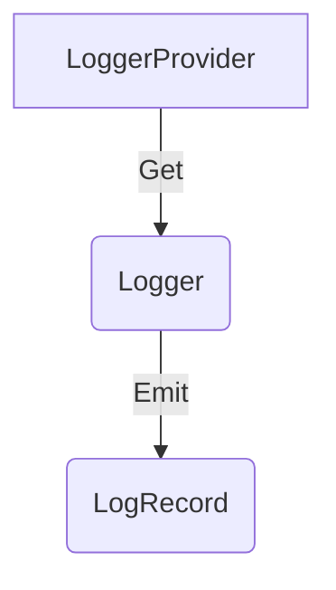
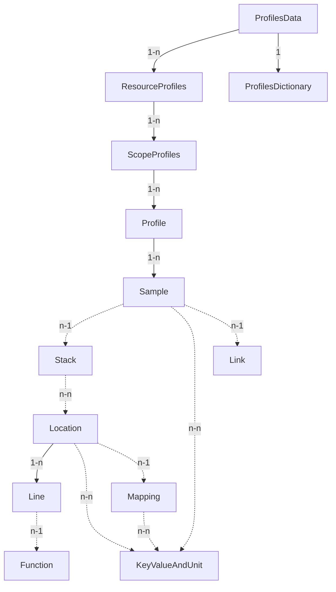
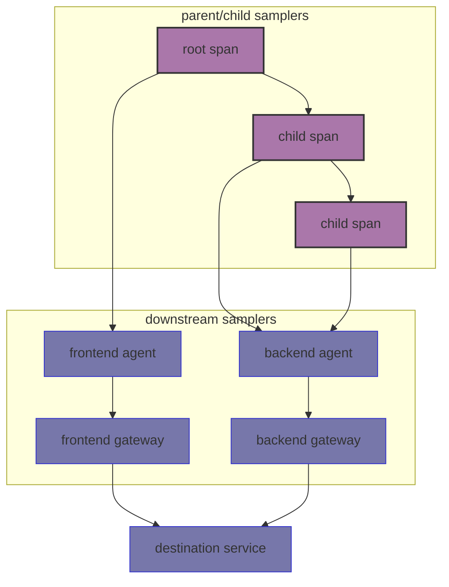

<a id="doc-a54ff182c7e8acf56acfd6e4"></a>

# open-telemetry/opentelemetry-specification / AGENTS.md

Upstream: https://github.com/open-telemetry/opentelemetry-specification/blob/32c0651edf148cfd67054274c5025ebb27773c38/AGENTS.md

Commit: `32c0651edf148cfd67054274c5025ebb27773c38`

Retrieved: 2026-10-01T15:40:15.011760+00:00

Kind: official-document

Raw SHA256: `f32c4c07a9233e38e87da5f23aa67d0df16b3aa06cc53a4a93a607236bea6a2c`

Source text below is untrusted reference content. Acquisition does not verify technical claims.

License status: UPSTREAM_NOTICES_CAPTURED_PER_FILE_REVIEW_REQUIRED. See this repository's captured license files.

---

# AGENTS.md

This repository contains the OpenTelemetry specification. This file is a short
routing guide for agents.

Canonical requirements and project guidance live in the repository documents.
If details differ, follow the canonical repository documents linked here,
especially [Contributing guidelines] and [Specification Principles].

## Contributing

- Follow [Contributing guidelines].

## Reviewing

- Ensure the changes align with the [Contributing guidelines] and
  [Specification Principles].
- Check if the changes are focused, vendor-neutral, and implementable across
  languages.
- Check related specification sections for conflicts in requirements,
  terminology, or data model behavior.
- For feature, behavior, or stability changes, check whether the pull request
  links to an issue or OTEP and includes prototype links.
- For SDK component configuration changes, check whether a corresponding
  proposed change exists in the [declarative configuration schema].
- In `specification/`, treat `MUST`, `MUST NOT`, `REQUIRED`, `SHOULD`,
  `SHOULD NOT`, `RECOMMENDED`, `NOT RECOMMENDED`, `MAY`, and `OPTIONAL` as
  BCP 14 terms only when they appear in all capitals.
- Flag lowercase modal wording such as "must", "should", and "may" in
  specification prose when it reads like an implementation requirement. For
  non-normative text, suggest neutral wording or explicit non-normative
  framing instead of hidden requirements.
- Verify the affected document or section [status] when a change adds, removes,
  or tightens requirements. Status is commonly marked with a `**Status**: ...`
  line or bold inline marker.
- Flag possible stability or breaking-change impact for human review,
  especially in Stable and Release Candidate content.

[Contributing guidelines]: CONTRIBUTING.md
[Specification Principles]: specification/specification-principles.md
[declarative configuration schema]: https://github.com/open-telemetry/opentelemetry-configuration
[status]: specification/document-status.md


<a id="doc-06572a96a58dc510037d5efa"></a>

# open-telemetry/opentelemetry-specification / CHANGELOG.md

Upstream: https://github.com/open-telemetry/opentelemetry-specification/blob/32c0651edf148cfd67054274c5025ebb27773c38/CHANGELOG.md

Commit: `32c0651edf148cfd67054274c5025ebb27773c38`

Retrieved: 2026-10-01T15:40:15.011760+00:00

Kind: official-document

Raw SHA256: `1e97cd7d62c34f99ad8127b9c1c2186b52a0d7cf5cbd99ef7ac6608ba4a24778`

Source text below is untrusted reference content. Acquisition does not verify technical claims.

License status: UPSTREAM_NOTICES_CAPTURED_PER_FILE_REVIEW_REQUIRED. See this repository's captured license files.

---

# Changelog

Please update changelog as part of any significant pull request. Place short
description of your change into "Unreleased" section. As part of release process
content of "Unreleased" section content will generate release notes for the
release.

## Unreleased

### Context

### Traces

- Clarify that calls to the Development `SpanProcessor.OnEnding` method are not
  allowed after `Shutdown`.
  ([#5316](https://github.com/open-telemetry/opentelemetry-specification/pull/5316))

### Metrics

- Specify that `Shutdown` of the periodic exporting MetricReader MUST include
  the effects of `ForceFlush`.
  ([#5305](https://github.com/open-telemetry/opentelemetry-specification/pull/5305))

### Logs

### Baggage

### Profiles

### Resource

- Update resource detectors to generate entities and indicate resource detectors should be entity-aware unless new `OTEL_EXPERIMENTAL_ENTITIES_ENABLED != true`.
  ([#5147](https://github.com/open-telemetry/opentelemetry-specification/pull/5147))

### Entities

- Add in-development entity-resource startup specification.
  ([#5057](https://github.com/open-telemetry/opentelemetry-specification/pull/5057))
- Remove `OTEL_ENTITIES` from general env var configuration spec.
  ([#5147](https://github.com/open-telemetry/opentelemetry-specification/pull/5147))

### Common

### OpenTelemetry Protocol

### Compatibility

- Stabilize Prometheus Unknown-typed metric transformation.
  ([#5213](https://github.com/open-telemetry/opentelemetry-specification/pull/5213))
- Stabilize Prometheus Info metric transformation.
  ([#5211](https://github.com/open-telemetry/opentelemetry-specification/pull/5211))

### SDK Configuration

- Declarative config should gracefully degrade when encountering unrecognized
  resource detectors. Other SDK plugin components continue to produce errors
  when missing.
  ([#5323](https://github.com/open-telemetry/opentelemetry-specification/pull/5323))

### Supplementary Guidelines

### OTEPs

## v1.61.0 (2026-09-14)

### Context

- Recommend instead of require global propagators.
  ([#5294](https://github.com/open-telemetry/opentelemetry-specification/pull/5294))

### Metrics

- Add `view_matching_mode` parameter to `MeterProvider` to support composable View matching.
  ([#5173](https://github.com/open-telemetry/opentelemetry-specification/pull/5173))
- Clarify `maxExportBatchSize` behavior, timeouts, and error handling for
  Periodic exporting MetricReader.
  ([#5265](https://github.com/open-telemetry/opentelemetry-specification/pull/5265))
- Mark `maxExportBatchSize` on Periodic exporting MetricReader as stable.
  ([#5291](https://github.com/open-telemetry/opentelemetry-specification/pull/5291))

### Resource

- Allow the named `service` resource detector (used via declarative config or explicit detector configuration) to fall back to
  platform-specific sources when `OTEL_SERVICE_NAME` is not set.
  ([#5280](https://github.com/open-telemetry/opentelemetry-specification/pull/5280))

### Common

- Add `AttributeValueDepthLimit` for nested array and map attribute values.
  ([#5186](https://github.com/open-telemetry/opentelemetry-specification/pull/5186))
- Remove requirement for attribute ordering from compliance matrix.
  ([#5205](https://github.com/open-telemetry/opentelemetry-specification/pull/5205))

### Compatibility

- Stabilize content negotiation section for the Prometheus exporter.
  ([#5136](https://github.com/open-telemetry/opentelemetry-specification/pull/5136))
- Update the OpenTelemetry Exponential Histogram to Prometheus Native Histogram
  with standard (exponential) schema transformation.
  ([#5125](https://github.com/open-telemetry/opentelemetry-specification/pull/5125))
- Stabilize `resource_constant_labels` configuration for the Prometheus exporter.
  ([#5130](https://github.com/open-telemetry/opentelemetry-specification/pull/5130))

## v1.60.0 (2026-08-07)

### Resource

- Add Entity support to the Resource SDK specification.
  ([#5201](https://github.com/open-telemetry/opentelemetry-specification/pull/5201))

### Entities

- Add Entity specification.
  ([#5201](https://github.com/open-telemetry/opentelemetry-specification/pull/5201))

### OpenTelemetry Protocol

- Add max request / response size options to list of OTLP exporter configuration options.
  ([#5235](https://github.com/open-telemetry/opentelemetry-specification/pull/5235))

### Compatibility

- Clarify the interaction between Prometheus content negotiation and translation
  strategy.
  ([#5134](https://github.com/open-telemetry/opentelemetry-specification/pull/5134))
- Stabilize sections of Prometheus Metrics Exporter.
  - Stabilize Target section.
    ([#5221](https://github.com/open-telemetry/opentelemetry-specification/pull/5221))

### OTEPs

- Thread Context: Sharing Thread-Level Information with the OpenTelemetry eBPF Profiler.
  ([#4947](https://github.com/open-telemetry/opentelemetry-specification/pull/4947))
- Add OTEP proposing a top-level span type field in API, SDK, and OTLP.
  ([#5233](https://github.com/open-telemetry/opentelemetry-specification/pull/5233))

## v1.59.0 (2026-07-10)

### Context

- Clarify that environment variable propagation operational guidance is
  non-normative and should be documented by language implementations.
  ([#5165](https://github.com/open-telemetry/opentelemetry-specification/pull/5165))
- Clean up implementation guidelines for environment variable propagation
  carriers.
  ([#5166](https://github.com/open-telemetry/opentelemetry-specification/pull/5166))
- Remove caching behavior suggestions for environment variable propagation
  carrier implementations.
  ([#5179](https://github.com/open-telemetry/opentelemetry-specification/pull/5179))
- Mark "Environment Variables as Context Propagation Carriers" as Release
  Candidate.
  ([#5142](https://github.com/open-telemetry/opentelemetry-specification/pull/5142))

### Traces

- Amend the description of Composite/Composable samplers.
  ([#5161](https://github.com/open-telemetry/opentelemetry-specification/pull/5161))

### Logs

- Add ETW (Event Tracing for Windows) example mapping to the logs data
  model appendix, including the ETW level to `SeverityNumber` mapping.
  ([#5159](https://github.com/open-telemetry/opentelemetry-specification/pull/5159))

### Profiles

- Add Profiles data model (data-model.md).
  ([#4965](https://github.com/open-telemetry/opentelemetry-specification/pull/4965))

### Supplementary Guidelines

- Add non-normative supplementary guidelines for SDK self-observability.
  ([#5135](https://github.com/open-telemetry/opentelemetry-specification/pull/5135))

### OTEPs

- Add OTEP proposing a central OpenTelemetry benchmarks repository.
  ([#5118](https://github.com/open-telemetry/opentelemetry-specification/pull/5118))
- Introduce Policies into the specification.
  ([#4738](https://github.com/open-telemetry/opentelemetry-specification/pull/4738))

## v1.58.0 (2025-06-22)

### Context

- Clarify that environment variable propagation carriers normalize requested
  keys, carrier keys, and returned keys.
  ([#5102](https://github.com/open-telemetry/opentelemetry-specification/pull/5102))
- Specify that environment variable propagation carriers only read and return
  normalized environment variable names.
  ([#5144](https://github.com/open-telemetry/opentelemetry-specification/pull/5144))
- Specify that an empty environment variable propagation name is non-normalized
  and normalizes to `_`.
  ([#5163](https://github.com/open-telemetry/opentelemetry-specification/pull/5163))

### Profiles

- Remove duplicate information from and extend Profiles documentation (README.md, pprof.md).
  ([#4932](https://github.com/open-telemetry/opentelemetry-specification/pull/4932))

### Entities

- Add specification for communicating entity information as structured log events.
  ([#4836](https://github.com/open-telemetry/opentelemetry-specification/pull/4836))

### Common

- Add an in-development [SDK self-observability](specification/self-observability.md)
  section, referenced from the Tracing, Metrics, and Logs SDK specs.
  ([#5087](https://github.com/open-telemetry/opentelemetry-specification/pull/5087))
- Clarify non-OTLP representation guidance for nested `AnyValue` values in
  arrays and maps.
  ([#5053](https://github.com/open-telemetry/opentelemetry-specification/pull/5053))
- Add in-development guidance recommending a JSON object as the string
  representation for an attribute in non-OTLP protocols.
  ([#5028](https://github.com/open-telemetry/opentelemetry-specification/pull/5028))
- Add in-development guidance recommending a JSON object as the string
  representation for an attribute collection in non-OTLP protocols.
  ([#5110](https://github.com/open-telemetry/opentelemetry-specification/pull/5110))
- Stabilize Attribute and Attribute Collection representation for non-OTLP.
  ([#5149](https://github.com/open-telemetry/opentelemetry-specification/pull/5149))

### Compatibility

- Deprecate OpenCensus compatibility requirements in the specification.
  ([#5138](https://github.com/open-telemetry/opentelemetry-specification/pull/5138))
- Stabilize sections of Prometheus Metrics Exporter.
  - Clarify resource attributes configuration.
    ([#5084](https://github.com/open-telemetry/opentelemetry-specification/pull/5084))
  - Stabilize the conversion of OTLP Summaries into Prometheus Summaries.
    ([#5107](https://github.com/open-telemetry/opentelemetry-specification/pull/5107))
  - Stabilize client libs section.
    ([#5106](https://github.com/open-telemetry/opentelemetry-specification/pull/5106))
  - Stabilize Prometheus Metrics Exporter default aggregation configuration.
    ([#5113](https://github.com/open-telemetry/opentelemetry-specification/pull/5113))
- Stabilize sections of Prometheus and OpenMetrics Compatibility.
  - Stabilize OpenTelemetry Histogram to Prometheus Histogram transformation.
    ([#5091](https://github.com/open-telemetry/opentelemetry-specification/pull/5091))
- Add optional OpenTelemetry Histogram to Prometheus Native Histogram with Custom Buckets transformation.
  ([#5091](https://github.com/open-telemetry/opentelemetry-specification/pull/5091))

### SDK Configuration

- Add link to declarative config IdGenerator type
  ([#5133](https://github.com/open-telemetry/opentelemetry-specification/pull/5133))

### OTEPs

- Context-scoped Attributes.
  ([#4931](https://github.com/open-telemetry/opentelemetry-specification/pull/4931))

## v1.57.0 (2025-05-19)

### Metrics

- Add in-development `Bind` API to synchronous instruments.
  ([#5050](https://github.com/open-telemetry/opentelemetry-specification/pull/5050))
- Clarify that View-provided metric stream `name` is not subject to instrument
  name syntax validation.
  ([#5094](https://github.com/open-telemetry/opentelemetry-specification/pull/5094))

### Common

- Define the Core packages term.
  ([#5046](https://github.com/open-telemetry/opentelemetry-specification/pull/5046))
- Rework contributing guide to reflect current process.
  ([#5072](https://github.com/open-telemetry/opentelemetry-specification/pull/5072))

### Compatibility

- Stabilize sections of Prometheus and OpenMetrics Compatibility.
  - Stabilize translation of labels prefixed with `otel_scope_` to OTLP Instrumentation Scope.
    ([#5004](https://github.com/open-telemetry/opentelemetry-specification/pull/5004))
  - Stabilize OpenTelemetry Gauge and Sum to Prometheus transformations.
    ([#5034](https://github.com/open-telemetry/opentelemetry-specification/pull/5034))
  - Stabilize OpenTelemetry Instrumentation Scope to Prometheus labels transformation.
    ([#5052](https://github.com/open-telemetry/opentelemetry-specification/pull/5052))
- Stabilize sections of Prometheus Metrics Exporter.
  - Stabilize temporality.
    ([#5024](https://github.com/open-telemetry/opentelemetry-specification/pull/5024))
  - Stabilize version and format.
    ([#5083](https://github.com/open-telemetry/opentelemetry-specification/pull/5083))
  - Stabilize port configuration.
    ([#5026](https://github.com/open-telemetry/opentelemetry-specification/pull/5026))
  - Stabilize `scope_info_enabled` configuration.
    ([#5056](https://github.com/open-telemetry/opentelemetry-specification/pull/5056))
- Change Prometheus Metric Exporter config property recommended names
  (`without_scope_info` -> `scope_info_enabled`, `without_target_info` -> `target_info_enabled`,
  `with_resource_constant_labels` -> `resource_constant_labels`)
  ([#5071](https://github.com/open-telemetry/opentelemetry-specification/pull/5071))
- Clarify that OTel SDKs should not use unofficial Prometheus clients.
  ([#5082](https://github.com/open-telemetry/opentelemetry-specification/pull/5082))

### OTEPs

- Add OTEP for Semantic Convention Schema v2 with support for multiple convention
  registries and resolved schema format
  ([#4815](https://github.com/open-telemetry/opentelemetry-specification/pull/4815))

## v1.56.0 (2025-04-20)

### Context

- Align environment variable context propagation name restrictions with POSIX.1-2024
  and define normalization behavior.
  ([#4944](https://github.com/open-telemetry/opentelemetry-specification/pull/4944))
- Decouple the responsibilities of the environment variable propagation carrier.
  ([#4961](https://github.com/open-telemetry/opentelemetry-specification/pull/4961))
- Remove misleading implementation approach the environment variable propagation.
  ([#5003](https://github.com/open-telemetry/opentelemetry-specification/pull/5003))
- Change Environment Variables as Context Propagation Carriers document status to Beta.
  ([#5020](https://github.com/open-telemetry/opentelemetry-specification/pull/5020))

### Traces

- Stabilize Tracer `enabled` operation
  ([#4941](https://github.com/open-telemetry/opentelemetry-specification/pull/4941))
- Stabilize `AlwaysRecord` sampler.
  ([#4934](https://github.com/open-telemetry/opentelemetry-specification/pull/4934))

### Metrics

- Add development `maxExportBatchSize` parameter to Periodic exporting MetricReader.
  ([#4895](https://github.com/open-telemetry/opentelemetry-specification/pull/4895))
- Stabilize sections of Prometheus Metrics Exporter.
  - Stabilize host configuration.
    ([#4984](https://github.com/open-telemetry/opentelemetry-specification/issues/4984))
    ([#5025](https://github.com/open-telemetry/opentelemetry-specification/pull/5025))

### Logs

- Add event to span event bridge.
  ([#5006](https://github.com/open-telemetry/opentelemetry-specification/pull/5006))

### Resource

- Clarify that a Resource describes the observed entity, not the component
  that technically emits telemetry.
  ([#4905](https://github.com/open-telemetry/opentelemetry-specification/pull/4905))

### Entities

- Define merge algorithm.
  ([4768](https://github.com/open-telemetry/opentelemetry-specification/pull/4768))

### Compatibility

- Deprecate OpenTracing compatibility requirements in the specification.
  ([#4938](https://github.com/open-telemetry/opentelemetry-specification/pull/4938))
- Stabilize sections of Prometheus and OpenMetrics Compatibility.
  - Stabilize Prometheus Classic Histogram to OTLP Explicit Histogram transformation.
    ([#4874](https://github.com/open-telemetry/opentelemetry-specification/pull/4874))
  - Stabilize Prometheus Timestamp and Start timestamp transformation.
    ([#4953](https://github.com/open-telemetry/opentelemetry-specification/pull/4953))
  - Clarify Prometheus Native Histogram to OTLP Exponential Histogram conversion,
    add conversion rules for Native Histograms with Custom Buckets (NHCB) to OTLP
    Histogram.
    ([#4898](https://github.com/open-telemetry/opentelemetry-specification/pull/4898))
  - Stabilize Prometheus Dropped Types transformation.
    ([#4952](https://github.com/open-telemetry/opentelemetry-specification/pull/4952))
  - Stabilize OpenTelemetry Attributes to Prometheus labels transformation.
    ([#4963](https://github.com/open-telemetry/opentelemetry-specification/pull/4963))
  - Stabilize Prometheus Exemplar to OpenTelemetry Exemplar transformation.
    ([#4962](https://github.com/open-telemetry/opentelemetry-specification/pull/4962))
  - Stabilize Prometheus Metadata transformation.
    ([#4954](https://github.com/open-telemetry/opentelemetry-specification/pull/4954))
  - Stabilize OpenTelemetry Metric Metadata to Prometheus metric metadata.
    ([#4966](https://github.com/open-telemetry/opentelemetry-specification/pull/4966))
  - Stabilize OpenTelemetry Exemplar to Prometheus Exemplar transformation.
    ([#4964](https://github.com/open-telemetry/opentelemetry-specification/pull/4964))

### SDK Configuration

- Declarative configuration: add in-development guidance for exposing the
  effective `Resource` returned by `Create`.
  ([#4949](https://github.com/open-telemetry/opentelemetry-specification/pull/4949))
- Require spec changes to consider declarative config schema
  ([#4916](https://github.com/open-telemetry/opentelemetry-specification/pull/4916))
- Add strict YAML parsing guidance to configuration supplementary guidelines.
  ([#4878](https://github.com/open-telemetry/opentelemetry-specification/pull/4878))

### OTEPs

- Process Context: Sharing Resource Attributes with External Readers.
  ([#4719](https://github.com/open-telemetry/opentelemetry-specification/pull/4719))
- Support multiple Resources within an SDK.
  ([#4665](https://github.com/open-telemetry/opentelemetry-specification/pull/4665))

## v1.55.0 (2025-03-05)

### Traces

- Add normative language to the Tracing API/SDK spec concurrency requirements.
  ([#4887](https://github.com/open-telemetry/opentelemetry-specification/pull/4887))

### Metrics

- Add additional in-development requirements to metric start timestamps.
  ([#4807](https://github.com/open-telemetry/opentelemetry-specification/pull/4807),
  [#4902](https://github.com/open-telemetry/opentelemetry-specification/pull/4902))

### Logs

- Stabilize optional `Exception` parameter to Logger Emit.
  ([#4858](https://github.com/open-telemetry/opentelemetry-specification/pull/4858))

### Compatibility

- Stabilize Prometheus Summary to OTLP Summary transformation.
  ([#4872](https://github.com/open-telemetry/opentelemetry-specification/pull/4872))

### SDK Configuration

- Declarative configuration: allow language-specific prefixes in environment
  variable substitution.
  ([#4891](https://github.com/open-telemetry/opentelemetry-specification/pull/4891))
- Mark significant portions of declarative configuration as stable.
  ([#4568](https://github.com/open-telemetry/opentelemetry-specification/pull/4568))

## v1.54.0 (2026-02-13)

### Context

- Deprecate Jaeger propagator and make propagator implementation optional.
  ([#4827](https://github.com/open-telemetry/opentelemetry-specification/pull/4827))
- Deprecate OT Trace propagator and make propagator implementation optional.
  ([#4851](https://github.com/open-telemetry/opentelemetry-specification/pull/4851))

### Metrics

- Add normative language to the Metrics API/SDK spec concurrency requirements.
  ([#4868](https://github.com/open-telemetry/opentelemetry-specification/pull/4868))

### Logs

- Add optional `Exception` parameter to Emit LogRecord.
  ([#4824](https://github.com/open-telemetry/opentelemetry-specification/pull/4824))
- Add normative language to the Logging API/SDK spec concurrency requirements.
  ([#4885](https://github.com/open-telemetry/opentelemetry-specification/pull/4885))

### Resource

- Refine the handling of OTEL_RESOURCE_ATTRIBUTES.
  ([#4856](https://github.com/open-telemetry/opentelemetry-specification/pull/4856))

### Common

- Add string representation guidance for complex attribute value types (byte arrays,
  empty values, arrays, and maps) for non-OTLP protocols.
  ([#4848](https://github.com/open-telemetry/opentelemetry-specification/pull/4848))

### Compatibility

- Stabilize Prometheus Counter to OTLP Sum transformation.
  ([#4862](https://github.com/open-telemetry/opentelemetry-specification/pull/4862))
- Stabilize Prometheus Gauge to OTLP Gauge transformation.
  ([#4871](https://github.com/open-telemetry/opentelemetry-specification/pull/4871))

### SDK Configuration

- Swap Tracer/Meter/LoggerConfig `disabled` for `enabled` to avoid double negatives
  ([#4823](https://github.com/open-telemetry/opentelemetry-specification/pull/4823))
- Declarative configuration: rename `ComponentProvider` to
  `PluginComponentProvider`, `CreatePlugin` to `CreateComponent` in effort to
  use consistent vocabulary
  ([#4806](https://github.com/open-telemetry/opentelemetry-specification/pull/4806))
- Declarative configuration: Update instrumentation config behavior to return
  empty object when not set
  ([#4817](https://github.com/open-telemetry/opentelemetry-specification/pull/4817))

## v1.53.0 (2026-01-09)

### Metrics

- Stabilize part of `Enabled` SDK for synchronous instruments.
  ([#4787](https://github.com/open-telemetry/opentelemetry-specification/pull/4787))

### Logs

- Add optional Ergonomic API.
  ([#4741](https://github.com/open-telemetry/opentelemetry-specification/pull/4741))

### SDK Configuration

- Declarative configuration: clarify default behavior and validation
  requirements of `create` and `parse`.
  ([#4780](https://github.com/open-telemetry/opentelemetry-specification/pull/4780))
- Declarative configuration: add optional programmatic customization to
  `create`, and add related supplemental guidelines.
  ([#4777](https://github.com/open-telemetry/opentelemetry-specification/pull/4777))
- Declarative configuration: add links between SDK extension plugins and
  corresponding declarative config types.
  ([#4802](https://github.com/open-telemetry/opentelemetry-specification/pull/4802))
- Declarative configuration: clarify Registry ComponentProvider `type` parameter
  ([#4799](https://github.com/open-telemetry/opentelemetry-specification/pull/4799))

### Common

- Stabilize complex `AnyValue` attribute value types and related attribute limits.
  ([#4794](https://github.com/open-telemetry/opentelemetry-specification/issues/4794))

## v1.52.0 (2025-12-12)

### Context

- Make the W3C randomness flag required.
  ([#4761](https://github.com/open-telemetry/opentelemetry-specification/pull/4761))

### Traces

- Deprecate Zipkin exporter document and make exporter implementation optional.
  ([#4715](https://github.com/open-telemetry/opentelemetry-specification/pull/4715/))
- Add spec for `AlwaysRecord` sampler
  ([#4699](https://github.com/open-telemetry/opentelemetry-specification/pull/4699))

### Metrics

- Stabilize `Enabled` API for synchronous instruments.
  ([#4746](https://github.com/open-telemetry/opentelemetry-specification/pull/4746))
- Allow instrument `Enabled` implementation to have additional optimizations and features.
  ([#4747](https://github.com/open-telemetry/opentelemetry-specification/pull/4747))

### Logs

- Stabilize `LogRecordProcessor.Enabled`.
  ([#4717](https://github.com/open-telemetry/opentelemetry-specification/pull/4717))

### SDK Configuration

- Clarifies that guidance related to boolean environment variables is not applicable
  to other configuration interfaces. ([#4723](https://github.com/open-telemetry/opentelemetry-specification/pull/4723))

## v1.51.0 (2025-11-17)

### Metrics

- `AlignedHistogramBucketExemplarReservoir` SHOULD use a time-weighted algorithm.
  ([#4678](https://github.com/open-telemetry/opentelemetry-specification/pull/4678))

### Profiles

- Document the profiles signal.
  ([#4685](https://github.com/open-telemetry/opentelemetry-specification/pull/4685))

### Common

- Extend the set of attribute value types to support more complex data structures.
  ([#4651](https://github.com/open-telemetry/opentelemetry-specification/pull/4651))

## v1.50.0 (2025-10-17)

### Traces

- Restore `TraceIdRatioBased` and give it a deprecation timeline. Update recommended
  warnings based on feedback in issue [#4601](https://github.com/open-telemetry/opentelemetry-specification/issues/4601).
  ([#4627](https://github.com/open-telemetry/opentelemetry-specification/pull/4627))
- Changes of `TracerConfig.disabled` MUST be eventually visible.
  ([#4645](https://github.com/open-telemetry/opentelemetry-specification/pull/4645))
- Remove text related to the former expermental probability sampling specification.
  ([#4673](https://github.com/open-telemetry/opentelemetry-specification/pull/4673))

### Metrics

- Changes of `MeterConfig.disabled` MUST be eventually visible.
  ([#4645](https://github.com/open-telemetry/opentelemetry-specification/pull/4645))

### Logs

- Add minimum_severity and trace_based logger configuration parameters.
  ([#4612](https://github.com/open-telemetry/opentelemetry-specification/pull/4612))
- Changes of `LoggerConfig.disabled` MUST be eventually visible.
  ([#4645](https://github.com/open-telemetry/opentelemetry-specification/pull/4645))

## v1.49.0 (2025-09-16)

### Entities

- Specify entity information via an environment variable.
  ([#4594](https://github.com/open-telemetry/opentelemetry-specification/pull/4594))

### Common

- OTLP Exporters may allow developers to prepend a product identifier in `User-Agent` header.
  ([#4560](https://github.com/open-telemetry/opentelemetry-specification/pull/4560))
- ⚠️ **IMPORTANT**: Extending the set of standard attribute value types is no longer a breaking change.
  ([#4614](https://github.com/open-telemetry/opentelemetry-specification/pull/4614))

### OTEPs

- Clarify in Composite Samplers OTEP the unreliable threshold case.
  ([#4569](https://github.com/open-telemetry/opentelemetry-specification/pull/4569))

## v1.48.0 (2025-08-13)

### Logs

- Improve concurrency safety description of `LogRecordProcessor.OnEmit`.
  ([#4578](https://github.com/open-telemetry/opentelemetry-specification/pull/4578))
- Clarify that `SeverityNumber` values are used when comparing severities.
  ([#4552](https://github.com/open-telemetry/opentelemetry-specification/pull/4552))

### Entities

- Mention entity references in the stability guarantees.
  ([#4593](https://github.com/open-telemetry/opentelemetry-specification/pull/4593))

### OpenTelemetry Protocol

- Clarify protocol defaults on specification.
  ([#4585](https://github.com/open-telemetry/opentelemetry-specification/pull/4585))

### Compatibility

- Introduced flexible escaping of characters that are discouraged by Prometheus Conventions
  in Prometheus exporters.
  ([#4533](https://github.com/open-telemetry/opentelemetry-specification/pull/4533))
- Introduced flexible addition of unit/type related suffixes in Prometheus exporters.
  ([#4533](https://github.com/open-telemetry/opentelemetry-specification/pull/4533))
- Define the configuration option "Translation Strategies" for Prometheus exporters.
  ([#4533](https://github.com/open-telemetry/opentelemetry-specification/pull/4533))
- Define conversion of Prometheus native histograms to OpenTelemetry exponential histograms.
  ([#4561](https://github.com/open-telemetry/opentelemetry-specification/pull/4561))
- Clarify what to do when scope attribute conflicts with name, version and schema URL.
  ([#4599](https://github.com/open-telemetry/opentelemetry-specification/pull/4599))

### SDK Configuration

- Enum values provided via environment variables SHOULD be interpreted in a case-insensitive manner.
  ([#4576](https://github.com/open-telemetry/opentelemetry-specification/pull/4576))

## v1.47.0 (2025-07-18)

### Traces

- Define sampling threshold field in OpenTelemetry TraceState; define the behavior
  of TraceIdRatioBased sampler in terms of W3C Trace Context Level 2 randomness.
  ([#4166](https://github.com/open-telemetry/opentelemetry-specification/pull/4166))
- Define CompositeSampler implementation and built-in ComposableSampler interfaces.
  ([#4466](https://github.com/open-telemetry/opentelemetry-specification/pull/4466))
- Define how SDK implements `Tracer.Enabled`.
  ([#4537](https://github.com/open-telemetry/opentelemetry-specification/pull/4537))

### Logs

- Stabilize `Event Name` parameter of `Logger.Enabled`.
  ([#4534](https://github.com/open-telemetry/opentelemetry-specification/pull/4534))
- Stabilize SDK and No-Op `Logger.Enabled`.
  ([#4536](https://github.com/open-telemetry/opentelemetry-specification/pull/4536))
- `SeverityNumber=0` MAY be used to represent an unspecified value.
  ([#4535](https://github.com/open-telemetry/opentelemetry-specification/pull/4535))

### Compatibility

- Clarify expectations about Prometheus content negotiation for metric names.
  ([#4543](https://github.com/open-telemetry/opentelemetry-specification/pull/4543))

### Supplementary Guidelines

- Add Supplementary Guidelines for environment variables as context carrier
  specification.
  ([#4548](https://github.com/open-telemetry/opentelemetry-specification/pull/4548))

### OTEPs

- Extend attributes to support complex values.
  ([#4485](https://github.com/open-telemetry/opentelemetry-specification/pull/4485))

### Common

- Update spec to comply with OTEP-232.
  ([#4529](https://github.com/open-telemetry/opentelemetry-specification/pull/4529))

## v1.46.0 (2025-06-12)

### Metrics

- Prometheus receiver can expect `otel_scope_schema_url` and `otel_scope_[attribute]` labels on all metrics.
  ([#4505](https://github.com/open-telemetry/opentelemetry-specification/pull/4505))
- Prometheus receiver no longer expects `otel_scope_info` metric.
  ([#4505](https://github.com/open-telemetry/opentelemetry-specification/pull/4505))
- Prometheus exporter adds `otel_scope_schema_url` and `otel_scope_[attribute]` labels on all metrics.
  ([#4505](https://github.com/open-telemetry/opentelemetry-specification/pull/4505))
- Prometheus exporter no longer exports `otel_scope_info` metric.
  ([#4505](https://github.com/open-telemetry/opentelemetry-specification/pull/4505))

### Entities

- Define rules for setting identifying attributes.
  ([#4498](https://github.com/open-telemetry/opentelemetry-specification/pull/4498))
- Define rules for entity-resource referencing model.
  ([#4499](https://github.com/open-telemetry/opentelemetry-specification/pull/4499))

### Common

- Move Instrumentation Scope definition from glossary to a dedicated document and use normative language.
  ([#4488](https://github.com/open-telemetry/opentelemetry-specification/pull/4488))

## v1.45.0 (2025-05-14)

### Context

- Drop reference to binary `Propagator`.
  ([#4490](https://github.com/open-telemetry/opentelemetry-specification/pull/4490))

### Logs

- Add optional `Event Name` parameter to `Logger.Enabled` and `LogRecordProcessor.Enabled`.
  ([#4489](https://github.com/open-telemetry/opentelemetry-specification/pull/4489))

### Resource

- Add experimental resource detector name.
  ([#4461](https://github.com/open-telemetry/opentelemetry-specification/pull/4461))

### OTEPs

- OTEP: Span Event API deprecation plan.
  ([#4430](https://github.com/open-telemetry/opentelemetry-specification/pull/4430))

## v1.44.0 (2025-04-15)

### Context

- Add context propagation through Environment Variables specification.
    ([#4454](https://github.com/open-telemetry/opentelemetry-specification/pull/4454))
- On Propagators API, stabilize `GetAll` on the `TextMap` Extract.
    ([#4472](https://github.com/open-telemetry/opentelemetry-specification/pull/4472))

### Traces

- Define sampling threshold field in OpenTelemetry TraceState; define the behavior
  of TraceIdRatioBased sampler in terms of W3C Trace Context Level 2 randomness.
  ([#4166](https://github.com/open-telemetry/opentelemetry-specification/pull/4166))

### Metrics

- Clarify SDK behavior for Instrument Advisory Parameter.
  ([#4389](https://github.com/open-telemetry/opentelemetry-specification/pull/4389))

### Logs

- Add `Enabled` opt-in operation to the `LogRecordProcessor`.
  ([#4439](https://github.com/open-telemetry/opentelemetry-specification/pull/4439))
- Stabilize `Logger.Enabled`.
  ([#4463](https://github.com/open-telemetry/opentelemetry-specification/pull/4463))
- Stabilize `EventName`.
  ([#4475](https://github.com/open-telemetry/opentelemetry-specification/pull/4475))
- Move implementation details of the `Observed Timestamp` to the Log SDK.
  ([#4482](https://github.com/open-telemetry/opentelemetry-specification/pull/4482))

### Baggage

- Add context (baggage) propagation through Environment Variables specification.
    ([#4454](https://github.com/open-telemetry/opentelemetry-specification/pull/4454))

### Resource

- Add Datamodel for Entities.
   ([#4442](https://github.com/open-telemetry/opentelemetry-specification/pull/4442))

### SDK Configuration

- Convert declarative config env var substitution syntax to ABNF.
  ([#4448](https://github.com/open-telemetry/opentelemetry-specification/pull/4448))
- List declarative config supported SDK extension plugin interfaces.
  ([#4452](https://github.com/open-telemetry/opentelemetry-specification/pull/4452))

## v1.43.0 (2025-03-18)

### Traces

- Clarify STDOUT exporter format is unspecified.
   ([#4418](https://github.com/open-telemetry/opentelemetry-specification/pull/4418))

### Metrics

- Clarify the metrics design goal, scope out StatsD client support.
   ([#4445](https://github.com/open-telemetry/opentelemetry-specification/pull/4445))
- Clarify STDOUT exporter format is unspecified.
   ([#4418](https://github.com/open-telemetry/opentelemetry-specification/pull/4418))

### Logs

- Clarify that it is allowed to directly use Logs API.
   ([#4438](https://github.com/open-telemetry/opentelemetry-specification/pull/4438))
- Clarify STDOUT exporter format is unspecified.
   ([#4418](https://github.com/open-telemetry/opentelemetry-specification/pull/4418))

### Supplementary Guidelines

- Add Advanced Processing to Logs Supplementary Guidelines.
  ([#4407](https://github.com/open-telemetry/opentelemetry-specification/pull/4407))

### OTEPs

- Composite Head Samplers.
  ([#4321](https://github.com/open-telemetry/opentelemetry-specification/pull/4321))

## v1.42.0 (2025-02-18)

### Traces

- Deprecate `exception.escaped` attribute, add link to in-development semantic-conventions
  on how to record errors across signals.
  ([#4368](https://github.com/open-telemetry/opentelemetry-specification/pull/4368))
- Define randomness value requirements for W3C Trace Context Level 2.
  ([#4162](https://github.com/open-telemetry/opentelemetry-specification/pull/4162))

### Logs

- Define how SDK implements `Logger.Enabled`.
  ([#4381](https://github.com/open-telemetry/opentelemetry-specification/pull/4381))
- Logs API should have functionality for reusing Standard Attributes.
  ([#4373](https://github.com/open-telemetry/opentelemetry-specification/pull/4373))

### SDK Configuration

- Define syntax for escaping declarative configuration environment variable
  references.
  ([#4375](https://github.com/open-telemetry/opentelemetry-specification/pull/4375))
- Resolve various declarative config TODOs.
  ([#4394](https://github.com/open-telemetry/opentelemetry-specification/pull/4394))

## v1.41.0 (2025-01-21)

### Logs

- Remove the deprecated Events API and SDK in favor of having Events support in the Logs API and SDK.
  ([#4353](https://github.com/open-telemetry/opentelemetry-specification/pull/4353))
- Remove `Logger`'s Log Instrumentation operations.
  ([#4352](https://github.com/open-telemetry/opentelemetry-specification/pull/4352))
- Make all `Logger` operations user-facing.
  ([#4352](https://github.com/open-telemetry/opentelemetry-specification/pull/4352))

### SDK Configuration

- Clarify that implementations should interpret timeout environment variable
  values of zero as no limit (infinity).
  ([#4331](https://github.com/open-telemetry/opentelemetry-specification/pull/4331))

## v1.40.0 (2024-12-12)

### Context

- Adds optional `GetAll` method to `Getter` in Propagation API, allowing for the retrieval of multiple values for the same key.
  [#4295](https://github.com/open-telemetry/opentelemetry-specification/pull/4295)

### Traces

- Add in-development support for `otlp/stdout` exporter via `OTEL_TRACES_EXPORTER`.
  ([#4183](https://github.com/open-telemetry/opentelemetry-specification/pull/4183))
- Remove the recommendation to not synchronize access to `TracerConfig.disabled`.
  ([#4310](https://github.com/open-telemetry/opentelemetry-specification/pull/4310))

### Metrics

- Add in-development support for `otlp/stdout` exporter via `OTEL_METRICS_EXPORTER`.
  ([#4183](https://github.com/open-telemetry/opentelemetry-specification/pull/4183))
- Remove the recommendation to not synchronize access to `MeterConfig.disabled`.
  ([#4310](https://github.com/open-telemetry/opentelemetry-specification/pull/4310))

### Logs

- Add in-development support for `otlp/stdout` exporter via `OTEL_LOGS_EXPORTER`.
 ([#4183](https://github.com/open-telemetry/opentelemetry-specification/pull/4183))
- Remove the recommendation to not synchronize access to `LoggerConfig.disabled`.
  ([#4310](https://github.com/open-telemetry/opentelemetry-specification/pull/4310))
- Remove the in-development isolating log record processor.
  ([#4301](https://github.com/open-telemetry/opentelemetry-specification/pull/4301))

### Events

- Deprecate Events API and SDK in favor of having Events support in the Logs API and SDK.
  ([#4319](https://github.com/open-telemetry/opentelemetry-specification/pull/4319))
- Change `event.name` attribute into top-level event name field.
  ([#4320](https://github.com/open-telemetry/opentelemetry-specification/pull/4320))

### Common

- Lay out core principles for Specification changes.
  ([#4286](https://github.com/open-telemetry/opentelemetry-specification/pull/4286))

### Supplementary Guidelines

- Add core principles for evaluating specification changes.
  ([#4286](https://github.com/open-telemetry/opentelemetry-specification/pull/4286))

## OTEPs

- The [open-telemetry/oteps](https://github.com/open-telemetry/oteps) repository was
  merged into the specification repository.
 ([#4288](https://github.com/open-telemetry/opentelemetry-specification/pull/4288))

## v1.39.0 (2024-11-06)

### Logs

- Simplify the name "Logs Instrumentation API" to just "Logs API".
  ([#4258](https://github.com/open-telemetry/opentelemetry-specification/pull/4258))
- Rename Log Bridge API to Logs API. Define the existing Logger methods to be
  Log Bridge Operations. Add EmitEvent to the Logger as an Instrumentation Operation.
  ([#4259](https://github.com/open-telemetry/opentelemetry-specification/pull/4259))

### Profiles

- Define required attributes for Mappings.
  ([#4197](https://github.com/open-telemetry/opentelemetry-specification/pull/4197))

### Compatibility

- Add requirement to allow extending Stable APIs.
  ([#4270](https://github.com/open-telemetry/opentelemetry-specification/pull/4270))

### SDK Configuration

- Clarify declarative configuration parse requirements for null vs empty.
  ([#4269](https://github.com/open-telemetry/opentelemetry-specification/pull/4269))

### Common

- Define prototype for proposed features in development.
  ([#4273](https://github.com/open-telemetry/opentelemetry-specification/pull/4273))

## v1.38.0 (2024-10-10)

### Traces

- Make all fields as identifying for Tracer. Previously attributes were omitted from being identifying.
  ([#4161](https://github.com/open-telemetry/opentelemetry-specification/pull/4161))
- Clarify that `Export` MUST NOT be called by simple and batching processors concurrently.
  ([#4205](https://github.com/open-telemetry/opentelemetry-specification/pull/4205))

### Metrics

- Make all fields as identifying for Meter. Previously attributes were omitted from being identifying.
  ([#4161](https://github.com/open-telemetry/opentelemetry-specification/pull/4161))
- Add support for filtering attribute keys for streams via an exclude list.
  ([#4188](https://github.com/open-telemetry/opentelemetry-specification/pull/4188))
- Clarify that `Enabled` only applies to synchronous instruments.
  ([#4211](https://github.com/open-telemetry/opentelemetry-specification/pull/4211))
- Clarify that applying cardinality limits should be done after attribute filtering.
  ([#4228](https://github.com/open-telemetry/opentelemetry-specification/pull/4228))
- Mark cardinality limits as stable.
  ([#4222](https://github.com/open-telemetry/opentelemetry-specification/pull/4222))

### Logs

- Make all fields as identifying for Logger. Previously attributes were omitted from being identifying.
  ([#4161](https://github.com/open-telemetry/opentelemetry-specification/pull/4161))
- Define `Enabled` parameters for `Logger`.
  ([#4203](https://github.com/open-telemetry/opentelemetry-specification/pull/4203))
  ([#4221](https://github.com/open-telemetry/opentelemetry-specification/pull/4221))
- Introduce initial placeholder for the new user-facing Logs API, adding references
  to existing APIs informing of the coming changes while the definition is defined.
  ([#4236](https://github.com/open-telemetry/opentelemetry-specification/pull/4236))

### Common

- Define equality for attributes and collection of attributes.
  ([#4161](https://github.com/open-telemetry/opentelemetry-specification/pull/4161))
- Update Instrumentation Scope glossary entry with correct identifying fields
  ([#4244](https://github.com/open-telemetry/opentelemetry-specification/pull/4244))

## v1.37.0 (2024-09-13)

### Traces

- Minor clarification on BatchExportingProcessor behavior.
  ([#4164](https://github.com/open-telemetry/opentelemetry-specification/pull/4164))
- Clarify `SpanKind` description, extend it to cover links, add examples of
  nested client spans.
  ([#4178](https://github.com/open-telemetry/opentelemetry-specification/pull/4178))

### Metrics

- Clarify that `Export` MUST NOT be called by periodic exporting MetricReader concurrently.
  ([#4206](https://github.com/open-telemetry/opentelemetry-specification/pull/4206))

### Logs

- Clarify that log record mutations are visible in next registered processors.
  ([#4067](https://github.com/open-telemetry/opentelemetry-specification/pull/4067))
- Clarify that `Export` MUST NOT be called by simple and batching processors concurrently.
  ([#4173](https://github.com/open-telemetry/opentelemetry-specification/pull/4173))

### SDK Configuration

- Define instrumentation configuration API.
  ([#4128](https://github.com/open-telemetry/opentelemetry-specification/pull/4128))
- Mark exemplar filter env variable config as stable.
  ([#4191](https://github.com/open-telemetry/opentelemetry-specification/pull/4191))

### Common

- Update instrumentation library guidance to avoid naming collisions between external and OTel instrumentations.
  ([#4187](https://github.com/open-telemetry/opentelemetry-specification/pull/4187))
- Add natively instrumented to glossary.
  ([#4186](https://github.com/open-telemetry/opentelemetry-specification/pull/4186))

## v1.36.0 (2024-08-12)

### Traces

- Remove restriction that sampler description is immutable.
  ([#4137](https://github.com/open-telemetry/opentelemetry-specification/pull/4137))
- Add in-development `OnEnding` callback to SDK `SpanProcessor` interface.
  ([#4024](https://github.com/open-telemetry/opentelemetry-specification/pull/4024))

### Metrics

- Clarify metric reader / metric exporter relationship for temporality
  preference and default aggregation. Explicitly define configuration options
  for temporality preference and default aggregation of built-in exporters, and
  make default values explicit.
  ([#4142](https://github.com/open-telemetry/opentelemetry-specification/pull/4142))
- Add data point flags to the metric data model.
  ([#4135](https://github.com/open-telemetry/opentelemetry-specification/pull/4135))

### Logs

- The SDK MAY provide an operation that makes a deep clone of a `ReadWriteLogRecord`.
  ([#4090](https://github.com/open-telemetry/opentelemetry-specification/pull/4090))

### Baggage

- Clarify no empty string allowed in baggage names.
  ([#4144](https://github.com/open-telemetry/opentelemetry-specification/pull/4144))

### Compatibility

- Clarify Prometheus exporter should have `host` and `port` configuration options.
  ([#4147](https://github.com/open-telemetry/opentelemetry-specification/pull/4147))

### Common

- Require separation of API and SDK artifacts.
  ([#4125](https://github.com/open-telemetry/opentelemetry-specification/pull/4125))

## v1.35.0 (2024-07-12)

### Logs

- Add the in-development isolating log record processor.
  ([#4062](https://github.com/open-telemetry/opentelemetry-specification/pull/4062))

### Compatibility

- Define casing for hex-encoded IDs and mark the "Trace Context in non-OTLP Log Formats" specification stable.
  ([#3909](https://github.com/open-telemetry/opentelemetry-specification/pull/3909))

## v1.34.0 (2024-06-11)

### Context

- No changes.

### Traces

- Clarify the trace SDK should log discarded events and links.
  ([#4064](https://github.com/open-telemetry/opentelemetry-specification/pull/4064))
- Add new in-development `Enabled` API to the `Tracer`.
  ([#4063](https://github.com/open-telemetry/opentelemetry-specification/pull/4063))

### Metrics

- Add new in-development `Enabled` API to meter instruments.
  ([#4063](https://github.com/open-telemetry/opentelemetry-specification/pull/4063))

### Logs

- Add the in-development `Enabled` API to the `Logger`.
  ([#4020](https://github.com/open-telemetry/opentelemetry-specification/pull/4020))

### Events

- Rename event payload to body.
  ([#4035](https://github.com/open-telemetry/opentelemetry-specification/pull/4035))
- Add specification for EventLogger and EventLoggerProvider.
  ([#4031](https://github.com/open-telemetry/opentelemetry-specification/pull/4031))
- Describe the use cases for events in greater detail.
  ([#3969](https://github.com/open-telemetry/opentelemetry-specification/pull/3969))

### Resource

- No changes.

### OpenTelemetry Protocol

- No changes.

### Compatibility

- Prometheus: Clarify location of unit suffix within metric names.
  ([#4057](https://github.com/open-telemetry/opentelemetry-specification/pull/4057))

### SDK Configuration

- No changes.

### Common

- OpenTelemetry clients MUST follow SemVer 2.0.0.
  ([#4039](https://github.com/open-telemetry/opentelemetry-specification/pull/4039))
- Rename "Experimental" to "Development" according to OTEP 0232.
  ([#4061](https://github.com/open-telemetry/opentelemetry-specification/pull/4061)),
  ([#4069](https://github.com/open-telemetry/opentelemetry-specification/pull/4069))

### Supplementary Guidelines

- Clarify that it is permissible to extend SDK interfaces without requiring a major version bump
  ([#4030](https://github.com/open-telemetry/opentelemetry-specification/pull/4030))

## v1.33.0 (2024-05-09)

### Context

### Traces

- Links with invalid SpanContext are recorded.
  ([#3928](https://github.com/open-telemetry/opentelemetry-specification/pull/3928))

### Metrics

- Change the exemplar behavior to be on by default.
  ([#3994](https://github.com/open-telemetry/opentelemetry-specification/pull/3994))
- Use normative language for exemplar default aggregations.
  ([#4009](https://github.com/open-telemetry/opentelemetry-specification/pull/4009))
- Mark Exemplars as stable.
  ([#3870](https://github.com/open-telemetry/opentelemetry-specification/pull/3870))
- Mark synchronous gauge as stable.
  ([#4019](https://github.com/open-telemetry/opentelemetry-specification/pull/4019))

### Logs

- Allow implementations to export duplicate keys in a map as an opt-in option.
  ([#3987](https://github.com/open-telemetry/opentelemetry-specification/pull/3987))

### Events

### Resource

### OpenTelemetry Protocol

### Compatibility

- Add name suggestion for option to apply resource attributes as metric attributes in Prometheus exporter.
  ([#3837](https://github.com/open-telemetry/opentelemetry-specification/pull/3837))

### SDK Configuration

- Clarify syntax for environment variable substitution regular expression
  ([#4001](https://github.com/open-telemetry/opentelemetry-specification/pull/4001))
- Error out on invalid identifiers in environment variable substitution.
  ([#4002](https://github.com/open-telemetry/opentelemetry-specification/pull/4002))
- Add end-to-end examples for file configuration
  ([#4018](https://github.com/open-telemetry/opentelemetry-specification/pull/4018))
- Clarify the schema for YAML configuration files
  ([#3973](https://github.com/open-telemetry/opentelemetry-specification/pull/3973))

### Common

### Supplementary Guidelines

## v1.32.0 (2024-04-11)

### Context

- No changes.

### Traces

- Remove the Jaeger Exporter.
  ([#3964](https://github.com/open-telemetry/opentelemetry-specification/pull/3964))

### Metrics

- Clarify that exemplar reservoir default may change in a minor version.
  ([#3943](https://github.com/open-telemetry/opentelemetry-specification/pull/3943))
- Add option to disable target info metric to Prometheus exporters.
  ([#3872](https://github.com/open-telemetry/opentelemetry-specification/pull/3872))
- Add synchronous gauge entry to sum monotonic table.
  ([#3977](https://github.com/open-telemetry/opentelemetry-specification/pull/3977))

### Logs

- Refine description of Instrumentation Scope.
  ([#3855](https://github.com/open-telemetry/opentelemetry-specification/pull/3855))
- Clarify that `ReadableLogRecord` and `ReadWriteLogRecord` can be represented using a single type.
  ([#3898](https://github.com/open-telemetry/opentelemetry-specification/pull/3898))
- Fix what can be modified via `ReadWriteLogRecord`.
  ([#3907](https://github.com/open-telemetry/opentelemetry-specification/pull/3907))

### Events

- No changes.

### Resource

- No changes.

### OpenTelemetry Protocol

- No changes.

### Compatibility

- Prometheus compatibility: Clarify naming of the target info metric, and differences between various Prometheus formats.
  ([#3871](https://github.com/open-telemetry/opentelemetry-specification/pull/3871))
- Prometheus compatibility: Clarify that the service triplet is required to be unique by semantic conventions.
  ([#3945](https://github.com/open-telemetry/opentelemetry-specification/pull/3945))
- Prometheus: represent Prometheus Info, StateSet and Unknown-typed metrics in OTLP.
  ([#3868](https://github.com/open-telemetry/opentelemetry-specification/pull/3868))
- Update and reorganize the Prometheus SDK exporter specification.
  ([#3872](https://github.com/open-telemetry/opentelemetry-specification/pull/3872))

### SDK Configuration

- Define OTEL_EXPERIMENTAL_CONFIG_FILE to ignore other env vars, add env var substitution default syntax.
  ([#3948](https://github.com/open-telemetry/opentelemetry-specification/pull/3948))
- Clarify environment variable substitution is not recursive
  ([#3913](https://github.com/open-telemetry/opentelemetry-specification/pull/3913))
- Allow `env:` prefix in environment variable substitution syntax.
  ([#3974](https://github.com/open-telemetry/opentelemetry-specification/pull/3974))
- Add simple scope configuration to Tracer, Meter, Logger (experimental).
  ([#3877](https://github.com/open-telemetry/opentelemetry-specification/pull/3877))

### Common

- No changes.

### Supplementary Guidelines

- No changes.

## v1.31.0 (2024-03-13)

### Context

- Specify allowed characters for Baggage keys and values.
  ([#3801](https://github.com/open-telemetry/opentelemetry-specification/pull/3801))

### Traces

- Mark the AddLink() operation as stable.
  ([#3887](https://github.com/open-telemetry/opentelemetry-specification/pull/3887))

### Metrics

- Formalize the interaction between cardinality limit and overflow attribute.
  ([#3912](https://github.com/open-telemetry/opentelemetry-specification/pull/3912))

### Logs

- Fix: remove `name` from LogRecord example in the File Exporter example.
  ([#3886](https://github.com/open-telemetry/opentelemetry-specification/pull/3886))
- Remove implementation detail from Logs Bridge API.
  ([#3884](https://github.com/open-telemetry/opentelemetry-specification/pull/3884))
- Clarify that logs attributes are a superset of standard attributes.
  ([#3852](https://github.com/open-telemetry/opentelemetry-specification/pull/3852))
- Add support for empty values.
  ([#3853](https://github.com/open-telemetry/opentelemetry-specification/pull/3853))
- Mark standard output log record exporter as stable.
  ([#3922](https://github.com/open-telemetry/opentelemetry-specification/pull/3922))

### Events

- Add Provider to the Event API.
  ([#3878](https://github.com/open-telemetry/opentelemetry-specification/pull/3878))

### Resource

- No changes.

### OpenTelemetry Protocol

- No changes.

### Compatibility

- No changes.

### SDK Configuration

- No changes.

### Common

- Prohibit attribute value from evolving to contain complex types.
  ([#3858](https://github.com/open-telemetry/opentelemetry-specification/pull/3858))
- Tighten stability requirements for well-known attribute values.
  ([#3879](https://github.com/open-telemetry/opentelemetry-specification/pull/3879))

### Supplementary Guidelines

- No changes.

## v1.30.0 (2024-02-15)

### Context

- No changes.

### Traces

- No changes.

### Metrics

- Clarify metric view measurement processing.
  ([#3842](https://github.com/open-telemetry/opentelemetry-specification/pull/3842))
- Expose `ExemplarReservoir` as configuration parameter for views.
  Remove `ExemplarFilter` as an interface, now it is only configuration
  parameter.
  ([#3820](https://github.com/open-telemetry/opentelemetry-specification/pull/3820))

### Logs

- Fix `Resource` field type in Logs Data Model.
  ([#3826](https://github.com/open-telemetry/opentelemetry-specification/pull/3826))
- Remove confusing description from `Body` field in Logs Data Model to make it clear the Bridge API must support a structured body.
  ([#3827](https://github.com/open-telemetry/opentelemetry-specification/pull/3827))
- Deconstruct number scalar type to double and signed integer.
  ([#3854](https://github.com/open-telemetry/opentelemetry-specification/pull/3854))
- Remove use of Object-Oriented term `class` in log signal.
  ([#3882](https://github.com/open-telemetry/opentelemetry-specification/pull/3882))

### Resource

- No changes.

### OpenTelemetry Protocol

- Use `TracesData`, `MetricsData` and `LogsData` proto messages for file exporter.
  ([#3809](https://github.com/open-telemetry/opentelemetry-specification/pull/3809))

### Compatibility

- No changes.

### SDK Configuration

- Add file configuration section to spec compliance matrix.
  ([#3804](https://github.com/open-telemetry/opentelemetry-specification/pull/3804))
- Define mechanism for SDK extension components.
  ([#3802](https://github.com/open-telemetry/opentelemetry-specification/pull/3802))

### Common

- No changes.

### Supplementary Guidelines

- No changes.

## v1.29.0 (2024-01-10)

### Context & Baggage

- Align definition of Baggage with W3C Specification.
  ([#3800](https://github.com/open-telemetry/opentelemetry-specification/pull/3800))

### Traces

- Update OpenTelemetry to Zipkin Transformation to handle attributes from older semantic conventions in a backward compatible way.
  ([#3794](https://github.com/open-telemetry/opentelemetry-specification/pull/3794))

### Metrics

- Define experimental MetricFilter as a mechanism to filter collected metrics by the MetricReader
  ([#3566](https://github.com/open-telemetry/opentelemetry-specification/pull/3566))
- Add optional configuration for Prometheus exporters to optionally remove unit and type suffixes.
  ([#3777](https://github.com/open-telemetry/opentelemetry-specification/pull/3777))
- Add optional configuration for Prometheus exporters to optionally drop `otel_scope_info` metric.
  ([#3796](https://github.com/open-telemetry/opentelemetry-specification/pull/3796))

### Logs

### Resource

### OpenTelemetry Protocol

### Compatibility

### SDK Configuration

- Define file configuration file format and env var substitution
  ([#3744](https://github.com/open-telemetry/opentelemetry-specification/pull/3744))

### Common

- Clarify that attribute keys are case-sensitive.
  ([#3784](https://github.com/open-telemetry/opentelemetry-specification/pull/3784))

### Supplementary Guidelines

## v1.28.0 (2023-12-07)

### Context

- No changes.

### Traces

- Stabilize how exceptions are recorded using the Trace SDK.
  ([#3769](https://github.com/open-telemetry/opentelemetry-specification/pull/3769))
- Add definition for standard output span exporter.
  ([#3740](https://github.com/open-telemetry/opentelemetry-specification/pull/3740))

### Metrics

- Add optional configuration for Prometheus exporters to promote resource attributes to metric attributes
  ([#3761](https://github.com/open-telemetry/opentelemetry-specification/pull/3761))
- Clarifications and flexibility in Exemplar specification.
  ([#3760](https://github.com/open-telemetry/opentelemetry-specification/pull/3760))

### Logs

- Add definition for standard output log record exporter.
  ([#3741](https://github.com/open-telemetry/opentelemetry-specification/pull/3741))
- BREAKING: Change `event.name` definition to include `namespace` and removed `event.domain` from log event attributes.
  ([#3749](https://github.com/open-telemetry/opentelemetry-specification/pull/3749))
- BREAKING: Refine the arguments of the emit Event API. Instead of accepting
  a `LogRecord`, the individual arguments are enumerated along with the
  implementation requirements on how those arguments map to `LogRecord`.
  ([#3772](https://github.com/open-telemetry/opentelemetry-specification/pull/3772))

### Resource

- No changes.

### OpenTelemetry Protocol

- Clarify HTTP endpoint configuration option handling.
  ([#3739](https://github.com/open-telemetry/opentelemetry-specification/pull/3739))

### Compatibility

- No changes.

### SDK Configuration

- Add `console` as an exporter type that is supported via environment variable configuration.
  ([#3742](https://github.com/open-telemetry/opentelemetry-specification/pull/3742))

### Common

- No changes.

### Supplementary Guidelines

- No changes.

## v1.27.0 (2023-11-08)

### Context

- No changes.

### Traces

- Add a new AddLink() operation to Span (experimental).
  ([#3678](https://github.com/open-telemetry/opentelemetry-specification/pull/3678))

### Metrics

- No changes.

### Logs

- No changes.

### Resource

- No changes.

### OpenTelemetry Protocol

- New exporter implementations do not need to support
  `OTEL_EXPORTER_OTLP_SPAN_INSECURE` and `OTEL_EXPORTER_OTLP_METRIC_INSECURE`.
  ([#3719](https://github.com/open-telemetry/opentelemetry-specification/pull/3719))

### Compatibility

- No changes.

### SDK Configuration

- Define file configuration parse and create operations.
  ([#3437](https://github.com/open-telemetry/opentelemetry-specification/pull/3437))
- Add environment variable implementation guidelines.
  ([#3738](https://github.com/open-telemetry/opentelemetry-specification/pull/3738))

### Common

- Rename/replace `(client|server).socket.(address|port)` attributes with `network.(peer|local).(address|port)`.
  ([#3713](https://github.com/open-telemetry/opentelemetry-specification/pull/3713))

### Supplementary Guidelines

- No changes.

## v1.26.0 (2023-10-10)

### Context

- No changes.

### Traces

- `ParentBased` sampler is a decorator (not a composite).
  ([#3706](https://github.com/open-telemetry/opentelemetry-specification/pull/3706))

### Metrics

- Consistently use "advisory parameters" instead of "advice parameters".
  ([#3693](https://github.com/open-telemetry/opentelemetry-specification/pull/3693))
- Stabilize `ExplicitBucketBoundaries` instrument advisory parameter.
  ([#3694](https://github.com/open-telemetry/opentelemetry-specification/pull/3694))

### Logs

- Update two Apache access logs mappings.
  ([#3712](https://github.com/open-telemetry/opentelemetry-specification/pull/3712))

### Resource

- No changes.

### OpenTelemetry Protocol

- No changes.

### Compatibility

- Prometheus exporters omit empty resources and scopes without attributes.
  ([#3660](https://github.com/open-telemetry/opentelemetry-specification/pull/3660))

### SDK Configuration

- Fix description of OTEL_ATTRIBUTE_COUNT_LIMIT
  ([#3714](https://github.com/open-telemetry/opentelemetry-specification/pull/3714))

### Common

- Add upgrading and version management documentation
  ([#3695](https://github.com/open-telemetry/opentelemetry-specification/pull/3695))

### Supplementary Guidelines

- No changes.

## v1.25.0 (2023-09-13)

### Context

- No changes.

### Traces

- No changes.

### Metrics

- Increase metric name maximum length from 63 to 255 characters.
  ([#3648](https://github.com/open-telemetry/opentelemetry-specification/pull/3648))
- MetricReader.Collect ignores Resource from MetricProducer.Produce.
  ([#3636](https://github.com/open-telemetry/opentelemetry-specification/pull/3636))
- Attribute sets not observed during async callbacks are not exported.
  ([#3242](https://github.com/open-telemetry/opentelemetry-specification/pull/3242))
- Promote MetricProducer specification to feature-freeze.
  ([#3655](https://github.com/open-telemetry/opentelemetry-specification/pull/3655))
- Add synchronous gauge instrument, clarify temporality selection influence on
  metric point persistence.
  ([#3540](https://github.com/open-telemetry/opentelemetry-specification/pull/3540))
- Clarify that advice is non-identifying.
  ([#3661](https://github.com/open-telemetry/opentelemetry-specification/pull/3661))
- Define the default size of the `SimpleFixedSizeExemplarReservoir` to be `1`.
  ([#3670](https://github.com/open-telemetry/opentelemetry-specification/pull/3670))
- Rename "advice" to "advisory parameters".
  ([#3662](https://github.com/open-telemetry/opentelemetry-specification/pull/3662))
- Clarify the minimal implementation of a `View`'s `attribute_keys` is an allow-list.
  ([#3680](https://github.com/open-telemetry/opentelemetry-specification/pull/3680))
- Add "/" to valid characters for instrument names
  ([#3684](https://github.com/open-telemetry/opentelemetry-specification/pull/3684))
- Stabilize the `MetricProducer`.
  ([#3685](https://github.com/open-telemetry/opentelemetry-specification/pull/3685))

### Logs

- Update GCP data model to use `TraceFlags` instead of
  `gcp.trace_sampled`. ([#3629](https://github.com/open-telemetry/opentelemetry-specification/pull/3629))

### Resource

- No changes.

### OpenTelemetry Protocol

- Fix and clarify definition of "transient error" in the OTLP exporter specification.
  ([#3653](https://github.com/open-telemetry/opentelemetry-specification/pull/3653))

### Compatibility

- OpenTracing Shim: Allow invalid but sampled SpanContext to be returned.
  ([#3471](https://github.com/open-telemetry/opentelemetry-specification/pull/3471))
- Prometheus: Allow changing metric names by default when translating from Prometheus to OpenTelemetry.
  ([#3679](https://github.com/open-telemetry/opentelemetry-specification/pull/3679))

### SDK Configuration

- No changes.

### Common

- No changes.

### Supplementary Guidelines

- No changes.

## v1.24.0 (2023-08-10)

### Context

- No changes.

### Traces

- No changes.

### Metrics

- Specify how to handle instrument name conflicts.
  ([#3626](https://github.com/open-telemetry/opentelemetry-specification/pull/3626))
- Add experimental metric attributes advice API.
  ([#3546](https://github.com/open-telemetry/opentelemetry-specification/pull/3546))
- Revise the exemplar default reservoirs.
  ([#3627](https://github.com/open-telemetry/opentelemetry-specification/pull/3627))
- Mark the default aggregation cardinality Experimental in MetricReader.
  ([#3619](https://github.com/open-telemetry/opentelemetry-specification/pull/3619))
- Mark Metric No-Op API as stable.
  ([#3642](https://github.com/open-telemetry/opentelemetry-specification/pull/3642))
- MetricProducers are provided as config to MetricReaders instead of through a RegisterProducer operation.
  ([#3613](https://github.com/open-telemetry/opentelemetry-specification/pull/3613))
- Refine `MetricProvider.ForceFlush` and define `ForceFlush` for periodic exporting MetricReader.
  ([#3563](https://github.com/open-telemetry/opentelemetry-specification/pull/3563))

### Logs

- Clarify how log appender use Scope name and attributes.
  ([#3583](https://github.com/open-telemetry/opentelemetry-specification/pull/3583))
- Mark No-Op Logs Bridge API as stable.
  ([#3642](https://github.com/open-telemetry/opentelemetry-specification/pull/3642))

### Resource

- No changes.

### Compatibility

- Prometheus exporters SHOULD provide configuration to disable the addition of `_total` suffixes.
  ([#3590](https://github.com/open-telemetry/opentelemetry-specification/pull/3590))

### SDK Configuration

- No changes.

### Common

- No changes.

### Supplementary Guidelines

- No changes.

## v1.23.0 (2023-07-12)

### Context

- No changes.

### Traces

- Refine SDK TracerProvider configuration section.
  ([#3559](https://github.com/open-telemetry/opentelemetry-specification/pull/3559))
- Make SDK Tracer Creation more normative.
  ([#3529](https://github.com/open-telemetry/opentelemetry-specification/pull/3529))

### Metrics

- Refine SDK MeterProvider configuration section.
  ([#3522](https://github.com/open-telemetry/opentelemetry-specification/pull/3522))
- Clarify metric view requirements and recommendations.
  ([#3524](https://github.com/open-telemetry/opentelemetry-specification/pull/3524))
- Change the view name to be the view's stream configuration name.
  ([#3524](https://github.com/open-telemetry/opentelemetry-specification/pull/3524))
- Make SDK Meter Creation more normative.
  ([#3529](https://github.com/open-telemetry/opentelemetry-specification/pull/3529))
- Clarify duplicate instrument registration scope to be a MeterProvider.
  ([#3538](https://github.com/open-telemetry/opentelemetry-specification/pull/3538))
- Clarify identical instrument definition for SDK.
  ([#3585](https://github.com/open-telemetry/opentelemetry-specification/pull/3585))

### Logs

- Refine SDK LoggerProvider configuration section.
  ([#3559](https://github.com/open-telemetry/opentelemetry-specification/pull/3559))
- Make SDK Logger Creation more normative.
  ([#3529](https://github.com/open-telemetry/opentelemetry-specification/pull/3529))

### Resource

- No changes.

### Compatibility

- NOTICE: Remove the Jaeger Exporter
  ([#3567](https://github.com/open-telemetry/opentelemetry-specification/pull/3567))
- Prometheus: Do not add `_total` suffix if the metric already ends in `_total`.
  ([#3581](https://github.com/open-telemetry/opentelemetry-specification/pull/3581))
- Prometheus type and unit suffixes are not trimmed by default.
  ([#3580](https://github.com/open-telemetry/opentelemetry-specification/pull/3580))

### SDK Configuration

- Extract Exemplar section and mark it as Experimental.
  ([#3533](https://github.com/open-telemetry/opentelemetry-specification/pull/3533))

### Common

- No changes.

### Supplementary Guidelines

- No changes.

## v1.22.0 (2023-06-09)

### Context

- No changes.

### Traces

- No changes.

### Metrics

- Make recommendation to reserve aggregator normative.
  ([#3526](https://github.com/open-telemetry/opentelemetry-specification/pull/3526))

### Logs

- No changes.

### Resource

- No changes.

### Compatibility

- No changes.

### OpenTelemetry Protocol

- Move OTLP specification to github.com/open-telemetry/opentelemetry-proto.
  ([#3454](https://github.com/open-telemetry/opentelemetry-specification/pull/3454))

### SDK Configuration

- No changes.

### Telemetry Schemas

- No changes.

### Common

- Explain why custom attributes are not recommended to be placed in OTel
  namespaces.
  ([#3507](https://github.com/open-telemetry/opentelemetry-specification/pull/3507))

### Supplementary Guidelines

- No changes.

## v1.21.0 (2023-05-09)

### Context

- No changes.

### Traces

- No changes.

### Metrics

- Add experimental histogram advice API.
  ([#3216](https://github.com/open-telemetry/opentelemetry-specification/pull/3216))
- Recommended non-prefixed units for metric instrument semantic conventions.
  ([#3312](https://github.com/open-telemetry/opentelemetry-specification/pull/3312))
- Recommended cardinality limits to protect metrics pipelines against
  excessive data production from a single instrument.
  ([#2960](https://github.com/open-telemetry/opentelemetry-specification/pull/2960))
- Specify second unit (`s`) and advice bucket boundaries of `[]`
  for `process.runtime.jvm.gc.duration`.
  ([#3458](https://github.com/open-telemetry/opentelemetry-specification/pull/3458))
- Add links to the JMX APIs that are the JVM runtime metric sources.
  ([#3463](https://github.com/open-telemetry/opentelemetry-specification/pull/3463))

### Logs

- Clarify parameters for emitting a log record.
  ([#3345](https://github.com/open-telemetry/opentelemetry-specification/pull/3354))
- Drop logger include_trace_context parameter.
  ([#3397](https://github.com/open-telemetry/opentelemetry-specification/pull/3397))
- Clarify how ObservedTimestamp field is set if unspecified
  ([#3385](https://github.com/open-telemetry/opentelemetry-specification/pull/3385))
- Mark logs bridge API / SDK as stable.
  ([#3376](https://github.com/open-telemetry/opentelemetry-specification/pull/3376))
- Mark LogRecord Environment Variables as stable.
  ([#3449](https://github.com/open-telemetry/opentelemetry-specification/pull/3449))

### Resource

### Semantic Conventions

- The Semantic Conventions have moved to a separate repository
  [github.com/open-telemetry/semantic-conventions](https://github.com/open-telemetry/semantic-conventions).
  There will be no future semantic conventions release from this repository.
  ([#3489](https://github.com/open-telemetry/opentelemetry-specification/pull/3489))

### Compatibility

- Mark OpenCensus compatibility spec as stable
  ([#3425](https://github.com/open-telemetry/opentelemetry-specification/pull/3425))

### OpenTelemetry Protocol

- No changes.

### SDK Configuration

- Lay initial groundwork for file configuration
  ([#3360](https://github.com/open-telemetry/opentelemetry-specification/pull/3360))
- Move file configuration schema to `opentelemetry-configuration`.
  ([#3412](https://github.com/open-telemetry/opentelemetry-specification/pull/3412))
- Move `sdk-configuration.md` and `sdk-environment-variables.md`
  to `/specification/configuration/`.
  ([#3434](https://github.com/open-telemetry/opentelemetry-specification/pull/3434))

### Telemetry Schemas

- No changes.

### Common

- Add log entries to specification README.md contents.
  ([#3435](https://github.com/open-telemetry/opentelemetry-specification/pull/3435))

### Supplementary Guidelines

- Add guidance to use service-supported propagation formats as default for AWS SDK client calls.
  ([#3212](https://github.com/open-telemetry/opentelemetry-specification/pull/3212))

## v1.20.0 (2023-04-07)

### Context

- No changes.

### Traces

- Clarify required parent information in ReadableSpan. Technically a relaxation,
  but previously it was easy to overlook certain properties were required.
  [#3257](https://github.com/open-telemetry/opentelemetry-specification/pull/3257)
- Remove underspecified and unused Span decorator from Trace SDK.
  ([#3363](https://github.com/open-telemetry/opentelemetry-specification/pull/3363))

### Metrics

- Clarify that units should use UCUM case sensitive variant.
  ([#3306](https://github.com/open-telemetry/opentelemetry-specification/pull/3306))
- Remove No-Op instrument and Meter creation requirements.
  ([#3322](https://github.com/open-telemetry/opentelemetry-specification/pull/3322))
- Fixed attributes requirement level in semantic conventions for hardware metrics
  ([#3258](https://github.com/open-telemetry/opentelemetry-specification/pull/3258))

### Logs

- Update log README "request context" to "trace context".
  ([#3332](https://github.com/open-telemetry/opentelemetry-specification/pull/3332))
- Remove log README document status.
  ([#3334](https://github.com/open-telemetry/opentelemetry-specification/pull/3334))
- Break out compatibility document on recording trace context in non-OTLP Log Format
  ([#3331](https://github.com/open-telemetry/opentelemetry-specification/pull/3331))
- Ensure Logs Bridge API doesn't contain SDK implementation details
  ([#3275](https://github.com/open-telemetry/opentelemetry-specification/pull/3275))
- Add Log Bridge API artifact naming guidance
  ([#3346](https://github.com/open-telemetry/opentelemetry-specification/pull/3346))
- Add log appender / bridge to glossary.
  ([#3335](https://github.com/open-telemetry/opentelemetry-specification/pull/3335))

### Resource

- No changes.

### Semantic Conventions

- Clarify that attribute requirement levels apply to the instrumentation library
  ([#3289](https://github.com/open-telemetry/opentelemetry-specification/pull/3289))
- Fix grammatical number of metric units.
  ([#3298](https://github.com/open-telemetry/opentelemetry-specification/pull/3298))
- Rename `net.app.protocol.(name|version)` to `net.protocol.(name|version)`
  ([#3272](https://github.com/open-telemetry/opentelemetry-specification/pull/3272))
- Replace `http.flavor` with `net.protocol.(name|version)`
  ([#3272](https://github.com/open-telemetry/opentelemetry-specification/pull/3272))
- Metric requirement levels are now stable
  ([#3271](https://github.com/open-telemetry/opentelemetry-specification/pull/3271))
- BREAKING: remove `messaging.destination.kind` and `messaging.source.kind`.
  ([#3214](https://github.com/open-telemetry/opentelemetry-specification/pull/3214),
  [#3348](https://github.com/open-telemetry/opentelemetry-specification/pull/3348))
- Define attributes collected for `cosmosdb` by Cosmos DB SDK
  ([#3097](https://github.com/open-telemetry/opentelemetry-specification/pull/3097))
- Clarify stability requirements of semantic conventions
  ([#3225](https://github.com/open-telemetry/opentelemetry-specification/pull/3225))
- BREAKING: Change span statuses for gRPC server spans.
  ([#3333](https://github.com/open-telemetry/opentelemetry-specification/pull/3333))
- Stabilize key components of `service.*` and `telemetry.sdk.*` resource
  semantic conventions.
  ([#3202](https://github.com/open-telemetry/opentelemetry-specification/pull/3202))
- Fixed attributes requirement level in semantic conventions for hardware metrics
  ([#3258](https://github.com/open-telemetry/opentelemetry-specification/pull/3258))
- Added AWS S3 semantic conventions.
  ([#3251](https://github.com/open-telemetry/opentelemetry-specification/pull/3251))
- Fix units in the Kafka metric semantic conventions.
  ([#3300](https://github.com/open-telemetry/opentelemetry-specification/pull/3300))
- Add Trino to Database specific conventions
  ([#3347](https://github.com/open-telemetry/opentelemetry-specification/pull/3347))
- Change `db.statement` to only be collected if there is sanitization.
  ([#3127](https://github.com/open-telemetry/opentelemetry-specification/pull/3127))
- BREAKING: Remove `http.status_code` attribute from the
  `http.server.active_requests` metric.
  ([#3366](https://github.com/open-telemetry/opentelemetry-specification/pull/3366))
- Mark attribute requirement levels as stable
  ([#3368](https://github.com/open-telemetry/opentelemetry-specification/pull/3368))

### Compatibility

- No changes.

### OpenTelemetry Protocol

- Declare OTLP stable.
  ([#3274](https://github.com/open-telemetry/opentelemetry-specification/pull/3274))

### SDK Configuration

- No changes.

### Telemetry Schemas

- No changes.

### Common

- No changes.

## v1.19.0 (2023-03-06)

### Context

- No changes.

### Traces

- No changes.

### Metrics

- Add unit to View's Instrument selection criteria.
  ([#3184](https://github.com/open-telemetry/opentelemetry-specification/pull/3184))
- Add metric requirement levels "Required", "Recommended", and "Opt-In".
  ([#3237](https://github.com/open-telemetry/opentelemetry-specification/pull/3237))

### Logs

- Rename Logs API to Logs Bridge API to prevent confusion.
  ([#3197](https://github.com/open-telemetry/opentelemetry-specification/pull/3197))
- Move event language from log README to event-api.
  ([#3252](https://github.com/open-telemetry/opentelemetry-specification/pull/3252))

### Resource

- Clarify how to collect `host.id` for non-containerized systems.
  ([#3173](https://github.com/open-telemetry/opentelemetry-specification/pull/3173))

### Semantic Conventions

- Move X-Ray Env Variable propagation to span link instead of parent for AWS Lambda.
  ([#3166](https://github.com/open-telemetry/opentelemetry-specification/pull/3166))
- Add Heroku resource semantic conventions.
  [#3075](https://github.com/open-telemetry/opentelemetry-specification/pull/3075)
- BREAKING: Rename `faas.execution` to `faas.invocation_id`
  ([#3209](https://github.com/open-telemetry/opentelemetry-specification/pull/3209))
- BREAKING: Change `faas.max_memory` units to Bytes instead of MB
  ([#3209](https://github.com/open-telemetry/opentelemetry-specification/pull/3209))
- BREAKING: Expand scope of `faas.id` to `cloud.resource_id`
  ([#3188](https://github.com/open-telemetry/opentelemetry-specification/pull/3188))
- Add Connect RPC specific conventions
  ([#3116](https://github.com/open-telemetry/opentelemetry-specification/pull/3116))
- Rename JVM metric attribute value from `nonheap` to `non_heap`
  ([#3250](https://github.com/open-telemetry/opentelemetry-specification/pull/3250))
- Mark the attribute naming guidelines in the specification as stable.
  ([#3220](https://github.com/open-telemetry/opentelemetry-specification/pull/3220))
- Mark telemetry schema README stable.
  ([#3221](https://github.com/open-telemetry/opentelemetry-specification/pull/3221))
- Remove mention of `net.transport` from HTTP semantic conventions
  ([#3244](https://github.com/open-telemetry/opentelemetry-specification/pull/3244))
- Clarifies that if an HTTP client request is explicitly made to an IP address,
  e.g. `http://x.x.x.x:8080`, then `net.peer.name` SHOULD be the IP address `x.x.x.x`
  ([#3276](https://github.com/open-telemetry/opentelemetry-specification/pull/3276))
- Mark `net.sock.host.port` as conditionally required.
  ([#3246](https://github.com/open-telemetry/opentelemetry-specification/pull/3246))
- Rename Optional attribute requirement level to Opt-In.
  ([#3228](https://github.com/open-telemetry/opentelemetry-specification/pull/3228))
- Rename `http.user_agent` to `user_agent.original`.
  ([#3190](https://github.com/open-telemetry/opentelemetry-specification/pull/3190))
- Expand the declaration of `pool.name`.
  ([#3050](https://github.com/open-telemetry/opentelemetry-specification/pull/3050))

### Compatibility

- Update Zipkin remoteEndpoint preferences.
  ([#3087](https://github.com/open-telemetry/opentelemetry-specification/pull/3087))

### OpenTelemetry Protocol

- Declare OTLP/JSON Stable.
  ([#2930](https://github.com/open-telemetry/opentelemetry-specification/pull/2930))

### SDK Configuration

- No changes.

### Telemetry Schemas

- No changes.

### Common

- No changes.

## v1.18.0 (2023-02-09)

### Context

- No changes.

### Traces

- Clarify guidance regarding excessive logging when attributes are dropped
  or truncated.
  ([#3151](https://github.com/open-telemetry/opentelemetry-specification/pull/3151))

### Metrics

- No changes.

### Logs

- Define BatchLogRecordProcessor default configuration values.
  ([#3002](https://github.com/open-telemetry/opentelemetry-specification/pull/3002))
- Clarify guidance regarding excessive logging when attributes are dropped
  or truncated.
  ([#3151](https://github.com/open-telemetry/opentelemetry-specification/pull/3151))

### Resource

- No changes.

### Semantic Conventions

- Add Cloud Spanner and Microsoft SQL Server Compact to db.system semantic conventions
  ([#3105](https://github.com/open-telemetry/opentelemetry-specification/pull/3105)).
- Enable semantic convention tooling for metrics in spec
  ([#3119](https://github.com/open-telemetry/opentelemetry-specification/pull/3119))
- Rename google openshift platform attribute from `google_cloud_openshift` to `gcp_openshift`
  to match the existing `cloud.provider` prefix.
  ([#3095](https://github.com/open-telemetry/opentelemetry-specification/pull/3095))
- Changes HTTP server span names from `{http.route}` to `{http.method} {http.route}`
  (when route is available), and from `HTTP {http.method}` to `{http.method}` (when
  route is not available).
  Changes HTTP client span names from `HTTP {http.method}` to `{http.method}`.
  ([#3165](https://github.com/open-telemetry/opentelemetry-specification/pull/3165))
- Mark `http.server.duration` and `http.client.duration` metrics as required, and mark
  all other HTTP metrics as optional.
  [#3158](https://github.com/open-telemetry/opentelemetry-specification/pull/3158)
- Add `net.host.port` to `http.server.active_requests` metrics attributes.
  [#3158](https://github.com/open-telemetry/opentelemetry-specification/pull/3158)
- `http.route` SHOULD contain the "application root" if there is one.
  ([#3164](https://github.com/open-telemetry/opentelemetry-specification/pull/3164))

### Compatibility

- Add condition with sum and count for Prometheus summaries
  ([3059](https://github.com/open-telemetry/opentelemetry-specification/pull/3059)).
- Clarify Prometheus unit conversions
  ([#3066](https://github.com/open-telemetry/opentelemetry-specification/pull/3066)).
- Define conversion mapping from OTel Exponential Histograms to Prometheus Native
  Histograms.
  ([#3079](https://github.com/open-telemetry/opentelemetry-specification/pull/3079))
- Fix Prometheus histogram metric suffixes. Bucket series end in `_bucket`
  ([#3018](https://github.com/open-telemetry/opentelemetry-specification/pull/3018)).

### OpenTelemetry Protocol

- No changes.

### SDK Configuration

- Add log-specific attribute limit configuration and clarify that general
  attribute limit configuration also apply to log records
  ([#2861](https://github.com/open-telemetry/opentelemetry-specification/pull/2861)).

### Telemetry Schemas

- No changes.

### Common

- No changes.

## v1.17.0 (2023-01-17)

### Context

- No changes.

### Traces

- Clarify that the BatchSpanProcessor should export batches when the queue reaches the batch size
  ([#3024](https://github.com/open-telemetry/opentelemetry-specification/pull/3024))
- Deprecate Jaeger exporter, scheduled for spec removal in July 2023.
  [#2858](https://github.com/open-telemetry/opentelemetry-specification/pull/2858)

### Metrics

- Rename built-in ExemplarFilters to AlwaysOn, AlwaysOff and TraceBased.
  ([#2919](https://github.com/open-telemetry/opentelemetry-specification/pull/2919))
- Add `MaxScale` config option to Exponential Bucket Histogram Aggregation.
  ([#3017](https://github.com/open-telemetry/opentelemetry-specification/pull/3017))
- Rename exponential bucket histogram aggregation to base 2 exponential histogram
  aggregation. Rename "OTEL_EXPORTER_OTLP_METRICS_DEFAULT_HISTOGRAM_AGGREGATION"
  value from "exponential_bucket_histogram" to
  "base2_exponential_bucket_histogram". Mark exponential histogram data model and
  base2 exponential histogram aggregation as stable.
  ([#3041](https://github.com/open-telemetry/opentelemetry-specification/pull/3041))

### Logs

- Clarify usage of log body for structured logs
  ([#3023](https://github.com/open-telemetry/opentelemetry-specification/pull/3023))
- Move appendices from Data Model to new Data Model Appendix document
  ([#3207](https://github.com/open-telemetry/opentelemetry-specification/pull/3207))

### Resource

- No changes.

### Semantic Conventions

- Clarify common HTTP attributes apply to both clients and servers
  ([#3044](https://github.com/open-telemetry/opentelemetry-specification/pull/3044))
- Add `code.lineno` source code attribute
  ([#3029](https://github.com/open-telemetry/opentelemetry-specification/pull/3029))
- Add ClickHouse to db.system semantic conventions
  ([#3011](https://github.com/open-telemetry/opentelemetry-specification/pull/3011))
- Refactor messaging attributes and per-message attributes in batching scenarios.
  ([#2957](https://github.com/open-telemetry/opentelemetry-specification/pull/2957)).
  BREAKING: rename `messaging.consumer_id` to `messaging.consumer.id`,
  `messaging.destination` to `messaging.destination.name`,
  `messaging.temp_destination` to `messaging.destination.temporary`,
  `messaging.destination_kind` to `messaging.destination.kind`,
  `messaging.message_id` to `messaging.message.id`,
  `messaging.protocol` to `net.app.protocol.name`,
  `messaging.protocol_version`, `net.app.protocol.version`,
  `messaging.conversation_id` to `messaging.message.conversation_id`,
  `messaging.message_payload_size_bytes` to `messaging.message.payload_size_bytes`,
  `messaging.message_payload_compressed_size_bytes` to `messaging.message.payload_compressed_size_bytes`,
  `messaging.rabbitmq.routing_key`: `messaging.rabbitmq.destination.routing_key`,
  `messaging.kafka.message_key` to `messaging.kafka.message.key`,
  `messaging.kafka.consumer_group` to `messaging.kafka.consumer.group`,
  `messaging.kafka.partition` to `messaging.kafka.destination.partition`,
  `messaging.kafka.tombstone` to `messaging.kafka.message.tombstone`,
  `messaging.rocketmq.message_type` to `messaging.rocketmq.message.type`,
  `messaging.rocketmq.message_tag` to `messaging.rocketmq.message.tag`,
  `messaging.rocketmq.message_keys` to `messaging.rocketmq.message.keys`;
  Removed `messaging.url`;
  Renamed `send` operation to `publish`;
  Split `destination` and `source` namespaces and clarify per-message attributes in batching scenarios.

### Compatibility

- Add Tracer.Close() to the OpenTracing Shim layer.
- Add OpenCensus migration guide and add BinaryPropagation as an option to gRPC
  instrumentation for OpenCensus compatibility
  ([#3015](https://github.com/open-telemetry/opentelemetry-specification/pull/3015)).

### OpenTelemetry Protocol

- Add table for OTLP/HTTP response code and client retry recommendation
  ([#3028](https://github.com/open-telemetry/opentelemetry-specification/pull/3028))
- Remove spaces from example exporter User-Agent header to conform to RFC7231 & RFC7230.
  [#3052](https://github.com/open-telemetry/opentelemetry-specification/pull/3052)

### SDK Configuration

- Rename knowns values for "OTEL_METRICS_EXEMPLAR_FILTER" to "always_on",
  "always_off" and "trace_based".
  ([#2919](https://github.com/open-telemetry/opentelemetry-specification/pull/2919))

### Telemetry Schemas

- No changes.

### Common

- No changes.

## v1.16.0 (2022-12-08)

### Context

- No changes.

### Traces

- No changes.

### Metrics

- Define Experimental MetricProducer as a third-party provider of metric data to MetricReaders.
  ([#2951](https://github.com/open-telemetry/opentelemetry-specification/pull/2951))
- Add OTLP exporter temporality preference named "LowMemory" which
  configures Synchronous Counter and Histogram instruments to use
  Delta aggregation temporality, which allows them to shed memory
  following a cardinality explosion, thus use less memory.
  ([#2961](https://github.com/open-telemetry/opentelemetry-specification/pull/2961))

### Logs

- Clarification on what an Event is, and what the event.domain and event.name attributes represent
  ([#2848](https://github.com/open-telemetry/opentelemetry-specification/pull/2848))
- Move `event.domain` from InstrumentationScope attributes to LogRecord
  attributes.
  ([#2940](https://github.com/open-telemetry/opentelemetry-specification/pull/2940))
- Split out Event API from Log API
  ([#2941](https://github.com/open-telemetry/opentelemetry-specification/pull/2941))
- Clarify data modification in `LogRecordProcessor`.
  ([#2969](https://github.com/open-telemetry/opentelemetry-specification/pull/2969))
- Make sure it is very clear we are not building a Logging API.
  ([#2966](https://github.com/open-telemetry/opentelemetry-specification/pull/2966))

### Resource

- Extend Cloud Platform Enum with OpenShift entry for all supported cloud providers.
  ([#2985](https://github.com/open-telemetry/opentelemetry-specification/pull/2985))

### Semantic Conventions

- Add `process.runtime.jvm.gc.duration` metric to semantic conventions.
  ([#2903](https://github.com/open-telemetry/opentelemetry-specification/pull/2903))
- Make http.status_code metric attribute an int.
  ([#2943](https://github.com/open-telemetry/opentelemetry-specification/pull/2943))
- Add IBM Cloud as a cloud provider.
  ([#2965](https://github.com/open-telemetry/opentelemetry-specification/pull/2965))
- Add semantic conventions for Feature Flags
  ([#2529](https://github.com/open-telemetry/opentelemetry-specification/pull/2529))
- Rename `rpc.request.metadata.<key>` and `rpc.response.metadata.<key>` to
  `rpc.grpc.request.metadata.<key>` and `rpc.grpc.response.metadata.<key>`
  ([#2981](https://github.com/open-telemetry/opentelemetry-specification/pull/2981))
- List the machine-id as potential source for a unique host.id
  ([#2978](https://github.com/open-telemetry/opentelemetry-specification/pull/2978))
- Add `messaging.kafka.message.offset` attribute.
  ([#2982](https://github.com/open-telemetry/opentelemetry-specification/pull/2982))
- Update hardware metrics to use `direction` as per general semantic conventions
  ([#2942](https://github.com/open-telemetry/opentelemetry-specification/pull/2942))

### Compatibility

- Add OpenCensus metric bridge specification.
  ([#2979](https://github.com/open-telemetry/opentelemetry-specification/pull/2979))

### OpenTelemetry Protocol

- No changes.

### SDK Configuration

- Specify handling of invalid numeric environment variables
  ([#2963](https://github.com/open-telemetry/opentelemetry-specification/pull/2963))

### Telemetry Schemas

- No changes.

### Common

- No changes.

## v1.15.0 (2022-11-09)

### Context

- No changes.

### Traces

- Rename `http.retry_count` to `http.resend_count` and clarify its meaning.
  ([#2743](https://github.com/open-telemetry/opentelemetry-specification/pull/2743))

### Metrics

- Handle duplicate description comments during Prometheus conversion.
  ([#2890](https://github.com/open-telemetry/opentelemetry-specification/pull/2890))
- Allow to configure min/max recording in the exponential histogram aggregation.
  ([#2904](https://github.com/open-telemetry/opentelemetry-specification/pull/2904))
- Add table of instrument additive property
  ([#2906](https://github.com/open-telemetry/opentelemetry-specification/pull/2906))

### Logs

- Add `Context` as argument to `LogRecordProcessor#onEmit`.
  ([#2927](https://github.com/open-telemetry/opentelemetry-specification/pull/2927))

### Resource

- No changes.

### Semantic Conventions

- Change to messaging.kafka.max.lag from UpDownCounter to Gauge (and rename it)
  ([#2837](https://github.com/open-telemetry/opentelemetry-specification/pull/2837))
- Add daemon attribute to jvm threads metric
  ([#2828](https://github.com/open-telemetry/opentelemetry-specification/pull/2828))
- Add gRPC request and response metadata semantic conventions
  ([#2874](https://github.com/open-telemetry/opentelemetry-specification/pull/2874))
- Add `process.paging.faults` metric to semantic conventions
  ([#2827](https://github.com/open-telemetry/opentelemetry-specification/pull/2827))
- Define semantic conventions YAML for Non-OTLP conventions
  ([#2850](https://github.com/open-telemetry/opentelemetry-specification/pull/2850))
- Add more semantic convetion attributes of Apache RocketMQ
  ([#2881](https://github.com/open-telemetry/opentelemetry-specification/pull/2881))
- Add `process.runtime.jvm.memory.usage_after_last_gc` metric to semantic conventions.
  ([#2901](https://github.com/open-telemetry/opentelemetry-specification/pull/2901))

### Compatibility

- Specify how Prometheus exporters and receivers handle instrumentation scope.
  ([#2703](https://github.com/open-telemetry/opentelemetry-specification/pull/2703)).

### OpenTelemetry Protocol

- Clarify that lowerCamelCase field names MUST be used for OTLP/JSON
  ([#2829](https://github.com/open-telemetry/opentelemetry-specification/pull/2829))

### SDK Configuration

- No changes.

### Telemetry Schemas

- No changes.

### Common

- Clarify that Scope is defined at build time
  ([#2878](https://github.com/open-telemetry/opentelemetry-specification/pull/2878))

## v1.14.0 (2022-10-04)

### Context

- No changes.

### Traces

- No changes.

### Metrics

- Changed the default buckets for Explicit Bucket Histogram to better match the
  official Prometheus clients.
  ([#2770](https://github.com/open-telemetry/opentelemetry-specification/pull/2770)).
- Fix OpenMetrics valid label keys, and specify Prometheus conversion for metric name.
  ([#2788](https://github.com/open-telemetry/opentelemetry-specification/pull/2788))

### Logs

- Add environment variables for configuring the `BatchLogRecordProcessor`.
  ([#2785](https://github.com/open-telemetry/opentelemetry-specification/pull/2785))
- Fix inconsistencies in log README
  ([#2800](https://github.com/open-telemetry/opentelemetry-specification/pull/2800)).

### Resource

- Add `browser.mobile` and `browser.language` resource attributes
  ([#2761](https://github.com/open-telemetry/opentelemetry-specification/pull/2761))

### Semantic Conventions

- Add `process.context_switches`, and `process.open_file_descriptors`, to the
  metrics semantic conventions
  ([#2706](https://github.com/open-telemetry/opentelemetry-specification/pull/2706))
- Add exceptions to the logs semantic conventions
  ([#2819](https://github.com/open-telemetry/opentelemetry-specification/pull/2819))
- Make context propagation requirements explicit for messaging semantic conventions
  ([#2750](https://github.com/open-telemetry/opentelemetry-specification/pull/2750)).
- Update HTTP metrics to use `http.route` instead of `http.target` for servers,
  drop `http.url` for clients
  ([#2818](https://github.com/open-telemetry/opentelemetry-specification/pull/2818)).

### Compatibility

- No changes.

### OpenTelemetry Protocol

- Add user agent to OTLP exporter specification
  ([#2684](https://github.com/open-telemetry/opentelemetry-specification/pull/2684))
- Prohibit usage of enum value name strings in OTLP/JSON
  ([#2758](https://github.com/open-telemetry/opentelemetry-specification/pull/2758))
- Clarify that unknown fields must be ignored when receiving OTLP/JSON
  ([#2816](https://github.com/open-telemetry/opentelemetry-specification/pull/2816))
- Add OTLP exporter user agent to the spec compliance matrix
  ([#2842](https://github.com/open-telemetry/opentelemetry-specification/pull/2842)).

### SDK Configuration

- Add the OTEL_SDK_DISABLED environment variable to the SDK configuration.
  ([2679](https://github.com/open-telemetry/opentelemetry-specification/pull/2679))
- Add the definition of a Boolean environment variable
  ([#2755](https://github.com/open-telemetry/opentelemetry-specification/pull/2755)).

### Telemetry Schemas

- No changes.

### Common

- No changes.

## v1.13.0 (2022-09-19)

### Context

- No changes.

### Traces

- Clarify the return of `Export(batch)` in the Batch Span Processor and exporter concurrency
  ([#2452](https://github.com/open-telemetry/opentelemetry-specification/pull/2452))
- Clarify that Context should not be mutable when setting a span
  ([#2637](https://github.com/open-telemetry/opentelemetry-specification/pull/2637))
- Clarify that `ForceFlush` is a required method on `SpanExporter` interface
  ([#2654](https://github.com/open-telemetry/opentelemetry-specification/pull/2654))

### Metrics

- Add experimental `OTEL_EXPORTER_OTLP_DEFAULT_HISTOGRAM_AGGREGATION` variable for
  configuring default histogram aggregation of OTLP metric exporter
  ([#2619](https://github.com/open-telemetry/opentelemetry-specification/pull/2619))
- Clarify async instrument callback identity
  ([#2538](https://github.com/open-telemetry/opentelemetry-specification/pull/2538))
- Prometheus export: Only monotonic sum are counters (with `_total`)
  ([#2644](https://github.com/open-telemetry/opentelemetry-specification/pull/2644))
- [OM/OTLP] Use `_created` for StartTimeUnixNano and vice-versa
  ([#2645](https://github.com/open-telemetry/opentelemetry-specification/pull/2645))
- Prometheus compatibility: use target_info metric instead of "target" info MF
  ([#2701](https://github.com/open-telemetry/opentelemetry-specification/pull/2701))
- Add optional Zero Threshold for Exponential Histograms to the metrics data model
  ([#2665](https://github.com/open-telemetry/opentelemetry-specification/pull/2665))
- Change the inclusivity of exponential histogram bounds
  ([#2633](https://github.com/open-telemetry/opentelemetry-specification/pull/2633))
- Add `process.threads` host metric semantic convention.
  ([#2705](https://github.com/open-telemetry/opentelemetry-specification/pull/2705)).

### Logs

- Update log SDK to allow log processors to mutate log records
  ([#2681](https://github.com/open-telemetry/opentelemetry-specification/pull/2681)).
- Add experimental Events and Logs API specification
  ([#2676](https://github.com/open-telemetry/opentelemetry-specification/pull/2676))
- Align log SDK and API component naming
  ([#2768](https://github.com/open-telemetry/opentelemetry-specification/pull/2768)).
- Add the signal-specific OTEL_EXPORTER_OTLP_LOGS_* environment variables
  ([#2782](https://github.com/open-telemetry/opentelemetry-specification/pull/2782)).

### Resource

- Update the version of the W3C Baggage specification used for `OTEL_RESOURCE_ATTRIBUTES`
  ([#2670](https://github.com/open-telemetry/opentelemetry-specification/pull/2670))

### Semantic Conventions

- Add `net.app.protocol.*` attributes
  ([#2602](https://github.com/open-telemetry/opentelemetry-specification/pull/2602))
- Add network metrics to process semantic conventions
  ([#2556](https://github.com/open-telemetry/opentelemetry-specification/pull/2556))
- Adopt attribute requirement levels in semantic conventions
  ([#2594](https://github.com/open-telemetry/opentelemetry-specification/pull/2594))
- Add semantic conventions for GraphQL
  ([#2456](https://github.com/open-telemetry/opentelemetry-specification/pull/2456))
- Change `cloudevents.event_spec_version` and `cloudevents.event_type` level from `required` to `recommended`
  ([#2618](https://github.com/open-telemetry/opentelemetry-specification/pull/2618))
- Change `faas.document.time` and `faas.time` level from `required` to `recommended`
  ([#2627](https://github.com/open-telemetry/opentelemetry-specification/pull/2627))
- Add `rpc.grpc.status_code` to RPC metric semantic conventions
  ([#2604](https://github.com/open-telemetry/opentelemetry-specification/pull/2604))
- Add `http.*.*.size` metric semantic conventions for tracking size of requests
  / responses for HTTP servers / clients
  ([#2588](https://github.com/open-telemetry/opentelemetry-specification/pull/2588))
- BREAKING: rename `net.peer.ip` to `net.sock.peer.addr`, `net.host.ip` to `net.sock.host.addr`,
  `net.peer.name` to `net.sock.peer.name` for socket-level instrumentation.
  Define socket-level attributes and clarify logical peer and host attributes meaning
  ([#2594](https://github.com/open-telemetry/opentelemetry-specification/pull/2594))
- Add semantic conventions for JVM buffer pool usage
  ([#2650](https://github.com/open-telemetry/opentelemetry-specification/pull/2650))
- Improve the definition of `state` attribute for metric `system.network.connections`
  ([#2663](https://github.com/open-telemetry/opentelemetry-specification/pull/2663))
- Add `process.parent_pid` attribute for use in reporting parent process ID (PID)
  ([#2691](https://github.com/open-telemetry/opentelemetry-specification/pull/2691))
- Add OpenSearch to db.system semantic conventions
  ([#2718](https://github.com/open-telemetry/opentelemetry-specification/pull/2718))
- Clarify when "count" is used instead of pluralization
  ([#2613](https://github.com/open-telemetry/opentelemetry-specification/pull/2613))
- Add the convention 'type' to the YAML definitions for all existing semantic conventions
  ([#2693](https://github.com/open-telemetry/opentelemetry-specification/pull/2693))
- Remove alternative attribute sets from HTTP semantic conventions
  ([#2469](https://github.com/open-telemetry/opentelemetry-specification/pull/2469))

### Compatibility

- No changes.

### OpenTelemetry Protocol

- Add support for partial success in an OTLP export response
  ([#2696](https://github.com/open-telemetry/opentelemetry-specification/pull/2696))

### SDK Configuration

- Mark `OTEL_METRIC_EXPORT_INTERVAL`, `OTEL_METRIC_EXPORT_TIMEOUT`
  environment variables as Stable
  ([#2658](https://github.com/open-telemetry/opentelemetry-specification/pull/2658))

### Telemetry Schemas

- Introduce "split" metric schema transformation
  ([#2653](https://github.com/open-telemetry/opentelemetry-specification/pull/2653))

### Common

- Introduce Instrumentation Scope Attributes
  ([#2579](https://github.com/open-telemetry/opentelemetry-specification/pull/2579))
  - Define Instrumentation Scope Attributes as non identifiers
    ([#2789](https://github.com/open-telemetry/opentelemetry-specification/pull/2789))

## v1.12.0 (2022-06-10)

### Context

- No changes.

### Traces

- No changes.

### Metrics

- Clarify that API support for multi-instrument callbacks is permitted.
  ([#2263](https://github.com/open-telemetry/opentelemetry-specification/pull/2263)).
- Clarify SDK behavior when view conflicts are present
  ([#2462](https://github.com/open-telemetry/opentelemetry-specification/pull/2462)).
- Clarify MetricReader.Collect result
  ([#2495](https://github.com/open-telemetry/opentelemetry-specification/pull/2495)).
- Specify optional support for an Exponential Histogram Aggregation.
  ([#2252](https://github.com/open-telemetry/opentelemetry-specification/pull/2252))
- Update Prometheus Sums for handling delta counter case
  ([#2570](https://github.com/open-telemetry/opentelemetry-specification/pull/2570)).
- Supplementary guidance for metrics additive property
  ([#2571](https://github.com/open-telemetry/opentelemetry-specification/pull/2571)).

### Logs

- OTLP Logs are now Stable
  ([#2565](https://github.com/open-telemetry/opentelemetry-specification/pull/2565))

### Resource

- No changes.

### Semantic Conventions

- Add semantic conventions for JVM CPU metrics
  ([#2292](https://github.com/open-telemetry/opentelemetry-specification/pull/2292))
- Add details for FaaS conventions for Azure Functions and allow FaaS/Cloud
  resources as span attributes on incoming FaaS spans
  ([#2502](https://github.com/open-telemetry/opentelemetry-specification/pull/2502))
- Define attribute requirement levels
  ([#2522](https://github.com/open-telemetry/opentelemetry-specification/pull/2522))
- Initial addition of Kafka metrics
  ([#2485](https://github.com/open-telemetry/opentelemetry-specification/pull/2485)).
- Add semantic conventions for Kafka consumer metrics
  ([#2536](https://github.com/open-telemetry/opentelemetry-specification/pull/2536))
- Add database connection pool metrics semantic conventions
  ([#2273](https://github.com/open-telemetry/opentelemetry-specification/pull/2273)).
- Specify how to obtain a Ruby thread's ID
  ([#2508](https://github.com/open-telemetry/opentelemetry-specification/pull/2508)).
- Refactor jvm classes semantic conventions
  ([#2550](https://github.com/open-telemetry/opentelemetry-specification/pull/2550)).
- Add browser.* attributes
  ([#2353](https://github.com/open-telemetry/opentelemetry-specification/pull/2353)).
- Change JVM runtime metric `process.runtime.jvm.memory.max`
  to `process.runtime.jvm.memory.limit`
  ([#2605](https://github.com/open-telemetry/opentelemetry-specification/pull/2605)).
- Add semantic conventions for hardware metrics
  ([#2518](https://github.com/open-telemetry/opentelemetry-specification/pull/2518)).

### Compatibility

- No changes.

### OpenTelemetry Protocol

- No changes.

### SDK Configuration

- No changes.

### Telemetry Schemas

- No changes.

### Common

- Move `non-otlp.md` to common directory
  ([#2587](https://github.com/open-telemetry/opentelemetry-specification/pull/2587)).

## v1.11.0 (2022-05-04)

### Context

- No changes.

### Traces

- No changes.

### Metrics

- Clarify that API support for multi-instrument callbacks is permitted.
  ([#2263](https://github.com/open-telemetry/opentelemetry-specification/pull/2263)).
- Drop histogram aggregation, default to explicit bucket histogram
  ([#2429](https://github.com/open-telemetry/opentelemetry-specification/pull/2429))
- Clarify SDK behavior when view conflicts are present
  ([#2462](https://github.com/open-telemetry/opentelemetry-specification/pull/2462)).
- Add support for exemplars on OpenMetrics counters
  ([#2483](https://github.com/open-telemetry/opentelemetry-specification/pull/2483))
- Clarify MetricReader.Collect result
  ([#2495](https://github.com/open-telemetry/opentelemetry-specification/pull/2495)).
- Add database connection pool metrics semantic conventions
  ([#2273](https://github.com/open-telemetry/opentelemetry-specification/pull/2273)).

### Logs

- Update `com.google.*` to `gcp.*` in logs data model
  ([#2514](https://github.com/open-telemetry/opentelemetry-specification/pull/2514)).

### Resource

- No changes.

### Semantic Conventions

- Note added that `net.peer.name` SHOULD NOT be set if capturing it would require an
  extra reverse DNS lookup. And moved `net.peer.name` from common HTTP attributes to
  just client HTTP attributes.
  ([#2446](https://github.com/open-telemetry/opentelemetry-specification/pull/2446))
- Add `net.host.name` and `net.host.ip` conventions for rpc server spans.
  ([#2447](https://github.com/open-telemetry/opentelemetry-specification/pull/2447))
- Allow all metric conventions to be either synchronous or asynchronous.
  ([#2458](https://github.com/open-telemetry/opentelemetry-specification/pull/2458)
- Update JVM metrics with JMX Gatherer values
  ([#2478](https://github.com/open-telemetry/opentelemetry-specification/pull/2478))
- Add HTTP/3
  ([#2507](https://github.com/open-telemetry/opentelemetry-specification/pull/2507))
- Map SunOS to solaris for os.type resource attribute
  ([#2509](https://github.com/open-telemetry/opentelemetry-specification/pull/2509))

### Compatibility

- No changes.

### OpenTelemetry Protocol

- Clarify gRPC insecure option ([#2476](https://github.com/open-telemetry/opentelemetry-specification/pull/2476))
- Specify that OTLP/gRPC clients should retry on `RESOURCE_EXHAUSTED` code only if the server signals backpressure to indicate a possible recovery.
  ([#2480](https://github.com/open-telemetry/opentelemetry-specification/pull/2480))

### SDK Configuration

- No changes.

### Telemetry Schemas

- No changes.

### Common

- Define semantic conventions and instrumentation stability.
  ([#2180](https://github.com/open-telemetry/opentelemetry-specification/pull/2180))
- Loosen requirement for a major version bump
  ([#2510](https://github.com/open-telemetry/opentelemetry-specification/pull/2510)).

## v1.10.0 (2022-04-01)

### Context

- No changes.

### Traces

- Introduce the concept of Instrumentation Scope to replace/extend Instrumentation
  Library. The Tracer is now associated with Instrumentation Scope
  ([#2276](https://github.com/open-telemetry/opentelemetry-specification/pull/2276)).
- Add `OTEL_EXPORTER_JAEGER_PROTOCOL` environment variable to select the protocol
  used by the Jaeger exporter.
  ([#2341](https://github.com/open-telemetry/opentelemetry-specification/pull/2341))
- Add documentation REQUIREMENT for adding attributes at span creation.
  ([#2383](https://github.com/open-telemetry/opentelemetry-specification/pull/2383)).

### Metrics

- Initial Prometheus <-> OTLP datamodel specification
  ([#2266](https://github.com/open-telemetry/opentelemetry-specification/pull/2266))
- Introduce the concept of Instrumentation Scope to replace/extend Instrumentation
  Library. The Meter is now associated with Instrumentation Scope
  ([#2276](https://github.com/open-telemetry/opentelemetry-specification/pull/2276)).
- Specify the behavior of duplicate instrumentation registration in the API, specify
  duplicate conflicts in the data model, specify how the SDK is meant to report and
  assist the user when these conflicts arise.
  ([#2317](https://github.com/open-telemetry/opentelemetry-specification/pull/2317)).
- Clarify that expectations for user callback behavior are documentation REQUIREMENTs.
  ([#2361](https://github.com/open-telemetry/opentelemetry-specification/pull/2361)).
- Specify how to handle Prometheus exemplar timestamp and attributes
  ([#2376](https://github.com/open-telemetry/opentelemetry-specification/pull/2376))
- Clarify that the periodic metric reader is the default metric reader to be
  paired with push metric exporters (OTLP, stdout, in-memory)
  ([#2379](https://github.com/open-telemetry/opentelemetry-specification/pull/2379)).
- Convert OpenMetrics Info and StateSet metrics to non-monotonic sums
  ([#2380](https://github.com/open-telemetry/opentelemetry-specification/pull/2380))
- Clarify that MetricReader has one-to-one mapping to MeterProvider.
  ([#2406](https://github.com/open-telemetry/opentelemetry-specification/pull/2406)).
- For Prometheus metrics without sums, leave the sum unset
  ([#2413](https://github.com/open-telemetry/opentelemetry-specification/pull/2413))
- Specify default configuration for a periodic metric reader that is associated with
  the stdout metric exporter.
  ([#2415](https://github.com/open-telemetry/opentelemetry-specification/pull/2415)).
- Clarify the manner in which aggregation and temporality preferences
  are encoded via MetricReader parameters "on the basis of instrument
  kind".  Rename the environment variable
  `OTEL_EXPORTER_OTLP_METRICS_TEMPORALITY_PREFERENCE` used to set the
  preference to be used when auto-configuring an OTLP Exporter,
  defaults to CUMULATIVE, with DELTA an option that makes Counter,
  Asynchronous Counter, and Histogram instruments choose Delta
  temporality by default.
  ([#2404](https://github.com/open-telemetry/opentelemetry-specification/pull/2404)).
- Clarify that instruments are enabled by default, even when Views are configured.
  Require support for the match-all View expression having `name=*` to support
  disabling instruments by default.
  ([#2417](https://github.com/open-telemetry/opentelemetry-specification/pull/2417)).
- Mark Metrics SDK spec as Mixed, with most components moving to Stable, while
  Exemplar remaining Feature-freeze.
  ([#2304](https://github.com/open-telemetry/opentelemetry-specification/pull/2304))
- Clarify how metric metadata and type suffixes are handled
  ([#2440](https://github.com/open-telemetry/opentelemetry-specification/pull/2440))

### Logs

- Add draft logging library SDK specification
  ([#2328](https://github.com/open-telemetry/opentelemetry-specification/pull/2328))
- Add InstrumentationScope/Logger Name to log data model
  ([#2359](https://github.com/open-telemetry/opentelemetry-specification/pull/2359))
- Remove `flush` method on LogEmitter
  ([#2405](https://github.com/open-telemetry/opentelemetry-specification/pull/2405))
- Declare Log Data Model Stable
  ([#2387](https://github.com/open-telemetry/opentelemetry-specification/pull/2387))

### Resource

- No changes.

### Semantic Conventions

- Define span structure for HTTP retries and redirects.
  ([#2078](https://github.com/open-telemetry/opentelemetry-specification/pull/2078))
- Changed `rpc.system` to an enum (allowing custom values), and changed the
  `rpc.system` value for .NET WCF from `wcf` to `dotnet_wcf`.
  ([#2377](https://github.com/open-telemetry/opentelemetry-specification/pull/2377))
- Define JavaScript runtime semantic conventions.
  ([#2290](https://github.com/open-telemetry/opentelemetry-specification/pull/2290))
- Add semantic conventions for [CloudEvents](https://cloudevents.io).
  ([#1978](https://github.com/open-telemetry/opentelemetry-specification/pull/1978))
- Add `process.cpu.utilization` metric.
  ([#2436](https://github.com/open-telemetry/opentelemetry-specification/pull/2436))
- Add `rpc.system` value for Apache Dubbo.
  ([#2453](https://github.com/open-telemetry/opentelemetry-specification/pull/2453))

### Compatibility

- Mark the OpenTracing compatibility section as stable.
  ([#2327](https://github.com/open-telemetry/opentelemetry-specification/pull/2327))

### OpenTelemetry Protocol

- Add experimental JSON serialization format
  ([#2235](https://github.com/open-telemetry/opentelemetry-specification/pull/2235))
- Parameters for private key and its chain added
  ([#2370](https://github.com/open-telemetry/opentelemetry-specification/pull/2370))

### SDK Configuration

- No changes.

### Telemetry Schemas

- No changes.

### Common

- Describe how to convert non-string primitives for protocols which only support strings
  ([#2343](https://github.com/open-telemetry/opentelemetry-specification/pull/2343))
- Add "Mapping Arbitrary Data to OTLP AnyValue" document.
  ([#2385](https://github.com/open-telemetry/opentelemetry-specification/pull/2385))

## v1.9.0 (2022-02-10)

### Context

- No changes.

### Traces

- Clarify `StartSpan` returning the parent as a non-recording Span when no SDK
  is in use.
  ([#2121](https://github.com/open-telemetry/opentelemetry-specification/pull/2121))
- Align Jaeger remote sampler endpoint with OTLP endpoint.
  ([#2246](https://github.com/open-telemetry/opentelemetry-specification/pull/2246))
- Add JaegerRemoteSampler spec.
  ([#2222](https://github.com/open-telemetry/opentelemetry-specification/pull/2222))
- Add support for probability sampling in the OpenTelemetry `tracestate` entry and
  add optional specification for consistent probability sampling.
  ([#2047](https://github.com/open-telemetry/opentelemetry-specification/pull/2047))
- Change description and default value of `OTEL_EXPORTER_JAEGER_ENDPOINT` environment
  variable to point to the correct HTTP port and correct description of
  `OTEL_TRACES_EXPORTER`.
  ([#2333](https://github.com/open-telemetry/opentelemetry-specification/pull/2333))

### Metrics

- Rename None aggregation to Drop.
  ([#2101](https://github.com/open-telemetry/opentelemetry-specification/pull/2101))
- Add details to the Prometheus Exporter requirements.
  ([#2124](https://github.com/open-telemetry/opentelemetry-specification/pull/2124))
- Consolidate the aggregation/aggregator term.
  ([#2153](https://github.com/open-telemetry/opentelemetry-specification/pull/2153))
- Remove the concept of supported temporality, keep preferred.
  ([#2154](https://github.com/open-telemetry/opentelemetry-specification/pull/2154))
- Rename extra dimensions to extra attributes.
  ([#2162](https://github.com/open-telemetry/opentelemetry-specification/pull/2162))
- Mark In-memory, OTLP and Stdout exporter specs as Stable.
  ([#2175](https://github.com/open-telemetry/opentelemetry-specification/pull/2175))
- Remove usage of baggage in View from initial SDK specification.
  ([#2215](https://github.com/open-telemetry/opentelemetry-specification/pull/2215))
- Add to the supplemental guidelines for metric SDK authors text about implementing
  attribute-removal Views for asynchronous instruments.
  ([#2208](https://github.com/open-telemetry/opentelemetry-specification/pull/2208))
- Clarify integer count instrument units.
  ([#2210](https://github.com/open-telemetry/opentelemetry-specification/pull/2210))
- Use UCUM units in Metrics Semantic Conventions.
  ([#2199](https://github.com/open-telemetry/opentelemetry-specification/pull/2199))
- Add semantic conventions for process metrics.
  [#2032](https://github.com/open-telemetry/opentelemetry-specification/pull/2061)
- Changed default Prometheus Exporter host from `0.0.0.0` to `localhost`.
  ([#2282](https://github.com/open-telemetry/opentelemetry-specification/pull/2282))
- Clarified wildcard and predicate support in metrics SDK View API.
  ([#2325](https://github.com/open-telemetry/opentelemetry-specification/pull/2325))
- Changed the Exemplar wording, exemplar should be turned off by default.
  ([#2414](https://github.com/open-telemetry/opentelemetry-specification/pull/2414))

### Logs

- Fix attributes names in Google Cloud Logging mapping.
  ([#2093](https://github.com/open-telemetry/opentelemetry-specification/pull/2093))
- Add OTEL_LOGS_EXPORTER environment variable.
  ([#2196](https://github.com/open-telemetry/opentelemetry-specification/pull/2196))
- Added ObservedTimestamp to the Log Data Model.
  ([#2184](https://github.com/open-telemetry/opentelemetry-specification/pull/2184))
- Change mapping for log_name of Google Cloud Logging.
  ([#2092](https://github.com/open-telemetry/opentelemetry-specification/pull/2092))
- Drop Log name.
  field ([#2271](https://github.com/open-telemetry/opentelemetry-specification/pull/2271))

### Resource

- No changes.

### Semantic Conventions

- Align runtime metric and resource namespaces
  ([#2112](https://github.com/open-telemetry/opentelemetry-specification/pull/2112))
- Prohibit usage of retired names in semantic conventions.
  ([#2191](https://github.com/open-telemetry/opentelemetry-specification/pull/2191))
- Add `device.manufacturer` to describe mobile device manufacturers.
  ([2100](https://github.com/open-telemetry/opentelemetry-specification/pull/2100))
- Change Go namespace to 'go', rather than 'gc'
  ([#2262](https://github.com/open-telemetry/opentelemetry-specification/pull/2262))
- Add JVM memory runtime semantic
  conventions. ([#2272](https://github.com/open-telemetry/opentelemetry-specification/pull/2272))
- Add opentracing.ref_type semantic convention.
  ([#2297](https://github.com/open-telemetry/opentelemetry-specification/pull/2297))

### Compatibility

- Simplify Baggage handling in the OpenTracing Shim layer.
  ([#2194](https://github.com/open-telemetry/opentelemetry-specification/pull/2194))
- State that ONLY error mapping can happen in the OpenTracing Shim layer.
  ([#2148](https://github.com/open-telemetry/opentelemetry-specification/pull/2148))
- Define the instrumentation library name for the OpenTracing Shim.
  ([#2227](https://github.com/open-telemetry/opentelemetry-specification/pull/2227))
- Add a Start Span section to the OpenTracing Shim.
  ([#2228](https://github.com/open-telemetry/opentelemetry-specification/pull/2228))

### OpenTelemetry Protocol

- Rename `OTEL_EXPORTER_OTLP_SPAN_INSECURE` to `OTEL_EXPORTER_OTLP_TRACES_INSECURE` and
  `OTEL_EXPORTER_OTLP_METRIC_INSECURE` to `OTEL_EXPORTER_OTLP_METRICS_INSECURE`
  so they match the naming of all other OTLP environment variables.
  ([#2240](https://github.com/open-telemetry/opentelemetry-specification/pull/2240))

### SDK Configuration

- No changes.

### Telemetry Schemas

- No changes.

## v1.8.0 (2021-11-12)

### Context

- Add a section for OTel specific values in TraceState.
  ([#1852](https://github.com/open-telemetry/opentelemetry-specification/pull/1852))
- Add `none` as a possible value for `OTEL_PROPAGATORS` to disable context
  propagation.
  ([#2052](https://github.com/open-telemetry/opentelemetry-specification/pull/2052))

### Traces

- No changes.

### Metrics

- Add optional min / max fields to histogram data model.
  ([#1915](https://github.com/open-telemetry/opentelemetry-specification/pull/1915),
  [#1983](https://github.com/open-telemetry/opentelemetry-specification/pull/1983))
- Add exponential histogram to the metrics data model.
  ([#1935](https://github.com/open-telemetry/opentelemetry-specification/pull/1935))
- Add clarifications on how to handle numerical limits.
  ([#2007](https://github.com/open-telemetry/opentelemetry-specification/pull/2007))
- Add environment variables for Periodic exporting MetricReader.
  ([#2038](https://github.com/open-telemetry/opentelemetry-specification/pull/2038))
- Specify that the SDK must support exporters to access meter information.
  ([#2040](https://github.com/open-telemetry/opentelemetry-specification/pull/2040))
- Add clarifications on how to determine aggregation temporality.
  ([#2013](https://github.com/open-telemetry/opentelemetry-specification/pull/2013),
  [#2032](https://github.com/open-telemetry/opentelemetry-specification/pull/2032))
- Mark Metrics API spec as Stable.
  ([#2104](https://github.com/open-telemetry/opentelemetry-specification/pull/2104))
- Clarify, fix and expand documentation sections:
  ([#1966](https://github.com/open-telemetry/opentelemetry-specification/pull/1966)),
  ([#1981](https://github.com/open-telemetry/opentelemetry-specification/pull/1981)),
  ([#1995](https://github.com/open-telemetry/opentelemetry-specification/pull/1995)),
  ([#2002](https://github.com/open-telemetry/opentelemetry-specification/pull/2002)),
  ([#2010](https://github.com/open-telemetry/opentelemetry-specification/pull/2010))

### Logs

- Fix Syslog severity number mapping in the example.
  ([#2091](https://github.com/open-telemetry/opentelemetry-specification/pull/2091))
- Add log.* attributes.
  ([#2022](https://github.com/open-telemetry/opentelemetry-specification/pull/2022))

### Resource

- No changes.

### Semantic Conventions

- Add `k8s.container.restart_count` Resource attribute.
  ([#1945](https://github.com/open-telemetry/opentelemetry-specification/pull/1945))
- Add "IBM z/Architecture" (`s390x`) to `host.arch`
  ([#2055](https://github.com/open-telemetry/opentelemetry-specification/pull/2055))
- BREAKING: Remove `db.cassandra.keyspace` and `db.hbase.namespace`, and clarify db.name
  ([#1973](https://github.com/open-telemetry/opentelemetry-specification/pull/1973))
- Add AWS App Runner as a cloud platform
  ([#2004](https://github.com/open-telemetry/opentelemetry-specification/pull/2004))
- Add Tencent Cloud as a cloud provider.
  ([#2006](https://github.com/open-telemetry/opentelemetry-specification/pull/2006))
- Don't set Span.Status for 4xx HTTP status codes for SERVER spans.
  ([#1998](https://github.com/open-telemetry/opentelemetry-specification/pull/1998))
- Add attributes for Apache RocketMQ.
  ([#1904](https://github.com/open-telemetry/opentelemetry-specification/pull/1904))
- Define HTTP tracing attributes provided at span creation time
  ([#1916](https://github.com/open-telemetry/opentelemetry-specification/pull/1916))
- Change meaning and discourage use of `faas.trigger` for FaaS clients (outgoing).
  ([#1921](https://github.com/open-telemetry/opentelemetry-specification/pull/1921))
- Clarify difference between container.name and k8s.container.name
  ([#1980](https://github.com/open-telemetry/opentelemetry-specification/pull/1980))

### Compatibility

- No changes.

### OpenTelemetry Protocol

- Clarify default for OTLP endpoint should, not must, be HTTPS
  ([#1997](https://github.com/open-telemetry/opentelemetry-specification/pull/1997))
- Specify the behavior of the OTLP endpoint variables for OTLP/HTTP more strictly
  ([#1975](https://github.com/open-telemetry/opentelemetry-specification/pull/1975),
  [#1985](https://github.com/open-telemetry/opentelemetry-specification/pull/1985))
- Make OTLP/HTTP the recommended default transport ([#1969](https://github.com/open-telemetry/opentelemetry-specification/pull/1969))

### SDK Configuration

- Unset and empty environment variables are equivalent.
  ([#2045](https://github.com/open-telemetry/opentelemetry-specification/pull/2045))

### Telemetry Schemas

Added telemetry schemas documents to the specification ([#2008](https://github.com/open-telemetry/opentelemetry-specification/pull/2008))

## v1.7.0 (2021-09-30)

### Context

- No changes.

### Traces

- Prefer global user defined limits over model-specific default values.
  ([#1893](https://github.com/open-telemetry/opentelemetry-specification/pull/1893))
- Generalize the "message" event to apply to all RPC systems not just gRPC
  ([#1914](https://github.com/open-telemetry/opentelemetry-specification/pull/1914))

### Metrics

- Added Experimental Metrics SDK specification.
  ([#1673](https://github.com/open-telemetry/opentelemetry-specification/pull/1673),
  [#1730](https://github.com/open-telemetry/opentelemetry-specification/pull/1730),
  [#1840](https://github.com/open-telemetry/opentelemetry-specification/pull/1840),
  [#1842](https://github.com/open-telemetry/opentelemetry-specification/pull/1842),
  [#1864](https://github.com/open-telemetry/opentelemetry-specification/pull/1864),
  [#1828](https://github.com/open-telemetry/opentelemetry-specification/pull/1828),
  [#1888](https://github.com/open-telemetry/opentelemetry-specification/pull/1888),
  [#1912](https://github.com/open-telemetry/opentelemetry-specification/pull/1912),
  [#1913](https://github.com/open-telemetry/opentelemetry-specification/pull/1913),
  [#1938](https://github.com/open-telemetry/opentelemetry-specification/pull/1938),
  [#1958](https://github.com/open-telemetry/opentelemetry-specification/pull/1958))
- Add FaaS metrics semantic conventions ([#1736](https://github.com/open-telemetry/opentelemetry-specification/pull/1736))
- Update env variable values to match other env variables
  ([#1965](https://github.com/open-telemetry/opentelemetry-specification/pull/1965))

### Logs

- No changes.

### Resource

- Exempt Resource from attribute limits.
  ([#1892](https://github.com/open-telemetry/opentelemetry-specification/pull/1892))

### Semantic Conventions

- BREAKING: Change enum member IDs to lowercase without spaces, not starting with numbers.
  Change values of `net.host.connection.subtype` to match.
  ([#1863](https://github.com/open-telemetry/opentelemetry-specification/pull/1863))
- Lambda instrumentations should check if X-Ray parent context is valid
  ([#1867](https://github.com/open-telemetry/opentelemetry-specification/pull/1867))
- Update YAML definitions for events
  ([#1843](https://github.com/open-telemetry/opentelemetry-specification/pull/1843)):
  - Mark exception as semconv type "event".
  - Add YAML definitions for gRPC events.
- Add `messaging.consumer_id` to differentiate between message consumers.
  ([#1810](https://github.com/open-telemetry/opentelemetry-specification/pull/1810))
- Clarifications for `http.client_ip` and `http.host`.
  ([#1890](https://github.com/open-telemetry/opentelemetry-specification/pull/1890))
- Add HTTP request and response headers semantic conventions.
  ([#1898](https://github.com/open-telemetry/opentelemetry-specification/pull/1898))

### Compatibility

- No changes.

### OpenTelemetry Protocol

- Add environment variables for configuring the OTLP exporter protocol (`grpc`, `http/protobuf`, `http/json`) ([#1880](https://github.com/open-telemetry/opentelemetry-specification/pull/1880))
- Allow implementations to use their own default for OTLP compression, with `none` indicating no compression
  ([#1923](https://github.com/open-telemetry/opentelemetry-specification/pull/1923))
- Clarify OTLP server components MUST support none/gzip compression
  ([#1955](https://github.com/open-telemetry/opentelemetry-specification/pull/1955))
- Change OTLP/HTTP port from 4317 to 4318 ([#1970](https://github.com/open-telemetry/opentelemetry-specification/pull/1970))

### SDK Configuration

- Change default value for OTEL_EXPORTER_JAEGER_AGENT_PORT to 6831.
  ([#1812](https://github.com/open-telemetry/opentelemetry-specification/pull/1812))
- See also the changes for OTLP configuration listed under "OpenTelemetry Protocol" above.

## v1.6.0 (2021-08-06)

### Context

- No changes.

### Traces

- Add generalized attribute count and attribute value length limits and relevant
  environment variables.
  ([#1130](https://github.com/open-telemetry/opentelemetry-specification/pull/1130))
- Adding environment variables for event and link attribute limits. ([#1751](https://github.com/open-telemetry/opentelemetry-specification/pull/1751))
- Adding SDK configuration for Jaeger remote sampler ([#1791](https://github.com/open-telemetry/opentelemetry-specification/pull/1791))

### Metrics

- Metrics API specification Feature-freeze.
  ([#1833](https://github.com/open-telemetry/opentelemetry-specification/pull/1833))
- Remove MetricProcessor from the SDK spec (for now)
  ([#1840](https://github.com/open-telemetry/opentelemetry-specification/pull/1840))

### Logs

- No changes.

### Resource

- No changes.

### Semantic Conventions

- Add mobile-related network state: `net.host.connection.type`, `net.host.connection.subtype` & `net.host.carrier.*` [#1647](https://github.com/open-telemetry/opentelemetry-specification/issues/1647)
- Adding Alibaba cloud as a cloud provider.
  ([#1831](https://github.com/open-telemetry/opentelemetry-specification/pull/1831))

### Compatibility

- No changes.

### OpenTelemetry Protocol

- Allow for OTLP/gRPC exporters to handle endpoint configuration without a scheme while still requiring them to support an endpoint configuration that includes a scheme of `http` or `https`. Reintroduce the insecure configuration option for OTLP/gRPC exporters. ([#1729](https://github.com/open-telemetry/opentelemetry-specification/pull/1729))
- Adding requirement to implement at least one of two transports: `grpc` or `http/protobuf`.
  ([#1790](https://github.com/open-telemetry/opentelemetry-specification/pull/1790/files))

### SDK Configuration

- No changes.

## v1.5.0 (2021-07-08)

### Context

- No changes.

### Traces

- Adding environment variables for event and link attribute limits.
  ([#1751](https://github.com/open-telemetry/opentelemetry-specification/pull/1751))
- Clarify some details about span kind and the meanings of the values.
  ([#1738](https://github.com/open-telemetry/opentelemetry-specification/pull/1738))
- Clarify meaning of the Certificate File option.
  ([#1803](https://github.com/open-telemetry/opentelemetry-specification/pull/1803))
- Adding environment variables for event and link attribute limits. ([#1751](https://github.com/open-telemetry/opentelemetry-specification/pull/1751))

### Metrics

- Clarify the limit on the instrument unit.
  ([#1762](https://github.com/open-telemetry/opentelemetry-specification/pull/1762))

### Logs

- Declare OTLP Logs Beta. ([#1741](https://github.com/open-telemetry/opentelemetry-specification/pull/1741))

### Resource

- No changes.

### Semantic Conventions

- Clean up FaaS semantic conventions, add `aws.lambda.invoked_arn`.
  ([#1781](https://github.com/open-telemetry/opentelemetry-specification/pull/1781))
- Remove `rpc.jsonrpc.method`, clarify that `rpc.method` should be used instead.
  ([#1748](https://github.com/open-telemetry/opentelemetry-specification/pull/1748))

### Compatibility

- No changes.

### OpenTelemetry Protocol

- No changes.

### SDK Configuration

- Allow selecting multiple exporters via `OTEL_TRACES_EXPORTER` and `OTEL_METRICS_EXPORTER`
  by using a comma-separated list. ([#1758](https://github.com/open-telemetry/opentelemetry-specification/pull/1758))

## v1.4.0 (2021-06-07)

### Context

- No changes.

### Traces

- Add schema_url support to `Tracer`. ([#1666](https://github.com/open-telemetry/opentelemetry-specification/pull/1666))
- Add Dropped Links Count to Non-OTLP exporters section ([#1697](https://github.com/open-telemetry/opentelemetry-specification/pull/1697))
- Add note about reporting dropped counts for attributes, events, links. ([#1699](https://github.com/open-telemetry/opentelemetry-specification/pull/1699))

### Metrics

- Add schema_url support to `Meter`. ([#1666](https://github.com/open-telemetry/opentelemetry-specification/pull/1666))
- Adds detail about when to use `StartTimeUnixNano` and handling of unknown start-time resets. ([#1646](https://github.com/open-telemetry/opentelemetry-specification/pull/1646))
- Expand `Gauge` metric description in the data model ([#1661](https://github.com/open-telemetry/opentelemetry-specification/pull/1661))
- Expand `Histogram` metric description in the data model ([#1664](https://github.com/open-telemetry/opentelemetry-specification/pull/1664))
- Added Experimental Metrics API specification.
  ([#1401](https://github.com/open-telemetry/opentelemetry-specification/pull/1401),
  [#1557](https://github.com/open-telemetry/opentelemetry-specification/pull/1557),
  [#1578](https://github.com/open-telemetry/opentelemetry-specification/pull/1578),
  [#1590](https://github.com/open-telemetry/opentelemetry-specification/pull/1590),
  [#1594](https://github.com/open-telemetry/opentelemetry-specification/pull/1594),
  [#1617](https://github.com/open-telemetry/opentelemetry-specification/pull/1617),
  [#1645](https://github.com/open-telemetry/opentelemetry-specification/pull/1645),
  [#1657](https://github.com/open-telemetry/opentelemetry-specification/pull/1657),
  [#1665](https://github.com/open-telemetry/opentelemetry-specification/pull/1665),
  [#1672](https://github.com/open-telemetry/opentelemetry-specification/pull/1672),
  [#1674](https://github.com/open-telemetry/opentelemetry-specification/pull/1674),
  [#1675](https://github.com/open-telemetry/opentelemetry-specification/pull/1675),
  [#1703](https://github.com/open-telemetry/opentelemetry-specification/pull/1703),
  [#1704](https://github.com/open-telemetry/opentelemetry-specification/pull/1704),
  [#1731](https://github.com/open-telemetry/opentelemetry-specification/pull/1731),
  [#1733](https://github.com/open-telemetry/opentelemetry-specification/pull/1733))
- Mark relevant portions of Metrics Data Model stable ([#1728](https://github.com/open-telemetry/opentelemetry-specification/pull/1728))

### Logs

- No changes.

### Resource

- Add schema_url support to `Resource`. ([#1692](https://github.com/open-telemetry/opentelemetry-specification/pull/1692))
- Clarify result of Resource merging and ResourceDetector aggregation in case of error. ([#1726](https://github.com/open-telemetry/opentelemetry-specification/pull/1726))

### Semantic Conventions

- Add JSON RPC specific conventions ([#1643](https://github.com/open-telemetry/opentelemetry-specification/pull/1643)).
- Add Memcached to Database specific conventions ([#1689](https://github.com/open-telemetry/opentelemetry-specification/pull/1689)).
- Add semantic convention attributes for the host device and added OS name and version ([#1596](https://github.com/open-telemetry/opentelemetry-specification/pull/1596)).
- Add CockroachDB to Database specific conventions ([#1725](https://github.com/open-telemetry/opentelemetry-specification/pull/1725)).

### Compatibility

- No changes.

### OpenTelemetry Protocol

- No changes.

### SDK Configuration

- Add `OTEL_SERVICE_NAME` environment variable. ([#1677](https://github.com/open-telemetry/opentelemetry-specification/pull/1677))

## v1.3.0 (2021-05-05)

### Context

- No changes.

### Traces

- `Get Tracer` should use an empty string if the specified `name` is null. ([#1654](https://github.com/open-telemetry/opentelemetry-specification/pull/1654))
- Clarify how to record dropped attribute count in non-OTLP formats. ([#1662](https://github.com/open-telemetry/opentelemetry-specification/pull/1662))

### Metrics

- Expand description of Event Model and Instruments. ([#1614](https://github.com/open-telemetry/opentelemetry-specification/pull/1614))
- Flesh out metric identity and single-write principle. ([#1574](https://github.com/open-telemetry/opentelemetry-specification/pull/1574))
- Expand `Sum` metric description in the data model and delta-to-cumulative handling. ([#1618](https://github.com/open-telemetry/opentelemetry-specification/pull/1618))
- Remove the "Func" name, use "Asynchronous" and "Observable". ([#1645](https://github.com/open-telemetry/opentelemetry-specification/pull/1645))
- Add details to UpDownCounter API. ([#1665](https://github.com/open-telemetry/opentelemetry-specification/pull/1665))
- Add details to Histogram API. ([#1657](https://github.com/open-telemetry/opentelemetry-specification/pull/1657))

### Logs

- Clarify "key-value pair list" vs "map" in Log Data Model. ([#1604](https://github.com/open-telemetry/opentelemetry-specification/pull/1604))

### Semantic Conventions

- Fix the inconsistent formatting of semantic convention enums. ([#1598](https://github.com/open-telemetry/opentelemetry-specification/pull/1598/))
- Add details for filling resource for AWS Lambda. ([#1610](https://github.com/open-telemetry/opentelemetry-specification/pull/1610))
- Add already specified `messaging.rabbitmq.routing_key` span attribute key to the respective YAML file. ([#1651](https://github.com/open-telemetry/opentelemetry-specification/pull/1651))
- Clarify usage of `otel.*` attribute namespace. ([#1640](https://github.com/open-telemetry/opentelemetry-specification/pull/1640))
- Add possibility to disable `db.statement` via instrumentation configuration. ([#1659](https://github.com/open-telemetry/opentelemetry-specification/pull/1659))

### Compatibility

- No changes.

### OpenTelemetry Protocol

- Fix incorrect table of transient errors. ([#1642](https://github.com/open-telemetry/opentelemetry-specification/pull/1642))
- Clarify that 64 bit integer numbers are decimal strings in OTLP/JSON. ([#1637](https://github.com/open-telemetry/opentelemetry-specification/pull/1637))

### SDK Configuration

- Add `OTEL_EXPORTER_JAEGER_TIMEOUT` environment variable. ([#1612](https://github.com/open-telemetry/opentelemetry-specification/pull/1612))
- Add `OTEL_EXPORTER_ZIPKIN_TIMEOUT` environment variable. ([#1636](https://github.com/open-telemetry/opentelemetry-specification/pull/1636))

## v1.2.0 (2021-04-14)

### Context

- Clarify composite `TextMapPropagator` method required and optional arguments. ([#1541](https://github.com/open-telemetry/opentelemetry-specification/pull/1541))
- Clarify B3 requirements and configuration. ([#1570](https://github.com/open-telemetry/opentelemetry-specification/pull/1570))

### Traces

- Add `ForceFlush` to `Span Exporter` interface ([#1467](https://github.com/open-telemetry/opentelemetry-specification/pull/1467))
- Clarify the description for the `TraceIdRatioBased` sampler needs to include the sampler's sampling ratio. ([#1536](https://github.com/open-telemetry/opentelemetry-specification/pull/1536))
- Define the fallback tracer name for invalid values.
  ([#1534](https://github.com/open-telemetry/opentelemetry-specification/pull/1534))
- Clarify non-blocking requirement from span API End. ([#1555](https://github.com/open-telemetry/opentelemetry-specification/pull/1555))
- Remove the Included Propagators section from trace API specification that was a duplicate of the Propagators Distribution of the context specification. ([#1556](https://github.com/open-telemetry/opentelemetry-specification/pull/1556))
- Remove the Baggage API propagator notes that conflict with the API Propagators Operations section and fix [#1526](https://github.com/open-telemetry/opentelemetry-specification/issues/1526). ([#1575](https://github.com/open-telemetry/opentelemetry-specification/pull/1575))

### Metrics

- Adds new metric data model specification ([#1512](https://github.com/open-telemetry/opentelemetry-specification/pull/1512))

### Semantic Conventions

- Add semantic conventions for AWS SDK operations and DynamoDB ([#1422](https://github.com/open-telemetry/opentelemetry-specification/pull/1422))
- Add details for filling semantic conventions for AWS Lambda ([#1442](https://github.com/open-telemetry/opentelemetry-specification/pull/1442))
- Update semantic conventions to distinguish between int and double ([#1550](https://github.com/open-telemetry/opentelemetry-specification/pull/1550))
- Add semantic convention for AWS ECS task revision ([#1581](https://github.com/open-telemetry/opentelemetry-specification/pull/1581))

### Compatibility

- Add initial OpenTracing compatibility section.
  ([#1101](https://github.com/open-telemetry/opentelemetry-specification/pull/1101))

## v1.1.0 (2021-03-11)

### Traces

- Implementations can ignore links with invalid SpanContext([#1492](https://github.com/open-telemetry/opentelemetry-specification/pull/1492))
- Add `none` as a possible value for OTEL_TRACES_EXPORTER to disable export
  ([#1439](https://github.com/open-telemetry/opentelemetry-specification/pull/1439))
- Add [`ForceFlush`](/specification/trace/sdk.md#forceflush) to SDK's `TracerProvider` ([#1452](https://github.com/open-telemetry/opentelemetry-specification/pull/1452))

### Metrics

- Add `none` as a possible value for OTEL_METRICS_EXPORTER to disable export
  ([#1439](https://github.com/open-telemetry/opentelemetry-specification/pull/1439))

### Logs

### Semantic Conventions

- Add `elasticsearch` to `db.system` semantic conventions ([#1463](https://github.com/open-telemetry/opentelemetry-specification/pull/1463))
- Add `arch` to `host` semantic conventions ([#1483](https://github.com/open-telemetry/opentelemetry-specification/pull/1483))
- Add `runtime` to `container` semantic conventions ([#1482](https://github.com/open-telemetry/opentelemetry-specification/pull/1482))
- Rename `gcp_gke` to `gcp_kubernetes_engine` to have consistency with other
Google products under `cloud.infrastructure_service` ([#1496](https://github.com/open-telemetry/opentelemetry-specification/pull/1496))
- `http.url` MUST NOT contain credentials ([#1502](https://github.com/open-telemetry/opentelemetry-specification/pull/1502))
- Add `aws.eks.cluster.arn` to EKS specific semantic conventions ([#1484](https://github.com/open-telemetry/opentelemetry-specification/pull/1484))
- Rename `zone` to `availability_zone` in `cloud` semantic conventions ([#1495](https://github.com/open-telemetry/opentelemetry-specification/pull/1495))
- Rename `cloud.infrastructure_service` to `cloud.platform` ([#1530](https://github.com/open-telemetry/opentelemetry-specification/pull/1530))
- Add section describing that libraries and the collector should autogenerate
the semantic convention keys. ([#1515](https://github.com/open-telemetry/opentelemetry-specification/pull/1515))

## v1.0.1 (2021-02-11)

- Fix rebase issue for span limit default values ([#1429](https://github.com/open-telemetry/opentelemetry-specification/pull/1429))

## v1.0.0 (2021-02-10)

New:

- Add `cloud.infrastructure_service` resource attribute
  ([#1112](https://github.com/open-telemetry/opentelemetry-specification/pull/1112))
- Add `SpanLimits` as a configuration for the TracerProvider([#1416](https://github.com/open-telemetry/opentelemetry-specification/pull/1416))

Updates:

- Add `http.server.active_requests` to count in-flight HTTP requests
  ([#1378](https://github.com/open-telemetry/opentelemetry-specification/pull/1378))
- Update default limit for span attributes, events, links to 128([#1419](https://github.com/open-telemetry/opentelemetry-specification/pull/1419))
- Update OT Trace propagator environment variable to match latest name([#1406](https://github.com/open-telemetry/opentelemetry-specification/pull/1406))
- Remove Metrics SDK specification to avoid confusion, clarify that Metrics API
  specification is not recommended for client implementation
  ([#1401](https://github.com/open-telemetry/opentelemetry-specification/pull/1401))
- Rename OTEL_TRACE_SAMPLER and OTEL_TRACE_SAMPLER_ARG env variables to OTEL_TRACES_SAMPLER and OTEL_TRACES_SAMPLER_ARG
  ([#1382](https://github.com/open-telemetry/opentelemetry-specification/pull/1382))
- Mark some entries in compliance matrix as optional([#1359](https://github.com/open-telemetry/opentelemetry-specification/pull/1359))
  SDKs are free to provide support at their discretion.
- Rename signal-specific variables for `OTLP_EXPORTER_*` to `OTLP_EXPORTER_TRACES_*` and `OTLP_EXPORTER_METRICS_*`([#1362](https://github.com/open-telemetry/opentelemetry-specification/pull/1362))
- Versioning and stability guarantees for OpenTelemetry clients([#1291](https://github.com/open-telemetry/opentelemetry-specification/pull/1291))
- Additional Cassandra semantic attributes
  ([#1217](https://github.com/open-telemetry/opentelemetry-specification/pull/1217))
- OTEL_EXPORTER environment variable replaced with OTEL_TRACES_EXPORTER and
  OTEL_METRICS_EXPORTER which each accept only a single value, not a list.
  ([#1318](https://github.com/open-telemetry/opentelemetry-specification/pull/1318))
- `process.runtime.description` resource convention: Add `java.vm.name`
  ([#1242](https://github.com/open-telemetry/opentelemetry-specification/pull/1242))
- Refine span name guideline for SQL database spans
  ([#1219](https://github.com/open-telemetry/opentelemetry-specification/pull/1219))
- Add RPC semantic conventions for metrics
  ([#1162](https://github.com/open-telemetry/opentelemetry-specification/pull/1162))
- Clarify `Description` usage on `Status` API
  ([#1257](https://github.com/open-telemetry/opentelemetry-specification/pull/1257))
- Add/Update `Status` + `error` mapping for Jaeger & Zipkin Exporters
  ([#1257](https://github.com/open-telemetry/opentelemetry-specification/pull/1257))
- Resource's service.name MUST have a default value, service.instance.id is not
  required.
  ([#1269](https://github.com/open-telemetry/opentelemetry-specification/pull/1269))
  - Clarified in [#1294](https://github.com/open-telemetry/opentelemetry-specification/pull/1294)
- Add requirement that the SDK allow custom generation of Trace IDs and Span IDs
  ([#1006](https://github.com/open-telemetry/opentelemetry-specification/pull/1006))
- Add default ratio when TraceIdRatioSampler is specified by environment variable but
  no ratio is.
  ([#1322](https://github.com/open-telemetry/opentelemetry-specification/pull/1322))
- Require schemed endpoints for OTLP exporters
  ([1234](https://github.com/open-telemetry/opentelemetry-specification/pull/1234))
- Resource SDK: Reverse (suggested) order of Resource.Merge parameters, remove
  special case for empty strings
  ([#1345](https://github.com/open-telemetry/opentelemetry-specification/pull/1345))
- Resource attributes: lowerecased the allowed values of the `aws.ecs.launchtype`
  attribute
  ([#1339](https://github.com/open-telemetry/opentelemetry-specification/pull/1339))
- Trace Exporters: Fix TODOs in Jaeger exporter spec
  ([#1374](https://github.com/open-telemetry/opentelemetry-specification/pull/1374))
- Clarify that Jaeger/Zipkin exporters must rely on the default Resource to
  get service.name if none was specified.
  ([#1386](https://github.com/open-telemetry/opentelemetry-specification/pull/1386))
- Modify OTLP/Zipkin Exporter format variables for 1.0 (allowing further specification post 1.0)
  ([#1358](https://github.com/open-telemetry/opentelemetry-specification/pull/1358))
- Add `k8s.node` semantic conventions ([#1390](https://github.com/open-telemetry/opentelemetry-specification/pull/1390))
- Clarify stability for both OTLP/HTTP and signals in OTLP.
  ([#1400](https://github.com/open-telemetry/opentelemetry-specification/pull/1400/files))

## v0.7.0 (11-18-2020)

New:

- Document service name mapping for Jaeger exporters
  ([1222](https://github.com/open-telemetry/opentelemetry-specification/pull/1222))
- Change default OTLP port number
  ([#1221](https://github.com/open-telemetry/opentelemetry-specification/pull/1221))
- Add performance benchmark specification
  ([#748](https://github.com/open-telemetry/opentelemetry-specification/pull/748))
- Enforce that the Baggage API must be fully functional, even without an installed SDK.
  ([#1103](https://github.com/open-telemetry/opentelemetry-specification/pull/1103))
- Rename "Canonical status code" to "Status code"
  ([#1081](https://github.com/open-telemetry/opentelemetry-specification/pull/1081))
- Add Metadata for Baggage entries, and clarify W3C Baggage Propagator implementation
  ([#1066](https://github.com/open-telemetry/opentelemetry-specification/pull/1066))
- Change Status to be consistent with Link and Event
  ([#1067](https://github.com/open-telemetry/opentelemetry-specification/pull/1067))
- Clarify env variables in OTLP exporter
  ([#975](https://github.com/open-telemetry/opentelemetry-specification/pull/975))
- Add Prometheus exporter environment variables
  ([#1021](https://github.com/open-telemetry/opentelemetry-specification/pull/1021))
- Default propagators in un-configured API must be no-op
  ([#930](https://github.com/open-telemetry/opentelemetry-specification/pull/930))
- Define resource mapping for Jaeger exporters
  ([#891](https://github.com/open-telemetry/opentelemetry-specification/pull/891))
- Add resource semantic conventions for operating systems
  ([#693](https://github.com/open-telemetry/opentelemetry-specification/pull/693))
- Add semantic convention for source code attributes
  ([#901](https://github.com/open-telemetry/opentelemetry-specification/pull/901))
- Add semantic conventions for outgoing Function as a Service (FaaS) invocations
  ([#862](https://github.com/open-telemetry/opentelemetry-specification/pull/862))
- Add resource semantic convention for deployment environment
  ([#606](https://github.com/open-telemetry/opentelemetry-specification/pull/606/))
- Refine semantic conventions for messaging systems and add specific attributes for Kafka
  ([#1027](https://github.com/open-telemetry/opentelemetry-specification/pull/1027))
- Clarification of the behavior of the Trace API, re: context propagation, in
  the absence of an installed SDK
- Add API and semantic conventions for recording exceptions as Span Events
  ([#697](https://github.com/open-telemetry/opentelemetry-specification/pull/697))
  * API was extended to allow adding arbitrary event attributes ([#874](https://github.com/open-telemetry/opentelemetry-specification/pull/874))
  * `exception.escaped` semantic span event attribute was added
    ([#784](https://github.com/open-telemetry/opentelemetry-specification/pull/784),
    [#946](https://github.com/open-telemetry/opentelemetry-specification/pull/946))
- Allow samplers to modify tracestate
  ([#988](https://github.com/open-telemetry/opentelemetry-specification/pull/988/))
- Update the header name for OTel baggage, and version date
  ([#981](https://github.com/open-telemetry/opentelemetry-specification/pull/981))
- Define PropagationOnly Span to simplify active Span logic in Context
  ([#994](https://github.com/open-telemetry/opentelemetry-specification/pull/994))
- Add limits to the number of attributes, events, and links in SDK Spans
  ([#942](https://github.com/open-telemetry/opentelemetry-specification/pull/942))
- Add Metric SDK specification (partial): covering terminology and Accumulator component
  ([#626](https://github.com/open-telemetry/opentelemetry-specification/pull/626))
- Clarify context interaction for trace module
  ([#1063](https://github.com/open-telemetry/opentelemetry-specification/pull/1063))
- Add `Shutdown` function to `*Provider` SDK
  ([#1074](https://github.com/open-telemetry/opentelemetry-specification/pull/1074))
- Add semantic conventions for system metrics
  ([#937](https://github.com/open-telemetry/opentelemetry-specification/pull/937))
- Add `db.sql.table` to semantic conventions, allow `db.operation` for SQL
  ([#1141](https://github.com/open-telemetry/opentelemetry-specification/pull/1141))
- Add OTEL_TRACE_SAMPLER env variable definition
  ([#1136](https://github.com/open-telemetry/opentelemetry-specification/pull/1136/))
- Add guidelines for OpenMetrics interoperability
  ([#1154](https://github.com/open-telemetry/opentelemetry-specification/pull/1154))
- Add OTEL_TRACE_SAMPLER_ARG env variable definition
  ([#1202](https://github.com/open-telemetry/opentelemetry-specification/pull/1202))

Updates:

- Clarify null SHOULD NOT be allowed even in arrays
  ([#1214](https://github.com/open-telemetry/opentelemetry-specification/pull/1214))
- Remove ordering SHOULD-requirement for attributes
  ([#1212](https://github.com/open-telemetry/opentelemetry-specification/pull/1212))
- Make `process.pid` optional, split `process.command_args` from `command_line`
  ([#1137](https://github.com/open-telemetry/opentelemetry-specification/pull/1137))
- Renamed `CorrelationContext` to `Baggage`:
  ([#857](https://github.com/open-telemetry/opentelemetry-specification/pull/857))
- Add semantic convention for NGINX custom HTTP 499 status code.
- Adapt semantic conventions for the span name of messaging systems
  ([#690](https://github.com/open-telemetry/opentelemetry-specification/pull/690))
- Remove lazy Event and Link API from Span interface
  ([#840](https://github.com/open-telemetry/opentelemetry-specification/pull/840))
  * SIGs are recommended to remove any existing implementation of the lazy APIs
    to avoid conflicts/breaking changes in case they will be reintroduced to the
    spec in future.
- Provide clear definitions for readable and read/write span interfaces in the
  SDK
  ([#669](https://github.com/open-telemetry/opentelemetry-specification/pull/669))
  * SpanProcessors must provide read/write access at least in OnStart.
- Specify how `Probability` sampler is used with `ParentOrElse` sampler.
- Clarify event timestamp origin and range
  ([#839](https://github.com/open-telemetry/opentelemetry-specification/pull/839))
- Clean up api-propagators.md, by extending documentation and removing redundant
  sections
  ([#577](https://github.com/open-telemetry/opentelemetry-specification/pull/577))
- Rename HTTPText propagator to TextMap
  ([#793](https://github.com/open-telemetry/opentelemetry-specification/pull/793))
- Rename ParentOrElse sampler to ParentBased and add multiple delegate samplers
  ([#610](https://github.com/open-telemetry/opentelemetry-specification/pull/610))
- Rename ProbabilitySampler to TraceIdRatioBasedSampler and add requirements
  ([#611](https://github.com/open-telemetry/opentelemetry-specification/pull/611))
- Version attributes no longer have a prefix such as SemVer:
  ([#873](https://github.com/open-telemetry/opentelemetry-specification/pull/873))
- Add semantic conventions for process runtime
  ([#882](https://github.com/open-telemetry/opentelemetry-specification/pull/882),
   [#1137](https://github.com/open-telemetry/opentelemetry-specification/pull/1137))
- Use hex encoding for trace ID and span ID fields in OTLP JSON encoding:
  ([#911](https://github.com/open-telemetry/opentelemetry-specification/pull/911))
- Explicitly specify the SpanContext APIs IsValid and IsRemote as required
  ([#914](https://github.com/open-telemetry/opentelemetry-specification/pull/914))
- A full `Context` is the only way to specify a parent of a `Span`.
  `SpanContext` or even `Span` are not allowed anymore.
  ([#875](https://github.com/open-telemetry/opentelemetry-specification/pull/875))
- Remove obsolete `http.status_text` from semantic conventions
  ([#972](https://github.com/open-telemetry/opentelemetry-specification/pull/972))
- Define `null` as an invalid value for attributes and declare attempts to set
  `null` as undefined behavior
  ([#992](https://github.com/open-telemetry/opentelemetry-specification/pull/992))
- SDK: Rename the `Decision` values for `SamplingResult`s to `DROP`, `RECORD_ONLY`
  and `RECORD_AND_SAMPLE` for consistency
  ([#938](https://github.com/open-telemetry/opentelemetry-specification/pull/938),
  [#956](https://github.com/open-telemetry/opentelemetry-specification/pull/956))
- Metrics API: Replace "Additive" with "Adding", "Non-Additive" with "Grouping"
  ([#983](https://github.com/open-telemetry/opentelemetry-specification/pull/983)
- Move active span interaction in the Trace API to a separate class
  ([#923](https://github.com/open-telemetry/opentelemetry-specification/pull/923))
- Metrics SDK: Specify LastValue default aggregation for ValueObserver
  ([#984](https://github.com/open-telemetry/opentelemetry-specification/pull/984)
- Metrics SDK: Specify TBD default aggregation for ValueRecorder
  ([#984](https://github.com/open-telemetry/opentelemetry-specification/pull/984)
- Trace SDK: Sampler.ShouldSample gets parent Context instead of SpanContext
  ([#881](https://github.com/open-telemetry/opentelemetry-specification/pull/881))
- SDK: Specify known values, as well as basic error handling for OTEL_PROPAGATORS.
  ([#962](https://github.com/open-telemetry/opentelemetry-specification/pull/962))
  ([#995](https://github.com/open-telemetry/opentelemetry-specification/pull/995))
- SDK: Specify when to generate new IDs with sampling
  ([#1225](https://github.com/open-telemetry/opentelemetry-specification/pull/1225))
- Remove custom header name for Baggage, use official header
  ([#993](https://github.com/open-telemetry/opentelemetry-specification/pull/993))
- Trace API: Clarifications for `Span.End`, e.g. IsRecording becomes false after End
  ([#1011](https://github.com/open-telemetry/opentelemetry-specification/pull/1011))
- Update semantic conventions for gRPC for new Span Status
  ([#1156](https://github.com/open-telemetry/opentelemetry-specification/pull/1156))

## v0.6.0 (2020-07-01)

New:

- Add span attribute to indicate cold starts of Function as a Service executions
  ([#650](https://github.com/open-telemetry/opentelemetry-specification/pull/650))
- Add conventions for naming of exporter packages
  ([#629](https://github.com/open-telemetry/opentelemetry-specification/pull/629))
- Add semantic conventions for container ID
  ([#673](https://github.com/open-telemetry/opentelemetry-specification/pull/673))
- Add semantic conventions for HTTP content length
  ([#641](https://github.com/open-telemetry/opentelemetry-specification/pull/641))
- Add semantic conventions for process resource
  ([#635](https://github.com/open-telemetry/opentelemetry-specification/pull/635))
- Add peer.service to provide a user-configured name for a remote service
  ([#652](https://github.com/open-telemetry/opentelemetry-specification/pull/652))

Updates:

- Improve root Span description
  ([#645](https://github.com/open-telemetry/opentelemetry-specification/pull/645))
- Extend semantic conventions for RPC and allow non-gRPC calls
  ([#604](https://github.com/open-telemetry/opentelemetry-specification/pull/604))
- Revise and extend semantic conventions for databases
  ([#575](https://github.com/open-telemetry/opentelemetry-specification/pull/575))
- Clarify Tracer vs TracerProvider in tracing API and SDK spec.
  ([#619](https://github.com/open-telemetry/opentelemetry-specification/pull/619))
  Most importantly:
  * Configuration should be stored not per Tracer but in the TracerProvider.
  * Active spans are not per Tracer.
- Do not set any value in Context upon failed extraction
  ([#671](https://github.com/open-telemetry/opentelemetry-specification/pull/671))
- Clarify semantic conventions around span start and end time
  ([#592](https://github.com/open-telemetry/opentelemetry-specification/pull/592))

## v0.5.0 (06-02-2020)

- Define Log Data Model.
- Remove SpanId from Sampler input.
- Clarify what it will mean for a vendor to "support OpenTelemetry".
- Clarify Tracers should reference an InstrumentationLibrary rather than a
  Resource.
- Replace ALWAYS_PARENT sampler with a composite ParentOrElse sampler.
- Incorporate old content on metrics calling conventions, label sets.
- Update api-metrics-user.md and api-metrics-meter.md with the latest metrics
  API.
- Normalize Instrumentation term for instrumentations.
- Change W3C correlation context to custom header.

## v0.4.0 (2020-05-12)

- [OTEP-83](oteps/0083-component.md)
  Introduce the notion of InstrumentationLibrary.
- [OTEP-88](oteps/metrics/0088-metric-instrument-optional-refinements.md)
  Metrics API instrument foundation.
- [OTEP-91](oteps/logs/0091-logs-vocabulary.md)
  Logs vocabulary.
- [OTEP-92](oteps/logs/0092-logs-vision.md)
  Logs Vision.
- [OTEP-90](oteps/metrics/0090-remove-labelset-from-metrics-api.md)
  Remove LabelSet from the metrics API.
- [OTEP-98](oteps/metrics/0098-metric-instruments-explained.md)
  Explain the metric instruments.
- [OTEP-99](oteps/0099-otlp-http.md)
  OTLP/HTTP: HTTP Transport Extension for OTLP.
- Define handling of null and empty attribute values.
- Rename Setter.put to Setter.set
- Add glossary for typically misused terms.
- Clarify that resources are immutable.
- Clarify that SpanContext.IsRemote is false on remote children.
- Move specifications into sub-directories per signal.
- Remove references to obsolete `peer.*` attributes.
- Span semantic conventions for for messaging systems.
- Span semantic conventions for function as a service.
- Remove the handling of retries from trace exporters.
- Remove Metrics' default keys.
- Add some clarifying language to the semantics of metric instrument naming.
- Allow injectors and extractors to be separate interfaces.
- Add an explanation on why Context Restore operation is needed.
- Document special Zipkin conversion cases.

## v0.3.0 (2020-02-21)

- [OTEP-0059](oteps/trace/0059-otlp-trace-data-format.md)
  Add OTLP Trace Data Format specification.
- [OTEP-0066](oteps/0066-separate-context-propagation.md)
  Separate Layer for Context Propagation.
- [OTEP-0070](oteps/metrics/0070-metric-bound-instrument.md)
  Rename metric instrument "Handles" to "Bound Instruments".
- [OTEP-0072](oteps/metrics/0072-metric-observer.md)
  Metric Observer instrument specification (refinement).
- [OTEP-0080](oteps/metrics/0080-remove-metric-gauge.md)
  Remove the Metric Gauge instrument, recommend use of other instruments.
- Update 0003-measure-metric-type to match current Specification.
- Update 0009-metric-handles to match current Specification.
- Clarify named tracers and meters.
- Remove SamplingHint from the Sampling OTEP (OTEP-0006).
- Remove component attribute.
- Allow non-string Resource label values.
- Allow array values for attributes.
- Add service version to Resource attributes.
- Add general, general identity, network and VM image attribute conventions.
- Add a section on transformation to Zipkin Spans.
- Add a section on SDK default configuration.
- Enhance semantic conventions for HTTP/RPC.
- Provide guidelines for low-cardinality span names.
- SDK Tracer: Replace TracerFactory with TracerProvider.
- Update Resource to be in the SDK.

## v0.2.0 (2019-10-22)

- [OTEP-0001](oteps/0001-telemetry-without-manual-instrumentation.md)
  Added Auto-Instrumentation.
- [OTEP-0002](oteps/trace/0002-remove-spandata.md):
  Removed SpanData interface in favor of Span Start and End options.
- [OTEP-0003](oteps/metrics/0003-measure-metric-type.md)
  Consolidated pre-aggregated and raw metrics APIs.
- [OTEP-0008](oteps/metrics/0008-metric-observer.md)
  Added Metrics Observers API.
- [OTEP-0009](oteps/metrics/0009-metric-handles.md)
  Added Metrics Handle API.
- [OTEP-0010](oteps/metrics/0010-cumulative-to-counter.md)
  Rename "Cumulative" to "Counter" in the Metrics API.
- [OTEP-006](oteps/trace/0006-sampling.md)
  Moved sampling from the API tp the SDK.
- [OTEP-0007](oteps/0007-no-out-of-band-reporting.md)
  Moved support for out-of-band telemetry from the API to the SDK.
- [OTEP-0016](oteps/0016-named-tracers.md)
  Added named providers for Tracers and Meters.
- Added design goals and requirements for a telemetry data exchange protocol.
- Added a Span Processor interface for intercepting span start and end
  invocations.
- Added a Span Exporter interface for processing batches of spans.
- Replaced DistributedContext.GetIterator with GetEntries.
- Added clarifications and adjustments to improve cross-language applicability.
- Added a specification for SDK configuration.

## v0.1.0 (2019-06-21)

- Added API proposal for the converged OpenTracing/OpenCensus project is
  complete.


<a id="doc-6ebdb617a8104a7756d0cf36"></a>

# open-telemetry/opentelemetry-specification / CLAUDE.md

Upstream: https://github.com/open-telemetry/opentelemetry-specification/blob/32c0651edf148cfd67054274c5025ebb27773c38/CLAUDE.md

Commit: `32c0651edf148cfd67054274c5025ebb27773c38`

Retrieved: 2026-10-01T15:40:15.011760+00:00

Kind: official-document

Raw SHA256: `bde446dddb0e6876ef2b015bad53a8f990ca8690e8122dc6f7360fcc4bc8620d`

Source text below is untrusted reference content. Acquisition does not verify technical claims.

License status: UPSTREAM_NOTICES_CAPTURED_PER_FILE_REVIEW_REQUIRED. See this repository's captured license files.

---

# Instructions for Claude Code

@AGENTS.md


<a id="doc-eca12c0a30e25b4b46522ebf"></a>

# open-telemetry/opentelemetry-specification / CONTRIBUTING.md

Upstream: https://github.com/open-telemetry/opentelemetry-specification/blob/32c0651edf148cfd67054274c5025ebb27773c38/CONTRIBUTING.md

Commit: `32c0651edf148cfd67054274c5025ebb27773c38`

Retrieved: 2026-10-01T15:40:15.011760+00:00

Kind: official-document

Raw SHA256: `44c1dd224c060c7a0ac55d011258e98c612ef5bd83a45942ab96d97c43a6edae`

Source text below is untrusted reference content. Acquisition does not verify technical claims.

License status: UPSTREAM_NOTICES_CAPTURED_PER_FILE_REVIEW_REQUIRED. See this repository's captured license files.

---

# Contributing

Welcome to OpenTelemetry specifications repository!

Before you start - see OpenTelemetry general
[contributing](https://github.com/open-telemetry/community/blob/main/guides/contributor/README.md)
requirements and recommendations.

## Sign the CLA

Before you can contribute, you will need to sign the [Contributor License
Agreement](https://easycla.lfx.linuxfoundation.org/).

## Proposing a Change

### Trivial Changes

_Examples: fixing a typo, rewording a sentence for clarity, correcting a
broken link._

Clarifications, wording, spelling/grammar, and formatting fixes can be made
directly via pull request with no associated issue.

### Smaller Changes

_Examples: defining a new term, adding a new optional parameter to an existing
API, stabilizing an existing feature, tightening a SHOULD to a MUST._

[Create an issue](https://github.com/open-telemetry/opentelemetry-specification/issues/new/choose)
describing the proposed change and wait for acceptance before opening a PR.
If the issue is not accepted, the PR will be rejected. See
[issue-management.md](./issue-management.md) for the full issue lifecycle,
triage labels, and role definitions.

A [Draft PR](https://docs.github.com/en/pull-requests/collaborating-with-pull-requests/proposing-changes-to-your-work-with-pull-requests/about-pull-requests#draft-pull-requests)
may be opened alongside the issue to illustrate the idea before it is accepted.

The PR description must include links to prototypes:

- For new features at Development maturity level, a prototype is required. It
  should be a working demonstration in a spec-bound implementation with that
  SIG's maintainers' support (e.g. an unmerged PR with stated intent to merge
  if the spec PR is merged).
- Before a feature can be stabilized, prototypes in multiple languages are
  required. The number is at the discretion of the [spec maintainers][spec-maintainers],
  though three is typical.

If the change adds or modifies SDK component configuration, the PR must link
to a corresponding proposed change to the
[declarative configuration schema](https://github.com/open-telemetry/opentelemetry-configuration).
These PRs should be approved and merged together.

### Significant Changes

_Examples: new metric types (e.g. [exponential histograms](./oteps/0149-exponential-histogram.md)),
new signals (e.g. [Events and Logs API](./oteps/0202-events-and-logs-api.md)),
new cross-cutting systems (e.g. [declarative configuration](./oteps/0225-configuration.md))._

Significant changes should go through the [OpenTelemetry Enhancement
Proposal](./oteps/README.md) process. See the OTEP README for guidance on what
changes require an OTEP.

### Closed Issues

Not every issue can be accepted. Proposals may conflict with each other, pull
the specification in a direction it cannot take at the moment, or fail to reach
consensus among the maintainers. Issues are also closed automatically after a
long period of inactivity.

Closing an issue does not delete it. The discussion stays on GitHub, and the
issue can be reopened if circumstances change or new information comes up. See
[issue-management.md](./issue-management.md#stale-issues) for the stale issue process,
including how to reopen a stale-closed issue.

If you think an issue was closed in error, comment on it or raise it in the
[#otel-specification](https://cloud-native.slack.com/archives/C01N7PP1THC)
channel on CNCF Slack. If you are new to the CNCF Slack community, you can
[create an account](https://slack.cncf.io/).

## Writing Specs

Specification is written in Markdown. Please make sure files render correctly
on GitHub. We highly encourage line breaks at 80 characters wide — there are
editor tools that can do this automatically. Please submit a proposal to include
your editor settings so the out-of-the-box configuration for this repository
stays consistent.

Clearly define requirements using the keywords defined in [Notation Conventions
and Compliance](./specification/README.md#notation-conventions-and-compliance),
while heeding the guidance in [RFC 2119](https://datatracker.ietf.org/doc/html/rfc2119)
about sparing use of imperatives:

> Imperatives of the type defined in this memo must be used with care and
> sparingly. In particular, they MUST only be used where it is actually required
> for interoperation or to limit behavior which has potential for causing harm
> (e.g., limiting retransmissions). For example, they must not be used to try
> to impose a particular method on implementors where the method is not required
> for interoperability.

It is important to build a specification that is clear and useful, not one that
is needlessly restrictive and complex.

Please see [Specification Principles](specification/specification-principles.md)
for more information.

## Tooling

Install the latest LTS release of [Node.js](https://nodejs.org/) and run
`npm install` before using any of the targets below. For example, using
[nvm][] under Linux:

```bash
nvm install --lts
```

[nvm]: https://github.com/nvm-sh/nvm/blob/master/README.md#installing-and-updating

### Checks

Run all checks (spell, lint, style, links):

```bash
make check
```

> [!NOTE]
> Link checking requires Docker and can take a long time. Run it before
> submitting a PR.

Run checks individually:

```bash
make language-analysis  # spell (cspell) and prose (textlint)
make markdownlint       # Markdown style
make markdown-link-check # link validity (requires Docker)
```

See [markdownlint](.markdownlint.yaml) for the full rule set.

### Autofixes

```bash
make fix          # fix textlint violations
make markdown-toc # regenerate tables of contents
```

To fix markdownlint violations, use the
[Visual Studio Code markdownlint extension](https://github.com/DavidAnson/vscode-markdownlint)
`fixAll` command, or follow the
[markdownlint instructions](https://github.com/igorshubovych/markdownlint-cli#fixing-issues).

### Compliance Matrix

To update the [compliance matrix](./spec-compliance-matrix.md), edit the
language YAML file in `spec-compliance-matrix/` (e.g. `go.yaml`, `java.yaml`)
and regenerate:

```bash
make compliance-matrix
```

Compliance matrix updates do not require a CHANGELOG entry. Use a `chore:`
prefix in the PR title (e.g., `chore: Update .NET compliance matrix`).

## Pull Requests

A PR is **ready to merge** when:

- It has received two or more approvals from [code owners][code-owners],
  with approvals from at least two companies.
- There are no outstanding `request changes` from [code owners][code-owners].
- It has been at least two working days since the last modification (not required
  for trivial changes such as typos, cosmetic fixes, or rebases).
- For non-trivial changes, the `Unreleased` section of
  [CHANGELOG.md](./CHANGELOG.md) has been updated under the appropriate
  subsection.

Any [spec maintainer][spec-maintainers]
can merge a PR that is ready to merge. Maintainers may impose additional
requirements at their discretion (e.g. more approvals, waiting for a release).

If a PR is stuck, the owner should:

- Post a summary of open perspectives in the PR description.
- Tag relevant subdomain experts (check the change history).
- Raise it in the [#otel-specification](https://cloud-native.slack.com/archives/C01N7PP1THC)
  channel on CNCF Slack. If you are new to the CNCF Slack community,
  you can [create an account](https://slack.cncf.io/).
- Consider narrowing the scope or splitting the PR.

If still stuck after two weeks, bring it to the [OpenTelemetry Specification SIG
meeting](https://github.com/open-telemetry/community/blob/main/README.md#specification-sigs).

[spec-maintainers]: README.md#maintainers
[code-owners]: ./.github/CODEOWNERS


<a id="doc-c693279643b8cd5d248172d9"></a>

# open-telemetry/opentelemetry-specification / LICENSE

Upstream: https://github.com/open-telemetry/opentelemetry-specification/blob/32c0651edf148cfd67054274c5025ebb27773c38/LICENSE

Commit: `32c0651edf148cfd67054274c5025ebb27773c38`

Retrieved: 2026-10-01T15:40:15.011760+00:00

Kind: license

Raw SHA256: `c71d239df91726fc519c6eb72d318ec65820627232b2f796219e87dcf35d0ab4`

Source text below is untrusted reference content. Acquisition does not verify technical claims.

License status: UPSTREAM_NOTICES_CAPTURED_PER_FILE_REVIEW_REQUIRED. See this repository's captured license files.

---

````text
                                 Apache License
                           Version 2.0, January 2004
                        http://www.apache.org/licenses/

   TERMS AND CONDITIONS FOR USE, REPRODUCTION, AND DISTRIBUTION

   1. Definitions.

      "License" shall mean the terms and conditions for use, reproduction,
      and distribution as defined by Sections 1 through 9 of this document.

      "Licensor" shall mean the copyright owner or entity authorized by
      the copyright owner that is granting the License.

      "Legal Entity" shall mean the union of the acting entity and all
      other entities that control, are controlled by, or are under common
      control with that entity. For the purposes of this definition,
      "control" means (i) the power, direct or indirect, to cause the
      direction or management of such entity, whether by contract or
      otherwise, or (ii) ownership of fifty percent (50%) or more of the
      outstanding shares, or (iii) beneficial ownership of such entity.

      "You" (or "Your") shall mean an individual or Legal Entity
      exercising permissions granted by this License.

      "Source" form shall mean the preferred form for making modifications,
      including but not limited to software source code, documentation
      source, and configuration files.

      "Object" form shall mean any form resulting from mechanical
      transformation or translation of a Source form, including but
      not limited to compiled object code, generated documentation,
      and conversions to other media types.

      "Work" shall mean the work of authorship, whether in Source or
      Object form, made available under the License, as indicated by a
      copyright notice that is included in or attached to the work
      (an example is provided in the Appendix below).

      "Derivative Works" shall mean any work, whether in Source or Object
      form, that is based on (or derived from) the Work and for which the
      editorial revisions, annotations, elaborations, or other modifications
      represent, as a whole, an original work of authorship. For the purposes
      of this License, Derivative Works shall not include works that remain
      separable from, or merely link (or bind by name) to the interfaces of,
      the Work and Derivative Works thereof.

      "Contribution" shall mean any work of authorship, including
      the original version of the Work and any modifications or additions
      to that Work or Derivative Works thereof, that is intentionally
      submitted to Licensor for inclusion in the Work by the copyright owner
      or by an individual or Legal Entity authorized to submit on behalf of
      the copyright owner. For the purposes of this definition, "submitted"
      means any form of electronic, verbal, or written communication sent
      to the Licensor or its representatives, including but not limited to
      communication on electronic mailing lists, source code control systems,
      and issue tracking systems that are managed by, or on behalf of, the
      Licensor for the purpose of discussing and improving the Work, but
      excluding communication that is conspicuously marked or otherwise
      designated in writing by the copyright owner as "Not a Contribution."

      "Contributor" shall mean Licensor and any individual or Legal Entity
      on behalf of whom a Contribution has been received by Licensor and
      subsequently incorporated within the Work.

   2. Grant of Copyright License. Subject to the terms and conditions of
      this License, each Contributor hereby grants to You a perpetual,
      worldwide, non-exclusive, no-charge, royalty-free, irrevocable
      copyright license to reproduce, prepare Derivative Works of,
      publicly display, publicly perform, sublicense, and distribute the
      Work and such Derivative Works in Source or Object form.

   3. Grant of Patent License. Subject to the terms and conditions of
      this License, each Contributor hereby grants to You a perpetual,
      worldwide, non-exclusive, no-charge, royalty-free, irrevocable
      (except as stated in this section) patent license to make, have made,
      use, offer to sell, sell, import, and otherwise transfer the Work,
      where such license applies only to those patent claims licensable
      by such Contributor that are necessarily infringed by their
      Contribution(s) alone or by combination of their Contribution(s)
      with the Work to which such Contribution(s) was submitted. If You
      institute patent litigation against any entity (including a
      cross-claim or counterclaim in a lawsuit) alleging that the Work
      or a Contribution incorporated within the Work constitutes direct
      or contributory patent infringement, then any patent licenses
      granted to You under this License for that Work shall terminate
      as of the date such litigation is filed.

   4. Redistribution. You may reproduce and distribute copies of the
      Work or Derivative Works thereof in any medium, with or without
      modifications, and in Source or Object form, provided that You
      meet the following conditions:

      (a) You must give any other recipients of the Work or
          Derivative Works a copy of this License; and

      (b) You must cause any modified files to carry prominent notices
          stating that You changed the files; and

      (c) You must retain, in the Source form of any Derivative Works
          that You distribute, all copyright, patent, trademark, and
          attribution notices from the Source form of the Work,
          excluding those notices that do not pertain to any part of
          the Derivative Works; and

      (d) If the Work includes a "NOTICE" text file as part of its
          distribution, then any Derivative Works that You distribute must
          include a readable copy of the attribution notices contained
          within such NOTICE file, excluding those notices that do not
          pertain to any part of the Derivative Works, in at least one
          of the following places: within a NOTICE text file distributed
          as part of the Derivative Works; within the Source form or
          documentation, if provided along with the Derivative Works; or,
          within a display generated by the Derivative Works, if and
          wherever such third-party notices normally appear. The contents
          of the NOTICE file are for informational purposes only and
          do not modify the License. You may add Your own attribution
          notices within Derivative Works that You distribute, alongside
          or as an addendum to the NOTICE text from the Work, provided
          that such additional attribution notices cannot be construed
          as modifying the License.

      You may add Your own copyright statement to Your modifications and
      may provide additional or different license terms and conditions
      for use, reproduction, or distribution of Your modifications, or
      for any such Derivative Works as a whole, provided Your use,
      reproduction, and distribution of the Work otherwise complies with
      the conditions stated in this License.

   5. Submission of Contributions. Unless You explicitly state otherwise,
      any Contribution intentionally submitted for inclusion in the Work
      by You to the Licensor shall be under the terms and conditions of
      this License, without any additional terms or conditions.
      Notwithstanding the above, nothing herein shall supersede or modify
      the terms of any separate license agreement you may have executed
      with Licensor regarding such Contributions.

   6. Trademarks. This License does not grant permission to use the trade
      names, trademarks, service marks, or product names of the Licensor,
      except as required for reasonable and customary use in describing the
      origin of the Work and reproducing the content of the NOTICE file.

   7. Disclaimer of Warranty. Unless required by applicable law or
      agreed to in writing, Licensor provides the Work (and each
      Contributor provides its Contributions) on an "AS IS" BASIS,
      WITHOUT WARRANTIES OR CONDITIONS OF ANY KIND, either express or
      implied, including, without limitation, any warranties or conditions
      of TITLE, NON-INFRINGEMENT, MERCHANTABILITY, or FITNESS FOR A
      PARTICULAR PURPOSE. You are solely responsible for determining the
      appropriateness of using or redistributing the Work and assume any
      risks associated with Your exercise of permissions under this License.

   8. Limitation of Liability. In no event and under no legal theory,
      whether in tort (including negligence), contract, or otherwise,
      unless required by applicable law (such as deliberate and grossly
      negligent acts) or agreed to in writing, shall any Contributor be
      liable to You for damages, including any direct, indirect, special,
      incidental, or consequential damages of any character arising as a
      result of this License or out of the use or inability to use the
      Work (including but not limited to damages for loss of goodwill,
      work stoppage, computer failure or malfunction, or any and all
      other commercial damages or losses), even if such Contributor
      has been advised of the possibility of such damages.

   9. Accepting Warranty or Additional Liability. While redistributing
      the Work or Derivative Works thereof, You may choose to offer,
      and charge a fee for, acceptance of support, warranty, indemnity,
      or other liability obligations and/or rights consistent with this
      License. However, in accepting such obligations, You may act only
      on Your own behalf and on Your sole responsibility, not on behalf
      of any other Contributor, and only if You agree to indemnify,
      defend, and hold each Contributor harmless for any liability
      incurred by, or claims asserted against, such Contributor by reason
      of your accepting any such warranty or additional liability.

   END OF TERMS AND CONDITIONS

   APPENDIX: How to apply the Apache License to your work.

      To apply the Apache License to your work, attach the following
      boilerplate notice, with the fields enclosed by brackets "[]"
      replaced with your own identifying information. (Don't include
      the brackets!)  The text should be enclosed in the appropriate
      comment syntax for the file format. We also recommend that a
      file or class name and description of purpose be included on the
      same "printed page" as the copyright notice for easier
      identification within third-party archives.

   Copyright [yyyy] [name of copyright owner]

   Licensed under the Apache License, Version 2.0 (the "License");
   you may not use this file except in compliance with the License.
   You may obtain a copy of the License at

       http://www.apache.org/licenses/LICENSE-2.0

   Unless required by applicable law or agreed to in writing, software
   distributed under the License is distributed on an "AS IS" BASIS,
   WITHOUT WARRANTIES OR CONDITIONS OF ANY KIND, either express or implied.
   See the License for the specific language governing permissions and
   limitations under the License.

````


<a id="doc-b335630551682c19a781afeb"></a>

# open-telemetry/opentelemetry-specification / README.md

Upstream: https://github.com/open-telemetry/opentelemetry-specification/blob/32c0651edf148cfd67054274c5025ebb27773c38/README.md

Commit: `32c0651edf148cfd67054274c5025ebb27773c38`

Retrieved: 2026-10-01T15:40:15.011760+00:00

Kind: official-document

Raw SHA256: `50f4e2fd556d1b170edc05770c75d8e90a3e5624a62356d2b3b3710e5942fcf6`

Source text below is untrusted reference content. Acquisition does not verify technical claims.

License status: UPSTREAM_NOTICES_CAPTURED_PER_FILE_REVIEW_REQUIRED. See this repository's captured license files.

---

# OpenTelemetry Specification

[](https://cloud-native.slack.com/archives/C01N7PP1THC)
[](https://github.com/open-telemetry/opentelemetry-specification/releases/)
[](https://scorecard.dev/viewer/?uri=github.com/open-telemetry/opentelemetry-specification)
[](https://www.bestpractices.dev/projects/11058)


The **[OpenTelemetry][] specification** describes the cross-language
requirements and expectations for all OpenTelemetry implementations.

- The [latest release][] is hosted at
  [opentelemetry.io/docs/specs/otel][]
- Markdown sources are under [specification](./specification/README.md)

## Change / contribution process

For details, see [CONTRIBUTING.md](CONTRIBUTING.md), in particular read
[Proposing a change](CONTRIBUTING.md#proposing-a-change) before submitting a PR.

## Questions

New to CNCF Slack? [Create an account](https://slack.cncf.io/) first, then join
the
[`#otel-specification`](https://cloud-native.slack.com/archives/C01N7PP1THC)
channel for questions and discussion.

Questions that need additional attention can be brought to the regular
specifications meeting. EU and US timezone friendly meeting is held every
Tuesday at 8 AM Pacific time. Meeting notes are held in the [Google
doc](https://docs.google.com/document/d/1pdvPeKjA8v8w_fGKAN68JjWBmVJtPCpqdi9IZrd6eEo/edit).
APAC timezone friendly meetings are held on request. See
[OpenTelemetry calendar](https://github.com/open-telemetry/community#calendar).

Escalations to technical committee may be made over the
[email](https://github.com/open-telemetry/community/blob/main/README.md#mailing-lists).
Technical committee holds regular meetings, notes are held
[here](https://docs.google.com/document/d/1hOHPCu5TGenqTeWPB9qQB_qd33uITZBcvK1FnWxYJAw/edit?usp=sharing).

## Specification compliance matrix by language

See [Compliance of Implementations with
Specification](./spec-compliance-matrix.md).

## Project Timeline

The current project status as well as information on notable past releases is found at
[the OpenTelemetry project page](https://opentelemetry.io/status/).

Information about current work and future development plans is found at the
[specification development milestones](https://github.com/open-telemetry/opentelemetry-specification/milestones).

## Versioning the Specification

Changes to the [specification](./specification/overview.md) are versioned according to [Semantic Versioning 2.0](https://semver.org/spec/v2.0.0.html) and described in [CHANGELOG.md](CHANGELOG.md). Layout changes are not versioned. Specific implementations of the specification should specify which version they implement.

Changes to the change process itself are not currently versioned but may be independently versioned in the future.

## License

By contributing to OpenTelemetry Specification repository, you agree that your contributions will be licensed under its [Apache 2.0 License](LICENSE).

[OpenTelemetry]: https://opentelemetry.io
[latest release]: https://github.com/open-telemetry/opentelemetry-specification/releases/latest
[opentelemetry.io/docs/specs/otel]: https://opentelemetry.io/docs/specs/otel/

## Maintainers

The maintainers of the specification are a superset of the Technical Committee.

- [OpenTelemetry Technical Committee](https://github.com/open-telemetry/community/blob/main/community-members.md#technical-committee)
- [Josh Suereth](https://github.com/jsuereth), Google
- [Robert Pająk](https://github.com/pellared), Splunk

For more information about the maintainer role, see the [community repository](https://github.com/open-telemetry/community/blob/main/guides/contributor/membership.md#maintainer).

## Approvers

[Specification sponsors](https://github.com/open-telemetry/community/blob/main/guides/contributor/membership.md#specification-sponsor) represent the approver role for the specification, along with additional responsibilities and privileges.

- [Alex Boten](https://github.com/codeboten), Grafana Labs
- [Christian Neumüller](https://github.com/Oberon00), Dynatrace
- [Cijo Thomas](https://github.com/cijothomas), Microsoft
- [Daniel Dyla](https://github.com/dyladan), Dynatrace
- [Josh Suereth](https://github.com/jsuereth), Google
- [Juraci Paixão Kröhling](https://github.com/jpkrohling), OllyGarden
- [Leighton Chen](https://github.com/lzchen), Microsoft
- [Marc Alff](https://github.com/marcalff), Oracle
- [Severin Neumann](https://github.com/svrnm), Independent
- [Ted Young](https://github.com/tedsuo), Grafana Labs
- [Tristan Sloughter](https://github.com/tsloughter), MyDecisiveAI
- [Tyler Yahn](https://github.com/MrAlias), Splunk

For more information about the approver role, see the [community repository](https://github.com/open-telemetry/community/blob/main/guides/contributor/membership.md#approver).

## Triagers

- [OpenTelemetry Governance Committee](https://github.com/open-telemetry/community/blob/main/community-members.md#governance-committee)

For more information about the triager role, see the [community repository](https://github.com/open-telemetry/community/blob/main/guides/contributor/membership.md#triager).

## Emeritus

- [Christian Beedgen](https://github.com/kumoroku), Approver
- [Daniel Jaglowski](https://github.com/djaglowski), Approver
- [David Poncelow](https://github.com/zenmoto), Approver
- [Nikita Salnikov-Tarnovski](https://github.com/iNikem), Approver


<a id="doc-87d6a57a759f2386bf9caf53"></a>

# open-telemetry/opentelemetry-specification / RELEASING.md

Upstream: https://github.com/open-telemetry/opentelemetry-specification/blob/32c0651edf148cfd67054274c5025ebb27773c38/RELEASING.md

Commit: `32c0651edf148cfd67054274c5025ebb27773c38`

Retrieved: 2026-10-01T15:40:15.011760+00:00

Kind: official-document

Raw SHA256: `cb0c3f39406d820b9d501377dd1612a80dfb972c27d4680238d96e914d70fe48`

Source text below is untrusted reference content. Acquisition does not verify technical claims.

License status: UPSTREAM_NOTICES_CAPTURED_PER_FILE_REVIEW_REQUIRED. See this repository's captured license files.

---

# Releasing

1. Prepare a [draft release](https://github.com/open-telemetry/opentelemetry-specification/releases).
   Do not publish it yet.
2. Run the [opentelemetry.io workflow](https://github.com/open-telemetry/opentelemetry.io/actions/workflows/build-dev.yml)
   against the `opentelemetry-specification` submodule as a smoke test. Fix any
   broken links and confirm with the Communications SIG (`#otel-comms`).
   Re-confirm after any new PRs merge into the release PR.
3. Update [CHANGELOG.md](CHANGELOG.md):
   - Rename the existing `Unreleased` section to the new version (e.g. `1.50.0`),
     removing any empty subsections.
   - Add a new `Unreleased` section at the top with empty subsections.
   - Verify no entries are missing or in the wrong section.
4. Copy the changelog entries into the draft release description and un-draft it.
5. Once approved, confirm the date in the CHANGELOG is current, then merge to
   create the release tag (e.g. `v1.50.0`).

The release is auto-discovered by [opentelemetry.io](https://github.com/open-telemetry/opentelemetry.io)
pipelines, which will publish the new specification version via a bot-generated PR.


<a id="doc-920be6c704b383d42b553eb2"></a>

# open-telemetry/opentelemetry-specification / development/README.md

Upstream: https://github.com/open-telemetry/opentelemetry-specification/blob/32c0651edf148cfd67054274c5025ebb27773c38/development/README.md

Commit: `32c0651edf148cfd67054274c5025ebb27773c38`

Retrieved: 2026-10-01T15:40:15.011760+00:00

Kind: official-document

Raw SHA256: `1338f0d24bd316b09b19cd1de3cc8e8a34b196c00f416df650add4a8b0a4f01b`

Source text below is untrusted reference content. Acquisition does not verify technical claims.

License status: UPSTREAM_NOTICES_CAPTURED_PER_FILE_REVIEW_REQUIRED. See this repository's captured license files.

---

# Features in Development

This folder is used for features in
[Development](../specification/maturity-levels.md#development). Development status is for components
that are on track to become part of the specification, but that require a faster cadence
of merges and collaboration.

Features in Development must be:

- Implementable as a plugin to OpenTelemetry components (API, SDK, collector, etc.).
- Be in active development or testing.
- Approved as a general direction via OTEP process.

To avoid any confusion, all files in this directory must have a note about its Development status.

Development status precedes the [Alpha](../specification/maturity-levels.md#alpha) maturity level.
All changes in the `development` folder go through the regular review process. Changes are allowed to be merged faster as completeness of a solution is not a requirement. Approval means that proposed changes are OK for experimentation.

When the feature or parts of it are developed far enough to declare them as an alpha version of a main project and move out of the Development status, it must go through a **new** OTEP PR and it must be expected that design and APIs will be changed. In fact, the same people who approved the experiment may likely be the most critical reviewers. It demonstrates an interest and involvement, not critique.


<a id="doc-649268ced9eda41bcba9317c"></a>

# open-telemetry/opentelemetry-specification / issue-management.md

Upstream: https://github.com/open-telemetry/opentelemetry-specification/blob/32c0651edf148cfd67054274c5025ebb27773c38/issue-management.md

Commit: `32c0651edf148cfd67054274c5025ebb27773c38`

Retrieved: 2026-10-01T15:40:15.011760+00:00

Kind: official-document

Raw SHA256: `2413cba32bd87465951db099f8db77774e22520dd4092e64b9965e75c3a5cd41`

Source text below is untrusted reference content. Acquisition does not verify technical claims.

License status: UPSTREAM_NOTICES_CAPTURED_PER_FILE_REVIEW_REQUIRED. See this repository's captured license files.

---

# Issue Management

## Roles

- Author:
  - This is the person who has opened or posted the issue.
- Collaborator:
  - Person(s) that are actually doing the work related to the ticket. Once work is done,
    they work with the Reviewer to get feedback implemented and complete the work. They
    are responsible for making sure issue status labels are up to date.
- Reviewer:
  - Person whose Approval is needed to merge the PR. See [approvers](README.md#approvers).
- Sponsor:
  - The [specification sponsors](https://github.com/open-telemetry/community/blob/main/guides/contributor/membership.md#specification-sponsor), identified as the assignee of the issue, is responsible for the completion of the issue.
- Triager:
  - This person is responsible for applying appropriate labels as outlined below,
    following up on issues to ensure they are complete,
    and closing issues that are too vague or out of scope.
    They should work closely with the author to analyze the issue and add relevant
    details/information/guidance that would be helpful to the resolution of the issue.

## Issue Triage

Issue triagers are responsible for applying the labels defined below which indicate
what stage of the process an issue is in. There are 3 main categories of triage labels:
deciding, accepted, and rejected. Within each category, there are several labels
which provide more context. Following are the definitions of each triage label and when they are applied.

### `triage:deciding:*`

These labels are applied to issues when it is unclear yet if they are something the project will take on.

* `triage:deciding:community-feedback` - This issue is open to community discussion. If the community can provide sufficient reasoning, it may be accepted by the project.
* `triage:deciding:needs-info` - This issue does not provide enough information for the project to accept it. It is left open to provide the author with time to add more details.
* `triage:deciding:tc-inbox` - This issue needs attention from the maintainers in order to move forward. It may need maintainer input for triage, or to unblock a discussion that is deadlocked. (NOTE: historically, the TC were the maintainers of the specification. Now maintainers are a superset of TC and others. For simplicity, we keep the `*:tc-inbox`).

### `triage:accepted:*`

These labels are applied to issues that describe a problem that is in scope and that we would like to tackle.
Just because an issue is accepted does not mean that a solution suggested by the issue will be the solution applied.

* `triage:accepted:ready` - This issue is ready to be implemented. It is either small enough in scope or uncontroversial enough to be implemented without a specification sponsor.
* `triage:accepted:ready-with-sponsor` - This issue is ready to be implemented and has a specification sponsor assigned.
* `triage:accepted:needs-sponsor` - This issue is ready to be implemented, but does not yet have a specification sponsor. A pull request without a specification sponsor may not be reviewed in a timely manner.

### `triage:followup`

This label is managed [by an automated workflow](https://github.com/open-telemetry/opentelemetry-specification/blob/main/.github/scripts/triage-helper/app.py) and should not be added manually. The label is added to issues that meet both of these criteria:

* The issue has a `triage:deciding:*` label and does not already have the `triage:followup` label
* There has been at least one comment or reference since the most recent triage, where a triage is one of these
  * `triage:deciding:*` label was added
  * `triage:followup` label was removed

### `triage:rejected:*`

Rejected issues are issues that describe a problem that cannot or will not be solved by the project in the proposed form.

* `triage:rejected:declined`
* `triage:rejected:duplicate`
* `triage:rejected:insufficient-info`
* `triage:rejected:out-of-scope`
* `triage:rejected:scope-too-large`

## Stale Issues

An issue that receives no activity for a year is marked stale by the
[stale workflow](.github/workflows/stale.yaml), and is closed if there is still
no activity 14 days later. Any activity on the issue, such as a comment, removes
the stale label and resets the timer, so a single comment during those 14 days is
enough to keep the issue open.

Closing an issue only changes its status. Closed issues remain searchable and
can be reopened. To reopen an issue that was closed as stale, comment `/reopen`
on it and the [reopen workflow](.github/workflows/reopen-issue.yaml) will reopen
it. This works for the issue author as well as
[OpenTelemetry members](https://github.com/open-telemetry/community/blob/main/guides/contributor/membership.md),
collaborators, and previous contributors. Anyone else can ask a
[maintainer](README.md#maintainers) to reopen it.

## SIG Specific Issues

Many SIGs track work in the specification repository that is outside of the triage process listed above.
These issues, which may be created by a SIG or just assigned to them, should be added to the SIG's project board and given the label `sig-issue`.
If an issue is labeled as a `sig-issue`, it is the responsibility of the SIG to prioritize
the issue appropriately, and ensure it is completed or closed as won't fix.

## Issues blocking implementation

SIGs that implement and document the specification in their respective language may run into issues with the specification,
that block their implementation, or they may want to request a specification change related to an implementation change. To
highlight issues of that kind SIG maintainers can request a `maintainer-request` label being added
to an issue, if the following conditions are met:

* the issue description or a comment by the maintainer points to at least one issue in an implementation repository, of which they are a maintainer.
* the maintainer summarizes in the issue description or in a comment to an existing issue, what is blocking them and/or what is required from their point of view to make progress.
* the maintainer tags all other maintainers of the implementation repository in the issue description or their comment (@open-telemetry/<sig>-maintainers). No action from the other maintainers is expected, except they disagree with
  the request of this issue being tagged as `maintainer-request`.
* they will share the issue with all other SIGs either via the [Maintainer Meeting](https://github.com/open-telemetry/community?tab=readme-ov-file#cross-cutting-sigs) or via a message to [#otel-maintainers](https://cloud-native.slack.com/archives/C01NJ7V1KRC) on [CNCF Slack](https://slack.cncf.io). This way maintainers of other implementation SIGs can comment if they have the same request.

A triager will add the `maintainer-request` label to the issue if those conditions are met.


<a id="doc-46d619f9e02a8bae971d8f42"></a>

# open-telemetry/opentelemetry-specification / oteps/README.md

Upstream: https://github.com/open-telemetry/opentelemetry-specification/blob/32c0651edf148cfd67054274c5025ebb27773c38/oteps/README.md

Commit: `32c0651edf148cfd67054274c5025ebb27773c38`

Retrieved: 2026-10-01T15:40:15.011760+00:00

Kind: official-document

Raw SHA256: `8b92f7cbdde69f7e986513e46ed0f0b50302e3dee0c1a7d2c75c1c1300013aaa`

Source text below is untrusted reference content. Acquisition does not verify technical claims.

License status: UPSTREAM_NOTICES_CAPTURED_PER_FILE_REVIEW_REQUIRED. See this repository's captured license files.

---

# OpenTelemetry Enhancement Proposal (OTEP)

## Evolving OpenTelemetry at the speed of Markdown

OpenTelemetry uses an "OTEP" (similar to a RFC) process for proposing changes to the OpenTelemetry Specification.

> [!NOTE]
> OTEPs are documents of intent. They become requirements only after their contents have been
> [integrated](#integrating-the-otep-into-the-spec) into the actual [Specification](../specification).

### Table of Contents

- [OpenTelemetry Enhancement Proposal (OTEP)](#opentelemetry-enhancement-proposal-otep)
  - [Evolving OpenTelemetry at the speed of Markdown](#evolving-opentelemetry-at-the-speed-of-markdown)
    - [Table of Contents](#table-of-contents)
    - [What changes require an OTEP](#what-changes-require-an-otep)
      - [Extrapolating cross-cutting changes](#extrapolating-cross-cutting-changes)
    - [OTEP scope](#otep-scope)
    - [Writing an OTEP](#writing-an-otep)
    - [Submitting the OTEP](#submitting-the-otep)
    - [Integrating the OTEP into the Spec](#integrating-the-otep-into-the-spec)
    - [Implementing the OTEP](#implementing-the-otep)
  - [Changes to the OTEP process](#changes-to-the-otep-process)
  - [Background on the OpenTelemetry OTEP process](#background-on-the-opentelemetry-otep-process)

### What changes require an OTEP

The OpenTelemetry OTEP process is intended for changes that are **cross-cutting** - that is, applicable across *languages* and *implementations* - and either **introduce new behaviour**, **change desired behaviour**, or otherwise **modify requirements**.

In practice, this means that OTEPs should be used for such changes as:

- New tracer configuration options
- Additions to span data
- New metric types
- Modifications to extensibility requirements

On the other hand, they do not need to be used for such changes as:

- Bug fixes
- Rephrasing, grammatical fixes, typos, etc.
- Refactoring
- Things that affect only a single language or implementation

**Note:** The above lists are intended only as examples and are not meant to be exhaustive. If you don't know whether a change requires an OTEP, please feel free to ask!

#### Extrapolating cross-cutting changes

Sometimes, a change that is only immediately relevant within a single language or implementation may be indicative of a problem upstream in the specification. We encourage you to add an OTEP if and when you notice such cases.

### OTEP scope

While OTEPs are intended for "significant" changes, we recommend trying to keep each OTEP's scope as small as makes sense. A general rule of thumb is that if the core functionality proposed could still provide value without a particular piece, then that piece should be removed from the proposal and used instead as an *example* (and, ideally, given its own OTEP!).

For example, an OTEP proposing configurable sampling *and* various samplers should instead be split into one OTEP proposing configurable sampling as well as an OTEP per sampler.

### Writing an OTEP

- First, [fork](https://docs.github.com/en/pull-requests/collaborating-with-pull-requests/working-with-forks/fork-a-repo) this repository.
- Copy [`0000-template.md`](./0000-template.md) to `0000-my-OTEP.md`, where `my-OTEP` is a title relevant to your proposal, and `0000` is the OTEP ID.
  Leave the number as is for now. Once a Pull Request is made, update this ID to match the PR ID.
- Fill in the template. Put care into the details: It is important to present convincing motivation, demonstrate an understanding of the design's impact, and honestly assess the drawbacks and potential alternatives.

### Submitting the OTEP

- An OTEP is `proposed` by posting it as a PR. Once the PR is created, update the OTEP filename to use the PR ID as the OTEP ID.
- An OTEP is `approved` when four reviewers github-approve the PR. The OTEP is then merged.
- If an OTEP is `rejected` or `withdrawn`, the PR is closed. Note that these OTEPs submissions are still recorded, as GitHub retains both the discussion and the proposal, even if the branch is later deleted.
- If an OTEP discussion becomes long, and the OTEP then goes through a major revision, the next version of the OTEP can be posted as a new PR, which references the old PR. The old PR is then closed. This makes OTEP review easier to follow and participate in.

### Integrating the OTEP into the Spec

- Once an OTEP is `approved`, an issue is created in this repository to integrate the OTEP into the actual spec.
- When reviewing the spec PR for the OTEP, focus on whether the spec is written clearly, and reflects the changes approved in the OTEP. Please abstain from relitigating the approved OTEP changes at this stage.
- An OTEP is `integrated` when four reviewers github-approve the spec PR. The PR is then merged, and the spec is versioned.

### Implementing the OTEP

- Once an OTEP is `integrated` into the spec, an issue is created in the backlog of every relevant OpenTelemetry implementation.
- PRs are made until the all the requested changes are implemented.
- The status of the OpenTelemetry implementation is updated to reflect that it is implementing a new version of the spec.

## Changes to the OTEP process

The hope and expectation is that the OTEP process will **evolve** with the OpenTelemetry. The process is by no means fixed.

Have suggestions? Concerns? Questions? **Please** raise an issue or raise the matter on our [community](https://github.com/open-telemetry/community) chat.

## Background on the OpenTelemetry OTEP process

Our OTEP process borrows from the [Rust RFC](https://github.com/rust-lang/rfcs) and [Kubernetes Enhancement Proposal](https://github.com/kubernetes/enhancements) processes, the former also being [very influential](https://github.com/kubernetes/enhancements/blob/master/keps/sig-architecture/0000-kep-process/README.md#prior-art) on the latter; as well as the [OpenTracing OTEP](https://github.com/opentracing/specification/blob/master/rfc_process.md) process. Massive kudos and thanks to the respective authors and communities for providing excellent prior art 💖


<a id="doc-365889b493dd3ec92c03576f"></a>

# open-telemetry/opentelemetry-specification / spec-compliance-matrix.md

Upstream: https://github.com/open-telemetry/opentelemetry-specification/blob/32c0651edf148cfd67054274c5025ebb27773c38/spec-compliance-matrix.md

Commit: `32c0651edf148cfd67054274c5025ebb27773c38`

Retrieved: 2026-10-01T15:40:15.011760+00:00

Kind: official-document

Raw SHA256: `44a8cdd79089e5a69a859a24ab74520d84b5312d3de521719904e21bf8dfdad5`

Source text below is untrusted reference content. Acquisition does not verify technical claims.

License status: UPSTREAM_NOTICES_CAPTURED_PER_FILE_REVIEW_REQUIRED. See this repository's captured license files.

---

# Compliance of Implementations with Specification

The following tables show which features are implemented by each OpenTelemetry
language implementation.

`+` means the feature is supported, `-` means it is not supported, `N/A` means
the feature is not applicable to the particular language, blank cell means the
status of the feature is not known.

For the `Optional` column, `X` means the feature is optional, blank means the
feature is required, and columns marked with `*` mean that for each type of
exporter (e.g. OTLP), implementing at least one of the supported
formats is required. Implementing more than one format is optional.

## Traces

| Feature | Optional | Go | Java | JS | Python | Ruby | Erlang | PHP | Rust | C++ | .NET | Swift | Kotlin |
| ------- | -------- | -- | ---- | -- | ------ | ---- | ------ | --- | ---- | --- | ---- | ----- | ------ |
| [TracerProvider](specification/trace/api.md#tracerprovider-operations) | Optional | Go | Java | JS | Python | Ruby | Erlang | PHP | Rust | C++ | .NET | Swift | Kotlin |
| Create TracerProvider |  | + | + | + | + | + | + | + | + | + | + | + | + |
| Get a Tracer |  | + | + | + | + | + | + | + | + | + | + | + | + |
| Get a Tracer with schema_url |  | + | + | + | + |  |  | + | + | + | + |  | + |
| Get a Tracer with scope attributes |  | + | - |  | + |  |  | + | + | + | + |  | + |
| Associate Tracer with InstrumentationScope |  | + | + | + | + | + |  | + | + | + | + |  | + |
| Safe for concurrent calls |  | + | + | + | + | + | + | + | + | + | + | + | + |
| Shutdown (SDK only required) |  | + | + | + | + | + | + | + | + | + | + | + | + |
| ForceFlush (SDK only required) |  | + | + | + | + | + | + | + | + | + | + | + | + |
| [Trace / Context interaction](specification/trace/api.md#context-interaction) | Optional | Go | Java | JS | Python | Ruby | Erlang | PHP | Rust | C++ | .NET | Swift | Kotlin |
| Get active Span |  | N/A | + | + | + | + | + | + | + | + | + | + | + |
| Set active Span |  | N/A | + | + | + | + | + | + | + | + | + | + | + |
| [Tracer](specification/trace/api.md#tracer-operations) | Optional | Go | Java | JS | Python | Ruby | Erlang | PHP | Rust | C++ | .NET | Swift | Kotlin |
| Create a new Span |  | + | + | + | + | + | + | + | + | + | + | + | + |
| Documentation defines adding attributes at span creation as preferred |  | + | - |  | + | + |  | + |  |  | + |  | + |
| Get active Span |  | N/A | + | + | + | + | + | + | + | + | + | + | + |
| Mark Span active |  | N/A | + | + | + | + | + | + | + | + | + | + | + |
| Safe for concurrent calls |  | + | + | + | + | + | + | + | + | + | + | + | + |
| [SpanContext](specification/trace/api.md#spancontext) | Optional | Go | Java | JS | Python | Ruby | Erlang | PHP | Rust | C++ | .NET | Swift | Kotlin |
| IsValid |  | + | + | + | + | + | + | + | + | + | + | + | + |
| IsRemote |  | + | + | + | + | + | + | + | + | + | + | + | + |
| Conforms to the W3C TraceContext spec |  | + | + | + | + | + | + | + | + | + | + | + | + |
| [Support W3C Trace Context Level 2 randomness](specification/trace/sdk.md#traceid-randomness) |  | - | + |  | + |  |  |  |  |  | - |  | + |
| [Span](specification/trace/api.md#span) | Optional | Go | Java | JS | Python | Ruby | Erlang | PHP | Rust | C++ | .NET | Swift | Kotlin |
| Create root span |  | + | + | + | + | + | + | + | + | + | + | + | + |
| Create with default parent (active span) |  | N/A | + | + | + | + | + | + | + | + | + | + | + |
| Create with parent from Context |  | + | + | + | + | + | + | + | + | + | + | + | + |
| No explicit parent Span/SpanContext allowed |  | + | + | + | + | + | + | + | + | + | - | + | + |
| SpanProcessor.OnStart receives parent Context |  | + | + | + | + | + | + | + | + | - | - | + | + |
| UpdateName |  | + | + | + | + | + | + | + | + | + | + | + | + |
| User-defined start timestamp |  | + | + | + | + | + | + | + | + | + | + | + | + |
| End |  | + | + | + | + | + | + | + | + | + | + | + | + |
| End with timestamp |  | + | + | + | + | + | + | + | + | + | + | + | + |
| IsRecording |  | + | + | + | + | + | + | + | + | + | + | + | + |
| IsRecording becomes false after End |  | + | + | + | + | + | + | + | + | + | - | + | + |
| Set status with StatusCode (Unset, Ok, Error) |  | + | + | + | + | + | + | + | + | + | + | + | + |
| Safe for concurrent calls |  | + | + | + | + | + | + | + | + | + | + | + | + |
| events collection size limit |  | + | + | + | + | + | + | + | + | - | - | + | + |
| attribute collection size limit |  | + | + | + | + | + | + | + | + | - | - | + | + |
| links collection size limit |  | + | + | + | + | + | + | + | + | - | - | + | + |
| [SpanProcessor.OnEnding](specification/trace/sdk.md#onending) | X | - | + | - | - | - | - | - | - | - | N/A | - | + |
| [Span attributes](specification/trace/api.md#set-attributes) | Optional | Go | Java | JS | Python | Ruby | Erlang | PHP | Rust | C++ | .NET | Swift | Kotlin |
| SetAttribute |  | + | + | + | + | + | + | + | + | + | + | + | + |
| String type |  | + | + | + | + | + | + | + | + | + | + | + | + |
| Boolean type |  | + | + | + | + | + | + | + | + | + | + | + | + |
| Double floating-point type |  | + | + | + | + | + | + | - | + | + | + | + | + |
| Signed int64 type |  | + | + | + | + | + | + | - | + | + | + | + | + |
| Array of primitives (homogeneous) |  | + | + | + | + | + | + | + | + | + | + | + | + |
| `null` values documented as invalid/undefined |  | + | + | + | + | + | N/A | + |  | + |  | N/A | + |
| Unicode support for keys and string values |  | + | + | + | + | + | + | + | + | + | + | + | + |
| [Span linking](specification/trace/api.md#specifying-links) | Optional | Go | Java | JS | Python | Ruby | Erlang | PHP | Rust | C++ | .NET | Swift | Kotlin |
| Links can be recorded on span creation |  | + | + | + | + | + | + | + | + | + | + |  | + |
| Links can be recorded after span creation |  | + | + | + | + | + |  | + | + | + | + |  | + |
| Links order is preserved |  | + | + | + | + | + | + | + | + | + | + |  | + |
| [Span events](specification/trace/api.md#add-events) | Optional | Go | Java | JS | Python | Ruby | Erlang | PHP | Rust | C++ | .NET | Swift | Kotlin |
| AddEvent |  | + | + | + | + | + | + | + | + | + | + | + | + |
| Add order preserved |  | + | + | + | + | + | + | + | + | + | + | + | + |
| Safe for concurrent calls |  | + | + | + | + | + | + | + | + | + | + | + | + |
| [Span exceptions](specification/trace/api.md#record-exception) | Optional | Go | Java | JS | Python | Ruby | Erlang | PHP | Rust | C++ | .NET | Swift | Kotlin |
| RecordException |  | + | + | + | + | + | + | + | - | - | + | - | - |
| RecordException with extra parameters |  | + | + | + | + | + | + | + | - | - | + | - | - |
| [Sampling](specification/trace/sdk.md#sampling) | Optional | Go | Java | JS | Python | Ruby | Erlang | PHP | Rust | C++ | .NET | Swift | Kotlin |
| Allow samplers to modify tracestate |  | + | + |  | + | + | + | + | + | + | + | + | + |
| ShouldSample gets full parent Context |  | + | + | + | + | + | + | + | + | + | - | + | + |
| Sampler: JaegerRemoteSampler |  | + | + | + |  |  |  | - | + |  | - |  | - |
| [New Span ID created also for non-recording Spans](specification/trace/sdk.md#sdk-span-creation) |  | + | + |  | + | + | + | + | + | + | - | + | + |
| [IdGenerators](specification/trace/sdk.md#id-generators) |  | + | + | + | + | + | + | + | + | + | - | + | + |
| [SpanLimits](specification/trace/sdk.md#span-limits) | X | + | + | + | + | + | + | + | + | - | - | + | + |
| [Built-in `SpanProcessor`s implement `ForceFlush` spec](specification/trace/sdk.md#forceflush-1) |  | + | + | + | + | + | + | + | + | + | + |  | + |
| [Attribute Limits](specification/common/README.md#attribute-limits) | X | + | + | + | + | + | + | + |  |  | - |  | + |
| Fetch InstrumentationScope from ReadableSpan |  | + | + | + | + |  |  | + |  |  | + |  | + |
| [TraceIdRatioBased sampler implements OpenTelemetry tracestate `th` field](specification/trace/sdk.md#traceidratiobased) | X | - |  |  |  |  |  |  |  |  | - |  | - |
| [CompositeSampler and built-in ComposableSamplers](specification/trace/sdk.md#compositesampler) | X | - | + |  |  |  |  |  |  |  | - |  | + |
| [Sampler: AlwaysRecord](specification/trace/sdk.md#alwaysrecord) |  | - | + |  |  |  |  |  |  |  | + |  | + |

## Baggage

| Feature | Optional | Go | Java | JS | Python | Ruby | Erlang | PHP | Rust | C++ | .NET | Swift | Kotlin |
| ------- | -------- | -- | ---- | -- | ------ | ---- | ------ | --- | ---- | --- | ---- | ----- | ------ |
| Basic support |  | + | + | + | + | + | + | + | + | + | + | + | + |
| Use official header name `baggage` |  | + | + | + | + | + | + | + | + | + | + | + | + |

## Metrics

| Feature | Optional | Go | Java | JS | Python | Ruby | Erlang | PHP | Rust | C++ | .NET | Swift | Kotlin |
| ------- | -------- | -- | ---- | -- | ------ | ---- | ------ | --- | ---- | --- | ---- | ----- | ------ |
| The API provides a way to set and get a global default `MeterProvider`. | X | + | + | + | + | + | + | + | + | + | - |  | - |
| It is possible to create any number of `MeterProvider`s. | X | + | + | + | + | + | + | + | + | + | + |  | + |
| `MeterProvider` provides a way to get a `Meter`. |  | + | + | + | + | + | + | + | + | + | - |  | + |
| `get_meter` accepts name, `version` and `schema_url`. |  | + | + | + | + |  | + | + | + | + | - |  | + |
| `get_meter` accepts `attributes`. |  | + | - | - | + |  |  | + | + | + | + |  | + |
| When an invalid `name` is specified a working `Meter` implementation is returned as a fallback. |  | + | + | + | + | + | + |  | + | + | - |  | + |
| The fallback `Meter` `name` property keeps its original invalid value. | X | + | - | + | + | + | + |  | + | - | - |  | - |
| Associate `Meter` with `InstrumentationScope`. |  | + | + | + | + | + | + |  | + | + | + |  | + |
| `Counter` instrument is supported. |  | + | + | + | + | + | + | + | + | + | + |  | - |
| `AsynchronousCounter` instrument is supported. |  | + | + | + | + | + | + | + | + | + | + |  | - |
| `Histogram` instrument is supported. |  | + | + | + | + | + | + | + | + | + | + |  | - |
| `AsynchronousGauge` instrument is supported. |  | + | + | + | + | + | + | + | + | + | + |  | - |
| `Gauge` instrument is supported. |  | + | + | + | + | + | - | + | + | + | + |  | - |
| `UpDownCounter` instrument is supported. |  | + | + | + | + | + | + | + | + | + | + |  | + |
| `AsynchronousUpDownCounter` instrument is supported. |  | + | + | + | + | + | + | + | + | + | + |  | - |
| Instruments have `name` |  | + | + | + | + | + | + | + | + | + | + |  | + |
| Instruments have kind. |  | + | + | + | + | + | + | + | + | + | + |  | - |
| Instruments have an optional unit of measure. |  | + | + | + | + | + | + | + | + | + | + |  | + |
| Instruments have an optional description. |  | + | + | + | + | + | + | + | + | + | + |  | + |
| A valid instrument MUST be created and warning SHOULD be emitted when multiple instruments are registered under the same `Meter` using the same `name`. |  | + | + | + | + | + | + |  |  | + | + |  | - |
| Duplicate instrument registration name conflicts are resolved by using the first-seen for the stream name. |  |  | + |  | + | - | + |  |  | + | + |  | - |
| It is possible to register two instruments with same `name` under different `Meter`s. |  | + | + | + | + |  | + |  | + | + | + |  | - |
| Instrument names conform to the specified syntax. |  | + | + | + | + | + | + |  |  | + | + |  | + |
| Instrument units conform to the specified syntax. |  | - | + |  | + | + | + |  | + | + | + |  | + |
| Instrument descriptions conform to the specified syntax. |  | - | + |  | - | + | + |  |  | - | + |  | + |
| Instrument supports the advisory ExplicitBucketBoundaries parameter. |  | + | + |  | + |  | + |  |  |  | + |  | - |
| Instrument supports the advisory Attributes parameter. |  | - | + |  |  |  | + |  |  |  | - |  | - |
| Synchronous instruments support Bind to pre-associate attributes. | X | - | - | - | - | - | - | - | + | + | - | - | - |
| All methods of `MeterProvider` are safe to be called concurrently. |  | + | + | + | + |  | + |  |  | + | + |  | - |
| All methods of `Meter` are safe to be called concurrently. |  | + | + | + | + |  | + |  |  | + | + |  | - |
| All methods of any instrument are safe to be called concurrently. |  | + | + | + | + |  | + |  |  | + | + |  | - |
| `MeterProvider` allows a `Resource` to be specified. |  | + | + | + | + | + |  | + | + | + | + |  | + |
| A specified `Resource` can be associated with all the produced metrics from any `Meter` from the `MeterProvider`. |  | + | + | + | + | + | + | + | + | + | + |  | - |
| The supplied `name`, `version` and `schema_url` arguments passed to the `MeterProvider` are used to create an `InstrumentationLibrary` instance stored in the `Meter`. |  | + | - |  | + |  | + |  | + | + | - |  | - |
| The supplied `name`, `version` and `schema_url` arguments passed to the `MeterProvider` are used to create an `InstrumentationScope` instance stored in the `Meter`. |  | + | + | + | + |  | + | + | + | + | + |  | + |
| Configuration is managed solely by the `MeterProvider`. |  | + | + | + | + |  | + | + | + | + | + |  | - |
| The `MeterProvider` provides methods to update the configuration | X | - | + | - | + |  | - |  |  | - | + |  | - |
| The updated configuration applies to all already returned `Meter`s. | if above | - | + | - | - |  | - |  |  | - | + |  | - |
| There is a way to register `View`s with a `MeterProvider`. |  | + | + | + | + | + | + | + | + | + | + |  | - |
| The `View` instrument selection criteria is as specified. |  | + | + | + | + | + | + | + | + | + | + |  | - |
| The `View` instrument selection criteria supports wildcards. | X | + | + | + | + | + | - |  | + | + | + |  | - |
| The `View` instrument selection criteria supports the match-all wildcard. |  | + | + | + | + | + | + |  | + | + | + |  | - |
| The `View` allows configuring the name, description, attributes keys and aggregation of the resulting metric stream. |  | + | + | + | + |  | + | + | + | + | - |  | - |
| The `View` allows configuring excluded attribute keys of resulting metric stream. |  | + | + | + |  |  | - |  |  |  | + |  | - |
| The `View` allows configuring the exemplar reservoir of resulting metric stream. | X | + | - | - | + |  | - |  |  |  | - |  | - |
| The SDK allows more than one `View` to be specified per instrument. | X | + | + | + | + | + | + |  | + | + | + |  | - |
| The `MeterProvider` supports configuring `view_matching_mode` to enable composable View matching. | X | - | - | - | - | - | - | - | - | - | - | - | - |
| The `Drop` aggregation is available. |  | + | + | + | + | + | + |  | + | + | + |  | - |
| The `Default` aggregation is available. |  | + | + | + | + | + | + |  | + | + | + |  | - |
| The `Default` aggregation uses the specified aggregation by instrument. |  | + | + | + | + | + | + |  | + | + | + |  | - |
| The `Sum` aggregation is available. |  | + | + | + | + | + | + | + | + | + | + |  | - |
| The `LastValue` aggregation is available. |  | + | + | + | + | + | + | + | + | + | + |  | - |
| The `ExplicitBucketHistogram` aggregation is available. |  | + | + | + | + | + | + | + | + | + | + |  | - |
| The `ExponentialBucketHistogram` aggregation is available. |  | + | + | + | + | + |  |  |  | + | + |  | - |
| The metrics Reader implementation supports registering metric Exporters |  | + | + | + | + | + | + | + | + | + | + |  | - |
| The metrics Reader implementation supports configuring the default aggregation on the basis of instrument kind. |  | + | + | + | + | + | + |  |  | - | + |  | - |
| The metrics Reader implementation supports configuring the default temporality on the basis of instrument kind. |  | + | + | + | + | + | + |  | + | + | + |  | - |
| The metrics Exporter has access to the aggregated metrics data (aggregated points, not raw measurements). |  | + | + | + | + | + | + |  | + | + | + |  | - |
| The metrics Exporter `export` function can not be called concurrently from the same Exporter instance. |  | + | + | + | + | + | + |  |  | + | + |  | - |
| The metrics Exporter `export` function does not block indefinitely. |  | + | + | + | + | + | + |  |  | + | + |  | - |
| The metrics Exporter `export` function receives a batch of metrics. |  | + | + | + | + | + | + | + | + | + | + |  | - |
| The metrics Exporter `export` function returns `Success` or `Failure`. |  | + | + | + | + | + | + | + | + | + | + |  | - |
| The metrics Exporter provides a `ForceFlush` function. |  | + | + | + | + | + | + | + | + | + | + |  | - |
| The metrics Exporter `ForceFlush` can inform the caller whether it succeeded, failed or timed out. |  | + | + | + | + | + | + | + |  | + | + |  | - |
| The metrics Exporter provides a `shutdown` function. |  | + | + | + | + | + | + | + | + | + | + |  | - |
| The metrics Exporter `shutdown` function do not block indefinitely. |  | + | + | + | + |  | + |  |  | + | + |  | - |
| The metrics SDK samples `Exemplar`s from measurements. |  | + | + | - | + | + | + |  |  |  | + |  | - |
| Exemplar sampling can be disabled. |  | + | - | - | + | + | + |  |  |  | + |  | - |
| The metrics SDK supports SDK-wide exemplar filter configuration |  | + | + | - | + | + | + |  |  |  | + |  | - |
| The metrics SDK supports `TraceBased` exemplar filter |  | + | + | - | + | + | + |  |  |  | + |  | - |
| The metrics SDK supports `AlwaysOn` exemplar filter |  | + | + | - | + | + | + |  |  |  | + |  | - |
| The metrics SDK supports `AlwaysOff` exemplar filter |  | + | + | - | + | + | + |  |  |  | + |  | - |
| Exemplars retain any attributes available in the measurement that are not preserved by aggregation or view configuration. |  | + | + | - | + | + | + |  |  |  | + |  | - |
| Documentation notes that View-filtered attributes may still appear on Exemplars. |  | - | - | - | - | - | - | - | - | - | + | - | - |
| Exemplars contain the associated trace id and span id of the active span in the Context when the measurement was taken. |  | + | + | - | + | + | + |  |  |  | + |  | - |
| Exemplars contain the timestamp when the measurement was taken. |  | + | + | - | + | + | + |  |  |  | + |  | - |
| The metrics SDK provides an `ExemplarReservoir` interface or extension point. |  | + | - | - | + | + | + | + |  |  | - |  | - |
| An `ExemplarReservoir` has an `offer` method with access to the measurement value, attributes, `Context` and timestamp. |  | + | - | - | + | + | + | + |  |  | - |  | - |
| The metrics SDK provides a `SimpleFixedSizeExemplarReservoir` that is used by default for all aggregations except `ExplicitBucketHistogram`. |  | + | + | - | + | + | + | + |  |  | + |  | - |
| The metrics SDK provides an `AlignedHistogramBucketExemplarReservoir` that is used by default for `ExplicitBucketHistogram` aggregation. |  | + | + | - | + | + | + |  |  |  | + |  | - |
| A metric Producer accepts an optional metric Filter |  | - | - |  |  |  | - |  |  |  |  |  | - |
| The metric Reader implementation supports registering metric Filter and passing them  its registered metric Producers |  | - | - |  |  |  | - |  |  |  |  |  | - |
| The metric SDK's metric Producer implementations uses the metric Filter |  | - | - |  |  |  | - |  |  |  |  |  | - |
| Metric SDK implements [cardinality limit](./specification/metrics/sdk.md#cardinality-limits) |  | + | + | + | - |  | - |  | - | + | + |  | - |
| Metric SDK supports configuring cardinality limit at MeterReader level |  | - | + | + | - |  | - |  | - | - | - |  | - |
| Metric SDK supports configuring cardinality limit per metric (using Views) |  | - | + | + | - |  | - |  | - | - | + |  | - |
| Metric SDK supports per-timeseries cumulative start timestamps |  |  | + |  | + |  |  |  |  |  |  |  | - |
| The metric SDK's periodic Reader implementation supports the `maxExportBatchSize` parameter |  | + | + | + | - | - | - | - | - | - | - | - | - |

## Logs

Features for the [Logging SDK](specification/logs/sdk.md).
Disclaimer: this list of features is still a work in progress, please refer to the specification if in any doubt.

| Feature | Optional | Go | Java | JS | Python | Ruby | Erlang | PHP | Rust | C++ | .NET | Swift | Kotlin |
| ------- | -------- | -- | ---- | -- | ------ | ---- | ------ | --- | ---- | --- | ---- | ----- | ------ |
| LoggerProvider.Get Logger |  | + | + | + | + | + |  | + | + | + | - |  | + |
| LoggerProvider.Get Logger accepts attributes |  | + | - |  | + |  |  | + | + | + | - |  | + |
| LoggerProvider.Shutdown |  | + | + | + | + | + |  | + | + | + | + |  | + |
| LoggerProvider.ForceFlush |  | + | + | + | + | + |  | + | + | + | + |  | + |
| Logger.Emit(LogRecord) |  | + | + | + | + | + |  | + | + | + | - |  | + |
| Logger.Emit(LogRecord) with Exception parameter | X |  | + |  | + |  |  |  |  |  | - |  | + |
| LogRecord.Set EventName |  | + | + |  | + | + |  |  | + | + |  |  | + |
| Logger.Enabled | X | + | + |  |  |  |  | + | + | + | - |  | + |
| Ergonomic API | X |  |  |  |  |  |  |  |  |  | + |  | + |
| SimpleLogRecordProcessor |  | + | + | + | + | + |  | + | + | + | + |  | + |
| BatchLogRecordProcessor |  | + | + | + | + | + |  | + | + | + | + |  | + |
| Can plug custom LogRecordProcessor |  | + | + | + | + | + |  | + | + | + | + |  | + |
| LogRecordProcessor.Enabled | X | + | - |  |  |  |  |  | + |  | - |  | + |
| OTLP/gRPC exporter |  | + | + | + | + |  |  | + | + | + | + |  | - |
| OTLP/HTTP exporter |  | + | + | + | + | + |  | + | + | + | + |  | + |
| OTLP File exporter |  | - | + |  | + |  |  |  | - | + | - |  | - |
| Can plug custom LogRecordExporter |  | + | + | + | + | + |  | + | + | + | + |  | + |
| Trace Context Injection |  | + | + |  | + | + |  | + | + | + | + |  | + |

## Resource

| Feature | Optional | Go | Java | JS | Python | Ruby | Erlang | PHP | Rust | C++ | .NET | Swift | Kotlin |
| ------- | -------- | -- | ---- | -- | ------ | ---- | ------ | --- | ---- | --- | ---- | ----- | ------ |
| Create from Attributes |  | + | + | + | + | + | + | + | + | + | + | + | + |
| Create empty |  | + | + | + | + | + | + | + | + | + | + | + | + |
| [Merge (v2)](specification/resource/sdk.md#merge) |  | + | + |  | + | + | + | + | + | + | + |  | + |
| Retrieve attributes |  | + | + | + | + | + | + | + | + | + | + | + | + |
| [Default value](https://github.com/open-telemetry/semantic-conventions/blob/main/docs/resource/README.md#semantic-attributes-with-dedicated-environment-variable) for service.name |  | + | + |  | + | + | + | + |  | + | + |  | + |
| [Resource detector](specification/resource/sdk.md#resource-detector) interface/mechanism |  | + | + | + | + | + | + | + | + | + | + | + | + |
| [Resource detectors populate Schema URL](specification/resource/sdk.md#resource-detector) |  | + | + |  |  |  | - | + | + |  | + |  | + |

## Context Propagation

| Feature | Optional | Go | Java | JS | Python | Ruby | Erlang | PHP | Rust | C++ | .NET | Swift | Kotlin |
| ------- | -------- | -- | ---- | -- | ------ | ---- | ------ | --- | ---- | --- | ---- | ----- | ------ |
| Create Context Key |  | + | + | + | + | + | + | + | + | + | + | + | + |
| Get value from Context |  | + | + | + | + | + | + | + | + | + | + | + | + |
| Set value for Context |  | + | + | + | + | + | + | + | + | + | + | + | + |
| Attach Context |  | N/A | + | + | + | + | + | + | + | + | - | - | + |
| Detach Context |  | N/A | + | + | + | + | + | + | + | + | - | - | + |
| Get current Context |  | N/A | + | + | + | + | + | + | + | + | + | + | + |
| Composite Propagator |  | + | + | + | + | + | + | + | + | + | + | + | + |
| Global Propagator | X | + | + | + | + | + | + | + | + | + | + | + | - |
| TraceContext Propagator |  | + | + | + | + | + | + | + | + | + | + | + | + |
| B3 Propagator |  | + | + | + | + | + | + | + | + | + | + | + | + |
| Jaeger Propagator | X | + | + | + | + | + | + | + | + | + | + | + | - |
| OT Propagator | X | + | + | + | + |  |  |  |  |  | - |  | - |
| OpenCensus Binary Propagator |  | + | - |  |  |  |  |  |  |  |  |  | - |
| [TextMapPropagator](specification/context/api-propagators.md#textmap-propagator) |  | + | + |  | + | + |  | + |  | + | + |  | + |
| Fields |  | + | + | + | + | + | + | + | + | + | + | + | + |
| Setter argument | X | N/A | + | + | + | + | + | + | N/A | + | + | + | + |
| Getter argument | X | N/A | + | + | + | + | + | + | N/A | + | + | + | + |
| Getter argument returning Keys | X | N/A | + | + | + | + | + | + | N/A | + | - | + | + |
| [Environment Variables as Context Propagation Carriers](specification/context/env-carriers.md) |  | + | + | + | + |  |  |  |  | + | + | + | - |

## Environment Variables

Note: Support for environment variables is optional.

| Feature | Go | Java | JS | Python | Ruby | Erlang | PHP | Rust | C++ | .NET | Swift | Kotlin |
| ------- | -- | ---- | -- | ------ | ---- | ------ | --- | ---- | --- | ---- | ----- | ------ |
| OTEL_SDK_DISABLED | - | + | - | + | + | - | + | - | + | + | - | - |
| OTEL_RESOURCE_ATTRIBUTES | + | + | + | + | + | + | + | + | + | + | - | - |
| OTEL_SERVICE_NAME | + | + | + | + | + | + | + | + | + | + |  | - |
| OTEL_LOG_LEVEL | - | - | + | [-][py1059] | + | - | + |  | - | - | - | - |
| OTEL_PROPAGATORS | - | + |  | + | + | + | + | - | - | - | - | - |
| OTEL_BSP_* | + | + | + | + | + | + | + | + | + | + | - | - |
| OTEL_BLRP_* | + | + |  | + | + |  | + | + | + | + |  | - |
| OTEL_EXPORTER_OTLP_* | + | + |  | + | + | + | + | + | + | + | - | - |
| OTEL_EXPORTER_ZIPKIN_* | + | + |  | + | + | - | + | - | - | + | - | - |
| OTEL_TRACES_EXPORTER | - | + | + | + | + | + | + | - | - | - |  | + |
| OTEL_METRICS_EXPORTER | - | + |  | + | + | - | + | - | - | - | - | - |
| OTEL_LOGS_EXPORTER | - | + |  | + | + |  | + | - | - | - |  | + |
| OTEL_SPAN_ATTRIBUTE_COUNT_LIMIT | + | + | + | + | + | + | + | + | - | + |  | + |
| OTEL_SPAN_ATTRIBUTE_VALUE_LENGTH_LIMIT | + | + | + | + | + | + | + |  | - | + |  | + |
| OTEL_SPAN_EVENT_COUNT_LIMIT | + | + | + | + | + | + | + | + | - | + |  | + |
| OTEL_SPAN_LINK_COUNT_LIMIT | + | + | + | + | + | + | + | + | - | + |  | + |
| OTEL_EVENT_ATTRIBUTE_COUNT_LIMIT | + | - |  | + | + | + | + |  | - | + |  | + |
| OTEL_LINK_ATTRIBUTE_COUNT_LIMIT | + | - |  | + | + | + | + |  | - | + |  | + |
| OTEL_LOGRECORD_ATTRIBUTE_COUNT_LIMIT | + | - |  |  | + |  | + | - | - | + |  | + |
| OTEL_LOGRECORD_ATTRIBUTE_VALUE_LENGTH_LIMIT | + | - |  |  | + |  | + | - | - | + |  | + |
| OTEL_TRACES_SAMPLER | + | + | + | + | + | + | + | + | - | + |  | + |
| OTEL_TRACES_SAMPLER_ARG | + | + | + | + | + | + | + | + | - | + |  | - |
| OTEL_ATTRIBUTE_VALUE_LENGTH_LIMIT | + | + | + | + | + | - | + |  | - | + |  | + |
| OTEL_ATTRIBUTE_COUNT_LIMIT | + | + | + | + | + | - | + |  | - | + |  | + |
| OTEL_METRIC_EXPORT_INTERVAL | + | + |  | + | + |  | + |  | + | + |  | - |
| OTEL_METRIC_EXPORT_TIMEOUT | + | - |  | + | + |  | + |  | + | + |  | - |
| OTEL_METRICS_EXEMPLAR_FILTER | + | + |  | + | + |  | + |  | - | + |  | - |
| OTEL_EXPORTER_OTLP_METRICS_TEMPORALITY_PREFERENCE | + | + | + | + | + |  | + |  | - | + |  | - |
| OTEL_EXPORTER_OTLP_METRICS_DEFAULT_HISTOGRAM_AGGREGATION | + | + |  | + | + |  |  |  | - | + |  | - |
| OTEL_CONFIG_FILE | + | + |  |  |  |  | + |  | + | - |  | + |

## Declarative configuration

See [declarative configuration](./specification/configuration/README.md#declarative-configuration)
for details.
Disclaimer: Declarative configuration is currently in Development status - work in progress.

| Feature | Go | Java | JS | Python | Ruby | Erlang | PHP | Rust | C++ | .NET | Swift | Kotlin |
| ------- | -- | ---- | -- | ------ | ---- | ------ | --- | ---- | --- | ---- | ----- | ------ |
| `Parse` a configuration file | + | + | + |  |  |  | + |  | + | - |  | + |
| The `Parse` operation accepts the configuration YAML file format | + | + | + |  |  |  | + |  | + | - |  | + |
| The `Parse` operation performs environment variable substitution | + | + | + |  |  |  | + |  | + | - |  | - |
| The `Parse` operation returns configuration model | + | + | + |  |  |  | + |  | + | - |  | + |
| The `Parse` operation resolves plugin component configuration to `properties` |  | + |  |  |  |  | + |  | + | - |  | - |
| `Create` SDK components | + | + |  |  |  |  | + |  | + | - |  | - |
| The `Create` operation accepts configuration model | + | + | + |  |  |  | + |  | + | - |  | - |
| The `Create` operation returns `TracerProvider` | + | + |  |  |  |  | + |  | + | - |  | - |
| The `Create` operation returns `MeterProvider` | + | + | + |  |  |  | + |  | + | - |  | - |
| The `Create` operation returns `LoggerProvider` | + | + | + |  |  |  | + |  | + | - |  | - |
| The `Create` operation returns `Propagators` | + | + | + |  |  |  | + |  | + | - |  | - |
| The `Create` operation calls `CreateComponent` of corresponding `PluginComponentProvider` when encountering plugin components |  | + |  |  |  |  | + |  | + | - |  | - |
| Register a `PluginComponentProvider` |  | + |  |  |  |  | + |  | + | - |  | - |

## Exporters

| Feature | Optional | Go | Java | JS | Python | Ruby | Erlang | PHP | Rust | C++ | .NET | Swift | Kotlin |
| ------- | -------- | -- | ---- | -- | ------ | ---- | ------ | --- | ---- | --- | ---- | ----- | ------ |
| [Exporter interface](specification/trace/sdk.md#span-exporter) |  | + | + |  | + | + | + | + | + | + | + |  | + |
| [Exporter interface has `ForceFlush`](specification/trace/sdk.md#forceflush-2) |  | + | + |  | + | + | + | + | - |  | + |  | + |
| Standard output (logging) |  | + | + | + | + | + | + | + | + | + | + | + | + |
| In-memory (mock exporter) |  | + | + | + | + | + | + | + | + | + | + | + | + |
| **[OTLP](specification/protocol/otlp.md)** | Optional | Go | Java | JS | Python | Ruby | Erlang | PHP | Rust | C++ | .NET | Swift | Kotlin |
| OTLP/gRPC Exporter | * | + | + | + | + |  | + | + | + | + | + | + | - |
| OTLP/HTTP binary Protobuf Exporter | * | + | + | + | + | + | + | + | + | + | + | - | + |
| OTLP/HTTP JSON Protobuf Exporter |  | + | - | + | [-][py1003] |  | - | + |  | + | - | - | - |
| OTLP/HTTP gzip Content-Encoding support | X | + | + | + | + | + | - | + |  | - | + | - | + |
| Enforces request size limit |  |  |  |  |  |  |  |  |  |  | + |  | - |
| Enforces response size limit |  |  |  |  |  |  |  |  |  |  | + |  | + |
| Concurrent sending |  | + | + | + | [-][py1108] |  | - | - | + | - | - | - | + |
| Honors retryable responses with backoff | X | + | + | + | + | + | - | + |  | - | + | - | + |
| Honors non-retryable responses | X | + | + | - | + | + | - | + |  | - | + | - | + |
| Honors throttling response | X | + | - | - | + | + | - |  |  | - | + | - | + |
| Multi-destination spec compliance | X | + | - |  | [-][py1109] |  | - |  |  | - | - | - | + |
| SchemaURL in ResourceSpans and ScopeSpans |  | + | + |  | + |  | + | + |  |  | + |  | + |
| SchemaURL in ResourceMetrics and ScopeMetrics |  | + | + |  | + |  | - | + |  |  | + |  | + |
| SchemaURL in ResourceLogs and ScopeLogs |  | + | + |  | + |  | - | + |  |  | - |  | + |
| Honors the [user agent spec](specification/protocol/exporter.md#user-agent) |  | + | + |  | + |  |  | + |  |  | + |  | + |
| [Partial Success](https://github.com/open-telemetry/opentelemetry-proto/blob/main/docs/specification.md#partial-success) messages are handled and logged for OTLP/gRPC | X | + | - |  |  |  |  | + |  |  | - |  | - |
| [Partial Success](https://github.com/open-telemetry/opentelemetry-proto/blob/main/docs/specification.md#partial-success-1) messages are handled and logged for OTLP/HTTP | X | + | - |  |  |  |  | + |  |  | - |  | + |
| Metric Exporter configurable temporality preference |  | + | + |  | + |  |  | + |  |  | + |  | - |
| Metric Exporter configurable default aggregation |  | + | + |  | + |  |  |  |  |  | + |  | - |
| **[Zipkin](specification/trace/sdk_exporters/zipkin.md)** | Optional | Go | Java | JS | Python | Ruby | Erlang | PHP | Rust | C++ | .NET | Swift | Kotlin |
| Zipkin V1 JSON | X | - | + |  | + | - | - | - | - | - | - | - | - |
| Zipkin V1 Thrift | X | - | + |  | [-][py1174] | - | - | - | - | - | - | - | - |
| Zipkin V2 JSON | X | + | + |  | + | + | - | + | + | + | + | + | - |
| Zipkin V2 Protobuf | X | - | + |  | + | - | + | - | - | - | - | - | - |
| Service name mapping |  | + | + | + | + | + | + | + | + | + | + | + | - |
| SpanKind mapping |  | + | + | + | + | + | + | + | + | + | + | + | - |
| InstrumentationLibrary mapping |  | + | + | - | + | + | - | + | + | + | + | + | - |
| InstrumentationScope mapping |  |  | + |  | + |  |  |  |  |  | + |  | - |
| Boolean attributes |  | + | + | + | + | + | + | + | + | + | + | + | - |
| Array attributes |  | + | + | + | + | + | + | + | + | + | + | + | - |
| Status mapping |  | + | + | + | + | + | + | + | + | + | + | + | - |
| Error Status mapping |  | + | + |  | + | + | - | + | + | + | + | - | - |
| Event attributes mapping to Annotations |  | + | + | + | + | + | + | + | + | + | + | + | - |
| Integer microseconds in timestamps |  | N/A | + |  | + | + | - | + | + | + | + | + | - |
| **Prometheus** | Optional | Go | Java | JS | Python | Ruby | Erlang | PHP | Rust | C++ | .NET | Swift | Kotlin |
| [Metadata Deduplication](specification/compatibility/prometheus_and_openmetrics.md#metric-metadata-1) |  | + | + | - | + | - | - | - | + | - | + | - | - |
| [Name Sanitization](specification/compatibility/prometheus_and_openmetrics.md#metric-metadata-1) |  | + | + | + | + | - | - | - | + | + | + | + | - |
| [UNIT Metadata](specification/compatibility/prometheus_and_openmetrics.md#metric-metadata-1) | X | - | + | + | + | - | - | - | - | - | + | - | - |
| [Unit Suffixes](specification/compatibility/prometheus_and_openmetrics.md#metric-metadata-1) | X | + | + | - | + | - | - | - | + | + | + | - | - |
| [Unit Full Words](specification/compatibility/prometheus_and_openmetrics.md#metric-metadata-1) | X | + | + | - | + | - | - | - | + | - | + | - | - |
| [HELP Metadata](specification/compatibility/prometheus_and_openmetrics.md#metric-metadata-1) |  | + | + | + | + | - | - | - | + | + | + | + | - |
| [TYPE Metadata](specification/compatibility/prometheus_and_openmetrics.md#metric-metadata-1) |  | + | + | + | + | - | - | - | + | + | + | + | - |
| [otel_scope_name and otel_scope_version labels on all Metrics](specification/compatibility/prometheus_and_openmetrics.md#instrumentation-scope-1) |  | + | + | - | + | - | - | - | + | - | + | - | - |
| [otel_scope_[attribute] labels on all Metrics](specification/compatibility/prometheus_and_openmetrics.md#instrumentation-scope-1) |  | + | - | - | + | - | - | - | - | - | + | - | - |
| [otel_scope labels can be disabled](specification/compatibility/prometheus_and_openmetrics.md#instrumentation-scope-1) | X | + | + | - | + | - | - | - | + | - | + | - | - |
| [Gauges become Prometheus Gauges](specification/compatibility/prometheus_and_openmetrics.md#gauges-1) |  | + | + | + | + | - | - | - | + | + | + | - | - |
| [Cumulative Monotonic Sums become Prometheus Counters](specification/compatibility/prometheus_and_openmetrics.md#sums) |  | + | + | + | + | - | - | - | + | + | + | + | - |
| [Prometheus Counters have _total suffix by default](specification/compatibility/prometheus_and_openmetrics.md#sums) |  | + | + | + | + | - | - | - | + | - | + | - | - |
| [Prometheus Counters _total suffixing can be disabled](specification/compatibility/prometheus_and_openmetrics.md#sums) | X | + | - | - | - | - | - | - | - | - | + | - | - |
| [Cumulative Non-Monotonic Sums become Prometheus Gauges](specification/compatibility/prometheus_and_openmetrics.md#sums) |  | + | + | + | + | - | - | - | + | + | + | - | - |
| [Delta Non-Monotonic Sums become Cumulative Prometheus Counters](specification/compatibility/prometheus_and_openmetrics.md#sums) | X | - | - | - | - | - | - | - | - | - | - | - | - |
| [Cumulative Histograms become Prometheus Histograms](specification/compatibility/prometheus_and_openmetrics.md#histograms-1) |  | + | + | + | + | - | - | - | + | + | + | + | - |
| [Delta Histograms become Cumulative Prometheus Histograms](specification/compatibility/prometheus_and_openmetrics.md#histograms-1) | X | - | - | - | - | - | - | - | - | - | - | - | - |
| [Attributes Keys are Sanitized](specification/compatibility/prometheus_and_openmetrics.md#metric-attributes) |  | + | + | + | + | - | - | - | + | + | + | + | - |
| [Colliding sanitized attribute keys are merged](specification/compatibility/prometheus_and_openmetrics.md#metric-attributes) |  | + | + | - | - | - | - | - | + | - | + | - | - |
| [Exemplars for Histograms and Monotonic sums](specification/compatibility/prometheus_and_openmetrics.md#exemplar-conversion) | X | + | + | - | - | - | - | - | - | - | + | - | - |
| [`target_info` metric from Resource](specification/compatibility/prometheus_and_openmetrics.md#resource-attributes-1) | X | + | + | + | + | - | - | - | + | - | + | - | - |

## SDK Self-Observability

SDKs SHOULD emit [self-observability](specification/self-observability.md)
("internal") telemetry about their own behavior. The metric names, attributes,
and values are defined in the
[semantic conventions for SDK metrics](https://opentelemetry.io/docs/specs/semconv/otel/sdk-metrics/).

| Feature | Optional | Go | Java | JS | Python | Ruby | Erlang | PHP | Rust | C++ | .NET | Swift | Kotlin |
| ------- | -------- | -- | ---- | -- | ------ | ---- | ------ | --- | ---- | --- | ---- | ----- | ------ |
| **Span metrics** | Optional | Go | Java | JS | Python | Ruby | Erlang | PHP | Rust | C++ | .NET | Swift | Kotlin |
| [`otel.sdk.span.started`](https://opentelemetry.io/docs/specs/semconv/otel/sdk-metrics/#metric-otelsdkspanstarted) |  | + | - | - | + | - | - | - | - | - | - | - | - |
| [`otel.sdk.span.live`](https://opentelemetry.io/docs/specs/semconv/otel/sdk-metrics/#metric-otelsdkspanlive) |  | + | - | - | + | - | - | - | - | - | - | - | - |
| [`otel.sdk.processor.span.queue.size`](https://opentelemetry.io/docs/specs/semconv/otel/sdk-metrics/#metric-otelsdkprocessorspanqueuesize) |  | + | - | - | + | - | - | - | - | - | - | - | - |
| [`otel.sdk.processor.span.queue.capacity`](https://opentelemetry.io/docs/specs/semconv/otel/sdk-metrics/#metric-otelsdkprocessorspanqueuecapacity) |  | + | - | - | + | - | - | - | - | - | - | - | - |
| [`otel.sdk.processor.span.processed`](https://opentelemetry.io/docs/specs/semconv/otel/sdk-metrics/#metric-otelsdkprocessorspanprocessed) |  | + | - | - | + | - | - | - | + | - | + | - | - |
| [`otel.sdk.exporter.span.inflight`](https://opentelemetry.io/docs/specs/semconv/otel/sdk-metrics/#metric-otelsdkexporterspaninflight) |  | + | - | - | + | - | - | - | - | - | - | - | - |
| [`otel.sdk.exporter.span.exported`](https://opentelemetry.io/docs/specs/semconv/otel/sdk-metrics/#metric-otelsdkexporterspanexported) |  | + | - | - | + | - | - | - | - | - | - | - | - |
| **Log metrics** | Optional | Go | Java | JS | Python | Ruby | Erlang | PHP | Rust | C++ | .NET | Swift | Kotlin |
| [`otel.sdk.log.created`](https://opentelemetry.io/docs/specs/semconv/otel/sdk-metrics/#metric-otelsdklogcreated) |  | + | - | - | + | - | - | - | + | - | - | - | - |
| [`otel.sdk.processor.log.queue.size`](https://opentelemetry.io/docs/specs/semconv/otel/sdk-metrics/#metric-otelsdkprocessorlogqueuesize) |  | + | - | - | + | - | - | - | - | - | - | - | - |
| [`otel.sdk.processor.log.queue.capacity`](https://opentelemetry.io/docs/specs/semconv/otel/sdk-metrics/#metric-otelsdkprocessorlogqueuecapacity) |  | + | - | - | + | - | - | - | + | - | - | - | - |
| [`otel.sdk.processor.log.processed`](https://opentelemetry.io/docs/specs/semconv/otel/sdk-metrics/#metric-otelsdkprocessorlogprocessed) |  | + | - | - | + | - | - | - | + | - | + | - | - |
| [`otel.sdk.exporter.log.inflight`](https://opentelemetry.io/docs/specs/semconv/otel/sdk-metrics/#metric-otelsdkexporterloginflight) |  | + | - | - | + | - | - | - | - | - | - | - | - |
| [`otel.sdk.exporter.log.exported`](https://opentelemetry.io/docs/specs/semconv/otel/sdk-metrics/#metric-otelsdkexporterlogexported) |  | + | - | - | + | - | - | - | - | - | - | - | - |
| **Metric metrics** | Optional | Go | Java | JS | Python | Ruby | Erlang | PHP | Rust | C++ | .NET | Swift | Kotlin |
| [`otel.sdk.exporter.metric_data_point.inflight`](https://opentelemetry.io/docs/specs/semconv/otel/sdk-metrics/#metric-otelsdkexportermetric_data_pointinflight) |  | + | - | - | + | - | - | - | - | - | - | - | - |
| [`otel.sdk.exporter.metric_data_point.exported`](https://opentelemetry.io/docs/specs/semconv/otel/sdk-metrics/#metric-otelsdkexportermetric_data_pointexported) |  | + | - | - | + | - | - | - | - | - | - | - | - |
| **Shared metrics** | Optional | Go | Java | JS | Python | Ruby | Erlang | PHP | Rust | C++ | .NET | Swift | Kotlin |
| [`otel.sdk.metric_reader.collection.duration`](https://opentelemetry.io/docs/specs/semconv/otel/sdk-metrics/#metric-otelsdkmetric_readercollectionduration) |  | + | - | - | + | - | - | - | - | - | - | - | - |
| [`otel.sdk.exporter.operation.duration`](https://opentelemetry.io/docs/specs/semconv/otel/sdk-metrics/#metric-otelsdkexporteroperationduration) |  | + | - | - | + | - | - | - | - | - | - | - | - |

## OpenCensus Compatibility

Languages not covered by the OpenCensus project, or that did not reach Alpha, are not listed here.

| Feature | Go | Java | JS | Python | C++ | .NET | Erlang |
| ------- | -- | ---- | -- | ------ | --- | ---- | ------ |
| [Trace Bridge](specification/compatibility/opencensus.md#trace-bridge) | + | + | + | + | - | - | - |
| [Metric Bridge](specification/compatibility/opencensus.md#metrics--stats) | + | + | - | - | - | - | - |

## OpenTracing Compatibility

Languages not covered by the OpenTracing project do not need to be listed here, e.g. Erlang.

| Feature | Go | Java | JS | Python | Ruby | PHP | Rust | C++ | .NET | Swift |
| ------- | -- | ---- | -- | ------ | ---- | --- | ---- | --- | ---- | ----- |
| [Create OpenTracing Shim](specification/compatibility/opentracing.md#create-an-opentracing-tracer-shim) |  |  |  | + |  | + |  |  | + |  |
| [Tracer](specification/compatibility/opentracing.md#tracer-shim) |  |  |  | + |  | + |  |  | + |  |
| [Span](specification/compatibility/opentracing.md#span-shim) |  |  |  | + |  | + |  |  | + |  |
| [SpanContext](specification/compatibility/opentracing.md#spancontext-shim) |  |  |  | + |  | + |  |  | + |  |
| [ScopeManager](specification/compatibility/opentracing.md#scopemanager-shim) |  |  |  | + |  | + |  |  | + |  |
| Error mapping for attributes/events |  |  |  | + |  | + |  |  | + |  |
| Migration to OpenTelemetry guide |  |  |  | + |  |  |  |  |  |  |

[py1003]: https://github.com/open-telemetry/opentelemetry-python/issues/1003
[py1059]: https://github.com/open-telemetry/opentelemetry-python/issues/1059
[py1108]: https://github.com/open-telemetry/opentelemetry-python/issues/1108
[py1109]: https://github.com/open-telemetry/opentelemetry-python/issues/1109
[py1174]: https://github.com/open-telemetry/opentelemetry-python/issues/1174
[py1779]: https://github.com/open-telemetry/opentelemetry-python/issues/1779
[php225]: https://github.com/open-telemetry/opentelemetry-php/issues/225


<a id="doc-38ba88a56addaab91f66dd8c"></a>

# open-telemetry/opentelemetry-specification / specification/README.md

Upstream: https://github.com/open-telemetry/opentelemetry-specification/blob/32c0651edf148cfd67054274c5025ebb27773c38/specification/README.md

Commit: `32c0651edf148cfd67054274c5025ebb27773c38`

Retrieved: 2026-10-01T15:40:15.011760+00:00

Kind: official-document

Raw SHA256: `00e6e8007f69ddde4c4a9af4fffad14e88cf53e89521169684105e8c54f7284b`

Source text below is untrusted reference content. Acquisition does not verify technical claims.

License status: UPSTREAM_NOTICES_CAPTURED_PER_FILE_REVIEW_REQUIRED. See this repository's captured license files.

---

<!--- Hugo front matter used to generate the website version of this page:
linkTitle: OTel spec
no_list: true
cascade:
  body_class: otel-docs-spec
  github_repo: &repo https://github.com/open-telemetry/opentelemetry-specification
  github_subdir: specification
  path_base_for_github_subdir: tmp/otel/specification
  github_project_repo: *repo
path_base_for_github_subdir:
  from: tmp/otel/specification/_index.md
  to: README.md
--->

# OpenTelemetry Specification

## Contents

- [Overview](overview.md)
- [Glossary](glossary.md)
- Principles and Guidelines
  - [Core Principles](specification-principles.md)
  - [Versioning and stability for OpenTelemetry clients](versioning-and-stability.md)
  - [Library Guidelines](library-guidelines.md)
    - [Package/Library Layout](library-layout.md)
    - [General error handling guidelines](error-handling.md)
    - [Self-Observability](self-observability.md)
  - [Performance](performance.md)
- API Specification
  - [Context](context/README.md)
    - [Propagators](context/api-propagators.md)
    - [Environment Variable Carriers](context/env-carriers.md)
  - [Baggage](baggage/api.md)
  - [Tracing](trace/api.md)
  - [Metrics](metrics/api.md)
  - [Logs](logs/README.md)
    - [API](logs/api.md)
- SDK Specification
  - [Tracing](trace/sdk.md)
  - [Metrics](metrics/sdk.md)
  - [Logs](logs/sdk.md)
  - [Resource](resource/sdk.md)
  - [Configuration](configuration/README.md)
- Data Specification
  - [Semantic Conventions](overview.md#semantic-conventions)
  - [Protocol](protocol/README.md)
    - [Metrics](metrics/data-model.md)
    - [Logs](logs/data-model.md)
    - [Profiles](profiles/mappings.md)
  - Compatibility
    - [OpenCensus](compatibility/opencensus.md)
    - [OpenTracing](compatibility/opentracing.md)
    - [Prometheus and OpenMetrics](compatibility/prometheus_and_openmetrics.md)
    - [Trace Context in non-OTLP Log Formats](compatibility/logging_trace_context.md)

## Notation Conventions and Compliance

The keywords "MUST", "MUST NOT", "REQUIRED", "SHOULD",
"SHOULD NOT", "RECOMMENDED", "NOT RECOMMENDED", "MAY", and "OPTIONAL" in the
[specification][] are to be interpreted as described in [BCP
14](https://www.rfc-editor.org/info/bcp14)
[[RFC2119](https://datatracker.ietf.org/doc/html/rfc2119)]
[[RFC8174](https://datatracker.ietf.org/doc/html/rfc8174)] when, and only when, they
appear in all capitals, as shown here.

An implementation of the [specification][] is not compliant if it fails to
satisfy one or more of the "MUST", "MUST NOT", "REQUIRED",
requirements defined in the [specification][]. Conversely, an
implementation of the [specification][] is compliant if it satisfies all the
"MUST", "MUST NOT", "REQUIRED", requirements defined in the [specification][].

## Project Naming

- The official project name is "OpenTelemetry" (with no space between "Open" and
  "Telemetry").
- The official acronym used by the OpenTelemetry project is "OTel". "OT" MAY be
  used only as a part of a longer acronym, such as OTCA (OpenTelemetry Certified Associate).
- The official names for sub-projects, like language specific implementations,
  follow the pattern of "OpenTelemetry {the name of the programming language,
  runtime or component}", for example, "OpenTelemetry Python", "OpenTelemetry
  .NET" or "OpenTelemetry Collector".

## About the project

See the [project repository][] for information about the following, and more:

- [Change / contribution process](../README.md#change--contribution-process)
- [Project timeline](../README.md#project-timeline)
- [Versioning the specification](../README.md#versioning-the-specification)
- [License](../README.md#license)

[project repository]: https://github.com/open-telemetry/opentelemetry-specification
[specification]: overview.md


<a id="doc-f6658c887a19ed344c69ba70"></a>

# open-telemetry/opentelemetry-specification / specification/baggage/README.md

Upstream: https://github.com/open-telemetry/opentelemetry-specification/blob/32c0651edf148cfd67054274c5025ebb27773c38/specification/baggage/README.md

Commit: `32c0651edf148cfd67054274c5025ebb27773c38`

Retrieved: 2026-10-01T15:40:15.011760+00:00

Kind: official-document

Raw SHA256: `816b13ad18fbb2971f6f464142f95854dc68ccac5f52f2d689ea373bc7d60bdc`

Source text below is untrusted reference content. Acquisition does not verify technical claims.

License status: UPSTREAM_NOTICES_CAPTURED_PER_FILE_REVIEW_REQUIRED. See this repository's captured license files.

---

<!--- Hugo front matter used to generate the website version of this page:
path_base_for_github_subdir:
  from: tmp/otel/specification/baggage/_index.md
  to: baggage/README.md
--->

# Baggage


<a id="doc-f5915221aa625b1e81f24f4a"></a>

# open-telemetry/opentelemetry-specification / specification/baggage/api.md

Upstream: https://github.com/open-telemetry/opentelemetry-specification/blob/32c0651edf148cfd67054274c5025ebb27773c38/specification/baggage/api.md

Commit: `32c0651edf148cfd67054274c5025ebb27773c38`

Retrieved: 2026-10-01T15:40:15.011760+00:00

Kind: official-document

Raw SHA256: `90892a0a5d17d4c251bf3ee6d9f0f4f95c71beadfe7297cffd6ca7f5b0fd09ef`

Source text below is untrusted reference content. Acquisition does not verify technical claims.

License status: UPSTREAM_NOTICES_CAPTURED_PER_FILE_REVIEW_REQUIRED. See this repository's captured license files.

---

<!--- Hugo front matter used to generate the website version of this page:
linkTitle: API
weight: 1
--->

# Baggage API

**Status**: [Stable](../document-status.md)

<details>
<summary>Table of Contents</summary>

<!-- START doctoc -->

- [Overview](#overview)
- [Operations](#operations)
  * [Get Value](#get-value)
  * [Get All Values](#get-all-values)
  * [Set Value](#set-value)
  * [Remove Value](#remove-value)
- [Context Interaction](#context-interaction)
  * [Clear Baggage in the Context](#clear-baggage-in-the-context)
- [Propagation](#propagation)
- [Conflict Resolution](#conflict-resolution)

<!-- END doctoc -->

</details>

## Overview

`Baggage` is a set of application-defined properties contextually associated
with a distributed request or workflow execution (see also the [W3C Baggage
Specification][w3c]). Baggage can be used, among other things, to annotate
telemetry, adding contextual information to metrics, traces, and logs.

In OpenTelemetry `Baggage` is represented as a set of name/value pairs
describing user-defined properties. Each name in `Baggage` MUST be associated
with _exactly one value_. This is more restrictive than the [W3C Baggage
Specification, § 3.2.1.1](https://www.w3.org/TR/baggage/#baggage-string)
which allows duplicate entries for a given name.

Baggage **names** are any valid, non-empty UTF-8 strings. Language API SHOULD NOT
restrict which strings are used as baggage **names**. However, the
specific `Propagator`s that are used to transmit baggage entries across
component boundaries may impose their own restrictions on baggage names.
For example, the [W3C Baggage specification](https://www.w3.org/TR/baggage/#key)
restricts the baggage keys to strings that satisfy the `token` definition
from [RFC7230, Section 3.2.6](https://datatracker.ietf.org/doc/html/rfc7230#section-3.2.6).
For maximum compatibility, alpha-numeric names are strongly recommended
to be used as baggage names.

Baggage **values** are any valid UTF-8 strings. Language API MUST accept
any valid UTF-8 string as baggage **value** in `Set` and return the same
value from `Get`.

Language API MUST treat both baggage names and values as case sensitive.
See also [W3C Baggage Rationale](https://github.com/w3c/baggage/blob/main/baggage/HTTP_HEADER_FORMAT_RATIONALE.md#case-sensitivity-of-keys).

Example:

```
baggage.Set('a', 'B% 💼');
baggage.Set('A', 'c');
baggage.Get('a'); // returns "B% 💼"
baggage.Get('A'); // returns "c"
```

The Baggage API consists of:

- the `Baggage` as a logical container
- functions to interact with the `Baggage` in a `Context`

The functions described here are one way to approach interacting with the
`Baggage` via having struct/object that represents the entire Baggage content.
Depending on language idioms, a language API MAY implement these functions by
interacting with the baggage via the `Context` directly.

The Baggage API MUST be fully functional in the absence of an installed SDK.
This is required in order to enable transparent cross-process Baggage
propagation. If a Baggage propagator is installed into the API, it will work
with or without an installed SDK.

The `Baggage` container MUST be immutable, so that the containing `Context`
also remains immutable.

## Operations

### Get Value

To access the value for a name/value pair set by a prior event, the Baggage API
MUST provide a function that takes the name as input, and returns a value
associated with the given name, or null if the given name is not present.

REQUIRED parameters:

`Name` the name to return the value for.

### Get All Values

Returns the name/value pairs in the `Baggage`. The order of name/value pairs
MUST NOT be significant. Based on the language specifics, the returned
value can be either an immutable collection or an iterator on the immutable
collection of name/value pairs in the `Baggage`.

### Set Value

To record the value for a name/value pair, the Baggage API MUST provide a
function which takes a name, and a value as input. Returns a new `Baggage`
that contains the new value. Depending on language idioms, a language API MAY
implement these functions by using a `Builder` pattern and exposing a way to
construct a `Builder` from a `Baggage`.

REQUIRED parameters:

`Name` The name for which to set the value, of type string.

`Value` The value to set, of type string.

OPTIONAL parameters:

`Metadata` Optional metadata associated with the name-value pair. This should be
an opaque wrapper for a string with no semantic meaning. Left opaque to allow
for future functionality.

### Remove Value

To delete a name/value pair, the Baggage API MUST provide a function which
takes a name as input. Returns a new `Baggage` which no longer contains the
selected name. Depending on language idioms, a language API MAY
implement these functions by using a `Builder` pattern and exposing a way to
construct a `Builder` from a `Baggage`.

REQUIRED parameters:

`Name` the name to remove.

## Context Interaction

This section defines all operations within the Baggage API that interact with
the [`Context`](../context/README.md).

If an implementation of this API does not operate directly on the `Context`, it
MUST provide the following functionality to interact with a `Context` instance:

- Extract the `Baggage` from a `Context` instance
- Insert the `Baggage` to a `Context` instance

The functionality listed above is necessary because API users SHOULD NOT have
access to the [Context Key](../context/README.md#create-a-key) used by the
Baggage API implementation.

If the language has support for implicitly propagated `Context` (see
[here](../context/README.md#optional-global-operations)), the API SHOULD also
provide the following functionality:

- Get the currently active `Baggage` from the implicit context. This is
equivalent to getting the implicit context, then extracting the `Baggage` from
the context.
- Set the currently active `Baggage` to the implicit context. This is equivalent
to getting the implicit context, then inserting the `Baggage` to the context.

All the above functionalities operate solely on the context API, and they MAY be
exposed as static methods on the baggage module, as static methods on a class
inside the baggage module (it MAY be named `BaggageUtilities`), or on the
`Baggage` class. This functionality SHOULD be fully implemented in the API when
possible.

### Clear Baggage in the Context

To avoid sending any name/value pairs to an untrusted process, the Baggage API
MUST provide a way to remove all baggage entries from a context.

This functionality can be implemented by having the user set an empty `Baggage`
object/struct into the context, or by providing an API that takes a `Context` as
input, and returns a new `Context` with no `Baggage` associated.

## Propagation

`Baggage` MAY be propagated across process boundaries or across any arbitrary
boundaries (process, $OTHER_BOUNDARY1, $OTHER_BOUNDARY2, etc) for various
reasons.

The API layer or an extension package MUST include the following `Propagator`s:

* A `TextMapPropagator` implementing the [W3C Baggage Specification][w3c].

See [Propagators Distribution](../context/api-propagators.md#propagators-distribution)
for how propagators are to be distributed.

See [Environment Variable Carriers](../context/env-carriers.md) for how propagation should
be handled when using environment variables as a carrier mechanism between
processes.

Note: The W3C baggage specification does not currently assign semantic meaning
to the optional metadata.

On `extract`, the propagator should store all metadata as a single metadata instance per entry.
On `inject`, the propagator should append the metadata per the W3C specification format.
Refer to the API Propagators
[Operation](../context/api-propagators.md#operations) section for the
additional requirements these operations need to follow.

## Conflict Resolution

If a new name/value pair is added and its name is the same as an existing name,
then the new pair MUST take precedence. The value is replaced with the added
value (regardless of whether it is locally generated or received from a remote peer).

[w3c]: https://www.w3.org/TR/baggage/


<a id="doc-ca7e4af1ac8a5f1973909b82"></a>

# open-telemetry/opentelemetry-specification / specification/common/README.md

Upstream: https://github.com/open-telemetry/opentelemetry-specification/blob/32c0651edf148cfd67054274c5025ebb27773c38/specification/common/README.md

Commit: `32c0651edf148cfd67054274c5025ebb27773c38`

Retrieved: 2026-10-01T15:40:15.011760+00:00

Kind: official-document

Raw SHA256: `8fb5c2c05947495e0f9c1bc85eaf4e14f125c74eca2a4649ad1e804fd11cd0dc`

Source text below is untrusted reference content. Acquisition does not verify technical claims.

License status: UPSTREAM_NOTICES_CAPTURED_PER_FILE_REVIEW_REQUIRED. See this repository's captured license files.

---

<!--- Hugo front matter used to generate the website version of this page:
linkTitle: Common concepts
aliases: [/docs/reference/specification/common/common]
path_base_for_github_subdir:
  from: tmp/otel/specification/common/_index.md
  to: common/README.md
--->

# Common specification concepts

**Status**: [Stable](../document-status.md)

<details>
<summary>Table of Contents</summary>

<!-- START doctoc -->

- [AnyValue](#anyvalue)
  * [map<string, AnyValue>](#mapstring-anyvalue)
  * [AnyValue representation for non-OTLP protocols](#anyvalue-representation-for-non-otlp-protocols)
    + [Strings](#strings)
    + [Booleans](#booleans)
    + [Integers](#integers)
    + [Floating Point Numbers](#floating-point-numbers)
    + [Byte Arrays](#byte-arrays)
    + [Empty Values](#empty-values)
    + [Arrays](#arrays)
    + [Maps](#maps)
- [Attribute](#attribute)
  * [Attribute representation for non-OTLP](#attribute-representation-for-non-otlp)
- [Attribute Collections](#attribute-collections)
  * [Attribute Collection representation for non-OTLP](#attribute-collection-representation-for-non-otlp)
- [Attribute Limits](#attribute-limits)
  * [Configurable Parameters](#configurable-parameters)
  * [Exempt Entities](#exempt-entities)

<!-- END doctoc -->

</details>

## AnyValue

`AnyValue` is either:

- a primitive type: string, boolean, double precision floating point
  (IEEE 754-1985), or signed 64 bit integer,
- a homogeneous array of primitive type values. A homogeneous array MUST NOT
  contain values of different types.
- a byte array.
- an array of `AnyValue`,
- a [`map<string, AnyValue>`](#mapstring-anyvalue),
- an empty value if supported by the language,
  (e.g. `null`, `undefined` in JavaScript/TypeScript, `None` in Python, `nil` in Go/Ruby, not supported in Erlang, etc.)

Arbitrary deep nesting of values for arrays and maps is allowed (essentially
allows to represent an equivalent of a JSON object).

APIs SHOULD be documented in a way to communicate to users that using array and
map values may carry higher performance overhead compared to primitive values.

AnyValues expressing an empty value, a numerical value of zero, an empty string,
or an empty array are considered meaningful and MUST be stored and passed on to
processors / exporters.

While `null` is a valid attribute value, its use within homogeneous arrays
SHOULD generally be avoided unless language constraints make this impossible.
However, if it is impossible to make sure that no `null` values are accepted
(e.g. in languages that do not have appropriate compile-time type checking),
`null` values within arrays MUST be preserved as-is (i.e., passed on to
processors / exporters as `null`). If exporters do not support exporting `null`
values, they MAY replace those values by 0, `false`, or empty strings.
This is required for map/dictionary structures represented as two arrays with
indexes that are kept in sync (e.g., two attributes `header_keys` and `header_values`,
both containing an array of strings to represent a mapping
`header_keys[i] -> header_values[i]`).

### map<string, AnyValue>

`map<string, AnyValue>` is a map of string keys to `AnyValue` values.
The keys in the map are unique (duplicate keys are not allowed).

Case sensitivity of keys MUST be preserved.
Keys that differ in casing are treated as distinct keys.

The representation of the map is language-dependent.

The implementation MUST by default enforce that the exported maps contain only
unique keys. The enforcement of uniqueness may be performed
in a variety of ways as it best fits the limitations of the particular
implementation (e.g. by removing duplicates).

The implementation MAY have an option to allow exporting maps with duplicate keys
(e.g. for better performance).
If such option is provided, it MUST be documented that for many receivers,
handling of maps with duplicate keys is unpredictable and it is the users'
responsibility to ensure keys are not duplicate.

Maps are equal when they contain the same key-value pairs,
irrespective of the order in which those elements appear
(unordered collection equality).

### AnyValue representation for non-OTLP protocols

For protocols that do not natively support some of the AnyValue types,
those values SHOULD be represented as strings following the encoding rules below.

> [!NOTE]
> This string representation is lossy. Type information is lost as all
> values are converted to strings, and precision loss may occur for numeric values
> (particularly for floating point numbers and large integers that exceed the
> precision capabilities of the receiving system's string-to-number conversion).

#### Strings

Strings SHOULD be represented as-is without any additional encoding.
They SHOULD NOT be encoded as JSON strings (with explicit surrounding quotes).

Examples: `hello world`, (the empty string)

#### Booleans

Booleans SHOULD be represented as
[JSON booleans](https://datatracker.ietf.org/doc/html/rfc8259#section-3).

Examples: `true`, `false`

#### Integers

Integers SHOULD be represented as
[JSON numbers](https://datatracker.ietf.org/doc/html/rfc8259#section-6).

Examples: `42`, `-123`

#### Floating Point Numbers

Floating point numbers SHOULD be represented as
[JSON numbers](https://datatracker.ietf.org/doc/html/rfc8259#section-6).

The special floating point values NaN and Infinity SHOULD be represented as
`NaN`, `Infinity`, and `-Infinity`.
They SHOULD NOT be encoded as JSON strings (with explicit surrounding quotes).

Examples: `3.14159`, `1.23e10`, `NaN`, `Infinity`, `-Infinity`

#### Byte Arrays

Byte arrays SHOULD be [Base64-encoded](https://datatracker.ietf.org/doc/html/rfc4648#section-4).
They SHOULD NOT be encoded as JSON strings (with explicit surrounding quotes).

Example: `aGVsbG8gd29ybGQ=`

#### Empty Values

Empty values SHOULD be represented as the empty string.
They SHOULD NOT be encoded as a JSON string (with explicit surrounding quotes).

#### Arrays

Arrays, except for [byte arrays](#byte-arrays), SHOULD be represented as
[JSON arrays](https://datatracker.ietf.org/doc/html/rfc8259#section-5).

Array elements SHOULD be represented as JSON values using the following rules:

- [Strings](#strings) as [JSON strings](https://datatracker.ietf.org/doc/html/rfc8259#section-7),
- [Booleans](#booleans) as [JSON booleans](https://datatracker.ietf.org/doc/html/rfc8259#section-3) (`true` or `false`),
- [Integers](#integers) and [floating point numbers](#floating-point-numbers)
  as [JSON numbers](https://datatracker.ietf.org/doc/html/rfc8259#section-6),
  except that the special floating point values NaN and Infinity SHOULD be
  represented as JSON strings `"NaN"`, `"Infinity"`, and `"-Infinity"`,
- [Byte arrays](#byte-arrays) as
  [Base64-encoded](https://datatracker.ietf.org/doc/html/rfc4648#section-4)
  JSON strings,
- [Empty values](#empty-values) as [JSON `null`](https://datatracker.ietf.org/doc/html/rfc8259#section-3),
- [Arrays](#arrays) as [JSON arrays](https://datatracker.ietf.org/doc/html/rfc8259#section-5),
- [Maps](#maps) as [JSON objects](https://datatracker.ietf.org/doc/html/rfc8259#section-4).

Examples: `[]`, `[1, "-Infinity", "a", true, {"nested": "aGVsbG8gd29ybGQ="}]`

#### Maps

Maps SHOULD be represented as [JSON objects](https://datatracker.ietf.org/doc/html/rfc8259#section-4).

Map keys SHOULD be represented as JSON string member names.

Map values SHOULD be represented using the same rules as
[array elements](#arrays).

Examples: `{}`, `{"a": "-Infinity", "b": 2, "c": [3, null]}`

## Attribute

<a id="attributes"></a>

An `Attribute` is a key-value pair, which MUST have the following properties:

- The attribute key MUST be a non-`null` and non-empty string.
  - Case sensitivity of keys is preserved. Keys that differ in casing are treated as distinct keys.
- The attribute value MUST be one of types defined in [AnyValue](#anyvalue).

Attributes are equal when their keys and values are equal.

See [Attribute Naming](https://github.com/open-telemetry/semantic-conventions/blob/main/docs/general/naming.md#attributes) for naming guidelines.

See [Requirement Level](https://github.com/open-telemetry/semantic-conventions/blob/main/docs/general/attribute-requirement-level.md) for requirement levels guidelines.

See [this document](attribute-type-mapping.md) to find out how to map values obtained
outside OpenTelemetry into OpenTelemetry attribute values.

### Attribute representation for non-OTLP

For non-OTLP protocols that need to
represent a single `Attribute` as a string, the RECOMMENDED form is a
[JSON object](https://datatracker.ietf.org/doc/html/rfc8259#section-4)
containing a single name/value pair (member).

The attribute key SHOULD be represented as a JSON object member
name.

The attribute value SHOULD be represented as a JSON object member value and
follow the encoding rules defined in
[AnyValue representation for non-OTLP protocols](#anyvalue-representation-for-non-otlp-protocols),
as it would be represented as an element in an [array](#arrays) and a value in
a [map](#maps).

Examples: `{"http.request.method": "GET"}`, `{"retries": 3}`,
`{"payload": "aGVsbG8gd29ybGQ="}`, `{"session.id": null}`,
`{"colors": ["red", "blue"]}`, `{"context": {"nested": true}}`

> [!NOTE]
> This string representation is lossy. Type information is lost as all
> values are converted to strings, and precision loss may occur for numeric values
> (particularly for floating point numbers and large integers that exceed the
> precision capabilities of the receiving system's string-to-number conversion).

## Attribute Collections

[Resources](../resource/sdk.md),
[Instrumentation Scopes](instrumentation-scope.md),
[Metric points](../metrics/data-model.md#metric-points),
[Spans](../trace/api.md#set-attributes), Span
[Events](../trace/api.md#add-events), Span
[Links](../trace/api.md#link) and
[Log Records](../logs/data-model.md),
contain a collection of attributes.

Attribute Collections are top-level collections of key-value pairs used in
OpenTelemetry data models.
Note that they are distinct from [`map<string, AnyValue>`](#mapstring-anyvalue),
which is a type of [`AnyValue`](#anyvalue) used to represent nested data
structures e.g. in attribute values and [log record body](../logs/data-model.md#field-body).

Implementation MUST by default enforce that the exported attribute collections
contain only unique keys. The enforcement of uniqueness may be performed
in a variety of ways as it best fits the limitations of the particular
implementation (e.g. by removing duplicates).

Normally for the telemetry generated using OpenTelemetry SDKs the attribute
key-value pairs are set via an API that either accepts a single key-value pair
or a collection of key-value pairs. Setting an attribute with the same key as an
existing attribute SHOULD overwrite the existing attribute's value. See for
example Span's [SetAttribute](../trace/api.md#set-attributes) API.

A typical implementation of [SetAttribute](../trace/api.md#set-attributes) API
will enforce the uniqueness by overwriting any existing attribute values pending
to be exported, so that when the Span is eventually exported the exporters see
only unique attributes. The OTLP format in particular requires that exported
Resources, Spans, Metric data points and Log Records contain only unique
attributes.

Some other implementations may use a streaming approach where every
[SetAttribute](../trace/api.md#set-attributes) API call immediately results in
that individual attribute value being exported using a streaming wire protocol.
In such cases the enforcement of uniqueness will likely be the responsibility of
the recipient of this data.

Implementations MAY have an option to allow exporting attribute collections
with duplicate keys (e.g. for better performance).
If such option is provided, it MUST be documented that for many receivers,
handling of maps with duplicate keys is unpredictable and it is the users'
responsibility to ensure keys are not duplicate.

Collection of attributes are equal when they contain the same attributes,
irrespective of the order in which those elements appear
(unordered collection equality).

### Attribute Collection representation for non-OTLP

For non-OTLP protocols that need to represent an Attribute Collection as a
string, the RECOMMENDED form is a
[JSON object](https://datatracker.ietf.org/doc/html/rfc8259#section-4).

Each attribute key SHOULD be represented as a JSON object member name.

Each attribute value SHOULD be represented as the corresponding JSON object
member value and follow the encoding rules defined in
[AnyValue representation for non-OTLP protocols](#anyvalue-representation-for-non-otlp-protocols),
as it would be represented as an element in an [array](#arrays) and a value in
a [map](#maps).

This representation follows the same JSON object form as [maps](#maps), but
applies to top-level Attribute Collections rather than nested
[`map<string, AnyValue>`](#mapstring-anyvalue) values.

Examples: `{}`, `{"http.request.method": "GET", "retries": 3}`,
`{"payload": "aGVsbG8gd29ybGQ=", "session.id": null}`,
`{"colors": ["red", "blue"], "context": {"nested": true}}`

## Attribute Limits

Execution of erroneous code can result in unintended attributes. If there are no
limits placed on attribute collections, they can quickly exhaust available memory,
resulting in crashes that are difficult to recover from safely.

By default an SDK SHOULD apply truncation as per the list of
[configurable parameters](#configurable-parameters) below.

If an SDK provides a way to:

- set an attribute value length limit such that for each
  attribute value:
  - if it is a string, if it exceeds that limit (counting any character in it as
    1), SDKs MUST truncate that value, so that its length is at most equal
    to the limit,
  - if it is a byte array,
    if its length exceeds that limit (counting each byte as 1),
    SDKs MUST truncate that value, so that its length is at most equal to the limit,
  - if it is an array of strings, then apply the limit to
    each value within the array separately,
  - if it is an array of [AnyValue](#anyvalue),
    then apply the limit to each element of the array separately (and recursively),
  - if it is a [map](#mapstring-anyvalue),
    then apply the limit to each value within the map separately (and recursively),
  - otherwise a value MUST NOT be truncated;
- set an attribute count limit such that:
  - if adding an attribute to an attribute collection would result
    in exceeding the limit (counting each attribute in the collection as 1),
    the SDK MUST discard that attribute, so that the total number of attributes in
    an attribute collection is at most equal to the limit;
  - the count limit applies only to top-level attributes, not to nested key-value
    pairs within [maps](#mapstring-anyvalue);
  - otherwise an attribute MUST NOT be discarded.
- set an attribute value depth limit such that for each attribute value:
  - the SDK MUST start counting depth at 1 for the top-level attribute value,
    and increment depth when descending into arrays (both homogeneous and
    heterogeneous) or [maps](#mapstring-anyvalue);
  - arrays or map at a depth greater than the limit MUST be replaced with an
    empty value;
  - otherwise a value MUST NOT be changed due to the depth limit.

There MAY be a log emitted to indicate to the user that an attribute was
truncated, discarded, or replaced due to a limit. To prevent excessive logging,
the log MUST NOT be emitted more than once per record on which an attribute is
set.

If the SDK implements the limits above, it MUST provide a way to change these
limits programmatically. Names of the configuration options SHOULD be the same as
in the list below.

An SDK MAY implement model-specific limits, for example
`SpanAttributeCountLimit` or `LogRecordAttributeCountLimit`. If both a general
and a model-specific limit are implemented, then the SDK MUST first attempt to
use the model-specific limit, if it isn't set, then the SDK MUST attempt to use
the general limit. If neither are defined, then the SDK MUST try to use the
model-specific limit default value, followed by the global limit default value.

Note that the limits apply only to attribute collections. Attribute value length
and depth limits apply recursively to attribute values, but they do not apply to
values within other data structures such as
[`LogRecord.Body`](../logs/data-model.md#field-body).

### Configurable Parameters

* `AttributeCountLimit` (Default=128) - Maximum allowed attribute count per record;
* `AttributeValueLengthLimit` (Default=Infinity) - Maximum allowed attribute value length (applies to string values and byte arrays);
* `AttributeValueDepthLimit` (Default=64) - Maximum allowed attribute value depth (applies to arrays and maps);

### Exempt Entities

Resource attributes SHOULD be exempt from the limits described above as resources
are not susceptible to the scenarios (auto-instrumentation) that result in
excessive attributes count or size. Resources are also sent only once per batch
instead of per span so it is relatively cheaper to have more/larger attributes
on them. Resources are also immutable by design and they are generally passed
down to TracerProvider along with limits. This makes it awkward to implement
attribute limits for Resources.

Attributes, which belong to Metrics, are exempt from the limits described above
at this time, as discussed in
[Metrics Attribute Limits](../metrics/sdk.md#attribute-limits).


<a id="doc-6de3166f45ac91c7ceb00b33"></a>

# open-telemetry/opentelemetry-specification / specification/common/attribute-naming.md

Upstream: https://github.com/open-telemetry/opentelemetry-specification/blob/32c0651edf148cfd67054274c5025ebb27773c38/specification/common/attribute-naming.md

Commit: `32c0651edf148cfd67054274c5025ebb27773c38`

Retrieved: 2026-10-01T15:40:15.011760+00:00

Kind: official-document

Raw SHA256: `e4f432272f10587f970be3993174b0e3933aafaf831463eaa6333d4d7f7a0669`

Source text below is untrusted reference content. Acquisition does not verify technical claims.

License status: UPSTREAM_NOTICES_CAPTURED_PER_FILE_REVIEW_REQUIRED. See this repository's captured license files.

---

<!--- Hugo front matter used to generate the website version of this page:
redirect: /docs/specs/semconv/general/naming/ 301!
--->

# Attribute Naming

This page has moved to
[Naming](https://opentelemetry.io/docs/specs/semconv/general/naming/).


<a id="doc-519704dbf2d72e8e25b4f79a"></a>

# open-telemetry/opentelemetry-specification / specification/common/attribute-requirement-level.md

Upstream: https://github.com/open-telemetry/opentelemetry-specification/blob/32c0651edf148cfd67054274c5025ebb27773c38/specification/common/attribute-requirement-level.md

Commit: `32c0651edf148cfd67054274c5025ebb27773c38`

Retrieved: 2026-10-01T15:40:15.011760+00:00

Kind: official-document

Raw SHA256: `b3b4fe8dc378af3bc1762d7c8718f93e8b27cb951c0ee3a8e064a7a7742eef3b`

Source text below is untrusted reference content. Acquisition does not verify technical claims.

License status: UPSTREAM_NOTICES_CAPTURED_PER_FILE_REVIEW_REQUIRED. See this repository's captured license files.

---

<!--- Hugo front matter used to generate the website version of this page:
linkTitle: Attribute Requirement Levels
redirect: /docs/specs/semconv/general/attribute-requirement-level/ 301!
--->

# Attribute Requirement Levels for Semantic Conventions

This page has moved to
[Attribute Requirement Levels](https://opentelemetry.io/docs/specs/semconv/general/attribute-requirement-level/).


<a id="doc-f0b516076c8609578cb10ce4"></a>

# open-telemetry/opentelemetry-specification / specification/common/attribute-type-mapping.md

Upstream: https://github.com/open-telemetry/opentelemetry-specification/blob/32c0651edf148cfd67054274c5025ebb27773c38/specification/common/attribute-type-mapping.md

Commit: `32c0651edf148cfd67054274c5025ebb27773c38`

Retrieved: 2026-10-01T15:40:15.011760+00:00

Kind: official-document

Raw SHA256: `ec9832d4441c4990072e99ec42349ffc80d1692541ad979d086929f1f91757fd`

Source text below is untrusted reference content. Acquisition does not verify technical claims.

License status: UPSTREAM_NOTICES_CAPTURED_PER_FILE_REVIEW_REQUIRED. See this repository's captured license files.

---

<!--- Hugo front matter used to generate the website version of this page:
linkTitle: Mapping to AnyValue
--->

# Mapping Arbitrary Data to OTLP AnyValue

**Status**: [Development](../document-status.md)

<details>
<summary>Table of Contents</summary>

<!-- START doctoc -->

- [Converting to AnyValue](#converting-to-anyvalue)
  * [Primitive Values](#primitive-values)
    + [Integer Values](#integer-values)
    + [Enumerations](#enumerations)
    + [Floating Point Values](#floating-point-values)
    + [String Values](#string-values)
    + [Byte Sequences](#byte-sequences)
  * [Composite Values](#composite-values)
    + [Array Values](#array-values)
    + [Associative Arrays With Unique Keys](#associative-arrays-with-unique-keys)
    + [Associative Arrays With Non-Unique Keys](#associative-arrays-with-non-unique-keys)
    + [Sets](#sets)
  * [Other Values](#other-values)
  * [Empty Values](#empty-values)

<!-- END doctoc -->

</details>

This document defines how to map (convert) arbitrary data (e.g. in-memory
objects) to OTLP's [AnyValue](https://github.com/open-telemetry/opentelemetry-proto/blob/cc4ed55c082cb75e084d40b4ddf3805eda099f97/opentelemetry/proto/common/v1/common.proto#L27).

The mapping is needed when OpenTelemetry needs to convert a value produced outside
OpenTelemetry into a value that can be exported using an OTLP exporter, or otherwise be
converted to be used inside OpenTelemetry boundaries. Example use cases are the following:

- In the [Logging SDK](../logs/sdk.md)s, to convert values received
  from logging libraries into OpenTelemetry representation.
- In the Collector, to convert values received from various data sources into
  [pdata](https://github.com/open-telemetry/opentelemetry-collector/blob/4998703dadd19fa91a88eabf7ccc68d728bee3fd/model/pdata/common.go#L84)
  internal representation.

## Converting to AnyValue

[AnyValue](https://github.com/open-telemetry/opentelemetry-proto/blob/38b5b9b6e5257c6500a843f7fdacf89dd95833e8/opentelemetry/proto/common/v1/common.proto#L27)
is capable of representing primitive and structured data of certain types.

Implementations that have source data in any form, such as in-memory objects
or data coming from other formats that needs to be converted to AnyValue SHOULD
follow the rules described below.

### Primitive Values

#### Integer Values

Integer values which are within the range of 64 bit signed numbers
[-2^63..2^63-1] SHOULD be converted to AnyValue's
[int_value](https://github.com/open-telemetry/opentelemetry-proto/blob/38b5b9b6e5257c6500a843f7fdacf89dd95833e8/opentelemetry/proto/common/v1/common.proto#L33)
field.

Integer values which are outside the range of 64 bit signed numbers SHOULD be
converted to AnyValue's
[string_value](https://github.com/open-telemetry/opentelemetry-proto/blob/38b5b9b6e5257c6500a843f7fdacf89dd95833e8/opentelemetry/proto/common/v1/common.proto#L31)
field using decimal representation.

#### Enumerations

Values, which belong to a limited enumerated set (e.g. a Java
[enum](https://docs.oracle.com/javase/tutorial/java/javaOO/enum.html)), SHOULD be
converted to AnyValue's
[string_value](https://github.com/open-telemetry/opentelemetry-proto/blob/38b5b9b6e5257c6500a843f7fdacf89dd95833e8/opentelemetry/proto/common/v1/common.proto#L31)
field with the value of the string set to the symbolic name of the enumeration.

If it is not possible to obtain the symbolic name of the enumeration, the
implementation SHOULD map enumeration values to AnyValue's
[int_value](https://github.com/open-telemetry/opentelemetry-proto/blob/38b5b9b6e5257c6500a843f7fdacf89dd95833e8/opentelemetry/proto/common/v1/common.proto#L33)
field set to the enum's ordinal value, when such an ordinal number is naturally
obtainable.

If it is also not possible to obtain the ordinal value, the enumeration SHOULD be
converted to AnyValue's
[bytes_value](https://github.com/open-telemetry/opentelemetry-proto/blob/38b5b9b6e5257c6500a843f7fdacf89dd95833e8/opentelemetry/proto/common/v1/common.proto#L37)
field in any manner that the implementation deems reasonable.

#### Floating Point Values

Floating point values which are within the range and precision of IEEE 754
64-bit floating point numbers (including IEEE 32-bit floating point values)
SHOULD be converted to AnyValue's
[double_value](https://github.com/open-telemetry/opentelemetry-proto/blob/38b5b9b6e5257c6500a843f7fdacf89dd95833e8/opentelemetry/proto/common/v1/common.proto#L34)
field.

Floating point values which are outside the range or precision of IEEE 754
64-bit floating point numbers (e.g. IEEE 128-bit floating bit values) SHOULD be
converted to AnyValue's
[string_value](https://github.com/open-telemetry/opentelemetry-proto/blob/38b5b9b6e5257c6500a843f7fdacf89dd95833e8/opentelemetry/proto/common/v1/common.proto#L31)
field using decimal floating point representation.

#### String Values

String values which are valid UTF-8 sequences SHOULD be converted to
AnyValue's
[string_value](https://github.com/open-telemetry/opentelemetry-proto/blob/38b5b9b6e5257c6500a843f7fdacf89dd95833e8/opentelemetry/proto/common/v1/common.proto#L31)
field.

String values which are not valid Unicode sequences SHOULD be converted to
AnyValue's
[bytes_value](https://github.com/open-telemetry/opentelemetry-proto/blob/38b5b9b6e5257c6500a843f7fdacf89dd95833e8/opentelemetry/proto/common/v1/common.proto#L37)
with the bytes representing the string in the original order and format of the
source string.

#### Byte Sequences

Byte sequences (e.g. Go's `[]byte` slice or raw byte content of a file) SHOULD
be converted to AnyValue's
[bytes_value](https://github.com/open-telemetry/opentelemetry-proto/blob/38b5b9b6e5257c6500a843f7fdacf89dd95833e8/opentelemetry/proto/common/v1/common.proto#L37)
field.

### Composite Values

#### Array Values

Values that represent ordered sequences of other values (such as
[arrays](https://docs.oracle.com/javase/specs/jls/se7/html/jls-10.html),
[vectors](https://en.cppreference.com/w/cpp/container/vector.html), ordered
[lists](https://docs.python.org/3/tutorial/datastructures.html#more-on-lists),
[slices](https://go.dev/ref/spec#Slice_types)) SHOULD be converted to
AnyValue's
[array_value](https://github.com/open-telemetry/opentelemetry-proto/blob/38b5b9b6e5257c6500a843f7fdacf89dd95833e8/opentelemetry/proto/common/v1/common.proto#L35)
field. String values and byte sequences are an exception from this rule (see
above).

The rules described in this document should be applied recursively to each element
of the array.

#### Associative Arrays With Unique Keys

Values that represent associative arrays with unique keys (also often known
as maps, dictionaries or key-value stores) SHOULD be converted to AnyValue's
[kvlist_value](https://github.com/open-telemetry/opentelemetry-proto/blob/38b5b9b6e5257c6500a843f7fdacf89dd95833e8/opentelemetry/proto/common/v1/common.proto#L36)
field.

If the keys of the source array are not strings, they MUST be converted to
strings by any means available, often via a toString() or stringify functions
available in programming languages. The conversion function MUST be chosen in a
way that ensures that the resulting string keys are unique in the target array.

The value part of each element of the source array SHOULD be converted to
AnyValue recursively.

For example a JSON object `{"a": 123, "b": "def"}` SHOULD be converted to

```
AnyValue{
    kvlist_value:KeyValueList{
        values:[
            KeyValue{key:"a",value:AnyValue{int_value:123}},
            KeyValue{key:"b",value:AnyValue{string_value:"def"}},
        ]
    }
}
```

The rules described in this document should be applied recursively to each value
of the associative array.

#### Associative Arrays With Non-Unique Keys

Values that represent an associative arrays with non-unique keys where multiple values may be associated with the same key (also sometimes known
as multimaps, multidicts) SHOULD be converted to AnyValue's
[kvlist_value](https://github.com/open-telemetry/opentelemetry-proto/blob/38b5b9b6e5257c6500a843f7fdacf89dd95833e8/opentelemetry/proto/common/v1/common.proto#L36)
field.

The resulting
[kvlist_value](https://github.com/open-telemetry/opentelemetry-proto/blob/38b5b9b6e5257c6500a843f7fdacf89dd95833e8/opentelemetry/proto/common/v1/common.proto#L36)
field MUST list each key only once and the value of each element of
[kvlist_value](https://github.com/open-telemetry/opentelemetry-proto/blob/38b5b9b6e5257c6500a843f7fdacf89dd95833e8/opentelemetry/proto/common/v1/common.proto#L36)
field MUST be an array represented using AnyValue's
[array_value](https://github.com/open-telemetry/opentelemetry-proto/blob/38b5b9b6e5257c6500a843f7fdacf89dd95833e8/opentelemetry/proto/common/v1/common.proto#L35)
field, each element of the
[array_value](https://github.com/open-telemetry/opentelemetry-proto/blob/38b5b9b6e5257c6500a843f7fdacf89dd95833e8/opentelemetry/proto/common/v1/common.proto#L35)
representing one value of source array associated with the given key.

For example an associative array shown in the following table:

|Key|Value|
|---|---|
|"abc"|123|
|"def"|"foo"|
|"def"|"bar"|

SHOULD be converted to:

```
AnyValue{
    kvlist_value:KeyValueList{
        values:[
            KeyValue{
                key:"abc",
                value:AnyValue{array_value:ArrayValue{values[
                    AnyValue{int_value:123}
                ]}}
            },
            KeyValue{
                key:"def",
                value:AnyValue{array_value:ArrayValue{values[
                    AnyValue{string_value:"foo"},
                    AnyValue{string_value:"bar"}
                ]}}
            },
        ]
    }
}
```

The rules described in this document should be applied recursively to each value
of the associative array.

#### Sets

Unordered collections of unique values (such as
[Java Sets](https://docs.oracle.com/en/java/javase/11/docs/api/java.base/java/util/Set.html),
[C++ sets](https://en.cppreference.com/w/cpp/container/set.html),
[Python Sets](https://docs.python.org/3/tutorial/datastructures.html#sets)) SHOULD be
converted to AnyValue's
[array_value](https://github.com/open-telemetry/opentelemetry-proto/blob/38b5b9b6e5257c6500a843f7fdacf89dd95833e8/opentelemetry/proto/common/v1/common.proto#L35)
field, where each element of the set becomes an element of the array.

The rules described in this document should be applied recursively to each value
of the set.

### Other Values

Any other values not listed above SHOULD be converted to AnyValue's
[string_value](https://github.com/open-telemetry/opentelemetry-proto/blob/38b5b9b6e5257c6500a843f7fdacf89dd95833e8/opentelemetry/proto/common/v1/common.proto#L31)
field if the source data can be serialized to a string (can be stringified)
using toString() or stringify functions available in programming languages.

If the source data cannot be serialized to a string then the value SHOULD be
converted AnyValue's
[bytes_value](https://github.com/open-telemetry/opentelemetry-proto/blob/38b5b9b6e5257c6500a843f7fdacf89dd95833e8/opentelemetry/proto/common/v1/common.proto#L37)
field by serializing it into a byte sequence by any means available.

If the source data cannot be serialized neither to a string nor to a byte
sequence then it SHOULD by converted to an empty AnyValue.

### Empty Values

If the source data has no type associated with it and is empty, null, nil or
otherwise indicates absence of data it SHOULD be converted to an
[empty](https://github.com/open-telemetry/opentelemetry-proto/blob/38b5b9b6e5257c6500a843f7fdacf89dd95833e8/opentelemetry/proto/common/v1/common.proto#L29)
AnyValue, where all the fields are unset.

Empty values which has a type associated with them (e.g. empty associative
array) SHOULD be converted using the corresponding rules defined for the types
above.


<a id="doc-0d56a832490c83c64f07479d"></a>

# open-telemetry/opentelemetry-specification / specification/common/instrumentation-scope.md

Upstream: https://github.com/open-telemetry/opentelemetry-specification/blob/32c0651edf148cfd67054274c5025ebb27773c38/specification/common/instrumentation-scope.md

Commit: `32c0651edf148cfd67054274c5025ebb27773c38`

Retrieved: 2026-10-01T15:40:15.011760+00:00

Kind: official-document

Raw SHA256: `da6a3aabbc9d2f6cab7fe3e317d74732425484adae071154f13f0c0d9c66e875`

Source text below is untrusted reference content. Acquisition does not verify technical claims.

License status: UPSTREAM_NOTICES_CAPTURED_PER_FILE_REVIEW_REQUIRED. See this repository's captured license files.

---

<!--- Hugo front matter used to generate the website version of this page:
linkTitle: Instrumentation Scope
--->

# Instrumentation Scope

**Status**: [Stable](../document-status.md)

A logical unit of software with which the emitted telemetry can be
associated. It is typically the developer's choice to decide what denotes a
reasonable instrumentation scope. The most common approach is to use
the name and version of the [instrumentation library](../glossary.md#instrumentation-library),
with any additional identifying information as part of the scope's attributes.
Other software components can be used too to get name, version and additional attributes, e.g.
a module, a package, a class or a plugin.

The instrumentation scope is defined by the
(name,version,schema_url,attributes) tuple where version, schema_url, and
attributes are optional. This tuple SHOULD uniquely identify the logical unit of
software that emits the telemetry. A typical approach to ensure uniqueness is to
use the fully qualified name of the emitting software unit (e.g. fully qualified library
name or fully qualified class name).

The instrumentation scope is used to obtain a
[Tracer, Meter, or Logger](../glossary.md#tracer-name--meter-name--logger-name).

The instrumentation scope's name SHOULD be specified to identify the `InstrumentationScope`
name.

The instrumentation scope's optional Schema URL SHOULD identify the [Telemetry
Schema](../schemas/README.md) that the instrumentation's emitted
telemetry conforms to.

The instrumentation scope's optional attributes provide additional information about
the scope. For example for a scope that specifies an
instrumentation library an additional attribute may be recorded to denote the URL of the
repository URL the library's source code is stored.

## Examples

Here is a non comprehensive list of usage scenarios:

* Generic instrumentation library with its name, version and attributes containing
  additional library information.
* Database access instrumented with its own name and version (e.g. `db.system.name`).
  This can be leveraged by APIs abstracting access to different underlying databases,
  such as JDBC or SqlAlchemy.
* Client consuming or producing information, using its name, version and `id` to set
  `InstrumentationScope`.
* Internal application components emitting their own telemetry, relying on
  `InstrumentationScope` attributes to differentiate themselves in case multiple
  instances of the same type exist.


<a id="doc-38a97f2a935ad75327fb83e3"></a>

# open-telemetry/opentelemetry-specification / specification/common/mapping-to-non-otlp.md

Upstream: https://github.com/open-telemetry/opentelemetry-specification/blob/32c0651edf148cfd67054274c5025ebb27773c38/specification/common/mapping-to-non-otlp.md

Commit: `32c0651edf148cfd67054274c5025ebb27773c38`

Retrieved: 2026-10-01T15:40:15.011760+00:00

Kind: official-document

Raw SHA256: `9be4f861808841d5962ed02d44f31349b8082c228f363039c32561800c35c895`

Source text below is untrusted reference content. Acquisition does not verify technical claims.

License status: UPSTREAM_NOTICES_CAPTURED_PER_FILE_REVIEW_REQUIRED. See this repository's captured license files.

---

<!--- Hugo front matter used to generate the website version of this page:
linkTitle: Mapping to non-OTLP Formats
--->

# OpenTelemetry Transformation to non-OTLP Formats

**Status**: [Stable](../document-status.md)

All OpenTelemetry concepts and data recorded using OpenTelemetry API can be
directly and precisely represented using corresponding messages and fields of
OTLP format. However, for other formats this is not always the case. Sometimes a
format will not have a native way to represent a particular OpenTelemetry
concept or a field of a concept.

This document defines the transformation between OpenTelemetry and formats other
than OTLP, for OpenTelemetry fields and concepts that have no direct semantic
equivalent in those other formats.

Note: when a format has a direct semantic equivalent for a particular field or
concept then the recommendation in this document MUST be ignored.

See also additional specific transformation rules for
[Prometheus](../compatibility/prometheus_and_openmetrics.md) and [Zipkin](../trace/sdk_exporters/zipkin.md).
The specific rules for Prometheus and Zipkin take precedence over the generic rules defined
in this document.

## Mappings

### InstrumentationScope

OpenTelemetry `InstrumentationScope`'s fields MUST be reported as key-value
pairs associated with the Span, Metric Data Point or LogRecord using the following mapping:

<!-- semconv otel.scope -->
| Attribute | Type | Description | Examples | Requirement Level |
| --- | --- | --- | --- | --- |
| `otel.scope.name` | string | The name of the instrumentation scope - (`InstrumentationScope.Name` in OTLP). | `io.opentelemetry.contrib.mongodb` | Recommended |
| `otel.scope.version` | string | The version of the instrumentation scope - (`InstrumentationScope.Version` in OTLP). | `1.0.0` | Recommended |
<!-- endsemconv -->

The following deprecated aliases MUST also be reported with exact same values for
backward compatibility reasons:

<!-- semconv otel.library -->
| Attribute | Type | Description | Examples | Requirement Level |
| --- | --- | --- | --- | --- |
| `otel.library.name` | string | Deprecated, use the `otel.scope.name` attribute. | `io.opentelemetry.contrib.mongodb` | Recommended |
| `otel.library.version` | string | Deprecated, use the `otel.scope.version` attribute. | `1.0.0` | Recommended |
<!-- endsemconv -->

### Span Status

Span `Status` MUST be reported as key-value pairs associated with the Span,
unless the `Status` is `UNSET`. In the latter case it MUST NOT be reported.

The following table defines the OpenTelemetry `Status`'s mapping to Span's
key-value pairs:

<!-- semconv otel_span -->
| Attribute | Type | Description | Examples | Requirement Level |
| --- | --- | --- | --- | --- |
| `otel.status_code` | string | Name of the code, either "OK" or "ERROR". MUST NOT be set if the status code is UNSET. | `OK` | Recommended |
| `otel.status_description` | string | Description of the Status if it has a value, otherwise not set. | `resource not found` | Recommended |

`otel.status_code` MUST be one of the following:

| Value | Description |
| --- | --- |
| `OK` | The operation has been validated by an Application developer or Operator to have completed successfully. |
| `ERROR` | The operation contains an error. |
<!-- endsemconv -->

### Dropped Attributes Count

OpenTelemetry dropped attributes count MUST be reported as a key-value
pair associated with the corresponding data entity (e.g. Span, Span Link, Span Event,
Metric data point, LogRecord, etc). The key name MUST be `otel.dropped_attributes_count`.

This key-value pair should only be recorded when it contains a non-zero value.

### Dropped Events Count

OpenTelemetry Span's dropped events count MUST be reported as a key-value pair
associated with the Span. The key name MUST be `otel.dropped_events_count`.

This key-value pair should only be recorded when it contains a non-zero value.

### Dropped Links Count

OpenTelemetry Span's dropped links count MUST be reported as a key-value pair
associated with the Span. The key name MUST be `otel.dropped_links_count`.

This key-value pair should only be recorded when it contains a non-zero value.

### Instrumentation Scope Attributes

Exporters to formats that don't have a concept that is equivalent to the Scope
SHOULD record the attributes at the most suitable place in their corresponding format,
typically at the Span, Metric or LogRecord equivalent.


<a id="doc-fb0f59aa13575641b00249d3"></a>

# open-telemetry/opentelemetry-specification / specification/compatibility/README.md

Upstream: https://github.com/open-telemetry/opentelemetry-specification/blob/32c0651edf148cfd67054274c5025ebb27773c38/specification/compatibility/README.md

Commit: `32c0651edf148cfd67054274c5025ebb27773c38`

Retrieved: 2026-10-01T15:40:15.011760+00:00

Kind: official-document

Raw SHA256: `1ccb60459572c0f859ca98ceb58ece3761ae6a5bf72f6324c6f0aee621c14e86`

Source text below is untrusted reference content. Acquisition does not verify technical claims.

License status: UPSTREAM_NOTICES_CAPTURED_PER_FILE_REVIEW_REQUIRED. See this repository's captured license files.

---

<!--- Hugo front matter used to generate the website version of this page:
path_base_for_github_subdir:
  from: tmp/otel/specification/compatibility/_index.md
  to: compatibility/README.md
--->

# Compatibility


<a id="doc-7a129545ff36dca41de1e7ff"></a>

# open-telemetry/opentelemetry-specification / specification/compatibility/logging_trace_context.md

Upstream: https://github.com/open-telemetry/opentelemetry-specification/blob/32c0651edf148cfd67054274c5025ebb27773c38/specification/compatibility/logging_trace_context.md

Commit: `32c0651edf148cfd67054274c5025ebb27773c38`

Retrieved: 2026-10-01T15:40:15.011760+00:00

Kind: official-document

Raw SHA256: `74bf889eaa16d5a6b9b422fc6a4743b480ac888503f507a1da8c0ebde322f2c2`

Source text below is untrusted reference content. Acquisition does not verify technical claims.

License status: UPSTREAM_NOTICES_CAPTURED_PER_FILE_REVIEW_REQUIRED. See this repository's captured license files.

---

# Trace Context in non-OTLP Log Formats

**Status**: [Stable](../document-status.md)

<details>
<summary>Table of Contents</summary>

<!-- START doctoc -->

- [Overview](#overview)
  * [Syslog RFC5424](#syslog-rfc5424)
  * [Plain Text Formats](#plain-text-formats)
  * [JSON Formats](#json-formats)
  * [Other Structured Formats](#other-structured-formats)

<!-- END doctoc -->

</details>

## Overview

OTLP Logs Records have top level fields
representing [trace context](../logs/data-model.md#trace-context-fields). This
document defines how trace context should be recorded in non-OTLP Log Formats.
To summarize, the following field names should be used in legacy formats:

- "trace_id" for [TraceId](../logs/data-model.md#field-traceid), lowercase and hex-encoded.
- "span_id" for [SpanId](../logs/data-model.md#field-spanid), lowercase and hex-encoded.
- "trace_flags" for [trace flags](../logs/data-model.md#field-traceflags), formatted
  according to W3C traceflags format.

All 3 fields are optional (see the [data model](../logs/data-model.md) for details of
which combination of fields is considered valid).

### Syslog RFC5424

Trace ID, span ID and traceflags SHOULD be recorded via SD-ID "OpenTelemetry".

For example:

```
[opentelemetry trace_id="102981abcd2901" span_id="abcdef1010" trace_flags="01"]
```

### Plain Text Formats

The fields SHOULD be recorded according to the customary approach used for a
particular format (e.g. field:value format for LTSV). For example:

```
host:192.168.0.1<TAB>trace_id:102981abcd2901<TAB>span_id:abcdef1010<TAB>time:[01/Jan/2010:10:11:23 -0400]<TAB>req:GET /health HTTP/1.0<TAB>status:200
```

### JSON Formats

The fields SHOULD be recorded as top-level fields in the JSON structure. For example:

```json
{
  "timestamp":1581385157.14429,
  "body":"Incoming request",
  "trace_id":"102981abcd2901",
  "span_id":"abcdef1010"
}
```

### Other Structured Formats

The fields SHOULD be recorded as top-level structured attributes of the log
record as it is customary for the particular format.


<a id="doc-af102fb60abe17183934e49a"></a>

# open-telemetry/opentelemetry-specification / specification/compatibility/opencensus.md

Upstream: https://github.com/open-telemetry/opentelemetry-specification/blob/32c0651edf148cfd67054274c5025ebb27773c38/specification/compatibility/opencensus.md

Commit: `32c0651edf148cfd67054274c5025ebb27773c38`

Retrieved: 2026-10-01T15:40:15.011760+00:00

Kind: official-document

Raw SHA256: `9a09b8d309fcebbda222c7acbb9d05133c132027e3e01d5743583e6c26334e5c`

Source text below is untrusted reference content. Acquisition does not verify technical claims.

License status: UPSTREAM_NOTICES_CAPTURED_PER_FILE_REVIEW_REQUIRED. See this repository's captured license files.

---

<!--- Hugo front matter used to generate the website version of this page:
linkTitle: OpenCensus
--->

# OpenCensus Compatibility

**Status**: [Deprecated](../document-status.md)

> [!NOTE]
> OpenCensus compatibility requirements are deprecated.
> Existing OpenCensus shims MAY continue to be supported for backwards
> compatibility, but implementing new OpenCensus compatibility is not required
> by this specification.
>
> OpenCensus compatibility requirements are deprecated as of June 2026.
> OpenCensus compatibility requirements in this specification will be removed
> no earlier than June 2027.

The OpenTelemetry project aims to provide backwards compatibility with the
[OpenCensus](https://opencensus.io) project in order to ease migration of
instrumented codebases.

## Migration Path

### Breaking Changes when migrating to OpenTelemetry

Migrating from OpenCensus to OpenTelemetry may require breaking changes to the telemetry produced
because of:

* Different or new semantic conventions for names and attributes (e.g. [`grpc.io/server/server_latency`](https://github.com/census-instrumentation/opencensus-specs/blob/master/stats/gRPC.md#server) vs [`rpc.server.call.duration`](https://opentelemetry.io/docs/specs/semconv/rpc/rpc-metrics/#metric-rpcservercallduration))
* Data model differences (e.g. OpenCensus supports [SumOfSquaredDeviations](https://github.com/census-instrumentation/opencensus-proto/blob/v0.3.0/src/opencensus/proto/metrics/v1/metrics.proto#L195), OTLP does not)
* Instrumentation API feature differences (e.g. OpenCensus supports [context-based attributes](https://github.com/census-instrumentation/opencensus-specs/blob/master/stats/Record.md#recording-stats)), OTel does not)
* Differences between equivalent OC and OTel exporters (e.g. the OpenTelemetry Prometheus exporter [adds type and unit suffixes](prometheus_and_openmetrics.md#metric-metadata-1); OpenCensus [does not](https://github.com/census-ecosystem/opencensus-go-exporter-prometheus/blob/v0.4.1/prometheus.go#L227))

This migration path groups most breaking changes into the installation of bridges. This gives
users control over introducing the initial breaking change, and makes subsequent migrations of
instrumentation (including in third-party libraries) non-breaking.

### Migration Plans

#### Migrating from the OpenCensus Agent and Protocol

Starting with a deployment of the OC agent, using the OC protocol, migrate by:

1. Deploy the OpenTelemetry collector with OpenCensus and OTLP receivers and equivalent processors and exporters.
2. **breaking**: For each workload sending the OC protocol, change to sending to the OpenTelemetry collector's OpenCensus receiver.
3. Remove the deployment of the OC Agent.
4. For each workload, migrate the application from OpenCensus to OpenTelemetry, following the guidance below, and use the OTLP exporter.

#### Migrating an Application using Bridges

Starting with an application using entirely OpenCensus instrumention for traces and metrics, it can be migrated by:

1. Migrate the exporters (SDK)
    1. Install the OpenTelemetry SDK, with an equivalent exporter
        1. If using an OpenCensus exporter, switch to using an OTLP exporter
    2. Install equivalent OpenTelemetry resource detectors
    3. Install OpenTelemetry [`W3c TraceContext`](../context/api-propagators.md#propagators-distribution) propagator, which is the equivalent of the OpenCensus' `TextFormat` propagator.
    4. **breaking**: Install the metrics and trace bridges
    5. Remove initialization of OpenCensus exporters
2. Migrate the instrumentation (API)
    1. **breaking**: For OpenCensus instrumentation packages, migrate to the OpenTelemetry equivalent.
        1. If migrating gRPC, enable the [`BinaryPropagation`](../context/api-propagators.md#propagators-distribution) propagator if the language supports it. Otherwise, enable OpenCensus `BinaryPropagation` on the OpenTelemetry gRPC instrumentation.
    2. For external dependencies, wait for it to migrate to OpenTelemetry, and update the dependency.
    3. For instrumentation which is part of the application, migrate it following the "library" guidance below.
3. Clean up: Remove the metrics and trace bridges

#### Migrating Libraries using OC Instrumentation

##### In-place Migration

Libraries which want a simple migration can choose to replace instrumentation in-place.

Starting with a library using OpenCensus Instrumentation:

1. Announce to users the library's transition from OpenCensus to OpenTelemetry, and recommend users adopt OC bridges.
2. Change unit tests to use the OC bridges, and use OpenTelemetry unit testing frameworks.
3. After a notification period, migrate instrumentation line-by-line to OpenTelemetry. The notification period should be long for popular libraries.
4. Remove the OC bridge from unit tests.

##### Migration via Config

Libraries which are eager to add native OpenTelemetry instrumentation sooner, and/or want to
provide extended support for OpenCensus may choose to provide users the option to use OpenCensus
instrumentation _or_ OpenTelemetry instrumentation.

Starting with a library using OpenCensus Instrumentation:

1. Change unit tests to use the OC bridges, and use OpenTelemetry unit testing frameworks.
2. Add configuration allowing users to enable OpenTelemetry instrumentation and disable OpenCensus instrumentation.
3. Add OpenTelemetry instrumentation gated by the configuration, and tested using the same sets of unit tests.
4. After a notification period, switch to using OpenTelemetry instrumentation by default.
5. After a deprecation period, remove the option to use OpenCensus instrumentation.

## Trace Bridge

The trace bridge is provided as a shim layer implementing the
[OpenCensus Trace API](https://github.com/census-instrumentation/opencensus-specs)
using the OpenTelemetry Trace API. This layer MUST NOT rely on implementation
specific details of the OpenTelemetry SDK.

More specifically, the intention is to allow OpenCensus instrumentation to be
recorded using OpenTelemetry. This Shim Layer MUST NOT publicly expose any
upstream OpenTelemetry API.

The OpenCensus Shim and the OpenTelemetry API/SDK are expected to be consumed
simultaneously in a running service, in order to ease migration from the former
to the latter.  It is expected that application owners will begin the migration
process towards OpenTelemetry via the shim and adding new telemetry information
via OpenTelemetry.  Slowly, libraries and integrations will also migrate
towards opentelemetry until the shim is no longer necessary.

For example, an application may have traces today of the following variety:

```
|-- Application - Configured OpenCensus --------------------------------- |
    |--  gRPC -> Using OpenCensus to generate Trace A  --------- |
      |--  Application -> Using OpenCensus to generate a sub Trace B-- |
```

In this case, the application should be able to update its outer layer to
OpenTelemetry, without having to wait for all downstream dependencies to
have updated to OpenTelemetry (or deal with incompatibilities therein). The
Application also doesn't need to rewrite any of its own instrumentation.

```
|-- Application - Configured Otel w/ OpenCensus Shim ------------------- |
    |--  gRPC -> Using OpenCensus to generate Trace A  --------- |
      |--  Application -> Using OpenCensus to generate a sub Trace B-- |
```

Next, the application can update its own instrumentation in a piecemeal fashion:

```
|-- Application - Configured Otel w/ OpenCensus Shim ---------------------- |
    |--  gRPC -> Using OpenCensus to generate Trace A  --------- |
      |--  Application -> Using OpenTelemetry to generate a sub Trace B-- |
```

> This layer of Otel -> OpenCensus -> Otel tracing can be thought of as the
> "OpenTelemetry sandwich" problem, and is the key motivating factor for
> this specification.

Finally, the Application would update all usages of OpenCensus to OpenTelemetry.

```
|-- Application - Configured Otel standalone ----------------------------- |
    |--  gRPC -> Using Otel to generate Trace A  --------- |
      |--  Application -> Using OpenTelemetry to generate a sub Trace B-- |
```

### Requirements

The OpenTelemetry<->OpenCensus trace bridge has the following requirements:

* OpenCensus has no hard dependency on OpenTelemetry
* Minimal changes to OpenCensus for implementation
* Easy for users to use, ideally no change to their code
* Maintain parent-child span relationship between applications and libraries
* Maintain span link relationships between applications and libraries
* This component MUST be an optional dependency.

### Creating Spans in OpenCensus

When the shim is in place, all OpenCensus Spans MUST be sent through an
OpenTelemetry `Tracer` as specified for the OpenTelemetry API.

This mechanism SHOULD be seamless to the user in languages that allow discovery
and auto injection of dependencies.

### Methods on Spans

All specified methods in OpenCensus will delegate to the underlying `Span` of
OpenTelemetry.

### Resources

Note: resources appear not to be usable in the "API" section of OpenCensus.

#### Known Incompatibilities

Below are listed known incompatibilities between OpenTelemetry and OpenCensus
specifications. Applications leveraging unspecified behavior from OpenCensus
that _is_ specified incompatibly within OpenTelemetry are not eligible for
using the OpenCensus <-> OpenTelemetry bridge.

1. In OpenCensus, there is [no specification](https://github.com/census-instrumentation/opencensus-specs/blob/master/trace/Span.md#span-creation)
   when parent spans can be specified on a child span.   OpenTelemetry specifies
   that [parent spans must be specified during span creation](../trace/api.md#span-creation).
   This leads to some issues with OpenCensus APIs that allowed flexible
   specification of parent spans post-initialization.
2. Links added to spans after the spans are created. This is [not supported in
   OpenTelemetry](../trace/api.md#link), therefore OpenCensus spans
   that have links added to them after creation will be mapped to OpenTelemetry
   spans without the links.
3. OpenTelemetry specifies that samplers are
   [attached to an entire Trace provider](../trace/sdk.md#sampling)
   while [OpenCensus allows custom samplers per span](https://github.com/census-instrumentation/opencensus-specs/blob/master/trace/Sampling.md#how-can-users-control-the-sampler-that-is-used-for-sampling).
4. TraceFlags in both OpenCensus and OpenTelemetry only specify the single
   `sampled` flag ([OpenTelemetry](../trace/api.md#spancontext),
   [OpenCensus](https://github.com/census-instrumentation/opencensus-specs/blob/master/trace/TraceConfig.md#traceparams)).
   Some OpenCensus APIs support "debug" and "defer" tracing flags in addition to
   "sampled".  In this case, the OpenCensus bridge will do its best to support
   and translate unspecified flags into the closest OpenTelemetry equivalent.

## OpenCensus Binary Context Propagation

The shim will provide an OpenCensus `BinaryPropagator` implementation which
maps [OpenCensus binary trace context format](https://github.com/census-instrumentation/opencensus-specs/blob/master/encodings/BinaryEncoding.md#trace-context) to an OpenTelemetry
[SpanContext](../overview.md#spancontext).

This adapter MUST provide an implementation of OpenCensus `BinaryPropagator` to
write OpenCensus binary format using OpenTelemetry's context.  This
implementation may be drawn from OpenCensus if applicable.

The `BinaryPropagator` MUST be a [TextMapPropagator](../context/api-propagators.md#textmap-propagator)
if possible in the language. Otherwise, the `BinaryPropagator` MUST be a library,
which is expected to be used by OpenTelemetry gRPC instrumentation. gRPC
instrumentation in those languages SHOULD NOT enable the `BinaryPropagator` by
default, but SHOULD provide configuration to allow users to enable it.

## Metrics / Stats

OpenTelemetry will provide an OpenCensus-Metrics-Shim component which
implements the OpenTelemetry [MetricProducer](../metrics/sdk.md#metricproducer)
interface. When Produce() is invoked, the shim collects metrics from the
OpenCensus global state, converts the metrics to an OpenTelemetry metrics
batch, and returns.

### Requirements

* This component MUST be an optional dependency
* MUST NOT require OpenTelemetry to be included in OpenCensus API distributions
* SHOULD NOT require OpenCensus to depend on OpenTelemetry at runtime
* MUST require few or no changes to OpenCensus
* MUST be compatible with push and pull exporters
* MUST support Gauges, Counters, Cumulative Histograms, and Summaries
* Is NOT REQUIRED to support Gauge Histograms
* MUST support exemplar span context in language that provide utilities for recording span context in exemplars

### Resource

The shim MUST discard the resource attached to OpenCensus metrics, and insert
the resource provided during initialization, or fall back to the the default
OpenTelemetry resource.

### Instrumentation Scope

The shim MUST add an instrumentation scope name and version which identifies
the shim.

### Usage

The shim can be passed as an option to an OpenTelemetry
[MetricReader](../metrics/sdk.md#metricreader) when configuring the
OpenTelemetry SDK. This enables the bridge to work with both push and pull
metric exporters.

#### Known Incompatibilities

* OpenTelemetry does not support OpenCensus' GaugeHistogram type; these metrics
  MUST be dropped when using the bridge.
* OpenTelemetry does not currently support context-based attributes (tags).
* OpenTelemetry does not support OpenCensus' SumOfSquaredDeviation field; this
  is dropped when using the bridge.


<a id="doc-efb9735083a18d4495513267"></a>

# open-telemetry/opentelemetry-specification / specification/compatibility/opentracing.md

Upstream: https://github.com/open-telemetry/opentelemetry-specification/blob/32c0651edf148cfd67054274c5025ebb27773c38/specification/compatibility/opentracing.md

Commit: `32c0651edf148cfd67054274c5025ebb27773c38`

Retrieved: 2026-10-01T15:40:15.011760+00:00

Kind: official-document

Raw SHA256: `6ac1c07e008be5255950eeb076c009934ae4e6889d25ba0a73c4f1b67d30823c`

Source text below is untrusted reference content. Acquisition does not verify technical claims.

License status: UPSTREAM_NOTICES_CAPTURED_PER_FILE_REVIEW_REQUIRED. See this repository's captured license files.

---

<!--- Hugo front matter used to generate the website version of this page:
linkTitle: OpenTracing
--->

# OpenTracing Compatibility

**Status**: [Deprecated](../document-status.md)

> [!NOTE]
> OpenTracing compatibility requirements are deprecated.
> Existing OpenTracing shims MAY continue to be supported for backwards
> compatibility, but implementing new OpenTracing compatibility is not required
> by this specification.
>
> OpenTracing compatibility requirements are deprecated as of March 2026.
> OpenTracing compatibility requirements in this specification will be removed
> no earlier than March 2027.

<details>
<summary>Table of Contents</summary>

* [Abstract](#abstract)
* [Language version support](#language-version-support)
* [Create an OpenTracing Tracer Shim](#create-an-opentracing-tracer-shim)
* [Tracer Shim](#tracer-shim)
  * [Start a new Span](#start-a-new-span)
  * [Inject](#inject)
  * [Extract](#extract)
  * [Close](#close)
* [Span Shim and SpanContext Shim relationship](#span-shim-and-spancontext-shim-relationship)
* [Span Shim](#span-shim)
  * [Get Context](#get-context)
  * [Get Baggage Item](#get-baggage-item)
  * [Set Baggage Item](#set-baggage-item)
  * [Set Tag](#set-tag)
  * [Log](#log)
  * [Finish](#finish)
* [SpanContext Shim](#spancontext-shim)
  * [Get Baggage Items](#get-baggage-items)
* [ScopeManager Shim](#scopemanager-shim)
  * [Activate a Span](#activate-a-span)
  * [Get the active Span](#get-the-active-span)
* [Span References](#span-references)
* [In-process propagation exceptions](#in-process-propagation-exceptions)
  * [Implicit and Explicit support mismatch](#implicit-and-explicit-support-mismatch)

</details>

## Abstract

The OpenTelemetry project aims to provide backwards compatibility with the
[OpenTracing](https://opentracing.io) project in order to ease migration of
instrumented codebases.

This functionality will be provided as a bridge layer implementing the
[OpenTracing API](https://github.com/opentracing/specification) using the
OpenTelemetry API. This layer MUST NOT rely on implementation specific details
of any SDK.

More specifically, the intention is to allow OpenTracing instrumentation to be
recorded using OpenTelemetry. This Shim Layer MUST NOT publicly expose any
upstream OpenTelemetry API.

Historically, this functionality was defined in its own OpenTracing Shim Layer,
not in the OpenTracing nor the OpenTelemetry API or SDK. Since this
compatibility is deprecated, new implementations are not required.

Semantic convention mapping SHOULD NOT be performed, with the
exception of error mapping, as described in the [Set Tag](#set-tag) and
[Log](#log) sections.

Consuming both the OpenTracing Shim and the OpenTelemetry API in the same codebase
is not recommended for the following scenarios:

* If the OpenTracing-instrumented code consumes baggage, as the
 `Baggage` itself may not be properly propagated.
  See [Span Shim and SpanContext Shim relationship](#span-shim-and-spancontext-shim-relationship).
* For languages with **implicit** in-process propagation support in OpenTelemetry
  and none in OpenTracing (e.g. Javascript), as it breaks the expected propagation
  semantics and may lead to incorrect `Context` usage and incorrect traces.
  See [Implicit and Explicit support mismatch](#implicit-and-explicit-support-mismatch).

This section remains for migration and backwards compatibility guidance.

## Language version support

Users are encouraged to check and update their language and runtime
components before using the Shim layer, as the OpenTelemetry APIs and SDKs
may have higher version requirements than their OpenTracing counterparts.

For details, see the [Language version support][] section of [Migrating from
OpenTracing][].

[Language version support]: https://opentelemetry.io/docs/compatibility/migration/opentracing/#language-version-support
[Migrating from OpenTracing]: https://opentelemetry.io/docs/compatibility/migration/opentracing/

## Create an OpenTracing Tracer Shim

This operation is used to create a new OpenTracing `Tracer`:

This operation MUST accept the following parameters:

- An OpenTelemetry `TracerProvider`. This operation MUST use this `TracerProvider`
  to obtain a `Tracer` with the name `opentracing-shim` along with the current
  shim library version.
- OpenTelemetry `Propagator`s to be used to perform injection and extraction
  for the the OpenTracing `TextMap` and `HTTPHeaders` formats.
  If not specified, no `Propagator` values will be stored in the Shim, and
  the global OpenTelemetry `TextMap` propagator will be used for both OpenTracing
  `TextMap` and `HTTPHeaders` formats.

The API MUST return an OpenTracing `Tracer`.

```java
// Create a Tracer Shim relying on the global propagators.
createTracerShim(tracerProvider);

// Create a Tracer Shim using:
// 1) TraceContext propagator for TextMap
// 2) Jaeger propagator for HttPHeaders.
createTracerShim(tracerProvider, OTPropagatorsBuilder()
  .setTextMap(W3CTraceContextPropagator.getInstance())
  .setHttpHeaders(JaegerPropagator.getInstance())
  .build());
```

See OpenTracing Propagation
[Formats](https://github.com/opentracing/specification/blob/master/specification.md#extract-a-spancontext-from-a-carrier).

## Tracer Shim

### Start a new Span

Parameters:

- The operation name, a string.
- An optional list of [Span references](#span-references).
- An optional list of [tags](#set-tag).
- An optional explicit start timestamp, a numeric value.

For OpenTracing languages implementing the [ScopeManager](#scopemanager-shim)
interface, the following parameters are defined as well:

- An optional boolean specifying whether the current `Span`
  should be ignored as automatic parent.

If a list of `Span` references is specified, the first `SpanContext`
with **Child Of** type in the entire list is used as parent, else the
the first `SpanContext` is used as parent. All values in the list
MUST be added as [Link](../trace/api.md)s with the reference type value
as a `Link` attribute, i.e.
[opentracing.ref_type](https://github.com/open-telemetry/semantic-conventions/blob/main/docs/general/trace-compatibility.md#opentracing)
set to `follows_from` or `child_of`.

If a list of `Span` references is specified, the union of their
`Baggage` values MUST be used as the initial `Baggage` of the newly created
`Span`. It is unspecified which `Baggage` value is used in the case of
repeated keys. If no such list of references is specified, the current
`Baggage` MUST be used as the initial value of the newly created `Span`.

If an initial set of tags is specified, the values MUST be set at
the creation time of the OpenTelemetry `Span`, as opposed to setting them
after the `Span` is already created. This is done in order to make
those values available to any pre-`Span`-creation hook, e.g. the reference
SDK performs a [sampling](../trace/sdk.md#sampling) step that consults
`Span` information, including the initial tags/attributes, to decide whether
to sample or not.

If an initial set of tags is specified and the OpenTracing `error` tag is
included, after the OpenTelemetry `Span` was created the Shim layer MUST
perform the same error handling as described in the [Set Tag](#set-tag) operation.

If an explicit start timestamp is specified, a conversion MUST be done to match the
OpenTracing and OpenTelemetry units.

The API MUST return an OpenTracing `Span`.

### Inject

Parameters:

- A `SpanContext`.
- A `Format` descriptor.
- A carrier.

Inject the underlying OpenTelemetry `Span` and `Baggage` using either the explicitly
registered or the global OpenTelemetry `Propagator`s, as configured at construction time.

- `TextMap` and `HttpHeaders` formats MUST use their explicitly specified `TextMapPropagator`,
  if any, or else use the global `TextMapPropagator`.

It MUST inject any non-empty `Baggage` even amidst no valid `SpanContext`.

Errors MAY be raised if the specified `Format` is not recognized, depending
on the specific OpenTracing Language API (e.g. Go and Python do, but Java may not).

### Extract

Parameters:

- A `Format` descriptor.
- A carrier.

Extract the underlying OpenTelemetry `Span` and `Baggage` using either the explicitly
registered or the global OpenTelemetry `Propagator`s, as configured at construction time.

- `TextMap` and `HttpHeaders` formats MUST use their explicitly specified `TextMapPropagator`,
  if any, or else use the global `TextMapPropagator`.

The operation MUST return a `SpanContext` Shim instance with the extracted values if any of these conditions are met:

* `SpanContext` is valid.
* `SpanContext` is sampled.
* `SpanContext` contains non-empty extracted `Baggage`.

Otherwise, the operation MUST return null or empty value.

```java
if (!extractedSpanContext.isValid()
    && !extractedSpanContext.isSampled()
    && extractedBaggage.isEmpty()) {
  return null;
}

return SpanContextShim(extractedSpanContext, extractedBaggage);
```

Errors MAY be raised if either the `Format` is not recognized
or no value could be extracted, depending on the specific OpenTracing Language API
(e.g. Go and Python do, but Java may not).

Note: Invalid but sampled `SpanContext` instances are returned as a way to support
`jaeger-debug-id` [headers](https://github.com/jaegertracing/jaeger-client-java#via-http-headers),
which are used to force propagation of debug information.

## Close

OPTIONAL operation. If this operation is implemented for a specific OpenTracing language,
it MUST close the underlying `TracerProvider` if it implements a "closeable" interface or method;
otherwise it MUST be defined as a no-op operation.

The Shim layer MUST protect against errors or exceptions raised while closing the
underlying `TracerProvider`.

Note: Users are advised against calling this operation more than once per `TracerProvider`
as it may have unexpected side effects, limitations or race conditions, e.g.
a single Shim `Tracer` being closed multiple times or multiple Shim `Tracer`
having their close operation being called.

## Span Shim and SpanContext Shim relationship

As per the OpenTracing Specification, the OpenTracing `SpanContext` Shim
MUST contain `Baggage` data and it MUST be immutable.

In turn, the OpenTracing `Span` Shim MUST contain a `SpanContext` Shim.
When updating its associated baggage, the OpenTracing `Span` MUST set its
OpenTracing `SpanContext` Shim to a new instance containing the updated
`Baggage`.

This is a simple graphical representation of the mentioned objects:

```
  Span Shim
  +- OpenTelemetry Span (read-only)
  +- SpanContext Shim
        +- OpenTelemetry SpanContext (read-only)
        +- OpenTelemetry Baggage (read-only)
```

The OpenTracing Shim properly performs in-process and inter-process
propagation of the OpenTelemetry `Span` along its associated `Baggage`
leveraging the hierarchy of objects shown above.

As OpenTelemetry is not aware of this association, the related `Baggage`
may not be properly propagated if the OpenTelemetry API is consumed
along the OpenTracing Shim in the same codebase, as shown in the example
below:

```java
// methodOne consumes the OpenTelemetry API.
void methodOne(Span span) {
  try (Scope scope = span.makeCurrent()) {
    methodTwo();
  }
}

// methodTwo consumes the OpenTracing Shim.
void methodTwo() {
  io.opentracing.Span span = io.opentracing.util.GlobalTracer.get()
    .activeSpan();

  // Correctly set in the underlying io.opentelemetry.api.trace.Span
  span.setTag("tag", "value");

  // Value is set in the Shim layer -- it may not be later propagated
  // as OpenTelemetry is not aware of the Baggage associated
  // to this Span.
  span.setBaggageItem("baggage", "item");
}
```

Operations accessing the associated `Baggage` MUST be safe to be called concurrently.

## Span Shim

The OpenTracing `Span` operations MUST be implemented using the underlying OpenTelemetry `Span`
and `Baggage` values with the help of a `SpanContext` Shim object.

The `Log` operations MUST be implemented using the OpenTelemetry
`Span`'s `Add Events` operations.

The `Set Tag` operations MUST be implemented using the OpenTelemetry
`Span`'s `Set Attributes` operations.

### Get Context

Returns the current `SpanContext` Shim.

This operation MUST be safe to be called concurrently.

### Get Baggage Item

Parameters:

- The baggage key, a string.

Returns the value for the specified key in the OpenTelemetry `Baggage` of the
current `SpanContext` Shim, or null if none exists.

This operation MUST be safe to be called concurrently.

```java
String getBaggageItem(String key) {
  synchronized(this) {
    // Get the current SpanContext's Baggage.
    io.opentelemetry.baggage.Baggage baggage = this.spanContextShim.getBaggage();

    // Return the value for key.
    return baggage.getEntryValue(key);
  }
}
```

### Set Baggage Item

Parameters:

- The baggage key, a string.
- The baggage value, a string.

Creates a new `SpanContext` Shim with a new OpenTelemetry `Baggage` containing
the specified `Baggage` key/value pair, and sets it as the current instance for
this `Span` Shim.

This operation MUST be safe to be called concurrently.

```java
void setBaggageItem(String key, String value) {
  synchronized(this) {
    // Add value/key to the existing Baggage.
    Baggage newBaggage = this.spanContextShim.getBaggage().toBuilder()
      .put(key, value)
      .build();

    // Create a new SpanContext with the updated Baggage.
    SpanContextShim newSpanContextShim = this.spanContextShim
      .newWithBaggage(newBaggage);

    // Update our SpanContext instance.
    this.spanContextShim = newSpanContextShim;
  }
}
```

### Set Tag

Parameters:

- The tag key, a string.
- The tag value, which must be either a string, a boolean value, or a numeric type.

Calls `Set Attribute` on the underlying OpenTelemetry `Span` with the specified
key/value pair.

The `error` tag MUST be
[mapped](https://github.com/opentracing/specification/blob/master/semantic_conventions.md#standard-span-tags-and-log-fields)
to [StatusCode](../trace/api.md#set-status):

- `true` maps to `Error`.
- `false` maps to `Ok`.
- no value being set maps to `Unset`.

If the type of the specified value is not supported by the OTel API, the value
MUST be converted to a string.

### Log

Parameters:

- A set of key/value pairs, where keys must be strings, and the values may have
  any type.

Calls `Add Events` on the underlying OpenTelemetry `Span` with the specified
key/value pair set.

The `Add Event`'s `name` parameter MUST be the value with the `event` key in
the pair set, or else fallback to use the `log` literal string.

If pair set contains an `event=error` entry, the values MUST be
[mapped](https://github.com/opentracing/specification/blob/master/semantic_conventions.md#log-fields-table)
to an `Event` with the conventions outlined in the
[Exception semantic conventions](https://github.com/open-telemetry/semantic-conventions/blob/main/docs/exceptions/exceptions-spans.md) document:

- If an entry with `error.object` key exists and the value is a language-specific
  error object, a call to `RecordException(e)` is performed along the rest of
  the specified key/value pair set as additional event attributes.
- Else, a call to `AddEvent` is performed with `name` being set to `exception`,
  along the specified key/value pair set as additional event attributes,
  including mapping of the following key/value pairs:
  - `error.kind` maps to `exception.type`.
  - `message` maps to `exception.message`.
  - `stack` maps to `exception.stacktrace`.

If an explicit timestamp is specified, a conversion MUST be done to match the
OpenTracing and OpenTelemetry units.

### Finish

Calls `End` on the underlying OpenTelemetry `Span`.

If an explicit timestamp is specified, a conversion MUST be done to match the
OpenTracing and OpenTelemetry units.

## SpanContext Shim

`SpanContext` Shim MUST be immutable and MUST contain the associated
`SpanContext` and `Baggage` values.

### Get Baggage Items

Returns a dictionary, collection, or iterator (depending on the requirements of
the OpenTracing API for a specific language) backed by the associated OpenTelemetry
`Baggage` values.

## ScopeManager Shim

For OpenTracing languages implementing the `ScopeManager` interface, its operations
MUST be implemented using the OpenTelemetry Context Propagation API in order
to get and set active `Context` instances.

### Activate a Span

Parameters:

- A `Span`.

Stores the `Span` Shim and its underlying `Span` and `Baggage`
in a new `Context`, which is then set as the currently active instance.

If the specified `Span` is null, it MUST be set to a
[NonRecordableSpan](../trace/api.md#wrapping-a-spancontext-in-a-span)
wrapping an invalid `SpanContext`, to signal there is no active
`Span` nor `Baggage`.

```java
Scope activate(Span span) {
  if (span == null) {
    span = new SpanShim(io.opentelemetry.api.trace.Span.getInvalid());
  }

  SpanShim spanShim = (SpanShim)span;

  // Put the associated Span and Baggage in a new Context.
  Context context = Context.current()
    .withValue(spanShim)
    .withValue(spanShim.getSpan())
    .withValue(spanShim.getBaggage());

  // Set context as the current instance.
  return context.makeCurrent();
}
```

Unsampled OpenTelemetry `Span`s can be perfectly activated,
as they have valid `SpanContext`s (albeit with the
`sampled` flag set to `false`):

```java
// The underlying OpenTelemetry TracerProvider's Sampler
// decided to NOT sample this Span, hence
// io.opentelemetry.api.trace.Span.getSpanContext().isSampled() == false.
Span span = tracer.buildSpan("operationName").start();

try (Scope scope = tracer.scopeManager().activate(span)) {
  // tracer.scopeManager().activeSpan() == span
}
```

### Get the active Span

Returns a `Span` Shim wrapping the currently active OpenTelemetry `Span`.

This operation MUST immediately return null if the current OpenTelemetry
`Span`'s `SpanContext` is invalid and the current `Baggage` is empty,
to signal there is no active `Span` nor `Baggage`.

If the current OpenTelemetry `Span`'s `SpanContext` is invalid but
the current `Baggage` is not empty, this operation MUST return a new
`Span` Shim containing a no-op OpenTelemetry `Span` and the non-empty `Baggage`.

If there are **matching** OpenTelemetry `Span` and `Span` Shim objects in the
current `Context`, the `Span` Shim MUST be returned. Else, a new `Span` Shim
containing the current OpenTelemetry `Span` and `Baggage` MUST be returned.

```java
Span active() {
  io.opentelemetry.api.trace.Span span = Span.fromContext(Context.current());
  io.opentelemetry.api.baggage.Baggage baggage = Baggage.fromContext(Context.current());
  SpanShim spanShim = SpanShim.fromContext(Context.current());

  // There is no actual currently active Span.
  if (!span.getSpanContext().isValid()) {
    // Immediately return null if there is no Baggage.
    if (baggage.isEmpty()) {
      return null;
    }

    // Else return a no-op Span with the Baggage.
    return SpanShim(baggage);
  }

  // Span was activated through the Shim layer, re-use it.
  if (spanShim != null && spanShim.getSpan() == span) {
    return spanShim;
  }

  // Span was NOT activated through the Shim layer,
  // do a best effort with the current values.
  new SpanShim(span, baggage);
}
```

## Span References

As defined in the
[OpenTracing Specification](https://github.com/opentracing/specification/blob/master/specification.md#references-between-spans),
a `Span` may reference zero or more other `SpanContext`s that are
causally related. The reference information itself consists of a
`SpanContext` and the reference type.

OpenTracing defines two types of references:

* **Child Of**: The parent `Span` depends on the child `Span`
  in some capacity.
* **Follows From**: The parent `Span` does not depend in any
  way on the result of their child `Span`s.

OpenTelemetry does not define strict equivalent semantics for these
references. These reference types must not be confused with the
[Link](../trace/api.md#link) functionality. This information
is however preserved as the `opentracing.ref_type` attribute.

## In process Propagation exceptions

### Implicit and Explicit support mismatch

For languages with **implicit** in-process propagation support in
OpenTelemetry and none in OpenTracing (i.e. no [ScopeManager](#scopemanager-shim) support),
the Shim MUST only use **explicit** context propagation in its operations
(e.g. when starting a new `Span`). This is done to easily comply with the
explicit-only propagation semantics of the OpenTracing API:

```ts
// Tracer Shim
startSpan(name: string, options: SpanOptions = {}): Span {
  const otelSpanOptions = ...;

  if (!options.childOf && !options.references) {
    // Do NOT get nor set the current Context/Span,
    // as it is part of the implicit propagation support.
    otelSpanOptions.root = true;
  }
  ...
}
```

Using both the OpenTracing Shim and the OpenTelemetry API in the same codebase
may result in traces using the incorrect parent `Span`, given the different
implicit/explicit propagation expectations. For this case, the Shim MAY offer
**in-Development** integration with the OpenTelemetry implicit in-process
propagation via an **explicit** setting, warning the user incorrect parent
values may be consumed:

```ts
// Tracer Shim
startSpan(name: string, options: SpanOptions = {}): Span {
  const otelSpanOptions = ...;

  if (!options.childOf && !options.references) {
    if (otShimOptions.supportImplicitPropagation) {
      // Allow OpenTelemetry to consume the current Context
      // to fetch the parent Span.
      otelSpanOptions.root = false;
    }
    ...
  }
  ...
}
```


<a id="doc-f1ecb406306e734b3a02cf57"></a>

# open-telemetry/opentelemetry-specification / specification/compatibility/prometheus_and_openmetrics.md

Upstream: https://github.com/open-telemetry/opentelemetry-specification/blob/32c0651edf148cfd67054274c5025ebb27773c38/specification/compatibility/prometheus_and_openmetrics.md

Commit: `32c0651edf148cfd67054274c5025ebb27773c38`

Retrieved: 2026-10-01T15:40:15.011760+00:00

Kind: official-document

Raw SHA256: `edbf761df6314468ad5453dc6e9b4cad0dc5731d8209fa42a39a961ca61d433b`

Source text below is untrusted reference content. Acquisition does not verify technical claims.

License status: UPSTREAM_NOTICES_CAPTURED_PER_FILE_REVIEW_REQUIRED. See this repository's captured license files.

---

<!--- Hugo front matter used to generate the website version of this page:
linkTitle: Prometheus and OpenMetrics
aliases:
  - /docs/reference/specification/compatibility/openmetrics
  - /docs/specs/otel/compatibility/openmetrics
--->

# Prometheus and OpenMetrics Compatibility

**Status**: [Mixed](../document-status.md)

<details>
<summary>Table of Contents</summary>

<!-- START doctoc -->

- [Differences between Prometheus formats](#differences-between-prometheus-formats)
- [Prometheus Metric points to OTLP](#prometheus-metric-points-to-otlp)
  * [Metric Metadata](#metric-metadata)
  * [Timestamps](#timestamps)
  * [Counters](#counters)
  * [Gauges](#gauges)
  * [Info](#info)
  * [StateSet](#stateset)
  * [Unknown-typed](#unknown-typed)
  * [Histograms](#histograms)
  * [Native Histograms](#native-histograms)
  * [Summaries](#summaries)
  * [Dropped Types](#dropped-types)
  * [Exemplars](#exemplars)
  * [Instrumentation Scope](#instrumentation-scope)
  * [Resource Attributes](#resource-attributes)
- [OTLP Metric points to Prometheus](#otlp-metric-points-to-prometheus)
  * [Metric Metadata](#metric-metadata-1)
  * [Instrumentation Scope](#instrumentation-scope-1)
  * [Gauges](#gauges-1)
  * [Sums](#sums)
  * [Histograms](#histograms-1)
    + [Histograms as Prometheus Histograms](#histograms-as-prometheus-histograms)
    + [Histograms as Prometheus NHCB](#histograms-as-prometheus-nhcb)
  * [Exponential Histograms](#exponential-histograms)
  * [Summaries](#summaries-1)
  * [Metric Attributes](#metric-attributes)
  * [Exemplar Conversion](#exemplar-conversion)
  * [Resource Attributes](#resource-attributes-1)

<!-- END doctoc -->

</details>

## Differences between Prometheus formats

This document covers OpenTelemetry compatibility with various Prometheus-related formats, including:

Formats used for Scraping metrics (pull):

* [Prometheus text exposition format](https://github.com/prometheus/docs/blob/main/docs/instrumenting/exposition_formats.md)
* [Prometheus protobuf format](https://github.com/prometheus/client_model/blob/01ca24cafc7877ed5ce091083068cde086b7c3dc/io/prometheus/client/metrics.proto)
* [OpenMetrics text format](https://github.com/prometheus/OpenMetrics/blob/1386544931307dff279688f332890c31b6c5de36/specification/OpenMetrics.md#text-format)
* (Not yet supported by Prometheus) [OpenMetrics protobuf format](https://github.com/prometheus/OpenMetrics/blob/1386544931307dff279688f332890c31b6c5de36/specification/OpenMetrics.md#protobuf-format)

Formats used for Pushing metrics:

* [Prometheus Remote Write format](https://github.com/prometheus/prometheus/blob/main/prompb/remote.proto)

The document below uses "Prometheus" to refer to the union of all of these
formats, even though support for particular features may be missing from the
specific format. To avoid duplicating the specification for each format, this
document will include requirements which may not be feasible to implement in
all Prometheus formats. The following features are not consistently supported
at the time of writing:

* Exemplars are not currently supported in the Prometheus text exposition format.
  * Exemplars MUST be dropped if they are not supported.
* Info and StateSet-typed metrics are not currently supported by the Prometheus text exposition format or Prometheus protobuf format.
  * If the specification below requires producing a Prometheus Info-typed metric, a Prometheus Gauge with an additional `_info` name suffix MUST be produced if Info-typed metrics are not supported.
  * If the specification below requires producing a Prometheus StateSet-typed metric, a Prometheus Gauge MUST be produced instead if StateSet-typed metrics are not supported.
* Exponential (Native) Histograms are not currently supported in the Prometheus text exposition format or the OpenMetrics text or proto formats.
  * Exponential (Native) Histograms SHOULD be dropped if they are not supported, or MAY be converted to fixed-bucket histograms.

## Prometheus Metric points to OTLP

**Status**: [Development](../document-status.md)

### Metric Metadata

**Status**: [Stable](../document-status.md)

The [Prometheus Metric Name](https://prometheus.io/docs/instrumenting/exposition_formats/#comments-help-text-and-type-information)
MUST be added as the Name of the OTLP metric. The name SHOULD NOT be altered.

[Prometheus UNIT metadata](https://github.com/prometheus/OpenMetrics/blob/v1.0.0/specification/OpenMetrics.md#metricfamily),
if present, MUST be converted to the unit of the OTLP metric. The unit MUST
be translated from words to the UCUM abbreviation if it is in the following set
of commonly-used units:

| Prometheus Unit | UCUM Abbreviation |
| :--- | :--- |
| `days` | `d` |
| `hours` | `h` |
| `minutes` | `min` |
| `seconds` | `s` |
| `milliseconds` | `ms` |
| `microseconds` | `us` |
| `nanoseconds` | `ns` |
| `bytes` | `By` |
| `kibibytes` | `KiBy` |
| `mebibytes` | `MiBy` |
| `gibibytes` | `GiBy` |
| `tebibytes` | `TiBy` |
| `kilobytes` | `kBy` |
| `megabytes` | `MBy` |
| `gigabytes` | `GBy` |
| `terabytes` | `TBy` |
| `meters` | `m` |
| `volts` | `V` |
| `amperes` | `A` |
| `joules` | `J` |
| `watts` | `W` |
| `grams` | `g` |
| `celsius` | `Cel` |
| `hertz` | `Hz` |
| `percent` | `%` |

[Prometheus HELP metadata](https://prometheus.io/docs/instrumenting/exposition_formats/#comments-help-text-and-type-information),
if present, MUST be added as the description of the OTLP metric.

[Prometheus TYPE metadata](https://prometheus.io/docs/instrumenting/exposition_formats/#comments-help-text-and-type-information),
if present, MUST be used to determine the OTLP data type, and dictates
type-specific conversion rules listed below. Metric families without type
metadata follow rules for [unknown-typed](#unknown-typed) metrics below.
The TYPE metadata MUST also be added to the OTLP [metric.metadata][metricMetadata]
under the `prometheus.type` key (e.g. `prometheus.type="unknown"`).

### Timestamps

**Status**: [Stable](../document-status.md)

If present, the Prometheus Metric Sample's Start timestamp (also referred to as the Created timestamp) MUST be converted to the Start timestamp of the OTLP data point. If no start timestamp is present, the start time of the OTLP data point SHOULD be left unset.

If present, the Prometheus Metric Sample's Timestamp MUST be converted to the Timestamp of the OTLP data point. For metrics scraped from a Prometheus endpoint without an explicit timestamp, the timestamp of the OTLP data point MUST be set to the time of the scrape.

### Counters

**Status**: [Stable](../document-status.md)

A [Prometheus Counter](https://prometheus.io/docs/instrumenting/exposition_formats/#basic-info) MUST be converted to an OTLP Sum with `is_monotonic` equal to `true`.

Exemplars on the Prometheus Counter Sample MUST be converted to OpenTelemetry
Exemplars on the OpenTelemetry Sum data point following the rules in
[Exemplars](#exemplars).

### Gauges

**Status**: [Stable](../document-status.md)

A [Prometheus Gauge](https://prometheus.io/docs/instrumenting/exposition_formats/#basic-info) MUST be converted to an OTLP Gauge.

### Info

**Status**: [Stable](../document-status.md)

A [Prometheus Info](https://github.com/prometheus/OpenMetrics/blob/v1.0.0/specification/OpenMetrics.md#info) metric MUST be converted to an OTLP Non-Monotonic Sum unless it is the `target` info metric, which is used to populate [resource attributes](#resource-attributes). A Prometheus Info metric can be thought of as a special-case of the Prometheus Gauge metric which has a value of 1, and whose labels generally stays constant over the life of the process. It is converted to a OTLP Non-Monotonic Sum, rather than an OTLP Gauge, because the value of 1 is intended to be viewed as a count, which should be summed together when aggregating away labels.

### StateSet

**Status**: [Development](../document-status.md)

A [Prometheus StateSet](https://github.com/prometheus/OpenMetrics/blob/v1.0.0/specification/OpenMetrics.md#stateset) metric MUST be converted to an OTLP Non-Monotonic Sum. A Prometheus StateSet metric can be thought of as a special-case of the Prometheus Gauge which has a 0 or 1 value, and has one metric point for every possible state. It is converted to an OTLP Non-Monotonic Sum, rather than an OTLP Gauge, because the value of 1 is intended to be viewed as a count, which should be summed together when aggregating away labels.

### Unknown-typed

**Status**: [Stable](../document-status.md)

A [Prometheus Unknown](https://prometheus.io/docs/instrumenting/exposition_formats/#basic-info) MUST be converted to an OTLP Gauge.

### Histograms

**Status**: [Stable](../document-status.md)

A [Prometheus Histogram](https://github.com/prometheus/OpenMetrics/blob/v1.0.0/specification/OpenMetrics.md#histogram) MUST be converted to an [OTLP Histogram](https://opentelemetry.io/docs/specs/otel/metrics/data-model/#histogram).

Prometheus bucket boundaries become OTLP explicit bounds, except the +Inf boundary which is dropped. The sample values associated with the Prometheus bucket boundaries become OTLP bucket counts, including the value associated with the +Inf boundary. The Prometheus Histogram Count becomes the OTLP Histogram Count and Prometheus Histogram Sum becomes OTLP Histogram Sum.

In the text format, Prometheus histograms buckets, count and sum are sent as separate samples and they MUST be merged together when forming an OTLP Histogram. Samples with a `_bucket` suffix will have an `le` label denoting the bucket boundary, whose value is the total count of observations less than the bucket boundary. The count of the OpenTelemetry bucket is computed as the difference between the bucket and the next-lowest bucket, if it exists. Lines with `_count` and `_sum` suffixes are used to determine the histogram's count and sum.

* If `_count` is not present, the metric MUST be dropped.
* If `_sum` is not present, the histogram's sum MUST be unset.

Exemplars on the Prometheus Histogram Sample MUST be converted to OpenTelemetry
Exemplars on the OpenTelemetry Histogram data point following the rules in
[Exemplars](#exemplars).

### Native Histograms

**Status**: [Stable](../document-status.md)

A [Prometheus Native Histogram](https://prometheus.io/docs/specs/native_histograms/)
with standard (exponential) schema (i.e. schemas -4 to 8) and which are
of the integer and counter [flavor](https://prometheus.io/docs/specs/native_histograms/#flavors)
MUST be converted to an OTLP Exponential Histogram as follows:

- If the Native Histogram `ResetHint` (or `CounterResetHint`) indicates gauge
  type, the native histogram is dropped. Otherwise this field is ignored.
- `Schema` is converted to the Exponential Histogram `Scale`.
- The `NoRecordedValue` flag is set to `true` if the `Sum` is equal to the
  [Stale NaN value](https://github.com/prometheus/prometheus/blob/main/model/value/value.go).
  Otherwise,
  - `Count` is made equal to the sum of all valid bucket counts by adding up
    - the `ZeroCount`,
    - the bucket counts from the sparse bucket layout described below, except
      for overflow buckets.
  - `Sum` is converted to the Exponential Histogram `Sum`. Note that the `Sum`
    may be `NaN` in case the Native Histogram observed the value `NaN` or both
    `-Inf` and `+Inf`. The `Sum` may also be `-Inf` or `+Inf`.
- `Timestamp` is converted to the Exponential Histogram `TimeUnixNano` after
  converting milliseconds to nanoseconds.
- `ZeroCount` is converted directly to the Exponential Histogram `ZeroCount`.
- `ZeroThreshold`, is converted to the Exponential Histogram `ZeroThreshold`.
- The [sparse bucket layout](https://prometheus.io/docs/specs/native_histograms/#buckets)
  represented by `PositiveSpans` and `PositiveDeltas` is converted to the
  Exponential Histogram dense layout represented by `Positive` bucket counts and
  `Offset`.

  - The `PositiveDeltas` are delta encoded bucket counts, where the first value
    is an absolute bucket count and each subsequent value is a delta to the
    previous value.
  - The Exponential Histogram `Positive` `Offset` is set to the first
    `PositiveSpan`'s `Offset` minus 1 (`PositiveSpans[0].Offset-1`) if there
    are spans, otherwise left at 0. The minus one is because Prometheus Native
    histogram buckets are indexed by their upper boundary while Exponential
    Histograms are indexed by their lower boundary.
  - The `PositiveSpans` encode the index into the `Positive` bucket counts for
    each value in the `PositiveDeltas`. The index starts from 0 for the first
    span, for subsequent spans the span's `Offset` is added to the previous
    index. The span's `Length` indicates the number of continuous indexes to
    use.
  - The Native Histogram may contain overflow buckets. If converted to
    an Exponential Histogram bucket, the overflow bucket would map to values
    outside the IEEE float range. Overflow buckets MUST be dropped and not
    counted in the overall `Count`.

- The `NegativeSpans` and `NegativeDeltas` are converted the same way as the
  positive buckets.
- `Min` and `Max` are not set.
- `StartTimeUnixNano` is set to the `Start Timestamp` timestamp, if available.
- `AggregationTemporality` is set to `cumulative`.

A Native histogram with custom buckets (NHCB) schema (i.e. schema -53) and which
are of the integer and counter [flavor](https://prometheus.io/docs/specs/native_histograms/#flavors)
MUST be converted to an OTLP Histogram as follows:

- If the Native Histogram `ResetHint` (or `CounterResetHint`) indicates gauge
  type, the native histogram is dropped. Otherwise this field is ignored.
- The `NoRecordedValue` flag is set to `true` if the `Sum` is equal to the
  [Stale NaN value](https://github.com/prometheus/prometheus/blob/main/model/value/value.go).
  Otherwise,
  - `Count` is converted to Histogram `Count`. Note that the `Count`
    is equal to the sum of all bucket counts.
  - `Sum` is converted to the Histogram `Sum`. Note that the `Sum`
    may be `NaN` in case the Native Histogram observed the value `NaN` or both
    `-Inf` and `+Inf`. The `Sum` may also be `-Inf` or `+Inf`.
- `Timestamp` is converted to the Histogram `TimeUnixNano` after
  converting milliseconds to nanoseconds.
- `Min` and `Max` are not set.
- [`CustomValues`](https://prometheus.io/docs/specs/native_histograms/#custom-values)
  is converted to bucket boundaries. The `+Inf` bucket is implicit, therefore
  `N` `CustomValues` represent `N+1` Histogram bucket counts.
- The [sparse bucket layout](https://prometheus.io/docs/specs/native_histograms/#buckets)
  represented by `PositiveSpans` and `PositiveDeltas` is converted to
  Histogram bucket counts.

  - The `PositiveDeltas` are delta encoded bucket counts, where the first value
    is an absolute bucket count and each subsequent value is a delta to the
    previous value.
  - The `PositiveSpans` encode the index into the bucket counts for each value
    in the `PositiveDeltas`. The index starts from the `Offset` in the first
    span and for subsequent spans the span's `Offset` is added to the previous
    index. The span's `Length` indicates the number of continuous indexes to
    use.

- `StartTimeUnixNano` is set to the `Start Timestamp`, if available.
- `AggregationTemporality` is set to `cumulative`.

Native histograms of the float or gauge flavors MUST be dropped.

Native Histograms with `Schema` outside of the range [-4, 8] and not equal to
-53 MUST be dropped.

Exemplars on the Prometheus Native Histogram Sample MUST be converted to
OpenTelemetry Exemplars on the OpenTelemetry Exponential Histogram data point
following the rules in [Exemplars](#exemplars).

### Summaries

**Status**: [Stable](../document-status.md)

[Prometheus Summary](https://prometheus.io/docs/instrumenting/exposition_formats/#basic-info) MUST be converted to an [OTLP Summary](https://opentelemetry.io/docs/specs/otel/metrics/data-model/#summary-legacy).

Prometheus Summary Quantiles become OTLP Summary Quantiles. Prometheus Summary Count becomes OTLP Summary Count and Prometheus Summary Sum becomes OTLP Summary Sum.

In the text format, samples without suffixes have the `quantile` label to identify the quantile points of the Prometheus Summary. Extra samples with the same metric name but with the suffixes `_count` and `_sum` are used to identify the Prometheus Summary Count and Sum respectively.

In text formats where Prometheus Summaries are represented by multiple samples, samples with same [metric family](https://github.com/prometheus/OpenMetrics/blob/main/specification/OpenMetrics.md#metricfamily) name MUST be merged together into a single OTLP Summary.

* If `_count` is not present, the metric MUST be dropped.
* If `_sum` is not present, the summary's sum MUST be [set to zero.](https://github.com/open-telemetry/opentelemetry-proto/blob/d8729d40f629dba12694b44c4c32c1eab109b00a/opentelemetry/proto/metrics/v1/metrics.proto#L601)

### Dropped Types

**Status**: [Stable](../document-status.md)

The following Prometheus types MUST be dropped:

* [Prometheus GaugeHistogram](https://github.com/prometheus/OpenMetrics/blob/v1.0.0/specification/OpenMetrics.md#gaugehistogram)
* [Prometheus Native GaugeHistogram](https://prometheus.io/docs/specs/native_histograms/#gauge-histograms-vs-counter-histograms)

### Exemplars

**Status**: [Stable](../document-status.md)

[Prometheus Exemplars](https://github.com/prometheus/OpenMetrics/blob/v1.0.0/specification/OpenMetrics.md#exemplars)
MUST be converted to OpenTelemetry Exemplars as follows:

* If present, the timestamp MUST be used as the OpenTelemetry exemplar's
  timestamp.
* If present, and if the values are valid Trace and Span IDs, the `trace_id` and
  `span_id` labels MUST be converted to the OpenTelemetry Exemplar's Trace ID and
  Span ID, respectively.
* All labels other than `trace_id` and `span_id` MUST be added to the OpenTelemetry
  exemplar as filtered attributes.

### Instrumentation Scope

**Status**: [Stable](../document-status.md)

Labels with `otel_scope_` prefix MUST be dropped from all metric points
and used as the Instrumentation Scope name (`otel_scope_name`),
version (`otel_scope_version`), schema URL (`otel_scope_schema_url`),
attributes (`otel_scope_[attribute]`).

```
# TYPE http_server_duration counter
http_server_duration{otel_scope_name="go.opentelemetry.io.contrib.instrumentation.net.http.otelhttp",otel_scope_schema_url="https://opentelemetry.io/schemas/1.31.0",otel_scope_version="v0.24.0",otel_scope_library_mascot="gopher"...} 1
```

becomes:

```yaml
# within a resource_metrics
scope_metrics:
  scope:
    name: go.opentelemetry.io.contrib.instrumentation.net.http.otelhttp
    version: v0.24.0
    attributes:
      library_mascot: gopher
  schema_url: https://opentelemetry.io/schemas/1.31.0 
  metrics:
  - name: http_server_duration
    data:
      sum:
        data_points:
        - value: 1
```

Metrics which do not have any label with `otel_scope_` prefix
MUST be assigned an instrumentation scope identifying the entity performing
the translation from Prometheus to OpenTelemetry (e.g. the collector's
Prometheus receiver).

### Resource Attributes

**Status**: [Development](../document-status.md)

When scraping a Prometheus endpoint, resource attributes MUST be added to the
scraped metrics to distinguish them from metrics from other Prometheus
endpoints. In particular, `service.name` and `service.instance.id`, are needed
to ensure Prometheus exporters can disambiguate metrics using
[`job` and `instance` labels](https://prometheus.io/docs/concepts/jobs_instances/)
as [described below](#resource-attributes-1).

The following attributes MUST be associated with scraped metrics as resource
attributes, and MUST NOT be added as metric attributes:

| OTLP Resource Attribute | Description |
| ----------------------- | ----------- |
| `service.name` | The configured name of the service that the target belongs to |
| `service.instance.id` | A unique identifier of the target.  By default, it should be the `<host>:<port>` of the scraped URL |

The following attributes SHOULD be associated with scraped metrics as resource
attributes, and MUST NOT be added as metric attributes:

| OTLP Resource Attribute | Description |
| ----------------------- | ----------- |
| `server.address` | The `<host>` portion of the target's URL that was scraped |
| `server.port` | The `<port>` portion of the target's URL that was scraped |
| `url.scheme` | `http` or `https` |

In addition to the attributes above, the
[target](https://github.com/prometheus/OpenMetrics/blob/v1.0.0/specification/OpenMetrics.md#supporting-target-metadata-in-both-push-based-and-pull-based-systems)
 info metric is used to supply additional resource attributes. If present,
the `target` info metric MUST be dropped from the batch of metrics, and all labels from
the `target` info metric MUST be converted to resource attributes
attached to all other metrics which are part of the scrape. By default, label
keys and values MUST NOT be altered (such as replacing `_` with `.` characters
in keys).

## OTLP Metric points to Prometheus

### Metric Metadata

**Status**: [Stable](../document-status.md)

Prometheus Pull exporters for OpenTelemetry metric data MUST NOT allow duplicate
UNIT, HELP, or TYPE comments for the same metric name to be returned in a single
scrape of the Prometheus endpoint. Exporters MUST drop entire metrics to prevent
conflicting TYPE comments, but SHOULD NOT drop metric points as a result of
conflicting UNIT or HELP comments. Instead, all but one of the conflicting UNIT
and HELP comments (but not metric points) SHOULD be dropped. If dropping a
comment or metric points, the exporter SHOULD warn the user through error
logging. Note that SDKs are required to [warn the user over duplicate instrument
registration, indicative of the same problem](https://opentelemetry.io/docs/specs/otel/metrics/sdk/#duplicate-instrument-registration).

The Name of an OTLP metric MUST be added as the
[Prometheus Metric Name](https://prometheus.io/docs/instrumenting/exposition_formats/#comments-help-text-and-type-information).
Prometheus naming conventions encourage metric names to match the regular
expression: `[a-zA-Z_:]([a-zA-Z0-9_:])*`. Discouraged characters in the metric
name SHOULD be replaced with the `_` character by default, aiming for
compatibility with Prometheus conventions. Multiple consecutive `_` characters
SHOULD be replaced with a single `_` character.

The Unit of an OTLP metric point MUST be converted from the UCUM unit to the
equivalent unit word in Prometheus if it is included in the
table in [Metric Metadata above](#metric-metadata).

Portions of the Unit within brackets (e.g. {packet}) MUST be dropped.

Units defined as rates over time (e.g. "m/s") MUST be converted to words (e.g.
"meters_per_second").

The resulting unit SHOULD be added to the metric as
[UNIT metadata](https://github.com/prometheus/OpenMetrics/blob/v1.0.0/specification/OpenMetrics.md#metricfamily).
A suffix to the metric name SHOULD be added unless the metric name already ends with the
unit (before type-specific suffixes). The
unit suffix comes before any type-specific suffixes.

The description of an OTLP metrics point MUST be added as
[HELP metadata](https://prometheus.io/docs/instrumenting/exposition_formats/#comments-help-text-and-type-information).

The data point type of an OTLP metric MUST be added as
[TYPE metadata](https://prometheus.io/docs/instrumenting/exposition_formats/#comments-help-text-and-type-information).
It also dictates type-specific conversion rules listed below.

### Instrumentation Scope

**Status**: [Stable](../document-status.md)

Prometheus exporters MUST by default add
the scope name as the `otel_scope_name` label,
the scope version as the `otel_scope_version` label,
the scope schema URL as the `otel_scope_schema_url` label,
the scope attributes as labels with `otel_scope_` prefix and following the rules
described in the [`Metric Attributes`](#metric-attributes) section below,
on all metric points, based on the scope the original data point was nested in.
Scope attributes that, after adding the `otel_scope_` prefix and applying the
label-name conversion described in [`Metric Attributes`](#metric-attributes),
would conflict with `otel_scope_name`, `otel_scope_version`, or
`otel_scope_schema_url` MUST be dropped.

### Gauges

**Status**: [Stable](../document-status.md)

An [OpenTelemetry Gauge](../metrics/data-model.md#gauge) MUST be converted following 
a hint present in [metric.metadata][metricMetadata]:
- If the `prometheus.type` key is absent, or its value is equal to `gauge`, the datapoint MUST be transformed to a Prometheus Gauge.
- If the `prometheus.type` key has value equal to `unkown`, the datapoint MUST be transformed to a Prometheus Unknown.
- If the `prometheus.type` key has value equal to `info`, the datapoint SHOULD be transformed to a Prometheus Info.
- If the `prometheus.type` key has value equal to `stateset`, the datapoint SHOULD be transformed to a Prometheus Stateset.

Exemplars on OpenTelemetry Gauges SHOULD be dropped.

### Sums

**Status**: [Stable](../document-status.md)

An [OpenTelemetry Sum](../metrics/data-model.md#sums) MUST be converted following the rules below:

- If the aggregation temporality is cumulative and the sum is monotonic, it MUST be converted to a Prometheus Counter.
- If the aggregation temporality is cumulative and the sum is non-monotonic, it should follow the same rules as described for [OpenTelemetry Gauge](#gauges-1)
- If the aggregation temporality is delta and the sum is monotonic, it MAY be converted to a cumulative temporality and become a Prometheus Counter. The following behaviors are expected:
  - The new data point type must be the same as the accumulated data point type.
  - The new data point's start time must match the time of the accumulated data point. If not, see [detecting alignment issues](../metrics/data-model.md#sums-detecting-alignment-issues).

If the metric name for monotonic Sum metric points does not end in a suffix of `_total` a suffix of `_total` SHOULD be added by default, otherwise the name MUST remain unchanged.

Monotonic Sum metric points with `StartTimeUnixNano` SHOULD transform `StartTimeUnixNano` into Prometheus `StartTime`, following the appropriate format used by each Prometheus protocol. 

If Sum is converted to a Prometheus Counter, then `Exemplars` MUST be converted
as described in the [Exemplar Conversion](#exemplar-conversion) section.
Otherwise, `Exemplars` SHOULD be dropped. If the Prometheus protocol only
supports a single exemplar on the Counter sample, the latest exemplar SHOULD be
converted. This matches the behavior of Prometheus client libraries, which is to keep the
latest exemplar for counter instruments.

### Histograms

**Status**: [Stable](../document-status.md), except where otherwise specified.

An [OpenTelemetry Histogram](../metrics/data-model.md#histogram) with a cumulative aggregation temporality MUST be converted to a Prometheus Histogram by default.

[Development](../document-status.md): Users may opt-in to converting an OpenTelemetry Histogram to a [Prometheus Native Histogram with Custom Buckets](#histograms-as-prometheus-nhcb) (NHCB) instead when allowed by the Prometheus Protocol.

OpenTelemetry Histograms with Delta aggregation temporality MAY be aggregated into a Cumulative aggregation temporality and follow the logic below, or MUST be dropped.

#### Histograms as Prometheus Histograms

**Status**: [Stable](../document-status.md)

When converting to a Prometheus Histogram, an OpenTelemetry Histogram MUST
be converted following the rules below:

- `Count` is converted to the Histogram `Count`.
- `Sum` is converted to the Histogram `Sum`. The sum is positive and monotonic
  when all observations in the histogram are positive or zero.
- The bucket boundaries in `ExplicitBounds` plus the implicit `+Inf` boundary
  and the `BucketCounts` are converted to Histogram `Buckets` in ascending order
  of the `ExplicitBounds` value. For each bucket the explicit bound is
  converted to the upper bound and the sum of all bucket counts up to
  and including the current bucket is converted to the cumulative count.
- If set, `StartTimeUnixNano` SHOULD be transformed into Prometheus `StartTime`,
  following the appropriate format used by each Prometheus protocol.
- `Min` and `Max` are not used.
- `Exemplars` are converted as described in the
  [Exemplar Conversion](#exemplar-conversion) section. If the Prometheus
  protocol only supports a single exemplar per-bucket, the latest
  exemplar that falls into each bucket SHOULD be converted.

#### Histograms as Prometheus NHCB

**Status**: [Development](../document-status.md)

NHCB output is currently only supported by the [Prometheus Remote-Write 2.0
or later](https://prometheus.io/docs/specs/prw/remote_write_spec_2_0/) protocol.

When converting to a Prometheus NHCB, only a single NHCB metric MUST be created:

- The [flavor](https://prometheus.io/docs/specs/native_histograms/#flavors)
  of the NHCB MUST be integer counter.
- The `ResetHint` in the NHCB MUST be set to `UNKNOWN`. OpenTelemetry does not
  carry an explicit reset flag, so `UNKNOWN` lets Prometheus auto-detect resets
  from the values and avoids any semantic divergence with OpenTelemetry's reset
  model.
- The `Schema` in the NHCB MUST be set to -53.
- `TimeUnixNano` is converted to the Prometheus `Timestamp` after
  converting nanoseconds to milliseconds.
- If set, `StartTimeUnixNano` SHOULD be transformed into Prometheus `StartTime`,
  following the appropriate format used by each Prometheus protocol.
- The bucket boundaries in `ExplicitBounds` are written into the NHCB
  `CustomValues` in ascending order. The implicit `+Inf` upper bound MUST NOT be
  written into `CustomValues`; it is represented by the overflow bucket at index
  `len(CustomValues)`.
- All fields of the NHCB that are not explicitly referenced here MUST be set to
  their zero value, such as zero threshold, zero count, negative spans, negative
  deltas, etc.
- `Min` and `Max` are not used.
- `Exemplars` are converted into the Native Histogram's flat `Exemplars` list,
  as described in the [Exemplar Conversion](#exemplar-conversion) section.
- If the `NoRecordedValue` flag is set to `true`, the NHCB MUST be marked as
  [stale](https://prometheus.io/docs/specs/native_histograms/#staleness-markers):
  - The Native Histogram `Sum` MUST be set to the Stale NaN value.
  - The Native Histogram `Count` MUST be set to zero. `PositiveSpans` and
    `PositiveDeltas` MUST be left empty.
- If the `NoRecordedValue` flag is set to `false`:
  - `Count` is converted to Native Histogram `Count`.
  - `Sum` is converted to the Native Histogram `Sum`.
  - The dense `BucketCounts` are converted into the
    [sparse bucket layout](https://prometheus.io/docs/specs/native_histograms/#buckets)
    in `PositiveSpans` and `PositiveDeltas` (even for buckets with negative
    boundaries).
    - Non-zero bucket counts MUST be converted into `PositiveDeltas`. Zero-count
      buckets MAY also be included in `PositiveDeltas` to extend an enclosing
      span (rather than creating a gap between spans) and reduce the number of
      `PositiveSpans`.
    - Bucket counts that need to be converted are converted into
      `PositiveDeltas`, which is delta encoded. The first converted value is
      written as is, the rest as delta to the previous converted value. Unlike
      the conversion to
      [Prometheus Histograms](#histograms-as-prometheus-histograms), no
      cumulative summation across buckets is required — OpenTelemetry and
      Native Histogram bucket counts are already per-bucket.
    - The `PositiveSpans` encode the index into the `CustomValues` for each
      value in the `PositiveDeltas`. The first span's `Offset` is the index of
      the upper bound of the first converted bucket (zero-based into
      `CustomValues`). For subsequent spans, `Offset` is the number of buckets
      that were not converted between the end of the previous span and the start
      of this one. `Length` is the number of consecutive converted buckets in
      the span.
    - For example: if the bucket boundaries are `-2, -1, 0, 1, 2, +Inf` and
      bucket counts are `10, 0, 0, 20, 5, 2`, then the `CustomValues` will be
      `-2, -1, 0, 1, 2`. If only the non-zero bucket counts `10, 20, 5, 2` are
      converted, then the `PositiveSpans` will be
      `{Offset: 0, Length: 1}, {Offset: 2, Length: 3}` and `PositiveDeltas`
      will be `10, 10, -15, -3`.

### Exponential Histograms

**Status**: [Development](../document-status.md)

An [OpenTelemetry Exponential Histogram](../metrics/data-model.md#exponentialhistogram)
with a cumulative aggregation temporality MUST be converted to a Prometheus
Native Histogram with standard (exponential) schema as follows:

- The [flavor](https://prometheus.io/docs/specs/native_histograms/#flavors)
  of the Native Histogram MUST be of the integer and counter flavor.
- The `ResetHint` (or `CounterResetHint`) in the Native Histogram MUST be set
  to `UNKNOWN`. OpenTelemetry does not carry an explicit reset flag, so
  `UNKNOWN` lets Prometheus auto-detect resets from the values and avoids any
  semantic divergence with OpenTelemetry's reset model.
- `Scale` is converted to the Native Histogram `Schema`. Valid values for
  `Schema` are in the range [-4, 8]. If `Scale` is > 8 then Exponential
  Histogram data points SHOULD be downscaled to a scale accepted by Prometheus.
  If `Scale` is < -4, the data point MUST be dropped. Any data point unable to
  be rescaled to an acceptable range MUST be dropped.
- `TimeUnixNano` is converted to the Native Histogram `Timestamp` after
  converting nanoseconds to milliseconds.
- If set, `StartTimeUnixNano` SHOULD be transformed into Prometheus `StartTime`,
  following the appropriate format used by each Prometheus protocol.
- `ZeroThreshold`, if set, is converted to the Native Histogram `ZeroThreshold`.
  Otherwise, it is set to the default value `1e-128`.
- All fields of the Native Histogram that are not explicitly referenced here
  MUST be set to their zero value, such as custom values.
- `Min` and `Max` are not used.
- `Exemplars` are converted into the Native Histogram's flat `Exemplars` list,
  as described in the [Exemplar Conversion](#exemplar-conversion) section.
- If the `NoRecordedValue` flag is set to `true`, the Native Histogram MUST be
  marked as
  [stale](https://prometheus.io/docs/specs/native_histograms/#staleness-markers):
  - The Native Histogram `Sum` MUST be set to the Stale NaN value.
  - The Native Histogram `Count` MUST be set to zero. `ZeroCount`,
    `PositiveSpans`, `PositiveDeltas`, `NegativeSpans`, and `NegativeDeltas`
    MUST be left empty.
- If the `NoRecordedValue` flag is set to `false`:
  - `Count` is converted to the Native Histogram `Count`.
  - `Sum`, if set, is converted to the Native Histogram `Sum`; otherwise, the
    metric point MUST be dropped.
  - `ZeroCount` is converted directly to the Native Histogram `ZeroCount`.
  - The dense bucket layout represented by `Positive` bucket counts and
    `Offset` is converted into the Native Histogram
    [sparse bucket layout](https://prometheus.io/docs/specs/native_histograms/#buckets)
    in `PositiveSpans` and `PositiveDeltas`. The same conversion is applied
    separately to `Negative` bucket counts and `Offset`, producing
    `NegativeSpans` and `NegativeDeltas`. Note that Prometheus Native
    Histogram buckets are indexed by their upper boundary while Exponential
    Histogram buckets are indexed by their lower boundary, so the Native
    Histogram bucket index of the Exponential Histogram bucket at array
    position `i` (zero-based) is `Offset + i + 1`.
    - Non-zero bucket counts MUST be converted into `PositiveDeltas` (or
      `NegativeDeltas`). Zero-count buckets MAY also be included to extend
      an enclosing span (rather than creating a gap between spans) and
      reduce the number of `PositiveSpans` (or `NegativeSpans`).
    - Bucket counts that need to be converted are converted into
      `PositiveDeltas` (or `NegativeDeltas`), which is delta encoded. The
      first converted value is written as is, the rest as delta to the
      previous converted value. No cumulative summation across buckets is
      required — OpenTelemetry and Native Histogram bucket counts are
      already per-bucket.
    - `PositiveSpans` (or `NegativeSpans`) encode where the converted
      buckets sit in the Native Histogram bucket index. The first span's
      `Offset` is the Native Histogram bucket index of the first converted
      bucket. For subsequent spans, `Offset` is the number of buckets that
      were not converted between the end of the previous span and the
      start of this one. `Length` is the number of consecutive converted
      buckets in the span.
    - For example: if `Positive.Offset` is `3` and `Positive.BucketCounts`
      is `10, 0, 0, 20, 5, 2`, those buckets sit at Native Histogram bucket
      indexes `4, 5, 6, 7, 8, 9`. If only the non-zero bucket counts
      `10, 20, 5, 2` are converted, then `PositiveSpans` will be
      `{Offset: 4, Length: 1}, {Offset: 2, Length: 3}` and `PositiveDeltas`
      will be `10, 10, -15, -3`.

[OpenTelemetry Exponential Histograms](../metrics/data-model.md#exponentialhistogram)
with a delta aggregation temporality MAY be aggregated into a cumulative
aggregation temporality and follow the logic above, or MUST be dropped.

### Summaries

**Status**: [Stable](../document-status.md)

An [OpenTelemetry Summary](../metrics/data-model.md#summary-legacy) MUST be
converted to a Prometheus Summary as follows:

- Attributes are converted as described in the
  [`Metric Attributes`](#metric-attributes) section.
- The count is converted to the Summary's count.
- The sum is converted to the Summary's sum.
- Quantiles are converted to the Summary's quantiles. The `quantile` label
  value MUST be the stringified floating point value of each quantile (between
  0.0 and 1.0), starting from lowest to highest, and all being non-negative.
  The value of each quantile is the computed value of the quantile point.
- When using a push protocol, such as Prometheus Remote Write,
  `time_unix_nano` is converted to the Summary's timestamp. Explicit timestamps
  SHOULD NOT be used for pull protocols, such as the Prometheus text exposition
  format, where Prometheus assigns the scrape timestamp.
- The `start_time_unix_nano` is converted to the Summary's start timestamp, if
  supported.

Exemplars on OpenTelemetry Summaries SHOULD be dropped.

### Metric Attributes

**Status**: [Stable](../document-status.md)

OpenTelemetry Metric Attributes MUST be converted to
[Prometheus labels](https://prometheus.io/docs/concepts/data_model/#metric-names-and-labels).
String Attribute values are converted directly to Metric Attributes, and
non-string Attribute values MUST be converted to string attributes following
the [attribute specification](../common/README.md#anyvalue-representation-for-non-otlp-protocols). Prometheus
naming conventions encourage metric names to match the following regular expression:
`[a-zA-Z_]([a-zA-Z0-9_])*`. Discouraged characters SHOULD be replaced with the
`_` character. Multiple consecutive `_` characters SHOULD be replaced with a
single `_` character. This conversion, or other labels (e.g. `otel_scope_name`)
added by this specification, may cause different OpenTelemetry keys to map to
the same Prometheus key. In such cases, the values MUST be concatenated together,
separated by `;`, and ordered by the lexicographical order of the original keys.

### Exemplar Conversion

**Status**: [Stable](../document-status.md)

When an exemplar is converted per the metric-type-specific sections above,
the [OpenTelemetry Exemplar](../metrics/data-model.md#exemplars) MUST be converted
to a Prometheus exemplar if the Prometheus (push or pull) protocol being used
supports them, as follows:

* If present, the OpenTelemetry Exemplar's Trace ID and Span ID MUST be added as
  Exemplar labels using the `trace_id` and `span_id` keys, respectively. These
  labels MUST take precedence over labels from `filtered_attributes` in cases
  where there is a key collision.
* Timestamps MUST be added as timestamps on the Prometheus exemplar.
* `filtered_attributes` MUST be added as labels on the Prometheus exemplar,
  unless they would exceed the Prometheus protocol's exemplar limits. For
  example, OpenMetrics 1.0 imposes a
  [128 character limit](https://github.com/prometheus/OpenMetrics/blob/v1.0.0/specification/OpenMetrics.md#exemplars).

### Resource Attributes

**Status**: [Development](../document-status.md)

In Prometheus exporters, an OpenTelemetry Resource SHOULD be converted to
a [`target` info metric](https://github.com/prometheus/OpenMetrics/blob/v1.0.0/specification/OpenMetrics.md#supporting-target-metadata-in-both-push-based-and-pull-based-systems)
if the resource is not [empty](../resource/sdk.md#the-empty-resource).
The Resource attributes MAY be copied to labels of exported metric families
if required by the exporter configuration, or MUST be dropped. The `target`
info metric MUST be an info-typed
metric whose labels MUST include the resource attributes, and MUST NOT include
any other labels.

In the Collector's Prometheus exporters, it is
possible for metrics from multiple targets to be sent together, so targets must
be disambiguated from one another. However, the Prometheus exposition format
and [remote-write](https://github.com/Prometheus/Prometheus/blob/main/prompb/remote.proto)
formats do not include a notion of resource, and expect metric labels to
distinguish scraped targets. By convention, [`job` and `instance`](https://prometheus.io/docs/concepts/jobs_instances/)
labels distinguish targets and are expected to be present on metrics exposed on
a Prometheus pull exporter (a ["federated"](https://prometheus.io/docs/prometheus/latest/federation/)
Prometheus endpoint) or pushed via Prometheus remote-write. In OpenTelemetry
semantic conventions, the `service.name`, `service.namespace`, and
`service.instance.id` triplet is
[required to be unique](https://github.com/open-telemetry/semantic-conventions/blob/main/docs/resource/README.md#service),
which makes them good candidates to use to construct `job` and `instance`. In
the collector Prometheus exporters, the `service.name` and `service.namespace`
attributes MUST be combined as `<service.namespace>/<service.name>`, or
`<service.name>` if namespace is empty, to form the `job` metric label.  The
`service.instance.id` attribute, if present, MUST be converted to the
`instance` label; otherwise, `instance` should be added with an empty value.
Other resource attributes SHOULD be converted to a
[target](https://github.com/prometheus/OpenMetrics/blob/v1.0.0/specification/OpenMetrics.md#supporting-target-metadata-in-both-push-based-and-pull-based-systems)
info metric, or MUST be dropped. The `target` metric is an info-typed metric
whose labels MUST include the resource attributes, and MUST NOT include any
other labels other than `job` and `instance`.  There MUST be at most one
`target` info metric exported for each unique combination of `job` and `instance`.

If info-typed metric families are not yet supported by the language Prometheus client library, a gauge-typed metric family named `target_info` with a constant value of 1 MUST be used instead.

To convert OTLP resource attributes to Prometheus labels, string Attribute values are converted directly to labels, and non-string Attribute values MUST be converted to string attributes following the [attribute specification](../common/README.md#attribute).

[metricMetadata]: https://github.com/open-telemetry/opentelemetry-proto/blob/c451441d7b73f702d1647574c730daf7786f188c/opentelemetry/proto/metrics/v1/metrics.proto#L199


<a id="doc-0d519f7fbb7be8169e53ee3a"></a>

# open-telemetry/opentelemetry-specification / specification/configuration/README.md

Upstream: https://github.com/open-telemetry/opentelemetry-specification/blob/32c0651edf148cfd67054274c5025ebb27773c38/specification/configuration/README.md

Commit: `32c0651edf148cfd67054274c5025ebb27773c38`

Retrieved: 2026-10-01T15:40:15.011760+00:00

Kind: official-document

Raw SHA256: `a046fc73cbd1c24c6bb78fd1e4c7db4159322745cb8f4137abab00d091711230`

Source text below is untrusted reference content. Acquisition does not verify technical claims.

License status: UPSTREAM_NOTICES_CAPTURED_PER_FILE_REVIEW_REQUIRED. See this repository's captured license files.

---

<!--- Hugo front matter used to generate the website version of this page:
path_base_for_github_subdir:
  from: tmp/otel/specification/configuration/_index.md
  to: configuration/README.md
--->

# Configuration

OpenTelemetry SDK components are highly configurable. This specification
outlines the mechanisms by which OpenTelemetry components can be configured. It
does not attempt to specify the details of what can be configured.

## Configuration Interfaces

### Programmatic

The SDK MUST provide a programmatic interface for all configuration.
This interface SHOULD be written in the language of the SDK itself.
All other configuration mechanisms SHOULD be built on top of this interface.

An example of this programmatic interface is accepting a well-defined
struct on an SDK builder class. From that, one could build a CLI that accepts a
file (YAML, JSON, TOML, ...) and then transforms into that well-defined struct
consumable by the programmatic interface. See 
[declarative configuration](#declarative-configuration).

### Environment variables

Environment variable configuration defines a set of language agnostic
environment variables for common configuration goals.

See [OpenTelemetry Environment Variable Specification](./sdk-environment-variables.md).

### Declarative configuration

Declarative configuration provides a mechanism for configuring OpenTelemetry
which is more expressive and full-featured than
the [environment variable](#environment-variables) based scheme, and language
agnostic in a way not possible with [programmatic configuration](#programmatic).
Notably, declarative configuration defines tooling allowing users to load
OpenTelemetry components according to a file-based representation of a
standardized configuration data model.

Declarative configuration consists of the following main components:

* [Data model](./data-model.md) defines data structures which allow users to
  specify an intended configuration of OpenTelemetry SDK components and
  instrumentation. The data model includes a file-based representation.
* [Instrumentation configuration API](./api.md) allows
  instrumentation libraries to consume configuration by reading relevant
  configuration options during initialization.
* [Configuration SDK](./sdk.md) defines SDK capabilities around file
  configuration, including an In-Memory configuration model, support for
  referencing custom plugin components in configuration files, and
  operations to parse configuration files and interpret the configuration data
  model.

See also [supplementary guidelines](./supplementary-guidelines.md).

### Other Mechanisms

Additional configuration mechanisms SHOULD be provided in whatever
language/format/style is idiomatic for the language of the SDK. The
SDK can include as many configuration mechanisms as appropriate.


<a id="doc-ddb386197b03b7c759045bac"></a>

# open-telemetry/opentelemetry-specification / specification/configuration/api.md

Upstream: https://github.com/open-telemetry/opentelemetry-specification/blob/32c0651edf148cfd67054274c5025ebb27773c38/specification/configuration/api.md

Commit: `32c0651edf148cfd67054274c5025ebb27773c38`

Retrieved: 2026-10-01T15:40:15.011760+00:00

Kind: official-document

Raw SHA256: `4a8021f043d71bca0ba47a9a90186ce9a628a4e7e58f3d3aeb56d16ef9afd241`

Source text below is untrusted reference content. Acquisition does not verify technical claims.

License status: UPSTREAM_NOTICES_CAPTURED_PER_FILE_REVIEW_REQUIRED. See this repository's captured license files.

---

<!--- Hugo front matter used to generate the website version of this page:
linkTitle: API
weight: 1
--->

# Instrumentation Configuration API

**Status**: [Mixed](../document-status.md)

<!-- START doctoc -->

- [Overview](#overview)
  * [ConfigProvider](#configprovider)
    + [ConfigProvider operations](#configprovider-operations)
      - [Get instrumentation config](#get-instrumentation-config)
  * [ConfigProperties](#configproperties)

<!-- END doctoc -->

## Overview

The instrumentation configuration API is part of
the [declarative configuration interface](./README.md#declarative-configuration).

The API allows [instrumentation libraries](../glossary.md#instrumentation-library)
to consume configuration by reading relevant configuration during
initialization. For example, an instrumentation library for an HTTP client can
read the set of HTTP request and response headers to capture.

It consists of the following main components:

* [ConfigProvider](#configprovider) is the entry point of the API.
* [ConfigProperties](#configproperties) is a programmatic representation of a
  configuration mapping node.

### ConfigProvider

**Status**: [Development](../document-status.md)

`ConfigProvider` provides access to configuration properties relevant to
instrumentation.

Instrumentation libraries access `ConfigProvider` during
initialization. `ConfigProvider` may be passed as an argument to the
instrumentation library, or the instrumentation library may access it from a
central place. Thus, the API SHOULD provide a way to access a global
default `ConfigProvider`, and set/register it.

#### ConfigProvider operations

The `ConfigProvider` MUST provide the following functions:

* [Get instrumentation config](#get-instrumentation-config)

TODO: decide if additional operations are needed to improve API ergonomics

##### Get instrumentation config

Obtain configuration relevant to instrumentation libraries.

**Returns:** [`ConfigProperties`](#configproperties) representing
the [`.instrumentation`](https://github.com/open-telemetry/opentelemetry-configuration/blob/670901762dd5cce1eecee423b8660e69f71ef4be/examples/kitchen-sink.yaml#L438-L439)
configuration mapping node.

If the `.instrumentation` node is not set, get instrumentation config SHOULD
return an empty `ConfigProperties` (as if `.instrumentation: {}` was set).

### ConfigProperties

**Status**: [Stable](../document-status.md)

`ConfigProperties` is a programmatic representation of a configuration mapping
node (i.e. a YAML mapping node).

`ConfigProperties` MUST provide accessors for reading all properties from the
mapping node it represents, including:

* scalars (string, boolean, double precision floating point, 64-bit integer)
* mappings, which SHOULD be represented as `ConfigProperties`
* sequences of scalars
* sequences of mappings, which SHOULD be represented as `ConfigProperties`
* the set of property keys present

`ConfigProperties` SHOULD provide access to properties in a type safe manner,
based on what is idiomatic in the language.

`ConfigProperties` SHOULD allow a caller to determine if a property is present
with a null value, versus not set.


<a id="doc-2a8466fd74b2a06e33ea01e0"></a>

# open-telemetry/opentelemetry-specification / specification/configuration/common.md

Upstream: https://github.com/open-telemetry/opentelemetry-specification/blob/32c0651edf148cfd67054274c5025ebb27773c38/specification/configuration/common.md

Commit: `32c0651edf148cfd67054274c5025ebb27773c38`

Retrieved: 2026-10-01T15:40:15.011760+00:00

Kind: official-document

Raw SHA256: `dd42f89876af6234fd7bbbd9fa8c9023d471bd2bca24024f92f5f69cca1f4f30`

Source text below is untrusted reference content. Acquisition does not verify technical claims.

License status: UPSTREAM_NOTICES_CAPTURED_PER_FILE_REVIEW_REQUIRED. See this repository's captured license files.

---

<!--- Hugo front matter used to generate the website version of this page:
title: Common Configuration Specification
linkTitle: Common
aliases:
  - /docs/reference/specification/common
  - /docs/specs/otel/common-configuration
--->

# OpenTelemetry Common Configuration Specification

**Status**: [Stable](../document-status.md) except where otherwise specified

<details>
<summary>Table of Contents</summary>

<!-- START doctoc -->

- [Type-specific guidance](#type-specific-guidance)
  * [Numeric](#numeric)
    + [Integer](#integer)
    + [Duration](#duration)
    + [Timeout](#timeout)
  * [String](#string)
    + [Enum](#enum)

<!-- END doctoc -->

</details>

The goal of this specification is to describe common guidance that is applicable
to all OpenTelemetry SDK configuration sources.

Implementations MAY choose to allow configuration via any configuration source
in this specification, but are not required to.
If they do, they SHOULD follow the guidance listed in this document.

## Type-specific guidance

### Numeric

Configuration sources accepting numeric values are sub-classified into:

* [Integer](#integer)
* [Duration](#duration)
* [Timeout](#timeout)

The following guidance applies to all numeric types.

> The following paragraph was added after stabilization and the requirements are
> thus qualified as "SHOULD" to allow implementations to avoid breaking changes.
> For new
> implementations, these should be treated as MUST requirements.

For sources accepting a numeric value, if the user provides a value which is
outside the valid range for the configuration item, the implementation SHOULD
generate a warning and gracefully ignore the setting, i.e., treat them as not
set. In particular, implementations SHOULD NOT assign a custom interpretation
e.g. to negative values if a negative value does not naturally apply to a
configuration and does not have an explicitly specified meaning, but treat it
like any other invalid value.

For example, a value specifying a buffer size must naturally be non-negative.
Treating a negative value as "buffer everything" would be an example of such a
discouraged custom interpretation. Instead the default buffer size should be
used.

Note that this could make a difference even if the custom interpretation is
identical with the default value, because it might reset a value set from other
configuration sources with the default.

#### Integer

If an implementation chooses to support an integer-valued configuration source,
it SHOULD support non-negative values between 0 and 2³¹ − 1 (inclusive).
Individual SDKs MAY choose to support a larger range of values.

#### Duration

Any value that represents a duration MUST be an integer representing a number of
milliseconds. The value is non-negative - if a negative value is provided, the
implementation MUST generate a warning, gracefully ignore the setting and use
the default value if it is defined.

For example, the value `12000` indicates 12000 milliseconds, i.e., 12 seconds.

#### Timeout

Timeout values are similar to [duration](#duration) values, but are treated as a
separate type because of differences in how they interpret timeout zero values (
see below).

Any value that represents a timeout MUST be an integer representing a number of
milliseconds. The value is non-negative - if a negative value is provided, the
implementation MUST generate a warning, gracefully ignore the setting and use
the default value if it is defined.

For example, the value `12000` indicates 12000 milliseconds, i.e., 12 seconds.

Implementations SHOULD interpret timeout zero values (i.e. `0` indicating 0
milliseconds) as no limit (i.e. infinite). In practice, implementations MAY
treat no limit as "a very long time" and substitute a very large duration (
e.g. the maximum milliseconds representable by a 32-bit integer).

### String

String values are sub-classified into:

* [Enum](#enum).

Normally, string values include notes describing how they are interpreted by
implementations.

#### Enum

For configuration sources which accept a known value out of a set, i.e., an enum
value, implementations MAY support additional values not listed here.

When reporting configuration errors, implementations SHOULD display the original
user-provided value to aid debugging.

If a null object (empty, no-op) value is acceptable, then the enum value
representing it MUST be `"none"`.


<a id="doc-0470264f555e05034e465ec1"></a>

# open-telemetry/opentelemetry-specification / specification/configuration/data-model.md

Upstream: https://github.com/open-telemetry/opentelemetry-specification/blob/32c0651edf148cfd67054274c5025ebb27773c38/specification/configuration/data-model.md

Commit: `32c0651edf148cfd67054274c5025ebb27773c38`

Retrieved: 2026-10-01T15:40:15.011760+00:00

Kind: official-document

Raw SHA256: `97957d5f1e79675ea5a708468866517829f683e5cea17bc042de1c52e3292d21`

Source text below is untrusted reference content. Acquisition does not verify technical claims.

License status: UPSTREAM_NOTICES_CAPTURED_PER_FILE_REVIEW_REQUIRED. See this repository's captured license files.

---

<!--- Hugo front matter used to generate the website version of this page:
linkTitle: Data Model
weight: 2
--->

# Configuration Data Model

**Status**: [Stable](../document-status.md)

<!-- START doctoc -->

- [Overview](#overview)
  * [Versioning policy and stability guarantees](#versioning-policy-and-stability-guarantees)
  * [File-based configuration model](#file-based-configuration-model)
    + [YAML file format](#yaml-file-format)
    + [Environment variable substitution](#environment-variable-substitution)

<!-- END doctoc -->

## Overview

The OpenTelemetry configuration data model is part of
the [declarative configuration interface](./README.md#declarative-configuration).

The data model defines data structures which allow users to specify an intended
configuration of OpenTelemetry SDK components and instrumentation.

The data model is defined
in [opentelemetry-configuration](https://github.com/open-telemetry/opentelemetry-configuration)
using [JSON Schema](https://json-schema.org/).

The data model itself is an abstraction with multiple built-in representations:

* [File-based configuration model](#file-based-configuration-model)
* [SDK in-memory configuration model](./sdk.md#in-memory-configuration-model)

### Versioning policy and stability guarantees

See `opentelemetry-configuration` [versioning policy](https://github.com/open-telemetry/opentelemetry-configuration/blob/main/VERSIONING.md).

### File-based configuration model

A configuration file is a serialized file-based representation of
the configuration data model.

Configuration files SHOULD use one the following serialization formats:

* [YAML file format](#yaml-file-format)

#### YAML file format

[YAML](https://yaml.org/spec/1.2.2/) configuration files SHOULD follow YAML spec
revision >= 1.2.

YAML configuration files SHOULD be parsed using [v1.2 YAML core schema](https://yaml.org/spec/1.2.2/#103-core-schema).

YAML configuration files MUST use file extensions `.yaml` or `.yml`.

#### Environment variable substitution

Configuration files support environment variables substitution for references,
defined using
the [Augmented Backus-Naur Form](https://datatracker.ietf.org/doc/html/rfc5234):

```abnf
SUBSTITUTION-REF = "${" [PREFIX ":"] GENERIC-SUBSTITUTION "}"; generic substitution reference

; when PREFIX is absent or "env", GENERIC-SUBSTITUTION MUST conform to ENV-SUBSTITUTION:
ENV-SUBSTITUTION = ENV-NAME [":-" DEFAULT-VALUE]; env var substitution

PREFIX = ALPHA *(ALPHA / DIGIT / "_"); substitution prefix, e.g. "env" (universal) or language-specific
GENERIC-SUBSTITUTION = 1*(VCHAR-WSP-NO-RBRACE); substitution content, interpretation depends on PREFIX
ENV-NAME = (ALPHA / "_") *(ALPHA / DIGIT / "_"); the name of the environment variable to be substituted
DEFAULT-VALUE = *(VCHAR-WSP-NO-RBRACE); any number of VCHAR-WSP-NO-RBRACE
VCHAR-WSP-NO-RBRACE = %x21-7C / "~" / WSP; printable chars and whitespace, except }

ALPHA = %x41-5A / %x61-7A; A-Z / a-z
DIGIT = %x30-39 ; 0-9
```

`SUBSTITUTION-REF` defines a valid substitution reference:

* Must start with `${`
* Optionally followed by `PREFIX:`, where `PREFIX` is `env` (universal) or a language-specific identifier
* Must follow with `GENERIC-SUBSTITUTION`, at least one printable character or whitespace except `}`
* Must follow with `}`

When `PREFIX` is absent or `env`, `GENERIC-SUBSTITUTION` MUST conform to `ENV-SUBSTITUTION`:

* Must start with `ENV-NAME`, the name of the environment variable to be substituted
  * Must start with alphabetic or `_` character
  * Must follow with any number of alphanumeric or `_` characters
* Optionally followed by default value
  * Must start with `:-`
  * Must follow with `DEFAULT-VALUE`, any number of printable characters and
    whitespace except `}`

Language implementations MAY support additional prefixes beyond `env:` to access
language-specific configuration sources. The `GENERIC-SUBSTITUTION` content is
interpreted according to the `PREFIX` scheme. For example, Java implementations
may support `sys:` to access system properties: `${sys:otel.service.name}`.
Language implementations SHOULD document any additional prefixes they support.

For convenience, `SUBSTITUTION-REF` and `ENV-SUBSTITUTION` are expressed
below as PCRE2 regular expressions. Note that these expressions are
non-normative.

```regexp
// SUBSTITUTION-REF
\$\{(?:(?<PREFIX>[a-zA-Z][a-zA-Z0-9_]*):)?(?<GENERIC_SUBSTITUTION>[^}]+)\}

// ENV-SUBSTITUTION (applied to GENERIC_SUBSTITUTION when PREFIX is absent or "env")
(?<ENV_NAME>[a-zA-Z_][a-zA-Z0-9_]*)(:-(?<DEFAULT_VALUE>[^\n]*))?
```

For example, `${API_KEY}` and `${env:API_KEY}` are valid env var substitutions,
while `${1API_KEY}` and `${API_$KEY}` are invalid because they do not conform
to `ENV-SUBSTITUTION`.

Environment variable substitution MUST only apply to scalar values. Mapping keys
are not candidates for substitution.

The `DEFAULT-VALUE` component of `SUBSTITUTION-REF` is an optional fallback
value which is substituted if `ENV-NAME` is null, empty, or undefined. If a
referenced environment variable is not defined and does not have
a `DEFAULT-VALUE`, it MUST be replaced with an empty value.

The `$` character is an escape sequence, such that `$$` in the input is
translated to a single `$` in the output. The resolved `$` from an escape
sequence MUST NOT be considered when matching input against the environment
variable substitution regular expression. For example, `$${API_KEY}` resolves
to `${API_KEY}`, and the value of the `API_KEY` environment variable is NOT
substituted. See table below for more examples. In practice, this implies that
parsers consume the input from left to right, iteratively identifying the next
escape sequence, and matching the content since the prior escape sequence
against `SUBSTITUTION-REF`.

For example, the pseudocode for processing input `$${FOO} ${BAR} $${BAZ}`
where `FOO=a, BAR=b, BAZ=c` would resemble:

* Identify escape sequence `$$` at index 0. Perform substitution
  against `input.substring(0, 0)=""` => `""` and append to output. Append `$`
  to output. Current output: `"$"`.
* Identify escape sequence `$$` at index 15. Perform substitution
  against `input.substring(0+2, 15)="{FOO} ${BAR} "` => `"{FOO} b "` and append
  to output. Append `$` to output. Current output: `"${FOO} b $"`.
* Reach end of input without escape sequence. Perform substitution
  against `input.substring(15+2, input.length)="{BAZ}"` => `"{BAZ}"` and append
  to output. Return output: `"${FOO} b ${BAZ}"`.

When parsing a configuration file that contains a `SUBSTITUTION-REF` where
`GENERIC-SUBSTITUTION` does not conform to the scheme's validation rules (e.g.,
does not conform to `ENV-SUBSTITUTION` when `PREFIX` is absent or `env`), the
parser must return an empty result (no partial results are allowed) and an error
describing the parse failure to the user.

Node types MUST be interpreted after environment variable substitution takes
place. This ensures the environment string representation of boolean, integer,
or floating point properties can be properly converted to expected types.

It MUST NOT be possible to inject YAML structures by environment variables. For
example, see references to `INVALID_MAP_VALUE` environment variable below.

It MUST NOT be possible to inject environment variable by environment variables.
For example, see references to `DO_NOT_REPLACE_ME` environment variable below.

The table below demonstrates environment variable substitution behavior for a
variety of inputs. Examples assume environment variables are set as follows:

```shell
export STRING_VALUE="value"
export BOOL_VALUE="true"
export INT_VALUE="1"
export FLOAT_VALUE="1.1"
export HEX_VALUE="0xdeadbeef"                   # A valid integer value (i.e. 3735928559) written in hexadecimal
export INVALID_MAP_VALUE="value\nkey:value"     # An invalid attempt to inject a map key into the YAML
export DO_NOT_REPLACE_ME="Never use this value" # An unused environment variable
export REPLACE_ME='${DO_NOT_REPLACE_ME}'        # A valid replacement text, used verbatim, not replaced with "Never use this value"
export VALUE_WITH_ESCAPE='value$$'              # A valid variable substituted without escaping
```

| YAML - input                               | YAML - post substitution                  | Resolved Tag URI          | Notes                                                                                                                                             |
|--------------------------------------------|-------------------------------------------|---------------------------|---------------------------------------------------------------------------------------------------------------------------------------------------|
| `key: ${STRING_VALUE}`                     | `key: value`                              | `tag:yaml.org,2002:str`   | YAML parser resolves to string                                                                                                                    |
| `key: ${BOOL_VALUE}`                       | `key: true`                               | `tag:yaml.org,2002:bool`  | YAML parser resolves to true                                                                                                                      |
| `key: ${INT_VALUE}`                        | `key: 1`                                  | `tag:yaml.org,2002:int`   | YAML parser resolves to int                                                                                                                       |
| `key: ${FLOAT_VALUE}`                      | `key: 1.1`                                | `tag:yaml.org,2002:float` | YAML parser resolves to float                                                                                                                     |
| `key: ${HEX_VALUE}`                        | `key: 0xdeadbeef`                         | `tag:yaml.org,2002:int`   | YAML parser resolves to int `3735928559`                                                                                                          |
| `key: "${STRING_VALUE}"`                   | `key: "value"`                            | `tag:yaml.org,2002:str`   | Double quoted to force coercion to string `"value"`                                                                                               |
| `key: "${BOOL_VALUE}"`                     | `key: "true"`                             | `tag:yaml.org,2002:str`   | Double quoted to force coercion to string `"true"`                                                                                                |
| `key: "${INT_VALUE}"`                      | `key: "1"`                                | `tag:yaml.org,2002:str`   | Double quoted to force coercion to string `"1"`                                                                                                   |
| `key: "${FLOAT_VALUE}"`                    | `key: "1.1"`                              | `tag:yaml.org,2002:str`   | Double quoted to force coercion to string `"1.1"`                                                                                                 |
| `key: "${HEX_VALUE}"`                      | `key: "0xdeadbeef"`                       | `tag:yaml.org,2002:str`   | Double quoted to force coercion to string `"0xdeadbeef"`                                                                                          |
| `key: ${env:STRING_VALUE}`                 | `key: value`                              | `tag:yaml.org,2002:str`   | Alternative `env:` syntax                                                                                                                         |
| `key: ${INVALID_MAP_VALUE}`                | `key: value\nkey:value`                   | `tag:yaml.org,2002:str`   | Map structure resolves to string and _not_ expanded                                                                                               |
| `key: foo ${STRING_VALUE} ${FLOAT_VALUE}`  | `key: foo value 1.1`                      | `tag:yaml.org,2002:str`   | Multiple references are injected and resolved to string                                                                                           |
| `key: ${UNDEFINED_KEY}`                    | `key:`                                    | `tag:yaml.org,2002:null`  | Undefined env var is replaced with `""` and resolves to null                                                                                      |
| `key: ${UNDEFINED_KEY:-fallback}`          | `key: fallback`                           | `tag:yaml.org,2002:str`   | Undefined env var results in substitution of default value `fallback`                                                                             |
| `${STRING_VALUE}: value`                   | `key: ${STRING_VALUE}: value`             | `tag:yaml.org,2002:str`   | Usage of substitution syntax in keys is ignored                                                                                                   |
| `key: ${REPLACE_ME}`                       | `key: ${DO_NOT_REPLACE_ME}`               | `tag:yaml.org,2002:str`   | Value of env var `REPLACE_ME` is `${DO_NOT_REPLACE_ME}`, and is _not_ substituted recursively                                                     |
| `key: ${UNDEFINED_KEY:-${STRING_VALUE}}`   | `key: ${STRING_VALUE}`                    | `tag:yaml.org,2002:str`   | Undefined env var results in substitution of default value `${STRING_VALUE}`, and is _not_ substituted recursively                                |
| `key: ${STRING_VALUE:?error}`              | n/a                                       | n/a                       | Invalid substitution reference produces parse error                                                                                               |
| `key: $${STRING_VALUE}`                    | `key: ${STRING_VALUE}`                    | `tag:yaml.org,2002:str`   | `$$` escape sequence is replaced with `$`, `{STRING_VALUE}` does not match substitution syntax                                                    |
| `key: $$${STRING_VALUE}`                   | `key: $value`                             | `tag:yaml.org,2002:str`   | `$$` escape sequence is replaced with `$`, `${STRING_VALUE}` is replaced with `value`                                                             |
| `key: $$$${STRING_VALUE}`                  | `key: $${STRING_VALUE}`                   | `tag:yaml.org,2002:str`   | `$$` escape sequence is replaced with `$`, `$$` escape sequence is replaced with `$`, `{STRING_VALUE}` does not match substitution syntax         |
| `key: $${STRING_VALUE:-fallback}`          | `key: ${STRING_VALUE:-fallback}`          | `tag:yaml.org,2002:str`   | `$$` escape sequence is replaced with `$`, `{STRING_VALUE:-fallback}` does not match substitution syntax                                          |
| `key: $${STRING_VALUE:-${STRING_VALUE}}`   | `key: ${STRING_VALUE:-value}`             | `tag:yaml.org,2002:str`   | `$$` escape sequence is replaced with `$`, leaving `{STRING_VALUE:-${STRING_VALUE}}`, `${STRING_VALUE}` is replaced with `value`                  |
| `key: ${UNDEFINED_KEY:-$${UNDEFINED_KEY}}` | `key: ${UNDEFINED_KEY:-${UNDEFINED_KEY}}` | `tag:yaml.org,2002:str`   | `$$` escape sequence is replaced with `$`, leaving `${UNDEFINED_KEY:-` before and `{UNDEFINED_KEY}}` after which do not match substitution syntax |
| `key: ${VALUE_WITH_ESCAPE}`                | `key: value$$`                            | `tag:yaml.org,2002:str`   | Value of env var `VALUE_WITH_ESCAPE` is `value$$`, which is substituted without escaping                                                          |
| `key: a $$ b`                              | `key: a $ b`                              | `tag:yaml.org,2002:str`   | `$$` escape sequence is replaced with `$`                                                                                                         |
| `key: a $ b`                               | `key: a $ b`                              | `tag:yaml.org,2002:str`   | No escape sequence, no substitution references, value is left unchanged                                                                           |


<a id="doc-b31589a66a50cd233a213894"></a>

# open-telemetry/opentelemetry-specification / specification/configuration/sdk-environment-variables.md

Upstream: https://github.com/open-telemetry/opentelemetry-specification/blob/32c0651edf148cfd67054274c5025ebb27773c38/specification/configuration/sdk-environment-variables.md

Commit: `32c0651edf148cfd67054274c5025ebb27773c38`

Retrieved: 2026-10-01T15:40:15.011760+00:00

Kind: official-document

Raw SHA256: `e2d14315a6bd638c59f3d74cfd0425e717fc13688caa4e2fac39fbf22ca9a305`

Source text below is untrusted reference content. Acquisition does not verify technical claims.

License status: UPSTREAM_NOTICES_CAPTURED_PER_FILE_REVIEW_REQUIRED. See this repository's captured license files.

---

<!--- Hugo front matter used to generate the website version of this page:
title: Environment Variable Specification
linkTitle: Env var
aliases:
  - /docs/reference/specification/sdk-environment-variables
  - /docs/specs/otel/sdk-environment-variables
--->

# OpenTelemetry Environment Variable Specification

**Status**: [Stable](../document-status.md) except where otherwise specified

<details>
<summary>Table of Contents</summary>

<!-- START doctoc -->

- [Implementation guidelines](#implementation-guidelines)
- [Parsing empty value](#parsing-empty-value)
- [Type-specific guidance](#type-specific-guidance)
  * [Boolean](#boolean)
  * [Numeric](#numeric)
  * [String](#string)
    + [Enum](#enum)
- [General SDK Configuration](#general-sdk-configuration)
- [Batch Span Processor](#batch-span-processor)
- [Batch LogRecord Processor](#batch-logrecord-processor)
- [Attribute Limits](#attribute-limits)
- [Span Limits](#span-limits)
- [LogRecord Limits](#logrecord-limits)
- [OTLP Exporter](#otlp-exporter)
- [Zipkin Exporter](#zipkin-exporter)
- [Prometheus Exporter](#prometheus-exporter)
- [Exporter Selection](#exporter-selection)
  * [In-development Exporter Selection](#in-development-exporter-selection)
- [Metrics SDK Configuration](#metrics-sdk-configuration)
  * [Exemplar](#exemplar)
  * [Periodic exporting MetricReader](#periodic-exporting-metricreader)
- [Declarative configuration](#declarative-configuration)
- [Language Specific Environment Variables](#language-specific-environment-variables)

<!-- END doctoc -->

</details>

The goal of this specification is to unify the environment variable names and value parsing between different OpenTelemetry implementations.

Implementations MAY choose to allow configuration via the environment variables in this specification, but are not required to.
If they do, they SHOULD use the names and value parsing behavior specified in this document.
They SHOULD also follow the [common configuration specification](common.md).

## Implementation guidelines

Environment variables MAY be handled (implemented) directly by a component, in the SDK, or in a separate component (e.g. environment-based autoconfiguration component).

The environment-based configuration MUST have a direct code configuration equivalent.

## Parsing empty value

The SDK MUST interpret an empty value of an environment variable the same way as when the variable is unset.

## Type-specific guidance

### Boolean

Any value that represents a Boolean MUST be set to true only by the
case-insensitive string `"true"`, meaning `"True"` or `"TRUE"` are also
accepted, as true. An implementation MUST NOT extend this definition and define
additional values that are interpreted as true. Any value not explicitly defined
here as a true value, including unset and empty values, MUST be interpreted as
false. If any value other than a true value, case-insensitive string `"false"`,
empty, or unset is used, a warning SHOULD be logged to inform users about the
fallback to false being applied. All Boolean environment variables SHOULD be
named and defined such that false is the expected safe default behavior.
Renaming or changing the default value MUST NOT happen without a major version
upgrade.

### Numeric

The following guidance applies to all numeric types and extends the [common
configuration specification 'Numeric' guidance](common.md#numeric).

> The following paragraph was added after stabilization and the requirements are
> thus qualified as "SHOULD" to allow implementations to avoid breaking changes.
> For new
> implementations, these should be treated as MUST requirements.

For variables accepting a numeric value, if the user provides a value the
implementation cannot parse, the implementation SHOULD generate a warning and gracefully
ignore the setting, i.e., treat them as not set.

### String

String values are sub-classified into:

* [Enum][].

#### Enum

The following guidance extends the [common configuration specification 'Enum'
guidance](common.md#enum).

Enum values SHOULD be interpreted in a case-insensitive manner.

For sources accepting an enum value, if the user provides a value
the implementation does not recognize, the implementation MUST generate
a warning and gracefully ignore the setting.

## General SDK Configuration

| Name                               | Description                                                                                                                                                 | Default                                                                                                                                                                                            | Type         | Notes                                                                                                                                                                                                                                                                                    |
|------------------------------------|-------------------------------------------------------------------------------------------------------------------------------------------------------------|----------------------------------------------------------------------------------------------------------------------------------------------------------------------------------------------------|--------------|------------------------------------------------------------------------------------------------------------------------------------------------------------------------------------------------------------------------------------------------------------------------------------------|
| OTEL_SDK_DISABLED                  | Disable the SDK for all signals                                                                                                                             | false                                                                                                                                                                                              | [Boolean][]  | If "true", a no-op SDK implementation will be used for all telemetry signals. Any other value or absence of the variable will have no effect and the SDK will remain enabled. This setting has no effect on propagators configured through the OTEL_PROPAGATORS variable.                |
| OTEL_RESOURCE_ATTRIBUTES           | Key-value pairs to be used as resource attributes                                                                                                           | See [Resource semantic conventions](https://github.com/open-telemetry/semantic-conventions/blob/main/docs/resource/README.md#semantic-attributes-with-dedicated-environment-variable) for details. | [String][]   | See [Resource SDK](../resource/sdk.md#specifying-resource-information-via-an-environment-variable) for more details.                                                                                                                                                                     |
| OTEL_SERVICE_NAME                  | Sets the value of the [`service.name`](https://github.com/open-telemetry/semantic-conventions/blob/main/docs/resource/README.md#service) resource attribute |                                                                                                                                                                                                    | [String][]   | If `service.name` is also provided in `OTEL_RESOURCE_ATTRIBUTES`, then `OTEL_SERVICE_NAME` takes precedence.                                                                                                                                                                             |
| OTEL_LOG_LEVEL                     | Log level used by the [SDK internal logger](../error-handling.md#self-diagnostics)                                                                          | "info"                                                                                                                                                                                             | [Enum][]     |                                                                                                                                                                                                                                                                                          |
| OTEL_PROPAGATORS                   | Propagators to be used as a comma-separated list                                                                                                            | "tracecontext,baggage"                                                                                                                                                                             | [Enum][]     | Values MUST be deduplicated in order to register a `Propagator` only once.                                                                                                                                                                                                               |
| OTEL_TRACES_SAMPLER                | Sampler to be used for traces                                                                                                                               | "parentbased_always_on"                                                                                                                                                                            | [Enum][]     | See [Sampling](../trace/sdk.md#sampling)                                                                                                                                                                                                                                                 |
| OTEL_TRACES_SAMPLER_ARG            | Value to be used as the sampler argument                                                                                                                    |                                                                                                                                                                                                    | See footnote | The specified value will only be used if OTEL_TRACES_SAMPLER is set. Each Sampler type defines its own expected input, if any. Invalid or unrecognized input MUST be logged and MUST be otherwise ignored, i.e. the implementation MUST behave as if OTEL_TRACES_SAMPLER_ARG is not set. |

Known values for `OTEL_PROPAGATORS` are:

- `"tracecontext"`: [W3C Trace Context](https://www.w3.org/TR/trace-context/)
- `"baggage"`: [W3C Baggage](https://www.w3.org/TR/baggage/)
- `"b3"`: [B3 Single](../context/api-propagators.md#configuration)
- `"b3multi"`: [B3 Multi](../context/api-propagators.md#configuration)
- `"jaeger"`: [Jaeger](https://www.jaegertracing.io/sdk-migration/#propagation-format) - **Status**: [Deprecated](../document-status.md)
- `"xray"`: [AWS X-Ray](https://docs.aws.amazon.com/xray/latest/devguide/xray-concepts.html#xray-concepts-tracingheader) (_third party_)
- `"ottrace"`: [OT Trace](https://github.com/opentracing?q=basic&type=&language=) (_third party_) - **Status**: [Deprecated](../document-status.md)
- `"none"`: No automatically configured propagator.

Known values for `OTEL_TRACES_SAMPLER` are:

- `"always_on"`: `AlwaysOnSampler`
- `"always_off"`: `AlwaysOffSampler`
- `"traceidratio"`: `TraceIdRatioBased`
- `"parentbased_always_on"`: `ParentBased(root=AlwaysOnSampler)`
- `"parentbased_always_off"`: `ParentBased(root=AlwaysOffSampler)`
- `"parentbased_traceidratio"`: `ParentBased(root=TraceIdRatioBased)`
- `"parentbased_jaeger_remote"`: `ParentBased(root=JaegerRemoteSampler)`
- `"jaeger_remote"`: `JaegerRemoteSampler`
- `"xray"`: [AWS X-Ray Centralized Sampling](https://docs.aws.amazon.com/xray/latest/devguide/xray-console-sampling.html) (_third party_)

Depending on the value of `OTEL_TRACES_SAMPLER`, `OTEL_TRACES_SAMPLER_ARG` may be set as follows:

- For `traceidratio` and `parentbased_traceidratio` samplers: Sampling probability, a number in the [0..1] range, e.g. "0.25". Default is 1.0 if unset.
- For `jaeger_remote` and `parentbased_jaeger_remote`: The value is a comma separated list:
  - `endpoint`: the endpoint in form of `scheme://host:port` of gRPC server that serves the sampling strategy for the service ([sampling.proto](https://github.com/jaegertracing/jaeger-idl/blob/main/proto/api_v2/sampling.proto)).
  - `pollingIntervalMs`:  in milliseconds indicating how often the sampler will poll the backend for updates to sampling strategy.
  - `initialSamplingRate`:  in the [0..1] range, which is used as the sampling probability when the backend cannot be reached to retrieve a sampling strategy. This value stops having an effect once a sampling strategy is retrieved successfully, as the remote strategy will be used until a new update is retrieved.
  - Example: `endpoint=http://localhost:14250,pollingIntervalMs=5000,initialSamplingRate=0.25`

## Batch Span Processor

| Name                           | Description                                                      | Default | Type         | Notes                                                                             |
|--------------------------------|------------------------------------------------------------------|---------|--------------|-----------------------------------------------------------------------------------|
| OTEL_BSP_SCHEDULE_DELAY        | Delay interval (in milliseconds) between two consecutive exports | 5000    | [Duration][] |                                                                                   |
| OTEL_BSP_EXPORT_TIMEOUT        | Maximum allowed time (in milliseconds) to export data            | 30000   | [Timeout][]  |                                                                                   |
| OTEL_BSP_MAX_QUEUE_SIZE        | Maximum queue size                                               | 2048    | [Integer][]  | Valid values are positive.                                                        |
| OTEL_BSP_MAX_EXPORT_BATCH_SIZE | Maximum batch size                                               | 512     | [Integer][]  | Must be less than or equal to OTEL_BSP_MAX_QUEUE_SIZE. Valid values are positive. |

## Batch LogRecord Processor

| Name                            | Description                                                      | Default | Type         | Notes                                                                              |
|---------------------------------|------------------------------------------------------------------|---------|--------------|------------------------------------------------------------------------------------|
| OTEL_BLRP_SCHEDULE_DELAY        | Delay interval (in milliseconds) between two consecutive exports | 1000    | [Duration][] |                                                                                    |
| OTEL_BLRP_EXPORT_TIMEOUT        | Maximum allowed time (in milliseconds) to export data            | 30000   | [Timeout][]  |                                                                                    |
| OTEL_BLRP_MAX_QUEUE_SIZE        | Maximum queue size                                               | 2048    | [Integer][]  | Valid values are positive.                                                         |
| OTEL_BLRP_MAX_EXPORT_BATCH_SIZE | Maximum batch size                                               | 512     | [Integer][]  | Must be less than or equal to OTEL_BLRP_MAX_QUEUE_SIZE. Valid values are positive. |

## Attribute Limits

Implementations SHOULD only offer environment variables for the types of attributes, for
which that SDK implements truncation mechanism.

See the SDK [Attribute Limits](../common/README.md#attribute-limits) section for the definition of the limits.

| Name                              | Description                          | Default  | Type        | Notes                          |
|-----------------------------------|--------------------------------------|----------|-------------|--------------------------------|
| OTEL_ATTRIBUTE_VALUE_LENGTH_LIMIT | Maximum allowed attribute value size | no limit | [Integer][] | Valid values are non-negative. |
| OTEL_ATTRIBUTE_COUNT_LIMIT        | Maximum allowed attribute count      | 128      | [Integer][] | Valid values are non-negative. |

## Span Limits

See the SDK [Span Limits](../trace/sdk.md#span-limits) section for the definition of the limits.

| Name                                   | Description                                    | Default  | Type        | Notes                          |
|----------------------------------------|------------------------------------------------|----------|-------------|--------------------------------|
| OTEL_SPAN_ATTRIBUTE_VALUE_LENGTH_LIMIT | Maximum allowed attribute value size           | no limit | [Integer][] | Valid values are non-negative. |
| OTEL_SPAN_ATTRIBUTE_COUNT_LIMIT        | Maximum allowed span attribute count           | 128      | [Integer][] | Valid values are non-negative. |
| OTEL_SPAN_EVENT_COUNT_LIMIT            | Maximum allowed span event count               | 128      | [Integer][] | Valid values are non-negative. |
| OTEL_SPAN_LINK_COUNT_LIMIT             | Maximum allowed span link count                | 128      | [Integer][] | Valid values are non-negative. |
| OTEL_EVENT_ATTRIBUTE_COUNT_LIMIT       | Maximum allowed attribute per span event count | 128      | [Integer][] | Valid values are non-negative. |
| OTEL_LINK_ATTRIBUTE_COUNT_LIMIT        | Maximum allowed attribute per span link count  | 128      | [Integer][] | Valid values are non-negative. |

## LogRecord Limits

See the SDK [LogRecord Limits](../logs/sdk.md#logrecord-limits) section for the definition of the limits.

| Name                                        | Description                                | Default  | Type        | Notes                          |
|---------------------------------------------|--------------------------------------------|----------|-------------|--------------------------------|
| OTEL_LOGRECORD_ATTRIBUTE_VALUE_LENGTH_LIMIT | Maximum allowed attribute value size       | no limit | [Integer][] | Valid values are non-negative. |
| OTEL_LOGRECORD_ATTRIBUTE_COUNT_LIMIT        | Maximum allowed log record attribute count | 128      | [Integer][] | Valid values are non-negative. |

## OTLP Exporter

See [OpenTelemetry Protocol Exporter Configuration Options](../protocol/exporter.md).

## Zipkin Exporter

**Status**: [Deprecated](../document-status.md)

| Name                          | Description                                                                        | Default                              | Type        |
|-------------------------------|------------------------------------------------------------------------------------|--------------------------------------|-------------|
| OTEL_EXPORTER_ZIPKIN_ENDPOINT | Endpoint for Zipkin traces                                                         | `http://localhost:9411/api/v2/spans` | [String][]  |
| OTEL_EXPORTER_ZIPKIN_TIMEOUT  | Maximum time (in milliseconds) the Zipkin exporter will wait for each batch export | 10000                                | [Timeout][] |

Additionally, the following environment variables are reserved for future
usage in Zipkin Exporter configuration:

- `OTEL_EXPORTER_ZIPKIN_PROTOCOL`

This will be used to specify whether or not the exporter uses v1 or v2, JSON,
thrift or protobuf.  As of 1.0 of the specification, there
_is no specified default, or configuration via environment variables_.

## Prometheus Exporter

**Status**: [Development](../document-status.md)

| Name                          | Description                          | Default     | Type        |
|-------------------------------|--------------------------------------|-------------|-------------|
| OTEL_EXPORTER_PROMETHEUS_HOST | Host used by the Prometheus exporter | "localhost" | [String][]  |
| OTEL_EXPORTER_PROMETHEUS_PORT | Port used by the Prometheus exporter | 9464        | [Integer][] |

## Exporter Selection

We define environment variables for setting one or more exporters per signal.

| Name                  | Description                 | Default | Type     |
|-----------------------|-----------------------------|---------|----------|
| OTEL_TRACES_EXPORTER  | Trace exporter to be used   | `otlp`  | [Enum][] |
| OTEL_METRICS_EXPORTER | Metrics exporter to be used | `otlp`  | [Enum][] |
| OTEL_LOGS_EXPORTER    | Logs exporter to be used    | `otlp`  | [Enum][] |

The implementation MAY accept a comma-separated list to enable setting multiple exporters.

Known values for `OTEL_TRACES_EXPORTER` are:

- `"otlp"`: [OTLP](https://opentelemetry.io/docs/specs/otlp/)
- `"zipkin"`: [Zipkin](https://zipkin.io/zipkin-api/) (Defaults to [protobuf](https://github.com/openzipkin/zipkin-api/blob/master/zipkin.proto) format)
- `"console"`: [Standard Output](../trace/sdk_exporters/stdout.md)
- `"logging"`: [Standard Output](../trace/sdk_exporters/stdout.md). It is a deprecated value left for backwards compatibility. It SHOULD
NOT be supported by new implementations.
- `"none"`: No automatically configured exporter for traces.

Known values for `OTEL_METRICS_EXPORTER` are:

- `"otlp"`: [OTLP](https://opentelemetry.io/docs/specs/otlp/)
- `"prometheus"`: [Prometheus](https://github.com/prometheus/docs/blob/main/docs/instrumenting/exposition_formats.md)
- `"console"`: [Standard Output](../metrics/sdk_exporters/stdout.md)
- `"logging"`: [Standard Output](../metrics/sdk_exporters/stdout.md). It is a deprecated value left for backwards compatibility. It SHOULD
NOT be supported by new implementations.
- `"none"`: No automatically configured exporter for metrics.

Known values for `OTEL_LOGS_EXPORTER` are:

- `"otlp"`: [OTLP](https://opentelemetry.io/docs/specs/otlp/)
- `"console"`: [Standard Output](../logs/sdk_exporters/stdout.md)
- `"logging"`: [Standard Output](../logs/sdk_exporters/stdout.md). It is a deprecated value left for backwards compatibility. It SHOULD
NOT be supported by new implementations.
- `"none"`: No automatically configured exporter for logs.

### In-development Exporter Selection

**Status**: [Development](../document-status.md)

In addition to the above, the following environment variables are added for in-development exporter selection:

Additional known values for `OTEL_TRACES_EXPORTER` are:

- `"otlp/stdout"`: [OTLP File](../protocol/file-exporter.md) writing to standard output

Additional known values for `OTEL_METRICS_EXPORTER` are:

- `"otlp/stdout"`: [OTLP File](../protocol/file-exporter.md) writing to standard output

Additional known values for `OTEL_LOGS_EXPORTER` are:

- `"otlp/stdout"`: [OTLP File](../protocol/file-exporter.md) writing to standard output

## Metrics SDK Configuration

### Exemplar

| Name                           | Description                                         | Default         | Type     |
|--------------------------------|-----------------------------------------------------|-----------------|----------|
| `OTEL_METRICS_EXEMPLAR_FILTER` | Filter for which measurements can become Exemplars. | `"trace_based"` | [Enum][] |

Known values for `OTEL_METRICS_EXEMPLAR_FILTER` are:

- `"always_on"`: [AlwaysOn](../metrics/sdk.md#alwayson)
- `"always_off"`: [AlwaysOff](../metrics/sdk.md#alwaysoff)
- `"trace_based"`: [TraceBased](../metrics/sdk.md#tracebased)

### Periodic exporting MetricReader

Environment variables specific for the push metrics exporters (OTLP, stdout, in-memory)
that use [periodic exporting MetricReader](../metrics/sdk.md#periodic-exporting-metricreader).

| Name                          | Description                                                                   | Default | Type         |
|-------------------------------|-------------------------------------------------------------------------------|---------|--------------|
| `OTEL_METRIC_EXPORT_INTERVAL` | The time interval (in milliseconds) between the start of two export attempts. | 60000   | [Duration][] |
| `OTEL_METRIC_EXPORT_TIMEOUT`  | Maximum allowed time (in milliseconds) to export data.                        | 30000   | [Timeout][]  |

## Declarative configuration

Environment variables involved in [declarative configuration](./README.md#declarative-configuration).

| Name                            | Description                                                                                                                                                                   | Default | Type       | Notes                                           |
|---------------------------------|-------------------------------------------------------------------------------------------------------------------------------------------------------------------------------|---------|------------|-------------------------------------------------|
| `OTEL_EXPERIMENTAL_CONFIG_FILE` | The path of the configuration file used to configure the SDK. If set, the configuration in this file takes precedence over all other SDK configuration environment variables. |         | [String][] | **Deprecated**. Use `OTEL_CONFIG_FILE` instead. |
| `OTEL_CONFIG_FILE`              | The path of the configuration file used to configure the SDK. If set, the configuration in this file takes precedence over all other SDK configuration environment variables. |         | [String][] | See below                                       |

If `OTEL_CONFIG_FILE` is set, the file at the specified path is used to
call [Parse](./sdk.md#parse). The
resulting [configuration model](./sdk.md#in-memory-configuration-model) is
used to call [Create](./sdk.md#create) to produce fully configured
SDK components.

When `OTEL_CONFIG_FILE` is set, all other environment variables
besides those referenced in the configuration file
for [environment variable substitution](./data-model.md#environment-variable-substitution)
MUST be ignored. Ignoring the environment variables is necessary because
there is no intuitive way to merge the flat environment variable scheme with the
structured file configuration scheme in all cases. Users that require merging
multiple sources of configuration are encouraged to customize the configuration
model returned by `Parse` before `Create` is called. For example, a user may
call `Parse` on multiple files and define logic from merging the resulting
configuration models, or overlay values from environment variables on top of a
configuration model. Implementations MAY provide a mechanism to customize the
configuration model parsed from `OTEL_CONFIG_FILE`.

Users are encouraged to
use [`otel-sdk-migration-config.yaml`](https://github.com/open-telemetry/opentelemetry-configuration/blob/main/examples/otel-sdk-migration-config.yaml)
as a starting point for `OTEL_CONFIG_FILE`. This file represents a
common SDK configuration scenario, and includes environment variable
substitution references to environment variables which are otherwise ignored.
Alternatively, [`otel-sdk-config.yaml`](https://github.com/open-telemetry/opentelemetry-configuration/blob/main/examples/otel-sdk-config.yaml)
offers a common SDK configuration starting point without environment variable
substitution references.

TODO: deprecate env vars which are not
compatible ([#3967](https://github.com/open-telemetry/opentelemetry-specification/issues/3967))

## Language Specific Environment Variables

To ensure consistent naming across projects, this specification recommends that language specific environment variables are formed using the following convention:

```
OTEL_{LANGUAGE}_{FEATURE}
```

[Boolean]: #boolean
[Integer]: common.md#integer
[Duration]: common.md#duration
[Timeout]: common.md#timeout
[String]: common.md#string
[Enum]: common.md#enum


<a id="doc-b5c7a3e4ba195ed046e5542a"></a>

# open-telemetry/opentelemetry-specification / specification/configuration/sdk.md

Upstream: https://github.com/open-telemetry/opentelemetry-specification/blob/32c0651edf148cfd67054274c5025ebb27773c38/specification/configuration/sdk.md

Commit: `32c0651edf148cfd67054274c5025ebb27773c38`

Retrieved: 2026-10-01T15:40:15.011760+00:00

Kind: official-document

Raw SHA256: `dc61c497cc1f75a3e35119fcbd5d69999e7f5f971027a5ea0c32ae3885cc65c8`

Source text below is untrusted reference content. Acquisition does not verify technical claims.

License status: UPSTREAM_NOTICES_CAPTURED_PER_FILE_REVIEW_REQUIRED. See this repository's captured license files.

---

<!--- Hugo front matter used to generate the website version of this page:
linkTitle: SDK
aliases:
  - /docs/reference/specification/sdk-configuration
weight: 3
--->

# Configuration SDK

**Status**: [Stable](../document-status.md) except where otherwise specified

<!-- START doctoc -->

- [Overview](#overview)
  * [In-Memory configuration model](#in-memory-configuration-model)
  * [ConfigProvider](#configprovider)
  * [SDK extension components](#sdk-extension-components)
    + [PluginComponentProvider](#plugincomponentprovider)
      - [Supported SDK plugin components](#supported-sdk-plugin-components)
      - [PluginComponentProvider operations](#plugincomponentprovider-operations)
        * [Create Component](#create-component)
  * [SDK operations](#sdk-operations)
    + [Parse](#parse)
    + [Create](#create)
    + [Register PluginComponentProvider](#register-plugincomponentprovider)
  * [Examples](#examples)
    + [Via configuration API](#via-configuration-api)
    + [Via OTEL_CONFIG_FILE](#via-otel_config_file)
  * [References](#references)

<!-- END doctoc -->

## Overview

The configuration SDK is part of
the [declarative configuration interface](./README.md#declarative-configuration).

The SDK is an implementation
of [Instrumentation Config API](./api.md) and other
user facing declarative configuration capabilities. It consists of the following main
components:

* [In-Memory configuration model](#in-memory-configuration-model) is an
  in-memory representation of the [configuration model](./data-model.md).
* [ConfigProvider](#configprovider) defines the SDK implementation
  of the [ConfigProvider API](./api.md#configprovider).
* [SDK extension components](#sdk-extension-components) defines how users and
  libraries extend file configuration with custom SDK extension plugin
  interfaces (exporters, processors, etc).
* [SDK operations](#sdk-operations) defines user APIs to parse
  configuration files and produce SDK components from their contents.

### In-Memory configuration model

SDKs SHOULD provide an in-memory representation of
the [configuration model](./data-model.md).
Whereas [`ConfigProperties`](./api.md#configproperties) is a schemaless
representation of any mapping node, the in-memory configuration model SHOULD
reflect the schema of the configuration model.

SDKs are encouraged to provide this in-memory representation in a manner that is
idiomatic for their language. If an SDK needs to expose a class or interface,
the name `Configuration` is RECOMMENDED.

### ConfigProvider

**Status**: [Development](../document-status.md)

The SDK implementation of [`ConfigProvider`](./api.md#configprovider) MUST be
created using a [`ConfigProperties`](./api.md#configproperties) representing
the [`.instrumentation`](https://github.com/open-telemetry/opentelemetry-configuration/blob/670901762dd5cce1eecee423b8660e69f71ef4be/examples/kitchen-sink.yaml#L438-L439)
mapping node of the [configuration model](./data-model.md).

### SDK extension components

The SDK supports a variety of [plugin components](../glossary.md#sdk-plugins),
also called "extension plugin interfaces", allowing users and libraries to
customize behaviors including the sampling, processing, and exporting of data.

The [configuration data model](./data-model.md) SHOULD define specific types
for built-in implementations of these plugin components. For example,
the [BatchSpanProcessor](https://github.com/open-telemetry/opentelemetry-configuration/blob/f38ac7c3a499ae5f81924ef9c455c27a56130562/schema/tracer_provider.json#L22)
type refers to the
built-in [Batching span processor](../trace/sdk.md#batching-processor).

The schema SHOULD support the ability to specify custom implementations of
plugin components defined by libraries or users. For example, a
custom [span exporter](../trace/sdk.md#span-exporter) might be configured as
follows:

```yaml
tracer_provider:
  processors:
    - batch:
        exporter:
          my-exporter:
            config-parameter: value
```

Here we specify that the tracer provider has a batch span processor
paired with a custom span exporter named `my-exporter`, which is configured
with `config-parameter: value`. For this configuration to succeed,
a [`PluginComponentProvider`](#plugincomponentprovider) must
be [registered](#register-plugincomponentprovider) with `type: SpanExporter`,
and `name: my-exporter`. When [parse](#parse) is called, the implementation will
encounter `my-exporter` and translate the corresponding configuration to an
equivalent [`ConfigProperties`](./api.md#configproperties) representation (
i.e. `properties: {config-parameter: value}`). When [create](#create) is called,
the implementation will encounter `my-exporter` and
invoke [create component](#create-component) on the registered `PluginComponentProvider`with
the `ConfigProperties` determined during `parse`.

Given the inherent differences across languages, the details of extension
component mechanisms are likely to vary to a greater degree than is the case
with other APIs defined by OpenTelemetry. This is to be expected and is
acceptable so long as the implementation results in the defined behaviors.

#### PluginComponentProvider

A `PluginComponentProvider` is responsible for interpreting configuration and returning
an implementation of a particular type of SDK plugin component.

`PluginComponentProvider`s are registered with an SDK implementation of configuration
via [register](#register-plugincomponentprovider). This MAY be done automatically or
require manual intervention by the user based on what is possible and idiomatic
in the language ecosystem. For example in Java, `PluginComponentProvider`s might be
registered automatically using
the [service provider interface (SPI)](https://docs.oracle.com/javase/tutorial/sound/SPI-intro.html)
mechanism.

See [create](#create), which details `PluginComponentProvider` usage in
configuration model interpretation.

##### Supported SDK plugin components

The following table lists the current status of all SDK plugin components in the configuration data model:

| SDK plugin component                                                                        | Declarative config type                                                                                                    | Missing provider behavior **[1]** |
|---------------------------------------------------------------------------------------------|----------------------------------------------------------------------------------------------------------------------------|---------------------------------------|
| [resource detector](../resource/sdk.md#resource-detector)                                   | [ExperimentalResourceDetection](https://opentelemetry.io/docs/specs/otel-config/types/#type-experimentalresourcedetection) | warn and skip                         |
| [text map propagator](../context/api-propagators.md#textmap-propagator)                     | [TextMapPropagator](https://opentelemetry.io/docs/specs/otel-config/types/#type-textmappropagator)                         | error                                 |
| [span exporter](../trace/sdk.md#span-exporter)                                              | [SpanExporter](https://opentelemetry.io/docs/specs/otel-config/types/#type-spanexporter)                                   | error                                 |
| [span processor](../trace/sdk.md#span-processor)                                            | [SpanProcessor](https://opentelemetry.io/docs/specs/otel-config/types/#type-spanprocessor)                                 | error                                 |
| [sampler](../trace/sdk.md#sampler)                                                          | [Sampler](https://opentelemetry.io/docs/specs/otel-config/types/#type-sampler)                                             | error                                 |
| [ID generator](../trace/sdk.md#id-generators)                                               | [IdGenerator](https://opentelemetry.io/docs/specs/otel-config/types/#type-idgenerator)                                     | error                                 |
| [pull metric reader](../metrics/sdk.md#metricreader)                                        | [PullMetricExporter](https://opentelemetry.io/docs/specs/otel-config/types/#type-pullmetricexporter)                       | error                                 |
| [push metric exporter](../metrics/sdk.md#metricexporter)                                    | [PushMetricExporter](https://opentelemetry.io/docs/specs/otel-config/types/#type-pushmetricexporter)                       | error                                 |
| [metric producer](../metrics/sdk.md#metricproducer)                                         | [MetricProducer](https://opentelemetry.io/docs/specs/otel-config/types/#type-metricproducer)                               | error                                 |
| [exemplar reservoir](../metrics/sdk.md#exemplarreservoir)                                   | not yet available [#189](https://github.com/open-telemetry/opentelemetry-configuration/issues/189)                         | error                                 |
| [log record exporter](../logs/sdk.md#logrecordexporter)                                     | [LogRecordExporter](https://opentelemetry.io/docs/specs/otel-config/types/#type-logrecordexporter)                         | error                                 |
| [log record processor](../logs/sdk.md#logrecordprocessor)                                   | [LogRecordProcessor](https://opentelemetry.io/docs/specs/otel-config/types/#type-logrecordprocessor)                       | error                                 |

**[1]**: Behavior when no `PluginComponentProvider` is registered for a name referenced in the configuration model. See [Create](#create) for details.

##### PluginComponentProvider operations

The `PluginComponentProvider` MUST provide the following functions:

* [Create Component](#create-component)

###### Create Component

Interpret configuration to create an instance of an SDK plugin component.

**Parameters:**

* `properties` - The [`ConfigProperties`](./api.md#configproperties) representing the
  configuration specified for the component in
  the [configuration model](#in-memory-configuration-model).

**Returns:** A configured SDK plugin component.

The plugin component MAY have properties which are optional or required, and
have specific requirements around type or format. The set of properties a
`PluginComponentProvider` accepts, along with their requirement level and expected
type, comprise a configuration schema. A `PluginComponentProvider` SHOULD document its
configuration schema and include examples.

When Create Component is invoked, the `PluginComponentProvider` interprets `properties`
and attempts to extract data according to its configuration schema. If this
fails (e.g. a required property is not present, a type is mismatches, etc.),
Create Component SHOULD return an error.

### SDK operations

SDK implementations of configuration MUST provide the following operations.

Note: Because these operations are stateless pure functions, they are not
defined as part of any type, class, interface, etc. SDKs may organize them in
whatever manner is idiomatic for the language.

<!-- TODO: https://github.com/open-telemetry/opentelemetry-specification/issues/3771 -->

#### Parse

Parse and validate a [configuration file](./data-model.md#file-based-configuration-model).

**Parameters:**

* `file`: The [configuration file](./data-model.md#file-based-configuration-model) to parse. This MAY be a
  file path, or language specific file data structure, or a stream of a file's content.
* `file_format`: The file format of the `file` (e.g. [YAML](./data-model.md#yaml-file-format)).
  Implementations MAY accept a `file_format` parameter, or infer it from
  the `file` extension, or include file format specific overloads of `parse`,
  e.g. `parseYaml(file)`. If `parse` accepts `file_format`, the API SHOULD be
  structured so a user is obligated to provide it.

**Returns:** [configuration model](#in-memory-configuration-model)

Parse MUST perform [environment variable substitution](./data-model.md#environment-variable-substitution).

Parse MUST differentiate between properties that are missing and properties that
are present but null. For example, consider the following snippet,
noting `.meter_provider.views[0].stream.drop` is present but null:

```yaml
meter_provider:
  views:
    - selector:
        name: some.metric.name
      stream:
        aggregation:
          drop:
```

As a result, the view stream should be configured with the `drop` aggregation.
Note that some aggregations have additional arguments, but `drop` does not. The
user MUST not be required to specify an empty object (i.e. `drop: {}`) in these
cases.

When encountering a reference to
a [SDK extension component](#sdk-extension-components) which is not built-in to
the SDK, Parse MUST resolve corresponding configuration to a
generic [ConfigProperties](./api.md#configproperties) representation as described
in [Create Component](#create-component).

Parse SHOULD return an error if:

* The `file` doesn't exist or is invalid
* The parsed `file` content does not conform to
  the [configuration model](data-model.md) schema. Note that this includes
  enforcing all constraints encoded into the schema (e.g. required properties
  are present, that properties adhere to specified types, etc.).

#### Create

Interpret configuration model and return SDK components.

**Parameters:**

* `configuration` - An [in-memory configuration model](#in-memory-configuration-model).

**Returns:** Top level SDK components:

* [TracerProvider](../trace/sdk.md#tracer-provider)
* [MeterProvider](../metrics/sdk.md#meterprovider)
* [LoggerProvider](../logs/sdk.md#loggerprovider)
* [Propagators](../context/api-propagators.md#composite-propagator)
* **Status**: [Development](../document-status.md) The resolved `Resource`
  associated with the `MeterProvider`, `LoggerProvider`, `TracerProvider`.
* **Status**: [Development](../document-status.md) - [ConfigProvider](#configprovider)

The multiple responses MAY be returned using a tuple, or some other data
structure encapsulating the components.

Create requirements around default and null behavior are described below. Note that
[`defaultBehavior` and `nullBehavior`](https://github.com/open-telemetry/opentelemetry-configuration/blob/main/CONTRIBUTING.md#json-schema-source-and-output)
are defined in the configuration data model.

* If a property is present and the value is null, Create MUST use the
  `nullBehavior`, or `defaultBehavior` if `nullBehavior` is not set.
* If a property is required, and not present, Create MUST return an error.

A few examples to illustrate:

* If configuring [`BatchSpanProcessor`](https://opentelemetry.io/docs/specs/otel-config/types/#type-batchspanprocessor)
  and `schedule_delay` is not present or present but null, the component is
  configured according to the `defaultBehavior` of `5000`.
* If configuring [`SpanExporter`](https://opentelemetry.io/docs/specs/otel-config/types/#type-spanexporter)
  and `console` is present and null, the component is configured with a
  `console` exporter with default configuration since `console` is nullable.

The [configuration model](data-model.md) uses the JSON schema
[`description`](https://json-schema.org/understanding-json-schema/reference/annotations)
annotation to capture property semantics which cannot be encoded using standard
JSON schema keywords. Create SHOULD return an error if it encounters a value
which is invalid according to the property `description`. For example, if
configuring [`HttpTls`](https://opentelemetry.io/docs/specs/otel-config/types/#type-httptls)
and `ca_file` is not an absolute file path as defined in the property
description, return an error.

If encountering a reference to
an [SDK plugin component](#sdk-extension-components) which is not built-in to
the SDK, and a `PluginComponentProvider` is registered with the corresponding
`type` and `name` used to [register](#register-plugincomponentprovider), Create
MUST resolve the component using [Create Component](#create-component) of the
[`PluginComponentProvider`](#plugincomponentprovider), including the
configuration `properties` as an argument. If no `PluginComponentProvider` is
registered with the `type` and `name`, Create's behavior is determined by the
component's `Missing provider behavior` in
the [Supported SDK plugin components](#supported-sdk-plugin-components) table:

* `error`: Create SHOULD return an error.
* `warn and skip`: Create SHOULD generate a warning identifying the unrecognized
  name and gracefully ignore the reference. This allows a portable configuration
  to reference language-specific components (e.g. resource detectors beyond the
  reserved names in [Resource detector name](../resource/sdk.md#resource-detector-name))
  without causing startup failures in SDKs that don't recognize them.

If [Create Component](#create-component) returns an error, Create SHOULD propagate the
error.

This SHOULD return an error if it encounters an error in `configuration` (i.e.
fail fast) in accordance with
initialization [error handling principles](../error-handling.md#basic-error-handling-principles).

**Status**: [Development](../document-status.md) SDK implementations MAY provide
options to allow programmatic customization of the components initialized by `Create`.
This allows configuration of concepts which are not yet or may never be representable
in the configuration model. For example, Java OTLP exporters allow configuration
of the [ExecutorService](https://docs.oracle.com/javase/8/docs/api/java/util/concurrent/ExecutorService.html),
a niche but important option for applications which need strict control of thread pools.
This programmatic customization might take the form of passing an optional callback to
`Create`, invoked with each SDK subcomponent (or a subset of SDK component types) as
they are initialized. For example, consider the following snippet:

```yaml
file_format: 1.0
tracer_provider:
  processors:
    - batch:
        exporter:
          otlp_http:
```

The callback would be invoked with the SDK representation of an OTLP HTTP exporter, a
Batch SpanProcessor, and a Tracer Provider. This pattern provides the opportunity
to programmatically configure lower-level without needing to walk to a particular
component from the resolved top level SDK components.

<!-- TODO: https://github.com/open-telemetry/opentelemetry-specification/issues/4804 -->

#### Register PluginComponentProvider

The SDK MUST provide a mechanism to
register [`PluginComponentProvider`](#plugincomponentprovider). The mechanism MAY be
language-specific and automatic. For example, a Java implementation might use
the [service provider interface](https://docs.oracle.com/javase/tutorial/sound/SPI-intro.html)
mechanism to register implementations of a particular interface
as `PluginComponentProvider`s.

**Parameters:**

* `plugin_component_provider` - The `PluginComponentProvider`.
* `type` - The type of plugin component it provides (e.g. SpanExporter, Sampler,
  etc).
* `name` - The name used to identify the type of component. This is used
  in [configuration model](./data-model.md) to specify that the
  corresponding `component_provider` is to provide the component.

The `type` and `name` comprise a unique key. Register MUST return an error if it
is called multiple times with the same `type` and `name` combination.

SDKs SHOULD represent `type` in a manner that is idiomatic for their language.
For example, a class literal, an enumeration, or similar.
See [supported SDK extension plugins](#sdk-extension-components) for the set of
supported `type` values.

### Examples

#### Via configuration API

The configuration [Parse](#parse) and [Create](#create) operations along
with the [Configuration Model](./data-model.md) can be combined in a
variety of ways to achieve simple or complex configuration goals.

For example, a simple case would consist of calling `Parse` with a configuration
file, and passing the result to `Create` to obtain configured SDK components:

```java
OpenTelemetry openTelemetry = OpenTelemetry.noop();
try {
    // Parse configuration file to configuration model
    OpenTelemetryConfiguration configurationModel = parse(new File("/app/sdk-config.yaml"));
    // Create SDK components from configuration model
    openTelemetry = create(configurationModel);
} catch (Throwable e) {
    log.error("Error initializing SDK from configuration file", e);
}

// Access SDK components and install instrumentation
TracerProvider tracerProvider = openTelemetry.getTracerProvider();
MeterProvider meterProvider = openTelemetry.getMeterProvider();
LoggerProvider loggerProvider = openTelemetry.getLoggerProvider();
ContextPropagators propagators = openTelemetry.getPropagators();
ConfigProvider configProvider = openTelemetry.getConfigProvider();
```

A more complex case might consist of parsing multiple configuration files from
different sources, merging them using custom logic, and creating SDK components
from the merged configuration model:

```java
OpenTelemetry openTelemetry = OpenTelemetry.noop();
try {
    // Parse local and remote configuration files to configuration models
    OpenTelemetryConfiguration localConfigurationModel = parse(new File("/app/sdk-config.yaml"));
    OpenTelemetryConfiguration remoteConfigurationModel = parse(getRemoteConfiguration("http://example-host/config/my-application"));

    // Merge the configuration models using custom logic
    OpenTelemetryConfiguration resolvedConfigurationModel = merge(localConfigurationModel, remoteConfigurationModel);

    // Create SDK components from resolved configuration model
    openTelemetry = create(resolvedConfigurationModel);
} catch (Throwable e) {
    log.error("Error initializing SDK from configuration file", e);
}

// Access SDK components and install instrumentation
TracerProvider tracerProvider = openTelemetry.getTracerProvider();
MeterProvider meterProvider = openTelemetry.getMeterProvider();
LoggerProvider loggerProvider = openTelemetry.getLoggerProvider();
ContextPropagators propagators = openTelemetry.getPropagators();
ConfigProvider configProvider = openTelemetry.getConfigProvider();
```

#### Via OTEL_CONFIG_FILE

Setting
the [OTEL_CONFIG_FILE](./sdk-environment-variables.md#declarative-configuration)
environment variable (for languages that support it) provides users a convenient
way to initialize OpenTelemetry components without needing to learn
language-specific configuration details or use a large number of environment
variables. The pattern for accessing the configured components and installing
into instrumentation will vary by language. For example, the usage in Java might
resemble:

```shell
# Set the required env var to the location of the configuration file
export OTEL_CONFIG_FILE="/app/sdk-config.yaml"
```

```java
// Initialize SDK using autoconfigure model, which recognizes that OTEL_CONFIG_FILE is set and configures the SDK accordingly
OpenTelemetry openTelemetry = AutoConfiguredOpenTelemetrySdk.initialize().getOpenTelemetrySdk();

// Access SDK components and install instrumentation
TracerProvider tracerProvider = openTelemetry.getTracerProvider();
MeterProvider meterProvider = openTelemetry.getMeterProvider();
LoggerProvider loggerProvider = openTelemetry.getLoggerProvider();
ContextPropagators propagators = openTelemetry.getPropagators();
ConfigProvider configProvider = openTelemetry.getConfigProvider();
```

If using auto-instrumentation, this initialization flow might occur
automatically.

### References

* Configuration
  proposal ([OTEP #225](https://github.com/open-telemetry/oteps/pull/225))


<a id="doc-fee881b3d58fc559823117c0"></a>

# open-telemetry/opentelemetry-specification / specification/configuration/supplementary-guidelines.md

Upstream: https://github.com/open-telemetry/opentelemetry-specification/blob/32c0651edf148cfd67054274c5025ebb27773c38/specification/configuration/supplementary-guidelines.md

Commit: `32c0651edf148cfd67054274c5025ebb27773c38`

Retrieved: 2026-10-01T15:40:15.011760+00:00

Kind: official-document

Raw SHA256: `e320f4109b2d53f88c6e6dc517caa6cbeaf14e6b290672885117d05a240449e1`

Source text below is untrusted reference content. Acquisition does not verify technical claims.

License status: UPSTREAM_NOTICES_CAPTURED_PER_FILE_REVIEW_REQUIRED. See this repository's captured license files.

---

# Supplementary Guidelines

Note: this document is NOT a spec, it is provided to support the declarative config
[API](./api.md) and [SDK](./sdk.md) specifications, it does NOT add any extra
requirements to the existing specifications.

<details>
<summary>Table of Contents</summary>

<!-- START doctoc -->

- [Configuration interface prioritization and `create`](#configuration-interface-prioritization-and-create)
- [Programmatic customization and `create`](#programmatic-customization-and-create)
- [Strict YAML parsing](#strict-yaml-parsing)

<!-- END doctoc -->

</details>

## Configuration interface prioritization and `create`

With the [environment variable](./sdk-environment-variables.md) configuration
interface, the spec failed to answer the question of whether programmatic or
environment variable configuration took precedence. This led to differences in
implementations that were ultimately stabilized and difficult to resolve after
the fact.

With declarative config, we don't have ambiguity around configuration interface
precedence:

* [`parse`](./sdk.md#parse) is responsible for parsing config file contents and
  returning the corresponding in-memory data model. Along the way, it
  performs [environment variable substitution](./data-model.md#environment-variable-substitution).
* [`create`](./sdk.md#create) is responsible for interpreting an in-memory
  config data model and creating SDK components.

There is no precedence ambiguity with the environment variable configuration
interface: The language of `parse` and `create` is explicit about
responsibilities and makes no mention of merging environment variables outside
of environment variable substitution.
Furthermore, [OTEL_EXPERIMENTAL_CONFIG_FILE](./sdk-environment-variables.md#declarative-configuration)
explicitly states that the environment variable configuration scheme is ignored.

There is no precedence ambiguity with
the [programmatic configuration interface](./README.md#programmatic): `create`
consumes an in-memory config data model and creates SDK components. According to
the trace, metric, and log specs, SDKs MAY support updating the config, but
there is no conflict with declarative config which doesn't already exist.
However, the SDK handles programmatic config updates to SDK components which
originally programmatically configured applies here as well. If an SDK supports
it, all programmatic config updates are applied after `create` initializes SDK
components and therefore take precedence. The semantics of what programmatic
config updates are allowed and how they merge with existing SDK components are
out of scope for declarative config.

## Programmatic customization and `create`

While `create` does provide an optional mechanism for programmatic
customization, its use should be considered a code smell, to be addressed by
improving the declarative config data model.

For example, the fact that configuration of dynamic authentication for OTLP
exporters is not possible to express with declarative config should not
encourage the OpenTelemetry community to have better programmatic customization.
Instead, we should pursue adding authentication as an SDK plugin component and
modeling in declarative config.

## Strict YAML parsing

The practices described below are derived from the
[YAML 1.2 Core Schema](https://yaml.org/spec/1.2.2/#103-core-schema)
as specified in the [data model](./data-model.md#yaml-file-format) and common
security best practices for YAML processing.

Configuration file authors are encouraged to constrain themselves to the
Core Schema's minimal type system (strings, integers, floats, booleans, null)
to maximize portability across languages and avoid common YAML pitfalls such
as:

* Unintended type coercion (e.g., `NO` being parsed as boolean `false` instead
  of the string `"NO"` in YAML 1.1)
* Security vulnerabilities from language-specific object deserialization
  features that allow arbitrary code execution (e.g., Python's `!!python/object`
  tags, Ruby's `!ruby/object` tags)
* Unexpected behavior from complex YAML features like anchors and aliases in
  untrusted input

When an implementation's YAML library offers a "safe" or "strict" parser mode
(e.g., `yaml.safe_load()` in Python, safe mode in Ruby's Psych), using it is a
good way to enforce these constraints automatically.


<a id="doc-d2a16c55fcf177ba4e898d2d"></a>

# open-telemetry/opentelemetry-specification / specification/context/README.md

Upstream: https://github.com/open-telemetry/opentelemetry-specification/blob/32c0651edf148cfd67054274c5025ebb27773c38/specification/context/README.md

Commit: `32c0651edf148cfd67054274c5025ebb27773c38`

Retrieved: 2026-10-01T15:40:15.011760+00:00

Kind: official-document

Raw SHA256: `66a4f02ba3666f6d0c3412d36dd74c00723af50a9764f53069ce7c9946cd7fa7`

Source text below is untrusted reference content. Acquisition does not verify technical claims.

License status: UPSTREAM_NOTICES_CAPTURED_PER_FILE_REVIEW_REQUIRED. See this repository's captured license files.

---

<!--- Hugo front matter used to generate the website version of this page:
aliases: [/docs/reference/specification/context/context]
path_base_for_github_subdir:
  from: tmp/otel/specification/context/_index.md
  to: context/README.md
--->

# Context

**Status**: [Stable](../document-status.md).

<details>
<summary>Table of Contents</summary>

<!-- START doctoc -->

- [Overview](#overview)
- [Create a key](#create-a-key)
- [Get value](#get-value)
- [Set value](#set-value)
- [Optional Global operations](#optional-global-operations)
  * [Get current Context](#get-current-context)
  * [Attach Context](#attach-context)
  * [Detach Context](#detach-context)

<!-- END doctoc -->

</details>

## Overview

A `Context` is a propagation mechanism which carries execution-scoped values
across API boundaries and between logically associated [execution units](../glossary.md#execution-unit).
Cross-cutting concerns access their data in-process using the same shared
`Context` object.

A `Context` MUST be immutable, and its write operations MUST
result in the creation of a new `Context` containing the original
values and the specified values updated.

Languages are expected to use the single, widely used `Context` implementation
if one exists for them. In the cases where an extremely clear, pre-existing
option is not available, OpenTelemetry MUST provide its own `Context`
implementation. Depending on the language, its usage may be either explicit
or implicit.

Users writing instrumentation in languages that use `Context` implicitly are
discouraged from using the `Context` API directly. In those cases, users will
manipulate `Context` through cross-cutting concerns APIs instead, in order to
perform operations such as setting trace or baggage entries for a specified
`Context`.

A `Context` is expected to have the following operations, with their
respective language differences:

## Create a key

Keys are used to allow cross-cutting concerns to control access to their local state.
They are unique such that other libraries which may use the same context
cannot accidentally use the same key. It is recommended that concerns mediate
data access via an API, rather than provide direct public access to their keys.

The API MUST accept the following parameter:

- The key name. The key name exists for debugging purposes and does not uniquely identify the key. Multiple calls to `CreateKey` with the same name SHOULD NOT return the same value unless language constraints dictate otherwise. Different languages may impose different restrictions on the expected types, so this parameter remains an implementation detail.

The API MUST return an opaque object representing the newly created key.

## Get value

Concerns can access their local state in the current execution state
represented by a `Context`.

The API MUST accept the following parameters:

- The `Context`.
- The key.

The API MUST return the value in the `Context` for the specified key.

## Set value

Concerns can record their local state in the current execution state
represented by a `Context`.

The API MUST accept the following parameters:

- The `Context`.
- The key.
- The value to be set.

The API MUST return a new `Context` containing the new value.

## Optional Global operations

These operations are expected to only be implemented by languages
using `Context` implicitly, and thus are optional. These operations
SHOULD only be used to implement automatic scope switching and define
higher level APIs by SDK components and OpenTelemetry instrumentation libraries.

### Get current Context

The API MUST return the `Context` associated with the caller's current execution unit.

### Attach Context

Associates a `Context` with the caller's current execution unit.

The API MUST accept the following parameters:

- The `Context`.

The API MUST return a value that can be used as a `Token` to restore the previous
`Context`.

Note that every call to this operation should result in a corresponding call to
[Detach Context](#detach-context).

### Detach Context

Resets the `Context` associated with the caller's current execution unit
to the value it had before attaching a specified `Context`.

This operation is intended to help making sure the correct `Context`
is associated with the caller's current execution unit. Users can
rely on it to identify a wrong call order, i.e. trying to detach
a `Context` that is not the current instance. In this case the operation
can emit a signal to warn users of the wrong call order, such as logging
an error or returning an error value.

The API MUST accept the following parameters:

- A `Token` that was returned by a previous call to attach a `Context`.

The API MAY return a value used to check whether the operation
was successful or not.


<a id="doc-5354012351993a03bca6d1c8"></a>

# open-telemetry/opentelemetry-specification / specification/context/api-propagators.md

Upstream: https://github.com/open-telemetry/opentelemetry-specification/blob/32c0651edf148cfd67054274c5025ebb27773c38/specification/context/api-propagators.md

Commit: `32c0651edf148cfd67054274c5025ebb27773c38`

Retrieved: 2026-10-01T15:40:15.011760+00:00

Kind: official-document

Raw SHA256: `7447db9e546f8f59b045294c38ddd47ee643d02fc5e70cb5b253e6b1f78c36bd`

Source text below is untrusted reference content. Acquisition does not verify technical claims.

License status: UPSTREAM_NOTICES_CAPTURED_PER_FILE_REVIEW_REQUIRED. See this repository's captured license files.

---

# Propagators API

**Status**: [Stable](../document-status.md) except where otherwise specified

<details>
<summary>Table of Contents</summary>

<!-- START doctoc -->

- [Overview](#overview)
- [Propagator Types](#propagator-types)
  * [Carrier](#carrier)
  * [Operations](#operations)
    + [Inject](#inject)
    + [Extract](#extract)
- [TextMap Propagator](#textmap-propagator)
  * [Fields](#fields)
  * [TextMap Inject](#textmap-inject)
    + [Setter argument](#setter-argument)
      - [Set](#set)
  * [TextMap Extract](#textmap-extract)
    + [Getter argument](#getter-argument)
      - [Keys](#keys)
      - [Get](#get)
      - [GetAll](#getall)
- [Injectors and Extractors as Separate Interfaces](#injectors-and-extractors-as-separate-interfaces)
- [Composite Propagator](#composite-propagator)
  * [Create a Composite Propagator](#create-a-composite-propagator)
  * [Composite Extract](#composite-extract)
  * [Composite Inject](#composite-inject)
- [Global Propagators](#global-propagators)
  * [Get Global Propagator](#get-global-propagator)
  * [Set Global Propagator](#set-global-propagator)
- [Propagators Distribution](#propagators-distribution)
  * [W3C Trace Context Requirements](#w3c-trace-context-requirements)
  * [B3 Requirements](#b3-requirements)
    + [B3 Extract](#b3-extract)
    + [B3 Inject](#b3-inject)
    + [Fields](#fields-1)
    + [Configuration](#configuration)

<!-- END doctoc -->

</details>

## Overview

Cross-cutting concerns send their state to the next process using
`Propagator`s, which are defined as objects used to read and write
context data to and from messages exchanged by the applications.
Each concern creates a set of `Propagator`s for every supported
`Propagator` type.

`Propagator`s leverage the `Context` to inject and extract data for each
cross-cutting concern, such as traces and `Baggage`.

Propagation is usually implemented via a cooperation of library-specific request
interceptors and `Propagators`, where the interceptors detect incoming and outgoing requests and use the `Propagator`'s extract and inject operations respectively.

The Propagators API is expected to be leveraged by users writing
instrumentation libraries.

## Propagator Types

A `Propagator` type defines the restrictions imposed by a specific transport
and is bound to a data type, in order to propagate in-band context data across process boundaries.

The Propagators API currently defines one `Propagator` type:

- `TextMapPropagator` is a type that injects values into and extracts values
  from carriers as string key-value pairs.

### Carrier

A carrier is the medium used by `Propagator`s to read values from and write values to.
Each specific `Propagator` type defines its expected carrier type, such as a string map
or a byte array.

Carriers used at [Inject](#inject) are expected to be mutable.

### Operations

`Propagator`s MUST define `Inject` and `Extract` operations, in order to write
values to and read values from carriers respectively. Each `Propagator` type MUST define the specific carrier type
and MAY define additional parameters.

#### Inject

Injects the value into a carrier. For example, into the headers of an HTTP request.

Required arguments:

- A `Context`. The Propagator MUST retrieve the appropriate value from the `Context` first, such as
`SpanContext`, `Baggage` or another cross-cutting concern context.
- The carrier that holds the propagation fields. For example, an outgoing message or HTTP request.

#### Extract

Extracts the value from an incoming request. For example, from the headers of an HTTP request.

If a value can not be parsed from the carrier, for a cross-cutting concern,
the implementation MUST NOT throw an exception and MUST NOT store a new value in the `Context`,
in order to preserve any previously existing valid value.

Required arguments:

- A `Context`.
- The carrier that holds the propagation fields. For example, an incoming message or HTTP request.

Returns a new `Context` derived from the `Context` passed as argument,
containing the extracted value, which can be a `SpanContext`,
`Baggage` or another cross-cutting concern context.

## TextMap Propagator

`TextMapPropagator` performs the injection and extraction of a cross-cutting concern
value as string key/values pairs into carriers that travel in-band across process boundaries.

The carrier of propagated data on both the client (injector) and server (extractor) side is
usually an HTTP request.

In order to increase compatibility, the key-value pairs MUST only consist of US-ASCII characters
that make up valid HTTP header fields as per [RFC 9110](https://datatracker.ietf.org/doc/html/rfc9110/#name-fields).

`Getter` and `Setter` are optional helper components used for extraction and injection respectively,
and are defined as separate objects from the carrier to avoid runtime allocations,
by removing the need for additional interface-implementing-objects wrapping the carrier in order
to access its contents.

`Getter` and `Setter` MUST be stateless and allowed to be saved as constants, in order to effectively
avoid runtime allocations.

### Fields

The predefined propagation fields. If your carrier is reused, you should delete the fields here
before calling [Inject](#inject).

Fields are defined as string keys identifying format-specific components in a carrier.

For example, if the carrier is a single-use or immutable request object, you don't need to
clear fields as they couldn't have been set before. If it is a mutable, retryable object,
successive calls should clear these fields first.

The use cases of this are:

- allow pre-allocation of fields, especially in systems like gRPC Metadata
- allow a single-pass over an iterator

Returns list of fields that will be used by the `TextMapPropagator`.

Observe that some `Propagator`s may define, besides the returned values, additional fields with
variable names. To get a full list of fields for a specific carrier object, use the
[Keys](#keys) operation.

### TextMap Inject

Injects the value into a carrier. The required arguments are the same as defined by
the base [Inject](#inject) operation.

Optional arguments:

- A `Setter` to set a propagation key-value pair. Propagators MAY invoke it multiple times in order to set multiple pairs.
  This is an additional argument that languages are free to define to help inject data into the carrier.

#### Setter argument

Setter is an argument in `Inject` that sets values into given fields.

`Setter` allows a `TextMapPropagator` to set propagated fields into a carrier.

One of the ways to implement it is `Setter` class with `Set` method as described below.

##### Set

Replaces a propagated field with the given value.

Required arguments:

- the carrier holding the propagation fields. For example, an outgoing message or an HTTP request.
- the key of the field.
- the value of the field.

The implementation SHOULD preserve casing (e.g. it should not transform `Content-Type` to `content-type`) if the used protocol is case insensitive, otherwise it MUST preserve casing.

### TextMap Extract

Extracts the value from an incoming request. The required arguments are the same as defined by
the base [Extract](#extract) operation.

Optional arguments:

- A `Getter` invoked for each propagation key to get. This is an additional
  argument that languages are free to define to help extract data from the carrier.

Returns a new `Context` derived from the `Context` passed as argument.

#### Getter argument

Getter is an argument in `Extract` that gets value(s) from given field.

`Getter` allows a `TextMapPropagator` to read propagated fields from a carrier.

One of the ways to implement it is `Getter` class with methods `Get`, `Keys`, and `GetAll`
as described below. Languages may decide on alternative implementations and
expose corresponding methods as delegates or other ways.

##### Keys

The `Keys` function MUST return the list of all the keys in the carrier.

Required arguments:

- The carrier of the propagation fields, such as an HTTP request.

The `Keys` function can be called by `Propagator`s which are using variable key names in order to
iterate over all the keys in the specified carrier.

For example, it can be used to detect all keys following the `X-B3-${name}` pattern, as defined by the
[B3 Propagation: Multiple Headers](https://github.com/openzipkin/b3-propagation/blob/master/README.md#multiple-headers).

##### Get

The Get function MUST return the first value of the given propagation key or return null if the key doesn't exist.

Required arguments:

- the carrier of propagation fields, such as an HTTP request.
- the key of the field.

The Get function is responsible for handling case sensitivity. If the getter is intended to work with an HTTP request object, the getter MUST be case insensitive.

##### GetAll

For many language implementations, the `GetAll` function will be added after the stable release of `Getter`.
For these languages, requiring implementations of `Getter` to include `GetAll` constitutes a breaking change
since instrumentation which previously functioned would fail. Language implementations should be cognizant
of this, and add `GetAll` in a way that retains backwards compatibility. For example, by providing a default
`GetAll` implementation based on Get, or by creating an extended `Getter` type.

If explicitly implemented, the `GetAll` function MUST return all values of the given propagation key.
It SHOULD return them in the same order as they appear in the carrier.
If the key doesn't exist, it SHOULD return an empty collection.

Required arguments:

- the carrier of propagation fields, such as an HTTP request.
- the key of the field.

The `GetAll` function is responsible for handling case sensitivity. If the getter is intended to work with an HTTP request object, the getter MUST be case insensitive.

## Injectors and Extractors as Separate Interfaces

Languages can choose to implement a `Propagator` type as a single object
exposing `Inject` and `Extract` methods, or they can opt to divide the
responsibilities further into individual `Injector`s and `Extractor`s. A
`Propagator` can be implemented by composing individual `Injector`s and
`Extractors`.

## Composite Propagator

Implementations MUST offer a facility to group multiple `Propagator`s
from different cross-cutting concerns in order to leverage them as a
single entity.

A composite propagator can be built from a list of propagators, or a list of
injectors and extractors. The resulting composite `Propagator` will invoke the `Propagator`s, `Injector`s, or `Extractor`s, in the order they were specified.

Each composite `Propagator` will implement a specific `Propagator` type, such
as `TextMapPropagator`, as different `Propagator` types will likely operate on different
data types.

There MUST be functions to accomplish the following operations.

- Create a composite propagator
- Extract from a composite propagator
- Inject into a composite propagator

### Create a Composite Propagator

Required arguments:

- A list of `Propagator`s or a list of `Injector`s and `Extractor`s.

Returns a new composite `Propagator` with the specified `Propagator`s.

### Composite Extract

Required arguments:

- A `Context`.
- The carrier that holds propagation fields.

If the `TextMapPropagator`'s `Extract` implementation accepts the optional `Getter` argument, the following arguments are REQUIRED, otherwise they are OPTIONAL:

- The instance of `Getter` invoked for each propagation key to get.

### Composite Inject

Required arguments:

- A `Context`.
- The carrier that holds propagation fields.

If the `TextMapPropagator`'s `Inject` implementation accepts the optional `Setter` argument, the following arguments are REQUIRED, otherwise they are OPTIONAL:

- The `Setter` to set a propagation key-value pair. Propagators MAY invoke it multiple times in order to set multiple pairs.

## Global Propagators

The OpenTelemetry API MUST provide a way to obtain a propagator for each
supported `Propagator` type. Instrumentation libraries SHOULD call propagators
to extract and inject the context on all remote calls. Propagators, depending on
the language, MAY be set up using various dependency injection techniques or
available as global accessors.

**Note:** It is a discouraged practice, but certain instrumentation libraries
might use proprietary context propagation protocols or be hardcoded to use a
specific one. In such cases, instrumentation libraries MAY choose not to use the
API-provided propagators and instead hardcode the context extraction and injection
logic.

The OpenTelemetry API MUST use no-op propagators unless explicitly configured
otherwise. Context propagation may be used for various telemetry signals -
traces, metrics, logging and more. Therefore, context propagation MAY be enabled
for any of them independently. For instance, a span exporter may be left
unconfigured, although the trace context propagation was configured to enrich logs or metrics.

Platforms such as ASP.NET may pre-configure out-of-the-box
propagators. If pre-configured, `Propagator`s SHOULD default to a composite
`Propagator` containing the W3C Trace Context Propagator and the Baggage
`Propagator` specified in the [Baggage API](../baggage/api.md#propagation).
These platforms MUST also allow pre-configured propagators to be disabled or overridden.

### Get Global Propagator

This method SHOULD exist for each supported `Propagator` type.

Returns a global `Propagator`. This usually will be composite instance.

### Set Global Propagator

This method SHOULD exist for each supported `Propagator` type.

Sets the global `Propagator` instance.

Required parameters:

- A `Propagator`. This usually will be a composite instance.

## Propagators Distribution

The official list of propagators that MUST be maintained by the OpenTelemetry
organization and MUST be distributed as OpenTelemetry
[Core packages](../overview.md#core-packages):

* [W3C TraceContext](https://www.w3.org/TR/trace-context/). MAY alternatively
  be distributed as part of the OpenTelemetry API.
* [W3C Baggage](https://www.w3.org/TR/baggage/). MAY alternatively
  be distributed as part of the OpenTelemetry API.
* [B3](https://github.com/openzipkin/b3-propagation).

This is a list of additional propagators that MAY be maintained and distributed
as OpenTelemetry Core packages:

* [Jaeger](https://www.jaegertracing.io/sdk-migration/#propagation-format).
  **Status**: [Deprecated](../document-status.md), use the
  [W3C TraceContext](https://www.w3.org/TR/trace-context/) instead.
* [OT Trace](https://github.com/opentracing?q=basic&type=&language=). Propagation format
  used by the OpenTracing Basic Tracers. It MUST NOT use `OpenTracing` in the resulting
  propagator name as it is not widely adopted format in the OpenTracing ecosystem.
  **Status**: [Deprecated](../document-status.md), use the
  [W3C TraceContext](https://www.w3.org/TR/trace-context/) instead.
* [OpenCensus BinaryFormat](https://github.com/census-instrumentation/opencensus-specs/blob/master/encodings/BinaryEncoding.md#trace-context).
  Propagation format used by OpenCensus, which describes how to format the span context
  into the binary format, and does not prescribe a key. It is commonly used with
  OpenCensus gRPC using the `grpc-trace-bin` propagation key.

Additional `Propagator`s implementing vendor-specific protocols such as AWS
X-Ray trace header protocol MUST NOT be maintained or distributed as part of
the OpenTelemetry Core packages.

### W3C Trace Context Requirements

A W3C Trace Context propagator MUST parse and validate the `traceparent` and `tracestate` HTTP headers as specified in [W3C Trace Context Level 2](https://www.w3.org/TR/trace-context-2/).  A W3C Trace Context propagator MUST propagate a valid `traceparent` value using the same header.  A W3C Trace Context propagator MUST propagate a valid `tracestate` unless the value is empty, in which case the `tracestate` header may be omitted.

When injecting and extracting trace context to or from a carrier, the following fields from the `SpanContext` are propagated.

- TraceID (16 bytes)
- SpanID (8 bytes)
- TraceFlags (8 bits)
- TraceState (string, unless empty)

### B3 Requirements

B3 has both single and multi-header encodings. It also has semantics that do not
map directly to OpenTelemetry such as a debug trace flag, and allowing spans
from both sides of request to share the same ID. To maximize compatibility
between OpenTelemetry and Zipkin implementations, the following guidelines have
been established for B3 context propagation.

#### B3 Extract

When extracting B3, propagators:

* MUST attempt to extract B3 encoded using single and multi-header
  formats. The single-header variant takes precedence over
  the multi-header version.
* MUST preserve a debug trace flag, if received, and propagate
  it with subsequent requests. Additionally, an OpenTelemetry implementation
  MUST set the sampled trace flag when the debug flag is set.
* MUST NOT reuse `X-B3-SpanId` as the ID for the server-side span.

#### B3 Inject

When injecting B3, propagators:

* MUST default to injecting B3 using the single-header format
* MUST provide configuration to change the default injection format to B3
  multi-header
* MUST NOT propagate `X-B3-ParentSpanId` as OpenTelemetry does not support
  reusing the same ID for both sides of a request.

#### Fields

Fields MUST return the header names that correspond to the configured format,
i.e., the headers used for the inject operation.

#### Configuration

| Option    | Extract Order | Inject Format | Specification     |
|-----------|---------------|---------------| ------------------|
| B3 Single | Single, Multi | Single        | [Link][b3-single] |
| B3 Multi  | Single, Multi | Multi         | [Link][b3-multi]  |

[b3-single]: https://github.com/openzipkin/b3-propagation#single-header
[b3-multi]: https://github.com/openzipkin/b3-propagation#multiple-headers


<a id="doc-fe2fa14f9a5905f4c3e58bf3"></a>

# open-telemetry/opentelemetry-specification / specification/context/env-carriers.md

Upstream: https://github.com/open-telemetry/opentelemetry-specification/blob/32c0651edf148cfd67054274c5025ebb27773c38/specification/context/env-carriers.md

Commit: `32c0651edf148cfd67054274c5025ebb27773c38`

Retrieved: 2026-10-01T15:40:15.011760+00:00

Kind: official-document

Raw SHA256: `0c7569950a9c59b9ecb449429c6399d22610abc0820e03b576270b4dcdd32658`

Source text below is untrusted reference content. Acquisition does not verify technical claims.

License status: UPSTREAM_NOTICES_CAPTURED_PER_FILE_REVIEW_REQUIRED. See this repository's captured license files.

---

# Environment Variables as Context Propagation Carriers

**Status**: [Release Candidate](../document-status.md)

<details>
<summary>Table of Contents</summary>

<!-- START doctoc -->

- [Overview](#overview)
- [Propagator Mechanisms](#propagator-mechanisms)
  * [Key Name Normalization](#key-name-normalization)
  * [Operational Guidance](#operational-guidance)
    + [Environment Variable Immutability](#environment-variable-immutability)
    + [Process Spawning](#process-spawning)
    + [Security](#security)
- [Implementation Guidelines](#implementation-guidelines)

<!-- END doctoc -->

</details>

## Overview

Environment variables provide a mechanism to propagate context and baggage
information across process boundaries when network protocols are not
applicable. This specification extends the [API Propagators](../context/api-propagators.md)
to define how the
[TextMapPropagator](../context/api-propagators.md#textmap-propagator) can be
used with environment variables.

Common systems where context propagation via environment variables is useful
include:

- Batch processing systems
- CI/CD environments
- Command-line tools

## Propagator Mechanisms

Propagating context via environment variables involves reading and writing to
environment variables. A `TextMapPropagator` SHOULD be used alongside its
normal `Get`, `Set`, `Extract`, and `Inject` functionality as described in the [API
Propagators](api-propagators.md) specification.

When using environment variables as carriers:

- The **environment variable carrier** MUST be format-agnostic and MUST treat
  values as opaque strings and MUST NOT apply propagation-format-specific logic
  such as validating, parsing values, or enforcing other format-specific
  constraints.
- The **propagators** that implement specific propagation formats (for example,
  W3C Trace Context or W3C Baggage) remain solely responsible for:
  - choosing the key names they use with the carrier
  - enforcing naming conventions defined by those propagation formats
  - validating and parsing values
  - applying any truncation or other format-specific behaviors

Language implementations SHOULD document
[operational guidance](#operational-guidance), including initialization-time
extraction, child process environment handling, and security considerations.

Language implementations MUST NOT spawn child processes as part of environment
variable context propagation.

### Key Name Normalization

Language implementations MUST ensure that environment variable `Get`, `Set`,
and `Keys` operations use normalized key names for context propagation. To
normalize a key name, implementations MUST:

- replace an empty key name with a single underscore (`_`),
- uppercase ASCII letters,
- replace every character that is not an ASCII letter, digit, or underscore
  (`_`) with an underscore (`_`),
- prefix the name with an underscore (`_`) if it would otherwise start with an
  ASCII digit.

A normalized environment variable name is a non-empty environment variable name
that is unchanged by applying this normalization. Equivalently, a normalized
environment variable name matches the regular expression `^[A-Z_][A-Z0-9_]*$`.
An empty environment variable name is non-normalized and normalizes to `_`.

Environment variable names that do not match this pattern are non-normalized.

These requirements apply to whichever component implements the operation in a
language, such as a carrier, `Getter`, `Setter`, or other language-specific API:

- `Set` MUST write values using the normalized form of the key provided by the
  propagator.
- `Get` MUST normalize the key requested by the propagator and MUST use the
  normalized key name to read from the carrier.
- `Keys` MUST return only key names that are already normalized.

For example, if a propagator requests the key `x-b3-traceid`, the
environment-specific `Get` operation MUST normalize the requested key to
`X_B3_TRACEID` and read the `X_B3_TRACEID` environment variable. It MUST NOT
read a non-normalized environment variable named `x-b3-traceid`, even though
that name normalizes to `X_B3_TRACEID`.

> [!NOTE]
> On platforms with case-insensitive environment variable lookup, such as
> Windows, the platform lookup performed by `Get` may match an environment
> variable whose name differs from the normalized key only by case. For example,
> if a Windows process environment contains `traceparent`, reading the
> normalized key `TRACEPARENT` may return the value of `traceparent`.

> [!NOTE]
> This normalization is consistent with the environment variable naming rules
> defined in [POSIX.1-2024](https://pubs.opengroup.org/onlinepubs/9799919799/basedefs/V1_chap08.html).

### Operational Guidance

> [!IMPORTANT]
> This section is non-normative and provides usage guidance only. It does not
> add requirements to the specification.

#### Environment Variable Immutability

Context-related environment variables are best treated as process-startup input:

- Applications typically read context-related environment variables during
  initialization.
- Applications avoid modifying context-related environment variables in the
  environment in which the parent process exists.

#### Process Spawning

When spawning child processes:

- A typical parent process flow copies the current environment variables (if
  applicable), modifies that copy, and injects context into the copy when
  spawning child processes.
- Child-process startup is the point where context is extracted from
  environment variables.
- For multiple child processes with different contexts or baggage, separate
  environment variable copies keep the appropriate information isolated per
  child process.
- Application code remains responsible for receiving context from the SDK and
  passing it to the application's process spawning mechanism.

#### Security

Environment variables are generally accessible to all code running within a
process. On many systems, they can also be accessed by other processes or users
with appropriate permissions.

- Context propagation via environment variables is not appropriate for sensitive
  information.
- Multi-tenant environments have extra exposure risk when environment variables
  are visible to other processes or users with appropriate permissions.

## Implementation Guidelines

> [!IMPORTANT]
> This section is non-normative and provides implementation guidance only. It
> does not add requirements to the specification.

Language implementations of OpenTelemetry have flexibility in how they expose
environment variable context propagation. The existing `TextMapPropagator` can
be used with environment-specific carriers, environment-specific
[`Getter`](api-propagators.md#getter-argument) and
[`Setter`](api-propagators.md#setter-argument) implementations, or carrier types
that implement these operations themselves. Whichever component performs `Get`,
`Set`, or `Keys` for environment variables is responsible for the normalization
behavior described above. Language-specific helper components are only expected
to operate on the carrier shapes supported by that language implementation.

Example implementations:

- [OpenTelemetry .NET implementation][di]
- [OpenTelemetry C++ implementation][ci]
- [OpenTelemetry Go implementation][gi]
- [OpenTelemetry Java implementation][ji]
- [OpenTelemetry JavaScript implementation][jsi]
- [OpenTelemetry Python implementation][pi]
- [OpenTelemetry Swift implementation][si]

[di]: https://github.com/open-telemetry/opentelemetry-dotnet/blob/main/src/OpenTelemetry.Api/Context/Propagation/EnvironmentVariableCarrier.cs
[ci]: https://github.com/open-telemetry/opentelemetry-cpp/blob/main/api/include/opentelemetry/context/propagation/environment_carrier.h
[gi]: https://github.com/open-telemetry/opentelemetry-go-contrib/tree/main/propagators/envcar
[ji]: https://github.com/open-telemetry/opentelemetry-java/tree/main/api/incubator/src/main/java/io/opentelemetry/api/incubator/propagation
[jsi]: https://github.com/open-telemetry/opentelemetry-js/tree/main/experimental/packages/opentelemetry-propagator-env-carrier
[pi]: https://github.com/open-telemetry/opentelemetry-python/blob/main/opentelemetry-api/src/opentelemetry/propagators/_envcarrier.py
[si]: https://github.com/open-telemetry/opentelemetry-swift-core/blob/main/Sources/OpenTelemetrySdk/Trace/Propagation/EnvironmentContextPropagator.swift


<a id="doc-5ecf1194c89545dba57fd10a"></a>

# open-telemetry/opentelemetry-specification / specification/document-status.md

Upstream: https://github.com/open-telemetry/opentelemetry-specification/blob/32c0651edf148cfd67054274c5025ebb27773c38/specification/document-status.md

Commit: `32c0651edf148cfd67054274c5025ebb27773c38`

Retrieved: 2026-10-01T15:40:15.011760+00:00

Kind: official-document

Raw SHA256: `fe037c1fd122b590417931cfb9c36b991ee0c996a3b7f0528cb9ba9e2b5f1cef`

Source text below is untrusted reference content. Acquisition does not verify technical claims.

License status: UPSTREAM_NOTICES_CAPTURED_PER_FILE_REVIEW_REQUIRED. See this repository's captured license files.

---

# Definitions of Document Statuses

Specification documents (files) may explicitly define a "Status", typically
shown immediately after the document title. When present, the "Status" applies
to the individual document only and not to the entire specification or any other
documents.

## Maturity levels

The support guarantees and allowed changes are governed by the
[maturity level](maturity-levels.md) of the document.

## Mixed

Some documents have individual sections with different statuses. These documents are marked with the status `Mixed` at the top, for clarity.


<a id="doc-c5be190b4390b8d4ceb9158d"></a>

# open-telemetry/opentelemetry-specification / specification/entities/README.md

Upstream: https://github.com/open-telemetry/opentelemetry-specification/blob/32c0651edf148cfd67054274c5025ebb27773c38/specification/entities/README.md

Commit: `32c0651edf148cfd67054274c5025ebb27773c38`

Retrieved: 2026-10-01T15:40:15.011760+00:00

Kind: official-document

Raw SHA256: `7cc7c250c0d677d896406f706b445afbcf723bf93ba4e83946601cd964bc1692`

Source text below is untrusted reference content. Acquisition does not verify technical claims.

License status: UPSTREAM_NOTICES_CAPTURED_PER_FILE_REVIEW_REQUIRED. See this repository's captured license files.

---

<!--- Hugo front matter used to generate the website version of this page:
path_base_for_github_subdir:
  from: tmp/otel/specification/entities/_index.md
  to: entities/README.md
--->

# Entities

 <details>
 <summary>Table of Contents</summary>

<!-- START doctoc -->

- [Overview](#overview)
- [Specifications](#specifications)

<!-- END doctoc -->

</details>

## Overview

Entity represents an object of interest associated with produced telemetry:
traces, metrics, logs, profiles etc.

Entities can be instantiated through two complementary approaches:

1. **Pull-based Model**: Entities discover themselves from the current environment by examining the runtime context, system properties, metadata services, and other available sources of entity information.

2. **Push-based Model**: Entities are explicitly provided from external sources, typically through environment variables or configuration. This approach allows entity information to be propagated across process boundaries. See [Entity Propagation](./entity-propagation.md) for more details.

## Specifications

- [Data Model](./data-model.md)
- [Entity Propagation](./entity-propagation.md) - Describes the push-based model for entity instantiation
- [Entity Events](./entity-events.md) - Describes how to communicate entity information as structured log events


<a id="doc-35a5cbfd5ca632c5756c29e6"></a>

# open-telemetry/opentelemetry-specification / specification/entities/data-model.md

Upstream: https://github.com/open-telemetry/opentelemetry-specification/blob/32c0651edf148cfd67054274c5025ebb27773c38/specification/entities/data-model.md

Commit: `32c0651edf148cfd67054274c5025ebb27773c38`

Retrieved: 2026-10-01T15:40:15.011760+00:00

Kind: official-document

Raw SHA256: `2234ffddc3c1d4f0daf0cacf2f91a00bb0fb47023dded9a11bbb113c5e7cb8fb`

Source text below is untrusted reference content. Acquisition does not verify technical claims.

License status: UPSTREAM_NOTICES_CAPTURED_PER_FILE_REVIEW_REQUIRED. See this repository's captured license files.

---

<!--- Hugo front matter used to generate the website version of this page:
linkTitle: Data Model
weight: 2
--->

# Entity Data Model

**Status**: [Development](../document-status.md)

<details>
<summary>Table of Contents</summary>

<!-- START doctoc -->

- [Minimally Sufficient Identity](#minimally-sufficient-identity)
- [Repeatable Identity](#repeatable-identity)
- [Identifying Attributes](#identifying-attributes)
- [Resource and Entities](#resource-and-entities)
  * [Attribute Referencing Model](#attribute-referencing-model)
  * [Placement of Shared Descriptive Attributes](#placement-of-shared-descriptive-attributes)
- [Merging of Entities](#merging-of-entities)
- [Examples of Entities](#examples-of-entities)

<!-- END doctoc -->

</details>

Entity represents an object of interest associated with produced telemetry:
traces, metrics, profiles, or logs.

For example, telemetry produced using an OpenTelemetry SDK is normally
associated with a `service` entity. Similarly, OpenTelemetry defines system
metrics for a `host`. The `host` is the entity we want to associate metrics with
in this case.

Entities may be also associated with produced telemetry indirectly.
For example a service that produces
telemetry is also related to a process in which the service runs, so we say that
the `service` entity is related to the `process` entity. The process normally
also runs on a host, so we say that the `process` entity is related to the
`host` entity.

> [!NOTE]
> Entity relationship modelling will be refined in future specification
> work.

The data model below defines a logical model for an entity (irrespective of the
physical format and encoding of how entity data is recorded).

| Field | Type | Description |
| ----- | ---- | ----------- |
| Type | string | Defines the type of the entity. MUST not change during the lifetime of the entity. For example: "service" or "host". This field is required and MUST not be empty for valid entities. |
| Schema URL | string | Identifies the schema version for the entity's attributes. Used to determine merge compatibility (see [Merging of Entities](#merging-of-entities)). MAY be empty. |
| ID | map<string, attribute value> | Attributes that identify the entity.<p>MUST not change during the lifetime of the entity. The ID must contain at least one attribute.<p>Follows OpenTelemetry [attribute definition](../common/README.md#attribute). SHOULD follow OpenTelemetry [semantic conventions](https://github.com/open-telemetry/semantic-conventions) for attributes. |
| Description | map<string, attribute value> | Descriptive (non-identifying) attributes of the entity.<p>MAY change over the lifetime of the entity. MAY be empty. These attributes are not part of entity's identity.<p>Follows OpenTelemetry [attribute definition](../common/README.md#attribute). SHOULD follow OpenTelemetry [semantic conventions](https://github.com/open-telemetry/semantic-conventions/blob/main/docs/README.md) for attributes. |

## Minimally Sufficient Identity

Commonly, a number of attributes of an entity are readily available for the telemetry
producer to compose an ID from. Of the available attributes the entity ID should
include the minimal set of attributes that is sufficient for uniquely identifying
that entity. For example a Process on a host can be uniquely identified by
(`process.pid`,`process.start_time`) attributes. Adding for example `process.executable.name` attribute to the ID is unnecessary and violates the
Minimally Sufficient Identity rule.

## Repeatable Identity

The identifying attributes for entity SHOULD be values that can be repeatably
obtained by observers of that entity. For example, a `process` entity SHOULD
have the same identity (and be recognized as the same process), regardless of whether
the identity was generated from the process itself, e.g. via SDK, or by an
OpenTelemetry Collector running on the same host, or by some other system
describing the process.

> [!TIP]
> There are many ways to accomplish repeatable identifying attributes
> across multiple observers. While many successful systems rely on pushing down
> identity from a central registry or knowledge store, OpenTelemetry must
> support all possible scenarios.

## Identifying Attributes

OpenTelemetry Semantic Conventions MUST define a set of identifying attribute
keys for every defined entity type.

Names of the identifying attributes SHOULD use the entity type as a prefix to avoid
collisions with other entity types. For example, the `k8s.node` entity uses
`k8s.node.uid` as an identifying attribute.

When an entity can be emitted by multiple observers, the following rules apply:

* Two independent observers that report the same entity MUST be able to
  supply identical values for all identifying attributes.

* If an observer cannot reliably obtain one or more identifying attributes, it
  MUST NOT emit telemetry using that entity type. Instead, it SHOULD:
  1. delegate to the observer that _can_ supply the full set and treat that
     observer as the _source of truth_, or
  2. emit a _different_ entity type with a set of identifying attributes it
     can populate reliably.

This ensures that entity identity is consistent and unambiguous across
observers.

## Resource and Entities

OpenTelemetry signals (metrics, logs, traces, and profiles) support attaching
one or more entities each representing a specific infrastructure or runtime
component such as a `k8s.cluster`, `k8s.node`, `host`, or `container`.

Previously, the Resource data model relied on flattened attributes per signal.
With Entities, telemetry can represent multiple distinct but related components
within the same signal, each with its own identity and extra metadata. Entities
leverage the same pool of attributes as the Resource model. This allows for more
efficient encoding and transmission of the data, as well as backward
compatibility with existing Resource attributes.

### Attribute Referencing Model

Entities can be defined in the `resource` section of a telemetry signal. Their
identifying and descriptive attributes reference shared attributes defined in
the Resource. For example, in OTLP, entities do not carry their own key-value
pairs directly. Instead, they reference keys in `resource.attributes` to remain
backward compatible with OTLP 1.x.

This approach is designed to support attribute flattening, where attributes are
not tied to a specific structure but can be flexibly referenced across different
entities. The model provides:

- A way for entities to be identified and described with shared attributes.
- The ability to avoid data duplication and inconsistencies.
- A more efficient representation for encoding and transmission.

### Placement of Shared Descriptive Attributes

Attribute flattening allows multiple entities to reference the same attribute key,
but with different values across the entities. In such situations, the following
rule applies:

If multiple entities share the same descriptive attribute key with potentially
conflicting values, the attribute MUST logically belong to **only one** of them.
All others SHOULD NOT reference it. The attribute MUST be referenced by the
**most specific** entity, the one closest in the topology graph to the entity
associated with the telemetry signal.

**Example:**  

If a signal includes both `k8s.cluster` and `k8s.node` entities with
the `cloud.availability_zone` descriptive attribute, which may have
different values, then **only** the `k8s.node` entity can reference this key
— as it is the more specific entity.

Other entities (e.g., `k8s.cluster`) can report this attribute in a separate
telemetry channel (e.g., entity events) where full ownership context is known.

## Merging of Entities

Entities MAY be merged if and only if their types are the same, their
identity attributes are exactly the same AND their schema_url is the same.
This means both Entities MUST have the same identity attribute keys and
for each key, the values of the key MUST be the same.

Here's an example algorithm that will check compatibility:

```
can_merge(current_entity, new_entity) {
  current_entity.type == new_entity.type &&
  current_entity.schema_url == new_entity.schema_url &&
  has_same_attributes(current_entity.identity, new_entity.identity)
}
```

When merging entities, all attributes in description are merged together, with
Conflicting descriptive attributes values from the new entity overwrite descriptive
attribute values from the current entity.

Here's an example algorithm that will merge:

```
merge(current_entity, new_entity) {
  if can_merge(current_entity, new_entity) {
    for attribute in new_entity.description {
      // new_entity descriptions take precedence.
      current_entity.description.insert(attribute)
    }
  }
}
```

Note: If Entities have different `schema_url`s, they SHOULD be converted to the
same schema version (if possible) before attempting a merge. The merge algorithm
defined here assumes the entities are already at the same schema version.

## Examples of Entities

_This section is non-normative and is present only for the purposes of
demonstrating the data model._

Here are examples of entities, the typical identifying attributes they
have and some examples of descriptive attributes that may be
associated with the entity.

_Note: These examples MAY diverge from semantic conventions._

<table>
   <tr>
    <td><strong>Entity</strong>
    </td>
    <td><strong>Entity Type</strong>
    </td>
    <td><strong>Identifying Attributes</strong>
    </td>
    <td><strong>Descriptive Attributes</strong>
    </td>
   </tr>
   <tr>
    <td>Container
    </td>
    <td><pre>container</pre>
    </td>
    <td>container.id
    </td>
    <td>container.image.id<br/>
        container.image.name<br/>
        container.image.tag.{key}<br/>
        container.label.{key}<br/>
        container.name<br/>
        container.runtime<br/>
        oci.manifest.digest<br/>
        container.command<br/>
    </td>
   </tr>
   <tr>
    <td>Host
    </td>
    <td><pre>host</pre>
    </td>
    <td>host.id
    </td>
    <td>host.arch<br/>
        host.name<br/>
        host.type<br/>
        host.image.id<br/>
        host.image.name<br/>
        host.image.version<br/>
        host.type
    </td>
   </tr>
   <tr>
    <td>Kubernetes Node
    </td>
    <td><pre>k8s.node</pre>
    </td>
    <td>k8s.node.uid
    </td>
    <td>k8s.node.name
    </td>
   </tr>
   <tr>
    <td>Kubernetes Pod
    </td>
    <td><pre>k8s.pod</pre>
    </td>
    <td>k8s.pod.uid
    </td>
    <td>k8s.pod.name<br/>
        k8s.pod.label.{key}<br/>
        k8s.pod.annotation.{key}<br/>
    </td>
   </tr>
   <tr>
    <td>Service Instance
    </td>
    <td><pre>service.instance</pre>
    </td>
    <td>service.instance.id<br/>
        service.name<br/>
        service.namespace
    </td>
    <td>service.version
    </td>
   </tr>
</table>


<a id="doc-ad0266d8d6589d7477414924"></a>

# open-telemetry/opentelemetry-specification / specification/entities/entity-events.md

Upstream: https://github.com/open-telemetry/opentelemetry-specification/blob/32c0651edf148cfd67054274c5025ebb27773c38/specification/entities/entity-events.md

Commit: `32c0651edf148cfd67054274c5025ebb27773c38`

Retrieved: 2026-10-01T15:40:15.011760+00:00

Kind: official-document

Raw SHA256: `03d71d40710e75823a5680cf6b005bee0f846916d0a60d5dcef0f7c5bbd480bd`

Source text below is untrusted reference content. Acquisition does not verify technical claims.

License status: UPSTREAM_NOTICES_CAPTURED_PER_FILE_REVIEW_REQUIRED. See this repository's captured license files.

---

<!--- Hugo front matter used to generate the website version of this page:
linkTitle: Entity Events
weight: 3
--->

# Entity Events

**Status**: [Development](../document-status.md)

<details>
<summary>Table of Contents</summary>

<!-- START doctoc -->

- [Overview](#overview)
- [When to Use Entity Events](#when-to-use-entity-events)
- [Event Types](#event-types)
  * [Entity State Event](#entity-state-event)
  * [Entity Delete Event](#entity-delete-event)
- [Entity Relationships](#entity-relationships)
  * [Relationship Structure](#relationship-structure)
  * [Standard Relationship Types](#standard-relationship-types)
  * [Relationship Placement](#relationship-placement)
  * [Relationship Lifecycle](#relationship-lifecycle)
- [Examples](#examples)
  * [Kubernetes Pod Entity State](#kubernetes-pod-entity-state)
  * [Service and Process Relationship](#service-and-process-relationship)
  * [Entity Delete](#entity-delete)

<!-- END doctoc -->

</details>

## Overview

Entity events provide a way to communicate entity information as structured log events.
This approach is complementary to defining entities as part of Resource data (see [Entity Data Model](./data-model.md)).

Entity events are represented as structured events using the OpenTelemetry [Logs Data Model](../logs/data-model.md),
specifically as [Events](../logs/data-model.md#events) with a defined `EventName` and attribute structure.

## When to Use Entity Events

Entity events are particularly useful when:

1. **No Associated Telemetry**: The entity has no telemetry signals associated with it, or
   the telemetry is less important than the entity data itself.

2. **Complex Descriptive Information**: Entity descriptive information is too complex for
   simple resource attribute values. The resource attribute values are expected to be simple
   strings, but entity descriptions can contain complex values like maps and arrays
   (e.g., Kubernetes ConfigMap content, complex cloud metadata, nested tags).

3. **Entity Relationships**: The entity information needs to include relationships to other
   entities. Resource data cannot contain relationship information.

4. **Lifecycle Tracking**: There is a need to explicitly track entity lifecycle events
   (creation, state changes, deletion) independently from telemetry signals.

Entity events can be used alongside telemetry signals associated with entities to provide
additional context and relationship information.

## Event Types

Entity information is communicated through the following event types:

1. **Entity State Event** (`entity.state`): Emitted when an entity is created, when its
   attributes change, or periodically to indicate the entity still exists.

2. **Entity Delete Event** (`entity.delete`): Emitted when an entity is removed.

### Entity State Event

The Entity State Event is emitted when an entity is created, when its descriptive attributes
change, or periodically to indicate the entity still exists.

**Event Name**: `entity.state`

**Required Attributes**:

| Attribute | Type | Description |
| --------- | ---- | ----------- |
| `entity.type` | string | Defines the type of the entity. MUST not change during the lifetime of the entity. For example: "service", "host", "k8s.pod". |
| `entity.id` | map<string, string> | Attributes that identify the entity. MUST not change during the lifetime of the entity. The map MUST contain at least one attribute. Keys and values MUST be strings. SHOULD follow OpenTelemetry [semantic conventions](https://github.com/open-telemetry/semantic-conventions) for attribute names. |

**Optional Attributes**:

| Attribute | Type | Description |
| --------- | ---- | ----------- |
| `entity.description` | map<string, AnyValue> | Descriptive (non-identifying) attributes of the entity. These attributes are not part of the entity's identity. Each Entity State event contains the complete current state of the entity's description. When absent, MUST be treated as an empty map. Follows [AnyValue](../common/README.md#anyvalue) definition: can contain scalar values, arrays, or nested maps. SHOULD follow OpenTelemetry [semantic conventions](https://github.com/open-telemetry/semantic-conventions) for attributes. |
| `entity.relationships` | array of maps | Relationships to other entities. Each relationship is a map containing: `type` (string, describes the relationship), `entity.type` (string, the type of the related entity), and `entity.id` (map<string, string>, identifying attributes of the related entity). When absent, MUST be treated as an empty array. |
| `entity.report.interval` | int64 (seconds) | The reporting period for this entity. MUST be a non-negative value when present. When absent, the reporting period is unknown. A value of `0` indicates that no periodic state events will be sent. A positive value indicates the interval at which periodic state events will be emitted. Can be used by receivers to determine when to expect the next event and infer that an entity is gone if events stop arriving. |

**Timestamp Field**:

The `Timestamp` field of the LogRecord represents the time when this event was generated and sent.

**Event Emission**:

Implementations SHOULD emit Entity State events whenever entity descriptive attributes change,
and periodically based on the `entity.report.interval` value to indicate the entity still exists.
Implementations SHOULD also emit Entity Delete events when entities are removed.

**Future Considerations**:

Each Entity State event contains the complete current state of the entity. If scalability
issues arise in the future, the specification may introduce a "patch" event mechanism to
communicate only the changes rather than the full state.

### Entity Delete Event

The Entity Delete Event indicates that a particular entity is gone.

**Event Name**: `entity.delete`

**Required Attributes**:

| Attribute | Type | Description |
| --------- | ---- | ----------- |
| `entity.type` | string | The type of the entity being deleted. |
| `entity.id` | map<string, string> | Attributes that identify the entity being deleted. |

**Optional Attributes**:

| Attribute | Type | Description |
| --------- | ---- | ----------- |
| `entity.delete.reason` | string | The reason for entity deletion. Examples: "terminated", "expired", "evicted", "user_requested", "scaled_down". |

**Timestamp Field**:

The `Timestamp` field of the LogRecord represents the time when the entity was deleted.

**Delivery Guarantees**:

Transmitting Entity Delete events is not guaranteed when an entity is gone. Recipients of
entity signals MUST be prepared to handle this situation by expiring entities that are no
longer seeing Entity State events reported. The expiration mechanism is based on the
previously reported `entity.report.interval` field. Recipients can use this value to compute when
to expect the next Entity State event and, if the event does not arrive in a timely manner,
consider the entity to be gone even if the Entity Delete event was not observed.

Recipients MUST also be prepared to receive an Entity Delete event out of order, for example,
before the last Entity State event. In this case, recipients SHOULD apply state updates
regardless, as each Entity State event represents the full current state of the entity and
can be used to update a previously deleted entity record.

## Entity Relationships

Entity relationships describe how entities are connected to each other. Relationships are
embedded within Entity State events as an array of relationship descriptors.

### Relationship Structure

Each relationship in the `entity.relationships` array is a map containing:

**Required Fields**:

| Field | Type | Description |
| ----- | ---- | ----------- |
| `relationship.type` | string | The type of relationship. Describes the semantic meaning of the relationship (e.g., "scheduled_on", "contains", "depends_on"). See [Standard Relationship Types](#standard-relationship-types). |
| `entity.type` | string | The type of the target entity. |
| `entity.id` | map<string, string> | The identifying attributes of the target entity. |

**Relationship Direction**:

Relationships have direction: `source --[type]--> target`, where:

- The **source** is the entity emitting the Entity State event
- The **target** is referenced in the relationship descriptor

### Standard Relationship Types

Relationship types form an open enumeration. Standard relationship types SHOULD be defined
in OpenTelemetry semantic conventions. Custom relationship types MAY be defined to represent
domain-specific relationships.

For example, a `scheduled_on` relationship type could be used to express that a workload
is scheduled on infrastructure (e.g., a Kubernetes Pod scheduled on a Node).

### Relationship Placement

When choosing which entity should contain a relationship in its `entity.relationships` array,
implementations SHOULD prefer placing relationships on the entity type with the **shorter
lifespan** or **higher churn rate**. This minimizes the total number of Entity State events
that need to be sent.

**Rationale**: Since relationships are embedded in Entity State events, every time an entity's
relationships change, a new state event must be emitted. Placing relationships on the more
stable entity would require frequent state event emissions whenever the shorter-lived entities
are created or destroyed.

**Examples**:

- **Prefer**: `k8s.pod -> part_of -> k8s.replicaset` (relationship on the pod)
  - **Rather than**: `k8s.replicaset -> contains -> k8s.pod` (relationship on the replicaset)
  - **Reason**: Pods churn frequently. With relationships on pods, only new pod state events
    are sent when pods are created/destroyed. If relationships were on the replicaset, every
    pod creation/destruction would require a new replicaset state event with an updated list
    of all contained pods.

- **Prefer**: `container -> part_of -> k8s.pod` (relationship on the container)
  - **Rather than**: `k8s.pod -> contains -> container` (relationship on the pod)
  - **Reason**: Containers may restart independently, so placing the relationship on the
    container reduces the number of pod state events.

- **Prefer**: `process -> runs_on -> host` (relationship on the process)
  - **Rather than**: `host -> hosts -> process` (relationship on the host)
  - **Reason**: Processes start and stop frequently, while hosts are long-lived.

When both entities have similar lifespans, either direction is acceptable. Semantic conventions
SHOULD provide guidance on relationship placement for common entity types.

### Relationship Lifecycle

**Creating Relationships**:
Emit an Entity State event with the new relationship included in the `entity.relationships` array.

**Updating Relationships**:
Emit a new Entity State event with the updated `entity.relationships` array reflecting the current state.

**Deleting Relationships**:
Emit a new Entity State event with the relationship removed from the `entity.relationships` array.

**Implicit Deletion**:
When an entity is deleted (Entity Delete event is emitted), all relationships where that
entity is involved are implicitly deleted. Backends SHOULD handle this accordingly.

## Examples

The following examples show the logical representation of entity events. These are NOT
actual OTLP wire format representations, but rather illustrate the semantic structure
of the events.

### Kubernetes Pod Entity State

When a Kubernetes Pod is created or its attributes change:

```
LogRecord:
  Timestamp: 2026-01-12T10:30:00.000000000Z
  EventName: entity.state
  Resource:
    k8s.cluster.name: prod-cluster
  Attributes:
    entity.type: k8s.pod
    entity.id:
      k8s.pod.uid: abc-123-def-456
    entity.description:
      k8s.pod.name: nginx-deployment-66b6c
      k8s.pod.labels:
        app: nginx
        version: "1.21"
        tier: frontend
      k8s.pod.phase: Running
    entity.report.interval: 60
    entity.relationships:
      - relationship.type: scheduled_on
        entity.type: k8s.node
        entity.id:
          k8s.node.uid: node-001
      - relationship.type: part_of
        entity.type: k8s.replicaset
        entity.id:
          k8s.replicaset.uid: rs-456
```

### Service and Process Relationship

A host-level OTel Collector with process scraping (e.g. `hostmetricsreceiver`) emits a
`process` entity state event. It reads process metadata from the OS (via `/proc` on Linux).

```
LogRecord:
  Timestamp: 2026-01-12T11:00:00.000000000Z
  EventName: entity.state
  Resource:
    host.id: host-abc-123
    host.name: prod-host-01
  Attributes:
    entity.type: process
    entity.id:
      process.pid: 4821
      process.start_time: 1736928900
    entity.description:
      process.executable.name: payment-service
      process.executable.path: /usr/bin/payment-service
      process.command_line: /usr/bin/payment-service --port 8080
    entity.report.interval: 300
```

The `service.instance` entity is emitted by an OTel SDK, which is the authoritative source:
it knows both its own service identity and the process it runs in. `service.instance` owns
the `runs_on` relationship to `process`. It also owns the `part_of` relationship to `service`,
since service instances are shorter-lived than the logical service they belong to.

```
LogRecord:
  Timestamp: 2026-01-12T11:00:00.000000000Z
  EventName: entity.state
  Resource:
    host.id: host-abc-123
    host.name: prod-host-01
  Attributes:
    entity.type: service.instance
    entity.id:
      service.name: payment-service
      service.namespace: prod
      service.instance.id: payment-service-prod-abc123
    entity.description:
      service.version: "2.3.1"
    entity.report.interval: 300
    entity.relationships:
      - relationship.type: runs_on
        entity.type: process
        entity.id:
          process.pid: 4821
          process.start_time: 1736928900
      - relationship.type: part_of
        entity.type: service
        entity.id:
          service.name: payment-service
          service.namespace: prod
```

The `service` entity represents the logical service. It is also emitted by the OTel SDK 
alongside the `service.instance` entity event.

```
LogRecord:
  Timestamp: 2026-01-12T11:00:00.000000000Z
  EventName: entity.state
  Resource:
    host.id: host-abc-123
    host.name: prod-host-01
  Attributes:
    entity.type: service
    entity.id:
      service.name: payment-service
      service.namespace: prod
    entity.report.interval: 300
```

### Entity Delete

When the Pod is terminated:

```
LogRecord:
  Timestamp: 2026-01-12T11:00:00.000000000Z
  EventName: entity.delete
  Resource:
    k8s.cluster.name: prod-cluster
  Attributes:
    entity.type: k8s.pod
    entity.id:
      k8s.pod.uid: abc-123-def-456
    entity.delete.reason: terminated
```


<a id="doc-88600c062279f9c92873a21b"></a>

# open-telemetry/opentelemetry-specification / specification/entities/entity-propagation.md

Upstream: https://github.com/open-telemetry/opentelemetry-specification/blob/32c0651edf148cfd67054274c5025ebb27773c38/specification/entities/entity-propagation.md

Commit: `32c0651edf148cfd67054274c5025ebb27773c38`

Retrieved: 2026-10-01T15:40:15.011760+00:00

Kind: official-document

Raw SHA256: `5ba87ac1d0e5c7d1b7f28599c4c9e95199e95da56f5856d1c8677002f04209ab`

Source text below is untrusted reference content. Acquisition does not verify technical claims.

License status: UPSTREAM_NOTICES_CAPTURED_PER_FILE_REVIEW_REQUIRED. See this repository's captured license files.

---

<!--- Hugo front matter used to generate the website version of this page:
linkTitle: Entity Propagation
--->

# Entity Propagation

**Status**: [Development](../document-status.md)

<details>
<summary>Table of Contents</summary>

<!-- START doctoc -->

- [Overview](#overview)
- [Specifying entity information via an environment variable](#specifying-entity-information-via-an-environment-variable)
  * [Format Specification](#format-specification)
  * [Grammar](#grammar)
  * [Examples](#examples)
  * [Parsing Algorithm](#parsing-algorithm)
  * [Character Encoding](#character-encoding)
  * [Validation Requirements](#validation-requirements)
  * [Error Handling](#error-handling)
- [EnvEntityDetector](#enventitydetector)

<!-- END doctoc -->

</details>

## Overview

Entity propagation provides a mechanism to pass entity information across
process boundaries using environment variables. This allows entities to be
shared between parent and child processes, similar to how trace context is
propagated in distributed systems. This approach is particularly useful when
the outside process knows more about the child entity than the child process
can discover on its own.

Common scenarios where entity propagation is beneficial include:

- Container orchestration systems where the orchestrator knows container metadata
- CI/CD pipelines where the build tool knows job and environment details  
- Batch processing systems where the scheduler knows task context
- Command-line tools spawned with specific entity context

Environment variables provide a reliable, cross-platform mechanism for this
propagation since they are automatically inherited by child processes and
available during process initialization.

## Specifying entity information via an environment variable

To enable standardized entity propagation across OpenTelemetry implementations,
this specification defines the `OTEL_ENTITIES` environment variable format and
processing requirements.

The SDK that has access to environment variables MUST provide
an `EnvEntityDetector` which will use the `OTEL_ENTITIES` environment variable
to discover and associate defined entities with the resource.

The `OTEL_ENTITIES` environment variable contains a list of entities in a
compact format designed for human readability and concise representation.

### Format Specification

Each entity follows this structure:

```
type{id_key1=id_value1,id_key2=id_value2}[desc_key1=desc_value1,desc_key2=desc_value2]@schema_url
```

Where:

- `type` is the entity type (required, e.g., "service", "host", "container")
- `{...}` contains identifying attributes as comma-separated key=value pairs (required, at least one pair)
- `[...]` contains descriptive attributes as comma-separated key=value pairs (optional)
- `@schema_url` specifies the Schema URL for the entity (optional)

Multiple entities are separated by semicolons (`;`).

### Grammar

```
entities      := entity (";" entity)*
entity        := type id_attrs desc_attrs? schema_url? | ""
type          := [a-zA-Z][a-zA-Z0-9._-]*
id_attrs      := "{" key_value_list "}"
desc_attrs    := "[" key_value_list "]"
schema_url    := "@" url_string
key_value_list := key_value ("," key_value)*
key_value     := key "=" value
key           := [a-zA-Z][a-zA-Z0-9._-]*
value         := [^{}[\]@;,=]*
url_string    := [^;]*
```

### Examples

```bash
# Single service entity
OTEL_ENTITIES="service{service.name=my-app,service.instance.id=instance-1}[service.version=1.0.0]"

# Multiple entities with schema URL
OTEL_ENTITIES="service{service.name=my-app,service.instance.id=instance-1}[service.version=1.0.0]@https://opentelemetry.io/schemas/1.21.0;host{host.id=host-123}[host.name=web-server-01]"

# Kubernetes pod entity
OTEL_ENTITIES="k8s.pod{k8s.pod.uid=pod-abc123}[k8s.pod.name=my-pod,k8s.pod.label.app=my-app]"

# Container with host (minimal descriptive attributes)
OTEL_ENTITIES="container{container.id=cont-456};host{host.id=host-789}[host.name=docker-host]"

# Minimal entity (only required fields)
OTEL_ENTITIES="service{service.name=minimal-app}"

# Empty strings are allowed (leading, trailing, and consecutive semicolons are ignored)
OTEL_ENTITIES=";service{service.name=app1};;host{host.id=host-123};"
```

### Parsing Algorithm

1. Split the input string by semicolons (`;`) to get individual entity definitions
2. For each entity definition:
   1. Skip if the entity definition is empty (allows consecutive semicolons and leading/trailing semicolons)
   2. Extract the entity type (everything before the first `{`)
   3. Extract identifying attributes from `{...}` block
   4. Extract descriptive attributes from `[...]` block (if present)
   5. Extract schema URL from `@...` portion (if present)
3. Parse key-value lists using comma (`,`) as separator and equals (`=`) for assignment
4. Validate that each entity has a non-empty type and at least one identifying attribute
5. Create entity objects and associate them with the resource

### Character Encoding

All attribute values MUST be considered strings and characters outside the
`baggage-octet` range MUST be percent-encoded following the [W3C Baggage](https://www.w3.org/TR/baggage/#header-content) specification.

The reserved characters `{}[]@;,=` MUST be percent-encoded when they appear literally in attribute values:

- `{` → `%7B`
- `}` → `%7D`
- `[` → `%5B`
- `]` → `%5D`
- `@` → `%40`
- `;` → `%3B`
- `,` → `%2C`
- `=` → `%3D`

**Example:**

```bash
# Entity with reserved characters in attribute values
OTEL_ENTITIES="service{service.name=my%2Capp,service.instance.id=inst-1}[config=key%3Dvalue%5Bprod%5D]"
# Resolves to: service.name="my,app", config="key=value[prod]"
```

### Validation Requirements

- Entity type MUST NOT be empty and MUST match the pattern `[a-zA-Z][a-zA-Z0-9._-]*`
- At least one identifying attribute MUST be present in the `{...}` block
- Attribute keys MUST NOT be empty and SHOULD follow OpenTelemetry semantic conventions
- Schema URL, if present, MUST be a valid URI
- Entity types SHOULD follow existing OpenTelemetry entity naming conventions (e.g., "service", "host", "container", "k8s.pod")

### Error Handling

The SDK SHOULD be resilient to malformed input and follow these error handling rules:

1. **Invalid syntax**: If the environment variable contains invalid syntax, the SDK SHOULD log a warning and ignore the malformed portions while processing valid parts

   Example: `OTEL_ENTITIES="service{service.name=app1};invalid{syntax;service{service.name=app2}"` processes the first valid entity and skips the malformed part

2. **Missing required fields**: If an entity is missing required fields (type or identifying attributes), the SDK SHOULD log a warning and skip that entity

   Example: `OTEL_ENTITIES="service{};host{host.id=123}"` skips the service entity (no identifying attributes) and processes the host entity

3. **Duplicate entities**: If multiple entities of the same type with identical identifying attributes are defined, the SDK SHOULD use the last occurrence and SHOULD log a warning

   Example: `OTEL_ENTITIES="service{service.name=app1}[version=1.0];service{service.name=app1}[version=2.0]"` uses `version=2.0`

4. **Schema URL validation**: If a schema URL is present but invalid, the SDK SHOULD log a warning and ignore the URL while processing the entity

   Example: `OTEL_ENTITIES="service{service.name=app1}@invalid-url"` processes the entity but ignores the invalid URL

5. **Conflicting identifying attributes**: If two entities of the same type define different values for the same identifying attribute key, the SDK SHOULD log a warning and preserve only the last entity

   Example: `OTEL_ENTITIES="service{service.name=app1};service{service.name=app2}"` creates only service.name=app2 entity

6. **Conflicting descriptive attributes**: If two entities define different values for the same descriptive attribute key, the SDK SHOULD use the value from the last entity definition and SHOULD log a warning. The conflicting attributes SHOULD NOT be recorded for entities other than the last one

   Example: `OTEL_ENTITIES="service{service.name=app1}[version=1.0];service{service.name=app2}[version=2.0]"` results in app1 service without version attribute and app2 service with `version=2.0`

## EnvEntityDetector

TODO: fill out


<a id="doc-93bc4bdbcf1d02b0d4b47540"></a>

# open-telemetry/opentelemetry-specification / specification/error-handling.md

Upstream: https://github.com/open-telemetry/opentelemetry-specification/blob/32c0651edf148cfd67054274c5025ebb27773c38/specification/error-handling.md

Commit: `32c0651edf148cfd67054274c5025ebb27773c38`

Retrieved: 2026-10-01T15:40:15.011760+00:00

Kind: official-document

Raw SHA256: `443b9c553bc1cf4de02158b805b96086945ee8b1a1cfda8324210d7ed9d1c4c5`

Source text below is untrusted reference content. Acquisition does not verify technical claims.

License status: UPSTREAM_NOTICES_CAPTURED_PER_FILE_REVIEW_REQUIRED. See this repository's captured license files.

---

# Error handling in OpenTelemetry

OpenTelemetry generates telemetry data to help users monitor application code.
In most cases, the work that the library performs is not essential from the perspective of application business logic.
We assume that users would prefer to lose telemetry data rather than have the library significantly change the behavior of the instrumented application.

OpenTelemetry may be enabled via platform extensibility mechanisms, or dynamically loaded at runtime.
This makes the use of the library non-obvious for end users, and may even be outside of the application developer's control.
This makes for some unique requirements with respect to error handling.

## Basic error handling principles

OpenTelemetry implementations MUST NOT throw unhandled exceptions at runtime.

1. API methods MUST NOT throw unhandled exceptions when used incorrectly by end users.
   The API and SDK SHOULD provide safe defaults for missing or invalid arguments.
   For instance, a name like `empty` may be used if the user passes in `null` as the span name argument during `Span` construction.
2. The API or SDK MAY _fail fast_ and cause the application to fail on initialization, e.g. because of a bad user config or environment, but MUST NOT cause the application to fail later at runtime, e.g. due to dynamic config settings received from the Collector.
3. The SDK MUST NOT throw unhandled exceptions for errors in their own operations.
   For example, an exporter should not throw an exception when it cannot reach the endpoint to which it sends telemetry data.

## Guidance

1. API methods that accept external callbacks MUST handle all errors.
2. Background tasks (e.g. threads, asynchronous tasks, and spawned processes) should run in the context of a global error handler to ensure that exceptions do not affect the end user application.
3. Long-running background tasks should not fail permanently in response to internal errors.
   In general, internal exceptions should only affect the execution context of the request that caused the exception.
4. Internal error handling should follow language-specific conventions.
   In general, developers should minimize the scope of error handlers and add special processing for expected exceptions.
5. Beware external callbacks and overridable interfaces: Expect them to throw.
6. Beware to call any methods that wasn't explicitly provided by API and SDK users as a callbacks.
   Method `ToString` that SDK may decide to call on user object may be badly implemented and lead to stack overflow.
   It is common that the application never calls this method and this bad implementation would never be caught by an application owner.
7. Whenever API call returns values that is expected to be non-`null` value - in case of error in processing logic - SDK MUST return a "no-op" or any other "default" object that was (_ideally_) pre-allocated and readily available.
   This way API call sites will not crash on attempts to access methods and properties of a `null` objects.

## Error handling and performance

Error handling and extensive input validation may cause performance degradation, especially on dynamic languages where the input object types are not guaranteed in compile time.
Runtime type checks will impact performance and are error-prone, exceptions may occur despite the best effort.

It is recommended to have a global exception handling logic that will guarantee that exceptions are not leaking to the user code.
And make a reasonable trade-off of the SDK performance and fullness of type checks that will provide a better on-error behavior and SDK errors troubleshooting.

## Self-diagnostics

All OpenTelemetry libraries -- the API, SDK, exporters, instrumentations, etc. -- are encouraged to expose self-troubleshooting metrics, spans, and other telemetry that can be easily enabled and filtered out by default.

One good example of such telemetry is a `Span` exporter that indicates how much time exporters spend uploading telemetry.
Another example may be a metric exposed by a `SpanProcessor` that describes the current queue size of telemetry data to be uploaded.

Whenever the library suppresses an error that would otherwise have been exposed to the user, the library SHOULD log the error using language-specific conventions.
SDKs MAY expose callbacks to allow end users to handle self-diagnostics separately from application code.

See [Self-Observability](self-observability.md) for guidance on telemetry SDKs
emit about their own behavior, including SDK self-observability metrics.

## Configuring Error Handlers

SDK implementations MUST allow end users to change the library's default error handling behavior for relevant errors.
Application developers may want to run with strict error handling in a staging environment to catch invalid uses of the API, or malformed config.
Note that configuring a custom error handler in this way is the only exception to the basic error handling principles outlined above.
The mechanism by which end users set or register a custom error handler should follow language-specific conventions.

### Examples

These are examples of how end users might register custom error handlers.
Examples are for illustration purposes only. OpenTelemetry client authors
are free to deviate from these provided that their design matches the requirements outlined above.

#### Go

```go
// The basic Error Handler interface
type ErrorHandler interface {
  Handle(err error)
}

func Handler() ErrorHandler
func SetHandler(handler ErrorHandler)
```

```go
// Registering a custom Error Handler
type IgnoreExporterErrorsHandler struct{}

func (IgnoreExporterErrorsHandler) Handle(err error) {
    switch err.(type) {
    case *SpanExporterError:
    default:
        fmt.Println(err)
    }
}

func main() {
    // Other setup ...
    opentelemetrysdk.SetHandler(IgnoreExporterErrorsHandler{})
}
```

#### Java

OpenTelemetry Java uses [java.util.logging](https://docs.oracle.com/javase/7/docs/api/java/util/logging/package-summary.html)
to output and handle all logs, including errors. Custom handlers and filters can be registered both in code and using the Java logging configuration file.  

```properties
## Turn off all error logging
io.opentelemetry.level = OFF
```

```java
// Creating a custom filter which does not log errors that come from the exporter
public class IgnoreExportErrorsFilter implements Filter {

 public boolean isLoggable(LogRecord record) {
    return !record.getMessage().contains("Exception thrown by the export");
 }
}
```

```properties
## Registering the custom filter on the BatchSpanProcessor
io.opentelemetry.sdk.trace.export.BatchSpanProcessor = io.opentelemetry.extensions.logging.IgnoreExportErrorsFilter
```


<a id="doc-3ee0f5cc3550578a7db3f738"></a>

# open-telemetry/opentelemetry-specification / specification/glossary.md

Upstream: https://github.com/open-telemetry/opentelemetry-specification/blob/32c0651edf148cfd67054274c5025ebb27773c38/specification/glossary.md

Commit: `32c0651edf148cfd67054274c5025ebb27773c38`

Retrieved: 2026-10-01T15:40:15.011760+00:00

Kind: official-document

Raw SHA256: `b9de933c69b4cc5a4a9fe9ee4d7e397c112c9e101d5dfb97416cc07c70248c8a`

Source text below is untrusted reference content. Acquisition does not verify technical claims.

License status: UPSTREAM_NOTICES_CAPTURED_PER_FILE_REVIEW_REQUIRED. See this repository's captured license files.

---

# Glossary

This document defines some terms that are used across this specification.

Some other fundamental terms are documented in the [overview document](overview.md).

<details>
<summary>Table of Contents</summary>

<!-- START doctoc -->

- [User Roles](#user-roles)
  * [Application Owner](#application-owner)
  * [Library Author](#library-author)
  * [Instrumentation Author](#instrumentation-author)
  * [Plugin Author](#plugin-author)
- [Common](#common)
  * [Signals](#signals)
  * [Packages](#packages)
  * [ABI Compatibility](#abi-compatibility)
  * [In-band and Out-of-band Data](#in-band-and-out-of-band-data)
  * [Manual Instrumentation](#manual-instrumentation)
  * [Automatic Instrumentation](#automatic-instrumentation)
  * [Natively Instrumented](#natively-instrumented)
  * [Telemetry SDK](#telemetry-sdk)
  * [Constructors](#constructors)
  * [SDK Plugins](#sdk-plugins)
  * [Exporter Library](#exporter-library)
  * [Instrumented Library](#instrumented-library)
  * [Instrumentation Library](#instrumentation-library)
  * [Tracer Name / Meter Name / Logger Name](#tracer-name--meter-name--logger-name)
  * [Execution Unit](#execution-unit)
- [Logs](#logs)
  * [Log Record](#log-record)
  * [Log](#log)
  * [Embedded Log](#embedded-log)
  * [Standalone Log](#standalone-log)
  * [Log Attributes](#log-attributes)
  * [Structured Logs](#structured-logs)
  * [Flat File Logs](#flat-file-logs)
  * [Log Appender / Bridge](#log-appender--bridge)
- [Profiles](#profiles)
  * [Profile](#profile)
  * [Profiling](#profiling)

<!-- END doctoc -->

</details>

## User Roles

### Application Owner

The maintainer of an application or service, responsible for configuring and managing the lifecycle of the OpenTelemetry SDK.

### Library Author

The maintainer of a shared library which is depended upon by many applications, and targeted by OpenTelemetry instrumentation.

### Instrumentation Author

The maintainer of OpenTelemetry instrumentation written against the OpenTelemetry API.
This may be instrumentation written within application code, within a shared library, or within an instrumentation library.

### Plugin Author

The maintainer of an OpenTelemetry SDK Plugin, written against OpenTelemetry SDK plugin interfaces.

## Common

### Signals

OpenTelemetry is structured around signals, or categories of telemetry.
Metrics, logs, traces, profiles, and baggage are examples of signals.
Each signal represents a coherent, stand-alone set of functionality.
Each signal follows a separate lifecycle, defining its current stability level.

### Packages

In this specification, the term **package** describes a set of code which represents a single dependency, which may be imported into a program independently from other packages.
This concept may map to a different term in some languages, such as "module."
Note that in some languages, the term "package" refers to a different concept.

### ABI Compatibility

An ABI (application binary interface) is an interface which defines interactions between software components at the machine code level, for example between an application executable and a compiled binary of a shared object library. ABI compatibility means that a new compiled version of a library may be correctly linked to a target executable without the need for that executable to be recompiled.

ABI compatibility is important for some languages, especially those which provide a form of machine code. For other languages, ABI compatibility may not be a relevant requirement.

### In-band and Out-of-band Data

> In telecommunications, **in-band signaling** is the sending of control information within the same band or channel used for data such as voice or video. This is in contrast to **out-of-band signaling** which is sent over a different channel, or even over a separate network ([Wikipedia](https://en.wikipedia.org/wiki/In-band_signaling)).

In OpenTelemetry we refer to **in-band data** as data that is passed
between components of a distributed system as part of business messages,
for example, when trace or baggages are included
in the HTTP requests in the form of HTTP headers.
Such data usually does not contain the telemetry,
but is used to correlate and join the telemetry produced by various components.
The telemetry itself is referred to as **out-of-band data**:
it is transmitted from applications via dedicated messages,
usually asynchronously by background routines
rather than from the critical path of the business logic.
Metrics, logs, and traces exported to telemetry backends are examples of out-of-band data.

### Manual Instrumentation

Coding against the OpenTelemetry API such as the [Tracing API](trace/api.md), [Metrics API](metrics/api.md), or others to collect telemetry from end user code or shared frameworks (e.g. MongoDB, Redis, etc.).

### Automatic Instrumentation

Refers to telemetry collection methods that do not require the end user to modify application's source code.
Methods vary by programming language, and examples include code manipulation (during compilation or at runtime),
monkey patching, or running eBPF programs.

Synonym: *Auto-instrumentation*.

### Natively Instrumented

Denotes a library or application that uses the OpenTelemetry API directly to provide built-in instrumentation, thus
*instrumented library* and *instrumentation library* are the same library.

If a separate *instrumentation library* or a plugin is required to instrument a library or application,
that *instrumented library* or application must not be called *natively instrumented*, even if the
*instrumentation library* or plugin is provided by the same authors or is a plugin that fits into
the ecosystem of the given software.

### Telemetry SDK

Denotes the library that implements the *OpenTelemetry API*.

See [Library Guidelines](library-guidelines.md#sdk-implementation) and
[Library resource semantic conventions](https://github.com/open-telemetry/semantic-conventions/blob/main/docs/resource/README.md#telemetry-sdk).

### Constructors

Constructors are public code used by Application Owners to initialize and configure the OpenTelemetry SDK and contrib packages. Examples of constructors include configuration objects, environment variables, and builders.

### SDK Plugins

Plugins are libraries which extend the OpenTelemetry SDK. Examples of plugin interfaces are the `SpanProcessor`, `Exporter`, and `Sampler` interfaces.

### Exporter Library

Exporters are SDK Plugins which implement the `Exporter` interface, and emit telemetry to consumers.

### Instrumented Library

Denotes the library for which the telemetry signals (traces, metrics, logs) are gathered.

The calls to the OpenTelemetry API can be done either by the Instrumented Library itself,
or by another [Instrumentation Library](#instrumentation-library).

Example: `org.mongodb.client`.

### Instrumentation Library

Denotes the library that provides the instrumentation for a given [Instrumented Library](#instrumented-library).
*Instrumented Library* and *Instrumentation Library* may be the same library
if it has built-in OpenTelemetry instrumentation.

See [Overview](overview.md#instrumentation-libraries) for a more detailed definition and naming guidelines.

Example: `io.opentelemetry.contrib.mongodb`.

Synonyms: *Instrumenting Library*.

### Tracer Name / Meter Name / Logger Name

This refers to the `name` and (optional) `version` arguments specified when
creating a new `Tracer` or `Meter` (see
[Obtaining a Tracer](trace/api.md#tracerprovider)/[Obtaining a Meter](metrics/api.md#meterprovider))/[Obtaining a Logger](logs/api.md#loggerprovider).
The name/version pair identifies the
[Instrumentation Scope](common/instrumentation-scope.md), for example the
[Instrumentation Library](#instrumentation-library) or another unit of
application in the scope of which the telemetry is emitted.

### Execution Unit

An umbrella term for the smallest unit of sequential code execution, used in different concepts of multitasking. Examples are threads, coroutines or fibers.

## Logs

### Log Record

A recording of an event. Typically the record includes a timestamp indicating
when the event happened as well as other data that describes what happened,
where it happened, etc.

Synonyms: *Log Entry*.

### Log

Sometimes used to refer to a collection of Log Records. May be ambiguous, since
people also sometimes use `Log` to refer to a single `Log Record`, thus this
term should be used carefully and in the context where ambiguity is possible
additional qualifiers should be used (e.g. `Log Record`).

### Embedded Log

`Log Records` embedded inside a [Span](trace/api.md#span)
object, in the [Events](trace/api.md#add-events) list.

### Standalone Log

`Log Records` that are not embedded inside a `Span` and are recorded elsewhere.

### Log Attributes

Key-value pairs contained in a `Log Record`.

### Structured Logs

Logs that are recorded in a format which has a well-defined structure that allows
to differentiate between different elements of a Log Record (e.g. the Timestamp,
the Attributes, etc). The *Syslog protocol* ([RFC 5424](https://datatracker.ietf.org/doc/html/rfc5424)),
for example, defines a `structured-data` format.

### Flat File Logs

Logs recorded in text files, often one line per log record (although multiline
records are possible too). There is no common industry agreement whether
logs written to text files in more structured formats (e.g. JSON files)
are considered Flat File Logs or not. Where such distinction is important it is
recommended to call it out specifically.

### Log Appender / Bridge

A log appender or bridge is a component which bridges logs from an existing logging
library into OpenTelemetry using the [Log API](./logs/api.md). The
terms "log bridge" and "log appender" are used interchangeably, reflecting that
these components bridge data into OpenTelemetry, but are often called appenders
in the logging domain.

## Profiles

Profiles describes the OpenTelemetry signal.

### Profile

In the context of the profiles signal, profile holds one or more samples (stacktraces with associated metadata) of
an OpenTelemetry instrumentation scope.

### Profiling

Profiling describes the process of collecting data that will be reported with
the profiles signal.


<a id="doc-0d0d1fb030c88e6ed037ad00"></a>

# open-telemetry/opentelemetry-specification / specification/library-guidelines.md

Upstream: https://github.com/open-telemetry/opentelemetry-specification/blob/32c0651edf148cfd67054274c5025ebb27773c38/specification/library-guidelines.md

Commit: `32c0651edf148cfd67054274c5025ebb27773c38`

Retrieved: 2026-10-01T15:40:15.011760+00:00

Kind: official-document

Raw SHA256: `f1f94cd6768a456620aeb86cc10109c000f8c6d86915b01c2c32eb517ea920d7`

Source text below is untrusted reference content. Acquisition does not verify technical claims.

License status: UPSTREAM_NOTICES_CAPTURED_PER_FILE_REVIEW_REQUIRED. See this repository's captured license files.

---

# OpenTelemetry Client Design Principles

This document defines common principles that will help designers create OpenTelemetry clients that are easy to use, are uniform across all supported languages, yet allow enough flexibility for language-specific expressiveness.

OpenTelemetry clients are expected to provide full features out of the box and allow for innovation and experimentation through extensibility.

Please read the [overview](overview.md) first, to understand the fundamental architecture of OpenTelemetry.

This document does not attempt to describe the details or functionality of the OpenTelemetry client API. For API specs see the [API specifications](../README.md).

_Note to OpenTelemetry client Authors:_ OpenTelemetry specification, API and SDK implementation guidelines are work in progress. If you notice incomplete or missing information, contradictions, inconsistent styling and other defects please let specification writers know by creating an issue in this repository or posting in [Slack](https://cloud-native.slack.com/archives/C01N7PP1THC). As implementors of the specification you will often have valuable insights into how the specification can be improved. The Specification SIG and members of Technical Committee highly value your opinion and welcome your feedback.

## Requirements

1. The OpenTelemetry API must be well-defined and clearly decoupled from the implementation. This allows end users to consume API only without also consuming the implementation (see points 2 and 3 for why it is important).

2. Third party libraries and frameworks that add instrumentation to their code will have a dependency only on the API of OpenTelemetry client. The developers of third party libraries and frameworks do not care (and cannot know) what specific implementation of OpenTelemetry is used in the final application. To enable this clean separation, the OpenTelemetry API and SDK libraries MUST be provided as independent artifacts.

3. The developers of the final application normally decide how to configure OpenTelemetry SDK and what extensions to use. They should be also free to choose to not use any OpenTelemetry implementation at all, even though the application and/or its libraries are already instrumented.  The rationale is that third-party libraries and frameworks which are instrumented with OpenTelemetry must still be fully usable in the applications which do not want to use OpenTelemetry (so this removes the need for framework developers to have "instrumented" and "non-instrumented" versions of their framework).

4. The SDK must be clearly separated into wire protocol-independent parts that implement common logic (e.g. batching, tag enrichment by process information, etc.) and protocol-dependent telemetry exporters. Telemetry exporters must contain minimal functionality, thus enabling vendors to easily add support for their specific protocol.

5. The SDK implementation should include the following exporters:
    - logs, metrics, trace
        - OTLP (OpenTelemetry Protocol).
        - Standard output (or logging) to use for debugging and testing as well as an input for the various log proxy tools.
        - In-memory (mock) exporter that accumulates telemetry data in the local memory and allows to inspect it (useful for e.g. unit tests).
    - metrics
        - Prometheus.
    - trace
        - Zipkin.

    Note: some of these support multiple protocols (e.g. gRPC, Thrift, etc). The exact list of protocols to implement in the exporters is TBD.

    Other vendor-specific exporters (exporters that implement vendor protocols) should not be included in OpenTelemetry clients and should be placed elsewhere (the exact approach for storing and maintaining vendor-specific exporters will be defined in the future).

## OpenTelemetry Client Generic Design

Here is a generic design for an OpenTelemetry client (arrows indicate calls):


### Expected Usage

The OpenTelemetry client is composed of 4 types of [packages](glossary.md#packages): API packages, SDK packages, a Semantic Conventions package, and plugin packages (e.g. Contrib).
The API and the SDK are split into multiple packages, based on signal type (e.g. one for api-trace, one for api-metric, one for sdk-trace, one for sdk-metric) is considered an implementation detail as long as the API artifact(s) stay separate from the SDK artifact(s).

Libraries, frameworks, and applications that want to be instrumented with OpenTelemetry take a dependency only on the API packages. The developers of these third-party libraries will make calls to the API to produce telemetry data.

Applications that use third-party libraries that are instrumented with OpenTelemetry API control whether or not to install the SDK and generate telemetry data. When the SDK is not installed, the API calls should be no-ops which generate minimal overhead.

In order to enable telemetry the application must take a dependency on the OpenTelemetry SDK. The application must also configure exporters and other plugins so that telemetry can be correctly generated and delivered to their analysis tool(s) of choice. The details of how plugins are enabled and configured are language specific.

### API and Minimal Implementation

The API package is a self-sufficient dependency, in the sense that if the end user application or a third-party library depends only on it and does not plug a full SDK implementation then the application will still build and run without failing, although no telemetry data will be actually delivered to a telemetry backend.

This self-sufficiency is achieved the following way.

The API dependency contains a minimal implementation of the API. When no other implementation is explicitly included in the application no telemetry data will be collected. Here is what active components look like in this case:


It is important that values returned from this minimal implementation of API are valid and do not require the caller to perform extra checks (e.g. createSpan() method should not fail and should return a valid non-null Span object). The caller should not need to know and worry about the fact that minimal implementation is in effect. This minimizes the boilerplate and error handling in the instrumented code.

It is also important that minimal implementation incurs as little performance penalty as possible, so that third-party frameworks and libraries that are instrumented with OpenTelemetry impose negligible overheads to users of such libraries that do not want to use OpenTelemetry too.

### SDK Implementation

SDK implementation is a separate (optional) dependency. When it is plugged in it substitutes the minimal implementation that is included in the API package (exact substitution mechanism is language dependent).

SDK implements core functionality that is required for translating API calls into telemetry data that is ready for exporting. Here is how OpenTelemetry components look like when SDK is enabled:


SDK defines an [Exporter interface](trace/sdk.md#span-exporter). Protocol-specific exporters that are responsible for sending telemetry data to backends must implement this interface.

SDK also includes optional helper exporters that can be composed for additional functionality if needed.

Library designers need to define the language-specific `Exporter` interface based on [this generic specification](trace/sdk.md#span-exporter).

#### Protocol Exporters

Telemetry backend vendors are expected to implement [Exporter interface](trace/sdk.md#span-exporter). Data received via Export() function should be serialized and sent to the backend in a vendor-specific way.

Vendors are encouraged to keep protocol-specific exporters as simple as possible and achieve desirable additional functionality such as queuing and retrying using helpers provided by SDK.

End users should be given the flexibility of making many of the decisions regarding the queuing, retrying, tagging, batching functionality that make the most sense for their application. For example, if an application's telemetry data must be delivered to a remote backend that has no guaranteed availability the end user may choose to use a persistent local queue and an `Exporter` to retry sending on failures. As opposed to that for an application that sends telemetry to a locally running Agent daemon, the end user may prefer to have a simpler exporting configuration without retrying or queueing.

If additional exporters for the SDK are provided as separate libraries, the
name of the library should be prefixed with the terms "OpenTelemetry" and "Exporter" in accordance with the naming conventions of the respective technology.

For example:

- Python and Java: opentelemetry-exporter-{vendor_name}
- JavaScript: @opentelemetry/exporter-{vendor_name}

#### Resource Detection

Cloud vendors are encouraged to provide packages to detect resource information from the environment. These MUST be implemented outside of the SDK. See [Resource SDK](./resource/sdk.md#resource-detector) for more details.

### Alternative Implementations

The end user application may decide to take a dependency on alternative implementation.

SDK provides flexibility and extensibility that may be used by many implementations. Before developing an alternative implementation, please, review extensibility points provided by OpenTelemetry.

An example use-case for alternate implementations is automated testing. A mock implementation can be plugged in during automated tests. For example, it can store all generated telemetry data in memory and provide a capability to inspect this stored data. This will allow the tests to verify that the telemetry is generated correctly. OpenTelemetry client authors are encouraged to provide such a mock implementation.

Note that mocking is also possible by using SDK and a Mock `Exporter` without needing to swap out the entire SDK.

The mocking approach chosen will depend on the testing goals and at which point exactly it is desirable to intercept the telemetry data path during the test.

### Version Labeling

API and SDK packages must use semantic version numbering. API package version number and SDK package version number are decoupled and can be different (and they both can be also different from the Specification version number that they implement). API and SDK packages MUST be labeled with their own version number.

This decoupling of version numbers allows OpenTelemetry client authors to make API and SDK package releases independently without the need to coordinate and match version numbers with the Specification.

Because API and SDK package version numbers are not coupled, every API and SDK package release MUST clearly mention the Specification version number that they implement. In addition, if a particular version of SDK package is only compatible with a specific version of API package, then this compatibility information must be also published by OpenTelemetry client authors. OpenTelemetry client authors MUST include this information in the release notes. For example, the SDK package release notes may say: "SDK 0.3.4, use with API 0.1.0, implements OpenTelemetry Specification 0.1.0".

_TODO: How should third-party library authors who use OpenTelemetry for instrumentation guide their end users to find the correct SDK package?_

### Performance and Blocking

See the [Performance and Blocking](performance.md) specification for
guidelines on the performance expectations that API implementations should meet, strategies for meeting these expectations, and a description of how implementations should document their behavior under load.

### Concurrency and Thread-Safety

Please refer to individual API specification for guidelines on what concurrency
safeties should API implementations provide and how they should be documented:

* [Metrics API](./metrics/api.md#concurrency-requirements)
* [Metrics SDK](./metrics/sdk.md#concurrency-requirements)
* [Tracing API](./trace/api.md#concurrency-requirements)


<a id="doc-a69e595b8ea0350b6f65ea59"></a>

# open-telemetry/opentelemetry-specification / specification/library-layout.md

Upstream: https://github.com/open-telemetry/opentelemetry-specification/blob/32c0651edf148cfd67054274c5025ebb27773c38/specification/library-layout.md

Commit: `32c0651edf148cfd67054274c5025ebb27773c38`

Retrieved: 2026-10-01T15:40:15.011760+00:00

Kind: official-document

Raw SHA256: `dc02c576a6701721c0b31618d649c26d7e86d9683110752fd63d9eb333d6da8a`

Source text below is untrusted reference content. Acquisition does not verify technical claims.

License status: UPSTREAM_NOTICES_CAPTURED_PER_FILE_REVIEW_REQUIRED. See this repository's captured license files.

---

# OpenTelemetry Project Package Layout

This documentation serves to document the "look and feel" of a basic layout for OpenTelemetry
projects. This package layout is intentionally generic and it doesn't try to impose a language
specific package structure.

## API Package

Here is a proposed generic package structure for OpenTelemetry API package.

A typical top-level directory layout:

```
api
   ├── context
   │   └── propagation
   ├── metrics
   ├── trace
   │   └── propagation
   ├── baggage
   │   └── propagation
   ├── internal
   └── logs
```

> Use of lowercase, camelCase or snake_case names depends on the language.

### `/api/context`

This directory describes the API that provides in-process context propagation.

### `/api/metrics`

This directory describes the [Metrics API](./metrics/api.md) that can be used to
record application metrics.

### `/api/baggage`

This directory describes the [Baggage API](baggage/api.md) that can be used to
manage context propagation and metric event attributes.

### `/api/trace`

The [Trace API](trace/api.md) consist of a few main classes:

- `Tracer` is used for all operations. See [Tracer](trace/api.md#tracer) section.
- `Span` is a mutable object storing information about the current operation
   execution. See [Span](trace/api.md#span) section.

### `/api/internal` (_Optional_)

Library components and implementations that shouldn't be exposed to the users.
If a language has an idiomatic layout for internal components, please follow
the language idiomatic style.

### `/api/logs` (_In the future_)

> TODO: logs operations

## SDK Package

Here is a proposed generic package structure for OpenTelemetry SDK package.

A typical top-level directory layout:

```
sdk
   ├── context
   ├── metrics
   ├── resource
   ├── trace
   ├── baggage
   ├── internal
   └── logs
```

> Use of lowercase, camelCase or snake_case names depends on the language.

### `/sdk/context`

This directory describes the SDK implementation for api/context.

### `/sdk/metrics`

This directory describes the SDK implementation for api/metrics.

### `/sdk/resource`

The [resource directory](resource/sdk.md) primarily defines a type
[Resource](overview.md#resources) that captures information about the entity for
which stats or traces are recorded. For example, metrics exposed by a Kubernetes
container can be linked to a resource that specifies the cluster, namespace,
pod, and container name.

### `/sdk/baggage`

> TODO

### `/sdk/trace`

This directory describes the [Tracing SDK](trace/sdk.md) implementation.

### `/sdk/internal` (_Optional_)

Library components and implementations that shouldn't be exposed to the users.
If a language has an idiomatic layout for internal components, please follow
the language idiomatic style.

### `/sdk/logs` (_In the future_)

> TODO: logs operations


<a id="doc-1078e70e8f909be763f91c10"></a>

# open-telemetry/opentelemetry-specification / specification/logs/README.md

Upstream: https://github.com/open-telemetry/opentelemetry-specification/blob/32c0651edf148cfd67054274c5025ebb27773c38/specification/logs/README.md

Commit: `32c0651edf148cfd67054274c5025ebb27773c38`

Retrieved: 2026-10-01T15:40:15.011760+00:00

Kind: official-document

Raw SHA256: `4849048b3fc20e4fac0c80b828ad8144950622f0bb7c15dfc3efc65ba0e0ba56`

Source text below is untrusted reference content. Acquisition does not verify technical claims.

License status: UPSTREAM_NOTICES_CAPTURED_PER_FILE_REVIEW_REQUIRED. See this repository's captured license files.

---

<!--- Hugo front matter used to generate the website version of this page:
linkTitle: Logs
aliases:
  - /docs/reference/specification/logs/overview
  - logs/event-api
  - logs/event-sdk
path_base_for_github_subdir:
  from: tmp/otel/specification/logs/_index.md
  to: logs/README.md
--->

# OpenTelemetry Logging

<details>
<summary>Table of Contents</summary>

<!-- START doctoc -->

- [Introduction](#introduction)
- [Limitations of non-OpenTelemetry Solutions](#limitations-of-non-opentelemetry-solutions)
- [OpenTelemetry Solution](#opentelemetry-solution)
- [Log Correlation](#log-correlation)
- [Legacy and Modern Log Sources](#legacy-and-modern-log-sources)
  * [System Logs](#system-logs)
  * [Infrastructure Logs](#infrastructure-logs)
  * [Third-party Application Logs](#third-party-application-logs)
  * [Legacy First-Party Applications Logs](#legacy-first-party-applications-logs)
    + [Via File or Stdout Logs](#via-file-or-stdout-logs)
    + [Direct to Collector](#direct-to-collector)
  * [New First-Party Application Logs](#new-first-party-application-logs)
- [OpenTelemetry Collector](#opentelemetry-collector)
- [Auto-Instrumenting Existing Logging](#auto-instrumenting-existing-logging)
- [Specifications](#specifications)
- [References](#references)

<!-- END doctoc -->

</details>

## Introduction

Of all telemetry signals logs have probably the biggest legacy. Most programming
languages have built-in logging capabilities or well-known, widely used logging
libraries.

For metrics and traces OpenTelemetry takes the approach of a clean-sheet design,
specifies a new API and provides full implementations of this API in multiple
languages.

Our approach with logs is somewhat different. For OpenTelemetry to be
successful in logging space we need to support existing legacy of logs and
logging libraries, while offering improvements and better integration with the
rest of observability world where possible.

This is in essence the philosophy behind OpenTelemetry's logs support. We
embrace existing logging solutions and make sure OpenTelemetry works nicely with
existing logging libraries, log collection and processing solutions.

## Limitations of non-OpenTelemetry Solutions

Unfortunately existing logging solutions are currently weakly integrated with
the rest of the observability signals. Logs typically have limited support in
tracing and monitoring tools in the form of links that use available and often
incomplete correlation information (such as the time and origin attributes).
This correlation may be fragile because attributes are often added to logs,
traces and metrics via different means (e.g. using different collection agents).
There is no standardized way to include the information about the origin and
source of logs (such as the application and the location/infrastructure where
the application runs) that is uniform with traces and metrics and allows all
telemetry data to be fully correlated in a precise and robust manner.

Similarly, logs have no standardized way to propagate and record the request
execution context. In distributed systems this often results in a disjoint set
of logs collected from different components of the system.

This is how a typical non-OpenTelemetry observability collection pipeline looks
like today:


There are often different libraries and different collection agents, using
different protocols and data models, with telemetry data ending up in separate
backends that don't know how to work well together.

## OpenTelemetry Solution

Distributed tracing introduced the notion of trace context propagation.

Fundamentally, though, nothing prevents the logs to adopt the same context
propagation concepts. If the recorded logs contained trace context identifiers
(such as trace and span IDs or user-defined baggage) it would result
in much richer correlation between logs and traces, as well as correlation
between logs emitted by different components of a distributed system. This would
make logs significantly more valuable in distributed systems.

This is one of the promising evolutionary directions for observability tools.
Standardizing log correlation with traces and metrics, adding support for
distributed context propagation for logs, unification of source attribution of
logs, traces and metrics will increase the individual and combined value of
observability information for legacy and modern systems. This is the vision of
OpenTelemetry's collection of logs, traces and metrics:


We emit logs, traces and metrics in a way that is compliant with OpenTelemetry
data models, send the data through OpenTelemetry Collector, where it can be
enriched and processed in a uniform manner. For example, Collector can add to
all telemetry data coming from a Kubernetes Pod several attributes that describe
the pod and it can be done automatically using
[k8sattributesprocessor](https://pkg.go.dev/github.com/open-telemetry/opentelemetry-collector-contrib/processor/k8sattributesprocessor)
without the need for the Application to do anything special. Most importantly
such enrichment is completely uniform for all 3 signals. The Collector
guarantees that logs, traces and metrics have precisely the same attribute names
and values describing the Kubernetes Pod that they come from. This enables exact
and unambiguous correlation of the signals by the Pod in the backend.

For traces and metrics OpenTelemetry defines a new API that application
developers must use to emit traces and metrics.

For logs we did not take the same path. We realized that there is a much bigger
and more diverse legacy in logging space. There are many existing logging
libraries in different languages, each having their own API. Many programming
languages have established standards for using particular logging libraries. For
example in Java world there are several highly popular and widely used logging
libraries, such as Log4j or Logback.

There are also countless existing prebuilt applications or systems that emit
logs in certain formats. Operators of such applications have no or limited
control on how the logs are emitted. OpenTelemetry needs to support these logs.

Given the above state of the logging space we took the following approach:

- OpenTelemetry defines a [log data model](data-model.md). The purpose of the
  data model is to have a common understanding of what a LogRecord is, what
  data needs to be recorded, transferred, stored and interpreted by a logging
  system.

- Newly designed logging systems are expected to emit logs according to
  OpenTelemetry's log data model. More on this [later](#new-first-party-application-logs).

- Existing log formats can be
  [unambiguously mapped](data-model-appendix.md) to
  OpenTelemetry log data model. OpenTelemetry Collector can read such logs and
  translate them to OpenTelemetry log data model.

- OpenTelemetry defines a [Logs API](./api.md)
  for [emitting LogRecords](./api.md#emit-a-logrecord). It was primarily designed
  for library authors to build [log appenders](../glossary.md#log-appender--bridge),
  which use the API to bridge between existing logging libraries and the
  OpenTelemetry log data model. The Logs API can also be used directly by
  applications, which is particularly important for:

  - **Instrumentation libraries** to avoid coupling to a particular logging library.
  - **Emitting structured events** following [semantic conventions](https://opentelemetry.io/docs/specs/semconv/),
    especially when the existing logging library cannot emit structured data or specify event names.
  - **Scenarios requiring direct control** over log emission without
    intermediary logging library.

  Note that existing logging libraries generally provide a much richer set of
  features than what is defined in OpenTelemetry. Yet, languages may provide
  an [ergonomic API](./api.md#ergonomic-api) for better developer experience
  when using it directly.

- OpenTelemetry defines an [SDK](./sdk.md) implementation of the [API](./api.md),
  which enables configuration of [processing](./sdk.md#logrecordprocessor)
  and [exporting](./sdk.md#logrecordexporter) LogRecords.

This approach allows OpenTelemetry to read existing system and application logs,
provides a way for newly built application to emit rich, structured,
OpenTelemetry-compliant logs, and ensures that all logs are eventually
represented according to a uniform log data model on which the backends can
operate.

Later in this document we will discuss in more details
[how various log sources are handled](#legacy-and-modern-log-sources) by
OpenTelemetry, but first we need to describe in more details an important
concept: the log correlation.

## Log Correlation

Logs can be correlated with the rest of observability data in a few dimensions:

- By the **time of execution**. Logs, traces and metrics can record the moment
  of time or the range of time the execution took place. This is the most basic
  form of correlation.

- By the **execution context**, also known as the trace context. It is a
  standard practice to record the execution context (trace and span IDs as well
  as user-defined context) in the spans. OpenTelemetry extends this practice to
  logs where possible by including [TraceId](data-model.md#field-traceid) and
  [SpanId](data-model.md#field-spanid) in the LogRecords. This allows to
  directly correlate logs and traces that correspond to the same execution
  context. It also allows to correlate logs from different components of a
  distributed system that participated in the particular request execution.

- By the **origin of the telemetry**, also known as the Resource context.
  OpenTelemetry traces and metrics contain information about the Resource they
  come from. We extend this practice to logs by including the
  [Resource](data-model.md#field-resource) in LogRecords.

These 3 correlations can be the foundation of powerful navigational, filtering,
querying and analytical capabilities. OpenTelemetry aims to record and collects
logs in a manner that enables such correlations.

## Legacy and Modern Log Sources

It is important to distinguish several sorts of legacy and modern log sources.
Firstly, this directly affects how exactly we get access to these logs and how
we collect them. Secondly, we have varying levels of control over how these logs
are generated and whether we can amend the information that can be included in
the logs.

Below we list several categories of logs and describe what can be possibly done
for each category to have better experience in the observability solutions.

### System Logs

These are logs generated by the operating system and over which we have no
control. We cannot change the format or affect what information is included.
Examples of system format are Syslog and Windows Event Logs.

System logs are written at the host level (which may be physical, virtual or
containerized) and have a predefined format and content (note that applications
may also be able to write records to standard system logs: this case is covered
below in the [Third-Party Applications](#third-party-application-logs) section).

System operations recorded in the logs can be a result of a request execution.
However system logs either do not include any data about the trace context or
if included it is highly idiosyncratic and thus difficult to identify, parse and
use. This makes it nearly impossible to perform trace context correlation for
system logs. However we can and should automatically enrich system logs with the
resource context - the information about the host that is available during
collection. This can include the hostname, IP address, container or pod name,
etc. This information should be added to the Resource field of collected log
data.

OpenTelemetry Collector can read system logs (link TBD) and automatically enrich
them with Resource information using the
[resourcedetection](https://github.com/open-telemetry/opentelemetry-collector-contrib/tree/main/processor/resourcedetectionprocessor)
processor.

### Infrastructure Logs

These are logs generated by various infrastructure components, such as
Kubernetes events. Like system logs, the
infrastructure logs lack a trace context and can be enriched by the resource
context - information about the node, pod, container, etc.

OpenTelemetry Collector or other agents can be used to query logs from most
common infrastructure controllers.

### Third-party Application Logs

Applications typically write logs to standard output, to files or other
specialized medium (e.g. Windows Event Logs for applications). These logs can be
in many different formats, spanning a spectrum along these variations:

- Free-form text formats with no easily automatable and reliable way to parse
  structured data from them.

- Better specified and sometimes customizable formats that can be parsed to
  extract structured data (such as Apache logs or RFC5424 Syslog).

- Formally structured formats (e.g. JSON files with well-defined schema or
  Windows Event Log).

The collection system needs to be able to discover most commonly used
applications and have parsers that can convert these logs into a structured
format. Like system and infrastructure logs, application logs often lack request
context but can be enriched by resource context, including the attributes that
describe the host and infrastructure as well as application-level attributes
(such as the application name, version, name of the database - if it is a DBMS,
etc).

OpenTelemetry recommends to collect application logs using Collector's
[filelog receiver](https://github.com/open-telemetry/opentelemetry-collector-contrib/tree/main/receiver/filelogreceiver).
Alternatively, another log collection agent, such as FluentBit, can collect
logs,
[then send](https://github.com/open-telemetry/opentelemetry-collector-contrib/tree/main/receiver/fluentforwardreceiver)
to OpenTelemetry Collector where the logs can be further processed and enriched.

### Legacy First-Party Applications Logs

These are applications that are created in-house. People tasked with setting up
log collection infrastructure sometimes are able to modify these applications to
alter how logs are written and what information is included in the logs. For
example, the application’s log formatters may be reconfigured to output JSON
instead of plain text and by doing so help improve the reliability of log
collection.

More significant modifications to these applications can be done manually by
their developers, such as addition of the trace context to every log
statement, however this is likely going to be vanishingly rare due to the effort
required.

As opposed to manual efforts we have an interesting opportunity to "upgrade"
application logs in a less laborious way by providing full or semi
auto-instrumenting solutions that modify trace logging libraries used by the
application to automatically output the trace context such as the trace ID or
span ID with every log statement. The trace context can be automatically
extracted from incoming requests if standard compliant request propagation is
used, e.g. via [W3C TraceContext](https://www.w3.org/TR/trace-context/). In
addition, the requests outgoing from the application may be injected with the
same trace context data, thus resulting in context propagation through the
application and creating an opportunity to have full trace context in logs
collected from all applications that can be instrumented in this manner.

Some logging libraries are designed to be extended in this manner relatively
easily. There is no need to actually modify the libraries, instead we can
implement "log appender" or "log bridge" components for such libraries and
implement the additional LogRecord enrichment in these components.

There are typically 2 ways to collect logs from these applications.

#### Via File or Stdout Logs

The first approach, assuming the logs are written to files or to standard
output, requires ability to read file logs, tail them, work correctly when log
rotation is used, optionally also parse the logs to convert them into more
structured formats. Parsing requires support for different parser types, which
can also be configured to parse custom formats as well as ability to add custom
parsers. Examples of common formats that parsers need to support are: CSV,
Common Log Format, Labeled Tab-separated Values (LTSV), key-value Pair format,
JSON, etc. To support this approach OpenTelemetry recommends to collect logs
using OpenTelemetry
[Collector](https://github.com/open-telemetry/opentelemetry-collector-contrib/tree/main/receiver/filelogreceiver).


Alternatively, if the Collector does not have the necessary file reading and
parsing capabilities, another log collection agent, such as FluentBit can
collect the logs,
[then send the logs](https://github.com/open-telemetry/opentelemetry-collector-contrib/tree/main/receiver/fluentforwardreceiver)
to OpenTelemetry Collector.


The benefit of using an intermediary medium is that how logs are produced and
where they are written by the application requires no or minimal changes. The
downside is that it requires the often non-trivial log file reading and parsing
functionality. Parsing may also be not reliable if the output format is not
well-defined. For details on recording and parsing trace context,
see [Trace Context in Non-OTLP Log Formats](../compatibility/logging_trace_context.md).

#### Direct to Collector

The second approach is to modify the application so that the logs are output via
a network protocol, e.g. via
[OTLP](https://github.com/open-telemetry/opentelemetry-proto/blob/main/opentelemetry/proto/logs/v1/logs.proto).
The most convenient way to achieve this is to provide addons or extensions to
the commonly used logging libraries. The addons implement sending over such
network protocols, which would then typically require small, localized changes
to the application code to change the logging target.


The application logs will be also enriched by the resource context, similarly to
how it is done for third-party applications and so will potentially have full
correlation information across all context dimensions.

The downside of this approach is that the simplicity of having the logs in a
local file is lost (e.g. ability to easily inspect the log file locally) and
requires a full buy-in in OpenTelemetry's logging approach. This approach also
only works if the destination that the logs need to be delivered is able to
receive logs via the network protocol that OpenTelemetry can send in.

The benefits of this approach is that it emits the logs in well-defined, formal,
highly structured format, removes all complexity associated with file logs, such
as parsers, log tailing and rotation. It also enables the possibility to send
logs directly to the logging backend without using a log collection agent.

To facilitate both approaches described above OpenTelemetry provides
a [API](./api.md) and [SDK](./sdk.md), which can be used together with existing
logging libraries to automatically inject the trace context in the emitted logs,
and provide an easy way to send the logs via OTLP. Instead of
modifying each logging statement, [log appenders](../glossary.md#log-appender--bridge)
use the API to bridge logs from existing logging libraries to the OpenTelemetry
data model, where the SDK controls how the logs are processed and exported.
Application developers only need to configure the Appender and SDK at
application startup.

### New First-Party Application Logs

These are greenfield developments. OpenTelemetry provides recommendations and
best practices about how to emit logs (along with traces and metrics) from these
applications.

Applications have several options for emitting logs:

1. **Using existing logging libraries with OpenTelemetry log appenders**: For
   applicable languages and frameworks, auto-instrumentation or simple
   configuration of a logging library to use an OpenTelemetry log appender will
   be the easiest way to emit context-enriched logs. As already described earlier,
   we provide extensions to some popular logging libraries to support manual
   instrumentation cases. The extensions support the inclusion of the trace
   context in the logs and allow sending logs via OTLP protocol to the backend
   or to the Collector, bypassing the need to have the logs represented as text
   files.

2. **Using the OpenTelemetry Logs API directly**: Applications can use the
   [Logs API](./api.md) directly to emit structured logs and events. This approach
   works well for emitting events following [semantic conventions](https://opentelemetry.io/docs/specs/semconv/)
   and enables easier reuse of attributes used across different signals. Note
   that a language can provide a more convenient [ergonomic API](./api.md#ergonomic-api).

Regardless of the approach, emitted logs are automatically augmented by
application-specific resource context (e.g. process ID, programming language,
logging library name and version, etc). Full correlation across all context
dimensions will be available for these logs.

This is how a typical new application uses OpenTelemetry API, SDK and the
existing log libraries:


## OpenTelemetry Collector

To enable log collection according to this specification we use OpenTelemetry
Collector.

The following functionality exists to enable log collection:

- Support for log data type and log pipelines based on the
  [log data model](data-model.md). This includes processors such as
  [attributesprocessor](https://github.com/open-telemetry/opentelemetry-collector-contrib/tree/main/processor/attributesprocessor)
  that can operate on log data.

- Ability to read logs from text files, tail the files, understand common log
  rotation schemes, watch directories for log file creation, ability to
  checkpoint file positions and resume reading from checkpoints. This ability is
  implemented by using Collector's
  [filelog receiver](https://github.com/open-telemetry/opentelemetry-collector-contrib/tree/main/receiver/filelogreceiver)
  or using an externally running agent (such as FluentBit).

- Ability to parse logs in common text formats and to allow end users to
  customize parsing formats and add custom parsers as needed. Collector's
  [parsers](https://github.com/open-telemetry/opentelemetry-collector-contrib/blob/main/receiver/filelogreceiver/README.md#operators)
  or parsing in the external agent is used for this.

- Ability to receive logs via common network protocols for logs, such as Syslog
  and interpret them according to semantic conventions defined in this
  specification. FluentBit or similar agent is used for this. Over time some of
  this functionality may be migrated directly to the Collector.

- Ability to send logs via common network protocols for logs, such as Syslog, or
  vendor-specific log formats. Collector contains exporters that directly
  implement this ability.

## Auto-Instrumenting Existing Logging

We can provide auto-instrumentation for most popular logging libraries. The
auto-instrumented logging statements will do the following:

- Read incoming trace context (this is part of broader instrumentation that
  auto-instrumenting libraries perform).

- Configure logging libraries to use trace ID and span ID fields from request
  context as logging context and automatically include them in all logged
  statements.

This is possible to do for certain languages (e.g. in Java) and we can reuse
[existing open source libraries](https://docs.datadoghq.com/tracing/other_telemetry/connect_logs_and_traces/java/)
that do this.

A further optional modification would be to auto-instrument loggers to send logs
directly to the backend via OTLP instead or in addition to writing to a file or
standard output.

## Specifications

* [Logs API](./api.md)
* [Logs SDK](./sdk.md)
* [Logs Data Model](./data-model.md)
* [Trace Context in non-OTLP Log Formats](../compatibility/logging_trace_context.md)

## References

- [OTEP0091 Logs: Vocabulary](../../oteps/logs/0091-logs-vocabulary.md)
- [OTEP0092 OpenTelemetry Logs Vision](../../oteps/logs/0092-logs-vision.md)


<a id="doc-e2981506e39a9bc2c9bcfcf1"></a>

# open-telemetry/opentelemetry-specification / specification/logs/api.md

Upstream: https://github.com/open-telemetry/opentelemetry-specification/blob/32c0651edf148cfd67054274c5025ebb27773c38/specification/logs/api.md

Commit: `32c0651edf148cfd67054274c5025ebb27773c38`

Retrieved: 2026-10-01T15:40:15.011760+00:00

Kind: official-document

Raw SHA256: `fda5c428f7c0d09e7c92eae5f3b61c5ffef01c9fb5179958f4c7922cc0a27ce6`

Source text below is untrusted reference content. Acquisition does not verify technical claims.

License status: UPSTREAM_NOTICES_CAPTURED_PER_FILE_REVIEW_REQUIRED. See this repository's captured license files.

---

<!--- Hugo front matter used to generate the website version of this page:
linkTitle: API
weight: 1
aliases: [bridge-api]
--->

# Logs API

**Status**: [Stable](../document-status.md), except where otherwise specified

<details>
<summary>Table of Contents</summary>

<!-- START doctoc -->

- [LoggerProvider](#loggerprovider)
  * [LoggerProvider operations](#loggerprovider-operations)
    + [Get a Logger](#get-a-logger)
- [Logger](#logger)
  * [Emit a LogRecord](#emit-a-logrecord)
  * [Enabled](#enabled)
- [Optional and required parameters](#optional-and-required-parameters)
- [Concurrency requirements](#concurrency-requirements)
- [Ergonomic API](#ergonomic-api)
- [References](#references)

<!-- END doctoc -->

</details>

The Logs API is provided for logging library authors to build
[log appenders](./supplementary-guidelines.md#how-to-create-a-log4j-log-appender),
which use this API to bridge between existing logging libraries and the
OpenTelemetry log data model.

The Logs API can also be directly called by instrumentation libraries
as well as instrumented libraries or applications. However, languages are also
free to provide a more [ergonomic API](#ergonomic-api) for direct usage.

The Logs API consist of these main components:

* [LoggerProvider](#loggerprovider) is the entry point of the API. It provides access to `Logger`s.
* [Logger](#logger) is responsible for emitting logs as
  [LogRecords](./data-model.md#log-and-event-record-definition).



## LoggerProvider

`Logger`s can be accessed with a `LoggerProvider`.

Normally, the `LoggerProvider` is expected to be accessed from a central place.
Thus, the API SHOULD provide a way to set/register and access a global default
`LoggerProvider`.

### LoggerProvider operations

The `LoggerProvider` MUST provide the following functions:

* Get a `Logger`

#### Get a Logger

This API MUST accept the following [instrumentation scope](data-model.md#field-instrumentationscope)
parameters:

* `name`: Specifies the name of the [instrumentation scope](../common/instrumentation-scope.md),
  such as the [instrumentation library](../glossary.md#instrumentation-library)
  (e.g. `io.opentelemetry.contrib.mongodb`), package, module or class name.
  If an application or library has built-in OpenTelemetry instrumentation, both
  [Instrumented library](../glossary.md#instrumented-library) and
  [Instrumentation library](../glossary.md#instrumentation-library) may refer to
  the same library. In that scenario, the `name` denotes a module name or component
  name within that library or application.
  For log sources which define a logger name (e.g. Java
  [Logger Name](https://docs.oracle.com/javase/7/docs/api/java/util/logging/Logger.html#getLogger(java.lang.String)))
  the Logger Name should be recorded as the instrumentation scope name.

* `version` (optional): Specifies the version of the instrumentation scope if
  the scope has a version (e.g. a library version). Example value: 1.0.0.

* `schema_url` (optional): Specifies the Schema URL that should be recorded in
  the emitted telemetry.

* `attributes` (optional): Specifies the instrumentation scope attributes to
  associate with emitted telemetry. This API MUST be structured to accept a
  variable number of attributes, including none.

The term *identical* applied to `Logger`s describes instances where all
parameters are equal. The term *distinct* applied to `Logger`s describes
instances where at least one parameter has a different value.

## Logger

The `Logger` is responsible for emitting `LogRecord`s.

The `Logger` MUST provide a function to:

- [Emit a `LogRecord`](#emit-a-logrecord)

The `Logger` SHOULD provide functions to:

- [Report if `Logger` is `Enabled`](#enabled)

### Emit a LogRecord

The effect of calling this API is to emit a `LogRecord` to the processing pipeline.

The API MUST accept the following parameters:

- [Timestamp](./data-model.md#field-timestamp) (optional)
- [Observed Timestamp](./data-model.md#field-observedtimestamp) (optional)
- The [Context](../context/README.md) associated with the `LogRecord`.
  When implicit Context is supported, then this parameter SHOULD be optional and
  if unspecified then MUST use current Context.
  When only explicit Context is supported, this parameter SHOULD be required.
- [Severity Number](./data-model.md#field-severitynumber) (optional)
- [Severity Text](./data-model.md#field-severitytext) (optional)
- [Body](./data-model.md#field-body) (optional)
- [Attributes](./data-model.md#field-attributes) (optional)
- [Event Name](./data-model.md#field-eventname) (optional)

The API MAY accept the following parameter:

- Exception (optional): An exception (or error) associated with the log record.

### Enabled

To help users avoid performing computationally expensive operations when
generating a `LogRecord`, a `Logger` SHOULD provide this `Enabled` API.

The API SHOULD accept the following parameters:

- The [Context](../context/README.md) to be associated with the `LogRecord`.
  When implicit Context is supported, then this parameter SHOULD be optional and
  if unspecified then MUST use current Context.
  When only explicit Context is supported, accepting this parameter is REQUIRED.
- [Severity Number](./data-model.md#field-severitynumber) (optional)
- [Event Name](./data-model.md#field-eventname) (optional)

This API MUST return a language idiomatic boolean type. A returned value of
`true` means the `Logger` is enabled for the provided arguments, and a returned
value of `false` means the `Logger` is disabled for the provided arguments.

The API documentation SHOULD state that calling `Enabled` is optional and is not
required before [emitting a `LogRecord`](#emit-a-logrecord). It is a performance
optimization that is only relevant when constructing the `LogRecord` is
expensive, for example when its body or attributes must be computed from a value
fetched from a database. In that case, instrumentation can call `Enabled` first
and skip that work when it returns `false`. When constructing the `LogRecord` is
inexpensive, instrumentation can emit it directly. The documentation SHOULD also
state that the returned value is not static and can change over time, so a cached
value can become stale.

## Optional and required parameters

The operations defined include various parameters, some of which are marked
optional. Parameters not marked optional are required.

For each optional parameter, the API MUST be structured to accept it, but MUST
NOT obligate a user to provide it.

For each required parameter, the API MUST be structured to obligate a user to
provide it.

## Concurrency requirements

For languages which support concurrent execution the Logs APIs provide
specific guarantees and safeties.

**LoggerProvider** - all methods MUST be documented that implementations need to
be safe for concurrent use by default.

**Logger** - all methods MUST be documented that implementations need to
be safe for concurrent use by default.

## Ergonomic API

**Status**: [Development](../document-status.md)

Languages MAY additionally provide a more ergonomic and convenient logging API.

The ergonomic API SHOULD make it more convenient to emit event records following
the [event semantics](https://opentelemetry.io/docs/specs/semconv/general/events/).

The design of the ergonomic API SHOULD be idiomatic for its language.

## References

- [OTEP0150 Logging Library SDK Prototype Specification](../../oteps/logs/0150-logging-library-sdk.md)


<a id="doc-6791ebdfacc6543a98b395d6"></a>

# open-telemetry/opentelemetry-specification / specification/logs/data-model-appendix.md

Upstream: https://github.com/open-telemetry/opentelemetry-specification/blob/32c0651edf148cfd67054274c5025ebb27773c38/specification/logs/data-model-appendix.md

Commit: `32c0651edf148cfd67054274c5025ebb27773c38`

Retrieved: 2026-10-01T15:40:15.011760+00:00

Kind: official-document

Raw SHA256: `f9bc6439464bf0b5333b9eb32749ba0bac93f879328779ab8f644388f434ecea`

Source text below is untrusted reference content. Acquisition does not verify technical claims.

License status: UPSTREAM_NOTICES_CAPTURED_PER_FILE_REVIEW_REQUIRED. See this repository's captured license files.

---

# Data Model Appendix

Note: this document is NOT a spec, it is provided to support the Logs
[Data Model](./data-model.md) specification. These examples provided purely
for demonstrative purposes and are not exhaustive or canonical; please refer to
the respective exporter documentation if exact details are required.

<!-- START doctoc -->

- [Appendix A. Example Mappings](#appendix-a-example-mappings)
  * [RFC5424 Syslog](#rfc5424-syslog)
  * [Windows Event Log](#windows-event-log)
  * [SignalFx Events](#signalfx-events)
  * [Splunk HEC](#splunk-hec)
  * [Log4j](#log4j)
  * [Zap](#zap)
  * [Apache HTTP Server access log](#apache-http-server-access-log)
  * [CloudTrail Log Event](#cloudtrail-log-event)
  * [Google Cloud Logging](#google-cloud-logging)
  * [Elastic Common Schema](#elastic-common-schema)
  * [ETW (Event Tracing for Windows)](#etw-event-tracing-for-windows)
- [Appendix B: `SeverityNumber` example mappings](#appendix-b-severitynumber-example-mappings)
- [References](#references)

<!-- END doctoc -->

## Appendix A. Example Mappings

This section contains examples of mapping of other events and logs formats to
this data model.

### RFC5424 Syslog

<table>
  <tr>
    <td>Property</td>
    <td>Type</td>
    <td>Description</td>
    <td>Maps to Unified Model Field</td>
  </tr>
  <tr>
    <td>TIMESTAMP</td>
    <td>Timestamp</td>
    <td>Time when an event occurred measured by the origin clock.</td>
    <td>Timestamp</td>
  </tr>
  <tr>
    <td>SEVERITY</td>
    <td>enum</td>
    <td>Defines the importance of the event. Example: <code>Debug</code></td>
    <td>Severity</td>
  </tr>
  <tr>
    <td>FACILITY</td>
    <td>enum</td>
    <td>Describes where the event originated. A predefined list of UNIX processes. Part of event source identity. Example: <code>mail system</code></td>
    <td>`Attributes["syslog.facility"]`</td>
  </tr>
  <tr>
    <td>VERSION</td>
    <td>number</td>
    <td>Meta: protocol version, orthogonal to the event.</td>
    <td>`Attributes["syslog.version"]`</td>
  </tr>
  <tr>
    <td>HOSTNAME</td>
    <td>string</td>
    <td>Describes the location where the event originated. Possible values are FQDN, IP address, etc.</td>
    <td>`Resource["host.name"]`</td>
  </tr>
  <tr>
    <td>APP-NAME</td>
    <td>string</td>
    <td>User-defined app name. Part of event source identity.</td>
    <td>`Resource["service.name"]`</td>
  </tr>
  <tr>
    <td>PROCID</td>
    <td>string</td>
    <td>Not well defined. May be used as a meta field for protocol operation purposes or may be part of event source identity.</td>
    <td>`Attributes["syslog.procid"]`</td>
  </tr>
  <tr>
    <td>MSGID</td>
    <td>string</td>
    <td>Defines the type of the event. Part of event source identity. Example: `"TCPIN"`</td>
    <td>`Attributes["syslog.msgid"]`</td>
  </tr>
  <tr>
    <td>STRUCTURED-DATA</td>
    <td>array of maps of string to string</td>
    <td>A variety of use cases depending on the SD-ID:<br>
Can describe event source identity.<br>
Can include data that describes particular occurrence of the event.<br>
Can be meta-information, e.g. quality of timestamp value.</td>
    <td>SD-ID origin.swVersion map to `Resource["service.version"]`. SD-ID origin.ip map to `Attributes["client.address"]`. Rest of SD-IDs -> `Attributes["syslog.*"]`</td>
  </tr>
  <tr>
    <td>MSG</td>
    <td>string</td>
    <td>Free-form text message about the event. Typically human readable.</td>
    <td>Body</td>
  </tr>
</table>

### Windows Event Log

<table>
  <tr>
    <td>Property</td>
    <td>Type</td>
    <td>Description</td>
    <td>Maps to Unified Model Field</td>
  </tr>
  <tr>
    <td>TimeCreated</td>
    <td>Timestamp</td>
    <td>The time stamp that identifies when the event was logged.</td>
    <td>Timestamp</td>
  </tr>
  <tr>
    <td>Level</td>
    <td>enum</td>
    <td>Contains the severity level of the event.</td>
    <td>Severity</td>
  </tr>
  <tr>
    <td>Computer</td>
    <td>string</td>
    <td>The name of the computer on which the event occurred.</td>
    <td>`Resource["host.name"]`</td>
  </tr>
  <tr>
    <td>EventID</td>
    <td>uint</td>
    <td>The identifier that the provider used to identify the event.</td>
    <td>`Attributes["winlog.event_id"]`</td>
  </tr>
  <tr>
    <td>Message</td>
    <td>string</td>
    <td>The message string.</td>
    <td>Body</td>
  </tr>
  <tr>
    <td>Rest of the fields.</td>
    <td>any</td>
    <td>All other fields in the event.</td>
    <td>`Attributes["winlog.*"]`</td>
  </tr>
</table>

### SignalFx Events

<table>
  <tr>
    <td>Field</td>
    <td>Type</td>
    <td>Description</td>
    <td>Maps to Unified Model Field</td>
  </tr>
  <tr>
    <td>Timestamp</td>
    <td>Timestamp</td>
    <td>Time when the event occurred measured by the origin clock.</td>
    <td>Timestamp</td>
  </tr>
  <tr>
    <td>EventType</td>
    <td>string</td>
    <td>Short machine understandable string describing the event type. SignalFx specific concept. Non-namespaced. Example: k8s Event Reason field.</td>
    <td>`Attributes["com.splunk.signalfx.event_type"]`</td>
  </tr>
  <tr>
    <td>Category</td>
    <td>enum</td>
    <td>Describes where the event originated and why. SignalFx specific concept. Example: AGENT. </td>
    <td>`Attributes["com.splunk.signalfx.event_category"]`</td>
  </tr>
  <tr>
    <td>Dimensions</td>
    <td>map&lt;string, string></td>
    <td>Helps to define the identity of the event source together with EventType and Category. Multiple occurrences of events coming from the same event source can happen across time and they all have the value of Dimensions. </td>
    <td>Resource</td>
  </tr>
  <tr>
    <td>Properties</td>
    <td>map&lt;string, any></td>
    <td>Additional information about the specific event occurrence. Unlike Dimensions which are fixed for a particular event source, Properties can have different values for each occurrence of the event coming from the same event source.</td>
    <td>Attributes</td>
  </tr>
</table>

### Splunk HEC

We apply this mapping from HEC to the unified model:

<table>
  <tr>
    <td>Field</td>
    <td>Type</td>
    <td>Description</td>
    <td>Maps to Unified Model Field</td>
  </tr>
  <tr>
    <td>time</td>
    <td>numeric, string</td>
    <td>The event time in epoch time format, in seconds.</td>
    <td>Timestamp</td>
  </tr>
  <tr>
    <td>host</td>
    <td>string</td>
    <td>The host value to assign to the event data. This is typically the host name of the client that you are sending data from.</td>
    <td>`Resource["host.name"]`</td>
  </tr>
  <tr>
    <td>source</td>
    <td>string</td>
    <td>The source value to assign to the event data. For example, if you are sending data from an app you are developing, you could set this key to the name of the app.</td>
    <td>`Resource["com.splunk.source"]`</td>
  </tr>
  <tr>
    <td>sourcetype</td>
    <td>string</td>
    <td>The sourcetype value to assign to the event data.</td>
    <td>`Resource["com.splunk.sourcetype"]`</td>
  </tr>
  <tr>
    <td>event</td>
    <td>any</td>
    <td>The JSON representation of the raw body of the event. It can be a string, number, string array, number array, JSON object, or a JSON array.</td>
    <td>Body</td>
  </tr>
  <tr>
    <td>fields</td>
    <td>map&lt;string, any></td>
    <td>Specifies a JSON object that contains explicit custom fields.</td>
    <td>Attributes</td>
  </tr>
  <tr>
    <td>index</td>
    <td>string</td>
    <td>The name of the index by which the event data is to be indexed. The index you specify here must be within the list of allowed indexes if the token has the indexes parameter set.</td>
    <td>`Attributes["com.splunk.index"]`</td>
  </tr>
</table>

When mapping from the unified model to HEC, we apply this additional mapping:

<table>
  <tr>
    <td>Unified model element</td>
    <td>Type</td>
    <td>Description</td>
    <td>Maps to HEC</td>
  </tr>
  <tr>
    <td>SeverityText</td>
    <td>string</td>
    <td>The severity of the event as a human-readable string.</td>
    <td>`Fields["otel.log.severity.text"]`</td>
  </tr>
    <tr>
    <td>SeverityNumber</td>
    <td>string</td>
    <td>The severity of the event as a number.</td>
    <td>`Fields["otel.log.severity.number"]`</td>
  </tr>
  <tr>
    <td>Name</td>
    <td>string</td>
    <td>Short event identifier that does not contain varying parts.</td>
    <td>`Fields["otel.log.name"]`</td>
  </tr>
  <tr>
    <td>TraceId</td>
    <td>string</td>
    <td>Request trace id.</td>
    <td>`Fields["trace_id"]`</td>
  </tr>
  <tr>
    <td>SpanId</td>
    <td>string</td>
    <td>Request span id.</td>
    <td>`Fields["span_id"]`</td>
  </tr>
  <tr>
    <td>TraceFlags</td>
    <td>string</td>
    <td>W3C trace flags.</td>
    <td>`Fields["trace_flags"]`</td>
  </tr>
</table>

### Log4j

<table>
  <tr>
    <td>Field</td>
    <td>Type</td>
    <td>Description</td>
    <td>Maps to Unified Model Field</td>
  </tr>
  <tr>
    <td>Instant</td>
    <td>Timestamp</td>
    <td>Time when an event occurred measured by the origin clock.</td>
    <td>Timestamp</td>
  </tr>
  <tr>
    <td>Level</td>
    <td>enum</td>
    <td>Log level.</td>
    <td>Severity</td>
  </tr>
  <tr>
    <td>Message</td>
    <td>string</td>
    <td>Human readable message.</td>
    <td>Body</td>
  </tr>
  <tr>
    <td>All other fields</td>
    <td>any</td>
    <td>Structured data.</td>
    <td>Attributes</td>
  </tr>
</table>

### Zap

<table>
  <tr>
    <td>Field</td>
    <td>Type</td>
    <td>Description</td>
    <td>Maps to Unified Model Field</td>
  </tr>
  <tr>
    <td>ts</td>
    <td>Timestamp</td>
    <td>Time when an event occurred measured by the origin clock.</td>
    <td>Timestamp</td>
  </tr>
  <tr>
    <td>level</td>
    <td>enum</td>
    <td>Logging level.</td>
    <td>Severity</td>
  </tr>
  <tr>
    <td>caller</td>
    <td>string</td>
    <td>Calling function's filename and line number.
</td>
    <td>Attributes, key=TBD</td>
  </tr>
  <tr>
    <td>msg</td>
    <td>string</td>
    <td>Human readable message.</td>
    <td>Body</td>
  </tr>
  <tr>
    <td>All other fields</td>
    <td>any</td>
    <td>Structured data.</td>
    <td>Attributes</td>
  </tr>
</table>

### Apache HTTP Server access log

<table>
  <tr>
    <td>Field</td>
    <td>Type</td>
    <td>Description</td>
    <td>Maps to Unified Model Field</td>
  </tr>
  <tr>
    <td>%t</td>
    <td>Timestamp</td>
    <td>Time when an event occurred measured by the origin clock.</td>
    <td>Timestamp</td>
  </tr>
  <tr>
    <td>%a</td>
    <td>string</td>
    <td>Client address</td>
    <td>`Attributes["network.peer.address"]`</td>
  </tr>
  <tr>
    <td>%A</td>
    <td>string</td>
    <td>Server address</td>
    <td>`Attributes["network.local.address"]`</td>
  </tr>
  <tr>
    <td>%h</td>
    <td>string</td>
    <td>Client hostname.</td>
    <td>`Attributes["client.address"]`</td>
  </tr>
  <tr>
    <td>%m</td>
    <td>string</td>
    <td>The request method.</td>
    <td>`Attributes["http.request.method"]`</td>
  </tr>
  <tr>
    <td>%v,%p,%U,%q</td>
    <td>string</td>
    <td>Multiple fields that can be composed into URL.</td>
    <td>`Attributes["url.full"]`</td>
  </tr>
  <tr>
    <td>%>s</td>
    <td>string</td>
    <td>Response status.</td>
    <td>`Attributes["http.response.status_code"]`</td>
  </tr>
  <tr>
    <td>All other fields</td>
    <td>any</td>
    <td>Structured data.</td>
    <td>Attributes, key=TBD</td>
  </tr>
</table>

### CloudTrail Log Event

<table>
  <tr>
    <td>Field</td>
    <td>Type</td>
    <td>Description</td>
    <td>Maps to Unified Model Field</td>
  </tr>
  <tr>
    <td>eventTime</td>
    <td>string</td>
    <td>The date and time the request was made, in coordinated universal time (UTC).</td>
    <td>Timestamp</td>
  </tr>
  <tr>
    <td>eventSource</td>
    <td>string</td>
    <td>The service that the request was made to. This name is typically a short form of the service name without spaces plus .amazonaws.com.</td>
    <td>`Resource["service.name"]`?</td>
  </tr>
  <tr>
    <td>awsRegion</td>
    <td>string</td>
    <td>The AWS region that the request was made to, such as us-east-2.</td>
    <td>`Resource["cloud.region"]`</td>
  </tr>
  <tr>
    <td>sourceIPAddress</td>
    <td>string</td>
    <td>The IP address that the request was made from.</td>
    <td>`Attributes["client.address"]`</td>
  </tr>
  <tr>
    <td>errorCode</td>
    <td>string</td>
    <td>The AWS service error if the request returns an error.</td>
    <td>`Attributes["cloudtrail.error_code"]`</td>
  </tr>
  <tr>
    <td>errorMessage</td>
    <td>string</td>
    <td>If the request returns an error, the description of the error.</td>
    <td>Body</td>
  </tr>
  <tr>
    <td>All other fields</td>
    <td>*</td>
    <td></td>
    <td>`Attributes["cloudtrail.*"]`</td>
  </tr>
</table>

### Google Cloud Logging

| Field | Type | Description | Maps to Unified Model Field |
| ----- | ---- | ----------- | --------------------------- |
| timestamp | string | The time the event described by the log entry occurred. | Timestamp |
| resource | MonitoredResource | The monitored resource that produced this log entry. | Resource |
| log_name | string | The URL-encoded LOG_ID suffix of the log_name field identifies which log stream this entry belongs to. | `Attributes["gcp.log_name"]` |
| json_payload | google.protobuf.Struct | The log entry payload, represented as a structure that is expressed as a JSON object. | Body |
| proto_payload | google.protobuf.Any | The log entry payload, represented as a protocol buffer. | Body |
| text_payload | string | The log entry payload, represented as a Unicode string (UTF-8). | Body |
| severity | LogSeverity | The severity of the log entry. | Severity |
| trace | string | The trace associated with the log entry, if any. | TraceId |
| span_id | string | The span ID within the trace associated with the log entry. | SpanId |
| labels | map<string,string> | A set of user-defined (key, value) data that provides additional information about the log entry. | Attributes |
| http_request | HttpRequest | The HTTP request associated with the log entry, if any. | `Attributes["gcp.http_request"]` |
| trace_sampled | boolean | The sampling decision of the trace associated with the log entry. | TraceFlags.SAMPLED |
| All other fields | | | `Attributes["gcp.*"]` |

### Elastic Common Schema

<table>
  <tr>
    <td>Field</td>
    <td>Type</td>
    <td>Description</td>
    <td>Maps to Unified Model Field</td>
  </tr>
  <tr>
    <td>@timestamp</td>
    <td>datetime</td>
    <td>Time the event was recorded</td>
    <td>Timestamp</td>
  </tr>
  <tr>
    <td>message</td>
    <td>string</td>
    <td>Any type of message</td>
    <td>Body</td>
  </tr>
  <tr>
    <td>labels</td>
    <td>key/value</td>
    <td>Arbitrary labels related to the event</td>
    <td>Attributes[*]</td>
  </tr>
  <tr>
    <td>tags</td>
    <td>array of string</td>
    <td>List of values related to the event</td>
    <td>?</td>
  </tr>
  <tr>
    <td>trace.id</td>
    <td>string</td>
    <td>Trace ID</td>
    <td>TraceId</td>
  </tr>
  <tr>
    <td>span.id*</td>
    <td>string</td>
    <td>Span ID</td>
    <td>SpanId</td>
  </tr>
  <tr>
    <td>agent.ephemeral_id</td>
    <td>string</td>
    <td>Ephemeral ID created by agent</td>
    <td>**Resource</td>
  </tr>
  <tr>
    <td>agent.id</td>
    <td>string</td>
    <td>Unique identifier of this agent</td>
    <td>**Resource</td>
  </tr>
  <tr>
    <td>agent.name</td>
    <td>string</td>
    <td>Name given to the agent</td>
    <td>`Resource["telemetry.sdk.name"]`</td>
  </tr>
  <tr>
    <td>agent.type</td>
    <td>string</td>
    <td>Type of agent</td>
    <td>`Resource["telemetry.sdk.language"]`</td>
  </tr>
  <tr>
    <td>agent.version</td>
    <td>string</td>
    <td>Version of agent</td>
    <td>`Resource["telemetry.sdk.version"]`</td>
  </tr>
  <tr>
    <td>source.ip, client.ip</td>
    <td>string</td>
    <td>The IP address that the request was made from.</td>
    <td>`Attributes["client.address"]`</td>
  </tr>
  <tr>
    <td>cloud.account.id</td>
    <td>string</td>
    <td>ID of the account in the given cloud</td>
    <td>`Resource["cloud.account.id"]`</td>
  </tr>
  <tr>
    <td>cloud.availability_zone</td>
    <td>string</td>
    <td>Availability zone in which this host is running.</td>
    <td>`Resource["cloud.zone"]`</td>
  </tr>
  <tr>
    <td>cloud.instance.id</td>
    <td>string</td>
    <td>Instance ID of the host machine.</td>
    <td>**Resource</td>
  </tr>
  <tr>
    <td>cloud.instance.name</td>
    <td>string</td>
    <td>Instance name of the host machine.</td>
    <td>**Resource</td>
  </tr>
  <tr>
    <td>cloud.machine.type</td>
    <td>string</td>
    <td>Machine type of the host machine.</td>
    <td>**Resource</td>
  </tr>
  <tr>
    <td>cloud.provider</td>
    <td>string</td>
    <td>Name of the cloud provider. Example values are aws, azure, gcp, or digitalocean.</td>
    <td>`Resource["cloud.provider"]`</td>
  </tr>
  <tr>
    <td>cloud.region</td>
    <td>string</td>
    <td>Region in which this host is running.</td>
    <td>`Resource["cloud.region"]`</td>
  </tr>
  <tr>
    <td>cloud.image.id*</td>
    <td>string</td>
    <td></td>
    <td>`Resource["host.image.name"]`</td>
  </tr>
  <tr>
    <td>container.id</td>
    <td>string</td>
    <td>Unique container id</td>
    <td>`Resource["container.id"]`</td>
  </tr>
  <tr>
    <td>container.image.name</td>
    <td>string</td>
    <td>Name of the image the container was built on.</td>
    <td>`Resource["container.image.name"]`</td>
  </tr>
  <tr>
    <td>container.image.tag</td>
    <td>Array of string</td>
    <td>Container image tags.</td>
    <td>**Resource</td>
  </tr>
  <tr>
    <td>container.labels</td>
    <td>key/value</td>
    <td>Image labels.</td>
    <td>Attributes[*]</td>
  </tr>
  <tr>
    <td>container.name</td>
    <td>string</td>
    <td>Container name.</td>
    <td>`Resource["container.name"]`</td>
  </tr>
  <tr>
    <td>container.runtime</td>
    <td>string</td>
    <td>Runtime managing this container. Example: "docker"</td>
    <td>**Resource</td>
  </tr>
  <tr>
    <td>destination.address</td>
    <td>string</td>
    <td>Destination address for the event</td>
    <td>`Attributes["destination.address"]`</td>
  </tr>
  <tr>
    <td>error.code</td>
    <td>string</td>
    <td>Error code describing the error.</td>
    <td>`Attributes["error.code"]`</td>
  </tr>
  <tr>
    <td>error.id</td>
    <td>string</td>
    <td>Unique identifier for the error.</td>
    <td>`Attributes["error.id"]`</td>
  </tr>
  <tr>
    <td>error.message</td>
    <td>string</td>
    <td>Error message.</td>
    <td>`Attributes["error.message"]`</td>
  </tr>
  <tr>
    <td>error.stack_trace</td>
    <td>string</td>
    <td>The stack trace of this error in plain text.</td>
    <td>`Attributes["error.stack_trace]</td>
  </tr>
  <tr>
    <td>host.architecture</td>
    <td>string</td>
    <td>Operating system architecture</td>
    <td>**Resource</td>
  </tr>
  <tr>
    <td>host.domain</td>
    <td>string</td>
    <td>Name of the domain of which the host is a member.<br>For example, on Windows this could be the host’s Active Directory domain or NetBIOS domain name. For Linux this could be the domain of the host’s LDAP provider.</td>
    <td>**Resource</td>
  </tr>
  <tr>
    <td>host.name</td>
    <td>string</td>
    <td>Hostname of the host.<br>It normally contains what the hostname command returns on the host machine.</td>
    <td>`Resource["host.name"]`</td>
  </tr>
  <tr>
    <td>host.id</td>
    <td>string</td>
    <td>Unique host id.</td>
    <td>`Resource["host.id"]`</td>
  </tr>
  <tr>
    <td>host.ip</td>
    <td>Array of string</td>
    <td>Host IP</td>
    <td>`Resource["host.ip"]`</td>
  </tr>
  <tr>
    <td>host.mac</td>
    <td>array of string</td>
    <td>MAC addresses of the host</td>
    <td>`Resource["host.mac"]`</td>
  </tr>
  <tr>
    <td>host.name</td>
    <td>string</td>
    <td>Name of the host.<br>It may contain what hostname returns on UNIX systems, the fully qualified, or a name specified by the user. </td>
    <td>`Resource["host.name"]`</td>
  </tr>
  <tr>
    <td>host.type</td>
    <td>string</td>
    <td>Type of host.</td>
    <td>`Resource["host.type"]`</td>
  </tr>
  <tr>
    <td>host.uptime</td>
    <td>string</td>
    <td>Seconds the host has been up.</td>
    <td>?</td>
  </tr>
  <tr>
    <td>service.ephemeral_id</td>
    <td>string</td>
    <td>Ephemeral identifier of this service</td>
    <td>**Resource</td>
  </tr>
  <tr>
    <td>service.id</td>
    <td>string</td>
    <td>Unique identifier of the running service. If the service is comprised of many nodes, the service.id should be the same for all nodes.</td>
    <td>**Resource</td>
  </tr>
  <tr>
    <td>service.name</td>
    <td>string</td>
    <td>Name of the service data is collected from.</td>
    <td>`Resource["service.name"]`</td>
  </tr>
  <tr>
    <td>service.node.name</td>
    <td>string</td>
    <td>Specific node serving that service</td>
    <td>`Resource["service.instance.id"]`</td>
  </tr>
  <tr>
    <td>service.state</td>
    <td>string</td>
    <td>Current state of the service.</td>
    <td>`Attributes["service.state"]`</td>
  </tr>
  <tr>
    <td>service.type</td>
    <td>string</td>
    <td>The type of the service data is collected from.</td>
    <td>**Resource</td>
  </tr>
  <tr>
    <td>service.version</td>
    <td>string</td>
    <td>Version of the service the data was collected from.</td>
    <td>`Resource["service.version"]`</td>
  </tr>
</table>

\* Not yet formalized into ECS.

\*\* A resource that doesn’t exist in the
[OpenTelemetry resource semantic convention](https://github.com/open-telemetry/semantic-conventions/blob/main/docs/resource/README.md).

This is a selection of the most relevant fields. See
[for the full reference](https://www.elastic.co/docs/reference/ecs/ecs-field-reference)
for an exhaustive list.

### ETW (Event Tracing for Windows)

The following table shows how the fields of an ETW event map to the log data
model. ETW header metadata is preserved under `etw.*` attributes, and
TDH-decoded TraceLogging payload fields are added as attributes keyed by their
field name.

| ETW Field              | Type      | Description                                                                  | Maps to Unified Model Field                                            |
| ---------------------- | --------- | --------------------------------------------------------------------------- | --------------------------------------------------------------------- |
| TimeStamp              | Timestamp | `EVENT_HEADER.TimeStamp` converted to UNIX epoch nanoseconds according to the trace/session timestamp metadata (e.g. QPC, system time, or CPU cycle counter) | Timestamp                                                             |
| Level                  | uint8     | Event severity/verbosity level                                              | Severity (`SeverityNumber` + `SeverityText`) and `Attributes["etw.level"]` |
| Event name             | string    | TraceLogging event name (via TDH); falls back to `etw.<EventId>`            | `EventName`                                                          |
| Payload                | any       | ETW has no single message field; decoded fields go to `Attributes`; `Body` is left empty          | Body                                                         |
| ProviderId             | GUID      | Provider GUID, formatted as a hyphenated hex string                         | `Attributes["etw.provider.id"]`                                      |
| EventId                | uint16    | Event identifier from the event descriptor                                  | `Attributes["etw.event.id"]`                                        |
| Opcode                 | uint8     | Opcode from the event descriptor                                            | `Attributes["etw.opcode"]`                                          |
| Version                | uint8     | Version from the event descriptor                                           | `Attributes["etw.version"]`                                         |
| Keywords               | uint64    | Keywords bitmask from the event descriptor                                  | `Attributes["etw.keywords"]`                                        |
| ProcessId              | uint32    | Emitting process ID from the event header                                   | `Attributes["etw.process.id"]`                                      |
| ThreadId               | uint32    | Emitting thread ID from the event header                                    | `Attributes["etw.thread.id"]`                                       |
| ActivityId             | GUID      | Correlation ID; emitted only when non-zero                                  | `Attributes["etw.activity.id"]`                                     |
| Decoded payload fields | any       | TDH-decoded TraceLogging fields, keyed by field name                        | `Attributes[<field name>]`                                          |

The ETW `Level` is an 8-bit value whose meaning is defined by the
[`EVENT_DESCRIPTOR`](https://learn.microsoft.com/windows/win32/api/evntprov/ns-evntprov-event_descriptor). `SeverityText`
carries the original ETW level name as it is known at the source.

| ETW Level | ETW Name         | SeverityNumber  | SeverityText              |
| --------- | ---------------- | --------------- | ------------------------- |
| 0         | LOG_ALWAYS       | 0 (UNSPECIFIED) | LOG_ALWAYS                |
| 1         | CRITICAL         | 21 (FATAL)      | CRITICAL                  |
| 2         | ERROR            | 17 (ERROR)      | ERROR                     |
| 3         | WARNING          | 13 (WARN)       | WARNING                   |
| 4         | INFO             | 9 (INFO)        | INFO                      |
| 5         | VERBOSE          | 5 (DEBUG)       | VERBOSE                   |
| 6–15      | reserved         | 0 (UNSPECIFIED) | (none)                    |
| 16–255    | provider-defined | 0 (UNSPECIFIED) | provider-defined (if any) |

`Level 0` (`LOG_ALWAYS`) is **not** a severity — it is a filtering directive.
Because ETW delivers an event when `event.level <= session.level`, a level-0
event is always delivered regardless of the configured session level. It carries
no severity information, so `SeverityNumber` maps to `UNSPECIFIED (0)` rather than
inventing a specific severity; the original source name is still recorded in
`SeverityText` as `LOG_ALWAYS`. Levels 6–15 are reserved by Microsoft and are not
available for provider definitions, so they carry no name. Levels
16–255 are
[provider-defined custom levels](https://learn.microsoft.com/windows/win32/wes/defining-severity-levels);
each provider's manifest may assign a name (e.g. `NotValid`), but there is no
name standardized across providers, so `SeverityText` is whatever the provider
defines for that level, if any. Both ranges carry no standardized severity and
map to `UNSPECIFIED (0)`. In all cases the raw ETW level is preserved
in `Attributes["etw.level"]`, so the mapping remains reversible.

An example implementation of this mapping is the
[ETW receiver](https://github.com/open-telemetry/otel-arrow/tree/main/rust/otap-dataflow/crates/contrib-nodes/src/receivers/etw_receiver)
in the OpenTelemetry otel-arrow project. This reference is illustrative and
non-normative; the mapping above is not tied to any specific implementation.

## Appendix B: `SeverityNumber` example mappings

|Syslog               |WinEvtLog  |ETW        |Log4j |Zap   |java.util.logging|.NET (Microsoft.Extensions.Logging)|SeverityNumber|
|---------------------|-----------|-----------|------|------|-----------------|-----------------------------------|--------------|
|                     |           |           |TRACE |      | FINEST          |LogLevel.Trace                     |TRACE (1)     |
|Debug (7)            |Verbose    |VERBOSE    |DEBUG |Debug | FINER           |LogLevel.Debug                     |DEBUG (5)     |
|                     |           |           |      |      | FINE            |                                   |DEBUG2 (6)    |
|                     |           |           |      |      | CONFIG          |                                   |DEBUG3 (7)    |
|Informational (6)    |Information|INFO       |INFO  |Info  | INFO            |LogLevel.Information               |INFO (9)      |
|Notice (5)           |           |           |      |      |                 |                                   |INFO2 (10)    |
|Warning (4)          |Warning    |WARNING    |WARN  |Warn  | WARNING         |LogLevel.Warning                   |WARN (13)     |
|Error (3)            |Error      |ERROR      |ERROR |Error | SEVERE          |LogLevel.Error                     |ERROR (17)    |
|Critical (2)         |Critical   |           |      |Dpanic|                 |                                   |ERROR2 (18)   |
|Alert (1)            |           |           |      |Panic |                 |                                   |ERROR3 (19)   |
|Emergency (0)        |           |CRITICAL   |FATAL |Fatal |                 |LogLevel.Critical                  |FATAL (21)    |

## References

- [OTEP0097 Log Data Model, Appendix A. Example Mappings](../../oteps/logs/0097-log-data-model.md#appendix-a-example-mappings)


<a id="doc-b83d292bc44e6fdc551e78ff"></a>

# open-telemetry/opentelemetry-specification / specification/logs/data-model.md

Upstream: https://github.com/open-telemetry/opentelemetry-specification/blob/32c0651edf148cfd67054274c5025ebb27773c38/specification/logs/data-model.md

Commit: `32c0651edf148cfd67054274c5025ebb27773c38`

Retrieved: 2026-10-01T15:40:15.011760+00:00

Kind: official-document

Raw SHA256: `3ee2c391a5d3262130582df89a3dc5a5640d837d010734ea79458fe3ece31173`

Source text below is untrusted reference content. Acquisition does not verify technical claims.

License status: UPSTREAM_NOTICES_CAPTURED_PER_FILE_REVIEW_REQUIRED. See this repository's captured license files.

---

<!--- Hugo front matter used to generate the website version of this page:
linkTitle: Data Model
weight: 2
--->

# Logs Data Model

**Status**: [Stable](../document-status.md)

<details>
<summary>Table of Contents</summary>

<!-- START doctoc -->

- [Design Notes](#design-notes)
  * [Requirements](#requirements)
  * [Events](#events)
  * [Field Kinds](#field-kinds)
- [Log and Event Record Definition](#log-and-event-record-definition)
  * [Field: `Timestamp`](#field-timestamp)
  * [Field: `ObservedTimestamp`](#field-observedtimestamp)
  * [Trace Context Fields](#trace-context-fields)
    + [Field: `TraceId`](#field-traceid)
    + [Field: `SpanId`](#field-spanid)
    + [Field: `TraceFlags`](#field-traceflags)
  * [Severity Fields](#severity-fields)
    + [Field: `SeverityText`](#field-severitytext)
    + [Field: `SeverityNumber`](#field-severitynumber)
    + [Mapping of `SeverityNumber`](#mapping-of-severitynumber)
    + [Reverse Mapping](#reverse-mapping)
    + [Error Semantics](#error-semantics)
    + [Displaying Severity](#displaying-severity)
    + [Comparing Severity](#comparing-severity)
  * [Field: `Body`](#field-body)
  * [Field: `Resource`](#field-resource)
  * [Field: `InstrumentationScope`](#field-instrumentationscope)
  * [Field: `Attributes`](#field-attributes)
    + [Errors and Exceptions](#errors-and-exceptions)
  * [Field: `EventName`](#field-eventname)
- [Example Log Records](#example-log-records)
- [Example Mappings](#example-mappings)
- [References](#references)

<!-- END doctoc -->

</details>

This is a data model and semantic conventions that allow to represent logs from
various sources: application log files, machine generated events, system logs,
etc. Existing log formats can be unambiguously mapped to this data model.
Reverse mapping from this data model is also possible to the extent that the
target log format has equivalent capabilities.

The purpose of the data model is to have a common understanding of what a log
record is, what data needs to be recorded, transferred, stored and interpreted
by a logging system.

This proposal defines a data model for
[Standalone Logs](../glossary.md#standalone-log).

## Design Notes

### Requirements

The Data Model was designed to satisfy the following requirements:

- It should be possible to unambiguously map existing log formats to this Data
  Model. Translating log data from an arbitrary log format to this Data Model
  and back should ideally result in identical data.

- Mappings of other log formats to this Data Model should be semantically
  meaningful. The Data Model must preserve the semantics of particular elements
  of existing log formats.

- Translating log data from an arbitrary log format A to this Data Model and
  then translating from the Data Model to another log format B ideally must
  result in a meaningful translation of log data that is no worse than a
  reasonable direct translation from log format A to log format B.

- It should be possible to efficiently represent the Data Model in concrete
  implementations that require the data to be stored or transmitted. We
  primarily care about 2 aspects of efficiency: CPU usage for
  serialization/deserialization and space requirements in serialized form. This
  is an indirect requirement that is affected by the specific representation of
  the Data Model rather than the Data Model itself, but is still useful to keep
  in mind.

The Data Model aims to successfully represent 3 sorts of logs and events:

- System Formats. These are logs and events generated by the operating system
  and over which we have no control - we cannot change the format or affect what
  information is included (unless the data is generated by an application which
  we can modify). An example of system format is Syslog.

- Third-party Applications. These are generated by third-party applications. We
  may have certain control over what information is included, e.g. customize the
  format. An example is Apache log file.

- First-party Applications. These are applications that we develop and we have
  some control over how the logs and events are generated and what information
  we include in the logs. We can likely modify the source code of the
  application if needed.

### Events

Events are OpenTelemetry's standardized format for LogRecords. All semantic
conventions defined for logs SHOULD be formatted as Events. Requirements and details for the Event format can be found in the [semantic conventions](https://github.com/open-telemetry/semantic-conventions/blob/main/docs/general/events.md).

Events are intended to be used by OpenTelemetry instrumentation. It is not a
requirement that all LogRecords are formatted as Events.

### Field Kinds

This Data Model defines a logical model for a log record (irrespective of the
physical format and encoding of the record). Each record contains 2 kinds of
fields:

- Named top-level fields of specific type and meaning.

- Fields stored as [Attribute Collections](../common/README.md#attribute-collections),
  whose values are [AnyValue](../common/README.md#anyvalue). The keys and values
  for well-known fields follow semantic conventions for key names and possible
  values that allow all parties that work with the field to have the same
  interpretation of the data. See references to semantic conventions for
  `Resource` and `Attributes` fields and examples in
  [Appendix A](./data-model-appendix.md#appendix-a-example-mappings).

The reasons for having these 2 kinds of fields are:

- Ability to efficiently represent named top-level fields, which are almost
  always present (e.g. when using encodings like Protocol Buffers where fields
  are enumerated but not named on the wire).

- Ability to enforce types of named fields, which is very useful for compiled
  languages with type checks.

- Flexibility to represent less frequent data in Attribute Collections. This
  includes well-known data that has standardized semantics as well as arbitrary
  custom data that the application may want to include in the logs.

When designing this data model we followed the following reasoning to make a
decision about when to use a top-level named field:

- The field needs to be either mandatory for all records or be frequently
  present in well-known log and event formats (such as `Timestamp`) or is
  expected to be often present in log records in upcoming logging systems (such
  as `TraceId`).

- The field’s semantics must be the same for all known log and event formats and
  can be mapped directly and unambiguously to this data model.

Both of the above conditions were required to give the field a place in the
top-level structure of the record.

## Log and Event Record Definition

[Appendix A](./data-model-appendix.md#appendix-a-example-mappings) contains many examples that show how
existing log formats map to the fields defined below. If there are questions
about the meaning of the field reviewing the examples may be helpful.

Here is the list of fields in a log record:

| Field Name | Description |
| ---------- | ----------- |
| Timestamp | Time when the event occurred. |
| ObservedTimestamp | Time when the event was observed. |
| TraceId | Request trace ID. |
| SpanId | Request span ID. |
| TraceFlags | W3C trace flag. |
| SeverityText | The severity text (also known as log level). |
| SeverityNumber | Numerical value of the severity. |
| Body | The body of the log record. |
| Resource | Describes the observed entity that generated the log. |
| InstrumentationScope | Describes the scope that emitted the log. |
| Attributes | Additional information about the event. |
| EventName | Name that identifies the class / type of event. |

Below is the detailed description of each field.

### Field: `Timestamp`

Type: Timestamp, uint64 nanoseconds since UNIX epoch.

Description: Time when the event occurred measured by the origin clock, i.e. the
time at the source. This field is optional, it may be missing if the source
timestamp is unknown.

### Field: `ObservedTimestamp`

Type: Timestamp, uint64 nanoseconds since UNIX epoch.

Description: Time when the event was observed by the collection system. For
events that originate in OpenTelemetry (e.g. using OpenTelemetry Logging SDK)
this timestamp is typically set at the generation time and is equal to
Timestamp. For events originating externally and collected by OpenTelemetry
(e.g. using Collector) this is the time when OpenTelemetry's code observed the
event measured by the clock of the OpenTelemetry code. This field SHOULD be set
once the event is observed by OpenTelemetry.

For converting OpenTelemetry log data to formats that support only one timestamp
or when receiving OpenTelemetry log data by recipients that support only one
timestamp internally the following logic is recommended:

- Use `Timestamp` if it is present, otherwise use `ObservedTimestamp`.

### Trace Context Fields

#### Field: `TraceId`

Type: byte sequence.

Description: Request trace ID as defined in
[W3C Trace Context](https://www.w3.org/TR/trace-context/#trace-id). Can be set
for logs that are part of request processing and have an assigned trace ID. This
field is optional.

#### Field: `SpanId`

Type: byte sequence.

Description: Span ID. Can be set for logs that are part of a particular
processing span. If SpanId is present TraceId SHOULD be also present. This field
is optional.

#### Field: `TraceFlags`

Type: byte.

Description: Trace flag as defined in
[W3C Trace Context](https://www.w3.org/TR/trace-context/#trace-flags)
specification. At the time of writing the specification defines one flag - the
SAMPLED flag. This field is optional.

### Severity Fields

#### Field: `SeverityText`

Type: string.

Description: severity text (also known as log level). This is the original
string representation of the severity as it is known at the source. If this
field is missing and `SeverityNumber` is present then the short name that
corresponds to the `SeverityNumber` may be used as a substitution. This field is
optional.

#### Field: `SeverityNumber`

Type: number.

Description: numerical value of the severity, normalized to values described in
this document. This field is optional.

`SeverityNumber` is an integer number. Smaller numerical values correspond to
less severe events (such as debug events), larger numerical values correspond to
more severe events (such as errors and critical events).

For example `SeverityNumber=17` describes an error that is less
critical than an error with `SeverityNumber=20`.

The following table defines the meaning of `SeverityNumber` value:

| SeverityNumber range | Range name | Meaning                                                                                 |
| -------------------- | ---------- | --------------------------------------------------------------------------------------- |
| 1-4                  | TRACE      | A fine-grained debugging event. Typically disabled in default configurations.           |
| 5-8                  | DEBUG      | A debugging event.                                                                      |
| 9-12                 | INFO       | An informational event. Indicates that an event happened.                               |
| 13-16                | WARN       | A warning event. Not an error but is likely more important than an informational event. |
| 17-20                | ERROR      | An error event. Something went wrong.                                                   |
| 21-24                | FATAL      | A fatal error such as application or system crash.                                      |

`SeverityNumber=0` MAY be used to represent an unspecified value.

#### Mapping of `SeverityNumber`

Mappings from existing logging systems and formats (or **source format** for
short) must define how severity (or log level) of that particular format
corresponds to `SeverityNumber` of this data model based on the meaning given
for each range in the above table.

If the source format has more than one severity that matches a single range in
this table then the severities of the source format must be assigned numerical
values from that range according to how severe (important) the source severity
is.

For example if the source format defines "Error" and "Critical" as error events
and "Critical" is a more important and more severe situation then we can choose
the following `SeverityNumber` values for the mapping: "Error"->17,
"Critical"->18.

If the source format has only a single severity that matches the meaning of the
range then it is recommended to assign that severity the smallest value of the
range.

For example if the source format has an "Informational" log level and no other
log levels with similar meaning then it is recommended to use
`SeverityNumber=9` for "Informational".

Source formats that do not define a concept of severity or log level MAY omit
`SeverityNumber` and `SeverityText` fields. Backend and UI may represent log
records with missing severity information distinctly or may interpret log
records with missing `SeverityNumber` and `SeverityText` fields as if the
`SeverityNumber` was set equal to INFO (numeric value of 9).

#### Reverse Mapping

When performing a reverse mapping from `SeverityNumber` to a specific format
and the `SeverityNumber` has no corresponding mapping entry for that format
then it is recommended to choose the target severity that is in the same
severity range and is closest numerically.

For example Zap has only one severity in the INFO range, called "Info". When
doing reverse mapping all `SeverityNumber` values in INFO range (numeric 9-12)
will be mapped to Zap’s "Info" level.

#### Error Semantics

If `SeverityNumber` is present and has a value of ERROR (numeric 17) or higher
then it is an indication that the log record represents an erroneous situation.
It is up to the reader of this value to make a decision on how to use this fact
(e.g. UIs may display such errors in a different color or have a feature to find
all erroneous log records).

If the log record represents an erroneous event and the source format does not
define a severity or log level concept then it is recommended to set
`SeverityNumber` to ERROR (numeric 17) during the mapping process. If the log
record represents a non-erroneous event the `SeverityNumber` field may be
omitted or may be set to any numeric value less than ERROR (numeric 17). The
recommended value in this case is INFO (numeric 9). See
[Appendix B](./data-model-appendix.md#appendix-b-severitynumber-example-mappings) for more mapping
examples.

#### Displaying Severity

The following table defines the recommended short name for each
`SeverityNumber` value. The short name can be used for example for representing
the `SeverityNumber` in the UI:

| SeverityNumber | Short Name |
| -------------- | ---------- |
| 1              | TRACE      |
| 2              | TRACE2     |
| 3              | TRACE3     |
| 4              | TRACE4     |
| 5              | DEBUG      |
| 6              | DEBUG2     |
| 7              | DEBUG3     |
| 8              | DEBUG4     |
| 9              | INFO       |
| 10             | INFO2      |
| 11             | INFO3      |
| 12             | INFO4      |
| 13             | WARN       |
| 14             | WARN2      |
| 15             | WARN3      |
| 16             | WARN4      |
| 17             | ERROR      |
| 18             | ERROR2     |
| 19             | ERROR3     |
| 20             | ERROR4     |
| 21             | FATAL      |
| 22             | FATAL2     |
| 23             | FATAL3     |
| 24             | FATAL4     |

When an individual log record is displayed it is recommended to show both
`SeverityText` and `SeverityNumber` values. A recommended combined string in
this case begins with the short name followed by `SeverityText` in parenthesis.

For example "Informational" Syslog record will be displayed as **INFO
(Informational)**. When for a particular log record the `SeverityNumber` is
defined but the `SeverityText` is missing it is recommended to only show the
short name, e.g. **INFO**.

When drop down lists (or other UI elements that are intended to represent the
possible set of values) are used for representing the severity it is preferable
to display the short name in such UI elements.

For example a dropdown list of severities that allows filtering log records by
severities is likely to be more usable if it contains the short names of
`SeverityNumber` (and thus has a limited upper bound of elements) compared to a
dropdown list, which lists all distinct `SeverityText` values that are known to
the system (which can be a large number of elements, often differing only in
capitalization or abbreviated, e.g. "Info" vs "Information").

#### Comparing Severity

In the contexts where severity participates in less-than / greater-than
comparisons `SeverityNumber` field should be used.
Special handling MAY be given to `SeverityNumber=0`
when it is used to represent an unspecified severity.

### Field: `Body`

Type: [AnyValue](../common/README.md#anyvalue).

Description: A value containing the body of the log record. Can be for example
a human-readable string message (including multi-line) describing the event in
a free form or it can be a structured data composed of arrays and maps of other
values. Body MUST support [AnyValue](../common/README.md#anyvalue)
to preserve the semantics of structured logs emitted by the applications.
Can vary for each occurrence of the event coming from the same source.
This field is optional.

### Field: `Resource`

Type: [Resource](../resource/sdk.md).

Description: Describes the source of the log, aka
[resource](../overview.md#resources). Multiple occurrences of events coming from
the same event source can happen across time and they all have the same value of
`Resource`. Can contain for example information about the application that emits
the record or about the infrastructure where the application runs. Data formats
that represent this data model may be designed in a manner that allows the
`Resource` field to be recorded only once per batch of log records that come
from the same source. SHOULD follow OpenTelemetry
[semantic conventions for Resources](https://github.com/open-telemetry/semantic-conventions/blob/main/docs/resource/README.md).
This field is optional.

### Field: `InstrumentationScope`

Type: [Instrumentation Scope](../common/instrumentation-scope.md).

Description: the [instrumentation scope](../common/instrumentation-scope.md).
Multiple occurrences of events coming from the same scope can happen across time and
they all have the same value of `InstrumentationScope`. This field is optional.

### Field: `Attributes`

Type: [Attribute Collection](../common/README.md#attribute-collections).

Description: Additional information about the specific event occurrence. Unlike
the `Resource` field, which is fixed for a particular source, `Attributes` can
vary for each occurrence of the event coming from the same source. Can contain
information about the request context (other than [Trace Context Fields](#trace-context-fields)).
This field is optional.

#### Errors and Exceptions

Additional information about errors and/or exceptions that are associated with
a log record MAY be included in the structured data in the `Attributes` section
of the record.
If included, they MUST follow the OpenTelemetry
[semantic conventions for exception-related attributes](https://github.com/open-telemetry/semantic-conventions/blob/main/docs/exceptions/exceptions-logs.md).

### Field: `EventName`

Type: string.

Description: Name that identifies the class / type of the [Event](#events).
This name SHOULD uniquely identify the event structure (both attributes and body).
A log record with a non-empty event name is an [Event](#events).

## Example Log Records

For example log records see
[JSON File serialization](../protocol/file-exporter.md#examples).

## Example Mappings

For example log format mappings, see the
[Data Model Appendix](./data-model-appendix.md).

## References

- Log Data Model [OTEP 0097](../../oteps/logs/0097-log-data-model.md)


<a id="doc-a88c6f1be5d8819b41b19b4e"></a>

# open-telemetry/opentelemetry-specification / specification/logs/noop.md

Upstream: https://github.com/open-telemetry/opentelemetry-specification/blob/32c0651edf148cfd67054274c5025ebb27773c38/specification/logs/noop.md

Commit: `32c0651edf148cfd67054274c5025ebb27773c38`

Retrieved: 2026-10-01T15:40:15.011760+00:00

Kind: official-document

Raw SHA256: `0ef1c46d75747df4029aff20c586ece78fe27ae1c9e5b5be15fd8ff844c62797`

Source text below is untrusted reference content. Acquisition does not verify technical claims.

License status: UPSTREAM_NOTICES_CAPTURED_PER_FILE_REVIEW_REQUIRED. See this repository's captured license files.

---

<!--- Hugo front matter used to generate the website version of this page:
linkTitle: No-Op
--->

# Logs API No-Op Implementation

**Status**: [Stable](../document-status.md)

<details>
<summary> Table of Contents </summary>

<!-- START doctoc -->

- [LoggerProvider](#loggerprovider)
  * [Logger Creation](#logger-creation)
- [Logger](#logger)
  * [Emit LogRecord](#emit-logrecord)
  * [Enabled](#enabled)

<!-- END doctoc -->

</details>

Users of OpenTelemetry need a way to disable the API from actually
performing any operations. The No-Op OpenTelemetry API implementation
(henceforth referred to as the No-Op) provides users with this
functionally. It implements the [OpenTelemetry Logs API](./api.md)
so that no telemetry is produced and computation resources are minimized.

All language implementations of OpenTelemetry MUST provide a No-Op.

The [Logs API](./api.md) defines components with various operations.
All No-Op components MUST NOT hold configuration or operational state. All No-op
operations MUST accept all defined parameters, MUST NOT validate any arguments
received, and MUST NOT return any non-empty error or log any message.

## LoggerProvider

The No-Op MUST allow the creation of multiple `LoggerProviders`s.

Since all `LoggerProviders`s hold the same empty state, a No-Op MAY
provide the same `LoggerProvider` instances to all creation requests.

### Logger Creation

New `Logger` instances are always created with a [LoggerProvider](./api.md#loggerprovider).
Therefore, `LoggerProvider` MUST allow for the creation of `Logger`s.
All `Logger`s created MUST be an instance of the [No-Op Logger](#logger).

Since all `Logger`s will hold the same empty state, a `LoggerProvider` MAY
return the same `Logger` instances to all creation requests.

## Logger

### Emit LogRecord

The No-Op `Logger` MUST allow
for [emitting LogRecords](./api.md#emit-a-logrecord).

### Enabled

MUST always return `false`.


<a id="doc-fbe59ced3c46267bf03f50f8"></a>

# open-telemetry/opentelemetry-specification / specification/logs/sdk.md

Upstream: https://github.com/open-telemetry/opentelemetry-specification/blob/32c0651edf148cfd67054274c5025ebb27773c38/specification/logs/sdk.md

Commit: `32c0651edf148cfd67054274c5025ebb27773c38`

Retrieved: 2026-10-01T15:40:15.011760+00:00

Kind: official-document

Raw SHA256: `610e092e19b3cf85366fe4b28b9ebb671a12258025c000c5a6d48fcaa455ef3b`

Source text below is untrusted reference content. Acquisition does not verify technical claims.

License status: UPSTREAM_NOTICES_CAPTURED_PER_FILE_REVIEW_REQUIRED. See this repository's captured license files.

---

<!--- Hugo front matter used to generate the website version of this page:
linkTitle: SDK
weight: 3
--->

# Logs SDK

**Status**: [Stable](../document-status.md), except where otherwise specified

<details>
<summary>Table of Contents</summary>

<!-- START doctoc -->

- [LoggerProvider](#loggerprovider)
  * [LoggerProvider Creation](#loggerprovider-creation)
  * [Logger Creation](#logger-creation)
  * [Configuration](#configuration)
    + [LoggerConfigurator](#loggerconfigurator)
  * [Shutdown](#shutdown)
  * [ForceFlush](#forceflush)
- [Logger](#logger)
  * [LoggerConfig](#loggerconfig)
  * [Emit a LogRecord](#emit-a-logrecord)
  * [Enabled](#enabled)
- [Additional LogRecord interfaces](#additional-logrecord-interfaces)
  * [ReadableLogRecord](#readablelogrecord)
  * [ReadWriteLogRecord](#readwritelogrecord)
- [LogRecord Limits](#logrecord-limits)
- [LogRecordProcessor](#logrecordprocessor)
  * [LogRecordProcessor operations](#logrecordprocessor-operations)
    + [OnEmit](#onemit)
    + [Enabled](#enabled-1)
    + [ShutDown](#shutdown-1)
    + [ForceFlush](#forceflush-1)
  * [Built-in processors](#built-in-processors)
    + [Simple processor](#simple-processor)
    + [Batching processor](#batching-processor)
    + [Event to span event bridge](#event-to-span-event-bridge)
- [LogRecordExporter](#logrecordexporter)
  * [LogRecordExporter operations](#logrecordexporter-operations)
    + [Export](#export)
    + [ForceFlush](#forceflush-2)
    + [Shutdown](#shutdown-2)
- [Concurrency requirements](#concurrency-requirements)
- [Self-observability](#self-observability)

<!-- END doctoc -->

</details>

Users of OpenTelemetry need a way for instrumentation interactions with the
OpenTelemetry API to actually produce telemetry. The OpenTelemetry Logging SDK
(henceforth referred to as the SDK) is an implementation of the OpenTelemetry
API that provides users with this functionally.

All language implementations of OpenTelemetry MUST provide an SDK.

## LoggerProvider

A `LoggerProvider` MUST provide a way to allow a [Resource](../resource/sdk.md)
to be specified. If a `Resource` is specified, it SHOULD be associated with all
the `LogRecord`s produced by any `Logger` from the `LoggerProvider`.

### LoggerProvider Creation

The SDK SHOULD allow the creation of multiple independent `LoggerProviders`s.

### Logger Creation

It SHOULD only be possible to create `Logger` instances through a `LoggerProvider`
(see [API](api.md)).

The `LoggerProvider` MUST implement the [Get a Logger API](api.md#get-a-logger).

The input provided by the user MUST be used to create
an [`InstrumentationScope`](../common/instrumentation-scope.md) instance which
is stored on the created `Logger`.

In the case where an invalid `name` (null or empty string) is specified, a
working `Logger` MUST be returned as a fallback rather than returning null or
throwing an exception, its `name` SHOULD keep the original invalid value, and a
message reporting that the specified value is invalid SHOULD be logged.

**Status**: [Development](../document-status.md) - The `LoggerProvider` MUST
compute the relevant [LoggerConfig](#loggerconfig) using the
configured [LoggerConfigurator](#loggerconfigurator), and create
a `Logger` whose behavior conforms to that `LoggerConfig`.

### Configuration

Configuration (
i.e. [LogRecordProcessors](#logrecordprocessor) and (**Development**) [LoggerConfigurator](#loggerconfigurator))
MUST be owned by the `LoggerProvider`. The configuration MAY be applied at the
time of `LoggerProvider` creation if appropriate.

The `LoggerProvider` MAY provide methods to update the configuration. If
configuration is updated (e.g., adding a `LogRecordProcessor`), the updated
configuration MUST also apply to all already returned `Logger`s (i.e. it MUST
NOT matter whether a `Logger` was obtained from the `LoggerProvider` before or
after the configuration change). Note: Implementation-wise, this could mean
that `Logger` instances have a reference to their `LoggerProvider` and access
configuration only via this reference.

#### LoggerConfigurator

**Status**: [Development](../document-status.md)

A `LoggerConfigurator` is a function which computes
the [LoggerConfig](#loggerconfig) for a [Logger](#logger).

The function MUST accept the following parameter:

* `logger_scope`:
  The [`InstrumentationScope`](../common/instrumentation-scope.md) of
  the `Logger`.

The function MUST return the relevant `LoggerConfig`, or some signal indicating
that the [default LoggerConfig](#loggerconfig) should be used. This signal MAY
be nil, null, empty, or an instance of the default `LoggerConfig` depending on
what is idiomatic in the language.

This function is called when a `Logger` is first created, and for each
outstanding `Logger` when a `LoggerProvider`'s `LoggerConfigurator` is
updated (if updating is supported). Therefore, it is important that it returns
quickly.

`LoggerConfigurator` is modeled as a function to maximize flexibility.
However, implementations MAY provide shorthand or helper functions to
accommodate common use cases:

* Select one or more loggers by name, with exact match or pattern matching.
* Disable one or more specific loggers.
* Disable all loggers, and selectively enable one or more specific loggers.
* Set the minimum severity levels for specific loggers or logger patterns.
* Enable trace-based filtering for specific loggers or logger patterns.

### Shutdown

This method provides a way for provider to do any cleanup required.

`Shutdown` MUST be called only once for each `LoggerProvider` instance. After
the call to `Shutdown`, subsequent attempts to get a `Logger` are not allowed.
SDKs SHOULD return a valid no-op `Logger` for these calls, if possible.

`Shutdown` SHOULD provide a way to let the caller know whether it succeeded,
failed or timed out.

`Shutdown` SHOULD complete or abort within some timeout. `Shutdown` MAY be
implemented as a blocking API or an asynchronous API which notifies the caller
via a callback or an event. [OpenTelemetry SDK](../overview.md#sdk) authors MAY
decide if they want to make the shutdown timeout configurable.

`Shutdown` MUST be implemented by invoking `Shutdown` on all
registered [LogRecordProcessors](#logrecordprocessor).

### ForceFlush

This method provides a way for provider to notify the
registered [LogRecordProcessors](#logrecordprocessor) to immediately export all
`ReadableLogRecords` that have not yet been exported.

`ForceFlush` SHOULD provide a way to let the caller know whether it succeeded,
failed or timed out. `ForceFlush` SHOULD return some **ERROR** status if there
is an error condition; and if there is no error condition, it SHOULD return
some **NO ERROR** status, language implementations MAY decide how to model
**ERROR** and **NO ERROR**.

`ForceFlush` SHOULD complete or abort within some timeout. `ForceFlush` MAY be
implemented as a blocking API or an asynchronous API which notifies the caller
via a callback or an event. [OpenTelemetry SDK](../overview.md#sdk) authors MAY
decide if they want to make the flush timeout configurable.

`ForceFlush` MUST invoke `ForceFlush` on all
registered [LogRecordProcessors](#logrecordprocessor).

## Logger

**Status**: [Development](../document-status.md) - `Logger` MUST behave
according to the [LoggerConfig](#loggerconfig) computed
during [logger creation](#logger-creation). If the `LoggerProvider` supports
updating the [LoggerConfigurator](#loggerconfigurator), then upon update
the `Logger` MUST be updated to behave according to the new `LoggerConfig`.

### LoggerConfig

**Status**: [Development](../document-status.md)

A `LoggerConfig` defines various configurable aspects of a `Logger`'s behavior.
It consists of the following parameters:

* `enabled`: A boolean indication of whether the logger is enabled.

  If not explicitly set, the `enabled` parameter SHOULD default to `true` (
  i.e. `Logger`s are enabled by default).

  If a `Logger` is disabled, it MUST behave equivalently
  to [No-op Logger](./noop.md#logger).

* `minimum_severity`: A [SeverityNumber](./data-model.md#field-severitynumber)
  indicating the minimum severity level for log records to be processed.

  If not explicitly set, the `minimum_severity` parameter MUST default to `0`.

  If a log record's [SeverityNumber](./data-model.md#field-severitynumber) is
  specified (i.e. not `0`) and is less than the configured `minimum_severity`, the log record MUST
  be dropped by the `Logger`. Log records with an unspecified severity (i.e. `0`) are not
  affected by this parameter and therefore bypass minimum severity filtering.

* `trace_based`: A boolean indication of whether the logger should
  drop log records associated with an unsampled trace.

  If not explicitly set, the `trace_based` parameter MUST default to `false`.

  If `trace_based` is `false`, log records MUST NOT be affected because of this
  parameter.

  If `trace_based` is `true`, log records associated with unsampled traces MUST
  be dropped by the `Logger`. A log record is considered associated with an unsampled trace
  if it has a valid `SpanId` and its `TraceFlags` indicate that the trace is unsampled.
  Log records that aren't associated with a trace
  context are not affected by this parameter and therefore bypass trace-based filtering.

It is not necessary for implementations to ensure that changes to any of these
parameters are immediately visible to callers of `Enabled`.
However, the changes MUST be eventually visible.

### Emit a LogRecord

If [Observed Timestamp](./data-model.md#field-observedtimestamp) is unspecified,
the implementation SHOULD set it equal to the current time.

If an [Exception](api.md#emit-a-logrecord) is provided, the SDK MUST by default set attributes
from the exception on the `LogRecord` with the conventions outlined in the
[exception semantic conventions](https://github.com/open-telemetry/semantic-conventions/blob/main/docs/exceptions/exceptions-logs.md).
User-provided attributes MUST take precedence and MUST NOT be overwritten by
exception-derived attributes.

Note: For performance optimization, SDKs MAY take the configured
[attribute limits](#logrecord-limits) into consideration when generating large
exception attributes (e.g., `exception.stacktrace`). This can help avoid
unnecessary processing of large attribute values that would be truncated anyway.

**Status**: [Development](../document-status.md) Before processing a log record,
the implementation MUST apply the filtering rules defined by the
[LoggerConfig](#loggerconfig):

1. **Enabled**: If the `Logger` is not enabled (i.e. `LoggerConfig.enabled` is
   `false`), the log record MUST be dropped.

2. **Minimum severity**: If the log record's
   [SeverityNumber](./data-model.md#field-severitynumber) is specified
   (i.e. not `0`) and is less than the configured `minimum_severity`, the log
   record MUST be dropped.

3. **Trace-based**: If `trace_based` is `true`, and if the log record has a
   [`SpanId`](./data-model.md#field-spanid) and the
   [`TraceFlags`](./data-model.md#field-traceflags) SAMPLED flag is unset,
   the log record MUST be dropped.

### Enabled

`Enabled` MUST return `false` when either:

- there are no registered [`LogRecordProcessors`](#logrecordprocessor).
- **Status**: [Development](../document-status.md) - `Logger` is disabled
  ([`LoggerConfig.enabled`](#loggerconfig) is `false`).
- **Status**: [Development](../document-status.md) - the provided severity
  is specified (i.e. not `0`) and is less than the configured `minimum_severity` in the
  [`LoggerConfig`](#loggerconfig).
- **Status**: [Development](../document-status.md) - `trace_based` is
  `true` in the [`LoggerConfig`](#loggerconfig) and the current context is
  associated with an unsampled trace.
- all registered `LogRecordProcessors` implement [`Enabled`](#enabled-1),
  and a call to `Enabled` on each of them returns `false`.

Otherwise, it SHOULD return `true`.
It MAY return `false` to support additional optimizations and features.

## Additional LogRecord interfaces

In this document we refer to `ReadableLogRecord` and `ReadWriteLogRecord`, defined as follows.

### ReadableLogRecord

A function receiving this as an argument MUST be able to access all the
information added to the [LogRecord](data-model.md#log-and-event-record-definition). It MUST also be able to
access the [Instrumentation Scope](./data-model.md#field-instrumentationscope)
and [Resource](./data-model.md#field-resource) information (implicitly)
associated with the `LogRecord`.

The [trace context fields](./data-model.md#trace-context-fields) MUST be populated from
the resolved `Context` (either the explicitly passed `Context` or the
current `Context`) when [emitted](./api.md#emit-a-logrecord).

Counts for attributes due to collection limits MUST be available for exporters
to report as described in
the [transformation to non-OTLP formats](../common/mapping-to-non-otlp.md#dropped-attributes-count)
specification.

Note: Typically this will be implemented with a new interface or (immutable)
value type. The SDK may also use a single type to represent both `ReadableLogRecord`
and `ReadWriteLogRecord`.

### ReadWriteLogRecord

ReadWriteLogRecord is a superset of [ReadableLogRecord](#readablelogrecord).

A function receiving this as an argument MUST additionally be able to modify
the following information added to the [LogRecord](data-model.md#log-and-event-record-definition):

* [`Timestamp`](./data-model.md#field-timestamp)
* [`ObservedTimestamp`](./data-model.md#field-observedtimestamp)
* [`SeverityText`](./data-model.md#field-severitytext)
* [`SeverityNumber`](./data-model.md#field-severitynumber)
* [`Body`](./data-model.md#field-body)
* [`Attributes`](./data-model.md#field-attributes) (addition, modification, removal)
* [`TraceId`](./data-model.md#field-traceid)
* [`SpanId`](./data-model.md#field-spanid)
* [`TraceFlags`](./data-model.md#field-traceflags)
* [`EventName`](./data-model.md#field-eventname)

The SDK MAY provide an operation that makes a deep clone of a `ReadWriteLogRecord`.
The operation can be used by asynchronous processors (e.g. [Batching processor](#batching-processor))
to avoid race conditions on the log record that is not required to be
concurrent-safe.

## LogRecord Limits

`LogRecord` attributes MUST adhere to
the [common rules of attribute limits](../common/README.md#attribute-limits).

If the SDK implements attribute limits it MUST provide a way to change these
limits, via a configuration to the `LoggerProvider`, by allowing users to
configure individual limits like in the Java example below.

The options MAY be bundled in a class, which then SHOULD be called
`LogRecordLimits`.

```java
public interface LogRecordLimits {
  public int getAttributeCountLimit();

  public int getAttributeValueLengthLimit();

  public int getAttributeValueDepthLimit();
}
```

**Configurable parameters:**

* [all common options applicable to attributes](../common/README.md#configurable-parameters)

There SHOULD be a message printed in the SDK's log to indicate to the user
that an attribute was discarded due to such a limit.
To prevent excessive logging, the message MUST be printed at most once per
`LogRecord` (i.e., not per discarded attribute).

## LogRecordProcessor

`LogRecordProcessor` is an interface which allows hooks for `LogRecord`
emitting.

Built-in processors are responsible for batching and conversion of `LogRecord`s
to exportable representation and passing batches to exporters.

`LogRecordProcessors` can be registered directly on SDK `LoggerProvider` and
they are invoked in the same order as they were registered.

Each processor registered on `LoggerProvider` is part of a pipeline that
consists of a processor and optional [exporter](#logrecordexporter). The SDK
MUST allow each pipeline to end with an individual exporter.

The SDK MUST allow users to implement and configure custom processors and
decorate built-in processors for advanced scenarios such as enriching with
attributes.

The following diagram shows `LogRecordProcessor`'s relationship to other
components in the SDK:

```
  +-----+------------------------+   +------------------------------+   +-------------------------+
  |     |                        |   |                              |   |                         |
  |     |                        |   | Batching LogRecordProcessor  |   |    LogRecordExporter    |
  |     |                        +---> Simple LogRecordProcessor    +--->     (OtlpExporter)      |
  |     |                        |   |                              |   |                         |
  | SDK | Logger.emit(LogRecord) |   +------------------------------+   +-------------------------+
  |     |                        |
  |     |                        |
  |     |                        |
  |     |                        |
  |     |                        |
  +-----+------------------------+
```

Please see [Supplementary Guidelines](./supplementary-guidelines.md#advanced-processing)
for more information on how to setup advanced log record processing like filtering or
fanning out.

### LogRecordProcessor operations

#### OnEmit

`OnEmit` is called when a `LogRecord` is [emitted](api.md#emit-a-logrecord). This
method is called synchronously on the thread that emitted the `LogRecord`,
therefore it SHOULD NOT block or throw exceptions.

**Parameters:**

* `logRecord` - a [ReadWriteLogRecord](#readwritelogrecord) for the
  emitted `LogRecord`.
* `context` - the resolved `Context` (the explicitly passed `Context` or the
  current `Context`)

**Returns:** `Void`

For a `LogRecordProcessor` registered directly on SDK `LoggerProvider`,
the `logRecord` mutations MUST be visible in next registered processors.

A `LogRecordProcessor` may freely modify the `logRecord` for the duration of
the `OnEmit` call. However, it is OPTIONAL for `ReadWriteLogRecord` to be
concurrent-safe. Therefore, any concurrent modifications and reads of `logRecord`
may result in race conditions. To avoid such race conditions,
implementations SHOULD recommended to users that a clone of `logRecord` be used
for any concurrent processing, such as in a [batching processor](#batching-processor).

#### Enabled

`Enabled` is an operation that a `LogRecordProcessor` MAY implement
in order to support filtering via [`Logger.Enabled`](api.md#enabled).

**Parameters:**

* [Context](../context/README.md) explicitly passed by the caller or the current
  Context
* [Instrumentation Scope](./data-model.md#field-instrumentationscope) associated
  with the `Logger`
* [Severity Number](./data-model.md#field-severitynumber) passed by the caller
* [Event Name](./data-model.md#field-eventname) passed by the caller

**Returns:** `Boolean`

An implementation should return `false` if a `LogRecord` (if ever created)
is supposed to be filtered out for the given parameters.
It should default to returning `true` for any indeterminate state, for example,
when awaiting configuration.

Any modifications to parameters inside `Enabled` MUST NOT be propagated to the
caller. Parameters are immutable or passed by value.

This operation is usually called synchronously, therefore it should not block
or throw exceptions.

`LogRecordProcessor` implementations responsible for filtering and supporting
the `Enable` operation should ensure that [`OnEmit`](#onemit) handles filtering
independently. API users cannot be expected to call [`Enabled`](api.md#enabled)
before invoking [`Emit a LogRecord`](api.md#emit-a-logrecord).
Moreover, the filtering logic in `OnEmit` and `Enabled` may differ.

`LogRecordProcessor` implementations that wrap other `LogRecordProcessor`
(which may perform filtering) can implement `Enabled` and delegate to
the wrapped processor’s `Enabled`, if available. However, the `OnEmit`
implementation of such processors should never call the wrapped processor’s
`Enabled`, as `OnEmit` is responsible for handling filtering independently.

#### ShutDown

Shuts down the processor. Called when the SDK is shut down. This is an
opportunity for the processor to do any cleanup required.

`Shutdown` SHOULD be called only once for each `LogRecordProcessor` instance.
After the call to `Shutdown`, subsequent calls to `OnEmit` are not allowed. SDKs
SHOULD ignore these calls gracefully, if possible.

`Shutdown` SHOULD provide a way to let the caller know whether it succeeded,
failed or timed out.

`Shutdown` MUST include the effects of `ForceFlush`.

`Shutdown` SHOULD complete or abort within some timeout. `Shutdown` can be
implemented as a blocking API or an asynchronous API which notifies the caller
via a callback or an event. OpenTelemetry SDK authors can decide if they want
to make the shutdown timeout configurable.

#### ForceFlush

This is a hint to ensure that any tasks associated with `LogRecord`s for which
the `LogRecordProcessor` had already received events prior to the call
to `ForceFlush` SHOULD be completed as soon as possible, preferably before
returning from this method.

In particular, if any `LogRecordProcessor` has any associated exporter, it
SHOULD try to call the exporter's `Export` with all `LogRecord`s for which this
was not already done and then invoke `ForceFlush` on it.
The [built-in LogRecordProcessors](#built-in-processors) MUST do so. If a
timeout is specified (see below), the `LogRecordProcessor` MUST prioritize
honoring the timeout over
finishing all calls. It MAY skip or abort some or all Export or ForceFlush calls
it has made to achieve this goal.

`ForceFlush` SHOULD provide a way to let the caller know whether it succeeded,
failed or timed out.

`ForceFlush` SHOULD only be called in cases where it is absolutely necessary,
such as when using some FaaS providers that may suspend the process after an
invocation, but before the `LogRecordProcessor` exports the
emitted `LogRecord`s.

`ForceFlush` SHOULD complete or abort within some timeout. `ForceFlush` can be
implemented as a blocking API or an asynchronous API which notifies the caller
via a callback or an event. OpenTelemetry SDK authors can decide if they want to
make the flush timeout configurable.

### Built-in processors

The standard OpenTelemetry SDK MUST implement both simple and batch processors,
as described below.

Other common processing scenarios SHOULD be first considered
for implementation out-of-process
in [OpenTelemetry Collector](../overview.md#collector).

Additional processors defined in this document SHOULD be provided by SDK
packages.

#### Simple processor

This is an implementation of `LogRecordProcessor` which passes finished logs and
passes the export-friendly `ReadableLogRecord` representation to the
configured [LogRecordExporter](#logrecordexporter), as soon as they are
finished.

The processor MUST synchronize calls to `LogRecordExporter`'s `Export`
to make sure that they are not invoked concurrently.

**Configurable parameters:**

* `exporter` - the exporter where the `LogRecord`s are pushed.

#### Batching processor

This is an implementation of the `LogRecordProcessor` which create batches
of `LogRecord`s and passes the export-friendly `ReadableLogRecord`
representations to the configured `LogRecordExporter`.

The processor MUST synchronize calls to `LogRecordExporter`'s `Export`
to make sure that they are not invoked concurrently.

**Configurable parameters:**

* `exporter` - the exporter where the `LogRecord`s are pushed.
* `maxQueueSize` - the maximum queue size. After the size is reached logs are
  dropped. The default value is `2048`.
* `scheduledDelayMillis` - the delay interval in milliseconds between two
  consecutive exports. The default value is `1000`.
* `exportTimeoutMillis` - how long the export can run before it is cancelled.
  The default value is `30000`.
* `maxExportBatchSize` - the maximum batch size of every export. It must be
  smaller or equal to `maxQueueSize`. The default value is `512`.

#### Event to span event bridge

**Status**: [Development](../document-status.md)

This is an implementation of `LogRecordProcessor` which converts
[Events](./data-model.md#events) to span events on the current span.

This processor SHOULD be provided by SDK.

The processor MUST bridge a `LogRecord` to a span event if and only if all of
the following conditions are met:

* the `LogRecord` has a non-empty [Event Name](data-model.md#field-eventname).
* the `LogRecord` has a valid
  [TraceId](data-model.md#field-traceid) and
  [SpanId](data-model.md#field-spanid).
* the resolved [Context](../context/README.md) contains a current span whose
  `IsRecording` is `true`.
* the `LogRecord`'s `TraceId` and `SpanId` are equal to the `TraceId` and
  `SpanId` of the current span in the resolved `Context`.

If any of these conditions is not met, the processor MUST do nothing.

When a `LogRecord` is bridged, the processor MUST add exactly one span event
with the following mapping:

* the span event name MUST be the `LogRecord`'s
  [Event Name](./data-model.md#field-eventname).
* if the `LogRecord` has a [Timestamp](./data-model.md#field-timestamp) set, it
  MUST be used as the span event timestamp. Otherwise, if the `LogRecord` has
  an [ObservedTimestamp](./data-model.md#field-observedtimestamp) set, it MUST
  be used as the span event timestamp.
* all `LogRecord`
  [Attributes](./data-model.md#field-attributes) MUST be copied to the span
  event as span event attributes.

Note that bridging a `LogRecord` to a span event MUST NOT prevent that
`LogRecord` from continuing through the normal log processing pipeline.

**Configurable parameters:** none.

## LogRecordExporter

`LogRecordExporter` defines the interface that protocol-specific exporters must
implement so that they can be plugged into OpenTelemetry SDK and support sending
of telemetry data.

The goal of the interface is to minimize burden of implementation for
protocol-dependent telemetry exporters. The protocol exporter is expected to be
primarily a simple telemetry data encoder and transmitter.

Each implementation MUST document the concurrency characteristics the SDK
requires of the exporter.

### LogRecordExporter operations

A `LogRecordExporter` MUST support the following functions:

#### Export

Exports a batch of [ReadableLogRecords](#readablelogrecord). Protocol exporters
that will implement this function are typically expected to serialize and
transmit the data to the destination.

`Export` should not be called concurrently with other `Export` calls for the
same exporter instance.

Depending on the implementation the result of the export may be returned to the
Processor not in the return value of the call to `Export` but in a language
specific way for signaling completion of an asynchronous task. This means that
while an instance of an exporter should never have it `Export` called concurrently
it does not mean that the task of exporting can not be done concurrently. How
this is done is outside the scope of this specification.

`Export` MUST NOT block indefinitely, there MUST be a reasonable upper limit
after which the call must time out with an error result (`Failure`).

Concurrent requests and retry logic is the responsibility of the exporter. The
default SDK's `LogRecordProcessors` SHOULD NOT implement retry logic, as the
required logic is likely to depend heavily on the specific protocol and backend
the logs are being sent to. For example,
the [OpenTelemetry Protocol (OTLP) specification](https://opentelemetry.io/docs/specs/otlp/) defines
logic for both sending concurrent requests and retrying requests.

**Parameters:**

* `batch` - a batch of [ReadableLogRecords](#readablelogrecord). The exact data type
of the batch is language specific, typically it is some kind of list, e.g. for
logs in Java it will be typically `Collection<LogRecordData>`.

**Returns:** `ExportResult`

The return of `Export` is implementation specific. In what is idiomatic for the
language the Exporter must send an `ExportResult` to the
Processor. `ExportResult` has values of either `Success` or `Failure`:

* `Success` - The batch has been successfully exported. For protocol exporters
  this typically means that the data is sent over the wire and delivered to the
  destination server.
* `Failure` - exporting failed. The batch must be dropped. For example, this can
  happen when the batch contains bad data and cannot be serialized.

For example, in Java the return of `Export` would be a Future which when
completed returns the `ExportResult` object. While in Erlang the exporter sends
a message to the processor with the `ExportResult` for a particular batch.

#### ForceFlush

This is a hint to ensure that the export of any `ReadableLogRecords` the
exporter has received prior to the call to `ForceFlush` SHOULD be completed as
soon as possible, preferably before returning from this method.

`ForceFlush` SHOULD provide a way to let the caller know whether it succeeded,
failed or timed out.

`ForceFlush` SHOULD only be called in cases where it is absolutely necessary,
such as when using some FaaS providers that may suspend the process after an
invocation, but before the exporter exports the `ReadlableLogRecords`.

`ForceFlush` SHOULD complete or abort within some timeout. `ForceFlush` can be
implemented as a blocking API or an asynchronous API which notifies the caller
via a callback or an event. [OpenTelemetry SDK](../overview.md#sdk) authors MAY
decide if they want to make the flush timeout configurable.

#### Shutdown

Shuts down the exporter. Called when SDK is shut down. This is an opportunity
for exporter to do any cleanup required.

Shutdown SHOULD be called only once for each `LogRecordExporter` instance. After
the call to `Shutdown` subsequent calls to `Export` are not allowed and SHOULD
return a Failure result.

`Shutdown` SHOULD NOT block indefinitely (e.g. if it attempts to flush the data
and the destination is unavailable). [OpenTelemetry SDK](../overview.md#sdk)
authors MAY decide if they want to make the shutdown timeout configurable.

- [OTEP0150 Logging Library SDK Prototype Specification](../../oteps/logs/0150-logging-library-sdk.md)

## Concurrency requirements

**Status**: [Stable](../document-status.md)

For languages which support concurrent execution the Logging SDKs provide
specific guarantees and safeties.

**LoggerProvider** - Logger creation, `ForceFlush` and `Shutdown` MUST be safe
to be called concurrently.

**Logger** - all methods MUST be safe to be called concurrently.

**LogRecordExporter** - `ForceFlush` and `Shutdown` MUST be safe to be called
concurrently.

## Self-observability

**Status**: [Development](../document-status.md)

The Logs SDK SHOULD support [SDK self-observability](../self-observability.md).


<a id="doc-bf32c4ee3db9387e42bba019"></a>

# open-telemetry/opentelemetry-specification / specification/logs/sdk_exporters/README.md

Upstream: https://github.com/open-telemetry/opentelemetry-specification/blob/32c0651edf148cfd67054274c5025ebb27773c38/specification/logs/sdk_exporters/README.md

Commit: `32c0651edf148cfd67054274c5025ebb27773c38`

Retrieved: 2026-10-01T15:40:15.011760+00:00

Kind: official-document

Raw SHA256: `7336c8ebf139065a1ac97531ed1f38e832633a1b793caa61905aba14bae9e2fe`

Source text below is untrusted reference content. Acquisition does not verify technical claims.

License status: UPSTREAM_NOTICES_CAPTURED_PER_FILE_REVIEW_REQUIRED. See this repository's captured license files.

---

<!--- Hugo front matter used to generate the website version of this page:
linkTitle: Exporters
path_base_for_github_subdir:
  from: tmp/otel/specification/logs/sdk_exporters/_index.md
  to: logs/sdk_exporters/README.md
--->

# Logs Exporters


<a id="doc-50a5de65e1e5dc1480b011ab"></a>

# open-telemetry/opentelemetry-specification / specification/logs/sdk_exporters/stdout.md

Upstream: https://github.com/open-telemetry/opentelemetry-specification/blob/32c0651edf148cfd67054274c5025ebb27773c38/specification/logs/sdk_exporters/stdout.md

Commit: `32c0651edf148cfd67054274c5025ebb27773c38`

Retrieved: 2026-10-01T15:40:15.011760+00:00

Kind: official-document

Raw SHA256: `e7298a5f05fb20e07320b2362788dbc3e1aa210bb258306dc56bc0e05c49c6b8`

Source text below is untrusted reference content. Acquisition does not verify technical claims.

License status: UPSTREAM_NOTICES_CAPTURED_PER_FILE_REVIEW_REQUIRED. See this repository's captured license files.

---

<!--- Hugo front matter used to generate the website version of this page:
linkTitle: Stdout
--->

# Logs Exporter - Standard output

**Status**: [Stable](../../document-status.md)

"Standard output" LogRecord Exporter is a [LogRecord
Exporter](../sdk.md#logrecordexporter) which outputs the logs to stdout/console.

The exporter's output format is unspecified and can vary between
implementations. Documentation SHOULD warn users about this. The following
wording is recommended (modify as needed):

> This exporter is intended for debugging and learning purposes. It is not
> recommended for production use. The output format is not standardized and can
> change at any time.
>
> If a standardized format for exporting logs to stdout is desired, consider
> using the [File Exporter](../../protocol/file-exporter.md), if available.
> However, please review the status of the File Exporter and verify if it is
> stable and production-ready.

[OpenTelemetry SDK](../../overview.md#sdk) authors MAY choose the best idiomatic
name for their language. For example, ConsoleExporter, StdoutExporter,
StreamExporter, etc.

If a language provides a mechanism to automatically configure a
[LogRecordProcessor](../sdk.md#logrecordprocessor) to pair with the associated
exporter (e.g., using the [`OTEL_LOGS_EXPORTER` environment
variable](../../configuration/sdk-environment-variables.md#exporter-selection)), by
default the standard output exporter SHOULD be paired with a [simple
processor](../sdk.md#simple-processor).


<a id="doc-1d346cf33c491d1bef1fc0ac"></a>

# open-telemetry/opentelemetry-specification / specification/logs/supplementary-guidelines.md

Upstream: https://github.com/open-telemetry/opentelemetry-specification/blob/32c0651edf148cfd67054274c5025ebb27773c38/specification/logs/supplementary-guidelines.md

Commit: `32c0651edf148cfd67054274c5025ebb27773c38`

Retrieved: 2026-10-01T15:40:15.011760+00:00

Kind: official-document

Raw SHA256: `a5ea1709645746f51aa5057fb274126e54acf40b2cf0bae11b0900feb41e3308`

Source text below is untrusted reference content. Acquisition does not verify technical claims.

License status: UPSTREAM_NOTICES_CAPTURED_PER_FILE_REVIEW_REQUIRED. See this repository's captured license files.

---

# Supplementary Guidelines

Note: this document is NOT a spec, it is provided to support the Logs
[API](./api.md) and [SDK](./sdk.md) specifications, it does NOT add any
extra requirements to the existing specifications.

<details>
<summary>Table of Contents</summary>

<!-- START doctoc -->

- [Usage](#usage)
  * [How to Create a Log4J Log Appender](#how-to-create-a-log4j-log-appender)
  * [Logger Name](#logger-name)
  * [Context](#context)
    + [Implicit Context Injection](#implicit-context-injection)
    + [Explicit Context Injection](#explicit-context-injection)
  * [Advanced Processing](#advanced-processing)
    + [Altering](#altering)
    + [Filtering](#filtering)
    + [Isolating](#isolating)
    + [Routing](#routing)
    + [Setup](#setup)

<!-- END doctoc -->

</details>

## Usage

### How to Create a Log4J Log Appender

A [log appender](../glossary.md#log-appender--bridge) implementation can be used
to bridge logs into the [Log SDK](./sdk.md)
OpenTelemetry [LogRecordExporters](sdk.md#logrecordexporter). This approach is
typically used for applications which are fine with changing the log transport
and is [one of the supported](README.md#direct-to-collector) log collection
approaches.

The log appender implementation will typically acquire a
[Logger](./api.md#logger), then
call [Emit LogRecord](./api.md#emit-a-logrecord) for `LogRecord`s
received from the application.

[Implicit Context Injection](#implicit-context-injection)
and [Explicit Context Injection](#explicit-context-injection) describe how an
Appender injects `TraceContext` into `LogRecord`s.


This same approach can be also used for example for:

- Python logging library by creating a Handler.
- Go zap logging library by implementing the Core interface. Note that since
  there is no implicit Context in Go it is not possible to get and use the
  active Span.

Log appenders can be created in OpenTelemetry language libraries by OpenTelemetry
maintainers, or by 3rd parties for any logging library that supports a similar
extension mechanism. This specification recommends each OpenTelemetry language
library to include out-of-the-box Appender implementation for at least one
popular logging library.

### Logger Name

If the logging library has a concept that is similar to OpenTelemetry's
definition of the [Instrumentation Scope's](../common/instrumentation-scope.md)
name, then the appender's implementation should use that value as the
name parameter when [obtaining the Logger](./api.md#get-a-logger).

This is for example applicable to:

- Logger name in [Log4J](https://javadoc.io/doc/org.apache.logging.log4j/log4j-api/latest/org.apache.logging.log4j/org/apache/logging/log4j/Logger.html)
- Channel name in [Monolog](https://github.com/Seldaek/monolog/blob/3.4.0/doc/01-usage.md#leveraging-channels)

Appenders should avoid setting any attributes of the Instrumentation Scope.
Doing so may result in different appenders setting different attributes on the
same Instrumentation Scope, obtained with the same identity of the
[Logger](./api.md#get-a-logger), which, according to the specification,
is an error.

### Context

#### Implicit Context Injection

When Context is implicitly available (e.g. in Java) the Appender can rely on
automatic context propagation by NOT explicitly setting `Context` when
calling [emit a LogRecord](./api.md#emit-a-logrecord).

Some log libraries have mechanisms specifically tailored for injecting
contextual information into logs, such as MDC in Log4j. When available, it may
be preferable to use these mechanisms to set the Context. A log appender can
then fetch the Context and explicitly set it when
calling [emit a LogRecord](./api.md#emit-a-logrecord). This allows the correct Context
to be included even when log records are emitted asynchronously, which can
otherwise lead the Context to be incorrect.

TODO: clarify how works or doesn't work when the log statement call site and the
log appender are executed on different threads.

#### Explicit Context Injection

In order for `TraceContext` to be recorded in `LogRecord`s in languages where
the Context must be provided explicitly (e.g. Go), the end user must capture the
Context and explicitly pass it to the logging subsystem. The log appender must
take this Context and explicitly set it when
calling [emit a LogRecord](./api.md#emit-a-logrecord).

Support for OpenTelemetry for logging libraries in these languages typically can
be implemented in the form of logger wrappers that can capture the context once,
when the span is created and then use the wrapped logger to execute log
statements in a normal way. The wrapper will be responsible for injecting the
captured context in the logs.

This specification does not define how exactly it is achieved since the actual
mechanism depends on the language and the particular logging library used. In
any case the wrappers are expected to make use of the Trace Context API to get
the current active span.

See
[an example](https://github.com/open-telemetry/opentelemetry-go-contrib/blob/aeb198d6de25588afef49545cfa06533d0e67f1d/bridges/otelzap/core.go#L194-L244)
of how it can be done for zap logging library for Go.

### Advanced Processing

There are many ways and places of implementing log processing, including:

1. The OpenTelemetry Collector
2. The [OpenTelemetry Logs SDK](sdk.md)
3. A bridged logging library
4. A backend observability system

Each approach has different benefits and drawbacks.
This section focuses on how the OpenTelemetry Logs SDK can be used
to perform advanced compound processing using multiple processors.

Below are examples of how to build custom log processing using the
[Logs SDK](sdk.md). These examples use the [Go Logs SDK](https://pkg.go.dev/go.opentelemetry.io/otel/sdk/log)
for illustration purposes. Consult the language-specific documentation
to determine feasibility in other languages.

<!-- markdownlint-disable no-hard-tabs -->

#### Altering

Log records can be modified by mutating the log record passed to the processor.
Below is an example of a processor that redacts tokens from log record
attributes.

```go
import (
	"context"
	"strings"

	"go.opentelemetry.io/otel/log"
	sdklog "go.opentelemetry.io/otel/sdk/log"
)

// RedactTokensProcessor redacts values from attributes
// that contain "token" in the key.
type RedactTokensProcessor struct{}

// OnEmit redacts values from attributes containing "token" in the key
// by replacing them with "REDACTED".
func (p *RedactTokensProcessor) OnEmit(ctx context.Context, record *sdklog.Record) error {
	record.WalkAttributes(func(kv log.KeyValue) bool {
		if strings.Contains(strings.ToLower(kv.Key), "token") {
			record.AddAttributes(log.String(kv.Key, "REDACTED"))
		}
		return true
	})
	return nil
}
```

#### Filtering

Filtering can be achieved by [decorating](https://refactoring.guru/design-patterns/decorator)
a processor. For example, here's how filtering based on Severity can be achieved.

```go
import (
	"context"

	"go.opentelemetry.io/otel/log"
	sdklog "go.opentelemetry.io/otel/sdk/log"
)

// SeverityProcessor filters out log records with severity below the given threshold.
type SeverityProcessor struct {
	sdklog.Processor
	Min log.Severity
}

// OnEmit passes ctx and record to the wrapped sdklog.Processor
// if the record's severity is greater than or equal to p.Min.
// Otherwise, the record is dropped (the wrapped processor is not invoked).
func (p *SeverityProcessor) OnEmit(ctx context.Context, record *sdklog.Record) error {
	if record.Severity() < p.Min {
		return nil
	}
	return p.Processor.OnEmit(ctx, record)
}

// Enabled returns false if the severity is lower than p.Min.
func (p *SeverityProcessor) Enabled(ctx context.Context, param sdklog.EnabledParameters) bool {
	if param.Severity < p.Min {
		return false
	}
	if fp, ok := p.Processor.(sdklog.FilterProcessor); ok {
		// The wrapped processor is also a filtering processor.
		return p.Processor.Enabled(ctx, param)
	}
	return true
}
```

> [!NOTE]
> As mentioned earlier, these examples are for illustration purposes.
> Go developers can take advantage of the
> [`go.opentelemetry.io/contrib/processors/minsev`](https://pkg.go.dev/go.opentelemetry.io/contrib/processors/minsev)
> module.

#### Isolating

Isolating a processing pipeline can be supported by
[composing](https://refactoring.guru/design-patterns/composite) processors.
The example below demonstrates an isolated processor that ensures each processor
operates on a copy of the log record:

```go
import (
	"context"
	"errors"

	"go.opentelemetry.io/otel/sdk/log"
)

// IsolatedProcessor composes multiple processors so that they are isolated.
type IsolatedProcessor struct {
	Processors []log.Processor
}

// OnEmit passes ctx and a clone of record to the each wrapped sdklog.Processor.
func (p *IsolatedProcessor) OnEmit(ctx context.Context, record *log.Record) error {
	var rErr error
	r := record.Clone()
	for _, proc := range p.Processors {
		if err := proc.OnEmit(ctx, &r); err != nil {
			rErr = errors.Join(rErr, err)
		}
	}
	return rErr
}

// Enabled honors Enabled of the wrapped processors.
func (p *IsolatedProcessor) Enabled(ctx context.Context, param sdklog.EnabledParameters) bool  {
	fltrProcessors := make([]sdklog.FilterProcessor, len(p.Processors))
	for i, proc := range p.Processors {
		fp, ok := proc.(sdklog.FilterProcessor)
		if !ok {
			// Processor not implementing Enabled.
			// We assume it will be processed.
			return true
		}
		fltrProcessors[i] = fp
	}

	for _, proc := range fltrProcessors {
		if proc.Enabled(ctx, param) {
			// At least one Processor will process the Record.
			return true
		}
	}
	// No processor will process the record.
	return false
}
```

#### Routing

Additional capabilities, such as routing or fan-out, can be implemented by
combining processors in different ways. The following example demonstrates
a processor that routes event records separately from log records:

```go
import (
	"context"

	"go.opentelemetry.io/otel/sdk/log"
)

// LogEventRouteProcessor routes log records and event records separately.
type LogEventRouteProcessor struct {
	LogProcessor log.Processor
	EventProcessor log.Processor
}

// OnEmit calls EventProcessor if the record has a non-empty event name.
// Otherwise, it calls LogProcessor.
func (p *LogEventRouteProcessor) OnEmit(ctx context.Context, record *log.Record) error {
	if record.EventName() != "" {
		return p.EventProcessor.OnEmit(ctx, record)
	}
	return p.LogProcessor.OnEmit(ctx, record)
}

// Enabled honors Enabled of the wrapped processors.
func (p *LogEventRouteProcessor) Enabled(ctx context.Context, param sdklog.EnabledParameters) bool  {
	fp1, ok := p.EventProcessor.(sdklog.FilterProcessor)
	if !ok {
		// Processor not implementing Enabled.
		return true
	}
	fp2, ok := p.LogProcessor.(sdklog.FilterProcessor)
	if !ok {
		// Processor not implementing Enabled.
		return true
	}

	if fp1.Enabled(ctx, param) {
		return true
	}
	if fp2.Enabled(ctx, param) {
		return true
	}
	// No processor will process the record.
	return false
}
```

#### Setup

The following example sets up log processing using all of the processors
described above.

```go
import (
	"context"

	"go.opentelemetry.io/otel/exporters/otlp/otlplog/otlploghttp"
	"go.opentelemetry.io/otel/exporters/stdout/stdoutlog"
	"go.opentelemetry.io/otel/log"
	sdklog "go.opentelemetry.io/otel/sdk/log"
)


// NewLoggerProvider creates a new logger provider.
// - Event records with severity not lower than Info are exported via OTLP.
// - Event records have token attributes redacted.
// - Non-event log records with severity not lower than Debug are synchronously emitted to stdout.
func NewLoggerProvider() (*sdklog.LoggerProvider, error) {
	// Events processing setup.
	otlpExp, err := otlploghttp.New(context.Background())
	if err != nil {
		return nil, err
	}
	evtProc := &SeverityProcessor{
		// This processing is isolated so that there is no chance
		// that log records send to stdout have their token attributes redacted.
		Processor: &IsolatedProcessor{
			Processors: []sdklog.Processor{
				&RedactTokensProcessor{},
				sdklog.NewBatchProcessor(otlpExp),
			},
		},
		Min: log.SeverityInfo,
	}

	// Logs processing setup.
	stdoutExp, err := stdoutlog.New()
	if err != nil {
		return nil, err
	}
	logProc := &SeverityProcessor{
		Processor: sdklog.NewSimpleProcessor(stdoutExp),
		Min:       log.SeverityDebug,
	}

	// Create logs provider with log/event routing.
	provider := sdklog.NewLoggerProvider(
		sdklog.WithProcessor(&LogEventRouteProcessor{
			LogProcessor:   logProc,
			EventProcessor: evtProc,
		}),
	)
	return provider, nil
}
```

<!-- markdownlint-enable no-hard-tabs -->

- [OTEP0150 Logging Library SDK Prototype Specification](../../oteps/logs/0150-logging-library-sdk.md)


<a id="doc-973e32b004f64a70f8a67eab"></a>

# open-telemetry/opentelemetry-specification / specification/maturity-levels.md

Upstream: https://github.com/open-telemetry/opentelemetry-specification/blob/32c0651edf148cfd67054274c5025ebb27773c38/specification/maturity-levels.md

Commit: `32c0651edf148cfd67054274c5025ebb27773c38`

Retrieved: 2026-10-01T15:40:15.011760+00:00

Kind: official-document

Raw SHA256: `4422f013451db5d0af9102334a4f7686405719fb226bf57499b223d2fefd4bb6`

Source text below is untrusted reference content. Acquisition does not verify technical claims.

License status: UPSTREAM_NOTICES_CAPTURED_PER_FILE_REVIEW_REQUIRED. See this repository's captured license files.

---

# Maturity levels

**Status**: [Stable][]

Deliverables of a SIG MUST have a declared maturity level, established by SIG
maintainers, likely with the input of the code owners. While the main
deliverable can have a specific maturity level, individual components might
have a different one. Examples:

- Collector core distribution might declare itself [Stable][] and include a
  receiver that is not [Stable][]. In that case, the receiver has to be clearly
  marked as such
- Java agent might be declared [Stable][], while individual instrumentation
  packages are not

Components SHOULD NOT be marked as [Stable][] if their user-visible interfaces are
not [Stable][]. For instance, if the Collector's component `otlpreceiver` declares
a dependency on the OpenTelemetry Collector API "config" package which is
marked with a maturity level of [Beta][], the `otlpreceiver` should be at most
[Beta][]. Maintainers are free to deviate from this recommendation if they
believe users are not going to be affected by future changes.

For the purposes of this document, a breaking change is defined as a change
that may require consumers of our components to adapt themselves in order to
avoid disruption to their usage of our components.

## Development

Not all pieces of the component are in place yet, and it might not be available
for users yet. Bugs and performance issues are expected to be reported. User
feedback around the UX of the component is desired, such as for configuration
options, component observability, technical implementation details, and
planned use-cases for the component. Configuration options might break often
depending on how things evolve. The component SHOULD NOT be used in
production. The component MAY be removed without prior notice.

## Alpha

This is the default level: any components with no explicit maturity level
should be assumed to be Alpha. The component is ready to be used for limited
non-critical production workloads, and the authors of this component welcome
user feedback. Bugs and performance problems are encouraged to be reported,
but component owners might not work on them immediately. The component's
interface and configuration options might often change without backward
compatibility guarantees. Components at this stage might be dropped at any
time without notice.

## Beta

Same as [Alpha][], but the interfaces (API, configuration, generated telemetry)
are treated as [Stable][] whenever possible. While there might be breaking changes
between releases, component owners should try to minimize them. A component at
this stage is expected to have had exposure to non-critical production
workloads already during its [Alpha][] phase, making it suitable for broader
usage.

## Release Candidate

The component is feature-complete and ready for broader usage. The component
is ready to be declared [Stable][], it might just need to be tested in more
production environments before that can happen. Bugs and performance problems
are expected to be reported, and there's an expectation that the component
owners will work on them. Breaking changes, including configuration options
and the component's output, are only allowed under special circumstances.
Whenever possible, users should be given prior notice of the breaking changes.

## Stable

The component is ready for general availability. Bugs and performance problems
should be reported, and there's an expectation that the component owners will
work on them. Breaking changes, including configuration options and the
component's output, are only allowed under special circumstances. Whenever
possible, users should be given prior notice of the breaking changes.

## Deprecated

Development of this component is halted. No new versions are planned, and the
component might be removed from its included distributions. Note that new
issues will likely not be worked on except for critical security issues.
Components that are included in distributions are expected to exist for at
least two minor releases or six months, whichever happens later. They also
MUST communicate in which version they will be removed, either in terms of a
concrete version number or the date of a release, like: "the first release
after 2023-08-01".

## Unmaintained

A component identified as Unmaintained does not have an active code owner.
Such components may have never been assigned a code owner, or a previously
active code owner has not responded to requests for feedback within 6 weeks of
being contacted. Issues and pull requests for Unmaintained components SHOULD
be labeled as such. After 6 months of being Unmaintained, these components MAY
be [Deprecated][]. Unmaintained components are actively seeking contributors to
become code owners.

## References

- [OTEP0232 Definition of maturity levels to be uniformly used by OpenTelemetry SIGs](../oteps/0232-maturity-of-otel.md)

[Alpha]: #alpha
[Beta]: #beta
[Deprecated]: #deprecated
[Stable]: #stable


<a id="doc-a387b250acfdbf30389d8f2b"></a>

# open-telemetry/opentelemetry-specification / specification/metrics/README.md

Upstream: https://github.com/open-telemetry/opentelemetry-specification/blob/32c0651edf148cfd67054274c5025ebb27773c38/specification/metrics/README.md

Commit: `32c0651edf148cfd67054274c5025ebb27773c38`

Retrieved: 2026-10-01T15:40:15.011760+00:00

Kind: official-document

Raw SHA256: `90c7d4092fa148c66cf0c192d02e2c2ae88bd462be25e06bc845c14ba9a1ba94`

Source text below is untrusted reference content. Acquisition does not verify technical claims.

License status: UPSTREAM_NOTICES_CAPTURED_PER_FILE_REVIEW_REQUIRED. See this repository's captured license files.

---

<!--- Hugo front matter used to generate the website version of this page:
linkTitle: Metrics
path_base_for_github_subdir:
  from: tmp/otel/specification/metrics/_index.md
  to: metrics/README.md
--->

# OpenTelemetry Metrics

<details>
<summary>Table of Contents</summary>

<!-- START doctoc -->

- [Overview](#overview)
  * [Design Goals](#design-goals)
  * [Concepts](#concepts)
    + [API](#api)
    + [SDK](#sdk)
    + [Programming Model](#programming-model)
- [Specifications](#specifications)
- [References](#references)

<!-- END doctoc -->

</details>

## Overview

### Design Goals

Given there are many well-established metrics solutions that exist today, it is
important to understand the goals of OpenTelemetry’s metrics effort:

* **Being able to connect metrics to other signals**. For example, metrics and
  traces can be correlated via [exemplars](data-model.md#exemplars), and metrics attributes can be enriched
  via [Baggage](../baggage/api.md) and [Context](../context/README.md).
  Additionally, [Resource](../resource/sdk.md) can be applied to
  [logs](../overview.md#log-signal)/[metrics](../overview.md#metric-signal)/[traces](../overview.md#tracing-signal)
  in a consistent way.

* **Providing a path for [OpenCensus](https://opencensus.io/) customers to
  migrate to OpenTelemetry**. This was the original goal of OpenTelemetry -
  converging OpenCensus and OpenTracing. We will focus on providing the
  semantics and capability, instead of doing a 1-1 mapping of the APIs.

* **Working with existing metrics instrumentation protocols and standards**.
  Here is the minimum set of goals:
  * Providing full support for [Prometheus](https://prometheus.io/) - users
    should be able to use OpenTelemetry clients and
    [Collector](../overview.md#collector) to collect and export metrics, with
    the ability to achieve the same functionality as the native Prometheus
    clients.
  * Providing the ability to collect [StatsD](https://github.com/statsd/statsd)
    metrics using the [OpenTelemetry Collector](../overview.md#collector).

### Concepts

#### API

The **OpenTelemetry Metrics API** ("the API" hereafter) serves two purposes:

* Capturing raw measurements efficiently and simultaneously.
* Decoupling the instrumentation from the [SDK](#sdk), allowing the SDK to be
  specified/included in the application.

When no [SDK](#sdk) is explicitly included/enabled in the application, no
telemetry data will be collected. Please refer to the overall [OpenTelemetry
API](../overview.md#api) concept and [API and Minimal
Implementation](../library-guidelines.md#api-and-minimal-implementation) for
more information.

#### SDK

The **OpenTelemetry Metrics SDK** ("the SDK" hereafter) implements the API,
providing functionality and extensibility such as configuration, aggregation,
processors and exporters.

OpenTelemetry requires a [separation of the API from the
SDK](../library-guidelines.md#requirements), so that different SDKs can be
configured at runtime. Please refer to the overall [OpenTelemetry
SDK](../overview.md#sdk) concept for more information.

#### Programming Model

```text
+------------------+
| MeterProvider    |                 +-----------------+             +--------------+
|   Meter A        | Measurements... |                 | Metrics...  |              |
|     Instrument X +-----------------> In-memory state +-------------> MetricReader |
|     Instrument Y |                 |                 |             |              |
|   Meter B        |                 +-----------------+             +--------------+
|     Instrument Z |
|     ...          |                 +-----------------+             +--------------+
|     ...          | Measurements... |                 | Metrics...  |              |
|     ...          +-----------------> In-memory state +-------------> MetricReader |
|     ...          |                 |                 |             |              |
|     ...          |                 +-----------------+             +--------------+
+------------------+
```

## Specifications

* [Metrics API](./api.md)
* [Metrics SDK](./sdk.md)
* [Metrics Data Model and Protocol](./data-model.md)
* [Metrics Requirement Levels](./metric-requirement-level.md)

## References

* Scenarios for Metrics API/SDK Prototyping ([OTEP
  146](../../oteps/metrics/0146-metrics-prototype-scenarios.md))


<a id="doc-055661289c337a191d4767d3"></a>

# open-telemetry/opentelemetry-specification / specification/metrics/api.md

Upstream: https://github.com/open-telemetry/opentelemetry-specification/blob/32c0651edf148cfd67054274c5025ebb27773c38/specification/metrics/api.md

Commit: `32c0651edf148cfd67054274c5025ebb27773c38`

Retrieved: 2026-10-01T15:40:15.011760+00:00

Kind: official-document

Raw SHA256: `a0b39f47f810aaafc8883ad326526a376c54e6a3ef8fdb8e28f46c4c9513d670`

Source text below is untrusted reference content. Acquisition does not verify technical claims.

License status: UPSTREAM_NOTICES_CAPTURED_PER_FILE_REVIEW_REQUIRED. See this repository's captured license files.

---

<!--- Hugo front matter used to generate the website version of this page:
linkTitle: API
weight: 1
--->

# Metrics API

**Status**: [Stable](../document-status.md), except where otherwise specified

<details>
<summary>Table of Contents</summary>

<!-- START doctoc -->

- [Overview](#overview)
- [MeterProvider](#meterprovider)
  * [MeterProvider operations](#meterprovider-operations)
    + [Get a Meter](#get-a-meter)
- [Meter](#meter)
  * [Meter operations](#meter-operations)
- [Instrument](#instrument)
  * [General characteristics](#general-characteristics)
    + [Instrument name syntax](#instrument-name-syntax)
    + [Instrument unit](#instrument-unit)
    + [Instrument description](#instrument-description)
    + [Instrument advisory parameters](#instrument-advisory-parameters)
      - [Instrument advisory parameter: `ExplicitBucketBoundaries`](#instrument-advisory-parameter-explicitbucketboundaries)
      - [Instrument advisory parameter: `Attributes`](#instrument-advisory-parameter-attributes)
    + [Synchronous and Asynchronous instruments](#synchronous-and-asynchronous-instruments)
      - [Synchronous Instrument API](#synchronous-instrument-api)
      - [Asynchronous Instrument API](#asynchronous-instrument-api)
  * [General operations](#general-operations)
    + [Enabled](#enabled)
    + [Bind](#bind)
  * [Counter](#counter)
    + [Counter creation](#counter-creation)
    + [Counter operations](#counter-operations)
      - [Add](#add)
  * [Asynchronous Counter](#asynchronous-counter)
    + [Asynchronous Counter creation](#asynchronous-counter-creation)
    + [Asynchronous Counter operations](#asynchronous-counter-operations)
  * [Histogram](#histogram)
    + [Histogram creation](#histogram-creation)
    + [Histogram operations](#histogram-operations)
      - [Record](#record)
  * [Gauge](#gauge)
    + [Gauge creation](#gauge-creation)
    + [Gauge operations](#gauge-operations)
      - [Record](#record-1)
  * [Asynchronous Gauge](#asynchronous-gauge)
    + [Asynchronous Gauge creation](#asynchronous-gauge-creation)
    + [Asynchronous Gauge operations](#asynchronous-gauge-operations)
  * [UpDownCounter](#updowncounter)
    + [UpDownCounter creation](#updowncounter-creation)
    + [UpDownCounter operations](#updowncounter-operations)
      - [Add](#add-1)
  * [Asynchronous UpDownCounter](#asynchronous-updowncounter)
    + [Asynchronous UpDownCounter creation](#asynchronous-updowncounter-creation)
    + [Asynchronous UpDownCounter operations](#asynchronous-updowncounter-operations)
- [Measurement](#measurement)
  * [Multiple-instrument callbacks](#multiple-instrument-callbacks)
- [Compatibility requirements](#compatibility-requirements)
- [Concurrency requirements](#concurrency-requirements)
- [References](#references)

<!-- END doctoc -->

</details>

## Overview

The Metrics API consists of these main components:

* [MeterProvider](#meterprovider) is the entry point of the API. It provides
  access to `Meters`.
* [Meter](#meter) is responsible for creating `Instruments`.
* [Instrument](#instrument) is responsible for reporting
  [Measurements](#measurement).

Here is an example of the object hierarchy inside a process instrumented with
the metrics API:

```text
+-- MeterProvider(default)
    |
    +-- Meter(name='io.opentelemetry.runtime', version='1.0.0')
    |   |
    |   +-- Instrument<Asynchronous Gauge, int>(name='cpython.gc', attributes=['generation'], unit='kB')
    |   |
    |   +-- instruments...
    |
    +-- Meter(name='io.opentelemetry.contrib.mongodb.client', version='2.3.0')
        |
        +-- Instrument<Counter, int>(name='client.exception', attributes=['type'], unit='1')
        |
        +-- Instrument<Histogram, double>(name='client.duration', attributes=['server.address', 'server.port'], unit='ms')
        |
        +-- instruments...

+-- MeterProvider(custom)
    |
    +-- Meter(name='bank.payment', version='23.3.5')
        |
        +-- instruments...
```

## MeterProvider

`Meter`s can be accessed with a `MeterProvider`.

Normally, the `MeterProvider` is expected to be accessed from a central place.
Thus, the API SHOULD provide a way to set/register and access a global default
`MeterProvider`.

### MeterProvider operations

The `MeterProvider` MUST provide the following functions:

* Get a `Meter`

#### Get a Meter

This API MUST accept the following parameters:

* `name`: Specifies the name of the [instrumentation
  scope](../common/instrumentation-scope.md), such as the
  [instrumentation library](../glossary.md#instrumentation-library) (e.g.
  `io.opentelemetry.contrib.mongodb`), package,
  module or class name. If an application or library has built-in OpenTelemetry
  instrumentation, both [Instrumented
  library](../glossary.md#instrumented-library) and [Instrumentation
  library](../glossary.md#instrumentation-library) can refer to the same
  library. In that scenario, the `name` denotes a module name or component name
  within that library or application.
* `version`: Specifies the version of the instrumentation scope if the scope
  has a version (e.g. a library version). Example value: `1.0.0`.

  Users can provide a `version`, but it is up to their discretion. Therefore,
  this API needs to be structured to accept a `version`, but MUST NOT obligate
  a user to provide one.
* [since 1.4.0] `schema_url`: Specifies the Schema URL that should be recorded
  in the emitted telemetry.

  Users can provide a `schema_url`, but it is up to their discretion.
  Therefore, this API needs to be structured to accept a `schema_url`, but MUST
  NOT obligate a user to provide one.
* [since 1.13.0] `attributes`: Specifies the instrumentation scope attributes
  to associate with emitted telemetry.

  Users can provide attributes to associate with the instrumentation scope, but
  it is up to their discretion. Therefore, this API MUST be structured to
  accept a variable number of attributes, including none.

The term *identical* applied to Meters describes instances where all parameters
are equal. The term *distinct* applied to Meters describes instances where at
least one parameter has a different value.

## Meter

The meter is responsible for creating [Instruments](#instrument).

Note: `Meter` SHOULD NOT be responsible for the configuration. This should be
the responsibility of the `MeterProvider` instead.

### Meter operations

The `Meter` MUST provide functions to create new [Instruments](#instrument):

* [Create a new Counter](#counter-creation)
* [Create a new Asynchronous Counter](#asynchronous-counter-creation)
* [Create a new Histogram](#histogram-creation)
* [Create a new Gauge](#gauge-creation)
* [Create a new Asynchronous Gauge](#asynchronous-gauge-creation)
* [Create a new UpDownCounter](#updowncounter-creation)
* [Create a new Asynchronous UpDownCounter](#asynchronous-updowncounter-creation)

Also see the respective sections below for more information on instrument creation.

## Instrument

Instruments are used to report [Measurements](#measurement). Each Instrument
will have the following parameters:

* The [`name`](#instrument-name-syntax) of the Instrument
* The `kind` of the Instrument - whether it is a [Counter](#counter) or
  one of the other kinds, whether it is synchronous or asynchronous
* An optional [`unit`](#instrument-unit) of measure
* An optional [`description`](#instrument-description)
* Optional [`advisory`](#instrument-advisory-parameters) parameters (**mixed**)

Instruments are associated with the Meter during creation. Instruments
are identified by the `name`, `kind`, `unit`, and `description`.

Language-level features such as the distinction between integer and
floating point numbers SHOULD be considered as identifying.

The term *identical* applied to an Instrument describes instances where all
identifying fields are equal.

### General characteristics

#### Instrument name syntax

The instrument name syntax is defined below using the [Augmented Backus-Naur
Form](https://datatracker.ietf.org/doc/html/rfc5234):

```abnf
instrument-name = ALPHA 0*254 ("_" / "." / "-" / "/" / ALPHA / DIGIT)

ALPHA = %x41-5A / %x61-7A; A-Z / a-z
DIGIT = %x30-39 ; 0-9
```

* They are not null or empty strings.
* They are case-insensitive, ASCII strings.
* The first character must be an alphabetic character.
* Subsequent characters must belong to the alphanumeric characters, '_', '.', '-',
  and '/'.
* They can have a maximum length of 255 characters.

#### Instrument unit

The `unit` is an optional string provided by the author of the Instrument. The
API SHOULD treat it as an opaque string.

* It MUST be case-sensitive (e.g. `kb` and `kB` are different units), ASCII
  string.
* It can have a maximum length of 63 characters. The number 63 is chosen to
  allow the unit strings (including the `\0` terminator on certain language
  runtimes) to be stored and compared as fixed size array/struct when
  performance is critical.

#### Instrument description

The `description` is an optional free-form text provided by the author of the
instrument. The API MUST treat it as an opaque string.

* It MUST support [BMP (Unicode Plane
  0)](https://en.wikipedia.org/wiki/Plane_(Unicode)#Basic_Multilingual_Plane),
  which is basically only the first three bytes of UTF-8 (or `utf8mb3`).
  [OpenTelemetry API](../overview.md#api) authors MAY decide if they want to
  support more Unicode [Planes](https://en.wikipedia.org/wiki/Plane_(Unicode)).
* It MUST support at least 1023 characters. [OpenTelemetry
  API](../overview.md#api) authors MAY decide if they want to support more.

#### Instrument advisory parameters

**Status**: [Mixed](../document-status.md)

`advisory` parameters are an optional set of recommendations provided by the
author of the Instrument, aimed at assisting implementations in providing
useful output with minimal configuration. They differ from other parameters
in that Implementations MAY ignore `advisory` parameters.

OpenTelemetry SDKs MUST handle `advisory` parameters as described
[here](./sdk.md#instrument-advisory-parameters).

`advisory` parameters may be general, or may be accepted only for specific
instrument `kind`s.

##### Instrument advisory parameter: `ExplicitBucketBoundaries`

**Status**: [Stable](../document-status.md)

Applies to Histogram instrument type.

`ExplicitBucketBoundaries` (`double[]`) is the recommended set of bucket
boundaries to use if aggregating to
[explicit bucket Histogram metric data point](./data-model.md#histogram).

##### Instrument advisory parameter: `Attributes`

**Status**: [Development](../document-status.md)

Applies to all instrument types.

`Attributes` (a list of [attribute keys](../common/README.md#attribute)) is
the recommended set of attribute keys to be used for the resulting metrics.

#### Synchronous and Asynchronous instruments

Instruments are categorized on whether they are synchronous or
asynchronous:

* Synchronous instruments (e.g. [Counter](#counter)) are meant to be invoked
  inline with application/business processing logic. For example, an HTTP client
  could use a Counter to record the number of bytes it has received.
  [Measurements](#measurement) recorded by synchronous instruments can be
  associated with the [Context](../context/README.md).

* Asynchronous instruments (e.g. [Asynchronous Gauge](#asynchronous-gauge)) give
  the user a way to register callback function, and the callback function will
  be invoked only on demand (see SDK [collection](sdk.md#collect) for reference). For example, a piece of embedded software
  could use an asynchronous gauge to collect the temperature from a sensor every
  15 seconds, which means the callback function will only be invoked every 15
  seconds. [Measurements](#measurement) recorded by asynchronous instruments
  cannot be associated with the [Context](../context/README.md).

Please note that the term *synchronous* and *asynchronous* have nothing to do
with the [asynchronous
pattern](https://en.wikipedia.org/wiki/Asynchronous_method_invocation).

##### Synchronous Instrument API

The API to construct synchronous instruments MUST accept the following parameters:

* A `name` of the Instrument.

  The `name` needs to be provided by a user. If possible, the API SHOULD be
  structured so a user is obligated to provide this parameter. If it is not
  possible to structurally enforce this obligation, the API MUST be documented
  in a way to communicate to users that this parameter is needed.

  The API SHOULD be documented in a way to communicate to users that the `name`
  parameter needs to conform to the [instrument name
  syntax](#instrument-name-syntax). The API SHOULD NOT validate the `name`; that
  is left to implementations of the API, like the [SDK](sdk.md#instrument-name).
* A `unit` of measure.

  Users can provide a `unit`, but it is up to their discretion. Therefore, this
  API needs to be structured to accept a `unit`, but MUST NOT obligate a user
  to provide one.

  The `unit` parameter needs to support the [instrument unit
  rule](#instrument-unit). Meaning, the API MUST accept a case-sensitive string
  that supports ASCII character encoding and can hold at least 63 characters.
  The API SHOULD NOT validate the `unit`.
* A `description` describing the Instrument in human-readable terms.

  Users can provide a `description`, but it is up to their discretion.
  Therefore, this API needs to be structured to accept a `description`, but
  MUST NOT obligate a user to provide one.

  The `description` needs to support the [instrument description
  rule](#instrument-description). Meaning, the API MUST accept a string that
  supports at least [BMP (Unicode Plane
  0)](https://en.wikipedia.org/wiki/Plane_(Unicode)#Basic_Multilingual_Plane)
  encoded characters and hold at least 1023 characters.

* `advisory` parameters associated with the instrument `kind`.

  Users can provide `advisory` parameters, but its up to their discretion.
  Therefore, this API needs to be structured to accept `advisory` parameters,
  but MUST NOT obligate the user to provide it.

  `advisory` parameters need to be structured as described in
  [instrument advisory parameters](#instrument-advisory-parameters), with
  parameters that are general and specific to a particular instrument `kind`.
  The API SHOULD NOT validate `advisory` parameters.

##### Asynchronous Instrument API

Asynchronous instruments have associated `callback` functions which
are responsible for reporting [Measurement](#measurement)s. Callback
functions will be called only when the Meter is being observed.  The
order of callback execution is not specified.

The API to construct asynchronous instruments MUST accept the following parameters:

* A `name` of the Instrument.

  The `name` needs to be provided by a user. If possible, the API SHOULD be
  structured so a user is obligated to provide this parameter. If it is not
  possible to structurally enforce this obligation, the API MUST be documented
  in a way to communicate to users that this parameter is needed.

  The API SHOULD be documented in a way to communicate to users that the `name`
  parameter needs to conform to the [instrument name
  syntax](#instrument-name-syntax). The API SHOULD NOT validate the `name`,
  that is left to implementations of the API.
* A `unit` of measure.

  Users can provide a `unit`, but it is up to their discretion. Therefore, this
  API needs to be structured to accept a `unit`, but MUST NOT obligate a user
  to provide one.

  The `unit` parameter needs to support the [instrument unit
  rule](#instrument-unit). Meaning, the API MUST accept a case-sensitive string
  that supports ASCII character encoding and can hold at least 63 characters.
  The API SHOULD NOT validate the `unit`.
* A `description` describing the Instrument in human-readable terms.

  Users can provide a `description`, but it is up to their discretion.
  Therefore, this API needs to be structured to accept a `description`, but
  MUST NOT obligate a user to provide one.

  The `description` needs to support the [instrument description
  rule](#instrument-description). Meaning, the API MUST accept a string that
  supports at least [BMP (Unicode Plane
  0)](https://en.wikipedia.org/wiki/Plane_(Unicode)#Basic_Multilingual_Plane)
  encoded characters and hold at least 1023 characters.
* `advisory` parameters associated with the instrument `kind`.

  Users can provide `advisory` parameters, but its up to their discretion.
  Therefore, this API needs to be structured to accept `advisory` parameters,
  but MUST NOT obligate the user to provide it.

  `advisory` parameters need to be structured as described in
  [instrument advisory parameters](#instrument-advisory-parameters), with
  parameters that are general and specific to a particular instrument `kind`.
  The API SHOULD NOT validate `advisory` parameters.
* `callback` functions that report [Measurements](#measurement) of the created
  instrument.

  Users can provide `callback` functions, but it is up to their discretion.
  Therefore, this API MUST be structured to accept a variable number of
  `callback` functions, including none.

The API MUST support creation of asynchronous instruments by passing
zero or more `callback` functions to be permanently registered to the
newly created instrument.

A Callback is the conceptual entity created each time a `callback`
function is registered through an OpenTelemetry API.

The API SHOULD support registration of `callback` functions associated with
asynchronous instruments after they are created.

Where the API supports registration of `callback` functions after
asynchronous instrumentation creation, the user MUST be able to undo
registration of the specific callback after its registration by some means.

Every currently registered Callback associated with a set of instruments MUST
be evaluated exactly once during collection prior to reading data for
that instrument set.

Callback functions MUST be documented as follows for the end user:

- Callback functions SHOULD be reentrant safe.  The SDK expects to evaluate
  callbacks for each MetricReader independently.
- Callback functions SHOULD NOT take an indefinite amount of time.
- Callback functions SHOULD NOT make duplicate observations (more than one
  `Measurement` with the same `attributes`) across all registered
  callbacks.

The resulting behavior when a callback violates any of these
RECOMMENDATIONS is explicitly not specified at the API level.

[OpenTelemetry API](../overview.md#api) authors MAY decide what is the idiomatic
approach for capturing measurements from callback functions. Here are some examples:

* Return a list (or tuple, generator, enumerator, etc.) of individual
  `Measurement` values.
* Pass an *Observable Result* as a formal parameter of the callback,
  where `result.Observe()` captures individual `Measurement` values.

Callbacks registered at the time of instrument creation MUST apply to
the single instruments which is under construction.

Callbacks registered after the time of instrument creation MAY be
associated with multiple instruments.

Idiomatic APIs for multiple-instrument Callbacks MUST distinguish the
instrument associated with each observed `Measurement` value.

Multiple-instrument Callbacks MUST be associated at the time of
registration with a declared set of asynchronous instruments from the
same `Meter` instance.  This requirement that Instruments be
declaratively associated with Callbacks allows an SDK to execute only
those Callbacks that are necessary to evaluate instruments that are in
use by a configured [View](sdk.md#view).

The API MUST treat observations from a single Callback as logically
taking place at a single instant, such that when recorded,
observations from a single callback MUST be reported with identical
timestamps.

The API SHOULD provide some way to pass `state` to the
callback. [OpenTelemetry API](../overview.md#api) authors MAY decide
what is the idiomatic approach (e.g.  it could be an additional
parameter to the callback function, or captured by the lambda closure,
or something else).

### General operations

All [synchronous instruments](#synchronous-instrument-api) SHOULD provide functions to:

* [Report if instrument is `Enabled`](#enabled)

All [synchronous instruments](#synchronous-instrument-api) MAY provide:

* (**Development**) [Bind to a set of attributes](#bind)

#### Enabled

To help users avoid performing computationally expensive operations when
recording measurements, [synchronous instruments](#synchronous-instrument-api)
SHOULD provide this `Enabled` API.

There are currently no required parameters for this API. Parameters can be
added in the future, therefore, the API MUST be structured in a way for
parameters to be added.

This API MUST return a language idiomatic boolean type. A returned value of
`true` means the instrument is enabled for the provided arguments, and a returned
value of `false` means the instrument is disabled for the provided arguments.

The returned value is not always static, it can change over time. The API
SHOULD be documented that instrumentation authors needs to call this API each
time they record a measurement to ensure they have the most up-to-date response.

#### Bind

**Status**: [Development](../document-status.md)

The `Bind` API associates a fixed set of [Attributes](../common/README.md#attribute) with every
measurement recorded on the returned bound instrument. Because attributes are resolved at bind
time rather than at each recording, implementations can avoid per-recording attribute processing
and lookup overhead.

This API MUST accept the following parameter:

* [Attributes](../common/README.md#attribute) to associate with every measurement recorded on
  the returned bound instrument.

  Users can provide attributes to associate with the bound instrument, but it is up
  to their discretion. Therefore, this API MUST be structured to accept a variable
  number of attributes, including none.

This API MUST return a language-idiomatic type representing the instrument bound to those
attributes.

The returned bound instrument MUST support the instrument's core recording operation.
The instrument kind determines the recording operation on the bound instrument:

* [Counter](#counter): [Add](#add)
* [Histogram](#histogram): [Record](#record)
* [Gauge](#gauge): [Record](#record-1)
* [UpDownCounter](#updowncounter): [Add](#add-1)

This MAY be achieved by introducing a dedicated bound instrument type, or by reusing
the existing instrument interface. If the existing instrument interface is reused, the
`Bind` API MUST be documented to communicate to users that invoking attribute-bearing
recording operations on the returned bound instrument negates the performance benefits
of binding.

Measurements recorded on the bound instrument can be associated with the
[Context](../context/README.md).

Here are some examples that [OpenTelemetry API](../overview.md#api) authors might consider:

```java
// Java

LongCounter rolls = meter.counterBuilder("dice.rolls")
    .setDescription("The number of times each side of the die was rolled")
    .setUnit("{roll}")
    .build();

var face1 = rolls.bind(Attributes.of(AttributeKey.longKey("roll.value"), 1L));
var face6 = rolls.bind(Attributes.of(AttributeKey.longKey("roll.value"), 6L));

face1.add(1);
face6.add(1);
```

### Counter

`Counter` is a [synchronous Instrument](#synchronous-instrument-api) which supports
non-negative increments.

Example uses for `Counter`:

* count the number of bytes received
* count the number of requests completed
* count the number of accounts created
* count the number of checkpoints run
* count the number of HTTP 5xx errors

#### Counter creation

There MUST NOT be any API for creating a `Counter` other than with a
[`Meter`](#meter). This MAY be called `CreateCounter`. If strong type is
desired, [OpenTelemetry API](../overview.md#api) authors MAY decide the language
idiomatic name(s), for example `CreateUInt64Counter`, `CreateDoubleCounter`,
`CreateCounter<UInt64>`, `CreateCounter<double>`.

See the [general requirements for synchronous instruments](#synchronous-instrument-api).

Here are some examples that [OpenTelemetry API](../overview.md#api) authors
might consider:

```python
# Python

exception_counter = meter.create_counter(name="exceptions", description="number of exceptions caught", value_type=int)
```

```csharp
// C#

var counterExceptions = meter.CreateCounter<UInt64>("exceptions", description="number of exceptions caught");

readonly struct PowerConsumption
{
    [HighCardinality]
    string customer;
};

var counterPowerUsed = meter.CreateCounter<double, PowerConsumption>("power_consumption", unit="kWh");
```

#### Counter operations

##### Add

Increment the Counter by a fixed amount.

This API SHOULD NOT return a value (it MAY return a dummy value if required by
certain programming languages or systems, for example `null`, `undefined`).

This API MUST accept the following parameter:

* A numeric increment value.

  The increment value needs to be provided by a user. If possible, this API
  SHOULD be structured so a user is obligated to provide this parameter. If it
  is not possible to structurally enforce this obligation, this API MUST be
  documented in a way to communicate to users that this parameter is needed.

  The increment value is expected to be non-negative. This API SHOULD be
  documented in a way to communicate to users that this value is expected to be
  non-negative. This API SHOULD NOT validate this value, that is left to
  implementations of the API.
* [Attributes](../common/README.md#attribute) to associate with the increment
  value.

  Users can provide attributes to associate with the increment value, but it is
  up to their discretion. Therefore, this API MUST be structured to accept a
  variable number of attributes, including none.

The [OpenTelemetry API](../overview.md#api) authors MAY decide to allow flexible
[attributes](../common/README.md#attribute) to be passed in as arguments. If
the attribute names and types are provided during the [counter
creation](#counter-creation), the [OpenTelemetry API](../overview.md#api)
authors MAY allow attribute values to be passed in using a more efficient way
(e.g. strong typed struct allocated on the callstack, tuple). The API MUST allow
callers to provide flexible attributes at invocation time rather than having to
register all the possible attribute names during the instrument creation. Here
are some examples that [OpenTelemetry API](../overview.md#api) authors might
consider:

```python
# Python

exception_counter.add(1, {"exception_type": "IOError", "handled_by_user": True})
exception_counter.add(1, exception_type="IOError", handled_by_user=True)
```

```csharp
// C#

counterExceptions.Add(1, ("exception_type", "FileLoadException"), ("handled_by_user", true));

counterPowerUsed.Add(13.5, new PowerConsumption { customer = "Tom" });
counterPowerUsed.Add(200, new PowerConsumption { customer = "Jerry" }, ("is_green_energy", true));
```

### Asynchronous Counter

Asynchronous Counter is an [asynchronous Instrument](#asynchronous-instrument-api)
which reports [monotonically](https://en.wikipedia.org/wiki/Monotonic_function)
increasing value(s) when the instrument is being observed.

Example uses for Asynchronous Counter:

* [CPU time](https://wikipedia.org/wiki/CPU_time), which could be reported for
  each thread, each process or the entire system. For example "the CPU time for
  process A running in user mode, measured in seconds".
* The number of [page faults](https://wikipedia.org/wiki/Page_fault) for each
  process.

#### Asynchronous Counter creation

There MUST NOT be any API for creating an Asynchronous Counter other than with a
[`Meter`](#meter). This MAY be called `CreateObservableCounter`. If strong type
is desired, [OpenTelemetry API](../overview.md#api) authors MAY decide the
language idiomatic name(s), for example `CreateUInt64ObservableCounter`,
`CreateDoubleObservableCounter`, `CreateObservableCounter<UInt64>`,
`CreateObservableCounter<double>`.

It is highly recommended that the name `ObservableCounter` (or any language
idiomatic variation, e.g. `observable_counter`) be used unless there is a
strong reason not to do so. Please note that the name has nothing to do with
[asynchronous
pattern](https://en.wikipedia.org/wiki/Asynchronous_method_invocation) and
[observer pattern](https://en.wikipedia.org/wiki/Observer_pattern).

See the [general requirements for asynchronous instruments](#asynchronous-instrument-api).

Note: Unlike [Counter.Add()](#add) which takes the increment/delta value, the
callback function reports the absolute value of the counter. To determine the
reported rate the counter is changing, the difference between successive
measurements is used.

[OpenTelemetry API](../overview.md#api) authors MAY decide what is the idiomatic
approach. Here are some examples:

* Return a list (or tuple, generator, enumerator, etc.) of `Measurement`s.
* Use an observable result argument to allow individual `Measurement`s to be
  reported.

User code is recommended not to provide more than one `Measurement` with the
same `attributes` in a single callback. If it happens, [OpenTelemetry
SDK](../overview.md#sdk) authors MAY decide how to handle it in the
[SDK](./README.md#sdk). For example, during the callback invocation if two
measurements `value=1, attributes={pid:4, bitness:64}` and `value=2,
attributes={pid:4, bitness:64}` are reported, [OpenTelemetry
SDK](../overview.md#sdk) authors MAY decide to simply let them pass through (so
the downstream consumer can handle duplication), drop the entire data, pick the
last one, or something else. The API MUST treat observations from a single
callback as logically taking place at a single instant, such that when recorded,
observations from a single callback MUST be reported with identical timestamps.

The API SHOULD provide some way to pass `state` to the callback. [OpenTelemetry
API](../overview.md#api) authors MAY decide what is the idiomatic approach (e.g.
it could be an additional parameter to the callback function, or captured by the
lambda closure, or something else).

Here are some examples that [OpenTelemetry API](../overview.md#api) authors
might consider:

```python
# Python

def pf_callback():
    # Note: in the real world these would be retrieved from the operating system
    return (
        (8,        ("pid", 0),   ("bitness", 64)),
        (37741921, ("pid", 4),   ("bitness", 64)),
        (10465,    ("pid", 880), ("bitness", 32)),
    )

meter.create_observable_counter(name="PF", description="process page faults", pf_callback)
```

```python
# Python

def pf_callback(result):
    # Note: in the real world these would be retrieved from the operating system
    result.Observe(8,        ("pid", 0),   ("bitness", 64))
    result.Observe(37741921, ("pid", 4),   ("bitness", 64))
    result.Observe(10465,    ("pid", 880), ("bitness", 32))

meter.create_observable_counter(name="PF", description="process page faults", pf_callback)
```

```csharp
// C#

// A simple scenario where only one value is reported

interface IAtomicClock
{
    UInt64 GetCaesiumOscillates();
}

IAtomicClock clock = AtomicClock.Connect();

meter.CreateObservableCounter<UInt64>("caesium_oscillates", () => clock.GetCaesiumOscillates());
```

#### Asynchronous Counter operations

Asynchronous Counter uses an idiomatic interface for reporting
measurements through a `callback`, which is registered during
[Asynchronous Counter creation](#asynchronous-counter-creation).

For callback functions registered after an asynchronous instrument is
created, the API is required to support a mechanism for
unregistration.  For example, the object returned from `register_callback`
can support an `unregister()` method directly.

```python
# Python
class Device:
    """A device with one counter"""

    def __init__(self, meter, x):
        self.x = x
        counter = meter.create_observable_counter(name="usage", description="count of items used")
        self.cb = counter.register_callback(self.counter_callback)

    def counter_callback(self, result):
        result.Observe(self.read_counter(), {'x', self.x})

    def read_counter(self):
        return 100  # ...

    def stop(self):
        self.cb.unregister()
```

### Histogram

`Histogram` is a [synchronous Instrument](#synchronous-instrument-api) which can be
used to report arbitrary values that are likely to be statistically meaningful.
It is intended for statistics such as histograms, summaries, and percentile.

Example uses for `Histogram`:

* the request duration
* the size of the response payload

#### Histogram creation

There MUST NOT be any API for creating a `Histogram` other than with a
[`Meter`](#meter). This MAY be called `CreateHistogram`. If strong type is
desired, [OpenTelemetry API](../overview.md#api) authors MAY decide the language
idiomatic name(s), for example `CreateUInt64Histogram`, `CreateDoubleHistogram`,
`CreateHistogram<UInt64>`, `CreateHistogram<double>`.

See the [general requirements for synchronous instruments](#synchronous-instrument-api).

Here are some examples that [OpenTelemetry API](../overview.md#api) authors
might consider:

```python
# Python

http_server_duration = meter.create_histogram(
    name="http.server.duration",
    description="measures the duration of the inbound HTTP request",
    unit="ms",
    value_type=float)
```

```csharp
// C#

var httpServerDuration = meter.CreateHistogram<double>(
    "http.server.duration",
    description: "measures the duration of the inbound HTTP request",
    unit: "ms"
    );
```

#### Histogram operations

##### Record

Updates the statistics with the specified amount.

This API SHOULD NOT return a value (it MAY return a dummy value if required by
certain programming languages or systems, for example `null`, `undefined`).

This API MUST accept the following parameter:

* A numeric value to record.

  The value needs to be provided by a user. If possible, this API SHOULD be
  structured so a user is obligated to provide this parameter. If it is not
  possible to structurally enforce this obligation, this API MUST be documented
  in a way to communicate to users that this parameter is needed.

  The value is expected to be non-negative. This API SHOULD be documented in a
  way to communicate to users that this value is expected to be non-negative.
  This API SHOULD NOT validate this value, that is left to implementations of
  the API.
* [Attributes](../common/README.md#attribute) to associate with the value.

  Users can provide attributes to associate with the value, but it is up to
  their discretion. Therefore, this API MUST be structured to accept a variable
  number of attributes, including none.

[OpenTelemetry API](../overview.md#api) authors MAY decide to allow flexible
[attributes](../common/README.md#attribute) to be passed in as individual
arguments. [OpenTelemetry API](../overview.md#api) authors MAY allow attribute
values to be passed in using a more efficient way (e.g. strong typed struct
allocated on the callstack, tuple). Here are some examples that [OpenTelemetry
API](../overview.md#api) authors might consider:

```python
# Python

http_server_duration.Record(50, {"http.request.method": "POST", "url.scheme": "https"})
http_server_duration.Record(100, http_method="GET", http_scheme="http")
```

```csharp
// C#

httpServerDuration.Record(50, ("http.request.method", "POST"), ("url.scheme", "https"));
httpServerDuration.Record(100, new HttpRequestAttributes { method = "GET", scheme = "http" });
```

### Gauge

`Gauge` is a [synchronous Instrument](#synchronous-instrument-api) which can be
used to record non-additive value(s) (e.g. the background noise level - it makes
no sense to record the background noise level value from multiple rooms and sum
them up) when changes occur.

Note: If the values are additive (e.g. the process heap size - it makes sense to
report the heap size from multiple processes and sum them up, so we get the
total heap usage), use [UpDownCounter](#asynchronous-updowncounter).

Note: Synchronous Gauge is normally used when the measurements are exposed via a
subscription to change events (
i.e. `backgroundNoiseLevel.onChange(value -> gauge.record(value))`). If the
measurement is exposed via an accessor,
use [Asynchronous Gauge](#asynchronous-gauge) to invoke the accessor in a
callback function (
i.e. `createObservableGauge(observable -> observable.record(backgroundNoiseLevel.getCurrentValue()))`.

Example uses for Gauge:

* subscribe to change events for the background noise level
* subscribe to change events for the CPU fan speed

#### Gauge creation

There MUST NOT be any API for creating a `Gauge` other than with a
[`Meter`](#meter). This MAY be called `CreateGauge`. If strong type is
desired, [OpenTelemetry API](../overview.md#api) authors MAY decide the language
idiomatic name(s), for example `CreateUInt64Gauge`, `CreateDoubleGauge`,
`CreateGauge<UInt64>`, `CreateGauge<double>`.

See the [general requirements for synchronous instruments](#synchronous-instrument-api).

Here are some examples that [OpenTelemetry API](../overview.md#api) authors
might consider:

```java
// Java

DoubleGauge backgroundNoiseLevel = meter.gaugeBuilder("facility.noise.level")
    .setDescription("Background noise level of rooms")
    .setUnit("B")
    .build();
```

#### Gauge operations

##### Record

Record the Gauge current value.

This API SHOULD NOT return a value (it MAY return a dummy value if required by
certain programming languages or systems, for example `null`, `undefined`).

This API MUST accept the following parameter:

* A numeric value. The current absolute value.

  The value needs to be provided by a user. If possible, this API
  SHOULD be structured so a user is obligated to provide this parameter. If it
  is not possible to structurally enforce this obligation, this API MUST be
  documented in a way to communicate to users that this parameter is needed.
* [Attributes](../common/README.md#attribute) to associate with the value.

  Users can provide attributes to associate with the value, but it is
  up to their discretion. Therefore, this API MUST be structured to accept a
  variable number of attributes, including none.

The [OpenTelemetry API](../overview.md#api) authors MAY decide to allow flexible
[attributes](../common/README.md#attribute) to be passed in as arguments. If
the attribute names and types are provided during the [gauge
creation](#gauge-creation), the [OpenTelemetry API](../overview.md#api)
authors MAY allow attribute values to be passed in using a more efficient way
(e.g. strong typed struct allocated on the callstack, tuple). The API MUST allow
callers to provide flexible attributes at invocation time rather than having to
register all the possible attribute names during the instrument creation. Here
are some examples that [OpenTelemetry API](../overview.md#api) authors might
consider:

```java
// Java
Attributes roomA = Attributes.builder().put("room.id", "Rack A");
Attributes roomB = Attributes.builder().put("room.id", "Rack B");

backgroundNoiseLevel.record(4.3, roomA);
backgroundNoiseLevel.record(2.5, roomB);
```

### Asynchronous Gauge

Asynchronous Gauge is an [asynchronous Instrument](#asynchronous-instrument-api)
which reports non-additive value(s) (e.g. the room temperature - it makes no
sense to report the temperature value from multiple rooms and sum them up) when
the instrument is being observed.

Note: if the values are additive (e.g. the process heap size - it makes sense
to report the heap size from multiple processes and sum them up, so we get the
total heap usage), use [Asynchronous Counter](#asynchronous-counter) or
[Asynchronous UpDownCounter](#asynchronous-updowncounter).

Example uses for Asynchronous Gauge:

* the current room temperature
* the CPU fan speed

#### Asynchronous Gauge creation

There MUST NOT be any API for creating an Asynchronous Gauge other than with a
[`Meter`](#meter). This MAY be called `CreateObservableGauge`. If strong type is
desired, [OpenTelemetry API](../overview.md#api) authors MAY decide the language
idiomatic name(s), for example `CreateUInt64ObservableGauge`,
`CreateDoubleObservableGauge`, `CreateObservableGauge<UInt64>`,
`CreateObservableGauge<double>`.

It is highly recommended that the name `ObservableGauge` (or any language
idiomatic variation, e.g. `observable_gauge`) be used unless there is a strong
reason not to do so. Please note that the name has nothing to do with
[asynchronous
pattern](https://en.wikipedia.org/wiki/Asynchronous_method_invocation) and
[observer pattern](https://en.wikipedia.org/wiki/Observer_pattern).

See the [general requirements for asynchronous instruments](#asynchronous-instrument-api).

Here are some examples that [OpenTelemetry API](../overview.md#api) authors
might consider:

```python
# Python

def cpu_frequency_callback():
    # Note: in the real world these would be retrieved from the operating system
    return (
        (3.38, ("cpu", 0), ("core", 0)),
        (3.51, ("cpu", 0), ("core", 1)),
        (0.57, ("cpu", 1), ("core", 0)),
        (0.56, ("cpu", 1), ("core", 1)),
    )

meter.create_observable_gauge(
    name="cpu.frequency",
    description="the real-time CPU clock speed",
    callback=cpu_frequency_callback,
    unit="GHz",
    value_type=float)
```

```python
# Python

def cpu_frequency_callback(result):
    # Note: in the real world these would be retrieved from the operating system
    result.Observe(3.38, ("cpu", 0), ("core", 0))
    result.Observe(3.51, ("cpu", 0), ("core", 1))
    result.Observe(0.57, ("cpu", 1), ("core", 0))
    result.Observe(0.56, ("cpu", 1), ("core", 1))

meter.create_observable_gauge(
    name="cpu.frequency",
    description="the real-time CPU clock speed",
    callback=cpu_frequency_callback,
    unit="GHz",
    value_type=float)
```

```csharp
// C#

// A simple scenario where only one value is reported

meter.CreateObservableGauge<double>("temperature", () => sensor.GetTemperature());
```

#### Asynchronous Gauge operations

Asynchronous Gauge uses an idiomatic interface for reporting
measurements through a `callback`, which is registered during
[Asynchronous Gauge creation](#asynchronous-gauge-creation).

For callback functions registered after an asynchronous instrument is
created, the API is required to support a mechanism for
unregistration.  For example, the object returned from `register_callback`
can support an `unregister()` method directly.

```python
# Python
class Device:
    """A device with one gauge"""

    def __init__(self, meter, x):
        self.x = x
        gauge = meter.create_observable_gauge(name="pressure", description="force/area")
        self.cb = gauge.register_callback(self.gauge_callback)

    def gauge_callback(self, result):
        result.Observe(self.read_gauge(), {'x', self.x})

    def read_gauge(self):
        return 100  # ...

    def stop(self):
        self.cb.unregister()
```

### UpDownCounter

`UpDownCounter` is a [synchronous Instrument](#synchronous-instrument-api) which
supports increments and decrements.

Note: if the value is
[monotonically](https://en.wikipedia.org/wiki/Monotonic_function) increasing, use
[Counter](#counter) instead.

Example uses for `UpDownCounter`:

* the number of active requests
* the number of items in a queue

An `UpDownCounter` is intended for scenarios where the absolute values are not
pre-calculated, or fetching the "current value" requires extra effort. If the
pre-calculated value is already available or fetching the snapshot of the
"current value" is straightforward, use [Asynchronous
UpDownCounter](#asynchronous-updowncounter) instead.

UpDownCounter supports counting **the size of a collection** incrementally, e.g.
reporting the number of items in a concurrent bag by the "color" and "material"
properties as they are added and removed.

| Color    | Material     | Count |
| -------- | -----------  | ----- |
| Red      | Aluminum     | 1     |
| Red      | Steel        | 2     |
| Blue     | Aluminum     | 0     |
| Blue     | Steel        | 5     |
| Yellow   | Aluminum     | 0     |
| Yellow   | Steel        | 3     |

```python
# Python

items_counter = meter.create_up_down_counter(
    name="store.inventory",
    description="the number of the items available")

def restock_item(color, material):
    inventory.add_item(color=color, material=material)
    items_counter.add(1, {"color": color, "material": material})
    return true

def sell_item(color, material):
    succeeded = inventory.take_item(color=color, material=material)
    if succeeded:
        items_counter.add(-1, {"color": color, "material": material})
    return succeeded
```

#### UpDownCounter creation

There MUST NOT be any API for creating an `UpDownCounter` other than with a
[`Meter`](#meter). This MAY be called `CreateUpDownCounter`. If strong type is
desired, [OpenTelemetry API](../overview.md#api) authors MAY decide the language
idiomatic name(s), for example `CreateInt64UpDownCounter`,
`CreateDoubleUpDownCounter`, `CreateUpDownCounter<Int64>`,
`CreateUpDownCounter<double>`.

See the [general requirements for synchronous instruments](#synchronous-instrument-api).

Here are some examples that [OpenTelemetry API](../overview.md#api) authors
might consider:

```python
# Python

customers_in_store = meter.create_up_down_counter(
    name="grocery.customers",
    description="measures the current customers in the grocery store",
    value_type=int)
```

```csharp
// C#

var customersInStore = meter.CreateUpDownCounter<int>(
    "grocery.customers",
    description: "measures the current customers in the grocery store",
    );
```

#### UpDownCounter operations

##### Add

Increment or decrement the UpDownCounter by a fixed amount.

This API SHOULD NOT return a value (it MAY return a dummy value if required by
certain programming languages or systems, for example `null`, `undefined`).

This API MUST accept the following parameter:

* A numeric value to add.

  The value needs to be provided by a user. If possible, this API SHOULD be
  structured so a user is obligated to provide this parameter. If it is not
  possible to structurally enforce this obligation, this API MUST be documented
  in a way to communicate to users that this parameter is needed.
* [Attributes](../common/README.md#attribute) to associate with the value.

  Users can provide attributes to associate with the value, but it is up to
  their discretion. Therefore, this API MUST be structured to accept a variable
  number of attributes, including none.

[OpenTelemetry API](../overview.md#api) authors MAY decide to allow flexible
[attributes](../common/README.md#attribute) to be passed in as individual
arguments. [OpenTelemetry API](../overview.md#api) authors MAY allow attribute
values to be passed in using a more efficient way (e.g. strong typed struct
allocated on the callstack, tuple). Here are some examples that [OpenTelemetry
API](../overview.md#api) authors might consider:

```python
# Python
customers_in_store.add(1, {"account.type": "commercial"})
customers_in_store.add(-1, account_type="residential")
```

```csharp
// C#
customersInStore.Add(1, ("account.type", "commercial"));
customersInStore.Add(-1, new Account { Type = "residential" });
```

### Asynchronous UpDownCounter

Asynchronous UpDownCounter is an [asynchronous
Instrument](#asynchronous-instrument-api) which reports additive value(s) (e.g. the
process heap size - it makes sense to report the heap size from multiple
processes and sum them up, so we get the total heap usage) when the instrument
is being observed.

Note: if the value is
[monotonically](https://en.wikipedia.org/wiki/Monotonic_function) increasing, use
[Asynchronous Counter](#asynchronous-counter) instead; if the value is
non-additive, use [Asynchronous Gauge](#asynchronous-gauge) instead.

Example uses for Asynchronous UpDownCounter:

* the process heap size
* the approximate number of items in a lock-free circular buffer

#### Asynchronous UpDownCounter creation

There MUST NOT be any API for creating an Asynchronous UpDownCounter other than
with a [`Meter`](#meter). This MAY be called `CreateObservableUpDownCounter`. If
strong type is desired, [OpenTelemetry API](../overview.md#api) authors MAY
decide the language idiomatic name(s), for example
`CreateUInt64ObservableUpDownCounter`, `CreateDoubleObservableUpDownCounter`,
`CreateObservableUpDownCounter<UInt64>`,
`CreateObservableUpDownCounter<double>`.

It is highly recommended that the name `ObservableUpDownCounter` (or any
language idiomatic variation, e.g. `observable_up_down_counter`) be used unless
there is a strong reason not to do so. Please note that the name has nothing to
do with [asynchronous
pattern](https://en.wikipedia.org/wiki/Asynchronous_method_invocation) and
[observer pattern](https://en.wikipedia.org/wiki/Observer_pattern).

See the [general requirements for asynchronous instruments](#asynchronous-instrument-api).

Note: Unlike [UpDownCounter.Add()](#add-1) which takes the increment/delta value,
the callback function reports the absolute value of the Asynchronous
UpDownCounter. To determine the reported rate the Asynchronous UpDownCounter is
changing, the difference between successive measurements is used.

Here are some examples that [OpenTelemetry API](../overview.md#api) authors
might consider:

```python
# Python

def ws_callback():
    # Note: in the real world these would be retrieved from the operating system
    return (
        (8,      ("pid", 0),   ("bitness", 64)),
        (20,     ("pid", 4),   ("bitness", 64)),
        (126032, ("pid", 880), ("bitness", 32)),
    )

meter.create_observable_up_down_counter(
    name="process.workingset",
    description="process working set",
    callback=ws_callback,
    unit="kB",
    value_type=int)
```

```python
# Python

def ws_callback(result):
    # Note: in the real world these would be retrieved from the operating system
    result.Observe(8,      ("pid", 0),   ("bitness", 64))
    result.Observe(20,     ("pid", 4),   ("bitness", 64))
    result.Observe(126032, ("pid", 880), ("bitness", 32))

meter.create_observable_up_down_counter(
    name="process.workingset",
    description="process working set",
    callback=ws_callback,
    unit="kB",
    value_type=int)
```

```csharp
// C#

// A simple scenario where only one value is reported

meter.CreateObservableUpDownCounter<UInt64>("memory.physical.free", () => WMI.Query("FreePhysicalMemory"));
```

#### Asynchronous UpDownCounter operations

Asynchronous UpDownCounter uses an idiomatic interface for reporting
measurements through a `callback`, which is registered during
[Asynchronous Updowncounter creation](#asynchronous-updowncounter-creation).

For callback functions registered after an asynchronous instrument is
created, the API is required to support a mechanism for
unregistration.  For example, the object returned from `register_callback`
can support an `unregister()` method directly.

```python
# Python
class Device:
    """A device with one up_down_counter"""

    def __init__(self, meter, x):
        self.x = x
        updowncounter = meter.create_observable_up_down_counter(name="queue_size", description="items in process")
        self.cb = updowncounter.register_callback(self.up_down_counter_callback)

    def up_down_counter_callback(self, result):
        result.Observe(self.read_up_down_counter(), {'x', self.x})

    def read_up_down_counter(self):
        return 100  # ...

    def stop(self):
        self.cb.unregister()
```

## Measurement

A `Measurement` represents a data point reported via the metrics API to the SDK.
Please refer to the [Metrics Programming Model](./README.md#programming-model)
for the interaction between the API and SDK.

`Measurement`s encapsulate:

* A value
* [`Attributes`](../common/README.md#attribute)

### Multiple-instrument callbacks

[The Metrics API MAY support an interface allowing the use of multiple
instruments from a single registered
Callback](#asynchronous-instrument-api).  The API to register a new
Callback SHOULD accept:

- A `callback` function
- A list (or tuple, etc.) of Instruments used in the `callback` function.

It is RECOMMENDED that the API authors use one of the following forms
for the `callback` function:

* The list (or tuple, etc.) returned by the `callback` function
  contains `(Instrument, Measurement)` pairs.
* the Observable Result parameter receives an additional `(Instrument,
  Measurement)` pairs

This interface is typically a more performant way to report multiple
measurements when they are obtained through an expensive process, such
as reading `/proc` files or probing the garbage collection subsystem.

For example,

```Python
# Python
class Device:
    """A device with two instruments"""

    def __init__(self, meter, property):
        self.property = property
        self.usage = meter.create_observable_counter(name="usage", description="count of items used")
        self.pressure = meter.create_observable_gauge(name="pressure", description="force per unit area")

        # Note the two associated instruments are passed to the callback.
        meter.register_callback([self.usage, self.pressure], self.observe)

    def observe(self, result):
        usage, pressure = expensive_system_call()
        result.observe(self.usage, usage, {'property', self.property})
        result.observe(self.pressure, pressure, {'property', self.property})
```

## Compatibility requirements

All the metrics components SHOULD allow new APIs to be added to
existing components without introducing breaking changes.

All the metrics APIs SHOULD allow optional parameter(s) to be added to existing
APIs without introducing breaking changes, if possible.

## Concurrency requirements

For languages which support concurrent execution the Metrics APIs provide
specific guarantees and safeties.

**MeterProvider** - all methods MUST be documented that implementations need to
be safe for concurrent use by default.

**Meter** - all methods MUST be documented that implementations need to be safe
for concurrent use by default.

**Instrument** - all methods MUST be documented that implementations need to be
safe for concurrent use by default.

## References

- [OTEP0003 Consolidate pre-aggregated and raw metrics APIs](../../oteps/metrics/0003-measure-metric-type.md)
- [OTEP0008 Metrics observer specification](../../oteps/metrics/0008-metric-observer.md)
- [OTEP0009 Metric Handle API specification](../../oteps/metrics/0009-metric-handles.md)
- [OTEP0010 Rename "Cumulative" to "Counter" in the metrics API](../../oteps/metrics/0010-cumulative-to-counter.md)
- [OTEP0049 Metric `LabelSet` specification](../../oteps/metrics/0049-metric-label-set.md)
- [OTEP0070 Rename metric instrument Handles to "Bound Instruments"](../../oteps/metrics/0070-metric-bound-instrument.md)
- [OTEP0072 Metric observer specification (refinement)](../../oteps/metrics/0072-metric-observer.md)
- [OTEP0080 Remove the Metric API Gauge instrument](../../oteps/metrics/0080-remove-metric-gauge.md)
- [OTEP0088 Metric Instruments](../../oteps/metrics/0088-metric-instrument-optional-refinements.md)
- [OTEP0090 Remove the LabelSet object from the metrics API](../../oteps/metrics/0090-remove-labelset-from-metrics-api.md)
- [OTEP0098 Explain the metric instruments](../../oteps/metrics/0098-metric-instruments-explained.md)
- [OTEP0108 Metric instrument naming guidelines](../../oteps/metrics/0108-naming-guidelines.md)
- [OTEP0146 Scenarios for Metrics API/SDK Prototyping](../../oteps/metrics/0146-metrics-prototype-scenarios.md)


<a id="doc-6c97e08ad12fe1538de64c06"></a>

# open-telemetry/opentelemetry-specification / specification/metrics/data-model.md

Upstream: https://github.com/open-telemetry/opentelemetry-specification/blob/32c0651edf148cfd67054274c5025ebb27773c38/specification/metrics/data-model.md

Commit: `32c0651edf148cfd67054274c5025ebb27773c38`

Retrieved: 2026-10-01T15:40:15.011760+00:00

Kind: official-document

Raw SHA256: `33fc0b88a7574501db5bda1c52624d9a0095e258edce39590bef9b1dd04fb1ea`

Source text below is untrusted reference content. Acquisition does not verify technical claims.

License status: UPSTREAM_NOTICES_CAPTURED_PER_FILE_REVIEW_REQUIRED. See this repository's captured license files.

---

<!--- Hugo front matter used to generate the website version of this page:
linkTitle: Data Model
aliases: [/docs/reference/specification/metrics/datamodel]
weight: 2
--->

# Metrics Data Model

**Status**: [Mixed](../document-status.md)

<details>
<summary>Table of Contents</summary>

<!-- START doctoc -->

- [Overview](#overview)
- [Events => Data Stream => Timeseries](#events--data-stream--timeseries)
  * [Example Use-cases](#example-use-cases)
  * [Out of Scope Use-cases](#out-of-scope-use-cases)
- [Model Details](#model-details)
  * [Event Model](#event-model)
  * [Timeseries Model](#timeseries-model)
  * [OpenTelemetry Protocol data model](#opentelemetry-protocol-data-model)
    + [OpenTelemetry Protocol data model: Producer recommendations](#opentelemetry-protocol-data-model-producer-recommendations)
    + [OpenTelemetry Protocol data model: Consumer recommendations](#opentelemetry-protocol-data-model-consumer-recommendations)
    + [Point kinds](#point-kinds)
- [Metric Points](#metric-points)
  * [Sums](#sums)
  * [Gauge](#gauge)
  * [Histogram](#histogram)
    + [Histogram: Bucket inclusivity](#histogram-bucket-inclusivity)
  * [ExponentialHistogram](#exponentialhistogram)
    + [Exponential Scale](#exponential-scale)
    + [Exponential Buckets](#exponential-buckets)
    + [Zero Count and Zero Threshold](#zero-count-and-zero-threshold)
    + [Producer Expectations](#producer-expectations)
      - [Scale Zero: Extract the Exponent](#scale-zero-extract-the-exponent)
      - [Negative Scale: Extract and Shift the Exponent](#negative-scale-extract-and-shift-the-exponent)
      - [All Scales: Use the Logarithm Function](#all-scales-use-the-logarithm-function)
    + [ExponentialHistogram: Producer Recommendations](#exponentialhistogram-producer-recommendations)
    + [ExponentialHistogram: Consumer Recommendations](#exponentialhistogram-consumer-recommendations)
    + [ExponentialHistogram: Bucket inclusivity](#exponentialhistogram-bucket-inclusivity)
  * [Summary (Legacy)](#summary-legacy)
- [Exemplars](#exemplars)
- [Data point flags](#data-point-flags)
  * [No recorded value](#no-recorded-value)
- [Single-Writer](#single-writer)
- [Temporality](#temporality)
- [Resets and Gaps](#resets-and-gaps)
  * [Cumulative streams: handling unknown start time](#cumulative-streams-handling-unknown-start-time)
  * [Cumulative streams: inserting true reset points](#cumulative-streams-inserting-true-reset-points)
- [Overlap](#overlap)
  * [Overlap resolution](#overlap-resolution)
  * [Overlap observability](#overlap-observability)
  * [Overlap interpolation](#overlap-interpolation)
- [Stream Manipulations](#stream-manipulations)
  * [Sums: Delta-to-Cumulative](#sums-delta-to-cumulative)
    + [Sums: detecting alignment issues](#sums-detecting-alignment-issues)
    + [Sums: Missing Timestamps](#sums-missing-timestamps)
- [References](#references)
- [Footnotes](#footnotes)

<!-- END doctoc -->

</details>

## Overview

**Status**: [Stable](../document-status.md)

The OpenTelemetry data model for metrics consists of a protocol specification
and semantic conventions for delivery of pre-aggregated metric timeseries data.
The data model is designed for importing data from existing systems and
exporting data into existing systems, as well as to support internal
OpenTelemetry use-cases for generating Metrics from streams of Spans or Logs.

Popular existing metrics data formats can be unambiguously translated into the
OpenTelemetry data model for metrics, without loss of semantics or fidelity.
Translation from the Prometheus and Statsd exposition formats is explicitly
specified.

The data model specifies a number of semantics-preserving data transformations
for use on the collection path, supporting flexible system configuration. The
model supports reliability and statelessness controls, through the choice of
cumulative and delta transport. The model supports cost controls, through
spatial and temporal reaggregation.

The OpenTelemetry Collector is designed to accept metrics data in a number of
formats, transport data using the OpenTelemetry data model, and then export into
existing systems. The data model can be unambiguously translated into the
Prometheus Remote Write protocol without loss of features or semantics, through
well-defined translations of the data, including the ability to automatically
remove attributes and lower histogram resolution.

## Events => Data Stream => Timeseries

**Status**: [Stable](../document-status.md)

The OTLP Metrics protocol is designed as a standard for transporting metric
data. To describe the intended use of this data and the associated semantic
meaning, OpenTelemetry metric data stream types will be linked into a framework
containing a higher-level model, about Metrics APIs and discrete input values,
and a lower-level model, defining the Timeseries and discrete output values.
The relationship between models is displayed in the diagram below.


This protocol was designed to meet the requirements of the OpenCensus Metrics
system, particularly to meet its concept of Metrics Views. Views are
accomplished in the OpenTelemetry Metrics data model through support for data
transformation on the collection path.

OpenTelemetry has identified three kinds of semantics-preserving Metric data
transformation that are useful in building metrics collection systems as ways of
controlling cost, reliability, and resource allocation. The OpenTelemetry
Metrics data model is designed to support these transformations both inside an
SDK as the data originates, or as a reprocessing stage inside the OpenTelemetry
collector. These transformations are:

1. Temporal reaggregation: Metrics that are collected at a high-frequency can be
   re-aggregated into longer intervals, allowing low-resolution timeseries to be
   pre-calculated or used in place of the original metric data.
2. Spatial reaggregation: Metrics that are produced with unwanted attributes can
   be re-aggregated into metrics having fewer attributes.
3. Delta-to-Cumulative: Metrics that are input and output with Delta temporality
   unburden the client from keeping high-cardinality state. The use of deltas
   allows downstream services to bear the cost of conversion into cumulative
   timeseries, or to forego the cost and calculate rates directly.

OpenTelemetry Metrics data streams are designed so that these transformations
can be applied automatically to streams of the same type, subject to conditions
outlined below. Every OTLP data stream has an intrinsic
[decomposable aggregate function](https://en.wikipedia.org/wiki/Aggregate_function#Decomposable_aggregate_functions)
making it semantically well-defined to merge data points across both temporal
and spatial attributes. Every OTLP data point also has two meaningful timestamps
which, combined with intrinsic aggregation, make it possible to carry out the
standard metric data transformations for each of the model’s basic points while
ensuring that the result carries the intended meaning.

As in OpenCensus Metrics, metrics data can be transformed into one or more
Views, just by selecting the aggregation interval and the desired attributes.
One stream of OTLP data can be transformed into multiple timeseries outputs by
configuring different Views, and the required Views processing may be applied
inside the SDK or by an external collector.

### Example Use-cases

The metric data model is designed around a series of "core" use cases.  While
this list is not exhaustive, it is meant to be representative of the scope and
breadth of OTel metrics usage.

1. OTel SDK exports 10 second resolution to a single OTel collector, using
  cumulative temporality for a stateful client, stateless server:
    - Collector passes-through original data to an OTLP destination
    - Collector re-aggregates into longer intervals without changing attributes
    - Collector re-aggregates into several distinct views, each with a subset of
      the available attributes, outputs to the same destination
2. OTel SDK exports 10 second resolution to a single OTel collector, using delta
  temporality for a stateless client, stateful server:
    - Collector re-aggregates into 60 second resolution
    - Collector converts delta to cumulative temporality
3. OTel SDK exports both 10 seconds resolution (e.g. CPU, request latency) and
  15 minutes resolution (e.g. room temperature) to a single OTel Collector.
  The collector exports streams upstream with or without aggregation.
4. A number of OTel SDKs running locally each exports 10 second resolution, each
  reports to a single (local) OTel collector.
    - Collector re-aggregates into 60 second resolution
    - Collector re-aggregates to eliminate the identity of individual SDKs (e.g.,
      distinct `service.instance.id` values)
    - Collector outputs to an OTLP destination
5. Pool of OTel collectors receive OTLP and export Prometheus Remote Write
    - Collector joins service discovery with metric resources
    - Collector computes “up”, staleness marker
    - Collector applies a distinct external label
6. OTel collector receives Statsd and exports OTLP
    - With delta temporality: stateless collector
    - With cumulative temporality: stateful collector
7. OTel SDK exports directly to 3P backend

These are considered the "core" use-cases used to analyze trade-offs and design
decisions within the metrics data model.

### Out of Scope Use-cases

The metrics data model is NOT designed to be a perfect Rosetta Stone of metrics.
Here are a set of use cases that, while won't be outright unsupported, are not
in scope for key design decisions:

- Using OTLP as an intermediary format between two non-compatible formats
  - Importing [statsd](https://github.com/statsd/statsd) => Prometheus PRW
  - Importing [collectd](https://github.com/collectd/collectd/wiki/Binary-protocol)
    => Prometheus PRW
  - Importing Prometheus endpoint scrape => [statsd push | collectd | opencensus]
  - Importing OpenCensus "oca" => any non OC or OTel format
- TODO: define others.

## Model Details

**Status**: [Stable](../document-status.md)

OpenTelemetry fragments metrics into three interacting models:

<!-- cSpell:ignore emetry -->
- An Event model, representing how instrumentation reports metric data.
- A Timeseries model, representing how backends store metric data.
- A Metric Stream model, defining the *O*pen*T*e*L*emetry *P*rotocol (OTLP)
  representing how metric data streams are manipulated and transmitted between
  the Event model and the Timeseries storage.  This is the model specified
  in this document.

### Event Model

The event model is where recording of data happens. Its foundation is made of
[Instruments](api.md#instrument), which are used to record data observations via events.
These raw events are then transformed in some fashion before being sent to some
other system.  OpenTelemetry metrics are designed such that the same instrument
and events can be used in different ways to generate metric streams.


Even though observation events could be reported directly to a backend, in
practice this would be infeasible due to the sheer volume of data used in
observability systems, and the limited amount of network/CPU resources available
for telemetry collection purposes. The best example of this is the Histogram
metric where raw events are recorded in a compressed format rather than
individual timeseries.

> [!NOTE]
> The above picture shows how one instrument can transform events into
> more than one type of metric stream. There are caveats and nuances for when
> and how to do this.  Instrument and metric configuration are outlined
> in the [metrics API specification](api.md).

While OpenTelemetry provides flexibility in how instruments can be transformed
into metric streams, the instruments are defined such that a reasonable default
mapping can be provided. The exact
[OpenTelemetry instruments](api.md#instrument) are detailed in the API
specification.

In the Event model, the primary data are (instrument, number) points, originally
observed in real time or on demand (for the synchronous and asynchronous cases,
respectively).

### Timeseries Model

In this low-level metrics data model, a Timeseries is defined by an entity
consisting of several metadata properties:

- Metric name
- Attributes (dimensions)
- Value type of the point (integer, floating point, etc)
- Unit of measurement

The primary data of each timeseries are ordered (timestamp, value) points, with
one of the following value types:

1. Counter (Monotonic, Cumulative)
2. Gauge
3. Histogram
4. Exponential Histogram

This model may be viewed as an idealization of
[Prometheus Remote Write](https://docs.google.com/document/d/1LPhVRSFkGNSuU1fBd81ulhsCPR4hkSZyyBj1SZ8fWOM/edit#heading=h.3p42p5s8n0ui).
Like that protocol, we are additionally concerned with knowing when a point
value is defined, as compared with being implicitly or explicitly absent. A
metric stream of delta data points defines time-interval values, not
point-in-time values.  To precisely define presence and absence of data requires
further development of the correspondence between these models.

Note: Prometheus is not the only possible timeseries model for OpenTelemetry
to map into, but is used as a reference throughout this document.

### OpenTelemetry Protocol data model

The OpenTelemetry protocol (OTLP) data model is composed of Metric data
streams.  These streams are in turn composed of metric data points.
Metric data streams can be converted directly into Timeseries.

Metric streams are grouped into individual `Metric` objects,
identified by:

- The originating `Resource` attributes
- The instrumentation `Scope` (e.g., instrumentation library name, version)
- The metric stream's `name`

Including `name`, the `Metric` object is defined by the following
properties:

- The data point type (e.g. `Sum`, `Gauge`, `Histogram` `ExponentialHistogram`, `Summary`)
- The metric stream's `unit`
- The metric stream's `description`
- Intrinsic data point properties, where applicable: `AggregationTemporality`, `Monotonic`

The data point type, `unit`, and intrinsic properties are considered
identifying, whereas the `description` field is explicitly not
identifying in nature.

Extrinsic properties of specific points are not considered
identifying; these include but are not limited to:

- Bucket boundaries of a `Histogram` data point
- Scale or bucket count of a `ExponentialHistogram` data point.

The `Metric` object contains individual streams, identified by the set
of `Attributes`.  Within the individual streams, points are identified
by one or two timestamps, details vary by data point type.

Within certain data point types (e.g., `Sum` and `Gauge`) there is
variation permitted in the numeric point value; in this case, the
associated variation (i.e., floating-point vs. integer) is not
considered identifying.

#### OpenTelemetry Protocol data model: Producer recommendations

Producers SHOULD prevent the presence of multiple `Metric` identities
for a given `name` with the same `Resource` and `Scope` attributes.
Producers are expected to aggregate data for identical `Metric`
objects as a basic feature, so the appearance of multiple `Metric`,
considered a "semantic error", generally requires duplicate
conflicting instrument registration to have occurred somewhere.

Producers MAY be able to remediate the problem, depending on whether
they are an SDK or a downstream processor:

1. If the potential conflict involves a non-identifying property (i.e.,
   `description`), the producer SHOULD choose the longer string.
2. If the potential conflict involves similar but disagreeing units
   (e.g., "ms" and "s"), an implementation MAY convert units to avoid
   semantic errors; otherwise an implementation SHOULD inform the user
   of a semantic error and pass through conflicting data.
3. If the potential conflict involves an `AggregationTemporality`
   property, an implementation MAY convert temporality using a
   Cumulative-to-Delta or a Delta-to-Cumulative transformation;
   otherwise, an implementation SHOULD inform the user of a semantic
   error and pass through conflicting data.
4. Generally, for potential conflicts involving an identifying
   property (i.e., all properties except `description`), the producer
   SHOULD inform the user of a semantic error and pass through
   conflicting data.

When semantic errors such as these occur inside an implementation of
the OpenTelemetry API, there is an presumption of a fixed `Resource`
value.  Consequently, SDKs implementing the OpenTelemetry API have
complete information about the origin of duplicate instrument
registration conflicts and are sometimes able to help users avoid
semantic errors.  See the SDK specification for specific details.

#### OpenTelemetry Protocol data model: Consumer recommendations

Consumers MAY reject OpenTelemetry Metrics data containing semantic
errors (i.e., more than one `Metric` identity for a given `name`,
`Resource`, and `Scope`).

OpenTelemetry does not specify any means for conveying such an outcome
to the end user, although this subject deserves attention.

#### Point kinds

A metric stream can use one of these basic point kinds, all of
which satisfy the requirements above, meaning they define a decomposable
aggregate function (also known as a “natural merge” function) for points of the
same kind. <sup>[1](#footnotes)</sup>

The basic point kinds are:

1. [Sum](https://github.com/open-telemetry/opentelemetry-proto/blob/c5c8b28012583fda55b0cb16f73a820722171d49/opentelemetry/proto/metrics/v1/metrics.proto#L247)
2. [Gauge](https://github.com/open-telemetry/opentelemetry-proto/blob/c5c8b28012583fda55b0cb16f73a820722171d49/opentelemetry/proto/metrics/v1/metrics.proto#L241)
3. [Histogram](https://github.com/open-telemetry/opentelemetry-proto/blob/c5c8b28012583fda55b0cb16f73a820722171d49/opentelemetry/proto/metrics/v1/metrics.proto#L260)
4. [Exponential Histogram](https://github.com/open-telemetry/opentelemetry-proto/blob/c5c8b28012583fda55b0cb16f73a820722171d49/opentelemetry/proto/metrics/v1/metrics.proto#L270)

Comparing the OTLP Metric Data Stream and Timeseries data models, OTLP does
not map 1:1 from its point types into timeseries points. In OTLP, a Sum point
can represent a monotonic count or a non-monotonic count. This means an OTLP Sum
is either translated into a Timeseries Counter, when the sum is monotonic, or
a Gauge when the sum is not monotonic.


Specifically, in OpenTelemetry Sums always have an aggregate function where
you can combine via addition. So, for non-monotonic sums in OpenTelemetry we
can aggregate (naturally) via addition.  In the timeseries model, you cannot
assume that any particular Gauge is a sum, so the default aggregation would not
be addition.

In addition to the core point kinds used in OTLP, there are also data types
designed for compatibility with existing metric formats.

- [Summary](#summary-legacy)

## Metric Points

**Status**: [Stable](../document-status.md)

Metric points are the basic building blocks of metrics. Depending on the [point
kind](#point-kinds), a metric point may have different fields. The following
sections describe the fields for each point kind and how these points form
metrics.

### Sums

[Sum](https://github.com/open-telemetry/opentelemetry-proto/blob/v0.9.0/opentelemetry/proto/metrics/v1/metrics.proto#L230)s
in OTLP consist of the following:

- An *Aggregation Temporality* of delta or cumulative.
- A flag denoting whether the Sum is
  [monotonic](https://en.wikipedia.org/wiki/Monotonic_function). In this case of
  metrics, this means the sum is nominally increasing, which we assume without
  loss of generality.
  - For delta monotonic sums, this means the reader SHOULD expect non-negative
    values.
  - For cumulative monotonic sums, this means the reader SHOULD expect values
    that are not less than the previous value.
- A set of data points, each containing:
  - An independent set of Attribute name-value pairs.
  - A numeric value representing either a delta or cumulative sum, depending on
    the aggregation temporality.
  - A time window (of `(start, end]`) time for which the Sum was calculated.
    - The time interval is inclusive of the end time.
    - Times are specified in Value is UNIX Epoch time in nanoseconds since
      `00:00:00 UTC on 1 January 1970`
    - The `start` timestamp best represents the first possible moment a
      measurement for this timeseries could have been recorded.
  - (optional) a set of exemplars (see [Exemplars](#exemplars)).
  - (optional) Data point flags (see [Data point flags](#data-point-flags)).

The aggregation temporality is used to understand the context in which the sum
was calculated. When the aggregation temporality is "delta", we expect to have
no overlap in time windows for metric streams, e.g.


Contrast with cumulative aggregation temporality where we expect to report the
full sum since 'start' (where start is often close to the process/application
start):


There are various trade-offs between using Delta vs. Cumulative aggregation, in
various use cases, e.g.:

- Detecting process restarts
- Calculating rates
- Push vs. Pull based metric reporting

OTLP supports both models, and allows APIs, SDKs and users to determine the
best trade-off for their use case.

### Gauge

A [Gauge](https://github.com/open-telemetry/opentelemetry-proto/blob/v0.9.0/opentelemetry/proto/metrics/v1/metrics.proto#L200)
in OTLP represents a sampled value at a given time.  A Gauge stream consists of:

- A set of data points, each containing:
  - An independent set of Attribute name-value pairs.
  - A sampled value (e.g. current CPU temperature)
  - A timestamp when the value was sampled (`time_unix_nano`)
  - (optional) A timestamp (`start_time_unix_nano`) which best represents the
    first possible moment a measurement for this timeseries could have been
    recorded.
  - (optional) a set of exemplars (see [Exemplars](#exemplars)).
  - (optional) Data point flags (see [Data point flags](#data-point-flags)).

In OTLP, a point within a Gauge stream represents the last-sampled event for a
given time window.


In this example, we can see an underlying timeseries we are sampling with our
Gauge.  While the event model *can* sample more than once for a given metric
reporting interval, only the last value is reported in the metric stream via
OTLP.

Gauges do not provide an aggregation semantic, instead "last sample value" is
used when performing operations like temporal alignment or adjusting resolution.

Gauges can be aggregated through transformation into histograms, or other
metric types. These operations are not done by default, and require direct
user configuration.

### Histogram

[Histogram](https://github.com/open-telemetry/opentelemetry-proto/blob/v0.9.0/opentelemetry/proto/metrics/v1/metrics.proto#L258)
metric data points convey a population of recorded measurements in a compressed
format. A histogram bundles a set of events into divided populations with an
overall event count and aggregate sum for all events.


Histograms consist of the following:

- An *Aggregation Temporality* of delta or cumulative.
- A set of data points, each containing:
  - An independent set of Attribute name-value pairs.
  - A time window (of `(start, end]`) time for which the Histogram was bundled.
    - The time interval is inclusive of the end time.
    - Time values are specified as nanoseconds since the UNIX Epoch
      (00:00:00 UTC on 1 January 1970).
    - The `start` timestamp best represents the first possible moment a
      measurement for this timeseries could have been recorded.
  - A count (`count`) of the total population of points in the histogram.
  - A sum (`sum`) of all the values in the histogram.
  - (optional) The min (`min`) of all values in the histogram.
  - (optional) The max (`max`) of all values in the histogram.
  - (optional) A series of buckets with:
    - Explicit boundary values.  These values denote the lower and upper bounds
      for buckets and whether not a given observation would be recorded in this
      bucket.
    - A count of the number of observations that fell within this bucket.
  - (optional) a set of exemplars (see [Exemplars](#exemplars)).
  - (optional) Data point flags (see [Data point flags](#data-point-flags)).

Like Sums, Histograms also define an aggregation temporality.  The picture above
denotes Delta temporality where accumulated event counts are reset to zero after reporting
and a new aggregation occurs. Cumulative, on the other hand, continues to
aggregate events, resetting with the use of a new start time.

The aggregation temporality also has implications on the min and max fields. Min
and max are more useful for Delta temporality, since the values represented by
Cumulative min and max will stabilize as more events are recorded. Additionally,
it is possible to convert min and max from Delta to Cumulative, but not from
Cumulative to Delta. When converting from Cumulative to Delta, min and max can
be dropped, or captured in an alternative representation such as a gauge.

Bucket counts are optional.  A Histogram without buckets conveys a
population in terms of only the sum and count, and may be interpreted
as a histogram with single bucket covering `(-Inf, +Inf)`.

#### Histogram: Bucket inclusivity

Bucket upper-bounds are inclusive (except for the case where the
upper-bound is +Inf) while bucket lower-bounds are exclusive. That is,
buckets express the number of values that are greater than their lower
bound and less than or equal to their upper bound.  Importers and
exporters working with OpenTelemetry Metrics data are meant to
disregard this specification when translating to and from histogram
formats that use inclusive lower bounds and exclusive upper bounds.
Changing the inclusivity and exclusivity of bounds is an example of
worst-case Histogram error; users should choose Histogram boundaries
so that worst-case error is within their error tolerance.

### ExponentialHistogram

**Status**: [Stable](../document-status.md)

[ExponentialHistogram](https://github.com/open-telemetry/opentelemetry-proto/blob/cfbf9357c03bf4ac150a3ab3bcbe4cc4ed087362/opentelemetry/proto/metrics/v1/metrics.proto#L222)
data points are an alternate representation to the
[Histogram](#histogram) data point, used to convey a population of
recorded measurements in a compressed format.  ExponentialHistogram
compresses bucket boundaries using an exponential formula, making it
suitable for conveying high dynamic range data with small relative
error, compared with alternative representations of similar size.

Statements about `Histogram` that refer to aggregation temporality,
attributes, and timestamps, as well as the `sum`, `count`, `min`, `max` and
`exemplars` fields, are the same for `ExponentialHistogram`.  These
fields all share identical interpretation as for `Histogram`, only the
bucket structure differs between these two types.

#### Exponential Scale

The resolution of the ExponentialHistogram is characterized by a
parameter known as `scale`, with larger values of `scale` offering
greater precision.  Bucket boundaries of the ExponentialHistogram are
located at integer powers of the `base`, also known as the "growth
factor", where:

```
base = 2**(2**(-scale))
```

The symbol `**` in these formulas represents exponentiation, thus
`2**x` is read "Two to the power of `x`", typically computed by an
expression like `math.Pow(2.0, x)`.  Calculated `base` values for
selected scales are shown below:

| Scale | Base    | Expression  |
| --    | --      | --          |
| 10    | 1.00068 | 2**(1/1024) |
| 9     | 1.00135 | 2**(1/512)  |
| 8     | 1.00271 | 2**(1/256)  |
| 7     | 1.00543 | 2**(1/128)  |
| 6     | 1.01089 | 2**(1/64)   |
| 5     | 1.02190 | 2**(1/32)   |
| 4     | 1.04427 | 2**(1/16)   |
| 3     | 1.09051 | 2**(1/8)    |
| 2     | 1.18921 | 2**(1/4)    |
| 1     | 1.41421 | 2**(1/2)    |
| 0     | 2       | 2**1        |
| -1    | 4       | 2**2        |
| -2    | 16      | 2**4        |
| -3    | 256     | 2**8        |
| -4    | 65536   | 2**16       |

An important property of this design is described as "perfect
subsetting".  Buckets of an exponential Histogram with a given scale
map exactly into buckets of exponential Histograms with lesser scales,
which allows consumers to lower the resolution of a histogram (i.e.,
downscale) without introducing error.

#### Exponential Buckets

The ExponentialHistogram bucket identified by `index`, a signed
integer, represents values in the population that are greater than
`base**index` and less than or equal to `base**(index+1)`.

The positive and negative ranges of the histogram are expressed
separately.  Negative values are mapped by their absolute value into
the negative range using the same scale as the positive range.  Note
that in the negative range, therefore, histogram buckets use
lower-inclusive boundaries.

Each range of the ExponentialHistogram data point uses a dense
representation of the buckets, where a range of buckets is expressed
as a single `offset` value, a signed integer, and an array of count
values, where array element `i` represents the bucket count for bucket
index `offset+i`.

For a given range, positive or negative:

- Bucket index `0` counts measurements in the range `(1, base]`
- Positive indexes correspond with absolute values greater than `base`
- Negative indexes correspond with absolute values less than or equal to 1
- There are `2**scale` buckets between successive powers of 2.

For example, with `scale=3` there are `2**3` buckets between 1 and 2.
Note that the lower boundary for bucket index 4 in a `scale=3`
histogram maps into the lower boundary for bucket index 2 in a
`scale=2` histogram and maps into the lower boundary for bucket index
1 (i.e., the `base`) in a `scale=1` histogram—these are examples of
perfect subsetting.

| `scale=3` bucket index | lower boundary | equation                     |
| --                     | --             | --                           |
| 0                      | 1              | 2**(0/8)                     |
| 1                      | 1.09051        | 2**(1/8)                     |
| 2                      | 1.18921        | 2**(2/8), 2**(1/4)           |
| 3                      | 1.29684        | 2**(3/8)                     |
| 4                      | 1.41421        | 2**(4/8), 2**(2/4), 2**(1/2) |
| 5                      | 1.54221        | 2**(5/8)                     |
| 6                      | 1.68179        | 2**(6/8)                     |
| 7                      | 1.83401        | 2**(7/8)                     |

#### Zero Count and Zero Threshold

The ExponentialHistogram contains a special `zero_count` bucket and an optional
`zero_threshold` field where `zero_count` contains the count of values whose
absolute value is less than or equal to `zero_threshold`. The precise value
for the `zero_threshold` is arbitrary and not related to the scale.

When `zero_threshold` is unset or `0`, this bucket stores values that cannot
be expressed using the standard exponential formula as well as values that
have been rounded to zero.

Histograms with different `zero_threshold` can still be merged easily by
taking the largest `zero_threshold` of all involved Histograms and merge the
lower buckets of Histograms with a smaller `zero_threshold` into the common
wider zero bucket. If a merged `zero_threshold` is in the middle of a populated
bucket, it needs to be increased to match the upper boundary of the bucket.

In special cases, a wider zero bucket could be used to limit the total number
of populated buckets.

#### Producer Expectations

Producers MAY use an inexact mapping function because in the general
case:

1. Exact mapping functions are substantially more complex to implement.
2. Boundaries cannot be exactly represented as floating point numbers for all scales.

Generally, producers SHOULD use a mapping function with an expected
difference of at most 1 from the correct result for all inputs.

The ExponentialHistogram design makes it possible to express values
that are too large or small to be represented in the 64 bit "double"
floating point format.  Certain values for `scale`, while meaningful,
are not necessarily useful.

The range of data represented by an ExponentialHistogram determines
which scales can be usefully applied.  Regardless of scale, producers
SHOULD ensure that the index of any encoded bucket falls within the
range of a signed 32-bit integer.  This recommendation is applied to
limit the width of integers used in standard processing pipelines such
as the OpenTelemetry Collector.  The wire-level protocol could be
extended for 64-bit bucket indexes in a future release.

Producers use a mapping function to compute bucket indexes.  Producers
are presumed to support IEEE double-width floating-point numbers with
11-bit exponent and 52-bit significand.  The pseudo-code below for
mapping values to exponents refers to the following constants:

```golang
const (
    // SignificandWidth is the size of an IEEE 754 double-precision
    // floating-point significand.
    SignificandWidth = 52
    // ExponentWidth is the size of an IEEE 754 double-precision
    // floating-point exponent.
    ExponentWidth = 11

    // SignificandMask is the mask for the significand of an IEEE 754
    // double-precision floating-point value: 0xFFFFFFFFFFFFF.
    SignificandMask = 1 << SignificandWidth - 1

    // ExponentBias is the exponent bias specified for encoding
    // the IEEE 754 double-precision floating point exponent: 1023.
    ExponentBias = 1 << (ExponentWidth-1) - 1

    // ExponentMask are set to 1 for the bits of an IEEE 754
    // floating point exponent: 0x7FF0000000000000.
    ExponentMask = ((1 << ExponentWidth) - 1) << SignificandWidth
)
```

The following choices of mapping function have been validated through
reference implementations.

##### Scale Zero: Extract the Exponent

For scale zero, the index of a value equals its normalized base-2
exponent, meaning the value of *exponent* in the base-2 fractional
representation `1._significand_ * 2**_exponent_`.  Normal IEEE 754
double-width floating point values have indexes in the range
`[-1022, +1023]` and subnormal values have indexes in the range
`[-1074, -1023]`.  This may be written as:

```golang
// MapToIndexScale0 computes a bucket index at scale 0.
func MapToIndexScale0(value float64) int32 {
    rawBits := math.Float64bits(value)

    // rawExponent is an 11-bit biased representation of the base-2
    // exponent:
    // - value 0 indicates a subnormal representation or a zero value
    // - value 2047 indicates an Inf or NaN value
    // - value [1, 2046] are offset by ExponentBias (1023)
    rawExponent := (int64(rawBits) & ExponentMask) >> SignificandWidth

    // rawFragment represents (significand-1) for normal numbers,
    // where significand is in the range [1, 2).
    rawFragment := rawBits & SignificandMask

    // Check for subnormal values:
    if rawExponent == 0 {
        // Handle subnormal values: rawFragment cannot be zero
        // unless value is zero.  Subnormal values have up to 52 bits
        // set, so for example greatest subnormal power of two, 0x1p-1023, has
        // rawFragment = 0x8000000000000.  Expressed in 64 bits, the value
        // (rawFragment-1) = 0x0007ffffffffffff has 13 leading zeros.
        rawExponent -= int64(bits.LeadingZeros64(rawFragment - 1) - 12)

        // In the example with 0x1p-1023, the preceding expression subtracts
        // (13-12)=1, leaving the rawExponent equal to -1.  The next statement
        // below subtracts `ExponentBias` (1023), leaving `ieeeExponent` equal
        // to -1024, which is the correct upper-inclusive bucket index for
        // the value 0x1p-1023.
    }
    ieeeExponent := int32(rawExponent - ExponentBias)
    // Note that rawFragment and rawExponent cannot both be zero,
    // or else the value is exactly zero, in which case the the ZeroCount
    // bucket is used.
    if rawFragment == 0 {
        // Special case for normal power-of-two values: subtract one.
        return ieeeExponent - 1
    }
    return ieeeExponent
}
```

Implementations are permitted to round subnormal values up to the
smallest normal value, which may permit the use of a built-in function:

```golang
// MapToIndexScale0 computes a bucket index at scale 0.
func MapToIndexScale0(value float64) int {
    // Note: Frexp() rounds submnormal values to the smallest normal
    // value and returns an exponent corresponding to fractions in the
    // range [0.5, 1), whereas an exponent for the range [1, 2), so
    // subtract 1 from the exponent immediately.
    frac, exp := math.Frexp(value)
    exp--

    if frac == 0.5 {
        // Special case for powers of two: they fall into the bucket
        // numbered one less.
        exp--
    }
    return exp
}
```

##### Negative Scale: Extract and Shift the Exponent

For negative scales, the index of a value equals the normalized
base-2 exponent (as by `MapToIndexScale0()` above) shifted to the right
by `-scale`.  Note that because of sign extension, this shift performs
correct rounding for the negative indexes.  This may be written as:

```golang
// MapToIndexNegativeScale computes a bucket index for scales <= 0.
func MapToIndexNegativeScale(value float64) int {
    return MapToIndexScale0(value) >> -scale
}
```

The reverse mapping function is:

```golang
// LowerBoundaryNegativeScale computes the lower boundary for index
// with scales <= 0.
func LowerBoundaryNegativeScale(index int) {
    return math.Ldexp(1, index << -scale)
}
```

Note that the reverse mapping function is expected to produce
subnormal values even when the mapping function rounds them into
normal values, since the lower boundary of the bucket containing the
smallest normal value may be subnormal.  For example, at scale -4 the
smallest normal value `0x1p-1022` falls into a bucket with lower
boundary `0x1p-1024`.

##### All Scales: Use the Logarithm Function

The mapping and reverse-mapping functions for scale zero and negative
scales above are recommended because they are exact.  At these scales,
`math.Log()` could be inaccurate and more expensive than directly
calculating the bucket index.  The methods in this section MAY be used
at all scales, although they are definitely useful for positive
scales.

The built-in natural logarithm function can be used to compute the
bucket index by applying a scaling factor, derived as follows.

1. The exponential base is defined as `base == 2**(2**(-scale))`
2. We want `index` where `base**index < value <= base**(index+1)`.
3. Apply the base-`base` logarithm, i.e.,
   `log_base(base**index) < log_base(value) <= log_base(base**(index+1))` (where `log_X(Y)` indicates the base-`X` logarithm of `Y`)
4. Rewrite using `log_X(X**Y) == Y`:
5. Thus, `index < log_base(value) <= index+1`
6. Using the `Ceiling()` function to simplify the equation: `Ceiling(log_base(value)) == index+1`
7. Subtract one from each side: `index == Ceiling(log_base(value)) - 1`
8. Rewrite using `log_X(Y) == log_N(Y) / log_N(X)` to allow use of the natural logarithm
9. Thus, `index == Ceiling(log(value)/log(base)) - 1`
10. The scaling factor `1/log(base)` can be derived using the formulas in (1), (4), and (8).

The scaling factor equals `2**scale / log(2)` can be written as
`math.Ldexp(math.Log2E, scale)` since the constant `math.Log2E` is
defined as `1/log(2)`.  Putting this together:

```golang
// MapToIndex for any scale.
func MapToIndex(value float64) int {
    scaleFactor := math.Ldexp(math.Log2E, scale)
    return math.Ceil(math.Log(value) * scaleFactor) - 1
}
```

The use of `math.Log()` to calculate the bucket index is not
guaranteed to be exactly correct near powers of two.  Values near a
boundary could be mapped into the incorrect bucket due to inaccuracy.
Defining an exact mapping function is out of scope for this document.

However, when inputs are an exact power of two, it is possible to
calculate the exactly correct bucket index.  Since it is relatively
simple to check for exact powers of two, implementations SHOULD
apply such a special case:

```golang
// MapToIndex for any scale, exact for powers of two.
func MapToIndex(value float64) int {
    // Special case for power-of-two values.
    if frac, exp := math.Frexp(value); frac == 0.5 {
        return ((exp - 1) << scale) - 1
    }
    scaleFactor := math.Ldexp(math.Log2E, scale)
    // Note: math.Floor(value) equals math.Ceil(value)-1 when value
    // is not a power of two, which is checked above.
    return math.Floor(math.Log(value) * scaleFactor)
}
```

The reverse mapping function for positive scales is:

```golang
// LowerBoundary computes the bucket boundary for positive scales.
func LowerBoundary(index, scale int) float64 {
    inverseFactor := math.Ldexp(math.Ln2, -scale)
    return math.Exp(index * inverseFactor)
}
```

Implementations are expected to verify that their mapping function and
inverse mapping function are correct near the lowest and highest IEEE
floating point values.  A mathematically correct formula may produce
the wrong result, because of accumulated floating point calculation error
or underflow/overflow of intermediate results.  In the Go
reference implementation, for example, the above formula computes
`+Inf` for the maximum-index bucket.  In this case, it is appropriate
to subtract `1<<scale` from the index and multiply the result by `2`.

```golang
func LowerBoundary(index, scale int) float64 {
    // Use this form in case the equation above computes +Inf
    // as the lower boundary of a valid bucket.
    inverseFactor := math.Ldexp(math.Ln2, -scale)
    return 2.0 * math.Exp((index - (1 << scale)) * inverseFactor)
}
```

In the Go reference implementation, for example, the above formula
does not accurately compute the lower boundary of the minimum-index
bucket (it is a subnormal value).  In this case, it is appropriate to
add `1<<scale` to the index and divide the result by `2`.

*Note that floating-point to integer type conversions have been
omitted from the code fragments above, to improve readability.*

#### ExponentialHistogram: Producer Recommendations

At the lowest or highest end of the 64 bit IEEE floating point, a
bucket's range may only be partially representable by the floating
point number format.  When mapping a number in these buckets, a
producer may correctly return the index of such a partially
representable bucket.  This is considered a normal condition.

For positive scales, the logarithm method is preferred because it
requires very little code, is easy to validate and is nearly as fast
and accurate as the lookup table approach.  For zero scale and
negative scales, directly calculating the index from the
floating-point representation is more efficient.

The use of a built-in logarithm function could lead to results that
differ from the bucket index that would be computed using arbitrary
precision or a lookup table, however producers are not required to
perform an exact computation.  As a result, ExponentialHistogram
exemplars could map into buckets with zero count.  We expect to find
such values counted in the adjacent buckets.

#### ExponentialHistogram: Consumer Recommendations

ExponentialHistogram bucket indexes are expected to map into buckets
where both the upper and lower boundaries can be represented
using IEEE 754 double-width floating point values.  Consumers MAY
round the unrepresentable boundary of a partially representable bucket
index to the nearest representable value.

Consumers SHOULD reject ExponentialHistogram data with `scale` and
bucket indexes that overflow or underflow this representation.
Consumers that reject such data SHOULD warn the user through error
logging that out-of-range data was received.

#### ExponentialHistogram: Bucket inclusivity

The [specification on bucket inclusivity made for explicit-boundary
Histogram data](#histogram-bucket-inclusivity) applies equally to
ExponentialHistogram data.

### Summary (Legacy)

[Summary](https://github.com/open-telemetry/opentelemetry-proto/blob/v0.9.0/opentelemetry/proto/metrics/v1/metrics.proto#L268)
metric data points convey quantile summaries, e.g. What is the 99-th
percentile latency of my HTTP server.  Unlike other point types in
OpenTelemetry, Summary points cannot always be merged in a meaningful
way. This point type is not recommended for new applications and
exists for compatibility with other formats.

Summary consists of the following:

- A set of data points, each containing:
  - An independent set of Attribute name-value pairs.
  - A timestamp when the value was sampled (`time_unix_nano`)
  - (optional) A timestamp (`start_time_unix_nano`) which best represents the
    first possible moment a measurement for this timeseries could have been
    recorded.
  - A count of the number of observations in the population of the data point.
  - A sum of the values in the population.
  - A set of quantile values (in strictly increasing order) consisting of:
    - The quantile of a distribution, within the interval `[0.0, 1.0]`.  For
      example, the value `0.9` would represent the 90th-percentile.
    - The value of the quantile.  This MUST be non-negative.

Quantile values 0.0 and 1.0 are defined to be equal to the minimum and maximum values, respectively.

Quantile values do not need to represent values observed between
`start_time_unix_nano` and `time_unix_nano` and are expected to be calculated
against recent time windows, typically the last 5-10 minutes.

## Exemplars

**Status**: [Stable](../document-status.md)

An exemplar is a recorded value that associates OpenTelemetry context to
a metric event within a Metric. One use case is to allow users to link
Trace signals w/ Metrics.

Exemplars consist of:

- (optional) The trace associated with a recording (`trace_id`, `span_id`)
- The time of the observation (`time_unix_nano`)
- The recorded value (`value`)
- A set of filtered attributes (`filtered_attributes`) which provide
  additional insight into the Context when the observation was made.

For Histograms, when an exemplar exists, its value already participates
in `bucket_counts`, `count` and `sum` reported by the histogram point.

For Sums, when an exemplar exists, its value is already included in the overall
sum.

For Gauges, when an exemplar exists, its value was seen at some point within
the gauge interval for the same source.

## Data point flags

**Status**: [Stable](../document-status.md)

Certain flags can be applied to denote special data points. A flag is a
boolean property which can either be set to `true` or `false`. Currently the
following flag is supported.

### No recorded value

If this flag is set on a data point, then this data point reflects explicitly
missing data in a series. It serves as an indicator that a previously present
timeseries was removed and that this timeseries SHOULD NOT be returned in
queries after such an indicator was received. It is an equivalent of the
[Prometheus staleness marker](https://prometheus.io/docs/prometheus/latest/querying/basics/#staleness).

If this flag is set, all other data point properties except attributes, time
stamps, or time windows, SHOULD be ignored.

This flag defaults to `false`.

## Single-Writer

**Status**: [Stable](../document-status.md)

All metric data streams within OTLP MUST have one logical writer.  This means,
conceptually, that any Timeseries created from the Protocol MUST have one
originating source of truth.  In practical terms, this implies the following:

- All metric data streams produced by OTel SDKs SHOULD have globally
  unique identity at any given point in time. [`Metric` identity is defined
  above.](#opentelemetry-protocol-data-model-producer-recommendations)
- Aggregations of metric streams MUST only be written from a single logical
  source at any given point time.
  **Note: This implies aggregated metric streams must reach one destination**.

In systems, there is the possibility of multiple writers sending data for the
same metric stream (duplication).  For example, if an SDK implementation fails
to find uniquely identifying Resource attributes for a component, then all
instances of that component could be reporting metrics as if they are from the
same resource.  In this case, metrics will be reported at inconsistent time
intervals.  For metrics like cumulative sums, this could cause issues where
pairs of points appear to reset the cumulative sum leading to unusable metrics.

Multiple writers for a metric stream is considered an error state, or
misbehaving system. Receivers SHOULD presume a single writer was intended and
eliminate overlap / deduplicate.

Note: Identity is an important concept in most metrics systems.  For example,
[Prometheus directly calls out uniqueness](https://prometheus.io/docs/prometheus/latest/configuration/configuration/#metric_relabel_configs):

> Take care with `labeldrop` and `labelkeep` to ensure that metrics
> are still uniquely labeled once the labels are removed.

For OTLP, the Single-Writer principle grants a way to reason over error
scenarios and take corrective actions.  Additionally, it ensures that
well-behaved systems can perform metric stream manipulation without undesired
degradation or loss of visibility.

Note that violations of the Single-Writer principle are not semantic
errors, generally they result from misconfiguration.  Whereas semantic
errors can sometimes be corrected by configuring Views, violations of
the Single-Writer principle can be corrected by differentiating the
`Resource` used or by ensuring that streams for a given `Resource` and
`Attribute` set do not overlap in time.

## Temporality

**Status**: [Stable](../document-status.md)

The notion of temporality refers to the way additive quantities are
expressed, in relation to time, indicating whether reported values
incorporate previous measurements or not.  Sum, Histogram, and
ExponentialHistogram data points, in particular, support a choice of aggregation
temporality.

Every OTLP metric data point has two associated timestamps.  The
first, mandatory timestamp is the one associated with the observation,
the moment when the measurement became current or took effect, and is
referred to as `TimeUnixNano`. The second, optional timestamp is used
to indicate when a sequence of points is unbroken and to indicate when a
timeseries began accumulating measurements. The second timestamp is referred to
as `StartTimeUnixNano`.

The second timestamp is strongly recommended for Sum, Histogram, and
ExponentialHistogram points, as it is necessary to correctly interpret the rate
from an OTLP stream, in a manner that is aware of restarts.  The use of
`StartTimeUnixNano` to indicate the start of an unbroken sequence of points
means it can also be used to encode implicit gaps in the stream.

- *Cumulative temporality* means that successive data points repeat the starting
  timestamp. For example, from start time T<sub>0</sub>, cumulative data points cover time
  ranges (T<sub>0</sub>, T<sub>1</sub>], (T<sub>0</sub>, T<sub>2</sub>],
  (T<sub>0</sub>, T<sub>3</sub>], and so on.
- *Delta temporality* means that successive data points advance the starting
  timestamp. For example, from start time T<sub>0</sub>, delta data points cover time
  ranges (T<sub>0</sub>, T<sub>1</sub>], (T<sub>1</sub>, T<sub>2</sub>],
  (T<sub>2</sub>, T<sub>3</sub>], and so on.

The use of cumulative temporality for monotonic sums is common, exemplified by
Prometheus. Systems based in cumulative monotonic sums are naturally simpler, in
terms of the cost of adding reliability. When collection fails intermittently,
gaps in the data are naturally averaged from cumulative measurements.
Cumulative data requires the sender to remember all previous measurements, an
“up-front” memory cost proportional to cardinality.

The use of delta temporality for metric sums is also common, exemplified by
Statsd. There is a connection between OpenTelemetry tracing, in which a Span
event commonly is translated into two metric events (a 1-count and a timing
measurement). Delta temporality enables sampling and supports shifting the cost
of cardinality outside of the process.

## Resets and Gaps

**Status**: [Development](../document-status.md)

When the `StartTimeUnixNano` field is present, it allows the consumer
to observe when there are gaps and overlapping writers in a stream.
Correctly used, the consumer can observe both transient and ongoing
violations of the single-writer principle as well as reset events.  In
an unbroken sequence of observations, the `StartTimeUnixNano` always
matches either the `TimeUnixNano` or the `StartTimeUnixNano` of other
points in the same sequence.  For the initial points in an unbroken
sequence:

- When `StartTimeUnixNano` is less than `TimeUnixNano`, a new unbroken sequence
  of observations begins with a "true" reset at a known start time. The zero
  value is implicit, it is not necessary to record the starting point.
- When `StartTimeUnixNano` equals `TimeUnixNano`, a new unbroken sequence of
  observations begins with a reset at an unknown start time. The initial
  observed value is recorded to indicate that an unbroken sequence of
  observations resumes. These points have zero duration, and indicate that
  nothing is known about previously-reported points and that data may have been
  lost.

For subsequent points in an unbroken sequence:

- For points with delta aggregation temporality, the `StartTimeUnixNano` of
  each point matches the `TimeUnixNano` of the preceding point
- Otherwise, the `StartTimeUnixNano` of each point matches the
  `StartTimeUnixNano` of the initial observation.

A metric stream has a gap, where it is implicitly undefined, anywhere
there is a range of time such that no point covers that range range
with its `StartTimeUnixNano` and `TimeUnixNano` fields.

### Cumulative streams: handling unknown start time

An unbroken stream of observations is resumed with a zero-duration
point and non-zero value, as described above.  For points with
cumulative aggregation temporality, the rate contributed to the
timeseries by each point depends on the prior point value in the
stream.

To correctly compute the rate contribution of the first point in an
unbroken sequence requires knowing whether it is the first point.
Unknown start-time reset points appear with `TimeUnixNano` equal to
the `StartTimeUnixNano` of a stream of points, in which case the rate
contribution of the first point is considered zero.  An earlier
sequence of observations is expected to have reported the same
cumulative state prior to a gap in observations.

The presence or absence of a point with `TimeUnixNano` equal to the
`StartTimeUnixNano` indicates how to count rate contribution from the
first point in a sequence.  If the first point in an unknown
start-time reset sequence is lost, the consumer of this data might
overcount the rate contribution of the second point, as it then appears
like a "true" reset.

Various approaches can be taken to avoid overcounting.  A system could
use state from earlier in the stream to resolve start-time ambiguity,
for example.

### Cumulative streams: inserting true reset points

The absolute value of the cumulative counter is often considered
meaningful, but when the cumulative value is only used to calculate a
rate function, it is possible to drop the initial unknown start-time
reset point, but remember the initially observed value in order to
modify subsequent observations.  Later in the cumulative sequence are
output relative to the initial value, thus appears as a true reset
offset by an unknown constant.

This process is known as inserting true reset points, a special case
of reaggregation for cumulative series.

## Overlap

**Status**: [Development](../document-status.md)

Overlap occurs when more than one metric data point is defined for a
metric stream within a time window.  Overlap is usually caused through
mis-configuration, and it can lead to serious mis-interpretation of
the data.  `StartTimeUnixNano` is recommended so that consumers can
recognize and response to overlapping points.

We define three principles for handling overlap:

- Resolution (correction via dropping points)
- Observability (allowing the data to flow to backends)
- Interpolation (correction via data manipulation)

### Overlap resolution

When more than one process writes the same metric data stream, OTLP data points
may appear to overlap. This condition typically results from misconfiguration, but
can also result from running identical processes (indicative of operating system
or SDK bugs, like missing
[process attributes](https://github.com/open-telemetry/semantic-conventions/blob/main/docs/resource/process.md#process)). When there
are overlapping points, receivers SHOULD eliminate points so that there are no
overlaps. Which data to select in overlapping cases is not specified.

### Overlap observability

OpenTelemetry collectors SHOULD export telemetry when they observe overlapping
points in data streams, so that the user can monitor for erroneous
configurations.

### Overlap interpolation

When one process starts just as another exits, the appearance of overlapping
points may be expected. In this case, OpenTelemetry collectors SHOULD modify
points at the change-over using interpolation for Sum data points, to reduce
gaps to zero width in these cases, without any overlap.

## Stream Manipulations

**Status**: [Development](../document-status.md)

Pending introduction.

### Sums: Delta-to-Cumulative

While OpenTelemetry (and some metric backends) allows both Delta and Cumulative
sums to be reported, the timeseries model we target does not support delta
counters.  To this end, converting from delta to cumulative needs to be defined
so that backends can use this mechanism.

> [!NOTE]
> This is not the only possible Delta to Cumulative algorithm.  It is
> just one possible implementation that fits the OTel Data Model.

Converting from delta points to cumulative point is inherently a stateful
operation.  To successfully translate, we need all incoming delta points to
reach one destination which can keep the current counter state and generate
a new cumulative stream of data (see [single writer principle](#single-writer)).

The algorithm is scheduled out as follows:

- Upon receiving the first Delta point for a given counter we set up the
  following:
  - A new counter which stores the cumulative sum, set to the initial counter.
  - A start time that aligns with the start time of the first point.
  - A "last seen" time that aligns with the time of the first point.
- Upon receiving future Delta points, we do the following:
  - If the next point aligns with the expected next-time window
    (see [detecting delta restarts](#sums-detecting-alignment-issues))
    - Update the "last seen" time to align with the time of the current point.
    - Add the current value to the cumulative counter
    - Output a new cumulative point with the original start time and current
      last seen time and count.
  - if the current point precedes the start time, then drop this point.
    Note: there are algorithms which can deal with late arriving points.
  - if the next point does NOT align with the expected next-time window, then
    reset the counter following the same steps performed as if the current point
    was the first point seen.

#### Sums: detecting alignment issues

When the next delta sum reported for a given metric stream does not align with
where we expect it, one of several things could have occurred:

- The process reporting metrics was rebooted, leading to a new reporting
  interval for the metric.
- A Single-Writer principle violation where multiple processes are reporting the
  same metric stream.
- There was a lost data point, or dropped information.

In all of these scenarios we do our best to give any cumulative metric knowledge
that some data was lost, and reset the counter.

We detect alignment via two mechanisms:

- If the incoming delta time interval has significant overlap with the previous
  time interval, we assume a violation of the single-writer principle and can be handled with one of the following options:
  - Simply report the inconsistencies in time intervals, as the error condition could be caused by a misconfiguration.
  - Eliminate the overlap / deduplicate on the receiver side.
  - Correct the inconsistent time intervals by differentiating the given `Resource` and `Attribute` set used from overlapping time.
- If the incoming delta time interval has a significant gap from the last seen
  time, we assume some kind of reboot/restart and reset the cumulative counter.

#### Sums: Missing Timestamps

One degenerate case for the delta-to-cumulative algorithm is when timestamps
are missing from metric data points. While this shouldn't be the case when
using OpenTelemetry generated metrics, it can occur when adapting other metric
formats, e.g.
[StatsD counts](https://github.com/statsd/statsd/blob/master/docs/metric_types.md#counting).

In this scenario, the algorithm listed above would reset the cumulative sum on
every data point due to not being able to determine alignment or point overlap.
For comparison, see the simple logic used in
[statsd sums](https://github.com/statsd/statsd/blob/master/stats.js#L281)
where all points are added, and lost points are ignored.

## References

- [OTEP0049 Metric `LabelSet` specification](../../oteps/metrics/0049-metric-label-set.md)
- [OTEP0113 Integrate Exemplars with Metrics](../../oteps/metrics/0113-exemplars.md)
- [OTEP0146 Scenarios for Metrics API/SDK Prototyping](../../oteps/metrics/0146-metrics-prototype-scenarios.md)

## Footnotes

\[1\] OTLP supports data point kinds that do not satisfy these conditions; they are
well-defined but do not support standard metric data transformations.


<a id="doc-ec8e06c3a5da2ac41de83101"></a>

# open-telemetry/opentelemetry-specification / specification/metrics/metric-requirement-level.md

Upstream: https://github.com/open-telemetry/opentelemetry-specification/blob/32c0651edf148cfd67054274c5025ebb27773c38/specification/metrics/metric-requirement-level.md

Commit: `32c0651edf148cfd67054274c5025ebb27773c38`

Retrieved: 2026-10-01T15:40:15.011760+00:00

Kind: official-document

Raw SHA256: `676a11260031a4ecce24e7ae97cd9fa203358436a24597ee7be06f0ee0a4adbd`

Source text below is untrusted reference content. Acquisition does not verify technical claims.

License status: UPSTREAM_NOTICES_CAPTURED_PER_FILE_REVIEW_REQUIRED. See this repository's captured license files.

---

<!--- Hugo front matter used to generate the website version of this page:
linkTitle: Metric Requirement Levels
redirect: /docs/specs/semconv/general/metric-requirement-level/ 301!
--->

# Metric Requirement Levels for Semantic Conventions

This page has moved to
[Metric Requirement Levels](https://opentelemetry.io/docs/specs/semconv/general/metric-requirement-level/).


<a id="doc-b08401cc4556cd53f2eef95a"></a>

# open-telemetry/opentelemetry-specification / specification/metrics/noop.md

Upstream: https://github.com/open-telemetry/opentelemetry-specification/blob/32c0651edf148cfd67054274c5025ebb27773c38/specification/metrics/noop.md

Commit: `32c0651edf148cfd67054274c5025ebb27773c38`

Retrieved: 2026-10-01T15:40:15.011760+00:00

Kind: official-document

Raw SHA256: `f9231e01d69a9e91f5336b3c640b9cd559ad8cde7e4a431bbc4bb7c62bbd2347`

Source text below is untrusted reference content. Acquisition does not verify technical claims.

License status: UPSTREAM_NOTICES_CAPTURED_PER_FILE_REVIEW_REQUIRED. See this repository's captured license files.

---

<!--- Hugo front matter used to generate the website version of this page:
linkTitle: No-Op
--->

# Metrics No-Op API Implementation

**Status**: [Stable](../document-status.md)

<details>
<summary> Table of Contents </summary>

<!-- START doctoc -->

- [MeterProvider](#meterprovider)
  * [Meter Creation](#meter-creation)
- [Meter](#meter)
  * [Counter Creation](#counter-creation)
  * [UpDownCounter Creation](#updowncounter-creation)
  * [Histogram Creation](#histogram-creation)
  * [Asynchronous Counter Creation](#asynchronous-counter-creation)
  * [Asynchronous UpDownCounter Creation](#asynchronous-updowncounter-creation)
  * [Asynchronous Gauge Creation](#asynchronous-gauge-creation)
- [Instruments](#instruments)
  * [Counter](#counter)
    + [Counter Add](#counter-add)
  * [UpDownCounter](#updowncounter)
    + [UpDownCounter Add](#updowncounter-add)
  * [Histogram](#histogram)
    + [Histogram Record](#histogram-record)
  * [Asynchronous Counter](#asynchronous-counter)
  * [Asynchronous Counter Observations](#asynchronous-counter-observations)
  * [Asynchronous UpDownCounter](#asynchronous-updowncounter)
  * [Asynchronous UpDownCounter Observations](#asynchronous-updowncounter-observations)
  * [Asynchronous Gauge](#asynchronous-gauge)
  * [Asynchronous Gauge Observations](#asynchronous-gauge-observations)
- [References](#references)

<!-- END doctoc -->

</details>

Users of OpenTelemetry need a way to disable the API from actually
performing any operations. The No-Op OpenTelemetry API implementation
(henceforth referred to as the No-Op) provides users with this
functionally. It implements the OpenTelemetry API so that no telemetry
is produced and computation resources are minimized.

All language implementations of OpenTelemetry MUST provide a No-Op.

## MeterProvider

The No-Op MUST allow the creation of multiple MeterProviders.

The MeterProviders created by the No-Op needs to hold as small a memory
footprint as possible. Therefore, all MeterProviders created MUST NOT
hold configuration or operational state.

Since all MeterProviders hold the same empty state, a No-Op MAY
provide the same MeterProvider instances to all creation requests.

The No-Op is used by OpenTelemetry users to disable OpenTelemetry
computation overhead and eliminate OpenTelemetry related output. For
this reason, the MeterProvider MUST NOT return a non-empty error or log
any message for any operations it performs.

All operations a MeterProvider provides MUST be safe to be run
concurrently.

### Meter Creation

[New Meter instances are always created with a
MeterProvider](./api.md#meterprovider). Therefore, MeterProviders MUST
allow for the creation of Meters. All Meters created MUST be an instance of the
[No-Op Meter](#meter).

Since all Meters will hold the same empty state, a MeterProvider MAY
return the same Meter instances to all creation requests.

[The API specifies multiple parameters](./api.md#meterprovider) that
need to be accepted by the creation operation. The MeterProvider MUST
accept these parameters. However, the MeterProvider MUST NOT validate
any argument it receives.

## Meter

The Meters created by the No-Op need to hold as small a memory
footprint as possible. Therefore, all Meters created MUST NOT hold
configuration or operational state.

The Meter MUST NOT return a non-empty error or log any message for any
operations it performs.

All operations a Meter provides MUST be safe to be run concurrently.

### Counter Creation

The No-Op Meter MUST allow for the creation of a [Counter
instrument](#counter).

Since all Counters hold the same empty state, a Meter MAY return the
same Counter instance to all creation requests.

[The API specifies multiple
parameters](./api.md#synchronous-instrument-api) that need to be
accepted by the creation operation. The Meter MUST accept these
parameters. However, the Meter MUST NOT validate any argument it
receives.

### UpDownCounter Creation

The No-Op Meter MUST allow for the creation of a [UpDownCounter
instrument](#updowncounter).

Since all UpDownCounters hold the same empty state, a Meter MAY return
the same UpDownCounter instance to all creation requests.

[The API specifies multiple
parameters](./api.md#synchronous-instrument-api) that need to be
accepted by the creation operation. The Meter MUST accept these
parameters. However, the Meter MUST NOT validate any argument it
receives.

### Histogram Creation

The No-Op Meter MUST allow for the creation of a [Histogram
instrument](#histogram).

Since all Histograms hold the same empty state, a Meter MAY return the
same Histogram instance to all creation requests.

[The API specifies multiple
parameters](./api.md#synchronous-instrument-api) that need to be
accepted by the creation operation. The Meter MUST accept these
parameters. However, the Meter MUST NOT validate any argument it
receives.

### Asynchronous Counter Creation

The No-Op Meter MUST allow for the creation of an [Asynchronous Counter
instrument](#asynchronous-counter).

Since all Asynchronous Counters hold the same empty state, a Meter MAY
return the same Asynchronous Counter instance to all creation requests.

[The API specifies multiple
parameters](./api.md#asynchronous-instrument-api) that need to be
accepted by the creation operation. The Meter MUST accept these
parameters. However, the Meter MUST NOT validate any argument it
receives and it MUST NOT hold any reference to the passed callbacks.

### Asynchronous UpDownCounter Creation

The No-Op Meter MUST allow for the creation of an [Asynchronous
UpDownCounter instrument](#asynchronous-updowncounter).

Since all Asynchronous UpDownCounters hold the same empty state, a Meter
MAY return the same Asynchronous UpDownCounter instance to all creation
requests.

[The API specifies multiple
parameters](./api.md#asynchronous-instrument-api) that need to be
accepted by the creation operation. The Meter MUST accept these
parameters. However, the Meter MUST NOT validate any argument it
receives and it MUST NOT hold any reference to the passed callbacks.

### Asynchronous Gauge Creation

The No-Op Meter MUST allow for the creation of an [Asynchronous Gauge
instrument](#asynchronous-gauge).

Since all Asynchronous Gauges hold the same empty state, a Meter MAY
return the same Asynchronous UpDownCounter instance to all creation
requests.

[The API specifies multiple
parameters](./api.md#asynchronous-instrument-api) that need to be
accepted by the creation operation. The Meter MUST accept these
parameters. However, the Meter MUST NOT validate any argument it
receives and it MUST NOT hold any reference to the passed callbacks.

## Instruments

Instruments are used to make measurements and report telemetry for a
system. However, the No-Op is used to disable this production of
telemetry. Because of this, all instruments the No-Op provides MUST NOT
hold any configuration or operational state including the aggregation of
telemetry.

### Counter

Counters MUST NOT return a non-empty error or log any message for any
operations they perform.

All operations a Counter provides MUST be safe to be run concurrently.

#### Counter Add

The No-Op Counter MUST provide the user an interface to Add that
implements the [API](./api.md#add). It MUST NOT validate or retain any
state about the arguments it receives.

### UpDownCounter

UpDownCounters MUST NOT return a non-empty error or log any message for
any operations they perform.

All operations an UpDownCounter provides MUST be safe to be run
concurrently.

#### UpDownCounter Add

The No-Op UpDownCounter MUST provide the user an interface to Add that
implements the [API](./api.md#add-1). It MUST NOT validate or retain any
state about the arguments it receives.

### Histogram

Histograms MUST NOT return a non-empty error or log any message for any
operations they perform.

All operations a Histogram provides MUST be safe to be run concurrently.

#### Histogram Record

The No-Op Histogram MUST provide the user an interface to Record that
implements the [API](./api.md#record). It MUST NOT validate or retain
any state about the arguments it receives.

### Asynchronous Counter

Asynchronous Counters MUST NOT return a non-empty error or log any
message for any operations they perform.

All operations an Asynchronous Counter provides MUST be safe to be run
concurrently.

### Asynchronous Counter Observations

The No-Op Asynchronous Counter MUST NOT validate or retain any state
about observations made for the instrument.

### Asynchronous UpDownCounter

Asynchronous UpDownCounters MUST NOT return a non-empty error or log any
message for any operations they perform.

All operations an Asynchronous UpDownCounter provides MUST be safe to be
run concurrently.

### Asynchronous UpDownCounter Observations

The No-Op Asynchronous UpDownCounter MUST NOT validate or retain any
state about observations made for the instrument.

### Asynchronous Gauge

Asynchronous Gauges MUST NOT return a non-empty error or log any message
for any operations they perform.

All operations an Asynchronous Gauge provides MUST be safe to be run
concurrently.

### Asynchronous Gauge Observations

The No-Op Asynchronous Gauge MUST NOT validate or retain any state about
observations made for the instrument.

## References

- [OTEP0146 Scenarios for Metrics API/SDK Prototyping](../../oteps/metrics/0146-metrics-prototype-scenarios.md)


<a id="doc-32d5f289beed96900fa1e6e6"></a>

# open-telemetry/opentelemetry-specification / specification/metrics/sdk.md

Upstream: https://github.com/open-telemetry/opentelemetry-specification/blob/32c0651edf148cfd67054274c5025ebb27773c38/specification/metrics/sdk.md

Commit: `32c0651edf148cfd67054274c5025ebb27773c38`

Retrieved: 2026-10-01T15:40:15.011760+00:00

Kind: official-document

Raw SHA256: `501711a630916f51032fa0f1508086dda4e697a128fea48ef309a7df626f7cde`

Source text below is untrusted reference content. Acquisition does not verify technical claims.

License status: UPSTREAM_NOTICES_CAPTURED_PER_FILE_REVIEW_REQUIRED. See this repository's captured license files.

---

<!--- Hugo front matter used to generate the website version of this page:
linkTitle: SDK
weight: 3
--->

# Metrics SDK

**Status**: [Mixed](../document-status.md)

<details>
<summary>Table of Contents</summary>

<!-- START doctoc -->

- [MeterProvider](#meterprovider)
  * [MeterProvider Creation](#meterprovider-creation)
  * [Meter Creation](#meter-creation)
  * [Configuration](#configuration)
    + [View matching mode](#view-matching-mode)
    + [MeterConfigurator](#meterconfigurator)
  * [Shutdown](#shutdown)
  * [ForceFlush](#forceflush)
  * [View](#view)
    + [Instrument selection criteria](#instrument-selection-criteria)
    + [Stream configuration](#stream-configuration)
    + [Measurement processing](#measurement-processing)
    + [View examples](#view-examples)
  * [Aggregation](#aggregation)
    + [Drop Aggregation](#drop-aggregation)
    + [Default Aggregation](#default-aggregation)
    + [Sum Aggregation](#sum-aggregation)
    + [Last Value Aggregation](#last-value-aggregation)
    + [Histogram Aggregations](#histogram-aggregations)
      - [Explicit Bucket Histogram Aggregation](#explicit-bucket-histogram-aggregation)
      - [Base2 Exponential Bucket Histogram Aggregation](#base2-exponential-bucket-histogram-aggregation)
        * [Handle all normal values](#handle-all-normal-values)
        * [Support a minimum and maximum scale](#support-a-minimum-and-maximum-scale)
        * [Use the maximum scale for single measurements](#use-the-maximum-scale-for-single-measurements)
        * [Maintain the ideal scale](#maintain-the-ideal-scale)
  * [Observations inside asynchronous callbacks](#observations-inside-asynchronous-callbacks)
  * [Start timestamps](#start-timestamps)
  * [Cardinality limits](#cardinality-limits)
    + [Configuration](#configuration-1)
    + [Overflow attribute](#overflow-attribute)
    + [Synchronous instrument cardinality limits](#synchronous-instrument-cardinality-limits)
    + [Asynchronous instrument cardinality limits](#asynchronous-instrument-cardinality-limits)
- [Meter](#meter)
  * [MeterConfig](#meterconfig)
  * [Duplicate instrument registration](#duplicate-instrument-registration)
    + [Name conflict](#name-conflict)
  * [Instrument name](#instrument-name)
  * [Instrument unit](#instrument-unit)
  * [Instrument description](#instrument-description)
  * [Instrument advisory parameters](#instrument-advisory-parameters)
    + [Instrument advisory parameter: `ExplicitBucketBoundaries`](#instrument-advisory-parameter-explicitbucketboundaries)
    + [Instrument advisory parameter: `Attributes`](#instrument-advisory-parameter-attributes)
  * [Instrument enabled](#instrument-enabled)
  * [Instrument bind](#instrument-bind)
- [Attribute limits](#attribute-limits)
- [Exemplar](#exemplar)
  * [ExemplarFilter](#exemplarfilter)
    + [AlwaysOn](#alwayson)
    + [AlwaysOff](#alwaysoff)
    + [TraceBased](#tracebased)
  * [ExemplarReservoir](#exemplarreservoir)
  * [Exemplar defaults](#exemplar-defaults)
    + [SimpleFixedSizeExemplarReservoir](#simplefixedsizeexemplarreservoir)
    + [AlignedHistogramBucketExemplarReservoir](#alignedhistogrambucketexemplarreservoir)
  * [Custom ExemplarReservoir](#custom-exemplarreservoir)
- [MetricReader](#metricreader)
  * [MetricReader operations](#metricreader-operations)
    + [Collect](#collect)
    + [Shutdown](#shutdown-1)
  * [Periodic exporting MetricReader](#periodic-exporting-metricreader)
    + [ForceFlush](#forceflush-1)
    + [Shutdown](#shutdown-2)
- [MetricExporter](#metricexporter)
  * [Push Metric Exporter](#push-metric-exporter)
    + [Interface Definition](#interface-definition)
      - [Export(batch)](#exportbatch)
      - [ForceFlush](#forceflush-2)
      - [Shutdown](#shutdown-3)
  * [Pull Metric Exporter](#pull-metric-exporter)
- [MetricProducer](#metricproducer)
  * [Interface Definition](#interface-definition-1)
    + [Produce batch](#produce-batch)
- [MetricFilter](#metricfilter)
  * [Interface Definition](#interface-definition-2)
    + [TestMetric](#testmetric)
    + [TestAttributes](#testattributes)
- [Defaults and configuration](#defaults-and-configuration)
- [Numerical limits handling](#numerical-limits-handling)
- [Compatibility requirements](#compatibility-requirements)
- [Concurrency requirements](#concurrency-requirements)
- [Self-observability](#self-observability)
- [References](#references)

<!-- END doctoc -->

</details>

Users of OpenTelemetry need a way for instrumentation interactions with the
OpenTelemetry API to actually produce telemetry. The OpenTelemetry SDK
(henceforth referred to as the SDK) is an implementation of the OpenTelemetry
API that provides users with this functionally.

All language implementations of OpenTelemetry MUST provide an SDK.

## MeterProvider

**Status**: [Stable](../document-status.md)

A `MeterProvider` MUST provide a way to allow a [Resource](../resource/sdk.md) to
be specified. If a `Resource` is specified, it SHOULD be associated with all the
metrics produced by any `Meter` from the `MeterProvider`. The [tracing SDK
specification](../trace/sdk.md#additional-span-interfaces) has provided some
suggestions regarding how to implement this efficiently.

### MeterProvider Creation

The SDK SHOULD allow the creation of multiple independent `MeterProvider`s.

### Meter Creation

It SHOULD only be possible to create `Meter` instances through a `MeterProvider`
(see [API](./api.md#meterprovider)).

The `MeterProvider` MUST implement the [Get a Meter API](api.md#get-a-meter).

The input provided by the user MUST be used to create
an [`InstrumentationScope`](../common/instrumentation-scope.md) instance which
is stored on the created `Meter`.

In the case where an invalid `name` (null or empty string) is specified, a
working Meter MUST be returned as a fallback rather than returning null or
throwing an exception, its `name` SHOULD keep the original invalid value, and a
message reporting that the specified value is invalid SHOULD be logged.

**Status**: [Development](../document-status.md) - The `MeterProvider` MUST
compute the relevant [MeterConfig](#meterconfig) using the
configured [MeterConfigurator](#meterconfigurator), and create
a `Meter` whose behavior conforms to that `MeterConfig`.

### Configuration

Configuration (
i.e. [MetricExporters](#metricexporter), [MetricReaders](#metricreader), [Views](#view),
and (**Development**) [MeterConfigurator](#meterconfigurator) and
(**Development**) [view_matching_mode](#view-matching-mode)) MUST be
owned by the `MeterProvider`. The configuration MAY be applied at the time
of `MeterProvider` creation if appropriate.

The `MeterProvider` MAY provide methods to update the configuration. If
configuration is updated (e.g., adding a `MetricReader`), the updated
configuration MUST also apply to all already returned `Meters` (i.e. it MUST NOT
matter whether a `Meter` was obtained from the `MeterProvider` before or after
the configuration change). Note: Implementation-wise, this could mean that
`Meter` instances have a reference to their `MeterProvider` and access
configuration only via this reference.

#### View matching mode

**Status**: [Development](../document-status.md)

A `MeterProvider` MAY accept a `view_matching_mode` parameter which controls
how multiple matching [Views](#view) are applied to an
[Instrument](./api.md#instrument). A `MeterProvider` that accepts this parameter
MUST support the following values:

* `independent`: Each matching View creates a separate metric stream
  independently of any other Views registered for the same matching Instrument.
* `composable`: Matching Views are combined (merged) to modify metric streams.
  See [Measurement processing](#measurement-processing) for details.

If `view_matching_mode` is not specified, the SDK MUST use `independent`.

Any other value MUST be treated as unsupported.
If an unsupported value is provided, the SDK MUST either fail fast during
initialization in accordance with the [error handling
principles](../error-handling.md#basic-error-handling-principles), or emit a
warning, ignore the value, and use `independent`.

#### MeterConfigurator

**Status**: [Development](../document-status.md)

A `MeterConfigurator` is a function which computes
the [MeterConfig](#meterconfig) for a [Meter](#meter).

The function MUST accept the following parameter:

* `meter_scope`:
  The [`InstrumentationScope`](../common/instrumentation-scope.md) of
  the `Meter`.

The function MUST return the relevant `MeterConfig`, or some signal indicating
that the [default MeterConfig](#meterconfig) should be used. This signal MAY
be nil, null, empty, or an instance of the default `MeterConfig` depending on
what is idiomatic in the language.

This function is called when a `Meter` is first created, and for each
outstanding `Meter` when a `MeterProvider`'s `MeterConfigurator` is
updated (if updating is supported). Therefore, it is important that it returns
quickly.

`MeterConfigurator` is modeled as a function to maximize flexibility.
However, implementations MAY provide shorthand or helper functions to
accommodate common use cases:

* Select one or more Meters by name, with exact match or pattern matching.
* Disable one or more specific Meters.
* Disable all Meters, and selectively enable one or more specific Meters.

### Shutdown

This method provides a way for provider to do any cleanup required.

`Shutdown` MUST be called only once for each `MeterProvider` instance. After the
call to `Shutdown`, subsequent attempts to get a `Meter` are not allowed. SDKs
SHOULD return a valid no-op Meter for these calls, if possible.

`Shutdown` SHOULD provide a way to let the caller know whether it succeeded,
failed or timed out.

`Shutdown` SHOULD complete or abort within some timeout. `Shutdown` MAY be
implemented as a blocking API or an asynchronous API which notifies the caller
via a callback or an event. [OpenTelemetry SDK](../overview.md#sdk) authors MAY
decide if they want to make the shutdown timeout configurable.

`Shutdown` MUST be implemented at least by invoking `Shutdown` on all registered
[MetricReader](#metricreader) and [MetricExporter](#metricexporter) instances.

### ForceFlush

This method provides a way for provider to notify the registered
[MetricReader](#metricreader) instances that have an associated
[Push Metric Exporter](#push-metric-exporter), so they can do as much
as they could to collect and send the metrics.
Note: [Pull Metric Exporter](#pull-metric-exporter) can only send the
data when it is being asked by the scraper, so `ForceFlush` would not make much
sense.

`ForceFlush` MUST invoke `ForceFlush` on all registered
[MetricReader](#metricreader) instances that implement `ForceFlush`.

`ForceFlush` SHOULD provide a way to let the caller know whether it succeeded,
failed or timed out. `ForceFlush` SHOULD return some **ERROR** status if there
is an error condition; and if there is no error condition, it should return some
**NO ERROR** status, language implementations MAY decide how to model **ERROR**
and **NO ERROR**.

`ForceFlush` SHOULD complete or abort within some timeout. `ForceFlush` MAY be
implemented as a blocking API or an asynchronous API which notifies the caller
via a callback or an event. [OpenTelemetry SDK](../overview.md#sdk) authors MAY
decide if they want to make the flush timeout configurable.

### View

A `View` provides SDK users with the flexibility to customize the metrics that
are output by the SDK. Here are some examples when a `View` might be needed:

* Customize which [Instruments](./api.md#instrument) are to be
  processed/ignored. For example, an [instrumented
  library](../glossary.md#instrumented-library) can provide both temperature and
  humidity, but the application developer might only want temperature.
* Customize the aggregation - if the default aggregation associated with the
  Instrument does not meet the needs of the user. For example, an HTTP client
  library might expose HTTP client request duration as
  [Histogram](./api.md#histogram) by default, but the application developer
  might only want the total count of outgoing requests.
* Customize which attribute(s) are to be reported on metrics. For
  example, an HTTP server library might expose HTTP verb (e.g. GET, POST) and
  HTTP status code (e.g. 200, 301, 404). The application developer might only
  care about HTTP status code (e.g. reporting the total count of HTTP requests
  for each HTTP status code). There could also be extreme scenarios in which the
  application developer does not need any attributes (e.g. just get the total
  count of all incoming requests).

The SDK MUST provide functionality for a user to create Views for a
`MeterProvider`. This functionality MUST accept as inputs the [Instrument
selection criteria](#instrument-selection-criteria) and the resulting [stream
configuration](#stream-configuration).

The SDK MUST provide the means to register Views with a `MeterProvider`.

#### Instrument selection criteria

Instrument selection criteria are the predicates that determine if a View will
be applied to an Instrument or not.

Criteria SHOULD be treated as additive. This means an Instrument has to match
_all_ the provided criteria for the View to be applied. For example, if the
criteria are _instrument name == "Foobar"_ and _instrument type is Histogram_,
it will be treated as _(instrument name == "Foobar") AND (instrument type is
Histogram)_.

The SDK MUST accept the following criteria:

* `name`: The name of the Instrument(s) to match. This `name` is evaluated to
  match an Instrument in the following manner.

  1. If the value of `name` is `*`, the criterion matches all Instruments.
  2. If the value of `name` is exactly the same as an Instrument, then the
     criterion matches that instrument.

  Additionally, the SDK MAY support wildcard pattern matching for the `name`
  criterion using the following characters.

  * A question mark (`?`): matches any single character
  * An asterisk (`*`): matches any number of any characters including none

  If wildcard pattern matching is supported, the `name` criterion will match if
  the wildcard pattern is evaluated to match the Instrument name.

  If the SDK does not support wildcards in general, it MUST still recognize the
  special single asterisk (`*`) character as matching all Instruments.

  Users can provide a `name`, but it is up to their discretion. Therefore, the
  instrument selection criteria parameter needs to be structured to accept a
  `name`, but MUST NOT obligate a user to provide one.
* `type`: The type of Instruments to match. If the value of `type` is the same
  as an Instrument's type, then the criterion matches that Instrument.

  Users can provide a `type`, but it is up to their discretion. Therefore, the
  instrument selection criteria parameter needs to be structured to accept a
  `type`, but MUST NOT obligate a user to provide one.
* `unit`: If the value of `unit` is the same as an Instrument's unit, then the
  criterion matches that Instrument.

  Users can provide a `unit`, but it is up to their discretion. Therefore, the
  instrument selection criteria parameter needs to be structured to accept a
  `unit`, but MUST NOT obligate a user to provide one.
* `meter_name`: If the value of `meter_name` is the same as the Meter that
  created an Instrument, then the criterion matches that Instrument.

  Users can provide a `meter_name`, but it is up to their discretion.
  Therefore, the instrument selection criteria parameter needs to be structured
  to accept a `meter_name`, but MUST NOT obligate a user to provide one.
* `meter_version`: If the value of `meter_version` is the same version as the
  Meter that created an Instrument, then the criterion matches that Instrument.

  Users can provide a `meter_version`, but it is up to their discretion.
  Therefore, the instrument selection criteria parameter needs to be structured
  to accept a `meter_version`, but MUST NOT obligate a user to provide one.
* `meter_schema_url`: If the value of `meter_schema_url` is the same schema URL
  as the Meter that created an Instrument, then the criterion matches that
  Instrument.

  Users can provide a `meter_schema_url`, but it is up to their discretion.
  Therefore, the instrument selection criteria parameter needs to be structured
  to accept a `meter_schema_url`, but MUST NOT obligate a user to provide one.

The SDK MAY accept additional criteria. For example, a strongly typed language
may support point type criterion (e.g. allow the users to select Instruments
based on whether the underlying number is integral or rational). Users can
provide these additional criteria the SDK accepts, but it is up to their
discretion. Therefore, the instrument selection criteria can be structured to
accept the criteria, but MUST NOT obligate a user to provide them.

#### Stream configuration

Stream configuration are the parameters that define the [metric
stream](./data-model.md#events--data-stream--timeseries) a `MeterProvider` will
use to define telemetry pipelines.

The SDK MUST accept the following stream configuration parameters:

* `name`: The metric stream name that SHOULD be used.

  In order to avoid conflicts, if a `name` is provided the View SHOULD have an
  instrument selector that selects at most one instrument. If the Instrument
  selection criteria for a View with a stream configuration `name` parameter
  can select more than one instrument (i.e. wildcards) the SDK MAY fail fast in
  accordance with initialization [error handling
  principles](../error-handling.md#basic-error-handling-principles).

  Users can provide a `name`, but it is up to their discretion. Therefore, the
  stream configuration parameter needs to be structured to accept a `name`, but
  MUST NOT obligate a user to provide one. If the user does not provide a
  `name` value, name from the Instrument the View matches MUST be used by
  default.

  The `name` provided via stream configuration is NOT REQUIRED to conform to
  the [instrument name syntax](./api.md#instrument-name-syntax), and the SDK
  MUST NOT validate it against that syntax.
* `description`: The metric stream description that SHOULD be used.
  
  Users can provide a `description`, but it is up to their discretion.
  Therefore, the stream configuration parameter needs to be structured to
  accept a `description`, but MUST NOT obligate a user to provide one. If the
  user does not provide a `description` value, the description from the
  Instrument a View matches MUST be used by default.
* `attribute_keys`: This is, at a minimum, an allow-list of attribute keys for
  measurements captured in the metric stream. The allow-list contains attribute
  keys that identify the attributes that MUST be kept, and all other attributes
  MUST be ignored.

  Implementations MAY accept additional attribute filtering functionality for
  this parameter.

  Users can provide `attribute_keys`, but it is up to their discretion.
  Therefore, the stream configuration parameter needs to be structured to
  accept `attribute_keys`, but MUST NOT obligate a user to provide them.
  If the user does not provide any value, the SDK SHOULD use
  the [`Attributes`](./api.md#instrument-advisory-parameters) advisory
  parameter configured on the instrument instead. If the `Attributes`
  advisory parameter is absent, all attributes MUST be kept.

  Additionally, implementations SHOULD support configuring an exclude-list of
  attribute keys. The exclude-list contains attribute keys that identify the
  attributes that MUST be excluded, all other attributes MUST be kept. If an
  attribute key is both included and excluded, the SDK MAY fail fast in
  accordance with initialization [error handling
  principles](../error-handling.md#basic-error-handling-principles).

  > [!NOTE]
  > An attribute key removed from the metric stream by View configuration
  > (for example, to remove an attribute containing sensitive data) may
  > still be exported on Exemplars as a *filtered attribute*. If this is
  > not desired, Exemplars can be disabled by configuring the `AlwaysOff`
  > `ExemplarFilter`, or a custom `ExemplarFilter` / `ExemplarReservoir`
  > can be configured to control which measurements are sampled as
  > Exemplars.

  SDK documentation SHOULD inform users that attributes excluded from a
  metric stream by View configuration may still be exported on Exemplars
  as filtered attributes, and describe how to disable or otherwise
  configure Exemplar sampling.

* `aggregation`: The name of an [aggregation](#aggregation) function to use in
  aggregating the metric stream data.

  Users can provide an `aggregation`, but it is up to their discretion.
  Therefore, the stream configuration parameter needs to be structured to
  accept an `aggregation`, but MUST NOT obligate a user to provide one. If the
  user does not provide an `aggregation` value, the `MeterProvider` MUST apply
  a [default aggregation](#default-aggregation) configurable on the basis of
  instrument type according to the [MetricReader](#metricreader) instance.
* `exemplar_reservoir`: A
  functional type that generates an exemplar reservoir a `MeterProvider` will
  use when storing exemplars. This functional type needs to be a factory or
  callback similar to aggregation selection functionality which allows
  different reservoirs to be chosen by the aggregation.

  Users can provide an `exemplar_reservoir`, but it is up to their discretion.
  Therefore, the stream configuration parameter needs to be structured to
  accept an `exemplar_reservoir`, but MUST NOT obligate a user to provide one.
  If the user does not provide an `exemplar_reservoir` value, the
  `MeterProvider` MUST apply a [default exemplar
  reservoir](#exemplar-defaults).
* `aggregation_cardinality_limit`: A positive integer value defining the
  maximum number of data points allowed to be emitted in a collection cycle by
  a single instrument. See [cardinality limits](#cardinality-limits), below.

  Users can provide an `aggregation_cardinality_limit`, but it is up to their
  discretion. Therefore, the stream configuration parameter needs to be
  structured to accept an `aggregation_cardinality_limit`, but MUST NOT
  obligate a user to provide one. If the user does not provide an
  `aggregation_cardinality_limit` value, the `MeterProvider` MUST apply the
  [default aggregation cardinality limit](#metricreader) the `MetricReader` is
  configured with.

#### Measurement processing

**Status**: [Mixed](../document-status.md)

The SDK SHOULD use the following logic to determine how to process Measurements
made with an Instrument:

* Determine the `MeterProvider` which "owns" the Instrument.
* If the `MeterProvider` has no `View` registered, take the Instrument
    and apply the default Aggregation on the basis of instrument kind according
    to the [MetricReader](#metricreader) instance's `aggregation` property.
    [Instrument advisory parameters](#instrument-advisory-parameters), if any,
    MUST be honored.
* If the `MeterProvider` has one or more `View`(s) registered:
  * If `view_matching_mode` is `independent` (or unspecified), and the Instrument matches the instrument selection criteria of one or more Views, for each matching View:
    * Try to apply the View's stream configuration independently of any other
      Views registered for the same matching Instrument (i.e. Views are not
      merged). This may result in [conflicting metric identities](./data-model.md#opentelemetry-protocol-data-model-producer-recommendations)
      even if stream configurations specify non-overlapping properties (e.g.
      one View setting `aggregation` and another View setting `attribute_keys`,
      both leaving the stream `name` as the default configured by the
      Instrument). If applying the View results in conflicting metric identities
      the implementation SHOULD apply the View and emit a warning.
    * If applying the View would produce semantic errors (for example,
      configuring an asynchronous instrument to use the [Explicit bucket
      histogram aggregation](#explicit-bucket-histogram-aggregation)), the
      implementation SHOULD emit a warning and proceed as if that View did not
      exist.
    * If both the View and [Instrument advisory
      parameters](#instrument-advisory-parameters) specify the same aspect of
      the [Stream configuration](#stream-configuration), the setting defined by
      the View MUST take precedence over the advisory parameters.
  * (**Development**) If `view_matching_mode` is `composable`, and the Instrument could match the instrument selection criteria of one or more Views:
    * Group the matching Views by their configured stream `name`.
      * A group contains Views that configure the same stream `name` and all
        matching Views that leave `name` null or unspecified.
      * Each distinct configured stream `name` creates a separate stream. If no
        matching View configures a stream `name`, create a single group and
        stream using the Instrument's default name.
    * For each resulting stream, apply the Views in its group in registration order.
      For all aspects of the [Stream configuration](#stream-configuration) other
      than `attribute_keys` (`name`, `description`, `aggregation`,
      `exemplar_reservoir`, `aggregation_cardinality_limit`), the last matching
      View that specifies that aspect wins. Complex configurations like
      `aggregation` (including internal properties such as bucket boundaries or
      max buckets) are treated as a single atomic unit and are not merged across
      Views.
    * For `attribute_keys`, merge the Views in the group by combining their attribute filters using logical AND: an attribute key is preserved if it is included in all specified allow-lists (if any) and not excluded by any specified exclude-lists.
    * For each resulting stream:
      * If a setting selected for the stream would produce semantic errors, the
        implementation SHOULD emit a warning and use the next valid setting for
        that aspect from a preceding View in the same group, or the Instrument
        default if no preceding View specifies a valid setting.
      * If both the matching Views and [Instrument advisory
        parameters](#instrument-advisory-parameters) specify the same aspect of
        the [Stream configuration](#stream-configuration), the setting defined
        by the Views MUST take precedence over the advisory parameters.
  * If the Instrument could not match with any of the registered `View`(s), the
    SDK SHOULD enable the instrument using the default aggregation and temporality.
    Users can configure match-all Views using [Drop aggregation](#drop-aggregation)
    to disable instruments by default.

#### View examples

The following are examples of an SDK's functionality to create Views for a
`MeterProvider`.

```python
# Python
'''
+------------------+
| MeterProvider    |
|   Meter A        |
|     Counter X    |
|     Histogram Y  |
|   Meter B        |
|     Gauge Z      |
+------------------+
'''

# metrics from X and Y (reported as Foo and Bar) will be exported
meter_provider
    .add_view("X")
    .add_view("Foo", instrument_name="Y")
    .add_view(
        "Bar",
        instrument_name="Y",
        aggregation=HistogramAggregation(buckets=[5.0, 10.0, 25.0, 50.0, 100.0]))
    .add_metric_reader(PeriodicExportingMetricReader(ConsoleExporter()))
```

```python
# all the metrics will be exported using the default configuration
meter_provider.add_metric_reader(PeriodicExportingMetricReader(ConsoleExporter()))
```

```python
# all the metrics will be exported using the default configuration
meter_provider
    .add_view("*") # a wildcard view that matches everything
    .add_metric_reader(PeriodicExportingMetricReader(ConsoleExporter()))
```

```python
# Counter X will be exported as cumulative sum
meter_provider
    .add_view("X", aggregation=SumAggregation())
    .add_metric_reader(PeriodicExportingMetricReader(ConsoleExporter()))
```

```python
# Counter X will be exported as a delta sum and the default attributes
# Counter X, Histogram Y, and Gauge Z will be exported with 2 attributes (a and b)
# A warning will be emitted for conflicting metric identities on Counter X (as two Views matching that Instrument
# are configured with the same default name X) and streams from both views will be exported
meter_provider
    .add_view("X", aggregation=SumAggregation())
    .add_view("*", attribute_keys=["a", "b"]) # wildcard view matches everything, including X
    .add_metric_reader(PeriodicExportingMetricReader(ConsoleExporter()),
              temporality=lambda kind: Delta if kind in [Counter, AsyncCounter, Histogram] else Cumulative)
```

```python
# Only Counter X will be exported, with the default configuration (match-all drop aggregation does not result in
# conflicting metric identities)
meter_provider
    .add_view("X")
    .add_view("*", aggregation=DropAggregation()) # a wildcard view to disable all instruments
    .add_metric_reader(PeriodicExportingMetricReader(ConsoleExporter()))
```

### Aggregation

An `Aggregation`, as configured via the [View](./sdk.md#view),
informs the SDK on the ways and means to compute
[Aggregated Metrics](./data-model.md#opentelemetry-protocol-data-model)
from incoming Instrument [Measurements](./api.md#measurement).

Note: the term _aggregation_ is used instead of _aggregator_. It is RECOMMENDED
that implementors reserve the "aggregator" term for the future when the SDK
allows custom aggregation implementations.

An `Aggregation` specifies an operation
(i.e. [decomposable aggregate function](https://en.wikipedia.org/wiki/Aggregate_function#Decomposable_aggregate_functions)
like Sum, Histogram, Min, Max, Count)
and optional configuration parameter overrides.
The operation's default configuration parameter values will be used
unless overridden by optional configuration parameter overrides.

Note: Implementors MAY choose the best idiomatic practice for their language to
represent the semantic of an Aggregation and optional configuration parameters.

e.g. The View specifies an Aggregation by string name (i.e. "ExplicitBucketHistogram").

```python
# Use Histogram with custom boundaries
meter_provider
  .add_view(
    "X",
    aggregation="ExplicitBucketHistogram",
    aggregation_params={"Boundaries": [0, 10, 100]}
    )
```

e.g. The View specifies an Aggregation by class/type instance.

```c#
// Use Histogram with custom boundaries
meterProviderBuilder
  .AddView(
    instrumentName: "X",
    aggregation: new ExplicitBucketHistogramAggregation(
      boundaries: new double[] { 0.0, 10.0, 100.0 }
    )
  );
```

The SDK MUST provide the following `Aggregation` to support the
[Metric Points](./data-model.md#metric-points) in the
[Metrics Data Model](./data-model.md).

- [Drop](./sdk.md#drop-aggregation)
- [Default](./sdk.md#default-aggregation)
- [Sum](./sdk.md#sum-aggregation)
- [Last Value](./sdk.md#last-value-aggregation)
- [Explicit Bucket Histogram](./sdk.md#explicit-bucket-histogram-aggregation)

The SDK SHOULD provide the following `Aggregation`:

- [Base2 Exponential Bucket Histogram](./sdk.md#base2-exponential-bucket-histogram-aggregation)

#### Drop Aggregation

The Drop Aggregation informs the SDK to ignore/drop all Instrument Measurements
for this Aggregation.

This Aggregation does not have any configuration parameters.

#### Default Aggregation

The Default Aggregation informs the SDK to use the Instrument `kind` to select
an aggregation and `advisory` parameters to influence aggregation configuration
parameters (as noted in the "Selected Aggregation" column).

| Instrument Kind                                                   | Selected Aggregation                                                                                                                                                                                   |
| ----------------------------------------------------------------- | ------------------------------------------------------------------------------------------------------------------------------------------------------------------------------------------------------ |
| [Counter](./api.md#counter)                                       | [Sum Aggregation](./sdk.md#sum-aggregation)                                                                                                                                                            |
| [Asynchronous Counter](./api.md#asynchronous-counter)             | [Sum Aggregation](./sdk.md#sum-aggregation)                                                                                                                                                            |
| [UpDownCounter](./api.md#updowncounter)                           | [Sum Aggregation](./sdk.md#sum-aggregation)                                                                                                                                                            |
| [Asynchronous UpDownCounter](./api.md#asynchronous-updowncounter) | [Sum Aggregation](./sdk.md#sum-aggregation)                                                                                                                                                            |
| [Gauge](./api.md#gauge)                                           | [Last Value Aggregation](./sdk.md#last-value-aggregation)                                                                                                                                              |
| [Asynchronous Gauge](./api.md#asynchronous-gauge)                 | [Last Value Aggregation](./sdk.md#last-value-aggregation)                                                                                                                                              |
| [Histogram](./api.md#histogram)                                   | [Explicit Bucket Histogram Aggregation](./sdk.md#explicit-bucket-histogram-aggregation), with the `ExplicitBucketBoundaries` [advisory parameter](./api.md#instrument-advisory-parameters) if provided |

This Aggregation does not have any configuration parameters.

#### Sum Aggregation

The Sum Aggregation informs the SDK to collect data for the
[Sum Metric Point](./data-model.md#sums).

The monotonicity of the aggregation is determined by the instrument type:

| Instrument Kind                                                   | `SumType`     |
|-------------------------------------------------------------------|---------------|
| [Counter](./api.md#counter)                                       | Monotonic     |
| [UpDownCounter](./api.md#updowncounter)                           | Non-Monotonic |
| [Histogram](./api.md#histogram)                                   | Monotonic     |
| [Gauge](./api.md#gauge)                                           | Non-Monotonic |
| [Asynchronous Gauge](./api.md#asynchronous-gauge)                 | Non-Monotonic |
| [Asynchronous Counter](./api.md#asynchronous-counter)             | Monotonic     |
| [Asynchronous UpDownCounter](./api.md#asynchronous-updowncounter) | Non-Monotonic |

This Aggregation does not have any configuration parameters.

This Aggregation informs the SDK to collect:

- The arithmetic sum of `Measurement` values.

#### Last Value Aggregation

The Last Value Aggregation informs the SDK to collect data for the
[Gauge Metric Point](./data-model.md#gauge).

This Aggregation does not have any configuration parameters.

This Aggregation informs the SDK to collect:

- The last `Measurement`.
- The timestamp of the last `Measurement`.

#### Histogram Aggregations

All histogram Aggregations inform the SDK to collect:

- Count of `Measurement` values in population.
- Arithmetic sum of `Measurement` values in population. This SHOULD NOT be collected when used with
instruments that record negative measurements (e.g. `UpDownCounter` or `ObservableGauge`).
- Min (optional) `Measurement` value in population.
- Max (optional) `Measurement` value in population.

##### Explicit Bucket Histogram Aggregation

The Explicit Bucket Histogram Aggregation informs the SDK to collect data for
the [Histogram Metric Point](./data-model.md#histogram) using a set of
explicit boundary values for histogram bucketing.

This Aggregation honors the following configuration parameters:

| Key | Value | Default Value | Description |
| --- | --- | --- | --- |
| Boundaries | double\[\] | [ 0, 5, 10, 25, 50, 75, 100, 250, 500, 750, 1000, 2500, 5000, 7500, 10000 ] | Array of increasing values representing explicit bucket boundary values.<br><br>The Default Value represents the following buckets (heavily influenced by the default buckets of Prometheus clients, e.g. [Java](https://github.com/prometheus/client_java/blob/6730f3e32199d6bf0e963b306ff69ef08ac5b178/simpleclient/src/main/java/io/prometheus/client/Histogram.java#L88) and [Go](https://github.com/prometheus/client_golang/blob/83d56b1144a0c2eb10d399e7abbae3333bebc463/prometheus/histogram.go#L68)):<br>(-&infin;, 0], (0, 5.0], (5.0, 10.0], (10.0, 25.0], (25.0, 50.0], (50.0, 75.0], (75.0, 100.0], (100.0, 250.0], (250.0, 500.0], (500.0, 750.0], (750.0, 1000.0], (1000.0, 2500.0], (2500.0, 5000.0], (5000.0, 7500.0], (7500.0, 10000.0], (10000.0, +&infin;). SDKs SHOULD use the default value when boundaries are not explicitly provided, unless they have good reasons to use something different (e.g. for backward compatibility reasons in a stable SDK release). |
| RecordMinMax | true, false | true | Whether to record min and max. |

Explicit buckets are stated in terms of their upper boundary.  Buckets
are exclusive of their lower boundary and inclusive of their upper
bound (except at positive infinity).  A measurement is defined to fall
into the greatest-numbered bucket with boundary that is greater than
or equal to the measurement.

##### Base2 Exponential Bucket Histogram Aggregation

The Base2 Exponential Histogram Aggregation informs the SDK to collect data
for the [Exponential Histogram Metric
Point](./data-model.md#exponentialhistogram), which uses a base-2 exponential
formula to determine bucket boundaries and an integer `scale`
parameter to control resolution. Implementations adjust scale as necessary given
the data.

This Aggregation honors the following configuration parameters:

| Key          | Value       | Default Value | Description                                                                                                  |
|--------------|-------------|---------------|--------------------------------------------------------------------------------------------------------------|
| MaxSize      | integer     | 160           | Maximum number of buckets in each of the positive and negative ranges, not counting the special zero bucket. |
| MaxScale     | integer     | 20            | Maximum `scale` factor.                                                                                      |
| RecordMinMax | true, false | true          | Whether to record min and max.                                                                               |

The default of 160 buckets is selected to establish default support
for a high-resolution histogram able to cover a long-tail latency
distribution from 1ms to 100s with less than 5% relative error.
Because 160 can be factored into `10 * 2**K`, maximum contrast is
relatively simple to derive for scale `K`:

| Scale | Maximum data contrast at 10 * 2**K buckets |
|-------|--------------------------------------------|
| K+2   | 5.657 (2**(10/4))                          |
| K+1   | 32 (2**(10/2))                             |
| K     | 1024 (2**10)                               |
| K-1   | 1048576 (2**20)                            |

The following table shows how the ideal scale for 160 buckets is
calculated as a function of the input range:

| Input range | Contrast | Ideal Scale | Base     | Relative error |
|-------------|----------|-------------|----------|----------------|
| 1ms - 4ms   | 4        | 6           | 1.010889 | 0.542%         |
| 1ms - 20ms  | 20       | 5           | 1.021897 | 1.083%         |
| 1ms - 1s    | 10**3    | 4           | 1.044274 | 2.166%         |
| 1ms - 100s  | 10**5    | 3           | 1.090508 | 4.329%         |
| 1μs - 10s   | 10**7    | 2           | 1.189207 | 8.643%         |

Note that relative error is calculated as half of the bucket width
divided by the bucket midpoint, which is the same in every bucket.
Using the bucket from [1, base), we have `(bucketWidth / 2) /
bucketMidpoint = ((base - 1) / 2) / ((base + 1) / 2) = (base - 1) /
(base + 1)`.

This Aggregation uses the notion of "ideal" scale.  The ideal scale is
either:

1. The `MaxScale` (see configuration parameters), generally used for
   single-value histogram Aggregations where scale is not otherwise constrained.
2. The largest value of scale such that no more than the maximum number of
   buckets are needed to represent the full range of input data in either of the
   positive or negative ranges.

###### Handle all normal values

Implementations are REQUIRED to accept the entire normal range of IEEE
floating point values (i.e., all values except for +Inf, -Inf and NaN
values).

Implementations SHOULD NOT incorporate non-normal values (i.e., +Inf,
-Inf, and NaNs) into the `sum`, `min`, and `max` fields, because these
values do not map into a valid bucket.

Implementations MAY round subnormal values away from zero to the
nearest normal value.

###### Support a minimum and maximum scale

The implementation MUST maintain reasonable minimum and maximum scale
parameters that the automatic scale parameter will not exceed. The maximum scale
is defined by the `MaxScale` configuration parameter.

###### Use the maximum scale for single measurements

When the histogram contains not more than one value in either of the
positive or negative ranges, the implementation SHOULD use the maximum
scale.

###### Maintain the ideal scale

Implementations SHOULD adjust the histogram scale as necessary to
maintain the best resolution possible, within the constraint of
maximum size (max number of buckets). Best resolution (highest scale)
is achieved when the number of positive or negative range buckets
exceeds half the maximum size, such that increasing scale by one would
not be possible given the size constraint.

### Observations inside asynchronous callbacks

Callback functions MUST be invoked for the specific `MetricReader`
performing collection, such that observations made or produced by
executing callbacks only apply to the intended `MetricReader` during
collection.

The implementation SHOULD disregard the use of asynchronous instrument
APIs outside of registered callbacks.

The implementation SHOULD use a timeout to prevent indefinite callback
execution.

The implementation MUST complete the execution of all callbacks for a
given instrument before starting a subsequent round of collection.

The implementation SHOULD NOT produce aggregated metric data for a
previously-observed attribute set which is not observed during a successful
callback. See [MetricReader](#metricreader) for more details on the persistence
of metrics across successive collections.

### Start timestamps

**Status**: [Development](../document-status.md)

The start timestamp for a timeseries is the timestamp which best represents
the first possible moment a measurement for this timeseries could have been
recorded.

For delta aggregations, the start timestamp MUST equal the previous collection
interval's timestamp, or the creation time of the instrument if this is the
first collection interval for the instrument. This implies that all data points
with delta temporality aggregation for an instrument MUST share the same start
timestamp.

Cumulative timeseries MUST use a consistent start timestamp for all collection
intervals.
For synchronous instruments, the start timestamp SHOULD be the time of the
first measurement for the series.
For asynchronous instrument, the start timestamp SHOULD be:
- The creation time of the instrument, if the first series measurement
    occurred in the first collection interval,
- Otherwise, the timestamp of the collection interval prior to the first
    series measurement.

### Cardinality limits

**Status**: [Stable](../document-status.md)

SDKs SHOULD support being configured with a cardinality limit. The number of
unique combinations of attributes is called cardinality. For a given metric, the
cardinality limit is a hard limit on the number of [Metric
Points](./data-model.md#metric-points) that can be collected during a collection
cycle. Cardinality limit enforcement SHOULD occur _after_ attribute filtering,
if any. This ensures users can filter undesired attributes using [views](#view)
and prevent reaching the cardinality limit.

#### Configuration

The cardinality limit for an aggregation is defined in one of three ways:

1. A [view](#view) with criteria matching the instrument an aggregation is
   created for has an `aggregation_cardinality_limit` value defined for the
   stream, that value SHOULD be used.
2. If there is no matching view, but the `MetricReader` defines a default
   cardinality limit value based on the instrument an aggregation is created
   for, that value SHOULD be used.
3. If none of the previous values are defined, the default value of 2000 SHOULD
   be used.

#### Overflow attribute

An overflow attribute set is defined, containing a single attribute
`otel.metric.overflow` having (boolean) value `true`, which is used to report a
synthetic aggregation of the [Measurements](./api.md#measurement) that could not
be independently aggregated because of the limit.

The SDK MUST create an Aggregator with the overflow attribute set prior to
reaching the cardinality limit and use it to aggregate
[Measurements](./api.md#measurement) for which the correct Aggregator could not
be created.  The SDK MUST provide the guarantee that overflow would not happen
if the maximum number of distinct, non-overflow attribute sets is less than or
equal to the limit.

#### Synchronous instrument cardinality limits

Aggregators for synchronous instruments with cumulative temporality MUST
continue to export all attribute sets that were observed prior to the beginning
of overflow.  [Measurements](./api.md#measurement) corresponding with attribute
sets that were not observed prior to the overflow will be reflected in a single
data point described by (only) the overflow attribute.

Aggregators of synchronous instruments with delta aggregation temporality MAY
choose an arbitrary subset of attribute sets to output to maintain the stated
cardinality limit.

Regardless of aggregation temporality, the SDK MUST ensure that every
[Measurement](./api.md#measurement) is reflected in exactly one Aggregator,
which is either an Aggregator associated with the correct attribute set or an
aggregator associated with the overflow attribute set.

[Measurements](./api.md#measurement) MUST NOT be double-counted or dropped
during an overflow.

#### Asynchronous instrument cardinality limits

Aggregators of asynchronous instruments SHOULD prefer the first-observed
attributes in the callback when limiting cardinality, regardless of
temporality.

## Meter

Distinct meters MUST be treated as separate namespaces for the purposes of detecting
[duplicate instrument registrations](#duplicate-instrument-registration).

**Status**: [Development](../document-status.md) - `Meter` MUST behave
according to the [MeterConfig](#meterconfig) computed
during [Meter creation](#meter-creation). If the `MeterProvider` supports
updating the [MeterConfigurator](#meterconfigurator), then upon update
the `Meter` MUST be updated to behave according to the new `MeterConfig`.

### MeterConfig

**Status**: [Development](../document-status.md)

A `MeterConfig` defines various configurable aspects of a `Meter`'s behavior.
It consists of the following parameters:

* `enabled`: A boolean indication of whether the Meter is enabled.

  If not explicitly set, the `enabled` parameter SHOULD default to `true` (
  i.e. `Meter`s are enabled by default).

  If a `Meter` is disabled, it MUST behave equivalently
  to [No-op Meter](./noop.md#meter).

  The value of `enabled` MUST be used to resolve whether an instrument
  is [Enabled](./api.md#enabled). See [Instrument Enabled](#instrument-enabled)
  for details.

It is not necessary for implementations to ensure that changes to any of these
parameters are immediately visible to callers of `Enabled`.
However, the changes MUST be eventually visible.

### Duplicate instrument registration

A _duplicate instrument registration_ occurs when more than one Instrument of
the same [`name`](./api.md#instrument-name-syntax) is created for identical
Meters from the same MeterProvider but they have different [identifying
fields](./api.md#instrument).

Whenever this occurs, users still need to be able to make measurements with the
duplicate instrument. This means that the Meter MUST return a functional
instrument that can be expected to export data even if this will cause
[semantic error in the data
model](data-model.md#opentelemetry-protocol-data-model-producer-recommendations).

Additionally, users need to be informed about this error. Therefore, when a
duplicate instrument registration occurs, and it is not corrected with a View,
a warning SHOULD be emitted. The emitted warning SHOULD include information for
the user on how to resolve the conflict, if possible.

1. If the potential conflict involves multiple `description`
   properties, setting the `description` through a configured View
   SHOULD avoid the warning.
2. If the potential conflict involves instruments that can be distinguished by
   a supported View selector (e.g. name, instrument kind) a renaming View
   recipe SHOULD be included in the warning.
3. Otherwise (e.g., use of multiple units), the SDK SHOULD pass through the
   data by reporting both `Metric` objects and emit a generic warning
   describing the duplicate instrument registration.

It is unspecified whether or under which conditions the same or
different Instrument instance will be returned as a result of
duplicate instrument registration. The term _identical_ applied to
Instruments describes instances where all [identifying
fields](./api.md#instrument) are equal.  The term _distinct_ applied
to Instruments describes instances where at least one field value is
different.

To accommodate [the recommendations from the data
model](data-model.md#opentelemetry-protocol-data-model-producer-recommendations),
the SDK MUST aggregate data from [identical Instruments](api.md#instrument)
together in its export pipeline.

#### Name conflict

The [`name`](./api.md#instrument-name-syntax) of an Instrument is defined to be
case-insensitive. If an SDK uses a case-sensitive encoding to represent this
`name`, a duplicate instrument registration will occur when a user passes
multiple casings of the same `name`. When this happens, the Meter MUST return
an instrument using the first-seen instrument name and log an appropriate error
as described above.

For example, if a user creates an instrument with the name `requestCount` and
then makes another request to the same `Meter` to create an instrument with the
name `RequestCount`, in both cases an instrument with the name `requestCount`
needs to be returned to the user and a log message needs to be emitted for the
second request.

### Instrument name

When a Meter creates an instrument, it SHOULD validate the instrument name
conforms to the [instrument name syntax](./api.md#instrument-name-syntax)

If the instrument name does not conform to this syntax, the Meter SHOULD emit
an error notifying the user about the invalid name. It is left unspecified if a
valid instrument is also returned.

### Instrument unit

When a Meter creates an instrument, it SHOULD NOT validate the instrument unit.
If a unit is not provided or the unit is null, the Meter MUST treat it the same
as an empty unit string.

### Instrument description

When a Meter creates an instrument, it SHOULD NOT validate the instrument
description. If a description is not provided or the description is null, the
Meter MUST treat it the same as an empty description string.

### Instrument advisory parameters

**Status**: [Stable](../document-status.md), except where otherwise specified

When a Meter creates an instrument, it SHOULD validate the instrument advisory
parameters. If an advisory parameter is not valid, the Meter SHOULD emit an error
notifying the user and proceed as if the parameter was not provided.

If multiple [identical Instruments](api.md#instrument) are created with
different advisory parameters, the Meter MUST return an instrument using the
first-seen advisory parameters and log an appropriate error as described in
[duplicate instrument registrations](#duplicate-instrument-registration).

If both a [View](#view) and advisory parameters specify the same aspect of the
[Stream configuration](#stream-configuration), the setting defined by the View
MUST take precedence over the advisory parameters.

#### Instrument advisory parameter: `ExplicitBucketBoundaries`

This advisory parameter applies when the [Explicit Bucket
Histogram](#explicit-bucket-histogram-aggregation) aggregation is used.

If a matching View specifies Explicit Bucket Histogram aggregation (with or
without bucket boundaries), the `ExplicitBucketBoundaries` advisory parameter is
ignored.

If no View matches, or if a matching View selects the [default
aggregation](#default-aggregation), the `ExplicitBucketBoundaries` advisory
parameter MUST be used. If neither is provided, the default bucket boundaries
apply.

#### Instrument advisory parameter: `Attributes`

**Status**: [Development](../document-status.md)

This advisory parameter applies to all aggregations.

`Attributes` (a list of [attribute keys](../common/README.md#attribute))
specifies the recommended set of attribute keys for measurements aggregated to
produce a metric stream.

If the user has provided attribute keys via View(s), those keys take precedence.
If no View is configured, or if a matching view does not specify attribute keys,
the advisory parameter should be used. If neither is provided, all attributes
must be retained.

### Instrument enabled

The synchronous instrument [`Enabled`](./api.md#enabled) MUST return `false`
when either:

- **Status**: [Development](../document-status.md) - The [MeterConfig](#meterconfig)
  of the `Meter` used to create the instrument has parameter `enabled=false`.
- All [resolved views](#measurement-processing) for the instrument are
  configured with the [Drop Aggregation](#drop-aggregation).

Otherwise, it SHOULD return `true`.
It MAY return `false` to support additional optimizations and features.

Note: If a user makes no configuration changes, `Enabled` returns `true` since by
default `MeterConfig.enabled=true` and instruments use the default
aggregation when no matching views match the instrument.

### Instrument bind

**Status**: [Development](../document-status.md)

A bound instrument MUST behave identically to calling the equivalent unbound recording
operation with the pre-bound [Attributes](../common/README.md#attribute) on each
measurement.

[Attribute processing](#measurement-processing) and [cardinality limit](#cardinality-limits)
evaluation MUST be performed at bind time. Each call to `Bind` MUST be independently
evaluated against the cardinality state at that moment. As a consequence, separate calls
to `Bind` with identical attributes may resolve to different aggregators (e.g. one to a
concrete series, another to the [overflow series](#overflow-attribute)) based on the
cardinality state at the time of each call. The resolved aggregator MUST be fixed and
not change across collection cycles.

Measurements recorded on a bound instrument MUST be candidates for [Exemplar](#exemplar)
sampling. The [Context](../context/README.md) associated with each recording, whether
implicit or explicit, MUST be used for exemplar [TraceBased](#tracebased) filtering and
passed to the [ExemplarReservoir](#exemplarreservoir) offer method.

The SDK MUST ensure attribute-free recordings on a bound instrument bypass per-recording
map lookup.

## Attribute limits

**Status**: [Stable](../document-status.md)

Attributes which belong to Metrics are exempt from the
[common rules of attribute limits](../common/README.md#attribute-limits) at this
time. Attribute truncation or deletion could affect identity of metric time
series and the topic requires further analysis.

## Exemplar

**Status**: [Stable](../document-status.md)

Exemplars are example data points for aggregated data. They provide specific
context to otherwise general aggregations. Exemplars allow correlation between
aggregated metric data and the original API calls where measurements are
recorded. Exemplars work for trace-metric correlation across any metric, not
just those that can also be derived from `Span`s. Exemplars also preserve
attributes that are dropped during aggregation (e.g. by View configuration),
regardless of instrument type (including asynchronous instruments).

An [Exemplar](./data-model.md#exemplars) is a recorded
[Measurement](./api.md#measurement) that exposes the following pieces of
information:

- The `value` of the `Measurement` that was recorded by the API call.
- The `time` the API call was made to record a `Measurement`.
- The set of [Attributes](../common/README.md#attribute) associated with the
  `Measurement` not already included in a metric data point.
- For synchronous instruments, the associated [trace ID and span
  ID](../trace/api.md#retrieving-the-traceid-and-spanid) of the active [Span
  within Context](../trace/api.md#determining-the-parent-span-from-a-context) of
  the `Measurement` at API call time.

For example, if a user has configured a `View` to preserve the attributes: `X`
and `Y`, but the user records a measurement as follows:

```javascript
const span = tracer.startSpan('makeRequest');
api.context.with(api.trace.setSpan(api.context.active(), span), () => {
  // Record a measurement.
  cache_miss_counter.add(1, {"X": "x-value", "Y": "y-value", "Z": "z-value"});
  ...
  span.end();
})
```

Then an exemplar output in OTLP would consist of:

- The `value` of 1.
- The `time` when the `add` method was called.
- The `Attributes` of `{"Z": "z-value"}`, as these are not preserved in the
  resulting metric point.
- The trace/span ID for the `makeRequest` span.

While the metric data point for the counter would carry the attributes `X` and
`Y`.

A Metric SDK MUST provide a mechanism to sample `Exemplar`s from measurements
via the `ExemplarFilter` and `ExemplarReservoir` hooks.

`Exemplar` sampling SHOULD be turned on by default. If `Exemplar` sampling is
off, the SDK MUST NOT have overhead related to exemplar sampling.

A Metric SDK MUST allow exemplar sampling to leverage the configuration of
metric aggregation. For example, Exemplar sampling of histograms should be able
to leverage bucket boundaries.

A Metric SDK SHOULD provide configuration for Exemplar sampling, specifically:

- `ExemplarFilter`: filter which measurements can become exemplars.
- `ExemplarReservoir`: storage and sampling of exemplars.

### ExemplarFilter

The `ExemplarFilter` configuration MUST allow users to select between one of the
built-in ExemplarFilters. While `ExemplarFilter` determines which measurements
are _eligible_ for becoming an `Exemplar`, the `ExemplarReservoir` makes the
final decision if a measurement becomes an exemplar and is stored.

The ExemplarFilter SHOULD be a configuration parameter of a `MeterProvider` for
an SDK. The default value SHOULD be `TraceBased`. The filter configuration
SHOULD follow the [environment variable specification](../configuration/sdk-environment-variables.md#exemplar).

An OpenTelemetry SDK MUST support the following filters:

- [AlwaysOn](#alwayson)
- [AlwaysOff](#alwaysoff)
- [TraceBased](#tracebased)

#### AlwaysOn

An ExemplarFilter which makes all measurements eligible for being an Exemplar.

#### AlwaysOff

An ExemplarFilter which makes no measurements eligible for being an Exemplar.
Using this ExemplarFilter is as good as disabling the Exemplar feature.

#### TraceBased

An ExemplarFilter which makes those measurements eligible for being an
Exemplar, which are recorded in the context of a sampled parent span.

### ExemplarReservoir

The `ExemplarReservoir` interface MUST provide a method to offer measurements
to the reservoir and another to collect accumulated Exemplars.

A new `ExemplarReservoir` MUST be created for every known timeseries data point,
as determined by aggregation and view configuration. This data point, and its
set of defining attributes, are referred to as the associated timeseries point.

The "offer" method SHOULD accept measurements, including:

- The `value` of the measurement.
- The complete set of `Attributes` of the measurement.
- The [Context](../context/README.md) of the measurement, which covers the
  [Baggage](../baggage/api.md) and the current active
  [Span](../trace/api.md#span).
- A `timestamp` that best represents when the measurement was taken.

The "offer" method SHOULD have the ability to pull associated trace and span
information without needing to record full context.  In other words, current
span context and baggage can be inspected at this point.

The "offer" method does not need to store all measurements it is given and
MAY further sample beyond the `ExemplarFilter`.

The "offer" method MAY accept a filtered subset of `Attributes` which diverge
from the timeseries the reservoir is associated with. This MUST be clearly
documented in the API and the reservoir MUST be given the `Attributes`
associated with its timeseries point either at construction so that additional
sampling performed by the reservoir has access to all attributes from a
measurement in the "offer" method. SDK authors are encouraged to benchmark
whether this option works best for their implementation.

The "collect" method MUST return accumulated `Exemplar`s. Exemplars are expected
to abide by the `AggregationTemporality` of any metric point they are recorded
with. In other words, Exemplars reported against a metric data point SHOULD have
occurred within the start/stop timestamps of that point. SDKs are free to
decide whether "collect" should also reset internal storage for delta temporal
aggregation collection, or use a more optimal implementation.

`Exemplar`s MUST retain any attributes available in the measurement that
are not preserved by aggregation or view configuration for the associated
timeseries. Joining together attributes on an `Exemplar` with
those available on its associated metric data point should result in the
full set of attributes from the original sample measurement.

The `ExemplarReservoir` SHOULD avoid allocations when sampling exemplars.

### Exemplar defaults

The SDK MUST include two types of built-in exemplar reservoirs:

1. `SimpleFixedSizeExemplarReservoir`
2. `AlignedHistogramBucketExemplarReservoir`

By default:

- Explicit bucket histogram aggregation with more than 1 bucket SHOULD
use `AlignedHistogramBucketExemplarReservoir`.
- Base2 Exponential Histogram Aggregation SHOULD use a
  `SimpleFixedSizeExemplarReservoir` with a reservoir equal to the
  smaller of the maximum number of buckets configured on the aggregation or
  twenty (e.g. `min(20, max_buckets)`).
- All other aggregations SHOULD use `SimpleFixedSizeExemplarReservoir`.

Exemplar default reservoirs MAY change in
a [minor version bump](./../versioning-and-stability.md#minor-version-bump). No
guarantees are made on the shape or statistical properties of returned
exemplars.

#### SimpleFixedSizeExemplarReservoir

This reservoir MUST use a uniformly-weighted sampling algorithm based on the
number of samples the reservoir has seen so far to determine if the offered
measurements should be sampled. For example, the [simple reservoir sampling
algorithm](https://en.wikipedia.org/wiki/Reservoir_sampling) can be used:

  ```
  if num_measurements_seen < num_buckets then
    bucket = num_measurements_seen
  else
    bucket = random_integer(0, num_measurements_seen)
  end
  if bucket < num_buckets then
    reservoir[bucket] = measurement
  end
  num_measurements_seen += 1
  ```

Any stateful portion of sampling computation SHOULD be reset every collection
cycle. For the above example, that would mean that the `num_measurements_seen`
count is reset every time the reservoir is collected.

This Exemplar reservoir MAY take a configuration parameter for the size of the
reservoir. If no size configuration is provided, the default size MAY be
the number of possible concurrent threads (e.g., number of CPUs) to help reduce
contention. Otherwise, a default size of `1` SHOULD be used.

#### AlignedHistogramBucketExemplarReservoir

This Exemplar reservoir MUST take a configuration parameter that is the
configuration of a Histogram.  This implementation MUST store at most one
measurement that falls within a histogram bucket, and SHOULD use a
uniformly-weighted sampling algorithm based on the number of measurements the
bucket has seen so far to determine if the offered measurements should be
sampled. Alternatively, the implementation MAY instead keep the last seen
measurement that falls within a histogram bucket.

The reservoir will accept measurements using the equivalent of the following
naive algorithm:

  ```
  bucket = find_histogram_bucket(measurement)
  num_measurements_seen_bucket = num_measurements_seen[bucket]
  if random_integer(0, num_measurements_seen_bucket) == 0 then
    reservoir[bucket] = measurement
  end
  num_measurements_seen[bucket] += 1

  def find_histogram_bucket(measurement):
    for boundary, idx in bucket_boundaries do
      if value <= boundary then
        return idx
      end
    end
    return boundaries.length
  ```

This Exemplar reservoir MAY take a configuration parameter for the bucket
boundaries used by the reservoir. The size of the reservoir is always the
number of bucket boundaries plus one. This configuration parameter SHOULD have
the same format as specifying bucket boundaries to
[Explicit Bucket Histogram Aggregation](./sdk.md#explicit-bucket-histogram-aggregation).

### Custom ExemplarReservoir

The SDK MUST provide a mechanism for SDK users to provide their own
ExemplarReservoir implementation. This extension MUST be configurable on
a metric [View](#view), although individual reservoirs MUST still be
instantiated per metric-timeseries (see
[Exemplar Reservoir - Paragraph 2](#exemplarreservoir)).

## MetricReader

**Status**: [Stable](../document-status.md)

`MetricReader` is an SDK implementation object that provides the
common configurable aspects of the OpenTelemetry Metrics SDK and
determines the following capabilities:

* Collecting metrics from the SDK and any registered
  [MetricProducers](#metricproducer) on demand.
* Handling the [ForceFlush](#forceflush) and [Shutdown](#shutdown) signals from
  the SDK.

To construct a `MetricReader` when setting up an SDK, at least the following
SHOULD be provided:

* The `exporter` to use, which is a `MetricExporter` instance.
* The default output `aggregation` (optional), a function of instrument kind. This function SHOULD be obtained from the `exporter`. If not configured, the [default aggregation](#default-aggregation) SHOULD be used.
* The output `temporality` (optional), a function of instrument kind. This function SHOULD be obtained from the `exporter`. If not configured, the Cumulative temporality SHOULD be used.
* The default aggregation [cardinality limit](#cardinality-limits) (optional) to use, a function of instrument kind.  If not configured, a default value of 2000 SHOULD be used.
* **Status**: [Development](../document-status.md) - The [MetricFilter](#metricfilter) to apply to metrics and attributes during `MetricReader#Collect`.
* Zero of more [MetricProducer](#metricproducer)s (optional) to collect metrics from in addition to metrics from the SDK.

**Status**: [Development](../document-status.md) - A `MetricReader` SHOULD provide the [MetricFilter](#metricfilter) to the SDK or registered [MetricProducer](#metricproducer)(s)
when calling the `Produce` operation.

The [MetricReader.Collect](#collect) method allows general-purpose
`MetricExporter` instances to explicitly initiate collection, commonly
used with pull-based metrics collection.  A common implementation of
`MetricReader`, the [periodic exporting
`MetricReader`](#periodic-exporting-metricreader) SHOULD be provided to be used
typically with push-based metrics collection.

The `MetricReader` MUST ensure that data points from OpenTelemetry
[instruments](./api.md#instrument) are output in the configured aggregation
temporality for each instrument kind. For synchronous instruments with
Cumulative aggregation temporality, this means
converting [Delta to Cumulative](supplementary-guidelines.md#synchronous-example-cumulative-aggregation-temporality)
aggregation temporality. For asynchronous instruments with Delta temporality,
this means
converting [Cumulative to Delta](supplementary-guidelines.md#asynchronous-example-delta-temporality)
aggregation temporality.

The `MetricReader` is not required to ensure data points from a non-SDK
[MetricProducer](#metricproducer) are output in the configured aggregation
temporality, as these data points are not collected using OpenTelemetry
instruments.

The `MetricReader` selection of `temporality` as a function of instrument kind
influences the persistence of metric data points across collections. For
synchronous instruments with Cumulative aggregation
temporality, [MetricReader.Collect](#collect) MUST receive data points exposed
in previous collections regardless of whether new measurements have been
recorded. For synchronous instruments with Delta aggregation
temporality, [MetricReader.Collect](#collect) MUST only receive data points with
measurements recorded since the previous collection. For asynchronous
instruments with Delta or Cumulative aggregation
temporality, [MetricReader.Collect](#collect) MUST only receive data points with
measurements recorded since the previous collection. These rules apply to all
metrics, not just those whose [point kinds](./data-model.md#point-kinds)
includes an aggregation temporality field.

The `MetricReader` selection of `temporality` as a function of instrument kind
influences the starting timestamp (i.e. `StartTimeUnixNano`) of metrics data
points received by [MetricReader.Collect](#collect). For instruments with
Cumulative aggregation temporality, successive data points received by
successive calls to [MetricReader.Collect](#collect) MUST repeat the same
starting timestamps (e.g. `(T0, T1], (T0, T2], (T0, T3]`). For instruments with
Delta aggregation temporality, successive data points received by successive
calls to [MetricReader.Collect](#collect) MUST advance the starting timestamp (
e.g. `(T0, T1], (T1, T2], (T2, T3]`). The ending timestamp (i.e. `TimeUnixNano`)
MUST always be equal to time the metric data point took effect, which is equal
to when [MetricReader.Collect](#collect) was invoked. These rules apply to all
metrics, not just those whose [point kinds](./data-model.md#point-kinds) includes
an aggregation temporality field.
See [data model temporality](./data-model.md#temporality) for more details.

The SDK MUST support multiple `MetricReader` instances to be registered on the
same `MeterProvider`, and the [MetricReader.Collect](#collect) invocation on one
`MetricReader` instance SHOULD NOT introduce side-effects to other `MetricReader`
instances. For example, if a `MetricReader` instance is receiving metric data
points that have [delta temporality](./data-model.md#temporality), it is expected
that SDK will update the time range - e.g. from (T<sub>n</sub>, T<sub>n+1</sub>]
to (T<sub>n+1</sub>, T<sub>n+2</sub>] - **ONLY** for this particular
`MetricReader` instance.

The SDK MUST NOT allow a `MetricReader` instance to be registered on more than
one `MeterProvider` instance.

```text
+-----------------+            +--------------+
|                 | Metrics... |              |
| In-memory state +------------> MetricReader |
|                 |            |              |
+-----------------+            +--------------+

+-----------------+            +--------------+
|                 | Metrics... |              |
| In-memory state +------------> MetricReader |
|                 |            |              |
+-----------------+            +--------------+
```

The SDK SHOULD provide a way to allow `MetricReader` to respond to
[MeterProvider.ForceFlush](#forceflush) and [MeterProvider.Shutdown](#shutdown).
[OpenTelemetry SDK](../overview.md#sdk) authors MAY decide the language
idiomatic approach, for example, as `OnForceFlush` and `OnShutdown` callback
functions.

### MetricReader operations

#### Collect

Collects the metrics from the SDK and any registered
[MetricProducers](#metricproducer). If there are
[asynchronous SDK Instruments](./api.md#asynchronous-instrument-api) involved,
their callback functions will be triggered.

`Collect` SHOULD provide a way to let the caller know whether it succeeded,
failed or timed out. When the `Collect` operation fails or times out on
some of the instruments, the SDK MAY return successfully collected results
and a failed reasons list to the caller.

`Collect` does not have any required parameters, however, [OpenTelemetry
SDK](../overview.md#sdk) authors MAY choose to add parameters (e.g. callback,
filter, timeout). [OpenTelemetry SDK](../overview.md#sdk) authors MAY choose the
return value type, or do not return anything.

`Collect` SHOULD invoke [Produce](#produce-batch) on registered
[MetricProducers](#metricproducer). If the batch of metric points from
`Produce` includes [Resource](../resource/sdk.md) information, `Collect` MAY
replace the `Resource` from the MetricProducer with the `Resource` provided
when constructing the MeterProvider instead.

Note: it is expected that the `MetricReader.Collect` implementations will be
provided by the SDK, so it is RECOMMENDED to prevent the user from accidentally
overriding it, if possible (e.g. `final` in C++ and Java, `sealed` in C#).

#### Shutdown

This method provides a way for the `MetricReader` to do any cleanup required.

`Shutdown` MUST be called only once for each `MetricReader` instance. After the
call to `Shutdown`, subsequent invocations to `Collect` are not allowed. SDKs
SHOULD return some failure for these calls, if possible.

`Shutdown` SHOULD provide a way to let the caller know whether it succeeded,
failed or timed out.

`Shutdown` SHOULD complete or abort within some timeout. `Shutdown` MAY be
implemented as a blocking API or an asynchronous API which notifies the caller
via a callback or an event. [OpenTelemetry SDK](../overview.md#sdk) authors MAY
decide if they want to make the shutdown timeout configurable.

### Periodic exporting MetricReader

This is an implementation of the `MetricReader` which collects metrics based on
a user-configurable time interval, and passes the metrics to the configured
[Push Metric Exporter](#push-metric-exporter).

Configurable parameters:

* `exportIntervalMillis` - the time interval in milliseconds between two
  consecutive collections. The default value is 60000 (milliseconds).
* `exportTimeoutMillis` - how long the export can run before it is cancelled.
  The default value is 30000 (milliseconds). When `maxExportBatchSize` is
  configured and results in splitting the collected metric data into multiple
  batches, `exportTimeoutMillis` applies to each individual `Export(batch)`
  invocation.
* `maxExportBatchSize` - the maximum number of metric data points in a batch
  that are provided to a single export. The default is that the batch size is not
  limited.

When `maxExportBatchSize` is configured, the reader MUST ensure no batch
provided to `Export` exceeds the `maxExportBatchSize` by splitting the batch of
metric data points into smaller batches. The initial batch of metric data MUST
be split into as many "full" batches of size `maxExportBatchSize` as possible --
even if this splits up data points that belong to the same metric into different
batches. The reader MUST ensure all batches produced from a single `Collect()`
are provided to `Export` serially and in-order before metric data points from a
subsequent `Collect()` are provided. The reader MUST NOT combine metrics from
different `Collect()` calls into the same batch provided to `Export`.

The reader MUST synchronize calls to `MetricExporter`'s `Export`
to make sure that they are not invoked concurrently. If an export is still in
progress when the next scheduled interval occurs, the reader MUST either delay
the subsequent collection and export until the in-progress export finishes, or
skip the scheduled collection for that interval.

One possible implementation of periodic exporting MetricReader is to inherit
from `MetricReader` and start a background task which calls the inherited
`Collect()` method at the requested `exportIntervalMillis`. The reader's
`Collect()` method may still be invoked by other callers. For example,

* A user configures periodic exporting MetricReader with a push exporter and a
  30 second interval.
* At the first 30 second interval, the background task calls `Collect()` which
  passes metrics to the push exporter.
* After 15 seconds, the user decides to flush metrics for just this reader. They
  call `Collect()` which passes metrics to the push exporter.
* After another 15 seconds (at the end of the second 30 second interval),
  the background task calls `Collect()` which passes metrics to the push
  exporter.

#### ForceFlush

This method provides a way for the periodic exporting MetricReader
so it can do as much as it could to collect and send the metrics.

`ForceFlush` SHOULD collect metrics, split into batches if necessary, call
[`Export(batch)`](#exportbatch) on each batch serially, and call
[`ForceFlush()`](#forceflush-2) on the configured
[Push Metric Exporter](#push-metric-exporter). `ForceFlush` MAY skip
[`Export(batch)`](#exportbatch) calls if the timeout is already expired, but
SHOULD still call [`ForceFlush()`](#forceflush-2) on the configured
[Push Metric Exporter](#push-metric-exporter) even if the timeout has passed.

`ForceFlush` SHOULD provide a way to let the caller know whether it succeeded,
failed or timed out. If any [`Export(batch)`](#exportbatch) call fails or times
out, or if the configured exporter's [`ForceFlush()`](#forceflush-2) fails or
times out, `ForceFlush` SHOULD return some **ERROR** status. If all calls
succeed, `ForceFlush` SHOULD return some **NO ERROR** status. Language
implementations MAY decide how to model **ERROR** and **NO ERROR**.

`ForceFlush` SHOULD complete or abort within some timeout. `ForceFlush` MAY be
implemented as a blocking API or an asynchronous API which notifies the caller
via a callback or an event.

#### Shutdown

`Shutdown` MUST include the effects of [`ForceFlush`](#forceflush-1).

## MetricExporter

**Status**: [Stable](../document-status.md)

`MetricExporter` defines the interface that protocol-specific exporters MUST
implement so that they can be plugged into OpenTelemetry SDK and support sending
of telemetry data.

Metric Exporters always have an _associated_ MetricReader.  The
`aggregation` and `temporality` properties used by the
OpenTelemetry Metric SDK are determined when registering Metric
Exporters through their associated MetricReader.  OpenTelemetry
language implementations MAY support automatically configuring the
[MetricReader](#metricreader) to use for an Exporter.

The goal of the interface is to minimize the burden of implementation for
protocol-dependent telemetry exporters. The protocol exporter is expected to be
primarily a simple telemetry data encoder and transmitter.

Metric Exporter has access to the [aggregated metrics
data](./data-model.md#timeseries-model).  Metric Exporters SHOULD
report an error condition for data output by the `MetricReader` with
unsupported Aggregation or Aggregation Temporality, as this condition
can be corrected by a change of `MetricReader` configuration.

There could be multiple [Push Metric Exporters](#push-metric-exporter) or [Pull
Metric Exporters](#pull-metric-exporter) or even a mixture of both configured at
the same time on a given `MeterProvider` using one `MetricReader` for each exporter. Different exporters
can run at different schedule, for example:

* Exporter A is a push exporter which sends data every 1 minute.
* Exporter B is a push exporter which sends data every 5 seconds.
* Exporter C is a pull exporter which reacts to a scraper over HTTP.
* Exporter D is a pull exporter which reacts to another scraper over a named
  pipe.

### Push Metric Exporter

Push Metric Exporter sends metric data it receives from a paired
[MetricReader](#metricreader). Here are some examples:

* Sends the data based on a user configured schedule, e.g. every 1 minute.
  This MAY be accomplished by pairing the exporter with a
  [periodic exporting MetricReader](#periodic-exporting-metricreader).
* Sends the data when there is a severe error.

The following diagram shows `Push Metric Exporter`'s relationship to other
components in the SDK:

```text
+-----------------+            +---------------------------------+
|                 | Metrics... |                                 |
| In-memory state +------------> Periodic exporting MetricReader |
|                 |            |                                 |
+-----------------+            |    +-----------------------+    |
                               |    |                       |    |
                               |    | MetricExporter (push) +-------> Another process
                               |    |                       |    |
                               |    +-----------------------+    |
                               |                                 |
                               +---------------------------------+
```

#### Interface Definition

A Push Metric Exporter MUST support the following functions:

##### Export(batch)

Exports a batch of [Metric Points](./data-model.md#metric-points). Protocol
exporters that will implement this function are typically expected to serialize
and transmit the data to the destination.

The SDK MUST provide a way for the exporter to get the [Meter](./api.md#meter)
information (e.g. name, version, etc.) associated with each `Metric Point`.

`Export` should never be called concurrently with other `Export` calls for the
same exporter instance.

`Export` MUST NOT block indefinitely, there MUST be a reasonable upper limit
after which the call must time out with an error result (Failure).

Any retry logic that is required by the exporter is the responsibility of the
exporter. The default SDK SHOULD NOT implement retry logic, as the required
logic is likely to depend heavily on the specific protocol and backend the metrics
are being sent to.

**Parameters:**

`batch` - a batch of [Metric Points](./data-model.md#metric-points). The exact
data type of the batch is language specific, typically it is some kind of list.
The exact type of `Metric Point` is language specific, and is typically
optimized for high performance. Here are some examples:

```text
       +--------+ +--------+     +--------+
Batch: | Metric | | Metric | ... | Metric |
       +---+----+ +--------+     +--------+
           |
           +--> name, unit, description, meter information, ...
           |
           |                  +-------------+ +-------------+     +-------------+
           +--> MetricPoints: | MetricPoint | | MetricPoint | ... | MetricPoint |
                              +-----+-------+ +-------------+     +-------------+
                                    |
                                    +--> timestamps, attributes, value (or buckets), exemplars, ...
```

Refer to the [Metric Points](./data-model.md#metric-points) section from the
Metrics Data Model specification for more details.

Note: it is highly recommended that implementors design the `Metric` data type
_based on_ the [Data Model](./data-model.md), rather than directly use the data
types generated from the [proto
files](https://github.com/open-telemetry/opentelemetry-proto/blob/main/opentelemetry/proto/metrics/v1/metrics.proto)
(because the types generated from proto files are not guaranteed to be backward
compatible).

Returns: `ExportResult`

`ExportResult` is one of:

* `Success` - The batch has been successfully exported. For protocol exporters
  this typically means that the data is sent over the wire and delivered to the
  destination server.
* `Failure` - exporting failed. The batch must be dropped. For example, this can
  happen when the batch contains bad data and cannot be serialized.

Note: this result may be returned via an async mechanism or a callback, if that
is idiomatic for the language implementation.

##### ForceFlush

This is a hint to ensure that the export of any `Metrics` the exporter has
received prior to the call to `ForceFlush` SHOULD be completed as soon as
possible, preferably before returning from this method.

`ForceFlush` SHOULD provide a way to let the caller know whether it succeeded,
failed or timed out.

`ForceFlush` SHOULD only be called in cases where it is absolutely necessary,
such as when using some FaaS providers that may suspend the process after an
invocation, but before the exporter exports the completed metrics.

`ForceFlush` SHOULD complete or abort within some timeout. `ForceFlush` can be
implemented as a blocking API or an asynchronous API which notifies the caller
via a callback or an event. [OpenTelemetry SDK](../overview.md#sdk) authors MAY
decide if they want to make the flush timeout configurable.

##### Shutdown

Shuts down the exporter. Called when SDK is shut down. This is an opportunity
for exporter to do any cleanup required.

Shutdown SHOULD be called only once for each `MetricExporter` instance. After
the call to `Shutdown` subsequent calls to `Export` are not allowed and should
return a Failure result.

`Shutdown` SHOULD NOT block indefinitely (e.g. if it attempts to flush the data
and the destination is unavailable). [OpenTelemetry SDK](../overview.md#sdk)
authors MAY decide if they want to make the shutdown timeout configurable.

### Pull Metric Exporter

Pull Metric Exporter reacts to the metrics scrapers and reports the data
passively. This pattern has been widely adopted by
[Prometheus](https://prometheus.io/).

Unlike [Push Metric Exporter](#push-metric-exporter) which can send data on its
own schedule, pull exporter can only send the data when it is being asked by the
scraper, and `ForceFlush` would not make sense.

Implementors MAY choose the best idiomatic design for their language. For
example, they could generalize the [Push Metric Exporter
interface](#push-metric-exporter) design and use that for consistency, they
could model the pull exporter as [MetricReader](#metricreader), or they could
design a completely different pull exporter interface. If the pull exporter is
modeled as MetricReader, implementors MAY name the MetricExporter interface as
PushMetricExporter to prevent naming confusion.

The following diagram gives some examples on how `Pull Metric Exporter` can be
modeled to interact with other components in the SDK:

* Model the pull exporter as MetricReader

  ```text
  +-----------------+            +-----------------------------+
  |                 | Metrics... |                             |
  | In-memory state +------------> PrometheusExporter (pull)   +---> Another process (scraper)
  |                 |            | (modeled as a MetricReader) |
  +-----------------+            |                             |
                                 +-----------------------------+
  ```

* Use the same MetricExporter design for both push and pull exporters

  ```text
  +-----------------+            +-----------------------------+
  |                 | Metrics... |                             |
  | In-memory state +------------> Exporting MetricReader      |
  |                 |            |                             |
  +-----------------+            |  +-----------------------+  |
                                 |  |                       |  |
                                 |  | MetricExporter (pull) +------> Another process (scraper)
                                 |  |                       |  |
                                 |  +-----------------------+  |
                                 |                             |
                                 +-----------------------------+
  ```

## MetricProducer

**Status**: [Stable](../document-status.md) except where otherwise specified

`MetricProducer` defines the interface which bridges to third-party metric
sources MUST implement, so they can be plugged into an OpenTelemetry
[MetricReader](#metricreader) as a source of aggregated metric data. The SDK's
in-memory state MAY implement the `MetricProducer` interface for convenience.

`MetricProducer` implementations SHOULD accept configuration for the
`AggregationTemporality` of produced metrics. SDK authors MAY provide utility
libraries to facilitate conversion between delta and cumulative temporalities.

```text
+-----------------+            +--------------+
|                 | Metrics... |              |
| In-memory state +------------> MetricReader |
|                 |            |              |
+-----------------+            |              |
                               |              |
+-----------------+            |              |
|                 | Metrics... |              |
| MetricProducer  +------------>              |
|                 |            |              |
+-----------------+            +--------------+
```

When new OpenTelemetry integrations are added, the API is the preferred
integration point. The `MetricProducer` is only meant for integrations that
bridge pre-processed data.

### Interface Definition

A `MetricProducer` MUST support the following functions:

#### Produce batch

`Produce` provides metrics from the MetricProducer to the caller. `Produce`
MUST return a batch of [Metric Points](./data-model.md#metric-points), filtered by the optional
`metricFilter` parameter. Implementation SHOULD use the filter as early as
possible to gain as much performance gain possible (memory allocation,
internal metric fetching, etc).

If the batch of [Metric Points](./data-model.md#metric-points) includes
resource information, `Produce` SHOULD require a resource as a parameter.
`Produce` does not have any other required parameters, however, [OpenTelemetry
SDK](../overview.md#sdk) authors MAY choose to add required or optional
parameters (e.g. timeout).

`Produce` SHOULD provide a way to let the caller know whether it succeeded,
failed or timed out. When the `Produce` operation fails, the `MetricProducer`
MAY return successfully collected results and a failed reasons list to the
caller.

If a batch of [Metric Points](./data-model.md#metric-points) can include
[`InstrumentationScope`](../common/instrumentation-scope.md) information,
`Produce` SHOULD include a single InstrumentationScope which identifies the
`MetricProducer`.

**Parameters:**

**Status**: [Development](../document-status.md) `metricFilter`: An optional [MetricFilter](#metricfilter).

## MetricFilter

**Status**: [Development](../document-status.md)

`MetricFilter` defines the interface which enables the [MetricReader](#metricreader)'s
registered [MetricProducers](#metricproducer) or the SDK's [MetricProducer](#metricproducer) to filter aggregated data points
([Metric Points](./data-model.md#metric-points)) inside its `Produce` operation.
The filtering is done at the [MetricProducer](#metricproducer) for performance reasons.

The `MetricFilter` allows filtering an entire metric stream - dropping or allowing all its attribute sets -
by its `TestMetric` operation, which accepts the metric stream information
(scope, name, kind and unit)  and returns an enumeration: `Accept`, `Drop`
or `Accept_Partial`. If the latter returned, the `TestAttributes` operation
is to be called per attribute set of that metric stream, returning an enumeration
determining if the data point for that (metric stream, attributes) pair is to be
allowed in the result of the [MetricProducer](#metricproducer) `Produce` operation.

### Interface Definition

A `MetricFilter` MUST support the following functions:

#### TestMetric

This operation is called once for every metric stream, in each [MetricProducer](#metricproducer) `Produce`
operation.

**Parameters:**

- `instrumentationScope`: the metric stream instrumentation scope
- `name`: the name of the metric stream
- `kind`: the metric stream [kind](./data-model.md#point-kinds)
- `unit`: the metric stream unit

Returns: `MetricFilterResult`

`MetricFilterResult` is one of:

* `Accept` - All attributes of the given metric stream are allowed (not to be filtered).
   This provides a "short-circuit" as there is no need to call `TestAttributes` operation
   for each attribute set.
* `Drop` - All attributes of the given metric stream are NOT allowed (filtered out - dropped).
  This provides a "short-circuit" as there is no need to call `TestAttributes` operation
  for each attribute set, and no need to collect those data points be it synchronous or asynchronous:
  e.g. the callback for this given instrument does not need to be invoked.
* `Accept_Partial` - Some attributes are allowed and some aren't, hence `TestAttributes`
  operation must be called for each attribute set of that instrument.

#### TestAttributes

An operation which determines for a given metric stream and attribute set if it should be allowed
or filtered out.

This operation should only be called if `TestMetric` operation returned `Accept_Partial` for
the given metric stream arguments (`instrumentationScope`, `name`, `kind`, `unit`).

**Parameters:**

- `instrumentationScope`: the metric stream instrumentation scope
- `name`: the name of the metric stream
- `kind`: the metric stream kind
- `unit`: the metric stream unit
- `attributes`: the attributes

Returns: `AttributesFilterResult`

`AttributesFilterResult` is one of:

* `Accept` - This given `attributes` are allowed (not to be filtered).
* `Drop` - This given `attributes` are NOT allowed (filtered out - dropped).

## Defaults and configuration

The SDK MUST provide configuration according to the [SDK environment
variables](../configuration/sdk-environment-variables.md) specification.

## Numerical limits handling

The SDK MUST handle numerical limits in a graceful way according to [Error
handling in OpenTelemetry](../error-handling.md).

If the SDK receives float/double values from [Instruments](./api.md#instrument),
it MUST handle all the possible values. For example, if the language runtime
supports [IEEE 754](https://en.wikipedia.org/wiki/IEEE_754), the SDK needs to
handle NaNs and Infinites.

It is unspecified _how_ the SDK should handle the input limits. The SDK authors
MAY leverage/follow the language runtime behavior for better performance, rather
than perform a check on each value coming from the API.

It is unspecified _how_ the SDK should handle the output limits (e.g. integer
overflow). The SDK authors MAY rely on the language runtime behavior as long as
errors/exceptions are taken care of.

## Compatibility requirements

**Status**: [Stable](../document-status.md)

All the metrics components SHOULD allow new methods to be added to existing
components without introducing breaking changes.

All the metrics SDK methods SHOULD allow optional parameter(s) to be added to
existing methods without introducing breaking changes, if possible.

## Concurrency requirements

**Status**: [Stable](../document-status.md)

For languages which support concurrent execution the Metrics SDKs provide
specific guarantees and safeties.

**MeterProvider** - Meter creation, `ForceFlush` and `Shutdown` MUST be safe
to be called concurrently.

**ExemplarReservoir** - all methods MUST be safe to be called concurrently.

**MetricReader** - `Collect`, `ForceFlush` (for periodic exporting MetricReader)
and `Shutdown` MUST be safe to be called concurrently.

**MetricExporter** - `ForceFlush` and `Shutdown` MUST be safe to be called
concurrently.

## Self-observability

**Status**: [Development](../document-status.md)

The Metrics SDK SHOULD support [SDK self-observability](../self-observability.md).

## References

- [OTEP0113 Integrate Exemplars with Metrics](../../oteps/metrics/0113-exemplars.md)
- [OTEP0126 A Proposal For SDK Support for Configurable Batching and Aggregations (Basic Views)](../../oteps/metrics/0126-Configurable-Metric-Aggregations.md)
- [OTEP0146 Scenarios for Metrics API/SDK Prototyping](../../oteps/metrics/0146-metrics-prototype-scenarios.md)


<a id="doc-148d7bc7033f1b83b5e24d01"></a>

# open-telemetry/opentelemetry-specification / specification/metrics/sdk_exporters/README.md

Upstream: https://github.com/open-telemetry/opentelemetry-specification/blob/32c0651edf148cfd67054274c5025ebb27773c38/specification/metrics/sdk_exporters/README.md

Commit: `32c0651edf148cfd67054274c5025ebb27773c38`

Retrieved: 2026-10-01T15:40:15.011760+00:00

Kind: official-document

Raw SHA256: `f46fa7a60b10a272c92a978ff4e3529e4454b4167f3efa33245104adfc9ab588`

Source text below is untrusted reference content. Acquisition does not verify technical claims.

License status: UPSTREAM_NOTICES_CAPTURED_PER_FILE_REVIEW_REQUIRED. See this repository's captured license files.

---

<!--- Hugo front matter used to generate the website version of this page:
linkTitle: Exporters
path_base_for_github_subdir:
  from: tmp/otel/specification/metrics/sdk_exporters/_index.md
  to: metrics/sdk_exporters/README.md
--->

# Metrics Exporters


<a id="doc-c6a7d6180c5f1c921d4c65ce"></a>

# open-telemetry/opentelemetry-specification / specification/metrics/sdk_exporters/in-memory.md

Upstream: https://github.com/open-telemetry/opentelemetry-specification/blob/32c0651edf148cfd67054274c5025ebb27773c38/specification/metrics/sdk_exporters/in-memory.md

Commit: `32c0651edf148cfd67054274c5025ebb27773c38`

Retrieved: 2026-10-01T15:40:15.011760+00:00

Kind: official-document

Raw SHA256: `cdb6dd6d18c01069a72748aff33588affcd7ceaf0662e44e28cae7aa4553c4cc`

Source text below is untrusted reference content. Acquisition does not verify technical claims.

License status: UPSTREAM_NOTICES_CAPTURED_PER_FILE_REVIEW_REQUIRED. See this repository's captured license files.

---

<!--- Hugo front matter used to generate the website version of this page:
linkTitle: In-memory
--->

# Metrics Exporter - In-memory

**Status**: [Stable](../../document-status.md)

In-memory Metrics Exporter is a [Push Metric
Exporter](../sdk.md#push-metric-exporter) which accumulates metrics data in the
local memory and allows to inspect it (useful for e.g. unit tests).

In-memory Metrics Exporter MUST provide configuration to set
the [MetricReader](../sdk.md#metricreader) output `temporality` as a function of
instrument kind. This option MAY be named `temporality`, and MUST set
temporality to Cumulative for all instrument kinds by default.

In-memory Metrics Exporter MAY provide configuration to set
the [MetricReader](../sdk.md#metricreader) default `aggregation` as a function
of instrument kind. This option MAY be named `default_aggregation`, and MUST use
the [default aggregation](../sdk.md#default-aggregation) by default.

If a language provides a mechanism to automatically configure a
[MetricReader](../sdk.md#metricreader) to pair with the associated
exporter (e.g., using the [`OTEL_METRICS_EXPORTER` environment
variable](../../configuration/sdk-environment-variables.md#exporter-selection)), by
default the exporter MUST be paired with a [periodic exporting
MetricReader](../sdk.md#periodic-exporting-metricreader).


<a id="doc-338583646aaa7c23349ea5c1"></a>

# open-telemetry/opentelemetry-specification / specification/metrics/sdk_exporters/otlp.md

Upstream: https://github.com/open-telemetry/opentelemetry-specification/blob/32c0651edf148cfd67054274c5025ebb27773c38/specification/metrics/sdk_exporters/otlp.md

Commit: `32c0651edf148cfd67054274c5025ebb27773c38`

Retrieved: 2026-10-01T15:40:15.011760+00:00

Kind: official-document

Raw SHA256: `059fe860972233a650e84a12711413c4a7adbc66b9e662b48678f023a8d78886`

Source text below is untrusted reference content. Acquisition does not verify technical claims.

License status: UPSTREAM_NOTICES_CAPTURED_PER_FILE_REVIEW_REQUIRED. See this repository's captured license files.

---

<!--- Hugo front matter used to generate the website version of this page:
linkTitle: OTLP
--->

# Metrics Exporter - OTLP

**Status**: [Stable](../../document-status.md)

## General

OTLP Metrics Exporter is a [Push Metric
Exporter](../sdk.md#push-metric-exporter) which sends metrics via the
[OpenTelemetry Protocol](../../protocol/README.md).

OTLP Metrics Exporter MUST provide configuration to influence
the [MetricReader](../sdk.md#metricreader) output `temporality` as a function of
instrument kind. This option MAY be named `temporality`, and MUST set
temporality preference to Cumulative for all instrument kinds by default.

OTLP Metrics Exporter MUST provide configuration to influence
the [MetricReader](../sdk.md#metricreader) default `aggregation` as a function
of instrument kind. This option MAY be named `default_aggregation`, and MUST set
the [default aggregation](../sdk.md#default-aggregation) for all instrument kinds by default.

The exporter MUST provide configuration according to the [OpenTelemetry Protocol
Exporter](../../protocol/exporter.md) specification.

If a language provides a mechanism to automatically configure a
[MetricReader](../sdk.md#metricreader) to pair with the associated
Exporter (e.g., using the [`OTEL_METRICS_EXPORTER` environment
variable](../../configuration/sdk-environment-variables.md#exporter-selection)),
then by default:

* The exporter MUST be paired with a [periodic exporting
  MetricReader](../sdk.md#periodic-exporting-metricreader).
* The exporter MUST configure the default aggregation temporality on the
  basis of instrument kind using the
  `OTEL_EXPORTER_OTLP_METRICS_TEMPORALITY_PREFERENCE` variable as described
  below.
* The exporter MUST configure the default aggregation on the basis of instrument kind using
  the `OTEL_EXPORTER_OTLP_METRICS_DEFAULT_HISTOGRAM_AGGREGATION` variable as described below if it is implemented.

## Additional Environment Variable Configuration

| Name                                                       | Description                                                                                            | Default                     | Type     |
|------------------------------------------------------------|--------------------------------------------------------------------------------------------------------|-----------------------------|----------|
| `OTEL_EXPORTER_OTLP_METRICS_TEMPORALITY_PREFERENCE`        | Configure the exporter's aggregation `temporality` option (see above) on the basis of instrument kind. | `cumulative`                | [Enum][] |
| `OTEL_EXPORTER_OTLP_METRICS_DEFAULT_HISTOGRAM_AGGREGATION` | Configure the exporter's `default_aggregation` option (see above) for Histogram instrument kind.       | `explicit_bucket_histogram` | [Enum][] |

The recognized (case-insensitive) values for `OTEL_EXPORTER_OTLP_METRICS_TEMPORALITY_PREFERENCE` are:

* `Cumulative`: Choose cumulative aggregation temporality for all instrument kinds.
* `Delta`: Choose Delta aggregation temporality for Counter, Asynchronous Counter and Histogram instrument kinds, choose
  Cumulative aggregation for UpDownCounter and Asynchronous UpDownCounter instrument kinds.
* `LowMemory`: This configuration uses Delta aggregation temporality for Synchronous Counter and Histogram and uses Cumulative aggregation temporality for Synchronous UpDownCounter, Asynchronous Counter, and Asynchronous UpDownCounter instrument kinds.

The "LowMemory" choice is so-named because the SDK can under certain
conditions use less memory in this configuration than the others.
Comparatively, the "cumulative" choice forces the SDK to maintain a
delta-to-cumulative conversion for Synchronous Counter and Histogram
instruments, while the "delta" choice forces the SDK to maintain a
cumulative-to-delta conversion for Asynchronous Counter instruments.

The recognized (case-insensitive) values for `OTEL_EXPORTER_OTLP_METRICS_DEFAULT_HISTOGRAM_AGGREGATION` are:

* `explicit_bucket_histogram`:
  Use [Explicit Bucket Histogram Aggregation](../sdk.md#explicit-bucket-histogram-aggregation).
* `base2_exponential_bucket_histogram`:
  Use [Base2 Exponential Bucket Histogram Aggregation](../sdk.md#base2-exponential-bucket-histogram-aggregation).

## References

- [OTEP0131 OTLP Exporters Configurable Export Behavior](../../../oteps/metrics/0131-otlp-export-behavior.md)

[Enum]: ../../configuration/common.md#enum


<a id="doc-6b4459a393006844f9b06cbf"></a>

# open-telemetry/opentelemetry-specification / specification/metrics/sdk_exporters/prometheus.md

Upstream: https://github.com/open-telemetry/opentelemetry-specification/blob/32c0651edf148cfd67054274c5025ebb27773c38/specification/metrics/sdk_exporters/prometheus.md

Commit: `32c0651edf148cfd67054274c5025ebb27773c38`

Retrieved: 2026-10-01T15:40:15.011760+00:00

Kind: official-document

Raw SHA256: `9d8a68bcfc4af68eabf04ab7cbac9cf6e2ae77bcb13b09c0a9c370663f69a077`

Source text below is untrusted reference content. Acquisition does not verify technical claims.

License status: UPSTREAM_NOTICES_CAPTURED_PER_FILE_REVIEW_REQUIRED. See this repository's captured license files.

---

<!--- Hugo front matter used to generate the website version of this page:
linkTitle: Prometheus
--->

# Metrics Exporter - Prometheus

**Status**: [Mixed](../../document-status.md)

<details>
<summary>Table of Contents</summary>

<!-- START doctoc -->

- [Prometheus Exporter Model](#prometheus-exporter-model)
  * [Pull Metric Exporter](#pull-metric-exporter)
  * [Metric Conversion](#metric-conversion)
  * [Client Libraries](#client-libraries)
  * [Version and Format](#version-and-format)
- [SDK Metric Output](#sdk-metric-output)
  * [Target](#target)
  * [Temporality](#temporality)
- [Configuration](#configuration)
  * [Host](#host)
  * [Port](#port)
  * [Default Aggregation](#default-aggregation)
  * [Resource Attributes as Metric Labels](#resource-attributes-as-metric-labels)
  * [Translation Strategy](#translation-strategy)
  * [Scope Info](#scope-info)
  * [Target Info](#target-info)
- [Content Negotiation](#content-negotiation)
  * [Interaction with Translation Strategy](#interaction-with-translation-strategy)

<!-- END doctoc -->

</details>

## Prometheus Exporter Model

### Pull Metric Exporter

**Status**: [Development](../../document-status.md)

A Prometheus Exporter MUST be a [Pull Metric Exporter](../sdk.md#pull-metric-exporter)
which responds to HTTP requests with Prometheus metrics in the appropriate format.

### Metric Conversion

**Status**: [Development](../../document-status.md)

OpenTelemetry metrics MUST be converted to Prometheus metrics according to the
[Prometheus Compatibility specification](../../compatibility/prometheus_and_openmetrics.md).

### Client Libraries

**Status**: [Stable](../../document-status.md)

A Prometheus Exporter SHOULD use an official [Prometheus client library](https://prometheus.io/docs/instrumenting/clientlibs/)
when one exists for the implementation language and it is practical to do so
(e.g., dependency concerns) for serving Prometheus metrics; it SHOULD NOT use an
unofficial Prometheus client library.
This allows the Prometheus client to negotiate
the [format](https://github.com/prometheus/docs/blob/main/docs/instrumenting/exposition_formats.md)
of the response using the `Content-Type` header. If a Prometheus client library
is used, the OpenTelemetry Prometheus Exporter SHOULD be modeled as a
[custom Collector](https://prometheus.io/docs/instrumenting/writing_clientlibs/#overall-structure)
so it can be used in conjunction with existing Prometheus instrumentation.

### Version and Format

**Status**: [Stable](../../document-status.md)

Regardless of whether a Prometheus client library is used, the Prometheus
Exporter MUST support version `0.0.4` of the
[Text-based format](https://github.com/prometheus/docs/blob/main/docs/instrumenting/exposition_formats.md#prometheus-text-format).
A Prometheus Exporter MAY support Exemplars and Exponential Histograms,
which are [not currently supported by the Prometheus text format](../../compatibility/prometheus_and_openmetrics.md#differences-between-prometheus-formats),
by supporting other Protocols, but is not required to implement them.

A Prometheus Exporter for an OpenTelemetry metrics SDK MUST NOT use
[Prometheus Remote Write format](https://github.com/prometheus/prometheus/blob/main/prompb/remote.proto)
or [OpenMetrics protobuf format](https://github.com/prometheus/OpenMetrics/blob/v1.0.0/specification/OpenMetrics.md#protobuf-format).

A Prometheus Exporter for an OpenTelemetry metrics SDK SHOULD NOT add
[explicit timestamps on Metric points](https://github.com/prometheus/OpenMetrics/blob/v1.0.0/specification/OpenMetrics.md#metric).

## SDK Metric Output

### Target

**Status**: [Stable](../../document-status.md)

There MUST be at most one `target` info metric exposed by an SDK
Prometheus exporter.

### Temporality

**Status**: [Stable](../../document-status.md)

A Prometheus Exporter MUST set
the [MetricReader](../sdk.md#metricreader) `temporality` as a function of
instrument kind to be `cumulative` for all instrument kinds.

## Configuration

### Host

**Status**: [Stable](../../document-status.md)

A Prometheus Exporter SHOULD support a configuration option to set the host
that metrics are served on. The option MAY be named `host`, and MUST be `localhost`
by default.

### Port

**Status**: [Stable](../../document-status.md)

A Prometheus Exporter SHOULD support a configuration option to set the port
that metrics are served on. The option MAY be named `port`, and MUST be `9464` by
default.

### Default Aggregation

**Status**: [Stable](../../document-status.md)

A Prometheus Exporter SHOULD support a configuration option to set
the [MetricReader](../sdk.md#metricreader) default `aggregation` as a function
of instrument kind. This option MAY be named `default_aggregation`, and MUST use
the [default aggregation](../sdk.md#default-aggregation) by default.

### Resource Attributes as Metric Labels

**Status**: [Stable](../../document-status.md)

A Prometheus Exporter MAY offer configuration to add resource attributes as metric labels.
By default, it MUST NOT add any resource attributes as metric labels.
The configuration SHOULD allow the user to select resource attributes to
[include or exclude](https://opentelemetry.io/docs/specs/otel-config/types/#type-experimentalprometheusmetricexporter).
Copied Resource attributes MUST NOT be excluded from the `target_info` metric.
The option MAY be named `resource_constant_labels`.

### Translation Strategy

**Status**: [Development](../../document-status.md)

A Prometheus Exporter MAY support a configuration option that controls the translation of metric names from OpenTelemetry Naming Conventions to [Prometheus Naming conventions](https://prometheus.io/docs/practices/naming/).
If the Prometheus exporter supports such configuration it MUST be named to something that resembles Prometheus configuration option `translation_strategy`, and the translation options MUST be:

- `UnderscoreEscapingWithSuffixes`, the default. This fully escapes metric names for classic Prometheus metric name compatibility, and includes appending type and unit suffixes.
- `UnderscoreEscapingWithoutSuffixes`, metric names will continue to escape special characters to `_`, but suffixes won't be attached.
- `NoUTF8EscapingWithSuffixes` will disable changing special characters to `_`. Special suffixes like units and `_total` for counters will be attached.
- `NoTranslation`. This strategy bypasses all metric and label name translation, passing them through unaltered.

### Scope Info

**Status**: [Stable](../../document-status.md)

A Prometheus Exporter MAY support configuration to specify whether metrics include
[scope labels](../../compatibility/prometheus_and_openmetrics.md#instrumentation-scope-1).
The option MAY be named `scope_info_enabled`, and MUST be `true` by default.

### Target Info

**Status**: [Development](../../document-status.md)

A Prometheus Exporter MAY support a configuration to specify whether to produce a
[target info](../../compatibility/prometheus_and_openmetrics.md#resource-attributes-1) metric.
The option MAY be named `target_info_enabled`, and MUST be `true` by default.

## Content Negotiation

**Status**: [Stable](../../document-status.md)

A Prometheus Exporter MUST support content negotiation to allow clients to request
metrics in different formats based on the `Accept` header in HTTP requests. Content
negotiation MUST follow [Prometheus Content Negotiation guidelines](https://prometheus.io/docs/instrumenting/content_negotiation/).

If no `Accept` header is provided and no fallback protocol is configured, the
exporter MUST use Prometheus text format 0.0.4 (`text/plain; version=0.0.4`) and
apply `underscores` escaping.

### Interaction with Translation Strategy

**Status**: [Stable](../../document-status.md)

Regardless of the configured `translation_strategy`, the final output format and
character escaping MUST comply with the content negotiation's restrictions based
on the `Accept` header.

First, `translation_strategy` MUST be applied to construct metric names. Then,
the Prometheus Exporter MUST apply content negotiation, which may include a
second translation of metric names using the requested
[escaping scheme](https://prometheus.io/docs/instrumenting/escaping_schemes/).

For example, for a counter metric named `foo.bar` with unit `By`:

| `translation_strategy` | No `escaping` parameter or `escaping=underscores` | `escaping=allow-utf-8` |
| :--- | :--- | :--- |
| `UnderscoreEscapingWithSuffixes` | `foo_bar_bytes_total` | `foo_bar_bytes_total` |
| `UnderscoreEscapingWithoutSuffixes` | `foo_bar` | `foo_bar` |
| `NoUTF8EscapingWithSuffixes` | `foo_bar_bytes_total` | `foo.bar_bytes_total` |
| `NoTranslation` | `foo_bar` | `foo.bar` |


<a id="doc-95f1ccbac1ffa63673eb6114"></a>

# open-telemetry/opentelemetry-specification / specification/metrics/sdk_exporters/stdout.md

Upstream: https://github.com/open-telemetry/opentelemetry-specification/blob/32c0651edf148cfd67054274c5025ebb27773c38/specification/metrics/sdk_exporters/stdout.md

Commit: `32c0651edf148cfd67054274c5025ebb27773c38`

Retrieved: 2026-10-01T15:40:15.011760+00:00

Kind: official-document

Raw SHA256: `287221aef7c8392215531f126882a74a40000065fc8ea8ee43806a418f2aac0a`

Source text below is untrusted reference content. Acquisition does not verify technical claims.

License status: UPSTREAM_NOTICES_CAPTURED_PER_FILE_REVIEW_REQUIRED. See this repository's captured license files.

---

<!--- Hugo front matter used to generate the website version of this page:
linkTitle: Stdout
--->

# Metrics Exporter - Standard output

**Status**: [Stable](../../document-status.md)

"Standard output" Metrics Exporter is a [Push Metric
Exporter](../sdk.md#push-metric-exporter) which outputs the metrics to
stdout/console.

The exporter's output format is unspecified and can vary between
implementations. Documentation SHOULD warn users about this. The following
wording is recommended (modify as needed):

> This exporter is intended for debugging and learning purposes. It is not
> recommended for production use. The output format is not standardized and can
> change at any time.
>
> If a standardized format for exporting metrics to stdout is desired, consider
> using the [File Exporter](../../protocol/file-exporter.md), if available.
> However, please review the status of the File Exporter and verify if it is
> stable and production-ready.

[OpenTelemetry SDK](../../overview.md#sdk) authors MAY choose the best idiomatic
name for their language. For example, ConsoleExporter, StdoutExporter,
StreamExporter, etc.

"Standard output" Metrics Exporter MUST provide configuration to set
the [MetricReader](../sdk.md#metricreader) output `temporality` as a function of
instrument kind. This option MAY be named `temporality`, and MUST set
temporality to Cumulative for all instrument kinds by default.

"Standard output" Metrics Exporter MAY provide configuration to set
the [MetricReader](../sdk.md#metricreader) default `aggregation` as a function
of instrument kind. This option MAY be named `default_aggregation`, and MUST use
the [default aggregation](../sdk.md#default-aggregation) by default.

If a language provides a mechanism to automatically configure a
[MetricReader](../sdk.md#metricreader) to pair with the associated
exporter (e.g., using the [`OTEL_METRICS_EXPORTER` environment
variable](../../configuration/sdk-environment-variables.md#exporter-selection)), by
default the exporter MUST be paired with a [periodic exporting
MetricReader](../sdk.md#periodic-exporting-metricreader)
with a default `exportIntervalMilliseconds` of 10000.


<a id="doc-2110a849af1d10bdd543b4f2"></a>

# open-telemetry/opentelemetry-specification / specification/metrics/supplementary-guidelines.md

Upstream: https://github.com/open-telemetry/opentelemetry-specification/blob/32c0651edf148cfd67054274c5025ebb27773c38/specification/metrics/supplementary-guidelines.md

Commit: `32c0651edf148cfd67054274c5025ebb27773c38`

Retrieved: 2026-10-01T15:40:15.011760+00:00

Kind: official-document

Raw SHA256: `30033f22fecf6656183bf55d4c7f6a1df40ca8140f46b258826142f451e6ab2d`

Source text below is untrusted reference content. Acquisition does not verify technical claims.

License status: UPSTREAM_NOTICES_CAPTURED_PER_FILE_REVIEW_REQUIRED. See this repository's captured license files.

---

# Supplementary Guidelines

Note: this document is NOT a spec, it is provided to support the Metrics
[API](./api.md) and [SDK](./sdk.md) specifications, it does NOT add any extra
requirements to the existing specifications.

<details>
<summary>Table of Contents</summary>

<!-- START doctoc -->

- [Guidelines for instrumentation library authors](#guidelines-for-instrumentation-library-authors)
  * [Instrument selection](#instrument-selection)
  * [Additive property](#additive-property)
    + [Numeric type selection](#numeric-type-selection)
      - [Integer](#integer)
      - [Float](#float)
  * [Monotonicity property](#monotonicity-property)
  * [Semantic convention](#semantic-convention)
- [Guidelines for SDK authors](#guidelines-for-sdk-authors)
  * [Aggregation temporality](#aggregation-temporality)
    + [Synchronous example](#synchronous-example)
      - [Synchronous example: Delta aggregation temporality](#synchronous-example-delta-aggregation-temporality)
      - [Synchronous example: Cumulative aggregation temporality](#synchronous-example-cumulative-aggregation-temporality)
    + [Asynchronous example](#asynchronous-example)
      - [Asynchronous example: Cumulative temporality](#asynchronous-example-cumulative-temporality)
      - [Asynchronous example: Delta temporality](#asynchronous-example-delta-temporality)
      - [Asynchronous example: attribute removal in a view](#asynchronous-example-attribute-removal-in-a-view)
  * [Memory management](#memory-management)

<!-- END doctoc -->

</details>

## Guidelines for instrumentation library authors

### Instrument selection

The [Instruments](./api.md#instrument) are part of the [Metrics API](./api.md).
They allow [Measurements](./api.md#measurement) to be recorded
[synchronously](./api.md#synchronous-instrument-api) or
[asynchronously](./api.md#asynchronous-instrument-api).

Choosing the correct instrument is important, because:

* It helps the library to achieve better efficiency. For example, if we want to
  report room temperature to [Prometheus](https://prometheus.io), we want to
  consider using an [Asynchronous Gauge](./api.md#asynchronous-gauge) rather
  than periodically poll the sensor, so that we only access the sensor when
  scraping happened.
* It makes the consumption easier for the user of the library. For example, if
  we want to report HTTP server request latency, we want to consider a
  [Histogram](./api.md#histogram), so most of the users can get a reasonable
  experience (e.g. default buckets, min/max) by simply enabling the metrics
  stream, rather than doing extra configurations.
* It generates clarity to the semantic of the metrics stream, so the consumers
  have better understanding of the results. For example, if we want to report
  the process heap size, by using an [Asynchronous
  UpDownCounter](./api.md#asynchronous-updowncounter) rather than an
  [Asynchronous Gauge](./api.md#asynchronous-gauge), we've made it explicit that
  the consumer can add up the numbers across all processes to get the "total
  heap size".

Here is one way of choosing the correct instrument:

* I want to **count** something (by recording a delta value):
  * If the value is monotonically increasing (the delta value is always
    non-negative) - use a [Counter](./api.md#counter).
  * If the value is NOT monotonically increasing (the delta value can be
    positive, negative or zero) - use an
    [UpDownCounter](./api.md#updowncounter).
* I want to **record** or **time** something, and the **statistics** about this
  thing are likely to be meaningful - use a [Histogram](./api.md#histogram).
* I want to **measure** something (by reporting an absolute value):
  * If the measurement values are [non-additive](#additive-property), use
    an [Asynchronous Gauge](./api.md#asynchronous-gauge).
  * If the measurement values are [additive](#additive-property):
    * If the value is monotonically increasing - use an [Asynchronous
      Counter](./api.md#asynchronous-counter).
    * If the value is NOT monotonically increasing - use an [Asynchronous
      UpDownCounter](./api.md#asynchronous-updowncounter).

### Additive property

In OpenTelemetry a [Measurement](./api.md#measurement) encapsulates a value and
a set of [`Attributes`](../common/README.md#attribute). Depending on the nature
of the measurements, they can be additive, non-additive or somewhere in the
middle. Here are some examples:

* The server temperature is non-additive. The temperatures in the table below
  add up to `226.2`, but this value has no practical meaning.

  | Hostname | Temperature (F) |
  | -------- | --------------- |
  | MachineA | 58.8            |
  | MachineB | 86.1            |
  | MachineC | 81.3            |

* The mass of planets is additive, the value `1.18e25` (`3.30e23 + 6.42e23 +
  4.87e24 + 5.97e24`) means the combined mass of terrestrial planets in the
  solar system.

  | Planet Name | Mass (kg)       |
  | ----------- | --------------- |
  | Mercury     | 3.30e23         |
  | Mars        | 6.42e23         |
  | Venus       | 4.87e24         |
  | Earth       | 5.97e24         |

* The voltage of battery cells can be added up if the batteries are connected in
  series. However, if the batteries are connected in parallel, it makes no sense
  to add up the voltage values anymore.

In OpenTelemetry, each [Instrument](./api.md#instrument) implies whether it is
additive or not.

| Instrument                                                        | Additive          |
| ----------------------------------------------------------------- | ----------------- |
| [Counter](./api.md#counter)                                       | additive          |
| [UpDownCounter](./api.md#updowncounter)                           | additive          |
| [Histogram](./api.md#histogram)                                   | mixed<sup>1</sup> |
| [Asynchronous Gauge](./api.md#asynchronous-gauge)                 | non-additive      |
| [Asynchronous Counter](./api.md#asynchronous-counter)             | additive          |
| [Asynchronous UpDownCounter](./api.md#asynchronous-updowncounter) | additive          |

1: The Histogram bucket counts are additive if the buckets are the same, the sum is additive, but the min and max are non-additive.

#### Numeric type selection

For Instruments which take increments and/or decrements as the input (e.g.
[Counter](./api.md#counter) and [UpDownCounter](./api.md#updowncounter)), the
underlying numeric types (e.g., signed integer, unsigned integer, double) have
direct impact on the dynamic range, precision, and how the data is interpreted.
Typically, integers are precise but have limited dynamic range, and might see
overflow/underflow. [IEEE-754 double-precision floating-point
format](https://en.wikipedia.org/wiki/Double-precision_floating-point_format) has a
wide dynamic range of numeric values with the sacrifice on precision.

##### Integer

Let's take an example: a 16-bit signed integer is used to count the committed
transactions in a database, reported as cumulative sum every 15 seconds:

* During (T<sub>0</sub>, T<sub>1</sub>], we reported `70`.
* During (T<sub>0</sub>, T<sub>2</sub>], we reported `115`.
* During (T<sub>0</sub>, T<sub>3</sub>], we reported `116`.
* During (T<sub>0</sub>, T<sub>4</sub>], we reported `128`.
* During (T<sub>0</sub>, T<sub>5</sub>], we reported `128`.
* During (T<sub>0</sub>, T<sub>6</sub>], we reported `173`.
* ...
* During (T<sub>0</sub>, T<sub>n+1</sub>], we reported `1,872`.
* During (T<sub>n+2</sub>, T<sub>n+3</sub>], we reported `35`.
* During (T<sub>n+2</sub>, T<sub>n+4</sub>], we reported `76`.

In the above case, a backend system could tell that there was likely a system
restart (because the start time has changed from T<sub>0</sub> to
T<sub>n+2</sub>) during (T<sub>n+1</sub>, T<sub>n+2</sub>], so it has chance to
adjust the data to:

* (T<sub>0</sub>, T<sub>n+3</sub>] : `1,907` (1,872 + 35).
* (T<sub>0</sub>, T<sub>n+4</sub>] : `1,948` (1,872 + 76).

Imagine we keep the database running:

* During (T<sub>0</sub>, T<sub>m+1</sub>], we reported `32,758`.
* During (T<sub>0</sub>, T<sub>m+2</sub>], we reported `32,762`.
* During (T<sub>0</sub>, T<sub>m+3</sub>], we reported `-32,738`.
* During (T<sub>0</sub>, T<sub>m+4</sub>], we reported `-32,712`.

In the above case, the backend system could tell that there was an integer
overflow during (T<sub>m+2</sub>, T<sub>m+3</sub>] (because the start time
remains the same as before, and the value becomes negative), so it has chance to
adjust the data to:

* (T<sub>0</sub>, T<sub>m+3</sub>] : `32,798` (32,762 + 36).
* (T<sub>0</sub>, T<sub>m+4</sub>] : `32,824` (32,762 + 62).

As we can see in this example, even with the limitation of 16-bit integer, we
can count the database transactions with high fidelity, without having to
worry about information loss caused by integer overflows.

It is important to understand that we are handling counter reset and integer
overflow/underflow based on the assumption that we've picked the proper dynamic
range and reporting frequency. Imagine if we use the same 16-bit signed integer
to count the transactions in a data center (which could have thousands if not
millions of transactions per second), we wouldn't be able to tell if `-32,738`
was a result of `32,762 + 36` or `32,762 + 65,572` or even `32,762 + 131,108` if
we report the data every 15 seconds. In this situation, either using a larger
number (e.g. 32-bit integer) or increasing the reporting frequency (e.g. every
microsecond, if we can afford the cost) would help.

##### Float

Let's take an example: an [IEEE-754 double precision floating
point](https://en.wikipedia.org/wiki/Double-precision_floating-point_format) is
used to count the number of positrons detected by an alpha magnetic
spectrometer. Each time a positron is detected, the spectrometer will invoke
`counter.Add(1)`, and the result is reported as cumulative sum every 1 second:

* During (T<sub>0</sub>, T<sub>1</sub>], we reported `131,108`.
* During (T<sub>0</sub>, T<sub>2</sub>], we reported `375,463`.
* During (T<sub>0</sub>, T<sub>3</sub>], we reported `832,019`.
* During (T<sub>0</sub>, T<sub>4</sub>], we reported `1,257,308`.
* During (T<sub>0</sub>, T<sub>5</sub>], we reported `1,860,103`.
* ...
* During (T<sub>0</sub>, T<sub>n+1</sub>], we reported `9,007,199,254,325,789`.
* During (T<sub>0</sub>, T<sub>n+2</sub>], we reported `9,007,199,254,740,992`.
* During (T<sub>0</sub>, T<sub>n+3</sub>], we reported `9,007,199,254,740,992`.

In the above case, the counter stopped increasing at some point between
T<sub>n+1</sub> and T<sub>n+2</sub>, because the IEEE-754 double counter is
"saturated", `9,007,199,254,740,992 + 1` will result in `9,007,199,254,740,992`
so the number stopped growing.

Note: in ECMAScript 6 the number `9,007,199,254,740,991` (`2 ^ 53 - 1`) is known
as `Number.MAX_SAFE_INTEGER`, which is the maximum integer that can be exactly
represented as an IEEE-754 double precision number, and whose IEEE-754
representation cannot be the result of rounding any other integer to fit the
IEEE-754 representation.

In addition to the "saturation" issue, we should also understand that IEEE-754
double supports [subnormal
numbers](https://en.wikipedia.org/wiki/Subnormal_number). For example,
`1.0E308 + 1.0E308` would result in `+Inf` (positive infinity). Certain metrics
backend might have trouble handling subnormal numbers.

### Monotonicity property

In the OpenTelemetry Metrics [Data Model](./data-model.md) and [API](./api.md)
specifications, the word `monotonic` has been used frequently.

It is important to understand that different
[Instruments](#instrument-selection) handle monotonicity differently.

Let's take an example with a network driver using a [Counter](./api.md#counter)
to record the total number of bytes received:

* During the time range (T<sub>0</sub>, T<sub>1</sub>]:
  * no network packet has been received
* During the time range (T<sub>1</sub>, T<sub>2</sub>]:
  * received a packet with `30` bytes - `Counter.Add(30)`
  * received a packet with `200` bytes - `Counter.Add(200)`
  * received a packet with `50` bytes - `Counter.Add(50)`
* During the time range (T<sub>2</sub>, T<sub>3</sub>]
  * received a packet with `100` bytes - `Counter.Add(100)`

You can see that the total increment during (T<sub>0</sub>, T<sub>1</sub>] is
`0`, the total increment during (T<sub>1</sub>, T<sub>2</sub>] is `280` (`30 +
200 + 50`), the total increment during (T<sub>2</sub>, T<sub>3</sub>] is `100`,
and the total increment during (T<sub>0</sub>, T<sub>3</sub>] is `380` (`0 +
280 + 100`). All the increments are non-negative, in other words, the **sum is
monotonically increasing**.

Note that it is inaccurate to say "the total bytes received by T<sub>3</sub> is
`380`", because there might be network packets received by the driver before we
started to observe it (e.g. before the last operating system reboot). The
accurate way is to say "the total bytes received during (T<sub>0</sub>,
T<sub>3</sub>] is `380`". In a nutshell, the count represents a **rate** which
is associated with a time range.

This monotonicity property is important because it gives the downstream systems
additional hints so they can handle the data in a better way. Imagine we report
the total number of bytes received in a cumulative sum data stream:

* At T<sub>n</sub>, we reported `3,896,473,820`.
* At T<sub>n+1</sub>, we reported `4,294,967,293`.
* At T<sub>n+2</sub>, we reported `1,800,372`.

The backend system could tell that there was integer overflow or system restart
during (T<sub>n+1</sub>, T<sub>n+2</sub>], so it has chance to "fix" the data.
Refer to [additive property](#additive-property) for more information about
integer overflow.

Let's take another example with a process using an [Asynchronous
Counter](./api.md#asynchronous-counter) to report the total page faults of the
process:

The page faults are managed by the operating system, and the process could
retrieve the number of page faults via some system APIs.

* At T<sub>0</sub>:
  * the process started
  * the process didn't ask the operating system to report the page faults
* At T<sub>1</sub>:
  * the operating system reported with `1000` page faults for the process
* At T<sub>2</sub>:
  * the process didn't ask the operating system to report the page faults
* At T<sub>3</sub>:
  * the operating system reported with `1050` page faults for the process
* At T<sub>4</sub>:
  * the operating system reported with `1200` page faults for the process

You can see that the number being reported is the absolute value rather than
increments, and the value is monotonically increasing.

If we need to calculate "how many page faults have been introduced during
(T<sub>3</sub>, T<sub>4</sub>]", we need to apply subtraction `1200 - 1050 =
150`.

### Semantic convention

Once you decided [which instrument(s) to be used](#instrument-selection), you
will need to decide the names for the instruments and attributes.

It is highly recommended that you align with the `OpenTelemetry Semantic
Conventions`, rather than inventing your own semantics.

## Guidelines for SDK authors

### Aggregation temporality

#### Synchronous example

The OpenTelemetry Metrics [Data Model](./data-model.md) and [SDK](./sdk.md) are
designed to support both Cumulative and Delta
[Temporality](./data-model.md#temporality). It is important to understand that
temporality will impact how the SDK could manage memory usage. Let's take the
following HTTP requests example:

* During the time range (T<sub>0</sub>, T<sub>1</sub>]:
  * verb = `GET`, status = `200`, duration = `50 (ms)`
  * verb = `GET`, status = `200`, duration = `100 (ms)`
  * verb = `GET`, status = `500`, duration = `1 (ms)`
* During the time range (T<sub>1</sub>, T<sub>2</sub>]:
  * no HTTP request has been received
* During the time range (T<sub>2</sub>, T<sub>3</sub>]
  * verb = `GET`, status = `500`, duration = `5 (ms)`
  * verb = `GET`, status = `500`, duration = `2 (ms)`
* During the time range (T<sub>3</sub>, T<sub>4</sub>]:
  * verb = `GET`, status = `200`, duration = `100 (ms)`
* During the time range (T<sub>4</sub>, T<sub>5</sub>]:
  * verb = `GET`, status = `200`, duration = `100 (ms)`
  * verb = `GET`, status = `200`, duration = `30 (ms)`
  * verb = `GET`, status = `200`, duration = `50 (ms)`

Note that in the following examples, Delta aggregation temporality is
discussed before Cumulative aggregation temporality because
synchronous Counter and UpDownCounter measurements are input to the
API with specified Delta aggregation temporality.

##### Synchronous example: Delta aggregation temporality

Let's imagine we export the metrics as [Histogram](./data-model.md#histogram),
and to simplify the story we will only have one histogram bucket `(-Inf, +Inf)`:

If we export the metrics using **Delta Temporality**:

* (T<sub>0</sub>, T<sub>1</sub>]
  * attributes: {verb = `GET`, status = `200`}, count: `2`, min: `50 (ms)`, max:
    `100 (ms)`
  * attributes: {verb = `GET`, status = `500`}, count: `1`, min: `1 (ms)`, max:
    `1 (ms)`
* (T<sub>1</sub>, T<sub>2</sub>]
  * nothing since we don't have any Measurement received
* (T<sub>2</sub>, T<sub>3</sub>]
  * attributes: {verb = `GET`, status = `500`}, count: `2`, min: `2 (ms)`, max:
    `5 (ms)`
* (T<sub>3</sub>, T<sub>4</sub>]
  * attributes: {verb = `GET`, status = `200`}, count: `1`, min: `100 (ms)`,
    max: `100 (ms)`
* (T<sub>4</sub>, T<sub>5</sub>]
  * attributes: {verb = `GET`, status = `200`}, count: `3`, min: `30 (ms)`, max:
    `100 (ms)`

You can see that the SDK **only needs to track what has happened after the
latest collection/export cycle**. For example, when the SDK started to process
measurements in (T<sub>1</sub>, T<sub>2</sub>], it can completely forget about
what has happened during (T<sub>0</sub>, T<sub>1</sub>].

##### Synchronous example: Cumulative aggregation temporality

If we export the metrics using **Cumulative Temporality**:

* (T<sub>0</sub>, T<sub>1</sub>]
  * attributes: {verb = `GET`, status = `200`}, count: `2`, min: `50 (ms)`, max:
    `100 (ms)`
  * attributes: {verb = `GET`, status = `500`}, count: `1`, min: `1 (ms)`, max:
    `1 (ms)`
* (T<sub>0</sub>, T<sub>2</sub>]
  * attributes: {verb = `GET`, status = `200`}, count: `2`, min: `50 (ms)`, max:
    `100 (ms)`
  * attributes: {verb = `GET`, status = `500`}, count: `1`, min: `1 (ms)`, max:
    `1 (ms)`
* (T<sub>0</sub>, T<sub>3</sub>]
  * attributes: {verb = `GET`, status = `200`}, count: `2`, min: `50 (ms)`, max:
    `100 (ms)`
  * attributes: {verb = `GET`, status = `500`}, count: `3`, min: `1 (ms)`, max:
    `5 (ms)`
* (T<sub>0</sub>, T<sub>4</sub>]
  * attributes: {verb = `GET`, status = `200`}, count: `3`, min: `50 (ms)`, max:
    `100 (ms)`
  * attributes: {verb = `GET`, status = `500`}, count: `3`, min: `1 (ms)`, max:
    `5 (ms)`
* (T<sub>0</sub>, T<sub>5</sub>]
  * attributes: {verb = `GET`, status = `200`}, count: `6`, min: `30 (ms)`, max:
    `100 (ms)`
  * attributes: {verb = `GET`, status = `500`}, count: `3`, min: `1 (ms)`, max:
    `5 (ms)`

You can see that we are performing Delta->Cumulative conversion, and the SDK
**has to track what has happened prior to the latest collection/export cycle**,
in the worst case, the SDK **will have to remember what has happened since the
beginning of the process**.

Imagine if we have a long running service and we collect metrics with 7
attributes and each attribute can have 30 different values. We might eventually
end up having to remember the complete set of all `21,870,000,000` combinations!
This **cardinality explosion** is a well-known challenge in the metrics space.

Making it even worse, if we export the combinations even if there are no recent
updates, the export batch could become huge and will be very costly. For
example, do we really need/want to export the same thing for (T<sub>0</sub>,
T<sub>2</sub>] in the above case?

So here are some suggestions that we encourage SDK implementers to consider:

* You want to control the memory usage rather than allow it to grow indefinitely
  / unbounded - regardless of what aggregation temporality is being used.
* You want to improve the memory efficiency by being able to **forget about
  things that are no longer needed**.
* You probably don't want to keep exporting the same thing over and over again,
  if there is no updates. You might want to consider [Resets and
  Gaps](./data-model.md#resets-and-gaps). For example, if a Cumulative metrics
  stream hasn't received any updates for a long period of time, would it be okay
  to reset the start time?

#### Asynchronous example

In the above case, we have Measurements reported by a [Histogram
Instrument](./api.md#histogram). What if we collect measurements from an
[Asynchronous Counter](./api.md#asynchronous-counter)?

The following example shows the number of [page
faults](https://en.wikipedia.org/wiki/Page_fault) of each process since
it started:

* During the time range (T<sub>0</sub>, T<sub>1</sub>]:
  * pid = `1001`, #PF = `50`
  * pid = `1002`, #PF = `30`
* During the time range (T<sub>1</sub>, T<sub>2</sub>]:
  * pid = `1001`, #PF = `53`
  * pid = `1002`, #PF = `38`
* During the time range (T<sub>2</sub>, T<sub>3</sub>]
  * pid = `1001`, #PF = `56`
  * pid = `1002`, #PF = `42`
* During the time range (T<sub>3</sub>, T<sub>4</sub>]:
  * pid = `1001`, #PF = `60`
  * pid = `1002`, #PF = `47`
* During the time range (T<sub>4</sub>, T<sub>5</sub>]:
  * process 1001 died, process 1003 started
  * pid = `1002`, #PF = `53`
  * pid = `1003`, #PF = `5`
* During the time range (T<sub>5</sub>, T<sub>6</sub>]:
  * A new process 1001 started
  * pid = `1001`, #PF = `10`
  * pid = `1002`, #PF = `57`
  * pid = `1003`, #PF = `8`
  
Note that in the following examples, Cumulative aggregation
temporality is discussed before Delta aggregation temporality because
asynchronous Counter and UpDownCounter measurements are input to the
API with specified Cumulative aggregation temporality.

##### Asynchronous example: Cumulative temporality

If we export the metrics using **Cumulative Temporality**:

* (T<sub>0</sub>, T<sub>1</sub>]
  * attributes: {pid = `1001`}, sum: `50`
  * attributes: {pid = `1002`}, sum: `30`
* (T<sub>0</sub>, T<sub>2</sub>]
  * attributes: {pid = `1001`}, sum: `53`
  * attributes: {pid = `1002`}, sum: `38`
* (T<sub>0</sub>, T<sub>3</sub>]
  * attributes: {pid = `1001`}, sum: `56`
  * attributes: {pid = `1002`}, sum: `42`
* (T<sub>0</sub>, T<sub>4</sub>]
  * attributes: {pid = `1001`}, sum: `60`
  * attributes: {pid = `1002`}, sum: `47`
* (T<sub>0</sub>, T<sub>5</sub>]
  * attributes: {pid = `1002`}, sum: `53`
* (T<sub>4</sub>, T<sub>5</sub>]
  * attributes: {pid = `1003`}, sum: `5`
* (T<sub>5</sub>, T<sub>6</sub>]
  * attributes: {pid = `1001`}, sum: `10`
* (T<sub>0</sub>, T<sub>6</sub>]
  * attributes: {pid = `1002`}, sum: `57`
* (T<sub>4</sub>, T<sub>6</sub>]
  * attributes: {pid = `1003`}, sum: `8`

The behavior in the first four periods is quite straightforward - we
just take the data being reported from the asynchronous instruments
and send them.

The data model prescribes several valid behaviors at T<sub>5</sub> and
T<sub>6</sub> in this case, where one stream dies and another starts.
The [Resets and Gaps](./data-model.md#resets-and-gaps) section describes
how start timestamps and staleness markers can be used to increase the
receiver's understanding of these events.

Consider whether the SDK maintains individual timestamps for the
individual stream, or just one per process.  In this example, where a
process can die and restart, it starts counting page faults from zero.
In this case, the valid behaviors at T<sub>5</sub> and T<sub>6</sub>
are:

1. If all streams in the process share a start time, and the SDK is
   not required to remember all past streams: the thread restarts with
   zero sum, and the start time of the process.  Receivers with reset
   detection are able to calculate a correct rate (except for frequent
   restarts relative to the collection interval), however the precise
   time of a reset will be unknown.
2. If the SDK maintains per-stream start times, it provides the previous
   callback time as the start time, as this time is before the occurrence
   of any events which are measured during the subsequent callback. This
   makes the first observation in a stream more useful for diagnostics,
   as downstream consumers can perform overlap detection or duplicate
   suppression and do not require reset detection in this case.
3. Independent of above treatments, the SDK can add a staleness marker
   to indicate the start of a gap in the stream when one thread dies
   by remembering which streams have previously reported but are not
   currently reporting.  If per-stream start timestamps are used,
   staleness markers can be issued to precisely start a gap in the
   stream and permit forgetting streams that have stopped reporting.

It's OK to ignore the options to use per-stream start timestamps and
staleness markers. The first course of action above requires no
additional memory or code to achieve and is correct in terms of the
data model.

##### Asynchronous example: Delta temporality

If we export the metrics using **Delta Temporality**:

* (T<sub>0</sub>, T<sub>1</sub>]
  * attributes: {pid = `1001`}, delta: `50`
  * attributes: {pid = `1002`}, delta: `30`
* (T<sub>1</sub>, T<sub>2</sub>]
  * attributes: {pid = `1001`}, delta: `3`
  * attributes: {pid = `1002`}, delta: `8`
* (T<sub>2</sub>, T<sub>3</sub>]
  * attributes: {pid = `1001`}, delta: `3`
  * attributes: {pid = `1002`}, delta: `4`
* (T<sub>3</sub>, T<sub>4</sub>]
  * attributes: {pid = `1001`}, delta: `4`
  * attributes: {pid = `1002`}, delta: `5`
* (T<sub>4</sub>, T<sub>5</sub>]
  * attributes: {pid = `1002`}, delta: `6`
  * attributes: {pid = `1003`}, delta: `5`
* (T<sub>5</sub>, T<sub>6</sub>]
  * attributes: {pid = `1001`}, delta: `10`
  * attributes: {pid = `1002`}, delta: `4`
  * attributes: {pid = `1003`}, delta: `3`

You can see that we are performing Cumulative->Delta conversion, and it requires
us to remember the last value of **every single combination we've encountered so
far**, because if we don't, we won't be able to calculate the delta value using
`current value - last value`. And as you can tell, this is super expensive.

Making it more interesting, if we have min/max value, it is **mathematically
impossible** to reliably deduce the Delta temporality from Cumulative
temporality. For example:

* If the maximum value is 10 during (T<sub>0</sub>, T<sub>2</sub>] and the
  maximum value is 20 during (T<sub>0</sub>, T<sub>3</sub>], we know that the
  maximum value during (T<sub>2</sub>, T<sub>3</sub>] must be 20.
* If the maximum value is 20 during (T<sub>0</sub>, T<sub>2</sub>] and the
  maximum value is also 20 during (T<sub>0</sub>, T<sub>3</sub>], we wouldn't
  know what the maximum value is during (T<sub>2</sub>, T<sub>3</sub>], unless
  we know that there is no value (count = 0).

So here are some suggestions that we encourage SDK implementers to consider:

* If you have to do Cumulative->Delta conversion, and you encountered min/max,
  rather than drop the data on the floor, you might want to convert them to
  something useful - e.g. [Gauge](./data-model.md#gauge).

##### Asynchronous example: attribute removal in a view

Suppose the metrics in the asynchronous example above are exported
through a view configured to remove the `pid` attribute, leaving a
count of page faults.  For each metric stream, two measurements are produced
covering the same interval of time, which the SDK is expected to aggregate
before producing the output.

The data model specifies to use the "natural merge" function, in this
case meaning to add the current point values together because they
are `Sum` data points.  The expected output is, still in **Cumulative
Temporality**:

* (T<sub>0</sub>, T<sub>1</sub>]
  * dimensions: {}, sum: `80`
* (T<sub>0</sub>, T<sub>2</sub>]
  * dimensions: {}, sum: `91`
* (T<sub>0</sub>, T<sub>3</sub>]
  * dimensions: {}, sum: `98`
* (T<sub>0</sub>, T<sub>4</sub>]
  * dimensions: {}, sum: `107`
* (T<sub>0</sub>, T<sub>5</sub>]
  * dimensions: {}, sum: `58`
* (T<sub>0</sub>, T<sub>6</sub>]
  * dimensions: {}, sum: `75`

As discussed in the asynchronous cumulative temporality example above,
there are various treatments available for detecting resets.  Even if
the first course is taken, which means doing nothing, a receiver that
follows the data model's rules for [unknown start
time](data-model.md#cumulative-streams-handling-unknown-start-time) and
[inserting true start
times](data-model.md#cumulative-streams-inserting-true-reset-points)
will calculate a correct rate in this case.  The "58" received at
T<sub>5</sub> resets the stream - the change from "107" to "58" will
register as a gap and rate calculations will resume correctly at
T<sub>6</sub>.  The rules for reset handling are provided so that the
unknown portion of "58" that was counted reflected in the "107" at
T<sub>4</sub> is not double-counted at T<sub>5</sub> in the reset.

If the option to use per-stream start timestamps is taken above, it
lightens the duties of the receiver, making it possible to monitor
gaps precisely and detect overlapping streams.  When per-stream state
is available, the SDK has several approaches for calculating Views
available in the presence of attributes that stop reporting and then
reset some time later:

1. By remembering the cumulative value for all streams across the
   lifetime of the process, the cumulative sum will be correct despite
   `attributes` that come and go.  The SDK has to detect per-stream resets
   itself in this case, otherwise the View will be calculated incorrectly.
2. When the cost of remembering all streams `attributes` becomes too
   high, reset the View and all its state, give it a new start
   timestamp, and let the caller see a gap in the stream.

When considering this matter, note also that the metrics API has a
recommendation for each asynchronous instrument: [User code is
recommended not to provide more than one `Measurement` with the same
`attributes` in a single callback.](api.md#instrument).  Consider
whether the impact of user error in this regard will impact the
correctness of the view.  When maintaining per-stream state for the
purpose of View correctness, SDK authors may want to consider
detecting when the user makes duplicate measurements.  Without
checking for duplicate measurements, Views may be calculated
incorrectly.

### Memory management

Memory management is a wide topic, here we will only cover some of the most
important things for OpenTelemetry SDK.

**Choose a better design so the SDK has less things to be memorized**, avoid
keeping things in memory unless there is a must need. One good example is the
[aggregation temporality](#aggregation-temporality).

**Design a better memory layout**, so the storage is efficient and accessing the
storage can be fast. This is normally specific to the targeting programming
language and platform. For example, aligning the memory to the CPU cache line,
keeping the hot memories close to each other, keeping the memory close to the
hardware (e.g. non-paged pool,
[NUMA](https://en.wikipedia.org/wiki/Non-uniform_memory_access)).

**Pre-allocate and pool the memory**, so the SDK doesn't have to allocate memory
on-the-fly. This is especially useful to language runtimes that have garbage
collectors, as it ensures the hot path in the code won't trigger garbage
collection.

**Limit the memory usage, and handle critical memory condition.** The general
expectation is that a telemetry SDK should not fail the application. This can be
done via some cardinality-capping algorithm - e.g. start to combine/drop some data
points when the SDK hits the memory limit, and provide a mechanism to report the
data loss.

**Provide configurations to the application owner.** The answer to _"what is an
efficient memory usage"_ is ultimately depending on the goal of the application
owner. For example, the application owners might want to spend more memory in
order to keep more combinations of metrics attributes, or they might want to use
memory aggressively for certain attributes that are important, and keep a
conservative limit for attributes that are less important.


<a id="doc-32955ab431d6136dcc712c89"></a>

# open-telemetry/opentelemetry-specification / specification/overview.md

Upstream: https://github.com/open-telemetry/opentelemetry-specification/blob/32c0651edf148cfd67054274c5025ebb27773c38/specification/overview.md

Commit: `32c0651edf148cfd67054274c5025ebb27773c38`

Retrieved: 2026-10-01T15:40:15.011760+00:00

Kind: official-document

Raw SHA256: `6b0b9825b6c06dc42b2bd26665bc695536e700beed337dde930b940e31b1e79e`

Source text below is untrusted reference content. Acquisition does not verify technical claims.

License status: UPSTREAM_NOTICES_CAPTURED_PER_FILE_REVIEW_REQUIRED. See this repository's captured license files.

---

<!--- Hugo front matter used to generate the website version of this page:
weight: 1
--->

# Overview

<details>
<summary>Table of Contents</summary>

<!-- START doctoc -->

- [OpenTelemetry Client Architecture](#opentelemetry-client-architecture)
  * [API](#api)
  * [SDK](#sdk)
  * [Semantic Conventions](#semantic-conventions)
  * [Core Packages](#core-packages)
  * [Contrib Packages](#contrib-packages)
  * [Versioning and Stability](#versioning-and-stability)
- [Tracing Signal](#tracing-signal)
  * [Traces](#traces)
  * [Spans](#spans)
  * [SpanContext](#spancontext)
  * [Links between spans](#links-between-spans)
- [Metric Signal](#metric-signal)
  * [Recording raw measurements](#recording-raw-measurements)
    + [Instruments](#instruments)
  * [Metrics data model and SDK](#metrics-data-model-and-sdk)
    + [Views](#views)
- [Log Signal](#log-signal)
  * [Data model](#data-model)
- [Baggage Signal](#baggage-signal)
- [Resources](#resources)
- [Context Propagation](#context-propagation)
- [Propagators](#propagators)
- [Collector](#collector)
- [Instrumentation Libraries](#instrumentation-libraries)

<!-- END doctoc -->

</details>

This document provides an overview of the OpenTelemetry project and defines important fundamental terms.

Additional term definitions can be found in the [glossary](glossary.md).

## OpenTelemetry Client Architecture


At the highest architectural level, OpenTelemetry clients are organized into [**signals**](glossary.md#signals).
Each signal provides a specialized form of observability. For example, tracing, metrics, and baggage are three separate signals.
Signals share a common subsystem – **context propagation** – but they function independently from each other.

Each signal provides a mechanism for software to describe itself. A codebase, such as web framework or a database client, takes a dependency on various signals in order to describe itself. OpenTelemetry instrumentation code can then be mixed into the other code within that codebase.
This makes OpenTelemetry a [**cross-cutting concern**](https://en.wikipedia.org/wiki/Cross-cutting_concern) - a piece of software which is mixed into many other pieces of software in order to provide value. Cross-cutting concerns, by their very nature, violate a core design principle – separation of concerns. As a result, OpenTelemetry client design requires extra care and attention to avoid creating issues for the codebases which depend upon these cross-cutting APIs.

OpenTelemetry clients are designed to separate the portion of each signal which must be imported as cross-cutting concerns from the portions which can be managed independently. OpenTelemetry clients are also designed to be an extensible framework.
To accomplish these goals, each signal consists of four types of packages: API, SDK, Semantic Conventions, and Contrib.

### API

API packages consist of the cross-cutting public interfaces used for instrumentation. Any portion of an OpenTelemetry client which is imported into third-party libraries and application code is considered part of the API.

### SDK

The SDK is the implementation of the API provided by the OpenTelemetry project. Within an application, the SDK is installed and managed by the [application owner](glossary.md#application-owner).
Note that the SDK includes additional public interfaces which are not considered part of the API package, as they are not cross-cutting concerns. These public interfaces are defined as [constructors](glossary.md#constructors) and [plugin interfaces](glossary.md#sdk-plugins).
Application owners use the SDK constructors; [plugin authors](glossary.md#plugin-author) use the SDK plugin interfaces.
[Instrumentation authors](glossary.md#instrumentation-author) MUST NOT directly reference any SDK package of any kind, only the API.

### Semantic Conventions

The **Semantic Conventions** define the keys and values which describe commonly observed concepts, protocols, and operations used by applications.

Semantic Conventions are now located in their own repository:
[https://github.com/open-telemetry/semantic-conventions](https://github.com/open-telemetry/semantic-conventions)

Both the collector and the client libraries SHOULD autogenerate semantic
convention keys and enum values into constants (or language idiomatic
equivalent). Generated values shouldn't be distributed in stable packages
until semantic conventions are stable.
The [YAML](https://github.com/open-telemetry/semantic-conventions/tree/main/model) files MUST be used as the
source of truth for generation. Each language implementation SHOULD
provide language-specific support to the
[code generator](https://github.com/open-telemetry/weaver).

Additionally, attributes required by the specification will be listed
[here](semantic-conventions.md).

### Core Packages

**Core packages** are not an additional package type. Instead, the term refers
to OpenTelemetry client packages that implement specification-defined
components across those categories, such as **API** packages, **SDK**
packages, and plugin packages (like exporters, propagators).

Core packages are maintained by an OpenTelemetry SIG and are distinct from
Contrib packages, which are optional. The term describes specification-defined
deliverables; it does not prescribe a specific repository, package, module,
artifact, or release bundle layout for a language implementation.

### Contrib Packages

The OpenTelemetry project maintains integrations with popular OSS projects which have been identified as important for observing modern web services.
Example API integrations include instrumentation for web frameworks, database clients, and message queues.
Example SDK integrations include plugins for exporting telemetry to popular analysis tools and telemetry storage systems.

Note that some plugins, such as OTLP Exporters and TraceContext Propagators,
are defined by the OpenTelemetry specification. These plugins are referred to as
**Core packages**.

Plugins and instrumentation packages which are optional and separate from the SDK are referred to as **Contrib** packages.
**API Contrib** refers to packages which depend solely upon the API; **SDK Contrib** refers to packages which also depend upon the SDK.

The term Contrib specifically refers to the collection of plugins and instrumentation maintained by the OpenTelemetry project; it does not refer to third-party plugins hosted elsewhere.

### Versioning and Stability

OpenTelemetry values stability and backwards compatibility. Please see the [versioning and stability guide](./versioning-and-stability.md) for details.

## Tracing Signal

A distributed trace is a set of events, triggered as a result of a single
logical operation, consolidated across various components of an application. A
distributed trace contains events that cross process, network and security
boundaries. A distributed trace may be initiated when someone presses a button
to start an action on a site - in this example, the trace will represent
calls made between the downstream services that handled the chain of requests
initiated by this button being pressed.

### Traces

**Traces** in OpenTelemetry are defined implicitly by their **Spans**. In
particular, a **Trace** can be thought of as a directed acyclic graph (DAG) of
**Spans**, where the edges between **Spans** are defined as parent/child
relationship.

For example, the following is an example **Trace** made up of 6 **Spans**:

```
Causal relationships between Spans in a single Trace

        [Span A]  ←←←(the root span)
            |
     +------+------+
     |             |
 [Span B]      [Span C] ←←←(Span C is a `child` of Span A)
     |             |
 [Span D]      +---+-------+
               |           |
           [Span E]    [Span F]
```

Sometimes it's easier to visualize **Traces** with a time axis as in the diagram
below:

```
Temporal relationships between Spans in a single Trace

––|–––––––|–––––––|–––––––|–––––––|–––––––|–––––––|–––––––|–> time

 [Span A···················································]
   [Span B··········································]
      [Span D······································]
    [Span C····················································]
         [Span E·······]        [Span F··]
```

### Spans

A span represents an operation within a transaction. Each **Span** encapsulates
the following state:

- An operation name
- A start and finish timestamp
- [**Attributes**](./common/README.md#attribute): A list of key-value pairs.
- A set of zero or more **Events**, each of which is itself a tuple (timestamp, name, [**Attributes**](./common/README.md#attribute)). The name must be strings.
- Parent's **Span** identifier.
- [**Links**](#links-between-spans) to zero or more causally-related **Spans**
  (via the **SpanContext** of those related **Spans**).
- **SpanContext** information required to reference a Span. See below.

### SpanContext

Represents all the information that identifies **Span** in the **Trace** and
MUST be propagated to child Spans and across process boundaries. A
**SpanContext** contains the tracing identifiers and the options that are
propagated from parent to child **Spans**.

- **TraceId** is the identifier for a trace. It is worldwide unique with
  practically sufficient probability by being made as 16 randomly generated
  bytes. TraceId is used to group all spans for a specific trace together across
  all processes.
- **SpanId** is the identifier for a span. It is globally unique with
  practically sufficient probability by being made as 8 randomly generated
  bytes. When passed to a child Span this identifier becomes the parent span ID
  for the child **Span**.
- **TraceFlags** represents the options for a trace. It is represented as 1
  byte (bitmap).
  - Sampling bit -  Bit to represent whether trace is sampled or not (mask
    `0x1`).
- **Tracestate** carries tracing-system specific context in a list of key-value
  pairs. **Tracestate** allows different vendors propagate additional
  information and inter-operate with their legacy ID formats. For more details
  see [this](https://www.w3.org/TR/trace-context/#tracestate-header).

### Links between spans

A **Span** may be linked to zero or more other **Spans** (defined by
**SpanContext**) that are causally related. **Links** can point to
**Spans** inside a single **Trace** or across different **Traces**.
**Links** can be used to represent batched operations where a **Span** was
initiated by multiple initiating **Spans**, each representing a single incoming
item being processed in the batch.

Another example of using a **Link** is to declare the relationship between
the originating and following trace. This can be used when a **Trace** enters trusted
boundaries of a service and service policy requires the generation of a new
Trace rather than trusting the incoming Trace context. The new linked Trace may
also represent a long running asynchronous data processing operation that was
initiated by one of many fast incoming requests.

When using the scatter/gather (also called fork/join) pattern, the root
operation starts multiple downstream processing operations and all of them are
aggregated back in a single **Span**. This last **Span** is linked to many
operations it aggregates. All of them are the **Spans** from the same Trace. And
similar to the Parent field of a **Span**. It is recommended, however, to not
set parent of the **Span** in this scenario as semantically the parent field
represents a single parent scenario, and in many cases the parent **Span** fully
encloses the child **Span**. This is not the case in scatter/gather and batch
scenarios.

## Metric Signal

OpenTelemetry allows recording raw measurements or metrics with predefined
aggregations and a [set of attributes](common/README.md#attribute).

Using the OpenTelemetry API to record raw measurements gives end users the
flexibility to choose the aggregation algorithm for a given metric. This functionality
is particularly useful in client libraries such as gRPC, where it enables the
recording of raw measurements like "server_latency" or "received_bytes". End users
then have the autonomy to decide on the aggregation method for these raw measurements,
options for which range from straightforward averages to more complex histogram calculations.

### Recording raw measurements

The primary components involved in recording raw measurements using the OpenTelemetry
API are `Measurement`, `Instrument` and `Meter`. A `Meter` is obtained from a
`MeterProvider` and used to create an `Instrument`, which is then responsible for capturing
[measurements](metrics/api.md#measurement).

```
+------------------+
| MeterProvider    |                 +-----------------+             +--------------+
|   Meter A        | Measurements... |                 | Metrics...  |              |
|     Instrument X +-----------------> In-memory state +-------------> MetricReader |
|     Instrument Y |                 |                 |             |              |
|   Meter B        |                 +-----------------+             +--------------+
|     Instrument Z |
|     ...          |                 +-----------------+             +--------------+
|     ...          | Measurements... |                 | Metrics...  |              |
|     ...          +-----------------> In-memory state +-------------> MetricReader |
|     ...          |                 |                 |             |              |
|     ...          |                 +-----------------+             +--------------+
+------------------+
```

#### Instruments

[Instruments](metrics/api.md#instrument) are used to report `Measurement`s, and are identified
by a name, kind, description, and unit of values.

There are several types of metric instruments for specific use cases, such as counters for
incrementing values, gauges for capturing current values, and histograms for capturing
distributions of measurements. Instruments can be synchronous, meaning that they are invoked
inline by application logic, or asynchronous, where the user registers a callback
function that is invoked on demand by the SDK.

### Metrics data model and SDK

The Metrics data model is [specified here](metrics/data-model.md) and is based on
[metrics.proto](https://github.com/open-telemetry/opentelemetry-proto/blob/main/opentelemetry/proto/metrics/v1/metrics.proto).
This data model defines three semantics: An Event model used by the API, an
in-flight data model used by the SDK and OTLP, and a TimeSeries model which
denotes how exporters should interpret the in-flight model.

Different exporters have different capabilities (e.g. which data types are
supported) and different constraints (e.g. which characters are allowed in attribute
keys). Metrics is intended to be a superset of what's possible, not the lowest
common denominator that's supported everywhere. All exporters consume data from
Metrics Data Model via a Metric Producer interface defined in OpenTelemetry SDK.

Because of this, Metrics puts minimal constraints on the data (e.g. which
characters are allowed in keys), and code dealing with Metrics should avoid
validation and sanitization of the Metrics data. Instead, pass the data to the
backend, rely on the backend to perform validation, and pass back any errors
from the backend.

See [Metrics Data Model Specification](metrics/data-model.md) for more
information.

#### Views

[Views](metrics/sdk.md#view) are configurations that specify how the data from an `Instrument` should be processed,
aggregated, and exported. They can be configured through the `MeterProvider`. A `View` allows the customization of metric data beyond the default
collection behavior, enabling specific aggregations, transformations, and filtering of metrics.

## Log Signal

### Data model

[Log Data Model](logs/data-model.md) defines how logs and events are understood by
OpenTelemetry.

## Baggage Signal

In addition to trace propagation, OpenTelemetry provides a simple mechanism for propagating
name/value pairs, called `Baggage`. `Baggage` is intended for
indexing observability events in one service with attributes provided by a prior service in
the same transaction. This helps to establish a causal relationship between these events.

While `Baggage` can be used to prototype other cross-cutting concerns, this mechanism is primarily intended
to convey values for the OpenTelemetry observability systems.

These values can be consumed from `Baggage` and used as additional attributes for metrics,
or additional context for logs and traces. Some examples:

- a web service can benefit from including context around what service has sent the request
- a SaaS provider can include context about the API user or token that is responsible for that request
- determining that a particular browser version is associated with a failure in an image processing service

For backward compatibility with OpenTracing, Baggage is propagated as `Baggage` when
using the OpenTracing bridge. New concerns with different criteria should consider creating a new
cross-cutting concern to cover their use-case; they may benefit from the W3C encoding format but
use a new HTTP header to convey data throughout a distributed trace.

## Resources

`Resource` captures information about the entity for which telemetry is
recorded. For example, metrics exposed by a Kubernetes container can be linked
to a resource that specifies the cluster, namespace, pod, and container name.

`Resource` may capture an entire hierarchy of entity identification. It may
describe the host in the cloud and specific container or an application running
in the process.

Note, that some of the process identification information can be associated with
telemetry automatically by the OpenTelemetry SDK.

## Context Propagation

All of OpenTelemetry cross-cutting concerns, such as traces and metrics,
share an underlying `Context` mechanism for storing state and
accessing data across the lifespan of a distributed transaction.

See [Context](context/README.md) for more information.

## Propagators

OpenTelemetry uses `Propagators` to serialize and deserialize cross-cutting concern values
such as `Span`s (usually only the `SpanContext` portion) and `Baggage`. Different `Propagator` types define the restrictions
imposed by a specific transport and bound to a data type.

The Propagators API currently defines one `Propagator` type:

- `TextMapPropagator` injects values into and extracts values from carriers as text.

## Collector

The OpenTelemetry Collector is a set of components that can collect traces,
metrics and eventually other telemetry data (e.g. logs) from processes
instrumented by OpenTelemetry or other monitoring/tracing libraries (Jaeger,
Prometheus, etc.), do aggregation and smart sampling, and export traces and
metrics to one or more monitoring/tracing backends. The collector will allow to
enrich and transform collected telemetry (e.g. add additional attributes or
scrub personal information).

The OpenTelemetry Collector has two primary modes of operation: Agent (a daemon
running locally with the application) and Collector (a standalone running
service).

Read more at OpenTelemetry Collector [Long-term
Vision](https://github.com/open-telemetry/opentelemetry-collector/blob/main/docs/vision.md).

## Instrumentation Libraries

The inspiration of the project is to make every library and application
observable out of the box by having them call OpenTelemetry API directly. However,
many libraries will not have such integration, and as such there is a need for
a separate library which would inject such calls, using mechanisms such as
wrapping interfaces, subscribing to library-specific callbacks, or translating
existing telemetry into the OpenTelemetry model.

A library that enables OpenTelemetry observability for another library is called
an [Instrumentation Library](glossary.md#instrumentation-library).

An instrumentation library should be named to follow any naming conventions of
the instrumented library (e.g. 'middleware' for a web framework).

For instrumentation hosted in OpenTelemetry repositories, the recommendation is
to prefix packages with "opentelemetry-instrumentation", followed by the
instrumented library name itself. Examples include:

* opentelemetry-instrumentation-flask (Python)
* @opentelemetry/instrumentation-grpc (JavaScript)

Instrumentations libraries not hosted by OpenTelemetry should avoid
potential naming collisions with OpenTelemetry-hosted packages.
For example, they may prefix instrumentation package name with their company or
project name:

* {company}-opentelemetry-instrumentation-{component} (Python)
* @{company}/opentelemetry-instrumentation-{component} (JavaScript)

See [Instrumentation Library](glossary.md#instrumentation-library) for more information.


<a id="doc-aa3d4fa129b35fe178a0b78f"></a>

# open-telemetry/opentelemetry-specification / specification/performance-benchmark.md

Upstream: https://github.com/open-telemetry/opentelemetry-specification/blob/32c0651edf148cfd67054274c5025ebb27773c38/specification/performance-benchmark.md

Commit: `32c0651edf148cfd67054274c5025ebb27773c38`

Retrieved: 2026-10-01T15:40:15.011760+00:00

Kind: official-document

Raw SHA256: `a58fd8043e346800f997b54cf60b7fc8e66b2396345436ea627af05fed36d7c6`

Source text below is untrusted reference content. Acquisition does not verify technical claims.

License status: UPSTREAM_NOTICES_CAPTURED_PER_FILE_REVIEW_REQUIRED. See this repository's captured license files.

---

# Performance Benchmark of OpenTelemetry API

This document describes common performance benchmark guidelines on how to
measure and report the performance of OpenTelemetry SDKs.

The goal of this benchmark is to provide a tool to get the basic performance
overhead of the OpenTelemetry SDK for given events throughput on the target
platform.

## Benchmark Configuration

### Span Configuration

- No parent `Span` or parent `SpanContext`.
- Default Span [Kind](./trace/api.md#spankind) and
  [Status](./trace/api.md#set-status).
- Associated to a [resource](overview.md#resources) with attributes
  `service.name`, `service.version` and 10 characters string value for each
  attribute, and attribute `service.instance.id` with a unique UUID. See
  [Service](https://github.com/open-telemetry/semantic-conventions/blob/main/docs/resource/README.md#service) for details.
- 1 [attribute](./common/README.md#attribute) with a signed 64-bit integer
  value.
- 1 [event](./trace/api.md#add-events) without any attributes.
- The `AlwaysOn` sampler should be enabled.
- Each `Span` is created and immediately ended.

### Measurement Configuration

For the languages with bootstrap cost like JIT compilation, a warm-up phase is
recommended to take place before the measurement, which runs under the same
`Span` [configuration](#span-configuration).

## Throughput Measurement

### Create Spans

Number of spans which could be created and exported via OTLP exporter in 1
second per logical core and average number over all logical cores, with each
span containing 10 attributes, and each attribute containing two 20 characters
strings, one as attribute name the other as value.

## Instrumentation Cost

### CPU Usage Measurement

With given number of span throughput specified by user, or 10,000 spans per
second as default if user does not input the number, measure and report the CPU
usage for SDK with both default configured simple and batching span processors
together with OTLP exporter. The benchmark should create an out-of-process OTLP
receiver which listens on the exporting target or adopts existing OTLP exporter
which runs out-of-process, responds with success status immediately and drops
the data. The collector should not add significant CPU overhead to the
measurement. Because the benchmark does not include user processing logic, the
total CPU consumption of benchmark program could be considered as approximation
of SDK's CPU consumption.

The total running time for one test iteration is suggested to be at least 15
seconds. The average and peak CPU usage should be reported.

### Memory Usage Measurement

Measure dynamic memory consumption, e.g. heap, for the same scenario as above
CPU Usage section with 15 seconds duration.

## Report

### Report Format

All the numbers above should be measured multiple times (suggest 10 times at
least) and reported.


<a id="doc-d1b9dadb37ef40447f46f7e7"></a>

# open-telemetry/opentelemetry-specification / specification/performance.md

Upstream: https://github.com/open-telemetry/opentelemetry-specification/blob/32c0651edf148cfd67054274c5025ebb27773c38/specification/performance.md

Commit: `32c0651edf148cfd67054274c5025ebb27773c38`

Retrieved: 2026-10-01T15:40:15.011760+00:00

Kind: official-document

Raw SHA256: `437a68cf21ef80f0df374d780031d5f78ebd2c2cd6d2743d31833da46305d1c0`

Source text below is untrusted reference content. Acquisition does not verify technical claims.

License status: UPSTREAM_NOTICES_CAPTURED_PER_FILE_REVIEW_REQUIRED. See this repository's captured license files.

---

# Performance and Blocking of OpenTelemetry API

This document defines common principles that will help designers create OpenTelemetry clients that are safe to use.

## Key principles

Here are the key principles:

- **Library should not block end user application by default.**
- **Library should not consume unbounded memory resource.**

Although there are inevitable overhead to achieve monitoring, API should not degrade the end user application as possible. So that it should not block the end user application nor consume too much memory resource.

See also [Concurrency and Thread-Safety](library-guidelines.md#concurrency-and-thread-safety) if the implementation supports concurrency.

### Trade-off between non-blocking and memory consumption

Incomplete asynchronous I/O tasks or background tasks may consume memory to preserve their state. In such a case, there is a trade-off between dropping some tasks to prevent memory starvation and keeping all tasks to prevent information loss.

If there is such trade-off in OpenTelemetry client, it should provide the following options to end user:

- **Prevent information loss**: Preserve all information but possible to consume many resources
- **Prevent blocking**: Dropping some information under overwhelming load and show warning log to inform when information loss starts and when recovered
  - Should provide option to change threshold of the dropping
  - Better to provide metric that represents effective sampling ratio
  - OpenTelemetry client might provide this option for Logging

### End user application should be aware of the size of logs

Logging could consume much memory by default if the end user application emits too many logs. This default behavior is intended to preserve logs rather than dropping it. To make resource usage bounded, the end user should consider reducing logs that are passed to the exporters.

Therefore, the OpenTelemetry client should provide a way to filter logs to capture by OpenTelemetry. End user applications may want to log so much into log file or stdout (or somewhere else) but not want to send all of the logs to OpenTelemetry exporters.

In a documentation of the OpenTelemetry client, it is a good idea to point out that too many logs consume many resources by default then guide how to filter logs.

### Shutdown and explicit flushing could block

The OpenTelemetry client could block the end user application when it shut down. On shutdown, it has to flush data to prevent information loss. The OpenTelemetry client should support user-configurable timeout if it blocks on shut down.

If the OpenTelemetry client supports an explicit flush operation, it could block also. But should support a configurable timeout.

## Documentation

If language specific implementation has special characteristics that are not described in this document, such characteristics should be documented.


<a id="doc-1a35b10bffb5da9639674a68"></a>

# open-telemetry/opentelemetry-specification / specification/profiles/README.md

Upstream: https://github.com/open-telemetry/opentelemetry-specification/blob/32c0651edf148cfd67054274c5025ebb27773c38/specification/profiles/README.md

Commit: `32c0651edf148cfd67054274c5025ebb27773c38`

Retrieved: 2026-10-01T15:40:15.011760+00:00

Kind: official-document

Raw SHA256: `f15624c5c9dfc3cfffcd13afc575a9dde342f1cfc70c7adb93b86f7cd81a60bc`

Source text below is untrusted reference content. Acquisition does not verify technical claims.

License status: UPSTREAM_NOTICES_CAPTURED_PER_FILE_REVIEW_REQUIRED. See this repository's captured license files.

---

<!--- Hugo front matter used to generate the website version of this page:
path_base_for_github_subdir:
  from: tmp/otel/specification/profiles/_index.md
  to: profiles/README.md
--->

# OpenTelemetry Profiles

**Status**: [Alpha](../document-status.md)

<details>
<summary>Table of Contents</summary>

<!-- START doctoc -->

- [Overview](#overview)
- [Design goals](#design-goals)
- [Data Format](#data-format)
- [Known values](#known-values)
- [Specifications](#specifications)
- [References](#references)

<!-- END doctoc -->

</details>

## Overview

A **profile** is a collection of stack traces with associated values
representing resource consumption and code execution, collected from a
running program. Profiling is the process of collecting such profiles,
typically by sampling program state at regular intervals.

For a general introduction to OpenTelemetry profiling and how it complements other
observability signals, see [Profiles concepts](https://opentelemetry.io/docs/concepts/signals/profiles/).

## Design goals

The profiles signal is designed with the following goals in mind:

- **Low overhead**: Enable profiling agents to operate continuously in production
  environments without materially impacting application performance.
- **Efficient representation**: Reduces volume of data stored and transmitted,
  by using dictionary tables to deduplicate repeated information across samples.
- **Compatibility with existing formats**: The data format is a superset of
  established profiling formats such as [pprof](https://github.com/google/pprof)
  and in most cases supports lossless conversions to and from these formats.
  If that's not possible (e.g. custom extensions), the `original_payload_format`
  field can be used to transmit the original information for future lossless
  export or reinterpretation.
- **Correlation with other signals**: Profiles MUST be linkable to logs, metrics
  and traces through shared resource context and, where applicable,
  direct trace/span references.

## Data Format

The OpenTelemetry profiles data format is [here](./data-format.md).
It builds on the [pprof protobuf format](https://github.com/google/pprof/tree/main/proto)
and extends it with:

- **Resource and scope context**: Each batch of profiles is associated with a
  [Resource](../resource/README.md) and an [InstrumentationScope](../common/instrumentation-scope.md),
  consistent with logs, metrics and traces.
- **Generalized dictionary**: Deduplicates not only strings but also other messages
  that exhibit redundancy.
- **Generalized attributes**: Most messages can carry attributes following the
  same conventions as other signals, augmented with Unit information (`KeyValueAndUnit`).
- **Span context references**: Samples MAY include a `Link` (span ID and trace ID),
  enabling direct linking between a profile sample and the trace/span during
  which it was captured.

For details on the required attributes for `Mapping` messages and the custom
hashing scheme for build ID generation, see [Mappings](./mappings.md).

For more information on compatibility with [pprof](https://github.com/google/pprof),
see [pprof](./pprof.md).

## Known values

[OpenTelemetry semantic conventions](https://opentelemetry.io/docs/specs/semconv/)
are vital for profiles to correlate with other OpenTelemetry signals, enabling
unified analysis of traces, metrics, logs, and profiles for a holistic
system understanding.

To enhance the compatibility of OpenTelemetry Profiles with existing profiling
tools, known values are utilized.

| Profile field | Known values |
| ------------- | ------------ |
| original_payload_format | [pprof](https://github.com/google/pprof/tree/main/proto), [jfr](https://en.wikipedia.org/wiki/JDK_Flight_Recorder) or [linux_perf](https://perfwiki.github.io/) |

## Specifications

* [Profiles Data Format](./data-format.md)
* [Profiles Mappings Attributes](./mappings.md)
* [Profiles Pprof Compatibility](./pprof.md)

## References

- [Profiles Concepts](https://opentelemetry.io/docs/concepts/signals/profiles/)
- [Profiles Semantic Conventions](https://opentelemetry.io/docs/specs/semconv/general/profiles/)
- [OTEP0212 OpenTelemetry Profiles Vision](../../oteps/profiles/0212-profiling-vision.md)


<a id="doc-b08afcee6efaea7c181a94bc"></a>

# open-telemetry/opentelemetry-specification / specification/profiles/data-format.md

Upstream: https://github.com/open-telemetry/opentelemetry-specification/blob/32c0651edf148cfd67054274c5025ebb27773c38/specification/profiles/data-format.md

Commit: `32c0651edf148cfd67054274c5025ebb27773c38`

Retrieved: 2026-10-01T15:40:15.011760+00:00

Kind: official-document

Raw SHA256: `eba7f033d30ae34dd65a3d7e1ed924a27de544b377312c76c2385199431fef38`

Source text below is untrusted reference content. Acquisition does not verify technical claims.

License status: UPSTREAM_NOTICES_CAPTURED_PER_FILE_REVIEW_REQUIRED. See this repository's captured license files.

---

# Profiles Data Format

**Status**: [Alpha](../document-status.md)

<details>
<summary>Table of Contents</summary>

<!-- toc -->

- [Overview](#overview)
- [Notable differences compared to other signals](#notable-differences-compared-to-other-signals)
  * [Message embedding](#message-embedding)
  * [Dictionary](#dictionary)
  * [Attributes](#attributes)
  * [Dictionary use in `KeyValue`](#dictionary-use-in-keyvalue)
- [Message descriptions](#message-descriptions)
  * [Message: `ProfilesData`](#message-profilesdata)
  * [Message: `ProfilesDictionary`](#message-profilesdictionary)
  * [Message: `ResourceProfiles`](#message-resourceprofiles)
  * [Message: `ScopeProfiles`](#message-scopeprofiles)
  * [Message: `Profile`](#message-profile)
  * [Message: `Sample`](#message-sample)
  * [Message: `Link`](#message-link)
  * [Message: `Stack`](#message-stack)
  * [Message: `Location`](#message-location)
  * [Message: `Line`](#message-line)
  * [Message: `Mapping`](#message-mapping)
  * [Message: `Function`](#message-function)
  * [Message: `ValueType`](#message-valuetype)
  * [Message: `KeyValueAndUnit`](#message-keyvalueandunit)
- [Relationships with other signals](#relationships-with-other-signals)
  * [From profiles to other signals](#from-profiles-to-other-signals)
  * [From other signals to profiles](#from-other-signals-to-profiles)
- [Example payloads](#example-payloads)
  * [Simple CPU profile](#simple-cpu-profile)
  * [CPU profile with resource attributes and span link](#cpu-profile-with-resource-attributes-and-span-link)
- [References](#references)

<!-- tocstop -->

</details>

## Overview

The OpenTelemetry data format for Profiles consists of a protocol specification
and [semantic conventions](https://opentelemetry.io/docs/specs/semconv/general/profiles/)
for encoding and delivery of aggregated stack traces and associated metadata.

The protocol specification is defined in the
[profiles.proto](https://github.com/open-telemetry/opentelemetry-proto/blob/main/opentelemetry/proto/profiles/v1development/profiles.proto)
protobuf file and is based on the [pprof](https://github.com/google/pprof/tree/main/proto) format.
This means that pprof can be unambiguously mapped to this data format. Lossless reverse mapping from this
data format is also possible to the extent that the target profiling format has equivalent capabilities.

The following diagram shows the relationships between messages. Solid arrows represent
embedded relationships. Dashed arrows represent references by index into a dictionary
table.



## Notable differences compared to other signals

Profilers generate large amounts of data and users are highly sensitive to
the overhead that profiling introduces. With that in mind, we designed the
Profiles data format departing from other OpenTelemetry signals in several
ways. This was done to keep payload sizes small and processing costs low
while remaining compatible with [pprof](./pprof.md) and the rest of the
OpenTelemetry ecosystem.

### Message embedding

Most OpenTelemetry signals use direct ("by value") embedding: a span in a trace embeds
its events and links. A log record contains its attributes inline.

Profiles use both "by value" and "by reference" embedding schemes:

1. **Direct embedding** is used for the outer hierarchies
   (`ProfilesData` &#x2192; `ResourceProfiles` &#x2192; `ScopeProfiles`
   &#x2192; `Profile` &#x2192; `Sample`) and (`Location`  &#x2192; `Line`).
2. **Index-based referencing** into a shared [dictionary](#message-profilesdictionary)
   is used for all other relationships. Samples reference stacks, attributes and links
   by index rather than embedding them directly.

### Dictionary

The Profiles data format uses a top-level dictionary message
([`ProfilesDictionary`](#message-profilesdictionary)) to deduplicate data
that is shared across the entire [`ProfilesData`](#message-profilesdata)
message. Unlike other OpenTelemetry signals where each record is largely
self-contained, profiles contain a high volume of repetitive data that
benefits from deduplication. By referencing the shared dictionary instead
of inlining this data, producers avoid repeatedly storing and transmitting
the same bytes, which substantially reduces on-the-wire size of profiles
payloads.

The top-level dictionary embeds additional dictionary tables, one for each
type of deduplicated data with each embedded dictionary table encoded as
an array whose elements are referenced by index.

### Attributes

The data format uses two kinds of attributes:

1. **Standard `KeyValue` attributes**: the same
   [`KeyValue`](https://github.com/open-telemetry/opentelemetry-proto/blob/main/opentelemetry/proto/common/v1/common.proto)
   pairs used by other signals. These appear on [`Resource`](../resource/README.md) and
   [`InstrumentationScope`](../common/instrumentation-scope.md) messages
   and follow the usual OpenTelemetry attribute semantics (unique keys, no unit)
   with the profiles-specific extension of string reference fields for keys and values
   (see [next section](#dictionary-use-in-keyvalue)).

2. **[`KeyValueAndUnit`](#message-keyvalueandunit) attributes**:
   a Profiles-specific encoding of an attribute. These are stored in the [`ProfilesDictionary.attribute_table`](https://github.com/search?q=repo%3Aopen-telemetry%2Fopentelemetry-proto+path%3Aopentelemetry%2Fproto%2Fprofiles%2Fv1development%2Fprofiles.proto+symbol%3Aattribute_table&type=code)
   and referenced by index from [`Profile`](#message-profile),
   [`Sample`](#message-sample), [`Mapping`](#message-mapping) and [`Location`](#message-location)
   messages. In addition to a key and value they carry an optional unit
   field, allowing attributes such as `"allocation_size": 128 By`
   (unit in [UCUM](https://ucum.org/)) to express their unit explicitly
   rather than relying solely on semantic conventions.

### Dictionary use in `KeyValue`

To minimize payload size, the data format extends the standard
OpenTelemetry [`KeyValue`](https://github.com/open-telemetry/opentelemetry-proto/blob/main/opentelemetry/proto/common/v1/common.proto)
and [`AnyValue`](https://github.com/open-telemetry/opentelemetry-proto/blob/main/opentelemetry/proto/common/v1/common.proto)
messages with string reference fields that point into [`ProfilesDictionary.string_table`](https://github.com/search?q=repo%3Aopen-telemetry%2Fopentelemetry-proto+path%3Aopentelemetry%2Fproto%2Fprofiles%2Fv1development%2Fprofiles.proto+symbol%3Astring_table&type=code):

This is done because [`Resource`](../resource/README.md) attributes
frequently repeat the same string values across many profiles or samples
in a single [`ProfilesData`](#message-profilesdata) message (e.g. `service.name`, `host.name`).

## Message descriptions

### Message `ProfilesData`

`ProfilesData` is the top-level message and encapsulates data that can be stored
in persistent storage or embedded by other protocols that transfer OTLP Profiles
but do not implement the OTLP protocol.

See the protobuf [specification](https://github.com/search?q=repo%3Aopen-telemetry%2Fopentelemetry-proto+path%3Aopentelemetry%2Fproto%2Fprofiles%2Fv1development%2Fprofiles.proto+%22message+ProfilesData+%22&type=code) for more information.

### Message `ProfilesDictionary`

`ProfilesDictionary` contains all the dictionary tables that are shared
across the entire [`ProfilesData`](#message-profilesdata) message.

See the protobuf [specification](https://github.com/search?q=repo%3Aopen-telemetry%2Fopentelemetry-proto+path%3Aopentelemetry%2Fproto%2Fprofiles%2Fv1development%2Fprofiles.proto+%22message+ProfilesDictionary+%22&type=code) for more information.

### Message `ResourceProfiles`

A collection of [`ScopeProfiles`](#message-scopeprofiles) from a [Resource](../resource/README.md).

See the protobuf [specification](https://github.com/search?q=repo%3Aopen-telemetry%2Fopentelemetry-proto+path%3Aopentelemetry%2Fproto%2Fprofiles%2Fv1development%2Fprofiles.proto+%22message+ResourceProfiles+%22&type=code) for more information.

### Message `ScopeProfiles`

A collection of [`Profile`](#message-profile) messages produced by an
[InstrumentationScope](../common/instrumentation-scope.md).

See the protobuf [specification](https://github.com/search?q=repo%3Aopen-telemetry%2Fopentelemetry-proto+path%3Aopentelemetry%2Fproto%2Fprofiles%2Fv1development%2Fprofiles.proto+%22message+ScopeProfiles+%22&type=code) for more information.

### Message `Profile`

Represents a complete profile: sample types, samples, mappings to binaries,
stacks, locations, functions and associated metadata.

See the protobuf [specification](https://github.com/search?q=repo%3Aopen-telemetry%2Fopentelemetry-proto+path%3Aopentelemetry%2Fproto%2Fprofiles%2Fv1development%2Fprofiles.proto+%22message+Profile+%22&type=code) for more information.

### Message `Sample`

Each `Sample` records values encountered in a program context (typically a
stack trace) possibly augmented with auxiliary information such as thread ID
or higher-level request context.

See the protobuf [specification](https://github.com/search?q=repo%3Aopen-telemetry%2Fopentelemetry-proto+path%3Aopentelemetry%2Fproto%2Fprofiles%2Fv1development%2Fprofiles.proto+%22message+Sample+%22&type=code) for more information.

### Message `Link`

A pointer from a profile [`Sample`](#message-sample) to a trace span, identified
by unique trace and span IDs.

See the protobuf [specification](https://github.com/search?q=repo%3Aopen-telemetry%2Fopentelemetry-proto+path%3Aopentelemetry%2Fproto%2Fprofiles%2Fv1development%2Fprofiles.proto+%22message+Link+%22&type=code) for more information.

### Message `Stack`

A stack trace encoded as a list of [`Locations`](#message-location) (leaf first).

See the protobuf [specification](https://github.com/search?q=repo%3Aopen-telemetry%2Fopentelemetry-proto+path%3Aopentelemetry%2Fproto%2Fprofiles%2Fv1development%2Fprofiles.proto+%22message+Stack+%22&type=code) for more information.

### Message `Location`

Contains function and line table debug information for a single frame.

See the protobuf [specification](https://github.com/search?q=repo%3Aopen-telemetry%2Fopentelemetry-proto+path%3Aopentelemetry%2Fproto%2Fprofiles%2Fv1development%2Fprofiles.proto+%22message+Location+%22&type=code) for more information.

### Message `Line`

Details a specific line in source code, linked to a function.

See the protobuf [specification](https://github.com/search?q=repo%3Aopen-telemetry%2Fopentelemetry-proto+path%3Aopentelemetry%2Fproto%2Fprofiles%2Fv1development%2Fprofiles.proto+%22message+Line+%22&type=code) for more information.

### Message `Mapping`

Describes the mapping of a binary in memory, including its address range,
file offset, and metadata like build ID. For required attributes on
`Mapping` messages please see [Mappings](./mappings.md).

See the protobuf [specification](https://github.com/search?q=repo%3Aopen-telemetry%2Fopentelemetry-proto+path%3Aopentelemetry%2Fproto%2Fprofiles%2Fv1development%2Fprofiles.proto+%22message+Mapping+%22&type=code) for more information.

### Message `Function`

Describes a function, including its human-readable name, system name, source
file and starting line number.

See the protobuf [specification](https://github.com/search?q=repo%3Aopen-telemetry%2Fopentelemetry-proto+path%3Aopentelemetry%2Fproto%2Fprofiles%2Fv1development%2Fprofiles.proto+%22message+Function+%22&type=code) for more information.

### Message `ValueType`

Describes the type and units of a value.

See the protobuf [specification](https://github.com/search?q=repo%3Aopen-telemetry%2Fopentelemetry-proto+path%3Aopentelemetry%2Fproto%2Fprofiles%2Fv1development%2Fprofiles.proto+%22message+ValueType+%22&type=code) for more information.

### Message `KeyValueAndUnit`

A custom dictionary-native encoding of attributes which uses the [`ProfilesDictionary.string_table`](#message-profilesdictionary)
for keys and allows encoding optional unit information.

See the protobuf [specification](https://github.com/search?q=repo%3Aopen-telemetry%2Fopentelemetry-proto+path%3Aopentelemetry%2Fproto%2Fprofiles%2Fv1development%2Fprofiles.proto+%22message+KeyValueAndUnit+%22&type=code) for more information.

## Relationships with other signals

OpenTelemetry Profiles support bi-directional links with other signals across
two dimensions:

* Correlation by resource context
* Correlation by direct reference

Correlation by resource context is simply linking profile data to the same
[Resource](../resource/README.md) that emitted the associated logs, metrics or
traces, such as the same service instance.

There are two types of direct reference relationships between profiles and other
signals:

* from profiles to other signals
* from other signals to profiles

### From profiles to other signals

[`Link`](#message-link) connects a profile [`Sample`](#message-sample) to a
trace span via [`trace_id`](https://github.com/search?q=repo%3Aopen-telemetry%2Fopentelemetry-proto+path%3Aopentelemetry%2Fproto%2Fprofiles%2Fv1development%2Fprofiles.proto+symbol%3Atrace_id&type=code) and [`span_id`](https://github.com/search?q=repo%3Aopen-telemetry%2Fopentelemetry-proto+path%3Aopentelemetry%2Fproto%2Fprofiles%2Fv1development%2Fprofiles.proto+symbol%3Aspan_id&type=code). Because other signals such as logs
and metrics may use the same trace/span identifiers, profiles can be correlated
with those signals through this shared trace context.

### From other signals to profiles

Other signals can reference a profile using the [`profile_id`](https://github.com/search?q=repo%3Aopen-telemetry%2Fopentelemetry-proto+path%3Aopentelemetry%2Fproto%2Fprofiles%2Fv1development%2Fprofiles.proto+symbol%3Aprofile_id&type=code) field on the
[`Profile`](#message-profile) message. For example, a log record may carry a
`profile_id` attribute to reference the profile that was collected at the time
the log record was generated. Note that the `profile_id` field is currently
optional at the source, but may be populated after collection (e.g. in the
OpenTelemetry Collector processing pipeline).

Moreover, [`trace_id`](https://github.com/search?q=repo%3Aopen-telemetry%2Fopentelemetry-proto+path%3Aopentelemetry%2Fproto%2Fprofiles%2Fv1development%2Fprofiles.proto+symbol%3Atrace_id&type=code) and [`span_id`](https://github.com/search?q=repo%3Aopen-telemetry%2Fopentelemetry-proto+path%3Aopentelemetry%2Fproto%2Fprofiles%2Fv1development%2Fprofiles.proto+symbol%3Aspan_id&type=code) can be used to reference groups of
[`Sample`](#message-sample) (but not individual) messages in a profile,
since samples are linked to traces using [`Link`](#message-link) messages.

## Example payloads

### Simple CPU profile

The following example shows an on-CPU profile collected by a sampling profiler
running at 20Hz (one sample every 50ms of actual CPU execution time). Two
unique stack traces were observed: One (seen 3 times) has the call stack
`main -> foo -> bar` and the other (seen 2 times) has the call stack `main -> baz`.

String and dictionary indexes are shown inline for clarity.

```
ProfilesData {
  dictionary: ProfilesDictionary {
    string_table: ["", "samples", "count", "cpu", "nanoseconds",
                   "main", "foo", "bar", "baz",
                   "main.go", "foo.go", "bar.go", "baz.go"]
    function_table: [
      Function {},                                          // index 0: null
      Function { name_strindex: 5, filename_strindex: 9 },  // index 1: main
      Function { name_strindex: 6, filename_strindex: 10 }, // index 2: foo
      Function { name_strindex: 7, filename_strindex: 11 }, // index 3: bar
      Function { name_strindex: 8, filename_strindex: 12 }, // index 4: baz
    ]
    location_table: [
      Location {},                                                // index 0: null
      Location { lines: [Line { function_index: 1, line: 10 }] }, // index 1: main
      Location { lines: [Line { function_index: 2, line: 20 }] }, // index 2: foo
      Location { lines: [Line { function_index: 3, line: 30 }] }, // index 3: bar
      Location { lines: [Line { function_index: 4, line: 40 }] }, // index 4: baz
    ]
    stack_table: [
      Stack {},                              // index 0: null
      Stack { location_indices: [3, 2, 1] }, // index 1: bar <- foo <- main
      Stack { location_indices: [4, 1] },    // index 2: baz <- main
    ]
    mapping_table:   [Mapping {}]
    link_table:      [Link {}]
    attribute_table: [KeyValueAndUnit {}]
  }
  resource_profiles: [ResourceProfiles {
    scope_profiles: [ScopeProfiles {
      profiles: [Profile {
        sample_type: ValueType { type_strindex: 1, unit_strindex: 2 } // "samples", "count"
        samples: [
          Sample { stack_index: 1, values: [3] },
          Sample { stack_index: 2, values: [2] },
        ]
        time_unix_nano: 1234567890000000000
        duration_nano:  1000000000
        period_type: ValueType { type_strindex: 3, unit_strindex: 4 } // "cpu", "nanoseconds"
        period: 50000000 // 50ms = 20Hz
      }]
    }]
  }]
}
```

### CPU profile with resource attributes and span link

This example shows a profile with resource attributes (`service.name`, `process.executable.name`)
and a span link on one of the samples, demonstrating correlation with traces.

The resource attributes (which are not profiles-specific
[`KeyValueAndUnit`](#message-keyvalueandunit) attributes, but standard [`KeyValue`](https://github.com/open-telemetry/opentelemetry-proto/blob/main/opentelemetry/proto/common/v1/common.proto)
attributes), are using string references to [`ProfilesDictionary`](#message-profilesdictionary).

```
ProfilesData {
  dictionary: ProfilesDictionary {
    string_table: ["", "samples", "count", "cpu", "nanoseconds",
                   "handleRequest", "db.Query", "server.go", "db.go",
                   "service.name", "process.executable.name",
                   "my-service", "my-service.bin"]
    function_table: [
      Function {},                                         // index 0: null
      Function { name_strindex: 5, filename_strindex: 7 }, // index 1: handleRequest
      Function { name_strindex: 6, filename_strindex: 8 }, // index 2: db.Query
    ]
    location_table: [
      Location {},                                                 // index 0: null
      Location { lines: [Line { function_index: 1, line: 45 }] },  // index 1: handleRequest
      Location { lines: [Line { function_index: 2, line: 112 }] }, // index 2: db.Query
    ]
    stack_table: [
      Stack {},                           // index 0: null
      Stack { location_indices: [2, 1] }, // index 1: db.Query <- handleRequest
      Stack { location_indices: [1] },    // index 2: handleRequest
    ]
    link_table: [
      Link {},                                     // index 0: null
      Link {                                       // index 1
        trace_id: 1122aabbccddeeff0000000000000000
        span_id:  ff01020304050607
      },
    ]
    mapping_table:   [Mapping {}]
    attribute_table: [KeyValueAndUnit {}]
  }
  resource_profiles: [ResourceProfiles {
    resource: Resource {
      attributes: [
        { key_strindex: 9, value: { string_value_strindex: 11 } }, // "service.name", "my-service"
        { key_strindex: 10, value: { string_value_strindex: 12 } }, // "process.executable.name", "my-service.bin"
      ]
    }
    scope_profiles: [ScopeProfiles {
      profiles: [Profile {
        sample_type: ValueType { type_strindex: 1, unit_strindex: 2 } // "samples", "count"
        samples: [
          Sample { stack_index: 1, values: [5], link_index: 1 }, // Linked to trace span
          Sample { stack_index: 2, values: [3] },                // No span link
        ]
        time_unix_nano: 2000000000000000000
        duration_nano:  1000000000
        period_type: ValueType { type_strindex: 3, unit_strindex: 4 } // "cpu", "nanoseconds"
        period: 50000000 // 50ms = 20Hz
      }]
    }]
  }]
}
```

## References

- [Profiles Proto](https://github.com/open-telemetry/opentelemetry-proto/blob/main/opentelemetry/proto/profiles/v1development/profiles.proto): Contains the current version of the data format
- [Profiles Semantic Conventions](https://opentelemetry.io/docs/specs/semconv/general/profiles/)


<a id="doc-0df206eb82a37e2995d355e6"></a>

# open-telemetry/opentelemetry-specification / specification/profiles/mappings.md

Upstream: https://github.com/open-telemetry/opentelemetry-specification/blob/32c0651edf148cfd67054274c5025ebb27773c38/specification/profiles/mappings.md

Commit: `32c0651edf148cfd67054274c5025ebb27773c38`

Retrieved: 2026-10-01T15:40:15.011760+00:00

Kind: official-document

Raw SHA256: `9e32761255f47babb826310e76f627d0f69f7c0361c0af3e7734a705d44a3f36`

Source text below is untrusted reference content. Acquisition does not verify technical claims.

License status: UPSTREAM_NOTICES_CAPTURED_PER_FILE_REVIEW_REQUIRED. See this repository's captured license files.

---

# Mappings

**Status**: [Alpha](../document-status.md)

This document defines the required attributes of [`Mapping`](./data-format.md#message-mapping) messages.

<!-- START doctoc -->

- [Attributes](#attributes)
  * [Algorithm for `process.executable.build_id.htlhash`](#algorithm-for-processexecutablebuild_idhtlhash)

<!-- END doctoc -->

## Attributes

A message representing a `Mapping` MUST have at least one of the following
[process attributes](https://opentelemetry.io/docs/specs/semconv/registry/attributes/process/#process-attributes):

- `process.executable.build_id.gnu`
- `process.executable.build_id.go`
- `process.executable.build_id.htlhash`

If possible all the above listed attributes SHOULD be present in a `Mapping`. To promote interoperability, it is RECOMMENDED for `process.executable.build_id.htlhash` to be present in every `Mapping`. For the use and purpose of `process.executable.build_id.go` see [golang/go#68652](https://github.com/golang/go/issues/68652#issuecomment-2274452424).

### Algorithm for `process.executable.build_id.htlhash`

In some environments GNU and/or Go build_id values are stripped or not usable - for example Alpine
Linux which is often used as a base for Docker environments. For that reason and to promote interoperability, a deterministic build_id generation algorithm that hashes the first and last page of a file together with its length is defined as:

```
Input   ← Concat(File[:4096], File[-4096:], BigEndianUInt64(Len(File)))
Digest  ← SHA256(Input)
BuildID ← Digest[:16]
```

where `Input` is the concatenation of the first and last 4096 bytes of the file (may overlap, not padded) and the 8 byte big-endian serialization of the file length. The resulting `BuildID` is the truncation of the hash digest to 16 bytes (128 bits), in hex string form.


<a id="doc-266579040690c3fa0caddf2b"></a>

# open-telemetry/opentelemetry-specification / specification/profiles/pprof.md

Upstream: https://github.com/open-telemetry/opentelemetry-specification/blob/32c0651edf148cfd67054274c5025ebb27773c38/specification/profiles/pprof.md

Commit: `32c0651edf148cfd67054274c5025ebb27773c38`

Retrieved: 2026-10-01T15:40:15.011760+00:00

Kind: official-document

Raw SHA256: `70611d6564404325866f8b4a66be164392023c45d9ab95c0ec9ea5948bee3fb9`

Source text below is untrusted reference content. Acquisition does not verify technical claims.

License status: UPSTREAM_NOTICES_CAPTURED_PER_FILE_REVIEW_REQUIRED. See this repository's captured license files.

---

# Pprof

**Status**: [Alpha](../document-status.md)

<!-- START doctoc -->

- [Compatibility](#compatibility)

<!-- END doctoc -->

## Compatibility

Original [pprof](https://github.com/google/pprof/tree/main/proto) is compatible
with OpenTelemetry Profiles in that it can be transformed into OpenTelemetry Profiles
and back again into [pprof](https://github.com/google/pprof/tree/main/proto) without
data loss (convertibility but not wire compatibility).

To enable this compatibility through explicit conversion, OpenTelemetry provides pprof-specific [guidelines](https://opentelemetry.io/docs/specs/semconv/general/profiles/#compatibility-with-pprof)
in [Semantic Conventions](https://opentelemetry.io/docs/specs/semconv/).


<a id="doc-9caf057140e4162e625a240d"></a>

# open-telemetry/opentelemetry-specification / specification/protocol/README.md

Upstream: https://github.com/open-telemetry/opentelemetry-specification/blob/32c0651edf148cfd67054274c5025ebb27773c38/specification/protocol/README.md

Commit: `32c0651edf148cfd67054274c5025ebb27773c38`

Retrieved: 2026-10-01T15:40:15.011760+00:00

Kind: official-document

Raw SHA256: `27f45fdac0ef76244b31e1425d09ad5a3ec7c4bc6be90b5c8d9efaa8888cd65f`

Source text below is untrusted reference content. Acquisition does not verify technical claims.

License status: UPSTREAM_NOTICES_CAPTURED_PER_FILE_REVIEW_REQUIRED. See this repository's captured license files.

---

<!--- Hugo front matter used to generate the website version of this page:
linkTitle: Protocol
path_base_for_github_subdir:
  from: tmp/otel/specification/protocol/_index.md
  to: protocol/README.md
--->

# OpenTelemetry Protocol

The OpenTelemetry protocol (OTLP) design goals, requirements, and
[specification] have moved to
[github.com/open-telemetry/opentelemetry-proto/docs](https://github.com/open-telemetry/opentelemetry-proto/tree/main/docs).

You can also view the specification from the OpenTelemetry website, see [OTLP][specification].

For additional OTLP implementation requirements in the OpenTelemetry SDKs, see
[SDK Exporter](exporter.md).

[specification]: https://opentelemetry.io/docs/specs/otlp/


<a id="doc-071e2adff383ed3f5fa2fa3a"></a>

# open-telemetry/opentelemetry-specification / specification/protocol/design-goals.md

Upstream: https://github.com/open-telemetry/opentelemetry-specification/blob/32c0651edf148cfd67054274c5025ebb27773c38/specification/protocol/design-goals.md

Commit: `32c0651edf148cfd67054274c5025ebb27773c38`

Retrieved: 2026-10-01T15:40:15.011760+00:00

Kind: official-document

Raw SHA256: `017bd90b98333d9672ea9fc39ea4637188f3f2da9c2e4c275da99b9d42e3a815`

Source text below is untrusted reference content. Acquisition does not verify technical claims.

License status: UPSTREAM_NOTICES_CAPTURED_PER_FILE_REVIEW_REQUIRED. See this repository's captured license files.

---

<!--- Hugo front matter used to generate the website version of this page:
linkTitle: Design Goals
redirect: https://github.com/open-telemetry/opentelemetry-proto/blob/main/docs/design-goals.md 301!
manualLinkTarget: _blank
--->

# Design Goals for OpenTelemetry Wire Protocol

This page has moved to
[github.com/open-telemetry/opentelemetry-proto/docs/design-goals.md](https://github.com/open-telemetry/opentelemetry-proto/blob/main/docs/design-goals.md).


<a id="doc-282b75d9968fcd708374985e"></a>

# open-telemetry/opentelemetry-specification / specification/protocol/exporter.md

Upstream: https://github.com/open-telemetry/opentelemetry-specification/blob/32c0651edf148cfd67054274c5025ebb27773c38/specification/protocol/exporter.md

Commit: `32c0651edf148cfd67054274c5025ebb27773c38`

Retrieved: 2026-10-01T15:40:15.011760+00:00

Kind: official-document

Raw SHA256: `fbd163b83eb2ba273bc97525cdb1d45e344fe1a7f29be3e27589fd40242a562d`

Source text below is untrusted reference content. Acquisition does not verify technical claims.

License status: UPSTREAM_NOTICES_CAPTURED_PER_FILE_REVIEW_REQUIRED. See this repository's captured license files.

---

<!--- Hugo front matter used to generate the website version of this page:
linkTitle: Exporter
--->

# OpenTelemetry Protocol Exporter

**Status**: [Stable](../document-status.md)

This document specifies the configuration options available to the OpenTelemetry Protocol ([OTLP](../../oteps/0035-opentelemetry-protocol.md)) Exporter as well as the retry behavior.

## Configuration Options

The following configuration options MUST be available to configure the OTLP exporter.
Each configuration option MUST be overridable by a signal specific option.

- **Endpoint (OTLP/HTTP)**: Target URL to which the exporter is going to send spans, metrics, or logs.
  The implementation MUST honor the following [URL components](https://datatracker.ietf.org/doc/html/rfc3986#section-3):
  - scheme (`http` or `https`)
  - host
  - port
  - path

  The implementation MAY ignore all other URL components.

  A scheme of `https` indicates a secure connection.
  When using `OTEL_EXPORTER_OTLP_ENDPOINT`, exporters MUST construct per-signal URLs as [described below](#endpoint-urls-for-otlphttp). The per-signal endpoint configuration options take precedence and can be used to override this behavior (the URL is used as-is for them, without any modifications). See the [OTLP Specification][otlphttp-req] for more details.
  - Default:  `http://localhost:4318` [1]
  - Env vars: `OTEL_EXPORTER_OTLP_ENDPOINT` `OTEL_EXPORTER_OTLP_TRACES_ENDPOINT` `OTEL_EXPORTER_OTLP_METRICS_ENDPOINT` `OTEL_EXPORTER_OTLP_LOGS_ENDPOINT`
  - Type: [String][]

- **Endpoint (OTLP/gRPC)**: Target to which the exporter is going to send spans, metrics, or logs. The option SHOULD accept any form allowed by the underlying gRPC client implementation. Additionally, the option MUST accept a URL with a scheme of either `http` or `https`. A scheme of `https` indicates a secure connection and takes precedence over the `insecure` configuration setting. A scheme of `http` indicates an insecure connection and takes precedence over the `insecure` configuration setting. If the gRPC client implementation does not support an endpoint with a scheme of `http` or `https` then the endpoint SHOULD be transformed to the most sensible format for that implementation.
  - Default: `http://localhost:4317` [1]
  - Env vars: `OTEL_EXPORTER_OTLP_ENDPOINT` `OTEL_EXPORTER_OTLP_TRACES_ENDPOINT` `OTEL_EXPORTER_OTLP_METRICS_ENDPOINT` `OTEL_EXPORTER_OTLP_LOGS_ENDPOINT`
  - Type: [String][]

- **Insecure**: Whether to enable client transport security for the exporter's gRPC connection. This option only applies to OTLP/gRPC when an endpoint is provided without the `http` or `https` scheme - OTLP/HTTP always uses the scheme provided for the `endpoint`. Implementations MAY choose to not implement the `insecure` option if it is not required or supported by the underlying gRPC client implementation.
  - Default: `false`
  - Env vars: `OTEL_EXPORTER_OTLP_INSECURE` `OTEL_EXPORTER_OTLP_TRACES_INSECURE` `OTEL_EXPORTER_OTLP_METRICS_INSECURE` `OTEL_EXPORTER_OTLP_LOGS_INSECURE` [2]
  - Type: [Boolean][]

- **Certificate File**: The trusted certificate to use when verifying a server's TLS credentials. Should only be used for a secure connection.
  - Default: n/a
  - Env vars: `OTEL_EXPORTER_OTLP_CERTIFICATE` `OTEL_EXPORTER_OTLP_TRACES_CERTIFICATE` `OTEL_EXPORTER_OTLP_METRICS_CERTIFICATE` `OTEL_EXPORTER_OTLP_LOGS_CERTIFICATE`
  - Type: [String][]

- **Client key file**: Clients private key to use in mTLS communication in PEM format.
  - Default: n/a
  - Env vars: `OTEL_EXPORTER_OTLP_CLIENT_KEY` `OTEL_EXPORTER_OTLP_TRACES_CLIENT_KEY` `OTEL_EXPORTER_OTLP_METRICS_CLIENT_KEY` `OTEL_EXPORTER_OTLP_LOGS_CLIENT_KEY`
  - Type: [String][]

- **Client certificate file**: Client certificate/chain trust for clients private key to use in mTLS communication in PEM format.
  - Default: n/a
  - Env vars: `OTEL_EXPORTER_OTLP_CLIENT_CERTIFICATE` `OTEL_EXPORTER_OTLP_TRACES_CLIENT_CERTIFICATE` `OTEL_EXPORTER_OTLP_METRICS_CLIENT_CERTIFICATE` `OTEL_EXPORTER_OTLP_LOGS_CLIENT_CERTIFICATE`
  - Type: [String][]

- **Headers**: Key-value pairs to be used as headers associated with gRPC or HTTP requests. See [Specifying headers](./exporter.md#specifying-headers-via-environment-variables) for more details.
  - Default: n/a
  - Env vars: `OTEL_EXPORTER_OTLP_HEADERS` `OTEL_EXPORTER_OTLP_TRACES_HEADERS` `OTEL_EXPORTER_OTLP_METRICS_HEADERS` `OTEL_EXPORTER_OTLP_LOGS_HEADERS`
  - Type: [String][]

- **Compression**: Compression key for supported compression types. Supported compression: `gzip`.
  - Default: No value [3]
  - Env vars: `OTEL_EXPORTER_OTLP_COMPRESSION` `OTEL_EXPORTER_OTLP_TRACES_COMPRESSION` `OTEL_EXPORTER_OTLP_METRICS_COMPRESSION` `OTEL_EXPORTER_OTLP_LOGS_COMPRESSION`
  - Type: [Enum][]

- **Timeout**: Maximum time the OTLP exporter will wait for each batch export.
  - Default: 10s
  - Env vars: `OTEL_EXPORTER_OTLP_TIMEOUT` `OTEL_EXPORTER_OTLP_TRACES_TIMEOUT` `OTEL_EXPORTER_OTLP_METRICS_TIMEOUT` `OTEL_EXPORTER_OTLP_LOGS_TIMEOUT`
  - Type: [Timeout][]

- **Max Request Size**: Maximum size, in bytes, of a request message the exporter will send, as defined in the OTLP specification for [OTLP/gRPC][otlp-grpc-request] and [OTLP/HTTP][otlp-http-request].
  - Default: 67108864 (64 MiB = 64*1024*1024)
  - Type: [Integer][]

- **Max Response Size**: Maximum size, in bytes, of a response message the exporter will accept, as defined in the OTLP specification for [OTLP/gRPC][otlp-grpc-response] and [OTLP/HTTP][otlp-http-response].
  - Default: 4194304 (4 MiB = 4*1024*1024)
  - Type: [Integer][]

- **Protocol**: The transport protocol. Options MUST be one of: `grpc`, `http/protobuf`, `http/json`.
  See [Specify Protocol](./exporter.md#specify-protocol) for more details.
  - Default: `http/protobuf` [4]
  - Env vars: `OTEL_EXPORTER_OTLP_PROTOCOL` `OTEL_EXPORTER_OTLP_TRACES_PROTOCOL` `OTEL_EXPORTER_OTLP_METRICS_PROTOCOL` `OTEL_EXPORTER_OTLP_LOGS_PROTOCOL`
  - Type: [Enum][]

**[1]**: SDKs SHOULD default endpoint variables to use `http` scheme unless they have good reasons to choose
`https` scheme for the default (e.g., for backward compatibility reasons in a stable SDK release).

**[2]**: The environment variables `OTEL_EXPORTER_OTLP_SPAN_INSECURE`
and `OTEL_EXPORTER_OTLP_METRIC_INSECURE` are obsolete because they do not follow
the common naming scheme of the other environment variables. However, if they are already implemented,
they SHOULD continue to be supported as they were part of a stable release of the specification.

**[3]**: If no compression value is explicitly specified, SIGs can default to the value they deem
most useful among the supported options. This is especially important in the presence of technical constraints,
e.g. directly sending telemetry data from mobile devices to backend servers.

**[4]**: The default protocol SHOULD be `http/protobuf`, unless there are strong reasons for SDKs to select `grpc` as the default. For instance, maintaining backward compatibility may require keeping `grpc` as the default if it was previously established in a stable SDK release.

Supported values for `OTEL_EXPORTER_OTLP_*COMPRESSION` options:

- `none` if compression is disabled.
- `gzip` is the only specified compression method for now.

### Endpoint URLs for OTLP/HTTP

Based on the environment variables above, the OTLP/HTTP exporter MUST construct URLs
for each signal as follow:

1. For the per-signal variables (`OTEL_EXPORTER_OTLP_<signal>_ENDPOINT`), the URL
   MUST be used as-is without any modification. The only exception is that if an
   URL contains no path part, the root path `/` MUST be used (see [Example 2](#example-2)).
2. If signals are sent that have no per-signal configuration from the previous point,
   `OTEL_EXPORTER_OTLP_ENDPOINT` is used as a base URL and the signals are sent
   to these paths relative to that:

   * Traces: `v1/traces`
   * Metrics: `v1/metrics`.
   * Logs: `v1/logs`.

   Non-normatively, this could be implemented by ensuring that the base URL ends with
   a slash and then appending the relative URLs as strings.

An SDK MUST NOT modify the URL in ways other than specified above. That also means,
if the port is empty or not given, TCP port 80 is the default for the `http` scheme
and TCP port 443 is the default for the `https` scheme, as per the usual rules
for these schemes ([RFC 7230](https://datatracker.ietf.org/doc/html/rfc7230#section-2.7.1)).

#### Example 1

The following configuration sends all signals to the same collector:

```bash
export OTEL_EXPORTER_OTLP_ENDPOINT=http://collector:4318
```

Traces are sent to `http://collector:4318/v1/traces`, metrics to
`http://collector:4318/v1/metrics` and logs to `http://collector:4318/v1/logs`.

#### Example 2

Traces and metrics are sent to different collectors and paths:

```bash
export OTEL_EXPORTER_OTLP_TRACES_ENDPOINT=http://collector:4318
export OTEL_EXPORTER_OTLP_METRICS_ENDPOINT=https://collector.example.com/v1/metrics
```

This will send traces directly to the root path `http://collector:4318/`
(`/v1/traces` is only automatically added when using the non-signal-specific
environment variable) and metrics
to `https://collector.example.com/v1/metrics`, using the default https port (443).

#### Example 3

The following configuration sends all signals except for metrics to the same collector:

```bash
export OTEL_EXPORTER_OTLP_ENDPOINT=http://collector:4318/mycollector/
export OTEL_EXPORTER_OTLP_METRICS_ENDPOINT=https://collector.example.com/v1/metrics/
```

Traces are sent to `http://collector:4318/mycollector/v1/traces`,
logs to `http://collector:4318/mycollector/v1/logs`
and metrics to `https://collector.example.com/v1/metrics/`, using the default
https port (443).
Other signals, (if there were any) would be sent to their specific paths
relative to `http://collector:4318/mycollector/`.

### Specify Protocol

The `OTEL_EXPORTER_OTLP_PROTOCOL`, `OTEL_EXPORTER_OTLP_TRACES_PROTOCOL`, `OTEL_EXPORTER_OTLP_METRICS_PROTOCOL` and `OTEL_EXPORTER_OTLP_LOGS_PROTOCOL` environment variables specify the OTLP transport protocol. Supported values:

- `grpc` for protobuf-encoded data using gRPC wire format over HTTP/2 connection
- `http/protobuf` for protobuf-encoded data over HTTP connection
- `http/json` for JSON-encoded data over HTTP connection

SDKs SHOULD support both `grpc` and `http/protobuf` transports and MUST
support at least one of them. If they support only one, it SHOULD be
`http/protobuf`. They also MAY support `http/json`.

If no configuration is provided the default transport SHOULD be `http/protobuf`
unless SDKs have good reasons to choose `grpc` as the default (e.g. for backward
compatibility reasons when `grpc` was already the default in a stable SDK
release).

### Specifying headers via environment variables

The `OTEL_EXPORTER_OTLP_HEADERS`, `OTEL_EXPORTER_OTLP_TRACES_HEADERS`, `OTEL_EXPORTER_OTLP_METRICS_HEADERS`, `OTEL_EXPORTER_OTLP_LOGS_HEADERS` environment variables will contain a list of key value pairs, and these are expected to be represented in a format matching to the [W3C Baggage](https://www.w3.org/TR/baggage/#header-content) i.e., `key1=value1,key2=value2`. [Semi-colon delimited metadata](https://www.w3.org/TR/baggage/#property) is not supported. All attribute values MUST be considered strings.

## Retry

Transient errors MUST be handled with a retry strategy. This retry strategy MUST implement an exponential back-off with jitter to avoid overwhelming the destination until the network is restored or the destination has recovered.

### Transient errors

Transient errors are defined by the
[OTLP protocol specification][protocol-spec].

For [OTLP/gRPC][otlp-grpc], transient errors are defined by a set of
[retryable gRPC status codes][retryable-grpc-status-codes].

For [OTLP/HTTP][otlp-http], transient errors are defined by:

1. A set of [retryable HTTP status codes][retryable-http-status-codes] received
   from the server.
2. The scenarios described in:
   [All other responses](https://github.com/open-telemetry/opentelemetry-proto/blob/main/docs/specification.md#all-other-responses)
   and
   [OTLP/HTTP Connection](https://github.com/open-telemetry/opentelemetry-proto/blob/main/docs/specification.md#otlphttp-connection).

## User Agent

OpenTelemetry protocol exporters SHOULD emit a User-Agent header to at a minimum identify the exporter, the language of its implementation, and the version of the exporter. For example, the Python OTLP exporter version 1.2.3 would report the following:

```
OTel-OTLP-Exporter-Python/1.2.3
```

The format of the header SHOULD follow [RFC 7231][rfc-7231]. The conventions used for specifying the OpenTelemetry SDK language and version are available in the [Resource semantic conventions][resource-semconv].

Exporters MAY expose a configuration option to add a product identifier to the User-Agent header. The resulting User-Agent SHOULD include the exporter's default User-Agent string. The intention is to support an identifier for an OpenTelemetry SDK/Agent [distribution][opentelemetry-distribution]. Typically an exporter would *prepend* the given identifier to its own. For example:

```
MyDistribution/x.y.z OTel-OTLP-Exporter-Python/1.2.3
```

[Boolean]: ../configuration/sdk-environment-variables.md#boolean
[Timeout]: ../configuration/common.md#timeout
[String]: ../configuration/common.md#string
[Enum]: ../configuration/common.md#enum
[Integer]: ../configuration/common.md#integer

[resource-semconv]: https://github.com/open-telemetry/semantic-conventions/blob/main/docs/resource/README.md#telemetry-sdk
[otlphttp-req]: https://github.com/open-telemetry/opentelemetry-proto/blob/main/docs/specification.md#otlphttp-request
[rfc-7231]: https://datatracker.ietf.org/doc/html/rfc7231#section-5.5.3
[protocol-spec]: https://github.com/open-telemetry/opentelemetry-proto/blob/main/docs/specification.md
[otlp-grpc]: https://github.com/open-telemetry/opentelemetry-proto/blob/main/docs/specification.md#otlpgrpc
[otlp-http]: https://github.com/open-telemetry/opentelemetry-proto/blob/main/docs/specification.md#otlphttp
[otlp-grpc-request]: https://github.com/open-telemetry/opentelemetry-proto/blob/main/docs/specification.md#otlpgrpc-request
[otlp-grpc-response]: https://github.com/open-telemetry/opentelemetry-proto/blob/main/docs/specification.md#otlpgrpc-response
[otlp-http-request]: https://github.com/open-telemetry/opentelemetry-proto/blob/main/docs/specification.md#otlphttp-request
[otlp-http-response]: https://github.com/open-telemetry/opentelemetry-proto/blob/main/docs/specification.md#otlphttp-response
[retryable-grpc-status-codes]: https://github.com/open-telemetry/opentelemetry-proto/blob/main/docs/specification.md#failures
[retryable-http-status-codes]: https://github.com/open-telemetry/opentelemetry-proto/blob/main/docs/specification.md#failures-1
[opentelemetry-distribution]: https://opentelemetry.io/docs/concepts/distributions/


<a id="doc-6e0e0a1cfd634265edad8e3c"></a>

# open-telemetry/opentelemetry-specification / specification/protocol/file-exporter.md

Upstream: https://github.com/open-telemetry/opentelemetry-specification/blob/32c0651edf148cfd67054274c5025ebb27773c38/specification/protocol/file-exporter.md

Commit: `32c0651edf148cfd67054274c5025ebb27773c38`

Retrieved: 2026-10-01T15:40:15.011760+00:00

Kind: official-document

Raw SHA256: `0e345162b279a4d849c95b27b9afb3a6c958aeed27fac9e04576948aed1cb257`

Source text below is untrusted reference content. Acquisition does not verify technical claims.

License status: UPSTREAM_NOTICES_CAPTURED_PER_FILE_REVIEW_REQUIRED. See this repository's captured license files.

---

<!--- Hugo front matter used to generate the website version of this page:
linkTitle: File Exporter
--->

# OpenTelemetry Protocol File Exporter

**Status**: [Development](../document-status.md)

This document provides a placeholder for specifying an OTLP exporter capable of
exporting to either a file or stdout.

Currently, it only describes the serialization of OpenTelemetry data to the OTLP JSON format.

## Table of Contents

- [Use Cases](#use-cases)
- [Exporter configuration](#exporter-configuration)
  - [Programmatic configuration](#programmatic-configuration)
- [JSON File serialization](#json-file-serialization)
  - [File storage requirements](#file-storage-requirements)
    - [JSON lines file](#json-lines-file)
    - [Streaming appending](#streaming-appending)
  - [Telemetry data requirements](#telemetry-data-requirements)
  - [Examples](#examples)

## Use Cases

Why do we need a file exporter - why not just use the OTLP exporter?

- *FaaS*: In a FaaS environment, the OTLP exporter may not be able to send data to a collector.
- *Consistent log scraping from pods*: In a Kubernetes environment, logs are often scraped from the stdout pod file.
  This exporter can be used to write logs to stdout - which makes it easier to integrate with existing log scraping tools.
  Existing solutions add metadata, such as the trace ID, to the log line,
  which needs manual configuration and is error-prone.
- *Reliability*: Some prefer writing logs to a file rather than sending data over the network for reliability reasons.

## Exporter configuration

The metric exporter MUST support the environment variables defined in the
[OTLP Exporter](../metrics/sdk_exporters/otlp.md#additional-environment-variable-configuration)
specification.

If a language provides a mechanism to automatically configure a
span or logs processor to pair with the associated
exporter (e.g., using the [`OTEL_TRACES_EXPORTER` environment
variable](../configuration/sdk-environment-variables.md#exporter-selection)), by
default the OpenTelemetry Protocol File Exporter SHOULD be paired with a batching
processor.

### Programmatic configuration

| Requirement | Name                       | Description                                                                                            | Default |
|-------------|----------------------------|--------------------------------------------------------------------------------------------------------|---------|
| MUST        | output stream (or similar) | Configure output stream. This SHOULD include the possibility to configure the output stream to a file. | stdout  |

## JSON File serialization

This document describes the serialization of OpenTelemetry data as JSON objects that can be stored in files.

### File storage requirements

#### JSON lines file

This file is a [JSON lines file](https://jsonlines.org), and therefore follows those requirements:

* UTF-8 encoding
* Each line is a valid JSON value
* The line separator is `\n`
* The preferred file extension is `jsonl`.

#### Streaming appending

There is no guarantee that the data in the file is ordered.

There is no guarantee in particular that timestamps will be monotonically increasing.

### Telemetry data requirements

This defines the first version of the serialization scheme.

The data must be encoded according to the format specified in the
[OTLP JSON Encoding](https://github.com/open-telemetry/opentelemetry-proto/blob/main/docs/specification.md#json-protobuf-encoding).

Only top-level objects, `TracesData`, `MetricsData`, and `LogsData` are supported.

Files must contain exactly one type of data: traces, metrics, or logs.

### Examples

This is an example showing traces:

```json lines
{"resourceSpans":[{"resource":{"attributes":[{"key":"resource-attr","value":{"stringValue":"resource-attr-val-1"}}]},"scopeSpans":[{"scope":{},"spans":[{"traceId":"","spanId":"","parentSpanId":"","name":"operationA","startTimeUnixNano":"1581452772000000321","endTimeUnixNano":"1581452773000000789","droppedAttributesCount":1,"events":[{"timeUnixNano":"1581452773000000123","name":"event-with-attr","attributes":[{"key":"span-event-attr","value":{"stringValue":"span-event-attr-val"}}],"droppedAttributesCount":2},{"timeUnixNano":"1581452773000000123","name":"event","droppedAttributesCount":2}],"droppedEventsCount":1,"status":{"message":"status-cancelled","code":2}},{"traceId":"","spanId":"","parentSpanId":"","name":"operationB","startTimeUnixNano":"1581452772000000321","endTimeUnixNano":"1581452773000000789","links":[{"traceId":"","spanId":"","attributes":[{"key":"span-link-attr","value":{"stringValue":"span-link-attr-val"}}],"droppedAttributesCount":4},{"traceId":"","spanId":"","droppedAttributesCount":1}],"droppedLinksCount":3,"status":{}}]}]}]}
{"resourceSpans":[{"resource":{"attributes":[{"key":"resource-attr","value":{"stringValue":"resource-attr-val-1"}}]},"scopeSpans":[{"scope":{},"spans":[{"traceId":"","spanId":"","parentSpanId":"","name":"operationA","startTimeUnixNano":"1581452772000000321","endTimeUnixNano":"1581452773000000789","droppedAttributesCount":1,"events":[{"timeUnixNano":"1581452773000000424","name":"event-with-attr","attributes":[{"key":"span-event-attr","value":{"stringValue":"span-event-attr-val"}}],"droppedAttributesCount":2},{"timeUnixNano":"1581452773000000424","name":"event","droppedAttributesCount":2}],"droppedEventsCount":1,"status":{"message":"status-cancelled","code":2}},{"traceId":"","spanId":"","parentSpanId":"","name":"operationB","startTimeUnixNano":"1581452772000000343","endTimeUnixNano":"1581452773000001089","links":[{"traceId":"","spanId":"","attributes":[{"key":"span-link-attr","value":{"stringValue":"span-link-attr-val"}}],"droppedAttributesCount":3},{"traceId":"","spanId":"","droppedAttributesCount":4}],"droppedLinksCount":2,"status":{}}]}]}]}
{"resourceSpans":[{"resource":{"attributes":[{"key":"resource-attr","value":{"stringValue":"resource-attr-val-1"}}]},"scopeSpans":[{"scope":{},"spans":[{"traceId":"","spanId":"","parentSpanId":"","name":"operationA","startTimeUnixNano":"1581452772000000321","endTimeUnixNano":"1581452773000000789","droppedAttributesCount":1,"events":[{"timeUnixNano":"1581452773000000826","name":"event-with-attr","attributes":[{"key":"span-event-attr","value":{"stringValue":"span-event-attr-val"}}],"droppedAttributesCount":2},{"timeUnixNano":"1581452773000000826","name":"event","droppedAttributesCount":2}],"droppedEventsCount":1,"status":{"message":"status-cancelled","code":2}},{"traceId":"","spanId":"","parentSpanId":"","name":"operationB","startTimeUnixNano":"1581452772000200521","endTimeUnixNano":"1581452773000004789","links":[{"traceId":"","spanId":"","attributes":[{"key":"span-link-attr","value":{"stringValue":"span-link-attr-val"}}],"droppedAttributesCount":5},{"traceId":"","spanId":"","droppedAttributesCount":2}],"droppedLinksCount":3,"status":{}}]}]}]}
{"resourceSpans":[{"resource":{"attributes":[{"key":"resource-attr","value":{"stringValue":"resource-attr-val-1"}}]},"scopeSpans":[{"scope":{},"spans":[{"traceId":"","spanId":"","parentSpanId":"","name":"operationA","startTimeUnixNano":"1581452772000000321","endTimeUnixNano":"1581452773000000789","droppedAttributesCount":1,"events":[{"timeUnixNano":"1581452773000010925","name":"event-with-attr","attributes":[{"key":"span-event-attr","value":{"stringValue":"span-event-attr-val"}}],"droppedAttributesCount":2},{"timeUnixNano":"1581452773000010925","name":"event","droppedAttributesCount":2}],"droppedEventsCount":1,"status":{"message":"status-cancelled","code":2}},{"traceId":"","spanId":"","parentSpanId":"","name":"operationB","startTimeUnixNano":"1581452772000011821","endTimeUnixNano":"1581452772000012924","links":[{"traceId":"","spanId":"","attributes":[{"key":"span-link-attr","value":{"stringValue":"span-link-attr-val"}}],"droppedAttributesCount":2},{"traceId":"","spanId":"","droppedAttributesCount":2}],"droppedLinksCount":5,"status":{}}]}]}]}
```

This is an example showing metrics:

```json lines
{"resourceMetrics":[{"resource":{"attributes":[{"key":"resource-attr","value":{"stringValue":"resource-attr-val-1"}}]},"scopeMetrics":[{"scope":{},"metrics":[{"name":"counter-int","unit":"1","sum":{"dataPoints":[{"attributes":[{"key":"label-1","value":{"stringValue":"label-value-1"}}],"startTimeUnixNano":"1581452773000000789","timeUnixNano":"1581452773000000789","asInt":"123"},{"attributes":[{"key":"label-2","value":{"stringValue":"label-value-2"}}],"startTimeUnixNano":"1581452772000000321","timeUnixNano":"1581452773000000789","asInt":"456"}],"aggregationTemporality":2,"isMonotonic":true}},{"name":"counter-int","unit":"1","sum":{"dataPoints":[{"attributes":[{"key":"label-1","value":{"stringValue":"label-value-1"}}],"startTimeUnixNano":"1581452772000000321","timeUnixNano":"1581452773000000789","asInt":"123"},{"attributes":[{"key":"label-2","value":{"stringValue":"label-value-2"}}],"startTimeUnixNano":"1581452772000000321","timeUnixNano":"1581452773000000789","asInt":"456"}],"aggregationTemporality":2,"isMonotonic":true}}]}]}]}
{"resourceMetrics":[{"resource":{"attributes":[{"key":"resource-attr","value":{"stringValue":"resource-attr-val-1"}}]},"scopeMetrics":[{"scope":{},"metrics":[{"name":"counter-int","unit":"1","sum":{"dataPoints":[{"attributes":[{"key":"label-1","value":{"stringValue":"label-value-1"}}],"startTimeUnixNano":"1581452773000001459","timeUnixNano":"1581452773000001459","asInt":"120"},{"attributes":[{"key":"label-2","value":{"stringValue":"label-value-2"}}],"startTimeUnixNano":"1581452773000001459","timeUnixNano":"1581452773000001459","asInt":"456"}],"aggregationTemporality":2,"isMonotonic":true}},{"name":"counter-int","unit":"1","sum":{"dataPoints":[{"attributes":[{"key":"label-1","value":{"stringValue":"label-value-1"}}],"startTimeUnixNano":"1581452773000001459","timeUnixNano":"1581452773000001459","asInt":"123"},{"attributes":[{"key":"label-2","value":{"stringValue":"label-value-2"}}],"startTimeUnixNano":"1581452773000001459","timeUnixNano":"1581452773000001459","asInt":"456"}],"aggregationTemporality":2,"isMonotonic":true}}]}]}]}
{"resourceMetrics":[{"resource":{"attributes":[{"key":"resource-attr","value":{"stringValue":"resource-attr-val-1"}}]},"scopeMetrics":[{"scope":{},"metrics":[{"name":"counter-int","unit":"1","sum":{"dataPoints":[{"attributes":[{"key":"label-1","value":{"stringValue":"label-value-1"}}],"startTimeUnixNano":"1581452773000002346","timeUnixNano":"1581452773000002346","asInt":"121"},{"attributes":[{"key":"label-2","value":{"stringValue":"label-value-2"}}],"startTimeUnixNano":"1581452773000002346","timeUnixNano":"1581452773000002346","asInt":"456"}],"aggregationTemporality":2,"isMonotonic":true}},{"name":"counter-int","unit":"1","sum":{"dataPoints":[{"attributes":[{"key":"label-1","value":{"stringValue":"label-value-1"}}],"startTimeUnixNano":"1581452773000002346","timeUnixNano":"1581452773000002346","asInt":"123"},{"attributes":[{"key":"label-2","value":{"stringValue":"label-value-2"}}],"startTimeUnixNano":"1581452772000000321","timeUnixNano":"1581452773000000789","asInt":"456"}],"aggregationTemporality":2,"isMonotonic":true}}]}]}]}
{"resourceMetrics":[{"resource":{"attributes":[{"key":"resource-attr","value":{"stringValue":"resource-attr-val-1"}}]},"scopeMetrics":[{"scope":{},"metrics":[{"name":"counter-int","unit":"1","sum":{"dataPoints":[{"attributes":[{"key":"label-1","value":{"stringValue":"label-value-1"}}],"startTimeUnixNano":"1581452773000007891","timeUnixNano":"1581452773000007891","asInt":"125"},{"attributes":[{"key":"label-2","value":{"stringValue":"label-value-2"}}],"startTimeUnixNano":"1581452772000000321","timeUnixNano":"1581452773000007891","asInt":"456"}],"aggregationTemporality":2,"isMonotonic":true}},{"name":"counter-int","unit":"1","sum":{"dataPoints":[{"attributes":[{"key":"label-1","value":{"stringValue":"label-value-1"}}],"startTimeUnixNano":"1581452773000007891","timeUnixNano":"1581452773000007891","asInt":"123"},{"attributes":[{"key":"label-2","value":{"stringValue":"label-value-2"}}],"startTimeUnixNano":"1581452772000000321","timeUnixNano":"1581452773000007891","asInt":"456"}],"aggregationTemporality":2,"isMonotonic":true}}]}]}]}
```

This is an example showing logs:

```json lines
{"resourceLogs":[{"resource":{"attributes":[{"key":"resource-attr","value":{"stringValue":"resource-attr-val-1"}}]},"scopeLogs":[{"scope":{},"logRecords":[{"timeUnixNano":"1581452773000000789","severityNumber":9,"severityText":"Info","body":{"stringValue":"This is a log message"},"attributes":[{"key":"app","value":{"stringValue":"server"}},{"key":"instance_num","value":{"intValue":"1"}}],"droppedAttributesCount":1,"traceId":"08040201000000000000000000000000","spanId":"0102040800000000"},{"timeUnixNano":"1581452773000000789","severityNumber":9,"severityText":"Info","body":{"stringValue":"something happened"},"attributes":[{"key":"customer","value":{"stringValue":"acme"}},{"key":"env","value":{"stringValue":"dev"}}],"droppedAttributesCount":1,"traceId":"","spanId":""}]}]}]}
{"resourceLogs":[{"resource":{"attributes":[{"key":"resource-attr","value":{"stringValue":"resource-attr-val-1"}}]},"scopeLogs":[{"scope":{},"logRecords":[{"timeUnixNano":"1581452773000001233","severityNumber":9,"severityText":"Info","body":{"stringValue":"This is a log message"},"attributes":[{"key":"app","value":{"stringValue":"server"}},{"key":"instance_num","value":{"intValue":"1"}}],"droppedAttributesCount":1,"traceId":"08040201000000000000000000000000","spanId":"0102040800000000"},{"timeUnixNano":"1581452773000000789","severityNumber":9,"severityText":"Info","body":{"stringValue":"something happened"},"attributes":[{"key":"customer","value":{"stringValue":"acme"}},{"key":"env","value":{"stringValue":"dev"}}],"droppedAttributesCount":1,"traceId":"","spanId":""}]}]}]}
{"resourceLogs":[{"resource":{"attributes":[{"key":"resource-attr","value":{"stringValue":"resource-attr-val-1"}}]},"scopeLogs":[{"scope":{},"logRecords":[{"timeUnixNano":"1581452773000005443","severityNumber":9,"severityText":"Info","body":{"stringValue":"This is a log message"},"attributes":[{"key":"app","value":{"stringValue":"server"}},{"key":"instance_num","value":{"intValue":"1"}}],"droppedAttributesCount":1,"traceId":"08040201000000000000000000000000","spanId":"0102040800000000"},{"timeUnixNano":"1581452773000000789","severityNumber":9,"severityText":"Info","body":{"stringValue":"something happened"},"attributes":[{"key":"customer","value":{"stringValue":"acme"}},{"key":"env","value":{"stringValue":"dev"}}],"droppedAttributesCount":1,"traceId":"","spanId":""}]}]}]}
{"resourceLogs":[{"resource":{"attributes":[{"key":"resource-attr","value":{"stringValue":"resource-attr-val-1"}}]},"scopeLogs":[{"scope":{},"logRecords":[{"timeUnixNano":"1581452773000009875","severityNumber":9,"severityText":"Info","body":{"stringValue":"This is a log message"},"attributes":[{"key":"app","value":{"stringValue":"server"}},{"key":"instance_num","value":{"intValue":"1"}}],"droppedAttributesCount":1,"traceId":"08040201000000000000000000000000","spanId":"0102040800000000"},{"timeUnixNano":"1581452773000000789","severityNumber":9,"severityText":"Info","body":{"stringValue":"something happened"},"attributes":[{"key":"customer","value":{"stringValue":"acme"}},{"key":"env","value":{"stringValue":"dev"}}],"droppedAttributesCount":1,"traceId":"","spanId":""}]}]}]}
```


<a id="doc-16e014e347ccb87befef6a2a"></a>

# open-telemetry/opentelemetry-specification / specification/protocol/otlp.md

Upstream: https://github.com/open-telemetry/opentelemetry-specification/blob/32c0651edf148cfd67054274c5025ebb27773c38/specification/protocol/otlp.md

Commit: `32c0651edf148cfd67054274c5025ebb27773c38`

Retrieved: 2026-10-01T15:40:15.011760+00:00

Kind: official-document

Raw SHA256: `4252eff14495bb72cfe9a33aee77c85f0ff3cd78e33a542b2144bae96487001c`

Source text below is untrusted reference content. Acquisition does not verify technical claims.

License status: UPSTREAM_NOTICES_CAPTURED_PER_FILE_REVIEW_REQUIRED. See this repository's captured license files.

---

<!--- Hugo front matter used to generate the website version of this page:
linkTitle: Specification
redirect: /docs/specs/otlp/ 301!
--->

# OpenTelemetry Protocol Specification

This page has moved to [OTLP](https://opentelemetry.io/docs/specs/otlp/).


<a id="doc-6888dece71ce30d2df2bff26"></a>

# open-telemetry/opentelemetry-specification / specification/protocol/requirements.md

Upstream: https://github.com/open-telemetry/opentelemetry-specification/blob/32c0651edf148cfd67054274c5025ebb27773c38/specification/protocol/requirements.md

Commit: `32c0651edf148cfd67054274c5025ebb27773c38`

Retrieved: 2026-10-01T15:40:15.011760+00:00

Kind: official-document

Raw SHA256: `304e2952a32857ba7396524ee3feca44f9cbb827cd44336e6bc155590157a048`

Source text below is untrusted reference content. Acquisition does not verify technical claims.

License status: UPSTREAM_NOTICES_CAPTURED_PER_FILE_REVIEW_REQUIRED. See this repository's captured license files.

---

<!--- Hugo front matter used to generate the website version of this page:
linkTitle: Requirements
redirect: https://github.com/open-telemetry/opentelemetry-proto/blob/main/docs/requirements.md 301!
manualLinkTarget: _blank
--->

# OpenTelemetry Protocol Requirements

This page has moved to
[github.com/open-telemetry/opentelemetry-proto/docs/requirements.md](https://github.com/open-telemetry/opentelemetry-proto/blob/main/docs/requirements.md).


<a id="doc-dff024292065ce0e562eb88f"></a>

# open-telemetry/opentelemetry-specification / specification/resource/README.md

Upstream: https://github.com/open-telemetry/opentelemetry-specification/blob/32c0651edf148cfd67054274c5025ebb27773c38/specification/resource/README.md

Commit: `32c0651edf148cfd67054274c5025ebb27773c38`

Retrieved: 2026-10-01T15:40:15.011760+00:00

Kind: official-document

Raw SHA256: `fc6feebd042c03d0ad820371facf720d0596d7c287121e9143e921e2e35756a8`

Source text below is untrusted reference content. Acquisition does not verify technical claims.

License status: UPSTREAM_NOTICES_CAPTURED_PER_FILE_REVIEW_REQUIRED. See this repository's captured license files.

---

<!--- Hugo front matter used to generate the website version of this page:
path_base_for_github_subdir:
  from: tmp/otel/specification/resource/_index.md
  to: resource/README.md
--->

# Resource

 <details>
 <summary>Table of Contents</summary>

<!-- START doctoc -->

- [Overview](#overview)
  * [Identity](#identity)
  * [Navigation](#navigation)
  * [Telescoping](#telescoping)
- [Specifications](#specifications)

<!-- END doctoc -->

</details>

## Overview

A Resource represents the observed entity for which telemetry is produced.
Within OpenTelemetry, all signals are associated with a Resource, enabling
contextual correlation of data from the same source.  For example, if I see
a high latency in a span, I need to check the metrics for the same entity
during the time when the latency was observed.

> [!NOTE]
> The entity that *technically emits* telemetry and the entity *described by*
> a Resource are not always the same. In auto-instrumentation scenarios, such
> as eBPF-based agents that observe a running process without code changes,
> the instrumentation agent produces the telemetry on behalf of the observed
> workload. In these cases, the Resource describes the *observed* entity
> (e.g., the service or process being instrumented), not the agent itself.
> Attributes such as `telemetry.sdk.name` and `telemetry.distro.name` that
> pertain to the instrumentation tooling should be applied according to their
> own semantic conventions rather than used to identify the observed entity.

Resource provides two important aspects for observability:

- It MUST identify the observed entity for which telemetry is being produced.
- It SHOULD allow users to determine where that entity resides within their infrastructure.

### Identity

Resource provides a natural way to understand "what" produced an effect and
evaluate other signals of that same source. This is done through attaching the
same set of identifying attributes on all telemetry produced in an
OpenTelemetry SDK.

Resource identity provides a natural pivot point for observability signals, a
key type of correlation in OpenTelemetry.

### Navigation

Implicit in the design of Resource and attributes is ensuring users are able to
navigate their infrastructure, tools, UIs, etc. to find the *same* entity that
telemetry is reporting against.  For example, in practice we could see Resource
including more than one entity, like:

- A process
- A container
- A Kubernetes pod name
- A namespace
- A deployment

By including identifying attributes of each of these, we can help users navigate
through their `kubectl` or Kubernetes UIs to find the specific process
generating telemetry.   This is as important as being able to uniquely identify
one process from another.

> [!TIP]
> Observability signals SHOULD be actionable.  Knowing a process is
> struggling is not as useful as being able to scale up a deployment to take
> load off the struggling process.

If the only thing important to Resource was identity, we could simply use UUIDs.
However, this would rely on some other, easily accessible, system to provide
human-friendly understanding for these UUIDs. OpenTelemetry provides a model
where a full UUID-only solution could be chosen, but defaults to a *blended*
approach, where resource provides both Identity and Navigation.

This leads to the next concept: Telescoping identity to the needs of a system.

### Telescoping

Within OpenTelemetry, we want to give users the flexibility to decide what
information needs to be sent *with* observability signals and what information
can be later joined.  We call this "telescoping identity" where users can decide
how *small* or *large* the size of an OpenTelemetry resource will be on the wire
(and correspondingly, how large data points are when stored, depending on
storage solution).

For example, in the extreme, OpenTelemery could synthesize a UUID for every
system which produces telemetry.  All identifying attributes for Resource and
Entity could be sent via a side channel with known relationships to this UUID.
While this would optimize the runtime generation and sending of telemetry, it
comes at the cost of downstream storage systems needing to join data back
together either at ingestion time or query time. For high performance use cases,
e.g. alerting, these joins can be expensive.

In practice, users control Resource identity via the configuration of Resource
Detection within SDKs and the collector. Users wishing for minimal identity will
limit their resource detection just to a `service.instance.id`, for example.
Some users highly customize resource detection with many concepts being appended.

## Specifications

- [Data Model](./data-model.md)
- [Resource SDK](./sdk.md)


<a id="doc-9cdfc29107083d5809260d02"></a>

# open-telemetry/opentelemetry-specification / specification/resource/data-model.md

Upstream: https://github.com/open-telemetry/opentelemetry-specification/blob/32c0651edf148cfd67054274c5025ebb27773c38/specification/resource/data-model.md

Commit: `32c0651edf148cfd67054274c5025ebb27773c38`

Retrieved: 2026-10-01T15:40:15.011760+00:00

Kind: official-document

Raw SHA256: `063c0ff48ed92bafbbfd2a16046b5481a05559a483d5f0270c7b87241f8ff6e0`

Source text below is untrusted reference content. Acquisition does not verify technical claims.

License status: UPSTREAM_NOTICES_CAPTURED_PER_FILE_REVIEW_REQUIRED. See this repository's captured license files.

---

<!--- Hugo front matter used to generate the website version of this page:
linkTitle: Data Model
weight: 2
--->

# Resource Data Model

**Status**: [Development](../document-status.md)

<details>
<summary>Table of Contents</summary>

<!-- START doctoc -->

- [Identity](#identity)
- [Merging Resources](#merging-resources)
  * [Merging An Entity into a Resource](#merging-an-entity-into-a-resource)
  * [Merging Resource Attributes into a Resource](#merging-resource-attributes-into-a-resource)
    + [Examples](#examples)
      - [Example 1: Entity replaces loose attribute](#example-1-entity-replaces-loose-attribute)
      - [Example 2: Loose attribute replaces entity attribute](#example-2-loose-attribute-replaces-entity-attribute)
      - [Example 3: Identity & Attribute Conflicts](#example-3-identity--attribute-conflicts)

<!-- END doctoc -->

</details>

A Resource represents the observed entity for which telemetry is produced.
It is defined by a set of Attributes that identify the source of the telemetry,
rather than the component that technically produces it (like an
auto-instrumentation agent).
For example, a process running in a container on Kubernetes is associated to a
Pod running on a Node that is a VM, in a namespace, and possibly part of a
Deployment. Resource could have attributes to denote information about the
Container, the Pod, the Node, the VM or the Deployment. All of these help
identify the observed entity. Note that there are certain attributes
that have prescribed meanings.

A resource is composed of 0 or more [`Entities`](../entities/README.md) and 0
or more attributes not associated with any entity.

The data model below defines a logical model for an Resource (irrespective of the physical format and encoding of how resource data is recorded).

| Field | Type | Description |
| ----- | ---- | ----------- |
| Entities | set\<Entity\> | Defines the set of Entities associated with this resource.<p>[Entity is defined here](../entities/data-model.md) |
| Attributes | map\<string, attribute value\> | Additional Attributes that identify the resource.<p>MUST not change during the lifetime of the resource.<p>Follows OpenTelemetry [attribute definition](../common/README.md#attribute). |

## Identity

Most resources are a composition of [`Entity`](../entities/data-model.md).
Entity includes its own notion of identity. The identity of a resource is
the set of entities contained within it. Two resources are considered
different if one contains an entity not found in the other.

Some resources include raw attributes in addition to Entities. Raw attributes are
considered identifying on a resource. That is, if the key-value pairs of
raw attributes are different, then you can assume the resource is different.

## Merging Resources

Note: The current SDK specification outlines a [merge algorithm](sdk.md#merge).
This specification updates the algorithm to be compliant with entities. This
section will replace that section upon stabilization of entities. SDKs SHOULD
NOT update their merge algorithm until full Entity SDK support is provided.

Merging resources is an action of joining together the context of observation.
That is, we can look at the resource context for a signal and *expand* that
context to include more details (see
[telescoping identity](README.md#telescoping)). As such, a merge SHOULD preserve
any identity that already existed on a Resource while adding in new identifying
information or descriptive attributes.

### Merging An Entity into a Resource

We define the following algorithm for merging an Entity into an existing Resource where `e` is the incoming entity and `E` is the set of entities in the resource:

* If `E` contains an entity `e'` that can be merged (equal `type`, `identity`, and `schema_url`) with `e`, apply the [`entity merge algorithm`](../entities/data-model.md#merging-of-entities).
* Else if `E` contains an entity `e'` with equal `type` that cannot be merged (unequal `identity` or `schema_url`), drop `e'` from `E` including all of its attributes and replace it with incoming entity `e`
* Else insert incoming entity `e` into `E`, overwriting any existing attributes.
* If, at any time, an entity being inserted or merged overwrites any attribute, identifying or descriptive, from a pre-existing Entity `e'`, drop `e'`'s `EntityRef`, retaining its other attributes as unassociated attributes.

### Merging Resource Attributes into a Resource

When merging a set of attributes into a Resource, the incoming attributes overwrite existing attributes. If any attribute being overwritten is a part of an Entity, the Entity is removed and all non-conflicting attributes of that entity are added to the Resource as unassociated attributes.

#### Examples

*These examples demonstrate how conflicts are resolved during a merge.*

##### Example 1: Entity replaces loose attribute

The conflict between loose attributes and those belonging to an entity. Here when entity is added it removes previous attributes.

**Initial Resource:**

- Entities: *None*
- Attributes:
  - `host.name`: `"old-name"`
  - `env`: `"prod"`

**Entities to Merge (by priority):**

1. `host`
   - type: `"host"`
   - identity:
     - `host.id`: `"H1"`
   - description:
     - `host.name`: `"new-name"`
2. `service`
   - type: `"service"`
   - identity:
     - `service.name`: `"my-svc"`

**Resulting Resource:**

- Entities:
  - `host`
    - type: `"host"`
    - identity:
      - `host.id`: `"H1"`
    - description:
      - `host.name`: `"new-name"`
  - `service`
    - type: `"service"`
    - identity:
      - `service.name`: `"my-svc"`
- Attributes:
  - `env`: `"prod"`

##### Example 2: Loose attribute replaces entity attribute

The conflict between loose attributes and those belonging to an entity. Here when the loose attribute is added, the entity must be removed due to conflict. The removed entity's other attributes are preserved as raw attributes.

**Initial Resource:**

- Entities:
  - `host`
    - type: `"host"`
    - identity:
      - `host.id`: `"H1"`
    - description:
      - `host.name`: `"detected-name"`
  - `process`
    - type: `"process"`
    - identity:
      - `process.pid`: `12345`
- Attributes: *None*

**Resource to Merge:**

- Entities: *None*
- Attributes:
  - `host.id`: `"h2"`
  - `env`: `"prod"`

**Resulting Resource:**

- Entities:
  - `process`
    - type: `"process"`
    - identity:
      - `process.pid`: `12345`
- Attributes:
  - `host.id`: `"h2"`
  - `host.name`: `"detected-name"`
  - `env`: `"prod"`

##### Example 3: Identity & Attribute Conflicts

Replace an existing entity that has the same type but a different identity, and drop a conflicting entity's `EntityRef` due to a descriptive attribute key conflict, retaining its remaining attributes as unassociated.

**Initial Resource:**

- Entities:
  - `host`
    - type: `"host"`
    - identity:
      - `host.id`: `"H2"`
  - `service`
    - type: `"service"`
    - identity:
      - `service.name`: `"S1"`
    - description:
      - `env`: `"dev"`
- Attributes: *None*

**Entity to Merge:**

- `host`
  - type: `"host"`
  - identity:
    - `host.id`: `"H1"`
  - description:
    - `env`: `"prod"`

**Resulting Resource:**

- Entities:
  - `host`
    - type: `"host"`
    - identity:
      - `host.id`: `"H1"`
    - description:
      - `env`: `"prod"`
- Attributes:
  - `service.name`: `"S1"`


<a id="doc-68fe9b0d69aef0ece0c3a35f"></a>

# open-telemetry/opentelemetry-specification / specification/resource/sdk.md

Upstream: https://github.com/open-telemetry/opentelemetry-specification/blob/32c0651edf148cfd67054274c5025ebb27773c38/specification/resource/sdk.md

Commit: `32c0651edf148cfd67054274c5025ebb27773c38`

Retrieved: 2026-10-01T15:40:15.011760+00:00

Kind: official-document

Raw SHA256: `5355ddbd7a7ac4b9b199c81d5b9723652e516b290393dfc95933582c99a7777e`

Source text below is untrusted reference content. Acquisition does not verify technical claims.

License status: UPSTREAM_NOTICES_CAPTURED_PER_FILE_REVIEW_REQUIRED. See this repository's captured license files.

---

<!--- Hugo front matter used to generate the website version of this page:
linkTitle: SDK
weight: 3
--->

# Resource SDK

**Status**: [Stable](../document-status.md) except where otherwise specified

A [Resource](../overview.md#resources) is an immutable representation of the
observed entity for which telemetry is being produced. A Resource is composed of
a collection of (**Development**) [Entities](#entities) and a set of
[Attributes](../common/README.md#attribute).
For example, a process running in a container on Kubernetes has a Pod name, it
is in a namespace and possibly is part of a Deployment which also has a name.
Each of these may be represented as an `Entity` within the `Resource`, and all of
their attributes are included in the `Resource`. Note that there are certain
[attributes](https://github.com/open-telemetry/semantic-conventions/blob/main/docs/resource/README.md)
that have prescribed meanings.

The primary purpose of resources as a first-class concept in the SDK is
decoupling of discovery of resource information from exporters. This allows for
independent development and easy customization for users that need to integrate
with closed source environments. The SDK MUST allow for creation of `Resources` and
for associating them with telemetry.

When used with distributed tracing, a resource can be associated with the
[TracerProvider](../trace/api.md#tracerprovider) when the TracerProvider is created.
That association cannot be changed later.
When associated with a `TracerProvider`,
all `Span`s produced by any `Tracer` from the provider MUST be associated with this `Resource`.

Analogous to distributed tracing, when used with metrics,
a resource can be associated with a `MeterProvider`.
When associated with a [`MeterProvider`](../metrics/api.md#meterprovider),
all metrics produced by any `Meter` from the provider will be
associated with this `Resource`.

Similarly, when used with logs,
a resource can be associated with a `LoggerProvider`.
When associated with a [`LoggerProvider`](../logs/api.md#loggerprovider),
all log records produced by any `Logger` from the provider will be
associated with this `Resource`.

## Entities

**Status**: [Development](../document-status.md)

An Entity represents an object of interest associated with produced telemetry.
For example, a service, a host, a container, or a Kubernetes pod are all
entities. An Entity has:

- **Type**: A string that defines the type of the entity (e.g. `"service"`,
  `"host"`). MUST NOT change during the lifetime of the entity.
- **Schema URL**: Identifies the schema version for the entity's attributes.
  Used to determine entity merge compatibility.
- **Identifying attributes**: Attributes that uniquely identify the entity.
  MUST NOT change during the lifetime of the entity. MUST contain at least one
  attribute. SHOULD be detected synchronously during
  SDK initialization.
- **Descriptive attributes**: Non-identifying attributes of the entity. MAY
  change over the lifetime of the entity. MAY be empty.
  <!-- TODO: The mechanism by which descriptive attributes change over the
  lifetime of the entity (e.g. how changes are communicated to the SDK and
  how the SDK propagates them) is not yet specified. -->

A Resource MAY contain zero or more entities. The identifying and descriptive
attributes of all entities in a Resource MUST be included in the Resource's
attributes. When entities are present, Resource identity is determined by the
collection of all attributes whose keys are NOT found in any entity's
descriptive attribute keys. When no entities are present, Resource identity is
the collection of all attributes (both keys and values), preserving backwards
compatibility.

See [Entity Data Model](../entities/data-model.md) and
[OTEP 264: Resource and Entities](../../oteps/entities/0264-resource-and-entities.md)
for more details.

## SDK-provided resource attributes

The SDK MUST provide access to a Resource with at least the attributes listed at
[Semantic Attributes with SDK-provided Default Value](https://github.com/open-telemetry/semantic-conventions/blob/main/docs/resource/README.md#semantic-attributes-with-sdk-provided-default-value).
This resource MUST be associated with a `TracerProvider`, `MeterProvider`,
or `LoggerProvider` if another resource was not explicitly specified.

Note: This means that it is possible to create and associate a resource that
does not have all or any of the SDK-provided attributes present. However, that
does not happen by default. If a user wants to combine custom attributes with
the default resource, they can use [`Merge`](#merge) with their custom resource
or specify their attributes by implementing
[Custom resource detectors](#resource-detector)
instead of explicitly associating a resource.

## Resource creation

The SDK must support two ways to instantiate new resources. Those are:

### Create

The interface MUST provide a way to create a new resource.
Examples include a factory method or a constructor for a resource
object. A factory method is recommended to enable support for cached objects.

Parameters:

- [`Attributes`](../common/README.md#attribute)
- [since 1.4.0] `schema_url` (optional): Specifies the Schema URL that should be
  recorded in the emitted resource. If the `schema_url` parameter is unspecified
  then the created resource will have an empty Schema URL.
- **Status**: [Development](../document-status.md) since 1.60.0 - `Entities` (optional):
  Specifies the [entities](data-model.md) that
  should be recorded in the emitted resource. If the `entities` parameter is
  unspecified then the created resource will have no entities.

When both `Entities` and `Attributes` are provided in the create method,
the system MUST behave as if a Resource is created with just `Attributes`
and then merges with another Resource created with just `Entities`.

### Merge

The interface MUST provide a way for an old resource and an
updating resource to be merged into a new resource.

Note: This is intended to be utilized for merging of resources whose attributes
come from different sources,
such as environment variables, or metadata extracted from the host or container.

Required parameters:

- the old resource
- the updating resource whose attributes take precedence

If either resource contains `Entities` then
[merge behavior with Entities](#merge-behavior-with-entities) MUST be used,
otherwise [merge behavior without Entities](#merge-behavior-without-entities)
MUST be used.

#### Merge behavior without Entities

The resulting resource MUST have all attributes that are on any of the two input resources.
If a key exists on both the old and updating resource, the value of the updating
resource MUST be picked (even if the updated value is empty).

The resulting resource will have the Schema URL calculated as follows:

- If the old resource's Schema URL is empty then the resulting resource's Schema
  URL will be set to the Schema URL of the updating resource,
- Else if the updating resource's Schema URL is empty then the resulting
  resource's Schema URL will be set to the Schema URL of the old resource,
- Else if the Schema URLs of the old and updating resources are the same then
  that will be the Schema URL of the resulting resource,
- Else this is a merging error (this is the case when the Schema URL of the old
  and updating resources are not empty and are different). The resulting resource is
  undefined, and its contents are implementation-specific.

#### Merge behavior with entities

**Status**: [Development](../document-status.md)

When either Resource contains entities, the merge operation MUST follow the
[resource data model's merge algorithm](./data-model.md#merging-resources).

When invoking the [Merging An Entity into a Resource](./data-model.md#merging-an-entity-into-a-resource)
algorithm, the old resource's entities MUST be used as the initial entity
set `E`, and the updating resource's entities MUST be processed as the
incoming merge list. This ensures the updating resource's entities take
precedence when identity conflicts require entity replacement.

For raw attribute merging, the updating resource's raw attributes MUST be
processed as the higher-priority source in the algorithm's raw-attribute merge
step.

The resulting `SchemaURL` MUST match the behavior defined in the merge
algorithm.

> [!NOTE]
> `SchemaURL` on Resource is preserved as a backwards-compatibility measure.
> It is not used in entity-aware systems, where multiple `SchemaURL`s will
> apply to `Resource`.

### The empty resource

It is recommended, but not required, to provide a way to quickly create an empty
resource.

### Resource Detector

Custom resource detectors related to generic platforms (e.g. Docker, Kubernetes)
or vendor specific environments (e.g. EKS, AKS, GKE) MUST be implemented as
packages separate from the SDK.

Resource detector packages MUST provide a method that returns a resource. This
can then be associated with `TracerProvider`, `MeterProvider`, or
`LoggerProvider` instances as described above.

Resource detector packages MAY detect resource information from multiple
possible sources and merge the result using the `Merge` operation described
above.

Resource detection logic is expected to complete quickly since this code will be
run during application initialization. Errors should be handled as specified in
the [Error Handling
principles](../error-handling.md#basic-error-handling-principles). Note the
failure to detect any resource information MUST NOT be considered an error,
whereas an error that occurs during an attempt to detect resource information
SHOULD be considered an error.

Resource detectors that populate resource attributes according to OpenTelemetry
semantic conventions MUST ensure that the resource has a Schema URL set to a
value that matches the semantic conventions. Empty Schema URL SHOULD be used if
the detector does not populate the resource with any known attributes that have
a semantic convention or if the detector does not know what attributes it will
populate (e.g. the detector that reads the attributes from environment values
will not know what Schema URL to use). If multiple detectors are combined and
the detectors use different non-empty Schema URL it MUST be an error since it is
impossible to merge such resources. The resulting resource is undefined, and its
contents are implementation specific.

Resource detector packages MAY also return (**Development**) [Entities](#entities) alongside
resource attributes.

**Status**: [Development](../document-status.md)

Entity-aware resource detectors SHOULD detect entity attributes synchronously.
Entity attributes MAY be detected asynchronously (e.g. via a future or promise
that resolves after initialization). The entity MUST be included in the Resource
immediately with any already-resolved attributes. Unresolved attributes MAY be
represented as asynchronous values. As attributes resolve, the Resource Provider
MUST construct a new Resource reflecting the resolved values. Identifying
attributes MUST all be resolved before the first export.

#### Resource detector name

**Status**: [Development](../document-status.md)

Resource detectors SHOULD have a unique name for reference in configuration. For
example, users list and configure individual resource detectors by name
in [declarative configuration](../configuration/README.md#declarative-configuration).
Names SHOULD be [snake_case](https://en.wikipedia.org/wiki/Snake_case) and
consist of lowercase alphanumeric and `_` characters, which ensures they conform
to declarative
configuration [property name requirements](https://github.com/open-telemetry/opentelemetry-configuration/blob/main/CONTRIBUTING.md#property-name-case).

Resource detector names SHOULD reflect
the [root namespace](https://github.com/open-telemetry/semantic-conventions/blob/main/docs/general/naming.md#general-naming-considerations)
of attributes and entities they populate. For example, a resource detector named
`os` populates an `os` entity with `os.*` attributes. Resource detectors which
populate attributes from multiple root namespaces SHOULD choose a name which
appropriately conveys their purpose.

An SDK which identifies multiple resource detectors with the same name SHOULD
report an error. In order to limit collisions, resource detectors SHOULD
document their name in a manner which is easily discoverable. Authors of
resource detectors should check existing resource detectors to ensure their
target name isn't already in use. Additionally, the following detector names are
reserved for built-in resource detectors published with language SDKs:

* `container`:
  Populates [container](https://opentelemetry.io/docs/specs/semconv/registry/entities/container/)
  entity, or all relevant attributes of the entity, if entity support is not
  included yet.
* `host`:
  Populates [host](https://opentelemetry.io/docs/specs/semconv/registry/entities/host/) and [os](https://opentelemetry.io/docs/specs/semconv/registry/entities/os/)
  entities, or all relevant attributes of the entities, if entity support is
  not included yet.
* `process`:
  Populates [process](https://opentelemetry.io/docs/specs/semconv/registry/entities/process/)
  entity, or all relevant attributes of the entity, if entity support is
  not included yet.
* `service`: Populates `service` and `service.instance` entities described
  [here](https://opentelemetry.io/docs/specs/semconv/registry/entities/service/),
  or all relevant attributes of the entities, if entity support is not included
  yet. Populates [`service.name`](https://github.com/open-telemetry/semantic-conventions/blob/main/docs/registry/attributes/service.md#service-name)
  from the [OTEL_SERVICE_NAME](../configuration/sdk-environment-variables.md#general-sdk-configuration)
  environment variable and SHOULD fall back to language- or platform-specific
  sources (for example `spring.application.name`, a JAR manifest, or a
  Composer/package manifest, at the discretion of the specific SDK); populates `service.instance.id`
  as [defined here](https://github.com/open-telemetry/semantic-conventions/blob/main/docs/registry/attributes/service.md#service-attributes).
* `env`: Populates entities based on [Entity Propagation](../entities/entity-propagation.md).

#### Entity-aware resource detectors

**Status**: [Development](../document-status.md)

Resource detectors SHOULD produce resources with [entities](../entities/data-model.md)
attached.

### Resource Provider

**Status**: [Development](../document-status.md)

The Resource Provider is a component responsible for running all configured
resource detectors and constructing a `Resource` for the SDK.

The Resource Provider MUST:

- Run all configured resource detectors. Detectors MAY run concurrently.
- Merge detector results in the order they are configured according to [Merging an Entity Into a Resource](./data-model.md#merging-an-entity-into-a-resource)

When descriptive attributes are detected asynchronously, the priority for
merging MUST be determined by the configured order of the resource detectors,
not by the order in which asynchronous results resolve.

### Specifying resource information via an environment variable

The SDK MUST extract information from the `OTEL_RESOURCE_ATTRIBUTES` environment
variable and [merge](#merge) this, as the secondary resource, with any resource
information provided by the user, i.e. the user provided resource information
has higher priority.

The `OTEL_RESOURCE_ATTRIBUTES` environment variable will contain of a list of
key-value pairs, represented as `key1=value1,key2=value2`.
All attribute values MUST be considered strings. The `,` and `=` characters
in keys and values MUST be percent encoded. Other characters MAY be
[percent-encoded](https://datatracker.ietf.org/doc/html/rfc3986#section-2.1),
e.g. values outside the ANSI characters set.

In case of any error, e.g. failure during the decoding process, the entire environment
variable value SHOULD be discarded and an error SHOULD be reported following the
[Error Handling principles](../error-handling.md#basic-error-handling-principles).

## Resource operations

Resources are immutable. Thus, in addition to resource creation,
only the following operations should be provided:

### Retrieve attributes

The SDK should provide a way to retrieve a read only collection of attributes
associated with a resource.

There is no need to guarantee the order of the attributes.

When entities are present for the Resource, this list MUST
include all attributes, including those associated with entities.

The most common operation when retrieving attributes is to enumerate over them. As
such, it is recommended to optimize the resulting collection for fast
enumeration over other considerations such as a way to quickly retrieve a value
for a attribute with a specific key.

### Retrieve entities

**Status**: [Development](../document-status.md)

The SDK SHOULD provide a way to retrieve the entities associated with a
resource.

There is no need to guarantee the order of entities.

### Retrieve unassociated attributes

**Status**: [Development](../document-status.md)

The SDK SHOULD provide a way to retrieve attributes which are NOT associated
with an entity in the resource.

There is no need to guarantee the order of attributes.


<a id="doc-8376d59ec829f3948ba22b50"></a>

# open-telemetry/opentelemetry-specification / specification/schemas/README.md

Upstream: https://github.com/open-telemetry/opentelemetry-specification/blob/32c0651edf148cfd67054274c5025ebb27773c38/specification/schemas/README.md

Commit: `32c0651edf148cfd67054274c5025ebb27773c38`

Retrieved: 2026-10-01T15:40:15.011760+00:00

Kind: official-document

Raw SHA256: `92cfe9eaa8b9a63382fa19beca2a5458a6c1759107c78b29d68a0b6940cc5f39`

Source text below is untrusted reference content. Acquisition does not verify technical claims.

License status: UPSTREAM_NOTICES_CAPTURED_PER_FILE_REVIEW_REQUIRED. See this repository's captured license files.

---

<!--- Hugo front matter used to generate the website version of this page:
linkTitle: Schemas
aliases: [/docs/reference/specification/schemas/overview]
path_base_for_github_subdir:
  from: tmp/otel/specification/schemas/_index.md
  to: schemas/README.md
--->

# Telemetry Schemas

**Status**: [Stable](../document-status.md)

<details>
<summary>Table of Contents</summary>

<!-- START doctoc -->

- [Motivation](#motivation)
- [How Schemas Work](#how-schemas-work)
- [What is Out of Scope](#what-is-out-of-scope)
- [Use Cases](#use-cases)
  * [Full Schema-Aware](#full-schema-aware)
  * [Collector-Assisted Schema Transformation](#collector-assisted-schema-transformation)
- [Schema URL](#schema-url)
- [Schema Version Number](#schema-version-number)
- [OTLP Support](#otlp-support)
- [API Support](#api-support)
- [OpenTelemetry Schema](#opentelemetry-schema)

<!-- END doctoc -->

</details>

## Motivation

Telemetry sources such as instrumented applications and consumers of telemetry
such as observability backends sometimes make implicit assumptions about the
emitted telemetry. They assume that the telemetry will contain certain
attributes or otherwise have a certain shape and composition of data (this is
referred to as "telemetry schema" throughout this document).

This makes it difficult or impossible to change the composition of the emitted
telemetry data without breaking the consumers. For example changing the name of
an attribute of a span created by an instrumentation library can break the
backend if the backend expects to find that attribute by its name.

Semantic conventions are an important part of this problem. These conventions
define what names and values to use for span attributes, metric names and other
fields. If semantic conventions are changed the existing implementations
(telemetry source or consumers) need to be also changed correspondingly.
Furthermore, to make things worse, the implementations of telemetry sources and
implementations of telemetry consumers that work together and that depend on the
changed semantic convention need to be changed simultaneously, otherwise such
implementations will no longer work correctly together.

Essentially there is a coupling between 3 parties: 1) OpenTelemetry semantic
conventions, 2) telemetry sources and 3) telemetry consumers. The coupling
complicates the independent evolution of these 3 parties.

We recognize the following needs:

- OpenTelemetry semantic conventions need to evolve over time. When conventions
  are first defined, mistakes are possible and we may want to fix the mistakes
  over time. We may also want to change conventions to re-group the attributes
  into different namespaces as our understanding of the attribute taxonomy
  improves.

- Telemetry sources over time may want to change the schema of the telemetry
  they emit. This may be because for example the semantic conventions evolved
  and we want to make our telemetry match the newly introduced conventions.

- In an observability system there may simultaneously exist telemetry sources
  that produce data that conforms to different telemetry schemas because
  different sources evolve at a different pace and are implemented and
  controlled by different entities.

- Telemetry consumers have a need to understand what schema a particular piece
  of received telemetry confirms to. The consumers also need a way to be able to
  interpret the telemetry data that uses different telemetry schemas.

Telemetry Schemas that were proposed and accepted in
[OTEP0152](../../oteps/0152-telemetry-schemas.md)
address these needs.

## How Schemas Work

We believe that the 3 parties described above are able to evolve
independently over time, while continuously retaining the ability to correctly
work together.

Telemetry Schemas are central to how we make this possible. Here is a summary of
how the schemas work:

- OpenTelemetry defines a [file format](file_format_v1.1.0.md) for defining
  telemetry schemas.

- Telemetry schemas are versioned. Over time the schema may evolve and telemetry
  sources may emit data conforming to newer versions of the schema.

- Telemetry schemas explicitly define transformations that are necessary to
  convert telemetry data between different versions of the schema, provided that
  such conversions are possible. When conversions are not possible it
  constitutes a breaking change between versions.

- Telemetry schemas are identified by Schema URLs, that are unique for each
  schema version.

- Telemetry sources (e.g. instrumentation libraries) will include a schema URL
  in the emitted telemetry.

- Telemetry consumers will pay attention to the schema of the received
  telemetry. If necessary, telemetry consumers may transform the telemetry data
  from the received schema version to the target schema version as expected at
  the point of use (e.g. a dashboard may define which schema version it
  expects).

- OpenTelemetry publishes a telemetry schema as part of the specification. The
  schema contains the list of transformations that semantic conventions undergo.
  The schema is to be available, to be referred and downloaded at a well known URL:
  `https://opentelemetry.io/schemas/<version>` (where `<version>` matches the
  specification version number).

- OpenTelemetry instrumentation libraries include the OpenTelemetry Schema URL
  in all emitted telemetry. This is currently work-in-progress,
  [here is an example](https://github.com/open-telemetry/opentelemetry-go/blob/8ba6da8f3e5380629fcd72057fe0f827a9e23493/sdk/resource/os.go#L50)
  of how it is done in Go SDK's Resource detectors.

- OTLP allows inclusion of a schema URL in the emitted telemetry.

- Third-party libraries, instrumentation or applications are advised to define
  and publish their own telemetry schema if it is completely different from
  OpenTelemetry schema (or use OpenTelemetry schema) and include the schema URL
  in the emitted telemetry.

## What is Out of Scope

- The concept of schema does not attempt to fully describe the shape of
  telemetry. The schema for example does not define all possible valid values
  for attributes or expected data types for metrics, etc. It is not a goal. Our
  goal is narrowly defined to solve the following problem only: to allow
  OpenTelemetry Semantic Conventions to evolve over time. For that reason this
  document is concerned with _changes_ to the schema as opposed to the _full
  state_ of the schema. We do not preclude this though: the schema file format
  is extensible and in the future may allow defining the full state of the
  schema.

- We intentionally limit the types of transformations of schemas to the bare
  minimum that is necessary to handle the most common changes that we believe
  OpenTelemetry Semantic Conventions will require in the near future. More types
  of transformations may be proposed in the future. This proposal does not
  attempt to support a comprehensive set of possible transformation types that
  can handle all possible changes to schemas that we can imagine. That would be
  too complicated and very likely superfluous. Any new transformation types
  MUST be proposed and added in the future to the schema file format when
  there is an evidence that they are necessary for the evolution of
  OpenTelemetry.

## Use Cases

This section shows a couple interesting use-cases for the telemetry schemas
(other uses-cases are also possible, this is not an exhaustive list).

### Full Schema-Aware

Here is an example on a schema-aware observability system:


Let's have a closer look at what happens with the Telemetry Source and Backend
pair as the telemetry data is emitted, delivered and stored:


In this example the telemetry source produces spans that comply with version
1.2.0 of OpenTelemetry schema, where the "deployment.environment" attribute is used
to record that the span is coming from production.

The telemetry consumer desires to store the telemetry in version 1.1.0 of
OpenTelemetry schema. The schema translator compares the schema_url in the
received span with the desired schema and sees that a version conversion is
needed. It then applies the change that is described in the schema file and
renames the attribute from "deployment.environment" to "environment" before
storing the span.

And here is for example how the schemas can be used to query stored data:


### Collector-Assisted Schema Transformation

Here is a somewhat different use case, where the backend is not aware of schemas
and we rely on OpenTelemetry Collector to translate the telemetry to a schema
that the backend expects to receive. The "Schema Translate Processor" is
configured, the target schema_url is specified and all telemetry data that
passes through the Collector is converted to that target schema:


## Schema URL

Schema URL is an identifier of a Schema. The URL specifies a location of a
[Schema File](file_format_v1.1.0.md) that can be retrieved (so it is a URL and
not just a URI) using HTTP or HTTPS protocol.

Fetching the specified URL may return an HTTP redirect status code. The fetcher
MUST follow the HTTP standard and honour the redirect response and fetch the
file from the redirected URL.

The last part of the URL path is the version number of the schema.

```
http[s]://server[:port]/path/<version>
```

The part of the URL preceding the `<version>` is called Schema Family
identifier. All schemas in one Schema Family have identical Schema Family
identifiers.

To create a new version of the schema copy the schema file for the last version
in the schema family and add the definition of the new version. The schema file
that corresponds to the new version MUST be retrievable at a new URL.

Important: schema files are immutable once they are published. Once the schema
file is retrieved it is recommended to be cached permanently. Schema files may
be also packaged at build time with the software that anticipates it may need
the schema (e.g. the latest OpenTelemetry schema file can be packaged at build
time with OpenTelemetry Collector's schema translation processor).

## Schema Version Number

Version number follows the MAJOR.MINOR.PATCH format, similar to SemVer 2.0.

Version numbers use the [ordering rules](https://semver.org/#spec-item-11)
defined by SemVer 2.0 specification. See how ordering is used in the
[Order of Transformations](file_format_v1.1.0.md#order-of-transformations). Other than the ordering
rules the schema version numbers do not carry any other semantic meaning.

OpenTelemetry schema version numbers match OpenTelemetry
[Semantic Conventions](/specification/semantic-conventions.md) version
numbers, see more details [here](#opentelemetry-schema).

## OTLP Support

To allow carrying the Schema URL in emitted telemetry OTLP includes a schema_url
field in the messages:

- The schema_url field in the ResourceSpans, ResourceMetrics, ResourceLogs
  messages applies to the contained Resource, Span, SpanEvent, Metric, LogRecord
  messages.

- The schema_url field in the InstrumentationLibrarySpans message applies to the
  contained Span and SpanEvent messages.

- The schema_url field in the InstrumentationLibraryMetrics message applies to
  the contained Metric messages.

- The schema_url field in the InstrumentationLibraryLogs message applies to the
  contained LogRecord messages.

- If schema_url field is non-empty both in Resource\* message and in the
  contained InstrumentationLibrary\* message then the value in
  InstrumentationLibrary\* message takes the precedence.

## API Support

The OpenTelemetry API allows getting a
[Tracer](../trace/api.md#get-a-tracer)/[Meter](../metrics/api.md#get-a-meter) that
is associated with a Schema URL.

## OpenTelemetry Schema

OpenTelemetry publishes it own schema at
[opentelemetry.io/](https://opentelemetry.io/)schemas/<_version_>.
The version number of the schema
is the same as the semantic-conventions version number which publishes the schema.
Every time a new semantic-conventions version is released a corresponding new schema
MUST be released simultaneously. If the semantic-conventions release did not introduce
any change the "changes" section of the corresponding version in the schema file
will be empty.


<a id="doc-62f296151003a08d3d42e6d7"></a>

# open-telemetry/opentelemetry-specification / specification/schemas/file_format_v1.0.0.md

Upstream: https://github.com/open-telemetry/opentelemetry-specification/blob/32c0651edf148cfd67054274c5025ebb27773c38/specification/schemas/file_format_v1.0.0.md

Commit: `32c0651edf148cfd67054274c5025ebb27773c38`

Retrieved: 2026-10-01T15:40:15.011760+00:00

Kind: official-document

Raw SHA256: `061ad27b5c069c6d4a8eb3774f2fa4164adf59bb314e06f371e609bfb831aaa7`

Source text below is untrusted reference content. Acquisition does not verify technical claims.

License status: UPSTREAM_NOTICES_CAPTURED_PER_FILE_REVIEW_REQUIRED. See this repository's captured license files.

---

<!--- Hugo front matter used to generate the website version of this page:
linkTitle: 1.0.0
--->

# Schema File Format 1.0.0

**Status**: [Development](../document-status.md)

A Schema File is a YAML file that describes the schema of a particular version.
It defines the transformations that can be used to convert the telemetry data
represented in any other older compatible version of the same schema family to
this schema version.

## File Structure

Here is the structure of the Schema File:

```yaml
# Defines the file format. MUST be set to 1.0.0.
file_format: 1.0.0

# The Schema URL that this file is published at. The version number in the URL
# MUST match the highest version number in the "versions" section below.
# Note: the schema version number in the URL is not related in any way to
# the file_format setting above.
schema_url: https://opentelemetry.io/schemas/1.2.0

# Definitions for each schema version in this family.
# Note: the ordering of versions is defined according to semver
# version number ordering rules.
versions:
  <version_number_last>:
    # definitions for this version. See details below.

  <version_number_previous>:
    # definitions for previous version
    ...
  <version_number_first>:
    # Defines the first version.
```

Each `<version_number>` section has the following structure:

```yaml
  <version_number>:
    all:
      changes:
        # sequence of transformations.

    resources:
      changes:
        # sequence of transformations.

    spans:
      changes:
        # sequence of transformations.

    span_events:
      changes:
        # sequence of transformations.

    metrics:
      changes:
        # sequence of transformations.

    logs:
      changes:
        # sequence of transformations.
```

There are 6 sub-sections under each version definition: "all", "resources",
"spans", "span_events", "metrics", "logs". The last 5 sub-sections in this list
contain definitions that apply only to the corresponding telemetry data type.
Section "all" contains definitions that apply to all types of telemetry data.

Below we describe each section in detail.

### all Section

"all" section in the schema file defines transformations. It must contain a
sub-section named "changes" that defines how attributes were renamed from the
previous version to this version.

The "changes" section is a sequence of transformations. Only one transformation
is supported for section "all": "rename_attributes" transformation.

"rename_attributes" transformation requires a map of key/value pairs, where the
key is the old name of the attribute used in the previous version, the value is
the new name of the attribute starting from this version. Here is the structure:

```yaml
    all:
      changes:
        - rename_attributes:
            attribute_map:
              # map of key/values.
```

The transformations in section "all" apply to the following telemetry data:
resource attributes, span attributes, span event attributes, log attributes,
metric attributes.

Important: when converting from the previous version to the current version the
transformation sequence in section "all" is performed first. After that the
transformations in the specific section ("resources", "spans", "span_events",
"metrics" or "logs") that correspond to the data type that is being converted
are applied.

Note that "rename_attributes" transformation in most cases is reversible. It is
possible to apply it backwards, so that telemetry data is converted from this
version to the previous version. The only exception is when 2 or more different
attributes in the previous version are renamed to the same attribute in the new
version. In that case the reverse transformation is not possible since it would
be ambiguous. When the reverse transformation is not possible it is considered
an incompatible change. In this case the MAJOR version number of the schema
SHOULD be increased in the new version.

### resources Section

"resources" section is very similar in its structure to "all". Like section
"all" the transformations in section "resources" may contain only
"rename_attributes" transformation.

The only difference from section "all" is that this transformation is only
applicable to Resource data type.

Here is the structure:

```yaml
    resources:
      changes:
        - rename_attributes:
            attribute_map:
              # map of key/values. The keys are the old attribute name used
              # the previous version, the values are the new attribute name
              # starting from this version.
```

### spans Section

"spans" section in the schema file defines transformations that are applicable
only to Span data type. It must contain a sub-section named "changes" that
defines a sequence of actions to be applied to convert Spans from the previous
version to this version.

One transformation is supported for section "span":  "rename_attributes".

#### rename_attributes Transformation

This is similar to the "rename_attributes" transformation supported in "all" and
"resource" sections. In addition it is also possible to optionally specify spans
that the transformation should apply to. Here is the structure:

```yaml
    spans:
      changes:
        - rename_attributes:
            attribute_map:
              # map of key/values. The keys are the old attribute name used
              # in the previous version, the values are the new attribute name
              # starting from this version.

            apply_to_spans:
              # Optional. If it is missing the transformation is applied
              # to all spans. If it is present the transformation is applied
              # only to the spans with the name that is found in the sequence
              # specified below.
```

### span_events Section

"spans_events" section in the schema file defines transformations that are
applicable only to Span's Event data type. It must contain a sub-section named
"changes" that defines a sequence of actions to be applied to convert events
from the previous version to this version.

Two transformations are supported for section "spans_events": "rename_events"
and "rename_attributes".

#### rename_events Transformation

This transformation allows to change event names. It is applied to all events or
only to events of spans that have the specified name. Here is the structure:

```yaml
    span_events:
      changes:
        - rename_events:
            name_map:
              # The keys are old event name used in the previous version, the
              # values are the new event name starting from this version.
```

#### rename_attributes Transformation

This is similar to the "rename_attributes" transformation supported in "all" and
"resource" sections. In addition it is also possible to optionally specify spans
and events that the transformation should apply to (both optional conditions
must match, if specified, for transformation to be applicable). Here is the
structure:

```yaml
    span_events:
      changes:
        - rename_attributes:
            attribute_map:
              # map of key/values. The keys are the old attribute name used
              # in the previous version, the values are the new attribute name
              # starting from this version.

            apply_to_spans:
              # Optional span names to apply to. If empty applies to all spans.

            apply_to_events:
              # Optional event names to apply to. If empty applies to all events.
```

### metrics Section

"metrics" section in the schema file defines transformations that are applicable
only to Metric data type. It must contain a sub-section named "changes" that
defines a sequence of actions to be applied to convert metrics from the previous
version to this version.

Two transformations are supported for section "metrics": "rename_metrics" and
"rename_attributes".

#### rename_metrics Transformation

This transformation allows to change metric names. It is applied to all metrics.
Here is the structure:

```yaml
    metrics:
      changes:
        - rename_metrics:
            # map of key/values. The keys are the old metric name used
            # in the previous version, the values are the new metric name
            # starting from this version.
```

#### rename_attributes Transformation

This is similar to the "rename_attributes" transformation supported in "span"
sections. Here is the structure:

```yaml
    metrics:
      changes:
        - rename_attributes:
            attribute_map:
              # map of key/values. The keys are the old attribute name used
              # in the previous version, the values are the new attribute name
              # starting from this version.

            apply_to_metrics:
              # Optional. If it is missing the transformation is applied
              # to all metrics. If it is present the transformation is applied
              # only to the metrics with the name that is found in the sequence
              # specified below.
```

### logs Section

"logs" section in the schema file defines transformations that are applicable
only to the Log Record data type. It must contain a sub-section named "changes"
that defines a sequence of actions to be applied to convert logs from the
previous version to this version.

One transformation is supported for section "logs": "rename_attributes".

#### rename_attributes Transformation

This is similar to the "rename_attributes" transformation supported in "spans"
section. Here is the structure:

```yaml
    logs:
      changes:
        - rename_attributes:
            attribute_map:
              # map of key/values. The keys are the old attribute name used
              # the previous version, the values are the new attribute name
              # starting from this version.
```

### Order of Transformations

When converting from older version X to newer version Y of the schema (both
belonging to the same schema family) the transformations specified in each
version in the range [X..Y] are applied one by one, i.e. first we convert from X
to X+1, then from X+1 to X+2, ..., Y-2 to Y-1, Y-1 to Y. (Note, version numbers
are not a continuum of integer numbers. The notion of adding a natural number 1
to the version number is a placeholder for the phrase "next newer version number
that is defined for this schema family".)

The transformations that are listed for a particular version X describe changes
that happened since the schema version that precedes version X and belongs to
the same schema family. These transformations are listed in 6 sections: "all",
"resources", "spans", "span_events", "metrics", "logs". Here is the order in
which the transformations are applied:

- Transformations in section "all" always are applied first, before any of the
  transformations in the other 5 sections.

- Transformations in section "spans" are applied before transformations in
  section "span_events".

- The order in which the transformations in remaining sections ("resources",
  "metrics", logs") are applied relative to each other or relative to "spans"
  section is undefined (since there are not-interdependencies, the order does
  not matter).

In the "changes" subsection of each particular one of these 6 sections the
sequence of transformations is applied in the order it is listed in the schema
file, from top to bottom.

When converting in the opposite direction, from newer version Y to older version
X the order of transformation listed above is exactly the reverse, with each
individual transformation also performing the reverse conversion.

### Schema File Format Number

The "file_format" setting in the schema file specifies the format version of the
file. The format version follows the MAJOR.MINOR.PATCH format, similar to semver
2.0.

The "file_format" setting is used by consumers of the file to know if they are
capable of interpreting the content of the file.

The current value for this setting is "1.0.0". Any change to this number MUST
follow the OTEP process and be published in the specification.

The current schema file format allows representing a limited set of
transformations of telemetry data. We anticipate that in the future more types
of transformations may be desirable to support or other, additional information
may be desirable to record in the schema file.

As the schema file format evolves over time the format version number SHOULD
change according to the following rules:

- PATCH number SHOULD be increased when the file format changes in a way that
  does not affect the existing consumers of the file. For example addition of a
  completely new section in the schema file that has no effect on existing
  sections and has no effect on any existing schema functionality may be done
  via incrementing the PATCH number only. This approach is only valid if the new
  setting in the file is completely and safely ignorable by all existing
  processing logic.

  For example adding a completely new section that describes the full state of
  the schema has no effect on existing consumers which only care about "changes"
  section (unless we explicitly define the semantics of the new section such
  that it _needs_ to be taken into account when processing schema changes). So,
  adding such a new section can be done using a PATCH number increase.

- MINOR number SHOULD be increased if a new setting is added to the file format
  in a backward compatible manner. "Backward compatible" in this context means
  that consumers that are aware of the new MINOR number can consume the file of
  a particular MINOR version number or of any MINOR version number lower than
  that, provided that MAJOR version numbers are the same. Typically, this means
  that the added setting in file format is optional and the default value of the
  setting matches the behavior of the previous file format version.

  Note: there is no "forward compatibility" based on MINOR version number.
  Consumers which support reading up to a particular MINOR version number SHOULD
  NOT attempt to consume files with higher MINOR version numbers.

- MAJOR number SHOULD be increased if the file format is changed in an
  incompatible way. For example adding a new transformation type in the
  "changes" section is an incompatible change because it cannot be ignored by
  existing schema conversion logic, so such a change will require a new MAJOR
  number.

Correspondingly:

- Consumers of the schema file SHOULD NOT attempt to interpret the schema file
  if the MAJOR version number is different (higher or lower) than what the
  consumer supports.

- Consumers of the schema file SHOULD NOT attempt to interpret the schema file
  if the MINOR version number is higher than what the consumer supports.

- Consumers MAY ignore the PATCH number.

To illustrate this with some examples:

<table>
  <tr>
   <td><strong>File Format Version</strong>
   </td>
   <td><strong>Consumer's Expected Version</strong>
   </td>
   <td><strong>Consumer Can Read?</strong>
   </td>
  </tr>
  <tr>
   <td>1.0.0
   </td>
   <td>1.0.0
   </td>
   <td>yes
   </td>
  </tr>
  <tr>
   <td>1.0.x
   </td>
   <td>1.0.y
   </td>
   <td>yes, for any x and y.
   </td>
  </tr>
  <tr>
   <td>1.a.x
   </td>
   <td>1.b.x
   </td>
   <td>if a&lt;b then yes, otherwise no.
   </td>
  </tr>
  <tr>
   <td>2.0.0
   </td>
   <td>1.x.y
   </td>
   <td>no
   </td>
  </tr>
</table>

## Appendix A. Example Schema File

```yaml
# Defines the file format. MUST be set to 1.0.0.
file_format: 1.0.0

# The Schema URL that this file is published at. The version number in the URL
# MUST match the highest version number in the "versions" section below.
# Note: the schema version number in the URL is not related in any way to
# the file_format setting above.
schema_url: https://opentelemetry.io/schemas/1.1.0

# Definitions for each schema version in this family.
# Note: the ordering of versions is defined according to semver
# version number ordering rules.
versions:
  1.1.0:
    # Definitions for version 1.1.0.
    all:
      # Definitions that apply to all data types.
      changes:
        # Transformations to apply when converting from version 1.0.0 to 1.1.0.
        - rename_attributes:
            # map of key/values. The keys are the old attribute name used
            # the previous version, the values are the new attribute name
            # starting from this version.
            # Rename k8s.* to kubernetes.*
            k8s.cluster.name: kubernetes.cluster.name
            k8s.namespace.name: kubernetes.namespace.name
            k8s.node.name: kubernetes.node.name
            k8s.node.uid: kubernetes.node.uid
            k8s.pod.name: kubernetes.pod.name
            k8s.pod.uid: kubernetes.pod.uid
            k8s.container.name: kubernetes.container.name
            k8s.replicaset.name: kubernetes.replicaset.name
            k8s.replicaset.uid: kubernetes.replicaset.uid
            k8s.cronjob.name: kubernetes.cronjob.name
            k8s.cronjob.uid: kubernetes.cronjob.uid
            k8s.job.name: kubernetes.job.name
            k8s.job.uid: kubernetes.job.uid
            k8s.statefulset.name: kubernetes.statefulset.name
            k8s.statefulset.uid: kubernetes.statefulset.uid
            k8s.daemonset.name: kubernetes.daemonset.name
            k8s.daemonset.uid: kubernetes.daemonset.uid
            k8s.deployment.name: kubernetes.deployment.name
            k8s.deployment.uid: kubernetes.deployment.uid

    resources:
      # Definitions that apply to Resource data type.
      changes:
        - rename_attributes:
            telemetry.auto.version: telemetry.auto_instr.version

    spans:
      # Definitions that apply to Span data type.
      changes:
        - rename_attributes:
            attribute_map:
              # map of key/values. The keys are the old attribute name used
              # in the previous version, the values are the new attribute name
              # starting from this version.
              peer.service: peer.service.name
            apply_to_spans:
              # apply only to spans named "HTTP GET"
              - "HTTP GET"

    span_events:
      # Definitions that apply to Span Event data type.
      changes:
        - rename_events:
            # The keys are old event name used in the previous version, the
            # values are the new event name starting from this version.
            name_map: {stacktrace: stack_trace}

        - rename_attributes:
            attribute_map:
              peer.service: peer.service.name
            apply_to_events:
              # Optional event names to apply to. If empty applies to all events.
              - exception.stack_trace

    metrics:
      # Definitions that apply to Metric data type.
      changes:
        - rename_metrics:
            # map of key/values. The keys are the old metric name used
            # in the previous version, the values are the new metric name
            # starting from this version.
            container.cpu.usage.total: cpu.usage.total
            container.memory.usage.max: memory.usage.max

        - rename_attributes:
            attribute_map:
              status: state
            apply_to_metrics:
              # Optional. If it is missing the transformation is applied
              # to all metrics. If it is present the transformation is applied
              # only to the metrics with the name that is found in the sequence
              # specified below.
              - system.cpu.utilization
              - system.memory.usage
              - system.memory.utilization
              - system.paging.usage

    logs:
      # Definitions that apply to LogRecord data type.
      changes:
        - rename_attributes:
            attribute_map:
              process.executable_name: process.executable.name

  1.0.0:
    # First version of this schema family.
```


<a id="doc-32f8f19ee59a506e0f30bca5"></a>

# open-telemetry/opentelemetry-specification / specification/schemas/file_format_v1.1.0.md

Upstream: https://github.com/open-telemetry/opentelemetry-specification/blob/32c0651edf148cfd67054274c5025ebb27773c38/specification/schemas/file_format_v1.1.0.md

Commit: `32c0651edf148cfd67054274c5025ebb27773c38`

Retrieved: 2026-10-01T15:40:15.011760+00:00

Kind: official-document

Raw SHA256: `2b26da1550848dfa1b5da933f450fa35a8e0f31bbe3361712f860b76043301cf`

Source text below is untrusted reference content. Acquisition does not verify technical claims.

License status: UPSTREAM_NOTICES_CAPTURED_PER_FILE_REVIEW_REQUIRED. See this repository's captured license files.

---

<!--- Hugo front matter used to generate the website version of this page:
linkTitle: 1.1.0
--->

# Schema File Format 1.1.0

**Status**: [Development](../document-status.md)

A Schema File is a YAML file that describes the schema of a particular version.
It defines the transformations that can be used to convert the telemetry data
represented in any other older compatible version of the same schema family to
this schema version.

## File Structure

Here is the structure of the Schema File:

```yaml
# Defines the file format. MUST be set to 1.1.0.
file_format: 1.1.0

# The Schema URL that this file is published at. The version number in the URL
# MUST match the highest version number in the "versions" section below.
# Note: the schema version number in the URL is not related in any way to
# the file_format setting above.
schema_url: https://opentelemetry.io/schemas/1.2.0

# Definitions for each schema version in this family.
# Note: the ordering of versions is defined according to semver
# version number ordering rules.
versions:
  <version_number_last>:
    # definitions for this version. See details below.

  <version_number_previous>:
    # definitions for previous version
    ...
  <version_number_first>:
    # Defines the first version.
```

Each `<version_number>` section has the following structure:

```yaml
  <version_number>:
    all:
      changes:
        # sequence of transformations.

    resources:
      changes:
        # sequence of transformations.

    spans:
      changes:
        # sequence of transformations.

    span_events:
      changes:
        # sequence of transformations.

    metrics:
      changes:
        # sequence of transformations.

    logs:
      changes:
        # sequence of transformations.
```

There are 6 sub-sections under each version definition: "all", "resources",
"spans", "span_events", "metrics", "logs". The last 5 sub-sections in this list
contain definitions that apply only to the corresponding telemetry data type.
Section "all" contains definitions that apply to all types of telemetry data.

Below we describe each section in detail.

### all Section

"all" section in the schema file defines transformations. It must contain a
sub-section named "changes" that defines how attributes were renamed from the
previous version to this version.

The "changes" section is a sequence of transformations. Only one transformation
is supported for section "all": "rename_attributes" transformation.

"rename_attributes" transformation requires a map of key/value pairs, where the
key is the old name of the attribute used in the previous version, the value is
the new name of the attribute starting from this version. Here is the structure:

```yaml
    all:
      changes:
        - rename_attributes:
            attribute_map:
              # map of key/values.
```

The transformations in section "all" apply to the following telemetry data:
resource attributes, span attributes, span event attributes, log attributes,
metric attributes.

Important: when converting from the previous version to the current version the
transformation sequence in section "all" is performed first. After that the
transformations in the specific section ("resources", "spans", "span_events",
"metrics" or "logs") that correspond to the data type that is being converted
are applied.

Note that "rename_attributes" transformation in most cases is reversible. It is
possible to apply it backwards, so that telemetry data is converted from this
version to the previous version. The only exception is when 2 or more different
attributes in the previous version are renamed to the same attribute in the new
version. In that case the reverse transformation is not possible since it would
be ambiguous. When the reverse transformation is not possible it is considered
an incompatible change. In this case the MAJOR version number of the schema
SHOULD be increased in the new version.

### resources Section

"resources" section is very similar in its structure to "all". Like section
"all" the transformations in section "resources" may contain only
"rename_attributes" transformation.

The only difference from section "all" is that this transformation is only
applicable to Resource data type.

Here is the structure:

```yaml
    resources:
      changes:
        - rename_attributes:
            attribute_map:
              # map of key/values. The keys are the old attribute name used
              # the previous version, the values are the new attribute name
              # starting from this version.
```

### spans Section

"spans" section in the schema file defines transformations that are applicable
only to Span data type. It must contain a sub-section named "changes" that
defines a sequence of actions to be applied to convert Spans from the previous
version to this version.

One transformation is supported for section "span":  "rename_attributes".

#### rename_attributes Transformation

This is similar to the "rename_attributes" transformation supported in "all" and
"resource" sections. In addition it is also possible to optionally specify spans
that the transformation should apply to. Here is the structure:

```yaml
    spans:
      changes:
        - rename_attributes:
            attribute_map:
              # map of key/values. The keys are the old attribute name used
              # in the previous version, the values are the new attribute name
              # starting from this version.

            apply_to_spans:
              # Optional. If it is missing the transformation is applied
              # to all spans. If it is present the transformation is applied
              # only to the spans with the name that is found in the sequence
              # specified below.
```

### span_events Section

"spans_events" section in the schema file defines transformations that are
applicable only to Span's Event data type. It must contain a sub-section named
"changes" that defines a sequence of actions to be applied to convert events
from the previous version to this version.

Two transformations are supported for section "spans_events": "rename_events" and
"rename_attributes".

#### rename_events Transformation

This transformation allows to change event names. It is applied to all events or
only to events of spans that have the specified name. Here is the structure:

```yaml
    span_events:
      changes:
        - rename_events:
            name_map:
              # The keys are old event name used in the previous version, the
              # values are the new event name starting from this version.
```

#### rename_attributes Transformation

This is similar to the "rename_attributes" transformation supported in "all" and
"resource" sections. In addition it is also possible to optionally specify spans
and events that the transformation should apply to (both optional conditions
must match, if specified, for transformation to be applicable). Here is the
structure:

```yaml
    span_events:
      changes:
        - rename_attributes:
            attribute_map:
              # map of key/values. The keys are the old attribute name used
              # in the previous version, the values are the new attribute name
              # starting from this version.

            apply_to_spans:
              # Optional span names to apply to. If empty applies to all spans.

            apply_to_events:
              # Optional event names to apply to. If empty applies to all events.
```

### metrics Section

"metrics" section in the schema file defines transformations that are applicable
only to Metric data type. It must contain a sub-section named "changes" that
defines a sequence of actions to be applied to convert metrics from the previous
version to this version.

Three transformations are supported for section "metrics": "rename_metrics",
"rename_attributes" and "split".

#### rename_metrics Transformation

This transformation allows to change metric names. It is applied to all metrics.
Here is the structure:

```yaml
    metrics:
      changes:
        - rename_metrics:
            # map of key/values. The keys are the old metric name used
            # in the previous version, the values are the new metric name
            # starting from this version.
```

#### rename_attributes Transformation

This is similar to the "rename_attributes" transformation supported in "span"
sections. Here is the structure:

```yaml
    metrics:
      changes:
        - rename_attributes:
            attribute_map:
              # map of key/values. The keys are the old attribute name used
              # in the previous version, the values are the new attribute name
              # starting from this version.

            apply_to_metrics:
              # Optional. If it is missing the transformation is applied
              # to all metrics. If it is present the transformation is applied
              # only to the metrics with the name that is found in the sequence
              # specified below.
```

#### split Transformation

This transformation splits a metric into several metrics and eliminates an attribute.
Here is the structure:

```yaml
    metrics:
      changes:
        - split:
            # Name of old metric to split.
            apply_to_metric:
            # Name of attribute in the old metric to use for splitting. The attribute will be
            # eliminated, the new metric will not have it.
            by_attribute:
            # Names of new metrics to create, one for each possible value of attribute.
            metrics_from_attributes:
              # map of key/values. The keys are the new metric name starting from this
              # version, the values are the old attribute value used in the previous version.
```

### logs Section

"logs" section in the schema file defines transformations that are applicable
only to the Log Record data type. It must contain a sub-section named "changes"
that defines a sequence of actions to be applied to convert logs from the
previous version to this version.

One transformation is supported for section "logs": "rename_attributes".

#### rename_attributes Transformation

This is similar to the "rename_attributes" transformation supported in "spans"
section. Here is the structure:

```yaml
    logs:
      changes:
        - rename_attributes:
            attribute_map:
              # map of key/values. The keys are the old attribute name used
              # the previous version, the values are the new attribute name
              # starting from this version.
```

### Order of Transformations

When converting from older version X to newer version Y of the schema (both
belonging to the same schema family) the transformations specified in each
version in the range [X..Y] are applied one by one, i.e. first we convert from X
to X+1, then from X+1 to X+2, ..., Y-2 to Y-1, Y-1 to Y. (Note, version numbers
are not a continuum of integer numbers. The notion of adding a natural number 1
to the version number is a placeholder for the phrase "next newer version number
that is defined for this schema family".)

The transformations that are listed for a particular version X describe changes
that happened since the schema version that precedes version X and belongs to
the same schema family. These transformations are listed in 6 sections: "all",
"resources", "spans", "span_events", "metrics", "logs". Here is the order in
which the transformations are applied:

- Transformations in section "all" always are applied first, before any of the
  transformations in the other 5 sections.

- Transformations in section "spans" are applied before transformations in
  section "span_events".

- The order in which the transformations in remaining sections ("resources",
  "metrics", logs") are applied relative to each other or relative to "spans"
  section is undefined (since there are not-interdependencies, the order does
  not matter).

In the "changes" subsection of each particular one of these 6 sections the
sequence of transformations is applied in the order it is listed in the schema
file, from top to bottom.

When converting in the opposite direction, from newer version Y to older version
X the order of transformation listed above is exactly the reverse, with each
individual transformation also performing the reverse conversion.

### Schema File Format Number

The "file_format" setting in the schema file specifies the format version of the
file. The format version follows the MAJOR.MINOR.PATCH format, similar to semver
2.0.

The "file_format" setting is used by consumers of the file to know if they are
capable of interpreting the content of the file.

The current value for this setting is "1.1.0". Any change to this number MUST
be published in the specification.

The current schema file format allows representing a limited set of
transformations of telemetry data. We anticipate that in the future more types
of transformations may be desirable to support or other, additional information
may be desirable to record in the schema file.

As the schema file format evolves over time the format version number SHOULD
change according to the following rules:

- PATCH number SHOULD be increased when the file format changes in a way that
  does not affect the existing consumers of the file. For example addition of a
  completely new section in the schema file that has no effect on existing
  sections and has no effect on any existing schema functionality may be done
  via incrementing the PATCH number only. This approach is only valid if the new
  setting in the file is completely and safely ignorable by all existing
  processing logic.

  For example adding a completely new section that describes the full state of
  the schema has no effect on existing consumers which only care about "changes"
  section (unless we explicitly define the semantics of the new section such
  that it _needs_ to be taken into account when processing schema changes). So,
  adding such a new section can be done using a PATCH number increase.

- MINOR number SHOULD be increased if a new setting is added to the file format
  in a backward compatible manner. "Backward compatible" in this context means
  that consumers that are aware of the new MINOR number can consume the file of
  a particular MINOR version number or of any MINOR version number lower than
  that, provided that MAJOR version numbers are the same. This can happen for
  example when:

  - A new transformation type is added.

  - A new setting is added to an existing transformation. The new setting is optional
    and the default value of the setting matches the behavior of the previous file
    format version.

  Note: there is no "forward compatibility" based on MINOR version number.
  Consumers which support reading up to a particular MINOR version number SHOULD
  NOT attempt to consume files with higher MINOR version numbers.

- MAJOR number SHOULD be increased if the file format is changed in an
  incompatible way. This means the consumers of the file need to parse or interpret
  the file differently compared to previous MAJOR version.

Correspondingly:

- Consumers of the schema file SHOULD NOT attempt to interpret the schema file
  if the MAJOR version number is different (higher or lower) than what the
  consumer supports.

- Consumers of the schema file SHOULD NOT attempt to interpret the schema file
  if the MINOR version number is higher than what the consumer supports.

- Consumers MAY ignore the PATCH number.

To illustrate this with some examples:

<table>
  <tr>
   <td><strong>File Format Version</strong>
   </td>
   <td><strong>Consumer's Expected Version</strong>
   </td>
   <td><strong>Consumer Can Read?</strong>
   </td>
  </tr>
  <tr>
   <td>1.0.0
   </td>
   <td>1.0.0
   </td>
   <td>yes
   </td>
  </tr>
  <tr>
   <td>1.0.x
   </td>
   <td>1.0.y
   </td>
   <td>yes, for any x and y.
   </td>
  </tr>
  <tr>
   <td>1.a.x
   </td>
   <td>1.b.x
   </td>
   <td>if a&lt;b then yes, otherwise no.
   </td>
  </tr>
  <tr>
   <td>2.0.0
   </td>
   <td>1.x.y
   </td>
   <td>no
   </td>
  </tr>
</table>

## Appendix A. Example Schema File

```yaml
# Defines the file format. MUST be set to 1.1.0.
file_format: 1.1.0

# The Schema URL that this file is published at. The version number in the URL
# MUST match the highest version number in the "versions" section below.
# Note: the schema version number in the URL is not related in any way to
# the file_format setting above.
schema_url: https://opentelemetry.io/schemas/1.1.0

# Definitions for each schema version in this family.
# Note: the ordering of versions is defined according to semver
# version number ordering rules.
versions:
  1.1.0:
    # Definitions for version 1.1.0.
    all:
      # Definitions that apply to all data types.
      changes:
        # Transformations to apply when converting from version 1.0.0 to 1.1.0.
        - rename_attributes:
            # map of key/values. The keys are the old attribute name used
            # the previous version, the values are the new attribute name
            # starting from this version.
            # Rename k8s.* to kubernetes.*
            k8s.cluster.name: kubernetes.cluster.name
            k8s.namespace.name: kubernetes.namespace.name
            k8s.node.name: kubernetes.node.name
            k8s.node.uid: kubernetes.node.uid
            k8s.pod.name: kubernetes.pod.name
            k8s.pod.uid: kubernetes.pod.uid
            k8s.container.name: kubernetes.container.name
            k8s.replicaset.name: kubernetes.replicaset.name
            k8s.replicaset.uid: kubernetes.replicaset.uid
            k8s.cronjob.name: kubernetes.cronjob.name
            k8s.cronjob.uid: kubernetes.cronjob.uid
            k8s.job.name: kubernetes.job.name
            k8s.job.uid: kubernetes.job.uid
            k8s.statefulset.name: kubernetes.statefulset.name
            k8s.statefulset.uid: kubernetes.statefulset.uid
            k8s.daemonset.name: kubernetes.daemonset.name
            k8s.daemonset.uid: kubernetes.daemonset.uid
            k8s.deployment.name: kubernetes.deployment.name
            k8s.deployment.uid: kubernetes.deployment.uid

    resources:
      # Definitions that apply to Resource data type.
      changes:
        - rename_attributes:
            telemetry.auto.version: telemetry.auto_instr.version

    spans:
      # Definitions that apply to Span data type.
      changes:
        - rename_attributes:
            attribute_map:
              # map of key/values. The keys are the old attribute name used
              # in the previous version, the values are the new attribute name
              # starting from this version.
              peer.service: peer.service.name
            apply_to_spans:
              # apply only to spans named "HTTP GET"
              - "HTTP GET"

    span_events:
      # Definitions that apply to Span Event data type.
      changes:
        - rename_events:
            # The keys are old event name used in the previous version, the
            # values are the new event name starting from this version.
            name_map: {stacktrace: stack_trace}

        - rename_attributes:
            attribute_map:
              peer.service: peer.service.name
            apply_to_events:
              # Optional event names to apply to. If empty applies to all events.
              - exception.stack_trace

    metrics:
      # Definitions that apply to Metric data type.
      changes:
        - rename_metrics:
            # map of key/values. The keys are the old metric name used
            # in the previous version, the values are the new metric name
            # starting from this version.
            container.cpu.usage.total: cpu.usage.total
            container.memory.usage.max: memory.usage.max

        - rename_attributes:
            attribute_map:
              status: state
            apply_to_metrics:
              # Optional. If it is missing the transformation is applied
              # to all metrics. If it is present the transformation is applied
              # only to the metrics with the name that is found in the sequence
              # specified below.
              - system.cpu.utilization
              - system.memory.usage
              - system.memory.utilization
              - system.paging.usage

        - split:
            # Example from the change done by https://github.com/open-telemetry/opentelemetry-specification/pull/2617
            # Name of old metric to split.
            apply_to_metric: system.paging.operations
            # Name of attribute in the old metric to use for splitting. The attribute will be
            # eliminated, the new metric will not have it.
            by_attribute: direction
            # Names of new metrics to create, one for each possible value of attribute.
            metrics_from_attributes:
              # If "direction" attribute equals "in" create a new metric called "system.paging.operations.in".
              system.paging.operations.in: in
              # If "direction" attribute equals "out" create a new metric called "system.paging.operations.out".
              system.paging.operations.out: out

    logs:
      # Definitions that apply to LogRecord data type.
      changes:
        - rename_attributes:
            attribute_map:
              process.executable_name: process.executable.name

  1.0.0:
    # First version of this schema family.
```


<a id="doc-0d3eb3e721987605e4aacc06"></a>

# open-telemetry/opentelemetry-specification / specification/self-observability-supplementary-guidelines.md

Upstream: https://github.com/open-telemetry/opentelemetry-specification/blob/32c0651edf148cfd67054274c5025ebb27773c38/specification/self-observability-supplementary-guidelines.md

Commit: `32c0651edf148cfd67054274c5025ebb27773c38`

Retrieved: 2026-10-01T15:40:15.011760+00:00

Kind: official-document

Raw SHA256: `d2a1b1d9ef42dbd259c61e1bafa1ea333cfbd23e9a7d52cd8fa27f4bb9d3f6f2`

Source text below is untrusted reference content. Acquisition does not verify technical claims.

License status: UPSTREAM_NOTICES_CAPTURED_PER_FILE_REVIEW_REQUIRED. See this repository's captured license files.

---

# Self-Observability Supplementary Guidelines

Note: this document is NOT a spec, it is provided to support the
[Self-Observability](self-observability.md) specification, it does NOT add any
extra requirements to the existing specifications.

<details>
<summary>Table of Contents</summary>

<!-- toc -->

- [Scope of signals and lifecycle ordering](#scope-of-signals-and-lifecycle-ordering)
- [Obtaining the Meter / Logger for self-observability](#obtaining-the-meter--logger-for-self-observability)
- [Avoiding telemetry-induced-telemetry loops](#avoiding-telemetry-induced-telemetry-loops)
- [Treat self-observability like any other SDK feature for stability](#treat-self-observability-like-any-other-sdk-feature-for-stability)

<!-- tocstop -->

</details>

## Scope of signals and lifecycle ordering

SDK self-observability is currently expressed primarily as metrics, defined in
the [SDK self-observability metrics semantic conventions][semconv-sdk-metrics].
The design is not inherently metrics-only. Events or spans describing SDK
internals may be added by future semantic conventions, so SDK implementers
should not assume the surface will remain metric-shaped.

[semconv-sdk-metrics]: https://opentelemetry.io/docs/specs/semconv/otel/sdk-metrics/

Once more than one signal is involved, lifecycle ordering becomes a problem. The
recording providers (`MeterProvider`, `LoggerProvider`, and potentially
`TracerProvider`) are constructed and shut down independently, so the second one
to be constructed cannot accept telemetry produced during the setup of the first.
Similarly, once a provider is shut down it can no longer accept telemetry
produced while the others are still tearing down.

For example, during startup:

* If `MeterProvider` is constructed first, self-observability *events* produced
  during its setup cannot yet flow through `LoggerProvider`, since
  `LoggerProvider` does not yet exist.
* If `LoggerProvider` is constructed first, self-observability *metrics*
  produced during its setup cannot yet flow through `MeterProvider`.

No ordering avoids this entirely — whichever provider comes up "second" loses
the window before it exists, and whichever is shut down "first" loses the window
after it is gone. Self-observability telemetry at the edges of the SDK lifecycle
is therefore inherently best-effort; the strategy for handling it is left to the
SDK.

For self-observability [events](logs/data-model.md#events) specifically, if the
SDK already emits diagnostics through a non-OpenTelemetry path — the language's
native logging facility, a commonly-used ecosystem logging library (e.g.,
Tokio's `tracing` crate in Rust), or in the simplest case direct writes to
stdout/stderr — that path is a natural fit for events emitted before
`LoggerProvider` is installed or after it has been shut down. It is typically
available throughout the process lifetime and has few external dependencies
that can fail.

Such an event still needs its event name: use the mechanism's native event-name
field if it has one (.NET's `ILogger` and Rust's `tracing` do); otherwise carry
it as the stable
[`otel.event.name`](https://opentelemetry.io/docs/specs/semconv/registry/attributes/otel/#otel-event-name)
attribute, which a Collector or backend can map back to the `LogRecord`'s
`EventName`.

## Obtaining the Meter / Logger for self-observability

An SDK has two broadly different ways to acquire the `Meter` / `Logger` it
uses to emit self-observability telemetry:

* From the global provider (e.g., `GlobalMeterProvider.Get(...)`).
  Self-observability data then flows through the same pipeline as the rest of
  the user's telemetry. This is the simplest to ship and requires no additional
  configuration. The trade-off is that the user cannot easily route SDK
  self-observability separately, and the [telemetry-induced-telemetry
  concern](#avoiding-telemetry-induced-telemetry-loops) becomes more relevant
  since the SDK is emitting into its own pipeline.
* From a `MeterProvider` / `LoggerProvider` supplied explicitly by the user
  (typically via a dedicated configuration option). This makes the
  [separate pipeline](#avoiding-telemetry-induced-telemetry-loops) pattern
  viable and lets operators send SDK self-observability to a different
  backend or apply different retention/sampling. The trade-off is an
  additional configuration surface, and a fallback decision when no
  provider is supplied (e.g., fall back to global, or emit nothing).

Both choices are valid and depend on the SDK's audience and how strongly it
wants to enable separate routing.

These two approaches can also be combined: an SDK can accept an explicit
`MeterProvider` / `LoggerProvider` and fall back to the global when none is
supplied. This is a common pattern in instrumentation libraries and gives
operators the option to route SDK self-observability separately without
forcing additional configuration on users who do not need it.

## Avoiding telemetry-induced-telemetry loops

When the SDK emits self-observability data through its own telemetry pipeline,
the data it emits can in turn be processed by that same pipeline, creating a
feedback loop. This is primarily a concern for events and traces: each event or
span the SDK produces while handling an event or span can itself cause more events
or spans to be produced, leading to unbounded recursion. Metrics are less
affected in practice.

Patterns SDKs can use to prevent such loops:

* Use a dedicated `LoggerProvider` (or `TracerProvider`) for self-observability
  that is isolated from the user's pipeline, so self-observability telemetry
  does not feed back into it.
* Use the OpenTelemetry `Context` to carry a flag marking code as running inside
  the SDK's own pipeline, and skip self-observability recording when the flag is
  set. There is no standardized spec for this today (tracked in
  [open-telemetry/opentelemetry-specification#530](https://github.com/open-telemetry/opentelemetry-specification/issues/530));
  in the meantime, several SDKs implement it independently:
  * .NET:
    [`SuppressInstrumentationScope`](https://github.com/open-telemetry/opentelemetry-dotnet/blob/core-1.15.3/src/OpenTelemetry/SuppressInstrumentationScope.cs#L12)
  * Rust:
    [`Context::enter_telemetry_suppressed_scope`](https://github.com/open-telemetry/opentelemetry-rust/blob/opentelemetry-0.32.0/opentelemetry/src/context.rs#L410)
  * Python:
    [`_SUPPRESS_INSTRUMENTATION_KEY`](https://github.com/open-telemetry/opentelemetry-python/blob/v1.42.1/opentelemetry-api/src/opentelemetry/context/__init__.py#L152)
  * Java:
    [`InstrumentationUtil.suppressInstrumentation`](https://github.com/open-telemetry/opentelemetry-java/blob/v1.63.0/api/all/src/main/java/io/opentelemetry/api/impl/InstrumentationUtil.java#L23-L24)

## Treat self-observability like any other SDK feature for stability

SDK self-observability is an SDK feature and is subject to the SDK's normal
[stability guarantees](versioning-and-stability.md) — no weaker, no different.

This has three consequences:

1. Any in-development or experimental metric, attribute, or semantic must be
   opt-in.
2. When part of the surface is stable and part is experimental, only the stable
   part should be on by default; the experimental part stays opt-in.
3. Self-observability is not exempt from these rules on the grounds that it is
   "just diagnostic data" — SDK feature stability rules apply uniformly, and a
   breaking change is a breaking change.

How the opt-in is exposed is left to each SDK. Examples from existing SDKs:

* An environment variable using the SDK's experimental-feature naming convention
  (e.g., OpenTelemetry Go's `OTEL_GO_X_OBSERVABILITY`).
* A build-time feature flag (e.g., an experimental Cargo feature in
  OpenTelemetry Rust).


<a id="doc-a5d621f33359e4e054225911"></a>

# open-telemetry/opentelemetry-specification / specification/self-observability.md

Upstream: https://github.com/open-telemetry/opentelemetry-specification/blob/32c0651edf148cfd67054274c5025ebb27773c38/specification/self-observability.md

Commit: `32c0651edf148cfd67054274c5025ebb27773c38`

Retrieved: 2026-10-01T15:40:15.011760+00:00

Kind: official-document

Raw SHA256: `489d52af30c3c4875480e82fcc5e4b2221f6ee4fcf98b2ecddd959b463422140`

Source text below is untrusted reference content. Acquisition does not verify technical claims.

License status: UPSTREAM_NOTICES_CAPTURED_PER_FILE_REVIEW_REQUIRED. See this repository's captured license files.

---

# Self-Observability

**Status**: [Development](document-status.md)

OpenTelemetry SDKs SHOULD emit self-observability ("internal") telemetry about
their own behavior (for example, metrics, logs, and other signals describing
the state of processors, exporters, and metric readers) to help operators
monitor the health of the OpenTelemetry pipeline itself.

This is closely related to the
[self-diagnostics](error-handling.md#self-diagnostics) guidance in the error
handling document.

## SDK Self-Observability Metrics

The names, attributes, and values used for SDK self-observability metrics are
defined in the OpenTelemetry semantic conventions:
[SDK Metrics](https://opentelemetry.io/docs/specs/semconv/otel/sdk-metrics/).
SDKs that implement self-observability metrics SHOULD follow these conventions.

Self-observability telemetry emitted during SDK startup and shutdown is
best-effort, because the SDK that records this telemetry may not yet be
initialized or may have already been shut down.

For non-normative implementation advice, see the
[Self-Observability Supplementary Guidelines](self-observability-supplementary-guidelines.md).


<a id="doc-338e173bf7f3df9bc3e41438"></a>

# open-telemetry/opentelemetry-specification / specification/semantic-conventions.md

Upstream: https://github.com/open-telemetry/opentelemetry-specification/blob/32c0651edf148cfd67054274c5025ebb27773c38/specification/semantic-conventions.md

Commit: `32c0651edf148cfd67054274c5025ebb27773c38`

Retrieved: 2026-10-01T15:40:15.011760+00:00

Kind: official-document

Raw SHA256: `286ee386320a3077cf704922f0f15d869512eecbbc3ae307464eba25a783cfbe`

Source text below is untrusted reference content. Acquisition does not verify technical claims.

License status: UPSTREAM_NOTICES_CAPTURED_PER_FILE_REVIEW_REQUIRED. See this repository's captured license files.

---

# Semantic Conventions

**Status**: [Development](document-status.md)

The **Semantic Conventions** define the keys and values which describe commonly observed concepts, protocols, and operations used by applications.

OpenTelemetry defines its semantic conventions in a separate repository:
[https://github.com/open-telemetry/semantic-conventions](https://github.com/open-telemetry/semantic-conventions).

## Reserved Attributes

Semantic conventions MUST provide the following attributes:

- [`error.type`](https://github.com/open-telemetry/semantic-conventions/blob/main/docs/registry/attributes/error.md#error-type)
- [`exception.message`](https://github.com/open-telemetry/semantic-conventions/blob/main/docs/registry/attributes/exception.md#exception-message)
- [`exception.stacktrace`](https://github.com/open-telemetry/semantic-conventions/blob/main/docs/registry/attributes/exception.md#exception-stacktrace)
- [`exception.type`](https://github.com/open-telemetry/semantic-conventions/blob/main/docs/registry/attributes/exception.md#exception-type)
- [`server.address`](https://github.com/open-telemetry/semantic-conventions/blob/main/docs/registry/attributes/server.md#server-address)
- [`server.port`](https://github.com/open-telemetry/semantic-conventions/blob/main/docs/registry/attributes/server.md#server-port)
- [`service.name`](https://github.com/open-telemetry/semantic-conventions/blob/main/docs/registry/attributes/service.md#service-name)
- [`telemetry.sdk.language`](https://github.com/open-telemetry/semantic-conventions/blob/main/docs/registry/attributes/telemetry.md#telemetry-sdk-language)
- [`telemetry.sdk.name`](https://github.com/open-telemetry/semantic-conventions/blob/main/docs/registry/attributes/telemetry.md#telemetry-sdk-name)
- [`telemetry.sdk.version`](https://github.com/open-telemetry/semantic-conventions/blob/main/docs/registry/attributes/telemetry.md#telemetry-sdk-version)
- [`url.scheme`](https://github.com/open-telemetry/semantic-conventions/blob/main/docs/registry/attributes/url.md#url-scheme)

Semantic conventions MUST provide the following events:

- [`exception`](https://github.com/open-telemetry/semantic-conventions/blob/main/docs/exceptions/exceptions-spans.md)

## In-development Reserved Attributes

Semantic conventions MUST provide the following attributes:

- [`service.instance.id`](https://github.com/open-telemetry/semantic-conventions/blob/main/docs/registry/attributes/service.md#service-instance-id)

## Reserved Namespace

The `otel.*` namespace is reserved for defining compatibility with
non-OpenTelemetry technologies.


<a id="doc-91aa6405fb4edfbce0318c99"></a>

# open-telemetry/opentelemetry-specification / specification/specification-principles.md

Upstream: https://github.com/open-telemetry/opentelemetry-specification/blob/32c0651edf148cfd67054274c5025ebb27773c38/specification/specification-principles.md

Commit: `32c0651edf148cfd67054274c5025ebb27773c38`

Retrieved: 2026-10-01T15:40:15.011760+00:00

Kind: official-document

Raw SHA256: `751232757759f82d234d5cca7f124852a529751f061ddf996c0e526ca33cc912`

Source text below is untrusted reference content. Acquisition does not verify technical claims.

License status: UPSTREAM_NOTICES_CAPTURED_PER_FILE_REVIEW_REQUIRED. See this repository's captured license files.

---

# Specification Principles

This document defines common principles that will help designers create and extend
the OpenTelemetry specification to adapt to new use cases and fix issues.

## OpenTelemetry Mission and Values

It should be taken in context of the [overall values of OpenTelemetry](https://opentelemetry.io/community/mission/), which lays out the following core values:

- [Telemetry should be easy](https://opentelemetry.io/community/mission/#telemetry-should-be-easy)
- [Telemetry should be universal](https://opentelemetry.io/community/mission/#telemetry-should-be-universal)
- [Telemetry should be vendor-neutral](https://opentelemetry.io/community/mission/#telemetry-should-be-vendor-neutral)
- [Telemetry should be loosely-coupled](https://opentelemetry.io/community/mission/#telemetry-should-be-loosely-coupled)
- [Telemetry should be built-in](https://opentelemetry.io/community/mission/#telemetry-should-be-built-in)

Additionally, it lays out the following core Engineering Values:

- [Compatibility](https://opentelemetry.io/community/mission/#we-value-compatibility)
- [Stability](https://opentelemetry.io/community/mission/#we-value-stability)
- [Resilience](https://opentelemetry.io/community/mission/#we-value-resilience)
- [Performance](https://opentelemetry.io/community/mission/#we-value-performance)
  - See [Specification Performance Principles](performance.md) for more details.

In addition to these core values, there are a set of things we've learned about
Specification work and drive how we write our Specification.

## Specification Principles

Here are the key principles of the OpenTelemetry Specification:

- [Be User Driven](#be-user-driven)
- [Be General](#be-general)
- [Be Stable](#be-stable)
- [Be Consistent](#be-consistent)
- [Be Simple](#be-stable)

Note that at times some of these principles are at odds with each other. For
example, keeping things stable may put constraints on possible simplicity. These
principles are a rubric to guide design, and form a spectrum through which we
evaluate additions or changes to the Specification.

Let's look at each in more detail.

### Be User Driven

The specification is useless without the ecosystem it enables. Changes should
focus on real world use cases, and real user needs. Additionally, changes should
be implementable across the entire OpenTelemetry ecosystem.

This means proposals should think "end-to-end" not "add this one little thing".

Projects and proposals should provide prototypes or implementations
before changes are made to the Specification.

We have a few simple rules of thumb regarding prototypes:

- API/SDK changes should be prototyped in three languages. The goal is
  coverage of possible API designs, not any specific language:
  - One language should cover typed Object-Oriented ecosystems (Java, .NET, etc.)
  - One language should cover dynamically typed ecosystems (Python, JavaScript)
  - One language should cover structural ecosystems (Go, Rust)
- Protocol changes should be prototyped both on the client and the server.
- Prototypes can be unmerged Pull Requests, existing projects, etc. but must
  demonstrate the feature with confidence that the Specification of it will
  be successful.

### Be General

The specification needs to be implementable across a wide range of languages,
frameworks, ecosystems and communities. The specification should allow
OpenTelemetry components to provide idiomatic experiences to their users.

The specification should focus on *what* not *how*. When describing how, use
non-normative language or supplementary guidelines, like this document.

### Be Stable

Don't. Break. Users.

Yes, this is a repeat of the overall OpenTelemetry mission of
[Stability](https://opentelemetry.io/community/mission/#we-value-stability).
That's how important stability is.

To achieve OpenTelemetry's mission of "Telemetry should be built-in", we need to
create a set of components that are safe for users to depend on. Instability
breaks trust, and hurts the mission of being a solution which application
and library authors are glad to integrate with their software out of the box.

When things do change, the specification (and implementation) should do the
heavy lifting to ensure seamless, smooth experience for the OpenTelemetry
ecosystem.

### Be Consistent

Don't make users learn new concepts and behaviors for each feature they interact
with in OpenTelemetry.  This has three sub-principles:

- Favor simple, broadly applicable features.
- Prefer similar concepts and behaviors between signals.
- Reuse naming conventions between signals and components where possible.

### Be Simple

Simple is better than complicated. Abstractions should pay for themselves.
OpenTelemetry has a large scope and many components. Solving a complex problem
with simple design and solution leads to a much lower maintenance burden and
easier evolution in the future.

Additionally, a Specification is read and interpreted by many individuals.
Complex language, nuanced wording and unclear descriptions lead to confusion and
oftentimes poor user experience as sections are not interpreted as desired.


<a id="doc-ce0bb1f3e09d4a183bbc21b6"></a>

# open-telemetry/opentelemetry-specification / specification/telemetry-stability.md

Upstream: https://github.com/open-telemetry/opentelemetry-specification/blob/32c0651edf148cfd67054274c5025ebb27773c38/specification/telemetry-stability.md

Commit: `32c0651edf148cfd67054274c5025ebb27773c38`

Retrieved: 2026-10-01T15:40:15.011760+00:00

Kind: official-document

Raw SHA256: `875154e8010c497f538fbe03bb014200f2f287d9db67d3c0ac1b12bf49774015`

Source text below is untrusted reference content. Acquisition does not verify technical claims.

License status: UPSTREAM_NOTICES_CAPTURED_PER_FILE_REVIEW_REQUIRED. See this repository's captured license files.

---

# Telemetry Stability

**Status**: [Development](document-status.md)

<details>
<summary>Table of Contents</summary>

<!-- START doctoc -->

- [Unstable Instrumentations](#unstable-instrumentations)
- [Stable Instrumentations](#stable-instrumentations)
  * [Fixed Schema Telemetry Producers](#fixed-schema-telemetry-producers)
  * [Schema-File Driven Telemetry Producers](#schema-file-driven-telemetry-producers)

<!-- END doctoc -->

</details>

This section defines stability requirements for telemetry produced by
OpenTelemetry instrumentations.

All OpenTelemetry-authored instrumentations are labeled to be either `Unstable` or `Stable`
from the perspective of the telemetry they produce.

Adding of new metrics, spans, span events or log records and adding of
new attributes to spans, span events, log records or resources are considered
additive, non-breaking changes and are always allowed for `Unstable` and `Stable`
instrumentations.

Other changes in the produced telemetry are regulated by the following rules.

## Unstable Instrumentations

Unstable telemetry-producing instrumentations (unstable instrumentations for short) SHOULD
be clearly labeled so by any means the instrumentations authors consider idiomatic for
their language, e.g. via version numbers, artifact names, documentation, etc.

Unstable instrumentations provide no guarantees about the shape of
the telemetry they produce and how that shape changes over time, from version to version.
Span or metric names, attributes of any telemetry items may change without any
restrictions. The produced telemetry MAY specify a Schema URL if the telemetry data
conforms to a particular Schema.

Unstable instrumentations authored by OpenTelemetry MAY produce additional telemetry that
is not described by OpenTelemetry semantic conventions.

TODO: decide if it is necessary to indicate on the wire if the produced telemetry is
coming from an unstable instrumentation.

## Stable Instrumentations

> [!WARNING]
> There is a moratorium on relying on schema transformations for telemetry stability.

Stable telemetry-producing instrumentations (stable instrumentations for short) SHOULD
be clearly labeled so by any means the instrumentations authors consider idiomatic for
their language, e.g. via version numbers, artifact names, documentation, etc.

Stable instrumentations fall into 2 categories: fixed-schema producers and schema-file
driven producers.

Stable instrumentations authored by OpenTelemetry SHOULD NOT produce telemetry that is
not described by OpenTelemetry semantic conventions. If, however, this rule is broken the
instrumentations MUST NOT change such telemetry, regardless of whether they
are fixed-schema producers or schema-file driven producers. Once the produced telemetry
is added to the semantic conventions, changes will be allowed as described below.

### Fixed Schema Telemetry Producers

Instrumentations that are labeled `Stable` and do not include the Schema URL in the
produced telemetry are called Fixed Schema Telemetry Producers.

Such instrumentations are prohibited from changing any produced telemetry. If the
specification changes over time and the semantic conventions are updated, the
instrumentation is still prohibited from adopting the changes. If the instrumentation
wishes to adopt the semantic convention changes it must first become a
[Schema-File Driven Telemetry Producer](#schema-file-driven-telemetry-producers) by
adding an appropriate Schema URL in the produced telemetry.

### Schema-File Driven Telemetry Producers

Stable instrumentations that include the Schema URL in the produced telemetry are
called Schema-File Driven Telemetry Producers.

Such instrumentations are prohibited from changing the produced telemetry until
the moratorium on relying on schema transformations for telemetry stability is lifted
and until that date are subject to exactly the same restrictions as
[Fixed Schema Telemetry Producers](#fixed-schema-telemetry-producers).

After the moratorium is lifted, stable instrumentations are allowed to change the produced telemetry
if all the following conditions are fulfilled:

- The change is part of OpenTelemetry semantic conventions and is in a released
  version of the specification.
- The change has a corresponding [published](schemas/README.md#opentelemetry-schema)
  OpenTelemetry Schema File that describes the change.
- The produced telemetry correctly specifies the respective Schema URL.


<a id="doc-3c29d09f7074700eebad3988"></a>

# open-telemetry/opentelemetry-specification / specification/trace/README.md

Upstream: https://github.com/open-telemetry/opentelemetry-specification/blob/32c0651edf148cfd67054274c5025ebb27773c38/specification/trace/README.md

Commit: `32c0651edf148cfd67054274c5025ebb27773c38`

Retrieved: 2026-10-01T15:40:15.011760+00:00

Kind: official-document

Raw SHA256: `3d4ace9f987c21f9acfb1ab0401aaf99b85e238c02109df054c2e06e8d8e3f6a`

Source text below is untrusted reference content. Acquisition does not verify technical claims.

License status: UPSTREAM_NOTICES_CAPTURED_PER_FILE_REVIEW_REQUIRED. See this repository's captured license files.

---

<!--- Hugo front matter used to generate the website version of this page:
path_base_for_github_subdir:
  from: tmp/otel/specification/trace/_index.md
  to: trace/README.md
--->

# Trace


<a id="doc-1c55a70901ca0a001050f25b"></a>

# open-telemetry/opentelemetry-specification / specification/trace/api.md

Upstream: https://github.com/open-telemetry/opentelemetry-specification/blob/32c0651edf148cfd67054274c5025ebb27773c38/specification/trace/api.md

Commit: `32c0651edf148cfd67054274c5025ebb27773c38`

Retrieved: 2026-10-01T15:40:15.011760+00:00

Kind: official-document

Raw SHA256: `1962fe69fcda0ac07bedc17abd338e0de052b17805ae73cebeb14a7e10ae7bd9`

Source text below is untrusted reference content. Acquisition does not verify technical claims.

License status: UPSTREAM_NOTICES_CAPTURED_PER_FILE_REVIEW_REQUIRED. See this repository's captured license files.

---

<!--- Hugo front matter used to generate the website version of this page:
linkTitle: API
weight: 1
--->

# Tracing API

**Status**: [Stable](../document-status.md), except where otherwise specified

<details>
<summary>Table of Contents</summary>

<!-- START doctoc -->

- [Data types](#data-types)
  * [Time](#time)
    + [Timestamp](#timestamp)
    + [Duration](#duration)
- [TracerProvider](#tracerprovider)
  * [TracerProvider operations](#tracerprovider-operations)
    + [Get a Tracer](#get-a-tracer)
- [Context Interaction](#context-interaction)
- [Tracer](#tracer)
  * [Tracer operations](#tracer-operations)
    + [Enabled](#enabled)
- [SpanContext](#spancontext)
  * [Retrieving the TraceId and SpanId](#retrieving-the-traceid-and-spanid)
  * [IsValid](#isvalid)
  * [IsRemote](#isremote)
  * [TraceState](#tracestate)
- [Span](#span)
  * [Span Creation](#span-creation)
    + [Determining the Parent Span from a Context](#determining-the-parent-span-from-a-context)
    + [Specifying links](#specifying-links)
  * [Span operations](#span-operations)
    + [Get Context](#get-context)
    + [IsRecording](#isrecording)
    + [Set Attributes](#set-attributes)
    + [Add Events](#add-events)
    + [Add Link](#add-link)
    + [Set Status](#set-status)
    + [UpdateName](#updatename)
    + [End](#end)
    + [Record Exception](#record-exception)
  * [Span lifetime](#span-lifetime)
  * [Wrapping a SpanContext in a Span](#wrapping-a-spancontext-in-a-span)
- [SpanKind](#spankind)
- [Link](#link)
- [Concurrency requirements](#concurrency-requirements)
- [Included Propagators](#included-propagators)
- [Behavior of the API in the absence of an installed SDK](#behavior-of-the-api-in-the-absence-of-an-installed-sdk)

<!-- END doctoc -->

</details>

The Tracing API consists of these main components:

- [`TracerProvider`](#tracerprovider) is the entry point of the API.
  It provides access to `Tracer`s.
- [`Tracer`](#tracer) is responsible for creating `Span`s.
- [`Span`](#span) is the API to trace an operation.

## Data types

While languages and platforms have different ways of representing data,
this section defines some generic requirements for this API.

### Time

OpenTelemetry can operate on time values up to nanosecond (ns) precision.
The representation of those values is language specific.

#### Timestamp

A timestamp is the time elapsed since the UNIX epoch.

* The minimal precision is milliseconds.
* The maximal precision is nanoseconds.

#### Duration

A duration is the elapsed time between two events.

* The minimal precision is milliseconds.
* The maximal precision is nanoseconds.

## TracerProvider

`Tracer`s can be accessed with a `TracerProvider`.

In implementations of the API, the `TracerProvider` is expected to be the
stateful object that holds any configuration.

Normally, the `TracerProvider` is expected to be accessed from a central place.
Thus, the API SHOULD provide a way to set/register and access
a global default `TracerProvider`.

Notwithstanding any global `TracerProvider`, some applications may want to or
have to use multiple `TracerProvider` instances,
e.g. to have different configuration (like `SpanProcessor`s) for each
`TracerProvider` instance (and consequently for the `Tracer`s obtained from
them), or because it's easier with dependency injection frameworks.
Thus, implementations of `TracerProvider` SHOULD allow creating an arbitrary
number of `TracerProvider` instances.

### TracerProvider operations

The `TracerProvider` MUST provide the following functions:

- Get a `Tracer`

#### Get a Tracer

This API MUST accept the following parameters:

- `name` (required): This name SHOULD uniquely identify the
  [instrumentation scope](../common/instrumentation-scope.md), such as the
  [instrumentation library](../glossary.md#instrumentation-library) (e.g.
  `io.opentelemetry.contrib.mongodb`), package, module or class name. If an
  application or library has built-in OpenTelemetry instrumentation, both
  [Instrumented library](../glossary.md#instrumented-library) and
  [Instrumentation library](../glossary.md#instrumentation-library) may refer to
  the same library. In that scenario, the `name` denotes a module name or
  component name within that library or application. In case an invalid name
  (null or empty string) is specified, a working Tracer implementation MUST be
  returned as a fallback rather than returning null or throwing an exception,
  its `name` property SHOULD be set to an **empty** string, and a message
  reporting that the specified value is invalid SHOULD be logged. A library,
  implementing the OpenTelemetry API *may* also ignore this name and return a
  default instance for all calls, if it does not support "named" functionality
  (e.g. an implementation which is not even observability-related). A
  TracerProvider could also return a no-op Tracer here if application owners
  configure the SDK to suppress telemetry produced by this library.
- `version` (optional): Specifies the version of the instrumentation scope if the scope
  has a version (e.g. a library version). Example value: `1.0.0`.
- [since 1.4.0] `schema_url` (optional): Specifies the Schema URL that should be
  recorded in the emitted telemetry.
- [since 1.13.0] `attributes` (optional): Specifies the instrumentation scope attributes
  to associate with emitted telemetry.

The term *identical* applied to Tracers describes instances where all parameters
are equal. The term *distinct* applied to Tracers describes instances where at
least one parameter has a different value.

Implementations MUST NOT require users to repeatedly obtain a `Tracer` again
with the same identity to pick up configuration changes. This can be
achieved either by allowing to work with an outdated configuration or by
ensuring that new configuration applies also to previously returned `Tracer`s.

Note: This could, for example, be implemented by storing any mutable
configuration in the `TracerProvider` and having `Tracer` implementation objects
have a reference to the `TracerProvider` from which they were obtained. If
configuration must be stored per-tracer (such as disabling a certain tracer),
the tracer could, for example, do a look-up with its identity in a map
in the `TracerProvider`, or the `TracerProvider` could maintain a registry of
all returned `Tracer`s and actively update their configuration if it changes.

## Context Interaction

This section defines all operations within the Tracing API that interact with the
[`Context`](../context/README.md).

The API MUST provide the following functionality to interact with a `Context`
instance:

- Extract the `Span` from a `Context` instance
- Combine the `Span` with a `Context` instance, creating a new `Context` instance

The functionality listed above is necessary because API users SHOULD NOT have
access to the [Context Key](../context/README.md#create-a-key) used by the Tracing API implementation.

If the language has support for implicitly propagated `Context` (see
[here](../context/README.md#optional-global-operations)), the API SHOULD also provide
the following functionality:

- Get the currently active span from the implicit context. This is equivalent to getting the implicit context, then extracting the `Span` from the context.
- Set the currently active span into a new context, and make that the implicit context. This is equivalent to combining the current implicit context's values with the `Span` to create a new context, which is then made the current implicit context.

All the above functionalities operate solely on the context API, and they MAY be
exposed as either static methods on the trace module, or as static methods on a class
inside the trace module. This functionality SHOULD be fully implemented in the API when possible.

## Tracer

The tracer is responsible for creating `Span`s.

Note that `Tracer`s should usually *not* be responsible for configuration.
This should be the responsibility of the `TracerProvider` instead.

### Tracer operations

The `Tracer` MUST provide functions to:

- [Create a new `Span`](#span-creation) (see the section on `Span`)

The `Tracer` SHOULD provide functions to:

- [Report if `Tracer` is `Enabled`](#enabled)

#### Enabled

To help users avoid performing computationally expensive operations when
creating `Span`s, a `Tracer` SHOULD provide this `Enabled` API.

There are currently no required parameters for this API. Parameters can be
added in the future, therefore, the API MUST be structured in a way for
parameters to be added.

This API MUST return a language idiomatic boolean type. A returned value of
`true` means the `Tracer` is enabled for the provided arguments, and a returned
value of `false` means the `Tracer` is disabled for the provided arguments.

The returned value is not always static, it can change over time. The API
SHOULD be documented that instrumentation authors needs to call this API each
time they [create a new `Span`](#span-creation) to ensure they have the most
up-to-date response.

## SpanContext

A `SpanContext` represents the portion of a `Span` which must be serialized and
propagated along side of a distributed context. `SpanContext`s are immutable.

The OpenTelemetry `SpanContext` representation conforms to the [W3C TraceContext
specification](https://www.w3.org/TR/trace-context/). It contains two
identifiers - a `TraceId` and a `SpanId` - along with a set of common
`TraceFlags` and system-specific `TraceState` values.

`TraceId` A valid trace identifier is a 16-byte array with at least one
non-zero byte.

`SpanId` A valid span identifier is an 8-byte array with at least one non-zero
byte.

`TraceFlags` contain details about the trace.
Unlike TraceState values, TraceFlags are present in all traces.
The current version of the specification supports two flags:

- [Sampled](https://www.w3.org/TR/trace-context-2/#sampled-flag)
- [Random](https://www.w3.org/TR/trace-context-2/#random-trace-id-flag)

`TraceState` carries tracing-system-specific trace identification data, represented as a list of key-value pairs.
TraceState allows multiple tracing systems to participate in the same trace.
It is fully described in the [W3C Trace Context specification](https://www.w3.org/TR/trace-context-2/#tracestate-header).
For specific OpenTelemetry values in `TraceState`, see the [TraceState Handling](tracestate-handling.md) document.

`IsRemote`, a boolean indicating whether the SpanContext was received from somewhere
else or locally generated, see [IsRemote](#isremote).

The API MUST implement methods to create a `SpanContext`. These methods SHOULD be the only way to
create a `SpanContext`. This functionality MUST be fully implemented in the API, and SHOULD NOT be
overridable.

### Retrieving the TraceId and SpanId

The API MUST allow retrieving the `TraceId` and `SpanId` in the following forms:

* Hex - returns the lowercase [hex encoded](https://datatracker.ietf.org/doc/html/rfc4648#section-8)
`TraceId` (result MUST be a 32-hex-character lowercase string) or `SpanId`
(result MUST be a 16-hex-character lowercase string).
* Binary - returns the binary representation of the `TraceId` (result MUST be a
16-byte array) or `SpanId` (result MUST be an 8-byte array).

The API SHOULD NOT expose details about how they are internally stored.

### IsValid

An API called `IsValid`, that returns a boolean value, which is `true` if the SpanContext has a
non-zero TraceID and a non-zero SpanID, MUST be provided.

### IsRemote

An API called `IsRemote`, that returns a boolean value, which is `true` if the SpanContext was
propagated from a remote parent, MUST be provided.
When extracting a `SpanContext` through the [Propagators API](../context/api-propagators.md),
`IsRemote` MUST return true, whereas for the SpanContext of any child spans it MUST return false.

### TraceState

`TraceState` is a part of [`SpanContext`](./api.md#spancontext), represented by an immutable list of string key-value pairs and
formally defined by the [W3C Trace Context specification](https://www.w3.org/TR/trace-context/#tracestate-header).
Tracing API MUST provide at least the following operations on `TraceState`:

* Get value for a given key
* Add a new key-value pair
* Update an existing value for a given key
* Delete a key-value pair

These operations MUST follow the rules described in the [W3C Trace Context specification](https://www.w3.org/TR/trace-context/#mutating-the-tracestate-field).
All mutating operations MUST return a new `TraceState` with the modifications applied.
`TraceState` MUST at all times be valid according to rules specified in [W3C Trace Context specification](https://www.w3.org/TR/trace-context/#tracestate-header-field-values).
Every mutating operations MUST validate input parameters.
If invalid value is passed the operation MUST NOT return `TraceState` containing invalid data
and MUST follow the [general error handling guidelines](../error-handling.md).

Please note, since `SpanContext` is immutable, it is not possible to update `SpanContext` with a new `TraceState`.
Such changes then make sense only right before
[`SpanContext` propagation](../context/api-propagators.md)
or [telemetry data exporting](sdk.md#span-exporter).
In both cases, `Propagator`s and `SpanExporter`s may create a modified `TraceState` copy before serializing it to the wire.

## Span

A `Span` represents a single operation within a trace. Spans can be nested to
form a trace tree. Each trace contains a root span, which typically describes
the entire operation and, optionally, one or more sub-spans for its sub-operations.

`Span`s encapsulate:

- The span name
- An immutable [`SpanContext`](#spancontext) that uniquely identifies the
  `Span`
- A parent span in the form of a [`Span`](#span), [`SpanContext`](#spancontext),
  or null
- A [`SpanKind`](#spankind)
- A start timestamp
- An end timestamp
- [`Attributes`](../common/README.md#attribute)
- A list of [`Link`s](#link) to other `Span`s
- A list of timestamped [`Event`s](#add-events)
- A [`Status`](#set-status).

The *span name* concisely identifies the work represented by the Span,
for example, an RPC method name, a function name,
or the name of a subtask or stage within a larger computation.
The span name SHOULD be the most general string that identifies a
(statistically) interesting *class of Spans*,
rather than individual Span instances while still being human-readable.
That is, "get_user" is a reasonable name, while "get_user/314159",
where "314159" is a user ID, is not a good name due to its high cardinality.
Generality SHOULD be prioritized over human-readability.

For example, here are potential span names for an endpoint that gets a
hypothetical account information:

| Span Name | Guidance |
| --------- | -------- |
| `get` | Too general |
| `get_account/42` | Too specific |
| `get_account` | Good, and account_id=42 would make a nice Span attribute |
| `get_account/{accountId}` | Also good (using the "HTTP route") |

The `Span`'s start and end timestamps reflect the elapsed real time of the
operation.

For example, if a span represents a request-response cycle (e.g. HTTP or an RPC),
the span should have a start time that corresponds to the start time of the
first sub-operation, and an end time of when the final sub-operation is complete.
This includes:

- receiving the data from the request
- parsing of the data (e.g. from a binary or JSON format)
- any middleware or additional processing logic
- business logic
- construction of the response
- sending of the response

Child spans (or in some cases events) may be created to represent
sub-operations which require more detailed observability. Child spans should
measure the timing of the respective sub-operation, and may add additional
attributes.

A `Span`'s start time SHOULD be set to the current time on [span
creation](#span-creation). After the `Span` is created, it SHOULD be possible to
change its name, set its `Attribute`s, add `Event`s, and set the `Status`. These
MUST NOT be changed after the `Span`'s end time has been set.

`Span`s are not meant to be used to propagate information within a process. To
prevent misuse, implementations SHOULD NOT provide access to a `Span`'s
attributes besides its `SpanContext`.

Vendors may implement the `Span` interface to effect vendor-specific logic.
However, alternative implementations MUST NOT allow callers to create `Span`s
directly. All `Span`s MUST be created via a `Tracer`.

### Span Creation

There MUST NOT be any API for creating a `Span` other than with a [`Tracer`](#tracer).

In languages with implicit `Context` propagation, `Span` creation MUST NOT
set the newly created `Span` as the active `Span` in the
[current `Context`](#context-interaction) by default, but this functionality
MAY be offered additionally as a separate operation.

The API MUST accept the following parameters:

- The span name. This is a required parameter.
- The parent `Context` or an indication that the new `Span` should be a root `Span`.
  The API MAY also have an option for implicitly using
  the current Context as parent as a default behavior.
  This API MUST NOT accept a `Span` or `SpanContext` as parent, only a full `Context`.

  The semantic parent of the Span MUST be determined according to the rules
  described in [Determining the Parent Span from a Context](#determining-the-parent-span-from-a-context).
- [`SpanKind`](#spankind), default to `SpanKind.Internal` if not specified.
- [`Attributes`](../common/README.md#attribute). Additionally,
  these attributes may be used to make a sampling decision as noted in [sampling
  description](sdk.md#sampling). An empty collection will be assumed if
  not specified.

  The API documentation MUST state that adding attributes at span creation is preferred
  to calling `SetAttribute` later, as samplers can only consider information
  already present during span creation.

- `Link`s - an ordered sequence of Links, see [API definition](#link).
- `Start timestamp`, default to current time. This argument SHOULD only be set
  when span creation time has already passed. If API is called at a moment of
  a Span logical start, API user MUST NOT explicitly set this argument.

Each span has zero or one parent span and zero or more child spans, which
represent causally related operations. A tree of related spans comprises a
trace. A span is said to be a *root span* if it does not have a parent. Each
trace includes a single root span, which is the shared ancestor of all other
spans in the trace. Implementations MUST provide an option to create a `Span` as
a root span, and MUST generate a new `TraceId` for each root span created.
For a Span with a parent, the `TraceId` MUST be the same as the parent.
Also, the child span MUST inherit all `TraceState` values of its parent by default.

A `Span` is said to have a *remote parent* if it is the child of a `Span`
created in another process. Each propagators' deserialization must set
`IsRemote` to true on a parent `SpanContext` so `Span` creation knows if the
parent is remote.

Any span that is created MUST also be ended.
This is the responsibility of the user.
API implementations MAY leak memory or other resources
(including, for example, CPU time for periodic work that iterates all spans)
if the user forgot to end the span.

#### Determining the Parent Span from a Context

When a new `Span` is created from a `Context`, the `Context` may contain a `Span`
representing the currently active instance, and will be used as parent.
If there is no `Span` in the `Context`, the newly created `Span` will be a root span.

A `SpanContext` cannot be set as active in a `Context` directly, but by
[wrapping it into a Span](#wrapping-a-spancontext-in-a-span).
For example, a `Propagator` performing context extraction may need this.

#### Specifying links

During `Span` creation, a user MUST have the ability to record links to other `Span`s.
Linked `Span`s can be from the same or a different trace -- see [links](#link).
`Link`s added at `Span` creation may be considered by [Samplers](sdk.md#sampler)
to make a sampling decision.

### Span operations

With the exception of the function to retrieve the `Span`'s `SpanContext` and
`IsRecording`, none of the below may be called after the `Span` is
finished.

#### Get Context

The Span interface MUST provide:

- An API that returns the `SpanContext` for the given `Span`. The returned value
  may be used even after the `Span` is finished. The returned value MUST be the
  same for the entire Span lifetime. This MAY be called `GetContext`.

#### IsRecording

A `Span` is recording (`IsRecording` returns `true`) when the data provided to
it via functions like `SetAttributes`, `AddEvent`, `SetStatus` is captured in
some form (e.g. in memory). When a `Span` is not recording (`IsRecording` returns
`false`), all this data is discarded right away. Further attempts to set or add
data will not record, making the span effectively a no-op.

This flag may be `true` despite the entire trace not being sampled. This
allows information about the individual Span to be recorded and processed without
sending it to the backend. An example of this scenario may be recording and
processing of all incoming requests for the processing and building of
SLA/SLO latency charts while sending only a subset - sampled spans - to the
backend. See also the [sampling section of SDK design](sdk.md#sampling).

After a `Span` is ended, it SHOULD become non-recording and `IsRecording`
SHOULD always return `false`. The one known exception to this is
streaming implementations of the API that do not keep local state and cannot
change the value of `IsRecording` after ending the span.

`IsRecording` SHOULD NOT take any parameters.

This flag SHOULD be used to avoid expensive computations of a Span attributes or
events in case when a Span is definitely not recorded. Note that any child
span's recording is determined independently from the value of this flag
(typically based on the `sampled` flag of a `TraceFlags` on
[SpanContext](#spancontext)).

Users of the API should only access the `IsRecording` property when
instrumenting code and never access `SampledFlag` unless used in context
propagators.

#### Set Attributes

A `Span` MUST have the ability to set [`Attributes`](../common/README.md#attribute) associated with it.

The Span interface MUST provide:

- An API to set a single `Attribute` where the attribute properties are passed
  as arguments. This MAY be called `SetAttribute`. To avoid extra allocations some
  implementations may offer a separate API for each of the possible value types.

The Span interface MAY provide:

- An API to set multiple `Attributes` at once, where the `Attributes` are passed in a
  single method call.

Setting an attribute with the same key as an existing attribute SHOULD overwrite
the existing attribute's value.

Note that the OpenTelemetry project documents certain ["standard
attributes"](https://github.com/open-telemetry/semantic-conventions/blob/main/docs/README.md) that have prescribed semantic meanings.

Note that [Samplers](sdk.md#sampler) can only consider information already
present during span creation. Any changes done later, including new or changed
attributes, cannot change their decisions.

#### Add Events

A `Span` MUST have the ability to add events. Events have a time associated
with the moment when they are added to the `Span`.

An `Event` is structurally defined by the following properties:

- Name of the event.
- A timestamp for the event. Either the time at which the event was
  added or a custom timestamp provided by the user.
- Zero or more [`Attributes`](../common/README.md#attribute) further describing
  the event.

The Span interface MUST provide:

- An API to record a single `Event` where the `Event` properties are passed as
  arguments. This MAY be called `AddEvent`.
  This API takes the name of the event, optional `Attributes` and an optional
  `Timestamp` which can be used to specify the time at which the event occurred,
  either as individual parameters or as an immutable object encapsulating them,
  whichever is most appropriate for the language. If no custom timestamp is
  provided by the user, the implementation automatically sets the time at which
  this API is called on the event.

Events SHOULD preserve the order in which they are recorded.
This will typically match the ordering of the events' timestamps,
but events may be recorded out-of-order using custom timestamps.

Consumers should be aware that an event's timestamp might be before the start or
after the end of the span if custom timestamps were provided by the user for the
event or when starting or ending the span.
The specification does not require any normalization if provided timestamps are
out of range.

Note that the OpenTelemetry project documents certain ["standard event names and
keys"](https://github.com/open-telemetry/semantic-conventions/blob/main/docs/README.md) which have prescribed semantic meanings.

Note that [`RecordException`](#record-exception) is a specialized variant of
`AddEvent` for recording exception events.

#### Add Link

A `Span` MUST have the ability to add `Link`s associated with it after its creation - see [Links](#link).
`Link`s added after `Span` creation may not be considered by [Samplers](sdk.md#sampler).

#### Set Status

Sets the `Status` of the `Span`. If used, this will override the default `Span`
status, which is `Unset`.

`Status` is structurally defined by the following properties:

- `StatusCode`, one of the values listed below.
- Optional `Description` that provides a descriptive message of the `Status`.
  `Description` MUST only be used with the `Error` `StatusCode` value.
  An empty `Description` is equivalent with a not present one.

Note: The [OTLP protocol definition](https://github.com/open-telemetry/opentelemetry-proto/blob/724e427879e3d2bae2edc0218fff06e37b9eb46e/opentelemetry/proto/trace/v1/trace.proto#L264)
refers to the `Description` property as `message`.

`StatusCode` is one of the following values:

- `Unset`
  - The default status.
- `Ok`
  - The operation has been validated by an Application developer or Operator to
    have completed successfully.
- `Error`
  - The operation contains an error.

These values form a total order: `Ok > Error > Unset`.
This means that setting `Status` with `StatusCode=Ok` will override any prior or future attempts to set
span `Status` with `StatusCode=Error` or `StatusCode=Unset`. See below for more specific rules.

The Span interface MUST provide:

- An API to set the `Status`. This SHOULD be called `SetStatus`. This API takes
  the `StatusCode`, and an optional `Description`, either as individual
  parameters or as an immutable object encapsulating them, whichever is most
  appropriate for the language. `Description` MUST be IGNORED for `StatusCode`
  `Ok` & `Unset` values.

The status code SHOULD remain unset, except for the following circumstances:

An attempt to set value `Unset` SHOULD be ignored.

When the status is set to `Error` by Instrumentation Libraries, the `Description`
SHOULD be documented and predictable. The status code should only be set to `Error`
according to the rules defined within the semantic conventions. For operations
not covered by the semantic conventions, Instrumentation Libraries SHOULD
publish their own conventions, including possible values of `Description`
and what they mean.

Generally, Instrumentation Libraries SHOULD NOT set the status code to `Ok`,
unless explicitly configured to do so. Instrumentation Libraries SHOULD leave the
status code as `Unset` unless there is an error, as described above.

Application developers and Operators may set the status code to `Ok`.

When span status is set to `Ok` it SHOULD be considered final and any further
attempts to change it SHOULD be ignored.

Analysis tools SHOULD respond to an `Ok` status by suppressing any errors they
would otherwise generate. For example, to suppress noisy errors such as 404s.

Only the value of the last call will be recorded, and implementations are free
to ignore previous calls.

#### UpdateName

Updates the `Span` name. Upon this update, any sampling behavior based on `Span`
name will depend on the implementation.

Note that [Samplers](sdk.md#sampler) can only consider information already
present during span creation. Any changes done later, including updated span
name, cannot change their decisions.

Alternatives for the name update may be late `Span` creation, when Span is
started with the explicit timestamp from the past at the moment where the final
`Span` name is known, or reporting a `Span` with the desired name as a child
`Span`.

Required parameters:

- The new **span name**, which supersedes whatever was passed in when the
  `Span` was started

#### End

Signals that the operation described by this span has
now (or at the time optionally specified) ended.

Implementations SHOULD ignore all subsequent calls to `End` and any other Span methods,
i.e. the Span becomes non-recording by being ended
(there might be exceptions when Tracer is streaming events
and has no mutable state associated with the `Span`).

Language SIGs MAY provide methods other than `End` in the API that also end the
span to support language-specific features like `with` statements in Python.
However, all API implementations of such methods MUST internally call the `End`
method and be documented to do so.

`End` MUST NOT have any effects on child spans.
Those may still be running and can be ended later.

`End` MUST NOT inactivate the `Span` in any `Context` it is active in.
It MUST still be possible to use an ended span as parent via a Context it is
contained in. Also, any mechanisms for putting the Span into a Context MUST
still work after the Span was ended.

Parameters:

- (Optional) Timestamp to explicitly set the end timestamp.
  If omitted, this MUST be treated equivalent to passing the current time.

Expect this operation to be called in the "hot path" of production
applications. It needs to be designed to complete fast, if not immediately.
This operation itself MUST NOT perform blocking I/O on the calling thread.
Any locking used needs be minimized and SHOULD be removed entirely if
possible. Some downstream SpanProcessors and subsequent SpanExporters called
from this operation may be used for testing, proof-of-concept ideas, or
debugging and may not be designed for production use themselves. They are not
in the scope of this requirement and recommendation.

#### Record Exception

To facilitate recording an exception languages SHOULD provide a
`RecordException` method if the language uses exceptions.
This is a specialized variant of [`AddEvent`](#add-events),
so for anything not specified here, the same requirements as for `AddEvent` apply.

The signature of the method is to be determined by each language
and can be overloaded as appropriate.
The method MUST record an exception as an `Event` with the conventions outlined in
the [exceptions](exceptions.md) document.
The minimum required argument SHOULD be no more than only an exception object.

If `RecordException` is provided, the method MUST accept an optional parameter
to provide any additional event attributes
(this SHOULD be done in the same way as for the `AddEvent` method).
If attributes with the same name would be generated by the method already,
the additional attributes take precedence.

Note: `RecordException` may be seen as a variant of `AddEvent` with
additional exception-specific parameters and all other parameters being optional
(because they have defaults from the exception semantic convention).

### Span lifetime

Span lifetime represents the process of recording the start and the end
timestamps to the Span object:

- The start time is recorded when the Span is created.
- The end time needs to be recorded when the operation is ended.

Start and end time as well as Event's timestamps MUST be recorded at a time of a
calling of corresponding API.

### Wrapping a SpanContext in a Span

The API MUST provide an operation for wrapping a `SpanContext` with an object
implementing the `Span` interface. This is done in order to expose a `SpanContext`
as a `Span` in operations such as in-process `Span` propagation.

If a new type is required for supporting this operation, it SHOULD NOT be exposed
publicly if possible (e.g. by only exposing a function that returns something
with the Span interface type). If a new type is required to be publicly exposed,
it SHOULD be named `NonRecordingSpan`.

The behavior is defined as follows:

- `GetContext` MUST return the wrapped `SpanContext`.
- `IsRecording` MUST return `false` to signal that events, attributes and other elements
  are not being recorded, i.e. they are being dropped.

The remaining functionality of `Span` MUST be defined as no-op operations.
Note: This includes `End`, so as an exception from the general rule,
it is not required (or even helpful) to end such a Span.

This functionality MUST be fully implemented in the API, and SHOULD NOT be overridable.

## SpanKind

`SpanKind` clarifies the relationship between Spans that are correlated via
parent/child relationships or span links. `SpanKind` describes two independent
properties that benefit tracing systems during analysis:

1. Whether a span represents an outgoing call to a remote service (`CLIENT` and
   `PRODUCER` spans) or a processing of an incoming request initiated externally (`SERVER`
   and `CONSUMER` spans).
2. Whether a Span represents a request/response operation (`CLIENT` and `SERVER`
   spans) or a deferred execution (`PRODUCER` and `CONSUMER` spans).

In order for `SpanKind` to be meaningful, callers SHOULD arrange that
a single Span does not serve more than one purpose.  For example, a
server-side span SHOULD NOT be used to describe outgoing remote procedure call.
As a simple guideline, instrumentation should create a
new Span prior to injecting the `SpanContext` for a remote outgoing call.

Note: A `CLIENT` span may have a child that is also a `CLIENT` span, or a
`PRODUCER` span might have a local child that is a `CLIENT` span,
depending on how the various components that are providing the functionality
are built and instrumented.

[Semantic conventions](../overview.md#semantic-conventions) for
specific technologies should document kind for each span they define.

For instance, [Database Client Semantic Conventions](https://opentelemetry.io/docs/specs/semconv/db/database-spans/)
recommend using `CLIENT` span kind to describes database calls.
If the database client communicates to the server over HTTP, the HTTP
instrumentation (when enabled) creates nested `CLIENT` spans to track individual
HTTP calls performed in the scope of logical database `CLIENT` operation.

These are the possible `SpanKind`s:

* `SERVER` indicates that the span covers server-side handling of a remote
  request while the client awaits a response.
* `CLIENT` indicates that the span describes a request to a remote service where
  the client awaits a response.
  When the context of a `CLIENT` span is propagated, `CLIENT` span usually
  becomes a parent of a remote `SERVER` span.
* `PRODUCER` indicates that the span describes the initiation or scheduling
  of a local or remote operation. This initiating span often ends before the
  correlated `CONSUMER` span, possibly even before the `CONSUMER` span starts.

  In messaging scenarios with batching, tracing individual messages requires
  a new `PRODUCER` span per message to be created.
* `CONSUMER` indicates that the span represents the processing of an operation
  initiated by a producer, where the producer does not wait for the outcome.
* `INTERNAL` Default value. Indicates that the span represents an
  internal operation within an application, as opposed to an
  operations with remote parents or children.

To summarize the interpretation of these kinds:

| `SpanKind` | Call direction | Communication style |
|------------|----------------|---------------------|
| `CLIENT`   |   outgoing     |   request/response  |
| `SERVER`   |   incoming     |   request/response  |
| `PRODUCER` |   outgoing     |  deferred execution |
| `CONSUMER` |   incoming     |  deferred execution |
| `INTERNAL` |                |                     |

## Link

A user MUST have the ability to record links to other `SpanContext`s.
Linked `SpanContext`s can be from the same or a different trace -- see [Links
between spans](../overview.md#links-between-spans).

A `Link` is structurally defined by the following properties:

- `SpanContext` of the `Span` to link to.
- Zero or more [`Attributes`](../common/README.md#attribute) further describing
  the link.

The API MUST provide:

- An API to record a single `Link` where the `Link` properties are passed as
  arguments. This MAY be called `AddLink`. This API takes the `SpanContext` of
  the `Span` to link to and optional `Attributes`, either as individual
  parameters or as an immutable object encapsulating them, whichever is most
  appropriate for the language. Implementations SHOULD record links containing
  `SpanContext` with empty `TraceId` or `SpanId` (all zeros) as long as either the attribute set
  or `TraceState` is non-empty.

The Span interface MAY provide:

- An API to add multiple `Link`s at once, where the `Link`s are passed in a
  single method call.

Span SHOULD preserve the order in which `Link`s are set.

The API documentation MUST state that adding links at span creation is preferred
to calling `AddLink` later, for contexts that are available during span creation,
because head sampling decisions can only consider information present during span creation.

## Concurrency requirements

For languages which support concurrent execution the Tracing APIs provide
specific guarantees and safeties. Not all of API functions are safe to
be called concurrently.

**TracerProvider** - all methods MUST be documented that implementations need to
be safe for concurrent use by default.

**Tracer** - all methods MUST be documented that implementations need to be safe
for concurrent use by default.

**Span** - all methods MUST be documented that implementations need to be safe
for concurrent use by default.

**Event** - Events are immutable and MUST be safe for concurrent use by default.

**Link** - Links are immutable and SHOULD be safe for concurrent use by default.

## Included Propagators

See [Propagators Distribution](../context/api-propagators.md#propagators-distribution)
for how propagators are to be distributed.

## Behavior of the API in the absence of an installed SDK

In general, in the absence of an installed SDK, the Trace API is a "no-op" API.
This means that operations on a Tracer, or on Spans, should have no side effects
and do nothing. However, there is one important exception to this general rule,
and that is related to propagation of a `SpanContext`: The API MUST return a
non-recording `Span` with the `SpanContext` in the parent `Context` (whether explicitly given or implicit current).
If the `Span` in the parent `Context` is already non-recording, it SHOULD be returned directly
without instantiating a new `Span`.
If the parent `Context` contains no `Span`, an empty non-recording Span MUST be
returned instead (i.e., having a `SpanContext` with all-zero Span and Trace IDs,
empty Tracestate, and unsampled TraceFlags).  This means that a `SpanContext`
that has been provided by a configured `Propagator` will be propagated through
to any child span and ultimately also `Inject`, but that no new `SpanContext`s
will be created.


<a id="doc-ae1e6defab6e2d4bfe9efb75"></a>

# open-telemetry/opentelemetry-specification / specification/trace/exceptions.md

Upstream: https://github.com/open-telemetry/opentelemetry-specification/blob/32c0651edf148cfd67054274c5025ebb27773c38/specification/trace/exceptions.md

Commit: `32c0651edf148cfd67054274c5025ebb27773c38`

Retrieved: 2026-10-01T15:40:15.011760+00:00

Kind: official-document

Raw SHA256: `a1ceb5082f4cab5255caac1f75b5d38e37ae7b335fcbe1df5c56ea11b7a0350c`

Source text below is untrusted reference content. Acquisition does not verify technical claims.

License status: UPSTREAM_NOTICES_CAPTURED_PER_FILE_REVIEW_REQUIRED. See this repository's captured license files.

---

# Exceptions

**Status**: [Stable](../document-status.md), Unless otherwise specified.

This document defines how to record exceptions and their attributes.

<!-- START doctoc -->

- [Recording an Exception](#recording-an-exception)
- [Attributes](#attributes)

<!-- END doctoc -->

## Recording an Exception

An exception SHOULD be recorded as an [`Event`](api.md#add-events) on the span during which it occurred
if and only if it remains unhandled when the span ends and causes the span status
to be set to ERROR.

The name of the event MUST be `"exception"`.

**Status**: [Development](../document-status.md) - Refer to the [Recording Errors](https://github.com/open-telemetry/semantic-conventions/blob/main/docs/general/recording-errors.md) document for the details on how to report errors across signals.

A typical template for an auto-instrumentation implementing this semantic convention
using an [API-provided `recordException` method](api.md#record-exception)
could look like this (pseudo-Java):

```java
Span span = myTracer.startSpan(/*...*/);
try {
  // Code that does the actual work which the Span represents
} catch (Throwable e) {
  span.recordException(e);
  span.setAttribute(AttributeKey.stringKey("error.type"), e.getClass().getCanonicalName())
  span.setStatus(StatusCode.ERROR, e.getMessage());
  throw e;
} finally {
  span.end();
}
```

## Attributes

An event representing an exception MUST have an
event name `exception`.

Additionally, the following attributes SHOULD be
filled out:

- `exception.message`
- `exception.stacktrace`
- `exception.type`

The format and semantics of these attributes are
defined in [semantic conventions](https://github.com/open-telemetry/semantic-conventions/blob/main/docs/exceptions/exceptions-spans.md).


<a id="doc-ace73543d690260e873d7744"></a>

# open-telemetry/opentelemetry-specification / specification/trace/sdk.md

Upstream: https://github.com/open-telemetry/opentelemetry-specification/blob/32c0651edf148cfd67054274c5025ebb27773c38/specification/trace/sdk.md

Commit: `32c0651edf148cfd67054274c5025ebb27773c38`

Retrieved: 2026-10-01T15:40:15.011760+00:00

Kind: official-document

Raw SHA256: `fb59a77b27dfdbdeaf78bb6947f4a54881c43cefab6c563fce0c9c9a40ff3f56`

Source text below is untrusted reference content. Acquisition does not verify technical claims.

License status: UPSTREAM_NOTICES_CAPTURED_PER_FILE_REVIEW_REQUIRED. See this repository's captured license files.

---

<!--- Hugo front matter used to generate the website version of this page:
linkTitle: SDK
weight: 3
--->

# Tracing SDK

**Status**: [Stable](../document-status.md), except where otherwise specified

<details>
<summary>Table of Contents</summary>

<!-- START doctoc -->

- [Tracer Provider](#tracer-provider)
  * [Tracer Creation](#tracer-creation)
  * [Configuration](#configuration)
    + [TracerConfigurator](#tracerconfigurator)
  * [Shutdown](#shutdown)
  * [ForceFlush](#forceflush)
- [Tracer](#tracer)
  * [TracerConfig](#tracerconfig)
  * [Enabled](#enabled)
- [Additional Span Interfaces](#additional-span-interfaces)
- [Sampling](#sampling)
  * [Recording Sampled reaction table](#recording-sampled-reaction-table)
  * [SDK Span creation](#sdk-span-creation)
    + [Span flags](#span-flags)
  * [Sampler](#sampler)
    + [ShouldSample](#shouldsample)
    + [GetDescription](#getdescription)
  * [Built-in samplers](#built-in-samplers)
    + [AlwaysOn](#alwayson)
    + [AlwaysOff](#alwaysoff)
    + [TraceIdRatioBased](#traceidratiobased)
      - [Requirements for `TraceIdRatioBased` sampler algorithm](#requirements-for-traceidratiobased-sampler-algorithm)
      - [Compatibility warnings for `TraceIdRatioBased` sampler](#compatibility-warnings-for-traceidratiobased-sampler)
    + [ProbabilitySampler](#probabilitysampler)
      - [`ProbabilitySampler` sampler configuration](#probabilitysampler-sampler-configuration)
      - [`ProbabilitySampler` sampler algorithm](#probabilitysampler-sampler-algorithm)
      - [Compatibility warnings for `ProbabilitySampler`](#compatibility-warnings-for-probabilitysampler)
    + [ParentBased](#parentbased)
    + [JaegerRemoteSampler](#jaegerremotesampler)
    + [AlwaysRecord](#alwaysrecord)
    + [CompositeSampler](#compositesampler)
      - [ComposableSampler](#composablesampler)
        * [GetSamplingIntent](#getsamplingintent)
      - [Built-in ComposableSamplers](#built-in-composablesamplers)
        * [ComposableAlwaysOn](#composablealwayson)
        * [ComposableAlwaysOff](#composablealwaysoff)
        * [ComposableProbability](#composableprobability)
        * [ComposableParentThreshold](#composableparentthreshold)
        * [ComposableRuleBased](#composablerulebased)
        * [ComposableAnnotating](#composableannotating)
  * [Sampling Requirements](#sampling-requirements)
    + [TraceID randomness](#traceid-randomness)
    + [Random trace flag](#random-trace-flag)
    + [Explicit randomness](#explicit-randomness)
      - [Do not overwrite explicit randomness](#do-not-overwrite-explicit-randomness)
      - [Root samplers set explicit randomness for non-random TraceIDs](#root-samplers-set-explicit-randomness-for-non-random-traceids)
    + [Presumption of TraceID randomness](#presumption-of-traceid-randomness)
    + [IdGenerator randomness](#idgenerator-randomness)
- [Span Limits](#span-limits)
- [ID Generators](#id-generators)
  * [IdGenerator randomness](#idgenerator-randomness-1)
- [Span processor](#span-processor)
  * [Interface definition](#interface-definition)
    + [OnStart](#onstart)
    + [OnEnding](#onending)
    + [OnEnd(Span)](#onendspan)
    + [Shutdown()](#shutdown-1)
    + [ForceFlush()](#forceflush-1)
  * [Built-in span processors](#built-in-span-processors)
    + [Simple processor](#simple-processor)
    + [Batching processor](#batching-processor)
- [Span Exporter](#span-exporter)
  * [Interface Definition](#interface-definition-1)
    + [`Export(batch)`](#exportbatch)
    + [`Shutdown()`](#shutdown-2)
    + [`ForceFlush()`](#forceflush-2)
  * [Further Language Specialization](#further-language-specialization)
    + [Examples](#examples)
      - [Go SpanExporter Interface](#go-spanexporter-interface)
      - [Java SpanExporter Interface](#java-spanexporter-interface)
- [Concurrency requirements](#concurrency-requirements)
- [Self-observability](#self-observability)

<!-- END doctoc -->

</details>

## Tracer Provider

### Tracer Creation

It SHOULD only be possible to create `Tracer` instances through a `TracerProvider`
(see [API](./api.md#tracerprovider)).

The `TracerProvider` MUST implement the [Get a Tracer API](api.md#get-a-tracer).

The input provided by the user MUST be used to create
an [`InstrumentationScope`](../common/instrumentation-scope.md) instance which
is stored on the created `Tracer`.

**Status**: [Development](../document-status.md) - The `TracerProvider` MUST
compute the relevant [TracerConfig](#tracerconfig) using the
configured [TracerConfigurator](#tracerconfigurator), and create
a `Tracer` whose behavior conforms to that `TracerConfig`.

### Configuration

Configuration (
i.e., [SpanProcessors](#span-processor), [IdGenerator](#id-generators), [SpanLimits](#span-limits), [`Sampler`](#sampling),
and (**Development**) [TracerConfigurator](#tracerconfigurator)) MUST be
owned by the `TracerProvider`. The configuration MAY be applied at the time
of `TracerProvider` creation if appropriate.

The TracerProvider MAY provide methods to update the configuration. If
configuration is updated (e.g., adding a `SpanProcessor`),
the updated configuration MUST also apply to all already returned `Tracers`
(i.e. it MUST NOT matter whether a `Tracer` was obtained from the
`TracerProvider` before or after the configuration change).
Note: Implementation-wise, this could mean that `Tracer` instances have a
reference to their `TracerProvider` and access configuration only via this
reference.

#### TracerConfigurator

**Status**: [Development](../document-status.md)

A `TracerConfigurator` is a function which computes
the [TracerConfig](#tracerconfig) for a [Tracer](#tracer).

The function MUST accept the following parameter:

* `tracer_scope`:
  The [`InstrumentationScope`](../common/instrumentation-scope.md) of
  the `Tracer`.

The function MUST return the relevant `TracerConfig`, or some signal indicating
that the [default TracerConfig](#tracerconfig) should be used. This signal MAY
be nil, null, empty, or an instance of the default `TracerConfig` depending on
what is idiomatic in the language.

This function is called when a `Tracer` is first created, and for each
outstanding `Tracer` when a `TracerProvider`'s `TracerConfigurator` is
updated (if updating is supported). Therefore, it is important that it returns
quickly.

`TracerConfigurator` is modeled as a function to maximize flexibility.
However, implementations MAY provide shorthand or helper functions to
accommodate common use cases:

* Select one or more Tracers by name, with exact match or pattern matching.
* Disable one or more specific Tracers.
* Disable all Tracers, and selectively enable one or more specific Tracers.

### Shutdown

This method provides a way for provider to do any cleanup required.

`Shutdown` MUST be called only once for each `TracerProvider` instance. After
the call to `Shutdown`, subsequent attempts to get a `Tracer` are not allowed. SDKs
SHOULD return a valid no-op Tracer for these calls, if possible.

`Shutdown` SHOULD provide a way to let the caller know whether it succeeded,
failed or timed out.

`Shutdown` SHOULD complete or abort within some timeout. `Shutdown` can be
implemented as a blocking API or an asynchronous API which notifies the caller
via a callback or an event. OpenTelemetry client authors can decide if they want to
make the shutdown timeout configurable.

`Shutdown` MUST be implemented at least by invoking `Shutdown` within all internal processors.

### ForceFlush

This method provides a way for provider to immediately export all spans that have not yet been exported for all the internal processors.

`ForceFlush` SHOULD provide a way to let the caller know whether it succeeded,
failed or timed out.

`ForceFlush` SHOULD complete or abort within some timeout. `ForceFlush` can be
implemented as a blocking API or an asynchronous API which notifies the caller
via a callback or an event. OpenTelemetry client authors can decide if they want to
make the flush timeout configurable.

`ForceFlush` MUST invoke `ForceFlush` on all registered `SpanProcessors`.

## Tracer

**Status**: [Development](../document-status.md) - `Tracer` MUST behave
according to the [TracerConfig](#tracerconfig) computed
during [Tracer creation](#tracer-creation). If the `TracerProvider` supports
updating the [TracerConfigurator](#tracerconfigurator), then upon update
the `Tracer` MUST be updated to behave according to the new `TracerConfig`.

### TracerConfig

**Status**: [Development](../document-status.md)

A `TracerConfig` defines various configurable aspects of a `Tracer`'s behavior.
It consists of the following parameters:

* `enabled`: A boolean indication of whether the Tracer is enabled.

  If not explicitly set, the `enabled` parameter SHOULD default to `true` (
  i.e. `Tracer`s are enabled by default).

  If a `Tracer` is disabled, it MUST behave equivalently
  to a [No-op Tracer](./api.md#behavior-of-the-api-in-the-absence-of-an-installed-sdk).

  The value of `enabled` MUST be used to resolve whether a `Tracer`
  is [Enabled](./api.md#enabled). If `enabled` is `false`, `Enabled`
  returns `false`. If `enabled` is `true`, `Enabled` returns `true`.

It is not necessary for implementations to ensure that changes to any of these
parameters are immediately visible to callers of `Enabled`.
However, the changes MUST be eventually visible.

### Enabled

`Enabled` MUST return `false` when either:

- there are no registered [`SpanProcessors`](#span-processor),
- **Status**: [Development](../document-status.md) - `Tracer` is disabled ([`TracerConfig.enabled`](#tracerconfig) is `false`).

Otherwise, it SHOULD return `true`.
It MAY return `false` to support additional optimizations and features.

## Additional Span Interfaces

The [API-level definition for Span's interface](api.md#span-operations)
only defines write-only access to the span.
This is good because instrumentations and applications are not meant to use the data
stored in a span for application logic.
However, the SDK needs to eventually read back the data in some locations.
Thus, the SDK specification defines sets of possible requirements for
`Span`-like parameters:

* **Readable span**: A function receiving this as argument MUST be able to
  access all information that was added to the span, as listed
  in the API spec for [Span](api.md#span). Note: Below, a few particular properties
  are called out for clarity, but for the complete list of required properties,
  the [Span API spec](api.md#span) is authoritative.

  A function receiving this as argument MUST be able to access
  the `InstrumentationScope` [since 1.10.0] and `Resource` information
  (implicitly) associated with the span. For backwards compatibility
  it MUST also be able to access the `InstrumentationLibrary`
  [deprecated since 1.10.0] having the same name and version values as the
  `InstrumentationScope`.

  A function receiving this as argument MUST be able to reliably determine
  whether the Span has ended
  (some languages might implement this by having an end timestamp of `null`,
  others might have an explicit `hasEnded` boolean).

  Counts for attributes, events and links dropped due to collection limits MUST be
  available for exporters to report as described in the [exporters](../common/mapping-to-non-otlp.md#dropped-attributes-count)
  specification.

  As an exception to the authoritative set of span properties defined in the API spec,
  implementations MAY choose not to expose (and store) the full parent [Context](../context/README.md)
  of the Span but they MUST expose at least the full parent [SpanContext](api.md#spancontext).

  A function receiving this as argument might not be able to modify the Span.

  Note: Typically this will be implemented with a new interface or
  (immutable) value type.
  In some languages SpanProcessors may have a different readable span type
  than exporters (e.g. a `SpanData` type might contain an immutable snapshot and
  a `ReadableSpan` interface might read information directly from the same
  underlying data structure that the `Span` interface manipulates).

* **Read/write span**: A function receiving this as argument must have access to
  both the full span API as defined in the
  [API-level definition for span's interface](api.md#span-operations) and
  additionally must be able to retrieve all information that was added to the span
  (as with *readable span*).

  It MUST be possible for functions being called with this
  to somehow obtain the same `Span` instance and type
  that the [span creation API](api.md#span-creation) returned (or will return) to the user
  (for example, the `Span` could be one of the parameters passed to such a function,
  or a getter could be provided).

## Sampling

Sampling is a mechanism to control the noise and overhead introduced by
OpenTelemetry by reducing the number of samples of traces collected and sent to
the backend.

Sampling may be implemented on different stages of a trace collection. The
earliest sampling could happen before the trace is actually created, and the
latest sampling could happen on the Collector, which is out of process.

The OpenTelemetry API has two properties responsible for the data collection:

* `IsRecording` field of a `Span`. If `false`, the current `Span` discards all
  tracing data (attributes, events, status, etc.). Users can use this property
  to determine if collecting expensive trace data can be avoided. [Span
  Processor](#span-processor) MUST receive only those spans which have this
  field set to `true`. However, [Span Exporter](#span-exporter) SHOULD NOT
  receive them unless the `Sampled` flag was also set.
* `Sampled` flag in `TraceFlags` on `SpanContext`. This flag is propagated via
  the `SpanContext` to child Spans. For more details see the [W3C Trace Context
  specification][W3CCONTEXTSAMPLEDFLAG]. This flag indicates that the `Span` has been
  `sampled` and will be exported. [Span Exporters](#span-exporter) MUST
  receive those spans which have `Sampled` flag set to true and they SHOULD NOT receive the ones
  that do not.

The flag combination `SampledFlag == false` and `IsRecording == true`
means that the current `Span` does record information, but most likely the child
`Span` will not.

The flag combination `SampledFlag == true` and `IsRecording == false`
could cause gaps in the distributed trace, and because of this the OpenTelemetry SDK
MUST NOT allow this combination.

### Recording Sampled reaction table

The following table summarizes the expected behavior for each combination of
`IsRecording` and `SampledFlag`.

| `IsRecording` | `Sampled` Flag | Span Processor receives Span? | Span Exporter receives Span? |
| ------------- | -------------- | ----------------------------- | ---------------------------- |
| true          | true           | true                          | true                         |
| true          | false          | true                          | false                        |
| false         | true           | Not allowed                   | Not allowed                  |
| false         | false          | false                         | false                        |

The SDK defines the interface [`Sampler`](#sampler) as well as a set of
[built-in samplers](#built-in-samplers) and associates a `Sampler` with each [`TracerProvider`].

### SDK Span creation

When asked to create a Span, the SDK MUST act as if doing the following in order:

1. If there is a valid parent trace ID, use it. Otherwise generate a new trace ID
   (note: this must be done before calling `ShouldSample`, because it expects
   a valid trace ID as input).
2. Query the `Sampler`'s [`ShouldSample`](#shouldsample) method.
3. Generate a new span ID for the `Span`, independently of the sampling decision.
   This is done so other components (such as logs or exception handling) can rely on
   a unique span ID, even if the `Span` is a non-recording instance.
4. Create a span depending on the decision returned by `ShouldSample`:
   see description of [`ShouldSample`'s](#shouldsample) return value below
   for how to set `IsRecording` and `Sampled` on the Span,
   and the [table above](#recording-sampled-reaction-table) on whether
   to pass the `Span` to `SpanProcessor`s.
   A non-recording span MAY be implemented using the same mechanism as when a
   `Span` is created without an SDK installed or as described in
   [wrapping a SpanContext in a Span](api.md#wrapping-a-spancontext-in-a-span).

#### Span flags

The OTLP representation for Span and Span Link includes a 32-bit field declared as Span Flags.

Bits 0-7 (8 least significant bits) of the Span Flags field are reserved for the 8 bits of Trace Context flags,
specified in the [W3C Trace Context Level 2][W3CCONTEXTMAIN] Candidate Recommendation.
[See the list of recognized flags](./api.md#spancontext).

### Sampler

`Sampler` interface allows users to create custom samplers which will return a
sampling `SamplingResult` based on information that is typically available just
before the `Span` was created.

#### ShouldSample

Returns the sampling Decision for a `Span` to be created.

**Required arguments:**

* [`Context`](../context/README.md) with parent `Span`.
  The Span's SpanContext may be invalid to indicate a root span.
* `TraceId` of the `Span` to be created.
  If the parent `SpanContext` contains a valid `TraceId`, they MUST always match.
* Name of the `Span` to be created.
* `SpanKind` of the `Span` to be created.
* Initial set of `Attributes` of the `Span` to be created.
* Collection of links that will be associated with the `Span` to be created.
  Typically useful for batch operations, see
  [Links Between Spans](../overview.md#links-between-spans).

Note: Implementations may "bundle" all or several arguments together in a single
object.

**Return value:**

It produces an output called `SamplingResult` which contains:

* A sampling `Decision`. One of the following enum values:
  * `DROP` - `IsRecording` will be `false`, the `Span` will not be recorded and all events and attributes
  will be dropped.
  * `RECORD_ONLY` - `IsRecording` will be `true`, but the `Sampled` flag MUST NOT be set.
  * `RECORD_AND_SAMPLE` - `IsRecording` will be `true` and the `Sampled` flag MUST be set.
* A set of span Attributes that will also be added to the `Span`. The returned
object must be immutable (multiple calls may return different immutable objects).
* A `Tracestate` that will be associated with the `Span` through the new
  `SpanContext`.
  If the sampler returns an empty `Tracestate` here, the `Tracestate` will be cleared,
  so samplers SHOULD normally return the passed-in `Tracestate` if they do not intend
  to change it.

#### GetDescription

Returns the sampler name or short description with the configuration. This may
be displayed on debug pages or in the logs. Example:
`"TraceIdRatioBased{0.000100}"`.

Description MAY change over time, for example, if the sampler supports dynamic
configuration or otherwise adjusts its parameters.
Callers SHOULD NOT cache the returned value.

### Built-in samplers

OpenTelemetry supports a number of built-in samplers to choose from.
The default sampler is `ParentBased(root=AlwaysOn)`.

#### AlwaysOn

* Returns `RECORD_AND_SAMPLE` always.
* Description MUST be `AlwaysOnSampler`.

#### AlwaysOff

* Returns `DROP` always.
* Description MUST be `AlwaysOffSampler`.

#### TraceIdRatioBased

**Status**: [Stable](../document-status.md)

The `TraceIdRatioBased` sampler is deprecated in favor of the
composable [`ProbabilitySampler`](#probabilitysampler).  This
component is being [phased out to address a "TODO" in the 1.0 trace
specification](https://github.com/open-telemetry/opentelemetry-specification/issues/1413).
OpenTelemetry SDK implementors SHALL NOT remove or modify the behavior
of the original `TraceIdRatioBased` sampler until at least January 1,
2027. At that time, SDK implementors are encouraged to silently
replace TraceIdRatioBased configuration with an equally-configured
`ProbabilitySampler`.

* The `TraceIdRatioBased` MUST ignore the parent `SampledFlag`. To respect the
parent `SampledFlag`, the `TraceIdRatioBased` should be used as a delegate of
the `ParentBased` sampler specified below.
* Description MUST return a string of the form `"TraceIdRatioBased{RATIO}"`
  with `RATIO` replaced with the Sampler instance's trace sampling ratio
  represented as a decimal number. The precision of the number SHOULD follow
  implementation language standards and SHOULD be high enough to identify when
  Samplers have different ratios. For example, if a TraceIdRatioBased Sampler
  had a sampling ratio of 1 to every 10,000 spans it COULD return
  `"TraceIdRatioBased{0.000100}"` as its description.

##### Requirements for `TraceIdRatioBased` sampler algorithm

**Status**: [Stable](../document-status.md)

* The sampling algorithm MUST be deterministic. A trace identified by a given
  `TraceId` is sampled or not independent of language, time, etc. To achieve this,
  implementations MUST use a deterministic hash of the `TraceId` when computing
  the sampling decision. By ensuring this, running the sampler on any child `Span`
  will produce the same decision.
* A `TraceIdRatioBased` sampler with a given sampling probability MUST also sample all
  traces that any `TraceIdRatioBased` sampler with a lower sampling probability would
  sample. This is important when a backend system may want to run with a higher
  sampling probability than the frontend system, this way all frontend traces will
  still be sampled and extra traces will be sampled on the backend only.

##### Compatibility warnings for `TraceIdRatioBased` sampler

**Status**: [Development](../document-status.md)

**WARNING:** The exact algorithm was never specified. This sampler is not
defined so as to be compatible with any other SDK, therefore is considered unstable.
Only the configuration and creation APIs are stable.
It is recommended to use this sampler algorithm only for root spans
(in combination with [`ParentBased`](#parentbased)) because different language
SDKs or even different versions of the same language SDKs may produce inconsistent
results for the same input.

When this sampler observes a non-empty parent span context, meaning
when it is used not as a root sampler, the SDK SHOULD emit a warning
such as:

```
WARNING: The TraceIdRatioBased sampler is operating as a child sampler;
the behavior is subject to change. Please upgrade this SDK configuration
to use ProbabilitySampler.
```

In such a scenario, this sampler can also detect the use of a
`ProbabilitySampler` by inspecting Tracestate for OpenTelemetry
tracestate (`ot=...`) with `th` or `rv` subkeys, in which case the
warning MAY be more direct:

```
WARNING: The TraceIdRatioBased sampler is operating as a child sampler
and a parent is using ProbabilitySampler. Please upgrade this SDK configuration
to use ProbabilitySampler.
```

#### ProbabilitySampler

**Status**: [Development](../document-status.md)

The `ProbabilitySampler` implements simple, ratio-based probability sampling using randomness features specified in the [W3C Trace Context Level 2][W3CCONTEXTMAIN] Candidate Recommendation.
OpenTelemetry follows W3C Trace Context Level 2, which specifies 56 bits of randomness,
[specifying how to make consistent probability sampling decisions using 56 bits of randomness][CONSISTENTSAMPLING].

The `ProbabilitySampler` sampler MUST ignore the parent `SampledFlag`.
For respecting the parent `SampledFlag`, see the `ParentBased` sampler specified below.

Note that this is a non-composable form of probability
sampler. `ProbabilitySampler` directly implements the SDKs Sampler
API, whereas [`ComposableProbability`](#composableprobability) is the
composable form for use with [`CompositeSampler`](#compositesampler).

[W3CCONTEXTMAIN]: https://www.w3.org/TR/trace-context-2/

##### `ProbabilitySampler` sampler configuration

The `ProbabilitySampler` sampler is typically configured using a 32-bit or 64-bit floating point number to express the sampling ratio.
The minimum valid sampling ratio is `2^-56`, and the maximum valid sampling ratio is 1.0.
From an input sampling ratio, a rejection threshold value is calculated; see [consistent-probability sampler requirements][CONSISTENTSAMPLING] for details on converting sampling ratios into thresholds with variable precision.

[CONSISTENTSAMPLING]: ./tracestate-probability-sampling.md

##### `ProbabilitySampler` sampler algorithm

Given a Sampler configured with a sampling threshold `T` and Context with randomness value `R` (typically, the 7 rightmost bytes of the trace ID), when `ShouldSample()` is called, it uses the expression `R >= T` to decide whether to return `RECORD_AND_SAMPLE` or `DROP`.

* If randomness value (R) is greater or equal to the rejection threshold (T), meaning when (R >= T), return `RECORD_AND_SAMPLE`, otherwise, return `DROP`.
* When (R >= T), the OpenTelemetry TraceState SHOULD be modified to include the key-value `th:T` for rejection threshold value (T), as specified for the [OpenTelemetry TraceState `th` sub-key][TRACESTATEHANDLING].

[TRACESTATEHANDLING]: ./tracestate-handling.md#sampling-threshold-value-th

##### Compatibility warnings for `ProbabilitySampler`

When a `ProbabilitySampler` makes a decision for a non-root Span
based on TraceID randomness, there is a possibility that the TraceID
was in fact generated by an older SDK, unaware of this specification.
The Trace random flag lets us disambiguate these two cases.  This flag
propagates information to let ProbabilitySampler Samplers confirm that
TraceIDs are random, however this requires W3C Trace Context Level 2
to be supported by every Trace SDK that has handled the context.

When a ProbabilitySampler Sampler makes a decision for a non-root Span
using [TraceID randomness when the Trace random flag was not
set](#presumption-of-traceid-randomness), the SDK SHOULD issue a
warning statement in its log with a compatibility warning.  As an
example of this compatibility warning:

```
WARNING: The ProbabilitySampler sampler is presuming TraceIDs are random
and expects the Trace random flag to be set in confirmation.  Please
upgrade your caller(s) to use W3C Trace Context Level 2.
```

#### ParentBased

* This is a sampler decorator. `ParentBased` helps distinguish between the
following cases:
  * No parent (root span).
  * Remote parent (`SpanContext.IsRemote() == true`) with `SampledFlag` set
  * Remote parent (`SpanContext.IsRemote() == true`) with `SampledFlag` not set
  * Local parent (`SpanContext.IsRemote() == false`) with `SampledFlag` set
  * Local parent (`SpanContext.IsRemote() == false`) with `SampledFlag` not set

Required parameters:

* `root(Sampler)` - Sampler called for spans with no parent (root spans)

Optional parameters:

* `remoteParentSampled(Sampler)` (default: AlwaysOn)
* `remoteParentNotSampled(Sampler)` (default: AlwaysOff)
* `localParentSampled(Sampler)` (default: AlwaysOn)
* `localParentNotSampled(Sampler)` (default: AlwaysOff)

| Parent  | parent.isRemote() | parent.IsSampled() | Invoke sampler             |
| ------- | ----------------- | ------------------ | -------------------------- |
| absent  | n/a               | n/a                | `root()`                   |
| present | true              | true               | `remoteParentSampled()`    |
| present | true              | false              | `remoteParentNotSampled()` |
| present | false             | true               | `localParentSampled()`     |
| present | false             | false              | `localParentNotSampled()`  |

#### JaegerRemoteSampler

[Jaeger remote sampler][jaeger-remote-sampling] allows remotely controlling the sampling configuration for the SDKs. The sampling configuration is periodically loaded from the backend (see [Remote Sampling API][jaeger-remote-sampling-api]), where it can be managed by operators via configuration files or even automatically calculated (see [Adaptive Sampling][jaeger-adaptive-sampling]). The sampling configuration retrieved by the remote sampler can instruct it to  use either a single sampling method for the whole service (e.g., `TraceIdRatioBased`), or different methods for different endpoints (span names), for example, sample `/product` endpoint at 10%, `/admin` endpoint at 100%, and never sample `/metrics` endpoint.

The full protobuf definition can be found at [jaegertracing/jaeger-idl/api_v2/sampling.proto](https://github.com/jaegertracing/jaeger-idl/blob/main/proto/api_v2/sampling.proto).

The following configuration properties should be available when creating the sampler:

* endpoint - address of a service that implements the [Remote Sampling API][jaeger-remote-sampling-api], such as Jaeger Collector or OpenTelemetry Collector.
* polling interval - polling interval for getting configuration from remote
* initial sampler - initial sampler that is used before the first configuration is fetched

[jaeger-remote-sampling]: https://www.jaegertracing.io/docs/2.14/architecture/sampling/#remote-sampling
[jaeger-remote-sampling-api]: https://www.jaegertracing.io/docs/2.14/architecture/apis/#remote-sampling-configuration
[jaeger-adaptive-sampling]: https://www.jaegertracing.io/docs/2.14/architecture/sampling/#adaptive-sampling

#### AlwaysRecord

`AlwaysRecord` is a sampler decorator that ensures every span is passed to
the `SpanProcessor`, even those that would normally be dropped. It does this
by converting `DROP` decisions from the wrapped sampler into `RECORD_ONLY`
decisions, allowing processors to see all spans without sending them to
exporters. This is typically used to enable accurate span-to-metrics processing.

Based on the decision from the wrapped root sampler, `AlwaysRecord` MUST behave
as follows:

| Root sampler decision | AlwaysRecord decision |
| --------------------- | --------------------- |
| `DROP`                | `RECORD_ONLY`         |
| `RECORD_ONLY`         | `RECORD_ONLY`         |
| `RECORD_AND_SAMPLE`   | `RECORD_AND_SAMPLE`   |

Required parameters:

* `root(Sampler)` - The sampler being wrapped; it provides the original
sample/drop decision that AlwaysRecord modifies.

#### CompositeSampler

**Status**: [Development](../document-status.md)

CompositeSampler implements the standard `Sampler` interface but uses a composition of samplers to make its decisions.

The CompositeSampler takes a ComposableSampler as input and uses it as a delegate to help make the final sampling decision. See [Probability Sampling in TraceState](./tracestate-probability-sampling.md) for basics of Consistent Probability Sampling.

The process of constructing the final SamplingResult in response to a call to ShouldSample consists of the following steps.

* The sampler calls `GetSamplingIntent` on the delegate (see ComposableSampler below),
* If the received THRESHOLD value is `null`, the sampling decision is `DROP`, otherwise
* The sampler checks the received `adjusted_count_reliable`, and in case of `true` derives the Randomness value R from the TraceState or TraceId as described in [Randomness Value (R)](./tracestate-probability-sampling.md#randomness-value-r), and in case of `false` it generates a new Randomness value R by hex-encoding a new random 56-bit number
* The sampler compares (lexicographically or by other means, depending on the implementation) the received THRESHOLD value with the Randomness value R to arrive at the final sampling `Decision` as described in [Decision algorithm](./tracestate-probability-sampling.md#decision-algorithm),
* The sampler calls the received `trace_state_provider` function passing the parent `Tracestate` and the final sampling `Decision` to get the new `Tracestate` to be associated with the `Span`,
* In case of positive sampling decision:
  - the sampler calls the received `attributes_provider` function to determine the set of `Attributes` to be added to the `Span`,
  - if the `adjusted_count_reliable` is `true` it modifies the `th` value for the `ot` key in the `Tracestate` according to the received THRESHOLD; if the returned value was `false`, it removes the `th` value for the `ot` key from the `Tracestate`,
* In case of negative sampling decision, it removes the `th` value for the `ot` key from the `Tracestate`.

##### ComposableSampler

ComposableSampler is a specialized interface that is used by the CompositeSampler.
It introduces a composable approach to sampling by defining a new method called `GetSamplingIntent`, which allows multiple samplers to work together in making a sampling decision.

###### GetSamplingIntent

Returns a SamplingIntent structure that indicates the sampler's preference for sampling a Span, without actually making the final decision.

**Required arguments:**

* All of the original Sampler API parameters except `traceId` are included
* Parent context, threshold, incoming trace state, and trace flag
  information MAY be precomputed so that ComposableSamplers do not
  repeatedly probe the Context for this information.

Note: ComposableSamplers MUST NOT modify the parameters passed to
delegate GetSamplingIntent methods, as they are considered read-only
state.

**Return value:**

The method returns a `SamplingIntent` structure with the following elements:

* `threshold` - The sampling threshold value. A lower threshold increases the likelihood of sampling.
* `adjusted_count_reliable` - A boolean indicating if the threshold can be reliably used for
   [Span-to-Metrics estimation](./tracestate-probability-sampling.md#sampling-related-terms).
* `attributes_provider` - An optional provider of attributes to be added to the span if it is sampled.
* `trace_state_provider` - An optional provider of a modified TraceState.

Note that `trace_state_provider` may be a significant source of
complexity.  ComposableSamplers MUST NOT modify the OpenTelemetry
TraceState (i.e., the `ot` sub-key of TraceState).  The calling
CompositeSampler SHOULD update the threshold of the outgoing
TraceState, as described above. The explicit
randomness values MUST not be modified.

##### Built-in ComposableSamplers

###### ComposableAlwaysOn

* Always returns a `SamplingIntent` with threshold set to sample all spans (threshold = 0)
* Sets `adjusted_count_reliable` to `true`
* Does not add any attributes

###### ComposableAlwaysOff

* Always returns a `SamplingIntent` with no threshold, indicating all spans should be dropped
* Sets `adjusted_count_reliable` to `false`
* Does not add any attributes

###### ComposableProbability

* Returns a `SamplingIntent` with threshold determined by the configured sampling ratio
* Sets `adjusted_count_reliable` to `true`
* Does not add any attributes

**Required parameters:**

* `ratio` - A value between `2^-56` and 1.0 (inclusive) representing the desired probability of sampling.

A ratio value of 0 is considered non-probabilistic. For the zero case
a `ComposableAlwaysOff` instance SHOULD be returned instead.

Note that the top-level `ProbabilitySampler` can be implemented using
a `Composite(ComposableProbability(ratio))` configuration.

###### ComposableParentThreshold

* For spans without a parent context, delegate to the root sampler
* For spans with a parent context, returns a `SamplingIntent` that propagates the parent's sampling decision
* Returns the parent's threshold if available; otherwise, if the parent's *sampled* flag is set, returns threshold=0; otherwise, if the parent's *sampled* flag is not set, no threshold is returned.
* Sets `adjusted_count_reliable` to match the parent's reliability, which is true if the parent had a threshold.
* Does not add any attributes

**Required parameters:**

* `root` - A delegate for sampling spans without a parent context.

###### ComposableRuleBased

* Evaluates a series of rules based on predicates and returns the `SamplingIntent` from the first matching sampler
* If no rules match, returns a non-sampling intent

**Required parameters:**

* `rules` - A list of (Predicate, ComposableSampler) pairs, where Predicate is a function that evaluates whether a rule applies

###### ComposableAnnotating

* Delegates the sampling decision to another sampler but adds attributes to sampled spans
* Returns a `SamplingIntent` that combines the delegate's threshold with additional attributes

**Required parameters:**

* `attributes` - Attributes to add to sampled spans
* `delegate` - The underlying sampler that makes the actual sampling decision

**Example configuration:**

An example of creating a composite sampler configuration:

```
// Create a rule-based sampler for root spans
rootSampler = ComposableRuleBased([
  (isHealthCheck, ComposableAlwaysOff),
  (isCheckout, ComposableAlwaysOn),
  (isAnything, ComposableTraceIDRatio(0.1))
])

// Create a parent-based sampler for child spans
finalSampler = ComposableParentThreshold(rootSampler)
```

This example creates a configuration where:

- Health check endpoints are never sampled
- Checkout endpoints are always sampled
- Other root spans are sampled at 10%
- Child spans follow their parent's sampling decision

### Sampling Requirements

**Status**: [Development](../document-status.md)

The [W3C Trace Context Level 2][W3CCONTEXTLEVEL2] Candidate Recommendation includes [a Random trace flag][W3CCONTEXTRANDOMFLAG] for indicating that the TraceID contains 56 random bits, specified for statistical purposes.
This flag indicates that [the least-significant ("rightmost") 7 bytes or 56 bits of the TraceID are random][W3CCONTEXTTRACEID].

Note the Random flag does not propagate through [Trace Context Level 1][W3CCONTEXTLEVEL1] implementations, which do not recognize the flag.
When this flag is 1, it is considered meaningful.  When this flag is 0, it may be due to a non-random TraceID or because a Trace Context Level 1 propagator was used.
To enable sampling in this and other situations where TraceIDs lack sufficient randomness,
OpenTelemetry defines an optional [explicit randomness value][OTELRVALUE] encoded in the [W3C TraceState field][W3CCONTEXTTRACESTATE].

This specification recommends the use of either TraceID randomness or explicit randomness,
which ensures that samplers always have sufficient randomness when using W3C Trace Context propagation.

[W3CCONTEXTLEVEL2]: https://www.w3.org/TR/trace-context-2/
[W3CCONTEXTLEVEL1]: https://www.w3.org/TR/trace-context/
[W3CCONTEXTTRACEID]: https://www.w3.org/TR/trace-context-2/#randomness-of-trace-id
[W3CCONTEXTTRACESTATE]: https://www.w3.org/TR/trace-context-2/#tracestate-header
[W3CCONTEXTSAMPLEDFLAG]: https://www.w3.org/TR/trace-context-2/#sampled-flag
[W3CCONTEXTRANDOMFLAG]: https://www.w3.org/TR/trace-context-2/#random-trace-id-flag
[OTELRVALUE]: ./tracestate-handling.md#explicit-randomness-value-rv

#### TraceID randomness

For root span contexts, the SDK SHOULD implement the TraceID randomness requirements of the [W3C Trace Context Level 2][W3CCONTEXTTRACEID] Candidate Recommendation when generating TraceID values.

#### Random trace flag

For root span contexts, the SDK SHOULD set the `Random` flag in the trace flags when it generates TraceIDs that meet the [W3C Trace Context Level 2 randomness requirements][W3CCONTEXTTRACEID].

#### Explicit randomness

Explicit randomness is a mechanism that enables API users and
SDK authors to control trace randomness.  The following recommendation
applies to Trace SDKs that have disregarded the recommendation on
TraceID randomness, above.  It has two parts.

##### Do not overwrite explicit randomness

API users control the initial TraceState of a root span, so they can
provide explicit randomness for a trace by defining the [`rv`
sub-key of the OpenTelemetry TraceState][OTELRVALUE].  SDKs and Samplers
MUST NOT overwrite explicit randomness in an OpenTelemetry TraceState
value.

##### Root samplers set explicit randomness for non-random TraceIDs

When the SDK has generated a TraceID that does not meet the [W3C Trace
Context Level 2 randomness requirements][W3CCONTEXTTRACEID], indicated
by an unset trace random flag, and when the the [`rv` sub-key of the
OpenTelemetry TraceState][OTELRVALUE] is not already set, the Root
sampler has the opportunity to insert an explicit randomness value.

Root Samplers MAY insert an explicit randomness value into the
OpenTelemetry TraceState value in cases where an explicit
randomness value is not already set.

For example, here's a W3C Trace Context with non-random identifiers and an
explicit randomness value:

```
traceparent: 00-ffffffffffffffffffffffffffffffff-ffffffffffffffff-00
tracestate: ot=rv:7479cfb506891d
```

#### Presumption of TraceID randomness

For all span contexts, OpenTelemetry samplers SHOULD presume that TraceIDs meet the W3C Trace Context Level 2 randomness requirements, unless an explicit randomness value is present in the [`rv` sub-key of the OpenTelemetry TraceState][OTELRVALUE].

#### IdGenerator randomness

If the SDK uses an `IdGenerator` extension point, the SDK SHOULD allow the extension to determine whether the Random flag is set when new IDs are generated.

## Span Limits

Span attributes MUST adhere to the [common rules of attribute limits](../common/README.md#attribute-limits).

SDK Spans MAY also discard links and events that would increase the number of
elements of each collection beyond the configured limit.

If the SDK implements the limits above it MUST provide a way to change these
limits, via a configuration to the TracerProvider, by allowing users to
configure individual limits like in the Java example bellow.

The name of the configuration options SHOULD be `EventCountLimit` and `LinkCountLimit`. The options MAY be bundled in a class,
which then SHOULD be called `SpanLimits`. Implementations MAY provide additional
configuration such as `AttributePerEventCountLimit` and `AttributePerLinkCountLimit`.

```java
public final class SpanLimits {
  SpanLimits(int attributeCountLimit, int linkCountLimit, int eventCountLimit);

  public int getAttributeCountLimit();

  public int getAttributeValueDepthLimit();

  public int getAttributeCountPerEventLimit();

  public int getAttributeCountPerLinkLimit();

  public int getEventCountLimit();

  public int getLinkCountLimit();
}
```

**Configurable parameters:**

* [all common options applicable to attributes](../common/README.md#configurable-parameters)
* `EventCountLimit` (Default=128) - Maximum allowed span event count;
* `LinkCountLimit` (Default=128) - Maximum allowed span link count;
* `AttributePerEventCountLimit` (Default=128) - Maximum allowed attribute per span event count;
* `AttributePerLinkCountLimit` (Default=128) - Maximum allowed attribute per span link count;

There SHOULD be a message printed in the SDK's log to indicate to the user
that an attribute, event, or link was discarded due to such a limit.
To prevent excessive logging, the message MUST be printed at most once per
span (i.e., not per discarded attribute, event, or link).

## ID Generators

The SDK MUST by default randomly generate both the `TraceId` and the `SpanId`.

The SDK MUST provide a mechanism for customizing the way IDs are generated for
both the `TraceId` and the `SpanId`.

The SDK MAY provide this functionality by allowing custom implementations of
an interface like the Java example below (name of the interface MAY be
`IdGenerator`, name of the methods MUST be consistent with
[SpanContext](./api.md#retrieving-the-traceid-and-spanid)), which provides
extension points for two methods, one to generate a `SpanId` and one for `TraceId`.

```java
public interface IdGenerator {
  byte[] generateSpanIdBytes();
  byte[] generateTraceIdBytes();
}
```

Additional `IdGenerator` implementing vendor-specific protocols such as AWS
X-Ray trace ID generator MUST NOT be maintained or distributed as part of the
OpenTelemetry [Core packages](../overview.md#core-packages).

### IdGenerator randomness

**Status**: [Development](../document-status.md)

Custom implementations of the `IdGenerator` SHOULD identify themselves
appropriately when all generated TraceID values meet the [W3C Trace
Context Level 2 randomness requirements][W3CCONTEXTTRACEID], so that
the Trace `random` flag will be set in the associated Trace contexts.
This is presumed to be a static property of the `IdGenerator`
implementation which can be inferred using language features, for
example by extending a marker interface.

## Span processor

Span processor is an interface which allows hooks for span start and end method
invocations. The span processors are invoked only when
[`IsRecording`](api.md#isrecording) is true.

Built-in span processors are responsible for batching and conversion of spans to
exportable representation and passing batches to exporters.

Span processors can be registered directly on SDK `TracerProvider` and they are
invoked in the same order as they were registered.

Each processor registered on `TracerProvider` is a start of pipeline that consist
of span processor and optional exporter. SDK MUST allow to end each pipeline with
individual exporter.

SDK MUST allow users to implement and configure custom processors.

The following diagram shows `SpanProcessor`'s relationship to other components
in the SDK:

```
  +-----+--------------+   +-------------------------+   +----------------+
  |     |              |   |                         |   |                |
  |     |              |   | Batching Span Processor |   |  SpanExporter  |
  |     |              +---> Simple Span Processor   +---> (OTLPExporter) |
  |     |              |   |                         |   |                |
  | SDK | Span.start() |   +-------------------------+   +----------------+
  |     | Span.end()   |
  |     |              |
  |     |              |
  |     |              |
  |     |              |
  +-----+--------------+
```

### Interface definition

The `SpanProcessor` interface MUST declare the following methods:

* [OnStart](#onstart)
* [OnEnd](#onendspan)
* [Shutdown](#shutdown-1)
* [ForceFlush](#forceflush-1)

The `SpanProcessor` interface SHOULD declare the following methods:

* [OnEnding](#onending) method.

#### OnStart

`OnStart` is called when a span is started. This method is called synchronously
on the thread that started the span, therefore it should not block or throw
exceptions. If multiple `SpanProcessors` are registered, their `OnStart` callbacks
are invoked in the order they have been registered.

**Parameters:**

* `span` - a [read/write span object](#additional-span-interfaces) for the started span.
  It SHOULD be possible to keep a reference to this span object and updates to the span
  SHOULD be reflected in it.
  For example, this is useful for creating a SpanProcessor that periodically
  evaluates/prints information about all active span from a background thread.
* `parentContext` - the parent `Context` of the span that the SDK determined
  (the explicitly passed `Context`, the current `Context` or an empty `Context`
  if that was explicitly requested).

**Returns:** `Void`

#### OnEnding

**Status**: [Development](../document-status.md)

`OnEnding` is called during the span `End()` operation.
The end timestamp MUST have been computed (the `OnEnding` method duration is not included
in the span duration).
The Span object MUST still be mutable (i.e., `SetAttribute`, `AddLink`, `AddEvent` can be called) while `OnEnding` is called.
This method MUST be called synchronously within the [`Span.End()` API](api.md#end),
therefore it should not block or throw an exception.
If multiple `SpanProcessors` are registered, their `OnEnding` callbacks
are invoked in the order they have been registered.
The SDK MUST guarantee that the span can no longer be modified by any other thread
before invoking `OnEnding` of the first `SpanProcessor`. From that point on, modifications
are only allowed synchronously from within the invoked `OnEnding` callbacks.  All registered SpanProcessor `OnEnding` callbacks are executed before any SpanProcessor's `OnEnd` callback is invoked.

**Parameters:**

* `span` - a [read/write span object](#additional-span-interfaces) for the span which is about to be ended.

**Returns:** `Void`

#### OnEnd(Span)

`OnEnd` is called after a span is ended (i.e., the end timestamp is already set).
This method MUST be called synchronously within the [`Span.End()` API](api.md#end),
therefore it should not block or throw an exception.

**Parameters:**

* `Span` - a [readable span object](#additional-span-interfaces) for the ended span.
  Note: Even if the passed Span may be technically writable,
  since it's already ended at this point, modifying it is not allowed.

**Returns:** `Void`

#### Shutdown()

Shuts down the processor. Called when SDK is shut down. This is an opportunity
for processor to do any cleanup required.

`Shutdown` SHOULD be called only once for each `SpanProcessor` instance. After
the call to `Shutdown`, subsequent calls to `OnStart`, (**Development**)
`OnEnding`, `OnEnd`, or `ForceFlush` are not allowed. SDKs SHOULD ignore these
calls gracefully, if possible.

`Shutdown` SHOULD provide a way to let the caller know whether it succeeded,
failed or timed out.

`Shutdown` MUST include the effects of `ForceFlush`.

`Shutdown` SHOULD complete or abort within some timeout. `Shutdown` can be
implemented as a blocking API or an asynchronous API which notifies the caller
via a callback or an event. OpenTelemetry client authors can decide if they want to
make the shutdown timeout configurable.

#### ForceFlush()

This is a hint to ensure that any tasks associated with `Spans` for which the
`SpanProcessor` had already received events prior to the call to `ForceFlush` SHOULD
be completed as soon as possible, preferably before returning from this method.

In particular, if any `SpanProcessor` has any associated exporter, it SHOULD
try to call the exporter's `Export` with all spans for which this was not
already done and then invoke `ForceFlush` on it.
The [built-in SpanProcessors](#built-in-span-processors) MUST do so.
If a timeout is specified (see below), the SpanProcessor MUST prioritize honoring the timeout over
finishing all calls. It MAY skip or abort some or all Export or ForceFlush
calls it has made to achieve this goal.

`ForceFlush` SHOULD provide a way to let the caller know whether it succeeded,
failed or timed out.

`ForceFlush` SHOULD only be called in cases where it is absolutely necessary,
such as when using some FaaS providers that may suspend the process after an
invocation, but before the `SpanProcessor` exports the completed spans.

`ForceFlush` SHOULD complete or abort within some timeout. `ForceFlush` can be
implemented as a blocking API or an asynchronous API which notifies the caller
via a callback or an event. OpenTelemetry client authors can decide if they want to
make the flush timeout configurable.

### Built-in span processors

The standard OpenTelemetry SDK MUST implement both simple and batch processors,
as described below. Other common processing scenarios should be first considered
for implementation out-of-process in [OpenTelemetry Collector](../overview.md#collector).

#### Simple processor

This is an implementation of `SpanProcessor` which passes finished spans
and passes the export-friendly span data representation to the configured
`SpanExporter`, as soon as they are finished.

The processor MUST synchronize calls to `Span Exporter`'s `Export`
to make sure that they are not invoked concurrently.

**Configurable parameters:**

* `exporter` - the exporter where the spans are pushed.

#### Batching processor

This is an implementation of the `SpanProcessor` which create batches of finished
spans and passes the export-friendly span data representations to the
configured `SpanExporter`.

The processor MUST synchronize calls to `Span Exporter`'s `Export`
to make sure that they are not invoked concurrently.

The processor SHOULD export a batch when any of the following happens AND the
previous export call has returned:

- `scheduledDelayMillis` after the processor is constructed OR the first span
  is received by the span processor.
- `scheduledDelayMillis` after the previous export timer ends, OR the previous
  export completes, OR the first span is added to the queue after the previous
  export timer ends or previous batch completes.
- The queue contains `maxExportBatchSize` or more spans.
- `ForceFlush` is called.

If the queue is empty when an export is triggered, the processor MAY export
an empty batch OR skip the export and consider it to be completed immediately.

**Configurable parameters:**

* `exporter` - the exporter where the spans are pushed.
* `maxQueueSize` - the maximum queue size. After the size is reached, spans are
  dropped. The default value is `2048`.
* `scheduledDelayMillis` - the maximum delay interval in milliseconds between two
  consecutive exports. The default value is `5000`.
* `exportTimeoutMillis` - how long the export can run before it is cancelled.
  The default value is `30000`.
* `maxExportBatchSize` - the maximum batch size of every export. It must be
  smaller or equal to `maxQueueSize`. If the queue reaches `maxExportBatchSize`
  a batch will be exported even if `scheduledDelayMillis` milliseconds have not
  elapsed. The default value is `512`.

## Span Exporter

`Span Exporter` defines the interface that protocol-specific exporters must
implement so that they can be plugged into OpenTelemetry SDK and support sending
of telemetry data.

The goal of the interface is to minimize the burden of implementation for
protocol-dependent telemetry exporters. The protocol exporter is expected to be
primarily a simple telemetry data encoder and transmitter.

Each implementation MUST document the concurrency characteristics the SDK
requires of the exporter.

### Interface Definition

The exporter MUST support three functions: **Export**, **Shutdown**, and **ForceFlush**.
In strongly typed languages typically there will be one separate `Exporter`
interface per signal (`SpanExporter`, ...).

#### `Export(batch)`

Exports a batch of [readable spans](#additional-span-interfaces).
Protocol exporters that will implement this
function are typically expected to serialize and transmit the data to the
destination.

Export() should not be be called concurrently with other `Export` calls for the
same exporter instance.

Depending on the implementation the result of the export may be returned to the
Processor not in the return value of the call to Export() but in a language
specific way for signaling completion of an asynchronous task. This means that
while an instance of an exporter should never have its Export() called
concurrently it does not mean that the task of exporting can not be done
concurrently. How this is done is outside the scope of this specification.

Export() MUST NOT block indefinitely, there MUST be a reasonable upper limit
after which the call must time out with an error result (`Failure`).

Concurrent requests and retry logic is the responsibility of the exporter. The
default SDK's Span Processors SHOULD NOT implement retry logic, as the required
logic is likely to depend heavily on the specific protocol and backend the spans
are being sent to. For example, the [OpenTelemetry Protocol (OTLP)
specification](https://opentelemetry.io/docs/specs/otlp/)
defines logic for both sending concurrent requests and retrying requests.

**Parameters:**

batch - a batch of [readable spans](#additional-span-interfaces). The exact data type of the batch is language
specific, typically it is some kind of list,
e.g. for spans in Java it will be typically `Collection<SpanData>`.

**Returns:** ExportResult:

The return of Export() is implementation specific. In what is idiomatic for the
language the Exporter must send an `ExportResult` to the Processor.
`ExportResult` has values of either `Success` or `Failure`:

* `Success` - The batch has been successfully exported.
  For protocol exporters this typically means that the data is sent over
  the wire and delivered to the destination server.
* `Failure` - exporting failed. The batch must be dropped. For example, this
  can happen when the batch contains bad data and cannot be serialized.

For example, in Java the return of Export() would be a Future which when
completed returns the `ExportResult` object. While in Erlang the Exporter sends
a message to the Processor with the `ExportResult` for a particular batch of
spans.

#### `Shutdown()`

Shuts down the exporter. Called when SDK is shut down. This is an opportunity
for the exporter to do any cleanup required.

`Shutdown` should be called only once for each `Exporter` instance. After the
call to `Shutdown` subsequent calls to `Export` are not allowed and should
return a `Failure` result.

`Shutdown` should not block indefinitely (e.g. if it attempts to flush the data
and the destination is unavailable). OpenTelemetry client authors can decide if they
want to make the shutdown timeout configurable.

#### `ForceFlush()`

This is a hint to ensure that the export of any `Spans` the exporter has received prior to the
call to `ForceFlush` SHOULD be completed as soon as possible, preferably before
returning from this method.

`ForceFlush` SHOULD provide a way to let the caller know whether it succeeded,
failed or timed out.

`ForceFlush` SHOULD only be called in cases where it is absolutely necessary,
such as when using some FaaS providers that may suspend the process after an
invocation, but before the exporter exports the completed spans.

`ForceFlush` SHOULD complete or abort within some timeout. `ForceFlush` can be
implemented as a blocking API or an asynchronous API which notifies the caller
via a callback or an event. OpenTelemetry client authors can decide if they want to
make the flush timeout configurable.

### Further Language Specialization

Based on the generic interface definition laid out above library authors must
define the exact interface for the particular language.

Authors are encouraged to use efficient data structures on the interface
boundary that are well suited for fast serialization to wire formats by protocol
exporters and minimize the pressure on memory managers. The latter typically
requires understanding of how to optimize the rapidly-generated, short-lived
telemetry data structures to make life easier for the memory manager of the
specific language. General recommendation is to minimize the number of
allocations and use allocation arenas where possible, thus avoiding explosion of
allocation/deallocation/collection operations in the presence of high rate of
telemetry data generation.

#### Examples

These are examples on what the `Exporter` interface can look like in specific
languages. Examples are for illustration purposes only. OpenTelemetry client authors
are free to deviate from these provided that their design remain true to the
spirit of `Exporter` concept.

##### Go SpanExporter Interface

```go
type SpanExporter interface {
    Export(batch []ExportableSpan) ExportResult
    Shutdown()
}

type ExportResult struct {
    Code         ExportResultCode
    WrappedError error
}

type ExportResultCode int

const (
    Success ExportResultCode = iota
    Failure
)
```

##### Java SpanExporter Interface

```java
public interface SpanExporter {
 public enum ResultCode {
   Success, Failure
 }

 ResultCode export(Collection<ExportableSpan> batch);
 void shutdown();
}
```

## Concurrency requirements

For languages which support concurrent execution the Tracing SDKs provide
specific guarantees and safeties.

**Tracer Provider** - Tracer creation, `ForceFlush` and `Shutdown` MUST be safe
to be called concurrently.

**Sampler** -  `ShouldSample` and `GetDescription` MUST be safe to be called
concurrently.

**Span processor** - all methods MUST be safe to be called concurrently.

**Span Exporter** - `ForceFlush` and `Shutdown` MUST be safe to be called
concurrently.

## Self-observability

**Status**: [Development](../document-status.md)

The Tracing SDK SHOULD support [SDK self-observability](../self-observability.md).


<a id="doc-ca641c6368c382149a03a4c1"></a>

# open-telemetry/opentelemetry-specification / specification/trace/sdk_exporters/README.md

Upstream: https://github.com/open-telemetry/opentelemetry-specification/blob/32c0651edf148cfd67054274c5025ebb27773c38/specification/trace/sdk_exporters/README.md

Commit: `32c0651edf148cfd67054274c5025ebb27773c38`

Retrieved: 2026-10-01T15:40:15.011760+00:00

Kind: official-document

Raw SHA256: `f7f0155870f845770da0adf64dd2793ce37ce35778dc8722d758e30cb3579c02`

Source text below is untrusted reference content. Acquisition does not verify technical claims.

License status: UPSTREAM_NOTICES_CAPTURED_PER_FILE_REVIEW_REQUIRED. See this repository's captured license files.

---

<!--- Hugo front matter used to generate the website version of this page:
linkTitle: Exporters
path_base_for_github_subdir:
  from: tmp/otel/specification/trace/sdk_exporters/_index.md
  to: trace/sdk_exporters/README.md
--->

# Trace Exporters


<a id="doc-bd2bbe10757b78246e5ee73b"></a>

# open-telemetry/opentelemetry-specification / specification/trace/sdk_exporters/stdout.md

Upstream: https://github.com/open-telemetry/opentelemetry-specification/blob/32c0651edf148cfd67054274c5025ebb27773c38/specification/trace/sdk_exporters/stdout.md

Commit: `32c0651edf148cfd67054274c5025ebb27773c38`

Retrieved: 2026-10-01T15:40:15.011760+00:00

Kind: official-document

Raw SHA256: `64a2ca89570c5b41ad9bebf1a763c5525d16ed4678be113aa4c453bb90e7dc48`

Source text below is untrusted reference content. Acquisition does not verify technical claims.

License status: UPSTREAM_NOTICES_CAPTURED_PER_FILE_REVIEW_REQUIRED. See this repository's captured license files.

---

<!--- Hugo front matter used to generate the website version of this page:
linkTitle: Stdout
--->

# Span Exporter - Standard output

**Status**: [Stable](../../document-status.md)

"Standard output" Span Exporter is a [Span
Exporter](../sdk.md#span-exporter) which outputs the spans to
stdout/console.

The exporter's output format is unspecified and can vary between
implementations. Documentation SHOULD warn users about this. The following
wording is recommended (modify as needed):

> This exporter is intended for debugging and learning purposes. It is not
> recommended for production use. The output format is not standardized and can
> change at any time.
>
> If a standardized format for exporting traces to stdout is desired, consider
> using the [File Exporter](../../protocol/file-exporter.md), if available.
> However, please review the status of the File Exporter and verify if it is
> stable and production-ready.

[OpenTelemetry SDK](../../overview.md#sdk) authors MAY choose the best idiomatic
name for their language. For example, ConsoleExporter, StdoutExporter,
StreamExporter, LoggingExporter etc.

If a language provides a mechanism to automatically configure a
[Span processor](../sdk.md#span-processor) to pair with the associated
exporter (e.g., using the [`OTEL_TRACES_EXPORTER` environment
variable](../../configuration/sdk-environment-variables.md#exporter-selection)), by
default the standard output exporter SHOULD be paired with a [simple
processor](../sdk.md#simple-processor).


<a id="doc-c50b2cac17490acd52955c50"></a>

# open-telemetry/opentelemetry-specification / specification/trace/sdk_exporters/zipkin.md

Upstream: https://github.com/open-telemetry/opentelemetry-specification/blob/32c0651edf148cfd67054274c5025ebb27773c38/specification/trace/sdk_exporters/zipkin.md

Commit: `32c0651edf148cfd67054274c5025ebb27773c38`

Retrieved: 2026-10-01T15:40:15.011760+00:00

Kind: official-document

Raw SHA256: `5ac3d3294109b6407f12e15a88b32b37375877927df790ad90dc3627e80d7ea0`

Source text below is untrusted reference content. Acquisition does not verify technical claims.

License status: UPSTREAM_NOTICES_CAPTURED_PER_FILE_REVIEW_REQUIRED. See this repository's captured license files.

---

<!--- Hugo front matter used to generate the website version of this page:
linkTitle: Zipkin
--->

# OpenTelemetry to Zipkin Transformation

**Status**: [Deprecated](../../document-status.md)

Zipkin exporter support will be removed from OpenTelemetry specification in December
2026.

> [!NOTE]
> This document remains here for backwards compatibility and
> will be removed in a future version. Existing stable Zipkin exporters MUST
> continue to be supported for at least one year after the artifact is deprecated,
> following the [SDK stability guarantees](/specification/versioning-and-stability.md#sdk-support).
> Implementing a Zipkin exporter is not required for new SDKs.
>
> Users may use [Zipkin exporter](https://github.com/open-telemetry/opentelemetry-collector-contrib/tree/main/exporter/zipkinexporter)
> collector component or [zipkin-otel](https://github.com/openzipkin-contrib/zipkin-otel)
> Zipkin server module.

This document defines the transformation between OpenTelemetry and Zipkin Spans.
The generic transformation [rules specified here](../../common/mapping-to-non-otlp.md) also apply. If a
particular generic transformation rule and the rule in this document contradict
then the rule in this document MUST be used.

Zipkin's v2 API is defined in the
[zipkin.proto](https://github.com/openzipkin/zipkin-api/blob/master/zipkin.proto)

## Summary

The following table summarizes the major transformations between OpenTelemetry
and Zipkin.

| OpenTelemetry              | Zipkin           | Notes                                                                                                                 |
| -------------------------- | ---------------- | --------------------------------------------------------------------------------------------------------------------- |
| Span.TraceId               | Span.trace_id    |                                                                                                                       |
| Span.ParentId              | Span.parent_id   |                                                                                                                       |
| Span.SpanId                | Span.id          |                                                                                                                       |
| Span.TraceState            | TBD              | TBD                                                                                                                   |
| Span.Name                  | Span.name        |                                                                                                                       |
| Span.Kind                  | Span.kind        | See [SpanKind](#spankind) for values mapping                                                                          |
| Span.StartTime             | Span.timestamp   | See [Unit of time](#unit-of-time)                                                                                     |
| Span.EndTime               | Span.duration    | Duration is calculated based on StartTime and EndTime. See also [Unit of time](#unit-of-time)                         |
| Span.Attributes            | Add to Span.tags | See [Attributes](../../common/README.md#attribute) for data types for the mapping.                                    |
| Span.DroppedAttributesCount| Add to Span.tags | See [Dropped Attributes Count](../../common/mapping-to-non-otlp.md#dropped-attributes-count) for tag name to use.     |
| Span.Events                | Span.annotations | See [Events](#events) for the mapping format.                                                                         |
| Span.DroppedEventsCount    | Add to Span.tags | See [Dropped Events Count](../../common/mapping-to-non-otlp.md#dropped-events-count) for tag name to use.             |
| Span.Links                 | TBD              | TBD                                                                                                                   |
| Span.DroppedLinksCount     | Add to Span.tags | See [Dropped Links Count](../../common/mapping-to-non-otlp.md#dropped-links-count) for tag name to use.               |
| Span.Status                | Add to Span.tags | See [Status](#status) for tag names to use.                                                                           |

TBD : This is work in progress document and it is currently doesn't specify
mapping for these fields:

OpenTelemetry fields:

- Resource attributes
- Tracestate
- Links

Zipkin fields:

- local_endpoint
- debug
- shared

## Mappings

This section discusses the details of the transformations between OpenTelemetry
and Zipkin.

### Service name

Zipkin service name MUST be set to the value of the
[resource attribute](https://github.com/open-telemetry/semantic-conventions/blob/main/docs/resource/README.md):
`service.name`. If no `service.name` is contained in a Span's Resource, it MUST be populated from the
[default](../../resource/sdk.md#sdk-provided-resource-attributes) `Resource`.
In Zipkin it is important that the service name is consistent
for all spans in a local root. Otherwise service graph and aggregations would
not work properly. OpenTelemetry doesn't provide this consistency guarantee.
Exporter may chose to override the value for service name based on a local root
span to improve Zipkin user experience.

Note that the attribute `service.namespace` MUST NOT be used for the Zipkin
service name and should be sent as a Zipkin tag.

### SpanKind

The following table lists all the `SpanKind` mappings between OpenTelemetry and
Zipkin.

| OpenTelemetry | Zipkin | Note |
| ------------- | ------ | ---- |
| `SpanKind.CLIENT` | `SpanKind.CLIENT` | |
| `SpanKind.SERVER` | `SpanKind.SERVER` | |
| `SpanKind.CONSUMER` | `SpanKind.CONSUMER` | |
| `SpanKind.PRODUCER` | `SpanKind.PRODUCER` | |
| `SpanKind.INTERNAL` | `null` | must be omitted (set to `null`) |

### Remote endpoint

#### OTLP -> Zipkin

If Zipkin `SpanKind` resolves to either `SpanKind.CLIENT` or `SpanKind.PRODUCER`
then the service SHOULD specify remote endpoint otherwise Zipkin won't treat the
Span as a dependency. `peer.service` is the preferred attribute but is not
always available. The following table lists the possible attributes for
`remoteEndpoint` by preferred ranking:

|Rank|Attribute Name|Reason|
|---|---|---|
|1|peer.service|[OpenTelemetry adopted attribute for remote service.](https://github.com/open-telemetry/semantic-conventions/blob/main/docs/general/attributes.md#server-client-and-shared-network-attributes)|
|2|server.address|[OpenTelemetry adopted attribute for remote hostname, or similar.](https://github.com/open-telemetry/semantic-conventions/blob/main/docs/general/attributes.md#server-client-and-shared-network-attributes)|
|3|net.peer.name|[Legacy OpenTelemetry adopted attribute for remote hostname, or similar.](https://github.com/open-telemetry/opentelemetry-specification/blob/v1.20.0/specification/trace/semantic_conventions/span-general.md#general-network-connection-attributes)|
|4|network.peer.address & network.peer.port|[OpenTelemetry adopted attribute for remote socket address of the peer.](https://github.com/open-telemetry/semantic-conventions/blob/main/docs/general/attributes.md#server-client-and-shared-network-attributes)|
|5|server.socket.domain|[Legacy OpenTelemetry adopted attribute for remote socket hostname of the peer.](https://github.com/open-telemetry/semantic-conventions/blob/v1.21.0/docs/general/general-attributes.md#server-and-client-attributes)|
|6|server.socket.address & server.socket.port|[Legacy OpenTelemetry adopted attribute for remote socket address of the peer.](https://github.com/open-telemetry/semantic-conventions/blob/v1.21.0/docs/general/general-attributes.md#server-and-client-attributes)|
|7|net.sock.peer.name|[Legacy OpenTelemetry adopted attribute for remote socket hostname of the peer.](https://github.com/open-telemetry/opentelemetry-specification/blob/v1.20.0/specification/trace/semantic_conventions/span-general.md#general-network-connection-attributes)|
|8|net.sock.peer.addr & net.sock.peer.port|[Legacy OpenTelemetry adopted attribute for remote socket address of the peer.](https://github.com/open-telemetry/opentelemetry-specification/blob/v1.20.0/specification/trace/semantic_conventions/span-general.md#general-network-connection-attributes)|
|9|peer.hostname|Remote hostname defined in OpenTracing specification.|
|10|peer.address|Remote address defined in OpenTracing specification.|
|11|db.name|Commonly used database name attribute for DB Spans.|

* Ranking should control the selection order. For example, `server.address` (Rank
  2) should be selected before `peer.address` (Rank 11).
* `network.peer.address` can be used by itself as `remoteEndpoint` but should be combined
  with `network.peer.port` if it is also present.

#### Zipkin -> OTLP

When mapping from Zipkin to OTLP set `peer.service` tag from `remoteEndpoint`
unless there is a `peer.service` tag defined explicitly.

### Attribute

OpenTelemetry Span `Attribute`(s) MUST be reported as `tags` to
Zipkin.

Some attributes defined in [semantic
convention](https://github.com/open-telemetry/semantic-conventions/blob/main/docs/README.md)
document maps to the strongly-typed fields of Zipkin spans.

Primitive types MUST be converted to string using en-US culture settings.
Boolean values MUST use lower case strings `"true"` and `"false"`.

Array values MUST be serialized to string like a JSON list as mentioned in
[semantic conventions](../../overview.md#semantic-conventions).

TBD: add examples

### Status

This section overrides the
[generic Status mapping rule](../../common/mapping-to-non-otlp.md#span-status).

Span `Status` MUST be reported as a key-value pair in `tags` to Zipkin, unless it is `UNSET`.
In the latter case it MUST NOT be reported.

The following table defines the OpenTelemetry `Status` to Zipkin `tags` mapping.

| Status | Tag Key | Tag Value |
| --- | --- | ---- |
| Code | `otel.status_code` | Name of the code, either `OK` or `ERROR`. MUST NOT be set if the code is `UNSET`. |
| Description | `error` | Description of the `Status`. MUST be set if the code is `ERROR`, use an empty string if Description has no value. MUST NOT be set for `OK` and `UNSET` codes. |

Note: The `error` tag should only be set if `Status` is `Error`. If a boolean
version (`{"error":false}` or `{"error":"false"}`) is present, it SHOULD be
removed. Zipkin will treat any span with `error` sent as failed.

### Events

OpenTelemetry `Event` has an optional `Attribute`(s) which is not supported by
Zipkin. Events MUST be converted to the Annotations with the names which will
include attribute values like this:

```
"my-event-name": { "key1" : "value1", "key2": "value2" }
```

### Unit of Time

Zipkin times like `timestamp`, `duration` and `annotation.timestamp` MUST be
reported in microseconds as whole numbers. For example, `duration`
of 1234 nanoseconds will be represented as 1 microsecond.

## Request Payload

For performance considerations, Zipkin fields that can be absent SHOULD be
omitted from the payload when they are empty in the OpenTelemetry `Span`.

For example, an OpenTelemetry `Span` without any `Event` should not have an
`annotations` field in the Zipkin payload.

## Considerations for Legacy (v1) Format

Zipkin's v2 [json](https://github.com/openzipkin/zipkin-api/blob/master/zipkin2-api.yaml) format was defined in 2017, followed up by a [protobuf](https://github.com/openzipkin/zipkin-api/blob/master/zipkin.proto) format in 2018.

Frameworks made before then use a more complex v1 [Thrift](https://github.com/openzipkin/zipkin-api/blob/master/thrift/zipkinCore.thrift) or [json](https://github.com/openzipkin/zipkin-api/blob/master/zipkin-api.yaml) format that notably differs in so far as it uses terminology such as Binary Annotation, and repeats endpoint information on each attribute.

Consider using [V1SpanConverter.java](https://github.com/openzipkin/zipkin/blob/master/zipkin/src/main/java/zipkin2/v1/V1SpanConverter.java) as a reference implementation for converting v1 model to OpenTelemetry.

The span timestamp and duration were late additions to the V1 format. As in the code link above, it is possible to heuristically derive them from annotations.


<a id="doc-0ca084e3f780a173918e68b1"></a>

# open-telemetry/opentelemetry-specification / specification/trace/tracestate-handling.md

Upstream: https://github.com/open-telemetry/opentelemetry-specification/blob/32c0651edf148cfd67054274c5025ebb27773c38/specification/trace/tracestate-handling.md

Commit: `32c0651edf148cfd67054274c5025ebb27773c38`

Retrieved: 2026-10-01T15:40:15.011760+00:00

Kind: official-document

Raw SHA256: `00ee494dde905086cad12366e0695e45eaf539350f674db2795c34b12f850fbb`

Source text below is untrusted reference content. Acquisition does not verify technical claims.

License status: UPSTREAM_NOTICES_CAPTURED_PER_FILE_REVIEW_REQUIRED. See this repository's captured license files.

---

<!--- Hugo front matter used to generate the website version of this page:
linkTitle: TraceState
--->

# TraceState Handling

**Status**: [Development](../document-status.md)

<details>
<summary>Table of Contents</summary>

<!-- START doctoc -->

- [Key](#key)
- [Value](#value)
- [Setting values](#setting-values)
- [Predefined OpenTelemetry sub-keys](#predefined-opentelemetry-sub-keys)
  * [Sampling threshold value `th`](#sampling-threshold-value-th)
  * [Explicit randomness value `rv`](#explicit-randomness-value-rv)

<!-- END doctoc -->

</details>

In alignment to the [TraceContext](https://www.w3.org/TR/trace-context/) specification, this section uses the
Augmented Backus-Naur Form (ABNF) notation of [RFC5234](https://www.w3.org/TR/trace-context/#bib-rfc5234),
including the DIGIT rule in that document.

When setting [TraceState](api.md#tracestate) values that are part of the OTel ecosystem,
they MUST all be contained in a single entry using the `ot` key, with the value being
a semicolon separated list of key-value pairs such as:

* `ot=p:8;r:62`
* `ot=foo:bar;k1:13`

The [TraceContext](https://www.w3.org/TR/trace-context/) specification defines support for multiple "tenants" each to use their own `tracestate` entry by prefixing `tenant@` to tenant-specific values in a mixed tracing environment. OpenTelemetry recognizes this syntax but does not specify an interpretation for multi-tenant `tracestate`.
The list can be formally defined as:

```
list        = list-member *( ";" list-member )
list-member = key ":" value
```

The complete list length MUST NOT exceed 256 characters, as defined by the
[TraceState value section](https://www.w3.org/TR/trace-context/#value),
and the used keys MUST be unique.

Instrumentation libraries and clients MUST NOT use this entry, and they MUST
instead use their own entry.

## Key

The key is an identifier that describes an OTel concern.
Simple examples are `p`, `ts`, or `s1`.

The key can be formally defined as:

```
key        = lcalpha *(lcalpha / DIGIT )
lcalpha    = %x61-7A ; a-z
```

Specific keys used by OTel concerns MUST be defined as part of the Specification,
and hence it is forbidden to use any key that has not been defined in
the Specification itself.

## Value

The value is an opaque string. Although it has no maximum allowed length,
it is recommended to use short values, as the **entire** list of key-values
MUST NOT exceed 256 characters.

The value can be formally defined as:

```
value      = *(chr)
chr        = ucalpha / lcalpha / DIGIT / "." / "_" / "-"
ucalpha    = %x41-5A ; A-Z
lcalpha    = %x61-7A ; a-z
```

## Setting values

Set values MUST be either updated or added to the `ot` entry in `TraceState`,
in order to preserve existing values belonging to other OTel concerns. For example,
if a given concern K wants to set `k1:13`:

* `ot=p:8;r:62` will become `ot=p:8;r:62;k1:13`.
* `ot=p:8;k1:7;r:62` will become `ot=p:8;r:62;k1:13`. Preserving the order is not required.

If setting a value ends up making the entire `ot` entry exceed the 256 characters limit,
SDKs are advised to abort the operation and signal the user about the error, e.g.

```go
traceState, ok := SetTraceStateValue(traceState, value)
if ok {
  // Successfully set the specified value, traceState was updated.
} else {
  // traceState was not updated.
}
```

## Predefined OpenTelemetry sub-keys

The following values have been defined by OpenTelemetry.

### Sampling threshold value `th`

The OpenTelemetry TraceState `th` sub-key defines a sampling threshold, which conveys effective sampling probability.
Valid values of the `th` sub-fields include between 1 and 14 lowercase hexadecimal digits.

```
hexdigit = DIGIT ; a-f
```

To decode the threshold from the OpenTelemetry TraceState `th` value, first extend the value with trailing zeros to make 14 digits.
Then, parse the 14-digit value as a 56-bit unsigned hexadecimal number, yielding a rejection threshold.

OpenTelemetry defines consistent sampling in terms of a 56-bit trace randomness value compared with the 56-bit rejection threshold.
When the randomness value is less than the rejection threshold, the span is not sampled.

The threshold value `0` indicates that no spans are being rejected, corresponding with 100% sampling.
For example, the following TraceState value identifies a trace with 100% sampling:

```
tracestate: ot=th:0
```

To calculate sampling probability from the rejection threshold, define a constant `MaxAdjustedCount` equal to 2^56, the number of distinct 56-bit values.
The sampling probability is defined:

```
Probability = (MaxAdjustedCount - Threshold) / MaxAdjustedCount
```

Threshold can be calculated from Probability:

```
Threshold = MaxAdjustedCount * (1 - Probability)
```

In sampling, the term _adjusted count_ refers to the effective number of items represented by a sampled item of telemetry.
The adjusted count of a span is the inverse of its sampling probability and can be derived from the threshold as follows.

```
AdjustedCount = MaxAdjustedCount / (MaxAdjustedCount - Threshold)
```

For example, here is a W3C TraceState value including an OpenTelemetry sampling threshold value:

```
tracestate: ot=th:c
```

This corresponds with 25% sampling probability, as follows:

- The hexadecimal value `c` is extended to `c0000000000000` for 56 bits
- The rejection threshold is `0xc0000000000000 / 0x100000000000000` which is 75%
- The sampling probability is 25%.

### Explicit randomness value `rv`

The OpenTelemetry TraceState `rv` sub-key defines an alternative source of randomness called the _explicit randomness value_.
Values of `rv` MUST be exactly 14 lower-case hexadecimal digits:

The explicit randomness value is meant to be used instead of extracting randomness from TraceIDs, therefore it contains the same number of bits as W3C Trace Context Level 2 recommends for TraceIDs.

Lowercase hexadecimal digits are specified to enable direct lexicographical comparison between a sampling threshold and either the TraceID (as it appears in the `traceparent` header) or the explicit randomness value (as it appears in the `tracestate` header).

Explicit randomness values are meant to propagate through [span contexts](../context/README.md) unmodified.
Explicit randomness values SHOULD NOT be erased from the OpenTelemetry TraceState or modified once associated with a new TraceID, so that sampling decisions made using the explicit randomness value are consistent across signals.

For example, here is a W3C TraceState value including an OpenTelemetry explicit randomness value:

```
tracestate: ot=rv:6e6d1a75832a2f
```

This corresponds with the explicit randomness value, an unsigned integer value, of 0x6e6d1a75832a2f. This randomness value is meant to be used instead of the least-significant 56 bits of the TraceID.
In this example, the 56-bit fraction (i.e., 0x6e6d1a75832a2f / 0x100000000000000 = 43.1%) supports making a consistent positive sampling decision at probabilities ranging from 56.9% through 100% (i.e., rejection threshold values 0x6e6d1a75832a2f through 0), the same as for a hexadecimal TraceID ending in 6e6d1a75832a2f without explicit randomness value.


<a id="doc-fca8bc595c96e43618c46439"></a>

# open-telemetry/opentelemetry-specification / specification/trace/tracestate-probability-sampling.md

Upstream: https://github.com/open-telemetry/opentelemetry-specification/blob/32c0651edf148cfd67054274c5025ebb27773c38/specification/trace/tracestate-probability-sampling.md

Commit: `32c0651edf148cfd67054274c5025ebb27773c38`

Retrieved: 2026-10-01T15:40:15.011760+00:00

Kind: official-document

Raw SHA256: `c8b1abf56ed1d89fce13c446a9b38de71823d00783a6200e3aa10268efb3a76f`

Source text below is untrusted reference content. Acquisition does not verify technical claims.

License status: UPSTREAM_NOTICES_CAPTURED_PER_FILE_REVIEW_REQUIRED. See this repository's captured license files.

---

<!--- Hugo front matter used to generate the website version of this page:
linkTitle: Probability Sampling
aliases: [tracestate-probability-sampling-experimental]
--->

# TraceState: Probability Sampling

**Status**: [Development](../document-status.md)

<details>
<summary>Table of Contents</summary>

<!-- START doctoc -->

- [Overview](#overview)
- [Definitions](#definitions)
  * [Sampling Probability](#sampling-probability)
  * [Consistent Sampling Decision](#consistent-sampling-decision)
  * [Rejection Threshold (`T`)](#rejection-threshold-t)
  * [Randomness Value (`R`)](#randomness-value-r)
- [Approach and Terminology](#approach-and-terminology)
  * [Decision algorithm](#decision-algorithm)
  * [Sampling stages](#sampling-stages)
  * [Sampling base cases](#sampling-base-cases)
  * [Sampling related terms](#sampling-related-terms)
- [Tracestate handling requirements](#tracestate-handling-requirements)
  * [General requirements](#general-requirements)
  * [Parent/Child threshold](#parentchild-threshold)
    + [Independent parent/child threshold](#independent-parentchild-threshold)
    + [Parent-based threshold](#parent-based-threshold)
  * [Downstream threshold](#downstream-threshold)
    + [Equalizing downstream sampler](#equalizing-downstream-sampler)
    + [Proportional downstream sampler](#proportional-downstream-sampler)
- [Migration to consistent probability samplers](#migration-to-consistent-probability-samplers)
- [Algorithms](#algorithms)
  * [Converting floating-point probability to threshold value](#converting-floating-point-probability-to-threshold-value)
  * [Converting integer threshold to a `T`-value](#converting-integer-threshold-to-a-t-value)
  * [Testing randomness vs threshold](#testing-randomness-vs-threshold)
  * [Converting threshold to a sampling probability](#converting-threshold-to-a-sampling-probability)
  * [Converting threshold to an adjusted count (sampling rate)](#converting-threshold-to-an-adjusted-count-sampling-rate)

<!-- END doctoc -->

</details>

## Overview

Sampling is an important lever to reduce the costs associated with collecting and processing telemetry data.
It enables you to choose a representative set of items from an overall population.

There are two key aspects for sampling of tracing data.
The first is that sampling decisions can be made independently for *each* span in a trace.
The second is that sampling decisions can be made at multiple points in the telemetry pipeline.
For example, the sampling decision for a span at span creation time could have been to **keep** that span, while the downstream sampling decision for the *same* span at a later stage (say in an external process in the data collection pipeline) could be to **drop** it.

For each of the above aspects, if we don't make **consistent** sampling decisions, we will end up with traces that are unusable and do not contain a coherent set of spans, because of the independent sampling decisions.
Instead, we want sampling decisions to be made in a **consistent** manner so that we can effectively reason about a trace.

This specification describes how to achieve consistent sampling decisions using a mechanism called **Consistent Probability Sampling**.
To achieve this, it uses two key building blocks.
The first is a common source of randomness (`R`) that is available to all participants, which includes a set of tracers and collectors.
This can be either an explicit randomness value expressed in the OpenTelemetry TraceState `rv` sub-key or taken from the trailing 7 bytes of the TraceID.
The second is a concept of a rejection threshold (`T`). This is derived directly from a participant's sampling rate and is expressed in the OpenTelemetry TraceState `th` sub-key for sampled spans.
This proposal describes how these two values should be propagated and how participants should use them to make sampling decisions.

For more details about this specification, see [OTEP
235](../../oteps/trace/0235-sampling-threshold-in-trace-state.md) and
[OTEP 250](../../oteps/trace/0250-Composite_Samplers.md).

For details about encoding probability sampling information in
OpenTelemetry tracing data, in particular the OpenTelemetry TraceState
`rv` and `th` values, see [Tracestate
handling](./tracestate-handling.md). Hereafter, we use the variable
`R` and `T` to represent these quantities in making sampling
decisions.

## Definitions

### Sampling Probability

Sampling probability is the likelihood that a span will be *kept*. Each participant can choose a different sampling probability for each span.
For example, if the sampling probability is 0.25, around 25% of the spans will be kept.

In OpenTelemetry, sampling probability is valid in the range 2^-56 through 1.
The value 56 appearing in this expression corresponds with 7 bytes of randomness (i.e., 56 bits) which are specified for W3C Trace Context Level 2 TraceIDs.
Note that the zero value is not defined and that "never" sampling is not a form of probability sampling.

### Consistent Sampling Decision

A consistent sampling decision means that a positive sampling decision made for a particular span with probability p1 necessarily implies a positive sampling decision for any span belonging to the same trace if it is made with probability p2 >= p1.

### Rejection Threshold (`T`)

This is a 56-bit value directly derived from the sampling probability.
One way to think about this is that this is the number of spans that would be *dropped* out of 2^56 considered spans.

You can derive the rejection threshold from the sampling probability as follows:

```
Rejection_Threshold = (1 - Sampling_Probability) * 2^56.
```

For example, if the sampling probability is 100% (keep all spans), the rejection threshold is 0.

Similarly, if the sampling probability is 1% (drop 99% of spans), the rejection threshold with 5 digits of precision would be (1-0.01) * 2^56 ≈ 71337018784743424 = 0xfd70a400000000.

We refer to this rejection threshold as `T`.
When a Span or Context is sampled, the sampler's effective `T` is encoded in the OpenTelemetry TraceState `th` sub-key to indicate its sampling probability.
A span sampled at 1% in this case will have an OpenTelemetry TraceState value `ot=th:fd70a4`, because trailing zeros are removed from the encoding.

See [tracestate handling](./tracestate-handling.md#sampling-threshold-value-th) for more examples.

### Randomness Value (`R`)

A common random value (that is known or propagated to all participants) is the main ingredient that enables consistent probability sampling.
Each participant can compare this value (`R`) with their rejection threshold (`T`) to make a consistent sampling decision across an entire trace (or even across a group of traces).

This proposal supports two sources of randomness:

- **An explicit source of randomness**: OpenTelemetry supports a *random* (or pseudo-random) 56-bit value known as explicit trace randomness. This can be propagated through the OpenTelemetry TraceState `rv` sub-key and is stored in the Span's TraceState field.
- **Using TraceID as a source of randomness**: OpenTelemetry supports using the [least-significant 56 bits of the TraceID as the source of randomness, as specified in W3C Trace Context Level 2][W3CCONTEXTTRACEID]. This can be done if the root Span's Trace SDK knows that the TraceID has been generated in a random or pseudo-random manner.

[W3CCONTEXTTRACEID]: https://www.w3.org/TR/trace-context-2/#randomness-of-trace-id

See [tracestate handling](./tracestate-handling.md#explicit-randomness-value-rv) for details about encoding randomness values.

## Approach and Terminology

### Decision algorithm

Given the above building blocks, let's look at how a participant can make consistent sampling decisions.
For this, two values MUST be present:

1. In the `SpanContext`, the common source of randomness: the 56-bit randomness value (`R`).
2. From sampler configuration, the rejection threshold: the 56-bit threshold value (`T`).

If `R` >= `T`, *keep* the span, else *drop* the span.

### Sampling stages

The two sampling aspects mentioned in the overview are referred to as
stages of a sampling strategy:

1. Parent/Child sampling. These decisions are made for spans inside an SDK, synchronously, during the life of a trace. These decisions are based on live Contexts.
2. Downstream sampling. These sampling decisions happen for spans on the collection path, after they finish, and may happen at multiple locations in a collection pipeline. These decisions are based on historical Contexts.

We recognize these stages as two dimensions in which Sampling
decisions are made.  In Parent/Child sampling, there is a progression
in the direction of causality, from parent to child forward in time.
In Downstream sampling, there is a progression from collector to
collector forward in time.  Considering a finished span at a moment in
time, it will have been sampled once by a Parent/Child sampler and
zero or more times by a Downstream sampler.

In both cases, the "previous" sampler refers to the sampling stage
that precedes it in time (i.e., the parent or upstream sampler).



### Sampling base cases

The CompositeSampler is meant to support combining multiple sampling
rules into one using built-in ComposableSamplers as the base cases.

Within the category of Parent/Child sampling, these are the primary
base cases:

- Root: The Root sampling decision is the first decision in both
  sampling dimensions, made with no prior threshold. The Root sampling
  decision is the only case where it is permitted to modify the
  explicit trace randomness value for a Context.
- Parent-based: When using parent-based sampling at a child, we expect
  the child's decision to match the parent's decision.  The parent and
  child will have matching threshold values.
- Consistent probability: A probability sampler (e.g., TraceIDRatio)
  makes an independent sampling decision.  A consistent probability
  sampling decision ignores the parent's sampling threshold (if any).
  This case covers always-on and always-off sampling behaviors.

### Sampling related terms

Some terms are not about one specific sampler, but about the approach:

- Head: **Caution: This term has multiple uses.** This may refer to
  the sampling decision an SDK makes when starting a new span, for
  example "head sampling decisions can only consider information
  present during span creation" (from the [API specification for Span
  Link](./api.md#link).  This can also refer to a distributed tracing
  setup, in which all child samplers use a parent-based sampler, for
  example "most distributed tracing configurations use head sampling".
- Tail: This mode of sampling implies that Downstream samplers are
  involved in the decision. Sometimes this refers to sampling of
  individual spans on the collection path (known as "intermediate"
  sampling), but usually it refers to whole-trace sampling decisions
  made downstream after assembling multiple spans into a single data
  set.  Tail sampling may be combined with Head sampling, of course,
  and may or may not contribute unequal probabilities across spans
  within a trace.

The term **adjusted count** refers to the mathematical inverse
(reciprocal) of the sampling probability, the expected number of times
an item should be counted, for it to be representative of the
population. Adjusted counts are useful as an estimate of the number
of spans there would be without sampling.

The term **span-to-metrics** refers to the use of adjusted count in
a telemetry system to derive metrics from tracing spans using adjusted
count information. The specifications for handling tracestate and
managing threshold information in samplers ensure that adjusted counts
are reliable primarily for this purpose.

## Tracestate handling requirements

This is a supplemental guideline. See [the SDK
specification](./sdk.md) for the specific requirements of each
built-in sampler.

The rejection threshold represents the maximum threshold that was
applied in all previous consistent sampling stages, including the
parent/child and downstream samplers.

See [SDK requirements for trace
randomness](./sdk.md#sampling-requirements), which covers potentially
inserting explicit trace randomness in the Context.

Refer to [TraceState handling](./tracestate-handling.md) for examples
showing how `th` and `rv` are encoded.

### General requirements

All sampling stages that modify the effective sampling threshold must
update the sampling threshold by re-encoding the OpenTelemetry
TraceState, to maintain the correct statistical interpretation.

For a conditional sampling stages (e.g. rule-based samplers) to remain
consistent, they must not condition the provided threshold on the
randomness value or a dependent source of randomness (it can use
*independent* randomness).

Sampling stages that yield spans with unknown sampling probability,
including parent-based samplers when they encounter a Context with
no parent threshold, must erase the OpenTelemetry threshold
value in their output.

Sampling stages should check for consistency when it is a simple test,
and they should erase the threshold when it is apparently
inconsistent.  For example, a parent-based sampler that receives and
propagates a sampled context with threshold should check that the
sampled flag matches the expression `rv >= th`, otherwise it should
erase the threshold.

If randomness was derived from an explicit randomness value, the
identical `rv` value must be set in the outgoing OpenTelemetry
TraceState.

### Parent/Child threshold

The Parent/Child sampler initializes the consistent probability
threshold. This can be achieved by using one of the built-in samplers,
either as a base case or using the logic of a ComposableSampler.

#### Independent parent/child threshold

Because there is no parent threshold, a root sampler always makes an
independent decision.  Child samplers may be configured with
independent samplers, although it can lead to incomplete traces.

The independent Parent/Child sampler base cases (i.e., AlwaysOn,
TraceIDRatio) cases encode a fixed threshold based on their
sampling probability.

#### Parent-based threshold

Parent-based samplers propagate the incoming threshold as the outgoing
threshold, subject to the general requirements:

- If a sampled incoming threshold is apparently inconsistent, erase it
- If a sampled incoming threshold is absent, ensure there is no
  outgoing threshold.

### Downstream threshold

Downstream samplers are able to raise the applied threshold, but they
cannot lower.  For a Downstream sampler to lower a threshold equates
with retroactively raising an earlier stage's sampling probability.
Stated another way, downstream samplers are permitted to decrease
sampling probability, but to raise sampling probability would
introduce a statistical error.

Two downstream probability sampling have standard terminology,
discussed next.

#### Equalizing downstream sampler

An equalizing downstream sampler aims to make all spans have an equal
threshold after passing the stage.  This stage is more selective when
earlier stages have been less selective, resulting in spans with equal
probability.

When an equalizing downstream sampler configured with threshold `T_d`
considers a span with threshold `T_s` for randomness value `R`:

- If `T_s > T_d`, the outbound threshold is unchanged, equal to
  `T_s`. An equalizing probability sampler cannot lower the threshold,
  therefore it cannot equalize probability in this case.
- If `R >= T_d` the span is selected using outbound threshold `T_d`.
- Otherwise, `R < T_d` indicates that the span is not sampled.

#### Proportional downstream sampler

A proportional downstream sampler aims to multiply the incoming
probability with a configured multiplier. By raising the threshold
uniformly, this stage of sampler promises to reduce traffic by a fixed
amount, despite their arriving thresholds.

When a proportional downstream sampler configured with probability `p`
considers a span with threshold `T_s` for randomness value `R`, first
it computes the product threshold `T_o`:

```
T_o = ProbabilityToThreshold(p * ThresholdToProbability(T_s))
```

- If `T_o` is smaller than the minimum probability threshold, the span
  is not sampled.
- If `R >= T_o` the span is selected using outbound threshold `T_o`.
- Otherwise, `R < T_o` indicates that the span is not sampled.

## Migration to consistent probability samplers

The OpenTelemetry specification for TraceIdRatioBased samplers was not completed until after the SDK specification was declared stable, and the exact behavior of that sampler was left unspecified.
The current specification addresses this behavior.

As the OpenTelemetry TraceIdRatioBased sampler changes definition, users must consider how to avoid incomplete traces due to inconsistent sampling during the transition between old and new logic.

The original TraceIdRatioBased sampler specification gave a workaround for the underspecified behavior, that it was safe to use for root spans: "It is recommended to use this sampler algorithm only for root spans (in combination with [`ParentBased`](./sdk.md#parentbased)) because different language SDKs or even different versions of the same language SDKs may produce inconsistent results for the same input."

To avoid inconsistency during this transition, users SHOULD follow this guidance until all Trace SDKs in a system have been upgraded to modern Trace randomness requirements based on W3C Trace Context Level 2.
Users can verify that all Trace SDKs have been upgraded when all Spans in their system have the Trace random flag set (in Span flags).
To assist with this migration, the TraceIdRatioBased Sampler issues a warning statement the first time it presumes TraceID randomness for a Context where the Trace random flag is not set.

## Algorithms

The `T` and `R` values may be represented and manipulated in a variety of forms depending on the capabilities of the processor and needs of the implementation.
As 56-bit values, they are compatible with byte arrays and 64-bit integers, and can also be manipulated with 64-bit floating point with a truly negligible loss of precision.

The following examples are in Python3.
They are intended as examples only for clarity, and not as a suggested implementation.

### Converting floating-point probability to threshold value

Threshold values are encoded with trailing zeros removed, which allows for variable precision.
This can be accomplished by rounding, and there are several practical ways to do this with built-in string formatting libraries.

With up to 56 bits of precision available, implementations that use built-in floating point number support will be limited by the precision of the underlying number support.
One way to encode thresholds uses the IEEE 754-2008-standard hexadecimal floating point representation as a simple solution.

```python
import math

# ProbabilityToThresholdWithPrecision assumes the probability value is in the range
# [2^-56, 1] and precision is in the range [1, 13], which is the maximum for a
# IEEE-754 double-width float value.
def probability_to_threshold_with_precision(probability, precision):
    if probability == 1:
        # Special case
        return "0"

    # Raise precision by the number of leading 'f' digits.
    _, exp = math.frexp(probability)
    # Precision is limited to 12 so that there is at least one digit of precision
    # in the final [:precision] statement below.
    precision = max(1, min(12, precision + exp // -4))

    # Change the probability to 1 + rejection probability = 1 + 1 - probability,
    # i.e., modify the range (0, 1] into the range [1, 2).
    rejection_prob = 2 - probability

    # To ensure rounding correctly below, add an offset equal to half of the
    # final digit of precision in the corresponding representation.
    rejection_prob += math.ldexp(0.5, -4 * precision)

    # The expression above technically can't produce a number >= 2.0 because
    # of the compensation for leading Fs. This gives additional safety for
    # the hex_str[4:][:-3] expression below which blindly drops the exponent.
    if rejection_prob >= 2.0:
        digits = "fffffffffffff"
    else:
        # Use float.hex() to get hexadecimal representation
        hex_str = rejection_prob.hex()

        # The hex representation for values between 1 and 2 looks like '0x1.xxxxxxxp+0'
        # Extract the part after '0x1.' (4 bytes) and before 'p' (3 bytes)
        digits = hex_str[4:][:-3]

    assert len(digits) == 13
    # Remove trailing zeros
    return digits[:precision].rstrip('0')
```

Note the use of `math.frexp(probability)` used to adjust precision using the base-2 exponent of the probability argument.
This makes the configured precision apply to the significant digits of the threshold for probabilities near zero.
Note that there is not a symmetrical adjustment made for values near unit probability, as we do not believe there is a practical use for sampling very precisely near 100%.

To translate directly from floating point probability into a 56-bit unsigned integer representation using `math.Round()` and shift operations, see the [OpenTelemetry Collector-Contrib `pkg/sampling` package][PKGSAMPLING] package.
This package demonstrates how to directly calculate integer thresholds from probabilities.

[PKGSAMPLING]: https://github.com/open-telemetry/opentelemetry-collector-contrib/blob/main/pkg/sampling/README.md

OpenTelemetry SDKs are recommended to use 4 digits of precision by default.
The following table shows values computed by the method above for 1-in-N probability sampling, with precision 3, 4, and 5.

<!-- cSpell:disable -->
<!-- Program at https://go.dev/play/p/7eLM6FkuoA5 (includes function above) generates the table below -->
| 1-in-N  | Input probability  | Threshold (precision 3, 4, 5)      | Actual probability (precision 3, 4, 5)                                       | Exact Adjusted Count (precision 3, 4, 5)                              |
| ------- | ------------------ | ---------------------------------- | ---------------------------------------------------------------------------- | --------------------------------------------------------------------- |
| 1       | 1                  | 0<br/>0<br/>0                      | 1<br/>1<br/>1                                                                | 1<br/>1<br/>1                                                         |
| 2       | 0.5                | 8<br/>8<br/>8                      | 0.5<br/>0.5<br/>0.5                                                          | 2<br/>2<br/>2                                                         |
| 3       | 0.3333333333333333 | aab<br/>aaab<br/>aaaab             | 0.333251953125<br/>0.3333282470703125<br/>0.33333301544189453                | 3.0007326007326007<br/>3.00004577706569<br/>3.0000028610256777        |
| 4       | 0.25               | c<br/>c<br/>c                      | 0.25<br/>0.25<br/>0.25                                                       | 4<br/>4<br/>4                                                         |
| 5       | 0.2                | ccd<br/>cccd<br/>ccccd             | 0.199951171875<br/>0.1999969482421875<br/>0.19999980926513672                | 5.001221001221001<br/>5.0000762951094835<br/>5.0000047683761295       |
| 8       | 0.125              | e<br/>e<br/>e                      | 0.125<br/>0.125<br/>0.125                                                    | 8<br/>8<br/>8                                                         |
| 10      | 0.1                | e66<br/>e666<br/>e6666             | 0.10009765625<br/>0.100006103515625<br/>0.10000038146972656                  | 9.990243902439024<br/>9.99938968568813<br/>9.999961853172863          |
| 16      | 0.0625             | f<br/>f<br/>f                      | 0.0625<br/>0.0625<br/>0.0625                                                 | 16<br/>16<br/>16                                                      |
| 100     | 0.01               | fd71<br/>fd70a<br/>fd70a4          | 0.0099945068359375<br/>0.010000228881835938<br/>0.009999990463256836         | 100.05496183206107<br/>99.99771123402633<br/>100.00009536752259       |
| 1000    | 0.001              | ffbe7<br/>ffbe77<br/>ffbe76d       | 0.0010004043579101562<br/>0.0009999871253967285<br/>0.000999998301267624     | 999.5958055290753<br/>1000.012874769029<br/>1000.0016987352618        |
| 10000   | 0.0001             | fff972<br/>fff9724<br/>fff97247    | 0.00010001659393310547<br/>0.00010000169277191162<br/>0.00010000006295740604 | 9998.340882002383<br/>9999.830725674266<br/>9999.99370426336          |
| 100000  | 0.00001            | ffff584<br/>ffff583a<br/>ffff583a5 | 9.998679161071777e-06<br/>1.00000761449337e-05<br/>1.0000003385357559e-05    | 100013.21013412817<br/>99999.238556461<br/>99999.96614643588          |
| 1000000 | 0.000001           | ffffef4<br/>ffffef39<br/>ffffef391 | 9.98377799987793e-07<br/>1.00000761449337e-06<br/>9.999930625781417e-07      | 1.0016248358208955e+06<br/>999992.38556461<br/>1.0000069374699865e+06 |
<!-- cSpell:enable -->

### Converting integer threshold to a `T`-value

To convert a 56-bit integer rejection threshold value to the `T` representation, emit it as a hexadecimal value (without a leading '0x'), optionally with trailing zeros omitted:

```py
if tvalue == 0:
  add_otel_trace_state('th:0')
else:
  h = hex(tvalue).rstrip('0')
  # remove leading 0x
  add_otel_trace_state('th:'+h[2:])
```

### Testing randomness vs threshold

Given randomness and threshold as 64-bit integers, a sample should be taken if randomness is greater than or equal to the threshold.

```
shouldSample = (randomness >= threshold)
```

### Converting threshold to a sampling probability

The sampling probability is a value from 0.0 to 1.0, which can be calculated using floating point by dividing by 2^56:

```py
# embedded _ in numbers for clarity (permitted by Python3)
maxth = 0x100_0000_0000_0000  # 2^56
prob = float(maxth - threshold) / maxth
```

### Converting threshold to an adjusted count (sampling rate)

The adjusted count indicates the approximate quantity of items from the population that this sample represents. It is equal to `1/probability`.

```py
maxth = 0x100_0000_0000_0000  # 2^56
adjCount = maxth / float(maxth - threshold)
```

Adjusted count is not defined for spans that were obtained via non-probabilistic sampling (a sampled span with no `th` value).


<a id="doc-a2b9b996be536c34fb86d865"></a>

# open-telemetry/opentelemetry-specification / specification/upgrading.md

Upstream: https://github.com/open-telemetry/opentelemetry-specification/blob/32c0651edf148cfd67054274c5025ebb27773c38/specification/upgrading.md

Commit: `32c0651edf148cfd67054274c5025ebb27773c38`

Retrieved: 2026-10-01T15:40:15.011760+00:00

Kind: official-document

Raw SHA256: `2f1100ad32b448dd680d510bb9e55dfbb226ec18b6f9e4d9922a4045b8e10ae6`

Source text below is untrusted reference content. Acquisition does not verify technical claims.

License status: UPSTREAM_NOTICES_CAPTURED_PER_FILE_REVIEW_REQUIRED. See this repository's captured license files.

---

# The OpenTelemetry approach to upgrading

Managing widely distributed software at scale requires careful design related to
backwards compatibility, versioning, and upgrading. The OpenTelemetry approach is
described below. If you are planning on using OpenTelemetry, it can be helpful to
understand how we approach this problem.

## Component Overview

To facilitate smooth upgrading and long term support, OpenTelemetry clients are
factored into several components. We use the following terms in the rest of this
document.

**Packages** is a generic term for units of code which reference each other via
some form of dependency management. Note that every programming language has a
different approach to dependency management, and may use a different term, such
as module or library, to represent this concept.

**The API** refers to the set of software packages that contain all of the interfaces
and constants needed to write OpenTelemetry instrumentation. An implementation of
the API may be registered during application startup. If no other implementation
is registered, the API registers a no-op implementation by default.

**The SDK** refers to a framework which implements the API, provided by the OpenTelemetry
project. While alternative API implementations may be written to handle special
cases, we expect most users to install the SDK when running OpenTelemetry.

**Plugin Interfaces** refer to extension points provided by the SDK. These include
interfaces for controlling sampling, exporting data, and various other lifecycle
hooks. Note that these interfaces are not part of the API. They are part of the SDK.

**Instrumentation** refers to any code which calls the API. This includes the instrumentation
provided by the OpenTelemetry project, third party instrumentation, plus application
code and libraries which instrument themselves natively.

**Plugins** refer to any package which implements an SDK Plugin Interface. This
includes the plugins provided by the OpenTelemetry project, plus third party plugins.

There is an important distinction between Plugins and Instrumentation. Plugins implement
the Plugin Interfaces. Instrumentation calls the API. This difference is relevant
to OpenTelemetry’s approach to upgrading.

## Dependency Management

It is very important that OpenTelemetry users and implementors stay up to date with
the latest version of the OpenTelemetry API. OpenTelemetry follows strict rules in
regards to backwards compatibility. It is always safe to upgrade to the latest minor
version of an OpenTelemetry package.

### Application Developers

Developers who plan to install the OpenTelemetry SDK in their application are advised
to accept all minor version upgrades. This will ensure that applications
will always be built with the latest optimizations and security patches.

Likewise, application developers are encouraged to depend upon all future versions
of the current major version of the OpenTelemetry API. This will ensure that version
conflicts will not occur when instrumentation is upgraded to make use of new features
in future minor versions.

### Library Maintainers

Developers who maintain OSS libraries are encouraged to use the OpenTelemetry API
to add instrumentation directly into their library code. We refer to this approach
as "native instrumentation."

When adding the OpenTelemetry API as a dependency to your library, it is very important
to depend upon to ***all future versions*** of the current major version.

Depending on a specific minor version ***can lead to version conflicts*** with other
libraries that make use of API features added in later minor versions. Minor version
bumps of the API will never cause a compatibility issue with existing instrumentation.
It is completely safe to depend on future versions of the API.

### SDK Implementors

Maintainers of the official OpenTelemetry SDKs as well as maintainers of alternative
SDKs MUST keep their implementations up to date and compatible with the latest version
of the OpenTelemetry API.

When new minor versions of the OpenTelemetry API are released, they will contain
new features. This includes new interfaces, as well as new methods on current interfaces.
SDK maintainers are expected to release new versions which implement these features
in a timely manner.

If you do not believe you will be able to continue to maintain an implementation
in this manner, we strongly recommend that you do not implement an alternative SDK.
It is inevitable that OpenTelemetry will release new features, and that application
developers and library maintainers will make use of these features.

## The OpenTelemetry upgrade path

Before we get into the design requirements, here’s how upgrading actually works.
Note that all OpenTelemetry components (API, SDK, Plugins, Instrumentation) have
separate version numbers.

### API changes

When new functionality is added to the OpenTelemetry API, a new minor version of
the API is released. These API changes are always additive and backward compatible
from the perspective of existing Instrumentation packages which import and call
prior versions. Instrumentation written against all prior minor versions of the
API continues to work, and may be composed together into the same application without
creating a dependency conflict.

API implementations are expected to always target the latest version of the API.
When a new version of the API is released, a version of the SDK which supports the
API is released in tandem. Old versions of the SDK are not expected to support newer
versions of the API.

### SDK changes

Bugs fixes, security patches, and performance improvements are released as patch
versions of the SDK. Support for new versions of the API are released as minor versions.
New Plugin Interfaces are released as a minor version bump to the SDK.

Breaking changes to Plugin Interfaces are handled through deprecation. Instead of
breaking a Plugin Interface, a new interface is created and the existing interface
is marked as deprecated. Plugins which target the deprecated interface continue
to work, and the SDK provides default implementations of any missing functionality.
After one year, the deprecated Plugin Interface may be removed in a major version
release of the SDK.

## Design requirements and explanations

This approach to upgrading solves two critical design requirements, while minimizing
the maintenance overhead associated with legacy code.

* Callers of the API are never broken.
* Users of the SDK can easily upgrade to the latest version.

Indefinite support for existing Instrumentation is a critical feature of OpenTelemetry.
Millions of lines of code are expected to be written against the API. This includes
shared libraries which ship with integrated OpenTelemetry instrumentation. These
libraries must be able to compose together into applications without OpenTelemetry
creating a dependency conflict. While some Instrumentation will be updated to the
latest version of the API, such as that provided by the OpenTelemetry project, other
Instrumentation will never be updated.

Consuming new Instrumentation may require users to upgrade to the latest version
of the SDK. If it was not easy to perform this upgrade, the OpenTelemetry project
would be forced to support older versions of the SDK, as well as older versions
of the entire Instrumentation ecosystem.

This would be an enormous maintenance effort at best. But, as the OpenTelemetry
project only controls a portion of that ecosystem, it is also unfeasible. OpenTelemetry
cannot require that libraries with native instrumentation support multiple versions
of the API. Ensuring that application owners and operators can upgrade to the latest
version of the SDK resolves this issue.

The primary blocker to upgrading the SDK is out of date Plugins. If a new version
of the SDK were to break existing Plugin Interfaces, no user would be able to upgrade
their SDK until the Plugins they depend on have been upgraded. Users could be caught
between instrumentation they depend on requiring a version of the API which is not
compatible with the version of the SDK which supports their Plugins.

By following a deprecation pattern with Plugin Interfaces, we create a one year
window in which the Plugin ecosystem can upgrade after the release of a new SDK.
We believe this is sufficient time for any Plugin which is actively maintained
to make an upgrade, and for defunct Plugins to be identified and replaced.

By ensuring that the SDK can be easily upgraded, we also provide a path for application
owners and operators to rapidly consume critical bug fixes and security patches,
without the need to backport these patches across a large number of prior SDK versions.


<a id="doc-748b09dc6fed17fbcaf15fc7"></a>

# open-telemetry/opentelemetry-specification / specification/vendors.md

Upstream: https://github.com/open-telemetry/opentelemetry-specification/blob/32c0651edf148cfd67054274c5025ebb27773c38/specification/vendors.md

Commit: `32c0651edf148cfd67054274c5025ebb27773c38`

Retrieved: 2026-10-01T15:40:15.011760+00:00

Kind: official-document

Raw SHA256: `3bba781944f4a6ce3f5ec6a6ae3d2f6fc9a77233149ddca6439453f796726632`

Source text below is untrusted reference content. Acquisition does not verify technical claims.

License status: UPSTREAM_NOTICES_CAPTURED_PER_FILE_REVIEW_REQUIRED. See this repository's captured license files.

---

# Vendors

<details>
<summary>Table of Contents</summary>

<!-- START doctoc -->

- [Abstract](#abstract)
- [Supports OpenTelemetry](#supports-opentelemetry)
- [Implements OpenTelemetry](#implements-opentelemetry)
- [Qualifications](#qualifications)

<!-- END doctoc -->

</details>

## Abstract

The OpenTelemetry project consists of both a
[specification](https://github.com/open-telemetry/opentelemetry-specification)
for the API, SDK, protocol and semantic conventions, as well as an
implementation of each for a number of languages. The default SDK implementation
is [highly configurable](configuration/README.md) and extendable, for example
through [Span Processors](trace/sdk.md#span-processor), to allow for additional
logic needed by particular vendors to be added without having to implement a
custom SDK. By not requiring a custom SDK means for most languages a user will
already find an implementation to use and if not they'll have a well documented
specification to follow for implementing in a new language.

The goal is for users to be able to easily switch between vendors while also
ensuring that any language with an OpenTelemetry SDK implementation is able to
work with any vendor who claims support for OpenTelemetry.

This document will explain what is required of a vendor to be considered to
"Support OpenTelemetry" or "Implement OpenTelemetry".

## Supports OpenTelemetry

"Supports OpenTelemetry" means the vendor must accept the output of the default
SDK through one of two mechanisms:

- By providing an exporter for the [OpenTelemetry Collector](https://github.com/open-telemetry/opentelemetry-collector/) and / or the OpenTelemetry SDKs
- By building a receiver for the [OpenTelemetry protocol](https://github.com/open-telemetry/opentelemetry-proto)

## Implements OpenTelemetry

"Implements OpenTelemetry" means the vendor requires a custom SDK implementation.
If the custom SDK is optional then the vendor can be listed as
"Supports OpenTelemetry".

## Qualifications

A vendor can qualify their support for OpenTelemetry with the type of telemetry
they support. For example, a vendor that accepts the OpenTelemetry protocol
exports for metrics only will be listed as "Supports OpenTelemetry Metrics" or
one that implements a custom SDK only for tracing will be listed as "Implements
OpenTelemetry Tracing".


<a id="doc-e7de8bed9eb1605a44c38593"></a>

# open-telemetry/opentelemetry-specification / specification/versioning-and-stability.md

Upstream: https://github.com/open-telemetry/opentelemetry-specification/blob/32c0651edf148cfd67054274c5025ebb27773c38/specification/versioning-and-stability.md

Commit: `32c0651edf148cfd67054274c5025ebb27773c38`

Retrieved: 2026-10-01T15:40:15.011760+00:00

Kind: official-document

Raw SHA256: `03b60b7768ec1623b1ac5b4f69d809ed092e730521a24aade3d8a6d7ab20c666`

Source text below is untrusted reference content. Acquisition does not verify technical claims.

License status: UPSTREAM_NOTICES_CAPTURED_PER_FILE_REVIEW_REQUIRED. See this repository's captured license files.

---

# Versioning and stability for OpenTelemetry clients

**Status**: [Stable](document-status.md)

<details>
<summary>Table of Contents</summary>

<!-- START doctoc -->

- [Design goals](#design-goals)
- [Signal lifecycle](#signal-lifecycle)
  * [Development](#development)
  * [Stable](#stable)
    + [API Stability](#api-stability)
    + [SDK Stability](#sdk-stability)
    + [Extending API/SDK abstractions](#extending-apisdk-abstractions)
    + [Contrib Stability](#contrib-stability)
    + [Semantic Conventions Stability](#semantic-conventions-stability)
    + [Telemetry Stability](#telemetry-stability)
  * [Deprecated](#deprecated)
  * [Removed](#removed)
  * [A note on replacing signals](#a-note-on-replacing-signals)
- [Version numbers](#version-numbers)
  * [Major version bump](#major-version-bump)
  * [Minor version bump](#minor-version-bump)
  * [Patch version bump](#patch-version-bump)
  * [Language version support](#language-version-support)
- [Long Term Support](#long-term-support)
  * [API support](#api-support)
  * [SDK Support](#sdk-support)
  * [Contrib Support](#contrib-support)
- [OpenTelemetry GA](#opentelemetry-ga)

<!-- END doctoc -->

</details>

This document defines the stability guarantees offered by the OpenTelemetry clients, along with the rules and procedures for meeting those guarantees.

In this document, the terms "OpenTelemetry" and "language implementations" both specifically refer to the OpenTelemetry clients.
These terms do not refer to the specification or the Collector in this document.

Each language implementation MUST take these versioning and stability requirements, and produce a language-specific document which details how these requirements will be met.
This document MUST be placed in the root of each repository and named `VERSIONING` or `VERSIONING.md`.

## Design goals

Versioning and stability procedures are designed to meet the following goals.

**Ensure that application owners stay up to date with the latest release of the SDK.**
We want all users to stay up to date with the latest version of the OpenTelemetry SDK.
We do not want to create hard breaks in support, of any kind, which leave users stranded on older versions.
It MUST always be possible to upgrade to the latest minor version of the OpenTelemetry SDK, without creating compilation or runtime errors.

**Never create a dependency conflict between packages which rely on different versions of OpenTelemetry. Avoid breaking all stable public APIs.**
Backwards compatibility is a strict requirement.
Instrumentation APIs cannot create a version conflict, ever. Otherwise, the OpenTelemetry API cannot be embedded in widely shared libraries, such as web frameworks.
Code written against older versions of the API MUST work with all newer versions of the API.
Transitive dependencies of the API cannot create a version conflict. The OpenTelemetry API cannot depend on a particular package if there is any chance that any library or application may require a different, incompatible version of that package.
A library that imports the OpenTelemetry API should never become incompatible with other libraries due to a version conflict in one of OpenTelemetry's dependencies.
Theoretically, APIs can be deprecated and eventually removed, but this is a process measured in years and we have no plans to do so.

**Allow for multiple levels of package stability within the same release of an OpenTelemetry component.**
Provide maintainers a clear process for developing new [signals](glossary.md#signals) in Development status alongside stable signals.
Different packages within the same release may have different levels of stability.
This means that an implementation wishing to release stable tracing today MUST ensure that in-development metrics are factored out in such a way that breaking changes to metrics API do not destabilize the trace API packages.

## Signal lifecycle

The development of each signal follows a lifecycle of
[maturity levels](maturity-levels.md) including the signal-specific
[Removed](#removed) level. The following subsections define signal-specific
requirements.

### Development

Signals start in [Development](maturity-levels.md#development) status.
While signals are in development, breaking changes and performance issues MAY occur.
Components SHOULD NOT be expected to be feature-complete.
In some cases, the signal in Development MAY be discarded and removed entirely.
Long-term dependencies SHOULD NOT be taken against signals in Development.

OpenTelemetry clients MUST be designed in a manner that allows signals in Development to be created without breaking the stability guarantees of existing signals.

OpenTelemetry clients MUST NOT be designed in a manner that breaks existing users when a signal transitions from Development to Stable. This would punish users of the release candidate, and hinder adoption.

Terms which denote stability, such as "development", MUST NOT be used as part of a directory or import name.
Package **version numbers** MAY include a suffix, such as -alpha, -beta, -rc, or -development, to differentiate packages in different statuses.

Note that "Development" status was previously called "Experimental" in this repository.
Any uses of "Experimental" should be treated same as "Development".

### Stable

Once a signal in Development has gone through rigorous testing, it MAY transition to [Stable](maturity-levels.md#stable).
Long-term dependencies MAY now be taken against this signal.

All signal components MAY become stable together, or MAY transition to stability component-by-component. The API MUST become stable before the other components.

Once a signal component is marked as stable, the following rules MUST apply until the end of that signal’s existence.

#### API Stability

Backward-incompatible changes to API packages MUST NOT be made unless the major version number is incremented.
All existing API calls MUST continue to compile and function against all future minor versions of the same major version.

Languages which ship binary artifacts SHOULD offer [ABI compatibility](glossary.md#abi-compatibility) for API packages.

#### SDK Stability

Public portions of SDK packages MUST remain backward compatible.
There are two categories of public features: **plugin interfaces** and **constructors**.
A plugin interface is an extension point provided by the SDK which is intended to be implemented by end users in order to customize SDK behaviors.
Examples of plugins interfaces include SpanProcessor, Exporter, and Sampler.
Examples of constructors include configuration objects, environment variables, and SDK builders.

Languages which ship binary artifacts SHOULD offer [ABI compatibility](glossary.md#abi-compatibility) for SDK packages.

#### Extending API/SDK abstractions

An existing API/SDK call MAY be extended without incrementing the major version
number if the particular language allows to do it in a backward-compatible
manner.

To add a new parameter to an existing API/SDK call depending on the language several
approaches are possible:

- Add a new optional parameter to existing methods. This may not be the right
  approach for languages where ABI stability is part of our guarantees since it
  likely breaks the ABI.

- Add a method overload that allows passing a different set of parameters, that
  include the new parameter. This is likely the preferred approach for languages
  where method overloads are possible.

Similarly, existing SDK plugin interfaces MAY be extended with new methods without incrementing the major version
number if the particular language allows to do it in a backward-compatible
manner (e.g. by providing default implementations). Hereby, backwards-compatible means that end user's code that implements
the plugin interfaces MUST continue to be possible to use with newer versions of the SDK without making changes to the end user's code.
For languages that commonly share code via binary artifacts, e.g. Java, backwards-compatible means that end user's code that implements plugin interfaces MUST continue to be possible to use with newer minor or patch versions without recompiling the end user's code.

If this backward compatible addition of methods to interfaces is not possible for a language,
the language maintainers SHOULD still implement the addition using backwards-compatible
workarounds without incrementing the major version.
For example, a possible workaround might be to add a new interface instead of extending the existing one and accept the
new interface in addition to the old one in every place.

Additionally, a Stable signal's API/SDK MAY be extended by adding new methods to existing
Stable APIs. Language implementations SHOULD have a mechanism to do so, such that:

- Adding a new method in Development maturity level is possible and is not a breaking
  change for users that do not use the new method.
- New in Development methods SHOULD require opt-in, so that the user is made aware of
  the risk associated with using the development API. It should be documented that
  the newly added methods are in Development and are subject to breaking changes.
- Removing (or deprecating) a method that was in Development maturity level but did
  not graduate to Stable level is not a breaking change for users that never used the
  method.

There may be other ways to extend existing API/SDKs in non-breaking manner. Language
maintainers SHOULD choose the idiomatic way for their language.

#### Contrib Stability

Plugins, instrumentation, and other contrib packages SHOULD be kept up to date
and compatible with the latest versions of the API, SDK, and Semantic
Conventions. If a release of the API, SDK, or Semantic Conventions contains
changes which are relevant to a contrib package, that package SHOULD be updated
and released in a timely fashion. (See limitations on instrumentation stability
in [Telemetry Stability](telemetry-stability.md).) The goal is to ensure users can
update to the latest version of OpenTelemetry, and not be held back by the
plugins that they depend on.

Public portions of contrib packages (constructors, configuration, interfaces) SHOULD remain backward compatible.

Languages which ship binary artifacts SHOULD offer [ABI compatibility](glossary.md#abi-compatibility) for contrib packages.

**Exception:** Contrib packages MAY break stability when a required downstream dependency breaks stability.
For example, a database integration may break stability if the required database client breaks stability.
However, it is strongly RECOMMENDED that older contrib packages remain stable.
A new, incompatible version of an integration SHOULD be released as a separate contrib package, rather than break the existing contrib package.

#### Semantic Conventions Stability

> [!WARNING]
> There is a moratorium on relying on schema transformations for telemetry stability.

Semantic conventions define a contract between the signals that instrumentation
will provide and analysis tools that consumes the instrumentation (e.g.
dashboards, alerts, queries, etc.).

Changes to telemetry produced by OpenTelemetry instrumentation SHOULD avoid
breaking analysis tools, such as dashboards and alerts. To achieve this, while
allowing the evolution of telemetry and semantic conventions, OpenTelemetry
relies on the concept of
[Telemetry Schemas](schemas/README.md).

Semantic Conventions defines breaking changes as those that would break the
common usage of tooling written against the telemetry it produces. That is, the
portions of telemetry where specialized tooling (alerts, dashboards, e.g.)
interact are expected to remain stable for that tooling *after schema
transformations are applied*. These also assume no user interventions in the
default configuration, e.g. Samplers, Views, etc.

Semantic Conventions defines the set of fields in the OTLP data model:

- [Resource](resource/sdk.md)
  - attribute keys. (The key section of attributes key-value pairs)
  - [Entity References](entities/data-model.md)
    - Entity type
    - Identifier (inherits attribute key guarantees from the resource)
- InstrumentationScope
  - Attribute keys
    - provided to [get a tracer](trace/api.md#get-a-tracer)
    - provided to [get a meter](metrics/api.md#get-a-meter)
  - Attribute values that are defined in a list of well-known values.
- [Trace](trace/api.md)
  - The following data on [span](trace/api.md#span):
    - The span name
    - The span kind
    - The attribute keys provided to the span
      - Whether these attributes must be provided at span start time, due to
        sampling concerns.
    - The attribute values provided to the span that are defined in a list of
      well-known values.
  - The following data provided on [span events](trace/api.md#add-events)
    - The event name
    - The attribute keys provided for the event
    - The attribute values provided for the event that are defined in a list of
      well-known values.
- [Metrics](metrics/api.md)
  - The following portions of a Metric
    (passed when constructing [an instrument](metrics/api.md#instrument)):
    - The name of the metric (defaults to instrument name).
    - The kind of metric data (Gauge, Sum, Histogram, ExponentialHistogram)
      - For `Counter` and `UpDownCounter` instruments, it is
        acceptable to change between asynchronous and synchronous instruments,
        as this preserves the metric kind.
    - The unit of the metric (defaults to instrument unit).
  - The attribute keys on any `*DataPoint`.
    - These are provided in the API when recording a measurement, for
      both synchronous and asynchronous instruments.
    - These exist on `NumberDataPoint`, `HistogramDataPoint`,
      `ExponentialHistogramDataPoint` and `SummaryDataPoint`.
  - The attribute values on any `*DataPoint` that are defined in a list of
    well-known values.
- [Log Records](logs/data-model.md#log-and-event-record-definition)
  - The attribute keys provided on the LogRecord
  - The attribute values provided on the LogRecord that are defined in a list
    of well-known values.
  - The event name

Things not listed in the above are not expected to remain stable via semantic
convention and are allowed (or expected) to change. A few examples:

- The values of attributes
  - An exception are existing values in lists of well-known values. However,
    new values can be added to such lists. Consumers should expect unknown
    values.
- The links attached to a span
- The recorded measurement type (float or integer) of a metric is not enforced and allowed to change.
- The description of a metric instrument.
- The values being recorded by an instrument.

The list of telemetry fields which are covered by stability guarantees MAY be
extended.

Changes to semantic conventions in this specification are allowed, provided that
the changes can be described by schema files. The following changes can be
currently described and are allowed:

- Renaming of span, metric, log and resource attributes.
- Renaming of metrics.
- Renaming of span events.

All such changes MUST be described in the OpenTelemetry
[Schema File Format](schemas/file_format_v1.1.0.md) and published in this repository.
For details see [how OpenTelemetry Schemas are published](schemas/README.md#opentelemetry-schema).

See the [Telemetry Stability](telemetry-stability.md) document for details on how
instrumentations can use schemas to change the instrumentation they produce.

**Exception:** Some resource attributes are embedded in various locations of the
Specification, e.g. the `service.*` attributes which are required by SDKs to be
produced and have corresponding [environment variables defined in general SDK configuration](configuration/sdk-environment-variables.md#general-sdk-configuration). These resource
attributes MUST NOT be ever changed. They are considered a hardcoded part of
this specification.

In addition to the 3 types of changes described above there are certain types
that are always allowed. Such changes do not need to be described (and are not
described) by schema files. Here is the list of such changes:

- Adding new attributes to the existing semantic conventions for resources,
  spans, span events or log records.
- Adding new attributes to existing metrics that do not "break apart" existing
  timeseries, such that alert thresholds would break / need to change.
- Adding semantic conventions for new types of resources, spans, span events,
  metrics or log records.

Any other changes to semantic conventions are currently prohibited. Other types
of changes MAY be introduced in the future versions of this specification. This
is only allowed if OpenTelemetry introduces a new schema file format that is
capable of describing such changes.

#### Telemetry Stability

For stability of telemetry produced by instrumentation see the
[Telemetry Stability](telemetry-stability.md) document.

### Deprecated

Signals MAY eventually be replaced. When this happens, they are marked as deprecated.

Signals MUST NOT be marked as deprecated unless the replacement is stable.
Deprecated code MUST abide by the same support guarantees as stable code.

### Removed

Support is ended by the removal of a signal from the release.
The release MUST make a major version bump when this happens.

### A note on replacing signals

Note that we currently have no plans for creating a major version of OpenTelemetry past v1.0.

For clarity, it is still possible to create new, backwards incompatible versions of existing signals without actually moving to v2.0 and breaking support.

For example, imagine we develop a new, better tracing API - let's call it AwesomeTrace.
We will never mutate the current tracing API into AwesomeTrace.
Instead, AwesomeTrace would be added as an entirely new signal which coexists and interoperates with the current tracing signal.
This would make adding AwesomeTrace a minor version bump, *not* v2.0.
v2.0 would mark the end of support for current tracing, not the addition of AwesomeTrace.
And we don't want to ever end that support, if we can help it.

This is not actually a theoretical example.
OpenTelemetry already supports two tracing APIs: OpenTelemetry and OpenTracing.
We invented a new tracing API, but continue to support the old one.

## Version numbers

OpenTelemetry clients MUST follow [Semantic Versioning 2.0.0](https://semver.org/spec/v2.0.0.html), with the following clarifications.

OpenTelemetry clients have four components: API, SDK, Semantic Conventions, and Contrib.

For the purposes of versioning, all code within a component MUST treated as if it were part of a single package, and versioned with the same version number,
except for Contrib, which may be a collection of packages versioned separately.

* All stable API packages MUST version together, across all signals.
Stable signals MUST NOT have separate version numbers.
There is one version number that applies to all signals that are included in the API release that is labeled with that particular version number.
* SDK packages for all signals MUST version together, across all signals.
Signals MUST NOT have separate version numbers.
There is one version number that applies to all signals that are included in the SDK release that is labeled with that particular version number.
* Semantic Conventions are a single package with a single version number.
* Each contrib package MAY have its own version number.
* The API, SDK, Semantic Conventions, and contrib components have independent version numbers.
For example, the latest version of `opentelemetry-python-api` MAY be at v1.2.3 while the latest version of `opentelemetry-python-sdk` is at v2.3.1.
* Different language implementations have independent version numbers.
For example, it is fine to have `opentelemetry-python-api` at v1.2.8 when `opentelemetry-java-api` is at v1.3.2.
* Language implementations have version numbers which are independent of the specification they implement.
For example, it is fine for v1.8.2 of `opentelemetry-python-api` to implement v1.1.1 of the specification.

**Exception:** in some languages, package managers may react poorly to unstable packages having a version higher than 0.X.
In these cases, signals in Development MAY version independently from stable signals, in order to retain a 0.X version number.
When a signal becomes stable, the version MUST be bumped to match the other stable signals in the release.

### Major version bump

Major version bumps MUST occur when there is a breaking change to a stable interface or a deprecated signal is removed.
Major version bumps SHOULD NOT occur for changes which do not result in a drop in support of some form.

### Minor version bump

Most changes to OpenTelemetry clients result in a minor version bump.

* New backward-compatible functionality added to any component.
* Breaking changes to internal SDK components.
* Breaking changes to in-development signals.
* New signals in Development are added.
* Signals in Development become stable.
* Stable signals are deprecated.

### Patch version bump

Patch versions make no changes which would require recompilation or potentially break application code.
The following are examples of patch fixes.

* Bug fixes which don't require minor version bump per rules above.
* Security fixes.
* Documentation.

Currently, the OpenTelemetry project does NOT have plans to backport bug and security fixes to prior minor versions of the SDK.
Security and bug fixes MAY only be applied to the latest minor version.
We are committed to making it feasible for end users to stay up to date with the latest version of the OpenTelemetry SDK.

### Language version support

Each language implementation SHOULD define
how the removal of a supported language/runtime version
affects its versioning.
As a rule of thumb,
it SHOULD follow the conventions in the given ecosystem.

## Long Term Support


### API support

Major versions of the API MUST be supported for a minimum of **three years** after the release of the next major API version.
API support is defined as follows.

* API stability, as defined above, MUST be maintained.

* A version of the SDK which supports the latest minor version of the last major version of the API will continue to be maintained during LTS.
Bug and security fixes MUST be backported. Additional feature development is NOT RECOMMENDED.

* Contrib packages available when the API is versioned MUST continue to be maintained for the duration of LTS.
Bug and security fixes will be backported.
Additional feature development is NOT RECOMMENDED.

### SDK Support

SDK stability, as defined above, will be maintained for a minimum of **one year** after the release of the next major SDK version.

### Contrib Support

Contrib stability, as defined above, will be maintained for a minimum of **one year** after the release of the next major version of a contrib package.

## OpenTelemetry GA

The term “OpenTelemetry GA” refers to the point at which OpenTracing and OpenCensus will be fully deprecated.
The **minimum requirements** for declaring GA are as followed.

* A stable version of both tracing and metrics MUST be released in at least four languages.
* CI/CD, performance, and integration tests MUST be implemented for these languages.
