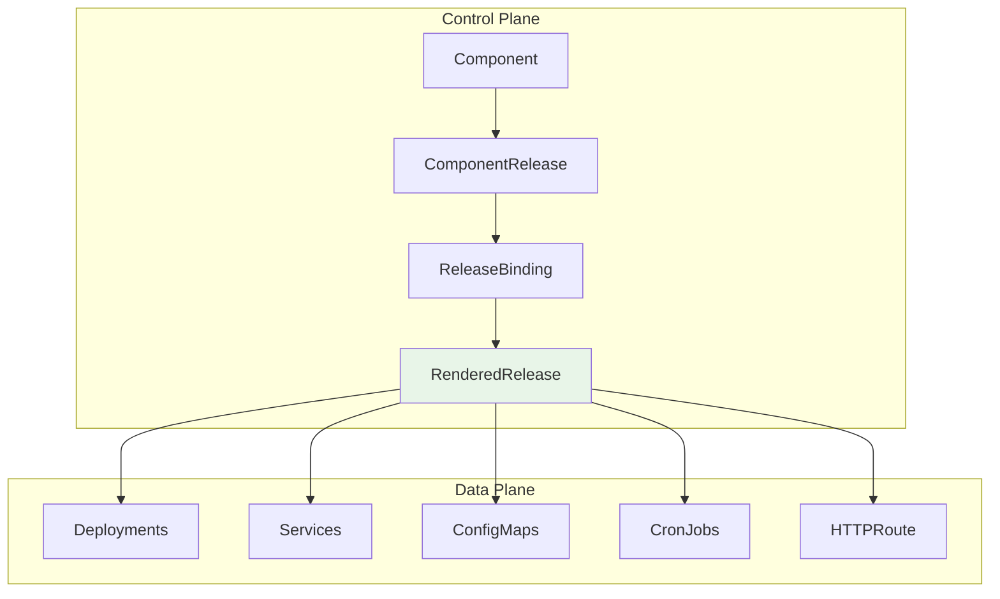
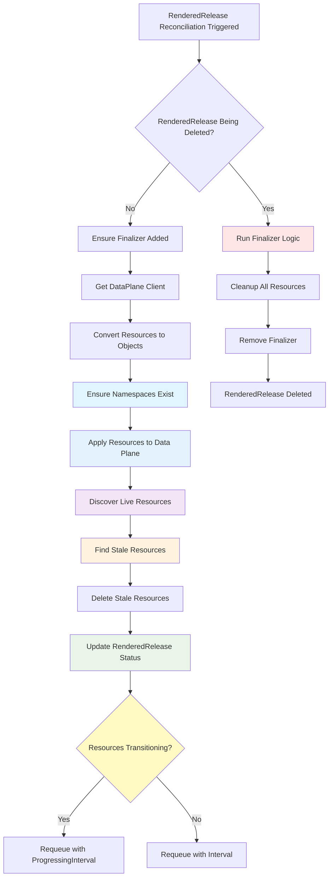
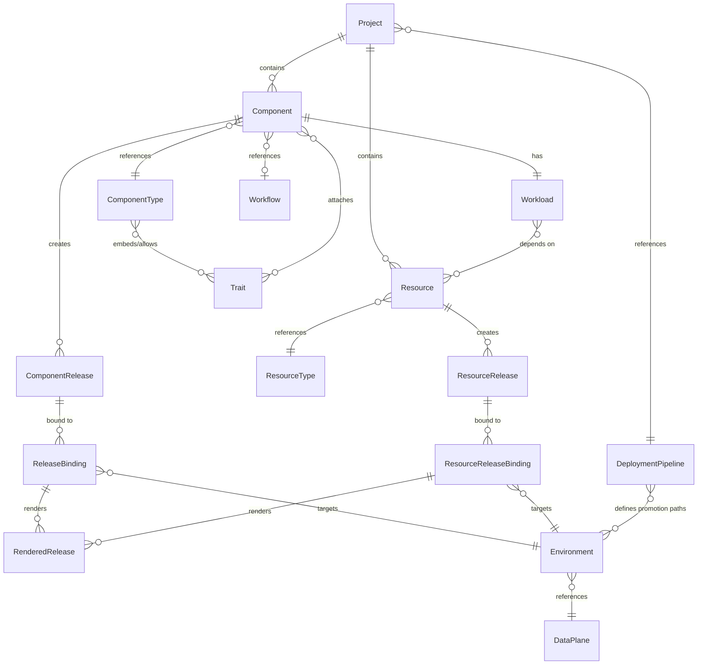
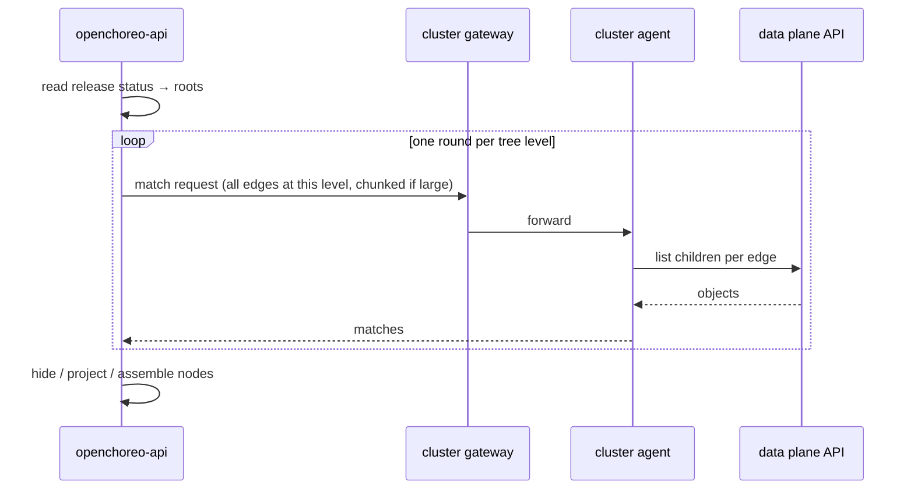
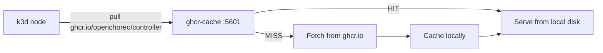

<a id="doc-12e0a48d6c5f2a58f4caa284"></a>

# openchoreo/openchoreo / ADOPTERS.md

Upstream: https://github.com/openchoreo/openchoreo/blob/dedbdc3f058ed06d3c23f317f68dcbd3a21e8cdb/ADOPTERS.md

Commit: `dedbdc3f058ed06d3c23f317f68dcbd3a21e8cdb`

Retrieved: 2026-10-01T15:25:09.772024+00:00

Kind: official-document

Raw SHA256: `00bea2880ba9ff5314c4ec07396e1fd5d6e8dc6831ebc966f128b6652a4e63c9`

Source text below is untrusted reference content. Acquisition does not verify technical claims.

License status: UPSTREAM_NOTICES_CAPTURED_PER_FILE_REVIEW_REQUIRED. See this repository's captured license files.

---

# Adopters
If your organization is using OpenChoreo, or your open source project integrates with it, we kindly encourage you to add your name to this list.
This helps demonstrate real-world usage, builds community confidence, and strengthens the project’s momentum within the CNCF ecosystem.

Adding your organization is a small contribution that has a big impact. You can do this by opening a pull request to update this file after reviewing our [CONTRIBUTING.md](https://github.com/openchoreo/openchoreo/blob/main/docs/contributors/README.md).

| Organization / Project | Adopter Category | Adoption Level | Use Case Summary | Date Added |
|------------------------|------------------|----------------|------------------|------------|
| [WSO2](https://wso2.com) | Service Provider | Production | WSO2 bootstrapped the OpenChoreo project and uses it as the foundational technology behind the WSO2 Cloud platform. OpenChoreo is also used internally as the unified application platform for deploying and operating all internal applications. | Dec 2025 |
| [Kubewarden](https://kubewarden.io) | Another Project | Integration | CNCF project providing a Kubernetes admission controller. Integrates with OpenChoreo as a data plane admission controller, and maintains a [howto for using Kubewarden with OpenChoreo](https://docs.kubewarden.io/admission-controller/1.37/en/howtos/openchoreo.html) in its own documentation. | Sep 2026 |

## Field reference

**Adopter Category** follows the [CNCF TOC definition of an adopter](https://github.com/cncf/toc/blob/main/FAQ.md#what-is-the-definition-of-an-adopter): `End-User` (a member of the CNCF End User community), `end user` (any other organization using OpenChoreo internally), `Service Provider`, `Consultancy`, or `Another Project`. An organization that fits several categories lists all that apply.

**Adoption Level** is one of Production, Dev / Trial, or Integration. Integration is used for projects and products that integrate with OpenChoreo without running it.


<a id="doc-06572a96a58dc510037d5efa"></a>

# openchoreo/openchoreo / CHANGELOG.md

Upstream: https://github.com/openchoreo/openchoreo/blob/dedbdc3f058ed06d3c23f317f68dcbd3a21e8cdb/CHANGELOG.md

Commit: `dedbdc3f058ed06d3c23f317f68dcbd3a21e8cdb`

Retrieved: 2026-10-01T15:25:09.772024+00:00

Kind: official-document

Raw SHA256: `8172380cf6a1981862ac2d289609f2fd6d0eb303dfaba7fd11536962a38989e2`

Source text below is untrusted reference content. Acquisition does not verify technical claims.

License status: UPSTREAM_NOTICES_CAPTURED_PER_FILE_REVIEW_REQUIRED. See this repository's captured license files.

---

# Changelog

All notable changes to OpenChoreo are documented in this file.

## v1.3.0

Changes since [v1.2.0](https://github.com/openchoreo/openchoreo/releases/tag/v1.2.0).

### Features

- **(Audit Logs)** A policy-driven audit trail across the platform: every state-modifying REST and MCP operation is audited and the coverage is enforced in CI, the event schema is frozen as v1, and the trail is readable through the Observer API, the `occ auditlogs` command, an Observability MCP tool, and a new Audit Logs page in the portal. ([#4462](https://github.com/openchoreo/openchoreo/pull/4462), [#4571](https://github.com/openchoreo/openchoreo/pull/4571), [#4643](https://github.com/openchoreo/openchoreo/pull/4643), [#4675](https://github.com/openchoreo/openchoreo/pull/4675), [#4717](https://github.com/openchoreo/openchoreo/pull/4717), [#4732](https://github.com/openchoreo/openchoreo/pull/4732), [#4754](https://github.com/openchoreo/openchoreo/pull/4754), [#4742](https://github.com/openchoreo/openchoreo/pull/4742), [#4763](https://github.com/openchoreo/openchoreo/pull/4763), [#791](https://github.com/openchoreo/backstage-plugins/pull/791), [#792](https://github.com/openchoreo/backstage-plugins/pull/792))
- **(Delivery Insights)** DORA delivery and stability metrics: the ReleaseBinding controller emits delivery lifecycle events, the logs adapters serve reason-filtered unscoped event queries, and a Delivery Insights store and DORA aggregator back a new portal page shipped behind a feature flag. ([#4248](https://github.com/openchoreo/openchoreo/pull/4248), [#4660](https://github.com/openchoreo/openchoreo/pull/4660), [#4710](https://github.com/openchoreo/openchoreo/pull/4710), [#4614](https://github.com/openchoreo/openchoreo/pull/4614), [#4674](https://github.com/openchoreo/openchoreo/pull/4674), [#4597](https://github.com/openchoreo/openchoreo/pull/4597), [#729](https://github.com/openchoreo/backstage-plugins/pull/729), [#802](https://github.com/openchoreo/backstage-plugins/pull/802), [#384](https://github.com/openchoreo/community-modules/pull/384))
- **(FinOps)** Cost usage and analytics: the Observer gains cost insight and recommendation APIs and matching MCP tools, and the portal gains a Cost Insights view with summary cards, graphs, and a flow for applying recommendations to a ReleaseBinding. ([#4244](https://github.com/openchoreo/openchoreo/pull/4244), [#4467](https://github.com/openchoreo/openchoreo/pull/4467), [#723](https://github.com/openchoreo/backstage-plugins/pull/723), [#744](https://github.com/openchoreo/backstage-plugins/pull/744), [#751](https://github.com/openchoreo/backstage-plugins/pull/751), [#752](https://github.com/openchoreo/backstage-plugins/pull/752), [#786](https://github.com/openchoreo/backstage-plugins/pull/786), [#796](https://github.com/openchoreo/backstage-plugins/pull/796))
- **(Platform Observability)** Logs for OpenChoreo's own system components alongside user component and workflow runs: a platform logs query endpoint and filter-value API in the Observer, an `occ` command and MCP tool to query them, platform identity labels stamped on system pods, and a centralized Platform Logs dashboard in the portal. ([#4658](https://github.com/openchoreo/openchoreo/pull/4658), [#4719](https://github.com/openchoreo/openchoreo/pull/4719), [#4725](https://github.com/openchoreo/openchoreo/pull/4725), [#4741](https://github.com/openchoreo/openchoreo/pull/4741), [#4636](https://github.com/openchoreo/openchoreo/pull/4636), [#784](https://github.com/openchoreo/backstage-plugins/pull/784), [#787](https://github.com/openchoreo/backstage-plugins/pull/787))
- **(Local Development)** A faster inner loop with `occ`: endpoint dependencies tunnelled to the local machine with `occ local`, remote resource dependency resolution, directory-based workload file discovery, capability token renewal, session rate limits, and a kiac installer for local OpenChoreo. ([#4505](https://github.com/openchoreo/openchoreo/pull/4505), [#4639](https://github.com/openchoreo/openchoreo/pull/4639), [#4692](https://github.com/openchoreo/openchoreo/pull/4692), [#4723](https://github.com/openchoreo/openchoreo/pull/4723), [#4744](https://github.com/openchoreo/openchoreo/pull/4744), [#4260](https://github.com/openchoreo/openchoreo/pull/4260))
- **(Identity)** The bundled identity provider moves from Thunder 0.28.0 to ThunderID 1.0.1, with a configurable `actor.id` claim. ([#4751](https://github.com/openchoreo/openchoreo/pull/4751), [#4759](https://github.com/openchoreo/openchoreo/pull/4759))
- **(Backstage UI)** Entity pages and the app shell migrated to Backstage's New Frontend System, with scaffolder fields distributed across plugins and the OpenChoreo token decorator and query provider moved into the core plugin. ([#754](https://github.com/openchoreo/backstage-plugins/pull/754), [#777](https://github.com/openchoreo/backstage-plugins/pull/777), [#793](https://github.com/openchoreo/backstage-plugins/pull/793))
- **(Backstage UI)** Namespace-level cell diagrams, trait forms rendered from `x-openchoreo-backstage-portal` UI hints, and row-level delete in the catalog and namespace listings. ([#788](https://github.com/openchoreo/backstage-plugins/pull/788), [#783](https://github.com/openchoreo/backstage-plugins/pull/783), [#675](https://github.com/openchoreo/backstage-plugins/pull/675))
- **(Release)** The release resource tree discovers generated child resources through traversal rules. ([#4512](https://github.com/openchoreo/openchoreo/pull/4512))
- **(Traits)** Cluster trait samples for HPA, VPA, PVC, and health probes, allowed in the component type samples. ([#4705](https://github.com/openchoreo/openchoreo/pull/4705), [#4745](https://github.com/openchoreo/openchoreo/pull/4745), [#4712](https://github.com/openchoreo/openchoreo/pull/4712), [#4735](https://github.com/openchoreo/openchoreo/pull/4735))

### Enhancements

- **(Controller)** Reconcile concurrency is configurable. ([#4332](https://github.com/openchoreo/openchoreo/pull/4332))
- **(SRE Agent)** Broader tooling, and native MCP tools in place of the previous wrappers. ([#4743](https://github.com/openchoreo/openchoreo/pull/4743), [#4655](https://github.com/openchoreo/openchoreo/pull/4655))
- **(Observer)** The Observer API is served from its generated OpenAPI server. ([#4623](https://github.com/openchoreo/openchoreo/pull/4623))
- **(API)** Argument overrides supported on cronjob manual triggers. ([#4572](https://github.com/openchoreo/openchoreo/pull/4572))
- **(Helm)** A `logLevel` value for controller-manager, and the SRE role granted `resourcereleasebinding:update`. ([#4498](https://github.com/openchoreo/openchoreo/pull/4498), [#4685](https://github.com/openchoreo/openchoreo/pull/4685))
- **(Backstage UI)** Text can be selected and copied from expanded log and event rows, and the redundant end-time column was removed from the traces table. ([#746](https://github.com/openchoreo/backstage-plugins/pull/746), [#785](https://github.com/openchoreo/backstage-plugins/pull/785))
- **(Agents)** A shared common package extracted for the Python agents. ([#4372](https://github.com/openchoreo/openchoreo/pull/4372))
- **(Workflows)** Git basic auth handling simplified in the checkout template. ([#4490](https://github.com/openchoreo/openchoreo/pull/4490))

### Bug Fixes

- **(Security)** Dangerous auth flags are enabled only in guest mode, and backend inter-plugin calls are authenticated under the auth policy. ([#709](https://github.com/openchoreo/backstage-plugins/pull/709), [#725](https://github.com/openchoreo/backstage-plugins/pull/725))
- **(Authz)** Exec authorization includes the component and is pinned to the component's owning project; WorkflowRun updates authorize against stored ownership; single-object report routes authorize against the report's own project; plane CRs created after an agent connects are authorized. ([#4506](https://github.com/openchoreo/openchoreo/pull/4506), [#4251](https://github.com/openchoreo/openchoreo/pull/4251), [#4596](https://github.com/openchoreo/openchoreo/pull/4596), [#4680](https://github.com/openchoreo/openchoreo/pull/4680), [#4417](https://github.com/openchoreo/openchoreo/pull/4417))
- **(Controller)** Observability Releases requeue on transient ObservabilityPlane lookups, already-terminating children are not re-deleted in finalizers, orphaned ProjectRelease snapshots are cleaned up on Project deletion, and RenderedRelease health is reported only for the generation it describes. ([#4315](https://github.com/openchoreo/openchoreo/pull/4315), [#4334](https://github.com/openchoreo/openchoreo/pull/4334), [#4406](https://github.com/openchoreo/openchoreo/pull/4406), [#4715](https://github.com/openchoreo/openchoreo/pull/4715))
- **(CEL)** Per-expression and per-reconcile cost limits are enforced, and Valkey admin gateway references are guarded behind `environment.gateway`. ([#4567](https://github.com/openchoreo/openchoreo/pull/4567), [#4458](https://github.com/openchoreo/openchoreo/pull/4458))
- **(Observability)** Observability service ingress is restricted, `clientCA.secretKeyRef` is honoured for agent-mode observability planes, and OpenObserve uses a policy-compliant admin password and can reach webhook destinations on private IPs. ([#4661](https://github.com/openchoreo/openchoreo/pull/4661), [#4579](https://github.com/openchoreo/openchoreo/pull/4579), [#4771](https://github.com/openchoreo/openchoreo/pull/4771), [#383](https://github.com/openchoreo/community-modules/pull/383))
- **(API)** The external store remote key prefix is configurable, notification channel email addresses are format-validated, and MCP moves to stateless HTTP on go-sdk v1.7.0. ([#4565](https://github.com/openchoreo/openchoreo/pull/4565), [#4457](https://github.com/openchoreo/openchoreo/pull/4457), [#4721](https://github.com/openchoreo/openchoreo/pull/4721))
- **(CLI)** `occ` Windows release archives carry the `.exe` extension. ([#4654](https://github.com/openchoreo/openchoreo/pull/4654))
- **(Workflows)** Argo workflow controller CPU and memory limits raised to stop workflows getting stuck. ([#4748](https://github.com/openchoreo/openchoreo/pull/4748))
- **(Helm)** Corrected `nindent` for Backstage `extraVolumes` and `extraVolumeMounts`. ([#4515](https://github.com/openchoreo/openchoreo/pull/4515))
- **(Backstage UI)** Deploy view no longer shows Failed for a ProjectReleaseBinding during namespace provisioning, more ReleaseBinding Ready reasons are treated as progressing, the Jenkins frontend plugin is registered, API client tokens are allowed over plain HTTP, and build-failure and deploy investigate prompts are restored after the New Frontend System migration. ([#749](https://github.com/openchoreo/backstage-plugins/pull/749), [#743](https://github.com/openchoreo/backstage-plugins/pull/743), [#734](https://github.com/openchoreo/backstage-plugins/pull/734), [#790](https://github.com/openchoreo/backstage-plugins/pull/790), [#795](https://github.com/openchoreo/backstage-plugins/pull/795))
- **(Cost Insights)** Sub-cent costs render correctly, scatter-plot hover is fixed, filter ambiguity and page loading are improved, and recommendation costs are derived by scaling the actual cost with client-side accumulation. ([#800](https://github.com/openchoreo/backstage-plugins/pull/800), [#803](https://github.com/openchoreo/backstage-plugins/pull/803), [#446](https://github.com/openchoreo/community-modules/pull/446), [#471](https://github.com/openchoreo/community-modules/pull/471))

## v1.2.0

Changes since [v1.1.0](https://github.com/openchoreo/openchoreo/releases/tag/v1.1.0).

### Features

- **(Project Lifecycle)** Release lifecycle extended to projects: new `ProjectType`, `ClusterProjectType`, `ProjectRelease`, and `ProjectReleaseBinding` CRDs with controller, API, CLI, and MCP support, plus a Backstage UI creation wizard, catalog pages, and Deploy tab for project-level releases. ([#3762](https://github.com/openchoreo/openchoreo/pull/3762), [#3874](https://github.com/openchoreo/openchoreo/pull/3874), [#3918](https://github.com/openchoreo/openchoreo/pull/3918), [#4167](https://github.com/openchoreo/openchoreo/pull/4167), [#4172](https://github.com/openchoreo/openchoreo/pull/4172), [#645](https://github.com/openchoreo/backstage-plugins/pull/645), [#653](https://github.com/openchoreo/backstage-plugins/pull/653), [#658](https://github.com/openchoreo/backstage-plugins/pull/658))
- **(Exec)** Interactive terminal access to running components via UI, API, and CLI, with environment-conditionable access and optional pod targeting. ([#3887](https://github.com/openchoreo/openchoreo/pull/3887), [#3974](https://github.com/openchoreo/openchoreo/pull/3974), [#634](https://github.com/openchoreo/backstage-plugins/pull/634))
- **(Backstage UI)** Component deploy view redesigned around a Release → Deploy model: release browser dialog with compare/diff mode and reworked auto-deploy setup card. ([#575](https://github.com/openchoreo/backstage-plugins/pull/575), [#580](https://github.com/openchoreo/backstage-plugins/pull/580), [#591](https://github.com/openchoreo/backstage-plugins/pull/591))
- **(Observability)** Kubernetes events collection added to the observability plane, with querying support in the Observer API and across logging modules. ([#3781](https://github.com/openchoreo/openchoreo/pull/3781), [#3738](https://github.com/openchoreo/openchoreo/pull/3738), [#134](https://github.com/openchoreo/community-modules/pull/134), [#136](https://github.com/openchoreo/community-modules/pull/136), [#211](https://github.com/openchoreo/community-modules/pull/211), [#282](https://github.com/openchoreo/community-modules/pull/282))
- **(Observability)** Wirelogs (Cilium Hubble network flow logs) can be streamed via the API and visualized in the Backstage UI. ([#3571](https://github.com/openchoreo/openchoreo/pull/3571), [#3620](https://github.com/openchoreo/openchoreo/pull/3620), [#3800](https://github.com/openchoreo/openchoreo/pull/3800), [#604](https://github.com/openchoreo/backstage-plugins/pull/604))
- **(Authz)** New ABAC conditions: `resource.resourceType`, `resource.componentType`, and `resource.workflow`. ([#3591](https://github.com/openchoreo/openchoreo/pull/3591), [#3612](https://github.com/openchoreo/openchoreo/pull/3612), [#3618](https://github.com/openchoreo/openchoreo/pull/3618))
- **(CRD)** Pre/post-render CEL validations added for ComponentTypes and Traits. ([#4088](https://github.com/openchoreo/openchoreo/pull/4088), [#4052](https://github.com/openchoreo/openchoreo/pull/4052))
- **(Backstage UI)** Portal brought to WCAG 2.2 AA / BITV 2.0 accessibility conformance. ([#579](https://github.com/openchoreo/backstage-plugins/pull/579), [#583](https://github.com/openchoreo/backstage-plugins/pull/583), [#584](https://github.com/openchoreo/backstage-plugins/pull/584))
- **(Backstage UI)** Customizable and bundled component-creation wizard templates via a `template-url`/`skip-template` annotation contract, with bundled wizards for agent component types (Claude, Codex, Gemini, OpenClaw). ([#664](https://github.com/openchoreo/backstage-plugins/pull/664), [#287](https://github.com/openchoreo/community-modules/pull/287), [#292](https://github.com/openchoreo/community-modules/pull/292))
- **(Backstage UI)** API Try Out console for testing OpenAPI and GraphQL APIs. ([#670](https://github.com/openchoreo/backstage-plugins/pull/670))
- **(Gateway)** Kubernetes Gateway API bumped to v1.5 on the standard channel, with expanded gateway module support (NGINX Gateway Fabric). ([#3819](https://github.com/openchoreo/openchoreo/pull/3819), [#3883](https://github.com/openchoreo/openchoreo/pull/3883), [#3888](https://github.com/openchoreo/openchoreo/pull/3888), [#240](https://github.com/openchoreo/community-modules/pull/240))
- **(Controller)** Cluster gateway service divided into internal and external services for tighter network boundaries. ([#4185](https://github.com/openchoreo/openchoreo/pull/4185), [#4122](https://github.com/openchoreo/openchoreo/pull/4122))
- **(Resources)** Resource MCP toolset enabled by default. ([#4092](https://github.com/openchoreo/openchoreo/pull/4092), [#4097](https://github.com/openchoreo/openchoreo/pull/4097))
- **(Build)** Build cache support added to speed up component builds. ([#3675](https://github.com/openchoreo/openchoreo/pull/3675))
- **(Portal Assistant)** Deployment status debug flow and automated build/runtime fix-prompt suggestions added. ([#3763](https://github.com/openchoreo/openchoreo/pull/3763), [#3867](https://github.com/openchoreo/openchoreo/pull/3867), [#3923](https://github.com/openchoreo/openchoreo/pull/3923))
- **(Modules)** KEDA-based autoscaling module for scale-to-zero support. ([#209](https://github.com/openchoreo/community-modules/pull/209))
- **(CRD)** `removes` section added to the Trait API for deleting rendered resources. ([#3573](https://github.com/openchoreo/openchoreo/pull/3573))
- **(Install)** Single-command k3d install script, with console login shown in the install summary. ([#4096](https://github.com/openchoreo/openchoreo/pull/4096), [#4183](https://github.com/openchoreo/openchoreo/pull/4183))
- **(Helm)** Global image registry and pull secret overrides, in support of air-gapped installs. ([#4182](https://github.com/openchoreo/openchoreo/pull/4182))
- **(CI)** GitHub Actions external CI integration. ([#3641](https://github.com/openchoreo/openchoreo/pull/3641))
- **(Autoscaling)** Scaled-to-zero workloads polled more frequently to detect scale-up sooner. ([#4308](https://github.com/openchoreo/openchoreo/pull/4308))
- **(Controller)** mTLS added to internal cluster gateway communication. ([#4256](https://github.com/openchoreo/openchoreo/pull/4256))
- **(API)** Manual trigger support added for cronjob release bindings. ([#4254](https://github.com/openchoreo/openchoreo/pull/4254))
- **(Helm)** Affinity and topology spread constraint support added. ([#4232](https://github.com/openchoreo/openchoreo/pull/4232))
- **(Observability)** Span status message added to span API responses. ([#4233](https://github.com/openchoreo/openchoreo/pull/4233))

### Enhancements

- **(Backstage UI)** Portal performance and UX polish: frontend response caching, a unified token-driven loading skeleton/spinner system, and virtualized log/event/trace/wirelog views. ([#676](https://github.com/openchoreo/backstage-plugins/pull/676), [#682](https://github.com/openchoreo/backstage-plugins/pull/682), [#633](https://github.com/openchoreo/backstage-plugins/pull/633))
- **(Observability)** Notification channel management views added to the Backstage portal. ([#4050](https://github.com/openchoreo/openchoreo/pull/4050), [#663](https://github.com/openchoreo/backstage-plugins/pull/663))
- **(Helm)** WebSocket upgrades enabled by default on KGateway for component exec. ([#4080](https://github.com/openchoreo/openchoreo/pull/4080), [#4066](https://github.com/openchoreo/openchoreo/pull/4066))
- **(API)** Endpoint URL resolution added for GRPCRoute and TLSRoute. ([#3592](https://github.com/openchoreo/openchoreo/pull/3592))
- **(Dependencies)** Kubernetes dependency updated to 1.36. ([#3596](https://github.com/openchoreo/openchoreo/pull/3596), [#3624](https://github.com/openchoreo/openchoreo/pull/3624))
- **(Controller)** Data plane annotations exposed to the render context. ([#3754](https://github.com/openchoreo/openchoreo/pull/3754))

### Bug Fixes

- **(Security)** Shell parameter injection in workflow templates fixed; root access removed from workflow templates. ([#4193](https://github.com/openchoreo/openchoreo/pull/4193), [#3600](https://github.com/openchoreo/openchoreo/pull/3600))
- **(Controller)** Webhook downtime during controller-manager rolling upgrades prevented. ([#3743](https://github.com/openchoreo/openchoreo/pull/3743))
- **(Controller)** Resource deletions now cascade correctly with precise finalize statuses. ([#3917](https://github.com/openchoreo/openchoreo/pull/3917))
- **(Controller)** Project finalization now allowed with an empty deployment pipeline. ([#4181](https://github.com/openchoreo/openchoreo/pull/4181))
- **(Helm)** Webhook race condition on first install resolved. ([#3606](https://github.com/openchoreo/openchoreo/pull/3606))
- **(CRD)** `oneOf`/`anyOf`/`allOf` values now preserved in component and trait rendering. ([#3816](https://github.com/openchoreo/openchoreo/pull/3816))
- **(API)** OAuth scopes now advertised in `WWW-Authenticate` and protected-resource metadata. ([#3223](https://github.com/openchoreo/openchoreo/pull/3223))
- **(Portal Assistant)** Fixed to pick up the latest logs when identifying and verifying fixes. ([#4177](https://github.com/openchoreo/openchoreo/pull/4177), [#4190](https://github.com/openchoreo/openchoreo/pull/4190))
- **(Security)** Workflow executor role scoped to least privilege. ([#4311](https://github.com/openchoreo/openchoreo/pull/4311))
- **(Controller)** Missing default plane errors now reported as `IsNotFound`. ([#4196](https://github.com/openchoreo/openchoreo/pull/4196))
- **(API)** Endpoint schema type now derived from protocol on workload create. ([#4266](https://github.com/openchoreo/openchoreo/pull/4266))
- **(API)** Logs now returned from all containers of a multi-container pod. ([#4236](https://github.com/openchoreo/openchoreo/pull/4236))

## v1.1.0

Changes since [v1.1.0-alpha-1](https://github.com/openchoreo/openchoreo/releases/tag/v1.1.0-alpha-1).

### Features

- **(Resources)** Introducing resource abstractions for openchoreo. ([#3392](https://github.com/openchoreo/openchoreo/pull/3392))
- **(FinOps Agent)** Introduce FinOps agent to openchoreo. ([#3358](https://github.com/openchoreo/openchoreo/pull/3358))
- **(Agent Sandboxing)** Introduce agent sandboxing in openchoreo. ([#3433](https://github.com/openchoreo/openchoreo/pull/3433))
- **(Portal Assistant)** Portal Assistant introduced as the AI assistant experience for OpenChoreo. ([#3455](https://github.com/openchoreo/openchoreo/pull/3455))
- **(Modules)** Introduce advance network observerbility features. ([#3270](https://github.com/openchoreo/openchoreo/pull/3270))
- **(Modules)** Agentgateway as an AI Gateway Module for OpenChoreo. ([#81](https://github.com/openchoreo/community-modules/pull/81))
- **(Secret Management)** Add support for managing secrets in external secret stores. ([#3261](https://github.com/openchoreo/openchoreo/pull/3261))
- **(API)** Secret API expanded with new CRUD operations. ([#3457](https://github.com/openchoreo/openchoreo/pull/3457))
- **(Observability)** Support AWS observability stack in openchoreo (cloudwatch, x-ray). ([#88](https://github.com/openchoreo/community-modules/pull/88), [#93](https://github.com/openchoreo/community-modules/pull/93), [#99](https://github.com/openchoreo/community-modules/pull/99))
- **(Authz)** Add CEL-based ABAC conditions.([#3243](https://github.com/openchoreo/openchoreo/pull/3243))
- **(Backstage UI)** Support event-driven catalog sync. ([#514](https://github.com/openchoreo/backstage-plugins/pull/514))
- **(Backstage UI)** Support installing openchoreo plugins into an existing backstage portal. ([#637](https://github.com/openchoreo/openchoreo.github.io/pull/637))

### Enhancements

- **(MCP)** Combine namespace and cluster resource MCP tools. ([#3431](https://github.com/openchoreo/openchoreo/pull/3431))
- **(Backstage UI)** Redesign environments page as split-view DAG canvas. ([#513](https://github.com/openchoreo/backstage-plugins/pull/513))
- **(Backstage UI)** Provide rollout restart capability for components. ([#513](https://github.com/openchoreo/backstage-plugins/pull/513))
- **(MCP)** Secret reference writes moved to the platform engineer toolset. ([#3504](https://github.com/openchoreo/openchoreo/pull/3504))
- **(CLI)** `--namespace` flag added to `componentrelease generate`. ([#3535](https://github.com/openchoreo/openchoreo/pull/3535))

### Bug Fixes

- **(API)** Empty string values are now allowed for environment variables and config files. ([#3534](https://github.com/openchoreo/openchoreo/pull/3534))
- **(API)** Webhook validation errors now return HTTP 422 with field paths. ([#3426](https://github.com/openchoreo/openchoreo/pull/3426))
- **(Controller)** GVK handling improved for data and observability planes. ([#3369](https://github.com/openchoreo/openchoreo/pull/3369))
- **(Controller)** Embedded trait `envConfigs` CEL bindings guarded against missing keys. ([#3520](https://github.com/openchoreo/openchoreo/pull/3520))
- **(CRD)** CEL expression validation now handles `oneOf`, `anyOf`, and `allOf` schemas. ([#3496](https://github.com/openchoreo/openchoreo/pull/3496))
- **(Observer)** Credentials support added to Observer CORS middleware. ([#3538](https://github.com/openchoreo/openchoreo/pull/3538))

### Deprecation Notice

- Git secret management APIs are deprecated and removed in v1.2
- Deprecated cluster-prefixed mcp tools. Hidden in v1.2 and removed in v1.3 (https://openchoreo.dev/docs/v1.1.x/reference/mcp-servers/#deprecated-cluster-prefixed-tools)

## v1.1.0-alpha-1

Changes since [v1.0.0](https://github.com/openchoreo/openchoreo/releases/tag/v1.0.0).

### Features

- **(CRD)** Resource abstraction CRDs and controllers for platform resource
  management. ([#3392](https://github.com/openchoreo/openchoreo/pull/3392))
- **(CRD)** Budget alert type added to ObservabilityAlertRule for cost
  monitoring. ([#3381](https://github.com/openchoreo/openchoreo/pull/3381))
- **(Authz)** CEL-based ABAC conditions support in role bindings with admission validation
  webhooks. ([#3243](https://github.com/openchoreo/openchoreo/pull/3243),
  [#3285](https://github.com/openchoreo/openchoreo/pull/3285))
- **(Controller)** Rolling restart support via `openchoreo.dev/restartedAt` annotation on
  ReleaseBinding. ([#3301](https://github.com/openchoreo/openchoreo/pull/3301))
- **(Controller)** Event-forwarder for event-driven Backstage catalog
  sync. ([#3382](https://github.com/openchoreo/openchoreo/pull/3382))
- **(API)** Secret creation API across all plane types (workflow, data,
  observability). ([#3261](https://github.com/openchoreo/openchoreo/pull/3261))
- **(API)** WorkflowRun deletion endpoint. ([#3062](https://github.com/openchoreo/openchoreo/pull/3062))
- **(MCP)** Expanded tool surface with workflow run status, logs, and events
  tools. ([#3269](https://github.com/openchoreo/openchoreo/pull/3269),
  [#3389](https://github.com/openchoreo/openchoreo/pull/3389))
- **(MCP)** Permission-based tool filtering with toolset and authz query
  parameters. ([#3201](https://github.com/openchoreo/openchoreo/pull/3201),
  [#3384](https://github.com/openchoreo/openchoreo/pull/3384))
- **(MCP)** FinOps agent for cost management and MCP server added to SRE
  agent. ([#3358](https://github.com/openchoreo/openchoreo/pull/3358),
  [#3351](https://github.com/openchoreo/openchoreo/pull/3351))
- **(Observability)** Budget alert CRUD operations and webhook
  actions. ([#3386](https://github.com/openchoreo/openchoreo/pull/3386))
- **(Observability)** Metrics adapter support and logs/tracing forwarded to external adapter by
  default. ([#3240](https://github.com/openchoreo/openchoreo/pull/3240),
  [#3307](https://github.com/openchoreo/openchoreo/pull/3307))
- **(Observability)** Alert suppression to deduplicate webhook
  notifications. ([#3132](https://github.com/openchoreo/openchoreo/pull/3132))
- **(Helm)** `extraVolumes`, `extraVolumeMounts`, `extraArgs`, and `appConfig` added to Backstage
  values. ([#3219](https://github.com/openchoreo/openchoreo/pull/3219))
- **(Backstage UI)** Dark theme support including cell-diagram
  styling. ([#499](https://github.com/openchoreo/backstage-plugins/pull/499))
- **(Backstage UI)** Environments page redesigned as split-view DAG canvas with detail
  panel. ([#513](https://github.com/openchoreo/backstage-plugins/pull/513))
- **(Backstage UI)** Rolling restart ("Rollout") support via
  UI. ([#516](https://github.com/openchoreo/backstage-plugins/pull/516))
- **(Backstage UI)** Secrets settings tab for managing
  secrets. ([#505](https://github.com/openchoreo/backstage-plugins/pull/505))
- **(Backstage UI)** Trace error status and span status added to traces
  view. ([#497](https://github.com/openchoreo/backstage-plugins/pull/497))

### Enhancements

- **(Helm)** `kube-prometheus-stack` dependency removed from
  data-plane. ([#3160](https://github.com/openchoreo/openchoreo/pull/3160))
- **(Samples)** Linter as custom CI workflow step
  sample. ([#3297](https://github.com/openchoreo/openchoreo/pull/3297))

### Bug Fixes

- **(Controller)** Trait-created secrets cleaned up on
  deletion. ([#3321](https://github.com/openchoreo/openchoreo/pull/3321))
- **(Controller)** File-mount volumes sorted to prevent rollout
  loops. ([#3303](https://github.com/openchoreo/openchoreo/pull/3303))
- **(Controller)** Traits validated to prevent workload resource
  creation. ([#2922](https://github.com/openchoreo/openchoreo/pull/2922))
- **(API)** Rendering fails when SecretKeyRef key missing from
  SecretReference. ([#3215](https://github.com/openchoreo/openchoreo/pull/3215))
- **(CRD)** `toServicePorts()` CEL function deduplicates service
  ports. ([#3157](https://github.com/openchoreo/openchoreo/pull/3157))
- **(CRD)** Timezone support added to `scheduled-task` component
  type. ([#3081](https://github.com/openchoreo/openchoreo/pull/3081))
- **(CLI)** Spec hash used to select release in binding
  generate. ([#3006](https://github.com/openchoreo/openchoreo/pull/3006))
- **(Install)** Quick-start scripts hardened against common
  misconfigurations. ([#3406](https://github.com/openchoreo/openchoreo/pull/3406))
- **(Backstage UI)** Environment dropdown scoped to project's deployment
  pipeline. ([#512](https://github.com/openchoreo/backstage-plugins/pull/512))
- **(Backstage UI)** Traces fetching logic handles multiple
  components. ([#492](https://github.com/openchoreo/backstage-plugins/pull/492))
- **(Backstage UI)** Intermediate login page re-introduced for in-browser redirect
  logins. ([#484](https://github.com/openchoreo/backstage-plugins/pull/484))

## v1.0.0

Changes since [v1.0.0-rc.2](https://github.com/openchoreo/openchoreo/releases/tag/v1.0.0-rc.2).

### Features

- **(Backstage UI)** Namespace definition editing with CRUD support via Definition tab for Domain
  entities. ([#479](https://github.com/openchoreo/backstage-plugins/pull/479))

### Enhancements

- **(Backstage UI)** Customized About cards with permission-gated edit links and renamed labels
  (Domain→Namespace, System→Project). ([#479](https://github.com/openchoreo/backstage-plugins/pull/479))
- **(Backstage UI)** Responsive layout for environment cards on wider
  screens. ([#471](https://github.com/openchoreo/backstage-plugins/pull/471))
- **(Backstage UI)** Required field validation in environment variable and file mount
  editors. ([#477](https://github.com/openchoreo/backstage-plugins/pull/477))
- **(Backstage UI)** Pagination for environment cards in deploy
  page. ([#476](https://github.com/openchoreo/backstage-plugins/pull/476))

### Bug Fixes

- **(Controller)** Repeated forbidden errors in controller logs from renderedrelease controller
  Secret listing fixed. ([#2935](https://github.com/openchoreo/openchoreo/pull/2935))
- **(API)** Component release generation missing `spec.workload.dependencies`
  fixed. ([#2934](https://github.com/openchoreo/openchoreo/pull/2934))
- **(MCP)** `create_component` tool parameter description for workflow parameters
  fixed. ([#2925](https://github.com/openchoreo/openchoreo/pull/2925))
- **(CLI)** `occ componentrelease generate` failing for ClusterComponentType and ClusterTrait
  fixed. ([#2928](https://github.com/openchoreo/openchoreo/pull/2928))
- **(Backstage UI)** Promotion path editor allowing same environment as source and target
  fixed. ([#478](https://github.com/openchoreo/backstage-plugins/pull/478))
- **(Backstage UI)** Missing namespace relationship for DeploymentPipeline entities in catalog
  fixed. ([#469](https://github.com/openchoreo/backstage-plugins/pull/469))

## v1.0.0-rc.2

Changes since [v1.0.0-rc.1](https://github.com/openchoreo/openchoreo/releases/tag/v1.0.0-rc.1).

### Breaking Changes

- **(CRD)** `REST` endpoint type removed from Workload. Use `HTTP` instead. ([#2785](https://github.com/openchoreo/openchoreo/pull/2785))
- **(Controller)** NetworkPolicy now allows ingress only from pods with the `openchoreo.dev/system-component` label, tightening data plane project boundary. ([#2876](https://github.com/openchoreo/openchoreo/pull/2876))
- **(Controller)** `connections` renamed to `dependencies` in CEL template context.
  `${connections.*}` becomes `${dependencies.*}` and `toContainerEnv()` becomes
  `toContainerEnvs()`. ([#2912](https://github.com/openchoreo/openchoreo/pull/2912))
- **(CLI)** `occ component scaffold` flags restructured: `--type` renamed to `--componenttype`,
  `--traits` and `--workflow` now resolve namespace-scoped resources only. Use
  `--clustercomponenttype`, `--clustertraits`, and `--clusterworkflow` for cluster-scoped
  resources. ([#2759](https://github.com/openchoreo/openchoreo/pull/2759))

### Features

- **(Controller)** `${workflowplane.secretStore}` context variable in Workflow and ClusterWorkflow
  CEL templates. ([#2902](https://github.com/openchoreo/openchoreo/pull/2902))
- **(MCP)** `query_alerts` and `query_incidents` tools for querying fired alerts and incidents. ([#2751](https://github.com/openchoreo/openchoreo/pull/2751))
- **(MCP)** `create_release_binding` tool for deploying a component release to an environment. ([#2794](https://github.com/openchoreo/openchoreo/pull/2794))
- **(Backstage UI)** Resource definition tab for Component and Project entities. ([#423](https://github.com/openchoreo/backstage-plugins/pull/423), [#453](https://github.com/openchoreo/backstage-plugins/pull/453))
- **(Backstage UI)** Template quick-create from search with type-specific icons. ([#454](https://github.com/openchoreo/backstage-plugins/pull/454))

### Enhancements

- **(CRD)** Admission webhook validation for Workflow and ClusterWorkflow resources. ([#2847](https://github.com/openchoreo/openchoreo/pull/2847))
- **(CRD)** OpenAPI v3 JSON Schema validation for ComponentType, ClusterComponentType, Trait, and ClusterTrait schema fields. ([#2852](https://github.com/openchoreo/openchoreo/pull/2852))
- **(CRD)** Validation rejects resource templates with hardcoded `metadata.namespace`; only `${metadata.namespace}` allowed. ([#2832](https://github.com/openchoreo/openchoreo/pull/2832))
- **(CRD)** Typed return types for CEL helper functions, enabling validation of field access errors in `forEach` loops. ([#2850](https://github.com/openchoreo/openchoreo/pull/2850))
- **(CRD)** Improved workload generation workflow template. ([#2819](https://github.com/openchoreo/openchoreo/pull/2819))
- **(API)** `deletionTimestamp` and `deletionGracePeriodSeconds` fields added to ObjectMeta schema. ([#2853](https://github.com/openchoreo/openchoreo/pull/2853))
- **(MCP)** Component dependencies exposed in `get_component_release` and `get_release_binding` tools. ([#2835](https://github.com/openchoreo/openchoreo/pull/2835))
- **(MCP)** Platform engineer toolset enabled by default. ([#2747](https://github.com/openchoreo/openchoreo/pull/2747))
- **(CLI)** Mixed-scope resources in `occ component scaffold` with `--clustercomponenttype`, `--clustertraits`, and `--clusterworkflow` flags. ([#2759](https://github.com/openchoreo/openchoreo/pull/2759))
- **(CLI)** Short flags `-n` (namespace), `-p` (project), `-c` (component) for common options. ([#2833](https://github.com/openchoreo/openchoreo/pull/2833))
- **(Helm)** Backstage authentication `redirectFlow` toggle for login mode. ([#2834](https://github.com/openchoreo/openchoreo/pull/2834))
- **(Helm)** Removed OpenTelemetry Collector, Fluent Bit, and unused observability plane sub-chart dependencies from Helm charts. ([#2878](https://github.com/openchoreo/openchoreo/pull/2878), [#2809](https://github.com/openchoreo/openchoreo/pull/2809), [#2737](https://github.com/openchoreo/openchoreo/pull/2737))
- **(Helm)** Thunder bumped to v0.28.0 with improved user attribute handling. ([#2776](https://github.com/openchoreo/openchoreo/pull/2776))
- **(Backstage UI)** Deployment pipeline selector in project creation and project overview page. ([#419](https://github.com/openchoreo/backstage-plugins/pull/419), [#420](https://github.com/openchoreo/backstage-plugins/pull/420))
- **(Backstage UI)** Endpoint editor improvements: schema type auto-derived from endpoint type, schema-aware placeholders, and API entities created only for endpoints with schemas. ([#428](https://github.com/openchoreo/backstage-plugins/pull/428))
- **(Backstage UI)** Entity ownership resolution from `backstage.io/owner` CR annotations. ([#434](https://github.com/openchoreo/backstage-plugins/pull/434))
- **(Backstage UI)** Workload details (container images, repository, revision) in workflow run details view. ([#436](https://github.com/openchoreo/backstage-plugins/pull/436))
- **(Backstage UI)** Deletion-marked visual indicators on catalog graph nodes. ([#437](https://github.com/openchoreo/backstage-plugins/pull/437))
- **(Backstage UI)** Workflow run retention time (TTL) display. ([#445](https://github.com/openchoreo/backstage-plugins/pull/445))
- **(Backstage UI)** Edit functionality in role binding detail dialog. ([#447](https://github.com/openchoreo/backstage-plugins/pull/447))
- **(Backstage UI)** Overhauled search with Cmd+K/Ctrl+K shortcut, kind icons, and custom filters. ([#448](https://github.com/openchoreo/backstage-plugins/pull/448))
- **(Backstage UI)** Custom recently visited card with kind-aware colors and icons. ([#449](https://github.com/openchoreo/backstage-plugins/pull/449))
- **(Backstage UI)** "Cluster" role type chip in namespace role binding views. ([#421](https://github.com/openchoreo/backstage-plugins/pull/421))
- **(Backstage UI)** Improved array field display and description styling in scaffolder forms. ([#418](https://github.com/openchoreo/backstage-plugins/pull/418))
- **(Backstage UI)** Scaffolder review step rewritten with template-aware structured sections. ([#426](https://github.com/openchoreo/backstage-plugins/pull/426))
- **(Backstage UI)** Default role templates updated with platformEngineer and SRE roles. ([#425](https://github.com/openchoreo/backstage-plugins/pull/425))
- **(Backstage UI)** Default log sort order changed to ascending (oldest first). ([#442](https://github.com/openchoreo/backstage-plugins/pull/442))
- **(Backstage UI)** Log entry copy button always visible instead of hover-only. ([#446](https://github.com/openchoreo/backstage-plugins/pull/446))
- **(Backstage UI)** Sign-in flow switched from popup to redirect-based OAuth by default. ([#440](https://github.com/openchoreo/backstage-plugins/pull/440))
- **(Backstage UI)** Separate view permissions for alerts and incidents. ([#462](https://github.com/openchoreo/backstage-plugins/pull/462))
- **(Backstage UI)** Git secrets management UI improved with search, redesigned toolbar, and improved dialog layouts. ([#465](https://github.com/openchoreo/backstage-plugins/pull/465))
- **(Backstage UI)** "Invoke URLs" renamed to "Endpoint URLs" with clickable links. ([#467](https://github.com/openchoreo/backstage-plugins/pull/467))
- **(Backstage UI)** Default or first namespace pre-selected during resource creation. ([#457](https://github.com/openchoreo/backstage-plugins/pull/457))
- **(Backstage UI)** Helper texts for environment variables and file mounts in Workload Editor. ([#455](https://github.com/openchoreo/backstage-plugins/pull/455))
- **(Backstage UI)** Keyboard shortcut hint shown in search modal with improved auto-focus. ([#451](https://github.com/openchoreo/backstage-plugins/pull/451))
- **(Backstage UI)** "promotesTo/promotedBy" relationship labels renamed to "deploysTo/deployedBy". ([#456](https://github.com/openchoreo/backstage-plugins/pull/456))
- **(Backstage UI)** "OpenChoreo Catalog" page title renamed to "Catalog". ([#459](https://github.com/openchoreo/backstage-plugins/pull/459))
- **(Backstage UI)** Deletion badge and disabled navigation for entities marked for deletion. ([#463](https://github.com/openchoreo/backstage-plugins/pull/463))

### Bug Fixes

- **(Controller)** Environment finalizer stuck in infinite retry when deleting namespace with ClusterDataPlane reference fixed. ([#2769](https://github.com/openchoreo/openchoreo/pull/2769))
- **(Controller)** ReleaseBindings not deleted during environment deletion fixed. ([#2881](https://github.com/openchoreo/openchoreo/pull/2881))
- **(Controller)** DataPlane and ClusterDataPlane status not persisted when cluster-gateway unreachable fixed. ([#2778](https://github.com/openchoreo/openchoreo/pull/2778))
- **(Controller)** Trait schema cache collisions when Trait and ClusterTrait share the same name fixed. ([#2842](https://github.com/openchoreo/openchoreo/pull/2842))
- **(Controller)** Workflow run deletion failing for ClusterWorkflow references fixed. ([#2875](https://github.com/openchoreo/openchoreo/pull/2875))
- **(Controller)** Intermittent agent disconnects when HA (multiple replicas) enabled fixed. ([#2828](https://github.com/openchoreo/openchoreo/pull/2828))
- **(Controller)** Default component type descriptions corrected. ([#2732](https://github.com/openchoreo/openchoreo/pull/2732))
- **(CLI)** Server error messages now shown instead of bare HTTP status codes. ([#2738](https://github.com/openchoreo/openchoreo/pull/2738))
- **(CLI)** Descriptive error shown for missing positional arguments instead of generic message. ([#2780](https://github.com/openchoreo/openchoreo/pull/2780))
- **(Helm)** Missing default role permissions for component CRUD, secret references, and observability management fixed. ([#2761](https://github.com/openchoreo/openchoreo/pull/2761))
- **(Helm)** Missing Helm values for quick-start observability MCP server fixed. ([#2745](https://github.com/openchoreo/openchoreo/pull/2745))
- **(Helm)** Missing `workload:view` permission in workload-publisher role fixed. ([#2904](https://github.com/openchoreo/openchoreo/pull/2904))
- **(Observability)** Observer API `total` field in logs, traces, and spans responses returning item count instead of total result count fixed. ([#2911](https://github.com/openchoreo/openchoreo/pull/2911))
- **(Install)** `check-status.sh` script updated to use correct component labels and namespaces. ([#2820](https://github.com/openchoreo/openchoreo/pull/2820))
- **(Backstage UI)** Deny policies ignored in permission evaluation and catalog visibility fixed. ([#439](https://github.com/openchoreo/backstage-plugins/pull/439))
- **(Backstage UI)** Role deletion with active bindings now prevented with clear error. ([#424](https://github.com/openchoreo/backstage-plugins/pull/424))
- **(Backstage UI)** Display names not appearing consistently in breadcrumb navigation fixed. ([#438](https://github.com/openchoreo/backstage-plugins/pull/438))
- **(Backstage UI)** Endpoints tab incorrectly showing for CronJob/Job types fixed. ([#443](https://github.com/openchoreo/backstage-plugins/pull/443))
- **(Backstage UI)** Environment overrides using latest workload instead of component release snapshot fixed. ([#430](https://github.com/openchoreo/backstage-plugins/pull/430))
- **(Backstage UI)** Traces waterfall view span color fixed. ([#468](https://github.com/openchoreo/backstage-plugins/pull/468))
- **(Backstage UI)** Cluster workflow creation failing with template fixed. ([#460](https://github.com/openchoreo/backstage-plugins/pull/460))
- **(Backstage UI)** Microsoft Entra JWT claims for profile extraction during sign-in fixed. ([#458](https://github.com/openchoreo/backstage-plugins/pull/458))
- **(Backstage UI)** Row height overflow and horizontal scroll in project components card fixed. ([#452](https://github.com/openchoreo/backstage-plugins/pull/452))

## v1.0.0-rc.1

Changes since [v0.17.0](https://github.com/openchoreo/openchoreo/releases/tag/v0.17.0).

### Breaking Changes

- **(CRD)** BuildPlane renamed to WorkflowPlane. `BuildPlane` → `WorkflowPlane`,
  `ClusterBuildPlane` → `ClusterWorkflowPlane`. ([#2574](https://github.com/openchoreo/openchoreo/pull/2574))
- **(CRD)** Schema definition changed to openAPIV3Schema. ComponentTypes, Traits, and Workflows now
  use standard OpenAPI v3 schema format. The old inline schema syntax is no longer
  supported. ([#2547](https://github.com/openchoreo/openchoreo/pull/2547), [#2539](https://github.com/openchoreo/openchoreo/pull/2539), [#2679](https://github.com/openchoreo/openchoreo/pull/2679))
  ```yaml
  # Before
  schema:
    parameters:
      replicas: "integer | default=1"

  # After
  parameters:
    openAPIV3Schema:
      type: object
      properties:
        replicas:
          type: integer
          default: 1
  ```
- **(CRD)** Connections renamed to Dependencies in Workload. The `connections` field is now
  `dependencies` with a restructured spec. ([#2510](https://github.com/openchoreo/openchoreo/pull/2510), [#2531](https://github.com/openchoreo/openchoreo/pull/2531))
- **(CRD)** `AuthzClusterRole` renamed to `ClusterAuthzRole`. CRD names follow Kubernetes naming
  conventions with `Cluster` prefix. ([#2606](https://github.com/openchoreo/openchoreo/pull/2606))
  ```yaml
  # Before
  kind: AuthzClusterRole
  # After
  kind: ClusterAuthzRole
  ```
- **(CRD)** `AuthzClusterRoleBinding` renamed to `ClusterAuthzRoleBinding`. ([#2606](https://github.com/openchoreo/openchoreo/pull/2606))
  ```yaml
  # Before
  kind: AuthzClusterRoleBinding
  # After
  kind: ClusterAuthzRoleBinding
  ```
- **(CRD)** `secretRef` renamed to `secretKeyRef` across CRDs. Affects DataPlane, ClusterDataPlane,
  and Workload resources. ([#2642](https://github.com/openchoreo/openchoreo/pull/2642))
- **(CRD)** `traitOverrides` renamed to `traitEnvironmentConfigs` in ReleaseBinding. Also
  `componentTypeEnvOverrides` → `componentTypeEnvironmentConfigs`. ([#2607](https://github.com/openchoreo/openchoreo/pull/2607))
- **(CRD)** `targetPath` renamed to `scope` in AuthzRoleBinding. ([#2580](https://github.com/openchoreo/openchoreo/pull/2580))
- **(CRD)** Role binding specs support multiple role mappings. Single `roleRef` + `targetPath`
  replaced with `roleMappings` array in both `AuthzRoleBinding` and
  `ClusterAuthzRoleBinding`. ([#2568](https://github.com/openchoreo/openchoreo/pull/2568))
  ```yaml
  # Before
  spec:
    roleRef:
      kind: AuthzRole
      name: developer
    targetPath:
      project: my-project

  # After
  spec:
    roleMappings:
      - roleRef:
          kind: AuthzRole
          name: developer
        scope:
          project: my-project
  ```
- **(CRD)** Removed approval fields from DeploymentPipeline. `requiresApproval` and
  `isManualApprovalRequired` removed from `spec.promotionPaths[].targetEnvironmentRefs[]`.
  `sourceEnvironmentRef` changed from string to object with `kind` and `name`
  fields. ([#2651](https://github.com/openchoreo/openchoreo/pull/2651))
- **(CRD)** DeploymentPipelineRef changed from string to object. Now requires `kind` and `name`
  fields. ([#2461](https://github.com/openchoreo/openchoreo/pull/2461))
  ```yaml
  # Before
  deploymentPipelineRef: my-pipeline

  # After
  deploymentPipelineRef:
    kind: DeploymentPipeline
    name: my-pipeline
  ```
- **(CRD)** DeploymentPipeline environment references changed to objects. `kind` field added to
  `spec.promotionPaths[].targetEnvironmentRefs[]`. `spec.promotionPaths[].sourceEnvironmentRef`
  changed from string to object with `kind` and `name`
  fields. ([#2544](https://github.com/openchoreo/openchoreo/pull/2544), [#2594](https://github.com/openchoreo/openchoreo/pull/2594))
- **(CRD)** ComponentRelease traits changed from map to array. Traits now include `kind`, `name`,
  and `spec` fields. ComponentType reference also includes `kind` and `name`. ([#2694](https://github.com/openchoreo/openchoreo/pull/2694), [#2687](https://github.com/openchoreo/openchoreo/pull/2687))
- **(CRD)** Default workflow ref kind changed to ClusterWorkflow. Component and WorkflowRun workflow
  references now default to `ClusterWorkflow` kind instead of `Workflow`. ([#2667](https://github.com/openchoreo/openchoreo/pull/2667))
- **(CRD)** ObservabilityAlertRule restructured. Removed `enableAiRootCauseAnalysis` and
  `notificationChannel` fields. Replaced with `actions` struct containing `notifications` and
  optional `incident` configuration. ([#2470](https://github.com/openchoreo/openchoreo/pull/2470))
- **(CRD)** `imagePullSecretRefs` removed from DataPlane and ClusterDataPlane. ([#2297](https://github.com/openchoreo/openchoreo/pull/2297))
- **(CRD)** `openchoreo.dev/controlplane-namespace` label renamed to
  `openchoreo.dev/control-plane`. ([#2576](https://github.com/openchoreo/openchoreo/pull/2576), [#2668](https://github.com/openchoreo/openchoreo/pull/2668), [#2681](https://github.com/openchoreo/openchoreo/pull/2681))
- **(CRD)** Workflow authz role renamed to `workload-publisher`. ([#2497](https://github.com/openchoreo/openchoreo/pull/2497))
- **(CRD)** Deprecated CRDs removed: ConfigurationGroup, Build, GitCommitRequest,
  DeploymentTrack. ([#2297](https://github.com/openchoreo/openchoreo/pull/2297))
- **(CRD)** Release CRD renamed to RenderedRelease. All references to `Release` resources must be
  updated to `RenderedRelease`. ([#2484](https://github.com/openchoreo/openchoreo/pull/2484))
- **(CRD)** `suspend` state removed from ReleaseBinding. ([#2706](https://github.com/openchoreo/openchoreo/pull/2706))
- **(CRD)** Workflow ref is now immutable in WorkflowRun. Workflow kind and name cannot be changed
  after creation. ([#2657](https://github.com/openchoreo/openchoreo/pull/2657))
- **(CRD)** `api-configuration` trait removed from default resources. ([#2684](https://github.com/openchoreo/openchoreo/pull/2684))
- **(API)** Legacy API routes removed. The `/legacy` prefix fallback and migration router have been
  removed. All clients must use the current API routes. ([#2588](https://github.com/openchoreo/openchoreo/pull/2588))
- **(API)** Deploy and promote endpoints removed. Use ReleaseBinding CRUD operations
  instead. ([#2569](https://github.com/openchoreo/openchoreo/pull/2569))
- **(API)** Legacy release resource endpoints removed. ([#2551](https://github.com/openchoreo/openchoreo/pull/2551))
- **(API)** ListActions API returns `ActionInfo` objects. Previously returned plain string arrays,
  now returns objects with `name` and `lowestScope` fields. ([#2602](https://github.com/openchoreo/openchoreo/pull/2602))
- **(API)** `releases` renamed to `renderedReleases` in resource tree API response. ([#2500](https://github.com/openchoreo/openchoreo/pull/2500))
- **(API)** Observer URL and RCA agent URL endpoints removed. ([#2466](https://github.com/openchoreo/openchoreo/pull/2466))
- **(API)** User types endpoint path updated to include authentication prefix. ([#2524](https://github.com/openchoreo/openchoreo/pull/2524))
- **(API)** `user_types` renamed to `subject_types` in observer auth config. ([#2534](https://github.com/openchoreo/openchoreo/pull/2534))
- **(API)** Legacy auto-build HTTP handler removed. ([#2518](https://github.com/openchoreo/openchoreo/pull/2518))
- **(API)** `component:deploy` permission action removed from action registry. ([#2597](https://github.com/openchoreo/openchoreo/pull/2597))
- **(CLI)** `--set` flag uses Helm-style paths. Override paths now follow Helm
  conventions. ([#2537](https://github.com/openchoreo/openchoreo/pull/2537))
- **(Helm)** Build plane chart renamed to `openchoreo-workflow-plane`. The `openchoreo-build-plane`
  chart no longer exists. ([#2574](https://github.com/openchoreo/openchoreo/pull/2574))
- **(Helm)** WSO2 API platform chart removed from data plane Helm chart. Now available as a
  community module. ([#2646](https://github.com/openchoreo/openchoreo/pull/2646))
- **(Helm)** Default observability module charts removed from observability-plane Helm chart. Now
  available as community modules. ([#2675](https://github.com/openchoreo/openchoreo/pull/2675))
- **(Helm)** Observer role renamed to `observer-resource-reader`. ([#2661](https://github.com/openchoreo/openchoreo/pull/2661))
- **(Backstage UI)** Build plane renamed to workflow plane throughout the UI. ([#375](https://github.com/openchoreo/backstage-plugins/pull/375))

### Features

- **(CRD)** ClusterWorkflow resource added. Cluster-scoped version of Workflow for shared workflow definitions. ([#2465](https://github.com/openchoreo/openchoreo/pull/2465))
- **(CRD)** Cluster-scoped resources (ClusterComponentType, ClusterTrait, ClusterWorkflow) used as default platform resources. ([#2532](https://github.com/openchoreo/openchoreo/pull/2532))
- **(CRD)** Cluster trait validation support. ([#2486](https://github.com/openchoreo/openchoreo/pull/2486))
- **(CRD)** Scope field in ClusterAuthzRoleBinding for scoped access control. ([#2591](https://github.com/openchoreo/openchoreo/pull/2591))
- **(CRD)** Component workflow validation in WorkflowRun. ([#2667](https://github.com/openchoreo/openchoreo/pull/2667))
- **(API)** ComponentRelease create and delete endpoints. ([#2620](https://github.com/openchoreo/openchoreo/pull/2620))
- **(API)** `labelSelector` query parameter for all list APIs. ([#2560](https://github.com/openchoreo/openchoreo/pull/2560))
- **(API)** `apiVersion` and `kind` fields in all CRD API responses. ([#2456](https://github.com/openchoreo/openchoreo/pull/2456))
- **(API)** Alerts, incidents querying and incident update endpoints. ([#2527](https://github.com/openchoreo/openchoreo/pull/2527), [#2550](https://github.com/openchoreo/openchoreo/pull/2550))
- **(API)** Alert and incident entry storage for observability plane. ([#2509](https://github.com/openchoreo/openchoreo/pull/2509))
- **(API)** CRUD endpoints for cluster workflows. ([#2489](https://github.com/openchoreo/openchoreo/pull/2489))
- **(API)** Git secret creation with cluster workflow plane support. ([#2700](https://github.com/openchoreo/openchoreo/pull/2700))
- **(CLI)** ClusterWorkflow commands: apply, list, get, delete, run, logs. ([#2494](https://github.com/openchoreo/openchoreo/pull/2494), [#2653](https://github.com/openchoreo/openchoreo/pull/2653), [#2674](https://github.com/openchoreo/openchoreo/pull/2674))
- **(CLI)** ClusterWorkflowPlane list, get, and delete commands. ([#2691](https://github.com/openchoreo/openchoreo/pull/2691))
- **(CLI)** ClusterDataPlane and ClusterObservabilityPlane commands. ([#2680](https://github.com/openchoreo/openchoreo/pull/2680))
- **(CLI)** Workflow delete command. ([#2601](https://github.com/openchoreo/openchoreo/pull/2601))
- **(CLI)** `--tail` flag for `component logs` command. ([#2533](https://github.com/openchoreo/openchoreo/pull/2533))
- **(Helm)** Default authorization roles (admin, developer, sre, platform-engineer) shipped in Helm values. ([#2268](https://github.com/openchoreo/openchoreo/pull/2268))
- **(MCP)** Manage cluster workflows. ([#2489](https://github.com/openchoreo/openchoreo/pull/2489))
- **(MCP)** Platform engineering tools for managing ComponentTypes, Traits, ComponentReleases, DeploymentPipelines, and cluster plane resources. ([#2599](https://github.com/openchoreo/openchoreo/pull/2599))
- **(Observability)** Configurable JWT auth for RCA agent and refined remediation model. ([#2614](https://github.com/openchoreo/openchoreo/pull/2614))
- **(Samples)** AWS RDS PostgreSQL create/delete generic workflow sample. ([#2577](https://github.com/openchoreo/openchoreo/pull/2577))
- **(Backstage UI)** Alerts and incidents support in observability plugin with incident indicators on environment cards. ([#361](https://github.com/openchoreo/backstage-plugins/pull/361), [#344](https://github.com/openchoreo/backstage-plugins/pull/344), [#371](https://github.com/openchoreo/backstage-plugins/pull/371))
- **(Backstage UI)** Cluster-scoped resource support: ClusterWorkflow page, ClusterDataPlane entities, and dynamic kind filtering. ([#364](https://github.com/openchoreo/backstage-plugins/pull/364), [#382](https://github.com/openchoreo/backstage-plugins/pull/382), [#370](https://github.com/openchoreo/backstage-plugins/pull/370), [#345](https://github.com/openchoreo/backstage-plugins/pull/345))
- **(Backstage UI)** Permission-based access control: proactive permission checks, permission filtering, 403 error handling, and permission gates for traces and RCA. ([#359](https://github.com/openchoreo/backstage-plugins/pull/359), [#358](https://github.com/openchoreo/backstage-plugins/pull/358), [#351](https://github.com/openchoreo/backstage-plugins/pull/351), [#356](https://github.com/openchoreo/backstage-plugins/pull/356), [#363](https://github.com/openchoreo/backstage-plugins/pull/363), [#366](https://github.com/openchoreo/backstage-plugins/pull/366), [#386](https://github.com/openchoreo/backstage-plugins/pull/386))
- **(Backstage UI)** Access control views updated with cluster role and mapping permissions support. ([#380](https://github.com/openchoreo/backstage-plugins/pull/380), [#378](https://github.com/openchoreo/backstage-plugins/pull/378), [#385](https://github.com/openchoreo/backstage-plugins/pull/385))
- **(Backstage UI)** Delete support for all OpenChoreo resource types. ([#377](https://github.com/openchoreo/backstage-plugins/pull/377))
- **(Backstage UI)** DeploymentPipeline scaffolder template with permission checks. ([#383](https://github.com/openchoreo/backstage-plugins/pull/383))
- **(Backstage UI)** Component trait configs moved to deploy page with revamped configure and deploy wizard. ([#362](https://github.com/openchoreo/backstage-plugins/pull/362))
- **(Backstage UI)** Hierarchy-aware navigation breadcrumbs. ([#367](https://github.com/openchoreo/backstage-plugins/pull/367))
- **(Backstage UI)** Context-aware create button on catalog page. ([#393](https://github.com/openchoreo/backstage-plugins/pull/393))
- **(Backstage UI)** Form/YAML toggle for workflow trigger with custom build parameters support. ([#350](https://github.com/openchoreo/backstage-plugins/pull/350), [#399](https://github.com/openchoreo/backstage-plugins/pull/399))
- **(Backstage UI)** `displayName` field added to YAML editors and templates in scaffolder. ([#400](https://github.com/openchoreo/backstage-plugins/pull/400))
- **(Backstage UI)** Skeleton loaders added to create page during template loading. ([#405](https://github.com/openchoreo/backstage-plugins/pull/405))
- **(Backstage UI)** DeploymentStatusCard replacing ProductionOverviewCard. ([#395](https://github.com/openchoreo/backstage-plugins/pull/395))
- **(Backstage UI)** Deselect-all toggle for kind and project filters. ([#372](https://github.com/openchoreo/backstage-plugins/pull/372))
- **(Backstage UI)** Catalog listing external icon opens in new tab. ([#391](https://github.com/openchoreo/backstage-plugins/pull/391))
- **(Backstage UI)** Workflow plane linked to workflow with project mapping removed. ([#389](https://github.com/openchoreo/backstage-plugins/pull/389))
- **(Backstage UI)** ObservabilityProjectRuntimeLogs component. ([#335](https://github.com/openchoreo/backstage-plugins/pull/335))
- **(Backstage UI)** EntityRelationWarning made collapsible with platform kinds filtered. ([#360](https://github.com/openchoreo/backstage-plugins/pull/360))
- **(Backstage UI)** Auth providers section removed from settings. ([#342](https://github.com/openchoreo/backstage-plugins/pull/342))
- **(Backstage UI)** WorkflowRun management support for cluster-scoped workflows, including view, trigger, and logs. ([#392](https://github.com/openchoreo/backstage-plugins/pull/392), [#376](https://github.com/openchoreo/backstage-plugins/pull/376))

### Enhancements

- **(CRD)** Workflow annotations replaced with labels and schema extensions. ([#2616](https://github.com/openchoreo/openchoreo/pull/2616))
- **(CRD)** Paketo buildpack builder introduced for build workflows. ([#2557](https://github.com/openchoreo/openchoreo/pull/2557))
- **(CLI)** Command aliases improved for consistency. ([#2565](https://github.com/openchoreo/openchoreo/pull/2565))
- **(CLI)** `--set` value typing and escaped-dot handling hardened. ([#2541](https://github.com/openchoreo/openchoreo/pull/2541))
- **(CLI)** Command descriptions updated for cluster authz role and binding commands. ([#2615](https://github.com/openchoreo/openchoreo/pull/2615))
- **(Helm)** External secret references used in observability plane. ([#2554](https://github.com/openchoreo/openchoreo/pull/2554))
- **(Helm)** Thunder v0.24.0 → v0.26.0 ([#2593](https://github.com/openchoreo/openchoreo/pull/2593))
- **(Observability)** RCA agent report backend switched from OpenSearch to SQLite (default) with PostgreSQL support. ([#2468](https://github.com/openchoreo/openchoreo/pull/2468))
- **(Backstage UI)** RCA quick fixes refactored to singular change field and file card UI. ([#374](https://github.com/openchoreo/backstage-plugins/pull/374))
- **(Backstage UI)** Environment overview cards (hosted environments, linked planes, pipelines, deployed components) made clickable with consistent styling. ([#390](https://github.com/openchoreo/backstage-plugins/pull/390))
- **(Backstage UI)** Cell diagram and platform graph panning, zoom, and positioning improved. ([#336](https://github.com/openchoreo/backstage-plugins/pull/336), [#337](https://github.com/openchoreo/backstage-plugins/pull/337))
- **(Backstage UI)** Scaffolder review step shows full path for selected scope. ([#334](https://github.com/openchoreo/backstage-plugins/pull/334))
- **(Backstage UI)** API page cards reordered with duplicate namespace filter removed. ([#388](https://github.com/openchoreo/backstage-plugins/pull/388))
- **(Backstage UI)** Component creation steps reordered. ([#410](https://github.com/openchoreo/backstage-plugins/pull/410))
- **(Backstage UI)** More resource YAML fields (uid, creationTimestamp, generation, status) shown in Definition Tab editor. ([#408](https://github.com/openchoreo/backstage-plugins/pull/408))
- **(Backstage UI)** Git secret creation scoped to workflow plane with improved secret filtering. ([#406](https://github.com/openchoreo/backstage-plugins/pull/406))

### Bug Fixes

- **(CRD)** Missing types in workflow schemas fixed. ([#2521](https://github.com/openchoreo/openchoreo/pull/2521))
- **(API)** Component validation removed from update path. ([#2631](https://github.com/openchoreo/openchoreo/pull/2631))
- **(API)** Generate release endpoint fixed to handle embedded traits. ([#2579](https://github.com/openchoreo/openchoreo/pull/2579))
- **(API)** Alerting endpoints in observer fixed. ([#2508](https://github.com/openchoreo/openchoreo/pull/2508))
- **(API)** Release generation action check fixed. ([#2688](https://github.com/openchoreo/openchoreo/pull/2688))
- **(API)** Metadata object no longer sent in workflow logs response. ([#2455](https://github.com/openchoreo/openchoreo/pull/2455))
- **(API)** Component schema updated in OpenAPI spec. ([#2649](https://github.com/openchoreo/openchoreo/pull/2649))
- **(API)** Missing workflow kind ref in WorkflowRun OpenAPI spec fixed. ([#2641](https://github.com/openchoreo/openchoreo/pull/2641))
- **(API)** Builds skipped for non-matching branches on webhook events. ([#2519](https://github.com/openchoreo/openchoreo/pull/2519))
- **(Controller)** Workflow kind passed correctly when starting component workflow run. ([#2669](https://github.com/openchoreo/openchoreo/pull/2669))
- **(Controller)** ReleaseBinding Ready condition always set and CrashLoopBackOff detected. ([#2698](https://github.com/openchoreo/openchoreo/pull/2698))
- **(Controller)** Cluster-agent 401 errors after ~1 hour on clusters with bound ServiceAccount tokens (e.g., AKS) fixed. ([#2722](https://github.com/openchoreo/openchoreo/pull/2722))
- **(CLI)** WorkflowRun list no longer always shows Pending status. ([#2654](https://github.com/openchoreo/openchoreo/pull/2654))
- **(CLI)** WorkflowRun creation fixed. ([#2634](https://github.com/openchoreo/openchoreo/pull/2634))
- **(CLI)** Scaffold command fixed to use cluster-scoped resources. ([#2696](https://github.com/openchoreo/openchoreo/pull/2696))
- **(CLI)** Existing release binding handled in deploy flow. ([#2678](https://github.com/openchoreo/openchoreo/pull/2678))
- **(Helm)** Missing property field in external secrets fixed. ([#2452](https://github.com/openchoreo/openchoreo/pull/2452))
- **(Helm)** Missing ClusterWorkflow view permission in backstage catalog reader role fixed. ([#2570](https://github.com/openchoreo/openchoreo/pull/2570))
- **(Helm)** Missing ClusterWorkflow permission in cluster role fixed. ([#2566](https://github.com/openchoreo/openchoreo/pull/2566))
- **(Helm)** Missing ClusterRoles RBAC and ClusterTrait kind in embedded traits sample fixed. ([#2714](https://github.com/openchoreo/openchoreo/pull/2714))
- **(Observability)** Observer and tracing adapter integration fixed. ([#2467](https://github.com/openchoreo/openchoreo/pull/2467))
- **(Observability)** Alert rule GET response fixed to return full alert rule instead of only rule IDs. ([#2552](https://github.com/openchoreo/openchoreo/pull/2552))
- **(Install)** Multiple quick-start and installation fixes. ([#2664](https://github.com/openchoreo/openchoreo/pull/2664), [#2672](https://github.com/openchoreo/openchoreo/pull/2672), [#2685](https://github.com/openchoreo/openchoreo/pull/2685), [#2689](https://github.com/openchoreo/openchoreo/pull/2689), [#2690](https://github.com/openchoreo/openchoreo/pull/2690), [#2692](https://github.com/openchoreo/openchoreo/pull/2692), [#2693](https://github.com/openchoreo/openchoreo/pull/2693))
- **(Backstage UI)** Workflow parameters and type extraction fixed. ([#394](https://github.com/openchoreo/backstage-plugins/pull/394))
- **(Backstage UI)** Workflow kind propagated correctly through build trigger flow. ([#381](https://github.com/openchoreo/backstage-plugins/pull/381))
- **(Backstage UI)** Workflow status handling and UI components fixed. ([#387](https://github.com/openchoreo/backstage-plugins/pull/387))
- **(Backstage UI)** Project dropdown conditionally shown only when namespace is selected. ([#398](https://github.com/openchoreo/backstage-plugins/pull/398))
- **(Backstage UI)** In-app navigation triggered for links in CompactEntityHeader. ([#396](https://github.com/openchoreo/backstage-plugins/pull/396))
- **(Backstage UI)** Release binding status handling and conditions display improved. ([#349](https://github.com/openchoreo/backstage-plugins/pull/349))
- **(Backstage UI)** Glitch effect in traits configuration during component creation wizard fixed. ([#339](https://github.com/openchoreo/backstage-plugins/pull/339))
- **(Backstage UI)** Permission check no longer restricted to default namespace, fixing resource
  visibility in other namespaces. ([#343](https://github.com/openchoreo/backstage-plugins/pull/343))
- **(Backstage UI)** Project-specific deployment pipeline fetched instead of first in namespace. ([#365](https://github.com/openchoreo/backstage-plugins/pull/365))
- **(Backstage UI)** Cluster-scoped kinds restored when cluster scope toggled back on in platform overview. ([#404](https://github.com/openchoreo/backstage-plugins/pull/404))
- **(Backstage UI)** Project-level deny policy now correctly disables UI actions over namespace-level allow. ([#409](https://github.com/openchoreo/backstage-plugins/pull/409))
- **(Backstage UI)** Deployment status uses Ready condition as single source of truth, fixing
  incorrect status display. ([#407](https://github.com/openchoreo/backstage-plugins/pull/407))
- **(Backstage UI)** Cluster workflows not showing in component types fixed. ([#414](https://github.com/openchoreo/backstage-plugins/pull/414))
- **(Backstage UI)** Catalog table column misalignment between header and data rows fixed. ([#413](https://github.com/openchoreo/backstage-plugins/pull/413))
- **(Backstage UI)** Platform Overview scope defaults to first available namespace. ([#412](https://github.com/openchoreo/backstage-plugins/pull/412))
- **(Backstage UI)** Missing deploymentpipeline template in production config fixed. ([#411](https://github.com/openchoreo/backstage-plugins/pull/411))
- **(Backstage UI)** Observability configuration in BuildEvents component fixed. ([#415](https://github.com/openchoreo/backstage-plugins/pull/415))

---

For changes in earlier versions, see [GitHub Releases](https://github.com/openchoreo/openchoreo/releases).


<a id="doc-ffdbe3a1e7ee93cacfc080b6"></a>

# openchoreo/openchoreo / CODE_OF_CONDUCT.md

Upstream: https://github.com/openchoreo/openchoreo/blob/dedbdc3f058ed06d3c23f317f68dcbd3a21e8cdb/CODE_OF_CONDUCT.md

Commit: `dedbdc3f058ed06d3c23f317f68dcbd3a21e8cdb`

Retrieved: 2026-10-01T15:25:09.772024+00:00

Kind: official-document

Raw SHA256: `863248783766b0f924903fb9af414e9434484a97dd5d654e223792d90606133c`

Source text below is untrusted reference content. Acquisition does not verify technical claims.

License status: UPSTREAM_NOTICES_CAPTURED_PER_FILE_REVIEW_REQUIRED. See this repository's captured license files.

---

# Code of Conduct
OpenChoreo adheres to the [CNCF Code of Conduct](https://github.com/cncf/foundation/blob/main/code-of-conduct.md). All contributors, maintainers, and community members are expected to follow it when participating in project discussions, code contributions, events, and communication channels.


<a id="doc-b60c6a93e9f74ee52e71bf33"></a>

# openchoreo/openchoreo / GOVERNANCE.md

Upstream: https://github.com/openchoreo/openchoreo/blob/dedbdc3f058ed06d3c23f317f68dcbd3a21e8cdb/GOVERNANCE.md

Commit: `dedbdc3f058ed06d3c23f317f68dcbd3a21e8cdb`

Retrieved: 2026-10-01T15:25:09.772024+00:00

Kind: official-document

Raw SHA256: `b36096711b6940feb0757808d3670d67a99c19b2861f21ccc34e80bdd6031000`

Source text below is untrusted reference content. Acquisition does not verify technical claims.

License status: UPSTREAM_NOTICES_CAPTURED_PER_FILE_REVIEW_REQUIRED. See this repository's captured license files.

---

# OpenChoreo Governance

This document describes the governance model for the OpenChoreo project. OpenChoreo is a Cloud Native Computing Foundation (CNCF) Sandbox project and follows CNCF project governance principles and the CNCF Code of Conduct.

## Mission

OpenChoreo is an open-source, Kubernetes-native Developer Platform focused on providing clear architectural and development abstractions that reduce developer cognitive load while preserving strong governance, extensibility, and operational clarity for platform teams.

The project aims to:

- Provide composable, Kubernetes-native abstractions for building developer platforms
- Encourage open collaboration and vendor-neutral governance
- Foster a welcoming, inclusive, and sustainable community

## CNCF Alignment

OpenChoreo is a CNCF Sandbox project and operates in alignment with:

- CNCF Code of Conduct
- CNCF Trademark Guidelines
- CNCF Project Lifecycle and Governance guidelines

While OpenChoreo was initially created by contributors from WSO2, it is a vendor-neutral open source project. Governance decisions are made collectively by the maintainer group and are not controlled by any single organization.

## Roles and Responsibilities

### Maintainers

Maintainers have write access to the OpenChoreo GitHub repositories and are responsible for the overall health, direction, and sustainability of the project. A list of current maintainers is maintained in the [MAINTAINERS.md](./MAINTAINERS.md) file.

Maintainer responsibilities include:

- Defining and evolving the project roadmap and architecture
- Reviewing and approving code and documentation changes
- Ensuring consistency with architectural and design principles
- Managing releases and versioning
- Upholding the CNCF Code of Conduct
- Supporting and mentoring contributors

Being a maintainer is a privilege that comes with responsibility. Maintainers are expected to act in the best interests of the project and its community.

### Contributors

Contributors are anyone who participates in the project through code contributions, documentation, issue reporting, reviews, design discussions, or community support.

All contributors are encouraged to:

- Submit issues and pull requests
- Participate in technical and design discussions
- Review code and documentation
- Help other community members

No formal approval is required to become a contributor.

## Decision Making

OpenChoreo follows a consensus-driven decision-making model inspired by other CNCF projects.

### Lazy Consensus

Most day-to-day decisions are made using lazy consensus. Proposals are considered accepted if no substantive objections are raised within a reasonable time period (typically 3–5 business days).

### Voting

Formal votes are used when consensus cannot be reached or when required for specific governance decisions.

Voting rules:

- One vote per maintainer
- Votes may be conducted asynchronously via GitHub issues, pull requests, or mailing lists

A formal vote is required for:

- Adding new maintainers
- Removing maintainers
- Major architectural or governance changes

## Working Groups
Working Groups (WGs) are time-bounded groups formed to address a specific architectural or cross-cutting concern that benefits from focused community effort. A working group produces concrete deliverables, typically architecture specifications, design documents, or implementation guidelines, and dissolves once those deliverables are accepted.

### Forming a Working Group
Any maintainer may propose a working group by opening a pull request that adds a `CHARTER.md` to `working-groups/<wg-name>/.` The charter must define the WG's objective, scope, deliverables, timeline, and proposed lead. At least one maintainer approval is required to merge.

### Working Group Lead, Co-Lead(s), Core Members and Community Contributors
Each WG must have a lead who is a current maintainer or active contributor with demonstrated familiarity with the problem domain. The lead chairs meetings, drives the agenda, owns deliverables, and reports progress to the maintainer group at the monthly community call. Co-Lead(s) support the WG Lead and covers in their absence. Appointed by the WG Lead with agreement from core members. Core Members are maintainers and active contributors who commit to attending meetings and contributing to at least one deliverable. Community Contributors can be anyone from the wider OpenChoreo or CNCF community who participates in discussions or provides feedback. No formal commitment required.

### Decision Making
Working groups use lazy consensus (3 business days) for day-to-day decisions. Decisions that modify a public API contract or cross-plane interface also require approval from at least one maintainer outside the WG. That member cannot be part of the WG, such as WG lead, co-lead(s), or core members. 

### Outputs
WG outputs (architecture docs, design specs, RFCs) are merged to the repository via standard pull requests requiring two approvals from WG members and one maintainer approval. Outputs do not constitute implementation authority — implementation work follows the standard contribution process.

### Dissolving a Working Group
A WG closes when all charter deliverables are accepted or when the WG lead declares the effort complete. The lead notifies the maintainer group via a PR that archives the WG directory and updates its `CHARTER.md` status to `Completed`.

### Active Working Groups
| Working Group | Lead | Status | Charter |
|--------------|---------|-------------|-------------|


## Becoming a Maintainer

New maintainers are selected based on demonstrated merit and sustained contributions to the project. Typical criteria include:

- Sustained and meaningful contributions over time (code, documentation, design discussions, or reviews)
  - perform reviews for at least 10 non-trivial PRs
  - contribute at least 20 non-trivial PRs and have them merged
- Demonstrated technical leadership and architectural understanding
- Active participation in project discussions and reviews
- Familiarity with project workflows, contribution guidelines, and quality standards
- A track record of constructive collaboration within the community

A new maintainer must be nominated by an existing maintainer and approved by a **supermajority (at least two-thirds)** of the current maintainers.

## Removing a Maintainer

Maintainers may step down voluntarily at any time.

A maintainer may be removed due to:

- Prolonged inactivity (typically six months or more without meaningful participation, unless a planned return is communicated)
- Repeated failure to meet maintainer responsibilities
- Violation of the CNCF Code of Conduct
- Actions detrimental to the project or community

Removal requires approval by a **supermajority** of the remaining maintainers.

## Meetings

Where feasible, maintainers are encouraged to participate in public community meetings, office hours, or maintainer syncs.

Closed meetings may be held to address security issues or Code of Conduct matters. All maintainers, except those directly involved in a reported Code of Conduct issue, must be invited to such meetings.

## Code of Conduct

OpenChoreo adopts the CNCF Code of Conduct. All participants are expected to adhere to it in all project spaces.

## Security

Security vulnerabilities should be reported privately following the process described in [SECURITY.md](./SECURITY.md).

## Amendments

Changes to this governance document require:

- A pull request proposing the change
- Approval by a **supermajority** of maintainers

## Acknowledgements

This governance model is inspired by governance documents from other CNCF Sandbox and Incubating projects and is intentionally lightweight to support the project’s current stage while allowing room to evolve as the community grows.


<a id="doc-c693279643b8cd5d248172d9"></a>

# openchoreo/openchoreo / LICENSE

Upstream: https://github.com/openchoreo/openchoreo/blob/dedbdc3f058ed06d3c23f317f68dcbd3a21e8cdb/LICENSE

Commit: `dedbdc3f058ed06d3c23f317f68dcbd3a21e8cdb`

Retrieved: 2026-10-01T15:25:09.772024+00:00

Kind: license

Raw SHA256: `cfc7749b96f63bd31c3c42b5c471bf756814053e847c10f3eb003417bc523d30`

Source text below is untrusted reference content. Acquisition does not verify technical claims.

License status: UPSTREAM_NOTICES_CAPTURED_PER_FILE_REVIEW_REQUIRED. See this repository's captured license files.

---

````text

                                 Apache License
                           Version 2.0, January 2004
                        http://www.apache.org/licenses/

   TERMS AND CONDITIONS FOR USE, REPRODUCTION, AND DISTRIBUTION

   1. Definitions.

      "License" shall mean the terms and conditions for use, reproduction,
      and distribution as defined by Sections 1 through 9 of this document.

      "Licensor" shall mean the copyright owner or entity authorized by
      the copyright owner that is granting the License.

      "Legal Entity" shall mean the union of the acting entity and all
      other entities that control, are controlled by, or are under common
      control with that entity. For the purposes of this definition,
      "control" means (i) the power, direct or indirect, to cause the
      direction or management of such entity, whether by contract or
      otherwise, or (ii) ownership of fifty percent (50%) or more of the
      outstanding shares, or (iii) beneficial ownership of such entity.

      "You" (or "Your") shall mean an individual or Legal Entity
      exercising permissions granted by this License.

      "Source" form shall mean the preferred form for making modifications,
      including but not limited to software source code, documentation
      source, and configuration files.

      "Object" form shall mean any form resulting from mechanical
      transformation or translation of a Source form, including but
      not limited to compiled object code, generated documentation,
      and conversions to other media types.

      "Work" shall mean the work of authorship, whether in Source or
      Object form, made available under the License, as indicated by a
      copyright notice that is included in or attached to the work
      (an example is provided in the Appendix below).

      "Derivative Works" shall mean any work, whether in Source or Object
      form, that is based on (or derived from) the Work and for which the
      editorial revisions, annotations, elaborations, or other modifications
      represent, as a whole, an original work of authorship. For the purposes
      of this License, Derivative Works shall not include works that remain
      separable from, or merely link (or bind by name) to the interfaces of,
      the Work and Derivative Works thereof.

      "Contribution" shall mean any work of authorship, including
      the original version of the Work and any modifications or additions
      to that Work or Derivative Works thereof, that is intentionally
      submitted to Licensor for inclusion in the Work by the copyright owner
      or by an individual or Legal Entity authorized to submit on behalf of
      the copyright owner. For the purposes of this definition, "submitted"
      means any form of electronic, verbal, or written communication sent
      to the Licensor or its representatives, including but not limited to
      communication on electronic mailing lists, source code control systems,
      and issue tracking systems that are managed by, or on behalf of, the
      Licensor for the purpose of discussing and improving the Work, but
      excluding communication that is conspicuously marked or otherwise
      designated in writing by the copyright owner as "Not a Contribution."

      "Contributor" shall mean Licensor and any individual or Legal Entity
      on behalf of whom a Contribution has been received by Licensor and
      subsequently incorporated within the Work.

   2. Grant of Copyright License. Subject to the terms and conditions of
      this License, each Contributor hereby grants to You a perpetual,
      worldwide, non-exclusive, no-charge, royalty-free, irrevocable
      copyright license to reproduce, prepare Derivative Works of,
      publicly display, publicly perform, sublicense, and distribute the
      Work and such Derivative Works in Source or Object form.

   3. Grant of Patent License. Subject to the terms and conditions of
      this License, each Contributor hereby grants to You a perpetual,
      worldwide, non-exclusive, no-charge, royalty-free, irrevocable
      (except as stated in this section) patent license to make, have made,
      use, offer to sell, sell, import, and otherwise transfer the Work,
      where such license applies only to those patent claims licensable
      by such Contributor that are necessarily infringed by their
      Contribution(s) alone or by combination of their Contribution(s)
      with the Work to which such Contribution(s) was submitted. If You
      institute patent litigation against any entity (including a
      cross-claim or counterclaim in a lawsuit) alleging that the Work
      or a Contribution incorporated within the Work constitutes direct
      or contributory patent infringement, then any patent licenses
      granted to You under this License for that Work shall terminate
      as of the date such litigation is filed.

   4. Redistribution. You may reproduce and distribute copies of the
      Work or Derivative Works thereof in any medium, with or without
      modifications, and in Source or Object form, provided that You
      meet the following conditions:

      (a) You must give any other recipients of the Work or
          Derivative Works a copy of this License; and

      (b) You must cause any modified files to carry prominent notices
          stating that You changed the files; and

      (c) You must retain, in the Source form of any Derivative Works
          that You distribute, all copyright, patent, trademark, and
          attribution notices from the Source form of the Work,
          excluding those notices that do not pertain to any part of
          the Derivative Works; and

      (d) If the Work includes a "NOTICE" text file as part of its
          distribution, then any Derivative Works that You distribute must
          include a readable copy of the attribution notices contained
          within such NOTICE file, excluding those notices that do not
          pertain to any part of the Derivative Works, in at least one
          of the following places: within a NOTICE text file distributed
          as part of the Derivative Works; within the Source form or
          documentation, if provided along with the Derivative Works; or,
          within a display generated by the Derivative Works, if and
          wherever such third-party notices normally appear. The contents
          of the NOTICE file are for informational purposes only and
          do not modify the License. You may add Your own attribution
          notices within Derivative Works that You distribute, alongside
          or as an addendum to the NOTICE text from the Work, provided
          that such additional attribution notices cannot be construed
          as modifying the License.

      You may add Your own copyright statement to Your modifications and
      may provide additional or different license terms and conditions
      for use, reproduction, or distribution of Your modifications, or
      for any such Derivative Works as a whole, provided Your use,
      reproduction, and distribution of the Work otherwise complies with
      the conditions stated in this License.

   5. Submission of Contributions. Unless You explicitly state otherwise,
      any Contribution intentionally submitted for inclusion in the Work
      by You to the Licensor shall be under the terms and conditions of
      this License, without any additional terms or conditions.
      Notwithstanding the above, nothing herein shall supersede or modify
      the terms of any separate license agreement you may have executed
      with Licensor regarding such Contributions.

   6. Trademarks. This License does not grant permission to use the trade
      names, trademarks, service marks, or product names of the Licensor,
      except as required for reasonable and customary use in describing the
      origin of the Work and reproducing the content of the NOTICE file.

   7. Disclaimer of Warranty. Unless required by applicable law or
      agreed to in writing, Licensor provides the Work (and each
      Contributor provides its Contributions) on an "AS IS" BASIS,
      WITHOUT WARRANTIES OR CONDITIONS OF ANY KIND, either express or
      implied, including, without limitation, any warranties or conditions
      of TITLE, NON-INFRINGEMENT, MERCHANTABILITY, or FITNESS FOR A
      PARTICULAR PURPOSE. You are solely responsible for determining the
      appropriateness of using or redistributing the Work and assume any
      risks associated with Your exercise of permissions under this License.

   8. Limitation of Liability. In no event and under no legal theory,
      whether in tort (including negligence), contract, or otherwise,
      unless required by applicable law (such as deliberate and grossly
      negligent acts) or agreed to in writing, shall any Contributor be
      liable to You for damages, including any direct, indirect, special,
      incidental, or consequential damages of any character arising as a
      result of this License or out of the use or inability to use the
      Work (including but not limited to damages for loss of goodwill,
      work stoppage, computer failure or malfunction, or any and all
      other commercial damages or losses), even if such Contributor
      has been advised of the possibility of such damages.

   9. Accepting Warranty or Additional Liability. While redistributing
      the Work or Derivative Works thereof, You may choose to offer,
      and charge a fee for, acceptance of support, warranty, indemnity,
      or other liability obligations and/or rights consistent with this
      License. However, in accepting such obligations, You may act only
      on Your own behalf and on Your sole responsibility, not on behalf
      of any other Contributor, and only if You agree to indemnify,
      defend, and hold each Contributor harmless for any liability
      incurred by, or claims asserted against, such Contributor by reason
      of your accepting any such warranty or additional liability.

   END OF TERMS AND CONDITIONS

   APPENDIX: How to apply the Apache License to your work.

      To apply the Apache License to your work, attach the following
      boilerplate notice, with the fields enclosed by brackets "[]"
      replaced with your own identifying information. (Don't include
      the brackets!)  The text should be enclosed in the appropriate
      comment syntax for the file format. We also recommend that a
      file or class name and description of purpose be included on the
      same "printed page" as the copyright notice for easier
      identification within third-party archives.

   Copyright [yyyy] [name of copyright owner]

   Licensed under the Apache License, Version 2.0 (the "License");
   you may not use this file except in compliance with the License.
   You may obtain a copy of the License at

       http://www.apache.org/licenses/LICENSE-2.0

   Unless required by applicable law or agreed to in writing, software
   distributed under the License is distributed on an "AS IS" BASIS,
   WITHOUT WARRANTIES OR CONDITIONS OF ANY KIND, either express or implied.
   See the License for the specific language governing permissions and
   limitations under the License.

````


<a id="doc-39da3bd6270d44ea37b6ed50"></a>

# openchoreo/openchoreo / MAINTAINERS.md

Upstream: https://github.com/openchoreo/openchoreo/blob/dedbdc3f058ed06d3c23f317f68dcbd3a21e8cdb/MAINTAINERS.md

Commit: `dedbdc3f058ed06d3c23f317f68dcbd3a21e8cdb`

Retrieved: 2026-10-01T15:25:09.772024+00:00

Kind: official-document

Raw SHA256: `6a83bba9ff11113a324bb7a4961df12bec4a40ca10de1258948820ed8ae21981`

Source text below is untrusted reference content. Acquisition does not verify technical claims.

License status: UPSTREAM_NOTICES_CAPTURED_PER_FILE_REVIEW_REQUIRED. See this repository's captured license files.

---

# OpenChoreo Maintainers
This file lists the official maintainers of the OpenChoreo project. Maintainers are responsible for the ongoing health of the project, including technical direction, code review, release management, and governance.

All project decisions follow the OpenChoreo Governance Policy and are driven by consensus among maintainers.

## Core Maintainers
Core Maintainers have merge authority across the entire repository and are responsible for stewardship of the project’s long-term roadmap and architectural consistency. Core Maintainers are expected to remain active, participate in design discussions, and provide timely reviews.

In addition to these responsibilities, the Core Maintainers collectively serve as the project’s Security Team, handling security-related issues, coordinating responsible disclosures, and ensuring that patches and advisories are managed appropriately.
- Sameera Jayasoma ([@sameerajayasoma](https://github.com/sameerajayasoma))
- Lakmal Warusawithana ([@lakwarus](https://github.com/lakwarus))
- Binura Gunasekara ([@binura-g](https://github.com/binura-g))
- Tishan Dahanayaka ([@tishan89](https://github.com/tishan89))
- Miraj Abeysekara ([@Mirage20](https://github.com/Mirage20))

## Module / Plane Maintainers
These Maintainers are responsible for specific functional areas of the OpenChoreo codebase. They have merge privileges within their respective domains and participate in cross-project decisions that affect their areas.
- Akila Induranga ([@akila-i](https://github.com/akila-i))
- Binoy Peries ([@binoyPeries](https://github.com/binoyPeries))
- Chalindu Kodikara ([@chalindukodikara](https://github.com/chalindukodikara))
- Chathuranga Dassanayake ([@ChathurangaKCD](https://github.com/ChathurangaKCD))
- Chathurange Siriwardhana ([@chathuranga95](https://github.com/chathuranga95))
- Isala Piyarisi ([@isala404](https://github.com/isala404))
- Janaka Sandaruwan ([@JanakaSandaruwan](https://github.com/JanakaSandaruwan))
- Kavishka Fernando ([@kavishkafernando](https://github.com/kavishkafernando))
- Kavith Lokuhewage ([@kaviththiranga](https://github.com/kaviththiranga))
- Suntharam Ketharan ([@Ketharan](https://github.com/Ketharan))
- Lahiru De Silva ([@NomadXD](https://github.com/NomadXD))
- Lakshan Sivagnanasothy ([@LakshanSS](https://github.com/LakshanSS))
- Mevan Karunanayake ([@mevan-karu](https://github.com/mevan-karu))
- Nilushan Costa ([@nilushancosta](https://github.com/nilushancosta))
- Rashad Sirajudeen ([@rashadism](https://github.com/rashadism))
- Stefinie Fernando ([@stefinie123](https://github.com/stefinie123))
- Vajira Jayasrimal ([@VajiraPrabuddhaka](https://github.com/VajiraPrabuddhaka))
- Yashod Perera ([@yashodgayashan](https://github.com/yashodgayashan))

## Bootstrap Contributors
The following individuals formed the early team that bootstrapped OpenChoreo and contributed to its foundation up to the 0.3 release. Some of these contributors continue to serve as maintainers today, while others have moved on to new areas.

We gratefully acknowledge their role in establishing the project’s core architecture and vision.
- Sameera Jayasoma ([@sameerajayasoma](https://github.com/sameerajayasoma))
- Manjula Rathnayaka ([@manjulaRathnayaka](https://github.com/manjulaRathnayaka))
- Shiro Kulatilake ([@shirolk](https://github.com/shirolk))
- Miraj Abeysekara ([@Mirage20](https://github.com/Mirage20))
- Kavishka Fernando ([@kavishkafernando](https://github.com/kavishkafernando))
- Vajira Jayasrimal ([@VajiraPrabuddhaka](https://github.com/VajiraPrabuddhaka))
- Chalindu Kodikara ([@chalindukodikara](https://github.com/chalindukodikara))
- Jhivan De Benoit ([@jhivandb](https://github.com/jhivandb))


<a id="doc-b335630551682c19a781afeb"></a>

# openchoreo/openchoreo / README.md

Upstream: https://github.com/openchoreo/openchoreo/blob/dedbdc3f058ed06d3c23f317f68dcbd3a21e8cdb/README.md

Commit: `dedbdc3f058ed06d3c23f317f68dcbd3a21e8cdb`

Retrieved: 2026-10-01T15:25:09.772024+00:00

Kind: official-document

Raw SHA256: `188e6009ca63f73048ae9b8330ca5ac583844940d977ea40da72f501b79c6060`

Source text below is untrusted reference content. Acquisition does not verify technical claims.

License status: UPSTREAM_NOTICES_CAPTURED_PER_FILE_REVIEW_REQUIRED. See this repository's captured license files.

---

<div align="left">
  <p></p><p></p>
  <p>
    
  </p>
  <h1 style="font-size: 1.5em;">
    A complete, open-source developer platform for Kubernetes
  </h1>
  <p>OpenChoreo is a developer platform for Kubernetes that lets developers and AI agents build, deploy, and operate apps, resources, and agentic workloads. It provides development and platform abstractions, a Backstage-powered developer portal, CI/CD, GitOps, and observability.</P>

<!-- License & Community -->
[](https://opensource.org/licenses/Apache-2.0)
[](https://app.fossa.com/projects/git%2Bgithub.com%2Fopenchoreo%2Fopenchoreo?ref=badge_shield)
[](https://www.cncf.io/projects/openchoreo/)
[](https://x.com/openchoreo)
[](https://cloud-native.slack.com/archives/C0ABYRG1MND)

<!-- Security & Compliance -->
[](https://www.bestpractices.dev/projects/11819)
[](https://scorecard.dev/viewer/?uri=github.com/openchoreo/openchoreo)
[](https://clomonitor.io/projects/cncf/openchoreo)
[](https://insights.linuxfoundation.org/project/openchoreo)

<!-- Build, Quality & Project Info -->
[](https://github.com/openchoreo/openchoreo/actions/workflows/build-and-test.yml)
[](https://github.com/openchoreo/openchoreo/actions/workflows/e2e-gate.yml)
[](https://codecov.io/gh/openchoreo/openchoreo)
[](https://github.com/openchoreo/openchoreo/releases/latest)
[](https://github.com/openchoreo/openchoreo/commits/main)
[](https://github.com/openchoreo/openchoreo/issues)
</div>

## Why OpenChoreo?
Kubernetes gives you powerful primitives like Namespaces, Deployments, CronJobs, Services, and NetworkPolicies, but they're too low-level for most developers. Platform engineers end up building the actual platform from scratch: defining higher-level abstractions, wiring together tools for delivery, security and observability, and maintaining all of it as an in-house product.

That means stitching together a developer portal, CI pipelines, GitOps workflows, an observability stack, and access controls and then owning the glue between them indefinitely. The result is a fragile, bespoke system that's expensive to maintain and hard to evolve.

Developers and platform engineers need different things from the same platform. Developers want a simple, self-service experience. Platform engineers want control over what's running underneath. Most DIY platforms end up optimizing for one side at the expense of the other.

## What is OpenChoreo?
OpenChoreo, now a CNCF Sandbox project, takes a different approach. Instead of giving you a toolkit to assemble your own platform, it provides a complete, open-source developer platform for Kubernetes with abstractions that translate developer intent into platform reality. So platform engineers don't have to reinvent the wheel, and developers get a self-service experience that stays out of their way.

Under the hood, OpenChoreo brings together a Backstage-powered developer portal, built-in CI and GitOps, observability, RBAC, and analytics and all of them are organized across dedicated control, CI, data, and observability planes. Platform engineers get a production-ready foundation they can operate and extend, not scaffolding they'll eventually replace.

OpenChoreo was originally developed by [WSO2](https://wso2.com), based on its experience building the SaaS internal developer platform formerly known as WSO2 Choreo (now WSO2 Developer Platform), bringing its core ideas to the open-source community. It's not a fork or an open-source dump; it's a complete rewrite based on what we learned from Choreo’s users over the years.

## How does OpenChoreo work?
OpenChoreo is built around a multi-plane architecture, where each plane handles a distinct concern and operates independently.

<div align="left">
  
</div>
</br>

- The **Experience Plane** is where developers, platform engineers, and SREs interact with the platform via a Backstage-powered OpenChoreo Portal, CLI, GitOps, or AI agents.

- The **Control Plane** sits at the center of OpenChoreo. It takes developer intent and platform intent expressed through high-level abstractions like components, endpoints, dependencies, environments, pipelines, and namespaces and translates them into the underlying Kubernetes resources. It also reflects runtime reality back up, so what developers see always matches what's actually running.

- The **Data Plane** is where your workloads run. It is where OpenChoreo enforces and guarantees the semantics of those high-level abstractions, such as isolation between projects, traffic policies, and security boundaries. These aren't just configurations; they're guaranteed by the platform.

- The **Observability Plane** feeds the loop with metrics, logs, and tracing, all surfaced through the abstractions your developers already understand.

- The optional **CI Plane** handles builds using cloud native Buildpacks and Argo Workflows by default.

At the center of this is a set of opinionated abstractions. Developers work with components (services, workers, cron jobs, and other types defined as component types), expose functionality through endpoints, and declare dependencies on other endpoints or resources. Platform engineers control what component types are available, what traits can be applied, and how workloads behave, through configuration, not custom code.

The result is a clear separation of concerns: developers express what they want to run, the control plane figures out how to run it, and platform engineers govern the boundaries.

Underpinning all of this is the Platform API. It is a set of Kubernetes CRDs that let platform engineers declaratively define the structure and behavior of the entire platform. Instead of writing custom controllers or glue scripts, you configure organizational boundaries, environments, data planes, deployment pipelines, and observability through familiar Kubernetes-native resources. The Platform API also includes programmable abstractions like ComponentTypes, Traits, and Workflows that let platform teams define golden paths for their developers, encapsulate best practices, and enforce organizational standards. Together, they enable OpenChoreo's approach to policy, security, and governance by design.

The diagram below illustrates some of the core concepts of the Platform API and how they relate to each other. It represents one possible platform topology, not a prescribed structure.

<div align="left">
  
</div>
</br>

## Getting Started

The easiest way to try OpenChoreo is by following the **[Quick Start Guide](https://openchoreo.dev/docs/getting-started/quick-start-guide/)**. It walks you through setting up OpenChoreo using a Dev Container, so you can start experimenting without affecting your local environment.

For a deeper understanding of OpenChoreo's architecture, see **[OpenChoreo Concepts](https://openchoreo.dev/docs/category/concepts/)**.

Visit **[Installation Guide](https://openchoreo.dev/docs/getting-started/try-it-out/on-k3d-locally/)** to learn more about installation methods.

## Samples

Explore hands-on examples to help you configure and deploy your applications using OpenChoreo.

- **[Platform Configuration](./samples/platform-config/)** – Set up deployment pipelines and environments.
- **[Deploy from Source](./samples/from-source/)** – Deploy services and web apps from source code.
- **[Deploy from Image](./samples/from-image/)** – Deploy pre-built container images.

Check out the **[Samples Directory](./samples/)** for more details.

## Join the Community & Contribute

We’d love for you to be part of OpenChoreo’s journey! 
Whether you’re fixing a bug, improving documentation, or suggesting new features, every contribution counts.

- **[Contributor Guide](./docs/contributors/README.md)** – Learn how to get started.
- **[Report an Issue](https://github.com/openchoreo/openchoreo/issues)** – Help us improve OpenChoreo.
- **[Join our Slack](https://cloud-native.slack.com/archives/C0ABYRG1MND)** – Be part of the community.

We’re excited to have you onboard!

## Roadmap

We maintain an OpenChoreo Roadmap as a GitHub project board to share what we’re building and when we expect to deliver it.

The roadmap is organized by calendar quarters, and each column represents a set of features or enhancements planned for that period. 
This allows contributors, adopters, and maintainers to understand what’s coming up and what’s already being worked on.

### How It Works

- **Quarterly columns**: Group features by when we aim to deliver them (e.g., 2025 Q2 – Apr–Jun).
- **Future column**: Tracks ideas or initiatives we intend to explore but haven’t scheduled yet.
- Each card links to a GitHub issue with context and discussion.
- We continuously update the roadmap as priorities evolve, and completed features may remain in their quarter for historical visibility.

[OpenChoreo Roadmap](https://github.com/orgs/openchoreo/projects/4/views/2)

## License
OpenChoreo is licensed under Apache 2.0. See the **[LICENSE](./LICENSE)** file for full details.

[](https://app.fossa.com/projects/git%2Bgithub.com%2Fopenchoreo%2Fopenchoreo?ref=badge_large)


<a id="doc-f6ed156e4bf5c79168066246"></a>

# openchoreo/openchoreo / SECURITY.md

Upstream: https://github.com/openchoreo/openchoreo/blob/dedbdc3f058ed06d3c23f317f68dcbd3a21e8cdb/SECURITY.md

Commit: `dedbdc3f058ed06d3c23f317f68dcbd3a21e8cdb`

Retrieved: 2026-10-01T15:25:09.772024+00:00

Kind: official-document

Raw SHA256: `4f068d43ca77c52872e4e53d3bff983343961467d6bd7f738b6c3aa03ee3df23`

Source text below is untrusted reference content. Acquisition does not verify technical claims.

License status: UPSTREAM_NOTICES_CAPTURED_PER_FILE_REVIEW_REQUIRED. See this repository's captured license files.

---

# Security Policy

OpenChoreo takes the security of our users and the ecosystem seriously. We follow coordinated disclosure practices and appreciate the community's help in keeping the project secure.

## Reporting a Vulnerability

Please **do not** report security vulnerabilities through public GitHub issues, discussions, or pull requests.

Instead, report them privately using GitHub's private vulnerability reporting:

**[Report a vulnerability](https://github.com/openchoreo/openchoreo/security/advisories/new)** (Security → Advisories → Report a vulnerability)

Please include as much detail as you can:

- A clear description of the issue.
- The affected component and version(s).
- Steps or a proof of concept to reproduce it.
- The potential impact.

If you would like to help fix the issue, you are welcome to propose a fix privately through the advisory's temporary private fork.

We will acknowledge your report within **3 business days** and keep you informed as we work toward a fix.

## Disclosure Process

We use [GitHub Security Advisories](https://docs.github.com/en/code-security/security-advisories), with GitHub acting as the CVE Numbering Authority (CNA). Once a report is received:

1. Maintainers validate the report and assess severity.
2. A fix is developed privately within the security advisory.
3. A CVE is requested through the advisory, and the fix is released.
4. The advisory is published, and the reporter is credited unless anonymity is requested.

## Supported Versions

For the versions that receive security fixes, see our [release and support process](https://openchoreo.dev/docs/releases/release-and-support-process).


<a id="doc-02bfc9896678d6edd262a558"></a>

# openchoreo/openchoreo / agents/portal-assistant/README.md

Upstream: https://github.com/openchoreo/openchoreo/blob/dedbdc3f058ed06d3c23f317f68dcbd3a21e8cdb/agents/portal-assistant/README.md

Commit: `dedbdc3f058ed06d3c23f317f68dcbd3a21e8cdb`

Retrieved: 2026-10-01T15:25:09.772024+00:00

Kind: official-document

Raw SHA256: `2ffec52c10c879ecbbc449cb6b3e379489e08f53aefc0a6b099e4f77a198df4e`

Source text below is untrusted reference content. Acquisition does not verify technical claims.

License status: UPSTREAM_NOTICES_CAPTURED_PER_FILE_REVIEW_REQUIRED. See this repository's captured license files.

---

# OpenChoreo Perch Agent

A read-only control-plane copilot service that consumes the openchoreo MCP server and answers user questions over a streaming NDJSON chat endpoint. Mutating tools are filtered out of the catalog and hard-refused by `WriteGuardMiddleware`; the agent can only inspect state, not change it.

## Status

V1 — backend only. The Backstage chat-view plugin is a follow-up workstream. Validate the service with `curl` against `/api/v1alpha1/portal-assistant/chat`.

## Endpoints

- `POST /api/v1alpha1/portal-assistant/chat` — NDJSON `StreamEvent` stream
- `POST /api/v1alpha1/portal-assistant/warmup` — Pre-warm the per-user MCP tool cache
- `GET  /health`

## Running locally

```bash
uv sync
uv run uvicorn src.main:app --port 8080
```

Required env vars:

- `PERCH_MODEL_NAME` — e.g. `openai:gpt-5`
- `PERCH_LLM_API_KEY`
- `JWT_JWKS_URL`, `JWT_ISSUER`, `JWT_AUDIENCE` — point at your IDP
- `OPENCHOREO_API_URL` — defaults to the in-cluster URL

See `src/config.py` for the full list.


<a id="doc-4fe12a931f47df94091ec50e"></a>

# openchoreo/openchoreo / agents/sre-agent/README.md

Upstream: https://github.com/openchoreo/openchoreo/blob/dedbdc3f058ed06d3c23f317f68dcbd3a21e8cdb/agents/sre-agent/README.md

Commit: `dedbdc3f058ed06d3c23f317f68dcbd3a21e8cdb`

Retrieved: 2026-10-01T15:25:09.772024+00:00

Kind: official-document

Raw SHA256: `98df84cf9fb50a5d5cafe292959225de8a767fabff595f61f36701e28077575c`

Source text below is untrusted reference content. Acquisition does not verify technical claims.

License status: UPSTREAM_NOTICES_CAPTURED_PER_FILE_REVIEW_REQUIRED. See this repository's captured license files.

---

# RCA Agent for OpenChoreo

An autonomous Root Cause Analysis agent that investigates alerts using observability data and LLMs.

## Architecture

### Overview

The RCA agent receives alerts via a REST API, then uses a **ReAct (Reasoning + Acting)** loop to investigate by querying observability data through MCP servers. It produces a structured RCA report with root causes, evidence, and recommendations.

When the experimental auto-remediation feature is enabled, a remediation agent runs after the RCA agent to review, revise, and apply recommended actions.

### MCP Integration

The agent connects to two MCP (Model Context Protocol) servers:
- **Observability MCP** – provides tools for traces, logs, and metrics
- **OpenChoreo MCP** – provides tools for projects, environments, and components

Only a whitelisted set of read-only tools are exposed to the agent, preventing unintended modifications and limiting scope to investigation.

### Middleware

Output middleware intercepts tool responses and transforms raw data before it reaches the LLM — computing metric statistics, detecting anomalies, building trace hierarchies, and grouping logs by component.

### API

| Endpoint | Description |
|----------|-------------|
| `POST /api/v1/agent/rca` | Queue an RCA analysis as a background task |
| `POST /api/v1/agent/chat` | Streaming chat for follow-up questions about a report |
| `GET /api/v1/rca-reports/projects/{id}` | List reports by project |
| `GET /api/v1/rca-reports/alerts/{id}` | Get a report by alert |

## Local Development

The following instructions are for local development. For deploying on OpenChoreo, refer docs.

### Prerequisites

- **[uv](https://docs.astral.sh/uv/)** package manager
- **LLM API access** - We recommend the latest models from OpenAI or Anthropic for best results
- **OpenSearch cluster** - Port-forward the OpenSearch service to your local machine
- **MCP servers** - Port-forward both the OpenChoreo MCP server and OpenChoreo Observability MCP server to your local machine

### Configuration

| Variable | Description |
|----------|-------------|
| `RCA_LLM_API_KEY` | API key for your LLM provider |
| `RCA_MODEL_NAME` | Model name to use for analysis |
| `OPENSEARCH_ADDRESS` | OpenSearch cluster address |
| `OPENSEARCH_USERNAME` | OpenSearch username |
| `OPENSEARCH_PASSWORD` | OpenSearch password |
| `CONTROL_PLANE_URL` | OpenChoreo control plane URL (MCP URL derived from this) |
| `OBSERVER_MCP_URL` | OpenChoreo Observability MCP server URL |
| `REMED_AGENT` | Enable remediation agent (default: false) |

### Authentication (Optional)

If authentication is enabled, create an OAuth2 client credentials grant and configure:

| Variable | Description |
|----------|-------------|
| `OAUTH_TOKEN_URL` | OAuth2 token endpoint URL |
| `OAUTH_CLIENT_ID` | OAuth2 client ID |
| `OAUTH_CLIENT_SECRET` | OAuth2 client secret |

### Setup

Install dependencies:

```bash
uv sync
```

Run the development server:

```bash
fastapi dev src/main.py
```


<a id="doc-fa7d52623ccd8e2f35213b5f"></a>

# openchoreo/openchoreo / docs/contributors/AI-POLICY.md

Upstream: https://github.com/openchoreo/openchoreo/blob/dedbdc3f058ed06d3c23f317f68dcbd3a21e8cdb/docs/contributors/AI-POLICY.md

Commit: `dedbdc3f058ed06d3c23f317f68dcbd3a21e8cdb`

Retrieved: 2026-10-01T15:25:09.772024+00:00

Kind: official-document

Raw SHA256: `64b7509c58d2d4b590fe9a405e287d534d6da03be5765dcab6e206968cbe9e9e`

Source text below is untrusted reference content. Acquisition does not verify technical claims.

License status: UPSTREAM_NOTICES_CAPTURED_PER_FILE_REVIEW_REQUIRED. See this repository's captured license files.

---

# OpenChoreo AI Policy

This policy covers the use of AI tools (GitHub Copilot, Claude, ChatGPT,
and similar) when contributing to OpenChoreo. It applies to code, documentation,
issues, and review discussion. AI is welcome here, and we use it ourselves,
including CodeRabbit for first-pass review; the goal is to set clear expectations,
not to discourage AI use.

## Using AI tools

You can use AI tools anywhere in your contribution: code, tests, docs, or design.
There's no restriction on the kind or size of the work, as long as you meet these
conditions:

- You review, understand, and test the output before you submit it.
- You can explain and justify any change during review.
- You take full ownership of it, the same as if you had written it by hand,
  design decisions included.
- It meets the project's quality and licensing standards.
- You communicate in your own words, in reviews, issues, and discussion. Using AI
  to help you express or translate your own thinking is fine; having it speak for
  you is not.

## Disclosure in pull requests

Check the AI-assistance box in the pull request template if AI generated code or
content in your change. Smaller help, like autocomplete or asking AI to explain
code, doesn't need to be disclosed.

This helps reviewers know to watch for the ways AI-generated code tends to go
wrong, such as incorrect logic, made-up APIs, or missed edge cases,
and it keeps a clear record of how the change was produced.

## Licensing and the DCO

Every commit must be signed off under the [Developer Certificate of Origin](https://developercertificate.org/) (DCO). AI tools can reproduce code from
their training data, so by signing off you are certifying that you have the right
to submit the content under the project's license. If you're unsure where
something came from, don't submit it. Refer to the Linux Foundation [Guidance
Regarding Use of Generative AI Tools](https://www.linuxfoundation.org/legal/generative-ai) for additional details.


<a id="doc-c1efc1c339e069b294cfe75b"></a>

# openchoreo/openchoreo / docs/contributors/README.md

Upstream: https://github.com/openchoreo/openchoreo/blob/dedbdc3f058ed06d3c23f317f68dcbd3a21e8cdb/docs/contributors/README.md

Commit: `dedbdc3f058ed06d3c23f317f68dcbd3a21e8cdb`

Retrieved: 2026-10-01T15:25:09.772024+00:00

Kind: official-document

Raw SHA256: `8c526b8aa228aff9452d83543cfc8dd47b915b3f6c60e9594c77a5a6253b19f4`

Source text below is untrusted reference content. Acquisition does not verify technical claims.

License status: UPSTREAM_NOTICES_CAPTURED_PER_FILE_REVIEW_REQUIRED. See this repository's captured license files.

---

# Contributing to OpenChoreo

Welcome! We're excited that you're interested in contributing to OpenChoreo. Whether you're fixing a bug, improving documentation, or proposing new features, every contribution makes a difference.

## Getting Started

Before you start contributing, check out our guidelines:

- **[Contribution Guide](./contribute.md)** – Learn how to set up the development environment, make changes, and submit pull requests.
- **[GitHub Workflow](./github_workflow.md)** – Understand our GitHub workflow for submitting pull requests.
- **[AI Policy](./AI-POLICY.md)** – Expectations for using AI tools (Copilot, Claude, ChatGPT, and similar) when contributing.
- **[Release Guide](./release.md)** – Guide to releasing a new version of OpenChoreo.
- **[Resource Kind Reference Guide](./../resource-kind-reference-guide.md)** – Get details about resource kinds in OpenChoreo.

## Need Help?

If you have any questions, join our **[Slack Community](https://cloud-native.slack.com/archives/C0ABYRG1MND)** or open a **[GitHub Discussion](https://github.com/openchoreo/openchoreo/discussions)**.

We appreciate your contributions—thank you for making OpenChoreo better! 


<a id="doc-0d2fdc01711d8afa9d1acc2e"></a>

# openchoreo/openchoreo / docs/contributors/adding-new-crd.md

Upstream: https://github.com/openchoreo/openchoreo/blob/dedbdc3f058ed06d3c23f317f68dcbd3a21e8cdb/docs/contributors/adding-new-crd.md

Commit: `dedbdc3f058ed06d3c23f317f68dcbd3a21e8cdb`

Retrieved: 2026-10-01T15:25:09.772024+00:00

Kind: official-document

Raw SHA256: `d9bbf39bc4f664af193b0cb5262ce165db9e1d61cb9a2197a8f26ff466ef01fb`

Source text below is untrusted reference content. Acquisition does not verify technical claims.

License status: UPSTREAM_NOTICES_CAPTURED_PER_FILE_REVIEW_REQUIRED. See this repository's captured license files.

---


# Adding New CRD Resources

This guide explains how to add new Custom Resource Definitions (CRDs) to the project using **Kubebuilder** and how to refactor the generated controller into a dedicated package for better project organization.

## Steps to Add a New CRD Resource

### 1. **Generate the CRD with Kubebuilder**

Run the following command to scaffold a new API group, version, and kind:
```bash
kubebuilder create api --group <group_name> --version <version> --kind <kind_name>
```

Replace `<version>`, and `<kind_name>` with the appropriate values for your resource. For example:
```bash
kubebuilder create api --version v1alpha1 --kind Component
```

> [!NOTE]
> The group name is not specified in the command because we use the empty group with domain `openchoreo.dev` configured in the PROJECT file.

This generates:
- **API types** under `api/<version>/`
- **Controller files** under `internal/controller/`:
    - `<kind_name>_controller.go`
    - `<kind_name>_controller_test.go`
    - `suite_test.go`

### 2. **Edit the API Types**

Modify the API types in `api/<version>/<kind_name>_types.go` as needed. Define your resource's fields and annotations.

### 3. **Run Code Generators**

Run the following command to generate code for deep copies, CRD manifests, and other boilerplate:

```bash
make generate
make manifests
```

### 4. **Register the New Controller**

By default, the generated controller is already registered in `main.go`. You’ll refactor this registration in the next steps.

---

## Steps to Refactor the Controller

### 1. **Move the Controller Files**

Manually move the generated controller and test files to a dedicated package under `internal/controller/<kind_name>/`.
Change the name of the controller file from `<kind_name>_controller.go` to `controller.go`.

For example:
```plaintext
internal/controller/
├── component/
│   ├── controller.go
│   ├── controller_test.go
│   └── suite_test.go
```

### 2. **Update Package Declarations**

Update the package declaration at the top of the moved files. Change it to match the new location. For example:
```go
package component
```

### 3. **Update Struct Name**

Update the struct name from `<Kind>Reconciler` to `Reconciler` in controller file. For example:

```go
type Reconciler struct {
    // Add fields here
}
```

### 4. **Update `suite_test.go`**

The `suite_test.go` file contains the setup of test environments which requires CRDs and Kubernetes binaries path.
The relative paths of this file need to be updated to reflect the new location of the controller.

Update the relative paths to account for the new location under `internal/controller/<kind>/`:

```go
By("bootstrapping test environment")
testEnv = &envtest.Environment{
    CRDDirectoryPaths:     []string{filepath.Join("..", "..", "..", "config", "crd", "bases")},
    ErrorIfCRDPathMissing: true,

    // The BinaryAssetsDirectory is only required if you want to run the tests directly
    // without call the makefile target test. If not informed it will look for the
    // default path defined in controller-runtime which is /usr/local/kubebuilder/.
    // Note that you must have the required binaries setup under the bin directory to perform
    // the tests directly. When we run make test it will be setup and used automatically.
    BinaryAssetsDirectory: filepath.Join("..", "..", "..", "bin", "tools", "k8s",
        fmt.Sprintf("1.36.0-%s-%s", runtime.GOOS, runtime.GOARCH)),
}
```

### 5. **Update Imports in `main.go`**

In `main.go`, update the import path for the moved controller and ensure it’s registered with the manager. For example:
```go
import (
	component "github.com/openchoreo/openchoreo/internal/controller/component"
)

// Register the controller
if err := (&component.Reconciler{
	Client: mgr.GetClient(),
    Scheme: mgr.GetScheme(),
}).SetupWithManager(mgr); err != nil {
	setupLog.Error(err, "unable to create controller", "controller", "Component")
	os.Exit(1)
}
```

### 6. **Test the Refactored Controller**

Run the following to verify that your changes are working as expected:

```bash
make test
```

## Update the helm chart 

Run the following to update the helm chart for your generated CRD.

```bash
make helm-generate
```


<a id="doc-bd4d7c6cb3d96b5f58ef5888"></a>

# openchoreo/openchoreo / docs/contributors/adding-new-mcp-tools.md

Upstream: https://github.com/openchoreo/openchoreo/blob/dedbdc3f058ed06d3c23f317f68dcbd3a21e8cdb/docs/contributors/adding-new-mcp-tools.md

Commit: `dedbdc3f058ed06d3c23f317f68dcbd3a21e8cdb`

Retrieved: 2026-10-01T15:25:09.772024+00:00

Kind: official-document

Raw SHA256: `0aff8d515b73f0dc727dac935c6da4329ccefd348c6b07b0555dc4fef1b6a214`

Source text below is untrusted reference content. Acquisition does not verify technical claims.

License status: UPSTREAM_NOTICES_CAPTURED_PER_FILE_REVIEW_REQUIRED. See this repository's captured license files.

---

# Adding New MCP Tools

This guide explains how to add new tools to the OpenChoreo MCP server implementation in `pkg/mcp/tools/`.

## How the MCP server is structured

- **Tool definitions + registration**: `pkg/mcp/tools/`
  - Toolset handler interfaces and `Toolsets` struct: `pkg/mcp/tools/types.go`
  - Tool registration lists and `Toolsets.Register(...)`: `pkg/mcp/tools/register.go`
  - Schema/result helpers: `pkg/mcp/tools/helpers.go`
  - Tool implementations are grouped by domain in files like `namespace.go`, `project.go`, `component.go`, `resource.go`, `resource_release.go`, `pe.go`
- **Tool implementations (handlers)**: `internal/openchoreo-api/mcphandlers/`
  - A single handler type implements one or more toolset handler interfaces (e.g. `NamespaceToolsetHandler`, `ComponentToolsetHandler`, `PEToolsetHandler`).
- **Wiring enabled toolsets**: `cmd/openchoreo-api/main.go` (`buildMCPToolsets`)
- **Toolset configuration/validation**: `internal/openchoreo-api/config/mcp.go`

## Adding a new tool to an existing toolset

### 1. Add a method to the toolset handler interface

In `pkg/mcp/tools/types.go`, add a method to the relevant handler interface.

- **Signature**: handler methods return `(any, error)`
- **Pagination**: list tools should accept a `ListOpts` argument

Example (add to `ComponentToolsetHandler`):

```go
type ComponentToolsetHandler interface {
    // ... existing methods ...
    YourNewMethod(ctx context.Context, namespaceName string, someID string) (any, error)
}
```

### 2. Implement the handler method in `mcphandlers`

Add the method to the MCP handler implementation in `internal/openchoreo-api/mcphandlers/` (pick the file that matches the domain, or create a new one).

- **Return value**: return a Go value/struct/map/slice; the tool layer will JSON-encode it.
- **List results**: when returning arrays, wrap them as an object (record) using `wrapList(...)` so structured MCP responses are valid, and include `next_cursor` when paginating.

### 3. Register the tool in `pkg/mcp/tools/`

Add a `Register...` function to the correct tool file (e.g. `component.go`, `pe.go`, etc). Follow the existing pattern:

- Define `Name`, `Description`, and `InputSchema`
- Use `createSchema(...)`, `stringProperty(...)`, `intProperty(...)`, and `addPaginationProperties(...)`
- In the handler callback, call the handler method and return via `handleToolResult(result, err)`

Example:

```go
func (t *Toolsets) RegisterYourNewTool(s *mcp.Server) {
    mcp.AddTool(s, &mcp.Tool{
        Name:        "your_new_tool",
        Description: "What this tool does.",
        InputSchema: createSchema(map[string]any{
            "namespace_name": defaultStringProperty(),
            "some_id":        stringProperty("Identifier of the thing to operate on"),
        }, []string{"namespace_name", "some_id"}),
    }, func(ctx context.Context, req *mcp.CallToolRequest, args struct {
        NamespaceName string `json:"namespace_name"`
        SomeID        string `json:"some_id"`
    }) (*mcp.CallToolResult, any, error) {
        result, err := t.ComponentToolset.YourNewMethod(ctx, args.NamespaceName, args.SomeID)
        return handleToolResult(result, err)
    })
}
```

### 4. Add the registration function to the toolset registration list

In `pkg/mcp/tools/register.go`, add your `Register...` function to the appropriate registration list so it becomes part of `Toolsets.Register(...)`.

Example (component toolset):

```go
func (t *Toolsets) componentToolRegistrations() []RegisterFunc {
    return []RegisterFunc{
        // ... existing registrations ...
        t.RegisterYourNewTool,
    }
}
```

## Creating a new toolset (new domain)

If your tool doesn’t fit an existing toolset, create a new one.

### 1. Add a new `ToolsetType` constant

In `pkg/mcp/tools/types.go`:

```go
const (
    // ... existing ...
    ToolsetYourNew ToolsetType = "yournew"
)
```

### 2. Add a handler interface and wire it into `Toolsets`

In `pkg/mcp/tools/types.go`:

```go
type YourNewToolsetHandler interface {
    Method1(ctx context.Context, namespaceName string) (any, error)
}

type Toolsets struct {
    // ... existing ...
    YourNewToolset YourNewToolsetHandler
}
```

### 3. Add a registration list and invoke it from `Toolsets.Register`

In `pkg/mcp/tools/register.go`, add:

```go
func (t *Toolsets) yourNewToolRegistrations() []RegisterFunc {
    return []RegisterFunc{
        t.RegisterMethod1,
    }
}
```

And extend `Register(...)`:

```go
if t.YourNewToolset != nil {
    for _, registerFunc := range t.yourNewToolRegistrations() {
        registerFunc(s)
    }
}
```

### 4. Wire the toolset into the API server

- **Enable in toolset switch**: update `cmd/openchoreo-api/main.go` (`buildMCPToolsets`) to set `toolsets.YourNewToolset = handler` when enabled.
- **Allow in config validation**: update `internal/openchoreo-api/config/mcp.go` (`validToolsets`) to include the new toolset string.

## Conventions and gotchas

- **Tool names**: use `snake_case` (e.g., `list_environments`, `create_component_release`).
- **Inputs**:
  - JSON tags in the args struct must match the schema property names exactly.
  - Use `defaultStringProperty()` for common identifiers (like `namespace_name`) unless you need a specific description.
  - For list tools, include pagination fields via `addPaginationProperties(...)` and accept `limit` and `cursor` in args.
- **Outputs**:
  - Tool handlers return `(any, error)`.
  - The registration layer uses `handleToolResult(...)` to JSON-marshal and return `mcp.CallToolResult`.
  - When returning arrays from list operations, ensure the handler wraps them as an object (record) and includes `next_cursor` when present (see `internal/openchoreo-api/mcphandlers/helpers.go`).


<a id="doc-7d60c2031d9f7c1c09200bb2"></a>

# openchoreo/openchoreo / docs/contributors/build-engines.md

Upstream: https://github.com/openchoreo/openchoreo/blob/dedbdc3f058ed06d3c23f317f68dcbd3a21e8cdb/docs/contributors/build-engines.md

Commit: `dedbdc3f058ed06d3c23f317f68dcbd3a21e8cdb`

Retrieved: 2026-10-01T15:25:09.772024+00:00

Kind: official-document

Raw SHA256: `055bbca71465d141a68c6c35cd2593e67b164150cc95a9e737589bcca440b24d`

Source text below is untrusted reference content. Acquisition does not verify technical claims.

License status: UPSTREAM_NOTICES_CAPTURED_PER_FILE_REVIEW_REQUIRED. See this repository's captured license files.

---

# OpenChoreo Build Engines

This document describes the pluggable build engine architecture in OpenChoreo and provides a practical, high-level guide for adding new build engines.

## Overview

OpenChoreo supports multiple build engines through a pluggable architecture that allows platform teams to choose the best build technology for their needs. The system currently supports:

- Argo Workflows (default) — Kubernetes-native workflow engine
- Tekton (planned) — Cloud-native CI/CD building blocks
- Custom Engines — Your own build implementation

## Architecture

### High-Level Architecture

```text
Control Plane                                  Workflow Plane
┌───────────────────────────────────────┐      ┌─────────────────────────────┐
│                                       │      │                             │
│  ┌──────────────────┐                 │      │  Engine-Specific Resources: │
│  │ Build Controller │                 │      │  • Namespaces               │
│  │ - Watches Build  │                 │      │  • RBAC (SA, Role, RB)      │
│  │ - Status updates │                 │      │  • Workflows/Pipelines      │
│  │ - Conditions     │                 │      │  • Templates                │
│  └─────────┬────────┘                 │      │                             │
│            │                          │      └─────────────────────────────┘
│            │ delegates                │                     ▲
│            ▼                          │                     │
│  ┌─────────────────────────────────┐  │                     │
│  │ Builder (Mediator)              │  │                     │
│  │ ┌─────────────────────────────┐ │  │                     │
│  │ │ Engine Registry             │ │  │                     │
│  │ │ ┌─────────────────────────┐ │ │  │                     │
│  │ │ │ "argo" → ArgoEngine     │ │ │  │                     │
│  │ │ │         (implemented)   │ │ │  │                     │
│  │ │ │ "tekton" → TektonEngine │ │ │  │                     │
│  │ │ │           (planned)     │ │ │  │                     │
│  │ │ │ "custom" → YourEngine   │ │ │  │                     │
│  │ │ └─────────────────────────┘ │ │  │                     │
│  │ └─────────────────────────────┘ │  │                     │
│  │                                 │  │                     │
│  │ Engine Selection:               │  │                     │
│  │ • spec.templateRef.engine       │  │                     │
│  │ • Default: "argo"               │  │                     │
│  └─────────────────────────────────┘  │                     │
│                                       │                     │
└───────────────────────────────────────┘                     │
                                                              │
                             ┌────────────────────────────────┘
                             │
                             ▼
┌─────────────────────────────────────────────────────────────┐
│ All Engines Implement Same Interface:                       │
│                                                             │
│ GetName() string                                            │
│ EnsurePrerequisites(ctx, wpClient, build) error             │
│ CreateBuild(ctx, wpClient, build) (response, error)         │
│ GetBuildStatus(ctx, wpClient, build) (status, error)        │
│ ExtractBuildArtifacts(ctx, wpClient, build) (artifacts, e)  │
└─────────────────────────────────────────────────────────────┘


Shared Utilities (Used by All Engines):
┌─────────────────────────────────────────────────────────────────────────────────┐
│ names package                          engines package                          │
│ ┌─────────────────────────────────────┐ ┌─────────────────────────────────────┐ │
│ │ • MakeImageName(build)              │ │ • EnsureResource(ctx, client, obj)   │ │
│ │ • MakeWorkflowName(build)           │ │ • MakeNamespace(build)               │ │
│ │ • MakeNamespaceName(build)          │ │ • Standard step names                │ │
│ │ • MakeWorkflowLabels(build)         │ │                                      │ │
│ └─────────────────────────────────────┘ └─────────────────────────────────────┘ │
└─────────────────────────────────────────────────────────────────────────────────┘

Build Lifecycle Flow:
1. Build CR created/updated
2. Controller calls Builder.ProcessBuild()
3. Builder selects engine based on spec.templateRef.engine
4. Builder gets workflow-plane client (cross-cluster)
5. Engine.EnsurePrerequisites() → Create namespace, RBAC, etc.
6. Engine.CreateBuild() → Create Workflow/PipelineRun/etc.
7. Controller periodically calls Engine.GetBuildStatus()
8. On success, Engine.ExtractBuildArtifacts() → Get image, workload CR
9. Builder updates Build status and creates Workload resource
```

### Component Structure

```text
internal/controller/build/
├── builder.go                    # Builder mediator pattern (engine selection, lifecycle)
├── controller.go                 # Main build controller
├── controller_conditions.go      # Status condition management
├── engines/                      # Engine abstraction layer
│   ├── interface.go              # BuildEngine interface and shared types/utilities
│   └── argo/                     # Argo Workflows implementation (reference)
│       ├── engine.go             # Core Argo engine logic
│       └── workflow.go           # Argo workflow creation
├── names/                        # Naming utilities (used by engines)
│   ├── images.go                 # Docker image naming
│   ├── workflows.go              # Workflow/namespace naming
│   └── resources.go              # Kubernetes resource naming
```

## Engine Contract (What you must implement)

Every build engine must implement the following contract. The Builder calls these in order during the Build lifecycle. You do not need to change the controller or Builder to integrate a new engine, but you must register it (see "Register your engine").

- `GetName()`: Return a short unique identifier for the engine (e.g., "argo", "tekton").
- `EnsurePrerequisites(ctx, k8sClient, build)`: Create or verify any resources required to run builds. Typical items: namespace, service account, role, role binding, CRDs of the target engine, and any config maps/secrets. Must be idempotent.
- `CreateBuild(ctx, k8sClient, build)`: Start the build in the target engine (e.g., Workflow, PipelineRun). Must be idempotent and return an identifier and whether a new run was created.
- `GetBuildStatus(ctx, k8sClient, build)`: Return a normalized status with phase and message. Map engine-native phases to: Running, Succeeded, Failed, or Unknown.
- `ExtractBuildArtifacts(ctx, k8sClient, build)`: When the build is complete, extract artifacts such as the built image reference and the generated Workload custom resource (YAML string) from the engine’s outputs.

Shared types used across engines:
- `BuildCreationResponse`: `{ id, created }`
- `BuildStatus`: `{ phase, message }`
- `BuildArtifacts`: `{ image, workloadCR }`

## Engine Lifecycle in OpenChoreo

1. **Engine selection**
   - Builder determines the engine using `Build.spec.templateRef.engine`. If omitted, the default is `argo`.
2. **Prerequisites**
   - Builder calls `EnsurePrerequisites` to prepare namespace, RBAC, and engine-specific resources.
3. **Create or get build**
   - Builder calls `CreateBuild`. If the engine reports “already exists,” Builder treats it as a previously created run.
4. **Status tracking**
   - Builder periodically calls `GetBuildStatus` and updates `Build.status` conditions (`InProgress`, `Completed`, `Failed`).
5. **Artifact extraction**
   - When `Succeeded`, Builder calls `ExtractBuildArtifacts` and persists the image in `Build.status.imageStatus.image`.
6. **Workload creation** (optional, handled by Builder)
   - If a workload CR is present in artifacts, Builder creates the Workload resource in the Build’s namespace.

## Control Plane vs Workflow Plane

- The Builder runs in the control plane and talks to the workflow plane cluster selected by the WorkflowPlane resource.
- All engine methods (`EnsurePrerequisites`, `CreateBuild`, `GetBuildStatus`, `ExtractBuildArtifacts`) receive a Kubernetes client that targets the workflow plane. Do not assume access to control-plane resources inside the engine.
- Ensure that any CRDs and templates your engine needs are installed in the workflow plane cluster referenced by the WorkflowPlane.

## Artifact Contract (Outputs your engine should provide)

Engines should expose at least these outputs when the build succeeds:
- **Container image**: A fully qualified image reference (e.g., `registry.example.com/org/project:tag`).
- **Workload CR**: A serialized YAML string of a valid openchoreo Workload resource (optional, only if your template generates it).

Standard output names and steps:
- Prefer emitting an output parameter named `image` for the built image reference.
- Prefer emitting an output parameter named `workload-cr` containing the YAML string for the Workload resource.
- When modeling steps, use stable step/template names such as `publish-image` and `generate-workload-cr` for clarity and consistency across engines.

Argo reference implementation exposes these as named outputs that the Builder knows how to read. If you implement a new engine, ensure you can surface equivalent outputs and map them to the generic `BuildArtifacts` fields above. The Builder will then set `status.imageStatus.image` and create the Workload if `workload-cr` is present.

## Engine Selection and Configuration

- **Per-Build selection**: Users choose the engine in the Build resource under `spec.templateRef.engine` (e.g., "argo", "tekton").
- **Default engine**: If not set, the Builder defaults to `argo`. Platform teams can change this behavior in the Builder’s selection logic if needed.

Example Build snippet:

```yaml
spec:
  templateRef:
    name: docker-build
    engine: argo   # or tekton, or your engine name
    parameters:
      - name: dockerfile-path
        value: ./Dockerfile
```

## Adding a New Build Engine

Follow this checklist to add a new engine implementation:

1. **Create a new engine package**
   - Location: `internal/controller/build/engines/<your-engine>/`
   - Use the Argo engine as a structural reference only; do not copy logic blindly.

2. **Implement the engine contract**
   - Provide `GetName`, `EnsurePrerequisites`, `CreateBuild`, `GetBuildStatus`, and `ExtractBuildArtifacts`.
   - Ensure `EnsurePrerequisites` and `CreateBuild` are idempotent (safe to call multiple times).
   - Map your engine’s phases to the generic `BuildPhase` values.
   - Provide artifacts (image, workloadCR) in `ExtractBuildArtifacts` after success.

3. **Register your engine with the Builder**
   - Update `internal/controller/build/builder.go` in the `registerBuildEngines()` function to instantiate and store your engine by `GetName()`.
   - Ensure the name returned by `GetName()` matches the user-facing value in `Build.spec.templateRef.engine`.

4. **Use shared naming and labels**
   - Use the names package to construct workflow/pipeline names, namespaces, labels, and image names/tags.
   - Keep naming deterministic and collision-free.

5. **Template and resource expectations**
   - If your engine uses cluster templates (e.g., pipeline templates), ensure they are installed in the workflow plane cluster.
   - Ensure any engine CRDs are present.

6. **Security and RBAC**
   - Create a least-privileged ServiceAccount, Role, and RoleBinding in the build namespace.
   - Scope permissions to the engine’s required resources only.

7. **Status and observability**
   - Provide meaningful status messages for easier troubleshooting.
   - Expose engine-native IDs in logs to correlate with external systems.

8. **Testing**
   - Unit test your engine logic.
   - Use integration tests against a real API server (envtest or a local Kubernetes cluster like k3d).
   - Validate artifact extraction and workload creation end-to-end.

## Conventions and Shared Utilities

To ensure consistency across engines:

- **Naming utilities (names package)**
  - Image naming and tagging (e.g., `project-component:default`) based on Build metadata.
  - Workflow/pipeline and namespace naming helpers.
  - Standard labels for workflows/pipelines and related resources.

- **Prerequisite helpers (engines package)**
  - Use shared helpers to create namespaces and to apply resources idempotently.

- **Step names and outputs**
  - If your engine models steps, prefer consistent names, such as `publish-image` for the image push and `generate-workload-cr` for creating the Workload CR.
  - Expose outputs with stable names so `ExtractBuildArtifacts` can retrieve the image and workload CR reliably (`image`, `workload-cr`).

- **Ownership and cleanup**
  - Set owner references where appropriate so that resources are garbage-collected when a Build is deleted.

## Best Practices

- **What the Builder does (do not duplicate in engines)**
  - Chooses the engine and invokes its lifecycle methods.
  - Updates `status.conditions` using normalized phases.
  - Persists the built image to `status.imageStatus.image`.
  - Creates a Workload resource from `workload-cr` if provided. Engines should not create Workload resources directly.

- **Naming consistency**: Reuse naming utilities and follow Kubernetes naming rules.
- **Error handling**: Wrap errors with context and use structured logs.
- **Resource management**: Make creation idempotent; clean up on failures when possible.
- **Status reporting**: Map engine-native statuses clearly; keep messages actionable.
- **Security**: Follow least-privilege RBAC and avoid cluster-wide permissions where not required.

## Testing Your Engine

- **Unit tests**: Validate lifecycle behavior and status mapping.
- **Integration tests**: Use envtest or a local cluster to validate resource creation and status retrieval.
- **End-to-end checks**: Ensure artifacts (image, Workload CR) are produced as expected.

Useful commands:
- `go test ./internal/controller/build/...`
- `kubectl get builds -n <ns> -w`
- `kubectl get workflows -n <ns>`     # Argo
- `kubectl get pipelineruns -n <ns>`  # Tekton

## Manual Testing

1. Deploy OpenChoreo in a development cluster.
2. Apply a Build CR that selects your engine via `spec.templateRef.engine`.
3. Watch the Build resource for status changes and conditions.
4. Inspect engine-specific resources (e.g., workflows or pipelineruns) in the build namespace.
5. After success, verify the image reference in `Build.status.imageStatus.image` and that a Workload CR is created if applicable.

## Troubleshooting

Common issues and hints:
- **Import cycles**: Keep engine code isolated; use shared utilities from names and engines packages.
- **Resource conflicts**: Ensure unique names and correct owner references.
- **Status sync**: Make sure `GetBuildStatus` reflects the actual engine state and terminal phases are recognized.
- **Missing CRDs**: Verify your engine’s CRDs are installed in the workflow plane cluster.

Debugging tips:
- Check controller logs in the control-plane namespace.
- Describe engine-native resources (e.g., Workflow, PipelineRun) for detailed status.
- Confirm RBAC permissions for the ServiceAccount used by the engine.

## Contributing

When adding a new build engine:
- Follow this guide and implement all required contract methods.
- Add comprehensive tests (unit, integration, and, if applicable, E2E).
- Update documentation including this guide and any engine-specific docs.
- Submit a PR describing the engine, requirements, and limitations.
- Consider backward compatibility and migration paths when changing defaults.

—

This document is maintained by the OpenChoreo core team. Last updated: 2025-08-20


<a id="doc-46528b09e1c7587cb3648481"></a>

# openchoreo/openchoreo / docs/contributors/contribute.md

Upstream: https://github.com/openchoreo/openchoreo/blob/dedbdc3f058ed06d3c23f317f68dcbd3a21e8cdb/docs/contributors/contribute.md

Commit: `dedbdc3f058ed06d3c23f317f68dcbd3a21e8cdb`

Retrieved: 2026-10-01T15:25:09.772024+00:00

Kind: official-document

Raw SHA256: `9459f6c9cad7fe60853a3ed5d8cf011aa6b20cb3db6f6a43a6e219b007db0685`

Source text below is untrusted reference content. Acquisition does not verify technical claims.

License status: UPSTREAM_NOTICES_CAPTURED_PER_FILE_REVIEW_REQUIRED. See this repository's captured license files.

---

# Contributing to OpenChoreo Development

## Prerequisites

- Go version v1.26.0+
- Docker version 23.0+
- Make version 3.81+
- Kubernetes cluster with version v1.30.0+
- Kubectl version v1.30.0+
- Helm version v3.16.0+
- uv version 0.8.0+


To verify the tool versions, run the following command:
   ```sh
   ./check-tools.sh
   ```

## Getting Started

The OpenChoreo project is built using the [Kubebuilder](https://book.kubebuilder.io/) framework and uses Make for build automation.
After cloning the repository following the [github_workflow.md](github_workflow.md), run the following command to see all the available make targets:

```sh
make help
```

### Setting Up the k3d Kubernetes Cluster

For testing and development, we recommend using k3d (Kubernetes in Docker). The k3d development environment provides a multi-node cluster (1 server + 2 agents) that closely mimics production workload distribution.

#### Prerequisites for k3d Setup

Before starting, ensure you have:
- Docker 20.10+
- k3d 5.8+
- kubectl 1.36+
- Helm 3.12+

#### Quick Start Development Workflow

For a complete setup in one command:

```sh
make k3d
```

This will create the cluster, build all components, load images, and install OpenChoreo. This typically takes 5-15 minutes depending on your internet bandwidth.

#### Step-by-Step Setup

1. Create k3d cluster:

   ```sh
   make k3d.up
   ```

2. Build all OpenChoreo components:

   ```sh
   make k3d.build
   ```

3. Load component images into the cluster:

   ```sh
   make k3d.load
   ```

4. Install OpenChoreo (Control Plane, Data Plane, Workflow Plane, Observability Plane):

   ```sh
   make k3d.install
   ```

> [!NOTE]
> This command installs all planes in the single k3d cluster. You can install specific planes with `make k3d.install.<plane-name>` where plane-name is control-plane, data-plane, workflow-plane, or observability-plane.

5. Configure the DataPlane resource:

   OpenChoreo requires a DataPlane resource to deploy and manage workloads.

   ```sh
   make k3d.configure
   ```

6. Verify the deployment:

   ```sh
   make k3d.status
   ```

   Or check individual plane pods:
   ```sh
   kubectl --context k3d-openchoreo-dev get pods -n openchoreo-control-plane
   kubectl --context k3d-openchoreo-dev get pods -n openchoreo-data-plane
   ```

7. Run controller manager locally (for development):

   To run the controller manager locally during development:

   - First, scale down the existing controller deployment:
   ```sh
   kubectl --context k3d-openchoreo-dev -n openchoreo-control-plane scale deployment openchoreo-controller-manager --replicas=0
   ```

   - Then, run the manager with webhooks disabled:
   ```sh
   make go.run.manager ENABLE_WEBHOOKS=false
   ```

> [!TIP]
> The main controller runs as a deployment in the cluster. For rapid development iteration, you can run it locally while keeping other components in the cluster.

### Component-Specific Operations

- Build specific component: `make k3d.build.<component>` (controller, openchoreo-api, observer)
- Load specific component: `make k3d.load.<component>` (controller, openchoreo-api, observer)
- Update specific component: `make k3d.update.<component>` (rebuild, load, and restart)
- Upgrade specific plane: `make k3d.upgrade.<plane>` (control-plane, data-plane, workflow-plane, observability-plane)
- View logs: `make k3d.logs.<component>` (controller, openchoreo-api, observer)

### Cleanup

To delete the k3d cluster:

```sh
make k3d.down
```

### Port Access

Once the cluster is running, you can access services via localhost:

- **Control Plane UI/API**: http://openchoreo.localhost:8080
- **Data Plane Workloads**: http://localhost:19080 (kgateway)
- **Workflow Plane**: Argo Workflows at http://localhost:10081, Registry at http://localhost:10082
- **Observability**: Observer API at http://localhost:11080, OpenSearch at http://localhost:11082

### Building and Running the Binaries

This project comprises multiple binaries, mainly the `manager` binary and the `occ` CLI tool.
To build all the binaries, run:

```sh
make go.build
```

This will produce the binaries in the `bin/dist` directory based on your OS and architecture.
You can directly run the `manager` or `occ` binary this location to try out.

### Incremental Development

Rather than using build and run the binaries every time, you can use the go run make targets to run the binaries directly.

- Running the `manager` binary:
  ```sh
  make go.run.manager ENABLE_WEBHOOKS=false
  ```

- Running the `occ` CLI tool:
  ```sh
  make go.run.occ GO_RUN_ARGS="version"
  ```
  
### Testing

To run the tests, you can use the following command:

```sh
make test
```
This runs both the Go tests and the Python agent tests (`agents/*`). To run
them separately, use `make go.test` or `make python.test`. Running the Python
tests requires [uv](https://docs.astral.sh/uv/).

### Code Quality and Generation

Before submitting your changes, please ensure that your code is properly linted and any generated code is up-to-date.

#### Linting

Run the following command to check for linting issues:

```bash
make lint
```

To automatically fix common linting issues, use:

```bash
make lint-fix
```

#### Code Generation
After linting, verify that all generated code is up-to-date by running:

```bash
make code.gen-check
```

If there are discrepancies or missing generated files, fix them by running:

```bash
make code.gen
```

### Submitting Changes

Once all changes are made and tested, you can submit a pull request by following the [GitHub workflow](github_workflow.md).

## Additional Resources

- [Add New CRD Guide](adding-new-crd.md) - A guide to add new CRDs to the project.
- [Adding New MCP Tools](adding-new-mcp-tools.md) - A guide to add new tools to the OpenChoreo MCP server.


<a id="doc-986d886fb3cd7f00c274cd82"></a>

# openchoreo/openchoreo / docs/contributors/development-process.md

Upstream: https://github.com/openchoreo/openchoreo/blob/dedbdc3f058ed06d3c23f317f68dcbd3a21e8cdb/docs/contributors/development-process.md

Commit: `dedbdc3f058ed06d3c23f317f68dcbd3a21e8cdb`

Retrieved: 2026-10-01T15:25:09.772024+00:00

Kind: official-document

Raw SHA256: `0e1c2a2cb5d335eaabe2141b3d6a034ea00e6631907e023704634cacc5468699`

Source text below is untrusted reference content. Acquisition does not verify technical claims.

License status: UPSTREAM_NOTICES_CAPTURED_PER_FILE_REVIEW_REQUIRED. See this repository's captured license files.

---

This document describes the development process used by the OpenChoreo project.

# Overview

The OpenChoreo project uses an agile development process. We go through one week long development 
sprints to design and implement the roadmap items. 

Each Monday maintainers and contributors are expected to do the retrospective and planning and then continue with the week's assigned tasks.

# Issue Tracking
We use two GitHub boards to track issues.
- [OpenChoreo Release Management](https://github.com/orgs/openchoreo/projects/5) - Tracks higher level 
feature requirements, improvements and bugs. Features will be represented with type/epic issues. 
- [OpenChoreo Development](https://github.com/orgs/openchoreo/projects/7) - Development teams track 
tasks that will deliver new product features, bug fixes, improvements to the product. Only type/task issues will be added to this board.

# Issue Triaging

This document outlines the issue triage process for contributors. The goal in issue triaging is to go through newly logged issues and incorporate them into the development process appropriately. Issue triaging will help to keep the open issue count and backlog healthy.

## Definitions

### Priority Labels

Priority labels are to be assigned by leads based on the severity and complexity of the issues. As an example, less severe but also less complex issues will have a high priority. Priority is also tied to the ETA as described below. Priority can change between triaging sessions and is affected by other external reasons.

* Priority/Highest  
  Issue should be dealt with immediately and added to the current sprint  
* Priority/High  
  Issue should be dealt with immediately and added to the next sprint  
* Priority/Normal  
  Issue should be dealt with within the current release  
* Priority/Low  
  It is ok to fix the issue in the next release

## Goals

* Keep an approved limited backlog for the current release   
  * Teams will have consistent flow of work  
  * Maintainers and contributors have the option to review effective backlog and make dynamic decisions  
* Keep the unattended issue count minimal  
  * Frequent triages would help maintainers and contributors to give attention to all the raised issues  
* Keep a healthy roadmap for next release  
  * PM will have a collection of vetted requests for the next release cycle planning

## Issue triage frequency

The issue triage process should happen at least once a week. If the issue count is not manageable, maintainers and contributors should plan to do several triage sessions to bring the issue count down.

## Issue triage process

Issue triaging should be done using Github issues. Maintainers and contributors should first filter issues based on the below criteria.

* Belongs to your Area label  
* Belongs to New Feature, Improvement, Bug issue types
* Not in 'OpenChoreo Release Management' project board

Then for each issue type follow the below sections

### Feature triage process

Type/Feature represents feature requests opened by the community. These requests should be first taken through the approval process according to this (./../proposals/README.md) document. If approval is not granted then the issue should be closed off with the reason. If approval is granted:
* Open a Type/Epic issue representing the new feature
* Add relevant details to the epic
* Add the epic to the [OpenChoreo Release Management](https://github.com/orgs/openchoreo/projects/5) project board and assign the milestone(v1.0.0, v1.1.0), area and priority
* Close off the New Feature issue pointing to the epic

### Improvement triage process
* Initiate a discussion within the issue to decide the validity of the requirement
* If the improvement request is valid then assign the relevant milestone, area and priority
* Add the improvement to the [OpenChoreo Release Management](https://github.com/orgs/openchoreo/projects/5) project board

### Bug Triage Process
* Initiate a discussion within the issue to decide the validity of the bug
* If the bug is valid then assign the relevant milestone, area and priority
* If backporting is needed, add a label in the format `backport/release-vX.Y` where release-vX.Y is the release branch which fix needs to be backported and X,Y represent the major and minor versions. In the case of multiple backports please add multiple labels representing each branch
  * This triggers the backport process, which is explained in [GitHub Workflow](github_workflow.md#backporting)
* Add the bug to the [OpenChoreo Release Management](https://github.com/orgs/openchoreo/projects/5) project board


# Inside a Sprint

## Milestone Retrospective Meeting
> *Attendees*:
> - Development Team/Contributor
>
> *Time and Date*: First Monday of the sprint

Each team gets together and retrospects the last sprint

#### Key Tasks
- Review issues in PR Sent / In Review status and try to close them off
- Review issues still in progress and include a comment explaining why we could not finish them as planned and change the sprint to the current sprint
- Send updates to Slack with screencast when applicable for finished tasks

## Milestone Planning Meeting
> *Attendees*:
> - Development Team/Contributor
>
> *Time and Date*: First Monday of the sprint

Each team/contributor gets together and plans for the current sprint by picking tasks from the [OpenChoreo Development](https://github.com/orgs/openchoreo/projects/7) board backlog and moving them to the current iteration.

#### Key Tasks
- Pick tasks from backlog for the current sprint
- If there aren't enough tasks in the backlog go through the Release Management Board and pick epics/improvements/bugs based on priority
- For Epic and Improvement issues separately groom the issue and create subtasks accordingly and add subtasks to the OpenChoreo Development board backlog
- Add issues to the current iteration
- Add Area labels if not present
- Assign issues to contributors accordingly


<a id="doc-dbf8f606d3674d55ee9d58c9"></a>

# openchoreo/openchoreo / docs/contributors/github_workflow.md

Upstream: https://github.com/openchoreo/openchoreo/blob/dedbdc3f058ed06d3c23f317f68dcbd3a21e8cdb/docs/contributors/github_workflow.md

Commit: `dedbdc3f058ed06d3c23f317f68dcbd3a21e8cdb`

Retrieved: 2026-10-01T15:25:09.772024+00:00

Kind: official-document

Raw SHA256: `05ec68df94de94853e1413d8b49adf22a692f6d373ba8aee387868dbf1a3d55e`

Source text below is untrusted reference content. Acquisition does not verify technical claims.

License status: UPSTREAM_NOTICES_CAPTURED_PER_FILE_REVIEW_REQUIRED. See this repository's captured license files.

---

# GitHub Workflow Guide

This document provides a step-by-step guide on how to contribute to this repository.
Following this workflow ensures that contributions remain clean and consistent while staying up to date with the
upstream repository.

## Table of Contents

- [Forking the Repository](#forking-the-repository)
- [Cloning Your Fork](#cloning-your-fork)
- [Configuring Upstream](#configuring-upstream)
- [Syncing with Upstream](#syncing-with-upstream)
- [Creating and Rebasing Feature Branches](#creating-and-rebasing-feature-branches)
- [Resolving Conflicts](#resolving-conflicts)
- [Pushing Changes](#pushing-changes)
- [Before Opening a PR](#before-opening-a-pr)
- [PR Title Convention](#pr-title-convention)
- [DCO Sign-off](#dco-sign-off)
- [Backporting](#backporting)
- [Merge Strategy](#merge-strategy)
- [FAQs](#faqs)

---

## Forking the Repository

1. Navigate to the repository on GitHub: [openchoreo/openchoreo](https://github.com/openchoreo/openchoreo).
2. Click the **Fork** button in the top-right corner.
3. This will create a fork under your GitHub account.

## Cloning Your Fork

To work on your fork locally:

```sh
# Replace <your-username> with your GitHub username
git clone https://github.com/<your-username>/openchoreo.git
cd openchoreo
```

## Configuring Upstream

To keep your fork up to date with the original repository:

```sh
# Add the upstream repository
git remote add upstream https://github.com/openchoreo/openchoreo.git

# Verify the remote repositories
git remote -v
```

Expected output:

```text
origin    https://github.com/<your-username>/openchoreo.git (fetch)
origin    https://github.com/<your-username>/openchoreo.git (push)
upstream  https://github.com/openchoreo/openchoreo.git (fetch)
upstream  https://github.com/openchoreo/openchoreo.git (push)
```

## Syncing with Upstream

Before starting new work, sync your fork with the upstream repository:

```sh
git fetch upstream
git checkout main
git rebase upstream/main
```

If you have local commits on `main`, you may need to force-push:

```sh
git push -f origin main
```

## Creating and Rebasing Feature Branches

1. Create a new branch for your feature, based on `main`:
    ```sh
    git checkout -b feature-branch upstream/main
    ```

2. Make your changes and commit them.

3. Before opening a pull request, rebase against the latest upstream changes:
    ```sh
    git fetch upstream
    git rebase upstream/main
    ```

## Resolving Conflicts

If you encounter conflicts during rebasing:

1. Git will pause at the conflicting commit. Edit the conflicting files.

2. Stage the resolved files:
    ```sh
    git add <resolved-file>
    ```

3. Continue the rebase:
    ```sh
    git rebase --continue
    ```

4. If needed, repeat the process until rebase completes.

## Pushing Changes

Once rebased, push your changes:

```sh
git push -f origin feature-branch
```

> **Note**: Force-pushing is necessary because rebase rewrites history.

## Before Opening a PR

Before opening a pull request, make sure the following pass locally:

```sh
make lint
make code.gen-check
make test
```

For more details on building and testing, see the [contributing guide](contribute.md).

Open a pull request on GitHub targeting `main` in the upstream repository.

## PR Title Convention

This project follows the [Conventional Commits](https://www.conventionalcommits.org/) specification.
PR titles must follow this format and are validated by the `lint-pr.yml` CI workflow. Since this repository uses
[squash merging](#merge-strategy), the PR title becomes the final commit message on `main`.

### Format

```text
<type>(<scope>): <subject>
```

- **type** (required): The kind of change
- **scope** (optional): The area of the codebase
- **subject** (required): A short description starting with a lowercase letter

### Types

| Type       | Purpose                                  |
|------------|------------------------------------------|
| `feat`     | New feature                              |
| `fix`      | Bug fix                                  |
| `docs`     | Documentation only                       |
| `refactor` | Code restructure (no behavior change)    |
| `test`     | Adding or correcting tests               |
| `chore`    | Maintenance tasks                        |
| `ci`       | CI/CD changes                            |
| `build`    | Build system or dependencies             |
| `perf`     | Performance improvement                  |
| `style`    | Code style (formatting, no logic change) |
| `revert`   | Reverting a previous commit              |

### Scopes

| Scope        | Covers                                |
|--------------|---------------------------------------|
| `api`        | `cmd/openchoreo-api`, `api/v1alpha1/` |
| `controller` | `internal/controller/*`               |
| `cli`        | `cmd/choreoctl`, `cmd/occ`            |
| `helm`       | `install/helm/*`                      |
| `deps`       | `go.mod`, dependencies                |

Scope is optional. If a change spans multiple areas, either use the most relevant scope or omit it.

### Examples

```text
feat(controller): add ComponentRelease reconciler
fix(api): handle missing organization gracefully
chore(deps): bump sigs.k8s.io/controller-runtime
docs: add DCO sign-off instructions
ci: add CodeQL security scanning workflow
refactor(controller): extract common reconciler logic
```

## DCO Sign-off

All commits must be signed off to certify that you have the right to submit the code under the project's open-source
license. This is enforced by the [DCO](https://developercertificate.org/) check on pull requests.

Add the `-s` flag when committing:

```sh
git commit -s -m "feat(api): add component validation"
```

This appends a `Signed-off-by` line to your commit message:

```text
Signed-off-by: Your Name <your.email@example.com>
```

To sign off all commits automatically, you can set up a git alias:

```sh
git config --add alias.c "commit -s"
```

### Fixing a failed DCO check

If you forgot to sign off your commits, you can amend the last commit:

```sh
git commit --amend -s --no-edit
git push -f origin feature-branch
```

Or sign off all commits in your branch:

```sh
git rebase --signoff upstream/main
git push -f origin feature-branch
```

## Backporting

To backport a merged pull request to a release branch, add a `backport/<release-branch>` label to the PR. For example,
adding the label `backport/release-v1.0` will automatically create a new PR that cherry-picks the changes onto the
`release-v1.0` branch.

Labels can be added before or after the PR is merged:

- **Before merge**: Add the label during review. The backport PR is created automatically when the PR merges.
- **After merge**: Add the label to the already-merged PR. The backport PR is created immediately.

If the cherry-pick has conflicts, the workflow will comment on the original PR with instructions for manual resolution.

## Merge Strategy

This repository enforces **squash merging** as the only merge strategy. When a pull request is merged, all commits in
the PR are squashed into a single commit on `main`.

### How it works

- The **PR title** becomes the commit message on `main`, with the PR number automatically appended
  (e.g., `feat(api): add component validation (#1234)`).
- The **individual commit messages** from the PR are preserved in the commit body for reference.
- Contributors can commit freely during development without worrying about keeping a clean commit history — the squash
  merge handles that automatically.

### What this means for contributors

- Focus on writing a clear, descriptive PR title that follows the [PR title convention](#pr-title-convention).
- You do not need to manually squash commits before merging.
- Use as many commits as you need during development (work-in-progress, review feedback, fixups, etc.).
- The `lint-pr.yml` CI workflow validates that PR titles follow the conventional commit format.

---

## FAQs

### Why do we use rebase instead of merge?

Rebasing keeps history linear, making it easier to track changes and avoid unnecessary merge commits. This is especially
useful to keep a clean commit history.

### Can I rebase after opening a pull request?

Yes, but you will need to force-push (`git push -f origin feature-branch`). GitHub will automatically update the pull
request with your new changes.

### How can I undo a rebase?

If something goes wrong during rebasing, you can use:

```sh
git rebase --abort
```

or, if you've already completed the rebase but want to undo it:

```sh
git reset --hard ORIG_HEAD
```

> **Warning**: This will discard changes that were part of the rebase.

Alternatively, you can use git reflog to find the commit before the rebase and reset to it:

```sh
git reflog
```

Identify the commit before the rebase (e.g., HEAD@{3}), then reset to it:

```sh
git reset --hard HEAD@{3}

```

> **Warning**: This will discard changes that were part of the rebase.


<a id="doc-f66dd82829f716b260099c95"></a>

# openchoreo/openchoreo / docs/contributors/release.md

Upstream: https://github.com/openchoreo/openchoreo/blob/dedbdc3f058ed06d3c23f317f68dcbd3a21e8cdb/docs/contributors/release.md

Commit: `dedbdc3f058ed06d3c23f317f68dcbd3a21e8cdb`

Retrieved: 2026-10-01T15:25:09.772024+00:00

Kind: official-document

Raw SHA256: `969f320c0cd8e636029c2dbed3abeb72c7e1d0ae617e224454e8d2347715df2b`

Source text below is untrusted reference content. Acquisition does not verify technical claims.

License status: UPSTREAM_NOTICES_CAPTURED_PER_FILE_REVIEW_REQUIRED. See this repository's captured license files.

---

# Releasing a new version of OpenChoreo

The release process of OpenChoreo is tracked through a GitHub issue with a
release issue template. Please follow the steps below to create a new release
issue and complete the release process.

1. Go to the [Release Issue creation
   template](https://github.com/openchoreo/openchoreo/issues/new?template=06_release_template.md)
2. Update the issue title to the desired release. Example: `Release: v1.1.0`
3. Replace all `MAJOR`, `MINOR`, `PATCH` placeholders in the checklist with
   the version numbers
4. Complete the prerequisites listed in the issue before triggering any
   workflows
5. Follow the checklist in the issue to complete the release process

## E2E release gate

Every release — a minor release cut from `main` or a patch release cut from a
`release-vX.Y` branch (e.g. after merging backported fixes) — is gated on the
full e2e suite. The `Release Orchestrator` workflow runs the reusable
[`e2e-gate.yml`](../../.github/workflows/e2e-gate.yml) workflow against the
exact commit being released, after `build-and-test` has published the
sha-tagged images and Helm charts for that commit. The release tag is only
created when every leg passes.

The gate runs at two points, both keyed to the exact commit:

- **Branch creation** (`action=branch` or `full`) — the gate runs against the
  new `release-vX.Y` tip as soon as the branch is cut.
- **Tagging** (`action=tag` or `full`) — the gate runs against the commit being
  tagged, unless that commit already passed (e.g. it is still the tip cut at
  branch creation), in which case the earlier green gate is reused instead of
  re-run.

Reuse is tracked by an `e2e-gate` commit status, which `e2e-gate.yml` stamps on
its own tested commit whenever every leg passes — regardless of what triggered
that run. So it also picks up a manual pre-flight dispatch or a nightly
schedule run, not just ones run by the orchestrator itself, as long as it
lands on the identical commit. Any new commit on the branch — a fix or a
backported patch — is gated afresh, and only passing gates are recorded, so a
failed gate is never reused.

Reuse also requires the same Helm chart version and Backstage image tag, not
just the same commit: the status description encodes both, and the
orchestrator only reuses a prior gate when that description matches the
versions it just resolved for the current run. This matters because the
Backstage image tag tracks the `backstage-plugins` release branch tip rather
than anything in this repo's history, so it can change between two gate
checks at the same openchoreo commit. When the description doesn't match, the
gate is re-run even though the commit already has a passing status.

The gate shards the suite into five parallel legs, each on its own runner
and k3d cluster:

| Leg         | Scope                                     | Typical | Timeout |
| ----------- | ----------------------------------------- | ------- | ------- |
| tier1       | Core platform (CP + DP)                   | ~10 min | 45 min  |
| tier2       | API, CLI, authz, gateway (CP + DP)        | ~10 min | 45 min  |
| tier3       | Multi-cluster (4 clusters, one per plane) | ~25 min | 90 min  |
| ui          | Playwright Backstage suite (all planes)   | ~15 min | 90 min  |
| quick-start | Quick Start journey (all planes + sample) | ~20 min | 75 min  |

Because the legs run in parallel, the gate costs the wall-clock of the
slowest leg plus overhead — ~30 minutes, not the sum. The full orchestrator
run is longer: it first waits ~15–30 minutes for `build-and-test` at the
release commit before the gate, then tags once every leg passes.

If a leg fails:

1. On gate failure, the gate blocks the release tag and tag-keyed
   publications, but SHA-scoped artifacts published earlier remain available.
   This includes images and Helm charts produced by `build-and-test` for the
   candidate commit. Inspect the failing leg's diagnostics artifacts on the
   workflow run.
2. Fix (or backport the fix to the release branch), wait for
   `build-and-test` on the new commit, and re-run the `Release Orchestrator`
   workflow. Pushing the fix only re-triggers `build-and-test`, not the gate —
   the orchestrator re-dispatch runs the gate against the new commit, which is
   gated afresh (the failed gate is never reused).

The orchestrator exposes a `skip_e2e` input that bypasses the gate. It is
reserved for declared emergencies (e.g. a critical security hotfix where the
fix has been validated out of band) and should be noted on the release issue
when used.

## Default observability module versions

The k3d installers, quick-start, e2e suite, and multi-cluster guide install
observability modules from
[community-modules](https://github.com/openchoreo/community-modules). On
`main`, those modules are pinned to `0.0.0-latest-dev`: the chart and images
that community-modules publishes from its own `main`. A module release therefore
needs no change in this repo. Release branches pin released module versions
instead.

The versions live in the files tracked by
[`hack/pin-observability-modules.sh`](../../hack/pin-observability-modules.sh).
Run it with `--help` to list the charts and files.

- **Minor releases (new branch).** Before cutting the branch, release the
  community-modules versions this release should ship (bump `<module>/VERSION`
  in community-modules). Then pass each version to the `Release Orchestrator`:

  | Input                           | Script flag                       | Chart                                 |
  |---------------------------------|-----------------------------------|---------------------------------------|
  | `logs_opensearch_version`       | `--logs-opensearch-version`       | `observability-logs-opensearch`       |
  | `tracing_opensearch_version`    | `--tracing-opensearch-version`    | `observability-tracing-opensearch`    |
  | `metrics_prometheus_version`    | `--metrics-prometheus-version`    | `observability-metrics-prometheus`    |
  | `events_otel_collector_version` | `--events-otel-collector-version` | `observability-events-otel-collector` |
  | `logs_openobserve_version`      | `--logs-openobserve-version`      | `observability-logs-openobserve`      |
  | `finops_opencost_version`       | `--finops-opencost-version`       | `finops-opencost`                     |

  All six are required whenever the orchestrator creates a release branch,
  and each version must already be published to
  `oci://ghcr.io/openchoreo/helm-charts`. The branch job commits the pins to
  the new branch, so the e2e gate on branch creation tests those exact
  versions.

  `finops-opencost` is the exception: nothing in this repo installs it, so
  there is no location to rewrite. The orchestrator still requires the input
  and checks that the chart is published, then echoes every version into the
  run summary for the docs constants below. `--check` cannot report it.

- **Patch releases (existing branch).** Pins carry over from the branch cut.
  The orchestrator rejects the module version inputs when the branch already
  exists, so change a pin with a PR against `release-vX.Y` before releasing:

  ```sh
  git fetch upstream
  git switch -c pin-observability-modules-vX.Y upstream/release-vX.Y
  # Rewrites every file that pins the module (--help lists them)
  hack/pin-observability-modules.sh --metrics-prometheus-version 0.7.1
  # Fails if anything is unpinned, otherwise prints the pinned versions
  hack/pin-observability-modules.sh --check
  git commit -s -am "chore: pin observability-metrics-prometheus 0.7.1 on release-vX.Y"
  ```

  Release lines cut before the script existed (v1.2 and older) don't have
  it. List every line that pins a module, edit the ones for the module you are
  changing, then commit the same way:

  ```sh
  git grep -n -E '^(export )?(OBSERVABILITY_)?(LOGS_OPENSEARCH|TRACES_OPENSEARCH|METRICS_PROMETHEUS|EVENTS_OTEL_COLLECTOR|LOGS_OPENOBSERVE)_VERSION *\??= *"?[0-9]' -- install make
  git grep -n -A8 -E 'observability-(logs-opensearch|tracing-opensearch|metrics-prometheus|events-otel-collector|logs-openobserve)' -- install make | grep -E -- '--version"? +"?[0-9]'
  ```

- **Docs constants.** The module keys in the versioned docs'
  `_constants.mdx` (`logsOpensearchModule`, `tracingOpensearchModule`,
  `metricsPrometheusModule`, `eventsOtelCollectorModule`) must match the
  release branch's pins. From an openchoreo `main` checkout, print them with
  `hack/pin-observability-modules.sh --check --ref upstream/release-vX.Y`.

  `finOpsOpenCostModule` is not pinned in this repo, so `--check` does not
  print it. Take it from the `finops_opencost_version` the orchestrator run
  recorded in its branch-job summary, or from `finops-opencost/VERSION` in
  community-modules. For a patch release that only needs a newer FinOps
  module, updating this constant in the docs repo is the whole change: there
  is no pin PR against `release-vX.Y` to open.
- **Guards.** `hack/pin-observability-modules.sh --check` fails if a tracked
  location is still unpinned. It runs in `build-and-test` for `release-v*`
  pushes and PRs, which catches backports that carry `0.0.0-latest-dev` over
  from `main`. The orchestrator also runs it against the target commit before
  the gate and tag.


<a id="doc-c204644f0928f9c2989abfb2"></a>

# openchoreo/openchoreo / docs/crds/README.md

Upstream: https://github.com/openchoreo/openchoreo/blob/dedbdc3f058ed06d3c23f317f68dcbd3a21e8cdb/docs/crds/README.md

Commit: `dedbdc3f058ed06d3c23f317f68dcbd3a21e8cdb`

Retrieved: 2026-10-01T15:25:09.772024+00:00

Kind: official-document

Raw SHA256: `63ae2d0f391e9090b71212007a461eb4a487d4730fd194eff7c450723a16744f`

Source text below is untrusted reference content. Acquisition does not verify technical claims.

License status: UPSTREAM_NOTICES_CAPTURED_PER_FILE_REVIEW_REQUIRED. See this repository's captured license files.

---

# OpenChoreo CRDs Design Documentation

This directory contains design documentation for OpenChoreo's Custom Resource Definitions (CRDs). Each document provides detailed information about specific CRD's purpose, design patterns, API reference, and usage examples.

## List of CRDs

- [**RenderedRelease**](renderedrelease.md) - Applies component-specific resources to the dataplane that are generated via bindings


<a id="doc-19cd3c942338e7caf0180c2e"></a>

# openchoreo/openchoreo / docs/crds/renderedrelease.md

Upstream: https://github.com/openchoreo/openchoreo/blob/dedbdc3f058ed06d3c23f317f68dcbd3a21e8cdb/docs/crds/renderedrelease.md

Commit: `dedbdc3f058ed06d3c23f317f68dcbd3a21e8cdb`

Retrieved: 2026-10-01T15:25:09.772024+00:00

Kind: official-document

Raw SHA256: `bd5eeab65e3af99ec5f44a72e46f00ee04eceb6bdc9ebfecfe8caf5039e312e6`

Source text below is untrusted reference content. Acquisition does not verify technical claims.

License status: UPSTREAM_NOTICES_CAPTURED_PER_FILE_REVIEW_REQUIRED. See this repository's captured license files.

---

# RenderedRelease CRD Design

The RenderedRelease CRD serves as the deployment resource for all component types in OpenChoreo. It takes component-specific resources generated by binding controllers and applies them to data plane clusters.

## Purpose

The RenderedRelease controller is responsible for deploying finalized Kubernetes resources to data plane clusters. It provides full resource lifecycle management, including creation, updates, tracking, and cleanup of resources across data plane clusters.

## Architecture Flow

The RenderedRelease controller is part of OpenChoreo's multi-plane architecture, where the control plane manages developer intent and the data plane runs the actual workloads.



**Flow Explanation:**
1. **Component Definition**: Developers create Component resources that define the type, ownership, and configuration of their applications
2. **ComponentRelease**: An immutable snapshot is created containing the frozen ComponentType, Traits, and Workload specifications
3. **ReleaseBinding**: For each target environment, a ReleaseBinding binds a ComponentRelease to an Environment with environment-specific configuration overrides
4. **RenderedRelease Generation**: The ReleaseBinding controller renders complete Kubernetes manifests using the rendering pipeline and creates RenderedRelease resources
5. **Data Plane Deployment**: The RenderedRelease controller takes the rendered resources from RenderedRelease CRDs and applies them to the target data plane clusters

## RenderedRelease Controller Process

The RenderedRelease controller implements a reconciliation process that ensures reliable deployment and lifecycle management of Kubernetes resources.



**Process Explanation:**

1. **Namespace Pre-creation**: Before applying any resources, the controller identifies all namespaces referenced by the resources and ensures they exist in the data plane. This prevents deployment failures due to missing namespaces.

2. **Resource Application**: The controller converts the raw resource definitions into Kubernetes objects, adds tracking labels for ownership and lifecycle management, and applies them to the target data plane cluster using server-side apply.

3. **Live Resource Discovery**: The controller queries the data plane to discover all resources currently managed by this RenderedRelease. It uses GroupVersionKind (GVK) discovery to find resources across different API groups, ensuring complete inventory tracking.

4. **Stale Resource Cleanup**: The controller identifies any resources that exist in the data plane but are no longer present in the current RenderedRelease specification. These orphaned resources are safely deleted to prevent resource accumulation and drift.

5. **Status Update**: Finally, the controller updates the RenderedRelease status with a complete inventory of all applied resources, maintaining accurate tracking information for future reconciliation cycles and providing visibility into the deployment state.

## Key Features

### Universal Resource Support
- **Any Kubernetes Resource**: Supports deployment of any Kubernetes resource type through `runtime.RawExtension`
- **CRD Agnostic**: Automatically handles third-party CRDs (Gateway API, Cilium, etc.) without code changes
- **Future-proof**: New resource types work without controller modifications

### Resource Management
- **Inventory Tracking**: Maintains complete resource inventory in status for lifecycle management
- **Stale Resource Cleanup**: Prevents resource accumulation by cleaning up orphaned resources
- **Label-based Ownership**: Consistent resource tracking across reconciliations

### Namespace Management
- **Automatic Creation**: Pre-creates namespaces before applying resources to prevent deployment failures
- **Create-Only Pattern**: Namespaces are created but never deleted by the renderedrelease controller
- **Audit Labels**: Tracks which release created each namespace for operational visibility

## CRD Structure

### RenderedReleaseSpec

```go
type RenderedReleaseSpec struct {
    // Owner identifies the component that owns this release
    Owner RenderedReleaseOwner `json:"owner"`
    
    // EnvironmentName is the target environment for deployment
    EnvironmentName string `json:"environmentName"`
    
    // Resources contains the Kubernetes resources to deploy
    Resources []Resource `json:"resources,omitempty"`
    
    // Interval is the watch interval for stable resources (defaults to 5m)
    // Set to 0 to disable requeuing
    Interval *metav1.Duration `json:"interval,omitempty"`
    
    // ProgressingInterval is the watch interval for transitioning resources (defaults to 10s)
    // Set to 0 to disable requeuing
    ProgressingInterval *metav1.Duration `json:"progressingInterval,omitempty"`
}

type RenderedReleaseOwner struct {
    // ProjectName is the project containing the component
    ProjectName string `json:"projectName"`
    
    // ComponentName is the specific component name
    ComponentName string `json:"componentName"`
}

type Resource struct {
    // ID is a unique identifier for the resource within the release
    ID string `json:"id"`
    
    // Object is the complete Kubernetes resource definition
    Object *runtime.RawExtension `json:"object"`
}
```

### RenderedReleaseStatus

```go
type RenderedReleaseStatus struct {
    // Resources tracks successfully applied resources
    Resources []ResourceStatus `json:"resources,omitempty"`
    
    // Conditions represent the latest available observations
    Conditions []metav1.Condition `json:"conditions,omitempty"`
}

type ResourceStatus struct {
    // ID corresponds to resource ID in spec
    ID string `json:"id"`
    
    // Group, Version, Kind identify the API details
    Group   string `json:"group"`
    Version string `json:"version"`
    Kind    string `json:"kind"`
    
    // Name and Namespace identify the resource in the data plane
    Name      string `json:"name"`
    Namespace string `json:"namespace,omitempty"`
    
    // Status captures the entire .status field of the resource applied to the data plane
    Status *runtime.RawExtension `json:"status,omitempty"`
    
    // LastObservedTime stores the last time the status was observed
    LastObservedTime *metav1.Time `json:"lastObservedTime,omitempty"`
}
```

## Controller Architecture

The RenderedRelease controller implements a reconciliation process:

### Resource Application
- Converts raw resource definitions to unstructured objects
- Adds tracking labels to all resources:
  - `openchoreo.dev/managed-by`: "renderedrelease-controller"
  - `openchoreo.dev/rendered-release-resource-id`: Resource ID from spec
  - `openchoreo.dev/rendered-release-uid`: RenderedRelease UID for ownership tracking
  - `openchoreo.dev/rendered-release-name`: Name of the RenderedRelease that manages the resource
  - `openchoreo.dev/rendered-release-namespace`: Namespace of the RenderedRelease that manages the resource
- Applies resources to data plane using server-side apply

### Live Resource Discovery
- Queries data plane for all resources managed by this RenderedRelease
- Uses GVK (GroupVersionKind) discovery combining:
  - Current desired resources (from spec)
  - Previously applied resources (from status)
  - Well-known Kubernetes resource types (safety net)
- Supports discovery of any CRDs without hardcoded lists

### Stale Resource Cleanup
- Identifies resources that exist in data plane but not in current spec
- Implements Flux-style inventory cleanup to prevent resource accumulation
- Deletes orphaned resources (e.g., ConfigMaps removed from spec)

### Namespace Pre-creation
- Identifies all namespaces referenced by resources before deployment
- Create namespaces with tracking labels:
  - `openchoreo.dev/created-by`: "renderedrelease-controller" (audit trail)
  - `openchoreo.dev/rendered-release-name`: Name of the creating RenderedRelease
  - `openchoreo.dev/rendered-release-namespace`: Namespace of the creating RenderedRelease
  - `openchoreo.dev/rendered-release-uid`: UID of the creating RenderedRelease
  - `openchoreo.dev/environment`: Target environment name
  - `openchoreo.dev/project`: Project name from the RenderedRelease owner
- Create-only: namespaces are never deleted by renderedrelease controller

### Status Update
- Updates RenderedRelease status with inventory of applied resources
- Extracts and stores the `.status` field from live resources in the data plane
- Tracks `LastObservedTime` for each resource, updating only when status changes
- Maintains complete tracking for future cleanup operations

### Resource Transitioning Detection
The controller detects transitioning states to adjust reconciliation frequency:

**Transitioning Resources Check:**
- **Deployments**: Checks unavailable replicas, ready replicas, and updated replicas
- **StatefulSets**: Checks ready, available, current, and updated replicas
- **Pods**: Checks for Pending or Unknown phases
- **Other Resources**: Considered stable (ConfigMaps, Secrets, Services, etc.)

**Reconciliation Intervals:**
- **Stable Resources**: Uses `interval` field (default 5m) with 20% jitter
- **Transitioning Resources**: Uses `progressingInterval` field (default 10s) with 20% jitter
- **Jitter**: Prevents thundering herd by adding random delay to requeue intervals
- **Disable Requeue**: Set interval to 0 to disable automatic reconciliation

## Integration with Binding Controllers

The RenderedRelease controller serves as the deployment target for all binding controllers.

### Binding Controller Integration

Binding controllers are expected to:
1. **Render Manifests**: Create complete Kubernetes manifests from binding + class templates
2. **Create RenderedRelease**: Generate RenderedRelease resources with rendered manifests
3. **Set Owner References**: Establish proper garbage collection relationships
4. **Delegate Deployment**: Let the RenderedRelease controller handle all data plane interactions

## Resource Lifecycle Management

### Finalizer Handling

The RenderedRelease controller implements cleanup through finalizers:

**Finalizer**: `openchoreo.dev/dataplane-cleanup`

**Finalization Process**:
1. **Status Update**: Sets "Finalizing" condition
2. **Resource Discovery**: Finds all managed resources in data plane
3. **Cleanup**: Deletes all managed resources
4. **Verification**: Retries if resources still exist (5-second intervals)
5. **Finalizer Removal**: Removes finalizer once cleanup is complete

### Resource Tracking and Cleanup

- **Proactive Cleanup**: Removes resources no longer in spec during normal reconciliation
- **Discovery**: Tracks resources across GVK changes
- **Label-based Management**: Uses consistent labeling for resource ownership
- **Graceful Deletion**: Handles resource deletion with proper verification

## Example Usage

### Basic RenderedRelease Resource

```yaml
apiVersion: openchoreo.dev/v1alpha1
kind: RenderedRelease
metadata:
  name: my-service-dev
  namespace: my-namespace
spec:
  owner:
    projectName: my-project
    componentName: my-service
  environmentName: dev
  resources:
    - id: deployment
      object:
        apiVersion: apps/v1
        kind: Deployment
        metadata:
          name: my-service
          namespace: my-namespace
        spec:
          replicas: 2
          selector:
            matchLabels:
              app: my-service
          template:
            metadata:
              labels:
                app: my-service
            spec:
              containers:
                - name: app
                  image: my-service:v1.0.0
                  ports:
                    - containerPort: 8080
    - id: service
      object:
        apiVersion: v1
        kind: Service
        metadata:
          name: my-service
          namespace: my-namespace
        spec:
          selector:
            app: my-service
          ports:
            - port: 80
              targetPort: 8080
```

### RenderedRelease with Complex Resources

```yaml
apiVersion: openchoreo.dev/v1alpha1
kind: RenderedRelease
metadata:
  name: my-app-prod
  namespace: my-namespace
spec:
  owner:
    projectName: my-project
    componentName: my-app
  environmentName: prod
  interval: 10m  # Check stable resources every 10 minutes
  progressingInterval: 5s  # Check transitioning resources every 5 seconds
  resources:
    - id: deployment
      object:
        apiVersion: apps/v1
        kind: Deployment
        # ... deployment spec
    - id: service
      object:
        apiVersion: v1
        kind: Service
        # ... service spec
    - id: hpa
      object:
        apiVersion: autoscaling/v2
        kind: HorizontalPodAutoscaler
        # ... HPA spec
    - id: pdb
      object:
        apiVersion: policy/v1
        kind: PodDisruptionBudget
        # ... PDB spec
    - id: network-policy
      object:
        apiVersion: networking.k8s.io/v1
        kind: NetworkPolicy
        # ... NetworkPolicy spec
    - id: gateway-route
      object:
        apiVersion: gateway.networking.k8s.io/v1
        kind: HTTPRoute
        # ... HTTPRoute spec
```

## Design Benefits

### Unified Deployment Model
- **Single Controller**: One controller handles all component types
- **Consistent Behavior**: Same deployment semantics across Services, ScheduledTasks, WebApplications, APIs
- **Simplified Maintenance**: Reduced code duplication and operational complexity

### Robust Resource Management
- **Complete Lifecycle**: From creation to cleanup with proper tracking
- **Leak Prevention**: Stale resource detection and cleanup
- **Multi-environment**: Supports deployment across multiple data plane clusters

### Extensibility
- **Future-proof**: Supports new resource types without code changes
- **CRD Support**: Automatically handles custom resources
- **Template Flexibility**: Supports any Kubernetes resource pattern


## Implementation Details

### Controller Location
- **Main Controller**: [`internal/controller/renderedrelease/controller.go`](../../internal/controller/renderedrelease/controller.go)
- **Finalization**: [`internal/controller/renderedrelease/controller_finalize.go`](../../internal/controller/renderedrelease/controller_finalize.go)
- **Status Tracking**: [`internal/controller/renderedrelease/controller_status.go`](../../internal/controller/renderedrelease/controller_status.go)
- **CRD Definition**: [`api/v1alpha1/renderedrelease_types.go`](../../api/v1alpha1/renderedrelease_types.go)

### Key Dependencies
- **Environment/DataPlane**: For target cluster configuration
- **Binding Controllers**: As resource providers
- **Kubernetes Client**: For data plane resource management

### Configuration
- **Finalizer**: `openchoreo.dev/dataplane-cleanup`
- **Manager Labels**: `openchoreo.dev/managed-by=renderedrelease-controller`
- **Resource ID Labels**: `openchoreo.dev/rendered-release-resource-id`
- **RenderedRelease UID Labels**: `openchoreo.dev/rendered-release-uid`
- **RenderedRelease Name Labels**: `openchoreo.dev/rendered-release-name`
- **RenderedRelease Namespace Labels**: `openchoreo.dev/rendered-release-namespace`


<a id="doc-d24a0d5bb2bc983070b55ba6"></a>

# openchoreo/openchoreo / docs/integrations/github-actions.md

Upstream: https://github.com/openchoreo/openchoreo/blob/dedbdc3f058ed06d3c23f317f68dcbd3a21e8cdb/docs/integrations/github-actions.md

Commit: `dedbdc3f058ed06d3c23f317f68dcbd3a21e8cdb`

Retrieved: 2026-10-01T15:25:09.772024+00:00

Kind: official-document

Raw SHA256: `c72ee8064b363510d39a3e4ca434a55c1d41fb8ea676d87f8f24499db79d3d67`

Source text below is untrusted reference content. Acquisition does not verify technical claims.

License status: UPSTREAM_NOTICES_CAPTURED_PER_FILE_REVIEW_REQUIRED. See this repository's captured license files.

---

# GitHub Actions Integration

OpenChoreo integrates with GitHub Actions as an external CI platform. Once enabled, the
Backstage developer portal can read `workflow_run` data for any Component that carries
the `github.com/project-slug` annotation, and (in a follow-up release) workflows running
on GitHub Actions can register a new Workload back into OpenChoreo at the end of a build.

This document covers the **portal-side wiring** that ships in the `openchoreo-control-plane`
Helm chart. The **deployment bridge** (reusable workflow + OIDC validation) is tracked in
the linked follow-up and will be documented in this file when it lands.

> **Two GitHub credentials are involved.** The optional backend token in sections 4–5
> (`github-actions-token`) is consumed only by Backstage **backend** plugins (catalog
> ingestion, scaffolder, TechDocs). The **GitHub Actions card itself authenticates each
> user via per-user GitHub OAuth**, which requires a separate GitHub **OAuth App** and an
> `auth.providers.github` block (section 1). Without it the card cannot fetch runs, even
> with a valid PAT.
> Related: [#3551](https://github.com/openchoreo/openchoreo/issues/3551) — follow-up to
> [#1788](https://github.com/openchoreo/openchoreo/issues/1788).

## Architecture

```text
┌─────────────────────────────────────────────────────────────────────────────┐
│                  PLATFORM ENGINEER (one-time setup)                          │
├─────────────────────────────────────────────────────────────────────────────┤
│  1. Create a GitHub OAuth App and register the `github` auth provider —     │
│     this is what powers the per-user sign-in the Actions card uses.         │
│  2. Enable the integration via Helm values.                                 │
│  3. Provision a GitHub PAT (or App installation token) with `repo`          │
│     and `actions:read` scopes (optional, backend only).                     │
│  4. Add it to the Backstage credentials Secret under `github-actions-token`.│
└─────────────────────────────────────────────────────────────────────────────┘
                                    │
                                    ▼
┌─────────────────────────────────────────────────────────────────────────────┐
│                          DEVELOPER WORKFLOW                                  │
├─────────────────────────────────────────────────────────────────────────────┤
│  Annotate the Component:                                                    │
│    metadata:                                                                │
│      annotations:                                                           │
│        github.com/project-slug: <org>/<repo>                                │
│                                                                              │
│  The Component page in Backstage now surfaces a "GitHub Actions" tab        │
│  showing recent workflow_runs for that repository.                          │
└─────────────────────────────────────────────────────────────────────────────┘
```

## 1. Enable per-user GitHub sign-in (required for the Actions card)

The GitHub Actions card does **not** use the optional backend PAT (sections 4–5). It
authenticates each portal user individually through GitHub OAuth (`ScmAuth`) and then calls
the GitHub API with that per-user token, requesting the `repo` scope — so a user who can see
a private repository on GitHub can see its runs in the portal. Until a GitHub OAuth provider
is registered, opening the card fails and `GET /api/auth/github/start` returns:

```text
NotFoundError: No auth provider registered for 'github'   (HTTP 404)
```

### 1.1 Create a GitHub OAuth App

GitHub → **Settings → Developer settings → OAuth Apps → New OAuth App** (use an
organization-owned App for shared portals):

| Field                      | Value                                                                                              |
| -------------------------- | -------------------------------------------------------------------------------------------------- |
| Homepage URL               | your portal base URL, e.g. `http://openchoreo.localhost:8080`                                      |
| Authorization callback URL | `<portal-base-url>/api/auth/github/handler/frame`, e.g. `http://openchoreo.localhost:8080/api/auth/github/handler/frame` |

Record the **Client ID** and generate a **Client secret**. For GitHub Enterprise Server,
create the OAuth App on your GHES instance instead of github.com.

> The callback URL must match the portal base URL exactly (scheme, host, port) or GitHub
> rejects the login with a `redirect_uri` mismatch.

### 1.2 Register the `github` auth provider

Add a `github` provider under `auth.providers`, keyed by the active `auth.environment`
(the chart default is `development`). This mirrors the existing `openchoreo-auth`
provider — the values come from environment variables injected into the Backstage
Deployment, so the secret never lands in a ConfigMap:

```yaml
auth:
  environment: development      # already set by the chart
  providers:
    github:
      development:
        clientId: ${AUTH_GITHUB_CLIENT_ID}
        clientSecret: ${AUTH_GITHUB_CLIENT_SECRET}
```

The chart renders this block automatically when you set
`backstage.externalCI.githubActions.oauth.clientId` (see section 3). Store the credentials
so the Deployment can source them.

**If `backstage-secrets` is managed by an ExternalSecret** (the default OpenBao-backed
install), **do not patch the Kubernetes Secret directly** — External Secrets Operator owns
it (`creationPolicy: Owner`) and overwrites it on the next sync. Seed the values into the
secret backend and map them through the ExternalSecret instead.

1. Seed the OpenBao KV. Paths follow the `secret/backstage-<secretKey>` convention used by
   the other Backstage secrets, with the value under the `value` property:

   ```bash
   kubectl exec -n openbao openbao-0 -- sh -c '
     export BAO_ADDR=http://127.0.0.1:8200 BAO_TOKEN=root
     bao kv put secret/backstage-github-oauth-client-id     value="<your-client-id>"
     bao kv put secret/backstage-github-oauth-client-secret value="<your-client-secret>"
   '
   ```

   > The client ID is not sensitive, but the client secret is — never paste it inline on
   > the command line (it lands in shell history and in the `kubectl exec` process args,
   > visible via `ps`/audit logs). Read it into a variable first, as above, and rotate any
   > secret exposed that way.

2. Add the two keys to the `backstage-secrets` ExternalSecret `spec.data` (the
   `secretKey` becomes the Kubernetes Secret key the Deployment reads). Append them with
   a JSON patch so the existing entries are left untouched:

   ```bash
   kubectl patch externalsecret backstage-secrets -n openchoreo-control-plane --type=json -p='[
     {"op":"add","path":"/spec/data/-","value":{"secretKey":"github-oauth-client-id","remoteRef":{"key":"backstage-github-oauth-client-id","property":"value"}}},
     {"op":"add","path":"/spec/data/-","value":{"secretKey":"github-oauth-client-secret","remoteRef":{"key":"backstage-github-oauth-client-secret","property":"value"}}}
   ]'
   ```

   `/spec/data/-` appends, so run this **once** — re-running duplicates the entries. This
   adds the equivalent of:

   ```yaml
   - secretKey: github-oauth-client-id
     remoteRef:
       key: backstage-github-oauth-client-id
       property: value
   - secretKey: github-oauth-client-secret
     remoteRef:
       key: backstage-github-oauth-client-secret
       property: value
   ```

3. Force a re-sync rather than waiting for `refreshInterval: 1h`, then confirm it synced:

   ```bash
   kubectl annotate externalsecret backstage-secrets -n openchoreo-control-plane \
     force-sync=$(date +%s) --overwrite
   ```

**For installs that create `backstage-secrets` directly** (no ExternalSecret / non-OpenBao
backend), add the keys to that Secret instead. Export the values first so the commands are
copy-paste-safe:

```bash
export GH_OAUTH_CLIENT_ID="<your-client-id>"
export GH_OAUTH_CLIENT_SECRET="<your-client-secret>"

kubectl -n openchoreo-control-plane patch secret backstage-secrets --type=json -p='[
  {"op":"add","path":"/data/github-oauth-client-id","value":"'"$(printf %s "$GH_OAUTH_CLIENT_ID" | base64 | tr -d '\n')"'"},
  {"op":"add","path":"/data/github-oauth-client-secret","value":"'"$(printf %s "$GH_OAUTH_CLIENT_SECRET" | base64 | tr -d '\n')"'"}
]'
```

After applying, restart Backstage and confirm the provider is registered (the image has
no `curl`, so use the bundled `node`):

```bash
kubectl rollout restart deployment -n openchoreo-control-plane \
  -l app.kubernetes.io/component=backstage

POD=$(kubectl get pod -n openchoreo-control-plane \
  -l app.kubernetes.io/component=backstage \
  --sort-by=.metadata.creationTimestamp -o jsonpath='{.items[-1:].metadata.name}')

# Expect HTTP 302 to github.com/login/oauth/authorize — NOT 404 "No auth provider registered"
kubectl exec -n openchoreo-control-plane "$POD" -- node -e '
  require("http").get("http://127.0.0.1:7007/api/auth/github/start?env=development",
    r => console.log(r.statusCode, r.headers.location || ""));'
```

Then open the portal, go to a Component's **CI/CD** tab, and complete the one-time GitHub
login when the popup appears. The card then lists recent workflow runs.

## 2. Annotate Components

For any Component whose workflows you want to see in Backstage, set the
`github.com/project-slug` annotation:

```yaml
apiVersion: openchoreo.dev/v1alpha1
kind: Component
metadata:
  name: my-service
  annotations:
    github.com/project-slug: my-org/my-service
spec:
  # ...
```

This is the same annotation that the upstream [`@backstage/plugin-github-actions`](https://www.npmjs.com/package/@backstage/plugin-github-actions)
plugin reads, so any existing Backstage docs that reference it apply unchanged.

> The card reads this annotation from the **Backstage catalog entity**, not from the
> OpenChoreo Component CR directly. If your catalog sync does not copy the CR annotation
> onto the entity, set `github.com/project-slug` on the catalog entity itself. Confirm
> it is present with:
>
> ```bash
> kubectl exec -n openchoreo-control-plane "$POD" -- node -e '
>   require("http").get("http://127.0.0.1:7007/api/catalog/entities?filter=kind=component",
>     r => { let b=""; r.on("data",d=>b+=d); r.on("end",()=>{
>       for (const e of JSON.parse(b))
>         console.log(e.metadata.name, e.metadata.annotations?.["github.com/project-slug"]); }); });'
> ```

## 3. Enable the integration

> Required for **GitHub Enterprise Server** (renders the `integrations.github` block so the
> card can read `apiBaseUrl`) and to inject the optional backend token (sections 4–5). For
> the public github.com card, OAuth (section 1) + the annotation (section 2) are enough and
> this step is optional.

### Public GitHub (github.com)

```bash
helm upgrade --install openchoreo-control-plane install/helm/openchoreo-control-plane \
  --namespace openchoreo-control-plane \
  --set backstage.externalCI.githubActions.enabled=true \
  --set backstage.externalCI.githubActions.oauth.clientId="<your-oauth-client-id>" \
  --reset-then-reuse-values
```

The defaults (`host: github.com`, empty `apiBaseUrl`) are sufficient.

### GitHub Enterprise Server

```bash
helm upgrade --install openchoreo-control-plane install/helm/openchoreo-control-plane \
  --namespace openchoreo-control-plane \
  --set backstage.externalCI.githubActions.enabled=true \
  --set backstage.externalCI.githubActions.host=ghe.example.com \
  --set backstage.externalCI.githubActions.apiBaseUrl=https://ghe.example.com/api/v3 \
  --set backstage.externalCI.githubActions.oauth.clientId="<your-oauth-client-id>" \
  --reset-then-reuse-values
```

## 4. (Optional) Provision a GitHub token — backend features only

> **Optional — skip sections 4–5 if you only want the GitHub Actions card.** This token
> powers the Backstage **backend** GitHub integration (catalog ingestion, scaffolder git
> operations, TechDocs). It is **not** the credential the GitHub Actions card uses to read
> `workflow_run` data — that path is per-user OAuth
> ([section 1](#1-enable-per-user-github-sign-in-required-for-the-actions-card)). The card
> works without it; provision this token only if you also rely on those backend features.

The Backstage GitHub integration needs an API token with read access to the repositories
whose workflow_runs you want to surface.

- **For github.com, lightweight setup:** create a [fine-grained personal access token](https://github.com/settings/personal-access-tokens/new)
  scoped to the relevant repositories with `Actions: Read` and `Metadata: Read` permissions.
- **For org-wide / production setup:** create a [GitHub App](https://docs.github.com/en/apps/creating-github-apps),
  install it on the org, and pass the installation token. App tokens scale better and don't
  expire with the user that created them.
- **For GitHub Enterprise Server:** create the token on your GHES instance, then set both
  `host` and `apiBaseUrl` in the Helm values.

## 5. (Optional) Store the token

> Only needed if you provisioned the token in section 4. Skip if you only want the
> Actions card.

Seed it into the secret backend (the convention is `secret/backstage-<secretKey>`, value
under the `value` property):

```bash
kubectl exec -n openbao openbao-0 -- sh -c '
  export BAO_ADDR=http://127.0.0.1:8200 BAO_TOKEN=root
  bao kv put secret/backstage-github-actions-token value="<your-github-token>"
'
```

The `backstage-secrets` ExternalSecret already maps `github-actions-token` →
`backstage-github-actions-token`, so force a re-sync to pull the new value:

```bash
kubectl annotate externalsecret backstage-secrets -n openchoreo-control-plane \
  force-sync=$(date +%s) --overwrite
```

**For installs that create `backstage-secrets` directly** (no ExternalSecret), add the key
to that Secret instead. Export the token first so the command is copy-paste-safe:

```bash
export GITHUB_TOKEN="<your-github-token>"

kubectl -n openchoreo-control-plane patch secret backstage-secrets \
  --type='json' \
  -p='[{"op":"add","path":"/data/github-actions-token","value":"'"$(printf %s "$GITHUB_TOKEN" | base64 | tr -d '\n')"'"}]'
```

The Secret name is taken from `.Values.backstage.secretName`. The key must literally be
`github-actions-token`.

## What ships in this release

| Surface                                | Status                                    |
| -------------------------------------- | ----------------------------------------- |
| Helm value `externalCI.githubActions`  | ✅ in this release                         |
| `GITHUB_HOST`, `GITHUB_API_BASE_URL`, `GITHUB_TOKEN` env vars injected into Backstage | ✅ in this release                         |
| `app-config.ci.yaml` `integrations.github` block | ✅ in this release                         |
| `auth.providers.github` OAuth provider for the Actions card | ✅ in this release                         |
| Component-creation wizard option       | 🚧 tracked in `openchoreo/backstage-plugins` |
| Reusable workflow → Workload bridge    | 🚧 deferred to PR-B of #3551               |
| GitHub OIDC token validation           | 🚧 deferred to PR-B of #3551               |

## Troubleshooting

**The card shows a sign-in / "Log in" prompt that fails, or `/api/auth/github/start`
returns `404 No auth provider registered for 'github'`.**
The GitHub OAuth provider is not registered. Complete [section 1](#1-enable-per-user-github-sign-in-required-for-the-actions-card):
create the OAuth App, add the `auth.providers.github.<env>` block, and restart Backstage.
The provider env key must match `auth.environment` (chart default `development`).

**The GitHub login popup opens but errors with a `redirect_uri` mismatch.**
The OAuth App's Authorization callback URL must be exactly
`<portal-base-url>/api/auth/github/handler/frame` (scheme, host, and port all matching the
portal URL the browser uses).

**The "GitHub Actions" tab shows no runs even though the workflow ran.**
First verify the annotation is present on the Backstage **catalog entity** and matches the
repository slug exactly (`<org>/<repo>`, case-sensitive) — see [section 2](#2-annotate-components).
For a **private** repository, the signed-in user must have access to it on GitHub and must
have approved the `repo` scope during the OAuth consent. If you also use the backend GitHub
integration, check the Backstage pod logs for `Bad credentials` or `403`; if you see these,
the `github-actions-token` Secret key is missing or the token lacks `Actions: Read`.

**The Backstage pod fails to start with "secret key not found".**
The `github-actions-token` Secret key is declared `optional: true` in the Deployment so
the pod will still start without it; if you see this error, your cluster may be running
an older chart version. Upgrade with `helm upgrade` after pulling the latest chart.

**GitHub Enterprise Server users see `Cannot find host` errors.**
Both `host` and `apiBaseUrl` must be set. The plugin uses `host` for `git` URLs and
`apiBaseUrl` for API calls; setting only one will cause the other to fall back to
github.com defaults.


<a id="doc-a9cc1c276e6a1436aae8cdc5"></a>

# openchoreo/openchoreo / docs/proposals/0142-standardize-build-conditions.md

Upstream: https://github.com/openchoreo/openchoreo/blob/dedbdc3f058ed06d3c23f317f68dcbd3a21e8cdb/docs/proposals/0142-standardize-build-conditions.md

Commit: `dedbdc3f058ed06d3c23f317f68dcbd3a21e8cdb`

Retrieved: 2026-10-01T15:25:09.772024+00:00

Kind: official-document

Raw SHA256: `bc435752d28ac0af5b1bb4c2a54a0a173ac070b49ffdbff46ed969090affaddb`

Source text below is untrusted reference content. Acquisition does not verify technical claims.

License status: UPSTREAM_NOTICES_CAPTURED_PER_FILE_REVIEW_REQUIRED. See this repository's captured license files.

---

# Standardize build conditions for build workflow

**Authors**:  
@chalindukodikara

**Reviewers**:  
@Mirage20

**Created Date**:  
2025-04-07

**Status**:  
Approved

**Related Issues/PRs**:  
https://github.com/openchoreo/openchoreo/issues/142
https://github.com/openchoreo/openchoreo/pull/149

---

## Summary
Currently, the build controller adds conditions only when a step is completed, resulting in three possible states: `InProgress`, `Succeeded`, and `Failed`. This approach makes it difficult for clients—such as the CLI and UI—to determine the full set of build workflow steps ahead of time.

As of now, the workflow consists of three steps: Clone, Build, and Push. However, additional steps may be introduced in the future. This would require client-side code changes to accommodate new steps, which is not ideal. To improve usability and make the system more extensible and predictable, we propose standardizing how workflow steps are represented in the resource status.

---

## Motivation

The current condition model only reflects steps that have already occurred, making it challenging for clients to understand the complete workflow structure. This tightly couples clients with the current set of steps, requiring changes when the workflow evolves.

By standardizing step representation:
- Clients can always expect a complete and consistent list of workflow steps.
- It eliminates the need for clients to change their logic when steps are added or removed.
- It improves maintainability and aligns with long-term goals like switching CI systems (e.g., Argo to GitHub Actions).
---

## Goals

- Define a standardized way to represent workflow/pipeline steps in the resource status.
- Update the build controller to work for the new model.

---

## Non-Goals

None

---

## Impact


- **Build Controller**: Requires changes to populate and update workflow step conditions.
- **CLI / UI**: Should be updated to rely on the standardized condition names and structure, rather than dynamically checking for specific conditions.
---


## Design

### Overview

The controller will initialize all workflow steps in the resource status with a default condition when the build starts. Each step will have four possible states: `Queued`, `InProgress`, `Succeeded`, and `Failed`.

Each step condition will use a consistent naming pattern: `Step<StepName>Succeeded`, and will include a clear `Reason`:

- **Queued**: Step is pending execution
- **InProgress**: Step is currently running
- **Succeeded**: Step completed successfully
- **Failed**: Step execution failed

To clearly differentiate these from other types of conditions, the prefix `Step` will be used.

This model ensures long-term compatibility, as new steps can be introduced without requiring client changes. It also supports future CI engine changes, as the representation remains stable.

---

### Naming Convention and Examples

| Step       | Condition Name        | State       | Reason        | Status |
|------------|-----------------------|-------------|----------------|--------|
| Clone      | `StepCloneSucceeded`  | Queued      | `Queued`       | False  |
|            |                       | InProgress  | `Progressing`  | False  |
|            |                       | Succeeded   | `Succeeded`    | True   |
|            |                       | Failed      | `Failed`       | False  |
| Build      | `StepBuildSucceeded`  | Queued      | `Queued`       | False  |
|            |                       | InProgress  | `Progressing`  | False  |
|            |                       | Succeeded   | `Succeeded`    | True   |
|            |                       | Failed      | `Failed`       | False  |
| Push       | `StepPushSucceeded`   | Queued      | `Queued`       | False  |
|            |                       | InProgress  | `Progressing`  | False  |
|            |                       | Succeeded   | `Succeeded`    | True   |
|            |                       | Failed      | `Failed`       | False  |

> **Note:** New steps introduced in the future should follow the same `Step<StepName>Succeeded` convention for consistency.


<a id="doc-255643cf9686aae5833afde1"></a>

# openchoreo/openchoreo / docs/proposals/0159-control-plane-data-plane-separation.md

Upstream: https://github.com/openchoreo/openchoreo/blob/dedbdc3f058ed06d3c23f317f68dcbd3a21e8cdb/docs/proposals/0159-control-plane-data-plane-separation.md

Commit: `dedbdc3f058ed06d3c23f317f68dcbd3a21e8cdb`

Retrieved: 2026-10-01T15:25:09.772024+00:00

Kind: official-document

Raw SHA256: `71618713309fb27128e9ec549e75bf6ca624d65882a51189e1ee55156621869d`

Source text below is untrusted reference content. Acquisition does not verify technical claims.

License status: UPSTREAM_NOTICES_CAPTURED_PER_FILE_REVIEW_REQUIRED. See this repository's captured license files.

---

# Control Plane and Data Plane Separation

**Authors**:
@chalindukodikara

**Reviewers**:
@Mirage20
@sameerajayasoma

**Created Date**:
2025-04-10

**Status**:
Approved

**Related Issues/PRs**:
https://github.com/openchoreo/openchoreo/issues/159

---

## Summary

This proposal addresses the architectural separation of OpenChoreo's Control Plane (CP) and Data Plane (DP) to enable
multi-cluster deployments. Currently, both CP and DP reside within the same Kubernetes cluster, limiting deployment
flexibility. This proposal introduces multiple approaches for secure, efficient communication between a centralized
Control Plane and multiple distributed Data Planes across different Kubernetes clusters.

---

## Motivation

In real-world scenarios, user deployments may span across multiple Data Planes hosted on various Kubernetes
clusters—either self-managed or provided by different cloud vendors. The current architecture, where CP and DP coexist
in the same cluster, cannot support these multi-cluster deployments.

Solving this problem will introduce a key feature required for an Internal Developer Platform (IDP), adding substantial
value to OpenChoreo and its users by enabling:

- Geographic distribution of workloads
- Multi-cloud deployments
- Enhanced security through network isolation
- Better resource utilization and scaling

---

## Goals

1. Establish a **lightweight and secure communication mechanism** between CP and DPs
2. Ensure the **desired state** is applied and the **actual state** is retrievable from DPs
3. **Reconcile resources** when changes are detected in DPs
4. Ensure that **status updates** are reconciled from the Control Plane, maintaining it as the single source of truth (
   etcd in CP)
5. **Minimize the resource load** on Data Planes

---

## Impact

- **Control Plane Controllers**: Will need modifications to support remote Data Plane communication
- **DataPlane CRD**: Will require updates to store connection credentials and configuration
- **CLI/UI**: May need updates to display multi-cluster status information
- **Installation**: New deployment models for separated CP/DP architecture
- **Security**: New authentication and authorization mechanisms for CP-DP communication

---

## Design

### Solution Overview

This proposal presents three main approaches for CP-DP separation, each with different trade-offs:

### Solution 1: Direct Control Plane Access to Data Plane

In scenarios where CP and DP exist within the same virtual network (local setups or cloud VPCs), the Control Plane can
directly access the Data Plane using its credentials.


**Advantages:**

- Easier to implement and test in local environments
- Ideal for development setups
- No additional components required

**Considerations:**

- Users might be reluctant to expose DP API server
- HTTP calls might be slower than persistent connections
- Each resource call directly hits the API server
- Requires periodic reconciliation to detect changes

#### Solution 1.1: Extending to Cloud with Mesh Networking

Use Tailscale or similar mesh networking solutions to securely expose DP clusters to CP without public API server
exposure.

**Advantages:**

- Secure exposure of DP API server
- Works across network boundaries
- No public endpoint exposure required

#### Solution 1.2: Agent-Based Communication Model

A more scalable option using an agent-based communication model where:

1. Users apply resources to the Control Plane via CLI or UI
2. Control Plane controllers communicate with agents over persistent WebSocket/gRPC channels
3. Agents running in Data Planes connect to the CP server
4. CP applies and reads YAML manifests through the agent connection


**Advantages:**

- Proven architecture (already in use within Choreo)
- More secure and cloud-friendly
- Pull-based model (agents initiate connection)
- Works across any network topology

### Solution 2: GitOps with Secondary Repository

This approach uses a secondary GitHub repository for generated Kubernetes YAML manifests:

1. Users store OpenChoreo abstractions in one repository
2. CP generates Kubernetes YAMLs and stores them in a secondary repository
3. FluxCD in the Data Plane periodically retrieves and applies these resources


**Advantages:**

- Reconciliation offloaded to FluxCD
- Additional version control and rollback capability
- GitOps-native approach

**Considerations:**

- Still requires reading cluster status (via agent or API)
- Additional complexity in managing secondary repository
- Requires structured YAML organization (folders/branches per project/component/environment)
- Local setup requires GitHub repository

### Agent-Based Communication Implementation Options

If adopting Solution 1.2 or Solution 2, we need an agent-based communication model. Options include:

#### Option 1: Custom Implementation

Build our own WebSocket/gRPC-based agent system tailored to OpenChoreo's needs.

#### Option 2: ClusterNet

[ClusterNet](https://clusternet.io/docs/introduction/) provides cluster management capabilities:

- Deploy and coordinate applications to multiple clusters
- Single set of APIs in hosting cluster
- Built-in agent system


#### Option 3: Open Cluster Management (OCM)

[Open Cluster Management](https://open-cluster-management.io/docs/concepts/architecture/) provides:

- **Hub Cluster**: Lightweight cluster hosting controllers and services
- **Klusterlet**: Agent that pulls prescriptions from hub and reconciles managed clusters
- Pull-based model where managed clusters reach out to hub


Since ClusterNet and OCM can directly reconcile the DP cluster, secondary GitHub storage becomes unnecessary.

---

## Recommendation

**Solution 1 (Direct Access)** has been implemented as the initial approach, which provides a solid foundation for local development and environments where CP and DP share network connectivity.

For future enhancements to support more complex deployment scenarios, we recommend **Solution 1.2 (Agent-Based Communication Model)** with **Option 3 (Open Cluster Management)** as the agent framework. This would provide:

1. **Security**: Pull-based model where Data Planes initiate connections
2. **Flexibility**: Works across any network topology without exposing API servers
3. **Maturity**: OCM is a CNCF project with proven stability
4. **Extensibility**: Can be enhanced with GitOps patterns later if needed
5. **Backward Compatibility**: Can coexist with the current direct access implementation

The direct access implementation serves as the foundation, with agent-based communication as the natural evolution for production multi-cluster deployments.

---

## Implementation Plan

Issue: https://github.com/openchoreo/openchoreo/issues/188

1. **Phase 1**: Implement direct access for local development
2. **Phase 2**: Integrate Open Cluster Management for agent-based communication
3. **Phase 3**: Add support for multiple Data Planes per Control Plane
4. **Phase 4**: Optional GitOps integration for users who prefer that workflow


<a id="doc-5846da7fcf84dfdb7bb72797"></a>

# openchoreo/openchoreo / docs/proposals/0186-integrate-external-idp.md

Upstream: https://github.com/openchoreo/openchoreo/blob/dedbdc3f058ed06d3c23f317f68dcbd3a21e8cdb/docs/proposals/0186-integrate-external-idp.md

Commit: `dedbdc3f058ed06d3c23f317f68dcbd3a21e8cdb`

Retrieved: 2026-10-01T15:25:09.772024+00:00

Kind: official-document

Raw SHA256: `e23151ab826e3a007d2b3d1c61834ab32bd1082c6a11854afc83257717ce285f`

Source text below is untrusted reference content. Acquisition does not verify technical claims.

License status: UPSTREAM_NOTICES_CAPTURED_PER_FILE_REVIEW_REQUIRED. See this repository's captured license files.

---

# Using an External Identity Provider to Secure APIs in OpenChoreo

**Authors**:  
_@vajiraprabuddhaka_

**Reviewers**:  
_@Mirage20 @sameerajayasoma_

**Created Date**:  
_2025-04-16_

**Status**:  
_Submitted_

**Related Issues/PRs**:  
_https://github.com/openchoreo/openchoreo/issues/186_

---

## Summary

This proposal introduces the capability for OpenChoreo to integrate with external Identity Providers (IdPs) such as Asgardeo, Auth0, Okta, Azure AD, or AWS Cognito to secure APIs exposed through the platform. Currently, OpenChoreo's API security model relies on built-in authentication mechanisms, which limits enterprise adoption where organizations have standardized on external identity management systems.

This enhancement enables platform engineers to define external identity providers in OpenChoreo and allows application developers to utilize those providers for securing their APIs. The integration will work seamlessly with OpenChoreo's multi-plane architecture, where identity provider configurations are managed in the control plane and enforced in data plane clusters through the API gateway infrastructure.

The proposal enables organizations to leverage their existing identity infrastructure investments while maintaining OpenChoreo's declarative, GitOps-compatible approach to API management.

---

## Motivation

Enterprise organizations have standardized on external identity providers (Asgardeo, Auth0, Okta, Azure AD, AWS Cognito) for user authentication and authorization across their applications. To enable OpenChoreo adoption in enterprise environments, APIs exposed through the platform must integrate seamlessly with these existing identity management systems.

This integration is essential for organizations to maintain centralized user management, enforce consistent security policies, ensure compliance requirements, and leverage their existing identity infrastructure investments. Without external IdP support, organizations cannot fully adopt OpenChoreo as their internal developer platform.

---

## Goals

### Security requirements

- **Environment level isolation**.
  - The primary way we should support environment-level isolation is by having two different identity tenants (or maybe two different IDPs)
  - Shouldn’t be very opinionated; users should have the capability to do whatever they want by dealing with claim validations.
    - Can use single IDP across multiple environments by bringing up client details (client_id) into the OpenChoreo Endpoint level.
- **Across component isolation**.
  - If the same Identity Provider is shared across multiple components, the same token should not be used to access multiple components.
- **Operation-level access control**.
  - If a component has multiple operations, it should be possible to provide access control using scopes.

---

## Non-Goals

- Securing the OpenChoreo system APIs using an external Identity provider.

---

## Impact

- **APIClass CRD**: Place where Platform engineers can configure external identity providers.
- **ServiceBinding Controller**: Generate the necessary gateway artifacts to propagate the external identity provider configuration to the API gateway.

---

## Design

### Overview

External identity provider integration leverages OpenChoreo's existing APIClass CRD. Platform engineers define external IdP configurations in APIClass resources, while application developers reference the APIClass when they are creating their services.

### APIClass Configuration

The existing `AuthenticationPolicy` structure in APIClass will be extended to support external identity providers:

```yaml
apiVersion: openchoreo.dev/v1alpha1
kind: APIClass
metadata:
  name: enterprise-api-class
  namespace: acme
spec:
  restPolicy:
    defaults:
      authentication:
        type: jwt
        jwt:
          issuer: "https://auth.company.com"
          jwks: "https://auth.company.com/.well-known/jwks.json"
          audience: ["api://choreo-apis"]
```

### Service Configuration

Application developers reference the APIClass when exposing their APIs:

```yaml
apiVersion: openchoreo.dev/v1alpha1
kind: Service
metadata:
  name: user-service
  namespace: acme
spec:
  className: enterprise-api-class
  workloadName: user-service-workload
  apis:
    user-api:
      className: enterprise-api-class
      rest:
        backend:
          basePath: /api/v1/users
          port: 8080
        exposeLevels:
        - Organization
```

### Control Flow

1. **Platform Engineer**: Creates APIClass with external IdP configuration
2. **Application Developer**: References APIClass in Service resource
3. **ServiceBinding Controller**: Generates gateway configurations with IdP settings
4. **Data Plane Gateway**: Enforces authentication using external IdP for API requests

---


<a id="doc-43df9dfdec11054e8dcd8677"></a>

# openchoreo/openchoreo / docs/proposals/0200-openchoreo-developer-concepts.md

Upstream: https://github.com/openchoreo/openchoreo/blob/dedbdc3f058ed06d3c23f317f68dcbd3a21e8cdb/docs/proposals/0200-openchoreo-developer-concepts.md

Commit: `dedbdc3f058ed06d3c23f317f68dcbd3a21e8cdb`

Retrieved: 2026-10-01T15:25:09.772024+00:00

Kind: official-document

Raw SHA256: `c6bd8bd15bf5f0e8bb073d92e07832d6de882ac8a87959d35e268b739a3ba7b4`

Source text below is untrusted reference content. Acquisition does not verify technical claims.

License status: UPSTREAM_NOTICES_CAPTURED_PER_FILE_REVIEW_REQUIRED. See this repository's captured license files.

---

# OpenChoreo Developer Concepts

**Authors**:  
@sameerajayasoma
@Mirage20  

**Reviewers**:  

**Created Date**:  
2025-04-19

**Status**:  
Approved

**Related Issues/PRs**:  
[Issue #200 – openchoreo/openchoreo](https://github.com/openchoreo/openchoreo/issues/200)

---

## Summary
This proposal defines a set of developer-facing abstractions for OpenChoreo (Project, Component, API, and WorkloadSpec) to declaratively model application architecture and runtime behavior. It suggests a GitOps-compatible workflow for managing these resources in version control, while also introducing a control plane API to support interactive operations via CLI and UI. The design supports both monorepo and multi-repo setups, enabling the reuse of the same source code across multiple components with distinct runtime contracts.

## Goals
- Enable developers to define Projects, Components, and APIs using declarative YAML files.
- Provide a clear way to declare a component’s runtime contract (e.g., endpoints, connections, etc) separate from source code.
- Ensure all declarations are easily managed in Git repositories and are compatible with GitOps workflows (e.g., Argo CD, Flux) for automated reconciliation and promotion.
- Provide recommended patterns for organizing declarations across mono- and multi-repository setups.
- Allow a single codebase to back multiple components, each with its own workload configuration.
- Expose an API server in the OpenChoreo control plane to support CLI, UI, and CI systems, complementing GitOps with interactive and event-driven workflows.

## Developer-facing abstractions
The following is a set of high-level, declarative constructs that enable developers to model project or application structure, runtime contracts, and connectivity without needing to manage low-level infrastructure details.

OpenChoreo introduces a set of high-level, Kubernetes-native abstractions that help developers and platform engineers structure, deploy, and expose cloud-native applications with clarity and control. These abstractions are explicitly separated to address concerns like identity, runtime behavior, API exposure, version tracking, and environment-specific deployment.

### Project
A Project is a logical grouping of related components that collectively define an application or bounded context. It serves as the main organizational boundary for source code, deployments, and network policies.
Projects:
- Define team or application-level boundaries.
- Govern internal access across components.

A project defines deployment isolation, visibility scope, and governs how components communicate internally and with external systems via ingress and egress gateways.

### Component 
A component represents a deployable piece of software, such as a backend service, frontend webapp, background task, or API proxy.

Each Component:
- Defines its identity within a Project.
- Declares its type (e.g., service, webapp, task, api).
  - Specifies the component type-specific settings (cron expression, replica sets, API mgt stuff) 
- Refers to a source code location (e.g., Git repo, image registry).
  - I.e, Workload of the component.

### Component Types
Each Component in OpenChoreo is assigned a type that determines its behavior, settings, and how it is deployed and exposed. A Component Type captures the high-level intent of the component. Whether it runs continuously, executes on a schedule, proxies an API, or represents a managed resource, such as a database.

OpenChoreo includes several built-in Component Types, each with its own set of expected behaviors and type-specific settings:

#### WebApp
A web-facing application that serves frontend assets or handles HTTP traffic. It may expose ports and routing paths via a gateway.
#### Service
A backend service, often HTTP or gRPC-based, that serves as an internal or external API provider.
#### ScheduledTask
A task that runs on a cron schedule, ideal for background jobs or periodic automation.
#### ManualTask
A placeholder for components that involve manual execution or human workflow, often used for approval gates or ops procedures.
#### ProxyAPI
An API proxy that exposes an upstream backend through OpenChoreo’s built-in API gateway with support for versioning, throttling, and authentication.


Component Types are pluggable. Platform teams can define their own types to represent custom workloads, third-party services, or golden-path abstractions, each with their own schema and runtime behavior.

### Workload 
A Workload captures the runtime contract of a Component within a DeploymentTrack. It defines how the component runs: its container image, ports, environment variables, and runtime dependencies.
Workloads:
- They are versioned and linked to a specific track.
- Can change frequently (e.g., after every CI build).

The WorkloadDescriptor defines the runtime contract of the component. What OpenChoreo needs to know in order to wire, expose, and run it. It describes:
- What ports and protocols does the component expose?
- What are the connection dependencies (e.g., databases, queues, other component endpoints)?
- What container image should be deployed?

It is typically maintained along with the source code of a component. 

If we decouple the OpenChoreo component from its workload descriptor, then we can support the goal of linking a single source code to multiple OpenChoreo components. This is what we have in WSO2 Choreo SaaS.

By combining a component’s type, its settings, and an optional workload, OpenChoreo provides a consistent and extensible model for defining, deploying, and operating software components across various environments.

### API
An API describes how a component’s endpoint is exposed beyond its Project. This includes HTTP routing, versioning, authentication, rate limits, and scopes.

APIs:
- Are optional — many components may remain internal.
- Can be independently versioned.
- Enable controlled exposure (organization-wide or public) and integration into API gateways or developer portals.

Both Service and ProxyAPI Component types can expose APIs. 

### DeploymentTrack
A DeploymentTrack represents a line of development or a delivery stream for a component. It can be aligned with a Git branch (main, release-1.0, feature-xyz), an API version (v1, v2), or any other meaningful label that denotes evolution over time.

This is optional when getting started or for simpler use cases. If omitted, it is assumed to belong to the default track (default).

### Environments 
An Environment represents a target runtime space — such as dev, staging, or prod. It encapsulates infrastructure-specific configuration like cluster bindings, gateway setups, secrets, and policies.
Environments:
- Are where actual deployments occur.
- May have constraints or validations (e.g., only approved workloads may run in prod).

### Deployments
A Deployment binds a specific Workload (and optionally an API) to an Environment within a given track. It represents the act of deploying a concrete version of a component to a specific environment.

Deployments:
- Are the unit of rollout and promotion.
- Track the exact workload/API deployed in each environment.
- Enable progressive delivery by reusing the same workload across environments (e.g., dev → staging → prod).

The Deployment is always derived, never written by hand
- Developers author Component, Workload (?), and optionally API
- GitOps or CI/CD workflows generate a Deployment by linking the current Workload + API + Track + Environment
- Promotion means copying or regenerating the Deployment with the same Workload in a different environment

### Why are Component, Workload and Type-specific Settings separated?
Separating these concerns improves clarity, reusability, and GitOps alignment:
- Component defines identity, ownership, and deployment intent—what the unit of software is.
- Workload captures how the component runs—image, ports, environment—often generated or updated by CI.
- Type-specific Settings configure how the component behaves based on its type—e.g., a cron schedule for a task, or routing rules for an API.

## YAML file format
Projects, components and APIs are Kubernetes CRDs. We can make them less complicated for developers and PEs to maintain. 

This section describes the shape and semantics of these kinds. 

> **Note** This proposal originally described a first-class `Organization` CRD (1:1 mapped to a Kubernetes namespace), as shown in the "Namespaces and Organizations" and "Custom resource (CR) naming scope" sections below. The `Organization` CRD and all `spec.organization` / `organizationName` fields have since been **removed** from OpenChoreo — resources are now grouped directly under Kubernetes namespaces instead. See [openchoreo/openchoreo#1583](https://github.com/openchoreo/openchoreo/pull/1583) ("Use k8s namespaces to group resources and remove Organization") for the removal, and [openchoreo/openchoreo#1468](https://github.com/openchoreo/openchoreo/issues/1468) / [openchoreo/openchoreo#1273](https://github.com/openchoreo/openchoreo/issues/1273) / [openchoreo/openchoreo#1271](https://github.com/openchoreo/openchoreo/issues/1271) for the design discussion and related tasks. The sections below are kept as-is for historical context; treat any `organization` references as superseded by the corresponding Kubernetes namespace.

### Namespaces and Organizations
There is a 1:1 mapping between OpenChoreo organizations and Kubernetes namespaces in the OpenChoreo control plane. 

We create a K8s namespace for each OpenChoreo organization. This is a cluster-scoped resource. All other resources within this organization are created as namespace-scoped resources.

```yaml
apiVersion: openchoreo.dev/v1alpha1
kind: Organization
metadata:
  name: acme

---
apiVersion: openchoreo.dev/v1alpha1
kind: Organization
metadata:
  name: default
```

The following project is part of the Acme organization. 
```yaml
apiVersion: openchoreo.dev/v1alpha1
kind: Project
metadata:
  name: hello-project
  namespace: acme
spec:
  owner:
    organization: acme
```

The `metadata.namespace` is a mandatory field unless it is in the default organization or namespace. See the semantics of the resource with the name default: [https://github.com/openchoreo/openchoreo/issues/227](https://github.com/openchoreo/openchoreo/issues/227)

The `spec.organization` field is an optional field and OpenChoreo operator can add it if it is not present.

#### The default organization
By default, OpenChoreo creates an organization called “default” which gets mapped to the Kubernetes “default” namespace. This default namespace will always be there in a K8s cluster and it cannot be deleted AFAIK. 

The beauty of this default org and the corresponding default K8s namespace is that you can omit the namespace field in CRs. You will see this in the following samples. 

### Custom resource(CR) naming scope
In OpenChoreo, all first-class developer abstractions — Organization, Project, Component, and API — are modeled as Kubernetes Custom Resources (CRs). 

These resources follow a global naming model within the control plane:
- Organization CR names must be unique within the K8s cluster where the OpenChoreo control plane resides.
- Project CR names must be unique within an Organization (K8s namespace)
- Component CR names must be globally unique within an Organization (K8s namespace)
- API CR names must be globally unique within an Organization (K8s namespace)

### Immutable fields
Certain spec fields in Project, API and Component CRs are immutable after creation. Consider the following example. 

```yaml
apiVersion: openchoreo.dev/v1alpha1
kind: Component
metadata:
  name: reading-list
  namespace: acme
spec:
  owner:
    organizationName: acme
    projectName: hello-world
```

The fields spec.organization and spec.project are immutable after creation. The OpenChoreo admission webhooks enforce this. 

We may make them mutable later. Who knows :) 

### Kubernetes labels
Typically, labels are used for querying, filtering, indexing and automation. In this design, developers are not required to add labels, but they are useful to have them. Therefore, OpenChoreo admission webhooks can mutate the resources to add labels during the resource creation process. 

This is what the developer writes:
```yaml
apiVersion: openchoreo.dev/v1alpha1
kind: Component
metadata:
  name: reading-list
  namespace: acme
spec:
  owner:
    projectName: hello-project
  type: service
```

This is what gets stored in etcd:
```yaml
apiVersion: openchoreo.dev/v1alpha1
kind: Component
metadata:
  name: reading-list
  namespace: acme
  labels:
    openchoreo.dev/org: acme
    openchoreo.dev/project: hello-project
    openchoreo.dev/component: reading-list\
    openchoreo.dev/type: service

 ... # Other generated fields

spec:
    owner:
      organizationName: acme
      projectName: hello-world
  type: service
```

### Project
A logical boundary that groups related components and APIs. It defines runtime isolation and controls ingress/egress via gateways. 

The following YAML represents a project. 
```yaml
apiVersion: openchoreo.dev/v1alpha1
kind: Project
metadata:
  name: hello-project
```

Currently, all fields in the spec section are optional. A project sample with the spec section:
```yaml
apiVersion: openchoreo.dev/v1alpha1
kind: Project
metadata:
  name: hello-project
spec:
  deploymentPipelineRef: default
```

The organization field is also optional. The default organization is called “default” which maps to the “default” namespace of the Kubernetes cluster. AFAIK, this default namespace will always be there in a Kubernetes cluster and it cannot be deleted. 

Here is a sample with the organization name. If you want to use a different organization, then you would have to add two fields:
- `metadata.namespace` 
- `spec.organization`

```yaml
apiVersion: openchoreo.dev/v1alpha1
kind: Project
metadata:
  name: hello-project
  namespace: abc
spec:
  organization: abc
```

### Component 
A component abstraction in OpenChoreo is defined by three parts:
1) Declares the identity of the component, including name, project and organization. Declares whether OpenChoreo should build the image or not (BYOR vs BYOI).
   - This is the OpenChoreo component kind, just like the project kind
2) Describes how the component should be executed at runtime, including what it exposes (Endpoints) and depends on (Connections). 
   - Current Choreo SaaS component.yaml or Score’s workload spec.
3) Describes the component type-specific runtime settings.


The obvious choice is to inline all three parts in a single Component CR. But that would make the CR too complicated to author and maintain. I believe separating these concerns improves clarity, reusability, and GitOps alignment. We can consider inlining them later if needed.

#### Part 1: Component CR
This is the OpenChoreo Component CR. It declares the identity of the component, including name, project and organization. It also declares whether OpenChoreo should build the image or not (BYOR vs BYOI).

```yaml
apiVersion: openchoreo.dev/v1alpha1
kind: Component
metadata:
  name: reading-list
  namespace: acme
spec:
  owner:
    organizationName: acme
    projectName: hello-project
  type: service
  Build:
    Repository:
      App Path:  /service-go-reading-list
      Revision:
        Branch:  main
      URL:       https://github.com/openchoreo/sample-workloads
    Template Ref:
      Name:  google-cloud-buildpacks
```

The `spec.build` section is optional. If it is omitted, then it is assumed to be BYOI (Bring Your Own Image) and OpenChoreo will not attempt to build the image. This is useful if you are using an external CI/CD system to build and push images.

#### Part 2: WorkloadDescriptor CR
This is the workload descriptor CR. It describes how the component should be executed at runtime, including what it exposes (Endpoints) and depends on (Connections). In other words, it describes the runtime contract of the component in a programming language-agnostic way.

```yaml
apiVersion: openchoreo.dev/v1alpha1
kind: Workload
metadata:
  name: go-reading-list-service
  namespace: default
spec:
  containers:
    main:
      image: localhost:30003/default-reading-list-service:default-8ecbb654
  endpoints:
    reading-list-api:
      port: 8080
      schema:
        content: "openapi: 3.0.1\ninfo:\n  title: Choreo Reading List\n  description: ... "
  owner:
    componentName: reading-list-service
    projectName: default
```

#### Part 3: Type-specific Settings
This section describes the component type-specific runtime settings. The settings vary based on the component type (e.g., service, webapp, task, api).

```yaml
apiVersion: openchoreo.dev/v1alpha1
kind: Service
metadata:
  name: reading-list-service
  namespace: default
spec:
  apis:
    reading-list-api:
      className: default
      rest:
        backend:
          basePath: /api/v1/reading-list
          port: 8080
        exposeLevels:
        - Public
      type: REST
  className: default
  owner:
    componentName: reading-list-service
    projectName: default
  workloadName: go-reading-list-service
```

### Workload descriptor
A Workload descriptor captures the runtime contract of a Component within a DeploymentTrack. It defines how the component runs: its container image, ports, environment variables, and runtime dependencies. This is typically maintained along with the source code of a component and the Workload CR is created by a CI/CD system or GitOps operator.

We expect the CI system to create or update the Workload CR after a successful build and push of the container image. The Workload CR is linked to a specific Component and DeploymentTrack.

Here is a sample workload descriptor. The current design expects a `workload.yaml` file in the source code repo. We'll come up with a spec for the workload descriptor later.

```yaml
# OpenChoreo Workload Descriptor
# This file defines how your workload exposes endpoints and connects to other services.
# It sits alongside your source code and gets converted to a Workload Custom Resource (CR).
apiVersion: openchoreo.dev/v1alpha1

# Basic metadata for the workload
metadata:
  # +required Name of the workload
  name: go-reading-list-service

# +optional Incoming connection details for the component
# Endpoints define the network interfaces that this workload exposes to other services
endpoints:
  - # +required Unique name for the endpoint
    # This name will be used when generating the managed API and as the key in the CR map
    name: reading-list-api
    # +required Numeric port value that gets exposed via the endpoint
    port: 8080
    # +required Type of traffic that the endpoint is accepting
    # Allowed values: REST, GraphQL, gRPC, TCP, UDP, HTTP, Websocket
    type: REST
    # +optional The path to the schema definition file
    # This is applicable to REST, GraphQL, and gRPC endpoint types
    # The path should be relative to the workload.yaml file location
    schemaFile: docs/openapi.yaml

connections: # Not finalized yet
  - name: book-service
    resourceRef: ...
  - name: reading-list-db 
    resourceRef: ...
```


<a id="doc-245edac93dc79619a3e8c6cb"></a>

# openchoreo/openchoreo / docs/proposals/0245-introduce-build-plane.md

Upstream: https://github.com/openchoreo/openchoreo/blob/dedbdc3f058ed06d3c23f317f68dcbd3a21e8cdb/docs/proposals/0245-introduce-build-plane.md

Commit: `dedbdc3f058ed06d3c23f317f68dcbd3a21e8cdb`

Retrieved: 2026-10-01T15:25:09.772024+00:00

Kind: official-document

Raw SHA256: `4244dcee99930fdd940171f389fa71df8aba95379a12cbe16c54398f800eb7ed`

Source text below is untrusted reference content. Acquisition does not verify technical claims.

License status: UPSTREAM_NOTICES_CAPTURED_PER_FILE_REVIEW_REQUIRED. See this repository's captured license files.

---

# Introduce BuildPlane for Build Workloads

**Authors**:  
@chalindukodikara

**Reviewers**:  
@Mirage20  
@sameerajayasoma

**Created Date**:  
2025-06-12

**Status**:  
Approved

**Related Issues/PRs**:  
[Issue #245 – openchoreo/openchoreo](https://github.com/openchoreo/openchoreo/issues/245)

---

## Summary

Currently, all Argo Workflows run on a fixed Kubernetes cluster. This rigid setup limits flexibility in configuring build infrastructure, which can lead to inefficient resource usage or violation of security boundaries.

This proposal introduces a new `BuildPlane` kind that allows users to define a dedicated cluster for executing build workloads. With this, users can:

- Isolate build workloads from runtime environments to improve security and reliability.
- Scale build infrastructure independently of application runtime clusters.
- Select a specific DataPlane or an external cluster to serve as the build environment.

---

## Motivation

Enabling builds to run on any specified cluster gives users greater control over their CI/CD pipelines. This is especially useful when infrastructure separation is required for governance, compliance, or scalability.

---

## Goals

- Allow users to configure the target cluster for Argo Workflows, enabling control over where builds are executed.
- Provide a mechanism to specify container registry configurations for pushing built images.

---

## Non-Goals

- Multi-BuildPlane scheduling and prioritization logic are deferred to a future phase.
- This proposal does not contain image pull logic; it focuses solely on build execution and image pushing.

---

## Impact

- **Build Controller**: Needs updates to support scheduling builds on a specified `BuildPlane`.
- **Build Plane Client**: Logic must be standardized to work across both DataPlane and BuildPlane clusters.
- **DataPlane Resource**: Push registry configuration will be removed; the API will be refactored accordingly.
- **Installation Scripts**: The installation process will need to support creation of the `BuildPlane` resource.

---

## Design

A `BuildPlane` represents an execution environment for build-related workloads (e.g., building container images, running tests, publishing artifacts). It is backed by a Kubernetes cluster and integrated via Argo Workflows.

It operates via Argo Workflows within its own Kubernetes cluster, separate from both the Control Plane and Data Plane. Each `BuildPlane` is registered using a `BuildPlane` CR, which contains the connection details needed by the Control Plane to delegate build executions.

**Key Benefit**:  
Resource isolation: build workloads do not compete with runtime workloads for cluster resources.

> **Note**: A DataPlane cluster can act as a BuildPlane if explicitly configured.

---

### Considerations

1. Each Component is linked to a single `BuildPlane`.
2. An organization may have multiple `BuildPlanes`, but must define one as the default.
   - Future enhancements (e.g., project-level overrides) can customize this default.
3. All container registries listed in the `BuildPlane` are used for image pushing.
   - Even if not all registries are linked to the component being built.

> **Initial Limitation**: Only one BuildPlane per organization is supported in the initial implementation. Multi-BuildPlane feature will be introduced in future phases.

---

### CRDs Definitions

#### BuildPlane

```yaml
apiVersion: openchoreo.dev/v1alpha1
kind: BuildPlane
metadata:
   name: example-buildplane
spec:
   # References to ContainerRegistry CRs used for image push operations
   registries:
      - prefix: docker.io/namespace
        secretRef: docker-push-secret
      - prefix: ghcr.io/namespace
        secretRef: ghcr-push-secret
   kubernetesCluster:
      name: test-cluster
      credentials:
         apiServerUrl: https://api.example-cluster
         caCert: <base64-ca-cert>
         clientCert: <base64-client-cert>
         clientKey: <base64-client-key>
```

#### DataPlane

```yaml
apiVersion: openchoreo.dev/v1alpha1
kind: DataPlane
metadata:
   name: example-dataplane
spec:
   # Reference to ContainerRegistry CR used for pulling images
   registry:
      prefix: docker.io/namespace
      secretRef: dockerhub-pull-secret
   kubernetesCluster:
      name: test-cluster
      credentials:
         apiServerUrl: https://api.example-cluster
         caCert: <base64-ca-cert>
         clientCert: <base64-client-cert>
         clientKey: <base64-client-key>
```


<a id="doc-0b2de079f27bee0c0c905fe4"></a>

# openchoreo/openchoreo / docs/proposals/0482-modular-architecture-proposal.md

Upstream: https://github.com/openchoreo/openchoreo/blob/dedbdc3f058ed06d3c23f317f68dcbd3a21e8cdb/docs/proposals/0482-modular-architecture-proposal.md

Commit: `dedbdc3f058ed06d3c23f317f68dcbd3a21e8cdb`

Retrieved: 2026-10-01T15:25:09.772024+00:00

Kind: official-document

Raw SHA256: `3f00c2f0ad6c0732f28f735718c4b814ca791121772eac6c161cc753ab6f4692`

Source text below is untrusted reference content. Acquisition does not verify technical claims.

License status: UPSTREAM_NOTICES_CAPTURED_PER_FILE_REVIEW_REQUIRED. See this repository's captured license files.

---

# Modular architecture for OpenChoreo

**author**:
@lakwarus

**Reviewers**: 
@sameerajayasoma
@binura-g
@manjulaRathnayaka

**status**: 
Draft

**created**: 
2025-09-29

**issue**: 
[Issue #0482 – openchoreo/openchoreo](https://github.com/openchoreo/openchoreo/discussions/482)

---

# Summary

This proposal introduces a **modular architecture for OpenChoreo**, enabling adopters to start with a **secure, production-ready Kubernetes foundation** and incrementally add modules as their needs grow.  

The design provides two entry points:
- **OpenChoreo Secure Core (Cilium Edition):** Full Zero Trust security, traffic encryption, and support for all add-on modules.  
- **OpenChoreo Secure Core (Generic CNI Edition):** Basic Kubernetes networking with limited add-on support, providing a lower-friction entry with a natural upgrade path to the Cilium Edition.  

This modular approach lowers adoption friction, supports production use cases from day one, and creates a **land-and-expand path** toward a full Internal Developer Platform (IDP).

---

# Motivation

Adopters of Internal Developer Platforms (IDPs) typically seek two things:
1. **Low-friction entry:** Start simple, prove value quickly.  
2. **Scalable growth path:** Add features as the organization matures.  

With earlier approaches (e.g., monolithic designs), challenges arose:
- Complex architecture → slow feature delivery and high infra cost.  
- Adoption required multiple teams to align, leading to long, difficult cycles.  

A modular OpenChoreo addresses these issues by:
- Delivering a **default Secure Core** that is immediately valuable.  
- Allowing adopters to **add modules incrementally**, instead of an “all-or-nothing” platform.  
- Creating a **clear upgrade path** from initial adoption → enterprise-grade platform without replatforming.  

---

# Goals

- Provide a **modular open-source architecture** that adopters can consume incrementally.  
- Offer a **secure Kubernetes foundation** with built-in abstractions (Org, Projects, Components, Environments).  
- Support both **Cilium** and **generic CNIs** to meet adopters where they are.  
- Deliver **tangible benefits** to Developers (simplified onboarding) and Platform Engineers (Zero Trust, control, governance).  
- Establish a **progressive adoption path**: Secure Core → Core Modules (CD + Observe) → Expansion (CI, API, Elastic) → Enterprise (Guard, Vault, AI).  

---

# Non-Goals

- Targeting **individual hobbyist developers**.  
- Replacing existing CI/CD pipelines; instead, OpenChoreo integrates with them.  

---

# Impact

### Positive
- **Lower entry barrier** → easy for teams to adopt.  
- **Progressive expansion path** → natural growth into advanced modules.  
- **Clearer messaging** → modular story is easier for the community to understand.  
- **Improved adoption experience** → Devs and PEs get immediate value.  

### Negative / Risks
- Operating two Secure Core flavors (Cilium vs Generic) adds **support overhead**.  
- Migration tooling will be required for adopters moving from Generic → Cilium.  
- If adopters stay on Generic Edition, they miss advanced features (e.g., governance).  

---

# Design

## OpenChoreo Secure Core (Default Platform)

### Description
- Zero Trust–enabled Kubernetes baseline.  
- Supports key abstractions: **Org, Project, Components, Environments**.  
- Provides network isolation, CLI, UI, and AI-assisted lifecycle management.  
- Minimal operational footprint.  

### Technology
- Kubernetes  
- CNI: Cilium (Cilium Edition) or Generic (Calico, Flannel, cloud-provider CNI)  
- Ingress Gateway (NGINX IC)  
- External Secrets Controller ([external-secrets.io](https://external-secrets.io/latest/))  
- Thunder + Envoy GW (for CP APIs)  
- Cert-Manager  
- CLI / UI / AI Webapp  

### Topology
- Single cluster, single environment by default.  
- OpenChoreo CRDs support **multi-environment definitions** within the same cluster.  
- No built-in GitOps (external GitOps can be plugged in).  
- No CI/CD, Observability, or API Gateway in the base.  

### Benefits
**For Developers**  
- Secure, isolated projects without Kubernetes complexity.  
- CLI + UI to create/manage projects & components.  
- Reduced friction compared to raw Kubernetes.  

**For Platform Engineers**  
- Enforce Zero Trust.  
- Simplified cluster onboarding.  
- Higher-level controls vs vanilla Kubernetes.  

---

## Secure Core Flavors

### Secure Core (Cilium Edition)
- Cilium is the mandatory CNI.  
- Enables full Zero Trust networking with traffic encryption.  
- Supports **all add-on modules**, including advanced observability and governance.  
- Target: Enterprises and advanced teams building toward a full IDP.  

### Secure Core (Generic CNI Edition)
- Runs with generic CNI (Calico, Flannel, cloud-provider).  
- Provides basic network isolation (no encryption).  
- Limited add-on compatibility:  
  - Observability: basic logs & metrics only.  
  - Governance & Security: not supported.  
- Other add-ons (CD, CI, API Gateway, Elastic, Automate) supported.  
- Target: Teams that want a quick start with existing network stacks.  

---

## Why Not Just Vanilla Kubernetes?

- **Abstraction:**  
  - *Vanilla K8s:* Infrastructure-level primitives (pods, YAML).  
  - *OpenChoreo Secure Core:* Enterprise-ready abstractions (Org, Project, Component, Environment).  

- **Zero Trust Security:**  
  - *Vanilla K8s:* Must configure manually.  
  - *OpenChoreo Secure Core:* Built-in Zero Trust (Cilium Edition).  

- **Multi-Environment Support:**  
  - *Vanilla K8s:* Namespaces + pipelines.  
  - *OpenChoreo Secure Core:* CRDs for structured environments.  

- **Enterprise Support:**  
  - *Vanilla K8s + Cilium:* DIY or expensive vendor contracts.  
  - *OpenChoreo Secure Core:* Community-supported OSS (with commercial support available separately).  

---

## Add-On Modules

| **Module** | **Name** | **Description** | **Cilium Edition** | **Generic Edition** |
|------------|----------|-----------------|---------------------|----------------------|
| CD | OpenChoreo CD Plane | GitOps-driven Continuous Delivery (Argo CD). | ✅ | ✅ |
| CI | OpenChoreo Workflow Plane | CI pipelines, build packs, container scans. | ✅ | ✅ |
| Observability | OpenChoreo Observe Plane | Logs, metrics, tracing, cell diagrams. | ✅ Full | ⚠️ Basic only |
| API Gateway | OpenChoreo API Gateway Plane | External & internal API management. | ✅ | ✅ |
| Automation | OpenChoreo Automate Plane | General-purpose pipelines. | ✅ | ✅ |
| Elasticity | OpenChoreo Elastic Plane | Autoscaling & scale-to-zero (KEDA). | ✅ | ✅ |
| Governance | OpenChoreo Guard Plane | Compliance, egress control, approvals. | ✅ | ❌ |
| Registry | OpenChoreo Registry Plane | Embedded/external registry (Harbor). | ✅ | ✅ |
| Vault | OpenChoreo Vault Plane | Secret management (Vault/OpenBao). | ✅ | ✅ |
| AI Gateway | OpenChoreo AI Gateway Plane | Secure LLM/AI inference APIs. | ✅ | ✅ |
| AI Intelligence | OpenChoreo Intelligence Plane | AI-powered ops/dev workflows. | ✅ | ✅ |

---

## Adoption Path

1. **Step 1 – Start with Secure Core**  
   - Cilium Edition: Full Zero Trust, encryption, add-ons supported.  
   - Generic Edition: Basic isolation, limited add-ons.  

2. **Step 2 – Add Core Modules (CD + Observe)**  
   - GitOps delivery + environment promotion.  
   - Advanced observability (Cilium) or basic logs/metrics (Generic).  

3. **Step 3 – Expand (Build, API, Elastic)**  
   - Add CI, API Gateways, autoscaling.  

4. **Step 4 – Enterprise (Guard, Vault, AI)**  
   - Governance, secrets, AI modules.  
   - Only Cilium Edition supports full governance.  

---

# Industry Use Cases

- **FinTech:** Secure Core (Cilium) + CD + Guard + Observe → Compliance & Zero Trust.  
- **SaaS Startup:** Secure Core (Generic) + Elastic + Build → Cost-optimized, quick start.  
- **Healthcare:** Secure Core (Cilium) + Guard + Vault + Observe → HIPAA-ready.  
- **AI Platforms:** Secure Core + API + AI Gateway + Intelligence → Secure AI delivery.  

---

# Next Steps
- Gather community feedback on modular design.  
- Align roadmap with **OpenChoreo 1.0 release**.  
- Define packaging for Secure Core + optional modules.  


<a id="doc-896c3851ac2628b1fafdeff5"></a>

# openchoreo/openchoreo / docs/proposals/0537-introduce-component-type-definitions.md

Upstream: https://github.com/openchoreo/openchoreo/blob/dedbdc3f058ed06d3c23f317f68dcbd3a21e8cdb/docs/proposals/0537-introduce-component-type-definitions.md

Commit: `dedbdc3f058ed06d3c23f317f68dcbd3a21e8cdb`

Retrieved: 2026-10-01T15:25:09.772024+00:00

Kind: official-document

Raw SHA256: `2dfc6e769a794ad6fae37e488ffdca6788ce827d3e0015039857ba8cc1e110a6`

Source text below is untrusted reference content. Acquisition does not verify technical claims.

License status: UPSTREAM_NOTICES_CAPTURED_PER_FILE_REVIEW_REQUIRED. See this repository's captured license files.

---

# Introduce Component Type Definitions

**Authors**:
@ChathurangaKCD

**Reviewers**:

**Created Date**:
2025-10-17

**Status**:
Submitted

**Related Issues/PRs**:
[Issue #537 – openchoreo/openchoreo](https://github.com/openchoreo/openchoreo/issues/537)

---

## Summary

This proposal introduces **ComponentTypeDefinitions with Addons** to replace OpenChoreo's current rigid component types (Services, WebApps, ScheduledTasks). The new approach enables platform engineers to define atomic, composable component types using CEL-based templates that stay close to Kubernetes primitives, while addons provide reusable cross-cutting capabilities. This design maintains a simplified developer experience through a single Component CRD while giving platform engineers full control and extensibility.

---

## Motivation

OpenChoreo's current component types (**Services**, **WebApps**, and **ScheduledTasks**) provide developer-centric abstractions where developers have direct control over the entire Deployment specification. While this gives developers flexibility, it creates several challenges:

- **Over-abstraction from Kubernetes APIs**: Current component types mask native Kubernetes resources, making the mental model harder for Kubernetes-savvy users to understand OpenChoreo's Components.

- **Limited platform engineer control**: ComponentClasses can only override portions of developer-defined Deployment specs. Platform engineers cannot enforce organizational policies, resource limits, or deployment configurations as templates that developers instantiate.

- **No composition model**: Platform engineers cannot define their own component types by combining Kubernetes primitives, OpenChoreo concepts, and external CRDs of other tools they may be using.

- **No environment-specific overrides**: There is no way to override or patch environment-specific parameters (like resource limits or replica counts) in a structured, validated manner.

As a result, platform engineers lack the control needed to enforce organizational standards, and they may be forced to bypass OpenChoreo entirely if their requirements do not fit into one of OpenChoreo's opinionated component types.

---

## Goals

- **Extensibility**: Platform engineers can model organizational needs without forking or bypassing OpenChoreo. Addons enable cross-cutting capabilities (storage, networking, security) to be reused across component types.

- **Alignment with Kubernetes**: Reduces friction by staying consistent with native APIs, making it easier for Kubernetes-savvy teams to understand and adopt OpenChoreo.

- **Developer Experience**: Developers get a consistent, simplified interface (single Component CRD) with guardrails, while platform engineers retain full control. OpenChoreo's developer abstractions like endpoints, connections and config schemas are retained without restricting PE control.

- **Reusability**: Define ComponentTypeDefinitions and Addons once, compose them in multiple ways across different components.

---

## Non-Goals

- **Replace Kubernetes primitives**: This proposal does not aim to abstract away or replace Kubernetes resources. Instead, it works with them to provide a higher-level interface while maintaining compatibility.

- **Support multiple primary workload resources**: Each ComponentTypeDefinition is limited to a single primary workload resource. The ComponentTypeDefinition must declare a `workloadType` field (one of: `deployment`, `statefulset`, `cronjob`, `job`), and the primary workload resource's `id` must match this `workloadType`. Additional supporting resources (Services, HPAs, PDBs, etc.) can be defined in the resources section and via addons.

---

## Impact

This proposal introduces new CRDs and controller support:

- New CRDs: `ComponentTypeDefinition` (v1alpha1), `Addon` (v1alpha1), and `ComponentDeployment` (v1alpha1)
- New `v1alpha1` version of the `Component` CRD with `componentType` and `addons[]` fields
- New controllers for rendering ComponentTypeDefinitions with CEL templating and applying addon composition

---

## Design

### Overview

This design introduces three core mechanisms explained below with concrete examples:

### 1. Template-Based ComponentTypeDefinitions

ComponentTypeDefinitions use templates to generate Kubernetes resources dynamically, staying close to native K8s APIs while adding parameterization.

- Instead of static YAML, use **CEL (Common Expression Language)** templates that pull data from multiple sources, including developer inputs, the workload spec, and references to all resources defined within the template.

- Types, validations and expressions from CEL allow UIs to be autogenerated from the template, enabling dynamic forms for these resources in the OpenChoreo portal (and in the CLI).

- **Workload Type Constraint**: Each ComponentTypeDefinition must explicitly declare a `workloadType` (one of: `deployment`, `statefulset`, `cronjob`, `job`). The ComponentTypeDefinition must define exactly one primary workload resource whose `id` matches the declared `workloadType`. Additional supporting resources (Service, HPA, PDB, etc.) can be included in the resources section. When creating a Component, the `componentType` field uses the format `{workloadType}/{componentTypeDefinitionName}` (e.g., `deployment/web-app`).

```yaml
apiVersion: openchoreo.dev/v1alpha1
kind: ComponentTypeDefinition
metadata:
  name: web-app
  namespace: default
spec:
  # Workload type - must be one of: deployment, statefulset, cronjob, job
  workloadType: deployment

  # Schema defines what developers can configure
  schema:
    parameters:
      # Static across environments and exposed as inputs to the developer when creating a Component of this type
      # Examples provided after Component definition section

    envOverrides:
      # Can be overriden per environment via ComponentDeployment by the PE
      # Examples provided after Component definition section

  # Templates generate K8s resources dynamically
  resources:
    - id: deployment
      template:
        apiVersion: apps/v1
        kind: Deployment
        metadata:
          name: ${metadata.name}
        spec:
          selector:
            matchLabels: |
              ${metadata.podSelectors}
          template:
            metadata:
              labels: |
                ${merge({"app": metadata.name}, metadata.podSelectors)}
            spec:
              terminationGracePeriodSeconds: ${spec.lifecycle.terminationGracePeriodSeconds}
              containers:
                - name: app
                  image: ${build.image}
                  imagePullPolicy: ${spec.lifecycle.imagePullPolicy}
                  command: ${spec.runtime.command}
                  args: ${spec.runtime.args}
                  ports: |
                    ${workload.endpoints.map(e, {"containerPort": e.port})}
                  resources:
                    requests:
                      cpu: ${spec.resources.requests.cpu}
                      memory: ${spec.resources.requests.memory}
                    limits:
                      cpu: ${spec.resources.limits.cpu}
                      memory: ${spec.resources.limits.memory}

    - id: hpa
      includeWhen: ${spec.autoscaling.enabled}
      template:
        apiVersion: autoscaling/v2
        kind: HorizontalPodAutoscaler
        metadata:
          name: ${metadata.name}
        spec:
          scaleTargetRef:
            apiVersion: apps/v1
            kind: Deployment
            name: ${metadata.name}
          minReplicas: ${spec.autoscaling.minReplicas}
          maxReplicas: ${spec.autoscaling.maxReplicas}
          metrics:
            - type: Resource
              resource:
                name: cpu
                target:
                  type: Utilization
                  averageUtilization: ${spec.autoscaling.targetCPUUtilization}

    - id: pdb
      includeWhen: ${spec.autoscaling.enabled}
      template:
        apiVersion: policy/v1
        kind: PodDisruptionBudget
        metadata:
          name: ${metadata.name}
        spec:
          selector:
            matchLabels:
              app: ${metadata.name}
          minAvailable: 1
```

**Key insight:** Templates access data from different sources at different times:

- `${metadata.name}` - Component instance name
- `${metadata.namespace}` - Component instance namespace
- `${metadata.labels}` - Component instance labels
- `${metadata.annotations}` - Component instance annotations
- `${metadata.podSelectors}` - Platform-injected pod selectors (e.g., `openchoreo.io/component-id`, `openchoreo.io/environment`, `openchoreo.io/project-id`) for component identity and environment tracking
- `${spec.*}` - Developer configuration from Component (merged parameters + envOverrides)
- `${build.*}` - Build context from Component's build field
- `${workload.*}` - Application metadata extracted from source repo at build time

**forEach support for generating multiple resources:**

ComponentTypeDefinitions support `forEach` to generate multiple instances of a resource template. This is useful for scenarios like creating multiple ConfigMaps from a list of configurations:

```yaml
resources:
  - id: config
    forEach: ${spec.configurations}
    var: config
    template:
      apiVersion: v1
      kind: ConfigMap
      metadata:
        name: ${metadata.name}-${config.name}
      data: |
        ${config.data}
```

In this example, if the controller injects configurations into the template context:

```yaml
configurations:
  - name: app-config
    data:
      LOG_LEVEL: "info"
      FEATURE_FLAG: "enabled"
  - name: db-config
    data:
      DB_HOST: "postgres.default.svc"
      DB_PORT: "5432"
```

The system will generate two ConfigMaps: `checkout-service-app-config` and `checkout-service-db-config`, each with their respective data.

### 2. Addons for Composability

- Addons are atomic, reusable units that modify or augment the underlying Kubernetes resources without requiring separate component type definitions for every variation.
- This avoids combinatorial explosion of rigid component types (no need for "web-app-with-pvc" vs "web-app-with-X", instead PEs can define their own addons that developers can compose into their Components for cross-cutting capabilities).
- OpenChoreo can provide a set of pre-built Addons for common use cases, and PEs can write their own as well. Developers should be able to discover these via the OpenChoreo console/CLI.

Addons can:

- **Create** new resources (PVCs & Volumes, PDBs, ResourceQuotas, Certificates, etc.)
- **Modify (patch)** existing resources (add volumes, sidecars, init containers, topology spread constraints, pod security policies, etc)

### 3. Component CRD - Single Unified Resource

Instead of generating multiple CRDs, developers use a single **Component** CRD with a `componentType` field and `addons[]` array:

```yaml
apiVersion: openchoreo.dev/v1alpha1
kind: Component
metadata:
  name: checkout-service
spec:
  # Select which ComponentTypeDefinition to use
  componentType:
    kind: ComponentType
    name: deployment/web-app

  # Parameters from ComponentTypeDefinition (oneOf schema based on componentType).
  # Like all other parameters, these are typed, validated and can have default values (so can be optional when necessary).
  parameters:
    lifecycle:
      terminationGracePeriodSeconds: 60
      imagePullPolicy: IfNotPresent
    resources:
      requests:
        cpu: 200m
        memory: 512Mi
      limits:
        cpu: 1000m
        memory: 1Gi
    autoscaling:
      enabled: false
      minReplicas: 2
      maxReplicas: 10
      targetCPUUtilization: 80

  # Addon instances (developer chooses which addons to use)
  addons:
    # Create PVC and add volume to pod
    - name: persistent-volume-claim
      instanceName: app-data
      config:
        volumeName: app-data-vol
        mountPath: /app/data
        size: 50Gi
        storageClass: fast

    # Add logging sidecar for file-based logs
    - name: add-file-logging-sidecar
      instanceName: app-logs
      config:
        logFilePath: /var/log/app/application.log
        containerName: app

  # Build field (added to CRD schema by OpenChoreo, populated by developer)
  build:
    repository:
      url: https://github.com/myorg/checkout-service
      revision:
        branch: main
      appPath: .
    templateRef:
      name: docker
      parameters:
        - name: docker-context
          value: .
        - name: dockerfile-path
          value: ./Dockerfile
```

**Component CRD Schema:**

The Component CRD uses a **oneOf schema** for the `parameters` field based on the `componentType`:

- When `componentType: web-app`, the `parameters` field schema is the **merged schema** of the ComponentTypeDefinition's `parameters` and `envOverrides`
- This allows developers to configure both static parameters and environment-overridable settings in one place
- At runtime, these are split: `parameters` remain static, `envOverrides` can be overridden in ComponentDeployment
- Templates access merged values via `${spec.*}` (e.g., `${spec.lifecycle.terminationGracePeriodSeconds}`, `${spec.resources.requests.cpu}`)

**Workload Spec (extracted from source repo at build time):**

- The workload spec will be a developer-facing resource that's committed to the application's source repository (as the "workload.yaml").
- This will contain OpenChoreo developer concepts like `endpoints`, `connections`, and `config schema(?)` and will be proceed by the system and uses it as (automatic) inputs to the ComponentTypeDefinitions when composing the final Kubernetes resources.

```yaml
# workload.yaml in source repo
endpoints:
  - name: api
    type: http
    port: 8080
    schemaPath: ./openapi/api.yaml

connections:
  - name: productcatalog
    type: api
    params:
      projectName: gcp-microservice-demo
      componentName: productcatalog
      endpoint: grpc-endpoint
    inject:
      env:
        - name: PRODUCT_CATALOG_SERVICE_ADDR
          value: "{{ .host }}:{{ .port }}"
configSchema: ... # Design TBD
```

This workload spec is available as `${workload.*}` in ComponentTypeDefinition templates, so that PEs can also build additional capabilities based on the values provided here by the developers.

**Example ComponentTypeDefinition schema with parameters and envOverrides:**

```yaml
schema:
  parameters:
    # Component-level parameters - static across environments
    runtime:
      command: array<string> | default=[]
      args: array<string> | default=[]
    lifecycle:
      terminationGracePeriodSeconds: integer | default=30
      imagePullPolicy: string | default=IfNotPresent enum="Always,IfNotPresent,Never"

  envOverrides:
    # Environment-overridable parameters
    resources:
      requests:
        cpu: string | default=100m
        memory: string | default=256Mi
      limits:
        cpu: string | default=500m
        memory: string | default=512Mi
    autoscaling:
      enabled: boolean | default=false
      minReplicas: integer | default=1
      maxReplicas: integer | default=10
      targetCPUUtilization: integer | default=80
```

**Example Addon 1: Persistent Volume Claim with Mount** - A PE defined Addon that allows developers to add a persistent volume mount to a Component.

```yaml
apiVersion: openchoreo.dev/v1alpha1
kind: Addon
metadata:
  name: add-volume-mount
  namespace: default
spec:
  schema:
    parameters: # Developer-facing parameters
      volumeName: string | required=true
      mountPath: string | required=true # Developer decides where in the container to mount the volume
      containerName: string # Which container to mount

    envOverrides: # Platform engineers can override per environment
      size: string | default=10Gi
      storageClass: string | default=standard

  creates:
    - template:
        apiVersion: v1
        kind: PersistentVolumeClaim
        metadata:
          name: ${metadata.name}-${instanceName}
        spec:
          accessModes:
            - ReadWriteOnce
          resources:
            requests:
              storage: ${spec.size}
          storageClassName: ${spec.storageClass}

  patches:
    # Attach PVC as a volume in the pod spec
    - target:
        group: apps
        version: v1
        kind: Deployment
      operations:
        - op: add
          path: /spec/template/spec/volumes/-
          value:
            name: ${spec.volumeName}
            persistentVolumeClaim:
              claimName: ${metadata.name}-${instanceName}

    # Mount the PVC into the developer-specified container at the mountPath
    - target:
        group: apps
        version: v1
        kind: Deployment
      operations:
        - op: add
          path: /spec/template/spec/containers/[?(@.name=='${spec.containerName}')]/volumeMounts/-
          value:
            name: ${spec.volumeName}
            mountPath: ${spec.mountPath}
```

**Example Addon 2: EmptyDir Volume with Sidecar** - Allows legacy applications to stream their file based logs to stdout for log collection.

```yaml
apiVersion: openchoreo.dev/v1alpha1
kind: Addon
metadata:
  name: add-file-logging-sidecar
  namespace: default
spec:
  displayName: "Stream File Logs to Stdout"
  description: "Pushes logs from a log file to stdout so that logs will be collected by the system"

  schema:
    parameters:
      logFilePath: string | required=true
      containerName: string # Which container to mount to (defaults to app)

  patches:
    - target:
        group: apps
        version: v1
        kind: Deployment
      operations:
        # Inject sidecar container
        - op: add
          path: /spec/template/spec/containers/-
          value:
            name: log-sidecar
            image: busybox
            command: ["/bin/sh", "-c"]
            args:
              - |
                echo "Starting log tail for ${spec.logFilePath}"
                tail -n+1 -F ${spec.logFilePath}
            volumeMounts:
              - name: app-logs
                mountPath: /logs

        # Ensure main container has log volume
        - op: add
          path: /spec/template/spec/containers/[?(@.name=='${spec.containerName}')]/volumeMounts/-
          value:
            name: app-logs
            mountPath: /logs

        # Add volume for log directory (shared between app + sidecar)
        - op: add
          path: /spec/template/spec/volumes/-
          value:
            name: app-logs
            emptyDir: {}
```

### Step 4: Environment-Specific Overrides

- As both `ComponentTypeDefinitions` and `Addons` define `envOverrides` fields, this `ComponentDeployment` resource targeting a particular `Environment` can override the default values that need to be adjusted for a given environment.
- This is a more structured, strongly-typed and validate-able UX for the PE as opposed to using something like Kustomize patches.

**Example: ComponentDeployment for the `production` environment for a component named "checkout-service"**

```yaml
apiVersion: openchoreo.dev/v1alpha1
kind: ComponentDeployment
metadata:
  name: checkout-service-prod
spec:
  owner:
    componentName: checkout-service
  environment: production

  # Override values in the Component for this environment.
  # These fields are defined in the ComponentTypeDefinition's envOverrides section that instantiated this component.
  overrides:
    resources:
      requests:
        cpu: 500m
        memory: 1Gi
      limits:
        cpu: 2000m
        memory: 2Gi
    autoscaling:
      enabled: true
      minReplicas: 5
      maxReplicas: 50
      targetCPUUtilization: 70

  # Override addon values for the environment (keyed by instanceName).
  # These fields are defined in the addon's envOverrides section.
  addonOverrides:
    app-data: # instanceName
      size: 200Gi # Much larger in prod
      storageClass: premium
```

### Addon Patch Syntax

Addons apply changes to rendered resources through patch documents that mirror Kustomize’s patch format: each entry selects a resource and runs one or more operations against JSON Pointer–style paths. The standard JSON Patch verbs (`add`, `replace`) are delegated to the upstream `json-patch` engine, while `mergeShallow` is a openchoreo-specific convenience that overlays top-level map keys without replacing sibling values. This balance gives authors familiar semantics with a minimal set of extensions tailored for addon composition.

- **Resource targeting**: Every patch specifies a `target` block. Alongside the resource’s `group/version/kind`, addons can carry an optional CEL-based `where` predicate to limit the patch to specific instances. Paths themselves follow standard JSON Pointer notation.

  ```yaml
  patches:
    - target:
        group: external-secrets.io
        version: v1beta1
        kind: ExternalSecretStore
        where: ${resource.metadata.name.endsWith("-secret-envs")}
      operations:
        - op: add
          path: /spec/refreshInterval
          value: "5m"
  ```

- **List iteration**: The top-level `forEach` field repeats a patch block for every item in a CEL-evaluated list. A companion `var` key is required to name the binding used inside the operations. Array filters (`[?(@.field=='value')]`) are available on every path—not just inside loops—and this example shows the binding selecting the matching container inline.

  ```yaml
  patches:
    - forEach: ${spec.mounts}
      var: mount
      target:
        group: apps
        version: v1
        kind: Deployment
      operations:
        - op: add
          path: /spec/template/spec/containers/[?(@.name=='${mount.containerName}')]/volumeMounts/-
          value:
            name: ${spec.volumeName}
            mountPath: ${mount.mountPath}
            readOnly: ${has(mount.readOnly) ? mount.readOnly : false}
            subPath: ${has(mount.subPath) ? mount.subPath : ""}
  ```

- **Shallow map overlays**: Use `mergeShallow` to add or replace specific keys within metadata maps without re-sending the entire payload.

  ```yaml
  patches:
    - target:
        group: apps
        version: v1
        kind: Deployment
      operations:
        - op: mergeShallow
          path: /spec/template/metadata/annotations
          value:
            custom.annotation/foo: foo
            custom.annotation/bar: bar
  ```

## Deployment Flow and Environment Promotion

OpenChoreo separates **promotable content** from **environment-specific overrides** to enable safe, auditable deployments across environments. This uses ComponentDeployment (introduced earlier) along with **ComponentEnvSnapshot**, a new resource containing full copies of ComponentTypeDefinition, Component, Addons, and Workload.

### How It Works

**Deployment**: When a Component, ComponentTypeDefinition, Addon, or Workload is updated, a ComponentEnvSnapshot is created or updated in the first environment of the deployment pipeline. The snapshot is rendered with that environment's ComponentDeployment to produce a Release containing final Kubernetes manifests. Changes to either the snapshot or ComponentDeployment trigger Release updates.

**Promotion**: Promotion copies the snapshot content to a target environment, where it's rendered with that environment's ComponentDeployment. The same snapshot content produces different Releases based on each environment's settings (e.g., 1 replica in dev, 10 in prod).

**Key Constraint**: Changes are automatically deployed only to the first environment. Other environments remain stable until explicitly promoted.

### Benefits

This separation provides clear boundaries between promotable content and environment-specific configuration, enforces progressive rollout workflows, and ensures identical component definitions across environments with only intentional configuration differences.

### ComponentEnvSnapshot Structure

```yaml
apiVersion: openchoreo.dev/v1alpha1
kind: ComponentEnvSnapshot
metadata:
  name: checkout-service-dev
spec:
  owner:
    componentName: checkout-service
  environment: production

  # Full embedded copies (not references!)
  componentTypeDefinition:
    apiVersion: openchoreo.dev/v1alpha1
    kind: ComponentTypeDefinition
    metadata:
      name: web-app
      namespace: default
    spec:
      workloadType: deployment
      schema: { ... }
      resources: { ... }

  component:
    apiVersion: openchoreo.dev/v1alpha1
    kind: Component
    metadata:
      name: checkout-service
    spec:
      componentType:
        kind: ComponentType
        name: deployment/web-app
      parameters: { ... }
      addons:
        - name: persistent-volume-claim
          instanceName: app-data
          config: { ... }

  addons:
    - apiVersion: openchoreo.dev/v1alpha1
      kind: Addon
      metadata:
        name: persistent-volume-claim
        namespace: default
      spec:
        creates: [...]
        patches: [...]

  workload:
    apiVersion: openchoreo.dev/v1alpha1
    kind: Workload
    metadata:
      name: checkout-service
    spec:
      image: gcr.io/project/checkout-service:v1.2.3
      endpoints: [...]
      connections: [...]
```


<a id="doc-ab09e8640286cb2cef6bb397"></a>

# openchoreo/openchoreo / docs/proposals/README.md

Upstream: https://github.com/openchoreo/openchoreo/blob/dedbdc3f058ed06d3c23f317f68dcbd3a21e8cdb/docs/proposals/README.md

Commit: `dedbdc3f058ed06d3c23f317f68dcbd3a21e8cdb`

Retrieved: 2026-10-01T15:25:09.772024+00:00

Kind: official-document

Raw SHA256: `ed261d3aa7fdfecb63addccf3b85d635e9c59577629ab8d9b4cfe0ea837741c7`

Source text below is untrusted reference content. Acquisition does not verify technical claims.

License status: UPSTREAM_NOTICES_CAPTURED_PER_FILE_REVIEW_REQUIRED. See this repository's captured license files.

---

# OpenChoreo Proposals

This directory contains design proposals for OpenChoreo. Proposals are used to document significant changes to the platform before implementation.

## When to Write a Proposal

A proposal is required for:
- New CRDs or significant changes to existing CRDs
- Major architectural changes
- Breaking changes to APIs or behavior
- New features that impact multiple components
- Changes affecting the developer experience

## Proposal Process

### 1. Create a GitHub Issue
First, create a GitHub issue describing the problem or enhancement you want to address. This issue will be assigned a number that becomes the proposal identifier.

### 2. Open a Discussion
After creating the issue, open a [GitHub Discussion under the "Proposals" category](https://github.com/openchoreo/openchoreo/discussions/categories/proposals) to:
- Present your initial design ideas
- Gather feedback from the community
- Iterate on the design based on input
- Build consensus before formal documentation

### 3. Write the Proposal
Once the discussion reaches consensus:
1. Copy the `xxxx-proposal-template.md` file
2. Rename it to `<issue-number>-<descriptive-title>.md` where:
   - `<issue-number>` is zero-padded to 4 digits (e.g., 0245)
   - `<descriptive-title>` uses kebab-case (e.g., introduce-build-plane)
   - Example: `0245-introduce-build-plane.md`
3. If your proposal includes diagrams or images:
   - Create a directory `<issue-number>-assets/` (e.g., `0245-assets/`)
   - Place all images, diagrams, and other assets in this directory
   - Reference them from your proposal using relative paths (e.g., ``)
4. Fill out all sections of the template
5. Reference both the GitHub issue and discussion if applicable

### 4. Submit via Pull Request
1. Create a PR with your proposal file
2. Link the PR to the original GitHub issue and discussion
3. Request reviews from relevant maintainers

### 5. Proposal Status Lifecycle
Once merged into the repository, proposals have these statuses:
- **Approved**: Proposal accepted, implementation can begin
- **Rejected**: Proposal was not accepted (kept with rejection reasoning documented)

Note: Both approved and rejected proposals remain in the repository for historical reference and to document decision rationale.

## Improving the Proposal Process

Have suggestions to improve the proposal process itself? Please open a GitHub Discussion to share your ideas and gather feedback from the community.


<a id="doc-3707ef0fc8e01669b8a32bbd"></a>

# openchoreo/openchoreo / docs/proposals/xxxx-proposal-template.md

Upstream: https://github.com/openchoreo/openchoreo/blob/dedbdc3f058ed06d3c23f317f68dcbd3a21e8cdb/docs/proposals/xxxx-proposal-template.md

Commit: `dedbdc3f058ed06d3c23f317f68dcbd3a21e8cdb`

Retrieved: 2026-10-01T15:25:09.772024+00:00

Kind: official-document

Raw SHA256: `7b74716f8a717353653c104ab7298b5af0aa591b5f5bdf8404396f2736dced7a`

Source text below is untrusted reference content. Acquisition does not verify technical claims.

License status: UPSTREAM_NOTICES_CAPTURED_PER_FILE_REVIEW_REQUIRED. See this repository's captured license files.

---

# Title

**Authors**:  
_@your-github-handle_

**Reviewers**:  
_@github-handle (assigned reviewers)_

**Created Date**:  
_YYYY-MM-DD_

**Status**:  
_Submitted / Accepted / Rejected / Implemented_

**Related Issues/PRs**:  
_Linked GitHub issues or pull requests_

---

## Summary

_A high-level overview of the proposal. Focus on the what and why._

---

## Motivation

_Explain the problem this proposal is solving. Why is this feature necessary? What value does it add to OpenChoreo or its users?_

---

## Goals

_What this proposal aims to achieve._

---

## Non-Goals

_What this proposal does **not** aim to solve (to set scope clearly)._

---

## Impact

_Describe which areas of the OpenChoreo system will be affected (e.g., API Server, Controllers, CLI, SDKs). Include any considerations around backward compatibility, migration, or operational changes._

---


## Design

_Elaborate on the technical design of the feature. This may include component-level architecture, state transitions, interface definitions, configurations, and error handling strategies. Add diagrams or flowcharts as needed to communicate the design clearly._

---

## Appendix (optional)

_Any extra context, links to discussions, references, etc._


<a id="doc-1ae09097c73d812f51a4e58f"></a>

# openchoreo/openchoreo / docs/resource-kind-reference-guide.md

Upstream: https://github.com/openchoreo/openchoreo/blob/dedbdc3f058ed06d3c23f317f68dcbd3a21e8cdb/docs/resource-kind-reference-guide.md

Commit: `dedbdc3f058ed06d3c23f317f68dcbd3a21e8cdb`

Retrieved: 2026-10-01T15:25:09.772024+00:00

Kind: official-document

Raw SHA256: `740b550a3359fe6a311a0d6005be19478199199c87cc5a66d0201b5be8235bf7`

Source text below is untrusted reference content. Acquisition does not verify technical claims.

License status: UPSTREAM_NOTICES_CAPTURED_PER_FILE_REVIEW_REQUIRED. See this repository's captured license files.

---

# OpenChoreo Resource Kinds

This document describes the resource kinds used in OpenChoreo CRDs, the relationships between them, and detailed information about each kind.

## Overview

- [Design Considerations](#design-considerations)
- [Resource Hierarchy](#resource-hierarchy)
- [Kubernetes Metadata Representation](#kubernetes-metadata-representation)
- [Resource Kinds](#resource-kinds)
  - [Developer Abstractions](#developer-abstractions)
    - [Project](#project)
    - [Component](#component)
    - [Workload](#workload)
    - [ComponentRelease](#componentrelease)
    - [ReleaseBinding](#releasebinding)
    - [RenderedRelease](#renderedrelease)
    - [Resource](#resource)
    - [ResourceRelease](#resourcerelease)
    - [ResourceReleaseBinding](#resourcereleasebinding)
  - [Composition and Templating](#composition-and-templating)
    - [ComponentType / ClusterComponentType](#componenttype--clustercomponenttype)
    - [Trait / ClusterTrait](#trait--clustertrait)
    - [ResourceType / ClusterResourceType](#resourcetype--clusterresourcetype)
    - [Workflow / ClusterWorkflow](#workflow--clusterworkflow)
    - [WorkflowRun](#workflowrun)
  - [Platform Infrastructure](#platform-infrastructure)
    - [DeploymentPipeline](#deploymentpipeline)
    - [Environment](#environment)
    - [DataPlane / ClusterDataPlane](#dataplane--clusterdataplane)
    - [WorkflowPlane / ClusterWorkflowPlane](#workflowplane--clusterworkflowplane)
    - [ObservabilityPlane / ClusterObservabilityPlane](#observabilityplane--clusterobservabilityplane)
  - [External Configuration](#external-configuration)
    - [SecretReference](#secretreference)
  - [Authorization](#authorization)
    - [AuthzRole / ClusterAuthzRole](#authzrole--clusterauthzrole)
    - [AuthzRoleBinding / ClusterAuthzRoleBinding](#authzrolebinding--clusterauthzrolebinding)
  - [Observability Alerts](#observability-alerts)
    - [ObservabilityAlertRule](#observabilityalertrule)
    - [ObservabilityAlertsNotificationChannel](#observabilityalertsnotificationchannel)

## Design Considerations

When designing the resource kinds for OpenChoreo, several principles have been followed to ensure consistency between resource kinds. These considerations help to keep a clear mapping of OpenChoreo concepts to resource kinds while maintaining simplicity.

- Each concept in OpenChoreo has a corresponding resource kind. This one-to-one mapping ensures that users can easily understand the resource model.
- In situations where a resource kind is required but does not directly correspond to a core concept:
  - If two resource kinds share a one-to-one relationship, they are combined into a single resource kind.
  - If combining them introduces implementation complexity or if it makes logical sense to keep them distinct, they remain separate.
- **Scope pairing**: Most resources have namespace-scoped and cluster-scoped variants (e.g., `ComponentType` / `ClusterComponentType`). Cluster-scoped types can only reference other cluster-scoped types.
- **Immutability**: Key fields use `XValidation:rule="self == oldSelf"` to enforce immutability after creation (e.g., ComponentRelease spec, Component owner).
- **CEL templating**: Resource templates, trait creates/patches, and workflow templates use `${...}` syntax for CEL expressions.

[Back to Top](#overview)

## Resource Hierarchy

The following diagram shows the relationships between the core resource kinds in OpenChoreo.



### Core Deployment Flow

```text
Project (defines deployment pipeline)
  └── Component (references ComponentType, attaches Traits, configures Workflow)
       ├── Workload (container spec, endpoints, dependencies on endpoints + resources)
       └── ComponentRelease (immutable snapshot of ComponentType + Traits + Workload)
            └── ReleaseBinding (binds release to Environment with overrides)
                 └── RenderedRelease (final K8s manifests → applied to DataPlane)
```

### Managed-Infrastructure Flow

```text
Project
  └── Resource (references ResourceType, supplies parameters)
       └── ResourceRelease (immutable snapshot of Resource.spec + ResourceType.spec)
            └── ResourceReleaseBinding (pins release to Environment with overrides)
                 └── RenderedRelease (provisioned K8s manifests → applied to DataPlane)
```

Workloads consume Resources via `Workload.spec.dependencies.resources[]`; the ReleaseBinding render waits for each
referenced ResourceReleaseBinding to be Ready before producing its RenderedRelease.

### Platform Infrastructure

```text
DeploymentPipeline (defines promotion paths between Environments)
Environment (runtime context: dev/staging/prod, references DataPlane)
DataPlane / ClusterDataPlane (target K8s cluster, agent-based connectivity)
WorkflowPlane / ClusterWorkflowPlane (Argo-based CI/CD execution)
ObservabilityPlane / ClusterObservabilityPlane (OpenSearch-based monitoring)
```

[Back to Top](#overview)

## Kubernetes Metadata Representation

OpenChoreo resources use standard Kubernetes metadata conventions:

| Field | Description |
|-------|-------------|
| `metadata.name` | Unique name within scope (namespace or cluster) |
| `metadata.namespace` | Namespace for namespace-scoped resources |
| `metadata.labels` | Kubernetes labels for selection and filtering |
| `metadata.annotations` | Additional metadata |

Resources are organized under Kubernetes namespaces which serve as organizational boundaries (similar to organizations/tenants). Projects, Components, and their related resources all live within a namespace.

[Back to Top](#overview)

## Resource Kinds

### Developer Abstractions

---

#### Project

| | |
|---|---|
| **Scope** | Namespaced |
| **Purpose** | Logical grouping of related components and definition of deployment progression |

**Spec:**

| Field | Type | Required | Description |
|-------|------|----------|-------------|
| `deploymentPipelineRef` | DeploymentPipelineRef | Yes | References the DeploymentPipeline that defines environments and promotion paths |

**Status:**

| Field | Type | Description |
|-------|------|-------------|
| `observedGeneration` | int64 | Last observed generation |
| `conditions` | []Condition | Standard Kubernetes conditions |

**Relationships:**
- References: DeploymentPipeline
- Owns: Components, ReleaseBindings

[Back to Top](#overview)

---

#### Component

| | |
|---|---|
| **Scope** | Namespaced |
| **Short Names** | `comp`, `comps` |
| **Purpose** | Developer's deployable unit — the primary resource developers interact with |

**Spec:**

| Field | Type | Required | Mutable | Description |
|-------|------|----------|---------|-------------|
| `owner.projectName` | string | Yes | No | Parent Project name |
| `componentType` | ComponentTypeRef | Yes | No | References ComponentType in format `{workloadType}/{name}` |
| `autoDeploy` | bool | No | Yes | Auto-create ComponentRelease and ReleaseBinding on changes |
| `autoBuild` | bool | No | Yes | Trigger builds on code push (requires webhooks) |
| `parameters` | RawExtension | No | Yes | Developer-provided values matching ComponentType schema |
| `traits[]` | ComponentTrait[] | No | Yes | Additional trait instances (instanceName, kind, name, parameters) |
| `workflow` | ComponentWorkflowConfig | No | Yes | Build workflow reference (kind, name, parameters) |

**Status:**

| Field | Type | Description |
|-------|------|-------------|
| `observedGeneration` | int64 | Last observed generation |
| `conditions` | []Condition | Standard Kubernetes conditions |
| `latestRelease` | LatestRelease | Name and hash of the latest ComponentRelease |

**Relationships:**
- Owner: Project (via `spec.owner.projectName`)
- References: ComponentType or ClusterComponentType, Trait/ClusterTrait, Workflow/ClusterWorkflow
- Creates: ComponentRelease (when `autoDeploy=true`)
- Has: Workload (one-to-one, same namespace)

[Back to Top](#overview)

---

#### Workload

| | |
|---|---|
| **Scope** | Namespaced |
| **Purpose** | Container specification, endpoints, connections, and source configuration for a component |

**Spec:**

| Field | Type | Required | Description |
|-------|------|----------|-------------|
| `owner.projectName` | string | Yes | Parent Project (immutable) |
| `owner.componentName` | string | Yes | Parent Component (immutable) |
| `container.image` | string | Yes | OCI container image |
| `container.command` | []string | No | Container entrypoint |
| `container.args` | []string | No | Container arguments |
| `container.env[]` | EnvVar[] | No | Environment variables (key/value or secretKeyRef) |
| `container.files[]` | FileVar[] | No | Mounted files (key/mountPath/value or secretKeyRef) |
| `endpoints` | map[string]WorkloadEndpoint | No | Named endpoints with type, port, visibility, basePath |
| `dependencies.endpoints[]` | WorkloadConnection[] | No | Dependencies on other components' endpoints |
| `dependencies.resources[]` | WorkloadResourceDependency[] | No | Dependencies on project-bound Resources (ref + envBindings + fileBindings) |

**Endpoint Fields:**

| Field | Type | Required | Description |
|-------|------|----------|-------------|
| `type` | EndpointType | Yes | HTTP, gRPC, GraphQL, Websocket, TCP, UDP |
| `port` | int32 | Yes | Exposed port |
| `targetPort` | int32 | No | Container listening port (defaults to port) |
| `visibility` | []EndpointVisibility | No | project, namespace, internal, external |
| `basePath` | string | No | URL base path |
| `schema` | EndpointSchema | No | API schema (type + content) |

**Relationships:**
- Owner: Component (via `spec.owner.componentName`)
- References: Resource (via `dependencies.resources[].ref`)
- Referenced by: ComponentRelease (snapshot copy)

[Back to Top](#overview)

---

#### ComponentRelease

| | |
|---|---|
| **Scope** | Namespaced |
| **Purpose** | Immutable snapshot created when a component is released, capturing frozen specs |

All spec fields are **immutable** after creation (enforced via `XValidation:rule="self == oldSelf"`).

**Spec:**

| Field | Type | Required | Description |
|-------|------|----------|-------------|
| `owner.projectName` | string | Yes | Parent Project |
| `owner.componentName` | string | Yes | Parent Component |
| `componentType` | ComponentReleaseComponentType | Yes | Frozen ComponentType kind, name, and full spec |
| `traits[]` | ComponentReleaseTrait[] | No | Frozen Trait kind, name, and full spec |
| `componentProfile` | ComponentProfile | No | Frozen parameters and trait configurations |
| `workload` | WorkloadTemplateSpec | Yes | Frozen workload (container, endpoints) |

**Relationships:**
- Owner: Component
- Referenced by: ReleaseBinding (via `spec.releaseName`)
- Contains frozen copies of: ComponentType spec, Trait specs, Workload spec

[Back to Top](#overview)

---

#### ReleaseBinding

| | |
|---|---|
| **Scope** | Namespaced |
| **Purpose** | Binds a ComponentRelease to an Environment with environment-specific overrides |

**Spec:**

| Field | Type | Required | Mutable | Description |
|-------|------|----------|---------|-------------|
| `owner.projectName` | string | Yes | No | Parent Project |
| `owner.componentName` | string | Yes | No | Parent Component |
| `environment` | string | Yes | No | Target environment name |
| `releaseName` | string | No | Yes | ComponentRelease to deploy |
| `componentTypeEnvironmentConfigs` | RawExtension | No | Yes | Per-environment ComponentType overrides |
| `traitEnvironmentConfigs` | map[string]RawExtension | No | Yes | Per-environment trait overrides (keyed by instanceName) |
| `workloadOverrides` | WorkloadOverrideTemplateSpec | No | Yes | Container env/file overrides |
| `state` | ReleaseState | No | Yes | Active (default) or Undeploy |

**Status:**

| Field | Type | Description |
|-------|------|-------------|
| `observedGeneration` | int64 | Last observed generation |
| `conditions` | []Condition | Standard Kubernetes conditions |
| `endpoints[]` | EndpointURLStatus[] | Resolved invoke URLs (service URL, gateway URLs) |
| `resolvedConnections[]` | ResolvedConnection[] | Successfully resolved inter-component connections |
| `pendingConnections[]` | PendingConnection[] | Connections awaiting resolution |
| `secretReferenceNames[]` | []string | SecretReferences used by workload |

**Relationships:**
- Owner: Project (via `spec.owner.projectName`)
- References: ComponentRelease, Environment
- Creates: RenderedRelease (rendered K8s manifests)

[Back to Top](#overview)

---

#### RenderedRelease

| | |
|---|---|
| **Scope** | Namespaced |
| **Purpose** | Final rendered K8s manifests deployed to a data plane or observability plane |

**Spec:**

| Field | Type | Required | Description |
|-------|------|----------|-------------|
| `owner.projectName` | string | Yes | Parent Project |
| `owner.componentName` | string | Yes | Parent Component |
| `environmentName` | string | Yes | Target environment |
| `resources[]` | Resource[] | No | Rendered K8s resources (id + raw object) |
| `targetPlane` | string | No | `dataplane` (default) or `observabilityplane` |
| `interval` | Duration | No | Stable-state watch interval (default 5m) |
| `progressingInterval` | Duration | No | Transitioning watch interval (default 10s) |

**Status:**

| Field | Type | Description |
|-------|------|-------------|
| `conditions` | []Condition | Standard Kubernetes conditions |
| `resources[]` | ResourceStatus[] | Per-resource status with health tracking |

**Resource Health States:** Unknown, Progressing, Healthy, Suspended, Degraded

**Relationships:**
- Created by: ReleaseBinding controller
- Deployed to: DataPlane or ObservabilityPlane

For detailed design documentation, see [RenderedRelease CRD Design](crds/renderedrelease.md).

[Back to Top](#overview)

---

#### Resource

| | |
|---|---|
| **Scope** | Namespaced |
| **Short Names** | `res` |
| **Purpose** | Developer-declared dependency on managed infrastructure provisioned through a ResourceType |

**Spec:**

| Field | Type | Required | Mutable | Description |
|-------|------|----------|---------|-------------|
| `owner.projectName` | string | Yes | No | Parent Project name (immutable) |
| `type` | ResourceTypeRef | Yes | No | References ResourceType (`kind` + `name`); `kind` defaults to `ResourceType` (immutable) |
| `parameters` | RawExtension | No | Yes | Developer-provided values matching the referenced ResourceType's parameters schema |

**Status:**

| Field | Type | Description |
|-------|------|-------------|
| `observedGeneration` | int64 | Last observed generation |
| `conditions` | []Condition | Standard Kubernetes conditions |
| `latestRelease` | LatestResourceRelease | Name and hash of the latest ResourceRelease cut from this Resource |

**Relationships:**
- Owner: Project (via `spec.owner.projectName`)
- References: ResourceType or ClusterResourceType
- Creates: ResourceRelease (when spec or referenced ResourceType spec changes)
- Consumed by: Workload (via `dependencies.resources[].ref`)

[Back to Top](#overview)

---

#### ResourceRelease

| | |
|---|---|
| **Scope** | Namespaced |
| **Purpose** | Immutable snapshot of a Resource and its referenced (Cluster)ResourceType at release time |

All spec fields are **immutable** after creation (enforced via `XValidation:rule="self == oldSelf"`).

**Spec:**

| Field | Type | Required | Description |
|-------|------|----------|-------------|
| `owner.projectName` | string | Yes | Parent Project |
| `owner.resourceName` | string | Yes | Parent Resource |
| `resourceType.kind` | string | Yes | `ResourceType` or `ClusterResourceType` (source kind at snapshot time) |
| `resourceType.name` | string | Yes | Name of the source (Cluster)ResourceType |
| `resourceType.spec` | ResourceTypeSpec | Yes | Frozen spec of the (Cluster)ResourceType at release time |
| `parameters` | RawExtension | No | Frozen `Resource.spec.parameters` at release time |

**Naming:** ResourceReleases are named `{resource}-{hash}`, where the hash covers `Resource.spec` + `(Cluster)ResourceType.spec` at the moment the release was cut.

**Relationships:**
- Owner: Resource (deletion is cascaded by the Resource finalizer, second phase)
- Referenced by: ResourceReleaseBinding (via `spec.resourceRelease`)
- Contains frozen copies of: (Cluster)ResourceType spec, Resource parameters

[Back to Top](#overview)

---

#### ResourceReleaseBinding

| | |
|---|---|
| **Scope** | Namespaced |
| **Short Names** | `rrb`, `rrbs` |
| **Purpose** | Binds a ResourceRelease to an Environment with environment-specific overrides and retention policy |

**Spec:**

| Field | Type | Required | Mutable | Description |
|-------|------|----------|---------|-------------|
| `owner.projectName` | string | Yes | No | Parent Project |
| `owner.resourceName` | string | Yes | No | Parent Resource |
| `environment` | string | Yes | No | Target environment name (immutable) |
| `resourceRelease` | string | No | Yes | ResourceRelease name to pin. Advanced manually via `occ resource promote` or kubectl edit |
| `retainPolicy` | ResourceRetainPolicy | No | Yes | `Delete` or `Retain`. Per-env override; falls back to the (Cluster)ResourceType's `retainPolicy` (default `Delete`) |
| `resourceTypeEnvironmentConfigs` | RawExtension | No | Yes | Per-environment values validated against `(Cluster)ResourceType.spec.environmentConfigs` |

**Status:**

| Field | Type | Description |
|-------|------|-------------|
| `conditions` | []Condition | Standard Kubernetes conditions: `Synced`, `ResourcesReady`, `OutputsResolved`, `Ready`, `Finalizing` |
| `outputs[]` | ResolvedResourceOutput[] | Resolved output values per declared output (value / secretKeyRef / configMapKeyRef) |

**Relationships:**
- Owner: Resource (via `spec.owner.resourceName`); Resource finalizer's first phase blocks Resource deletion while any binding still references it
- References: ResourceRelease, Environment
- Creates: RenderedRelease (rendered K8s manifests applied to the target DataPlane)

**Retention:** `retainPolicy: Retain` holds the binding's finalizer on deletion. The binding stays in `Terminating` with `Finalizing` reason `RetainHold` and the data-plane state persists until the policy is flipped back to `Delete`.

**Authoring:** ResourceReleaseBindings are authored by platform engineers or GitOps tooling. The Resource controller never fans them out automatically.

[Back to Top](#overview)

---

### Composition and Templating

---

#### ComponentType / ClusterComponentType

| | |
|---|---|
| **Scope** | Namespaced (`ComponentType`) / Cluster (`ClusterComponentType`) |
| **Short Names** | `ct`, `cts` |
| **Purpose** | Platform engineer's template defining what a component looks like and what resources it creates |

**Spec:**

| Field | Type | Required | Description |
|-------|------|----------|-------------|
| `workloadType` | string | Yes | Immutable. One of: deployment, statefulset, cronjob, job, proxy |
| `parameters` | SchemaSection | No | Developer-configurable fields (ocSchema or openAPIV3Schema) |
| `environmentConfigs` | SchemaSection | No | Per-environment override schema |
| `traits[]` | ComponentTypeTrait[] | No | Pre-configured embedded traits with parameter/environmentConfig bindings |
| `allowedTraits[]` | TraitRef[] | No | Additional traits developers can attach |
| `allowedWorkflows[]` | WorkflowRef[] | No | Permitted build workflows |
| `validations[]` | ValidationRule[] | No | CEL validation rules |
| `resources[]` | ResourceTemplate[] | Yes (min 1) | K8s resource templates with CEL expressions |

**ResourceTemplate Fields:**

| Field | Type | Required | Description |
|-------|------|----------|-------------|
| `id` | string | Yes | Resource identifier (must match workloadType for primary resource) |
| `targetPlane` | string | No | `dataplane` (default) or `observabilityplane` |
| `includeWhen` | string | No | CEL expression — conditionally include resource |
| `forEach` | string | No | CEL expression — iterate to create multiple resources |
| `var` | string | No | Loop variable name |
| `template` | RawExtension | Yes | K8s resource with `${...}` CEL template expressions |

**SchemaSection** supports two mutually exclusive formats:
- `ocSchema` — OpenChoreo shorthand format (e.g., `replicas: "integer | default=1"`)
- `openAPIV3Schema` — Standard OpenAPI v3 JSON Schema

**Cluster-scoped variant** (`ClusterComponentType`) only references `ClusterTrait` and `ClusterWorkflow`.

[Back to Top](#overview)

---

#### Trait / ClusterTrait

| | |
|---|---|
| **Scope** | Namespaced (`Trait`) / Cluster (`ClusterTrait`) |
| **Purpose** | Composable behavior that can be added to components — creates new resources or patches existing ones |

**Spec:**

| Field | Type | Required | Description |
|-------|------|----------|-------------|
| `parameters` | SchemaSection | No | Developer-facing configuration schema |
| `environmentConfigs` | SchemaSection | No | Per-environment override schema |
| `validations[]` | ValidationRule[] | No | CEL validation rules |
| `creates[]` | TraitCreate[] | No | New K8s resources to create |
| `patches[]` | TraitPatch[] | No | JSONPatch modifications to existing resources |

**TraitCreate** has the same structure as ResourceTemplate (id, targetPlane, includeWhen, forEach, var, template).

**TraitPatch Fields:**

| Field | Type | Required | Description |
|-------|------|----------|-------------|
| `target` | PatchTarget | Yes | Target resource by group/version/kind, optional `where` CEL filter |
| `targetPlane` | string | No | `dataplane` (default) or `observabilityplane` |
| `forEach` | string | No | CEL expression for iteration |
| `operations[]` | JSONPatchOperation[] | Yes (min 1) | JSONPatch operations (op: add/replace/remove, path, value) |

[Back to Top](#overview)

---

#### ResourceType / ClusterResourceType

| | |
|---|---|
| **Scope** | Namespaced (`ResourceType`) / Cluster (`ClusterResourceType`) |
| **Short Names** | `rt`, `rts` / `crt`, `crts` |
| **Purpose** | Platform engineer's template for provisioning managed infrastructure (databases, queues, caches) and declaring the outputs consumers wire into containers |

**Spec:**

| Field | Type | Required | Description |
|-------|------|----------|-------------|
| `parameters` | SchemaSection | No | Schema for `Resource.spec.parameters` values (validated by the Resource controller) |
| `environmentConfigs` | SchemaSection | No | Schema for `ResourceReleaseBinding.spec.resourceTypeEnvironmentConfigs` per-env overrides |
| `retainPolicy` | ResourceRetainPolicy | No | Default deletion behavior for bindings of this type: `Delete` (default) or `Retain` |
| `outputs[]` | ResourceTypeOutput[] | No | Named outputs consumers bind to via `Workload.spec.dependencies.resources[]` |
| `resources[]` | ResourceTypeManifest[] | Yes (min 1) | K8s manifest templates the provisioner emits on the data plane |

**ResourceTypeOutput Fields:** Each output picks exactly one of `value`, `secretKeyRef`, or `configMapKeyRef`.

| Field | Type | Required | Description |
|-------|------|----------|-------------|
| `name` | string | Yes | Unique output identifier (referenced by consumer `envBindings` / `fileBindings` keys) |
| `value` | string | No | Literal or `${...}` CEL expression. The resolved value transits to the control plane |
| `secretKeyRef.name` | string | Yes (when set) | Data-plane Secret name (CEL-templated). Only `{name, key}` transits to the control plane |
| `secretKeyRef.key` | string | Yes (when set) | Key within the Secret (CEL-templated) |
| `configMapKeyRef.name` | string | Yes (when set) | Data-plane ConfigMap name (CEL-templated) |
| `configMapKeyRef.key` | string | Yes (when set) | Key within the ConfigMap (CEL-templated) |

**ResourceTypeManifest Fields:**

| Field | Type | Required | Description |
|-------|------|----------|-------------|
| `id` | string | Yes | Unique identifier within the ResourceType (referenced by `readyWhen` / `outputs` via `applied.<id>.*`) |
| `includeWhen` | string | No | `${...}`-wrapped CEL boolean; when false, the entry is omitted from the render and any prior object is GC'd |
| `template` | RawExtension | Yes | K8s resource template with `${...}` CEL expressions |
| `readyWhen` | string | No | `${...}`-wrapped CEL boolean evaluated after the manifest has been applied; gates `ResourceReleaseBinding.status.conditions[ResourcesReady]`. Falls back to per-Kind health heuristic when unset |

**CEL Surface:** Templates have access to `metadata.*`, `parameters.*`, `environmentConfigs.*`, `dataplane.*`, and `gateway.*`. `outputs[]` and `readyWhen` additionally see `applied.<id>.status.*` once the manifest has been applied. `includeWhen` is evaluated at render time and does **not** see `applied.<id>.*`.

**Cluster-scoped variant** (`ClusterResourceType`) shares the same spec shape. Example ClusterResourceTypes (`postgres`, `valkey`, `nats`) ship under `samples/getting-started/cluster-resource-types/` to demonstrate the pattern; these use in-cluster StatefulSets and are intended for local development, not production use.

[Back to Top](#overview)

---

#### Workflow / ClusterWorkflow

| | |
|---|---|
| **Scope** | Namespaced (`Workflow`) / Cluster (`ClusterWorkflow`) |
| **Purpose** | Build workflow template defining how source code is built into container images |

**Spec:**

| Field | Type | Required | Description |
|-------|------|----------|-------------|
| `workflowPlaneRef` | WorkflowPlaneRef | No | Target WorkflowPlane (default: ClusterWorkflowPlane/default) |
| `parameters` | SchemaSection | No | Developer-configurable build parameters |
| `runTemplate` | RawExtension | Yes | K8s resource template (typically Argo WorkflowTemplate) |
| `resources[]` | WorkflowResource[] | No | Additional resources deployed alongside (secrets, configmaps) |
| `externalRefs[]` | ExternalRef[] | No | External CR references resolved at runtime |
| `ttlAfterCompletion` | string | No | TTL for cleanup (e.g., `90d`, `1h30m`) |

**Cluster-scoped variant** (`ClusterWorkflow`) only references `ClusterWorkflowPlane`.

[Back to Top](#overview)

---

#### WorkflowRun

| | |
|---|---|
| **Scope** | Namespaced |
| **Purpose** | Runtime execution instance of a Workflow |

**Spec:**

| Field | Type | Required | Description |
|-------|------|----------|-------------|
| `workflow.kind` | string | Yes | WorkflowRefKind (immutable, default: ClusterWorkflow) |
| `workflow.name` | string | Yes | Workflow/ClusterWorkflow name (immutable) |
| `workflow.parameters` | RawExtension | No | Developer-provided build parameter values |
| `ttlAfterCompletion` | string | No | Copied from Workflow template |

**Status:**

| Field | Type | Description |
|-------|------|-------------|
| `conditions` | []Condition | Standard Kubernetes conditions |
| `runReference` | ResourceReference | Actual workflow execution reference in the workflow plane cluster |
| `resources[]` | ResourceReference[] | Additional resources applied |
| `tasks[]` | WorkflowTask[] | Vendor-neutral task view (name, phase, timing, message) |
| `startedAt` | Time | Execution start time |
| `completedAt` | Time | Execution completion time |

**Task Phases:** Pending, Running, Succeeded, Failed, Skipped, Error

[Back to Top](#overview)

---

### Platform Infrastructure

---

#### DeploymentPipeline

| | |
|---|---|
| **Scope** | Namespaced |
| **Purpose** | Defines promotion paths between environments |

**Spec:**

| Field | Type | Required | Description |
|-------|------|----------|-------------|
| `promotionPaths[]` | PromotionPath[] | No | List of source → target environment promotion paths |
| `promotionPaths[].sourceEnvironmentRef` | EnvironmentRef | Yes | Source environment |
| `promotionPaths[].targetEnvironmentRefs[]` | TargetEnvironmentRef[] | Yes | Destination environments |

**Relationships:**
- Referenced by: Project
- References: Environment

[Back to Top](#overview)

---

#### Environment

| | |
|---|---|
| **Scope** | Namespaced |
| **Purpose** | Runtime context (dev, staging, prod) for component deployment |

**Spec:**

| Field | Type | Required | Description |
|-------|------|----------|-------------|
| `dataPlaneRef` | DataPlaneRef | No | Target DataPlane (default: DataPlane/default). Immutable once set. |
| `isProduction` | bool | No | Marks environment as production |
| `gateway` | GatewaySpec | No | Environment-specific gateway configuration (overrides DataPlane gateway) |

**Gateway Configuration:**

```yaml
gateway:
  ingress:
    external:
      name: "gateway-name"
      namespace: "gateway-namespace"
      http:
        listenerName: "http"
        port: 8080
        host: "app.example.com"
      https:
        listenerName: "https"
        port: 8443
        host: "app.example.com"
    internal:
      # Same structure as external
  egress:
    # Same structure as ingress
```

**Relationships:**
- Referenced by: ReleaseBinding, DeploymentPipeline
- References: DataPlane or ClusterDataPlane

[Back to Top](#overview)

---

#### DataPlane / ClusterDataPlane

| | |
|---|---|
| **Scope** | Namespaced (`DataPlane`) / Cluster (`ClusterDataPlane`) |
| **Purpose** | Target Kubernetes cluster for workload deployment, connected via cluster agent |

**Spec:**

| Field | Type | Required | Description |
|-------|------|----------|-------------|
| `planeID` | string | No* | Logical plane identifier (*required for ClusterDataPlane) |
| `clusterAgent` | ClusterAgentConfig | Yes | WebSocket connection config with client CA |
| `gateway` | GatewaySpec | No | API gateway configuration |
| `secretStoreRef` | SecretStoreRef | No | ESO ClusterSecretStore reference |
| `observabilityPlaneRef` | ObservabilityPlaneRef | No | Associated observability plane |

**Status:**

| Field | Type | Description |
|-------|------|-------------|
| `conditions` | []Condition | Standard Kubernetes conditions |
| `agentConnection` | AgentConnectionStatus | Connection state (connected, agent count, heartbeat times) |

**Cluster-scoped variant** (`ClusterDataPlane`) only references `ClusterObservabilityPlane`.

[Back to Top](#overview)

---

#### WorkflowPlane / ClusterWorkflowPlane

| | |
|---|---|
| **Scope** | Namespaced (`WorkflowPlane`) / Cluster (`ClusterWorkflowPlane`) |
| **Purpose** | Argo-based CI/CD execution environment |

**Spec:**

| Field | Type | Required | Description |
|-------|------|----------|-------------|
| `planeID` | string | No* | Logical plane identifier (*required for cluster-scoped) |
| `clusterAgent` | ClusterAgentConfig | Yes | WebSocket connection config |
| `secretStoreRef` | SecretStoreRef | No | ESO ClusterSecretStore reference |
| `observabilityPlaneRef` | ObservabilityPlaneRef | No | Associated observability plane |

**Status:** Same as DataPlane (conditions + agentConnection).

[Back to Top](#overview)

---

#### ObservabilityPlane / ClusterObservabilityPlane

| | |
|---|---|
| **Scope** | Namespaced (`ObservabilityPlane`) / Cluster (`ClusterObservabilityPlane`) |
| **Purpose** | OpenSearch-based monitoring and observability |

**Spec:**

| Field | Type | Required | Description |
|-------|------|----------|-------------|
| `planeID` | string | No* | Logical plane identifier (*required for cluster-scoped) |
| `clusterAgent` | ClusterAgentConfig | Yes | WebSocket connection config |
| `observerURL` | string | Yes | Base URL of the Observer API |
| `rcaAgentURL` | string | No | RCA Agent API URL |
| `finOpsAgentURL` | string | No | FinOps Agent API URL |

**Status:** Same as DataPlane (conditions + agentConnection).

[Back to Top](#overview)

---

### External Configuration

---

#### SecretReference

| | |
|---|---|
| **Scope** | Namespaced |
| **Purpose** | Maps external secrets to Kubernetes Secrets via External Secrets Operator |

**Spec:**

| Field | Type | Required | Description |
|-------|------|----------|-------------|
| `template` | SecretTemplate | Yes | Secret type and metadata (annotations, labels) |
| `data[]` | SecretDataSource[] | Yes (min 1) | Mapping of secret keys to external store references |
| `refreshInterval` | Duration | No | Refresh interval (default: 1h) |

**SecretDataSource Fields:**

| Field | Type | Required | Description |
|-------|------|----------|-------------|
| `secretKey` | string | Yes | Kubernetes secret key name |
| `remoteRef.key` | string | Yes | Path in external secret store |
| `remoteRef.property` | string | No | Specific field within the secret |
| `remoteRef.version` | string | No | Version identifier |

**Status:**

| Field | Type | Description |
|-------|------|-------------|
| `conditions` | []Condition | Standard Kubernetes conditions |
| `lastRefreshTime` | Time | Last successful refresh |
| `secretStores[]` | SecretStoreReference[] | Associated secret stores |

[Back to Top](#overview)

---

### Authorization

---

#### AuthzRole / ClusterAuthzRole

| | |
|---|---|
| **Scope** | Namespaced (`AuthzRole`) / Cluster (`ClusterAuthzRole`) |
| **Purpose** | Defines a set of permitted actions |

**Spec:**

| Field | Type | Required | Description |
|-------|------|----------|-------------|
| `actions[]` | []string | Yes (min 1) | Allowed actions (e.g., `component:create`, `component:delete`) |
| `description` | string | No | Human-readable description |

[Back to Top](#overview)

---

#### AuthzRoleBinding / ClusterAuthzRoleBinding

| | |
|---|---|
| **Scope** | Namespaced (`AuthzRoleBinding`) / Cluster (`ClusterAuthzRoleBinding`) |
| **Purpose** | Grants roles to JWT-authenticated subjects |

**Spec:**

| Field | Type | Required | Description |
|-------|------|----------|-------------|
| `entitlement` | EntitlementClaim | Yes | JWT claim/value pair identifying the subject |
| `roleMappings[]` | RoleMapping[] | Yes (min 1) | Role references with optional scope |
| `effect` | EffectType | No | `allow` (default) or `deny` |

**RoleMapping Fields:**

| Field | Type | Required | Description |
|-------|------|----------|-------------|
| `roleRef` | RoleRef | Yes | References AuthzRole or ClusterAuthzRole (kind + name) |
| `scope` | TargetScope | No | Optional narrowing to project and/or component |

**Scope Constraints:**
- Namespace-scoped: `scope` can specify `project` and optionally `component` (component requires project)
- Cluster-scoped: `scope` can additionally specify `namespace` (project requires namespace, component requires project)

[Back to Top](#overview)

---

### Observability Alerts

---

#### ObservabilityAlertRule

| | |
|---|---|
| **Scope** | Namespaced |
| **Purpose** | Defines alert rules based on log or metric telemetry data |

**Spec:**

| Field | Type | Required | Description |
|-------|------|----------|-------------|
| `source` | ObservabilityAlertSource | Yes | Telemetry source (type: log or metric, query, timeWindow) |
| `condition` | ObservabilityAlertCondition | Yes | Trigger condition (operator: gt/lt/gte/lte/eq, threshold) |
| `severity` | ObservabilityAlertSeverity | Yes | info, warning, or critical |
| `notificationChannelRef` | NotificationChannelRef | No | Reference to notification channel |

---

#### ObservabilityAlertsNotificationChannel

| | |
|---|---|
| **Scope** | Namespaced |
| **Purpose** | Defines notification channels (email, webhook) for alert delivery |

**Spec:**

| Field | Type | Required | Description |
|-------|------|----------|-------------|
| `type` | NotificationChannelType | Yes | `email` or `webhook` |
| `email` | EmailConfig | Conditional | Email configuration (from, to, SMTP, template) — required when type=email |
| `webhook` | WebhookConfig | Conditional | Webhook configuration (URL, headers, template) — required when type=webhook |

[Back to Top](#overview)

---

## Common Reference Types

OpenChoreo uses typed reference types to link resources together. Each reference type includes a `kind` field that determines whether the target is namespace-scoped or cluster-scoped.

| Reference Type | Kind Values | Default Kind |
|----------------|-------------|--------------|
| `ComponentTypeRef` | ComponentType, ClusterComponentType | ComponentType |
| `TraitRef` | Trait, ClusterTrait | Trait |
| `ResourceTypeRef` | ResourceType, ClusterResourceType | ResourceType |
| `WorkflowRef` | Workflow, ClusterWorkflow | ClusterWorkflow |
| `DataPlaneRef` | DataPlane, ClusterDataPlane | DataPlane |
| `WorkflowPlaneRef` | WorkflowPlane, ClusterWorkflowPlane | ClusterWorkflowPlane |
| `ObservabilityPlaneRef` | ObservabilityPlane, ClusterObservabilityPlane | ObservabilityPlane |
| `RoleRef` | AuthzRole, ClusterAuthzRole | AuthzRole |
| `DeploymentPipelineRef` | DeploymentPipeline | DeploymentPipeline |
| `EnvironmentRef` | Environment | Environment |

ComponentTypeRef uses a special name format: `{workloadType}/{componentTypeName}` (e.g., `deployment/my-service-type`).

[Back to Top](#overview)


<a id="doc-09b69eb1fbf9a85b70d77899"></a>

# openchoreo/openchoreo / docs/resource-tree/child-discovery.md

Upstream: https://github.com/openchoreo/openchoreo/blob/dedbdc3f058ed06d3c23f317f68dcbd3a21e8cdb/docs/resource-tree/child-discovery.md

Commit: `dedbdc3f058ed06d3c23f317f68dcbd3a21e8cdb`

Retrieved: 2026-10-01T15:25:09.772024+00:00

Kind: official-document

Raw SHA256: `257221e85c8340eba51674f0c7ede73fd060141b09790d1ce80150d82bffbaa7`

Source text below is untrusted reference content. Acquisition does not verify technical claims.

License status: UPSTREAM_NOTICES_CAPTURED_PER_FILE_REVIEW_REQUIRED. See this repository's captured license files.

---

# Child resource discovery

The release resource tree shows the resources a release created *and* the
resources Kubernetes created underneath them: the ReplicaSet under a
Deployment, the Pods under that ReplicaSet. Which parent-to-child hops it walks
is configuration, not code: the `resource_tree` section of the openchoreo-api
config declares them as **traversal rules**.

That means you can make the tree follow kinds this build of OpenChoreo has never
heard of. If your platform runs a CRD whose controller creates Deployments, add
a rule and those Deployments appear under it, along with their Pods.

This page is the rule-authoring reference: the schema, the two matchers, how to
grant the cluster agent permission to read the kinds you named, and the
behaviors that will otherwise surprise you.

## How a tree gets built

Take one request for a release with one Deployment named `checkout`. The walk
has four stages:

1. **Roots.** openchoreo-api reads the release's own status. The status lists
   the resources the release rendered, and `apps/v1 Deployment checkout` is one
   of them. These are the roots; nothing below them is recorded in the release.
2. **Match.** For each root, openchoreo-api looks up the rule keyed by that
   root's group and kind and turns every child edge in it into a match query.
   Roots sharing an edge share a query, so two Deployments' ReplicaSets are
   asked for together. It batches the level's queries, across all roots, into
   one request, or a few when the level holds more queries or more parents per
   query than one request may carry.
3. **Expand.** The request crosses the cluster gateway to the target plane's
   cluster agent. The agent runs it against the *data plane's* API server and
   returns the matching children. openchoreo-api then repeats stages 2 and 3 for
   the children it just received, one level at a time.
4. **Render.** Matched objects become tree nodes. Nodes marked `hide` are walked
   through but not emitted; nodes marked `metadata_only` are emitted with their
   spec, status and data stripped.



The matching happens in the data plane, next to the objects. The control plane
does not list the data plane's resources itself, with one exception: when the
agent or the gateway is too old to serve the match call, openchoreo-api falls
back to proxying list calls through the gateway. See [Operating
notes](#operating-notes).

## Where rules live

openchoreo-api reads rules from its config file, under `resource_tree`:

```yaml
resource_tree:
  rules:
    - root: {group: apps, version: v1, kind: Deployment, resource: deployments}
      children:
        - kind: {version: v1, kind: Pod, resource: pods}
```

You do not normally edit that file. In a Helm install the chart's ConfigMap
mounts over it. Two sources feed the list, and a third value switches one of
them off:

| Source | What it holds |
| --- | --- |
| `files/resource-tree-builtin-rules.yaml` in the chart | The built-in rules. A chart file rather than a value, so no `--set` or `-f` can edit them. Read them with `helm pull --untar`. |
| `openchoreoApi.config.resourceTree.rules` | Your rules. Empty by default. |
| `openchoreoApi.config.resourceTree.disableBuiltInRules` | Drops the built-in rules from the rendered config. `false` by default. |

The ConfigMap concatenates them, built-ins first, into the single
`resource_tree.rules` list. Add your rules to `rules`; the built-ins look after
themselves.

Note the spelling difference: the Helm values keys are camelCase, but everything
*inside* a rule is snake_case, because the rule keys pass through into the
config file untouched. `metadata_only` is correct; the unmarshaler silently
ignores `metadataOnly`, and startup validation rejects it as an unknown key.

### The built-in rules

Four rules ship by default, all matched by owner reference:

- `apps/v1 Deployment` → `ReplicaSet` → `Pod`
- `batch/v1 CronJob` → `Job` → `Pod`
- `batch/v1 Job` → `Pod`
- `external-secrets.io/v1 ExternalSecret` → `Secret`

The Secret under an ExternalSecret is emitted metadata only, by the core
`Secret` default described under [Controlling what the tree
shows](#controlling-what-the-tree-shows). On the agent path its contents are
stripped in the data plane, before the object crosses the tunnel. On the
control-plane fallback described under [Operating notes](#operating-notes) the
listed object reaches openchoreo-api first and is stripped there, so the
guarantee on that path is only that the contents never reach the API response.

Config **replaces** the built-in rules rather than adding to them. That is why
the chart renders a full copy into the ConfigMap: whatever the final list
contains is the whole set of rules the server uses.

The built-in rules are not editable through values. To run a different set, set
`openchoreoApi.config.resourceTree.disableBuiltInRules` to `true` and supply the
complete set through `rules`. Adding a rule whose root duplicates another fails
startup validation instead of silently shadowing the first. Startup validation
is fatal, not advisory: openchoreo-api exits, so its pod CrashLoops and the API
stays down until the values are corrected.

## Rule schema

Every rule has a root kind and at least one child edge.

| Key | Required | Meaning |
| --- | --- | --- |
| `root` | yes | The kind this rule applies to. |
| `children` | yes | Child edges walked from the root. At least one. |

`root` and every `children[].kind` are kind references:

| Key | Required | Meaning |
| --- | --- | --- |
| `group` | no | API group. Omit or leave empty for the core group. |
| `version` | yes | API version, for example `v1`. |
| `kind` | yes | Kind name, for example `Deployment`. |
| `resource` | yes | Plural REST resource name, for example `deployments`. |

`resource` is required and cannot be inferred. Pluralization is not derivable
for an arbitrary CRD, and it is the one thing both the data-plane list call and
your RBAC grant need.

Each entry in `children` takes:

| Key | Default | Meaning |
| --- | --- | --- |
| `kind` | — | The child kind reference. Required. |
| `matcher` | `ownerRef` | How children are attributed to the parent. `ownerRef` or `labelSelector`. |
| `label_selector` | — | Required when `matcher` is `labelSelector`, invalid otherwise. |
| `metadata_only` | `false`, except core `Secret` | Emit the node without spec, status or data. |
| `hide` | `false` | Walk through this level without showing it. |
| `children` | — | Edges walked from this child. Nests recursively. |

Rules are keyed by group and kind, deliberately ignoring version. Two versions
are two representations of one object, so keying on the full GVK would drop
children whenever a release rendered a different served version.

## Matchers

### `ownerRef` (default)

The child carries an `ownerReferences` entry pointing at the parent. This is
exact: Kubernetes itself recorded the relationship, so there are no false
positives. All built-in rules use it, and a child with no `matcher` key
gets it.

### `labelSelector`

Use this for children that carry no owner reference back to the parent. That
shape is common when an operator creates workloads in its own namespace on
behalf of a cluster-scoped or cross-namespace resource.

You give `match_labels`, and at least one of its values must derive from the
parent through a substitution token:

- `${parent.metadata.name}`
- `${parent.metadata.namespace}`

Those two tokens are the whole language. Anything else in `${...}` fails
validation. Tokens are substituted only in label *values*; a token in a key is
rejected, since nothing would replace it.

`namespaces` lists literal namespaces to search. Leave it out to search each
parent's own namespace. Wildcards are rejected, as are tokens.

Here is the shape in full for Envoy Gateway's proxy Deployment. The Gateway's
Deployment lives in `envoy-gateway-system` and is linked back only by labels:

```yaml
openchoreoApi:
  config:
    resourceTree:
      rules:
        - root:
            group: gateway.networking.k8s.io
            version: v1
            kind: Gateway
            resource: gateways
          children:
            - kind:
                group: apps
                version: v1
                kind: Deployment
                resource: deployments
              matcher: labelSelector
              label_selector:
                match_labels:
                  gateway.envoyproxy.io/owning-gateway-name: "${parent.metadata.name}"
                  gateway.envoyproxy.io/owning-gateway-namespace: "${parent.metadata.namespace}"
                namespaces:
                  - envoy-gateway-system
              children:
                - kind:
                    group: apps
                    version: v1
                    kind: ReplicaSet
                    resource: replicasets
                  hide: true
                  children:
                    - kind:
                        version: v1
                        kind: Pod
                        resource: pods
```

The ReplicaSet and Pods under that Deployment need no selector: they carry real
owner references, so the default matcher takes over from there. This example
hides the ReplicaSet while still traversing it, to show `hide` at work.

A label selector is a heuristic, not a fact. It can match a resource that merely
happens to carry those labels. Nodes matched this way are returned with
`matchedBy: "labelSelector"` so consoles can badge them; nodes matched by owner
reference leave the field absent.

The selector template crosses the wire unsubstituted, and the agent substitutes
it per parent. That is what lets one query serve many parents. If a substituted
value is not a legal label value, that parent simply matches nothing: a value
that cannot exist cannot label a child.

The agent enforces the parent-derivation requirement too, not just startup
validation. Criteria reach it over the wire, so it re-checks them: a selector
with no substitution token is rejected at query time with `InvalidQuery`, since
it would attribute the same objects to every parent. A parent whose referenced
field is empty, such as `${parent.metadata.namespace}` on a cluster-scoped
parent, is skipped rather than queried. Querying it would match objects that
merely carry that label empty. The control-plane fallback applies the same
skip.

**Cluster-scoped parents are walked only through an explicitly namespaced
label selector.** A cluster-scoped object has no namespace to search, so
openchoreo-api sends an edge from one to the agent only when the edge is a
`labelSelector` with a `namespaces` list and no `${parent.metadata.namespace}`
token. Every other edge from a cluster-scoped parent — an `ownerRef` edge, or a
selector that derives from the namespace — is not queried; the parent carries a
`childrenStatus` entry for that kind with state `error` and message
`cluster-scoped parents are not supported`. The agent-side skip above is a
defense for queries that reach it directly; through openchoreo-api the status
is what you will see.

## Controlling what the tree shows

**`metadata_only: true`** emits the node with `object` reduced to `apiVersion`,
`kind` and `metadata`. No spec, no status, no `data`. Core `Secret` children
default to this.

A metadata-only node reports `health.status: Unknown` for the kinds whose health
is computed from spec and status — Deployment, StatefulSet, Pod, CronJob. Those
fields are the ones the projection removes, so any other answer would describe
data the response does not carry, and would differ depending on which discovery
path found the node. Every other kind keeps the health it already had: that
answer means "the object exists", which metadata alone still establishes.

**Secret contents are never in the response, and no setting changes that.** A
core `Secret`'s `data` and `stringData` are stripped from every node
unconditionally, on both the agent path and the fallback, independently of
`metadata_only`. kubectl's `last-applied-configuration` annotation is dropped
from Secret nodes along with them, because it holds a serialized copy of the
whole object, including its data block. `metadata_only: false` on a Secret edge
is not an opt-in to the contents: all it does is let the node carry the object's
remaining fields, such as `type`. The strip keys off the GVR the objects were
listed through (core group, `secrets`), not the `kind` string you wrote in the
rule, so a non-canonical spelling cannot turn it off.

**`hide: true`** walks through a level without emitting it. A rule can hide
ReplicaSets, for example: the tree then shows Pods directly under the
Deployment while still traversing the ReplicaSet to find them. A discovery
failure under a hidden node attaches to the nearest visible ancestor rather
than disappearing.

## Validation and limits

openchoreo-api validates the whole section at startup and refuses to start on a
defect. It reports every problem in one pass, not just the first. It also
rejects unknown keys: a typo like `metadata_onlyy` would otherwise take effect
as its default.

| Limit | Value |
| --- | --- |
| Child nesting depth | 8 |
| Total child edges across all rules | 256 |
| `namespaces` entries per selector | 8 |
| Match query id length | 512 bytes |
| Queries per match request | 64 |
| Parents per match query | 256 |
| Match request body the gateway will forward | 10 MB |
| Match payload the agent will build per request | 8 MB |
| Encoded agent response the control plane will accept | 10 MB |
| Wall clock for one API request's whole walk | 60 s |

Everything below the first three rows is a wire limit rather than a rule limit,
and no rule a human writes comes near them — a query id is the edge's
structural path, at most a few hundred bytes at maximum nesting. The
per-request caps are what make a large level cost several batched round trips
instead of one: openchoreo-api splits a level that exceeds them and sends the
pieces one after another. The byte limits bound what a request can make the
agent build: the agent stops collecting matches at its 8 MB budget and reports
truncation, and the 10 MB ceiling is the outer guard on what may cross the wire
at all, so a well-behaved agent never reaches it. The walk budget covers every
batch one API request sends, across every release it walks; a walk that runs
out returns the nodes found so far, with an `error` status on the edge that was
cut short, rather than a severed response.

Sibling edges must be unambiguous: two children under the same parent may not
share a group, version, resource *and* matcher.

## Granting the cluster agent permission

**A default install needs nothing here.** The data plane chart's agent
ClusterRole already covers every kind the built-in rules name: Pods,
ReplicaSets, Deployments, Jobs, CronJobs, ExternalSecrets and Secrets. A release
targets the data plane unless its `creates` entry says
`targetPlane: observabilityplane`. The built-in rules are plane-independent, so
the observability plane chart grants at least read access to the same set.

You need this section only when your own rules name kinds the chart does not
grant. Grant `get` and `list` on every group and resource those rules name,
**roots included**. Roots are not just read from the release: the tree fetches
each one live through the agent. A root kind the agent cannot `get` drops out of
the tree entirely rather than merely losing its children.

Check whether you need a role at all before writing one. A module that installs
a CRD may already bind the agent to its kinds, the way the agent-sandbox module
ships an `openchoreo-agent-sandbox-access` ClusterRole and binding for the kinds
below.

Take a rule for the agent-sandbox CRDs:

```
SandboxClaim  (root)   extensions.agents.x-k8s.io/sandboxclaims   ← needs a grant
└─ Sandbox             agents.x-k8s.io/sandboxes                  ← needs a grant
   ├─ Pod              pods                                         chart grants
   └─ Service          services                                     chart grants
```

```yaml
- root: {group: extensions.agents.x-k8s.io, version: v1alpha1, kind: SandboxClaim, resource: sandboxclaims}
  children:
    - kind: {group: agents.x-k8s.io, version: v1alpha1, kind: Sandbox, resource: sandboxes}
      children:
        - kind: {version: v1, kind: Pod, resource: pods}
        - kind: {version: v1, kind: Service, resource: services}
```

A ClusterRole and ClusterRoleBinding like these cover it:

```yaml
apiVersion: rbac.authorization.k8s.io/v1
kind: ClusterRole
metadata:
  name: openchoreo-cluster-agent-resource-tree
rules:
  - apiGroups: ["extensions.agents.x-k8s.io"]
    resources: ["sandboxclaims"]
    verbs: ["get", "list"]
  - apiGroups: ["agents.x-k8s.io"]
    resources: ["sandboxes"]
    verbs: ["get", "list"]
---
apiVersion: rbac.authorization.k8s.io/v1
kind: ClusterRoleBinding
metadata:
  name: openchoreo-cluster-agent-resource-tree
roleRef:
  apiGroup: rbac.authorization.k8s.io
  kind: ClusterRole
  name: openchoreo-cluster-agent-resource-tree
subjects:
  - kind: ServiceAccount
    name: cluster-agent-dataplane
    namespace: openchoreo-data-plane
```

Apply both to the plane cluster. The subject is the agent's ServiceAccount,
`cluster-agent-dataplane` in `openchoreo-data-plane` on a default install.

Update the role whenever your rules change. Nothing verifies that your grants
still cover them, at render time or at runtime. The only symptom is a
`forbidden` child-discovery status on the nodes whose kind is missing from the
role; the rest of the tree is unaffected. The built-in rules and the chart
grants that pair with them are kept in step the same way: by convention, not by
a check.

## Operating notes

**Disabling child discovery is explicit.** Setting
`openchoreoApi.config.resourceTree.disableBuiltInRules` to `true` and leaving
`rules` empty renders `resource_tree.rules: []`. The server accepts that with no
error, and the tree then shows only the resources the release itself rendered.
That is the only way a Helm install reaches an empty rule set: an empty `rules`
on its own still gets the built-ins. A `resource_tree` section or a `rules` key
that is present but *null* (written with no value) is rejected at startup rather
than silently disabling the built-ins. The empty list `rules: []` is the one
supported opt-out. A missing or unparseable
`files/resource-tree-builtin-rules.yaml` aborts the Helm render; a well-formed
file whose entries are semantically invalid renders, then is rejected later when
openchoreo-api validates its config at startup.

**Old agents fall back to control-plane-side listing.** An agent too old to
serve the match call answers it with a 404, and so does a gateway that predates
the endpoint. openchoreo-api recognizes that one
signal, logs a warning once, and walks the tree by proxying list calls through
the gateway itself. Both matchers are covered: the fallback
substitutes selector tokens control-plane-side and passes the selector as a
query parameter. The tree's *topology* is the same (same rules, same parents,
same children), but node contents and truncation behavior are not identical:

- The agent bounds each query four ways: at most 500 matches, an 8MB response
  budget shared by every query in one request (the parent UID arrays count
  toward it, not just object bodies), at most 512 list calls, and at most 128
  continuation pages. It reports any of these ceilings as a `childrenStatus`. A
  request whose shared deadline expires mid-walk returns the matches collected
  so far, marked truncated, rather than discarding them. Above the per-request
  deadline sits the walk budget in the limits table: it bounds every batch one
  API request sends, so a slow tree ends as an incomplete one, never as a
  connection closed mid-response. The 512-list ceiling is
  reached only by the multiplicative cross-namespace case: a `label_selector`
  edge over many parents across several explicit namespaces. A walk that
  searches one namespace per parent stays well under it. The fallback lists
  unpaged with no match cap, so a parent with more children than that returns a
  larger tree with no truncation status at all. A listing above 10MB fails that
  edge outright rather than truncating.
- The agent strips kubectl's `last-applied-configuration` annotation from every
  object it shapes; the fallback strips it only from Secrets and from nodes
  emitted `metadata_only`. A non-Secret node discovered through the fallback as
  a full object therefore keeps it.

It is also slower and chattier: one list per parent per edge instead of a match
call per level. Only that 404 triggers it; a timeout, a 5xx or a malformed
response is reported as a real failure, because falling back on those would turn
an outage into a quietly different answer.

**Discovery failures are reported, not hidden.** When children of one kind
cannot be listed, the parent node carries a `childrenStatus` entry naming that
kind with state `forbidden` (a missing RBAC grant, which you can fix) or `error`
(anything else, including a truncated result). Its presence means that kind's
children are *incomplete*, not that there are none.

**Logs and events authorize by tree membership.** The logs and events endpoints
resolve a resource by walking this same tree, and they serve only resources it
contains. A `label_selector` rule is therefore authorization-sensitive: widening
one widens what those endpoints will serve. A resource the release rendered
itself is resolved first, by identity, from the release's status and without a
walk: it is a declared member, and it takes precedence over any discovered
descendant that happens to share its group, version, kind and name. Only when
no rendered resource matches is the live tree walked. When that walk cannot
complete (an agent error, a forbidden edge, truncation, or the walk budget),
the request fails with a server error. An identity that matches more than one
live member is rejected as ambiguous, as is one that more than one release
rendered. Neither case is collapsed into a 404; a 404 would read as "no such
resource" when the real answer is "could not determine".


<a id="doc-e22466c0d2b537147bb074bf"></a>

# openchoreo/openchoreo / docs/templating/configuration_helpers.md

Upstream: https://github.com/openchoreo/openchoreo/blob/dedbdc3f058ed06d3c23f317f68dcbd3a21e8cdb/docs/templating/configuration_helpers.md

Commit: `dedbdc3f058ed06d3c23f317f68dcbd3a21e8cdb`

Retrieved: 2026-10-01T15:25:09.772024+00:00

Kind: official-document

Raw SHA256: `95dab8050c4d3ff6088d894efc73e390676e1e0ea0a02ff11a037a59ec34eb9d`

Source text below is untrusted reference content. Acquisition does not verify technical claims.

License status: UPSTREAM_NOTICES_CAPTURED_PER_FILE_REVIEW_REQUIRED. See this repository's captured license files.

---

# Configuration Helpers

This document provides detailed documentation for all configuration helper methods available in the templating context. These helpers simplify working with container configurations, environment variables, and file mounts.

## Overview

Configuration helpers are CEL extension functions that provide convenient methods to work with the `configurations` object in your templates. They help reduce boilerplate code and make templates more readable and maintainable.

## Helper Methods

### Environment Variable Helpers

#### configurations.toContainerEnvFrom()

Helper method that generates an `envFrom` array for the container configuration. This simplifies the creation of `configMapRef` and `secretRef` entries based on what environment variables are available.

**Parameters:** None

**Returns:** List of envFrom entries, each containing either:

| Field | Type | Description |
|-------|------|-------------|
| `configMapRef` | map | Reference to ConfigMap (only present if container has config envs) |
| `secretRef` | map | Reference to Secret (only present if container has secret envs) |

**Example usage:**

```yaml
# Simple envFrom generation using the helper
spec:
  template:
    spec:
      containers:
        - name: main
          image: myapp:latest
          envFrom: ${configurations.toContainerEnvFrom()}

# Before - verbose manual logic:
envFrom: |
  ${(has(configurations.configs.envs) && configurations.configs.envs.size() > 0 ?
    [{
      "configMapRef": {
        "name": oc_generate_name(metadata.name, "env-configs")
      }
    }] : []) +
  (has(configurations.secrets.envs) && configurations.secrets.envs.size() > 0 ?
    [{
      "secretRef": {
        "name": oc_generate_name(metadata.name, "env-secrets")
      }
    }] : [])}

# After - clean helper usage:
envFrom: ${configurations.toContainerEnvFrom()}
```

**Combining with additional entries:**

```yaml
# Can be combined with CEL operations
envFrom: |
  ${configurations.toContainerEnvFrom() +
    [{"configMapRef": {"name": "additional-config"}}]}
```

#### configurations.toConfigEnvsByContainer()

Helper method that generates a list of objects for creating ConfigMaps from environment variables. Each object contains the generated resource name and the list of environment variables for the container. This is useful for `forEach` iteration when creating ConfigMaps for the container's config envs.

**Parameters:** None

**Returns:** List of objects, each containing:

| Field | Type | Description |
|-------|------|-------------|
| `resourceName` | string | Generated ConfigMap name (componentName-environmentName-env-configs-hash) |
| `envs` | array | List of environment variable objects with `name` and `value` |

**Example usage:**

```yaml
# Generate ConfigMaps for the container's config envs
- id: env-config
  forEach: ${configurations.toConfigEnvsByContainer()}
  var: envConfig
  template:
    apiVersion: v1
    kind: ConfigMap
    metadata:
      name: ${envConfig.resourceName}
      namespace: ${metadata.namespace}
    data: |
      ${envConfig.envs.transformMapEntry(index, env, {env.name: env.value})}

# Before - verbose manual logic:
forEach: |
  ${has(configurations.configs.envs) && configurations.configs.envs.size() > 0 ?
    [{
      "resourceName": oc_generate_name(metadata.name, "env-configs"),
      "envs": configurations.configs.envs
    }] : []}

# After - clean helper usage:
forEach: ${configurations.toConfigEnvsByContainer()}
```

**Notes:**
- Only returns an entry if the container has config environment variables
- Returns empty list if there are no config envs or only secret envs
- Generated resource names follow the format: `componentName-environmentName-env-configs-hash`

#### configurations.toSecretEnvsByContainer()

Helper method that generates a list of objects for creating ExternalSecrets from secret environment variables. Each object contains the generated resource name and the list of secret environment variables for the container. This is useful for `forEach` iteration when creating ExternalSecrets for the container's secret envs.

The resource names are automatically generated using `metadata.componentName + "-" + metadata.environmentName` as the prefix.

**Parameters:** None

**Returns:** List of objects, each containing:

| Field | Type | Description |
|-------|------|-------------|
| `resourceName` | string | Generated ExternalSecret name (componentName-environmentName-env-secrets-hash) |
| `envs` | array | List of secret environment variable objects with `name` and `remoteRef` |

**Example usage:**

```yaml
# Generate ExternalSecrets for the container's secret envs
- id: secret-env-external
  forEach: ${configurations.toSecretEnvsByContainer()}
  var: secretEnv
  template:
    apiVersion: external-secrets.io/v1
    kind: ExternalSecret
    metadata:
      name: ${secretEnv.resourceName}
      namespace: ${metadata.namespace}
    spec:
      refreshInterval: 15s
      secretStoreRef:
        name: ${dataplane.secretStore}
        kind: ClusterSecretStore
      target:
        name: ${secretEnv.resourceName}
        creationPolicy: Owner
      data: |
        ${secretEnv.envs.map(secret, {
          "secretKey": secret.name,
          "remoteRef": {
            "key": secret.remoteRef.key,
            "property": has(secret.remoteRef.property) ? secret.remoteRef.property : oc_omit()
          }
        })}

# Before - verbose manual logic:
forEach: |
  ${has(configurations.secrets.envs) && configurations.secrets.envs.size() > 0 ?
    [{
      "resourceName": oc_generate_name(metadata.name, "env-secrets"),
      "envs": configurations.secrets.envs
    }] : []}

# After - clean helper usage:
forEach: ${configurations.toSecretEnvsByContainer()}
```

**Notes:**
- Only returns an entry if the container has secret environment variables
- Returns empty list if there are no secret envs or only config envs
- Generated resource names follow the format: `componentName-environmentName-env-secrets-hash`

### File Configuration Helpers

#### configurations.toConfigFileList()

Helper method that extracts `configs.files` from the `configurations` object into a list, useful for `forEach` iteration. This provides config files from the workload container.

**Parameters:** None

**Returns:** List of maps, each containing:

| Field | Type | Description |
|-------|------|-------------|
| `name` | string | File name |
| `mountPath` | string | Mount path |
| `value` | string | File content (empty string if using remoteRef) |
| `resourceName` | string | Generated Kubernetes-compliant resource name (componentName-environmentName-config-fileName) |
| `remoteRef` | map | Remote reference (only present if the file uses a secret reference) |

**Example usage:**

```yaml
# Generate a ConfigMap for each config file
resources:
  - id: file-configs
    forEach: ${configurations.toConfigFileList()}
    var: config
    template:
      apiVersion: v1
      kind: ConfigMap
      metadata:
        name: ${config.resourceName}
        namespace: ${metadata.namespace}
      data:
        ${config.name}: |
          ${config.value}
```

**Equivalent CEL expression:**

If you need additional fields (e.g., `container` name) or different behavior, use the underlying data directly:

```yaml
forEach: |
  ${configurations.transformList(containerName, cfg,
    cfg.configs.files.map(f, oc_merge(f, {
      "container": containerName,
      "resourceName": oc_generate_name(metadata.name, containerName, "config", f.name.replace(".", "-"))
    }))
  ).flatten()}
```

#### configurations.toSecretFileList()

Helper method that extracts `secrets.files` from the `configurations` object into a list, useful for `forEach` iteration. This provides secret files from the workload container.

The resource names are automatically generated using `metadata.componentName + "-" + metadata.environmentName` as the prefix.

**Parameters:** None

**Returns:** List of maps, each containing:

| Field | Type | Description |
|-------|------|-------------|
| `name` | string | File name |
| `mountPath` | string | Mount path |
| `value` | string | File content (empty string if using remoteRef) |
| `resourceName` | string | Generated Kubernetes-compliant resource name (componentName-environmentName-secret-fileName) |
| `remoteRef` | map | Remote reference (only present if the file uses a secret reference) |

**Example usage:**

```yaml
# Generate an ExternalSecret for each secret file
resources:
  - id: file-secrets
    forEach: ${configurations.toSecretFileList()}
    var: secret
    includeWhen: ${has(secret.remoteRef)}
    template:
      apiVersion: external-secrets.io/v1beta1
      kind: ExternalSecret
      metadata:
        name: ${secret.resourceName}
        namespace: ${metadata.namespace}
      spec:
        secretStoreRef:
          name: ${dataplane.secretStore}
          kind: ClusterSecretStore
        target:
          name: ${secret.resourceName}
          creationPolicy: Owner
        data:
          - secretKey: ${secret.name}
            remoteRef:
              key: ${secret.remoteRef.key}
              property: ${secret.remoteRef.property}

  # Generate a Secret for files with inline values
  - id: inline-file-secrets
    forEach: ${configurations.toSecretFileList()}
    var: secret
    includeWhen: ${!has(secret.remoteRef) && secret.value != ""}
    template:
      apiVersion: v1
      kind: Secret
      metadata:
        name: ${secret.resourceName}
        namespace: ${metadata.namespace}
      data:
        ${secret.name}: ${base64.encode(secret.value)}
```

**Equivalent CEL expression:**

If you need additional fields (e.g., `container` name) or different behavior, use the underlying data directly:

```yaml
forEach: |
  ${configurations.transformList(containerName, cfg,
    cfg.secrets.files.map(f, oc_merge(f, {
      "container": containerName,
      "resourceName": oc_generate_name(metadata.name, containerName, "secret", f.name.replace(".", "-"))
    }))
  ).flatten()}
```

### Volume Mount Helpers

#### configurations.toContainerVolumeMounts()

Helper method that generates a `volumeMounts` array for the default container configuration. This simplifies the creation of volume mount entries based on the container's config and secret files. The helper automatically selects the `"default"` container from configurations.

**Parameters:** None

**Returns:** List of volumeMount entries, each containing:

| Field | Type | Description |
|-------|------|-------------|
| `name` | string | Volume name (file-mount-hash format) |
| `mountPath` | string | Full mount path (mountPath + "/" + filename) |
| `subPath` | string | Filename to mount as subPath |

**Example usage:**

```yaml
# Simple volumeMounts generation using the helper
spec:
  template:
    spec:
      containers:
        - name: main
          image: myapp:latest
          volumeMounts: ${configurations.toContainerVolumeMounts()}

# Before - verbose manual logic:
volumeMounts: |
  ${has(configurations.configs.files) && configurations.configs.files.size() > 0 || has(configurations.secrets.files) && configurations.secrets.files.size() > 0 ?
    (has(configurations.configs.files) && configurations.configs.files.size() > 0 ?
      configurations.configs.files.map(f, {
        "name": "file-mount-"+oc_hash(f.mountPath+"/"+f.name),
        "mountPath": f.mountPath+"/"+f.name ,
        "subPath": f.name
      }) : []) +
    (has(configurations.secrets.files) && configurations.secrets.files.size() > 0 ?
      configurations.secrets.files.map(f, {
        "name": "file-mount-"+oc_hash(f.mountPath+"/"+f.name),
        "mountPath": f.mountPath+"/"+f.name,
        "subPath": f.name
      }) : [])
  : oc_omit()}

# After - clean helper usage:
volumeMounts: ${configurations.toContainerVolumeMounts()}
```

**Combining with additional mounts:**

```yaml
# Can be combined with CEL operations
volumeMounts: |
  ${configurations.toContainerVolumeMounts() +
    [{"name": "extra-mount", "mountPath": "/extra", "subPath": "extra.txt"}]}
```

#### configurations.toVolumes()

Helper method that generates a `volumes` array for all files in the configurations. This simplifies the creation of volume definitions based on all config and secret files.

The resource names are automatically generated using `metadata.componentName + "-" + metadata.environmentName` as the prefix.

**Parameters:** None

**Returns:** List of volume entries, each containing:

| Field | Type | Description |
|-------|------|-------------|
| `name` | string | Volume name (generated using hash of mountPath and filename) |
| `configMap` | map | ConfigMap volume source (only present for config files) |
| `secret` | map | Secret volume source (only present for secret files) |

**Example usage:**

```yaml
# Simple volumes generation using the helper
spec:
  template:
    spec:
      containers:
        - name: main
          image: myapp:latest
          volumeMounts: ${configurations.toContainerVolumeMounts()}
      volumes: ${configurations.toVolumes()}

# Before - verbose manual logic:
volumes: |
  ${has(configurations.configs.files) && configurations.configs.files.size() > 0 || has(configurations.secrets.files) && configurations.secrets.files.size() > 0 ?
    (has(configurations.configs.files) && configurations.configs.files.size() > 0 ?
      configurations.configs.files.map(f, {
        "name": "file-mount-"+oc_hash(f.mountPath+"/"+f.name),
        "configMap": {
          "name": oc_generate_name(metadata.name, "config", f.name).replace(".", "-")
        }
      }) : []) +
    (has(configurations.secrets.files) && configurations.secrets.files.size() > 0 ?
      configurations.secrets.files.map(f, {
        "name": "file-mount-"+oc_hash(f.mountPath+"/"+f.name),
        "secret": {
          "secretName": oc_generate_name(metadata.name, "secret", f.name).replace(".", "-")
        }
      }) : [])
  : oc_omit()}

# After - clean helper usage:
volumes: ${configurations.toVolumes()}
```

**Combining with additional volumes:**

```yaml
# Can be combined with inline volumes
volumes: |
  ${configurations.toVolumes() +
    [{"name": "extra-volume", "emptyDir": {}}]}
```

### Workload Endpoint Helpers

#### workload.toServicePorts()

Helper method that converts the `workload.endpoints` map into a list of Service port definitions. This simplifies Service generation by automatically creating ports based on the workload's endpoint configuration.

**Parameters:** None

**Returns:** List of Service port objects, each containing:

| Field | Type | Description |
|-------|------|-------------|
| `name` | string | Sanitized endpoint name (lowercase, alphanumeric + hyphens) |
| `port` | int | Port number from endpoint configuration |
| `targetPort` | int | Target port (same as port) |
| `protocol` | string | Kubernetes protocol (TCP or UDP) |

**Protocol mapping:**
- HTTP, REST, gRPC, GraphQL, Websocket → TCP
- TCP → TCP
- UDP → UDP

**Example usage:**

```yaml
# Simple Service port generation from workload endpoints
- id: service
  includeWhen: ${size(workload.endpoints) > 0}
  template:
    apiVersion: v1
    kind: Service
    metadata:
      name: ${metadata.name}
      namespace: ${metadata.namespace}
    spec:
      selector: ${metadata.podSelectors}
      ports: ${workload.toServicePorts()}

# Before - verbose manual logic:
ports: |
  ${workload.endpoints.transformList(name, ep, {
    "name": name.toLowerCase().replace("_", "-"),
    "port": ep.port,
    "targetPort": ep.port,
    "protocol": ep.type == "UDP" ? "UDP" : "TCP"
  })}

# After - clean helper usage:
ports: ${workload.toServicePorts()}
```

**With multiple endpoints:**

```yaml
# Given this workload:
workload:
  endpoints:
    http:
      type: HTTP
      port: 8080
    grpc:
      type: gRPC
      port: 9090

# The helper generates:
ports:
  - name: http
    port: 8080
    targetPort: 8080
    protocol: TCP
  - name: grpc
    port: 9090
    targetPort: 9090
    protocol: TCP
```

**Dynamic port references in HTTPRoute:**

```yaml
# Reference a specific endpoint's port
backendRefs:
  - name: ${metadata.componentName}
    port: ${workload.endpoints.http.port}

# Or use the first port from the service ports list
backendRefs:
  - name: ${metadata.componentName}
    port: ${workload.toServicePorts()[0].port}
```

**Notes:**
- Returns an empty list if `workload.endpoints` is empty
- Endpoint names are sanitized for Kubernetes port naming (lowercase alphanumeric + hyphens, max 15 chars)
- Duplicate names after sanitization get unique numeric suffixes (e.g., http, http-2, http-3)
- Both `port` and `targetPort` use the same value from the endpoint configuration
- Endpoints are processed in alphabetical order for deterministic output
- Use with `includeWhen: ${size(workload.endpoints) > 0}` to conditionally create Services only when endpoints exist

#### workload.toEndpointResources(endpointName)

Opt-in helper that parses an endpoint's API schema (the OpenAPI document for HTTP endpoints, the protobuf definition
for gRPC endpoints) and returns the flat list of routes it declares. This lets a ComponentType render **exact**
per-route gateway matches (one match per OpenAPI path/method, or per gRPC service/method) instead of a single
catch-all rule.

The macro is **opt-in**: endpoint schemas are only parsed when a template actually calls
`workload.toEndpointResources(...)`, so templates that don't use it pay no parsing cost.

**Parameters:**

| Parameter | Type | Description |
|-----------|------|-------------|
| `endpointName` | string | The endpoint map key (e.g. `"http"`, `"grpc"`) — the same key used under `workload.endpoints` |

**Returns:** a CEL **optional** wrapping a list of route objects. Consume it with `.orValue([])`, or guard with
`.hasValue()` / `.value()`. Each route object contains:

| Field | Type | Description |
|-------|------|-------------|
| `kind` | string | Protocol of the route: `"HTTP"` or `"gRPC"` |
| `service` | string | Fully-qualified gRPC service name (e.g. `greeter.Greeter`). Empty for HTTP routes |
| `method` | string | HTTP verb (`GET`/`POST`/...) for HTTP routes, or the gRPC method name (e.g. `SayHello`) |
| `path` | string | HTTP path template (e.g. `/v1/pets/{id}`). Empty for gRPC routes |

Routes are returned in a deterministic (sorted) order so rendered output is stable.

**Extraction is best-effort.** A missing, empty, or unparseable schema (or an endpoint protocol with no extractor,
such as TCP/UDP) yields an empty list — never a render failure. Schema format is inferred from the endpoint type
(`HTTP` → OpenAPI, `gRPC` → protobuf) unless `workload.endpoints.<name>.schema.type` overrides it.

**Example — gRPC, one GRPCRoute match per (service, method):**

```yaml
rules:
  # Render one match per (service, method) from the proto schema; fall back to a
  # catch-all rule (no matches) when the endpoint has no parseable schema.
  - matches: >-
      ${workload.toEndpointResources(endpoint.key).hasValue()
        ? workload.toEndpointResources(endpoint.key).value().map(r,
            {"method": {"type": "Exact", "service": r.service, "method": r.method}})
        : oc_omit()}
    backendRefs:
      - name: ${metadata.componentName}
        port: ${endpoint.value.port}
```

**Example — HTTP, one HTTPRoute rule per (path, method) from OpenAPI:**

```yaml
# Parameterized paths (/books/{id}) become a RegularExpression match ({param} -> [^/]+);
# static paths use an Exact match.
rules: >-
  ${workload.toEndpointResources(endpoint.key).orValue([]).map(r, {
      "matches": [{
        "path": {
          "type": r.path.contains("{") ? "RegularExpression" : "Exact",
          "value": r.path.contains("{")
            ? r.path.split("/").map(s, s.startsWith("{") ? "[^/]+" : s).join("/")
            : r.path
        },
        "method": r.method
      }],
      "backendRefs": [{"name": metadata.componentName, "port": endpoint.value.port}]
    })}
```

**Notes:**
- Returns a CEL optional, not a plain list — always unwrap with `.orValue([])` or `.hasValue()`/`.value()`.
- Only OpenAPI (HTTP) and protobuf (gRPC) extractors are registered today; GraphQL and AsyncAPI are reserved and
  currently degrade to an empty list.
- Full, runnable examples ship in `samples/component-types/component-grpc-service/` and
  `samples/component-types/component-http-openapi-service/`.

## See Also

- [Context Reference](./context.md) - Main context documentation


<a id="doc-5b3558ae584afcdf153469fa"></a>

# openchoreo/openchoreo / docs/templating/context.md

Upstream: https://github.com/openchoreo/openchoreo/blob/dedbdc3f058ed06d3c23f317f68dcbd3a21e8cdb/docs/templating/context.md

Commit: `dedbdc3f058ed06d3c23f317f68dcbd3a21e8cdb`

Retrieved: 2026-10-01T15:25:09.772024+00:00

Kind: official-document

Raw SHA256: `02b4ff4ae2d6732d328bdd18d55b00e7b23c3372a52325a2649532bfd525a245`

Source text below is untrusted reference content. Acquisition does not verify technical claims.

License status: UPSTREAM_NOTICES_CAPTURED_PER_FILE_REVIEW_REQUIRED. See this repository's captured license files.

---

# Template Context Variables

This guide documents the context variables available in OpenChoreo templates. Different template locations have access
to different context types.

## Overview

OpenChoreo uses two context types depending on where the template is evaluated:

| Context Type         | Used In                                       | Key Variables                                                                                                                                |
|----------------------|-----------------------------------------------|----------------------------------------------------------------------------------------------------------------------------------------------|
| **ComponentContext** | ComponentType `validations` and `resources`   | `metadata`, `parameters`, `environmentConfigs`, `dataplane`, `gateway`, `environment`, `workload`, `configurations`, `dependencies`          |
| **TraitContext**     | Trait `validations`, `creates`, and `patches` | `metadata`, `parameters`, `environmentConfigs`, `dataplane`, `gateway`, `environment`, `trait`, `workload`, `configurations`, `dependencies` |

## ComponentContext

ComponentContext is used when rendering ComponentType resources. It provides access to component metadata, parameters (
from Component), environment overrides (from ReleaseBinding), workload information, and configurations.

### Available in ComponentType

| Location                  | Context                          | Notes                               |
|---------------------------|----------------------------------|-------------------------------------|
| `validations[].rule`      | ComponentContext                 | Evaluated before resource rendering |
| `resources[].template`    | ComponentContext                 | Full context                        |
| `resources[].includeWhen` | ComponentContext                 | Evaluated before forEach            |
| `resources[].forEach`     | ComponentContext                 | Expression to iterate over          |
| Inside forEach iteration  | ComponentContext + loop variable | Loop variable added to context      |

### metadata

Platform-computed metadata for resource generation.

```yaml
# Access pattern: ${metadata.<field>}

metadata:
  # Component identity
  componentName: "my-service"           # ${metadata.componentName}
  componentUID: "a1b2c3d4-..."          # ${metadata.componentUID}

  # Project identity
  projectName: "my-project"             # ${metadata.projectName}
  projectUID: "b2c3d4e5-..."            # ${metadata.projectUID}

  # Environment identity
  environmentName: "production"         # ${metadata.environmentName}
  environmentUID: "d4e5f6g7-..."        # ${metadata.environmentUID}

  # DataPlane identity
  dataPlaneName: "my-dataplane"         # ${metadata.dataPlaneName}
  dataPlaneUID: "c3d4e5f6-..."          # ${metadata.dataPlaneUID}

  # Generated resource naming (use these in all resource templates)
  name: "my-service-dev-a1b2c3d4"       # ${metadata.name} - use as prefix for all resource names to avoid conflicts between components
  namespace: "dp-acme-corp-dev-x1y2z3"  # ${metadata.namespace} - use for all namespaced resources to ensure components in a project share the same namespace per environment

  # Common labels for all resources
  labels: # ${metadata.labels}
    openchoreo.dev/component: "my-service"
    openchoreo.dev/project: "my-project"
    # ... other platform labels

  # Common annotations for all resources
  annotations: { }                       # ${metadata.annotations}

  # Pod selectors - use for selector.matchLabels, pod template labels, and service selectors
  podSelectors: # ${metadata.podSelectors}
    openchoreo.dev/component-uid: "abc123"
    openchoreo.dev/environment-uid: "dev"
    openchoreo.dev/project-uid: "xyz789"
```

**Example usage:**

```yaml
# In ComponentType resource template
apiVersion: apps/v1
kind: Deployment
metadata:
  name: ${metadata.name}
  namespace: ${metadata.namespace}
  labels: ${metadata.labels}
spec:
  selector:
    matchLabels: ${metadata.podSelectors}
  template:
    metadata:
      labels: ${oc_merge(metadata.labels, metadata.podSelectors)}
```

### parameters

Component parameters from `Component.Spec.Parameters`, pruned to the ComponentType's `schema.parameters` section with
defaults applied. Use for static configuration that doesn't change across environments.

```yaml
# Access pattern: ${parameters.<field>}

# Given this schema in ComponentType:
schema:
  parameters:
    replicas: "integer | default=1"
    port: "integer | default=8080"

# And this Component:
spec:
  parameters:
    replicas: 3

# The parameters context would be:
parameters:
  replicas: 3                    # ${parameters.replicas} (from Component)
  port: 8080                     # ${parameters.port} (default from schema)
```

**Example usage:**

```yaml
spec:
  replicas: ${parameters.replicas}
  template:
    spec:
      containers:
        - name: app
          ports:
            - containerPort: ${parameters.port}
```

### environmentConfigs

Environment-specific overrides from `ReleaseBinding.Spec.ComponentTypeEnvironmentConfigs`, pruned to the ComponentType's
`schema.environmentConfigs` section with defaults applied. Use for values that vary per environment (resources,
replicas, etc.).

```yaml
# Access pattern: ${environmentConfigs.<field>}

# Given this schema in ComponentType:
schema:
  environmentConfigs:
    resources:
      $default: { }
      requests:
        $default: { }
        cpu: "string | default=100m"
        memory: "string | default=128Mi"
      limits:
        $default: { }
        cpu: "string | default=500m"
        memory: "string | default=512Mi"

# And this ReleaseBinding:
spec:
  componentTypeEnvironmentConfigs:
    resources:
      requests:
        cpu: "200m"
        memory: "256Mi"

# The environmentConfigs context would be:
environmentConfigs:
  resources:
    requests:
      cpu: "200m"                # ${environmentConfigs.resources.requests.cpu} (from ReleaseBinding)
      memory: "256Mi"            # ${environmentConfigs.resources.requests.memory} (from ReleaseBinding)
    limits:
      cpu: "500m"                # ${environmentConfigs.resources.limits.cpu} (default)
      memory: "512Mi"            # ${environmentConfigs.resources.limits.memory} (default)
```

**Example usage:**

```yaml
spec:
  template:
    spec:
      containers:
        - name: app
          resources:
            requests:
              cpu: ${environmentConfigs.resources.requests.cpu}
              memory: ${environmentConfigs.resources.requests.memory}
            limits:
              cpu: ${environmentConfigs.resources.limits.cpu}
              memory: ${environmentConfigs.resources.limits.memory}
```

**Key difference from parameters:**

- `parameters`: Static values from Component - same across all environments
- `environmentConfigs`: Environment-specific values from ReleaseBinding - different per environment

### dataplane

DataPlane configuration for the target environment.

```yaml
# Access pattern: ${dataplane.<field>}

dataplane:
  secretStore: "my-secret-store"              # ${dataplane.secretStore}
  gateway: # ${dataplane.gateway}
    ingress: # ${dataplane.gateway.ingress}
      external: # ${dataplane.gateway.ingress.external}
        name: "gateway-default"               # ${dataplane.gateway.ingress.external.name}
        namespace: "openchoreo-data-plane"     # ${dataplane.gateway.ingress.external.namespace}
        http: # ${dataplane.gateway.ingress.external.http}
          listenerName: "http"                # ${dataplane.gateway.ingress.external.http.listenerName}
          port: 8080                          # ${dataplane.gateway.ingress.external.http.port}
          host: "app.example.com"             # ${dataplane.gateway.ingress.external.http.host}
        https: # ${dataplane.gateway.ingress.external.https}
          listenerName: "https"
          port: 8443
          host: "app.example.com"
  observabilityPlaneRef: # ${dataplane.observabilityPlaneRef}
    kind: "ObservabilityPlane"                # ${dataplane.observabilityPlaneRef.kind} - "ObservabilityPlane" or "ClusterObservabilityPlane"
    name: "my-obs-plane"                      # ${dataplane.observabilityPlaneRef.name}
```

**Optional fields:** `secretStore`, `gateway`, and `observabilityPlaneRef` are optional. If not configured on the
DataPlane, the field will be absent from the context. Use `has()` to guard conditional logic:

```yaml
# Guard with has() for conditional inclusion
includeWhen: ${has(dataplane.secretStore)}

# Or use ternary for conditional values
secretStoreRef:
  ${has(dataplane.secretStore) ? {"name":
    dataplane.secretStore}: oc_omit()}
```

**Example usage:**

```yaml
# Creating an ExternalSecret that references the dataplane's secret store
apiVersion: external-secrets.io/v1beta1
kind: ExternalSecret
metadata:
  name: ${metadata.name}
spec:
  secretStoreRef:
    name: ${dataplane.secretStore}
    kind: ClusterSecretStore
```

### gateway

Top-level gateway configuration resolved for the component's environment. If the environment has its own gateway
configuration, it takes precedence over the dataplane gateway.

```yaml
# Access pattern: ${gateway.<field>}

gateway:
  ingress:
    external:
      name: "gateway-default"                 # ${gateway.ingress.external.name}
      namespace: "openchoreo-data-plane"       # ${gateway.ingress.external.namespace}
      http:
        listenerName: "http"                   # ${gateway.ingress.external.http.listenerName}
        port: 8080                             # ${gateway.ingress.external.http.port}
        host: "app.example.com"                # ${gateway.ingress.external.http.host}
      https:
        listenerName: "https"                  # ${gateway.ingress.external.https.listenerName}
        port: 8443                             # ${gateway.ingress.external.https.port}
        host: "app.example.com"               # ${gateway.ingress.external.https.host}
    internal:
      name: "gateway-internal"                 # ${gateway.ingress.internal.name}
      namespace: "openchoreo-data-plane"       # ${gateway.ingress.internal.namespace}
```

**Optional:** The `gateway` field is optional. Use `has()` to guard conditional logic.

### environment

Environment-specific configuration for the target environment.

```yaml
# Access pattern: ${environment.<field>}

environment:
  gateway: # ${environment.gateway} - environment-specific gateway overrides
    ingress:
      external:
        name: "env-gateway"
  defaultNotificationChannel: "my-channel"     # ${environment.defaultNotificationChannel}
```

**Optional:** The `environment` fields are optional. If the environment does not have specific gateway configuration,
the dataplane gateway is used as a fallback via the top-level `gateway` variable.

### workload

Workload specification containing container and endpoint information from the build process.

```yaml
# Access pattern: ${workload.container.<field>}

workload:
  container: # ${workload.container}
    image: "myregistry/myapp:v1.0"        # ${workload.container.image}
    command: [ "./start.sh" ]               # ${workload.container.command}
    args: [ "--port", "8080" ]              # ${workload.container.args}
  endpoints:
    http: # ${workload.endpoints.http}
      type: "HTTP"                      # ${workload.endpoints.http.type}
      port: 8080                        # ${workload.endpoints.http.port}
      basePath: "/api"                  # ${workload.endpoints.http.basePath} (optional, default "/")
      visibility: [ "project", "external" ] # ${workload.endpoints.http.visibility}
      schema: # ${workload.endpoints.http.schema} (optional)
        type: "openapi"
        content: "..."
    grpc:
      type: "gRPC"
      port: 9090
      visibility: [ "project" ]           # project visibility only - no gateway routes created
```

**Endpoint types:** HTTP, gRPC, GraphQL, Websocket, TCP, UDP

**Endpoint visibility:** Endpoints always include `"project"` visibility. Additional scopes — `"external"` and
`"internal"` — determine which gateway HTTPRoutes are created:

| Visibility scope | Effect                                                                                |
|------------------|---------------------------------------------------------------------------------------|
| `project`        | Always present; endpoint is reachable within the project namespace (no gateway route) |
| `external`       | Creates an HTTPRoute on the external ingress gateway                                  |
| `internal`       | Creates an HTTPRoute on the internal ingress gateway                                  |

**Example usage:**

```yaml
spec:
  template:
    spec:
      containers:
        - name: app
          image: ${workload.container.image}
          command: ${workload.container.command}
          args: ${workload.container.args}
```

**Iterating over endpoints by visibility (recommended pattern for HTTPRoute generation):**

```yaml
# Create HTTPRoutes only for endpoints with external visibility
- id: httproute-external
  forEach: '${workload.endpoints.transformMap(name, ep, "external" in ep.visibility && ep.type in ["HTTP", "GraphQL", "Websocket"], ep)}'
  var: endpoint
  template:
    apiVersion: gateway.networking.k8s.io/v1
    kind: HTTPRoute
    metadata:
      name: ${oc_generate_name(metadata.componentName, endpoint.key)}
      namespace: ${metadata.namespace}
      labels: '${oc_merge(metadata.labels, {"openchoreo.dev/endpoint-name": endpoint.key, "openchoreo.dev/endpoint-visibility": "external"})}'
    spec:
      parentRefs:
        - name: ${gateway.ingress.external.name}
          namespace: ${gateway.ingress.external.namespace}
      hostnames: |
        ${[gateway.ingress.external.?http, gateway.ingress.external.?https]
          .filter(g, g.hasValue()).map(g, g.value().host).distinct()
          .map(h, metadata.environmentName + "-" + metadata.componentNamespace + "." + h)}
      rules:
        - matches:
            - path:
                type: PathPrefix
                value: /${metadata.componentName}-${endpoint.key}
          filters:
            - type: URLRewrite
              urlRewrite:
                path:
                  type: ReplacePrefixMatch
                  replacePrefixMatch: '${endpoint.value.?basePath.orValue("/")}'
          backendRefs:
            - name: ${metadata.componentName}
              port: ${endpoint.value.port}

# Create HTTPRoutes only for endpoints with internal visibility
- id: httproute-internal
  forEach: '${workload.endpoints.transformMap(name, ep, "internal" in ep.visibility && ep.type in ["HTTP", "GraphQL", "Websocket"], ep)}'
  var: endpoint
  template:
    apiVersion: gateway.networking.k8s.io/v1
    kind: HTTPRoute
    metadata:
      name: '${oc_generate_name(metadata.componentName, endpoint.key, "internal")}'
      namespace: ${metadata.namespace}
      labels: '${oc_merge(metadata.labels, {"openchoreo.dev/endpoint-name": endpoint.key, "openchoreo.dev/endpoint-visibility": "internal"})}'
    spec:
      parentRefs:
        - name: ${gateway.ingress.internal.name}
          namespace: ${gateway.ingress.internal.namespace}
      hostnames: |
        ${[gateway.ingress.internal.?http, gateway.ingress.internal.?https]
          .filter(g, g.hasValue()).map(g, g.value().host).distinct()
          .map(h, metadata.environmentName + "-" + metadata.componentNamespace + "." + h)}
      rules:
        - matches:
            - path:
                type: PathPrefix
                value: /${metadata.componentName}-${endpoint.key}
          filters:
            - type: URLRewrite
              urlRewrite:
                path:
                  type: ReplacePrefixMatch
                  replacePrefixMatch: '${endpoint.value.?basePath.orValue("/")}'
          backendRefs:
            - name: ${metadata.componentName}
              port: ${endpoint.value.port}
```

**Iterating over all endpoints (generic pattern):**

```yaml
# Using transformList to convert endpoints map to list of ports
ports: |
  ${workload.endpoints.transformList(name, ep, {
    "name": name,
    "port": ep.port,
    "protocol": ep.type == "UDP" ? "UDP" : "TCP"
  })}
```

**Workload Endpoint Helper Methods:**

The `workload` object provides helper methods for endpoint-driven resource generation:

| Helper Method                                | Description                                                                                                                                          |
|----------------------------------------------|----------------------------------------------------------------------------------------------------------------------------------------------------|
| `workload.toServicePorts()`                  | Converts endpoints map to Service ports list with proper protocol mapping and name sanitization                                                     |
| `workload.toEndpointResources(endpointName)` | Opt-in: parses the named endpoint's API schema (`schema` field) into a list of routes for rendering exact per-route gateway matches. Returns a CEL optional |

`toEndpointResources` reads `workload.endpoints.<name>.schema` (OpenAPI for HTTP, protobuf for gRPC) and returns a CEL
optional wrapping a list of `{kind, service, method, path}` route objects — consume it with `.orValue([])` or
`.hasValue()`/`.value()`. Schemas are only parsed when a template calls this macro.

For detailed documentation and examples,
see [Configuration Helpers - Workload Endpoint Helpers](./configuration_helpers.md#workload-endpoint-helpers).

**Quick Example:**

```yaml
# Using helper method for cleaner Service generation
- id: service
  includeWhen: ${size(workload.endpoints) > 0}
  template:
    spec:
      ports: ${workload.toServicePorts()}
```

### configurations

Configuration items (environment variables and files) extracted from workload.

```yaml
# Access pattern: ${configurations.<field>}

configurations: # ${configurations}
  configs: # ${configurations.configs}
    envs: # ${configurations.configs.envs}
      - name: "DATABASE_URL"
        value: "postgres://..."
      - name: "LOG_LEVEL"
        value: "info"
    files: # ${configurations.configs.files}
      - name: "config.yaml"
        mountPath: "/etc/app/config.yaml"
        value: "key: value\n..."
  secrets: # ${configurations.secrets}
    envs: # ${configurations.secrets.envs}
      - name: "API_KEY"
        remoteRef:
          key: "my-secret"
          property: "api-key"
    files: # ${configurations.secrets.files}
      - name: "credentials.json"
        mountPath: "/etc/app/credentials.json"
        remoteRef:
          key: "my-secret"
          property: "credentials"
```

**Structure details:**

| Field                          | Type                  | Description                        |
|--------------------------------|-----------------------|------------------------------------|
| `configurations.configs.envs`  | `[]EnvConfiguration`  | Plain config environment variables |
| `configurations.configs.files` | `[]FileConfiguration` | Plain config files                 |
| `configurations.secrets.envs`  | `[]EnvConfiguration`  | Secret environment variables       |
| `configurations.secrets.files` | `[]FileConfiguration` | Secret files                       |

**EnvConfiguration structure:**

```yaml
- name: "VAR_NAME"              # Environment variable name
  value: "plain-value"          # Plain text value (for configs)
  remoteRef: # Remote reference (for secrets)
    key: "secret-name"
    property: "secret-key"
    version: "v1"               # Optional
```

**FileConfiguration structure:**

```yaml
- name: "filename.txt"          # File name
  mountPath: "/path/to/file"    # Where to mount the file
  value: "file-contents"        # Plain text content (for configs)
  remoteRef: # Remote reference (for secrets)
    key: "secret-name"
    property: "secret-key"
```

**Example usage:**

```yaml
# Inject environment variables from configurations
env: |
  ${configurations.configs.envs.map(e, {
    "name": e.name,
    "value": e.value
  })}

# Create ConfigMap from config files
data: |
  ${configurations.configs.files.transformMapEntry(i, f, {f.name: f.value})}

# Check for config envs before creating configMapRef
envFrom: |
  ${has(configurations.configs.envs) &&
   configurations.configs.envs.size() > 0 ?
    [{"configMapRef": {"name": metadata.name + "-config"}}] : []}
```

### dependencies

Dependency information for the component. Covers two kinds of declared dependencies:

- **Endpoint connections** — `Workload.spec.dependencies.endpoints[]`, exposed under `dependencies.items`.
- **Resource dependencies** — `Workload.spec.dependencies.resources[]`, exposed under `dependencies.resources`.

Per-item views are kept separate so templates can iterate either kind. The merged `envVars`,
`volumeMounts`, and `volumes` lists are convenience surfaces for templates that just want a single
combined feed.

```yaml
# Access pattern: ${dependencies.<field>}

dependencies: # ${dependencies}
  items: # ${dependencies.items} - endpoint connections
    - namespace: "ns1"                        # ${dependencies.items[0].namespace} - target component's namespace
      project: "proj1"                        # ${dependencies.items[0].project} - target project name
      component: "svc-a"                      # ${dependencies.items[0].component} - target component name
      endpoint: "http"                        # ${dependencies.items[0].endpoint} - target endpoint name
      visibility: "project"                   # ${dependencies.items[0].visibility} - resolved visibility level
      envVars: # ${dependencies.items[0].envVars} - per-connection env vars
        - name: "SVC_A_URL"
          value: "http://svc-a:8080"
  resources: # ${dependencies.resources} - resource dependencies
    - ref: "orders-db"                        # ${dependencies.resources[0].ref} - Resource name
      envVars: # ${dependencies.resources[0].envVars} - per-resource env vars (literal + valueFrom)
        - name: "DB_HOST"
          value: "10.0.0.5"
        - name: "DB_PASSWORD"
          valueFrom:
            secretKeyRef:
              name: "orders-db-creds"
              key: "password"
      volumeMounts: # ${dependencies.resources[0].volumeMounts} - per-resource mounts
        - name: "r-9f3c4a21"
          mountPath: "/etc/db/ca.crt"
          subPath: "ca.crt"
      volumes: # ${dependencies.resources[0].volumes} - per-resource volumes (deduped per source)
        - name: "r-9f3c4a21"
          secret:
            secretName: "orders-db-creds"
  envVars: # ${dependencies.envVars} - merged: ALL env vars from items[] + resources[]
    - name: "SVC_A_URL"
      value: "http://svc-a:8080"
    - name: "DB_HOST"
      value: "10.0.0.5"
    - name: "DB_PASSWORD"
      valueFrom:
        secretKeyRef:
          name: "orders-db-creds"
          key: "password"
  volumeMounts: # ${dependencies.volumeMounts} - merged from resources[]
    - name: "r-9f3c4a21"
      mountPath: "/etc/db/ca.crt"
      subPath: "ca.crt"
  volumes: # ${dependencies.volumes} - merged from resources[]
    - name: "r-9f3c4a21"
      secret:
        secretName: "orders-db-creds"
```

**Structure details:**

| Field                       | Type                       | Description                                                                             |
|-----------------------------|----------------------------|-----------------------------------------------------------------------------------------|
| `dependencies.items`        | `[]ConnectionItem`         | Resolved endpoint connections with metadata and per-item env vars                       |
| `dependencies.resources`    | `[]ResourceDependencyItem` | Resolved resource dependencies with per-item env vars, volume mounts, and volumes       |
| `dependencies.envVars`      | `[]EnvVar`                 | Merged flat list of env vars from `items` and `resources`                               |
| `dependencies.volumeMounts` | `[]VolumeMount`            | Merged flat list of volume mounts from `resources` (endpoint connections add no mounts) |
| `dependencies.volumes`      | `[]Volume`                 | Merged flat list of volumes from `resources` (endpoint connections add no volumes)      |

**ConnectionItem structure:**

| Field        | Type       | Description                                                                      |
|--------------|------------|----------------------------------------------------------------------------------|
| `namespace`  | `string`   | Target component's control plane namespace                                       |
| `project`    | `string`   | Target project name                                                              |
| `component`  | `string`   | Target component name                                                            |
| `endpoint`   | `string`   | Target endpoint name                                                             |
| `visibility` | `string`   | Resolved visibility level (e.g., `project`, `namespace`, `internal`, `external`) |
| `envVars`    | `[]EnvVar` | Environment variables resolved for this connection                               |

**ResourceDependencyItem structure:**

| Field          | Type            | Description                                                                                            |
|----------------|-----------------|--------------------------------------------------------------------------------------------------------|
| `ref`          | `string`        | Resource name (matches `Workload.spec.dependencies.resources[].ref`)                                   |
| `envVars`      | `[]EnvVar`      | Env vars projected from outputs declared in `envBindings`. Each is literal or `valueFrom`.             |
| `volumeMounts` | `[]VolumeMount` | Volume mounts projected from outputs declared in `fileBindings` (one per binding)                      |
| `volumes`      | `[]Volume`      | Volumes backing those mounts. Deduped per `(ref, sourceKind, sourceName)` so multiple mounts can share |

**EnvVar structure** (JSON-compatible with Kubernetes `corev1.EnvVar`):

| Field       | Type           | Description                                                                                             |
|-------------|----------------|---------------------------------------------------------------------------------------------------------|
| `name`      | `string`       | Environment variable name                                                                               |
| `value`     | `string`       | Literal value. Set when the source output is `value:`. Mutually exclusive with `valueFrom`.             |
| `valueFrom` | `EnvVarSource` | Reference value with `secretKeyRef` or `configMapKeyRef`. Set for ref-kind outputs. Mutually exclusive. |

**VolumeMount structure** (JSON-compatible with `corev1.VolumeMount`):

| Field       | Type     | Description                                                                             |
|-------------|----------|-----------------------------------------------------------------------------------------|
| `name`      | `string` | Volume name. For resource deps, the platform produces an `r-<hash>` deterministic name. |
| `mountPath` | `string` | In-container mount path. Comes from the workload's `fileBindings` value.                |
| `subPath`   | `string` | Key within the Secret/ConfigMap to project at this mount.                               |

**Volume structure** (JSON-compatible with `corev1.Volume`, modeling only the kinds the platform emits):

| Field       | Type           | Description                                   |
|-------------|----------------|-----------------------------------------------|
| `name`      | `string`       | Volume name (matches a `volumeMounts[].name`) |
| `secret`    | `{secretName}` | Set when the backing source is a Secret       |
| `configMap` | `{name}`       | Set when the backing source is a ConfigMap    |

**Example usage:**

```yaml
# Inject all dependency env vars (literal + valueFrom) into a container
env: |
  ${dependencies.envVars.map(e, has(e.value)
    ? {"name": e.name, "value": e.value}
    : {"name": e.name, "valueFrom": e.valueFrom})}
```

Iterate over individual endpoint connections:

```yaml
forEach: ${dependencies.items}
var: dep
template:
# Use dep.component, dep.endpoint, dep.envVars, etc.
```

Iterate over individual resource dependencies:

```yaml
forEach: ${dependencies.resources}
var: rdep
template:
# Use rdep.ref, rdep.envVars, rdep.volumeMounts, rdep.volumes
```

**Note:** If no dependencies are configured, every list under `dependencies` is empty (never null), so
CEL expressions like `dependencies.envVars.size()` and `dependencies.volumes.size()` are always safe.

### Dependency Helper Methods

The `dependencies` object provides helper methods that return the merged flat surfaces in the shapes
templates typically need.

| Helper Method                            | Description                                                                                                   |
|------------------------------------------|---------------------------------------------------------------------------------------------------------------|
| `dependencies.toContainerEnvs()`         | Returns the merged env var list (equivalent to `dependencies.envVars`) for `container.env`                    |
| `dependencies.toContainerVolumeMounts()` | Returns the merged volume mount list (equivalent to `dependencies.volumeMounts`) for `container.volumeMounts` |
| `dependencies.toVolumes()`               | Returns the merged volume list (equivalent to `dependencies.volumes`) for `pod.volumes`                       |

These return types are list-compatible with the matching `configurations.*` helpers, so combining the
two with the `+` operator type-checks in CEL: e.g.
`${configurations.toContainerVolumeMounts() + dependencies.toContainerVolumeMounts()}`.

**Example usage:**

```yaml
# Combined env vars from configurations + dependencies, plus merged volumes / mounts.
# envFrom carries configuration-derived envs (configMapRef + secretRef); env carries
# dependency envs (literal + valueFrom).
spec:
  template:
    spec:
      volumes: ${configurations.toVolumes() + dependencies.toVolumes()}
      containers:
        - name: app
          envFrom: ${configurations.toContainerEnvFrom()}
          env: ${dependencies.toContainerEnvs()}
          volumeMounts: ${configurations.toContainerVolumeMounts() + dependencies.toContainerVolumeMounts()}
```

### Configuration Helper Methods

The `configurations` object provides several helper methods to simplify working with container configurations,
environment variables, and file mounts. These helpers reduce boilerplate and make templates more readable.

**Available Helper Methods:**

| Helper Method                              | Description                                               |
|--------------------------------------------|-----------------------------------------------------------|
| `configurations.toContainerEnvFrom()`      | Generates `envFrom` array with configMapRef and secretRef |
| `configurations.toConfigEnvsByContainer()` | Returns list of config environment variables              |
| `configurations.toSecretEnvsByContainer()` | Returns list of secret environment variables              |
| `configurations.toConfigFileList()`        | Flattens all config files into a single list              |
| `configurations.toSecretFileList()`        | Flattens all secret files into a single list              |
| `configurations.toContainerVolumeMounts()` | Generates volumeMounts array for the container's files    |
| `configurations.toVolumes()`               | Generates volumes array for all files                     |

For detailed documentation, examples, and usage patterns for each helper method,
see [Configuration Helpers](./configuration_helpers.md).

**Quick Example:**

```yaml
# Using helper methods for cleaner templates
spec:
  template:
    spec:
      containers:
        - name: main
          image: myapp:latest
          envFrom: ${configurations.toContainerEnvFrom()}
          volumeMounts: ${configurations.toContainerVolumeMounts()}
      volumes: ${configurations.toVolumes()}
```

## TraitContext

TraitContext is used when rendering Trait creates and patches. It provides access to metadata, trait-specific
information, parameters (from trait instance), and environment overrides (from ReleaseBinding).

### Available in Traits

| Location                       | Context                      | Notes                             |
|--------------------------------|------------------------------|-----------------------------------|
| `validations[].rule`           | TraitContext                 | Evaluated before creates/patches  |
| `creates[].template`           | TraitContext                 | Full trait context                |
| `patches[].operations[].path`  | TraitContext                 | Path can contain expressions      |
| `patches[].operations[].value` | TraitContext                 | Value can contain expressions     |
| `patches[].forEach`            | TraitContext                 | Expression to iterate over        |
| Inside forEach iteration       | TraitContext + loop variable | Loop variable added               |
| `patches[].target.where`       | TraitContext + `resource`    | Special `resource` variable added |

### metadata

Same structure as ComponentContext metadata. See [metadata](#metadata) above.

### trait

Trait-specific metadata identifying the trait and its instance.

```yaml
# Access pattern: ${trait.<field>}

trait:
  name: "storage"                # ${trait.name} - Trait CRD name
  instanceName: "my-storage"     # ${trait.instanceName} - Instance name in Component
```

**Example usage:**

```yaml
# In Trait creates template
apiVersion: v1
kind: PersistentVolumeClaim
metadata:
  name: ${oc_generate_name(metadata.name, trait.instanceName)}
  labels:
    trait: ${trait.name}
    instance: ${trait.instanceName}
```

### dataplane

DataPlane configuration for the target environment. Same structure as ComponentContext. See
[dataplane](#dataplane) above for the full shape, including the nested `gateway.ingress` /
`gateway.egress` listeners.

The fields `secretStore`, `gateway`, and `observabilityPlaneRef` are optional; use `has()` to
guard conditional logic.

### parameters

Trait instance parameters from `Component.Spec.Traits[].Parameters`, pruned to the Trait's `schema.parameters` section
with defaults applied. Use for static configuration that doesn't change across environments.

```yaml
# Given this schema in Trait:
schema:
  parameters:
    volumeName: "string"
    mountPath: "string"
    containerName: "string | default=app"

# And this trait instance in Component:
traits:
  - name: persistent-volume
    instanceName: data-storage
    parameters:
      volumeName: "app-data"
      mountPath: "/var/data"

# The parameters context would be:
parameters:
  volumeName: "app-data"         # ${parameters.volumeName} (from trait instance)
  mountPath: "/var/data"         # ${parameters.mountPath} (from trait instance)
  containerName: "app"           # ${parameters.containerName} (default)
```

### environmentConfigs

Environment-specific overrides from `ReleaseBinding.Spec.TraitEnvironmentConfigs[instanceName]`, pruned to the Trait's
`schema.environmentConfigs` section with defaults applied. Use for values that vary per environment.

```yaml
# Given this schema in Trait:
schema:
  environmentConfigs:
    size: "string | default=10Gi"
    storageClass: "string | default=standard"

# And this ReleaseBinding:
spec:
  traitEnvironmentConfigs:
    data-storage: # keyed by instanceName
      size: "50Gi"
      storageClass: "fast-ssd"

# The environmentConfigs context would be:
environmentConfigs:
  size: "50Gi"                   # ${environmentConfigs.size} (from ReleaseBinding)
  storageClass: "fast-ssd"       # ${environmentConfigs.storageClass} (from ReleaseBinding)
```

**Example usage:**

```yaml
# In Trait creates template
apiVersion: v1
kind: PersistentVolumeClaim
metadata:
  name: ${metadata.name}-${trait.instanceName}
spec:
  accessModes:
    - ReadWriteOnce
  resources:
    requests:
      storage: ${environmentConfigs.size}
  storageClassName: ${environmentConfigs.storageClass}
```

### workload

Workload specification containing container and endpoint information. Same structure as ComponentContext workload.
See [workload](#workload) section above for full details.

```yaml
# Access pattern: ${workload.<field>}

workload:
  container:
    image: "myregistry/myapp:v1.0"
    command: [ "./start.sh" ]
    args: [ "--port", "8080" ]
  endpoints:
    http:
      type: "HTTP"
      port: 8080
```

### configurations

Configuration items (environment variables and files) extracted from workload. Same structure as ComponentContext
configurations. See [configurations](#configurations) section above for full details and helper methods.

```yaml
# Access pattern: ${configurations.<field>}

configurations: # ${configurations}
  configs: # ${configurations.configs}
    envs: [ ... ]                           # ${configurations.configs.envs}
    files: [ ... ]                          # ${configurations.configs.files}
  secrets: # ${configurations.secrets}
    envs: [ ... ]                           # ${configurations.secrets.envs}
    files: [ ... ]                          # ${configurations.secrets.files}
```

**Available helper methods** (same as ComponentContext):

- `configurations.toContainerEnvFrom()`
- `configurations.toConfigEnvsByContainer()`
- `configurations.toSecretEnvsByContainer()`
- `configurations.toConfigFileList()`
- `configurations.toSecretFileList()`
- `configurations.toContainerVolumeMounts()`
- `configurations.toVolumes()`

### dependencies

Dependency information covering both endpoint connections and resource dependencies. Same structure
as ComponentContext dependencies. See [dependencies](#dependencies) section above for full details
and helper methods.

```yaml
# Access pattern: ${dependencies.<field>}

dependencies: # ${dependencies}
  items: [ ... ]                               # ${dependencies.items} - endpoint connections (metadata + env vars)
  resources: [ ... ]                           # ${dependencies.resources} - resource deps (env vars + mounts + volumes)
  envVars: [ ... ]                             # ${dependencies.envVars} - merged from items + resources
  volumeMounts: [ ... ]                        # ${dependencies.volumeMounts} - merged from resources
  volumes: [ ... ]                             # ${dependencies.volumes} - merged from resources
```

**Available helper methods** (same as ComponentContext):

- `dependencies.toContainerEnvs()`
- `dependencies.toContainerVolumeMounts()`
- `dependencies.toVolumes()`

## Special Variables

### Loop Variables (forEach)

When using `forEach`, the loop variable is added to the context for each iteration.

```yaml
# ComponentType resource with forEach
resources:
  - forEach: ${parameters.ports}
    var: port                    # Loop variable name (defaults to "item")
    resource:
      apiVersion: v1
      kind: Service
      metadata:
        name: ${oc_generate_name(metadata.name, port.name)}
      spec:
        ports:
          - port: ${port.port}   # Access loop variable
            name: ${port.name}

# Trait patch with forEach
patches:
  - forEach: ${parameters.volumes}
    var: vol
    target:
      kind: Deployment
    operations:
      - op: add
        path: /spec/template/spec/volumes/-
        value:
          name: ${vol.name}
          persistentVolumeClaim:
            claimName: ${vol.claimName}
```

### resource Variable (where clause)

In trait patch `where` clauses, the `resource` variable provides access to the target resource being evaluated.

```yaml
patches:
  - target:
      kind: Deployment
      # Filter to only patch deployments with specific label
      where: ${resource.metadata.labels["app.kubernetes.io/component"] == "backend"}
    operations:
      - op: add
        path: /spec/template/spec/containers/0/env/-
        value:
          name: BACKEND_MODE
          value: "true"

  - target:
      kind: Service
      # Filter based on service type
      where: ${resource.spec.type == "LoadBalancer"}
    operations:
      - op: add
        path: /metadata/annotations/service.beta.kubernetes.io~1aws-load-balancer-type
        value: "nlb"
```

**Available in `resource`:**

The entire rendered Kubernetes resource is available, including:

- `resource.apiVersion`
- `resource.kind`
- `resource.metadata` (name, namespace, labels, annotations, etc.)
- `resource.spec` (resource-specific specification)

## Context Comparison

| Variable               | ComponentContext                                        | TraitContext                                    |
|------------------------|---------------------------------------------------------|-------------------------------------------------|
| `metadata.*`           | ✅                                                       | ✅                                               |
| `parameters.*`         | ✅ (from Component.Spec.Parameters)                      | ✅ (from Trait instance)                         |
| `environmentConfigs.*` | ✅ (from ReleaseBinding.ComponentTypeEnvironmentConfigs) | ✅ (from ReleaseBinding.TraitEnvironmentConfigs) |
| `dataplane.*`          | ✅                                                       | ✅                                               |
| `gateway.*`            | ✅                                                       | ✅                                               |
| `environment.*`        | ✅                                                       | ✅                                               |
| `workload.*`           | ✅                                                       | ✅                                               |
| `configurations.*`     | ✅                                                       | ✅                                               |
| `dependencies.*`       | ✅                                                       | ✅                                               |
| `trait.*`              | ❌                                                       | ✅                                               |
| Loop variable          | ✅ (in forEach)                                          | ✅ (in forEach)                                  |
| `resource`             | ❌                                                       | ✅ (in where only)                               |


<a id="doc-2d516c640d7e8518e960bde4"></a>

# openchoreo/openchoreo / docs/templating/cost-enforcement.md

Upstream: https://github.com/openchoreo/openchoreo/blob/dedbdc3f058ed06d3c23f317f68dcbd3a21e8cdb/docs/templating/cost-enforcement.md

Commit: `dedbdc3f058ed06d3c23f317f68dcbd3a21e8cdb`

Retrieved: 2026-10-01T15:25:09.772024+00:00

Kind: official-document

Raw SHA256: `55cbdd5db31dc3de130de850ee3dd9f3b1214b9f40c7c75d68b7b6b3ed12b188`

Source text below is untrusted reference content. Acquisition does not verify technical claims.

License status: UPSTREAM_NOTICES_CAPTURED_PER_FILE_REVIEW_REQUIRED. See this repository's captured license files.

---

# CEL Cost Enforcement

Templates are tenant-authored, and rendering runs in the controller. Without a bound, a
single expression such as

```cel
${size(lists.range(2000).map(x, lists.range(2000).map(y, x + y)))}
```

(4M inner iterations, roughly a second of CPU) runs per evaluation, per expression, per
reconcile. The guards below bound that work. They live in `internal/template`, the four
rendering pipelines under `internal/pipeline`, and `internal/controller`.

Three layers cover what the others cannot see, plus a wall-clock backstop:

| Guard | Scope | Default | Error |
|---|---|---|---|
| `cel.CostLimit` | One expression | 2,000,000 units | `ErrCostLimitExceeded` |
| `CostBudget` | Attached: one reconcile; fallback: one `Render` | cost limit × 1 | `ErrCostBudgetExceeded` |
| Custom-function estimator | `oc_*` data traversal | same tracker as the limit | (feeds the two above) |
| forEach caps | Per loop / cumulative per render | 100 / 10,000 | `ErrExpansionLimitExceeded` |
| Patch operations | Per component render | 10,000 | `ErrExpansionLimitExceeded` |
| `lists.range` size | Elements per call | 10,000 | plain evaluation error |
| Render timeout | Wall clock per rendering step | disabled (`0`) | `context.DeadlineExceeded` |

## Per-expression cost limit

Every CEL program is compiled and run with `cel.CostLimit`. cel-go meters each evaluation
and aborts once the accumulated cost passes the limit, so no single expression can run
away regardless of how the inputs are shaped.

The 2,000,000 default was derived once, by measuring the most expensive expression in the
shipped ComponentTypes, ProjectTypes, ResourceTypes and workflows (~36,000 units) and
allowing two orders of magnitude of headroom, capped by what fits a controller's memory
budget. No test re-derives it; if a legitimate template starts tripping the limit after an
upgrade, raise it with `--cel-cost-limit` (below) and file the template as a data point.

## Cumulative cost budget

A per-expression limit alone is bypassed by volume: a large CR of individually cheap
expressions costs the same as one expensive one. `CostBudget` is a per-reconcile pool that
every evaluation charges against, seeded on the reconcile context by each rendering
reconciler and shared by everything that renders during that reconcile — manifests, outputs
and each `readyWhen`.

Because the budget is the cost limit × 1, it is the *tighter* of the two bounds: a
reconcile gets, in total, what one expression is allowed. When rendering happens outside a
reconcile (tests, tools), the pipeline falls back to a budget of its own so the bound is
never simply absent.

Once the budget is exhausted, further evaluations are refused before they run rather than
after. A concrete failure is still named ahead of the breach: if an expression fails on its
own terms, the operator sees that error, and the breach surfaces on the next evaluation.

## Custom-function cost accounting

cel-go charges an unknown overload roughly O(1). The `oc_*` functions
(`oc_hash`, `oc_generate_name`, `oc_dns_label`, `oc_merge`) walk tenant data, so an
`interpreter.ActualCostEstimator` charges them by bytes walked, feeding the same tracker as
the limit and the budget.

Dispatch is by function name, because `DynType` arguments block overload resolution.
**A new `oc_*` function ships unmetered unless it is added to
`customFunctionCostEstimator.CallCost` in `internal/template/custom_functions.go`.**

Interpolation — the non-CEL string work that stitches `${...}` results back into a template
string — is done in a single pass with a byte builder. That work is invisible to cel-go's
meter, so it must stay linear in input and output size.

## Expansion guards

Fan-out happens *between* evaluations, where neither the limit nor the budget is metered:
one cheap `forEach` expression can drive thousands of sub-renders.

- **forEach item cap (100 per loop).** Checked before any copying or fan-out, so an
  oversized collection costs only the length check. It applies to every `forEach` —
  resource-level, trait create, trait patch and trait remove alike — because all of them
  funnel through `renderer.ToIterableItems`. 100 covers what templates actually iterate
  over: a component's config files, mounts, routes and containers.
- **Cumulative forEach cap (10,000 per render).** Many legal 100-item loops recreate the
  same workload in total; this bounds their sum. The per-loop cap cannot stand in for it,
  because the number of forEach sites is a product of nested arrays — a ComponentType's
  `resources`, and the `creates` of each trait bound to the component — and bounding each
  array on its own leaves their product free to grow.
- **Patch operation cap (10,000 per component render).** Counts targets × operations, so a
  trait patching many targets is bounded even when each patch is small. The error names the
  running total the batch would have reached, which is what tells an operator whether they
  are marginally or wildly over.
- **`lists.range()` size cap (10,000 elements).** cel-go's own metering charges
  `lists.range` only *after* it allocates the whole slice, so the cost limit cannot
  interrupt the allocation. The cap is checked before it, and is therefore load-bearing.
  cel-go raises it as an ordinary evaluation error, not a sentinel.

## Render timeout

A wall-clock backstop for work the cost model measures imperfectly (`split()` on very large
strings is nonlinear, and whole-collection references charge roughly constant). It is
**disabled by default**; the cost guards are the primary bound.

It applies to each rendering *step*, not to the reconcile: a reconcile that renders more
than once (manifests, outputs, each `readyWhen`) may spend it at each. The deadline is
derived inside each render entry point and released when it returns, so nothing accumulates
across a loop. Cluster reads are deliberately left outside it — a slow API server should not
surface as a template failure.

## Failure surface

A breach is reported on the object's conditions, not only in the logs: `Synced=False` /
`ReleaseSynced=False` for manifest rendering, `OutputsResolved=False` for outputs,
`ResourcesReady=False` for `readyWhen`, and `WorkflowCompleted=False` with reason
`WorkflowRenderingFailed` for a WorkflowRun. Retries then follow each reconciler's
pre-existing behavior — controller-runtime's per-key exponential backoff. Every retry is
itself bounded by the same guards, so a repeating breach costs one cost-limited render.

Two properties make that safe:

**Messages are deterministic.** The recursive render walks map keys in sorted order and
stops at the first failing expression, so the expression named in the error does not follow
Go's randomized map iteration, and the breach message carries no live spend. An unchanged
object therefore produces a byte-identical condition on every reconcile, the status write
no-ops, and no watch event is generated — a failing object does not self-trigger a loop.

**Messages are bounded.** A tenant-authored expression may be hundreds of KB, and an
oversized or invalid-UTF-8 condition is rejected by the API server, which would mean the
breach is never recorded at all. Fragments are truncated at 256 bytes on a rune boundary,
with the marker counted inside the bound. Every layer that re-quotes tenant input routes
through the same helper (`template.TruncateFragment`), aggregated post-render failures are
capped at 20 entries, and `controller.NewCondition` bounds whatever it is handed at 8192
bytes as a backstop.

```go
// internal/controller/conditions.go
const maxConditionMessageLen = 8192
Message: template.TruncateTo(message, maxConditionMessageLen),
```

## Configuration

Both settings are cluster-wide, applied to every rendering reconciler.

| Flag | Environment variable | Helm value | Flag default | Chart default |
|---|---|---|---|---|
| `--cel-cost-limit` | `CEL_COST_LIMIT` | `controllerManager.manager.celCostLimit` | `0` (built-in limit) | `2000000` |
| `--render-timeout` | `RENDER_TIMEOUT` | `controllerManager.manager.renderTimeout` | `0` (disabled) | `"0"` |

The two cost-limit defaults describe the same bound. `0` means "use the built-in limit",
and the chart states that limit — `defaultCELCostLimit` in `internal/template/engine_cache.go`
— outright, so an operator reading `values.yaml` sees the number rather than an indirection.
The two therefore have to be changed together. The chart omits the flag entirely when the
value is `0`, so an operator can still hand the decision back to the controller.

A malformed environment value fails startup rather than being silently replaced by the
default, and the Helm schema rejects an invalid duration at install time. Raising the cost
limit weakens the bound proportionally — the budget is derived from it — so treat it as an
escape hatch for a legitimate template, not a tuning knob.

## Known gaps

- Admission does not gate cost: a hostile ComponentType is accepted and fails at render
  time. The runtime guards are the only defence.
- The authorization CEL runtime (`internal/authz`) is not covered by these guards.
- Whole-collection identifier references (`${parameters.foo}`, `oc_merge` arguments) charge
  roughly constant regardless of the collection's size.


<a id="doc-15046172ac16169470a5c417"></a>

# openchoreo/openchoreo / docs/templating/openapiv3-schema.md

Upstream: https://github.com/openchoreo/openchoreo/blob/dedbdc3f058ed06d3c23f317f68dcbd3a21e8cdb/docs/templating/openapiv3-schema.md

Commit: `dedbdc3f058ed06d3c23f317f68dcbd3a21e8cdb`

Retrieved: 2026-10-01T15:25:09.772024+00:00

Kind: official-document

Raw SHA256: `00f1ad06418d3d360dbf9024944840e24b0d4372694fae291e7fe4a4fcc1774c`

Source text below is untrusted reference content. Acquisition does not verify technical claims.

License status: UPSTREAM_NOTICES_CAPTURED_PER_FILE_REVIEW_REQUIRED. See this repository's captured license files.

---

# openAPIV3Schema

This guide explains how to define schemas for ComponentTypes, Traits, and Workflows using standard **OpenAPI V3 / JSON Schema** format (`openAPIV3Schema`). This is the schema format for all OpenChoreo resources, providing full compatibility with the OpenAPI specification and enabling richer tooling integration.

## Overview

Schemas allow you to define parameter validation rules for ComponentTypes, Traits, and Workflows. The `openAPIV3Schema` format uses standard JSON Schema syntax, giving you access to the full set of JSON Schema features.

```yaml
parameters:
  openAPIV3Schema:
    type: object
    properties:
      replicas:
        type: integer
        default: 1
        minimum: 1
        maximum: 100
      image:
        type: string
        description: "Container image to deploy"
    required:
      - image
```

## Basic Syntax

### Simple Types

```yaml
openAPIV3Schema:
  type: object
  properties:
    name:
      type: string
    age:
      type: integer
      minimum: 0
      maximum: 120
    price:
      type: number
      minimum: 0.01
    enabled:
      type: boolean
      default: false
```

### Required Fields

In `openAPIV3Schema` you explicitly list required fields. Fields not listed in `required` are optional:

```yaml
openAPIV3Schema:
  type: object
  properties:
    name:
      type: string                  # required (listed below)
    replicas:
      type: integer
      default: 1                    # optional (has default, not in required)
    description:
      type: string                  # optional (not in required)
  required:
    - name
```

### Enums

```yaml
openAPIV3Schema:
  type: object
  properties:
    environment:
      type: string
      enum:
        - dev
        - staging
        - prod
      default: dev
    severity:
      type: string
      enum: [info, warning, critical]
      default: warning
```

### Arrays

```yaml
openAPIV3Schema:
  type: object
  properties:
    tags:
      type: array
      items:
        type: string
      default:
        - default
      minItems: 1
      maxItems: 10
    containers:
      type: array
      items:
        type: object
        properties:
          name:
            type: string
          image:
            type: string
          port:
            type: integer
            default: 8080
        required:
          - name
          - image
```

### Maps (additionalProperties)

```yaml
openAPIV3Schema:
  type: object
  properties:
    labels:
      type: object
      additionalProperties:
        type: string
      default: {}
    ports:
      type: object
      additionalProperties:
        type: integer
```

### Nested Objects

```yaml
openAPIV3Schema:
  type: object
  properties:
    database:
      type: object
      properties:
        host:
          type: string
        port:
          type: integer
          default: 5432
        credentials:
          type: object
          properties:
            username:
              type: string
            password:
              type: string
          required:
            - username
            - password
      required:
        - host
```

## Reusable Types with $defs and $ref

Use `$defs` to define reusable type definitions and `$ref` to reference them. This avoids duplication and keeps schemas maintainable.

```yaml
openAPIV3Schema:
  type: object
  $defs:
    ResourceQuantity:
      type: object
      default: {}
      properties:
        cpu:
          type: string
          default: "100m"
        memory:
          type: string
          default: "256Mi"
    ResourceRequirements:
      type: object
      default: {}
      properties:
        requests:
          $ref: "#/$defs/ResourceQuantity"
        limits:
          $ref: "#/$defs/ResourceQuantity"
  properties:
    resources:
      $ref: "#/$defs/ResourceRequirements"
```

### $ref with Sibling Keys

OpenChoreo supports JSON Schema 2020-12 semantics where `$ref` can have sibling keys. Sibling keys override the referenced definition on conflict:

```yaml
properties:
  resources:
    $ref: "#/$defs/ResourceRequirements"
    default: {}                              # overrides the definition's default
    x-openchoreo-resources-portal:           # vendor extension as sibling
      ui:field: ResourcePicker
```

### $ref Resolution Rules

- Only **local** `$ref` paths are supported: `#/$defs/Name`
- The older `definitions` keyword (JSON Schema Draft 4/7) is **not** supported — use `$defs` (JSON Schema 2020-12)
- Remote/URL refs (e.g., `http://...`) are rejected
- **Circular references** are detected and rejected with descriptive errors
- References are resolved recursively (chained refs like `A -> B -> C` work)
- Maximum resolution depth is 64 levels
- After resolution, `$defs` is removed from the output

## Vendor Extensions (x-*)

You can add custom `x-*` keys to any schema node. These are preserved in API responses (e.g., `/componenttypes/{name}/schema`) for consumption by frontends and portals:

```yaml
openAPIV3Schema:
  type: object
  $defs:
    ResourceRequirements:
      type: object
      properties:
        cpu:
          type: string
          default: "250m"
        memory:
          type: string
          default: "256Mi"
  properties:
    repository:
      type: object
      properties:
        url:
          type: string
          description: "Git repository URL"
          x-openchoreo-backstage-portal:
            ui:field: RepoUrlPicker
            ui:options:
              allowedHosts:
                - github.com
        branch:
          type: string
          default: main
          x-openchoreo-backstage-portal:
            ui:widget: text
    resources:
      $ref: "#/$defs/ResourceRequirements"
      x-openchoreo-resources-portal:
        ui:field: ResourcePicker
```

**Important:** Vendor extensions are:
- **Preserved** in API schema responses (`SectionToRawJSONSchema`)
- **Stripped** from Kubernetes structural schemas (K8s rejects `x-*` keys)
- **Not used** in validation — they are metadata only

## Defaults

### How Defaults Work

Defaults follow standard Kubernetes defaulting behavior:

1. Missing fields with `default` values are populated automatically
2. Existing fields are never overwritten
3. Nested object defaults require `default: {}` at each level for the defaulting engine to traverse into them

### Primitive, Array, and Map Defaults

```yaml
properties:
  # Required — no default, must provide value
  name:
    type: string

  # Optional — has default
  replicas:
    type: integer
    default: 1

  # Optional array
  tags:
    type: array
    items:
      type: string
    default: []

  # Optional map
  labels:
    type: object
    additionalProperties:
      type: string
    default: {}
required:
  - name
```

### Nested Object Defaults

For Kubernetes defaulting to create nested objects, **each level needs its own `default: {}`**. Without it, the defaulting engine will not traverse into the object and nested defaults will not be applied.

```yaml
$defs:
  ResourceQuantity:
    type: object
    default: {}          # Required: tells K8s to create this object
    properties:
      cpu:
        type: string
        default: "100m"
      memory:
        type: string
        default: "256Mi"
  ResourceRequirements:
    type: object
    default: {}          # Required: tells K8s to create this object
    properties:
      requests:
        $ref: "#/$defs/ResourceQuantity"
      limits:
        $ref: "#/$defs/ResourceQuantity"
properties:
  resources:
    $ref: "#/$defs/ResourceRequirements"
```

With the above, providing `{}` for parameters will result in:
```yaml
resources:
  requests:
    cpu: "100m"
    memory: "256Mi"
  limits:
    cpu: "100m"
    memory: "256Mi"
```

Without `default: {}` on the intermediate objects, nested defaults will **not** be applied.

### Overriding Defaults via $ref Siblings

When a field references a type via `$ref` and also specifies a `default` as a sibling key, the sibling default takes precedence over the definition's default:

```yaml
$defs:
  Resources:
    type: object
    default:
      cpu: "100m"
      memory: "128Mi"
    properties:
      cpu:
        type: string
      memory:
        type: string
    required: [cpu, memory]
properties:
  # Sibling default overrides the definition's default
  resources:
    $ref: "#/$defs/Resources"
    default:
      cpu: "500m"
      memory: "256Mi"
```

This allows types to provide sensible defaults that can be customized at each usage site.

### Default Precedence Summary

When a user provides an object, field-level defaults apply to any missing fields within it. When a user does not provide an object at all, the object-level `default` is used, then field-level defaults fill in any remaining gaps. Providing an object overrides the entire object default (no merging) — this follows standard JSON Schema semantics.

```yaml
# Schema:
database:
  type: object
  default:
    host: "localhost"
  properties:
    host:
      type: string
    port:
      type: integer
      default: 5432
  required:
    - host

# When user provides nothing → database = {host: "localhost", port: 5432}
# When user provides {host: "production-db"} → database = {host: "production-db", port: 5432}
```

## String Constraints

```yaml
username:
  type: string
  minLength: 3
  maxLength: 20
  pattern: "^[a-z][a-z0-9_]*$"
email:
  type: string
  format: email
version:
  type: string
  pattern: "^v\\d+\\.\\d+\\.\\d+$"
  default: "v1.0.0"
```

## Numeric Constraints

```yaml
replicas:
  type: integer
  minimum: 1
  maximum: 100
  default: 1
threshold:
  type: number
  minimum: 0
  maximum: 1
  exclusiveMinimum: true
  default: 0.75
statusCode:
  type: integer
  enum: [200, 201, 204, 400, 404, 500]
```

## Array Constraints

```yaml
tags:
  type: array
  items:
    type: string
  minItems: 1
  maxItems: 10
```

## Map Constraints

```yaml
metadata:
  type: object
  additionalProperties:
    type: string
  minProperties: 1
  maxProperties: 10
```

## Descriptions and Documentation

```yaml
openAPIV3Schema:
  type: object
  properties:
    replicas:
      type: integer
      default: 1
      description: "Number of pod replicas to run"
    image:
      type: string
      description: "Container image to deploy"
    environment:
      type: string
      enum: [dev, staging, prod]
      default: dev
      description: "Target deployment environment"
```

Descriptions are preserved in API responses and can be used by UI generators.

## Complete Examples

### ComponentType with openAPIV3Schema

```yaml
apiVersion: openchoreo.dev/v1alpha1
kind: ComponentType
metadata:
  name: service
spec:
  workloadType: deployment

  environmentConfigs:
    openAPIV3Schema:
      type: object
      $defs:
        ResourceQuantity:
          type: object
          default: {}
          properties:
            cpu:
              type: string
              default: "100m"
            memory:
              type: string
              default: "256Mi"
        ResourceRequirements:
          type: object
          default: {}
          properties:
            requests:
              $ref: "#/$defs/ResourceQuantity"
            limits:
              $ref: "#/$defs/ResourceQuantity"
      properties:
        replicas:
          type: integer
          default: 1
        resources:
          $ref: "#/$defs/ResourceRequirements"
        imagePullPolicy:
          type: string
          default: IfNotPresent

  resources:
    - id: deployment
      template:
        apiVersion: apps/v1
        kind: Deployment
        metadata:
          name: ${metadata.name}
        spec:
          replicas: ${environmentConfigs.replicas}
          # ... rest of template
```

### Trait with openAPIV3Schema

```yaml
apiVersion: openchoreo.dev/v1alpha1
kind: Trait
metadata:
  name: observability-alert-rule
spec:
  parameters:
    openAPIV3Schema:
      type: object
      properties:
        description:
          type: string
          description: "Human-readable description of the alert rule"
        severity:
          type: string
          enum: [info, warning, critical]
          default: warning
        source:
          type: object
          properties:
            type:
              type: string
              enum: [log, metric]
            query:
              type: string
              default: ""
          required:
            - type
      required:
        - description
        - source

  environmentConfigs:
    openAPIV3Schema:
      type: object
      properties:
        enabled:
          type: boolean
          default: true
        actions:
          type: object
          properties:
            notifications:
              type: object
              properties:
                channels:
                  type: array
                  items:
                    type: string
                  default: []
```

### Workflow with openAPIV3Schema

```yaml
apiVersion: openchoreo.dev/v1alpha1
kind: Workflow
metadata:
  name: docker
spec:
  parameters:
    openAPIV3Schema:
      type: object
      required:
        - repository
      properties:
        repository:
          type: object
          required:
            - url
          properties:
            url:
              type: string
              description: "Git repository URL"
            secretRef:
              type: string
              default: ""
            revision:
              type: object
              default: {}
              properties:
                branch:
                  type: string
                  default: main
                commit:
                  type: string
                  default: ""
            appPath:
              type: string
              default: "."
        docker:
          type: object
          default: {}
          properties:
            context:
              type: string
              default: "."
            filePath:
              type: string
              default: "./Dockerfile"
  # ... rest of workflow spec
```


<a id="doc-faf0b0dc389220408686e465"></a>

# openchoreo/openchoreo / docs/templating/patching.md

Upstream: https://github.com/openchoreo/openchoreo/blob/dedbdc3f058ed06d3c23f317f68dcbd3a21e8cdb/docs/templating/patching.md

Commit: `dedbdc3f058ed06d3c23f317f68dcbd3a21e8cdb`

Retrieved: 2026-10-01T15:25:09.772024+00:00

Kind: official-document

Raw SHA256: `cc02cf161c746d590bc75adf9bb5a09b814e97ddeee9acffa0184db67614a435`

Source text below is untrusted reference content. Acquisition does not verify technical claims.

License status: UPSTREAM_NOTICES_CAPTURED_PER_FILE_REVIEW_REQUIRED. See this repository's captured license files.

---

# Patching

This guide explains how to use the patching system in OpenChoreo Traits to modify resources generated by ComponentTypes. The patching engine extends standard JSON Patch (RFC 6902) with powerful features like array filtering and automatic parent creation.

## Overview

Traits can modify existing resources using patches, which are JSON Patch operations enhanced with:
- Array filtering using JSONPath-like syntax
- Automatic parent map creation
- CEL-based resource targeting
- forEach iteration support

A Trait can also **delete** whole resources produced by the ComponentType or earlier traits using the `spec.removes`
section. See [Removing Resources](#removing-resources).

## Basic Patch Structure

Patches are defined in the Trait's `spec.patches` section:

```yaml
apiVersion: v1alpha1
kind: Trait
metadata:
  name: monitoring-sidecar
spec:
  patches:
    - target:
        kind: Deployment
        group: apps
        version: v1
      targetPlane: dataplane
      operations:
        - op: add
          path: /spec/template/spec/containers/-
          value:
            name: prometheus-exporter
            image: prom/node-exporter:latest
            ports:
            - containerPort: 9100
```

## CEL Expression Support

CEL expressions (enclosed in `${...}`) can be used in the following patch fields:

- **`forEach`** - Iterate over lists from parameters or metadata
  ```yaml
  forEach: ${parameters.environments}
  ```

- **`where`** - Conditionally apply patches based on resource properties
  ```yaml
  where: ${resource.spec.replicas > 1}
  ```

- **`path`** - Dynamic path segments and array filter conditions
  ```yaml
  path: /data/${env.name}
  path: /spec/containers[?(@.name=='${metadata.name}')]/env/-
  ```

- **`value`** - The value to set. Can be:

  Literal value:
  ```yaml
  value: "enabled"
  ```

  String interpolation:
  ```yaml
  value: ${metadata.name}-sidecar
  ```

  Structure with embedded CEL:
  ```yaml
  value:
    name: ${parameters.volumeName}
    persistentVolumeClaim:
      claimName: ${metadata.name}-pvc
  ```

  Standalone CEL expression:
  ```yaml
  value: ${configurations.toContainerEnvFrom()}
  ```

## Supported Operations

### add
Adds a value at the specified path. Creates parent maps automatically if they don't exist.

```yaml
# Add a new label
- op: add
  path: /metadata/labels/monitoring
  value: "enabled"

# Append to array
- op: add
  path: /spec/containers/-
  value:
    name: sidecar
    image: sidecar:latest

# Create nested structure (auto-creates parents)
- op: add
  path: /metadata/annotations/example.com~1version
  value: "v2.0"
```

### replace
Replaces an existing value. The path must exist.

```yaml
# Replace a value
- op: replace
  path: /spec/replicas
  value: 3

# Replace array element
- op: replace
  path: /spec/containers/0/image
  value: nginx:latest
```

### remove
Removes a value at the path. No-op if path doesn't exist (idempotent).

```yaml
# Remove a label
- op: remove
  path: /metadata/labels/deprecated

# Remove array element
- op: remove
  path: /spec/containers/1
```

## Array Filtering

Use JSONPath-like syntax to target specific array elements:

### Basic Filtering

```yaml
# Target container by name
- op: add
  path: /spec/template/spec/containers[?(@.name=='app')]/env/-
  value:
    name: MONITORING
    value: enabled

# Target volume by name
- op: replace
  path: /spec/template/spec/volumes[?(@.name=='data')]/emptyDir
  value:
    sizeLimit: 10Gi
```

### Nested Field Filters

```yaml
# Filter by image field, navigate to ports
- op: add
  path: /spec/containers[?(@.image=='nginx:latest')]/ports/-
  value:
    containerPort: 8080

# Filter using nested field path (dot notation)
- op: replace
  path: /spec/containers[?(@.resources.limits.memory=='2Gi')]/image
  value: app:high-mem-v2
```

### Filter Limitations

**Currently supported**: Only simple equality filters of the form `@.field.path=='value'`

```yaml
# Supported - simple field equality
- op: add
  path: /spec/containers[?(@.name=='app')]/env/-
  value:
    name: VERSION
    value: "v2"

# Supported - nested field equality (using dot notation)
- op: add
  path: /spec/volumes[?(@.configMap.name=='app-config')]/configMap/defaultMode
  value: 0644
```

**Not supported**: Multiple conditions (`&&`, `||`), operators like `contains`, array indexing in filters (`@.ports[0]`), or existence checks (`@.ports`).

### Wildcard `[*]`

The `[*]` selector matches **all elements** of an array, expanding the path into one target per element. This is useful when you need to apply a patch across all items without knowing their count or filtering by a field.

```yaml
# Replace a field in every rule
- op: replace
  path: /spec/rules/[*]/host
  value: "new.example.com"

# Append to every rule's backendRefs
- op: add
  path: /spec/rules/[*]/backendRefs/-
  value:
    name: new-backend
    port: 8080
```

Wildcards compose with filters to target nested elements across all parents:

```yaml
# Replace matching backendRefs across ALL rules (not just rules/0)
- op: replace
  path: /spec/rules/[*]/backendRefs/[?(@.name=='${metadata.componentName}')]
  value:
    group: gateway.kgateway.dev
    kind: Backend
    name: ${metadata.componentName}-api-gw-backend
```

Like filters, `[*]` returns an error if the array is empty or the path doesn't point to an array.

## Path Resolution Behavior

OpenChoreo extends RFC 6902 JSON Patch to provide Kubernetes-friendly behavior:

| Path Type | Operation | Behavior | RFC 6902 |
|-----------|-----------|----------|----------|
| **Filter** `[?(...)]` | add, replace, remove | **Error** if selector matches zero elements | Standard |
| **Wildcard** `[*]` | add, replace, remove | **Error** if array is empty or path is not an array | Extended |
| **Map key** | add | **Auto-create** parent maps if missing | Extended |
| **Map key** | replace | **Error** if target doesn't exist | Standard |
| **Map key** | remove | **Idempotent** - no error if key doesn't exist | Extended |
| **Array index** | add, replace, remove | **Error** if index out of bounds | Standard |

### Extensions to RFC 6902

OpenChoreo makes two deliberate extensions to RFC 6902:

1. **Auto-create parent maps** - `add` operations automatically create missing parent objects, reducing boilerplate in Trait patches
2. **Idempotent map key removal** - `remove` operations on map keys succeed silently if the key doesn't exist, useful for cleanup operations

These extensions match Kubernetes Strategic Merge Patch behavior. The map key auto-creation and idempotent removal are similar to using `evanphx/json-patch` with:
- `EnsurePathExistsOnAdd: true`
- `AllowMissingPathOnRemove: true`

**Note on Arrays**: All array index operations (add, replace, remove) error on out-of-bounds indices, as this likely indicates an error in the patch configuration or a mismatch between the patch and the ComponentType output. For dynamic array operations, use filters (e.g., `[?(@.name=='sidecar')]`) instead of positional indices.

### Examples

```yaml
# Filter path - ERRORS if no container named 'app' exists
- op: add
  path: /spec/containers[?(@.name=='app')]/env/-
  value: {name: VAR, value: val}

# Map key path - AUTO-CREATES /spec/monitoring if missing
- op: add
  path: /spec/monitoring/enabled
  value: true

# Map key removal - IDEMPOTENT (no error if key missing)
- op: remove
  path: /metadata/labels/deprecated-feature

# Array index - ERRORS if index out of bounds
- op: add
  path: /spec/containers/2  # Errors if less than 3 containers
  value: {name: sidecar, image: sidecar:v1}

- op: remove
  path: /spec/containers/2  # Errors if less than 3 containers
```

### Comparison with Kubernetes API Server

The Kubernetes API server's JSON Patch implementation strictly follows RFC 6902 and will **error** on both missing parents and missing remove targets. However, Kubernetes users typically use **Strategic Merge Patch** (the default for `kubectl patch`), which auto-creates parents similar to OpenChoreo.

OpenChoreo's behavior is designed for Trait authors who expect Kubernetes-like convenience without needing to write conditional logic for path existence checks.

## Resource Targeting

### Basic Targeting

The `target` spec requires `kind`, `group`, and `version` fields. The `targetPlane` field is optional and defaults to `"dataplane"`:

```yaml
patches:
  # Patch apps/v1 Deployment in dataplane
  - target:
      kind: Deployment   # Required: Resource kind
      group: apps        # Required: API group (use "" for core resources)
      version: v1        # Required: API version
      where: ""          # Optional: CEL expression to filter resources
    targetPlane: dataplane  # Optional: defaults to "dataplane" if not specified
    operations:
      - op: add
        path: /metadata/labels/patched
        value: "true"

  # Patch core v1 Service (note: group is explicitly "")
  - target:
      kind: Service
      group: ""          # Empty string for core API resources
      version: v1
    # targetPlane omitted - defaults to "dataplane"
    operations:
      - op: add
        path: /metadata/annotations/patched
        value: "true"
```

**Key Points:**
- `kind`, `group`, and `version` are **always required**
- For core API resources (Service, ConfigMap, Secret), use `group: ""`
- `targetPlane` is optional and defaults to `"dataplane"` if not specified
- `where` clause is optional for filtering resources

**Design Rationale:**
- **Why `group` is required**: Making `group` required eliminates ambiguity. Empty string `""` has semantic meaning (core API resources like Service, ConfigMap, Secret), so we require explicit specification. This ensures patches target the intended resources; omitting the group could result in not matching any resources at all.
- **Why `targetPlane` defaults to "dataplane"**: Most resources are deployed to the dataplane, with few (if any) on the observability plane. Defaulting to the common case reduces verbosity while allowing explicit specification when needed.

### CEL-Based Filtering

Use `where` clause with CEL expressions to target resources conditionally:

```yaml
patches:
  - target:
      kind: Deployment
      group: apps
      version: v1
      where: ${resource.spec.replicas > 1}  # Only multi-replica deployments
    targetPlane: dataplane
    operations:
      - op: add
        path: /metadata/annotations/ha-mode
        value: "true"

  - target:
      kind: Service
      group: ""          # Core API
      version: v1
      where: ${resource.spec.type == 'LoadBalancer'}
    targetPlane: dataplane
    operations:
      - op: add
        path: /metadata/annotations/external
        value: "true"
```

## ForEach Iteration

Apply patches iteratively over a list:

```yaml
patches:
  - target:
      kind: ConfigMap
      group: ""
      version: v1
    targetPlane: dataplane
    forEach: ${parameters.environments}
    var: env
    operations:
      - op: add
        path: /data/${env.name}
        value: ${env.value}

  - target:
      kind: Deployment
      group: apps
      version: v1
    targetPlane: dataplane
    forEach: ${parameters.extraPorts}
    var: port
    operations:
      - op: add
        path: /spec/template/spec/containers[?(@.name=='app')]/ports/-
        value:
          containerPort: ${port.number}
          name: ${port.name}
```

## Removing Resources

Patches modify resources in place. When a Trait needs to **delete** a whole resource produced by the ComponentType
or by an earlier trait, use the `spec.removes` section instead. Each entry matches resources by GVK (and optional
`where` filter) and removes the matched resources entirely from the rendered output.

```yaml
apiVersion: v1alpha1
kind: Trait
metadata:
  name: drop-default-route
spec:
  removes:
    - target:
        kind: HTTPRoute
        group: gateway.networking.k8s.io
        version: v1
      targetPlane: dataplane
```

### Remove Structure

A remove entry uses the same `target` shape as a patch, but has no `operations` — the whole matched resource is
deleted:

| Field | Required | Description |
|-------|----------|-------------|
| `target.kind` | Yes | Resource kind to remove (e.g. `HTTPRoute`, `ConfigMap`) |
| `target.group` | Yes | API group; use `""` for core API resources |
| `target.version` | Yes | API version (e.g. `v1`) |
| `target.where` | No | CEL expression to filter which matching resources are removed (e.g. `${resource.metadata.name.endsWith("-default")}`) |
| `targetPlane` | No | Plane whose resources are targeted; defaults to `"dataplane"` |
| `forEach` / `var` | No | Iterate over a CEL list, binding each item to `var` for use in `where` |

### Execution Order

Within a single trait, removes run **after** its `creates` and `patches`. This lets one trait fully express a
substitution — create a replacement resource and then remove the original:

```yaml
spec:
  creates:
    - template:
        apiVersion: v1
        kind: ConfigMap
        metadata:
          name: ${metadata.name}-tuned-config
        data:
          mode: optimized
  removes:
    # Drop the ConfigMap the ComponentType emitted, now that the tuned one exists
    - target:
        kind: ConfigMap
        group: ""
        version: v1
        where: ${resource.metadata.name == metadata.name + "-default-config"}
```

### Workload Resources Cannot Be Removed

The primary workload is defined by the ComponentType, so traits **must not** delete it. The admission webhook
rejects removes that target a built-in workload GVK — kinds `Deployment`, `StatefulSet`, `DaemonSet`, `CronJob`, or
`Job` in the `apps` or `batch` groups:

```yaml
# REJECTED by the webhook - cannot remove the workload
removes:
  - target:
      kind: Deployment
      group: apps
      version: v1
```

The match is on the full GVK, so a custom CRD that merely shares one of these kind names in a different group
(e.g. `group: example.com`, `kind: Deployment`) is **not** rejected.

### ForEach Removal

Like patches, removes support `forEach` to delete a set of resources derived from a CEL list:

```yaml
removes:
  - target:
      kind: HTTPRoute
      group: gateway.networking.k8s.io
      version: v1
      where: ${resource.metadata.labels["openchoreo.dev/endpoint-name"] == route}
    forEach: ${parameters.routesToDrop}
    var: route
```

## RFC 6901 Escaping

JSON Patch uses JSON Pointer (RFC 6901) for path references. The specification **requires** escaping special characters in path segments:

- `~` becomes `~0`
- `/` becomes `~1`

This is particularly important for Kubernetes resource paths that contain these characters (e.g., `kubernetes.io/ingress-class` annotations).

```yaml
# Path with / character (Kubernetes annotation)
- op: add
  path: /metadata/annotations/kubernetes.io~1ingress-class
  value: nginx

# Path with ~ character
- op: add
  path: /data/config~0backup
  value: backup-data

# Complex example with both
- op: add
  path: /metadata/labels/app.kubernetes.io~1managed~0by
  value: openchoreo
```

## Advanced Examples

### Add Sidecar Container

```yaml
apiVersion: v1alpha1
kind: Trait
metadata:
  name: logging-sidecar
spec:
  patches:
    - target:
        group: apps
        version: v1
        kind: Deployment
      operations:
        # Add sidecar container
        - op: add
          path: /spec/template/spec/containers/-
          value:
            name: fluentd
            image: fluent/fluentd:v1.14
            volumeMounts:
            - name: logs
              mountPath: /var/log

        # Add shared volume
        - op: add
          path: /spec/template/spec/volumes/-
          value:
            name: logs
            emptyDir: {}

        # Mount log volume to main container
        - op: add
          path: /spec/template/spec/containers[?(@.name=='${metadata.name}')]/volumeMounts/-
          value:
            name: logs
            mountPath: /app/logs
```

### Modify Service Ports

```yaml
apiVersion: v1alpha1
kind: Trait
metadata:
  name: metrics-port
spec:
  patches:
    - target:
        kind: Service
      operations:
        # Add metrics port to service
        - op: add
          path: /spec/ports/-
          value:
            name: metrics
            port: 9090
            targetPort: metrics
            protocol: TCP

        # Add selector for metrics
        - op: add
          path: /spec/selector/metrics
          value: enabled
```

### Conditional Resource Limits

```yaml
apiVersion: v1alpha1
kind: Trait
metadata:
  name: resource-optimizer
spec:
  schema:
    tier: "string | enum=small,medium,large default=small"

  patches:
    - target:
        group: apps
        version: v1
        kind: Deployment
        where: ${parameters.tier == 'small'}
      operations:
        - op: add
          path: /spec/template/spec/containers[?(@.name=='${metadata.name}')]/resources/limits/memory
          value: 512Mi
        - op: add
          path: /spec/template/spec/containers[?(@.name=='${metadata.name}')]/resources/limits/cpu
          value: 500m
        - op: add
          path: /spec/template/spec/containers[?(@.name=='${metadata.name}')]/resources/requests/memory
          value: 256Mi
        - op: add
          path: /spec/template/spec/containers[?(@.name=='${metadata.name}')]/resources/requests/cpu
          value: 250m

    - target:
        group: apps
        version: v1
        kind: Deployment
        where: ${parameters.tier == 'large'}
      operations:
        - op: add
          path: /spec/template/spec/containers[?(@.name=='${metadata.name}')]/resources/limits/memory
          value: 4Gi
        - op: add
          path: /spec/template/spec/containers[?(@.name=='${metadata.name}')]/resources/limits/cpu
          value: 2000m
        - op: add
          path: /spec/template/spec/containers[?(@.name=='${metadata.name}')]/resources/requests/memory
          value: 2Gi
        - op: add
          path: /spec/template/spec/containers[?(@.name=='${metadata.name}')]/resources/requests/cpu
          value: 1000m
```

### Network Policy Addition

```yaml
apiVersion: v1alpha1
kind: Trait
metadata:
  name: network-isolation
spec:
  patches:
    # First ensure NetworkPolicy exists via 'creates'
    # Then patch it based on configuration
    - target:
        group: networking.k8s.io
        version: v1
        kind: NetworkPolicy
        name: ${metadata.name}-netpol
      operations:
        # Add ingress rules
        - op: add
          path: /spec/ingress/-
          value:
            from:
            - podSelector:
                matchLabels:
                  app: frontend
            ports:
            - protocol: TCP
              port: 8080

        # Add egress rules
        - op: add
          path: /spec/egress/-
          value:
            to:
            - podSelector:
                matchLabels:
                  app: database
            ports:
            - protocol: TCP
              port: 5432
```

## Common Patterns

### Safe Label Addition

```yaml
# Good - adds individual labels without affecting existing ones
- op: add
  path: /metadata/labels/monitoring
  value: enabled
- op: add
  path: /metadata/labels/trait
  value: ${metadata.name}

# Bad - replaces all existing labels
- op: replace
  path: /metadata/labels
  value:
    monitoring: enabled
    trait: ${metadata.name}
```

### Conditional Container Environment

```yaml
# Add environment variables based on configuration
- target:
    group: apps
    version: v1
    kind: Deployment
  forEach: ${parameters.envVars}
  var: envVar
  operations:
    - op: add
      path: /spec/template/spec/containers[?(@.name=='${parameters.containerName}')]/env/-
      value:
        name: ${envVar.name}
        value: ${envVar.value}
```

### Volume Mount Injection

```yaml
# Add volume mounts to specific containers
- op: add
  path: /spec/template/spec/volumes/-
  value:
    name: config
    configMap:
      name: ${metadata.name}-config

- op: add
  path: /spec/template/spec/containers[?(@.name=='app')]/volumeMounts/-
  value:
    name: config
    mountPath: /etc/config
    readOnly: true
```

### Service Mesh Annotations

```yaml
# Add Istio sidecar annotations
- op: add
  path: /spec/template/metadata/annotations/sidecar.istio.io~1inject
  value: "true"
- op: add
  path: /spec/template/metadata/annotations/sidecar.istio.io~1proxyCPU
  value: "100m"
- op: add
  path: /spec/template/metadata/annotations/sidecar.istio.io~1proxyMemory
  value: "128Mi"
```

### Use Filters and Wildcards for Explicit Targeting

```yaml
# Good - explicit container selection
- op: add
  path: /spec/containers[?(@.name=='app')]/env/-
  value: {name: VAR, value: val}

# Good - target all array elements with wildcard
- op: replace
  path: /spec/rules/[*]/backendRefs/[?(@.name=='my-svc')]
  value: {name: my-svc, port: 443}

# Bad - assumes container position
- op: add
  path: /spec/containers/0/env/-
  value: {name: VAR, value: val}
```

### Use Proper Escaping

```yaml
# Good - escaped annotation
- op: add
  path: /metadata/annotations/example.com~1version
  value: v1

# Bad - unescaped will fail
- op: add
  path: /metadata/annotations/example.com/version
  value: v1
```


<a id="doc-9b2ae2ef050a79e8ae7e0c21"></a>

# openchoreo/openchoreo / docs/templating/templating.md

Upstream: https://github.com/openchoreo/openchoreo/blob/dedbdc3f058ed06d3c23f317f68dcbd3a21e8cdb/docs/templating/templating.md

Commit: `dedbdc3f058ed06d3c23f317f68dcbd3a21e8cdb`

Retrieved: 2026-10-01T15:25:09.772024+00:00

Kind: official-document

Raw SHA256: `b9a81858ad4c59262073c788f5c8caead63a7fd29314516baa5bc928b882d2f0`

Source text below is untrusted reference content. Acquisition does not verify technical claims.

License status: UPSTREAM_NOTICES_CAPTURED_PER_FILE_REVIEW_REQUIRED. See this repository's captured license files.

---

# Templating

This guide covers the OpenChoreo templating system for dynamic resource generation.

## Overview

OpenChoreo's templating system enables dynamic configuration through expressions embedded in YAML/JSON structures. Expressions are enclosed in `${}` and evaluated using CEL (Common Expression Language). The templating format, helper functions, and YAML integration are OpenChoreo-specific, while CEL is used only for expression evaluation within `${}`.

Key components:
- **Templating Format**: OpenChoreo-specific YAML/JSON structure with embedded expressions
- **Expression Language**: CEL (Common Expression Language) for evaluating expressions inside `${}`
- **Helper Functions**: OpenChoreo-provided functions like `oc_omit()`, `oc_merge()`, and `oc_generate_name()`

The templating engine is generic and can be used with any context variables. This guide demonstrates the engine capabilities using examples from ComponentTypes and Traits.

## Where Expressions Can Be Used

OpenChoreo templates support expressions in three locations:

### 1. Expression as Entire Value (Standalone)

When an expression is the entire value, it returns native CEL types and preserves the original data type.

**YAML Syntax Options:**
```yaml
# Without quotes (simplest)
replicas: ${parameters.replicas}

# With quotes (same result, useful for YAML compatibility)
replicas: "${parameters.replicas}"

# With block scalar | (useful to avoid escaping issues with complex expressions)
replicas: |
  ${parameters.replicas > 0 ? parameters.replicas : 1}
```

**Examples:**
```yaml
# Returns an integer
replicas: ${parameters.replicas}

# Returns a map
labels: ${metadata.labels}

# Returns a boolean
enabled: ${has(parameters.feature) ? parameters.feature : false}

# Returns a list
volumes: ${parameters.volumes}

# Complex expression with block scalar (avoids escaping quotes in YAML)
nodeSelector: |
  ${parameters.highPerformance ? {"node-type": "compute"} : {"node-type": "standard"}}
```

### 2. Expression as Part of String Value (Interpolated)

When an expression is embedded within a string, it is automatically converted to a string and interpolated.

```yaml
# String interpolation - multiple expressions
message: "Application ${metadata.name} has ${parameters.replicas} replicas"

# URL construction
url: "https://${metadata.name}.${metadata.namespace}.svc.cluster.local:${parameters.port}"

# Image tag
image: "${parameters.registry}/${parameters.repository}:${parameters.tag}"

# Note: Single expression in quotes is still standalone (not interpolated)
# These are equivalent - both preserve integer type:
replicas: ${parameters.replicas}
replicas: "${parameters.replicas}"
```

### 3. Expression as Map Key (Dynamic Keys)

Map keys can be dynamically generated using expressions (must evaluate to strings).

```yaml
# Dynamic service port mapping
services:
  ${metadata.serviceName}: 8080
  ${metadata.name + "-metrics"}: 9090

# Dynamic labels with concatenation
labels:
  ${'app.kubernetes.io/' + metadata.name}: active
  ${parameters.labelPrefix + '/version'}: ${parameters.version}
```

## CEL Capabilities

### Map Access Notation

Both dot notation and bracket notation work for accessing map fields:

```yaml
# These are equivalent for static keys:
${workload.container.image}
${configurations.configs.envs}
```

Bracket notation is **required** for:
- **Dynamic keys** (variables): `${workload.endpoints[parameters.endpointName].port}`
- **Keys with special characters**: `${resource.metadata.labels["app.kubernetes.io/name"]}`
- **Optional dynamic keys**: `${workload.endpoints[?parameters.endpointName].?port.orValue(8080)}`

### Membership and Existence Checks

The `in` operator checks membership in maps and lists:

```cel
# Check if a key exists in a map
parameters.endpointName in workload.endpoints

# Check if a value exists in a list (primitives only — strings, ints, bools)
"HTTP" in parameters.allowedTypes
```

For maps, `exists()` and `all()` iterate over **keys** — use bracket notation to access values:

```cel
# Check if any endpoint is of type HTTP
workload.endpoints.exists(name, workload.endpoints[name].type == 'HTTP')

# Check all endpoints have a port > 0
workload.endpoints.all(name, workload.endpoints[name].port > 0)
```

### Conditional Logic

```yaml
# Service type with default
serviceType: ${has(parameters.serviceType) ? parameters.serviceType : "ClusterIP"}

# Replicas with minimum
replicas: ${parameters.replicas > 0 ? parameters.replicas : 1}

# Conditional string value
status: ${parameters.enabled ? "active" : "inactive"}

# Multi-condition logic
nodeSelector: |
  ${parameters.highPerformance ?
    {"node-type": "compute-optimized"} :
    (parameters.costOptimized ?
      {"node-type": "spot"} :
      {"node-type": "general-purpose"})}

# Conditional resource limits
resources: |
  ${parameters.resourceTier == "small" ? {
      "limits": {"memory": "512Mi", "cpu": "500m"},
      "requests": {"memory": "256Mi", "cpu": "250m"}
    } : (parameters.resourceTier == "medium" ? {
      "limits": {"memory": "2Gi", "cpu": "1000m"},
      "requests": {"memory": "1Gi", "cpu": "500m"}
    } : {
      "limits": {"memory": "4Gi", "cpu": "2000m"},
      "requests": {"memory": "2Gi", "cpu": "1000m"}
    })}
```

### Safe Navigation

```yaml
# Optional chaining with ? for static keys
customValue: ${parameters.?custom.?value.orValue("default")}

# Optional index access with dynamic keys
endpointConfig: ${workload.endpoints[?parameters.endpointName].?port.orValue(8080)}

# Map with optional keys (entire map must be inside CEL expression)
config: |
  ${{"required": parameters.requiredConfig, ?"optional": parameters.?optionalConfig}}
```

### Array and List Operations

```yaml
# Transform list of key-value pairs to environment variables
env: |
  ${parameters.envVars.map(e, {"name": e.key, "value": e.value})}

# Filter and transform
ports: |
  ${parameters.services.filter(s, s.enabled).map(s, {"port": s.port, "name": s.name})}

# List operations
firstItem: ${parameters.items[0]}
lastItem: ${parameters.items[size(parameters.items) - 1]}
joined: ${parameters.items.join(",")}

# Sorting lists
sortedStrings: ${parameters.names.sort()}                        # sort primitive lists (strings, ints, etc.)
sortedByName: ${parameters.items.sortBy(item, item.name)}        # sort object lists by a field

# List concatenation
combined: ${parameters.list1 + parameters.list2}
withInlineItem: ${parameters.userPorts + [{"port": 8080, "name": "http"}]}

# Flatten nested lists
flattened: ${[[1, 2], [3, 4]].flatten()}  # returns [1, 2, 3, 4]

# Flatten with depth limit
partial: ${[[1, [2, 3]], [4]].flatten(1)}  # returns [1, [2, 3], 4]

# Flatten combined with transformList - useful for iterating over all items
# across multiple containers/groups
allFiles: |
  ${configurations.transformList(containerName, cfg,
    has(cfg.files) ? cfg.files.map(f, {
      "container": containerName,
      "name": f.name
    }) : []
  ).flatten()}
```

### Map Operations

```yaml
# Transform map to list using transformList
endpointList: |
  ${workload.endpoints.transformList(name, ep, {
    "name": name,
    "port": ep.port
  })}

# Transform list to map with dynamic keys
envMap: |
  ${parameters.envVars.transformMapEntry(i, v, {v.name: v.value})}

# Map transformation (map to map)
labelMap: |
  ${parameters.labels.transformMap(k, v, {"app/" + k: v})}

# Filtered map (filter first, then transform to map)
activeServices: |
  ${parameters.services.filter(s, s.enabled)
    .transformMapEntry(i, s, {s.name: s.port})}
```

### String Operations

```yaml
# String manipulation
uppercaseName: ${metadata.name.upperAscii()}
trimmedValue: ${parameters.value.trim()}
replaced: ${parameters.text.replace("old", "new")}
prefixed: ${parameters.value.startsWith("prefix")}

# Split string into list
parts: ${parameters.path.split("/")}                    # "/a/b/c" → ["", "a", "b", "c"]
limited: ${parameters.text.split(",", 2)}               # "a,b,c" → ["a", "b,c"]

# Extract substring
suffix: ${parameters.name.substring(4)}                 # "hello-world" → "o-world"
middle: ${parameters.name.substring(0, 5)}              # "hello-world" → "hello"
```

### Math Operations

```yaml
# Mathematical operations
maxValue: ${math.greatest([parameters.min, parameters.max, parameters.default])}
minValue: ${math.least([parameters.v1, parameters.v2, parameters.v3])}
rounded: ${math.ceil(parameters.floatValue)}
```

### Encoding Operations

```yaml
# Base64 encode a string (must convert to bytes first)
encoded: ${base64.encode(bytes(parameters.value))}

# Base64 decode to bytes, then convert to string
decoded: ${string(base64.decode(parameters.encodedValue))}
```

## Built-in Functions

### oc_omit()

Removes fields from output. Has two distinct behaviors depending on usage:

**1. Field-level omission** - Removes the YAML key from the template:

```yaml
# Omit individual fields
resources:
  limits:
    memory: ${parameters.memoryLimit}
    cpu: ${has(parameters.cpuLimit) ? parameters.cpuLimit : oc_omit()}
    # When cpuLimit is missing, the entire 'cpu:' line is removed

# Omit entire nested maps
metadata:
  name: ${metadata.name}
  annotations: ${has(parameters.annotations) ? parameters.annotations : oc_omit()}
  # When annotations is missing, the entire 'annotations:' key is removed
```

**2. Expression-level omission** - Removes keys from within a CEL map expression:

```yaml
# Use CEL's optional key syntax for simple optional fields
container: |
  ${{
    "image": parameters.image,
    ?"cpu": parameters.?cpu,
    ?"memory": parameters.?memory
  }}
  # Keys are only included if the value exists

# Use oc_omit() when conditional logic is involved
container: |
  ${{
    "image": parameters.image,
    "cpu": parameters.cpuLimit > 0 ? parameters.cpuLimit : oc_omit(),
    "debug": parameters.environment == "dev" ? true : oc_omit()
  }}
  # Keys are conditionally included based on logic, not just existence
```

### oc_merge(base, override, ...)
Shallow merge two or more maps (later maps override earlier ones):

```yaml
# Merge default and custom labels
labels: |
  ${oc_merge({"app": metadata.name, "version": "v1"}, parameters.customLabels)}

# Merge multiple maps
config: ${oc_merge(defaults, layer1, layer2, layer3)}
```

### oc_generate_name(...args)
Convert arguments to valid Kubernetes resource names (max 253 chars) with a hash suffix for uniqueness:

```yaml
# Create valid ConfigMap name with hash
name: ${oc_generate_name(metadata.name, "config", parameters.environment)}
# Result: "myapp-config-prod-a1b2c3d4" (lowercase, alphanumeric, hyphens + 8-char hash)

# Handle special characters and add hash
name: ${oc_generate_name("My_App", "Service!")}
# Result: "my-app-service-e5f6g7h8"

# Single argument also gets hash
name: ${oc_generate_name("Hello World!")}
# Result: "hello-world-7f83b165"
```

**Note:** The function always appends an 8-character hash suffix to ensure uniqueness. The hash is generated from the original input values, so the same inputs will always produce the same output.

### oc_dns_label(...args)
Same as `oc_generate_name` but enforces a 63-character limit, suitable for DNS label names (e.g., hostname subdomains in HTTPRoute). The hash suffix still guarantees uniqueness even after truncation:

```yaml
# Generate a hostname subdomain label (≤63 chars) for webapp HTTPRoutes
hostnames:
  - ${oc_dns_label(endpointName, metadata.componentName, metadata.environmentName, metadata.componentNamespace)}.${gateway.ingress.external.https.host}
# Result subdomain: "my-endpoint-my-service-dev-a1b2c3d4" (truncated to ≤63 chars if needed)
```

Use `oc_dns_label` when the name appears as a hostname subdomain (RFC 1123 label, max 63 chars). Use `oc_generate_name` for all other Kubernetes resource names.

## OpenChoreo Resource Control Fields

OpenChoreo extends the templating system with special fields for dynamic resource generation:

### includeWhen - Conditional Resource Inclusion (ComponentType and Trait creates)

The `includeWhen` field on ComponentType resources and Trait creates controls whether a resource is included in the output based on a CEL expression:

```yaml
# In ComponentType
resources:
  # Only create HPA if auto-scaling is enabled
  - includeWhen: ${parameters.autoscaling.enabled}
    resource:
      apiVersion: autoscaling/v2
      kind: HorizontalPodAutoscaler
      metadata:
        name: ${metadata.name}
      spec:
        scaleTargetRef:
          apiVersion: apps/v1
          kind: Deployment
          name: ${metadata.name}
        minReplicas: ${parameters.autoscaling.minReplicas}
        maxReplicas: ${parameters.autoscaling.maxReplicas}

  # Create PDB only for production with multiple replicas
  - includeWhen: ${parameters.environment == "production" && parameters.replicas > 1}
    resource:
      apiVersion: policy/v1
      kind: PodDisruptionBudget
      metadata:
        name: ${metadata.name}
      spec:
        minAvailable: ${parameters.replicas - 1}
        selector:
          matchLabels: ${metadata.podSelectors}
```

### forEach - Dynamic Resource Generation (ComponentType, Trait creates, and Trait patches)

The `forEach` field generates multiple resources from a list or map. Available on ComponentType resources, Trait creates, and Trait patches.

- **Lists**: Each item is bound directly to the loop variable
- **Maps**: Each item has `.key` and `.value` fields; keys are iterated in **alphabetical order** for deterministic output

```yaml
resources:
  # Generate ConfigMaps for each database
  - forEach: ${parameters.databases}
    var: db
    resource:
      apiVersion: v1
      kind: ConfigMap
      metadata:
        name: ${oc_generate_name(metadata.name, db.name, "config")}
      data:
        host: ${db.host}
        port: ${string(db.port)}
        database: ${db.database}

  # Create Services for each exposed port
  - forEach: ${parameters.exposedPorts}
    var: portConfig
    resource:
      apiVersion: v1
      kind: Service
      metadata:
        name: ${oc_generate_name(metadata.name, portConfig.name)}
      spec:
        selector: ${metadata.podSelectors}
        ports:
        - port: ${portConfig.port}
          targetPort: ${portConfig.targetPort}
          name: ${portConfig.name}
```

### Filtering Items in forEach

**Use `.filter()` within the forEach expression to iterate only over matching items:**

```yaml
resources:
  # Generate secrets only for enabled integrations
  - forEach: ${parameters.integrations.filter(i, i.enabled && has(i.credentials))}
    var: integration
    resource:
      apiVersion: v1
      kind: Secret
      metadata:
        name: ${oc_generate_name(metadata.name, integration.name, "secret")}
      type: Opaque
      stringData:
        api_key: ${integration.credentials.apiKey}
        api_secret: ${integration.credentials.apiSecret}

  # Create Services only for exposed ports
  - forEach: ${parameters.ports.filter(p, p.expose)}
    var: port
    resource:
      apiVersion: v1
      kind: Service
      metadata:
        name: ${oc_generate_name(metadata.name, port.name)}
      spec:
        ports:
          - port: ${port.port}
            name: ${port.name}
```

**You can chain `.filter()`, `.map()`, and other CEL list operations:**

```yaml
resources:
  # Filter enabled items, transform, then iterate
  - forEach: |
      ${parameters.configs
        .filter(c, c.enabled)
        .map(c, {"name": c.name, "data": c.value})}
    var: config
    resource:
      apiVersion: v1
      kind: ConfigMap
      metadata:
        name: ${config.name}
      data:
        value: ${config.data}
```

### Combining forEach with includeWhen

**Important:** `includeWhen` is evaluated **before** the forEach loop starts and controls whether the **entire forEach block** is included. The loop variable is **not available** in `includeWhen` expressions.

```yaml
resources:
  # includeWhen controls entire forEach block - not individual items
  - includeWhen: ${parameters.createSecrets}
    forEach: ${parameters.integrations}
    var: integration
    resource:
      apiVersion: v1
      kind: Secret
      metadata:
        name: ${integration.name}

  # WRONG - loop variable not available in includeWhen
  - includeWhen: ${integration.enabled}  # ERROR: 'integration' doesn't exist yet
    forEach: ${parameters.integrations}
    var: integration
    resource:
      apiVersion: v1
      kind: Secret
      metadata:
        name: ${integration.name}

  # CORRECT - use filter() for item-level filtering
  - forEach: ${parameters.integrations.filter(i, i.enabled)}
    var: integration
    resource:
      apiVersion: v1
      kind: Secret
      metadata:
        name: ${integration.name}
```

### Using forEach with Maps

When iterating over a map, each item has `.key` and `.value` fields. **Map keys are iterated in alphabetical order** to ensure deterministic resource generation across runs.

```yaml
resources:
  # Generate ConfigMap from map entries
  # If configFiles = {"database": "postgres://...", "cache": "redis://..."}
  # Items are iterated in order: cache, database (alphabetically sorted)
  - forEach: ${parameters.configFiles}
    var: config
    resource:
      apiVersion: v1
      kind: ConfigMap
      metadata:
        name: ${oc_generate_name(metadata.name, config.key)}
      data:
        "${config.key}": ${config.value}
```

**Accessing nested values in maps:**

```yaml
resources:
  # Map with complex values
  # connections = {"db": {"host": "localhost", "port": 5432}, "cache": {"host": "redis", "port": 6379}}
  - forEach: ${parameters.connections}
    var: conn
    resource:
      apiVersion: v1
      kind: ConfigMap
      metadata:
        name: ${conn.key}-config
      data:
        host: ${conn.value.host}
        port: "${string(conn.value.port)}"
```

**Empty maps produce zero iterations** (no resources generated).

### Usage in Traits

Trait patches support `forEach` for iteration (over lists or maps) and `where` for conditional targeting:

```yaml
# In Trait definition
apiVersion: v1alpha1
kind: Trait
metadata:
  name: monitoring
spec:
  creates:
    # Trait creates support includeWhen and forEach (same as ComponentType resources)
    # Simple unconditional resource
    - template:
        apiVersion: monitoring.coreos.com/v1
        kind: ServiceMonitor
        metadata:
          name: ${metadata.name}
        spec:
          selector:
            matchLabels: ${metadata.podSelectors}

    # Use includeWhen for conditional resource creation
    - includeWhen: ${parameters.alerting.enabled}
      template:
        apiVersion: monitoring.coreos.com/v1
        kind: PrometheusRule
        metadata:
          name: ${metadata.name}-alerts
        spec:
          groups:
            - name: ${metadata.name}
              rules: ${parameters.alerting.rules}

    # Use forEach for generating multiple resources
    - forEach: ${parameters.volumes}
      var: vol
      template:
        apiVersion: v1
        kind: PersistentVolumeClaim
        metadata:
          name: ${oc_generate_name(metadata.name, vol.name)}
        spec:
          accessModes: ["ReadWriteOnce"]
          resources:
            requests:
              storage: ${vol.size}

    # Combine includeWhen and forEach - includeWhen controls the entire block
    - includeWhen: ${parameters.createSecrets}
      forEach: ${parameters.secrets}
      var: secret
      template:
        apiVersion: v1
        kind: Secret
        metadata:
          name: ${oc_generate_name(metadata.name, secret.name)}
        type: Opaque
        stringData: ${secret.data}

  patches:
    # Use 'where' in target for conditional patching
    - target:
        group: apps
        version: v1
        kind: Deployment
        where: ${parameters.monitoring.enabled}
      operations:
        - op: add
          path: /spec/template/metadata/annotations/prometheus.io~1scrape
          value: "true"

    # Use forEach for iterating over lists
    - forEach: ${parameters.extraPorts}
      var: port
      target:
        group: apps
        version: v1
        kind: Deployment
      operations:
        - op: add
          path: /spec/template/spec/containers/0/ports/-
          value: |
            ${{"containerPort": port.number, "name": port.name}}

    # Use forEach with maps - keys are iterated alphabetically
    - forEach: ${parameters.envVars}
      var: env
      target:
        group: apps
        version: v1
        kind: Deployment
      operations:
        - op: add
          path: /spec/template/spec/containers/0/env/-
          value:
            name: ${env.key}
            value: ${env.value}
```


<a id="doc-bb1a4bafe45104462c5c88a6"></a>

# openchoreo/openchoreo / docs/templating/validations.md

Upstream: https://github.com/openchoreo/openchoreo/blob/dedbdc3f058ed06d3c23f317f68dcbd3a21e8cdb/docs/templating/validations.md

Commit: `dedbdc3f058ed06d3c23f317f68dcbd3a21e8cdb`

Retrieved: 2026-10-01T15:25:09.772024+00:00

Kind: official-document

Raw SHA256: `1a82a2b244f78c5f0e54e93741b8a1288f3cb48c24d02a552876c3895e1d85a1`

Source text below is untrusted reference content. Acquisition does not verify technical claims.

License status: UPSTREAM_NOTICES_CAPTURED_PER_FILE_REVIEW_REQUIRED. See this repository's captured license files.

---

# Validation Rules

This guide covers CEL-based validation rules for ComponentTypes and Traits.

## Overview

Validation rules enforce semantic constraints that JSON Schema alone cannot express. While schemas define data shape (types, ranges, required fields), validation rules express cross-field relationships, conditional requirements, and domain-specific invariants.

Rules are CEL expressions wrapped in `${...}` that must evaluate to `true`. When a rule evaluates to `false`, the associated message is surfaced as an error. All rules are evaluated (no short-circuiting), so multiple failures are reported together.

Validation rules run **after** schema defaults are applied and **before** resource rendering begins.

## Rule Structure

Validation rules are defined in the `spec.validations` field of ComponentTypes and Traits:

```yaml
validations:
  - rule: "${size(workload.endpoints) > 0}"
    message: "must expose at least one endpoint"
  - rule: "${environmentConfigs.maxReplicas >= environmentConfigs.minReplicas}"
    message: "maxReplicas must be greater than or equal to minReplicas"
```

| Field | Required | Description |
|-------|----------|-------------|
| `rule` | Yes | CEL expression wrapped in `${...}` that must evaluate to `true` |
| `message` | Yes | Error message shown when the rule evaluates to `false` |

Rules are validated at admission time: the CEL expression must parse correctly and return a boolean type. Invalid expressions are rejected before the resource is created.

## Context Variables

Validation rules have access to the same context variables as resource templates:

| CRD | Context Type | Available Variables |
|-----|-------------|---------------------|
| ComponentType | ComponentContext | `metadata`, `parameters`, `environmentConfigs`, `dataplane`, `workload`, `configurations` |
| Trait | TraitContext | `metadata`, `parameters`, `environmentConfigs`, `dataplane`, `trait`, `workload`, `configurations` |

See [Template Context Variables](./context.md) for full documentation of each variable.

## Examples

### Differentiating deployment subtypes

```yaml
# deployment/worker - must NOT expose endpoints
kind: ComponentType
metadata:
  name: worker
spec:
  workloadType: deployment
  validations:
    - rule: "${size(workload.endpoints) == 0}"
      message: "A deployment/worker must not expose endpoints. Use deployment/service instead."
```

```yaml
# deployment/service - MUST expose at least one endpoint
kind: ComponentType
metadata:
  name: service
spec:
  workloadType: deployment
  validations:
    - rule: "${size(workload.endpoints) > 0}"
      message: "A deployment/service must expose at least one endpoint."
```

```yaml
# deployment/web-app - MUST expose at least one HTTP endpoint
kind: ComponentType
metadata:
  name: web-app
spec:
  workloadType: deployment
  validations:
    - rule: "${workload.endpoints.exists(name, workload.endpoints[name].type == 'HTTP')}"
      message: "A deployment/web-app must expose at least one HTTP endpoint."
```

### Trait parameter-to-workload validation

```yaml
# Validates that the referenced endpoint exists and is a WebSocket endpoint
kind: Trait
metadata:
  name: websocket-config
spec:
  parameters:
    openAPIV3Schema:
      endpointName: "string"
  environmentConfigs:
    openAPIV3Schema:
      maxConnectionsPerPod: "integer | default=1000"
  validations:
    - rule: "${parameters.endpointName in workload.endpoints && workload.endpoints[parameters.endpointName].type == 'Websocket'}"
      message: "The specified endpointName must refer to an existing Websocket endpoint."
```

### Cross-field parameter validation

```yaml
# Ensure max >= min for autoscaling
kind: ComponentType
metadata:
  name: autoscaled-service
spec:
  workloadType: deployment
  validations:
    - rule: "${size(workload.endpoints) > 0}"
      message: "Must expose at least one endpoint."
    - rule: "${environmentConfigs.maxReplicas >= environmentConfigs.minReplicas}"
      message: "maxReplicas must be greater than or equal to minReplicas."
  environmentConfigs:
    openAPIV3Schema:
      minReplicas: "integer | default=1 | minimum=1"
      maxReplicas: "integer | default=3 | minimum=1"
```

## Trait Pre-render and Post-render Validations

Traits and ClusterTraits support two additional validation stages beyond the shared `spec.validations` field.

### `preRenderValidations` (replaces `validations`)

On Trait and ClusterTrait, `spec.validations` is **deprecated**. Prefer `spec.preRenderValidations`, which has identical semantics — CEL rules evaluated before rendering against the trait's static context (`parameters`, `environmentConfigs`, `metadata`, `workload`, ...). The two fields are **mutually exclusive**: setting both on the same trait is rejected at admission time.

```yaml
kind: Trait
metadata:
  name: websocket-config
spec:
  preRenderValidations:
    - rule: "${parameters.endpointName in workload.endpoints}"
      message: "The specified endpointName must refer to an existing endpoint."
```

`preRenderValidations` uses the same rule structure (`rule` + `message`) and error format as `validations`. When both fields are absent, no pre-render rules run; the controller reads whichever field is set.

### `postRenderValidations`

`postRenderValidations` are CEL rules evaluated **after all traits are applied**, against the final rendered Kubernetes resources. This lets a trait assert invariants about the finished resource set — including whether its own contributions survived later traits in the stack.

Each entry selects target resources by GVK (plus an optional `where` filter), binds each match to the `resource` variable, and requires `rule` to evaluate to `true`.

| Field | Required | Description |
|-------|----------|-------------|
| `when` | No | CEL guard evaluated against the trait context; if it evaluates to `false`, the validation is skipped |
| `target.group` / `target.version` / `target.kind` | Yes | GVK of the rendered resources to select |
| `target.where` | No | CEL expression (with `resource` bound) filtering the selection to a subset |
| `target.mustMatch` | No | Defaults to `true`. When `true` and no resource matches the target, the validation fails |
| `rule` | Yes | CEL expression wrapped in `${...}`, evaluated with `resource` bound to each match; must be `true` |
| `message` | Yes | Error message shown when the rule evaluates to `false` |

`mustMatch` defaults to `true`, so a target that selects zero resources fails the release. This closes the gap where a later trait removed the resource this trait was validating.

```yaml
kind: Trait
metadata:
  name: exclusive-writer
spec:
  parameters:
    openAPIV3Schema:
      mode: "string | default=read"
  postRenderValidations:
    - when: ${parameters.mode == 'write'}
      target:
        group: apps
        version: v1
        kind: Deployment
      rule: ${resource.spec.replicas == 1}
      message: "write mode requires a single replica for exclusive access"
```

#### Verifying your own changes survived later traits

Because both `resource` and `parameters` are in scope, a single rule with CEL comprehensions can assert that everything a trait added (e.g. via `forEach` over `parameters`) is still present after the whole trait stack has run — no per-item loop construct is needed:

```yaml
postRenderValidations:
  # Assert every volume mount this trait added via forEach over parameters.mounts
  # is still present after all later traits in the stack have run.
  - target: { group: apps, version: v1, kind: Deployment }
    rule: ${parameters.mounts.all(m, resource.spec.template.spec.volumes.exists(v, v.name == m.name))}
    message: "a later trait removed one of this trait's volume mounts"
```

Post-render rule failures across all matched resources and all traits are aggregated (joined with `;`) into a single error, mirroring pre-render behavior. A malformed `where` selector is reported immediately as a hard error.

#### `forEach` — asserting a distinct resource survived per declared item

Comprehensions cover the "did any of my changes survive" case, but not the *distinct-resource-per-item* case: "for each route I declared, assert that route's own resource still exists." A per-resource rule never fires for a resource that was removed entirely, so per-item existence can't be caught that way.

`forEach` closes this. It repeats the validation for every item in a CEL-evaluated list (evaluated against the trait context), binding the loop variable (named by `var`) into `target.where` and `rule`. `mustMatch` then applies **per iteration**, so a missing resource for any single item fails that item. The semantics are identical to trait patch `forEach`: `var` is required when `forEach` is set (CRD-enforced), and the loop variable is in scope for `where` and `rule` but not for `when` (which is evaluated once, before iteration).

```yaml
postRenderValidations:
  - forEach: ${parameters.routes}
    var: route
    target:
      group: gateway.networking.k8s.io
      version: v1
      kind: HTTPRoute
      where: ${resource.metadata.name == route.name}
      mustMatch: true   # fails if this route's resource was removed by a later trait
    rule: ${resource.spec.rules.size() > 0}
    message: "a declared route lost its rules"
```

#### Gotchas

- **`targetPlane` scopes selection.** Like trait creates/patches/removes, a post-render validation targets a single plane via `targetPlane`, defaulting to `dataplane`. Set it to `observabilityplane` to assert against observability-plane resources of the same GVK.
- **`message` is a literal string.** CEL `${...}` interpolation is *not* applied to `message`. The failing `forEach` item is already identified in the aggregated error (e.g. `... (forEach route=web)`), so you don't need to embed it yourself.
- **`where` + default `mustMatch`.** With the default `mustMatch: true`, a `where` filter that narrows to zero resources is a hard failure (`no resource matched target`). If you mean "validate only when the resource is present," set `mustMatch: false` explicitly.
- **Empty `forEach` passes vacuously.** If the `forEach` list evaluates to empty, the validation passes without running any check — even with `mustMatch: true`. An empty or mistyped source list silently skips the validation.
- **Runs before OpenChoreo post-processing.** Post-render validations evaluate before OpenChoreo injects its own labels, annotations, and owner references, so rules can assert only on what the traits themselves rendered — not on platform-managed metadata.

## ComponentType Pre-render and Post-render Validations

ComponentTypes and ClusterComponentTypes support the same two additional validation stages as Traits, with the same field shapes and semantics.

### `preRenderValidations` (replaces `validations`)

On ComponentType and ClusterComponentType, `spec.validations` is **deprecated**. Prefer `spec.preRenderValidations`, which has identical semantics — CEL rules evaluated before rendering against the component context (`parameters`, `environmentConfigs`, `metadata`, `workload`, `dataplane`, ...). The two fields are **mutually exclusive**: setting both on the same ComponentType is rejected at admission time.

```yaml
kind: ComponentType
metadata:
  name: deployment/web-app
spec:
  workloadType: deployment
  preRenderValidations:
    - rule: "${size(workload.endpoints) > 0}"
      message: "A web-app must expose at least one endpoint."
```

When both fields are absent, no pre-render rules run; the controller reads whichever field is set.

### `postRenderValidations`

`postRenderValidations` on a ComponentType are CEL rules evaluated **after all traits are applied**, against the final rendered Kubernetes resources — the same stage as trait post-render validations. This lets a ComponentType author assert invariants about the finished resource set, such as "no attached trait changed my Deployment's replica count."

The field shapes (`when`, `forEach`/`var`, `target.{group,version,kind,where,mustMatch}`, `targetPlane`, `rule`, `message`), the default `mustMatch: true` behavior, and the aggregation of failures are **identical to the trait `postRenderValidations` documented above** — the only difference is that the rules bind to the component context (`parameters`, `environmentConfigs`, ...) rather than a trait's context.

```yaml
kind: ComponentType
metadata:
  name: deployment/web-app
spec:
  workloadType: deployment
  postRenderValidations:
    - target:
        group: apps
        version: v1
        kind: Deployment
      rule: ${resource.spec.replicas == parameters.replicas}
      message: "a trait changed replicas away from the component's declared value"
```

## Error Messages

When validation rules fail, error messages include the rule index, rule text, and the user-provided message:

```text
component type validation failed: rule[0] "${size(workload.endpoints) > 0}" evaluated to false: A deployment/service must expose at least one endpoint.
```

| Scenario | Format |
|----------|--------|
| Rule evaluates to `false` | `rule[i] "rule text" evaluated to false: message` |
| Rule evaluation error | `rule[i] "rule text" evaluation error: ...` |
| Rule returns non-boolean | `rule[i] "rule text" must evaluate to boolean, got T` |

Multiple failures from the same `validations` list are joined with `; `.

## Evaluation Order

1. Schema defaults are applied to parameters and environmentConfigs
2. **ComponentType pre-render validation rules** (`preRenderValidations`, or the deprecated `validations`) are evaluated using the full ComponentContext
3. Base resources are rendered from ComponentType templates
4. For each trait:
   a. Trait context is built with trait-specific parameters and environmentConfigs
   b. **Trait pre-render validation rules** (`preRenderValidations`, or the deprecated `validations`) are evaluated using the TraitContext
   c. Trait creates, patches, and removes are processed
5. **Post-render validation rules** (`postRenderValidations`) — from both the ComponentType and every trait — are evaluated against the final rendered resource set, after every trait has been applied

If any validation rule fails, rendering stops and the error is reported.


<a id="doc-ce05a5890f7c40b07323541a"></a>

# openchoreo/openchoreo / install/k3d/README.md

Upstream: https://github.com/openchoreo/openchoreo/blob/dedbdc3f058ed06d3c23f317f68dcbd3a21e8cdb/install/k3d/README.md

Commit: `dedbdc3f058ed06d3c23f317f68dcbd3a21e8cdb`

Retrieved: 2026-10-01T15:25:09.772024+00:00

Kind: official-document

Raw SHA256: `917501132d316717637d1199bc4ffd09fe10ca22b0cab6407487e4d5203d4cb0`

Source text below is untrusted reference content. Acquisition does not verify technical claims.

License status: UPSTREAM_NOTICES_CAPTURED_PER_FILE_REVIEW_REQUIRED. See this repository's captured license files.

---

# k3d Setup for OpenChoreo

Local development setups for OpenChoreo using k3d (k3s in Docker).

## Prerequisites

- Docker 20.10+
- k3d 5.8+
- kubectl 1.36+
- Helm 3.12+

## Setup Options

### Single-Cluster Setup

All OpenChoreo planes run in one k3d cluster.

[See single-cluster/README.md](./single-cluster/README.md)

### Multi-Cluster Setup

Each OpenChoreo plane runs in its own k3d cluster.

[See multi-cluster/README.md](./multi-cluster/README.md)


<a id="doc-5026e07d530d87134a23bbd9"></a>

# openchoreo/openchoreo / install/k3d/build-cache/README.md

Upstream: https://github.com/openchoreo/openchoreo/blob/dedbdc3f058ed06d3c23f317f68dcbd3a21e8cdb/install/k3d/build-cache/README.md

Commit: `dedbdc3f058ed06d3c23f317f68dcbd3a21e8cdb`

Retrieved: 2026-10-01T15:25:09.772024+00:00

Kind: official-document

Raw SHA256: `d062442e3f19d144005c1c249ebc66126b786b628500f88c6aa5e74edbbfce70`

Source text below is untrusted reference content. Acquisition does not verify technical claims.

License status: UPSTREAM_NOTICES_CAPTURED_PER_FILE_REVIEW_REQUIRED. See this repository's captured license files.

---

# Build Caching with Zot

This guide shows how to configure build caching in the OpenChoreo workflow plane using [Zot](https://zotregistry.dev/), a lightweight OCI registry.

OpenChoreo source builds pull several images during every build: builder images, run images, lifecycle images, and Dockerfile base images. Builds can also recreate the same dependency and image layers repeatedly. A cluster-internal cache reduces repeated network pulls and improves build times, especially in local, CI, and shared development environments.

This guide configures two independent cache paths:

- **Mirror cache** — a pull-through cache for upstream images such as Docker Hub, GCR, GHCR, and Quay.
- **Layer cache** — a registry-backed build layer cache for Dockerfile builds and Cloud Native Buildpacks builds.

By the end, your workflow plane will have:

- A Zot registry running inside the `openchoreo-workflow-plane` namespace
- Transparent image mirroring through Podman `registries.conf`
- Layer caching for Podman Dockerfile builds
- Layer caching for Pack CLI buildpack builds
- Component-level cache controls

## Prerequisites

| Tool                                               | Purpose                                     |
| -------------------------------------------------- | ------------------------------------------- |
| [kubectl](https://kubernetes.io/docs/tasks/tools/) | Apply manifests and verify Kubernetes state |
| [Helm](https://helm.sh/docs/intro/install/)        | Install Zot                                 |
| [yq v4](https://github.com/mikefarah/yq)           | Patch existing OC ClusterWorkflow resources |


## Step 1: Install Zot

Zot runs as an internal ClusterIP service. Build pods use it for both upstream image mirroring and layer cache storage.

Install Zot using its official Helm chart and the OpenChoreo build-cache values file. The chart creates:

- A `build-cache` Service on port `5100`
- A single-replica Zot StatefulSet
- A 10Gi `ReadWriteOnce` PVC
- A Zot configuration with on-demand mirroring and retention-based garbage collection

### 1.1 Add the Zot Helm Repository

```bash
helm repo add project-zot http://zotregistry.dev/helm-charts/
helm repo update project-zot
```

### 1.2 Install the Registry

```bash
helm install build-cache project-zot/zot \
  -n openchoreo-workflow-plane --create-namespace \
  -f https://raw.githubusercontent.com/openchoreo/openchoreo/refs/heads/main/install/k3d/build-cache/values-zot.yaml
```

To customize the image tag, storage size, storage class, retention policies, or mirrored registries, download the values file, edit your copy, and pass it with `-f`.

The registry listens inside the cluster at:

```text
build-cache.openchoreo-workflow-plane.svc.cluster.local:5100
```

:::note
Use the full Zot image, not `zot-minimal`, because mirror caching relies on Zot's `sync` extension.
:::

:::note
The `docker2s2` compatibility mode is required when Pack CLI uses `--publish`. Pack can export Docker Manifest v2 Schema 2 images, and Zot rejects that media type unless this compatibility mode is enabled.
:::

:::tip Docker Hub mirroring
For Docker Hub, use `onDemand: true` only. Avoid polled mirroring because Docker Hub is rate-limited and does not support catalog listing.
:::

### 1.3 Verify Zot

```bash
kubectl -n openchoreo-workflow-plane rollout status statefulset/build-cache
```

Port-forward the registry and check the OCI registry API:

```bash
kubectl -n openchoreo-workflow-plane port-forward svc/build-cache 5100:5100 &
sleep 2
curl -v http://localhost:5100/v2/
kill %1
```

You should see a `200 OK` response.

## Step 2: Apply the Build Template YAMLs

Patch the in-cluster `ClusterWorkflowTemplate` resources so they:

1. Accept `build-cache` and `cache-layers-mode` input parameters for layer caching.
2. Mount an optional `registries-conf` ConfigMap for transparent image mirroring.

```bash
BASE=https://raw.githubusercontent.com/openchoreo/openchoreo/refs/heads/main/install/k3d/build-cache/workflow-templates

for tmpl in containerfile-build paketo-buildpacks-build gcp-buildpacks-build ballerina-buildpack-build; do
  kubectl apply -f "$BASE/$tmpl.yaml"
done
```

This updates the following templates:

| Template                    | Purpose                              |
| --------------------------- | ------------------------------------ |
| `containerfile-build`       | Dockerfile/Containerfile builds      |
| `paketo-buildpacks-build`   | Paketo Buildpacks builds             |
| `gcp-buildpacks-build`      | Google Cloud Buildpacks builds       |
| `ballerina-buildpack-build` | Ballerina buildpack builds           |

### Verify the Template Updates

Check that each template has the cache parameters:

```bash
for tmpl in containerfile-build paketo-buildpacks-build gcp-buildpacks-build ballerina-buildpack-build; do
  echo "=== $tmpl ==="
  kubectl get clusterworkflowtemplate "$tmpl" -o yaml | \
    yq '.spec.templates[] | select(.name == "build-image").inputs.parameters[] | select(.name == "build-cache" or .name == "cache-layers-mode")'
  echo ""
done
```

Check that each template mounts the optional `registries-conf` ConfigMap:

```bash
for tmpl in containerfile-build paketo-buildpacks-build gcp-buildpacks-build ballerina-buildpack-build; do
  echo "=== $tmpl ==="
  kubectl get clusterworkflowtemplate "$tmpl" -o yaml | \
    yq '.spec.templates[] | select(.name == "build-image").volumes[]? | select(.name == "registries-conf")'
  echo ""
done
```

## Step 3: Update the CI Workflow YAMLs

Patch the existing `OpenChoreo ClusterWorkflow` resources so Component authors can configure cache behavior with a structured `cache` parameter.

This step does three things:

1. Adds the `cache` parameter schema.
2. Passes layer cache settings to the build templates.
3. Creates a per-WorkflowRun `registries-conf` ConfigMap when mirror caching is enabled.

### 3.1 Patch All CI Workflows

```bash
CACHE_DESC="Build cache configuration. mirror.enabled controls upstream image pull-through caching via a mounted registries.conf. layers.mode controls layer cache behavior: disabled, reuse, or rebuild."

REGISTRIES_CONF='[[registry]]
location = "build-cache.openchoreo-workflow-plane.svc.cluster.local:5100"
insecure = true

[[registry]]
location = "docker.io"
[[registry.mirror]]
location = "build-cache.openchoreo-workflow-plane.svc.cluster.local:5100/mirror/docker.io"
insecure = true

[[registry]]
location = "gcr.io"
[[registry.mirror]]
location = "build-cache.openchoreo-workflow-plane.svc.cluster.local:5100/mirror/gcr.io"
insecure = true

[[registry]]
location = "ghcr.io"
[[registry.mirror]]
location = "build-cache.openchoreo-workflow-plane.svc.cluster.local:5100/mirror/ghcr.io"
insecure = true

[[registry]]
location = "quay.io"
[[registry.mirror]]
location = "build-cache.openchoreo-workflow-plane.svc.cluster.local:5100/mirror/quay.io"
insecure = true'

for workflow in dockerfile-builder paketo-buildpacks-builder gcp-buildpacks-builder ballerina-buildpack-builder; do
  kubectl get clusterworkflow "$workflow" -o yaml | \
    yq '
      del(
        .metadata.creationTimestamp,
        .metadata.generation,
        .metadata.managedFields,
        .metadata.resourceVersion,
        .metadata.uid,
        .status
      ) |

      .spec.parameters.openAPIV3Schema.properties.cache = {
        "type": "object",
        "default": {
          "mirror": {"enabled": true},
          "layers": {"mode": "reuse"}
        },
        "description": "'"$CACHE_DESC"'",
        "properties": {
          "mirror": {
            "type": "object",
            "default": {"enabled": true},
            "properties": {
              "enabled": {
                "type": "boolean",
                "default": true,
                "description": "Pull upstream builder, run, lifecycle, and base images through the workflow-plane cache registry when available"
              }
            }
          },
          "layers": {
            "type": "object",
            "default": {"mode": "reuse"},
            "properties": {
              "mode": {
                "type": "string",
                "default": "reuse",
                "enum": ["disabled", "reuse", "rebuild"],
                "description": "Layer cache mode: disabled skips cache, reuse reads and writes cache, rebuild ignores existing cache and writes a fresh cache"
              }
            }
          }
        }
      } |

      .spec.runTemplate.spec.arguments.parameters |=
        [.[] | select(.name != "build-cache" and .name != "cache-layers-mode")] +
        [
          {"name": "build-cache", "value": "build-cache.openchoreo-workflow-plane.svc.cluster.local:5100"},
          {"name": "cache-layers-mode", "value": "${parameters.cache.layers.mode}"}
        ] |

      .spec.runTemplate.spec.templates[0].steps[1][0].arguments.parameters |=
        [.[] | select(.name != "build-cache" and .name != "cache-layers-mode")] +
        [
          {"name": "build-cache", "value": "{{workflow.parameters.build-cache}}"},
          {"name": "cache-layers-mode", "value": "{{workflow.parameters.cache-layers-mode}}"}
        ] |

      .spec.resources = (.spec.resources // []) |
      del(.spec.resources[] | select(.id == "build-registries-conf")) |
      .spec.resources += [
        {
          "id": "build-registries-conf",
          "includeWhen": "${parameters.cache.mirror.enabled}",
          "template": {
            "apiVersion": "v1",
            "kind": "ConfigMap",
            "metadata": {
              "name": "${metadata.workflowRunName}-registries-conf",
              "namespace": "${metadata.namespace}"
            },
            "data": {
              "mirrors.conf": ""
            }
          }
        }
      ]
    ' | \
    REGISTRIES_CONF="$REGISTRIES_CONF" yq '
      (.spec.resources[] | select(.id == "build-registries-conf")).template.data."mirrors.conf" = strenv(REGISTRIES_CONF) |
      (.spec.resources[] | select(.id == "build-registries-conf")).template.data."mirrors.conf" style="literal"
    ' | kubectl apply -f -

  echo "Patched $workflow"
done
```

### 3.2 Verify the Workflow Schema

```bash
for workflow in dockerfile-builder paketo-buildpacks-builder gcp-buildpacks-builder ballerina-buildpack-builder; do
  echo "=== $workflow ==="
  kubectl get clusterworkflow "$workflow" -o yaml | yq '.spec.parameters.openAPIV3Schema.properties.cache'
  echo ""
done
```

Each workflow should show `cache.mirror.enabled` and `cache.layers.mode` with enum values:

```yaml
enum:
  - disabled
  - reuse
  - rebuild
```

### 3.3 Verify the Mirror Config Resource

```bash
for workflow in dockerfile-builder paketo-buildpacks-builder gcp-buildpacks-builder ballerina-buildpack-builder; do
  echo "=== $workflow ==="
  kubectl get clusterworkflow "$workflow" -o yaml | yq '.spec.resources[] | select(.id == "build-registries-conf")'
  echo ""
done
```

Each workflow should show the `build-registries-conf` resource with `includeWhen` and the `mirrors.conf` data.

## Step 4: Configure a Component

The default cache configuration enables both mirror caching and layer cache reuse:

```yaml
parameters:
  cache:
    mirror:
      enabled: true
    layers:
      mode: reuse
```

Use `rebuild` when you want a clean build that refreshes the layer cache for future builds:

```yaml
parameters:
  cache:
    mirror:
      enabled: true
    layers:
      mode: rebuild
```

Use `disabled` and turn off the mirror when you want a fully uncached build:

```yaml
parameters:
  cache:
    mirror:
      enabled: false
    layers:
      mode: disabled
```

## Step 5: Disable or Remove Build Cache

### 5.1 Disable Cache for One Component

```yaml
parameters:
  cache:
    mirror:
      enabled: false
    layers:
      mode: disabled
```

### 5.2 Remove Zot

```bash
helm uninstall build-cache -n openchoreo-workflow-plane
```

Helm leaves the StatefulSet PVC behind by design. Delete it if you want to reclaim storage:

```bash
kubectl delete pvc build-cache-pvc-build-cache-0 -n openchoreo-workflow-plane
```

Builds continue to work normally after Zot is removed. The `optional: true` ConfigMap mount means build pods start without the mirror configuration, and the cache probe falls back when Zot is unreachable.

### 5.3 Restore Original Workflow Templates and CI Workflows

If the live objects were previously patched from `kubectl get -o yaml`, their `kubectl.kubernetes.io/last-applied-configuration` annotations might contain server-owned metadata such as `resourceVersion`. Remove those annotations before restoring with client-side apply:

```bash
kubectl annotate clusterworkflowtemplate \
  containerfile-build \
  paketo-buildpacks-build \
  gcp-buildpacks-build \
  ballerina-buildpack-build \
  kubectl.kubernetes.io/last-applied-configuration-

kubectl annotate clusterworkflow \
  dockerfile-builder \
  paketo-buildpacks-builder \
  gcp-buildpacks-builder \
  ballerina-buildpack-builder \
  kubectl.kubernetes.io/last-applied-configuration-
```

Then apply the original manifests:

```bash
kubectl apply -f https://raw.githubusercontent.com/openchoreo/openchoreo/refs/heads/main/samples/getting-started/workflow-templates/containerfile-build.yaml
kubectl apply -f https://raw.githubusercontent.com/openchoreo/openchoreo/refs/heads/main/samples/getting-started/workflow-templates/paketo-buildpacks-build.yaml
kubectl apply -f https://raw.githubusercontent.com/openchoreo/openchoreo/refs/heads/main/samples/getting-started/workflow-templates/gcp-buildpacks-build.yaml
kubectl apply -f https://raw.githubusercontent.com/openchoreo/openchoreo/refs/heads/main/samples/getting-started/workflow-templates/ballerina-buildpack-build.yaml

kubectl apply -f https://raw.githubusercontent.com/openchoreo/openchoreo/refs/heads/main/samples/getting-started/ci-workflows/dockerfile-builder.yaml
kubectl apply -f https://raw.githubusercontent.com/openchoreo/openchoreo/refs/heads/main/samples/getting-started/ci-workflows/paketo-buildpacks-builder.yaml
kubectl apply -f https://raw.githubusercontent.com/openchoreo/openchoreo/refs/heads/main/samples/getting-started/ci-workflows/gcp-buildpacks-builder.yaml
kubectl apply -f https://raw.githubusercontent.com/openchoreo/openchoreo/refs/heads/main/samples/getting-started/ci-workflows/ballerina-buildpack-builder.yaml
```

## How It Works

### Cache Configuration

Component authors control caching with:

```yaml
parameters:
  cache:
    mirror:
      enabled: true
    layers:
      mode: reuse # disabled | reuse | rebuild
```

Layer caching supports three modes:

| Mode       | Read layer cache | Write layer cache | Use case                                      |
| ---------- | ---------------- | ----------------- | --------------------------------------------- |
| `disabled` | No               | No                | Run a fully uncached build                    |
| `reuse`    | Yes              | Yes               | Use normal fast builds                        |
| `rebuild`  | No               | Yes               | Run a clean build and refresh cache for later |

Mirror caching and layer caching are independent. You can disable the mirror while still using layer cache, or disable layer cache while still pulling upstream images through Zot.

### Parameter Flow

```text
Developer sets cache.mirror.enabled and cache.layers.mode
  -> ClusterWorkflow schema validates cache.layers.mode enum
    -> mirror.enabled=true: ClusterWorkflow creates registries-conf ConfigMap via includeWhen
    -> runTemplate maps cache.layers.mode to an Argo parameter
      -> build step passes build-cache and cache-layers-mode to ClusterWorkflowTemplate
        -> template mounts registries-conf ConfigMap (optional: true)
          -> Podman reads registries.conf.d/mirrors.conf on every pull
            -> All image pulls try Zot first and fall back to upstream
          -> template probes Zot for layer cache
            -> layers.mode reuse: read and write layer cache
            -> layers.mode rebuild: skip read and write a fresh cache
            -> layers.mode disabled: skip layer cache
```

### Mirroring Mechanism

Mirroring uses a mounted `registries.conf` ConfigMap with `[[registry.mirror]]` entries. Podman tries the Zot mirror first and falls back to upstream if the mirror is unavailable or does not have the image.

```toml
[[registry]]
location = "docker.io"

[[registry.mirror]]
location = "build-cache.openchoreo-workflow-plane.svc.cluster.local:5100/mirror/docker.io"
insecure = true
```

Zot's sync configuration uses `onDemand: true` with a catch-all content filter for each upstream registry. Images from Docker Hub, GCR, GHCR, and Quay are fetched and cached on first pull.

```json
{
  "prefix": "/**",
  "destination": "/mirror/docker.io",
  "stripPrefix": false
}
```

The mirror path format is:

```text
mirror/<registry>/<image>
```

Examples:

```text
mirror/docker.io/paketobuildpacks/builder-jammy-full
mirror/gcr.io/buildpacks/builder
mirror/ghcr.io/openchoreo/buildpack/ballerina
mirror/quay.io/example/image
```

### What Changed in the Build Templates

Each updated `ClusterWorkflowTemplate` adds:

1. A `registries-conf` volume:

```yaml
volumes:
  - name: registries-conf
    configMap:
      name: "{{workflow.parameters.workflowrun-name}}-registries-conf"
      optional: true
```

2. A `registries-conf` volume mount:

```yaml
volumeMounts:
  - mountPath: /etc/containers/registries.conf.d/mirrors.conf
    subPath: mirrors.conf
    name: registries-conf
    readOnly: true
```

3. Simplified input parameters:

```yaml
- name: build-cache
  default: "build-cache.openchoreo-workflow-plane.svc.cluster.local:5100"
- name: cache-layers-mode
  default: "reuse"
```

4. No mirror reference rewriting in build scripts.

Builder, run, lifecycle, and Dockerfile base image references remain as upstream references. Podman handles routing through the mirror based on the mounted `registries.conf` file.

### Cache Probe and Layer Cache

The build template probes Zot before enabling layer cache:

```bash
CACHE_AVAILABLE="false"
if [ -n "$CACHE_REGISTRY" ] && [ "$CACHE_REGISTRY" != "none" ]; then
  if curl -sf --max-time 3 -o /dev/null "http://${CACHE_REGISTRY}/v2/" 2>/dev/null; then
    CACHE_AVAILABLE="true"
    mkdir -p /etc/containers/registries.conf.d
    cat > /etc/containers/registries.conf.d/build-cache.conf <<REGEOF
[[registry]]
location = "${CACHE_REGISTRY}"
insecure = true
REGEOF
  fi
fi
```

This lets the build continue even when Zot is unreachable.

### Dockerfile Layer Cache

Podman Dockerfile builds use `--cache-from` and `--cache-to` with a cache TTL:

```bash
CACHE_ARGS="--layers --cache-from=${CACHE_REF} --cache-to=${CACHE_REF} --cache-ttl=168h"
```

For Podman, the cache reference is intentionally an untagged repository. Podman writes content-addressed cache tags under that repository and rejects a tagged `--cache-to` reference such as `:buildcache`.

### Buildpacks Layer Cache

Pack CLI Buildpacks builds use `--publish` with `--cache-image`:

```bash
pack build "$PUBLISH_REF" \
  --builder "$BUILDER" \
  --run-image "$RUN_IMG" \
  --publish \
  --cache-image "$CACHE_IMAGE" \
  ...

podman pull --tls-verify=false "$PUBLISH_REF"
podman tag "$PUBLISH_REF" "$IMAGE"
podman save -o /mnt/vol/app-image.tar "$IMAGE"
```

For Pack CLI, registry cache requires `--publish`. The template publishes the built image to Zot, pulls it back into Podman with `--tls-verify=false`, tags it as the expected workflow image, and saves `/mnt/vol/app-image.tar` for the rest of the pipeline.

### Cache Reference Paths

| Cache type                 | Reference pattern                                                        |
| -------------------------- | ------------------------------------------------------------------------ |
| Dockerfile layer cache     | `build-cache/containerfile/<namespace-project-component>`                |
| CNB layer cache            | `build-cache/cnb/<namespace-project-component>:cnb-cache`                |
| CNB handoff image          | `build-tmp/cnb/<namespace-project-component>:<image-tag>-<git-revision>` |
| Docker Hub mirror          | `mirror/docker.io/<repo>`                                                |
| GCR mirror                 | `mirror/gcr.io/<repo>`                                                   |
| GHCR mirror                | `mirror/ghcr.io/<repo>`                                                  |
| Quay mirror                | `mirror/quay.io/<repo>`                                                  |

### Cache Mechanisms

| Builder                 | `reuse`                                        | `rebuild`                                  |
| ----------------------- | ---------------------------------------------- | ------------------------------------------ |
| Podman Dockerfile build | `--layers --cache-from=<ref> --cache-to=<ref>` | `--layers --cache-to=<ref>`                |
| Pack CLI Buildpacks     | `--publish --cache-image=<ref>`                | `--publish --cache-image=<ref> --clear-cache` |

### Garbage Collection

Zot handles cleanup through online garbage collection and retention policies defined in the values file. A separate Kubernetes CronJob is not required.

The default retention policy keeps recent cache entries for build layers, temporary images, and mirrored upstream images. You can tune the policy in `values-zot.yaml` based on storage availability and expected build frequency.

### Graceful Degradation

Build caching is designed to fail open.

| Scenario                      | Behavior                                                                 |
| ----------------------------- | ------------------------------------------------------------------------ |
| `cache.mirror.enabled: false` | No ConfigMap is created. Podman pulls directly from upstream registries. |
| Zot is unreachable            | Layer cache is skipped. Builds continue without layer cache.             |
| Mirror is unavailable         | Podman falls back to the upstream registry.                              |
| Image is not already cached   | Zot fetches it on demand, stores it, and serves it to the build pod.     |
| `cache.layers.mode: disabled` | Build runs without reading or writing layer cache.                       |

## Next Steps

- Try a source build with `cache.layers.mode: reuse`.
- Run a second build and compare build time and image pull logs.
- Use `cache.layers.mode: rebuild` when you want to refresh the cache.
- Disable caching for a Component when debugging build reproducibility.


<a id="doc-c274cd4f3f8de8434acc4492"></a>

# openchoreo/openchoreo / install/k3d/multi-cluster/README.md

Upstream: https://github.com/openchoreo/openchoreo/blob/dedbdc3f058ed06d3c23f317f68dcbd3a21e8cdb/install/k3d/multi-cluster/README.md

Commit: `dedbdc3f058ed06d3c23f317f68dcbd3a21e8cdb`

Retrieved: 2026-10-01T15:25:09.772024+00:00

Kind: official-document

Raw SHA256: `2d6caed74c1ec4d8a5db24676b680492439c8c4641ddf5fee19a3ff5cb84c6c4`

Source text below is untrusted reference content. Acquisition does not verify technical claims.

License status: UPSTREAM_NOTICES_CAPTURED_PER_FILE_REVIEW_REQUIRED. See this repository's captured license files.

---

# Multi-Cluster Setup

Production-like setup with each OpenChoreo plane running in its own k3d cluster.

> [!NOTE]
> This guide is for **contributors and developers** working from a local checkout.
> It uses local Helm charts (`install/helm/...`) and standalone setup scripts.
> If you just want to try OpenChoreo, follow the [public getting-started guide](https://openchoreo.dev/docs/getting-started/try-it-out/on-your-environment/) instead.

Planes communicate via **cluster agents** over WebSocket. Data/Build/Observability
plane agents connect to the Control Plane's cluster-gateway. Secured with mTLS,
no need to expose Kubernetes APIs externally.

> [!IMPORTANT]
> Running all 4 clusters requires raising the inotify limit. Without this, k3s nodes
> fail with "too many open files" errors.
>
> ```bash
> # On Linux (persists until reboot)
> sudo sysctl -w fs.inotify.max_user_instances=1024
> sudo sysctl -w fs.inotify.max_user_watches=524288
>
> # On macOS with Colima/Docker Desktop, run inside the VM:
> docker run --rm --privileged alpine sysctl -w fs.inotify.max_user_instances=1024
> docker run --rm --privileged alpine sysctl -w fs.inotify.max_user_watches=524288
> ```

> [!IMPORTANT]
> If you're using Colima, set `K3D_FIX_DNS=0` when creating clusters.
> See [k3d-io/k3d#1449](https://github.com/k3d-io/k3d/issues/1449).

> [!TIP]
> For faster setup, consider using [Image Preloading](#image-preloading) after creating clusters.

## Versions

Export the versions used by the commands in this guide. Run this in every shell you use to follow the steps below.

```bash
export GATEWAY_API_VERSION=v1.5.1
export CERT_MANAGER_VERSION=v1.19.4
export ESO_VERSION=2.0.1
export KGATEWAY_VERSION=v2.3.1
export THUNDER_VERSION=1.0.1
export OPENSEARCH_OPERATOR_VERSION=2.8.0

# Observability community modules: 0.0.0-latest-dev (the latest build of
# community-modules main) on main, pinned to released versions on release branches.
export LOGS_OPENSEARCH_VERSION=0.0.0-latest-dev
export TRACES_OPENSEARCH_VERSION=0.0.0-latest-dev
export METRICS_PROMETHEUS_VERSION=0.0.0-latest-dev
export EVENTS_OTEL_COLLECTOR_VERSION=0.0.0-latest-dev
```

## 1. Control Plane

```bash
k3d cluster create --config install/k3d/multi-cluster/config-cp.yaml
```

### Prerequisites

```bash
# Gateway API CRDs
kubectl apply --context k3d-openchoreo-cp --server-side \
  -f https://github.com/kubernetes-sigs/gateway-api/releases/download/${GATEWAY_API_VERSION}/standard-install.yaml

# cert-manager
helm upgrade --install cert-manager oci://quay.io/jetstack/charts/cert-manager \
  --kube-context k3d-openchoreo-cp \
  --namespace cert-manager \
  --create-namespace \
  --version "$CERT_MANAGER_VERSION" \
  --set crds.enabled=true

kubectl --context k3d-openchoreo-cp wait --for=condition=Available deployment/cert-manager \
  -n cert-manager --timeout=180s

# kgateway
helm upgrade --install kgateway-crds oci://cr.kgateway.dev/kgateway-dev/charts/kgateway-crds \
  --create-namespace --namespace openchoreo-control-plane --kube-context k3d-openchoreo-cp \
  --version "$KGATEWAY_VERSION"

helm upgrade --install kgateway oci://cr.kgateway.dev/kgateway-dev/charts/kgateway \
  --namespace openchoreo-control-plane --create-namespace --kube-context k3d-openchoreo-cp \
  --version "$KGATEWAY_VERSION"
```

### ThunderID (Identity Provider)

```bash
helm upgrade --install thunder oci://ghcr.io/thunder-id/helm-charts/thunderid \
  --kube-context k3d-openchoreo-cp \
  --namespace thunder \
  --create-namespace \
  --version "$THUNDER_VERSION" \
  --values install/k3d/common/values-thunder.yaml
```

### CoreDNS Rewrite

```bash
kubectl apply --context k3d-openchoreo-cp -f install/k3d/common/coredns-custom.yaml
```

### Backstage Secrets

```bash
kubectl --context k3d-openchoreo-cp create namespace openchoreo-control-plane \
  --dry-run=client -o yaml | kubectl --context k3d-openchoreo-cp apply -f -

kubectl --context k3d-openchoreo-cp create secret generic backstage-secrets \
  -n openchoreo-control-plane \
  --from-literal=backend-secret="$(head -c 32 /dev/urandom | base64)" \
  --from-literal=client-secret="backstage-portal-secret" \
  --from-literal=jenkins-api-key="placeholder-not-in-use" \
  --from-literal=github-actions-token="placeholder-not-in-use" \
  --from-literal=github-oauth-client-secret="placeholder-not-in-use"
```

### Install Control Plane

```bash
helm upgrade --install openchoreo-control-plane install/helm/openchoreo-control-plane \
  --kube-context k3d-openchoreo-cp \
  --namespace openchoreo-control-plane \
  --create-namespace \
  --values install/k3d/multi-cluster/values-cp.yaml
```

```bash
kubectl --context k3d-openchoreo-cp wait -n openchoreo-control-plane \
  --for=condition=available --timeout=300s deployment --all
```

## 2. Install Default Resources

```bash
kubectl --context k3d-openchoreo-cp apply -f samples/getting-started/all.yaml
kubectl --context k3d-openchoreo-cp label namespace default openchoreo.dev/control-plane=true
```

## 3. Data Plane

```bash
k3d cluster create --config install/k3d/multi-cluster/config-dp.yaml

docker exec k3d-openchoreo-dp-server-0 sh -c \
  "cat /proc/sys/kernel/random/uuid | tr -d '-' > /etc/machine-id"
```

### Prerequisites

```bash
# Gateway API CRDs
kubectl apply --context k3d-openchoreo-dp --server-side \
  -f https://github.com/kubernetes-sigs/gateway-api/releases/download/${GATEWAY_API_VERSION}/standard-install.yaml

# cert-manager
helm upgrade --install cert-manager oci://quay.io/jetstack/charts/cert-manager \
  --kube-context k3d-openchoreo-dp \
  --namespace cert-manager \
  --create-namespace \
  --version "$CERT_MANAGER_VERSION" \
  --set crds.enabled=true

kubectl --context k3d-openchoreo-dp wait --for=condition=Available deployment/cert-manager \
  -n cert-manager --timeout=180s

# External Secrets Operator
helm upgrade --install external-secrets oci://ghcr.io/external-secrets/charts/external-secrets \
  --kube-context k3d-openchoreo-dp \
  --namespace external-secrets \
  --create-namespace \
  --version "$ESO_VERSION" \
  --set installCRDs=true

kubectl --context k3d-openchoreo-dp wait --for=condition=Available deployment/external-secrets \
  -n external-secrets --timeout=180s

# kgateway
helm upgrade --install kgateway-crds oci://cr.kgateway.dev/kgateway-dev/charts/kgateway-crds \
  --create-namespace --namespace openchoreo-data-plane --kube-context k3d-openchoreo-dp \
  --version "$KGATEWAY_VERSION"

helm upgrade --install kgateway oci://cr.kgateway.dev/kgateway-dev/charts/kgateway \
  --namespace openchoreo-data-plane --create-namespace --kube-context k3d-openchoreo-dp \
  --version "$KGATEWAY_VERSION"
```

### CoreDNS Rewrite and Certificates

```bash
kubectl apply --context k3d-openchoreo-dp -f install/k3d/common/coredns-custom.yaml

kubectl --context k3d-openchoreo-dp create namespace openchoreo-data-plane \
  --dry-run=client -o yaml | kubectl --context k3d-openchoreo-dp apply -f -

# Copy cluster-gateway CA from control plane
kubectl --context k3d-openchoreo-cp get secret cluster-gateway-ca \
  -n openchoreo-control-plane \
  -o jsonpath='{.data.ca\.crt}' | base64 -d > /tmp/server-ca.crt

kubectl --context k3d-openchoreo-dp create configmap cluster-gateway-ca \
  --from-file=ca.crt=/tmp/server-ca.crt \
  -n openchoreo-data-plane \
  --dry-run=client -o yaml | kubectl --context k3d-openchoreo-dp apply -f -
```

### OpenBao (Secret Store)

Install [OpenBao](https://openbao.org/) as the secret backend on the data plane cluster:

```bash
install/prerequisites/openbao/setup.sh --dev --seed-dev-secrets --kube-context k3d-openchoreo-dp
```

This installs OpenBao in dev mode into the `openbao` namespace, configures Kubernetes auth, seeds placeholder development secrets, and creates a `ClusterSecretStore` named `default`.

To use a different secret backend, skip this and create your own `ClusterSecretStore` named `default` following the [ESO provider docs](https://external-secrets.io/latest/api/clustersecretstore/).

### Install Data Plane

```bash
helm upgrade --install openchoreo-data-plane install/helm/openchoreo-data-plane \
  --dependency-update \
  --kube-context k3d-openchoreo-dp \
  --namespace openchoreo-data-plane \
  --create-namespace \
  --values install/k3d/multi-cluster/values-dp.yaml
```

```bash
kubectl --context k3d-openchoreo-dp wait -n openchoreo-data-plane \
  --for=condition=available --timeout=300s deployment --all
```

Local development tunnels (`occ remote`) need no extra steps — the k3d values files already enable the remote-connect SNI router on NodePort 30443 (`values-dp.yaml`, mapped to the host in `config-dp.yaml`) and `remoteConnect` on the control plane (`values-cp.yaml`, with `authorizeUrl` pointed at `api.openchoreo.localhost` so the remote-agent can reach the control plane from this cluster). See [samples/local-development](../../../samples/local-development/README.md).

### Register Data Plane

```bash
AGENT_CA=$(kubectl --context k3d-openchoreo-dp get secret cluster-agent-tls \
  -n openchoreo-data-plane -o jsonpath='{.data.ca\.crt}' | base64 -d)

kubectl --context k3d-openchoreo-cp apply -f - <<EOF
apiVersion: openchoreo.dev/v1alpha1
kind: ClusterDataPlane
metadata:
  name: default
spec:
  planeID: default
  clusterAgent:
    clientCA:
      value: |
$(echo "$AGENT_CA" | sed 's/^/        /')
  secretStoreRef:
    name: default
  gateway:
    ingress:
      external:
        http:
          host: openchoreoapis.localhost
          listenerName: http
          port: 19080
        name: gateway-default
        namespace: openchoreo-data-plane
EOF
```

## 4. Workflow Plane (Optional)

```bash
k3d cluster create --config install/k3d/multi-cluster/config-wp.yaml

docker exec k3d-openchoreo-wp-server-0 sh -c \
  "cat /proc/sys/kernel/random/uuid | tr -d '-' > /etc/machine-id"
```

### Prerequisites

```bash
# cert-manager
helm upgrade --install cert-manager oci://quay.io/jetstack/charts/cert-manager \
  --kube-context k3d-openchoreo-wp \
  --namespace cert-manager \
  --create-namespace \
  --version "$CERT_MANAGER_VERSION" \
  --set crds.enabled=true

kubectl --context k3d-openchoreo-wp wait --for=condition=Available deployment/cert-manager \
  -n cert-manager --timeout=180s

# External Secrets Operator
helm upgrade --install external-secrets oci://ghcr.io/external-secrets/charts/external-secrets \
  --kube-context k3d-openchoreo-wp \
  --namespace external-secrets \
  --create-namespace \
  --version "$ESO_VERSION" \
  --set installCRDs=true

kubectl --context k3d-openchoreo-wp wait --for=condition=Available deployment/external-secrets \
  -n external-secrets --timeout=180s
```

### CoreDNS Rewrite and Certificates

```bash
kubectl apply --context k3d-openchoreo-wp -f install/k3d/common/coredns-custom.yaml

kubectl --context k3d-openchoreo-wp create namespace openchoreo-workflow-plane \
  --dry-run=client -o yaml | kubectl --context k3d-openchoreo-wp apply -f -

# Copy cluster-gateway CA from control plane
kubectl --context k3d-openchoreo-cp get secret cluster-gateway-ca \
  -n openchoreo-control-plane \
  -o jsonpath='{.data.ca\.crt}' | base64 -d > /tmp/server-ca.crt

kubectl --context k3d-openchoreo-wp create configmap cluster-gateway-ca \
  --from-file=ca.crt=/tmp/server-ca.crt \
  -n openchoreo-workflow-plane \
  --dry-run=client -o yaml | kubectl --context k3d-openchoreo-wp apply -f -
```

### Container Registry

```bash
helm repo add twuni https://twuni.github.io/docker-registry.helm
helm repo update

helm install registry twuni/docker-registry \
  --kube-context k3d-openchoreo-wp \
  --namespace openchoreo-workflow-plane \
  --create-namespace \
  --values install/k3d/multi-cluster/values-registry.yaml
```

### Install Workflow Plane

```bash
helm upgrade --install openchoreo-workflow-plane install/helm/openchoreo-workflow-plane \
  --dependency-update \
  --kube-context k3d-openchoreo-wp \
  --namespace openchoreo-workflow-plane \
  --values install/k3d/multi-cluster/values-wp.yaml
```

### Workflow Templates

The build pipeline is composed of shared ClusterWorkflowTemplates that each handle one step (checkout, build, publish, generate workload). The checkout and publish templates are applied separately so you can replace them to use your own git auth or container registry.

```bash
kubectl --context k3d-openchoreo-wp apply -f samples/getting-started/workflow-templates/checkout-source.yaml
kubectl --context k3d-openchoreo-wp apply -f samples/getting-started/workflow-templates.yaml
kubectl --context k3d-openchoreo-wp apply -f samples/getting-started/workflow-templates/publish-image-k3d.yaml
kubectl --context k3d-openchoreo-wp apply -f samples/getting-started/workflow-templates/generate-workload-k3d.yaml
```

`publish-image-k3d.yaml` pushes images to the local k3d registry at `host.k3d.internal:10082`. To use a different registry, replace this with your own `publish-image` ClusterWorkflowTemplate.

### Buildpack Cache (Optional)

Pre-populates the local registry with buildpack images so Ballerina and Google Cloud Buildpacks workflows don't pull from remote registries on every build. Skip this if you only use Docker or React builds.

```bash
kubectl --context k3d-openchoreo-wp apply -f install/k3d/common/push-buildpack-cache-images.yaml
```

### Register Workflow Plane

```bash
AGENT_CA=$(kubectl --context k3d-openchoreo-wp get secret cluster-agent-tls \
  -n openchoreo-workflow-plane -o jsonpath='{.data.ca\.crt}' | base64 -d)

kubectl --context k3d-openchoreo-cp apply -f - <<EOF
apiVersion: openchoreo.dev/v1alpha1
kind: ClusterWorkflowPlane
metadata:
  name: default
spec:
  planeID: default
  clusterAgent:
    clientCA:
      value: |
$(echo "$AGENT_CA" | sed 's/^/        /')
  secretStoreRef:
    name: default
EOF
```

### Route Build Pulls Through Registry Cache (Optional)

Speed up build-time image pulls (buildpacks, base images, tools) by routing them through a
local registry cache. Start the cache, then patch the build pipeline:

```bash
# Start the registry cache (if not already running)
docker compose -f install/k3d/registry-cache/compose.yaml up -d

# Patch ClusterWorkflows on the control plane cluster
install/k3d/registry-cache/patch-build-workflows.sh --context k3d-openchoreo-cp

# Patch ClusterWorkflowTemplates on the workflow plane cluster
install/k3d/registry-cache/patch-build-templates.sh --context k3d-openchoreo-wp
```

Optionally, warm the cache by pre-pulling common build images:

```bash
kubectl --context k3d-openchoreo-wp apply -f install/k3d/registry-cache/preload-build-images.yaml
```

See [registry-cache/README.md](../registry-cache/README.md) for details and how to revert.

## 5. Observability Plane (Optional)

```bash
k3d cluster create --config install/k3d/multi-cluster/config-op.yaml

docker exec k3d-openchoreo-op-server-0 sh -c \
  "cat /proc/sys/kernel/random/uuid | tr -d '-' > /etc/machine-id"
```

### Prerequisites

```bash
# Gateway API CRDs
kubectl apply --context k3d-openchoreo-op --server-side \
  -f https://github.com/kubernetes-sigs/gateway-api/releases/download/${GATEWAY_API_VERSION}/standard-install.yaml

# kgateway
helm upgrade --install kgateway-crds oci://cr.kgateway.dev/kgateway-dev/charts/kgateway-crds \
  --create-namespace --namespace openchoreo-observability-plane --kube-context k3d-openchoreo-op \
  --version "$KGATEWAY_VERSION"

helm upgrade --install kgateway oci://cr.kgateway.dev/kgateway-dev/charts/kgateway \
  --namespace openchoreo-observability-plane --create-namespace --kube-context k3d-openchoreo-op \
  --version "$KGATEWAY_VERSION"

# cert-manager
helm upgrade --install cert-manager oci://quay.io/jetstack/charts/cert-manager \
  --kube-context k3d-openchoreo-op \
  --namespace cert-manager \
  --create-namespace \
  --version "$CERT_MANAGER_VERSION" \
  --set crds.enabled=true

kubectl --context k3d-openchoreo-op wait --for=condition=Available deployment/cert-manager \
  -n cert-manager --timeout=180s

# External Secrets Operator
helm upgrade --install external-secrets oci://ghcr.io/external-secrets/charts/external-secrets \
  --kube-context k3d-openchoreo-op \
  --namespace external-secrets \
  --create-namespace \
  --version "$ESO_VERSION" \
  --set installCRDs=true

kubectl --context k3d-openchoreo-op wait --for=condition=Available deployment/external-secrets \
  -n external-secrets --timeout=180s

```

### CoreDNS Rewrite and Certificates

```bash
kubectl apply --context k3d-openchoreo-op -f install/k3d/common/coredns-custom.yaml

kubectl --context k3d-openchoreo-op create namespace openchoreo-observability-plane \
  --dry-run=client -o yaml | kubectl --context k3d-openchoreo-op apply -f -

# Copy cluster-gateway CA from control plane
kubectl --context k3d-openchoreo-cp get secret cluster-gateway-ca \
  -n openchoreo-control-plane \
  -o jsonpath='{.data.ca\.crt}' | base64 -d > /tmp/server-ca.crt

kubectl --context k3d-openchoreo-op create configmap cluster-gateway-ca \
  --from-file=ca.crt=/tmp/server-ca.crt \
  -n openchoreo-observability-plane \
  --dry-run=client -o yaml | kubectl --context k3d-openchoreo-op apply -f -
```

### OpenBao (Secret Store)

Install [OpenBao](https://openbao.org/) as the secret backend on the observability plane cluster:

```bash
install/prerequisites/openbao/setup.sh --dev --seed-dev-secrets --kube-context k3d-openchoreo-op
```

This installs OpenBao in dev mode into the `openbao` namespace, configures Kubernetes auth, seeds placeholder development secrets, and creates a `ClusterSecretStore` named `default`.

To use a different secret backend, skip this and create your own `ClusterSecretStore` named `default` following the [ESO provider docs](https://external-secrets.io/latest/api/clustersecretstore/).

### Observability Plane Secrets

```bash
kubectl --context k3d-openchoreo-op apply -f - <<EOF
apiVersion: external-secrets.io/v1
kind: ExternalSecret
metadata:
  name: observer-secret
  namespace: openchoreo-observability-plane
spec:
  refreshInterval: 1h
  secretStoreRef:
    kind: ClusterSecretStore
    name: default
  target:
    name: observer-secret
  data:
  - secretKey: UID_RESOLVER_OAUTH_CLIENT_SECRET
    remoteRef:
      key: observer-oauth-client-secret
      property: value
EOF

kubectl --context k3d-openchoreo-op wait -n openchoreo-observability-plane \
  --for=condition=Ready externalsecret/observer-secret --timeout=60s
```

### Install Observability Plane

```bash
helm upgrade --install openchoreo-observability-plane install/helm/openchoreo-observability-plane \
  --dependency-update \
  --kube-context k3d-openchoreo-op \
  --namespace openchoreo-observability-plane \
  --create-namespace \
  --values install/k3d/multi-cluster/values-op.yaml
```

```bash
kubectl --context k3d-openchoreo-op wait -n openchoreo-observability-plane \
  --for=condition=available --timeout=600s deployment --all
```

#### Install Observability Modules

Install the logs, metrics, and tracing community modules. The steps below use OpenSearch for logs/tracing and Prometheus for metrics. To use alternative modules visit https://openchoreo.dev/modules.

##### Pre-requisites

Create the `opensearch-admin-credentials` secret needed by the logs and tracing modules:

```bash
kubectl --context k3d-openchoreo-op apply -f - <<EOF
apiVersion: external-secrets.io/v1
kind: ExternalSecret
metadata:
  name: opensearch-admin-credentials
  namespace: openchoreo-observability-plane
spec:
  refreshInterval: 1h
  secretStoreRef:
    kind: ClusterSecretStore
    name: default
  target:
    name: opensearch-admin-credentials
  data:
  - secretKey: username
    remoteRef:
      key: opensearch-username
      property: value
  - secretKey: password
    remoteRef:
      key: opensearch-password
      property: value
EOF
```

Create the `openchoreo-observability-plane` namespace and `opensearch-admin-credentials` secret in the data plane cluster:

```bash
kubectl --context k3d-openchoreo-dp create namespace openchoreo-observability-plane \
  --dry-run=client -o yaml | kubectl --context k3d-openchoreo-dp apply -f -

kubectl --context k3d-openchoreo-dp apply -f - <<EOF
apiVersion: external-secrets.io/v1
kind: ExternalSecret
metadata:
  name: opensearch-admin-credentials
  namespace: openchoreo-observability-plane
spec:
  refreshInterval: 1h
  secretStoreRef:
    kind: ClusterSecretStore
    name: default
  target:
    name: opensearch-admin-credentials
  data:
  - secretKey: username
    remoteRef:
      key: opensearch-username
      property: value
  - secretKey: password
    remoteRef:
      key: opensearch-password
      property: value
EOF
```

If the workflow plane is installed, create the namespace and secret there too:

> **Note:** The workflow plane does not have a `ClusterSecretStore`, so the secret is created directly.

```bash
kubectl --context k3d-openchoreo-wp create namespace openchoreo-observability-plane \
  --dry-run=client -o yaml | kubectl --context k3d-openchoreo-wp apply -f -

kubectl --context k3d-openchoreo-wp create secret generic opensearch-admin-credentials \
  -n openchoreo-observability-plane \
  --from-literal=username=admin \
  --from-literal=password=ThisIsTheOpenSearchPassword1
```

##### Logs (observability-logs-opensearch)

Install the OpenSearch operator:

```bash
helm repo add opensearch-operator https://opensearch-project.github.io/opensearch-k8s-operator/
helm repo update
helm upgrade --install opensearch-operator opensearch-operator/opensearch-operator \
  --kube-context k3d-openchoreo-op \
  --create-namespace \
  --namespace openchoreo-observability-plane \
  --version "$OPENSEARCH_OPERATOR_VERSION" \
  --set kubeRbacProxy.image.repository=quay.io/brancz/kube-rbac-proxy \
  --set kubeRbacProxy.image.tag=v0.15.0
```

Install the OpenSearch logs module

```bash
helm upgrade --install observability-logs-opensearch \
  oci://ghcr.io/openchoreo/helm-charts/observability-logs-opensearch \
  --kube-context k3d-openchoreo-op \
  --create-namespace \
  --namespace openchoreo-observability-plane \
  --version "$LOGS_OPENSEARCH_VERSION" \
  --set openSearchSetup.openSearchSecretName="opensearch-admin-credentials" \
  --set openSearchCluster.credentialsSecretName="opensearch-admin-credentials" \
  --set adapter.openSearchSecretName="opensearch-admin-credentials" \
  --set openSearch.enabled=false \
  --set openSearchCluster.enabled=true
```

Enable Fluent Bit in the data plane cluster:

```bash
helm upgrade --install observability-logs-opensearch \
  oci://ghcr.io/openchoreo/helm-charts/observability-logs-opensearch \
  --kube-context k3d-openchoreo-dp \
  --create-namespace \
  --namespace openchoreo-observability-plane \
  --version "$LOGS_OPENSEARCH_VERSION" \
  --set openSearch.enabled=false \
  --set openSearchCluster.enabled=false \
  --set openSearchSetup.enabled=false \
  --set adapter.enabled=false \
  --set fluent-bit.enabled=true \
  --set fluentBitCustomizations.clusterInstance=openchoreo-dp \
  --set fluent-bit.openSearchHost=host.k3d.internal \
  --set fluent-bit.openSearchPort=11085 \
  --set fluent-bit.openSearchVHost=opensearch.observability.openchoreo.localhost
```

If the workflow plane is installed, enable Fluent Bit there too:

```bash
helm upgrade --install observability-logs-opensearch \
  oci://ghcr.io/openchoreo/helm-charts/observability-logs-opensearch \
  --kube-context k3d-openchoreo-wp \
  --create-namespace \
  --namespace openchoreo-observability-plane \
  --version "$LOGS_OPENSEARCH_VERSION" \
  --set openSearch.enabled=false \
  --set openSearchCluster.enabled=false \
  --set openSearchSetup.enabled=false \
  --set adapter.enabled=false \
  --set fluent-bit.enabled=true \
  --set fluentBitCustomizations.clusterInstance=openchoreo-wp \
  --set fluent-bit.openSearchHost=host.k3d.internal \
  --set fluent-bit.openSearchPort=11085 \
  --set fluent-bit.openSearchVHost=opensearch.observability.openchoreo.localhost
```

Enable Kubernetes events collector in the data plane cluster:

```bash
helm upgrade --install observability-events-otel-collector \
  oci://ghcr.io/openchoreo/helm-charts/observability-events-otel-collector \
  --kube-context k3d-openchoreo-dp \
  --create-namespace \
  --namespace openchoreo-observability-plane \
  --version "$EVENTS_OTEL_COLLECTOR_VERSION" \
  -f - <<'EOF'
collector:
  extraEnv:
    - name: OPENSEARCH_USERNAME
      valueFrom:
        secretKeyRef:
          name: opensearch-admin-credentials
          key: username
    - name: OPENSEARCH_PASSWORD
      valueFrom:
        secretKeyRef:
          name: opensearch-admin-credentials
          key: password
extraExtensions:
  basicauth/opensearch:
    client_auth:
      username: ${env:OPENSEARCH_USERNAME}
      password: ${env:OPENSEARCH_PASSWORD}
exporters:
  opensearch:
    logs_index: "k8s-events"
    logs_index_time_format: "yyyy-MM-dd"
    http:
      endpoint: "https://host.k3d.internal:11085"
      tls:
        insecure_skip_verify: true
        server_name_override: "opensearch.observability.openchoreo.localhost"
      headers:
        Host: "opensearch.observability.openchoreo.localhost"
      auth:
        authenticator: basicauth/opensearch
pipelineExporters:
  - opensearch
EOF
```

If the workflow plane is installed, enable events collector there too:

```bash
helm upgrade --install observability-events-otel-collector \
  oci://ghcr.io/openchoreo/helm-charts/observability-events-otel-collector \
  --kube-context k3d-openchoreo-wp \
  --create-namespace \
  --namespace openchoreo-observability-plane \
  --version "$EVENTS_OTEL_COLLECTOR_VERSION" \
  -f - <<'EOF'
collector:
  extraEnv:
    - name: OPENSEARCH_USERNAME
      valueFrom:
        secretKeyRef:
          name: opensearch-admin-credentials
          key: username
    - name: OPENSEARCH_PASSWORD
      valueFrom:
        secretKeyRef:
          name: opensearch-admin-credentials
          key: password
extraExtensions:
  basicauth/opensearch:
    client_auth:
      username: ${env:OPENSEARCH_USERNAME}
      password: ${env:OPENSEARCH_PASSWORD}
exporters:
  opensearch:
    logs_index: "k8s-events"
    logs_index_time_format: "yyyy-MM-dd"
    http:
      endpoint: "https://host.k3d.internal:11085"
      tls:
        insecure_skip_verify: true
        server_name_override: "opensearch.observability.openchoreo.localhost"
      headers:
        Host: "opensearch.observability.openchoreo.localhost"
      auth:
        authenticator: basicauth/opensearch
pipelineExporters:
  - opensearch
EOF
```

##### Tracing (observability-tracing-opensearch)

Install the tracing receiver in the observability plane cluster. Since the logs module already installed OpenSearch, disable it here:

```bash
helm upgrade --install observability-traces-opensearch \
  oci://ghcr.io/openchoreo/helm-charts/observability-tracing-opensearch \
  --kube-context k3d-openchoreo-op \
  --create-namespace \
  --namespace openchoreo-observability-plane \
  --version "$TRACES_OPENSEARCH_VERSION" \
  --set global.installationMode="multiClusterReceiver" \
  --set openSearch.enabled=false \
  --set openSearchSetup.openSearchSecretName="opensearch-admin-credentials" \
  --set-json opentelemetryCollectorCustomizations.http.hostnames='["opentelemetry.observability.openchoreo.localhost", "host.k3d.internal"]'
```

Install the tracing exporter in the data plane cluster:

```bash
helm upgrade --install observability-tracing-opensearch \
  oci://ghcr.io/openchoreo/helm-charts/observability-tracing-opensearch \
  --kube-context k3d-openchoreo-dp \
  --create-namespace \
  --namespace openchoreo-observability-plane \
  --version "$TRACES_OPENSEARCH_VERSION" \
  --set global.installationMode="multiClusterExporter" \
  --set openSearch.enabled=false \
  --set openSearchCluster.enabled=false \
  --set openSearchSetup.enabled=false \
  --set adapter.enabled=false \
  --set-json opentelemetry-collector.extraEnvs='[]' \
  --set opentelemetryCollectorCustomizations.http.observabilityPlaneUrl="http://host.k3d.internal:11080" \
  --set opentelemetryCollectorCustomizations.http.observabilityPlaneVirtualHost="opentelemetry.observability.openchoreo.localhost"
```

##### Metrics (observability-metrics-prometheus)

Install the metrics receiver in the observability plane cluster:

```bash
helm upgrade --install observability-metrics-prometheus \
  oci://ghcr.io/openchoreo/helm-charts/observability-metrics-prometheus \
  --kube-context k3d-openchoreo-op \
  --create-namespace \
  --namespace openchoreo-observability-plane \
  --version "$METRICS_PROMETHEUS_VERSION" \
  --set global.installationMode="multiClusterReceiver" \
  --set-json 'prometheusCustomizations.http.hostnames=["prometheus.observability.openchoreo.localhost", "host.k3d.internal"]'
```

Install the metrics exporter in the data plane cluster:

```bash
helm upgrade --install observability-metrics-prometheus \
  oci://ghcr.io/openchoreo/helm-charts/observability-metrics-prometheus \
  --kube-context k3d-openchoreo-dp \
  --create-namespace \
  --namespace openchoreo-observability-plane \
  --version "$METRICS_PROMETHEUS_VERSION" \
  --set global.installationMode="multiClusterExporter" \
  --set prometheusCustomizations.http.observabilityPlaneUrl=http://host.k3d.internal:11080/api/v1/write \
  --set kube-prometheus-stack.prometheus.enabled=false \
  --set kube-prometheus-stack.alertmanager.enabled=false
```

### Register Observability Plane

```bash
AGENT_CA=$(kubectl --context k3d-openchoreo-op get secret cluster-agent-tls \
  -n openchoreo-observability-plane -o jsonpath='{.data.ca\.crt}' | base64 -d)

kubectl --context k3d-openchoreo-cp apply -f - <<EOF
apiVersion: openchoreo.dev/v1alpha1
kind: ClusterObservabilityPlane
metadata:
  name: default
spec:
  planeID: default
  clusterAgent:
    clientCA:
      value: |
$(echo "$AGENT_CA" | sed 's/^/        /')
  observerURL: http://observer.openchoreo.localhost:11080
EOF
```

### Link Other Planes

```bash
kubectl --context k3d-openchoreo-cp patch clusterdataplane default --type merge \
  -p '{"spec":{"observabilityPlaneRef":{"kind":"ClusterObservabilityPlane","name":"default"}}}'

# If cluster workflow plane is installed:
kubectl --context k3d-openchoreo-cp patch clusterworkflowplane default -n default --type merge \
  -p '{"spec":{"observabilityPlaneRef":{"kind":"ClusterObservabilityPlane","name":"default"}}}'
```

## Port Mappings

| Plane               | Cluster           | Kube API | Port Range |
| ------------------- | ----------------- | -------- | ---------- |
| Control Plane       | k3d-openchoreo-cp | 6550     | 8xxx       |
| Data Plane          | k3d-openchoreo-dp | 6551     | 19xxx      |
| Workflow Plane      | k3d-openchoreo-wp | 6552     | 10xxx      |
| Observability Plane | k3d-openchoreo-op | 6553     | 11xxx      |

All ports are mapped 1:1 (host:container) unless noted.

| Port  | Plane         | Service                   |
| ----- | ------------- | ------------------------- |
| 8080  | Control       | Gateway HTTP              |
| 8443  | Control       | Gateway HTTPS             |
| 19080 | Data          | Gateway HTTP              |
| 19443 | Data          | Gateway HTTPS             |
| 30443 | Data          | remote-connect SNI router |
| 10081 | Build         | Argo Workflows UI         |
| 10082 | Build         | Container Registry        |
| 11080 | Observability | Observer API (HTTP)       |
| 11081 | Observability | OpenSearch Dashboards\*   |
| 11082 | Observability | OpenSearch API\*          |
| 11084 | Observability | Prometheus\*              |
| 11086 | Observability | OpenTelemetry\*           |

\*Not 1:1 mappings (11081:5601, 11082:9200, 11084:9091, 11086:4317).

## Access Services

| Service            | URL                                        |
| ------------------ | ------------------------------------------ |
| OpenChoreo Console | http://openchoreo.localhost:8080           |
| OpenChoreo API     | http://api.openchoreo.localhost:8080       |
| Thunder Admin      | http://thunder.openchoreo.localhost:8080   |
| Argo Workflows UI  | http://localhost:10081                     |
| Observer API       | http://observer.openchoreo.localhost:11080 |

## Verification

```bash
# All pods
kubectl --context k3d-openchoreo-cp get pods -n openchoreo-control-plane
kubectl --context k3d-openchoreo-dp get pods -n openchoreo-data-plane
kubectl --context k3d-openchoreo-wp get pods -n openchoreo-workflow-plane
kubectl --context k3d-openchoreo-op get pods -n openchoreo-observability-plane

# Plane resources
kubectl --context k3d-openchoreo-cp get clusterdataplane,clusterworkflowplane,clusterobservabilityplane

# Agent connections
kubectl --context k3d-openchoreo-dp logs -n openchoreo-data-plane -l app.kubernetes.io/component=cluster-agent --tail=5
kubectl --context k3d-openchoreo-wp logs -n openchoreo-workflow-plane -l app.kubernetes.io/component=cluster-agent --tail=5
kubectl --context k3d-openchoreo-op logs -n openchoreo-observability-plane -l app.kubernetes.io/component=cluster-agent --tail=5
```

## Troubleshooting

### Observer returns no logs

If Fluent Bit is shipping and `container-logs-*` is filling but Observer returns empty results, the index was likely created before `openSearchSetup` applied its template — so it has dynamic mappings that don't match what the adapter queries. Delete the index and let Fluent Bit recreate it:

```bash
kubectl --context k3d-openchoreo-op exec -n openchoreo-observability-plane opensearch-master-0 \
  -- curl -ksu admin:ThisIsTheOpenSearchPassword1 \
  -X DELETE 'https://localhost:9200/container-logs-*'
```

Only logs written after the deletion will appear (Fluent Bit's tail cursor persists at `/var/lib/fluent-bit/db/tail-container-logs.db`). Generate fresh traffic, or remove that DB and restart the DaemonSet to backfill.

## Image Preloading

Pull images to your host first, then import into each cluster.

```bash
# Control Plane
install/k3d/preload-images.sh \
  --cluster openchoreo-cp \
  --local-charts \
  --control-plane --cp-values install/k3d/multi-cluster/values-cp.yaml \
  --parallel 4

# Data Plane
install/k3d/preload-images.sh \
  --cluster openchoreo-dp \
  --local-charts \
  --data-plane --dp-values install/k3d/multi-cluster/values-dp.yaml \
  --parallel 4

# Workflow Plane
install/k3d/preload-images.sh \
  --cluster openchoreo-wp \
  --local-charts \
  --workflow-plane --wp-values install/k3d/multi-cluster/values-wp.yaml \
  --parallel 4

# Observability Plane
install/k3d/preload-images.sh \
  --cluster openchoreo-op \
  --local-charts \
  --observability-plane --op-values install/k3d/multi-cluster/values-op.yaml \
  --logs-opensearch-version "$LOGS_OPENSEARCH_VERSION" \
  --traces-opensearch-version "$TRACES_OPENSEARCH_VERSION" \
  --metrics-prometheus-version "$METRICS_PROMETHEUS_VERSION" \
  --events-otel-version "$EVENTS_OTEL_COLLECTOR_VERSION" \
  --parallel 4
```

Run after creating clusters but before installing anything.

## Cleanup

```bash
k3d cluster delete openchoreo-cp openchoreo-dp openchoreo-wp openchoreo-op
```


<a id="doc-d8a5300b0e70d2a710291f78"></a>

# openchoreo/openchoreo / install/k3d/registry-cache/README.md

Upstream: https://github.com/openchoreo/openchoreo/blob/dedbdc3f058ed06d3c23f317f68dcbd3a21e8cdb/install/k3d/registry-cache/README.md

Commit: `dedbdc3f058ed06d3c23f317f68dcbd3a21e8cdb`

Retrieved: 2026-10-01T15:25:09.772024+00:00

Kind: official-document

Raw SHA256: `1ee8d2b9d7d1175db301d46d501e21fd74988bfe3203212c4b93f8d88639084d`

Source text below is untrusted reference content. Acquisition does not verify technical claims.

License status: UPSTREAM_NOTICES_CAPTURED_PER_FILE_REVIEW_REQUIRED. See this repository's captured license files.

---

# Registry Pull-Through Cache

A Compose setup that runs local pull-through caches for container registries used by OpenChoreo.
This speeds up repeated image pulls during local development.

## How It Works

Each cache is a `registry:2` instance configured as a pull-through proxy for one upstream registry.
On first pull, the image is fetched from the upstream and cached locally. Subsequent pulls (by any
client using the cache) are served from local disk.



If the caches are not running, containerd falls back to pulling directly from the upstream
registry.

## Ports

| Port | Upstream        |
|------|-----------------|
| 5601 | ghcr.io         |
| 5602 | docker.io       |
| 5603 | quay.io         |
| 5604 | cr.kgateway.dev |
| 5605 | gcr.io          |

## Quick Start

```bash
# Start all caches
docker compose up -d

# Verify they're running
docker compose ps
```

Then create your k3d cluster with the registry mirrors. Add this to your k3d config's
`registries` section (or pass via `--registry-config`):

```yaml
registries:
  config: |
    mirrors:
      "host.k3d.internal:10082":
        endpoint:
          - http://host.k3d.internal:10082
      "ghcr.io":
        endpoint:
          - http://host.k3d.internal:5601
      "docker.io":
        endpoint:
          - http://host.k3d.internal:5602
      "quay.io":
        endpoint:
          - http://host.k3d.internal:5603
      "cr.kgateway.dev":
        endpoint:
          - http://host.k3d.internal:5604
      "gcr.io":
        endpoint:
          - http://host.k3d.internal:5605
```

## Browsing Cached Images

```bash
# List all cached repo:tag pairs
./list-cached.sh

# List only ghcr cache
./list-cached.sh ghcr-cache
```

## Refreshing Mutable Tags

Mutable tags like `latest-dev` get cached on first pull. If upstream publishes a new image
under the same tag, the cache will continue serving the old version.

Use the purge script to invalidate stale images:

```bash
# Purge a specific image:tag
./purge-cache.sh openchoreo/controller:latest-dev

# Purge all tags of a repo
./purge-cache.sh openchoreo/controller

# Purge all openchoreo repos
./purge-cache.sh openchoreo/*

# Purge from any registry (auto-detected)
./purge-cache.sh external-secrets/external-secrets:v2.0.1

# Purge everything from all caches
./purge-cache.sh --all
```

## Build Pipeline Integration

The registry cache can also accelerate build-time image pulls (buildpacks, base images, tools).
This requires patching two resource types:

1. **ClusterWorkflows** (control plane) — injects a `registries-conf` ConfigMap resource into each
   WorkflowRun so the cache mirror configuration is available to build pods.
2. **ClusterWorkflowTemplates** (data/workflow plane) — mounts that ConfigMap at
   `/etc/containers/registries.conf` so podman/buildah in build containers pull through the cache.

Both scripts are idempotent and support `--revert`. They require `kubectl` and `docker`.

### Single-cluster setup

```bash
# Patch ClusterWorkflows (control plane context)
./patch-build-workflows.sh

# Patch ClusterWorkflowTemplates (same context for single-cluster)
./patch-build-templates.sh
```

### Multi-cluster setup

```bash
# Patch ClusterWorkflows on the control plane cluster
./patch-build-workflows.sh --context k3d-openchoreo-cp

# Patch ClusterWorkflowTemplates on the workflow plane cluster
./patch-build-templates.sh --context k3d-openchoreo-wp
```

### Reverting

```bash
./patch-build-workflows.sh --revert
./patch-build-templates.sh --revert
```

### Preloading Build Images

After patching, you can warm the cache by running a Job that pulls common build images
(buildpacks, git, yq, jq, etc.) through the mirrors:

```bash
kubectl apply -f preload-build-images.yaml
```

The Job runs in the `default` namespace and auto-deletes after 5 minutes.

## Cleanup

```bash
# Stop caches (cached data preserved in Docker volumes)
docker compose down

# Stop and clear all cached data
docker compose down -v
```


<a id="doc-0c0ca444a315238a047afe98"></a>

# openchoreo/openchoreo / install/k3d/single-cluster/README.md

Upstream: https://github.com/openchoreo/openchoreo/blob/dedbdc3f058ed06d3c23f317f68dcbd3a21e8cdb/install/k3d/single-cluster/README.md

Commit: `dedbdc3f058ed06d3c23f317f68dcbd3a21e8cdb`

Retrieved: 2026-10-01T15:25:09.772024+00:00

Kind: official-document

Raw SHA256: `b4a5a4dd96d4eee53aee4f38bdda8e73e682066c77113840b645016e334a14e9`

Source text below is untrusted reference content. Acquisition does not verify technical claims.

License status: UPSTREAM_NOTICES_CAPTURED_PER_FILE_REVIEW_REQUIRED. See this repository's captured license files.

---

# Single-Cluster Setup

All-in-one OpenChoreo setup with all planes running in a single k3d cluster.

> [!NOTE]
> This guide is for **contributors and developers** working from a local checkout.
> It uses local Helm charts (`install/helm/...`) and standalone setup scripts.
> If you just want to try OpenChoreo, follow the [public getting-started guide](https://openchoreo.dev/docs/getting-started/try-it-out/on-k3d-locally/) instead, which uses published OCI chart releases.

> [!IMPORTANT]
> If you're using Colima, set `K3D_FIX_DNS=0` when creating clusters.
> See [k3d-io/k3d#1449](https://github.com/k3d-io/k3d/issues/1449).

## 1. Create Cluster

```bash
k3d cluster create --config install/k3d/single-cluster/config.yaml

docker exec k3d-openchoreo-server-0 sh -c \
  "cat /proc/sys/kernel/random/uuid | tr -d '-' > /etc/machine-id"
```

> [!TIP]
> For faster setup, consider using [Image Preloading](#image-preloading) after creating the cluster.

## 2. Install Prerequisites

### Gateway API CRDs

```bash
kubectl apply --server-side \
  -f https://github.com/kubernetes-sigs/gateway-api/releases/download/v1.5.1/standard-install.yaml
```

### cert-manager

```bash
helm upgrade --install cert-manager oci://quay.io/jetstack/charts/cert-manager \
  --namespace cert-manager \
  --create-namespace \
  --version v1.19.4 \
  --set crds.enabled=true
```

```bash
kubectl wait --for=condition=Available deployment/cert-manager \
  -n cert-manager --timeout=180s
```

### External Secrets Operator

```bash
helm upgrade --install external-secrets oci://ghcr.io/external-secrets/charts/external-secrets \
  --namespace external-secrets \
  --create-namespace \
  --version 2.0.1 \
  --set installCRDs=true
```

```bash
kubectl wait --for=condition=Available deployment/external-secrets \
  -n external-secrets --timeout=180s
```

### kgateway

Single install, watches Gateway resources across all namespaces.

```bash
helm upgrade --install kgateway-crds oci://cr.kgateway.dev/kgateway-dev/charts/kgateway-crds \
  --create-namespace --namespace openchoreo-control-plane \
  --version v2.3.1

helm upgrade --install kgateway oci://cr.kgateway.dev/kgateway-dev/charts/kgateway \
  --namespace openchoreo-control-plane --create-namespace \
  --version v2.3.1
```

## 3. Setup Control Plane

### ThunderID (Identity Provider)

Bootstrap resources auto-configure the users, groups, and OAuth apps on first install.

```bash
helm upgrade --install thunder oci://ghcr.io/thunder-id/helm-charts/thunderid \
  --namespace thunder \
  --create-namespace \
  --version 1.0.1 \
  --values install/k3d/common/values-thunder.yaml
```

### CoreDNS Rewrite

```bash
kubectl apply -f install/k3d/common/coredns-custom.yaml
```

### Backstage Secrets

```bash
kubectl create namespace openchoreo-control-plane --dry-run=client -o yaml | kubectl apply -f -

kubectl create secret generic backstage-secrets \
  -n openchoreo-control-plane \
  --from-literal=backend-secret="$(head -c 32 /dev/urandom | base64)" \
  --from-literal=client-secret="backstage-portal-secret" \
  --from-literal=jenkins-api-key="placeholder-not-in-use" \
  --from-literal=github-actions-token="placeholder-not-in-use" \
  --from-literal=github-oauth-client-secret="placeholder-not-in-use"
```

To use the GitHub Actions integration, seed the real values instead of the placeholders
(a GitHub PAT for backend ingestion, and/or the OAuth App client secret for the Actions
card). For an OpenBao-backed install, seed them into the key vault and let the
ExternalSecret sync them:

```bash
kubectl exec -n openbao openbao-0 -- sh -c '
  export BAO_ADDR=http://127.0.0.1:8200 BAO_TOKEN=root
  bao kv put secret/backstage-github-actions-token value="<your-github-pat>"
  bao kv put secret/backstage-github-oauth-client-secret value="<your-oauth-client-secret>"
'
```

### Install Control Plane

```bash
helm upgrade --install openchoreo-control-plane install/helm/openchoreo-control-plane \
  --namespace openchoreo-control-plane \
  --create-namespace \
  --values install/k3d/single-cluster/values-cp.yaml
```

```bash
kubectl wait -n openchoreo-control-plane \
  --for=condition=available --timeout=300s deployment --all
```

### Extract Cluster Gateway CA

Wait for cert-manager to issue the cluster-gateway CA certificate, then populate the ConfigMap that the controller-manager and cluster-agents use to verify the gateway server.

```bash
# Wait for the cert-manager secret to be ready
kubectl wait -n openchoreo-control-plane \
  --for=condition=Ready certificate/cluster-gateway-ca --timeout=120s

# Extract the public CA cert into the ConfigMap
kubectl get secret cluster-gateway-ca -n openchoreo-control-plane \
  -o jsonpath='{.data.ca\.crt}' | base64 -d | \
  kubectl create configmap cluster-gateway-ca \
    --from-file=ca.crt=/dev/stdin \
    -n openchoreo-control-plane \
    --dry-run=client -o yaml | kubectl apply -f -
```

## 4. Install Default Resources

```bash
kubectl apply -f samples/getting-started/all.yaml
kubectl label namespace default openchoreo.dev/control-plane=true --overwrite
```

## 5. Setup Data Plane

### Namespace and Certificates

```bash
kubectl create namespace openchoreo-data-plane --dry-run=client -o yaml | kubectl apply -f -

# Copy cluster-gateway CA (public cert only) so the agent can verify the gateway server
CA_CRT=$(kubectl get configmap cluster-gateway-ca \
  -n openchoreo-control-plane -o jsonpath='{.data.ca\.crt}')

kubectl create configmap cluster-gateway-ca \
  --from-literal=ca.crt="$CA_CRT" \
  -n openchoreo-data-plane \
  --dry-run=client -o yaml | kubectl apply -f -
```

### OpenBao (Secret Store)

Install [OpenBao](https://openbao.org/) as the secret backend and create a `ClusterSecretStore` named `default`:

```bash
install/prerequisites/openbao/setup.sh --dev --seed-dev-secrets
```

This installs OpenBao in dev mode into the `openbao` namespace, configures Kubernetes auth with reader/writer policies, seeds placeholder development secrets, and creates the `ClusterSecretStore`.

To use a different secret backend (Vault, AWS Secrets Manager, etc.), skip this step and create your own `ClusterSecretStore` named `default` following the [ESO provider docs](https://external-secrets.io/latest/api/clustersecretstore/).

### Install Data Plane

```bash
helm upgrade --install openchoreo-data-plane install/helm/openchoreo-data-plane \
  --dependency-update \
  --namespace openchoreo-data-plane \
  --create-namespace \
  --values install/k3d/single-cluster/values-dp.yaml
```

### Local Development Tunnels (`occ remote`)

Enabled by the k3d values files: the remote-connect SNI router on NodePort 30443 (`values-dp.yaml`), mapped to the host in `config.yaml`, and `remoteConnect` on the control plane (`values-cp.yaml`). Both are off in the charts by default.

No key or certificate setup is needed — the control-plane chart generates the capability signing key, and each remote-agent's TLS cert is generated on first use.

```bash
kubectl get svc openchoreo-remote-agent-router -n openchoreo-data-plane
```

Expect `NodePort` and `8443:30443/TCP`. See [samples/local-development](../../../samples/local-development/README.md).

### Register Data Plane

```bash
AGENT_CA=$(kubectl get secret cluster-agent-tls \
  -n openchoreo-data-plane -o jsonpath='{.data.ca\.crt}' | base64 -d)

kubectl apply -f - <<EOF
apiVersion: openchoreo.dev/v1alpha1
kind: ClusterDataPlane
metadata:
  name: default
spec:
  planeID: default
  clusterAgent:
    clientCA:
      value: |
$(echo "$AGENT_CA" | sed 's/^/        /')
  secretStoreRef:
    name: default
  gateway:
    ingress:
      external:
        http:
          host: openchoreoapis.localhost
          listenerName: http
          port: 19080
        name: gateway-default
        namespace: openchoreo-data-plane
EOF
```

## 6. Setup Workflow Plane (Optional)

### Namespace and Certificates

```bash
kubectl create namespace openchoreo-workflow-plane --dry-run=client -o yaml | kubectl apply -f -

# Copy cluster-gateway CA (public cert only) so the agent can verify the gateway server
CA_CRT=$(kubectl get configmap cluster-gateway-ca \
  -n openchoreo-control-plane -o jsonpath='{.data.ca\.crt}')

kubectl create configmap cluster-gateway-ca \
  --from-literal=ca.crt="$CA_CRT" \
  -n openchoreo-workflow-plane \
  --dry-run=client -o yaml | kubectl apply -f -
```

### Container Registry

```bash
helm repo add twuni https://twuni.github.io/docker-registry.helm
helm repo update

helm install registry twuni/docker-registry \
  --namespace openchoreo-workflow-plane \
  --create-namespace \
  --values install/k3d/single-cluster/values-registry.yaml
```

### Install Workflow Plane

```bash
helm upgrade --install openchoreo-workflow-plane install/helm/openchoreo-workflow-plane \
  --dependency-update \
  --namespace openchoreo-workflow-plane \
  --values install/k3d/single-cluster/values-wp.yaml
```

### Workflow Templates

The build pipeline is composed of shared ClusterWorkflowTemplates that each handle one step (checkout, build, publish, generate workload). The checkout and publish templates are applied separately so you can replace them to use your own git auth or container registry.

```bash
kubectl apply -f samples/getting-started/workflow-templates/checkout-source.yaml
kubectl apply -f samples/getting-started/workflow-templates.yaml
kubectl apply -f samples/getting-started/workflow-templates/publish-image-k3d.yaml
kubectl apply -f samples/getting-started/workflow-templates/generate-workload-k3d.yaml
```

`publish-image-k3d.yaml` pushes images to the local k3d registry at `host.k3d.internal:10082`. To use a different registry, replace this with your own `publish-image` ClusterWorkflowTemplate.

### Buildpack Cache (Optional)

Pre-populates the local registry with buildpack images so Ballerina and Google Cloud Buildpacks workflows don't pull from remote registries on every build. Skip this if you only use Docker or React builds.

```bash
kubectl apply -f install/k3d/common/push-buildpack-cache-images.yaml
```

### Register Workflow Plane

```bash
AGENT_CA=$(kubectl get secret cluster-agent-tls \
  -n openchoreo-workflow-plane -o jsonpath='{.data.ca\.crt}' | base64 -d)

kubectl apply -f - <<EOF
apiVersion: openchoreo.dev/v1alpha1
kind: ClusterWorkflowPlane
metadata:
  name: default
spec:
  planeID: default
  clusterAgent:
    clientCA:
      value: |
$(echo "$AGENT_CA" | sed 's/^/        /')
  secretStoreRef:
    name: default
EOF
```

### Route Build Pulls Through Registry Cache (Optional)

Speed up build-time image pulls (buildpacks, base images, tools) by routing them through a
local registry cache. Start the cache, then patch the build pipeline:

```bash
# Start the registry cache (if not already running)
docker compose -f install/k3d/registry-cache/compose.yaml up -d

# Patch ClusterWorkflows to inject registries-conf ConfigMap per WorkflowRun
install/k3d/registry-cache/patch-build-workflows.sh

# Patch ClusterWorkflowTemplates to mount registries-conf into build containers
install/k3d/registry-cache/patch-build-templates.sh
```

Optionally, warm the cache by pre-pulling common build images:

```bash
kubectl apply -f install/k3d/registry-cache/preload-build-images.yaml
```

See [registry-cache/README.md](../registry-cache/README.md) for details and how to revert.

## 7. Setup Observability Plane (Optional)

### Namespace and Certificates

```bash
kubectl create namespace openchoreo-observability-plane --dry-run=client -o yaml | kubectl apply -f -

# Copy cluster-gateway CA (public cert only) so the agent can verify the gateway server
CA_CRT=$(kubectl get configmap cluster-gateway-ca \
  -n openchoreo-control-plane -o jsonpath='{.data.ca\.crt}')

kubectl create configmap cluster-gateway-ca \
  --from-literal=ca.crt="$CA_CRT" \
  -n openchoreo-observability-plane \
  --dry-run=client -o yaml | kubectl apply -f -
```

### Observability Plane Secrets

```bash
kubectl apply -f - <<EOF
apiVersion: external-secrets.io/v1
kind: ExternalSecret
metadata:
  name: observer-secret
  namespace: openchoreo-observability-plane
spec:
  refreshInterval: 1h
  secretStoreRef:
    kind: ClusterSecretStore
    name: default
  target:
    name: observer-secret
  data:
  - secretKey: UID_RESOLVER_OAUTH_CLIENT_SECRET
    remoteRef:
      key: observer-oauth-client-secret
      property: value
EOF

kubectl wait -n openchoreo-observability-plane \
  --for=condition=Ready externalsecret/observer-secret --timeout=60s
```

### Install Observability Plane

```bash
helm upgrade --install openchoreo-observability-plane install/helm/openchoreo-observability-plane \
  --dependency-update \
  --namespace openchoreo-observability-plane \
  --values install/k3d/single-cluster/values-op.yaml \
  --timeout 10m
```

#### Install Observability Modules

Install the required logs, metrics and tracing modules. Refer https://openchoreo.dev/modules for more details

```bash
kubectl wait -n openchoreo-observability-plane \
  --for=condition=available --timeout=600s deployment --all
```

### Register Observability Plane

```bash
AGENT_CA=$(kubectl get secret cluster-agent-tls \
  -n openchoreo-observability-plane -o jsonpath='{.data.ca\.crt}' | base64 -d)

kubectl apply -f - <<EOF
apiVersion: openchoreo.dev/v1alpha1
kind: ClusterObservabilityPlane
metadata:
  name: default
spec:
  planeID: default
  clusterAgent:
    clientCA:
      value: |
$(echo "$AGENT_CA" | sed 's/^/        /')
  observerURL: http://observer.openchoreo.localhost:11080
EOF
```

### Link Other Planes

```bash
kubectl patch clusterdataplane default --type merge \
  -p '{"spec":{"observabilityPlaneRef":{"kind":"ClusterObservabilityPlane","name":"default"}}}'

# If cluster workflow plane is installed:
kubectl patch clusterworkflowplane default -n default --type merge \
  -p '{"spec":{"observabilityPlaneRef":{"kind":"ClusterObservabilityPlane","name":"default"}}}'
```

## Port Mappings

All ports are mapped 1:1 (host:container) unless noted.

| Port  | Plane         | Service                   |
|-------|---------------|---------------------------|
| 8080  | Control       | Gateway HTTP              |
| 8443  | Control       | Gateway HTTPS             |
| 19080 | Data          | Gateway HTTP              |
| 19443 | Data          | Gateway HTTPS             |
| 30443 | Data          | remote-connect SNI router |
| 10081 | Build         | Argo Workflows UI         |
| 10082 | Build         | Container Registry        |
| 11080 | Observability | Observer API (HTTP)       |
| 11085 | Observability | Gateway HTTPS             |
| 11081 | Observability | OpenSearch Dashboards*    |
| 11082 | Observability | OpenSearch API*           |

*OpenSearch ports are not 1:1 (11081:5601, 11082:9200) since those services don't support port overrides.

## Access Services

| Service              | URL                                           |
|----------------------|-----------------------------------------------|
| OpenChoreo Console   | http://openchoreo.localhost:8080               |
| OpenChoreo API       | http://api.openchoreo.localhost:8080           |
| Thunder Admin        | http://thunder.openchoreo.localhost:8080       |
| Argo Workflows UI    | http://localhost:10081                         |
| Observer API         | http://observer.openchoreo.localhost:11080     |

## Verification

```bash
# All pods
kubectl get pods -n openchoreo-control-plane
kubectl get pods -n openchoreo-data-plane
kubectl get pods -n openchoreo-workflow-plane
kubectl get pods -n openchoreo-observability-plane

# Plane resources
kubectl get clusterdataplane,clusterworkflowplane,clusterobservabilityplane -n default

# Agent connections
kubectl logs -n openchoreo-data-plane -l app=cluster-agent --tail=5
kubectl logs -n openchoreo-workflow-plane -l app=cluster-agent --tail=5
kubectl logs -n openchoreo-observability-plane -l app=cluster-agent --tail=5
```

## Image Preloading

Pull images to your host first, then import into the cluster. Useful for slow networks or frequent cluster recreation.

```bash
# All planes
install/k3d/preload-images.sh \
  --cluster openchoreo \
  --local-charts \
  --control-plane --cp-values install/k3d/single-cluster/values-cp.yaml \
  --data-plane --dp-values install/k3d/single-cluster/values-dp.yaml \
  --workflow-plane --wp-values install/k3d/single-cluster/values-wp.yaml \
  --observability-plane --op-values install/k3d/single-cluster/values-op.yaml \
  --parallel 4
```

Run after creating the cluster but before installing anything.

## Cleanup

```bash
k3d cluster delete openchoreo
```


<a id="doc-6ab8dd6c4e3c194ad959ed31"></a>

# openchoreo/openchoreo / install/kiac/README.md

Upstream: https://github.com/openchoreo/openchoreo/blob/dedbdc3f058ed06d3c23f317f68dcbd3a21e8cdb/install/kiac/README.md

Commit: `dedbdc3f058ed06d3c23f317f68dcbd3a21e8cdb`

Retrieved: 2026-10-01T15:25:09.772024+00:00

Kind: official-document

Raw SHA256: `fd3988c86e1f02c536205aae5abc4c0bacb319ab42465f49a0b6f5ccaea0f2f0`

Source text below is untrusted reference content. Acquisition does not verify technical claims.

License status: UPSTREAM_NOTICES_CAPTURED_PER_FILE_REVIEW_REQUIRED. See this repository's captured license files.

---

# kiac Setup for OpenChoreo

Local setup for OpenChoreo using [kiac](https://github.com/saiyam1814/kiac)
(Kubernetes in Apple Containers). Each node is its own lightweight VM on Apple's
`container` runtime, with a built-in LoadBalancer and no Docker Desktop.

## Prerequisites

- Apple silicon Mac, macOS 26+
- [apple/container](https://github.com/apple/container) 1.0.0+
- kiac 0.3.0+
- kubectl 1.32+
- Helm 3.12+ (the installer fetches a pinned Helm 3 if yours is newer)

## Install

```sh
curl -fsSL https://raw.githubusercontent.com/openchoreo/openchoreo/main/install/kiac/kiac-install.sh \
  | bash -s -- --version <version>
```

This creates a kiac cluster and installs the OpenChoreo control plane and data
plane. When it finishes it prints the portal URL, an `/etc/hosts` line, and a
sample deploy command.

| Flag | Default | Description |
|------|---------|-------------|
| `--version` | `1.1.2` | OpenChoreo version to install |
| `--cluster-name` | `openchoreo` | kiac cluster name |
| `--workers` | `2` | worker node VMs |
| `--cni` | `kindnet` | `kindnet` or `cilium` (cilium enforces NetworkPolicies) |
| `--use-existing` | off | install into the current kiac cluster instead of creating one |

## Deploy a sample

```sh
kubectl --context kiac-openchoreo apply \
  -f https://raw.githubusercontent.com/openchoreo/openchoreo/main/samples/from-image/go-greeter-service/greeter-service.yaml
```

## Delete

```sh
kiac delete cluster --name openchoreo
```

## Notes

- kgateway watches the Gateway API `TLSRoute` type, so the installer applies the
  experimental Gateway API channel (a superset of the standard channel).
- Reachability uses kiac-lb's LoadBalancer IP; no host port mapping is required.
  Component endpoints are reachable from the host as-is; the portal additionally
  needs in-cluster DNS for `*.openchoreo.localhost` (see the summary the script prints).
- The workflow and observability planes are not yet supported by this installer.


<a id="doc-ce138407b2bdb7bba43e8d20"></a>

# openchoreo/openchoreo / install/quick-start/README.md

Upstream: https://github.com/openchoreo/openchoreo/blob/dedbdc3f058ed06d3c23f317f68dcbd3a21e8cdb/install/quick-start/README.md

Commit: `dedbdc3f058ed06d3c23f317f68dcbd3a21e8cdb`

Retrieved: 2026-10-01T15:25:09.772024+00:00

Kind: official-document

Raw SHA256: `8c8dfa33ff8ce4b5b74b2cda8dd2e84e75425428c443cd800945c71c3cf34a33`

Source text below is untrusted reference content. Acquisition does not verify technical claims.

License status: UPSTREAM_NOTICES_CAPTURED_PER_FILE_REVIEW_REQUIRED. See this repository's captured license files.

---

# OpenChoreo Quick-Start

A containerized environment to quickly try OpenChoreo without installing any tools on your machine. Everything you need
is pre-configured inside a Docker container.

## What's Included

- **Pre-installed Tools**: k3d, kubectl and helm
- **Interactive Environment**: Bash shell with helpful aliases and auto-completion
- **Sample Applications**: Ready-to-deploy examples to explore OpenChoreo capabilities
- **Installation Scripts**: Automated setup for local k3d cluster with OpenChoreo
- **Optional Workflow Plane**: Argo Workflows + Container Registry for building from source

## Prerequisites

- Docker

## Getting Started

### 1. Start the Quick-Start Container

Run the following command to start the containerized environment:

```bash
docker run -it --rm \
  --name openchoreo-quick-start \
  --privileged \
  --network=host \
  -v /var/run/docker.sock:/var/run/docker.sock \
  ghcr.io/openchoreo/quick-start:latest
```

**Important:** The `--privileged` flag is required for k3d to run properly inside the container (Docker-in-Docker with containerd). This is especially necessary when using Colima or other container runtimes with cgroup v2.

**Available Tags:**

- `latest` - Latest stable release
- `latest-dev` - Latest development build
- `v0.4.0` - Specific release version

You'll see a welcome message with quick commands to get started.

### 2. Install OpenChoreo

Inside the container, run the installation script:

```bash
./install.sh
```

Installation typically takes 5-10 minutes depending on your network speed.

**Installation Options:**

- `./install.sh` - Install with Control Plane and Data Plane (minimal setup)
- `./install.sh --with-build` - Install with Workflow Plane (Argo Workflows + Container Registry)
- `./install.sh --with-observability` - Install with OpenSearch and observability components
- `./install.sh --with-build --with-observability` - Install full platform with all optional components
- `./install.sh --version v0.4.0` - Install a specific OpenChoreo version
- `./install.sh --version latest-dev --debug` - Install latest development build with verbose logging
- `./install.sh --skip-preload` - Skip image preloading from local Docker to k3d
- `./install.sh --debug` - Enable verbose logging
- `./install.sh --help` - Show all available options

The installer will:

- Create a local k3d Kubernetes cluster
- Install OpenChoreo Control Plane
- Install OpenChoreo Data Plane
- Optionally install Workflow Plane (for building from source)
- Optionally install Observability Plane (for monitoring and logs)
- Configure the environment for sample deployments

### 3. Try a Sample Application

After installation completes, deploy a sample application to see OpenChoreo in action.

#### Deploy from Pre-built Images

**Simple React Web Application:**

```bash
./deploy-react-starter.sh
```

A lightweight single-component application to quickly verify your setup.

**GCP Microservices Demo (11 Services):**

```bash
./deploy-gcp-demo.sh
```

A complex microservices application demonstrating multi-component deployments with service-to-service communication.

#### Build and Deploy from Source (Requires --with-build)

**Go Greeter Service:**

```bash
./build-deploy-greeter.sh
```

Demonstrates the complete build-to-deploy workflow:
- Clones source code from GitHub
- Builds a Docker image using the Workflow Plane
- Pushes the image to the container registry
- Deploys the service to the Data Plane

The deployment scripts will show you the application URLs when ready.

## Exploring Further

**Browse Sample Applications:**

```bash
ls samples/
```

Explore additional sample applications and deployment configurations.

## Troubleshooting

### k3d Cluster Creation Stuck

If the k3d cluster creation gets stuck at "Injecting records for hostAliases..." or "Waiting for containerd startup", this usually means:

**Solution:** Ensure you started the container with the `--privileged` flag:

```bash
docker run -it --rm \
  --name openchoreo-quick-start \
  --privileged \
  --network=host \
  -v /var/run/docker.sock:/var/run/docker.sock \
  ghcr.io/openchoreo/quick-start:latest
```

If the cluster is already broken, delete it and recreate:

```bash
k3d cluster delete openchoreo-quick-start
./install.sh
```

### Cluster Agent Pod Stuck in Pending

In single-cluster setups, the cluster agent should start automatically after Helm completes the installation. The Helm post-install jobs automatically:
- Copy the cluster-gateway CA from control plane to data/workflow plane namespaces
- Create TLS certificates for secure communication

If the agent pod is stuck, check the Helm job logs:

```bash
kubectl get jobs -n openchoreo-data-plane
kubectl logs job/<job-name> -n openchoreo-data-plane
```

## Cleaning Up

**Remove a Sample Application:**

```bash
./deploy-react-starter.sh --clean
./deploy-gcp-demo.sh --clean
./build-deploy-greeter.sh --clean
```

**Uninstall OpenChoreo:**

```bash
./uninstall.sh
```

This removes the k3d cluster and all OpenChoreo components.

**Exit the Container:**

```bash
exit
```

The container will be automatically removed (thanks to the `--rm` flag).


<a id="doc-855bf94e5bee3b37cc39727e"></a>

# openchoreo/openchoreo / internal/dataplane/kubernetes/types/README.md

Upstream: https://github.com/openchoreo/openchoreo/blob/dedbdc3f058ed06d3c23f317f68dcbd3a21e8cdb/internal/dataplane/kubernetes/types/README.md

Commit: `dedbdc3f058ed06d3c23f317f68dcbd3a21e8cdb`

Retrieved: 2026-10-01T15:25:09.772024+00:00

Kind: official-document

Raw SHA256: `43dd8d4bb589b5ccaecc08723cb3e2f397c8a2125e216555e5c069701892d58f`

Source text below is untrusted reference content. Acquisition does not verify technical claims.

License status: UPSTREAM_NOTICES_CAPTURED_PER_FILE_REVIEW_REQUIRED. See this repository's captured license files.

---

# kubernetes/types

This package contains resource type definitions for the Kubernetes integration that are derived from the following projects:
- Cilium: https://github.com/cilium/cilium/tree/main/pkg/k8s/apis/cilium.io
- Argo Workflow: https://github.com/argoproj/argo-workflows/tree/main/pkg/apis/workflow

The original code has been modified to fit the needs of this project.


<a id="doc-d6b7b43e3875c86bc3d2c933"></a>

# openchoreo/openchoreo / samples/README.md

Upstream: https://github.com/openchoreo/openchoreo/blob/dedbdc3f058ed06d3c23f317f68dcbd3a21e8cdb/samples/README.md

Commit: `dedbdc3f058ed06d3c23f317f68dcbd3a21e8cdb`

Retrieved: 2026-10-01T15:25:09.772024+00:00

Kind: official-document

Raw SHA256: `caf870dd252fadb3185d8d4b9dfb25d025f5fa299b39770200a1efc181c67710`

Source text below is untrusted reference content. Acquisition does not verify technical claims.

License status: UPSTREAM_NOTICES_CAPTURED_PER_FILE_REVIEW_REQUIRED. See this repository's captured license files.

---

# OpenChoreo Samples

This directory contains sample implementations to help you understand, configure, and use OpenChoreo effectively. These samples demonstrate various deployment patterns and platform capabilities.

## Getting Started Resources

**[Getting Started](./getting-started)** contains the default resources needed to use OpenChoreo. Apply these after installing the control plane:

```bash
kubectl apply -f https://raw.githubusercontent.com/openchoreo/openchoreo/main/samples/getting-started/all.yaml
```

This creates a default project, three environments (development, staging, production), component types (service, web-application, scheduled-task), build workflows, and traits. See the [getting-started README](./getting-started/README.md) for details.

## Sample Categories

### [Deploy from Pre-built Images](./from-image)
Deploy applications using pre-built Docker images. This approach is ideal when you have existing CI systems that build and push container images to registries. These samples show how to deploy your containerized applications directly to OpenChoreo.

**Available Samples:**
- **[Go Greeter Service](./from-image/go-greeter-service/)** - Simple HTTP service demonstrating service deployment
- **[React Starter Web App](./from-image/react-starter-web-app/)** - Web application deployment example
- **[GitHub Issue Reporter](./from-image/issue-reporter-schedule-task/)** - Scheduled task deployment example

### [Build from Source](./from-source)
Build and deploy applications directly from source code using OpenChoreo's built-in CI system. OpenChoreo supports both BuildPacks (for automatic detection and containerization) and Docker (using your Dockerfile) to build applications from source code.

**Services:**
- **[Go Greeter Service (Docker)](./from-source/services/go-docker-greeter/)** - Build from source using Dockerfile
- **[Reading List Service (Buildpack)](./from-source/services/go-google-buildpack-reading-list/)** - Build from source using Google Cloud Buildpacks
- **[Patient Management Service (Buildpack)](./from-source/services/ballerina-buildpack-patient-management/)** - Ballerina service built with Buildpacks

**Web Applications:**
- **[React Starter](./from-source/web-apps/react-starter/)** - React web application built from source

### [Component Types](./component-types)
Low-level examples demonstrating how to define and use custom component types with OpenChoreo's ComponentType CRD. These samples show the underlying mechanics of how components work.

**Available Samples:**
- **[HTTP Service Component](./component-types/component-http-service/)** - Define a reusable HTTP service component type
- **[Web App Component](./component-types/component-web-app/)** - Define a reusable web application component type
- **[Component with Configs](./component-types/component-with-configs/)** - Demonstrate configuration management
- **[Component with Embedded Traits](./component-types/component-with-embedded-traits/)** - Demonstrate PE-defined embedded traits

### [Workflows](./workflows)
Reusable Workflow definitions for standalone automation tasks independent of any Component.

**Available Samples:**
- **[AWS RDS Postgres Create](./workflows/aws-rds-postgres/)** - Provision and destroy AWS RDS PostgreSQL instances using Terraform
- **[GitHub Stats Report](./workflows/github-stats-report/)** - Fetch GitHub repository statistics, transform the data, and generate a formatted report
- **[SCM Create Repo](./workflows/scm-create-repo/)** - Create repositories in GitHub or AWS CodeCommit

### [GCP Microservices Demo](./gcp-microservices-demo)
A complete microservices application based on Google's popular [microservices-demo](https://github.com/GoogleCloudPlatform/microservices-demo). This sample showcases how to deploy a full e-commerce application with multiple interconnected services using OpenChoreo.

### [MCP Server - AI Assistant Integration](./mcp)
Learn how to use OpenChoreo with AI assistants through the Model Context Protocol (MCP). Deploy and manage applications using natural language with AI assistants like Claude Code, Cursor, VS Code, and Claude Desktop.

**Prerequisites:**
- Running OpenChoreo instance
- MCP server configured
- AI assistant installed and configured

**Available Guides:**
- **[Getting Started](./mcp/getting-started/)** - Connect your AI assistant and explore OpenChoreo resources (10-15 min)
- **[Service Deployment](./mcp/service-deployment/)** - Deploy services from source code to production using AI assistants (30-45 min)
  - [Step-by-Step Guide](./mcp/service-deployment/step-by-step/) - Guided walkthrough with explicit prompts
  - [Developer Chat](./mcp/service-deployment/developer-chat/) - Natural conversation-based deployment
- **[Configuration Examples](./mcp/configs/)** - Setup instructions for different AI assistants

### [Platform Configuration](./platform-config)
Configuration samples targeted at Platform Engineers. Learn how to set up deployment pipelines, configure environments, and establish platform governance using OpenChoreo's abstractions.

**Available Configurations:**
- **[Deployment Pipeline](./platform-config/new-deployment-pipeline/)** - Define promotion pipelines across environments
- **[Environments](./platform-config/new-environments/)** - Configure development, QA, pre-production, and production environments

### [Local Development](./local-development)
Run your code on your machine against an environment's real upstreams with `occ remote`. This self-contained sample seeds both an endpoint dependency and a resource dependency, then tunnels them to localhost.

**Available Samples:**
- **[Local Development with `occ remote`](./local-development/)** - Tunnel endpoint and resource dependencies to your machine for a fast inner loop


<a id="doc-4814bd1af58066aa30d4f858"></a>

# openchoreo/openchoreo / samples/component-alerts/README.md

Upstream: https://github.com/openchoreo/openchoreo/blob/dedbdc3f058ed06d3c23f317f68dcbd3a21e8cdb/samples/component-alerts/README.md

Commit: `dedbdc3f058ed06d3c23f317f68dcbd3a21e8cdb`

Retrieved: 2026-10-01T15:25:09.772024+00:00

Kind: official-document

Raw SHA256: `c6c2a802e1499a2ffe6fcb38681e0c6967af126662c594a7e2aa6aacd9f7fe03`

Source text below is untrusted reference content. Acquisition does not verify technical claims.

License status: UPSTREAM_NOTICES_CAPTURED_PER_FILE_REVIEW_REQUIRED. See this repository's captured license files.

---

## Component Alerts Samples

This sample builds on top of the `gcp-microservices-demo` in `samples/gcp-microservices-demo` and shows how to:

- Attach observability alert rules to existing components as traits
- Configure email and webhook notification channels
- Create controlled failure scenarios to fire those alerts

### Prerequisites

- A running OpenChoreo control plane, data plane, and observability plane
- `kubectl` configured to talk to the cluster where OpenChoreo is installed

### Architecture Overview

This sample uses a simple, role-based workflow:

- **Platform Engineers (one-time setup)**:
  - Deploy the `observability-alert-rule` trait once per OpenChoreo installation
  - Allow the `observability-alert-rule` trait in the desired `ComponentType`. This is already done for you in the default component types `deployment/service` and `deployment/web-application`
  - Configure notification channels once per environment (email, webhook, etc.)

- **Developers (once per component)**:
  - Attach `observability-alert-rule` traits to components
  - The same alert rules are reused as components are promoted across environments

- **Per-environment tuning (by Platform Engineers)**:
  - Use `ReleaseBinding` `traitEnvironmentConfigs` to enable/disable alerts, configure notification channels, toggle incident creation, and toggle AI analysis per environment

### Files in this folder

- `alert-rule-trait.yaml`: The `Trait` definition for `observability-alert-rule` that enables attaching alert rules to components. This trait uses `openAPIV3Schema` format and is typically installed as part of the OpenChoreo control plane, but is included here for reference. **One-time setup by Platform Engineers.**
- `alert-notification-channels.yaml`: Two `ObservabilityAlertsNotificationChannel`s (one email, one webhook) plus their backing `Secret`s for the `development` environment. **One-time setup per environment by Platform Engineers.**
- `components-with-alert-rules.yaml`: `Component` definitions for `frontend`, `recommendation`, and `cart` microservices with alert rules attached as `observability-alert-rule` traits. **Defined once by Developers - alert rules propagate through environments.**
- `failure-scenario-setup.yaml`: `ReleaseBinding`s that deliberately misconfigure the system (env var overrides, CPU / memory limit overrides) to cause alerts to fire. Also demonstrates environment-specific alert customization via `traitEnvironmentConfigs`.
- `trigger-alerts.sh`: Simple script that drives traffic to the `frontend` to trigger the configured alerts.

---

## One-Time Setup (Platform Engineers)

### Step 1: Deploy Alert Rule Trait (One-Time Setup)

Platform Engineers deploy this trait once per OpenChoreo installation so developers can attach alert rules to any component.

The trait is typically installed as part of the OpenChoreo control plane by default unless you have disabled the default resources. If it's not available, you can deploy it manually:

```bash
kubectl apply -f samples/component-alerts/alert-rule-trait.yaml
kubectl get clustertrait observability-alert-rule
```

### Step 2: Configure Notification Channels (One-Time Setup)

Platform Engineers configure notification channels once per environment (email/webhook) and reuse them across all alert rules in that environment.

1. Edit `samples/component-alerts/alert-notification-channels.yaml` and replace the placeholder values:
   - SMTP credentials (host, port, username, password, from/to email addresses)
   - Webhook URL and custom headers (if required)
   - **Email template** (optional): For emails that require specific formatting, you can provide a `template` using CEL expressions. The sample includes a template. If not provided, the raw alertDetails object will be sent.
   - **Webhook payload template** (optional): For webhooks that require specific JSON formats (like Slack), you can provide a `payloadTemplate` using CEL expressions. The sample includes a Slack-compatible template. If not provided, the raw alertDetails object will be sent.

2. Apply the notification channels:
   ```bash
   kubectl apply -f samples/component-alerts/alert-notification-channels.yaml
   ```

3. The notification channels are bounded to the environment. In this sample they are created for the `development` environment. The first notification channel created will be marked as the default notification channel for the environment by OpenChoreo.

---

## Developer Workflow

### Step 3: Deploy the gcp-microservices-demo Sample

Deploy the `gcp-microservices-demo` sample to setup the project and components:
- See `samples/gcp-microservices-demo/README.md` for exact commands.

### Step 4: Define Alert Rules for Components (One-Time per Component)

Developers attach alert rules as traits to components once. These rules automatically propagate to all environments as the component is promoted. Platform Engineers can still customize behavior per environment via `ReleaseBinding` `traitEnvironmentConfigs` (enable/disable, AI analysis, notification channel selection).

This step attaches alert-rule traits to the existing components:

- **Frontend**: Log-based alert that triggers when "rpc error: code = Unavailable" appears more than 5 times within 5 minutes
- **Recommendation**: Metric-based alert that triggers when CPU usage exceeds 80% for 5 minutes
- **Cart**: Metric-based alert that triggers when memory usage exceeds 70% for 2 minutes

Apply the components with alert rules:
```bash
kubectl apply -f samples/component-alerts/components-with-alert-rules.yaml
```

**Note**: The alert rules defined here don't specify notification channels in the trait parameters. Notification channels are configured per environment via `ReleaseBinding` `traitEnvironmentConfigs`. If you want to connect these alert rules to specific notification channels, you can use the `ReleaseBinding` resources in the next section with `traitEnvironmentConfigs` that reference the notification channel names under `actions.notifications.channels` (e.g., `["email-notification-channel-development"]` or `["webhook-notification-channel-development"]`). If not specified, the default notification channel for the environment will be used.

---

## Testing and Verification

### Step 5: Configure Failure Scenarios (Optional - for Testing)

This step creates `ReleaseBinding`s that:
- **Misconfigure resources** to trigger alerts:
  - `frontend`: Override `PRODUCT_CATALOG_SERVICE_ADDR` to `http://localhost:8080` (invalid endpoint) via `workloadOverrides`
  - `recommendation`: Lower CPU limits to `10m` (very restrictive) via `componentTypeEnvironmentConfigs`
  - `cart`: Lower memory requests to `100Mi` and limits to `150Mi` (restrictive) via `componentTypeEnvironmentConfigs`
- **Configure alert rule behavior per environment** via `traitEnvironmentConfigs`:
  - **Frontend alert** (`frontend-rpc-unavailable-error-log-alert`):
    - `enabled: true` - Alert rule is enabled (default is `true`)
    - `actions.notifications.channels: [email-notification-channel-development]` - Uses email notification channel
    - `actions.incident.enabled: true` - Incident creation enabled
    - `actions.incident.triggerAiRca: false` - AI root cause analysis disabled (default is `false`)
  - **Recommendation alert** (`recommendation-high-cpu-alert`):
    - `enabled: true` - Alert rule is enabled
    - `actions.notifications.channels: [webhook-notification-channel-development]` - Uses webhook notification channel
    - `actions.incident.enabled: true` - Incident creation enabled
    - `actions.incident.triggerAiRca: true` - AI root cause analysis enabled
  - **Cart alert** (`cartservice-high-memory-alert`):
    - No `traitEnvironmentConfigs` specified - Uses default values (enabled, no incident creation, no AI analysis, default notification channel for environment)

Apply the failure scenario setup:
```bash
kubectl apply -f samples/component-alerts/failure-scenario-setup.yaml
```

> **Note**: `traitEnvironmentConfigs` let Platform Engineers customize alert rule behavior per environment (enable/disable, notification channels, incident creation, AI analysis) without changing the component definition. If `traitEnvironmentConfigs` are not specified for an alert rule, it uses the defaults (enabled, no incident creation, no AI analysis, default notification channel for the environment). Note that `actions.incident.triggerAiRca: true` requires `actions.incident.enabled: true`; AI RCA can be enabled only when incident creation is explicitly enabled.

### Step 6: Trigger Alerts

Deploy the `trigger-alerts` script to trigger the alerts:
- From the repo root:
  ```bash
  chmod +x samples/component-alerts/trigger-alerts.sh
  ./samples/component-alerts/trigger-alerts.sh
  ```
- This continuously calls the frontend URL to generate load and surface the misconfigurations.

### Step 7: Verify Alerts

Verify the alerts received to configured notification channels:
- For the email channel, check the inbox configured in `alert-notification-channels.yaml`.
- For the webhook channel, check the target endpoint and/or the OpenChoreo observer logs.

---

## Cleanup

Stop the trigger script (Ctrl+C).

Delete the sample resources in reverse order if desired:
```bash
kubectl delete -f samples/component-alerts/failure-scenario-setup.yaml
kubectl delete -f samples/component-alerts/components-with-alert-rules.yaml
kubectl delete -f samples/component-alerts/alert-notification-channels.yaml
# Optionally delete the gcp-microservices-demo resources as well
```

**Note**: If you manually deployed the trait, you can remove it:
```bash
kubectl delete -f samples/component-alerts/alert-rule-trait.yaml
```

---

## Troubleshooting

### Webhook returns 400 Bad Request (e.g., Slack)

**Problem**: Some webhook endpoints (like Slack) require a specific JSON payload format, but OpenChoreo sends the raw alert details object by default.

**Root Cause**:
- OpenChoreo sends by default: `{"ruleName": "...", "description": "...", "severity": "...", ...}`
- Slack expects: `{"text": "...", "blocks": [...]}`

**Solution**: Use the `payloadTemplate` feature in `webhookConfig` to transform the payload format.

**How to use payload templates**:

1. **Add `payloadTemplate` to your webhook configuration**:
   ```yaml
   webhookConfig:
     url: https://hooks.slack.com/services/...
     payloadTemplate: |
       {
         "text": "Alert: ${alertName}",
         "blocks": [
           {
             "type": "section",
             "text": {
               "type": "mrkdwn",
               "text": "*${alertDescription}*\nSeverity: ${alertSeverity}"
             }
           }
         ]
       }
   ```

2. **Available CEL expression variables**:
   - `${alertName}` - Alert rule name
   - `${alertDescription}` - Alert description
   - `${alertSeverity}` - Alert severity (info, warning, critical)
   - `${alertValue}` - Current alert value
   - `${alertThreshold}` - Alert threshold
   - `${alertType}` - Alert type (log, metric)
   - `${component}` - Component name
   - `${project}` - Project name
   - `${environment}` - Environment name
   - `${alertTimestamp}` - Alert timestamp
   - `${componentId}` - Component UID
   - `${projectId}` - Project UID
   - `${environmentId}` - Environment UID
   - `${triggerAiRca}` - Whether AI root cause analysis is enabled for this alert

3. **Example templates**:
   - See `alert-notification-channels.yaml` for a complete Slack template example
   - For other services, customize the JSON structure as needed


<a id="doc-3be6c5c3e83bb48a7ad7e9b2"></a>

# openchoreo/openchoreo / samples/component-alerts/trigger-alerts.sh

Upstream: https://github.com/openchoreo/openchoreo/blob/dedbdc3f058ed06d3c23f317f68dcbd3a21e8cdb/samples/component-alerts/trigger-alerts.sh

Commit: `dedbdc3f058ed06d3c23f317f68dcbd3a21e8cdb`

Retrieved: 2026-10-01T15:25:09.772024+00:00

Kind: upstream-example-code

Raw SHA256: `a7033876d7436dcd866572d50c564f85a61f0f600f9c63500d39e92147f45e0b`

Source text below is untrusted reference content. Acquisition does not verify technical claims.

License status: UPSTREAM_NOTICES_CAPTURED_PER_FILE_REVIEW_REQUIRED. See this repository's captured license files.

---

````text
#!/usr/bin/env bash

set -euo pipefail

FRONTEND_URL="http://http-frontend-development-default-4cc7110c.openchoreoapis.localhost:19080"

echo "Starting loop to invoke frontend URL: ${FRONTEND_URL}"
echo "Press Ctrl+C to stop."

while true; do
  # Fire-and-forget request to homepage to generate traffic and trigger error logs alert and high cpu usage alert
  curl -s -o /dev/null "${FRONTEND_URL}" || true
  # Fire-and-forget request to load cart page to trigger high memory usage alert
  curl -s -o /dev/null "${FRONTEND_URL}/cart" || true

  sleep 0.5
done

````


<a id="doc-30856a891ba810317a1ca3d1"></a>

# openchoreo/openchoreo / samples/component-types/component-grpc-service/README.md

Upstream: https://github.com/openchoreo/openchoreo/blob/dedbdc3f058ed06d3c23f317f68dcbd3a21e8cdb/samples/component-types/component-grpc-service/README.md

Commit: `dedbdc3f058ed06d3c23f317f68dcbd3a21e8cdb`

Retrieved: 2026-10-01T15:25:09.772024+00:00

Kind: official-document

Raw SHA256: `a354542b3333ceaa038b9fbc9ced7557c16022735122df102fb1457fc2f94556`

Source text below is untrusted reference content. Acquisition does not verify technical claims.

License status: UPSTREAM_NOTICES_CAPTURED_PER_FILE_REVIEW_REQUIRED. See this repository's captured license files.

---

# gRPC Service Component Sample

This sample demonstrates how to deploy a gRPC service component in OpenChoreo using a Gateway API `GRPCRoute`.

## Overview

The sample's YAML is self-contained: it defines a custom `ClusterComponentType` and a `Component` + `Workload` + `ReleaseBinding` that consume it.

### ClusterComponentType (`grpc-service`)

A reusable template for gRPC services. It:

- Sets the workload type to `deployment`
- Templates the underlying Kubernetes resources (`Deployment`, `Service`, `GRPCRoute`)
- Restricts endpoints to `type: gRPC`
- Emits one `GRPCRoute` per external endpoint and one per internal endpoint
- Gives each endpoint a **unique hostname** for multi-tenant isolation (see below)

### Component (`demo-app-grpc-service`)

References the `deployment/grpc-service` ClusterComponentType.

### Workload (`demo-app-grpc-service-workload`)

Specifies the container image ([`ghcr.io/openchoreo/samples/hello-world-grpc`](https://github.com/openchoreo/sample-workloads) — a public gRPC server that exposes `greeter.Greeter/SayHello` on port `9090` with reflection enabled) and a `grpc` endpoint. The endpoint carries an inline `schema` (`type: proto`) describing the `Greeter` service. The ClusterComponentType template opts into schema parsing via the `workload.toEndpointResources(<endpointName>)` macro; OpenChoreo then parses this proto at render time and exposes the extracted services/methods (keyed by endpoint name) so the generated `GRPCRoute` matches the exact `(service, method)` rather than routing all traffic. The macro is opt-in — schemas are only parsed when a template calls it — and if the schema is omitted the route falls back to a catch-all rule.

### ReleaseBinding (`demo-app-grpc-service-development`)

Deploys the component to the `development` environment with a single replica.

## How It Works

The OpenChoreo controller manager renders the ClusterComponentType templates into a `Deployment`, `Service`, and `GRPCRoute` for the data plane. The ReleaseBinding controller resolves the endpoint URLs from the rendered `GRPCRoute` and writes them to `.status.endpoints[].externalURLs`:

- `externalURLs.http` — cleartext gRPC over the gateway's `http` listener (scheme `grpc`)
- `externalURLs.https` — gRPC + TLS terminated at the gateway over the `https` listener (scheme `grpcs`)

### Hostname-based routing (multi-tenancy)

A gRPC request's HTTP/2 path **is** `/<package>.<Service>/<Method>`, so the gateway
routes by **hostname + service/method**. Unlike HTTP — where components on a shared host
are disambiguated by a unique path prefix (`/<component>-<endpoint>`) — gRPC has no base
path to attach a prefix to. So for multiple gRPC components to coexist on the same gateway
without colliding (e.g. two components both serving `greeter.Greeter`), each endpoint needs
its **own hostname**.

This ComponentType builds a unique subdomain per endpoint with `oc_dns_label(...)` (a
DNS-safe, ≤63-character label derived from component / endpoint / environment / namespace):

```
<oc_dns_label(component, endpoint, environment, namespace)>.openchoreoapis.localhost
# e.g. demo-app-grpc-grpc-development-default-3b9d1d04.openchoreoapis.localhost
```

The resolved `externalURLs` host (and the `:authority` clients dial) is this unique name.

> **Deployment note:** per-endpoint hostnames require wildcard DNS (`*.openchoreoapis.localhost`)
> and a matching wildcard gateway certificate in real environments. On k3d, `*.localhost`
> already resolves to `127.0.0.1`, so setting `grpcurl -authority <host>` is enough.

## Deploy the sample

```bash
kubectl apply --server-side -f https://raw.githubusercontent.com/openchoreo/openchoreo/refs/heads/main/samples/component-types/component-grpc-service/grpc-service-component.yaml
```

## Check the ReleaseBinding status

```bash
kubectl get releasebinding demo-app-grpc-service-development -o jsonpath='{.status.endpoints}' | jq .
```

You should see something like:

```json
[
  {
    "name": "grpc",
    "type": "gRPC",
    "serviceURL": {
      "host": "demo-app-grpc-service.dp-default-default-development-f8e58905.svc.cluster.local",
      "port": 9090,
      "scheme": "grpc"
    },
    "externalURLs": {
      "http": {
        "host": "demo-app-grpc-grpc-development-default-3b9d1d04.openchoreoapis.localhost",
        "port": 19080,
        "scheme": "grpc"
      },
      "https": {
        "host": "demo-app-grpc-grpc-development-default-3b9d1d04.openchoreoapis.localhost",
        "port": 19443,
        "scheme": "grpcs"
      }
    }
  }
]
```

## Invoke the service

Because the generated `GRPCRoute` matches only the methods declared in the endpoint's proto schema (`greeter.Greeter/SayHello`), the gateway does **not** route reflection (`grpc.reflection.*`) or health (`grpc.health.v1.Health`) traffic. Supply the proto to `grpcurl` instead of relying on server reflection.

Create `greeter.proto`:

```proto
syntax = "proto3";
package greeter;
message HelloRequest { string name = 1; }
message HelloReply  { string message = 1; }
service Greeter {
  rpc SayHello (HelloRequest) returns (HelloReply);
}
```

Get the endpoint's unique hostname from the ReleaseBinding status, then invoke against the
cleartext gateway listener (the `:authority` selects the host the gateway routes on):

```bash
HOST=$(kubectl get releasebinding demo-app-grpc-service-development \
  -o jsonpath='{.status.endpoints[0].externalURLs.http.host}')

grpcurl -plaintext -import-path . -proto greeter.proto \
  -authority "$HOST" \
  -d '{"name":"OpenChoreo"}' \
  127.0.0.1:19080 \
  greeter.Greeter/SayHello
```

Expected response:

```json
{
  "message": "Hello, OpenChoreo!"
}
```

> `$HOST` is the per-endpoint subdomain (e.g. `demo-app-grpc-grpc-development-default-3b9d1d04.openchoreoapis.localhost`).
> Because `*.openchoreoapis.localhost` resolves to `127.0.0.1`, you can also `curl`/dial the
> hostname directly; `-authority` sets the gRPC `:authority` header the gateway matches on.
> The shared `development-default.openchoreoapis.localhost` host no longer routes to this
> service — that isolation is the point of the per-endpoint hostname.

## Cleanup

```bash
kubectl delete -f https://raw.githubusercontent.com/openchoreo/openchoreo/refs/heads/main/samples/component-types/component-grpc-service/grpc-service-component.yaml
```

## Troubleshooting

1. **Check ReleaseBinding conditions:**

   ```bash
   kubectl get releasebinding demo-app-grpc-service-development -o jsonpath='{.status.conditions}' | jq .
   ```

2. **Verify the GRPCRoute is rendered and accepted by the gateway:**

   ```bash
   kubectl get grpcroute -A -l openchoreo.dev/component=demo-app-grpc-service -o yaml
   ```

3. **Check deployment and pods:**

   ```bash
   kubectl get deployment,pods -A -l openchoreo.dev/component=demo-app-grpc-service
   ```

4. **Verify the rendered route carries the schema-derived method match:**

   ```bash
   kubectl get grpcroute -A -l openchoreo.dev/component=demo-app-grpc-service \
     -o jsonpath='{.items[0].spec.rules[0].matches}' | jq .
   ```

   Expect a match for `{service: greeter.Greeter, method: SayHello}`. If `matches` is absent, the route is a catch-all — the endpoint's proto schema was missing or failed to parse (the controller logs a `schemaextract` warning in that case). Note that listing services via reflection (`grpcurl ... list`) does **not** work through the gateway once explicit method matches are in effect, since reflection traffic is not routed.


<a id="doc-e8207734655e88860598466b"></a>

# openchoreo/openchoreo / samples/component-types/component-http-openapi-service/README.md

Upstream: https://github.com/openchoreo/openchoreo/blob/dedbdc3f058ed06d3c23f317f68dcbd3a21e8cdb/samples/component-types/component-http-openapi-service/README.md

Commit: `dedbdc3f058ed06d3c23f317f68dcbd3a21e8cdb`

Retrieved: 2026-10-01T15:25:09.772024+00:00

Kind: official-document

Raw SHA256: `b74f2427557eeea503010e080d83e700d62fd7636edecde8bd071e4718169b1c`

Source text below is untrusted reference content. Acquisition does not verify technical claims.

License status: UPSTREAM_NOTICES_CAPTURED_PER_FILE_REVIEW_REQUIRED. See this repository's captured license files.

---

# HTTP Service Component with OpenAPI-derived routes

This sample shows how to render a Gateway API `HTTPRoute` whose matches come from an
endpoint's **OpenAPI schema** — one match per `(path, method)` — instead of a single
catch-all rule. It deploys the public [`reading-list`](https://github.com/openchoreo/sample-workloads)
service (`ghcr.io/openchoreo/samples/reading-list:latest`), which serves a small Books
API under `/api/v1/reading-list`.

The sample's YAML is self-contained: it defines a custom `ClusterComponentType`
(`http-openapi-service`) plus a `Component` + `Workload` + `ReleaseBinding` that use it.

## Two ways to route an HTTP endpoint

1. **Prefix routing** (see [`samples/getting-started/component-types/service.yaml`](../../getting-started/component-types/service.yaml)) —
   a single `PathPrefix` match on a unique per-endpoint prefix (`/<component>-<endpoint>`)
   with a `ReplacePrefixMatch` rewrite to the endpoint `basePath`. Simple and catch-all:
   every path/method under the prefix is forwarded. The ReleaseBinding controller derives
   the invoke URL from the first (and only) route match.

2. **Schema-driven routing** (this sample) — the template parses the endpoint's OpenAPI
   schema and renders **one match per operation**, so only declared paths/methods are
   exposed. The invoke URL can no longer be inferred from "the first match" (it would be a
   single operation), so the route declares its base path via an annotation.

## How it works

### `ClusterComponentType` (`http-openapi-service`)

Emits a `Deployment`, `Service`, `HTTPRoute`, and `TrafficPolicy`. The HTTPRoute uses the
opt-in **`workload.toEndpointResources(<endpointName>)`** macro to read the parsed OpenAPI schema and
build one rule per `(path, method)`:

- Each match is the unique gateway prefix `/<component>-<endpoint>` + the OpenAPI path.
- Static paths (`/books`) use an `Exact` match; parameterized paths (`/books/{id}`) use a
  `RegularExpression` match with `{param}` → `[^/]+` (Gateway API forbids `{` `}` in
  `Exact`/`PathPrefix` values, so templated paths must be regex).
- The route carries `annotations: openchoreo.dev/endpoint-base-path: /<component>-<endpoint>`
  so the ReleaseBinding controller can build the invoke URL.

A single **`TrafficPolicy`** per endpoint rewrites the gateway prefix back to the real
`basePath`, preserving everything after it (including the path parameter captured by the
regex match):

```yaml
urlRewrite:
  pathRegex:
    pattern: "^/<component>-<endpoint>(/.*)?$"
    substitution: "/api/v1/reading-list\\1"
```

One rewrite covers every operation of the endpoint — the per-operation precision lives in
the HTTPRoute matches, the rewrite is a uniform prefix-swap.

### `Workload` (`demo-app-reading-list-workload`)

Declares a `reading-list-api` HTTP endpoint on port `8080` with `basePath: /api/v1/reading-list`
and an inline OpenAPI `schema` (`type: openapi`). The controller parses this schema **only
because** the ComponentType template references `workload.toEndpointResources(<endpointName>)` — the macro
is opt-in, so endpoints whose templates don't use it incur no schema parsing.

## Prerequisites

`TrafficPolicy` is a [kgateway](https://kgateway.dev) CRD (`gateway.kgateway.dev`). The
data-plane cluster-agent must be allowed to manage it; the data-plane Helm chart grants
`trafficpolicies` to the cluster-agent ClusterRole. If you see a `forbidden` error applying
the TrafficPolicy, add `trafficpolicies` to that role:

```bash
kubectl get clusterrole cluster-agent-dataplane-openchoreo-data-plane \
  -o jsonpath='{range .rules[?(@.apiGroups[0]=="gateway.kgateway.dev")]}{.resources}{"\n"}{end}'
```

## Deploy

```bash
kubectl apply --server-side -f samples/component-types/component-http-openapi-service/http-openapi-service-component.yaml
```

## Inspect the rendered routing

```bash
# One HTTPRoute rule per (path, method) from the OpenAPI schema
kubectl get httproute -A -l openchoreo.dev/component=demo-app-reading-list \
  -o jsonpath='{.items[0].spec.rules}' | jq '.[] | {path: .matches[0].path, method: .matches[0].method}'

# The single prefix-stripping rewrite
kubectl get trafficpolicy -A -l openchoreo.dev/component=demo-app-reading-list \
  -o jsonpath='{.items[0].spec.urlRewrite.pathRegex}' | jq .
```

Expected matches:

```json
{"path":{"type":"Exact","value":"/demo-app-reading-list-reading-list-api/books"},"method":"GET"}
{"path":{"type":"Exact","value":"/demo-app-reading-list-reading-list-api/books"},"method":"POST"}
{"path":{"type":"RegularExpression","value":"/demo-app-reading-list-reading-list-api/books/[^/]+"},"method":"GET"}
{"path":{"type":"RegularExpression","value":"/demo-app-reading-list-reading-list-api/books/[^/]+"},"method":"PUT"}
{"path":{"type":"RegularExpression","value":"/demo-app-reading-list-reading-list-api/books/[^/]+"},"method":"DELETE"}
```

## Check the invoke URL

```bash
kubectl get releasebinding demo-app-reading-list-development \
  -o jsonpath='{.status.endpoints[0].externalURLs.http}' | jq .
```

The path is the gateway base path from the annotation (not a specific operation):

```json
{
  "host": "development-default.openchoreoapis.localhost",
  "port": 19080,
  "path": "/demo-app-reading-list-reading-list-api",
  "scheme": "http"
}
```

## Invoke the service

Requests go to the unique gateway prefix; the TrafficPolicy rewrites it to the backend's
`/api/v1/reading-list` base path.

```bash
HOST=development-default.openchoreoapis.localhost
BASE=http://127.0.0.1:19080/demo-app-reading-list-reading-list-api

# POST /books  (Exact match)
curl -s -X POST -H "Host: $HOST" -H 'Content-Type: application/json' \
  -d '{"title":"Dune","author":"Frank Herbert","status":"to_read"}' "$BASE/books"

# GET /books  (Exact match)
curl -s -H "Host: $HOST" "$BASE/books"

# GET /books/{id}  (RegularExpression match; the id is preserved through the rewrite)
ID=$(curl -s -H "Host: $HOST" "$BASE/books" | jq -r '.[0].id')
curl -s -H "Host: $HOST" "$BASE/books/$ID"
```

Only declared `(path, method)` pairs route; undeclared paths/methods and deeper path
segments return `404` (e.g. `GET /books/$ID/extra`, `GET /authors`, `PATCH /books`).

> If `development-default.openchoreoapis.localhost` resolves to `127.0.0.1` on your machine,
> drop the `-H "Host: …"` and dial the hostname directly.

## Cleanup

```bash
kubectl delete -f samples/component-types/component-http-openapi-service/http-openapi-service-component.yaml
```

## Troubleshooting

```bash
# ReleaseBinding conditions
kubectl get releasebinding demo-app-reading-list-development -o jsonpath='{.status.conditions}' | jq .

# Route accepted by the gateway
kubectl get httproute -A -l openchoreo.dev/component=demo-app-reading-list -o yaml

# TrafficPolicy accepted + attached
kubectl get trafficpolicy -A -l openchoreo.dev/component=demo-app-reading-list

# Deployment / pods
kubectl get deployment,pods -A -l openchoreo.dev/component=demo-app-reading-list
```

- **HTTPRoute has no rules** — the endpoint has no parseable schema (this ComponentType
  requires one; there is no catch-all fallback). The controller logs a `schemaextract`
  warning when schema content fails to parse.
- **`TrafficPolicy ... is forbidden`** — the data-plane cluster-agent lacks RBAC for
  `trafficpolicies.gateway.kgateway.dev` (see [Prerequisites](#prerequisites)).


<a id="doc-f561adb08e8dc76f6993121a"></a>

# openchoreo/openchoreo / samples/component-types/component-http-service/README.md

Upstream: https://github.com/openchoreo/openchoreo/blob/dedbdc3f058ed06d3c23f317f68dcbd3a21e8cdb/samples/component-types/component-http-service/README.md

Commit: `dedbdc3f058ed06d3c23f317f68dcbd3a21e8cdb`

Retrieved: 2026-10-01T15:25:09.772024+00:00

Kind: official-document

Raw SHA256: `384e80340f6452e944a5785512d3f7c3f6b7038229edae38c56d9641bfd61397`

Source text below is untrusted reference content. Acquisition does not verify technical claims.

License status: UPSTREAM_NOTICES_CAPTURED_PER_FILE_REVIEW_REQUIRED. See this repository's captured license files.

---

# HTTP Service Component Sample

This sample demonstrates how to deploy an HTTP service component in OpenChoreo with path-based routing.

## Overview

This sample includes the following OpenChoreo Custom Resources:

### ComponentType (`http-service`)

Defines a reusable component type template for HTTP services. It:

- Specifies the workload type as `deployment`
- Defines a schema with configurable parameters (replicas, port, resources)
- Declares environment-specific overrides for resource limits
- Templates the underlying Kubernetes resources (Deployment, Service, HTTPRoute)
- Configures path-based routing with specific HTTP methods:
  - `GET /{component-name}-{endpoint-name}/{resource-paths}`
- Uses CEL expressions to dynamically populate values from component metadata and parameters

This allows you to create multiple HTTP service components using the same template with different configurations.

### Component (`demo-app-http-service`)

Defines the actual HTTP service component using the `http-service` type. It:

- References the `deployment/http-service` component type
- Specifies configuration parameters:
  - 2 replicas
  - Port 8080
  - CPU and memory resource requests/limits
- Belongs to the `default` project

### Workload (`demo-app-http-service-workload`)

Specifies the container image and configuration for the component:

- Links to the `demo-app-http-service` component
- Defines the container image (`ghcr.io/openchoreo/samples/greeter-service:latest`)
- Can specify multiple containers if needed

### ReleaseBinding (`demo-app-development`)

Represents a deployment of the component in a specific environment. It:

- Links to the `demo-app-http-service` component
- Targets the `development` environment
- Refers a ComponentRelease by `releaseName` (This will be overwritten with a generated ComponentRelease as the auto-deploy is enabled) 
- Provides environment-specific overrides (reduced resource limits for dev)

## How It Works

1. **ComponentType** acts as a template/blueprint with path-based routing rules
2. **Component** uses that template and provides base configuration
3. **Workload** specifies what container(s) to run (echo server for testing)
4. **ReleaseBinding** specifies the actual deployment of the component in a specific environment

The OpenChoreo controller manager uses these resources and generates the Kubernetes resources (Deployment, Service, HTTPRoute) based on the templates and parameters.

## Deploy the sample

Apply the sample:

```bash
kubectl apply --server-side -f https://raw.githubusercontent.com/openchoreo/openchoreo/refs/heads/main/samples/component-types/component-http-service/http-service-component.yaml
```

## Check the ReleaseBinding status

```bash
kubectl get releasebinding demo-app-http-service-development -o yaml | grep -A 50 "^status:"
```

## Test the Service by invoking

The service is exposed at the path `/{component-name}-{endpoint-name}`. For this sample, the component name is `demo-app-http-service` and the endpoint name is `http`.

```bash
curl http://development-default.openchoreoapis.localhost:19080/demo-app-http-service-http/greeter/greet
```

Output:
```text
Hello, Stranger!
```

```bash
curl "http://development-default.openchoreoapis.localhost:19080/demo-app-http-service-http/greeter/greet?name=Alice"
```

Output:

```text
Hello, Alice!
```

## Cleanup

Remove all resources:

```bash
kubectl delete -f https://raw.githubusercontent.com/openchoreo/openchoreo/refs/heads/main/samples/component-types/component-http-service/http-service-component.yaml
```

## Troubleshooting

If the application is not accessible:

1. **Check ReleaseBinding status:**
   ```bash
   kubectl get releasebinding demo-app-http-service-development -o yaml
   ```

2. **Check ReleaseBinding conditions:**
   ```bash
   kubectl get releasebinding demo-app-http-service-development -o jsonpath='{.status.conditions}' | jq .
   ```

3. **Verify HTTPRoute is configured:**
   ```bash
   kubectl get httproute -A -l openchoreo.dev/component=demo-app-http-service -o yaml
   ```

4. **Check deployment status:**
   ```bash
   kubectl get deployment -A -l openchoreo.dev/component=demo-app-http-service
   ```

5. **Check pod logs:**
   ```bash
   kubectl logs -n $(kubectl get pods -A -l openchoreo.dev/component=demo-app-http-service -o jsonpath='{.items[0].metadata.namespace}') -l openchoreo.dev/component=demo-app-http-service --tail=50
   ```

6. **Verify service endpoints:**
   ```bash
   kubectl get service -A -l openchoreo.dev/component=demo-app-http-service
   ```


<a id="doc-26bab51a401af745d5912b64"></a>

# openchoreo/openchoreo / samples/component-types/component-tls-service/README.md

Upstream: https://github.com/openchoreo/openchoreo/blob/dedbdc3f058ed06d3c23f317f68dcbd3a21e8cdb/samples/component-types/component-tls-service/README.md

Commit: `dedbdc3f058ed06d3c23f317f68dcbd3a21e8cdb`

Retrieved: 2026-10-01T15:25:09.772024+00:00

Kind: official-document

Raw SHA256: `f97a464801128dea223816b6eb5fcbb2eded3b1bc7caf3e078175a7ed0b6429a`

Source text below is untrusted reference content. Acquisition does not verify technical claims.

License status: UPSTREAM_NOTICES_CAPTURED_PER_FILE_REVIEW_REQUIRED. See this repository's captured license files.

---

# TLS Service Component Sample

This sample demonstrates how to deploy a service that is exposed via a Gateway API `TLSRoute` in **SNI passthrough** mode. The gateway routes encrypted traffic by SNI without terminating TLS; the workload terminates TLS itself using a self-signed certificate mounted via a ConfigMap.

## Overview

The sample's YAML is self-contained: it defines a custom `ClusterComponentType` and the `Component` + `Workload` + `ReleaseBinding` that consume it.

### ClusterComponentType (`tls-service`)

A reusable template for SNI-passthrough services. It:

- Sets the workload type to `deployment`
- Templates the underlying Kubernetes resources (`Deployment`, `Service`, `TLSRoute`, and one `ConfigMap` per workload file)
- Mounts the `Workload.container.files` entries into the pod via `configurations.toContainerVolumeMounts()` / `toVolumes()`
- Targets the gateway listener named `tls-passthrough` (overridable per environment)

### Component (`demo-app-tls-service`)

References the `deployment/tls-service` ClusterComponentType.

### Workload (`demo-app-tls-service-workload`)

Runs `nginx:1.27-alpine`, exposes an `https` endpoint on port `8443`, and mounts three files through `container.files`:

- `/etc/nginx/conf.d/default.conf` — an nginx server block that terminates TLS on `:8443`
- `/etc/nginx/certs/tls.crt` — the self-signed server certificate
- `/etc/nginx/certs/tls.key` — the matching private key

The cert and key inlined into the YAML are the same as the `tls.crt`/`tls.key` files committed to this directory, so you can re-use them as the CA bundle when invoking the service.

### ReleaseBinding (`demo-app-tls-service-development`)

Deploys the component to the `development` environment with a single replica.

## How It Works

The OpenChoreo controller manager renders the templates into a `Deployment`, `Service`, `TLSRoute`, and three `ConfigMap`s (one per mounted file). The ReleaseBinding controller resolves the endpoint URL from the rendered `TLSRoute` and writes it to `.status.endpoints[].externalURLs.tls`:

- `externalURLs.tls` — the URL served on the gateway's `tls-passthrough` listener. The scheme matches the application protocol the workload terminates (here `https`, because the workload endpoint type is `HTTP` over TLS).

## Deploy the sample

```bash
kubectl apply --server-side -f https://raw.githubusercontent.com/openchoreo/openchoreo/refs/heads/main/samples/component-types/component-tls-service/tls-service-component.yaml
```

## Check the ReleaseBinding status

```bash
kubectl get releasebinding demo-app-tls-service-development -o jsonpath='{.status.endpoints}' | jq .
```

Expected:

```json
[
  {
    "name": "https",
    "type": "HTTP",
    "serviceURL": {
      "host": "demo-app-tls-service.dp-default-default-development-f8e58905.svc.cluster.local",
      "port": 8443,
      "scheme": "http"
    },
    "externalURLs": {
      "tls": {
        "host": "development-default.openchoreoapis.localhost",
        "port": 19444,
        "scheme": "https"
      }
    }
  }
]
```

## Invoke the service

The gateway routes by SNI, so the request hostname must be `development-default.openchoreoapis.localhost`. If your machine doesn't resolve that hostname, use `--resolve` to point it at `127.0.0.1`.

### curl with the CA bundle

The `tls.crt` file in this directory is the self-signed CA for the workload cert — use it with `--cacert` so curl validates the chain instead of needing `-k`:

```bash
curl --cacert samples/component-types/component-tls-service/tls.crt \
  --resolve development-default.openchoreoapis.localhost:19444:127.0.0.1 \
  https://development-default.openchoreoapis.localhost:19444/
```

Expected output:

```text
Hello from the TLS-passthrough workload!
```

### Fetch the cert via openssl s_client

You can also pull the live cert that nginx is presenting through the passthrough listener:

```bash
openssl s_client -connect 127.0.0.1:19444 \
  -servername development-default.openchoreoapis.localhost \
  -showcerts </dev/null 2>/dev/null \
  | openssl x509 -noout -subject -issuer -ext subjectAltName
```

Expected:

```text
subject=CN=development-default.openchoreoapis.localhost
issuer=CN=development-default.openchoreoapis.localhost
X509v3 Subject Alternative Name:
    DNS:development-default.openchoreoapis.localhost, DNS:*.openchoreoapis.localhost
```

The `subject == issuer` confirms it's the self-signed workload cert, not a gateway-terminated cert — proof that TLS is being passed through.

## Regenerate the certs

If you need to refresh the cert (e.g. with a different hostname), regenerate it with `openssl` and update the inlined PEM blocks in `tls-service-component.yaml`:

```bash
openssl req -x509 -newkey rsa:2048 -nodes -days 3650 \
  -keyout tls.key -out tls.crt \
  -subj "/CN=development-default.openchoreoapis.localhost" \
  -addext "subjectAltName=DNS:development-default.openchoreoapis.localhost,DNS:*.openchoreoapis.localhost"
```

## Cleanup

```bash
kubectl delete -f https://raw.githubusercontent.com/openchoreo/openchoreo/refs/heads/main/samples/component-types/component-tls-service/tls-service-component.yaml
```

## Troubleshooting

1. **Check ReleaseBinding conditions:**

   ```bash
   kubectl get releasebinding demo-app-tls-service-development -o jsonpath='{.status.conditions}' | jq .
   ```

2. **Verify the TLSRoute is rendered and accepted:**

   ```bash
   kubectl get tlsroute -A -l openchoreo.dev/component=demo-app-tls-service \
     -o jsonpath='{range .items[*]}{.metadata.name} sectionName={.spec.parentRefs[0].sectionName} reason={.status.parents[0].conditions[?(@.type=="Accepted")].reason}{"\n"}{end}'
   ```

3. **Check the pod and verify nginx is listening on `:8443` with the mounted cert:**

   ```bash
   POD=$(kubectl get pods -A -l openchoreo.dev/component=demo-app-tls-service -o jsonpath='{.items[0].metadata.name}')
   NS=$(kubectl get pods -A -l openchoreo.dev/component=demo-app-tls-service -o jsonpath='{.items[0].metadata.namespace}')
   kubectl exec -n "$NS" "$POD" -c main -- nginx -T 2>&1 | grep -E "listen|ssl_certificate"
   ```

4. **Another TLSRoute may be claiming the same SNI hostname.** TLS routing is SNI-only, so two TLSRoutes with the same hostname in the same gateway listener will collide. Inspect both:

   ```bash
   kubectl get tlsroute -A -o jsonpath='{range .items[*]}{.metadata.name}: hostnames={.spec.hostnames}{"\n"}{end}'
   ```


<a id="doc-2d0f864d8a1f0b9e918a698c"></a>

# openchoreo/openchoreo / samples/component-types/component-web-app/README.md

Upstream: https://github.com/openchoreo/openchoreo/blob/dedbdc3f058ed06d3c23f317f68dcbd3a21e8cdb/samples/component-types/component-web-app/README.md

Commit: `dedbdc3f058ed06d3c23f317f68dcbd3a21e8cdb`

Retrieved: 2026-10-01T15:25:09.772024+00:00

Kind: official-document

Raw SHA256: `2439e92190b44ef5c452cd56439d131907cfc5bc2fd72302f84d7fd2709d5080`

Source text below is untrusted reference content. Acquisition does not verify technical claims.

License status: UPSTREAM_NOTICES_CAPTURED_PER_FILE_REVIEW_REQUIRED. See this repository's captured license files.

---

# Web Application Component Sample

This sample demonstrates how to deploy a web application component in OpenChoreo using the component types.

## Overview

This sample includes the following OpenChoreo Custom Resources:

### ComponentType (`web-service`)

Defines a reusable component type template for web services. It:

- Specifies the workload type as `deployment`
- Defines a schema with configurable parameters (replicas, port, resources)
- Declares environment-specific overrides for resource limits
- Templates the underlying Kubernetes resources (Deployment, Service, HTTPRoute)
- Uses CEL expressions to dynamically populate values from component metadata and parameters

This allows you to create multiple web service components using the same template with different configurations.

### Component (`demo-app-web-service`)

Defines the actual web application component using the `web-service` type. It:

- References the `deployment/web-service` component type
- Specifies configuration parameters:
  - 2 replicas
  - Port 80
  - CPU and memory resource requests/limits
- Belongs to the `default` project

### Workload (`demo-app-web-service-workload`)

Specifies the container image and configuration for the component:

- Links to the `demo-app-web-service` component
- Defines the container image (`choreoanonymouspullable.azurecr.io/react-spa:v0.9`)
- Can specify multiple containers if needed

### ReleaseBinding (`demo-app-web-service-development`)

Represents a deployment instance of the component to a specific environment:

- Links to the `demo-app-web-service` component
- Targets the `development` environment
- Provides environment-specific overrides (reduced resource limits for dev)

## How It Works

1. **ComponentType** acts as a template/blueprint
2. **Component** uses that template and provides base configuration
3. **Workload** specifies what container(s) to run
4. **ReleaseBinding** specifies the actual deployment of the component in a specific environment

The controller reads these resources and generates the Kubernetes resources (Deployment, Service, HTTPRoute) based on the templates and parameters.

## Apply resources

Apply the sample:

```bash
kubectl apply --server-side -f https://raw.githubusercontent.com/openchoreo/openchoreo/refs/heads/main/samples/component-types/component-web-app/webapp-component.yaml
```

## Check the ReleaseBinding status

```bash
kubectl get releasebinding demo-app-web-service-development -o yaml | grep -A 50 "^status:"
```

# Test the Web App by opening it via a web browser

Open your web browser and go to http://http-demo-app-web--development-default-ee0f64b2.openchoreoapis.localhost:19080/.

> **Note:** The hostname is generated by `oc_dns_label` using the endpoint name, component name, environment, and namespace, with a deterministic hash suffix. To find the exact hostname for your deployment, run:
> ```bash
> kubectl get httproute -A -l openchoreo.dev/component=demo-app-web-service -o jsonpath='{.items[0].spec.hostnames[0]}'
> ```

## Cleanup

Remove all resources:

```bash
kubectl delete -f https://raw.githubusercontent.com/openchoreo/openchoreo/refs/heads/main/samples/component-types/component-web-app/webapp-component.yaml
```

## Troubleshooting

If the application is not accessible:

1. **Check ReleaseBinding status:**
   ```bash
   kubectl get releasebinding demo-app-web-service-development -o yaml
   ```

2. **Check ReleaseBinding conditions:**
   ```bash
   kubectl get releasebinding demo-app-web-service-development -o jsonpath='{.status.conditions}' | jq .
   ```

3. **Verify HTTPRoute is configured:**
   ```bash
   kubectl get httproute -A -l openchoreo.dev/component=demo-app-web-service -o yaml
   ```

4. **Check deployment status:**
   ```bash
   kubectl get deployment -A -l openchoreo.dev/component=demo-app-web-service
   ```

5. **Check pod logs:**
   ```bash
   kubectl logs -n $(kubectl get pods -A -l openchoreo.dev/component=demo-app-web-service -o jsonpath='{.items[0].metadata.namespace}') -l openchoreo.dev/component=demo-app-web-service --tail=50
   ```

6. **Verify service endpoints:**
   ```bash
   kubectl get service -A -l openchoreo.dev/component=demo-app-web-service
   ```


<a id="doc-bb4ac7e8dc15f7d0deb1eb6a"></a>

# openchoreo/openchoreo / samples/component-types/component-with-configs/README.md

Upstream: https://github.com/openchoreo/openchoreo/blob/dedbdc3f058ed06d3c23f317f68dcbd3a21e8cdb/samples/component-types/component-with-configs/README.md

Commit: `dedbdc3f058ed06d3c23f317f68dcbd3a21e8cdb`

Retrieved: 2026-10-01T15:25:09.772024+00:00

Kind: official-document

Raw SHA256: `fe918e1857961e7acb84819cdf401dce70613e65cce2377df1dd4c7c95559316`

Source text below is untrusted reference content. Acquisition does not verify technical claims.

License status: UPSTREAM_NOTICES_CAPTURED_PER_FILE_REVIEW_REQUIRED. See this repository's captured license files.

---

# Component with Configurations Sample

This sample demonstrates how to deploy a component with environment variables, config files, and secrets in OpenChoreo.

## Overview

This sample includes the following OpenChoreo Custom Resources:

### ComponentType (`service-with-configs`)

Defines a reusable component type template based on the default `deployment/service` structure that supports configurations. It:

- Specifies the workload type as `deployment`
- Follows the standard service ComponentType structure with:
  - Allowed workflows (google-cloud-buildpacks, ballerina-buildpack, docker)
  - Allowed traits (observability-alert-rule)
  - Validation rules for service endpoints
- Defines a schema with:
  - Environment-specific overrides: `replicas`, `resources`, `imagePullPolicy`
- Templates the underlying Kubernetes resources (Deployment, Service, HTTPRoute, ConfigMaps, ExternalSecrets)
- Automatically creates ConfigMaps for environment variables and file mounts
- Automatically creates ExternalSecrets for secret environment variables and secret files
- Uses CEL expressions to dynamically populate values from component metadata, parameters, and configurations

### SecretReference (`database-secret`, `github-pat-secret`)

Defines references to external secrets that can be used by components:

- `database-secret`: References a database password from an external secret store
- `github-pat-secret`: References a GitHub personal access token from an external secret store

### Component (`demo-app`)

Defines the actual component using the `service-with-configs` type. It:

- References the `deployment/service-with-configs` component type
- Enables auto-deployment to environments
- Belongs to the `default` project

### Workload (`demo-app-workload`)

Specifies the container image and configuration for the component:

- Links to the `demo-app` component
- Defines the container image (`nginx:1.25-alpine`)
- Configures environment variables:
  - `LOG_LEVEL`: Plain text value
  - `DATABASE_PASSWORD`: Value from secret reference
- Configures file mounts:
  - `application.toml`: Plain text config file mounted at `/conf`
  - `gitPAT`: Secret file mounted at `/conf` from secret reference

### ReleaseBinding (`demo-app-development`)

Represents a deployment of the component in a specific environment. It:

- Links to the `demo-app` component
- Targets the `development` environment
- Provides ComponentType environment-specific overrides:
  - Replicas: 2
  - Resource requests/limits (CPU and memory)
- Provides workload overrides for environment-specific configurations:
  - Additional environment variables (`FEATURE_FLAG`, `NEW_ENV_VAR`)
  - Environment-specific file content overrides (overriding `application.toml`)

## Key Features

This sample demonstrates the comprehensive configuration capabilities available in OpenChoreo ComponentTypes:

- **Environment Variables**: Both plain text and secret-backed values
- **Config Files**: Plain text configuration files mounted into containers
- **Secret Files**: Secret-backed files (e.g., credentials, tokens) mounted into containers
- **Environment-Specific Overrides**: Different configurations per environment via ReleaseBinding

> **Note**: The default `deployment/service` ComponentType already includes all these configuration capabilities. This sample uses a custom ComponentType (`deployment/service-with-configs`) following the same structure to explicitly demonstrate configuration features.

## How It Works

1. **ComponentType** acts as a template/blueprint that handles configurations and includes:
   - Standard Deployment and Service resources
   - HTTPRoute resources for endpoints with `external` or `internal` visibility
   - Automatic ConfigMap creation for environment variables and files
   - Automatic ExternalSecret creation for secret environment variables and files
2. **SecretReference** defines how to fetch secrets from external secret stores
3. **Component** uses that template and provides base configuration
4. **Workload** specifies what container(s) to run and their configurations (env vars, files, secrets)
5. **ReleaseBinding** specifies the actual deployment with environment-specific overrides

The OpenChoreo controller manager uses these resources and generates the Kubernetes resources (Deployment, Service, HTTPRoute, ConfigMaps, ExternalSecrets) based on the templates and parameters.

## Deploy the sample

Apply the sample:

```bash
kubectl apply --server-side -f https://raw.githubusercontent.com/openchoreo/openchoreo/refs/heads/main/samples/component-types/component-with-configs/component-with-configs.yaml
```

## Check the ReleaseBinding status

```bash
kubectl get releasebinding demo-app-development -o yaml | grep -A 50 "^status:"
```

## Verify Generated Resources

### Check ConfigMaps

```bash
kubectl get configmap -A -l openchoreo.dev/component=demo-app
```

### Check ExternalSecrets

```bash
kubectl get externalsecret -A -l openchoreo.dev/component=demo-app
```

### Check Deployment

```bash
kubectl get deployment -A -l openchoreo.dev/component=demo-app
```

## Verify Environment Variables and Config Files in Pod

Once the pods are running, you can verify that environment variables and config files are correctly injected.

### Get a pod name

```bash
POD_NAMESPACE=$(kubectl get deployment -A -l openchoreo.dev/component=demo-app -o jsonpath='{.items[0].metadata.namespace}')
POD_NAME=$(kubectl get pods -n $POD_NAMESPACE -o jsonpath='{.items[0].metadata.name}')
```

### Verify environment variables are injected

```bash
kubectl exec -n $POD_NAMESPACE $POD_NAME -- env | grep -E "LOG_LEVEL|FEATURE_FLAG|NEW_ENV_VAR"
```

Expected output:

```text
FEATURE_FLAG=true
LOG_LEVEL=info
NEW_ENV_VAR=new_value
```

### Verify config file is mounted

```bash
kubectl exec -n $POD_NAMESPACE $POD_NAME -- cat /conf/application.toml
```

Expected output:

```text
schema_generation:
  enable: false
```

## Cleanup

Remove all resources:

```bash
kubectl delete -f https://raw.githubusercontent.com/openchoreo/openchoreo/refs/heads/main/samples/component-types/component-with-configs/component-with-configs.yaml
```

## Troubleshooting

If the application is not accessible or resources are not created:

1. **Check ReleaseBinding status:**
   ```bash
   kubectl get releasebinding demo-app-development -o yaml
   ```

2. **Check ReleaseBinding conditions:**
   ```bash
   kubectl get releasebinding demo-app-development -o jsonpath='{.status.conditions}' | jq .
   ```

3. **Check deployment status:**
   ```bash
   kubectl get deployment -A -l openchoreo.dev/component=demo-app
   ```

4. **Check pod logs:**
   ```bash
   kubectl logs -n $(kubectl get pods -A -l openchoreo.dev/component=demo-app -o jsonpath='{.items[0].metadata.namespace}') -l openchoreo.dev/component=demo-app --tail=50
   ```

5. **Verify ConfigMaps are created:**
   ```bash
   kubectl get configmap -A -l openchoreo.dev/component=demo-app -o yaml
   ```

6. **Verify ExternalSecrets status:**
   ```bash
   kubectl get externalsecret -A -l openchoreo.dev/component=demo-app -o yaml
   ```

7. **Check if secrets are synced:**
   ```bash
   kubectl get secret -A -l openchoreo.dev/component=demo-app
   ```


<a id="doc-6ce1fc9971c7a096522527b0"></a>

# openchoreo/openchoreo / samples/component-types/component-with-embedded-traits/README.md

Upstream: https://github.com/openchoreo/openchoreo/blob/dedbdc3f058ed06d3c23f317f68dcbd3a21e8cdb/samples/component-types/component-with-embedded-traits/README.md

Commit: `dedbdc3f058ed06d3c23f317f68dcbd3a21e8cdb`

Retrieved: 2026-10-01T15:25:09.772024+00:00

Kind: official-document

Raw SHA256: `a64895438d3334bdda855e61483b8f9c38856796040d0c7ec674d8b39f406a5f`

Source text below is untrusted reference content. Acquisition does not verify technical claims.

License status: UPSTREAM_NOTICES_CAPTURED_PER_FILE_REVIEW_REQUIRED. See this repository's captured license files.

---

# Component with Embedded Traits Example

This example demonstrates PE-defined embedded traits in ComponentTypes, where Platform Engineers pre-configure trait instances that are automatically applied to all Components of that type.

## Overview

This example shows:

- Embedded traits with CEL expression bindings
- Extending the default service component type structure with embedded traits
- Wired vs locked parameter bindings
- Allowed traits restriction for developers
- Environment-specific trait overrides

## Components

The example includes a `component-with-embedded-traits.yaml` file containing all resources for easy deployment.

### Trait (`horizontal-pod-autoscaler`)

Defines a HorizontalPodAutoscaler trait that:

- **Creates**: A HorizontalPodAutoscaler (when enabled)
- Uses `includeWhen` for conditional creation
- Supports environment-specific replica bound overrides

Key features:

- `enabled` parameter controls HPA creation
- `minReplicas`, `maxReplicas` for controlling autoscaling bounds
- `targetCPUUtilizationPercentage` for CPU-based scaling threshold
- Environment overrides via `environmentConfigs.minReplicas` and `environmentConfigs.maxReplicas`

### Trait (`persistent-volume`)

Defines a persistent volume trait that:

- **Creates**: A PersistentVolumeClaim
- **Patches**: Adds volume and volumeMount to the Deployment

### ComponentType (`service-with-autoscaling`)

Defines a component type that extends the default service structure with an embedded HPA trait:

- **Based on**: Default `deployment/service` component type structure
- **Embedded trait**: `horizontal-pod-autoscaler` with instance name `autoscaler`
- **Wired parameter bindings**: CEL expressions like `${parameters.autoscaling.enabled}`
- **Allowed traits**:`observability-alert-rule`, and `persistent-volume` can be added by developers
- **Allowed workflows**: `google-cloud-buildpacks`, `ballerina-buildpack`, and `docker`

Key features:

- Uses the same resource structure as the default service component type
- Exposes autoscaling config through ComponentType schema
- Developers configure HPA without knowing about the underlying trait
- **Embedded trait parameters demonstrate three patterns:**
  - **Locked**: `targetCPUUtilizationPercentage: 75` - PE enforces a fixed value (platform policy)
  - **Developer-configurable**: `minReplicas`, `maxReplicas` - Developers set scaling bounds via parameters
  - **Environment-tunable**: Platform teams can override replica bounds per environment via componentTypeEnvironmentConfigs

### Component (`demo-app-with-embedded-traits`)

Defines a component that:

- Uses the `service-with-autoscaling` component type
- Enables and configures autoscaling via ComponentType parameters (2-10 replicas)
- Note: CPU threshold is locked by PE at 75%, not configurable by developers
- Adds a `persistent-volume` trait (from allowed list)

### Workload

Represents the build output with:

- Container image: `ghcr.io/openchoreo/samples/greeter-service:latest`
- Configured to run on port 9090

### ReleaseBinding

Defines deployment settings for the `development` environment:

- Sets replicas to 3 for adequate redundancy
- Reduces resource requests/limits for cost savings via `componentTypeEnvironmentConfigs.resources`
- Overrides autoscaling replica bounds to 1-5 via `componentTypeEnvironmentConfigs.autoscaling` (environment-tunable)
- Note: `targetCPUUtilizationPercentage` is locked by PE at 75% and cannot be changed per environment
- Overrides PVC size to 10Mi via `traitEnvironmentConfigs.data-storage`

## How It Works

1. **PE extends default service type** by copying its structure and adding embedded HPA trait
2. **PE locks CPU threshold** at 75% while exposing replica bounds to developers
3. **Developer creates Component** and configures autoscaling replica bounds (2-10) via ComponentType parameters
4. **Binding resolution**: CEL expressions like `${parameters.autoscaling.enabled}` are resolved against the component context
5. **Trait renders**: The HPA trait receives resolved values (75% CPU threshold locked, replica bounds from component)
6. **Environment overrides**: ReleaseBinding can override replica bounds per environment (e.g., 1-5 for dev)

## Deploy the sample

Apply the sample:

```bash
kubectl apply --server-side -f https://raw.githubusercontent.com/openchoreo/openchoreo/refs/heads/main/samples/component-types/component-with-embedded-traits/component-with-embedded-traits.yaml
```

## Check the ReleaseBinding status

```bash
kubectl get releasebinding demo-app-with-embedded-traits-development -o yaml | grep -A 50 "^status:"
```

## Test the Service

Once deployed, test the greeter service. The service is exposed at the path `/{component-name}-{endpoint-name}`. For this sample, the component name is `demo-app-with-embedded-traits` and the endpoint name is `http`.

```bash
curl http://development-default.openchoreoapis.localhost:19080/demo-app-with-embedded-traits-http/greeter/greet
```

Output:
```text
Hello, Stranger!
```

With a name parameter:
```bash
curl "http://development-default.openchoreoapis.localhost:19080/demo-app-with-embedded-traits-http/greeter/greet?name=Alice"
```

Output:
```text
Hello, Alice!
```

## Key Features Demonstrated

### 1. Extending Default Component Types

- ComponentType uses the same structure as the default `deployment/service` type
- Adds embedded HPA trait for automatic scaling
- Maintains compatibility with standard service features (endpoints, configs, secrets)

### 2. Embedded Traits

- PE pre-configures traits in ComponentType
- Traits are automatically applied to all Components
- Developers configure through simple ComponentType parameters

### 3. CEL Bindings and Parameter Patterns

- **Locked**: `targetCPUUtilizationPercentage: 75` - Concrete values controlled by PE (platform policy)
- **Wired**: `${parameters.autoscaling.minReplicas}` - References ComponentType schema (developer-configurable)
- **Environment-tunable**: `${environmentConfigs.autoscaling.maxReplicas}` - Per-environment overrides

### 4. Allowed Traits

- `allowedTraits` restricts which traits developers can add
- Embedded traits are always applied (not in allowedTraits list)

### 5. Environment Overrides

- **Environment-tunable overrides**: Use `componentTypeEnvironmentConfigs` to override replica bounds per environment (e.g., `autoscaling.minReplicas`, `autoscaling.maxReplicas`)
- **Locked parameters**: Set by PE in embedded trait, cannot be changed per environment (e.g., `targetCPUUtilizationPercentage: 75`)
- **Developer trait overrides**: Use `traitEnvironmentConfigs[instanceName]` to override developer-added traits (e.g., `data-storage.size`)

## Cleanup

Remove all resources:

```bash
kubectl delete -f https://raw.githubusercontent.com/openchoreo/openchoreo/refs/heads/main/samples/component-types/component-with-embedded-traits/component-with-embedded-traits.yaml
```

## Troubleshooting

If the application is not accessible or resources are not created:

1. **Check ReleaseBinding status:**
   ```bash
   kubectl get releasebinding demo-app-with-embedded-traits-development -o yaml
   ```

2. **Check ReleaseBinding conditions:**
   ```bash
   kubectl get releasebinding demo-app-with-embedded-traits-development -o jsonpath='{.status.conditions}' | jq .
   ```

3. **Verify HTTPRoute is configured:**
   ```bash
   kubectl get httproute -A -l openchoreo.dev/component=demo-app-with-embedded-traits -o yaml
   ```

4. **Check deployment status:**
   ```bash
   kubectl get deployment -A -l openchoreo.dev/component=demo-app-with-embedded-traits
   ```

5. **Check HorizontalPodAutoscaler status (embedded trait):**
   ```bash
   kubectl get hpa -A -l openchoreo.dev/component=demo-app-with-embedded-traits
   ```

6. **Check pod logs:**
   ```bash
   kubectl logs -n $(kubectl get pods -A -l openchoreo.dev/component=demo-app-with-embedded-traits -o jsonpath='{.items[0].metadata.namespace}') -l openchoreo.dev/component=demo-app-with-embedded-traits --tail=50
   ```

7. **Verify service endpoints:**
   ```bash
   kubectl get service -A -l openchoreo.dev/component=demo-app-with-embedded-traits
   ```

8. **Verify PersistentVolumeClaim (developer-added trait):**
   ```bash
   kubectl get pvc -A -l openchoreo.dev/component=demo-app-with-embedded-traits
   ```


<a id="doc-95c87b3579f8ff070d61f829"></a>

# openchoreo/openchoreo / samples/from-image/doclet/README.md

Upstream: https://github.com/openchoreo/openchoreo/blob/dedbdc3f058ed06d3c23f317f68dcbd3a21e8cdb/samples/from-image/doclet/README.md

Commit: `dedbdc3f058ed06d3c23f317f68dcbd3a21e8cdb`

Retrieved: 2026-10-01T15:25:09.772024+00:00

Kind: official-document

Raw SHA256: `03e40ae1e9495fab5ea114478bfc16a4d4444ce67e19e34d8972aefcc2b951be`

Source text below is untrusted reference content. Acquisition does not verify technical claims.

License status: UPSTREAM_NOTICES_CAPTURED_PER_FILE_REVIEW_REQUIRED. See this repository's captured license files.

---

# Doclet on OpenChoreo (From Image)

A sample application that demonstrates how an OpenChoreo Workload consumes managed infrastructure via the resource abstraction model. Doclet is a small collaborative document editor: a React frontend, two Go services, and dependencies on Postgres and NATS.

## What this sample shows

- A **Project** with three Components (frontend, two services) and two **Resources** (Postgres + NATS) provisioned from the shipped `ClusterResourceType`s.
- The document service consumes Postgres outputs via `dependencies.resources[].envBindings` — five individual env vars (`DB_HOST`, `DB_PORT`, `DB_USER`, `DB_PASSWORD`, `DB_NAME`) wired to the container.
- Both Go services consume NATS via a single envBinding to the composite `url` output. The full `nats://<token>@<host>:<port>` URL is composed on the data plane; the token never reaches the control plane.
- The frontend wires `dependencies.endpoints[]` to the two backend services, and nginx reverse-proxies `/api/document-svc` and `/ws/collab-svc` to them.
- `ResourceReleaseBinding`s ship as YAML under `bindings/development/`, demonstrating per-environment overrides via `resourceTypeEnvironmentConfigs`. The dev bindings enable the bundled admin UIs (Adminer for Postgres, NATS `/varz`).

## Architecture

```text
                  external HTTP
                       │
                       ▼
              ┌────────────────┐
              │ doclet-frontend│ (nginx + React, port 80)
              └───────┬────────┘
                      │ reverse proxy
        ┌─────────────┴────────────────┐
        ▼                              ▼
┌────────────────┐            ┌────────────────┐
│ doclet-document│            │ doclet-collab  │
│  (HTTP :8080)  │            │  (WS :8090)    │
└───────┬────────┘            └────────┬───────┘
        │                              │
        │   ┌──────────────────────────┤
        ▼   ▼                          ▼
 ┌────────────────┐            ┌────────────────┐
 │ doclet-postgres│            │  doclet-nats   │
 │  (ResourceType)│            │ (ResourceType) │
 └────────────────┘            └────────────────┘
```

## Prerequisites

- An OpenChoreo cluster with the control plane installed
- `kubectl` access to the cluster

## Step 1: Deploy

```bash
kubectl apply -f https://raw.githubusercontent.com/openchoreo/openchoreo/main/samples/from-image/doclet/project.yaml

kubectl apply \
  -f https://raw.githubusercontent.com/openchoreo/openchoreo/main/samples/from-image/doclet/resources/postgres.yaml \
  -f https://raw.githubusercontent.com/openchoreo/openchoreo/main/samples/from-image/doclet/resources/nats.yaml \
  -f https://raw.githubusercontent.com/openchoreo/openchoreo/main/samples/from-image/doclet/components/service-document.yaml \
  -f https://raw.githubusercontent.com/openchoreo/openchoreo/main/samples/from-image/doclet/components/service-collab.yaml \
  -f https://raw.githubusercontent.com/openchoreo/openchoreo/main/samples/from-image/doclet/components/frontend.yaml

kubectl apply \
  -f https://raw.githubusercontent.com/openchoreo/openchoreo/main/samples/from-image/doclet/bindings/development/postgres.yaml \
  -f https://raw.githubusercontent.com/openchoreo/openchoreo/main/samples/from-image/doclet/bindings/development/nats.yaml
```

Components have `autoDeploy: true` and create their `ReleaseBinding`s automatically. The `ResourceReleaseBinding`s under `bindings/development/` are applied with `spec.resourceRelease` intentionally unset — they will stay pending until promoted in the next step.

## Step 2: Promote each resource to the development environment

Pin each Resource's binding to its latest release:

```bash
for r in doclet-postgres doclet-nats; do
  release=$(kubectl get resource $r -n default -o jsonpath='{.status.latestRelease.name}')
  kubectl patch resourcereleasebinding $r-development -n default \
    --type=merge -p "{\"spec\":{\"resourceRelease\":\"$release\"}}"
done
```

Wait for everything to reach `Ready=True`:

```bash
kubectl get resourcereleasebinding,releasebinding -n default | grep doclet
```

## Access the frontend

Find the gateway URL from the frontend's `ReleaseBinding`:

```bash
kubectl get releasebinding doclet-frontend-development -n default -o jsonpath='{.status.endpoints[0].url}'
```

Open the URL in a browser. The React app loads, lists documents (empty on first launch), and lets you create and edit documents with real-time collaboration.

You can also smoke-test the document service directly through the frontend's reverse proxy:

```bash
GATEWAY=$(kubectl get releasebinding doclet-frontend-development -n default -o jsonpath='{.status.endpoints[0].url}')
curl -sS "$GATEWAY/api/document-svc/documents"
curl -sS -X POST -H 'Content-Type: application/json' -d '{"title":"smoke test"}' "$GATEWAY/api/document-svc/documents"
```

## Access the admin UIs (dev only)

The dev bindings enable `adminEnabled: true`, which spins up an admin UI for each resource. The URLs surface on the `ResourceReleaseBinding.status.outputs[*].adminURL`:

```bash
kubectl get resourcereleasebinding doclet-postgres-development -n default -o jsonpath='{.status.outputs[?(@.name=="adminURL")].value}'
kubectl get resourcereleasebinding doclet-nats-development     -n default -o jsonpath='{.status.outputs[?(@.name=="adminURL")].value}'
```

- **Postgres → Adminer**. Server, database, and username (`demo`) are pre-filled via the query string. Password is `demo` (printed in `status.outputs[*].adminPassword`). The `demo` superuser is created by the CRT's bootstrap script and exists only when `adminEnabled: true`; the application user has an ESO-generated random password that never appears in any output.
- **NATS → built-in monitoring**. Unauthenticated read-only `/varz`, `/connz`, `/subsz` JSON pages. Useful for verifying that the document and collab services have connected (`/connz` shows two client connections).

## How the resource wiring works

The document service's `Workload` (in `components/service-document.yaml`):

```yaml
dependencies:
  resources:
    - ref: doclet-postgres
      envBindings:
        host: DB_HOST
        port: DB_PORT
        username: DB_USER
        password: DB_PASSWORD
        database: DB_NAME
    - ref: doclet-nats
      envBindings:
        url: DOCLET_NATS_URL
```

At runtime the container sees:

- `DB_HOST=r-doclet-postgres-development-<hash>.<dp-namespace>.svc.cluster.local`
- `DB_PORT=5432`
- `DB_USER=doclet-postgres-user`
- `DB_PASSWORD=<32-char random, resolved from a DP-side Secret>`
- `DB_NAME=doclet`
- `DOCLET_NATS_URL=nats://<token>@r-doclet-nats-development-<hash>.<dp-namespace>.svc.cluster.local:4222`

The Postgres outputs are atomic (one env var per output). The NATS `url` is a composite output: ESO templates the full URL on the data plane using the generated token, then the consumer reads a single env var. The token bytes never reach the control plane.

## Cleanup

```bash
kubectl delete -f https://raw.githubusercontent.com/openchoreo/openchoreo/main/samples/from-image/doclet/project.yaml
```

Deleting the Project cascades through Components, Resources, and bindings. Postgres and NATS use `retainPolicy: Delete` (the CRT default), so DP-side state is removed along with the bindings.


<a id="doc-229effdfecab58ac7dd81d28"></a>

# openchoreo/openchoreo / samples/from-image/echo-websocket-service/README.md

Upstream: https://github.com/openchoreo/openchoreo/blob/dedbdc3f058ed06d3c23f317f68dcbd3a21e8cdb/samples/from-image/echo-websocket-service/README.md

Commit: `dedbdc3f058ed06d3c23f317f68dcbd3a21e8cdb`

Retrieved: 2026-10-01T15:25:09.772024+00:00

Kind: official-document

Raw SHA256: `161bf989f2b5d8edb50987aec76bd5d0b89c20355ad3feb1135d84d44b9c045e`

Source text below is untrusted reference content. Acquisition does not verify technical claims.

License status: UPSTREAM_NOTICES_CAPTURED_PER_FILE_REVIEW_REQUIRED. See this repository's captured license files.

---

# Echo WebSocket Service (From Image)

## Overview

This sample demonstrates how to deploy a WebSocket echo service in OpenChoreo from a pre-built container image. The service accepts WebSocket connections and echoes back any messages sent to it.

The service is deployed from the pre-built image:
`jmalloc/echo-server:latest`

### WebSocket Endpoint

**Endpoint:** `/.ws`
**Protocol:** WebSocket
**Functionality:** Echoes back any message sent by the client.

## Step 1: Deploy the Application

The following command will create the relevant resources in OpenChoreo:

```bash
kubectl apply -f https://raw.githubusercontent.com/openchoreo/openchoreo/main/samples/from-image/echo-websocket-service/echo-websocket-service.yaml
```

> [!NOTE]
> Since this uses a pre-built image, the deployment will be faster compared to building from source.

## Step 2: Test the Application

You can test the WebSocket service using `wscat` (install via `npm install -g wscat`).

### Connect to the WebSocket

The service is exposed at the base path `/{component-name}-{endpoint-name}`. For this sample, the component name is `echo-websocket-service` and endpoint name is `websocket`.

```bash
wscat -c "ws://localhost:19080/echo-websocket-service-websocket/.ws" --header "Host: development-default.openchoreoapis.localhost"
```

Once connected, type any message and press Enter. The server will echo back the same message.

### Example Session

```text
Connected (press CTRL+C to quit)
> Hello, WebSocket!
< Hello, WebSocket!
> Test message
< Test message
```

## Troubleshooting Service Access Issues

If you cannot access the service:

1. Check if the ReleaseBinding is ready:
   ```bash
   kubectl get releasebinding echo-websocket-service-development -n default -o yaml
   ```

2. Check the ReleaseBinding status conditions:
   ```bash
   kubectl get releasebinding echo-websocket-service-development -n default -o jsonpath='{.status.conditions}' | jq .
   ```

3. Verify the HTTPRoute is configured correctly:
   ```bash
   kubectl get httproute -A -l openchoreo.dev/component=echo-websocket-service -o yaml
   ```

4. Check the deployment status:
   ```bash
   kubectl get deployment -A -l openchoreo.dev/component=echo-websocket-service
   ```

## Clean Up

Remove all resources:

```bash
kubectl delete -f https://raw.githubusercontent.com/openchoreo/openchoreo/main/samples/from-image/echo-websocket-service/echo-websocket-service.yaml
```


<a id="doc-bc4c8df15a1e5218b7d2b739"></a>

# openchoreo/openchoreo / samples/from-image/go-greeter-service/README.md

Upstream: https://github.com/openchoreo/openchoreo/blob/dedbdc3f058ed06d3c23f317f68dcbd3a21e8cdb/samples/from-image/go-greeter-service/README.md

Commit: `dedbdc3f058ed06d3c23f317f68dcbd3a21e8cdb`

Retrieved: 2026-10-01T15:25:09.772024+00:00

Kind: official-document

Raw SHA256: `0a5c069c98fcd33c87393f7c81a974233b60a979d90d352f8a3930594db44644`

Source text below is untrusted reference content. Acquisition does not verify technical claims.

License status: UPSTREAM_NOTICES_CAPTURED_PER_FILE_REVIEW_REQUIRED. See this repository's captured license files.

---

# Go Greeter Service (From Image)

## Overview

This sample demonstrates how to deploy a Go REST service in OpenChoreo from a pre-built container image. The service exposes REST endpoints for greeting functionality and uses a containerized deployment approach.

The service is deployed from the pre-built image:
`ghcr.io/openchoreo/samples/greeter-service:latest`

Exposed REST endpoints:

### Greet a user

**Endpoint:** `/greeter/greet`
**Method:** `GET`
**Functionality:** Sends a greeting to the user.

## Step 1: Deploy the Application

The following command will create the relevant resources in OpenChoreo:

```bash
kubectl apply -f https://raw.githubusercontent.com/openchoreo/openchoreo/main/samples/from-image/go-greeter-service/greeter-service.yaml
```

> [!NOTE]
> Since this uses a pre-built image, the deployment will be faster compared to building from source.

## Step 2: Test the Application

First, get the service URL from the HTTPRoute:

```bash
# Get the hostname and path prefix from the HTTPRoute
HOSTNAME=$(kubectl get httproute -A -l openchoreo.dev/component=greeter-service -o jsonpath='{.items[0].spec.hostnames[0]}')
PATH_PREFIX=$(kubectl get httproute -A -l openchoreo.dev/component=greeter-service -o jsonpath='{.items[0].spec.rules[0].matches[0].path.value}')
```

### Basic Greet
```bash
curl "http://${HOSTNAME}:19080${PATH_PREFIX}/greeter/greet"
```

### Greet with name
```bash
curl "http://${HOSTNAME}:19080${PATH_PREFIX}/greeter/greet?name=Alice"
```

### Example with direct URL (base path is /{component-name})
The service is exposed at the base path `/{component-name}-{endpoint-name}`. For this sample, the component name is `greeter-service`.

```bash
curl http://development-default.openchoreoapis.localhost:19080/greeter-service-http/greeter/greet
```

## Troubleshooting Service Access Issues

If you cannot access the service:

1. Check if the ReleaseBinding is ready:
   ```bash
   kubectl get releasebinding greeter-service-development -n default -o yaml
   ```

2. Check the ReleaseBinding status conditions:
   ```bash
   kubectl get releasebinding greeter-service-development -n default -o jsonpath='{.status.conditions}' | jq .
   ```

3. Verify the HTTPRoute is configured correctly:
   ```bash
   kubectl get httproute -A -l openchoreo.dev/component=greeter-service -o yaml
   ```

4. Check the deployment status:
   ```bash
   kubectl get deployment -A -l openchoreo.dev/component=greeter-service
   ```

## Clean Up

Remove all resources:

```bash
kubectl delete -f https://raw.githubusercontent.com/openchoreo/openchoreo/main/samples/from-image/go-greeter-service/greeter-service.yaml
```


<a id="doc-f59c1a905b751e3d68f5327f"></a>

# openchoreo/openchoreo / samples/from-image/issue-reporter-schedule-task/README.md

Upstream: https://github.com/openchoreo/openchoreo/blob/dedbdc3f058ed06d3c23f317f68dcbd3a21e8cdb/samples/from-image/issue-reporter-schedule-task/README.md

Commit: `dedbdc3f058ed06d3c23f317f68dcbd3a21e8cdb`

Retrieved: 2026-10-01T15:25:09.772024+00:00

Kind: official-document

Raw SHA256: `708acd2317aaab1df4e93e384b4dac342350453104f06898c6a3f7a57dab0b2c`

Source text below is untrusted reference content. Acquisition does not verify technical claims.

License status: UPSTREAM_NOTICES_CAPTURED_PER_FILE_REVIEW_REQUIRED. See this repository's captured license files.

---

# GitHub Issue Reporter Scheduled Task (From Image)

## Overview

This sample demonstrates how to deploy a GitHub Issue Reporter as a scheduled task in OpenChoreo from a pre-built container image. The scheduled task runs periodically to report GitHub issues and integrates with MySQL database and email notifications.

The scheduled task is deployed from the pre-built image:
`ghcr.io/openchoreo/samples/github-issue-reporter:latest`

Features:
- **GitHub Integration**: Connects to GitHub repositories to fetch issue data
- **Database Storage**: Stores issue data in MySQL database
- **Email Notifications**: Sends email reports about GitHub issues
- **Configurable Schedule**: Runs every minute (configurable via CronJob schedule)

## Step 1: Deploy the Application

The following command will create the relevant resources in OpenChoreo:

```bash
kubectl apply --server-side -f https://raw.githubusercontent.com/openchoreo/openchoreo/main/samples/from-image/issue-reporter-schedule-task/github-issue-reporter.yaml
```

> [!NOTE]
> Since this uses a pre-built image, the deployment will be faster compared to building from source.

## Step 2: Monitor the Scheduled Task

Check the status of the scheduled task and its job executions:

```bash
# View the CronJob created by the scheduled task
kubectl get cronjob -A -l openchoreo.dev/component=github-issue-reporter

# Monitor job executions
kubectl get jobs -A -l openchoreo.dev/component=github-issue-reporter

# View logs from the latest job pod
POD_NAMESPACE=$(kubectl get jobs -A -l openchoreo.dev/component=github-issue-reporter -o jsonpath='{.items[0].metadata.namespace}')
JOB_NAME=$(kubectl get jobs -n $POD_NAMESPACE -l openchoreo.dev/component=github-issue-reporter --sort-by=.metadata.creationTimestamp --no-headers | tail -1 | awk '{print $1}')
POD_NAME=$(kubectl get pods -n $POD_NAMESPACE -l job-name=$JOB_NAME -o jsonpath='{.items[0].metadata.name}')
kubectl logs -n $POD_NAMESPACE $POD_NAME --tail=50
```

## Configuration

The scheduled task requires several environment variables to be configured:

### GitHub Configuration
- `GITHUB_REPOSITORY`: Target GitHub repository URL
- `GITHUB_TOKEN`: GitHub personal access token for API access

### MySQL Configuration  
- `MYSQL_HOST`: MySQL server hostname
- `MYSQL_PORT`: MySQL server port (default: 3306)
- `MYSQL_USER`: Database username
- `MYSQL_PASSWORD`: Database password
- `MYSQL_DATABASE`: Database name

### Email Configuration
- `EMAIL_HOST`: SMTP server hostname
- `EMAIL_PORT`: SMTP server port (default: 587)
- `EMAIL_SENDER`: Email sender address
- `EMAIL_PASSWORD`: Email account password
- `EMAIL_TO`: Email recipient address

> [!IMPORTANT]
> The current configuration uses hardcoded values for demonstration. In production, use Kubernetes secrets or external secret management systems.

## Troubleshooting

If the scheduled task is not working correctly:

1. **Check the ReleaseBinding status:**
   ```bash
   kubectl get releasebinding github-issue-reporter-development -n default -o yaml
   ```

2. **Check the ReleaseBinding conditions:**
   ```bash
   kubectl get releasebinding github-issue-reporter-development -n default -o jsonpath='{.status.conditions}' | jq .
   ```

3. **Verify the CronJob is created:**
   ```bash
   kubectl get cronjob -A -l openchoreo.dev/component=github-issue-reporter -o yaml
   ```

4. **Check recent job executions:**
   ```bash
   kubectl get jobs -A -l openchoreo.dev/component=github-issue-reporter --sort-by=.metadata.creationTimestamp
   ```

5. **View job logs for debugging:**
   ```bash
   # Get the latest job name
   JOB_NAME=$(kubectl get jobs -A -l openchoreo.dev/component=github-issue-reporter --sort-by=.metadata.creationTimestamp -o jsonpath='{.items[-1].metadata.name}')

   # Get the namespace of the job
   JOB_NAMESPACE=$(kubectl get jobs -A -l openchoreo.dev/component=github-issue-reporter --sort-by=.metadata.creationTimestamp -o jsonpath='{.items[-1].metadata.namespace}')

   # View logs
   kubectl logs -n $JOB_NAMESPACE job/$JOB_NAME
   ```

6. **Check for failed jobs:**
   ```bash
   kubectl get jobs -A -l openchoreo.dev/component=github-issue-reporter --field-selector status.successful!=1
   ```

## Schedule Configuration

The task is configured to run every minute (`*/1 * * * *`) for testing purposes. To modify the schedule:

1. Edit the `Component` resource in the YAML file
2. Update the `parameters.schedule` field with a valid cron expression
3. Apply the changes using `kubectl apply -f github-issue-reporter.yaml`

Example schedules:
- `0 */6 * * *` - Every 6 hours
- `0 9 * * 1-5` - Every weekday at 9 AM
- `0 0 */3 * *` - Every 3 days at midnight

You can also override the schedule for specific environments by modifying the `ReleaseBinding` resource and adding the schedule to the `componentTypeEnvironmentConfigs` section (as shown in the sample YAML where the development environment overrides the schedule to run every 5 minutes).

## Clean Up

Remove all resources:

```bash
kubectl delete -f https://raw.githubusercontent.com/openchoreo/openchoreo/main/samples/from-image/issue-reporter-schedule-task/github-issue-reporter.yaml
```


<a id="doc-eb08cd33f235234a0d2a1533"></a>

# openchoreo/openchoreo / samples/from-image/react-starter-web-app/README.md

Upstream: https://github.com/openchoreo/openchoreo/blob/dedbdc3f058ed06d3c23f317f68dcbd3a21e8cdb/samples/from-image/react-starter-web-app/README.md

Commit: `dedbdc3f058ed06d3c23f317f68dcbd3a21e8cdb`

Retrieved: 2026-10-01T15:25:09.772024+00:00

Kind: official-document

Raw SHA256: `6416940f9998adbcf5336ced5c3a546f6ac7bd0417bcfaf477070f781cca5a1a`

Source text below is untrusted reference content. Acquisition does not verify technical claims.

License status: UPSTREAM_NOTICES_CAPTURED_PER_FILE_REVIEW_REQUIRED. See this repository's captured license files.

---

# React Starter Web Application (From Image)

## Overview

This sample demonstrates how to deploy a React web application in OpenChoreo from a pre-built container image. The application uses a production-ready React SPA served on port 8080.

The application is deployed from the pre-built image:
`choreoanonymouspullable.azurecr.io/react-spa:v0.9`

## Step 1: Deploy the Application

The following command will create the relevant resources in OpenChoreo:

```bash
kubectl apply -f https://raw.githubusercontent.com/openchoreo/openchoreo/main/samples/from-image/react-starter-web-app/react-starter.yaml
```

> [!NOTE]
> Since this uses a pre-built image, the deployment will be faster compared to building from source.

## Step 2: Access the Application

Once the application is deployed, you can access the React application at:

```text
http://http-react-starter-development-default-cde5190f.openchoreoapis.localhost:19080
```

You can also dynamically get the URL using:

```bash
HOSTNAME=$(kubectl get httproute -A -l openchoreo.dev/component=react-starter -o jsonpath='{.items[0].spec.hostnames[0]}')
echo "Access the application at: http://${HOSTNAME}:19080"
```

## Troubleshooting Access Issues

If you cannot access the application:

1. **Check if the ReleaseBinding is ready:**
   ```bash
   kubectl get releasebinding react-starter-development -n default -o yaml
   ```

2. **Check the ReleaseBinding status conditions:**
   ```bash
   kubectl get releasebinding react-starter-development -n default -o jsonpath='{.status.conditions}' | jq .
   ```

3. **Verify the HTTPRoute is configured correctly:**
   ```bash
   kubectl get httproute -A -l openchoreo.dev/component=react-starter -o yaml
   ```

4. **Check the deployment status:**
   ```bash
   kubectl get deployment -A -l openchoreo.dev/component=react-starter
   ```

5. **Check pod logs for errors:**
   ```bash
   POD_UUID=$(kubectl get pods -A -l "$(kubectl get deploy -A -l openchoreo.dev/component=react-starter -o jsonpath='{.items[0].spec.selector.matchLabels}' | jq -r 'to_entries|map("\(.key)=\(.value)")|join(",")')" -o jsonpath='{range .items[*]}{.metadata.labels.openchoreo\.dev/component-uid}{"\n"}{end}' | sort -u | head -n1)
   POD_NAMESPACE=$(kubectl get deploy -A -l openchoreo.dev/component=react-starter -o jsonpath='{.items[0].metadata.namespace}')
   kubectl logs -n $POD_NAMESPACE -l openchoreo.dev/component-uid=$POD_UUID --tail=50
   ```

6. **Verify the web application URL:**
   ```bash
   kubectl get httproute -A -l openchoreo.dev/component=react-starter -o jsonpath='{.items[0].spec.hostnames[0]}'
   ```

## Clean Up

Remove all resources:

```bash
kubectl delete -f https://raw.githubusercontent.com/openchoreo/openchoreo/main/samples/from-image/react-starter-web-app/react-starter.yaml
```


<a id="doc-0618af479de8671e570eaf67"></a>

# openchoreo/openchoreo / samples/from-image/url-shortener/README.md

Upstream: https://github.com/openchoreo/openchoreo/blob/dedbdc3f058ed06d3c23f317f68dcbd3a21e8cdb/samples/from-image/url-shortener/README.md

Commit: `dedbdc3f058ed06d3c23f317f68dcbd3a21e8cdb`

Retrieved: 2026-10-01T15:25:09.772024+00:00

Kind: official-document

Raw SHA256: `454318ace0cd8b367f6919b497fdcbda48ff99f4c01fed6d7dbf02135e59fb93`

Source text below is untrusted reference content. Acquisition does not verify technical claims.

License status: UPSTREAM_NOTICES_CAPTURED_PER_FILE_REVIEW_REQUIRED. See this repository's captured license files.

---

# Snip URL Shortener on OpenChoreo (From Image)

A sample application that demonstrates OpenChoreo's **tracing**, **alerting**, and **RCA agent** capabilities using a multi-service URL shortener. This variant uses pre-built container images so no build step is required.

> If you prefer to build from source, see the [from-source version](../../from-source/projects/url-shortener/README.md).

## Prerequisites

- An OpenChoreo cluster with the control plane and observability plane installed (and RCA agent setup for RCA)
- `kubectl` access to the cluster

## Deploy

```bash
kubectl apply -f https://raw.githubusercontent.com/openchoreo/openchoreo/main/samples/from-image/url-shortener/alerting-demo/alert-notification-channels.yaml
kubectl apply -f https://raw.githubusercontent.com/openchoreo/openchoreo/main/samples/from-image/url-shortener/project.yaml
```

`project.yaml` also includes the `ProjectReleaseBinding`s for each pipeline environment, which own the project's data-plane namespaces. Wait for the development one to become `Ready=True` before continuing, otherwise the Resource and Component steps below will fail to render with a `namespace ... not found` error:

```bash
kubectl wait --for=condition=Ready --timeout=5m projectreleasebinding url-shortener-development -n default
```

Postgres is provisioned as a `Resource` from the shipped `postgres` `ClusterResourceType` rather than as a Component, so it needs an explicit `ResourceReleaseBinding` (Components get one automatically via `autoDeploy`). The `urls`/`clicks` schema — previously baked into a custom Postgres image — is now seeded via the CRT's `initSQL` parameter (see `resources/postgres.yaml`), so no separate migration step is needed.

`initSQL` support was added to the `postgres` CRT after the initial `getting-started/all.yaml` install most setups run — if your cluster already had the CRT installed, `resources/postgres.yaml`'s `initSQL` will silently do nothing until the CRT itself is updated. Re-apply it (idempotent, safe even if already up to date) before deploying the Resource:

```bash
kubectl apply -f https://raw.githubusercontent.com/openchoreo/openchoreo/main/samples/getting-started/cluster-resource-types/postgres.yaml
```

Apply the Resource + binding, then promote the binding to the resource's latest release:

```bash
kubectl apply -f https://raw.githubusercontent.com/openchoreo/openchoreo/main/samples/from-image/url-shortener/resources/postgres.yaml

for i in $(seq 1 150); do release=$(kubectl get resource snip-postgres -n default -o jsonpath='{.status.latestRelease.name}') && [ -n "$release" ] && break; sleep 2; done
[ -n "$release" ] || { echo "Timed out waiting for snip-postgres latestRelease name"; kubectl get resource snip-postgres -n default -o yaml; exit 1; }
kubectl patch resourcereleasebinding snip-postgres-development -n default \
  --type=merge -p "{\"spec\":{\"resourceRelease\":\"$release\"}}"
```

Wait for the binding to reach `Ready=True`:

```bash
kubectl wait --for=condition=Ready --timeout=5m resourcereleasebinding snip-postgres-development -n default
```

The frontend component has a log-based alert rule attached (`observability-alert-rule` trait, triggers when `status=500` appears more than 5 times within 1 minute). The trait's `enabled` defaults to `true`, and a notification channel is mandatory for any enabled alert rule — so `enable-alert.yaml` (which wires the trait to the `webhook-notification-channel-development` channel) must be applied *before* `frontend.yaml`. Applying it first means `autoDeploy` finds this `ReleaseBinding` already in place when the frontend Component is created and only patches in the release name, leaving the trait config untouched. Applying it after leaves the frontend's first render permanently failing validation (`A notification channel is mandatory for alert rules`) until you apply it:

```bash
kubectl apply -f https://raw.githubusercontent.com/openchoreo/openchoreo/main/samples/from-image/url-shortener/alerting-demo/enable-alert.yaml
```

Now deploy the components:

```bash
kubectl apply \
  -f https://raw.githubusercontent.com/openchoreo/openchoreo/main/samples/from-image/url-shortener/components/redis.yaml \
  -f https://raw.githubusercontent.com/openchoreo/openchoreo/main/samples/from-image/url-shortener/components/api-service.yaml \
  -f https://raw.githubusercontent.com/openchoreo/openchoreo/main/samples/from-image/url-shortener/components/analytics-service.yaml \
  -f https://raw.githubusercontent.com/openchoreo/openchoreo/main/samples/from-image/url-shortener/components/frontend.yaml
```

This deploys the notification channel and the Postgres resource first, then four components (snip-redis, snip-api-service, snip-analytics-service, snip-frontend). The api-service and analytics-service consume Postgres via `dependencies.resources[]` — the CRT's `url` output (a full DSN) is injected as `POSTGRES_DSN`. Distributed tracing works out of the box once deployed.

For alerting and the RCA agent, see below.

## Alerting & RCA Agent

A log-based alert rule on the frontend triggers when `status=500` appears more than 5 times within 1 minute, and was already enabled and linked to the notification channel during Deploy above.

### Trigger the Alert

`failure-scenario.yaml` starves the Postgres StatefulSet of memory (via the `snip-postgres-development` ResourceReleaseBinding's `resourceTypeEnvironmentConfigs`), causing it to OOM-kill and crash-loop. The api-service stays up but every DB query fails while Postgres is down, returning 500s. This breaches the alert threshold. The RCA agent then traces from the frontend alert to api-service 500s to Postgres connection errors to the crash-looping Postgres pod.

`resources/postgres.yaml` enables `persistenceEnabled` on the Postgres Resource, so its data volume is a PVC (via `volumeClaimTemplates`) rather than `emptyDir`. Reverting the memory override below still causes the StatefulSet to roll the Postgres pod, but the PVC survives that pod recreate, so the `urls`/`clicks` data created before the incident is still there afterward.

Start generating traffic (auto-detects the frontend URL from the ReleaseBinding):

```bash
curl -sSL https://raw.githubusercontent.com/openchoreo/openchoreo/main/samples/from-image/url-shortener/alerting-demo/trigger-alerts.sh | bash
```

Starve Postgres of memory:

```bash
kubectl apply -f https://raw.githubusercontent.com/openchoreo/openchoreo/main/samples/from-image/url-shortener/alerting-demo/failure-scenario.yaml
```

After the alert fires, revert by applying the fix from the UI if suggested, or manually via:

```bash
kubectl patch resourcereleasebinding snip-postgres-development -n default --type=json -p '[{"op":"remove","path":"/spec/resourceTypeEnvironmentConfigs/memory"}]'
```

Note this removes only the `memory` override, not the whole `resourceTypeEnvironmentConfigs` map — `persistenceEnabled: true` (set in `resources/postgres.yaml`) needs to stay in place, otherwise Postgres would fall back to `emptyDir` on the next pod recreate and the data would be lost anyway.

## Troubleshooting

### Stale schema from a pre-existing Postgres pod

`initSQL` only runs on Postgres's first boot (initdb). This only matters if a Postgres pod for this Resource was already running *before* you promoted the `snip-postgres-development` binding above (e.g. you re-ran the Deploy steps against a namespace left over from an earlier attempt) — a fresh install has no pod yet when `initSQL` first runs, so this step is not part of normal setup.

If you're in that situation, delete the pod (named `r-snip-postgres-development-<hash>`, not `snip-postgres`) and its PVC (since `resources/postgres.yaml` enables `persistenceEnabled`) to force a clean re-init against an empty data volume. Find the data-plane namespace, then mark the PVC for deletion *before* the pod — deleting the pod first races the StatefulSet controller, which may schedule a replacement pod onto the same PVC before you get to delete it, and PVC protection will then leave the delete command waiting on that replacement pod indefinitely. Marking the PVC first (non-blocking, since it stays pinned in `Terminating` via the `pvc-protection` finalizer until the pod is gone) prevents a replacement pod from binding it in between, and deleting the pod afterward lets the finalizer clear and the PVC actually disappear:

```bash
ns=$(kubectl get ns -o name | grep url-shortener-development | cut -d/ -f2)
kubectl delete -n "$ns" --wait=false $(kubectl get pvc -n "$ns" -o name | grep snip-postgres)
kubectl delete -n "$ns" $(kubectl get pods -n "$ns" -o name | grep snip-postgres)
```

## Cleanup

Deleting the `Project` cascades the deletion to its Components and Resources via the project finalizer — this also tears down Postgres's `StatefulSet` and its PVC (via `persistentVolumeClaimRetentionPolicy.whenDeleted: Delete`, set when `persistenceEnabled` is true):

```bash
kubectl delete -f https://raw.githubusercontent.com/openchoreo/openchoreo/main/samples/from-image/url-shortener/project.yaml
kubectl delete -f https://raw.githubusercontent.com/openchoreo/openchoreo/main/samples/from-image/url-shortener/alerting-demo/alert-notification-channels.yaml
```

(`enable-alert.yaml` and `failure-scenario.yaml` reuse the same `ReleaseBinding`/`ResourceReleaseBinding` names created above, so no separate delete is needed for those.)


<a id="doc-c85dbd836d171409f5f4639f"></a>

# openchoreo/openchoreo / samples/from-image/url-shortener/alerting-demo/trigger-alerts.sh

Upstream: https://github.com/openchoreo/openchoreo/blob/dedbdc3f058ed06d3c23f317f68dcbd3a21e8cdb/samples/from-image/url-shortener/alerting-demo/trigger-alerts.sh

Commit: `dedbdc3f058ed06d3c23f317f68dcbd3a21e8cdb`

Retrieved: 2026-10-01T15:25:09.772024+00:00

Kind: upstream-example-code

Raw SHA256: `1e14e4f70d4ef2dadb4d0308f132312a4022d3b3f982cee04f6c67e3312cc314`

Source text below is untrusted reference content. Acquisition does not verify technical claims.

License status: UPSTREAM_NOTICES_CAPTURED_PER_FILE_REVIEW_REQUIRED. See this repository's captured license files.

---

````text
#!/usr/bin/env bash
# Generates traffic against the BFF to create short URLs and simulate visits.
# Usage:
#   bash trigger-alerts.sh                              # auto-detect from ReleaseBinding
#   bash trigger-alerts.sh -v                           # verbose
#   bash trigger-alerts.sh http://localhost:9700         # custom BFF URL
#   bash trigger-alerts.sh -v http://localhost:9700      # both

VERBOSE=false
BFF=""

for arg in "$@"; do
  case "$arg" in
    -v) VERBOSE=true ;;
    http://*|https://*) BFF="$arg" ;;
  esac
done

if [ -z "$BFF" ]; then
  HOST=$(kubectl get releasebinding snip-frontend-development -o yaml | yq '.status.endpoints[] | .externalURLs.http.host')
  PORT=$(kubectl get releasebinding snip-frontend-development -o yaml | yq '.status.endpoints[] | .externalURLs.http.port')
  if [ -n "$HOST" ] && [ -n "$PORT" ]; then
    BFF="http://${HOST}:${PORT}"
  else
    echo "Could not detect frontend URL. Pass it as an argument:"
    echo "  bash trigger-alerts.sh http://<your-bff-host>"
    exit 1
  fi
fi

echo "=== BFF: $BFF ==="
echo "=== Waiting for API to be healthy ==="
until curl -s "$BFF/api/urls?username=_ping" 2>/dev/null | grep -q '^\['; do
  sleep 2
done
echo "API is healthy."

echo "=== Creating short URLs ==="

CODE1=$(curl -s -X POST "$BFF/api/shorten" \
  -H "Content-Type: application/json" \
  -d '{"url":"https://openchoreo.dev","username":"demo"}' | jq -r '.short_code')
echo "openchoreo.dev  -> $CODE1"

CODE2=$(curl -s -X POST "$BFF/api/shorten" \
  -H "Content-Type: application/json" \
  -d '{"url":"https://wso2.com","username":"demo"}' | jq -r '.short_code')
echo "wso2.com        -> $CODE2"

CODE3=$(curl -s -X POST "$BFF/api/shorten" \
  -H "Content-Type: application/json" \
  -d '{"url":"https://wso2.com/choreo","username":"demo"}' | jq -r '.short_code')
echo "wso2.com/choreo -> $CODE3"

CODES=("$CODE1" "$CODE2" "$CODE3")

echo ""
echo "=== Traffic is flowing ==="
echo "Triggering load... (kill with: kill $$)"
echo "Visit: $BFF"
echo ""

while true; do
  # Visit a real URL (cached in Redis — always succeeds)
  CODE=${CODES[$((RANDOM % ${#CODES[@]}))]}
  if $VERBOSE; then
    STATUS=$(curl -s -o /dev/null -w "%{http_code}" "$BFF/r/$CODE")
    echo "GET /r/$CODE -> $STATUS"
  else
    curl -s -o /dev/null "$BFF/r/$CODE"
  fi
  sleep 0.1

  # Visit a random URL (cache miss — hits Postgres, 404 when healthy, 500 when misconfigured)
  RAND=$(head -c 4 /dev/urandom | od -An -tx1 | tr -d ' \n')
  if $VERBOSE; then
    STATUS=$(curl -s -o /dev/null -w "%{http_code}" "$BFF/r/$RAND")
    echo "GET /r/$RAND -> $STATUS"
  else
    curl -s -o /dev/null "$BFF/r/$RAND"
  fi
  sleep 0.1
done

echo ""
echo "=== Done ==="

````


<a id="doc-01feedad4fbad76d9480ac96"></a>

# openchoreo/openchoreo / samples/from-source/projects/latency-lab/README.md

Upstream: https://github.com/openchoreo/openchoreo/blob/dedbdc3f058ed06d3c23f317f68dcbd3a21e8cdb/samples/from-source/projects/latency-lab/README.md

Commit: `dedbdc3f058ed06d3c23f317f68dcbd3a21e8cdb`

Retrieved: 2026-10-01T15:25:09.772024+00:00

Kind: official-document

Raw SHA256: `9c19d0c2b8e39e82d06ca2b700d57e7eeb8b23b62728ce633927df1375c353fd`

Source text below is untrusted reference content. Acquisition does not verify technical claims.

License status: UPSTREAM_NOTICES_CAPTURED_PER_FILE_REVIEW_REQUIRED. See this repository's captured license files.

---

# Latency Lab on OpenChoreo

OpenChoreo manifests for the [latency-lab](https://github.com/openchoreo/sample-workloads/tree/main/project-latency-lab) sample — a notes microservice with conditional latency / fault injection via query params. The shape mirrors
[`samples/from-source/projects/url-shortener`](https://github.com/openchoreo/openchoreo/tree/main/samples/from-source/projects/url-shortener).

## Layout

```text
project-latency-lab/
├── project.yaml                       # Project: latency-lab
└── components/
    ├── postgres.yaml                  # lab-postgres          (deployment/service)
    ├── redis.yaml                     # lab-redis             (deployment/service)
    ├── auth-service.yaml              # lab-auth-service      (deployment/service)
    ├── api-service.yaml               # lab-api-service        (deployment/service)
    ├── api-service-broken.yaml        # lab-api-service-broken (deployment/service — intentionally fails to build)
    ├── analytics-service.yaml         # lab-analytics-service  (deployment/service)
    └── frontend.yaml                  # lab-frontend           (deployment/web-application + 5xx alert)
```

Each component pairs a `Component` resource with a one-shot `WorkflowRun` that builds the image via the cluster `dockerfile-builder` workflow.

## Prerequisites

- An OpenChoreo cluster (control plane + observability plane).
- `kubectl` access.
- Source is pulled from [`github.com/openchoreo/sample-workloads`](https://github.com/openchoreo/sample-workloads/tree/main/project-latency-lab) on `main`. If you're working off a fork, swap the URL in `project-latency-lab/components/*.yaml` first.

## Deploy

The frontend component declares an `observability-alert-rule` trait that is
not part of the default OpenChoreo install, and the trait requires a
notification channel to satisfy its CEL validation. Apply both before the
components:

```bash
kubectl apply -f https://raw.githubusercontent.com/openchoreo/openchoreo/main/samples/component-alerts/alert-rule-trait.yaml
kubectl apply -f https://raw.githubusercontent.com/openchoreo/openchoreo/main/samples/component-alerts/alert-notification-channels.yaml
```

Then apply the project and components directly from GitHub (no checkout
required):

```bash
kubectl apply -f https://raw.githubusercontent.com/openchoreo/openchoreo/main/samples/from-source/projects/latency-lab/project.yaml
kubectl apply \
  -f https://raw.githubusercontent.com/openchoreo/openchoreo/main/samples/from-source/projects/latency-lab/components/postgres.yaml \
  -f https://raw.githubusercontent.com/openchoreo/openchoreo/main/samples/from-source/projects/latency-lab/components/redis.yaml \
  -f https://raw.githubusercontent.com/openchoreo/openchoreo/main/samples/from-source/projects/latency-lab/components/auth-service.yaml \
  -f https://raw.githubusercontent.com/openchoreo/openchoreo/main/samples/from-source/projects/latency-lab/components/api-service.yaml \
  -f https://raw.githubusercontent.com/openchoreo/openchoreo/main/samples/from-source/projects/latency-lab/components/analytics-service.yaml \
  -f https://raw.githubusercontent.com/openchoreo/openchoreo/main/samples/from-source/projects/latency-lab/components/frontend.yaml
```

> `api-service-broken.yaml` is intentionally left out of the initial apply — it
> is an optional demo-only manifest used to show how OpenChoreo surfaces build
> failures. See the **Build-failure demo** section below for how to apply it
> separately.

The frontend ships with an `observability-alert-rule` trait that fires when
more than 5 HTTP-500s appear in the logs within a minute — easy to trigger
on demand by hitting any endpoint with `?fail_rate=1`.

## Build-failure demo

`api-service-broken.yaml` deploys a sibling component whose `main.go`
references an undefined symbol, so the `dockerfile-builder` `WorkflowRun`
fails at `go build`. Apply it on its own to demo how OpenChoreo surfaces
build failures:

```bash
kubectl apply -f https://raw.githubusercontent.com/openchoreo/openchoreo/main/samples/from-source/projects/latency-lab/components/api-service-broken.yaml
kubectl get workflowrun lab-api-service-broken-build-01 -o yaml
```

## Cleanup

```bash
kubectl delete -f https://raw.githubusercontent.com/openchoreo/openchoreo/main/samples/from-source/projects/latency-lab/project.yaml
```


<a id="doc-04308dd19663123c47310a35"></a>

# openchoreo/openchoreo / samples/from-source/projects/url-shortener/README.md

Upstream: https://github.com/openchoreo/openchoreo/blob/dedbdc3f058ed06d3c23f317f68dcbd3a21e8cdb/samples/from-source/projects/url-shortener/README.md

Commit: `dedbdc3f058ed06d3c23f317f68dcbd3a21e8cdb`

Retrieved: 2026-10-01T15:25:09.772024+00:00

Kind: official-document

Raw SHA256: `bd2819bf1f8a9a93131a2bba94241bfd8cc09fde594f3af77a5ad614db74101a`

Source text below is untrusted reference content. Acquisition does not verify technical claims.

License status: UPSTREAM_NOTICES_CAPTURED_PER_FILE_REVIEW_REQUIRED. See this repository's captured license files.

---

# Snip URL Shortener on OpenChoreo

A sample application that demonstrates OpenChoreo's **tracing**, **alerting**, and **RCA agent** capabilities using a multi-service URL shortener. This variant builds from source using Dockerfile workflows.

> If you prefer to deploy with pre-built images (no build step), see the [from-image version](../../../from-image/url-shortener/README.md).

## Prerequisites

- An OpenChoreo cluster with the control plane and observability plane installed (and RCA agent setup for RCA)
- `kubectl` access to the cluster

## Deploy

```bash
kubectl apply -f https://raw.githubusercontent.com/openchoreo/openchoreo/main/samples/from-image/url-shortener/alerting-demo/alert-notification-channels.yaml
kubectl apply -f https://raw.githubusercontent.com/openchoreo/openchoreo/main/samples/from-source/projects/url-shortener/project.yaml
```

`project.yaml` also includes the `ProjectReleaseBinding`s for each pipeline environment, which own the project's data-plane namespaces. Wait for the development one to become `Ready=True` before continuing, otherwise the Resource and Component steps below will fail to render with a `namespace ... not found` error:

```bash
kubectl wait --for=condition=Ready --timeout=5m projectreleasebinding url-shortener-development -n default
```

Postgres is provisioned as a `Resource` from the shipped `postgres` `ClusterResourceType` rather than as a Component, so it needs an explicit `ResourceReleaseBinding` (Components get one automatically via `autoDeploy`). The `urls`/`clicks` schema — previously baked into a custom Postgres image built from source — is now seeded via the CRT's `initSQL` parameter (see `resources/postgres.yaml`), so no separate build or migration step is needed.

`initSQL` support was added to the `postgres` CRT after the initial `getting-started/all.yaml` install that most setups run — if your cluster already had the CRT installed, `resources/postgres.yaml`'s `initSQL` will silently do nothing until the CRT itself is updated. Re-apply it (idempotent, safe even if already up to date) before deploying the Resource:

```bash
kubectl apply -f https://raw.githubusercontent.com/openchoreo/openchoreo/main/samples/getting-started/cluster-resource-types/postgres.yaml
```

Apply the Resource + binding, then promote the binding to the resource's latest release:

```bash
kubectl apply -f https://raw.githubusercontent.com/openchoreo/openchoreo/main/samples/from-source/projects/url-shortener/resources/postgres.yaml

for i in $(seq 1 150); do release=$(kubectl get resource snip-postgres -n default -o jsonpath='{.status.latestRelease.name}') && [ -n "$release" ] && break; sleep 2; done
[ -n "$release" ] || { echo "Timed out waiting for snip-postgres latestRelease name"; kubectl get resource snip-postgres -n default -o yaml; exit 1; }
kubectl patch resourcereleasebinding snip-postgres-development -n default \
  --type=merge -p "{\"spec\":{\"resourceRelease\":\"$release\"}}"
```

Wait for the binding to reach `Ready=True`:

```bash
kubectl wait --for=condition=Ready --timeout=5m resourcereleasebinding snip-postgres-development -n default
```

Now deploy the components:

```bash
kubectl apply \
  -f https://raw.githubusercontent.com/openchoreo/openchoreo/main/samples/from-source/projects/url-shortener/components/redis.yaml \
  -f https://raw.githubusercontent.com/openchoreo/openchoreo/main/samples/from-source/projects/url-shortener/components/api-service.yaml \
  -f https://raw.githubusercontent.com/openchoreo/openchoreo/main/samples/from-source/projects/url-shortener/components/analytics-service.yaml \
  -f https://raw.githubusercontent.com/openchoreo/openchoreo/main/samples/from-source/projects/url-shortener/components/frontend.yaml
```

This deploys four components (snip-redis, snip-api-service, snip-analytics-service, snip-frontend) built from source via Dockerfile workflows. The api-service and analytics-service consume Postgres via `dependencies.resources[]` — the CRT's `url` output (a full DSN) is injected as `POSTGRES_DSN`. The alert trait is already attached to the frontend component. Distributed tracing works out of the box once deployed.

To set up alerting and the RCA agent, follow the steps in the [Alerting & RCA Agent](../../../from-image/url-shortener/README.md#alerting--rca-agent) section of the from-image README.

## Troubleshooting

If you're re-running Deploy above against a namespace left over from an earlier attempt, see [Stale schema from a pre-existing Postgres pod](../../../from-image/url-shortener/README.md#stale-schema-from-a-pre-existing-postgres-pod) in the from-image README — Postgres is provisioned identically here, so the same re-init steps apply.

## Cleanup

Deleting the `Project` cascades the deletion to its Components and Resources via the project finalizer — this also tears down Postgres's `StatefulSet` and its PVC (via `persistentVolumeClaimRetentionPolicy.whenDeleted: Delete`, set when `persistenceEnabled` is true):

```bash
kubectl delete -f https://raw.githubusercontent.com/openchoreo/openchoreo/main/samples/from-source/projects/url-shortener/project.yaml
kubectl delete -f https://raw.githubusercontent.com/openchoreo/openchoreo/main/samples/from-image/url-shortener/alerting-demo/alert-notification-channels.yaml
```


<a id="doc-d8596544c6df2829d46eee60"></a>

# openchoreo/openchoreo / samples/from-source/services/ballerina-buildpack-patient-management/README.md

Upstream: https://github.com/openchoreo/openchoreo/blob/dedbdc3f058ed06d3c23f317f68dcbd3a21e8cdb/samples/from-source/services/ballerina-buildpack-patient-management/README.md

Commit: `dedbdc3f058ed06d3c23f317f68dcbd3a21e8cdb`

Retrieved: 2026-10-01T15:25:09.772024+00:00

Kind: official-document

Raw SHA256: `205fd57255ace4ad3cb80ede6f7f61d419ed5131428804886f3409178363787d`

Source text below is untrusted reference content. Acquisition does not verify technical claims.

License status: UPSTREAM_NOTICES_CAPTURED_PER_FILE_REVIEW_REQUIRED. See this repository's captured license files.

---

# Patient Management Service (Mediflow)

## Overview

The **MediFlow** service provides functionalities to manage patient data, including:

- Adding a new patient
- Retrieving patient details by name
- Listing all patients

The service exposes several REST endpoints for performing these operations.

### Health Check

**Endpoint:** `/health`  
**Functionality:** Ensures the service is running.

### Add a new patient

**Endpoint:** `/patients`  
**Method:** `POST`  
**Functionality:** Adds a new patient by sending a JSON payload.

### Retrieve a patient by name

**Endpoint:** `/patients/{name}`  
**Method:** `GET`  
**Functionality:** Retrieves patient details by their name.

### List all patients

**Endpoint:** `/patients`  
**Method:** `GET`  
**Functionality:** Retrieves all patients.

The source code is available at:
https://github.com/openchoreo/sample-workloads/tree/main/service-ballerina-patient-management


## Step 1: Deploy the Application

The following command will create the relevant resources in OpenChoreo. It will also trigger a workflow by creating a workflow resource.

```bash
kubectl apply -f https://raw.githubusercontent.com/openchoreo/openchoreo/main/samples/from-source/services/ballerina-buildpack-patient-management/patient-management-service.yaml
```

> [!NOTE]
> The workflow will take around 5-8 minutes depending on the network speed and system resources.

## Step 2: Monitor the Workflow

After deploying, monitor the workflow progress:

```bash
# Check WorkflowRun status
kubectl get workflowrun patient-management-service-build-01 -n default -o jsonpath='{.status.conditions}' | jq .

# Watch workflow pods (in workflows-default namespace)
kubectl get pods -n workflows-default | grep patient-management

# View workflow logs (replace <pod-name> with actual pod name)
kubectl logs -n workflows-default <pod-name> -f
```

Wait for the WorkflowRun to complete successfully. You should see:
- `WorkflowCompleted: True`
- `WorkflowSucceeded: True`
- `WorkloadUpdated: True`

## Step 3: Verify Deployment

After the workflow completes, verify the deployment is ready:

```bash
# Check ReleaseBinding status
kubectl get releasebinding patient-management-service-development -n default -o jsonpath='{.status.conditions}' | jq .

# Verify deployment is ready
kubectl get deployment -A -l openchoreo.dev/component=patient-management-service
```

## Step 4: Test the Application

First, get the service URL from the HTTPRoute:

```bash
# Get the hostname and path prefix from the HTTPRoute
HOSTNAME=$(kubectl get httproute -A -l openchoreo.dev/component=patient-management-service -o jsonpath='{.items[0].spec.hostnames[0]}')
PATH_PREFIX=$(kubectl get httproute -A -l openchoreo.dev/component=patient-management-service -o jsonpath='{.items[0].spec.rules[0].matches[0].path.value}')
```

### Health check
```bash
curl "http://${HOSTNAME}:19080${PATH_PREFIX}/mediflow/health"
```

Example with direct URL (base path is `/{component-name}-{endpoint-name}`). For this sample, the component name is `patient-management-service`:

```bash
curl http://development-default.openchoreoapis.localhost:19080/patient-management-service-patient-management-api/mediflow/health
```

### Add a new patient
```bash
curl -X POST "http://${HOSTNAME}:19080${PATH_PREFIX}/mediflow/patients" \
-H "Content-Type: application/json" \
-d '{
"name": "Alice",
"age": 30,
"condition": "Healthy"
}'
```

### Retrieve a patient by name
```bash
curl "http://${HOSTNAME}:19080${PATH_PREFIX}/mediflow/patients/Alice"
```

### List all patients
```bash
curl "http://${HOSTNAME}:19080${PATH_PREFIX}/mediflow/patients"
```

## Troubleshooting

### Workflow Issues

If the workflow fails or takes too long:

1. **Check WorkflowRun status and conditions:**
   ```bash
   kubectl get workflowrun patient-management-service-build-01 -n default -o jsonpath='{.status.conditions}' | jq .
   ```

2. **Check workflow pod status:**
   ```bash
   kubectl get pods -n workflows-default | grep patient-management
   ```

3. **View workflow pod logs for errors:**
   ```bash
   # Get the pod name
   POD_NAME=$(kubectl get pods -n workflows-default -l component-workflows.argoproj.io/workflow=patient-management-service-build-01 --sort-by=.metadata.creationTimestamp -o jsonpath='{.items[-1].metadata.name}')

   # View logs
   kubectl logs -n workflows-default $POD_NAME
   ```

4. **Check if Workload was created after workflow:**
   ```bash
   kubectl get workload -n default | grep patient-management
   ```

### Deployment Issues

If the application is not accessible:

1. **Check ReleaseBinding status:**
   ```bash
   kubectl get releasebinding patient-management-service-development -n default -o yaml
   ```

2. **Check ReleaseBinding conditions:**
   ```bash
   kubectl get releasebinding patient-management-service-development -n default -o jsonpath='{.status.conditions}' | jq .
   ```

3. **Verify HTTPRoute is configured:**
   ```bash
   kubectl get httproute -A -l openchoreo.dev/component=patient-management-service -o yaml
   ```

4. **Check deployment status:**
   ```bash
   kubectl get deployment -A -l openchoreo.dev/component=patient-management-service
   ```

5. **Check pod logs:**
   ```bash
   kubectl logs -n $(kubectl get pods -A -l openchoreo.dev/component=patient-management-service -o jsonpath='{.items[0].metadata.namespace}') -l openchoreo.dev/component=patient-management-service --tail=50
   ```

## Clean Up

Remove all resources:

```bash
kubectl delete -f https://raw.githubusercontent.com/openchoreo/openchoreo/main/samples/from-source/services/ballerina-buildpack-patient-management/patient-management-service.yaml
```


<a id="doc-4e6c1e6c2c01950c428c6380"></a>

# openchoreo/openchoreo / samples/from-source/services/go-docker-greeter/README.md

Upstream: https://github.com/openchoreo/openchoreo/blob/dedbdc3f058ed06d3c23f317f68dcbd3a21e8cdb/samples/from-source/services/go-docker-greeter/README.md

Commit: `dedbdc3f058ed06d3c23f317f68dcbd3a21e8cdb`

Retrieved: 2026-10-01T15:25:09.772024+00:00

Kind: official-document

Raw SHA256: `761a022f01a284f97528c1cff986b94e8a2a9cf59e76554d702b80d4056dbb12`

Source text below is untrusted reference content. Acquisition does not verify technical claims.

License status: UPSTREAM_NOTICES_CAPTURED_PER_FILE_REVIEW_REQUIRED. See this repository's captured license files.

---

# Greeting Service

## Overview

This sample demonstrates how to deploy a simple Go REST service in Choreo from the source code.
The service exposes one REST endpoint.

Exposed REST endpoints:

### Greet a user

**Endpoint:** `/greeter/greet`
**Method:** `GET`
**Functionality:** Sends a greeting to the user.

The source code is available at:
https://github.com/openchoreo/sample-workloads/tree/main/service-go-greeter

## Step 1: Deploy the Application

The following command will create the relevant resources in OpenChoreo. It will also trigger a workflow by creating a workflow resource.

```bash
kubectl apply -f https://raw.githubusercontent.com/openchoreo/openchoreo/main/samples/from-source/services/go-docker-greeter/greeting-service.yaml
```

> [!NOTE]
> The Docker workflow will take around 3-5 minutes depending on the network speed and system resources.

## Step 2: Monitor the Workflow

After deploying, monitor the workflow progress:

```bash
# Check WorkflowRun status
kubectl get workflowrun greeting-service-build-01 -n default -o jsonpath='{.status.conditions}' | jq .

# Watch workflow pods (in workflows-default namespace)
kubectl get pods -n workflows-default | grep greeting-service

# View workflow logs (replace <pod-name> with actual pod name)
kubectl logs -n workflows-default <pod-name> -f
```

Wait for the WorkflowRun to complete successfully. You should see:
- `WorkflowCompleted: True`
- `WorkflowSucceeded: True`
- `WorkloadUpdated: True`

## Step 3: Verify Deployment

After the workflow completes, verify the deployment is ready:

```bash
# Check ReleaseBinding status
kubectl get releasebinding greeting-service-development -n default -o jsonpath='{.status.conditions}' | jq .

# Verify deployment is ready
kubectl get deployment -A -l openchoreo.dev/component=greeting-service
```

## Step 4: Test the Application

First, get the service URL from the HTTPRoute:

```bash
# Get the hostname and path prefix from the HTTPRoute
HOSTNAME=$(kubectl get httproute -A -l openchoreo.dev/component=greeting-service -o jsonpath='{.items[0].spec.hostnames[0]}')
PATH_PREFIX=$(kubectl get httproute -A -l openchoreo.dev/component=greeting-service -o jsonpath='{.items[0].spec.rules[0].matches[0].path.value}')
```

### Basic Greet
```bash
curl "http://${HOSTNAME}:19080${PATH_PREFIX}/greeter/greet"
```

### Greet with name
```bash
curl "http://${HOSTNAME}:19080${PATH_PREFIX}/greeter/greet?name=Alice"
```

### Example with direct URL (base path is /{component-name})
The service is exposed at the base path `/{component-name}-{endpoint-name}`. For this sample, the component name is `greeting-service`.

```bash
curl http://development-default.openchoreoapis.localhost:19080//greeting-service-greeter-api/greeter/greet
```

## Troubleshooting

### Workflow Issues

If the workflow fails or takes too long:

1. **Check WorkflowRun status and conditions:**
   ```bash
   kubectl get workflowrun greeting-service-build-01 -n default -o jsonpath='{.status.conditions}' | jq .
   ```

2. **Check workflow pod status:**
   ```bash
   kubectl get pods -n workflows-default | grep greeting-service
   ```

3. **View workflow pod logs for errors:**
   ```bash
   # Get the pod name
   POD_NAME=$(kubectl get pods -n workflows-default -l component-workflows.argoproj.io/workflow=greeting-service-build-01 --sort-by=.metadata.creationTimestamp -o jsonpath='{.items[-1].metadata.name}')

   # View logs
   kubectl logs -n workflows-default $POD_NAME
   ```

4. **Check if Workload was created after workflow:**
   ```bash
   kubectl get workload -n default | grep greeting-service
   ```

### Deployment Issues

If the application is not accessible:

1. **Check ReleaseBinding status:**
   ```bash
   kubectl get releasebinding greeting-service-development -n default -o yaml
   ```

2. **Check ReleaseBinding conditions:**
   ```bash
   kubectl get releasebinding greeting-service-development -n default -o jsonpath='{.status.conditions}' | jq .
   ```

3. **Verify HTTPRoute is configured:**
   ```bash
   kubectl get httproute -A -l openchoreo.dev/component=greeting-service -o yaml
   ```

4. **Check deployment status:**
   ```bash
   kubectl get deployment -A -l openchoreo.dev/component=greeting-service
   ```

5. **Check pod logs:**
   ```bash
   kubectl logs -n $(kubectl get pods -A -l openchoreo.dev/component=greeting-service -o jsonpath='{.items[0].metadata.namespace}') -l openchoreo.dev/component=greeting-service --tail=50
   ```

## Clean Up

Remove all resources:

```bash
kubectl delete -f https://raw.githubusercontent.com/openchoreo/openchoreo/main/samples/from-source/services/go-docker-greeter/greeting-service.yaml
```


<a id="doc-bd9f21bd5065cbe0eff4689f"></a>

# openchoreo/openchoreo / samples/from-source/services/go-google-buildpack-reading-list/README.md

Upstream: https://github.com/openchoreo/openchoreo/blob/dedbdc3f058ed06d3c23f317f68dcbd3a21e8cdb/samples/from-source/services/go-google-buildpack-reading-list/README.md

Commit: `dedbdc3f058ed06d3c23f317f68dcbd3a21e8cdb`

Retrieved: 2026-10-01T15:25:09.772024+00:00

Kind: official-document

Raw SHA256: `afa16f3c4dd960ce0fb62fc92c9202628d62b03a0d50ebe0c85533123718cdd6`

Source text below is untrusted reference content. Acquisition does not verify technical claims.

License status: UPSTREAM_NOTICES_CAPTURED_PER_FILE_REVIEW_REQUIRED. See this repository's captured license files.

---

# Reading List Service
The Reading List Service allows you to manage a collection of books, including:
- Adding a new book
- Retrieving book details by ID
- Updating book information
- Deleting a book
- Listing all books

The service exposes several REST endpoints for performing these operations.

### Add a new book
**Endpoint:** `/reading-list/books`  
**Method:** `POST`  
**Functionality:** Adds a new book to the reading list by sending a JSON payload.

### Retrieve a book by ID
**Endpoint:** `/reading-list/books/{id}`  
**Method:** `GET`  
**Functionality:** Retrieves book details by their ID.

### Update a book
**Endpoint:** `/reading-list/books/{id}`  
**Method:** `PUT`  
**Functionality:** Updates book information by sending a JSON payload.

### Delete a book
**Endpoint:** `/reading-list/books/{id}`  
**Method:** `DELETE`  
**Functionality:** Deletes a book from the reading list.

### List all books
**Endpoint:** `/reading-list/books`  
**Method:** `GET`  
**Functionality:** Retrieves all books from the reading list.

The source code is available at:
https://github.com/openchoreo/sample-workloads/tree/main/service-go-reading-list

## Step 1: Deploy the Application

The following command will create the relevant resources in OpenChoreo. It will also trigger a workflow by creating a workflow resource.

```bash
kubectl apply -f https://raw.githubusercontent.com/openchoreo/openchoreo/main/samples/from-source/services/go-google-buildpack-reading-list/reading-list-service.yaml
```

> [!NOTE]
> The Google Cloud Buildpack workflow will take around 5-8 minutes depending on the network speed and system resources.

## Step 2: Monitor the Workflow

After deploying, monitor the workflow progress:

```bash
# Check WorkflowRun status
kubectl get workflowrun reading-list-service-build-01 -n default -o jsonpath='{.status.conditions}' | jq .

# Watch workflow pods (in workflows-default namespace)
kubectl get pods -n workflows-default | grep reading-list

# View workflow logs (replace <pod-name> with actual pod name)
kubectl logs -n workflows-default <pod-name> -f
```

Wait for the WorkflowRun to complete successfully. You should see:
- `WorkflowCompleted: True`
- `WorkflowSucceeded: True`
- `WorkloadUpdated: True`

## Step 3: Verify Deployment

After the workflow completes, verify the deployment is ready:

```bash
# Check ReleaseBinding status
kubectl get releasebinding reading-list-service-development -n default -o jsonpath='{.status.conditions}' | jq .

# Verify deployment is ready
kubectl get deployment -A -l openchoreo.dev/component=reading-list-service
```

## Step 4: Test the Application

First, get the service URL from the HTTPRoute:

```bash
# Get the hostname and path prefix from the HTTPRoute
HOSTNAME=$(kubectl get httproute -A -l openchoreo.dev/component=reading-list-service -o jsonpath='{.items[0].spec.hostnames[0]}')
PATH_PREFIX=$(kubectl get httproute -A -l openchoreo.dev/component=reading-list-service -o jsonpath='{.items[0].spec.rules[0].matches[0].path.value}')
```

### Add a new book

```bash
curl -X POST "http://${HOSTNAME}:19080${PATH_PREFIX}/api/v1/reading-list/books" \
-H "Content-Type: application/json" \
-d '{
"id": "12",
"title": "The Catcher in the Rye",
"author": "J.D. Salinger",
"status": "reading"
}'
```

### Retrieve the book by ID

```bash
curl "http://${HOSTNAME}:19080${PATH_PREFIX}/api/v1/reading-list/books/12"
```

### Update a book

```bash
curl -X PUT "http://${HOSTNAME}:19080${PATH_PREFIX}/api/v1/reading-list/books/12" \
-H "Content-Type: application/json" \
-d '{
"title": "The Catcher in the Rye",
"author": "J.D. Salinger",
"status": "read"
}'
```

### Delete a book by ID

```bash
curl -X DELETE "http://${HOSTNAME}:19080${PATH_PREFIX}/api/v1/reading-list/books/12"
```

### List all books

```bash
curl "http://${HOSTNAME}:19080${PATH_PREFIX}/api/v1/reading-list/books"
```

## Troubleshooting

### Workflow Issues

If the workflow fails or takes too long:

1. **Check WorkflowRun status and conditions:**
   ```bash
   kubectl get workflowrun reading-list-service-build-01 -n default -o jsonpath='{.status.conditions}' | jq .
   ```

2. **Check workflow pod status:**
   ```bash
   kubectl get pods -n workflows-default | grep reading-list
   ```

3. **View workflow pod logs for errors:**
   ```bash
   # Get the pod name
   POD_NAME=$(kubectl get pods -n workflows-default -l component-workflows.argoproj.io/workflow=reading-list-service-build-01 --sort-by=.metadata.creationTimestamp -o jsonpath='{.items[-1].metadata.name}')

   # View logs
   kubectl logs -n workflows-default $POD_NAME
   ```

4. **Check if Workload was created after workflow:**
   ```bash
   kubectl get workload -n default | grep reading-list
   ```

### Deployment Issues

If the application is not accessible:

1. **Check ReleaseBinding status:**
   ```bash
   kubectl get releasebinding reading-list-service-development -n default -o yaml
   ```

2. **Check ReleaseBinding conditions:**
   ```bash
   kubectl get releasebinding reading-list-service-development -n default -o jsonpath='{.status.conditions}' | jq .
   ```

3. **Verify HTTPRoute is configured:**
   ```bash
   kubectl get httproute -A -l openchoreo.dev/component=reading-list-service -o yaml
   ```

4. **Check deployment status:**
   ```bash
   kubectl get deployment -A -l openchoreo.dev/component=reading-list-service
   ```

5. **Check pod logs:**
   ```bash
   kubectl logs -n $(kubectl get pods -A -l openchoreo.dev/component=reading-list-service -o jsonpath='{.items[0].metadata.namespace}') -l openchoreo.dev/component=reading-list-service --tail=50
   ```

## Clean Up

Remove all resources:

```bash
kubectl delete -f https://raw.githubusercontent.com/openchoreo/openchoreo/main/samples/from-source/services/go-google-buildpack-reading-list/reading-list-service.yaml
```


<a id="doc-fb95aa18e1b3b1685ddfd260"></a>

# openchoreo/openchoreo / samples/from-source/web-apps/react-starter/README.md

Upstream: https://github.com/openchoreo/openchoreo/blob/dedbdc3f058ed06d3c23f317f68dcbd3a21e8cdb/samples/from-source/web-apps/react-starter/README.md

Commit: `dedbdc3f058ed06d3c23f317f68dcbd3a21e8cdb`

Retrieved: 2026-10-01T15:25:09.772024+00:00

Kind: official-document

Raw SHA256: `4b58385d181bc8b96b81fda5148b7b6a6b5b1a744cc76456273332e74528fbb0`

Source text below is untrusted reference content. Acquisition does not verify technical claims.

License status: UPSTREAM_NOTICES_CAPTURED_PER_FILE_REVIEW_REQUIRED. See this repository's captured license files.

---

# React Starter Web Application

## Overview

This sample demonstrates how to deploy a React web application in OpenChoreo from source code. The application is built using Node.js 20 and served using nginx.

The source code is available at:
https://github.com/openchoreo/sample-workloads/tree/main/webapp-react-nginx

## Step 1: Deploy the Application

The following command will create the relevant resources in OpenChoreo:

```bash
kubectl apply -f https://raw.githubusercontent.com/openchoreo/openchoreo/main/samples/from-source/web-apps/react-starter/react-web-app.yaml
```

> [!NOTE]
> The React workflow will take around 4-6 minutes depending on the network speed and Node.js dependency installation.

## Step 2: Monitor the Workflow

After deploying, monitor the workflow progress:

```bash
# Check WorkflowRun status
kubectl get workflowrun react-starter-build-01 -n default -o jsonpath='{.status.conditions}' | jq .

# Watch build pods (in workflows-default namespace)
kubectl get pods -n workflows-default | grep react-starter

# View build logs (replace <pod-name> with actual pod name)
kubectl logs -n workflows-default <pod-name> -f
```

Wait for the WorkflowRun to complete successfully. You should see:
- `WorkflowCompleted: True`
- `WorkflowSucceeded: True`
- `WorkloadUpdated: True`

## Step 3: Verify Deployment

After the workflow completes, verify the deployment is ready:

```bash
# Check ReleaseBinding status
kubectl get releasebinding react-starter-from-source-development -n default -o jsonpath='{.status.conditions}' | jq .

# Verify deployment is ready
kubectl get deployment -A -l openchoreo.dev/component=react-starter-from-source
```

## Step 4: Access the Application

Once the application is deployed, you can access the React application at:


http://http-react-starter-development-default-61697d54.openchoreoapis.localhost:19080


You can also dynamically get the URL using:

```bash
HOSTNAME=$(kubectl get httproute -A -l openchoreo.dev/component=react-starter-from-source -o jsonpath='{.items[0].spec.hostnames[0]}')
echo "Access the application at: http://${HOSTNAME}:19080"
```

## Troubleshooting

### Workflow Issues

If the workflow fails or takes too long:

1. **Check WorkflowRun status and conditions:**
   ```bash
   kubectl get workflowrun react-starter-build-01 -n default -o jsonpath='{.status.conditions}' | jq .
   ```

2. **Check workflow pod status:**
   ```bash
   kubectl get pods -n workflows-default | grep react-starter
   ```

3. **View workflow pod logs for errors:**
   ```bash
   # Get the pod name
   POD_NAME=$(kubectl get pods -n workflows-default -l component-workflows.argoproj.io/workflow=react-starter-build-01 --sort-by=.metadata.creationTimestamp -o jsonpath='{.items[-1].metadata.name}')

   # View logs
   kubectl logs -n workflows-default $POD_NAME
   ```

4. **Check if Workload was created after workflow:**
   ```bash
   kubectl get workload -n default | grep react-starter
   ```

### Deployment Issues

If the application is not accessible:

1. **Check ReleaseBinding status:**
   ```bash
   kubectl get releasebinding react-starter-from-source-development -n default -o yaml
   ```

2. **Check ReleaseBinding conditions:**
   ```bash
   kubectl get releasebinding react-starter-from-source-development -n default -o jsonpath='{.status.conditions}' | jq .
   ```

3. **Verify HTTPRoute is configured:**
   ```bash
   kubectl get httproute -A -l openchoreo.dev/component=react-starter-from-source -o yaml
   ```

4. **Check deployment status:**
   ```bash
   kubectl get deployment -A -l openchoreo.dev/component=react-starter-from-source
   ```

5. **Check pod logs:**
   ```bash
   kubectl logs -n $(kubectl get pods -A -l openchoreo.dev/component=react-starter-from-source -o jsonpath='{.items[0].metadata.namespace}') -l openchoreo.dev/component=react-starter-from-source --tail=50
   ```

6. **Verify the web application URL:**
   ```bash
   kubectl get httproute -A -l openchoreo.dev/component=react-starter-from-source -o jsonpath='{.items[0].spec.hostnames[0]}'
   ```

## Clean Up

Remove all resources:

```bash
kubectl delete -f https://raw.githubusercontent.com/openchoreo/openchoreo/main/samples/from-source/web-apps/react-starter/react-web-app.yaml
```


<a id="doc-90bfeee6ade1dd92a06c5bc9"></a>

# openchoreo/openchoreo / samples/gcp-microservices-demo/README.md

Upstream: https://github.com/openchoreo/openchoreo/blob/dedbdc3f058ed06d3c23f317f68dcbd3a21e8cdb/samples/gcp-microservices-demo/README.md

Commit: `dedbdc3f058ed06d3c23f317f68dcbd3a21e8cdb`

Retrieved: 2026-10-01T15:25:09.772024+00:00

Kind: official-document

Raw SHA256: `f1bab9f5016af581adb4ba63a2fb884ba977cb082a1c193cf736de93acf18f4b`

Source text below is untrusted reference content. Acquisition does not verify technical claims.

License status: UPSTREAM_NOTICES_CAPTURED_PER_FILE_REVIEW_REQUIRED. See this repository's captured license files.

---

# Google Microservices Demo Sample

This sample demonstrates how to deploy Google's microservices demo application using OpenChoreo.

## Overview

This sample demonstrates a complete microservices architecture deployment using the Google Cloud Platform's microservices demo application. It showcases multiple services working together using OpenChoreo.

## Pre-requisites

- Kubernetes cluster with OpenChoreo installed
- The `kubectl` CLI tool installed
- Docker runtime capable of running AMD64 images (see note below)

> [!NOTE]
> #### Architecture Compatibility
> This sample uses official Google Container Registry images built for AMD64 architecture. 
> If you're on Apple Silicon (M1/M2) or ARM-based systems, your container runtime may need 
> to emulate AMD64. To verify your setup can run AMD64 images:
> ```bash
> docker run --rm --platform linux/amd64 hello-world
> ```
> If this command fails, you may need to enable emulation support in your container runtime.

## File Structure

```
gcp-microservices-demo/
├── gcp-microservice-demo-project.yaml    # Project definition
├── resources/
│   └── redis.yaml                        # Valkey/Redis cache: Resource + development binding (consumed by cart)
├── components/                           # Component definitions
│   ├── ad-component.yaml                 # Ad service component
│   ├── cart-component.yaml               # Cart service component
│   ├── checkout-component.yaml           # Checkout service component
│   ├── currency-component.yaml           # Currency service component
│   ├── email-component.yaml              # Email service component
│   ├── frontend-component.yaml           # Frontend web application
│   ├── payment-component.yaml            # Payment service component
│   ├── productcatalog-component.yaml     # Product catalog service component
│   ├── recommendation-component.yaml     # Recommendation service component
│   └── shipping-component.yaml           # Shipping service component
└── README.md                             # This guide
```

## Step 1: Create the Project

First, create the project that will contain all the microservices:

```bash
kubectl apply -f https://raw.githubusercontent.com/openchoreo/openchoreo/main/samples/gcp-microservices-demo/gcp-microservice-demo-project.yaml
```

## Step 2: Provision the Redis cache

The cart service depends on a Valkey/Redis cache. Provision it as a `Resource` from the
shipped `valkey` `ClusterResourceType`. The same file also declares a
`ResourceReleaseBinding` for the development environment:

```bash
kubectl apply -f https://raw.githubusercontent.com/openchoreo/openchoreo/main/samples/gcp-microservices-demo/resources/redis.yaml
```

The binding ships with `spec.resourceRelease` unset. Pin it to the resource's latest
release (waits for the Resource controller to cut the release first):

```bash
until release=$(kubectl get resource redis -n default -o jsonpath='{.status.latestRelease.name}') && [ -n "$release" ]; do sleep 2; done
kubectl patch resourcereleasebinding redis-development -n default \
  --type=merge -p "{\"spec\":{\"resourceRelease\":\"$release\"}}"
```

Wait for the binding to reach `Ready=True`:

```bash
kubectl get resourcereleasebinding redis-development -n default
```

## Step 3: Deploy the Components

Deploy the microservices. Cart consumes the Redis resource via
`workload.spec.dependencies.resources[]`; the connection string is injected into
`REDIS_ADDR` as a `valueFrom.secretKeyRef`:

```bash
kubectl apply \
-f https://raw.githubusercontent.com/openchoreo/openchoreo/main/samples/gcp-microservices-demo/components/ad-component.yaml \
-f https://raw.githubusercontent.com/openchoreo/openchoreo/main/samples/gcp-microservices-demo/components/cart-component.yaml \
-f https://raw.githubusercontent.com/openchoreo/openchoreo/main/samples/gcp-microservices-demo/components/checkout-component.yaml \
-f https://raw.githubusercontent.com/openchoreo/openchoreo/main/samples/gcp-microservices-demo/components/currency-component.yaml \
-f https://raw.githubusercontent.com/openchoreo/openchoreo/main/samples/gcp-microservices-demo/components/email-component.yaml \
-f https://raw.githubusercontent.com/openchoreo/openchoreo/main/samples/gcp-microservices-demo/components/frontend-component.yaml \
-f https://raw.githubusercontent.com/openchoreo/openchoreo/main/samples/gcp-microservices-demo/components/payment-component.yaml \
-f https://raw.githubusercontent.com/openchoreo/openchoreo/main/samples/gcp-microservices-demo/components/productcatalog-component.yaml \
-f https://raw.githubusercontent.com/openchoreo/openchoreo/main/samples/gcp-microservices-demo/components/recommendation-component.yaml \
-f https://raw.githubusercontent.com/openchoreo/openchoreo/main/samples/gcp-microservices-demo/components/shipping-component.yaml
```

This will deploy all the microservices using official Google Container Registry images.

## (Optional) Enable Distributed Tracing

Most services in this demo are pre-instrumented with OpenTelemetry. You can enable trace collection by pointing them to OpenChoreo's OpenTelemetry Collector.

> [!NOTE]
> #### Per-service tracing support
> | Service | Language | Tracing support |
> |---|---|---|
> | frontend, checkout, productcatalog | Go | Full — via `COLLECTOR_SERVICE_ADDR` + `ENABLE_TRACING=1` |
> | currency, payment | Node.js | Full — via `COLLECTOR_SERVICE_ADDR` + `ENABLE_TRACING=1` |
> | email, recommendation | Python | Full — via `COLLECTOR_SERVICE_ADDR` + `ENABLE_TRACING=1` |
> | shipping | Go | Not implemented (TODO in source) |
> | ad | Java | Not implemented (TODO in source) |
> | cart | .NET | Not implemented |

Patch the workloads to add the collector address:

```bash
COLLECTOR_ADDR="opentelemetry-collector.openchoreo-observability-plane.svc.cluster.local:4317"
# frontend, checkout, productcatalog, currency, payment, email, recommendation
for svc in checkout currency email frontend payment productcatalog recommendation; do
  kubectl patch workload "$svc" -n default --type='json' -p='[
    {"op": "add", "path": "/spec/container/env/-", "value": {"key": "COLLECTOR_SERVICE_ADDR", "value": "'"$COLLECTOR_ADDR"'"}},
    {"op": "add", "path": "/spec/container/env/-", "value": {"key": "ENABLE_TRACING", "value": "1"}}
  ]'
done
```

> [!NOTE]
> `shipping` (Go), `ad` (Java), and `cart` (C#/.NET) do not have OpenTelemetry tracing implemented in the current upstream source and will not emit traces regardless of configuration.

For more details on traces, see the [Observability & Alerting guide](https://openchoreo.dev/docs/platform-engineer-guide/observability-alerting/#traces).

## Step 4: Test the Application

Access the frontend application in your browser:

```
http://http-frontend-development-default-4cc7110c.openchoreoapis.localhost:19080
```

> [!TIP]
> #### Verification
>
> You should see the Google Cloud Platform microservices demo store frontend with:
> - Product catalog
> - Shopping cart functionality
> - Checkout process

> [!NOTE]
> #### Startup Time
> All services may take 5-10 minutes to become fully operational. The URL will return errors or be unreachable until everything is ready.

## Clean Up

Remove all resources:

```bash
# Remove components
kubectl delete \
-f https://raw.githubusercontent.com/openchoreo/openchoreo/main/samples/gcp-microservices-demo/components/ad-component.yaml \
-f https://raw.githubusercontent.com/openchoreo/openchoreo/main/samples/gcp-microservices-demo/components/cart-component.yaml \
-f https://raw.githubusercontent.com/openchoreo/openchoreo/main/samples/gcp-microservices-demo/components/checkout-component.yaml \
-f https://raw.githubusercontent.com/openchoreo/openchoreo/main/samples/gcp-microservices-demo/components/currency-component.yaml \
-f https://raw.githubusercontent.com/openchoreo/openchoreo/main/samples/gcp-microservices-demo/components/email-component.yaml \
-f https://raw.githubusercontent.com/openchoreo/openchoreo/main/samples/gcp-microservices-demo/components/frontend-component.yaml \
-f https://raw.githubusercontent.com/openchoreo/openchoreo/main/samples/gcp-microservices-demo/components/payment-component.yaml \
-f https://raw.githubusercontent.com/openchoreo/openchoreo/main/samples/gcp-microservices-demo/components/productcatalog-component.yaml \
-f https://raw.githubusercontent.com/openchoreo/openchoreo/main/samples/gcp-microservices-demo/components/recommendation-component.yaml \
-f https://raw.githubusercontent.com/openchoreo/openchoreo/main/samples/gcp-microservices-demo/components/shipping-component.yaml

# Remove the redis Resource and binding (cascades to the StatefulSet + Secret on the data plane)
kubectl delete -f https://raw.githubusercontent.com/openchoreo/openchoreo/main/samples/gcp-microservices-demo/resources/redis.yaml

# Remove project
kubectl delete -f https://raw.githubusercontent.com/openchoreo/openchoreo/main/samples/gcp-microservices-demo/gcp-microservice-demo-project.yaml
```


<a id="doc-2171857548d19829548b0963"></a>

# openchoreo/openchoreo / samples/getting-started/README.md

Upstream: https://github.com/openchoreo/openchoreo/blob/dedbdc3f058ed06d3c23f317f68dcbd3a21e8cdb/samples/getting-started/README.md

Commit: `dedbdc3f058ed06d3c23f317f68dcbd3a21e8cdb`

Retrieved: 2026-10-01T15:25:09.772024+00:00

Kind: official-document

Raw SHA256: `8d4ba2ceb598244810a8786c6ed8dff71b5899a019cea4e618e6223ca830ee31`

Source text below is untrusted reference content. Acquisition does not verify technical claims.

License status: UPSTREAM_NOTICES_CAPTURED_PER_FILE_REVIEW_REQUIRED. See this repository's captured license files.

---

# Getting Started Resources

Default resources for OpenChoreo. Apply these after installing the control plane to set up a working environment with projects, environments, component types, build workflows, and resource types.

## Quick Start

Apply all resources with a single command:

```bash
kubectl apply -f https://raw.githubusercontent.com/openchoreo/openchoreo/main/samples/getting-started/all.yaml
```

Or if you have cloned the repository:

```bash
kubectl apply -f samples/getting-started/all.yaml
```

## Verify Installation

```bash
kubectl get project,environment,deploymentpipeline,clustercomponenttype,clusterresourcetype,clusterworkflow,clustertrait
```

Expected output:

```
NAME                                   AGE
project.openchoreo.dev/default         10s

NAME                                       AGE
environment.openchoreo.dev/development     10s
environment.openchoreo.dev/production      10s
environment.openchoreo.dev/staging         10s

NAME                                           AGE
deploymentpipeline.openchoreo.dev/default      10s

NAME                                                    AGE
clustercomponenttype.openchoreo.dev/scheduled-task      10s
clustercomponenttype.openchoreo.dev/service             10s
clustercomponenttype.openchoreo.dev/web-application     10s
clustercomponenttype.openchoreo.dev/worker              10s

NAME                                          AGE
clusterresourcetype.openchoreo.dev/nats       10s
clusterresourcetype.openchoreo.dev/postgres   10s
clusterresourcetype.openchoreo.dev/valkey     10s

NAME                                                       AGE
clusterworkflow.openchoreo.dev/ballerina-buildpack          10s
clusterworkflow.openchoreo.dev/docker                       10s
clusterworkflow.openchoreo.dev/google-cloud-buildpacks      10s
clusterworkflow.openchoreo.dev/react                        10s

NAME                                                      AGE
clustertrait.openchoreo.dev/observability-alert-rule      10s
```

## What Gets Created

### Project and Pipeline

- **default** project with a deployment pipeline that promotes through development -> staging -> production

### Environments

| Name | DNS Prefix | Production |
|------|------------|------------|
| development | dev | No |
| staging | staging | No |
| production | prod | Yes |

### Component Types

| Name | Workload Type | Build Workflows | Validation |
|------|---------------|-----------------|------------|
| worker | Deployment | docker, google-cloud-buildpacks | No endpoints |
| service | Deployment | docker, google-cloud-buildpacks, ballerina-buildpack | At least 1 endpoint |
| web-application | Deployment | react, docker | HTTP endpoint required |
| scheduled-task | CronJob | docker, google-cloud-buildpacks | - |

### Cluster Resource Types

| Name | Description |
|------|-------------|
| postgres | PostgreSQL database backed by a StatefulSet |
| valkey | Redis-protocol-compatible cache backed by a StatefulSet |
| nats | NATS Core pub/sub server backed by a Deployment |

### Workflows

| Name | Description |
|------|-------------|
| docker | Build using Dockerfile |
| react | Build React web applications |
| ballerina-buildpack | Build Ballerina applications |
| google-cloud-buildpacks | Build using Google Cloud Buildpacks |

### Traits

| Name | Description |
|------|-------------|
| observability-alert-rule | Define alert rules for log and metric monitoring |

## Individual Files

For applying resources selectively:

```
getting-started/
├── all.yaml                    # Combined manifest
├── project.yaml                # Default project
├── environments.yaml           # Development, staging, production
├── deployment-pipeline.yaml    # Promotion pipeline
├── component-types/
│   ├── worker.yaml
│   ├── service.yaml
│   ├── webapp.yaml
│   └── scheduled-task.yaml
├── cluster-resource-types/
│   ├── postgres.yaml
│   ├── valkey.yaml
│   └── nats.yaml
├── ci-workflows/
│   ├── dockerfile-builder.yaml
│   ├── paketo-buildpacks-builder.yaml
│   ├── ballerina-buildpack-builder.yaml
│   └── gcp-buildpacks-builder.yaml
└── component-traits/
    └── alert-rule-trait.yaml
```

## Customization

These are default configurations. You can:

1. Modify the YAML files before applying
2. Apply individual files instead of `all.yaml`
3. Create your own resources using these as templates

See the [Platform Configuration](../platform-config/) samples for more customization examples.


<a id="doc-5620f6058fdb7262366c9a7d"></a>

# openchoreo/openchoreo / samples/local-development/README.md

Upstream: https://github.com/openchoreo/openchoreo/blob/dedbdc3f058ed06d3c23f317f68dcbd3a21e8cdb/samples/local-development/README.md

Commit: `dedbdc3f058ed06d3c23f317f68dcbd3a21e8cdb`

Retrieved: 2026-10-01T15:25:09.772024+00:00

Kind: official-document

Raw SHA256: `c24f67ff8acdc0d26f2f036510d218a8a4eae15d771f872f90afb6bcdb91ef70`

Source text below is untrusted reference content. Acquisition does not verify technical claims.

License status: UPSTREAM_NOTICES_CAPTURED_PER_FILE_REVIEW_REQUIRED. See this repository's captured license files.

---

# Local development with `occ remote`

`occ remote` gives application developers a fast inner loop: it resolves a workload's declared **dependencies** for an environment, opens a local TCP listener for each remote one, and drops you into a subshell whose environment variables point at those listeners — so your code runs on your machine against the environment's real upstreams.

This sample is self-contained: it seeds the providers in the cluster and then runs `occ remote` against two workloads that consume them. Both consumer files are `Workload`s on their own — `occ remote` reads them from disk and only looks at what they declare, so neither component has to exist in OpenChoreo and neither is deployed here.

- **Resource dependency** — `workloads/db-api-workload.yaml` consumes a `local-dev-postgres` Resource: an in-cluster Postgres provisioned from the `postgres` ClusterResourceType that ships with the getting-started samples. Tunnelled, and its ConfigMap- and Secret-backed outputs are resolved over that tunnel.
- **File bindings** — `db-api` also consumes a `local-dev-config-bundle` Resource, provisioned from the `config-bundle` ClusterResourceType in this directory. It publishes a settings document meant to be **mounted as a file** rather than set as an env var. It has nothing to dial, so nothing is tunnelled for it; the tunnel exists purely to read that document, which `occ remote` writes to a session directory on your machine.
- **Endpoint dependency** — `workloads/web-app-workload.yaml` consumes an HTTP endpoint (`greeter-service` in the `greeter` project) and a gRPC endpoint (`grpc-greeter` in the `grpc-demo` project). The two providers live in **separate projects** to exercise cross-project dependencies. Tunnelled.
- **Local-to-local dependency** — `web-app` also depends on `db-api`, which you are running yourself. Because both workload files are passed to the same `occ remote`, that one is wired straight to `127.0.0.1:4000` instead of being tunnelled.

```
local-development/
├── dependant-comps/                               # endpoint-dependency providers (each self-creates its project)
│   ├── greeter-project/greeter.yaml               #   HTTP provider  → project `greeter`
│   └── grpc-demo-project/grpc-greeter.yaml         #   gRPC provider  → project `grpc-demo`
├── postgres/                                      # resource-dependency provider
│   ├── resource.yaml
│   └── binding-development.yaml
├── config-bundle/                                 # file-binding provider (nothing to dial)
│   ├── type.yaml                                  #   the ClusterResourceType itself
│   ├── resource.yaml
│   └── binding-development.yaml
└── workloads/                                     # the consumers you run with `occ remote` (Workload only)
    ├── db-api-workload.yaml                       # resource deps → local-dev-postgres (env), local-dev-config-bundle (files); serves http:4000
    └── web-app-workload.yaml                      # endpoint deps → greeter, grpc-greeter, db-api
```

## Prerequisites

- Remote-connect enabled on both planes. The k3d values files (`install/k3d/single-cluster/values-cp.yaml` and `values-dp.yaml`) already do this — router on NodePort `30443`, `entrypointAddress: 127.0.0.1:30443` — so a cluster installed the standard way needs nothing here. The chart defaults are off: elsewhere, set `openchoreoApi.config.remoteConnect.enabled` on the control plane, with an `entrypointAddress` your machine can reach, and `remoteAgentRouter.enabled` on the data plane.
- `occ` **v1.3.0+** (the `occ remote` command), and `occ login` completed. On a k3d install the seeded developer is `developer@openchoreo.dev` / `Dev@123` (group `developers`).

No key or certificate setup is required. The capability signing key is generated by the control-plane chart, and each remote-agent's TLS cert is generated on first use and pinned by `occ`.

## What you can tunnel

`occ remote` resolves **each dependency separately** and tunnels the ones your role may reach: `component:connect` covering an endpoint dependency's component, or `resource:connect` covering a resource dependency's Resource. Resolving a resource's Secret-backed output values additionally needs `resource:read-secrets` — a tunnel to a database and the credential that opens it are separate grants. A file binding is authorized by the same rule as an env binding, on the output's source and not on the binding's shape: a ConfigMap-backed file rides on `resource:connect`, a Secret-backed one needs `resource:read-secrets` too.

Nothing is checked about the component you are running. It does **not** need to exist in OpenChoreo, so you can tunnel dependencies for a component before its first deploy, and try new dependencies before committing them. Access is decided per dependency, by role — endpoint visibility governs traffic between deployed workloads and does not restrict `occ remote`.

Dependencies you cannot reach are listed as unavailable and the rest still tunnel. The message is deliberately the same whether the component is undeployed or your role has no access to it.

A session is capped by the capability lifetime (`remoteConnect.ttlSeconds`, 30 minutes by default — or `secretTtlSeconds`, 10 minutes, when it also authorizes reading output values). Connections already open keep working, but new ones stop being accepted once it lapses and `occ remote` prints `session expired`. Exit the subshell and re-run to reconnect. Revoking a role also only takes effect at the next session, for the same reason.

One remote-agent serves every session for a project and environment, so it also caps how many it runs at once (`remoteConnect.agentMaxSessions`, 64 by default) and how fast it may ask the control plane to authorize new connections (`remoteConnect.agentAuthorizeRate` and `remoteConnect.agentAuthorizeBurst`, 20 per second with a burst of 40). Past the session cap `occ remote` refuses to start and says the agent is already serving its maximum number of sessions, so wait for a colleague's session to end or raise the cap. Past the authorize rate a single new connection is refused with `too many requests` while the rest of the session keeps working. Both limits accept 0 to mean unlimited.

### Permissions for this sample

Grants are per dependency, bound to that dependency or to a scope above it (its project, its namespace, or cluster-wide). The component you are running needs no grant of its own. For this sample:

| Dependency | Action needed |
|---|---|
| `greeter-service`, `grpc-greeter` (endpoints) | `component:connect` |
| `local-dev-postgres` (resource) | `resource:connect`, plus `resource:read-secrets` for its `password` output |
| `local-dev-config-bundle` (resource) | `resource:connect` only — its `settings` output is ConfigMap-backed, so reading it needs no `resource:read-secrets` |

The built-in `developer` role grants all three actions on a stock install.

See the [Local Development guide](https://openchoreo.dev/docs/next/developer-guide/local-development) for the full walkthrough.

## 1. Seed the endpoint-dependency providers

Apply the two provider components. Each file creates its own project + development binding and the component; `autoDeploy: true` rolls them out and publishes their endpoints, which `web-app` depends on:

```bash
kubectl apply -f samples/local-development/dependant-comps/greeter-project/greeter.yaml
kubectl apply -f samples/local-development/dependant-comps/grpc-demo-project/grpc-greeter.yaml
```

## 2. Seed the resource-dependency provider

`local-dev-postgres` is provisioned in the cluster from the `postgres` ClusterResourceType. Apply the type, then the Resource and its development binding:

```bash
kubectl apply -f samples/getting-started/cluster-resource-types/postgres.yaml
kubectl apply -f samples/local-development/postgres/resource.yaml
kubectl apply -f samples/local-development/postgres/binding-development.yaml
```

The binding stays pending until pinned to a specific `ResourceRelease`, then wait for it to be `Ready`:

```bash
# The apply above is asynchronous, so wait for the release to be named before reading it.
kubectl wait --for=jsonpath='{.status.latestRelease.name}' \
  resource/local-dev-postgres -n default --timeout=60s
release=$(kubectl get resource local-dev-postgres -n default -o jsonpath='{.status.latestRelease.name}')
kubectl patch resourcereleasebinding local-dev-postgres-development -n default \
  --type=merge -p "{\"spec\":{\"resourceRelease\":\"$release\"}}"
kubectl wait --for=condition=Ready resourcereleasebinding/local-dev-postgres-development -n default
```

The type declares a `client` address through its `openchoreo.dev/local-dev-addresses` annotation (`client=outputs.host:outputs.port`), which is what makes this Resource tunnellable — `occ remote` opens one listener per declared address.

## 3. Seed the file-binding provider

`local-dev-config-bundle` carries configuration rather than a service. The `config-bundle` ClusterResourceType provisions a single ConfigMap holding a settings document, and publishes it as an output the consumer mounts as a file — alongside the mount path it expects that file at. Apply the type, the Resource and its development binding the same way:

```bash
kubectl apply -f samples/local-development/config-bundle/type.yaml
kubectl apply -f samples/local-development/config-bundle/resource.yaml
kubectl apply -f samples/local-development/config-bundle/binding-development.yaml

kubectl wait --for=jsonpath='{.status.latestRelease.name}' \
  resource/local-dev-config-bundle -n default --timeout=60s
release=$(kubectl get resource local-dev-config-bundle -n default -o jsonpath='{.status.latestRelease.name}')
kubectl patch resourcereleasebinding local-dev-config-bundle-development -n default \
  --type=merge -p "{\"spec\":{\"resourceRelease\":\"$release\"}}"
kubectl wait --for=condition=Ready resourcereleasebinding/local-dev-config-bundle-development -n default
```

This type declares **no** `openchoreo.dev/local-dev-addresses` annotation, because there is nothing to dial. That is not an error: a resource with no address yields no listener, and `occ remote` still opens a tunnel to the data plane to read its values.

## 4. Run `occ remote`

Pass both workloads to one invocation:

```bash
occ remote samples/local-development/workloads/db-api-workload.yaml \
  samples/local-development/workloads/web-app-workload.yaml \
  --namespace default --env development
```

Three of the five dependencies are tunnelled, one is cross-linked locally, and one has nothing to dial:

| Binding | Dependency | Resolved to |
|---|---|---|
| `DB_HOST` / `DB_PORT` | `local-dev-postgres` (resource) | tunnel → `127.0.0.1:<port>` |
| `DB_NAME` / `DB_USER` | `local-dev-postgres`, ConfigMap-backed outputs | read in the data plane, over the tunnel |
| `DB_PASSWORD` | `local-dev-postgres`, Secret-backed output | read in the data plane, over the tunnel |
| `HTTP_SERVICE_URL` | `greeter-service` in project `greeter` | tunnel → `127.0.0.1:<port>` |
| `GRPC_SERVICE_URL` | `grpc-greeter` in project `grpc-demo` | tunnel → `127.0.0.1:<port>` |
| `DB_API_URL` | `db-api`, the other workload in this invocation | `http://127.0.0.1:4000` — no tunnel |
| `/etc/config-bundle/settings.yaml` | `local-dev-config-bundle`, ConfigMap-backed output | a file in the session directory |
| `APP_SETTINGS_FILE` | `local-dev-config-bundle`, plain-value output holding a mount path | rewritten to the local file above |

`DB_API_URL` is the local-to-local case: `occ remote` sees that the dependency names a component it was handed a workload file for, and points the binding at where you are running it rather than at the environment. The port comes from that workload's declared endpoint (`http`, `4000`); pass `--local db-api=127.0.0.1:9000` to point it somewhere else. Exit the subshell to tear every tunnel down.

`DB_NAME`, `DB_USER`, and `DB_PASSWORD` come from a different path than the rest. The `postgres` type publishes those outputs as references to a data-plane ConfigMap and Secret, so their values never reach the control plane. The remote-agent reads them **in the data plane** and returns them over the tunnel you already have open, which is why the report names each one but not its value:

```
  res/local-dev-postgres       DB_NAME resolved (value hidden)
  res/local-dev-postgres       DB_PASSWORD resolved (value hidden)
  res/local-dev-postgres       DB_USER resolved (value hidden)
```

They are set in the subshell, so your app has all five bindings complete — the same five a deployed component gets wired to the ConfigMap and Secret directly. `occ remote` never prints them, and `--print-env` redacts them unless you confirm the prompt or pass `--show-secrets`, so a pasted terminal log does not leak the credential by accident. Pass `--no-secrets` to skip these reads entirely: the three are then reported as unresolved and left unset, and the tunnels still come up.

The type also publishes a `url` output — a full connection string, Secret-backed, with `host:5432` embedded in its text. This workload does not bind it, but a workload that did would get it fetched *and* re-pointed at the local listener, so the URL works from your machine rather than naming an address it cannot resolve.

## File bindings

`fileBindings` maps an output name to a **mount path** rather than an env var. A deployed component gets a volume mount; `occ remote` writes the value to a session-scoped directory instead and removes it when the session ends.

```yaml
      - ref: local-dev-config-bundle
        envBindings:
          settingsPath: APP_SETTINGS_FILE
        fileBindings:
          settings: /etc/config-bundle/settings.yaml
```

```
  res/local-dev-config-bundle  /etc/config-bundle/settings.yaml -> /var/folders/.../etc_config-bundle_settings.yaml-52066370
  APP_SETTINGS_FILE            -> /var/folders/.../etc_config-bundle_settings.yaml-52066370
```

`APP_SETTINGS_FILE` was rewritten because its value is *exactly* a mount path `occ remote` materialized: the type publishes `settingsPath` as a plain value holding that path, and the workload file-binds `settings` to the same path. The match is whole-value only, never a substring — a path mentioned inside a larger value, say `JAVA_OPTS=-Dconfig=/etc/config-bundle/settings.yaml`, is left alone.

When no env var's value matches, the file is still written and `occ remote` names it, leaving the wiring to you:

```
  ! no env var names /etc/config-bundle/settings.yaml; point the app at /var/folders/.../etc_config-bundle_settings.yaml-52066370 yourself
```

That is the expected outcome whenever the type publishes no path output, or its path and the workload's differ by a character.

See the [Local Development guide](https://openchoreo.dev/docs/next/developer-guide/local-development) for the full walkthrough and `--print-env`.


<a id="doc-e80945f737331aa153e75cb4"></a>

# openchoreo/openchoreo / samples/mcp/README.md

Upstream: https://github.com/openchoreo/openchoreo/blob/dedbdc3f058ed06d3c23f317f68dcbd3a21e8cdb/samples/mcp/README.md

Commit: `dedbdc3f058ed06d3c23f317f68dcbd3a21e8cdb`

Retrieved: 2026-10-01T15:25:09.772024+00:00

Kind: official-document

Raw SHA256: `d0827aa87e14f62ded0b40f9d4ba3cad9e7eadd7181426eb3870cbfea63d00ea`

Source text below is untrusted reference content. Acquisition does not verify technical claims.

License status: UPSTREAM_NOTICES_CAPTURED_PER_FILE_REVIEW_REQUIRED. See this repository's captured license files.

---

# OpenChoreo MCP Server - AI Assistant Examples

This directory contains practical guides for using the OpenChoreo MCP (Model Context Protocol) server with AI assistants like Claude Code, Cursor, VS Code, and Claude Desktop.

## Prerequisites

Before you begin, ensure you have completed the following prerequisites:

### 1. Running OpenChoreo Instance

You need a running OpenChoreo instance. If you haven't set one up yet:

- Complete the [Quick Start Guide](https://openchoreo.dev/docs/getting-started/quick-start-guide/)
- Or follow the [Installation Guide](https://openchoreo.dev/docs/getting-started/try-it-out/on-k3d-locally/) for your preferred setup method

### 2. Configure MCP Server

The OpenChoreo MCP server must be configured and accessible. See the [Configuration Guide](https://openchoreo.dev/docs/ai/mcp-servers) for detailed instructions to obtain:

- MCP server endpoint
- An access token

### 3. AI Assistant Setup

Install an AI Assistant (AI Agent) and configure the OpenChoreo MCP server.
- Transport: `http`
- Authorization header

## Guides

### 1. [Getting Started](./getting-started/)
Learn the basics of connecting your AI assistant to OpenChoreo and performing simple operations like listing namespaces and projects.

**Prerequisites:** All prerequisites above must be completed.

**Time:** 2 minutes

### 2. [Service Deployment](./service-deployment/)
Deploy a complete service from source code to production using the OpenChoreo MCP server. Choose from:

- **[Step-by-Step Guide](./service-deployment/step-by-step/)** - Guided walkthrough with explicit prompts
- **[Developer Chat](./service-deployment/developer-chat/)** - Natural conversation-based deployment

**Prerequisites:** All prerequisites above, plus:
- At least two environments configured (development and production)
- Component workflows configured (Docker or Buildpacks)

**Time:** 15-20 minutes

### 3. [Log Analysis & Debugging](./log-analysis/)
Debug a cascading failure in the GCP Microservices Demo (Online Boutique) using logs, traces, and workload inspection. You'll intentionally break the product catalog service, then use AI-assisted observability to diagnose and fix the issue.

**Prerequisites:** All prerequisites above, plus:
- [GCP Microservices Demo](../gcp-microservices-demo/) deployed and running
- Observability plane configured and running
- Both Control Plane and Observability Plane MCP servers configured

**Time:** ~10 minutes

### 4. [Build Failure Diagnosis](./build-failures/)
Debug a Docker build failure in the Go Greeter service. You'll trigger a build with a misconfigured Dockerfile path, then use AI-assisted workflow inspection and log analysis to diagnose and fix the issue.

**Prerequisites:** All prerequisites above, plus:
- [Go Docker Greeter](../from-source/services/go-docker-greeter/) sample deployed with a successful initial build
- Workflow plane installed and running
- Both Control Plane and Observability Plane MCP servers configured

**Time:** ~10 minutes

### 5. [Resource Optimization](./resource-optimization/)
Detect and fix over-provisioned workloads in the GCP Microservices Demo. You'll intentionally allocate excessive CPU and memory, then use AI-assisted analysis to compare allocation vs actual usage and apply right-sized configurations.

**Prerequisites:** All prerequisites above, plus:
- [GCP Microservices Demo](../gcp-microservices-demo/) deployed and running
- Observability plane configured and running
- Both Control Plane and Observability Plane MCP servers configured

**Time:** ~10 minutes

## Getting Help

- [OpenChoreo Documentation](https://openchoreo.dev/)
- [Slack Community](https://cloud-native.slack.com/archives/C0ABYRG1MND)


<a id="doc-4d63b402321275557687a823"></a>

# openchoreo/openchoreo / samples/mcp/build-failures/README.md

Upstream: https://github.com/openchoreo/openchoreo/blob/dedbdc3f058ed06d3c23f317f68dcbd3a21e8cdb/samples/mcp/build-failures/README.md

Commit: `dedbdc3f058ed06d3c23f317f68dcbd3a21e8cdb`

Retrieved: 2026-10-01T15:25:09.772024+00:00

Kind: official-document

Raw SHA256: `cd8998538c35124f49aaea4d0613aa98f260c211385e14f43e9cc4cb8515327c`

Source text below is untrusted reference content. Acquisition does not verify technical claims.

License status: UPSTREAM_NOTICES_CAPTURED_PER_FILE_REVIEW_REQUIRED. See this repository's captured license files.

---

# Build Failure Diagnosis with OpenChoreo MCP Server

This guide walks you through a build failure debugging scenario using the OpenChoreo MCP server and AI assistants. You'll trigger a build with a misconfigured Dockerfile path, then use MCP tools to find the failure, inspect the logs, and diagnose the root cause.

## Prerequisites

Before starting this guide, ensure you have completed all [prerequisites](../README.md#prerequisites)

Additionally, you need:

1. **Go Docker Greeter sample deployed** — follow the [Go Docker Greeter](../../from-source/services/go-docker-greeter/) sample to deploy the greeting service from source. Wait for the initial build (`greeting-service-build-01`) to complete successfully before proceeding.
2. **Workflow plane** installed and running — see [Setup Workflow Plane](https://openchoreo.dev/docs/getting-started/try-it-out/on-k3d-locally/#step-6-setup-workflow-plane-optional) guide
3. **Both MCP servers configured** — you need both the Control Plane and Observability Plane MCP servers connected to your AI assistant. See the [Configuration Guide](https://openchoreo.dev/docs/ai/mcp-servers)

## What You'll Learn

- How to use MCP tools to list and inspect workflow runs
- How to retrieve and analyze build logs from a failed workflow
- How to use AI assistants to diagnose build failures and suggest fixes

## Scenario: Misconfigured Dockerfile Path

The Go Docker Greeter service builds from source using the `dockerfile-builder` workflow. We'll trigger a new build with an incorrect Dockerfile path, simulating a common misconfiguration that causes Docker builds to fail.

### Setup context

```
greeting-service (working build: /service-go-greeter/Dockerfile)
                          ↓
  Trigger new build with: /service-go-greeter/Dockerfile.broken  ← does not exist
```

## Step 1: Introduce the Build Failure

Trigger a new workflow run with a wrong Dockerfile path using `kubectl`:

```bash
cat <<EOF | kubectl apply -f -
apiVersion: openchoreo.dev/v1alpha1
kind: WorkflowRun
metadata:
  name: greeting-service-build-02
  labels:
    openchoreo.dev/project: "default"
    openchoreo.dev/component: "greeting-service"
spec:
  workflow:
    kind: ClusterWorkflow
    name: dockerfile-builder
    parameters:
      repository:
        url: "https://github.com/openchoreo/sample-workloads"
        revision:
          branch: "main"
        appPath: "/service-go-greeter"
      docker:
        context: "/service-go-greeter"
        filePath: "/service-go-greeter/Dockerfile.broken"
EOF
```

Wait a couple of minutes for the build to run and fail.

## Step 2: Discover the Failed Build

Ask the AI assistant to check on recent builds.

```
List the recent workflow runs for the "greeting-service" component in the
"default" namespace and "default" project. Are there any failures?
```

**What agent will do:**
1. Call `list_workflow_runs` (Control Plane MCP) filtered to the greeting-service component
2. Display each workflow run with its status and timestamps
3. Flag the failed run

**Expected:** The assistant should show two workflow runs — `greeting-service-build-01` (succeeded) and `greeting-service-build-02` (failed).

## Step 3: Inspect the Failed Build

Get the details of the failed build to understand which step broke.

```
Show me the details of the "greeting-service-build-02" workflow run.
Which tasks failed?
```

**What agent will do:**
1. Call `get_workflow_run` (Control Plane MCP) with the workflow run name
2. Display the task-level breakdown showing which tasks succeeded and which failed
3. Identify the exact step where the build broke (the Docker build task)

**Expected:** The task breakdown should show that the Docker build step failed while earlier steps like source checkout succeeded.

## Step 4: Retrieve Build Logs

Get the actual error output from the failed build.

```
Get the build logs for the failed "greeting-service-build-02" workflow run.
Show me the error output.
```

**What agent will do:**
1. Call `query_workflow_logs` (Observability MCP) for the failed workflow run
2. Display the relevant log output focusing on the error messages
3. Highlight the key failure lines

**Expected:** The logs should show a Docker build error indicating that the Dockerfile at `/service-go-greeter/Dockerfile.broken` was not found.

## Step 5: Diagnose and Fix

Ask the AI assistant to analyze the failure and recommend a fix.

```
Analyze this build failure. What's the root cause and how should I fix it?
Also look at "greeting-service-build-01" (the previous successful run) to compare
the Dockerfile path it used.
```

**What agent will do:**
1. Compare the failed build's configuration with the successful `greeting-service-build-01`
2. Call `get_workflow_run` (Control Plane MCP) for the successful build to get its parameters
3. Identify that the Dockerfile path was changed from `Dockerfile` to `Dockerfile.broken`
4. Recommend correcting the path back to `/service-go-greeter/Dockerfile`

## Step 6: Trigger a Fixed Build

Apply the fix by triggering a new build with the correct Dockerfile path.

```
Trigger a new workflow run for the greeting-service component using the
dockerfile-builder workflow with the correct Dockerfile path
"/service-go-greeter/Dockerfile". Use the same repository and branch as before.
```

**What agent will do:**
1. Call `create_workflow_run` (Control Plane MCP) with the corrected parameters
2. Confirm the workflow run was created

Then verify:

```
Check the status of the latest greeting-service build. Has it completed successfully?
```

**What agent will do:**
1. Call `list_workflow_runs` or `get_workflow_run` (Control Plane MCP) to check the new build status
2. Confirm it completed successfully

**Expected:** The new build should complete successfully, confirming the fix.

## MCP Tools Used

| Tool | MCP Server | Purpose |
|------|------------|---------|
| `list_workflow_runs` | Control Plane | List builds and find failures |
| `get_workflow_run` | Control Plane | Inspect task-level build details |
| `query_workflow_logs` | Observability | Retrieve build log output |
| `create_workflow_run` | Control Plane | Trigger a new build with corrected config |

## Clean Up

Remove the failed workflow run:

```bash
kubectl delete workflowrun greeting-service-build-02 -n default
```

To remove the entire greeting service, follow the clean up steps in the [Go Docker Greeter](../../from-source/services/go-docker-greeter/) sample.

## Next Steps

- Try the [Log Analysis & Debugging](../log-analysis/) guide to debug cascading failures
- Try the [Resource Optimization](../resource-optimization/) guide to right-size your workloads


<a id="doc-8a29cef1addc520391dd23ee"></a>

# openchoreo/openchoreo / samples/mcp/configs/README.md

Upstream: https://github.com/openchoreo/openchoreo/blob/dedbdc3f058ed06d3c23f317f68dcbd3a21e8cdb/samples/mcp/configs/README.md

Commit: `dedbdc3f058ed06d3c23f317f68dcbd3a21e8cdb`

Retrieved: 2026-10-01T15:25:09.772024+00:00

Kind: official-document

Raw SHA256: `e846023cd48cd5e7dc7a74edade2064859a2b72bc5037b45b39e640124676403`

Source text below is untrusted reference content. Acquisition does not verify technical claims.

License status: UPSTREAM_NOTICES_CAPTURED_PER_FILE_REVIEW_REQUIRED. See this repository's captured license files.

---

# AI Assistant Configuration for OpenChoreo MCP Server

This guide has moved to the OpenChoreo documentation site.

**[Configure MCP Servers with AI Assistants →](https://openchoreo.dev/docs/ai/mcp-servers)**

The docs site covers:
- Browser-based OAuth authentication (recommended)
- Client credentials authentication
- Configuration for Claude Code, Cursor, Gemini CLI, OpenCode CLI, VS Code (GitHub Copilot), and Codex CLI


<a id="doc-85f0b6286a152dab447f409f"></a>

# openchoreo/openchoreo / samples/mcp/getting-started/README.md

Upstream: https://github.com/openchoreo/openchoreo/blob/dedbdc3f058ed06d3c23f317f68dcbd3a21e8cdb/samples/mcp/getting-started/README.md

Commit: `dedbdc3f058ed06d3c23f317f68dcbd3a21e8cdb`

Retrieved: 2026-10-01T15:25:09.772024+00:00

Kind: official-document

Raw SHA256: `1fe5ed899f6bd22f1b1d384a687811d5dee214b56419ecc3af60086a369832fb`

Source text below is untrusted reference content. Acquisition does not verify technical claims.

License status: UPSTREAM_NOTICES_CAPTURED_PER_FILE_REVIEW_REQUIRED. See this repository's captured license files.

---

# Getting Started with OpenChoreo MCP Server

This guide walks you through basic operations using the OpenChoreo MCP server. You'll learn how to discover and explore your OpenChoreo resources using AI assistants.

## Prerequisites

Before starting this guide, ensure you have completed all [prerequisites](../README.md#prerequisites)

## What You'll Learn

In this guide, you'll learn:
- How to prompt AI assistants to interact with OpenChoreo using MCP tools
- How to discover and explore your OpenChoreo resources through natural language

## Step 1: Verify MCP Connection

First, verify that your AI assistant can connect to the OpenChoreo MCP server. In your AI assistant, try:

```
Do you have access to the OpenChoreo MCP server? List the available tools.
```

**Expected:** The assistant should confirm MCP access and list available OpenChoreo tools like `list_namespaces`, `list_projects`, `create_component`, etc.

If the connection isn't working, review the [Configuration Guide](https://openchoreo.dev/docs/ai/mcp-servers) to ensure your setup is correct.

## Step 2: Explore OpenChoreo Resources

### Prompt 1: List namespaces

```
List available namespaces in my openchoreo cluster.
```

**What agent will do:**
1. Call `list_namespaces` to list namespaces. Note that this will return only the namespaces which contains the label: `openchoreo.dev/control-plane=true`
2. Display each namespace details including name, display name, and status

### Prompt 2: Get Project Details

```
Show me details of all projects in the "default" namespace
```

**What agent will do:**
1. Call `list_projects` with the namespace name
2. Display project details including description, status, component count, and creation date
3. Offer to show component details for any project

## Next Steps

You've successfully set up and tested the OpenChoreo MCP server! Continue with the [Service Deployment](../service-deployment/) guide to learn how to deploy applications using the MCP server.


<a id="doc-a8fed54f716a46e7ca6b2ca3"></a>

# openchoreo/openchoreo / samples/mcp/log-analysis/README.md

Upstream: https://github.com/openchoreo/openchoreo/blob/dedbdc3f058ed06d3c23f317f68dcbd3a21e8cdb/samples/mcp/log-analysis/README.md

Commit: `dedbdc3f058ed06d3c23f317f68dcbd3a21e8cdb`

Retrieved: 2026-10-01T15:25:09.772024+00:00

Kind: official-document

Raw SHA256: `324b7aff97ea0e67f374150d570e2fef3ca61fd4e6039a2d187cf1784caefe2c`

Source text below is untrusted reference content. Acquisition does not verify technical claims.

License status: UPSTREAM_NOTICES_CAPTURED_PER_FILE_REVIEW_REQUIRED. See this repository's captured license files.

---

# Log Analysis & Debugging with OpenChoreo MCP Server

This guide walks you through a real debugging scenario using the OpenChoreo MCP server and AI assistants. You'll intentionally break a multi-service application, then use logs, traces, and metrics to diagnose and fix the issue.

## Prerequisites

Before starting this guide, ensure you have completed all [prerequisites](../README.md#prerequisites)

Additionally, you need:

1. **GCP Microservices Demo deployed** — follow the [GCP Microservices Demo](../../gcp-microservices-demo/) sample to deploy the Online Boutique application
2. **Observability plane** configured and running — see [Observability & Alerting](https://openchoreo.dev/docs/platform-engineer-guide/observability-alerting/) for setup instructions
3. **Both MCP servers configured** — you need both the Control Plane and Observability Plane MCP servers connected to your AI assistant. See the [Configuration Guide](https://openchoreo.dev/docs/ai/mcp-servers)

## What You'll Learn

- How to use AI assistants to investigate errors across a distributed microservices application
- How to query and analyze component logs filtered by severity and time range
- How to trace requests across service boundaries to find the root cause
- How to correlate logs, traces, and metrics for a complete picture

## Scenario: Breaking the Product Catalog

The GCP Microservices Demo (Online Boutique) has interconnected services. The **product catalog** service is a critical dependency — **checkout**, **recommendation**, and **frontend** all depend on it. We'll scale it down to zero replicas to simulate an outage, then debug the cascading failures.

### Architecture context

```
frontend ──→ productcatalog   ← we'll break this
frontend ──→ checkout ──→ productcatalog
frontend ──→ recommendation ──→ productcatalog
```

## Step 1: Introduce the Failure

Scale the product catalog service to zero replicas by patching its ReleaseBinding. This is the OpenChoreo-native way to change replica count — patching the deployment directly would be overwritten by the controllers.

```bash
kubectl patch releasebinding productcatalog-development -n default \
  --type=merge -p '{"spec": {"componentTypeEnvironmentConfigs": {"replicas": 0}}}'
```

Now visit the frontend in your browser. You should see errors when browsing products or attempting checkout. Let it run for a minute or two so logs and traces accumulate.

## Step 2: Discover the Problem Through Logs

Start your debugging session by asking the AI assistant to check for errors.

```
Are there any errors in the GCP microservices demo application? Check the logs
for components in the "default" namespace, "gcp-microservice-demo" project,
"development" environment. Look at the last 15 minutes.
```

**What agent will do:**
1. Call `list_components` (Control Plane MCP) to discover all components in the project
2. Call `query_component_logs` (Observability MCP) for each component, filtering by error severity and the last 15 minutes
3. Report which components are logging errors and summarize the error messages

**Expected:** The assistant should report errors in **frontend**, **checkout**, and **recommendation** — all complaining about failed connections to the product catalog service.

## Step 3: Trace a Failed Request

Pick a failing request and trace it across service boundaries.

```
Find traces for failed requests in the frontend component over the last 15 minutes.
Show me the spans for one of the failed traces so I can see where the request broke.
```

**What agent will do:**
1. Call `query_traces` (Observability MCP) filtered to the frontend component and recent time window
2. Identify traces with error status
3. Call `query_trace_spans` with a specific trace ID to get the full span tree
4. Display the request flow showing which span failed and in which service

**Expected:** The trace should show the frontend calling the product catalog service (or checkout calling it), with the final span showing a connection failure — gRPC `UNAVAILABLE` or connection refused.

## Step 4: Check Deployment State

Confirm the root cause by checking the deployment state.

```
Show me the release binding details for the "productcatalog" component in the
"development" environment. Is it running? How many replicas are configured?
```

**What agent will do:**
1. Call `get_release_binding` (Control Plane MCP) for the productcatalog component's development release binding
2. Display the current replica count, resource configuration, and status

**Expected:** The assistant should report that the product catalog has **0 replicas** — confirming why all dependent services are failing.

## Step 5: Fix and Verify

Ask the AI assistant to fix the issue and verify recovery.

```
Update the productcatalog release binding to set replicas back to 1.
```

**What agent will do:**
1. Call `update_release_binding` (Control Plane MCP) to set the productcatalog replicas to 1
2. Confirm the update was applied

Wait a minute for the service to come back up, then verify:

```
Check the logs again for the last 2 minutes. Are the errors resolved?
Are there any new traces showing successful requests?
```

**What agent will do:**
1. Call `query_component_logs` for the affected components over the last 2 minutes
2. Call `query_traces` to find recent successful traces
3. Confirm the errors have stopped and requests are completing successfully

## MCP Tools Used

| Tool | MCP Server | Purpose |
|------|------------|---------|
| `list_components` | Control Plane | Discover services in the project |
| `query_component_logs` | Observability | Query logs filtered by severity and time |
| `query_traces` | Observability | Find distributed traces for failed requests |
| `query_trace_spans` | Observability | Inspect individual spans within a trace |
| `get_release_binding` | Control Plane | Check component replica count and deployment status |
| `update_release_binding` | Control Plane | Fix the replica count to restore the service |

## Next Steps

- Try the [Build Failure Diagnosis](../build-failures/) guide to troubleshoot CI/CD issues
- Try the [Resource Optimization](../resource-optimization/) guide to right-size your deployments


<a id="doc-1cbcc4817c4fc9fa36e24772"></a>

# openchoreo/openchoreo / samples/mcp/resource-optimization/README.md

Upstream: https://github.com/openchoreo/openchoreo/blob/dedbdc3f058ed06d3c23f317f68dcbd3a21e8cdb/samples/mcp/resource-optimization/README.md

Commit: `dedbdc3f058ed06d3c23f317f68dcbd3a21e8cdb`

Retrieved: 2026-10-01T15:25:09.772024+00:00

Kind: official-document

Raw SHA256: `794a22074df91d532f6b604acae07d66aca7b2e606790deb0dc150723d80c095`

Source text below is untrusted reference content. Acquisition does not verify technical claims.

License status: UPSTREAM_NOTICES_CAPTURED_PER_FILE_REVIEW_REQUIRED. See this repository's captured license files.

---

# Resource Optimization with OpenChoreo MCP Server

This guide walks you through a resource optimization scenario using the OpenChoreo MCP server and AI assistants. You'll intentionally over-provision services in the GCP Microservices Demo, then use AI-assisted analysis to detect the waste and right-size the deployments.

## Prerequisites

Before starting this guide, ensure you have completed all [prerequisites](../README.md#prerequisites)

Additionally, you need:

1. **GCP Microservices Demo deployed** — follow the [GCP Microservices Demo](../../gcp-microservices-demo/) sample to deploy the Online Boutique application
2. **Observability plane** configured and running — see [Observability & Alerting](https://openchoreo.dev/docs/platform-engineer-guide/observability-alerting/) for setup instructions
3. **Both MCP servers configured** — you need both the Control Plane and Observability Plane MCP servers connected to your AI assistant. See the [Configuration Guide](https://openchoreo.dev/docs/ai/mcp-servers)

## What You'll Learn

- How to inspect current resource allocation for release bindings using MCP tools
- How to query actual CPU and memory usage metrics
- How to use AI assistants to compare allocation vs usage and detect waste
- How to get right-sizing recommendations and apply them via MCP

## Scenario: Over-Provisioned Microservices

In real clusters, services often get allocated far more CPU and memory than they actually need — either from copy-pasting defaults or cautious initial sizing. We'll simulate this by patching several services with excessive resource requests, then use the AI assistant to find and fix the waste.

### Architecture context

```text
frontend (over-provisioned: 2 CPU, 2Gi memory)
checkout (over-provisioned: 2 CPU, 2Gi memory)
cart     (over-provisioned: 1 CPU, 1Gi memory)
```

These lightweight services typically use a fraction of these resources.

## Step 1: Introduce Over-Provisioning

Patch the ReleaseBindings with excessive resource allocations. This is the OpenChoreo-native way to configure resources — patching deployments directly would be overwritten by the controllers.

```bash
# Over-provision frontend: 2 CPU / 2Gi memory
kubectl patch releasebinding frontend-development -n default \
  --type=merge -p '{
  "spec": {"componentTypeEnvironmentConfigs": {
    "resources": {"requests": {"cpu": "2", "memory": "2Gi"},
                  "limits": {"cpu": "2", "memory": "2Gi"}}}}}'

# Over-provision checkout: 2 CPU / 2Gi memory
kubectl patch releasebinding checkout-development -n default \
  --type=merge -p '{
  "spec": {"componentTypeEnvironmentConfigs": {
    "resources": {"requests": {"cpu": "2", "memory": "2Gi"},
                  "limits": {"cpu": "2", "memory": "2Gi"}}}}}'

# Over-provision cart: 1 CPU / 1Gi memory
kubectl patch releasebinding cart-development -n default \
  --type=merge -p '{
  "spec": {"componentTypeEnvironmentConfigs": {
    "resources": {"requests": {"cpu": "1", "memory": "1Gi"},
                  "limits": {"cpu": "1", "memory": "1Gi"}}}}}'
```

Wait a couple of minutes for the pods to restart and for usage metrics to start flowing.

## Step 2: Inspect Resource Allocation

Ask the AI assistant to check the current resource configuration across the project.

```text
Show me the resource configuration (CPU and memory requests and limits) from
the release bindings for all components in the "default" namespace,
"gcp-microservice-demo" project.
```

**What agent will do:**
1. Call `list_components` (Control Plane MCP) to discover all components in the project
2. Call `list_release_bindings` (Control Plane MCP) to discover release bindings of each component
3. Call `get_release_binding` (Control Plane MCP) for each release binding
4. Display a summary of resource allocations across all components

**Expected:** The assistant should show that **frontend**, **checkout**, and **cart** have significantly higher resource allocations than the other services.

## Step 3: Query Actual Resource Usage

Now compare the allocations against what the services are actually consuming.

```text
Query the CPU and memory usage metrics for the frontend, checkout, and cart
components in the "default" namespace, "gcp-microservice-demo" project,
"development" environment over the last 15 minutes. Compare with their
configured limits.
```

**What agent will do:**
1. Call `query_resource_metrics` (Observability MCP) for each of the three components
2. Display actual CPU and memory consumption alongside configured requests/limits
3. Highlight the gap between allocation and usage

**Expected:** The metrics should show that actual usage is a small fraction of the allocated resources — e.g., frontend using ~50m CPU out of 2000m allocated, or ~100Mi memory out of 2Gi allocated.

## Step 4: Get Right-Sizing Recommendations

Ask the AI assistant to analyze the waste and suggest optimal values.

```text
Based on the actual usage data, these services look over-provisioned.
Suggest optimal CPU and memory requests and limits for frontend, checkout,
and cart. Include a safety buffer and explain your reasoning.
```

**What agent will do:**
1. Compare actual usage patterns against current allocations
2. Calculate recommended values with appropriate headroom (e.g., 2x peak usage for requests, 3x for limits)
3. Provide specific values for each service
4. Estimate the resource savings

## Step 5: Apply the Recommendations

Apply the optimized resource configuration using the MCP server.

```text
Update the release bindings for frontend, checkout, and cart with the recommended resource values.
```

**What agent will do:**
1. Call `update_release_binding` (Control Plane MCP) for each component with the new resource values
2. Confirm each update was applied successfully

## Step 6: Verify the Changes

Confirm the new configuration is in place and the services are healthy.

```
Show me the updated release binding details for frontend, checkout, and cart.
Confirm the resource values were applied correctly and check if the components are running.
```

**What agent will do:**
1. Call `get_release_binding` (Control Plane MCP) for each component to confirm the new values
2. Report on the deployment status and whether the components are running

**Expected:** All three services should be running with the optimized resource allocations and no resource-related restarts.

## MCP Tools Used

| Tool | MCP Server | Purpose |
|------|------------|---------|
| `list_components` | Control Plane | Discover services in the project |
| `list_release_bindings` | Control Plane | Discover release bindings for each component |
| `get_release_binding` | Control Plane | Inspect resource allocation per component |
| `query_resource_metrics` | Observability | Query actual CPU and memory usage |
| `update_release_binding` | Control Plane | Apply optimized resource values |

## Next Steps

- Try the [Log Analysis & Debugging](../log-analysis/) guide to debug cascading failures
- Try the [Build Failure Diagnosis](../build-failures/) guide to troubleshoot CI/CD issues


<a id="doc-b5dfcfbc38166383d1fe0c33"></a>

# openchoreo/openchoreo / samples/mcp/service-deployment/README.md

Upstream: https://github.com/openchoreo/openchoreo/blob/dedbdc3f058ed06d3c23f317f68dcbd3a21e8cdb/samples/mcp/service-deployment/README.md

Commit: `dedbdc3f058ed06d3c23f317f68dcbd3a21e8cdb`

Retrieved: 2026-10-01T15:25:09.772024+00:00

Kind: official-document

Raw SHA256: `9580157bd7135fc24c0d97bc142f0ca15d140d13694ce36719e1dc4b94c1073f`

Source text below is untrusted reference content. Acquisition does not verify technical claims.

License status: UPSTREAM_NOTICES_CAPTURED_PER_FILE_REVIEW_REQUIRED. See this repository's captured license files.

---

# Service Deployment with OpenChoreo MCP Server

This guide demonstrates how to deploy a REST API service from source code to production on OpenChoreo using the MCP server and AI assistants.

## Prerequisites

Before starting this guide, ensure you have completed all [prerequisites](../README.md#prerequisites)

Additionally, for service deployment you need:

1. **OpenChoreo instance** with at least two environments configured (development and production)
   - If you need to create environments, see the [platform configuration samples](../../platform-config/new-environments/)
2. **Component workflows** configured (Docker or Buildpacks)
   - Make sure you've installed the workflow plane. See [Setup Workflow Plane](https://openchoreo.dev/docs/getting-started/try-it-out/on-k3d-locally/#step-6-setup-workflow-plane-optional) guide.

## Deployment Guides

Choose the approach that best fits your workflow:

### 1. [Step-by-Step Guide](./step-by-step/)

A guided walkthrough with explicit prompts for each step. Perfect if you want:
- Clear, structured instructions
- Explicit prompts to copy and paste
- Step-by-step verification checkpoints

**Time:** 15-20 minutes

### 2. [Developer Chat](./developer-chat/)

A natural conversation-based deployment. Perfect if you want:
- Conversational interaction with the AI assistant
- More flexible, exploratory workflow
- Natural language deployment process

**Time:** 15-20 minutes

## What You'll Learn

Both guides will teach you how to:
- Create projects and components using AI assistants
- Configure Docker build workflows from source repositories
- Trigger and monitor builds programmatically
- Deploy services to development environments
- Promote services through the deployment pipeline (development → staging → production)
- Monitor component health and status
- Manage the complete service lifecycle through natural language

## Scenario Overview

In both guides, you'll deploy a simple "greeter" service:
- **Backend**: Go REST API service that responds with greeting messages
- **Source**: GitHub repository with Dockerfile
- **Deployment**: From source code to production through multiple environments


<a id="doc-6d33a58509549b76d71d8733"></a>

# openchoreo/openchoreo / samples/mcp/service-deployment/developer-chat/README.md

Upstream: https://github.com/openchoreo/openchoreo/blob/dedbdc3f058ed06d3c23f317f68dcbd3a21e8cdb/samples/mcp/service-deployment/developer-chat/README.md

Commit: `dedbdc3f058ed06d3c23f317f68dcbd3a21e8cdb`

Retrieved: 2026-10-01T15:25:09.772024+00:00

Kind: official-document

Raw SHA256: `de79022aa09c46f2fe699ece5bd0276856419391573f3f2e2007e988560843a3`

Source text below is untrusted reference content. Acquisition does not verify technical claims.

License status: UPSTREAM_NOTICES_CAPTURED_PER_FILE_REVIEW_REQUIRED. See this repository's captured license files.

---

# Deploying Service Component from Source - Developer Chat Guide

This guide demonstrates a natural conversation-based approach to deploying a service using the OpenChoreo MCP server. Instead of following explicit step-by-step instructions, you'll have a conversational interaction with your AI assistant to deploy your application.

## Prerequisites

Before starting, ensure you have completed all prerequisites from the [Service Deployment guide](../README.md).

**Time required:** 15-20 minutes

## Approach

This guide uses a conversational workflow where you interact naturally with your AI assistant. The assistant will:
- Ask clarifying questions when needed
- Use only OpenChoreo MCP tools (no curl, kubectl, or other external commands)
- Execute MCP tools efficiently and avoid unnecessary calls
- Reply concisely and keep the conversation focused
- Guide you through the deployment process through natural dialogue


### Step 1: Enter the Agent's system prompt

```text
You're a useful agent to help make OpenChoreo tasks easier for OpenChoreo users. You can use only the OpenChoreo MCP server. Specifically, you can't use curl and kubectl. You may refer to OpenChoreo docs: https://openchoreo.dev/docs/. You may ask back the user questions when you want further input for a task.

You execute the MCP tools efficiently and avoid unnecessary tool calls. You reply concisely and keep the conversation clean. You don't generate .md files and other artifacts unless you're asked to.

To confirm, let me know whether you have access to the OpenChoreo MCP server.
```

The Agent will respond with the available MCP tools

### Step 2: Request Deployment

```text
I want to deploy my Go REST API service on OpenChoreo. Source: https://github.com/openchoreo/sample-workloads/tree/main/service-go-greeter
The source contains a Dockerfile. You can use it for the deployment.
```

The agent will guide you through:
- Creating the project (if needed)
- Creating the component with Docker workflow configuration
- Triggering the build
- Monitoring build progress
- Verifying deployment
- Promoting to production (if desired)

The conversation will flow naturally based on your responses and the agent's questions.

## Tips for Best Results

1. **Be specific**: Provide clear answers to the agent's questions
2. **Verify steps**: Ask the agent to confirm what it's doing at each stage
3. **Monitor progress**: Request status updates on builds and deployments
4. **Ask questions**: If something is unclear, ask the agent to explain


<a id="doc-b128bca9d9331c334e24bb3d"></a>

# openchoreo/openchoreo / samples/mcp/service-deployment/step-by-step/README.md

Upstream: https://github.com/openchoreo/openchoreo/blob/dedbdc3f058ed06d3c23f317f68dcbd3a21e8cdb/samples/mcp/service-deployment/step-by-step/README.md

Commit: `dedbdc3f058ed06d3c23f317f68dcbd3a21e8cdb`

Retrieved: 2026-10-01T15:25:09.772024+00:00

Kind: official-document

Raw SHA256: `bf552db8d777093a5d9c87f842febcd960a248a9339a517516b8a9087ea9f128`

Source text below is untrusted reference content. Acquisition does not verify technical claims.

License status: UPSTREAM_NOTICES_CAPTURED_PER_FILE_REVIEW_REQUIRED. See this repository's captured license files.

---


# Deploying Service Component from Source - Step-by-Step Guide

This comprehensive guide walks you through the complete lifecycle of deploying an application using the OpenChoreo MCP server - from creating a project to deploying a REST API service to production.

## Prerequisites

Before starting, ensure you have completed all prerequisites from the [Service Deployment guide](../README.md).

**Time required:** 15-20 minutes

## Scenario Overview

In this scenario, you'll deploy a simple "greeter" service:
- **Backend**: Go REST API service that responds with greeting messages

You'll learn to:
1. Verify prerequisites and infrastructure
2. Create a new project
3. Create a service component and configure Docker build workflow
4. Trigger builds from source
5. Deploy to development environment
6. Test the application
7. Promote to production
8. Monitor deployment status

## Step 1: Verify Prerequisites

First, verify that your OpenChoreo instance has the necessary infrastructure.
Prompt:
```text
List the environments in my "default" namespace
```

**Expected:** You should see at least "development" environment. If not, create one following the [platform configuration samples](../../../platform-config/new-environments/).

## Step 2: Create a New Project

Let's create a project called "greeter" for our application.

Prompt:
```text
Create a new project called "greeter" in the "default" namespace with description "Simple greeter service in Go"
```

**What agent will do:**
1. Call `create_project` with the provided details
2. Confirm project creation
3. Show the project details

## Step 3: Create Component and Configure Build Workflow

Now let's create the greeter service component and configure its build workflow.

Prompt:
```text
Create a component called "greeter-service" in the greeter project. 
It should be a deployment/service type, listening on port 9090, 
with 1 replica, and publicly exposed. Configure it to build from 
the GitHub repository https://github.com/openchoreo/sample-workloads,
using the Docker workflow, with the source in /service-go-greeter directory.
```

**What agent will do:**
1. Check `create_component` tool schema to understand required parameters
2. Call `list_component_types`, `list_component_workflows`, `get_component_workflow_schema` to identify available component types and workflow schemas to generate component creation request
3. Call `create_component` with generated configuration
4. Show the component details 

**Checkpoint:** The greeter-service component should be created with its build workflow configured.

## Step 4: Trigger Build

Now let's build the container image for our greeter service.

### Build Greeter Service

Prompt:
```text
Trigger a build for the greeter-service component in the greeter project using the main branch
```

**What agent will do:**
1. Call `trigger_component_workflow` with the component details
2. Return a build ID for tracking
3. Provide commands to monitor build progress

### Monitor Build Progress

Prompt:
```text
What's the status of the greeter-service build? Check periodically until the build finishes
```

**What agent will do:**
1. Call `list_component_workflow_runs` for the component
2. Show build status, duration, and outcome
3. Alert if the build failed

**Checkpoint:** The build should complete successfully. If it fails, review build logs and fix issues.
**Checkpoint:** Since the component creation tool enables automatic deployment, a release should be automatically triggered on the development environment

## Step 5: Verify Deployment

Let's verify that the greeter service is running correctly.

### Check Component Status

Prompt:
```text
Show me the deployment status of the greeter-service in the greeter project
```

**What agent will do:**
1. Call `get_component_workloads`, `list_release_bindings` for the component
2. Show pod status, health, and resource usage
3. Highlight any issues

### Get Access URL

Prompt:
```text
What is the endpoint URL for my greeter service in development? The gateway is running on the port 19080
```

**What agent will do:**
1. Extract endpoint information from component details
2. Provide formatted URL for accessing the service

### Test the Service

**Sample Curl**
```sh
curl http://development-default.openchoreoapis.localhost:19080/greeter/greet?name=World
```

**Expected response:**
```text
Hello, World
```

**Checkpoint:** The greeter service should be accessible and responding correctly.

## Step 6: Promote to Production

After testing in development, let's promote the greeter service to production.

### Promote the Service

Prompt:
```text
Promote the greeter-service up to the production environment
```

**What agent will do:**
1. Call `promote_component` with source and target environments 2 times (development --> staging --> production)
2. Confirm the promotion
3. Show deployment status in production

**Checkpoint:** The greeter service should be running in production.

## Congratulations! 🎉

You've successfully deployed a service using the OpenChoreo MCP server! You now know how to:

- Create projects and components using AI assistants
- Configure Docker build workflows from source repositories
- Trigger and monitor builds programmatically
- Promote services through the deployment pipeline
- Monitor component health and status
- Manage the complete service lifecycle through natural language

**Share your success** with the community on [Slack](https://cloud-native.slack.com/archives/C0ABYRG1MND)!


<a id="doc-bd5ad36219eba4ac47d06797"></a>

# openchoreo/openchoreo / samples/occ-cli/go-greeter-manual-deploy/README.md

Upstream: https://github.com/openchoreo/openchoreo/blob/dedbdc3f058ed06d3c23f317f68dcbd3a21e8cdb/samples/occ-cli/go-greeter-manual-deploy/README.md

Commit: `dedbdc3f058ed06d3c23f317f68dcbd3a21e8cdb`

Retrieved: 2026-10-01T15:25:09.772024+00:00

Kind: official-document

Raw SHA256: `45549c4e8b7e174476981c1eba2d2f4ac1edd76464d0b31397db59e87327e763`

Source text below is untrusted reference content. Acquisition does not verify technical claims.

License status: UPSTREAM_NOTICES_CAPTURED_PER_FILE_REVIEW_REQUIRED. See this repository's captured license files.

---

# Go Greeter Service (Manual Deploy with occ CLI)

## Overview

This sample demonstrates how to deploy a Go REST service in OpenChoreo using the `occ` CLI with manual control over each stage: build, deploy, and promote.

The component is created with `autoDeploy: false`, so builds and deployments must be triggered explicitly.

The service exposes one REST endpoint.

Exposed REST endpoints:

### Greet a user

**Endpoint:** `/greeter/greet`
**Method:** `GET`
**Functionality:** Sends a greeting to the user.

The source code is available at:
https://github.com/openchoreo/sample-workloads/tree/main/service-go-greeter

## Prerequisites

- A running OpenChoreo cluster (see [Getting Started](https://openchoreo.dev/docs/getting-started/quick-start-guide/))
- The `occ` CLI installed and configured (see [CLI Installation](https://openchoreo.dev/docs/getting-started/cli-installation/))
- Logged in via `occ login`
- [`yq`](https://github.com/mikefarah/yq#install) installed (used to extract the invoke URL in Step 5)

## Step 1: Apply the Component

The following command will create the component in OpenChoreo with `autoDeploy: false`. This registers the component but does not trigger a build or deployment automatically.

```bash
occ apply -f samples/occ-cli/go-greeter-manual-deploy/greeter-service.yaml
```

Verify the component was created:

```bash
occ component list
```

## Step 2: Trigger a Workflow Run (Build)

Run the component's configured workflow to build the container image:

```bash
occ component workflow run greeter-service
```

## Step 3: Monitor the Build

List workflow runs for the component:

```bash
occ component workflowrun list greeter-service
```

Follow the build logs:

```bash
occ component workflowrun logs greeter-service
```

> [!NOTE]
> The Docker build typically takes 3-5 minutes depending on network speed and system resources.

## Step 4: Deploy to Development

Once the build succeeds, deploy the component to the root environment (development):

```bash
occ component deploy greeter-service
```

Check the release bindings:

```bash
occ releasebinding list
```

## Step 5: Test the Application

Wait for the release binding status to show `Ready` before proceeding:

```bash
occ releasebinding list
```

Get the invoke URL from the release binding status and test the endpoint:

```bash
INVOKE_URL=$(occ releasebinding get greeter-service-development | yq '.status.endpoints[0].externalURLs.http | .scheme + "://" + .host + ":" + (.port | tostring) + .path')
```

```bash
curl "$INVOKE_URL/greeter/greet"
```

```bash
curl "$INVOKE_URL/greeter/greet?name=Alice"
```

## Step 6: Check Component Logs

Verify the component is running by checking its runtime logs:

```bash
occ component logs greeter-service
```

```bash
# Logs from a specific environment
occ component logs greeter-service --env development
```

## Step 7: Promote to Staging

Promote the component to the next environment:

```bash
occ component deploy greeter-service --to staging
```

Check the release binding status:

```bash
occ releasebinding list
```

## Step 8: Promote to Production

```bash
occ component deploy greeter-service --to production --set spec.componentTypeEnvironmentConfigs.replicas=2
```

## Clean Up

Remove all resources:

```bash
occ component delete greeter-service
```


<a id="doc-c039687db6f61a3d84fd9b2e"></a>

# openchoreo/openchoreo / samples/platform-config/new-deployment-pipeline/README.md

Upstream: https://github.com/openchoreo/openchoreo/blob/dedbdc3f058ed06d3c23f317f68dcbd3a21e8cdb/samples/platform-config/new-deployment-pipeline/README.md

Commit: `dedbdc3f058ed06d3c23f317f68dcbd3a21e8cdb`

Retrieved: 2026-10-01T15:25:09.772024+00:00

Kind: official-document

Raw SHA256: `c7497498937589485c964168c8d4d98786bd93ce147987bb7802d8dff00c7493`

Source text below is untrusted reference content. Acquisition does not verify technical claims.

License status: UPSTREAM_NOTICES_CAPTURED_PER_FILE_REVIEW_REQUIRED. See this repository's captured license files.

---

# Create a new Deployment Pipeline
This sample demonstrates how to create a new Deployment Pipeline in Choreo. 

The Deployment Pipeline resource kind represents an ordered set of environments that a deployment will go through to reach a critical environment. 

In this sample the new deployment pipeline facilitates promoting from development to qa, qa to pre-production, and then from pre-production to production environments which were created earlier.

## Deploy in Choreo
Use the following command to create the new deployment pipeline.

```bash
kubectl apply -f https://raw.githubusercontent.com/openchoreo/openchoreo/main/samples/platform-config/new-deployment-pipeline/deployment-pipeline.yaml
```


<a id="doc-85d58d246947cf4897eae7a2"></a>

# openchoreo/openchoreo / samples/platform-config/new-environments/README.md

Upstream: https://github.com/openchoreo/openchoreo/blob/dedbdc3f058ed06d3c23f317f68dcbd3a21e8cdb/samples/platform-config/new-environments/README.md

Commit: `dedbdc3f058ed06d3c23f317f68dcbd3a21e8cdb`

Retrieved: 2026-10-01T15:25:09.772024+00:00

Kind: official-document

Raw SHA256: `417322ce1b5555e002abd0747618d9a0078e2359132d87d544ea13905b6bb387`

Source text below is untrusted reference content. Acquisition does not verify technical claims.

License status: UPSTREAM_NOTICES_CAPTURED_PER_FILE_REVIEW_REQUIRED. See this repository's captured license files.

---

# Create a new Environment
This guide demonstrates how to create new environments in Choreo. 

The Environment resource kind helps organize and manage different stages of the application lifecycle, such as development, testing, and production. The environment is bound to a specific data plane in Choreo. 

We will create four such environments in your namespace.

### Environment Hierarchy

| Environment      | Purpose                                                                 |
|------------------|-------------------------------------------------------------------------|
| 1. development    | Shared development, team-wide feature branches, early integrations      |
| 2. qa             | Functional, regression, integration testing (often automated)           |
| 3. pre-production | Staging environment closely mirrors production (infra, secrets, data)   |
| 4. production     | Live, customer-facing traffic; change-controlled, monitored 

## Deploy in Choreo
Use the following command to create new environments.

```bash
kubectl apply -f https://raw.githubusercontent.com/openchoreo/openchoreo/main/samples/platform-config/new-environments/development-environment.yaml
kubectl apply -f https://raw.githubusercontent.com/openchoreo/openchoreo/main/samples/platform-config/new-environments/qa-environment.yaml
kubectl apply -f https://raw.githubusercontent.com/openchoreo/openchoreo/main/samples/platform-config/new-environments/pre-production-environment.yaml
kubectl apply -f https://raw.githubusercontent.com/openchoreo/openchoreo/main/samples/platform-config/new-environments/production-environment.yaml
```


<a id="doc-bc77b1c5f6363d0a3c3f225c"></a>

# openchoreo/openchoreo / samples/workflows/README.md

Upstream: https://github.com/openchoreo/openchoreo/blob/dedbdc3f058ed06d3c23f317f68dcbd3a21e8cdb/samples/workflows/README.md

Commit: `dedbdc3f058ed06d3c23f317f68dcbd3a21e8cdb`

Retrieved: 2026-10-01T15:25:09.772024+00:00

Kind: official-document

Raw SHA256: `63947c0cb1156a32290310bf630af68655032d7a53afe4950d28d42d140527a7`

Source text below is untrusted reference content. Acquisition does not verify technical claims.

License status: UPSTREAM_NOTICES_CAPTURED_PER_FILE_REVIEW_REQUIRED. See this repository's captured license files.

---

# Workflow Samples

This directory contains Workflow definitions for OpenChoreo. Each subdirectory provides a self-contained workflow example with its own README.

---

## Available Workflows

| Directory | Description |
|-----------|-------------|
| [`aws-rds-postgres/`](./aws-rds-postgres/) | Provision and destroy AWS RDS PostgreSQL instances using Terraform |
| [`azure-sql-database/`](./azure-sql-database/) | Provision and destroy Azure SQL Database instances using Terraform |
| [`github-stats-report/`](./github-stats-report/) | Generate GitHub repository statistics reports |
| [`scm-create-repo/`](./scm-create-repo/) | Create repositories in GitHub or AWS CodeCommit |

See each subdirectory's README for usage details.


<a id="doc-8082d2bf292679c404f020e4"></a>

# openchoreo/openchoreo / samples/workflows/aws-rds-postgres/README.md

Upstream: https://github.com/openchoreo/openchoreo/blob/dedbdc3f058ed06d3c23f317f68dcbd3a21e8cdb/samples/workflows/aws-rds-postgres/README.md

Commit: `dedbdc3f058ed06d3c23f317f68dcbd3a21e8cdb`

Retrieved: 2026-10-01T15:25:09.772024+00:00

Kind: official-document

Raw SHA256: `c3bab5c6840be1a714941f4a777c62e10d835d651c0b8dfa2263ceabd31d8c43`

Source text below is untrusted reference content. Acquisition does not verify technical claims.

License status: UPSTREAM_NOTICES_CAPTURED_PER_FILE_REVIEW_REQUIRED. See this repository's captured license files.

---

# AWS RDS PostgreSQL Create — Generic Workflow Sample

This sample demonstrates a self-service Generic Workflow that lets a developer quickly spin up a throwaway AWS RDS PostgreSQL instance for feature development or testing — without involving the platform team. Fill in a few parameters, trigger the workflow, and get a ready-to-use connection string at the end.

The instance is a minimal, publicly accessible `db.t3.micro` (free-tier eligible) — sized for dev/test, not production. The workflow clones this repository at runtime to execute the Terraform files in `terraform/`. Terraform state is stored in S3 so the same instance can be updated or destroyed later.

---

## Pipeline Overview

```text
WorkflowRun
    │
    ▼
[clone-step]    — git clone the configured repo/branch to get terraform/
    │
    ▼
[setup-step]    — create the S3 state bucket if it does not already exist
    │
    ▼
[init-step]     — terraform init with S3 backend
    │
    ▼
[plan-step]     — terraform plan (dry run, visible in logs)
    │
    ▼
[apply-step]    — terraform apply -auto-approve; save outputs to shared volume
    │
    ▼
[report-step]   — print host, port, database, username, password, connection string
```

---

## Infrastructure Provisioned

| Resource | Details |
|----------|---------|
| `aws_db_instance` | PostgreSQL `db.t3.micro` (free-tier eligible), 20 GiB gp2 (AWS minimum), single-AZ |
| `aws_db_subnet_group` | Uses subnets from the default VPC |
| `aws_security_group` | Allows port 5432 inbound from `0.0.0.0/0` |

The instance is **publicly accessible** so you can connect directly from your workstation to verify it. For production use, set `publicly_accessible = false` in `terraform/main.tf` and restrict the security group `cidr_blocks` to your application's IP range.

---

## Prerequisites

### 1. IAM permissions

The IAM user needs two policy statements. The S3 bucket for Terraform state is created automatically by the workflow on first run — no manual bucket creation needed.

**RDS, EC2, and S3:**
```json
{
  "Effect": "Allow",
  "Action": [
    "rds:CreateDBInstance",
    "rds:DeleteDBInstance",
    "rds:DescribeDBInstances",
    "rds:AddTagsToResource",
    "rds:ListTagsForResource",
    "rds:CreateDBSubnetGroup",
    "rds:DescribeDBSubnetGroups",
    "rds:DeleteDBSubnetGroup",
    "ec2:DescribeVpcs",
    "ec2:DescribeVpcAttribute",
    "ec2:DescribeSubnets",
    "ec2:DescribeSecurityGroups",
    "ec2:DescribeNetworkInterfaces",
    "ec2:CreateSecurityGroup",
    "ec2:AuthorizeSecurityGroupIngress",
    "ec2:AuthorizeSecurityGroupEgress",
    "ec2:RevokeSecurityGroupEgress",
    "ec2:DeleteSecurityGroup",
    "ec2:CreateTags",
    "s3:CreateBucket",
    "s3:GetObject",
    "s3:PutObject",
    "s3:ListBucket",
    "s3:DeleteObject"
  ],
  "Resource": "*"
}
```

### 2. Kubernetes Secret

Create the secret in the workflow execution namespace — `workflows-<namespace>` where `<namespace>` is the namespace your `WorkflowRun` is applied in (e.g. `workflows-default`).

The secret holds three values:
- `accessKeyId` — AWS access key ID
- `secretAccessKey` — AWS secret access key
- `dbPassword` — master password for the PostgreSQL instance

```bash
kubectl create secret generic aws-rds-credentials \
  --from-literal=accessKeyId=<your-access-key-id> \
  --from-literal=secretAccessKey=<your-secret-access-key> \
  --from-literal=dbPassword=<your-db-password> \
  --namespace=workflows-default
```

> The DB password is stored in a Kubernetes Secret and injected into the workflow as an environment variable. It is **not** passed as a plain workflow parameter.

---

## Parameters

| Parameter | Required | Default | Description |
|-----------|----------|---------|-------------|
| `git.repoUrl` | No | `https://github.com/openchoreo/openchoreo.git` | Git repository URL (HTTPS) that contains the Terraform files. Override to use your own repo. |
| `git.branch` | No | `main` | Branch or tag to check out |
| `git.tfPath` | No | `samples/workflows/aws-rds-postgres/terraform` | Relative path inside the cloned repo to the directory containing the Terraform files |
| `aws.region` | No | `us-east-1` | AWS region for the RDS instance |
| `aws.credentialsSecret` | Yes | — | Name of the Kubernetes Secret (see Prerequisites) |
| `tfState.s3Bucket` | Yes | — | S3 bucket name for Terraform state. Created automatically on first run if it does not exist. |
| `db.identifier` | Yes | — | Unique RDS instance identifier (e.g. `my-app-db`). Also used as the S3 state key prefix. |
| `db.name` | Yes | — | Initial database name inside the instance |
| `db.username` | Yes | — | Master username |
| `db.engineVersion` | No | `"16"` | PostgreSQL major version (`"16"`, `"15"`, etc.) |

---

## How to Run

```bash
# 1. Apply the ClusterWorkflowTemplate and Workflow CRs
kubectl apply -f aws-rds-postgres-create.yaml
```

Edit the `WorkflowRun` section at the bottom of the file with your values, then apply, or create a separate `WorkflowRun`:

```yaml
apiVersion: openchoreo.dev/v1alpha1
kind: WorkflowRun
metadata:
  name: my-app-db-run
spec:
  workflow:
    name: aws-rds-postgres-create
    parameters:
      # Override these to point to your own repo/branch/terraform path.
      git:
        repoUrl: "https://github.com/openchoreo/openchoreo.git"
        branch: "main"
        tfPath: "samples/workflows/aws-rds-postgres/terraform"
      aws:
        region: "us-east-1"
        credentialsSecret: "aws-rds-credentials"
      tfState:
        s3Bucket: "openchoreo-rds-tfstate"
      db:
        identifier: "my-app-db"
        name: "myappdb"
        username: "dbadmin"
        engineVersion: "16"
```

---

## Example Output

```text
=================================================
  AWS RDS PostgreSQL Instance Created
=================================================
Host:              my-app-db.xxxxxxxxxxxx.us-east-1.rds.amazonaws.com
Port:              5432
Database:          myappdb
Username:          dbadmin
ARN:               arn:aws:rds:us-east-1:111122223333:db:my-app-db
-------------------------------------------------
Connection String (template):
  postgresql://dbadmin:<password>@my-app-db.xxxxxxxxxxxx.us-east-1.rds.amazonaws.com:5432/myappdb

NOTE: Password is stored in the 'aws-rds-credentials'
      Kubernetes Secret under the 'dbPassword' key.
      Retrieve it with:
      kubectl get secret aws-rds-credentials \
        -o jsonpath='{.data.dbPassword}' | base64 -d
=================================================

NOTE: The instance is publicly accessible on port 5432.
```

---

## Deleting the Instance

Use the companion `aws-rds-postgres-delete` workflow to destroy the instance and all associated AWS resources (security group, subnet group). It reads the same Terraform state file from S3, so no manual cleanup is needed.

```bash
# Apply the delete ClusterWorkflowTemplate and Workflow CRs
kubectl apply -f aws-rds-postgres-delete.yaml
```

Edit the `WorkflowRun` section at the bottom of `aws-rds-postgres-delete.yaml` with the **same parameter values used when creating the instance**, then apply:

```bash
kubectl apply -f aws-rds-postgres-delete.yaml
```

> **Important:** `db.identifier`, `tfState.s3Bucket`, and `aws.region` must exactly match the values used during creation — Terraform uses these to locate the correct state file.

---

## Terraform State

State is stored at:
```text
s3://<tfState.s3Bucket>/rds/<db.identifier>/terraform.tfstate
```

Each `db.identifier` gets its own isolated state key, so running the workflow for a different identifier does not affect existing instances.


<a id="doc-181149813391dbf7939e6c00"></a>

# openchoreo/openchoreo / samples/workflows/azure-sql-database/README.md

Upstream: https://github.com/openchoreo/openchoreo/blob/dedbdc3f058ed06d3c23f317f68dcbd3a21e8cdb/samples/workflows/azure-sql-database/README.md

Commit: `dedbdc3f058ed06d3c23f317f68dcbd3a21e8cdb`

Retrieved: 2026-10-01T15:25:09.772024+00:00

Kind: official-document

Raw SHA256: `ccab3b1f001d4c7a19cda78109177f63f5d1cb15dfbe2e7fb812d5465b44d266`

Source text below is untrusted reference content. Acquisition does not verify technical claims.

License status: UPSTREAM_NOTICES_CAPTURED_PER_FILE_REVIEW_REQUIRED. See this repository's captured license files.

---

# Azure SQL Database Create — Generic Workflow Sample

This sample demonstrates a self-service Generic Workflow that lets a developer quickly spin up an Azure SQL Database for feature development or testing — without involving the platform team. Fill in a few parameters, trigger the workflow, and get a ready-to-use connection string at the end.

The database uses the Basic SKU (5 DTUs) — sized for dev/test, not production. The workflow clones this repository at runtime to execute the Terraform files in `terraform/`. Terraform state is stored in Azure Blob Storage so the same resources can be updated or destroyed later.

---

## Pipeline Overview

```text
WorkflowRun
    │
    ▼
[clone-step]    — git clone the configured repo/branch to get terraform/
    │
    ▼
[setup-step]    — create the storage account and blob container for tfstate if they do not already exist
    │
    ▼
[init-step]     — terraform init with azurerm backend
    │
    ▼
[plan-step]     — terraform plan (dry run, visible in logs)
    │
    ▼
[apply-step]    — terraform apply -auto-approve; save outputs to shared volume
    │
    ▼
[report-step]   — print server FQDN, port, database, username, connection string
```

---

## Infrastructure Provisioned

| Resource | Details |
|----------|---------|
| `azurerm_resource_group` | **Pre-existing** — looked up by name, not created by this workflow |
| `azurerm_mssql_server` | Azure SQL Server (version 12.0) |
| `azurerm_mssql_database` | SQL Database with Basic SKU (5 DTUs) |
| `azurerm_mssql_firewall_rule` | Allows all IP addresses inbound (0.0.0.0 – 255.255.255.255) |

The server firewall is **open to all IPs** so you can connect directly from your workstation to verify the database. For production use, restrict the firewall rules to your application's IP range and remove the `AllowAll` rule in `terraform/main.tf`.

---

## Prerequisites

### 1. Azure AD App Registration

Register an application in Microsoft Entra ID (Azure AD) and create a client secret:

1. Go to **Azure Portal → Microsoft Entra ID → App registrations → New registration**.
2. Give it a name (e.g. `openchoreo-workflow`) and register.
3. Note the **Application (client) ID** and **Directory (tenant) ID** from the Overview page.
4. Go to **Certificates & secrets → New client secret**, add a secret, and copy the **Value** (this is your client secret — it is only shown once).

Assign the required roles to the app's service principal:

```bash
# Contributor — lets Terraform create/manage Azure resources
az role assignment create \
  --assignee <application-client-id> \
  --role "Contributor" \
  --scope /subscriptions/<your-subscription-id>

# Storage Blob Data Contributor — lets Terraform store state in Azure Blob Storage
az role assignment create \
  --assignee <application-client-id> \
  --role "Storage Blob Data Contributor" \
  --scope /subscriptions/<your-subscription-id>
```

### 2. Kubernetes Secret

Create the secret in the workflow execution namespace — `workflows-<namespace>` where `<namespace>` is the namespace your `WorkflowRun` is applied in (e.g. `workflows-default`).

The secret holds five values:
- `clientId` — Application (client) ID from the App Registration
- `clientSecret` — Client secret value from the App Registration
- `tenantId` — Directory (tenant) ID from the App Registration
- `subscriptionId` — Azure subscription ID
- `adminPassword` — administrator password for the SQL Server

```bash
kubectl create secret generic azure-sql-credentials \
  --from-literal=clientId=<your-client-id> \
  --from-literal=clientSecret=<your-client-secret> \
  --from-literal=tenantId=<your-tenant-id> \
  --from-literal=subscriptionId=<your-subscription-id> \
  --from-literal=adminPassword=<your-admin-password> \
  --namespace=workflows-default
```

> The admin password is stored in a Kubernetes Secret and injected into the workflow as an environment variable. It is **not** passed as a plain workflow parameter.

---

## Parameters

| Parameter | Required | Default | Description |
|-----------|----------|---------|-------------|
| `git.repoUrl` | No | `https://github.com/openchoreo/openchoreo.git` | Git repository URL (HTTPS) that contains the Terraform files. Override to use your own repo. |
| `git.branch` | No | `main` | Branch or tag to check out |
| `git.tfPath` | No | `samples/workflows/azure-sql-database/terraform` | Relative path inside the cloned repo to the directory containing the Terraform files |
| `azure.location` | No | `eastus` | Azure region for the Terraform state storage account (SQL Server location is inherited from the resource group) |
| `azure.credentialsSecret` | Yes | `azure-sql-credentials` | Name of the Kubernetes Secret (see Prerequisites) |
| `tfState.resourceGroup` | Yes | `openchoreo-tfstate-rg` | Azure Resource Group for the Terraform state storage account. Created automatically on first run. |
| `tfState.storageAccount` | Yes | `ocstfstate` | Azure Storage Account name for Terraform state (must be globally unique, 3-24 lowercase letters/numbers). Created automatically on first run. |
| `server.name` | Yes | `my-app-sqlserver` | Globally unique name for the Azure SQL Server (e.g. `my-app-sqlserver`). Also used as the Terraform state key prefix. |
| `server.resourceGroupName` | Yes | `my-app-rg` | Azure Resource Group for the SQL Server and database |
| `db.name` | Yes | `myappdb` | Name of the SQL Database to create |
| `db.adminUsername` | Yes | `sqladmin` | Administrator login for the SQL Server |
| `db.sku` | No | `Basic` | SKU name for the database (`Basic`, `S0`, `GP_S_Gen5_1`, etc.) |

---

## How to Run

```bash
# 1. Apply the ClusterWorkflowTemplate and Workflow CRs
kubectl apply -f azure-sql-database-create.yaml
```

Edit the `WorkflowRun` section at the bottom of the file with your values, then apply, or create a separate `WorkflowRun`:

```yaml
apiVersion: openchoreo.dev/v1alpha1
kind: WorkflowRun
metadata:
  name: my-app-db-run
spec:
  workflow:
    name: azure-sql-database-create
    parameters:
      git:
        repoUrl: "https://github.com/openchoreo/openchoreo.git"
        branch: "main"
        tfPath: "samples/workflows/azure-sql-database/terraform"
      azure:
        location: "eastus"
        credentialsSecret: "azure-sql-credentials"
      tfState:
        resourceGroup: "openchoreo-tfstate-rg"
        storageAccount: "ocstfstate"
      server:
        name: "my-app-sqlserver"
        resourceGroupName: "my-app-rg"
      db:
        name: "myappdb"
        adminUsername: "sqladmin"
        sku: "Basic"
```

---

## Example Output

```text
=================================================
  Azure SQL Database Created
=================================================
Server FQDN:       my-app-sqlserver.database.windows.net
Port:              1433
Database:          myappdb
Admin Username:    sqladmin
Server Resource ID: /subscriptions/.../Microsoft.Sql/servers/my-app-sqlserver
DB Resource ID:    /subscriptions/.../Microsoft.Sql/servers/my-app-sqlserver/databases/myappdb
-------------------------------------------------
Connection String (template):
  Server=tcp:my-app-sqlserver.database.windows.net,1433;Initial Catalog=myappdb;User ID=sqladmin;Password=<password>;Encrypt=True;TrustServerCertificate=False;

NOTE: Password is stored in the 'azure-sql-credentials'
      Kubernetes Secret under the 'adminPassword' key.
      Retrieve it with:
      kubectl get secret azure-sql-credentials \
        -o jsonpath='{.data.adminPassword}' | base64 -d
=================================================

NOTE: The server firewall allows connections from all IP addresses.
```

---

## Deleting the Instance

Use the companion `azure-sql-database-delete` workflow to destroy the SQL Server, database, firewall rules, and resource group. It reads the same Terraform state file from Azure Blob Storage, so no manual cleanup is needed.

```bash
# Apply the delete ClusterWorkflowTemplate and Workflow CRs
kubectl apply -f azure-sql-database-delete.yaml
```

Edit the `WorkflowRun` section at the bottom of `azure-sql-database-delete.yaml` with the **same parameter values used when creating the instance**, then apply:

```bash
kubectl apply -f azure-sql-database-delete.yaml
```

> **Important:** `server.name`, `tfState.storageAccount`, `tfState.resourceGroup`, and `azure.location` must exactly match the values used during creation — Terraform uses these to locate the correct state file.

---

## Terraform State

State is stored at:
```text
Azure Storage Account: <tfState.storageAccount>
Container:             tfstate
Blob:                  azuresql/<server.name>/terraform.tfstate
```

Each `server.name` gets its own isolated state key, so running the workflow for a different server does not affect existing instances.


<a id="doc-3f9aad8aebbf5f71e58e620a"></a>

# openchoreo/openchoreo / samples/workflows/custom-steps/README.md

Upstream: https://github.com/openchoreo/openchoreo/blob/dedbdc3f058ed06d3c23f317f68dcbd3a21e8cdb/samples/workflows/custom-steps/README.md

Commit: `dedbdc3f058ed06d3c23f317f68dcbd3a21e8cdb`

Retrieved: 2026-10-01T15:25:09.772024+00:00

Kind: official-document

Raw SHA256: `3419dcea56c67f371a9e8af6ffe443f76c1dec40da7132d211b6c9b09f4e0ad6`

Source text below is untrusted reference content. Acquisition does not verify technical claims.

License status: UPSTREAM_NOTICES_CAPTURED_PER_FILE_REVIEW_REQUIRED. See this repository's captured license files.

---

# Custom Steps for CI Workflows

This directory contains samples for extending OpenChoreo's built-in CI workflows with custom steps.

OpenChoreo CI workflows are built on [Argo Workflows](https://argoproj.github.io/workflows/) and composed from reusable `ClusterWorkflowTemplate` steps. You can insert custom steps into the pipeline by:

1. Creating a `ClusterWorkflowTemplate` that defines your step logic
2. Creating a `ClusterWorkflow` that references your template alongside the standard build steps

## Structure

Each subdirectory covers a category of custom step with its own README and sample YAMLs:

| Directory | Description |
|-----------|-------------|
| [`linter/`](./linter/) | API and code linting steps (e.g. Spectral for OpenAPI specs) |

## How It Works

A standard OpenChoreo build pipeline runs these steps in order:

```text
checkout-source → build-image → publish-image → generate-workload-cr
```

Custom steps can be inserted at any point in this chain depending on what the step does.


<a id="doc-64a15057afe74d073217297e"></a>

# openchoreo/openchoreo / samples/workflows/custom-steps/linter/README.md

Upstream: https://github.com/openchoreo/openchoreo/blob/dedbdc3f058ed06d3c23f317f68dcbd3a21e8cdb/samples/workflows/custom-steps/linter/README.md

Commit: `dedbdc3f058ed06d3c23f317f68dcbd3a21e8cdb`

Retrieved: 2026-10-01T15:25:09.772024+00:00

Kind: official-document

Raw SHA256: `917ef20487193225436e9b602e55bd1cf9f305263bb8567f5013f673ee28128e`

Source text below is untrusted reference content. Acquisition does not verify technical claims.

License status: UPSTREAM_NOTICES_CAPTURED_PER_FILE_REVIEW_REQUIRED. See this repository's captured license files.

---

# Linter Custom Step — Spectral

This sample demonstrates how to add an API linting step to an OpenChoreo CI workflow using [Spectral](https://stoplight.io/open-source/spectral), an open-source linter for OpenAPI and AsyncAPI specifications.

## Files

| File | Description |
|------|-------------|
| `spectral-lint.yaml` | `ClusterWorkflowTemplate` that runs Spectral against an API spec file |
| `dockerfile-builder-linter.yaml` | `ClusterWorkflow` that extends `dockerfile-builder` with a Spectral lint step |
| `.spectral.yaml` | Sample ruleset that augments Spectral's built-in OAS rules with the OWASP API Security Top 10 ruleset |

## Pipeline

The `dockerfile-builder-linter` workflow runs these steps in order:

```text
checkout-source → spectral-lint → build-image → publish-image → generate-workload-cr
```

If `spectral-lint` fails, the pipeline stops and the build is not triggered.

## Parameters

The `dockerfile-builder-linter` workflow accepts all the same parameters as `dockerfile-builder`, plus a `spectral` block:

| Parameter | Default | Description |
|-----------|---------|-------------|
| `spectral.apiSpecPath` | `./openapi.yaml` | Path to the OpenAPI or AsyncAPI spec file of the component, relative to the repository root |
| `spectral.rulesetPath` | `""` | Path to a custom Spectral ruleset file, relative to the repository root. |

## Applying the Samples

### Step 1 — Apply the ClusterWorkflowTemplate

The `ClusterWorkflowTemplate` defines the reusable lint step and must be applied before the `ClusterWorkflow` that references it:

```bash
kubectl apply -f spectral-lint.yaml
```

Verify it was created:

```bash
kubectl get clusterworkflowtemplate spectral-lint
```

### Step 2 — Apply the ClusterWorkflow

```bash
kubectl apply -f dockerfile-builder-linter.yaml
```

Verify it was created:

```bash
kubectl get clusterworkflow dockerfile-builder-linter
```

### Step 3 — Add the Workflow to the Allowed List for your Component Type

`ClusterComponentType` resources have an explicit `allowedWorkflows` list. The new workflow will not appear in the UI dropdown or be selectable when creating a component until it is added to the relevant component type.

Check which component type you are using (e.g. `service`, `web-application`, `worker`) and patch it:

```bash
kubectl patch clustercomponenttype service --type=json -p='[
  {
    "op": "add",
    "path": "/spec/allowedWorkflows/-",
    "value": {"kind": "ClusterWorkflow", "name": "dockerfile-builder-linter"}
  }
]'
```

Verify it was added:

```bash
kubectl get clustercomponenttype service -o jsonpath='{.spec.allowedWorkflows[*].name}'
```

Repeat for any other component types (`web-application`, `worker`, etc.) that should also use this workflow.

### Step 4 — Create or Update your Component

#### Option A — New component via the UI

1. In the Backstage portal, navigate to your project and click **Create Component**
2. Select your component type (e.g. `service`)
3. In the **CI Workflow** dropdown, select `dockerfile-builder-linter` — this appears once Step 3 is complete
4. Fill in the repository details and the `spectral` parameters (`apiSpecPath`, `rulesetPath`)
5. Submit — the component is created
6. Trigger a build.

#### Option B — Updating an existing component via YAML

In your `Component` manifest, change `workflow.name` from `dockerfile-builder` to `dockerfile-builder-linter` and add the `spectral` parameters block:

```yaml
apiVersion: openchoreo.dev/v1alpha1
kind: Component
metadata:
  name: my-service
  namespace: default
spec:
  owner:
    projectName: default
  componentType:
    kind: ClusterComponentType
    name: deployment/service
  autoDeploy: true
  workflow:
    kind: ClusterWorkflow
    name: dockerfile-builder-linter
    parameters:
      repository:
        url: "https://github.com/my-org/my-repo"
        revision:
          branch: "main"
      docker:
        context: "."
        filePath: "./Dockerfile"
      spectral:
        apiSpecPath: ./openapi.yaml
        rulesetPath: ./.spectral.yaml   # omit to use Spectral defaults
```

Apply it:

```bash
kubectl apply -f my-service.yaml
```

### Step 5 — Trigger a WorkflowRun

Create a `WorkflowRun` to test the pipeline:

```yaml
apiVersion: openchoreo.dev/v1alpha1
kind: WorkflowRun
metadata:
  name: my-service-build-01
  labels:
    openchoreo.dev/project: "default"
    openchoreo.dev/component: "my-service"
spec:
  workflow:
    kind: ClusterWorkflow
    name: dockerfile-builder-linter
    parameters:
      repository:
        url: "https://github.com/my-org/my-repo"
        revision:
          branch: "main"
      docker:
        context: "."
        filePath: "./Dockerfile"
      spectral:
        apiSpecPath: ./openapi.yaml
        rulesetPath: ./.spectral.yaml
```

Apply it:

```bash
kubectl apply -f workflowrun.yaml
```

Watch the steps progress in the Argo Workflows UI or via kubectl:

```bash
kubectl get workflowrun my-service-build-01 -w
```

If the `spectral-lint` step fails, check the logs to see which rules were violated:

```bash
kubectl logs -l workflows.argoproj.io/workflow=my-service-build-01 -c main
```

## Using a Custom Ruleset

Spectral supports custom rulesets defined in `.spectral.yaml` (or `.json`, `.js`). To use one from your repository, set `spectral.rulesetPath` to its path relative to the repo root:

```yaml
spectral:
  apiSpecPath: ./api/openapi.yaml
  rulesetPath: ./.spectral.yaml
```

### Augmenting with the OWASP API Security Top 10

The sample `.spectral.yaml` in this directory extends both the built-in OAS ruleset and the [OWASP API Security Top 10 ruleset](https://github.com/stoplightio/spectral-owasp-ruleset), so all rules from both are applied:

```yaml
extends:
  - "spectral:oas"
  - "@stoplight/spectral-owasp-ruleset"
```

Copy this file into your repository root and set `spectral.rulesetPath` to `./.spectral.yaml`. The lint step installs `@stoplight/spectral-owasp-ruleset` automatically before running, so no additional setup is needed.

You can also selectively turn off individual rules:

```yaml
extends:
  - "spectral:oas"
  - "@stoplight/spectral-owasp-ruleset"
rules:
  info-contact: off
```


<a id="doc-5455634432c7e88bc6f74c80"></a>

# openchoreo/openchoreo / samples/workflows/github-stats-report/README.md

Upstream: https://github.com/openchoreo/openchoreo/blob/dedbdc3f058ed06d3c23f317f68dcbd3a21e8cdb/samples/workflows/github-stats-report/README.md

Commit: `dedbdc3f058ed06d3c23f317f68dcbd3a21e8cdb`

Retrieved: 2026-10-01T15:25:09.772024+00:00

Kind: official-document

Raw SHA256: `24910f9885a10d7b02841ff022d4fbe6809fccc928ab8c7bf12a5d12e88a3e63`

Source text below is untrusted reference content. Acquisition does not verify technical claims.

License status: UPSTREAM_NOTICES_CAPTURED_PER_FILE_REVIEW_REQUIRED. See this repository's captured license files.

---

# GitHub Stats Report — Generic Workflow Sample

This sample demonstrates a Generic Workflow that fetches repository statistics from the GitHub public API, transforms the raw response into a concise summary, and prints a formatted report. It has no dependency on any Component and serves as a clear example of how Generic Workflows differ from CI Workflows.

---

## Pipeline Overview

```text
WorkflowRun
    │
    ▼
[fetch-step]   — curl GitHub API → raw.json (shared volume)
    │
    ▼
[transform-step] — jq extracts fields → stats.json (shared volume)
    │
    ▼
[report-step]  — formats and prints the report (table or JSON)
```

## Files

| File | Kind | Description |
|------|------|-------------|
| `cluster-workflow-template-github-stats-report.yaml` | `ClusterWorkflowTemplate` | Argo Workflows template with the three execution steps |
| `workflow-github-stats-report.yaml` | `Workflow` | OpenChoreo CR — defines the parameter schema and references the template |
| `workflow-run-github-stats-report.yaml` | `WorkflowRun` | Triggers a run with specific parameter values |

## Parameters

| Parameter | Default | Description |
|-----------|---------|-------------|
| `source.org` | `openchoreo` | GitHub organization name |
| `source.repo` | `openchoreo` | GitHub repository name |
| `output.format` | `table` | Output format: `table` (human-readable) or `json` (machine-readable) |

## How to Run

Deploy the resources in order:

```bash
# 1. Deploy the ClusterWorkflowTemplate to the Workflow Plane
kubectl apply -f cluster-workflow-template-github-stats-report.yaml

# 2. Deploy the Workflow CR to the Control Plane
kubectl apply -f workflow-github-stats-report.yaml

# 3. Trigger an execution by creating a WorkflowRun
kubectl apply -f workflow-run-github-stats-report.yaml
```

To report on a different repository, override the parameters in your `WorkflowRun`:

```yaml
apiVersion: openchoreo.dev/v1alpha1
kind: WorkflowRun
metadata:
  name: my-stats-run
spec:
  workflow:
    name: github-stats-report
    parameters:
      source:
        org: "kubernetes"
        repo: "kubernetes"
      output:
        format: "json"
```

## Example Output (table format)

```text
=============================
  GitHub Repository Report
=============================
Name:         openchoreo/openchoreo
Description:  The OpenChoreo internal developer platform
Language:     Go
Stars:        312
Forks:        48
Open Issues:  27
License:      Apache License 2.0
Topics:       platform-engineering, kubernetes, developer-platform
Created:      2023-11-01T08:00:00Z
Updated:      2026-02-28T14:32:11Z
=============================
```


<a id="doc-a44c8e2eecff8abef7f4b561"></a>

# openchoreo/openchoreo / samples/workflows/scm-create-repo/README.md

Upstream: https://github.com/openchoreo/openchoreo/blob/dedbdc3f058ed06d3c23f317f68dcbd3a21e8cdb/samples/workflows/scm-create-repo/README.md

Commit: `dedbdc3f058ed06d3c23f317f68dcbd3a21e8cdb`

Retrieved: 2026-10-01T15:25:09.772024+00:00

Kind: official-document

Raw SHA256: `0066cc814d096745a3938ebaa048809bbb7c2c7d40844c5c41cb56779b299953`

Source text below is untrusted reference content. Acquisition does not verify technical claims.

License status: UPSTREAM_NOTICES_CAPTURED_PER_FILE_REVIEW_REQUIRED. See this repository's captured license files.

---

# SCM Create Repository — Generic Workflow Sample

This sample demonstrates Generic Workflows that create a new source code repository via a cloud SCM provider's API. Each provider has its own self-contained YAML file that includes all three required resources: the Argo `ClusterWorkflowTemplate`, the OpenChoreo `Workflow`, and a sample `WorkflowRun`.

The workflows have no dependency on any Component and can be triggered manually.

---

## Available Providers

| File | Provider | Description |
|------|----------|-------------|
| [`github-create-repo.yaml`](./github-create-repo.yaml) | GitHub | Creates a repository under a GitHub organization |
| [`codecommit-create-repo.yaml`](./codecommit-create-repo.yaml) | AWS CodeCommit | Creates a repository in an AWS CodeCommit region |

---

## Pipeline Overview

Both workflows follow the same two-step pattern:

```text
WorkflowRun
    │
    ▼
[create-step]  — calls the provider API → response.json (shared volume)
    │
    ▼
[report-step]  — prints repository details (name, clone URLs, etc.)
```

---

## GitHub

### Prerequisites

The workflow authenticates with GitHub using a Personal Access Token (PAT). The token must have the **`repo`** scope (for private repositories) or **`public_repo`** scope (for public repositories). If creating repositories under an organization, the token also needs the **`admin:org`** scope.

The secret must be created in the workflow plane namespace where Argo executes the workflow steps — `workflows-<namespace>` (e.g. `workflows-default` if your `WorkflowRun` is in the `default` namespace):

```bash
kubectl create secret generic github-token \
  --from-literal=token=<your-github-pat> \
  --namespace=workflows-default
```

### Parameters

| Parameter | Required | Default | Description |
|-----------|----------|---------|-------------|
| `github.owner` | Yes | — | GitHub organization or user that will own the repository |
| `github.tokenSecret` | Yes | — | Name of the Kubernetes Secret containing the PAT under the key `token` (e.g. `github-token`) |
| `repo.name` | Yes | — | Name of the repository to create |
| `repo.description` | No | `""` | Short description of the repository |
| `repo.visibility` | No | `private` | Repository visibility: `public` or `private` |
| `repo.autoInit` | No | `"true"` | Initialize the repository with an empty README: `"true"` or `"false"` |
| `repo.gitignoreTemplate` | No | `""` | Gitignore template to apply (e.g. `Go`, `Python`, `Node`) |
| `repo.licenseTemplate` | No | `""` | License template to apply (e.g. `mit`, `apache-2.0`) |

### How to Run

```bash
# 1. Apply all three resources (ClusterWorkflowTemplate, Workflow, and WorkflowRun)
kubectl apply -f github-create-repo.yaml
```

To customise the run, edit the `WorkflowRun` section at the bottom of `github-create-repo.yaml` before applying, or create a separate `WorkflowRun`:

```yaml
apiVersion: openchoreo.dev/v1alpha1
kind: WorkflowRun
metadata:
  name: my-github-repo-run
spec:
  workflow:
    name: scm-github-create-repo
    parameters:
      github:
        owner: "my-org"
        tokenSecret: "github-token"
      repo:
        name: "my-service"
        description: "Backend service for the payments platform"
        visibility: "private"
        autoInit: "true"
        gitignoreTemplate: "Go"
        licenseTemplate: "apache-2.0"
```

### Example Output

```text
=================================
  GitHub Repository Created
=================================
Name:           my-org/my-service
URL:            https://github.com/my-org/my-service
Clone (HTTPS):  https://github.com/my-org/my-service.git
Clone (SSH):    git@github.com:my-org/my-service.git
Visibility:     private
Default Branch: main
Description:    Backend service for the payments platform
Created At:     2026-03-06T10:00:00Z
=================================
```

### Common Gitignore Templates

| Language / Framework | Value |
|----------------------|-------|
| Go | `Go` |
| Python | `Python` |
| Node.js | `Node` |
| Java | `Java` |
| Rust | `Rust` |

For the full list see the [GitHub gitignore templates repository](https://github.com/github/gitignore).

### Common License Templates

| License | Value |
|---------|-------|
| MIT | `mit` |
| Apache 2.0 | `apache-2.0` |
| GNU GPLv3 | `gpl-3.0` |
| BSD 2-Clause | `bsd-2-clause` |

For the full list see the [GitHub license API](https://docs.github.com/en/rest/licenses/licenses).

---

## AWS CodeCommit

### Prerequisites

The workflow authenticates with AWS using an IAM user's access key. The IAM user must have the **`codecommit:CreateRepository`** permission.

Create the secret in the workflow plane namespace:

```bash
kubectl create secret generic aws-credentials \
  --from-literal=accessKeyId=<your-access-key-id> \
  --from-literal=secretAccessKey=<your-secret-access-key> \
  --namespace=workflows-default
```

### Parameters

| Parameter | Required | Default | Description |
|-----------|----------|---------|-------------|
| `aws.region` | Yes | — | AWS region where the repository will be created (e.g. `us-east-1`) |
| `aws.credentialsSecret` | Yes | — | Name of the Kubernetes Secret containing `accessKeyId` and `secretAccessKey` keys (e.g. `aws-credentials`) |
| `repo.name` | Yes | — | Name of the CodeCommit repository to create |
| `repo.description` | No | `""` | Short description of the repository |

### How to Run

```bash
# 1. Apply all three resources (ClusterWorkflowTemplate, Workflow, and WorkflowRun)
kubectl apply -f codecommit-create-repo.yaml
```

To customise the run, edit the `WorkflowRun` section at the bottom of `codecommit-create-repo.yaml` before applying, or create a separate `WorkflowRun`:

```yaml
apiVersion: openchoreo.dev/v1alpha1
kind: WorkflowRun
metadata:
  name: my-codecommit-repo-run
spec:
  workflow:
    name: scm-codecommit-create-repo
    parameters:
      aws:
        region: "us-east-1"
        credentialsSecret: "aws-credentials"
      repo:
        name: "my-service"
        description: "Backend service for the payments platform"
```

### Example Output

```text
=================================
  CodeCommit Repository Created
=================================
Name:          my-service
Description:   Backend service for the payments platform
Repository ID: a1b2c3d4-5678-90ab-cdef-EXAMPLE11111
ARN:           arn:aws:codecommit:us-east-1:111122223333:my-service
Clone (HTTPS): https://git-codecommit.us-east-1.amazonaws.com/v1/repos/my-service
Clone (SSH):   ssh://git-codecommit.us-east-1.amazonaws.com/v1/repos/my-service
Account ID:    111122223333
=================================
```

---

## Triggering a Run via the OpenChoreo Console

Each YAML file in this sample includes a `WorkflowRun` that can be applied directly with `kubectl`. Alternatively, runs can be triggered from the OpenChoreo Console:

1. Open the **OpenChoreo Console** and navigate to the **Catalog** and filter workflows
2. Find the workflow by name (e.g. `scm-github-create-repo` or `scm-codecommit-create-repo`) — it will be listed under the **Generic** type
3. Select the workflow and go to the **Runs** tab
4. Click **New Run** and fill in the parameter values in the YAML editor
5. Submit to trigger the execution


<a id="doc-5de36acd90308dc62abf7855"></a>

# openchoreo/openchoreo / test/README.md

Upstream: https://github.com/openchoreo/openchoreo/blob/dedbdc3f058ed06d3c23f317f68dcbd3a21e8cdb/test/README.md

Commit: `dedbdc3f058ed06d3c23f317f68dcbd3a21e8cdb`

Retrieved: 2026-10-01T15:25:09.772024+00:00

Kind: official-document

Raw SHA256: `54e7d43e2e6f0bf7c48abd7f66910a5ea40e344a2e22b6eb206df0fa13d04e9d`

Source text below is untrusted reference content. Acquisition does not verify technical claims.

License status: UPSTREAM_NOTICES_CAPTURED_PER_FILE_REVIEW_REQUIRED. See this repository's captured license files.

---

# test/ — OpenChoreo test suites

End-to-end and UI tests that run against a real OpenChoreo cluster (local k3d), plus shared Go test helpers. Note that the unit/integration tests live next to the code they test.

## Structure

```text
test/
├── e2e/        Go (Ginkgo) end-to-end tests — `make e2e`
│   ├── e2e_suite_test.go   Suite entry point; requires --e2e.kubecontext
│   ├── e2e_test.go         Tier-1 platform health checks (all pods running)
│   ├── suites/             One package per feature area (authz, build, gateway, gitops, mcp, observability, occ, secrets, …)
│   ├── framework/          Test helpers: kubectl, occ, gitea, flux, gateway, port-forwarding, waits, MCP client, fixtures
│   ├── fixtures/           Shared test data (alert rules, build sources)
│   ├── cmd/tier3-fixtures/ One-shot setup binary that seeds tier-3 build sources before the suite runs
│   └── k3d/                Cluster bring-up config: k3d config, Helm value overlays, plane registrations, CoreDNS and secret-store manifests
├── ui/         Playwright tests for the Backstage portal (see ui/README.md)
│   ├── specs/              Test suites (auth, catalog, lifecycle, dev-ops, pe-ops, abac-ui, config)
│   ├── po/                 Page objects (semantic locators, intent-named methods)
│   ├── fixtures/           Per-role auth state + kubectl wrapper fixtures
│   ├── k3d/                Helm overlay that enables Backstage on the e2e cluster
│   └── scripts/            IdP user seeding for already-installed clusters
└── utils/      Shared Go helpers (run commands, install/uninstall cert-manager and prometheus-operator for tests)
```

- **`e2e/`** — spins up nothing itself; it asserts against an existing cluster identified by `--e2e.kubecontext`. Suites are labeled `tier1`, `tier2`, `tier3` on their top-level `Describe` so CI can shard them (`E2E_LABEL_FILTER`). `make e2e.setup` creates the local `openchoreo-e2e` k3d cluster from the configs in `e2e/k3d/`, then `make e2e.test` runs the suites.
- **`ui/`** — drives the Backstage portal in Chromium against the same e2e cluster (`make e2e.setup E2E_WITH_UI=true`). Covers sign-in (Thunder OIDC), catalog sync, full component lifecycle, role-based access, and ABAC restrictions. Full details and prerequisites in [`ui/README.md`](ui/README.md).
- **`utils/`** — small Go package used by tests to shell out (`Run`) and to install/uninstall external operators (cert-manager, prometheus-operator).

## Running

```sh
make e2e                # full lifecycle: setup k3d cluster → test → teardown
make e2e.test           # run tests against an existing cluster
cd test/ui && npm test  # UI tests (after make e2e.setup E2E_WITH_UI=true)
```

See `make help` for the full list of e2e targets.


<a id="doc-7d9a55ec9712c1ccc931efe1"></a>

# openchoreo/openchoreo / test/e2e/README.md

Upstream: https://github.com/openchoreo/openchoreo/blob/dedbdc3f058ed06d3c23f317f68dcbd3a21e8cdb/test/e2e/README.md

Commit: `dedbdc3f058ed06d3c23f317f68dcbd3a21e8cdb`

Retrieved: 2026-10-01T15:25:09.772024+00:00

Kind: official-document

Raw SHA256: `9ec9a35fed915c164e73a57fd2dcbdbc15955a8bb42158320fce87eb2aa49e20`

Source text below is untrusted reference content. Acquisition does not verify technical claims.

License status: UPSTREAM_NOTICES_CAPTURED_PER_FILE_REVIEW_REQUIRED. See this repository's captured license files.

---

# test/e2e — OpenChoreo end-to-end tests

Go (Ginkgo) suites that exercise OpenChoreo features against a real Kubernetes cluster running all OpenChoreo planes — the same install path a user gets, on a local k3d cluster.

## Structure

```text
e2e/
├── e2e_suite_test.go   Suite entry point; verifies the cluster is reachable (--e2e.kubecontext)
├── e2e_test.go         Platform health checks: all control/data plane pods running
├── suites/             One Go package per feature area (see table below)
├── framework/          Shared helpers: kubectl/occ/helm wrappers, Eventually-style waits,
│                       gateway invocation, port-forwarding, Gitea repos, MCP client
├── fixtures/           Shared test data (alert rules, build source projects)
├── cmd/tier3-fixtures/ One-shot binary that seeds Gitea build sources before tier-3 runs
└── k3d/                Cluster bring-up: k3d config, Helm value overlays per plane,
                        plane registration CRs, CoreDNS and secret-store manifests
```

## How to run

```sh
make e2e                                  # full lifecycle: setup → test → teardown (diagnostics on failure)
make e2e.setup                            # create the openchoreo-e2e k3d cluster and install all planes
make e2e.test                             # run suites against the existing cluster
make e2e.test E2E_LABEL_FILTER='tier1'    # scope to a tier (Ginkgo label expression, e.g. 'tier1 || tier2')
make e2e.down                             # delete the cluster
```

Useful knobs: `E2E_WITH_BUILD=true` / `E2E_WITH_OBSERVABILITY=true` add the workflow and observability planes (required for tier 3); `E2E_WITH_UI=true` enables Backstage for the UI suite (`test/ui/`); `E2E_KEEP_RESOURCES=true` skips per-suite cleanup for debugging. `make e2e.status` and `make e2e.diagnostics` help inspect a broken cluster.

## Test suites

Suites are labeled by tier on their top-level `Describe`, so CI can shard them and developers can run subsets.

| Tier | Suite | What it covers |
|---|---|---|
| 1 | Platform Health | All control-plane and data-plane pods reach Running |
| 1 | Workload Type Matrix | Service, web-app, and scheduled-task components deploy and respond |
| 1 | Connection Resolution | Component-to-component connections resolve and route traffic |
| 1 | NetworkPolicy Enforcement | Cross-project/namespace traffic is isolated as declared |
| 1 | GCP Microservices Demo | A realistic multi-service application deploys end to end |
| 2 | Authorization | Roles, bindings, namespace scoping, deny overrides, CEL conditions, propagation |
| 2 | Gateway Routing | HTTP routing of deployed endpoints through the gateway |
| 2 | OpenChoreo API | The control-plane REST API |
| 2 | OCC CLI | `occ` commands against the control plane |
| 2 | MCP Server | MCP tools served by the control plane |
| 2 | Secrets and External Secrets | Secret references resolved via ESO/OpenBao into workloads |
| 3 | Build From Source Matrix | Source-to-image builds via the workflow plane (sources seeded by `cmd/tier3-fixtures`) |
| 3 | GitOps with Flux | Deploying OpenChoreo resources through a Flux-managed Git repo |
| 3 | Observability Signals | Logs, metrics, and traces flow into the observability plane |
| 3 | Observability Alerts | Alert rules fire and reach notification channels |

Tiers 1–2 run on the default setup; tier 3 additionally needs the workflow and observability planes. Tier 5 is the Backstage UI suite, which lives separately in [`test/ui/`](../ui/README.md).

## Test flow

Each suite is an `Ordered` Ginkgo `Describe` that follows the same shape:

1. `BeforeAll` applies fixtures with kubectl — namespaces, environments, projects, components — and polls (`Eventually`) until the controllers reconcile them (e.g. the data-plane namespace appears, pods become Ready).
2. Specs assert the outcome: resource state via kubectl, and live behavior by invoking the deployed workload through the gateway (from an in-cluster tester pod or a port-forward).
3. `AfterAll` deletes the suite's namespaces, which cascades cleanup to the data plane.

Tests never create the cluster themselves — they target whatever `--e2e.kubecontext` points at, so a single setup is reused across suites and runs. New suites go under `suites/<area>/` as their own package, reuse `framework/` helpers, and pick the lowest tier whose plane requirements they fit.

## Test walkthroughs

The exact steps each suite performs, mirroring the `By(...)` steps in the code. Click a suite to expand; the source link points at its top-level `Describe`.

<details>
<summary><b>Platform Health</b> (tier 1) — control/data plane pods Running → CRDs registered → defaults present → agent connected</summary>

Source: [`e2e_test.go:16`](e2e_test.go#L16)

1. Assert all pods in the control-plane and data-plane namespaces reach Running
2. Assert the OpenChoreo CRDs are registered (Project, Component, ComponentType, Trait, Environment, DeploymentPipeline, ComponentRelease, ReleaseBinding, Workload, Workflow, …)
3. Assert the default namespace carries the out-of-box resources: Project `default`, DeploymentPipeline, the development/staging/production Environments, the built-in ClusterComponentTypes and builder ClusterWorkflows
4. Assert the ClusterDataPlane `default` reports its agent as connected, and the cluster-agent pod logs confirm the connection

</details>

<details>
<summary><b>Workload Type Matrix</b> (tier 1) — apply platform fixtures → deploy 3 component types → reconcile → invoke → delete → verify drain</summary>

Source: [`suites/workloadtypes/workloadtypes_test.go:30`](suites/workloadtypes/workloadtypes_test.go#L30)

1. Apply DeploymentPipeline, Environment, Project via kubectl
2. Apply three Components with pre-built images: a service (greeter), a web application (http-echo), a scheduled task
3. Wait for the controller to create the data-plane namespace and start a tester pod in it
4. Per type, assert: ReleaseBinding `Ready` → pod Running → endpoint TCP-reachable from the tester pod (for the CronJob: `lastScheduleTime` populated instead)
5. Invoke the service and web-app public URLs through the kgateway external listener (e.g. `/greeter/greet` returns 200)
6. Delete one Component → its ReleaseBinding and Deployment drain while the sibling stays Ready; delete the Project → the whole DP namespace drains

</details>

<details>
<summary><b>Connection Resolution</b> (tier 1) — deploy providers → deploy consumer with connections → resolve → env vars rendered → bad connection blocks Ready</summary>

Source: [`suites/connections/connections_test.go:23`](suites/connections/connections_test.go#L23)

1. Apply platform fixtures, then deploy two provider Components exposing HTTP endpoints with different visibilities
2. Assert provider ReleaseBindings reach Ready with `ConnectionsResolved=True` (reason `NoConnections`)
3. Deploy a consumer Component declaring connections to both providers; assert its ReleaseBinding reaches `ConnectionsResolved=True` (reason `AllConnectionsResolved`) and Ready
4. Assert the rendered Deployment carries the connection env vars (`PROVIDER_A_URL`, `PROVIDER_B_URL`) with the correct service URLs, and the ReleaseBinding status lists both resolved connections
5. Deploy a consumer pointing at a nonexistent component → `ConnectionsResolved=False` (reason `ConnectionsPending`) and Ready=False; remove the connections → status recovers and clears

</details>

<details>
<summary><b>NetworkPolicy Enforcement</b> (tier 1) — deploy components across namespaces/projects/envs → NetworkPolicies rendered → probe 11 allow/block scenarios</summary>

Source: [`suites/networkpolicy/networkpolicy_test.go:37`](suites/networkpolicy/networkpolicy_test.go#L37)

1. Create two OpenChoreo namespaces with multiple Projects, and deploy Components with project / namespace / internal / external endpoint visibilities plus client pods in each project
2. Promote one component to staging so a second environment's data-plane namespace exists
3. Assert per-component NetworkPolicies are rendered in every data-plane namespace and enforcement is active
4. Probe 11 connectivity scenarios from in-cluster client pods: intra-project allowed, cross-project to project-only blocked, cross-namespace blocked, cross-environment blocked, gateway → external-visible allowed, gateway → project-only blocked, and so on
5. Assert cluster DNS still resolves while the egress policies are in place

</details>

<details>
<summary><b>GCP Microservices Demo</b> (tier 1) — apply sample manifests → promote redis → all 11 services Ready → browse the shop through the gateway</summary>

Source: [`suites/microservicesdemo/microservicesdemo_test.go:50`](suites/microservicesdemo/microservicesdemo_test.go#L50)

1. `kubectl apply -R` the in-repo `samples/gcp-microservices-demo` (10 Components + a redis Resource)
2. Promote the redis ResourceReleaseBinding to its latest release (the manual step the sample README asks of users)
3. Wait for redis then all 10 component ReleaseBindings to reach Ready, and every pod to be Running
4. Through the public gateway URL, GET `/` (proves frontend → productcatalog gRPC), `/product/<id>` (product + currency RPCs), and `/cart` (cart RPC) — all must return 200

</details>

<details>
<summary><b>Authorization</b> (tier 2) — mint tokens per role → create roles/bindings → call the API → assert allow/deny</summary>

Source: [`suites/authz/authz_test.go:34`](suites/authz/authz_test.go#L34)

1. Mint an OIDC subject token and build authenticated + unauthenticated API clients
2. Per scenario: apply AuthzRole / ClusterAuthzRole and bindings via kubectl, wait for policy propagation, call the API operation under test, assert the HTTP status matches the expected allow/deny
3. Scenarios covered: unauthenticated (401), no binding (403), admin full access, developer partial access, namespace scoping, deny overriding an allow, binding create/delete propagation, cluster binding scoped to one namespace, role update propagation, server-side list filtering, who may manage authz resources themselves, CEL-conditioned allow, CEL-conditioned deny

</details>

<details>
<summary><b>Gateway Routing</b> (tier 2) — deploy components with different endpoint visibilities → HTTPRoutes rendered per visibility → invoke external/internal URLs → env gateway override</summary>

Source: [`suites/gateway/gateway_test.go:17`](suites/gateway/gateway_test.go#L17)

1. Deploy five Components whose endpoints differ in visibility (external, project-only, internal, multi-endpoint, custom basePath); promote one to staging
2. External visibility: HTTPRoute exists and is Accepted, the external URL returns 200
3. Project-only visibility: no external HTTPRoute is rendered and the ReleaseBinding has no `externalURLs`
4. Internal visibility: internal HTTPRoute only, reachable from the in-cluster tester pod
5. Multi-endpoint component: one external HTTPRoute per endpoint, each with its own URL; basePath component: the route rewrites the prefix (`replacePrefixMatch`) and stays routable
6. Staging: the rendered HTTPRoute parent switches to the environment's gateway override and hostname

</details>

<details>
<summary><b>OpenChoreo API</b> (tier 2) — get OAuth2 token → CRUD namespaces/projects/components over REST → CRs appear on the cluster → delete cleans up</summary>

Source: [`suites/openchoreoapi/openchoreoapi_test.go:20`](suites/openchoreoapi/openchoreoapi_test.go#L20)

1. Reach the API through kgateway, obtain an OAuth2 token from the Thunder IdP; assert unauthenticated requests get 401 and `/health`, `/ready`, `/version` return 200
2. Create a namespace via the API → the Kubernetes namespace exists with the control-plane label; list mixes API-created and kubectl-created namespaces
3. Create a project via the API → the Project CR exists; list ComponentTypes with cursor-based pagination
4. Create a component + workload via the API → Component CR, ComponentRelease, and ReleaseBinding appear, and the binding reaches Ready
5. Delete the component then the project via the API → Component, Workload, ComponentRelease, ReleaseBinding, and Project CRs are all removed

</details>

<details>
<summary><b>OCC CLI</b> (tier 2) — occ apply/get/create/delete against the control plane → resources reconcile → negative paths rejected</summary>

Source: [`suites/occ/occ_test.go:32`](suites/occ/occ_test.go#L32)

1. Smoke: `occ` connects and basic commands answer
2. `occ apply` YAML fixtures create and configure resources
3. Resource commands CRUD namespaces, projects, components, workloads, and release bindings
4. Config, secret, and login command groups each get their own pass (context config, SecretReference management, auth flows)
5. Negative scenarios: invalid input, missing fields, and authorization errors are rejected with useful errors
6. Delete commands remove what was created; suite cleanup drains the data-plane namespaces

</details>

<details>
<summary><b>MCP Server</b> (tier 2) — get token → connect MCP client → list/filter tools → create namespace/project/component/workload via tools → release chain appears</summary>

Source: [`suites/mcp/mcp_test.go:33`](suites/mcp/mcp_test.go#L33)

1. Fetch an OAuth2 token; assert an unauthenticated `POST /mcp` gets 401 with a `WWW-Authenticate: Bearer` challenge
2. Connect an MCP client and `tools/list`: core tools are present, and filtering by toolset narrows the list (e.g. `namespace` toolset exposes only namespace tools)
3. Call `create_namespace` → the namespace exists on the cluster and shows up in `list_namespaces`
4. Call `create_project`, then `create_component` (auto-deploy) and `create_workload` with image + endpoint → the corresponding CRs exist
5. The release chain follows: ComponentRelease appears in the component status, the ReleaseBinding is created, and `list_components` returns the new component

</details>

<details>
<summary><b>Secrets and External Secrets</b> (tier 2) — create SecretReferences → deploy workload using them → ESO syncs → pod sees real values → update/delete propagate</summary>

Source: [`suites/secrets/secrets_test.go:22`](suites/secrets/secrets_test.go#L22)

1. Apply platform fixtures, two SecretReferences (one env var, one file mount) backed by a fake secret store, and a Component + Workload that consumes both
2. Wait for ReleaseBinding Ready, then find the two ExternalSecrets the controller rendered in the DP namespace
3. Assert each ExternalSecret reaches Ready and its target K8s Secret holds the expected decoded value
4. `kubectl exec` into the workload pod: `printenv APP_USERNAME` and `cat password.txt` return the store values — the full chain from CR to process environment
5. Update the env SecretReference to a different store key → a new ExternalSecret with an updated content hash rolls the pod, which now reads the new value (the file secret is untouched)
6. Delete the Component → ExternalSecrets and their K8s Secrets cascade-delete from the DP namespace and no pods remain

</details>

<details>
<summary><b>Build From Source Matrix</b> (tier 3) — trigger all builds concurrently → each workflow succeeds → release deploys → invoke</summary>

Source: [`suites/build/build_test.go:90`](suites/build/build_test.go#L90)

1. Seed Gitea with sample source repos (shared tier-3 fixture)
2. Up front, apply a Component + WorkflowRun for each of the 5 builder cases — dockerfile (service + react web-app), GCP buildpacks, Paketo buildpacks, Ballerina buildpack — so the builds run concurrently on the workflow plane
3. Per builder, wait up to 20 min for its WorkflowRun (Argo Workflow) to succeed; for the dockerfile case, also assert live build-pod logs are streamable
4. Assert the build produced a ComponentRelease, the ReleaseBinding reaches Ready, and the workload pod runs the built image
5. Probe the rendered Service for TCP reachability from a tester pod
6. Solo specs: a build without `workload.yaml` auto-generates the Workload CR; SecretReference values resolve into the rendered Argo Workflow via CEL

</details>

<details>
<summary><b>GitOps with Flux</b> (tier 3) — push manifests to Git → Flux reconciles → deployed → push image bump → rollout</summary>

Source: [`suites/gitops/gitops_test.go:17`](suites/gitops/gitops_test.go#L17)

1. Install Flux and an in-cluster Gitea, create a gitops repo, push the platform manifests (namespace, pipeline, environments, project)
2. Point a Flux GitRepository + Kustomization at the repo and wait for it to reconcile
3. Push a Component + Workload doc → Flux applies it → ReleaseBinding Ready, pod Running — no kubectl apply of app resources anywhere
4. Push a commit bumping the image tag → the rendered Deployment rolls to the new image
5. Push 3 components in one commit → all 3 reconcile and run (bulk promote)

</details>

<details>
<summary><b>Observability Signals</b> (tier 3) — deploy workload → generate traffic → query observer API for logs and metrics</summary>

Source: [`suites/observability/observability_test.go:44`](suites/observability/observability_test.go#L44)

1. Deploy the greeter Component and wait for its ReleaseBinding Ready and pod Running; start a curl tester pod
2. Generate ~45s of HTTP traffic at 5 RPS against the greeter's ClusterIP with a marker query string
3. Query the observer's `POST /api/v1/logs/query` for the greeter's startup log line, scoped by component/project/environment
4. Query `POST /api/v1/metrics/query` for CPU/memory series (kube-state-metrics + cadvisor) of the workload
5. Probe the traces query endpoint best-effort (the sample app isn't OTel-instrumented, so empty results are acceptable)

</details>

<details>
<summary><b>Observability Alerts</b> (tier 3) — register webhook channel → apply alert rules → trigger conditions → notifications arrive at the receiver</summary>

Source: [`suites/alerts/alerts_test.go:40`](suites/alerts/alerts_test.go#L40)

1. Deploy an in-cluster webhook receiver and register it as a NotificationChannel
2. Apply the observability-alert-rule ClusterTrait and a Component carrying two alert rules: a metric rule (CPU threshold) and a log rule (pattern match)
3. Wait for the rendered ObservabilityAlertRule to land on the observability plane
4. Trigger the log rule by emitting the search phrase from inside the pod; poll the webhook receiver for the metric and log notifications (delivery asserted best-effort, rule presence strictly)
5. Run a build, delete its WorkflowRun, then query the observer for the deleted run's logs — build logs stay queryable after CR cleanup

</details>


<a id="doc-59a02b839e7f40d3f7d3184f"></a>

# openchoreo/openchoreo / test/ui/README.md

Upstream: https://github.com/openchoreo/openchoreo/blob/dedbdc3f058ed06d3c23f317f68dcbd3a21e8cdb/test/ui/README.md

Commit: `dedbdc3f058ed06d3c23f317f68dcbd3a21e8cdb`

Retrieved: 2026-10-01T15:25:09.772024+00:00

Kind: official-document

Raw SHA256: `7da1c1be27e8bdb76ffdef6ab95d3a96e47cc3816dcd69c67febbd5244c83c9d`

Source text below is untrusted reference content. Acquisition does not verify technical claims.

License status: UPSTREAM_NOTICES_CAPTURED_PER_FILE_REVIEW_REQUIRED. See this repository's captured license files.

---

# test/ui — OpenChoreo Backstage UI tests

Playwright tests that drive the Backstage portal end-to-end in Chromium against a running OpenChoreo cluster — sign-in, catalog, component lifecycle, and role-based access, asserted through the real UI.

## Structure

```text
ui/
├── playwright.config.ts   Runner config; maps *.e2e-cp.local hostnames to 127.0.0.1
│                          via Chromium host-resolver rules (no /etc/hosts edit needed)
├── specs/                 One folder per suite (auth, catalog, config, lifecycle, dev-ops, pe-ops, abac-ui)
├── po/                    Page objects — intent-named methods over semantic locators
│                          (getByRole/getByLabel; no data-testid hooks needed)
├── fixtures/              Playwright test.extend fixtures: per-role auth storage state,
│                          a thin kubectl wrapper for cross-checking the cluster
├── k3d/                   Helm value overlay that enables Backstage on the e2e cluster
├── scripts/               seed-idp-users.sh — re-seeds Thunder IdP identities on an
│                          already-installed cluster
└── global-setup.ts        Pre-flight checks before the suite runs
```

## How to run

```sh
make e2e.setup E2E_WITH_UI=true   # e2e cluster with Backstage enabled (or `make e2e.setup-ui` to add UI to an existing cluster)
cd test/ui
npm ci
npx playwright install --with-deps chromium
UI_BASE_URL=http://openchoreo.e2e-cp.local:28080 npm test
```

For a fresh install the test identities (PE, Dev, ABAC-restricted) are seeded automatically by ThunderID's bootstrap; on an already-installed cluster run `scripts/seed-idp-users.sh` (ThunderID is briefly down while it re-runs the setup Job). To watch a run, use `PWSLOWMO=1000 npx playwright test --headed`.

## Test suites

| Suite | What it covers |
|---|---|
| `auth/` | Thunder OIDC sign-in lands in the portal; `occ login` completes a PKCE round-trip driven through the browser consent form |
| `catalog/` | A Component applied with kubectl appears in the Backstage catalog |
| `lifecycle/` | Full UI-driven journey: create project + component → deploy → delete, verified against the cluster at each step |
| `config/` | Component configuration edits through the UI: env vars, secret env vars, file mounts, and per-environment overrides, including form validation |
| `dev-ops/` | Developer role: can create and view Components; platform-level actions (ComponentType create) are denied server-side |
| `pe-ops/` | Platform-engineer role: full CRUD (create, update, delete) of PE-managed CRDs via a representative subset — ComponentType and Trait (namespace-scoped) + ClusterComponentType and ClusterTrait (cluster-scoped) via the YAML editor scaffolder flow, and Environment + DeploymentPipeline via the FormWithYaml scaffolder flow. The remaining CRDs (Workflow, ResourceType, ClusterWorkflow, ClusterResourceType) follow the identical YAML editor UI path and are covered implicitly. Updates are tested via the Definition tab YAML editor; ComponentType and ClusterComponentType also test invalid-edit rejection. |
| `abac-ui/` | Environment-conditioned access: deploy/promote allowed up to staging, the production Promote button renders permission-disabled, and the shape survives relogin |
| `observability/` | Observability panels render their UI chrome: component Logs (`/runtime-logs`), component Metrics (`/metrics`), project Logs (`/logs`), and project Traces (`/traces`). Deploys the url-shortener sample (snip-postgres + snip-redis + snip-api-service with OTEL enabled) via kubectl, waits for Active, then asserts each panel mounts its filter controls. Self-skips when `ClusterObservabilityPlane` is absent — enable with `E2E_WITH_OBSERVABILITY=true`. |

The `pkce-login` and `abac-ui` specs self-skip when their prerequisites are missing (host DNS entries for `occ`, the seeded ABAC identity), so the rest of the suite is unaffected. The `observability/` suite also self-skips when `ClusterObservabilityPlane "default"` is not present.

## Test flow

Specs sign in through the real Thunder OIDC redirect (the shared helper in `fixtures/auth.ts` mints per-role `storageState`, so each suite starts authenticated as the role it tests). They then interact with the portal exclusively through page objects in `po/`, and cross-check every UI action against the cluster with the `kubectl` fixture — a create in the UI must produce the right resource shape, and a delete must remove it. Role suites assert both sides: what the UI permits and what the server actually enforces.

### pkce-login host prerequisites

The `auth/pkce-login` spec spawns `occ` as a host process, so the e2e hostnames must resolve via real DNS (Chromium's resolver rules don't apply):

```sh
sudo sh -c 'echo "127.0.0.1 openchoreo.e2e-cp.local api.e2e-cp.local thunder.e2e-cp.local observer.e2e-op.local" >> /etc/hosts'
```

It also needs the `occ` binary (`make go.build.occ`, auto-resolved from `bin/dist/`, override with `OCC_BIN`) and uses `OCC_CONTROL_PLANE_URL` (default `http://api.e2e-cp.local:28080`) for the API — distinct from `UI_BASE_URL`, which is the portal.

## Test walkthroughs

The exact steps each spec performs. Click a spec to expand; the source link points at its `test.describe`.

<details>
<summary><b>sign-in</b> — navigate home → OIDC redirect to Thunder → credentials → post-login sidebar</summary>

Source: [`specs/auth/sign-in.spec.ts:14`](specs/auth/sign-in.spec.ts#L14)

1. Navigate to `/` and click the on-page `Sign In` button (OpenChoreo OIDC provider)
2. Fill the Thunder login gate with the platform-engineer credentials and submit
3. Wait for the `Home` link in the Backstage sidebar — proof the OIDC redirect round-tripped and a session exists
4. Assert the page title matches the portal

</details>

<details>
<summary><b>pkce-login</b> — `occ login` emits auth URL → browser drives consent → token persisted → `occ` API call succeeds</summary>

Source: [`specs/auth/pkce-login.spec.ts:70`](specs/auth/pkce-login.spec.ts#L70)

1. Self-skips unless `api.e2e-cp.local` resolves on the host (see prerequisites above)
2. Bootstrap an isolated `occ` home, add the e2e control-plane context, and spawn `occ login` with a noop browser shim
3. Extract the OAuth2 authorization URL from `occ` stdout, navigate Playwright to it, and submit the PE credentials on Thunder's consent form
4. Assert `occ login` exits 0 after the callback round-trips
5. Cross-check the persisted token by running `occ component list` — exits 0

</details>

<details>
<summary><b>catalog-sync</b> — kubectl apply a Component → catalog provider polls → entity appears in Backstage</summary>

Source: [`specs/catalog/catalog-sync.spec.ts:45`](specs/catalog/catalog-sync.spec.ts#L45)

1. As PE, apply a Project + Component to the cluster with kubectl — no UI interaction creates them
2. Open the catalog filtered to the Component kind and poll (reloading) for up to 6 min until the applied Component shows up as a link
3. Open the entity page and assert the Component heading renders

</details>

<details>
<summary><b>full-lifecycle</b> — create project → create component → deploy to dev → kubectl agrees at each step → delete both via UI</summary>

Source: [`specs/lifecycle/full-lifecycle.spec.ts:32`](specs/lifecycle/full-lifecycle.spec.ts#L32)

1. Create a Project through the UI form; poll `kubectl get project` until the CR exists
2. Create a Component (Web Application template, pre-built greeter image, port 9090); verify the Component CR and its `componentType` via kubectl
3. Deploy to the `development` environment through the UI, setting workload args; wait for the release to show Active and cross-check the ReleaseBinding's Ready condition with kubectl
4. Delete the Component via the entity overflow menu; poll kubectl until the CR is gone
5. Delete the Project the same way; poll kubectl until it is gone

</details>

<details>
<summary><b>config</b> — deploy a component → edit env vars, secrets, and file mounts → per-environment overrides → kubectl verifies every save</summary>

Source: [`specs/config/component-config-edits.spec.ts:193`](specs/config/component-config-edits.spec.ts#L193)

1. As PE, create a project + component and deploy to development; seed a SecretReference and ABAC bindings via kubectl (serial spec, ~14 tests)
2. Component-level config: add a plain env var and a secret env var (from the SecretReference), then a plain and a secret file mount; edit values; each save creates a release and kubectl confirms the Workload carries the change
3. Form validation: an empty env var name or file name disables Apply
4. Per-environment overrides: add development-only env vars and file mounts, override inherited component values (name fields locked), edit and then delete all overrides — each step verified against `ReleaseBinding.spec.workloadOverrides` via kubectl
5. Edit replicas on the component tab → `componentTypeEnvironmentConfigs.replicas` updates
6. As the ABAC-restricted user, open the production overrides page → the UI signals denial and kubectl confirms the production binding never mutated
7. Remove all config through the UI, then delete the component and project via their overflow menus; kubectl confirms everything is gone

</details>

<details>
<summary><b>dev-ops</b> — sign in as Dev → create component succeeds → ComponentType create denied server-side</summary>

Source: [`specs/dev-ops/dev-ops-component.spec.ts:36`](specs/dev-ops/dev-ops-component.spec.ts#L36)

1. As the Dev identity, with a PE-seeded Project (kubectl), create a Component through the scaffolder (Web Application template, pre-built image)
2. kubectl confirms both the Component CR and its generated Workload CR exist; the component overview page renders
3. Navigate directly to the ComponentType scaffolder URL (bypassing the client-side disabled card) and submit the form
4. Assert the server rejects it: the task page shows a permission-denied error and kubectl confirms no ComponentType CR was created — the deny is enforced server-side, not just hidden in the UI

</details>

<details>
<summary><b>pe-ops (YAML editor)</b> — sign in as PE → create, update, and delete PE CRDs that use the YAML editor scaffolder flow</summary>

Source: [`specs/pe-ops/pe-ops-yaml-editor-crud.spec.ts`](specs/pe-ops/pe-ops-yaml-editor-crud.spec.ts)

For a representative subset — ComponentType and Trait (namespace-scoped), ClusterComponentType and ClusterTrait (cluster-scoped) — covering both scope variants and the invalid-edit branch:

1. Open the Create page and fill the matching Scaffolder template (name + description), advance to the YAML editor step, then submit
2. Poll kubectl until the CR exists and assert its description and kind round-tripped
3. Wait (up to 6 min) for the catalog provider to ingest the entity, then open it from the catalog table
4. Navigate to the Definition tab via the Edit icon, modify the description annotation in the YAML editor, save, and poll kubectl until the change is reflected
5. Navigate back to the entity page and delete via the overflow menu; poll kubectl until the CR is not-found

</details>

<details>
<summary><b>pe-ops (FormWithYaml)</b> — sign in as PE → create, update, and delete Environment and DeploymentPipeline via FormWithYaml scaffolder</summary>

Source: [`specs/pe-ops/pe-ops-form-with-yaml-crud.spec.ts`](specs/pe-ops/pe-ops-form-with-yaml-crud.spec.ts)

1. Create an Environment via the form (name, description, auto-selected namespace + dataplane), verify form→YAML→form round-trip preserves values, then submit
2. Poll kubectl until the Environment CR exists; verify spec shape (isProduction, dataPlaneRef)
3. Update the description via the Definition tab YAML editor; poll kubectl until reflected
4. Delete via the overflow menu; poll kubectl until not-found
5. Create a DeploymentPipeline via the form (name, description), submit, verify shape, update, and delete via the same flow

</details>

<details>
<summary><b>pe-ops (legacy)</b> — sign in as PE → create ComponentType and Trait via Scaffolder → kubectl shape check → delete via catalog menu</summary>

Source: [`specs/pe-ops/pe-ops-pipeline.spec.ts:59`](specs/pe-ops/pe-ops-pipeline.spec.ts#L59)

1. For each of ComponentType and Trait (serial): open the Create page and fill the matching Scaffolder template (name + description), walking the wizard to Create
2. Poll kubectl until the CR exists and assert its description field round-tripped into the spec
3. Wait (up to 6 min) for the catalog provider to ingest the entity, then open it from the catalog table
4. Delete it via the entity overflow menu and confirm in the modal; poll kubectl until the CR is not-found

</details>

<details>
<summary><b>abac-ui</b> — env-conditioned bindings → deploy dev ✓ → promote staging ✓ → promote production denied → relogin keeps the deny</summary>

Source: [`specs/abac-ui/abac-env-restriction.spec.ts:126`](specs/abac-ui/abac-env-restriction.spec.ts#L126)

1. Self-skips unless the ABAC identity is seeded (see the Thunder bootstrap note above); seeds a ClusterAuthzRole + allow (dev/staging) and deny (production) bindings via kubectl
2. As the ABAC identity, create a component and deploy to development; wait for the release to go Active
3. Promote to staging — allowed; kubectl confirms exactly one staging ReleaseBinding exists
4. Attempt promote to production — the Promote button renders permission-disabled with a tooltip, and kubectl confirms no production ReleaseBinding was created
5. Sign out and re-authenticate interactively (forcing a Casbin cache eviction), then assert the production Promote button is still denied — regression guard for backstage-plugins#549

</details>

<details>
<summary><b>observability</b> — deploy url-shortener sample → wait Active → assert Logs / Metrics / Traces panels render</summary>

Source: [`specs/observability/observability-panels.spec.ts`](specs/observability/observability-panels.spec.ts)

1. Self-skips unless `ClusterObservabilityPlane "default"` exists; requires `make e2e.setup E2E_WITH_UI=true E2E_WITH_OBSERVABILITY=true`
2. Applies the url-shortener project + snip-postgres + snip-redis + snip-api-service (OTEL-instrumented) inline via kubectl with timestamped names
3. Polls until the api-service ReleaseBinding reaches Ready in the development environment (`autoDeploy: true`)
4. Navigates to the component entity's `/runtime-logs` tab; asserts the "Search Logs..." filter and "Refresh" button are visible
5. Navigates to the component entity's `/metrics` tab; asserts "CPU Usage" and "Memory Usage" card titles plus the "Refresh" button
6. Navigates to the project (system) entity's `/logs` tab; asserts the logs filter chrome renders
7. Navigates to the project entity's `/traces` tab; asserts the "Search Trace ID" input and "Refresh" button render

</details>


<a id="doc-87d0727fc12f5db58003ef51"></a>

# openchoreo/openchoreo / test/workflowtemplates/README.md

Upstream: https://github.com/openchoreo/openchoreo/blob/dedbdc3f058ed06d3c23f317f68dcbd3a21e8cdb/test/workflowtemplates/README.md

Commit: `dedbdc3f058ed06d3c23f317f68dcbd3a21e8cdb`

Retrieved: 2026-10-01T15:25:09.772024+00:00

Kind: official-document

Raw SHA256: `64f83ba45c271c0c8f369d89c41be7e7bb61309e5209ac4c202cc121d5a2d9a6`

Source text below is untrusted reference content. Acquisition does not verify technical claims.

License status: UPSTREAM_NOTICES_CAPTURED_PER_FILE_REVIEW_REQUIRED. See this repository's captured license files.

---

# Workflow-template contract tests

Contract tests for the build/CI YAMLs in `samples/getting-started/`:

- `workflow-templates/*.yaml`: reusable Argo `ClusterWorkflowTemplate`s whose
  logic lives in embedded shell scripts.
- `ci-workflows/*.yaml`: OpenChoreo `ClusterWorkflow`s that pass component
  parameters into those Argo workflow templates.

These tests load the YAML and assert on the contracts each file must preserve,
so an edit that breaks a supported feature fails a test that names the broken
feature.

Run them (part of the unit tier, no cluster needed):

```bash
go test ./test/workflowtemplates/
```

## Two layers

| File | Layer | What it does |
|------|-------|--------------|
| `static_test.go` | Static | Asserts the extracted script contains the required constructs. Robust against reformatting; catches feature deletion. Covers all 9 templates. |
| `ci_workflows_test.go` | Static | Asserts CI `ClusterWorkflow`s pass repository/build/image/secret parameters into the Argo steps and template refs correctly. Covers all 4 CI workflows. |
| `checkout_behavior_test.go` | Behavioral | Substitutes the Argo `{{...}}` placeholders, stubs `git`/`ssh-keygen` on `PATH`, and runs the real `checkout-source` script with `sh` to prove the URL/credential transformation logic. |
| `build_publish_behavior_test.go` | Behavioral | Runs the real build and publish scripts with temp mounts plus stubbed `podman`, `pack`, and `jq` to prove path validation, build command construction, tar handoff, registry auth, and cloud/k3d push behavior. |
| `generate_workload_behavior_test.go` | Behavioral | Runs the real workload-generation script with stubbed `occ`, `curl`, `yq`, and `jq` to prove source-vs-generated descriptors, OAuth handling, create/update branching, image-only merge, and WorkflowRun annotations. |
| `helper_test.go` | — | YAML loader + script/mount/param extraction helpers. |

The behavioral tests `t.Skip()` if `sh` is unavailable. Tests that exercise
scripts using `echo -n` normalize it to busybox semantics via a shell-function
shim, so they behave the same on macOS/dash and on CI.

## Test cases

### Static — `static_test.go` (covers all 9 templates)

| Test | What it guards |
|------|----------------|
| `TestAllTemplates_ParseAndShape` | Every template parses, is a `ClusterWorkflowTemplate`, has the expected `metadata.name`, and its script starts with `set -e`. |
| `TestCheckoutSource_AuthAndProviderContract` | The `checkout-source` auth/provider contract, via sub-tests: ssh-config lists github/gitlab/bitbucket/codecommit with `StrictHostKeyChecking no`; auth-type detection by secret file (ssh-privatekey / password / ssh-key-id); private-key validation; the host-agnostic https→ssh rewrite; codecommit key-id injection; basic-auth percent-encoding + credential helper; branch and commit checkout modes; the missing-repo / missing-branch-and-commit guards. |
| `TestCheckoutSource_SecretWiring` | `git-secret` mounts at `/etc/secrets/git-secret`, workspace at `/mnt/vol`, and the secret volume is `optional` (so public repos work without it). |
| `TestBuildTemplates_SharedContract` | All 4 build templates: produce `/mnt/vol/app-image.tar`, keep a path-validation guard, and plumb `build-env` JSON → `--env` (skipping empty/`[]`). |
| `TestContainerfileBuild_Specifics` | `podman build` with dockerfile-path/docker-context, `--build-arg` handling, and `podman save` to the tar. |
| `TestBuildpackTemplates_Specifics` | `pack build` flags (`--builder`/`--run-image`/`--pull-policy always`/`--docker-host inherit`), builder/run images pinned by `@sha256:` digest, and the podman-socket + image-exists readiness waits. |
| `TestPublishImage_Cloud` | Pushes to `ttl.sh` with `--tls-verify=true`, loads/tags the tar, writes `/tmp/image.txt`, guards the missing tar, and has the `--authfile` branch. |
| `TestPublishImage_K3d` | k3d variant pushes to the local registry with `--tls-verify=false` and never uses `--tls-verify=true`. |
| `TestPublishImage_SecretWiring` | `registry-push-secret` mounts at `/etc/secrets/registry-push-secret` and is `optional` (anonymous push), for both variants. |
| `TestGenerateWorkload_SharedContract` | `occ workload create`, source-vs-auto descriptor branch, YAML→JSON strip of apiVersion/kind, the OAuth client-credentials call, the 409 create/conflict state machine, the image-only merge, and the WorkflowRun annotation keys. |
| `TestGenerateWorkload_Cloud` | Cloud variant: `oauth-token-url` default is `https://…`, uses `curl -sk`, no Host-header routing. |
| `TestGenerateWorkload_K3d` | k3d variant: `oauth-token-url` default is `http://…`, sends `Host:` headers for oauth + API, uses `curl -s` (no `-k`). |

### Static — `ci_workflows_test.go` (covers all 4 CI workflows)

| Test | What it guards |
|------|----------------|
| `TestCIWorkflows_ParseAndShape` | Every CI workflow parses as `ClusterWorkflow`, is labelled as a component workflow, targets the default workflow plane, and renders an Argo `Workflow` using `workflow-sa` and `build-workflow`. |
| `TestCIWorkflows_RepositoryParametersFeedCheckout` | `repository.url` is required, branch defaults to `main`, commit defaults to empty, and `git-repo`/`branch`/`commit`/`app-path`/`git-secret` workflow parameters reference repository/workflow metadata. |
| `TestCIWorkflows_RunTemplateStepHandoffs` | The Argo step chain calls checkout, build, publish, and generate-workload templates; build/publish receive checkout git revision; generate-workload receives the published image and workflow run name. |
| `TestCIWorkflows_BuildParameters` | Build env, docker context/file path, build args, image name/tag, and registry push secret reference the workflow parameter surface expected by the templates. |
| `TestCIWorkflows_SecretResources` | Git and registry secret resources are generated with names matching the workflow parameters; git credentials are only rendered when `repository.secretRef` is configured. |

### Behavioral — `checkout_behavior_test.go` (runs the real `checkout-source` script)

| Test | What it proves |
|------|----------------|
| `TestCheckout_SSH_HTTPSToSSHRewrite` | github / gitlab / bitbucket https URLs are rewritten to `git@host:path.git` for SSH. |
| `TestCheckout_SSH_CodeCommitKeyIDInjection` | A codecommit ssh URL gets the SSH key id injected: `ssh://<KEYID>@…`. |
| `TestCheckout_SSH_CodeCommitNotRewrittenToScpSyntax` | A codecommit https URL is **not** scp-rewritten (left as https). |
| `TestCheckout_BasicAuth_PercentEncodesCredentials` | `my-user` / `p@ss:w0rd` → `https://my-user:p%40ss%3Aw0rd@…`. |
| `TestCheckout_BasicAuth_DefaultsUsernameToGit` | With only a password, the username defaults to `git`. |
| `TestCheckout_SSHTakesPrecedenceOverBasic` | When both an ssh key and a password exist, the SSH path wins. |
| `TestCheckout_PublicRepo_NoSecret` | No secret → URL untouched, public-repo path taken. |
| `TestCheckout_SecretPresentButUnrecognized_Fails` | A secret with no recognized keys exits 1 with a clear message. |
| `TestCheckout_MissingRepo_Fails` | Empty repo URL exits 1. |
| `TestCheckout_MissingBranchAndCommit_Fails` | Neither branch nor commit exits 1. |
| `TestCheckout_ByBranch_UsesSingleBranchClone` | Branch checkout uses `clone --single-branch --branch <name>`. |
| `TestCheckout_ByCommit_UsesNoCheckoutCloneAndFetch` | Commit checkout uses `clone --no-checkout` then `checkout <sha>`. |

### Behavioral — `build_publish_behavior_test.go`

| Test | What it proves |
|------|----------------|
| `TestContainerfileBuild_Behavior` | Dockerfile builds validate source paths, transform `build-env`/`build-args` JSON into `--env`/`--build-arg`, invoke `podman build`, and save `/mnt/vol/app-image.tar`. |
| `TestContainerfileBuild_MissingDockerfileFailsBeforeBuild` | A missing Dockerfile fails before `podman build` is invoked. |
| `TestBuildpackBuilds_Behavior` | Ballerina, GCP, and Paketo buildpacks start/wait for podman, call `pack build` with digest-pinned builder/run images, pass env flags, wait for the image, and save the tar handoff. |
| `TestBuildpackBuild_MissingAppPathFailsBeforePack` | A missing app path fails before `pack build` is invoked. |
| `TestPublishImage_BehaviorWithAndWithoutAuth` | Cloud and k3d publish variants push to the correct registry/TLS mode, optionally pass `--authfile`, and write `/tmp/image.txt`. |
| `TestPublishImage_LoadsAndTagsBuildOutput` | Cloud and k3d publish variants load `/mnt/vol/app-image.tar` and tag the local image with the target registry endpoint. |
| `TestPublishImage_MissingTarFailsBeforePush` | A missing `/mnt/vol/app-image.tar` fails before any push. |

### Behavioral — `generate_workload_behavior_test.go`

| Test | What it proves |
|------|----------------|
| `TestGenerateWorkload_CreateFromSourceBehavior` | A source `workload.yaml` drives `occ workload create --descriptor`, strips `apiVersion`/`kind`, requests OAuth with scope, posts the workload, and annotates the WorkflowRun with `workload-from-source=true`. |
| `TestGenerateWorkload_AutoGeneratedConflictMergesOnlyImage` | On 409 for an autogenerated workload, the script GETs the existing workload, updates only `.spec.container.image`, preserves other fields, PUTs the merged payload, and annotates `workload-from-source=false`. |
| `TestGenerateWorkload_EmptyOAuthTokenFailsBeforeCreate` | An OAuth response without `access_token` exits before calling the workload API. |

### Helpers — `helper_test.go`

No tests. Provides the YAML loader and extractors used by the suites:
`scriptForTemplate` (extract by Argo template name), CI workflow loading,
`mountPath`, `secretVolumeOptional`, and `inputParamDefault`.

## Scope

These tests guard the **existing** supported providers and features against
regression — they assert that github/gitlab/bitbucket/codecommit and the
current auth/build/publish/workload flows keep working. They intentionally do
**not** assert that a brand-new git provider works out of the box.


<a id="doc-23e67d886b00365534da76f7"></a>

# openchoreo/openchoreo / tools/helm-gen/README.md

Upstream: https://github.com/openchoreo/openchoreo/blob/dedbdc3f058ed06d3c23f317f68dcbd3a21e8cdb/tools/helm-gen/README.md

Commit: `dedbdc3f058ed06d3c23f317f68dcbd3a21e8cdb`

Retrieved: 2026-10-01T15:25:09.772024+00:00

Kind: official-document

Raw SHA256: `d633aa6ee6f6010410db12644ca79f1b721f3f38d4fc6635753086f16bfa5670`

Source text below is untrusted reference content. Acquisition does not verify technical claims.

License status: UPSTREAM_NOTICES_CAPTURED_PER_FILE_REVIEW_REQUIRED. See this repository's captured license files.

---

# helm-gen

A tool for generating Helm template files from Kubebuilder-generated manifests.

## Usage

### Command Line

```bash
# Basic usage
helm-gen -config-dir ./config -chart-dir ./install/helm/openchoreo-control-plane

# With custom controller subdirectory
helm-gen -config-dir ./config -chart-dir ./install/helm/openchoreo-control-plane -controller-subdir controller-manager
```

### Makefile Integration

The tool is integrated into the project's build system:

```bash
# Generate helm chart
make helm-generate.openchoreo-control-plane

# The makefile runs:
# 1. make manifests (to generate CRDs and RBAC)
# 2. helm-gen (to copy CRDs and generate RBAC)
# 3. Updates values.yaml with controller image settings
# 4. Runs helm dependency update and lint
```

## What It Generates

### 1. CRDs (Custom Resource Definitions)

- **Source**: `config/crd/bases/*.yaml`
- **Destination**: `<chart-dir>/crds/`

### 2. RBAC (Role-Based Access Control)

- **Source**: `config/rbac/role.yaml`
- **Destination**: `<chart-dir>/templates/controller-manager/controller-manager-role.yaml`


<a id="doc-ee54406f75865310d39c39d7"></a>

# openchoreo/openchoreo / working-groups/observability-plane-architecture/README.md

Upstream: https://github.com/openchoreo/openchoreo/blob/dedbdc3f058ed06d3c23f317f68dcbd3a21e8cdb/working-groups/observability-plane-architecture/README.md

Commit: `dedbdc3f058ed06d3c23f317f68dcbd3a21e8cdb`

Retrieved: 2026-10-01T15:25:09.772024+00:00

Kind: official-document

Raw SHA256: `d8b4d61f7d2434cacb7ea59944d2ab94333fd233416560a3af7eafc31defb21f`

Source text below is untrusted reference content. Acquisition does not verify technical claims.

License status: UPSTREAM_NOTICES_CAPTURED_PER_FILE_REVIEW_REQUIRED. See this repository's captured license files.

---

# Observability Architecture Working Group

**Status:** 🟢 Active &nbsp;|&nbsp; **Slack:** `#openchoreo-dev` on [CNCF Slack](https://cloud-native.slack.com)

This working group is defining a principled, extensible architecture for the OpenChoreo observability plane, covering the observability data model, infrastructure requirements for new capabilities, module extension contract, Observer API design principles, domain insights layer (DORA, cost insights, K8s events), and behaviour under external observability system configurations (Datadog, CloudWatch, Google Cloud Monitoring, Azure Monitor, etc.).

→ **[Read the full charter](./CHARTER.md)**

---

## Quick Links

- 📋 [Charter](./CHARTER.md)
- 💬 [GitHub Discussions](https://github.com/openchoreo/openchoreo/discussions?discussions_q=label%3Awg%2Fobservability-architecture) — RFCs and proposals
- 🏷️ [Tracked Issues & PRs](https://github.com/openchoreo/openchoreo/issues?q=label%3Awg%2Fobservability-architecture)
- 📅 [WG Meeting Calendar](https://zoom-lfx.platform.linuxfoundation.org/meetings/openchoreo?committee=6f05c460-a211-488b-8176-010c0cf1bcba&view=week) — biweekly meetings
- 💬 `#openchoreo-dev` on [CNCF Slack](https://cloud-native.slack.com) — tag `[wg-observability-architecture]`

---

## Deliverables

| ID | Deliverable | Status |
|---|---|---|
| D1 | Observability Data Model | 🔲 Not started |
| D2 | Infrastructure Assessment | 🔲 Not started |
| D3 | Module Extension Contract | 🔲 Not started |
| D4 | Observer API Design Principles | 🔲 Not started |
| D5 | Domain Insights Layer Architecture | 🔲 Not started |
| D6 | AI Agent Integration Guidelines | 🔲 Not started |
| D7 | Implementation Roadmap | 🔲 Not started |

---

## Meeting Notes

| Date | Notes | Recording |
|---|---|---|
| *(first meeting TBD)* | — | — |

---

## How to Get Involved

- **Join the conversation** — comment on any open [GitHub Discussion](https://github.com/openchoreo/openchoreo/discussions?discussions_q=label%3Awg%2Fobservability-architecture) tagged `wg/observability-architecture`.
- **Attend a meeting** — meetings are open to all; see the [WG meeting calendar](https://zoom-lfx.platform.linuxfoundation.org/meetings/openchoreo?committee=6f05c460-a211-488b-8176-010c0cf1bcba&view=week) for the schedule.
- **Join Slack** — find us in `#openchoreo-dev` on [CNCF Slack](https://cloud-native.slack.com), tagging `[wg-observability-architecture]` in your message.
- **Become a core member** — attend two or more consecutive meetings and express interest to the WG members.
