<a id="doc-12e0a48d6c5f2a58f4caa284"></a>

# openeverest/openeverest / ADOPTERS.md

Upstream: https://github.com/openeverest/openeverest/blob/4aba3261c69492d7ed41ef68261ea22936f136e6/ADOPTERS.md

Commit: `4aba3261c69492d7ed41ef68261ea22936f136e6`

Retrieved: 2026-10-01T15:25:16.088267+00:00

Kind: official-document

Raw SHA256: `d1fb12c05195122a884314afe98604bcb9ef8f4d067434eac6065edc4f5064f5`

Source text below is untrusted reference content. Acquisition does not verify technical claims.

License status: UPSTREAM_NOTICES_CAPTURED_PER_FILE_REVIEW_REQUIRED. See this repository's captured license files.

---

# Adopters

Below is a list of organizations and users who are using OpenEverest.

This list helps inspire others to join our community and demonstrates the real-world impact of the project. Adding your organization takes just a few minutes but means the world to us!

## How to Add Your Organization

You can add your organization in two ways:

- [Open a pull request](https://github.com/openeverest/openeverest/pulls) to update this file directly
- [Edit this file](https://github.com/openeverest/openeverest/blob/main/ADOPTERS.md) on GitHub

Please use the commit title: **"Add <ORGANIZATION_NAME> to ADOPTERS.md"**

If you need help, reach out to us through any [community channel](https://openeverest.io/#community).

## OpenEverest Adopters

This list is sorted chronologically by submission date.

| Organization | Contact | Date | Description of Use |
| ------------ | ------- | ---- | ------------------ |
| [Percona](https://percona.com) | @recharte | 2024-02-29 | Percona provides support and services for OpenEverest |
| [Solanica](https://solanica.io) | @spron-in | 2025-12-01 | Solanica is a core contributor to the OpenEverest project and a pioneer in cloud-native data platform automation. The Solanica Platform delivers seamless deployment, observability, and expert support for teams standardizing on OpenEverest |
| [Lyrid](https://lyrid.io) | @handoyo-lyrid | 2026-01-03 | Lyrid uses OpenEverest to provide a flexible and open DBaaS where customers can choose their database and approach without the fear of vendor lock-in. [Read more](https://www.lyrid.io/post/lyrid-launches-open-source-database-as-a-service-platform-based-on-percona-everest). |
| [BlancoByte](https://blancobyte.com) | @cansayin | 2026-06-25 | BlancoByte is a database engineering consultancy based in the Netherlands, specializing in ClickHouse, MongoDB, Couchbase, real-time pipelines, and modern data infrastructure. Together, we're bringing private, self-hosted Database-as-a-Service to organizations that want cloud-era ergonomics without cloud-era trade-offs. [Read more](https://www.blancobyte.com). |
| [Viettel](https://viettel.com.vn) |  | 2026-07-24 | Viettel is Vietnam's largest telecommunications company. They use OpenEverest to power their unified DBaaS platform on Kubernetes, standardizing database provisioning, backup, and monitoring across multiple engines. Learn more at [KCD Vietnam OpenInfra 2026](https://2026.vietopeninfra.org/en/). |
| [PureCS](https://purecs.ae) |  | 2026-09-11 | PureCS runs OpenEverest to provide self-service MySQL, PostgreSQL, and MongoDB on Kubernetes. [Talk at Percona Live Amsterdam 2026](https://perconalive.com/2026-amsterdam/talks/one-control-plane-three-databases-evaluating-open-everest-as-a-private/). |
| [Locci Cloud](https://www.locci.cloud) | @MikeTeddyOmondi | 2026-09-23 | Locci Cloud runs OpenEverest operators to power its managed PostgreSQL offering, with automated provisioning, pgBouncer-backed connections for both internal and external workloads, and automated scheduled backups. [Read more](https://www.locci.cloud/docs/databases/). |


<a id="doc-a54ff182c7e8acf56acfd6e4"></a>

# openeverest/openeverest / AGENTS.md

Upstream: https://github.com/openeverest/openeverest/blob/4aba3261c69492d7ed41ef68261ea22936f136e6/AGENTS.md

Commit: `4aba3261c69492d7ed41ef68261ea22936f136e6`

Retrieved: 2026-10-01T15:25:16.088267+00:00

Kind: official-document

Raw SHA256: `b9fb843b73617aea5d23c4709a66f57930282f1a9a9943ee401e98cdb6448b59`

Source text below is untrusted reference content. Acquisition does not verify technical claims.

License status: UPSTREAM_NOTICES_CAPTURED_PER_FILE_REVIEW_REQUIRED. See this repository's captured license files.

---

# OpenEverest — Agent Instructions

Two tiers: **Repo-wide** (everywhere) and **Frontend** (`ui/**` only, React/TS).
Read the whole file; apply Frontend rules only when touching files under `ui/`.

## Repo-wide

- **Self-documenting code.** Rename for clarity instead of commenting. Comments explain _why_, not _what_.
- **No re-exports (hard rule).** Never re-export or alias a symbol from another module — import it from where it's declared. Only a folder's `index.ts` may re-export _its own_ public API.
  ```ts
  // BAD:  export type { X as Y } from '../other';
  // GOOD: import type { X } from '../other';
  ```
- **No dead files.** Don't create empty/placeholder files.
- **Don't edit generated files** (`*.gen.*`, OpenAPI `types/`).

## Frontend (`ui/**`)

### Stack

- React 18 + TS (strict)
- Vite
- Vitest
- MUI (`sx` only)
- react-hook-form + zod
- TanStack Query
- pnpm workspaces (`apps/everest`, `packages/*`).

### Files & naming

- Folders & files `kebab-case`
- hooks `useCamelCase.ts`
- Per-concern files: `.types.ts`, `.constants.ts`, `.messages.ts`, `.utils.ts`, `-schema.ts`, `.context.ts`, `.test.tsx`.
- `index.ts` = barrel for the folder's own public API only.

### Reuse & design system

- **Look before you build.** Before writing any UI, search `packages/ui-lib` and `apps/everest/src/components` for something to reuse, adapt or extend. Building new is the last resort — the moment you feel you're re-creating an existing card/button/surface, stop and reuse it.
- **Promote generic primitives to `ui-lib` immediately.** Reusable, domain-free UI (buttons, cards, surfaces, pickers) belongs in `@percona/ui-lib` from the start — don't park it in `apps/everest` with a "we'll extract it later" note (that's how the app becomes a dump). Extract only when the API is generic and no domain type leaks; keep domain-specific wrappers in the app.
- **New shared component ⇒ add a Storybook story** next to it and a test covering real behavior.

### Components

- **One component per file** Extract sub-components into their own `sub-component/` folder.
- **Named exports** (default only for page-level/legacy).
- **Bare imports** from `src/` root (`import { X } from 'components/...'`), not `../../`.
- Group imports: libs → project → relative.

### TypeScript

- `strict`; no `any`; no `@ts-ignore` / `@ts-nocheck`.
- **No `as` assertions** — narrow (guards, `typeof`) or annotate instead.
- `interface` for props; `type` for unions/utilities.

### UI conventions

- User-facing strings live in `.messages.ts` (a `Messages` object) — never hardcoded in JSX.
- **Theme-first styling.** Design tokens and any recurring look (card/heading/surface border, background, radius, selection ring) live in the MUI theme as component `variants` (see `MuiCard` `grey`/`selectable`), inherited everywhere — not re-written inline per call site. `sx` is only for one-off layout/composition (`display`, `gap`, padding, grid), and reads theme values (`theme.spacing`, `theme.palette`). Breakpoints via `useActiveBreakpoint()`.
- **Don't duplicate styles, don't re-declare defaults.** If the same style block appears in more than one component, hoist it (theme variant, ui-lib primitive, or a shared `.constants.ts`) — no copy-paste. Never re-state a value the theme already provides (e.g. `borderRadius: theme.shape.borderRadius` — `Card`/`Paper` already apply it).
- Forms: `react-hook-form` + `useFormContext()` + zod `-schema.ts`; inputs from `@percona/ui-lib`.
- Local constants → `.constants.ts`; app-wide → `consts.ts` (`UPPER_SNAKE_CASE`, `PascalCase` enums).

### Data

- API functions in `api/` (one file per resource); query hooks in `hooks/api/<resource>/`.
- Query keys = descriptive arrays (`['db-instances', namespace]`).
- **Coordinate writes with reads:** mutations invalidate (or optimistically update) affected queries in `onSuccess` — never rely on "navigate + stale refetch".

### Testing

- `*.test.tsx` next to the code; `@testing-library/react`; `vi.mock` / `vi.fn`.
- Test behavior, not implementation. Co-locate shared API mocks in `__mocks__/`.
- **No trivial or redundant tests.** Don't add tests that merely assert a component renders a passed-in prop/label with no logic, or that duplicate coverage already provided elsewhere — they add CI time without catching real regressions. Cover meaningful behavior, edge cases, and branching logic.
- **Mocks must return stable references** — define the object once in the `vi.mock` closure; a fresh literal per call makes `useMemo`/effect deps loop and hangs tests.

### Context

- `component-name-context/` with `.context.ts` + `-context.types.ts`; expose `useComponentNameContext()`.

### UI Generator (`components/ui-generator/`)

Schema-driven form renderer. Layers: preprocess → schema-build (zod) → render → postprocess.
Runtime field behavior goes through the `fieldOverrides` map on `UiGeneratorContext` (keyed by path), computed in the consumer — never hardcode path checks or add queries inside render internals.
**Keep docs in sync (required):** any change to the UI Generator architecture or its schema props (adding/renaming/removing a prop, `uiType`, `groupType`, validation rule, mode behavior, etc.) must update the architecture docs in `docs/ui/architecture/ui-generator/` and the user-facing docs in `docs/ui/ui-generator/` in the same PR, and bump the `Last updated` date in the touched docs.

### Don'ts

- No business logic in render components — extract to hooks/utils.
- No `console.log` (ESLint error).
- Don't add deps without checking for an existing equivalent.
- Don't mix concerns (API calls in components, styling in hooks).


<a id="doc-ffdbe3a1e7ee93cacfc080b6"></a>

# openeverest/openeverest / CODE_OF_CONDUCT.md

Upstream: https://github.com/openeverest/openeverest/blob/4aba3261c69492d7ed41ef68261ea22936f136e6/CODE_OF_CONDUCT.md

Commit: `4aba3261c69492d7ed41ef68261ea22936f136e6`

Retrieved: 2026-10-01T15:25:16.088267+00:00

Kind: official-document

Raw SHA256: `beb54f30bb6b972685897faf2924e12e76328801e47b903665d92080367fff26`

Source text below is untrusted reference content. Acquisition does not verify technical claims.

License status: UPSTREAM_NOTICES_CAPTURED_PER_FILE_REVIEW_REQUIRED. See this repository's captured license files.

---

# Code of Conduct

The Code of Conduct for the OpenEverest Community can be found in the [governance repository](https://github.com/openeverest/governance/blob/main/CODE_OF_CONDUCT.md).


<a id="doc-eca12c0a30e25b4b46522ebf"></a>

# openeverest/openeverest / CONTRIBUTING.md

Upstream: https://github.com/openeverest/openeverest/blob/4aba3261c69492d7ed41ef68261ea22936f136e6/CONTRIBUTING.md

Commit: `4aba3261c69492d7ed41ef68261ea22936f136e6`

Retrieved: 2026-10-01T15:25:16.088267+00:00

Kind: official-document

Raw SHA256: `da131891c8ad6ead15a9f48475e732e23e5d6928665c241ff3205b089979fe96`

Source text below is untrusted reference content. Acquisition does not verify technical claims.

License status: UPSTREAM_NOTICES_CAPTURED_PER_FILE_REVIEW_REQUIRED. See this repository's captured license files.

---

# Contributing to OpenEverest

Welcome! We are glad that you want to contribute to the OpenEverest project!

[OpenEverest](https://openeverest.io/) is an open source cloud-native database platform that lets developers deploy and manage PostgreSQL, MySQL, MongoDB and other databases on Kubernetes with ease. There are many ways to get involved, and every contribution matters.

Before diving in, please read our [Code of Conduct](https://github.com/openeverest/governance/blob/main/CODE_OF_CONDUCT.md).

The guidelines below are a starting point. We don't want to limit your creativity, passion, and initiative. If you think there are other ways you can contribute, feel free to bring it up in a GitHub Issue or open a Pull Request!

## Ways to contribute

We welcome many types of contributions including:

- New features and enhancements
- Bug reports and fixes
- [Documentation](https://github.com/openeverest/everest-doc)
- Builds, CI/CD improvements
- Issue triage
- Answering questions on [Slack or other community channels](https://openeverest.io/#community) and GitHub Discussions
- Blog posts, social media, and other community advocacy
- [Website and blog posts](https://github.com/openeverest/openeverest.github.io)
- Let us know when your talk on OpenEverest is accepted at a conference!
- Release management
- Problems found while setting up the development environment

For development contributions, please refer to the separate sections below.

## Ask for Help

The best way to reach us with a question when contributing is to join our community channels at [openeverest.io/#community](https://openeverest.io/#community) (Slack and more), or start a new [GitHub Discussion](https://github.com/openeverest/openeverest/discussions).

## Raising Issues

When raising [Issues](https://github.com/openeverest/openeverest/issues), please follow the template and fill the corresponding fields. Details matter.

If you are trying to report a vulnerability, please refer to our [Security Policy](https://github.com/openeverest/openeverest/blob/main/SECURITY.md).

## Working on Issues

### Finding something to work on

Every new issue starts untriaged. A maintainer reads it and either accepts it, asks for more information, or closes it with an explanation. We aim to do this within 5 business days.

Labels tell you where an issue stands:

| Label | What it means for you |
| --- | --- |
| `needs-triage` | Nobody has looked at it yet. Added automatically when the issue is opened. |
| `triage/needs-information` | We're waiting on the reporter before deciding. |
| `triage/accepted` | We agree this should be done. |
| `triage/duplicate` | Already reported — the earliest report is canonical, follow that one. |
| `triage/not-reproducible` | We couldn't reproduce it as reported. A working reproduction reopens the conversation. |
| [`help wanted`](https://github.com/openeverest/openeverest/issues?q=is%3Aissue+is%3Aopen+label%3A%22help+wanted%22+no%3Aassignee) | Accepted, and we'd welcome community help. **Claim these yourself with `/assign`.** |
| [`good first issue`](https://github.com/openeverest/openeverest/issues?q=is%3Aissue+is%3Aopen+label%3A%22good+first+issue%22+no%3Aassignee) | A `help wanted` issue that needs no deep background. Ideal if this is your first contribution here. |

**The triage labels are maintained by a bot, so they are always current.** `needs-triage` is applied to every issue as it is opened, and is removed only when a maintainer records a decision by applying one of the `triage/*` labels. If a decision label is later taken off, `needs-triage` comes back. Exactly one triage label is on every open issue, so "has anybody looked at this yet?" is answerable at a glance.

They describe where our thinking has got to, not what you are allowed to do. An issue sitting at `needs-triage` means we might decide it isn't a bug, or that we don't want it fixed the way it proposes — which is worth knowing before you spend a weekend on it, and is the only reason to wait.

**This applies to issues you open yourself.** Filing an issue does not assign it to you — comment `/assign` if you want it.

**Small, obvious fixes don't need to wait for any of this.** A wrong error message, a missing nil check, a typo in a log line — open the pull request and reference the issue. Triage exists to stop you sinking days into something we may not want, not to make you queue for permission to fix something that is plainly broken.

**What a `good first issue` should give you.** Before we apply that label, the issue should describe both the problem and the shape of the fix, link the code and the tests you will need to touch, need no unusual setup or deep background, and have somebody willing to answer questions while you work on it. If one of those is missing, say so in the thread — that is a shortcoming in the issue, not in you.

### Claiming an issue

**Comment `/assign` on any open issue.** A bot assigns it to you straight away — no maintainer needs to be involved, and you do not need to wait for the issue to be triaged. Comment `/unassign` at any time to release it. The bot will decline only if somebody else already has it, or if you are at your limit: **at most two open assigned issues at a time**.

**Being assigned is not the same as us agreeing to the fix.** If the issue still says `needs-triage`, we might yet decide it isn't a bug, or that we want it solved differently. For a small, obvious fix — a wrong error message, a missing nil check — go straight ahead. For anything larger, waiting for the triage decision costs you a few days and can save you a weekend. That is a judgement call about your own time, not a rule.

If you have already had a pull request merged here, please consider leaving `good first issue` items for people who haven't — there are rarely many of them, and they are the easiest way into the project for someone new. That is a courtesy rather than a rule, and the bot will not stop you.

**If the same thing gets reported twice, the earliest report wins.** We keep the first one and close later ones against it, whether or not a pull request happens to be attached to the later one. Whoever fixes it references the original issue.

### While you are working

Please do not open a pull request for an issue that is assigned to somebody else. If you have already written the fix, say so in the issue thread rather than opening it: if the assignee has gone quiet, or is happy to hand it over, a maintainer will sort it out there.

Reference the issue with `Fixes #123` in your pull request description.

If an assigned issue shows no visible progress for two weeks, a bot will ask whether you are still on it, and will unassign it about a week later if there is no reply. No hard feelings — comment `/assign` and it is yours again.

Two things stop that clock, and you can ask for either in the issue thread:

- **`status/blocked`** — you are waiting on us rather than the other way round: a design review, an architectural decision, an upstream fix. Reminders stop until it is resolved.
- **`lifecycle/frozen`** — the work is simply a long one and will legitimately take more than a few weeks.

Before investing significant time in an implementation, consider sharing your design ideas in the issue thread or in our [community channels](https://openeverest.io/#community) (Slack and more). Early feedback from maintainers and other contributors can save effort, surface existing work, and help your PR land faster.

## Pull requests

### Keep them small

Small pull requests get reviewed faster and are more likely to be correct. Reviewer attention is the scarce resource here: someone with twenty minutes will pick up a hundred-line change and postpone a thousand-line one, possibly several times over.

- **One concern per pull request.** While implementing something you will find bad names, missing tests, weak types. Please do fix them — in a separate pull request. Unrelated changes in the same diff bury the change that actually matters.
- **Land preparatory work first.** If your change needs a refactor to fit, send the refactor on its own. It is easier to review, and it stops you rebasing it forever.
- **Don't sweep the whole repository.** A one-line change repeated across forty files needs sign-off from everyone who owns those files, and the review cost rarely justifies the benefit. If you want to do one of these, split it by area and open the first one to find out whether we agree before doing the rest.
- **Style-only and linter-only changes need agreement first.** Ask in the issue or in our [community channels](https://openeverest.io/#community) before opening them. A linter we have not enabled is usually a decision rather than an oversight, and reformatting churn makes every open pull request conflict.
- **Trivial edits cost a review too.** A single typo fix is rarely worth one on its own — if you are fixing one, read the rest of the file and fix everything you find there.

Open it as a **draft** while you are still working, and mark it ready for review when you want eyes on it. Explain the *why* in the description; the *what* is already in the diff.

### Getting it reviewed

Give it time before chasing it: a pull request opened this morning has not gone quiet, it has just been opened. Once a week or so has passed with no response at all:

1. Check CI is green and there are no merge conflicts — nobody starts a review on a red pull request.
2. Check the description says why the change is needed, not just what it does.
3. Comment on the pull request asking for a review. This is welcome, not nagging.
4. Bring it to our [community channels](https://openeverest.io/#community), or to a [community meeting](https://github.com/openeverest#openeverest-community-meetings).

We would much rather be nudged than have your work sit there while you assume we have quietly said no.

### It's fine to push back

Reviewers get things wrong. If you have a good reason for doing something a particular way, say so — you might be overruled, but you might also be right, and we would rather have the argument than have you silently apply a change you think is worse.

## AI-assisted contributions

Use whatever tools help you. We care about the result, not how you produced it. Two rules make that workable.

**You must understand what you submit.** If you cannot explain why a change is correct, or defend it in review, it is not ready. The same applies to issues: if you cannot explain why something is a bug, it is not ready to file.

**Never present output you did not produce.** Logs, stack traces, race detector output, benchmark numbers and error messages must be things you actually observed. Reasoning from reading the code is completely legitimate — say that is what you did. *"I haven't run this, here is the reasoning"* is a good report. Invented output presented as observed is not, and it is worse than no evidence at all: it manufactures confidence that a problem was reproduced, and it forces a reviewer to audit the report before they can start on the claim itself.

Please say when a contribution is substantially AI-generated. Reports and pull requests containing unverified claims presented as fact will be closed without detailed review, and repeated submissions of that kind may lead to a temporary interaction limit.

## Contributing to the source code

### Which branch to target

| Branch | Contents | Target it for |
| --- | --- | --- |
| `main` | OpenEverest v2 (Developer Preview) | New features and fixes |
| `v1.x` | OpenEverest v1 (current release) | Fixes for the 1.x line |

Unless an issue says otherwise, open your pull request against `main`.

`main` carried v1 until 18 August 2026, when the two lines swapped branches: v2
moved from `release-2.0` to `main`, and v1 moved to `v1.x`. Both lines are
still developed. This changes nothing about the
[v1 lifecycle](https://openeverest.io/blog/v2-developer-preview-release/#timeline):
v1 remains the released version, is still maintained, and only enters
maintenance mode three months after v2 reaches GA.

#### If you cloned or forked before 18 August 2026

Your `main` still holds v1 code, so a branch cut from it targets the wrong
codebase. Check with:

```sh
git branch -vv | grep -E '\[origin/(main|release-2\.0)'
```

A local `main` reporting a large `ahead N, behind M` is v1 code tracking v2.
Do not `git pull` it — that merges v2 into v1.

**Working from a fork.** Your fork was not renamed. If you only work on v2 and
have nothing unpushed on `main`, re-fork, or press **Sync fork** on your fork's
`main` and choose *Discard commits*. To keep working on v1 as well, rename in
your fork first — that is what makes the push below a plain create rather than
a force-push:

1. Fork on GitHub: Settings → Branches → rename `main` to `v1.x`.
2. Then locally:

```sh
git remote add upstream https://github.com/openeverest/openeverest.git  # if missing
git fetch --all --prune
git branch -m main v1.x
git branch -u origin/v1.x v1.x
git checkout -b main upstream/main
git push -u origin main
git remote set-head origin -a
```

3. Fork on GitHub: Settings → General → set the default branch back to `main`.

**Pushing directly to this repository.** Rename `main` first to free the name:

```sh
git fetch origin --prune
git branch -m main v1.x
git branch -u origin/v1.x v1.x
git branch -m release-2.0 main   # skip if you never had it
git branch -u origin/main main
git remote set-head origin -a
```

[openeverest/helm-charts](https://github.com/openeverest/helm-charts) moved the
same way, with `v2` in place of `release-2.0`.

### Backend

The backend is written in Go. To set up a full local development environment — a local Kubernetes cluster running the API server, the controller, the CRDs and the UI — follow the [Backend Development Guide](https://github.com/openeverest/openeverest/blob/main/dev/README.md). Database providers live in their own repositories and are developed against that environment; see the provider repository's own `dev/README.md`.

### Frontend

The frontend is a TypeScript/React monorepo managed with PNPM and Turborepo. For details on the UI stack, local development setup, and available scripts, see the [Frontend Development Guide](https://github.com/openeverest/openeverest/blob/main/ui/README.md).

### Signing Your Work (Developer Certificate of Origin)

Each commit must be signed off. By doing so, you confirm that you have the right to license your contribution under the project's license. See [Developer Certificate of Origin](https://developercertificate.org/).

Use `-s` if you have `user.name` and `user.email` configured in Git:

```bash
git commit -s -m "your commit message"
```

Or add it manually in the commit message:

```
your commit message

Signed-off-by: Your Name <your.email@example.org>
```

To always sign off automatically, set a Git alias:

```bash
git config --global alias.ci "commit -s"
git ci -m "your commit message"
```

## UI Changes

When a pull request touches the UI, include visual context so reviewers can understand the change without having to run the app locally.

### Screenshots

Attach screenshots when your change affects layout, styling, component appearance, or static content. Use a **before/after** format:

- **Before** — screenshot of the existing behavior
- **After** — screenshot with your change applied

### Video demos

Record a short screen capture for changes that involve motion or interaction: multi-step workflows, form flows, animations, hover states, or anything that is easier to understand in motion than in a still image. Keep recordings short and focused — trim dead time at the start and end.

GitHub accepts GIF and MP4 attachments directly in PR descriptions.

## Local quality checks

Before opening a PR, run local checks to keep CI green.

### Copyright headers

Every `*.go`, `*.ts`, and `*.tsx` source file must carry an Apache 2.0 copyright header.

To check files you changed in your branch run from the repository root:

```bash
make copyright-check
```

To automatically add missing headers to files you changed in your branch, run:

```bash
make copyright-headers
```

CI runs the check-only mode and reports files that are missing headers.

The command detects files that were added or modified relative to `main` (using `git merge-base`) plus any new untracked source files, and inserts the header where it is missing.

Files that contain `This file was auto-generated` are skipped automatically.
You can also exclude files or folders using `.copyrightignore` in the repository root.

You can also target specific files explicitly:

```bash
make copyright-check FILES="path/to/file.go path/to/file.ts"
make copyright-headers FILES="path/to/file.go path/to/file.ts"
```

For paths that contain spaces, pass a newline-delimited file list:

```bash
printf '%s\n' "path with spaces/file.ts" "another/path.go" > /tmp/changed_files.txt
make copyright-check FILES_FILE=/tmp/changed_files.txt
make copyright-headers FILES_FILE=/tmp/changed_files.txt
```

Or override the base branch:

```bash
make copyright-check BASE_BRANCH=develop
make copyright-headers BASE_BRANCH=develop
```

## Testing

When contributing new features or bug fixes, please include appropriate tests to ensure code quality and prevent regressions.

### Test Types

- **Unit tests**: For Go backend code, add or update `*_test.go` files alongside your changes
- **API integration tests**: For API changes, add tests in the `api-tests/` directory
- **CLI integration tests**: For CLI changes, add tests in the `cli-tests/` directory

### Running Tests Locally

Before submitting a PR, run the relevant tests:

```bash
# Unit tests (fast, no dependencies)
make test

# API integration tests (requires local Kubernetes cluster)
make k3d-cluster-up
make -C api-tests test

# CLI integration tests (requires local Kubernetes cluster)
make -C cli-tests test-cli
```

### CI Requirements

All pull requests must pass the automated test suite before merge. The CI pipeline runs:

- Unit tests (`make test`)
- API integration tests
- CLI integration tests
- Linting and code quality checks

## Community Meetings

We extend a warm welcome to everyone to join our community meetings. For details on schedules and how to participate, [see here](https://github.com/openeverest#openeverest-community-meetings)


<a id="doc-b60c6a93e9f74ee52e71bf33"></a>

# openeverest/openeverest / GOVERNANCE.md

Upstream: https://github.com/openeverest/openeverest/blob/4aba3261c69492d7ed41ef68261ea22936f136e6/GOVERNANCE.md

Commit: `4aba3261c69492d7ed41ef68261ea22936f136e6`

Retrieved: 2026-10-01T15:25:16.088267+00:00

Kind: official-document

Raw SHA256: `5da1314b5d4a71633f2375773cda0561b6ab7fbb68d8da791cb4c5ea91a4d5f6`

Source text below is untrusted reference content. Acquisition does not verify technical claims.

License status: UPSTREAM_NOTICES_CAPTURED_PER_FILE_REVIEW_REQUIRED. See this repository's captured license files.

---

# Governance

The Governance model for the OpenEverest Community can be found in the [governance repository](https://github.com/openeverest/governance/blob/main/GOVERNANCE.md).


<a id="doc-c693279643b8cd5d248172d9"></a>

# openeverest/openeverest / LICENSE

Upstream: https://github.com/openeverest/openeverest/blob/4aba3261c69492d7ed41ef68261ea22936f136e6/LICENSE

Commit: `4aba3261c69492d7ed41ef68261ea22936f136e6`

Retrieved: 2026-10-01T15:25:16.088267+00:00

Kind: license

Raw SHA256: `54e3734cce2277c847720d3bdadd8a90ba3eede5dc7bb8fbe8849adb93c599b0`

Source text below is untrusted reference content. Acquisition does not verify technical claims.

License status: UPSTREAM_NOTICES_CAPTURED_PER_FILE_REVIEW_REQUIRED. See this repository's captured license files.

---

````text
 Apache License
                           Version 2.0, January 2004
                        http://www.apache.org/licenses/

   TERMS AND CONDITIONS FOR USE, REPRODUCTION, AND DISTRIBUTION

   1. Definitions.

      "License" shall mean the terms and conditions for use, reproduction,
      and distribution as defined by Sections 1 through 9 of this document.

      "Licensor" shall mean the copyright owner or entity authorized by
      the copyright owner that is granting the License.

      "Legal Entity" shall mean the union of the acting entity and all
      other entities that control, are controlled by, or are under common
      control with that entity. For the purposes of this definition,
      "control" means (i) the power, direct or indirect, to cause the
      direction or management of such entity, whether by contract or
      otherwise, or (ii) ownership of fifty percent (50%) or more of the
      outstanding shares, or (iii) beneficial ownership of such entity.

      "You" (or "Your") shall mean an individual or Legal Entity
      exercising permissions granted by this License.

      "Source" form shall mean the preferred form for making modifications,
      including but not limited to software source code, documentation
      source, and configuration files.

      "Object" form shall mean any form resulting from mechanical
      transformation or translation of a Source form, including but
      not limited to compiled object code, generated documentation,
      and conversions to other media types.

      "Work" shall mean the work of authorship, whether in Source or
      Object form, made available under the License, as indicated by a
      copyright notice that is included in or attached to the work
      (an example is provided in the Appendix below).

      "Derivative Works" shall mean any work, whether in Source or Object
      form, that is based on (or derived from) the Work and for which the
      editorial revisions, annotations, elaborations, or other modifications
      represent, as a whole, an original work of authorship. For the purposes
      of this License, Derivative Works shall not include works that remain
      separable from, or merely link (or bind by name) to the interfaces of,
      the Work and Derivative Works thereof.

      "Contribution" shall mean any work of authorship, including
      the original version of the Work and any modifications or additions
      to that Work or Derivative Works thereof, that is intentionally
      submitted to Licensor for inclusion in the Work by the copyright owner
      or by an individual or Legal Entity authorized to submit on behalf of
      the copyright owner. For the purposes of this definition, "submitted"
      means any form of electronic, verbal, or written communication sent
      to the Licensor or its representatives, including but not limited to
      communication on electronic mailing lists, source code control systems,
      and issue tracking systems that are managed by, or on behalf of, the
      Licensor for the purpose of discussing and improving the Work, but
      excluding communication that is conspicuously marked or otherwise
      designated in writing by the copyright owner as "Not a Contribution."

      "Contributor" shall mean Licensor and any individual or Legal Entity
      on behalf of whom a Contribution has been received by Licensor and
      subsequently incorporated within the Work.

   2. Grant of Copyright License. Subject to the terms and conditions of
      this License, each Contributor hereby grants to You a perpetual,
      worldwide, non-exclusive, no-charge, royalty-free, irrevocable
      copyright license to reproduce, prepare Derivative Works of,
      publicly display, publicly perform, sublicense, and distribute the
      Work and such Derivative Works in Source or Object form.

   3. Grant of Patent License. Subject to the terms and conditions of
      this License, each Contributor hereby grants to You a perpetual,
      worldwide, non-exclusive, no-charge, royalty-free, irrevocable
      (except as stated in this section) patent license to make, have made,
      use, offer to sell, sell, import, and otherwise transfer the Work,
      where such license applies only to those patent claims licensable
      by such Contributor that are necessarily infringed by their
      Contribution(s) alone or by combination of their Contribution(s)
      with the Work to which such Contribution(s) was submitted. If You
      institute patent litigation against any entity (including a
      cross-claim or counterclaim in a lawsuit) alleging that the Work
      or a Contribution incorporated within the Work constitutes direct
      or contributory patent infringement, then any patent licenses
      granted to You under this License for that Work shall terminate
      as of the date such litigation is filed.

   4. Redistribution. You may reproduce and distribute copies of the
      Work or Derivative Works thereof in any medium, with or without
      modifications, and in Source or Object form, provided that You
      meet the following conditions:

      (a) You must give any other recipients of the Work or
          Derivative Works a copy of this License; and

      (b) You must cause any modified files to carry prominent notices
          stating that You changed the files; and

      (c) You must retain, in the Source form of any Derivative Works
          that You distribute, all copyright, patent, trademark, and
          attribution notices from the Source form of the Work,
          excluding those notices that do not pertain to any part of
          the Derivative Works; and

      (d) If the Work includes a "NOTICE" text file as part of its
          distribution, then any Derivative Works that You distribute must
          include a readable copy of the attribution notices contained
          within such NOTICE file, excluding those notices that do not
          pertain to any part of the Derivative Works, in at least one
          of the following places: within a NOTICE text file distributed
          as part of the Derivative Works; within the Source form or
          documentation, if provided along with the Derivative Works; or,
          within a display generated by the Derivative Works, if and
          wherever such third-party notices normally appear. The contents
          of the NOTICE file are for informational purposes only and
          do not modify the License. You may add Your own attribution
          notices within Derivative Works that You distribute, alongside
          or as an addendum to the NOTICE text from the Work, provided
          that such additional attribution notices cannot be construed
          as modifying the License.

      You may add Your own copyright statement to Your modifications and
      may provide additional or different license terms and conditions
      for use, reproduction, or distribution of Your modifications, or
      for any such Derivative Works as a whole, provided Your use,
      reproduction, and distribution of the Work otherwise complies with
      the conditions stated in this License.

   5. Submission of Contributions. Unless You explicitly state otherwise,
      any Contribution intentionally submitted for inclusion in the Work
      by You to the Licensor shall be under the terms and conditions of
      this License, without any additional terms or conditions.
      Notwithstanding the above, nothing herein shall supersede or modify
      the terms of any separate license agreement you may have executed
      with Licensor regarding such Contributions.

   6. Trademarks. This License does not grant permission to use the trade
      names, trademarks, service marks, or product names of the Licensor,
      except as required for reasonable and customary use in describing the
      origin of the Work and reproducing the content of the NOTICE file.

   7. Disclaimer of Warranty. Unless required by applicable law or
      agreed to in writing, Licensor provides the Work (and each
      Contributor provides its Contributions) on an "AS IS" BASIS,
      WITHOUT WARRANTIES OR CONDITIONS OF ANY KIND, either express or
      implied, including, without limitation, any warranties or conditions
      of TITLE, NON-INFRINGEMENT, MERCHANTABILITY, or FITNESS FOR A
      PARTICULAR PURPOSE. You are solely responsible for determining the
      appropriateness of using or redistributing the Work and assume any
      risks associated with Your exercise of permissions under this License.

   8. Limitation of Liability. In no event and under no legal theory,
      whether in tort (including negligence), contract, or otherwise,
      unless required by applicable law (such as deliberate and grossly
      negligent acts) or agreed to in writing, shall any Contributor be
      liable to You for damages, including any direct, indirect, special,
      incidental, or consequential damages of any character arising as a
      result of this License or out of the use or inability to use the
      Work (including but not limited to damages for loss of goodwill,
      work stoppage, computer failure or malfunction, or any and all
      other commercial damages or losses), even if such Contributor
      has been advised of the possibility of such damages.

   9. Accepting Warranty or Additional Liability. While redistributing
      the Work or Derivative Works thereof, You may choose to offer,
      and charge a fee for, acceptance of support, warranty, indemnity,
      or other liability obligations and/or rights consistent with this
      License. However, in accepting such obligations, You may act only
      on Your own behalf and on Your sole responsibility, not on behalf
      of any other Contributor, and only if You agree to indemnify,
      defend, and hold each Contributor harmless for any liability
      incurred by, or claims asserted against, such Contributor by reason
      of your accepting any such warranty or additional liability.

   END OF TERMS AND CONDITIONS

   APPENDIX: How to apply the Apache License to your work.

      To apply the Apache License to your work, attach the following
      boilerplate notice, with the fields enclosed by brackets "[]"
      replaced with your own identifying information. (Don't include
      the brackets!)  The text should be enclosed in the appropriate
      comment syntax for the file format. We also recommend that a
      file or class name and description of purpose be included on the
      same "printed page" as the copyright notice for easier
      identification within third-party archives.

   Copyright (C) 2026 The OpenEverest Contributors

   Licensed under the Apache License, Version 2.0 (the "License");
   you may not use this file except in compliance with the License.
   You may obtain a copy of the License at

       http://www.apache.org/licenses/LICENSE-2.0

   Unless required by applicable law or agreed to in writing, software
   distributed under the License is distributed on an "AS IS" BASIS,
   WITHOUT WARRANTIES OR CONDITIONS OF ANY KIND, either express or implied.
   See the License for the specific language governing permissions and
   limitations under the License.

````


<a id="doc-b335630551682c19a781afeb"></a>

# openeverest/openeverest / README.md

Upstream: https://github.com/openeverest/openeverest/blob/4aba3261c69492d7ed41ef68261ea22936f136e6/README.md

Commit: `4aba3261c69492d7ed41ef68261ea22936f136e6`

Retrieved: 2026-10-01T15:25:16.088267+00:00

Kind: official-document

Raw SHA256: `9de96800156040758df75f46cc320144bed64f2e9a2d767ac8293de3efec777a`

Source text below is untrusted reference content. Acquisition does not verify technical claims.

License status: UPSTREAM_NOTICES_CAPTURED_PER_FILE_REVIEW_REQUIRED. See this repository's captured license files.

---

<p align="center">
  
</p>

<h1 align="center">
OpenEverest - Run Data Workloads on Kubernetes 
</h1>

[](https://landscape.cncf.io/?item=app-definition-and-development--database--openeverest)
[](LICENSE)
[](https://www.bestpractices.dev/projects/12239)
[](https://scorecard.dev/viewer/?uri=github.com/openeverest/openeverest)
[](https://clomonitor.io/projects/cncf/openeverest)
[](https://snyk.io/test/github/openeverest/openeverest)
[](https://artifacthub.io/packages/search?repo=openeverest)
[](https://openeverest.io/documentation/current/)
[](https://cloud-native.slack.com/archives/C09RRGZL2UX)

> [!IMPORTANT]
> **This branch carries OpenEverest v2, which is a [Developer Preview](https://openeverest.io/blog/v2-developer-preview-release/) — not feature-complete and not for production.**
>
> OpenEverest **v1 is the current released version** and is unchanged by this. It lives on [`v1.x`](https://github.com/openeverest/openeverest/tree/v1.x) and continues to receive releases. On 18 August 2026 the two lines swapped branches: v2 moved from `release-2.0` to `main`, and v1 moved to `v1.x`. **Both lines are still developed** — only the branch names changed, and this is not a statement about what to run. The [v1 lifecycle](https://openeverest.io/blog/v2-developer-preview-release/#timeline) is unchanged.
>
> Cloned or forked before that date? Your `main` still holds v1 code — see [Which branch to target](CONTRIBUTING.md#which-branch-to-target) before you branch.

[OpenEverest](https://openeverest.io/) is an open source cloud-native database platform that helps developers deploy code faster, scale deployments rapidly, and reduce database administration overhead while regaining control over their data, database configuration, and DBaaS costs.

Why you should try OpenEverest:

- Launch a database instance with just a few clicks
- Enable your team to develop faster and reduce time to market
- Scale seamlessly
- Simplify maintenance
- Monitor and optimize
- Automate backups
- Ensure data security

[Discover all the features and capabilities of OpenEverest](https://openeverest.io/) and see how it can transform your database management experience.

## Documentation

For comprehensive information about OpenEverest, see the [documentation](https://openeverest.io/documentation/current/).

## Roadmap

View our [project roadmap](https://github.com/orgs/openeverest/projects/1) to see upcoming features, enhancements, and milestones.

## Install OpenEverest Using Helm (Recommended)

Helm is the recommended installation method for OpenEverest as it simplifies deployment and resource management in Kubernetes environments.

### Prerequisites

- Ensure you have a Kubernetes cluster set up (e.g., Amazon EKS, Google GKE).
- Install Helm on your local machine: [Helm Installation Guide](https://helm.sh/docs/intro/install/).

### Steps to Install

1. **Add the OpenEverest Helm repository:**

```bash
helm repo add openeverest https://openeverest.github.io/helm-charts/
helm repo update
```

2. **Install the OpenEverest Helm Chart:**

```bash
helm install everest-core openeverest/openeverest \
--namespace everest-system \
--create-namespace
```

3. **Retrieve Admin Credentials:**

```bash
kubectl get secret everest-accounts -n everest-system -o jsonpath='{.data.users\.yaml}' | base64 --decode | yq '.admin.passwordHash'
```

- Default username: **admin**
- You can set a different default admin password by using the server.initialAdminPassword parameter during installation.

4. **Access the OpenEverest UI:**

   By default, OpenEverest is not exposed via an external IP. Use one of the following options:

- Port Forwarding:

```bash
kubectl port-forward svc/everest 8080:8080 -n everest-system
```

Access the UI at http://127.0.0.1:8080.

For more information about our Helm charts, visit the official [OpenEverest Helm Charts repository](https://github.com/openeverest/helm-charts/tree/main/charts/everest).

## Install OpenEverest using CLI


### Prerequisites

- Ensure you have a Kubernetes cluster set up (e.g., Amazon EKS, Google GKE).

- Verify access to your Kubernetes cluster:

  ```bash
  kubectl get nodes
  ```

- Ensure your `kubeconfig` file is located in the default path `~/.kube/config`. If not, set the path using the following command:

  ```bash
  export KUBECONFIG=~/.kube/config
  ```

### Steps to Install

Starting from version **1.4.0**, `everestctl` uses the Helm chart to install OpenEverest. You can configure chart parameters using:

- `--helm.set` for individual parameters.
- `--helm.values` to provide a values file.

1. **Download the OpenEverest CLI:**

   Linux and WSL

   ```sh
   curl -sSL -o everestctl-linux-amd64 https://github.com/openeverest/openeverest/releases/latest/download/everestctl-linux-amd64
   sudo install -m 555 everestctl-linux-amd64 /usr/local/bin/everestctl
   rm everestctl-linux-amd64
   ```

   macOS (Apple Silicon)

   ```sh
   curl -sSL -o everestctl-darwin-arm64 https://github.com/openeverest/openeverest/releases/latest/download/everestctl-darwin-arm64
   sudo install -m 555 everestctl-darwin-arm64 /usr/local/bin/everestctl
   rm everestctl-darwin-arm64

   ```

   macOS (Intel CPU)

   ```sh
   curl -sSL -o everestctl-darwin-amd64 https://github.com/openeverest/openeverest/releases/latest/download/everestctl-darwin-amd64
   sudo install -m 555 everestctl-darwin-amd64 /usr/local/bin/everestctl
   rm everestctl-darwin-amd64

   ```

2. **Install OpenEverest Using the Wizard:**

   Run the following command and specify the namespaces for OpenEverest to manage:

   ```sh
   everestctl install
   ```

   If you skip adding namespaces, you can add them later:

   ```bash
   everestctl namespaces add <NAMESPACE>
   ```

3. **Install OpenEverest in Headless Mode:**

   Run the following command to set namespaces and database operators during installation:

   ```bash
   everestctl install --namespaces <namespace-name1>,<namespace-name2> --operator.mongodb=true --operator.postgresql=true --operator.mysql=true --skip-wizard
   ```

4. **Access Admin Credentials:**

   Retrieve the generated admin password:

   ```bash
   everestctl accounts initial-admin-password
   ```

5. **Access the OpenEverest UI:**

   Use one of the following methods to access the UI:

- Port Forwarding:

  ```bash
  kubectl port-forward svc/everest 8080:8080 -n everest-system
  ```

  Open the UI at http://127.0.0.1:8080.

- LoadBalancer (Optional):

  ```bash
  kubectl patch svc/everest -n everest-system -p '{"spec": {"type": "LoadBalancer"}}'
  ```

# Need help?

| **Commercial Support** | **Community Support** |
| :---: | :---: |
| Get enterprise-grade support and services for OpenEverest from certified partners. | Connect with our engineers and fellow users for general questions, troubleshooting, and sharing feedback and ideas. |
| **[Get Commercial Support](https://openeverest.io/support/)** | **[Talk to us](https://github.com/openeverest#getting-in-touch)** |

# Contributing

We believe that community is the backbone of OpenEverest. That's why we always welcome and encourage you to actively contribute and help us enhance OpenEverest.

See the [Contribution Guide](CONTRIBUTING.md) for more information on how you can contribute.

## Communication

We value your thoughts and opinions, and we would be thrilled to hear from you! [Get in touch with us](https://openeverest.io/#community) to ask questions, share your feedback, and spark creative ideas with our community.

## Community Meeting

Join our [OpenEverest Community Meetings](https://github.com/openeverest/#openeverest-community-meetings) to discuss project roadmap, features, and connect with other community members.

# Submitting Bug Reports

If you find a bug in OpenEverest, [create a GitHub issue](https://docs.github.com/en/issues/tracking-your-work-with-issues/creating-an-issue#creating-an-issue-from-a-repository) in this repository.

Learn more about submitting bugs, new feature ideas, and improvements in the [documentation](https://openeverest.io/documentation/current/contribute.html).

<a id="doc-f6ed156e4bf5c79168066246"></a>

# openeverest/openeverest / SECURITY.md

Upstream: https://github.com/openeverest/openeverest/blob/4aba3261c69492d7ed41ef68261ea22936f136e6/SECURITY.md

Commit: `4aba3261c69492d7ed41ef68261ea22936f136e6`

Retrieved: 2026-10-01T15:25:16.088267+00:00

Kind: official-document

Raw SHA256: `16a6b946ca5541588718ca1a8773e2e090e56f64f534c93c375bc28ab07f7f61`

Source text below is untrusted reference content. Acquisition does not verify technical claims.

License status: UPSTREAM_NOTICES_CAPTURED_PER_FILE_REVIEW_REQUIRED. See this repository's captured license files.

---

# Security Policy

Thank you for helping keep OpenEverest secure!

## Reporting Vulnerabilities

If you discover a security issue, please report it by opening a private [GitHub Security Advisory](https://github.com/openeverest/openeverest/security/advisories/new). When reporting, please include:

- A description of the vulnerability
- Steps to reproduce (if possible)
- Impact and potential risk

We aim to respond within 5 business days and will work with you to investigate, address, and disclose the issue responsibly.

Please do **not** file security issues publicly (as GitHub Issues or Discussions) to prevent unnecessary risk to users.

Your report will be kept confidential until a patch is released.

## Public Disclosure

After a fix is implemented, we will announce the resolution in the release notes.

Thank you for contributing to a safer open source ecosystem!


<a id="doc-e5cf27283ad22b3f1ab9ff80"></a>

# openeverest/openeverest / api-tests/README.md

Upstream: https://github.com/openeverest/openeverest/blob/4aba3261c69492d7ed41ef68261ea22936f136e6/api-tests/README.md

Commit: `4aba3261c69492d7ed41ef68261ea22936f136e6`

Retrieved: 2026-10-01T15:25:16.088267+00:00

Kind: official-document

Raw SHA256: `f353a784342e09522cae4d4bca516aff9867a426b7f49565bc1de5863add5ad0`

Source text below is untrusted reference content. Acquisition does not verify technical claims.

License status: UPSTREAM_NOTICES_CAPTURED_PER_FILE_REVIEW_REQUIRED. See this repository's captured license files.

---

# OpenEverest API integration tests

Before running tests you need to [run Everest locally](../CONTRIBUTING.md#run-everest-locally).

## Running integration tests
There are several ways running tests
```
  npx playwright test
    Runs the end-to-end tests.

  npx playwright test tests/test.spec.ts
    Runs the specific tests.

  npx playwright test --ui
    Starts the interactive UI mode.

  npx playwright test --debug
    Runs the tests in debug mode.

  npx playwright codegen
    Auto generate tests with Codegen.
```

or
```bash
   make test
```

## CLI commands

There is a `cli` entity which is accessible during test and allows executing CLI commands on the host

Example usage:
```javascript

import { test, expect } from '@fixtures';

test('check mongodb-operator is installed', async ({ cli }) => {
    const output = await cli.execSilent('kubectl get pods --namespace=everest');
    await output.assertSuccess();
    await output.outContains('mongodb-operator');
});
```


<a id="doc-e14025c0fa40d4857e4b40fc"></a>

# openeverest/openeverest / dev/README.md

Upstream: https://github.com/openeverest/openeverest/blob/4aba3261c69492d7ed41ef68261ea22936f136e6/dev/README.md

Commit: `4aba3261c69492d7ed41ef68261ea22936f136e6`

Retrieved: 2026-10-01T15:25:16.088267+00:00

Kind: official-document

Raw SHA256: `102cb93f9bc29b0e07984bbf5153ac13ff10349bce29872b61d417972c052db1`

Source text below is untrusted reference content. Acquisition does not verify technical claims.

License status: UPSTREAM_NOTICES_CAPTURED_PER_FILE_REVIEW_REQUIRED. See this repository's captured license files.

---

# Setting up a development environment

This directory holds the configuration files for creating a development
environment for everest.

[tilt.dev](https://docs.tilt.dev/install.html) builds and deploys all
components to a local kubernetes cluster and also watches for changes in each
of the components' repo in order to trigger a rebuild/redeploy of the affected
components.

Build and runtime logs can be easily accessed using tilt's web UI.

## Prerequisites

1. Install [Go](https://go.dev/dl/) (version 1.27 or later)

2. Install [Docker](https://docs.docker.com/engine/install/)

3. Install [kubectl](https://kubernetes.io/docs/tasks/tools/)

4. Install [Helm](https://helm.sh/docs/intro/install/)

   ```sh
   curl https://raw.githubusercontent.com/helm/helm/main/scripts/get-helm-3 | bash
   ```

5. Install [k3d](https://k3d.io)

   > **NOTE (Linux)**: make sure the `br_netfilter` kernel module is loaded
   > *before* creating the cluster. k3d nodes are containers sharing the host
   > kernel and cannot load it themselves; without it, Service ClusterIPs
   > silently blackhole for pods scheduled on the same node as their backend.
   > See [Troubleshooting](#troubleshooting).
   >
   > ```sh
   > sudo modprobe br_netfilter
   > echo br_netfilter | sudo tee /etc/modules-load.d/k8s.conf  # persist
   > ```

6. Install [tilt.dev](https://docs.tilt.dev/install.html)
NOTE: for MacOS tilt needs to have installed and running `docker-desktop` tool. This is not required and can be skipped since we use `k3d` instead.

7. Install [pnpm](https://pnpm.io/installation) (required for the frontend build)

   ```sh
   npm install -g pnpm
   ```

8. Clone [helm-charts](https://github.com/openeverest/helm-charts).

> **NOTE**: This Tiltfile is focused on OpenEverest **core** development (the
> API server, controller, CRDs and UI). Database providers (PSMDB, PXC, ...) are
> developed in their own repositories, each with its own `dev/Tiltfile`. See
> [Developing providers](#developing-providers) below.

## Set up the environment

### 1. Set up k8s & registry   
#### Option A: Local (Tilt development)
```sh
make dev-up
```
This creates a k3d cluster and starts Tilt. The Everest UI will be available at http://localhost:8080.

> **NOTE**: The default k3d registry uses port `5000`, which may already be occupied on some systems (e.g., macOS Control Center). Update the `hostPort` in `k3d_config.dev.yaml`.

#### Option B: Local (CI-style testing)
```sh
make k3d-cluster-up
make deploy-all
```
This creates a k3d cluster and deploys Everest using the `deploy` target, which exposes the service via NodePort.

#### Option C: Remote (GKE)  
1. Setup your default gcloud project, e.g.  
```sh
export CLOUDSDK_CORE_PROJECT=percona-everest
```  
2. Create GKE cluster  
```sh
gcloud container clusters create <NAME> --cluster-version 1.27 --preemptible --machine-type n1-standard-4  --num-nodes=3 --zone=europe-west1-c --labels delete-cluster-after-hours=12 --no-enable-autoupgrade
```  
3. Create Artifacts registry according to [instructions](https://cloud.google.com/artifact-registry/docs/docker/store-docker-container-images#create)  
4. Configure access  
```sh
gcloud auth configure-docker <REGISTRY_REGION>-docker.pkg.dev
```
5. Uncomment and edit `allow_k8s_contexts` and `default_registry` in the Tiltfile

⚠️ To avoid extra costs do not forget to:
- Destroy external cluster when not used
- Cleanup the registry periodically since tilt pushes a new image each time something is changed in the project. 


### 2. Configure and start Tilt
1. Set environment variables:

Copy file dev/.env.example to dev/.env and set the following environment variable:
```sh
EVEREST_CHART_DIR=<path to github.com/openeverest/helm-charts>/charts/everest
```

or set it manually in the terminal:

```sh
export EVEREST_CHART_DIR=<path to github.com/openeverest/helm-charts>/charts/everest
```

The chart branch must match the OpenEverest line you are developing: `main` for
v2, `v1.x` for v1. If your Tilt environment starts with errors, make sure the
chart checkout is up to date.

2. Set namespaces for the Everest components:

Copy file dev/config.yaml.example to dev/config.yaml and:

- Set the needed DB namespaces that will be created automatically.
- (Mostly for FE devs) If you want to disable the Tilt frontend build, save time and avoid FE rebuilds (and, therefore, BE rebuilds), keeping the dev flow of using Vite, set `enableFrontendBuild: false`
- Set `enablePluginHub: false` to skip deploying the OpenEverest Plugin Hub.

3. (Optional) If you want to debug the Everest Server remotely, set the following environment variable in .env file or in the terminal:
```sh
export EVEREST_DEBUG=true
```
In such a case you can setup your IDE to connect to port on your `localhost` and use debugging tools in your IDE.

Debugging port for Everest Server: `40000`.

Refer to instructions in your IDE on how to setup remote debugging. 

For GoLand, you can refer to [this](https://www.jetbrains.com/help/go/attach-to-running-go-processes-with-debugger.html#step-2-create-the-go-remote-run-debug-configuration) link.

4. Start Tilt:
```sh
make dev-up
```

The everest UI/API will be available at http://localhost:8080.

## Tear down the environment

### For Tilt development:
```sh
make dev-down       # Stop Tilt (cluster remains running)
make dev-destroy    # Stop Tilt and destroy the cluster
```

### For CI-style testing:
```sh
make undeploy       # Undeploy Everest
make k3d-cluster-down  # Destroy the cluster
```

## Notes for frontend development

Rebuilding the frontend takes ~30s which makes this strategy not very efficient
for frontend development. Therefore, we recommend frontend developers to run
tilt as described in [Set up the environment](#set-up-the-environment) section
(with `enableFrontendBuild: false` in `dev/config.yaml`) but then run a local dev
instance of the frontend by running `make -C ui dev` from the repository root.
This dev instance will be available at http://localhost:3000 while still
connecting to the everest API server running inside k8s.

## Developing providers

This Tiltfile builds and deploys the OpenEverest core only. Each provider
repository ships its own `dev/Tiltfile` that installs a released OpenEverest
core and then builds and deploys just that provider. For day-to-day provider
development, use the provider repo's `make dev-up` (see its `dev/README.md`).

### Testing a provider against a locally built core

When you need a provider to run against the core you are building from source,
run two Tilt instances against the same cluster:

1. Start this core dev environment as usual (`make dev-up`). It manages
   `everest-system` and the core CRDs.
2. In the provider repo, start its Tilt instance on a different port with the
   core installation disabled:

   ```sh
   INSTALL_OPENEVEREST=false tilt up -f dev/Tiltfile --port 10351
   ```

The two instances manage disjoint Kubernetes objects (core owns
`everest-system` + the core CRDs; the provider owns its own namespace + the
database operator), so they run side by side without conflicting.

## Troubleshooting

### Some pods can't reach Service ClusterIPs (DNS times out)

An instance hangs in `Provisioning` with replicas restarting on liveness probe
timeouts, and which pods are affected changes on every `make dev-up`. This
means `br_netfilter` is not loaded on the host (Linux only), so kube-proxy's
DNAT is bypassed for traffic that stays on one node's bridge — pods sharing a
node with CoreDNS lose DNS entirely. Confirm with:

```sh
docker logs k3d-everest-dev-server-0 2>&1 | grep br_netfilter
```

Then load the module and recreate the cluster:

```sh
sudo modprobe br_netfilter
echo br_netfilter | sudo tee /etc/modules-load.d/k8s.conf  # persist
make dev-destroy && make dev-up
```


<a id="doc-ae0d6447fdd454b72b1ce29c"></a>

# openeverest/openeverest / dev/fb/README.md

Upstream: https://github.com/openeverest/openeverest/blob/4aba3261c69492d7ed41ef68261ea22936f136e6/dev/fb/README.md

Commit: `4aba3261c69492d7ed41ef68261ea22936f136e6`

Retrieved: 2026-10-01T15:25:16.088267+00:00

Kind: official-document

Raw SHA256: `7853b1aa444ac04157013b635639573d1ad314a0d3a2a3f2db599cf195b87815`

Source text below is untrusted reference content. Acquisition does not verify technical claims.

License status: UPSTREAM_NOTICES_CAPTURED_PER_FILE_REVIEW_REQUIRED. See this repository's captured license files.

---

### This directory holds scripts that help to run Everest Feature Builds (FB)

The scripts:
- `vs.sh` - deploys Percona Version Service. In common case, this script should not be run manually, it's being run by other scripts.
- `install-helm.sh` - runs `vs.sh` under the hood, exposes VS with port-forwarding and then runs Everest helm installation.
- `upgrade-helm.sh` - runs `vs.sh` under the hood, exposes VS with port-forwarding and then runs Everest helm upgrade.
- `install-cli.sh` - runs `vs.sh` under the hood, exposes VS with port-forwarding and then runs Everest CLI installation.
- `upgrade-cli.sh` - runs `vs.sh` under the hood, exposes VS with port-forwarding and then runs Everest deployment upgrade using CLI.

#### Prerequisites:
1. Download and unzip archive with FB.
2. Navigate to `1.10000.0-rc<...>` directory

## Install the Feature Build

#### a. Using Helm:
```sh
./install-helm.sh
```
NOTE: it is possible to pass an additional flags to the script that will be bypassed directly to `helm install` command , for example:
```sh
./install-helm.sh --set server.initialAdminPassword=admin
```

#### b. Using CLI:
```sh
./install-cli.sh
```
NOTE: it is possible to pass an additional flags to the script that will be bypassed directly to `everestctl install` command , for example:
```sh
./install-cli.sh --helm.set server.initialAdminPassword=admin
```

## Upgrade Everest deployment to the Feature Build
NOTE: Before running upgrade scripts, make sure that Everest is already installed in the cluster.
You should use the same tool for upgrading Everest deployment that have been used for installation (Helm or CLI).

#### a. Using Helm:
```sh
./upgrade-helm.sh
```
NOTE: it is possible to pass an additional flags to the script that will be bypassed directly to `helm upgrade` command , for example:
```sh
./upgrade-helm.sh --set server.initialAdminPassword=admin
```

#### b. Using CLI:
```sh
./upgrade-cli.sh
```
NOTE: it is possible to pass an additional flags to the script that will be bypassed directly to `everestctl upgrade` command , for example:
```sh
./upgrade-cli.sh --helm.set server.initialAdminPassword=admin
```

<a id="doc-f8192f031e881ca1334592e2"></a>

# openeverest/openeverest / docs/process/GIT_AND_GITHUB.md

Upstream: https://github.com/openeverest/openeverest/blob/4aba3261c69492d7ed41ef68261ea22936f136e6/docs/process/GIT_AND_GITHUB.md

Commit: `4aba3261c69492d7ed41ef68261ea22936f136e6`

Retrieved: 2026-10-01T15:25:16.088267+00:00

Kind: official-document

Raw SHA256: `b19b754f652f24f36b0af2b80e2192c500cc2e1567f9612bb6b5466032cc1664`

Source text below is untrusted reference content. Acquisition does not verify technical claims.

License status: UPSTREAM_NOTICES_CAPTURED_PER_FILE_REVIEW_REQUIRED. See this repository's captured license files.

---

# Working with Git and GitHub

The golden rule

Commit and push to the feature branches daily. Use pull requests (in the draft state until they are ready for review) to show WIP. Saying "I'm coding feature X" on the daily call without pushed commits is not okay.

## Preparation

Make sure your `git user.name` is set, and `user.email` is set to your work or personal email, i.e. john.doe@example.com.

Use topic branches in the same repository instead of GitHub forks if you have such permissions.

Name topic branches with a short description, e.g. `fix-flaky-backup-test`. If the branch addresses a specific GitHub issue, prefixing the number is helpful but not required, e.g. `3197-short-description`. Separate words with dashes, not underscore. Use only lowercase letters.

## Commit rules

Every commit message should use this commit template:
```
Short summary up to 50 characters.

Optional 72-character wrapped longer description.
```

There should be a blank line between short summary and longer description. Final dot in the title is optional – if you hate it, drop it :)

While addressing review comments push the requested changes as a new commit instead of amending the original commit and force pushing to GitHub.

## Pull Request rules

1. Before Creating or updating PR always run linters and tests locally.
2. Every PR should follow the template of a commit message.
3. If PR provides a prototype or a proof-of-concept, PR should be draft so it is not accidentally merged.
4. Start PR as draft ASAP to let everyone see the job you are doing.
5. Check-list of things to do prior to submitting a PR for review:
    - [x] All tests in the PR pass.
    - [x] Clean up your code removing unnecessary tokens, code which is commented out, etc.
    - [x] All required lint rules pass.
    - [x] New tests are written if it's possible for new changes including unit and integration tests.
6. Rules for merging a PR:
    - [x] All required checks must pass.
    - [x] The reviewers (minimum 2) are set as makes sense for the code (DevOps, BE, FE, QA), and all need to approve the code after review.
    - [x] If change requests were made, all changes need to be resolved and re-approved by the original reviewers.
    - [x] If all conditions for a successful merge are met (checks pass, code reviewed and approved, changes resolved and re-approved), ONLY then the PR can be merged:
         * If an author has write permissions. An author should merge the PR.
         * If an author doesn't have write permissions, then author should ask someone with write permissions to merge.
         * If required checks fail for a confusing reason or some non-required checks fail for a long time, ping the appropriate dev channel.
    - [x] A PR should be merged with the "Squash and Merge" button (the code owner should set this as the only option in the repository settings).
    - [x] Never leave PRs fully approved, unassigned, and not merged.
    - [x] Tasks with several PRs should be merged with minimum time interval between the merges.
7. If you need to re-request a review from someone, please use GitHub feature as displayed in Figure 1 below (use case: I made some changes after the PR was reviewed so I want to request another review from the same reviewer). Ping reviewer if it's not reviewed in 1 working day.
8. If you open a Pull Request to fix a Bug - put an explanation in the Long Description about the Bug. It may contain information about how it affects the component. Also, it's good to have short references on how the problem is solved.


[Check GitHub PR review documentation](https://docs.github.com/en/pull-requests/collaborating-with-pull-requests/proposing-changes-to-your-work-with-pull-requests/requesting-a-pull-request-review).

Figure 1. Request another review from a reviewer.


## Reviewing Pull requests

1. Ensure the description of PR communicates the problem that it solves and there's needed information to get context (ticket, description)
2. Ensure unit/integration tests are added
3. Be polite, elaborate when you're proposing a different solution, or ask questions. E.g. Why did you decide to use x instead of y?
4. Explain clearly why PR needs to address changes (security concerns, code quality, lack of tests coverage, any other reason)
5. Be humble. Learn from others


<a id="doc-80fd1264a2c50e2e4aa4a067"></a>

# openeverest/openeverest / docs/process/README.md

Upstream: https://github.com/openeverest/openeverest/blob/4aba3261c69492d7ed41ef68261ea22936f136e6/docs/process/README.md

Commit: `4aba3261c69492d7ed41ef68261ea22936f136e6`

Retrieved: 2026-10-01T15:25:16.088267+00:00

Kind: official-document

Raw SHA256: `acb030813f53cd794f32257771e50254ea3ec3c8db41a43b6e6484b77aaf306f`

Source text below is untrusted reference content. Acquisition does not verify technical claims.

License status: UPSTREAM_NOTICES_CAPTURED_PER_FILE_REVIEW_REQUIRED. See this repository's captured license files.

---

## Limitations and boundaries
Everest product has different dependencies and right now we have the following list

- Kubernetes version
- Operator Lifecycle Manager version
- Versions of upstream and monitoring operators (PXC operator, PSMDB operator, PG operator, and Victoria Metrics Operator)
- PMM version

While working on a feature or improvement you should keep in mind the dependencies of external components.

## Kubernetes versioning and limitations

1. We should ensure that Everest supports the same versions of Kubernetes clusters as upstream operators support.
2. Kubernetes has EOL dates. However, the EOL date of Kubernetes for Everest is the latest version taken across three cloud providers (AWS, GCP, Azure).
3. Using Kubernetes features should not limit us to any version of Kubernetes (E.g. Validation rules are available from 1.25, however, we still need to support 1.24 and in that case, we should wait until 1.24 EOL)
4. We should keep our operator in Namespaced mode as long as we can. 


## Best practices we follow

We follow these best practices

- [Go best practices](./go_best_practices.md)
- [Operator best practices](./operator_best_practice.md)

## Team principles
1. **We will not ship untested code.** All the code should be tested before we ship it!

2. **Stable Productivity**
    * We will not allow our project to become unstable in productivity. We know that the system has become unstable when every task becomes more complicated and takes more time.
    * We want to nurture a culture of continuous improvement rather than undertaking full system redesigns merely for the sake of change. We shall focus on making incremental enhancements that not only deliver tangible value but also maintain the team's productivity.
3. **Inexpensive Adaptability.** Software should be easy to change, that should be the first priority. A system that works but can’t be changed becomes obsolete. A system that doesn’t work but can be easily changed, can be easily fixed.
4. **Continuous Improvement.** Everything should get better with time.
5. **Fearless Competence.** Don’t be afraid to change the code. Testing allows you to make fearless changes.
6. **Bugs shall not pass!** We will make sure the code is tested before it reaches QA, to speed up this process. We implement bulletproof solutions where all corner cases should be handled
7. **We cover for each other.** We will behave like a team, we have to work together and code with each other. In case someone can’t work another can take over.
8. We follow [80/20 rule](https://en.wikipedia.org/wiki/Pareto_principle) meaning that 80% of users will benefit from 20% of features.
9. We follow [KISS](https://en.wikipedia.org/wiki/KISS_principle), [YAGNI](https://en.wikipedia.org/wiki/You_aren%27t_gonna_need_it) and Less is More. Basically, it means that we try to go with the simplest and minimalistic solution for a problem and we will improve it in later iterations. Followed by the 80/20 principle will help us build software that is simple enough but solves a user's problem and we can improve it later according to user feedback. 
10. **We do not optimize something prematurely**
11. **Predictability over performance**. This means having a service that will serve their data within the 95th percentile of latency the majority of the time, rather than having extremely high performance that is not predictable. Similarly, all operations should be predictable or otherwise explainable to users.

## Proposing to change something 

It's always great to get proposals on how we can improve the design or other parts of the system yet before building PoC or something else please write a design document or written narrative to support your idea. You can use [short proposal template](./short_proposal_template.md) or [full proposal template](./full_proposal_template.md).


<a id="doc-cb6e3a03ad5ba209367234d5"></a>

# openeverest/openeverest / docs/process/full_proposal_template.md

Upstream: https://github.com/openeverest/openeverest/blob/4aba3261c69492d7ed41ef68261ea22936f136e6/docs/process/full_proposal_template.md

Commit: `4aba3261c69492d7ed41ef68261ea22936f136e6`

Retrieved: 2026-10-01T15:25:16.088267+00:00

Kind: official-document

Raw SHA256: `b3b809847bd54c13b56646ac4ba1aeb23cec77f10142e7814a2d4bc3c2359145`

Source text below is untrusted reference content. Acquisition does not verify technical claims.

License status: UPSTREAM_NOTICES_CAPTURED_PER_FILE_REVIEW_REQUIRED. See this repository's captured license files.

---

# Title

## Summary

## Motivation

## Goals

## Non-goals

## Proposal

### User Stories

#### Story 1

#### Story 2

## Design Details

### Test Plan

#### Unit tests

#### Integration tests


<a id="doc-10f4e64a40013e6ac3f00fb9"></a>

# openeverest/openeverest / docs/process/go_best_practices.md

Upstream: https://github.com/openeverest/openeverest/blob/4aba3261c69492d7ed41ef68261ea22936f136e6/docs/process/go_best_practices.md

Commit: `4aba3261c69492d7ed41ef68261ea22936f136e6`

Retrieved: 2026-10-01T15:25:16.088267+00:00

Kind: official-document

Raw SHA256: `c8476acd8c78383ffcef1c4dfed8e8d57cece4d2bd26c91ebe76079024a3a737`

Source text below is untrusted reference content. Acquisition does not verify technical claims.

License status: UPSTREAM_NOTICES_CAPTURED_PER_FILE_REVIEW_REQUIRED. See this repository's captured license files.

---

# Go Best practices

- Read more
  - [Tech stack](./tech_stack.md)
  - [Code style](#code-style)

- All our software should handle termination signals: `SIGTERM`, `SIGINT`. The first time signal is received, the program should start graceful shutdown, typically by canceling parent context. It also should stop handling those termination signals, so the second time signal is received default handler is invoked, and the program is terminated.
- During program startup, most errors should be treated as fatal. If the program can't connect to an external resource, or can't bind to a port, or something like that, it should log an error and exit with non-zero status code.

  After startup, during normal program execution, most errors should be handled, logged and communicated to the user. For example, REST API call should return an appropriate HTTP status code with error details; full details should be logged. The caller can then handle the problem and retry the call. If an external resource becomes unavailable, the program should try to reconnect to it with proper backoff policy.

  - Issues detected at program initialization phase - such as a missing external dependency or a port, which is already in use - is either a configuration or an environment problem, or a programming bug. Neither can be fixed by simply continuing. Attempts to make startup "smart" (re-read configuration file, re-parse command-line flags, etc.) significantly complicate it. On the other hand, when an error happens during normal program execution, there is usually a proper way to communicate it back to the user so they can retry.

## Code style

- `make format`
- Follow [Effective Go](https://golang.org/doc/effective_go.html) and [CodeReviewComments](https://github.com/golang/go/wiki/CodeReviewComments) wiki page.
- `make check` to run linters
- Try to keep the code consistent
- In addition, more specific variable naming conventions we try to follow are provided in this blogpost https://medium.com/@lynzt/variable-naming-conventions-in-go-89fe1ef17b0a:
  - Use [camelCase](https://en.wikipedia.org/wiki/Camel_case)
  - Acronyms should be all capitals, as in `ServeHTTP`
  - Single letter represents index: `i`, `j`, `k`
  - Short but descriptive names: `cust` not `customer`
  - Repeat letters to represent collection, slice, or array and use a single letter in loop (`var tt []*Thing`).
  - Avoid repeating the package name in the method name:
    - `log.Info() // good`
    - `log.LogInfo() // bad`
  - Don’t name methods like `getters` or `setters`
  - Follow the language rules when using compound nouns: `ApplicationServer` not `ApplicationsServer`. Exceptions to this rule may apply when the code is auto-generated.
  - Add `er` to Interface\* (Exception: when we use Interface as a template to generate mocks)
- If we need to make a set, it's better to use `map[string]struct{}` instead of `map[string]bool` or something else.
- In case we need enums, it's better to create a new custom type inherited from `string` or `iota`.
- To check if a string is empty or not, use `str != ""` instead of `len(str) != 0`


<a id="doc-60a591de0fd65c71d90a5a17"></a>

# openeverest/openeverest / docs/process/operator_best_practice.md

Upstream: https://github.com/openeverest/openeverest/blob/4aba3261c69492d7ed41ef68261ea22936f136e6/docs/process/operator_best_practice.md

Commit: `4aba3261c69492d7ed41ef68261ea22936f136e6`

Retrieved: 2026-10-01T15:25:16.088267+00:00

Kind: official-document

Raw SHA256: `50d95ab043e11a19b7ff7e755b93d42bd7e6a6d01dfd9dd178b87954c150c3d4`

Source text below is untrusted reference content. Acquisition does not verify technical claims.

License status: UPSTREAM_NOTICES_CAPTURED_PER_FILE_REVIEW_REQUIRED. See this repository's captured license files.

---

## Operator Best practices

Considerations for Operator developers:

- An Operator should manage a single type of application, essentially following the UNIX principle: do one thing and do it well.

- If an application consists of multiple tiers or components, multiple Operators should be written one for each of them. For example, if the application consists of Redis, AMQ, and MySQL, there should be 3 Operators, not one.

- If there is significant orchestration and sequencing involved, an Operator should be written that represents the entire stack, in turn delegating to other Operators for orchestrating their part of it.

- Operators should own a CRD and only one Operator should control a CRD on a cluster. Two Operators managing the same CRD is not a recommended best practice. An API that exists with multiple implementations is a typical example of a no-op Operator. The no-op Operator doesn't have any deployment or reconciliation loop to define the shared API and other Operators depend on this Operator to provide one implementation of the API, e.g. similar to PVCs or Ingress. 

- Inside an Operator, multiple controllers should be used if multiple CRDs are managed. This helps in separation of concerns and code readability. Note that this doesn't necessarily mean that we need to have one container image per controller, but rather one reconciliation loop (which could be running as part of the same Operator binary) per CRD.

- An Operator shouldn't deploy or manage other operators (such patterns are known as meta or super operators or include CRDs in its Operands). It's the Operator Lifecycle Manager's job to manage the deployment and lifecycle of operators. For further information check [Dependency Resolution][Dependency Resolution].

- If multiple operators are packaged and shipped as a single entity by the same CSV for example, then it is recommended to add all owned and required CRDs, as well as all deployments for operators that manage the owned CRDs, to the same CSV.

- Writing an Operator involves using the Kubernetes API, which in most scenarios will be built using same boilerplate code. Use a framework like the Operator SDK to save yourself time with this and to also get a suite of tooling to ease development and testing.

- Operators shouldn’t make any assumptions about the namespace they are deployed in and they should not use hard-coded names of resources that they expect to already exist.

- Operators shouldn’t hard code the namespaces they are watching. This should be configurable - having no namespace supplied is interpreted as watching all namespaces

- Semantic versioning (aka semver) should be used to version an Operator. Operators are long-running workloads on the cluster and its APIs are potentially in need of support over a longer period of time. Use the [semver.org guidelines](https://semver.org) to help determine when and how to bump versions when there are breaking or non-breaking changes.

- Kubernetes API versioning guidelines should be used to version Operator CRDs. Use the [Kubernetes sig-architecture guidelines](https://github.com/kubernetes/community/blob/master/contributors/devel/sig-architecture/api_changes.md#so-you-want-to-change-the-api) to get best practices on when to bump versions and when breaking changes are acceptable.

- When defining CRDs, you should use OpenAPI spec to create a structural schema for your CRDs.

- Operators are instrumented to provide useful, actionable metrics to external systems (e.g. monitoring/alerting platforms).  Minimally, metrics should represent the software's health and key performance indicators, as well as support the creation of [service levels indicators](https://en.wikipedia.org/wiki/Service_level_indicator) such as throughput, latency, availability, errors, capacity, etc.

- Operators may create objects as part of their operational duty. Object accumulation can consume unnecessary resources, slow down the API and clutter the user interface. As such it is important for operators to keep good hygiene and to clean up resources when they are not needed. Here are instructions on [how to handle cleanup on deletion][advanced-topics].

### Summary

- One Operator per managed application
- Multiple operators should be used for complex, multi-tier application stacks
- CRD can only be owned by a single Operator, shared CRDs should be owned by a separate Operator
- One controller per custom resource definition
- Use a tool like Operator SDK
- Do not hard-code namespaces or resources names
- Make watch namespace configurable
- Use semver / observe Kubernetes guidelines on versioning APIs
- Use OpenAPI spec with structural schema on CRDs
- Operators expose metrics to external systems
- Operators cleanup resources on deletion

## Running On-Cluster

Considerations for on-cluster behavior

- Like all containers on Kubernetes, Operators need not run as root unless absolutely necessary. Operators should come with their own ServiceAccount and not rely on the `default`.

- Operators should not self-register their CRDs. These are global resources and careful consideration needs to be taken when setting those up. Also this requires the Operator to have global privileges which is potentially dangerous compared to that little extra convenience.

- Operators use CRs as the primary interface to the cluster user. As such, at all times, meaningful status information should be written to those objects unless they are solely used to store data in a structured schema.

- Operators should be updated frequently according to server versioning.

- Operators need to support updating managed applications (Operands) that were set up by an older version of the Operator. There are multiple models for this:

| Model | Description | 
| ------ | ----- |
| **Operator fan-out** | where the Operator allows the user to specify the version in the custom resource |
| **single version** | where the Operator is tied to the version of the operand. |
| **hybrid approach** | where the Operator is tied to a range of versions, and the user can select some level of the version. |

- An Operator should not deploy another Operator - an additional component on cluster should take care of this (OLM).

- When Operators change their APIs, CRD conversion (webhooks) should be used to deal with potentially older instances of them using the previous API version.

- Operators should make it easy for users to use their APIs - validating and rejecting malformed requests via extensive Open API validation schema on CRDs or via an admission webhook is good practice.

- The Operator itself should be really modest in its requirements - it should always be able to deploy by deploying its controllers, no user input should be required to start up the Operator.

- If user input is required to change the configuration of the Operator itself, a Configuration CRD should be used. Init-containers as part of the Operator deployments can be used to create a default instance of those CRs and then the Operator manages their lifecycle.

### Summary:

On the cluster, an Operator...

- Does not run as root
- Does not self-register CRDs
- Does not install other Operators
- Does rely on dependencies via package manager (OLM)
- Writes meaningful status information on Custom Resources objects unless pure data structure
- Should be capable of updating from a previous version of the Operator
- Should be capable of managing an Operand from an older Operator version
- Uses CRD conversion (webhooks) if API/CRDs change
- Uses OpenAPI validation / Admission Webhooks to reject invalid CRs
- Should always be able to deploy and come up without user input
- Offers (pre)configuration via a `“Configuration CR”` instantiated by InitContainers

[Dependency Resolution]: https://olm.operatorframework.io/docs/concepts/olm-architecture/dependency-resolution/
[advanced-topics]: https://sdk.operatorframework.io/docs/building-operators/golang/advanced-topics/#handle-cleanup-on-deletion


<a id="doc-94db83894df45545c2efb66f"></a>

# openeverest/openeverest / docs/process/short_proposal_template.md

Upstream: https://github.com/openeverest/openeverest/blob/4aba3261c69492d7ed41ef68261ea22936f136e6/docs/process/short_proposal_template.md

Commit: `4aba3261c69492d7ed41ef68261ea22936f136e6`

Retrieved: 2026-10-01T15:25:16.088267+00:00

Kind: official-document

Raw SHA256: `bde93d3a5a0e4f61bc4622626b7cb4f444981108b225eb3f4352139a19ae79a2`

Source text below is untrusted reference content. Acquisition does not verify technical claims.

License status: UPSTREAM_NOTICES_CAPTURED_PER_FILE_REVIEW_REQUIRED. See this repository's captured license files.

---

# Title

## Motivation or Context

## Goals

## Non-goals

## Proposal


<a id="doc-587c27d0fe6e286273a4780f"></a>

# openeverest/openeverest / docs/process/tech_stack.md

Upstream: https://github.com/openeverest/openeverest/blob/4aba3261c69492d7ed41ef68261ea22936f136e6/docs/process/tech_stack.md

Commit: `4aba3261c69492d7ed41ef68261ea22936f136e6`

Retrieved: 2026-10-01T15:25:16.088267+00:00

Kind: official-document

Raw SHA256: `1f88c552c75a4ab868f7cbe57391826b82b23da041704d445362e1d8411cefbb`

Source text below is untrusted reference content. Acquisition does not verify technical claims.

License status: UPSTREAM_NOTICES_CAPTURED_PER_FILE_REVIEW_REQUIRED. See this repository's captured license files.

---

# Tech stack

Currently, our development team has fewer people than components/repositories. It is essential for us to use shared libraries and tools to make our lives easier. It's also OK to bring in new ones if there is a reason, but that reason should be more appealing than just "let's try this new cool package" or "that's overengineering". Also, if we decide to make a change in this list, it's better to change it in all components within a reasonable timeframe.

- Read more
  - [Best practices](./go_best_practices.md)
  - [Code style](./go_best_practices.md#code-style)

## Our technology stack

- [testify](https://github.com/stretchr/testify) or stdlib `testing` package should be used for writing tests. Testify should be used only for `assert` and `require` packages – suites here have some problems with logging and parallel tests. Common setups and teardowns should be implemented with `testing` [subtests](https://golang.org/pkg/testing/#hdr-Subtests_and_Sub_benchmarks).
- [golangci-lint](https://github.com/golangci/golangci-lint) is used for static code checks.
- [Docker Compose](https://docs.docker.com/compose/) is used for a local development environment and in CI.
- [go modules](https://go.dev/ref/mod#introduction) for vendoring.
- [operator-sdk](https://sdk.operatorframework.io/) for building operators.
- [kubebuilder](https://github.com/kubernetes-sigs/kubebuilder) as part of operator-sdk for building k8s APIs using CRDs.
- [oapi-codegen](https://github.com/deepmap/oapi-codegen) for generating code from openapi spec for echo framework
- [echo](https://echo.labstack.com/) as an HTTP framework to build REST APIs.


<a id="doc-2885c3736c0a11b7e93d9733"></a>

# openeverest/openeverest / docs/ui/architecture/README.md

Upstream: https://github.com/openeverest/openeverest/blob/4aba3261c69492d7ed41ef68261ea22936f136e6/docs/ui/architecture/README.md

Commit: `4aba3261c69492d7ed41ef68261ea22936f136e6`

Retrieved: 2026-10-01T15:25:16.088267+00:00

Kind: official-document

Raw SHA256: `afe455848e9c1cdeea63f40fdb28b3d225fa08346cda521fb10e84c184ff04ea`

Source text below is untrusted reference content. Acquisition does not verify technical claims.

License status: UPSTREAM_NOTICES_CAPTURED_PER_FILE_REVIEW_REQUIRED. See this repository's captured license files.

---

# UI Architecture (High Level)

This section captures the high-level UI architecture and serves as the single
entry point for navigating core architecture documents.

Goal: speed up onboarding, align architectural understanding, and reduce
dependence on tribal knowledge.

## Table of Contents

1. [UI Monorepo Overview](./ui-monorepo-overview.md)
2. [Everest App Overview](./everest-app-overview.md)
3. [Plugins Architecture](./plugins-architecture.md)
4. [UI Generator](./ui-generator/README.md)

## How to Use This Section

1. Start with [UI Monorepo Overview](./ui-monorepo-overview.md) to understand apps/packages/tooling boundaries.
2. Continue with [Everest App Overview](./everest-app-overview.md) to see composition root, routing, and major subsystems.
3. Open [Plugins Architecture](./plugins-architecture.md) as a standalone integration contract document.
4. Dive into [UI Generator](./ui-generator/README.md) for the schema-driven form engine (pipeline stages and the full schema reference).

## Maintenance Principles

1. Keep documents in this section high-level; avoid function-level internals.
2. Reuse deep subsystem docs instead of duplicating them
3. Mermaid diagrams are the canonical source of truth.

## Metadata

- Owner: UI
- Last updated: 2026-09-02


<a id="doc-44c197e9e153613f6025ecf5"></a>

# openeverest/openeverest / docs/ui/architecture/everest-app-overview.md

Upstream: https://github.com/openeverest/openeverest/blob/4aba3261c69492d7ed41ef68261ea22936f136e6/docs/ui/architecture/everest-app-overview.md

Commit: `4aba3261c69492d7ed41ef68261ea22936f136e6`

Retrieved: 2026-10-01T15:25:16.088267+00:00

Kind: official-document

Raw SHA256: `f4e29aa6eb176ef5ca68e226b090bbda334826db4bcd718f553665db10275feb`

Source text below is untrusted reference content. Acquisition does not verify technical claims.

License status: UPSTREAM_NOTICES_CAPTURED_PER_FILE_REVIEW_REQUIRED. See this repository's captured license files.

---

# Everest App: High-Level Architecture

This document captures Everest application architecture without
page-level or component-level implementation details.

## Application Structural Diagram

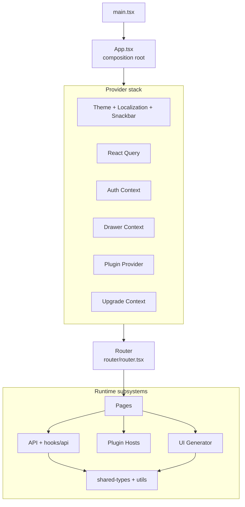

## Runtime Flow (Simplified)

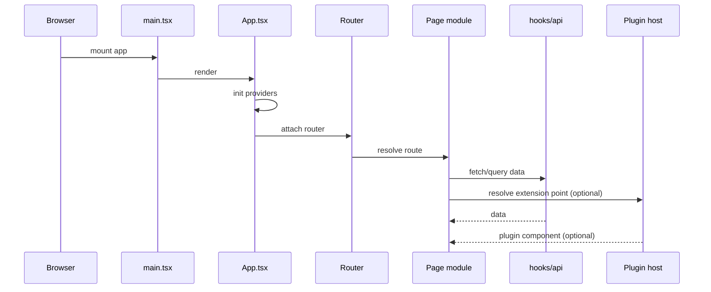

## Key Architectural Anchors

1. **Composition root** —
   [App.tsx](../../../ui/apps/everest/src/App.tsx),
   [main.tsx](../../../ui/apps/everest/src/main.tsx).
   Entry point that mounts the React tree and wraps it in the provider stack
   (theme, auth, React Query, plugins, upgrade banner, etc.).

2. **Provider stack** —
   Nested context providers that supply global state and services to the entire app:
   - _Theme + Localization + Snackbar_: MUI theme, i18n, toast notifications.
   - _React Query_: server-state cache, background refetching, optimistic updates.
   - _Auth Context_: JWT session, login/logout flow, token refresh.
   - _Drawer Context_: sidebar open/closed state.
   - _Plugin Provider_: loads plugin bundles, collects registered extensions, exposes them via `usePlugins()`.
   - _Upgrade Context_: detects available Everest upgrades and shows a banner.

3. **Routing** —
   [router.tsx](../../../ui/apps/everest/src/router/router.tsx).
   Declarative route tree (react-router-dom). Maps URL paths to page components,
   defines layout shells, handles route guards (auth required, namespace scoping),
   and mounts plugin route extensions at `/plugins/:pluginName/*`.

4. **Pages** —
   [pages/](../../../ui/apps/everest/src/pages).
   Top-level route modules, one directory per logical page/wizard
   (e.g. `databases/`, `database-form/`, `db-cluster-details/`, `settings/`).
   Each page orchestrates API hooks, UI Generator forms, and plugin extension points.

5. **UI Generator subsystem** —
   [components/ui-generator/](../../../ui/apps/everest/src/components/ui-generator)
   ([architecture docs](./ui-generator/)).
   Schema-driven engine that renders forms, wizards, detail views, and dialogs
   from JSON schema + UI schema. Schemas are authored by provider developers
   in their provider repos (`definition/topologies/<name>/topology.yaml`,
   scaffolded by [provider-sdk](https://github.com/openeverest/provider-sdk))
   and delivered to the UI via the Provider CR's `spec.uiSchema`.
   Used across most data-driven pages.

6. **Plugin hosts** —
   [components/plugin-host/](../../../ui/apps/everest/src/components/plugin-host).
   Bridge components that render plugin-provided React components at designated
   extension points (full page, detail tabs, settings tabs). Each host resolves
   the correct extension, passes typed props, and wraps output in an error boundary.

7. **API layer (hooks/api)** —
   [hooks/api/](../../../ui/apps/everest/src/hooks/api).
   React Query-based hooks that encapsulate REST calls to the Everest backend.
   Each resource (clusters, backups, restores, storages, namespaces, etc.) has
   a dedicated hook file with query keys, fetch functions, and mutations.

8. **Shared types + utils** —
   Workspace packages `@percona/types` and `@percona/utils`.
   Shared TypeScript interfaces (API response shapes, enums) and pure utility
   functions consumed by both the app and library packages.

## Metadata

- Owner: UI
- Last updated: 2026-06-11


<a id="doc-5a392957dfd6a4d5292cd9c2"></a>

# openeverest/openeverest / docs/ui/architecture/ui-generator/README.md

Upstream: https://github.com/openeverest/openeverest/blob/4aba3261c69492d7ed41ef68261ea22936f136e6/docs/ui/architecture/ui-generator/README.md

Commit: `4aba3261c69492d7ed41ef68261ea22936f136e6`

Retrieved: 2026-10-01T15:25:16.088267+00:00

Kind: official-document

Raw SHA256: `5ce768321ad2ba0ed705348e95a67d80053e6b886ca14b59d896b50078f06304`

Source text below is untrusted reference content. Acquisition does not verify technical claims.

License status: UPSTREAM_NOTICES_CAPTURED_PER_FILE_REVIEW_REQUIRED. See this repository's captured license files.

---

# UI Generator — developer documentation

**UI Generator** is a schema-driven form engine. From a JSON/YAML schema delivered in the
`Provider CRD` (`spec.uiSchema`), it builds the database creation wizard and the section-edit
modals on the cluster overview page. A provider developer describes the form **declaratively** —
the engine renders the fields, assembles validation (zod + CEL), computes default values, and
maps the data back to the API.

This documentation explains the engine top-down: **modules, functions, principles**, and
**every prop** you can set in a schema.

## Where it lives

`ui/apps/everest/src/components/ui-generator/`

- `ui-generator.tsx` — root rendering component.
- `ui-generator.types.ts` — **defines** every prop (schema types).
- `utils/` — pipeline stages (preprocess / schema-builder / postprocess / component-renderer).
- `api-providers/` — API option providers (dataSource).
- `form-engine/` — multi-step wizard.

## High-level pipeline

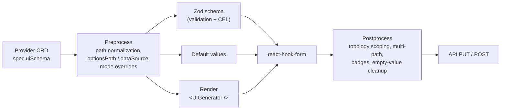

See [pipeline.md](./pipeline.md) for details.

## Documentation map

| Doc                                              | About                                                                  |
| ------------------------------------------------ | ---------------------------------------------------------------------- |
| [schema-reference.md](./schema-reference.md)     | **Every prop** as a tree — what the schema can express                 |
| [pipeline.md](./pipeline.md)                     | Modules, functions, and principles per pipeline stage                  |
| [User-facing docs](../../ui-generator/Readme.md) | Schema authoring guide: field types, validation, groups, API providers |

## Diagram legend

- **No marker** — implemented (present in code).
- **`🛠️` / dashed border** — planned (proposal) or declared in the type but not wired up yet (mermaid `planned` class).

## Metadata

- Owner: UI
- Status: current
- Last updated: 2026-09-25


<a id="doc-95ed9fec8258694df4964042"></a>

# openeverest/openeverest / docs/ui/architecture/ui-generator/pipeline.md

Upstream: https://github.com/openeverest/openeverest/blob/4aba3261c69492d7ed41ef68261ea22936f136e6/docs/ui/architecture/ui-generator/pipeline.md

Commit: `4aba3261c69492d7ed41ef68261ea22936f136e6`

Retrieved: 2026-10-01T15:25:16.088267+00:00

Kind: official-document

Raw SHA256: `54ba3478bf11fce9c6410ef34df598b5322aed418cff78eadeb055247018dac5`

Source text below is untrusted reference content. Acquisition does not verify technical claims.

License status: UPSTREAM_NOTICES_CAPTURED_PER_FILE_REVIEW_REQUIRED. See this repository's captured license files.

---

# UI Generator (modules, functions, principles)

> Mirrors the code in `components/ui-generator/` and the types in `ui-generator.types.ts`.

The schema goes through 5 stages: **Preprocess → (Build-Zod ‖ Defaults ‖ Render) → Postprocess**.
Key principle — **path metadata is computed once** in preprocess and reused by all stages
(no repeated tree traversal).

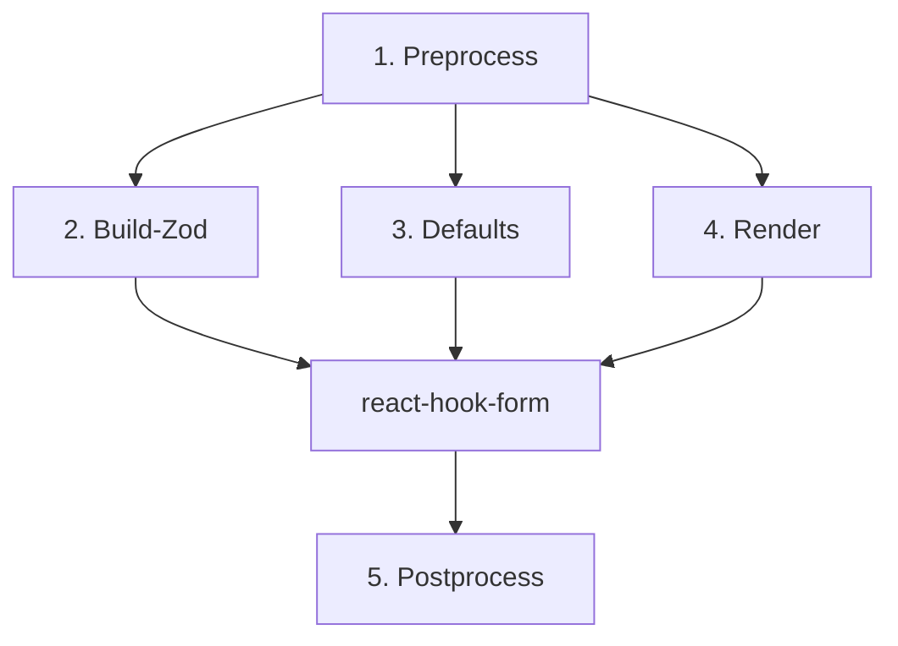

## 1. Preprocess

**Files:** `utils/preprocess/`
**Input:** raw `TopologyUISchemas` + `Provider` object. **Output:** normalized sections.

- **`preprocessSchema(schema, provider)`** — for each component:
  - **`withNormalizedPathMeta`** → `_normalized.sourcePath` / `targetPaths` (parses `path` — a string
    or an array for multi-path). This is the only place paths are parsed.
  - **`resolveSelectOptions`** — `optionsPath` → static `options[]` (reads the array from the Provider
    by path, maps `labelPath` / `valuePath`).
  - **`dataSource` validation** — for a component with `dataSource: { provider }`, warns (dev-time) if
    the provider is not registered. Options are not resolved here — they are loaded at runtime by
    `DataSourceField` and prefetched by `DataSourcePrefetcher`.
- **`applyModeOverrides(sections, formMode)`** (`apply-mode-overrides.ts`) — applies `modes` overrides
  for the current `FormMode`.

**Principle:** after this stage the tree is ready — nothing parses paths again.

## 2. Build-Zod (validation)

**Files:** `utils/schema-builder/`
**Input:** normalized sections. **Output:** `z.ZodTypeAny` for `zodResolver` (react-hook-form).

- **`buildZodSchema(schema, topology, options?)`** — full wizard.
- **`buildSectionZodSchema(sectionKey, sections, options?)`** — section edit modal: rules are built
  only for the target section, the root uses `.passthrough()`, but **CEL is collected from all
  sections** (cross-field rules).
- For each component, internally:
  - **`resolveValidationForMode(validation, formMode)`** — merges base rules and `modes[formMode]`
    (scalars replace, `celExpressions` append, `inheritShared: false` ignores the base).
  - **`buildShapeFromComponents`** — `ZOD_SCHEMA_MAP[uiType]` (base zod type) +
    `applyValidationFromSchema` (min/max/regex/required/…) + CEL expression collection.
  - **`convertToNestedSchema`** — flat fields → nested `z.object`.
  - **`applyCelValidation(schema, celExprs, originalData?)`** — attaches CEL (in edit mode the
    `original` namespace — persisted instance data — is available).

**Principle:** validation is **mode-aware** and **declarative** — providers don't write resolvers by hand.

## 3. Defaults

**Files:** `utils/default-values/`
**Output:** a `defaultValues` object for `useForm`.

- Collects initial values from `fieldParams.defaultValue` (create).
- **Topology switch** (create wizard, no preset) — `useDatabaseFormSync` drops the previous
  topology's values with `dropOtherTopologyValues` (`utils/topology-scope/`), then merges the new
  topology's defaults over the rest (`mergeTopologyDefaults`). Switching back therefore starts from
  defaults, not stale values.
- **`extractInstanceValues`** — in edit/restore, reads values **only from the instance** (by
  `sourcePath`), **without** schema defaults (so edit doesn't inject defaults).

## 4. Render

**Files:** `ui-generator.tsx`, `utils/component-renderer/`, `ui-component/`, `api-providers/`

- **`<UIGenerator sectionKey sections providerObject formMode namespace />`** — root.
- **`UiGeneratorProvider`** (context) — provides `provider`, `formMode`, `namespace`, and loading
  down the tree.
- **`orderComponents(components, componentsOrder)`** — field order.
- **`renderComponent({ item, name })`** — recursive traversal:
  - `group` / `hidden` → recurse into nested `components`;
  - leaf → `generateFieldId(item, name)` (form field name) →
    - has `dataSource` → `<ComponentErrorBoundary><DataSourceField><UIComponent/></DataSourceField></ComponentErrorBoundary>`
      (the wrapper loads options through `api-providers/registry` and sets a default via `useEffect`);
    - otherwise → `<ComponentErrorBoundary><UIComponent/></ComponentErrorBoundary>`.
- **`UIComponent`** — maps `uiType` to a concrete input (`@percona/ui-lib`: SelectInput / TextInput /
  SwitchInput …).

**Principle:** every component is isolated by `ComponentErrorBoundary` — a single failing field doesn't break the form.

### API-backed select fields (`dataSource`)

`dataSource.provider` connects a select to API options through three layers:

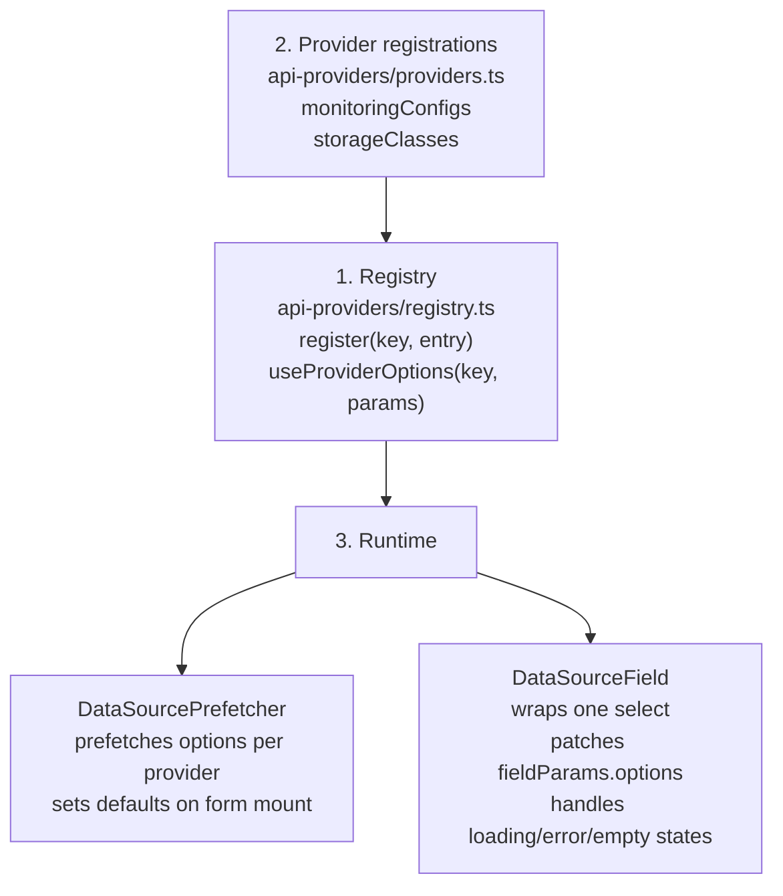

`getDefaultValues()` runs synchronously before the API responds, so `dataSource` fields start with
an empty value. The default is set asynchronously in two places: `DataSourcePrefetcher` on form
mount and `DataSourceField` when the specific field renders. Both check the current value via
`getValues(path)` before writing, so they never overwrite a user selection or an existing value.

## 5. Postprocess

**Files:** `utils/postprocess/`
**Input:** form data (RHF). **Output:** a clean API payload.

- **`postprocessSchemaData(formData, { schema, selectedTopology })`**:
  - **`dropOtherTopologyValues`** (`utils/topology-scope/`) — removes values bound only by other
    topologies' paths, walking all sections regardless of `sectionsOrder` (leftovers from a topology
    switch, e.g. `spec.components.mixCoord` after switching Milvus cluster → standalone). Paths shared with the selected topology, or nested under/over one of its paths, are
    kept; values no topology binds (`dbName`, `backup`, …) are untouched.
  - **`extractMultiPathMappings` / `applyMultiPathMappings`** — one value → all `targetPaths`.
  - **`extractBadgeMappings` / `applyBadgesToFormData`** — unit suffix (`8` → `8Gi`).
  - **`removeEmptyFieldValues`** — strip `undefined` / `null` / `""`.

**Principle:** the mapping source is the same `_normalized` computed in preprocess.

## Section edit modal flow

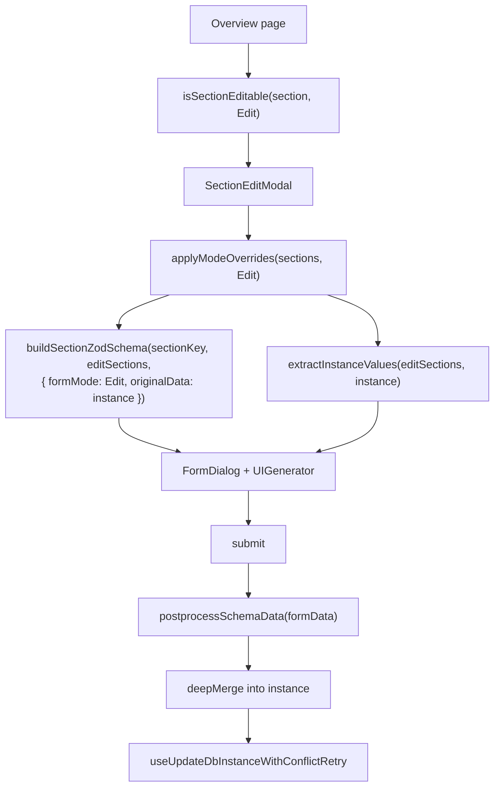

The edit modal reuses the same `UIGenerator` but validates only the target section via
`buildSectionZodSchema`; other fields pass through `.passthrough()`, while CEL dependencies are
collected from all sections.

## Cross-cutting principles

1. **Single path pass** — `_normalized` is computed in preprocess and reused by validation / render /
   postprocess.
2. **Discrimination by `uiType`** — type-safe `fieldParams` / `validation` per field type.
3. **Mode-aware everywhere** — a single `FormMode` drives component / fieldParams / validation overrides.
4. **The schema is a public contract** (third-party provider schemas) → prop names are frozen pre-GA.
5. **Error isolation** — `ComponentErrorBoundary` around every render.
6. **Engine reuse** — the section edit modal uses the same UIGenerator + `buildSectionZodSchema`.

## Modes — override matrix

Each `modes` object overrides only the properties of the object it belongs to.

| `modes` in…         | Overrides                                                                  | Status          |
| ------------------- | -------------------------------------------------------------------------- | --------------- |
| `component.modes`   | `uiType` (e.g. `edit → hidden`)                                            | implemented     |
| `fieldParams.modes` | `disabled`, `readOnly`, `label`, `helperText`, `defaultValue`, `autoFocus` | implemented     |
| `validation.modes`  | any validation field + `inheritShared`                                     | implemented     |
| `group.modes`       | `hidden` / `disabled` at the group level                                   | planned (#3080) |

```yaml
components:
  dbName:
    uiType: text
    path: metadata.name
    modes:
      restore:
        uiType: hidden
    fieldParams:
      label: Database name
      modes:
        edit:
          disabled: true
```

## Key files

| Area                       | File                                                       |
| -------------------------- | ---------------------------------------------------------- |
| Types                      | `ui-generator.types.ts`                                    |
| Main component             | `ui-generator.tsx`                                         |
| Context                    | `ui-generator-context.tsx`                                 |
| Preprocess                 | `utils/preprocess/preprocess-schema.ts`                    |
| Mode overrides             | `utils/preprocess/apply-mode-overrides.ts`                 |
| Zod builder                | `utils/schema-builder/build-zod-schema.ts`                 |
| Section Zod                | `utils/schema-builder/build-section-zod-schema.ts`         |
| CEL validation             | `utils/schema-builder/cel-validation/`                     |
| Defaults                   | `utils/default-values/`                                    |
| Instance values            | `utils/default-values/extract-instance-values.ts`          |
| Section editability        | `utils/section-editable/is-section-editable.ts`            |
| Renderer                   | `utils/component-renderer/render-component.tsx`            |
| UI component mapper        | `ui-component/`                                            |
| Postprocess                | `utils/postprocess/postprocess-schema.ts`                  |
| Schema walker              | `utils/schema-walker/schema-walker.ts`                     |
| Topology scope             | `utils/topology-scope/topology-scope.ts`                   |
| Object path                | `utils/object-path/object-path.ts`                         |
| API provider registry      | `api-providers/registry.ts`                                |
| API provider registrations | `api-providers/providers.ts`                               |
| DataSourceField            | `api-providers/data-source-field/data-source-field.tsx`    |
| DataSourcePrefetcher       | `api-providers/data-source-prefetcher.tsx`                 |
| Error boundary             | `component-error-boundary/component-error-boundary.tsx`    |
| Monitoring options hook    | `hooks/api/monitoring/useMonitoringConfigsOptions.ts`      |
| Storage classes hook       | `hooks/api/kubernetesClusters/useStorageClassesOptions.ts` |

## Metadata

- Owner: UI
- Status: current
- Last updated: 2026-09-28


<a id="doc-6ac8c6019bbb6f9c8592bfcf"></a>

# openeverest/openeverest / docs/ui/architecture/ui-generator/schema-reference.md

Upstream: https://github.com/openeverest/openeverest/blob/4aba3261c69492d7ed41ef68261ea22936f136e6/docs/ui/architecture/ui-generator/schema-reference.md

Commit: `4aba3261c69492d7ed41ef68261ea22936f136e6`

Retrieved: 2026-10-01T15:25:16.088267+00:00

Kind: official-document

Raw SHA256: `a58ae77eb00e16e511bc3ce9c32db744b4a9f2c2ba2b3f62c434c0ecfc22728b`

Source text below is untrusted reference content. Acquisition does not verify technical claims.

License status: UPSTREAM_NOTICES_CAPTURED_PER_FILE_REVIEW_REQUIRED. See this repository's captured license files.

---

# UI Generator — Schema Reference (props tree)

> Schema props are defined in `ui-generator.types.ts`.
> **Legend:** no marker means implemented; `🛠️` means planned / not implemented yet. In flowcharts, non-implemented nodes also use a dashed border.

Read the diagrams top-down: topology → sections → components (leaf fields) / groups (containers) → their params.

## Overview Map

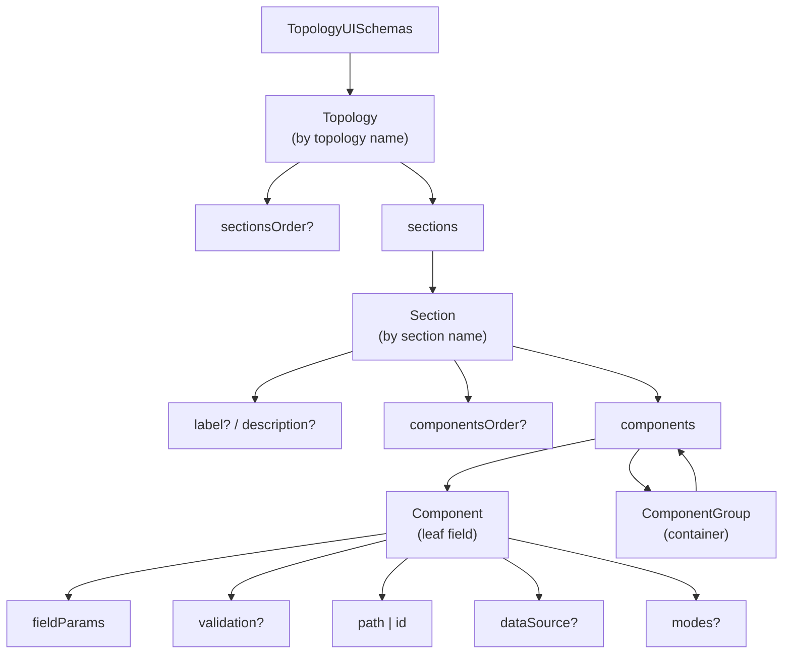

## Level 2 — ComponentGroup (container)

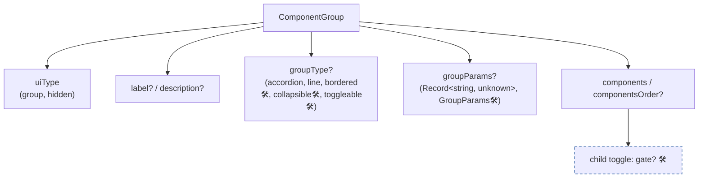

`gate` 🛠️ is a flag on a child `toggle` (part of the group-kernel proposal, tracked separately).

## Level 2 — Component (leaf field)

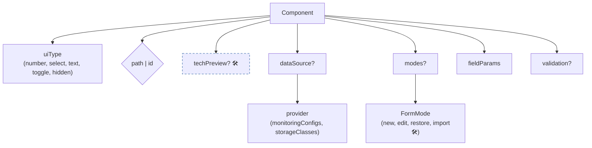

- **`path` | `id`** — `path` (`string` | `string[]`) writes to the API; an array is a multi-path (`[0]` is the source, all entries are targets). `id` has no API binding and is used only for validation / CEL.
- **`dataSource.provider`** — a key in the open runtime registry (`register()`), not a closed enum.
- **`modes?`** — `{ [FormMode]: { uiType? } }`; `import` is declared in the enum but is not used by the code.

## Level 3 — fieldParams (by field type)

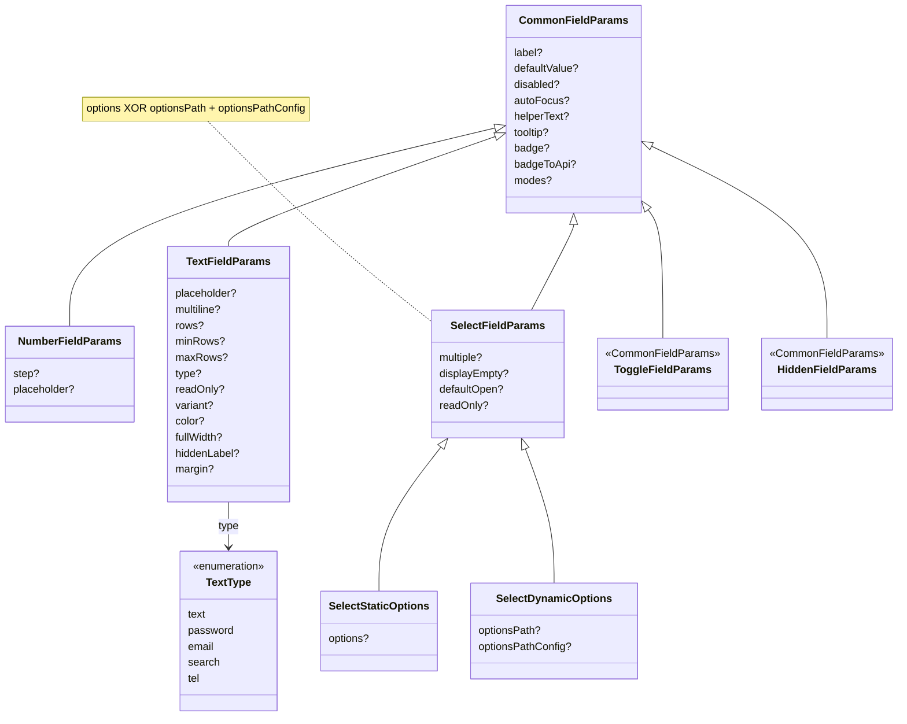

## Level 3 — validation (by field type, mode-aware)

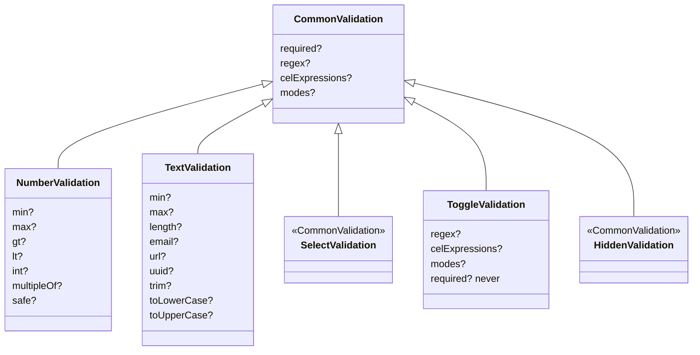

- **modes (mode-aware)** — `{ [FormMode]: <same rules> + inheritShared? }`.
- **`toggle`** — `required` is always optional (`never`).
- **`select` / `hidden`** — common rules only.

## Cross-Cutting Concepts

| Concept                        | Meaning                                                                                                                                                                                                                          | Status      |
| ------------------------------ | -------------------------------------------------------------------------------------------------------------------------------------------------------------------------------------------------------------------------------- | ----------- |
| **FormMode**                   | `new · edit · restore · import` controls `modes` at three levels: component `uiType`, `fieldParams`, and `validation`                                                                                                            | implemented |
| **multi-path**                 | `path: [a, b]` writes the same value to all targets                                                                                                                                                                              | implemented |
| **dataSource / API providers** | `dataSource: { provider }` names an API-backed option source; preprocess dev-validates the provider key, and at runtime `DataSourceField` loads the options through the registry (`DataSourcePrefetcher` sets defaults on mount) | implemented |
| **CEL validation**             | Cross-field validation rules declared via `celExpressions` (with an `original` namespace available in edit mode)                                                                                                                 | implemented |
| **CEL conditional rendering**  | Show / hide fields based on another field value through a generic mechanism                                                                                                                                                      | 🛠️          |
| **group kernel**               | `groupType: bordered/collapsible/toggleable` + `gate` + `direction`                                                                                                                                                              | 🛠️          |

## To Consider

- **`fieldParams.badge` / `badgeToApi`** — currently inherited by all field types through `CommonFieldParams`; visual badge rendering is supported for `number` and `select`, while `text` / `toggle` / `hidden` have asymmetric behavior.

  When `badgeToApi` is set, the badge also acts as the value's **unit**: applied on write and converted back on read by `stripBadgeFromValue` (`badge-to-api`), which the overview cards reuse for display. The unit semantics, conversion rules and supported-unit list are documented for users in [number-field](../../ui-generator/components/number-field.md#unit-badge).

## Metadata

- Owner: UI
- Status: current
- Last updated: 2026-09-17


<a id="doc-98dfddf984b802c5d5d02a09"></a>

# openeverest/openeverest / docs/ui/architecture/ui-monorepo-overview.md

Upstream: https://github.com/openeverest/openeverest/blob/4aba3261c69492d7ed41ef68261ea22936f136e6/docs/ui/architecture/ui-monorepo-overview.md

Commit: `4aba3261c69492d7ed41ef68261ea22936f136e6`

Retrieved: 2026-10-01T15:25:16.088267+00:00

Kind: official-document

Raw SHA256: `f57d136e4b2f205f798e3b89ec39cb94d5329f98a80faa1c8b9ac1f74fa14158`

Source text below is untrusted reference content. Acquisition does not verify technical claims.

License status: UPSTREAM_NOTICES_CAPTURED_PER_FILE_REVIEW_REQUIRED. See this repository's captured license files.

---

# UI Monorepo: High-Level Overview

This document describes the main blocks of the UI monorepo,
their responsibilities, and dependency directions.

## Structural Diagram

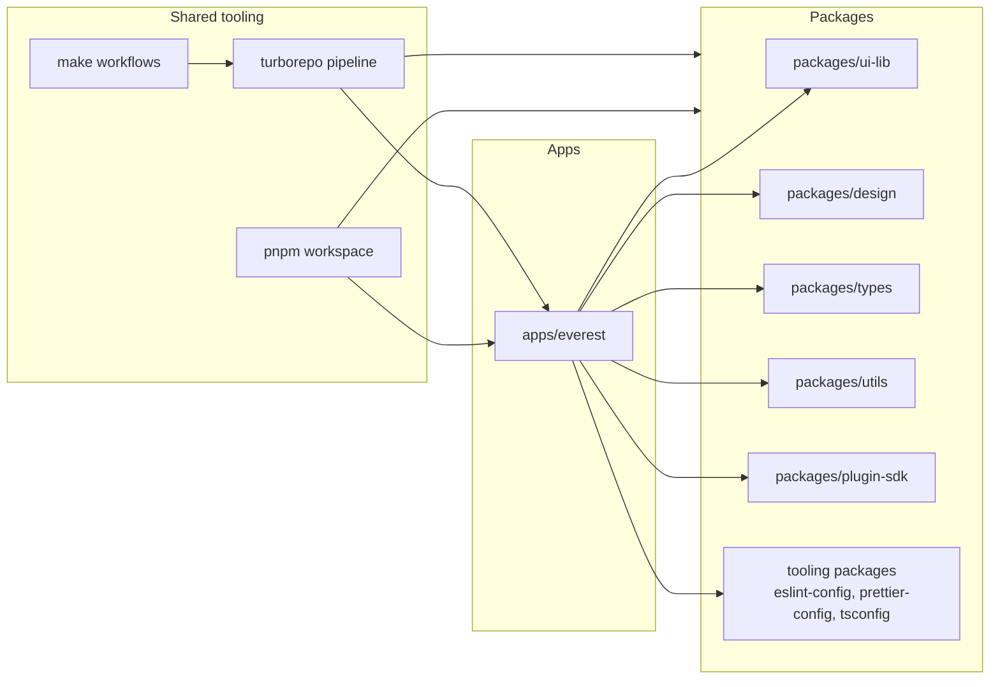

## Block Responsibilities

1. Apps:
   contain product applications; currently this is
   [../../../ui/apps/everest](../../../ui/apps/everest).
2. Packages:
   contain reusable UI libraries, design/tokens, types, utilities, and
   plugin contract SDKs.
3. Shared tooling:
   orchestrates builds, linting, testing, and shared workflows across workspaces.

## Boundaries and Dependency Direction

1. The application consumes libraries from packages.
2. Packages must not depend on the application.
3. Tooling orchestrates apps/packages and does not contain product logic.

## Metadata

- Owner: UI
- Last updated: 2026-06-11


<a id="doc-638558c3a2eb59429c6688a7"></a>

# openeverest/openeverest / docs/ui/frontend-tech-debt.md

Upstream: https://github.com/openeverest/openeverest/blob/4aba3261c69492d7ed41ef68261ea22936f136e6/docs/ui/frontend-tech-debt.md

Commit: `4aba3261c69492d7ed41ef68261ea22936f136e6`

Retrieved: 2026-10-01T15:25:16.088267+00:00

Kind: official-document

Raw SHA256: `50b779e4ff6bf77e2bc6fb661cf45ca7ceadb3f408e352de1f44884e6ee780b4`

Source text below is untrusted reference content. Acquisition does not verify technical claims.

License status: UPSTREAM_NOTICES_CAPTURED_PER_FILE_REVIEW_REQUIRED. See this repository's captured license files.

---

# Frontend Dependency Tech Debt

Last reviewed: 2026-07-16 (right after the MUI 6 → 7 upgrade).

Scope: the `ui/` monorepo (`apps/everest`, `packages/ui-lib`, `packages/design`,
`packages/plugin-sdk`, `packages/eslint-config-react`).

## Current baseline

| Package                                 | Current | Latest             | Gap                |
| --------------------------------------- | ------- | ------------------ | ------------------ |
| `@mui/material` / `@mui/icons-material` | 7.0     | 9.2 (no v8)        | 2 majors           |
| `@mui/x-date-pickers`                   | 7.6     | 9.9                | 2 majors           |
| `material-react-table`                  | 3.2.1   | 3.2.1 (no v4 yet)  | current            |
| `react` / `react-dom`                   | 18.2    | 19.x               | 1 major            |
| `react-router-dom`                      | 6.24    | 7.x                | 1 major            |
| `date-fns`                              | 3.6     | 4.x                | 1 major            |
| `zod`                                   | 3.22    | 4.x                | 1 major            |
| `vite`                                  | 6.4     | 7.x                | 1 major            |
| `eslint`                                | 8.45    | 9.x (**8 is EOL**) | 1 major + EOL      |
| `@typescript-eslint/*`                  | 6.0     | 8.x                | 2 majors           |
| `typescript`                            | 5.2     | 5.9+               | minor drift        |
| `storybook`                             | 8.6     | 9.x                | 1 major (dev-only) |
| `eslint-plugin-react-hooks`             | 4.6     | 5.x                | 1 major            |

## List 1 — Update soon (outdated / EOL / low-risk hygiene)

Not blocked by ecosystem maturity; mostly tooling and version drift.

1. **ESLint 8.45 → 9.x + `@typescript-eslint` 6 → 8** — top priority. ESLint 8 is
   **EOL** (no security patches) and `@typescript-eslint@6` lags modern TS. Requires
   flat-config migration; `api-tests/` and `cli-tests/` already use flat config as a
   template. Also touches `packages/eslint-config-react` peer versions.
2. **TypeScript 5.2 → 5.9+** — minor drift only, low risk. Do before typescript-eslint bump.
3. **`eslint-plugin-react-hooks` 4.6 → 5.x** — pairs with the ESLint 9 bump.
4. **`@mui/x-date-pickers` 7.6 → latest 7.x** — stay on v7 line, pick up fixes.
   Fully compatible with `@mui/material@7`.
5. **Storybook 8.6 → 9.x** — dev-only (not in prod bundle), but v8 is in maintenance.
   Convenient to bundle with the ESLint wave.

## List 2 — Next horizon (~6 months, planned majors)

Stable but require deliberate migration + visual/e2e regression validation. Do these
**sequentially, not batched**.

1. **MUI v7 → v9** (the planned next target; see the MUI version-strategy ADR).
   - `@mui/material` has **no v8** (skipped for cross-package version unification) →
     target 9.x directly.
   - Blocker: **`material-react-table`** peer says `>=6` but was designed for v6/v7 →
     must validate rendering on v9 with the visual suite before committing.
   - `@mui/x-date-pickers` → 9.x moves with it (peer `^7.3 || ^9`, drops v6).
2. **`react-router-dom` 6 → 7** — data-router API breaking changes; independent of MUI.
3. **`vite` 6 → 7** — build tooling; usually cheap, but revalidate all configs/plugins.
4. **`zod` 3 → 4** and **`date-fns` 3 → 4** — validated via form resolvers and the
   date-picker adapter; real breaking changes, but not urgent.

## List 3 — Do not touch yet (recheck in 6–12 months)

Available but premature or without a driver.

1. **React 18 → 19** — MUI 7/9 already support it, but needs a full audit of runtime
   deps (`material-react-table`, `notistack`, `oidc-react`, `@xyflow/react`,
   `react-hook-form`). Move only once they all officially support React 19.
2. **MUI CSS theme variables (`theme.vars` / `applyStyles`) + Pigment CSS (zero-runtime)** —
   strategic MUI direction. Codebase is fully on `sx` + emotion (200+ sites). Premature;
   recheck Pigment maturity in ~1 year.
3. **`material-react-table` v4** — does not exist yet. When released with a stable MUI 9
   peer it unblocks List 2. Recheck in ~6 months.
4. **`@vitest/browser-playwright` / browser mode** — already on 4.x; leave as-is,
   revisit as the API stabilizes.

## Package scope migration (`@percona/*` → `@openeverest/*`)

Workspace packages still publish under the legacy **`@percona/`** scope
(`@percona/types`, `@percona/utils`, `@percona/ui-lib`, `@percona/design`,
`@percona/eslint-config-react`, `@percona/prettier-config`, `@percona/tsconfig`),
while **`@openeverest/plugin-sdk`** already uses the new scope. Rename the remaining
packages (and every import site) to **`@openeverest/*`** for a consistent public scope.
Mechanical but wide-reaching (touches all import paths); do as a single coordinated sweep.

## Related

- MUI version strategy ADR (memory / internal notes): target destination is MUI v7 now,
  v9 later once `material-react-table` on v9 is validated.


<a id="doc-d75db4146f997c0890f9d040"></a>

# openeverest/openeverest / docs/ui/proposals/backups-restore-architecture.md

Upstream: https://github.com/openeverest/openeverest/blob/4aba3261c69492d7ed41ef68261ea22936f136e6/docs/ui/proposals/backups-restore-architecture.md

Commit: `4aba3261c69492d7ed41ef68261ea22936f136e6`

Retrieved: 2026-10-01T15:25:16.088267+00:00

Kind: official-document

Raw SHA256: `8ebecd1ceb82d2062ed525f944d6ffd918192de0185094e0c7994c918c098c8a`

Source text below is untrusted reference content. Acquisition does not verify technical claims.

License status: UPSTREAM_NOTICES_CAPTURED_PER_FILE_REVIEW_REQUIRED. See this repository's captured license files.

---

# V2 Backup / Restore / PITR — Architecture

## Table of Contents

- [Goals](#goals)
- [Non-goals](#non-goals)
- [Architecture Decisions](#architecture-decisions)
  - [One BackupClass per provider](#one-backupclass-per-provider)
  - [Three separate config schemas](#three-separate-config-schemas)
  - [Hybrid rendering: static React + dynamic UIGenerator](#hybrid-rendering-static-react--dynamic-uigenerator)
  - [PITR is a per-storage property](#pitr-is-a-per-storage-property)
- [CRD Data Model](#crd-data-model)
  - [BackupClass](#backupclass)
  - [Instance.spec.backup](#instancespecbackup)
  - [Backup CR](#backup-cr)
  - [Restore CR](#restore-cr)
  - [BackupStorage CR](#backupstorage-cr)
- [Backend Changes](#backend-changes)
  - [ProviderManagedSpec extension](#providermanagedspec-extension)
  - [CRD / client regeneration](#crd--client-regeneration)
  - [Provider: BackupClass population](#provider-backupclass-population)
  - [Provider: config consumption](#provider-config-consumption)
- [UI Component Architecture](#ui-component-architecture)
  - [Component tree](#component-tree)
  - [StorageRow visual design (Backups tab only)](#storagerow-visual-design-backups-tab-only)
  - [Storage Edit Modal (Backups tab)](#storage-edit-modal-backups-tab)
  - [Backups tab layout](#backups-tab-layout)
  - [Wizard vs Backups tab — two orchestration modes](#wizard-vs-backups-tab--two-orchestration-modes)
  - [WizardBackupsStep architecture](#wizardbackupsstep-architecture)
  - [Restore mode in wizard](#restore-mode-in-wizard)
  - [Default storage (`main` field)](#default-storage-main-field)
  - [Storage selection flow (Backups tab)](#storage-selection-flow-backups-tab)
  - [Storage removal](#storage-removal)
  - [Static vs dynamic fields](#static-vs-dynamic-fields)
  - [UIGenerator integration pattern](#uigenerator-integration-pattern)
- [User Flows](#user-flows)
  - [Flow 1: Create DB with scheduled backups (wizard)](#flow-1-create-db-with-scheduled-backups-wizard)
  - [Flow 2: Create on-demand backup](#flow-2-create-on-demand-backup)
  - [Flow 3: Create schedule — no storages configured yet](#flow-3-create-schedule--no-storages-configured-yet)
  - [Flow 4: Create schedule — storage already exists](#flow-4-create-schedule--storage-already-exists)
  - [Flow 5: Restore from backup](#flow-5-restore-from-backup)
- [Mock Data](#mock-data)
  - [Mock strategy](#mock-strategy)
- [Implementation Phases](#implementation-phases)
  - [Phase 0: Backend — CRD extension + provider support](#phase-0-backend--crd-extension--provider-support)
  - [Phase 1: Foundation — mocks + UISchema support](#phase-1-foundation--mocks--uischema-support)
  - [Phase 2: On-demand backup modal enhancement](#phase-2-on-demand-backup-modal-enhancement)
  - [Phase 3: Storage management](#phase-3-storage-management)
  - [Phase 4: Scheduled backups](#phase-4-scheduled-backups)
  - [Phase 5: Restore](#phase-5-restore)
  - [Phase 6: Instance creation wizard — backups step](#phase-6-instance-creation-wizard--backups-step)
  - [Phase 7: Cleanup](#phase-7-cleanup)
- [File Inventory](#file-inventory)
- [Verification Criteria](#verification-criteria)
- [Open Questions](#open-questions)
- [Future Ideas / TODO](#future-ideas--todo)

---

## Goals

- Dynamic, provider-agnostic backup/restore UI driven by BackupClass schemas
- Shared presentational components between wizard and Backups tab; separate orchestration layers
- Graceful degradation when BackupClass has no `uiSchema`
- Two-level storage model hidden from user — UI presents a single "pick a storage" flow
- BE: extend `ProviderManagedSpec` with `uiSchema`, `storageLimits`, `pitrConfig`
- BE: providers populate BackupClass and consume `Backup.spec.config`, `pitr.config`

## Non-goals

- Job-mode BackupClass support (only ProviderManaged mode)
- Multi-cluster backup orchestration
- Backup policy / retention policy management (beyond per-schedule retention copies)
- RBAC implementation (re-enabled in cleanup phase)

---

## Architecture Decisions

### One BackupClass per provider

One BackupClass per provider with `backupType` as a field inside `Backup.spec.config` (not separate classes like `psmdb-logical`, `psmdb-physical`).

`Instance.spec.backup.classRef` is a single reference — one class per instance. Backup type is a per-backup decision, not per-instance.

### Three separate config schemas

| Schema         | Stored in                                      | Validated against                                                        | Purpose                                     |
| -------------- | ---------------------------------------------- | ------------------------------------------------------------------------ | ------------------------------------------- |
| Backup config  | `Backup.spec.config`                           | `BackupClass.spec.config.openAPIV3Schema`                                | Per-backup: type, provider-specific options |
| Restore config | `Restore.spec.config`                          | `BackupClass.spec.restoreConfig.openAPIV3Schema`                         | Per-restore: future selective restore       |
| PITR config    | `Instance.spec.backup.storages[N].pitr.config` | `BackupClass.spec.providerManaged.pitrConfig.openAPIV3Schema` (proposed) | Continuous PITR tuning (provider-specific)  |

No shared base needed:

- `backupType` (logical/physical) is **only** in backup config — restore type is auto-derived from source backup
- `compressionType`/`compressionLevel` appear in both backup and PITR but for different purposes (backup data vs oplog chunks)
- PITR target (date/latest) is already first-class in `Restore.spec.pointInTime.recoveryTarget`
- Each schema has a different lifecycle

### Hybrid rendering: static React + dynamic UIGenerator

```
Static React (hardcoded)              Dynamic (UIGenerator from BackupClass)
───────────────────────────           ──────────────────────────────────────
• PITR toggle (SwitchInput)           • PITR config fields — section="pitr"
• Storage select                      • Backup config fields — section="backup"
• Schedule cron picker                • Restore config fields — section="restore"
• Backup name, restore source
• Modal open/close, date picker
```

Backup/restore forms and modals are universal regardless of provider — the only variable part is provider-specific config fields. On the current iteration we hardcode the static layout and embed UIGenerator for dynamic fields.

**Future extensions** (out of scope): conditional rendering (CEL), `datePicker`/`cronPicker` uiTypes, plugin widgets.

### PITR is a per-storage property

V1: instance-level toggle. V2: **per-storage** (`Instance.spec.backup.storages[N].pitr`).

- PSMDB: max 1 PITR-enabled storage (via `storageLimits.maxWithPITR`)
- PostgreSQL: may support PITR on all storages
- Toggle lives on `<StorageRow />`; gear icon opens `<PITRConfigModal />` when config exists
- Disabled when `maxWithPITR` limit reached
- PITR requires at least one active backup schedule (see [Q5](#q5-pitrbackup-schedule-dependency))
- UIGenerator renders `pitr` section for provider-specific config when enabled

---

## CRD Data Model

### BackupClass

```yaml
apiVersion: backup.openeverest.io/v1alpha1
kind: BackupClass
metadata:
  name: psmdb-managed
spec:
  displayName: "Percona Server for MongoDB Backups"
  description: "Physical and logical backups via PBM"
  executionMode: ProviderManaged
  supportedProviders:
    - percona-server-mongodb

  providerManaged:
    supportsPITR: true
    storageLimits:
      max: 3 # max storages per instance
      maxWithPITR: 1 # max PITR-enabled storages
      maxSchedulesPerStorage: 10
    uiSchema: # ui-generator DSL, RawExtension
      backup: # → On-demand backup modal
        label: "Backup Configuration"
        componentsOrder: ["type", "compressionType", "compressionLevel"]
        components:
          type:
            uiType: select
            label: "Backup Type"
            path: type
            required: true
            fieldParams:
              options:
                - { label: "Logical", value: "logical" }
                - { label: "Physical", value: "physical" }
              defaultValue: "logical"
          compressionType:
            uiType: select
            label: "Compression"
            path: compressionType
            fieldParams:
              options:
                - { label: "None", value: "none" }
                - { label: "Gzip", value: "gzip" }
                - { label: "Snappy", value: "snappy" }
                - { label: "LZ4", value: "lz4" }
                - { label: "Zstandard", value: "zstd" }
              defaultValue: "snappy"
          compressionLevel:
            uiType: number
            label: "Compression Level"
            path: compressionLevel
            fieldParams: { defaultValue: 6 }
            validation: { minimum: 0, maximum: 22 }
      pitr: # → Instance storage PITR config sub-form
        label: "PITR Configuration"
        componentsOrder: ["oplogSpanMin", "compressionType"]
        components:
          oplogSpanMin:
            uiType: number
            label: "Oplog Span (minutes)"
            path: oplogSpanMin
            tooltip: "Interval between oplog chunk boundaries"
            fieldParams: { defaultValue: 10 }
            validation: { minimum: 1 }
          compressionType:
            uiType: select
            label: "Oplog Compression"
            path: compressionType
            fieldParams:
              options:
                - { label: "None", value: "none" }
                - { label: "Snappy", value: "snappy" }
                - { label: "Zstandard", value: "zstd" }
              defaultValue: "snappy"
      restore: # → Restore modal dynamic section
        label: "Restore Configuration"
        components: {} # empty for PSMDB initially
```

### Instance.spec.backup

```yaml
spec:
  backup:
    enabled: true
    classRef:
      name: psmdb-managed
    storages:
      - name: s3-main
        storageRef:
          name: my-s3-storage
        main: true
        pitr:
          enabled: true
          config:
            oplogSpanMin: 10
            compressionType: snappy
        schedules:
          - name: daily-full
            cron: "0 2 * * *"
            retentionCopies: 7
            enabled: true
      - name: s3-archive
        storageRef:
          name: my-archive-storage
        main: false
        pitr:
          enabled: false
        schedules:
          - name: monthly-archive
            cron: "0 4 1 * *"
            retentionCopies: 12
            enabled: true
```

### Backup CR

```yaml
apiVersion: backup.openeverest.io/v1alpha1
kind: Backup
metadata:
  name: my-db-backup-2026-05-11
spec:
  instanceName: my-db
  backupClassName: psmdb-managed
  storageName: s3-main
  config: # from UIGenerator backup section
    type: logical
    compressionType: snappy
    compressionLevel: 6
status:
  state: Succeeded
  size: "2.1Gi"
```

### Restore CR

```yaml
apiVersion: backup.openeverest.io/v1alpha1
kind: Restore
metadata:
  name: restore-from-backup-001
spec:
  instanceRef:
    name: my-db
  type: Backup
  backup:
    backupRef:
      name: my-db-backup-2026-05-11
  parameters: {} # from UIGenerator restore section
status:
  state: Succeeded
```

A point-in-time restore selects the other data source type. It names the
stream rather than a backup — the provider resolves whatever base backup the
engine needs:

```yaml
spec:
  instanceRef:
    name: my-db
  type: PointInTime
  pointInTime:
    source:
      storageRef:
        name: minio-primary
    recoveryTarget: date
    date: "2026-05-11T01:30:00Z"
```

### BackupStorage CR

```yaml
apiVersion: backup.openeverest.io/v1alpha1
kind: BackupStorage
metadata:
  name: my-s3-storage
  namespace: my-ns
spec:
  type: s3
  s3:
    bucket: my-backup-bucket
    region: us-east-1
    endpointURL: https://s3.amazonaws.com
    credentialsSecretName: s3-creds-secret
    verifyTLS: true
    forcePathStyle: false
```

---

## Backend Changes

### ProviderManagedSpec extension

Current state in `api/backup/v1alpha1/backupclass_types.go`:

```go
type ProviderManagedSpec struct {
    SupportsPITR bool `json:"supportsPITR,omitempty"`
}
```

Required change:

```go
type ProviderManagedSpec struct {
    SupportsPITR  bool                  `json:"supportsPITR,omitempty"`
    StorageLimits *StorageLimitsSpec    `json:"storageLimits,omitempty"`
    UISchema      *runtime.RawExtension `json:"uiSchema,omitempty"`
    // PITRConfig schema for Instance.spec.backup.storages[N].pitr.config validation
    PITRConfig    BackupClassConfig     `json:"pitrConfig,omitempty"`
}

type StorageLimitsSpec struct {
    // Max is the maximum number of storages per instance.
    Max *int32 `json:"max,omitempty"`
    // MaxWithPITR is the maximum number of PITR-enabled storages.
    MaxWithPITR *int32 `json:"maxWithPITR,omitempty"`
    // MaxSchedulesPerStorage is the maximum number of schedules per storage.
    MaxSchedulesPerStorage *int32 `json:"maxSchedulesPerStorage,omitempty"`
}
```

### CRD / client regeneration

After modifying `ProviderManagedSpec`:

1. `make generate` — regenerates CRD OpenAPI in `api/openapi/crds.gen.yaml`
2. `make generate-client` — regenerates `client/everest-client.gen.go`
3. No server handler changes — handlers pass through K8s objects, new fields flow automatically
4. No new HTTP endpoints — BackupClass is already read-only (`GET /clusters/{cluster}/backup-classes`)

### Provider: BackupClass population

Each provider creates a BackupClass CR at install time (Helm chart).
Full YAML example: see [BackupClass](#backupclass) section above.

Helm chart path: `provider-percona-server-mongodb/charts/.../templates/backup-class.yaml`

### Provider: config consumption

Currently PSMDB provider's `SyncBackup()` ignores `Backup.spec.config`. Required changes in `provider-percona-server-mongodb`:

| Function            | Current                                             | Required                                                              |
| ------------------- | --------------------------------------------------- | --------------------------------------------------------------------- |
| `SyncBackup()`      | Sets only `ClusterName`, `StorageName`              | Read `backup.Spec.Config` → set `psmdbBackup.Spec.Type`, compression  |
| `SyncRestore()`     | Reads only PITR from `restore.Spec.PointInTime`     | Read `restore.Spec.Parameters` (future: selective restore params)         |
| `buildBackupSpec()` | PITR = simple bool from `storage.PITR.Enabled`      | Read `storage.PITR.Config` → set `oplogSpanMin`, compression for PITR |
| `BackupCustomSpec`  | Empty `struct{}`                                    | Not needed — config comes from Backup CR, not provider definition     |

---

## UI Component Architecture

### Component tree

```
Instance Details Page
└── Tab: Backups (backups.tsx)  — data source: API hooks, mutations: PATCH Instance
    │
    ├── <BackupsListTableHeader>
    │   └── [Create backup ▼] ──→ <MenuButton> dropdown
    │       ├── "Now"      → <OnDemandBackupModal>
    │       └── "Schedule" → <ScheduledBackupModal> (with storage select)
    │
    ├── MUI Tabs: [Storages] [Schedules]
    │
    │   Tab: Storages
    │   │  List of instance-bound storages.
    │   │  Each row is a horizontal bar (StorageRow) — see "StorageRow visual design".
    │   ├── <StorageRow> per instance.spec.backup.storages[]
    │   │   ├── Display: name, PITR toggle, schedule count, Default badge (first only)
    │   │   ├── PITR toggle (inline) → PATCH Instance
    │   │   │   ├── If provider has pitr config: ON opens <PITRConfigModal>
    │   │   │   ├── Disabled with tooltip when maxWithPITR limit reached
    │   │   │   └── If modal dismissed without save → toggle stays OFF
    │   │   ├── [⚙] → opens <PITRConfigModal> (shown only if PITR enabled + provider has config)
    │   │   └── [🗑] → <StorageRemoveConfirmDialog>
    │
    │   Tab: Schedules
    │   │  Flat list of ALL schedules across all storages.
    │   └── <ScheduledBackupsList>
    │       Columns: Name | Storage | Schedule | Retention | Status | Actions
    │       Row actions: [Edit] [Delete]
    │
    └── <BackupsList> (existing table)
        └── Row actions: [Restore] [Delete]
```

### StorageRow visual design (Backups tab only)

`<StorageRow>` is used **only in the Backups tab** (instance details page), not in the wizard.
It's a **horizontal bar** on full container width, ~48–56px tall. Similar to v1 `EditableItem`.

```
┌──────────────────────────────────────────────────────────────────────┐
│  s3-prod     PITR: [● ON]   active schedules: 2   Default   [⚙] [🗑] │
└──────────────────────────────────────────────────────────────────────┘
┌──────────────────────────────────────────────────────────────────────┐
│  s3-dev      PITR: [○ OFF]  active schedules: 1                 [🗑] │
└──────────────────────────────────────────────────────────────────────┘

Note: Maximum 3 storages for MongoDb provider
```

**PITR toggle behavior:**

- Toggle OFF → ON: if provider has `uiSchema.pitr.components` (non-empty), opens `<PITRConfigModal>`. If modal dismissed → toggle reverts to OFF.
- Toggle ON → OFF: confirmation → PATCH Instance.
- If provider has no pitr config (just on/off): toggle directly, no modal.
- **Disabled with tooltip** when `maxWithPITR` limit is reached and this storage's PITR is OFF (e.g. "Maximum 1 PITR-enabled storage for this provider").
- **Disabled** when no active schedules exist on any storage (PITR requires schedules — see [Q5](#q5-pitrbackup-schedule-dependency)).

**[⚙] gear button:**

- Shown **only** when provider has `pitr` config schema AND PITR is enabled on this storage
- Opens `<PITRConfigModal>` for editing existing PITR config
- If no pitr config schema → gear is hidden (nothing to configure)

**[🗑] delete:**

- Opens `<StorageRemoveConfirmDialog>` (see [Storage removal](#storage-removal))

### Storage Edit Modal (Backups tab)

Triggered from [⚙] gear on a storage row (when PITR is enabled and provider has config), or from PITR toggle ON → provider has config.

```
┌─────────────────────────────────────────────────────────┐
│  Configure PITR — s3-prod                          [✕]  │
├─────────────────────────────────────────────────────────┤
│                                                         │
│  PITR is enabled for this storage.                     │
│                                                         │
│  ┌─ UIGenerator: pitr section ────────────────────┐    │
│  │                                                 │    │
│  │  Oplog Span (min)                               │    │
│  │  ┌──────────────────────────────────────┐       │    │
│  │  │ 10                                   │       │    │
│  │  └──────────────────────────────────────┘       │    │
│  │                                                 │    │
│  │  Compression Type                               │    │
│  │  ┌──────────────────────────────────────┐       │    │
│  │  │ snappy                            ▼  │       │    │
│  │  └──────────────────────────────────────┘       │    │
│  │                                                 │    │
│  │  Compression Level                              │    │
│  │  ┌──────────────────────────────────────┐       │    │
│  │  │ 6                                    │       │    │
│  │  └──────────────────────────────────────┘       │    │
│  │                                                 │    │
│  └─────────────────────────────────────────────────┘    │
│                                                         │
│                          [Cancel]  [Save]               │
└─────────────────────────────────────────────────────────┘
```

- **Title:** "Configure PITR — {storageName}"
- **Content:** UIGenerator renders the `pitr` section from BackupClass uiSchema.
  Fields are provider-defined (e.g. PSMDB: oplogSpanMin, compressionType, compressionLevel).
- **Save:** PATCH Instance → update `storages[i].pitr.config` with UIGenerator values.
- **Cancel:** Dismiss without changes. If opened from PITR toggle ON → toggle reverts to OFF.
- If provider has no `pitr.config` schema: modal is not needed — toggle is simple on/off.

### Backups tab layout

Storages and Schedules are **MUI Tabs** (horizontal tab bar):

```
┌─────────────────────────────────────────────────────────────┐
│                               [Create backup ▼]            │
├──────────┬──────────────────────────────────────────────────┤
│ Storages │ Schedules                                        │  ← MUI Tabs
├──────────┴──────────────────────────────────────────────────┤
│  (active tab content: StorageRows or SchedulesList)       │
└─────────────────────────────────────────────────────────────┘

├── Backups list (always visible below tabs)
│   Status | Name | Size | Started | Finished | Type
│   Row actions: [Restore] [Delete]
```

### Wizard vs Backups tab — two orchestration modes

|                      | Wizard (create/edit DB)                   | Backups tab (existing DB)       |
| -------------------- | ----------------------------------------- | ------------------------------- |
| Instance             | Does not exist yet                        | Exists                          |
| Data source          | React Hook Form state                     | API hooks (useQuery)            |
| Persistence          | All at once on POST Instance              | Each action → PATCH Instance    |
| Storage select scope | ALL namespace-level BackupStorages        | Bound + unbound NS storages     |
| Storage management   | No storage rows — implicit via selections | StorageRow list in Storages tab |
| Shared components    | ScheduleFormFields, PITRConfigFields      | Same                            |
| Orchestration        | `<WizardBackupsStep />`                   | `<BackupsTab />`                |
| spec.backup assembly | `buildSpecBackup()` from form state       | Already persisted in CRD        |

Presentational sub-components are shared. Orchestration is separate.

### WizardBackupsStep architecture

`<WizardBackupsStep />` is a **built-in step** rendered via Provider uiSchema.

> **⚠️ Open question (Q2):** The `builtIn` mechanism below is a starting point. We may
> evolve toward describing sub-elements (PITR, schedules, warnings) via standard ui-schema
> vocabulary. See [Q2](#q2-builtin-mechanism--befe-and-evolution-path).

**`builtIn` key on Section:**

```yaml
# Provider.spec.uiSchema (per topology)
replicaSet:
  sections:
    backups:
      label: "Backups"
      description: "Configure backup schedules and PITR"
      builtIn: "backups" # renders built-in React component, not UIGenerator
  sectionsOrder: [resources, backups, advanced]
```

Provider controls: opt-in/opt-out (omit section), ordering (`sectionsOrder`), labeling.

**form-engine change** (`use-form-engine.ts`):

```typescript
const builtInComponents: Record<string, ComponentType<StepProps>> = {
  backups: WizardBackupsStep,
};

// In step generation:
if (section.builtIn && builtInComponents[section.builtIn]) {
  return {
    id: `section:${key}`,
    label: section.label,
    component: builtInComponents[section.builtIn],
    fields: [],
  };
}
```

**WizardBackupsStep internals:**

- Reads form state via `useFormContext()` — no API mutations
- **Scheduled Backups:** Flat list of `EditableItem` tiles. Click → `ScheduleFormDialog`.
- **PITR:** Provider-aware. Single-PITR: toggle + storage select. Multi-PITR: flat PITR list with [+ Add PITR].
- **Storage select:** ALL namespace-level BackupStorages (instance doesn't exist yet).
- On submit: `buildSpecBackup()` auto-assembles `spec.backup.storages[]` from selections

### Restore mode in wizard

Wizard supports **restore to new cluster** (same as v1).

**Flow:** Instance Details → backup row → [Restore to New DB] → `<RestoreDbModal>` (backup/PITR selection) → "To new cluster" → navigates to `/databases/new` with router state (`selectedDbCluster`, `backupName`, `pointInTimeDate`).

**Wizard in restore mode:**

- Detected via `useDatabasePageMode()` — checks `location.state.selectedDbCluster`
- Source cluster's config loaded as form defaults
- Fields locked: namespace read-only, name may be pre-filled
- On submit: POST Instance with `spec.dataSource` (`type: Backup`, or `type: PointInTime` for a point-in-time seed)
- User can modify backup/schedule config before creating the new cluster

### Default storage (`main` field)

`main: true` on `InstanceBackupStorage` marks the engine's **default storage**. At most one per instance (not enforced by CEL).

- **Auto-assigned:** First storage bound to instance gets `main: true` automatically
- **1st iteration:** Default is always the first storage. No manual reassignment UI.
- **UI (Backups tab):** Shown as filled "Default" chip on the first storage row

> **Future improvement:** Allow user to reassign default via clickable chip on storage rows. See [Future Ideas](#future-ideas--todo).

### Storage selection flow (Backups tab)

The two-level storage model is **hidden from the user:**

1. Storages are bound **implicitly** when user creates a schedule or on-demand backup targeting an unbound storage
2. Storage row appears automatically in Storages tab after binding
3. No explicit [+ Add Storage] button in first iteration (see [Future Ideas](#future-ideas--todo))
4. Storage select in modals shows existing namespace-level BackupStorages only. Inline creation of new NS-level BackupStorage is deferred (see [Future Ideas](#future-ideas--todo)).

### Storage removal

Removing a storage from an instance = removing entry from `instance.spec.backup.storages[]`.

**Blocking conditions** (Remove button disabled with tooltip):

- Active backup in progress (Running/Pending) to this storage

**Warning conditions** (confirmation dialog lists consequences):

- Storage has N active schedules → "N schedules will be deleted"
- PITR is enabled on this storage → "PITR will be disabled"
- Storage has existing backups → "Existing backups remain accessible but no new backups to this storage"
- This is the only storage → "Backups will be fully disabled"

**Validation flow:**

1. UI pre-checks conditions from local state (schedules count, pitr.enabled, main flag, backup statuses)
2. Shows `<StorageRemoveConfirmDialog>` with consequence list
3. On confirm → PATCH Instance (remove from storages[])
4. BE validates server-side and can reject with error

### Static vs dynamic fields

| Context          | Static fields (React)          | Dynamic fields (UIGenerator)                                                                                                                                    |
| ---------------- | ------------------------------ | --------------------------------------------------------------------------------------------------------------------------------------------------------------- |
| On-demand backup | name, backupClass, storage     | `backup` section: e.g. backupType, compressionType, compressionLevel                                                                                            |
| PITR config      | pitr.enabled toggle            | `pitr` section: e.g. oplogSpanMin, compressionType                                                                                                              |
| Restore          | source info, PITR date picker  | `restore` section: (empty for PSMDB initially)                                                                                                                  |
| Schedule         | name, cron, retention, enabled | `backup` section: same as on-demand (backupType, compression) — requires CRD change, see [Q1](#q1-should-schedule-carry-its-own-config-backup-type-compression) |
| Storage row      | name, Default badge            | _(none — display only + action buttons)_                                                                                                                        |

### UIGenerator integration pattern

Static React modal embeds `<UIGenerator sectionKey="..." />` for provider-specific fields.
UIGenerator renders only fields (no section title/chrome) inside the same `<FormProvider>`.

```tsx
const OnDemandBackupFieldsWrapper = () => {
  const selectedClassName = watch("backupClassName");
  const { data: backupClass } = useGetBackupClass(selectedClassName);
  const sections = backupClass?.spec?.providerManaged?.uiSchema;

  return (
    <>
      <TextInput name="name" label="Backup Name" />
      <SelectInput name="backupClassName" label="Backup Class" />
      <SelectInput name="storageName" label="Storage" />
      {sections?.backup && (
        <UIGenerator
          sectionKey="backup"
          sections={sections}
          formMode="new"
          namespace={namespace}
        />
      )}
    </>
  );
};
```

- On submit, dynamic values are packed into `spec.config`
- No `uiSchema` → no dynamic fields shown (graceful degradation)
- No UIGenerator adaptation needed — already works this way in `SectionEditModal`

---

## User Flows

### Flow 1: Create DB with scheduled backups (wizard)

```
User opens "Create Database" form
│
├── Steps 1-N: Instance config (topology, resources, etc.)
│
└── Step: Backups
    │
    ├── [Enable Backups] toggle → ON
    ├── BackupClass select (auto-select if one)
    │
    ├── Scheduled Backups:
    │   ┌────────────────────────────────────────────────┐
    │   │ daily-full  Every day, 2:00 AM  s3-prod   [✎] │  ← EditableItem tile
    │   └────────────────────────────────────────────────┘
    │   ┌────────────────────────────────────────────────┐
    │   │ weekly-arch  Sun, 3:00 AM  s3-archive     [✎] │
    │   └────────────────────────────────────────────────┘
    │   [+ Create backup schedule]
    │       → <ScheduleFormDialog>
    │         ├── Backup name: "daily-full"
    │         ├── Storage: [s3-prod ▼]  ← ALL namespace-level BackupStorages
    │         ├── Retention copies: 7
    │         └── Time: Every [day ▼] at [2] [00] [AM]
    │
    ├── Point-in-time Recovery:
    │   ├── PITR provides continuous backups of your database,
    │   │   enabling you to restore it to a specific point in time
    │   │   in case of accidental writes or deletes.
    │   ├── Single-PITR provider (`maxWithPITR: 1`):
    │   │   ├── [Enable PITR] toggle → ON
    │   │   └── Backups storage: [S3 compatible ▼]  ← storage select
    │   │       If provider constrains PITR to schedule storage → auto-set, locked
    │   │       If provider allows separate PITR storage → user picks
    │   │       If provider has pitr.config → <PITRConfigModal>
    │   └── Multi-PITR provider:
    │       ├── PITR entries:
    │       │   ┌─────────────────────────────────────────────────┐
    │       │   │ wal-main  storage: repo1  enabled        [✎]   │
    │       │   └─────────────────────────────────────────────────┘
    │       └── [+ Add PITR] → choose storage + provider config
    │
    ├── No storages in namespace?
    │   └── <BackupsActionableAlert>
    │       "No backup storages found. Create one in Settings → Backup Storages."
    │
    └── [Submit] → buildSpecBackup():
        - Collects unique storages from schedule[].storage + PITR entry storages
        - Builds storages[] entries (binding is auto-created)
        - First used storage → main: true (auto)
        - Groups schedules by storage
        - Attaches pitr config to each PITR-enabled storage entry
        Result:
          enabled: true
          classRef: { name: "<provider-backup-class>" }
          storages:
          - name: "s3-prod"
            storageRef: { name: "s3-prod" }
            main: true
            pitr: { enabled: true, config: { oplogSpanMin: 10 } }
            schedules:
            - { name: "daily-full", cron: "0 2 * * *",
                retentionCopies: 7, enabled: true }
          - name: "s3-archive"
            storageRef: { name: "s3-archive" }
            schedules:
            - { name: "weekly-arch", cron: "0 3 * * 0",
                retentionCopies: 4, enabled: true }
```

> **Key difference from storage-row model:** User never sees or manages storage rows
> in the wizard. Storages are selected per-schedule and per-PITR. The instance-level
> binding (`storages[]`) is assembled on submit automatically from the set of unique
> storages referenced by schedules and PITR. No "[+ Add Storage]" button —
> additional storages are auto-created when a schedule references a new one.

**Provider-specific PITR behavior:**

| Provider constraint                   | Wizard PITR UI                                              | Notes                               |
| ------------------------------------- | ----------------------------------------------------------- | ----------------------------------- |
| `maxWithPITR: 1`, no separate storage | One toggle, storage auto-set to first schedule's storage    | Locked/hidden storage choice        |
| `maxWithPITR: 1`, separate storage    | One toggle + one storage select                             | User selects PITR storage           |
| `maxWithPITR: N` or unlimited         | PITR list with [+ Add PITR], one entry per storage / stream | Same mental model as schedules list |
| `supportsPITR: false` or not set      | PITR section hidden                                         | —                                   |

### Flow 2: Create on-demand backup

```
Instance Details → Tab: Backups → [Create backup ▼] → "Now"
│
▼
<OnDemandBackupModal>
├── Backup Name (auto-generated, editable, unique check)
├── BackupClass select → fetches uiSchema.backup
├── Storage select (registered + unregistered namespace storages)
├── <UIGenerator section="backup" />  ← dynamic fields
│   ├── Backup Type: [Logical ▼]
│   ├── Compression: [snappy ▼]
│   └── Compression Level: [6]
└── [Create]
    ├── If unregistered storage → PATCH Instance to add storage
    └── POST Backup CR with spec.config from UIGenerator
```

### Flow 3: Create schedule — no storages configured yet

```
Instance Details → Tab: Backups
│
├── Storages tab: (empty) → "No storages configured"
│   (first iteration: storages are added implicitly when creating schedules/backups)
│
├── User clicks [Create backup ▼] → "Schedule"
│   → <ScheduledBackupModal>
│   ├── Storage select: all NS-level BackupStorages
│   ├── Name, Cron, Retention, Enabled
│   └── [Create] → PATCH Instance (auto-binds storage + adds schedule)
│
├── Storage row appears in Storages tab (main: true, auto)
│   ┌──────────────────────────────────────────────────────────────────┐
│   │ s3-prod  PITR: [○ OFF]  active schedules: 1   Default   [🗑] │
│   └──────────────────────────────────────────────────────────────────┘
│
└── Schedule appears in Schedules tab
```

### Flow 4: Create schedule — storage already exists

```
Instance Details → Tab: Backups
│
├── Storages tab:
│   ┌──────────────────────────────────────────────────────────────────┐
│   │ s3-prod  PITR: [○ OFF]  active schedules: 0   Default   [🗑] │
│   └──────────────────────────────────────────────────────────────────┘
│
├── [Create backup ▼] → "Schedule" → <ScheduledBackupModal>
│   ├── Storage: searchable select (s3-prod pre-selected or user picks any NS storage)
│   │   Selecting unbound storage → auto-binds on save (PATCH Instance)
│   ├── Schedule Name: "daily-backup"
│   ├── Cron: Every day at 2:00 AM
│   ├── Retention: 7 copies
│   ├── Enabled: ON
│   └── [Create] → PATCH Instance (conflict retry)
│
└── Schedules table:
    | Name         | Storage | Schedule        | Retention | Status  | Actions      |
    | daily-backup | s3-prod | Every day, 2 AM | 7 copies  | Enabled | [Edit] [Del] |
```

### Flow 5: Restore from backup

```
Instance Details → Tab: Backups
│
├── Backups list: backup-001 (Succeeded, 2.1GB)
│
├── [Restore] on backup-001 → <RestoreModal>
│   ├── Source info (read-only): backup name, storage, date, size
│   ├── PITR section (if storage had PITR enabled):
│   │   ├── ○ Restore to backup point (default)
│   │   └── ○ Restore to point in time → Date picker
│   ├── <UIGenerator section="restore" />  ← dynamic (empty for PSMDB initially)
│   ├── ⚠️ "Restoring will replace all data. Cannot be undone."
│   └── [Restore]
│       → POST Restore CR with type=PointInTime + pointInTime + parameters
│
├── Instance: Ready → Restoring → Ready
│
└── Restores tab: restore-xyz | backup-001 | Succeeded
```

---

## Open Questions

### Q1: Should schedule carry its own `config` (backup type, compression)?

**Current CRD state:** `InstanceBackupSchedule` has NO `config` field — only `name`, `enabled`,
`cron`, `retentionCopies`. Meanwhile `Backup.spec.config` is a `*runtime.RawExtension` set
per-Backup (validated against `BackupClass.spec.config.openAPIV3Schema`).

**Key insight:** A schedule is just a deferred backup. The operator creates `Backup` CRs from
schedules, and each Backup needs a `config`. If on-demand backups have config (backupType,
compression), scheduled backups logically need the same fields — the same UIGenerator `backup`
section should render in both `<OnDemandBackupModal>` and `<ScheduledBackupModal>`.

**Recommendation:** **Option A** — add `config *runtime.RawExtension` to `InstanceBackupSchedule`.

- CRD change required. Provider passes `config` from schedule to each generated Backup CR.
- UI: `<ScheduledBackupModal>` renders UIGenerator `backup` section (same as on-demand modal).
- Enables "physical daily + logical weekly" pattern.
- Consistent UX: same fields in both backup flows.

If a schedule has no `config`, operator falls back to provider defaults (backward-compatible).

### Q2: `builtIn` mechanism — BE/FE and evolution path

Proposal adds `builtIn: "backups"` to Provider uiSchema. Two sub-questions:

**a) Where does `builtIn` live — BE or FE?**

| Option                                         | Description                                                                   |
| ---------------------------------------------- | ----------------------------------------------------------------------------- |
| A) Add to Go `ProviderSpec` (persisted in CRD) | Provider explicitly declares built-in steps. BE validates. Clean contract.    |
| B) FE-only convention                          | UI checks for the key, BE ignores unknown fields in uiSchema. Faster to ship. |

**b) How far do we go with schema-describing the wizard step?**

The `builtIn: "backups"` mechanism gives provider control over presence and ordering, but
the step's internal structure is hardcoded React. Evolution path:

1. **First iteration:** `builtIn` → opaque React component.
2. **Later:** `builtIn` + `components` → built-in component reads components from the section
   schema and renders some fields via UIGenerator alongside its hardcoded layout.
3. **Eventually:** Fully schema-described if the ui-generator vocabulary is rich enough
   (CEL conditions, `schedule-list` uiType, info labels, etc.).

**Key constraint:** Can we do this more flexibly later? Yes — `builtIn` is additive.
We can extend Section to carry both `builtIn` and `components` fields without breaking
existing providers.

**Considerations for future schema-described step:**

- PITR toggle as `uiType: "toggle"` + CEL condition (`visible: "schedules.length > 0"`)
- Schedule list as `uiType: "schedule-list"`
- Warnings/info labels via standard `description` or `info` fields
- The first wizard step (base info) is similarly hardcoded — the same mechanism could serve both

### Q3: Backups tab — storage-centric vs schedule-centric layout

Two design approaches for the Backups tab (instance details):

**Option A: Storage-centric (current proposal)**
Storages tab shows storage rows. Each row has PITR toggle, schedule count, Default chip.
Schedules tab shows flat list.

- **Pro:** Clear ownership — "this storage has these schedules and this PITR config."
- **Con:** Unclear how to show schedule/PITR details per storage without cascading/expanding rows.
  Adding more per-storage config would need modals or multi-level UI.

**Option B: Schedule/PITR-centric (v1-style)**
No storage rows. Show flat schedule list + flat PITR list (or tiles). Each schedule and PITR
has its own storage select column. Storage binding is implicit.

- **Pro:** Matches v1 UX. Simpler. Schedules are the primary concept, storages are attributes.
- **Con:** Harder to see "which storages are bound to this instance" at a glance.

**Option C: Cascading storage-row model (future)**
Storage rows that can expand to reveal their schedules and PITR config inline. Like a tree view.

- **Pro:** Complete per-storage view.
- **Con:** Complex UI. Needs careful design. Risk of deep nesting.

**Current decision:** Option A (storage-centric with Storages/Schedules tabs).
The tabs separate the two concerns cleanly. Option C is interesting for a future design iteration.

### Q4: Multiple PITRs per instance

The CRD allows PITR per-storage (`InstanceBackupStoragePITR`). Multiple storages can each
have `pitr.enabled: true`. However:

> _Engines that support only a single PITR stream (e.g. PSMDB, PXC) require at most one
> storage on the Instance to set `.pitr.enabled=true`; this is enforced by the provider,
> not by the core schema (PG legitimately archives WAL to every configured repo)._

**UI implication:** If a provider supports multiple PITRs, the wizard should show
multiple PITR tiles/items (same visual level as schedule items), each with its own storage
selection and optional provider config. For single-PITR providers, UI keeps the simpler
v1-style toggle + storage select.

**For v2.0:** Keep **different UI by context**:

- **Backups tab:** Storages tab with storage rows; PITR is configured on the storage row.
- **Wizard:** No storages list, to avoid overloading the user. Schedules are shown as a flat list,
  and PITR is shown either as one toggle block or as a flat PITR list depending on provider limits.

Provider validation still prevents invalid combinations when only one PITR stream is allowed.

### Q5: PITR–Backup schedule dependency

**v1 behavior (UI-enforced, no BE validation):**

| Scenario               | Mongo/PXC                                  | MySQL                            | PostgreSQL                                          |
| ---------------------- | ------------------------------------------ | -------------------------------- | --------------------------------------------------- |
| PITR without schedules | Disabled — toggle greyed out               | Disabled — toggle greyed out     | Disabled (no backups = no PITR)                     |
| PITR storage           | Auto-set to first schedule's storage       | User-selectable (separate field) | Auto per-schedule                                   |
| Deleting last schedule | PITR auto-disabled                         | PITR auto-disabled               | PITR auto-disabled                                  |
| PG-specific            | —                                          | —                                | Auto-enabled when backups ON, user can't toggle OFF |
| Alert text             | "PITR relies on an active backup schedule" | Same                             | "PITR is automatically enabled"                     |

**v2 CRD state:** No CRD-level validation tying PITR to schedules. `InstanceBackupStoragePITR`
can be `enabled: true` independently. Single-PITR-stream constraint is provider-enforced.

**v2 options:**

| Option                          | Description                                                                                                                                                                                                                                                                                                                                                                        |
| ------------------------------- | ---------------------------------------------------------------------------------------------------------------------------------------------------------------------------------------------------------------------------------------------------------------------------------------------------------------------------------------------------------------------------------- |
| A) Keep v1 behavior in UI       | PITR toggle disabled when `schedules.length === 0`. Simple, safe.                                                                                                                                                                                                                                                                                                                  |
| B) Allow independent PITR       | UI allows enabling PITR without schedules. Provider reports error via `ConditionBackupConfigured=False` if invalid.                                                                                                                                                                                                                                                                |
| C) Provider declares dependency | `BackupClass.spec.providerManaged.pitrRequiresSchedule: bool`. UI reads flag.                                                                                                                                                                                                                                                                                                      |
| D) CEL expression in ui-schema  | Provider describes the constraint as a CEL condition on the PITR toggle (e.g. `enabled: "schedules.length > 0"`). UI evaluates it and auto-enables/disables PITR. This is the most flexible long-term approach — same mechanism can express PG's "always ON" behavior. Requires CEL expression support in ui-generator (see [Q2](#q2-builtin-mechanism--befe-and-evolution-path)). |

**Recommendation:** Start with **Option A** (v1 behavior). UI shows alert:
"Point-in-time recovery requires at least one active backup schedule."
Provider can still reject invalid combinations via condition status.
Option D is the ideal long-term solution — when CEL expressions are implemented in the
ui-generator, the PITR-schedule dependency can be described declaratively per provider.

**PITR storage behavior:**

- Whether PITR storage is user-selectable or auto-assigned depends on provider constraints.
  v1 hardcoded this per DB type; v2 should read from `BackupClass.spec.providerManaged`
  (e.g. `pitrStorageMode: "auto" | "manual"` — future CRD extension).
- For first iteration: hardcode v1 behavior per provider type (same as today).

### Q6: [+ Schedule] on storage row — per-storage schedule creation

Should each storage row have a [+ Schedule] button to open `<ScheduledBackupModal>`
with that storage pre-filled?

- **Pro:** Fast flow — user sees a storage and adds a schedule to it in one click
- **Con:** Overloads the row visually (name + PITR toggle + schedule count + Default + gear + delete + schedule button)
- **first iteration decision:** Omit. Schedules are created via [Create backup ▼] → "Schedule" from the header, with storage select in the modal. Per-storage [+ Schedule] can be added later.

---

## Future Ideas / TODO

Items deferred from first iteration to keep scope manageable:

1. **[+ Add Storage] button** in Storages tab — explicit storage binding flow. Currently storages
   are bound implicitly when creating schedules/backups. Explicit binding allows pre-configuring
   PITR before any schedules exist.

2. **[+ Schedule] per storage row** — shortcut to create schedule with storage pre-filled (Q6).

3. **[+ Create New Storage] inside modals** — inline NS-level BackupStorage creation from
   schedule/backup modal storage selects. Currently user must create storages separately
   (e.g. Settings → Backup Storages) before using them.

4. **Default storage reassignment** — allow user to click a "Default" chip on any storage row
   to reassign `main: true`. Currently default is always the first bound storage.

5. **Cascading storage rows** (Q3 Option C) — rows that expand to show their schedules and PITR
   config inline, like a tree view.

6. **CEL-driven PITR auto-enable/disable** (Q5 Option D) — describe PITR-schedule dependency
   as a CEL condition in the ui-schema, replacing hardcoded logic.

7. **Schema-described wizard backup step** (Q2 evolution) — replace `builtIn: "backups"` with
   granular ui-schema vocabulary for PITR toggles, schedule lists, etc.

8. **Provider-driven PITR storage mode** — `pitrStorageMode: "auto" | "manual"` on
   `BackupClass.spec.providerManaged` to replace hardcoded per-DB-type behavior (Q5).


<a id="doc-e0214e5872f28c84831d5ff8"></a>

# openeverest/openeverest / docs/ui/proposals/backups-ui-implementation-plan.md

Upstream: https://github.com/openeverest/openeverest/blob/4aba3261c69492d7ed41ef68261ea22936f136e6/docs/ui/proposals/backups-ui-implementation-plan.md

Commit: `4aba3261c69492d7ed41ef68261ea22936f136e6`

Retrieved: 2026-10-01T15:25:16.088267+00:00

Kind: official-document

Raw SHA256: `b375ce5817ae41429658f3a843b2c073cbb87ed97887e856062600ba3ecbea87`

Source text below is untrusted reference content. Acquisition does not verify technical claims.

License status: UPSTREAM_NOTICES_CAPTURED_PER_FILE_REVIEW_REQUIRED. See this repository's captured license files.

---

# V2 Backups / Restore / PITR — UI Implementation Plan

> **Scope:** Frontend implementation of the V2 backup architecture described in
> [backups-restore-architecture.md](backups-restore-architecture.md).
> Focused on incremental delivery starting with on-demand backups.
>
> **Branch:** `2029-v2-on-demand-backups` (PR #2119)
>
> **BE dependency:** PR #2226 (`backupclass-ui-schema`) — adds `limits`, `pitrConfigSchema`,
> and `uiSchema` to `BackupClassSpec.providerManaged`. Must be merged before UI can consume
> these fields at runtime.

---

## Current State Summary

| Area                        | Status                                                        |
| --------------------------- | ------------------------------------------------------------- |
| On-demand backup modal      | **Done** — v2 API, storage auto-register, backup class select |
| Backups list                | **Done** — v2 API, delete action, status mapping              |
| Backup/BackupClass hooks    | **Done** — v2 API (RBAC commented out)                        |
| Backup API functions        | **Done** — v2 endpoints; v1 legacy retained                   |
| Restores list               | **Done** — v2 list + delete                                   |
| Scheduled backup modal      | **Stub** — returns `null`                                     |
| Scheduled backups list      | **Stub** — returns `null`                                     |
| Restore modal (create)      | **Broken** — `@ts-nocheck`, missing hooks, v1 code            |
| Wizard backup step          | **Missing** — old step in `steps-old/`, no v2 step            |
| UIGenerator backup provider | **Missing** — no `backupClasses`/`backupStorages` registered  |
| PITR hooks/UI               | **Missing** — v1 PITR hook exists, v2 commented out           |
| Storage management (tab)    | **Missing** — `StorageRow`, PITR toggle, remove dialog        |

---

## Phase 1 — On-Demand Backup: UIGenerator + Polish

> **Goal:** Complete the on-demand backup flow with dynamic provider fields.
>
> **Depends on:** PR #2226 merged (BE: `uiSchema` on BackupClass).

### 1.1 UIGenerator integration in on-demand backup modal

- Read `backupClass.spec.uiSchema.backup` from the selected BackupClass
- Embed `<UIGenerator sectionKey="backup" />` below static fields (name, class, storage)
- On submit, pack UIGenerator values into `Backup.spec.config`
- Graceful degradation: no `uiSchema` → no dynamic fields

**Files:**

- `on-demand-backup-modal/on-demand-backup-fields-wrapper.tsx` — add UIGenerator
- `on-demand-backup-modal/on-demand-backup-modal.tsx` — merge dynamic values into `spec.config` on submit

### 1.2 On-demand modal: storage select shows unregistered storages

- Currently modal shows only storages from `instance.spec.backup.storages`
- Should also show **all namespace-level BackupStorages** not yet bound
- Group options: "Registered" / "Available" (or flat list with hint)
- Auto-register unregistered storage on backup create (already partly done)

**Files:**

- `on-demand-backup-fields-wrapper.tsx` — fetch namespace storages, merge with instance storages
- Hooks: may need `useBackupStoragesByNamespace` (v1) or v2 equivalent

### 1.3 "Create backup" dropdown: add "Schedule" option

- Replace plain "Create backup" button with `<MenuButton>` dropdown
- Options: "Now" (opens on-demand modal), "Schedule" (opens scheduled backup modal — wired in Phase 3)

**Files:**

- `backups-list/table-header/backups-list-table-header.tsx` — switch to dropdown button

---

#### 🏷️ Community Candidates (Phase 1)

| Task                                      | Why it's good for community                                                                                                     | Complexity |
| ----------------------------------------- | ------------------------------------------------------------------------------------------------------------------------------- | ---------- |
| **1.3** — "Create backup" dropdown button | Isolated UI component, no business logic, clear spec (MUI `MenuButton` or `ButtonGroup`). Needs screenshot/mockup as reference. | Small      |

---

## Phase 2 — Backups Tab Layout: Storages + Schedules Tabs

> **Goal:** Add the two-tab layout (Storages / Schedules) to the Backups tab.
>
> **Can start in parallel with Phase 1.**

### 2.1 Backups tab: MUI Tabs (Storages / Schedules)

- Add horizontal MUI Tabs above the backups list
- Tab "Storages" — renders `<StoragesList />` (Phase 2.2)
- Tab "Schedules" — renders `<ScheduledBackupsList />` (Phase 3)
- Backups list table stays **below** tabs (always visible)

**Files:**

- `backups/backups.tsx` — add tab state, render tab panels
- New: `backups/storages-list/storages-list.tsx`

### 2.2 `<StorageRow />` component

- Horizontal bar component (~48–56px) showing: storage name, PITR toggle (disabled initially), schedule count, "Default" chip, delete button
- Data from `instance.spec.backup.storages[]`
- First storage → "Default" chip (filled)
- PITR toggle: read-only display for now (functional in Phase 5)
- Delete: opens `<StorageRemoveConfirmDialog>` (Phase 2.3)

**Files:**

- New: `backups/storages-list/storage-row.tsx`
- New: `backups/storages-list/storage-row.types.ts`

### 2.3 `<StorageRemoveConfirmDialog />`

- Confirmation dialog listing consequences: schedule count, PITR status, backup count
- Disabled when active backup (Running/Pending) targets this storage
- On confirm: PATCH Instance (remove storage from `storages[]`)

**Files:**

- New: `backups/storages-list/storage-remove-confirm-dialog.tsx`

---

#### 🏷️ Community Candidates (Phase 2)

| Task                                                | Why it's good for community                                                                                                                                                   | Complexity   |
| --------------------------------------------------- | ----------------------------------------------------------------------------------------------------------------------------------------------------------------------------- | ------------ |
| **2.2** — `<StorageRow />` presentational component | Pure presentational component with clear design spec (horizontal bar, name, badge, toggle, icons). Can be developed with Storybook/mock data. No API wiring needed initially. | Small–Medium |
| **2.3** — `<StorageRemoveConfirmDialog />`          | Standard confirmation dialog pattern (MUI Dialog). List of consequence items. Self-contained.                                                                                 | Small        |

---

## Phase 3 — Scheduled Backups

> **Goal:** Implement schedule CRUD on the Backups tab.
>
> **Depends on:** Phase 2.1 (tabs layout), Phase 1.1 (UIGenerator integration pattern — reuse for schedule config).
>
> **Open question:** [Q1] — does `InstanceBackupSchedule` need a `config` field? If yes, requires CRD change before this phase.

### 3.1 `<ScheduledBackupsList />`

- Flat table of ALL schedules across all storages
- Columns: Name, Storage, Schedule (human-readable cron), Retention, Status (Enabled/Disabled), Actions
- Row actions: Edit, Delete
- Data source: `instance.spec.backup.storages[].schedules[]` (flatten + attach storage name)

**Files:**

- `backups/scheduled-backups-list/scheduled-backups-list.tsx` (replace stub)
- `backups/scheduled-backups-list/scheduled-backups-list.constants.ts`
- `backups/scheduled-backups-list/scheduled-backups-list.messages.ts`

### 3.2 `<ScheduledBackupModal />`

- Create / Edit mode
- Fields: Name, Storage (select), Cron (time picker), Retention copies, Enabled toggle
- If [Q1] resolved with `config`: add UIGenerator `backup` section (same as on-demand)
- On submit: PATCH Instance → add/update schedule in `storages[].schedules[]`
- Auto-bind storage if not yet registered (same pattern as on-demand)

**Files:**

- `backups/scheduled-backup-modal/scheduled-backup-modal.tsx` (replace stub)
- `backups/scheduled-backup-modal/scheduled-backup-modal.types.ts`
- `backups/scheduled-backup-modal/scheduled-backup-modal-fields.tsx`
- Reuse: cron picker components from `steps-old/` or build new

### 3.3 Schedule delete

- Delete row action → confirmation → PATCH Instance (remove schedule from storage)
- If last schedule on a PITR-enabled storage → warn "PITR will stop working"

### 3.4 Wire "Schedule" option in dropdown

- Connect "Schedule" option from Phase 1.3 dropdown to open `<ScheduledBackupModal>` in create mode
- Wire edit action from `<ScheduledBackupsList>` row to open modal in edit mode

---

#### 🏷️ Community Candidates (Phase 3)

| Task                                       | Why it's good for community                                                                                                 | Complexity |
| ------------------------------------------ | --------------------------------------------------------------------------------------------------------------------------- | ---------- |
| **3.1** — `<ScheduledBackupsList />` table | Standard MUI DataGrid/Table. Clear column spec. Data transformation (flatten schedules across storages) is straightforward. | Medium     |
| **Cron picker component**                  | Reusable time/cron UI component. Could be extracted from `steps-old/` or built fresh. Well-defined input/output contract.   | Medium     |

---

## Phase 4 — Restore

> **Goal:** Restore from backup and PITR restore.
>
> **Can start in parallel with Phase 3** (no dependency).

### 4.1 Restore API + hooks

- Add `createRestoreFn` to `api/restores.ts` — `POST clusters/{cluster}/namespaces/{namespace}/restores`
- Implement `useCreateRestore` hook (replaces missing `useDbClusterRestoreFromBackup` / `useDbClusterRestoreFromPointInTime`)
- Single hook handling both backup restore and PITR restore (differentiated by `spec.dataSource.pitr` presence)

**Files:**

- `api/restores.ts` — add `createRestoreFn`
- `hooks/api/restores/useInstanceRestores.ts` — add `useCreateRestore`

### 4.2 Restore modal rewrite

- Full rewrite of `modals/restore-db-modal/` (currently `@ts-nocheck`, v1 code)
- Static fields: source backup info (name, storage, date, size — read-only)
- PITR section: radio (restore to backup point / restore to point in time) + date picker
- UIGenerator `restore` section (empty for PSMDB initially)
- Warning: "Restoring will replace all data. Cannot be undone."
- On submit: `POST Restore` with `dataSource.backupName` + optional `pitr` + `config`

**Files:**

- `modals/restore-db-modal/restore-db-modal.tsx` — full rewrite
- `modals/restore-db-modal/restore-db-modal.types.ts`
- `modals/restore-db-modal/restore-db-modal.messages.ts`

### 4.3 "Restore" action in backups list

- Add "Restore" row action to backup list menu (currently only "Delete")
- Opens restore modal with selected backup pre-filled
- Only enabled for `Succeeded` backups

**Files:**

- `backups-list/backups-list-menu-actions.tsx` — add Restore action

### 4.4 Restore to new cluster (wizard flow)

- Backup list row action: "Restore to New DB"
- Navigate to `/databases/new` with router state (`backupName`, `pointInTimeDate`)
- Wizard detects restore mode, pre-fills config, adds `spec.dataSource` on submit
- **Depends on Phase 6** (wizard backup step) — defer to Phase 6

---

#### 🏷️ Community Candidates (Phase 4)

| Task                                       | Why it's good for community                                                                                | Complexity |
| ------------------------------------------ | ---------------------------------------------------------------------------------------------------------- | ---------- |
| **4.3** — "Restore" action in backups list | Add menu item + open modal. Very isolated change to one file. Clear pattern from existing "Delete" action. | Small      |

---

## Phase 5 — PITR Management

> **Goal:** Per-storage PITR toggle and config modal.
>
> **Depends on:** Phase 2.2 (`StorageRow`), Phase 1.1 (UIGenerator pattern).
>
> **Can start in parallel with Phase 3/4** after Phase 2 is done.

### 5.1 PITR toggle on `<StorageRow />`

- Toggle ON → OFF: confirmation dialog → PATCH Instance (`pitr.enabled: false`)
- Toggle OFF → ON:
  - If provider has `uiSchema.pitr` (non-empty) → open `<PITRConfigModal>` (5.2)
  - If no pitr config schema → direct PATCH Instance (`pitr.enabled: true`)
  - If modal dismissed → toggle reverts to OFF
- Disabled with tooltip when `maxPITREnabledStorages` limit reached
- Disabled when no active schedules (with warning tooltip)

**Files:**

- `backups/storages-list/storage-row.tsx` — wire toggle logic
- Hook: `useBackupClassLimits()` or read from `backupClass.spec.providerManaged.limits`

### 5.2 `<PITRConfigModal />`

- Renders UIGenerator `pitr` section from `BackupClass.spec.uiSchema.pitr`
- Title: "Configure PITR — {storageName}"
- On save: PATCH Instance → update `storages[i].pitr.config`
- Gear icon on `StorageRow` opens this modal (visible only when PITR enabled + provider has config)

**Files:**

- New: `backups/pitr-config-modal/pitr-config-modal.tsx`
- New: `backups/pitr-config-modal/pitr-config-modal.types.ts`

### 5.3 v2 PITR data hook

- Uncomment/implement v2 `useDbClusterPitr` (currently commented out)
- Uses v2 API path for PITR availability check
- Needed for restore modal PITR date picker range

**Files:**

- `hooks/api/backups/useBackups.ts` — uncomment/fix v2 PITR hook

---

#### 🏷️ Community Candidates (Phase 5)

| Task                            | Why it's good for community                                                                                                                                   | Complexity   |
| ------------------------------- | ------------------------------------------------------------------------------------------------------------------------------------------------------------- | ------------ |
| **5.2** — `<PITRConfigModal />` | Self-contained modal. UIGenerator does the heavy lifting for field rendering. Modal shell is standard MUI Dialog + form pattern. Needs clear props interface. | Small–Medium |

---

## Phase 6 — Wizard Backup Step

> **Goal:** Add backup configuration step to the instance creation wizard.
>
> **Depends on:** Phase 3 (schedule modal patterns), Phase 5 (PITR patterns).
>
> **This is the most complex phase.** All previous patterns converge here.

### 6.1 `builtIn` mechanism in form engine

- Add `builtIn` key support to Provider uiSchema section processing
- `use-form-engine.ts`: if section has `builtIn: "backups"`, render `<WizardBackupsStep />` instead of UIGenerator
- Provider controls opt-in, ordering, labeling

**Files:**

- `components/ui-generator/` or `pages/database-form/` form engine
- `use-form-engine.ts` — add builtIn component mapping

### 6.2 `<WizardBackupsStep />`

- Enable Backups toggle
- BackupClass select (auto-select if single)
- Scheduled backups: list of `EditableItem` tiles, [+ Create backup schedule] button → `<ScheduleFormDialog>`
- PITR: toggle + storage select (single-PITR provider) or list (multi-PITR)
- No API mutations — reads/writes React Hook Form state
- On wizard submit: `buildSpecBackup()` assembles `spec.backup.storages[]` from selections

**Files:**

- New: `pages/database-form/steps/backup-step/`
- New: `pages/database-form/steps/backup-step/wizard-backups-step.tsx`
- New: `pages/database-form/steps/backup-step/build-spec-backup.ts`
- Shared sub-components from Phase 3/5

### 6.3 Restore to new cluster (wizard restore mode)

- Detect restore mode from router state
- Pre-fill wizard with source cluster config
- On submit: include `spec.dataSource.backupName` + optional `pitr`

**Files:**

- `pages/database-form/` — restore mode detection
- `hooks/api/db-instances/useCreateDbInstance.ts` — handle dataSource in spec

---

## Phase 7 — Cleanup & Hardening

> **Goal:** Remove legacy code, re-enable RBAC, finalize.
>
> **Can be done incrementally as each phase lands.**

### 7.1 Remove legacy v1 backup code

- Remove `legacyGetBackupsFn`, `legacyCreateBackupOnDemand`, `legacyDeleteBackupFn` from `api/backups.ts`
- Remove `useDbBackups`, `useCreateBackupOnDemand` (v1) from hooks
- Remove `steps-old/backups/` directory
- Remove `useCreateDbCluster.ts` (v1)
- Clean up `@ts-nocheck` from restore modal (after Phase 4 rewrite)

### 7.2 Re-enable RBAC

- Uncomment RBAC permission checks in all v2 backup/restore hooks
- Verify RBAC works with new backup/restore/backupclass resources
- Wire `canCreate`/`canDelete`/`canUpdate` to button disabled states

### 7.3 Remove `BackupStatus` type alias

- `backups.types.ts:57` — `TODO remove` — clean up

### 7.4 Verify cron/timezone handling

- `useDbInstanceList.ts:77` — `TODO during adding backups don't forget to check timezone and CRON converting`
- `useUpdateDbInstance.ts:38` — `TODO check cron converter during backups implementation`

---

#### 🏷️ Community Candidates (Phase 7)

| Task                                       | Why it's good for community                                                       | Complexity |
| ------------------------------------------ | --------------------------------------------------------------------------------- | ---------- |
| **7.1** — Remove legacy v1 backup code     | Straightforward deletion. Clear list of files/functions. Good first contribution. | Small      |
| **7.3** — Remove `BackupStatus` type alias | One-liner TODO cleanup.                                                           | Trivial    |

---

## Dependency Graph

```
PR #2226 (BE: uiSchema + limits)
    │
    ▼
Phase 1 ──────────────────────────┐
(On-demand + UIGenerator)         │
    │                             │
    ▼                             ▼
Phase 2 ◄──── can start    Phase 4
(Tabs + StorageRow)         (Restore)
    │                             │
    ├──────────┐                  │
    ▼          ▼                  │
Phase 3    Phase 5                │
(Schedules) (PITR)                │
    │          │                  │
    └────┬─────┘                  │
         ▼                        │
      Phase 6 ◄───────────────────┘
      (Wizard backup step)
         │
         ▼
      Phase 7
      (Cleanup)
```

### Parallelization opportunities

| Track A (main)             | Track B (parallel)              | Track C (community)                   |
| -------------------------- | ------------------------------- | ------------------------------------- |
| Phase 1.1 UIGenerator      | Phase 2.1–2.2 Tabs + StorageRow | Phase 1.3 Dropdown button             |
| Phase 1.2 Storage select   | Phase 4.1–4.2 Restore           | Phase 2.2 StorageRow (presentational) |
| Phase 3.2 Schedule modal   | Phase 5.1–5.2 PITR              | Phase 2.3 Remove confirm dialog       |
| Phase 6 Wizard backup step |                                 | Phase 4.3 Restore menu action         |
|                            |                                 | Phase 5.2 PITRConfigModal             |
|                            |                                 | Phase 7.1 Legacy cleanup              |

---

## Community-Friendly Tasks Summary

Tasks suitable for delegation — small scope, clear spec, minimal overlap with ongoing work:

| #   | Task                                      | Phase | Complexity | Dependencies | Description                                                                                                |
| --- | ----------------------------------------- | ----- | ---------- | ------------ | ---------------------------------------------------------------------------------------------------------- |
| C1  | "Create backup" dropdown button           | 1.3   | Small      | None         | Replace single button with MUI MenuButton/ButtonGroup with "Now" / "Schedule" options                      |
| C2  | `<StorageRow />` presentational component | 2.2   | Small–Med  | None         | Horizontal bar: name, PITR badge, schedule count, Default chip, action icons. Props-driven, no API calls   |
| C3  | `<StorageRemoveConfirmDialog />`          | 2.3   | Small      | None         | MUI Dialog listing consequences (schedule count, PITR status). Standard confirm/cancel pattern             |
| C4  | `<ScheduledBackupsList />` table          | 3.1   | Medium     | Phase 2.1    | MUI table with columns (Name, Storage, Cron, Retention, Status). Data = flattened `storages[].schedules[]` |
| C5  | Cron picker component                     | 3.2   | Medium     | None         | Reusable cron schedule input. Can reference `steps-old/` for prior art                                     |
| C6  | "Restore" action in backup list           | 4.3   | Small      | Phase 4.2    | Add menu item to existing backup row action menu. Pattern: copy "Delete" action                            |
| C7  | `<PITRConfigModal />` shell               | 5.2   | Small–Med  | Phase 1.1    | MUI Dialog + UIGenerator embed. Title, save/cancel, PATCH Instance                                         |
| C8  | Legacy v1 code removal                    | 7.1   | Small      | Phases 1–6   | Delete listed legacy functions/files once v2 equivalents are confirmed working                             |

**Recommended first community tasks:** C1, C2, C3 (no dependencies, clear visual spec).

---

## Notes

- **Mock data:** Until PR #2226 lands and providers populate `BackupClass.spec.uiSchema`, mock BackupClass
  data is needed for UIGenerator development. Consider a `__mocks__/backupClass.ts` fixture.
- **RBAC:** All v2 hooks have RBAC commented out. Re-enable in Phase 7 or per-phase as each feature stabilizes.
- **`uiSchema` placement:** PR #2226 puts `uiSchema` on `BackupClassSpec` (top level), not inside `providerManaged`.
  Architecture doc proposed it inside `providerManaged`. Clarify with recharte — may need adjustment.
- **`config` on schedule:** Q1 from architecture doc remains open. If schedule needs its own `config`
  (backup type, compression), CRD change is required before Phase 3.2 can render UIGenerator in schedule modal.


<a id="doc-1c520c911881db25a90cd783"></a>

# openeverest/openeverest / docs/ui/proposals/pitr-ui-implementation-plan.md

Upstream: https://github.com/openeverest/openeverest/blob/4aba3261c69492d7ed41ef68261ea22936f136e6/docs/ui/proposals/pitr-ui-implementation-plan.md

Commit: `4aba3261c69492d7ed41ef68261ea22936f136e6`

Retrieved: 2026-10-01T15:25:16.088267+00:00

Kind: official-document

Raw SHA256: `b7f0152f8d04785e948144e2541acb495ea4a588b4d1f2c0f29d118d93909d50`

Source text below is untrusted reference content. Acquisition does not verify technical claims.

License status: UPSTREAM_NOTICES_CAPTURED_PER_FILE_REVIEW_REQUIRED. See this repository's captured license files.

---

# V2 PITR — UI Implementation Plan

> **Scope:** Frontend implementation of Point-in-Time Recovery (PITR) for the V2 backup
> architecture described in
> [backups-restore-architecture.md](backups-restore-architecture.md) and
> [backups-ui-implementation-plan.md](backups-ui-implementation-plan.md).
>
> This document is the **PITR-specific** slice, delivered in independently reviewable phases.

## Table of Contents

- [Guiding Principles](#guiding-principles)
- [Backend Readiness](#backend-readiness)
- [Provider Differences (V1 vs V2)](#provider-differences-v1-vs-v2)
- [UI Surfaces](#ui-surfaces)
- [Phases](#phases)
  - [Phase 1 — Foundation](#phase-1--foundation-non-ui)
  - [Phase 2 — Storages tab + StorageRow](#phase-2--storages-tab--storagerow-display-only-minimal)
  - [Phase 3 — Config-PITR toggle](#phase-3--config-pitr-toggle-on-storagerow)
  - [Phase 4 — PITRConfigModal](#phase-4--pitrconfigmodal)
  - [Phase 5 — Restore-PITR](#phase-5--restore-pitr)
  - [Phase 6 — Wizard PITR (deferred)](#phase-6--wizard-pitr-deferred)
  - [Phase 7 — Cleanup](#phase-7--cleanup)
- [Dependency Graph](#dependency-graph)
- [Scope Boundaries](#scope-boundaries)
- [Decisions Log](#decisions-log)

---

## Guiding Principles

- **Provider-agnostic.** Read behavior from `BackupClass` (`supportsPITR`,
  `limits.maxPITREnabledStorages`, `pitrParametersSchema`, `uiSchema.pitr`) — **never**
  branch on `dbType`. PSMDB is the reference provider, but the code must work for
  PostgreSQL (multi-PITR) and PXC without rework.
- **Per-storage PITR.** V2 moves PITR from instance-level (V1) to per-storage
  (`Instance.spec.backup.storages[N].pitr`).
- **No legacy reuse.** The V1 `DatabaseClusterPitr` schema, `getPitrFn`, and
  `useDbClusterPitr` (the `/database-clusters/{name}/pitr` endpoint) are dead V1 code.
  Do **not** uncomment or build on them — the restore window is derived from instance status.
- **Independently reviewable phases.** Each phase is a self-contained, verifiable slice.

---

## Backend Readiness

Backend PITR infrastructure is complete — **no blocker**.

| Capability                   | Source                                                                                                                   | Status |
| ---------------------------- | ------------------------------------------------------------------------------------------------------------------------ | ------ |
| Per-storage PITR config      | `InstanceBackupStoragePITR{Enabled, Parameters}` — `api/core/v1alpha1/instance_types.go:206`                             | ✅     |
| Restore PITR target          | `DataSourcePITR{Type: date\|latest, Date}` — `api/backup/v1alpha1/restore_types.go:58`                                   | ✅     |
| Provider flags/limits        | `SupportsPITR`, `Limits.MaxPITREnabledStorages`, `PITRParametersSchema` — `api/backup/v1alpha1/backupclass_types.go:130` | ✅     |
| Server-side validation       | `provider-runtime/controller/backup_validation.go` (`ValidateRestorePITR`, limit enforcement)                            | ✅     |
| Restore window (upper bound) | `Instance.status.backup.storages[].latestRestorableTime` — `api/core/v1alpha1/instance_types.go:444`                     | ✅     |

**FE generated types already contain all PITR fields** (`ui/api/crds.gen.types.ts`):
`providerManaged.supportsPITR` (L430), `limits.maxPITREnabledStorages` (L399),
`pitrParametersSchema` (L419), `storages[].pitr.{enabled,parameters}` (L833),
`dataSource.backup.pitr` (L1627), `status.backup.storages[].latestRestorableTime` (L1723).
**No type regeneration required.**

**Not available (out of scope for first iteration):** `earliestRestorableTime`, `gaps`,
`latestBackupName` on status. The restore date-picker derives its window as:

- `minDate` = the selected backup's finish time (PITR restores forward from the base backup)
- `maxDate` = `latestRestorableTime` of the backup's storage

No separate `/pitr` availability endpoint is needed.

---

## Provider Differences (V1 vs V2)

V1 hard-coded PITR behavior per `DbType`. V2 expresses the same differences declaratively
via `BackupClass`.

### V1 behavior (main), verified from source

Common: PITR requires ≥1 backup schedule; toggle disabled otherwise.

| Provider            | Enabling PITR                                                       | PITR storage                                                                                          | Notes                                                           |
| ------------------- | ------------------------------------------------------------------- | ----------------------------------------------------------------------------------------------------- | --------------------------------------------------------------- |
| **MongoDB (PSMDB)** | explicit `backup.pitr.enabled`                                      | **auto** = first schedule's storage (`schedules[0]`); "first storage will be used"; no storage select | —                                                               |
| **MySQL (PXC)**     | explicit toggle                                                     | **user-selectable** separate storage (`AutoCompleteAutoFill`)                                         | only provider with manual storage pick                          |
| **PostgreSQL (PG)** | **auto**: enabled when ≥1 schedule; user can't toggle independently | auto, per-schedule                                                                                    | restore has a PG-specific "stuck in Restoring" limitation alert |

Source: `pages/db-cluster-details/cluster-overview/old-cards/pitr-details/edit-pitr.tsx`,
`pitr-storage.tsx`, `pages/common/pitr.messages.ts`, `modals/restore-db-modal/modal-content.tsx`.

### V2 declarative mapping

| V1 hard-coded rule                     | V2 declarative source                                                                                                                                          |
| -------------------------------------- | -------------------------------------------------------------------------------------------------------------------------------------------------------------- |
| PSMDB/PXC single PITR stream; PG multi | `limits.maxPITREnabledStorages` (1 = PSMDB/PXC, N = PG)                                                                                                        |
| Whether PITR is offered at all         | `supportsPITR: bool`                                                                                                                                           |
| PSMDB auto storage / PXC manual        | In V2 PITR is a toggle **on the storage row** → storage choice is implicit (toggle the row you want). Future `pitrStorageMode: auto\|manual` (Future Ideas #8) |
| oplogSpan / compression fields         | `pitrParametersSchema` → rendered by `<UIGenerator sectionKey="pitr">`                                                                                         |
| PITR requires a schedule               | Q5 Option A: toggle disabled when no active schedules + alert                                                                                                  |

---

## UI Surfaces

1. **Instance Details → Backups → Storages sub-tab → `<StorageRow>`** — PITR toggle + ⚙ gear.
2. **`<PITRConfigModal>`** — provider-specific config via `<UIGenerator sectionKey="pitr">`.
3. **Restore modal** — radio (backup point / point in time) + date picker.
4. **Creation wizard → Backups step → PITR block** — deferred (Phase 6).

---

## Phases

### Phase 1 — Foundation (non-UI)

Independent; can run in parallel with Phase 2.

**Steps**

1. `pitr-availability.utils.ts` — compute the restore window: `minDate` = backup `finishedAt`,
   `maxDate` = `latestRestorableTime` from `instance.status.backup.storages[]` matched by the
   backup's storage.
2. Helpers to read/write `instance.spec.backup.storages[i].pitr` (`enabled` / `parameters`).
3. `useCreateRestoreFromPointInTime` mutation — payload
   `spec.dataSource.backup.pitr = { type: 'date', date }`.

**Files**

- New: `pages/db-cluster-details/backups/pitr/pitr-availability.utils.ts`
- `hooks/api/restores/useDbClusterRestore.ts` — implement `useCreateRestoreFromPointInTime`
  (currently commented at L61–86)

**Verification:** unit tests for the availability util (edge cases: missing
`latestRestorableTime`, non-`Succeeded` backup).

---

### Phase 2 — Storages tab + StorageRow (display-only, minimal)

Foundational UI phase. **Start here.** No PITR logic yet — display only.

**Steps**

1. In `backups.tsx`, add horizontal MUI Tabs **[Storages] [Schedules]** above `<BackupsList>`
   (backups table always visible below).
2. `storages-list/storages-list.tsx` — maps `instance.spec.backup.storages[]`.
3. `storages-list/storage-row.tsx` — horizontal bar: storage name + **Default** chip
   (first / `main: true`). No schedule counter, no delete (deferred to general backups plan).
4. Empty state for the Storages tab: **"No storages configured"** + hint (a storage appears
   automatically when a schedule or backup is created). This is a **new** component, distinct
   from the existing `NoStoragesMessage` (which is about namespace-level BackupStorages).
5. Schedules tab reuses the existing `flattenSchedules` helper for display.

**Files**

- `backups/backups.tsx` — add tab state + panels
- New: `backups/storages-list/storages-list.tsx`
- New: `backups/storages-list/storage-row.tsx` (+ `.types.ts`, `.messages.ts`)
- New: `backups/storages-list/no-instance-storages-message.tsx`

**Verification:** render tests (multiple storages, Default chip on first, empty state); tabs
switch; BackupsList stays visible below.

---

### Phase 3 — Config-PITR toggle on StorageRow

Depends on Phase 1 + Phase 2.

> **Design principle (locked from Phase 2 review):** keep `StorageRow` presentational — it renders
> the name plus action slots only. PITR behaviour (read `pitr.enabled`, gating from `BackupClass`
> limits, RBAC) lives in a hook (e.g. `useStoragePitr(storage)`), provider-agnostic (reads the
> `BackupClass`, never `dbType`). Orchestration (PATCH Instance) stays in `StoragesList` / the
> container. No business logic in the render component.

**Steps**

1. PITR toggle ON/OFF reading `storages[i].pitr.enabled`.
2. OFF → ON: if `pitrParametersSchema` present → open `<PITRConfigModal>` (Phase 4); else direct
   PATCH. Cancel → revert to OFF.
3. ON → OFF: confirmation → PATCH `pitr.enabled: false`.
4. Gating: disabled at `limits.maxPITREnabledStorages` (tooltip); disabled with no active
   schedules + alert (Q5 Option A).
5. ⚙ gear visible when `pitr.enabled` + schema present.

**Files**

- `backups/storages-list/storage-row.tsx`
- `hooks/api/db-instances/useUpdateDbInstance.ts` (`useUpdateDbInstanceWithConflictRetry`,
  PATCH `storages[]` pattern as in `scheduled-backup-modal.tsx:81`)

**Verification:** toggle-state tests, limit tooltip, disabled-without-schedules.

---

### Phase 4 — `<PITRConfigModal>`

Depends on Phase 3.

**Steps**

1. Modal "Configure PITR — {storageName}" with `<UIGenerator sectionKey="pitr" />`.
2. Extend `useBackupClassUiSchema` (`hooks/api/backup-classes/useBackupClasses.ts:67`) to expose
   the `pitr` section.
3. Save → PATCH `storages[i].pitr.parameters` (pack values as in on-demand modal via
   `removeEmptyFieldValues`).
4. Graceful degradation: no schema → no modal (plain on/off from Phase 3).

**Files**

- New: `backups/pitr-config-modal/*`
- Reference: `on-demand-backup-modal.tsx:67`

**Verification:** render fields from mock `uiSchema.pitr`, submit packs `parameters`, degradation.

---

### Phase 5 — Restore-PITR

> **Status: PAUSED** — depends on BE PR
> [#2668 "Rework PITR recovery window and point-in-time data sources"](https://github.com/openeverest/openeverest/pull/2668)
> which reworks the restore CRD and status. That PR is DRAFT and needs companion provider
> PRs (PSMDB/PXC/PG) before it can merge, after which `ui/api/*.gen.ts` types land on
> `release-2.0`. **Do not build against the old `dataSource.backup.pitr` shape** — it is
> superseded by the contract below.

**Confirmed contract (from #2668, FE types already regenerated in the PR)**

Request `dataSource` — the same shape for `Restore.spec.dataSource` and `Instance.spec.dataSource`:

```ts
dataSource: {
  type: 'Backup' | 'PointInTime';
  backup?: { backupRef: { name: string } };          // required when type=Backup
  pointInTime?: {                                     // required when type=PointInTime
    recoveryTarget: 'date' | 'latest';
    date?: string;                                    // required when 'date', FORBIDDEN when 'latest'
    source: {
      instanceRef?: { name: string };                // omit for in-place (defaults to spec.instanceRef)
      storageRef: { name: string };                  // ALWAYS required; storage must have pitr.enabled=true
    };
  };
}
```

Status window — `Instance.status.backup.storages[].pitr`:

```ts
{ earliestRestorableTime?: string; latestRestorableTime?: string;
  state?: 'Available' | 'Unavailable'; reason?: string; message?: string }
```

The window is **authoritative, contiguous and conservative** — every point between
earliest and latest is restorable (providers truncate forward at any discontinuity). ⇒
**no gap logic on FE**; picker bounds = `[earliestRestorableTime, latestRestorableTime]`.
`state` is **binary** (`Available`/`Unavailable`) — no `Degraded`.

**Decisions (2026-07-30)**

- **Same-namespace only.** Refs are `{name}` (no namespace); V1 posts restores to
  `namespaces/{ns}/…`. No namespace selector; restore-to-new-DB stays same-ns.
- **No cross-instance in-place.** In-place restore uses the instance's own history
  (omit `source.instanceRef`). "Use another instance's data" happens only when creating a
  **new** instance (clone/seed), exactly like V1.
- **`recoveryTarget: 'latest'`** = one-click, send **no** `date`. `'date'` = picker over the window.
- **Storage selector** only when 2+ PITR-enabled storages; still send `storageRef` even for 1.
- **Restore `parameters`** (schema-driven, `BackupClass.spec.restoreParametersSchema`):
  pending Diogo — likely reuse source/default params, no re-prompt. Out of scope until confirmed.

**Steps (when unblocked)**

1. Radio "Restore to backup" / "Restore to point in time" in the restore modal.
2. `getPitrWindow(storageStatus)` pure helper → `{ available, min?, max?, message? }` from
   `status…storages[].pitr`; combine with `spec…storages[].pitr.enabled` for the storage list.
3. `DateTimePickerInput` bounded by the window; FE range-check (BE admission does **not**
   range-check the date — double validation stands).
4. `toRestoreDateISO(date)` pure util = `new Date(x).toISOString().split('.')[0] + 'Z'`
   (ported from V1 `restore-db-modal.tsx`; already offset-safe) **+ unit test** (offset
   correctness; no `date` emitted for `latest`).
5. `buildRestoreDataSource(...)` → the discriminated union above; `useCreateRestore`.
6. Gate PITR on `state === 'Available'`; surface BE `message` when `Unavailable`.

**Files**

- `modals/restore-db-modal/restore-db-modal.tsx` / `modal-content.tsx` / `restore-db-modal-schema.ts`
- `hooks/api/restores/*` (`useCreateRestore`)

**Verification:** radio switch; picker bounds from status window; payload
`dataSource.pointInTime.{source.storageRef, recoveryTarget, date}`; `latest` omits date;
`toRestoreDateISO` unit test green.

---

### Phase 6 — Wizard PITR

**Design (locked):** per-storage model from the start (covers single AND multi). The Backups
step gets a PITR block below the schedules: a **per-storage list of toggles** (storages are the
distinct `storageName`s used by `backup.schedules`), each with a toggle + configure (⚙) — the
same UI concept as the Details Storages panel. Single vs multi is only the enable limit
(`maxPITREnabledStorages`), not a different UI.

- Providers never auto-enable (locked): the user controls PITR per storage (declarative). No
  `dbType` special-casing; drive purely off `supportsPITR` + `maxPITREnabledStorages` +
  `uiSchema.pitr`. (If a provider ever wants auto-on, that's a future `pitrStorageMode` flag.)
- The **custom schema (`uiSchema.pitr`) participates only inside the config modal** (per-storage
  parameters via `<UIGenerator sectionKey="pitr">`, reusing Phase 4's `PitrConfigModal`). The
  toggles/list are plain React driven by the class flags. No provider schema → no ⚙, on/off only.

**Form shape:** `backup.pitr: { [storageName]: { enabled: boolean; parameters?: {...} } }`.
`buildBackupSpecFromWizard` attaches each entry to the matching `storages[i].pitr`.

**Slices:** 0. Extract pure gating (`getPitrBlockReason(storages, storageEnabled, max)` → reason code) into
`pitr.utils.ts`; refactor `useStoragePitr` to use it (shared by Details + Wizard). Details green.

1. Form: add `backup.pitr` to schema (`database-form-schema.ts`) + defaults + edit-mode prefill.
2. Wizard PITR list component (per-storage toggles, gating from class, reuses `PitrConfigModal`).
3. `buildBackupSpecFromWizard` attaches `pitr`; update preview; wire the list into `BackupStep`.
4. Tests (single limit gating, multi, no-schema on/off, build output, edit prefill).

**Multi-PITR (PG):** built now (PG provider in development) — same list, limit > 1 allows several
enabled. Reference: `on-demand-backup-modal.tsx`, Phase 4 `PitrConfigModal`.

---

### Phase 7 — Cleanup

Remove legacy: `getPitrFn` (`api/backups.ts:100`), `useDbClusterPitr` (`useBackups.ts:161`),
`DatabaseClusterPitr(Payload)` (`shared-types/backups.types.ts:72`), the `DatabaseClusterPitr`
schema in `api/openapi/http-api.yaml:2645`, and the V1
`pages/db-cluster-details/cluster-overview/old-cards/pitr-details/` directory.

---

## Dependency Graph

```
Phase 1 (Foundation) ─────────────► Phase 3 (PITR toggle) ──► Phase 4 (PITRConfigModal)
        │                                 ▲                              │
        │                                 │                              │
        └──────────► Phase 5 (Restore)    │                              ▼
                                          │                          Phase 7 (Cleanup)
Phase 2 (Storages tab) ───────────────────┘                              ▲
                                                                         │
Phase 5 (Restore) ───────────────────────────────────────────────────────┘

Phase 6 (Wizard PITR) — deferred to general backups wizard step
```

Phase 1 and Phase 2 start in parallel. Phase 5 is not blocked by the Storages tab.

---

## Scope Boundaries

- **Storages tab is minimal / PITR-focused:** tabs + StorageRow (name + Default chip) + PITR
  toggle/gear. **No** schedule counter, **no** remove dialog (those belong to the general
  backups plan).
- Empty state: "No storages configured" + hint.
- Wizard PITR and the `gaps` warning are out of the first iteration.

---

## Decisions Log

- **Q5 (PITR–schedule dependency):** Option A — disable the PITR toggle when there are no
  active schedules; show an alert.
- **Providers:** base on PSMDB, but read behavior from `BackupClass` (provider-agnostic).
- **Restore window:** derived from `latestRestorableTime` + the selected backup's finish time;
  no dedicated availability endpoint.
- **`DatabaseClusterPitr`:** dead V1 legacy — do not build on it; remove in Phase 7.


<a id="doc-19f4f6ac723bf7add8158313"></a>

# openeverest/openeverest / docs/ui/testing/pitr-golden-e2e-plan.md

Upstream: https://github.com/openeverest/openeverest/blob/4aba3261c69492d7ed41ef68261ea22936f136e6/docs/ui/testing/pitr-golden-e2e-plan.md

Commit: `4aba3261c69492d7ed41ef68261ea22936f136e6`

Retrieved: 2026-10-01T15:25:16.088267+00:00

Kind: official-document

Raw SHA256: `60240f8cbcf2bedcbecf920d917c3f383f6cd4b98fc4ed76e73aa923c6bcdda2`

Source text below is untrusted reference content. Acquisition does not verify technical claims.

License status: UPSTREAM_NOTICES_CAPTURED_PER_FILE_REVIEW_REQUIRED. See this repository's captured license files.

---

# PITR Golden E2E — Immediate Plan

Status: **ready to implement (after current PITR changes are committed)**.
Last updated: 2026-08-06.

Scope: the minimal, high-value test set to verify PITR / restore-from-PITR right
now. Broader test-architecture ideas live in
[test-architecture-roadmap.md](./test-architecture-roadmap.md).

---

## 0. Prerequisites / logistics

- Land the current PITR feature changes first (commit), then implement this on a
  **separate branch** to avoid bloating the feature PR.
- Reference provider: **PXC** (richest `uiSchema` + `pitrParametersSchema`).
- Runs in the existing live lane (`dev-fe-e2e.yaml`: minikube + real Go backend +
  provider via OLM catalog).

---

## 1. What we build now (agreed minimal set)

1. **Golden PITR e2e** (date + latest) on PXC, wired into the live e2e lane.
2. **Fixtures-vs-OpenAPI contract guard** — compile-time first (type the mock
   fixtures with generated OpenAPI types). See roadmap item 3(a).

Deferred to later branches / discussion:

- Restore-to-**new-cluster** (PITR seed) → separate branch.
- BE→FE gate, nightly, validator container → roadmap.

---

## 2. The golden scenario (PXC, one connected flow)

PITR restores roll **forward from a full base backup**, so a base backup is
required as the recovery anchor.

1. **Create cluster via wizard.** Basic → resources → backups step: add a
   schedule, enable **PITR** on the storage (PXC: pick the PITR storage
   location) → finish wizard → wait for **Up**.
2. **Verify PITR enabled** in the cluster object: `storages[].pitr.enabled = true`.
3. **Create a base backup (demand / "now").** This is the recovery anchor.
   (Demand is preferred over waiting for the schedule cron: deterministic +
   faster. A demand backup and a scheduled backup are functionally identical as
   a PITR anchor.)
4. **Insert data → record timestamp T → insert more data.**
5. **Wait for logs to upload** (binlog/oplog window must cover T), then
   **delete the data**.
6. **Restore to date (T):** open restore → "From PITR" → `recoveryTarget=date` →
   pick T within the window → run → `Restoring` → `Up` → restore `Succeeded`.
7. **Verify data == state at T.**
8. **Restore to latest:** repeat with `recoveryTarget=latest` (no date) → green →
   **verify data == latest state**.

### Optional realism assert (not a second restore)

In the **setup** step, after enabling PITR on storage A, optionally assert that
enabling PITR on storage B is **disabled/hidden** (real
`maxPITREnabledStorages=1` flag from the live BackupClass). One cheap assertion,
no second full restore. The full limit logic is primarily covered by unit tests.

---

## 3. Unit vs e2e split for PITR

| Behavior                                                                                            | Layer                                       |
| --------------------------------------------------------------------------------------------------- | ------------------------------------------- |
| `supportsPITR:false` → PITR block hidden                                                            | unit (mock)                                 |
| `maxPITREnabledStorages:1` → second storage PITR disabled + reason                                  | unit (mock); optional 1 assert in e2e setup |
| No `pitrParametersSchema` → no config gear; with schema → gear present, disabled when off           | unit (mock)                                 |
| PG auto-enable PITR with schedules                                                                  | unit (mock)                                 |
| Restore schema: `date` requires date; `latest` forbids date                                         | unit (mock)                                 |
| Window range validation + picker bounds                                                             | unit (mock)                                 |
| `resolveRestoreAction` branches (navigate-new / restore / none)                                     | unit (mock)                                 |
| `toRestoreDateISO` UTC-offset serialization                                                         | unit                                        |
| Restore modal: pick "From PITR", persist selected time, window from `status.backup.storages[].pitr` | e2e `pr` (mocked routes)                    |
| Full data-integrity restore (date + latest)                                                         | **e2e `@release` live, PXC**                |

Principle: engine/flag variations → unit; integration confidence → one golden
live path.

---

## 4. Comparison with v1 PITR tests

v1 covered PITR **only via e2e** (no unit tests). Main files:
`ui/apps/everest/.e2e/release/pitr.e2e.ts`,
`.e2e/pr/db-cluster-details/edit-db-cluster/pitr.e2e.ts`,
`.e2e/pr/db-restore/db-restore-action/db-cluster-restore-action.e2e.ts`.

**Port (keep):**

- base backup → insert data → restore to **date** → verify.
- restore to **latest** → verify.
- per-engine storage difference (PXC picks a storage; Mongo does not) — but we
  run **one reference provider (PXC)** in the golden, not the full matrix.

**Drop / change for v2:**

- v1 read the PITR window from a dedicated `/pitr` endpoint returning
  `{ earliestDate, latestDate, gaps, latestBackupName }`. **v2 has no `/pitr`
  endpoint** — the window comes from `status.backup.storages[].pitr`.
- `gaps` and `latestBackupName` are **removed** in v2 → drop gap-alert and
  latest-backup-name gating cases.
- v1 test ids differ from v2 → re-target selectors.
- v1 ran `3 engines × sizes` → collapse to **one reference provider**.

**Deferred:** v1's "PITR restore to new cluster" (seed) → separate branch.

---

## 5. Wiring

- Re-enable / rewrite the `db-restore` project in
  `ui/apps/everest/.e2e/playwright.config.ts` (currently commented out on the v2
  branch) and add the golden spec there.
- Tag as `@release` so it runs in the live lane; keep it to the two sub-flows
  (date + latest) in one connected test to minimise runtime.

---

## 6. Open questions (verify with BE)

- Is a **schedule** strictly required for the PITR stream to start, or is
  `pitr.enabled` on the storage sufficient with only a demand backup? (We keep
  the schedule in setup for realism regardless.)
- Confirm the exact v2 test ids / selectors for the restore modal PITR controls.
- Confirm `recoveryTarget=latest` requires the storage `pitr.state=Available`
  with `latestRestorableTime` set before the option is offered.


<a id="doc-1cc4290db52d3a10b74f2f46"></a>

# openeverest/openeverest / docs/ui/testing/test-architecture-roadmap.md

Upstream: https://github.com/openeverest/openeverest/blob/4aba3261c69492d7ed41ef68261ea22936f136e6/docs/ui/testing/test-architecture-roadmap.md

Commit: `4aba3261c69492d7ed41ef68261ea22936f136e6`

Retrieved: 2026-10-01T15:25:16.088267+00:00

Kind: official-document

Raw SHA256: `8a5d17b8cab97d1d1b5a13f047a8ecce89b75437ae6ccff8286f0dbf0a6c80e2`

Source text below is untrusted reference content. Acquisition does not verify technical claims.

License status: UPSTREAM_NOTICES_CAPTURED_PER_FILE_REVIEW_REQUIRED. See this repository's captured license files.

---

# UI Testing Architecture — Roadmap & Ideas

Status: **draft for team discussion**. Last updated: 2026-08-06.

This document captures the medium/long-term plan for the OpenEverest **UI**
test architecture. Use this file to turn each roadmap item into a GitHub issue
after team review.

---

## 1. Guiding principles

1. **Test pyramid.** Most coverage lives in fast unit/component tests; a thin
   layer of live integration (e2e) proves the whole thing actually works. Live
   e2e is expensive (real k8s + Go backend + provider) — spend it only on
   golden paths.
2. **Separate _what_ from _where_.** The same behavior can be verified at
   different layers. Decide the cheapest layer that still gives a trustworthy
   signal.
3. **Mocks drift (mock drift).** Unit tests with hand-written mocks pin the FE
   to _its own assumptions_, not to reality. When the backend changes behavior
   (not just types), mocks stay green while production breaks. We must have at
   least one layer that runs the real UI against the real API.
4. **A matrix is not integration confidence.** Running `engines × sizes × flags`
   in e2e does not increase drift detection — every branch hits the same
   endpoints/types. One golden path catches API drift just as well, far cheaper.
   Keep the matrix in unit/component tests; keep e2e to golden paths.

### Three levels of drift (and who catches each)

| Level    | What drifts                                                              | Guard                                  |
| -------- | ------------------------------------------------------------------------ | -------------------------------------- |
| Types    | regenerated types don't compile                                          | `tsc` on regen (already in place)      |
| Contract | types compile, but payload shape/enum/optionality diverges from the mock | **fixtures-vs-OpenAPI guard** (item 3) |
| Behavior | types + contract OK, but the UI breaks on live data                      | **live golden e2e** (item 4)           |

---

## 2. Test layers in this repo

| Layer                    | Tool / location                             | Runs where                                               | Needs cluster?     |
| ------------------------ | ------------------------------------------- | -------------------------------------------------------- | ------------------ |
| Unit / component         | Vitest, `ui/apps/everest/src/**/*.test.tsx` | `dev-fe-gatekeeper` on every `ui/**` PR                  | no                 |
| Component (real browser) | Vitest browser mode, `*.browser.test.tsx`   | `dev-fe-browser-tests` (workflow_call)                   | no (real Chromium) |
| API contract             | Playwright, `api-tests/tests/*.spec.ts`     | `dev-be-ci` → `integration_tests_api` (k3d)              | yes, no UI         |
| Live UI e2e              | Playwright, `ui/apps/everest/.e2e/**`       | `dev-fe-e2e` (workflow_call, minikube + real Go backend) | yes                |

Note: `dev-fe-e2e` builds the Everest API server + controller, installs via
`everestctl`, and installs DB engines/providers **through the OLM catalog**
(`--operator.mongodb/postgresql/mysql=true`, `olm.catalogSourceImage`), not via
Tilt (Tilt is local-dev only).

---

## 3. Decision: per-PR live e2e uses ONE reference provider (PXC)

To keep PR CI fast, the live UI e2e lane runs against **a single reference
provider: PXC (percona-xtradb-cluster)**.

Rationale:

- PXC ships the richest `uiSchema` — including provider-specific parameter
  fields and their config modal — so it exercises the most UI surface per run.
- Other engines differ from the UI's point of view mostly by **schema/flags**,
  which is deterministic UI logic best covered by **unit/component tests +
  curated fixtures** (see item 2 below), not by multiplying slow live runs.

Consequence: engine/flag variations are covered by mocks; their fidelity is
protected by the fixture sync-check (item 1) and the fixtures-vs-OpenAPI guard
(item 3).

---

## 4. Roadmap items

Each item is written so it can become a standalone issue.

### Item 1 — Curated provider `uiSchema` fixtures + sync-check

> **TODO (revisit later).** Provider `uiSchema` mocks in our tests are
> hand-written copies of the real provider `ui.yaml`, so they can silently drift
> from the real schemas (which live in the provider repos and, at runtime, in
> `BackupClass.spec.uiSchema`). We need a curated fixture set plus a sync-check
> that flags when the vendored copies diverge from upstream — this keeps our
> mock-based, multi-provider coverage trustworthy without running every provider
> live. To work through: pick the source of truth (provider-repo file vs live
> `BackupClass` vs vendored copy) and the cross-repo sync mechanism, and settle
> that in-team before delegating the mechanical fixture work.

### Item 2 — Adversarial UIGenerator robustness tests

**Problem.** A provider author can write a malformed/unusual `uiSchema` and only
find out when connecting to core + UI. The UI must degrade gracefully, never
crash.

**Sketch.** Component-level tests that feed **pathological** schemas into
UIGenerator: empty schema, unknown `uiType`, missing `label`, deep nesting,
malformed `validation`, weird `path`. Assert: never throws, unknown field types
are skipped/fallback-rendered, the form still submits. This is generic (no real
provider schemas needed) and cheap — highest leverage for "UI doesn't crash on
arbitrary yaml".

**Effort.** Small. Sits next to existing `components/ui-generator/unit-tests/`.

**Delegation.** Good community candidate once a couple of examples exist.

### Item 3 — Fixtures-vs-OpenAPI contract guard

**Problem.** Hand-written mocks are assumed to match the API contract, but
nothing verifies it. On type regen a mock can silently diverge.

**Two levels:**

- **(a) Compile-time (cheap, do first).** Type each mock fixture with the
  generated OpenAPI types so `tsc` fails on drift. Example shape:

  ```ts
  import type { paths } from "api/http-api.types";
  type ResourceListResponse =
    paths["/.../<resource>"]["get"]["responses"]["200"]["content"]["application/json"];
  export const resourceListMock: ResourceListResponse = {
    /* ... */
  };
  ```

  Now regenerating the types (`make generate-openapi-types`) that changes the
  contract makes the fixture fail to compile — a free contract guard on the same
  PR, no runtime, no cluster.

- **(b) Runtime (for recorded real responses).** For fixtures captured from a
  live API, validate them against the generated schema with a JSON-schema
  validator (e.g. `ajv`) so we catch cases where the runtime payload violates
  what the types _claim_ (e.g. a "required" field actually missing).

**Effort.** (a) small and immediate; (b) medium, needs a recording step.

**Delegation.** (a) in-team (touches the generated-types setup); (b) later.

### Item 4 — BE→FE gate (backend gated by frontend reality before merge)

**Problem.** `dev-be-ci.yaml` has `paths-ignore: ['ui/**']` and the FE gatekeeper
runs on `ui/**` — they are mutually exclusive. So a backend PR (`api/**`,
`internal/server/**`) runs BE CI but **does not** run the live FE e2e. A backend
behavior change can merge while silently breaking the UI.

**Sketch.** `dev-fe-e2e.yaml` is already a reusable `workflow_call`. Add a job in
`dev-be-ci.yaml` that calls it (mirror the commented `cli-tests.yml` pattern):

```yaml
fe_e2e_against_be:
  uses: ./.github/workflows/dev-fe-e2e.yaml
  secrets: inherit
```

Ideally gate it to contract-relevant paths (`api/**`, `internal/server/**`) so
we don't run the heavy lane on trivial backend changes. Add it to the
`merge-gatekeeper` `needs` list so it blocks merge.

**Effort.** Small (CI wiring). Cost: adds a heavy job to backend PRs — scope by
path.

**Delegation.** In-team (CI + release engineering).

### Item 5 — Nightly scheduled golden run

**Problem.** Per-PR golden paths only catch drift caused by a change **in this
repo**. External moving parts drift out-of-band: `dev-fe-e2e` pulls floating
`operator-dev` / `catalog-dev` images, the PMM chart, and the version service.
A provider/operator can change under us with no OpenEverest PR.

**Sketch.** Run the golden paths on a schedule (nightly) to catch out-of-band
semantic drift. Same tests, cron trigger.

**Note.** If all external images were pinned, nightly would be redundant. While
`-dev` tags float, it is worth it.

**Effort.** Small.

### Item 6 — Shared UI-render conformance (bidirectional contract)

**Goal.** Let provider authors know **in their own CI** when their `ui.yaml`
breaks the real UI, and let core changes signal to providers when rendering
behavior breaks.

**The hard constraint.** UIGenerator depends on core hooks/context. We do **not**
want to extract all of core, and extracting only UIGenerator is problematic
because of that hook coupling.

**Practical shape — a versioned "schema validator" artifact, not a library.**

- Build a small **headless validator tool/container** inside openeverest that
  bundles the full UI build, **mocks the core hooks/API**, takes a `ui.yaml`
  (or a live `BackupClass`) as input, renders the relevant sections through the
  real UIGenerator, and reports pass/fail (+ optional static meta-schema
  validation). Providers do **not** import UIGenerator source — they run the
  published container in their CI against their own schema.
- **Version it (semver / tagged image).** Providers pin a validator version.
  - **Producer → Consumer:** a provider's CI runs the validator on its `ui.yaml`
    → catches a bad schema before integration.
  - **Consumer → Producer:** when core makes a breaking rendering change, bump
    the validator's major. Providers pinned to the old major see they must
    adapt; providers tracking the floating tag catch it in nightly against the
    fresh core image.
- Two modes in one tool: (1) static validation against the published **meta-
  schema** (cheap, no render), (2) actual headless render (catches real
  breakage).

**Effort.** Large. This is the biggest item — build + maintain the validator
container and its mock layer. Future work, not now.

**Open design questions for the team.**

- Container vs a thin published npm harness that still needs a host app?
- What exactly do we mock for the core hooks (queries, context providers)?
- Does the meta-schema live in the Provider SDK (`provider-runtime`) so all
  providers share it?

### Item 7 — Unit test sharding (when it hurts)

Currently `make test` runs unit + browser tests on a **single runner** — no
sharding. When the suite gets slow, add `vitest run --shard=i/n` with a GitHub
Actions `strategy.matrix` over shard indices. Not needed at current volume;
noted so we know the lever exists.

---

## 5. Open questions for the team

- Source of truth for provider `uiSchema` fixtures: provider repo file, live
  `BackupClass`, or vendored copy + sync-check? (item 1)
- Do we build the validator container (item 6), or is per-PR reference-provider
  e2e + adversarial unit tests (items 2–3) "good enough" for now?
- Where does the shared **meta-schema** live — Provider SDK (`provider-runtime`)?
- BE→FE gate path scoping: which backend paths should trigger the heavy FE lane?


<a id="doc-44bb1be7d0cb60c55a25f046"></a>

# openeverest/openeverest / docs/ui/ui-generator/Readme.md

Upstream: https://github.com/openeverest/openeverest/blob/4aba3261c69492d7ed41ef68261ea22936f136e6/docs/ui/ui-generator/Readme.md

Commit: `4aba3261c69492d7ed41ef68261ea22936f136e6`

Retrieved: 2026-10-01T15:25:16.088267+00:00

Kind: official-document

Raw SHA256: `f627a77c888c36894e23a6c0a9b9479b7714e3483ff6ffb3523730ac540b5564`

Source text below is untrusted reference content. Acquisition does not verify technical claims.

License status: UPSTREAM_NOTICES_CAPTURED_PER_FILE_REVIEW_REQUIRED. See this repository's captured license files.

---

# UI Generator

## Table of Contents

- [What is UI Generator?](#what-is-ui-generator)
- [How Does It Work?](#how-does-it-work)
- [Top-Level Structure](#top-level-structure)
  - [Topology](#topology)
  - [Sections](#sections)
  - [Components](#components)
  - [Component vs ComponentGroup](#component-vs-componentgroup)
    - [Component (Single Field)](#component-single-field)
    - [ComponentGroup (Nested Fields)](#componentgroup-nested-fields)
- [Mode-Aware Overrides](#mode-aware-overrides)
  - [Component-level modes](#component-level-modes)
  - [FieldParams-level modes](#fieldparams-level-modes)
  - [Validation-level modes](#validation-level-modes)
- Field Types
  - [Number Field](components/number-field.md)
  - [Select Field](components/select-field.md)
  - [Text Field](components/text-field.md)
  - [Toggle Field](components/toggle-field.md)
- [Groups](groups.md)
  - [Line Group](groups.md#line-group)
  - [Accordion Group](groups.md#accordion-group)
- [Validation](validation.md)
  - [Default Validation](validation.md#default-validation)
  - [Schema Custom Validation](validation.md#schema-custom-validation)
  - [Common Validation Rules](validation.md#common-validation-rules)
    - [Required Field Validation](validation.md#required)
    - [Regex Validation](validation.md#regex)
  - [CEL Expression Validation](validation.md#cel-expression-validation)
  - [Mode-Aware Validation](validation.md#mode-aware-validation)
- [Advanced Properties](#advanced-properties)
  - [Path vs ID](#path-vs-id)
  - [Components Order](#components-order)
  - [CEL Condition Rendering](#cel-condition-rendering)
  - [API Providers](api-providers.md)
- [Complete Example](#complete-example)
- [Known Limitations](known-limitations.md)

## What is UI Generator?

`ui-generator` is a utility for dynamically generating UI forms based on JSON schema definitions. It allows developers to create complex multi-step forms without writing repetitive UI code.

## How Does It Work?

- You define your form structure using a JSON schema.
- Each field in the schema specifies its type, path, and parameters.
- The generator builds the form and handles default values, validation, and grouping automatically.

//TODO To simplify the work on creating a schema, you can use the ui-generator-builder + section that describes the builder.

## Top-Level Structure

The schema is organized by **topologies** - different form configurations for different use cases. Each topology defines its own set of sections and their order.

```yaml
replica:
  sections: { ... }
  sectionsOrder:
    - basicInfo
    - resources
sharded:
  sections: { ... }
  sectionsOrder:
    - basicInfo
    - resources
```

### Topology

A **topology** is a top-level key representing a specific form configuration. Each topology contains:

- **`sections`**: An object where each key is a section containing form components
- **`sectionsOrder`** (optional): An array defining the order in which sections should be displayed

Only the selected topology's fields are submitted. When the user switches topology, values bound only
by the previous topology's paths (for example `spec.components.configServer` after switching from
`sharded` to `replica`) are dropped, so each topology must declare every path it needs — including
ones it shares with another topology.

example for psmdb operator:

```yaml
replica:
  sections:
    basicInfo: { ... }
    resources: { ... }
  sectionsOrder:
    - basicInfo
    - resources
```

### Sections

**Sections** are logical groupings of form fields, typically representing steps in a multi-step form. These sections also describe exactly how the data will be arranged on the db overview page. Each section can have:

- **`label`** (optional): Display name for the section
- **`description`** (optional): Description text for the section
- **`components`**: An object containing Component or ComponentGroup definitions
- **`componentsOrder`** (optional): An array specifying the order of components

Example:

```yaml
basicInfo:
  label: Basic Information
  description: Provide the basic information for your new database.
  components:
    version: { ... }
    nodes: { ... }
  componentsOrder:
    - version
    - nodes
```

//TODO if you don't want to use multiSteps you can put everything what you need into the one form

### Components

**Components** are the building blocks of the form. The `components` object contains key-value pairs where:

- **Key**: A unique identifier for the component (used for internal references)
- **Value**: Either a single field or a group of nested fields or groups.

### Component vs ComponentGroup

#### Component (Single Field)

A **Component** represents a single form field with the following properties:

- **`uiType`**: Type of UI control (`'number'`, `'select'`, `'hidden'`)
- **`path`** OR **`id`**: The data path in the resulting form values (e.g., `"spec.replica.nodes"`)
- **`fieldParams`**: Configuration for the field (label, placeholder, defaultValue, etc.). Supports `modes` for documented per-mode overrides of shared field params
- **`modes`** (optional): Per-mode component-level overrides (e.g. `uiType: hidden`)
- **`validation`** (optional): Validation rules (min, max, etc.). Supports `modes` for per-mode overrides
- **`techPreview`** (optional): Flag to indicate if the field is in technical preview

Example:

```yaml
numberOfnodes:
  uiType: number
  path: spec.replica.nodes
  fieldParams:
    label: Number of nodes
    defaultValue: 3
  validation:
    min: 1
    max: 7
```

#### ComponentGroup (Nested Fields)

A **ComponentGroup** allows you to group multiple components together with custom layout:

- **`uiType`**: Must be `'group'` or `'hidden'`

//TODO If the uiType is hidden, the component will not be displayed on the UI and, as a result, will not participate in generating data for the api.

- **`groupType`** (optional). For a detailed description of the type of groups and their use, see the [Groups](#groups) section.
- **`label`** (optional): Display label for the group.
- **`description`** (optional): Description text for the group

The label and description display format may look different for different groups. A detailed description can be found in the [Groups](#groups) section.

- **`components`**: Nested components (can include other groups)
- **`componentsOrder`** (optional): Order of nested components
- **`groupParams`** (optional): Additional configuration for the group

Example:

```yaml
resources:
  uiType: group
  groupType: line
  label: Resources
  components:
    cpu:
      uiType: number
      path: spec.resources.cpu
      fieldParams:
        label: CPU
        defaultValue: 1
    memory:
      uiType: number
      path: spec.resources.memory
      fieldParams:
        label: Memory (GB)
        defaultValue: 2
  componentsOrder:
    - cpu
    - memory
```

## Mode-Aware Overrides

### FieldParams-level modes

Use `fieldParams.modes` when the override belongs to the field presentation layer.

For now, the documented and supported `fieldParams.modes` overrides are:

- `disabled`
- `readOnly`
- `label`
- `helperText`
- `defaultValue`
- `autoFocus`

```yaml
dbName:
  uiType: text
  path: metadata.name
  fieldParams:
    label: Database name
    helperText: Must be unique
    modes:
      edit:
        disabled: true
        helperText: Name cannot be changed after creation
```

### Validation-level modes

Use `validation.modes` when the override belongs to validation logic.
Validation-specific mode-aware behavior is documented in [validation.md](validation.md#mode-aware-validation).

## Advanced Properties

### Path vs ID

Each component must have either a `path` or an `id` property (but not both):

- **`path`**: Dot-notation string representing where the value should be stored in the form data
  - Example: `"spec.replica.nodes"` → `{ spec: { replica: { nodes: value } } }`
  - **Use relative field names — never absolute paths, and never array segments (`[]`).**
    See [Path scoping](#path-scoping).
- **`id`**: Custom identifier used when you don’t want to include field data in the final API request, but need it for validation or conditional rendering.

### Path scoping

A component's `path` is its form-field name and write target verbatim. Declare it
**relative to the section's root** — the object the consumer merges the section into
(e.g. a single storage's `pitr`) — and spell the real sub-structure, so the schema alone
says where the value lands. The consumer only supplies the root; it never injects keys.

- ✅ `path: parameters.timeBetweenUploads` → `<root>.parameters.timeBetweenUploads`
- ❌ `path: spec.backup.storages[].pitr.parameters.timeBetweenUploads`

No absolute paths and no array segments (`[]`): an empty `[]` has no index to bind to, and
an absolute path hard-codes the resource shape so the section can't be reused elsewhere.
Array binding is not supported yet — see [Known Limitations](known-limitations.md).

### Components Order

Both sections and groups can specify the order of their child elements using the `Order` suffix:

- **`sectionsOrder`**: Array of section keys defining section order
- **`componentsOrder`**: Array of component keys defining component order within a section or group

If not specified, the order is determined by the object key insertion order. If only a few sections are ordered, they will be ordered and displayed first. The remaining sections/components will be displayed next by the object key insertion order.

**Example:**

```yaml
sections:
  basicInfo: { ... }
  resources: { ... }
  advanced: { ... }
sectionsOrder:
  - basicInfo
  - resources
  - advanced
```

The next is also valid:

```yaml
sectionsOrder:
  - resources
  - advanced
```

### CEL Condition Rendering

//TODO

## Complete Example

//TODO update after release of psbdb-provider

```yaml
uiSchema:
  replicaSet:
    sections:
      databaseVersion:
        label: "Database Version"
        description: "Provide the information about the database version you want to use."
        components:
          version:
            uiType: select
            path: "spec.engine.version"
            fieldParams:
              label: "Database Version"
              optionsPath: "spec.componentTypes.mongod.versions"
              optionsPathConfig:
                labelPath: "version"
                valuePath: "version"
            validation:
              required: true
      resources:
        label: "Resources"
        description: "Configure the resources your new database will have access to."
        components:
          nodes:
            uiType: group
            components:
              numberOfnodes:
                path: "spec.components.engine.replicas"
                uiType: number
                fieldParams:
                  label: "Number of nodes"
                  defaultValue: 3
                validation:
                  required: true
                  min: 1
                  int: true
                  celExpressions:
                    - celExpr: "spec.components.engine.replicas % 2 == 1"
                      message: "The number of nodes must be odd"

              resources:
                uiType: group
                groupType: line
                components:
                  cpu:
                    path: "spec.components.engine.resources.limits.cpu"
                    uiType: number
                    fieldParams:
                      label: "CPU"
                      defaultValue: 1
                      step: 0.1
                    validation:
                      min: 0.6
                      required: true

                  memory:
                    path: "spec.components.engine.resources.limits.memory"
                    uiType: number
                    fieldParams:
                      label: "Memory"
                      defaultValue: 4
                      step: 0.001
                      badge: "Gi"
                      badgeToApi: true
                    validation:
                      min: 0.512
                      required: true

                  disk:
                    path: "spec.components.engine.storage.size"
                    uiType: number
                    fieldParams:
                      label: "Disk"
                      defaultValue: 25
                      badge: "Gi"
                      badgeToApi: true
                    validation:
                      min: 1
                      int: true
                      required: true
      advanced:
        label: "Advanced configuration"
        description: "Configure advanced settings for your database"
        components:
          storageClass:
            uiType: select
            path: spec.components.engine.storage.storageClass
            fieldParams:
              label: "Storage class"
              defaultValue: "local-path"
              options:
                - label: "local-path"
                  value: "local-path"
          configuration:
            uiType: text
            path: spec.components.engine.configuration
            fieldParams:
              label: "Advanced configuration"
              multiline: true
              minRows: 3
              maxRows: 8
        componentsOrder:
          - storageClass
          - configuration
    sectionsOrder:
      - databaseVersion
      - resources
      - advanced
  sharded:
    sections:
      databaseVersion:
        label: "Database Version"
        description: "Provide the information about the database version you want to use."
        components:
          version:
            uiType: select
            path: "spec.engine.version"
            fieldParams:
              label: "Database Version"
              optionsPath: "spec.componentTypes.mongod.versions"
              optionsPathConfig:
                labelPath: "version"
                valuePath: "version"
            validation:
              required: true
      resources:
        label: "Resources"
        description: "Some description about resources"
        components:
          shards:
            uiType: number
            path: "spec.sharding.shards"
            fieldParams:
              required: true
              label: "Nº of shards"
              defaultValue: 1
          numberOfnodes:
            path: "spec.components.engine.replicas"
            uiType: number
            fieldParams:
              label: "Number of nodes"
              defaultValue: 3
            validation:
              required: true
              min: 1
              int: true
              celExpressions:
                - celExpr: "spec.components.engine.replicas % 2 == 1"
                  message: "The number of nodes must be odd"
          nodesResources:
            uiType: group
            groupType: line
            components:
              cpu:
                path: "spec.components.engine.resources.limits.cpu"
                uiType: number
                fieldParams:
                  label: "CPU"
                  defaultValue: 1
                  step: 0.1
                validation:
                  min: 0.6
                  required: true
              memory:
                path: "spec.components.engine.resources.limits.memory"
                uiType: number
                fieldParams:
                  label: "Memory"
                  defaultValue: 4
                  step: 0.001
                  badge: "Gi"
                  badgeToApi: true
                validation:
                  min: 0.512
                  required: true
              disk:
                path: "spec.components.engine.storage.size"
                uiType: number
                fieldParams:
                  label: "Disk"
                  defaultValue: 25
                  badge: "Gi"
                  badgeToApi: true
                  validation:
                    min: 1
                    int: true
                    required: true
          numberOfRouters:
            path: "spec.components.proxy.replicas"
            uiType: number
            fieldParams:
              label: "Number of routers"
          routersResources:
            uiType: group
            groupType: line
            components:
              cpu:
                path: "spec.components.proxy.resources.limits.cpu"
                uiType: number
                fieldParams:
                  label: "CPU"
                validation:
                  min: 1
                  max: 10
              memory:
                path: "spec.components.proxy.resources.limits.memory"
                uiType: number
                fieldParams:
                  label: "Memory"
                validation:
                  min: 1
                  max: 10
          numberOfConfigServers:
            uiType: number
            path: "spec.components.configServer.replicas"
            fieldParams:
              label: "Nº of configuration servers"
              defaultValue: 3
            validation:
              celExpressions:
                - celExpr: "!(spec.components.engine.replicas > 1 && spec.components.configServer.replicas == 1)"
                  message: "The number of configuration servers cannot be 1 if the number of database nodes is greater than 1"
        componentsOrder:
          - shards
          - numberOfnodes
          - nodesResources
          - numberOfRouters
          - routersResources
          - numberOfConfigServers
      advanced:
        label: "Advanced configuration"
        description: "Configure advanced settings for your database"
        components:
          storageClass:
            uiType: select
            path: spec.components.engine.storage.storageClass
            fieldParams:
              label: "Storage class"
              defaultValue: "local-path"
              options:
                - label: "local-path"
                  value: "local-path"
          configuration:
            uiType: text
            path: spec.components.engine.configuration
            fieldParams:
              label: "Advanced configuration"
              defaultValue: "operationProfiling:\n  mode: slowOp\n"
              multiline: true
              minRows: 3
              maxRows: 8
        componentsOrder:
          - storageClass
          - configuration
    sectionsOrder:
      - databaseVersion
      - resources
      - advanced
```


<a id="doc-11df3bb72e0a367b5ae0e78e"></a>

# openeverest/openeverest / docs/ui/ui-generator/api-providers.md

Upstream: https://github.com/openeverest/openeverest/blob/4aba3261c69492d7ed41ef68261ea22936f136e6/docs/ui/ui-generator/api-providers.md

Commit: `4aba3261c69492d7ed41ef68261ea22936f136e6`

Retrieved: 2026-10-01T15:25:16.088267+00:00

Kind: official-document

Raw SHA256: `7d3deff42c32f7829db6fd5aaf5a52f9ba789951569a24e9016d0d2bef53b593`

Source text below is untrusted reference content. Acquisition does not verify technical claims.

License status: UPSTREAM_NOTICES_CAPTURED_PER_FILE_REVIEW_REQUIRED. See this repository's captured license files.

---

# API Providers

Select fields whose options come from an Everest API at runtime.

## Table of Contents

- [Quick Start](#quick-start)
- [Schema Reference](#schema-reference)
- [Validation, Modes & fieldParams](#validation-modes--fieldparams)
- [Available Providers](#available-providers)
- [Field Behavior](#field-behavior)
- [Adding a New Provider](#adding-a-new-provider-in-httpsgithubcomopeneverestopeneverest)

## Quick Start

```yaml
storageClass:
  uiType: select
  dataSource:
    provider: storageClasses
  path: spec.engine.storage.class
  fieldParams:
    label: Storage class
```

That's it. Options load automatically, first option is selected by default, and loading/error states are handled.

## Schema Reference

```yaml
fieldKey:
  uiType: select
  dataSource:
    provider: <providerKey> # required — see Available Providers
  path: <dot.separated.path> # required if the value should be submitted
  fieldParams:
    label: string
    helperText: string # shown below; defaults to "No options available" when empty
    disabled: boolean # always disabled, regardless of loading state
    defaultValue: string # overrides auto-selection of first option
    displayEmpty: boolean # adds empty "None" option for optional fields
  validation: # same as regular select — required, regex, celExpressions
    required: true
  modes: # per-mode overrides — same as any field
    edit:
      helperText: Changing this will restart the agent
```

## Validation, Modes & fieldParams

A `dataSource` field is still a regular `select` — the only difference is that options come from an API instead of being declared inline. Everything else works the same:

- **Validation** — `required`, `regex`, and `celExpressions` all apply as documented in [Validation](validation.md). CEL cross-field rules (e.g. "storageClass is required when replicas > 1") work without changes — see [CEL Expressions](validation.md#cel-expressions).
- **Modes** — per-mode overrides for `fieldParams`, `validation`, and `uiType` follow the standard rules described in [Mode-Aware Overrides](Readme.md#mode-aware-overrides).
- **fieldParams** — supports the same keys as [Select Field](components/select-field.md): `label`, `helperText`, `disabled`, `defaultValue`, `displayEmpty`, etc. The only key you should **not** set manually is `options` — it is always provided by the API.

## Available Providers

| Key                 | Returns                                     | Scoped to         | Empty State Fallback           |
| ------------------- | ------------------------------------------- | ----------------- | ------------------------------ |
| `monitoringConfigs` | MonitoringConfig resource names             | cluster/namespace | ActionableAlert + create modal |
| `storageClasses`    | StorageClass names available on the cluster | cluster           | None (not user-creatable)      |

## Field Behavior

| State          | Field    | Text                       | Fallback                                                     |
| -------------- | -------- | -------------------------- | ------------------------------------------------------------ |
| Loading        | disabled | Loading...                 | not shown                                                    |
| Fetch failed   | disabled | Failed to load options     | not shown                                                    |
| No options     | hidden   | —                          | shown instead of select if provider has `emptyStateFallback` |
| Options loaded | enabled  | first option auto-selected | not shown                                                    |

When a provider registers an `emptyStateFallback`, `DataSourceField` renders the fallback component **instead of** the select field whenever options are empty. The select is not shown at all — the fallback completely replaces it. This is used for resources that can be user-created (e.g. monitoring endpoints). Providers for non-creatable resources (e.g. StorageClasses) register `emptyStateFallback: null`, in which case the select is rendered normally with a "No options available" helper text.

## Adding a New Provider in https://github.com/openeverest/openeverest

1. Create a `useXxxOptions` hook in `hooks/api/<resource>/` that accepts `ProviderParams` and returns `ProviderOptions`.
2. If the resource can be user-created, create a fallback component in `api-providers/fallbacks/` (see `monitoring-empty-fallback.tsx` for the pattern).
3. Register it in `api-providers/providers.ts`:

   ```ts
   import { useXxxOptions } from "hooks/api/<resource>/useXxxOptions";
   import { XxxEmptyFallback } from "./fallbacks";

   providerRegistry.register("xxx", {
     description: "Short description.",
     useOptions: useXxxOptions,
     // Use { component: XxxEmptyFallback } for user-creatable resources,
     // or null for resources that cannot be created by the user.
     emptyStateFallback: { component: XxxEmptyFallback },
   });
   ```

4. Use `provider: xxx` in the schema.

### ProviderParams / ProviderOptions types

```ts
interface ProviderParams {
  namespace: string;
  cluster: string;
}

interface ProviderOptions {
  options: Array<{ label: string; value: string }>;
  isLoading: boolean;
  error: unknown;
  isEmpty: boolean;
  rawData?: unknown;
}
```

## Future Ideas

<!-- TODO: These features are not yet implemented and are listed as potential improvements for openeverest. -->

- **`dataSource.config`** — per-field configuration for providers (e.g. custom `refetchInterval`, filtering, `enabled` via CEL expressions depending on other form fields). Currently not implemented because all built-in providers use sensible internal defaults and there is no real use-case for two different queries to the same resource within a single form. Can be added back to `DataSource`, `ProviderParams`, and the provider hooks when a concrete need arises.


<a id="doc-08c2c08771f2545ae3fd1223"></a>

# openeverest/openeverest / docs/ui/ui-generator/components/number-field.md

Upstream: https://github.com/openeverest/openeverest/blob/4aba3261c69492d7ed41ef68261ea22936f136e6/docs/ui/ui-generator/components/number-field.md

Commit: `4aba3261c69492d7ed41ef68261ea22936f136e6`

Retrieved: 2026-10-01T15:25:16.088267+00:00

Kind: official-document

Raw SHA256: `bbd3c8ea45a3cbc4b4bcf6925be52fe9c705eb33d9e67e4ff969745aaea1d099`

Source text below is untrusted reference content. Acquisition does not verify technical claims.

License status: UPSTREAM_NOTICES_CAPTURED_PER_FILE_REVIEW_REQUIRED. See this repository's captured license files.

---

# Number Field

## Table of Contents

- [Properties](#properties)
- [Native Validation](#native-validation)
- [Validation Auto-Mapping](#validation-auto-mapping)
- [Unit Badge](#unit-badge)
- [Examples](#examples)
  - [Basic Number Field](#basic-number-field)
  - [Exclusive Bounds](#exclusive-bounds)
  - [Regexp](#regexp)
  - [CEL](#cel)

A numeric input field for integer and decimal values.

## Properties:

- `uiType`: `"number"` (required)
- `path` OR `id`: Data path or unique identifier (required)
- `fieldParams`: Configuration object with the following optional properties:
  - `label`: Display label for the field
  - `placeholder`: Placeholder text shown when field is empty
  - `defaultValue`: Default numeric value
  - `disabled`: Whether the field is disabled (default: `false`)
  - `autoFocus`: Automatically focus this field on render
  - `helperText`: Help text displayed below the field
  - `step`: Increment/decrement step for arrow buttons (e.g., `0.1`, `5`, `10`)
  - `badge`: Unit/suffix rendered at the end of the input (e.g. `Gi`). See [Unit Badge](#unit-badge)
  - `badgeToApi`: When `true`, the `badge` is treated as a **unit** — appended to the value on write and converted back on read. See [Unit Badge](#unit-badge)
- `validation` (optional): Validation rules object with the following properties:
  - `required`: Whether the field is required (default: `false`)
  - `min`: Minimum value (inclusive) - value must be >= specified number
  - `max`: Maximum value (inclusive) - value must be <= specified number
  - `gt`: Greater than (exclusive) - value must be > specified number
  - `lt`: Less than (exclusive) - value must be < specified number
  - `int`: Must be an integer (boolean: `true`)
  - `multipleOf`: Value must be a multiple of specified number
  - `safe`: Must be a safe integer within JavaScript's safe integer range (boolean: `true`)
  - `regex`: Regular expression validation (see [Regex Validation](../validation.md#regex))
  - `celExpressions`: Array of CEL validation expressions for cross-field validation (see [CEL Expression Validation](../validation.md#cel-expression-validation))

## Native Validation:

Validates that input is numeric

## Unit Badge:

`fieldParams.badge` renders a unit/suffix at the end of the input (e.g. `Gi`, `GB`, `%`). When `badgeToApi: true`, the badge is treated as a **unit** and participates in value conversion:

- **On write** the badge is appended to the value: `0.6` with `badge: Gi` becomes `0.6Gi`.
- **On read** the stored value is coerced back into the badge unit. Kubernetes may persist a resource quantity in a _different_ unit than the badge — for example it normalises `0.6Gi` to the milli-byte value `644245094400m` — so a value stored in any supported unit is converted into the badge unit (`644245094400m` with `badge: Gi` becomes `0.6`).

Supported units (Kubernetes resource quantities): `m, k, M, G, T, P, E, Ki, Mi, Gi, Ti, Pi, Ei`.

A value stored in any other (non-standard) unit is **not** converted and is shown as-is. This is expected behavior: if a stored value uses a unit outside the list above (e.g. `kg`), the raw value passes through unchanged.

```yaml
memory:
  uiType: number
  path: spec.components.engine.resources.limits.memory
  fieldParams:
    label: Memory
    badge: Gi
    badgeToApi: true
```

## Validation Auto-Mapping:

The following validation rules are automatically applied to HTML input attributes for browser-level validation:

- `validation.min` → HTML `min` attribute (inclusive lower bound)
- `validation.max` → HTML `max` attribute (inclusive upper bound)
- `validation.gt` → HTML `min` attribute (converted to exclusive lower bound)
- `validation.lt` → HTML `max` attribute (converted to exclusive upper bound)

When converting exclusive bounds (`gt`/`lt`) to HTML attributes:

- For integer validation (`int: true`): offset by 1 (e.g., `gt: 5` becomes `min="6"`)
- With `step` defined: offset by step value (e.g., `gt: 5` with `step: 0.5` becomes `min="5.5"`)
- For arbitrary decimals: offset by 0.000001 (e.g., `gt: 5` becomes `min="5.000001"`)
- Explicit `min`/`max` always take priority over converted `gt`/`lt`

## Examples:

[OpenEverest TextInput “Number type” Story](https://openeverest.io/openeverest/?path=/story/textinput--number-type)

### Basic Number Field

```yaml
replicas:
  uiType: number
  path: spec.replicas
  fieldParams:
    label: Number of Replicas
    defaultValue: 3
    step: 1
    autoFocus: true
  validation:
    required: true
    min: 1
    max: 16
    int: true
```

### Exclusive Bounds

```yaml
validation:
  gt: 0
  lt: 32
  multipleOf: 0.5
```

**Note:** Fields are optional by default. To make a field required, set `required: true` in the `validation` object. Validation rules (min/max/etc.) only apply when a value is entered.

### Regexp

```yaml
portNumber:
  uiType: number
  path: spec.port
  fieldParams:
    label: Port Number
  validation:
    regex:
      pattern: "^[1-9][0-9]{3,4}$"
      message: Port must be between 1000-99999
```

### CEL

> Documentation coming soon.


<a id="doc-85a3f837c73967942b06866b"></a>

# openeverest/openeverest / docs/ui/ui-generator/components/select-field.md

Upstream: https://github.com/openeverest/openeverest/blob/4aba3261c69492d7ed41ef68261ea22936f136e6/docs/ui/ui-generator/components/select-field.md

Commit: `4aba3261c69492d7ed41ef68261ea22936f136e6`

Retrieved: 2026-10-01T15:25:16.088267+00:00

Kind: official-document

Raw SHA256: `f6af1d1304cce671384773047ffc874fbc37e41517049c49e28d2278da5d842b`

Source text below is untrusted reference content. Acquisition does not verify technical claims.

License status: UPSTREAM_NOTICES_CAPTURED_PER_FILE_REVIEW_REQUIRED. See this repository's captured license files.

---

# SelectField

## Table of Contents

- [Properties](#properties)
- [Native Validation](#native-validation)
- [Examples](#examples)
  - [Basic Select Field](#basic-select-field)
  - [Select with Default Value](#select-with-default-value)
  - [Select with displayEmpty (Placeholder)](#select-with-displayempty-placeholder)
  - [Required Select with displayEmpty](#required-select-with-displayempty)
  - [Regexp](#regexp)
  - [CEL](#cel)
- [Behavior](#behavior)

A dropdown selection field that allows users to choose one option from a predefined list of values.

## Properties:

- `uiType`: `"select"` (**Required**)
- `path` OR `id`: Data path or unique identifier (**Required**)
- `fieldParams`: Configuration object with the following properties:
  - `label`: Display label for the field
  - `options`: Array of objects with `{ label: string, value: string }` format (**Required**)
  - `defaultValue`: Default selected value (must match one of the option values)
  - `disabled`: Whether the field is disabled (default: `false`)
  - `autoFocus`: Automatically focus this field on render
  - `helperText`: Help text displayed below the field
  - `multiple`: Allow multi-select (**Note:** While this prop is passed to MUI Select, full support requires array-type validation in the Zod schema builder, array default values handling, and array type definitions - planned for future implementation)
  - `displayEmpty`: Show placeholder/empty option when no value is selected (default: `false`)
  - `defaultOpen`: Open dropdown menu on component mount (default: `false`)
  - `readOnly`: Make field read-only - value displayed but cannot be changed (default: `false`)
- `validation` (optional): Validation rules object with the following properties:
  - `required`: Whether the field is required (default: `false`)
  - `regex`: Regular expression validation (see [Regex Validation](../validation.md#regex))
  - `celExpressions`: Array of CEL validation expressions for cross-field validation (see [CEL Expression Validation](../validation.md#cel-expression-validation))

## Native Validation:

Automatically validates that the selected value is one of the allowed options defined in the `options` array (enum validation).

## Examples:

[OpenEverest Select “Select uiType" Story](https://openeverest.io/openeverest/?path=/story/select--basic)

### Basic Select Field

```yaml
databaseType:
  uiType: select
  path: spec.database.type
  fieldParams:
    label: Database Type
    options:
      - label: MySQL
        value: mysql
      - label: PostgreSQL
        value: postgresql
      - label: MongoDB
        value: mongodb
```

### Select with Default Value

```yaml
region:
  uiType: select
  path: spec.region
  fieldParams:
    label: Region
    defaultValue: us-east-1
    options:
      - label: US East
        value: us-east-1
      - label: US West
        value: us-west-1
      - label: EU Central
        value: eu-central-1
```

### Select with displayEmpty (Placeholder)

```yaml
tier:
  uiType: select
  path: spec.tier
  fieldParams:
    label: Service Tier
    displayEmpty: true
    options:
      - label: Free
        value: free
      - label: Pro
        value: pro
      - label: Enterprise
        value: enterprise
  validation:
    required: false
```

This example demonstrates an optional select field with `displayEmpty: true`. An empty option (value: `""`, label: "None") will be automatically added, allowing users to clear their selection.

### Required Select with displayEmpty

```yaml
environment:
  uiType: select
  path: spec.environment
  fieldParams:
    label: Environment
    displayEmpty: true
    options:
      - label: Development
        value: dev
      - label: Staging
        value: staging
      - label: Production
        value: prod
  validation:
    required: true
```

For required fields, even with `displayEmpty: true`, no empty option is auto-injected since the field must have a value.

When `displayEmpty` is `true` and the field is **optional** (`validation.required` is not `true`), an empty option with value `""` and label "None" is automatically injected at the beginning of the options list. This allows users to clear their selection after choosing a value. If you've already included an empty option in your schema, no duplicate will be added.

**Important:** For **required** fields with `displayEmpty: true`, no empty option is injected since the field must have a value.

### Regexp

```yaml
version:
  uiType: select
  path: spec.version
  fieldParams:
    label: Version
    options:
      - label: v1.0
        value: v1.0
      - label: v2.0
        value: v2.0
      - label: v3.0-rc1
        value: v3.0-rc1
  validation:
    regex:
      pattern: "^v[0-9]+\\.[0-9]+$"
      message: Only stable versions allowed (format vX.Y)
```

### CEL validation

```yaml
tier:
  uiType: select
  path: spec.tier
  fieldParams:
    label: Service Tier
    options:
      - label: Free
        value: free
      - label: Pro
        value: pro
      - label: Enterprise
        value: enterprise
  validation:
    celExpressions:
      - celExpr: "self == 'pro' || self == 'enterprise' || spec.users < 10"
        message: Free tier is limited to 10 users
```

In this example, the `self` keyword refers to the current field's value. The validation passes when the tier is 'pro' or 'enterprise', or when the number of users is less than 10.

**Note:** All validation rules only apply when a value is entered. Empty fields will pass validation by default since fields are optional unless explicitly marked as `required: true`.

## Behavior:

- **Optional fields** (default): Default value is empty string (`''`). Form is valid even when no selection is made. When combined with `displayEmpty: true`, a "None" option is automatically added to allow clearing the selection.
- **Required fields**: User must select a value from the options. Empty string is not allowed. Form validation fails until a value is selected with error message "Field is required".
- **Default values**: If no `defaultValue` is specified, the field starts with an empty selection. The `defaultValue` must match one of the option values; invalid default values will cause form validation to fail.
- **Empty options**: If the `options` array is empty, the select displays a "No options" message and validates as optional string.
- **Auto-injected empty option**: When a field is optional AND `displayEmpty: true`, an empty option (value: `""`, label: "None") is automatically added to the beginning of the options list, unless you've already provided one.

**Note:** For cross-field validation or regex patterns on select values, see the [Validation](../validation.md) section in the main README.


<a id="doc-b7c76fc61e241cbe665f598e"></a>

# openeverest/openeverest / docs/ui/ui-generator/components/text-field.md

Upstream: https://github.com/openeverest/openeverest/blob/4aba3261c69492d7ed41ef68261ea22936f136e6/docs/ui/ui-generator/components/text-field.md

Commit: `4aba3261c69492d7ed41ef68261ea22936f136e6`

Retrieved: 2026-10-01T15:25:16.088267+00:00

Kind: official-document

Raw SHA256: `ae938ec4c03ad638b7a96a1b87b739eb6ad3bf786eef6f787bd27231ca43b36d`

Source text below is untrusted reference content. Acquisition does not verify technical claims.

License status: UPSTREAM_NOTICES_CAPTURED_PER_FILE_REVIEW_REQUIRED. See this repository's captured license files.

---

# TextField

## Table of Contents

- [Properties](#properties)
- [Behavior](#behavior)
- [Examples](#examples)
  - [Basic text input (required)](#basic-text-input-required)
  - [Multiline description (textarea)](#multiline-description-textarea)
  - [Password field](#password-field)
  - [Auto-trimming with case transform](#auto-trimming-with-case-transform)
  - [Regexp](#regexp)
  - [CEL](#regexp)

A flexible single-line or multi-line text input field. Suitable for names, descriptions, URLs, email addresses, passwords, and any other free-form text.

## Properties:

- `uiType`: `"text"` (**Required**)
- `path` OR `id`: Data path or unique identifier (**Required**)
- `fieldParams`: Configuration object with the following optional properties:
  - `label`: Display label for the field
  - `placeholder`: Placeholder text shown when the field is empty
  - `defaultValue`: Default string value (default: `""`)
  - `disabled`: Whether the field is disabled (default: `false`)
  - `autoFocus`: Automatically focus this field on render
  - `helperText`: Help text displayed below the field
  - `multiline`: Render as a `<textarea>` instead of a single-line `<input>` (default: `false`)
  - `rows`: Fixed number of visible text rows (only applies when `multiline: true`)
  - `minRows`: Minimum number of rows; textarea grows as content is added (requires `multiline: true`)
  - `maxRows`: Maximum number of rows before scrolling (requires `multiline: true`)
  - `type`: HTML input type — `"text"` | `"password"` | `"email"` | `"search"` | `"tel"` (default: `"text"`)
  - `readOnly`: Value is visible but cannot be changed by the user (default: `false`)
  - `variant`: MUI TextField visual variant — `"outlined"` | `"filled"` | `"standard"` (default: `"outlined"`)
  - `color`: Color theme for the input — `"primary"` | `"secondary"` | `"error"` | `"info"` | `"success"` | `"warning"` (default: `"primary"`)
  - `fullWidth`: Whether the input takes up the full width of its container (default: `false`)
  - `hiddenLabel`: Hide the floating label (default: `false`)
  - `margin`: Vertical spacing around the field — `"none"` | `"dense"` | `"normal"` (default: `"none"`)
- `validation` (optional): Validation rules object with the following properties:
  - `required`: Whether a non-empty value is required (default: `false`)
  - `min`: Minimum number of characters (inclusive)
  - `max`: Maximum number of characters (inclusive)
  - `length`: Exact number of characters required
  - `email`: Value must be a valid e-mail address (boolean: `true`)
  - `url`: Value must be a valid URL (boolean: `true`)
  - `uuid`: Value must be a valid UUID (boolean: `true`)
  - `trim`: Strip leading/trailing whitespace before submitting (boolean: `true`)
  - `toLowerCase`: Convert the value to lower case before submitting (boolean: `true`)
  - `toUpperCase`: Convert the value to upper case before submitting (boolean: `true`)
  - `regex`: Regular expression the value must match (see [Regex Validation](#regex-validation))
  - `celExpressions`: Array of CEL validation expressions for cross-field validation (see [CEL Expression Validation](#cel-expression-validation))

> **TODO (not yet implemented):** The following Zod string methods are not yet supported in the validation schema builder and will be ignored if specified: `startsWith`, `endsWith`, `includes`, `ip`, `cidr`, `datetime`, `date`, `time`, `duration`, `base64`, `base64url`, `nanoid`, `cuid`, `cuid2`, `ulid`, `emoji`, `jwt`.

## Behavior:

- **Optional fields** (default): Default value is `""` (empty string). An empty value is treated as "no input" and passes all format validators (`email`, `url`, `uuid`, `regex`, etc.). Validation only runs when the user provides a non-empty value.
- **Required fields**: User must provide a non-empty value. Format/length validators are combined with the required constraint.
- **Transforms** (`trim`, `toLowerCase`, `toUpperCase`): Applied before form submission. The UI shows the original typed value; the submitted data contains the transformed value.
- **Multiline fields**: Setting `multiline: true` renders a `<textarea>`. Use `rows` for a fixed height, or `minRows`/`maxRows` for an auto-growing textarea.
- **`type: "password"`**: Input is masked. Combined with `min`/`max` validation it provides a password strength constraint.

## Examples:

### Basic text input (required)

```yaml
username:
  uiType: text
  path: spec.username
  fieldParams:
    label: Username
    placeholder: Enter your username
  validation:
    required: true
    min: 3
    max: 32
```

### Multiline description (textarea)

```yaml
description:
  uiType: text
  path: spec.description
  fieldParams:
    label: Description
    multiline: true
    minRows: 3
    maxRows: 8
    placeholder: "Describe your database cluster…"
  validation:
    max: 500
```

### Password field

```yaml
password:
  uiType: text
  path: spec.password
  fieldParams:
    label: Password
    type: password
  validation:
    required: true
    min: 8
```

### Auto-trimming with case transform

```yaml
tag:
  uiType: text
  path: spec.tag
  fieldParams:
    label: Tag
  validation:
    trim: true
    toLowerCase: true
    max: 50
```

### Regexp

```yaml
clusterName:
  uiType: text
  path: spec.clusterName
  fieldParams:
    label: Cluster Name
  validation:
    required: true
    regex:
      pattern: "^[a-z][a-z0-9-]{2,29}$"
      message: "Must be 3–30 lowercase alphanumeric characters or hyphens, starting with a letter"
```

### CEL

> Documentation coming soon.


<a id="doc-48896702fcbda19dec7b1c99"></a>

# openeverest/openeverest / docs/ui/ui-generator/components/toggle-field.md

Upstream: https://github.com/openeverest/openeverest/blob/4aba3261c69492d7ed41ef68261ea22936f136e6/docs/ui/ui-generator/components/toggle-field.md

Commit: `4aba3261c69492d7ed41ef68261ea22936f136e6`

Retrieved: 2026-10-01T15:25:16.088267+00:00

Kind: official-document

Raw SHA256: `12fceff78dc1a9b1055d437061cc6972df127b0b6b2daa0893ea454b39a4d712`

Source text below is untrusted reference content. Acquisition does not verify technical claims.

License status: UPSTREAM_NOTICES_CAPTURED_PER_FILE_REVIEW_REQUIRED. See this repository's captured license files.

---

# ToggleField

## Table of Contents

- [Properties](#properties)
- [Behavior](#behavior)
- [Examples](#examples)
  - [Basic toggle](#basic-toggle)
  - [With helper text](#with-helper-text)
  - [Mode overrides](#mode-overrides)

A boolean on/off switch for enabling features (backups, PITR, monitoring, and similar flags).

## Properties

- `uiType`: `"toggle"` (**Required**)
- `path` OR `id`: Data path or unique identifier (**Required**)
- `fieldParams`: Configuration object:
  - `label`: Display label for the field (**Recommended**)
  - `helperText`: Secondary text shown under the label (optional). Validation errors render separately below the switch.
  - `defaultValue`: Default boolean value (default: `false` when omitted)
  - `disabled`: Whether the switch is disabled (default: `false`)
  - `autoFocus`: Automatically focus this field on render
- `validation` (optional):
  - `celExpressions`: Cross-field CEL validation (see [CEL Expression Validation](../validation.md#cel-expression-validation))
  - `regex`: Not supported for toggle fields
  - `required`: **Not supported** — toggle values are always optional booleans (`true` / `false` / default `false`)

## Behavior

- **Default value:** When `fieldParams.defaultValue` is omitted, the form initializes the field to `false`.
- **Helper text:** `fieldParams.helperText` renders as a caption under the main label — `helperText` is the same universal param used by every other field, so provider authors don't need a toggle-specific key. Validation errors (e.g. from CEL expressions) appear separately in a red `FormHelperText` below the switch, so a toggle can show its description and an error at the same time.
- **Validation errors:** Field-level validation errors (e.g. from CEL expressions) are shown in a red `FormHelperText` below the switch.
- **Postprocess:** `false` is preserved in the API payload (not treated as an empty value).
- **Layout:** Same horizontal spacing as text fields (`minWidth: 450px`).

## Examples

### Basic toggle

```yaml
backupsEnabled:
  uiType: toggle
  path: spec.backup.enabled
  fieldParams:
    label: Enable backups
    defaultValue: false
```

### With helper text

```yaml
monitoringEnabled:
  uiType: toggle
  path: spec.monitoring.enabled
  fieldParams:
    label: Enable monitoring
    helperText: Collect metrics for this database cluster
```

### Mode overrides

```yaml
backupsEnabled:
  uiType: toggle
  path: spec.backup.enabled
  fieldParams:
    label: Enable backups
    modes:
      edit:
        disabled: true
```

To hide the field in a specific form mode:

```yaml
importOnlyFlag:
  uiType: toggle
  path: spec.import.flag
  modes:
    import:
      uiType: hidden
  fieldParams:
    label: Import flag
```


<a id="doc-68c57e69f1974d4c4866a782"></a>

# openeverest/openeverest / docs/ui/ui-generator/groups.md

Upstream: https://github.com/openeverest/openeverest/blob/4aba3261c69492d7ed41ef68261ea22936f136e6/docs/ui/ui-generator/groups.md

Commit: `4aba3261c69492d7ed41ef68261ea22936f136e6`

Retrieved: 2026-10-01T15:25:16.088267+00:00

Kind: official-document

Raw SHA256: `97c732d1c5896c0a34dfa30f29ebe1f791dca2896a73be7cb84467985d8e2627`

Source text below is untrusted reference content. Acquisition does not verify technical claims.

License status: UPSTREAM_NOTICES_CAPTURED_PER_FILE_REVIEW_REQUIRED. See this repository's captured license files.

---

# Groups

## Table of Contents

- [Line Group](#line-group)
- [Accordion Group](#accordion-group)
- [Number Field](components/number-field.md)
- [Select Field](components/select-field.md)
- [Text Field](components/text-field.md)
- [Validation](validation.md)

Groups allow you to organize multiple fields together with different layout options.

## Table of Contents

- [Line Group](#line-group)
- [Accordion Group](#accordion-group)

## Line Group

//TODO will be renamed, documentation should be checked before merging
Displays components in a horizontal line (flex layout).

```yaml
resourceGroup:
  uiType: group
  groupType: line
  label: Resources
  components:
    cpu: { ... }
    memory: { ... }
    disk: { ... }
  componentsOrder:
    - cpu
    - memory
    - disk
```

//TODO visual example

## Accordion Group

Displays components in a collapsible accordion panel.

```yaml
advancedSettings:
  uiType: group
  groupType: accordion
  label: Advanced Settings
  description: Optional advanced configuration
  components:
    setting1: { ... }
    setting2: { ... }
```

//TODO visual example


<a id="doc-3f397f12efbd87adc49f4770"></a>

# openeverest/openeverest / docs/ui/ui-generator/known-limitations.md

Upstream: https://github.com/openeverest/openeverest/blob/4aba3261c69492d7ed41ef68261ea22936f136e6/docs/ui/ui-generator/known-limitations.md

Commit: `4aba3261c69492d7ed41ef68261ea22936f136e6`

Retrieved: 2026-10-01T15:25:16.088267+00:00

Kind: official-document

Raw SHA256: `334468b98fa65c8b74caa75dcf72473109d07388e5b46e62f3e68e1ba50ea75e`

Source text below is untrusted reference content. Acquisition does not verify technical claims.

License status: UPSTREAM_NOTICES_CAPTURED_PER_FILE_REVIEW_REQUIRED. See this repository's captured license files.

---

# UI Generator — Known Limitations

Current gaps and unsupported cases. Check here before relying on a capability that is not
documented in the main [Readme](./Readme.md).

## Arrays / repeatable fields — not supported

UIGenerator has no array / repeatable component. A `path` that points into an array — in a
reusable section **or** in a main topology schema — will **not** bind.

- **Today:** arrays (e.g. `storages[]`, `schedules[]`) are managed by a host React component
  via `useFieldArray`, which renders one element's relative section per index.
- **Open idea:** a declarative array field (e.g. `uiType: array` with an `itemPath` the
  renderer iterates over). Reserved, not built.

**Before adding array-bound fields to a schema, discuss with the team.**


<a id="doc-effe533d977a6bdc0ebae763"></a>

# openeverest/openeverest / docs/ui/ui-generator/validation.md

Upstream: https://github.com/openeverest/openeverest/blob/4aba3261c69492d7ed41ef68261ea22936f136e6/docs/ui/ui-generator/validation.md

Commit: `4aba3261c69492d7ed41ef68261ea22936f136e6`

Retrieved: 2026-10-01T15:25:16.088267+00:00

Kind: official-document

Raw SHA256: `58a64de8a1ec73284960b7b784178ec1c1ec7a5aab66cb087f6395a4b246e469`

Source text below is untrusted reference content. Acquisition does not verify technical claims.

License status: UPSTREAM_NOTICES_CAPTURED_PER_FILE_REVIEW_REQUIRED. See this repository's captured license files.

---

# Validation

## Table of Contents

- [Default Validation](#default-validation)
- [Schema Custom Validation](#schema-custom-validation)
- [Common Validation Rules](#common-validation-rules)
  - [Required](#required)
  - [Regex](#regex)
- [Mode-Aware Validation](#mode-aware-validation)
- [Groups](groups.md)

## Default Validation

Each field type has built-in validation based on its type

Example:

- **Number fields**: Validate that input is numeric
- **Select fields**: Validate that selected value is in the options list

More information can be found in **Native Validation** section for each field.

## Schema Custom Validation

Custom validation rules can be defined in the `validation` property. These have higher priority than default validation and will override defaults if the same properties are specified.

## Common Validation Rules

The following validation rules are supported for **all field types**.

### Required

Control whether a field must have a value using the `required` parameter in the `validation` object:

```yaml
validation:
  required: true # (default is false)
```

### Regex

Apply regular expression validation to any field using the `regex` property in the `validation` object:

| Property  | Type              | Description                                           |
| --------- | ----------------- | ----------------------------------------------------- |
| `pattern` | string            | Regular expression pattern (without delimiters)       |
| `message` | string (optional) | Custom error message to display on validation failure |

**Number field with regex:**

```yaml
portNumber:
  uiType: number
  path: spec.port
  fieldParams:
    label: Port Number
  validation:
    regex:
      pattern: "^[1-9][0-9]{3,4}$"
      message: Port must be between 1000-99999
```

More regexp examples can be found in the documentation for a specific field in the **examples => regexp section**

## CEL Expression Validation

CEL (Common Expression Language) validation allows you to define cross-field validation rules using CEL expressions. These expressions can reference multiple fields and return `true` when validation passes or `false` when it fails.

**Important:** CEL expressions should return `true` for valid data and `false` for invalid data.

**Properties:**

| Property  | Type   | Description                                    |
| --------- | ------ | ---------------------------------------------- |
| `celExpr` | string | CEL expression that returns boolean            |
| `message` | string | Error message to display when validation fails |

### Example:

```yaml
numberOfConfigServers:
  uiType: number
  path: spec.sharding.configServer.replicas
  fieldParams:
    label: Number of configuration servers
    defaultValue: 3
  validation:
    celExpressions:
      - celExpr: "!(spec.replica.nodes > 1 && spec.sharding.configServer.replicas == 1)"
        message: The number of configuration servers cannot be 1 if the number of database nodes is greater than 1
```

In this example, the validation fails (returns false) when there are more than 1 database nodes AND the number of config servers is 1. The `!` operator negates the condition so it returns `false` when the invalid condition is true.

**Select field with CEL validation:**

```yaml
tier:
  uiType: select
  path: spec.tier
  fieldParams:
    label: Service Tier
    options:
      - label: Free
        value: free
      - label: Pro
        value: pro
      - label: Enterprise
        value: enterprise
  validation:
    celExpressions:
      - celExpr: "self == 'pro' || self == 'enterprise' || spec.users < 10"
        message: Free tier is limited to 10 users
```

In this example, the `self` keyword refers to the current field's value. The validation passes when the tier is 'pro' or 'enterprise', or when the number of users is less than 10.

**Note:** All validation rules only apply when a value is entered. Empty fields will pass validation by default since fields are optional unless explicitly marked as `required: true`.

More CEL examples can be found in the documentation for a specific field in the **examples => CEL section**

## Mode-Aware Validation

By default, validation rules apply in **all modes** (create, edit, restore, import). When you need different rules per mode — for example, preventing disk descaling only during edit — use the **mode-aware validation** format.

### Structure

```yaml
validation:
  required: true
  min: 1
  celExpressions:
    - celExpr: "spec.replicas % 2 == 1"
      message: Must be odd
  modes:
    edit:
      celExpressions:
        - celExpr: "spec.disk >= original.spec.disk"
          message: Disk cannot be decreased
    new:
      inheritShared: false
      required: true
```

### Properties

| Property        | Type    | Description                                                            |
| --------------- | ------- | ---------------------------------------------------------------------- |
| `modes`         | object  | Per-mode (`new`, `edit`, `restore`, `import`) overrides                |
| `inheritShared` | boolean | Set to `false` in a mode branch to ignore base rules (default: `true`) |

### Merge Semantics

1. **Scalar rules** (`required`, `min`, `max`, `int`, …): mode value **replaces** base value.
2. **`celExpressions`**: mode-specific expressions are **appended** to base ones.
3. **`inheritShared: false`**: base rules are completely ignored; only the mode branch is used.
4. If no mode branch exists for the current mode, only base rules apply.

### CEL Evaluation Context

CEL expressions have access to the following variables:

| Variable          | Description                                                                              |
| ----------------- | ---------------------------------------------------------------------------------------- |
| `<field path>`    | Each field is referenced by its `path` value (e.g., `spec.replicas`, `config.timeout`)   |
| `self`            | Current field value                                                                      |
| `original.<path>` | Original persisted instance data at the same path; available in edit mode for comparison |

The `original` namespace allows write-once or no-descale rules:

```yaml
validation:
  min: 1
  int: true
  modes:
    edit:
      celExpressions:
        - celExpr: "spec.sharding.shards >= original.spec.sharding.shards"
          message: Number of shards cannot be decreased
```

### Full Example: Mongo Node Edit Constraints

```yaml
numberOfNodes:
  path: "spec.components.engine.replicas"
  uiType: number
  fieldParams:
    label: "Number of nodes"
  validation:
    required: true
    min: 1
    int: true
    celExpressions:
      - celExpr: "spec.components.engine.replicas % 2 == 1"
        message: "The number of nodes must be odd"
    modes:
      edit:
        celExpressions:
          - celExpr: >-
              !(spec.components.engine.replicas == 1
              && original.spec.components.engine.replicas > 1)
            message: "Cannot scale down to a single node"
```

In this example:

- **All modes**: nodes must be ≥ 1, integer, and odd.
- **Edit only**: scaling from >1 to 1 is blocked by comparing against `original`.


<a id="doc-42f15a3e58751ff3ecfc79fb"></a>

# openeverest/openeverest / hack/gen-crds-openapi/README.md

Upstream: https://github.com/openeverest/openeverest/blob/4aba3261c69492d7ed41ef68261ea22936f136e6/hack/gen-crds-openapi/README.md

Commit: `4aba3261c69492d7ed41ef68261ea22936f136e6`

Retrieved: 2026-10-01T15:25:16.088267+00:00

Kind: official-document

Raw SHA256: `21e05fc820bbb7d5ba72a7b431b2c6477da87190373d37de68ed8fa2c5efd229`

Source text below is untrusted reference content. Acquisition does not verify technical claims.

License status: UPSTREAM_NOTICES_CAPTURED_PER_FILE_REVIEW_REQUIRED. See this repository's captured license files.

---

# CRD Schema Extractor

This tool extracts OpenAPI v3 schemas from Kubernetes Custom Resource Definition (CRD) YAML manifests and generates a separate OpenAPI specification file.

It uses the official Kubernetes `CustomResourceDefinition` type from `k8s.io/apiextensions-apiserver/pkg/apis/apiextensions/v1` to parse CRD manifests.

## Usage

```bash
# Extract schemas from default location
go run hack/gen-crds-openapi/main.go

# Specify custom CRD directory and output file
go run hack/gen-crds-openapi/main.go -crd-dir=config/crd/bases -output=api/openapi/crds.gen.yaml
```

## Flags

- `-crd-dir` - Directory containing CRD YAML manifests (default: `config/crd/bases`)
- `-output` - Output OpenAPI YAML file (default: `api/openapi/crds.gen.yaml`)

## How it works

1. Reads all `.yaml` files from the specified CRD directory
2. Parses each CRD manifest using the official Kubernetes API types
3. Extracts the `openAPIV3Schema` from each CRD version
4. Creates corresponding List schemas (e.g., `DatabaseClusterList`)
5. Generates a complete OpenAPI 3.0.2 specification file with all schemas under `components.schemas`


<a id="doc-784e9bb0d883b3ba34a6a19e"></a>

# openeverest/openeverest / provider-runtime/controller/README.md

Upstream: https://github.com/openeverest/openeverest/blob/4aba3261c69492d7ed41ef68261ea22936f136e6/provider-runtime/controller/README.md

Commit: `4aba3261c69492d7ed41ef68261ea22936f136e6`

Retrieved: 2026-10-01T15:25:16.088267+00:00

Kind: official-document

Raw SHA256: `697469fea9fbd929c30d3f51342fca4daba5803dc9d173ebf7a4e04790c28220`

Source text below is untrusted reference content. Acquisition does not verify technical claims.

License status: UPSTREAM_NOTICES_CAPTURED_PER_FILE_REVIEW_REQUIRED. See this repository's captured license files.

---

# Controller Package

This package contains the core controller abstractions for building Everest providers.

## Key Files

| File | Purpose |
|------|---------|
| `common.go` | The `Context` handle and resource operations |
| `interface.go` | Provider interface types (`ProviderInterface`, `BaseProvider`) |
| `metadata.go` | Provider spec helper functions and YAML generation |
| `generate.go` | CLI manifest generation utilities |

## Main Concepts

### The Context Handle (`common.go`)

The `Context` struct is the main interface for provider code:

```go
type Context struct {
    ctx          context.Context
    client       client.Client
    in           *v1alpha1.Instance
    providerName string
}

// Key methods:
c.Name()           // Instance name
c.Namespace()      // Instance namespace
c.Spec()           // Instance spec
c.Apply(obj)       // Create/update with owner reference
c.Get(obj, name)   // Read resource
c.Delete(obj)      // Delete resource
c.ProviderSpec()   // Fetch Provider spec from cache (always up-to-date)
```

## Provider Interface

Implement the `ProviderInterface` to create a provider:

```go
type ProviderInterface interface {
    Name() string
	Types() func(*runtime.Scheme) error
	Validate(c *Context) error
	Sync(c *Context) error
	Status(c *Context) (Status, error)
	Cleanup(c *Context) error
}
```

Use `BaseProvider` to inherit default implementations:

```go
type MyProvider struct {
    controller.BaseProvider
}

func NewMyProvider() *MyProvider {
    return &MyProvider{
        BaseProvider: controller.BaseProvider{
            ProviderName: "mydb",
            SchemeFuncs:  []func(*runtime.Scheme) error{mydbv1.AddToScheme},
        },
    }
}

// Implement required methods
func (p *MyProvider) Validate(c *controller.Context) error { ... }
func (p *MyProvider) Sync(c *controller.Context) error { ... }
func (p *MyProvider) Status(c *controller.Context) (controller.Status, error) { ... }
func (p *MyProvider) Cleanup(c *controller.Context) error { ... }
```


<a id="doc-3d45d3472ab0efb538350c41"></a>

# openeverest/openeverest / ui/.changeset/README.md

Upstream: https://github.com/openeverest/openeverest/blob/4aba3261c69492d7ed41ef68261ea22936f136e6/ui/.changeset/README.md

Commit: `4aba3261c69492d7ed41ef68261ea22936f136e6`

Retrieved: 2026-10-01T15:25:16.088267+00:00

Kind: official-document

Raw SHA256: `bf33c79d7e0477dcad0e0b98c8d364db6fdb794d62ef68b6153d61e868b3bdf0`

Source text below is untrusted reference content. Acquisition does not verify technical claims.

License status: UPSTREAM_NOTICES_CAPTURED_PER_FILE_REVIEW_REQUIRED. See this repository's captured license files.

---

# Changesets

Hello and welcome! This folder has been automatically generated by `@changesets/cli`, a build tool that works
with multi-package repos, or single-package repos to help you version and publish your code. You can
find the full documentation for it [in our repository](https://github.com/changesets/changesets)

We have a quick list of common questions to get you started engaging with this project in
[our documentation](https://github.com/changesets/changesets/blob/main/docs/common-questions.md)


<a id="doc-2e743f7eba760c0a2258c1c1"></a>

# openeverest/openeverest / ui/LICENSE

Upstream: https://github.com/openeverest/openeverest/blob/4aba3261c69492d7ed41ef68261ea22936f136e6/ui/LICENSE

Commit: `4aba3261c69492d7ed41ef68261ea22936f136e6`

Retrieved: 2026-10-01T15:25:16.088267+00:00

Kind: license

Raw SHA256: `c71d239df91726fc519c6eb72d318ec65820627232b2f796219e87dcf35d0ab4`

Source text below is untrusted reference content. Acquisition does not verify technical claims.

License status: UPSTREAM_NOTICES_CAPTURED_PER_FILE_REVIEW_REQUIRED. See this repository's captured license files.

---

````text
                                 Apache License
                           Version 2.0, January 2004
                        http://www.apache.org/licenses/

   TERMS AND CONDITIONS FOR USE, REPRODUCTION, AND DISTRIBUTION

   1. Definitions.

      "License" shall mean the terms and conditions for use, reproduction,
      and distribution as defined by Sections 1 through 9 of this document.

      "Licensor" shall mean the copyright owner or entity authorized by
      the copyright owner that is granting the License.

      "Legal Entity" shall mean the union of the acting entity and all
      other entities that control, are controlled by, or are under common
      control with that entity. For the purposes of this definition,
      "control" means (i) the power, direct or indirect, to cause the
      direction or management of such entity, whether by contract or
      otherwise, or (ii) ownership of fifty percent (50%) or more of the
      outstanding shares, or (iii) beneficial ownership of such entity.

      "You" (or "Your") shall mean an individual or Legal Entity
      exercising permissions granted by this License.

      "Source" form shall mean the preferred form for making modifications,
      including but not limited to software source code, documentation
      source, and configuration files.

      "Object" form shall mean any form resulting from mechanical
      transformation or translation of a Source form, including but
      not limited to compiled object code, generated documentation,
      and conversions to other media types.

      "Work" shall mean the work of authorship, whether in Source or
      Object form, made available under the License, as indicated by a
      copyright notice that is included in or attached to the work
      (an example is provided in the Appendix below).

      "Derivative Works" shall mean any work, whether in Source or Object
      form, that is based on (or derived from) the Work and for which the
      editorial revisions, annotations, elaborations, or other modifications
      represent, as a whole, an original work of authorship. For the purposes
      of this License, Derivative Works shall not include works that remain
      separable from, or merely link (or bind by name) to the interfaces of,
      the Work and Derivative Works thereof.

      "Contribution" shall mean any work of authorship, including
      the original version of the Work and any modifications or additions
      to that Work or Derivative Works thereof, that is intentionally
      submitted to Licensor for inclusion in the Work by the copyright owner
      or by an individual or Legal Entity authorized to submit on behalf of
      the copyright owner. For the purposes of this definition, "submitted"
      means any form of electronic, verbal, or written communication sent
      to the Licensor or its representatives, including but not limited to
      communication on electronic mailing lists, source code control systems,
      and issue tracking systems that are managed by, or on behalf of, the
      Licensor for the purpose of discussing and improving the Work, but
      excluding communication that is conspicuously marked or otherwise
      designated in writing by the copyright owner as "Not a Contribution."

      "Contributor" shall mean Licensor and any individual or Legal Entity
      on behalf of whom a Contribution has been received by Licensor and
      subsequently incorporated within the Work.

   2. Grant of Copyright License. Subject to the terms and conditions of
      this License, each Contributor hereby grants to You a perpetual,
      worldwide, non-exclusive, no-charge, royalty-free, irrevocable
      copyright license to reproduce, prepare Derivative Works of,
      publicly display, publicly perform, sublicense, and distribute the
      Work and such Derivative Works in Source or Object form.

   3. Grant of Patent License. Subject to the terms and conditions of
      this License, each Contributor hereby grants to You a perpetual,
      worldwide, non-exclusive, no-charge, royalty-free, irrevocable
      (except as stated in this section) patent license to make, have made,
      use, offer to sell, sell, import, and otherwise transfer the Work,
      where such license applies only to those patent claims licensable
      by such Contributor that are necessarily infringed by their
      Contribution(s) alone or by combination of their Contribution(s)
      with the Work to which such Contribution(s) was submitted. If You
      institute patent litigation against any entity (including a
      cross-claim or counterclaim in a lawsuit) alleging that the Work
      or a Contribution incorporated within the Work constitutes direct
      or contributory patent infringement, then any patent licenses
      granted to You under this License for that Work shall terminate
      as of the date such litigation is filed.

   4. Redistribution. You may reproduce and distribute copies of the
      Work or Derivative Works thereof in any medium, with or without
      modifications, and in Source or Object form, provided that You
      meet the following conditions:

      (a) You must give any other recipients of the Work or
          Derivative Works a copy of this License; and

      (b) You must cause any modified files to carry prominent notices
          stating that You changed the files; and

      (c) You must retain, in the Source form of any Derivative Works
          that You distribute, all copyright, patent, trademark, and
          attribution notices from the Source form of the Work,
          excluding those notices that do not pertain to any part of
          the Derivative Works; and

      (d) If the Work includes a "NOTICE" text file as part of its
          distribution, then any Derivative Works that You distribute must
          include a readable copy of the attribution notices contained
          within such NOTICE file, excluding those notices that do not
          pertain to any part of the Derivative Works, in at least one
          of the following places: within a NOTICE text file distributed
          as part of the Derivative Works; within the Source form or
          documentation, if provided along with the Derivative Works; or,
          within a display generated by the Derivative Works, if and
          wherever such third-party notices normally appear. The contents
          of the NOTICE file are for informational purposes only and
          do not modify the License. You may add Your own attribution
          notices within Derivative Works that You distribute, alongside
          or as an addendum to the NOTICE text from the Work, provided
          that such additional attribution notices cannot be construed
          as modifying the License.

      You may add Your own copyright statement to Your modifications and
      may provide additional or different license terms and conditions
      for use, reproduction, or distribution of Your modifications, or
      for any such Derivative Works as a whole, provided Your use,
      reproduction, and distribution of the Work otherwise complies with
      the conditions stated in this License.

   5. Submission of Contributions. Unless You explicitly state otherwise,
      any Contribution intentionally submitted for inclusion in the Work
      by You to the Licensor shall be under the terms and conditions of
      this License, without any additional terms or conditions.
      Notwithstanding the above, nothing herein shall supersede or modify
      the terms of any separate license agreement you may have executed
      with Licensor regarding such Contributions.

   6. Trademarks. This License does not grant permission to use the trade
      names, trademarks, service marks, or product names of the Licensor,
      except as required for reasonable and customary use in describing the
      origin of the Work and reproducing the content of the NOTICE file.

   7. Disclaimer of Warranty. Unless required by applicable law or
      agreed to in writing, Licensor provides the Work (and each
      Contributor provides its Contributions) on an "AS IS" BASIS,
      WITHOUT WARRANTIES OR CONDITIONS OF ANY KIND, either express or
      implied, including, without limitation, any warranties or conditions
      of TITLE, NON-INFRINGEMENT, MERCHANTABILITY, or FITNESS FOR A
      PARTICULAR PURPOSE. You are solely responsible for determining the
      appropriateness of using or redistributing the Work and assume any
      risks associated with Your exercise of permissions under this License.

   8. Limitation of Liability. In no event and under no legal theory,
      whether in tort (including negligence), contract, or otherwise,
      unless required by applicable law (such as deliberate and grossly
      negligent acts) or agreed to in writing, shall any Contributor be
      liable to You for damages, including any direct, indirect, special,
      incidental, or consequential damages of any character arising as a
      result of this License or out of the use or inability to use the
      Work (including but not limited to damages for loss of goodwill,
      work stoppage, computer failure or malfunction, or any and all
      other commercial damages or losses), even if such Contributor
      has been advised of the possibility of such damages.

   9. Accepting Warranty or Additional Liability. While redistributing
      the Work or Derivative Works thereof, You may choose to offer,
      and charge a fee for, acceptance of support, warranty, indemnity,
      or other liability obligations and/or rights consistent with this
      License. However, in accepting such obligations, You may act only
      on Your own behalf and on Your sole responsibility, not on behalf
      of any other Contributor, and only if You agree to indemnify,
      defend, and hold each Contributor harmless for any liability
      incurred by, or claims asserted against, such Contributor by reason
      of your accepting any such warranty or additional liability.

   END OF TERMS AND CONDITIONS

   APPENDIX: How to apply the Apache License to your work.

      To apply the Apache License to your work, attach the following
      boilerplate notice, with the fields enclosed by brackets "[]"
      replaced with your own identifying information. (Don't include
      the brackets!)  The text should be enclosed in the appropriate
      comment syntax for the file format. We also recommend that a
      file or class name and description of purpose be included on the
      same "printed page" as the copyright notice for easier
      identification within third-party archives.

   Copyright [yyyy] [name of copyright owner]

   Licensed under the Apache License, Version 2.0 (the "License");
   you may not use this file except in compliance with the License.
   You may obtain a copy of the License at

       http://www.apache.org/licenses/LICENSE-2.0

   Unless required by applicable law or agreed to in writing, software
   distributed under the License is distributed on an "AS IS" BASIS,
   WITHOUT WARRANTIES OR CONDITIONS OF ANY KIND, either express or implied.
   See the License for the specific language governing permissions and
   limitations under the License.

````


<a id="doc-6e8c08cff231f603dfa7a4d5"></a>

# openeverest/openeverest / ui/README.md

Upstream: https://github.com/openeverest/openeverest/blob/4aba3261c69492d7ed41ef68261ea22936f136e6/ui/README.md

Commit: `4aba3261c69492d7ed41ef68261ea22936f136e6`

Retrieved: 2026-10-01T15:25:16.088267+00:00

Kind: official-document

Raw SHA256: `31be0984f6167919fb58825761c40f156e5b36a8b7aeab82d41641e3c9454d43`

Source text below is untrusted reference content. Acquisition does not verify technical claims.

License status: UPSTREAM_NOTICES_CAPTURED_PER_FILE_REVIEW_REQUIRED. See this repository's captured license files.

---

# OpenEverest Frontend

OpenEverest UI is a PNPM monorepo living in `ui/`.

## Architecture docs

- [docs/ui/architecture/README.md](../docs/ui/architecture/README.md)

## Prerequisites

- Install PNPM: https://pnpm.io/installation

## Core commands (from `ui/`)

Rule of thumb:

- Use `make` for top-level workflows in the whole `ui/` monorepo.
- Use `pnpm` when working inside a specific workspace/package.

Install dependencies:

```bash
make init
```

Run Everest in dev mode:

```bash
make dev
```

Build all UI packages:

```bash
make build
```

Run all monorepo tests:

```bash
make test
```

Run all lint tasks:

```bash
make lint
```

Run all format tasks:

```bash
make format
```

Contributor preflight before PR (format + lint + Everest unit/browser tests + Everest build):

```bash
make preflight
```

## Everest app test commands (from `ui/apps/everest`)

Run all Everest tests (unit + browser):

```bash
pnpm test
```

Run only unit tests:

```bash
pnpm test:unit
```

Watch only unit tests:

```bash
pnpm test:unit:watch
```

Run only browser-mode tests (headless):

```bash
pnpm test:browser
```

Watch only browser-mode tests:

```bash
pnpm test:browser:watch
```

Watch all tests (unit + browser projects):

```bash
pnpm test:watch
```

Run a specific workspace command from `ui/`:

```bash
pnpm --filter <workspace> <command>
```

More on filtering: https://pnpm.io/filtering

## E2E tests

E2E setup and local execution details are documented in `apps/everest/.e2e/Readme.md`.

## Static Dependency Analysis

Detect cycles (database-form + ui-generator scope):

```bash
pnpm analyze:deps
```

Generate graph in DOT format:

```bash
pnpm analyze:deps:graph
```

Render DOT graph to SVG (requires [Graphviz](https://graphviz.org/)):

```bash
pnpm analyze:deps:svg
```

Generate machine-readable JSON report:

```bash
pnpm analyze:deps:json
```

Generated artifacts (`deps-graph.dot`, `deps-graph.svg`, `deps-report.json`) are git-ignored.


<a id="doc-bbea41ccaaf5af7cafc13011"></a>

# openeverest/openeverest / ui/api/README.md

Upstream: https://github.com/openeverest/openeverest/blob/4aba3261c69492d7ed41ef68261ea22936f136e6/ui/api/README.md

Commit: `4aba3261c69492d7ed41ef68261ea22936f136e6`

Retrieved: 2026-10-01T15:25:16.088267+00:00

Kind: official-document

Raw SHA256: `5e4ccb6c8f13f4f3e50af4765e2b3a675ddedb5f25e8829854e5d00e4ba35939`

Source text below is untrusted reference content. Acquisition does not verify technical claims.

License status: UPSTREAM_NOTICES_CAPTURED_PER_FILE_REVIEW_REQUIRED. See this repository's captured license files.

---

# OpenAPI Schemas

This directory contains generated TypeScript types from OpenAPI schema YAML files consumed by frontend.

## TypeScript types

TypeScript types are generated from api/openapi files and output to [`ui/api/`](.).
Generation is managed from `ui/Makefile` using [`openapi-typescript`](https://openapi-ts.dev/).

### Generate types for all files

```sh
# from ui/
make generate-openapi-types

# or from the repository root
make gen-openapi-ts-types
```

This produces:

- `ui/api/crds.gen.types.ts` — from `api/openapi/crds.gen.yaml`
- `ui/api/http-api.types.ts` — from `api/openapi/http-api.yaml`
- `ui/api/index.ts` — barrel re-exporting all types under named namespaces

### Regenerate types for a specific file

```sh
# from ui/
make generate-openapi-type FILE=crds.gen.yaml
make generate-openapi-type FILE=http-api.yaml
```


<a id="doc-050d92bca879f379e1a6a74a"></a>

# openeverest/openeverest / ui/apps/everest/.e2e/Readme.md

Upstream: https://github.com/openeverest/openeverest/blob/4aba3261c69492d7ed41ef68261ea22936f136e6/ui/apps/everest/.e2e/Readme.md

Commit: `4aba3261c69492d7ed41ef68261ea22936f136e6`

Retrieved: 2026-10-01T15:25:16.088267+00:00

Kind: official-document

Raw SHA256: `3803d253c06b00873930a84cb60a21cd289f25c7e0e61be623753ed2f207c3bb`

Source text below is untrusted reference content. Acquisition does not verify technical claims.

License status: UPSTREAM_NOTICES_CAPTURED_PER_FILE_REVIEW_REQUIRED. See this repository's captured license files.

---

# E2E tests

## How to Run Locally

**in `openeverest` dir**

- `make k3d-cluster-up` - it will create K3D cluster and place kubeconfig into ~/.kube/ dir

- `make deploy-all` - will build everest packages (CLI, server), prepare docker images (server, operator) and deploy all this into your current K8S cluster (current context in kubeconfig -> K3D cluster you created on prev step)

**in `everest/ui/apps/everest/.e2e`**

- `make ci-init` - it will install tests dependencies and install an additional stuff into everest deployment (additional DB namespaces, SeaweedFS, PMM helm chart, ...)

- `make test` - run UI e2e tests

---

## Visual Baseline Tests (`pr:visual` project)

Visual baseline tests capture screenshots of key UI states and compare them pixel-by-pixel on subsequent runs. This helps detect unintended visual regressions (e.g. after MUI version upgrades, theme changes, or layout refactoring).

### Prerequisites

- Dev environment running (`make dev` in `ui/` or Tilt)
- UI available at `http://localhost:3000`
- At least one DB instance exists in the cluster (tests reference `inst-u3y` in `default` namespace)

### Compile tests

From `ui/apps/everest`:

```bash
pnpm pre-e2e
```

### Generate / update baseline screenshots

Generates (or overwrites) all `.png` baseline files in `pr/visual/visual-baseline.e2e.ts-snapshots/`:

```bash
cd .e2e
EVEREST_URL=http://localhost:3000 CI_USER=admin CI_PASSWORD=admin \
  npx playwright test --project=pr:visual --update-snapshots --workers=1
```

### Run in comparison mode (verify screenshots match)

Compares current UI against existing baselines. Fails if any screenshot differs beyond the allowed threshold (`maxDiffPixelRatio: 0.01`):

```bash
cd .e2e
EVEREST_URL=http://localhost:3000 CI_USER=admin CI_PASSWORD=admin \
  npx playwright test --project=pr:visual --workers=1
```

### Run a single test

```bash
npx playwright test --project=pr:visual -g "Databases list page" --workers=1
```

### Key flags

| Flag                 | Purpose                                                |
| -------------------- | ------------------------------------------------------ |
| `--update-snapshots` | Overwrite baseline `.png` files with current state     |
| _(no flag)_          | Compare against existing baselines — fails on mismatch |
| `--reporter=line`    | Compact single-line output per test                    |
| `-g "pattern"`       | Run only tests matching the name pattern               |

### What happens on failure

When comparison mode detects a mismatch, Playwright writes three files into `test-results/`:

- `*-expected.png` — the baseline
- `*-actual.png` — what was rendered
- `*-diff.png` — highlighted pixel differences

### Notes

- Tests run sequentially (`fullyParallel: false`, `workers: 1`) to avoid token expiry issues
- Some tests mock API responses via `page.route()` to guarantee deterministic UI state
- The `pr:visual` project is **not** a dependency of `pr` — it won't run on CI unless explicitly requested
- Baselines are platform-specific (suffix includes `-pr-visual-linux.png`)


<a id="doc-0832d4e48eba9ffe168b8e8f"></a>

# openeverest/openeverest / ui/apps/everest/README.md

Upstream: https://github.com/openeverest/openeverest/blob/4aba3261c69492d7ed41ef68261ea22936f136e6/ui/apps/everest/README.md

Commit: `4aba3261c69492d7ed41ef68261ea22936f136e6`

Retrieved: 2026-10-01T15:25:16.088267+00:00

Kind: official-document

Raw SHA256: `46313f7a4915175f98f2b4b3f63256904c0425a3ac12e6c79f8c3f5001744ced`

Source text below is untrusted reference content. Acquisition does not verify technical claims.

License status: UPSTREAM_NOTICES_CAPTURED_PER_FILE_REVIEW_REQUIRED. See this repository's captured license files.

---

# OpenEverest Frontend App

The main OpenEverest web application, built with Vite + React + TypeScript.

For monorepo setup, commands, and developer docs see the [parent README](../../README.md).


<a id="doc-011d712e453e913e446c4b32"></a>

# openeverest/openeverest / ui/apps/everest/src/utils/cron-converter/LICENSE

Upstream: https://github.com/openeverest/openeverest/blob/4aba3261c69492d7ed41ef68261ea22936f136e6/ui/apps/everest/src/utils/cron-converter/LICENSE

Commit: `4aba3261c69492d7ed41ef68261ea22936f136e6`

Retrieved: 2026-10-01T15:25:16.088267+00:00

Kind: license

Raw SHA256: `0a9ade998449902b890297033658285babd3ef83848264992bc0dec272f0fc7e`

Source text below is untrusted reference content. Acquisition does not verify technical claims.

License status: UPSTREAM_NOTICES_CAPTURED_PER_FILE_REVIEW_REQUIRED. See this repository's captured license files.

---

````text
MIT License

Copyright (c) 2024 Pablillo92

Permission is hereby granted, free of charge, to any person obtaining a copy
of this software and associated documentation files (the "Software"), to deal
in the Software without restriction, including without limitation the rights
to use, copy, modify, merge, publish, distribute, sublicense, and/or sell
copies of the Software, and to permit persons to whom the Software is
furnished to do so, subject to the following conditions:

The above copyright notice and this permission notice shall be included in all
copies or substantial portions of the Software.

THE SOFTWARE IS PROVIDED "AS IS", WITHOUT WARRANTY OF ANY KIND, EXPRESS OR
IMPLIED, INCLUDING BUT NOT LIMITED TO THE WARRANTIES OF MERCHANTABILITY,
FITNESS FOR A PARTICULAR PURPOSE AND NONINFRINGEMENT. IN NO EVENT SHALL THE
AUTHORS OR COPYRIGHT HOLDERS BE LIABLE FOR ANY CLAIM, DAMAGES OR OTHER
LIABILITY, WHETHER IN AN ACTION OF CONTRACT, TORT OR OTHERWISE, ARISING FROM,
OUT OF OR IN CONNECTION WITH THE SOFTWARE OR THE USE OR OTHER DEALINGS IN THE
SOFTWARE.
````


<a id="doc-85a193036a7dde7706711472"></a>

# openeverest/openeverest / ui/apps/everest/src/utils/k8ResourceParser/LICENSE

Upstream: https://github.com/openeverest/openeverest/blob/4aba3261c69492d7ed41ef68261ea22936f136e6/ui/apps/everest/src/utils/k8ResourceParser/LICENSE

Commit: `4aba3261c69492d7ed41ef68261ea22936f136e6`

Retrieved: 2026-10-01T15:25:16.088267+00:00

Kind: license

Raw SHA256: `a8f5a9fb5aaaed9c9f67c81884516627151b646010193c82212ae724be8f3f18`

Source text below is untrusted reference content. Acquisition does not verify technical claims.

License status: UPSTREAM_NOTICES_CAPTURED_PER_FILE_REVIEW_REQUIRED. See this repository's captured license files.

---

````text
MIT License

Copyright (c) 2018 Etienne Dilocker

Permission is hereby granted, free of charge, to any person obtaining a copy
of this software and associated documentation files (the "Software"), to deal
in the Software without restriction, including without limitation the rights
to use, copy, modify, merge, publish, distribute, sublicense, and/or sell
copies of the Software, and to permit persons to whom the Software is
furnished to do so, subject to the following conditions:

The above copyright notice and this permission notice shall be included in all
copies or substantial portions of the Software.

THE SOFTWARE IS PROVIDED "AS IS", WITHOUT WARRANTY OF ANY KIND, EXPRESS OR
IMPLIED, INCLUDING BUT NOT LIMITED TO THE WARRANTIES OF MERCHANTABILITY,
FITNESS FOR A PARTICULAR PURPOSE AND NONINFRINGEMENT. IN NO EVENT SHALL THE
AUTHORS OR COPYRIGHT HOLDERS BE LIABLE FOR ANY CLAIM, DAMAGES OR OTHER
LIABILITY, WHETHER IN AN ACTION OF CONTRACT, TORT OR OTHERWISE, ARISING FROM,
OUT OF OR IN CONNECTION WITH THE SOFTWARE OR THE USE OR OTHER DEALINGS IN THE
SOFTWARE.

````


<a id="doc-2755db451e6599b20dbe41bf"></a>

# openeverest/openeverest / ui/packages/design/CHANGELOG.md

Upstream: https://github.com/openeverest/openeverest/blob/4aba3261c69492d7ed41ef68261ea22936f136e6/ui/packages/design/CHANGELOG.md

Commit: `4aba3261c69492d7ed41ef68261ea22936f136e6`

Retrieved: 2026-10-01T15:25:16.088267+00:00

Kind: official-document

Raw SHA256: `5c2855d9a04db9ef46c7f76746b6ec1c6dae51db376480fc423e8ae41d901369`

Source text below is untrusted reference content. Acquisition does not verify technical claims.

License status: UPSTREAM_NOTICES_CAPTURED_PER_FILE_REVIEW_REQUIRED. See this repository's captured license files.

---

# @percona/design

## 1.1.0

### Minor Changes

- Version 1.1.0

## 1.0.0

### Major Changes

- e1d9487: Version 1.0.0


<a id="doc-1478e069b65b2c577c7432c2"></a>

# openeverest/openeverest / ui/packages/eslint-config-react/CHANGELOG.md

Upstream: https://github.com/openeverest/openeverest/blob/4aba3261c69492d7ed41ef68261ea22936f136e6/ui/packages/eslint-config-react/CHANGELOG.md

Commit: `4aba3261c69492d7ed41ef68261ea22936f136e6`

Retrieved: 2026-10-01T15:25:16.088267+00:00

Kind: official-document

Raw SHA256: `9a04c33011423583cf3eb89a35870194d9c6fbf69e5e9a45b6639fe464e664b4`

Source text below is untrusted reference content. Acquisition does not verify technical claims.

License status: UPSTREAM_NOTICES_CAPTURED_PER_FILE_REVIEW_REQUIRED. See this repository's captured license files.

---

# @percona/eslint-config-react

## 1.1.0

### Minor Changes

- Version 1.1.0

## 1.0.0

### Major Changes

- ece68e4: Version 1.0.0
- e1d9487: Version 1.0.0


<a id="doc-b02af467b56977436d20916a"></a>

# openeverest/openeverest / ui/packages/plugin-sdk/CHANGELOG.md

Upstream: https://github.com/openeverest/openeverest/blob/4aba3261c69492d7ed41ef68261ea22936f136e6/ui/packages/plugin-sdk/CHANGELOG.md

Commit: `4aba3261c69492d7ed41ef68261ea22936f136e6`

Retrieved: 2026-10-01T15:25:16.088267+00:00

Kind: official-document

Raw SHA256: `8a22530292e930b66a393310a9de426f99d0431cb3a959256da4ab4c046b2dde`

Source text below is untrusted reference content. Acquisition does not verify technical claims.

License status: UPSTREAM_NOTICES_CAPTURED_PER_FILE_REVIEW_REQUIRED. See this repository's captured license files.

---

# Changelog

## 0.4.0

Requires an OpenEverest host v2.0.0-dev.4 or later for the new `PluginApi`
fields. On an older host they are `undefined`, and without `cssNonce` the
host's CSP blocks the plugin's styles. Declare
`compatibleHostVersions: ">=2.0.0-dev.4 <3.0.0"` on the `Plugin` CR so an older
host rejects the plugin instead.

- Added `cssNonce`, `hostVersion` and `uiContractVersion` to `PluginApi`.
- The peer dependency is now `@types/react` (optional) instead of `react`: the
  package is types only and has no runtime.
- Clarified `PluginApi.React`: bundled plugins import `react`, which the host
  import map resolves to the host React; `api.React` is for plugins built
  without a bundler.
- Added a README.

Upgrading from 0.3.x needs no code changes.


<a id="doc-0bd7fec8f1153e12c29fa55f"></a>

# openeverest/openeverest / ui/packages/plugin-sdk/README.md

Upstream: https://github.com/openeverest/openeverest/blob/4aba3261c69492d7ed41ef68261ea22936f136e6/ui/packages/plugin-sdk/README.md

Commit: `4aba3261c69492d7ed41ef68261ea22936f136e6`

Retrieved: 2026-10-01T15:25:16.088267+00:00

Kind: official-document

Raw SHA256: `85babc96cb051cf8aad62ef5eee5d7be42025b8a9c6b9dc3ac265debe3974802`

Source text below is untrusted reference content. Acquisition does not verify technical claims.

License status: UPSTREAM_NOTICES_CAPTURED_PER_FILE_REVIEW_REQUIRED. See this repository's captured license files.

---

# @openeverest/plugin-sdk

TypeScript types and the `register` contract for OpenEverest plugin frontends.
The package has no runtime code; install it as a dev dependency.

```sh
npm install -D @openeverest/plugin-sdk
```

## Entry point

A plugin frontend is a single ES module whose default export is a
`PluginRegisterFn`. The host imports it and calls it with a `PluginApi`:

```tsx
import type { PluginRegisterFn } from '@openeverest/plugin-sdk';
import { QueryTab } from './query-tab';

const register: PluginRegisterFn = (api) => {
  api.registerExtension({
    type: 'clusterDetailTab',
    label: 'Query',
    path: 'query',
    providers: ['provider-percona-postgresql'],
    component: QueryTab,
  });
};

export default register;
```

## `PluginApi`

| Member | Description |
|---|---|
| `registerExtension(extension)` | Adds a UI contribution: `route`, `sidebarItem`, `clusterDetailTab`, `clusterAction`, `clusterCard`, `globalDashboardWidget`, `settingsPanel`, `instanceCreateFormSection`, `instanceEditFormSection`. |
| `fetch(path, init?)` | Authenticated call to the plugin's own backend through the host proxy. |
| `basePath` | The proxy path the plugin is served under, for asset URLs. |
| `cssNonce` | CSP nonce for `<style>` tags; pass it to `PluginThemeProvider` from `@openeverest/plugin-theme`. |
| `hostVersion` | Host version, `"dev"` when unknown. |
| `uiContractVersion` | The shared React major, e.g. `"18"`. |
| `React` | The host React, for plugins built without a bundler. |

`cssNonce`, `hostVersion` and `uiContractVersion` are new in 0.4.0 and require
an OpenEverest host v2.0.0-dev.4 or later.

## Building a plugin

Keep `react`, `react-dom` and `react/jsx-runtime` external: the host import map
resolves them to its own React. Bundle everything else, including your UI
library. For a native look with MUI, use
[`@openeverest/plugin-theme`](https://www.npmjs.com/package/@openeverest/plugin-theme).

Bundle requirements, the host CSP and compatibility ranges are described in the
[plugin architecture spec](https://github.com/openeverest/specs/blob/main/specs/003-generic-plugins.md)
(§8.1, §9).


<a id="doc-c972e70d9681a0c887ca6b92"></a>

# openeverest/openeverest / ui/packages/plugin-theme/README.md

Upstream: https://github.com/openeverest/openeverest/blob/4aba3261c69492d7ed41ef68261ea22936f136e6/ui/packages/plugin-theme/README.md

Commit: `4aba3261c69492d7ed41ef68261ea22936f136e6`

Retrieved: 2026-10-01T15:25:16.088267+00:00

Kind: official-document

Raw SHA256: `d512a06c2aa96f47d240073a0affaedff606d6ba96f664132e2199d45a65b833`

Source text below is untrusted reference content. Acquisition does not verify technical claims.

License status: UPSTREAM_NOTICES_CAPTURED_PER_FILE_REVIEW_REQUIRED. See this repository's captured license files.

---

# @openeverest/plugin-theme

Makes an OpenEverest plugin's own MUI look like the host: palette, typography,
corner radius and light/dark mode, switching live.

The host shares only React with plugins. Each plugin bundles its own MUI, so a
host MUI upgrade never breaks an already-built plugin. This package bridges the
two: it reads the host's `--everest-*` design tokens (CSS variables) and builds
a MUI theme from them with the plugin's MUI.

Requires an OpenEverest host that publishes the tokens (v2.0.0-dev.4 or later).
Tokens the host doesn't publish fall back to MUI defaults.

## Install

```sh
npm install @openeverest/plugin-theme @mui/material @emotion/react @emotion/styled @emotion/cache
npm install -D @openeverest/plugin-sdk react react-dom @types/react
```

| Peer | Range |
|---|---|
| `@mui/material` | `^5.15.0 \|\| ^6.0.0 \|\| ^7.0.0 \|\| ^9.0.0` |
| `@emotion/react`, `@emotion/cache` | `^11.11.0` |
| `react`, `react-dom` | `^18.0.0` |

Bundle MUI, Emotion and this package into the plugin. Keep `react`,
`react-dom` and `react/jsx-runtime` external: the host import map provides
them.

## Usage

Wrap every component you register with the host:

```tsx
import type { ReactNode } from 'react';
import { Button } from '@mui/material';
import { PluginThemeProvider } from '@openeverest/plugin-theme';
import type { PluginApi, PluginRegisterFn } from '@openeverest/plugin-sdk';

let pluginApi: PluginApi;

const PluginRoot = ({ children }: { children: ReactNode }) => (
  <PluginThemeProvider cacheKey="sql-explorer" nonce={pluginApi.cssNonce}>
    {children}
  </PluginThemeProvider>
);

const Page = () => (
  <PluginRoot>
    <Button variant="contained">Run query</Button>
  </PluginRoot>
);

const register: PluginRegisterFn = (api) => {
  pluginApi = api;
  api.registerExtension({ type: 'route', label: 'SQL Explorer', component: Page });
};

export default register;
```

### `PluginThemeProvider`

| Prop | Required | Value |
|---|---|---|
| `cacheKey` | Yes | Emotion cache key, also the class-name prefix of the plugin's styles. Use the plugin name; lowercase letters and `-` only. Must be unique across plugins and not `percona-css` (the host's). |
| `nonce` | Under the host CSP | `api.cssNonce`. Without it the browser blocks the plugin's styles. |
| `children` | Yes | The plugin UI. |

It renders no `CssBaseline`: document-level styles belong to the host. Don't
wrap plugin UI in your own `ThemeProvider`, and don't enable MUI
`cssVariables` (it writes `--mui-*` variables to `:root`).

### `useHostColorMode(): 'light' | 'dark'`

The host's current mode; re-renders on change. For code outside the MUI theme,
such as chart libraries or canvas drawing.

## Host tokens

The host publishes CSS custom properties on `:root`:

- `--everest-color-<name>` and `--everest-color-<name>-<shade>`: palette, text,
  background and divider colours;
- `--everest-font-<variant>-<property>`: typography per MUI variant;
- `--everest-radius`: corner radius, unitless pixels.

The mode is `data-everest-color-scheme="light" | "dark"` on `<html>`. Code that
doesn't use MUI can read these directly, e.g.
`color: var(--everest-color-text-secondary)`.

The full list is in
[`everest-tokens.ts`](https://github.com/openeverest/openeverest/blob/main/ui/packages/design/src/theme-context-provider/everest-tokens.ts).
Variables are only ever added; renaming or removing one is a breaking host
change.

## Not shared yet

The host theme's component overrides (e.g. the pill-shaped `Button`), custom
typography variants, shadows, the grey scale and action states.

See the [plugin architecture spec](https://github.com/openeverest/specs/blob/main/specs/003-generic-plugins.md)
(§8.1, §9.3–9.5) for bundle requirements and compatibility rules.


<a id="doc-02e3ed46461295284ad9fd65"></a>

# openeverest/openeverest / ui/packages/prettier-config/CHANGELOG.md

Upstream: https://github.com/openeverest/openeverest/blob/4aba3261c69492d7ed41ef68261ea22936f136e6/ui/packages/prettier-config/CHANGELOG.md

Commit: `4aba3261c69492d7ed41ef68261ea22936f136e6`

Retrieved: 2026-10-01T15:25:16.088267+00:00

Kind: official-document

Raw SHA256: `f1dd34c3ece9a5609c48ac8a24c067033f2f90bf4eedf6bef8bee2328514a38a`

Source text below is untrusted reference content. Acquisition does not verify technical claims.

License status: UPSTREAM_NOTICES_CAPTURED_PER_FILE_REVIEW_REQUIRED. See this repository's captured license files.

---

# @percona/prettier-config

## 1.1.0

### Minor Changes

- Version 1.1.0

## 1.0.0

### Major Changes

- ece68e4: Version 1.0.0
- e1d9487: Version 1.0.0


<a id="doc-931fda1532355b3a8d138ab2"></a>

# openeverest/openeverest / ui/packages/tsconfig/CHANGELOG.md

Upstream: https://github.com/openeverest/openeverest/blob/4aba3261c69492d7ed41ef68261ea22936f136e6/ui/packages/tsconfig/CHANGELOG.md

Commit: `4aba3261c69492d7ed41ef68261ea22936f136e6`

Retrieved: 2026-10-01T15:25:16.088267+00:00

Kind: official-document

Raw SHA256: `8d64bd88d82f1700ff5ab83e40e984aabe97671a6dc9a359b217c3616b74f386`

Source text below is untrusted reference content. Acquisition does not verify technical claims.

License status: UPSTREAM_NOTICES_CAPTURED_PER_FILE_REVIEW_REQUIRED. See this repository's captured license files.

---

# @percona/tsconfig

## 1.1.0

### Minor Changes

- Version 1.1.0

## 1.0.0

### Major Changes

- ece68e4: Version 1.0.0


<a id="doc-40563ee003cd0cd069c68382"></a>

# openeverest/openeverest / ui/packages/types/CHANGELOG.md

Upstream: https://github.com/openeverest/openeverest/blob/4aba3261c69492d7ed41ef68261ea22936f136e6/ui/packages/types/CHANGELOG.md

Commit: `4aba3261c69492d7ed41ef68261ea22936f136e6`

Retrieved: 2026-10-01T15:25:16.088267+00:00

Kind: official-document

Raw SHA256: `467cb0446834ff2d309bced98c5f43f06a6ee7edfec4ab12d6b12dde1d5f015f`

Source text below is untrusted reference content. Acquisition does not verify technical claims.

License status: UPSTREAM_NOTICES_CAPTURED_PER_FILE_REVIEW_REQUIRED. See this repository's captured license files.

---

# @percona/types

## 1.1.0

### Minor Changes

- Version 1.1.0

## 1.0.0

### Major Changes

- e1d9487: Version 1.0.0


<a id="doc-55ce4943c4eb257a93a0243d"></a>

# openeverest/openeverest / ui/packages/ui-lib/CHANGELOG.md

Upstream: https://github.com/openeverest/openeverest/blob/4aba3261c69492d7ed41ef68261ea22936f136e6/ui/packages/ui-lib/CHANGELOG.md

Commit: `4aba3261c69492d7ed41ef68261ea22936f136e6`

Retrieved: 2026-10-01T15:25:16.088267+00:00

Kind: official-document

Raw SHA256: `7896be0ec6fd95b0556950e4aca3838f0aff5be5a073e9dfa336ddbdb209042b`

Source text below is untrusted reference content. Acquisition does not verify technical claims.

License status: UPSTREAM_NOTICES_CAPTURED_PER_FILE_REVIEW_REQUIRED. See this repository's captured license files.

---

# @percona/ui-lib

## 1.1.0

### Minor Changes

- Version 1.1.0

### Patch Changes

- Updated dependencies
  - @percona/design@1.1.0
  - @percona/types@1.1.0
  - @percona/utils@1.1.0

## 1.0.0

### Major Changes

- e1d9487: Version 1.0.0

### Patch Changes

- Updated dependencies [e1d9487]
  - @percona/design@1.0.0
  - @percona/types@1.0.0
  - @percona/utils@0.0.1


<a id="doc-ad5a9e583093c598c46ca83b"></a>

# openeverest/openeverest / ui/packages/utils/CHANGELOG.md

Upstream: https://github.com/openeverest/openeverest/blob/4aba3261c69492d7ed41ef68261ea22936f136e6/ui/packages/utils/CHANGELOG.md

Commit: `4aba3261c69492d7ed41ef68261ea22936f136e6`

Retrieved: 2026-10-01T15:25:16.088267+00:00

Kind: official-document

Raw SHA256: `46740041716032df1f88e2fb4af9cbcad4a280885858d7117d160a58155f0f3d`

Source text below is untrusted reference content. Acquisition does not verify technical claims.

License status: UPSTREAM_NOTICES_CAPTURED_PER_FILE_REVIEW_REQUIRED. See this repository's captured license files.

---

# @percona/utils

## 1.1.0

### Minor Changes

- Version 1.1.0
