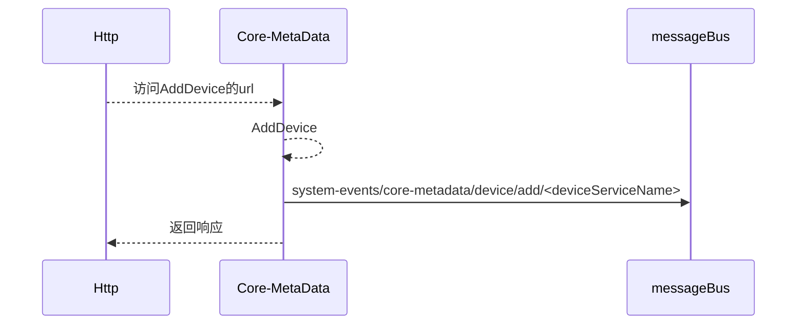
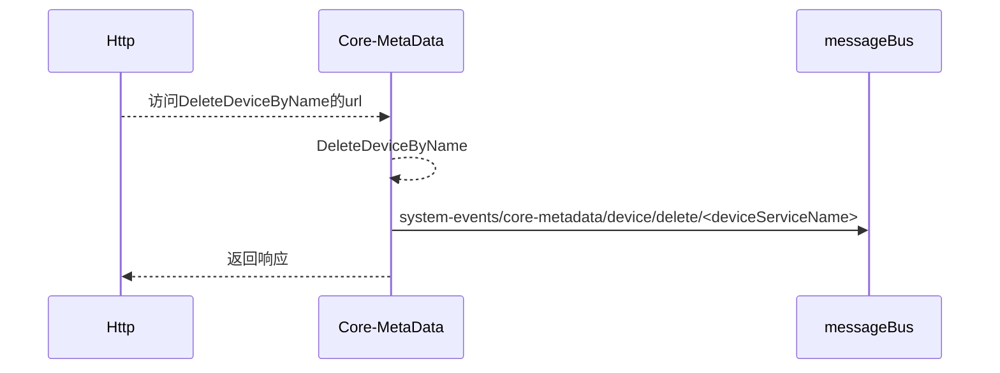
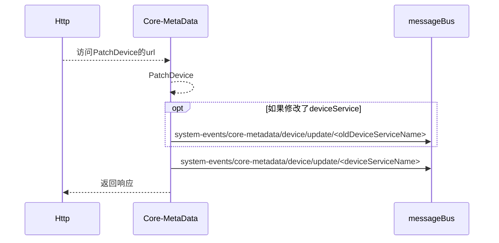
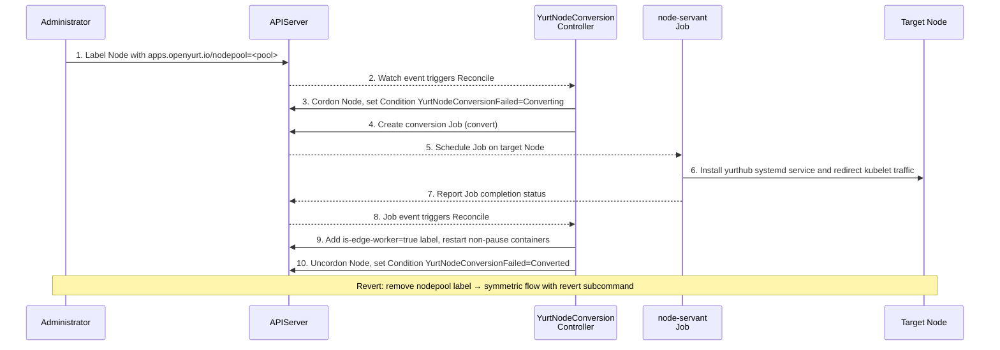

<a id="doc-06572a96a58dc510037d5efa"></a>

# openyurtio/openyurt / CHANGELOG.md

Upstream: https://github.com/openyurtio/openyurt/blob/78333496ac530d483545ac3916de2ecb2fab6d01/CHANGELOG.md

Commit: `78333496ac530d483545ac3916de2ecb2fab6d01`

Retrieved: 2026-10-01T15:25:30.021652+00:00

Kind: official-document

Raw SHA256: `13fbfd7b0abafbd173929db5120fde83a9263c68b346a6af63c5c8167e7626ff`

Source text below is untrusted reference content. Acquisition does not verify technical claims.

License status: UPSTREAM_NOTICES_CAPTURED_PER_FILE_REVIEW_REQUIRED. See this repository's captured license files.

---

# CHANGELOG

## v1.7.0

### What's New

**OTA Upgrade Supports Image Preheating for DaemonSet**

OTA (Over-The-Air) upgrade is a new upgrade model for DaemonSet workloads introduced by OpenYurt. In previous versions, image pulling occurred synchronously during the Pod restart phase of the upgrade, making it a critical-path operation that directly contributed to service downtime, especially in edge environments with limited or unstable network connectivity.

In v1.7.0, OTA upgrade now supports image preheating, which decouples image pulling from the actual rollout cutover. A new `ImagePreHeat` controller is responsible for dispatching image preheating Jobs to edge nodes, allowing updated container images to be proactively downloaded before the upgrade is triggered. Two new Pod conditions (`PodNeedUpgrade` and `PodImageReady`) are introduced to track upgrade status and image readiness. Users can initiate preheating via a new OTA API endpoint (`POST /openyurt.io/v1/namespaces/{ns}/pods/{podname}/imagepull`). By pre-caching images ahead of the cutover, service interruption during the actual upgrade is minimized to near-zero.
[#2482](https://github.com/openyurtio/openyurt/pull/2482)
[#2474](https://github.com/openyurtio/openyurt/pull/2474)

**Support Deploying Kubernetes Clusters Locally (K8s-on-K8s)**

OpenYurt v1.7.0 introduces the ability to deploy a Kubernetes cluster on top of an existing OpenYurt cluster — referred to as K8s-on-K8s. This is particularly useful for scenarios such as testing, multi-tenant isolation, and edge IDC (Internet Data Center) deployments where a full bare-metal Kubernetes setup is not practical.

This release adds YAML-based templates for deploying tenant control-plane components (tenant-apiserver, tenant-controller-manager, tenant-scheduler, tenant-pki-generator, etcd) along with post-install configuration (kube-proxy, kubelet, rbac, bootstrap-secret). `yurtadm` now supports a `local` mode for joining IDC nodes into a K8s-on-K8s cluster, and YurtHub is optimized for local mode operation. A setup script (`config/setup/K8s-on-K8s/setup.sh`) is also provided for quick bootstrapping.
[#4a1f0ab3](https://github.com/openyurtio/openyurt/pull/2454)
[#ed2f7dbf](https://github.com/openyurtio/openyurt/pull/2453)
[#3a03b00d](https://github.com/openyurtio/openyurt/pull/2452)

**Label-Driven YurtHub Deployment via YurtNodeConversion**

Previously, YurtHub installation and lifecycle management on edge nodes required manual intervention through `yurtadm join` or `yurtadm reset` commands. In v1.7.0, a new `YurtNodeConversionController` in yurt-manager enables label-driven YurtHub deployment and conversion. By applying a label to a node, users can trigger the automatic installation, configuration, and startup of YurtHub via systemd. The conversion and revert process now uses reusable host lifecycle helpers, enabling a fully declarative, controller-driven workflow for edge node onboarding and offboarding.
[#249a6714](https://github.com/openyurtio/openyurt/pull/2533)
[#f7645df8](https://github.com/openyurtio/openyurt/pull/2530)
[#3e02cefa](https://github.com/openyurtio/openyurt/pull/2541)

**Support Kubernetes v1.34**

All `k8s.io/xxx` dependencies and related modules have been upgraded to `v1.34.0`, ensuring OpenYurt is fully compatible with Kubernetes v1.34. E2E testing has been updated to validate the upgrade against a Kubernetes v1.34 cluster. This upgrade also includes vendor dependency updates and Go linting fixes for compatibility with the latest toolchain.
[#5cccf119](https://github.com/openyurtio/openyurt/pull/2495)
[#7589921e](https://github.com/openyurtio/openyurt/pull/2536)

### Other Notable changes

- Upgrade nodepool CRD to v1beta2 by @tnsimon in https://github.com/openyurtio/openyurt/pull/2266
- Add hub election leader controller by @tnsimon in https://github.com/openyurtio/openyurt/pull/2281
- Add hub leader config controller by @tnsimon in https://github.com/openyurtio/openyurt/pull/2299
- Add hub leader RBAC controller by @tnsimon in https://github.com/openyurtio/openyurt/pull/2328
- Add health checker for leader hub by @rambohe in https://github.com/openyurtio/openyurt/pull/2310
- Support forward requests to leader hub for sharing pool scope metadata in nodepool by @rambohe in https://github.com/openyurtio/openyurt/pull/2325
- Improve load balancer to support dynamically updating backends by @rambohe in https://github.com/openyurtio/openyurt/pull/2314
- Add leader node names to v1beta2.nodepool by @tnsimon in https://github.com/openyurtio/openyurt/pull/2297
- Rename enablePoolScopeMetadata to enableLeaderElections by @tnsimon in https://github.com/openyurtio/openyurt/pull/2316
- Add consistent hashing strategy for yurthub by @tnsimon in https://github.com/openyurtio/openyurt/pull/2359
- Improve proxy handler for yurthub and optimize metrics of multiplexer by @rambohe in https://github.com/openyurtio/openyurt/pull/2345
- Refactor multiplexer by @zyjhtangtang in https://github.com/openyurtio/openyurt/pull/2349
- Optimizing hub cache by @zyjhtangtang in https://github.com/openyurtio/openyurt/pull/2423
- Improve direct clientsets for yurthub by @rambohe in https://github.com/openyurtio/openyurt/pull/2285
- Improve readiness probe for yurthub component by @rambohe in https://github.com/openyurtio/openyurt/pull/2284
- Improve config and start process of yurthub component by @rambohe in https://github.com/openyurtio/openyurt/pull/2303
- Improve yurthub configmap management by @rambohe in https://github.com/openyurtio/openyurt/pull/2275
- Systemd component support for yurthub by @yuyushui66 in https://github.com/openyurtio/openyurt/pull/2449
- Release assets add yurthub binary by @zyjhtangtang in https://github.com/openyurtio/openyurt/pull/2448
- Remove YurtAppOverrider by @Jessie in https://github.com/openyurtio/openyurt/pull/2280
- Remove yurt-coordinator from yurthub by @rambohe in https://github.com/openyurtio/openyurt/pull/2276
- Refactor: remove yurt-coordinator-cert controller from yurt-manager by @Lixx in https://github.com/openyurtio/openyurt/pull/2322
- Refactor yurt-manager: update CRD categories and remove YurtAppDaemon related code by @Lu Chen in https://github.com/openyurtio/openyurt/pull/2320
- Deprecate yurtmanager delegate lease controller by @tnsimon in https://github.com/openyurtio/openyurt/pull/2308
- Deprecate YurtAppDaemon controller and webhook by @tnsimon in https://github.com/openyurtio/openyurt/pull/2309
- Remove yurt-coordinator from Helm charts by @zyjhtangtang in https://github.com/openyurtio/openyurt/pull/2477
- Support Kubernetes v1.32 by @zyjhtangtang in https://github.com/openyurtio/openyurt/pull/2387
- Use autonomy duration label by @tnsimon in https://github.com/openyurtio/openyurt/pull/2313
- Update Go version by @tnsimon in https://github.com/openyurtio/openyurt/pull/2357
- Upgrade upload-artifact to v4 by @zyjhtangtang in https://github.com/openyurtio/openyurt/pull/2336
- Update codecov-action by @zyjhtangtang in https://github.com/openyurtio/openyurt/pull/2538
- Update README by @akhilmukkara in https://github.com/openyurtio/openyurt/pull/2464
- Correct some inaccurate information by @zyjhtangtang in https://github.com/openyurtio/openyurt/pull/2476
- Updated to CNCF Incubating Project by @zyjhtangtang in https://github.com/openyurtio/openyurt/pull/2470
- Update the OpenYurt architecture diagram by @zyjhtangtang in https://github.com/openyurtio/openyurt/pull/2485
- Update GVR for core.v1.services by @tnsimon in https://github.com/openyurtio/openyurt/pull/2321
- yurt-manager chart support extraArgs by @William Wang in https://github.com/openyurtio/openyurt/pull/2489

### Fixes

- Always overwrite server-addr in yurt-static-set-yurt-hub configmap by yurtadm by @rayne-Li in https://github.com/openyurtio/openyurt/pull/2271
- Test: fix nodepool e2e test by @tnsimon in https://github.com/openyurtio/openyurt/pull/2283
- Fix openyurt fuzz test by @tnsimon in https://github.com/openyurtio/openyurt/pull/2319
- Fix issue 2253 by @RG-Dou in https://github.com/openyurtio/openyurt/pull/2330
- Ensure hub leader configmap is deleted with nodepool by @tnsimon in https://github.com/openyurtio/openyurt/pull/2324
- Fix ota controller doesn't has permission to patch pod status by @PersistentJZH in https://github.com/openyurtio/openyurt/pull/2415
- Fix: Fix the issue where the masterservice and serviceenvupdater modified the multiplexer cache by @zyjhtangtang in https://github.com/openyurtio/openyurt/pull/2481
- Fix dummy-if name length exceeds 15 by @KubeKyrie in https://github.com/openyurtio/openyurt/pull/2486
- Bugfix: remove deprecated rand.Seed() calls by @shiavm006 in https://github.com/openyurtio/openyurt/pull/2499
- Fix: race condition in cache manager's inMemoryCache by @Shivam Mittal in https://github.com/openyurtio/openyurt/pull/2508
- Fix: restore from backup and return error on ReplaceComponentList create/write failure by @Shivam Mittal in https://github.com/openyurtio/openyurt/pull/2507
- Fix NodeAutonomy condition LastTransitionTime never being updated by @Aman Kumar in https://github.com/openyurtio/openyurt/pull/2502
- Fix: guard nil request info in autonomy proxy by @Shivam Mittal in https://github.com/openyurtio/openyurt/pull/2517
- Fix: nil pointer dereference in local proxy (localDelete/localPost) by @Shivam Mittal in https://github.com/openyurtio/openyurt/pull/2515
- Fix: avoid panic on pod without owner refs by @zyjhtangtang in https://github.com/openyurtio/openyurt/pull/2509
- Fix: add unit test cases for modifyresponse by @kartik angiras in https://github.com/openyurtio/openyurt/pull/2497
- Fix/UT error by @tnsimon in https://github.com/openyurtio/openyurt/pull/2535

### Proposals

- Proposal: reuse list/watch requests in the nodepool for reducing cloud-edge network traffic by @rambohe in https://github.com/openyurtio/openyurt/pull/2226
- Proposal: OTA upgrade supports image preheating by @zyjhtangtang in https://github.com/openyurtio/openyurt/pull/2474
- Proposal: label driven yurthub by @Vacant-lot07734 in https://github.com/openyurtio/openyurt/pull/2530

### Contributors

**Thank you to everyone who contributed to this release!** ❤

**🌟 New Contributors**

* [@rayne-Li](https://github.com/rayne-Li) made their first contribution in [#2271](https://github.com/openyurtio/openyurt/pull/2271)
* [@Lixxcn](https://github.com/Lixxcn) made their first contribution in [#2322](https://github.com/openyurtio/openyurt/pull/2322)
* [@RG-Dou](https://github.com/RG-Dou) made their first contribution in [#2330](https://github.com/openyurtio/openyurt/pull/2330)
* [@co63oc](https://github.com/co63oc) made their first contribution in [#2344](https://github.com/openyurtio/openyurt/pull/2344)
* [@cangqiaoyuzhuo](https://github.com/cangqiaoyuzhuo) made their first contribution in [#2346](https://github.com/openyurtio/openyurt/pull/2346)
* [@yuyushui66](https://github.com/yuyushui66) made their first contribution in [#2449](https://github.com/openyurtio/openyurt/pull/2449)
* [@PersistentJZH](https://github.com/PersistentJZH) made their first contribution in [#2415](https://github.com/openyurtio/openyurt/pull/2415)
* [@xichengliudui](https://github.com/xichengliudui) made their first contribution in [#2456](https://github.com/openyurtio/openyurt/pull/2456)
* [@akhilmukkara](https://github.com/akhilmukkara) made their first contribution in [#2464](https://github.com/openyurtio/openyurt/pull/2464)
* [@KubeKyrie](https://github.com/KubeKyrie) made their first contribution in [#2486](https://github.com/openyurtio/openyurt/pull/2486)
* [@will4j](https://github.com/will4j) made their first contribution in [#2489](https://github.com/openyurtio/openyurt/pull/2489)
* [@promalert](https://github.com/promalert) made their first contribution in [#2492](https://github.com/openyurtio/openyurt/pull/2492)
* [@kartikangiras](https://github.com/kartikangiras) made their first contribution in [#2497](https://github.com/openyurtio/openyurt/pull/2497)
* [@shiavm006](https://github.com/shiavm006) made their first contribution in [#2499](https://github.com/openyurtio/openyurt/pull/2499)
* [@Aman-Cool](https://github.com/Aman-Cool) made their first contribution in [#2502](https://github.com/openyurtio/openyurt/pull/2502)
* [@xenonnn4w](https://github.com/xenonnn4w) made their first contribution in [#2495](https://github.com/openyurtio/openyurt/pull/2495)
* [@Vacant-lot07734](https://github.com/Vacant-lot07734) made their first contribution in [#2530](https://github.com/openyurtio/openyurt/pull/2530)
* [@gaganhr94](https://github.com/gaganhr94) made their first contribution in [#2543](https://github.com/openyurtio/openyurt/pull/2543)

And thank you very much to all our existing contributors, and to everyone else who contributed in other ways like filing issues,
giving feedback, helping users in the community group, etc.

## v1.6.0

### What's New

**Support Kubernetes up to V1.30**

“k8s.io/xxx” and all its related dependencies are upgraded to version “v0.30.6”, for ensuring OpenYurt is compatible with Kubernetes v1.30 version. This compatibility has been confirmed by an end-to-end (E2E) test where we started a Kubernetes v1.30 cluster using KinD and deployed the latest components of OpenYurt.
[#2179](https://github.com/openyurtio/openyurt/pull/2179)
[#2249](https://github.com/openyurtio/openyurt/pull/2249)

**Enhance edge autonomy capabilities**

OpenYurt already offers robust edge autonomy capabilities, ensuring that applications on edge nodes can continue to operate even when the cloud-edge network is disconnected. However, there are several areas where the current edge autonomy capabilities can still be improved. For instance, once nodes are annotated with autonomy annotations, the cloud controller does not automatically evict Pods, regardless of whether the disconnection is due to cloud-edge network issues or node failures, yet users expect automatic Pod eviction during node failures. Additionally, the current edge autonomy capabilities cannot be directly used in managed Kubernetes environments because users cannot disable the NodeLifeCycle controller within the Kube-Controller-Manager component of managed Kubernetes. In this release, new endpoints/endpointslices webhooks are added to ensure that pods are not removed from the backend of the Service. Additionally, a new autonomous annotation is introduced, supporting the configuration of autonomous time.
[#2155](https://github.com/openyurtio/openyurt/pull/2155)
[#2201](https://github.com/openyurtio/openyurt/pull/2201)
[#2211](https://github.com/openyurtio/openyurt/pull/2211)
[#2218](https://github.com/openyurtio/openyurt/pull/2218)
[#2241](https://github.com/openyurtio/openyurt/pull/2241)

**Node-level Traffic Reuse Capability**

In an OpenYurt cluster, control components are deployed in the cloud, and edge nodes usually interact with the cloud through the public internet, which can lead to significant consumption of cloud-edge traffic. This problem is more pronounced in large-scale clusters, mainly due to the edge-side components performing full-scale list/watch operations on resources. This not only consumes a large amount of cloud-edge traffic but also places considerable pressure on the apiserver due to the high volume of list operations. In this release, We have added a traffic multiplexing module in YurtHub. When multiple clients request the same resource (services, endpointslices), YurtHub returns data from the local cache, reducing the number of requests to the apiserver.
[#2060](https://github.com/openyurtio/openyurt/pull/2060)
[#2141](https://github.com/openyurtio/openyurt/pull/2141)
[#2242](https://github.com/openyurtio/openyurt/pull/2242)

### Other Notable changes

- Upgrade platformadmin's yurtappset dependencies to v1beta1 by @YTGhost in https://github.com/openyurtio/openyurt/pull/2103
- Add yurthub service env updater filter by @techworldhello in https://github.com/openyurtio/openyurt/pull/2165
- set transform to strip managedfields for informer by @vie-serendipity in https://github.com/openyurtio/openyurt/pull/2149
- support cache response for partial object metadata requests。 by @rambohe-ch in https://github.com/openyurtio/openyurt/pull/2170
- build iot system configuration isolation on nodepool by @WoShiZhangmingyu in https://github.com/openyurtio/openyurt/pull/2147
- using the kubeconfig flag in controller-runtime. by @zyjhtangtang in https://github.com/openyurtio/openyurt/pull/2193
- add events when no nodepool match with loadbalancerset services. by @zyjhtangtang in https://github.com/openyurtio/openyurt/pull/2195
- Modify safety reporting Email by @zyjhtangtang in https://github.com/openyurtio/openyurt/pull/2214

### Fixes

- fix(iot): the mount type of hostpath for localtime in napa by @LavenderQAQ in https://github.com/openyurtio/openyurt/pull/2110
- fix: create abspath dir in case that contents is empty by @vie-serendipity in https://github.com/openyurtio/openyurt/pull/2164
- fix: masterservice missing clusterIPs field. by @fungaren in https://github.com/openyurtio/openyurt/pull/2173
- fix: support cache response for partial object metedata watch request by @rambohe-ch in https://github.com/openyurtio/openyurt/pull/2209
- fix: bug of yurtappset always the last tweaks make effect by @vie-serendipity in https://github.com/openyurtio/openyurt/pull/2229
- fix: CRD WebhookConversion respect WEBHOOK_HOST env by @fungaren in https://github.com/openyurtio/openyurt/pull/2217
- fix: go lint errors by @luc99hen in https://github.com/openyurtio/openyurt/pull/2235

### Proposals

- proposal: Node-level Traffic Reuse Capability by @zyjhtangtang in https://github.com/openyurtio/openyurt/pull/2060
- Proposal: enhancing edge autonomy by @rambohe-ch in https://github.com/openyurtio/openyurt/pull/2155
- proposal: enhance operational efficiency of K8s cluster in user's IDC by @huangchenzhao in https://github.com/openyurtio/openyurt/pull/2124
- Proposal: build iot system configuration isolation on nodepool(openyurtio#1597) by @WoShiZhangmingyu in https://github.com/openyurtio/openyurt/pull/2135

### Contributors
- [@rambohe-ch](https://github.com/rambohe-ch)
- [@LavenderQAQ](https://github.com/LavenderQAQ)
- [@YTGhost](https://github.com/YTGhost)
- [@leossteven](https://github.com/leossteven)
- [@monikahu](https://github.com/monikahu)
- [@zyjhtangtang](https://github.com/zyjhtangtang)
- [@paulzhn](https://github.com/paulzhn)
- [@techworldhello](https://github.com/techworldhello)
- [@vie-serendipity](https://github.com/vie-serendipity)
- [@fengshunli](https://github.com/fengshunli)
- [@fungaren](https://github.com/fungaren)
- [@huangchenzhao](https://github.com/huangchenzhao)
- [@WoShiZhangmingyu](https://github.com/WoShiZhangmingyu)
- [@tnsimon](https://github.com/tnsimon)
- [@JameKeal](https://github.com/JameKeal)
- [@luc99hen](https://github.com/luc99hen)


## v1.5.0

### What's New

**Support Kubernetes up to V1.28**

“k8s.io/xxx” and all its related dependencies are upgraded to version “v0.28.9”, for ensuring OpenYurt is compatible with Kubernetes v1.28 version. This compatibility has been confirmed by an end-to-end (E2E) test where we started a Kubernetes v1.28 cluster using KinD and deployed the latest components of OpenYurt. At the same time, all the key components of OpenYurt, such as yurt-manager and yurthub, are deployed on the Kubernetes cluster via Helm to ensure that the Helm charts provided by the OpenYurt community can run stably in the production environment.
[#2047](https://github.com/openyurtio/openyurt/pull/2047)
[#2074](https://github.com/openyurtio/openyurt/pull/2074)

**Reduce cloud-edge traffic spike during rapid node additions**

`NodePool` resource is essential for managing groups of nodes within OpenYurt clusters, as it records details of all nodes in the collective through the `NodePool.status.nodes` field. YurtHub relies on this information to identify endpoints within the same NodePool, thereby enabling pool-level service topology functionality. However, when a large NodePool—potentially comprising thousands of nodes—experiences swift expansion, such as the integration of hundreds of edge nodes within a mere minute, the surge in cloud-to-edge network traffic can be significant. In this release, a new type of resource called `NodeBucket` has been introduced. It provides a scalable and streamlined method for managing extensive `NodePool`, significantly reducing the impact on cloud-edge traffic during periods of rapid node growth, and ensuring the stability of the clusters is maintained.
[#1864](https://github.com/openyurtio/openyurt/pull/1864)
[#1874](https://github.com/openyurtio/openyurt/pull/1874)
[#1930](https://github.com/openyurtio/openyurt/pull/1930)

**Upgrade `YurtAppSet` to v1beta1 version**

YurtAppSet v1beta1 is introduced to facilitate the management of multi-region workloads. Users can use YurtAppSet to distribute the same `WorkloadTemplate` (Deployment/Statefulset) to different nodepools by a label selector `NodePoolSelector` or nodepool name slice (`Pools`). Users can also customize the configuration of workloads in different node pools through `WorkloadTweaks`.
In this release, we have combined the functionality from the three old crds (YurtAppSet v1alpha1, YurtAppDaemon and YurtAppOverrider) in yurtappset v1beta1. We recommend to use this in favor of the old ones.
[#1890](https://github.com/openyurtio/openyurt/pull/1890)
[#1931](https://github.com/openyurtio/openyurt/pull/1931)
[#1939](https://github.com/openyurtio/openyurt/pull/1939)
[#1974](https://github.com/openyurtio/openyurt/pull/1974)
[#1997](https://github.com/openyurtio/openyurt/pull/1997)

**Improve transparent management mechanism for control traffic from edge to cloud**

The current transparent management mechanism for cloud-edge control traffic has certain limitations and cannot effectively support direct requests to the default/kubernetes service. In this release, a new transparent management mechanism for cloud-edge control traffic, aimed at enabling pods using InClusterConfig or the default/kubernetes service name to access the kube-apiserver via YurtHub without needing to be aware of the details of the public network connection between the cloud and edge.
[#1975](https://github.com/openyurtio/openyurt/pull/1975)
[#1996](https://github.com/openyurtio/openyurt/pull/1996)

**Separate clients for yurt-manager component**

Yurt-manager is an important component in cloud environment for OpenYurt which holds multiple controllers and webhooks. Those controllers and webhooks shared one client and one set of RBAC (yurt-manager-role/yurt-manager-role-binding/yurt-manager-sa) which grew bigger as we add more function into yurt-manager. This mechanism makes a controller has access it shouldn't has. and it's difficult to find out the request is from which controller from the audit logs. In the latest release, we restrict each controller/webhook to only the permissions it may use and separate RBAC and UA for different controllers and webhooks.
[#2051](https://github.com/openyurtio/openyurt/pull/2051)
[#2069](https://github.com/openyurtio/openyurt/pull/2069)

**Enhancement to Yurthub's Autonomy capabilities**

New autonomy condition have been added to node conditions so that yurthub can report autonomy status of node in real time at each nodeStatusUpdateFrequency. This condition allows for accurate determination of each node's autonomy status. In addition, an error key mechanism has been introduced to log cache failure keys along with their corresponding fault reasons. The error keys are persisted using the AOF (Append-Only File) method, ensuring that the autonomy state is recovered even after a reboot and preventing the system from entering a pseudo-autonomous state. These enhancements also facilitate easier troubleshooting when autonomy issues arise.
[#2015](https://github.com/openyurtio/openyurt/pull/2015)
[#2033](https://github.com/openyurtio/openyurt/pull/2033)
[#2096](https://github.com/openyurtio/openyurt/pull/2096)

### Other Notable changes

- improve ca data for yurthub component by @rambohe-ch in https://github.com/openyurtio/openyurt/pull/1815
- improve FieldIndexer setting in yurt-manager by @2456868764 in https://github.com/openyurtio/openyurt/pull/1834
- fix: yurtadm join ignorePreflightErrors could not set all by @YTGhost in https://github.com/openyurtio/openyurt/pull/1837
- Feature: add name-length of dummy interface too long error by @8rxn in https://github.com/openyurtio/openyurt/pull/1875
- feat: support v3 rest api client for edgex v3 api by @wangxye in https://github.com/openyurtio/openyurt/pull/1850
- feat: support edgex napa version by auto-collector by @LavenderQAQ in https://github.com/openyurtio/openyurt/pull/1852
- feat: improve discardcloudservice filter in yurthub component (#1924) by @huangchenzhao in https://github.com/openyurtio/openyurt/pull/1926
- Add missing verb to the role of node lifecycle controller by @crazytaxii in https://github.com/openyurtio/openyurt/pull/1936
- don't cache csr and sar resource in yurthub by @rambohe-ch in https://github.com/openyurtio/openyurt/pull/1949
- feat: improve hostNetwork mode of NodePool by adding NodeAffinity to pods with specified annotation (#1935) by @huangchenzhao in https://github.com/openyurtio/openyurt/pull/1959
- move list object handling from ObjectFilter into ResponseFilter by @rambohe-ch in https://github.com/openyurtio/openyurt/pull/1991
- The gateway can forward traffic from extra source cidrs by @River-sh in https://github.com/openyurtio/openyurt/pull/1993
- return back watch.Deleted event to clients when watch object is removed in OjbectFilters by @rambohe-ch in https://github.com/openyurtio/openyurt/pull/1995
- add pool service controller. by @zyjhtangtang in https://github.com/openyurtio/openyurt/pull/2010
- aggregated annotations and labels. by @zyjhtangtang in https://github.com/openyurtio/openyurt/pull/2027
- improve pod webhook for adapting hostnetwork mode nodepool by @rambohe-ch in https://github.com/openyurtio/openyurt/pull/2050
- intercept kubelet get node request in order to reduce the traffic by @vie-serendipity in https://github.com/openyurtio/openyurt/pull/2039
- bump controller-gen to v0.13.0 by @Congrool in https://github.com/openyurtio/openyurt/pull/2056
- improve nodepool conversion by @rambohe-ch in https://github.com/openyurtio/openyurt/pull/2080
- feat: add version metrics for yurt-manager and yurthub components by @rambohe-ch in https://github.com/openyurtio/openyurt/pull/2094

### Fixes

- fix cache manager panic in yurthub by @rambohe-ch in https://github.com/openyurtio/openyurt/pull/1950
- fix: upgrade the version of runc to avoid security risk by @qclc in https://github.com/openyurtio/openyurt/pull/1972
- fix only openyurt crd conversion should be handled for upgrading cert by @rambohe-ch in https://github.com/openyurtio/openyurt/pull/2013
- fix the cache leak in yurtappoverrider controller by @MeenuyD in https://github.com/openyurtio/openyurt/pull/1795
- fix(yurt-manager): add clusterrole for nodes/status subresources by @qclc in https://github.com/openyurtio/openyurt/pull/1884
- fix: close dst file by @testwill in https://github.com/openyurtio/openyurt/pull/2046

### Proposals

- Proposal: High Availability of Edge Services by @Rui-Gan in https://github.com/openyurtio/openyurt/pull/1816
- Proposal: yurt express: openyurt data transmission system proposal by @qsfang in https://github.com/openyurtio/openyurt/pull/1840
- proposal: add NodeBucket to reduce cloud-edge traffic spike during rapid node additions. by @rambohe-ch in https://github.com/openyurtio/openyurt/pull/1864
- Proposal: add yurtappset v1beta1 proposal by @luc99hen in https://github.com/openyurtio/openyurt/pull/1890
- proposal: improve transparent management mechanism for control traffic from edge to cloud by @rambohe-ch in https://github.com/openyurtio/openyurt/pull/1975
- Proposal: enhancement of edge autonomy by @vie-serendipity in https://github.com/openyurtio/openyurt/pull/2015
- Proposal: separate yurt-manager clients by @luc99hen in https://github.com/openyurtio/openyurt/pull/2051

### Contributors

**Thank you to everyone who contributed to this release!** ❤

- [@wangxye](https://github.com/wangxye)
- [@huiwq1990](https://github.com/huiwq1990)
- [@testwill](https://github.com/testwill)
- [@fengshunli](https://github.com/fengshunli)
- [@Congrool](https://github.com/Congrool)
- [@zyjhtangtang](https://github.com/zyjhtangtang)
- [@vie-serendipity](https://github.com/vie-serendipity)
- [@dsy3502](https://github.com/dsy3502)
- [@YTGhost](https://github.com/YTGhost)
- [@River-sh](https://github.com/River-sh)
- [@qclc](https://github.com/qclc)
- [@lilongfeng0902](https://github.com/lilongfeng0902)
- [@NewKeyTo](https://github.com/NewKeyTo)
- [@crazytaxii](https://github.com/crazytaxii)
- [@MeenuyD](https://github.com/MeenuyD)
- [@dzcvxe](https://github.com/dzcvxe)
- [@2456868764](https://github.com/2456868764)
- [@8rxn](https://github.com/8rxn)
- [@huangchenzhao](https://github.com/huangchenzhao)
- [@karthik507](https://github.com/karthik507)
- [@MundaneImmortal](https://github.com/MundaneImmortal)
- [@rambohe-ch](https://github.com/rambohe-ch)

And thank you very much to everyone else not listed here who contributed in other ways like filing issues,
giving feedback, helping users in community group, etc.

## v1.4.0

### What's New

**Support for HostNetwork Mode NodePool**

When the resources of edge nodes are limited and only simple applications need to be run (for instance, situations where container network is not needed and there is no need for communication between applications),
using a HostNetwork mode nodepool is a reasonable choice. When creating a nodepool, users only need to set spec.HostNetwork=true to create a HostNetwork mode nodepool.

In this mode, only some essential components such as kubelet, yurthub and raven-agent will be installed on all nodes in the pool. In addition, Pods scheduled on these nodes will automatically adopt host network mode.
This method effectively reduces resource consumption while maintaining application performance efficiency.

**Support for customized configuration at the nodepool level for multi-region workloads**

YurtAppOverrider is a new CRD used to customize the configuration of the workloads managed by YurtAppSet/YurtAppDaemon. It provides a simple and straightforward way to configure every field of the workload under each nodepool.
It is fundamental component of multi-region workloads configuration rendering engine.

**Support for building edgex iot systems by using PlatformAdmin**

PlatformAdmin is a CRD that manages the IoT systems in the OpenYurt nodepool. It has evolved from the previous yurt-edgex-manager. Starting from this version, the functionality of yurt-edgex-controller has been merged into yurt-manager. This means that users no longer need to deploy any additional components; they only need to install yurt-manager to have all the capabilities for managing edge devices.

PlatformAdmin allows users with a user-friendly way to deploy a complete edgex system on nodepool. It comes with an optional component library and configuration templates. Advanced users can also customize the configuration of this system according to their needs.

Currently, PlatformAdmin supports all versions of EdgeX from Hanoi to Minnesota. In the future, it will continue to rapidly support upcoming releases using the auto-collector feature. This ensures that PlatformAdmin remains compatible with the latest versions of EdgeX as they are released.

**Supports yurt-iot-dock deployment as an iot system component**

yurt-iot-dock is a component responsible for managing edge devices in IoT system. It has evolved from the previous yurt-device-controller. As a component that connects the cloud and edge device management platforms, yurt-iot-dock abstracts three CRDs: DeviceProfile, DeviceService, and Device. These CRDs are used to represent and manage corresponding resources on the device management platform, thereby impacting real-world devices.

By declaratively modifying the fields of these CRs, users can achieve the operational and management goals of complex edge devices in a cloud-native manner. yurt-iot-dock is deployed by PlatformAdmin as an optional IoT component. It is responsible for device synchronization during startup and severs the synchronization relationship when being terminated or destroyed.

In this version, the deployment and destruction of the yurt-iot-dock are all controlled by PlatformAdmin, which improves the ease of use of the yurt-iot-dock.

**Some Repos are archived**

With the upgrading of OpenYurt architecture, the functions of quite a few components are merged into Yurt-Manager (e.g. yurt-app-manager, raven-controller-manager, etc.),
or there are repos migrated to openyurt for better management (e.g. yurtiotdock). The following repos have been archived:

- [yurt-app-manager](https://github.com/openyurtio/yurt-app-manager)
- [yurt-app-manager-api](https://github.com/openyurtio/yurt-app-manager-api)
- [raven-controller-manager](https://github.com/openyurtio/raven-controller-manager)
- [yurt-edgex-manager](https://github.com/openyurtio/yurt-edgex-manager)
- [yurt-device-controller](https://github.com/openyurtio/yurt-device-controller)
- [yurtcluster-operator](https://github.com/openyurtio/yurtcluster-operator)

### Other Notable changes

- feat: use real kubernetes server address to yurthub when yurtadm join by @Lan-ce-lot in https://github.com/openyurtio/openyurt/pull/1517
- yurtadm support enable kubelet service by @YTGhost in https://github.com/openyurtio/openyurt/pull/1523
- feat: support SIGUSR1 signal for yurthub by @y-ykcir in https://github.com/openyurtio/openyurt/pull/1487
- feat: remove yurtadm init command by @YTGhost in https://github.com/openyurtio/openyurt/pull/1537
- add yurtadm join node in specified nodepool by @JameKeal in https://github.com/openyurtio/openyurt/pull/1402
- rename pool-coordinator to yurt-coordinator for charts by @JameKeal in https://github.com/openyurtio/openyurt/pull/1551
- move iot controller to yurt-manager by @Rui-Gan in https://github.com/openyurtio/openyurt/pull/1488
- feat: provide config option for yurtadm by @YTGhost in https://github.com/openyurtio/openyurt/pull/1547
- add yurtadm to install/uninstall staticpod by @JameKeal in https://github.com/openyurtio/openyurt/pull/1550
- change access permission to default in general. by @fujitatomoya in https://github.com/openyurtio/openyurt/pull/1576
- build: added github registry by @siredmar in https://github.com/openyurtio/openyurt/pull/1578
- feat: support edgex minnesota through auto-collector by @LavenderQAQ in https://github.com/openyurtio/openyurt/pull/1582
- feat: prevent node movement by label modification by @y-ykcir in https://github.com/openyurtio/openyurt/pull/1444
- add cpu limit for yurthub by @huweihuang in https://github.com/openyurtio/openyurt/pull/1609
- feat: provide users with the ability to customize the edgex framework by @LavenderQAQ in https://github.com/openyurtio/openyurt/pull/1596
- add kubelet certificate mode in yurthub by @rambohe-ch in https://github.com/openyurtio/openyurt/pull/1625
- delete configmap when yurtstaticset is deleting by @JameKeal in https://github.com/openyurtio/openyurt/pull/1640
- add new gateway version v1beta1 by @River-sh in https://github.com/openyurtio/openyurt/pull/1641
- feat: reclaim device, deviceprofile and deviceservice before exiting YurtIoTDock  by @wangxye in https://github.com/openyurtio/openyurt/pull/1647
- feat: upgrade YurtIoTDock to support edgex v3 api by @wangxye in https://github.com/openyurtio/openyurt/pull/1666
- feat: add token format checking to yurtadm join process by @YTGhost in https://github.com/openyurtio/openyurt/pull/1681
- Add status info to YurtAppSet/YurtAppDaemon by @vie-serendipity in https://github.com/openyurtio/openyurt/pull/1702
- fix(yurt-manager): raven controller can't list calico blockaffinity by @luckymrwang in https://github.com/openyurtio/openyurt/pull/1676
- feat: support yurtadm config command by @YTGhost in https://github.com/openyurtio/openyurt/pull/1709
- improve lease lock for yurt-manager component by @rambohe-ch in https://github.com/openyurtio/openyurt/pull/1741
- add nodelifecycle controller by @rambohe-ch in https://github.com/openyurtio/openyurt/pull/1746
- disable the iptables setting of yurthub component by default by @rambohe-ch in https://github.com/openyurtio/openyurt/pull/1770

### Fixes

- fix memory leak for yur-tunnel-server by @huweihuang in https://github.com/openyurtio/openyurt/pull/1471
- fix yurthub memory leak by @JameKeal in https://github.com/openyurtio/openyurt/pull/1501
- fix yurtstaticset workerpod reset error by @JameKeal in https://github.com/openyurtio/openyurt/pull/1526
- fix conflicts for getting node by local storage in yurthub filters by @rambohe-ch in https://github.com/openyurtio/openyurt/pull/1552
- fix work dir nested `yurthub/yurthub` by @luc99hen in https://github.com/openyurtio/openyurt/pull/1693
- fix  pool scope crd resource etcd key path by @qsfang in https://github.com/openyurtio/openyurt/pull/1729

### Proposals

- proposal for raven l7 by @River-sh in https://github.com/openyurtio/openyurt/pull/1541
- proposal of support raven NAT traversal by @YTGhost in https://github.com/openyurtio/openyurt/pull/1639
- Proposal for Multi-region workloads configuration rendering engine by @vie-serendipity in https://github.com/openyurtio/openyurt/pull/1600
- Proposal of install openyurt components using dashboard by @401lrx in https://github.com/openyurtio/openyurt/pull/1664
- Proposal use message-bus instead of REST to communicate with EdgeX by @Pluviophile225 in https://github.com/openyurtio/openyurt/pull/1680

### Contributors

**Thank you to everyone who contributed to this release!** ❤

- [@huiwq1990](https://github.com/huiwq1990)
- [@y-ykcir](https://github.com/y-ykcir)
- [@JameKeal](https://github.com/JameKeal)
- [@Lan-ce-lot](https://github.com/Lan-ce-lot)
- [@YTGhost](https://github.com/YTGhost)
- [@fujitatomoya](https://github.com/fujitatomoya)
- [@LavenderQAQ](https://github.com/LavenderQAQ)
- [@River-sh](https://github.com/River-sh)
- [@huweihuang](https://github.com/huweihuang)
- [@luc99hen](https://github.com/luc99hen)
- [@luckymrwang](https://github.com/luckymrwang)
- [@wangzihao05](https://github.com/wangzihao05)
- [@yojay11717](https://github.com/yojay11717)
- [@lishaokai1995](https://github.com/lishaokai1995)
- [@yeqiugt](https://github.com/yeqiugt)
- [@TonyZZhang](https://github.com/TonyZZhang)
- [@vie-serendipity](https://github.com/vie-serendipity)
- [@my0sotis](https://github.com/my0sotis)
- [@Rui-Gan](https://github.com/Rui-Gan)
- [@zhy76](https://github.com/zhy76)
- [@siredmar](https://github.com/siredmar)
- [@wangxye](https://github.com/wangxye)
- [@401lrx](https://github.com/401lrx)
- [@testwill](https://github.com/testwill)
- [@Pluviophile225](https://github.com/Pluviophile225)
- [@shizuocheng](https://github.com/shizuocheng)
- [@qsfang](https://github.com/qsfang)

And thank you very much to everyone else not listed here who contributed in other ways like filing issues,
giving feedback, helping users in community group, etc.

## v1.3.0

### What's New

**Refactor OpenYurt control plane components**

In order to improve the management of all repos in OpenYurt community, and reduce the complexity of installing OpenYurt,
after detailed discussions in the community, a new component named yurt-manager was agreed to manage controllers and webhooks
scattered across multiple components (like yurt-controller-manager, yurt-app-manager, raven-controller-manager, etc.).

After the refactoring, based on the controller-runtime framework, new controllers and webhooks can be easily added to the
yurt-manager component in the future. Also note that the yurt-manager must be installed on the same node as the K8s
control-plane component (like kube-controller-manager). [#1067](https://github.com/openyurtio/openyurt/issues/1067)

**Support OTA or AdvancedRollingUpdate upgrade models for static pods**

As you know, static pods are managed directly by the kubelet daemon on the node and there is no APIServer watching them.
In general, if a user wants to upgrade a static pod(like YurtHub), the user should manually modify or replace the manifest
of the static pod. This can be a very tedious and painful task when the number of static pods becomes very large.

Users can define Pod templates and upgrade models through YurtStaticSet CRD. The upgrade models support both OTA and AdvancedRollingUpdate kinds,
thus easily meeting the upgrade needs of large-scale Static Pods. Also the Pod template in yurthub YurtAppSet CRD is used to
install YurtHub component on the node when the node is joined. [#1261](https://github.com/openyurtio/openyurt/pull/1261), [#1168](https://github.com/openyurtio/openyurt/pull/1168), [#1172](https://github.com/openyurtio/openyurt/pull/1172)

**NodePort Service supports nodepool isolation**

In edge scenarios, users using the NodePort service expect to listen to nodePort ports only in a specified nodepools
in order to prevent port conflicts and save edge resources.

Users can specify the nodepools to listen to by adding annotation `nodeport.openyurt.io/listen` to the NodePort or
LoadBalancer service, thus getting the nodepool isolation capability of the NodePort or LoadBalancer service. [#1183](https://github.com/openyurtio/openyurt/issues/1183), [#1209](https://github.com/openyurtio/openyurt/pull/1209)

### Other Notable changes

- improve image build efficiency by @Congrool in https://github.com/openyurtio/openyurt/pull/1191
- support filter chain for filtering response data by @rambohe-ch in https://github.com/openyurtio/openyurt/pull/1189
- fix: re-list when target change by @LaurenceLiZhixin in https://github.com/openyurtio/openyurt/pull/1195
- fix: yurt-coordinator cannot be rescheduled when its node fails (#1212) by @AndyEWang in https://github.com/openyurtio/openyurt/pull/1218
- feat: merge yurtctl to e2e by @YTGhost in https://github.com/openyurtio/openyurt/pull/1219
- support pass bootstrap-file to yurthub by @rambohe-ch in https://github.com/openyurtio/openyurt/pull/1333
- add system proxy for docker run by @gnunu in https://github.com/openyurtio/openyurt/pull/1335
- feat: add yurtadm renew certificate command by @YTGhost in https://github.com/openyurtio/openyurt/pull/1314
- add a new way to create webhook by @JameKeal in https://github.com/openyurtio/openyurt/pull/1359
- feat: support yurt-coordinator component work in specified namespace by @y-ykcir in https://github.com/openyurtio/openyurt/pull/1355
- feat: add nodepool e2e by @huiwq1990 in https://github.com/openyurtio/openyurt/pull/1365
- feat: support yurt-manager work in specified namespace by @y-ykcir in https://github.com/openyurtio/openyurt/pull/1367
- support yurthub component work in specified namespace by @huweihuang in https://github.com/openyurtio/openyurt/pull/1366
- support to specify enabled controllers by @xavier-hou in https://github.com/openyurtio/openyurt/pull/1388
- feat: crd generate crds by @huiwq1990 in https://github.com/openyurtio/openyurt/pull/1389
- add Yurtappdaemon e2e test by @theonefx in https://github.com/openyurtio/openyurt/pull/1406
- fix generated crd name by @huiwq1990 in https://github.com/openyurtio/openyurt/pull/1408

### Fixes

- fix handle yurtcoordinator certificates in case of restarting by @batthebee in https://github.com/openyurtio/openyurt/pull/1187
- make rename replace old dir by @LaurenceLiZhixin in https://github.com/openyurtio/openyurt/pull/1237
- yurtadm minor version compatibility of kubelet and kubeadm by @YTGhost in https://github.com/openyurtio/openyurt/pull/1244
- delete specific iptables while testing kube-proxy by @y-ykcir in https://github.com/openyurtio/openyurt/pull/1268
- fix yurthub dnsPolicy when using yurt-coordinator by @JameKeal in https://github.com/openyurtio/openyurt/pull/1321
- fix: yurt-controller-manager reboot cannot remove taint node.openyurt.io/unschedulable (#1233) by @AndyEWang in https://github.com/openyurtio/openyurt/pull/1337
- fix daemonSet pod updater pointer error by @JameKeal in https://github.com/openyurtio/openyurt/pull/1340
- bugfix for yurtappset by @theonefx in https://github.com/openyurtio/openyurt/pull/1391

### Contributors

**Thank you to everyone who contributed to this release!** ❤

- [@batthebee](https://github.com/batthebee)
- [@cndoit18](https://github.com/cndoit18)
- [@fengshunli](https://github.com/fengshunli)
- [@luc99hen](https://github.com/luc99hen)
- [@frank-zsy](https://github.com/frank-zsy)
- [@YTGhost](https://github.com/YTGhost)
- [@Congrool](https://github.com/Congrool)
- [@luckymrwang](https://github.com/luckymrwang)
- [@AndyEWang](https://github.com/AndyEWang)
- [@huiwq1990](https://github.com/huiwq1990)
- [@njucjc](https://github.com/njucjc)
- [@xavier-hou](https://github.com/xavier-hou)
- [@kadisi](https://github.com/kadisi)
- [@guoguodan](https://github.com/guoguodan)
- [@JameKeal](https://github.com/JameKeal)
- [@gnunu](https://github.com/gnunu)
- [@y-ykcir](https://github.com/y-ykcir)
- [@Lan-ce-lot](https://github.com/Lan-ce-lot)
- [@River-sh](https://github.com/River-sh)
- [@huweihuang](https://github.com/huweihuang)
- [@lilongfeng0902](https://github.com/lilongfeng0902)
- [@theonefx](https://github.com/theonefx)
- [@fujitatomoya](https://github.com/fujitatomoya)
- [@rambohe-ch](https://github.com/rambohe-ch)

And thank you very much to everyone else not listed here who contributed in other ways like filing issues,
giving feedback, helping users in community group, etc.

## v1.2.0

### What's New

**Improve edge autonomy capability when cloud-edge network off**

The original edge autonomy feature can make the pods on nodes un-evicted even if node crashed by adding annotation to node,
and this feature is recommended to use for scenarios that pods should bind to node without recreation.
After improving edge autonomy capability, when the reason of node NotReady is cloud-edge network off, pods will not be evicted
because leader yurthub will help these offline nodes to proxy their heartbeats to the cloud via yurt-coordinator component,
and pods will be evicted and recreated on other ready node if node crashed.

By the way, the original edge autonomy capability by annotating node (with node.beta.openyurt.io/autonomy) will be kept as it is,
which will influence all pods on autonomy nodes. And a new annotation (named apps.openyurt.io/binding) can be added to workload to
enable the original edge autonomy capability for specified pod.

**Reduce the control-plane traffic between cloud and edge**

Based on the Yurt-Coordinator in the nodePool, A leader Yurthub will be elected in the nodePool. Leader Yurthub will
list/watch pool-scope data(like endpoints/endpointslices) from cloud and write into yurt-coordinator. then all components(like kube-proxy/coredns)
in the nodePool will get pool-scope data from yurt-coordinator instead of cloud kube-apiserver, so large volume control-plane traffic
will be reduced.

**Use raven component to replace yurt-tunnel component**

Raven has released version v0.3, and provide cross-regional network communication ability based on PodIP or NodeIP, but yurt-tunnel
can only provide cloud-edge requests forwarding for kubectl logs/exec commands. because raven provides much more than the capabilities
provided by yurt-tunnel, and raven has been proven by a lot of work. so raven component is officially recommended to replace yurt-tunnel.

### Other Notable changes

- proposal of yurtadm join refactoring by @YTGhost in https://github.com/openyurtio/openyurt/pull/1048
- [Proposal] edgex auto-collector proposal by @LavenderQAQ in https://github.com/openyurtio/openyurt/pull/1051
- add timeout config in yurthub to handle those watch requests by @AndyEWang in https://github.com/openyurtio/openyurt/pull/1056
- refactor yurtadm join by @YTGhost in https://github.com/openyurtio/openyurt/pull/1049
- expose helm values for yurthub cacheagents by @huiwq1990 in https://github.com/openyurtio/openyurt/pull/1062
- refactor yurthub cache to adapt different storages by @Congrool in https://github.com/openyurtio/openyurt/pull/882
- add proposal of static pod upgrade model by @xavier-hou in https://github.com/openyurtio/openyurt/pull/1065
- refactor yurtadm reset by @YTGhost in https://github.com/openyurtio/openyurt/pull/1075
- bugfix: update the dependency yurt-app-manager-api from v0.18.8 to v0.6.0 by @YTGhost in https://github.com/openyurtio/openyurt/pull/1115
- Feature: yurtadm reset/join modification. Do not remove k8s binaries, add flag for using local cni binaries. by @Windrow14 in https://github.com/openyurtio/openyurt/pull/1124
- Improve certificate manager by @rambohe-ch in https://github.com/openyurtio/openyurt/pull/1133
- fix: update package dependencies by @fengshunli in https://github.com/openyurtio/openyurt/pull/1149
- fix: add common builder by @fengshunli in https://github.com/openyurtio/openyurt/pull/1152
- generate yurtadm docs by @huiwq1990 in https://github.com/openyurtio/openyurt/pull/1159
- add inclusterconfig filter for commenting kube-proxy configmap by @rambohe-ch in https://github.com/openyurtio/openyurt/pull/1158
- delete yurt tunnel helm charts by @River-sh in https://github.com/openyurtio/openyurt/pull/1161

### Fixes

- bugfix: StreamResponseFilter of data filter framework can't work if size of one object is over 32KB by @rambohe-ch in https://github.com/openyurtio/openyurt/pull/1066
- bugfix: add ignore preflight errors to adapt kubeadm before version 1.23.0 by @YTGhost in https://github.com/openyurtio/openyurt/pull/1092
- bugfix: dynamically switch apiVersion of JoinConfiguration to adapt to different versions of k8s by @YTGhost in https://github.com/openyurtio/openyurt/pull/1112
- bugfix: yurthub can not exit when SIGINT/SIGTERM happened by @rambohe-ch in https://github.com/openyurtio/openyurt/pull/1143

### Contributors

**Thank you to everyone who contributed to this release!** ❤

- [@YTGhost](https://github.com/YTGhost)
- [@Congrool](https://github.com/Congrool)
- [@LavenderQAQ](https://github.com/LavenderQAQ)
- [@AndyEWang](https://github.com/AndyEWang)
- [@huiwq1990](https://github.com/huiwq1990)
- [@rudolf-chy](https://github.com/rudolf-chy)
- [@xavier-hou](https://github.com/xavier-hou)
- [@gbtyy](https://github.com/gbtyy)
- [@huweihuang](https://github.com/huweihuang)
- [@zzguang](https://github.com/zzguang)
- [@Windrow14](https://github.com/Windrow14)
- [@fengshunli](https://github.com/fengshunli)
- [@gnunu](https://github.com/gnunu)
- [@luc99hen](https://github.com/luc99hen)
- [@donychen1134](https://github.com/donychen1134)
- [@LindaYu17](https://github.com/LindaYu17)
- [@fujitatomoya](https://github.com/fujitatomoya)
- [@River-sh](https://github.com/River-sh)
- [@rambohe-ch](https://github.com/rambohe-ch)

And thank you very much to everyone else not listed here who contributed in other ways like filing issues,
giving feedback, helping users in community group, etc.

## v1.1.0

### What's New

**Support OTA/Auto upgrade model for DaemonSet workload**

Extend native DaemonSet `OnDelete` upgrade model by providing OTA and Auto two upgrade models.
- OTA: workload owner can control the upgrade of workload through the exposed REST API on edge nodes.
- Auto: Solve the DaemonSet upgrade process blocking problem which caused by node NotReady when the cloud-edge is disconnected.

**Support autonomy feature validation in e2e tests**

In order to test autonomy feature, network interface of control-plane is disconnected for simulating cloud-edge network
disconnected, and then stop components(like kube-proxy, flannel, coredns, etc.) and check the recovery of these components.

**Improve the Yurthub configuration for enabling the data filter function**

Compares to the previous three configuration items, which include the component name, resource, and
request verb. after improvement, only component name is need to configure for enabling data filter function. the original
configuration format is also supported in order to keep consistency.

### Other Notable changes

- cache agent change optimize by @huiwq1990 in https://github.com/openyurtio/openyurt/pull/1008
- Check if error via ListKeys of Storage Interface. by @fujitatomoya in https://github.com/openyurtio/openyurt/pull/1015
- Add released openyurt versions to projectInfo when building binaries by @Congrool in https://github.com/openyurtio/openyurt/pull/1016
- add auto pod upgrade controller for daemoset by @xavier-hou in https://github.com/openyurtio/openyurt/pull/970
- add ota update RESTful API by @xavier-hou in https://github.com/openyurtio/openyurt/pull/1004
- make servicetopology filter in yurthub work properly when service or nodepool change by @LinFCai in https://github.com/openyurtio/openyurt/pull/1019
- improve data filter framework by @rambohe-ch in https://github.com/openyurtio/openyurt/pull/1025
- add proposal to unify cloud edge comms solution by @zzguang in https://github.com/openyurtio/openyurt/pull/1027
- improve health checker for adapting coordinator by @rambohe-ch in https://github.com/openyurtio/openyurt/pull/1032
- Edge-autonomy-e2e-test implementation by @lorrielau in https://github.com/openyurtio/openyurt/pull/1022
- improve e2e tests for supporting mac env and coredns autonomy by @rambohe-ch in https://github.com/openyurtio/openyurt/pull/1045
- proposal of yurthub cache refactoring by @Congrool in https://github.com/openyurtio/openyurt/pull/897

### Fixes

- even no endpoints left after filter, an empty object should be returned to clients by @rambohe-ch in https://github.com/openyurtio/openyurt/pull/1028
- non resource handle miss for coredns by @rambohe-ch in https://github.com/openyurtio/openyurt/pull/1044

### Contributors

**Thank you to everyone who contributed to this release!** ❤

- [@windydayc](https://github.com/windydayc)
- [@luc99hen](https://github.com/luc99hen)
- [@Congrool](https://github.com/Congrool)
- [@huiwq1990](https://github.com/huiwq1990)
- [@fujitatomoya](https://github.com/fujitatomoya)
- [@LinFCai](https://github.com/LinFCai)
- [@xavier-hou](https://github.com/xavier-hou)
- [@lorrielau](https://github.com/lorrielau)
- [@YTGhost](https://github.com/YTGhost)
- [@zzguang](https://github.com/zzguang)
- [@Lan-ce-lot](https://github.com/Lan-ce-lot)

And thank you very much to everyone else not listed here who contributed in other ways like filing issues,
giving feedback, helping users in community group, etc.

## v1.0

We're excited to announce the release of OpenYurt 1.0.0!🎉🎉🎉

Thanks to all the new and existing contributors who helped make this release happen!

If you're new to OpenYurt, feel free to browse [OpenYurt website](https://openyurt.io), then start with [OpenYurt Installation](https://openyurt.io/docs/installation/summary/) and learn about [its core concepts](https://openyurt.io/docs/core-concepts/architecture).

### Acknowledgements ❤️

Nearly 20 people have contributed to this release and 8 of them are new contributors, Thanks to everyone!

@huiwq1990 @Congrool @zhangzhenyuyu @rambohe-ch @gnunu @LinFCai @guoguodan @ankyit @luckymrwang @zzguang @hxcGit @Sodawyx
@luc99hen @River-sh @slm940208 @windydayc @lorrielau @fujitatomoya @donychen1134

### What's New

#### API version

The version of `NodePool` API has been upgraded to `v1beta1`, more details in the https://github.com/openyurtio/yurt-app-manager/pull/104

Meanwhile, all APIs management in OpenYurt will be migrated to [openyurtio/api](https://github.com/openyurtio/api) repo, and we recommend you
to import this package to use APIs of OpenYurt.

#### Code Quality

We track unit test coverage with [CodeCov](about.codecov.io)
Code coverage for some repos as following:
- openyurtio/openyurt: 47%
- openyurtio/yurt-app-manager: 37%
- openyurtio/raven: 53%

and more details of unit tests coverage can be found in https://codecov.io/gh/openyurtio

In addition to unit tests, other levels of testing are also added.
- upgrade e2e test for openyurt by @lorrielau in https://github.com/openyurtio/openyurt/pull/945
- add fuzz test for openyurtio/yurt-app-manager by @huiwq1990 in https://github.com/openyurtio/yurt-app-manager/pull/67
- e2e test for openyurtio/yurt-app-manager by @huiwq1990 in https://github.com/openyurtio/yurt-app-manager/pull/107

#### Performance Test

OpenYurt makes Kubernetes work in cloud-edge collaborative environment with a non-intrusive design. so performance of
some OpenYurt components have been considered carefully. several test reports have been submitted so that end users can clearly
see the working status of OpenYurt components.
- yurthub performance test report by @luc99hen in https://openyurt.io/docs/test-report/yurthub-performance-test
- pods recovery efficiency test report by @Sodawyx in https://openyurt.io/docs/test-report/pod-recover-efficiency-test

#### Installation Upgrade

early installation way(convert K8s to OpenYurt) is removed. OpenYurt Cluster installation is divided into two parts:
- [Install OpenYurt Control Plane Components](https://openyurt.io/docs/installation/summary#part-1-install-control-plane-components)
- [Join Nodes](https://openyurt.io/docs/installation/yurtadm-join)

and all Control Plane Components of OpenYurt are managed by helm charts in repo: https://github.com/openyurtio/openyurt-helm

### Other Notable changes

- upgrade kubeadm to 1.22 by @huiwq1990 in https://github.com/openyurtio/openyurt/pull/864
- [Proposal] Proposal to install openyurt components using helm by @zhangzhenyuyu in https://github.com/openyurtio/openyurt/pull/849
- support yurtadm token subcommand by @huiwq1990 in https://github.com/openyurtio/openyurt/pull/875
- bugfix: only set signer name when not nil in order to prevent panic. by @rambohe-ch in https://github.com/openyurtio/openyurt/pull/877
- [proposal] add proposal of multiplexing cloud-edge traffic by @rambohe-ch in https://github.com/openyurtio/openyurt/pull/804
- yurthub return fake token when edge node disconnected with K8s APIServer by @LinFCai in https://github.com/openyurtio/openyurt/pull/868
- deprecate cert-mgr-mode option of yurthub by @Congrool in https://github.com/openyurtio/openyurt/pull/901
- [Proposal] add proposal of daemosnet update model by @hxcGit in https://github.com/openyurtio/openyurt/pull/921
- fix: cache the server version info of kubernetes by @Sodawyx in https://github.com/openyurtio/openyurt/pull/936
- add yurt-tunnel-dns yaml by @rambohe-ch in https://github.com/openyurtio/openyurt/pull/956
- Separate YurtHubHost  & YurtHubProxyHost by @luc99hen in https://github.com/openyurtio/openyurt/pull/959
- merge endpoints filter into service topology filter by @rambohe-ch in https://github.com/openyurtio/openyurt/pull/963
- support yurtadm join to join multiple master nodes by @windydayc in https://github.com/openyurtio/openyurt/pull/964
- feature: add lantency metrics for yurthub by @luc99hen in https://github.com/openyurtio/openyurt/pull/965
- bump ginkgo to v2 by @lorrielau in https://github.com/openyurtio/openyurt/pull/945
- beta.kubernetes.io is deprecated, use kubernetes.io instead by @fujitatomoya in https://github.com/openyurtio/openyurt/pull/969

**Full Changelog**: https://github.com/openyurtio/openyurt/compare/v0.7.0...v1.0.0-rc1

Thanks again to all the contributors!

---
## v0.7.0

### What's New

**Raven: enable edge-edge and edge-cloud communication in a non-intrusive way**

Raven is component of the OpenYurt to enhance cluster networking capabilities. This enhancement is focused on edge-edge and edge-cloud communication in OpenYurt. It will provide layer 3 network connectivity among pods in different physical regions, as there are in one vanilla Kubernetes cluster.
More information can be found at: (([#637](https://github.com/openyurtio/openyurt/pull/637), [Raven](https://openyurt.io/docs/next/core-concepts/raven/), [@DrmagicE](https://github.com/DrmagicE), [@BSWANG](https://github.com/BSWANG), [@njucjc](https://github.com/njucjc))

**Support Kubernetes V1.22**

Enable OpenYurt can work on the Kubernetes v1.22, includes adapting API change(such as v1beta1.CSR deprecation), adapt StreamingProxyRedirects feature and handle v1.EndpointSlice in service topology and so on. More information can be
found at: ([#809](https://github.com/openyurtio/openyurt/pull/809), [#834](https://github.com/openyurtio/openyurt/pull/834), [@rambohe-ch](https://github.com/rambohe-ch), [@JameKeal](https://github.com/JameKeal), [@huiwq1990](https://github.com/huiwq1990))

**Support EdgeX Foundry V2.1**

Support EdgeX Foundry Jakarta version, and EdgeX Jakarta is the first LTS version and be widely considered as a production ready version. More information can be
found at: ([#4](https://github.com/openyurtio/yurt-edgex-manager/pull/4), [#30](https://github.com/openyurtio/yurt-device-controller/pull/30), [@lwmqwer](https://github.com/lwmqwer), [@wawlian](https://github.com/wawlian), [@qclc](https://github.com/qclc))

**Support IPv6 network in OpenYurt**

Support OpenYurt can run on the IPv6 network environment. More information can be found at: ([#842](https://github.com/openyurtio/openyurt/pull/842), [@tydra-wang](https://github.com/tydra-wang))

### Other Notable Changes

- add nodepool governance capability proposal ([#772](https://github.com/openyurtio/openyurt/pull/772), [@Peeknut](https://github.com/Peeknut))
- add proposal of multiplexing cloud-edge traffic ([#804](https://github.com/openyurtio/openyurt/pull/804), [@rambohe-ch](https://github.com/rambohe-ch))
- provide flannel image and cni binary for edge network ([#80](https://github.com/openyurtio/openyurt.io/pull/80), [@yingjianjian](https://github.com/yingjianjian))
- Remove convert and revert command from yurtctl ([#826](https://github.com/openyurtio/openyurt/pull/826), [@lonelyCZ](https://github.com/lonelyCZ))
- add tenant isolation for components such as kube-proxy&flannel which run in ns kube-system ([#787](https://github.com/openyurtio/openyurt/pull/787), [@YRXING](https://github.com/YRXING))
- Rename yurtctl init/join/reset to yurtadm init/join/reset ([#819](https://github.com/openyurtio/openyurt/pull/819), [@lonelyCZ](https://github.com/lonelyCZ))
- Use configmap to configure the data source of filter framework ([#749](https://github.com/openyurtio/openyurt/pull/749), [#790](https://github.com/openyurtio/openyurt/pull/790), [@yingjianjian](https://github.com/yingjianjian), [@rambohe-ch](https://github.com/rambohe-ch))
- add yurtctl test init cmd to setup OpenYurt cluster with kind ([#783](https://github.com/openyurtio/openyurt/pull/783), [@Congrool](https://github.com/Congrool))
- support local up openyurt on mac machine ([#836](https://github.com/openyurtio/openyurt/pull/836), [@rambohe-ch](https://github.com/rambohe-ch), [@Congrool](https://github.com/Congrool))
- cleanup: io/ioutil([#813](https://github.com/openyurtio/openyurt/pull/813), [@cndoit18](https://github.com/cndoit18))
- use verb %w with fmt.Errorf() when generate new wrapped error ([#832](https://github.com/openyurtio/openyurt/pull/832), [@zhaodiaoer](https://github.com/zhaodiaoer))
- decouple yurtctl with yurtadm ([#848](https://github.com/openyurtio/openyurt/pull/848), [@Congrool](https://github.com/Congrool))
- add enable-node-pool parameter for yurthub in order to disable nodepools list/watch in filters when testing ([#822](https://github.com/openyurtio/openyurt/pull/822), [@rambohe-ch](https://github.com/rambohe-ch))
- ingress: update edge ingress proposal to add enhancements ([#816](https://github.com/openyurtio/openyurt/pull/816), [@zzguang](https://github.com/zzguang))
- add configmap delete handler for approver ([#793](https://github.com/openyurtio/openyurt/pull/793), [@huiwq1990](https://github.com/huiwq1990))
- fix: a typo in yurtctl util.go which uses 'lable' as 'label' ([#784](https://github.com/openyurtio/openyurt/pull/784), [@donychen1134](https://github.com/donychen1134))

### Bug Fixes

- ungzip response by yurthub when response header contains content-encoding=gzip ([#794](https://github.com/openyurtio/openyurt/pull/794), [@rambohe-ch](https://github.com/rambohe-ch))
- fix mistaken selflink in yurthub ([#785](https://github.com/openyurtio/openyurt/pull/785), [@Congrool](https://github.com/Congrool))

---
## v0.6.0

### What's New

**Support YurtAppDaemon to deploy workload to different NodePools**

A YurtAppDaemon ensures that all (or some) NodePools run a copy of a Deployment or StatefulSet. As nodepools are added to the cluster,
Deployment or StatefulSet are added to them. As nodepools are removed from the cluster, those Deployments or StatefulSet are garbage collected.
The behavior of YurtAppDaemon is similar to that of DaemonSet, except that YurtAppDaemon creates workloads from a node pool.
More information can be found at: ([#422](https://github.com/openyurtio/openyurt/pull/422), [yurt-app-manager](https://github.com/openyurtio/yurt-app-manager), [@kadisi](https://github.com/kadisi))

**Using YurtIngress to unify service across NodePools**

YurtIngress acts as a unified interface for services access request from outside the NodePool, it abstracts and simplifies
service access logic to users, it also reduces the complexity of NodePool services management. More information can be
found at: ([#373](https://github.com/openyurtio/openyurt/pull/373), [#645](https://github.com/openyurtio/openyurt/pull/645), [yurt-app-manager](https://github.com/openyurtio/yurt-app-manager), [@zzguang](https://github.com/zzguang), [@gnunu](https://github.com/gnunu), [@LindaYu17](https://github.com/LindaYu17))

**Improve the user experience of OpenYurt**

- OpenYurt Experience Center

New users who want to try out OpenYurt's capabilities do not need to install an OpenYurt cluster from scratch.
They can apply for a test account on the OpenYurt Experience Center and immediately have an OpenYurt cluster available.
More information can be found at: ([OpenYurt Experience Center Introduction](https://openyurt.io/zh/docs/next/installation/openyurt-experience-center/overview/), [@luc99hen](https://github.com/luc99hen), [@qclc](https://github.com/qclc), [@Peeknut](https://github.com/Peeknut))

- YurtCluster

This YurtCluster Operator is to translate a vanilla Kubernetes cluster into an OpenYurt cluster, through a simple API (YurtCluster CRD).
And we recommend that you do the cluster conversion based on the declarative API of YurtCluster Operator. More information can be
found at: ([#389](https://github.com/openyurtio/openyurt/pull/389), [#518](https://github.com/openyurtio/openyurt/pull/518), [yurtcluster-operator](https://github.com/openyurtio/yurtcluster-operator), [@SataQiu](https://github.com/SataQiu), [@gnunu](https://github.com/gnunu))

- Yurtctl init/join

In order to improve efficiency of creating OpenYurt cluster, a new tool named [sealer](https://github.com/alibaba/sealer) has
been integrated into `yurtctl init` command. and OpenYurt cluster image(based on Kubernetes v1.19.7 version) has been prepared.
Users can use `yurtctl init` command to create OpenYurt cluster control-plane, and use `yurtctl join` to add worker nodes(including
cloud nodes and edge nodes). More information can be found at: ([#704](https://github.com/openyurtio/openyurt/pull/704), [#697](https://github.com/openyurtio/openyurt/pull/697), [@Peeknut](https://github.com/Peeknut), [@rambohe-ch](https://github.com/rambohe-ch), [@adamzhoul](https://github.com/adamzhoul))

**Update docs of OpenYurt**

The docs of OpenYurt installation, core concepts, user manuals, developer manuals etc. have been updated, and all of them are located at [OpenYurt Docs](https://openyurt.io/zh/docs/next/).
Thanks to all contributors for maintaining docs for OpenYurt. ([@huangyuqi](https://github.com/huangyuqi), [@kadisi](https://github.com/kadisi), [@luc99hen](https://github.com/orgs/openyurtio/people/luc99hen), [@SataQiu](https://github.com/SataQiu), [@mowangdk](https://github.com/orgs/openyurtio/people/mowangdk), [@rambohe-ch](https://github.com/rambohe-ch), [@zyjhtangtang](https://github.com/zyjhtangtang), [@qclc](https://github.com/qclc), [@Peeknut](https://github.com/Peeknut), [@Congrool](https://github.com/Congrool), [@zzguang](https://github.com/zzguang), [@adamzhoul](https://github.com/adamzhoul), [@windydayc](https://github.com/windydayc), [@villanel](https://github.com/villanel))

### Other Notable Changes

- Proposal: enhance cluster networking capabilities ([#637](https://github.com/openyurtio/openyurt/pull/637), [@DrmagicE](https://github.com/DrmagicE), [@BSWANG](https://github.com/BSWANG))
- add node-servant ([#516](https://github.com/openyurtio/openyurt/pull/516), [adamzhoul](https://github.com/adamzhoul))
- improve yurt-tunnel-server to automatically update server certificates when service address changed ([#525](https://github.com/openyurtio/openyurt/pull/525), [@YRXING](https://github.com/YRXING))
- automatically clean dummy interface and iptables rule when yurthub is stopped by k8s ([#530](https://github.com/openyurtio/openyurt/pull/530), [@Congrool](https://github.com/Congrool))
- enhancement: add openyurt.io/skip-discard annotation verify for discardcloudservice filter ([#524](https://github.com/openyurtio/openyurt/pull/542), [@rambohe-ch](https://github.com/rambohe-ch))
- inject working_mode ([#552](https://github.com/openyurtio/openyurt/pull/552), [@ngau66](https://github.com/ngau66))
- Yurtctl revert adds the function of deleting yurt app manager ([#555](https://github.com/openyurtio/openyurt/pull/555), [@yanyhui](https://github.com/yanyhui))
- Add edge device demo in the README.md ([#553](https://github.com/openyurtio/openyurt/pull/553), [#554](https://github.com/openyurtio/openyurt/pull/554), [@Fei-Guo](https://github.com/Fei-Guo), [@qclc](https://github.com/qclc), [@lwmqwer](https://github.com/lwmqwer))
- Refactor: separate the creation of informers from tunnel server component ([#585](https://github.com/openyurtio/openyurt/pull/585), [@YRXING](https://github.com/YRXING))
- add make push for pushing images generated during make release ([#601](https://github.com/openyurtio/openyurt/pull/601), [@gnunu](https://github.com/gnunu))
- add trafficforward that contains two diversion modes: DNAT and DNS ([#606](https://github.com/openyurtio/openyurt/pull/606), [@JcJinChen](https://github.com/JcJinChen))
- yurthub verify bootstrap ca on start ([#631](https://github.com/openyurtio/openyurt/pull/631), [@gnunu](https://github.com/gnunu))
- deprecate kubelet certificate management mode ([#639](https://github.com/openyurtio/openyurt/pull/639), [@qclc](https://github.com/qclc))
- remove k8s.io/kubernetes dependency from OpenYurt ([#650](https://github.com/openyurtio/openyurt/pull/650), [#664](https://github.com/openyurtio/openyurt/pull/664), [#681](https://github.com/openyurtio/openyurt/pull/681), [#697](https://github.com/openyurtio/openyurt/pull/697), [#704](https://github.com/openyurtio/openyurt/pull/704), [@rambohe-ch](https://github.com/rambohe-ch), [@qclc](https://github.com/qclc), [@Peeknut](https://github.com/Peeknut), [@Rachel-Shao](https://github.com/Rachel-Shao))
- add unit tests for yurthub data filtering framework ([#670](https://github.com/openyurtio/openyurt/pull/670), [@windydayc](https://github.com/windydayc))
- enable yurthub to handle upgrade request ([#673](https://github.com/openyurtio/openyurt/pull/673), [@Congrool](https://github.com/Congrool))
- Yurtctl: add precheck for reducing convert failure ([#675](https://github.com/openyurtio/openyurt/pull/675), [@Peeknut](https://github.com/Peeknut))
- ingress: add nodepool endpoints filtering for nginx ingress controller ([#696](https://github.com/openyurtio/openyurt/pull/696), [@zzguang](https://github.com/zzguang))

### Bug Fixes

- fix some bugs when local up openyurt  ([#517](https://github.com/openyurtio/openyurt/pull/517), [@Congrool](https://github.com/Congrool))
- reject delete pod request by yurthub when cloud-edge network disconnected ([#593](https://github.com/openyurtio/openyurt/pull/593), [@rambohe-ch](https://github.com/rambohe-ch))
- service topology filter can not work when hub agent work on cloud mode ([#607](https://github.com/openyurtio/openyurt/pull/607), [@rambohe-ch](https://github.com/rambohe-ch))
- fix transport race conditions in yurthub ([#683](https://github.com/openyurtio/openyurt/pull/683), [@rambohe-ch](https://github.com/rambohe-ch), [@DrmagicE](https://github.com/DrmagicE))

---

## v0.5.0

### What's New

**Manage EdgeX Foundry system in OpenYurt in a cloud-native, non-intrusive way**

- yurt-edgex-manager

  Yurt-edgex-manager enable OpenYurt to be able to manage the EdgeX lifecycle. Each EdgeX CR (Custom Resource) stands for an EdgeX instance.
Users can deploy/update/delete EdgeX in OpenYurt cluster by operating the EdgeX CR directly. ([yurt-edgex-manager](https://github.com/openyurtio/yurt-edgex-manager), [@yixingjia](https://github.com/yixingjia), [@lwmqwer](https://github.com/lwmqwer))

- yurt-device-controller

  Yurt-device-controller aims to provider device management functionalities to OpenYurt cluster by integrating with edge computing/IOT platforms, like EdgeX in a cloud native way.
It will automatically synchronize the device status to device CR (custom resource) in the cloud and any update to the device will pass through to the edge side seamlessly. More information can be found at: ([yurt-device-controller](https://github.com/openyurtio/yurt-device-controller), [@charleszheng44](https://github.com/charleszheng44), [@qclc](https://github.com/qclc), [@Peeknut](https://github.com/Peeknut), [@rambohe-ch](https://github.com/rambohe-ch), [@yixingjia](https://github.com/yixingjia))

**Yurt-tunnel support more flexible settings for forwarding requests from cloud to edge**

- Support forward https request from cloud to edge for components(like prometheus) on the cloud nodes can access the https service(like node-exporter) on the edge node.
Please refer to the details: ([#442](https://github.com/openyurtio/openyurt/pull/442), [@rambohe-ch](https://github.com/rambohe-ch), [@Fei-Guo](https://github.com/Fei-Guo), [@DrmagicE](https://github.com/DrmagicE), [@SataQiu](https://github.com/SataQiu))

- support forward cloud requests to edge node's localhost endpoint for components(like prometheus) on cloud nodes collect edge components(like yurthub) metrics(http://127.0.0.1:10267).
  Please refer to the details: ([#443](https://github.com/openyurtio/openyurt/pull/443), [@rambohe-ch](https://github.com/rambohe-ch), [@Fei-Guo](https://github.com/Fei-Guo))

### Other Notable Changes
- Proposal: YurtAppDaemon ([#422](https://github.com/openyurtio/openyurt/pull/422), [@kadisi](https://github.com/kadisi), [@zzguang](https://github.com/zzguang), [@gnunu](https://github.com/gnunu), [@Fei-Guo](https://github.com/Fei-Guo), [@rambohe-ch](https://github.com/rambohe-ch))
- update yurtcluster operator proposal ([#429](https://github.com/openyurtio/openyurt/pull/429), [@SataQiu](https://github.com/SataQiu))
- yurthub use original bearer token to forward requests for inclusterconfig pods ([#437](https://github.com/openyurtio/openyurt/pull/437), [@rambohe-ch](https://github.com/rambohe-ch))
- yurthub support working on cloud nodes ([#483](https://github.com/openyurtio/openyurt/pull/483) and [#495](https://github.com/openyurtio/openyurt/pull/495), [@DrmagicE](https://github.com/DrmagicE))
- support discard cloud service(like LoadBalancer service) on edge side ([#440](https://github.com/openyurtio/openyurt/pull/440), [@rambohe-ch](https://github.com/rambohe-ch), [@Fei-Guo](https://github.com/Fei-Guo))
- improve list/watch node pool resource in serviceTopology filter ([#454](https://github.com/openyurtio/openyurt/pull/454), [@neo502721](https://github.com/neo502721))
- add configmap to configure user agents for specify response cache. ([#466](https://github.com/openyurtio/openyurt/pull/466),  [@rambohe-ch](https://github.com/rambohe-ch))
- improve the usage of certificates ([#475](https://github.com/openyurtio/openyurt/pull/475), [@ke-jobs](https://github.com/ke-jobs))
- improve unit tests for yurt-tunnel. ([#470](https://github.com/openyurtio/openyurt/pull/470), [@YRXING](https://github.com/YRXING))
- stop renew node lease when kubelet's heartbeat is stopped ([#482](https://github.com/openyurtio/openyurt/pull/482), [@SataQiu](https://github.com/SataQiu))
- add check-license-header script to github action ([#487](https://github.com/openyurtio/openyurt/pull/487), [@lonelyCZ](https://github.com/lonelyCZ))
- Add tunnel server address for converting ([#494](https://github.com/openyurtio/openyurt/pull/494), [adamzhoul](https://github.com/adamzhoul))

### Bug Fixes

- fix incomplete data copy of resource filter  ([#452](https://github.com/openyurtio/openyurt/pull/452), [@SataQiu](https://github.com/SataQiu))
- remove excess chan that will block the program ([#446](https://github.com/openyurtio/openyurt/pull/446), [@zc2638](https://github.com/zc2638))
- use buffered channel for signal notifications ([#471](https://github.com/openyurtio/openyurt/pull/471), [@SataQiu](https://github.com/SataQiu))
- add create to yurt-tunnel-server ClusterRole ([#500](https://github.com/openyurtio/openyurt/pull/500), [adamzhoul](https://github.com/adamzhoul))

---

## v0.4.1

### What's New

**Join or Reset node in one step**

In order to enable users to use OpenYurt clusters quickly and reduce the cost of users learning OpenYurt, yurtctl has provided the subcommands `convert` and `revert`, to implement the conversion between OpenYurt cluster and Kubernetes cluster. However, It still has some shortcomings:
- No support for new nodes to join the cluster directly;
- Users are required to pre-built a kubernetes cluster, and then do conversion, which has a relatively high learning cost for beginners.

So, we need to add subcommands `init`, `join`, `reset` for yurtctl. and `join` and `reset` subcommands can be used in v0.4.1, and `init` subcommand will comes in next version.
Please refer to the [proposal doc](https://github.com/openyurtio/openyurt/blob/master/docs/proposals/20210607-adding-subcommands-server-join-reset-for-yurtctl.md) and [usage doc](https://github.com/openyurtio/openyurt/blob/master/docs/tutorial/yurtctl.md#join-edge-nodecloud-node-to-openyurt) for details. ([#387](https://github.com/openyurtio/openyurt/pull/387), [#402](https://github.com/openyurtio/openyurt/pull/402), [@zyjhtangtang](https://github.com/zyjhtangtang))

**Support Pods use `InClusterConfig` access kube-apiserver through yurthub**

Many users in OpenYurt community have requested that support InClusterConfig for pods to access kube-apiserver through yurthub on edge nodes. so pods on cloud can move to edge cluster smoothly. So we add the following features.
-  yurthub supports https serve.
- env `KUBERNETES_SERVICE_HOST` and `KUBERNETES_SERVICE_PORT` should be the address that yurthub listening, like `169.254.2.1:10261`

Please refer to the issue [#372](https://github.com/openyurtio/openyurt/issues/372) for details. ([#386](https://github.com/openyurtio/openyurt/pull/386), [#394](https://github.com/openyurtio/openyurt/pull/394), [@luckymrwang](https://github.com/luckymrwang), [@rambohe-ch](https://github.com/rambohe-ch))

**Support filter cloud response data on edge side**

In the cloud-edge scenario, In response to requests from edge components (such as kube-proxy) or user pods to the cloud, it is hoped that some customized processing can be performed on the data returned by the cloud, we consider providing a generic data filtering framework in the yurthub component, which can customize the data returned from the cloud without being aware of the edge components and user pods, so as to meet business needs simply and conveniently. And provides two specific filtering handlers.

1. support endpointslice filter for keeping service traffic in-bound of nodePool
2. support master service mutation for pod use InClusterConfig access kube-apiserver

Please refer to the [Proposal doc](https://github.com/openyurtio/openyurt/blob/master/docs/proposals/20210720-data-filtering-framework.md) for details. ([#388](https://github.com/openyurtio/openyurt/pull/388), [#394](https://github.com/openyurtio/openyurt/pull/394), [@rambohe-ch](https://github.com/rambohe-ch), [@Fei-Guo](https://github.com/Fei-Guo))

### Other Notable Changes
- Yurtctl modify kube-controllersetting to close the nodelifecycle-controller ([#399](https://github.com/openyurtio/openyurt/pull/399), [@Peeknut](https://github.com/Peeknut))
- Proposal: EdgeX integration with OpenYurt ([#357](https://github.com/openyurtio/openyurt/pull/357), [@yixingjia](https://github.com/yixingjia), [@lwmqwer](https://github.com/lwmqwer))
- Proposal: add ingress feature support to nodepool ([#373](https://github.com/openyurtio/openyurt/pull/373), [@zzguang](https://github.com/zzguang), [@wenjun93](https://github.com/wenjun93))
- Proposal: OpenYurt Convertor Operator for converting K8S to OpenYurt ([#389](https://github.com/openyurtio/openyurt/pull/389), [@gnunu](https://github.com/gnunu))
- add traffic(from cloud to edge) collector metrics for yurthub ([#398](https://github.com/openyurtio/openyurt/pull/398),  [@rambohe-ch](https://github.com/rambohe-ch))
- Add sync.Pool to cache *bufio.Reader in tunnel server ([#381](https://github.com/openyurtio/openyurt/pull/381), [@DrmagicE](https://github.com/DrmagicE))
- improve tunnel availability ([#375](https://github.com/openyurtio/openyurt/pull/375), [@aholic](https://github.com/aholic))
- yurtctl adds parameter enable app manager to control automatic deployment of yurtappmanager. ([#352](https://github.com/openyurtio/openyurt/pull/352), [@yanhui](https://github.com/yanyhui))

### Bug Fixes

- fix tunnel-agent/tunnel-server crashes when the local certificate can not be loaded correctly ([#378](https://github.com/openyurtio/openyurt/pull/378), [@SataQiu](https://github.com/SataQiu))
- fix the error when cert-mgr-mode set to kubelet ([#359](https://github.com/openyurtio/openyurt/pull/359), [@qclc](https://github.com/qclc))
- fix the same prefix key lock error ([#396](https://github.com/openyurtio/openyurt/pull/396), [@rambohe-ch](https://github.com/rambohe-ch))
---

## v0.4.0

### What's New

**Node Resource Manager Released**

Node resource manager is released in this version, which provides local node resources management of OpenYurt cluster in a unified manner.
It currently supports LVM, QuotaPath and Pmem, and create or update the compute, storage resources based on local devices.
It works as daemonset spread on each edge node, and manages local resources with a predefined spec stored in configmap.
Please refer to the [usage doc](https://github.com/openyurtio/node-resource-manager/blob/main/docs/configmap.md) for details.
([#1](https://github.com/openyurtio/node-resource-manager/pull/1), [@mowangdk](https://github.com/mowangdk), [@wenjun93](https://github.com/wenjun93))

**Add Cloud Native IOT Device Management API definition**

Inspiring by the Unix philosophy, "Do one thing and do it well", we believe that Kubernetes should focus on managing computing resources
while edge devices management can be done by adopting existing edge computing platforms. Therefore, we define several generic
custom resource definitions(CRD) that act as the mediator between OpenYurt and the edge platform.
Any existing edge platforms can be integrated into the OpenYurt by implementing custom controllers for these CRDs.
In addition, these CRDs allow users to manage edge devices in a declarative way, which provides users with a Kubernetes-native experience.([#233](https://github.com/openyurtio/openyurt/pull/233), [#236](https://github.com/openyurtio/openyurt/pull/236), [@Fei-Guo](https://github.com/Fei-Guo), [@yixingjia](https://github.com/yixingjia), [@charleszheng44](https://github.com/charleszheng44))

**Kubernetes V1.18 is supported**

OpenYurt officially supports version v1.18 of Kubernetes.
Now, OpenYurt users are able to convert v1.18 Kubernetes cluster to OpenYurt cluster or
deploy components of OpenYurt on v1.18 Kubernetes cluster manually. the main work for supporting v1.18 Kubernetes as following:
  1. refactor serializer of cache manager to adapt ClientNegotiator in k8s.io/apimachinery v0.18
  2. add context parameter in api for calling client-go v0.18

and based on Kubernetes compatibility, v1.16 Kubernetes is still supported. ([#288](https://github.com/openyurtio/openyurt/pull/288), [@rambohe-ch](https://github.com/rambohe-ch))

**UnitedDeployment support patch for pool**

UnitedDeployment controller provides a new way to manage pods in multi-pool by using multiple workloads.
Each workload managed by UnitedDeployment is called a pool and user can only configure the workload replicas in the pool.
Based on the patch feature, besides the workload replicas configuration, user can easily configure other fields(like images and
resoures) of workloads in the pool.([#242](https://github.com/openyurtio/openyurt/issues/242), [#12](https://github.com/openyurtio/yurt-app-manager/pull/12), [@kadisi](https://github.com/kadisi))

**Support caching CRD resources by yurthub**

Because resources in the resourceToKindMap can be cached by yurt-hub component, when network between cloud and edge disconnected,
if any pod(eg: calico) on the edge node that used some resources(like crd) not in the above map want to run continuously,
that is to say, the pod can not restarted successfully because resources(like crd) are not cached by yurt-hub.
This PR can solve this limitation. Now yurt-hub is able to cache all kubernetes resources, including crd resource that defined by user.([#162](https://github.com/openyurtio/openyurt/issues/162), [#231](https://github.com/openyurtio/openyurt/pull/231), [#225](https://github.com/openyurtio/openyurt/pull/225), [#265](https://github.com/openyurtio/openyurt/pull/265), [@qclc](https://github.com/qclc), [@rambohe-ch](https://github.com/rambohe-ch))

**Prometheus and Yurt-Tunnel-Server cross-node deployment is supported via DNS**

In the edge computing scenario, the IP addresses of the edge nodes are likely to be the same. So we can not rely on the node IP
to forward the request but should use the node hostname(unique in one cluster).
This PR provides the ability for the yurt-tunnel-server to handle requests in the form of scheme://[hostname]:[port]/[req_path].([#270](https://github.com/openyurtio/openyurt/pull/270), [#284](https://github.com/openyurtio/openyurt/pull/284), [@SataQiu](https://github.com/SataQiu), [@rambohe-ch](https://github.com/rambohe-ch))

**Support kind cluster and node level conversion by yurtctl**

OpenYurt supports the conversion between the OpenYurt cluster and the Kubernetes cluster created by minikube, kubeadm, and ack.
Now OpenYurt supports the conversion between kind cluster and OpenYurt cluster.
([#230](https://github.com/openyurtio/openyurt/issues/230), [#206](https://github.com/openyurtio/openyurt/pull/206), [#220](https://github.com/openyurtio/openyurt/pull/220), [#234](https://github.com/openyurtio/openyurt/pull/234), [@Peeknut](https://github.com/Peeknut))

### Other Notable Changes
- add edge-pod-network doc ([#302](https://github.com/openyurtio/openyurt/pull/302), [@wenjun93](https://github.com/wenjun93))
- add resource and system requirements ([#315](https://github.com/openyurtio/openyurt/pull/315), [@wawlian](https://github.com/wawlian))
- feature: add dummy network interface for yurthub ([#289](https://github.com/openyurtio/openyurt/pull/289), [@rambohe-ch](https://github.com/rambohe-ch))
- refactor: divide the yurthubServer into hubServer and proxyServert ([#237](https://github.com/openyurtio/openyurt/pull/237), [@rambohe-ch](https://github.com/rambohe-ch))
- using lease for cluster remote server healthz checker. ([#249](https://github.com/openyurtio/openyurt/pull/249), [@zyjhtangtang](https://github.com/zyjhtangtang))
- yurtctl cluster-info subcommand that list edge/cloud nodes ([#208](https://github.com/openyurtio/openyurt/pull/208), [@neo502721](https://github.com/neo502721))
- Feature: Support specified kubeadm conf for join cluster ([#210](https://github.com/openyurtio/openyurt/pull/210), [@liangyuanpeng](https://github.com/liangyuanpeng))
- Add --feature-gate flag to yurt-controller-manager ([#222](https://github.com/openyurtio/openyurt/pull/222), [@DrmagicE](https://github.com/DrmagicE))
- feature: add promtheus metrics for yurthub ([#238](https://github.com/openyurtio/openyurt/pull/238), [@rambohe-ch](https://github.com/rambohe-ch))
- Update the Manual document ([#228](https://github.com/openyurtio/openyurt/pull/228), [@yixingjia](https://github.com/yixingjia))
- feature: add meta server for handling prometheus metrics and pprof by yurttunnel ([#253](https://github.com/openyurtio/openyurt/pull/253), [@rambohe-ch](https://github.com/rambohe-ch))
- feature: add 'yurthub-healthcheck-timeout' flag for 'yurtctl convert' command ([#290](https://github.com/openyurtio/openyurt/pull/290), [@SataQiu](https://github.com/SataQiu))

### Bug Fixes

- fix list runtimeclass and csidriver from cache error when cloud-edge network disconnected ([#258](https://github.com/openyurtio/openyurt/pull/258), [@rambohe-ch](https://github.com/rambohe-ch))
- fix the error of cluster status duration statistics ([#295](https://github.com/openyurtio/openyurt/pull/295), [@zyjhtangtang](https://github.com/zyjhtangtang))
- fix bug when ServeHTTP panic ([#198](https://github.com/openyurtio/openyurt/pull/198), [@aholic](https://github.com/aholic))
- solve ips repeated question from addr.go ([#209](https://github.com/openyurtio/openyurt/pull/209), [@luhaopei](https://github.com/luhaopei))
- fix t.Fatalf from a non-test goroutine ([#269](https://github.com/openyurtio/openyurt/pull/269), [@contrun](https://github.com/contrun))
- Uniform label for installation of yurt-tunnel-agent openyurt.io/is-edge-worker=true ([#275](https://github.com/openyurtio/openyurt/pull/275), [@yanhui](https://github.com/yanyhui))
- fix the bug that dns controller updates dns records incorrectly ([#283](https://github.com/openyurtio/openyurt/pull/283), [@SataQiu](https://github.com/SataQiu))
- It solves the problem that the cloud node configuration taint ([#299](https://github.com/openyurtio/openyurt/pull/299), [@yanhui](https://github.com/yanyhui))
- Fixed incorrect representation in code comments. ([#296](https://github.com/openyurtio/openyurt/pull/296), [@felix0080](https://github.com/felix0080))
- fix systemctl restart in manually-setup tutorial ([#205](https://github.com/openyurtio/openyurt/pull/205), [@DrmagicE](https://github.com/DrmagicE))
---

## v0.3.0

### Project

- Add new component Yurt App Manager that runs on cloud nodes
- Add new provider=kubeadm for yurtctl
- Add hubself certificate mode for yurthub
- Support log flush for yurt-tunnel
- New tutorials for Yurt App Manager

### yurt-app-manager

- Implement NodePool CRD that provides a convenient management experience for a pool of nodes within the same region or site
- Implement UnitedDeployment CRD by defining a new edge application management methodology of using per node pool workload
- Add tutorials to use Yurt App Manager

### yurthub

- Add hubself certificate mode for generating and rotating certificate that used to connect with kube-apiserver as default mode
- Add timeout mechanism for proxying watch request
- Optimize the response when cache data is not found

### yurt-tunnel

- Add integration test
- Support log flush request from kube-apiserver
- Optimize tunnel interceptor for separating context dailer and proxy request
- Optimize the usage of sharedIndexInformer

### yurtctl

- Add new provider=kubeadm that kubernetes cluster installed by kubeadm can be converted to openyurt cluster
- Adapt new certificate mode of yurthub when convert edge node
- Fix image pull policy from `Always` to `IfNotPresent` for all components deployment setting

---

## v0.2.0

### Project

- Support Kubernetes 1.16 dependency for all components
- Support multi-arch binaries and images (arm/arm64/amd64)
- Add e2e test framework and tests for node autonomy
- New tutorials (e2e test and yurt-tunnel)

### yurt-tunnel

#### Features

- Implement yurt-tunnel-server and yurt-tunnel-agent based on Kubernetes apiserver network proxy framework
- Implement cert-manager to manage yurt-tunnel certificates
- Add timeout mechanism for yurt-tunnel

### yurtctl

#### Features

- Add global lock to prevent multiple yurtctl invocations concurrently
- Add timeout for acquiring global lock
- Allow user to set the label prefix used to identify edge nodes
- Deploy yurt-tunnel using convert option

#### Bugs

- Remove kubelet config bootstrap args during manual setup

---

## v0.1.0-beta.1

### yurt-controller-manager

#### Features

- Avoid evicting Pods from nodes that have been marked as `autonomy` nodes

### yurthub

#### Features

- Use Kubelet certificate to communicate with APIServer
- Implement a http proxy for all Kubelet to APIServer requests
- Cache the responses of Kubelet to APIServer requests in local storage
- Monitor network connectivity and switch to offline mode if health check fails
- In offline mode, response Kubelet to APIServer requests based on the cached states
- Resync and clean up the states once node is online again
- Support to proxy for other node daemons

### yurtctl

#### Features

- Support install/uninstall all OpenYurt components in a native Kubernetes cluster
- Pre-installation validation check


<a id="doc-ffdbe3a1e7ee93cacfc080b6"></a>

# openyurtio/openyurt / CODE_OF_CONDUCT.md

Upstream: https://github.com/openyurtio/openyurt/blob/78333496ac530d483545ac3916de2ecb2fab6d01/CODE_OF_CONDUCT.md

Commit: `78333496ac530d483545ac3916de2ecb2fab6d01`

Retrieved: 2026-10-01T15:25:30.021652+00:00

Kind: official-document

Raw SHA256: `843b98e0af43d8505860b2ee14f8b37ac888f55afdcf292dc3c3769d5dcfae57`

Source text below is untrusted reference content. Acquisition does not verify technical claims.

License status: UPSTREAM_NOTICES_CAPTURED_PER_FILE_REVIEW_REQUIRED. See this repository's captured license files.

---

# OpenYurt  Community Code of Conduct

OpenYurt follows the [CNCF Code of Conduct](https://github.com/cncf/foundation/blob/master/code-of-conduct.md).

In cases of abusive, harassing, or any unacceptable behaviors, please don't hesitate to contact the project team at openyurt@gmail.com.


<a id="doc-eca12c0a30e25b4b46522ebf"></a>

# openyurtio/openyurt / CONTRIBUTING.md

Upstream: https://github.com/openyurtio/openyurt/blob/78333496ac530d483545ac3916de2ecb2fab6d01/CONTRIBUTING.md

Commit: `78333496ac530d483545ac3916de2ecb2fab6d01`

Retrieved: 2026-10-01T15:25:30.021652+00:00

Kind: official-document

Raw SHA256: `001f01aba752a0a7a9c0c751c3d3eddd1684d86e4d2067779ff35170862c9c43`

Source text below is untrusted reference content. Acquisition does not verify technical claims.

License status: UPSTREAM_NOTICES_CAPTURED_PER_FILE_REVIEW_REQUIRED. See this repository's captured license files.

---

# Contributing to OpenYurt

Welcome to join OpenYurt project. Here is the contributing guide for you.

## Code of Conduct

Please do check our [Code of Conduct](CODE_OF_CONDUCT.md) before making contributions.

## Topics

* [Reporting security issues](#reporting-security-issues)
* [Reporting general issues](#reporting-general-issues)
* [Code and doc contribution](#code-and-doc-contribution)
* [Review](#review)
* [Engage to help anything](#engage-to-help-anything)
* [At Last](#at-last)

## Reporting security issues

We take security issues seriously and discourage anyone to spread security issues. If you find a security issue in OpenYurt, please do not discuss it in public and even do not open a public issue. Instead we encourage you to send us a private email to [security@mail.openyurt.io](mailto:security@mail.openyurt.io) to report the security issue.

## Reporting general issues

Any OpenYurt user can potentially be a contributor. If you have any feedback for the project, feel free to open an issue. Steps are as follows:

1. Click `New issue` at [the issue interface](https://github.com/openyurtio/openyurt/issues) to create a new issue.
2. Select the kind of the issue and `Get started`.
3. Fill the title of the issue and the content of the given issue template.
4. Finally `Submit new issue`.

Since OpenYurt development will be collaborated in a distributed manner, we appreciate **WELL-WRITTEN**, **DETAILED**, **EXPLICIT** issue reports. To make communication more efficient, we suggest everyone to search if your issue is an existing one before filing a new issue. If you find it to be existing, please append your details in the issue comments.

There are lot of cases for which you could open an issue:

* Bug report
* Feature request
* Performance issues
* Feature proposal
* Feature design
* Help wanted
* Doc incomplete
* Test improvement
* Any questions about the project, and so on

Please remind that when filing a new issue, do remove the sensitive data from your post. Sensitive data could be password, secret key, network locations, private business data and so on.

## Code and doc contribution

Any action that may make OpenYurt better is encouraged. The action can be realized via a PR (short for pull request).

* If you find a typo, try to fix it!
* If you find a bug, try to fix it!
* If you find some redundant codes, try to remove them!
* If you find some test cases missing, try to add them!
* If you could enhance a feature, please **DO NOT** hesitate!
* If you find code implicit, try to add comments to make it clear!
* If you find tech debts, try to refactor them!
* If you find document incorrect, please fix that!

It is impossible to list them completely, we are looking forward to your pull requests.
Before coding, in order to avoid duplication of work, you had better to search the community to check if someone has been working on a same problem. 
Before submitting a PR, we suggest you could take a look at the PR rules here.

* [Workspace Preparation](#workspace-preparation)
* [Branch Definition](#branch-definition)
* [Commit Rules](#commit-rules)
* [PR Guidelines](#pr-guidelines)

### Workspace Preparation

We assume you have a GitHub ID already, then you could finish the preparation in the following steps:

1. **FORK** OpenYurt to your repository. To make this work, you just need to click the button `Fork` in top-right corner of [openyurt](https://github.com/openyurtio/openyurt) main page. Then you will end up with your repository in `https://github.com/<username>/openyurt`, in which `username` is your GitHub ID.
1. **CLONE** your own repository to develop locally. Use `git clone https://github.com/<username>/openyurt.git` to clone repository to your local machine. Then you can create new branches to finish the change you wish to make.
1. **Set Remote** upstream to be openyurt using the following two commands:

```
git remote add upstream https://github.com/openyurtio/openyurt.git
git remote set-url --push upstream no-pushing
```

With this remote setting, you can check your git remote configuration like this:

```
$ git remote -v
origin     https://github.com/<username>/openyurt.git (fetch)
origin     https://github.com/<username>/openyurt.git (push)
upstream   https://github.com/openyurtio/openyurt.git (fetch)
upstream   no-pushing (push)
```

With above, we can easily synchronize local branches with upstream branches.

### Branch Definition

Right now we assume every contribution via pull request is for the `master` branch in OpenYurt.
There are several other branches such as rc branches, release branches and backport branches.
Before officially releasing a version, we may checkout a rc (release candidate) branch for more testings.
When officially releasing a version, there may be a release branch before tagging which will be deleted after tagging.
When backporting some fixes to existing released version, we will checkout backport branches.

### Commit Rules

In OpenYurt, we take two rules seriously for submitted PRs:

* [Commit Message](#commit-message)
* [Commit Content](#commit-content)

#### Commit Message

Commit message could help reviewers better understand what the purpose of submitted PR is. It could help accelerate the code review procedure as well. We encourage contributors to use **EXPLICIT** commit message rather than ambiguous message. In general, we advocate the following commit message type:

* Docs: xxxx. For example, "Docs: add docs about storage installation".
* Feature: xxxx.For example, "Feature: make result show in sorted order".
* Bugfix: xxxx. For example, "Bugfix: fix panic when input nil parameter".
* Style: xxxx. For example, "Style: format the code style of Constants.java".
* Refactor: xxxx. For example, "Refactor: simplify to make codes more readable".
* Test: xxx. For example, "Test: add unit test case for func InsertIntoArray".
* Other readable and explicit expression ways.

On the other hand, we discourage contributors to write committing messages using the following ways:

* ~~fix bug~~
* ~~update~~
* ~~add doc~~

#### Commit Content

Commit content represents all content changes included in one commit. We had better include things in one single commit which could support reviewer's complete review without any other commits' help. In another word, contents in one single commit can pass the CI to avoid code mess. In brief, there are two minor rules for us to keep in mind:

* Avoid very large change in a commit;
* Be complete and reviewable for each commit.

### PR Guidelines

PR is the only way to make change to OpenYurt project. Before submitting a Pull Request, you should check your local git repository and keep pace with the OpenYurt repo to avoid the merge conflict. In addition, you should have some knowledge of how does the OpenYurt [CI Workflow](https://openyurt.io/docs/developer-manuals/ci-workflow) work.

After committing to your forked OpenYurt repository, you can submit a pull request to the official OpenYurt repository, asking for the merge of your change. Steps are as follows:

1. Push the code at your local host to your forked OpenYurt repository.
2. Login the Github and enter your OpenYurt repository.
3. Click `New pull request` at the pull request interface and select your branch to merge.
4. Click `Create pull request` and fill the content of the given pull request template.
5. Finally click `Create pull request` to submit the pull request, and you can find it at [the pull request interface of OpenYurt](https://github.com/openyurtio/openyurt/pulls).

In most cases, one pull request should only focus on one work, such as fixing a bug. Thus, only one commit should be contained in one pull request. You should amend your pull request if you find that there are more than one commits in it, using `git reset` and `git commit` at your local host. After your amending, you can push it to your forked openyurt repository through `git push`(usually need to do it forcefully, take caution). The submitted pull request will sync with the branch you select to merge(at step 3), and no need to create a new pull request.

Before opening the PR, run the same checks that CI expects locally: `make verify`, `make test`, and `make lint`. The verification flow bootstraps pinned helper binaries such as `kustomize` into the repository-local `./bin` directory when needed.

You should check the CI workflow after submitting your pull request and make all the check passed. Then, you just need to wait for the review and approval from community members. If the community accepts your pull request, it will be labeled as `lgtm`(looks good to me) and `approve`.

## Review

Review means check others' pull requests. Everyone are welcome to take part in the review work. It's simple than pull request. You can leave your comment at the code you have interest in. Steps are as follows:

1. Select a pull request at [the pull request interface](https://github.com/openyurtio/openyurt/pulls).
2. Click `Files changed` to check what change the pull request introduced.
3. Click `+` at the left of the code line and leave your comment. At the first time, you need to click `Start a review`, and later you can click `Add review comment`.
4. Click `Finish your review` on the top right and `Submit review`.

Then you can just wait for the reply from the author of this pull request.

## Engage to help anything

GitHub is the primary place for OpenYurt contributors to collaborate. Although contributions via PR is an explicit way to help, we still call for any other types of helps.

* Reply to other's issues if you could;
* Help solve other user's problems;
* Help review other's PR design;
* Help review other's codes in PR;
* Discuss about OpenYurt to make things clearer;
* Advocate OpenYurt technology beyond GitHub;
* Write blogs on OpenYurt, and so on.

In a word, **ANY HELP CAN BE A CONTRIBUTION.**

## At Last

The openyurt is the only one of the repositories under [the openyurtio organization](https://github.com/openyurtio), all of these repositories consist the OpenYurt. Welcome to explore capabilities of each repository and make OpenYurt better.


<a id="doc-b60c6a93e9f74ee52e71bf33"></a>

# openyurtio/openyurt / GOVERNANCE.md

Upstream: https://github.com/openyurtio/openyurt/blob/78333496ac530d483545ac3916de2ecb2fab6d01/GOVERNANCE.md

Commit: `78333496ac530d483545ac3916de2ecb2fab6d01`

Retrieved: 2026-10-01T15:25:30.021652+00:00

Kind: official-document

Raw SHA256: `6d27dfcd1c48fbbd55e8c12ffd521430d55a7235a09a7699cd64d5b0c9ba1234`

Source text below is untrusted reference content. Acquisition does not verify technical claims.

License status: UPSTREAM_NOTICES_CAPTURED_PER_FILE_REVIEW_REQUIRED. See this repository's captured license files.

---

# Governance

The governance model adopted in OpenYurt is influenced by many CNCF projects.

## Principles

- **Open**: OpenYurt is open source community. See [Contributor License Agreement](https://cla-assistant.io/openyurtio/openyurt).
- **Welcoming and respectful**: See [Code of Conduct](https://github.com/cncf/foundation/blob/master/code-of-conduct.md).
- **Transparent and accessible**: Work and collaboration should be done in public.
- **Merit**: Ideas and contributions are accepted according to their technical merit
  and alignment with project objectives, scope and design principles.

## Code of Conduct

The OpenYurt [Code of Conduct](CODE_OF_CONDUCT.md) is aligned with the CNCF Code of Conduct.

## Community MemberShip

See [community membership](https://github.com/openyurtio/community/blob/master/community-membership.md)

## Decision making process

Decisions are made based on consensus between maintainers.
Proposals and ideas can either be submitted for agreement via a github issue or PR,
or by sending an email to `openyurt@googlegroups.com`.

In general, we prefer that technical issues and maintainer membership are amicably worked out between the persons involved.
If a dispute cannot be decided independently, get a third-party maintainer (e.g. a mutual contact with some background
on the issue, but not involved in the conflict) to intercede and the final decision will be made.
Decision making process should be transparent to adhere to the principles of OpenYurt project.

## Credits

Some contents in this documents have been borrowed from [BFE](https://github.com/bfenetworks/bfe/blob/develop/GOVERNANCE.md) and [CoreDNS](https://github.com/coredns/coredns/blob/master/GOVERNANCE.md) and [Kubernetes governance](https://github.com/kubernetes/community/blob/master/governance.md) projects.


<a id="doc-c693279643b8cd5d248172d9"></a>

# openyurtio/openyurt / LICENSE

Upstream: https://github.com/openyurtio/openyurt/blob/78333496ac530d483545ac3916de2ecb2fab6d01/LICENSE

Commit: `78333496ac530d483545ac3916de2ecb2fab6d01`

Retrieved: 2026-10-01T15:25:30.021652+00:00

Kind: license

Raw SHA256: `c71d239df91726fc519c6eb72d318ec65820627232b2f796219e87dcf35d0ab4`

Source text below is untrusted reference content. Acquisition does not verify technical claims.

License status: UPSTREAM_NOTICES_CAPTURED_PER_FILE_REVIEW_REQUIRED. See this repository's captured license files.

---

````text
                                 Apache License
                           Version 2.0, January 2004
                        http://www.apache.org/licenses/

   TERMS AND CONDITIONS FOR USE, REPRODUCTION, AND DISTRIBUTION

   1. Definitions.

      "License" shall mean the terms and conditions for use, reproduction,
      and distribution as defined by Sections 1 through 9 of this document.

      "Licensor" shall mean the copyright owner or entity authorized by
      the copyright owner that is granting the License.

      "Legal Entity" shall mean the union of the acting entity and all
      other entities that control, are controlled by, or are under common
      control with that entity. For the purposes of this definition,
      "control" means (i) the power, direct or indirect, to cause the
      direction or management of such entity, whether by contract or
      otherwise, or (ii) ownership of fifty percent (50%) or more of the
      outstanding shares, or (iii) beneficial ownership of such entity.

      "You" (or "Your") shall mean an individual or Legal Entity
      exercising permissions granted by this License.

      "Source" form shall mean the preferred form for making modifications,
      including but not limited to software source code, documentation
      source, and configuration files.

      "Object" form shall mean any form resulting from mechanical
      transformation or translation of a Source form, including but
      not limited to compiled object code, generated documentation,
      and conversions to other media types.

      "Work" shall mean the work of authorship, whether in Source or
      Object form, made available under the License, as indicated by a
      copyright notice that is included in or attached to the work
      (an example is provided in the Appendix below).

      "Derivative Works" shall mean any work, whether in Source or Object
      form, that is based on (or derived from) the Work and for which the
      editorial revisions, annotations, elaborations, or other modifications
      represent, as a whole, an original work of authorship. For the purposes
      of this License, Derivative Works shall not include works that remain
      separable from, or merely link (or bind by name) to the interfaces of,
      the Work and Derivative Works thereof.

      "Contribution" shall mean any work of authorship, including
      the original version of the Work and any modifications or additions
      to that Work or Derivative Works thereof, that is intentionally
      submitted to Licensor for inclusion in the Work by the copyright owner
      or by an individual or Legal Entity authorized to submit on behalf of
      the copyright owner. For the purposes of this definition, "submitted"
      means any form of electronic, verbal, or written communication sent
      to the Licensor or its representatives, including but not limited to
      communication on electronic mailing lists, source code control systems,
      and issue tracking systems that are managed by, or on behalf of, the
      Licensor for the purpose of discussing and improving the Work, but
      excluding communication that is conspicuously marked or otherwise
      designated in writing by the copyright owner as "Not a Contribution."

      "Contributor" shall mean Licensor and any individual or Legal Entity
      on behalf of whom a Contribution has been received by Licensor and
      subsequently incorporated within the Work.

   2. Grant of Copyright License. Subject to the terms and conditions of
      this License, each Contributor hereby grants to You a perpetual,
      worldwide, non-exclusive, no-charge, royalty-free, irrevocable
      copyright license to reproduce, prepare Derivative Works of,
      publicly display, publicly perform, sublicense, and distribute the
      Work and such Derivative Works in Source or Object form.

   3. Grant of Patent License. Subject to the terms and conditions of
      this License, each Contributor hereby grants to You a perpetual,
      worldwide, non-exclusive, no-charge, royalty-free, irrevocable
      (except as stated in this section) patent license to make, have made,
      use, offer to sell, sell, import, and otherwise transfer the Work,
      where such license applies only to those patent claims licensable
      by such Contributor that are necessarily infringed by their
      Contribution(s) alone or by combination of their Contribution(s)
      with the Work to which such Contribution(s) was submitted. If You
      institute patent litigation against any entity (including a
      cross-claim or counterclaim in a lawsuit) alleging that the Work
      or a Contribution incorporated within the Work constitutes direct
      or contributory patent infringement, then any patent licenses
      granted to You under this License for that Work shall terminate
      as of the date such litigation is filed.

   4. Redistribution. You may reproduce and distribute copies of the
      Work or Derivative Works thereof in any medium, with or without
      modifications, and in Source or Object form, provided that You
      meet the following conditions:

      (a) You must give any other recipients of the Work or
          Derivative Works a copy of this License; and

      (b) You must cause any modified files to carry prominent notices
          stating that You changed the files; and

      (c) You must retain, in the Source form of any Derivative Works
          that You distribute, all copyright, patent, trademark, and
          attribution notices from the Source form of the Work,
          excluding those notices that do not pertain to any part of
          the Derivative Works; and

      (d) If the Work includes a "NOTICE" text file as part of its
          distribution, then any Derivative Works that You distribute must
          include a readable copy of the attribution notices contained
          within such NOTICE file, excluding those notices that do not
          pertain to any part of the Derivative Works, in at least one
          of the following places: within a NOTICE text file distributed
          as part of the Derivative Works; within the Source form or
          documentation, if provided along with the Derivative Works; or,
          within a display generated by the Derivative Works, if and
          wherever such third-party notices normally appear. The contents
          of the NOTICE file are for informational purposes only and
          do not modify the License. You may add Your own attribution
          notices within Derivative Works that You distribute, alongside
          or as an addendum to the NOTICE text from the Work, provided
          that such additional attribution notices cannot be construed
          as modifying the License.

      You may add Your own copyright statement to Your modifications and
      may provide additional or different license terms and conditions
      for use, reproduction, or distribution of Your modifications, or
      for any such Derivative Works as a whole, provided Your use,
      reproduction, and distribution of the Work otherwise complies with
      the conditions stated in this License.

   5. Submission of Contributions. Unless You explicitly state otherwise,
      any Contribution intentionally submitted for inclusion in the Work
      by You to the Licensor shall be under the terms and conditions of
      this License, without any additional terms or conditions.
      Notwithstanding the above, nothing herein shall supersede or modify
      the terms of any separate license agreement you may have executed
      with Licensor regarding such Contributions.

   6. Trademarks. This License does not grant permission to use the trade
      names, trademarks, service marks, or product names of the Licensor,
      except as required for reasonable and customary use in describing the
      origin of the Work and reproducing the content of the NOTICE file.

   7. Disclaimer of Warranty. Unless required by applicable law or
      agreed to in writing, Licensor provides the Work (and each
      Contributor provides its Contributions) on an "AS IS" BASIS,
      WITHOUT WARRANTIES OR CONDITIONS OF ANY KIND, either express or
      implied, including, without limitation, any warranties or conditions
      of TITLE, NON-INFRINGEMENT, MERCHANTABILITY, or FITNESS FOR A
      PARTICULAR PURPOSE. You are solely responsible for determining the
      appropriateness of using or redistributing the Work and assume any
      risks associated with Your exercise of permissions under this License.

   8. Limitation of Liability. In no event and under no legal theory,
      whether in tort (including negligence), contract, or otherwise,
      unless required by applicable law (such as deliberate and grossly
      negligent acts) or agreed to in writing, shall any Contributor be
      liable to You for damages, including any direct, indirect, special,
      incidental, or consequential damages of any character arising as a
      result of this License or out of the use or inability to use the
      Work (including but not limited to damages for loss of goodwill,
      work stoppage, computer failure or malfunction, or any and all
      other commercial damages or losses), even if such Contributor
      has been advised of the possibility of such damages.

   9. Accepting Warranty or Additional Liability. While redistributing
      the Work or Derivative Works thereof, You may choose to offer,
      and charge a fee for, acceptance of support, warranty, indemnity,
      or other liability obligations and/or rights consistent with this
      License. However, in accepting such obligations, You may act only
      on Your own behalf and on Your sole responsibility, not on behalf
      of any other Contributor, and only if You agree to indemnify,
      defend, and hold each Contributor harmless for any liability
      incurred by, or claims asserted against, such Contributor by reason
      of your accepting any such warranty or additional liability.

   END OF TERMS AND CONDITIONS

   APPENDIX: How to apply the Apache License to your work.

      To apply the Apache License to your work, attach the following
      boilerplate notice, with the fields enclosed by brackets "[]"
      replaced with your own identifying information. (Don't include
      the brackets!)  The text should be enclosed in the appropriate
      comment syntax for the file format. We also recommend that a
      file or class name and description of purpose be included on the
      same "printed page" as the copyright notice for easier
      identification within third-party archives.

   Copyright [yyyy] [name of copyright owner]

   Licensed under the Apache License, Version 2.0 (the "License");
   you may not use this file except in compliance with the License.
   You may obtain a copy of the License at

       http://www.apache.org/licenses/LICENSE-2.0

   Unless required by applicable law or agreed to in writing, software
   distributed under the License is distributed on an "AS IS" BASIS,
   WITHOUT WARRANTIES OR CONDITIONS OF ANY KIND, either express or implied.
   See the License for the specific language governing permissions and
   limitations under the License.

````


<a id="doc-39da3bd6270d44ea37b6ed50"></a>

# openyurtio/openyurt / MAINTAINERS.md

Upstream: https://github.com/openyurtio/openyurt/blob/78333496ac530d483545ac3916de2ecb2fab6d01/MAINTAINERS.md

Commit: `78333496ac530d483545ac3916de2ecb2fab6d01`

Retrieved: 2026-10-01T15:25:30.021652+00:00

Kind: official-document

Raw SHA256: `f25f3d2a3900515e03f61b87af2abb9bcb6ad79df1a2d6e2767ee0bab08c1d1e`

Source text below is untrusted reference content. Acquisition does not verify technical claims.

License status: UPSTREAM_NOTICES_CAPTURED_PER_FILE_REVIEW_REQUIRED. See this repository's captured license files.

---

# The OpenYurt Maintainers

This file lists the maintainers of the OpenYurt project which synced from file: https://github.com/openyurtio/community/blob/main/OWNERS.md#maintainers.
The responsibilities of maintainers are listed in the [GOVERNANCE.md](GOVERNANCE.md) file.

## Project Maintainers
| Name                                                   | GitHub ID                                        | Affiliation       |
|--------------------------------------------------------|--------------------------------------------------|-------------------|
| [Fei Guo](mailto:f.guo@alibaba-inc.com)                | [Fei-Guo](https://github.com/Fei-Guo)            | Microsoft         |
| [Linbo He](mailto:rambohe-ch@gmail.com)                | [rambohe-ch](https://github.com/rambohe-ch)      | Alibaba           |
| [Wuming Liu](mailto:lwmqwer@163.com)                   | [lwmqwer](https://github.com/lwmqwer)            | VMware            |
| [Shaoqiang Chen](mailto:shaoqiang.chen@intel.com)      | [gnunu](https://github.com/gnunu)                | Intel             |
| [Zhengguang Zhang](mailto:davidzhang_fes@163.com)      | [zzguang](https://github.com/zzguang)            | Independent       |
| [Chenglong Wang](mailto:luckymrwang@163.com)           | [luckymrwang](https://github.com/luckymrwang)    | Inspur            |
| [Zhen Zhao](mailto:jamekeal011@gmail.com)              | [JameKeal](https://github.com/JameKeal)          | Sangfor           |
| [HanQi Li](mailto:lavenderqaq.cs@gmail.com)            | [LavenderQAQ](https://github.com/LavenderQAQ)    | Tongji University |
| [BingChang Tang](mailto:bingchang.tbc@alibaba-inc.com) | [zyjhtangtang](https://github.com/zyjhtangtang)  | Alibaba           |


<a id="doc-b335630551682c19a781afeb"></a>

# openyurtio/openyurt / README.md

Upstream: https://github.com/openyurtio/openyurt/blob/78333496ac530d483545ac3916de2ecb2fab6d01/README.md

Commit: `78333496ac530d483545ac3916de2ecb2fab6d01`

Retrieved: 2026-10-01T15:25:30.021652+00:00

Kind: official-document

Raw SHA256: `abd2b6af2056854de70445f65a0baef759d5c040881453090c030a5a701609c1`

Source text below is untrusted reference content. Acquisition does not verify technical claims.

License status: UPSTREAM_NOTICES_CAPTURED_PER_FILE_REVIEW_REQUIRED. See this repository's captured license files.

---

# openyurtio/openyurt


[](CHANGELOG.md)
[](https://www.apache.org/licenses/LICENSE-2.0.html)
[](https://goreportcard.com/report/github.com/openyurtio/openyurt)
[](https://codecov.io/gh/openyurtio/openyurt)
[](https://www.bestpractices.dev/projects/7117)
[](https://opensource.alibaba.com/contribution_leaderboard/details?projectValue=openyurt)

English | [简体中文](./README.zh.md)

|  What is NEW!                                             |
|-----------------------------------------------------------------------------------------------------------|
| Latest Release: May 6th, 2026. OpenYurt v1.7.0. Please check the [CHANGELOG](CHANGELOG.md) for details. |
| First Release: May 29th, 2020. OpenYurt v0.1.0-beta.1                                                     |

[OpenYurt](https://openyurt.io) is built based on upstream Kubernetes and now hosted by the Cloud Native Computing Foundation(CNCF) as a [Incubating Level Project](https://www.cncf.io/projects/).


OpenYurt has been designed to meet various DevOps requirements against typical edge infrastructures.
It provides consistent user experience for managing the edge applications as if they were running in the cloud infrastructure.
It addresses specific challenges for cloud-edge orchestration in Kubernetes such as unreliable or disconnected cloud-edge networking,
edge autonomy, edge device management, region-aware deployment, and so on. OpenYurt preserves intact Kubernetes API compatibility,
is vendor agnostic, and more importantly, is **SIMPLE** to use.

## Architecture

OpenYurt follows a classic cloud-edge architecture design.
It uses a centralized Kubernetes control plane residing in the cloud site to
manage multiple edge nodes residing in the edge sites. Each edge node has moderate compute resources available in order to
run edge applications plus the required OpenYurt components. The edge nodes in a cluster can span
multiple physical regions, which are referred to as `Pools` in OpenYurt.


The above figure demonstrates the core OpenYurt architecture. The major components consist of:

- **[YurtHub](https://openyurt.io/docs/next/core-concepts/yurthub)**: YurtHub runs on worker nodes as static pod and serves as a node sidecar to handle requests that come from components (like Kubelet, Kubeproxy, etc.) on worker nodes to kube-apiserver.
- **[Yurt-Manager](https://openyurt.io/docs/core-concepts/yurt-manager/)**: includes all controllers and webhooks for edge.
- **[Raven-Agent](https://openyurt.io/docs/next/core-concepts/raven)**: It is focused on edge-edge and edge-cloud communication in OpenYurt. It provides Layer 3 network connectivity among pods in different physical regions (as in a vanilla Kubernetes cluster), and Layer 7 reverse proxying (replacing Yurt-Tunnel) for native Kubernetes O&M commands like `kubectl exec` and `kubectl logs`.
- **[YurtIoTDock](https://openyurt.io/docs/next/core-concepts/yurt-iot-dock)**: One instance of YurtIoTDock is deployed in every edge NodePool, for bridging EdgeX Foundry platform and uses Kubernetes CRD to manage edge devices.

In addition, OpenYurt also includes auxiliary controllers for integration and customization purposes.

- **[Node resource manager](https://openyurt.io/docs/next/core-concepts/node-resource-manager)**: It manages additional edge node resources such as LVM, QuotaPath, and Persistent Memory.
  Please refer to [node-resource-manager](https://github.com/openyurtio/node-resource-manager) repo for more details.

## Getting started

OpenYurt is currently certified to support up to Kubernetes version 1.34. Compatibility with subsequent versions of Kubernetes is expected, but has not yet been verified.
OpenYurt installation is divided into two parts:

- [Install OpenYurt Control Plane Components](https://openyurt.io/docs/installation/summary#part-1-install-control-plane-components)
- [Join Nodes](https://openyurt.io/docs/installation/summary#part-2-join-nodes)

## Roadmap

- [OpenYurt Roadmap](https://github.com/openyurtio/openyurt/blob/master/ROADMAP.md)

## Community

### Contributing

If you are willing to be a contributor for the OpenYurt project, please refer to our [CONTRIBUTING](CONTRIBUTING.md) document for details.
We have also prepared a developer [guide](https://openyurt.io/docs/developer-manuals/how-to-contribute) to help the code contributors.

### Contact

If you have any questions or want to contribute, you are welcome to communicate most things via GitHub issues or pull requests.
Other active communication channels:

* Mailing List: https://groups.google.com/g/openyurt/
* Slack: [OpenYurt channel](https://join.slack.com/t/openyurt/shared_invite/zt-2ajsy47br-jl~zjumRsCAE~BlPRRsIvg) (_English_)
* DingTalk：Search GroupID `12640034121` (_Chinese_)


## License

OpenYurt is under the Apache 2.0 license. See the [LICENSE](LICENSE) file for details.
Certain implementations in OpenYurt rely on the existing code from Kubernetes and the credits go to the original Kubernetes authors.


<a id="doc-b024066e6d6250813a9bc928"></a>

# openyurtio/openyurt / README.zh.md

Upstream: https://github.com/openyurtio/openyurt/blob/78333496ac530d483545ac3916de2ecb2fab6d01/README.zh.md

Commit: `78333496ac530d483545ac3916de2ecb2fab6d01`

Retrieved: 2026-10-01T15:25:30.021652+00:00

Kind: official-document

Raw SHA256: `78e1a5fc739be52f4e7b8bcbd95eb4b99046cd3e26b626353cc66e41fe29d8c2`

Source text below is untrusted reference content. Acquisition does not verify technical claims.

License status: UPSTREAM_NOTICES_CAPTURED_PER_FILE_REVIEW_REQUIRED. See this repository's captured license files.

---

# openyurtio/openyurt


[](CHANGELOG.md)
[](https://www.apache.org/licenses/LICENSE-2.0.html)
[](https://goreportcard.com/report/github.com/openyurtio/openyurt)
[](https://codecov.io/gh/openyurtio/openyurt)
[](https://www.bestpractices.dev/projects/7117)
[](https://opensource.alibaba.com/contribution_leaderboard/details?projectValue=openyurt)

[English](./README.md) | 简体中文

|  What is NEW!            |
|--------------------------------------------------------------------------|
| 最新发布：2026-05-06 OpenYurt v1.7.0 请查看 [CHANGELOG](CHANGELOG.md) 来获得更多更新细节. |
| 第一个发布：2020-05-29 OpenYurt v0.1.0-beta.1                                  |

OpenYurt (官网: https://openyurt.io) 是基于 Upstream Kubernetes 构建的，现在是托管在云原生基金会(CNCF) 下的 [孵化项目](https://www.cncf.io/projects/).


OpenYurt 是为满足典型边缘基础设施的各种 DevOps 需求而设计的。
通过 OpenYurt 来管理边缘应用程序，用户可以获得与中心式云计算应用管理一致的用户体验。
它解决了 Kubernetes 在云边一体化场景下的诸多挑战，如不可靠或断开的云边缘网络、边缘节点自治、边缘设备管理、跨地域业务部署等。
OpenYurt 保持了完整的 Kubernetes API 兼容性，无厂商绑定，更重要的是，它使用简单。

## 架构

OpenYurt 遵循经典的云边一体化架构。
集群的 Kubernetes 管控面部署在云端(或者中心机房中)，而由集群管理的边缘节点位于靠近数据源的边缘站点中。
每个边缘节点都具有适量的计算资源，从而可以运行边缘应用以及 OpenYurt 系统组件。集群中的边缘节点可以分布在多个物理区域，这些物理区域在 OpenYurt 中称为 Pools。
集群中的边缘节点可以分处于在多个物理区域中（region）。


上图展示了 OpenYurt 的核心架构。OpenYurt 的主要组件包括：

- **[YurtHub](https://openyurt.io/zh/docs/next/core-concepts/yurthub/)**：YurtHub 以静态 pod 模式在工作节点上运行，它作为节点的 Sidecar 处理所有来自工作节点上的组件(如 Kubelet, Kubeproxy 等)到 kube-apiserver 的请求。
- **[Yurt-Manager](https://openyurt.io/docs/core-concepts/yurt-manager/)**：包括所有云边协同场景下的Controllers和Webhooks。
- **[Raven-Agent](https://openyurt.io/docs/next/core-concepts/raven)**: 它用于处理 OpenYurt 中的云边，边边间的跨公网通信。 主要在不同物理区域的 pod 之间提供第 3 层网络连接，就像在一个 vanilla Kubernetes 集群中一样。
- **Yurt-Coordinator(Optional)**：该组件安装会在每个边缘 NodePool 中会自动部署一个 Yurt-Coordinator 实例，它联合 YurtHub 为节点池提供心跳代理、云边缘流量复用等能力。
- **[YurtIoTDock(Optional)](https://openyurt.io/docs/next/core-concepts/yurt-iot-dock)**: 用户通过创建PlatformAdmin资源在指定节点池中安装YurtIoTDock, 它将连接EdgeX Foundry系统为用户提供云原生的边缘设备管理能力。

此外，OpenYurt 还包括用于集成和定制的辅助控制器。

- **[Node resource manager](https://openyurt.io/zh/docs/next/core-concepts/node-resource-manager)**: 统一管理 OpenYurt 集群的本地节点资源。 目前支持管理 LVM、QuotaPath 和 Pmem 内存。
  详情请参考[node-resource-manager](https://github.com/openyurtio/node-resource-manager)。

## 开始使用

OpenYurt 目前已经确认支持至 Kubernetes v1.34 版本。预计对 Kubernetes 的后续版本同样具备兼容性，但尚待验证。

OpenYurt 集群安装分成 2 个部分，分别为安装 OpenYurt 管控组件和节点接入。

- [安装 OpenYurt 管控组件](https://openyurt.io/zh/docs/installation/summary/#part-1-%E5%AE%89%E8%A3%85openyurt%E7%AE%A1%E6%8E%A7%E7%BB%84%E4%BB%B6)
- [节点接入](https://openyurt.io/zh/docs/installation/summary/#part-2-%E8%8A%82%E7%82%B9%E6%8E%A5%E5%85%A5)

## 发展规划

[OpenYurt 发展规划](https://github.com/openyurtio/community/blob/main/roadmap.md)

## 社区

### 贡献

如果您愿意为 OpenYurt 项目做贡献，请参阅我们的 [CONTRIBUTING](CONTRIBUTING.md) 文档以获取详细信息。我们还准备了[开发人员指南](https://openyurt.io/docs/developer-manuals/how-to-contribute)来帮助代码贡献者。

### 周会

| Item     | Value                                                                                                                                                                                          |
| -------- | ---------------------------------------------------------------------------------------------------------------------------------------------------------------------------------------------- |
| 社区会议 | [从 2022.5.11 开始从双周会调整为周会，周三上午 11:00 ～ 12：00(北京时间)](https://calendar.google.com/calendar/u/0?cid=c3VudDRtODc2Y2c3Ymk3anN0ZDdkbHViZzRAZ3JvdXAuY2FsZW5kYXIuZ29vZ2xlLmNvbQ) |
| 会议链接 | https://us02web.zoom.us/j/82828315928?pwd=SVVxek01T2Z0SVYraktCcDV4RmZlUT09                                                                                                                     |
| 会议纪要 | [会议议程及纪要](https://www.yuque.com/rambohech/intck9/yolxrybw2rofcab7)                                                                                                                                       |
| 会议视频 | [B 站 OpenYurt](https://space.bilibili.com/484245424/video)                                                                                                                                    |

### 联络方式

如果您对本项目有任何疑问或想做出贡献，欢迎通过 github issue 或 pull request 来沟通相关问题，其他有效的沟通渠道如下所示：

- 邮件组: https://groups.google.com/g/openyurt/
- Slack: [OpenYurt channel](https://join.slack.com/t/openyurt/shared_invite/zt-25tm2q1dz-Jn6y4r7W4JigWc0Sx2jDzg) (_English_)
- DingTalk: 搜索群 ID `12640034121` (_Chinese_)


## 许可证

OpenYurt 遵循 Apache 2.0 许可证。有关详细信息请参见 [LICENSE](LICENSE) 文件。 OpenYurt 中的某些特定实现是基于 Kubernetes 的现有代码，这些实现都应归功于 Kubernetes 相关代码的原作者。


<a id="doc-8c18ba435911df151ae1ca0f"></a>

# openyurtio/openyurt / RELEASE-PROCESS.md

Upstream: https://github.com/openyurtio/openyurt/blob/78333496ac530d483545ac3916de2ecb2fab6d01/RELEASE-PROCESS.md

Commit: `78333496ac530d483545ac3916de2ecb2fab6d01`

Retrieved: 2026-10-01T15:25:30.021652+00:00

Kind: official-document

Raw SHA256: `af7780cf711e60038fb39f6c653ab1dba79b0c5a7d8a92e0cd970d4f569832b7`

Source text below is untrusted reference content. Acquisition does not verify technical claims.

License status: UPSTREAM_NOTICES_CAPTURED_PER_FILE_REVIEW_REQUIRED. See this repository's captured license files.

---

# Release Process

The release process of a new version of OpenYurt involves the following:

*(Currently only the [maintainers](https://github.com/openyurtio/openyurt/blob/master/MAINTAINERS.md) are eligible to release a new version)*

## 0. Prerequisites

Look at [the last release](https://github.com/openyurtio/openyurt/releases) in the releases page:

- For example, at the time of writing, it was v1.2.1
- The next version will thus be v1.3.0

## 1. Changelog

Add a new section in [CHANGELOG.md](./CHANGELOG.md) for the new version that is being released along with the new features, patches and deprecations it introduces.

It should not include every single change but solely what matters to our customers, for example issue template that has changed is not important.

## 2. Publish documentation for new version

Publish documentation for new version on [https://openyurt.io](https://openyurt.io).

Fork [openyurtio/openyurt.io](https://github.com/openyurtio/openyurt.io), create a version from current using `yarn run docusaurus docs:version <VERSION>`.

## 3. Create OpenYurt release on GitHub

Creating a new release in the [releases page](https://github.com/openyurtio/openyurt/releases) will trigger a GitHub workflow which will create a new image with the latest code and tagged with the next version (in this example v1.2.0).

## 4. Release template

Every release should use the template provided below to create the GitHub release.

Here's the template:

```
## v1.2.0

### What's New

### Other Notable changes

### Fixes

### Contributors

**Thank you to everyone who contributed to this release!** ❤
```

## 5. Prepare our Helm Chart

Before we can release our new Helm chart version, we need to prepare it:

1. Create a new chart version with the updated version and appVersion in [openyurt charts](https://github.com/openyurtio/openyurt/tree/master/charts).
2. Update the CRDs & Kubernetes resources based on the release artifact (YAML)

## 6. Prepare next release

As per our [release governance](./RELEASES.md), we need to create a new shipping cycle in our project settings with a target date in 2 to 3 months after the last cycle.

Lastly, a new [milestone](https://github.com/openyurtio/openyurt/milestones) should be created to maintain the changes of next release.

## 7. Announcement

Announce the new release in Slack channel, DingTalk and WeChat groups.

<a id="doc-4a00447b47c36ebd3ded7732"></a>

# openyurtio/openyurt / RELEASES.md

Upstream: https://github.com/openyurtio/openyurt/blob/78333496ac530d483545ac3916de2ecb2fab6d01/RELEASES.md

Commit: `78333496ac530d483545ac3916de2ecb2fab6d01`

Retrieved: 2026-10-01T15:25:30.021652+00:00

Kind: official-document

Raw SHA256: `a293482ab2e249381996757f78f5be8e94548e14cb44195ff08322eedb64d0ad`

Source text below is untrusted reference content. Acquisition does not verify technical claims.

License status: UPSTREAM_NOTICES_CAPTURED_PER_FILE_REVIEW_REQUIRED. See this repository's captured license files.

---

# RELEASES

This document describes how OpenYurt handles versioning, releases new versions and communicates about them.

OpenYurt uses semantic versioning so that their users can reliably upgrade according to their needs.

## Release Cycle

OpenYurt is using a release schedule of 2 to 3 months and uses [GitHub milestones](https://github.com/openyurtio/openyurt/milestones) to provide an indication of when the next release is planned.
It can, however, happen that releases get delayed which will be reflected on the milestone.

## Release Process

You can learn about our release process [here](./RELEASE-PROCESS.md).

## Keeping Track Of Changes

We provide a changelog that includes every change per version must be available as part of the repo, for example, here is the [changelog for OpenYurt](./CHANGELOG.md).

Next to that, every closed issue and PR should be added to a GitHub Milestone that provides an overview of everything that will be included and provide an indication of what the current intended release date is.
However, the release date is subject to change and only provides an indication.

Lastly, every new release will come with a GitHub Release which provides the exact changelog for that release.

## Get Notified For New Releases

If you want to be notified of new releases, we recommend [watching](https://docs.github.com/en/github/managing-subscriptions-and-notifications-on-github/setting-up-notifications/configuring-notifications#configuring-your-watch-settings-for-an-individual-repository) our [openyurtio/openyurt repository](https://github.com/openyurtio/openyurt) on GitHub and ensure you are subscribing for releases.

Next to that, you can join the conversation for every new release on GitHub Discussions.

## Support

- [User Documentation](https://openyurt.io/docs/)
- Community
  - [GitHub Discussions](https://github.com/openyurtio/openyurt/discussions/new/choose)
  - [Slack Channel #OpenYurt](https://join.slack.com/t/openyurt/shared_invite/zt-1q04kn3nl-9UOKBo__Z~Qhcaj4jnHH~g) ([registration](http://slack.k8s.io/))
  - DingTalk：Search GroupID 31993519 or GroupID 12640034121 (Chinese)

<a id="doc-683343bdf93f55ed3cada861"></a>

# openyurtio/openyurt / ROADMAP.md

Upstream: https://github.com/openyurtio/openyurt/blob/78333496ac530d483545ac3916de2ecb2fab6d01/ROADMAP.md

Commit: `78333496ac530d483545ac3916de2ecb2fab6d01`

Retrieved: 2026-10-01T15:25:30.021652+00:00

Kind: official-document

Raw SHA256: `14e3e04a57358b6c55aa2041deea66685bd6b339be1491571301a80bf2f3a47b`

Source text below is untrusted reference content. Acquisition does not verify technical claims.

License status: UPSTREAM_NOTICES_CAPTURED_PER_FILE_REVIEW_REQUIRED. See this repository's captured license files.

---

# OpenYurt Roadmap

This document defines a high level roadmap for OpenYurt development and upcoming releases. Community and contributor involvement is vital for successfully implementing all desired items for each release. We hope that the items listed below will inspire further engagement from the community to keep OpenYurt progressing and shipping exciting and valuable features.

## 2026 H1
- Provide OpenYurt Skills for deploying OpenYurt on existing Kubernetes clusters and enabling edge autonomy.
- Optimize resource consumption of node-side components (including YurtHub, Raven, etc.).
- Establish baseline performance benchmarks for edge components (YurtHub, Kubelet, Raven) at 50/100/200 node scales, and maintain results in community documentation.
- Optimize the certificate management controller.
- Improve stability by increasing unit test coverage across core modules.
- Support Kubernetes 1.34.

  ## 2026 H2
- Provide OpenYurt Skills for configuring Raven and other advanced features.
- Support fine-grained network configuration for Raven L3 and L7, allowing per-NodePool enablement or disablement.
- Support NodePool-level configuration of Raven forward-node-ip.
- Strengthen ecosystem integration with projects such as Dragonfly and HAMi.
- Improve stability by adding end-to-end test cases for critical edge scenarios.
- Support Kubernetes 1.36.

## 2025 H1
- Support Kubernetes version 1.32.
- Support aggregate list/watch requests at the node pool level in order to reduce the overhead of control-plane and network traffic between cloud and edge.
- Merge Raven into the OpenYurt main repository.
- Develop a tool(or a controller in yurt-manager) to install yurthub component in a standard K8s cluster. 
- Reconstruct the framework of controllers and webhooks of yurt-manager.

## 2025 H2
- Support LoadBalancer Services across multiple node pools.
- Support aggregate list/watch requests for CRD resource at the node pool level.
- Provide network diagnostics capabilities.
- Support EdgeX version 4.0
- Support to install and maintain a scalable K8s cluster in local DC based on OpenYurt cluster.

## Pending
- Support Ingress Controller in multiple nodepools.
- Supporting a large number of edge nodes and providing lightweight runtime solutions is a high demand for edge computing.
- Integration of dashboard with IoT, provide Edgex Foundry management capabilities.
- Enrich the capabilities of the console.


## 2024 H1
- Support Kubernetes up to V1.30.
- Enhancement to edge autonomy capabilities.
- Upgrade YurtAppSet to v1beta1 version.
- Improve transparent management mechanism for control traffic from edge to cloud.
- Separate clients for yurt-manager component.

## 2024 H2
- Support multiplexer list/watch requests in node/nodepool level.
- Upgrade YurtIoTDock to support edgex v3 api.
- Establish the component mechanism of the iot system.
- Improve nodepool to support hostnetwork mode and node conversion between v1alpha1 and v1beta1 version.


<a id="doc-f6ed156e4bf5c79168066246"></a>

# openyurtio/openyurt / SECURITY.md

Upstream: https://github.com/openyurtio/openyurt/blob/78333496ac530d483545ac3916de2ecb2fab6d01/SECURITY.md

Commit: `78333496ac530d483545ac3916de2ecb2fab6d01`

Retrieved: 2026-10-01T15:25:30.021652+00:00

Kind: official-document

Raw SHA256: `a5f684653ae079b731943de84ba9b2def77edfcf5aef369f04ec5d85acc7a97a`

Source text below is untrusted reference content. Acquisition does not verify technical claims.

License status: UPSTREAM_NOTICES_CAPTURED_PER_FILE_REVIEW_REQUIRED. See this repository's captured license files.

---

# Security Policy

## Supported Versions

OpenYurt commits to supporting the n-2 version minor version of the current major release;
as well as the last minor version of the previous major release.

Here's an overview:

| Version | Supported           |
|---------| ------------------- |
| 1.4.x   | :white_check_mark: |
| 1.3.x   | :white_check_mark:  |
| < 1.3   | :x:                 |

## Prevention

Container images are scanned in every pull request (PR) with [Trivy](https://github.com/aquasecurity/trivy) to detect new vulnerabilities.

OpenYurt maintainers are working to improve our prevention by adding additional measures:

- Scan code in master/nightly build and PR/master/nightly for Go.
- Scan published container images on Dockerhub Container Registry.

## Disclosures

We strive to ship secure software, but we need the community to help us find security breaches.

In case of a confirmed breach, reporters will get full credit and can be keep in the loop, if preferred.

### Private Disclosure Processes

We ask that all suspected vulnerabilities be privately and responsibly disclosed by [contacting our maintainers](mailto:security@mail.openyurt.io).

### Public Disclosure Processes

If you know of a publicly disclosed security vulnerability please IMMEDIATELY email the [OpenYurt maintainers](mailto:security@mail.openyurt.io) to inform about the vulnerability so they may start the patch, release, and communication process.

### Compensation

We do not provide compensations for reporting vulnerabilities except for eternal gratitude.

## Communication

[GitHub Security Advisory](https://github.com/openyurtio/openyurt/security/advisories) will be used to communicate during the process of identifying, fixing & shipping the mitigation of the vulnerability.

The advisory will only be made public when the patched version is released to inform the community of the breach and its potential security impact.

<a id="doc-eb42cbabebf5c0ff17d5329a"></a>

# openyurtio/openyurt / charts/README.md

Upstream: https://github.com/openyurtio/openyurt/blob/78333496ac530d483545ac3916de2ecb2fab6d01/charts/README.md

Commit: `78333496ac530d483545ac3916de2ecb2fab6d01`

Retrieved: 2026-10-01T15:25:30.021652+00:00

Kind: official-document

Raw SHA256: `fd6d00d87d00e83d8d5d86c87b13a26aae1972fc582db3a08ea334d74471c892`

Source text below is untrusted reference content. Acquisition does not verify technical claims.

License status: UPSTREAM_NOTICES_CAPTURED_PER_FILE_REVIEW_REQUIRED. See this repository's captured license files.

---

OpenYurt Charts contains three OpenYurt components:
- yurt-manager
- yurthub
- yurt-iot-dock

<a id="doc-ee1033dff8518a92ed2887e7"></a>

# openyurtio/openyurt / cmd/yurt-manager/README.md

Upstream: https://github.com/openyurtio/openyurt/blob/78333496ac530d483545ac3916de2ecb2fab6d01/cmd/yurt-manager/README.md

Commit: `78333496ac530d483545ac3916de2ecb2fab6d01`

Retrieved: 2026-10-01T15:25:30.021652+00:00

Kind: official-document

Raw SHA256: `e867599ea89795deb356ecb2be98241e47235d46e42baa7ce90b8dd4de29a71f`

Source text below is untrusted reference content. Acquisition does not verify technical claims.

License status: UPSTREAM_NOTICES_CAPTURED_PER_FILE_REVIEW_REQUIRED. See this repository's captured license files.

---

# yurt-manager

In order to improve the management of all repos in OpenYurt, and reduce the complexity of deploying OpenYurt. we will create a new component named `yurt-manager` for managing all controllers and webhooks.

`yurt-manager` has built a framework for controllers that supports:
- crd definition
- controller logic
- webhook logic
- auto-issuing of webhook certificates
- helm chart generation
- client-api generation

the `yurt-manager` framework lets you easily add new CRD and their controller, webhook logic, avoiding a lot of repetitive development work.

## Code architecture

`yurt-manager` contains five structures:

| structure         | dirs                                | description                                                                                                                                       |
|:------------------|:------------------------------------|:--------------------------------------------------------------------------------------------------------------------------------------------------|
| add_controller.sh | `hack/make-rules/add_controller.sh` | Add a new CRD definition, including controller and Webhooks, you can use `make newcontroller` command                                             |
| cmd               | `cmd/yurt-manager`                  | yurt-manager entry function. In most cases, you do not need to modify it. Do not modify the directory structure!!!                                |
| apis              | `pkg/apis`                          | api definition, including the group and version directories. Do not modify the directory structure!!!                                             |
| controller        | `pkg/controller`                    | Process the logic of the crd controller. Do not modify the directory structure !!!                                                                |
| webhook           | `pkg/webhook`                       | Handle the logic of crd Webhooks. Do not modify the directory structure!!!                                                                        |
| charts            | `charts/openyurt`                   | openyurt helm chart, You can run the `make manifests` command to automatically modify the template file. Do not modify the directory structure!!! |
| manifest          | `_output/manifest`                 | temporary directory for converting helm chart. Do not modify the directory structure!!!                                                           |

The directory structure is as follows:

```text

├── hack
│   └── make-rules
│       ├── add_controller.sh
├── cmd
│   └─ yurt-manager
│       ├── README.md
│       └── main.go
├── pkg
│   ├─ apis
│   │   ├── addtoscheme_apps_v1beta1.go
│   │   ├── apis.go
│   │   └── apps
│   │       └── v1beta1
│   ├── controller
│   │   ├── controller.go
│   │   └─ {instance}
│   │       └── {instance}_controller.go
│   └── webhook
│      ├── add_{instance}.go
│      ├── {instance}
│      │   ├── mutating
│      │   └── validating
│      └── server.go
├── _output
│   └── manifest
│       ├── auto_generate
│       │   ├── crd
│       │   ├── rbac
│       │   └── webhook
│       └── kustomize
│           ├── crd
│           ├── default
│           ├── rbac
│           └── webhook
├── charts
│   └── openyurt
│       ├── Chart.yaml
│       ├── templates
│       │   ├── _helpers.tpl
│       │   ├── yurt-manager-auto-generated.yaml
│       │   └── yurt-manager.yaml
│       └── values.yaml

```

## How do I add a new CRD
### Record local changes to the repository

Before adding new CRDS, please use the git commit command to record local changes to the repository.

```shell
# cd $GOPATH/src/github.com/openyurtio/openyurt
# git add .
# git commit -m "prepare to add new crd"
```

### Add new crd

Assume that the new crd belongs to group `net`, version is `v1beta1`, kind is `Spider`, shortname is `sd`, and scope is `Cluster`

You can execute the following command:
``` shell
GROUP=net
VERSION=v1beta1
KIND=Spider
# make newcontroller GROUP=${GROUP} VERSION=${VERSION} KIND=${KIND} SHORTNAME=sd SCOPE=Cluster
```

Assume that the new crd belongs to group `iot`, version is `v1alpha1`, kind is `Device`, shortname is `dc`, and scope is `Namespaced`

You can execute the following command:
``` shell
GROUP=iot
VERSION=v1alpha1
KIND=Device
# make newcontroller GROUP=iot VERSION=v1alpha1 KIND=${KIND} SHORTNAME=dc SCOPE=Namespaced
```

After the preceding command is executed, you can run the `git status` command to check which files have been added and modified

```shell
# git status
```

### Update helm chart

```shell
# make manifests
```

`make manifests` command will automatically update file `charts/openyurt/templates/yurt-manager-auto-generated.yaml` . If you have other special configurations for `yurt-manger`, please update the `charts/openyurt/templates/yurt-manager.yaml` and `charts/openyurt/values.yaml` files.

Do not modify file `charts/openyurt/templates/yurt-manager-auto-generated.yaml` directly, because file `charts/openyurt/templates/yurt-manager-auto-generated.yaml` is overwritten every time command `make manifests` is executed

exec `git commit` to record local change

```shell
# git commit -m "add a new crd ${GROUP}/${VERSION}/${KIND} and controller ,webhook "
```
### Build and push yurt-manger image

Suppose the name of our image repository `edgetest-registry.cn-zhangjiakou.cr.aliyuncs.com/openyurt`

```shell
# make docker-push-yurt-manager IMAGE_REPO=edgetest-registry.cn-zhangjiakou.cr.aliyuncs.com/openyurt
```

`make docker-push-yurt-manager` automatically constructs docker images. The full image is named $IMAGE_REPO/yurt-manager:{git commit} and automatically pushed to the image repository.

### helm install

```shell
# cd $GOPATH/src/github.com/openyurtio/openyurt
# helm uninstall openyurt
# helm install openyurt ./openyurt --set yurtManager.image.registry=edgetest-registry.cn-zhangjiakou.cr.aliyuncs.com --set yurtManager.image.tag=v1.2.0-52ef527
```

Note !!!

You need to specify the correct `yurtManager.image.registry` and `yurtManager.image.tag` using the `--set` flag  when you execute `helm install` command.


<a id="doc-d6daef10acab3756a65c47e3"></a>

# openyurtio/openyurt / config/setup/K8s-on-K8s/README.md

Upstream: https://github.com/openyurtio/openyurt/blob/78333496ac530d483545ac3916de2ecb2fab6d01/config/setup/K8s-on-K8s/README.md

Commit: `78333496ac530d483545ac3916de2ecb2fab6d01`

Retrieved: 2026-10-01T15:25:30.021652+00:00

Kind: official-document

Raw SHA256: `ced67211dfd48c5c5017f16e3bda4a17034ccc019dbffc8b40107a2d9358e90e`

Source text below is untrusted reference content. Acquisition does not verify technical claims.

License status: UPSTREAM_NOTICES_CAPTURED_PER_FILE_REVIEW_REQUIRED. See this repository's captured license files.

---

# how to use a K8s-on-K8s cluster

## reference proposal

1. reference `docs/proposals/20240808-enhance-operational-efficiency-of-K8s-cluster-in-IDC.md`

## deploy tenant-K8s's control-plane components in host-K8s and deploy necessary configs and kube-proxy in tenant-K8s

1. modify `config.env` to customize user configuration

2. run `bash setup.sh`, which will setup a K8s-on-K8s cluster automatically

## yurtadm join a IDC node to K8s-on-K8s cluster

1. `make build WHAT=cmd/yurtadm`

2. `yurtadm join <TENANT_APISERVER_SERVICE:6443> --node-type=local --yurthub-binary-url=https://github.com/openyurtio/openyurt/releases/download/v1.x.y/yurthub-v1.x.y-linux-amd64.tar.gz --host-control-plane-addr=<HOST_CONTROL_PLANE_ADDR> --token=<TOKEN> --discovery-token-unsafe-skip-ca-verification --cri-socket=/run/containerd/containerd.sock --v=5`

## optional: deploy your own cni, coredns and so on.

<a id="doc-1f202eef6cb54e1faf9d587c"></a>

# openyurtio/openyurt / docs/enhancements/20201211-nodepool_uniteddeployment.md

Upstream: https://github.com/openyurtio/openyurt/blob/78333496ac530d483545ac3916de2ecb2fab6d01/docs/enhancements/20201211-nodepool_uniteddeployment.md

Commit: `78333496ac530d483545ac3916de2ecb2fab6d01`

Retrieved: 2026-10-01T15:25:30.021652+00:00

Kind: official-document

Raw SHA256: `877e3ff2446865e62d0ebf9799138eb74e72a819f898bd362688f9400105213b`

Source text below is untrusted reference content. Acquisition does not verify technical claims.

License status: UPSTREAM_NOTICES_CAPTURED_PER_FILE_REVIEW_REQUIRED. See this repository's captured license files.

---

---
title: Proposal about nodepool and uniteddeployment
authors:
  - "@kadisi"
reviewers:
  - "@huangyuqi"
  - "@Fei-Guo"
  - "@charleszheng44"
creation-date: 2020-12-11
last-updated: 2020-12-11
status: implementable
---

- [Proposal about nodepool and uniteddeployment](#proposal-about-nodepool-and-uniteddeployment)
  - [Glossary](#glossary)
    - [NodePool](#NodePool)
    - [UnitedDeployment](#UnitedDeployment)
  - [Summary](#summary)
  - [Motivation](#motivation)
    - [Goals](#goals)
  - [Proposal](#proposal)
    - [NodePool API](#nodepool-api)
    - [UnitedDeployment API](#uniteddeployment-api)
  - [Implementation History](#implementation-history)

# Proposal about NodePool and UnitedDeployment

## Glossary

### NodePool:
- NodePool is a new CRD resource used to represent a group of nodes. Nodes under the NodePool have the same attributes, such as geography, operating system, CPU architecture, and so on.

### UnitedDeployment:
- UnitedDeployment provides a new way to manage pods in multi-nodepools by using multiple workloads. it provides an alternative to achieve high availability in a cluster that consists of multiple nodepool - that is, managing multiple homogeneous workloads, and each workload is dedicated to a single pool. Pod distribution across nodepools is determined by the replica number of each workload. Since each Pool is associated with a workload, UnitedDeployment can support finer-grained rollout and deployment strategies.
- UnitedDeployment is a new CRD resource that makes sure the right number of the right kind of Pod are running and match the state you specified on a specific NodePool. This means all the pods of the workload can only be deployed and managed on the nodes within the same NodePool. Since the deployment of the workload pods is restrained on the same NodePool, UnitedDeployment can support finer-grained rollout and deployment strategies basing on the same attributes of the nodes like the same location.

## Summary

In the edge scenario, user intend to deploy the workloads to the computing nodes close to the consumers. There may only be one computing node in the same physical location, and there may also be multiple computing nodes in the same physical location. Therefore, from the computing node resource perspective of edge nodes, they need to be divided into different NodePool to represent the same set of features. After dividing nodes pool, there will be a demand for application of grouping management, users need to be deployed application according to the nodepool, combined with the concept of nodepool, to deploy applications on different nodes in the pool, pool dimensions at the nodes to expansion of application, upgrade, such as operation, at the same time, network access is also carried out in accordance with the node pool dimensions of network communication.

## Motivation

### NodePool
- Users can quickly learn which node pools or regions are in their cluster. You can also quickly see which nodes are in the node pool.
- User can uniformly type label, annotation, and TAINts on nodes under the node pool.
- This simplifies the operation and maintenance management of nodes.
- The nodes in the NodePool are ideally accessible to each other through the Intranet.
 
### UnitedDeployment
- User can use a template to deploy the application in a different node pool. This template can support one of Kubernetes deployment, Daemonset, Statefulset.
 
### Goals
- Define the API of NodePool
- Define the API of UnitedDeployment
- Provide yurtunit-manager controller

## Proposal

- What is the plan for implementing this feature?

  Provide yurtunit-manager operator to manage NodePool and UnitedDeployment CRD

### NodePool API

``` go

type NodePoolType string

const (
        Edge  NodePoolType = "Edge"
        Cloud NodePoolType = "Cloud"
)

// NodePoolSpec defines the desired state of NodePool
type NodePoolSpec struct {
        // The type of the nodepool
        // +optional
        Type NodePoolType `json:"type,omitempty"`

        // A label query over nodes to consider for adding to the pool
        // +optional
        Selector *metav1.LabelSelector `json:"selector,omitempty"`

        // If specified, the Labels will be added to all nodes.
        // NOTE: existing labels with samy keys on the nodes will be overwritten.
        // +optional
        Labels map[string]string `json:"labels,omitempty"`

        // If specified, the Annotations will be added to all nodes.
        // NOTE: existing labels with samy keys on the nodes will be overwritten.
        // +optional
        Annotations map[string]string `json:"annotations,omitempty"`

        // If specified, the Taints will be added to all nodes.
        // +optional
        Taints []v1.Taint `json:"taints,omitempty"`
}

// NodePoolStatus defines the observed state of NodePool
type NodePoolStatus struct {
        // Total number of ready nodes in the pool.
        // +optional
        ReadyNode int32 `json:"readyNode"`

        // Total number of not ready nodes in the pool.
        // +optional
        NotReadyNode int32 `json:"notReadyNode"`

        // The list of nodes' names in the pool
        // +optional
        Nodes []string `json:"nodes,omitempty"`
}

// +kubebuilder:object:root=true
// +kubebuilder:resource:scope=Cluster,path=nodepools,shortName=np,categories=all
// +kubebuilder:printcolumn:name="Type",type="string",JSONPath=".spec.type",description="The type of nodepool"
// +kubebuilder:printcolumn:name="ReadyNodes",type="integer",JSONPath=".status.readyNode",description="The number of ready nodes in the pool"
// +kubebuilder:printcolumn:name="NotReadyNodes",type="integer",JSONPath=".status.notReadyNode"
// +kubebuilder:printcolumn:name="Age",type="date",JSONPath=".metadata.creationTimestamp"
// +genclient:nonNamespaced

// +k8s:deepcopy-gen:interfaces=k8s.io/apimachinery/pkg/runtime.Object
// +genclient
// NodePool is the Schema for the nodepools API
type NodePool struct {
        metav1.TypeMeta   `json:",inline"`
        metav1.ObjectMeta `json:"metadata,omitempty"`

        Spec   NodePoolSpec   `json:"spec,omitempty"`
        Status NodePoolStatus `json:"status,omitempty"`
}

// +kubebuilder:object:root=true

// NodePoolList contains a list of NodePool
type NodePoolList struct {
        metav1.TypeMeta `json:",inline"`
        metav1.ListMeta `json:"metadata,omitempty"`
        Items           []NodePool `json:"items"`
}

```

### UnitedDeployment API

``` go


type TemplateType string

const (
	StatefulSetTemplateType TemplateType = "StatefulSet"
	DeploymentTemplateType  TemplateType = "Deployment"
)

// UnitedDeploymentConditionType indicates valid condition type of a UnitedDeployment.
type UnitedDeploymentConditionType string

const (
	// PoolProvisioned means all the expected pools are provisioned and unexpected pools are deleted.
	PoolProvisioned UnitedDeploymentConditionType = "PoolProvisioned"
	// PoolUpdated means all the pools are updated.
	PoolUpdated UnitedDeploymentConditionType = "PoolUpdated"
	// PoolFailure is added to a UnitedDeployment when one of its pools has failure during its own reconciling.
	PoolFailure UnitedDeploymentConditionType = "PoolFailure"
)

// UnitedDeploymentSpec defines the desired state of UnitedDeployment.
type UnitedDeploymentSpec struct {
	// Selector is a label query over pods that should match the replica count.
	// It must match the pod template's labels.
	Selector *metav1.LabelSelector `json:"selector"`

	// WorkloadTemplate describes the pool that will be created.
	// +optional
	WorkloadTemplate WorkloadTemplate `json:"workloadTemplate,omitempty"`

	// Topology describes the pods distribution detail between each of pools.
	// +optional
	Topology Topology `json:"topology,omitempty"`

	// Indicates the number of histories to be conserved.
	// If unspecified, defaults to 10.
	// +optional
	RevisionHistoryLimit *int32 `json:"revisionHistoryLimit,omitempty"`
}

// WorkloadTemplate defines the pool template under the UnitedDeployment.
// UnitedDeployment will provision every pool based on one workload templates in WorkloadTemplate.
// WorkloadTemplate now support statefulset and deployment
// Only one of its members may be specified.
type WorkloadTemplate struct {
	// StatefulSet template
	// +optional
	StatefulSetTemplate *StatefulSetTemplateSpec `json:"statefulSetTemplate,omitempty"`

	// Deployment template
	// +optional
	DeploymentTemplate *DeploymentTemplateSpec `json:"deploymentTemplate,omitempty"`
}

// StatefulSetTemplateSpec defines the pool template of StatefulSet.
type StatefulSetTemplateSpec struct {
	metav1.ObjectMeta `json:"metadata,omitempty"`
	Spec              appsv1.StatefulSetSpec `json:"spec"`
}

// DeploymentTemplateSpec defines the pool template of Deployment.
type DeploymentTemplateSpec struct {
	metav1.ObjectMeta `json:"metadata,omitempty"`
	Spec              appsv1.DeploymentSpec `json:"spec"`
}

// Topology defines the spread detail of each pool under UnitedDeployment.
// A UnitedDeployment manages multiple homogeneous workloads which are called pool.
// Each of pools under the UnitedDeployment is described in Topology.
type Topology struct {
	// Contains the details of each pool. Each element in this array represents one pool
	// which will be provisioned and managed by UnitedDeployment.
	// +optional
	Pools []Pool `json:"pools,omitempty"`
}

// Pool defines the detail of a pool.
type Pool struct {
	// Indicates pool name as a DNS_LABEL, which will be used to generate
	// pool workload name prefix in the format '<deployment-name>-<pool-name>-'.
	// Name should be unique between all of the pools under one UnitedDeployment.
	// Name is NodePool Name
	Name string `json:"name"`

	// Indicates the node selector to form the pool. Depending on the node selector,
	// pods provisioned could be distributed across multiple groups of nodes.
	// A pool's nodeSelectorTerm is not allowed to be updated.
	// +optional
	NodeSelectorTerm corev1.NodeSelectorTerm `json:"nodeSelectorTerm,omitempty"`

	// Indicates the tolerations the pods under this pool have.
	// A pool's tolerations is not allowed to be updated.
	// +optional
	Tolerations []corev1.Toleration `json:"tolerations,omitempty"`

	// Indicates the number of the pod to be created under this pool.
	// +required
	Replicas *int32 `json:"replicas,omitempty"`
}

// UnitedDeploymentStatus defines the observed state of UnitedDeployment.
type UnitedDeploymentStatus struct {
	// ObservedGeneration is the most recent generation observed for this UnitedDeployment. It corresponds to the
	// UnitedDeployment's generation, which is updated on mutation by the API Server.
	// +optional
	ObservedGeneration int64 `json:"observedGeneration,omitempty"`

	// Count of hash collisions for the UnitedDeployment. The UnitedDeployment controller
	// uses this field as a collision avoidance mechanism when it needs to
	// create the name for the newest ControllerRevision.
	// +optional
	CollisionCount *int32 `json:"collisionCount,omitempty"`

	// CurrentRevision, if not empty, indicates the current version of the UnitedDeployment.
	CurrentRevision string `json:"currentRevision"`

	// Represents the latest available observations of a UnitedDeployment's current state.
	// +optional
	Conditions []UnitedDeploymentCondition `json:"conditions,omitempty"`

	// Records the topology detail information of the replicas of each pool.
	// +optional
	PoolReplicas map[string]int32 `json:"poolReplicas,omitempty"`

	// The number of ready replicas.
	// +optional
	ReadyReplicas int32 `json:"readyReplicas"`

	// Replicas is the most recently observed number of replicas.
	Replicas int32 `json:"replicas"`

	// TemplateType indicates the type of PoolTemplate
	TemplateType TemplateType `json:"templateType"`
}

// UnitedDeploymentCondition describes current state of a UnitedDeployment.
type UnitedDeploymentCondition struct {
	// Type of in place set condition.
	Type UnitedDeploymentConditionType `json:"type,omitempty"`

	// Status of the condition, one of True, False, Unknown.
	Status corev1.ConditionStatus `json:"status,omitempty"`

	// Last time the condition transitioned from one status to another.
	LastTransitionTime metav1.Time `json:"lastTransitionTime,omitempty"`

	// The reason for the condition's last transition.
	Reason string `json:"reason,omitempty"`

	// A human readable message indicating details about the transition.
	Message string `json:"message,omitempty"`
}

// +genclient
// +kubebuilder:object:root=true
// +kubebuilder:subresource:status
// +kubebuilder:resource:shortName=ud
// +kubebuilder:printcolumn:name="READY",type="integer",JSONPath=".status.readyReplicas",description="The number of pods ready."
// +kubebuilder:printcolumn:name="TemplateType",type="string",JSONPath=".status.templateType",description="The WorkloadTemplate Type."
// +kubebuilder:printcolumn:name="AGE",type="date",JSONPath=".metadata.creationTimestamp",description="CreationTimestamp is a timestamp representing the server time when this object was created. It is not guaranteed to be set in happens-before order across separate operations. Clients may not set this value. It is represented in RFC3339 form and is in UTC."

// UnitedDeployment is the Schema for the uniteddeployments API
type UnitedDeployment struct {
	metav1.TypeMeta   `json:",inline"`
	metav1.ObjectMeta `json:"metadata,omitempty"`

	Spec   UnitedDeploymentSpec   `json:"spec,omitempty"`
	Status UnitedDeploymentStatus `json:"status,omitempty"`
}

// +kubebuilder:object:root=true

// UnitedDeploymentList contains a list of UnitedDeployment
type UnitedDeploymentList struct {
	metav1.TypeMeta `json:",inline"`
	metav1.ListMeta `json:"metadata,omitempty"`
	Items           []UnitedDeployment `json:"items"`
}

```

## Implementation History

+ [ ] 12/13/2020: nodepool and uniteddeployment crd
+ [ ] 12/15/2020: yurtunit-manager controller
+ [ ] 12/20/2020: yurtunit-manager release


<a id="doc-4c125101f2b5753b7c171440"></a>

# openyurtio/openyurt / docs/enhancements/20210729-yurtappdaemon.md

Upstream: https://github.com/openyurtio/openyurt/blob/78333496ac530d483545ac3916de2ecb2fab6d01/docs/enhancements/20210729-yurtappdaemon.md

Commit: `78333496ac530d483545ac3916de2ecb2fab6d01`

Retrieved: 2026-10-01T15:25:30.021652+00:00

Kind: official-document

Raw SHA256: `77128cacb50a02e046c43b9947cd3bdac36a46cc94309b80e642d1b58d06adb6`

Source text below is untrusted reference content. Acquisition does not verify technical claims.

License status: UPSTREAM_NOTICES_CAPTURED_PER_FILE_REVIEW_REQUIRED. See this repository's captured license files.

---

---
title: Proposal about YurtAppDaemon
authors:
  - "@kadisi"
reviewers:
  - "@huangyuqi"
  - "@Fei-Guo"
creation-date: 2021-07-29
status: provisional 
---


# Proposal about YurtAppDaemon

## Glossary

### YurtAppDaemon:

A YurtAppDaemon ensures that all (or some) NodePools run a copy of a Deployment or StatefulSet. As nodepools are added to the cluster, Deployment or Statefulset are added to them. As nodepools are removed from the cluster, those Deployments or Statefulset are garbage collected. Deleting a YurtAppDaemon will clean up the Deployments or StatefulSet it created. The behavior of YurtAppDaemon is similar to that of Daemonset, except that YurtAppDaemon creates resources from a node pool.

  Some typical uses of a YurtAppDaemon are:
  
    - running a deployment on every nodepool
    - running a statefulset on every nodepool

## Summary

In the edge scenario, compute nodes in different regions are assigned to the same node pool, where necessary system components such as CoreDNS, ingree-Controller, and so on are often deployed. We expect these necessary system components to be created automatically with the creation of the node pool. No additional human intervention is required.

## Motivation

### YurtAppDaemon
- Users can automatically deploy system components to different node pools (with specific labels) using a template that supports Deployment and Statefulset.
 
### Goals
- Define the API of YurtAppDaemon 
- Provide YurtAppDaemon controller
- Provide YurtAppDaemon webhook 

## Proposal

- What is the plan for implementing this feature?

  Provide yurt-app-manager operator to YurtAppDaemon CRD

### YurtAppDaemon API

``` go

import (
	corev1 "k8s.io/api/core/v1"
	metav1 "k8s.io/apimachinery/pkg/apis/meta/v1"
)

// YurtAppDaemonConditionType indicates valid conditions type of a YurtAppDaemon.
type YurtAppDaemonConditionType string

const (
	// WorkLoadProvisioned means all the expected workload are provisioned
	WorkLoadProvisioned YurtAppDaemonConditionType = "WorkLoadProvisioned"
	// WorkLoadUpdated means all the workload are updated.
	WorkLoadUpdated YurtAppDaemonConditionType = "WorkLoadUpdated"
	// WorkLoadFailure is added to a YurtAppDaemonConditionType when one of its workload has failure during its own reconciling.
	WorkLoadFailure YurtAppDaemonConditionType = "WorkLoadFailure"
)

// YurtAppDaemonSpec defines the desired state of YurtAppDaemon.
type YurtAppDaemonSpec struct {
	// Selector is a label query over pods that should match the replica count.
	// It must match the pod template's labels.
	Selector *metav1.LabelSelector `json:"selector"`

	// WorkloadTemplate describes the pool that will be created.
	// +optional
	WorkloadTemplate WorkloadTemplate `json:"workloadTemplate,omitempty"`

	// NodePoolSelector is a label query over nodepool that should match the replica count.
	// It must match the nodepool's labels.
	NodePoolSelector *metav1.LabelSelector `json:"nodepoolSelector"`

	// Indicates the number of histories to be conserved.
	// If unspecified, defaults to 10.
	// +optional
	RevisionHistoryLimit *int32 `json:"revisionHistoryLimit,omitempty"`
}

// YurtAppDaemonStatus defines the observed state of YurtAppDaemon.
type YurtAppDaemonStatus struct {
	// ObservedGeneration is the most recent generation observed for this YurtAppDaemon. It corresponds to the
	// YurtAppDaemon's generation, which is updated on mutation by the API Server.
	// +optional
	ObservedGeneration int64 `json:"observedGeneration,omitempty"`

	// Count of hash collisions for the YurtAppDaemon. The YurtAppDaemon controller
	// uses this field as a collision avoidance mechanism when it needs to
	// create the name for the newest ControllerRevision.
	// +optional
	CollisionCount *int32 `json:"collisionCount,omitempty"`

	// CurrentRevision, if not empty, indicates the current version of the YurtAppDaemon.
	CurrentRevision string `json:"currentRevision"`

	// Represents the latest available observations of a YurtAppDaemon's current state.
	// +optional
	Conditions []YurtAppDaemonCondition `json:"conditions,omitempty"`

	// TemplateType indicates the type of PoolTemplate
	TemplateType TemplateType `json:"templateType"`

	// NodePools indicates the list of node pools selected by YurtAppDaemon
	NodePools []string `json:"nodepools,omitempty"`
}

// YurtAppDaemonCondition describes current state of a YurtAppDaemon.
type YurtAppDaemonCondition struct {
	// Type of in place set condition.
	Type YurtAppDaemonConditionType `json:"type,omitempty"`

	// Status of the condition, one of True, False, Unknown.
	Status corev1.ConditionStatus `json:"status,omitempty"`

	// Last time the condition transitioned from one status to another.
	LastTransitionTime metav1.Time `json:"lastTransitionTime,omitempty"`

	// The reason for the condition's last transition.
	Reason string `json:"reason,omitempty"`

	// A human readable message indicating details about the transition.
	Message string `json:"message,omitempty"`
}

// +genclient
// +kubebuilder:object:root=true
// +kubebuilder:subresource:status
// +kubebuilder:resource:shortName=udd
// +kubebuilder:printcolumn:name="WorkloadTemplate",type="string",JSONPath=".status.templateType",description="The WorkloadTemplate Type."
// +kubebuilder:printcolumn:name="AGE",type="date",JSONPath=".metadata.creationTimestamp",description="CreationTimestamp is a timestamp representing the server time when this object was created. It is not guaranteed to be set in happens-before order across separate operations. Clients may not set this value. It is represented in RFC3339 form and is in UTC."

// YurtAppDaemon is the Schema for the YurtAppDaemon API
type YurtAppDaemon struct {
	metav1.TypeMeta   `json:",inline"`
	metav1.ObjectMeta `json:"metadata,omitempty"`

	Spec   YurtAppDaemonSpec   `json:"spec,omitempty"`
	Status YurtAppDaemonStatus `json:"status,omitempty"`
}

// +kubebuilder:object:root=true

// YurtAppDaemonList contains a list of YurtAppDaemon
type YurtAppDaemonList struct {
	metav1.TypeMeta `json:",inline"`
	metav1.ListMeta `json:"metadata,omitempty"`
	Items           []YurtAppDaemon `json:"items"`
}

// WorkloadTemplate defines the pool template under the YurtAppDaemon.
// YurtAppDaemon will provision every pool based on one workload templates in WorkloadTemplate.
// WorkloadTemplate now support statefulset and deployment
// Only one of its members may be specified.
type WorkloadTemplate struct {
	// StatefulSet template
	// +optional
	StatefulSetTemplate *StatefulSetTemplateSpec `json:"statefulSetTemplate,omitempty"`

	// Deployment template
	// +optional
	DeploymentTemplate *DeploymentTemplateSpec `json:"deploymentTemplate,omitempty"`
}

// StatefulSetTemplateSpec defines the pool template of StatefulSet.
type StatefulSetTemplateSpec struct {
	metav1.ObjectMeta `json:"metadata,omitempty"`
	Spec              appsv1.StatefulSetSpec `json:"spec"`
}

// DeploymentTemplateSpec defines the pool template of Deployment.
type DeploymentTemplateSpec struct {
	metav1.ObjectMeta `json:"metadata,omitempty"`
	Spec              appsv1.DeploymentSpec `json:"spec"`
}


```

## Implementation History

+ [ ] : YurtAppDaemon api crd
+ [ ] : yurt-app-manager YurtAppDaemon controller
+ [ ] : yurt-app-manager YurtAppDaemon release


<a id="doc-8ff0ccb953e350de47342b1a"></a>

# openyurtio/openyurt / docs/proposals/00_openyurt-glossary.md

Upstream: https://github.com/openyurtio/openyurt/blob/78333496ac530d483545ac3916de2ecb2fab6d01/docs/proposals/00_openyurt-glossary.md

Commit: `78333496ac530d483545ac3916de2ecb2fab6d01`

Retrieved: 2026-10-01T15:25:30.021652+00:00

Kind: official-document

Raw SHA256: `72bfc662be85c9859db80734e6890515bc7b4728532bc6f72ab7434831d34eaf`

Source text below is untrusted reference content. Acquisition does not verify technical claims.

License status: UPSTREAM_NOTICES_CAPTURED_PER_FILE_REVIEW_REQUIRED. See this repository's captured license files.

---

# Table of Contents

This document lists terms for the OpenYurt implementation.

[C](#c) | [E](#e) | [N](#n) | [U](#u) | [Y](#y)

## C
---

### CloudNode

The node that runs on the cloud. The control-plane and other cluster management components are usually running on the CloudNode.

## E
---

### EdgeNode

The node that is accessible to the edge device. The EdgeNodes are usually located in a sub-optimal network environment. They may be disconnected from the cloud node at any time.

### End User

Represents a user of the OpenYurt cluster.

## N
---

### NodePool

The CRD represents a pool of edge nodes in the same network region.

## U
---

### UnitedDeployment

The CRD defines the way of deploying homogeneous workloads with different versions/configurations by NodePools.

## Y
---

### YurtControllerManager

Controller Manager for OpenYurt like Kube Controller Manager for K8s, and include nodelifecycle controller at present, more controllers will be added in the future.

### YurtHub

A reverse proxy and cache response on local disk. When cloud-edge network is normal, forward the requests from edge to cloud, and when cloud-edge network is disconnected, the local cache is returned to edge client.

### YurtTunnel

The network tunnel helps CloudNodes to send HTTP requests to EdgeNodes located in an isolated network.

### YurtTunnel Server

The server of the YurtTunnel runs on each CloudNode and redirects HTTP requests to corresponding agents.

### YurtTunnel Agent

The agent of the YurtTunnel that runs on each EdgeNode receives requests from the YurtTunnel Server and sends requests to destination hosts.

### YurtAppManager

The controller manager includes the NodePool Controller and the UnitedDeployment Controller.


<a id="doc-7b86378dcb4e28aa51577203"></a>

# openyurtio/openyurt / docs/proposals/20210301-enhancement_of_YurtHub_caching_ability.md

Upstream: https://github.com/openyurtio/openyurt/blob/78333496ac530d483545ac3916de2ecb2fab6d01/docs/proposals/20210301-enhancement_of_YurtHub_caching_ability.md

Commit: `78333496ac530d483545ac3916de2ecb2fab6d01`

Retrieved: 2026-10-01T15:25:30.021652+00:00

Kind: official-document

Raw SHA256: `44cb1b2ce647327cee097d0acf477c9df9c795b18a80118702d0043b83287d01`

Source text below is untrusted reference content. Acquisition does not verify technical claims.

License status: UPSTREAM_NOTICES_CAPTURED_PER_FILE_REVIEW_REQUIRED. See this repository's captured license files.

---

---
title: Proposal to enhance the caching ability of YurtHub
authors:
  - "@qclc"
  - "@GsssC"
reviewers:
  - "@rambohe-ch"
creation-date: 2021-03-01
last-updated: 2021-03-28
status: provisional

---

# Proposal to enhance the caching ability of YurtHub

## Table of Contents

- [Title](#title)
  - [Table of Contents](#table-of-contents)
  - [Summary](#summary)
  - [Motivation](#motivation)
    - [Goals](#goals)
  - [Description of Yurthub's existing cache ability](#description-of-Yurthub's-existing-cache-ability)
    - [serializerManager](#serializerManager)
      - [Problem One](#problem-one)
    - [cacheManager](#cacheManager)
      - [Problem Two](#problem-two)
      - [Problem Three](#problem-three)
  - [Proposal](#proposal)
    - [1. Delete resourceToKindMap and resourceToListKindMap](#1-delete-resourceToKindMap-and-resourceToListKindMap)
      - [1.1 Design detail](#1.1-design-detail)
    - [2. Decode the unregistered Custom Resources into Unstructured structure](#2-decode-the-unregistered-Custom-Resources-into-Unstructured-structure)
      - [2.1 Design detail](#2.1-design-detail)
        - [Add unstructuredNegotiatedSerializer](#add-unstructuredNegotiatedSerializer)
        - [Determine the resource type based on request.URL and select the appropriate serializer](#determine-the-resource-type-based-on-request.URL-and-select-the-appropriate-serializer)
    - [3. Abstract the logic of processing objects into a separate processing layer](#3-Abstract-the-logic-of-processing-objects-into-a-separate-processing-layer)
      - [3.1 Design detail](#3.1-design-detail)
  - [Implementation History](#implementation-history)

## Summary

YurtHub can currently only cache resources defined in  [resourceToKindMap](https://github.com/openyurtio/openyurt/blob/4d7463a40801c29d09c4f7d10ba46b73cb019915/pkg/yurthub/cachemanager/cache_manager.go#L46) and [resourceToListKindMap](https://github.com/openyurtio/openyurt/blob/4d7463a40801c29d09c4f7d10ba46b73cb019915/pkg/yurthub/cachemanager/cache_manager.go#L62). This proposal mainly tries to put forward and realize a set of scheme, so that YurtHub is no longer limited by resource types, and Custom Resources can be cached.

## Motivation

When network between cloud and edge disconnected, if any pod(eg: calico) on the edge node that used some resources(like crd) not in the above map want to run continuously, that is to say, the pod can not restarted successfully because resources(like crd) are not cached by yurt-hub.

### Goals

- To remove the restriction that yurthub can only cache certain resources;
- To support decoding Custom Resources that are not registered in the scheme as `Unstructured` structures;
- To improve the scalability  of YurtHub by abstracting the logic of processing objects into a separate processing layer;

## Description of Yurthub's existing cache ability

This section briefly describes how Yurthub receives and caches response with resources from Kube-apiserver, mainly involving the CacheManager and SerializerManager modules. Yurthub caches resources, which roughly requires two steps:


**Step 1:** Decode the byte stream contained in `Response.Body` into `Runtime.Object` type in memory, so that YurtHub can operate the Object;

**Step 2:** Encode the runtime.Object type into the corresponding byte stream and save it to the hard disk.

The limitations of the existing caching ability in YurtHub are mainly in the first step: One is the limitation of [resourceToKindMap](https://github.com/openyurtio/openyurt/blob/4d7463a40801c29d09c4f7d10ba46b73cb019915/pkg/yurthub/cachemanager/cache_manager.go#L46) and [resourceToListKindMap](https://github.com/openyurtio/openyurt/blob/4d7463a40801c29d09c4f7d10ba46b73cb019915/pkg/yurthub/cachemanager/cache_manager.go#L62); The second is the lack of a serializer to decode and encode Custom Resources.

### serializerManager

SerializerManager is used to manage the serializers that decode and encode K8S resources. When SerializerManager is initialized, the structure of the built-in resources in the Client-Go library is registered in the scheme, such as the Pod structure example:

```go
type Pod struct {
   metav1.TypeMeta `json:",inline"`
   metav1.ObjectMeta `json:"metadata,omitempty" protobuf:"bytes,1,opt,name=metadata"`
   Spec PodSpec `json:"spec,omitempty" protobuf:"bytes,2,opt,name=spec"`
   Status PodStatus `json:"status,omitempty" protobuf:"bytes,3,opt,name=status"`
}
```

Currently Yurthub can only encode and decode resources under [these paths](https://github.com/kubernetes/client-go/blob/master/kubernetes/scheme/register.go):

```go
admissionregistrationv1 "k8s.io/api/admissionregistration/v1"
admissionregistrationv1beta1 "k8s.io/api/admissionregistration/v1beta1"
appsv1 "k8s.io/api/apps/v1"
appsv1beta1 "k8s.io/api/apps/v1beta1"
appsv1beta2 "k8s.io/api/apps/v1beta2"
auditregistrationv1alpha1 "k8s.io/api/auditregistration/v1alpha1"
authenticationv1 "k8s.io/api/authentication/v1"
authenticationv1beta1 "k8s.io/api/authentication/v1beta1"
authorizationv1 "k8s.io/api/authorization/v1"
authorizationv1beta1 "k8s.io/api/authorization/v1beta1"
autoscalingv1 "k8s.io/api/autoscaling/v1"
autoscalingv2beta1 "k8s.io/api/autoscaling/v2beta1"
autoscalingv2beta2 "k8s.io/api/autoscaling/v2beta2"
batchv1 "k8s.io/api/batch/v1"
batchv1beta1 "k8s.io/api/batch/v1beta1"
batchv2alpha1 "k8s.io/api/batch/v2alpha1"
certificatesv1beta1 "k8s.io/api/certificates/v1beta1"
coordinationv1 "k8s.io/api/coordination/v1"
coordinationv1beta1 "k8s.io/api/coordination/v1beta1"
corev1 "k8s.io/api/core/v1"
discoveryv1alpha1 "k8s.io/api/discovery/v1alpha1"
eventsv1beta1 "k8s.io/api/events/v1beta1"
extensionsv1beta1 "k8s.io/api/extensions/v1beta1"
networkingv1 "k8s.io/api/networking/v1"
networkingv1beta1 "k8s.io/api/networking/v1beta1"
nodev1alpha1 "k8s.io/api/node/v1alpha1"
nodev1beta1 "k8s.io/api/node/v1beta1"
policyv1beta1 "k8s.io/api/policy/v1beta1"
rbacv1 "k8s.io/api/rbac/v1"
rbacv1alpha1 "k8s.io/api/rbac/v1alpha1"
rbacv1beta1 "k8s.io/api/rbac/v1beta1"
schedulingv1 "k8s.io/api/scheduling/v1"
schedulingv1alpha1 "k8s.io/api/scheduling/v1alpha1"
schedulingv1beta1 "k8s.io/api/scheduling/v1beta1"
settingsv1alpha1 "k8s.io/api/settings/v1alpha1"
storagev1 "k8s.io/api/storage/v1"
storagev1alpha1 "k8s.io/api/storage/v1alpha1"
storagev1beta1 "k8s.io/api/storage/v1beta1"
v1 "k8s.io/apimachinery/pkg/apis/meta/v1"
runtime "k8s.io/apimachinery/pkg/runtime"
schema "k8s.io/apimachinery/pkg/runtime/schema"
serializer "k8s.io/apimachinery/pkg/runtime/serializer"
utilruntime "k8s.io/apimachinery/pkg/util/runtime"
```

#### Problem One

Because scheme currently only saves the above fixed resources' structures, when YurtHub receives Custom Resources returned from kube-apiserver, it cannot find the corresponding GO type structure to decode Custom Resources.

### cacheManager

CacheManager provides methods for managing resources cached on edge nodes, which are divided into three main functions:

- Determining whether the response message needs to be cached
- The resource byte stream from Kube-apiserver is decoded into `runtime.Object` and stored in memory. When the YurtHub operation is completed, the object is converted to a byte stream and stored on the hard disk

- When cloud-edge communication is unhealthy, edge nodes use `QueryCache(...)` to find resources cached locally.

```go
// CacheManager is an adaptor to cache runtime object data into backend storage
type CacheManager interface {
	CacheResponse(req *http.Request, prc io.ReadCloser, stopCh <-chan struct{}) error
	QueryCache(req *http.Request) (runtime.Object, error)
	UpdateCacheAgents(agents []string) error
	ListCacheAgents() []string
	CanCacheFor(req *http.Request) bool
}
```

#### Problem Two

Since the serializer currently used by YurtHub will lose GVK information when decoding resource objects. So we need to [resourceToKindMap](https://github.com/openyurtio/openyurt/blob/4d7463a40801c29d09c4f7d10ba46b73cb019915/pkg/yurthub/cachemanager/cache_manager.go#L46) and [resourceToListKindMap](https://github.com/openyurtio/openyurt/blob/4d7463a40801c29d09c4f7d10ba46b73cb019915/pkg/yurthub/cachemanager/cache_manager.go#L62) to obtain the corresponding kind information according to resource name. These two maps have been used in the following three main functions:

- `CanCacheFor(req *http.Request)` function uses a resourceToKindMap to determine if the response message needs to be cached;

- `SaveOneObject(...)`, `SaveListObject(...)` and `SaveWatchObject(...)` use resourceToKindMap to obtain the kind information corresponding to the resource name, which is used to cache the response message;

  Because the resolved object does not contain GVK information. But when caching objects, GVK information needs to be set. The above two maps pre-store some resource-to-kind mappings, which can be used to cache resources and retrieve the corresponding kind based on the resource name in the request.URL .

- The `queryListObject(...)` function uses the resourceToListKindMap member to query the List object

##### Why the decoding process loses GVK information

Currently, yurthub use [serializer.WithoutConversionCodecFactory](https://github.com/alibaba/openyurt/blob/7095962687e2666a27d14e436b96ef893b228beb/pkg/yurthub/kubernetes/serializer/serializer.go#L48) as NegotiatedSerializer generated serializers for different formats of byte streams (json, yaml or protobuf). It will explicitly ignore requests to perform conversion. When decoding, it parses the group and version information from the byte stream, directly decoding the resource into its original version.

According to the source code analysis, the resource's GVK information is erased when decoded using the serializer generated by `WithoutConversionCodecFactory`. Here is the actual [decoder code](https://github.com/kubernetes/kubernetes/blob/994b5c6cc20bda188ac9bc33217f2dbc7ecf45bb/staging/src/k8s.io/apimachinery/pkg/runtime/helper.go#L256) that is invoked:

```go
// Decode does not do conversion. It removes the gvk during deserialization.
func (d WithoutVersionDecoder) Decode(data []byte, defaults *schema.GroupVersionKind, into Object) (Object, *schema.GroupVersionKind, error) {
	obj, gvk, err := d.Decoder.Decode(data, defaults, into)
	if obj != nil {
		kind := obj.GetObjectKind()
		// clearing the gvk is just a convention of a codec
		kind.SetGroupVersionKind(schema.GroupVersionKind{})
	}
	return obj, gvk, err
}
```

Due to the above limitations, Yurthub can only cache resources defined in [resourceToKindMap](https://github.com/openyurtio/openyurt/blob/4d7463a40801c29d09c4f7d10ba46b73cb019915/pkg/yurthub/cachemanager/cache_manager.go#L46) and  [resourceToListKindMap](https://github.com/openyurtio/openyurt/blob/4d7463a40801c29d09c4f7d10ba46b73cb019915/pkg/yurthub/cachemanager/cache_manager.go#L62).

#### Problem Three

Yurthub combines the byte stream decoding and object processing logic together, resulting in a high level of coupling and some code redundancy. For example, all  the `SaveOneObject (...)`, `SaveListObject(...)` and `SaveWatchObject(...)` need to set the object's GVK information:

```go
func (cm *cacheManager) saveWatchObject(ctx context.Context, info *apirequest.RequestInfo, r io.ReadCloser, stopCh <-chan struct{}) error {
	//......
    accessor.SetAPIVersion(obj, apiVersion)
	accessor.SetKind(obj, kind)
	//......
}
```

```go
func (cm *cacheManager) saveListObject(ctx context.Context, info *apirequest.RequestInfo, b []byte) error {
	//......
	accessor.SetKind(items[i], kind)
	accessor.SetAPIVersion(items[i], apiVersion)
	//......
}
```

```go
func (cm *cacheManager) saveOneObject(ctx context.Context, info *apirequest.RequestInfo, b []byte) error {
    //......
	accessor.SetKind(obj, kind)
	accessor.SetAPIVersion(obj, apiVersion)
    //......
}
```

## Proposal

### 1. Delete [resourceToKindMap](https://github.com/openyurtio/openyurt/blob/4d7463a40801c29d09c4f7d10ba46b73cb019915/pkg/yurthub/cachemanager/cache_manager.go#L46) and [resourceToListKindMap](https://github.com/openyurtio/openyurt/blob/4d7463a40801c29d09c4f7d10ba46b73cb019915/pkg/yurthub/cachemanager/cache_manager.go#L62)

Remove the restriction that only certain resources can be cached by removing [resourceToKindMap](https://github.com/openyurtio/openyurt/blob/4d7463a40801c29d09c4f7d10ba46b73cb019915/pkg/yurthub/cachemanager/cache_manager.go#L46) and [resourceToListKindMap](https://github.com/openyurtio/openyurt/blob/4d7463a40801c29d09c4f7d10ba46b73cb019915/pkg/yurthub/cachemanager/cache_manager.go#L62). Removing the above restriction requires solving the problem which is preserving the original GVK information while decoding the corresponding resources;

#### 1.1 Design detail

Define a new `WithVersionCodecFactory` replace the [serializer.WithoutConversionCodecFactory](https://github.com/alibaba/openyurt/blob/7095962687e2666a27d14e436b96ef893b228beb/pkg/yurthub/kubernetes/serializer/serializer.go#L48) as a negotiatedSerializer, which can retain GVK information while decoding resources. Here is part of the WithVersionCodecFactory code

```go
// WithVersionCodecFactory is a CodecFactory that will explicitly ignore requests to perform conversion.
// It keeps the gvk during deserialization.
// This wrapper is used while code migrates away from using conversion (such as external clients)
type WithVersionCodecFactory struct {
	serializer.CodecFactory
}

// DecoderToVersion returns an decoder that does not do conversion, and keeps the gvk information
func (f WithVersionCodecFactory) DecoderToVersion(serializer runtime.Decoder, _ runtime.GroupVersioner) runtime.Decoder {
	//return versioning.NewDefaultingCodecForScheme(s.scheme, nil, decoder, nil, gv)
	return WithVersionDecoder{
		Decoder: serializer,
	}
}

// WithVersionDecoder keeps the group version kind of a deserialized object.
type WithVersionDecoder struct {
	runtime.Decoder
}

// Decode does not do conversion. It keeps the gvk during deserialization.
func (d WithVersionDecoder) Decode(data []byte, defaults *schema.GroupVersionKind, into runtime.Object) (runtime.Object, *schema.GroupVersionKind, error) {
	obj, gvk, err := d.Decoder.Decode(data, defaults, into)
	return obj, gvk, err
}
```

### 2. Decode the unregistered Custom Resources into `Unstructured` structure

Unstructured allows objects that do not have Golang structs registered to be manipulated generically. This can be used to deal with the API objects from a plug-in.

```go
//Unstructured objects still have functioning TypeMeta features-- kind, version, etc.
type Unstructured struct {
   // Object is a JSON compatible map with string, float, int, bool, []interface{}, or
   // map[string]interface{}
   // children.
   Object map[string]interface{}
}
```

#### 2.1 Design detail

##### Add unstructuredNegotiatedSerializer

On the basis of the existing NegotiatedSerializer increase a new unstructuredNegotiatedSerializer, used to decode the structure of the unregistered Custom Resources.

```go
type unstructuredNegotiatedSerializer struct {
	scheme  *runtime.Scheme
	typer   runtime.ObjectTyper
	creator runtime.ObjectCreator
}

// SerializerManager is responsible for managing *rest.Serializers
type SerializerManager struct {
	// NegotiatedSerializer is used for obtaining encoders and decoders for multiple
	// supported media types.
	NegotiatedSerializer runtime.NegotiatedSerializer
    //TO-ADD: use to decode the CR
    unstructuredNegotiatedSerializer runtime.NegotiatedSerializer
}
```

##### Select the appropriate serializer based on GVK information

When cache resources, get the GVK information of resource based on the  GVR in `request.URL` and `RESTMapper` (which is used to check whether the GVK is in the scheme according to the GVR information). An implementation of `RESTMapper` is as follows:

```go
type DefaultRESTMapper struct {
	defaultGroupVersions []schema.GroupVersion

	resourceToKind       map[schema.GroupVersionResource]schema.GroupVersionKind
	kindToPluralResource map[schema.GroupVersionKind]schema.GroupVersionResource
	kindToScope          map[schema.GroupVersionKind]RESTScope
	singularToPlural     map[schema.GroupVersionResource]schema.GroupVersionResource
	pluralToSingular     map[schema.GroupVersionResource]schema.GroupVersionResource
}
```

If the resource's GVK has been registered, use the original serializer, otherwise use the serializer returned by `unstructuredNegotiatedSerializer` .


### 3. Abstract the logic of processing objects into a separate processing layer

The object processing logic is divided into two layers: filtering layer and processing layer. For each GVR, the corresponding filtering, adding, updating and deleting logic is set and managed.

#### 3.1 Design detail

The following is a flowchart for decoding, processing, and saving runtime.Object locally:


In the cacheManager, add `handlerLayer` to process object:

```go
type cacheManager struct {
    sync.RWMutex
	storage           StorageWrapper
	serializerManager *serializer.SerializerManager
    //add handlerLayer to process object
	handlerLayer      *HandlerLayer
	cacheAgents       map[string]bool
}
```

Following is the definition of `HandlerLayer` struct. One GVK can have multiple handlers (ordered) and only have one selector.

```go
type HandlerLayer struct {
	sync.Mutex
	handlers map[schema.GroupVersionKind][]Handler
	selectors map[schema.GroupVersionKind]*storage.SelectionPredicate
}
```

Followings are the function definitions for how to register and get handlers and selectors.

```go
//RegisterHandler is used to register the handlers of gvk, one gvk can have multiple handlers
func (hl *HandlerLayer) RegisterHandler(gvk schema.GroupVersionKind, handler Handler) error {
	hl.Lock()
	defer hl.Unlock()
	if _, ok := hl.handlers[gvk]; !ok {
		hl.handlers[gvk] = make([]Handler, 1)
	}
	hl.handlers[gvk] = append(hl.handlers[gvk], handler)
	return nil
}

//GetHandlers return the handlers according to the gvk information
func (hl *HandlerLayer) GetHandlers(gvk schema.GroupVersionKind) []Handler {
	if _, ok := hl.handlers[gvk]; ok {
		return hl.handlers[gvk]
	} else {
		return nil
	}
}

//RegisterSelectors is used to register the selectors of gvk, one gvk can only have one selector
func (hl *HandlerLayer) RegisterSelectors(gvk schema.GroupVersionKind, labelSelector, fieldSelector string, parseFunc storage.AttrFunc) error {
	hl.Lock()
	defer hl.Unlock()
	if _, ok := hl.selectors[gvk]; !ok {
		parsedLabel, err := labels.Parse(labelSelector)
		if err != nil {
			klog.Errorf("failed to parse labels, %v", err)
			return err
		}
		parsedField, err := fields.ParseSelector(fieldSelector)
		if err != nil {
			klog.Errorf("failed to parse fields, %v", err)
			return err
		}
		hl.selectors[gvk] = &storage.SelectionPredicate{
			Label: parsedLabel,
			Field: parsedField,
			GetAttrs: parseFunc,
		}
	} else {
		klog.Errorf("the selector of %s is already exists", gvk.String())
	}
	return nil
}

//GetSelector return the selectors according to the gvk information
func (hl *HandlerLayer) GetSelector(gvk schema.GroupVersionKind) *storage.SelectionPredicate {
	if _, ok := hl.selectors[gvk]; ok {
		return hl.selectors[gvk]
	} else {
		return nil
	}
}
```

The followings are the function definitions for object handling using selectors and handlers.

```go
//Process uses the registered handlers to process the objects. The obj passed into function should not be changed.
func (hl *HandlerLayer) Process(obj runtime.Object) (runtime.Object, error) {
	gvk := obj.GetObjectKind().GroupVersionKind()
	handlers := hl.GetHandlers(gvk)
	if handlers != nil {
		var newobj runtime.Object
		newobj = obj
		for _, handler := range handlers{
			tmp, err := handler.ServeObject(newobj)
			if err != nil {
				klog.Errorf("failed to process the obj, %v", err)
				return nil, err
			}
			newobj = tmp
		}
		return newobj, nil
	}
	return obj, nil
}

//SelectAndProcess determines whether an object meets the filter criteria and processes it if it does
func (hl *HandlerLayer) SelectAndProcess(obj runtime.Object) (runtime.Object, bool, error) {
	gvk := obj.GetObjectKind().GroupVersionKind()
	selector := hl.GetSelector(gvk)
	if selector != nil {
		if ok, _ := selector.Matches(obj); !ok {
			return nil, false, nil
		}
	}
	newobj, err := hl.Process(obj)
	return newobj, true, err
}
```

## Implementation History

- [ ] 03/01/2021: Proposed idea.
- [ ] 03/01/2021: Commit the PR about delete [resourceToKindMap](https://github.com/openyurtio/openyurt/blob/4d7463a40801c29d09c4f7d10ba46b73cb019915/pkg/yurthub/cachemanager/cache_manager.go#L46) and [resourceToListKindMap](https://github.com/openyurtio/openyurt/blob/4d7463a40801c29d09c4f7d10ba46b73cb019915/pkg/yurthub/cachemanager/cache_manager.go#L62)  (https://github.com/openyurtio/openyurt/pull/225)
- [ ] 03/28/2021: Update this proposal


<a id="doc-116b652f26049ad61e6964c3"></a>

# openyurtio/openyurt / docs/proposals/20210310-edge-device-management.md

Upstream: https://github.com/openyurtio/openyurt/blob/78333496ac530d483545ac3916de2ecb2fab6d01/docs/proposals/20210310-edge-device-management.md

Commit: `78333496ac530d483545ac3916de2ecb2fab6d01`

Retrieved: 2026-10-01T15:25:30.021652+00:00

Kind: official-document

Raw SHA256: `319e94d524318c356aa419db3dba8ee5fa5457f1f716e2be3fd95eced0f24a70`

Source text below is untrusted reference content. Acquisition does not verify technical claims.

License status: UPSTREAM_NOTICES_CAPTURED_PER_FILE_REVIEW_REQUIRED. See this repository's captured license files.

---

---
title: Edge Device Management
authors:
  - '@charleszheng44'
reviewers:
  - '@yixingjia'
  - '@Fei-Guo'
  - '@rambohe-ch'
  - '@kadisi'
  - '@huangyuqi'
  - '@Walnux'
creation-date: 2021-03-10T00:00:00.000Z
last-updated: 2021-03-10T00:00:00.000Z
status: provisional
---

# Managing Edge Devices using EdgeX Foundry

## Table of Contents

- [Managing Edge Devices using EdgeX Foundry](#managing-edge-devices-using-edgex-foundry)
  - [Table of Contents](#table-of-contents)
  - [Glossary](#glossary)
  - [Summary](#summary)
  - [Motivation](#motivation)
    - [Goals](#goals)
    - [Non-Goals/Future Work](#non-goalsfuture-work)
  - [Proposal](#proposal)
    - [User Stories](#user-stories)
    - [Components](#components)
      - [1. DeviceProfile](#1-deviceprofile)
      - [2. Device](#2-device)
      - [3. DeviceService](#3-deviceservice)
    - [Using EdgeX Foundry as the Edge Platform](#using-edgex-foundry-as-the-edge-platform)
      - [1. Setting up EdgeX Foundry](#1-setting-up-edgex-foundry)
      - [2. CRUD objects on EdgeX Foundry](#2-crud-objects-on-edgex-foundry)
      - [3. Controlling the device declaratively](#3-controlling-the-device-declaratively)
    - [System Architecture](#system-architecture)
  - [Upgrade Strategy](#upgrade-strategy)
  - [Implementation History](#implementation-history)

## Glossary

Refer to the [OpenYurt Glossary](https://github.com/openyurtio/openyurt/blob/master/docs/proposals/00_openyurt-glossary.md) and the [EdgeX Foundry Glossary](https://docs.edgexfoundry.org/1.3/general/Definitions/).

## Summary

This proposal introduces an approach leverages existing edge computing platforms, like EdgeX Foundry, and uses Kubernetes custom resources to abstract edge devices. When adapting Kubernetes to the edge computing environments, existing solutions either change the system architecture (k3s wrap together the controlplane and the kubelet) or modify core components (Kubelet in KubeEdge) significantly. However, inspiring by the Unix philosophy, "Do one thing and do it well", we believe that Kubernetes should focus on managing computing resources while edge devices management can be done by adopting existing edge computing platforms. Therefore, we define several generic custom resource definitions(CRD) that act as the mediator between OpenYurt and the edge platform. Any existing edge platforms can be integrated into the OpenYurt by implementing custom controllers for these CRDs. In addition, these CRDs allow users to manage edge devices in a declarative way, which provides users with a Kubernetes-native experience.

## Motivation

Extending the Kubernetes to the edge is not a new topic. However, to support all varieties of edge devices, existing Kubernetes-based edge frameworks have to develop dedicated adaptors for each category of the device from scratch and change the original Kubernetes architecture significantly, which entails great development efforts with the loss of some upstream K8S features. Instead, we are inspired by the Unix philosophy, i.e., “Do one thing, and do it well,” and believe that a mature edge IoT platform should do the device management. To that end, we integrate EdgeX into the OpenYurt, which supports a full spectrum of devices and supports all upstream K8S features.

### Goals

- To design a new custom resource definition(CRD), DeviceProfile, to represent different categories of devices
- To design a new CRD, Device, that represents physical edge devices
- To design a new CRD, DeviceService, that defines the way of how to connect to a specific device
- Using EdgeX Foundry as an example platform, implement controllers that support device management using DeviceProfile, Device, DeviceService and EdgeX Foundry
- To support automatically setting up of the EdgeX Foundry on the OpenYurt
- To support declarative device state modification, i.e., modifying the device's properties by changing fields of the device CRs

### Non-Goals/Future Work

Non-goals are limited to the scope of this proposal. These features may evolve in the future.

- To implement a EdgeX Foundry DeviceService for any specific protocol
- To support data transmission between edge devices and external services
- To support edge data processing

## Proposal

### User Stories

1. As a vendor, I would like to connect a category of devices into OpenYurt.
2. As an end-user, I would like to define how to connect a device, which belongs to a supported DeviceProfile, into the OpenYurt.
3. As an end-user, I would like to connect a new device, which belongs to a supported DeviceProfile, to the OpenYurt.
4. As an end-user, I would like to modify the states of devices by changing the values of device properties defined in corresponding Device CRs.
5. As an end-user, I would like to disconnect a device by deleting the corresponding Device CR.

### Components

We define three new custom resource definitions(CRD) to manage devices on the edge. They are [DeviceProfile](#1-deviceprofile), [Device](#3-device), and [DeviceService](#3-deviceservice). The `DeviceProfile` defines a type of devices using same kind of protocol, which includes some generic information like the manufacturer's name, the device description, and the device model. DeviceProfile also defines what kind of resources (e.g., temperature, humidity) this type of device provided and how to read/write these resources. The `DeviceService` defines the way of how to connect a device to the OpenYurt, like the URL of the device. The `DeviceService` can not exist alone. Every `DeviceService` must associate with a `DeviceProfile`. The `Device` gives the detailed definition of a specific device, like which `DeviceProfile` it belongs to and which `DeviceService` it used to connect to the system.


#### 1. DeviceProfile

Followings are definitions of `DeviceProfile` CRD and its related Golang structs. This CRD will be defined by vendors, and the corresponding CRs will be created by device controller when it detected a new device service created.

```go
type DeviceProfile struct {
    metav1.TypeMeta   `json:",inline"`
    metav1.ObjectMeta `json:"metadata,omitempty"`

    Spec   DeviceProfileSpec   `json:"spec,omitempty"`
    Status DeviceProfileStatus `json:"status,omitempty"`
}

// DeviceProfileSpec defines the desired state of DeviceProfile
type DeviceProfileSpec struct {
    // Description of the Device
    Description string `json:"description,omitempty"`
    // Manufacturer of the device
    Manufacturer string `json:"manufacturer,omitempty"`
    // Model of the device
    Model string `json:"model,omitempty"`
    // Available DeviceResources of the profile
    DeviceResources []DeviceResource `json:"deviceResources,omitempty"`
    // Available CoreCommands of the profile
    CoreCommands   []Command         `json:"coreCommands,omitempty"`
}

// DeviceProfileStatus defines the observed state of DeviceProfile
type DeviceProfileStatus struct {
    // ProfileId is the Id assigned by the backend platform, e.g., EdgeX Foundry
    ProfileId      string `json:"id,omitempty"`
    // Condition indicates the condition of the DeviceProfile.
    Condition DeviceProfileCondition `json:"addedToEdgeX,omitempty"`
}

type DeviceProfileCondition string

const (
    // The DeviceProfile is unavailable, i.e., has not registered on
    // the backend platform yet
    Unavailable DeviceProfileCondition = "Unavailable"
    // The DeviceProfile is available, i.e., successfully registered
    //on the backend platform
    Available   DeviceProfileCondition = "Available"
)

// DeviceResource is the resource/data that
type DeviceResource struct {
    Description string            `json:"description"`
    Name        string            `json:"name"`
    Property    ProfileProperty   `json:"property"`
}

// ProfileProperty defines the property details of the DeviceResource
type ProfileProperty struct {
    Value PropertyValue `json:"value"`
    Units string        `json:"units,omitempty"`
}

// PropertyValue defines the value format of the property
type PropertyValue struct {
    // ValueDescriptor Type of property after transformations
    Type PropertyValueType `json:"type,omitempty"`
    // Read/Write Permissions set for this property
    Mutable bool `json:"mutable,omitempty"`
    // Minimum value that can be get/set from this property
    Minimum string `json:"minimum,omitempty"`
    // Maximum value that can be get/set from this property
    Maximum string `json:"maximum,omitempty"`
    // Default value set to this property if no argument is passed
    DefaultValue string `json:"defaultValue,omitempty"`
}

type PropertyValueType string

const (
    ValueTypeBool         PropertyValueType = "Bool"
    ValueTypeString       PropertyValueType = "String"
    ValueTypeUint8        PropertyValueType = "Uint8"
    ValueTypeUint16       PropertyValueType = "Uint16"
    ValueTypeUint32       PropertyValueType = "Uint32"
    ValueTypeUint64       PropertyValueType = "Uint64"
    ValueTypeInt8         PropertyValueType = "Int8"
    ValueTypeInt16        PropertyValueType = "Int16"
    ValueTypeInt32        PropertyValueType = "Int32"
    ValueTypeInt64        PropertyValueType = "Int64"
    ValueTypeFloat32      PropertyValueType = "Float32"
    ValueTypeFloat64      PropertyValueType = "Float64"
    ValueTypeBinary       PropertyValueType = "Binary"
    ValueTypeBoolArray    PropertyValueType = "BoolArray"
    ValueTypeStringArray  PropertyValueType = "StringArray"
    ValueTypeUint8Array   PropertyValueType = "Uint8Array"
    ValueTypeUint16Array  PropertyValueType = "Uint16Array"
    ValueTypeUint32Array  PropertyValueType = "Uint32Array"
    ValueTypeUint64Array  PropertyValueType = "Uint64Array"
    ValueTypeInt8Array    PropertyValueType = "Int8Array"
    ValueTypeInt16Array   PropertyValueType = "Int16Array"
    ValueTypeInt32Array   PropertyValueType = "Int32Array"
    ValueTypeInt64Array   PropertyValueType = "Int64Array"
    ValueTypeFloat32Array PropertyValueType = "Float32Array"
    ValueTypeFloat64Array PropertyValueType = "Float64Array"
)

// Command defines the available commands for end users to control the devices
// NOTE: a Command usually corresponding to a DeviceCommand and a DeviceResource
type Command struct {
    // Command name (unique on the profile)
    Name string `json:"name,omitempty"`
    // Get Command
    Get Get `json:"get,omitempty"`
    // Put Command
    Put Put `json:"put,omitempty"`
}

// Put defines the details of the Put operation
type Put struct {
    Path string `json:"path,omitempty"`
    ParameterNames []string `json:"parameterNames,omitempty"`
}

// Get defines the details of the Get operation
type Get struct {
    Path string `json:"path,omitempty"`
}
```

#### 2. Device

Followings are the definition of the `Device` CRD and its related Golang structs. This CRD will be defined by vendors, while the corresponding CRs will be created by users:

```go
// Device is the Schema for the devices API
type Device struct {
    metav1.TypeMeta   `json:",inline"`
    metav1.ObjectMeta `json:"metadata,omitempty"`

    Spec   DeviceSpec   `json:"spec,omitempty"`
    Status DeviceStatus `json:"status,omitempty"`
}

// DeviceSpec defines the desired state of Device
type DeviceSpec struct {
    // Device service specific location
    Location string `json:"location,omitempty"`
    // Associated Device Service - One per device
    Service string `json:"service"`
    // Associated Device Profile - Describes the device
    Profile string `json:"profile"`
    // DeviceProperties defines the desired states of device properties
    DeviceProperties map[string]DeviceProperty `json:"deviceProperties,omitempty"`
}

// DeviceStatus defines the observed state of Device
type DeviceStatus struct {
    DeviceId string `json:"deviceId,omitempty"`
    // Registered indicates whether the object has been successfully
    // created on the backend platform, e.g., EdgeX Foundry
    Condition DeviceCondition `json:"condition,omitempty"`
    // Time (milliseconds) that the device last provided any feedback or
    // responded to any request
    LastConnected metav1.Time `json:"lastConnected,omitempty"`
    // Time (milliseconds) that the device reported data to the core
    // microservice
    LastReported metav1.Time `json:"lastReported,omitempty"`
    // DeviceProperties contains the observed stats of device properties
    DeviceProperties map[string]DeviceProperty `json:"deviceProperties,omitempty"`
}

type DeviceCondition string

const (
    Unavailable DeviceCondition = "Unavailable"
    Available   DeviceCondition = "Available"
    Error 	    DeviceCondition = "Error"
)

type DeviceProperty struct {
    Name  string `json:"name"`
    Value string `json:"value"`
}
```

#### 3. DeviceService

Followings are definitions of `DeviceService` CRD and related Golang structs. This CRD will be defined by vendors, and the corresponding CRs will be created by device controller when it detected a new device service created.

```go
// DeviceService is the Schema for the deviceservices API
type DeviceService struct {
    metav1.TypeMeta   `json:",inline"`
    metav1.ObjectMeta `json:"metadata,omitempty"`

    Spec   DeviceServiceSpec   `json:"spec,omitempty"`
    Status DeviceServiceStatus `json:"status,omitempty"`
}

// DeviceServiceSpec defines the desired state of DeviceService
type DeviceServiceSpec struct {
    Description string `json:"description,omitempty"`
    // address (MQTT topic, HTTP address, serial bus, etc.) for reaching the service
    Addressable Addressable `json:"addressable,omitempty"`
}

// DeviceServiceStatus defines the observed state of DeviceService
type DeviceServiceStatus struct {
    // ServiceId is the Id assigned by the EdgeX foundry
    ServiceId string `json:"id,omitempty"`
    // The condition of the service
    Condition DeviceServiceCondition `json:"condition,omitempty"`
}

type DeviceServiceCondition string

const (
    Unavailable DeviceServiceCondition = "Unavailable"
    Available DeviceServiceCondition = "Available"
)

type Addressable struct {
    // ID is a unique identifier for the Addressable, such as a UUID
    Id string `json:"id,omitempty"`
    // Name is a unique name given to the Addressable
    Name string `json:"name,omitempty"`
    // Protocol for the address (HTTP/TCP)
    Protocol string `json:"protocol,omitempty"`
    // Address of the addressable
    Address string `json:"address,omitempty"`
    // Port for the address
    Port int `json:"port,omitempty"`
    // Path for callbacks
    Path string `json:"path,omitempty"`
    // For message bus protocols
    Publisher string `json:"publisher,omitempty"`
    // Topic for message bus addressables
    Topic string `json:"topic,omitempty"`
}
```

### Using EdgeX Foundry as the Edge Platform

In the next release version, we will reveal the new component, DeviceManager, which will help us to manage edge devices through EdgeX Foundry. In this section, we will show how we interact with the EdgeX Foundry with DeviceManager. Though the first version of DeviceManager can only work with the EdgeX Foundry, other edge platforms should be able to integrated into OpenYurt in a very similar way.

#### 1. Setting up EdgeX Foundry

The deployment strategy for EdgeX Foundry may vary based on the cluster topology. We will define a CRD, which will be discussed in another proposal, to control the way of deploying EdgeX services on OpenYurt. Also, we will allow users to choose if they want to set up the EdgeX Foundry automatically when converting the Kubernetes cluster to the OpenYurt cluster using the `yurtctl` command-line tool.

#### 2. CRUD objects on EdgeX Foundry

The DeviceManager includes three controllers, i.e., DeviceProfile Controller, DeviceService Controller, and the Device Controller, which act as mediators between the OpenYurt and the EdgeX Foundry and are responsible for reconciling the states of the device-related custom resources with the states of the corresponding objects on the EdgeX Foundry.

Following is the process of connecting a new device to the OpenYurt through EdgeX Foundry.


1. The vendor applies the DeviceProfile CR.
2. The DeviceManager creates the related ValueDescriptor on the EdgeX MetaData Service.
3. The DeviceManager create the DeviceProfile on the EdgeX Metadata Service.
4. The end-user applies the Device CR.
5. During the runtime, command service will read available commands from the Metadata Service, translate commands and execute them.
6. The end-user applies the DeviceService CR.
7. The DeviceManager creates the DeviceService object on the EdgeX Metadata Service.
8. The DeviceManager creates the Device object on the EdgeX Metadata Service.
9. The Physical Device is connected to the OpenYurt through the device service instance (The actual microservice that talks to the physical devices depend on what protocol the device uses, the device service instance may be deployed as a pod on edge nodes or be deployed outside of the OpenYurt cluster).

#### 3. Controlling the device declaratively

The declarative model is one of the core concepts of Kubernetes. This model allows users to declare the desired states of resources/workloads, and the corresponding controllers/operators will reconcile the actual states with the desired states. We will add a new field, `DeviceProperties`, to the `Device` CRD, which will hold the device properties that can be modified declaratively. The general idea behind the `DeviceProperties` is that the vendor (or anyone who defines the `Device` CRD) will decide which `DeviceResource` can be changed declaratively and create a matching entry in the `DeviceProperties`. After the `Device` CR is applied to the cluster, the device controller will query the EdgeX Foundry command service, fetch the rest endpoint, and update the `DeviceProperties` entries.

For example, following is a `DeviceProfile` CR represents a type of sensor devices

```yaml
apiVersion: device.openyurt.io/v1alpha1
kind: DeviceProfile
metadata:
  name: color-sensor
spec:
  ...
  deviceResources:
    - name: lightcolor
      description: "JSON message"
      properties:
        value:
          { type: "String", readWrite: "W" , mediaType : "application/json" }
        units:
          { type: "String", readWrite: "R" }
  ...
  coreCommands:
    - name: lightcolor
      get:
        path: "/api/v1/device/{deviceId}/color"
        responses:
        -
          code: "200"
          description: "get current light color"
          expectedValues: ["color"]
        -
          code: "503"
          description: "service unavailable"
          expectedValues: []
      put:
        path: "/api/v1/device/{deviceId}/changeColor"
        responses:
        -
          code: "201"
          description: "set the light color"
        -
          code: "503"
          description: "service unavailable"
          expectedValues: []
```

The `DeviceProfile` contains one `deviceResources`, i.e., `lightcolor`, which supports both "read" and "write" operations. The profile also defines a corresponding `coreCommand`, which contains the REST API of the `lightcolor`. After this `DeviceProfile` is applied to the cluster, the following core command will be created on the EdgeX Foundry,

```json
{
  ...
  "commands": [
    {
      "created": <created-timestamp>,
      "modified": <modified-timestamp>,
      "id": "<command-id>",
      "name": "lightcolor",
      "get": {
        "path": "/api/v1/device/{deviceId}/color",
        "responses": [
          {
            "code": "200",
            "description": "get current light color",
            "expectedValues": [
              "color"
            ]
          },
          {
            "code": "503",
            "description": "service unavailable"
          }
        ],
        "url": "http://edgex-core-command:48082/api/v1/device/<device-id>/command/<set-command-id>"
      },
      "put": {
        "path": "/api/v1/device/{deviceId}/changeColor",
        "responses": [
          {
            "code": "201",
            "description": "set the light color"
          },
          {
            "code": "503",
            "description": "service unavailable"
          }
        ],
        "url": "http://edgex-core-command:48082/api/v1/device/<device-id>/command/<put-command-id>"
      }
    }
  ]
}
```

Then we can create a `Device` associated to the `DeviceProfile` as following,

```yaml
apiVersion: device.openyurt.io/v1alpha1
kind: Device
metadata:
  name: testsensor
spec:
  ...
  profile: color-sensor
  deviceProperties:
    lightcolor:
      name: lightcolor
      desiredValue: green
```

Assume that the initial light color is blue, then after applying the `Device`, the device controller will try to fetch the corresponding get/put URLs from the core command service, update the `testsensor.Spec.DeviceProperties[lightcolor]` `testsensor.Status.DeviceProperties[lightcolor]`, and then set the light color to green, the updated `Device` will look like the following,
```yaml
apiVersion: device.openyurt.io/v1alpha1
kind: Device
metadata:
  name: testsensor
spec:
  ...
  profile: color-sensor
  deviceProperties:
    lightcolor:
      name: lightcolor
      setURL: http://edgex-core-command:48082/api/v1/device/<device-id>/command/<put-command-id>
      desiredValue: green
status:
  deviceProperties:
    lightcolor:
      name: lightcolor
      getURL: http://edgex-core-command:48082/api/v1/device/<device-id>/command/<set-command-id>
      desiredValue: green
```

### System Architecture

Edge devices are usually located in the network regions that are unreachable from the cloud, while `DeviceService` needs to talk to edge devices directly. Therefore, we need to deploy the `DeviceService` on the edge node that connects to edge devices. On the other hand, when modifying the device properties, the device controller will need to send a request to the `DeviceService`. Hence, we will deploy a replica of the device controller in each network region. Specifically, the device controller will connect to the YurtHub, and the YurtHub will only pull the device CRDs related to connected edge devices. The system architecture is shown below,


## Upgrade Strategy

In the first implementation, we will support the EdgeX Foundry [Hanoi](https://www.edgexfoundry.org/software/releases/), and would not support upgrading/downgrading to other versions.k

## Implementation History

- [x] 03/15/2021: Proposed idea in an issue or [community meeting](https://us02web.zoom.us/j/82828315928?pwd=SVVxek01T2Z0SVYraktCcDV4RmZlUT09).
- [x] 03/16/2021: Present proposal at a [community meeting](https://us02web.zoom.us/j/82828315928?pwd=SVVxek01T2Z0SVYraktCcDV4RmZlUT09) and collect feedbacks.
- [x] 04/13/2021: Present the revised proposal at a [community meeting](https://us02web.zoom.us/j/82828315928?pwd=SVVxek01T2Z0SVYraktCcDV4RmZlUT09) and collect feedbacks.
- [x] 04/14/2021: Finalize the proposal.


<a id="doc-6b64e2324a670ad48c12f398"></a>

# openyurtio/openyurt / docs/proposals/20210607-adding-subcommands-server-join-reset-for-yurtctl.md

Upstream: https://github.com/openyurtio/openyurt/blob/78333496ac530d483545ac3916de2ecb2fab6d01/docs/proposals/20210607-adding-subcommands-server-join-reset-for-yurtctl.md

Commit: `78333496ac530d483545ac3916de2ecb2fab6d01`

Retrieved: 2026-10-01T15:25:30.021652+00:00

Kind: official-document

Raw SHA256: `ac08898bd8aa79e2aaf0902ae2f071cf5afc3498edcd425c6f59e2b5873460d7`

Source text below is untrusted reference content. Acquisition does not verify technical claims.

License status: UPSTREAM_NOTICES_CAPTURED_PER_FILE_REVIEW_REQUIRED. See this repository's captured license files.

---

---
title: Adding subcommands init, join and reset for yurtctl
authors:
  - '@zyjhtangtang'
reviewers:
  - '@Fei-Guo'
  - '@rambohe-ch'
  - '@huangyuqi'
creation-date: 2021-06-07T00:00:00.000Z
last-updated: 2021-06-07T00:00:00.000Z
status: provisional
---

# Adding subcommands `init` `join` and `reset` for yurtctl

## Table of Contents

- [Adding subcommands init, join and reset subcommands for yurtctl](#Adding-subcommands-init-join-and-reset-for-yurtctl)
  - [Table of Contents](#table-of-contents)
  - [Glossary](#glossary)
  - [Summary](#summary)
  - [Motivation](#motivation)
    - [Goals](#goals)
  - [Proposal](#proposal)
    - [User Stories](#user-stories)
    - [Creating OpenYurt cluster with yurtctl](#creating-OpenYurt-cluster-with-yurtctl)
      - [Parameters for yurtctl init](#parameters-for-yurtctl-init)
    - [Joining node to OpenYurt cluster](#joining-node-to-OpenYurt-cluster)
      - [Parameters for yurtctl join](#parameters-for-yurtctl-join)
    - [Resetting node](#resetting-node)
  - [Implementation History](#implementation-history)

## Glossary

Refer to the [OpenYurt Glossary](https://github.com/openyurtio/openyurt/blob/master/docs/proposals/00_openyurt-glossary.md).

## Summary
This proposal add three subcommands `init`, `join` and `reset` for yurtctl. The subcommand `init` can create an all-in-one kubernetes cluster, simultaneously convert the kubernetes cluster to an OpenYurt cluster. The subcommand `join` is used to add a new node to an OpenYurt cluster, including cloud nodes and edge nodes. The subcommand `reset` can restore the node to the state before joining OpenYurt cluster.

## Motivation

OpenYurt as a cloud-native edge computing project，a large number of users from the edge computing field are not familiar with cloud native knowledge. In order to enable users to use OpenYurt clusters quickly and reduce the cost of users learning OpenYurt, yurtctl has provided the subcommands `convert` and `revert`, to realize the conversion between OpenYurt cluster and Kubernetes cluster. However, It still has some shortcomings: (1) No support for new nodes to join the cluster directly; (2) Users are required to pre-built a kubernetes cluster, and then do conversion, which has a relatively high learning cost for beginners. So, we need to add subcommands `init`, `join`, `reset` for yurtctl.

### Goals

- To create an OpenYurt cluster quickly to meet users development and testing needs
- To support new nodes to join an OpenYurt cluster

## Proposal

### User Stories

1. As a devdeloper in the field of edge computing, I would like to create an OpenYurt cluster for development and testing quickly.
2. As an end-user, I would like to try OpenYurt features.
3. As an end-user, I would like to join new nodes to OpenYurt cluster directly.

### Creating OpenYurt cluster with yurtctl
In yurtctl, we provide the subcommand `init` to create an OpenYurt cluster. This command first creates an all-in-one kubernetes cluster, then convert the cluster to OpenYurt cluster. On the one hand, it reduces the complexity of cluster creation; On the other hand, it helps users understand the relationship between native Kubernertes and OpenYurt. In addition, the all-in-one kubernetes cluster can be replaced by kubernetes hosting services provided by cloud vendors, such as [ACK](https://www.alibabacloud.com/product/kubernetes).

<div align="center">

</div>

#### Parameters for yurtctl init

```go
const (
	// APIServerAdvertiseAddress flag sets the IP address the API Server will advertise it's listening on. Specify '0.0.0.0' to use the address of the default network interface.
	APIServerAdvertiseAddress = "apiserver-advertise-address"

	// APIServerBindPort flag sets the port for the API Server to bind to.
	APIServerBindPort = "apiserver-bind-port"

	// IgnorePreflightErrors sets the path a list of checks whose errors will be shown as warnings. Example: 'IsPrivilegedUser,Swap'. Value 'all' ignores errors from all checks.
	IgnorePreflightErrors = "ignore-preflight-errors"

	// ImageRepository sets the container registry to pull control plane images from.
	ImageRepository = "image-repository"

	// KubernetesVersion flag sets the Kubernetes version for the control plane.
	KubernetesVersion = "kubernetes-version"

	// NetworkingServiceSubnet flag sets the range of IP address for service VIPs.
	NetworkingServiceSubnet = "service-cidr"

	// NetworkingPodSubnet flag sets the range of IP addresses for the pod network. If set, the control plane will automatically allocate CIDRs for every node.
	NetworkingPodSubnet = "pod-network-cidr"

	// IsConvertOpenYurtCluster flag, if set, will convert standalone cluster to openyurt cluster.
	IsConvertOpenYurtCluster = "is-convert-openyurt"
)
```

### Joining node to OpenYurt cluster

In yurtctl, we provide the subcommand `join` to add a new node to OpenYurt cluster. This command support to add cloud nodes and edge nodes.
<div align="center">

</div>

#### Parameters for yurtctl join

```go
const (
	// TokenDiscoverySkipCAHash flag instruct yurtctl to skip CA hash verification (for token-based discovery)
	TokenDiscoverySkipCAHash = "discovery-token-unsafe-skip-ca-verification"

	// TokenDiscoveryCAHash flag instruct yurtctl to validate that the root CA public key matches this hash (for token-based discovery)
	TokenDiscoveryCAHash = "discovery-token-ca-cert-hash"

	// NodeCRISocket flag sets the CRI socket to connect to.
	NodeCRISocket = "cri-socket"

	// TokenStr flags sets both the discovery-token and the tls-bootstrap-token when those values are not provided
	TokenStr = "token"

	// NodeName flag sets the node name.
	NodeName = "node-name"

	// IgnorePreflightErrors sets the path a list of checks whose errors will be shown as warnings. Example: 'IsPrivilegedUser,Swap'. Value 'all' ignores errors from all checks.
	IgnorePreflightErrors = "ignore-preflight-errors"

	// NodeType sets the node is "edge" node or "cloud" node
	NodeType = "node-type"
)
```

### Resetting node
In yurtctl, we provide the subcommand `reset` to offline the nodes than have been added to the OpenYurt cluster. It only clean up kubernetes and openyurt related components and directories, don't clean up the runtime.

## Implementation History

- [x] 06/07/2021: Proposed idea in an issue.

<a id="doc-e1b7b7717dd9513d9c8792fd"></a>

# openyurtio/openyurt / docs/proposals/202106120-edgex-integration.md

Upstream: https://github.com/openyurtio/openyurt/blob/78333496ac530d483545ac3916de2ecb2fab6d01/docs/proposals/202106120-edgex-integration.md

Commit: `78333496ac530d483545ac3916de2ecb2fab6d01`

Retrieved: 2026-10-01T15:25:30.021652+00:00

Kind: official-document

Raw SHA256: `566b89dddd70e73f909cceacfe89b98ace5ed25967ae7919c801a8f66bff5099`

Source text below is untrusted reference content. Acquisition does not verify technical claims.

License status: UPSTREAM_NOTICES_CAPTURED_PER_FILE_REVIEW_REQUIRED. See this repository's captured license files.

---

---
title: EdgeX integration with OpenYurt
authors:
  - '@yixingjia'
  - '@lwmqwer'
reviewers:
  - '@kadisi'
  - '@Fei-Guo'
  - '@rambohe-ch'
creation-date: 2021-06-12T00:00:00.000Z
last-updated: 2022-09-20T17:12:00.000Z
status: provisional
---

# EdgeX integration with OpenYurt

## Table of Contents

- [EdgeX integration with OpenYurt](#edgex-integration-with-openyurt)
  - [Table of Contents](#table-of-contents)
  - [Glossary](#glossary)
  - [Summary](#summary)
    - [Goals](#goals)
    - [Non-Goals/Future Work](#non-goalsfuture-work)
  - [Proposal](#proposal)
    - [User Stories](#user-stories)
    - [Overview](#overview)
      - [1. EdgeX Customer Resource Definition](#1-edgex-customer-resource-definition)
      - [2. EdgeX Controller](#2-edgex-controller)
        - [EdgeX CR creation](#edgex-cr-creation)
        - [EdgeX CR status update](#edgex-cr-status-update)
        - [EdgeX CR deletion](#edgex-cr-deletion)
  - [Update/Upgrade](#updateupgrade)
  - [Implementation History](#implementation-history)

## Glossary

Refer to the [OpenYurt Glossary](https://github.com/openyurtio/openyurt/blob/master/docs/proposals/00_openyurt-glossary.md) and the [EdgeX Foundry Glossary](https://docs.edgexfoundry.org/1.3/general/Definitions/).

## Summary

In previous proposal [edge-device-management](20210310-edge-device-management.md) we define the object mappings between EdgeX Foundry and OpenYurt. In this proposal we will cover the EdgeX Foundry management part.
EdgeX Foundry itself is a loosely coupled, micro-services based framework. The deployment topology can be pretty flexible base on the usage scenarios. The plugin based design enable user easily create their own micro-services and connected to EdgeX Foundry to meet their specific requirements. In this proposal we want make it easy to run EdgeX on Edge side and meanwhile keep the capability of run any customized components user specified together with EdgeX Foundry.

### Goals

- Design a new CRD EdgeX to represent the EdgeX instance.
- To support EdgeX services auto deployment when a new EdgeX CR(Customer Resource) created.
- Implement a new EdgeX controller to manage EdgeX CR and mapping to United Deployment. Leverage the United Deployment's ability of deploy EdgeX on node pool/cross sites scenario.
- To support run user defined components together with EdgeX.

### Non-Goals/Future Work

Non-goals are limited to the scope of this proposal. These features may evolve in the future.

- Compatible check for the optional/user defined components. For the optional components provided by EdgeX community it will works as it designed since those components have past the compatible test. For any user created components, user should be responsible for the compatibility testing.

## Proposal

### User Stories

1. As an end-user, I would like to deploy EdgeX to the Edge node
2. As an end-user, I would like to deploy my container based application to the Edge node and connect to the EdgeX I deployed.
3. As an end-user, I would like to update the EdgeX (add/remove one or more optional components).

### Overview

We define a new CR EdgeX to represent the EdgeX instance running on the Edge side, the relation between the EdgeX CR and EdgeX instance is 1:1. When we have multiple EdgeX instances running on the Edge side, the same number of EdgeX CRs will be created. For each EdgeX instance it may contains different micro-service components, each of the components will be live in the form of a Kubernetes deployment. For the deployments that compose a EdgeX instance it can basically grouped into two categories:
- Required deployments : For the deployments in this group are mandatory and will be deployed with each EdgeX instance.
- Optional deployments: For deployments in this group is optional can user can specify which deployments they want to deploy.

Consider it is quite common to have multiple EdgeX instance in a single Kubernetes Cluster, With traditional service+deployment solutions, for the components in each EdgeX instance it require a unique name. When the EdgeX instance number increased the name management will be a critical issue need to address. In this proposal we leverage the United Deployment feature of OpenYurt. In that way all the EdgeX Instance share the same service name which can avoid the service name explosion.


As the deployment topology diagram shows.  Each components in the EdgeX instance will have a corresponding service mapping to it. The service will mapping to a United Deployment instance(In the backend it is actually mapping to all the deployments inside the united deployment) On the edge side a deployment with a unique name will be created and registered in the service's endpoints. Service topology policy will be automatically applied by United Deployment controller to make sure the traffic will be limited to Edge/Node Pool level.From one side we can make the management easier and on the other side we can still keep the EdgeX instance isolation.
#### 1. EdgeX Customer Resource Definition

Following is the definition of `EdgeX` CRD definition. The CRD will be created when the EdgeX controller is up and running.

```go
// DeploymentTemplateSpec defines the pool template of Deployment.
type DeploymentTemplateSpec struct {
	metav1.ObjectMeta `json:"metadata,omitempty"`
	Spec              appsv1.DeploymentSpec `json:"spec"`
}

// DeploymentTemplateSpec defines the pool template of Deployment.
type ServiceTemplateSpec struct {
	metav1.ObjectMeta `json:"metadata,omitempty"`
	Spec              corev1.ServiceSpec `json:"spec"`
}

// EdgeXSpec defines the desired state of EdgeX
type EdgeXSpec struct {
	Version string `json:"version,omitempty"`

	ImageRegistry string `json:"imageRegistry,omitempty"`

	PoolName string `json:"poolName,omitempty"`

	ServiceType corev1.ServiceType `json:"serviceType,omitempty"`
	// +optional
	AdditionalService []ServiceTemplateSpec `json:"additionalServices,omitempty"`
	// +optional
	AdditionalDeployment []DeploymentTemplateSpec `json:"additionalDeployments,omitempty"`
}

// EdgeXStatus defines the observed state of EdgeX
type EdgeXStatus struct {
    // +optional
    Ready bool `json:"ready,omitempty"`
    // +optional
    Initialized bool `json:"initialized,omitempty"`
    // +optional
    ServiceReplicas int32 `json:"serviceReplicas,omitempty"`
    // +optional
    ServiceReadyReplicas int32 `json:"serviceReadyReplicas,omitempty"`
    // +optional
    DeploymentReplicas int32 `json:"deploymentReplicas,omitempty"`
    // +optional
    DeploymentReadyReplicas int32 `json:"deploymentReadyReplicas,omitempty"`

    // Current Edgex state
    // +optional
    Conditions clusterv1.Conditions `json:"conditions,omitempty"`
}

//+kubebuilder:object:root=true
//+kubebuilder:subresource:status
//+kubebuilder:resource:path=edgexes
//+kubebuilder:resource:shortName=edgex
//+kubebuilder:printcolumn:name="READY",type="boolean",JSONPath=".status.ready",description="The edgex ready status"
//+kubebuilder:printcolumn:name="Service",type="integer",JSONPath=".status.servicereplicas",description="The Service Replica."
//+kubebuilder:printcolumn:name="ReadyService",type="integer",JSONPath=".status.servicereadyreplicas",description="The Ready Service Replica."
//+kubebuilder:printcolumn:name="Deployment",type="integer",JSONPath=".status.deploymentreplicas",description="The Deployment Replica."
//+kubebuilder:printcolumn:name="ReadyDeployment",type="integer",JSONPath=".status.deploymentreadyreplicas",description="The Ready Deployment Replica."

// EdgeX is the Schema for the edgexes API
type EdgeX struct {
	metav1.TypeMeta   `json:",inline"`
	metav1.ObjectMeta `json:"metadata,omitempty"`

	Spec   EdgeXSpec   `json:"spec,omitempty"`
	Status EdgeXStatus `json:"status,omitempty"`
}

//+kubebuilder:object:root=true

// EdgeXList contains a list of EdgeX
type EdgeXList struct {
	metav1.TypeMeta `json:",inline"`
	metav1.ListMeta `json:"metadata,omitempty"`
	Items           []EdgeX `json:"items"`
}
```
When user create an EdgeX CR, the EdgeX version field is required. For each specific version, the required components section are fixed and will be created automatically by the EdgeX controller. If user want run any optional components or components created by themselves, those components must be declared explicitly in the optionalComponents section.


As the EdgeX instance diagram shows, the following 8 Components are required for EdgeX Hanoi version
- Core Data service: The core data micro service provides centralized persistence for data collected by devices.
- Command service: The command service enables the issuance of commands or actions to devices on behalf of other micro services/applications/external systems that need to modify the settings of a collection of devices.
- Metadata service: The metadata service has the knowledge about the devices and sensors and how to communicate with them used by the other services.
- Registry & Config service: It provides other EdgeX Foundry micro services with information about associated services within the system and micro services configuration properties
- Consul: EdgeX Foundry's reference implementation configuration and registry service.
- Redis: EdgeX Foundry's reference implementation database (for sensor data, metadata and all things that need to be persisted in a database) is Redis
- Support-notification: When another system or a person needs to know that something occurred in EdgeX, the alerts and notifications micro service sends that notification.
- support-scheduler: Scheduler micro service provide an internal EdgeX “clock” that can kick off operations in any EdgeX service.

All other components are optional include user created components.

#### 2. EdgeX Controller

EdgeX controller is responsible for the EdgeX CR lifecycle management.
##### EdgeX CR creation
- User create EdgeX CR
- EdgeX controller check the EdgeX version specified in the EdgeX CR
- For each required components, If the related united deployment instance does not exist create a new united deployment. Add a new pool section in the united deployment。Use the predefined service name to check the service, if not exist, create one.
- For each optional components, The controller will do the similar jobs like the required components. If the user define a service for the optional component then the controller will create a service with the name specified by the user. If the service name already exist, it will use the existing service.

##### EdgeX CR status update
- EdgeX controller will periodically check the Deployments belong to the EdgeX CR and update the CR status. Please note in this version we only deploy EdgeX controller in the cloud. So when the network during the network outage , the status will not updated.

##### EdgeX CR deletion
When EdgeX CR is deleted the follow actions will performed by the controller.
- For each components(both required and optional), the mapping deployments will be deleted from the Edge pool/Edge node by update the united deployment.
- Check the service, if this is the last deployment in the service, then the service should also deleted.
- Check the united deployment, if the united deployment don't have any pool object, then delete the united deployment(TO be discussed)

## Update/Upgrade
Follow the Kubernetes application update strategy. User can update/upgrade the EdgeX CR by apply yaml file update. But please note that the compatibility between different EdgeX version id defined in the EdgeX release document. Please read the release note before take any upgrade actions.

## Implementation History


<a id="doc-08d014e64b48ea56c028028f"></a>

# openyurtio/openyurt / docs/proposals/20210628-nodepool-ingress-support.md

Upstream: https://github.com/openyurtio/openyurt/blob/78333496ac530d483545ac3916de2ecb2fab6d01/docs/proposals/20210628-nodepool-ingress-support.md

Commit: `78333496ac530d483545ac3916de2ecb2fab6d01`

Retrieved: 2026-10-01T15:25:30.021652+00:00

Kind: official-document

Raw SHA256: `85d0b4663a206c8d0294507bd84c60907448b1845161dbe3474ae3c0dfd468cc`

Source text below is untrusted reference content. Acquisition does not verify technical claims.

License status: UPSTREAM_NOTICES_CAPTURED_PER_FILE_REVIEW_REQUIRED. See this repository's captured license files.

---

---
title: NodePool Ingress Support
authors:
  - "@zzguang"
reviewers:
  - "@gnunu"
  - "@Walnux"
  - "@rambohe-ch"
  - "@wenjun93"
creation-date: 2021-06-28
last-updated: 2022-09-20
status: provisional
---

# Add Ingress Feature Support to NodePool

## Table of Contents

- [Add Ingress Feature Support to NodePool](#add-ingress-feature-support-to-nodepool)
  - [Table of Contents](#table-of-contents)
  - [Summary](#summary)
  - [Motivation](#motivation)
    - [Goals](#goals)
    - [Non-Goals/Future Work](#non-goalsfuture-work)
  - [Proposal](#proposal)
    - [User Stories](#user-stories)
      - [Story 1](#story-1)
      - [Story 2](#story-2)
      - [Story 3](#story-3)
    - [Implementation Details/Notes/Constraints](#implementation-detailsnotesconstraints)
  - [Implementation History](#implementation-history)

## Summary

In Cloud Edge environment, many Edge devices are deployed with multi workloads so that they provide several
services to users, also some apps may need to combine with multi-services for specific usages, ingress is a
key feature to provide a unified service access interface for these usage scenarios.
Although OpenYurt can support ingress as Kubernetes from the cluster level, the distributed Edge devices are
generally managed from sub-cluster(known as NodePool in OpenYurt) level instead of the whole cluster level,
this proposal aims to fill the gap for OpenYurt NodePool.

## Motivation

When the ingress feature is supported from OpenYurt NodePool level, ingress acts as a unified interface for
services access request from outside the NodePool, it abstracts and simplifies service access logic to users,
it also reduces the complexity of NodePool services management.

### Goals

To enable the ingress feature in OpenYurt NodePool is to fill the gap that current NodePool cannot support:
- Deploy one ingress controller to the NodePool that needs to enable ingress.
- Manage the ingress controller authority from NodePool.
- Make ingress controller only cares about the related resources state of its own NodePool.
- Make ingress feature can work even in autonomy mode.
- Differentiate the ingress controllers in different NodePool by different ingress class.
- Implement it in a graceful way, it's better not to affect the current design architecture.

### Non-Goals/Future Work

Ingress controller service can be exposed through cloud provider SLB in Cloud Native environment, but in the
Edge environment, no SLB is provided, we can adopt NodePort type service at the current stage, but in future
we can evaluate whether to leverage metalLB as a feature enhancement, the reference link is shown below:

https://kubernetes.github.io/ingress-nginx/deploy/baremetal/#a-pure-software-solution-metallb

## Proposal

To implement the ingress feature support in NodePool, we need to nail down the solution design firstly.
And the design can be separated into 2 parts by our understanding:

### 1). Ingress controller deployment

It means to deploy one ingress controller to the NodePool which needs to enable the ingress feature,
we can treat it as the similar daemonset support from the NodePool level. When the ingress controller is
deployed to a NodePool, one node of the NodePool will be elected to host the deployment. Here we investigated
several possible solutions to achieve the purpose:

	1.1). Leverage YurtAppDaemon CRD to deploy ingress controller

	YurtAppDaemon seems can meet the requirement for the ingress controller deployment to specified NodePools,
	but finally we found that it's not appropriate for some kind of system components deployment like ingress
	controller, because ingress controller has a more complicated requirement than an independent deployment to
	a NodePool, it also requires to deploy the related RBAC/ConfigMap/Service/Admission Webhook, which is beyond
	the scope of YurtAppDaemon.

	1.2). Implement the deployment in NodePool operator

	Since 1.1) above is excluded, we thought to implement the NodePool ingress controller deployment in the
	NodePool operator, which aims to enhance the capability of NodePool itself, users can operate the NodePool
	CR to enable/disable the ingress feature, and it seems to be an acceptable solution, but it introduces at
	least 2 problems: one is it couples the NodePool and the components running on it, which is not a graceful
	design, the other one is users cannot operate multi NodePools ingress simultaneously, which is not very
	friendly to end users.

	1.3). Implement the deployment in a standalone operator

	To avoid the problems of 1.2) above, after several rounds of community discussions, we decided to implement
	the NodePool ingress controller deployments in a standalone operator: YurtIngress, this solution is more
	graceful and we achieved an agreement in the community meeting, we are following it for the development now.
	Thanks @Fei-Guo for his great suggestions about it.

### 2). Ingress feature implementation

Once the ingress controller has been deployed to a NodePool, this NodePool has a basic ability to provide
the ingress feature, but how to implement the ingress controller and how to adapt it to the Edge NodePool?
Firstly, to ensure ingress feature can work even in OpenYurt autonomy mode, the ingress controller should
communicate with kube-apiserver through Yurthub to cache the related resource data locally.
Then, the ingress controller should only care the resources of its own NodePool instead of whole cluster.
Here we thought about several solution alternatives and each of them has its pros and cons:
(Note that the "Edge Node" below is the elected node in a NodePool to host the ingress controller)

	2.1). Solution 1: Implement a tailored ingress controller for NodePool
					                       ------------------
					                       | kube-apiserver |
					                       ------------------
					Cloud                           ^
					--------------------------------|----------------
					Edge                            |
					        ------------------------|--------
					        |Edge Node          ----------- |
					        |                   | Yurthub | |
					        |                   -----------	|
					        |   --------------      ^       |
					        |   | ingress    |      |       |
					        |   | controller |-------       |
					        |   --------------              |
					        ---------------------------------
	Pros: Lightweight ingress controller for it is specific for NodePool.
	Cons: Big effort for ingress controller needs to monitor and manage all the related resources of
	      ingress/service/configmap/secret/endpoint/... in a NodePool by itself.

	2.2). Solution 2: Leverage and modify current opensource ingress controller to adapt NodePool
	      Take nginx ingress controller as an example:
					                          ------------------
					                          | kube-apiserver |
					                          ------------------
					Cloud                              ^
					-----------------------------------|-------------
					Edge                               |
					        ---------------------------|------
					        |Edge Node          -----------  |
					        |                   | Yurthub |  |
					        |                   -----------	 |
					        |  ---------------------   ^     |
					        |  | modified nginx    |   |     |
					        |  | ingress controller|----     |
					        |  ---------------------         |
					        ----------------------------------
	Pros: Little effort for it only needs to change some source codes to adapt NodePool.
	Cons: Intrusive to opensource ingress controller, not convenient to upgrade, it's hard to maintain in future.

	2.3). Solution 3: Leverage current opensource ingress controller and add an ingress data filter sidecar
	      By evaluating the functionality and maturity of the opensource ingress controllers, we recommend
	      to adopt nginx ingress controller:
					                                         ------------------
					                                         | kube-apiserver |
					                                         ------------------
					Cloud                                             ^
					--------------------------------------------------|------------
					Edge                                              |
					        ------------------------------------------|-------
					        |Edge Node                           ----------- |
					        |                                    | Yurthub | |
					        |                                    ----------- |
					        |  -------------------    --------------  ^      |
					        |  | nginx ingress   |    | ingress    |  |      |
					        |  | controller      |--->| datafilter |---      |
					        |  -------------------    | sidecar    |         |
					        |                         --------------         |
					        --------------------------------------------------
	Pros: None-intrusive to opensource ingress controller, convenient to upgrade, easy to maintain in future.
	Cons: Medium effort for we need to implement an ingress data filter sidecar to filter all the ingress related
	      resources of its own NodePool and communicate with nginx ingress controller for resources state update,
	      besides, for the sidecar is specific to ingress controller, it is not quite reasonable.

	2.4). Solution 4: Leverage current opensource ingress controller and add a common NodePool data filter sidecar
	      By evaluating the functionality and maturity of the opensource ingress controllers, we recommend
	      to adopt nginx ingress controller:
					                                         ------------------
					                                         | kube-apiserver |
					                                         ------------------
					Cloud                                             ^
					--------------------------------------------------|------------
					Edge                                              |
					        ------------------------------------------|-------
					        |Edge Node                           ----------- |
					        |                                    | Yurthub | |
					        |                                    ----------- |
					        |  -------------------    --------------  ^      |
					        |  | nginx ingress   |    | nodepool   |  |      |
					        |  | controller      |--->| datafilter |---      |
					        |  -------------------    | sidecar    |         |
					        |                         --------------         |
					        --------------------------------------------------
	Pros: None-intrusive to opensource ingress controller, convenient to upgrade, easy to maintain in future.
	Cons: High effort for we need to implement a common NodePool level data filter sidecar to filter all the ingress
	      resources of its own NodePool and communicate with nginx ingress controller for the resources state update,
	      besides, as a common NodePool sidecar, it needs to take all the possible resources into account in future,
	      which improves the development complexity.

	2.5). Solution 5: Similar to Solution 3 and 4, except for it leverages Yurthub data filter framework by adding
	      NodePool level ingress related resources filter in the framework, which simplifies the implementation
					                            ------------------
					                            | kube-apiserver |
					                            ------------------
					Cloud                               ^
					------------------------------------|-------------------
					Edge                                |
					        ----------------------------|----------
					        |Edge Node             -----------    |
					        |                      | Yurthub |    |
					        |                      -----------    |
					        |  -------------------      ^         |
					        |  | nginx ingress   |      |         |
					        |  | controller      |-------         |
					        |  -------------------                |
					        ---------------------------------------
	Pros: None-intrusive to opensource ingress controller, convenient to upgrade, easy to maintain in future,
	      high efficiency and less effort than Solution 3 and 4.
	Cons: Yurthub is actually a Node level instead of NodePool level sidecar, it will lead to redundant logic check
	      on the Edge Nodes which don't host the ingress controller.
	      Ingress controller is not transparent to Yurthub, Yurthub needs to check request responses to the ingress
	      controller and add specific filter operation for it.

	Conclusion:
	    By evaluating all the alternatives above, we think Yurthub naturally can take the responsibility to filter
	    the data between Cloud and Edge, so we prefer to Solution 5 currently, thanks @wenjun93 for his great
	    suggestions	about this proposal, any other suggestions will also be appreciated, if no different opinions,
	    we will follow Solution 5 to implement the feature.

### User Stories

#### Story 1
As an end user, I want to access edge services in a NodePool through http/https.
#### Story 2
As an end user, I want to develop an app which needs to utilize multi services in a NodePool.
#### Story 3
As an end user, I want to balance the traffic into a NodePool with layer-7 load-balancer mechanism and bypass
layer-4 kube-proxy.

### Implementation Details/Notes/Constraints
#### 1). Yurt-app-manager

Implement a standalone `YurtIngress` operator to support the ingress feature from NodePool level, so that
`YurtIngress` together with `NodePool/YurtAppSet/YurtAppDaemon` will compose the OpenYurt unitization capability,
and they are all managed by Yurt-app-manager. The responsibility of `YurtIngress` is to monitor all the `YurtIngress`
CRs and trigger the corresponding operations to the nginx ingress controller related components.

`YurtIngress` CRD definition:

```go
type IngressNotReadyType string

const (
	IngressPending IngressNotReadyType = "Pending"
	IngressFailure IngressNotReadyType = "Failure"
)

// IngressPool defines the details of a Pool for ingress
type IngressPool struct {
	// Indicates the pool name.
	Name string `json:"name"`

	// IngressIPs is a list of IP addresses for which nodes will also accept traffic for this service.
	IngressIPs []string `json:"ingressIPs,omitempty"`
}

// IngressNotReadyConditionInfo defines the details info of an ingress not ready Pool
type IngressNotReadyConditionInfo struct {
	// Type of ingress not ready condition.
	Type IngressNotReadyType `json:"type,omitempty"`

	// Last time the condition transitioned from one status to another.
	LastTransitionTime metav1.Time `json:"lastTransitionTime,omitempty"`

	// The reason for the condition's last transition.
	Reason string `json:"reason,omitempty"`

	// A human readable message indicating details about the transition.
	Message string `json:"message,omitempty"`
}

// IngressNotReadyPool defines the condition details of an ingress not ready Pool
type IngressNotReadyPool struct {
	// Indicates the base pool info.
	Pool IngressPool `json:"pool"`

	// Info of ingress not ready condition.
	Info *IngressNotReadyConditionInfo `json:"unreadyInfo,omitempty"`
}

// YurtIngressSpec defines the desired state of YurtIngress
type YurtIngressSpec struct {
	// Indicates the number of the ingress controllers to be deployed under all the specified nodepools.
	// +optional
	Replicas int32 `json:"ingressControllerReplicasPerPool,omitempty"`

	// Indicates the ingress controller image url.
	// +optional
	IngressControllerImage string `json:"ingressControllerImage,omitempty"`

	// Indicates the ingress webhook image url.
	// +optional
	IngressWebhookCertGenImage string `json:"ingressWebhookCertGenImage,omitempty"`

	// Indicates all the nodepools on which to enable ingress.
	// +optional
	Pools []IngressPool `json:"pools,omitempty"`
}

// YurtIngressCondition describes current state of a YurtIngress
type YurtIngressCondition struct {
	// Indicates the pools that ingress controller is deployed successfully.
	IngressReadyPools []string `json:"ingressReadyPools,omitempty"`

	// Indicates the pools that ingress controller is being deployed or deployed failed.
	IngressNotReadyPools []IngressNotReadyPool `json:"ingressNotReadyPools,omitempty"`
}

// YurtIngressStatus defines the observed state of YurtIngress
type YurtIngressStatus struct {
	// Indicates the number of the ingress controllers deployed under all the specified nodepools.
	// +optional
	Replicas int32 `json:"ingressControllerReplicasPerPool,omitempty"`

	// Indicates all the nodepools on which to enable ingress.
	// +optional
	Conditions YurtIngressCondition `json:"conditions,omitempty"`

	// Indicates the ingress controller image url.
	// +optional
	IngressControllerImage string `json:"ingressControllerImage"`

	// Indicates the ingress webhook image url.
	// +optional
	IngressWebhookCertGenImage string `json:"ingressWebhookCertGenImage"`

	// Total number of ready pools on which ingress is enabled.
	// +optional
	ReadyNum int32 `json:"readyNum"`

	// Total number of unready pools on which ingress is enabling or enable failed.
	// +optional
	UnreadyNum int32 `json:"unreadyNum"`
}
```
Some other details about the design:
- The `YurtIngress` CR is a cluster level instead of namespace level resource.
- Users can define different `YurtIngress` CRs to make personalized configurations for different nodepools.
  For example in the `YurtIngress` spec:
  `Replicas` aims to provide users the flexibility to set different ingress controller replicas for different pools,
  it means for a group of pools, users can deploy only 1 ingress controller replicas, but for another group of pools,
  users can deploy multiple ingress controller replicas for HA usage scenarios. If not set, the default value is 1.
  `IngressControllerImage` and `IngressWebhookCertGenImage` aim to provide users the flexibility to set nginx ingress
  controller docker images location themselves. If not set, the default value is a default image from dockerhub.
  `IngressIPs` aims to provide the capability for a specific nodepool which may need to expose the nginx ingress
  controller service through externalIPs. If not set, it will be exposed through a general NodePort service.
- In Cloud Edge usage scenarios, admission webhook should be deployed on the Cloud side for Edge network limitation,
  so when `YurtIngress Controller` tries to deploy nginx ingress controller, the upstream nginx ingress controller
  will be divided into 2 parts: one part is deployed on the Cloud side focusing on admission webhook, the other part
  is deployed to NodePool focusing on service proxy and load balancer. These 2 parts can work collaboratively without
  any conflict by setting the different startup parameters.
- A specified `ingress-nginx` namespace will be created when a NodePool ingress is enabled, then all the nginx ingress
  controller related components for different NodePools will be deployed under this namespace, it must ensure all the
  resources for all the NodePools in this namespace not have conflict with each other.
- For every ingress controller deployment in the specified NodePools, it exposes a NodePort type service for users
  to access the nginx ingress controller service.
- The ingress class is specified to be NodePool name so users can differentiate the NodePool ingress by the class.
- Nginx ingress controller will connect to kube-apiserver through Yurthub to leverage its data cache and data filter
  capability.

#### 2). Yurthub

We will leverage Yurthub data cache and data filter framework for the purposes below:
- Yurthub data cache to cache the ingress related resources data locally to ensure ingress can work in autonomy mode.
- Add ingress controller data filter implementation in Yurthub to filter the endpoints of its own NodePool:

```go
if nodePoolName, ok := currentNode.Labels[nodepoolv1alpha1.LabelCurrentNodePool]; ok {
	nodePool, err := fh.nodePoolLister.Get(nodePoolName)
	if err != nil {
		return endpoints
	}
	isNodePoolValidEps := false
	var newEpsA []v1.EndpointAddress
	for i := range endpoints.Subsets {
		for j := range endpoints.Subsets[i].Addresses {
			nodeName := endpoints.Subsets[i].Addresses[j].NodeName
			if nodeName == nil {
				continue
			}
			if inSameNodePool(*nodeName, nodePool.Status.Nodes) {
				isNodePoolValidEps = true
				newEpsA = append(newEpsA, endpoints.Subsets[i].Addresses[j])
			}
		}
		endpoints.Subsets[i].Addresses = newEpsA
		newEpsA = nil
	}
	if !isNodePoolValidEps {
		return nil
	}
}
```

## Implementation History

- [ ] 07/21/2021: Proposed idea at community meeting and collect feedbacks
- [ ] 07/21/2021: First round of feedback from community
- [ ] 09/15/2021: Second round of feedback from community
- [ ] 10/20/2021: Third round of feedback from community
- [ ] 12/08/2021: Present proposal at a community meeting
- [ ] 04/24/2022: Add YurtIngress enhancement capabilities


<a id="doc-c91a7eabb243d6cb1192658e"></a>

# openyurtio/openyurt / docs/proposals/20210720-data-filtering-framework.md

Upstream: https://github.com/openyurtio/openyurt/blob/78333496ac530d483545ac3916de2ecb2fab6d01/docs/proposals/20210720-data-filtering-framework.md

Commit: `78333496ac530d483545ac3916de2ecb2fab6d01`

Retrieved: 2026-10-01T15:25:30.021652+00:00

Kind: official-document

Raw SHA256: `a7d72f1fa0c9d964817f4ac565cadeea97f6943a0b0783db67901cbf8f1d87f4`

Source text below is untrusted reference content. Acquisition does not verify technical claims.

License status: UPSTREAM_NOTICES_CAPTURED_PER_FILE_REVIEW_REQUIRED. See this repository's captured license files.

---

---
title: response data filtering framework on the edge
authors:
  - '@rambohe-ch'
reviewers:
  - '@Fei-Guo'
  - '@huangyuqi'
creation-date: 2021-07-18T00:00:00.000Z
last-updated: 2021-07-18T00:00:00.000Z
status: provisional
---

# data filtering framework on the edge

## Table of Contents

[TOC]

## Glossary

Refer to the [OpenYurt Glossary](https://github.com/openyurtio/openyurt/blob/master/docs/proposals/00_openyurt-glossary.md).

## Summary
In the cloud-edge scene, In response to requests from edge components (such as kube-proxy) or user pods to the cloud, it is hoped that some customized processing can be performed on the data returned by the cloud, so as to better meet the specific needs of edge scenarios. For example, when kubelet gets the `default/kubernetes service`, kubelet expects the accessible kube-apiserver address instead of the native `service ClusterIP` address. Therefore, we consider providing a `data filtering framework` in the `yurthub` component, which can customize the data returned from the cloud without being aware of the edge components and user pods, so as to meet business needs simply and conveniently.

## Motivation
Through yurthub's data filtering framework, it is convenient to customize and modify the cloud return data of edge components and user pods, and the edge components and user pods are unaware of changes in the returned data. At the same time, based on a general data filtering framework, the edge capabilities can be easily expanded and the complexity of edge business management can be greatly reduced.。

### Goals
1. Supports a general edge data filtering framework
2. Based on the data filtering framework, provides the specific implementation of 2 filtering handlers. The filter handlers are as follows:
	- `masterservice` address switching handler:
	Modify the `kubernetes service` address obtained by kubelet to the edge-accessible kube-apiserver address, so pod's `KUBERNETES_SERVICE_HOST` and `KUBERNETES_SERVICE_PORT` env are configured as edge-accessible addresses, in order to ensure that pod can seamlessly use `InClusterConfig`

	- Service topology awareness handler:
	According to the topology configuration in service.Annotations, modify the `Endpoints` data in the `EndpointSlice` of the kube-proxy component list/watch to ensure that the returned `Endpoints` meet the service topology requirements. For example, only the Endpoints in this NodePool are returned.

### Non-Goals/Future Work
- The data filtering framework does not process the requests initiated by the edge, but only processes the data returned from the cloud
- In the future, consider supporting extended data filtering handler in the form of webhooks

## Proposal

### Data Filtering Framework
The initial design of yurthub is to take over the communication between all edge components and the cloud, while caching all the data returned by the cloud locally. It can also be said that yurthub is a sidecar of the node dimension. Therefore, the node-dimensional data filtering framework is integrated into the yurthub component, which is a natural design. The location of the `data filtering framework` in yurthub is as follows:


Considering from the code interface, it is mainly to filter the data in `response.Body`. At the same time, the filtered data needs to continue to be passed to the subsequent modules in the original form, which means that the input of the data filtering framework is `ReadCloser (response.Body)`, and the output must also be `ReadCloser`. The Filter interface is defined as follows:
```
// Interface of data filtering framework
type Interface interface {
	// Approve is used to determine whether the data returned
	// from the cloud needs to enter the filtering framework for processing
	Approve(comp, resource, verb string) bool

	// Filter is used for filtering data returned from the cloud.
	// input parameters:
	// req: request data from edge side.
	// rc: response.Body of data from cloud side.
	// stopCh: an channel for stopping filter
	// return values:
	// int: The length of the data after the filtering process is completed,
	// used to update Header["content-length"], the return value is 0 when
	// the watch request is made
	// io.ReadCloser: used to read the filtered data and overwrite the original response.Body
	// error: error info
	Filter(req *http.Request, rc io.ReadCloser, stopCh <-chan struct{}) (int, io.ReadCloser, error)
}
```

In the data filtering framework, many specific filtering handlers(like `masterservice handler` and `servicetopology handler`) are integrated. Each handler mainly performs customized processing of data. At the same time, data is mainly divided into two types:

- Object data: data returned by list/get request
- Streaming data: The data returned by the watch request will be continuously pushed to the edge by the cloud

Therefore, for different data types, define the following interfaces for filter handler:
```
// Customized data filtering processing interface for each Handler
type Handler interface {
	// Filtering processing of streaming data
	// rc: used to read the returned data from the cloud
	// ch: filtered data is encapsulated as watch.Event and then returned through the channel
	// error: error info
	StreamResponseFilter(rc io.ReadCloser, ch chan watch.Event) error

	// Filtering processing of object data
	// b: bytes data from the cloud
	// []byte: bytes data after filtered
	// error: error info
	ObjectResponseFilter(b []byte) ([]byte, error)
}
```

### `masterservice` address switching handler
The kubelet obtains the service information of the cluster through the list/watch request. When the service is default/kubernetes, the ClusterIP and https corresponding ports are modified to the accessible kube-apiserver address, and the filtering process is as follows:

```
	// mutate master service
	for i := range serviceList.Items {
		if serviceList.Items[i].Namespace == "default" && serviceList.Items[i].Name == "kubernetes" {
			serviceList.Items[i].Spec.ClusterIP = {kube-apiserver host}
			for j := range serviceList.Items[i].Spec.Ports {
				if serviceList.Items[i].Spec.Ports[j].Name == "https" {
					serviceList.Items[i].Spec.Ports[j].Port = {kube-apiserver port}
					break
				}
			}
			break
		}
	}
```

### service topology awareness
Define the geographic topology of the service through service.Annotations["openyurt.io/topologyKeys"], supporting two dimensions of node and node pool. Among them, `kubernetes.io/hostname` represents the dimension of the node, and `openyurt.io/nodepool` or `kubernetes.io/zone` represents the dimension of the node pool. The filtering process is as follows:

```
	if serviceTopologyType == "kubernetes.io/hostname"  {
		for i := range endpointSlice.Endpoints {
			if endpointSlice.Endpoints[i].Topology[v1.LabelHostname] == fh.nodeName {
				newEps = append(newEps, endpointSlice.Endpoints[i])
			}
		}
		endpointSlice.Endpoints = newEps
	} else if serviceScopeType == "openyurt.io/nodepool" || serviceScopeType == "kubernetes.io/zone" {
		currentNode, err := fh.nodeGetter()
		if err != nil {
			return endpointSlice
		}
		if nodePoolName, ok := currentNode.Labels[nodepoolv1alpha1.LabelCurrentNodePool]; ok {
			nodePool, err := fh.nodePoolLister.Get(nodePoolName)
			if err != nil {
				return endpointSlice
			}
			for i := range endpointSlice.Endpoints {
				if inSameNodePool(endpointSlice.Endpoints[i].Topology[v1.LabelHostname], nodePool.Status.Nodes) {
					newEps = append(newEps, endpointSlice.Endpoints[i])
				}
			}
			endpointSlice.Endpoints = newEps
		}
	}
```

### User Stories
- User story1: the user pods on the edge node can directly use InClusterConfig to access kube-apiserver

When a pod uses InClusterConfig to access kube-apiserver, the native K8s will use the kubernetes service address to access kube-apiserver. In the cloud-side scenario, the edge pod cannot access the kube-apiserver in the cloud through the kubernetes service address. As shown below:


After processing by the `masterservice data filtering handler` of the data filtering framework, the pod's InClusterConfig will directly use the public network address to access the kube-apiserver, thereby solving the need for edge pods to directly access the cloud. As shown below:


- service supports closed-loop traffic in two dimensions of node and node pool, reducing Service management costs

Users often use OpenYurt clusters to manage cross-regional resources and pods, and use UnitedDeployment to deploy and manage pods. At the same time, due to the independence of regional resources, Service access traffic is required to only circulate in the same region (OpenYurt called NodePool), and cross-regional access will not occur. but native k8s service may access cross-regional endpoints. Through the `servicetopolgy data filtering handler`, it can be ensured that when kube-proxy obtains endpoints, only the endpoints in the NodePool are returned, thereby ensuring that the traffic is closed in the NodePool. As shown below:


## Upgrade Strategy
- The `masterservice address switching` capability has nothing to do with the kubernetes version and can be used freely
- `Service topology awareness` requires the use of kubernetes v1.18 or above (endpointslice resources need to be supported), and at the same time ensure that the NodePool corresponding component yurt-app-manager is deployed in the cluster.

## Implementation History
 07/21/2021: Present proposal at a community meeting and collect feedbacks.
 07/29/2021: Finalize the proposal.


<a id="doc-1c094086d1240364b908c616"></a>

# openyurtio/openyurt / docs/proposals/20210722-yurtcluster-operator.md

Upstream: https://github.com/openyurtio/openyurt/blob/78333496ac530d483545ac3916de2ecb2fab6d01/docs/proposals/20210722-yurtcluster-operator.md

Commit: `78333496ac530d483545ac3916de2ecb2fab6d01`

Retrieved: 2026-10-01T15:25:30.021652+00:00

Kind: official-document

Raw SHA256: `e13308ed117f600696cef53075b7fb08e944437998df4032737a0605e03a0031`

Source text below is untrusted reference content. Acquisition does not verify technical claims.

License status: UPSTREAM_NOTICES_CAPTURED_PER_FILE_REVIEW_REQUIRED. See this repository's captured license files.

---

---
title: YurtCluster Operator
authors:
  - "@gnunu"
  - "@lindayu17"
  - "@SataQiu"
reviewers:
  - "@rambohe-ch"
  - "@guofei"
  - "@kadisi"
  - "@wenjun93"
creation-date: 2021-07-22
last-updated: 2021-08-18
status: provisional
---

# Convert Vanilla Kubernetes cluster to OpenYurt cluster through Operator

## Table of Contents
* [Convert Vanilla Kubernetes cluster to OpenYurt cluster through Operator](#convert-vanilla-kubernetes-cluster-to-openyurt-cluster-through-operator)
  * [Table of Contents](#table-of-contents)
  * [Glossary](#glossary)
  * [Summary](#summary)
  * [Motivation](#motivation)
    * [Goals](#goals)
    * [Non-Goals/Future Work](#non-goalsfuture-work)
  * [Proposal](#proposal)
    * [User Stories](#user-stories)
      * [Story 1](#story-1)
      * [Story 2](#story-2)
    * [Requirements](#requirements)
      * [Functional Requirements](#functional-requirements)
        * [FR1](#fr1)
        * [FR2](#fr2)
        * [FR3](#fr3)
        * [FR4](#fr4)
      * [Non-Functional Requirements](#non-functional-requirements)
        * [NFR1](#nfr1)
        * [NFR2](#nfr2)
      * [Implementation Details/Notes/Constraints](#implementation-detailsnotesconstraints)
      * [Risks and Mitigations](#risks-and-mitigations)
  * [Alternatives](#alternatives)
  * [Upgrade Strategy](#upgrade-strategy)
  * [Additional Details](#additional-details)
    * [Test Plan](#test-plan)
  * [Implementation History](#implementation-history)

## Glossary

Refer to the [Cluster API Book Glossary](https://cluster-api.sigs.k8s.io/reference/glossary.html).

## Summary

This YurtCluster Operator is to translate a vanilla Kubernetes cluster into an OpenYurt cluster, through a simple API (YurtCluster CRD).

## Motivation

To make OpenYurt translation easy for user, i.e., as automative as possible.

### Goals
* Convert nodes automatically
* Revert nodes automatically
* Translated OpenYurt cluster should be the same as through yurtctl or doing manually

### Non-Goals/Future Work

This is NOT a replacement of yurtctl command, but the convert and revert functions of yurtctl will be deprecated in the future.
And we recommend that you do the node conversion based on the declarative API of YurtCluster Operator.

## Proposal

This is an operator, with CRD and Controller.

CRD's definition:

```go
import (
	corev1 "k8s.io/api/core/v1"
	metav1 "k8s.io/apimachinery/pkg/apis/meta/v1"
)

// ImageMeta allows to customize the image used for components that are not
// originated from the OpenYurt release process
type ImageMeta struct {
	// Repository sets the container registry to pull images from.
	// If not set, the ImageRepository defined in YurtClusterSpec will be used instead.
	// +optional
	Repository string `json:"repository,omitempty"`
	// Tag allows to specify a tag for the image.
	// If not set, the tag related to the YurtVersion defined in YurtClusterSpec will be used instead.
	// +optional
	Tag string `json:"tag,omitempty"`
}

// ComponentConfig defines the common config for the yurt components
type ComponentConfig struct {
	// ImageMeta allows to customize the image used for the yurt component
	// +optional
	ImageMeta `json:",inline"`

	// Enabled indicates whether the yurt component has been enabled
	// +optional
	Enabled *bool `json:"enabled,omitempty"`

	// ExtraArgs is an extra set of flags to pass to the OpenYurt component.
	// A key in this map is the flag name as it appears on the
	// command line except without leading dash(es).
	ExtraArgs map[string]string `json:"extraArgs,omitempty"`
}

// YurtHubSpec defines the configuration for yurthub
type YurtHubSpec struct {
	// Cloud defines the yurthub configuration about cloud nodes
	// +optional
	Cloud YurtHubSpecTemplate `json:"cloud,omitempty"`

	// Edge defines the yurthub configuration about edge nodes
	// +optional
	Edge YurtHubSpecTemplate `json:"edge,omitempty"`
}

// YurtHubSpecTemplate defines the configuration template for yurthub
type YurtHubSpecTemplate struct {
	// ComponentConfig defines the common config for the yurt components
	// +optional
	ComponentConfig `json:",inline"`

	// PodManifestsPath defines the path to the directory on edge node containing static pod files
	// +optional
	PodManifestsPath string `json:"podManifestsPath,omitempty"`

	// KubeadmConfPath defines the path to kubelet service conf that is used by kubelet component
	// to join the cluster on the edge node
	// +optional
	KubeadmConfPath string `json:"kubeadmConfPath,omitempty"`

	// AutoRestartNodePod represents whether to automatically restart the pod after yurthub added or removed
	// +optional
	AutoRestartNodePod *bool `json:"autoRestartNodePod,omitempty"`
}

// YurtTunnelSpec defines the configuration for yurt tunnel
type YurtTunnelSpec struct {
	// ComponentConfig defines the common config for the yurt components
	// +optional
	ComponentConfig `json:",inline"`

	// ServerCount defines the replicas for the tunnel server Pod.
	// Its value should be greater than or equal to the number of API Server.
	// Operator will automatically override this value if it is less than the number of API Server.
	// +optional
	ServerCount int `json:"serverCount,omitempty"`

	// PublicIP defines the public IP for tunnel server listen on.
	// If this field is empty, the tunnel agent will use NodePort Service to connect to the tunnel server.
	// +optional
	PublicIP string `json:"publicIP,omitempty"`

	// PublicPort defines the public port for tunnel server listen on.
	// +optional
	PublicPort int `json:"publicPort,omitempty"`
}

// NodeSet defines a set of Kubernetes nodes.
// It will merge the nodes that selected by Names, NamePattern, and Selector,
// and then remove the nodes that match ExcludedNames and ExcludedNamePattern as the final set of nodes.
type NodeSet struct {
	// Names defines the node names to be selected
	// +optional
	Names []string `json:"names,omitempty"`

	// NamePattern defines the regular expression to select nodes based on node name
	// +optional
	NamePattern string `json:"namePattern,omitempty"`

	// Selector defines the label selector to select nodes
	// +optional
	Selector *corev1.NodeSelector `json:"selector,omitempty"`

	// ExcludedNames defines the node names to be excluded
	// +optional
	ExcludedNames []string `json:"excludedNames,omitempty"`

	// ExcludedNamePattern defines the regular expression to exclude nodes based on node name
	// +optional
	ExcludedNamePattern string `json:"excludedNamePattern,omitempty"`
}

// YurtClusterSpec defines the desired state of YurtCluster
type YurtClusterSpec struct {
	// ImageRepository sets the container registry to pull images from.
	// If empty, `docker.io/openyurt` will be used by default
	// +optional
	ImageRepository string `json:"imageRepository,omitempty"`

	// YurtVersion is the target version of OpenYurt
	// +optional
	YurtVersion string `json:"yurtVersion,omitempty"`

	// CloudNodes defines the node set with cloud role.
	// +optional
	CloudNodes NodeSet `json:"cloudNodes,omitempty"`

	// EdgeNodes defines the node set with edge role.
	// +optional
	EdgeNodes NodeSet `json:"edgeNodes,omitempty"`

	// YurtHub defines the configuration for yurthub
	// +optional
	YurtHub YurtHubSpec `json:"yurtHub,omitempty"`

	// YurtTunnel defines the configuration for yurt tunnel
	// +optional
	YurtTunnel YurtTunnelSpec `json:"yurtTunnel,omitempty"`
}

// Phase is a string representation of a YurtCluster Phase.
type Phase string

const (
	// PhaseInvalid is the state when the YurtCluster is invalid
	PhaseInvalid = Phase("Invalid")

	// PhaseConverting is the state when the YurtCluster is converting
	PhaseConverting = Phase("Converting")

	// PhaseDeleting is the state when the YurtCluster is deleting
	PhaseDeleting = Phase("Deleting")

	// PhaseSucceed is the state when the YurtCluster is ready
	PhaseSucceed = Phase("Succeed")
)

// YurtClusterStatusFailure defines errors states for YurtCluster objects.
type YurtClusterStatusFailure string

const (
	// InvalidConfigurationYurtClusterError indicates a state that must be fixed before progress can be made.
	InvalidConfigurationYurtClusterError YurtClusterStatusFailure = "InvalidConfiguration"
)

// NodeCondition describes the state of a node at a certain point
type NodeCondition struct {
	// The status for the condition's last transition.
	// +optional
	Status string `json:"status,omitempty"`

	// The reason for the condition's last transition.
	// +optional
	Reason string `json:"reason,omitempty"`

	// A human readable message indicating details about the transition.
	// +optional
	Message string `json:"message,omitempty"`

	// The last time this condition was updated.
	// +optional
	LastTransitionTime metav1.Time `json:"lastTransitionTime,omitempty"`

	// The generation observed by the node agent controller.
	// +optional
	ObservedGeneration int64 `json:"observedGeneration,omitempty"`
}

// YurtClusterStatus defines the observed state of YurtCluster
type YurtClusterStatus struct {
	// Phase represents the current phase of the yurt cluster
	// +optional
	Phase Phase `json:"phase,omitempty"`

	// FailureReason indicates that there is a problem reconciling the state, and
	// will be set to a token value suitable for programmatic interpretation.
	// +optional
	FailureReason *YurtClusterStatusFailure `json:"failureReason,omitempty"`

	// FailureMessage indicates that there is a fatal problem reconciling the
	// state, and will be set to a descriptive error message.
	// +optional
	FailureMessage *string `json:"failureMessage,omitempty"`

	// NodeConditions holds the info about node conditions
	// +optional
	NodeConditions map[string]NodeCondition `json:"nodeConditions,omitempty"`

	// The generation observed by the operator controller.
	// +optional
	ObservedGeneration int64 `json:"observedGeneration,omitempty"`
}

// YurtCluster is the Schema for the yurtclusters API
type YurtCluster struct {
	metav1.TypeMeta   `json:",inline"`
	metav1.ObjectMeta `json:"metadata,omitempty"`

	Spec   YurtClusterSpec   `json:"spec,omitempty"`
	Status YurtClusterStatus `json:"status,omitempty"`
}
```

The CRD would be enforced to have a cluster singleton CR semantics, through patched name validation for CRD definition. (for kubebuilder, under config/crd/patches)

The controller would listen incoming CR, and analyze the requirements to figure out user's intention, that is, what nodes to convert, and what nodes to revert.

The controller would update status to record converted, reverted, and failed nodes.

The plan:
This feature would be merged into release 0.7, hopefully.

### User Stories

#### Story 1
To convert all nodes, including the future added nodes, automatically.

#### Story 2
To revert some nodes back to normal K8S node.

### Requirements

User should have a Kubernetes cluster setup.

#### Functional Requirements

The Operator would do these things:
1) Analyze requests
2) Do nodes conversion
3) Do nodes reversion
4) Act on CR deletion

##### FR1
Analyze requests:
Through the YurtCluster CR, the controller would figure out what nodes to convert, what nodes to revert, and if enabling addons like YurtHub.
Th nodes to be converted or reverted can be specified using Regular expressions, the controller would process the nodes set, including those coming in the future.

##### FR2
Convert:
From the analysis, the controller would know which nodes should be converted and do conversion automatically.

##### FR3
Revert:
From the analysis, the controller would know which nodes should be reverted and do reversion automatically.

##### FR4
On CR deletion, the controller should undo anything done to the original K8S cluster, that is, recover back to the origin point.

#### Non-Functional Requirements

##### NFR1
This operator should not cause any performance impact to the cluster.

##### NFR2
This operator should keep cluster serects safe.

### Implementation Details/Notes/Constraints

The procedure of coverting/reverting a node will refer to yurtctl's implementation.

Whether or not use helm is to be discovered.

### Risks and Mitigations

If number of nodes is large, the performance may be a concern.
Solution: reduce non-necessary actions as low as possible, and keep necessary cache to reduce api-server/etcd access.

## Alternatives

yurtctl: the classic command to do the cluster conversion/reversion.
manual: user should convert/revert nodes manually.

## Upgrade Strategy

The Operator supports OpenYurt components upgrade, such as YuntHub.

For Operator itself, upgrade would have no side effects, idempotent semantics would be kept.

## Additional Details

### Test Plan

test minikube
test kind
test kubeadm
test Operator upgrade

## Implementation History

[x] 03/27/2021: Proposed idea in an issue (https://github.com/openyurtio/openyurt/issues/328).
[x] 08/18/2021: Refine and update the YurtCluster Spec definition.


<a id="doc-f22cd1b4fce2bf24b0267c84"></a>

# openyurtio/openyurt / docs/proposals/20211123-enhancement-of-cluster-networking.md

Upstream: https://github.com/openyurtio/openyurt/blob/78333496ac530d483545ac3916de2ecb2fab6d01/docs/proposals/20211123-enhancement-of-cluster-networking.md

Commit: `78333496ac530d483545ac3916de2ecb2fab6d01`

Retrieved: 2026-10-01T15:25:30.021652+00:00

Kind: official-document

Raw SHA256: `b11bb234a840f62ee076a64466100d5f4a2c336d994daf32bc41219b3d73210f`

Source text below is untrusted reference content. Acquisition does not verify technical claims.

License status: UPSTREAM_NOTICES_CAPTURED_PER_FILE_REVIEW_REQUIRED. See this repository's captured license files.

---

---
title: Proposal to enhance cluster networking capabilities of OpenYurt
authors:
- "@DrmagicE"
reviewers:
- "@rambohe-ch"
- "@Fei-Guo"
- "@SataQiu"
creation-date: 2021-11-29
last-updated: 2021-12-15
status: experimental
---

# Proposal to enhance the capabilities of cluster networking

## Table of Contents
- [Proposal to enhance the capabilities of cluster networking.](#proposal-to-enhance-the-capabilities-of-cluster-networking)
  - [Table of Contents](#table-of-contents)
  - [Glossary](#glossary)
  - [Summary](#summary)
  - [Motivation](#motivation)
    - [Goals](#goals)
  - [Proposal](#proposal)
    - [Use IPsec as the VPN implementation](#use-ipsec-as-the-vpn-implementation)
    - [Routing Rules Setting](#routing-rules-setting)
      - [Get the Cross-Nodepool Pod CIDRs](#get-the-cross-nodepool-pod-cidrs)
      - [Use Vxlan for Inner-Nodepool Communications](#use-vxlan-for-inner-nodepool-communications)
    - [Gateway Node Also Act as a Router to Connect Multiple VPNs](#gateway-node-also-act-as-a-router-to-connect-multiple-vpns)
    - [New CRDs](#new-crds)
      - [RavenGateway or RavenEndpoint](#ravengateway-or-ravenendpoint)
      - [RavenMeshTopology](#ravenmeshtopology)
    - [New Components](#new-components)
      - [RavenAgent](#ravenagent)
    - [Network Path Across Nodepool](#network-path-across-nodepool)
      - [Pod on Gateway Node to Pod on Gateway Node](#pod-on-gateway-node-to-pod-on-gateway-node)
      - [Pod on Non-gateway Node to Pod on Gateway Node](#pod-on-non-gateway-node-to-pod-on-gateway-node)
    - [Network Path within the Nodepool](#network-path-within-the-nodepool)
    - [Test Plan](#test-plan)
    - [User Stories](#user-stories)
      - [Story 1](#story-1)
      - [Story 2](#story-2)
    - [Other Problems](#other-problems)
      - [H/A Consideration](#ha-consideration)
      - [Node Autonomy Consideration](#node-autonomy-consideration)
      - [Host Network Restriction](#host-network-restriction)
  - [Implementation History](#implementation-history)

## Glossary

Refer to the [Cluster API Book Glossary](https://cluster-api.sigs.k8s.io/reference/glossary.html).

## Summary

In this proposal, we will introduce a network solution for OpenYurt to enhance cluster networking capabilities.
This enhancement is focused on edge-edge and edge-cloud communication in OpenYurt.
In short, this solution will provide layer 3 network connectivity among pods in different physical regions,
as there are in one vanilla Kubernetes cluster.

This proposal is inspired by [submariner](https://github.com/submariner-io/submariner), which is capable to connect multiple Kubernetes clusters.
Compared to multi-cluster architecture, OpenYurt follows single cluster architecture design, which reduces the complexity.

According to the community voting result ([#663](https://github.com/openyurtio/openyurt/issues/663)), the name of our
new networking project will be Raven.

## Motivation

Edge-edge and edge-cloud communication is a common issue in edge computing scenarios.
In OpenYurt, we have introduced YurtTunnel to cope with the challenges of O&M and monitoring in edge-cloud collaboration.

YurtTunnel provides the capabilities to execute kubectl exec/logs to edge nodes and scrap metrics from edge nodes.

However, the problem that YurtTunnel solved is just a subset of edge-cloud communication, and currently there is no solution in OpenYurt for edge-edge communication.

In some scenarios, pods in different physical regions in OpenYurt cluster may need to talk to others using pod IP,
service IP, or service domain name, as those pods are in a vanilla Kubernetes cluster.

This proposal aims to make it possible.

### Goals

- Design a network model of OpenYurt to achieve cross-nodepool communication.
- Provide layer 3 network connectivity among pods across different nodepools, which means
  pods in different nodepools can talk to each other by using pod IP, service IP and service domain name, as there
  are in one vanilla Kubernetes cluster.
- Replace the YurtTunnel.

## Proposal

The basic idea is simple, build a layer 3 VPN tunnel between two nodes in different node pools so that
the traffic between pods in different node pools can go through the VPN tunnel. The VPN tunnel should be a
bi-directional site-to-site VPN, which means it:
* provides bi-directional connectivity;
* is able to connect multiple networks rather than just connect two nodes that setting up the VPN tunnel.

The nodes in each node pool that are responsible for setting up the VPN tunnel are called **gateway node**.
Pods in local gateway can communicate with pods in remote gateway through the VPN tunnel directly.
Meanwhile, the nodes other than gateway node will need helps of the gateway nodes:
* When sending an IP packet to the remote node pool from a non-gateway node, the packet should be routed to the local
gateway first and then go through the VPN tunnel.
* When receiving an IP packet for other nodes, the gateway node should forward the packet to the specified node.

To summarize, we have 3 main problems to solve:
1. Set up layer 3 bi-directional site-to-site VPN tunnel between two nodes in different node pools.
2. Set up routing rules in node pools.
3. Design some CRDs to describe all required information about how to do 1 and 2 programmatically.

### Use IPsec as the VPN implementation

Our first problem is to set up layer 3 bi-directional site-to-site VPN tunnel between two nodes in different node
pools. In edge scenarios, it is common that the edge nodes are sitting behind NAT devices that are out of the user control,
which means they don't have public IPs and can not be accessed from public network. The VPN tunnel is expected to work in
such cases, on the other words, it should support NAT-T(NAT traversal).

More generally, the VPN implementation should support the flowing network topologies:
* Nodes are sitting behind a load balancer or a NAT gateway, which is controlled by the user;
* Nodes are sitting behind a NAT device, which is out of users control.
* Nodes have public IP on the network interface;
* Nodes are using elastic IP or floating IP which is not visible on the network interface;

Base on these requirements, [IPsec](https://en.wikipedia.org/wiki/IPsec) and [WireGuard](https://www.wireguard.com/)
are two options. I suggest that we select IPsec in our first implementation, as it is widely used. We may support
WireGuard and other VPN implementations in the future.

For IPsec, we can use [libreswan](https://github.com/libreswan/libreswan) as the IKE daemon to help with the tunnel
setup.

Once the VPN has been set up, the pods in gateway nodes would be able to communicate through the VPN tunnel:


### Routing Rules Setting

As mentioned above, some routing rules are required when sending/receiving packets to/from the remote node pool.

- For outgoing packets, non-gateway nodes should set the local gateway node as the next hop for cross-nodepool
  communications.
- For incoming packets, the routing rules are managed by the CNI plugin.

Usually, the CNI plugin in the cluster (flannel/calico) has already set up some routing rules for their purpose.
To prevent from affecting those rules, we had to create a new routing table for cross-nodepool packet routing.
We name the new routing table as **cross_edge_table**. In order to bypass the routing rules set up by the CNI plugin,
**cross_edge_table** must have higher priority than the main routing table when forwarding cross-nodepool packets.

For example, in an OpenYurt cluster using flannel, the main routing table of one node may look like:
```bash
$ ip r
default via 10.0.20.1 dev eth0
10.0.20.0/22 dev eth0 proto kernel scope link src 10.0.20.13
10.244.1.0/24 dev cni0 proto kernel scope link src 10.244.1.1
10.244.0.0/24 via 10.244.0.0 dev flannel.1 onlink
10.244.2.0/24 via 10.244.2.0 dev flannel.1 onlink
10.244.3.0/24 via 10.244.3.0 dev flannel.1 onlink
169.254.0.0/16 dev eth0 scope link metric 1002
172.17.0.0/16 dev docker0 proto kernel scope link src 172.17.0.1
```
We assume that `10.244.0.0/24` and `10.244.1.0/24` belong to `nodepoolA`, `10.244.2.0/24` and `10.244.3.0/24`
belong to `nodepoolB`. The node holding `10.244.0.0/24` and `10.244.2.0/24` are the gateway nodes. Then the
**cross_edge_table** on node `10.244.0.0/24` may look like:
```bash
$ ip rule
0:	from all lookup local
# Set up route policy for pod CIDR of nodepoolB to use cross_edge_table.
32764:	from all to 10.244.2.0/24 lookup cross_edge_table
32765:	from all to 10.244.3.0/24 lookup cross_edge_table
32766:	from all lookup main
32767:	from all lookup default
$ ip r list table cross_edge_table
# 10.0.20.13 is the private IP of the local gateway node.
# We need to set a smaller MTU for IPsec traffic, the concrete number is yet to be determined.
default via 10.0.20.13 dev eth0 mtu 1400
```

#### Get the Cross-Nodepool Pod CIDRs
Kubernetes will assign `podCIDR` for all nodes. In most cases, the CNI plugin (e.g: flannel) will respect `podCIDR`
value when assigning pod IP. However, some CNI plugins (e.g: calico) may have their own IPAM plugin which may not
follow the `podCIDR`. I suggest that we should support `podCIDR` first, and then maybe support other IPAM plugins in
the future.

With `podCIDR`, we can list/watch node resource to group node's podCIDR by their node pools and put cross-nodepool
podCIDRs into new routing tables.

#### Use Vxlan for Inner-Nodepool Communications
As we will set the gateway node as the next hop of non-gateway nodes for cross-nodepool communications. It requires
layer 2 connectivity among nodes within the node pool. But from the perspective of node pool, it only requires layer
3 connectivity among nodes. To fill up the gap, we can use vxlan to virtualize a layer 2 network between gateway nodes
and non-gateway nodes.


If the user can make sure that the nodes within the node pool will be in the same layer 2 network, then vxlan is not
necessary. We will provide options for users to choose the backend. It is similar to `host-gw` mode and `vxlan`
mode in flannel.

### Gateway Node Also Act as a Router to Connect Multiple VPNs
When establishing IPsec VPN tunnel, the gateways of each side must have at least one-way connectivity to each other on
their public or private IP address. If both `nodepoolA` and `nodepoolB` are sitting behind NAT devices and
both can not be accessed from public network, there is no way to set up a VPN tunnel between them. Under such
circumstances, we can leverage the third node pool, which both `nodepoolA` and `nodepoolB` can connect to and establish VPN
tunnels, to route packets between `nodepoolA` and `nodepoolB`. In most cases, the cloud node pool will be the "third
node pool".


### New CRDs

#### RavenGateway or RavenEndpoint
`RavenGateway` or `RavenEndpoint` CRD is used to describe how to set up the VPN tunnel. It contains all information
about how to set up the VPN tunnel.

(The CRD details is to be determined)

#### RavenMeshTopology
`RavenMeshTopology` is used to define the network topology, which controls where the VPN tunnel show be set up
and whether to route packets across multiple VPNs. By default, raven will set up VPN tunnel between cloud node
pool and all edge node pools, which achieves cloud-edge communications. If we want to achieve edge-edge
communications, we can use `RavenMeshTopology` CRDs.

Before applying `RavenMeshTopology` CRDs, we should label the relevant nodes to join them into the topology.
As one node may participate in multiple topologies, we can use `topology.raven.openyurt.io/{mesh_name}="""` to
specify which topology the node is participating.

For examples, if the node is participating in `full-mesh` and `region-a` topologies, then the node label should look
like:
* topology.raven.openyurt.io/full-mesh=""
* topology.raven.openyurt.io/region-a=""

When `raven-agent` ups, it will get the topology names from node labels, and then list/watch relevant
`RavenMeshTopology` resources to learn the topologies and get all information about how to set up the VPN tunnel
and routing rules.

When a `RavenMeshTopology` resource is applied, the controller will generate the `RavenMeshTopologyStatus` based on
`RavenGateway` or `RavenEndpoint` which provide information for `raven-agent` to set up the VPN tunnel and routing
rules.

(The CRD details is to be determined.)
```golang
type RavenMeshTopology struct {
  metav1.TypeMeta   `json:",inline"`
  metav1.ObjectMeta `json:"metadata,omitempty"`

  Spec   RavenMeshTopologySpec   `json:"spec,omitempty"`
  Status RavenMeshTopologyStatus `json:"status,omitempty"`
}
type RavenMeshTopologySpec struct {
	// NodePoolSelector selects all nodepools that are participating in this topology.
	NodePoolSelector metav1.LabelSelector
}
type RavenMeshTopologyStatus struct {
	// to be determined.
}
```

### New Components

#### RavenAgent
A new component that is responsible for the VPN setup/teardown and routing rule configuration. `rave-agent`
should be deployed as a daemonset on every node. Because of the "Host Network Restriction", the layer 4 tunnel
provided by YurtTunnel is still needed. To avoid adding new component on the edge side,
we can integrate `yurt-tunnel-agent` into `raven-agent`.

### Network Path Across Nodepool

#### Pod on Gateway Node to Pod on Gateway Node
Gateway to Gateway communication is straightforward, they talk to each other through the VPN tunnel.

#### Pod on Non-gateway Node to Pod on Gateway Node
The traffic from the non-gateway node to the remote gateway is routed to the local gateway first.
Then transit through the VPN tunnel to the remote gateway node. Relevant routing rules are set up by the RavenAgent.

### Network Path within the Nodepool
The VPN tunnel and the routing rules will take no effect on the traffic within nodepool. The traffic within nodepool is managed by the CNI plugin.

### Test Plan
The compatibility with various CNI plugins needs to be tested.

### User Stories

#### Story 1
As a user, I want to connect two or more nodepool, so that pods in those nodepools can communicate with each other by pod ip.
#### Story 2
As a user, I want to connect pod on the edge via pod IP from cloud nodes and vice versa.

### Other Problems
This section contains some problems that need more community discussions.
#### H/A Consideration
Instances of the RavenAgent in a nodepool can be more than one for fault tolerance.
They perform a leader election process to determine the active instance and the others await in standby mode
ready to take over should the active instance fail.

#### Node Autonomy Consideration
Yurthub should cache apiserver response for RavenAgent.
When the edge-cloud connection gets blocked, RavenAgent can not get the real-time status of each other via
list/watch mechanism.
Thus, RavenAgent is not aware of failover of the other side, and when failover occurs, the VPN tunnel is broken.

To fix that:
1. RavenAgent should be able to detect the VPN status. Once it detects failover on the other side, it will try to connect the other backup.
2. RavenAgent should be able to get the current active gateway without the help of apiserver. Once it detects
   failover on the local side, it should adjust the routing table to route traffic to the newly active gateway.

#### Host Network Restriction
As the nodes in OpenYurt are allowed to have the same node IP, cross-nodepool host network connectivity is not always possible.
For instance, the user wants to connect two nodepools in different VPC but have the same subnet 192.168.0.1/24,
because of the subnet conflict, the VPN can not connect the host network between these two nodepools.

## Implementation History

- [x] 10/20/2021: Proposed idea in an issue [#527](https://github.com/openyurtio/openyurt/issues/527)
- [x] 11/29/2021: Open proposal PR


<a id="doc-129b6716f0028e5977c23c7c"></a>

# openyurtio/openyurt / docs/proposals/20220307-nodepool-governance-capability.md

Upstream: https://github.com/openyurtio/openyurt/blob/78333496ac530d483545ac3916de2ecb2fab6d01/docs/proposals/20220307-nodepool-governance-capability.md

Commit: `78333496ac530d483545ac3916de2ecb2fab6d01`

Retrieved: 2026-10-01T15:25:30.021652+00:00

Kind: official-document

Raw SHA256: `7fbd28e6bb3ee6d449915dc1ef7c5da7016fb704acd771da792b12eaaf5a4756`

Source text below is untrusted reference content. Acquisition does not verify technical claims.

License status: UPSTREAM_NOTICES_CAPTURED_PER_FILE_REVIEW_REQUIRED. See this repository's captured license files.

---

---
title: NodePool governance capability
authors:
- "@rambohe-ch"
- "@Peeknut"
reviewers:
- "@Fei-Guo"
- "@huangyuqi"
creation-date: 2022-03-07
last-updated: 2022-03-07
status: provisional
---

# Proposal to add the governance capability of NodePool
## Table of Contents

- [Proposal to add the governance capability of NodePool](#Proposal to add the governance capability of NodePool)
  - [Table of Contents](#table-of-contents)
  - [Glossary](#glossary)
  - [Summary](#summary)
  - [Motivation](#motivation)
    - [Goals](#goals)
    - [Non-Goals/Future Work](#non-goalsfuture-work)
  - [Proposal](#proposal)
    - [Principles](#principles)
    - [Architecture](#architecture)
    - [Implementation Details](#implementation-details)
      - [Coordinator-Controller](#coordinator-controller)
      - [Yurt-Coordinator](#yurt-coordinator)
      - [Operations and Maintenance in NodePool](#operations-and-maintenance-in-nodepool)
        - [Write Resources to yurt-coordinator](#write-resources-to-yurt-coordinator)
        - [Kubeconfig for users to access yurt-coordinator](#kubeconfig-for-users-to-access-yurt-coordinator)
      - [NodePool Autonomy](#nodepool-autonomy)
    - [User Stories](#user-stories)
    - [Other Problems](#other-problems)
      - [H/A Consideration](#ha-consideration)

## Glossary
Refer to the [Cluster API Book Glossary](https://cluster-api.sigs.k8s.io/reference/glossary.html).

## Summary

In order to better manage edge nodes, OpenYurt introduces the concept of NodePool.
Due to the features of node pool, such as network stability between nodes, management convenience
 (workload: YurtAppSet, YurtAppDaemon), more users will do things around the node pool.
 Meanwhile we want to use the feature of node pool to solve the problems caused by the network in the cloud-edge scenario.

Therefore, in this proposal, we will introduce `NodePool governance capability`.
By deploying coordinator Pod(kube-apiserver and etcd in one pod) in a node pool and designing the cooperation mechanism between YurtHubs,
OpenYurt can support users to operate and maintain in the node pool scope, and solve the problems caused by the cloud-edge network.

## Motivation

In native Kubernetes, if master does not receive the heartbeat of the node, the node status is marked as Notready.
Then kube-controller-manager will evict the pods on the NotReady node.

In edge scenario, not only node failures but also network disconnection can cause the master to fail to receive node heartbeats.
If the pods are evicted and rebuilt due to the disconnection of the cloud-edge network, it will bring challenges to the business.
So there needs to be a more precise way of distinguishing between the two cases.

OpenYurt provides CRDs such as NodePool, YurtAppSet, and YurtAppDaemon for regional management of resources and workloads.
As the scale of the cluster increases, in order to obtain the resources of the same NodePool, users need to filter a large amount of data,
which greatly affects the efficiency and easily causes errors.

This proposal makes it possible to solve the above problems through `NodePool governance capability`.

### Goals

- NodePool can provide some Non Resource API processing capabilities, such as /version, /api-resources requests.
- The master can distinguish whether the node NotReady is caused by node failure or network disconnection
when the NodePool is not completely disconnected from the cloud (at least one node can be connected to the cloud).
If it is a node failure, the pod will be evicted, and if it is a network disconnection, it will not be evicted.
- Provide NodePool operation and maintenance capabilities. Users can obtain resource in the node pool (kubectl get nodes/pods),
as well as the logs of the nodes in the node pool (such as kubectl logs/exec/cp/top/port-forward/attach, etc.)

### Non-Goals/Future Work

- `NodePool governance capability` provides basic operation and maintenance capabilities,
but does not support the CRUD capabilities of resources (such as creating, upgrading, deleting pods, etc.).
- When the node pool is completely disconnected from the cloud, the cloud cannot distinguish
whether the node NotReady is caused by node failure or network disconnection.
Therefore, if the edge node fails at this time, the cloud will not evict and rebuild pods.
That is to say, the high availability of services in the node pool is not involved in this solution.

## Proposal

### Principles

- No modification to k8s, keeping it non-invasive.
- The `NodePool governance capability` has no impact on the OpenYurt, and can be free to go online and offline.
- The cloud center is the source of truth to ensure the consistency of cloud and edge data.
- The design is simple, reliable and stable.

### Architecture

To provide `NodePool governance capability`, we add a component `yurt-coordinator` to the NodePool.
yurt-coordinator should not replace the kube-apiserver on the cloud, but only provide governance capabilities in NodePool scope.
Its structure is as follows:


- The `coordinator-controller` deployed in the cloud manages the yurt-coordinator through YurtAppSet.
When NodePool enables the NodePool governance capability, yurt-coordinator will be automatically deployed by coordinator-controller in NodePool.
- When yurt-coordinator  starts, all YurtHubs in NodePool upload the node scope resources cached on their nodes to yurt-coordinator,
including pod, configmap, secrets, service, node, lease, serviceaccount, etc.
- When the edge node can connect to the master, YurtHub directly accesses the kube-apiserver,
caches the data returned by the cloud locally, and updates the data to yurt-coordinator in time.
This ensures that users can obtain the latest resources when operating in the node pool (such as kubectl get).
- When the node can connect to the cloud, YurtHub sends node lease to the cloud. However,
when the node is disconnected from the cloud, YurtHub adds an agent forwarding Annotation to the node lease and
sends it to yurt-coordinator, then leader YurtHub forwards it to the cloud in real time.
- When NodePool disables the NodePool governance capability, coordinator-controller will clean up the yurt-coordinator belonging to this NodePool.

### Implementation Details

#### Coordinator-Controller

coordinator-controller is used to manage the life cycle of the yurt-coordinator in each NodePool and deployed as deployment.

coordinator-controller can be described as:

- Initialize work at startup:
1. coordinator-controller will block until the YurtAppSet CRDs are ready.
2. coordinator-controller prepares the client certificate to access the kubelet for yurt-coordinator,
saves the certificate in secret and mounts it to yurt-coordinator.
Note that all yurt-coordinators can share this client certificate.
3. coordinator-controller prepares the client certificate for forwarding node lease to cloud by yurthub,
saves the client certificate in secret and will be used by leader yurthub.
4. coordinator-controller creates service for yurt-coordinator.
5. coordinator-controller generates a YurtAppSet Object for managing yurt-coordinator, and set field 'pool' to empty.

- Reconcile:
1. coordinator-controller will list/watch YurtCoordinator CR. When user creates a YurtCoordinator CR, coordinator-controller adds the NodePool information
to YurtAppSet, so that a yurt-coordinator instance will be deployed in the NodePool. Note that the coordinator-controller refuses to
deploy the yurt-coordinator when the number of nodes in the NodePool is less than 3, or if a yurt-coordinator has been deployed in the NodePool.
2. When yurt-coordinator is scheduled, coordinator-controller prepares the tls server certificate for yurt-coordinator,
saves the certificate in secret and mounts it to yurt-coordinator. Note that the tls server certificate for each yurt-coordinator is different
because certificate includes the yurt-coordinator service clusterIP and the node IP.
3. coordinator-controller generates kubeconfig for users to access yurt-coordinator. The server address in kubeconfig is set to
https://{nodeIP}:10270. In addition, the client certificate authority in kubeconfig should be restricted. For details,
please refer to the [kubeconfig of yurt-coordinator](#kubeconfig-for-users-to-access-yurt-coordinator).
4. When the yurt-coordinator is rebuilt, coordinator-controller will clean up and rebuild the tls server certificate.
5. When YurtCoordinator CR is deleted, coordinator-controller will delete the NodePool information in YurtAppSet. It also cleans up
the certificates of yurt-coordinator(tls server certificate and kubeconfig).

Since node autonomy already supported by OpenYurt and [NodePool Autonomy](#nodepool-autonomy) are applicable to
different scenarios, both abilities cannot be enabled at the same time. We do it through admission webhook.

#### Yurt-Coordinator

yurt-coordinator will store various resources in the node pool, including node, pod, service, endpoints, endpointslices, etc.
yurt-coordinator is managed by YurtAppSet and deploys kube-apiserver and etcd in one pod. Here resources in etcd will be stored in memory instead of disk.

```go
// YurtCoordinator CRD
type YurtCoordinator Struct {
	metav1.TypeMeta
	metav1.ObjectMeta
	Spec YurtCoordinatorSpec
	Status YurtCoordinatorStatus
}

type YurtCoordinatorSpec struct {
  	// Version of yurt-coordinator, which corresponding to the Kubernetes version
  	Version string
  	// The NodePool managed by yurt-coordinator.
	NodePool string
}

type YurtCoordinatorStatus struct {
  	// The node where yurt-coordinator is located.
  	NodeName string
 	// Conditions represent the status of yurt-coordinator, which is filled by the coordinator-controller.
  	Conditions []YurtCoordinatorCondition
  	// DelegatedNodes are the nodes in the node pool that are disconnected from the cloud.
  	DelegatedNodes []string
  	// OutsidePoolNodes are nodes in the node pool that cannot connect to yurt-coordinator.
  	OutsidePoolNodes []string
}

type YurtCoordinatorCondition struct {
	Type YurtCoordinatorConditionType
  	Status ConditionStatus
  	LastProbeTime metav1.Time
  	LastTransitionTime metav1.Time
	Reason string
	Message string
}

type YurtCoordinatorConditionType string

const (
	// YurtCoordinatorPending indicates that the deployment of yurt-coordinator is blocked.
	//This happens, for example, if the number of nodes in the node pool is less than 3.
	YurtCoordinatorPending YurtCoordinatorConditionType = "Pending"
	// YurtCoordinatorCertsReady indicates that the certificate used by yurt-coordinator is ready.
	YurtCoordinatorCertsReady YurtCoordinatorConditionType = "CertsReady"
  	// YurtCoordinatorReady indicates that yurt-coordinator is ready.
  	YurtCoordinatorReady YurtCoordinatorConditionType = "Ready"
)

type ConditionStatus string

const (
	ConditionTrue    ConditionStatus = "True"
	ConditionFalse   ConditionStatus = "False"
	ConditionUnknown ConditionStatus = "Unknown"
)
```

- Https Server Certificate

coordinator-controller prepares the tls server certificate for kube-apiserer in yurt-coordinator and mounts it into the pod through
a secret by using the patch feature of YurtAppSet. yurt-coordinator runs in HostNetWork mode,
and the https server listening address is: https://{nodeIP}:10270.

- Service Discovery

yurt-coordinator provides services by ClusterIP Service in Kubernetes, and all yurt-coordinators share the service IP.

In order to ensure that yurt-coordinator only serves nodes in the same node pool, the annotation of service topology needs to be added to the yurt-coordinator service.

#### Operations and Maintenance in NodePool

In terms of operation and maintenance, yurt-coordinator supports two types of requests:

- GET requests for resources in NodePool, such as nodes, pods, etc.
- Native kubernetes operation and maintenance requests for pods in NodePool, such as kubectl logs/exec/cp/attach, etc.

To support the above capabilities, the following problems need to be solved:

##### Write Resources to yurt-coordinator

In OpenYurt, the data flow between cloud and edge is: kube-apiserver --> yurthub --> kubelet (and other clients).
In order to ensure data consistency and efficiency, yurt-coordinator reuses the current data flow of OpenYurt.
The data flow of yurt-coordinator is: kube-apiserver --> yurthub --> yurt-coordinator. Data in yurt-coordinator is written by each YurtHub.

YurtHub updates data to yurt-coordinator, so it requires Create/Update permissions for resources. After the yurt-coordinator starts,
we need to prepare the CRD NodePool, clusterrolebinding associated with `system:nodes` group and admin clusterrole in the kube-apiserver.
This ensures that YurtHub can successfully write to etcd using node client certificate.


##### Kubeconfig for users to access yurt-coordinator

Kubeconfig is generated by coordinator-controller, and the organization configuration of client certificate is: `openyurt:coordinators`.

In addition, add the get permission of the resource and the operation and maintenance permissions(logs/exec) for the
group `openyurt:coordinators` to kube-apiserver of yurt-coordinator.

#### NodePool Autonomy

In order to know whether the failure to receive a node lease is caused by node failure or network disconnection,
we design `node-lease proxy mechanism`.

In the same node pool, when the node is disconnected from the cloud,the leader YurtHub connected to the cloud forwards
the node lease to the cloud. It can be described as:


**Note:** If the lease of yurt-coordinator  node is also need to be forwarded, the leader YurtHub will give priority to forwarding Node leases of its node.

The policy of the cloud controller is as follows:

|        | get node lease                               | get node lease with delegate annotation        | don't get node lease                       |
| ------ | -------------------------------------------- | ---------------------------------------------- | ------------------------------------------ |
| Policy | Node: Ready;<br>Pod: Maintain;<br> Endpoints: Maintain | Node: NotReady;<br>Pod: Maintain;<br>Endpoints: Maintain | Node: NotReady;<br>Pod: Evicted;<br>Endpoints: Update |

### User Stories

1. As a user, I can operate and maintain in the NodePool dimension, and can directly get the resources in the NodePool.
2. As a user, I want node pods not to be evicted when the node is disconnected from the cloud and want to reconstruct pod
in normal nodes when node downtime.

### Other Problems

#### H/A Consideration

Consider that when the yurt-coordinator fails, each component can be fully rolled back.
Therefore, in order to save resources, only one yurt-coordinator instance is deployed in each NodePool.

<a id="doc-4cc1a59786b95abf1d2592eb"></a>

# openyurtio/openyurt / docs/proposals/20220414-multiplexing-cloud-edge-traffic.md

Upstream: https://github.com/openyurtio/openyurt/blob/78333496ac530d483545ac3916de2ecb2fab6d01/docs/proposals/20220414-multiplexing-cloud-edge-traffic.md

Commit: `78333496ac530d483545ac3916de2ecb2fab6d01`

Retrieved: 2026-10-01T15:25:30.021652+00:00

Kind: official-document

Raw SHA256: `53feda8413d427432c34cb16e916cd7f83c65584cf5c89cf8f7ca8ddef58c665`

Source text below is untrusted reference content. Acquisition does not verify technical claims.

License status: UPSTREAM_NOTICES_CAPTURED_PER_FILE_REVIEW_REQUIRED. See this repository's captured license files.

---

---
title: multiplexing cloud-edge traffic
authors:
- "@rambohe-ch"
- "@Peeknut"
reviewers:
- "@Fei-Guo"
- "@huangyuqi"
creation-date: 2022-04-14
last-updated: 2022-04-14
status: provisional
---

# Proposal to multiplexing cloud-edge traffic

## Glossary
Refer to the [OpenYurt Glossary](https://github.com/openyurtio/openyurt/blob/master/docs/proposals/00_openyurt-glossary.md).

## Summary
In OpenYurt cluster, the traffic between cloud and edge should go through public network. so it is very valuable to reduce the traffic between cloud and edge. In the proposal [#772]([https://github.com/openyurtio/openyurt/pull/772](https://github.com/openyurtio/openyurt/pull/772)), yurt-coordinator pod will be deployed in each node pool for storing metadata as a kv storage. In this proposal, we will approach a way to reduce cloud-edge traffic based on `yurt-coordinator`and ensure the consistency of edge side metadata.

## Motivation
In a large-scale OpenYurt cluster (eg: node > 1k, pod > 20k, service > 1k), since  coredns/kube-proxy on the edge nodes lists and watches all endpoints/endpointslices, the cloud-edge traffic will increase rapidly if pods are deleted and rebuilt due to business upgrade.  In addition, frequent node state switching(Ready/NotReady) will cause NodePool updates, which will also lead to a huge increase in cloud-edge traffic.
Based on the traffic statistics of Yurthub metrics(http://127.0.0.1:10267/metrics), the top traffic consuming requests on the edge nodes are as following:
- flannel list/watch nodes
- coredns/kube-proxy list/watch endpoints/endpointslices
- yurthub list/watch nodepools
- kubelet get node

This proposal makes it possible to solve the above problems through `multiplexing cloud-edge traffic`ability.

### Goals
In NodePool, for pool scope data (such as endpoints/endpointslices), there is only one copy of data traffic between cloud and edge. Each node in NodePool reuses nodepool scope data to reduce cloud edge traffic.

### Non-Goals/Future Work
node scope data will not be involved in this solution, every node in NodePool need to keep the original way to get node scope data.

## Proposal
### Definition

- pool scope data
  - The metadata from cloud of each node in the NodePool is the same, such as list/watch endpoints/endpointslices response by coredns and kube-proxy components.
- node scope data
  - The data of each node in the NodePool is unique, such as pods, secrets, configmaps, etc.

### Architecture
pool scope data(endpoints, endpointslices) is written to the yurt-coordinator by the leader YurtHub.
It is ensured that the pool scope data in the yurt-coordinator is the latest version, so list/watch requests for pool scope data from standby yurthub can be obtained from the yurt-coordinator and no longer obtained from the cloud, which can greatly reduce cloud-edge traffic.

The process can be described as:

- **Step1**: At the beginning, All YurtHubs send list/watch requests of pool scope data to the cloud.
- **Step2**: When the yurt-coordinator is started and the leader YurtHub is elected, the leader YurtHub creates new list/watch requests of pool scope data and writes the response data to the yurt-coordinator. Leader Yurthub will write a completion flag(a configmap) into yurt-coordinator for specifying pool scope data has synced and all yurthub will be notified that it's the time to list/watch pool scope data from yurt-coordinator. At this time, each YurtHub still sends list/watch requests to the cloud.
- **Step3**: After leader YurtHub finishes writing pool scope data, each YurtHub stops sending list/watch requests of pool scope data to the cloud and redirect list/watch requests to yurt-coordinator. At this time, only the leader YurtHub still maintains list/watch requests with the cloud and keeps writing data to the yurt-coordinator.
- **Step4**: If the yurt-coordinator goes offline, that is, NodePool governance capabilities is disabled, YurtHub redirect the List/Watch requests of pool scope data to the cloud again.

The following special cases may occur:

**Condition1**: If the leader YurtHub changes, the new leader will take over all the work: send list/watch requests of pool scope data to the cloud, and write data to yurt-coordinator. the former leader Yurthub stop the list/watch requests to the cloud.

**Condition2**: If the yurt-coordinator restarts/rebuilds, during the restart of the yurt-coordinator, YurtHub will still try to connect with the yurt-coordinator for a certain period of time. After yurt-coordinator starts,Step2-3 will be executed.

### Write Metadata into yurt-coordinator
Pool scope data and node scope data are stored in yurt-coordinator. Node scope data is written by each YurtHub, while pool scope data is written by only leader YurtHub.
Leader YurtHub is elected by all YurtHubs in node pool(like kube-controller-manager). Because it needs to ensure that the leader YurtHub can get the real-time pool scope data from kube-apiserver, the leader YurtHub and the cloud must be connected. When the leader is disconnected from the cloud, other YurtHubs connected to the cloud become the leader.


### User Stories

1. As a user, I would like to reduce traffic between cloud and edge as much as possible to reduce costs.

### Other tech points
#### Data Traffic Conclusion
|  | node scope data | pool scope data |
| --- | --- | --- |
| cloud-edge network on | cloud kube-apiserver --> yurthub --> kubelet/kube-proxy | cloud kube-apiserver --> leader yurthub --> yurt-coordinator --> every yurthub --> kubelet/kube-proxy |
| cloud-edge network off | edge node local storage --> yurthub --> kubelet/kube-proxy | 1. a completion flag exists in yurt-coordinator:  yurt-coordinator--> yurthub --> kubelet/kube-proxy <br/>2. a completion flag does not exist in yurt-coordinator: edge node local storage --> yurthub --> kubelet/kube-proxy |

#### Pool Scope Data Protection
If resources for Endpoints/EndpointSlices of an empty list are returned from yurt-coordinator for some unknown reason, yurthub directly hacks the return of the list request to prevent data cleanup on edge nodes and return error to the clients.

#### Service Topology Notification
Through the traffic reuse of Pool Scope Data, some nodes in NodePool are disconnected from the cloud network. However, the nodes that are disconnected can also obtain the latest Endpoints/Endpointslices data (because they belong to pool Scope data) through yurt-coordinator, so the service topology changes in NodePool can also be notified when the network is disconnected.

## Implementation History
- [ ] 04/14/2022: Present proposal at a community meeting and collect feedbacks.
- [ ] xx/xx/2022: Finalize the proposal.

<a id="doc-5790d39c37805277e67fdcc3"></a>

# openyurtio/openyurt / docs/proposals/20220526-install-openyurt-components-using-helm.md

Upstream: https://github.com/openyurtio/openyurt/blob/78333496ac530d483545ac3916de2ecb2fab6d01/docs/proposals/20220526-install-openyurt-components-using-helm.md

Commit: `78333496ac530d483545ac3916de2ecb2fab6d01`

Retrieved: 2026-10-01T15:25:30.021652+00:00

Kind: official-document

Raw SHA256: `ef7b76e84ab791bf4badd685ca9deb8ee06414e24e65ec79269f21b2f27f7183`

Source text below is untrusted reference content. Acquisition does not verify technical claims.

License status: UPSTREAM_NOTICES_CAPTURED_PER_FILE_REVIEW_REQUIRED. See this repository's captured license files.

---

---
title: Install openyurt components using helm
authors:
  - "@cndoit18"
  - "@zhangzhenyuyu"
reviewers:
  - "@rambohe-ch"
  - "@huiwq1990"
creation-date: 2022-05-26
last-updated: 2022-05-26
status: provisional
---

# Install openyurt components using helm

## Table of Contents
- [Proposal for open-yurt helm package](#title)
  - [Table of Contents](#table-of-contents)
  - [Glossary](#glossary)
  - [Summary](#summary)
  - [Motivation](#motivation)
    - [Goals](#goals)
  - [Proposal](#proposal)
    - [User Stories](#user-stories)
    - [Implementation Details](#implementation-details)
    - [Sequence Diagram](#sequence-diagram)

## Glossary

Refer to the [Helm Glossary](https://helm.sh/docs/glossary/).

## Summary
In order to deploy and use OpenYurt, OpenYurt provides users with 5 deployment methods. From a beginner's point of view, there are too many installation methods, which can easily confuse end users. Maybe we need to reduce some installation methods, and we need to define specific scenarios for each installation method.
In order to simplify the installation process, in this proposal, we would like to provide a way of helm installation. We will write OpenYurt's chart package, which can enable OpenYurt to support installation using helm, and use the OpenYurt-helm repository to manage the chart package. In addition, we will design Github-action to synchronize the released chart package with the gh-pages branch. The entire release process is fully automated and requires no human intervention.

## Motivation
In order to deploy and use OpenYurt, OpenYurt provides users with a total of 5 deployment methods. There are too many installation methods, which can easily confuse users. In addition, using OpenYurt may often have to copy yaml files between different projects, which is cumbersome. This proposal seeks to address the above issues.

### Goals
- Provide the chart package of openyurt and openyurt components, and provide the way of helm installation.
- Automate the chart package publishing process without manual intervention.

## Proposal

### User Stories
1. As a developer of edge computing, I want to install openyurt-related components when deploying a k8s cluster for rapid development and testing.
2. As an end user, I would like to try out the features of OpenYurt.

### Implementation Details
- Which components need to organize the chart package:
  - yurt-controller-manager
  - yurt-app-manager
  - yurt-tunnel-server/agent
  - yurt-edgex-manager
  - yurt-dashboard

- Take the openyurt repo as an example:
  - Add a new chart package to the openyurt repository, and write the related chart package implementation.
  - Introduce openyurt-helm as an aggregate repo (existing), which references the chart package path just now.
  - Provide support for helm repo in openyurt-helm, and add a reusable pipeline. When triggered, scan the path of the corresponding component to generate the corresponding chart package, and synchronize the released chart package to the gh-pages branch.
  - Optional: In the release process of each component, add a pipeline, and the pipeline of openyurt-helm will be called during release.

### Sequence Diagram


<a id="doc-11047a9c32984fdfc5144ed2"></a>

# openyurtio/openyurt / docs/proposals/20220627-yurthub-cache-refactoring.md

Upstream: https://github.com/openyurtio/openyurt/blob/78333496ac530d483545ac3916de2ecb2fab6d01/docs/proposals/20220627-yurthub-cache-refactoring.md

Commit: `78333496ac530d483545ac3916de2ecb2fab6d01`

Retrieved: 2026-10-01T15:25:30.021652+00:00

Kind: official-document

Raw SHA256: `52020baefc876c91a72db2a5621ee4abe43ec3cfea07123a4c63f06b32049934`

Source text below is untrusted reference content. Acquisition does not verify technical claims.

License status: UPSTREAM_NOTICES_CAPTURED_PER_FILE_REVIEW_REQUIRED. See this repository's captured license files.

---

---
title: Proposal to enhance the caching ability of YurtHub
authors:
  - "@Congrool"
reviewers:
  - "@rambohe-ch"
creation-date: 2022-06-27
last-updated: 2022-11-03
status: provisional
---

# Yurthub Cache Model Refactoring

- [Yurthub Cache Model Refactoring](#yurthub-cache-model-refactoring)
	- [1. Summary](#1-summary)
	- [2. Motivation](#2-motivation)
	- [3. Problems of Current Cache Structure](#3-problems-of-current-cache-structure)
		- [3.1 Coupling between Cache Policy and Storage Implementation](#31-coupling-between-cache-policy-and-storage-implementation)
			- [3.1.1 update object in the Store but compare rv in the CacheManager](#311-update-object-in-the-store-but-compare-rv-in-the-cachemanager)
			- [3.1.2 key of object depends on the DiskStorage implementation](#312-key-of-object-depends-on-the-diskstorage-implementation)
			- [3.1.3 storage recycling when deleting cache-agent depends on the DiskStorage implementation](#313-storage-recycling-when-deleting-cache-agent-depends-on-the-diskstorage-implementation)
			- [3.1.4 the implementation of saving list objects depends on the DiskStorage implementation](#314-the-implementation-of-saving-list-objects-depends-on-the-diskstorage-implementation)
		- [3.2 Definition of Store Interface is not explicit](#32-definition-of-store-interface-is-not-explicit)
			- [3.2.1 Operations of Create and Update are mixed](#321-operations-of-create-and-update-are-mixed)
			- [3.2.2 Definition of DeleteCollection is not explicit](#322-definition-of-deletecollection-is-not-explicit)
		- [3.3 Responsibility of each cache-related component is not explicit](#33-responsibility-of-each-cache-related-component-is-not-explicit)
			- [3.3.1 StorageWrapper should not care about in-memory cache](#331-storagewrapper-should-not-care-about-in-memory-cache)
			- [3.3.2 CacheManager should not care about the key format](#332-cachemanager-should-not-care-about-the-key-format)
		- [3.4 Non-cache Related Components Should not Use Storage](#34-non-cache-related-components-should-not-use-storage)
	- [4. Cache Ability Enhancement](#4-cache-ability-enhancement)
		- [4.1 Enable Yurthub to Distinguish resources with same name but different versions and groups](#41-enable-yurthub-to-distinguish-resources-with-same-name-but-different-versions-and-groups)
		- [4.2 Avoid Watch Request Flood When Yurthub offline](#42-avoid-watch-request-flood-when-yurthub-offline)
		- [4.3 Added New Interfaces for Storage to Handle ClusterInfo Requests](#43-added-new-interfaces-for-storage-to-handle-clusterinfo-requests)
	- [5. Yurthub Cache Model Proposal](#5-yurthub-cache-model-proposal)
		- [5.1 Description of Cache Model](#51-description-of-cache-model)
		- [5.2 Process of Cache](#52-process-of-cache)
	- [6. Implementation Details](#6-implementation-details)
		- [6.1 Definition of Store Interface](#61-definition-of-store-interface)
		- [6.2 Implementation of FS Operator](#62-implementation-of-fs-operator)
	- [7. How to solve the above problems](#7-how-to-solve-the-above-problems)

## 1. Summary

Refactoring cache-related components in Yurthub. Decouple cache policy with specific storage to make the responsibility of each component in the yurthub cache model more clear, and get good expensibility. After this refactoring, other storage can be added more conveniently and the CacheManager do not need to care about what the storage it uses is file system, etcd or, possibly be added later, sqlite.

## 2. Motivation

When implementing the feature of nodepool-governance-capability based on Yurt-Coordinator, it's found that CacheManager is coupled with DiskStorage, depending deeply on features of file system. Thus, it's difficult to add a new storage of Yurt-Coordinator. In addition, the responsibility of each cache-related component is not clear, making it difficult to maintain the code. For example, when querying cache for nodelease object, it will use the in-memory cache to speed up the query. However, the in-memory cache is implemented in the StorageWrapper, rather than in the CacheManager which should manage the cache policy.

## 3. Problems of Current Cache Structure

### 3.1 Coupling between Cache Policy and Storage Implementation

#### 3.1.1 update object in the Store but compare rv in the CacheManager

In the current implementation, when updating the object in the storage, CacheManager will compare rv of the object in `saveOneObjectWithValidation` and then notify the storage to do the actual updation. Dividing rv comparison and storage updation in different components makes them difficult to be in one atomic operation, which may result in the following error:

1. goroutine1 compares the rv of object in response with rv of object in the storage, called rv1 and rv0 respectively, satisfying `rv1 > rv0`. It decides to update the storage.
2. goroutine2 compares the rv of object in response with rv of object in the storage, called rv2 and rv0 respectively, satisfying `rv2 > rv0`. It decides to update the storage as well.
3. goroutine2 firstly completed the updation, and then the rv of object in the storage is rv2.
4. goroutine1 then completed the updation, and the rv of object in the storage is rv1. If `rv2 > rv1`, an error occurs replacing fresher object with staler object.

#### 3.1.2 key of object depends on the DiskStorage implementation

Currently, the key of object used in CacheManager is generated through `util.KeyFunc`, in the format of `component/resources/namespace/name` which can only be recognized by DiskStorage. In Yurt-Coordinator, the key format should be `/registry/resources/namespace/name`, otherwise it cannot be recognized by the APIServer. It's obvious that `util.KeyFunc` is not generic for all storages.

#### 3.1.3 storage recycling when deleting cache-agent depends on the DiskStorage implementation

When deleting a cache-agent, CacheManager should recycle the cache used by this cache-agent. Currently, the CacheManager directly deletes the `component` directory and all the sub-directories from the file system. This recycling logic requires that the key format should be `component/resources/namespace/name`. As described above, not all storages use this key format.

#### 3.1.4 the implementation of saving list objects depends on the DiskStorage implementation

As described in [#265](https://github.com/openyurtio/openyurt/pull/265), each cache-agent can only have the cache of one type of list for one resource. Considering that if we update cache using items in list object one by one, it will result in some cache objects not being deleted. Thus, in `saveListObject`, it will replace all objects under the resource directory with the items in the response of the list request. It works well when the CacheManager uses DiskStorage, because cache for different components are stored at different directory, for example, service cache for kubelet is under `/etc/kubernetes/cache/kubelet/services`, service cache for kube-proxy is under `/etc/kubernetes/cache/kube-proxy/services`. Replacing the service cache of kubelet has no influence on service cache of kube-proxy. But when using Yurt-Coordinator storage, services for all components are cached under `/registry/services`, if replacing all the entries under `/registry/services` with items in the response of list request from kubelet, the service cache for kube-proxy will be overwritten.

### 3.2 Definition of Store Interface is not explicit

#### 3.2.1 Operations of Create and Update are mixed

In the implementation of Update of DiskStorage, it will also create the key if it does not exist, which is the logic of Create. So when we want to create an object in the storage, both Create and Update can be used, making the usage confusing.

#### 3.2.2 Definition of DeleteCollection is not explicit

Currently, the implementation of DeleteCollection in DiskStorage is just delete the passed-in rootKey as a directory . The DeleteCollection function is used only when recycling cache of cache-agent. If the DeleteCollection is used to delete all keys with the prefix of rootKey, it cannot successfully recycling the cache of the cache-agent in the Yurt-Coordinator storage, because the key is not has the component name as its prefix. If the DeleteCollection is used to recycling the cache of cache-agent, its parameter should not be rootKey. Only DiskStorage can recognize it as rootKey.

### 3.3 Responsibility of each cache-related component is not explicit

#### 3.3.1 StorageWrapper should not care about in-memory cache

Under the circumstance of edge autonomy, YurtHub will use the in-memory cache to speed up the process of specific requests from edge components, for example nodes request and leases request from kubelet. The implementation of this optimization is in StorageWrapper. Thus the StorageWrapper should know which component the request from. Considering that CacheManager only pass the key value as argument to StorageWrapper and not all key value has the information of component(such as key of Yurt-Coordinator), the CacheManager should additionally expose the component details to the StorageWrapper, which will result in the coupling of CacheManager and StorageWrapper, and make both two components have the logic of cache policy.

#### 3.3.2 CacheManager should not care about the key format

As described in 3.1, CacheManager depends on the key format at many places. Considering that different storage will have different key format, thus the implementation of CacheManager should not depends on the key format. It's the responsibility of storage that determine how to generate the key.

### 3.4 Non-cache Related Components Should not Use Storage

Some non-cache related components also use DiskStorage to read/write file from/to the file system, such as CertManager. But Storages is defined for cache objects, and should not be used in other way.

## 4. Cache Ability Enhancement

### 4.1 Enable Yurthub to Distinguish resources with same name but different versions and groups

Currently, disk storage in yurthub uses the key format `component/resource/namespace/name`, and support caching resources for components kubelet, kube-proxy, coredns, flannel and yurthub. Users can manually set the cache agent as `*` in configmap `yurt-hub-cfg` to extend the capability to other components. There comes the problem that yurthub currently cannot distinguish resources with same name but in different versions and groups, such as `NetworkPolicy` in `networking.k8s.io` and in `crd.projectcalico.org` which are both used by calico and their keys have the same prefix `go-http-client/networkpolicies`. When calico starts to list/watch NetworkPolicy in `networking.k8s.io`, it may replace the cache of NetworkPolicy in `crd.projectcalico.org` which cause errors.

Thus, we should enable yurthub, to be specific, disk storage, to distinguish resources with same name but different versions and groups. We can change the key format of disk storage as `component/resource.version.group/namespace/name` to solve the problem. And we should only make disk storage to use this key format without influence on the implementation of other storages, such as etcd for yurt-coordinator.

### 4.2 Avoid Watch Request Flood When Yurthub offline

Currently, when offline, Yurthub will hold the connection of watch request util timeout or the cloud is healthy. If the watch request does not contain timeout parameter, it will immediately stop handling. It will result in flood of watch request, if the client also immediately sends a new watch request to yurthub, which will cause the high usage of CPU.

Thus, we should set a default timeout for request without timeout parameter to avoid the flood of watch request.

### 4.3 Added New Interfaces for Storage to Handle ClusterInfo Requests

Currently, Yurthub will use the `Update` interface to update the ClusterInfo cache for requests like `/version` and `/apis/discovery.k8s.io/v1`. However, updating cluster info is different from updating resource objects which has the resourceVersion while the former dose not. So we should provide new interfaces for manipulating the cache of ClusterInfo instead of using `Update`.

## 5. Yurthub Cache Model Proposal


### 5.1 Description of Cache Model

The cache model has 4 layers: Policy, Serialization, Storage Frontend and Storage Backend.

The **Policy layer** takes the responsibility of cache policy, including determining if the object need to be cached(Cache Decision), if the response of this component need to be cached(Cache Agent), if the object should be cached in memory as well. Currently, the component in this layer is CacheManager.

The **Serialization layer** takes the responsibility of serialization/unserialization of cached objects. The logic in this layer is related to Kubernetes APIMachinery. The byte formats it needs to concern include json, yaml and protobuf. The types of objects it needs to concern include kubernetes native resources and CRDs. Currently, the component in this layer is StorageWrapper.

The **Storage Frontend** layer serves like a shim between the Serialization layer and Storage Backend layer. It should provide interface to cache objects shielding the differences among different storages for the upper-layer. It also takes the responsibility of implementation of KeyFunc. Currently, the component in this layer is DiskStorage. We can add more storage in this layer later, such as Yurt-Coordinator Storage.

The **Storage Backend layer** is the entity that interacts with the storage to complete the actual storage operation. It can be implemented by ourselves, such as FS Operator, or be provided by third-party, such as clientv3 pkg of etcd.

### 5.2 Process of Cache

The input of CacheManager is the HTTP response with its request.

1. CacheManager reads the object in the response.
2. CacheManager determines the cache policy to apply to this object, according to the RequestInfo and Object metadata.
3. CacheManager uses KeyFunc exposed by the Storage Frontend to generate the key for the object.
4. CacheManager passes the key and the object to StorageWrapper.
5. StorageWrapper serializes the object into bytes, and passes the bytes and the key to Storage Frontend.
6. Storage Frontend uses the Storage Backend to cache the object into storage.

## 6. Implementation Details

### 6.1 Definition of Store Interface

```go

type Key interface {
	Key() string
}

type KeyBuildInfo struct {
	Component string
	Namespace string
	Name      string
	Resources string
	Group     string
	Version   string
}

// Store is an interface for caching data into store
type Store interface {
	// Name will return the name of this store.
	Name() string
	clusterInfoHandler
	objectHandler
	componentHandler
}

// clusterInfoHandler contains functions for manipulating cluster info cache in the storage.
type clusterInfoHandler interface {
	// SaveClusterInfo will save content of cluster info into storage.
	// If the content has already existed in the storage, it will be overwritten with content.
	SaveClusterInfo(key ClusterInfoKey, content []byte) error
	// GetClusterInfo will get the cluster info of clusterInfoType from storage.
	// If the cluster info is not found in the storage, return ErrStorageNotFound.
	GetClusterInfo(key ClusterInfoKey) ([]byte, error)
}

// objectHandler contains functions for manipulating resource objects in the format of key-value
// in the storage.
// Note:
// The description for each function in this interface only contains
// the interface-related error, which means other errors are also possibly returned,
// such as errors when reading/opening files.
type objectHandler interface {
	// Create will create content of key in the store.
	// The key must indicate a specific resource.
	// If key is empty, ErrKeyIsEmpty will be returned.
	// If this key has already existed in this store, ErrKeyExists will be returned.
	Create(key Key, content []byte) error

	// Delete will delete the content of key in the store.
	// The key must indicate a specific resource.
	// If key is empty, ErrKeyIsEmpty will be returned.
	Delete(key Key) error

	// Get will get the content of key from the store.
	// The key must indicate a specific resource.
	// If key is empty, ErrKeyIsEmpty will be returned.
	// If this key does not exist in this store, ErrStorageNotFound will be returned.
	Get(key Key) ([]byte, error)

	// List will retrieve all contents whose keys have the prefix of rootKey.
	// If key is empty, ErrKeyIsEmpty will be returned.
	// If the key does not exist in the store, ErrStorageNotFound will be returned.
	// If the key exists in the store but no other keys has it as prefix, an empty slice
	// of content will be returned.
	List(key Key) ([][]byte, error)

	// Update will try to update key in store with passed-in contents. Only when
	// the rv of passed-in contents is fresher than what is in the store, the Update will happen.
	// The content of key after Update is completed will be returned.
	// The key must indicate a specific resource.
	// If key is empty, ErrKeyIsEmpty will be returned.
	// If the key does not exist in the store, ErrStorageNotFound will be returned.
	// If force is not set and the rv is staler than what is in the store, ErrUpdateConflict will be returned.
	Update(key Key, contents []byte, rv uint64) ([]byte, error)

	// KeyFunc will generate the key used by this store.
	// info contains necessary info to generate the key for the object. How to use this info
	// to generate the key depends on the implementation of storage.
	KeyFunc(info KeyBuildInfo) (Key, error)
}

// componentHandler contains functions for manipulating objects in the storage based on the component,
// such as getting keys of all objects cached for some component. The difference between it and objectHandler is
// it doesn't need object key and only provide limited function for special usage, such as gc.
type componentHandler interface {
	// ListResourceKeysOfComponent will get all keys of gvr of component.
	// If component is Empty, ErrEmptyComponent will be returned.
	// If gvr is Empty, ErrEmptyResource will be returned.
	// If the cache of component can not be found or the gvr has not been cached, return ErrStorageNotFound.
	ListResourceKeysOfComponent(component string, gvr schema.GroupVersionResource) ([]Key, error)

	// ReplaceComponentList will replace all cached objs of resource associated with the component with the passed-in contents.
	// If the cached objs does not exist, it will use contents to build the cache. This function is used by CacheManager to
	// save list objects. It works like using the new list objects which are passed in as contents arguments to replace
	// relative old ones.
	// If namespace is provided, only objs in this namespace will be replaced.
	// If namespace is not provided, objs of all namespaces will be replaced with provided contents.
	// If component is empty, ErrEmptyComponent will be returned.
	// If gvr is empty, ErrEmptyResource will be returned.
	// If contents is empty, only the base dir of them will be created. Refer to #258.
	// If some contents are not the specified the gvr, ErrInvalidContent will be returned.
	// If the specified gvr does not exist in the store, it will be created with passed-in contents.
	ReplaceComponentList(component string, gvr schema.GroupVersionResource, namespace string, contents map[Key][]byte) error

	// DeleteComponentResources will delete all resources associated with the component.
	// If component is Empty, ErrEmptyComponent will be returned.
	DeleteComponentResources(component string) error
}
```

| Function                    | Modification | Description                                                                                                    |
| --------------------------- | ------------ | -------------------------------------------------------------------------------------------------------------- |
| Name                        | Added        | Used to distinguish different storages                                                                         |
| Create                      | Revised      | Can only create the object that does not exist                                                                 |
| Update                      | Revised      | Can only update the object that exists, and need rv                                                            |
| ListResourceKeysOfComponent | Revised      | Originally ListKeys, make it explicit that it is used to list keys of cached resources of a specific component |
| ReplaceComponentList        | Revised      | Originally Replace, make it explicit that it is used to replace the list of a component                        |
| DeleteComponentResources    | Revised      | Originally DeleteCollection, make it explicit that it is used to delete the cache of a component               |
| KeyFunc                     | Added        | Exposed to other components to generate the key of the object                                                  |
| SaveClusterInfo             | Added        | Used to save ClusterInfo to cache                                                                              |
| GetClusterInfo              | Added        | Used to get ClusterInfo from cache                                                                             |

### 6.2 Implementation of FS Operator

FS Operator is used to interact with the local file system. We need this because some components, such as CertManager, need to store files at local file system. They used to use DiskStorage, but as described above DiskStorage should only be used for caching objects instead of regular files.

```go
// Read will read the file at path.
// If the provided path does not exist, ErrNotExists will be returned.
// If the provided path is not a regular file, ErrIsNotFile will be returned.
func (fs *FileSystemOperator) Read(path string) ([]byte, error)

// Write will write the content at path.
// If the path does not exist, return ErrNotExists.
// If the path is not a regular file, return ErrIsNotFile.
func (fs *FileSystemOperator) Write(path string, content []byte) error

// list will list names of entries under the path. It's not recursive.
// There're three modes:
// "dirs" returns names of all directories.
// "files" returns names of all regular files.
// "all" returns names of all entries.
//
// If the path does not exist, return ErrNotExists.
// If the path is not a directory, return ErrIsNotDir.
func (fs *FileSystemOperator) List(path string, mode ListMode) ([]string, error)

// DeleteFile will delete file at path.
// If the path does not exist, do nothing.
// If the path exists but is not a regular file, return ErrIsNotFile.
func (fs *FileSystemOperator) DeleteFile(path string) error

// DeleteDir will delete directory at path. All files and subdirs will be deleted.
// If the path does not exist, do nothing.
// If the path does not a directory, return ErrIsNotDir.
func (fs *FileSystemOperator) DeleteDir(path string) error

// CreateFile will create the file at path with content.
// If the path has already existed and is not regular file, return ErrIsNotFile.
// If the path has already existed and is regular file, return ErrExists.
func (fs *FileSystemOperator) CreateFile(path string, content []byte) error

// CreateDir will create the dir at path.
// If the path has already existed and is not dir, return ErrIsNotDir.
// If the path has already existed and is a dir, return ErrExists.
func (fs *FileSystemOperator) CreateDir(path string) error

// Rename will rename file(or directory) at oldPath as newPath.
// If file of newPath has already existed, it will be replaced.
// If path does not exists, return ErrNotExists.
// If oldPath and newPath does not under the same parent dir, return ErrInvalidPath.
func (fs *FileSystemOperator) Rename(oldPath string, newPath string) error
```

## 7. How to solve the above problems

| Problem | Solution                                                                                                                                                                                   |
| ------- |--------------------------------------------------------------------------------------------------------------------------------------------------------------------------------------------|
| 3.1.1   | add rv parameter to Update func in Store interface, the storage will take the responsibility to compare the rv and update the cache, which makes it easy to implement the atomic operation |
| 3.1.2   |                                                                                                                                                                                            |
| 3.1.3   | use DeleteComponentResources instead of DeleteCollection, and pass the component name as argument rather than rootKey                                                                      |
| 3.1.4   | use ReplaceComponentList instead of Replace, and pass component, resource, namespace as arguments rather than rootKey                                                                      |
| 3.2.1   | distinguish the responsibility between Create and Update in Store interface                                                                                                                |
| 3.2.2   | same as 3.1.3, explicitly define that DeleteComponentResources is used to delete the cache of the component                                                                                |
| 3.3.1   | move the logic of in-memory cache from StorageWrapper to CacheManager                                                                                                                      |
| 3.3.2   | same as 3.1.2                                                                                                                                                                              |
| 3.4     | Other non-cache related components should use FS Operator instead of DiskStorage                                                                                                           |


<a id="doc-c6a8d5f1c0589dcf6267fe79"></a>

# openyurtio/openyurt / docs/proposals/20220718-workload-update-model.md

Upstream: https://github.com/openyurtio/openyurt/blob/78333496ac530d483545ac3916de2ecb2fab6d01/docs/proposals/20220718-workload-update-model.md

Commit: `78333496ac530d483545ac3916de2ecb2fab6d01`

Retrieved: 2026-10-01T15:25:30.021652+00:00

Kind: official-document

Raw SHA256: `b2d75dbbf447cf56c1c3d00759c79249eea8d1fc2151723d9edc0fccb58c0f50`

Source text below is untrusted reference content. Acquisition does not verify technical claims.

License status: UPSTREAM_NOTICES_CAPTURED_PER_FILE_REVIEW_REQUIRED. See this repository's captured license files.

---

---
title: Daemonset Update Model
authors:
  - "@hxcGit"
reviewers:
  - "@rambohe-ch"
creation-date: 20220719
last-updated: 20220719
status: provisional
---

# Daemonset Update Model

## Table of Contents

A table of contents is helpful for quickly jumping to sections of a proposal and for highlighting
any additional information provided beyond the standard proposal template.
[Tools for generating](https://github.com/ekalinin/github-markdown-toc) a table of contents from markdown are available.

- [Daemonset Update Model](#daemonset-update-model)
  - [Table of Contents](#table-of-contents)
  - [Glossary](#glossary)
  - [Summary](#summary)
  - [Motivation](#motivation)
    - [Goals](#goals)
  - [Proposal](#proposal)
    - [User Stories](#user-stories)
      - [Story 1](#story-1)
      - [Story 2](#story-2)
    - [Implementation Details](#implementation-details)
      - [1 OTA-Update](#1-ota-update)
        - [OTA API](#ota-api)
      - [2 New-controller](#2-new-controller)
        - [Resources of interest](#resources-of-interest)
        - [Steps](#steps)

## Glossary

Refer to the [Cluster API Book Glossary](https://cluster-api.sigs.k8s.io/reference/glossary.html).

If this proposal adds new terms, or defines some, make the changes to the book's glossary when in PR stage.

## Summary

In this proposal，we hope to optimize the daemonset update model in cloud-edge collaboration scenarios. We consider two scenarios and propose different solutions for each of them. First, in order to optimize the user experience, we propose a way to implement [OTA(Over-the-air)](https://en.wikipedia.org/wiki/Over-the-air_programming) update. In this mode, users can control the update or not of applications autonomously through the exposed API. Besides, we use a new controller with `OnDelete` update strategy to update the application, even if the cluster has `not ready` nodes.

## Motivation

- In Openyurt, we use a native Kubernetes workload where application updates are processed in bulk by administrators. However, in some scenarios, node-level users also would like to manage application updates.
- In cloud-edge collaboration scenario, the edge is connected to the cloud through the public network, and the edge nodes may be disconnected from the cloud due to various objective or subjective factors. The update of Workloads (Deployment, DaemonSet, etc.) in the native Kubernetes relies on the connectivity of the edge nodes to the cloud master nodes. Therefore, when the cloud-edge network is disconnected, we need to explore a suitable way to update the application.

### Goals

- Provide OTA update: users can control the daemonset application updates through the API exposed on the edge nodes.
- Add a new controller: for `ready` nodes, execute the daemosnet application updates directly; for `not-ready` nodes, wait for nodes' status to turn ready before executing the update process.

## Proposal

### User Stories

#### Story 1

- In some node-independent scenarios, such as a user owning a node, for example, on a Tesla car, the owner wants to independently update his application, instead of being controlled by the cluster administrator. At this time, the user can complete the application update process through a two-step process.
  1. Check whether the latest version of the application is available.
  2. Confirm the execution of application update.

#### Story 2

- In a openyurt cluster, there are some edge nodes, and some node's status are `not-ready` due to the network, when the administrator updates the application version, the administrator expects that for the `ready` edge nodes, the application can be updated to the latest version smoothly; for the `not-ready` edge nodes, they do not block the update process of other nodes.

### Implementation Details

Note: No modification to Kubernetes, keeping it non-invasive, no modification to the native workload controllers.

#### 1 OTA-Update

<div align="center">
  
</div>

**Pre-requisites**: Set application's updateStrategy to `type: OnDelete`; add a new annotation(`apps.openyurt.io/upgrade-strategy: OTA`) for DaemonSet

1. Users query whether a newer version of the application is available via OTA module's API.
2. OTA module accesses Kubernetes APIServer through client-go library and get the current application's version.
3. If update is available, users can choose to apply update. (This is only from the user's perspective)
4. OTA module removes the selected pod from the current node.（This step is achieved by calling the Kubernetes interface）'
5. Kubelet on this node will synchronize pods information from Kubernetes APIServer.
6. Kubelet is responsible for creating the latest version of pod.

<div align="center">
  
</div>

##### OTA API

1. get all pods on edge node

```text
GET /pods HTTP/1.1
```

1. upgrade specified pod on edge node

```text
POST /openyurt.io/v1/namespaces/{ns}/pods/{podname}/upgrade  HTTP/1.1
````

#### 2 New-controller

<div align="center">
  
</div>

##### Resources of interest

- Daemonset
- Node

##### Steps

**Pre-requisites**: Set application's updateStrategy to `type: OnDelete`; add a new annotation(`apps.openyurt.io/upgrade-strategy: AdvancedRollingUpdate`) for DaemonSet

1. New controller monitor daemonset's changes.
2. When the daemonset is updated, check the status of all the nodes selected by this daemosnet and if it is ready, then delete pods.


<a id="doc-aaf308db85c2f69ec6e58caf"></a>

# openyurtio/openyurt / docs/proposals/20220725-pod-recovery-efficiency-proposal.md

Upstream: https://github.com/openyurtio/openyurt/blob/78333496ac530d483545ac3916de2ecb2fab6d01/docs/proposals/20220725-pod-recovery-efficiency-proposal.md

Commit: `78333496ac530d483545ac3916de2ecb2fab6d01`

Retrieved: 2026-10-01T15:25:30.021652+00:00

Kind: official-document

Raw SHA256: `fa039dd219df01045e895f504301370fc063588d7a069db754f8e404cf34ac9a`

Source text below is untrusted reference content. Acquisition does not verify technical claims.

License status: UPSTREAM_NOTICES_CAPTURED_PER_FILE_REVIEW_REQUIRED. See this repository's captured license files.

---

# Proposal-Optimize the pods recovery efficiency when edge nodes restart

## 1. Requirement Analysis

OpenYurt extend the cloud native ability to edge computing and IoT scenarios. The cloud nodes provide the ability to deploy the services on the edge nodes and realize the whole life-cycle management of the applications. However, edge node network is in the weak connection status.

Thereby, the frequent restart of the edge nodes involves the OS restart, Kubernetes components restart and OpenYurt components restart. The recovery of service applications costs almost 1 minute. To recover the edge nodes faster, we should optimize the pods recovery efficiency when edge nodes restart.

The specific requirements of the optimization are summarized as follows:

- The restart process will not be blocked, and all the components will be restarted successfully
- All the pods can restart successfully and satisfy the stable status of the applications
- Promote the restart efficiency and make the cost time less than 30s
- The solutions can be used in most hardwares

## 2. Question Analysis

Kubelet is the controller of the Kubernetes work node. It is responsible for the creation and management of Pods on the work node. For an OpenYurt cluster, the components are the pods deployed on the Kubernetes cluster. When the work node restarts, Kubelet will recover the pods (Openyurt components) and the service pods. Therefore, detect the time delay of the Kubelet operations should be the focus.


The operations of Kubelet component when the work node restart are shown in Figure X. After the work node restart, Kubelet will initialize first. Then, Kubelet will start the static pods, for instance, YurtHub, etc. After that, YurtHub start-up and load the local cache. In the weak connection condition of the network, the Kubelet list/watch the pods from the YurtHub cache. Lastly, the Kubelet will recover the other pods according to the cache.

According to the analysis above, YurtHub is the important component for the work node restart. The YurtHub recovery cost a period of time. Moreover, Kubelet will recover the service pods according to the local cache. The process depends on the CacheManager and StorageManager of YurtHub.


Figure X shows the YurtHub init progress. According to the investigation of YurtHub source code, the start-up process are serialized. Each component part will start one by one. The time delay can be evaluated by setting logs.

From the above, the optimization will focus on the YurtHub start-up and Kubelet recover the service pods based on YurtHub local cache .

## 3. Experiments

### 3.0 Experiment Environment

**Test Environment:**

1 master node, 1 work node

- Alibaba ECS 4C8G
- OS: CentOS 8
- K8s Version: v1.19.4

> **Instructions:**
>
> *The 10 service pods are created by nginx-latest image
>
> *The table records the **time-delay** from the time point entering `reboot` order and the unit is ms
>
> *The image pull strategy is **IfNotPresent**
>
> *First Service Pod Recovery means the time point when the first nginx pod recover.
>
> *Last Service Pod Recovery means the time point when the first nginx pod recover.

### 3.1 Native Kubernetes Start-up Time Test

#### 3.1.1 Static pods and 10 service pods

| Test Index | Entering `reboot` order | Kubelet Start | Static Pod (YurtHub) Start | First Service Pod Recovery | Last Service Pod Recovery |
| :--------: | :---------------------: | :-----------: | :------------------------: | :------------------------: | :-----------------------: |
|     1      |            0            |     20000     |           29021            |           35627            |           36401           |
|     2      |            0            |     21000     |           30922            |           37712            |           38521           |
|     3      |            0            |    24000*     |           34010            |           40109            |           40821           |
|    Avg     |            0            |     21667     |           31318            |           37816            |           38581           |
|    Diff    |            -            |     21667     |            9651            |            6498            |            765            |

*the system restart time is not stable, and the time ranges from 19s to 24s.

### 3.2 OpenYurt Start-up Time Test

#### 3.2.1 Edge Network Connected, 10 service pods

| Test Index | Entering `reboot` order | Kubelet Start | Static Pod (YurtHub) Start | First Service Pod Recovery | Last Service Pod Recovery |
| :--------: | :---------------------: | :-----------: | :------------------------: | :------------------------: | :-----------------------: |
|     1      |            0            |     26000     |           35012            |           47030            |           47890           |
|     2      |            0            |     25000     |           34921            |           48041            |           48892           |
|     3      |            0            |     25000     |           34829            |           47843            |           48602           |
|    Avg     |            0            |     25333     |           34921            |           47638            |           48461           |
|    Diff    |            -            |     25333     |            9588            |           12717            |            823            |

#### 3.2.2 Edge Network Disconnected, 10 service pods, OpenYurt Edge

| Test Index | Entering `reboot` order | Kubelet Start | Static Pod (YurtHub) Start | First Service Pod Recovery | Last Service Pod Recovery |
| :--------: | :---------------------: | :-----------: | :------------------------: | :------------------------: | :-----------------------: |
|     1      |            0            |     26000     |           35219            |           48203            |           49260           |
|     2      |            0            |     25000     |           35621            |           48721            |           49422           |
|     3      |            0            |     27000     |           37015            |           50126            |           50921           |
|    Avg     |            0            |     26000     |           35952            |           49016            |           49867           |
|    Diff    |            -            |     26000     |            9951            |           13064            |            852            |

*According to the experiment, the time between Kubelet Start to work and First Service Pod Recovery is varied.

## 4. Time Delay Comparison between OpenYurt and Native Kubernetes

In this section, the time delay comparison between the OpenYurt Cluster (Network Connected and DIsconnected) and native Kubernetes are shown in the Table below.

Four time periods re defined for comparison.

**Period 1**: From OS restart begin to Kubelet start to work.

**Period 2**: From Kubelet start to Static Pod (YurtHub) start.

**Period 3**: From Static Pod (YurtHub) start first service pod recovery.

**Period 4**: From first service pod recovery to last service pod recovery.

**Whole Recovery Period**: From OS restart begin to last service pod recovery.

|                           | Native Kubernetes | OpenYurt Cluster (Network Connected) | OpenYurt Cluster (Network Disconnected) |
| :-----------------------: | :---------------: | :----------------------------------: | :-------------------------------------: |
|       **Period 1**        |      21.67s       |                25.33s                |                 26.00s                  |
|       **Period 2**        |       9.65s       |                9.58s                 |                  9.95s                  |
|       **Period 3**        |       6.50s       |                12.71s                |                 13.06s                  |
|       **Period 4**        |       0.76s       |                0.82s                 |                  0.85s                  |
| **Whole Recovery Period** |      38.58s       |                48.46s                |                 49.86s                  |

According to the comparison table, OpenYurt Cluster spent 4-5s more than the time Native Kubernetes from OS restart begin to Kubelet start to work (Period 1). And the OS restart time to the Kubelet start time is varying. Additionally, OpenYurt Cluster spent almost 9.7s from Kubelet start to work to static pod (YurtHub) start (Period 2), which is the same as the native kubernetes cluster. In period 3, OpenYurt cluster costs 6s more than the native kubernetes cluster.

Generally, when openyurt edge node restart, the overall pods restart time are 11.28s longer than native Kubernetes node restart.

## 5. Detailed Analysis and Optimization

Based on the detailed test on openyurt edge node, the period from Kubelet start to YurtHub start and the period from YurtHub server work to first service pod recovery will be analyzed in detail.

### 5.1 Detailed analysis of the period from Kubelet start to static pod (YurtHub) Start

From Kubelet start to first static pod YurtHub start, this period costs almost 9.5s among three experiment scenarios. Kubelet start process invocation chain can be summarized in the following graph.

```
main                                                                             // cmd/kubelet/kubelet.go
 |--NewKubeletCommand                                                            // cmd/kubelet/app/server.go
   |--Run                                                                        // cmd/kubelet/app/server.go
      |--initForOS                                                               // cmd/kubelet/app/server.go
      |--run                                                                     // cmd/kubelet/app/server.go
        |--initConfigz                                                           // cmd/kubelet/app/server.go
        |--BuildAuth
        |--cm.NodeAllocatableRoot
        |--cadvisor.NewImageFsInfoProvider
        |--NewContainerManager
        |--ApplyOOMScoreAdj
        |--PreInitRuntimeService
        |--RunKubelet                                                            // cmd/kubelet/app/server.go
        | |--k = createAndInitKubelet                                            // cmd/kubelet/app/server.go
        | |  |--NewMainKubelet
        | |  |  |--watch k8s Service
        | |  |  |--watch k8s Node
        | |  |  |--klet := &Kubelet{}
        | |  |  |--init klet fields
        | |  |
        | |  |--k.BirthCry()
        | |  |--k.StartGarbageCollection()
        | |
        | |--startKubelet(k)                                                     // cmd/kubelet/app/server.go
        |    |--go k.Run()                                                       // -> pkg/kubelet/kubelet.go
        |    |  |--go cloudResourceSyncManager.Run()
        |    |  |--initializeModules
        |    |  |--go volumeManager.Run()
        |    |  |--go nodeLeaseController.Run()
        |    |  |--initNetworkUtil() // setup iptables
        |    |  |--go Until(PerformPodKillingWork, 1*time.Second, neverStop)
        |    |  |--statusManager.Start()
        |    |  |--runtimeClassManager.Start
        |    |  |--pleg.Start()
        |    |  |--syncLoop(updates, kl)                                         // pkg/kubelet/kubelet.go
        |    |
        |    |--k.ListenAndServe
        |
        |--go http.ListenAndServe(healthz)
```

According to the Kubelet running logs, from `systemd started Kubelet` to `Run()` function, it costs almost 2.5s. After that, between `Run()` to `watch k8s Service` in`NewMainKubelet()` , it costs 0.5s. From `watching API Server` to `startKubelet()` function executed finished, it costs 6.5s.

The total time cost is stable 9.5s to 10s among native Kubernetes cluster and openyurt network connected and disconnected cluster.

### 5.2 Detailed analysis of the period from YurtHub server work to first service pod recovery

After Kubelet start to work (`startKubelet()`finished and listen to 10250 port), the static pods and service pods will be start one by one.  Kubelet start pods process `syncLoop`  invocation chain can be summarized in the following graph.

```
kubelet.syncLoop	/pkg/kubelet/kubelet.go
|--kl.syncLoopIteration(updates, handler, syncTicker.C, housekeepingTicker.C, plegCh)
	|--u, open := <-configCh
	|--handler.HandlePodAdditions(u.Pods) //Kubelet.HandlePodAdditions
		|--sort.Sort(sliceutils.PodsByCreationTime(pods))
		|--kl.handleMirrorPod(pod, start)
			|--kl.dispatchWork
		|--kl.dispatchWork(pod, kubetypes.SyncPodCreate, mirrorPod, start)
			|--kl.podWorkers.UpdatePod //podWorkers.UpdatePod	/pkg/kubelet/pod_worker.go
				|--p.managePodLoop
					|--p.syncPodFn
```

In Kubelet `syncLoop()` function, `syncTicker` is assigned 1s for check the pod workers which is needed for sync. After that, `housekeepingTicker` is assigned 2s for test the pods whether need for cleaning. `plegCh` is set for test pods lifecycle.

In the `HandlePodAdditions(u.Pods)` function, the pods will be sorted by the create time stamp. The static pods will be first be executed and the other service pods will be filtered (to test whether it is terminated pods and whether it can be admit). Then, `kl.dispatchWork()` will be executed. `kl.podWorkers.UpdatePod` will **concurrently** invoke `p.managePodLoop` . `p.syncPodFn` is executed for establishing the pods.

The execution steps of `syncPod` method are summarized as follows `Kubelet.syncPod`:

```
Step 1: Record pod worker start latency if being created
Step 2: Create v1.PodStatus object
Step 3: Generate PodStatus
Step 4: Executing the admission handlers and make pods having privalage
Step 5: Create cgroups of the pod
Step 6: Make data dictionaries of the pod
Step 7: Wait for the volume attached
Step 8: Fetch the ImagePullSecrets
Step 9: Call the container runtime kl.containerRuntime.SyncPod(pod, podStatus, pullSecrets, kl.backOff)
```

The steps of creating the container runtime are summarized as follows `kubeGenericRuntimeManager.SyncPod`:

```
Step 1: Compute sandbox and container changes.
Step 2: Kill the pod if the sandbox has changed.
Step 3: kill any running containers in this pod which are not to keep.
Step 4: Create a sandbox for the pod if necessary.
Step 5: start ephemeral containers
Step 6: start the init container.
Step 7: start containers in podContainerChanges.ContainersToStart.
```

Step 4 and Step 7 will be detailed discussed as follows:

The detailed steps of Creating the sandbox for the pod can be listed as follows: `RunPodSandbox()`

```
Step 1: Pull the image for the sandbox.
Step 2: Create the sandbox container.
Step 3: Create Sandbox Checkpoint.
Step 4: Start the sandbox container.
Step 5: Setup networking for the sandbox.
```

Also, the detailed steps of starting the container are listed as follows: `startContainer()`

```
Step 1: pull the image.
Step 2: create the container.
Step 3: start the container.
Step 4: execute the post start hook.
```

On the basis of the pod start procedure by Kubelet, when the edge nodes restart and Kubelet initialized and start, YurtHub will start to work first. According to YurtHub relies on host network, it can be started without CNI start. There will be 1s between Kubelet started and YurtHub started. Also, there are 1.5s between YurtHub started and YurtHub server work. After YurtHub server work, it plays the role of apiserver  in the weak network condition.

The recovery of nginx pods are blocked in `createSandBox` because they rely on CNI, and flannel as the CNI plugin is not ready.

```
Aug 26 16:04:28 openyurt-node-02 kubelet[1193]: E0826 16:04:28.209598    1193 pod_workers.go:191] Error syncing pod 464fc7d4-2a53-4a20-abc3-c51a919f1b1a ("nginx-06-78df84cfc7-b8fc2_default(464fc7d4-2a53-4a20-abc3-c51a919f1b1a)"), skipping: failed to "CreatePodSandbox" for "nginx-06-78df84cfc7-b8fc2_default(464fc7d4-2a53-4a20-abc3-c51a919f1b1a)" with CreatePodSandboxError: "CreatePodSandbox for pod \"nginx-06-78df84cfc7-b8fc2_default(464fc7d4-2a53-4a20-abc3-c51a919f1b1a)\" failed: rpc error: code = Unknown desc = failed to set up sandbox container \"ec15044992d3d0df0185a41d00adaca0fa7895f8ac717399b00f24a68ae3fa3e\" network for pod \"nginx-06-78df84cfc7-b8fc2\": networkPlugin cni failed to set up pod \"nginx-06-78df84cfc7-b8fc2_default\" network: open /run/flannel/subnet.env: no such file or directory"
```

The time between YurtHub start to work and flannel start is 9s, however, in the native Kubernetes cluster, there only needs 3s. The openYurt cluster costs 6s more than native cluster in this period. According to the Kubelet logs, 6 seconds are blocked in the following procedure.

The time cost may because the first attempt to start flannel-cni plugin failed 3s after the YurtHub server works. The third attempt (after 9s) will be successful.

```
Aug 28 23:57:12 openyurt-node-02 kubelet[1185]: E0828 23:57:12.447073    1185 kuberuntime_manager.go:815] init container &Container{Name:install-cni-plugin,Image:docker.io/rancher/mirrored-flannelcni-flannel-cni-plugin:v1.1.0,Command:[cp],Args:[-f /flannel /opt/cni/bin/flannel],WorkingDir:,Ports:[]ContainerPort{},Env:[]EnvVar{},Resources:ResourceRequirements{Limits:ResourceList{},Requests:ResourceList{},},VolumeMounts:[]VolumeMount{VolumeMount{Name:cni-plugin,ReadOnly:false,MountPath:/opt/cni/bin,SubPath:,MountPropagation:nil,SubPathExpr:,},VolumeMount{Name:flannel-token-2m92x,ReadOnly:true,MountPath:/var/run/secrets/kubernetes.io/serviceaccount,SubPath:,MountPropagation:nil,SubPathExpr:,},},LivenessProbe:nil,ReadinessProbe:nil,Lifecycle:nil,TerminationMessagePath:/dev/termination-log,ImagePullPolicy:IfNotPresent,SecurityContext:nil,Stdin:false,StdinOnce:false,TTY:false,EnvFrom:[]EnvFromSource{},TerminationMessagePolicy:File,VolumeDevices:[]VolumeDevice{},StartupProbe:nil,} start failed in pod kube-flannel-ds-dskwd_kube-flannel(9f07d412-f6f4-40f6-a6b2-01d013004dd1): CreateContainerConfigError: services have not yet been read at least once, cannot construct envvars
```

According to the experiment, Flannel start will cost 2.5s. After that, nginx pods will restart in 1s. The whole period will cost almost 12-13s in the disconnected network of openyurt cluster.

## 6. Optimization Strategy

- Make the edge node service pods networking strategy from CNI to **Host**.
  - It will save 8-9s because the host network service pods will not wait for CNI plugin flannel ready.
- Claim the image pulling strategy to **IfNotPresent**.
  - According to the docker images have been pulled by edge node before. **IfNotPresent** strategy make the docker only find the image from local node and it will not sync from the registry again. This period may save 10s-20s.

<a id="doc-bbab8f9e2fd39598fe09f0fe"></a>

# openyurtio/openyurt / docs/proposals/20220901-add-edge-autonomy-e2e-tests.md

Upstream: https://github.com/openyurtio/openyurt/blob/78333496ac530d483545ac3916de2ecb2fab6d01/docs/proposals/20220901-add-edge-autonomy-e2e-tests.md

Commit: `78333496ac530d483545ac3916de2ecb2fab6d01`

Retrieved: 2026-10-01T15:25:30.021652+00:00

Kind: official-document

Raw SHA256: `527de8881defd9a9d919b5774e9d3bde0cabe96f124da389c9f51ea57cc796f6`

Source text below is untrusted reference content. Acquisition does not verify technical claims.

License status: UPSTREAM_NOTICES_CAPTURED_PER_FILE_REVIEW_REQUIRED. See this repository's captured license files.

---

---
title: Add edge autonomy e2e tests
authors:
  - "@lorrielau"
reviewers:
  - "@YYY"
creation-date: 2022-09-01
last-updated: 2022-09-13
status: provisional
---

# Add edge autonomy e2e tests

## Table of Contents

- [Add edge autonomy e2e tests](#title)
  - [Table of Contents](#table-of-contents)
  - [Glossary](#glossary)
  - [Summary](#summary)
  - [Motivation](#motivation)
    - [Goals](#goals)
    - [Non-Goals](#non-goals)
  - [Proposal](#proposal)
    - [User Stories](#user-stories)
    - [Implementation Details](#implementation-details)

## Glossary

Refer to the [OpenYurt Glossary](https://github.com/openyurtio/openyurt/blob/master/docs/proposals/00_openyurt-glossary.md).

## Summary

Providing kubernetes clusters the ability of cloud-edge-ochestration, Openyurt makes it possible for edge-nodes-autonomy in offline scenarios. However, these abilities are not adequately e2e-tested. With new features merging, the defeciency of test-ability may conceal troubles and instables.
In this work, we intend to (1) Modify current e2e-test-framework, by completing e2e-test-entrance, bumping ginkgo to v2, adding e2e-autonomy labels to distinguish them with other e2e-tests, modifying essential shells to run e2e-tests in desired order. (2) Adding e2e-tests for yurthub, yurttunnel, kubelet, kube-proxy, coredns, flannel, which will be discussed in implementation details.

## Motivation

Openyurt provides edge-nodes-autonomy ability to large-scale kubernetes clusters under offline scenarios. However,  it has not been fully tested, which may cause unexpected problems. This propalsal intended to  adjust e2e-testing framework and add edge-nodes-autonomy-e2e-tests to Openyurt.

### Goals

- Adjusting testing framework. Provide testing entrance for e2e-tests packages, including yurt, yurt-tunnel, yurthub, in the directory of `/test/e2e/`, to fit e2e-tests in units of package.
- Adding e2e-tests for edge-node-autonomy related Openyurt modules, including yurthub, yurt-tunnel; vanilla kubernetes modules for offline situations, including kubelet, kube-proxy, coredns, flannel, to provide edge-autonomy-testing ability to Openyurt.
- Label ginkgo-cases with edge-autonomy label: `[edge-autonomy]`, to distinguish them with other e2e-tests, so we can run these e2e-tests separately.
- Modify e2e-test shell, to provide environment preparation and e2e-tests ochestration for modules mentioned above.
- Removing redundant `e2e.go` & `e2e_test.go` which currently locate in `/test/e2e/`.
### Non-Goals

- Basic module edge-autonomy-ability tests, which unit-tests are responsible for;
- Non-edge-autonomy scenario related tests.

## Proposal

### User Stories

#### Story 1
As a developer of Openyurt, I want to get instant e2e-test-feedback after I made changes to Openyurt modules which may affect edge-node-autonomy ability and  commit the changes.

#### Story 2
As a user of Openyurt,  I want to make it clear, when I debug, whether it's the Openyurt edge-autonomy-modules are designed with problems, or it's other problems such as something wrong with my kubeadm cluster.

### Implementation Details
- Adjusting e2e-tests framework
  The e2e-tests will be carried out in a kind cluster of one cloud node and two edge nodes, the components are organized as follows:

  <div align="center">
  
  </div>

  To test flannel, kube-proxy, coredns, we need more than one edge node. We set working pod busybox in both edge nodes for busyboxes do not require cache.

  To adjust e2e-test framework, we'll make following modifications:
  - Bump ginkgo to v2 (Done,  pr [#945](https://github.com/openyurtio/openyurt/pull/945));
  - Create test-entrance in `yurt.go`, `yurt-tunnel.go`, `yurthub.go` in `/test/e2e/`;
  - Add edge-autonomy label to edge-autonomy related e2e-tests. Please refer to [ginkgo label-specs](https://onsi.github.io/ginkgo/#spec-labels).
  - Modify e2e-test shell: `/hack/make-rules/run-e2e-tests.sh`. We intend to modify e2e-test process as follows:

  <div align="center">
  
  </div>

  We'll keep current config-validating and environment preparing part, and add following steps:
  1. Copy Openyurt and golang code to edge nodes, to provide essential code for e2e-tests compiling and go-testing;
  2. Call the non-edge-autonomy-e2e-tests in every e2e-test-assembly;
  3. Start the test pod: busybox as static pod on every edge node, label every busybox with `"app: busybox"` and `"kubernetes/hostname: ${nodename}"` label, make sure busyboxs work. For busybox on each node deploy a corresponding service, exposing busybox in cluster, for later kubelet, flannel, kube-proxy tests.
  4. Disconnect cloud node to the cluster by pulling its `veth pair` out of `docker0` net.
  5. These edge-autonomy tests will run in serial order: kubelet, yurthub, flannel, kube-proxy, coredns. Kubelet provides basic container management, so it should start first. Yurthub provides nodes with cache ability, which other components depend on, so it should start after kubelet and before others. flannel provides IPAM function, which coredns depends on, so coredns should start after flannel. Kube-proxy uses node ip, independent with flannel, so the starting sequence of kube-proxy and flannel does not matter.
  6. After each module edge-autonomy test complete, output something in a directory, just like yurthub do with `healthz`. Also set timeout for each module, if they run too slowly, tests should timeout and fail.

- Adding e2e-tests for modules
  - Kubelet

    - Restart kubelet;
    - Check if busybox restarted by using `docker ps`.  If running containers do not contain busybox during periodly check before timeout, we can assume that kubelet cannot restart.

  - Flannel
    - Check if flannel restarted;
    - Use `docker exec` to get in busybox pod, and ping other pod on another node with podIP, which we get before disconnection, to see if flannel works.

  - Yurthub
    - Periodically use the `curl` command on `127.0.0.1:10267/v1/healthz` to see if yurthub  successfully restarts and is in healthy running status.

  - Kube-proxy

    - Clean up kube-proxy-iptables;

    - Check if kube-proxy restarted;
    - If kube-proxy restarted, ping busybox service whose endpoints setup only on another node, to see if kube-proxy works;

  - Coredns
    - Check if cordons restarted;
    - `Dig` busybox service domain name, specifying to use the local dns server, to see if coredns works.

<a id="doc-4b31377383126cdd8e441e5a"></a>

# openyurtio/openyurt / docs/proposals/20220910-enhancement-of-servicetopology.md

Upstream: https://github.com/openyurtio/openyurt/blob/78333496ac530d483545ac3916de2ecb2fab6d01/docs/proposals/20220910-enhancement-of-servicetopology.md

Commit: `78333496ac530d483545ac3916de2ecb2fab6d01`

Retrieved: 2026-10-01T15:25:30.021652+00:00

Kind: official-document

Raw SHA256: `c7b82bd6804587bd5d8e9650b381a088df5a78769eeb86321fa3149f45c4c11e`

Source text below is untrusted reference content. Acquisition does not verify technical claims.

License status: UPSTREAM_NOTICES_CAPTURED_PER_FILE_REVIEW_REQUIRED. See this repository's captured license files.

---

---
title: Proposal Template
authors:
  - "@LinFCai"
reviewers:
  - "@rambohe-ch"
  - "@luc99hen"
creation-date: 2022-09-10
last-updated: 2022-09-22
status: provisional
---

# Proposal to enhance the servicetopology ability of YurtHub

## Table of Contents
- [Title](#title)
  - [Table of Contents](#table-of-contents)
  - [Glossary](#glossary)
  - [Summary](#summary)
  - [Motivation](#motivation)
    - [Goals](#goals)
  - [Proposal](#proposal)
    - [User Stories](#user-stories)
      - [Story 1](#story-1)
      - [Story 2](#story-2)
  - [Implementation History](#implementation-history)

## Glossary

Refer to the [OpenYurt Glossary](https://github.com/openyurtio/openyurt/blob/master/docs/proposals/00_openyurt-glossary.md).

## Summary

Servicetopology filter in Yurthub can work properly when endpointslice or endpoints resource change. But servicetopology filter can't work properly when nodePool or service resource change, like updating topology annotation for service or removing node from nodePool, endpointslice or endpoints on the edge nodes will not be updated.

## Motivation
A new edge node may add to an existed nodepool, or an old edge node may remove from the nodepool. And users may modify the topology configuration in service annotations, like removing `openyurt.io/topologyKeys` or changing topology configuration from `openyurt.io/nodepool` to `kubernetes.io/hostname`.
If endpointslice or endpoints can be changed along with nodepool or service, the servicetopology filter can work properly when nodePool or service resource change. According to the latest nodepool, service access traffic can circulate to new edge nodes and not to old edge nodes. And according to the latest service, the servicetopology filter in YurtHub can change the type of servicetopology or disable servicetopology, etc.


### Goals

- Make servicetopology filter in Yurthub work properly when service change
- Make servicetopology filter in Yurthub work properly when nodepool change

## Proposal

To make servicetopology filter in Yurthub work properly when service or nodepool change, we need two controllers, one for endpoints and another for endpointslice.

### Endpoints controller
The endpoints controller will watch the change of service and nodepool, the event handlers will enqueue the necessary endpoints to the workqueue of controller, then the controller can modify the trigger annotation `openyurt.io/updateTrigger` for the endpoints. The value of trigger annotation is a timestamp, when the annotation of endpoints is modified, then the servicetopology filter can sense the change of endpoints and will get the latest service and nodepool when filtering.

#### ·Service event handler

When the servicetopology configuration in service.Annotations is modified, the handler will enqueue the endpoints of that service.
```go
func (e *EnqueueEndpointsForService)Update(evt event.UpdateEvent,
	q workqueue.RateLimitingInterface) {
	...

	if newSvc.Annotations[AnnotationServiceTopologyKey] == oldSvc.Annotations[AnnotationServiceTopologyKey] {
		return
	}
	nsName := types.NamespacedName{Namespace: newSvc.Namespace, Name: newSvc.Name}
	q.Add(reconcile.Request{NamespacedName: nsName})
	return
}
```

#### ·Nodepool event handler
In order to reduce the traffic which is generated by the change of endpoints, nodepool event handler will only enqueue those endpoints which are affected by nodepool changes. First, the servicetopology type of endpoints must be nodepool type. Then the endpoints that need to be enqueued must met the following conditions:
- When a nodepool was deleted, the enqueued endpoints should contain any node in the nodepool.
- When old nodes were removed from the nodepool, the enqueued endpoints should contain any removed node or unchanged node.
- When new nodes were added to the nodepool, the enqueued endpoints should contain any added node or unchanged node.


```go
func (e *EnqueueEndpointsForNodePool) Delete(evt event.DeleteEvent,
	q workqueue.RateLimitingInterface) {

	...

	nodesInNp := sets.NewString(np.Status.Nodes...)
	allEps := e.getNodepoolTypeEndpoints()
	var affectedEps []corev1.Endpoints
	for i := range allEps {
		nodesInEp := e.getNodes(&allEps[i])
		if nodesInEp.Intersection(nodesInNp).Len() != 0 {
			affectedEps = append(affectedEps, allEps[i])
		}
	}
	addEndpointsToWorkQueue(affectedEps, q)
	return
}

func (e *EnqueueEndpointsForNodePool) Update(evt event.UpdateEvent,
	q workqueue.RateLimitingInterface) {

	...

	newNpNodes := sets.NewString(newNp.Status.Nodes...)
	oldNpNodes := sets.NewString(oldNp.Status.Nodes...)
	if newNpNodes.Equal(oldNpNodes) {
		return
	}

	allNodes := oldNpNodes.Union(newNpNodes)
	allEps := e.getNodepoolTypeEndpoints()
	var affectedEps []corev1.Endpoints
	for i := range allEps {
		nodesInEp := e.getNodes(&allEps[i])
		if nodesInEp.Intersection(allNodes).Len() != 0 {
			affectedEps = append(affectedEps, allEps[i])
		}
	}

	addEndpointsToWorkQueue(allEps, q)
	return
}
```
### EndpointSlice controller
The endpointslice controller will watch the change of service and nodepool, the event handlers will enqueue the necessary endpointslices to the workqueue, then the controller can modify the trigger annotation `openyurt.io/updateTrigger` for those endpointslices.

#### ·Service event handler
When the servicetopology configuration in service.Annotations is modified, the handler will enqueue all the endpointslices of that service.
```go
func (e *EnqueueEndpointslicesForService) Update(evt event.UpdateEvent,
	q workqueue.RateLimitingInterface) {
	...

	if newSvc.Annotations[AnnotationServiceTopologyKey] == oldSvc.Annotations[AnnotationServiceTopologyKey] {
		return
	}

	epSliceSelector := labels.SelectorFromSet(
		map[string]string{
			"kubernetes.io/service-name": newSvc.Name,
		},
	)
	epSlicesList := &discovery.EndpointSliceList{}
	err := e.client.List(context.TODO(), epSlicesList, &client.ListOptions{LabelSelector: epSliceSelector.String(), Namespace: newSvc.Namespace})
	if err != nil {
		return
	}
	addEndpointslicesToWorkQueue(epSlicesList.Items, q)
	return
}
```

#### ·Nodepool event handler
Same as endpoints controller, nodepool event handler will only enqueue those affected endpointslices. First, the servicetopology type of endpointslice must be nodepool type. Then the endpointslice that need to be enqueued must met the following conditions:
- When a nodepool was deleted, the enqueued endpointslice should contain any node in the nodepool.
- When old nodes were removed from the nodepool, the enqueued endpointslice should contain any removed node or any unchanged node in the nodepool.
- When new nodes were added to the nodepool, the enqueued endpointslice should contain any added node or any unchanged node in the nodepool.

```go
func (e *EnqueueEndpointslicesForNodePool) Delete(evt event.DeleteEvent,
	q workqueue.RateLimitingInterface) {
	...

	nodesInNp := sets.NewString(np.Status.Nodes...)
	var affectedEndpointSlices []discovery.EndpointSlice
	allEpSlices := e.getNodepoolTypeEndpointslices()
	for _, epSlices := range allEpSlices {
		if e.getNodes(epSlice).Intersection(nodesInNp).Len() != 0 {
			affectedEndpointSlices = append(affectedEndpointSlices, epSlice)
		}
	}
	addEndpointslicesToWorkQueue(affectedEndpointSlices, q)
	return
}

func (e *EnqueueEndpointslicesForNodePool) Update(evt event.UpdateEvent,
	q workqueue.RateLimitingInterface) {
	...

	newNpNodes := sets.NewString(newNp.Status.Nodes...)
	oldNpNodes := sets.NewString(oldNp.Status.Nodes...)
	if newNpNodes.Equal(oldNpNodes) {
		return
	}

	allNodes := oldNpNodes.Union(newNpNodes)
	var affectedEndpointSlices []discovery.EndpointSlice
	allEpSlices := e.getNodepoolTypeEndpointslices()
	for _, epSlices := range allEpSlices {
		if e.getNodes(epSlice).Intersection(allNodes).Len() != 0 {
			affectedEndpointSlices = append(affectedEndpointSlices, epSlice)
		}
	}
	addEndpointslicesToWorkQueue(affectedEndpointSlices, q)
	return
}
```

### User Stories

#### Story 1
When user modifies the servicetopology configuration in service.Annotations, the endpoints controller and endpointslice controller will modify the update trigger annotation of endpoints/endpointslice. Then the servicetopology filter in yurthub can sense the change of endpoints/endpointslices and will get the latest service when filtering. In this way, the servicetopology filter in yurthub can work properly when service change.
#### Story 2
When nodes in nodepool were changed, the endpoints controller and endpointslice controller will modify the update trigger annotation of endpoints/endpointslice. Then the servicetopology filter in yurthub can sense the change of endpoints/endpointslices and will get the latest nodepool when filtering. In this way, the servicetopology filter in yurthub can work properly when nodepool change.

## Implementation History

- [ ] MM/DD/YYYY: Proposed idea in an issue or [community meeting]
- [ ] MM/DD/YYYY: Compile a Google Doc following the CAEP template (link here)
- [ ] MM/DD/YYYY: First round of feedback from community
- [ ] MM/DD/YYYY: Present proposal at a [community meeting]
- [ ] MM/DD/YYYY: Open proposal PR


<a id="doc-44d9c3031d069d32cc3043d6"></a>

# openyurtio/openyurt / docs/proposals/20220930-unifying-cloud-edge-comms.md

Upstream: https://github.com/openyurtio/openyurt/blob/78333496ac530d483545ac3916de2ecb2fab6d01/docs/proposals/20220930-unifying-cloud-edge-comms.md

Commit: `78333496ac530d483545ac3916de2ecb2fab6d01`

Retrieved: 2026-10-01T15:25:30.021652+00:00

Kind: official-document

Raw SHA256: `5eb9418676953d7497db7518e3b0d0a1e827d0ad5c67ce0d518363988149f527`

Source text below is untrusted reference content. Acquisition does not verify technical claims.

License status: UPSTREAM_NOTICES_CAPTURED_PER_FILE_REVIEW_REQUIRED. See this repository's captured license files.

---

---
title: Unify cloud edge comms solution for OpenYurt
authors:
  - "@zzguang"
  - "@BSWANG"
reviewers:
  - "@gnunu"
  - "@LindaYu17"
creation-date: 2022-09-30
last-updated: 2022-10-19
status: provisional
---

# Unify cloud edge comms solution for OpenYurt

## Table of Contents

- [Unify Cloud Edge Comms Solution](#unify-cloud-edge-comms-solution)
  - [Table of Contents](#table-of-contents)
  - [Summary](#summary)
  - [Motivation](#motivation)
    - [Goals](#goals)
    - [Non-Goals/Future Work](#non-goalsfuture-work)
  - [Proposal](#proposal)
    - [User Stories](#user-stories)
      - [Story 1](#story-1)
      - [Story 2](#story-2)
      - [Story 3](#story-3)
      - [Story 4](#story-4)
    - [Implementation Details/Notes/Constraints](#implementation-detailsnotesconstraints)
  - [Implementation History](#implementation-history)

## Summary

Current OpenYurt provides 2 independent solutions in cloud edge comms domain, which are Raven and YurtTunnel.
Although they are implemented to meet different user requirements, they belong to the same domain for users.
They are located in different repos, so it's hard to maintain them from the project management perspective.
What's more important, although related docs are provided to users, it may lead to user confusion on how to
select them for their own usage scenarios.
This proposal aims to fix these issues by integrating YurtTunnel into Raven.

## Motivation

When Raven and YurtTunnel are combined together, the related implementation for cloud edge comms in dataplane
will be refined so that the related source codes organization will be optimized, so it will be much more easier
to maintain in future.
Besides, providing only one entry to users for their cloud edge comms usage scenarios will definitely improve
the user experience.

### Goals

To integrate YurtTunnel into Raven, we want to achieve the following goals:
- Move YurtTunnel implementation from openyurt repo to raven repo.
- Optimize YurtTunnel implementation which include ANP upgrade, iptables manager removement and etc.
- Fuse Raven and YurtTunnel into one unified cloud edge comms solution.

### Non-Goals/Future Work

At current stage, we mainly focus on fusing Raven and YurtTunnel into one solution, we will not try to
extend new features for them.

## Proposal

We know that YurtTunnel is a layer-7 DevOps traffic tunnel from cloud to edge, while Raven is a layer-3 data
traffic channel between cloud-edge or edge-edge. When we think to unify these 2 solutions, we prefer to
integrate YurtTunnel into Raven to extend Raven scope to cover YurtTunnel features.
About how to achieve the target in a graceful way, we thought about several solution alternatives.

- YurtTunnel Architecture:


- Raven Architecture:


### Raven & YurtTunnel fusion
 The related solution alternatives are described below in details:

1). Solution 1:	Integrate yurttunnel-server and yurttunnel-agent into raven-agent on cloud and edge node
- This solution aims to integrate YurtTunnel logic into raven-agent pod and hide its details to users completely,
    so when users deploy Raven into the cluster, YurtTunnel is enabled by default, we can call it "deep fusion".

					        -----------------------------------------
					        | Cloud Node                            |
					        |      ---------------------------      |
					        |      | raven-agent             |      |
						|      |  ---------------------  |      |
						|      |  | yurttunnel-server |  |      |
					        |      |  ---------------------  |      |
						|      ---------------------------      |
						--------------------|--------------------
					Cloud                       |
					----------------------------|---------------------------
					Edge                        |
					        --------------------|--------------------
					        | Edge Node                             |
						|      ---------------------------      |
					        |      | raven-agent             |      |
						|      |  ---------------------  |      |
						|      |  | yurttunnel-agent  |  |      |
					        |      |  ---------------------  |      |
						|      ---------------------------      |
					        -----------------------------------------

To achieve it, we mainly need to solve 2 problems:
- On Edge side, integrate yurttunnel-agent logic into raven-agent pod, no matter the edge node acts as
    gateway or ordinary role.
- On Cloud side, Integrate yurttunnel-server logic into raven-agent pod.

On Edge side, since both raven-agent and yurttunnel-agent are deployed by daemonset to edge nodes, it seems applicable to combine them together.
But on Cloud side we found several tricky issues:
- The raven-agent is deployed as daemonset on every cloud node, but yurttunnel-server is deployed as deployment with several replicas
  for HA scenario, how to judge which cloud nodes to host the yurttunnel-server?
- If we select the gateway cloud node to host the yurttunnel-server, there would be another issue:
  The gateway role will not be elected until user creates a "gateway" CR, so it will lead to yurttunnel-server function depends on gateway CR
  creation, which is obviously not reasonable.
- Even we have ways to find some cloud nodes to host yurttunnel-server, how to expose the yurttunnel-server service since the yurttunnel-server
  is integrated into some of the raven-agent pods?

By the analysis above, we can see that this "deep fusion" design is too ideal to be implemented, it doesn't make sense to
hide all the YurtTunnel details and integrate it deeply into raven-agent.

2). Solution 2: Integrate yurttunnel-agent into raven-agent while deploying yurttunnel-server independently on cloud side
- Since we met several tricky problems while integrating yurttunnel-server into raven-agent on cloud side, how about to
  deploy yurttunnel-server independently on cloud side? To reduce the confusions to users, we can rename yurttunnel-server
  to "raven-l7-server".

					        -------------------------------------------
					        | Cloud Node                              |
					        | ---------------     ------------------- |
					        | | raven-agent |     | raven-l7-server | |
						| ---------------     ------------------- |
						----------|-------------------|------------
					Cloud             |                   |
					------------------|-------------------|-----------------
					Edge              |                   |
					        ----------|-------------------|------------
					        | Edge Node                               |
						|       ---------------------------       |
					        |       | raven-agent             |       |
						|       |  ---------------------  |       |
						|       |  | yurttunnel-agent  |  |       |
					        |       |  ---------------------  |       |
						|      ----------------------------       |
					        -------------------------------------------

This solution is feasible theoretically，however we know that users don't have to enable Raven and YurtTunnel
features simultaneously, how to handle the condition that users only want to enable one of them?
Besides, this solution aims to fuse Raven and YurtTunnel on Edge side, but leave it alone on Cloud side, which seems not
a consistent design.

Any other solutions for it? Let's continue to go forward...

3). Solution 3: Implement a new CRD as a wrapper layer for users
- From the user experience point of view, how about to define a new CRD as the main entry for users to
  configure Cloud Edge communication? For example, we abstract 3 types of comms usage: nodeName, podIP and nodeIP.

						------------------------------------------------------
					        | Cloud Node 					     |
						|             ----------------------                 |
						|             | new CRD controller |                 |
						|             ----------------------                 |
						|   ----------------------------                     |
						|   | raven-controller-manager |                     |
						|   ----------------------------                     |
					        |   ---------------        -----------------------   |
					        |   | raven-agent |        |  yurttunnel-server  |   |
						|   ---------------        -----------------------   |
						-------------|--------------------------|-------------
					Cloud                |                          |
					---------------------|--------------------------|------------------
					Edge                 |                          |
					        -------------|--------------------------|-------------
					        | Edge Node                                          |
					        |   ---------------         ----------------------   |
					        |   | raven-agent |         |  yurttunnel-agent  |   |
						|   ---------------         ----------------------   |
						------------------------------------------------------

This solution aims to add an abstraction layer to hide the technical details of current Raven and YurtTunnel, the new
CRD operator is responsible for deploying the corresponding components to the cluster, but it may introduce new issues:
- It needs to implement a new operator, which improves the complexity.
- When users select podIP comms method, they need to create gateway CR as well for further configuration, while for
  the nodeName method, users don't need to create other CRs, so the user experience is not consistent.
- If we want to integrate gateway CRD into the new CRD, it also seems tricky because the new CRD is a cluster level
  singleton CRD, while users can create many gateway CRs for their usage scenarios.

It seems we need to think more about it...

4). Solution 4: Divide Raven into 2 subdomains: layer-7 traffic and layer-3 traffic
- When we thought why it's so hard to integrate YurtTunnel into Raven in a deep fusion way, we found the reason is
  they are totally 2 different solutions for different user requirements, they don't depend on each other and there
  are almost nothing in common from design to implementation between them. From the users perspective, they can select
  none/one/both of them according to their usage scenarios. Therefore, comparing to the "deep fusion", how about to implement
  it in a "shallow fusion" way?
- It means that we take YurtTunnel into Raven scope as well, but not merge YurtTunnel components logic into Raven
  components, as a result, the extended Raven includes 2 independent subdomains: Cloud to Edge layer-7 DevOps traffic and
  Cloud-Edge or Edge-Edge layer-3 traffic, they are not coupled to each other, users can select them conveniently by
  deploying the related components into their cluster.

Of course, to make alignment for the whole design, current Raven and YurtTunnel components need to be renamed to
keep a common style. For example:
- `yurttunnel-agent`  -->  `raven-l7-agent`
- `yurttunnel-server` -->  `raven-l7-server`
- `raven-agent`       -->  `raven-l3-agent`
- `raven-controller-manager`  -->  `raven-l3-controller`

					        ------------------------------------------------------
					        | Cloud Node 					     |
						|    -----------------------                         |
						|    | raven-l3-controller |                         |
						|    -----------------------                         |
					        |    ------------------       -------------------    |
					        |    | raven-l3-agent |       | raven-l7-server |    |
						|    ------------------       -------------------    |
						-------------|--------------------------|-------------
					Cloud                |                          |
					---------------------|--------------------------|------------------
					Edge                 |                          |
					        -------------|--------------------------|-------------
					        | Edge Node                                          |
					        |    ------------------       --------------------   |
					        |    | raven-l3-agent |       |  raven-l7-agent  |   |
						|    ------------------       --------------------   |
						------------------------------------------------------

This "shallow fusion" solution has several advantages:
- The layer-7 traffic is separated from the layer-3 traffic, so they will not affect each other.
- The architecture is clear and it's convenient for users to select for their usage scenarios.
- It keeps the core logic of current Raven and YurtTunnel unchanged, so it can be implemented without much effort.

This solution aims to integrate YurtTunnel into Raven in a "shallow fusion" way, which is actually a tradeoff solution
under the limitation of current Raven and YurtTunnel design, but if we assume YurtTunnel doesn't exist, how will we extend
the layer-7 DevOps feature basing on Raven architecture? Let's start the brain storming...

5). Solution 5: Break the shackle and redesign & reimplement the layer-7 tunnel solution basing on Raven architecture
- Since it's hard to integrate YurtTunnel into Raven in a "deep fusion" way, we can try to break it and open up a new idea:
  redesign & reimplement layer-7 tunnel solution basing on Raven architecture.

					        -------------------------------------------
					        | Cloud Node                              |
						|       ---------------------------       |
						|       | raven-controller-manager|       |
						|       ---------------------------       |
					        |       ---------------------------       |
					        |       | raven-agent             |       |
						|       |   ------       ------   |       |
						|       |   | L3 |       | L7 |   |       |
					        |       |   ------       ------   |       |
						|       ---------------------------       |
						---------------------|---------------------
					Cloud                        |
					-----------------------------|--------------------------
					Edge                         |
					        ---------------------|---------------------
					        | Edge Node                               |
					        |       ---------------------------       |
					        |       | raven-agent             |       |
						|       |   ------       ------   |       |
						|       |   | L3 |       | L7 |   |       |
					        |       |   ------       ------   |       |
						|       ---------------------------       |
						-------------------------------------------

This solution is the best solution till now from the design perspective, it provides a more consistent and unified solution to users gracefully.
@BSWANG has worked out the initial design about this solution, which includes 2 design alternatives:

5.1). L7 proxy depends on the enablement of L3 pod communication


- It requires users to adopt the container network in their production environment
- Raven controller is responsible to update CoreDNS configmap and manage the map between nodename and IP address
- Adapt to most of the popular CNIs such as flannel/calico
- No extra L7 proxy

5.2). L7 proxy decouple with Raven L3 logic


- If any nodepool is created, assume all nodes in the nodepool are interconnected
- If no nodepool is created on cloud side, assume all the cloud nodes are interconnected
- If no nodepool is created on edge side, assume every node as a nodepool
- The gateway node acts as the package forward node
- Gateway node in edge nodepool keeps long connection with gateway node in cloud nodepool, gateway maintains the connections to it
- When the cloud components access nodename, the dns service parses the nodename to the internal service clusterIP
- Cloud gateway node is responsible to forward the request of nodename to the corresponding edge nodepool gateway node
- Edge gateway node is responsible to forward the request of nodename to the corresponding kubelet port

Components responsibility:
- raven-controller-manager:
	- Cert manager for connection certificate management
	- Gateway Manager selects some nodes as L7 proxy startup gateways according to gateway CR definition
	- Dynamically update the L7 proxy service endpoints according to L7 proxy status
	- Update the CoreDNS configmap to map the hostname to clusterIP
	- Record and generate the Loadbalancer/EIP for external connection
- raven-agent as gateway:
	- Connect the Loadbalancer/EIP exposed by cloud side and establish a tunnel connection to it
	- Forward the user request to the corresponding L7 proxy according to hostname map
	- If the node with the nodename lies in the current nodepool, hijack to the corresponding kubelet port directly
- raven-agent as normal node:
	- None

Extended thinking:
- We can treat the goal of solution 5 is not only to reimplement YurtTunnel's features basing on Raven, actually it aims to restructure
  cross network domain communication for OpenYurt data plane, we can even take the service mesh features into account to work out a more unified
  and sustainable solution in future.

Conclusion:
- By evaluating all the alternatives above, and after discussing with the community members, we achieved an initial agreement:
	- In the short run, solution 4 is a tradeoff transition solution in order to keep the core logic of current Raven and YurtTunnel unchanged.
	- In the long run, solution 5 is the best solution to provide a deeply unified and consistent solution to users although it needs more effort.
	- To save time, we can start to dive into solution 5 directly, considering that some users may only adopt host network in their environment,
          which 5.1) can not meet their requirements, we decide to select 5.2) as our final solution to unify cross network domain communication.
          And we have achieved the agreement after 2 rounds of discussion at the community meeting.

### User Stories

#### Story 1
As an end user, I want to make some DevOps from Cloud to Edge, such as kubectl logs/exec.
#### Story 2
As an end user, I want to get the edge nodes metrics status through Prometheus/Metrics server from Cloud.
#### Story 3
As an end user, I want to access another business pod data from one NodePool to another NodePool.
#### Story 4
As an end user, I want to send some AI data from Edge NodePool to Cloud for next-step processing or storage.

### Implementation Details/Notes/Constraints

## Implementation History

- [ ] 09/30/2022: Draft proposal created
- [ ] 10/12/2022: Present proposal at the community meeting
- [ ] 10/19/2022: Second round discussion at the community meeting


<a id="doc-b155edf70e684e79e08bfb88"></a>

# openyurtio/openyurt / docs/proposals/20221108-yurtadm-join-refactoring.md

Upstream: https://github.com/openyurtio/openyurt/blob/78333496ac530d483545ac3916de2ecb2fab6d01/docs/proposals/20221108-yurtadm-join-refactoring.md

Commit: `78333496ac530d483545ac3916de2ecb2fab6d01`

Retrieved: 2026-10-01T15:25:30.021652+00:00

Kind: official-document

Raw SHA256: `2322066d890744db385c55c239b00665c8697bcda215cde751aafe58f086413a`

Source text below is untrusted reference content. Acquisition does not verify technical claims.

License status: UPSTREAM_NOTICES_CAPTURED_PER_FILE_REVIEW_REQUIRED. See this repository's captured license files.

---

---
title: Yurtadm Join Refactoring
authors:
  - "@YTGhost"
reviewers:
  - "@rambohe-ch"
creation-date: 2022-11-08
last-updated: 2022-11-08
status: provisional
---

# Yurtadm Join Refactoring

<!-- END Remove before PR -->

## Table of Contents

- [Title](#title)
  - [Table of Contents](#table-of-contents)
  - [Summary](#summary)
  - [Motivation](#motivation)
    - [Goals](#goals)
    - [Non-Goals/Future Work](#non-goalsfuture-work)
  - [Proposal](#proposal)
    - [User Stories](#user-stories)
    - [Implementation Details](#implementation-details)
      - [Yurtadm join analysis](#yurtadm-join-analysis)
        - [prepare phase](#prepare-phase)
        - [preflight phase](#preflight-phase)
        - [joinnode phase](#joinnode-phase)
        - [postcheck phase](#postcheck-phase)
      - [Kubeadm join analysis](#kubeadm-join-analysis)
        - [preflight phase](#preflight-phase)
        - [kubelet-start phase](#kubelet-start-phase)
      - [The difference between the two processes](#the-difference-between-the-two-processes)
      - [The refactored process](#the-refactored-process)
        - [init joindata phase](#init-joindata-phase)
        - [prepare phase](#prepare-phase)
        - [joinnode phase](#joinnode-phase)
        - [postcheck phase](#postcheck-phase)

## Summary

`yurtadm join` references `k8s.io/kubernetes` dependencies, especially `k8s.io/kubernetes/cmd/kubeadm`. It should be refactor to remove the dependencies. This proposal wants to import `kubeadm` binary file to replace the code that was imported.

## Motivation

Compare to import code, using `kubeadm` binary directly has the following advantages:

- It's very easy to follow K8s to update kubeadm version, do not need to maintain the code of `kubeadm join` in OpenYurt.
- reduce the complexity of `yurtadm join`

### Goals

- After refactoring, the original join functionality can be maintained by calling `kubeadm join` and some of custom operations required by openyurt.
- Make the code subsequent maintainability and expandability more guaranteed.

### Non-Goals/Future Work

- Abstract the interface, kubeadm join as one of the implementations.
- Refactor `yurtadm reset` and so on.

## Proposal

### User Stories

As a developer, I can understand the `yurtadm join` process more clearly due to the reduced complexity of the `yurtadm join` part of the code

### Implementation Details

#### Yurtadm join analysis

The process of yurtadm join is divided into five phases:

1. init joindata

2. prepare

3. preflight

4. joinnode

5. postcheck

##### init joindata phase

- Initializes the join data

- Call `RetrieveBootstrapConfig` and change the server address to the master IP address

##### prepare phase

This phase focuses on initializing the system's environment in `/pkg/yurtadm/cmd/join/phases/prepare.go`, with the following actions:

1. Clean up the `/etc/kubernetes/manifests` folder, i.e. clean up the static Pod manifest folder
2. Turn on packet forwarding (SetIpv4Forward)
3. Turn on `bridge-nf-call-iptables` (SetBridgeSetting)
4. Turn off SELinux (SetSELinux)
5. Check if Kubelet and cni-plugin are installed, if not, they will be installed (CheckAndInstallKubelet)
6. Configure the kubelet service, i.e. configure `/etc/systemd/system/kubelet.service` (SetKubeletService)
7. Configure the kubelet startup parameters, i.e., configure `/etc/systemd/system/kubelet.service.d/10-kubeadm.conf` (SetKubeletUnitConfig)
8. Change the connection address to the yurthub listener address (http://127.0.0.1:10261) i.e. configure `/etc/kubernetes/kubelet.conf` (SetKubeletConfigForNode)
9. Configure `/etc/kubernetes/pki/ca.crt` (SetKubeletCaCert)

##### preflight phase

This phase is mainly for preflight checks, which include checking some files, folders and environment configuration work. The relevant code for the checks is a direct call to the `RunJoinNodeChecks` function in the kubeadm source code.

##### joinnode phase

The main thing to do in this phase is to start the kubelet, as follows:

1. Get the kubelet configuration from the control plane node, parse it and write it to `/var/lib/kubelet/config.yaml`
2. configure `/var/lib/kubelet/kubeadm-flags.env`
3. Generate the yaml file `/etc/kubernetes/manifests/yurthub.yaml` for the YurtHub static Pod to start YurtHub when the kubelet starts
4. Try to start the kubelet

##### postcheck phase

The main thing to do in this phase is to check the health of the components launched on the node, mainly including:

1. the health status of the kubelet
2. the health status of the YurtHub static Pod
3. adding Annotation to the node: `kubeadm.alpha.kubernetes.io/cri-socket`

#### Kubeadm join analysis

The kubeadm join process is divided into the following phases:

1. preflight

2. kubelet-start

##### preflight phase

This phase mainly performs some preflash checks logic, mainly including.

1. basic checks, i.e. `RunJoinNodeChecks`
2. Get the `InitCfg`, which also includes a call to `RetrieveBootstrapConfig`, which will be used in the `kubelet-start` phase

##### kubelet-start phase

This phase will mainly start the kubelet, the main process is.

1. Write the configuration of `tlsBootstrapCfg` to `/etc/kubernetes/bootstrap-kubelet.conf`
2. Take the `CertificateAuthorityData` from `tlsBootstrapCfg` and write it to `/etc/kubernetes/pki/ca.crt`.
3. Check if there is a node in the cluster with the same name as the node you want to join and in Ready state (the note says that an error will occur if there is a control-plane node with the same name)
4. Try to stop the kubelet
5. Configure `/var/lib/kubelet/config.yaml`
6. Configure `/var/lib/kubelet/kubeadm-flags.env`
7. Try to start the kubelet
8. Convert `/etc/kubernetes/bootstrap-kubelet.conf` to `/etc/kubernetes/kubelet.conf`.
9. Add Annotation to the node: `kubeadm.alpha.kubernetes.io/cri-socket`
10. Delete `/etc/kubernetes/bootstrap-kubelet.conf`.

#### The difference between the two processes

1. Yurtadm will do some operations to initialize the system environment, such as turning on packet forwarding, etc.
2. Yurtadm will change the connection address in `/etc/kubernetes/kubelet.conf` to the yurthub listener address `http://127.0.0.1:10261`.
3. Preflight checks will additionally ignore `FileAvailable--etc-kubernetes-kubelet.conf` and `FileAvailable--etc-kubernetes-pki-ca.crt` errors
4. Configure `/var/lib/kubelet/kubeadm-flags.env` with some additional parameters, such as setting `--rotate-certificates` to `false`, etc.
5. Generate the yaml file `/etc/kubernetes/manifests/yurthub.yaml` for the YurtHub static Pod
6. Additionally check the health status of YurtHub
7. Modified the Server address when calling `RetrieveBootstrapConfig`.

#### The refactored process

According to the above analysis, it can be divided into four phases as follows.

1. init joindata: mainly to initialize the data needed for the later stages
2. prepare: mainly to initialize the system environment
3. joinnode: mainly to call kubeadm join, before the call you need to determine whether the current environment has kubeadm, if not, you need to download
4. postcheck: check the health status of the startup component

##### init joindata phase

Consistent with yurtadm join

##### prepare phase

1. Clean up the `/etc/kubernetes/manifests` folder, i.e. clean up the static Pod manifest folder
2. Turn on packet forwarding (SetIpv4Forward)
3. Turn on `bridge-nf-call-iptables` (SetBridgeSetting)
4. Turn off SELinux (SetSELinux)
5. Check if Kubelet and cni-plugin are installed, if not, they will be installed (CheckAndInstallKubelet)
6. Configure the kubelet service, i.e. configure `/etc/systemd/system/kubelet.service` (SetKubeletService)
7. Configure the kubelet startup parameters, i.e., configure `/etc/systemd/system/kubelet.service.d/10-kubeadm.conf` (SetKubeletUnitConfig)
8. Change the connection address to the yurthub listening address (http://127.0.0.1:10261) i.e. configure `/etc/kubernetes/kubelet.conf` (SetKubeletConfigForNode)
9. Configure `/var/lib/kubelet/discovery.conf` for configuring `discovery`
10. Configure `/var/lib/kubelet/kubeadm-join.conf` to configure additional required `KubeletExtraArgs`, the path to `discovery.conf` will also be added to it

##### joinnode phase

Use `kubeadm join` and read `/var/lib/kubeadm-join.conf` with `--config` to configure the additional required `KubeletExtraArgs` and `discovery`

`kubeadm-join.conf` example:

```yaml
apiVersion: kubeadm.k8s.io/v1beta3
kind: JoinConfiguration
discovery:
  file:
    kubeConfigPath: /var/lib/kubelet/discovery.conf
  tlsBootstrapToken: xfn7gd.0ztozki1f5cif7h1
nodeRegistration:
  criSocket: /var/run/dockershim.sock
  name: vm-16-6-centos
  ignorePreflightErrors:
    - FileAvailable--etc-kubernetes-kubelet.conf
  kubeletExtraArgs:
    rotate-certificates: "false"
    pod-infra-container-image: registry.cn-hangzhou.aliyuncs.com/google_containers/pause:3.2
    node-labels: openyurt.io/is-edge-worker=true
    network-plugin: cni
```

`discovery.conf` example:

```yaml
apiVersion: v1
clusters:
- cluster:
    certificate-authority-data: LS0tLS1CRUdJTiBDRVJUSUZJQ0FURS0tLS0tCk1JSUM2VENDQWRHZ0F3SUJBZ0lCQURBTkJna3Foa2lHOXcwQkFRc0ZBREFWTVJNd0VRWURWUVFERXdwcmRXSmwKY201bGRHVnpNQ0FYRFRJeU1UQXlOekUxTURBeU1sb1lEekl4TWpJeE1EQXpNVFV3TURJeVdqQVZNUk13RVFZRApWUVFERXdwcmRXSmxjbTVsZEdWek1JSUJJakFOQmdrcWhraUc5dzBCQVFFRkFBT0NBUThBTUlJQkNnS0NBUUVBCnlFWlpSQUhmdWRIL05nZElKaXJnNW1IcllzT093UHdhWDR6dFJaRG4zdFB4ZTYxY0hBdkhGT0h3M0xqKzFRSmMKWWE4OGZ1NFF6cUh2TnBGeTlZeTE3YVo3c1JuQUhTemcvSkVvcjlxQlVJakN0WlUxMTN5dlRMSDZRZnZBTWl4eQpoTkdIMWRMWnV5SnY5OUUweklMUUNrWGN5SzF6a1ZFeWZKcmZaS2lTalYwQndteWl1QjUwcktmc0pZc21rS2ZICnp0SEtzWmFPaElwcmd3NG02SmttSUZKQjBFTlBhaktKNjRLWng3bXUzOVIySlJNc3A0WXpieWJTQnNacnNGcUIKbnZhTHRlVk9QcHVyK1hYUkptUUFvbkc3Zkl5QU9GY21PTmovekNHbzhpb04xd2NFVU1paWhFaVN6UzVUM2wwQgpwUUdOV0JGVUFyMmZ0NTRaV2syUnd3SURBUUFCbzBJd1FEQU9CZ05WSFE4QkFmOEVCQU1DQXFRd0R3WURWUjBUCkFRSC9CQVV3QXdFQi96QWRCZ05WSFE0RUZnUVU2Z0RhTUZEaURQaU90eGcxSktxSk1YZkRXV1l3RFFZSktvWkkKaHZjTkFRRUxCUUFEZ2dFQkFHNzAvU3hRTlFZTjJKUC9paUllN2kxdXAyT1VZUXlXYjlqMVF6dnlkNHdRTElMTQpvUzZHZVplblBYRlRnemVFZE5uaUsxcEV6b0JJMUNOa0N4S01QVUx3RWJzRlVDb1M3T2JVTWNoQkw2MG0xOC9GCnFGRG04QVFqRUdXTllOeHVuRXlFVUpUQXBibStndTdCYlIvZzR2Uk5UTWZ3NzFiSzlGci9iUmdBMHZEVEdhK0QKU29RekxKZms2UTRKQW41MHFGRDlCdVViV3ExSkY4eWxqc1BiMnlqWlVqSkhaWmd6cTRJL2FaYjZ5TjJ2MTAxTQpiSHRRR2crUDZFb05rWWZDR25zRGZNYnJhYnZpK3VyTUNNcmZzLzhCQnlUU3c3SjB6UEdkbTQ5b1l1SXE1YnVqCjdJVmR1eE9JempnU2hqSm91bjdpWWpFQXRnR3U3REgzYVd4Qm9tZz0KLS0tLS1FTkQgQ0VSVElGSUNBVEUtLS0tLQo=
    server: https://apiserver.cluster.local:6443
  name: ""
contexts: null
current-context: ""
kind: Config
preferences: {}
users: null
```

##### postcheck phase

1. Check the health status of kubelet
2. Check the health status of YurtHub static Pods


<a id="doc-36f27a3284531aa8fb619ab6"></a>

# openyurtio/openyurt / docs/proposals/20221109-edgex-auto-collector.md

Upstream: https://github.com/openyurtio/openyurt/blob/78333496ac530d483545ac3916de2ecb2fab6d01/docs/proposals/20221109-edgex-auto-collector.md

Commit: `78333496ac530d483545ac3916de2ecb2fab6d01`

Retrieved: 2026-10-01T15:25:30.021652+00:00

Kind: official-document

Raw SHA256: `dfc99e578c0f5f1ef532241f23695cee73bd6703b59093ea5db9b8e1a1af7f90`

Source text below is untrusted reference content. Acquisition does not verify technical claims.

License status: UPSTREAM_NOTICES_CAPTURED_PER_FILE_REVIEW_REQUIRED. See this repository's captured license files.

---

---
title: Edgex Auto-collector Proposal
authors:
  - '@lwmqwer'
  - '@LavenderQAQ'
reviewers:
  - '@wawlian'
  - '@rambohe-ch'
creation-date: 2021-11-08T16:05:00.000Z
last-updated: 2022-11-14T12:15:00.000Z
status: provisional
---

# Edgex Auto-collector Proposal

## Table of Contents

- [Edgex Auto-collector Proposal](#edgex-auto-collector-proposal)
  - [Table of Contents](#table-of-contents)
  - [Glossary](#glossary)
  - [Summary](#summary)
    - [Goals](#goals)
    - [Non-Goals/Future Work](#non-goalsfuture-work)
  - [Proposal](#proposal)
    - [User Stories](#user-stories)
    - [Flow Chart](#flow-chart)
    - [Catching edgex-compose](#catching-edgex-compose)
    - [Design Configuration yaml](#design-configuration-yaml)
    - [Images Management](#images-management)
    - [Unify Ports](#unify-ports)
    - [Repair Environment](#repair-environment)
    - [Add Security Switch](#add-a-security-switch)
    - [Automatically Audit Versions](#automatically-audit-versions)
    - [The Change of CRD](#the-change-of-crd)
    - [Rewrite Controller Part](#rewrite-controller-part)
    - [Supplement](#supplement)

## Glossary

Refer to the [OpenYurt Glossary](https://github.com/openyurtio/openyurt/blob/master/docs/proposals/00_openyurt-glossary.md) and the [EdgeX Foundry Glossary](https://docs.edgexfoundry.org/1.3/general/Definitions/)

## Background

yurt-edgex-manager will be combined with yurt-device-controller and renamed yurt-iot-manager. yurt-iot-manager will define some interfaces and plans to support more different iot frameworks. The objective of this proposal is to improve the adaptation capability of yurt-edgex-manager, which is an improvement of yurt-edgex-manager.

## Summary

This proposal describes a method for automatically collecting and synchronizing information about edgex components into a standardized yaml file. The yurt-edgex-manager will read the standardized yaml file and deploy the edgex component from the yaml file. When a new version of edgex appears, openyurt automatically synchronizes to it, reducing the labor consumption for adapting to the new version frequently. In addition, the proposal also needs to handle the images of components in edgex, automatically pull them and push them to the repository in openyurt. Finally, we'll consider providing some user customization permission to modify the configuration of some edgex components.

## Motivation

Currently, yurt-edgex-manager supports only hanoi and jarkata version of edgex, which are manually written. Considering that the yurt-edgex-manager needs to synchronize the new version of edgex in the future, it will be very troublesome to manually arrange it every time, and the image management and version management will also bring more burdens.

### Goals

- To design a standardized yaml structure for configuration of edgex components
- To design a tool to automatically collect edgex information, periodically synchronize edgex component configurations and update yaml
- To design a tool to collect the edgex version and image information then push it to the repository of openyurt
- Gives the user some permissions to customize edgex configurations
- Add a security switch in edgex field
- Automatically collect configurations for the arm architecture

### Non-Goals/Future Work

Non-goals are limited to the scope of this proposal. These features may evolve in the future.

- Customized edgex configuration for the user
- Upgrade yurt-edgex-manager to yurt-iot-manager
- To design new edgex API, The edge additional components config is too complex.

## Proposal

### User Stories

1. As a developer, I would like Openyurt to automatically collect the edgex configuration instead of me writing it manually,
2. As a user, I want permission to customize edgex components.

### Flow chart


### Catching edgex-compose

Edgex docker compose contains the docker compose files for EdgeX releases. Each release is now on it's own branch.

Since the hanoi version, edgex-compose repository files follow the following specification. First, different versions are differentiated through the github branch. Each version has four yml files: insecure amd64, secure amd64, insecure arm64, and secure arm64. Each yml file describes the components required for that type of edgex and the configuration information for each component, which is one of our sources of information. In addition, each edgex release will have a compose-builder folder with env files for building public environment variables, which we'll discuss later.


### Design configuration yaml

**One of the components in edgex-compose is as follows:**

```yaml
metadata:
    container_name: edgex-core-metadata
    depends_on:
    - consul
    - database
    - notifications
    - security-bootstrap-database
    - vault-worker
    environment:
      CLIENTS_COMMAND_HOST: edgex-core-command
      CLIENTS_COREDATA_HOST: edgex-core-data
      CLIENTS_DATA_HOST: edgex-core-data
      CLIENTS_METADATA_HOST: edgex-core-metadata
      CLIENTS_NOTIFICATIONS_HOST: edgex-support-notifications
      CLIENTS_RULESENGINE_HOST: edgex-kuiper
      CLIENTS_SCHEDULER_HOST: edgex-support-scheduler
      CLIENTS_VIRTUALDEVICE_HOST: edgex-device-virtual
      DATABASES_PRIMARY_HOST: edgex-redis
      EDGEX_SECURITY_SECRET_STORE: "true"
      NOTIFICATIONS_SENDER: edgex-core-metadata
      REGISTRY_HOST: edgex-core-consul
      SECRETSTORE_HOST: edgex-vault
      SECRETSTORE_ROOTCACERTPATH: /tmp/edgex/secrets/ca/ca.pem
      SECRETSTORE_SERVERNAME: edgex-vault
      SECRETSTORE_TOKENFILE: /tmp/edgex/secrets/edgex-core-metadata/secrets-token.json
      SERVICE_HOST: edgex-core-metadata
    hostname: edgex-core-metadata
    image: edgexfoundry/docker-core-metadata-go:1.3.1
    networks:
      edgex-network: {}
    ports:
    - 127.0.0.1:48081:48081/tcp
    read_only: true
    volumes:
    - /tmp/edgex/secrets/ca:/tmp/edgex/secrets/ca:ro,z
    - /tmp/edgex/secrets/edgex-core-metadata:/tmp/edgex/secrets/edgex-core-metadata:ro,z
```

This is the metadata component in edgex hanoi. As you can see, there are a lot of fields in it. We don't need all the information. The information we need is component names, images, environment, volumes, and so on. For environment fields, we need to distinguish between common and individual environment variables, and then set common environment variables to Version level data and individual environment variables to Component level data.

**The following configuration is collected by the automatic collector:**

```yaml
- versionName: hanoi
  env:
    CLIENTS_COMMAND_HOST: edgex-core-command
    CLIENTS_COMMAND_PORT: "2000"
    CLIENTS_COREDATA_HOST: edgex-core-data
    CLIENTS_COREDATA_PORT: "2000"
    CLIENTS_DATA_HOST: edgex-core-data
    CLIENTS_DATA_PORT: "2000"
    CLIENTS_METADATA_HOST: edgex-core-metadata
    CLIENTS_METADATA_PORT: "2000"
    CLIENTS_NOTIFICATIONS_HOST: edgex-support-notifications
    CLIENTS_NOTIFICATIONS_PORT: "2000"
    CLIENTS_RULESENGINE_HOST: edgex-kuiper
    CLIENTS_RULESENGINE_PORT: "2000"
    CLIENTS_SCHEDULER_HOST: edgex-support-scheduler
    CLIENTS_SCHEDULER_PORT: "2000"
    CLIENTS_VIRTUALDEVICE_HOST: edgex-device-virtual
    CLIENTS_VIRTUALDEVICE_PORT: "2000"
    DATABASES_PRIMARY_HOST: edgex-redis
    DATABASES_PRIMARY_PORT: "2000"
    EDGEX_SECURITY_SECRET_STORE: "true"
    REGISTRY_HOST: edgex-core-consul
    REGISTRY_PORT: "2000"
    SECRETSTORE_HOST: edgex-vault
    SECRETSTORE_PORT: "2000"
    SECRETSTORE_ROOTCACERTPATH: /tmp/edgex/secrets/ca/ca.pem
    SECRETSTORE_SERVERNAME: edgex-vault
  components:
    - name: edgex-core-metadata
      image: edgexfoundry/docker-core-metadata-go:1.3.1
      componentEnv:
        NOTIFICATIONS_SENDER: edgex-core-metadata
        SECRETSTORE_TOKENFILE: /tmp/edgex/secrets/edgex-core-metadata/secrets-token.json
        SERVICE_HOST: edgex-core-metadata
        SERVICE_PORT: "2000"
      isSecurity: true
      volumes:
      - /tmp/edgex/secrets/ca:/tmp/edgex/secrets/ca
      - /tmp/edgex/secrets/edgex-core-metadata:/tmp/edgex/secrets/edgex-core-metadata
```

**The following picture is the structure of the yaml file:**


Here are the definitions of the Version and Component structures in the code:

```go
type Versions []Version

type Version struct {
	logger     logr.Logger
	Name       string            `yaml:"versionName"`
	Env        map[string]string `yaml:"env,omitempty"`
	Components []Component       `yaml:"components,omitempty"`
}

type Component struct {
	Name         string            `yaml:"name"`
	Image        string            `yaml:"image"`
	Volumes      []string          `yaml:"volumes,omitempty"`
	ComponentEnv map[string]string `yaml:"componentEnv,omitempty"`
	IsSecurity bool `yaml:"isSecurity"`
  // A pointer to the Env of the previous level
	envRef     *map[string]string
}
```

### Images management

When we collect the edgex configuration, we need to pull the image according to the image field of each component and push it to the repo of openyurt.

### Unify port

The ports field is important for edgex. Configuring ports in the edgex component is controlled using environment variables (except consul and redis components), so you can change the port configuration just by changing the component's environment variables. Since we're starting in a container, we chose to unify the ports for each component (this is not a problem because k8s uses clusterIP internally). So for the environment variables that indicate the port, we change them all to the same value.

In the environment variable of the edgex component, the variable ending in "PORT" is the port used by the specified component, so we only need to detect the environment variable ending in "PORT".

### Repair environment

For components that are not written in the yml file, such as the port control for some containers, the default values of the toml file in edgex-go are used for values that do not pass environment variables. For example, this is the configuration of the core-data component in the main branch: [https://github.com/edgexfoundry/edgex-go/blob/main/cmd/core-data/res/configuration.toml](https://github.com/edgexfoundry/edgex-go/blob/main/cmd/core-data/res/configuration.toml). All we need to do is find all the variables ending in `HOST` and then check them for any corresponding variables ending in `PORT` and complete them if they don't.

This is the yaml before repairment:

```yaml
CLIENTS_CORE_COMMAND_HOST: edgex-core-command
CLIENTS_CORE_DATA_HOST: edgex-core-data
CLIENTS_CORE_METADATA_HOST: edgex-core-metadata
CLIENTS_SUPPORT_NOTIFICATIONS_HOST: edgex-support-notifications
CLIENTS_SUPPORT_SCHEDULER_HOST: edgex-support-scheduler
```

This is the yaml after the repairment:

```yaml
CLIENTS_CORE_COMMAND_HOST: edgex-core-command
CLIENTS_CORE_COMMAND_PORT: "2000"
CLIENTS_CORE_DATA_HOST: edgex-core-data
CLIENTS_CORE_DATA_PORT: "2000"
CLIENTS_CORE_METADATA_HOST: edgex-core-metadata
CLIENTS_CORE_METADATA_PORT: "2000"
CLIENTS_SUPPORT_NOTIFICATIONS_HOST: edgex-support-notifications
CLIENTS_SUPPORT_NOTIFICATIONS_PORT: "2000"
CLIENTS_SUPPORT_SCHEDULER_HOST: edgex-support-scheduler
CLIENTS_SUPPORT_SCHEDULER_PORT: "2000"
```

### Add a security switch

By looking at the structure of EdGex-Compose, we can find that each edgex version above hanoi is divided into safe and unsafe versions. The insecure version of edgex is a subset of the secure version. In other words, the secure version of edgex will add some components and configurations on the basis of the insecure version. For the added components, we can scan the component information by grabbing the `docker-compose-<version>-no-secty.yml` file to see which components are secure. For the added configuration, since the added environment variables do not have any effect on the running of the insecure version, we can ignore them.


### Automatically audit versions

Because the collection of edgex configuration information is automated, we need a process to verify its reliability. This program behaves like a simple e2e test. By launching this simple test we can ensure that the user is using the correct edgex configuration.


### The change of CRD

Below is the current structure of edgex's spec.

```go
// EdgeXSpec defines the desired state of EdgeX
type EdgeXSpec struct {
	Version string `json:"version,omitempty"`

	ImageRegistry string `json:"imageRegistry,omitempty"`

	PoolName string `json:"poolName,omitempty"`

	ServiceType corev1.ServiceType `json:"serviceType,omitempty"`
	// +optional
	AdditionalService []ServiceTemplateSpec `json:"additionalServices,omitempty"`

	// +optional
	AdditionalDeployment []DeploymentTemplateSpec `json:"additionalDeployments,omitempty"`
}
```

We will modify the spec of yurt-edgex-manager at this stage. The previous `additionalServices` and `additionalDeployments` fields are not user-friendly. We need to change them to the `components` field and in the next step give the user an easier way to configure them.

```go
// EdgeXSpec defines the desired state of EdgeX
type EdgeXSpec struct {
	Version string `json:"version,omitempty"`

	ImageRegistry string `json:"imageRegistry,omitempty"`

	PoolName string `json:"poolName,omitempty"`

	ServiceType corev1.ServiceType `json:"serviceType,omitempty"`

  Components []Component `json:"components,omitempty"`

	// deprecated
	// +optional
	AdditionalService []ServiceTemplateSpec `json:"additionalServices,omitempty"`

	// deprecated
	// +optional
	AdditionalDeployment []DeploymentTemplateSpec `json:"additionalDeployments,omitempty"`
}
```

We'll add a warning to `kubebuilder` .

```go
// +kubebuilder:deprecatedversion:warning="device.openyurt.io/v1alpha1 edgex.spec.additionalServices and edgex.spec.additionalDeployments are deprecated in v0.3.0+; use device.openyurt.io/v1alpha1 edgex.spec.components"
```

### Rewrite controller part

We need to change the controller to read yaml. The controller reads each version and creates the component that the user needs.

### Supplement

- The automatic collector is separate from the main program and does not affect the current user's use
- Automatic collection is triggered periodically, such as periodically executing github actions

<a id="doc-72847d0d50cb4a240f6b50fc"></a>

# openyurtio/openyurt / docs/proposals/20221115-static-pod-upgrade-model.md

Upstream: https://github.com/openyurtio/openyurt/blob/78333496ac530d483545ac3916de2ecb2fab6d01/docs/proposals/20221115-static-pod-upgrade-model.md

Commit: `78333496ac530d483545ac3916de2ecb2fab6d01`

Retrieved: 2026-10-01T15:25:30.021652+00:00

Kind: official-document

Raw SHA256: `4e7927d1fdb464aa2ff026bb4fe6001d60d04dbe06ce5b8b730699f8fe16c073`

Source text below is untrusted reference content. Acquisition does not verify technical claims.

License status: UPSTREAM_NOTICES_CAPTURED_PER_FILE_REVIEW_REQUIRED. See this repository's captured license files.

---

---
title: Static Upgrade Model
authors:
  - ""
reviewers:
  - ""
creation-date:
last-updated:
status:
---

# Static Pod Upgrade Model

## Table of Contents

A table of contents is helpful for quickly jumping to sections of a proposal and for highlighting
any additional information provided beyond the standard proposal template.
[Tools for generating](https://github.com/ekalinin/github-markdown-toc) a table of contents from markdown are available.

- [Title](#title)
  - [Table of Contents](#table-of-contents)
  - [Glossary](#glossary)
  - [Summary](#summary)
  - [Motivation](#motivation)
    - [Goals](#goals)
    - [Non-Goals/Future Work](#non-goalsfuture-work)
  - [Proposal](#proposal)
    - [User Stories](#user-stories)
      - [Story 1](#story-1)
      - [Story 2](#story-2)
    - [Requirements (Optional)](#requirements-optional)
      - [Functional Requirements](#functional-requirements)
        - [FR1](#fr1)
        - [FR2](#fr2)
      - [Non-Functional Requirements](#non-functional-requirements)
        - [NFR1](#nfr1)
        - [NFR2](#nfr2)
    - [Implementation Details/Notes/Constraints](#implementation-detailsnotesconstraints)
    - [Risks and Mitigations](#risks-and-mitigations)
  - [Alternatives](#alternatives)
  - [Upgrade Strategy](#upgrade-strategy)
  - [Additional Details](#additional-details)
    - [Test Plan [optional]](#test-plan-optional)
  - [Implementation History](#implementation-history)

## Glossary

Refer to the [Cluster API Book Glossary](https://cluster-api.sigs.k8s.io/reference/glossary.html).

If this proposal adds new terms, or defines some, make the changes to the book's glossary when in PR stage.

## Summary

In this proposal, we hope to put forward a new method to control the upgrade of static pods automatically, so we add a new CRD(StaticPod) to control the upgrade of static pods. Meanwhile, we provide two upgrade strategy for static pod: AdvancedRollingUpdate and OTA.

## Motivation

We all know that static pods are managed directly by the kubelet daemon on a specific node, without the API server observing them. Generally speaking, if we want to upgrade static pods, we may modify or replace the manifests under `staticPodPath`(Usually it's `/etc/kubernetes/manifests`) on a specific node. When the number of edge static pods becomes very large, this can be a truly tedious and painful task. Therefore, in cloud-edge collaboration scenario, it is very necessary to provide a proper static pod upgrade model like other workloads, such as DaemonSet.

### Goals

1. Provide common upgrade model for upgrading static pod.
2. Provide AdvancedRollingUpdate upgrade model for static pod in order to get rid of blocking upgrade by notReady nodes.
3. Provide OTA upgrade model for static pod when end user hope to control the time of upgrade.

### Non Goals

1. Systemd service(like kubelet) upgrade will not be covered.
2. Do not consider the details of the static pod installation.

## Proposal

### Implementation Details

#### New CRD
```go
// StaticPodUpgradeStrategy defines a strategy to upgrade a static pod.
type StaticPodUpgradeStrategy struct {
	// Type of Static Pod upgrade. Can be "AdvancedRollingUpdate" or "OTA".
	// +optional
	Type StaticPodUpgradeStrategyType

	// AdvancedRollingUpdate upgrade config params. Present only if type = "AdvancedRollingUpdate".
	MaxUnavailable intstr.IntOrString
}

// StaticPodUpgradeStrategyType is a strategy according to which a static pod gets upgraded.
type StaticPodUpgradeStrategyType string

const (
	// AdvancedRollingUpdateStaticPodUpgradeStrategyType - Replace the old static pod by new ones using AdvancedRollingUpdate upgrade i.e. replace them on each node one after the other.
    AdvancedRollingUpdateStaticPodUpgradeStrategyType StaticPodUpgradeStrategyType = "AdvancedRollingUpdate"

	// OTAStaticPodUpgradeStrategyType - Replace the old static pod only when it's killed
	OTAStaticPodUpgradeStrategyType StaticPodUpgradeStrategyType = "OTA"
)

// StaticPodSpec defines the desired state of StaticPod
type StaticPodSpec struct {
	// INSERT ADDITIONAL SPEC FIELDS - desired state of cluster
	// Important: Run "make" to regenerate code after modifying this file

	// StaticPodName indicates the static pod desired to be upgraded.
    StaticPodName string `json:"staticPodName`

	// StaticPodManifest indicates the Static Pod desired to be upgraded. The corresponding
	// manifest file name is `ManifestName.yaml`.
	StaticPodManifest string `json:"staticPodManifest"`

	// An upgrade strategy to replace existing static pods with new ones.
	// +optional
	UpgradeStrategy StaticPodUpgradeStrategy `json:"upgradeStrategy"`

	// An object that describes the desired upgrade static pod.
	Template v1.PodTemplateSpec `json:"template"`
}

type StaticPodConditionType string

const (
	// StaticPodUpgradeSuccess means static pods on all nodes have been upgraded to the latest version
    StaticPodUpgradeSuccess StaticPodConditionType = "Success"

	// StaticPodUpgradeExecuting means static pods upgrade task is in progress
    StaticPodUpgradeExecuting StaticPodConditionType = "Upgrading"

	// StaticPodUpgradeFailed means that exist pods failed to upgrade during the upgrade process
    StaticPodUpgradeFailed StaticPodConditionType = "Failed"
)

// StaticPodCondition describes the state of a StaticPodCondition at a certain point.
type StaticPodCondition struct {
	// Type of StaticPod condition.
	Type StaticPodConditionType `json:"type,omitempty"`

	// Status of the condition, one of True, False, Unknown.
	Status v1.ConditionStatus `json:"status,omitempty"`

	// Last time the condition transitioned from one status to another.
	LastTransitionTime metav1.Time `json:"lastTransitionTime,omitempty"`

	// The reason for the condition's last transition.
	Reason string `json:"reason,omitempty"`

	// A human-readable message indicating details about the transition.
	Message string `json:"message,omitempty"`
}

// StaticPodStatus defines the observed state of StaticPod
type StaticPodStatus struct {
	// INSERT ADDITIONAL STATUS FIELD - define observed state of cluster
	// Important: Run "make" to regenerate code after modifying this file

	// The number of static pods that should be upgraded.
	DesiredNumber int32

	// The number of static pods that have been upgraded.
	UpgradedNumber int32

	// Represents the latest available observations of StaticPod's current state.
	Conditions []StaticPodCondition
}
```

#### Workflow

<div align="center">
  
</div>

#### Upgrade Task Pod (static-pod-upgrade)

- Check the existence of static pod manifest.
- Replace static pod manifest.
- Verify the new static pod status.

#### New Static Pod Manifest (ConfigMap)

1. Controller generate new static pod manifest from CR.
2. Controller creates a ConfigMap to store the new manifest.
3. Controller creates an upgrade-task pod which refers to the ConfigMap.

#### AdvancedRollingUpdate Upgrade

AdvancedRollingUpdate Upgrade is the default static pod upgrade strategy we want to provide. The core capability of AdvancedRollingUpdate Upgrade is to automate the upgrade process for all selected static pods on ready nodes after user submits an upgrade request. This strategy ensures that ready nodes can be upgraded smoothly even when some edge nodes are disconnected from the cloud.
<div align="center">
  
</div>

- AdvancedRollingUpdate Upgrade strategy supports rolling update and the configuration method is the same with native K8s workload.
- `Not-ready` nodes will be ignored during upgrade tasks in AdvancedRollingUpdate Upgrade strategy. However, the controller will monitor the status of the `not-ready` node and automatically performs upgrade operation once the node turn ready.

#### OTA Upgrade

OTA upgrade strategy focuses on scenarios where edge side users need to autonomously control the upgrade of static pods. The strategy is accomplished by controller together with YurtHub component. The overall implementation process is the same as [`daemonPodUpdater`](https://openyurt.io/docs/next/user-manuals/workload/daemon-pod-updater).

##### Controller

- Controller will set the static pod condition `PodNeedUpgrade` to true when user submits a new upgrade request.
- If the node is `ready`, controller will create an upgrade-task pod to store the static pod manifest in advance, with file name `xxx.yaml.upgrade`.

##### YurtHub

YurtHub will provide two REST APIs for upgrade, just the same as DaemonSet.

1. `GET /pods`
This API allows you to get information about the pods on the node.
2. `POST /openyurt.io/v1/namespaces/{ns}/pods/{podname}/upgrade`
This API will replace the old static pod manifest with the new one, if it exists. And if the new manifest(`xxx.yaml.upgrade`) doesn't exist, OpenYurt will request the latest version from the cloud.

#### Other
When we adopt this upgrade model, we will record the latest version of static pod in the cluster. So when joining nodes to the cluster we can get the required static pod manifest directly from the cloud. Currently, OpenYurt provides command `yurtadm join` to join nodes. Perhaps we need to adapt this command to support automatically deploying a static pod when joining nodes.


<a id="doc-abe557780029ce5d17d88f74"></a>

# openyurtio/openyurt / docs/proposals/20230524-support-nodepool-with-host-network-mode.md

Upstream: https://github.com/openyurtio/openyurt/blob/78333496ac530d483545ac3916de2ecb2fab6d01/docs/proposals/20230524-support-nodepool-with-host-network-mode.md

Commit: `78333496ac530d483545ac3916de2ecb2fab6d01`

Retrieved: 2026-10-01T15:25:30.021652+00:00

Kind: official-document

Raw SHA256: `75d055ba072d1016b218fbea63802e1529ba45df9d4dec85bc7bcf191f0f19e4`

Source text below is untrusted reference content. Acquisition does not verify technical claims.

License status: UPSTREAM_NOTICES_CAPTURED_PER_FILE_REVIEW_REQUIRED. See this repository's captured license files.

---

---
title: Support nodepool with host network mode
authors:
  - "@Lan-ce-lot"
reviewers:
  - "@rambohe-ch"
creation-date: 2023-05-24
last-updated: 2023-05-24
status: provisional
---

# Support nodepool with host network mode
<!-- END Remove before PR -->

## Table of Contents

* [Support nodepool with host network mode](#support-nodepool-with-host-network-mode)
  * [Table of Contents](#table-of-contents)
  * [Summary](#summary)
  * [Motivation](#motivation)
    * [Goals](#goals)
    * [Non-Goals/Future Work](#non-goalsfuture-work)
  * [Proposal](#proposal)
    * [Definition](#definition)
    * [Architecture](#architecture)
    * [User Stories](#user-stories)
  * [Implementation History](#implementation-history)

<!-- Created by https://github.com/ekalinin/github-markdown-toc -->
## Summary

We need a new type of node pool that uses host network mode, and components corresponding to non-host networks (such as kube-proxy, flannel, coredns) will not be installed on these nodes. By adding a field `node-network-mode`=true to describe the host network mode NodePool, modifying the nodepool controller to implement label distribution to the corresponding nodepool nodes, and adding a Pod webhook to modify the Pod network, we can improve the performance and efficiency of edge nodes.

## Motivation

In the cloud edge architecture, some edge nodes are only used to install simple applications that do not need to access other Pods through services or DNS. At the same time, these Pods only need to use the host network. Installing kube-proxy/flannel/coredns components on these nodes is a waste of resources because these components are not needed in this scenario. Kube-proxy is responsible for implementing load balancing and traffic forwarding for services, flannel is responsible for implementing network communication between Pods across hosts, and coredns is responsible for implementing domain name resolution between Pods. If Pods on edge nodes only need to use the host network, these components are not necessary. On the contrary, these components will occupy the limited CPU, memory, and network resources of edge nodes, reducing the performance and efficiency of edge nodes. Therefore, they should be avoided or optimized.

It can be seen below that kube-proxy/flannel/coredns components are occupying a significant amount of CPU and memory.

```
$ k top po -A --sort-by=memory
NAMESPACE      NAME                                       CPU(cores)   MEMORY(bytes)
kube-system    kube-apiserver-master1                     127m         350Mi
kube-system    etcd-master1                               29m          81Mi
kube-system    kube-controller-manager-master1            43m          49Mi
cert-manager   cert-manager-cainjector-74bfccdfdf-4kvf7   3m           30Mi
kube-system    kube-proxy-fttg6                           1m           22Mi
kube-flannel   kube-flannel-ds-cd9f6                      7m           21Mi
cert-manager   cert-manager-b4d6fd99b-bj9jm               2m           17Mi
kube-system    coredns-7d89d9b6b8-vhqj7                   4m           16Mi
kube-system    coredns-7d89d9b6b8-fn9c4                   3m           16Mi
kube-system    kube-scheduler-master1                     6m           16Mi
kube-system    metrics-server-66dd897cc4-zl2sq            8m           14Mi
kube-system    metrics-server-59d8dc4bc-54v59             6m           13Mi
kube-flannel   kube-flannel-ds-cs9dp                      9m           11Mi
cert-manager   cert-manager-webhook-65b766b5f8-z9k6c      5m           11Mi
kube-system    kube-proxy-x2v2r                           3m           10Mi
default        nginx-pod                                  0m           3Mi
```

### Goals

Implement a new type of NodePool that enables Pods on the nodes to use the host network while not using services, CoreDNS, and other components.

### Non-Goals/Future Work

Refactor `yurtadm join` and so on.

## Proposal

### Definition

* NodePool with host network mode
  * A new NodePool type where Pods will only use host networking mode, suitable for lightweight and minimally demanding edge nodes.

### Architecture

Here is a example for NodePool in host network mode:

```
apiVersion: apps.openyurt.io/v1beta1
kind: NodePool
metadata:
  name: beijing
spec:
  type: Cloud
  hostNetwork: true
```

The work we need to do is as follows:

We should add nodepool.openyurt.io/host-network=true label to node in the yurtadm join when node is joined into the cluster. Because flannel/kube-proxy/coredns daemon pod will be run on the node before the NodePool controller add this label on the node.

* Step1: Design a new field for NodePool called hostNetwork=true/false. True indicates that this is a NodePool of hostNetwork mode type.
* Step2: Add the label to node: After yurtadm join must specify nodepool, when executing yurtadm join, first check the specified nodepool type, if it is `hostnetwork=true`, we can use yurtadm to add a parameter `--node-labels=nodepool` to `kubeadm-flags.env` .openyurt.io/host-network=true`
* Step3: change CNI of node: Same as the previous step, we can add a parameter `--cni-conf-dir=/etc/cni/net.d` to `kubeadm-flags.env` when yurtadm joins to `hostnetwork=true` node pool , and create `/etc/cni/net.d/0-loopback.conf` file on the node, the content is as follows:
```
{
  "cniVersion": "0.3.0",
  "name": "lo",
  "type": "loopback"
}
```
Set the network plugin to loopback.
```
systemctl daemon-reload & systemctl restart kubelet
```

* Step4: Add the hostNetwork=true to pod: Create a filter named podhostnetwork in the filter framework of yurthub to modify the pod of the node pool Label with hostnetwork
* Step5: Add webhook to make sure the hostNetwork attribute of nodepool cannot be modified during the nodePool life cycle; the hostNetwork attribute of node cannot be modified during the nodePool life cycle

Note: Just as the kubernetes pod does not allow midway modification of the hostnetwork, we do not support midway modification of the hostnetwork of the node pool.

`yurtadm join node` do as follow:
<div align="center">
  
</div>

`podhostnet filter` do as follow:
<div align="center">
  
</div>

* Step 6: Before installing openyurt, it is required that users add node anti-affinity to components such as kube-proxy(daemonset)/coredns(deployment) of the cluster, and do not schedule nodes without the `nodepool.openyurt.io/host-network`=`true` label.

```
affinity:
  nodeAffinity:
    requiredDuringSchedulingIgnoredDuringExecution:
      nodeSelectorTerms:
      - matchExpressions:
        - key: nodepool.openyurt.io/host-network
          operator: NotIn
          values:
            - true
```

Users can configure according to their needs

### User Stories

As a user, I hope my edge nodes are as lightweight as possible, consume minimal resources, and have a simple network model.

## Implementation History


<a id="doc-7ed1d10263de164e6dfb6d14"></a>

# openyurtio/openyurt / docs/proposals/20230613-raven-l7-proxy.md

Upstream: https://github.com/openyurtio/openyurt/blob/78333496ac530d483545ac3916de2ecb2fab6d01/docs/proposals/20230613-raven-l7-proxy.md

Commit: `78333496ac530d483545ac3916de2ecb2fab6d01`

Retrieved: 2026-10-01T15:25:30.021652+00:00

Kind: official-document

Raw SHA256: `fa4b4b85338cae2a4190da9ba89c240585b1070a7ec7ff284ce26b517374a643`

Source text below is untrusted reference content. Acquisition does not verify technical claims.

License status: UPSTREAM_NOTICES_CAPTURED_PER_FILE_REVIEW_REQUIRED. See this repository's captured license files.

---

---
title: support raven-l7-proxy
authors:
- "@River-sh"
  reviewers:
- ""
  creation-date:
  last-updated:
  status:
---

# Support raven l7 proxy for cross-domain service proxy

## Table of Contents
- [support raven l7 proxy](#support raven l7 proxy)
  - [Table of Contents](#table-of-contents)
  - [Summary](#summary)
  - [Motivation](#motivation)
    - [Goals](#goals)
    - [Non-Goals/Future Work](#non-goalsfuture-work)
  - [Proposal](#proposal)
    - [Raven L3 Architecture](#raven-l3-architecture)
    - [Raven L7 Architecture](#raven-l7-architecture)
    - [Gateway API](#gateway-api)
    - [Config Controller/Webhook](#config-controllerwebhook)
    - [Service Controller](#service-controller)
    - [DNS Controller](#dns-controller)
    - [Cert Manager](#certmanager)
    - [Raven L7 Proxy](#raven-l7-proxy-logic)
  - [Further optimization](#proposal)
    - [User Stories](#user-stories)
      - [Story 1](#story-1)
      - [Story 2](#story-2)
      - [Story 3](#story-3)
    - [Implementation Details/Notes/Constraints](#implementation-detailsnotesconstraints)
  - [Implementation History](#implementation-history)

## Summary
In the edge scenario, the cloud and the edge are usually on different network domain, so the host and container networks across the network domain are not interconnected. raven-l3 can solve cross-domain communication in the absence of IP address conflict, raven still needs to be enhanced to support cross-domain access to host services in the case of IP conflict. This proposal aims to enhance raven network capabilities and replace yurt-tunnel.

## Motivation
Enhance raven network capability to support cross-domain access to host services in the case of IP conflict

### Goals
Enhanced Raven networking to replace Yurt-Tunnel, we want to achieve the following goals:
- Implement 7 layer proxy in the Raven project
- Maintain uniform architecture and design with Raven L3
- Do not rely too heavily on the control plane

### Non-Goals/Future Work
- Re-implement the reverse proxy tunnel packages into Raven repo instead of using ANP

## Proposal
### Raven L3 Architecture:


- RavenAgent is deployed on each node of the cluster in DaemonSet mode, and the container is deployed in host network mode
- The container network within the network domain can communicate with each other, and cross-domain requests are forwarded to the Gateway node for forwarding
- RavenAgent on each node determines the routing configuration based on the CR configuration information of Gateway
- Raven Agent on the Gateway node establishes a VPN channel with the Gateway exposed on the public network.

### Raven L7 Architecture


- RavenAgent is deployed on each node of the cluster in DaemonSet mode, and the container is deployed in host network mode
- The container network within the network domain can communicate with each other, and cross-domain requests are forwarded to the gateway node for forwarding
- RavenAgent will start service according to its identity: ProxyClient will enable if it is not exposed to the public, ProxyServer will be started, if it is exposed to the public network
- ProxyClient obtains the address of the exposed ProxyServer through the Gateway CR and actively establishes link
- Requests across network domains are forwarded by ProxyServer proxy to ProxyClient in other network domains.

### Gateway API
1. The Endpoint property adds the port
2. Spec add attributes: ProxyConfig and TunnelConfig
3. ExposeType support two mode: LoadBalancer、PublicIP
4. Support elect multi active endpoints for l7 proxy
5. Proxy server need listen port 10262, tunnel server need listen port 4500

```go
// Gateway is the Schema for the gateways API
type Gateway struct {
    metav1.TypeMeta   `json:",inline"`
    metav1.ObjectMeta `json:"metadata,omitempty"`

    Spec   GatewaySpec   `json:"spec,omitempty"`
    Status GatewayStatus `json:"status,omitempty"`
}

// ProxyConfiguration is the configuration for raven l7 proxy
type ProxyConfiguration struct {
    // Replicas is the number of gateway active endpoints that enabled proxy
    Replicas int `json:"Replicas,omitempty"`
    // ProxyHTTPPort is the proxy http port of the cross-domain request
    ProxyHTTPPort string `json:"proxyHTTPPort,omitempty"`
    // ProxyHTTPSPort is the proxy https port of the cross-domain request
    ProxyHTTPSPort string `json:"proxyHTTPSPort,omitempty"`
    // ProxyLocalHostPort is the proxy localhost port of the cross-domain request
    ProxyLocalHostPort string `json:"proxyLocalHostPort,omitempty"`
    // ProxyServerPort is the proxy service port of the exposed gateway
    ProxyServerPort string `json:"proxyServerPort,omitempty"`
}

// TunnelConfiguration is the configuration for raven l3 tunnel
type TunnelConfiguration struct {
    // Replicas is the number of gateway active endpoints that enabled tunnel
    Replicas int `json:"Replicas,omitempty"`
    // VPNServerPort is the tunnel service port of the exposed gateway
    VPNServerPort string `json:"VPNServerPort,omitempty"`
}

// GatewaySpec defines the desired state of Gateway
type GatewaySpec struct {
    // NodeSelector is a label query over nodes that managed by the gateway.
    // The nodes in the same gateway should share same layer 3 network.
    NodeSelector *metav1.LabelSelector `json:"nodeSelector,omitempty"`
    // ProxyConfig determine the l7 proxy configuration
    ProxyConfig ProxyConfiguration `json:"proxyConfig,omitempty"`
	// TunnelConfig determine the l3 tunnel configuration
    TunnelConfig TunnelConfiguration `json:"tunnelConfig,omitempty"`
    // Endpoints are a list of available Endpoint.
    Endpoints []Endpoint `json:"endpoints,omitempty"`
    // ExposeType determines how the Gateway is exposed.
    ExposeType string `json:"exposeType,omitempty"`
}

// Endpoint stores all essential data for establishing the VPN tunnel and Proxy
type Endpoint struct {
    // NodeName is the Node hosting this endpoint.
    NodeName string `json:"nodeName"`
    // Type is the service type of the node, proxy or tunnel
    Type     string            `json:"type"`
    Port     string            `json:"port,omitempty"`
    PublicIP string            `json:"publicIP,omitempty"`
    Config   map[string]string `json:"config,omitempty"`
    UnderNAT bool              `json:"underNAT,omitempty"`
}

// NodeInfo stores information of node managed by Gateway.
type NodeInfo struct {
    NodeName  string   `json:"nodeName"`
    PrivateIP string   `json:"privateIP"`
    Subnets   []string `json:"subnets"`
}

// GatewayStatus defines the observed state of Gateway
type GatewayStatus struct {
    // Nodes contains all information of nodes managed by Gateway.
    Nodes []NodeInfo `json:"nodes,omitempty"`
    // ActiveEndpoints is the reference of the active endpoint.
    ActiveEndpoints []*Endpoint `json:"activeEndpoints,omitempty"`
}
```
Global Config
```yaml
apiVersion: v1
kind: ConfigMap
metadata:
  name: raven-cfg
  namespace: kube-system
  labels:
    app: raven
data:
  enable-l7-proxy: true
  enable-l3-tunnel: false

```
### GatewayPickup Controller/Webhook
1. Select nodes to provide tunnel or proxy service based on Spec.Endpoints
2. Update the configuration of each ActiveEndpoint according to the global configmap raven-cfg, Spec.ProxyConfig, and Spec.TunnelConfig
3. Traverse the nodes in the local network domain and update the node information to the Status of the Gateway

### GatewayPublicService Controller
1. If Gateway Spec.ExposedType == LoadBalancer and L3 Tunnel is enabled, manage an LB Service: x-raven-tunnel-svc -${GatewayName}$
2. If Gateway Spec.ExposedType == LoadBalancer and L7 Proxy is enabled, manage an LB Service: x-raven-proxy-svc -${GatewayName}$
3. Create/Update/Delete Endpoints by Gateway.Status
4. Each service is labeled ```raven.openyurt.io/gateway=${GatewayName}```

### GatewayInternalService Controller
1. Manage a Cluster Service : x-raven-internal-svc for all Gateway that Spec.ExposedType != ""
2. Create/Update/Delete Endpoints for x-raven-internal-svc


### DNS Controller
1. Update the configmap edge-tunnel-nodes to record dns for coredns
2. All requests that using NodeName+Port are forwarded to x-raven-internal-svc

### CertManager
1. A certificate is generated for each ProxyServer and approved by the csrapprover
2. A certificate is generated for each ProxyClient and approved by the csrapprover
3. A certificate is generated for each ProxyServer to establishes a tls link with kubelet and approved by csrapprover

### Proxy principle


- ProxyClient obtains the public IP address of the ProxyServer and initiates a gRPC link request through the watch gateway
- ProxyServer receive requests and registers these ProxyClients as backend
- The Http request that across the network domain will be hijacked by the Interceptor and the header will be modified
- The Interceptor establishes a socket link with the Proxy and forwards the request to the Proxy
- The Proxy sends a dial request to the destination services in other network domains to establish tunnels
- In this case, the cross-domain tunnel is smooth, start data transmission
### Raven L7 proxy logic


- Gateway,DNS,CrossDomainProxyService,IntraDomainProxyService and webhook are unified management by yurt-manager
- Raven-cfg and raven-agent are created when raven agent is deployed
- Each node should be labeled ```raven.openyurt.io/gateway=${GatewayName}``` to divide network domains and create a gateway CR for each network domain. We expect each node pool to be a network domain, but currently there is no mandatory limit for node pools
- Gateway controller elect gateway node and update gateway status
- DNS Controller maintains the configmap edge-tunnel-nodes for coredns
- CrossDomainProxyService and IntraDomainProxyService manage service and endpoints
- Raven agent watch gateway and identify themselves to enable service
  1. The Raven Agent on the Gateway node exposed to the public network starts the ProxyServer
  2. The Raven Agent on the Gateway node not exposed to the public network starts the ProxyClient
  3. The Raven Agent on the node that is not belong to any gateway or has an exclusive Gateway starts the ProxyClient
- Cert manager request three certificates

## Further optimization
- Re-implement a reverse tunnel scheme as a Raven project package to replace ANP
- Optimize network links and remove Interceptor
- Support raven l7 proxy for edge-edge commutation

### User Stories

#### Story 1
As an end user, I want to make some DevOps from Cloud to Edge, such as kubectl logs/exec.
#### Story 2
As an end user, I want to get the edge nodes metrics status through Prometheus/Metrics server from Cloud.
#### Story 3
As an end user, I want to access another business pod data from one NodePool to another NodePool.

## Implementation History

- [ ] 06/12/2023: Draft proposal created
- [ ] 06/14/2023: Present proposal at the community meeting
- [ ] 07/4/2023: Update proposal


<a id="doc-feeb8f1ddae9100a45f4ea58"></a>

# openyurtio/openyurt / docs/proposals/20230706-yurtappoverrider.md

Upstream: https://github.com/openyurtio/openyurt/blob/78333496ac530d483545ac3916de2ecb2fab6d01/docs/proposals/20230706-yurtappoverrider.md

Commit: `78333496ac530d483545ac3916de2ecb2fab6d01`

Retrieved: 2026-10-01T15:25:30.021652+00:00

Kind: official-document

Raw SHA256: `f9bb816608838adf504d9ce5ad56f027d3c86d121d49cbd62393310080e358c7`

Source text below is untrusted reference content. Acquisition does not verify technical claims.

License status: UPSTREAM_NOTICES_CAPTURED_PER_FILE_REVIEW_REQUIRED. See this repository's captured license files.

---

---
title: Proposal about YurtAppOverrider
authors:
  - "@vie-serendipity"
  - "@rambohe-ch"
reviewers:
  - ""
creation-date:
last-updated:
status:
---

# Proposal for Multi-region workloads configuration rendering engine
<!-- TOC -->
- [Proposal for Multi-region workloads configuration rendering engine](#proposal-for-multi-region-workloads-configuration-rendering-engine)
  - [Glossary](#glossary)
    - [YurtAppOverrider](#yurtappoverrider)
  - [Summary](#summary)
  - [Motivation](#motivation)
    - [Goals](#goals)
    - [Non-Goals/Future Work](#non-goalsfuture-work)
  - [Proposal](#proposal)
    - [Inspiration](#inspiration)
    - [YurtAppOverrider API](#yurtappoverrider-api)
    - [Architecture](#architecture)
    - [Implementation Details](#implementation-details)
      - [Deployment Mutating Webhook](#deployment-mutating-webhook)
        - [Prerequisites for webhook (Resolving circular dependency)](#prerequisites-for-webhook-resolving-circular-dependency)
        - [Workflow of mutating webhook](#workflow-of-mutating-webhook)
      - [YurtAppOverrider Validating Webhook](#yurtappoverrider-validating-webhook)
      - [YurtAppOverrider Controller](#yurtappoverrider-controller)
        - [Task 1](#task-1)
        - [Task 2](#task-2)
    - [User Stories](#user-stories)
      - [Story 1 (General)](#story-1-general)
      - [Story 2 (Specific)](#story-2-specific)
      - [Story 3 (Gray Release)](#story-3-gray-release)
      - [Story 4 (Specify Registry)](#story-4-specify-registry)
      - [Story 5 (Customize hostPath)](#story-5-customize-hostpath)
    - [Comparison with existing open source projects](#comparison-with-existing-open-source-projects)
      - [Open Cluster Management](#open-cluster-management)
      - [KubeVela](#kubevela)
  - [Implementation History](#implementation-history)
<!-- TOC -->
## Glossary
### YurtAppOverrider
YurtAppOverrider is a new CRD used to customize the configuration of the workloads managed by YurtAppSet/YurtAppDaemon. It provides a simple and straightforward way to configure every field of the workload under each nodepool. It is fundamental component of multi-region workloads configuration rendering engine.
## Summary
Due to the objective existence of heterogeneous environments such as resource configurations and network topologies in each geographic region, the workload configuration is always different in each region. We design a multi-region workloads configuration rendering engine by introducing YurtAppOverrider CRD, relevant controller, and webhooks. The workloads(Deployment/StatefulSet) of nodepools in different regions can be rendered through simple configuration by using YurtAppOverrider which also supports multiple resources(YurtAppSet/YurtAppDaemon).
## Motivation
YurtAppSet is proposed for homogeneous workloads. YurtAppSet is not user-friendly and scalable, although it can be used for workload configuration by patch field. Therefore, we expect a rendering engine to configure workloads in different regions easily, including replicas, images, configmap, secret, pvc, etc. In addition, it is essential to support rendering of existing resources, like YurtAppSet and YurtAppDaemon, and future resources.
### Goals
1. Customize the workloads in different regions
2. Implement GrayRelease through this
3. Specify the registry of the image to adapt the edge network
### Non-Goals/Future Work
1. Optimize YurtAppSet(about status, patch, and replicas)
2. Optimize YurtAppDaemon(about status)
## Proposal
### Inspiration
Reference to the design of ClusterRole and ClusterRoleBinding.

1. Considering the simplicity of customized rendering configuration, an incremental-like approach is used to implement injection, i.e., only the parts that need to be modified need to be declared, including image and replicas. Therefore, it is reasonable to abstract these configurable fields into an Item. The design of Item refers to the design of VolumeSource in kubernetes.
2. In order to inject item into the workloads, we should create a new CRD named YurtAppOverrider, which consist of items and patches. Items replace a set of configuration for matching nodepools.

3. Patch supports more advanced add, delete and replace operations, similar to kubectl's json patch. We can convert a patch struct into an API interface call.

   ```shell
   kubectl patch deployment xxx --type='json' --patch='[{"op": "replace", "path": "/spec/template/spec/containers/0/image", "value":"tomcat"}]'
   ```
### YurtAppOverrider API
1. YurtAppOverrider needs to be bound to YurtAppSet/YurtAppDaemon.
Considering that there are multiple Deployment/StatefulSet per nodepool, as shown below, it must be bound to YurtAppSet/YurtAppDaemon for injection. We use subject field to bind it to YurtAppSet/YurtAppDaemon.
2. YurtAppOverrider is responsible for injection of entries. We only need to create a new YurtAppOverrider resource for all nodepools under a YurtAppSet/YurtAppDaemon resource.

```go
// ImageItem specifies the corresponding container and the claimed image
type ImageItem struct {
    // ContainerName represents name of the container
    // in which the Image will be replaced
    ContainerName string `json:"containerName"`
    // ImageClaim represents the claimed image name
    //which is injected into the container above
    ImageClaim string `json:"imageClaim"`
}

// Item represents configuration to be injected.
// Only one of its members may be specified.
type Item struct {
    // +optional
    Image *ImageItem `json:"image,omitempty"`
    // +optional
    Replicas *int32 `json:"replicas,omitempty"`
}

type Operation string

const (
    ADD     Operation = "add"     // json patch
    REMOVE  Operation = "remove"  // json patch
    REPLACE Operation = "replace" // json patch
)

type Patch struct {
    // Path represents the path in the json patch
    Path string `json:"path"`
    // type represents the operation
    // +kubebuilder:validation:Enum=add;remove;replace
    Operation Operation `json:"operation"`
    // Indicates the patch for the template
    // +optional
    Value apiextensionsv1.JSON `json:"value,omitempty"`
}

// Describe detailed multi-region configuration of the subject
// Entry describe a set of nodepools and their shared or identical configurations
type Entry struct {
    Pools []string `json:"pools"`
    // +optional
    Items []Item `json:"items,omitempty"`
    // Convert Patch struct into json patch operation
    // +optional
    Patches []Patch `json:"patches,omitempty"`
}

// Describe the object Entries belongs
type Subject struct {
    metav1.TypeMeta `json:",inline"`
    // Name is the name of YurtAppSet or YurtAppDaemon
    Name string `json:"name"`
}

// +genclient
// +kubebuilder:object:root=true
// +kubebuilder:subresource:status
// +kubebuilder:resource:shortName=yacr
// +kubebuilder:printcolumn:name="Subject_Kind",type="string",JSONPath=".subject.kind",description="The subject kind of this overrider."
// +kubebuilder:printcolumn:name="Subject_Name",type="string",JSONPath=".subject.Name",description="The subject name of this overrider."
// +kubebuilder:printcolumn:name="AGE",type="date",JSONPath=".metadata.creationTimestamp",description="CreationTimestamp is a timestamp representing the server time when this object was created. It is not guaranteed to be set in happens-before order across separate operations. Clients may not set this value. It is represented in RFC3339 form and is in UTC."

type YurtAppOverrider struct {
    metav1.TypeMeta   `json:",inline"`
    metav1.ObjectMeta `json:"metadata,omitempty"`
    Subject           Subject `json:"subject"`
    Entries           []Entry `json:"entries"`
}
```
### Architecture
The whole architecture is shown below.

### Implementation Details
#### Deployment Mutating Webhook
##### Prerequisites for webhook (Resolving circular dependency)
Since YurtManager is deployed as a Deployment, the Deployment webhook and YurtManager create a circular dependency.

Solutions:
1. Change YurtManager deploying method, like static pod
2. Controller is responsible for both creating and updating. However, there will be a period of unavailability(wrong configuration information)
3. Webhook's failurePolicy set to ignore(difficult to detect in the case of malfunction)
4. YurtManager is in charge of managing the webohok, we can modify the internal implementation of YurtManager(Recommended)
##### Workflow of mutating webhook
1. If the intercepted Deployment's ownerReferences field is empty, filter it directly
2. Find the corresponding YurtAppOverrider resource by ownerReferences, if not, filter directly
3. Find the entries involved, get the corresponding configuration, and inject them into workloads.

Attention Points:
1. Note that injection is implemented by recalculating the final configuration according to the YurtAppSet workload template and the watching YurtAppOverrider
2. The latter configuration always replace the former. So the last configuration will really work
#### YurtAppOverrider Validating Webhook
1. Verify that only one YurtAppOverrider can be bound to YurtAppSet/YurtAppDaemon
2. Verify that value is empty when operation is REMOVE
#### YurtAppOverrider Controller
##### Task 1
1. Get update events by watching the YurtAppOverrider resource
2. Trigger the Deployment mutating webhook by modifying an annotation or label
##### Task 2
1. Get delete events(delete members of pools) by watching the YurtAppOverrider resource
2. Render the configuration according to the YurtAppSet workload template and the watching YurtAppOverrider
### User Stories
#### Story 1 (General)
Use YurtAppSet with YurtAppOverrider for customized configuration of each region. Create YurtAppOverrider first and then create YurtAppSet. If update is needed, modify YurtAppSet resource directly. For YurtAppDaemon, the usage is similar. Users only need to do some  configurations in YurtAppOverrider and our rendering engine will inject all configurations into target workloads.
#### Story 2 (Specific)
For example, if there are three locations, Beijing and Hangzhou have the similar configuration, and Shanghai is not the same. They have different image version, replicas. We can configure it as follows:
```yaml
apiVersion: apps.openyurt.io/v1alpha1
kind: YurtAppOverrider
metadata:
  namespace: default
  name: demo1
subject:
  apiVersion: apps.openyurt.io/v1alpha1
  kind: YurtAppSet
  nameSpace: default
  name: yurtappset-demo
entries:
- pools:
    beijing
    hangzhou
  items:
  - image:
      containerName: nginx
      imageClaim: nginx:1.14.2
  - replicas: 3
- pools:
    shanghai
  items:
  - image:
      containerName: nginx
      imageClaim: nginx:1.13.2
  - replicas: 5
```
#### Story 3 (Gray Release)
Do Gray Release in hangzhou.
```yaml
apiVersion: apps.openyurt.io/v1alpha1
kind: YurtAppOverrider
metadata:
  namespace: default
  name: demo1
subject:
  apiVersion: apps.openyurt.io/v1alpha1
  kind: YurtAppSet
  nameSpace: default
  name: yurtappset-demo
entries:
- pools:
    hangzhou
  items:
  - image:
      containerName: demo
      imageClaim: xxx:latest
```
#### Story 4 (Specify Registry)
Specify detailed registry to solve the problem of edge network unreachability.
```yaml
apiVersion: apps.openyurt.io/v1alpha1
kind: YurtAppOverrider
metadata:
  namespace: default
  name: demo1
subject:
  apiVersion: apps.openyurt.io/v1alpha1
  kind: YurtAppSet
  nameSpace: default
  name: yurtappset-demo
entries:
- pools:
    hangzhou
  items:
  - image:
      containerName: demo
      imageClaim: <registry_ip>:<registry_port>/<image_name>:<image_tag>
```
#### Story 5 (Customize hostPath)
Use different hostPath in different regions.
```yaml
apiVersion: apps.openyurt.io/v1alpha1
kind: YurtAppOverrider
metadata:
  namespace: default
  name: demo1
subject:
  apiVersion: apps.openyurt.io/v1alpha1
  kind: YurtAppSet
  nameSpace: default
  name: yurtappset-demo
entries:
- pools:
    beijing
  items:
  - image:
      containerName: nginx
      imageClaim: nginx:1.14.2
- pools:
    hangzhou
  patches:
  - operation: add
    path: /spec/template/spec/volumes/-
    value:
      name: test-volume
      hostPath:
        path: /var/lib/docker
        type: Directory
  - operation: replace
    path: /spec/template/spec/containers/0/volumeMounts/-
    value:
      name: shared-dir
      mountPath: /var/lib/docker
- pools:
    beijing
  patches:
  - operation: add
    path: /spec/template/spec/volumes/-
    value:
      name: test-volume
      hostPath:
        path: /data/logs
        type: Directory
  - operation: replace
    path: /spec/template/spec/containers/0/volumeMounts/-
    value:
      name: shared-dir
      mountPath: /data/logs
```
### Comparison with existing open source projects
#### Open Cluster Management
Multicluster and multicloud management systems, such as Open Cluster Management(OCM), mainly focus unified management of multiple clusters. It provides ManifestWork and Placement.
ManifestWork provides the ability to send workloads down to the target cluster.
Placement is used to dynamically select a set of managedClusters in one or multiple ManagedClusterSet so that higher level users can either replicate Kubernetes resources to the member clusters or run their advanced workload i.e. multi-cluster scheduling.

Advantages:
1. OCM uses ManifestWorkReplicaSet(aggregator of Manifestwork and Placement) for this, focusing more on schedule's strategy, predicates and priority.
2. OCM provides much information on status and supports fine-grained field values tracking.

Disadvantages:
1. For workloads with different configurations, it requires multiple Manifestwork to deploy.
2. It does not work with current components, including yurtapp, yurtappdaemon.
#### KubeVela
KubeVela is a modern software delivery platform that makes deploying and operating applications across today's hybrid, multi-cloud environments easier, faster and more reliable.

Advantages:
- KubeVela can achieve the distribution and deployment of workloads,
Utilizing component replication function and json-patch trait, users and operators can realize the customized configuration of nodepools.

Disadvantages:
- It cannot accomplish dynamic deployment for each new nodepool, while yurtappdaemon can make it.
## Implementation History
- [ ] YurtAppOverrider API CRD
- [ ] Deployment Mutating Webhook
- [ ] YurtAppOverrider controller
- [ ] Resolve circular dependency
- [ ] YurtAppOverrider validating webhook

<a id="doc-7d79f843836203c7a28f608f"></a>

# openyurtio/openyurt / docs/proposals/20230807-support-raven-nat-traversal.md

Upstream: https://github.com/openyurtio/openyurt/blob/78333496ac530d483545ac3916de2ecb2fab6d01/docs/proposals/20230807-support-raven-nat-traversal.md

Commit: `78333496ac530d483545ac3916de2ecb2fab6d01`

Retrieved: 2026-10-01T15:25:30.021652+00:00

Kind: official-document

Raw SHA256: `73ed3ccfaaf22bd63b7f5e1114f80379988a5fff0de853d8bcf42627d62bfafc`

Source text below is untrusted reference content. Acquisition does not verify technical claims.

License status: UPSTREAM_NOTICES_CAPTURED_PER_FILE_REVIEW_REQUIRED. See this repository's captured license files.

---

---
title: Support raven NAT traversal
authors:
  - "@YTGhost"
reviewers:
  - ""
creation-date: 2023-08-07
last-updated: 2023-08-07
status: provisional
---

# Support raven NAT traversal

## Table of Contents

- [Support raven NAT traversal](#Support raven NAT traversal)
  - [Table of Contents](#table-of-contents)
  - [Summary](#summary)
  - [Motivation](#motivation)
    - [Goals](#goals)
    - [Non-Goals/Future Work](#non-goalsfuture-work)
  - [Proposal](#proposal)
    - [Prerequisite Knowledge](#prerequisite-knowledge)
    - [Implementation Summary](#implementation-summary)
    - [Implementation Details](#implementation-details)
      - [Retrieve Hole Punching Information](#retrieve-hole-punching-information)
      - [Gateway API](#gateway-api)
      - [Create Edge-To-Edge Tunnel Operation](#create-edge-to-edge-tunnel-operation)
    - [Hole Punching Effect](#hole-punching effect)

## Summary

In edge computing, edge-to-edge and edge-to-cloud communication are common networking scenarios. In the current implementation of Raven, for edge-to-edge communication, all cross-edge traffic is still forwarded through the cloud-based central end, which brings higher communication latency and bandwidth consumption. Therefore, Raven needs to enhance the processing of cross-edge traffic, make full use of the network capabilities of the edge itself, and create edge-to-edge VPN tunnels as much as possible. This proposal aims to present a solution, to create edge-to-edge VPN tunnels as much as possible through NAT traversal.

## Motivation

By constructing edge-to-edge VPN tunnels, it can help avoid the high latency and high bandwidth consumption caused by cloud-based forwarding.

### Goals

To enhance the handling of cross-edge traffic, we need to achieve the following goals:

- The two currently supported VPN backends (WireGuard and Libreswan) should be able to automatically establish edge-to-edge VPN tunnels.
- If an edge-to-edge tunnel cannot be established, forwarding through the cloud-based central end should still be possible.

### Non-Goals/Future Work

- Optimize the network topology by shortest path calculation.

## Proposal

### Prerequisite Knowledge

In the STUN (Session Traversal Utilities for NAT) protocol, based on the mapping method from private IP addresses and port numbers to public IP addresses and port numbers, NAT is divided into four types, as shown in the figure below.


### Implementation Summary

1. The Gateway Nodes of each Gateway send requests to the public STUN Server to determine their own NAT type and then synchronize this information to the Gateway CR
2. The relay network is established according to the existing code logic. After the relay network is set up, the relay nodes can obtain the information (ip:port) of the "holes" punched out by each edge node, and this is then synchronized to the Gateway Custom Resource (CR).
3. Each edge node then, based on its own and the remote node's NAT type, determines whether an edge-to-edge tunnel can be created and uses the "hole" punched out on the remote node to establish the actual connection.

### Implementation Details

#### Retrieve Hole Punching Information

wireguard：execute `wg show` on the relay node.

```
interface: raven-wg0
  public key: EdZ6TFZMuQ7zk0Cz8U8yKdpotwiiTVcFzYEHGgb8smw=
  private key: (hidden)
  listening port: 4500

peer: aX97MGTV6tzLFl40JXkt6gW1LTaPyb3CpERJTaNKIHU=
  preshared key: (hidden)
  endpoint: xxx.xxx.xx.xx:21005
  allowed ips: 10.244.13.0/24
  latest handshake: 35 seconds ago
  transfer: 180 B received, 612 B sent
  persistent keepalive: every 5 seconds

peer: 9bpg1yii/dxo+0mGHDaEroqpoC0EyN01oD06VypXb28=
  preshared key: (hidden)
  endpoint: xxx.xxx.xx.xx:65353
  allowed ips: 10.244.1.0/24
  latest handshake: 35 seconds ago
  transfer: 180 B received, 644 B sent
  persistent keepalive: every 5 seconds

peer: Wau0C5r6psS3VYjnjVQPMTABi2Ljy3kmMs4DFoCgols=
  preshared key: (hidden)
  endpoint: xxx.xxx.xx.xx:4500
  allowed ips: 10.244.9.0/24
  latest handshake: 40 seconds ago
  transfer: 180 B received, 496 B sent
  persistent keepalive: every 5 seconds

peer: nZNAS5sGBzdAz/PIhfLIxsgYKFblmG5WKAdwxHzL+Dg=
  preshared key: (hidden)
  endpoint: xxx.xxx.xx.xx:4500
  allowed ips: 10.244.12.0/24
  latest handshake: 40 seconds ago
  transfer: 180 B received, 496 B sent
  persistent keepalive: every 5 seconds
```

libreswan：Retrieve information about the punched holes by parsing the output of `/usr/libexec/ipsec/whack --showstates`

```
tencent-centos-node:/# /usr/libexec/ipsec/whack --showstates
000 #25: "10.0.16.6-10.10.104.84-10.244.0.0/24-10.244.9.0/24"[1] 60.191.89.26:4500 STATE_V2_ESTABLISHED_IKE_SA (established IKE SA); REKEY in 28448s; REPLACE in 28718s; newest; idle;
000 #27: "10.0.16.6-10.10.104.84-10.244.0.0/24-10.244.9.0/24"[1] 60.191.89.26:4500 STATE_V2_ESTABLISHED_CHILD_SA (established Child SA); REKEY in 28448s; REPLACE in 28718s; newest; eroute owner; IKE SA #25; idle;
000 #27: "10.0.16.6-10.10.104.84-10.244.0.0/24-10.244.9.0/24"[1] 60.191.89.26 esp.8be5db37@60.191.89.26 esp.d7b50df@10.0.16.6 tun.0@60.191.89.26 tun.0@10.0.16.6 Traffic: ESPin=0B ESPout=0B ESPmax=2^63B
```

#### Gateway API

Add `NATType` and `PublicPort` fields to the Endpoint type, used to save NAT type and hole-punching information.

```go
// Gateway is the Schema for the gateways API
type Gateway struct {
	metav1.TypeMeta   `json:",inline"`
	metav1.ObjectMeta `json:"metadata,omitempty"`

	Spec   GatewaySpec   `json:"spec,omitempty"`
	Status GatewayStatus `json:"status,omitempty"`
}

// GatewaySpec defines the desired state of Gateway
type GatewaySpec struct {
	// NodeSelector is a label query over nodes that managed by the gateway.
	// The nodes in the same gateway should share same layer 3 network.
	NodeSelector *metav1.LabelSelector `json:"nodeSelector,omitempty"`
	// TODO add a field to configure using vxlan or host-gw for inner gateway communication?
	// Endpoints is a list of available Endpoint.
	Endpoints []Endpoint `json:"endpoints"`
	// ExposeType determines how the Gateway is exposed.
	ExposeType ExposeType `json:"exposeType,omitempty"`
}

// Endpoint stores all essential data for establishing the VPN tunnel.
// TODO add priority field?
type Endpoint struct {
	// NodeName is the Node hosting this endpoint.
	NodeName   string            `json:"nodeName"`
	UnderNAT   bool              `json:"underNAT,omitempty"`
	NATType    string            `json:"natType,omitempty"`
	PublicIP   string            `json:"publicIP,omitempty"`
	PublicPort string            `json:"publicPort,omitempty"`
	Config     map[string]string `json:"config,omitempty"`
}
```

#### Create Edge-To-Edge Tunnel Operation

For WireGuard, once the edge node has retrieved the relevant information from the Gateway Custom Resource (CR), it can establish an edge-to-edge tunnel by following these steps:

nodeA:

```
wg set raven-wg0 peer <nodeB peer public key> allowed-ips <nodeB pod cidr> endpoint <nodeB publicIP>:<nodeB publicPort> persistent-keepalive 5
```

nodeB:

```
wg set raven-wg0 peer <nodeA peer public key> allowed-ips <nodeA pod cidr> endpoint <nodeA publicIP>:<nodeA publicPort> persistent-keepalive 5
```

For libreswan, once the edge node has retrieved the relevant information from the Gateway Custom Resource (CR), it can establish an edge-to-edge tunnel by following these steps:

nodeA:

```
/usr/libexec/ipsec/whack --delete --name <nodeA privateIP>-<nodeB privateIP>-<nodeA pod cidr>-<nodeB pod cidr>

/usr/libexec/ipsec/whack --psk --encrypt --forceencaps --name <nodeA privateIP>-<nodeB privateIP>-<nodeA pod cidr>-<nodeB pod cidr> --id @<nodeA privateIP>-<nodeA pod cidr>-<nodeB pod cidr> --host <nodeA privateIP> --client <nodeA pod cidr> --to --id @<nodeB privateIP>-<nodeB pod cidr>-<nodeA pod cidr> --host <nodeB publicIP> --client <nodeB pod cidr> --ikeport <nodeB publicPort>

/usr/libexec/ipsec/whack --route --name <nodeA privateIP>-<nodeB privateIP>-<nodeA pod cidr>-<nodeB pod cidr>

/usr/libexec/ipsec/whack --initiate --asynchronous --name <nodeA privateIP>-<nodeB privateIP>-<nodeA pod cidr>-<nodeB pod cidr>
```

nodeB:

```
/usr/libexec/ipsec/whack --delete --name <nodeB privateIP>-<nodeA privateIP>-<nodeB pod cidr>-<nodeA pod cidr>

/usr/libexec/ipsec/whack --psk --encrypt --forceencaps --name <nodeB privateIP>-<nodeA privateIP>-<nodeB pod cidr>-<nodeA pod cidr> --id @<nodeB privateIP>-<nodeB pod cidr>-<nodeA pod cidr> --host <nodeB privateIP> --client <nodeB pod cidr> --to --id @<nodeA privateIP>-<nodeA pod cidr>-<nodeB pod cidr> --host <nodeA publicIP> --client <nodeA pod cidr> --ikeport <nodeA publicPort>

/usr/libexec/ipsec/whack --route --name <nodeB privateIP>-<nodeA privateIP>-<nodeB pod cidr>-<nodeA pod cidr>

/usr/libexec/ipsec/whack --initiate --asynchronous --name <nodeB privateIP>-<nodeA privateIP>-<nodeB pod cidr>-<nodeA pod cidr>
```

### Hole Punching Effect

For example, nodeA (located in Hangzhou, Zhejiang) and nodeB (located in Heyuan, Guangdong), with the relay node in Shanghai.

During relay forwarding:

```
[root@fedora-1 /]# ping 10.244.12.4 -c 10
PING 10.244.12.4 (10.244.12.4) 56(84) bytes of data.
64 bytes from 10.244.12.4: icmp_seq=1 ttl=61 time=54.7 ms
64 bytes from 10.244.12.4: icmp_seq=2 ttl=61 time=54.7 ms
64 bytes from 10.244.12.4: icmp_seq=3 ttl=61 time=54.7 ms
64 bytes from 10.244.12.4: icmp_seq=4 ttl=61 time=54.6 ms
64 bytes from 10.244.12.4: icmp_seq=5 ttl=61 time=54.6 ms
64 bytes from 10.244.12.4: icmp_seq=6 ttl=61 time=54.6 ms
64 bytes from 10.244.12.4: icmp_seq=7 ttl=61 time=54.7 ms
64 bytes from 10.244.12.4: icmp_seq=8 ttl=61 time=54.6 ms
64 bytes from 10.244.12.4: icmp_seq=9 ttl=61 time=55.4 ms
64 bytes from 10.244.12.4: icmp_seq=10 ttl=61 time=54.7 ms

--- 10.244.12.4 ping statistics ---
10 packets transmitted, 10 received, 0% packet loss, time 9012ms
rtt min/avg/max/mdev = 54.574/54.722/55.427/0.237 ms
```

Direct edge-to-edge communication：

```
[root@fedora-1 /]# ping 10.244.12.4 -c 10
PING 10.244.12.4 (10.244.12.4) 56(84) bytes of data.
64 bytes from 10.244.12.4: icmp_seq=1 ttl=62 time=37.4 ms
64 bytes from 10.244.12.4: icmp_seq=2 ttl=62 time=37.4 ms
64 bytes from 10.244.12.4: icmp_seq=3 ttl=62 time=37.4 ms
64 bytes from 10.244.12.4: icmp_seq=4 ttl=62 time=37.4 ms
64 bytes from 10.244.12.4: icmp_seq=5 ttl=62 time=37.3 ms
64 bytes from 10.244.12.4: icmp_seq=6 ttl=62 time=37.4 ms
64 bytes from 10.244.12.4: icmp_seq=7 ttl=62 time=37.4 ms
64 bytes from 10.244.12.4: icmp_seq=8 ttl=62 time=37.3 ms
64 bytes from 10.244.12.4: icmp_seq=9 ttl=62 time=37.5 ms
64 bytes from 10.244.12.4: icmp_seq=10 ttl=62 time=37.3 ms

--- 10.244.12.4 ping statistics ---
10 packets transmitted, 10 received, 0% packet loss, time 9009ms
rtt min/avg/max/mdev = 37.333/37.372/37.488/0.042 ms
```

<a id="doc-94fef4b53968b96c87915c62"></a>

# openyurtio/openyurt / docs/proposals/20230820-install-openyurt-components-using-dashboard.md

Upstream: https://github.com/openyurtio/openyurt/blob/78333496ac530d483545ac3916de2ecb2fab6d01/docs/proposals/20230820-install-openyurt-components-using-dashboard.md

Commit: `78333496ac530d483545ac3916de2ecb2fab6d01`

Retrieved: 2026-10-01T15:25:30.021652+00:00

Kind: official-document

Raw SHA256: `d04fd1b9f3cbe3057b276a881bb41c99b410dbb18116a478b63ac4e5918e1185`

Source text below is untrusted reference content. Acquisition does not verify technical claims.

License status: UPSTREAM_NOTICES_CAPTURED_PER_FILE_REVIEW_REQUIRED. See this repository's captured license files.

---

---
title: Install openyurt components using dashboard
authors:
  - "@401lrx"
reviewers:
  - "@luc99hen"
creation-date: 2023-08-20
last-updated: 2023-08-20
status: provisional
---

# Install openyurt components using dashboard

## Table of Contents

- [Install openyurt components using dashboard](#install-openyurt-components-using-dashboard)
  - [Table of Contents](#table-of-contents)
  - [Summary](#summary)
  - [Motivation](#motivation)
    - [Goals](#goals)
    - [Non-Goals/Future Work](#non-goalsfuture-work)
  - [Proposal](#proposal)
    - [User Stories](#user-stories)
    - [Requirements (Optional)](#requirements-optional)
    - [Implementation Details](#implementation-details)

## Summary

In this proposal, we will provide a way to install and deploy OpenYurt components based on dashboard. We will implement a module based on the API of helm in the dashboard, which can realize functions such as installation and uninstallation of the chart package like the helm command on the command line. In addition, we will design a guide page and component management page to make it easier for users to manage OpenYurt components.

## Motivation

The installation and deployment of OpenYurt is still challenging for non-professionals at present. The installation method based on the shell command needs to enter long text, which is still quite troublesome. Therefore, it is very necessary to provide a component installation method with a graphical interface.

### Goals

- Implement a module based on helm's API.
- Provide the OpenYurt component management interface, and provide the function of installing and uninstalling components.
- Provide a boot page, which is displayed when the user enters for the first time after installing the dashboard.

### Non-Goals/Future Work

- Upgrade of OpenYurt components based on dashboard.

## Proposal

### User Stories

- As a user, I wanted to try out the features of OpenYurt. I can preview all available components of the current version and choose to install them according to the brief description.

### Implementation Details

#### Helm Client

##### Version

Helm V3. Because Helm V3 removes the Tiller component and interacts directly with the cluster without additional component installation.

##### Configuration and data storage

- The backend storage uses the default method, `HELM_DRIVER=secret`. Keep Helm's standard storage method, users can easily switch between the dashboard and the command line without losing the chart package installation information.
- The root directory of the client is set to the `/openyurt/helm/` in the container.
  - `HELM_DATA_HOME` is set to `/openyurt/helm/data`.
  - `HELM_CONFIG_HOME` is set to `/openyurt/helm/config`.
  - `HELM_CACHE_HOME` is set to `/openyurt/helm/cache`.
- The cluster configuration file used is the same as that of the dashboard, located in `/openyurt/config/kubeconfig.conf`.

##### Implemented commands

- Which commands need to be implemented:
  - helm repo add
  - helm search repo
  - helm list
  - helm install
  - helm uninstall
  - helm show values

#### Management for OpenYurt components

##### Components acquisition

Use `https://openyurtio.github.io/openyurt-helm` as the source address for component acquisition. Add openyurt repo using Helm module.

##### Management Page

- The fully supported components are as follows:
  - yurt-manager
  - yurt-coordinator
  - yurthub
  - raven-agent
- The following components provide uninstall functionality only:
  - pool-coordinator
  - yurt-app-manager
  - yurt-controller-manager
  - raven-controller-manager

<div align="center">
  
</div>

##### Installation Page

Version selection and configuration file editing are provided for a more flexible installation process.

<div align="center">
  
</div>
<div align="center">
  
</div>

##### The first login screen for users

When visit the page for the first time after installing the dashboard, a guide page will be displayed. Check the components and click Next to complete the installation of the component.

<div align="center">
  
</div>


<a id="doc-108c477cf5c7fc6fc7315cf4"></a>

# openyurtio/openyurt / docs/proposals/20230825-use-message-bus-instead-of-REST-to-communicate-with-EdgeX.md

Upstream: https://github.com/openyurtio/openyurt/blob/78333496ac530d483545ac3916de2ecb2fab6d01/docs/proposals/20230825-use-message-bus-instead-of-REST-to-communicate-with-EdgeX.md

Commit: `78333496ac530d483545ac3916de2ecb2fab6d01`

Retrieved: 2026-10-01T15:25:30.021652+00:00

Kind: official-document

Raw SHA256: `588f5e22ec71261e638fa6f52f390c2917386d5a3c236870635275fc033da2d2`

Source text below is untrusted reference content. Acquisition does not verify technical claims.

License status: UPSTREAM_NOTICES_CAPTURED_PER_FILE_REVIEW_REQUIRED. See this repository's captured license files.

---

---
title: Use message-bus instead of REST to communicate with EdgeX
authors:
  - "@Pluviophile225"
reviewers:
  - "@LavenderQAQ"
  - "@rambohe-ch"
creation-date: 2023-08-25
last-updated: 2023-08-25
status: provisional
---

# Use message-bus instead of REST to communicate with EdgeX
<!-- END Remove before PR -->

## Table of Contents

- [User message-bus instead of REST to communicate with EdgeX](# use-message-bus-instead-of-rest-to-communicate-with-edgex)
  - [Table of Contents](#table-of-contents)
  - [Summary](#summary)
  - [Motivation](#motivation)
    - [Goals](#goals)
    - [Non-Goals/Future Work](#non-goalsfuture-work)
  - [Proposal](#proposal)
    - [Backgrounds](#backgrounds)
    - [Experiments](#experiments)
      - [EdgeX Side](#edgex-side)
      - [Device Side](#device-side)
    - [Partial Realization](#partial-realization)
    - [User Stories](#user-stories)
  - [Implementation History](#implementation-history)

## Summary

In the iot scenario, OpenYurt is using EdgeX to accomplish the management of edge-side devices. EdgeX is essentially some microservices running in docker, and EdgeX itself contains related management of Device, DeviceService, and DeviceProfile. OpenYurt's current synchronization method is to traverse the device in EdgeX every five seconds, DeviceService, and DeviceProfile every five seconds, and then synchronize them to OpenYurt's CRD in Kubernetes.

The disadvantage of this approach is that if the number of devices increases, you need to spend a lot of resources on http requests every five seconds, which adds a lot of network bandwidth and puts an upper limit on scalability and the number of supported devices.

For this reason this Proposal aims to solve this problem through MessageBus.

## Motivation

Here's an example for an existing implementation.


As you can see, OpenYurt (Kubernetes side) sends HTTP requests to the internal EdgeX microservice to synchronize Devices, DeviceService, DeviceProfile every five seconds that passes. if we have 1000 camera devices and a hundred DeviceServices at this point in time If we have 1000 camera devices, one hundred DeviceServices, and one hundred DeviceProfiles at this time, and if each camera has at least 10 device resources. So every five seconds, we need to send 100 + 100 + 1000 + 1000 * 10 HTTP requests, that is to say, every five seconds, we need to send 11200 HTTP requests. Then this amount of access is unacceptable for the user. In other words, the existing implementation puts an upper limit on the number of devices we can use.

### Goals

Use messageBus to complete the synchronization instead of Rest requests, extending the synchronization time of the synchronizer.

### Non-Goals/Future Work

1、Disregarding 2.x support for now

2、Disregard messagebus other than redis for now

3、Strong metadata consistency is ignored for now, and only modified by subscription

## Proposal

### Backgrounds


We can see this image from the EdgeX website that sends to MessageBus the following four main types of content.

- Events: Events mainly includes some automatic events, when adding, publishing events will open a concurrent program to send a message. It is not used in EdgeX main services and Device Services for the time being, but may be used in some App Service.
- Metrics:Metrics are mainly some of the metrics generated by this process, such as the last connection time of the device and so on. This piece of content is not subscribed to in the EdgeX core component. It may be mainly used for App Service and given to App Service to handle.
- System Events:System Events mainly include the addition, deletion and update operations of the metadata of Device, DeviceService and DeviceProfile.
- Commands:Commands mainly include some get, set requests to the device. There are two ways to request a device, rest and messagebus are both supported. However, the only external messagebus supported by core-command is MQTT.

In the above figure, we can see that if Device, DeviceService, DeviceProfile changes (on the EdgeX side), then a message will be sent to messageBus, if we listen to this message at this time, so that in the future we can consider to extend the synchronization time of the synchronizer, and in this way we can carry out the timely updating of the Device, DeviceService, DeviceProfile.

### Experiments

[more details](https://www.yuque.com/wawlian/axggn3/pq2egg205leub8o0)

#### EdgeX Side

On the EdgeX side, we are mainly concerned with the content of edgex-core-matedata, and all metadata-related content is related to edgex-core-matedata.

Below is an example of adding, updating, and deleting devices for all metadata. More examples can be found in the more details section above.

**AddDevice**

```go
func AddDevice(d models.Device, ctx context.Context, dic *di.Container) (id string, edgeXerr errors.EdgeX) {
	...
	// 添加device
	addedDevice, err := dbClient.AddDevice(d)
	...

	deviceDTO := dtos.FromDeviceModelToDTO(addedDevice)
    // 开一个协程，发布这个add的系统事件
	go publishSystemEvent(common.DeviceSystemEventType, common.SystemEventActionAdd, d.ServiceName, deviceDTO, ctx, dic)

	return addedDevice.Id, nil
}
```



Add a device with deviceServiceName as device-virtual and deviceName as Random-Integer-Device.

Then the subscribed topic is `edgex.system-events.core-metadata.device.add.device-virtual.Random-Integer-Device`.

Add this device to the EdgeX UI and take a look at the messages we subscribed to.


The following is a successful subscription to this message.


**DeleteDeviceByName**

```go
// DeleteDeviceByName deletes the device by name
func DeleteDeviceByName(name string, ctx context.Context, dic *di.Container) errors.EdgeX {
	...
    // 删除这个设备
	err = dbClient.DeleteDeviceByName(name)
	...
	deviceDTO := dtos.FromDeviceModelToDTO(device)
    // 开一个协程发送发布这个消息
	go publishSystemEvent(common.DeviceSystemEventType, common.SystemEventActionDelete, device.ServiceName, deviceDTO, ctx, dic)

	return nil
}
```



Delete Device Random-Integer-Device

Then the subscribed topic is `edgex.system-events.core-metadata.device.delete.device-virtual.Random-Integer-Device`.


**PatchDevice**

```go
// PatchDevice executes the PATCH operation with the device DTO to replace the old data
func PatchDevice(dto dtos.UpdateDevice, ctx context.Context, dic *di.Container) errors.EdgeX {
	// Old service name is used for invoking callback
	var oldServiceName string
	if dto.ServiceName != nil && *dto.ServiceName != device.ServiceName {
		oldServiceName = device.ServiceName
	}
    ...
	// 更新device
	err = dbClient.UpdateDevice(device)
    ...

    // 如果修改了deviceService
	if oldServiceName != "" {
		go publishSystemEvent(common.DeviceSystemEventType, common.SystemEventActionUpdate, oldServiceName, deviceDTO, ctx, dic)
	}

	go publishSystemEvent(common.DeviceSystemEventType, common.SystemEventActionUpdate, device.ServiceName, deviceDTO, ctx, dic)

	return nil
}
```



Modify a device with deviceServiceName as device-virtual and deviceName as Random-Integer-Device.

**Unmodified deviceService**

Then the subscribed topic is `edgex.system-events.core-metadata.device.update.device-virtual.Random-Integer-Device`.


**Modified deviceService**

Then the subscribed topic is `edgex.system-events.core-metadata.device.update.device-rest.Random-Integer-Device`.


Then the subscribed topic is`edgex.system-events.core-metadata.device.update.device-virtual.Random-Integer-Device`.


#### Device Side

There are 8 main handlers on the device side and their brief functions are as follows.

- httpServer.BootstrapHandler is mainly responsible for registering TimeoutHandler, RequestLimitMiddleware, ProcessCORS handlers.
- The messageBusBootstrapHandler does the following:
  - Create a messageBus client
  - Perform subscription to asynchronously process command requests (this is handled by the internal application for getcommand and setcommand)
  - The processing of metasystemevent is done for deviceSystemEventAction, deviceProfileSystemEventAction, provisionWatcherSystemEventAction, deviceServiceSystemEventAction. core-metadata is subscribed here. (Although it's implemented here, it seems that it's not in use yet, because this line is yellow on the edgex official website, it's used during FUTURE)
  - Use messagebus to subscribe to the device's inspection.
- Handlers.NewServiceMetrics(ds.ServiceName).BootstrapHandler: register the metrics reporter and manager, according to the configured interval, the reporter will report the data periodically. But here there is no registration of metrics (in the following handler to register), just the manager run up, the reporter's report is sent to the messageBus.
- handlers.NewClientsBootstrap().BootstrapHandler creates clients for various and other services. Included:
  - CoreData related -> EventClient (Rest only)
  - CoreMetaData related -> DeviceClient (Rest only), DeviceServiceClient (Rest only), DeviceProfileClient (Rest only), ProvisionWatcherClient (Rest only)
  - CoreCommand related -> CommandClient (Rest and messageBus)
  - SupportNotifications related -> NotificationClient (Rest only), SubscriptionClient (Rest only)
  - SupportScheduler related -> IntervalClient (Rest only), IntervalActionClient (Rest only)
- autoevent.BootstrapHandler defines the manager of the autoEvent, the send of the event is sent to the messageBus (which is not activated here, and is reserved for use by a later handler)
- NewBootstrap(router).BootstrapHandler does the final initialization, loading, and running of what was prepared earlier (autoevent's manager and registering the metrics that need to be reported)
  - Initialization routes: common, secret, discovery, validate, device command, callback related url.
  - Initialize cache: device, profile, provision watcher.
  - processAsyncResults asynchronous reads, process data before passing to core-data, some to do conversion. asyncBufferSize > 1 disordered, AsyncBufferSize = 1, order.
  - processAsyncFilterAndAdd handle the addition of dynamic devices.
  - Initialize, own as deviceservice, load profile, load device, load provisionWatcher.
  - Start the manager of the previously set autoevent.
  - Register two metrics for the previously set up metricmanager (Event / Reading sent)
- autodiscovery.BootstrapHandler: auto device discovery related launcher that calls the Discover() method implemented by the driver.
- handlers.NewStartMessage(serviceName, serviceVersion).BootstrapHandler: prints the startup hint message of the whole driver, indicating that the driver is up.

### Partial Realization

The overall implementation logic is as follows:


The whole logic is like this, first of all the user can add, delete and update metadata through the UI (mainly by means of HTTP requests). The metadata includes Device, DeviceService, DeviceProfile. Each time a change (addition, deletion, update) is made, the EdgeX segment opens a go routine to send a message to MessageBus. Our Pulsimeter component is a go routine that is always running, it subscribes to the topic "edgex.system-events.core-meteadata.#" and gets a system event that we send to the MessageBus according to the Then we get a system event, and we synchronize our operations in OpenYurt (kubernetes) based on the type and action of the system event. This will allow us to modify the content in OpenYurt in time when the modification occurs on the EdgeX side, thus we don't need to execute the synchronizer every 5 seconds, and the synchronization frequency of the synchronizer can be extended.

```go
/*
Copyright 2023 The OpenYurt Authors.

Licensed under the Apache License, Version 2.0 (the "License");
you may not use this file except in compliance with the License.
You may obtain a copy of the License at

    http://www.apache.org/licenses/LICENSE-2.0

Unless required by applicable law or agreed to in writing, software
distributed under the License is distributed on an "AS IS" BASIS,
WITHOUT WARRANTIES OR CONDITIONS OF ANY KIND, either express or implied.
See the License for the specific language governing permissions and
limitations under the License.
*/

package controllers

import (
	"context"
	"encoding/json"
	"strings"

	"github.com/edgexfoundry/go-mod-core-contracts/v3/common"
	"github.com/edgexfoundry/go-mod-core-contracts/v3/dtos"
	"github.com/edgexfoundry/go-mod-messaging/v3/messaging"
	"github.com/edgexfoundry/go-mod-messaging/v3/pkg/types"
	"github.com/openyurtio/openyurt/cmd/yurt-iot-dock/app/options"
	"k8s.io/klog/v2"
	"sigs.k8s.io/controller-runtime/pkg/client"
	ctrlmgr "sigs.k8s.io/controller-runtime/pkg/manager"

	iotv1alpha1 "github.com/openyurtio/openyurt/pkg/apis/iot/v1alpha1"
	metav1 "k8s.io/apimachinery/pkg/apis/meta/v1"
)

type Pulsimeter struct {
	// kubernetes client
	client.Client
	// which nodePool Plusimeter is deployed in
	NodePool string
	// which namespace Plusimeter is deployed in
	Namespace string
	// messageBus
	MessageBus messaging.MessageClient
}

func NewPulsimeter(client client.Client, opts *options.YurtIoTDockOptions) (Pulsimeter, error) {

	// init messagebus
	messagebus, err := messaging.NewMessageClient(types.MessageBusConfig{
		Broker: types.HostInfo{
			Host:     opts.RedisAddr,
			Port:     int(opts.RedisPort),
			Protocol: "redis",
		},
		Type: "redis"})

	if err != nil {
		return Pulsimeter{}, err
	}

	return Pulsimeter{
		Client:     client,
		NodePool:   opts.Nodepool,
		Namespace:  opts.Namespace,
		MessageBus: messagebus,
	}, nil

}

func (pm *Pulsimeter) NewPulsimeterRunnable() ctrlmgr.RunnableFunc {
	return func(ctx context.Context) error {
		pm.Run(ctx.Done())
		return nil
	}
}

func (pm *Pulsimeter) Run(stop <-chan struct{}) {
	klog.V(1).Info("[Pulsimeter] Starting watch...")
	// prepare the topic and channel for subscribe

	// topic is like edgex/system-events/core-metadata/#
	topic := common.BuildTopic(common.DefaultBaseTopic, common.SystemEventPublishTopic, common.CoreMetaDataServiceKey, "#")
	messages := make(chan types.MessageEnvelope, 1)
	messageErrors := make(chan error, 1)
	topics := []types.TopicChannel{
		{
			Topic:    topic,
			Messages: messages,
		},
	}
	err := pm.MessageBus.Subscribe(topics, messageErrors)
	if err != nil {
		klog.V(3).ErrorS(err, "fail to subscribe the topic")
	}

	klog.V(1).Info("[Pulsimeter] Start waiting for messages")
	go func() {
		for {
			select {
			case err = <-messageErrors:
				klog.V(3).ErrorS(err, "fail to get the message")
			case msgEnvelope := <-messages:
				var systemEvent dtos.SystemEvent
				err := json.Unmarshal(msgEnvelope.Payload, &systemEvent)
				if err != nil {
					klog.V(3).ErrorS(err, "fail to JSON decoding system event")
					continue
				}

				switch systemEvent.Type {
				case common.DeviceSystemEventType:
					if err := pm.dealWithDevice(systemEvent); err != nil {
						klog.V(3).ErrorS(err, "fail to deal with device system event")
					}
				}
			}
		}
	}()

	<-stop
	klog.V(1).Info("[Pulsimeter] Stopping watch")
}

func (pm *Pulsimeter) dealWithDevice(systemEvent dtos.SystemEvent) error {
	dto := dtos.Device{}
	err := systemEvent.DecodeDetails(&dto)
	if err != nil {
		klog.V(3).ErrorS(err, "fail to decode device system event details")
	}

	switch systemEvent.Action {
	case common.SystemEventActionAdd:
		newDevice := toKubeDevice(dto, pm.Namespace)
		if err := pm.Client.Create(context.TODO(), &newDevice); err != nil {
			klog.V(5).ErrorS(err, "fail to create device on OpenYurt", "DeviceName", strings.ToLower(newDevice.Name))
			return err
		}
	}

	return nil
}

// toKubeDevice serialize the EdgeX Device to the corresponding Kubernetes Device
func toKubeDevice(ed dtos.Device, namespace string) iotv1alpha1.Device {
	var loc string
	if ed.Location != nil {
		loc = ed.Location.(string)
	}
	return iotv1alpha1.Device{
		ObjectMeta: metav1.ObjectMeta{
			Name:      toKubeName(ed.Name),
			Namespace: namespace,
			Labels: map[string]string{
				EdgeXObjectName: ed.Name,
			},
		},
		Spec: iotv1alpha1.DeviceSpec{
			Description:    ed.Description,
			AdminState:     iotv1alpha1.AdminState(ed.AdminState),
			OperatingState: iotv1alpha1.OperatingState(ed.OperatingState),
			// Protocols:      toKubeProtocols(ed.Protocols),
			Labels:   ed.Labels,
			Location: loc,
			Service:  ed.ServiceName,
			Profile:  ed.ProfileName,
			// TODO: Notify
		},
		Status: iotv1alpha1.DeviceStatus{
			Synced:         true,
			EdgeId:         ed.Id,
			AdminState:     iotv1alpha1.AdminState(ed.AdminState),
			OperatingState: iotv1alpha1.OperatingState(ed.OperatingState),
		},
	}
}

func toKubeName(edgexName string) string {
	return strings.ReplaceAll(strings.ToLower(edgexName), "_", "-")
}

```

Here is the logic to turn on Pulsimeter in `core.go`:

```go
	setupLog.Info("[NewPulsimeter] run the pulsimeter")
	pm, err := controllers.NewPulsimeter(mgr.GetClient(), opts)
	if err != nil {
		setupLog.Error(err, "unable to create plusimeter", "controller", "Device")
		os.Exit(1)
	}
	err = mgr.Add(pm.NewPulsimeterRunnable())
	if err != nil {
		setupLog.Error(err, "unable to create plusimeter runnable", "syncer", "Device")
		os.Exit(1)
	}
```

### User Stories

As an end user, I want to support more devices.

## Implementation History

- [x] 08/23/2023: Draft proposal created
- [ ]

<a id="doc-5b11acafa5ceb3063ed557b6"></a>

# openyurtio/openyurt / docs/proposals/20231121-high-availability-of-edge-services.md

Upstream: https://github.com/openyurtio/openyurt/blob/78333496ac530d483545ac3916de2ecb2fab6d01/docs/proposals/20231121-high-availability-of-edge-services.md

Commit: `78333496ac530d483545ac3916de2ecb2fab6d01`

Retrieved: 2026-10-01T15:25:30.021652+00:00

Kind: official-document

Raw SHA256: `47c54df65adbddab43f6e6bdb7c164c8d26acf89f57765cad7c6137537b1dfb3`

Source text below is untrusted reference content. Acquisition does not verify technical claims.

License status: UPSTREAM_NOTICES_CAPTURED_PER_FILE_REVIEW_REQUIRED. See this repository's captured license files.

---

|               title               | authors | reviewers | creation-date | last-updated | status      |
| :-------------------------------: | ------- | --------- | ------------- | ------------ | ----------- |
| High Availability of Edge Services | @Rui-Gan @wangxye   |       | 2023-11-21 |    |  |

# High Availability of Edge Services

## Table of Contents

- High Availability of Edge Services
  - [Table of Contents](#table-of-contents)
  - [Summary](#summary)
  - [Motivation](#motivation)
    - [Goals](#goals)
    - [Non-Goals/Future Work](#non-goalsfuture-work)
  - [Proposal](#proposal)
    - [Architecture](#architecture)
    - [Implementation Details](#implementation-details)
      - [YurtLB Controller](#yurtlb-controller)
      - [Speaker Agent](#speaker-agent)
      - [Supplement](#supplement)
    - [User Stories](#user-stories)
      - [Story 1](#story-1)
      - [Story 2](#story-2)
  - [Implementation History](#implementation-history)

## Summary

In the context of cloud-edge collaboration, Openyurt employs nodepools to uniformly manage and maintain hosts under different edge regions. This setup enables users to access applications on edge nodes via NodePort. However, this architecture is susceptible to single-point failures —— when an edge application service becomes unavailable, the entire service is compromised. To address this concern, it is crucial to implement load balance (LB) services.

With the IngressIP of the LB service, external clients can still access edge applications even when some are unavailable. In this scenario, if an edge application fails, the LB service can automatically reroute traffic to other operational edge applications to ensure service availability. This decentralization enhances system resiliency and fault tolerance. Even if a Node fails, the LB service can continue providing access to edge applications in other operational Nodes, ensuring the stability and reliability of the entire system.

## Motivation

In cloud environments, Kubernetes (k8s) leverages Service VIP (Virtual IP) technology, coupled with the support of kube-proxy, to achieve service-level load balance. This provides users with reliable and efficient access to applications deployed in the cluster. In edge scenarios, OpenYurt extends Kubernetes' capabilities to edge nodes through the concept of node pooling, enabling each nodepool to run a set of edge applications.

However, due to the unique characteristics of edge environments, edge nodes may encounter issues such as unstable networks, limited resources, and dynamic changes. In addition, yurt-hub provides capabilities such as node autonomy as well as traffic closure. Service access across node pool levels is currently not supported for services between edge node pools. As such, it's necessary to implement effective load balancing measures at the edge to guarantee continuous availability of edge node services.

### Goals

- Design edge load balance controllers to monitor and distribute VIPs.
- Enable VIP management from the level of the nodepool.
- Design and implement VIP generation and service high availability based on Keepalived.
- Design round rotation based ipvs module for traffic forwarding strategy.

### Non-Goals/Future Work

- While efficient load balancing is provided, users need to carefully plan the VIP for each nodepool. Especially in a LAN, if there are two nodepools, and both are bound to the same VIP, this could cause conflicts and errors. These issues arise from erroneous VIP planning, for which the LB is not responsible.
- Provide more traffic forwarding policies, such as least connection, random, hash and so on.

## Proposal

### Architecture

<div align="center">
  
</div>

### Implementation Details

#### YurtLB Controller

The YurtLB Controller monitors changes in the service and the nodepool, implementing service load balancing for the edge nodes via Virtual IPs (VIPs).

YurtLB controller can be described as:

##### Reconcile

1. YurtLB Controller will list/monitor NodePool CRs. User-specified VIP information will be uniformly added to the properties of the NodePool, irrespective of how (and if) the IP is advertised.

```go
// NodePoolSpec defines the desired state of NodePool
type NodePoolSpec struct {
	//...
  Addresses []string `json:"addresses"`
}
```

Here is a example for Edge NodePool in load balance mode:

```yaml
apiVersion: apps.openyurt.io/v1beta1
kind: NodePool
metadata:
  name: beijing
spec:
  type: Edge
  addresses:
    - 2002:2:2::1-2002:2:2::100
    - 172.20.0.100-172.20.0.200
```

2. When a load balanced service is created, an event triggers the YurtLB controller to assign a VIP to the service from a pre-defined range for the nodepool.

- YurtLB Controller selects the appropriate VIP for the load-balanced service using customized assignment policies (round robin, random, etc.). It's important that the VIP chosen from the nodepool's VIP set isn't selected repeatedly. In cases of repeated allocation, YurtLB controller will retain only the first successful allocation.
- YurtLB Controller will deliver the selected VIP information to the nodes where the load balancer service is located, including the nodes where the pods reside.

```yaml
apiVersion: v1
kind: Service
metadata:
  name: nginx
  namespace: default
  annotations:
    service.openyurt.io/nodepool-labelselector: key1=val1,key2=val2
spec:
  type: LoadBalancer
  loadBalancerClass: service.openyurt.io/vip
...

status:
  loadBalancer:
      ingress:
      - hostname: hangzhou
        ip: 172.18.0.20
      - hostname: shanghai
        ip: 172.18.0.30
```

- The Speaker agent in the edge node can list/watch VIP changes to facilitate subsequent VIP binding and traffic forwarding.
- Note:
  - When the above configuration is applied to create a service of type LoadBalancer, not every nodepool that hosts the associated pods will generate a LoadBalancer instance. Only those nodepools that are tagged with both key1:val1 and key2:val2 labels will proceed to create a LB instance.
  - VIPs can be specified directly through annotation, e.g., `service.openyurt.io/loadBalancerIP-{Nodepool Name}: 192.168.10.234`. This method bypasses the load balancer's VIP assignment logic, and the specified VIP can be outside the node pool's VIP range. However, VIPs specified in this manner will eventually be synchronized to the VIP range of the node pool.
  - When creating a service of type "LoadBalancer", you need to specify "service.openyurt.io/vip" in the loadBalancerClass field. Only services explicitly using YurtLB in the loadBalancerClass field will be managed by the YurtLB Controller and Speaker Agent.
  - For the case where a node is unavailable but the nodepool is available, the YurtLB controller triggers the remaining nodes on the specified nodepool and lets the Speaker agent on those nodes take care of the binding of the remaining nodes to the VIP, but for the rest of the cases, the YurtLB controller will not perform any action.

#### Speaker Agent

The speaker agent will be deployed on each node to modify the Keepalived configuration and establish a connection from the node to the pod using the IPVS module.

For a service's VIP, only nodes with the corresponding pods will participate in the election for this VIP. Nodes without the pod will not compete for this VIP.

For the IPVS module, if the VIP is bound to node A, then when traffic is routed to node A, IPVS will distribute the traffic amongst the different pods of this node.

Here is a demonstration that explains the principle of the speaker agent:

##### DEMO：

<div align="center">
  
</div>

Consider the diagram above where we have two nodepools, hangzhou and shanghai. The hangzhou nodepool contains two nodes, worker and worker2, and the shanghai nodepool has a single node, worker3. The Nginx service has pods in worker, worker2, and worker3, and it functions as a load balancer type service.

Let's assume that the YurtLB controller assigns a VIP of 172.18.0.20 to the hangzhou nodepool and a VIP of 172.18.0.30 to the shanghai nodepool. In the hangzhou nodepool, the priorities of Keepalived are set to 150 for worker and 100 for worker2.

Given this information, the virtual_ipaddress field of Keepalived on different nodes is configured as follows:

```
worker:
    virtual_ipaddress {
        172.18.0.20
    }

worker2:
	    virtual_ipaddress {
        172.18.0.20
    }

worker3:
    virtual_ipaddress {
        172.18.0.30
    }
```

Here is the information for the Nginx pods:

```
NAME          READY   STATUS    RESTARTS   AGE   IP           NODE                        NOMINATED NODE   READINESS GATES
nginx-2qtm4   1/1     Running   0          17h   10.244.3.8   openyurt-e2e-test-worker    <none>           <none>
nginx-sk8hg   1/1     Running   0          17h   10.244.4.7   openyurt-e2e-test-worker2   <none>           <none>
nginx-xkcmz   1/1     Running   0          17h   10.244.1.7   openyurt-e2e-test-worker3   <none>           <none>
```

Execute the following commands in the worker node to route the packet with the destination address 172.18.0.20 to the Nginx pod:

```
ipvsadm -A -t 172.18.0.20:80 -s rr

ipvsadm -a -t 172.18.0.20:80 -r 10.244.3.8 -m

iptables -t nat -A POSTROUTING -m ipvs --vaddr 172.18.0.20 --vport 80 -j MASQUERADE
```

The other two nodes execute similar commands. Now, with a node outside the cluster on a LAN, execute the curl command:

```
curl 172.18.0.20:80
```

You will get the following result:

```
<title>openyurt-e2e-test-worker</title>
```

This is because the worker node has a higher priority than worker2, so 172.18.0.20 is bound to the worker node. Thus, when a request is made to 172.18.0.20, traffic is routed to the pod on the worker node.

```
curl 172.18.0.30:80
```

You will get the following result:

```
<title>openyurt-e2e-test-worker3</title>
```

Since the shanghai nodepool only has worker3, 172.18.0.30 is bound to worker3.

#### Supplement

- The Speaker Agent needs to modify the kernel parameters of the node to set the value of net.ipv4.vs.conntrack parameter to 1.
- Instead of running keepalived directly as a binary on each node, we use a keepalived container. The osixia/keepalived image is executed as a pod within each node.
- While we allow users to modify the keepalived configuration without enforcing synchronization to avoid disrupting custom configurations, it's important to note that during the initial phase, users are unable to change the VIP by modifying the keepalived configuration.

### User Stories

#### Story 1（General）

As a user, you have two methods to create a LoadBalancer (LB) type service.

If you want to explicitly specify the Virtual IP (VIP), you can directly create a service of type LoadBalancer and add the desired VIP in the annotation according to the specified format.

On the other hand, for automatic VIP assignment, you need to configure the Addresses field when creating the NodePool. Based on this configuration, when you create a LoadBalancer type service, the VIP will be automatically assigned.

#### Story 2（Specific）

For instance, if you want to specify the VIP of the Nginx service associated with the Hangzhou NodePool as 172.18.0.20, you can create a service with the following configuration.

**Explicitly specify the Virtual IP (VIP) for the service**

```
apiVersion: v1
kind: Service
metadata:
  name: nginx
  annotations:
    service.openyurt.io/nodepool-labelselector: service:nginx
    service.openyurt.io/loadBalancerIP-hangzhou: 172.18.0.20
spec:
  selector:
    app: nginx
  ports:
    - name: tcp-80
      protocol: TCP
      port: 80
      targetPort: 80
  type: LoadBalancer
  loadBalancerClass: service.openyurt.io/vip
```

**Automatically assign the Virtual IP (VIP) for the service**

If you aim to have VIPs assigned automatically, you need to specify Addresses when creating the NodePool, as shown below.

```
apiVersion: apps.openyurt.io/v1beta1
kind: NodePool
metadata:
  name: hangzhou
  labels:
    service: nginx
spec:
  type: Edge
  Addresses:
  - 172.18.0.20-172.18.0.30
```

When a service is created with the following configuration, the YurtLB automatically allocates the VIP.

```
apiVersion: v1
kind: Service
metadata:
  name: nginx
  annotations:
    service.openyurt.io/nodepool-labelselector: service:nginx
spec:
  selector:
    app: nginx
  ports:
    - name: tcp-80
      protocol: TCP
      port: 80
      targetPort: 80
  type: LoadBalancer
  loadBalancerClass: service.openyurt.io/vip
```

## Implementation History

- [ ]  11/21/2023: Draft proposal created;

<a id="doc-b0619d9b5ec7c4d4b6c8dceb"></a>

# openyurtio/openyurt / docs/proposals/20231205-yurt-express.md

Upstream: https://github.com/openyurtio/openyurt/blob/78333496ac530d483545ac3916de2ecb2fab6d01/docs/proposals/20231205-yurt-express.md

Commit: `78333496ac530d483545ac3916de2ecb2fab6d01`

Retrieved: 2026-10-01T15:25:30.021652+00:00

Kind: official-document

Raw SHA256: `d9e518af551171a2f0845d9b1683f2ae4b398d03dea23e04a187e6d81a618d8b`

Source text below is untrusted reference content. Acquisition does not verify technical claims.

License status: UPSTREAM_NOTICES_CAPTURED_PER_FILE_REVIEW_REQUIRED. See this repository's captured license files.

---

# Yurt-Express: OpenYurt data transmission system

## Table of Contents

- [Yurt-Express: OpenYurt data transmission system](#yurt-express-openyurt-data-transmission-system)
  - [Table of Contents](#table-of-contents)
  - [Glossary](#glossary)
    - [EdgeDataUpload](#edgedataupload)
    - [DataTunnel](#datatunnel)
  - [Summary](#summary)
    - [Goals](#goals)
    - [Non-Goals/Future Work](#non-goalsfuture-work)
  - [Proposal](#proposal)
    - [User Stories](#user-stories)
    - [Overview](#overview)
    - [YurtExpress Proposal](#yurtexpress-proposal)
      - [1. Data Message Definition](#1-data-message-definition)
      - [2. Yurt Express Channel](#2-yurt-express-channel)
      - [3. Data Tunnel Definition](#3-data-tunnel-definition)
      - [4. Data Receiver Definition](#4-data-receiver-definition)
      - [5. Data Deliver Definition](#5-data-deliver-definition)
      - [6. Wave delivery manager](#6-wave-delivery-manager)
      - [7. Data Compress](#7-data-compress)
    - [Yurt-iot-dock integration](#yurt-iot-dock-integration)
      - [Challenges](#challenges)
      - [Proposal](#proposal-1)

## Glossary

Refer to the [OpenYurt Glossary](https://github.com/openyurtio/openyurt/blob/master/docs/proposals/00_openyurt-glossary.md)

### EdgeDataUpload
Based on user configurations, data is collected from edge and sent to the cloud center, and then delivered to the cloud app required by the user.

### DataTunnel
DataTunnel is an abstract concept that regards the entire platform as a black box and a set of input and output information as a tunnel, where the business system submits the data to the input side, and the data output side returns the data to the cloud business system.

## Summary
This Proposal solves the problem of sending data from the edge to the cloud with k8s and openyurt environment. In particular, in the scenario of：
- Weak network and unidirectional network on the edge side
- Central service is difficult to connect
- Network traffic is too large
- Number of connections is too large.

### Goals
- Implement a data tunnel system to sending data from edge to cloud.
- Data tunnel offers:
  - Data encryption.
  - Wave delivery.
  - Data compression.
  - Resume broken transfer.
- Support edge device data edge-cloud upload together with yurt-iot-dock

### Non-Goals/Future Work
Non-goals are limited to the scope of this proposal. These features may evolve in the future.
- Cloud-Edge data transfer.
- Edge-Edge data transfer.
- Container image preheat.

## Proposal

### User Stories

1. As an end-user, I would like to send edge data to cloud through http, mqtt protocols.
2. As an end-user, I would like to send edge files to cloud, including log files, AI training data etc.
3. As an end-user, I don't want to change any code to adapt edge scenario.

### Overview

We define a new edge data tunnel system to implement edge data upload from edge to cloud, which contains:
- yurt-express-agent: deployed per node pool using YurtAppSet
- yurt-express-server: deployed in cloud using k8s Deployment
- redis: Optional, deployed in cloud, yurt-iot-dock sync edge device data to cloud redis through yurt-express


### YurtExpress Proposal

#### 1. Data Message Definition
 Schema used for data tunnel agent-server communication
```go
const (
    HttpTopicHeader = "topic"
)

type MessageMeta struct {
    Id    string `json:"id,omitempty"`
    Topic string `json:"topic,omitempty"`
    // message protocol, automatic recognize message protocol
    Protocol channel.Protocol `json:"protocol,omitempty"`
    // message method, automatic recognize message method
    Method string    `json:"method,omitempty"`
    Time   time.Time `json:"time,omitempty"`
    Length int64     `json:"length,omitempty"`
}

type Message struct {
    MessageMeta
    BodyReader func() (io.ReadCloser, error)
}

```

#### 2. Yurt Express Channel
  CRD used for yurt express channel definition, for simplicity of use configuration and extension for future cloud-edge, edge-edge data transition implementation
```go

type YurtExpressChannel struct {
    metav1.TypeMeta   `json:",inline"`
    metav1.ObjectMeta `json:"metadata,omitempty"`

    Spec   YurtExpressChannelSpec   `json:"spec,omitempty"`
    Status YurtExpressChannelStatus `json:"status,omitempty"`
}

type YurtExpressChannelSpec struct {
	// INSERT ADDITIONAL SPEC FIELDS - desired state of cluster
	// Important: Run "make" to regenerate code after modifying this file

	// Yurt express http channel
	Http YurtExpressHttpChannel `json:"http,omitempty"`

	Https YurtExpressHttpsChannel `json:"https,omitempty"`

	// unit Second
	Timeliness int `json:"timeliness"`
}

type YurtExpressHttpChannel struct {
    Url string `json:"url,omitempty"`
}

type YurtExpressHttpsChannel struct {
    Url          string             `json:"url,omitempty"`
    TlsSecretRef v1.ObjectReference `json:"tlsSecretRef,omitempty"`
}

```

#### 3. Data Tunnel Definition
  Support http&tcp tunnel, use for edge-cloud communication
```go
type Tunnel interface {
    // Send send data to server side
    Send(id string, reader common.Reader) error
    // Start start receive
    Start(stopCh <-chan struct{}) error
    // Register register a function to receive data
    Register(handler func(id string, reader common.Reader))
}

type httpTunnel struct {
    port     int
    host     string
    handlers []func(id string, reader common.Reader)
}
```

#### 4. Data Receiver Definition
  yurt-express-agent receiver receive message from edge-app, and sent it to data-agent-server through data tunnel
```go
type Receiver interface {
    RegisterHandler(func(message *common.Message) error)
    Run(stopCh <-chan struct{}) error
}

type httpReceiver struct {
    port     int
    handlers []func(message *common.Message) error
}
```

#### 5. Data Deliver Definition
  yurt-express-server receives message from yurt-express-agent and deliver it to cloud app according to message configuration.
```go
type Deliver interface {
	Deliver(message *common.Message)
}

type httpDeliver struct {
    params map[string]string
}
```

#### 6. Wave delivery manager
 wave delivery manager delivers according to  message channel timeliness
```go
type WaveManager struct {
    tunnel       tunnel.Tunnel
    chRepo       meta.ChannelRepository
    waves        map[string]string
    caches       map[int]cache.MessageCache
    cacheFactory func(string) cache.MessageCache
    stop         <-chan struct{}
    compressor   compress.Compressor
}

```

#### 7. Data Compress
  compress at edge-tunnel-agent and decompress at edge-tunnel-server
```go
type Compressor interface {
    // Compress generate a Compressed package and return package key
    Compress([]*common.Message) (string, error)
    // GetCompressed get compressed package Reader with giving package key
    GetCompressed(string) (common.Reader, error)
    // Clear delete compressed package with giving package key
    Clear(string) error
}

type Decompressor interface {
    // DeCompress from an reader, return every message key []string
    DeCompress(common.Reader) ([]string, error)
    // GetDecompressed get an decompressed Message with giving message key
    GetDecompressed(string) (*common.Message, error)
    // Clear delete decompressed Message whit giving message key
    Clear(string) error
}
```

### Yurt-iot-dock integration

#### Challenges
- IOT device messages are now stored in etcd, which may influences k8s cluster performance.
- Edge device messages could be very large, but edge-cloud bandwidth is limited
- Protocol adaptation maybe needed. For example, video streaming uses rtsp protocol.

#### Proposal
- middleware like redis or mqtt should be deployed on cloud to store iot device messages
- yurt-iot-dock deployed per node pool, receive and transfer iot messages from edge to cloud through yurt-express and stores in cloud middleware(redis)


<a id="doc-a1a05369307b614880d11f1a"></a>

# openyurtio/openyurt / docs/proposals/20231219-reduce-traffic-spike-during-rapid-node-additions.md

Upstream: https://github.com/openyurtio/openyurt/blob/78333496ac530d483545ac3916de2ecb2fab6d01/docs/proposals/20231219-reduce-traffic-spike-during-rapid-node-additions.md

Commit: `78333496ac530d483545ac3916de2ecb2fab6d01`

Retrieved: 2026-10-01T15:25:30.021652+00:00

Kind: official-document

Raw SHA256: `7b94b183203958919a4de1fa2e634b3eddfe6db47e3dcbc29fd2e852657c020a`

Source text below is untrusted reference content. Acquisition does not verify technical claims.

License status: UPSTREAM_NOTICES_CAPTURED_PER_FILE_REVIEW_REQUIRED. See this repository's captured license files.

---

|                            title                            | authors     | reviewers | creation-date | last-updated | status      |
|:-----------------------------------------------------------:|-------------| --------- |---------------| ------------ | ----------- |
| Reduce cloud-edge traffic spike during rapid node additions | @rambohe-ch |       | 2023-12-19    |    |  |

# Reduce cloud-edge traffic spike during rapid node additions

## Summary

Introducing the NodeBucket resource provides a scalable and efficient way to manage large NodePools in OpenYurt clusters,
significantly reducing cloud-edge traffic during rapid node additions and maintaining cluster stability.

## Motivation

In OpenYurt, NodePool resources manage a group of nodes, and NodePool.status.nodes hold information about all nodes in the pool.
YurtHubs rely on NodePool.status.nodes to determine endpoints within the same NodePool, providing service topology capabilities at the node pool level.
In scenarios where a large NodePool (e.g., with 1000 nodes) experiences rapid growth, such as the addition of 100 edge nodes within a short period of 1 minute,
the cloud-edge traffic can escalate dramatically. Notably, for each node addition, the NodePool data is updated, resulting in 100 updates for 100 new nodes.
These updates are then propagated to every YurtHub component. Assuming a NodePool resource with 1000 nodes information is 60KB in size, the average traffic can be calculated as follows:

```
100 (updates) * 1000 (nodes) * 60KB (size per update) / 60 seconds = 100 MB/s = 800 Mbps.
```

Such a traffic spike can strain the network and impact cluster stability.

### Goals

- Introduce a scalable solution for managing large-scale NodePools in OpenYurt clusters.
- Minimize cloud-edge network traffic caused by frequent NodePool updates during rapid node additions.
- Maintain cluster stability by preventing bandwidth saturation.

### Non-Goals/Future Work

- It does not seek to replace the existing NodePool resource but rather to complement it and optimize it for scalability.
- Controllers in yurt-manager component that are using NodePool will remain unchanged.

## Proposal

### Solution Introduction

- The proposed solution is the implementation of a NodeBucket resource that holds node information within the NodePool.
The NodePool to NodeBucket ratio would be 1:N. For example, if one NodeBucket can store information for up to 100 nodes,
then a NodePool with 1000 nodes could be split into 10 NodeBuckets, each being only 1/10th the size of the original (e.g., 6KB).

- Following the previously described NodeBucket CRD segment, a significant change in design is that YurtHubs will monitor NodeBucket instead of NodePool on all edge nodes.
This shift is critical for enabling the NodeBucket resource to reduce traffic and increase scalability effectively.

- During the addition of 100 nodes within 1 minute, only the NodeBuckets would be updated and propagated to all YurtHubs. The cloud-edge NodeBucket communication traffic would then be:

```
100 (updates) * 1000 (nodes) * 6KB (size per update) / 60 seconds = 10 MB/s = 80 Mbps.
```

This represents a tenfold reduction in cloud-edge traffic compared to the current NodePool approach.

### NodeBucket API

```
type Node struct {
    // Name is the name of node
    Name string `json:"name,omitempty"`
}

type NodeBucket struct {
    metav1.TypeMeta   `json:",inline"`
    metav1.ObjectMeta `json:"metadata,omitempty"`
    // NumNodes represents the number of nodes in the nodebucket
    NumNodes int32 `json:"numNodes"`
    // Nodes represents a subset of nodes in the nodepool
    Nodes []Node `json:"nodes"`
}

type NodeBucketList struct {
    metav1.TypeMeta `json:",inline"`
    metav1.ListMeta `json:"metadata,omitempty"`
    Items           []NodeBucket `json:"items"`
}
```

1. A label denoted as `openyurt.io/pool-name={nodepool-name}` will be appended to each NodeBucket associated with a NodePool, allowing for the aggregation and retrieval of all relevant NodeBuckets using a LabelSelector based on this specific label.

2. The `OwnerReference` field within NodeBucket will be configured to reference its corresponding NodePool, establishing a clear ownership relationship.

### User Stories

#### Story 1（General）

As a cluster administrator, I manage a large OpenYurt cluster with several node pools, each containing hundreds of edge nodes.

My challenge is to scale the cluster quickly by adding new nodes to the pools without overloading the network bandwidth or affecting the cluster's performance.

With the current NodePool setup, I've noticed cloud-edge traffic spikes and stability issues during rapid node pool expansions.

## Implementation History

- [ ]  12/19/2023: Draft proposal created;

<a id="doc-c008d126a90a5820af855582"></a>

# openyurtio/openyurt / docs/proposals/20240102-upgrade-yurtappset-to-v1beta1.md

Upstream: https://github.com/openyurtio/openyurt/blob/78333496ac530d483545ac3916de2ecb2fab6d01/docs/proposals/20240102-upgrade-yurtappset-to-v1beta1.md

Commit: `78333496ac530d483545ac3916de2ecb2fab6d01`

Retrieved: 2026-10-01T15:25:30.021652+00:00

Kind: official-document

Raw SHA256: `d1dc646eceb39c14fd8ff3f9dc21bf6277d0b0c5b680be3bb71cd377e4493663`

Source text below is untrusted reference content. Acquisition does not verify technical claims.

License status: UPSTREAM_NOTICES_CAPTURED_PER_FILE_REVIEW_REQUIRED. See this repository's captured license files.

---

# Upgrade yurt-app-set to v1beta1

|              title              | authors   | reviewers | creation-date | last-updated | status |
| :-----------------------------: | --------- | --------- | ------------- | ------------ | ------ |
| Upgrade yurt-app-set to v1beta1 | @luc99hen |           | 2024-01-02    |              |        |

<!-- TOC -->
* [Upgrade yurt-app-set to v1beta1](#upgrade-yurt-app-set-to-v1beta1)
  * [Summary](#summary)
  * [Motivation](#motivation)
    * [Goals](#goals)
    * [Non-Goals/Future Work](#non-goals)
  * [Proposal](#proposal)
  * [Implementation History](#implementation-history)
<!-- TOC -->

## Summary

Due to the multi-region nature of openyurt, we introduced a series of crds to facilitate the management of multi-region workloads. yurtappset and yurtappdaemon are used for workload distribution and management; and yurtappoverrider takes over the ability to differentiate configurations across multiple geographies. Although they serve different scenarios and functions, much of the functionality overlaps, and combining them into a single component helps reduce user perception and usage costs. Therefore, we combine the ability of the three crds in yurtappset v1beta1.

## Motivation

1. One crd instead of three is more user-friendly to users
2. In the previous technical route, the rendering of the workload came from both yurtappset and yurtappoverrider, and the version management of the workload needed to take into account the changes from both parts, which was very complex.

### Goals

1. Introduce YurtAppSet v1beta1 to replace YurtAppSet v1alpha1, YurtAppDaemon and YurtAppOverrider
2. Workloads are dynamically managed in response to changes in nodepools, this means when new nodepools are established and meet the NodePoolSelector in YurtAppSet, workloads can be automatically created and assigned to them. Conversely, when existing nodepools no longer fulfill the required NodePoolSelector, associated workloads will be removed accordingly.

### Non-Goals

1. Maintain backward compatibility with YurtAppSet v1alpha1
2. Do not remove YurtAppDaemon and YurtAppOverrider in this proposal

## Proposal

### Solution Introduction

Users can use YurtAppSet to distribute the same `WorkloadTemplate` (Deployment/Statefulset) to different nodepools by a label selector `NodePoolSelector` or nodepool name slice (`Pools`). Users can also customize the configuration of workloads in different node pools through `WorkloadTweaks`.

Design principals:

1. Simple and easy to use; do not add fields unless necessary.
2. Performance, control the size of the status.

### API Design

```go
// YurtAppSetSpec defines the desired state of YurtAppSet.
type YurtAppSetSpec struct {
 // Workload defines the workload to be deployed in the nodepools
 Workload `json:"workload"`

 // NodePoolSelector is a label query over nodepool in which workloads should be deployed in.
 // It must match the nodepool's labels.
 // +optional
 NodePoolSelector *metav1.LabelSelector `json:"nodepoolSelector,omitempty"`

 // Pools is a list of selected nodepools specified with nodepool id in which workloads should be deployed in.
 // It is primarily used for compatibility with v1alpha1 version and NodePoolSelector should be preferred to choose nodepools
 // +optional
 Pools []string `json:"pools,omitempty"`

 // Indicates the number of histories to be conserved.
 // If unspecified, defaults to 10.
 // +optional
 RevisionHistoryLimit *int32 `json:"revisionHistoryLimit,omitempty"`
}

// Workload defines the workload to be deployed in the nodepools
type Workload struct {
 // WorkloadTemplate defines the pool template under the YurtAppSet.
 WorkloadTemplate `json:"workloadTemplate"`
 // WorkloadTemplate defines the customization that will be applied to certain workloads in specified nodepools.
 // +optional
 WorkloadTweaks []WorkloadTweak `json:"workloadTweaks,omitempty"`
}

// WorkloadTemplate defines the pool template under the YurtAppSet.
// YurtAppSet will provision every pool based on one workload templates in WorkloadTemplate.
// WorkloadTemplate now support statefulset and deployment
// Only one of its members may be specified.
type WorkloadTemplate struct {
 // StatefulSet template
 // +optional
 StatefulSetTemplate *StatefulSetTemplateSpec `json:"statefulSetTemplate,omitempty"`

 // Deployment template
 // +optional
 DeploymentTemplate *DeploymentTemplateSpec `json:"deploymentTemplate,omitempty"`
}

// StatefulSetTemplateSpec defines the pool template of StatefulSet.
type StatefulSetTemplateSpec struct {
 // +kubebuilder:pruning:PreserveUnknownFields
 // +kubebuilder:validation:Schemaless
 metav1.ObjectMeta `json:"metadata,omitempty"`
 // +kubebuilder:pruning:PreserveUnknownFields
 // +kubebuilder:validation:Schemaless
 Spec appsv1.StatefulSetSpec `json:"spec"`
}

// DeploymentTemplateSpec defines the pool template of Deployment.
type DeploymentTemplateSpec struct {
 // +kubebuilder:pruning:PreserveUnknownFields
 // +kubebuilder:validation:Schemaless
 metav1.ObjectMeta `json:"metadata,omitempty"`
 // +kubebuilder:pruning:PreserveUnknownFields
 // +kubebuilder:validation:Schemaless
 Spec appsv1.DeploymentSpec `json:"spec"`
}

// WorkloadTweak Describe detailed multi-region configuration of the subject
// BasicTweaks and AdvancedTweaks describe a set of nodepools and their shared or identical configurations
type WorkloadTweak struct {
 // NodePoolSelector is a label query over nodepool in which workloads should be adjusted.
 // +optional
 NodePoolSelector *metav1.LabelSelector `json:"nodepoolSelector,omitempty"`
 // Pools is a list of selected nodepools specified with nodepool id in which workloads should be adjusted.
 // Pools is not recommended and NodePoolSelector should be preferred
 // +optional
 Pools []string `json:"pools,omitempty"`
 // Tweaks is the adjustment can be applied to a certain workload in specified nodepools such as image and replicas
 Tweaks `json:"tweaks"`
}

// Tweaks represents configuration to be injected.
// Only one of its members may be specified.
type Tweaks struct {
 // +optional
 // Replicas overrides the replicas of the workload
 Replicas *int32 `json:"replicas,omitempty"`
 // +optional
 // ContainerImages is a list of container images to be injected to a certain workload
 ContainerImages []ContainerImage `json:"containerImages,omitempty"`
 // +optional
 // Patches is a list of advanced tweaks to be applied to a certain workload
 // It can add/remove/replace the field values of specified paths in the template.
 Patches []Patch `json:"patches,omitempty"`
}

// ContainerImage specifies the corresponding container and the target image
type ContainerImage struct {
 // Name represents name of the container in which the Image will be replaced
 Name string `json:"name"`
 // TargetImage represents the image name which is injected into the container above
 TargetImage string `json:"targetImage"`
}

type Operation string

const (
 ADD     Operation = "add"     // json patch
 REMOVE  Operation = "remove"  // json patch
 REPLACE Operation = "replace" // json patch
)

type Patch struct {
 // Path represents the path in the json patch
 Path string `json:"path"`
 // Operation represents the operation
 // +kubebuilder:validation:Enum=add;remove;replace
 Operation Operation `json:"operation"`
 // Indicates the value of json patch
 // +optional
 Value apiextensionsv1.JSON `json:"value,omitempty"`
}

// YurtAppSetStatus defines the observed state of YurtAppSet.
type YurtAppSetStatus struct {
 // ObservedGeneration is the most recent generation observed for this YurtAppSet. It corresponds to the
 // YurtAppSet's generation, which is updated on mutation by the API Server.
 // +optional
 ObservedGeneration int64 `json:"observedGeneration,omitempty"`

 // Count of hash collisions for the YurtAppSet. The YurtAppSet controller
 // uses this field as a collision avoidance mechanism when it needs to
 // create the name for the newest ControllerRevision.
 // +optional
 CollisionCount *int32 `json:"collisionCount,omitempty"`

 // CurrentRevision, if not empty, indicates the current version of the YurtAppSet.
 CurrentRevision string `json:"currentRevision"`

 // Represents the latest available observations of a YurtAppSet's current state.
 // +optional
 Conditions []YurtAppSetCondition `json:"conditions,omitempty"`

 // The number of ready workloads.
 ReadyWorkloads int32 `json:"readyWorkloads"`

 // The number of updated workloads.
 // +optional
 UpdatedWorkloads int32 `json:"updatedWorkloads"`

 // TotalWorkloads is the most recently observed number of workloads.
 TotalWorkloads int32 `json:"totalWorkloads"`
}

// YurtAppSetConditionType indicates valid conditions type of a YurtAppSet.
type YurtAppSetConditionType string

const (
 // AppDispatched means all the expected workloads are created successfully.
 AppSetAppDispatchced YurtAppSetConditionType = "AppDispatched"
 // AppDeleted means all the unexpected workloads are deleted successfully.
 AppSetAppDeleted YurtAppSetConditionType = "AppDeleted"
 // AppUpdated means all expected workloads are updated successfully.
 AppSetAppUpdated YurtAppSetConditionType = "AppUpdated"
 // AppUpdated means all workloads are ready
 AppSetAppReady YurtAppSetConditionType = "AppReady"
 // PoolFound is added to a YurtAppSet when all specified nodepools are found
 // if no nodepools meets the nodepoolselector or pools of yurtappset, PoolFound condition is set to false
 AppSetPoolFound YurtAppSetConditionType = "PoolFound"
)

// YurtAppSetCondition describes current state of a YurtAppSet.
type YurtAppSetCondition struct {
 // Type of in place set condition.
 Type YurtAppSetConditionType `json:"type,omitempty"`

 // Status of the condition, one of True, False, Unknown.
 Status corev1.ConditionStatus `json:"status,omitempty"`

 // Last time the condition transitioned from one status to another.
 LastTransitionTime metav1.Time `json:"lastTransitionTime,omitempty"`

 // The reason for the condition's last transition.
 Reason string `json:"reason,omitempty"`

 // A human readable message indicating details about the transition.
 Message string `json:"message,omitempty"`
}

// +genclient
// +kubebuilder:object:root=true
// +kubebuilder:resource:shortName=yas,categories=all
// +kubebuilder:subresource:status
// +kubebuilder:printcolumn:name="TOTAL",type="integer",JSONPath=".status.totalWorkloads",description="The total number of workloads."
// +kubebuilder:printcolumn:name="READY",type="integer",JSONPath=".status.readyWorkloads",description="The number of workloads ready."
// +kubebuilder:printcolumn:name="UPDATED",type="integer",JSONPath=".status.updatedWorkloads",description="The number of workloads updated."
// +kubebuilder:printcolumn:name="AGE",type="date",JSONPath=".metadata.creationTimestamp",description="CreationTimestamp is a timestamp representing the server time when this object was created. It is not guaranteed to be set in happens-before order across separate operations. Clients may not set this value. It is represented in RFC3339 form and is in UTC."
// +kubebuilder:storageversion

// YurtAppSet is the Schema for the YurtAppSets API
type YurtAppSet struct {
 metav1.TypeMeta   `json:",inline"`
 metav1.ObjectMeta `json:"metadata,omitempty"`

 Spec   YurtAppSetSpec   `json:"spec,omitempty"`
 Status YurtAppSetStatus `json:"status,omitempty"`
}

// +kubebuilder:object:root=true

// YurtAppSetList contains a list of YurtAppSet
type YurtAppSetList struct {
 metav1.TypeMeta `json:",inline"`
 metav1.ListMeta `json:"metadata,omitempty"`
 Items           []YurtAppSet `json:"items"`
}
```

## Implementation History

* [ ]  01/02/2024: Draft proposal created;


<a id="doc-2e43295d124fcd988f794680"></a>

# openyurtio/openyurt / docs/proposals/20240312-enhancing-transparent-management-mechanism-for-control-traffic.md

Upstream: https://github.com/openyurtio/openyurt/blob/78333496ac530d483545ac3916de2ecb2fab6d01/docs/proposals/20240312-enhancing-transparent-management-mechanism-for-control-traffic.md

Commit: `78333496ac530d483545ac3916de2ecb2fab6d01`

Retrieved: 2026-10-01T15:25:30.021652+00:00

Kind: official-document

Raw SHA256: `8babdc083f188bdaa72bd4495af796b4b740b4e5e20856ac349658d485033ea3`

Source text below is untrusted reference content. Acquisition does not verify technical claims.

License status: UPSTREAM_NOTICES_CAPTURED_PER_FILE_REVIEW_REQUIRED. See this repository's captured license files.

---

|                            title                            | authors     | reviewers | creation-date | last-updated | status      |
|:-----------------------------------------------------------:|-------------| --------- |---------------| ------------ | ----------- |
| Enhancing transparent management mechanism for control traffic from edge to cloud | @rambohe-ch |       | 2024-03-12    |    |  |

# Enhancing transparent management mechanism for control traffic from edge to cloud

## Summary
In the OpenYurt cluster environment, the current transparent management mechanism for cloud-edge control traffic has certain limitations and cannot effectively support direct requests to the default/kubernetes service. This article proposes a new transparent management mechanism for cloud-edge control traffic, aimed at enhancing the stability and versatility of the communication link to better meet the needs of cloud-edge collaboration.

## Motivation
In the cloud-edge computing architecture of OpenYurt, the cloud and edge are located on different physical networks. Control plane components like kube-apiserver run in the cloud, while worker nodes are deployed on-site in production environments, typically connecting to the cloud via the public internet. As a result, Pods on edge nodes cannot directly use InClusterConfig to access the kube-apiserver in the cloud. To address this issue and ensure that Pods can restart and resume business operations even when the network connection between the cloud and edge is disrupted, Pods need to utilize the capabilities of YurtHub to access locally cached data.Here is the detailed architectural outline:


The YurtHub component, through its masterservice filter feature, ingeniously rewrites the ClusterIP and port information obtained by the kubelet from the default/kubernetes service to the HTTPS endpoint listening address of YurtHub (defaulting to 169.254.2.1:10268). This alteration means that when kubelet creates a Pod, the KUBERNETES_SERVICE_HOST and KUBERNETES_SERVICE_PORT values injected into the container's environment variables will point to YurtHub's listening address. Consequently, edge Pods using InClusterConfig will transparently access the kube-apiserver via YurtHub, without being aware of any underlying network changes.

However, the current solution faces the following issue.

- It only facilitates pods that use InClusterConfig to access the kube-apiserver. But it fails to support pods that attempt to access the kube-apiserver directly via the default/kubernetes service ClusterIP and Port.

### Goals

- Enable Pods using InClusterConfig or the default/kubernetes service name to access the kube-apiserver via YurtHub without needing to be aware of the details of the public network connection between the cloud and edge.
- The default/kubernetes service environment variables injected into containers will remain unchanged.
- The existing transparent management mechanism and this new mechanism can coexist and work together.

### Non-Goals/Future Work

- The solution does not cover the details on how to enable the caching functionality of YurtHub.
- Pods that access the kube-apiserver through a public internet endpoint are not included in the scope of this proposal.

## Proposal

### Solution Introduction
To address the issues mentioned above, we have explored a non-invasive solution. When Pods attempt to access the kube-apiserver via the default/kubernetes service's ClusterIP and port, local iptables/ipvs rules perform destination network address translation (DNAT) to redirect the traffic to YurtHub's listening address instead of the actual address of the cloud-based kube-apiserver. The specific process is illustrated in the diagram below:


- A new built-in filter named `forwardkubesvctraffic` has been added to YurtHub, which intercepts kube-proxy's list/watch endpointslice requests and modifies the information in the `default/kubernetes` endpointslice to YurtHub's listening address. Consequently, regardless of a Pod accesses the kube-apiserver using the default/kubernetes service, its traffic will be DNATed to YurtHub via iptables/ipvs.

- Since kube-proxy by default accesses the kube-apiserver directly through the kubeconfig file and not via YurtHub, YurtHub is unable to intercept kube-proxy's list/watch endpointslice requests. To address this issue, we adjusted the `inclusterconfig` filter within YurtHub (which originally intercepted kubelet's list/watch configmap requests). Instead of modifying the `kube-system/kube-proxy` configmap, we now change the server address in the kubeconfig to YurtHub's listening address, ensuring that kube-proxy accesses the kube-apiserver via YurtHub.

- Under the default settings, Pods using InClusterConfig will access the kube-apiserver through updated environment variables (pointing to YurtHub's listening address), instead of the native method via the default/kubernetes service's ClusterIP and port. This design ensures that even on nodes without kube-proxy installed, these Pods can still maintain smooth communication with the kube-apiserver via YurtHub.

- If users ensure that kube-proxy is already deployed on the node, they can disable the automatic modification of environment variables by setting the YurtHub startup parameter `--disable-resource-filters=masterservice`, thereby unifying the transparent management mechanism for control traffic. This means that Pods configured with InClusterConfig, as well as those accessing the kube-apiserver through the default/kubernetes service, will be able to connect seamlessly to the kube-apiserver via YurtHub using the iptables/ipvs DNAT rules configured by kube-proxy.

### User Stories

1. Within the OpenYurt cluster, we expect Pods that access the kube-apiserver via InClusterConfig to run directly without any modifications and to operate without needing to be aware of any network differences between the cloud and the edge.
2. Similarly, within the OpenYurt cluster, we expect Pods that access the kube-apiserver via the default/kubernetes service to be able to run directly without any modifications, oblivious to any potential network differences between the cloud and the edge.

## Implementation History

- [ ] 03/12/2024: Draft proposal created;


<a id="doc-e233e9364ed5b0c9f23762c6"></a>

# openyurtio/openyurt / docs/proposals/20240411-edge-autonomy-enhancement.md

Upstream: https://github.com/openyurtio/openyurt/blob/78333496ac530d483545ac3916de2ecb2fab6d01/docs/proposals/20240411-edge-autonomy-enhancement.md

Commit: `78333496ac530d483545ac3916de2ecb2fab6d01`

Retrieved: 2026-10-01T15:25:30.021652+00:00

Kind: official-document

Raw SHA256: `bc9a2bca6fb985b27990e9f6fb0b4efd8109975225e478361a9ddfabb48d7db0`

Source text below is untrusted reference content. Acquisition does not verify technical claims.

License status: UPSTREAM_NOTICES_CAPTURED_PER_FILE_REVIEW_REQUIRED. See this repository's captured license files.

---

|           title           | authors                                | reviewers   | creation-date | last-updated | status |
|:-------------------------:|----------------------------------------|-------------|---------------|--------------|--------|
| Edge-autonomy-enhancement | @vie-serendipity @rambohe-ch @JameKeal | @rambohe-ch | 2024-03-26    | 2024-04-07   |        |
# Edge-autonomy-enhancement
## Table of Contents
<!-- TOC -->
* [Edge-autonomy-enhancement](#edge-autonomy-enhancement)
  * [Table of Contents](#table-of-contents)
  * [Summary](#summary)
  * [Motivation](#motivation)
    * [Goals](#goals)
    * [Non-Goals/Future Work](#non-goalsfuture-work)
  * [Proposal](#proposal)
    * [Implementation Details/Notes/Constraints](#implementation-detailsnotesconstraints)
      * [Error key](#error-key)
      * [Erase error key on each request](#erase-error-key-on-each-request)
      * [Autonomy manager](#autonomy-manager)
    * [Controller](#controller)
  * [Implementation History](#implementation-history)
<!-- TOC -->
## Summary
This proposal aims to enhance autonomy ability of yurthub. Based on [improve yurthub cache](https://github.com/openyurtio/openyurt/blob/224082855310f4a60d74301d935d1c316340a72b/docs/proposals/20230715-improve-yurthub-cache.md),
which will optimize the cache mechanism, this proposal will asynchronously enable node autonomy and incorporate a new module for
status report.
## Motivation
Currently, users can enable autonomy for a node by annotating "node.beta.openyurt.io/autonomy". With this annotation, the control plane does not evict the pods on the node.
but the node itself is not directly aware of the annotation,
which means that the node will only start interacting with the local data when it is disconnected from the network and actually turn on the autonomy.
Therefore, the current control plane does not validate the autonomy status of nodes and does not report any problems on the node's side.
This is not consistent with real-world scenarios. For example, deploying new pods may cause a disk cache write to fail,
which in turn affects the autonomy state of the node.
### Goals
- Asynchronously enable node autonomy
- Add a new module for status report
- Enhance the ability of cache
### Non-Goals/Future Work
## Proposal
The annotation operation of the user and the approval operation of the control plane should be asynchronous.
So it is necessary to add a new controller in control plane to approve or reject the annotation operation of users.
The node side have to report its own status to the condition so that controller can list&watch nodes to get real status of nodes.
### Implementation Details/Notes/Constraints
#### Error key
The hub proxies the local request and connects to api server, then writes all the objects responded to the node to disk.
It is logical to save all the keys that failed to be written, saves them in the error key, the error key is stored in memory as a hash, and then persists to disk.
Notably it is very important to record fail reasons of error key so that they can be reported in the node condition.
#### Erase error key on each request
Every time get&lis&... check if there is any in the error key, write it if there is, and remove it from the error key when it succeeds.
#### Autonomy manager
Incorporate a new module mainly responsible for updating node autonomy status and re-fetching objects according to error key.
- Every fixed period of time, retrieve the content of the object from the api server according to the error key, and then brush off the corresponding error key.
- Check the error key periodically, if the error key is not empty for three consecutive times, set the node condition AutonomyState to Unknown.

Unknown state: at the moment of user annotation, the node is successfully autonomous, and then due to disk write burst and other reasons, the node's autonomy state is affected, so it is changed to Unknown.
`const AutonomyState v1.NodeConditionType = "AutonomyState"`
### Controller
The user annotates the node to request for node autonomy, and the controller goes to the list&watch edge node and labels the node with `node.autonomy.openyurt.io/status=true/false` based on the condition of the node AutonomyState,
thus indicating that the control plane approves or denies node autonomy request.
- node's condition state change(finite state machine)


## Implementation History
- [ ] 04/11/2024: Draft proposal created
- [ ] 04/17/2023: Present proposal at the community meeting


<a id="doc-e816c663e7bfe068257df872"></a>

# openyurtio/openyurt / docs/proposals/20240517-separate-yurtmanager-clients.md

Upstream: https://github.com/openyurtio/openyurt/blob/78333496ac530d483545ac3916de2ecb2fab6d01/docs/proposals/20240517-separate-yurtmanager-clients.md

Commit: `78333496ac530d483545ac3916de2ecb2fab6d01`

Retrieved: 2026-10-01T15:25:30.021652+00:00

Kind: official-document

Raw SHA256: `5e79336f439c31fbbe022dc337a115ce99b27c481c3b836b032ed1d1802163e5`

Source text below is untrusted reference content. Acquisition does not verify technical claims.

License status: UPSTREAM_NOTICES_CAPTURED_PER_FILE_REVIEW_REQUIRED. See this repository's captured license files.

---

# Separate yurt-manager clients

|              title              | authors   | reviewers | creation-date | last-updated | status |
| :-----------------------------: | --------- | --------- | ------------- | ------------ | ------ |
| Separate yurt-manager clients | @luc99hen |   @rambohe-ch        | 2024-05-17    |              |        |

<!-- TOC -->
* [Separate yurt-manager clients](#Separate-yurt-manager-clients)
  * [Summary](#summary)
  * [Motivation](#motivation)
    * [Goals](#goals)
    * [Non-Goals/Future Work](#non-goals)
  * [Proposal](#proposal)
  * [Implementation History](#implementation-history)
<!-- TOC -->

## Summary

Yurt-manager is an important component in cloud environment for OpenYurt which contains multiple controllers and webhooks. Currently, those controllers and webhooks share one client and one set of RBAC (yurt-manager-role/yurt-manager-role-binding/yurt-manager-sa) which grows bigger as we add more function into yurt-manager. This mechanism makes a controller has access it shouldn't has. Furthermore, sharing one client and user agent makes it difficult to find out the request is from which controller from the audit logs.

This proposal aims to address this issue by separating clients for different controllers and webhooks.

## Motivation

1. Sharing RBAC among controller/webhooks violates the principle of least authority.
2. Sharing user agent is hard to trace the request from audit logs.

### Goals

1. Separate RBAC for different controllers and webhooks and make each has its own identity in Kubernetes.
2. Separate User agents for different controllers and webhooks.
3. Restrict each controller/webhook to only the permissions it may use.

### Non-Goals

1. Divide Yurt-manager into multiple components.

## Proposal

### Design principals

1. Compatible with currently used controller-runtime framework. Developers of yurt-manager will not notice the changes underhood.
2. Follow the principle of least authority. One controller/webhook should not be granted permissions it will not use.

### Critical Questions

1. What's the granularity of division?

The structure of Yurt-manager is relatively complex. Yurt-manager is made up of controllers and webhooks. Some controllers may also have several sub-controllers. Also, for RBAC division, yurt-manager itself needs some base permissions to manage the whole component.

```
yurt-manager (base)
- controllers
  - yurt-app-set
  - yurt-coordiator
    - yurt-coordinator-cert
	- pod-binding
  - ...
- webhooks
  - yurt-app-set
  - ...
```

In order to be compatible with the existing system, and also easy to manage permissions, we decide to divide the RBAC in this pattern

```
base: used in the entire life-cycle of yurt-manager, such as controller initialization and webhook server set up
yurt-app-set(controller/webhook): used for yurt-app-set controller and webhook
yurt-coordinator-cert(controller): used for yurt-coordinator-cert
pod-binding(controller): used for pod-binding
...
```

2. How to use different RBAC for different controller/webhooks?

After different RBACs are prepared, we should make sure they are properly used by different controllers. We consider two feasible approaches here to achieve this goal.

1) User impersonation

Kubernetes provides a [mechanism](https://kubernetes.io/docs/reference/access-authn-authz/authentication/#user-impersonation) that one user can act as another user through impersonation headers. These let requests manually override the user info a request authenticates as. 

2) Token override

We can override the client config' token with the prepared ServiceAccount token which has been bound to prescribed roles or cluster roles.

Considering the additional complexity of the first approach, we choose the second one to override the token directly when building the client for each controller/webhook.

### Solution Introduction

The whole solution consists of two steps: 

1. Generate RBAC

First, prepare RBAC artifacts including role/clusterrole, rolebindidng/clusterrolebinding and serviceaccount for controllers and webhooks in yurt-manager. The specific steps are as following:

1) Use bash scripts to search through the pkg/yurt-manager folder and find the components which need independent RBAC.
2) Generate clusterrole and roles for those components one by one with `controller-gen`.
3) Use bash scripts to complement the corresponding rolebinding/clusterrolebinding and serviceaccount artifacts.
4) Gather all generated materials into one yaml in charts/yurt-manager/templates/yurt-manager-auto-generated.yaml with `kustomize`.

Those steps above are performed automatically when you run `make manifests` command. Basically, yurt-manager developers don't need to know these implementations underhood.

2. Prepare client

Currently, all controllers use a client from `manager.GetClient()` which is provided by controller runtime framework directly. However the framework [doesn't provide any interface](https://github.com/kubernetes-sigs/controller-runtime/issues/2822) to provide different clients by controllers. Therefore, we have to implement a client wrapper to to construct a new client for every component based on the basic client.

```go 
func GetClientByControllerNameOrDie(mgr manager.Manager, controllerName, namespace string) client.Client {
	// if controllerName is empty, return the base client of manager
	if controllerName == "" {
		return mgr.GetClient()
	}

	clientStore.lock.Lock()
	defer clientStore.lock.Unlock()

	if cli, ok := clientStore.clientsByName[controllerName]; ok {
		return cli
	}

	// check if controller-specific ServiceAccount exist
	_, err := getOrCreateServiceAccount(mgr.GetClient(), namespace, controllerName)
	if err != nil {
		return nil
	}

	// get base config
	baseCfg := mgr.GetConfig()

	// rename cfg user-agent
	cfg := rest.CopyConfig(baseCfg)
	rest.AddUserAgent(cfg, controllerName)

	// add controller-specific token wrapper to cfg
	cachedTokenSource := transport.NewCachedTokenSource(&tokenSourceImpl{
		namespace:          namespace,
		serviceAccountName: controllerName,
		cli:                mgr.GetClient(),
		expirationSeconds:  defaultExpirationSeconds,
		leewayPercent:      defaultLeewayPercent,
	})
	cfg.Wrap(transport.ResettableTokenSourceWrapTransport(cachedTokenSource))

	// construct client from cfg
	clientOptions := client.Options{
		Scheme: mgr.GetScheme(),
		Mapper: mgr.GetRESTMapper(),
		// todo: this is just a default option, we should use mgr's cache options
		Cache: &client.CacheOptions{
			Unstructured: false,
			Reader:       mgr.GetCache(),
		},
	}

	cli, err := client.New(cfg, clientOptions)
	if err != nil {
		panic(err)
	}
	clientStore.clientsByName[controllerName] = cli

	return cli
}

var (
	// defaultExpirationSeconds defines the duration of a TokenRequest in seconds.
	defaultExpirationSeconds = int64(3600)
	// defaultLeewayPercent defines the percentage of expiration left before the client trigger a token rotation.
	// range[0, 100]
	defaultLeewayPercent = 20
)

// migrate from kubernetes/staging/src/k8s.io/controller-manager/pkg/clientbuilder/client_builder_dynamic.go
// change client to controller-runtime client
type tokenSourceImpl struct {
	namespace          string
	serviceAccountName string
	cli                client.Client
	expirationSeconds  int64
	leewayPercent      int
}

func (ts *tokenSourceImpl) Token() (*oauth2.Token, error) {
	retTokenRequest := &v1authenticationapi.TokenRequest{
		Spec: v1authenticationapi.TokenRequestSpec{
			ExpirationSeconds: utilpointer.Int64Ptr(ts.expirationSeconds),
		},
	}

	backoff := wait.Backoff{
		Duration: 500 * time.Millisecond,
		Factor:   2, // double the timeout for every failure
		Steps:    4,
	}
	if err := wait.ExponentialBackoff(backoff, func() (bool, error) {
		sa, inErr := getOrCreateServiceAccount(ts.cli, ts.namespace, ts.serviceAccountName)
		if inErr != nil {
			klog.Warningf("get or create service account failed: %v", inErr)
			return false, nil
		}

		if inErr = ts.cli.SubResource("token").Create(context.Background(), sa, retTokenRequest); inErr != nil {
			klog.Warningf("get token failed: %v", inErr)
			return false, nil
		}

		return true, nil
	}); err != nil {
		return nil, fmt.Errorf("failed to get token for %s/%s: %v", ts.namespace, ts.serviceAccountName, err)
	}

	if retTokenRequest.Spec.ExpirationSeconds == nil {
		return nil, fmt.Errorf("nil pointer of expiration in token request")
	}

	lifetime := retTokenRequest.Status.ExpirationTimestamp.Time.Sub(time.Now())
	if lifetime < time.Minute*10 {
		// possible clock skew issue, pin to minimum token lifetime
		lifetime = time.Minute * 10
	}

	leeway := time.Duration(int64(lifetime) * int64(ts.leewayPercent) / 100)
	expiry := time.Now().Add(lifetime).Add(-1 * leeway)

	return &oauth2.Token{
		AccessToken: retTokenRequest.Status.Token,
		TokenType:   "Bearer",
		Expiry:      expiry,
	}, nil
}

func getOrCreateServiceAccount(cli client.Client, namespace, name string) (*v1.ServiceAccount, error) {
	sa := &v1.ServiceAccount{
		ObjectMeta: metav1.ObjectMeta{
			Name:      name,
			Namespace: namespace,
		},
	}
	err := cli.Get(context.TODO(), client.ObjectKey{Namespace: namespace, Name: name}, sa)
	if err == nil {
		return sa, nil
	}
	if !apierrors.IsNotFound(err) {
		return nil, err
	}

	// Create the namespace if we can't verify it exists.
	// Tolerate errors, since we don't know whether this component has namespace creation permissions.
	ns := &v1.Namespace{
		ObjectMeta: metav1.ObjectMeta{
			Name: namespace,
		},
	}
	if err := cli.Get(context.TODO(), client.ObjectKey{}, ns); apierrors.IsNotFound(err) {
		if err = cli.Create(context.TODO(), ns); err != nil && !apierrors.IsAlreadyExists(err) {
			klog.Warningf("create non-exist namespace %s failed:%v", namespace, err)
		}
	}

	// Create the service account
	err = cli.Create(context.TODO(), sa)
	if apierrors.IsAlreadyExists(err) {
		// If we're racing to init and someone else already created it, re-fetch
		err = cli.Get(context.TODO(), client.ObjectKey{Namespace: namespace, Name: name}, sa)
		return sa, err
	}
	return sa, err
}

```

If you are developing a new controller/webhook in yurt-manager, you should use `GetClientByControllerNameOrDie(mgr, controllerName)` instead of `mgr.GetClient()` to apply your own RBAC.

## Implementation History

* [ ]  05/17/2024: Draft proposal created;


<a id="doc-90efa79843aa3e9852777796"></a>

# openyurtio/openyurt / docs/proposals/20240529-node-level-traffic-reuse-capability.md

Upstream: https://github.com/openyurtio/openyurt/blob/78333496ac530d483545ac3916de2ecb2fab6d01/docs/proposals/20240529-node-level-traffic-reuse-capability.md

Commit: `78333496ac530d483545ac3916de2ecb2fab6d01`

Retrieved: 2026-10-01T15:25:30.021652+00:00

Kind: official-document

Raw SHA256: `3da3c2b8c6ac1d250ce259ba4e9189e407e9d08af013f1ae0b91b1b567e48f58`

Source text below is untrusted reference content. Acquisition does not verify technical claims.

License status: UPSTREAM_NOTICES_CAPTURED_PER_FILE_REVIEW_REQUIRED. See this repository's captured license files.

---

# Node-level Traffic Reuse Capability

|              title              | authors       | reviewers | creation-date | last-updated | status |
| :-----------------------------: |---------------| --------- |---------------| ------------ | ------ |
| Separate yurt-manager clients | @zyjhtangtang |   @rambohe-ch        | 2024-05-29    |              |        |

---


<!-- TOC -->
* [Node-level Traffic Reuse Capability](#Node-level Traffic Reuse Capability)
  * [Summary](#summary)
  * [Motivation](#motivation)
    * [Goals](#goals)
    * [Non-Goals/Future Work](#non-goals)
  * [Proposal](#proposal)
  * [User Stories](#user-stories)
<!-- TOC -->

## Summary

&nbsp;&nbsp;In an OpenYurt cluster, control components are deployed in the cloud, and edge nodes usually interact with the cloud through the public internet, which can lead to significant consumption of cloud-edge traffic. This problem is more pronounced in large-scale clusters, mainly due to the edge-side components performing full-scale list/watch operations on resources. This not only consumes a large amount of cloud-edge traffic but also places considerable pressure on the apiserver due to the high volume of list operations. This proposal presents a solution to optimize this issue.


## Motivation
&nbsp;&nbsp;As illustrated, within an OpenYurt cluster, components such as kubelet, flannel, kube-proxy, coredns, etc., are deployed on each node. YurtHub on the node proxies the component's requests to the apiserver, handling each component's requests independently, which means for every component's list/watch connection, YurtHub maintains a corresponding list/watch connection. When multiple components list/watch the same resource, it leads to data redundancy.


&nbsp;&nbsp;Taking the system components kubelet, coredns, and kubeproxy in OpenYurt as examples, assuming the current scale of the cluster is: 1000 nodes, 10,000 services (each service 0.5KB), and 10,000 endpointslices (each endpointslice 2KB). The traffic generated by these three components for requesting services and endpointslices would be as follows:

- Service traffic: `1000 nodes * 3 components * 10,000 services * 0.5KB/service = 15GB`
- Endpointslice traffic: `1000 nodes * 2 components * 10,000 endpointslices * 2KB/endpointslice = 40GB`
### Goals

&nbsp;&nbsp;The optimization described involves reducing the traffic from each node's components to the apiserver. By consolidating the traffic from kubelet, coredns, and proxy, the new service and endpointslice traffic would be:

- Service traffic reduced to: `1000 nodes * 1 consolidated request * 10,000 services * 0.5KB/service = 5GB`
- Endpointslice traffic reduced to: `1000 nodes * 1 consolidated request * 10,000 endpointslices * 2KB/endpointslice = 20GB`

### Non-Goals/Future Work

- The optimization only involves the reuse of requests on a single node and does not pertain to traffic optimization at the node pool level;
- The optimization only pertains to list/watch requests for resources and does not involve other requests.

## Proposal

&nbsp;&nbsp; To reduce the cloud-edge traffic on individual nodes, we propose incorporating a resource caching module within YurtHub. This module, tailored to specific shared resources, proactively fetches and caches data of those resources from the `apiserver`. Concurrently, an additional shared proxy functionality should be implemented, with this shared proxy retrieving data from the shared cache module and providing list/watch services for the shared resources. Upon receiving list/watch requests for shared resources, YurtHub will forward these requests to the shared proxy for handling. This approach enables multiple clients requesting the same resource to obtain data from YurtHub's shared cache, eliminating the need to query the `apiserver`, thereby achieving resource data reuse and reducing cloud-edge request traffic. Moreover, YurtHub can offer configuration parameters to support customization of resources to be shared and provide a metrics querying interface within YurtHub to retrieve status information about shared requests.

&nbsp;&nbsp; The diagram below illustrates the request forwarding process among various modules after enabling sharing for the 'services' resource. Red lines depict the data path where the shared cache module requests the apiserver to build the shared cache for services, while black lines represent the data path for client requests to YurtHub for list/watch the 'services' resource.


&nbsp;&nbsp; The implementation of the shared resource cache module should refer to the caching mechanism in the API server，the can be found in the Kubernetes GitHub repository within the k8s.io/apiserver package, specifically in the storage interfaces section.

```
// Interface offers a common interface for object marshaling/unmarshaling operations and
// hides all the storage-related operations behind it.
type Interface interface {

	// Create adds a new object at a key unless it already exists. 'ttl' is time-to-live
	// in seconds (0 means forever). If no error is returned and out is not nil, out will be
	// set to the read value from database.

	Watch(ctx context.Context, key string, opts ListOptions) (watch.Interface, error)


	// GetList unmarshalls objects found at key into a *List api object (an object
	// that satisfies runtime.IsList definition).
	// If 'opts.Recursive' is false, 'key' is used as an exact match. If `opts.Recursive'
	// is true, 'key' is used as a prefix.
	// The returned contents may be delayed, but it is guaranteed that they will
	// match 'opts.ResourceVersion' according 'opts.ResourceVersionMatch'.
	GetList(ctx context.Context, key string, opts ListOptions, listObj runtime.Object) error
}
```

### User Stories
- In AI and big data scenarios, where there's often a need to dynamically create a large number of services and pods, the intent to reduce cloud-edge traffic costs due to frequent changes in services and pods is understandable.
- In large-scale clusters, there is a desire to alleviate the pressure on the apiserver and to increase the number of edge nodes that a single cluster can manage effectively.


## Implementation History

- [ ] 05/29/2024: Proposed idea in an issue or [community meeting]
- [ ] 08/27/2024: Update the design


<a id="doc-bc0a5739fa2bcf672e9cc045"></a>

# openyurtio/openyurt / docs/proposals/20240808-enhance-operational-efficiency-of-K8s-cluster-in-IDC.md

Upstream: https://github.com/openyurtio/openyurt/blob/78333496ac530d483545ac3916de2ecb2fab6d01/docs/proposals/20240808-enhance-operational-efficiency-of-K8s-cluster-in-IDC.md

Commit: `78333496ac530d483545ac3916de2ecb2fab6d01`

Retrieved: 2026-10-01T15:25:30.021652+00:00

Kind: official-document

Raw SHA256: `dab77c9687cd695f8fac3edea21546e21cd95d0f9d14f9b3eb1a3713f2421ac6`

Source text below is untrusted reference content. Acquisition does not verify technical claims.

License status: UPSTREAM_NOTICES_CAPTURED_PER_FILE_REVIEW_REQUIRED. See this repository's captured license files.

---

---
title: Enhance operational efficiency of K8s cluster in user's IDC
authors:
  - "@huangchenzhao"
reviewers:
  - "@rambohe-ch"
creation-date: 2024-08-08
last-updated: 2024-08-14
status: provisional
---

# Enhance operational efficiency of K8s cluster in user's IDC

## Table of Contents

- [Enhance operational efficiency of K8s cluster in user's IDC](#enhance-operational-efficiency-of-K8s-cluster-in-user's-IDC)
  - [Table of Contents](#table-of-contents)
  - [Glossary](#glossary)
  - [Summary](#summary)
  - [Motivation](#motivation)
    - [Goals](#goals)
    - [Non-Goals/Future Work](#non-goalsfuture-work)
  - [Proposal](#proposal)
    - [Overview](#overview)
    - [Architecture](#architecture)
    - [User stories](#user-stories)
      - [Comparison](#comparison)

## Glossary

Refer to the [OpenYurt Glossary](https://github.com/openyurtio/openyurt/blob/master/docs/proposals/00_openyurt-glossary.md)


## Summary

It is difficult for users to operate, manage and upgrade the K8s cluster in their own IDC (Internet Data Center). The proposal aims to enhance the operational efficiency of K8s cluster in user's IDC by adopting KOK (Kubernetes-On-Kubernetes) architecture, where there are host-K8s and tenant-K8s. Host-K8s is located at cloud, provided by cloud service providers and can manage control plane of tenant-K8s in IDC.

## Motivation

For K8s clutesrs in user's IDC, it is difficult to operate, manage and upgrade the control plane components. Users typically adopt the following three solutions to manage K8s clusters in their IDC. 

- Some users only set up a single K8s cluster in IDC for tenant. In this case, when K8s have version upgrades and changes, about three major releases per year, users will suffer from complex operations to upgrade those components. Meanwhile, there is no resource elasticity capability in K8s clutesrs in user's IDC, such as scaling control plane components, which is a costly operation for user.

- Some users adopt the KOK architecture in their own IDC to manages tenant-K8s's control plane components. Both host-K8s and tenant-K8s are in user's IDC. In this case, operating and updating control plane components of tenant-K8s will be easy, however, it is still hard to operate and upgrade the control plane components in host-K8s.

- More and more users only access their IDC machines to cloud service providers as worker nodes, utilizing the abilities of cloud-edge collaboration provided by OpenYurt. But there are some users needs continuous deployment for offline tasks, depending on strong stability of cloud-edge communication, in this case, they tend to maintain a K8s cluster in their IDC.

We conclude above three solutions in Fig.1. The first and the second solution both face the challenge of operating and upgrading the control plane components, the difference is that the former is difficult to manage the control plane of K8s cluster in IDC, while the latter is difficult to manage the control plane of host-K8s. The third solution is the most popular, users adopt the abilities of cloud-edge collaboration afforded by OpenYurt, easily achieve large-scale application operation, and management on massive edge resources, however, some users prefer to maintain a K8s in their IDC for their needs.


This proposal solves the pain points mentioned above, which automates the operation and maintenance of control plane components of tenant-K8s to replace manual user operations, and affords users who needs continuous deployment for offline tasks a efficient operation scheme to manage their IDC K8s cluster.
### Goals

- Reduce the complexity of management and operation, and improve operational efficiency for users.

- Optimize the architecture of the IDC K8s cluster to enhance stability, reliability and security.
  1. KCM (kube-controller-manager) and Scheduler are deployed as `deployment`, ETCD is deployed as `statefulset`. KubeAPIServer is deployed as `daemonset` on worker nodes of host-K8s, once a new machine are accessed to host-K8s, KubeAPIServer will be autoscaling.
  2. KCM and Scheduler access KubeAPIServer by the service of KubeAPIServer, KubeAPIServer access ETCD by the service of ETCD. All the service are support in host-K8s, so there is no need to introduce CoreDNS.
  3. Worker nodes of tenant-K8s implement load balancing access to KubeAPIServer, dynamically sensing the changes of KubeAPIServer, so there is no need to introduce loadbalancer in front of KubeAPIServer.
  4. Business `pod` and control plane components are naturally separated by deploying control plane components in form of `pod` in host-K8s, which affords higher security for users.

### Non-Goals/Future Work

- The proposal is not intended to replace the cloud-edge architecture of OpenYurt, it affords a new scheme for users who needs continuous deployment for offline tasks.

- In future, we plan to afford the admin node for users to use tools like kubectl to access and operate tenant-K8s.

## Proposal

### Overview

This proposal provides a new scheme based on KOK architecture shown as Fig.2, where host-K8s is located at cloud and tenant-K8s is located at user's IDC. In this scheme, OpenYurt affords the abilities of cloud-edge collaboration in host-K8s and we develop new abilities in tenant-K8s to enhance operational efficiency for users. Users can adopt proposed scheme in following steps:
1. Create host-K8s in cloud service provider, utilizing the abilities of cloud service provider and cloud-edge collaboration of OpenYurt.
2. Access three machines in user's IDC to host-K8s as worker nodes.
3. Deploy control plane components of tenant-K8s on worker nodes of host-K8s. All components are deployed in form of `pod` and in `HostNetwork` mode.
4. Access the remaining machines in user's IDC to tenant-K8s, as worker nodes of tenant-K8s.
<div align="center">

</div>

### Architecture

We demonstrate the design of tenant-K8s in Fig.3.
<div align="center">

</div>

In tenant-K8s, the designed details are as follows:
- In control plane nodepool, we will afford users the template of control plane components:
  1. KCM and Scheduler are deployed as `deployment`, which both have two replicas. KCM and Scheduler access KubeAPIServer by it's service.
  2. KubeAPIServer is deployed as `daemonset`. KubeAPIServer access ETCD by service of ETCD.
  3. There are two type of ETCD: data and event, which are both deployed as `statefulset`.

- In local nodepool:
  1. We add a new `local` mode in YurtHub. In `local` mode, YurtHub will maintain a loadbalance rule, allowing components like Kubelet to load balancing access to the KubeAPIServer.
  2. yurtadm join affords users to access nodes in their own IDCs to tenant-K8s in `local` mode.

`local` mode YurtHub gets pod's ip in host-K8s's apiserver, and maintains the loadbalance rule to afford load balancing access to APIServer-pods, which is shown in Fig.4.
<div align="center">

</div>

### User stories

#### Comparison
We compare above mentioned solutions and proposed scheme, shown in the table:
|  | Solution1 | Solution2 | Solution3 | Proposed |
| --- | --- | --- | --- | --- |
| Architecture |  |  |  |  |
| Operational Efficiency | poor | moderate | good | good |
| Security | poor | poor | good | good |
| Support Multi-tenant | poor | moderate | poor | moderate |
| Installation Difficulty | poor | poor | good | moderate |


We can conclude that both solution 3 and our proposed scheme are suitable for users. Besides, our proposed scheme also meet the needs of users who want to maintain a K8s cluster in their IDC because they deploy continuous deployment for offline tasks and depend on strong stability of cloud-edge communication.

- Users want:
  1. Automatic update and management for control plane components of K8s, instead of cumbersome manual user operation and maintenance.
  2. Convenient resource elasticity capability in their IDC's K8s cluster.
  3. Deploying continuous deployment for offline tasks, which depend on strong stability of cloud-edge communication, so they prefer to maintain a K8s cluster in their IDC.
  4. Security. Business pod and control plane components can be separated.
  5. Multi-tenant edge computing resource isolation in IDC.

Given the advantages outlined above, we recommend these users to adopt the proposed scheme to efficiently manage their K8s cluster in IDC.

<a id="doc-587dcdc6589342a560d5f4e3"></a>

# openyurtio/openyurt / docs/proposals/20240819-build-iot-system-configuration-isolation-on-nodepool.md

Upstream: https://github.com/openyurtio/openyurt/blob/78333496ac530d483545ac3916de2ecb2fab6d01/docs/proposals/20240819-build-iot-system-configuration-isolation-on-nodepool.md

Commit: `78333496ac530d483545ac3916de2ecb2fab6d01`

Retrieved: 2026-10-01T15:25:30.021652+00:00

Kind: official-document

Raw SHA256: `639e7c5d5fa9d01f31735443e3138b37b0f010f958262847f0025912d861b5d7`

Source text below is untrusted reference content. Acquisition does not verify technical claims.

License status: UPSTREAM_NOTICES_CAPTURED_PER_FILE_REVIEW_REQUIRED. See this repository's captured license files.

---

|                        title                         | authors           | reviewers    | creation-date | last-updated | status |
| :--------------------------------------------------: | ----------------- | ------------ | ------------- | ------------ | ------ |
| Build-iot-system-configuration-isolation-on-nodepool | @WoShiZhangmingyu | @LavenderQAQ | 2024-08-19    | 2024-09-16   |        |

# Build-iot-system-configuration-isolation-on-nodepool

## Table of Contents

- [Build-iot-system-configuration-isolation-on-nodepool](#build-iot-system-configuration-isolation-on-nodepool)
  - [Table of Contents](#table-of-contents)
  - [Summary](#summary)
  - [Motivation](#motivation)
    - [Goals](#goals)
  - [Proposal](#proposal)
    - [User Stories](#user-stories)
    - [Implementation Details](#implementation-details)
    - [Test Plan](#test-plan)
  - [Implementation History](#implementation-history)

## Summary

Openyurt gave users the ability to customize iot systems, but it's currently not isolated enough for nodepool.
This proposal aims to provide multiple PlatformAdmin deployments within the same namespace, and to allow users the ability to customize the configuration of a nodepool.

## Motivation

Suppose now you need to expand several nodepools with the same configuration, the current plan is to create several new Platformadmins with the same configuration.Obviously, the operability and reusability of this solution is poor.
One potential enhancement involves modifying the mapping between Platformadmin and nodepools to a one-to-many relationship, that is, changing the poolName in PlatformadminSpec to pools to correspond to multiple nodepools.
In this proposal, users can deploy multiple node pools with the same configuration by creating a single PlatformAdmin.

### Goals

- Provide multiple PlatformAdmin deployments within the same namespace

- Allow users the ability to customize the configuration of a nodepool

- Add unit test for platform\_ admin_controller and modify corresponding e2e test

## Proposal

### User Stories

- As a user,I wanted to customize configurations based on the nodepool dimension, thereby achieving the reuse of both custom configurations and Platformadmin.

### Implementation Details

PlatformAdmin has evolved from the previous version of the EdgeX CRD and serves as an abstraction for the edge device management platform. Users simply input the platform settings, the name of the NodePool to be deployed, the version to be deployed, and so on, to deploy a complete edge device management platform within the node pool.

The platformadmin-controller, integrated within yurt-manager, is responsible for parsing the PlatformAdmin CR into the corresponding configmap, service, and yurtappset, thereby realizing the deployment of the edge device management platform.

Users have the capability to customize a PlatformAdminFramework that is initialized with a standard configuration, followed by the creation of a PlatformAdmin. After this step, the platformadmin-controller will automatically initiate the reconciliation process to handle services and YurtAppSets.

However, a notable drawback of this process is that, even when multiple nodepools share identical configurations, it necessitates the creation of multiple PlatformAdmins. This redundancy can lead to unnecessary administrative overhead and complexity.


- Old Platformadmin Setup(A Platformadmin is responsible for reconciling a nodepool)


In scenarios where expansion of a nodepool with identical configuration is required, the current approach involves creating a new Platformadmin with the same configuration. This method, however, lacks operational efficiency and reusability.

A potential enhancement would be to modify the relationship between Platformadmin and nodepools from one-to-one to one-to-many. Specifically, altering the "poolName" in PlatformadminSpec to "nodePools" would allow a single Platformadmin to correspond to multiple nodepools and modify the corresponding processing logic.

Therefore, we need to modify the design of PlatformAdmin to allow a single PlatformAdmin to manage multiple nodepools with identical configurations. In the future, when faced with similar situations, we can adopt a configuration scheme as depicted in the following diagram.


- New Platformadmin Setup(One Platformadmin is responsible for reconciling multiple nodepools)


OpenYurt extends the concept of nodepools on top of k8s, so an ideal deployment is that users can configure each nodepool iot system independently. With [#1435](https://github.com/openyurtio/openyurt/issues/1435) we can manipulate yurtappset to configure each nodepool individually. And service topology allows us to separate the traffic from each nodepool. With these two capabilities we can take a step closer to idealizing the current deployment model.

#### Modify CRD

Platformadmin needs to provide deployment for multiple nodepools, so the original **poolName** has been changed to the **nodePools** , as follows:

```
nodepools:
    items:
        type: string
    type: array
```

A simple example:

```
apiVersion: iot.openyurt.io/v1beta1
kind: PlatformAdmin
metadata:
    name: edgex-sample
spec:
    version: minnesota
    nodePools:
    - hangzhou
    - beijing
EOF
```

#### Modify PlatformAdminSpec

Also change PoolName to NodePools:

```
type PlatformAdminSpec struct {
	Version string `json:"version,omitempty"`

	ImageRegistry string `json:"imageRegistry,omitempty"`

	NodePools []string `json:"nodepools,omitempty"`

	ServiceType corev1.ServiceType `json:"serviceType,omitempty"`
	// +optional
	AdditionalService []ServiceTemplateSpec `json:"additionalServices,omitempty"`

	// +optional
	AdditionalDeployment []DeploymentTemplateSpec `json:"additionalDeployments,omitempty"`
}
```

#### Modify Platformadmin

In the update regarding IoT API, we have decided to remove support for version v1alpha1, while retaining support for version v1alpha2. Furthermore, we have added version v1beta1. In version v1beta1, we made modifications to the spec field of the platformadmin resource, renaming the poolName field to nodePools and changing its data type from a single string to [] string. This change aims to support more complex deployment scenarios, allowing users to configure and manage multiple node pools simultaneously, thereby significantly improving deployment scalability.

Enhance the Reconcile logic of the platformadminController to accommodate multiple nodepools, thereby enabling more refined resource management and scheduling.
for example:

```
for _, nodePool := range platformAdmin.Spec.NodePools {
    	exists := false
	for _, pool := range yas.Spec.Pools {
		if pool == nodePool {
			exists = true
			break
		}
	}
	if !exists {
		yas.Spec.Pools = append(yas.Spec.Pools, nodePool)
	}
}
yas.Spec.Workload.WorkloadTweaks = []appsv1beta1.WorkloadTweak{
	{
		Pools: yas.Spec.Pools,
		Tweaks: appsv1beta1.Tweaks{
			Replicas: pointer.Int32(1),
		},
	},
}
```

### Test Plan

#### Unit Test

Create platformadmin_comtroler_test.go as a unit test file to verify if the corresponding service and yurtappset have been generated correctly.

#### E2E Test

Perform E2E testing only after ensuring that the unit test passes. Add test cases specifically to test configurations, such as verifying concurrent processing of multiple PlatformAdmin instances. Test in the local k8s environment simulated by kind to ensure that all parts of the system can work together

## Implementation History

- [ ] 8/19/2024: Draft proposal created
- [ ] 8/26/2024: Update proposal
- [ ] 9/16/2024: Updated the version and version description of IoT API


<a id="doc-81c1b7861d24a64cc05c59fe"></a>

# openyurtio/openyurt / docs/proposals/20240929-enhancing-edge-autonomy.md

Upstream: https://github.com/openyurtio/openyurt/blob/78333496ac530d483545ac3916de2ecb2fab6d01/docs/proposals/20240929-enhancing-edge-autonomy.md

Commit: `78333496ac530d483545ac3916de2ecb2fab6d01`

Retrieved: 2026-10-01T15:25:30.021652+00:00

Kind: official-document

Raw SHA256: `c85509bd0d8700246a10d73b49d8ebca98daa98d979d407a5e543667b02a4950`

Source text below is untrusted reference content. Acquisition does not verify technical claims.

License status: UPSTREAM_NOTICES_CAPTURED_PER_FILE_REVIEW_REQUIRED. See this repository's captured license files.

---

# Enhancing Edge Autonomy In OpenYurt

|          title          | authors     | reviewers | creation-date | last-updated | status |
|:-----------------------:|-------------| --------- |---------------| ------------ | ------ |
| Enhancing Edge Autonomy | @rambohe-ch |           | 2024-09-29    |              |        |

<!-- TOC -->
* [Separate yurt-manager clients](#Separate-yurt-manager-clients)
    * [Summary](#summary)
    * [Motivation](#motivation)
        * [Goals](#goals)
        * [Non-Goals/Future Work](#non-goals)
    * [Proposal](#proposal)
    * [Implementation History](#implementation-history)
<!-- TOC -->

## Summary

OpenYurt already offers robust edge autonomy capabilities, ensuring that applications on edge nodes can continue to operate even when the cloud-edge network is disconnected. However, there are several areas where the current edge autonomy capabilities can still be improved. For instance, once nodes are annotated with autonomy annotations, the cloud controller does not automatically evict Pods, regardless of whether the disconnection is due to cloud-edge network issues or node failures, yet users expect automatic Pod eviction during node failures. Additionally, the current edge autonomy capabilities cannot be directly used in managed Kubernetes environments because users cannot disable the NodeLifeCycle controller within the Kube-Controller-Manager component of managed Kubernetes. This proposal aims to address these issues and continuously enhance edge autonomy capabilities.

## Motivation

OpenYurt primarily addresses challenges in cloud-edge collaboration scenarios, with edge autonomy being one of the fundamental capabilities. The ideal edge autonomy capability should meet the following requirements:
1. In cases of cloud-edge network disconnection, if a node restarts, it should be able to quickly resume operations on that node, enabling independent operation of the edge nodes.
2. If a cloud-edge network disconnection causes node heartbeats to be lost, the system should not evict Pods on that node to avoid unnecessary Pod evictions due to temporary network issues.
3. If node failures result in lost heartbeats, the system should automatically evict Pods on that node to ensure ongoing service availability. Currently, the system cannot perform this automatically, requiring users to manually delete Pods.
4. If all nodes within a region lose their heartbeats, all Pods in that region should remain unchanged, as there are no resources available to run new Pods.

Moreover, we aim to implement these capabilities in a non-intrusive manner, even allowing the functionality to operate in managed Kubernetes environments without needing any adjustments to native Kubernetes components, such as shutting down the NodeLifeCycle controller in the Kube-Controller-Manager component.

### Goals

This proposal aims to enhance the following capabilities:
1. When a node fails to report its heartbeat due to its own faults, the system should automatically evict the Pods on that node to ensure continuous service availability.
2. Enable the autonomy capabilities to function in managed Kubernetes environments without the need to shut down the NodeLifeCycle controller in the Kube-Controller-Manager component.
3. When data caching on an edge node encounters failures, the system should notify users via events.

### Non-Goals/Future Work

1. When all nodes within a region fail to report their heartbeats, regardless of the cause, all Pods in that region should remain unchanged.
2. Support modifications to the configurations of Pods on nodes (such as resources) during cloud-edge network disconnections, ensuring that once the cloud-edge network is reconnected, the modified Pod configurations align with those on the cloud.

## Proposal

### Executing Pod Eviction During Node Failures

When a node fails to report its heartbeat, it could be due to a disconnection in the cloud-edge network or a fault within the node itself. Therefore, the system needs to implement appropriate Pod eviction strategies based on the different causes. The combination of specific eviction strategies is shown in the table below:

| Status | Cloud-Edge Network Disconnected | Cloud-Edge Network Connected |
| --- | --- | --- |
| Node Normal | 1. Node is NotReady, no new Pods are scheduled.<br/>2. No eviction of existing Pods, and they are not removed from the Service backend. | Node is Ready, normal scheduling of Pods. |
| Node Abnormal | 1. Node is NotReady, no new Pods are scheduled.<br/>2. Existing Pods are evicted, new Pods are scheduled on normal nodes, and the Service backend endpoints are updated. | 1. Node is NotReady, no new Pods are scheduled.<br/>2. Existing Pods are evicted, new Pods are scheduled on normal nodes, and the Service backend endpoints are updated. |


1. Pod eviction is handled by the NodeLifeCycle controller within the kube-controller-manager. When a node does not update its heartbeat within a specified time, the NodeLifeCycle controller initiates Pod eviction. However, this controller cannot differentiate the specific reasons for heartbeat loss, and different causes require different eviction approaches. Identifying the cause of the heartbeat loss is crucial for implementing the appropriate eviction strategy.
2. In cloud-edge collaboration scenarios, the inability of an edge node to report its heartbeat could be due to either a network failure or a node fault. The OpenYurt community previously attempted to address this issue with the assistance of the Yurt-coordinator, but the results were not satisfactory. Therefore, we have decided to allow users to determine the cause based on their own experience and set a autonomy duration to differentiate these scenarios.
3. We will add an new annotation(node.openyurt.io/autonomy-duration) to the nodes, which allows users to specify the autonomy duration for the node. If the time without a heartbeat report is less than this specified duration, the system assumes it is due to network disconnection and will not evict the Pod. If the time exceeds this duration, the system will consider it a node failure and will execute Pod eviction.
4. The NodeLifeCycle controller determines the timing of Pod eviction based on the tolerationSeconds in the Pod. In practice, the node.openyurt.io/autonomy-duration annotation will map to the tolerationSeconds field in the Pod.
5. To maintain backward compatibility, setting node.openyurt.io/autonomy-duration to 0 indicates that Pods will never be evicted.

### Full Compatibility of Edge Autonomy Capabilities with Kubernetes

Currently, the main impact of edge autonomy capabilities on the Kubernetes system is the need to shut down the NodeLifeCycle controller within the Kube-controller-manager and implement an enhanced version of the NodeLifeCycle controller in the Yurt-Manager component. Its key enhancements include:
1. For nodes with autonomy annotations, even if the node is NotReady, the pods will not be marked as NotReady, ensuring they are not removed from the backend of the Service.

Our goal is to keep pods from being removed from the backend of the Service during the autonomy period, which means maintaining the associated Endpoints/EndpointSlice unchanged without shutting down the NodeLifeCycle controller. Therefore, we can achieve this by adding an Endpoints/EndpointSlice Webhook. As shown in the figure below:


Another approach is to add a Pod Webhook that directly intercepts and modifies the status of pods, ensuring that pods on nodes in autonomy status are not modified. However, the issue with this approach is that pods are one of the core resources in the Kubernetes system, and there are numerous pod change events (such as updates by Kubelet), thus the Pod Webhook would face significant request pressure. Additionally, if the Pod Webhook fails, it could impact core business processes such as application deployment and updates. Since Endpoints/EndpointSlice are only modified by controllers in the cloud, and not all pods are associated with a Service, this means that changes to Endpoints/EndpointSlice are fewer compared to changes to pods in the Kubernetes system. Therefore, from the perspective of system stability and availability, adding an Endpoints/EndpointSlice Webhook is a more rational choice.
In conclusion, by adding an Endpoints/EndpointSlice Webhook, edge autonomy capabilities will be fully compatible with the Kubernetes system and will run smoothly in managed Kubernetes environments.

### Optimization of Node Data Cache Exception Handling

During cloud-edge network disconnections, if a node needs to reboot to ensure that the Pods on the node can quickly resume operation, each edge node runs a YurtHub component. YurtHub acts as the Kube-apiserver in the absence of network connectivity, allowing various components to access necessary data from YurtHub's local cache.
When an failure occurs in YurtHub's local cache, the following procedures are implemented:
1. At the point of transition from normal to abnormal data caching, YurtHub reports an event to notify that the node's cache data is either experiencing issues or has returned to normal.
2. When the data cache is abnormal, the system will refuse to configure the Annotation: node.openyurt.io/autonomy-duration on the node.
   
### API Changes for Edge Autonomy

The current Annotation used to enable autonomy, node.beta.openyurt.io/autonomy, will be deprecated and eventually removed in future versions. Users will need to configure the new node Annotation: node.openyurt.io/autonomy-duration to enable autonomy.
   
## Implementation History
   [ ] 09/26/2024: Proposed idea in an issue or [community meeting]

<a id="doc-4d634d6dcb30d3591295c5bd"></a>

# openyurtio/openyurt / docs/proposals/20241211-reuse-nodepool-list-watch-requests.md

Upstream: https://github.com/openyurtio/openyurt/blob/78333496ac530d483545ac3916de2ecb2fab6d01/docs/proposals/20241211-reuse-nodepool-list-watch-requests.md

Commit: `78333496ac530d483545ac3916de2ecb2fab6d01`

Retrieved: 2026-10-01T15:25:30.021652+00:00

Kind: official-document

Raw SHA256: `fbf5397c7233220e3c0950d120654e5d20fc39aa89bb3c86119f024fe49bb1e8`

Source text below is untrusted reference content. Acquisition does not verify technical claims.

License status: UPSTREAM_NOTICES_CAPTURED_PER_FILE_REVIEW_REQUIRED. See this repository's captured license files.

---

# Reusing list/watch requests in the nodepool

|               title                | authors     | reviewers | creation-date | last-updated | status |
|:----------------------------------:|-------------| --------- |---------------| ------------ | ------ |
| reuse nodepool list/watch requests | @rambohe-ch |           | 2024-12-11    |              |        |

## Summary
In the cloud-edge architecture, The cost of network traffic between cloud and edge is a heavy burden for end users. On the other hand, sometimes there is only limited network bandwidth can be provided  for cloud-edge connection. In the proposal [Node-level Traffic Reuse Capability](https://github.com/openyurtio/openyurt/blob/master/docs/proposals/20240529-node-level-traffic-reuse-capability.md), we have proposed a solution to reduce the cloud-edge traffic based on the node level which can get the traffic down 50%. But in our proposal, we propose a new solution that reuses list/watch requests in the nodepool level will reduce cloud-edge traffic up to 90%.

## Motivation
OpenYurt is using the classic cloud-edge architecture to manage scattered edge worker nodes from a unified control-plane on the cloud. this means that edge worker nodes and pods on edge nodes connect cloud control-plane through public network.

Our tests revealed that during application upgrades, the outbound bandwidth of cloud have a spike point, and easily reach its maximum capacity. This is primarily due to large-scale creation and deletion of applications, which lead to frequent changes in EndpointSlice resources. at the same time, every change in EndpointSlice must be distributed to each edge node, inevitably increasing the demand for the bandwidth. Assuming a DaemonSet upgrade in the cluster with 1000 nodes and one EndpointSlice is 50KB in size , the total traffic can be calculated as follows:

```
1000 (updates) * 1000 (nodes) * 50KB (size per update) = 50GB
```

Such a large-scale traffic will affect the stability of control-plane and other requests between cloud and edge.

By the way, We have proposed a solution for reducing cloud-edge traffic based on yurt-coordinator component, but it is hard to import this component into production environment. the related proposal is here: [multiplexing cloud-edge traffic](https://github.com/openyurtio/openyurt/blob/master/docs/proposals/20220414-multiplexing-cloud-edge-traffic.md)

### Goals
1. Reduce network traffic between cloud and edge caused by workloads upgrade.
2. Replace the old solution for reusing list/watch requests that providered by yurt-coordinator component. this means we will deprecate yurt-coordinator component.
3. The new solution can integrate with current node-level traffic reuse solution seamlessly.

### Non-Goals/Future Work
1. The new solution can only take effect when nodes can access each other in nodepool.
2. Don't support reusing CRD list/watch requests in this proposal. we will support this feature in the future version.
3. Support high availability of Leader Yurthub in the future version.

## Proposal
### Metadata Types
In the following figure, we can see that kube-proxy on every node list/watch endpointslice resource from cloud control-plane.


we can separate the metadata that components or pods on worker node list/watch from control-plane into the following two types:

+ Pool Scope Metadata:

Each node list/watch the same copy of metadata from the control-plane, such as entire endpointslice metadata. This type of metadata is the main cause for bandwidth congestion because each change of metadata should be distributed to all nodes.

+ Node Scope Metadata:

Each node only list/watch metadata resource related to the node, such as kubelet list/watch pods that assigned to the node. Each change of this type of metadata is only distributed the corresponding node.

So we should focus on the Pool Scope Metadata. If only one copy of metadata change should be distributed to one NodePool, and nodes in NodePool share this copy of metadata, the network traffic between cloud-edge would be reduced a lot obviously.

### Reuse List/Watch Requests In NodePool
The solution is demonstrated in the following figure:


1. A new controller named HubLeaderElection is added in yurt-manager component. This controller will select one Yurthub as leader for each NodePool. The status of node for Leader Yurthub must be ready, if the node status becomes not ready, the controller should renew the Leader Yurthub with ready node.
2. Different leader election strategies can be supported, such as random, mark, etc.
    - random: controller select one ready node as leader at random.
    - mark: controller select one ready node as leader from nodes that are specified by labelselector.
3. Leader Yurthub will start to list/watch pool scope metadata from control-plane and store on local memory for sharing.
4. The Follower Yurthub intercept list/watch pool scope metadata from components, and forward the list/watch requests to Leader Yurthub.

So there is only one copy of pool scope metadata will be distributed between cloud and edge, and pool scope metadata will be shared in the nodepool.

### API Changes
we need to add the following fields into NodePool CRD and NodeBucket CRD. this means we need to upgrade version for these two CRDs.

+ Spec.InterConnectivity: bool [Not allowed to change]

Specify that all nodes in the NodePool can access with each other through Layer 2 or Layer 3 network or not. If the field is true, nodepool-level list/watch requests reuse can be applied for this nodepool. otherwise, only node-level list/watch requests reuse can be applied for the nodepool.

+ Spec.LeaderElectionStrategy: string [Allowed to change]
    - random: controller select one ready node as leader at random.
    - mark: controller select one ready node as leader from nodes that are specified by labelselector.

More strategies will be supported in terms of user's new requirements.

+ Spec.LeaderNodeLabelSelector: map[string]string [Allowed to change]

This field is used only when LeaderElectionStrategy is mark. controller will elect leader from nodes that filtered by this label selector.

+ Spec.PoolScopeMetadata: []schema.GroupVersionKind [Allowed to change]

Pool scope metadata specified in this field will be shared in the nodepool. This field is supported to modify dynamically. and the default value is v1.Service and v1.Endpointslice.

+ Status.LeaderEndpoints: []string

This filed is used for storing the address of Lead Yurthub. each Follower Yurthub will use address in this field to access Leader Yurthub.

+ Status.Conditions: []NodePoolCondition

This filed represents the latest available observations of a NodePool's current state that includes LeaderHubElection status.

```
type NodePoolCondition struct {
  Type NodePoolConditionType
  Status v1.ConditionStatus
  LastTransitionTime metav1.Time
  Reason string
  Message string
}

type NodePoolConditionType string

const (
  // LeaderReady means the status of leader yurthub election. If it's true, a Leader Yurthub is elected, otherwise no leader is elected.
  LeaderHubReady NodePoolConditionType = "LeaderReady"
)
```

### Yurt-Coordinator Deprecation

The following code related Yurt-Coordinator should be removed, and OpenYurt can become more simple and powerful.

- yurt-coordinator charts
- yurt-manager
  - yurt-coordinator-cert controller
  - delegate-lease controller
- yurthub
  - code related yurt-coordinator

## Implementation History
- [ ] 12/11/2024: Proposed idea as a proposal

<a id="doc-63b8be83833be17be647d0f9"></a>

# openyurtio/openyurt / docs/proposals/20251101-image-preheating-for-OTA.md

Upstream: https://github.com/openyurtio/openyurt/blob/78333496ac530d483545ac3916de2ecb2fab6d01/docs/proposals/20251101-image-preheating-for-OTA.md

Commit: `78333496ac530d483545ac3916de2ecb2fab6d01`

Retrieved: 2026-10-01T15:25:30.021652+00:00

Kind: official-document

Raw SHA256: `9a0e1675c2ebb398c3e5eb02e7ad41a3350b0268a18711eb46fc08be07d36665`

Source text below is untrusted reference content. Acquisition does not verify technical claims.

License status: UPSTREAM_NOTICES_CAPTURED_PER_FILE_REVIEW_REQUIRED. See this repository's captured license files.

---

# OTA upgrade supports image preheating

|          title          | authors     | reviewers | creation-date | last-updated | status |
|:-----------------------:|-------------| --------- |---------------| ------------ | ------ |
| OTA upgrade supports image preheating | @zyjhtangtang |  @rambohe-ch @luc99hen  | 2025-11-04    |              |        |

<!-- TOC -->
* [OTA upgrade supports image preheating](#OTA-upgrade-supports-image-preheating)
    * [Summary](#summary)
    * [Motivation](#motivation)
        * [Goals](#goals)
        * [Non-Goals/Future Work](#non-goals)
    * [Proposal](#proposal)
    * [Implementation History](#implementation-history)
<!-- TOC -->

## Summary
OpenYurt already provides [over-the-air (OTA)](https://github.com/openyurtio/openyurt/blob/master/docs/proposals/20220718-workload-update-model.md) upgrade capabilities for edge workloads through its enhanced DaemonSet controller. However, one major challenge remains: during an OTA upgrade, if the new container image is large or network bandwidth is limited, pulling the image on the node can take a significant amount of time-leading to prolonged service disruption and degraded user experience.

Currently, image pulling occurs synchronously during the Pod restart phase of the upgrade, making it a critical path operation that directly impacts downtime. This becomes especially problematic in edge environments where network connectivity is unstable.

This proposal introduces image preheating as an integrated enhancement to OpenYurt’s existing OTA upgrade workflow. With image preheating, updated container images are proactively downloaded onto edge nodes before the actual rollout begins—decoupling image distribution from the cutover process, ensuring minimal interruption when the upgrade is triggered.

By adding image preheating support, OpenYurt will significantly reduce OTA upgrade latency, improve deployment reliability, and enhance overall operational efficiency in edge computing scenarios.

## Motivation

Over-the-air (OTA) upgrades are a critical operation in edge computing environments, where applications must be updated frequently to deliver new features, security patches, and bug fixes. OpenYurt already provides robust OTA upgrade capabilities through its enhanced DaemonSet controller. However, as application images grow larger—especially in AI inference, video processing, and edge middleware scenarios—the time required to pull these images during an upgrade has become a major bottleneck.

In many edge deployments, network bandwidth is limited, unstable. When an OTA upgrade is triggered, the current model pulls the new container image synchronously during the Pod restart phase. This means that image download time directly contributes to service downtime. For example, if a 2GB image takes 5–10 minutes to download on a node with constrained connectivity, the corresponding service will remain unavailable for that entire period—leading to unacceptable disruption for latency-sensitive workloads.

Moreover, users often have maintenance windows or off-peak periods (e.g., at night) when network utilization is low and pre-downloading large images would be most efficient. However, OpenYurt currently lacks the ability to decouple image distribution from the actual rollout.

Therefore, there is a strong need to introduce image preheating as a core enhancement to the OTA upgrade workflow. By allowing container images to be proactively downloaded onto edge nodes before the upgrade begins, we can:

- Minimize service downtime by eliminating image pull delays during the cutover phase.
- Improve user experience by enabling predictable and fast rollouts, regardless of image size.
- Optimize network usage by scheduling preheating during off-peak hours or based on network conditions.
- Enhance reliability in low-connectivity environments, where synchronous image pulling may fail or timeout.

### Goals

This proposal aims to enhance OpenYurt’s OTA upgrade capabilities with native image preheating support, addressing the long service downtime caused by large image downloads during rollouts. The primary objectives are:

Decouple image pulling from the upgrade process by enabling proactive pre-downloading of updated container images to edge nodes before the actual rollout begins, significantly reducing cutover time.

### Non-Goals

1. Auto Image preheating is not supported in this proposal.

## Proposal

### Add Pod states related to image preheating

During the image preheating process, we need to obtain the target version and status information of the image. We can use the Pod's status to record this information, including:

- Pod upgrade status, indicating whether the new version is ready for upgrade
```
corev1.PodCondition{
		Type:    PodNeedUpgrade,
		Status:  True,
		Message: controllerrevision: 74fbcc88b5
	}
```
Among these, a status of "True" indicates that a new version is available for upgrade, and the target controllerRevision is stored in the Message field.

- The Ready status of the target image indicates whether the image for the target version has been successfully preheated.
```
corev1.PodCondition{
		Type:    PodImageReady,
		Status:  True,
		Message: controllerrevision: 74fbcc88b5,
	}
```
Among these, a status of "True" indicates that the image for the target version has been successfully preheated, with the specific version information recorded in the Message field; if the status is "False", it indicates that image preheating has failed, and the failure details are recorded in the Message field.

### Add a new ImagePreHeat Controller responsible for dispatching image preheating Jobs. 
The workflow is as follows:


### Add a new API for image preheating
```
POST /openyurt.io/v1/namespaces/{ns}/pods/{podname}/imagepull
```

## Implementation History
   [ ] 11/04/2025: Proposed idea in an issue or [community meeting]

<a id="doc-eb1e227abf5f6539bcf8a481"></a>

# openyurtio/openyurt / docs/proposals/20260303-label-driven-yurthub.md

Upstream: https://github.com/openyurtio/openyurt/blob/78333496ac530d483545ac3916de2ecb2fab6d01/docs/proposals/20260303-label-driven-yurthub.md

Commit: `78333496ac530d483545ac3916de2ecb2fab6d01`

Retrieved: 2026-10-01T15:25:30.021652+00:00

Kind: official-document

Raw SHA256: `2070124b255421d0ef3b55da2049c9af68e4ab10300c0777557e089a5d0666ff`

Source text below is untrusted reference content. Acquisition does not verify technical claims.

License status: UPSTREAM_NOTICES_CAPTURED_PER_FILE_REVIEW_REQUIRED. See this repository's captured license files.

---

# Label-Driven YurtHub Installation and Uninstallation

|          title          | authors     | reviewers | creation-date | last-updated | status |
|:-----------------------:|-------------| --------- |---------------| ------------ | ------ |
| Label-Driven YurtHub Installation and Uninstallation | @Vacantlot-07734 |           | 2026-03-03    |              | Draft  |

<!-- TOC -->
* [Label-Driven YurtHub Installation and Uninstallation](#label-driven-yurthub-installation-and-uninstallation)
    * [Summary](#summary)
    * [Motivation](#motivation)
        * [Goals](#goals)
        * [Non-Goals/Future Work](#non-goalsfuture-work)
    * [Proposal](#proposal)
      * [Overall Architecture Design](#overall-architecture-design)
      * [Controller Surface](#controller-surface)
      * [High-level Workflow](#high-level-workflow)
      * [Conversion Steps (node-servant convert)](#conversion-steps-node-servant-convert)
      * [Revert Steps (node-servant revert)](#revert-steps-node-servant-revert)
      * [Configuration and State Model](#configuration-and-state-model)
      * [Examples](#examples)
      * [Compatibility and Risks](#compatibility-and-risks)
    * [Alternatives](#alternatives)
    * [Implementation History](#implementation-history)
<!-- TOC -->

## Summary
This proposal introduces a **Label-Driven** declarative mechanism for automated YurtHub deployment. Users simply apply a NodePool label (`apps.openyurt.io/nodepool=<pool-name>`) on a Kubernetes Node to trigger conversion. The `YurtNodeConversionController` watches this label, orchestrates a privileged `node-servant` Job to install YurtHub as a host-level systemd service, and upon success sets `openyurt.io/is-edge-worker=true` as the source of truth for the node's OpenYurt membership.

## Motivation

Currently, YurtHub operates as a transparent proxy between all edge node system components (such as kubelet, CNI, CoreDNS, kube-proxy) and the Kubernetes API Server. However, in practical applications, users often expect to smoothly and seamlessly integrate their existing standard Kubernetes nodes into the OpenYurt control plane. Relying on manual intervention to configure the node environment (like writing StaticPod configurations or configuring systemd) not only significantly increases O&M costs but also easily leads to service disruptions due to misconfigurations.

To improve user experience, reduce integration costs, and enhance the framework's flexibility, the community wishes to support on-demand automated conversion and reversion driven by Labels:
1. **Automated Conversion**: When any Node in the cluster is assigned a NodePool label (`apps.openyurt.io/nodepool=<pool-name>`), the YurtHub system components should be automatically installed and started on that node, and the node should be marked as an OpenYurt-managed edge worker.
2. **Graceful Reversion**: When the NodePool label is removed, YurtHub should be safely and orderly stopped, disabled, and its related dependency configurations cleaned up. The edge-worker label is removed accordingly.

This feature will greatly simplify the difficulty of migrating Kubernetes nodes in edge environments into the OpenYurt ecosystem.

### Goals
1. **Design Controller**: Design and implement an Operator/Controller (namely `YurtNodeConversionController`) that watches Node Labels, triggering and managing the YurtHub lifecycle on target edge nodes.
2. **Implement Privileged Conversion and Reversion Operations**:
   - Relying on the existing `node-servant` component, add and complete conversion and reversion capabilities for the Systemd-based YurtHub binary installation and uninstallation.
   - Implement the takeover and rollback of Kubelet traffic proxy configurations before and after deployment.
   - Ensure the conversion process possesses Idempotency, as well as automatic retry and graceful exit capabilities in case of errors.
3. **Transparent Traffic Interception**: Transparently intercept existing Pod traffic to the API Server. The primary approach for this in the current scope is to restart non-pause containers on the node after a successful conversion.

### Non-Goals/Future Work
1. This proposal currently focuses solely on **YurtHub component deployment and lifecycle management**. It does not currently involve transforming the dispatch and deployment logic of other OpenYurt core system components (like raven-agent, yurt-manager, etc.).
2. This proposal does not introduce controller-side token lifecycle management. The current install path reuses kubelet certificate bootstrap mode (`--bootstrap-mode=kubeletcertificate`) and does not add additional Bootstrap Token issuance/rotation logic.

## Proposal

### Overall Architecture Design
This proposal adopts a **Controller + Job** approach to implement a task dispatch mechanism triggered by Labels.

- **Control Plane (YurtManager)**: a new `YurtNodeConversionController` watches Node and Job events. It determines whether a node should be converted or reverted based on the presence of the NodePool label, and creates the corresponding `node-servant` Job in `kube-system`.
- **Target Node (Node)**: the Job is pinned to the target node and runs a privileged `node-servant` container. It mounts host rootfs, installs or removes the `yurthub` binary and systemd files, and updates kubelet traffic redirection on the host.
- **Execution Primitive (`node-servant`)**: `node-servant` is the node-side executor for privileged lifecycle actions. In this proposal it is responsible for the host-level `systemd + binary` installation path rather than Static Pod deployment.

**High-level End-to-End Flow:**



### Controller Surface

The controller surface introduced by this proposal is intentionally small:

- Watched objects: `Node` and `Job`
- Trigger label: `apps.openyurt.io/nodepool=<pool-name>` (user-managed, add-only or remove-only, no in-place modification)
- Source-of-truth label: `openyurt.io/is-edge-worker=true` (controller-managed; only `YurtNodeConversionController` and the node certificate process are allowed to modify this label)
- Node status: reported via a Node Condition `YurtNodeConversionFailed` (type), with `reason` indicating the current phase
- Required control-plane permissions: `Node` `get/list/watch/update/patch`; `Job` `get/list/watch/create/update/patch/delete`; `Pod` `list/delete` (for container restart)
- Convergence principle: desired state comes from the NodePool label, observed progress comes from the Node Condition plus Job status, and each reconcile round drives at most one conversion Job for a given node

### High-level Workflow

1. The controller watches Node events (NodePool label changes) and Job events belonging to node conversion.
2. **Desired state** is derived from the NodePool label: present → the node should be converted; absent → the node should be reverted.
3. **Conversion flow**:
   - The controller cordons the node (sets `spec.unschedulable=true`) to prevent new pods from being scheduled during conversion.
   - It sets a Node Condition: `type=YurtNodeConversionFailed, status=False, reason=Converting`.
   - It creates a conversion Job (`node-servant-conversion-<node>` with subcommand `convert`).
   - When the Job succeeds, the controller adds the `openyurt.io/is-edge-worker=true` label, restarts non-pause containers on the node (so that the new `KUBERNETES_SERVICE_HOST` env is injected by kubelet through YurtHub), uncordons the node, and sets the Condition reason to `Converted`.
   - When the Job fails (exceeds `backoffLimit`), the controller uncordons the node and sets the Condition reason to `ConvertFailed`. Manual intervention is required.
4. **Revert flow**:
   - The controller cordons the node.
   - It sets the Condition reason to `Reverting` with `status=False`.
   - It creates the same-named Job with subcommand `revert`.
   - When the Job succeeds, the controller removes the `openyurt.io/is-edge-worker=true` label, restarts non-pause containers on the node (to restore original InClusterConfig env pointing to the real API Server), uncordons the node, and sets the Condition status/reason to `False/Reverted`.
   - When the Job fails, the controller uncordons the node and sets the Condition reason to `RevertFailed`. Manual intervention is required.

### Conversion Steps (node-servant convert)

The conversion Job mounts the host root filesystem (`/`) into the container at `/openyurt`. The entrypoint script copies `node-servant` to the host and executes it via `chroot /openyurt`, so all file writes and `systemctl` commands act directly on the host.

1. **Download yurthub binary** — fetch the binary for the specified version from the default OSS URL or a custom URL provided by `--yurthub-binary-url`. Place it at `/usr/local/bin/yurthub` on the host.
2. **Write systemd unit file** — render and write `yurthub.service` to `/etc/systemd/system/`.
3. **Write systemd drop-in** — render `10-yurthub.conf` into `/etc/systemd/system/yurthub.service.d/`, injecting runtime parameters including:
   - `--server-addr=https://<apiserver-addr>` (auto-discovered from kubelet config)
   - `--bootstrap-mode=kubeletcertificate`
   - `--working-mode=edge`
   - `--nodepool-name=<pool>`
4. **Enable and start the service** — execute `systemctl daemon-reload`, `systemctl enable yurthub.service`, and `systemctl start yurthub.service` on the host.
5. **Redirect kubelet traffic and restart containers** — modify the kubelet configuration so that API requests are redirected to YurtHub at `127.0.0.1:10261`, making YurtHub the transparent proxy between kubelet and the real API server. Then restart all non-pause containers on the node.

### Revert Steps (node-servant revert)

The revert Job uses the same host-mount and `chroot` approach as the conversion Job.

1. **Restore kubelet traffic** — revert the kubelet configuration to point directly at the original API server address, removing the YurtHub proxy redirect. This is done first to minimize disruption.
2. **Stop and disable the service** — execute `systemctl stop yurthub.service` and `systemctl disable yurthub.service`. If the service is already `not loaded` or `not found`, the error is ignored (idempotent).
3. **Remove systemd files** — delete the unit file and drop-in directory, then run `systemctl daemon-reload`.
4. **Remove binary and bootstrap config** — delete `/usr/local/bin/yurthub` and related bootstrap configuration files.
5. **Optional data cleanup and restart containers** — remove the YurtHub data and cache directory. Then restart all non-pause containers on the node.

### Configuration and State Model

**User-facing trigger**

- Add NodePool label: `apps.openyurt.io/nodepool=<pool-name>` → triggers conversion
- Remove NodePool label → triggers reversion
- Users must not modify the NodePool label value in-place; they should remove and re-add if a change is needed

**Controller-managed labels**

- `openyurt.io/is-edge-worker=true`: added by the controller after successful conversion, removed after successful reversion. This label serves as the **source of truth** for whether a node is under OpenYurt management. Write access to this label is restricted to `YurtNodeConversionController` and the node certificate process.

**Node Condition**

The conversion lifecycle is reported via a standard Kubernetes Node Condition:

| Condition Type | Status | Reason        | Meaning |
| -------------- | -----: | ------------- | ------- |
| YurtNodeConversionFailed |  False | Converting    | Conversion Job is running |
| YurtNodeConversionFailed |  False | Converted     | Conversion succeeded, node is an edge worker |
| YurtNodeConversionFailed |  False | Reverting     | Revert Job is running |
| YurtNodeConversionFailed |  False | Reverted      | Revert succeeded, node is a plain K8s node |
| YurtNodeConversionFailed |  True  | ConvertFailed | Convert Job failed, manual intervention required |
| YurtNodeConversionFailed |  True  | RevertFailed  | Revert Job failed, manual intervention required |

**Node scheduling**

- During conversion or reversion, the node is **cordoned** (`spec.unschedulable=true`).
- Upon reaching any terminal state (success or failure), the node is automatically **uncordoned**.

**Container restart for transparent traffic proxy**

After a successful conversion or reversion, the controller restarts all non-pause containers on the node, this allows them to be recreated so that their environment variables are updated (`KUBERNETES_SERVICE_HOST` either pointing to YurtHub after conversion, or restored to the real API Server after reversion).

**Job configuration**

- Unified Job name: `node-servant-conversion-<node>` (same name for both directions)
- Subcommand: `convert` or `revert`
- Job label: `openyurt.io/conversion-node=<NodeName>`
- Retry: handled by Job's built-in `backoffLimit` (default: 3).
- Finished Jobs use `ttlSecondsAfterFinished: 7200`

**Optional yurt-manager flags**

- `--yurthub-version`
- `--yurthub-binary-url`

### Examples

**Example 1: trigger conversion by adding a NodePool label**

```bash
kubectl label node node-1 apps.openyurt.io/nodepool=edge-pool
```

After controller reconciliation completes, the node will have:

```yaml
apiVersion: v1
kind: Node
metadata:
  name: node-1
  labels:
    apps.openyurt.io/nodepool: edge-pool
    openyurt.io/is-edge-worker: "true"        # added by controller
status:
  conditions:
    - type: YurtNodeConversionFailed
      status: "False"
      reason: Converted
      message: "YurtHub installed and node converted successfully"
```

**Example 2: trigger reversion by removing the NodePool label**

```bash
kubectl label node node-1 apps.openyurt.io/nodepool-
```

**Example 3: key part of the conversion Job command**

```yaml
args:
  - "/usr/local/bin/entry.sh convert --yurthub-version=v1.6.1 --working-mode=edge --node-name=node-1 --namespace=kube-system --nodepool-name=edge-pool"
```

> Note: `--server-addr` is omitted from the Job command. `node-servant` discovers the API server address at runtime by parsing the kubelet configuration on the host.
> For reversion, the same Job name is used with subcommand `revert` instead.

**Example 4: yurt-manager flags**

```bash
yurt-manager \
  --controllers=*,yurtnodeconversion \
  --yurthub-version=v1.6.1
```

If a custom binary source is needed, `--yurthub-binary-url=http://<server>/yurthub` can be provided as well.

### Compatibility and Risks

> [!WARNING]
> **Operational Impact on User Workloads during Conversion:**
> 1. **Node Cordoning**: The node is cordoned (`spec.unschedulable=true`) throughout the conversion/reversion process. New pods cannot be scheduled to this node during this time.
> 2. **Container Restart**: To update the `KUBERNETES_SERVICE_HOST` environment variable for existing workloads (pointing to YurtHub during conversion, or restoring it during reversion), the controller will explicitly restart all non-pause containers on the node upon success.

- **Stateful Workloads**: Workloads with strict scheduling requirements (e.g., single-replica StatefulSets without PodDisruptionBudgets) should be reviewed before conversion, as the forceful pod deletion might cause service downtime.
- **Bare Pods**: Pods without an owning controller (bare Pods created directly) will be permanently deleted and **not** automatically recreated. Users must ensure no critical bare pods exist on the target node before applying the NodePool label.
- **Installation Path**: This proposal targets the `systemd + host binary` installation path as the primary and preferred workflow. Static Pod templates and legacy compatibility paths still exist, but automatic migration from a Static Pod deployment to a systemd deployment is out of scope.
- **Node Requirements**: The conversion Job requires privileged execution, host rootfs access, and a usable host systemd environment. Nodes that do not satisfy these assumptions are not supported by this mechanism.
- **Protected Status Label**: The `openyurt.io/is-edge-worker` label is treated as a protected label. Only the `YurtNodeConversionController` and the node certificate process should write to it. Admission webhooks or RBAC policies should be configured to enforce this restriction.

## Alternatives

1. Continue using manual node-side installation. This keeps the implementation simple but does not provide a declarative or scalable lifecycle for existing-node migration.
2. Continue centering YurtHub installation on Static Pod deployment. Static Pod assets are still available, but the current OpenYurt mainline and new controller-driven lifecycle both target systemd host services, so this proposal follows that direction instead.

## Implementation History


<a id="doc-81524bfc106de5ca7e135466"></a>

# openyurtio/openyurt / docs/proposals/YYYYMMDD-template.md

Upstream: https://github.com/openyurtio/openyurt/blob/78333496ac530d483545ac3916de2ecb2fab6d01/docs/proposals/YYYYMMDD-template.md

Commit: `78333496ac530d483545ac3916de2ecb2fab6d01`

Retrieved: 2026-10-01T15:25:30.021652+00:00

Kind: official-document

Raw SHA256: `a7f735c6057f01040607c87a34706287f1eb7f7fe55898c2144033531743467a`

Source text below is untrusted reference content. Acquisition does not verify technical claims.

License status: UPSTREAM_NOTICES_CAPTURED_PER_FILE_REVIEW_REQUIRED. See this repository's captured license files.

---

---
title: Proposal Template
authors:
  - "@XXX"
reviewers:
  - "@YYY"
creation-date: yyyy-mm-dd
last-updated: yyyy-mm-dd
status: provisional|experimental|implementable|implemented|deferred|rejected|withdrawn|replaced
see-also:
  - "/docs/proposals/20190101-we-heard-you-like-proposals.md"
  - "/docs/proposals/20190102-everyone-gets-a-proposal.md"
replaces:
  - "/docs/proposals/20181231-replaced-proposal.md"
superseded-by:
  - "/docs/proposals/20190104-superceding-proposal.md"
---

# Title

- Keep it simple and descriptive.
- A good title can help communicate what the proposal is and should be considered as part of any review.

<!-- BEGIN Remove before PR -->
To get started with this template:
1. **Make a copy of this template.**
  Copy this template into `docs/enhancements` and name it `YYYYMMDD-my-title.md`, where `YYYYMMDD` is the date the proposal was first drafted.
1. **Fill out the required sections.**
1. **Create a PR.**
  Aim for single topic PRs to keep discussions focused.
  If you disagree with what is already in a document, open a new PR with suggested changes.

The canonical place for the latest set of instructions (and the likely source of this file) is [here](./YYYYMMDD-template.md).

The `Metadata` section above is intended to support the creation of tooling around the proposal process.
This will be a YAML section that is fenced as a code block.
See the proposal process for details on each of these items.

<!-- END Remove before PR -->

## Table of Contents

A table of contents is helpful for quickly jumping to sections of a proposal and for highlighting
any additional information provided beyond the standard proposal template.
[Tools for generating](https://github.com/ekalinin/github-markdown-toc) a table of contents from markdown are available.

- [Title](#title)
  - [Table of Contents](#table-of-contents)
  - [Glossary](#glossary)
  - [Summary](#summary)
  - [Motivation](#motivation)
    - [Goals](#goals)
    - [Non-Goals/Future Work](#non-goalsfuture-work)
  - [Proposal](#proposal)
    - [User Stories](#user-stories)
      - [Story 1](#story-1)
      - [Story 2](#story-2)
    - [Requirements (Optional)](#requirements-optional)
      - [Functional Requirements](#functional-requirements)
        - [FR1](#fr1)
        - [FR2](#fr2)
      - [Non-Functional Requirements](#non-functional-requirements)
        - [NFR1](#nfr1)
        - [NFR2](#nfr2)
    - [Implementation Details/Notes/Constraints](#implementation-detailsnotesconstraints)
    - [Risks and Mitigations](#risks-and-mitigations)
  - [Alternatives](#alternatives)
  - [Upgrade Strategy](#upgrade-strategy)
  - [Additional Details](#additional-details)
    - [Test Plan \[optional\]](#test-plan-optional)
  - [Implementation History](#implementation-history)

## Glossary

Refer to the [Cluster API Book Glossary](https://cluster-api.sigs.k8s.io/reference/glossary.html).

If this proposal adds new terms, or defines some, make the changes to the book's glossary when in PR stage.

## Summary

The `Summary` section is incredibly important for producing high quality user-focused documentation such as release notes or a development roadmap.
It should be possible to collect this information before implementation begins in order to avoid requiring implementors to split their attention between writing release notes and implementing the feature itself.

A good summary is probably at least a paragraph in length.

## Motivation

This section is for explicitly listing the motivation, goals and non-goals of this proposal.

- Describe why the change is important and the benefits to users.
- The motivation section can optionally provide links to [experience reports](https://github.com/golang/go/wiki/ExperienceReports)
to demonstrate the interest in a proposal within the wider Kubernetes community.

### Goals

- List the specific high-level goals of the proposal.
- How will we know that this has succeeded?

### Non-Goals/Future Work

- What high-levels are out of scope for this proposal?
- Listing non-goals helps to focus discussion and make progress.

## Proposal

This is where we get down to the nitty gritty of what the proposal actually is.

- What is the plan for implementing this feature?
- What data model changes, additions, or removals are required?
- Provide a scenario, or example.
- Use diagrams to communicate concepts, flows of execution, and states.

[PlantUML](http://plantuml.com) is the preferred tool to generate diagrams,
place your `.plantuml` files under `images/` and run `make diagrams` from the docs folder.

### User Stories

- Detail the things that people will be able to do if this proposal is implemented.
- Include as much detail as possible so that people can understand the "how" of the system.
- The goal here is to make this feel real for users without getting bogged down.

#### Story 1

#### Story 2

### Requirements (Optional)

Some authors may wish to use requirements in addition to user stories.
Technical requirements should be derived from user stories, and provide a trace from
use case to design, implementation and test case. Requirements can be prioritised
using the MoSCoW (MUST, SHOULD, COULD, WON'T) criteria.

The difference between goals and requirements is that between an executive summary
and the body of a document. Each requirement should be in support of a goal,
but narrowly scoped in a way that is verifiable or ideally - testable.

#### Functional Requirements

Functional requirements are the properties that this design should include.

##### FR1

##### FR2

#### Non-Functional Requirements

Non-functional requirements are user expectations of the solution. Include
considerations for performance, reliability and security.

##### NFR1

##### NFR2

### Implementation Details/Notes/Constraints

- What are some important details that didn't come across above.
- What are the caveats to the implementation?
- Go in to as much detail as necessary here.
- Talk about core concepts and how they relate.

### Risks and Mitigations

- What are the risks of this proposal and how do we mitigate? Think broadly.
- How will UX be reviewed and by whom?
- How will security be reviewed and by whom?
- Consider including folks that also work outside the SIG or subproject.

## Alternatives

The `Alternatives` section is used to highlight and record other possible approaches to delivering the value proposed by a proposal.

## Upgrade Strategy

If applicable, how will the component be upgraded? Make sure this is in the test plan.

Consider the following in developing an upgrade strategy for this enhancement:
- What changes (in invocations, configurations, API use, etc.) is an existing cluster required to make on upgrade in order to keep previous behavior?
- What changes (in invocations, configurations, API use, etc.) is an existing cluster required to make on upgrade in order to make use of the enhancement?

## Additional Details

### Test Plan [optional]

## Implementation History

- [ ] MM/DD/YYYY: Proposed idea in an issue or [community meeting]
- [ ] MM/DD/YYYY: Compile a Google Doc following the CAEP template (link here)
- [ ] MM/DD/YYYY: First round of feedback from community
- [ ] MM/DD/YYYY: Present proposal at a [community meeting]
- [ ] MM/DD/YYYY: Open proposal PR


<a id="doc-6a17656d764b8e1930354f34"></a>

# openyurtio/openyurt / docs/roadmap.md

Upstream: https://github.com/openyurtio/openyurt/blob/78333496ac530d483545ac3916de2ecb2fab6d01/docs/roadmap.md

Commit: `78333496ac530d483545ac3916de2ecb2fab6d01`

Retrieved: 2026-10-01T15:25:30.021652+00:00

Kind: official-document

Raw SHA256: `28d809242e09266f6f2c561de34d30725164957d6fcc32fd3493894e3ae1e3eb`

Source text below is untrusted reference content. Acquisition does not verify technical claims.

License status: UPSTREAM_NOTICES_CAPTURED_PER_FILE_REVIEW_REQUIRED. See this repository's captured license files.

---

# Roadmap

This document outlines the development roadmap for the OpenYurt project.

## v0.4.0 Roadmap(Release Plan: 2021.5)

- Add Cloud Native IOT Device Management API definition.
- Support IOT Device Management that comply with cloud native IOT API
- Support autonomy feature in node pool level.
- Support manage configmap in node pool with unique setting.
- Upgrade openyurt components to support Kubernetes 1.18.
- Add basic Pod network recovery mechanism to handle edge node restarts.
- Improve `YurtCtl` user experience.
- Add minimal hardware requirement and system requirement info of OpenYurt.

## v0.5.0 Roadmap

- Support IOT Device Management integrated with EdgeX Foundry that comply with cloud native IOT API
- Yurt-tunnel support more flexible settings for forwarding requests from cloud to edge
- Add local storage statics collection and report
- Support Pods that use `InClusterConfig` access kube-apiserver run on edge nodes without modification.
- Improve OpenYurt user experience(yurtctl init/join/reset)
- Support service to bound east-west traffic within a nodePool

## v0.6.0 Roadmap

- Launch OpenYurt Experience Center to support end users to learn openyurt easily.
- Support Ingress controller at NodePool level.
- Local storage supports multi-devicepath
- Add YurtAppDaemon for managing workloads like DaemonSet at NodePool level.
- Add YurtCluster Operator(A declarative way for kubernetes and openyurt conversion)
- Update Docs and homepage website

## v0.7.0 Roadmap

- Adapt kubernetes v1.22+ version
- Release edge network project [raven](https://github.com/openyurtio/raven)
  - inter-pods and service communication across public network
  - integrate yurt-tunnel component into raven
- Support more features for edge device
  - define `YurtDeviceInterface` for integrating IOT systems seamlessly
  - improve Yurt-Device-Controller version and stability
  - support EdgeX TLS version
- Improve OpenYurt Experience Center
  - support github id as user name to register

## v1.0 Roadmap

**ControlPlane SIG**

- [API upgrade] upgrade version from v1alpha1 to v1beta1 for NodePool kind ([#77](https://github.com/openyurtio/yurt-app-manager/issues/77))
- [performanace test] add performance metrics and test data for yurthub component ([#915](https://github.com/openyurtio/openyurt/issues/915))
- Improve unit test coverage of openyurtio/openyurt repo
  - [unit test] improve unit test coverage for yurtctl ([#920](https://github.com/openyurtio/openyurt/issues/920))
  - [unit test] improve unit test coverage for yurtadm ([#919](https://github.com/openyurtio/openyurt/issues/919))
  - [unit test] improve unit test coverage for yurt-controller-manager ([#918](https://github.com/openyurtio/openyurt/issues/918))
  - [unit test] improve unit test coverage for yurthub ([#917](https://github.com/openyurtio/openyurt/issues/917))
  - [unit test] improve unit test coverage for yurt-tunnel ([#916](https://github.com/openyurtio/openyurt/issues/916))
- Improve unit test coverage of openyurtio/yurt-app-manager repo
  - [unit test] improve unit test coverage for yurtingress ([#76](https://github.com/openyurtio/yurt-app-manager/issues/76))
  - [unit test] improve unit test coverage for nodepool ([#73](https://github.com/openyurtio/yurt-app-manager/issues/73))
  - [unit test] improve unit test coverage for yurtappdaemon ([#75](https://github.com/openyurtio/yurt-app-manager/issues/75))
  - [unit test] improve unit test coverage for yurtappset ([#74](https://github.com/openyurtio/yurt-app-manager/issues/74))
- Rename UnitedDeployment to YurtAppSet ([#735](https://github.com/openyurtio/openyurt/issues/735))
- Update english version docs for homepage docs.

detail info: https://github.com/orgs/openyurtio/projects/6/views/1

**DataPlane SIG**

- support WireGuard backend ([#13](https://github.com/openyurtio/raven/issues/13))
- support kube-proxy ipvs mode ([#16](https://github.com/openyurtio/raven/issues/16))
- [feature request]support raven gateway to work in a high availability mode ([#39](https://github.com/openyurtio/raven/issues/39))
- make raven code unittest coverage over 50% ([#54](https://github.com/openyurtio/raven/issues/54))
- [feature request] Integrate codecov to evaluate test coverage ([#8](https://github.com/openyurtio/node-resource-manager/issues/8))

**IoT SIG**

- [feature request] add e2e test ([#39](https://github.com/openyurtio/yurt-device-controller/issues/39))
- [unit test] improve unit test coverage for yurt-device-controller ([#41](https://github.com/openyurtio/yurt-device-controller/issues/41))
- [feature request]add ci workflow for helm chart ([#42](https://github.com/openyurtio/yurt-device-controller/issues/42))
- Add ci workflow for helm chart ([#35](https://github.com/openyurtio/yurt-edgex-manager/issues/35))
- [unit test] improve unit test coverage for yurt-edgex-manager ([#39](https://github.com/openyurtio/yurt-edgex-manager/issues/39))

## v1.1 Roadmap

**ControlPlane SIG**

- Improve components crd naming convention and style ([#852](https://github.com/openyurtio/openyurt/issues/852))
- Improve service topology function when nodepool or service change ([#871](https://github.com/openyurtio/openyurt/issues/871))
- Support OTA/Auto update model for DaemonSet workload ([#914](https://github.com/openyurtio/openyurt/issues/914))

detail info: https://github.com/orgs/openyurtio/projects/7

**DataPlane SIG**

- Add unit tests ([#14](https://github.com/openyurtio/node-resource-manager/pull/14))

detail info: https://github.com/orgs/openyurtio/projects/8/views/1

**IoT SIG**

- [Feature] Add webhook for edgex ([#22](https://github.com/openyurtio/yurt-edgex-manager/issues/22))
- Update yurt-edgex-manager to support kubernetes 1.22+ ([#21](https://github.com/openyurtio/yurt-edgex-manager/issues/21))
- [unit test] improve unit test coverage for yurt-device-controller ([#41](https://github.com/openyurtio/yurt-device-controller/issues/41))
- Add webhook test case in e2e ([#34](https://github.com/openyurtio/yurt-edgex-manager/issues/34))

detail info: https://github.com/orgs/openyurtio/projects/4

## v1.2 Roadmap

**ControlPlane SIG**

- Provide NodePool Governance Capability
  - add yurt-coordinator-certificate controller ([#774](https://github.com/openyurtio/openyurt/issues/774))
  - add admission webhook ([#775](https://github.com/openyurtio/openyurt/issues/775))
  - remove nodelifecycle controller and add yurt-coordinator controller in yurt-controller-manager component ([#776](https://github.com/openyurtio/openyurt/issues/776))
  - add yurt-coordinator component ([#777](https://github.com/openyurtio/openyurt/issues/777))
  - yurthub are delegated to report heartbeats for nodes that disconnected with cloud ([#779](https://github.com/openyurtio/openyurt/issues/779))
- yurt-coordinator supports share pool scope data in the nodepool ([#778](https://github.com/openyurtio/openyurt/issues/778))
- Improve Yurtadm Join command ([#889](https://github.com/openyurtio/openyurt/issues/889))
- Improve Yurtadm Reset command ([#1058](https://github.com/openyurtio/openyurt/issues/1058))

detail info: https://github.com/orgs/openyurtio/projects/10

**DataPlane SIG**

- support SLB as public network exporter for gateway ([#22](https://github.com/openyurtio/raven/issues/22))
- add reconciliation loop to check route entries and vpn connections periodically. ([#10](https://github.com/openyurtio/raven/issues/10))
- [Raven-L7] Endpoints manager implementation ([#69](https://github.com/openyurtio/raven/issues/69))
- [Raven-L7] Raven l7 proxy implementation ([#70](https://github.com/openyurtio/raven/issues/70))
- [Raven-L7] DNS manager implementation ([#66](https://github.com/openyurtio/raven/issues/66))
- [Raven-L7] Cert manager implementation ([#67](https://github.com/openyurtio/raven/issues/67))
- support to use helm to deploy raven ([#73](https://github.com/openyurtio/raven/issues/73))

detail info: https://github.com/orgs/openyurtio/projects/9

**IoT SIG**

- [Design] Auto collect edgex deployment information and feed yurt-edgex-manager ([#24](https://github.com/openyurtio/yurt-edgex-manager/issues/24))
- [EdgeX Auto-Collector] Perform special processing on some of the edgex environment variables ([#63](https://github.com/openyurtio/yurt-edgex-manager/issues/63))
- [EdgeX Auto-Collector] Rewrite the controller part which read the edgex configuration section ([#62](https://github.com/openyurtio/yurt-edgex-manager/issues/62))
- [EdgeX Auto-Collector] Synchronize the images of edgex to openyurt ([#60](https://github.com/openyurtio/yurt-edgex-manager/issues/60))
- [EdgeX Auto-Collector] Collect volumes information about each component ([#61](https://github.com/openyurtio/yurt-edgex-manager/issues/61))
- [EdgeX Auto-Collector] Set the Auto-Collector to be triggered periodically ([#65](https://github.com/openyurtio/yurt-edgex-manager/issues/65))
- [EdgeX Auto-Collector] Modify CRD to give users the option to deploy a secure or insecure version of edgex ([#67](https://github.com/openyurtio/yurt-edgex-manager/issues/67))
- [EdgeX Auto-Collector] Upgrade apiVersion and deprecate additionalServices and additionalDeployments in new version ([#68](https://github.com/openyurtio/yurt-edgex-manager/issues/68))

detail info: https://github.com/orgs/openyurtio/projects/2

## v1.3 Roadmap (Release Plan: 2023.4)

**ControlPlane SIG**

- move scattered controllers into yurt-controller-manager ([#1067](https://github.com/openyurtio/openyurt/issues/1067))
- combine yurtctl tool into yurtadm tool ([#1059](https://github.com/openyurtio/openyurt/issues/1059))
- support OTA and Auto upgrade model for static pod ([#1079](https://github.com/openyurtio/openyurt/issues/1079))
- install yurthub component on edge nodes depending on StaticPod cr resource ([#1080](https://github.com/openyurtio/openyurt/issues/1080))
- support filter chain to mutate response data in YurtHub [#1188](https://github.com/openyurtio/openyurt/issues/1188)
- support NodePort service isolated for specified nodePool [#1183](https://github.com/openyurtio/openyurt/issues/1183)

detail info: https://github.com/orgs/openyurtio/projects/11

## Roadmap from 2023

Because of three SIGs(controlplane, dataplane, IoT) have been launched in openyurt community, so roadmap from 2023 for all SIGs will be managed in [openyurtio/community repo](https://github.com/openyurtio/community), and the link of roadmap is: https://github.com/openyurtio/community/blob/main/roadmap.md, and this file is only used for managing the stale roadmap.


<a id="doc-a66409e665aa871126af24c1"></a>

# openyurtio/openyurt / pkg/yurthub/README.md

Upstream: https://github.com/openyurtio/openyurt/blob/78333496ac530d483545ac3916de2ecb2fab6d01/pkg/yurthub/README.md

Commit: `78333496ac530d483545ac3916de2ecb2fab6d01`

Retrieved: 2026-10-01T15:25:30.021652+00:00

Kind: official-document

Raw SHA256: `2892ea9154ab9121370f41675fefc8f79a0f9ed915940b57597766b16824f826`

Source text below is untrusted reference content. Acquisition does not verify technical claims.

License status: UPSTREAM_NOTICES_CAPTURED_PER_FILE_REVIEW_REQUIRED. See this repository's captured license files.

---

# YurtHub

YurtHub is a node daemon that supports node autonomy in each edge node.
It caches the states of necessary APIServer objects in the local storage when cluster-edge networking is established.
In case an edge node is offline, YurtHub guarantees that all the registered components
in the node can access the cached APIServer object states, pretending the APIServer is still alive.

## Architecture

<div align="left">
  
</div>

\
Here are a few key components in YurtHub:
- **Http Server**: proxying all the http requests sent to the local listeners to the corresponding handler based on the
  network connectivity with the cloud site APIServer.
- **Load Balancer**: sending the requests to one of the cloud site APIServer endpoints. It supports round-robin or
  priority based routing.
- **Cache Manager**: providing interfaces to manage the data saved in the local storage. The data
  are updated based on the https response from the cloud site APIServer, and are read by
  the `Local Proxy` in case node is offline.
- **Certificate Manager**: managing the client certificate for all the components that may access the cloud
  site APIServer. For example, YurtHub may use the certificate generated by Kubelet to communicate with the cloud site APIServer.
- **Health Check**: periodically checking the network connectivity between the cloud site APIServer and the node.
- **Filter**: some filters are provided for mutating the response data from cloud site APIServer, `servicetopology`, `discardcloudservice`,
  `masterservice` filters are present now.

## Deployment

YurtHub is deployed as a Kubelet static Pod ([yaml](../../config/setup/yurthub.yaml)). And YurtHub will be installed automatically by `[yurtadm join](https://openyurt.io/docs/installation/yurtadm-join#1-joining-nodes-from-scratch)` command.

## Data Storage

The cached data are saved in the following node disk location
```
/etc/kubernetes/cache/{component}/{resource}/{namespace}/{name}.json
```

- **component**: obtained from the header of the http request. The key is "User-Agent".
- **resource**: the type of the cached APIServer object such as `pods`, `configmaps`, `services` and so on.
- **namespace**: the namespace of the cached APIServer object, optional. Cluster scoped objects do not have namespace.
- **name**: the name of the cached APIServer object.

## Register Customize Components

Only response for built-in agent names such as kubelet/flanneld/coredns/kube-proxy can be cached on local disk.
In order to leverage the cache capability of Yurthub for customize node components that need to access cloud site APIserver,
please do the following:
1. Add component `User-Agent` in `cache_agents` field of `kube-system/yurt-hub-cfg` configmap. take `foo` and `bar` component as example:
```
apiVersion: v1
kind: ConfigMap
metadata:
  name: yurt-hub-cfg
  namespace: kube-system
data:
  cache_agents: "foo, bar"
```

2. If you want to enable cache capability for all components, please configure `*` for `cache_agents` field of `kube-system/yurt-hub-cfg` configmap.
