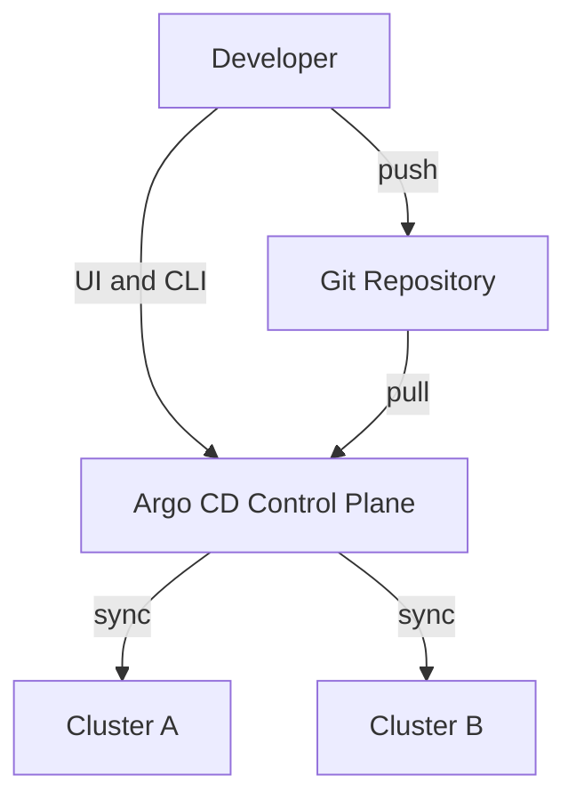
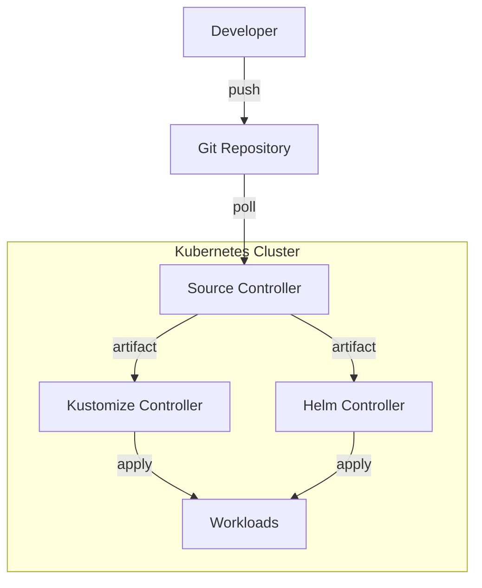
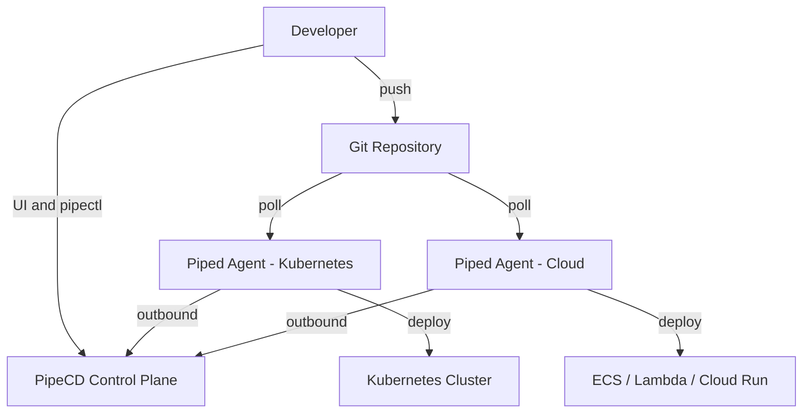
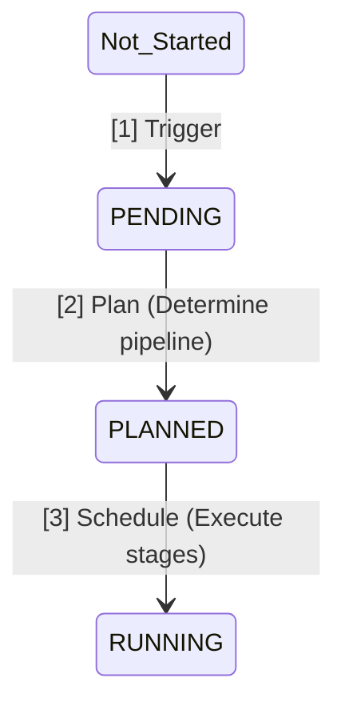
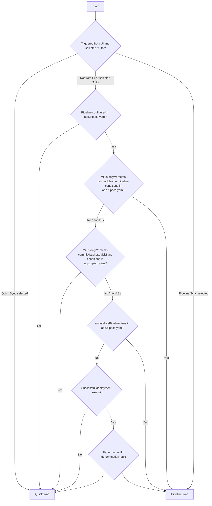

<a id="doc-12e0a48d6c5f2a58f4caa284"></a>

# pipe-cd/pipecd / ADOPTERS.md

Upstream: https://github.com/pipe-cd/pipecd/blob/ff572e076613076a2b93683b02be769f55c6531d/ADOPTERS.md

Commit: `ff572e076613076a2b93683b02be769f55c6531d`

Retrieved: 2026-10-01T15:26:32.605437+00:00

Kind: official-document

Raw SHA256: `4139b2109162afb14176ed93c0625fd5d979ddcd146c8ff56e4c155e6fa1b2ce`

Source text below is untrusted reference content. Acquisition does not verify technical claims.

License status: UPSTREAM_NOTICES_CAPTURED_PER_FILE_REVIEW_REQUIRED. See this repository's captured license files.

---

# Adopters

This list represents the collection of organizations that are using PipeCD within their environments. If you are currently utilizing PipeCD and not yet on this list, we strongly encourage you to add your organization here as well!

The objective of this list is to serve as a comprehensive and authoritative resource for the entire PipeCD adopter community, while also inspiring those who are embarking on their PipeCD journey.

Contributing to this list may seem like a small effort, but it has a **big impact** on the growth, maturity, and momentum of the project. We extend our gratitude to all the adopters and contributors of the PipeCD project!

## Updating this list

To add your organization to this list, open a PR to update this list.

## PipeCD Adopters

This list is arranged in the order of organizations being added to it.

| Organization | Contact | Description of Use |
| --- | --- | --- |
| [Canary Inc.](https://corp.canary-app.jp/) | @mytheta | We are deploying microservices on Kubernetes using PipeCD. |
| [PITS Global Data Recovery Services](https://www.pitsdatarecovery.net/) | @benjx1990 | PipeCD provides an easy-to-use interface and reliable solutions for CI. |
| [CyberAgent, Inc.](https://www.cyberagent.co.jp/) | @kentakozuka | PipeCD is used as an internal CD infrastructure, supporting over 20 projects. About 80 active piped agents are deploying about 2,900 applications in all dev, staging, and production environments. |


<a id="doc-6ebdb617a8104a7756d0cf36"></a>

# pipe-cd/pipecd / CLAUDE.md

Upstream: https://github.com/pipe-cd/pipecd/blob/ff572e076613076a2b93683b02be769f55c6531d/CLAUDE.md

Commit: `ff572e076613076a2b93683b02be769f55c6531d`

Retrieved: 2026-10-01T15:26:32.605437+00:00

Kind: official-document

Raw SHA256: `f7ad7f80b5e99c8d990acc53095e6b05cfc5d60b1771f6196abb26559b4ace20`

Source text below is untrusted reference content. Acquisition does not verify technical claims.

License status: UPSTREAM_NOTICES_CAPTURED_PER_FILE_REVIEW_REQUIRED. See this repository's captured license files.

---

@.github/copilot-instructions.md


<a id="doc-ffdbe3a1e7ee93cacfc080b6"></a>

# pipe-cd/pipecd / CODE_OF_CONDUCT.md

Upstream: https://github.com/pipe-cd/pipecd/blob/ff572e076613076a2b93683b02be769f55c6531d/CODE_OF_CONDUCT.md

Commit: `ff572e076613076a2b93683b02be769f55c6531d`

Retrieved: 2026-10-01T15:26:32.605437+00:00

Kind: official-document

Raw SHA256: `1120bfcfdaff711bf2c888cc8888f28ac254b37402ed443b0f8a64e630c8609b`

Source text below is untrusted reference content. Acquisition does not verify technical claims.

License status: UPSTREAM_NOTICES_CAPTURED_PER_FILE_REVIEW_REQUIRED. See this repository's captured license files.

---

# Community Code of Conduct

PipeCD follows the [CNCF Code of Conduct](https://github.com/cncf/foundation/blob/master/code-of-conduct.md).


<a id="doc-eca12c0a30e25b4b46522ebf"></a>

# pipe-cd/pipecd / CONTRIBUTING.md

Upstream: https://github.com/pipe-cd/pipecd/blob/ff572e076613076a2b93683b02be769f55c6531d/CONTRIBUTING.md

Commit: `ff572e076613076a2b93683b02be769f55c6531d`

Retrieved: 2026-10-01T15:26:32.605437+00:00

Kind: official-document

Raw SHA256: `dfcc8f6c5ce4a59ca71e4c0aad30249cdc2197ba79e648dbd5d3e7ba9f459ebe`

Source text below is untrusted reference content. Acquisition does not verify technical claims.

License status: UPSTREAM_NOTICES_CAPTURED_PER_FILE_REVIEW_REQUIRED. See this repository's captured license files.

---

# Contributing to PipeCD

If you're interested in contributing to PipeCD, this document will provide clear instructions on how to get involved.

> Note: Don't bother reading policies and flows, just want to manipulate the code? Jump to the [Development](#development) section.

The [Open Source Guides](https://opensource.guide/) website offers a collection of resources for individuals, communities, and companies who want to learn how to run and contribute to an open source project. Both contributors and newcomers to open source will find the following guides especially helpful:

- [How to Contribute to Open Source](https://opensource.guide/how-to-contribute/)
- [Building Welcoming Communities](https://opensource.guide/building-community/)

## Code of Conduct

PipeCD follows the [CNCF Code of Conduct](https://github.com/cncf/foundation/blob/master/code-of-conduct.md). Please read it to understand which actions are acceptable and which are not.

## Get Involved

There are various ways to contribute to PipeCD, and many of them don't involve writing code. Here are a few ideas to help you get started:

- Start by using PipeCD. Follow the [Quickstart](https://pipecd.dev/docs/quickstart/) guide. Does everything work as expected? If not, we're always looking for improvements. Let us know by [opening an issue](#open-a-new-issue).

- Browse through the [open issues](https://github.com/pipe-cd/pipecd/issues). Provide workarounds, ask for clarification, or suggest labels.
- If you find an issue you'd like to fix, [open a pull request](#pull-requests). Issues labeled as [_Good first issue_](https://github.com/pipe-cd/pipecd/issues?q=is%3Aopen+is%3Aissue+label%3A%22good+first+issue%22) are a good starting point.
- Read the [PipeCD docs](https://pipecd.dev/docs/). If you come across anything that is confusing or can be improved, click "Edit this page" on the right side of most docs to propose changes through the GitHub interface.
- Participate in [Discussions](https://github.com/pipe-cd/pipecd/discussions) and share your ideas.

Contributions are highly welcome. If you need help planning your contribution, please reach out to us on Twitter at [@pipecd_dev](https://twitter.com/pipecd_dev) and let us know you're seeking assistance.

### Join our Slack Channel

We have a `#pipecd` channel on [CNCF Slack](https://cloud-native.slack.com/) for discussions related to PipeCD development. You can also provide valuable help by assisting other users in the channel.

### Join our public community meeting

We host the PipeCD Community Meeting every 2 weeks. Please check the [#pipecd channel on CNCF Slack](https://cloud-native.slack.com/archives/C01B27F9T0X) for the latest schedule and meeting links. We share the latest project news, demos, answer questions, and help triage issues. You can also view the [Meeting Notes and Agenda](https://bit.ly/pipecd-mtg-notes).

### Join our team on GitHub

We welcome and appreciate your contributions to the PipeCD project. If you would like to continue contributing to the project as a member of the pipe-cd GitHub organization, please attend the [public community meeting](https://zoom-lfx.platform.linuxfoundation.org/meeting/96831504919?password=2f60b8ec-5896-40c8-aa1d-d551ab339d00) and let us know or ping us on the #pipecd channel in the CNCF Slack. Here are some minimum requirements to have before you can ask for the membership:

- Have at least 5 PRs successfully merged to repositories in the pipe-cd GitHub organization
- Have attended PipeCD public community meeting

Please note that you do not need to be a member to start contributing to the PipeCD project. Membership is helpful if you want to contribute over a long period or take responsibility for a feature, so it is appropriate after you are familiar with PipeCD development.

## Our Development Process

PipeCD uses [GitHub](https://github.com/pipe-cd/pipecd) as its source of truth. The core team will be working directly there. All changes will be public from the beginning.

All pull requests undergo checks by the continuous integration system, GitHub Actions. These checks include unit tests, lint tests, and more.

When you submit a pull request to PipeCD, multiple CI workflows are triggered to validate your changes. These checks help ensure code quality, correctness, and consistency across the project.

To better understand which CI workflows run and what they are responsible for, please refer to the [CI overview documentation](.github/ci.md).

### Branch Organization

PipeCD has one primary branch `master`.

## Open a new issue

When [opening a new issue](https://github.com/pipe-cd/pipecd/issues/new/choose), please make sure to fill out the issue template. This step is crucial! Neglecting to do so may result in your issue not being promptly addressed. If this happens, feel free to open a new issue once you have gathered all the necessary information.

### Bugs

We use [GitHub Issues](https://github.com/pipe-cd/pipecd/issues) for our public bug reports. If you encounter a problem, take a look around to see if someone has already reported it. If you believe you have found a new, unreported bug, you can submit a [bug report](https://github.com/pipe-cd/pipecd/issues/new?assignees=&labels=kind%2Fbug&projects=&template=bug-report.md).

- **One issue, one bug:** Please report a single bug per issue.
- **Provide reproduction steps:** List all the steps necessary to reproduce the issue. The person reading your bug report should be able to follow these steps with minimal effort.

If you are only fixing a bug, you can submit a pull request right away, but we still recommend filing an issue to describe what you are fixing. This is helpful in case we do not accept that specific fix but still want to track the issue.

### Security Bugs

If you discover security-related bugs that may compromise the security of current users, please send a direct message to our maintainers on Slack or Twitter instead of opening a public issue.

You can find our DM contacts via [MAINTAINERS.md](./MAINTAINERS.md).

### Enhancement requests

If you would like to request an enhancement to existing features, you can file an issue with the [enhancement request template](https://github.com/pipe-cd/pipecd/issues/new?assignees=&labels=kind%2Fenhancement&projects=&template=enhancement.md).

### Feature requests

If you would like to request an entirely new feature, you can file an issue with the [feature request](https://github.com/pipe-cd/pipecd/issues/new?assignees=&labels=kind%2Ffeature&projects=&template=new-feature.md).

## Working on issues

### Good first issues

We maintain a list of [good first issues](https://github.com/pipe-cd/pipecd/labels/good%20first%20issue) to help you get started with the PipeCD codebase and familiarize yourself with our contribution process. It's an excellent place to begin.

Additionally, we recommend you not to work on multiple good first issues because it's for first contributors and currently we cannot make enough good first issues.

### Before you work on issues

If you want to work on any of these issues, simply leave a message saying "I'd like to work on this," and we will assign the issue to you and update its status as "claimed." We expect you to submit a pull request within seven days so that we can assign the issue to someone else if you are unavailable.

We recommend you to focus only one issue at once if you are newcomer contributor.

So you've decided to contribute back to the upstream by opening a pull request. You've put in a significant amount of time, and we appreciate your effort. We will do our best to work with you and review the pull request.

### Investigate an issue

Before you submitting a Pull Request, we recommend you to investigate the issue and comment what to do on it.
Then you can discuss how to solve the issue and reduce the communication on the Pull Request.

### Submitting a Pull Request

Are you working on your first Pull Request? You can learn how to do it from this free video series:

[**How to Contribute to an Open Source Project on GitHub**](https://egghead.io/courses/how-to-contribute-to-an-open-source-project-on-github)

When submitting a pull request, please ensure the following:

- **Issue assignment.** To avoid redundant work, make sure you are assigned to the issue.
- **Keep your PR small.** Small pull requests (~300 lines of diff) are much easier to review and are more likely to get merged. Make sure the PR addresses only one thing. If not, please split it.
- **Use descriptive titles.** It is recommended to follow the [commit message style](#commit-messages).
- **DCO.** If you haven't signed off already, check the [Contributor License Agreement](#contributor-license-agreement).
- **Run `make check`**. To ensure your change will pass the CI.

All pull requests should be opened against the `master` branch.

We have various integration systems that run automated tests to prevent mistakes. The maintainers will also review your code and fix obvious issues. These systems are in place to minimize your worries about the process. Your code contributions are more important than adhering to strict procedures, although completing the checklist will undoubtedly save everyone's time.

### AI Usage Policy and Guidelines

AI tools can be helpful for learning, understanding the codebase, summarizing documentation, or debugging issues. We welcome contributors using AI as a learning and productivity tool.

At the same time, contributors should keep maintainers time in mind. Every pull request should represent work that the contributor has personally reviewed, understood, and tested.

AI should assist contributors, not replace contributor understanding, communication, or responsibility.

#### Communication and collaboration

Open source development is collaborative and communication is an important part of the contribution process.

Before working on larger changes or unclear issues, contributors are encouraged to discuss ideas and approaches with maintainers and the community instead of relying entirely on AI-generated solutions.

When responding to review comments or writing pull request descriptions, communicate in your own words and focus on the reasoning behind the change. Clear and concise communication is much more helpful than long AI-generated explanations.

#### What we expect from contributors

- Understand the changes before submitting them
- Test changes before opening a pull request
- Review AI-generated output carefully before using it
- Be ready to explain implementation decisions and tradeoffs
- Keep pull requests focused and reasonably small
- Respect maintainers time by avoiding low-quality or unreviewed submissions

#### What to avoid

- Submitting AI-generated code you do not understand
- Opening large AI-generated pull requests without proper review and testing
- Using AI-generated responses that add unnecessary or unclear communication during discussions or code reviews
- Relying on AI instead of discussing important design or architecture decisions with maintainers and the community

If AI tools are used in a significant way, contributors are still responsible for the final contribution and all communication around it.

### Commit Messages

Commit messages should be simple and use easy words that indicate the focus of the commit and its impact on other developers. Summary in the present tense. Use capital case in the first character but do not use title case.

Example

```
Add imports to Terraform plan result
```

Don't stress too much about PR titles. The maintainers will help you get the title right.

### Licensing

By contributing to PipeCD, you agree that your contributions will be licensed under the Apache License Version 2. Include the following header at the top of your new file(s):

```go
// Copyright 2025 The PipeCD Authors.
//
// Licensed under the Apache License, Version 2.0 (the "License");
// you may not use this file except in compliance with the License.
// You may obtain a copy of the License at
//
//     http://www.apache.org/licenses/LICENSE-2.0
//
// Unless required by applicable law or agreed to in writing, software
// distributed under the License is distributed on an "AS IS" BASIS,
// WITHOUT WARRANTIES OR CONDITIONS OF ANY KIND, either express or implied.
// See the License for the specific language governing permissions and
// limitations under the License.
```

### Release Note and Breaking Changes

If your change introduces a user-facing change, please update the following section in your PR description.

```md
**Does this PR introduce a user-facing change?**:

- **How are users affected by this change**:
- **Is this breaking change**:
- **How to migrate (if breaking change)**:
```

Note that if it's a new breaking change, make sure to complete the two latter questions.

## Development

PipeCD consists of several components and docs:

- **cmd/controlplane**: A centralized component that manages deployment data and provides a gRPC API for connecting pipeds, as well as web functionalities such as authentication. [README.md](./cmd/controlplane/README.md)
- **cmd/piped**: piped is an agent component that runs in your cluster. [README.md](./cmd/piped/README.md)
- **cmd/pipectl**: The command-line tool for PipeCD. [README.md](./cmd/pipectl/README.md)
- **cmd/launcher**: The command executor that enables the remote upgrade feature of the piped agent. [README.md](./cmd/launcher/README.md)
- **web**: The web application provided by the control plane. [README.md](./web/README.md)
- **docs**: Documentation and references. [README.md](./docs/README.md)

**You can find detailed development information in the README file of each directory.**

Note: While working with the PipeCD codebase, you may refer to [Makefile](./Makefile) for useful commands.

### Starting a Local Development Environment

#### Update dependencies

Run `make update/go-deps` and `make update/web-deps` to update the dependencies. Starting a local development environment might fail with errors if the dependencies are not up to date.

#### Starting a local registry

In order to start a local development environment, a registry needs to be running locally.

Run `make up/local-cluster` to start a local registry.

This will create the kubernetes namespace `pipecd` if it does not exist and start a local registry in the namespace which can then be accessed by other components.

When cleaning up, run `make down/local-cluster` to stop and delete the registry and the cluster.

#### Run PipeCD Control Plane

Run `make run/controlplane` to run PipeCD Control Plane using your local code changes. This will build and run PipeCD Control Plane.

Run `make stop/controlplane` to stop PipeCD Control Plane.

#### Port Forward

Run `kubectl port-forward -n pipecd svc/controlplane 8080` forward your local port to the `pipecd` pod port.

#### Access the PipeCD UI

After port-forwarding, you can now access the PipeCD Control Plane console at `http://localhost:8080?project=quickstart`.

To login, you can use the configured static admin account as below:

- username: `hello-pipecd`
- password: `hello-pipecd`

#### Run Piped Agent

1. Make sure that PipeCD Control Plane is running and you can access the UI and login.

2. Access to Control Plane console, go to Piped list page - click the three vertical dots on the top right corner and then click on settings. After clicking on settings you will land on the Piped settings page. Next, add a new piped.

Alternatively, you can go to `http://localhost:8080/settings/piped?project=quickstart`, please adjust the port and the project in the url if they are different from default.

Then, copy generated Piped ID and base64 key for `piped-config.yaml`

3. Create the piped configuration file `piped-config.yaml`, ideally in the root of the repository.

> **NOTE**
> If you want to work on multiple piped configuration files, it is recommended to create a .dev folder in the root of the repository and save them there. The .dev folder is configured in .gitignore, and thus, would not include your piped files in your commits.

Below is an example piped v0 configuration using the Kubernetes platform provider. Use the PipeD ID and base64 key you created in step 2 here.

```yaml
  apiVersion: pipecd.dev/v1beta1
  kind: Piped
  spec:
    projectID: quickstart
    pipedID: <YOUR PIPED ID> # Base64 encoded string of the piped private key.
    pipedKeyData: <YOUR PIPED BASE64 KEY> # FIXME: Replace here with your piped base64 key.
    apiAddress: localhost:8080 # Write in a format "localhost:port"
    #Replace with your piped address if you connect Piped to a control plane that does not run locally, or runs on a different port.
    repositories:
    - repoId: example
      remote: git@github.com:pipe-cd/examples.git
      branch: master
    syncInterval: 1m
    platformProviders:
    - name: example-kubernetes
      type: KUBERNETES
      config:
        # FIXME: Replace here with your kubeconfig absolute file path.
        kubeConfigPath: /path/to/.kube/config
  ```

4. Once you have configured your piped configuration file, start the Piped agent with the following command:

```bash
make run/piped \
CONFIG_FILE=path/to/piped-config.yaml \
INSECURE=true
```

where the `CONFIG_FILE` is the path to your piped configuration file and the `INSECURE` flag is set to `true` to allow `piped` to connect to the control plane without TLS verification.

Replace `path/to/piped-config.yaml` with the actual path to your configuration file.

### Online one-click setup for contributing

We are preparing Gitpod and Codespace to facilitate the setup process for contributing.

## Contributor License Agreement

For any code contribution, please carefully read the following documents:

- [License](https://github.com/pipe-cd/pipecd/blob/master/LICENSE)
- [Developer Certificate of Origin (DCO)](https://developercertificate.org/)

And signing off your commit with `git commit -s` (About commit sign-off please read [Github docs](https://docs.github.com/en/repositories/managing-your-repositorys-settings-and-features/managing-repository-settings/managing-the-commit-signoff-policy-for-your-repository#about-commit-signoffs))

## What Happens Next?

The core PipeCD team will monitor the pull requests. Help us by keeping your pull requests consistent with the guidelines mentioned above.


<a id="doc-c693279643b8cd5d248172d9"></a>

# pipe-cd/pipecd / LICENSE

Upstream: https://github.com/pipe-cd/pipecd/blob/ff572e076613076a2b93683b02be769f55c6531d/LICENSE

Commit: `ff572e076613076a2b93683b02be769f55c6531d`

Retrieved: 2026-10-01T15:26:32.605437+00:00

Kind: license

Raw SHA256: `c95bae1d1ce0235ecccd3560b772ec1efb97f348a79f0fbe0a634f0c2ccefe2c`

Source text below is untrusted reference content. Acquisition does not verify technical claims.

License status: UPSTREAM_NOTICES_CAPTURED_PER_FILE_REVIEW_REQUIRED. See this repository's captured license files.

---

````text
                                 Apache License
                           Version 2.0, January 2004
                        http://www.apache.org/licenses/

   TERMS AND CONDITIONS FOR USE, REPRODUCTION, AND DISTRIBUTION

   1. Definitions.

      "License" shall mean the terms and conditions for use, reproduction,
      and distribution as defined by Sections 1 through 9 of this document.

      "Licensor" shall mean the copyright owner or entity authorized by
      the copyright owner that is granting the License.

      "Legal Entity" shall mean the union of the acting entity and all
      other entities that control, are controlled by, or are under common
      control with that entity. For the purposes of this definition,
      "control" means (i) the power, direct or indirect, to cause the
      direction or management of such entity, whether by contract or
      otherwise, or (ii) ownership of fifty percent (50%) or more of the
      outstanding shares, or (iii) beneficial ownership of such entity.

      "You" (or "Your") shall mean an individual or Legal Entity
      exercising permissions granted by this License.

      "Source" form shall mean the preferred form for making modifications,
      including but not limited to software source code, documentation
      source, and configuration files.

      "Object" form shall mean any form resulting from mechanical
      transformation or translation of a Source form, including but
      not limited to compiled object code, generated documentation,
      and conversions to other media types.

      "Work" shall mean the work of authorship, whether in Source or
      Object form, made available under the License, as indicated by a
      copyright notice that is included in or attached to the work
      (an example is provided in the Appendix below).

      "Derivative Works" shall mean any work, whether in Source or Object
      form, that is based on (or derived from) the Work and for which the
      editorial revisions, annotations, elaborations, or other modifications
      represent, as a whole, an original work of authorship. For the purposes
      of this License, Derivative Works shall not include works that remain
      separable from, or merely link (or bind by name) to the interfaces of,
      the Work and Derivative Works thereof.

      "Contribution" shall mean any work of authorship, including
      the original version of the Work and any modifications or additions
      to that Work or Derivative Works thereof, that is intentionally
      submitted to Licensor for inclusion in the Work by the copyright owner
      or by an individual or Legal Entity authorized to submit on behalf of
      the copyright owner. For the purposes of this definition, "submitted"
      means any form of electronic, verbal, or written communication sent
      to the Licensor or its representatives, including but not limited to
      communication on electronic mailing lists, source code control systems,
      and issue tracking systems that are managed by, or on behalf of, the
      Licensor for the purpose of discussing and improving the Work, but
      excluding communication that is conspicuously marked or otherwise
      designated in writing by the copyright owner as "Not a Contribution."

      "Contributor" shall mean Licensor and any individual or Legal Entity
      on behalf of whom a Contribution has been received by Licensor and
      subsequently incorporated within the Work.

   2. Grant of Copyright License. Subject to the terms and conditions of
      this License, each Contributor hereby grants to You a perpetual,
      worldwide, non-exclusive, no-charge, royalty-free, irrevocable
      copyright license to reproduce, prepare Derivative Works of,
      publicly display, publicly perform, sublicense, and distribute the
      Work and such Derivative Works in Source or Object form.

   3. Grant of Patent License. Subject to the terms and conditions of
      this License, each Contributor hereby grants to You a perpetual,
      worldwide, non-exclusive, no-charge, royalty-free, irrevocable
      (except as stated in this section) patent license to make, have made,
      use, offer to sell, sell, import, and otherwise transfer the Work,
      where such license applies only to those patent claims licensable
      by such Contributor that are necessarily infringed by their
      Contribution(s) alone or by combination of their Contribution(s)
      with the Work to which such Contribution(s) was submitted. If You
      institute patent litigation against any entity (including a
      cross-claim or counterclaim in a lawsuit) alleging that the Work
      or a Contribution incorporated within the Work constitutes direct
      or contributory patent infringement, then any patent licenses
      granted to You under this License for that Work shall terminate
      as of the date such litigation is filed.

   4. Redistribution. You may reproduce and distribute copies of the
      Work or Derivative Works thereof in any medium, with or without
      modifications, and in Source or Object form, provided that You
      meet the following conditions:

      (a) You must give any other recipients of the Work or
          Derivative Works a copy of this License; and

      (b) You must cause any modified files to carry prominent notices
          stating that You changed the files; and

      (c) You must retain, in the Source form of any Derivative Works
          that You distribute, all copyright, patent, trademark, and
          attribution notices from the Source form of the Work,
          excluding those notices that do not pertain to any part of
          the Derivative Works; and

      (d) If the Work includes a "NOTICE" text file as part of its
          distribution, then any Derivative Works that You distribute must
          include a readable copy of the attribution notices contained
          within such NOTICE file, excluding those notices that do not
          pertain to any part of the Derivative Works, in at least one
          of the following places: within a NOTICE text file distributed
          as part of the Derivative Works; within the Source form or
          documentation, if provided along with the Derivative Works; or,
          within a display generated by the Derivative Works, if and
          wherever such third-party notices normally appear. The contents
          of the NOTICE file are for informational purposes only and
          do not modify the License. You may add Your own attribution
          notices within Derivative Works that You distribute, alongside
          or as an addendum to the NOTICE text from the Work, provided
          that such additional attribution notices cannot be construed
          as modifying the License.

      You may add Your own copyright statement to Your modifications and
      may provide additional or different license terms and conditions
      for use, reproduction, or distribution of Your modifications, or
      for any such Derivative Works as a whole, provided Your use,
      reproduction, and distribution of the Work otherwise complies with
      the conditions stated in this License.

   5. Submission of Contributions. Unless You explicitly state otherwise,
      any Contribution intentionally submitted for inclusion in the Work
      by You to the Licensor shall be under the terms and conditions of
      this License, without any additional terms or conditions.
      Notwithstanding the above, nothing herein shall supersede or modify
      the terms of any separate license agreement you may have executed
      with Licensor regarding such Contributions.

   6. Trademarks. This License does not grant permission to use the trade
      names, trademarks, service marks, or product names of the Licensor,
      except as required for reasonable and customary use in describing the
      origin of the Work and reproducing the content of the NOTICE file.

   7. Disclaimer of Warranty. Unless required by applicable law or
      agreed to in writing, Licensor provides the Work (and each
      Contributor provides its Contributions) on an "AS IS" BASIS,
      WITHOUT WARRANTIES OR CONDITIONS OF ANY KIND, either express or
      implied, including, without limitation, any warranties or conditions
      of TITLE, NON-INFRINGEMENT, MERCHANTABILITY, or FITNESS FOR A
      PARTICULAR PURPOSE. You are solely responsible for determining the
      appropriateness of using or redistributing the Work and assume any
      risks associated with Your exercise of permissions under this License.

   8. Limitation of Liability. In no event and under no legal theory,
      whether in tort (including negligence), contract, or otherwise,
      unless required by applicable law (such as deliberate and grossly
      negligent acts) or agreed to in writing, shall any Contributor be
      liable to You for damages, including any direct, indirect, special,
      incidental, or consequential damages of any character arising as a
      result of this License or out of the use or inability to use the
      Work (including but not limited to damages for loss of goodwill,
      work stoppage, computer failure or malfunction, or any and all
      other commercial damages or losses), even if such Contributor
      has been advised of the possibility of such damages.

   9. Accepting Warranty or Additional Liability. While redistributing
      the Work or Derivative Works thereof, You may choose to offer,
      and charge a fee for, acceptance of support, warranty, indemnity,
      or other liability obligations and/or rights consistent with this
      License. However, in accepting such obligations, You may act only
      on Your own behalf and on Your sole responsibility, not on behalf
      of any other Contributor, and only if You agree to indemnify,
      defend, and hold each Contributor harmless for any liability
      incurred by, or claims asserted against, such Contributor by reason
      of your accepting any such warranty or additional liability.

   END OF TERMS AND CONDITIONS

   APPENDIX: How to apply the Apache License to your work.

      To apply the Apache License to your work, attach the following
      boilerplate notice, with the fields enclosed by brackets "[]"
      replaced with your own identifying information. (Don't include
      the brackets!)  The text should be enclosed in the appropriate
      comment syntax for the file format. We also recommend that a
      file or class name and description of purpose be included on the
      same "printed page" as the copyright notice for easier
      identification within third-party archives.

   Copyright [yyyy] [name of copyright owner]

   Licensed under the Apache License, Version 2.0 (the "License");
   you may not use this file except in compliance with the License.
   You may obtain a copy of the License at

       http://www.apache.org/licenses/LICENSE-2.0

   Unless required by applicable law or agreed to in writing, software
   distributed under the License is distributed on an "AS IS" BASIS,
   WITHOUT WARRANTIES OR CONDITIONS OF ANY KIND, either express or implied.
   See the License for the specific language governing permissions and
   limitations under the License.


````


<a id="doc-39da3bd6270d44ea37b6ed50"></a>

# pipe-cd/pipecd / MAINTAINERS.md

Upstream: https://github.com/pipe-cd/pipecd/blob/ff572e076613076a2b93683b02be769f55c6531d/MAINTAINERS.md

Commit: `ff572e076613076a2b93683b02be769f55c6531d`

Retrieved: 2026-10-01T15:26:32.605437+00:00

Kind: official-document

Raw SHA256: `03fb1ade37579fe3c8ce52053664a3e38179c8c66286312384ad1ed7def52f08`

Source text below is untrusted reference content. Acquisition does not verify technical claims.

License status: UPSTREAM_NOTICES_CAPTURED_PER_FILE_REVIEW_REQUIRED. See this repository's captured license files.

---

# PipeCD maintainers

| Name                    | GitHub ID (not Twitter ID)                       | Email                                        |
|-------------------------|--------------------------------------------------|----------------------------------------------|
| Tran Cong Khanh         | [@khanhtc1202](https://github.com/khanhtc1202)   | khanhtc1202@gmail.com                        |
| Le Van Nghia            | [@nghialv](https://github.com/nghialv)           | nghialv2607@gmail.com                        |
| Yoshiki Fujikane        | [@ffjlabo](https://github.com/ffjlabo)           | ffjlabo@gmail.com                            |
| Shinnosuke Sawada-Dazai | [@Warashi](https://github.com/Warashi)           | shin@warashi.dev                             |
| Tetsuya Kikuchi         | [@t-kikuc](https://github.com/t-kikuc)           | tkikuchi07f@gmail.com                        |
| Eeshaan Sawant          | [eeshaanSA](https://github.com/eeshaanSA)        | eeshaans1@gmail.com                          |
| Ngo Le Hoang            | [@armistcxy](https://github.com/armistcxy)       | adlehoang118@gmail.com                       |
| Mohammed Firdous Araoye       | [@mohammedfirdouss](https://github.com/mohammedfirdouss) | mohammedfirdousaraoye@gmail.com      |


E-mail addresses are expected to be used for reporting security issues. ref [SECURITY.md](./SECURITY.md) \
Please use [GitHub Issues](https://github.com/pipe-cd/pipecd/issues) for reporting non-security issues,
and [GitHub Discussions](https://github.com/pipe-cd/pipecd/discussions) or channel [#pipecd](https://cloud-native.slack.com/archives/C01B27F9T0X) on CNCF Slack for asking questions.


<a id="doc-b810ebe4ffda4293c79d2920"></a>

# pipe-cd/pipecd / NOTICE.txt

Upstream: https://github.com/pipe-cd/pipecd/blob/ff572e076613076a2b93683b02be769f55c6531d/NOTICE.txt

Commit: `ff572e076613076a2b93683b02be769f55c6531d`

Retrieved: 2026-10-01T15:26:32.605437+00:00

Kind: license

Raw SHA256: `3386225e1a7a8fb02c3d4d0d7fd0953feea3a604e51397372ae62c64594e72cd`

Source text below is untrusted reference content. Acquisition does not verify technical claims.

License status: UPSTREAM_NOTICES_CAPTURED_PER_FILE_REVIEW_REQUIRED. See this repository's captured license files.

---

````text
pipecd
===============

This product contains a modified part of docsy-example, distributed by google/docsy:

  * License: https://github.com/google/docsy-example/blob/master/LICENSE (Apache License v2.0)
  * Homepage: https://github.com/google/docsy-example

This product contains a modified part of sealed-secrets, distributed by bitnami-labs:

  * License: https://github.com/bitnami-labs/sealed-secrets/blob/master/LICENSE (Apache License v2.0)
  * Homepage: https://github.com/bitnami-labs/sealed-secrets

This product contains a modified part of client_golang, distributed by prometheus:

  * License: https://github.com/prometheus/client_golang/blob/master/LICENSE (Apache License v2.0)
  * Homepage: https://github.com/prometheus/client_golang

This product contains a modified part of perf, distributed by golang:

  * License: https://github.com/golang/perf/blob/master/LICENSE
  * Homepage: https://github.com/golang/perf

This product contains a modified part of gitops-engine, distributed by argoproj:

  * License: https://github.com/argoproj/gitops-engine/blob/master/LICENSE (Apache License v2.0)
  * Homepage: https://argo-cd.readthedocs.io/

````


<a id="doc-b335630551682c19a781afeb"></a>

# pipe-cd/pipecd / README.md

Upstream: https://github.com/pipe-cd/pipecd/blob/ff572e076613076a2b93683b02be769f55c6531d/README.md

Commit: `ff572e076613076a2b93683b02be769f55c6531d`

Retrieved: 2026-10-01T15:26:32.605437+00:00

Kind: official-document

Raw SHA256: `b4d614515f2ecc99537841aa7f6e17f2e5ce3fa1a1c2eb0154b3e0aac006bd86`

Source text below is untrusted reference content. Acquisition does not verify technical claims.

License status: UPSTREAM_NOTICES_CAPTURED_PER_FILE_REVIEW_REQUIRED. See this repository's captured license files.

---

[](https://www.bestpractices.dev/projects/7489)
[](https://github.com/pipe-cd/pipecd/actions/workflows/build.yaml)
[](https://github.com/pipe-cd/pipecd/actions/workflows/test.yaml)
[](https://goreportcard.com/report/github.com/pipe-cd/pipecd)
[](https://codecov.io/gh/pipe-cd/pipecd)
[](https://github.com/pipe-cd/pipecd/releases/latest)
[](/LICENSE)
[](https://pipecd.dev/docs/)
[](https://app.slack.com/client/T08PSQ7BQ/C01B27F9T0X)
[](https://twitter.com/pipecd_dev)
[](https://www.cncf.io/projects/pipecd/)

<p align="center">
  
</p>

<p align="center">
  A GitOps style continuous delivery platform that provides consistent deployment and operations experience for any applications
  <br/>
  <a href="https://pipecd.dev"><strong>Explore PipeCD docs »</strong></a>
  <a href="https://play.pipecd.dev?project=play"><strong>Try on Playground »</strong></a>
</p>

---


### Overview

PipeCD provides __a unified continuous delivery solution for multiple application kinds on multi-cloud__ that empowers engineers to deploy faster with more confidence, a GitOps tool that enables doing deployment operations by pull request on Git.


---

### Why PipeCD?

- Simple, unified and easy to use but powerful pipeline definition to construct your deployment
- Same deployment interface to deploy applications of any platform, including Kubernetes, Terraform, GCP Cloud Run, AWS Lambda, AWS ECS
- No CRD or applications' manifest changes are required; Only need a pipeline definition along with your application manifests
- No deployment credentials are exposed or required outside the application cluster
- Built-in deployment analysis as part of the deployment pipeline to measure impact based on metrics, logs, emitted requests
- Easy to interact with any CI; The CI tests and builds artifacts, PipeCD takes the rest
- Insights show metrics like lead time, deployment frequency, MTTR and change failure rate to measure delivery performance
- Designed to manage thousands of cross-platform applications in multi-cloud for company scale but also work well for small projects

For more details, explore the [PipeCD Documentation](https://pipecd.dev/docs).

---

### Getting Started

- The [quickstart guide](https://pipecd.dev/docs/quickstart/) shows how to set up PipeCD components and deploy a hello-world application with PipeCD for testing purposes.
- The [tutorial](https://github.com/pipe-cd/tutorial) shows how to run PipeCD locally for introduction.
- The [installation guide](https://pipecd.dev/docs/installation/) explains and helps set up PipeCD for your real-life use environment.

---

### Community and development

- Check out the [PipeCD website](https://pipecd.dev) for the complete documentation and helpful links.
- Join the [`#pipecd` channel](https://cloud-native.slack.com/archives/C01B27F9T0X) in the [CNCF Slack Workspace](https://communityinviter.com/apps/cloud-native/cncf) to get help and to discuss features.
- Tweet [@pipecd_dev](https://twitter.com/pipecd_dev) on Twitter/X.
- Create Github [Issues](https://github.com/pipe-cd/pipecd/issues) or [Discussions](https://github.com/pipe-cd/pipecd/discussions/) to report bugs or request features.
- Join the [PipeCD Development and Community Meetings](https://zoom-lfx.platform.linuxfoundation.org/meeting/96831504919?password=2f60b8ec-5896-40c8-aa1d-d551ab339d00) where we share the latest project news, demos, answer questions, and help triage issues. You can also view the [Meeting Notes and Agenda](https://bit.ly/pipecd-mtg-notes).

Participation in PipeCD project is governed by the CNCF [Code of Conduct](CODE_OF_CONDUCT.md).

---

### Contributing

We'd love you to join us! Please see the [Contributing Guide](CONTRIBUTING.md) to get started.

---

### Adopters

You can find a list of publicly recognized users of the PipeCD in the [ADOPTERS.md](ADOPTERS.md) file. We strongly encourage all PipeCD users to add their names to this list, as we love to see the community's growing success!

---

### Thanks to the contributors of PipeCD ❤️

<div align="center">
  <a href="https://github.com/pipe-cd/pipecd/graphs/contributors">
    
  </a>
</div>

---

**We are a [Cloud Native Computing Foundation](https://cncf.io/) Sandbox Project.**


The Linux Foundation® (TLF) has registered trademarks and uses trademarks. For a list of TLF trademarks, see [Trademark Usage](https://www.linuxfoundation.org/trademark-usage/).

## License

[](https://app.fossa.com/projects/git%2Bgithub.com%2Fpipe-cd%2Fpipecd?ref=badge_large)


<a id="doc-4a00447b47c36ebd3ded7732"></a>

# pipe-cd/pipecd / RELEASES.md

Upstream: https://github.com/pipe-cd/pipecd/blob/ff572e076613076a2b93683b02be769f55c6531d/RELEASES.md

Commit: `ff572e076613076a2b93683b02be769f55c6531d`

Retrieved: 2026-10-01T15:26:32.605437+00:00

Kind: official-document

Raw SHA256: `757ab728466775feb22afaf03b8aa9905a1680e464f078cb53e324c109a79cbc`

Source text below is untrusted reference content. Acquisition does not verify technical claims.

License status: UPSTREAM_NOTICES_CAPTURED_PER_FILE_REVIEW_REQUIRED. See this repository's captured license files.

---

# Releases
This document explains the process to release new versions.

> NOTE: From v0.54.0, while plugin-arch piped (aka. pipedv1) reaches alpha status, the pipe-cd/pipecd release tab change from only PipeCD release to be multi modules releases. PipeCD and plugins releases are both available at the [release tab](https://github.com/pipe-cd/pipecd/releases).

# PipeCD releases

## Versioning
Versions are expressed as `vX.Y.Z`;

- `X` is the major version
- `Y` is the minor version
- `Z` is the patch version

## Release Cycle
- Major releases: arbitrary timing
- Minor releases: roughly every 2 months
- Patch releases: roughly every 2-3 weeks

Note: The team can release Release candidates(vX.Y.Z-rcXYZ) for versions at any time for early access/testing.

## Major release
This refers to the release of new features or breaking changes.

### Confirm the changelog and generate docs
- Run `make release`.

  This example assumes that `vX.Y.Z` will be released:
  ```shell
  make release version=vX.Y.Z
  ```

  The `RELEASE` file will be updated and docs `vX.Y.x` will be generated.

- Push the above changes and create a pull request to confirm the changelog.
  You can confirm the changelog through the reviewing comment in the pull request by [actions-gh-release](https://github.com/pipe-cd/actions-gh-release).

- Get reviews and merge.

### Cut a new release
- Before cutting a new release, wait for all jobs in GitHub Actions to pass on the master branch.

- Create a tagged release from the master branch. The release should start with "v" and be followed by the version number.

## Minor release
This refers to the release of new features (breaking change may be included).

Please refer to [Major release](https://github.com/pipe-cd/pipecd/blob/master/RELEASES.md#major-release) for the processes.

## Patch release
This refers to the release of critical bug fixes. \
A bugfix for a functional issue (not a data loss or security issue) that only affects an alpha feature does not qualify as a critical bug fix.

This may also contain some minor features, but ensure that it does NOT contain any breaking changes.

### Prerequisites
- `gh` is needed to be installed and ran `gh auth login`. Please refer to [cli/cli](https://github.com/cli/cli).

### Fix bugs
- Create a pull request to fix a bug on the `master` branch.

- Get reviews and merge.

### Confirm the changelog and create Release Note

- Run `make release/init`.
  ```shell
  make release/init version=vX.Y.Z
  ```

  The `RELEASE` file will be updated.

- (Optional) if the patch contains changes with docs update, also need to run `make release/docs`
  ```shell
  make release/docs version=vX.Y.Z
  ```

  Note: You can use `make release version=vX.Y.Z` command to perform both init and docs sync tasks.

- Push the above changes and create a pull request to `master` to confirm the changelog.

- Get a review and merge.

### Backport fixes and Release Note

- Put labels of `cherry-pick` and `vX.Y.Z` to the PR of updating the `RELEASE` file to prevent conflicts.
- Run `cherry_pick` workflow
  - Label the merged PR you want to cherry pick with `cherry-pick` , `vX.Y.Z`
    (e.g. v0.48.6 https://github.com/pipe-cd/pipecd/pulls?q=is%3Apr+label%3Acherry-pick+is%3Aclosed+label%3Av0.48.6)
  - Execute the `cherry_pick` GitHub workflow with `release branch` and `release version` on master branch.
    (e.g. if you want to release v0.48.6, `release branch` is `release-v0.48.x` and `release version` is `v0.48.6`)

- If you have some trouble with the above, run release pick commits on local machine.

  This example assumes that the name of a release branch is `release-vX.Y.x` and the numbers of pull request are `#1234` and `#5678`:
  ```shell
  make release/pick branch=release-vX.Y.x pull_numbers="1234 5678"
  ````

- Get a review and merge.

### Cut a new release
- Before cutting a new release, wait for all jobs in GitHub Actions to pass on the release branch.

- Create a tagged release from the release branch `release-vX.Y.x`. The release should start with "v" and be followed by the version number.

## RC Release

1. Prepare: Ensure all changes you want to attach to the release are available in the release target branch (`master` for the minor, `release-vX.Y.x` for the patch). For the patch, please refer to [Backport fixes and Release note](#backport-fixes-and-release-note)
2. Move on to [Releases > Draft a New Release](https://github.com/pipe-cd/pipecd/releases/new).
3. Set values as below:
   1. `Choose a tag`: Create a new tag `vX.Y.Z-rcN`
   2. `Target`(branch): use `master` for the minor rc, use `release-vX.Y.x` for the patch rc
   3. `Release title`: `Release vX.Y.Z-rcN`
   4. Body area
      1. Copy from the previous rc-release note.
      2. Modify the version of `> Note: This is a candidate release of vX.Y.Z.` if needed.
      3. Modify the version of  `## Changes since`.
      4. List Changes:
         1. Extract commits to include by the below commands.

            ```zsh
            $ PREVIOUS_TAG=v0.46.0-rc1 # Set the previous release tag
            $ git log $PREVIOUS_TAG..HEAD --oneline  | awk '{$1=""; print substr($0, 2)}'
            ```

            output(from newer to older):

            ```
            Add reference to the blog that shows how to install control plane on ECS (#4746)
            Update copyright (#4745)
            ...
            Add docs for SCRIPT_RUN stage (#4734)
            ```

         2. Classify the changes into 'Notable Changes' and 'Internal Changes'.
         3. Write them to the body area.
   5. **Select `Set as a pre-release`**, not `Set as the latest release`.
4. Push `Publish Release`.

## Pipedv1 releases (experimental)

Currently, pipedv1 is in experimental (aplha) status, so the release is done by maintainers team.

Pipedv1 releases is done by [publish_pipedv1_exp github actions](https://github.com/pipe-cd/pipecd/blob/master/.github/workflows/publish_pipedv1_exp.yaml).

### Inputs

| Name       | Description                                   | Required |  Example      |
|------------|-----------------------------------------------|:--------:|:-------------:|
| version    | The version of the pipedv1 to release.        |    yes   | v1.0.0-rc0    |


# Plugins releases

Piped's plugins are versioned independently from PipeCD. This means that the plugin version is not related to the PipeCD version.

NOTE: Plugin releases mentioned in this document are only plugins maintained by the maintainers team. For community plugins, please refer to the [community plugin's repository](https://github.com/pipe-cd/community-plugins) for release information.

## Versioning

Piped's plugins version follow semantic versioning (same as PipeCD).

## Release Cycle

There is no release cycle for plugins. Maintainers team will release new versions of plugins when there are new features or bug fixes.

## Cut a new release

Plugins releases is done by [plugin_release github actions](https://github.com/pipe-cd/pipecd/blob/master/.github/workflows/plugin_release.yaml).

### Inputs

| Name       | Description                                   | Required |  Example      |
|------------|-----------------------------------------------|:--------:|:-------------:|
| version    | The version of the plugin to release.         |    yes   | v0.1.0        |
| path       | The path of the plugin to release.            |    yes   | pkg/app/pipedv1/plugin/kubernetes |

# Piped plugin SDK releases

> NOTE: Release for piped plugin SDK is available at [piped-plugin-sdk-go repo](https://github.com/pipe-cd/piped-plugin-sdk-go/releases).

## Versioning

The piped plugin SDK are versioned independently from [PipeCD](https://github.com/pipe-cd/pipecd). This means that the plugin version is not related to the PipeCD version.

The piped plugin SDK version follow semantic versioning (same as PipeCD).

## Release Cycle

There is no release cycle for piped plugin SDK. Maintainers team will release new versions when there are new features or bug fixes.

## Cut a new release

Piped plugin SDK releases is done by [release sdk github actions](https://github.com/pipe-cd/piped-plugin-sdk-go/blob/main/.github/workflows/release.yaml).

### Inputs

| Name       | Description                                   | Required |  Example      |
|------------|-----------------------------------------------|:--------:|:-------------:|
| version    | The version of the piped plugin SDK to release.        |    yes   | v0.1.0    |


<a id="doc-f6ed156e4bf5c79168066246"></a>

# pipe-cd/pipecd / SECURITY.md

Upstream: https://github.com/pipe-cd/pipecd/blob/ff572e076613076a2b93683b02be769f55c6531d/SECURITY.md

Commit: `ff572e076613076a2b93683b02be769f55c6531d`

Retrieved: 2026-10-01T15:26:32.605437+00:00

Kind: official-document

Raw SHA256: `0a04164320b7b9bb2cfd22fb7e7e8d6aa6fb7e39d6df61c1b2f63be047b1c530`

Source text below is untrusted reference content. Acquisition does not verify technical claims.

License status: UPSTREAM_NOTICES_CAPTURED_PER_FILE_REVIEW_REQUIRED. See this repository's captured license files.

---

# Security Policy

## Reporting a Vulnerability

Drop an email to maintainers to report security issues.

| Name                    | GitHub ID (not Twitter ID)                       | Email                                        |
|-------------------------|--------------------------------------------------|----------------------------------------------|
| Tran Cong Khanh         | [@khanhtc1202](https://github.com/khanhtc1202)   | khanhtc1202@gmail.com                        |
| Yoshiki Fujikane        | [@ffjlabo](https://github.com/ffjlabo)           | ffjlabo@gmail.com                            |
| Shinnosuke Sawada-Dazai | [@Warashi](https://github.com/Warashi)           | shin@warashi.dev                             |
| Tetsuya Kikuchi         | [@t-kikuc](https://github.com/t-kikuc)           | tkikuchi07f@gmail.com                        |


<a id="doc-7397907132c61f47e1ed0794"></a>

# pipe-cd/pipecd / cmd/controlplane/README.md

Upstream: https://github.com/pipe-cd/pipecd/blob/ff572e076613076a2b93683b02be769f55c6531d/cmd/controlplane/README.md

Commit: `ff572e076613076a2b93683b02be769f55c6531d`

Retrieved: 2026-10-01T15:26:32.605437+00:00

Kind: official-document

Raw SHA256: `105cf7c9e6213792fa0fa42df169d29046deb52e87750737b79ff7b96c793d59`

Source text below is untrusted reference content. Acquisition does not verify technical claims.

License status: UPSTREAM_NOTICES_CAPTURED_PER_FILE_REVIEW_REQUIRED. See this repository's captured license files.

---

# PipeCD Control Plane
## Development

## Prerequisites

- [Go 1.26 or later](https://go.dev/)
- [NodeJS v24.10.0 or later](https://nodejs.org/en/)
- [Docker](https://www.docker.com/)
- [kind](https://kind.sigs.k8s.io/docs/user/quick-start/#installation) (If you want to run Control Plane locally)
- [helm 3.8](https://helm.sh/docs/intro/install/) (If you want to run Control Plane locally)

## Repositories
- [pipecd](https://github.com/pipe-cd/pipecd): contains all source code and documentation of PipeCD project.

## Commands

- `make build/go`: builds all go modules including controlplane, piped, pipectl.
- `make test/go`: runs all unit tests of go modules.
- `make test/integration`: runs integration tests.
- `make gen/code`: generate Go and Typescript code from protos and mock configs. You need to run it if you modified any proto or mock definition files.

For the full list of available commands, please see the Makefile at the root of repository.

## How to run Control Plane locally

1. Start running a Kubernetes cluster (If you don't have any Kubernetes cluster to use)

    ``` console
    make up/local-cluster
    ```

    Once it is no longer used, run `make down/local-cluster` to delete it.

2. Install the web dependencies module

    ``` console
    make update/web-deps
    ```

3. Install Control Plane into the local cluster

    ``` console
    make run/controlplane
    ```

    Once all components are running up, use `kubectl port-forward` to expose the installed Control Plane on your localhost:

    ``` console
    kubectl -n pipecd port-forward svc/controlplane 8080
    ```

4. Access to the local Control Plane web console

    Point your web browser to [http://localhost:8080](http://localhost:8080) to login with the configured static admin account: project = `quickstart`, username = `hello-pipecd`, password = `hello-pipecd`.

## How to run Piped locally and add an application to your cluster
See [How to run Piped agent locally](https://github.com/pipe-cd/pipecd/tree/master/cmd/piped#how-to-run-piped-agent-locally).

## How to set up OIDC provider(Keycloak) locally

Run `make setup-local-oidc` to set up local OIDC provider(keycloak). This will create a new Keycloak realm and an OIDC client for PipeCD. See [Local Keycloak](../../hack/oidc/README.md) for more details.


<a id="doc-956d84c3a611c54a8ffdf010"></a>

# pipe-cd/pipecd / cmd/launcher/README.md

Upstream: https://github.com/pipe-cd/pipecd/blob/ff572e076613076a2b93683b02be769f55c6531d/cmd/launcher/README.md

Commit: `ff572e076613076a2b93683b02be769f55c6531d`

Retrieved: 2026-10-01T15:26:32.605437+00:00

Kind: official-document

Raw SHA256: `e79f5fc0c1cfebc6e585c74517d5ce4a74a5b876c081d8c73e87bcaddf9dd6b9`

Source text below is untrusted reference content. Acquisition does not verify technical claims.

License status: UPSTREAM_NOTICES_CAPTURED_PER_FILE_REVIEW_REQUIRED. See this repository's captured license files.

---

# Launcher

<a id="doc-1ef0c5fbd5558a33fa91212f"></a>

# pipe-cd/pipecd / cmd/pipectl/README.md

Upstream: https://github.com/pipe-cd/pipecd/blob/ff572e076613076a2b93683b02be769f55c6531d/cmd/pipectl/README.md

Commit: `ff572e076613076a2b93683b02be769f55c6531d`

Retrieved: 2026-10-01T15:26:32.605437+00:00

Kind: official-document

Raw SHA256: `8f26ccb2a4c9a9a746aa3034c7cdd3ff88b06eb36059557c522ed5975c29e869`

Source text below is untrusted reference content. Acquisition does not verify technical claims.

License status: UPSTREAM_NOTICES_CAPTURED_PER_FILE_REVIEW_REQUIRED. See this repository's captured license files.

---

# pipectl: A Command Line Tool for PipeCD

<a id="doc-084c63086447114044f6b720"></a>

# pipe-cd/pipecd / cmd/piped/README.md

Upstream: https://github.com/pipe-cd/pipecd/blob/ff572e076613076a2b93683b02be769f55c6531d/cmd/piped/README.md

Commit: `ff572e076613076a2b93683b02be769f55c6531d`

Retrieved: 2026-10-01T15:26:32.605437+00:00

Kind: official-document

Raw SHA256: `a434067aa85e85f7c63369a370909cd37b3fe3a7ee50b851ee6b8bb10c145504`

Source text below is untrusted reference content. Acquisition does not verify technical claims.

License status: UPSTREAM_NOTICES_CAPTURED_PER_FILE_REVIEW_REQUIRED. See this repository's captured license files.

---

# Piped Agent
## Development

## Prerequisites

- [Go 1.26 or later](https://go.dev/)

## Repositories
- [pipecd](https://github.com/pipe-cd/pipecd): contains all source code and documentation of PipeCD project.

## Commands

- `make build/go`: builds all go modules including pipecd, piped, pipectl.
- `make test/go`: runs all unit tests of go modules.
- `make run/piped`: runs Piped locally (for more information, see [here](#how-to-run-piped-agent-locally)).
- `make gen/code`: generate Go and Typescript code from protos and mock configs. You need to run it if you modified any proto or mock definition files.

For the full list of available commands, please see the Makefile at the root of the repository.

## Setup Control Plane

1. Prepare Control Plane that piped connects. If you want to run a control plane locally, see [How to run Control Plane locally](https://github.com/pipe-cd/pipecd/tree/master/cmd/controlplane#how-to-run-control-plane-locally).

2. Access to Control Plane console, go to Piped list page and add a new piped. Then, copy generated Piped ID and key for `piped-config.yaml`

## How to run Piped agent locally

1. Prepare the piped configuration file `piped-config.yaml`. This is an example configuration;
    ```yaml
    apiVersion: pipecd.dev/v1beta1
    kind: Piped
    spec:
      projectID: quickstart
      # FIXME: Replace here with your piped ID.
      pipedID: 7accd470-1786-49ee-ac09-3c4d4e31dc12
      # Base64 encoded string of the piped private key. You can generate it by the following command.
      # echo -n "your-piped-key" | base64
      # FIXME: Replace here with your piped key file path.
      pipedKeyData: OTl4c2RqdjUxNTF2OW1sOGw5ampndXUyZjB2aGJ4dGw0bHVkamF4Mmc3a3l1enFqY20K
      # Write in a format like "host:443" because the communication is done via gRPC.
      # FIXME: Replace here with your piped address if you connect Piped to a control plane that does not run locally.
      apiAddress: localhost:8080
      repositories:
      - repoId: example
        remote: git@github.com:pipe-cd/examples.git
        branch: master
      syncInterval: 1m
      platformProviders:
      - name: example-kubernetes
        type: KUBERNETES
        config:
          # FIXME: Replace here with your kubeconfig absolute file path.
          kubeConfigPath: /path/to/.kube/config
    ```

2. Ensure that your `kube-context` is connecting to the right kubernetes cluster

3. Run the following command to start running `piped` (if you want to connect Piped to a locally running Control Plane, add `INSECURE=true` option)

    ``` console
    make run/piped CONFIG_FILE=piped-config.yaml
    ```

Note: If you have a problem with accessing the example repository, please follow [this guide](https://docs.github.com/en/authentication/connecting-to-github-with-ssh/generating-a-new-ssh-key-and-adding-it-to-the-ssh-agent) to register the SSH key or try specifying `remote: https://github.com/pipe-cd/examples.git` instead in the above `piped-config.yaml`.


<a id="doc-bbef00108c14ce675c1fdeb3"></a>

# pipe-cd/pipecd / cmd/pipedv1/README-usage-alpha.md

Upstream: https://github.com/pipe-cd/pipecd/blob/ff572e076613076a2b93683b02be769f55c6531d/cmd/pipedv1/README-usage-alpha.md

Commit: `ff572e076613076a2b93683b02be769f55c6531d`

Retrieved: 2026-10-01T15:26:32.605437+00:00

Kind: official-document

Raw SHA256: `3e4619b742947813ea4c608b2bf45836d0ae1c90cef1634ec164f60c45091af7`

Source text below is untrusted reference content. Acquisition does not verify technical claims.

License status: UPSTREAM_NOTICES_CAPTURED_PER_FILE_REVIEW_REQUIRED. See this repository's captured license files.

---

# Usage of plugin-arched piped and plugins (alpha)

_This page is still in preparation. The content will be changed and might not work well yet._

This page shows how to run piped and plugins of alpha status.

See [cmd/pipedv1/README.md](https://github.com/pipe-cd/pipecd/blob/master/cmd/pipedv1/README.md) if you want to develop or debug piped.

_This page might be moved to another place in the future._


## Prerequisites

- kubectl and a k8s cluster (They are not required if you won't use the kubernetes plugin)

## 1. Setup Control Plane

1. Run a Control Plane that your piped will connect to. If you want to run a Control Plane locally, see [How to run Control Plane locally](https://github.com/pipe-cd/pipecd/tree/master/cmd/controlplane#how-to-run-control-plane-locally).
    - The Control Plane version must be v0.52.0 or later.

2. Generate a new piped key/ID.

    2.1. Access the Control Plane console.

    2.2. Go to the piped list page. (https://{console-address}/settings/piped)

    2.4. Add a new piped via the `+ADD` button.

    2.5. Copy the generated piped ID and base64 encoded key.

## 2. Run plugin-arched piped

1. Download piped binary.

```sh
# OS="darwin" or "linux" CPU_ARCH="arm64" or "amd64"
curl -Lo ./piped_kubecon_jp_2025 https://github.com/pipe-cd/pipecd/releases/download/kubecon-jp-2025/piped_kubecon_jp_2025_{OS}_{CPU_ARCH}

chmod +x ./piped_kubecon_jp_2025
```

2. Create a piped config file like the following.

```yaml
apiVersion: pipecd.dev/v1beta1
kind: Piped
spec:
  apiAddress: {CONTROL_PLANE_API_ADDRESS} # like "localhost:8080"
  projectID: {PROJECT_ID}
  pipedID: {PIPED_ID}
  pipedKeyData: {BASE64_ENCODED_PIPED_KEY} # or use pipedKeyFile
  repositories:
    - repoID: repo1
      remote: https://github.com/your-account/your-repo
      branch: xxx
  # See https://pipecd.dev/docs/user-guide/managing-piped/configuration-reference/ for details of above.
  # platformProviders is not necessary.

  plugins:
    - name: kubernetes
      port: 7001 # Any unused port
      url: https://github.com/pipe-cd/pipecd/releases/download/kubecon-jp-2025/plugin_kubernetes_kubecon_jp_2025_darwin_arm64 # choose binary on the release for your own OS and CPU arch
      deployTargets:
        - name: cluster1
          config: 
            masterURL: https://127.0.0.1:61337   # shown by kubectl cluster-info
            kubeConfigPath: /path/to/kubeconfig
            kubectlVersion: 1.33.0
    - name: wait
      port: 7002 # Any unused port
      url: https://github.com/pipe-cd/pipecd/releases/download/kubecon-jp-2025/plugin_wait_kubecon_jp_2025_darwin_arm64 # choose binary on the release for your own OS and CPU arch

    - name: example-stage
      port: 7003 # Any unused port
      url: https://github.com/pipe-cd/community-plugins/releases/download/kubecon-jp-2025/plugin_example-stage_kubecon_jp_2025_darwin_arm64 # choose binary on the release for your own OS and CPU arch
      config:
        - commonMessage: "[common message]"
```

3. Run piped

```sh
./piped_kubecon_jp_2025 piped --config-file=/path/to/piped-config.yaml --tools-dir=/tmp/piped-bin
```

- If your Control Plane runs on local, add `--insecure=true` to the command to skip TLS certificate checks.


## 3. Deploy an application

Let's create application with kubernetes plugin.

1. Create an app.pipecd.yaml like the following.

    ```yaml
    apiVersion: pipecd.dev/v1beta1
    kind: Application
    spec:
      name: canary
      labels:
        env: example
        team: product
      pipeline:
        stages:
          # Deploy the workloads of CANARY variant. In this case, the number of
          # workload replicas of CANARY variant is 10% of the replicas number of PRIMARY variant.
          - name: K8S_CANARY_ROLLOUT
            with:
              replicas: 10%
          # Wait 10 seconds before going to the next stage.
          - name: WAIT
            with:
              duration: 10s
          # Update the workload of PRIMARY variant to the new version.
          - name: K8S_PRIMARY_ROLLOUT
          # Destroy all workloads of CANARY variant.
          - name: K8S_CANARY_CLEAN
    ```

2. Create Resources in the same dir as app.pipecd.yaml.

    deployment.yaml
    ```yaml
    apiVersion: apps/v1
    kind: Deployment
    metadata:
      name: canary
      labels:
        app: canary
    spec:
      replicas: 2
      revisionHistoryLimit: 2
      selector:
        matchLabels:
          app: canary
          pipecd.dev/variant: primary
      template:
        metadata:
          labels:
            app: canary
            pipecd.dev/variant: primary
        spec:
          containers:
          - name: helloworld
            image: ghcr.io/pipe-cd/helloworld:v0.32.0
            args:
              - server
            ports:
            - containerPort: 9085
    ```

    service.yaml
    ```yaml
    apiVersion: v1
    kind: Service
    metadata:
      name: canary
    spec:
      selector:
        app: canary
      ports:
        - protocol: TCP
          port: 9085
          targetPort: 9085
    ```

3. Push the app.pipecd.yaml and the resources to your remote repository.
4. On the Control Plane console, register the application via `PIPED V1 ADD FROM SUGGESTIONS` tab.

## See also

- kubernetes plugin: [README.md](/pkg/app/pipedv1/plugin/kubernetes/README.md)
- wait stage plugin: [README.md](/pkg/app/pipedv1/plugin/wait/README.md)
- example-stage plugin: [README.md](https://github.com/pipe-cd/community-plugins/blob/main/plugins/example-stage/README.md)

## Note

- Currently, on the Deployment detail UI, each stage is not visible until it starts.
  - The cause is that the `Visible` field of each stage is set to `false` by default in piped. Instead, the new field `Rollback` is used to determine if the stage is a rollback stage.
  - This will be modified before releasing piped beta.


<a id="doc-929476101d1c5b9ebfcc0ae8"></a>

# pipe-cd/pipecd / cmd/pipedv1/README.md

Upstream: https://github.com/pipe-cd/pipecd/blob/ff572e076613076a2b93683b02be769f55c6531d/cmd/pipedv1/README.md

Commit: `ff572e076613076a2b93683b02be769f55c6531d`

Retrieved: 2026-10-01T15:26:32.605437+00:00

Kind: official-document

Raw SHA256: `8a32e6c2da8a00517d8c4a34faeccceb455597bb1a7b41dc354e3d7e2c470744`

Source text below is untrusted reference content. Acquisition does not verify technical claims.

License status: UPSTREAM_NOTICES_CAPTURED_PER_FILE_REVIEW_REQUIRED. See this repository's captured license files.

---

# Piped Agent for plugin architecture

See [Overview of the Plan for Pluginnable PipeCD](https://pipecd.dev/blog/2024/11/28/overview-of-the-plan-for-pluginnable-pipecd/) to understand what's PipeCD plugin.


## Prerequisites

- [Go 1.26 or later](https://go.dev/)

## Repositories
- [pipecd](https://github.com/pipe-cd/pipecd): contains all source code and documentation of PipeCD project.

## Commands

- `make build/go`: builds all go modules including pipecd, piped, pipectl.
- `make test/go`: runs all unit tests of go modules.
- `make build/plugin`: builds built-in plugins located in `pkg/app/pipedv1/plugin`.
- `make run/piped`: runs Piped locally (for more information, see [here](#how-to-run-piped-agent-locally)).
- `make gen/code`: generate Go and Typescript code from protos and mock configs. You need to run it if you modified any proto or mock definition files.

For the full list of available commands, please see the Makefile at the root of the repository.

## Setup Control Plane

1. Prepare Control Plane that piped connects. If you want to run a control plane locally, see [How to run Control Plane locally](https://github.com/pipe-cd/pipecd/tree/master/cmd/controlplane#how-to-run-control-plane-locally).

2. Access to Control Plane console, go to Piped list page and add a new piped. Then, copy generated Piped ID and key for `piped-config.yaml`

## How to run Piped agent locally

1. Prepare plugin binaries.

    ```sh
    make build/plugin
    ```

2. Prepare the piped configuration file `piped-config.yaml`. This is an example configuration;
    ```yaml
    apiVersion: pipecd.dev/v1beta1
    kind: Piped
    spec:
      projectID: quickstart
      # FIXME: Replace here with your piped ID.
      pipedID: 7accd470-1786-49ee-ac09-3c4d4e31dc12
      # Base64 encoded string of the piped private key. You can generate it by the following command.
      # echo -n "your-piped-key" | base64
      # FIXME: Replace here with your piped key file path.
      pipedKeyData: OTl4c2RqdjUxNTF2OW1sOGw5ampndXUyZjB2aGJ4dGw0bHVkamF4Mmc3a3l1enFqY20K
      # Write in a format like "host:443" because the communication is done via gRPC.
      # FIXME: Replace here with your piped address if you connect Piped to a control plane that does not run locally.
      apiAddress: localhost:8080
      repositories:
      - repoId: example
        remote: git@github.com:pipe-cd/examples.git # FIXME: prepare your manifest repo
        branch: main
      syncInterval: 1m
      plugins:
      - name: kubernetes
        port: 7003 # FIXME: any unused port
        url: file:///path/to/.piped/plugins/kubernetes # It's OK using any value for now because it's a dummy. We will implement it later.
        deployTargets: # This field is alternative for platform providers
        - name: kubernetes-dev
          config:
            masterURL: https://127.0.0.1:61337 # FIXME: shown by kubectl cluster-info
            # FIXME: Replace here with your kubeconfig absolute file path.
            kubeConfigPath: /path/to/.kube/config
    ```

3. Ensure that your `kube-context` is connecting to the right kubernetes cluster

4. Run the following command to start running `piped` (if you want to connect Piped to a locally running Control Plane, add `INSECURE=true` option)

    ``` console
    make run/piped CONFIG_FILE=piped-config.yaml EXPERIMENTAL=true
    ```

Note: If you have a problem with accessing the example repository, please follow [this guide](https://docs.github.com/en/authentication/connecting-to-github-with-ssh/generating-a-new-ssh-key-and-adding-it-to-the-ssh-agent) to register the SSH key or try specifying `remote: https://github.com/pipe-cd/examples.git` instead in the above `piped-config.yaml`.


<a id="doc-0b5ca119d2be595aa307d345"></a>

# pipe-cd/pipecd / docs/README.md

Upstream: https://github.com/pipe-cd/pipecd/blob/ff572e076613076a2b93683b02be769f55c6531d/docs/README.md

Commit: `ff572e076613076a2b93683b02be769f55c6531d`

Retrieved: 2026-10-01T15:26:32.605437+00:00

Kind: official-document

Raw SHA256: `cb7d2a5c4347dffcab67bf8e49ff2c6346de3d10064009bad5b64d780b79211d`

Source text below is untrusted reference content. Acquisition does not verify technical claims.

License status: UPSTREAM_NOTICES_CAPTURED_PER_FILE_REVIEW_REQUIRED. See this repository's captured license files.

---

# Documentation

The source files for the documentation are located in the [content](https://github.com/pipe-cd/pipecd/tree/master/docs/content) directory.

# Website

The PipeCD documentation website is built with [hugo](https://gohugo.io/) and hosted on [Netlify](https://www.netlify.com/), published at https://pipecd.dev

# Docs workflow and versioning

PipeCD’s official site contains multiple versions of documentation, all placed under the `/docs/content/en` directory:

- `/docs-dev`: experimental docs for not-yet-released features or changes.
- `/docs-vX.Y.x`: docs for a specific released version family (e.g., `docs-v0.56.x`, `docs-v1.0.x`).

Here are the recommended flows for common documentation updates:

1. **Update docs related to an older released version (not the latest released version):**  
   Update the docs under the corresponding `/docs-vX.Y.x` directory.

2. **Update docs for not-yet-released features or changes:**  
   Update the docs under `/docs-dev`.

3. **Update docs related to the latest released docs version:**  
   Apply the change in both `/docs-dev` and the latest `/docs-vX.Y.x` directory (they share the same structure, so you can find the same page in both).

If you find any issues related to the docs, we're happy to accept your help.

# Hosting

The site is hosted on Netlify with the following setup:
- **Build tool**: Hugo (extended) via `netlify.toml` configuration
- **Deploy trigger**: Automatic on push to `master` branch and version tags
- **Deploy previews**: Automatically generated for pull requests that modify `docs/`
- **Redirects**: `/docs/` redirects to the latest released version (configured in `netlify.toml`)

# How to run website locally

## Prerequisite
- [Hugo 0.148.2+extended](https://gohugo.io/)
- [Node.js 24+](https://nodejs.org/)

## Commands
1. Install Hugo theme dependencies:
```
cd docs && npm install
```
2. Run the development server:
```
hugo server
```
3. Access http://localhost:1313

# Netlify Configuration

The Netlify build configuration is defined in [`netlify.toml`](./netlify.toml). Key settings:
- **Build command**: `npm ci && hugo --gc --minify`
- **Publish directory**: `public/`
- **Redirects**: `/docs/` → latest version docs
- **Security headers**: X-Frame-Options, X-XSS-Protection, etc.

When a new release version is created, the `hack/gen-release-docs.sh` script automatically updates the redirect target in `netlify.toml`.


<a id="doc-12af24e4ac809fc60ca7b927"></a>

# pipe-cd/pipecd / docs/content/en/blog/_index.md

Upstream: https://github.com/pipe-cd/pipecd/blob/ff572e076613076a2b93683b02be769f55c6531d/docs/content/en/blog/_index.md

Commit: `ff572e076613076a2b93683b02be769f55c6531d`

Retrieved: 2026-10-01T15:26:32.605437+00:00

Kind: official-document

Raw SHA256: `b66b10b11cd4a711e8e39a8a5fbaec07d05f88cc3959462b8c2c0af6e180271c`

Source text below is untrusted reference content. Acquisition does not verify technical claims.

License status: UPSTREAM_NOTICES_CAPTURED_PER_FILE_REVIEW_REQUIRED. See this repository's captured license files.

---

---
title: "PipeCD Blog"
linkTitle: "Blog"
menu:
  main:
    weight: 30
---


This is the **blog** section. It has two categories: News and Releases.

Files in these directories will be listed in reverse chronological order.


<a id="doc-cf89f62ee3724e31bbc22dcf"></a>

# pipe-cd/pipecd / docs/content/en/blog/anatomy-of-the-pipecd-wait-plugin.md

Upstream: https://github.com/pipe-cd/pipecd/blob/ff572e076613076a2b93683b02be769f55c6531d/docs/content/en/blog/anatomy-of-the-pipecd-wait-plugin.md

Commit: `ff572e076613076a2b93683b02be769f55c6531d`

Retrieved: 2026-10-01T15:26:32.605437+00:00

Kind: official-document

Raw SHA256: `92d5d994c9eacdb3d8dca855503e9eccf87c668a425713f2efaf89e18c182ae7`

Source text below is untrusted reference content. Acquisition does not verify technical claims.

License status: UPSTREAM_NOTICES_CAPTURED_PER_FILE_REVIEW_REQUIRED. See this repository's captured license files.

---

---
date: 2026-05-17
title: "Reading the PipeCD WAIT plugin: an English walkthrough"
linkTitle: "Reading the WAIT plugin"
weight: 965
description: "A file-by-file tour of PipeCD's smallest official plugin, written for contributors who want to read a real pipedv1 plugin end-to-end before building their own."
author: Sridhar Panigrahi ([@sridhar-panigrahi](https://github.com/sridhar-panigrahi))
categories: ["Tutorial"]
tags: ["Plugin", "PipeCD", "pipedv1", "Tutorial"]
---

The PipeCD plugin architecture went alpha in [June 2025](/blog/2025/06/16/plugin-architecture-piped-alpha-version-has-been-released/), and the docs around it are catching up in pieces. There is a [great Japanese book](https://zenn.dev/warashi/books/try-and-learn-pipecd-plugin) by [@Warashi](https://github.com/Warashi) that walks through plugin development, and the v1 docs page on [plugin development resources](/docs-v1.0.x/contribution-guidelines/contributing-plugins/plugin-development-resources/) calls out that a full English translation is on the way. Until that lands, the fastest way to actually *get* what a plugin looks like is to read one.

I spent an evening reading the `wait` plugin — the smallest official plugin in the tree — and writing down what every file does, why it does it that way, and how `piped` runs all of it. This post is that read-along. By the end you should be able to open `pkg/app/pipedv1/plugin/wait/` and understand every line, and have a reasonable map for jumping into the bigger ones like `kubernetes` or `terraform`.

I am not going to assume you have written a plugin before. I will assume you have read or skimmed the [plugin architecture overview](/blog/2024/11/28/overview-of-the-plan-for-pluginnable-pipecd/) and know roughly what `piped` is.

## Why WAIT is the right first plugin to read

The `wait` plugin pauses a deployment pipeline for a configured duration. That is the whole feature. You drop it into a pipeline between, say, a canary stage and a primary rollout, and it sits there for thirty minutes before letting the next stage run. No platform-specific code, no Kubernetes client, no Terraform shelling out. Just a timer.

That tiny surface is exactly why it is the right plugin to start from. Every PipeCD plugin has to do the same handful of things — register with `piped`, expose a gRPC server, declare which stages it handles, execute a stage, persist progress so it can survive a restart, stream logs to the UI. The `wait` plugin does all of those things and nothing else. Read it once and you have a clean mental model. Then when you open `kubernetes/`, the plugin-specific complexity is the only new thing.

The `kubernetes_multicluster` plugin from [Mohammed's LFX work](/blog/2026/04/10/building-the-kubernetes-multi-cluster-plugin-for-pipecd-lfx-mentorship/) is a great next read once you have this one under your belt.

## The shape of a pipedv1 plugin in one paragraph

A plugin is a Go binary. `piped` knows about it because you list it in `piped-config.yaml`. On startup `piped` runs the binary as a subprocess and the plugin starts a gRPC server on a port `piped` assigned it. From then on, `piped` is the client and the plugin is the server. `piped` asks the plugin what stages it handles, asks it to plan, asks it to execute, and the plugin reports status back. When `piped` shuts down, it shuts the plugin down with it. That's the entire protocol at the level you need to think about it.

The SDK that makes this nice to write is `github.com/pipe-cd/piped-plugin-sdk-go`, [released independently from PipeCD itself](https://github.com/pipe-cd/pipecd/blob/master/RELEASES.md#piped-plugin-sdk-releases). You implement a Go interface and the SDK handles the gRPC wiring, the registration, the lifecycle.

## The nine files

Run `ls pkg/app/pipedv1/plugin/wait/` and you get this:

```
main.go         options.go       wait.go
plugin.go       options_test.go  wait_test.go
README.md       go.mod           go.sum
```

That is it. No vendored protos, no codegen, no helpers directory. A `wait` plugin authored from scratch could plausibly fit on a single screen if you removed the comments. Here is what each file is for:

| File | What it holds |
|---|---|
| `main.go` | Process entrypoint. Hands control to the SDK. |
| `plugin.go` | The struct that implements `sdk.StagePlugin`. |
| `wait.go` | The actual waiting, including the resume-after-restart logic. |
| `options.go` | The typed config schema for a WAIT stage, plus its decoder. |
| `wait_test.go` | Tests for the wait function itself. |
| `options_test.go` | Tests for the config decoder. |
| `README.md` | User-facing docs for configuring the plugin. |
| `go.mod`, `go.sum` | Plugin's own Go module — separate from the main PipeCD module. |

Three things to note before we start opening files. First, the plugin is its *own* Go module. That is the convention in the v1 plugin tree; each plugin can pull a different SDK version if it needs to. Second, there is no `proto/` directory — the gRPC types live inside the SDK, you never touch them directly. Third, every file is short. The longest one is `wait.go` at about 120 lines.

## main.go — the ten-line entrypoint

```go
package main

import (
    "log"

    sdk "github.com/pipe-cd/piped-plugin-sdk-go"
)

func main() {
    plugin, err := sdk.NewPlugin("0.0.1", sdk.WithStagePlugin(&plugin{}))
    if err != nil {
        log.Fatalln(err)
    }

    if err := plugin.Run(); err != nil {
        log.Fatalln(err)
    }
}
```

That is the whole file. There are two things happening.

`sdk.NewPlugin("0.0.1", sdk.WithStagePlugin(&plugin{}))` registers a single capability — that this binary is a *stage plugin*. The version string is the plugin's own version; it has nothing to do with the SDK version. The SDK supports a few capabilities besides stage plugins (`WithDeploymentPlugin`, `WithLiveStatePlugin`, `WithDriftPlugin`), and a real plugin can register more than one of them. The Kubernetes plugin registers all of them. `wait` registers only the stage capability because it has nothing to say about deploy targets, live state, or drift.

`plugin.Run()` blocks. Inside, the SDK opens the gRPC port `piped` told it about, serves the methods on `&plugin{}` over gRPC, and handles graceful shutdown when `piped` closes the connection. You will never write any of that code yourself.

Once you have read this file you have seen the full set of moving parts you need to start your own plugin: a `main.go` exactly like this one, with `WithStagePlugin` (or one of the other capabilities) pointing at the struct you are about to write.

## plugin.go — the contract

```go
package main

import (
    "context"

    sdk "github.com/pipe-cd/piped-plugin-sdk-go"
)

const (
    stageWait string = "WAIT"
)

type plugin struct{}

func (p *plugin) FetchDefinedStages() []string {
    return []string{stageWait}
}

func (p *plugin) BuildPipelineSyncStages(ctx context.Context, _ sdk.ConfigNone, input *sdk.BuildPipelineSyncStagesInput) (*sdk.BuildPipelineSyncStagesResponse, error) {
    stages := make([]sdk.PipelineStage, 0, len(input.Request.Stages))
    for _, rs := range input.Request.Stages {
        stage := sdk.PipelineStage{
            Index:              rs.Index,
            Name:               rs.Name,
            Rollback:           false,
            Metadata:           map[string]string{},
            AvailableOperation: sdk.ManualOperationNone,
        }
        stages = append(stages, stage)
    }

    return &sdk.BuildPipelineSyncStagesResponse{
        Stages: stages,
    }, nil
}

func (p *plugin) ExecuteStage(ctx context.Context, _ sdk.ConfigNone, _ sdk.DeployTargetsNone, input *sdk.ExecuteStageInput[struct{}]) (*sdk.ExecuteStageResponse, error) {
    status := p.executeWait(ctx, input)
    return &sdk.ExecuteStageResponse{
        Status: status,
    }, nil
}
```

This is the `StagePlugin` contract. The SDK requires you to implement three methods, and `wait` implements them in the most minimal way possible.

`FetchDefinedStages` answers the question *which stage names does this plugin own?* When you write a pipeline in your application config, you put stage names in it — `WAIT`, `K8S_CANARY_ROLLOUT`, `ANALYSIS`, and so on. `piped` needs to know which plugin is responsible for which name, so it calls `FetchDefinedStages` on each plugin at startup and builds a lookup table. The `wait` plugin owns one name: `"WAIT"`. That's it.

`BuildPipelineSyncStages` is the planning step. When `piped` starts a deployment, it calls this on every plugin that appears in the pipeline, asking *given this set of pipeline stages, what do you actually want to execute, in what order, with what metadata?* For most plugins this is where you might inject auxiliary stages — a canary plugin might insert a "scale down" cleanup at the end, for example. The `wait` plugin has nothing to add, so it loops over the request's stages and returns them back as-is with empty metadata and no manual operation needed.

Pay attention to the two type parameters tucked into the method signatures: `sdk.ConfigNone` and `sdk.DeployTargetsNone`. These are sentinel types from the SDK that say *this plugin has no plugin-level config and no deploy targets.* Compare to the Kubernetes plugin, which would have a real config type there and a real deploy targets type. The `_` in front of them is nothing special — it's just Go's blank identifier for a parameter you don't use, the same `_` you'd write anywhere. `wait` names them with `_` because it never reads either value, not because sentinel types require it.

`ExecuteStage` is where the real work happens. It is called once per stage instance. Look at the third type parameter on `*sdk.ExecuteStageInput[struct{}]` — `struct{}`. That signals to the SDK *do not try to decode my stage config for me, I will do it myself.* This is intentional. `wait` decodes its own config inside `wait.go` so that the validation errors can be surfaced via the stage log persister and shown to the user in the UI, rather than failing at the gRPC layer. We'll see that in a moment. For now, the `ExecuteStage` method on `plugin.go` is one line of real work — delegate to `executeWait`.

## options.go — typed config, three steps

```go
type WaitStageOptions struct {
    Duration unit.Duration `json:"duration,omitempty"`
}

func (o WaitStageOptions) validate() error {
    if o.Duration <= 0 {
        return fmt.Errorf("duration must be greater than 0")
    }
    return nil
}

func decode(data json.RawMessage) (WaitStageOptions, error) {
    var opts WaitStageOptions
    if err := json.Unmarshal(data, &opts); err != nil {
        return WaitStageOptions{}, fmt.Errorf("failed to unmarshal the config: %w", err)
    }
    if err := defaults.Set(&opts); err != nil {
        return WaitStageOptions{}, fmt.Errorf("failed to set default values for stage config: %w", err)
    }
    if err := opts.validate(); err != nil {
        return WaitStageOptions{}, fmt.Errorf("failed to validate the config: %w", err)
    }
    return opts, nil
}
```

This is the smallest possible example of the pattern every plugin uses for its stage config. There is a typed struct, there is a validator on it, and there is a `decode` function that does three things in a fixed order: unmarshal JSON into the struct, fill in defaults via [`creasty/defaults`](https://github.com/creasty/defaults), then validate.

If you read the other plugins you will see this exact triple repeated. `kubernetes` does it. `terraform` does it. It is a convention worth noticing because it is what you should reach for in your own plugin instead of inventing a new pattern.

The `Duration` field uses `unit.Duration` from the SDK, not Go's standard `time.Duration`. The SDK type accepts string values like `"30s"` and `"5m"` from YAML/JSON, which `time.Duration` cannot do directly. Always use the SDK's `unit` types when accepting human-authored duration or size values.

Why decode here, inside `ExecuteStage`, rather than push it earlier? Two reasons. Decoding here means a bad config surfaces as a friendly error written to the stage log persister, which shows up in the deployment UI for the user to read — rather than as a generic decode failure further up the stack. And `decode` is reusable from `BuildPipelineSyncStages` too if a future change ever needs the config at planning time. The function is generic about *when* it runs.

## wait.go — the actual work

This is the longest file in the plugin, and it is still under 120 lines. Three things are worth pulling out: the orchestration in `executeWait`, the `wait` function itself with its cancellation handling, and the metadata persistence that makes the plugin survive a `piped` restart.

### Orchestration

```go
func (p *plugin) executeWait(ctx context.Context, in *sdk.ExecuteStageInput[struct{}]) sdk.StageStatus {
    slp, err := in.Client.StageLogPersister()
    if err != nil {
        in.Logger.Error("No stage log persister available", zap.Error(err))
        return sdk.StageStatusFailure
    }
    opts, err := decode(in.Request.StageConfig)
    if err != nil {
        slp.Errorf("failed to decode the stage config: %v", err)
        return sdk.StageStatusFailure
    }

    duration := opts.Duration.Duration()

    initialStart := p.retrieveStartTime(ctx, in.Client, in.Logger)
    if initialStart.IsZero() {
        initialStart = time.Now()
    }
    p.saveStartTime(ctx, in.Client, initialStart, in.Logger)

    return wait(ctx, duration, initialStart, slp)
}
```

Notice the two distinct logging surfaces. `in.Logger` is the plugin's own structured logger — what you would see in the plugin's stdout, useful for plugin operators. `in.Client.StageLogPersister()` is what shows up *in the UI for the user running the deployment*. They serve different audiences, and `executeWait` uses both.

The decode failure is reported via the log persister so the deployment operator can see why their stage failed. The "no log persister available" error is reported via the system logger because the user can't help with that — it's an infrastructure problem.

### The select loop

```go
func wait(ctx context.Context, duration time.Duration, initialStart time.Time, slp sdk.StageLogPersister) sdk.StageStatus {
    remaining := duration - time.Since(initialStart)
    if remaining <= 0 {
        slp.Infof("Already waited for %v since %v", duration, initialStart.Local())
        return sdk.StageStatusSuccess
    }

    timer := time.NewTimer(remaining)
    defer timer.Stop()

    ticker := time.NewTicker(logInterval)
    defer ticker.Stop()

    slp.Infof("Waiting for %v since %v...", duration, initialStart.Local())
    for {
        select {
        case <-timer.C:
            slp.Infof("Waited for %v", duration)
            return sdk.StageStatusSuccess

        case <-ticker.C:
            slp.Infof("%v elapsed...", time.Since(initialStart))

        case <-ctx.Done():
            slp.Info("Wait cancelled")
            return sdk.StageStatusFailure
        }
    }
}
```

A three-way select is a small thing, but it is doing real work. The timer is the actual wait. The ticker logs progress to the UI every ten seconds so the user does not stare at a frozen screen. The `ctx.Done()` case handles cancellation — when the user clicks "cancel deployment" in the UI, the gRPC call is cancelled, the context fires, and the plugin returns immediately.

There is one detail in the source worth quoting in full:

> `case <-ctx.Done():` *We can return any status here because the piped handles this case as cancelled by a user, ignoring the result from a plugin.*

That comment teaches you something the type signature does not. The status you return from a cancelled stage does not matter — `piped` records it as cancelled regardless. The plugin author returned `StageStatusFailure` because that is the safe default, but you could equally return `StageStatusSuccess` and `piped` would still mark the stage as cancelled. Worth remembering when you write your own plugins.

### Surviving a restart

This is the most interesting part of the whole plugin, and it would have been easy to skip writing it.

```go
const (
    startTimeKey = "startTime"
)

func (p *plugin) retrieveStartTime(ctx context.Context, client *sdk.Client, logger *zap.Logger) time.Time {
    sec, ok, err := client.GetStageMetadata(ctx, startTimeKey)
    if err != nil || !ok {
        return time.Time{}
    }
    ut, err := strconv.ParseInt(sec, 10, 64)
    if err != nil {
        return time.Time{}
    }
    return time.Unix(ut, 0)
}

func (p *plugin) saveStartTime(ctx context.Context, client *sdk.Client, t time.Time, logger *zap.Logger) {
    value := strconv.FormatInt(t.Unix(), 10)
    if err := client.PutStageMetadata(ctx, startTimeKey, value); err != nil {
        logger.Error("failed to store stage metadata", zap.Error(err))
    }
}
```

A plugin process can die. `piped` can be upgraded. The user can `kubectl rollout restart` the agent. Any of those things can happen while a `WAIT` stage is mid-flight, with twenty-eight of its thirty minutes remaining.

When `piped` restarts, it eventually calls `ExecuteStage` again on the same stage. If the plugin naively did `time.Now()` and waited another full thirty minutes, every restart would reset the clock. That is the bug `retrieveStartTime` and `saveStartTime` exist to prevent.

The first time `ExecuteStage` runs, `retrieveStartTime` returns zero, the plugin sets `initialStart = time.Now()`, and persists it. On any subsequent invocation — whether it is one second later or two hours later — `retrieveStartTime` returns the original start, and the `wait` function calculates `remaining` against *that*, not now. If two hours passed and the duration was one second, `wait` returns success immediately and the pipeline moves on. If the user cancelled deployments while `piped` was down for an hour, the wait simply expires the moment it resumes.

`client.GetStageMetadata` and `client.PutStageMetadata` are the SDK's bridge to per-stage persistence on the control plane. Anything you want to remember across a plugin restart goes here. Use it sparingly — it is durable storage, not scratch space.

## The tests that explain the design

The test file is worth reading not for the assertions but for what they *describe*. There are four test cases, and the names alone tell you what the plugin author cared about:

- `TestWait_Complete` — the happy path.
- `TestWait_Cancel` — context cancellation returns promptly.
- `TestWait_RestartAfterLongTime` — if more than `duration` has already elapsed when the stage resumes, return success immediately.
- `TestWait_RestartAndContinue` — if some time has elapsed but not enough, wait only the remaining time.

The last two only make sense if you've understood the metadata-persistence story above. They are the unit tests for the restart-survival behavior, and they exist precisely because that behavior is subtle and easy to break in a refactor.

`options_test.go` is more boring — it's a table test for the decoder that checks valid, invalid, empty, negative, and zero durations. Mention worth: this is a good template for the kind of test every plugin should have for its config decoder. Cheap to write, catches the gnarly user-facing failure modes.

## How piped runs all of this — the protocol

Here is the lifecycle in one ASCII diagram. Read it top-to-bottom.

```
                piped                                  wait plugin (binary)
                  │                                              │
  startup ───────►│  reads piped-config.yaml                     │
                  │  finds plugins[] entry for "wait"            │
                  │                                              │
                  │  fork+exec the wait binary, port=7002 ──────►│ main.go runs
                  │                                              │ sdk.NewPlugin(...)
                  │                                              │ plugin.Run() blocks
                  │  gRPC dial localhost:7002 ─────────────────►│ gRPC server up
                  │                                              │
                  │  call FetchDefinedStages() ─────────────────►│
                  │◄──────────── ["WAIT"] ───────────────────────│
                  │                                              │
                  │  build stage→plugin lookup table             │
                  │                                              │
  deployment ────►│                                              │
                  │  for each WAIT in the pipeline:              │
                  │  call BuildPipelineSyncStages() ────────────►│
                  │◄────────── stage descriptors ────────────────│
                  │                                              │
                  │  schedule stage, when its turn comes:        │
                  │  call ExecuteStage(stageConfig) ────────────►│ executeWait()
                  │                                              │   decode config
                  │                                              │   load/save startTime
                  │                                              │   wait(ctx, ...)
                  │                                              │
                  │◄──── log lines via StageLogPersister ────────│   slp.Infof(...)
                  │                                              │
                  │◄──── metadata via PutStageMetadata ──────────│   client.PutStageMetadata(...)
                  │                                              │
                  │◄────── StageStatusSuccess ───────────────────│ return
                  │                                              │
  user cancels ──►│  context cancellation propagates ───────────►│ <-ctx.Done()
                  │◄──────── (status ignored) ───────────────────│ return
                  │                                              │
  shutdown ──────►│  close gRPC, SIGTERM the subprocess ────────►│ plugin.Run() unblocks
                  │                                              │ process exits
```

A few things become obvious from the diagram that are not obvious from reading the code. The gRPC channel is bidirectional — `piped` calls plugin methods, but the plugin can also call back into `piped`'s service through `in.Client` for things like log persistence and metadata. The plugin binary's lifetime is bound to `piped`'s; you do not run plugins as separate services. And every `ExecuteStage` call is independent — the plugin is allowed to (and in fact must) be idempotent across restarts of the same stage.

## A thirty-minute exercise: add a jitter option

If you want to actually *do* something with what you just read, here is a small change that touches every file you would touch in a real plugin contribution.

The goal: extend the `WAIT` stage with an optional `jitter` field, so `duration: 5m, jitter: 30s` waits somewhere between 4m30s and 5m30s. Useful for spreading out cluster-wide cooldowns.

Roughly the steps:

1. **`options.go`**: add a `Jitter unit.Duration` field to `WaitStageOptions`, default it to zero, validate that `jitter <= duration`. Update the JSON tag.
2. **`wait.go`**: in `executeWait`, after `duration := opts.Duration.Duration()`, compute `jittered := duration + randomInRange(-opts.Jitter, +opts.Jitter)`. Pass `jittered` to `wait()`. Persist the *jittered* value, not the original, and reuse that persisted value on resume instead of rolling a new random offset. If you re-jitter on every restart the target keeps moving, so the wait ends up non-deterministic across restarts. It's the same trap the persisted start time already saves you from for the base duration, so treat the jitter the same way.
3. **`options_test.go`**: add cases for `jitter > duration` (should fail validation), `jitter == 0` (should behave exactly like today), and a positive case.
4. **`wait_test.go`**: nothing changes, because the jittered value is computed before `wait()` runs. That is actually a nice property of how the code is factored.
5. **`README.md`**: add the new field to the table.

Building and running the plugin locally is documented in [Plugin development resources](/docs-v1.0.x/contribution-guidelines/contributing-plugins/plugin-development-resources/) — the short version is `make build/plugin` from the repo root, then `make run/piped CONFIG_FILE=...  EXPERIMENTAL=true INSECURE=true`. Remember to clear `~/.piped/plugins` after rebuilding or you will keep loading the old binary.

If you do this exercise, you have effectively shipped your first plugin change. The pattern generalizes — every plugin you contribute to will follow the same loop of options → behavior → tests → README.

## Where I'm headed next

I am applying for the [LFX 2026 Term 2 PipeCD mentorship](https://mentorship.lfx.linuxfoundation.org/) on the *Plugin Development Book, Docs DX, and Adoption Growth* track. The Japanese book by [@Warashi](https://github.com/Warashi) is the foundation; the plan is to bring it into English inside the PipeCD docs, build out the missing chapters around plugin development, and write more posts like this one to help new contributors get from "I just heard about PipeCD" to "I just shipped my first plugin PR" with as little friction as possible.

If you read this far and any of it was unclear, that is useful feedback — please tell me in [#pipecd on CNCF Slack](https://cloud-native.slack.com/archives/C01B27F9T0X) or open an issue. The next walkthrough will be the `wait` plugin's slightly bigger sibling, `waitapproval`, and after that I want to take a swing at the kubernetes plugin's deployment interface — the part where things stop being a timer and start being a real CD platform.

Thanks for reading.


<a id="doc-13ec5945103dccec9324ba28"></a>

# pipe-cd/pipecd / docs/content/en/blog/announcing-pipecd.md

Upstream: https://github.com/pipe-cd/pipecd/blob/ff572e076613076a2b93683b02be769f55c6531d/docs/content/en/blog/announcing-pipecd.md

Commit: `ff572e076613076a2b93683b02be769f55c6531d`

Retrieved: 2026-10-01T15:26:32.605437+00:00

Kind: official-document

Raw SHA256: `50d92396b14a3444fee0976ba258c45eb4fcef994589b9785155c0f0316ca783`

Source text below is untrusted reference content. Acquisition does not verify technical claims.

License status: UPSTREAM_NOTICES_CAPTURED_PER_FILE_REVIEW_REQUIRED. See this repository's captured license files.

---

---
date: 2020-10-06
title: "Announcing PipeCD"
linkTitle: "Announcing PipeCD"
weight: 1000
description: "Continuous Delivery for declarative Kubernetes, Serverless and Infrastructure applications"
author: Le Van Nghia ([@nghialv](https://twitter.com/nghialv2607))
images: 
 - images/deployment-details.png
categories: ["Announcement"]
tags: []
---

Today we are excited to announce the open-source availability of PipeCD: a continuous delivery system for declarative Kubernetes, Serverless, and Infrastructure applications.
PipeCD aims to provide a unified CD solution for multiple application kinds on multi-cloud that empowers engineers to deploy faster with more confidence.
It is also available as a GitOps tool that enables doing deployment operations by pull request on Git.

<br>


<p style="text-align: center;">
Deployment Details Page
</p>
<br>

### Background

As one of our Developer Productivity team's missions, we aim to empower engineers to deploy their services faster, more frequently with reliability.
Martin Fowler, in his book _Continuous Delivery_, points out that "The biggest risk to any software effort is that you end up building something that isn't useful. The earlier and more frequently you get working software in front of real users, the quicker you get feedback to find out how valuable it really is."

Recently, with the popularity of cloud services and the container technology, engineers have even more options in choosing the infrastructure model, the cloud services, which are most suitable for their team's requirements.
At [CyberAgent](https://www.cyberagent.co.jp/en/), we have a large number of services from many teams where each team can have a different infrastructure model and a different cloud service. Some big projects also deploy their services on multi-cloud.
This diversification leads to a problem that we are facing, lacking a robust CD system for all teams.

So we decided to create a new CD system that provides a unified interface for many application kinds to improve the developer experience.

### Key Features

While designing PipeCD, we focused on the following [4 key features](https://pipecd.dev) with the aim of creating a CD system that provides a good experience for both developers and operators.

**Visibility**

Visibility is one of the most requested factors we received when surveying engineers in our company.
Visibility is the ability to see what's going on in the cluster, the ability to see how each component of the application had been deployed, the ability to know quickly why the deployment was failed.
Visibility for a team leader is the ability to know the delivery performance of the team and what metrics should be improved.
With PipeCD, we always strive to maximize the visibility for engineers, operators as well as team leaders. Currently, it includes:

- Deployment pipeline UI shows clarify what is happening
- Separate logs viewer for each individual deployment
- Realtime visualization of application component and state
- Deployment notifications to slack, webhook endpoints
- Insights show the delivery performance

In addition, the entire state of the service is managed through Git, so you can view the whole state of the cluster and all audit logs provided by Git.

**Automation**

Automation reduces or removes repetitive overhead of frequent releases. So maximizing automation helps to minimize human error during the deployment process, as well as reduce the amount of work engineers need to do.
PipeCD has the following automated functionalities:

- Automated deployment analysis based on metrics, logs, emitted requests
- Automatically roll back to the previous state as soon as analysis or a pipeline stage fails
- Automatically detect configuration drift to notify and render the changes
- Automatically watch and detect the new container images to deploy

**Secure**

The CD system often carries a lot of credentials needed to access the cluster and the necessary services of the teams.
Ensuring the safety of the teams is always on our top priority.
So while designing the PipeCD, we decided not to store those credentials in a central place. Instead of that, all user's credentials always stay inside their clusters.

- Support single sign-on and role-based access control
- Credentials are not exposed outside the cluster and not saved in the control-plane
- Piped makes only outbound requests and can run inside a restricted network

**Multi-provider & Multi-Tenancy**

Multi-provider means supporting multiple cloud services, multiple container registries, multiple monitoring services for doing deployment analysis.
You can use PipeCD to deploy your Kubernetes applications, CloudRun, AWS Lambda application and Terraform application.
It also supports doing progressive delivery with canary and blue-green strategy.

- Easy to operate multi-cluster, multi-tenancy by separating control-plane and piped
- Support multiple analysis providers including Prometheus, Datadog, Stackdriver, and more
- Support multiple application kinds on multi-cloud including Kubernetes, Terraform, Cloud Run, AWS Lambda

<br>

While designing PipeCD, we simplified its architecture by minimizing the number of components, so you do not have to install many things to enable all features.
In addition, PipeCD also supports storing data in several fully-managed services to minimize the operating cost.

Currently, we have completed the basic features and many of the features are in the alpha status. We are working hard to increase the stability and planning to release a stable version in the next months.

### Community

PipeCD team hopes to receive a warm welcome and feedback from the open-source community.
We value every contribution and invite you to join us on GitHub, Slack and Twitter.

- Visit our website and documentation at [https://pipecd.dev](https://pipecd.dev)
- Check out the code at [https://github.com/pipe-cd/pipecd](https://github.com/pipe-cd/pipecd) or explore the [examples](https://pipecd.dev/docs/examples/)
- Join us on Slack [@cloud-native/pipecd](https://slack.cncf.io) to chat with other developers
- Follow us on Twitter [@pipecd_dev](https://twitter.com/pipecd_dev) to get the latest news

PipeCD team is hiring engineers/interns to work on PipeCD. Please contact us if you are interested.

### Thanks

Finally, we would like to thank the existing open-source CD projects like Spinnaker, FluxCD, ArgoCD... PipeCD has been built on many great ideas from those great projects.
PipeCD team would also like to thank CyberAgent's engineers and collaborators from other companies, who have sent us so much valuable feedback throughout the development process to this day.


<a id="doc-e530be41a22c2dcb625373ac"></a>

# pipe-cd/pipecd / docs/content/en/blog/argocd-vs-fluxcd-vs-pipecd.md

Upstream: https://github.com/pipe-cd/pipecd/blob/ff572e076613076a2b93683b02be769f55c6531d/docs/content/en/blog/argocd-vs-fluxcd-vs-pipecd.md

Commit: `ff572e076613076a2b93683b02be769f55c6531d`

Retrieved: 2026-10-01T15:26:32.605437+00:00

Kind: official-document

Raw SHA256: `5d67d49b3ba4893a018db58ce7b50be3a8a01d57c70ba37c9633164b1385f3f7`

Source text below is untrusted reference content. Acquisition does not verify technical claims.

License status: UPSTREAM_NOTICES_CAPTURED_PER_FILE_REVIEW_REQUIRED. See this repository's captured license files.

---

---
date: 2026-07-04
title: "Argo CD vs Flux CD vs PipeCD - Choosing the Right GitOps Tool"
linkTitle: "Argo CD vs Flux CD vs PipeCD"
weight: 990
description: "Compare Argo CD, Flux CD, and PipeCD across architecture, platform support, and operational fit to choose the right GitOps tool for your team."
author: PipeCD Community
categories: ["Guide"]
tags: ["GitOps", "Argo CD", "Flux CD", "PipeCD", "Continuous Delivery"]
---

GitOps has become the go-to approach for Kubernetes continuous delivery in cloud-native environments. By using Git as the single source of truth for infrastructure and application configuration, teams can achieve more consistent deployments, better auditability, and easier rollback strategies across Kubernetes environments.

As GitOps adoption has grown, several tools have emerged to help teams automate and manage these workflows. Three projects that are frequently part of that conversation are [Argo CD](https://argo-cd.readthedocs.io/en/stable/), [Flux CD](https://fluxcd.io/), and [PipeCD](https://pipecd.dev/). While all three are built around GitOps principles, they differ significantly in architecture, deployment philosophy, platform support, operational complexity, and developer experience.

The important question is not “Which GitOps tool is the best?” A better question is: Which tool best fits your infrastructure, team workflow, and delivery requirements? A startup running a few Kubernetes clusters may prioritize simplicity and fast onboarding, while a larger platform team managing hybrid environments may need progressive delivery, multi-platform deployments, and centralized control.

In this blog, we compare Argo CD, Flux CD, and PipeCD across architecture, usability, deployment capabilities, scalability, and real-world use cases to help you determine which GitOps tool is the right fit for your team.

## What is Argo CD?

Argo CD is one of the most widely adopted GitOps tools and has become a common choice for teams looking to implement pull-based continuous delivery workflows for Kubernetes environments. As a CNCF graduated project, it has a mature ecosystem, extensive community support, and strong integrations with Kubernetes-native tooling.

Argo CD is often recognized for its UI-first experience, which gives teams visibility into application state, sync status, and deployment history out of the box. It is primarily designed for Kubernetes environments, making it especially appealing to teams running containerized workloads and looking for a relatively approachable GitOps workflow with strong ecosystem backing.

## What is Flux CD?

Flux CD takes a more modular approach to continuous delivery. Also a CNCF graduated project, Flux is built around a collection of Kubernetes controllers that handle different responsibilities such as source synchronization, Helm releases, and Kustomize deployments.

Unlike Argo CD, the core Flux project does not ship a first-party UI and is generally considered more CLI- and API-oriented. Maintainer-led tooling such as the Flux Operator web UI now adds dashboards, but it sits outside the core project. Many teams prefer Flux for its composability, lightweight architecture, and strong support for Helm and Kustomize workflows. It is often adopted by engineering teams that want a more Kubernetes-native and automation-driven GitOps experience with minimal abstraction layers.

## What is PipeCD?

PipeCD is a continuous delivery platform designed to support GitOps workflows across multiple infrastructure types from a single control plane. In addition to Kubernetes, PipeCD supports platforms such as AWS Lambda, ECS, Terraform, and Cloud Run. Progressive delivery comes built in rather than relying on separate tooling, and its agent-based architecture executes deployments through lightweight [Piped agents](https://pipecd.dev/docs/concepts/#piped) running inside target environments. While PipeCD is currently a CNCF Sandbox project and less widely adopted than Argo CD or Flux CD, it focuses on simplifying multi-platform delivery operations under a unified deployment model.

## Feature comparison

Feature | Argo CD | Flux CD | PipeCD
--- | --- | --- | ---
Primary focus | Kubernetes GitOps CD | Kubernetes GitOps toolkit | Multi-platform continuous delivery
CNCF maturity | Graduated | Graduated | Sandbox
Native UI / dashboard | Rich web UI included | Not in core (add-ons available) | Rich web UI included
Deployment model | Pull-based GitOps | Pull-based GitOps | Pull-based GitOps
GitOps architecture style | Centralized control plane managing clusters | Distributed controllers inside cluster | Separate control plane with in-cluster Piped agents
Supported platforms | Kubernetes | Kubernetes | Kubernetes, ECS, Lambda, Terraform, Cloud Run
Progressive delivery | Via [Argo Rollouts](https://argoproj.github.io/argo-rollouts/) | Via [Flagger](https://flagger.app/) | Built-in
Helm support | Yes | Strong native support | Yes
Kustomize support | Yes | Strong native support | Yes
Drift detection | Yes | Yes | Yes
Secret management | Integrates with Vault, Sealed Secrets, SOPS | Commonly paired with SOPS and External Secrets Operator | Integrates with external secret management solutions
RBAC / multi-tenancy | Yes | Yes | Yes
Agent-based architecture | No | No | Yes
Installation complexity | Moderate | Moderate; more controller-oriented setup | Moderate; requires control plane + Piped agents
Extensibility | Strong plugin ecosystem | Highly composable controllers | Platform-provider model
Operational model | UI-driven application management | API/CLI-driven workflows | Centralized multi-platform delivery management
Best suited for | Kubernetes-focused teams wanting strong UI | Teams preferring composable Kubernetes-native workflows | Teams managing mixed infrastructure across platforms

## Architecture differences

Although all three tools follow a GitOps model, their internal architectures are designed quite differently, and those differences can affect operational complexity, scalability, security, and day-to-day management.

### Argo CD

Argo CD uses a centralized architecture made up of several core components, including an API server, application controller, repository server, and Redis for caching and state management. This architecture gives Argo CD a rich feature set and strong UI-driven operational experience, but it also means there are more moving parts to deploy and manage.

Over time, the project has matured significantly, and its architecture is well documented with a large ecosystem of integrations, plugins, and community resources available for troubleshooting and extension.



### Flux CD

Flux CD takes a modular approach by separating responsibilities across multiple Kubernetes controllers. Different controllers handle concerns such as Git source synchronization, Helm releases, image automation, and Kustomize reconciliation independently.

This design aligns closely with Kubernetes controller patterns and gives teams flexibility to adopt only the components they need. The tradeoff is that Flux can feel more fragmented for teams expecting a centralized UI or tightly integrated management experience, especially during initial setup and troubleshooting.



### PipeCD

PipeCD uses an agent-based architecture built around lightweight Piped agents that run inside target environments or clusters. The [control plane](https://pipecd.dev/docs/concepts/#control-plane) itself can be self-hosted or managed separately, while deployment execution happens through the agents.

This approach allows PipeCD to support deployments across multiple infrastructure platforms from a single control plane. It also offers security advantages for organizations with strict network boundaries or internal cluster policies, since clusters do not require broad inbound access from an external deployment system.



## Operational experience

Argo CD is often considered easier to onboard because of its UI-first experience, which gives teams a clear visual view of application states, sync status, and deployment history. For many teams, this also makes debugging and day-to-day operations simpler, especially when troubleshooting deployments.

Flux CD is often preferred by Kubernetes-native teams that value automation and a lightweight operational model. Its modular architecture gives teams flexibility and strong control over workflows, particularly when working heavily with Helm and Kustomize.

Because the core Flux project does not bundle a centralized UI, debugging and troubleshooting can feel more challenging for some teams, especially those newer to GitOps - though ecosystem tools like the Flux Operator web UI help close that gap.

PipeCD focuses on providing a unified operational experience across multiple platforms and deployment targets. Its built-in progressive delivery capabilities reduce the need for additional tooling, helping teams simplify their deployment stack.

## When should you use each tool?

The most useful question is which tool aligns best with your environment and deployment strategy.

### Choose Argo CD if:

- Your workloads primarily run on Kubernetes.
- Your team values a rich UI and visual deployment management.
- You want a large ecosystem with extensive community support.
- Your engineers are already familiar with Argo-based workflows.
- You want easier onboarding for teams new to GitOps.

Argo CD is often the default starting point for teams adopting GitOps in Kubernetes environments because of its maturity and strong ecosystem. The built-in UI makes it easier to visualize application state, deployment history, sync status, and drift detection without relying heavily on CLI tooling.

### Choose Flux CD if:

- You prefer a more GitOps-native and Kubernetes-native approach.
- Your workflows rely heavily on Helm and Kustomize.
- Your team prefers CLI/API-driven operations over dashboards.
- You want highly modular and composable controllers.
- Your engineers are comfortable working directly with Kubernetes primitives.

Flux CD is often favored by teams that want GitOps tooling to feel deeply integrated into Kubernetes itself. Its controller-based architecture gives teams flexibility to adopt only the components they need while keeping workflows highly customizable.

### Choose PipeCD if:

- You manage infrastructure beyond Kubernetes.
- Your environment includes services like Terraform, ECS, Lambda, or Cloud Run.
- You want progressive delivery capabilities built into the platform.
- You prefer a single control plane for deployments across platforms.
- Your organization has stricter network or security boundaries.

PipeCD is designed for teams managing heterogeneous infrastructure where Kubernetes is only part of the deployment landscape. Instead of combining multiple deployment systems for different platforms, PipeCD aims to unify deployments through a single control plane and agent-based architecture.

## Adoption and migration considerations

Choosing a GitOps platform is not only a technical decision but also an operational one. Teams evaluating a new tool often need to consider existing workflows, ecosystem investments, onboarding complexity, and whether the migration effort will provide meaningful operational benefits.

Many organizations discover that the question is not whether one platform is objectively better than another, but whether changing tools solves a problem they are currently facing.

### Moving from Argo CD

Organizations already using Argo CD may have significant operational investment in its ecosystem, especially if teams rely heavily on its UI-driven workflows, plugin integrations, and Kubernetes-centric deployment model.

For teams operating primarily within Kubernetes environments, there may not be a strong reason to migrate away from Argo CD unless they begin encountering limitations around multi-platform delivery workflows, deployment fragmentation, or operational scaling across different infrastructure types.

### Moving from Flux CD

Flux CD is often deeply integrated into Kubernetes-native platform engineering workflows. Teams that value composability, controller-based architecture, and CLI-driven operations may prefer Flux because it aligns closely with Kubernetes design principles and infrastructure-as-code practices.

However, the modular nature of Flux can also introduce additional operational complexity for teams looking for a more centralized management experience.

### Evaluating PipeCD

PipeCD’s strongest differentiator tends to emerge in environments where organizations are already managing deployments across multiple platforms and tools. Teams may separately manage Kubernetes deployments, Terraform infrastructure, serverless functions, and cloud services using different CI/CD systems and operational processes.

In those cases, the appeal of PipeCD is less about replacing Kubernetes GitOps entirely and more about unifying delivery workflows under a single control plane and deployment model.

## Decision matrix

If your team wants… | Consider…
--- | ---
Rich UI + large ecosystem | Argo CD
Kubernetes-native composability | Flux CD
Unified multi-platform delivery | PipeCD
Built-in progressive delivery | PipeCD
Simpler GitOps onboarding | Argo CD
CLI/API-first workflows | Flux CD

## Key takeaways

- Argo CD is strong for Kubernetes-focused teams wanting UI visibility and ecosystem maturity.
- Flux CD fits teams preferring composable Kubernetes-native workflows.
- PipeCD stands out for organizations managing infrastructure beyond Kubernetes.
- The best choice depends more on operational needs than feature count.

## Conclusion

There is no universally “best” GitOps tool, only the one that best aligns with your infrastructure, operational model, and team workflow. Argo CD, Flux CD, and PipeCD are all strong projects with active communities and proven deployment models, but they solve slightly different problems in practice.

For teams running Kubernetes workloads, Argo CD and Flux CD remain battle-tested choices. Argo CD often appeals to organizations that value a rich UI, strong ecosystem support, and easier onboarding, while Flux CD tends to fit teams that prefer a more Kubernetes-native, composable, and CLI-driven workflow.

PipeCD stands out in environments where deployments extend beyond Kubernetes alone. Teams managing combinations of Kubernetes, Terraform, ECS, Lambda, or Cloud Run may benefit from having a single delivery control plane instead of stitching together multiple deployment tools. Its built-in progressive delivery support and agent-based architecture also make it an interesting option for organizations balancing operational simplicity with stricter infrastructure boundaries.

Ultimately, the right choice depends less on popularity and more on how well the tool matches the way your team builds, deploys, and operates software.

If you’d like to explore PipeCD further, check out the [PipeCD documentation](https://pipecd.dev/docs/), [PipeCD GitHub repository](https://github.com/pipe-cd/pipecd), and the [PipeCD Slack community](https://slack.cncf.io/).


<a id="doc-be93421be7113412d8c70abd"></a>

# pipe-cd/pipecd / docs/content/en/blog/before-deployment.md

Upstream: https://github.com/pipe-cd/pipecd/blob/ff572e076613076a2b93683b02be769f55c6531d/docs/content/en/blog/before-deployment.md

Commit: `ff572e076613076a2b93683b02be769f55c6531d`

Retrieved: 2026-10-01T15:26:32.605437+00:00

Kind: official-document

Raw SHA256: `bf9259d1cfb837af241b332f44833f0a6f00f7b89f2428a617c07e5f9f9f6f8b`

Source text below is untrusted reference content. Acquisition does not verify technical claims.

License status: UPSTREAM_NOTICES_CAPTURED_PER_FILE_REVIEW_REQUIRED. See this repository's captured license files.

---

---
date: 2025-04-28
title: "What Happens before Deployment? GitOps Mechanism"
linkTitle: "What Happens before Deployment?"
weight: 982
author: Tetsuya Kikuchi ([@t-kikuc](https://github.com/t-kikuc))
categories: ["Announcement"]
tags: ["New Feature"]
---

This article explains the process before a deployment begins in PipeCD. Since PipeCD is pull-based, there are various processes that take place before a deployment starts.

Probably, you have felt "What is Pending??" at least once:


The target audience is those who want to:
- troubleshoot when "deployment doesn't start as expected..."
- understand GitOps mechanisms and implementation
- contribute to PipeCD


_This article is based on PipeCD v0.51.2 (latest version at time of writing). The specifications in the [plugin version](https://zenn.dev/cadp/articles/pipecd-plugin-intro) are slightly different._


_This article omits discussion of [Deployment Chain](https://pipecd.dev/docs-v0.51.x/user-guide/managing-application/deployment-chain/) (due to complexity)._

## Overview

The state transitions before deployment begins are shown in the diagram below.



Phases [1] through [3] are **executed asynchronously by separate components (goroutines)**. This mechanism allows deployment to resume even if Piped crashes during the process.


## 1. Trigger

PipeCD initiates application deployment through four types of triggers:

- [A] Detecting changes in Git (main method)
  - Includes integration from CI through [EventWatcher](https://pipecd.dev/docs/user-guide/managing-piped/configuring-event-watcher/)
- [B] Manual start from UI/pipectl
- [C] Automatic deployment on drift detection (requires configuration)
- [D] Deployment Chain (details omitted)

The above four points can be configured [`trigger`](https://pipecd.dev/docs-v0.51.x/user-guide/configuration-reference/#deploymenttrigger) in `app.pipecd.yaml`. **Only [C] is disabled by default**.

#### [A] Detecting changes in Git

This occurs when the following two conditions are met after fetching the latest commit from the Git repository:

1. There are new commits that haven't been deployed
2. There is at least one change in files at the same level or below `app.pipecd.yaml`

For 2., the detection scope can be adjusted using [`paths`/`ignores` settings](https://pipecd.dev/docs-v0.51.x/user-guide/configuration-reference/#oncommit). This allows detection of changes in shared template files located in different directories, for example.

#### [B] Manual trigger from UI/pipectl

This is a push-style pattern.

From the UI, you can start it on the Application page. This is convenient for cases like "redeploying after a deployment failure due to environment issues rather than application issues."

You can also start it from pipectl using the [following command](https://pipecd.dev/docs-v0.51.x/user-guide/command-line-tool/#syncing-an-application). This is useful for cases like "direct deployment from CI (exceptionally) or workflows."
```sh
pipectl application sync --app-id={app-id}
```

#### [C] Automatic deployment on drift detection (requires configuration)

This occurs when there's a difference between the Git definition (=desired state) and the actual environment. PipeCD has a separate mechanism called [Drift Detection](https://pipecd.dev/docs-v0.51.x/user-guide/managing-application/configuration-drift-detection/) that continuously detects drifts.

This trigger is disabled by default, and manual repair is the basic approach after drift detection. This trigger is for those who want to strictly treat Git as the Single Source of Truth.

Deployment is triggered when an application meets all four of the following conditions:

1. "Automatic deployment on drift detection" is enabled
   - Set the `trigger.onOutOfSync.disabled` item to `false` (**default is `true`**)
2. Drift has occurred (status is `OutOfSync`)
3. Not currently deploying
4. A specified time has passed since the last deployment (default is 5 minutes)
   - This prevents the scenario where "deployment completes but the drift detection mechanism is delayed, causing false drift detection and deployment"
   - Can be configured with the `trigger.onOutOfSync.minWindow` item

https://pipecd.dev/docs-v0.51.x/user-guide/configuration-reference/#onoutofsync

#### Trigger code

See the `trigger` package, `trigger.go` is the entry point and `determiner.go` determines whether to deploy or not.

Personally, reading the `trigger` package significantly improves understanding of PipeCD's behavior.

https://github.com/pipe-cd/pipecd/blob/v0.51.2/pkg/app/piped/trigger/

## 2. Plan: Determine Pipeline

This phase determines "how to deploy using which pipeline." It mainly does two things:

1. Determine whether to use Quick Sync or Pipeline Sync
2. Determine stages

The planner instance runs as a goroutine in a 1:1 relationship with Deployment, allowing multiple deployments to be processed concurrently.
Also, piped is implemented to prevent multiple deployments from running simultaneously for the same application.

#### 2.1. Determining Quick Sync or Pipeline Sync

##### What are Quick Sync and Pipeline Sync?

PipeCD has two deployment strategies:

- **Quick Sync**
  - Executes deployment with a single stage (`K8S_SYNC` or `ECS_SYNC`, etc.)
  - Optimal for cases where "only Git synchronization is needed, no analysis required"

- **Pipeline Sync**
  - Executes deployment according to a defined pipeline
  - Optimal for cases requiring staged deployment like Canary deployment

##### Strategy determination logic

**Quick Sync is selected when any of the following conditions are met:**

- [A] User manually starts deployment from UI selecting "Quick Sync"
- [B] No `pipeline` is configured in `app.pipecd.yaml`
- [C] (k8s only) Conditions in `app.pipecd.yaml`'s [`planner.commitMatcher.quickSync`](https://pipecd.dev/docs-v0.51.x/user-guide/configuration-reference/#commitmatcher) are met
- [D] (except Terraform) No successful deployment exists for that application
- [E] (k8s only) No changes in workload or config ([details](https://pipecd.dev/docs-v0.51.x/user-guide/managing-application/defining-app-configuration/kubernetes/#quick-sync))

**Pipeline Sync is selected when any of the following conditions are met:**
- [A] User manually starts deployment from UI selecting "Pipeline Sync"
- [B] `planner.alwaysUsePipeline` is set to `true` in `app.pipecd.yaml` (default is `false`)
- [C] (k8s only) Conditions in `app.pipecd.yaml`'s [`planner.commitMatcher.pipeline`](https://pipecd.dev/docs-v0.51.x/user-guide/configuration-reference/#commitmatcher) are met

The detailed decision flowchart is like this:


#### 2.2. Determining Stages

There's not much noteworthy here.

- For Quick Sync:
  - Since there's no user-defined pipeline, generates stages like `K8S_SYNC` for K8s or `ECS_SYNC` for ECS

- For Pipeline Sync:
  - Generates stages according to the user-defined pipeline

#### Planner code

The core logic of Plan is implemented per platform in the `planner` package. The `controller` package controls its execution.

https://github.com/pipe-cd/pipecd/blob/v0.51.2/pkg/app/piped/planner/kubernetes/kubernetes.go

## 3. Schedule: Execute Pipeline

The scheduler component manages pipeline progression. It mainly does two things:

1. Execute each stage of the pipeline
2. Execute rollback on failure

Like the planner, the scheduler instance runs as a goroutine in a 1:1 relationship with Deployment, allowing multiple deployments to be processed concurrently.

#### 3.1. Executing Each Stage of the Pipeline

Executes each stage sequentially based on the pipeline generated in the Plan phase.
Specific processing content varies by platform.

#### 3.2. Executing Rollback on Failure

If any stage fails, executes the rollback stage.
Like 3.1., the rollback stage name and processing content vary by platform.

#### Scheduler code

The `Run()` and `executeStage()` methods in `scheduler.go` of the `controller` package are important.

https://github.com/pipe-cd/pipecd/blob/v0.51.2/pkg/app/piped/controller/scheduler.go#L191-L661

The specific processing logic of each stage is in the [`executor` package](https://github.com/pipe-cd/pipecd/blob/v0.51.2/pkg/app/piped/executor/).
The `executor` package describes "execute this process in this stage," making it relatively easy to understand.

## Appendix: What is the controller? 

This section is intended for those interested in code reading.

The controller is the manager of the planner and scheduler. Users don't need to be aware of it.

The controller package, which contains the planner and scheduler, includes code related to deployment flow control. The [`controller.go`](https://github.com/pipe-cd/pipecd/blob/v0.51.2/pkg/app/piped/controller/controller.go) is the entry point, and the controller runs continuously from Piped startup.

The controller performs the following every 10 seconds:
- Create planner/scheduler for new deployments if needed
- Delete completed planner/scheduler
- Notify planner/scheduler when a user cancels deployment

## Conclusion

While PipeCD has many other features and code, the trigger and controller form its core.
I hope this helps find which code to get hints when you think "it would be nice if PipeCD had a feature like xxx."


<a id="doc-86a0af294f423666a7813c7a"></a>

# pipe-cd/pipecd / docs/content/en/blog/ci-cd-gap-fulfill-with-pipecd.md

Upstream: https://github.com/pipe-cd/pipecd/blob/ff572e076613076a2b93683b02be769f55c6531d/docs/content/en/blog/ci-cd-gap-fulfill-with-pipecd.md

Commit: `ff572e076613076a2b93683b02be769f55c6531d`

Retrieved: 2026-10-01T15:26:32.605437+00:00

Kind: official-document

Raw SHA256: `1cff98039674779287d3571d28fd200168c1d5954db32a6ea2f51b4bb1d175ac`

Source text below is untrusted reference content. Acquisition does not verify technical claims.

License status: UPSTREAM_NOTICES_CAPTURED_PER_FILE_REVIEW_REQUIRED. See this repository's captured license files.

---

---
date: 2024-12-26
title: "The Gap Between CI/CD and How PipeCD Appeared to FulFill the Gap"
linkTitle: "The Gap Between CI/CD and How PipeCD Appeared to FulFill the Gap"
weight: 984
author: Khanh Tran ([@khanhtc1202](https://github.com/khanhtc1202))
categories: ["Announcement"]
tags: ["New Feature", "Feature Improvement", "Developer Experience"]
---

PipeCD became a CNCF Sandbox last year and has only just begun to attract the attention of the community, but it has a long history of development since its inception, more than four years ago.

In this article, I would like to share the fundamental CICD challenges that the PipeCD development and operations team at CyberAgent identified, how we solved them in the current version of PipeCD, and our future direction.

**Note:** The content may be change in the future since it's still under development.

## GitOps and CICD

Although there are many different definitions and understandings, there are some commonalities when it comes to related concepts such as GitOps and CICD:

- CI/CD separation is necessary
- CI belongs to the application source code scope, and the output of CI is the input of CD. CD belongs to the manifest source code scope, and the input of CD is the output of CI
- CD tools perform tasks based on GitOps principles


## EventWatcher as the bridge between CI and CD

Since the first version, which didn't have much user feedback, the development team has been pushing testing and using dogfooding techniques as a way to detect shortcomings in PipeCD's functionality.
Since these early days, the problem of effectively linking CI and CD has emerged.


source: https://www.weave.works/blog/what-is-gitops-really

A common way to bypass the "immutability firewall" between CI and CD without paying too much attention to what CI is being used for is to rely on an artifact (container image) that is the common element between CI and CD. This approach is used by many popular CDs today, such as ArgoCD and FluxCD.


In addition to advantages such as a generic interface (as it only depends on the container image itself), this approach also has limitations, such as:

- It needs to support many different container registries (Docker Hub, ECR, GCR, ACR, Harbor, etc.)
- It can only support container images as the artifacts, and not other artifacts such as Helm Charts, Terraform modules, Lambda source zips, etc.
- As the number of container images to be monitored increases, performance-related issues arise 

Because PipeCD's most important feature is to support various platforms, being able to only support container images as artifacts is not suitable for PipeCD. Therefore, we decided to develop a new solution to solve this problem: EventWatcher.


Instead of choosing a container image as the interface between CI and CD, PipeCD directly uses events sent from CI to PipeCD as triggers for the CD pipeline.

An event is considered a command to PipeCD (similar to triggering a deployment from the UI). It contains information such as:

- The event definition name and event label, are used to determine which application deployments should be triggered when piped processes this event
- Information about what data is used by piped when processing the event
- Information specifying paths to fields in the manifest file

For example, suppose you want to use PipeCD EventWatcher feature to auto trigger deployment for your Kubernetes application. You first need to update your application configuration manifest like this

```yaml

apiVersion: pipecd.dev/v1beta1
kind: KubernetesApp
spec:
  name: helloworld
  eventWatcher:
    - matcher:
        name: event-test
      handler:
        type: GIT_UPDATE
        config:
          replacements:
            - file: deployment.yaml
              yamlField: $.spec.template.spec.containers[0].image
```

Then, in the last step of your CI pipeline, you need to use pipectl to send an event to PipeCD Control Plane like this

```bash
$ pipectl event register --name=event-test --data=ghcr.io/pipecd/helloworld:v0.49.0
```

The piped which manage your Kubernetes application will be notified by the event, it will create a commit to your application manifest repo, which contains

```diff
  spec:
    template:
      spec:
        containers:
        - name: helloworld
-         image: ghcr.io/pipecd/helloworld:v0.48.0
+         image: ghcr.io/pipecd/helloworld:v0.49.0
```

And the piped will trigger a new deployment based on the changed commit.

EventWatcher helps you avoid performance issues as the number of container images you monitor grows. It supports a wide variety of artifact types (Helm charts, Terraform modules, Lambda source zips, etc.) while easily ensuring compatibility with a wide range of CIs.

## The issue with EventWatcher

EventWatcher solves the above problems, but it also has certain limitations, although they are not directly due to the design of EventWatcher.

Due to security requirements, projects usually do not store source code and manifests in the same repository, but separate them into two repositories.


A common request is that when users look at a pipeline deployment on PipeCD, how can they know what source code (code repo) changes are being deployed in this deployment?

If you use container images as an interface between CI and CD, you can take advantage of the LABEL feature of containers to store information about source code commit hashes, branches, etc. The OCI specification also has some predefined LABELs that you can use without defining additional keys.

```dockerfile
LABEL org.opencontainers.image.source="https://github.com/pipe-cd/pipecd"
LABEL org.opencontainers.image.revision="0123456789abcdefg"
```

However, although this approach is similar to the previous one, it is only suitable for artifacts that are container images, and at the same time, scanning container images to get information about commit hashes and displaying it in the UI incurs additional processing overhead.

At this point, we realized a strength in the EventWatcher design: sending events from CI to CD.

The essence of this problem is that when viewing a deployment, you need to know information in the code repository that is only relevant to the manifest repository. In the approach of sending events between CI and CD, you add the necessary information, such as the commit hash and PR URL, as part of the event. When it is piped to create a commit change to the manifest repository, this information is used to link the deployment with the commit trigger and commit the code change.

We use the [git trailer](https://git-scm.com/docs/git-interpret-trailers) feature to add this information to the manifest change commit. And finally, wrap up it as `--context` flag of the pipectl command.

```bash
pipectl event register --name=event-test --data=ghcr.io/pipecd/helloworld:v0.49.0 \
--context=Source-Commit-Hash= 6512b1f3fcba7342c11,Source-URL=https://github.com/pipe-cd/pipecd/commit/6512b1f3fcba7342c11,PipeCD-Official-Docs=https://pipecd.dev/
```

If you're using GitHub as your manifest repo remote storage, you can see it on GitHub UI like this


With this feature released under [PipeCD v0.49.3](https://github.com/pipe-cd/pipecd/releases/tag/v0.49.3), users now can have a link from CD to CI for tracking back which application code change causes this deployment in CD pipeline.

## It's good, but it's not enough

After the release of the EventWatcher update, the community provided positive feedback about resolving the connection issues between CI and CD.
However, we notice some limitations when using PipeCD in very complex projects with many microservices in the same repository.

Each event sent to PipeCD to trigger a deployment can actually be shared to trigger multiple deployments. This is obvious, for example, changes related to protos or common shared libraries, such as logging and metrics libraries, lead to multiple deployments at once.


This becomes problematic when a development team includes many people working on the same repository and the number of changes affecting many services is large enough: PipeCD's current UI deployment list makes it difficult to determine exactly which deployments were triggered by which code change.


Naively, we could just add a `root_cause_commit_hash` or `codebase_commit_hash` field to PipeCD’s deployment model and use this information to filter deployments triggered by the same repository code change in the PipeCD UI.

However, if users need to know more than just commit hash, this small change doesn't reliably achieve the goal. What users really want is a link from the code repository to the manifest repository, that the devs (who know the code change), can use to track which deployments shift those changes to the clusters.

So we looked back at the design of PipeCD and EventWatcher and took the thinking a step further.

We decided to add the concept of Deployment Trace to PipeCD, using the code repository commit hash as the root key. For each code repository commit hash, a Deployment Trace contains the following information:

- commit_hash: The commit hash of the code repository is used as the key
- code repository information: Includes code change author, URL, branches, commit messages, authors, etc.
- deployments: A list of deployments triggered by the key commit_hash. Each deployment contains the complete information of the PipeCD deployment (commit, path, pipeline in manifest repository, etc.)

This allows users to easily follow the information from the code repository -> manifest repository -> deployment without searching for information step by step. From the perspective of an application engineer making changes to the code repository, it is easy to see which deployment was triggered by a commit, what that deployment was, and how that deployment impacts the service.

We are summarizing [this GitHub issue](https://github.com/pipe-cd/pipecd/issues/5444) on the design and implementation of deployment tracing. Feel free to add any idea on the issue.


## Conclusion

In this article, we shared the issues we encountered when using PipeCD in a highly complex project, how we solved them through the design and implementation of EventWatcher, and our next steps with deployment tracing.

The deployment tracing feature is planned and will be implemented as soon as possible. It is expected to be released around March 2025.
The PipeCD project is an open-source project; anyone can participate in the development of the project, and we welcome any contributions from the community.

If you have any questions or opinions, feel free to talk in [CNCF Slack](https://cloud-native.slack.com/) > #pipecd or [PipeCD Community Meeting](https://docs.google.com/document/d/1AtE0CQYbUV5wLfvAcl9mo9MyTCH52BuU7AngVUvE7vg/edit).


<a id="doc-6acdd00a17771a11b56da58d"></a>

# pipe-cd/pipecd / docs/content/en/blog/cncf-sandbox-admission.md

Upstream: https://github.com/pipe-cd/pipecd/blob/ff572e076613076a2b93683b02be769f55c6531d/docs/content/en/blog/cncf-sandbox-admission.md

Commit: `ff572e076613076a2b93683b02be769f55c6531d`

Retrieved: 2026-10-01T15:26:32.605437+00:00

Kind: official-document

Raw SHA256: `70553c79b7c20ca58162a21ac639260df5d7aab51fb994eaef7951f1f88f67a4`

Source text below is untrusted reference content. Acquisition does not verify technical claims.

License status: UPSTREAM_NOTICES_CAPTURED_PER_FILE_REVIEW_REQUIRED. See this repository's captured license files.

---

---
date: 2023-05-19
title: "CNCF Sandbox admission 🎉"
linkTitle: "CNCF Sandbox admission"
weight: 991
description: "Official announcement of CNCF Sandbox admission"
author: Khanh Tran ([@khanhtc1202](https://twitter.com/khanhtc1202))
images: ["/images/pipecd-cncf-sandbox.png"]
categories: ["Announcement"]
tags: ["CNCF"]
---


Today the whole PipeCD team is overjoyed because __the PipeCD project has just been accepted into the [CNCF Sandbox](https://www.cncf.io/sandbox-projects/) program!!!__ 🥳

This is a great achievement for the whole team and is the beginning of our journey into CNCF. Also, many thanks to the CNCF TOC (Technical Oversight Committee) for the feedback they provided during the project evaluation.

The CNCF Sandbox admission is going to be the cherry on the top of the project milestone, and hope this accelerates further development of the PipeCD project and community.

We are in the middle of the [onboarding process](https://github.com/cncf/toc/issues/1053), and everyone is so excited about that.

Stay tuned for more news and happy PipeCD-ing!!!


<a id="doc-6abde4871880439db6a36268"></a>

# pipe-cd/pipecd / docs/content/en/blog/control-plane-local-docker-compose.md

Upstream: https://github.com/pipe-cd/pipecd/blob/ff572e076613076a2b93683b02be769f55c6531d/docs/content/en/blog/control-plane-local-docker-compose.md

Commit: `ff572e076613076a2b93683b02be769f55c6531d`

Retrieved: 2026-10-01T15:26:32.605437+00:00

Kind: official-document

Raw SHA256: `83c9ef6756d35f1fb17b1c36a1f93006a191a5c672bcccb72f8b40f60d2e29c7`

Source text below is untrusted reference content. Acquisition does not verify technical claims.

License status: UPSTREAM_NOTICES_CAPTURED_PER_FILE_REVIEW_REQUIRED. See this repository's captured license files.

---

---
date: 2024-03-14
title: "Control Plane on local by docker-compose"
linkTitle: "Control Plane on local by docker-compose"
weight: 989
description: "This blog shows you how to install a PipeCD Control Plane on local machine easily."
author: Tetsuya Kikuchi ([@t-kikuc](https://github.com/t-kikuc))
categories: ["Example"]
tags: ["Control Plane"]
---

Currently, you can deploy and operate a PipeCD Control Plane on a Kubernetes cluster or [on Amazon ECS](/blog/2023/02/07/pipecd-best-practice-02-control-plane-on-ecs/).
However, some developers would like to build a Control Plane more easily for introduction or development.
This blog shows you how to install a PipeCD Control Plane on local machine easily.

This blog is for those who would like to:
- begin using PipeCD and experiment its features instantly, including Control Plane and Piped

### Architecture

The general architecture of PipeCD Control Plane is as below.


> Note: See [Architecture Overview](/docs/user-guide/managing-controlplane/architecture-overview/) doc for details.
In this blog, you will build a Control Plane by these containers:

- Server: pipecd server
- Ops: pipecd ops
- Cache: Redis
- Data Store: MySQL
- File Store: MinIO

### Installation of Control Plane

1. Get the demo codes from https://github.com/pipe-cd/demo/blob/main/control_plane/docker-compose/

2. Execute the below command for docker-compose.yaml you got in [1.].

```sh
docker-compose up
```

After executing the above command, you will see logs like below if success.

```log
pipecd-server-1   | successfully loaded control-plane configuration
pipecd-server-1   | successfully connected to file store
pipecd-server-1   | successfully connected to data store
pipecd-server-1   | grpc server will be run without tls
pipecd-server-1   | grpc server will be run without tls
pipecd-server-1   | grpc server is running on [::]:9080
pipecd-server-1   | grpc server is running on [::]:9083
pipecd-server-1   | grpc server will be run without tls
pipecd-server-1   | admin server is running on 9085
pipecd-server-1   | grpc server is running on [::]:9081
pipecd-server-1   | start running http server on :9082
```

### To confirm: Access the console of the Control Plane

1. Access http://localhost:8080 on your web browser.

2. Enter a value as below and `CONTINUE`.
   - `Project Name`: `control-plane-local`

3. Enter values as below and `LOGIN`.
   - `Username`: `hello-pipecd`
   - `Password`: `hello-pipecd`

4. You will see the applications page. Success!


### Clean up

To clean up the Control Plane, execute the below command.

```sh
docker-compose down
```

> Note: By following commands instead of above one, you can keep data such as Piped or applications on the Control Plane even after restarting/updating the server component.

```sh
# Restart only the server component.
docker-compose rm -fsv pipecd-server
docker-compose up pipecd-server
```


<a id="doc-96021b61bd361a891311ce5a"></a>

# pipe-cd/pipecd / docs/content/en/blog/control-plane-on-ecs.md

Upstream: https://github.com/pipe-cd/pipecd/blob/ff572e076613076a2b93683b02be769f55c6531d/docs/content/en/blog/control-plane-on-ecs.md

Commit: `ff572e076613076a2b93683b02be769f55c6531d`

Retrieved: 2026-10-01T15:26:32.605437+00:00

Kind: official-document

Raw SHA256: `c0c30ae49526a5146e0276a5f9fb1dbfed8d1e26bad1e6a6484b65e43885f839`

Source text below is untrusted reference content. Acquisition does not verify technical claims.

License status: UPSTREAM_NOTICES_CAPTURED_PER_FILE_REVIEW_REQUIRED. See this repository's captured license files.

---

---
date: 2023-02-07
title: "PipeCD best practice 02 - control plane on ECS"
linkTitle: "PipeCD best practice 02"
weight: 992
description: "This blog is a guideline for you to operate your own PipeCD on Amazon ECS."
author: Yohei Namba ([@kevin_namba](https://twitter.com/kevin_namba))
categories: ["Example"]
tags: ["Control Plane", "AWS"]
---

This blog is a part of PipeCD best practice series, a guideline for you to operate your own PipeCD.
Currently, you can deploy and operate the PipeCD control plane on a Kubernetes cluster easily, but some developers that would like to introduce PipeCD can not prepare Kubernetes environments. If you have the same problem, this blog is for you. We will show you how to deploy the PipeCD control plane on Amazon ECS.

### Architecture
> Note: Please refer to [architecture-overview](/docs/user-guide/managing-controlplane/architecture-overview/) docs for definitions of PipeCD components such as server, ops, cache, datastore and filestore.


Following the above graph for PipeCD control plane runs on Amazon ECS, we have to prepare these next components

### Secrets Manager
You should put config files (control-plane-config.yaml, envoy-config.yaml) on Secrets Manager because config files contain some credentials such as database passwords.
The examples of config files for ECS are [here](https://github.com/pipe-cd/control-plane-aws-ecs-terraform-demo/tree/main/config). Please edit these files according to your environment.
```
aws secretsmanager create-secret --name control-plane-config \
--description "Configuration of control plane" \
--secret-string `base64 control-plane-config.yaml`
aws secretsmanager create-secret --name envoy-config \
--description "Configuration of control plane" \
--secret-string `base64 envoy-config.yaml`
```
You should also put encryption key
```
aws secretsmanager create-secret --name encryption-key \
--description "Encryption key for control plane" \
--secret-string `openssl rand 64 | base64`
```

### RDS(datastore)
It is possible to use RDS as a datastore. Edit your configuration file for the control plane according to your RDS setting.
```yaml
  datastore:
    type: MYSQL
    config: 
        url: root:password@tcp(endpoint_of_rds:3306) 
        database: quickstart
```

### Redis(cache)
It is possible to use Redis as a cache. Note the endpoint of Redis for the task definition.


### S3(filestore)
It is possible to use S3 as a filestore. The filestore contains state files that describe your secure infrastructure, so make sure to make the bucket private. Only allow pipecd-server(ECS) to access this bucket.

### ECS
You need to create two different services for pipecd-server and a pipecd-ops because they have the same ports and different permissions. The pipecd-server can be accessed by external clients such as piped or web clients, so this service includes the pipe-cd gateway and this service must be connected to the application loadbalancer. The pipecd-ops can only be accessed by admin users, so this service must only be accessed via SSM session manager.
ECS agent sets config files as environment variables in container from secrets manager. Create configuration files from environment variables in the container as below.

```bash
echo $ENVOY_CONFIG; echo $ENVOY_CONFIG | base64 -d >> envoy-config.yaml
```

> Note: Attach IAM policy to get secrets from Secrets Manager to task execution role.

> Note: If you manage both of RDS and ECS by terraform, you can rewite datastore endpoint in the configuration file.
`sed -i -e s/pipecd-mysql/${var.db_instance_address}/ control-plane-config.yaml;`

> Note: Attach IAM policy to access filestore to task role.


#### task definitions examples (using terraform variables)
1. gateway and server
```
{
name  = "pipecd-gateway"
image = var.gateway_image_url
portMappings = [
  {
    hostPort      = 9090
    containerPort = 9090
    protocol      = "tcp"
  }
]
essential = false
command = [
  "/bin/sh -c 'echo $ENVOY_CONFIG; echo $ENVOY_CONFIG | base64 -d >> envoy-config.yaml; envoy -c envoy-config.yaml;'"
]
entrypoint = [
  "sh",
  "-c"
]
secrets = [
  {
    "name" : "ENVOY_CONFIG",
    "valueFrom" : "arn:aws:secretsmanager:${data.aws_region.current.id}:${data.aws_caller_identity.self.account_id}:secret:${var.envoy_config_secret}"
  },
]
},
{
name  = "pipecd-server"
image = var.server_image_url
portMappings = [
]
command = [
  "/bin/sh -c 'echo $CONTROL_PLANE_CONFIG; echo $CONTROL_PLANE_CONFIG | base64 -d >> control-plane-config.yaml; sed -i -e s/pipecd-mysql/${var.db_instance_address}/ control-plane-config.yaml; echo $ENCRYPTION_KEY >> encryption-key; pipecd server --insecure-cookie=true --cache-address=${var.redis_host}:6379 --config-file=control-plane-config.yaml --enable-grpc-reflection=false --encryption-key-file=encryption-key --log-encoding=humanize --metrics=true;'"
]
entrypoint = [
  "sh",
  "-c"
]
secrets = [
  {
    "name" : "ENCRYPTION_KEY",
    "valueFrom" : "arn:aws:secretsmanager:${data.aws_region.current.id}:${data.aws_caller_identity.self.account_id}:secret:${var.encryption_key_secret}"
  },
  {
    "name" : "CONTROL_PLANE_CONFIG",
    "valueFrom" : "arn:aws:secretsmanager:${data.aws_region.current.id}:${data.aws_caller_identity.self.account_id}:secret:${var.control_plane_config_secret}"
  },
]
},
```

2. ops
```
{
name  = "pipecd-ops"
image = var.ops_image_url
portMappings = [
  {
    "name" : "http",
    "protocol" : "tcp",
    "containerPort" : 9082,
    "appProtocol" : "http"
  },
  {
    "name" : "http",
    "protocol" : "tcp",
    "containerPort" : 9085,
    "appProtocol" : "http"
  },
]
command = [
  "/bin/sh -c 'echo $CONTROL_PLANE_CONFIG; echo $CONTROL_PLANE_CONFIG | base64 -d >> control-plane-config.yaml; sed -i -e s/pipecd-mysql/${var.db_instance_address}/ control-plane-config.yaml; echo $ENCRYPTION_KEY >> encryption-key; pipecd ops --cache-address=${var.redis_host}:6379 --config-file=control-plane-config.yaml --log-encoding=humanize --metrics=true;'"
]
entrypoint = [
  "sh",
  "-c"
]
secrets = [
  {
    "name" : "ENCRYPTION_KEY",
    "valueFrom" : "arn:aws:secretsmanager:${data.aws_region.current.id}:${data.aws_caller_identity.self.account_id}:secret:${var.encryption_key_secret}"
  },
  {
    "name" : "CONTROL_PLANE_CONFIG",
    "valueFrom" : "arn:aws:secretsmanager:${data.aws_region.current.id}:${data.aws_caller_identity.self.account_id}:secret:${var.control_plane_config_secret}"
  },
]
},
```

### ALB
You must prepare two target groups for both HTTP and gRPC. Make two hosts and listner rules as below. Listner protocol should be HTTPS becuase it uses gRPC.


### Terraform example
PipeCD gives [control-plane-aws-ecs-terraform-demo](https://github.com/pipe-cd/control-plane-aws-ecs-terraform-demo), which we use Terraform to prepare PipeCD controlplane components and install it on air.

#### Prepare
1. Prepare SSL certificate
Prepare your domain and SSL certificate from AWS certificate manager.

2. Create a s3 bucket for terraform backend
Write bucket name to `00-main.tf`
```
terraform {
  backend "s3" {
    bucket  = "example-pipecd-control-plane-tfstate" #your bucket name for terraform backend
    region  = "ap-northeast-1"
    key     = "tfstate"
    profile = "pipecd-control-planeg-terraform" #your profile
  }
  required_providers {
    aws = {
      version = "~> 3.34.0"
    }
  }
}
```

3. Edit `variables.tf` for your project
```
//export
locals {
  alb = {
    certificate_arn = ""
  }
  
  redis = {
    node_type = "cache.t2.micro"
  }

  rds = {
    node_type = "db.t3.micro"
  }

  ecs = {
    memory = "1024"
    cpu = "512"
  }
}
```

4. Create a S3 bucket for filestore and write the bucket name for it to `control-plane-config.yaml` and `variables.tf`
```
apiVersion: "pipecd.dev/v1beta1"
kind: ControlPlane
spec:
  datastore:
    type: MYSQL
    config:
      url: sample:test@tcp(pipecd-mysql:3306)
      database: quickstart
  filestore:
    type: S3
    config: # edit here
        bucket: example-pipecd-control-plane-filestore 
        region: ap-northeast-1
  projects:
    - id: quickstart
        staticAdmin:
          username: hello-pipecd
          passwordHash: "$2a$10$ye96mUqUqTnjUqgwQJbJzel/LJibRhUnmzyypACkvrTSnQpVFZ7qK" # bcrypt value of "hello-pipecd"
```
```
//export
locals {
  s3 = { # These must be unique in the world.
    filestore_bucket = "${local.project}-filestore" # edit here
  }
}
```
5. Write config of RDS for datastore to `control-plane-config.yaml`
Note: Do not edit hostname (pipecd-mysql) because it will be edited autimaticaly by terraform.
```
apiVersion: "pipecd.dev/v1beta1"
kind: ControlPlane
spec:
  datastore:
    type: MYSQL
    config: # edit here
      url: sample:test@tcp(pipecd-mysql:3306)
      database: quickstart
  filestore:
    type: S3
    config: 
      bucket: example-pipecd-control-plane-filestore 
      region: ap-northeast-1
  projects:
    - id: quickstart
      staticAdmin:
        username: hello-pipecd
        passwordHash: "$2a$10$ye96mUqUqTnjUqgwQJbJzel/LJibRhUnmzyypACkvrTSnQpVFZ7qK" # bcrypt value of "hello-pipecd"
```

6. Put an encryption key and config file in Secrets Manager and write the path to `variables.tf`
```
locals {
  sm = {
    control_plane_config_secret = ""
    envoy_config_secret         = ""
    encryption_key_secret       = ""
  }
}
```

#### Deploy
```
terraform apply
```

#### login admin console
You can login pipecd-ops via ECS exec.
```
aws ssm start-session --target ecs:${CLUSTER}_${TASK_ID}_${CONTAINER_ID} --document-name AWS-StartPortForwardingSession --parameters '{"portNumber":["9082"],"localPortNumber":["19082"]}'
```

That's all! Now you have your own PipeCD Control Plane and it's ready to go!!


<a id="doc-ea4bacd85b596eabbdf86c31"></a>

# pipe-cd/pipecd / docs/content/en/blog/eventwatcher-intro.md

Upstream: https://github.com/pipe-cd/pipecd/blob/ff572e076613076a2b93683b02be769f55c6531d/docs/content/en/blog/eventwatcher-intro.md

Commit: `ff572e076613076a2b93683b02be769f55c6531d`

Retrieved: 2026-10-01T15:26:32.605437+00:00

Kind: official-document

Raw SHA256: `5ae5e90f0f382f895ba3da6370121bfd10ebe241fa4c3a2c1e2d2aef1df9446d`

Source text below is untrusted reference content. Acquisition does not verify technical claims.

License status: UPSTREAM_NOTICES_CAPTURED_PER_FILE_REVIEW_REQUIRED. See this repository's captured license files.

---

---
date: 2025-04-28
title: "Introduction to EventWatcher: Connecting CI to PipeCD"
linkTitle: "Introduction to EventWatcher"
weight: 983
author: Tetsuya Kikuchi ([@t-kikuc](https://github.com/t-kikuc))
categories: ["Introduction"]
tags: ["Feature Guide"]
---

This article explains the basics of "**EventWatcher**", a crucial feature in practical PipeCD usage.

This article is intended for those who:
- "Don't know how to integrate CI with PipeCD"
- "Have found the EventWatcher feature but can't grasp how it works"

_This article is based on PipeCD v0.51.2 (latest at the time of writing)._

## Background: Why EventWatcher is needed

Basically, PipeCD is a CD tool that continuously deploys specified config/manifests.


Deployment typically requires manifest changes. So, how can we "**deploy using a new image (etc.) after CI completion**"? It's annoying to update the manifest repo manually each time.


This is where the EventWatcher feature comes into play!

## What is EventWatcher?

EventWatcher is a feature in PipeCD that seamlessly connects CI and CD. It updates the manifest repo based on events from CI, triggering CD.

https://pipecd.dev/docs-v0.51.x/user-guide/event-watcher/

### Mechanism

The overall picture of EventWatcher looks like the diagram below.


The EventWatcher feature itself handles steps 4-6:

- 1-3. Develop new app code and store the results (container images, etc.) in a container registry
- **4.** Publish an event in CI to pass the new image URI to PipeCD
- **5.** Piped detects the event
- **6.** Update the manifest repo using the data provided by the event (image URI, etc.)

- 7-8. Automatic deployment occurs through the standard deployment flow of PipeCD

## Usage

You need to setup three areas:

#### 1. Piped Configuration

1. Which manifest repo events to handle
2. Commit permissions for the manifest repo

https://pipecd.dev/docs-v0.51.x/user-guide/managing-piped/configuring-event-watcher/

#### 2. app.pipecd.yaml Configuration

1. Which events to handle for the Application (`matcher`)
2. What actions to take for matched events (`handler`)

(Example) Configuration to update the `spec.template.spec.containers[0].image` field in `deployment.yaml` when the `helloworld-image-update` event is triggered:

```yaml
apiVersion: pipecd.dev/v1beta1
kind: KubernetesApp
spec:
  name: helloworld
  eventWatcher:
    - matcher: # Which events to handle
        name: helloworld-image-update
      handler: # What actions to take
        type: GIT_UPDATE
        config:
          replacements:
            - file: deployment.yaml
              yamlField: $.spec.template.spec.containers[0].image
```

Full configuration reference:
https://pipecd.dev/docs-v0.51.x/user-guide/configuration-reference/#eventwatcher

#### 3. Event Triggering via pipectl or GitHub Actions

1. Event name (set in `app.pipecd.yaml` as `matcher.name`)
2. New value (image URI, etc.)

(Example) Command to trigger an event named `helloworld-image-update` to change the image URI to `ghcr.io/xxx/helloworld:v0.2.0`:

```sh
pipectl event register \
    --address={CONTROL_PLANE_API_ADDRESS} \
    --api-key={API_KEY} \
    --name=helloworld-image-update \
    --data=ghcr.io/xxx/helloworld:v0.2.0
```

If you use GitHub Actions for your CI, using PipeCD's official `actions-event-register` is recommended (configurations are the same):

https://github.com/marketplace/actions/pipecd-register-event

For example, triggering an event named `helloworld-image-update` to change the image URI to `ghcr.io/xxx/helloworld:v0.2.0`:
```yaml
      - uses: pipe-cd/actions-event-register@v1.2.0
        with:
          api-address: ${{ secrets.API_ADDRESS }}
          api-key: ${{ secrets.API_KEY }}
          event-name: helloworld-image-update
          data: ghcr.io/xxx/helloworld:v0.2.0
```

You can also handle events differently by environment using the `--labels` option, even for events with the same name.

##### Advanced: `--contexts` Option

Adding `--contexts` to `pipectl event register` allows you to include various information in the manifest repo commit. For example, passing the **"commit hash and URL of the app repo that triggered the event"** makes it easier to track "which app repo changes caused this event" in the manifest repo. This is particularly useful when deployments occur frequently.

https://pipecd.dev/docs-v0.51.x/user-guide/event-watcher/#optional-using-contexts

## Appendix: Code Reading

The EventWatcher code is consolidated in one file (though it's quite long). Remembering that "EventWatcher runs continuously as a goroutine from Piped startup" makes it slightly easier to read.

https://github.com/pipe-cd/pipecd/blob/v0.50.2/pkg/app/piped/eventwatcher/eventwatcher.go

## Conclusion

Using EventWatcher enables seamless integration between CI and CD. There are various advanced applications, and it would be great to see more examples being shared.

Additionally, **Deployment Traces** feature enhances the integration of CI and PipeCD. For more details, please see this article:

https://pipecd.dev/blog/2024/12/26/the-gap-between-ci/cd-and-how-pipecd-appeared-to-fulfill-the-gap/


<a id="doc-9b0f170b5cc87e4a5adfaf01"></a>

# pipe-cd/pipecd / docs/content/en/blog/february-2022-update.md

Upstream: https://github.com/pipe-cd/pipecd/blob/ff572e076613076a2b93683b02be769f55c6531d/docs/content/en/blog/february-2022-update.md

Commit: `ff572e076613076a2b93683b02be769f55c6531d`

Retrieved: 2026-10-01T15:26:32.605437+00:00

Kind: official-document

Raw SHA256: `18bba8401674e9a2071d0f5d4bcb7ffeb42a9a3e60bfb27c31483f391dfcd0c9`

Source text below is untrusted reference content. Acquisition does not verify technical claims.

License status: UPSTREAM_NOTICES_CAPTURED_PER_FILE_REVIEW_REQUIRED. See this repository's captured license files.

---

---
date: 2022-02-10
title: "February 2022 update"
linkTitle: "February 2022 update"
weight: 995
description: "Development status update to recap what happened in January"
author: Le Van Nghia ([@nghialv](https://twitter.com/nghialv2607))
categories: ["Announcement"]
tags: ["News"]
---

_Published by the PipeCD dev team every month, this update will provide you with news and updates about the project! Please click [here](/blog/2022/01/05/january-2022-update/) if you want to see the last status update._

### What's changed
---

Since the last report, PipeCD team has introduced 4 releases ([v0.24.0](https://github.com/pipe-cd/pipecd/releases/tag/v0.24.0), [v0.24.5](https://github.com/pipe-cd/pipecd/releases/tag/v0.24.5), [v0.25.0](https://github.com/pipe-cd/pipecd/releases/tag/v0.25.0), [v0.25.1](https://github.com/pipe-cd/pipecd/releases/tag/v0.25.1)). This blog post walks you through their notable changes. For all other changes, please check out each release note.

#### Introducing Label mechanism

Label concept has been introduced. Labels are key/value pairs that are attached to PipeCD resources such as application, deployment... As a developer, you can use labels to add identifying attributes to them. We believe that supporting the Label will give us more flexibility on grouping, filtering as well as managing access control on PipeCD resources.

Application labels can be specified via the `labels` field in the application configuration file while deployment labels are inherited from its application.

```yaml
apiVersion: pipecd.dev/v1beta1
kind: KubernetesApp
spec:
  name: example
  labels:
    env: prod
    team: product
```

From `v0.24.0`, application labels are shown on the application list and detail page. All filter forms also have a new label box to allow filtering resources by their labels.

#### Environment and Deployment Configuration File were deprecated

Since the Label was introduced, the Environment becomes a subset of the Label concept. So we decided to deprecate the Environment concept from `v0.24.0`. Even though it is still displayed on the web console, it will be removed completely from the next release. So make sure to switch to using Label instead.

The deployment configuration file (`.pipe.yaml`) has been deprecated as well. Please use the application configuration file instead, it has the same format but with some new fields such as `name`, `description`, and `labels`. By using this new config file, all application information can be stored and managed in your Git repository. The new config file also gives PipeCD the ability to detect unregistered applications in Git repository to suggest users to add on the control plane.

Basically, a deployment configuration file can be migrated to be an application configuration file just by adding the `name` field.

```yaml
# Old deployment configuration file
apiVersion: pipecd.dev/v1beta1
kind: KubernetesApp
spec:
  ...
```

```yaml
# New application configuration file
apiVersion: pipecd.dev/v1beta1
kind: KubernetesApp
spec:
  name: example # Add this field.
  labels:
    env: prod
    team: product
  ...
```

If you are having many applications, you can use this [pipectl command](/docs-v0.25.x/user-guide/command-line-tool/#migrating-deployment-configuration-files-to-application-configuration-files) to migrate a bunch of your files seamlessly.

#### Event list page on web console

The event concept was designed to help external services such as CI systems to be able to interact with PipeCD. For instance, you can use the [Event Watcher](/docs/user-guide/event-watcher/
) feature to trigger a new deployment of a given application when a new version of its container image or Helm chart or Terraform package has been just published.

Checking the status of each sent event could be helpful for the developer while troubleshooting, so from `v0.25.0` that page was added to PipeCD’s web console.


#### Automated configuration drift detection for Cloud Run application

Configuration Drift is a phenomenon where running resources of service become more and more different from the definitions in Git as time goes on, due to manual ad-hoc changes and updates. As PipeCD is using Git as a single source of truth, all application resources and infrastructure changes should be done by making a pull request to Git. Whenever a configuration drift occurs it should be notified to the developers and be fixed.

PipeCD includes the Configuration Drift Detection feature, which automatically detects the configuration drift and shows the result in the application details web page as well as sends the notifications to the developers.

Before `v0.25.0`, this feature could only be used for Kubernetes apps, but now we're happy to announce that Cloud Run apps can also have that feature.


### What are next
---

The team continues actively working on improving the PipeCD product. Besides fixing the reported issues, enhancing the existing features, here are some new features the team is currently working on:

- Realtime application state for Cloud Run application
- RBAC for PipeCD resources based on the Label mechanism
- Enable running control-plane without database. It means file storage (such as GCS, S3, Minio) can be used for both data store and file store.

If you have any features want to request or find out a problem, please let us know by creating issues to the [pipe-cd/pipecd](https://github.com/pipe-cd/pipecd/issues) repository.


---
*Follow us on Twitter to keep track of all the latest news: https://twitter.com/pipecd_dev*


<a id="doc-59a0498a4bdf698373d370d4"></a>

# pipe-cd/pipecd / docs/content/en/blog/git-operation-performance-improvement.md

Upstream: https://github.com/pipe-cd/pipecd/blob/ff572e076613076a2b93683b02be769f55c6531d/docs/content/en/blog/git-operation-performance-improvement.md

Commit: `ff572e076613076a2b93683b02be769f55c6531d`

Retrieved: 2026-10-01T15:26:32.605437+00:00

Kind: official-document

Raw SHA256: `c5ab325d39e130b75340346a9e15c391e785a516e69e94503ee67ada32edac37`

Source text below is untrusted reference content. Acquisition does not verify technical claims.

License status: UPSTREAM_NOTICES_CAPTURED_PER_FILE_REVIEW_REQUIRED. See this repository's captured license files.

---

---
date: 2024-09-11
title: "Performance improvement in Git operations on PipeCD v0.48.9"
linkTitle: "Performance improvement in Git operations on PipeCD v0.48.9"
weight: 986
author: Shinnosuke Sawada-Dazai ([@Warashi](https://github.com/Warashi))
categories: ["Announcement"]
tags: ["News"]
---

We have implemented performance improvements for Git operations in PipeCD v0.48.9, which was released on September 10, 2024.
In this post, we will explain how we enhanced the performance of Git operations in PipeCD and when you can expect to see these improvements in your daily use.

### Background

The PipeCD agent (piped) maintains a git repository cache in the local filesystem to accelerate Git operations.
When piped needs to clone a repository, it first checks if the repository is already cloned in the cache.
If the repository is already cloned, piped will fetch the latest changes from the remote repository.
If the repository is not cloned, piped will clone it from the remote repository.
Piped uses sync.Mutex to ensure that only one goroutine can access the cache at a time.

### Problem

When multiple deployments are triggered simultaneously within a single repository, piped waits for other goroutines to finish their Git operations
because sync.Mutex ensures that only one goroutine can access the cache at a time.
This creates a bottleneck in Git operations, causing delays in deployments.

### Solution

We have improved the performance of Git operations by implementing singleflight.Group from the golang.org/x/sync/singleflight package.
The singleflight.Group is a package for duplicate function call suppression and caching.
It provides a mechanism to suppress duplicate function calls, meaning that if multiple goroutines call the same function with the same key, only one call will be made to the function.
The singleflight.Group also provides a caching mechanism, where the result of the function call is cached and returned to other goroutines that call the same function with the same key.
We use this singleflight.Group to ensure that only one goroutine can clone the repository from the remote repository, while other goroutines wait for the result of the function call.
This makes Git operations faster and more efficient, preventing delays in deployments.

### Conclusion

We have enhanced the performance of Git operations in PipeCD v0.48.9 by implementing singleflight.Group from the golang.org/x/sync/singleflight package.
This improvement makes Git operations faster and more efficient, preventing delays in deployments even when multiple deployments are triggered simultaneously within a single repository.
You can expect to experience these improvements in your daily use of PipeCD v0.48.9.


<a id="doc-9da78aa8e7e3a9c7ea6599c4"></a>

# pipe-cd/pipecd / docs/content/en/blog/january-2022-update.md

Upstream: https://github.com/pipe-cd/pipecd/blob/ff572e076613076a2b93683b02be769f55c6531d/docs/content/en/blog/january-2022-update.md

Commit: `ff572e076613076a2b93683b02be769f55c6531d`

Retrieved: 2026-10-01T15:26:32.605437+00:00

Kind: official-document

Raw SHA256: `5574f492d8c85142c3d88273b8373551cd5ba6f3c79d429a307298035ce07d7f`

Source text below is untrusted reference content. Acquisition does not verify technical claims.

License status: UPSTREAM_NOTICES_CAPTURED_PER_FILE_REVIEW_REQUIRED. See this repository's captured license files.

---

---
date: 2022-01-05
title: "January 2022 update"
linkTitle: "January 2022 update"
weight: 997
description: "Development status update to recap what happened in December"
author: Le Van Nghia ([@nghialv](https://twitter.com/nghialv2607))
categories: ["Announcement"]
tags: ["News"]
---

_Published by the PipeCD dev team every month, this update will provide you with news and updates about the project! Please click [here](/blog/2021/11/01/november-2021-update/) if you want to see the last status update._

### Happy New Year
---
First of all, PipeCD team would like to wish you all a very Happy New Year. 🥳

2021 has been a great year for both PipeCD project and PipeCD team. Many features have been introduced by more than 2000 pull requests from 33 contributors. We would like to thank all those wonderful contributors.


Stepping into 2022, PipeCD team looks forward to contributing even more to make PipeCD project better and more useful for many users in our OSS community.

### What's changed
---

Since the last report, PipeCD team has introduced 2 releases ([v0.22.0](https://github.com/pipe-cd/pipecd/releases/tag/v0.22.0), [v0.23.0](https://github.com/pipe-cd/pipecd/releases/tag/v0.23.0)). These releases bring many updates to help PipeCD becomes more stable as well as introduce some interesting features. In this blog post, we will recap those new features. For all other changes, please check out each release note to see.

#### Deployment chain

As you know, each application in PipeCD contains a group of resources that are managed together and be deployed to a single cloud provider such as a Kubernetes cluster. The application works independently of each other since there is no connection between them.

But in some use cases, you might want to build a more complex deployment flow where the connection between applications is required. That feature has been requested from a number of PipeCD users.

By [v0.23.0](https://github.com/pipe-cd/pipecd/releases/tag/v0.23.0), PipeCD team has brought that feature to reality. It will allow you to roll out applications to multiple clusters/regions gradually or to promote applications across environments. Those deployment strategies can be done simply by specifying a chain of applications in the `postSync` field of the first application.

```yaml
apiVersion: pipecd.dev/v1beta1
kind: KubernetesApp
spec:
  ...
  postSync:
    chain:
      applications:
        - name: second-app
          kind: KUBERNETES
        - name: third-app
          kind: CLOUDRUN
```

Currently, in-chain applications can be specified only by `name`, `kind` but finding applications by `label` will also be supported in the near future as well. Since PipeCD is supporting multiple application kinds (such as Kubernetes, Terraform, CloudRun...) so applications from different kinds are allowed to be included in a chain.

For more details, please check out its [documentation](https://pipecd.dev/docs/user-guide/deployment-chain/) page.

#### Environment is no longer required and will be replaced by Label

Environment was changed to be optional while registering Piped or Application. You still can use it from the web console or specify the environment for an application via the `envName` field in the application configuration file, but we are planning to completely remove the environment concept in the near future. As an alternative, a new `Label` concept has been introduced, and `Environment` can be imagined as a particular label.

An application can contain one or more labels in its application configuration file as below:

```yaml
apiVersion: pipecd.dev/v1beta1
kind: TerraformApp
spec:
  name: simple-app
  envName: production
  labels:
    #env: production
    service: backend
  ...
```

Filtering application or deployment by the label is being implemeted currently. We hope that it will be shipped in the next release.

#### Simplifying the way of registering an application

Before [v0.23.0](https://github.com/pipe-cd/pipecd/releases/tag/v0.23.0), while registering a new application user has to configure the application information manually via a registration form. For now, most of the information can be specified in the application configuration file. And Piped agents automatically find the un-registered applications to suggest to users. It means that all you have to do is just a few clicks on the web console.


<p style="text-align: center;">
Picking from the suggested application list to register
</p>

Please note that to be suggested, the application configuration file must be suffixed by `.pipecd.yaml`. And the default name of that file has been changed to `app.pipecd.yaml` instead of `.pipe.yaml` as before.

#### Showing the connection status of Pipeds

The connection status of Piped agents to the control plane is shown on the Settings page in real-time. This gives the operator a quick look at the current status of a particular Piped agent is.


#### More controls on triggering the deployment

By default, when a new merged pull request touches an application, a new deployment for that application will be triggered to execute the sync process.

From `v0.22.0`, a new [`trigger`](https://pipecd.dev/docs/user-guide/configuration-reference/#deploymenttrigger) field has been added to the application configuration file to allow users to customize the triggering condition. For example, using `onOutOfSync` to enable the ability to attempt to resolve `OUT_OF_SYNC` state whenever a configuration drift has been detected.

The deployment triggering of each application can be configured with the following fields:

* `onCommit`: controls triggering new deployment when newly added Git commits touched the application.
* `onCommand`: controls triggering new deployment when received a new `SYNC` command from the web console or `pipectl`
* `onOutOfSync`: controls triggering new deployment when application is at `OUT_OF_SYNC` state. Enabling this will force Piped to always attempt to keep the application as synced as possible.
* `onChain`: controls triggering new deployment when the application is counted as a node of a deployment chain. (this configuration is added from `v0.23.0`)

``` yaml
apiVersion: pipecd.dev/v1beta1
kind: KubernetesApp
spec:
  trigger:
    onCommit:
      disabled: false
    onCommand:
      disabled: false
    onOutOfSync:
      disabled: true
    onChain:
      disabled: true
```

### What are next
---

The team continues actively working on improving the PipeCD product. Besides fixing the reported issues, enhancing the existing features, here are some new features the team is currently working on:

- Reduce the maintenance cost of the control plane by supporting using file storage (such as GCS, S3, Minio) for both data store and file store. It means **no database** is required to run the control plane.
- Automated configuration drift detection for Cloud Run application

If you have any features want to request or find out a problem, please let us know by creating issues to the [pipe-cd/pipecd](https://github.com/pipe-cd/pipecd/issues) repository.


---
*Follow us on Twitter to keep track of all the latest news: https://twitter.com/pipecd_dev*


<a id="doc-f36143097da02963e989dd01"></a>

# pipe-cd/pipecd / docs/content/en/blog/lfx-multicluster-plugin.md

Upstream: https://github.com/pipe-cd/pipecd/blob/ff572e076613076a2b93683b02be769f55c6531d/docs/content/en/blog/lfx-multicluster-plugin.md

Commit: `ff572e076613076a2b93683b02be769f55c6531d`

Retrieved: 2026-10-01T15:26:32.605437+00:00

Kind: official-document

Raw SHA256: `2db00540e7f4847247bec27a5cf677f627fe847bab6422cc8876101f4f315075`

Source text below is untrusted reference content. Acquisition does not verify technical claims.

License status: UPSTREAM_NOTICES_CAPTURED_PER_FILE_REVIEW_REQUIRED. See this repository's captured license files.

---

---
date: 2026-04-10
title: "Building the Kubernetes Multi-Cluster Plugin for PipeCD — LFX Mentorship"
linkTitle: "Building the Kubernetes Multi-Cluster Plugin for PipeCD"
weight: 970
author: Mohammed Firdous ([@mohammedfirdouss](https://github.com/mohammedfirdouss))
categories: ["Contribution"]
tags: ["Kubernetes", "Plugin", "LFX Mentorship"]
---

If you had told me last year that I would be working with Kubernetes and all things clusters, deployments and service meshes, I would have brushed it off. I am truly grateful for the journey thus far.

Earlier last month, I got accepted as an LFX Mentee for Term 1 of this calendar year. For me it is such a big deal, given my background, and how much effort has been put in behind the scenes to get to this stage.

I'm currently a mentee in the LFX Mentorship program working on [PipeCD](https://pipecd.dev), an open-source GitOps continuous delivery platform. For the past four weeks, I've been building out the `kubernetes_multicluster` plugin specifically implementing the deployment pipeline stages that handle canary, primary and baseline deployments across multiple clusters.

---

## What is PipeCD and what is this plugin?

PipeCD is an open-source GitOps CD platform that manages deployments across different infrastructure targets like Kubernetes, ECS, Terraform, Lambda and more. Each target type has a plugin that knows how to deploy to it.

The `kubernetes_multicluster` plugin is for teams running the same application across multiple Kubernetes clusters say US, EU and Asia and needing all of them to stay in sync through a single pipeline. Rolling out a new version across clusters one at a time, manually, with no coordination, is error-prone and slow. The plugin lets you define one pipeline that runs across every cluster at the same time, with canary and baseline checks before anything hits production.

## Progressive Delivery and Why These Stages Exist

Before a new version reaches all users, it goes through stages. A canary sends a small slice of traffic to the new version first. A baseline runs the *current* version at the same scale so you have a fair comparison. Primary is the actual promotion. Clean stages remove the temporary resources when you're done.

This pattern is called progressive delivery, because you roll out gradually, check things look good, then commit. If something looks wrong at the canary stage, you stop there. Nothing has touched production yet.

The `kubernetes_multicluster` plugin runs all of this across every cluster at the same time. One pipeline, every cluster, same stages.

A full pipeline looks like this:

```yaml
stages:
  - name: K8S_CANARY_ROLLOUT
  - name: K8S_BASELINE_ROLLOUT
  - name: K8S_TRAFFIC_ROUTING
  - name: K8S_PRIMARY_ROLLOUT
  - name: K8S_CANARY_CLEAN
  - name: K8S_BASELINE_CLEAN
```

Each of these is a stage I built. The sections below go through what each one does.

## What I Built

### K8S_CANARY_ROLLOUT

The canary stage deploys the new version of your app as a small slice alongside the existing production deployment. If your app normally runs 3 pods, canary might spin up 1 pod (or 20%) of the new version enough to catch problems without affecting most users.

It loads manifests from Git, creates copies of all workloads with a `-canary` suffix, scales them down to the configured replica count, adds a `pipecd.dev/variant=canary` label, and applies them to every target cluster in parallel. The original deployment is never touched this stage only ever adds resources.


---

### K8S_CANARY_CLEAN

Once the canary window is over, whether you promoted or rolled back, the canary pods are just sitting in every cluster doing nothing. `K8S_CANARY_CLEAN` removes them.

It finds all resources with the label `pipecd.dev/variant=canary` for the application and deletes them in order: Services first, then Deployments, then everything else. The order matters as you don't want to remove the Deployment while the Service is still sending traffic to it.

One thing worth noting: the query is scoped strictly to canary-labelled resources. Even if something goes wrong in the deletion logic, it cannot touch primary resources.


---

### K8S_PRIMARY_ROLLOUT

After the canary looks good, you promote the new version to primary, the workload actually serving all your users. This stage takes the manifests from Git, adds the `pipecd.dev/variant=primary` label, and applies them across all clusters in parallel.

It also has a `prune` option: after applying, it checks what's currently running in the cluster against what was just applied, and deletes anything that's no longer in Git. Useful when you remove a resource from your manifests and want the cluster to reflect that.


---

### K8S_BASELINE_ROLLOUT

This one took me a while to understand and it is the stage I find most interesting to explain as well.

When you're running a canary, the natural thing is to compare it against primary. The issue is that's not a fair comparison primary is handling far more traffic than canary, under different conditions.

Baseline gives you a fairer comparison. You take the *current* version (not the new one) and run it at the same scale as canary. Now your cluster has:

```plaintext
simple             2/2   ← production, current version
simple-canary      1/1   ← new version, being tested
simple-baseline    1/1   ← current version at canary scale
```

You compare canary vs baseline, same number of pods, same traffic conditions. If canary is worse, it's obvious.

The key difference from every other rollout stage is one line of code. Canary and primary load manifests from the new Git commit (`TargetDeploymentSource`). Baseline loads from what's currently running (`RunningDeploymentSource`):

```go
// canary.go — new version
manifests, err := p.loadManifests(ctx, ..., &input.Request.TargetDeploymentSource, ...)

// baseline.go — current version
manifests, err := p.loadManifests(ctx, ..., &input.Request.RunningDeploymentSource, ...)
```


---

### K8S_BASELINE_CLEAN

Once the analysis is done, baseline resources get cleaned up the same way as canary find everything labelled `pipecd.dev/variant=baseline` and delete it in order. No configuration needed. It doesn't matter whether `createService: true` was set during rollout, it finds whatever is there and removes it.


---

### K8S_TRAFFIC_ROUTING

Canary and baseline pods exist in the cluster but get no traffic until this stage runs. Without it, you're analysing pods that nobody is actually hitting. This stage is what sends real user traffic to them.

Two methods are supported:

**PodSelector** (no service mesh needed): changes the Kubernetes Service selector to point at one variant. All-or-nothing 100% to canary or 100% back to primary.


**Istio**: updates VirtualService route weights to split traffic across all three variants at once for example, primary 80%, canary 10%, baseline 10%. Also supports `editableRoutes` to limit which named routes the stage is allowed to modify.

One small thing I added on top of the traffic routing stage: per-route logging. When the stage runs, it now logs each route it processes whether it was skipped (because it's not in `editableRoutes`) or updated with new weights. Before this, the log just said "Successfully updated traffic routing" with no detail. Now you can see exactly which routes changed and to what percentages, which is useful when debugging a misconfigured VirtualService.


---

## Something I Found Interesting

The thing that surprised me was how `errgroup` handles running across multiple clusters without much extra code.

Every stage needs to run against N clusters, not one. A simple for-loop would run them one at a time slow, and if cluster 2 fails you don't find out until cluster 1 is already done.

`errgroup` runs all clusters at the same time and returns the first error:

```go
eg, ctx := errgroup.WithContext(ctx)
for _, tc := range targetClusters {
    tc := tc
    eg.Go(func() error {
        return canaryRollout(ctx, tc.deployTarget, ...)
    })
}
return eg.Wait()
```

All clusters run in parallel. If any one fails, the stage fails immediately. The same pattern is used across every stage, so adding a new stage is mostly just writing the per-cluster logic the concurrency part is already solved.

## What's Next

The next piece is `DetermineStrategy`, that is the logic that decides what kind of deployment to trigger based on what changed in Git. After that, livestate drift detection so PipeCD can flag when a cluster has drifted from what Git says it should be.

To get involved, check out the PipeCD project and come join us on Slack.

## Links

- [PipeCD repository](https://github.com/pipe-cd/pipecd)
- [LFX Mentorship Program](https://mentorship.lfx.linuxfoundation.org)
- [Issue #6446, kubernetes_multicluster plugin](https://github.com/pipe-cd/pipecd/issues/6446)
- [PR #6629 K8S_TRAFFIC_ROUTING](https://github.com/pipe-cd/pipecd/pull/6629)
- [PR #6648 Per-route logging in K8S_TRAFFIC_ROUTING](https://github.com/pipe-cd/pipecd/pull/6648)
- [Slack #PipeCD](https://app.slack.com/client/T08PSQ7BQ/C01B27F9T0X)


<a id="doc-9ef3abf255a5dce2e1fee7f4"></a>

# pipe-cd/pipecd / docs/content/en/blog/local-setup-contributor-guide.md

Upstream: https://github.com/pipe-cd/pipecd/blob/ff572e076613076a2b93683b02be769f55c6531d/docs/content/en/blog/local-setup-contributor-guide.md

Commit: `ff572e076613076a2b93683b02be769f55c6531d`

Retrieved: 2026-10-01T15:26:32.605437+00:00

Kind: official-document

Raw SHA256: `752c81ab23c02fa3ad804f419b3b451b79c048cf62c46db8d45b0c9f320bb569`

Source text below is untrusted reference content. Acquisition does not verify technical claims.

License status: UPSTREAM_NOTICES_CAPTURED_PER_FILE_REVIEW_REQUIRED. See this repository's captured license files.

---

---
date: 2026-01-15
title: "How to set up a local development environment"
linkTitle: "How to set up a local development environment"
weight: 990 
author: Shivansh Sahu ([@shivansh-gohem](https://github.com/shivansh-gohem))
categories: ["Tutorial", "Contributing"]
tags: ["Local Development", "Go", "Kubernetes", "Dev Setup"]
---


## Why do you need a Local Development Environment?

If you plan to contribute code, fix bugs, or add new plugins to PipeCD, you should run the control plane and Piped agent directly from the source code. This local development setup lets you test your Go changes live before submitting a pull request.

This guide walks through building and running the components from source so you can iterate quickly and confidently.

**Estimated setup time: 20–30 minutes**

## Prerequisites

Make sure you have the following installed and configured:

- **Go** (v1.21 or higher)
- **Docker**
- **kubectl**
- **Kind** (required to create the local cluster)
- **Node.js and Yarn** (required to build the web UI)
- **A fork of the PipeCD repository**

To contribute to PipeCD, we recommend setting up a fork:

1. Fork `pipe-cd/pipecd` on GitHub.  
2. Clone your fork locally:
```bash
git clone https://github.com/<YOUR_USERNAME>/pipecd.git
cd pipecd
```
## 1. Prepare and Start the Local Cluster

This step prepares a local Kubernetes cluster and container registry required for running the PipeCD control plane locally.

### Update dependencies

Run these commands to ensure your local Go modules and web dependencies are up to date. Starting the environment may fail if these are outdated.
```bash
make update/go-deps
make update/web-deps
```

### Start local registry and cluster

A helper command starts a local kind cluster and a container registry. This command also automatically creates the `pipecd` namespace where the components will run.
```bash
make up/local-cluster
```
After the cluster starts, export the kubeconfig to ensure kubectl can communicate with it:

```bash
kind export kubeconfig --name pipecd
```
## 2. Run the PipeCD Control Plane (from source)

The control plane provides the web UI, API, and metadata storage. Running it from source ensures you are testing your latest changes.

### Start the control plane

This command compiles the Go code, builds the web assets, and starts the control plane server locally.
```bash
make run/pipecd
```
### Access the UI

Once the control plane is running, forward the port to access the UI from your browser. Open a new terminal and run:
```bash
kubectl port-forward -n pipecd svc/pipecd 8080
```
Then open your browser:

- URL: <http://localhost:8080?project=quickstart>  
- Username: `hello-pipecd`  
- Password: `hello-pipecd`

## 3. Configure and Run the Piped Agent (from source)

The Piped agent connects the control plane to your local Kubernetes cluster. You will run this agent from source as well.

### Register Piped in the UI

1. Go to **Settings → Piped** (or open <http://localhost:8080/settings/piped?project=quickstart>).  
2. Click **+ ADD**, give it a name (for example, `dev`), and save.  
3. **Crucial step:** Copy the generated **Piped ID** and **Base64 encoded key** immediately.

### Create the Piped configuration

Create a file named `piped-config.yaml` in your repo root:
```yaml
apiVersion: pipecd.dev/v1beta1
kind: Piped
spec:
  projectID: quickstart
  # Replace here with your piped ID.
  pipedID: <COPIED_PIPED_ID>
  # Base64 encoded string of the piped private key.
  # Replace here with your piped base64 key.
  pipedKeyData: <COPIED_ENCODED_PIPED_KEY>
  apiAddress: localhost:8080
  repositories:
  - repoId: example
    remote: git@github.com:pipe-cd/examples.git
    branch: master
  syncInterval: 1m
  platformProviders:
  - name: example-kubernetes
    type: KUBERNETES
    config:
      # Replace here with your kubeconfig absolute file path.
      kubeConfigPath: /path/to/.kube/config
```

### Run Piped from source

Use your local code and the config file you just created:
```bash
make run/piped CONFIG_FILE=piped-config.yaml INSECURE=true
```

## Cleaning Up

To stop and remove the local cluster and registry when you are done, run:

```bash
make down/local-cluster
```
## Next Steps

Once Piped starts and shows as connected in the UI, your local development environment is ready. You can now build and test your local changes.


<a id="doc-ad275f7e86efc6dd3b3e29fe"></a>

# pipe-cd/pipecd / docs/content/en/blog/may-2022-update.md

Upstream: https://github.com/pipe-cd/pipecd/blob/ff572e076613076a2b93683b02be769f55c6531d/docs/content/en/blog/may-2022-update.md

Commit: `ff572e076613076a2b93683b02be769f55c6531d`

Retrieved: 2026-10-01T15:26:32.605437+00:00

Kind: official-document

Raw SHA256: `26a2b7f450ff7406969325644c1b1afbe2a054b6731890599e9fb97a7c4a4bdc`

Source text below is untrusted reference content. Acquisition does not verify technical claims.

License status: UPSTREAM_NOTICES_CAPTURED_PER_FILE_REVIEW_REQUIRED. See this repository's captured license files.

---

---
date: 2022-06-01
title: "May 2022 update"
linkTitle: "May 2022 update"
weight: 993
description: "Development status update to recap what happened last few months"
author: Khanh Tran ([@khanhtc1202](https://twitter.com/khanhtc1202))
categories: ["Announcement"]
tags: ["News"]
---

_Published by the PipeCD dev team every few months, this update will provide you with news and updates about the project! Please click [here](/blog/2022/02/10/february-2022-update/) if you want to see the last status update._

### What's changed
---

It's been a while from the last update about the development of our PipeCD project, but you can be assured that our PipeCD development is going well. Since the last report, PipeCD team has introduced 5 major releases (from [v0.27.0](https://github.com/pipe-cd/pipecd/releases/tag/v0.27.0) to the latest [v0.32.3](https://github.com/pipe-cd/pipecd/releases/tag/v0.32.3)) with several UI improvements and some interesting features that I can't wait to show you now. This blog post walks you through some notable changes. For all other changes, please check out each release note.

#### Cloud Run live state

Until now, you may notice that only application of kind Kubernetes has a part in its application detail page named live-state which shows you the situation of components of the current running PipeCD application. From version [v0.27.0](https://github.com/pipe-cd/pipecd/releases/tag/v0.27.0), we made that feature available for applications of kind Cloud Run too.


#### Make analysis stage skippable

One of the outstanding features PipeCD has is [Automated deployment analysis (ADA)](/docs/user-guide/automated-deployment-analysis/), which helps you evaluate the impact of the current deployment right middle its running. Though it’s necessary to have that kind of stage for the stability of your service, sometimes you may want to skip the stage for some kind of quick/hot fixes. In that case, this feature is for you.


#### Enable to load Helm chart from OCI registry

With the release of Helm [version v3.8.0](https://helm.sh/blog/storing-charts-in-oci/), Helm is able to store and work with charts in container registries, as an alternative to Helm repositories. PipeCD adopts that feature right a way and for now, you're able to fetch Helm chart from wherever OCI registries and use it to deploy your services. You can find more about how to use this feature in detail in this [docs](/docs/operator-manual/piped/adding-helm-chart-repository-or-registry/#adding-helm-chart-registry).

#### The very first touchable FileDB

> **⚠️ DEPRECATED NOTICE:** FileDB has been **discontinued** as of PipeCD v0.53.0 due to maintenance complexity and reliability concerns. PipeCD now exclusively supports **Firestore** and **MySQL** as datastore backends.

It’s been a while since the first time we made a [tweet](https://twitter.com/nghialv2607/status/1480712569535209472) about how PipeCD aims to remove the database as its dependencies to make the installation easier and compact, today we want to make the first achievement on the road to __#nodatabase__ world.\
For now, you can have a quick shot of using the new FileDB “database” of PipeCD with the quickstart example easily on your local machine by changing the `quickstart/control-plane-values.yaml` file contains __config.data__ section to something like below:

```yaml
    apiVersion: "pipecd.dev/v1beta1"
    kind: ControlPlane
    spec:
      datastore:
        type: FILEDB  # ⚠️ DEPRECATED: Use FIRESTORE or MYSQL instead
      filestore:
        type: MINIO
        config:
          endpoint: http://pipecd-minio:9000
          bucket: quickstart
          accessKeyFile: /etc/pipecd-secret/minio-access-key
          secretKeyFile: /etc/pipecd-secret/minio-secret-key
          autoCreateBucket: true
      projects:
        - id: quickstart
          staticAdmin:
            username: hello-pipecd
            passwordHash: "$2a$10$ye96mUqUqTnjUqgwQJbJzel/LJibRhUnmzyypACkvrTSnQpVFZ7qK" # bcrypt value of "hello-pipecd"
```

Please follow the [development guideline](/docs/contribution-guidelines/development/#how-to-run-control-plane-locally) or [quickstart guideline](/docs/quickstart/) if you don't know how to start/install PipeCD control plane on your local machine.

#### The PipeCD play is available

For all users who want to have a glance at how and what PipeCD can give you in real-life usecases, this [PipeCD play environment](https://play.pipecd.dev) is for you. We have a blog about that live demo, feel free to check it from [here](/blog/2022/04/12/the-pipecd-play-environment-is-here/).

And many other UI improvements are updated to the PipeCD web console, let's check it out on our [play environment](https://play.pipecd.dev).

### We're opening more and more

PipeCD is an OSS project! And we want to make not just the source code open, but the whole deployment process should be opened as well in order to get more contribution and support from the open community. We moved almost all of our CI flow to the open Github Actions platform, and as the result, everyone who makes contributions to our PipeCD repository can easily follow/access the CI stages via Github Actions UI. At the time I wrote this blog, PipeCD CI flow had been opened and can be accessed via this [link](https://github.com/pipe-cd/pipecd/actions).

### What are next
---

The team continues actively working on improving the PipeCD product. Besides fixing the reported issues, enhancing the existing features, here are some new features you may catch for few next releases:

- Piped management via web console: restartable and configuration checkable.
- RBAC for PipeCD resources based on the Label mechanism

If you have any features want to request or find out a problem, please let us know by creating issues to the [pipe-cd/pipecd](https://github.com/pipe-cd/pipecd/issues) repository.

---
*Follow us on Twitter to keep track of all the latest news: https://twitter.com/pipecd_dev*

Happy PipeCD-ing 👋


<a id="doc-786b8ebe4ad11008cc69a860"></a>

# pipe-cd/pipecd / docs/content/en/blog/mcp-server-intro.md

Upstream: https://github.com/pipe-cd/pipecd/blob/ff572e076613076a2b93683b02be769f55c6531d/docs/content/en/blog/mcp-server-intro.md

Commit: `ff572e076613076a2b93683b02be769f55c6531d`

Retrieved: 2026-10-01T15:26:32.605437+00:00

Kind: official-document

Raw SHA256: `be04babbe1871b973d09d7cedbaa32843e6f81cc9164bb11171827db7ad66cbd`

Source text below is untrusted reference content. Acquisition does not verify technical claims.

License status: UPSTREAM_NOTICES_CAPTURED_PER_FILE_REVIEW_REQUIRED. See this repository's captured license files.

---

---
date: 2025-05-26
title: "MCP Server for PipeCD Docs Has Been Released"
linkTitle: "MCP Server for PipeCD Docs"
weight: 981
description: ""
author: Tetsuya Kikuchi ([@t-kikuc](https://github.com/t-kikuc))
categories: ["Announcement"]
tags: ["AI"]
---

## Introduction

Finding the right information in the official PipeCD docs can sometimes be challenging due to its volume.
To address this, we have developed the "**PipeCD Docs Local MCP Server**," which allows you to perform full-text searches on the official documentation locally.  
This server automatically fetches the PipeCD docs from GitHub and provides simple APIs for full-text search via the [MCP protocol](https://modelcontextprotocol.io/introduction).

The repository is here: https://github.com/pipe-cd/docs-mcp-server

## Example

For example, when I ask Cursor how to configure PipeCD for ECS, Cursor will search docs via the MCP server like this:


## Usage

See [README](https://github.com/pipe-cd/docs-mcp-server/blob/main/README.md) for details.

After preparing npm config to fetch the package from GitHub Packages registry, you can simply run the server by `npx @pipe-cd/docs-mcp-server@latest`.

For example, for Cursor editor, add the following to your `mcp.json`:

```json
{
  "mcpServers": {
    "pipe-cd.docs-mcp-server": {
      "type": "stdio",
      "command": "npx",
      "args": [
        "@pipe-cd/docs-mcp-server@latest"
      ]
    }
  }
}
```

## MCP Tools

The MCP Server provides two tools for now:

- `search_docs`: Performs full-text search with keywords.
- `read_docs`: Retrieves the content of a specified page. 

## Development Highlights

- **Efficient cloning with sparse checkout**  
  Only the necessary directory (`docs/content/en`) is cloned to speed up processing.

- **Simple Search Logic**  
  The current search logic is simple: it prioritizes title matches, followed by content matches.

## Conclusion

We hope this tool helps PipeCD users to configure or find information more efficiently.
Contributions, including bug reports and feature requests are welcome via [Issues](https://github.com/pipe-cd/docs-mcp-server/issues).


<a id="doc-c01f9fc6833eba2ebfee3e3a"></a>

# pipe-cd/pipecd / docs/content/en/blog/migrate-control-plane-datastore-to-mysql.md

Upstream: https://github.com/pipe-cd/pipecd/blob/ff572e076613076a2b93683b02be769f55c6531d/docs/content/en/blog/migrate-control-plane-datastore-to-mysql.md

Commit: `ff572e076613076a2b93683b02be769f55c6531d`

Retrieved: 2026-10-01T15:26:32.605437+00:00

Kind: official-document

Raw SHA256: `d5436818baac281d8170a431c9682c323ee15e6734d481691a1a1a2d7b2dd2bf`

Source text below is untrusted reference content. Acquisition does not verify technical claims.

License status: UPSTREAM_NOTICES_CAPTURED_PER_FILE_REVIEW_REQUIRED. See this repository's captured license files.

---

---
date: 2021-04-01
title: "Migrate Control Plane datastore to MySQL"
linkTitle: "Migrate Control Plane datastore from MongoDB to MySQL"
weight: 999
description: "This page describes how to migrate Control Plane' datastore from MongoDB to MySQL."
author: Khanh Tran ([@khanhtc1202](https://twitter.com/khanhtc1202))
toc_hide: true
---

Since PipeCD release [v0.9.8](/blog/2021/03/25/release-v0.9.8) which introduces MySQL as PipeCD control-plane datastore, we plan to drop the support for MongoDB datastore in the near future.
Consider the supports of cloud providers (GCP, AWS, Azure, etc), MySQL has a higher status over MongoDB is one of the most reasons for this support-dropping conclusion.

If you are using MongoDB as your PipeCD control-plane datastore, the following guide is manipulation to migrate your datastore to MySQL.

### Before start

You need to install the [pipectl](/docs/user-guide/command-line-tool/#installation) version [v0.9.10-1-4ab28c0](https://github.com/pipe-cd/pipecd/releases/tag/v0.9.10-1-4ab28c0) command-line tool.

Validate your installed `pipectl` command

```console
$ pipectl datastore -h
Manage control-plane datastore resource.

Usage:
  pipectl datastore [command]

Available Commands:
  migrate     Migrate data to MySQL datastore.
```

### Migration

Step by step guide for migration

#### 1. Prepare your MySQL datastore instance.

Note:
- __MySQL v8.0 or later is required__.
- To enable `pipectl` to migrate data to the new MySQL datastore, your new MySQL data instance has to be connected from `pipectl` running environment.\
The current implementation of `pipectl datastore` subcommand connects directly to datastore, you do not need to authenticate your `pipectl` binary with `API Key` as for other subcommands. Just make sure `pipectl` running environment is in the same network with your MySQL instance is enough.
- Your MySQL instance has to be initialized with the going to be used `database`, make sure you create it before move to the next step.

For example, if you use docker to create your new MySQL instance, the command should be
```console
$ docker run -d \
    --name test-db \
    -e MYSQL_ROOT_PASSWORD=XXX \
    -e MYSQL_DATABASE=*database-name* \
    mysql:8.0
```

#### 2. Stop PipeCD control-plane

In case your PipeCD control-plane is installed by `helm`, simply run `helm uninstall` command would help.

#### 3. Migrate using `pipectl`

Migrate using the following command (replace `upstream-data-src`, `downstream-data-src` and `database` with your corresponding values)

```console
$ pipectl datastore migrate \
    --upstream-data-src="mongodb://127.0.0.1:27017/quickstart" \
    --downstream-data-src="root:test@tcp(127.0.0.1:3306)" \
    --database=quickstart
```

Note:
- Make sure your `data-src`s value are formatted as same as the above example.
- If you want to migrate only specific data models (not all at once), use the `--models` flag as follow `--models=Application,Project`. (Use `pipectl datastore migrate -h` to get the list of migratable models)

#### 4. Start PipeCD control-plane with the new configuration

Your new control-plane's configuration should be updated as follow:

```diff
 apiVersion: "pipecd.dev/v1beta1"
 kind: ControlPlane
 spec:
   datastore:
-    type: MONGODB
+    type: MYSQL
     config:
-      url: mongodb://127.0.0.1:27017/quickstart
+      url: root:test@tcp(127.0.0.1:3306)
       database: quickstart
...
```
See [ConfigurationReference](/docs/operator-manual/control-plane/configuration-reference/) for the full configuration.

Restart PipeCD control-plane as same as you start it before, your PipeCD should be ready 🚀.


<a id="doc-c50f5d60f0dc01fec507dfef"></a>

# pipe-cd/pipecd / docs/content/en/blog/my-first-30-days-as-an-lfx-mentee-with-pipecd.md

Upstream: https://github.com/pipe-cd/pipecd/blob/ff572e076613076a2b93683b02be769f55c6531d/docs/content/en/blog/my-first-30-days-as-an-lfx-mentee-with-pipecd.md

Commit: `ff572e076613076a2b93683b02be769f55c6531d`

Retrieved: 2026-10-01T15:26:32.605437+00:00

Kind: official-document

Raw SHA256: `687e7d2baa3eab614fd4cf10c0a535c37d73ef7ac4e797ee47e141dc7957dc26`

Source text below is untrusted reference content. Acquisition does not verify technical claims.

License status: UPSTREAM_NOTICES_CAPTURED_PER_FILE_REVIEW_REQUIRED. See this repository's captured license files.

---

---
date: 2026-04-08
title: "My First 30 days as an LFX Mentee with PipeCD"
linkTitle: "My First 30 days as an LFX Mentee with PipeCD"
weight: 980
description: "This blog is a desciption of my first 30 days as an LFX Mentee with PipeCD"
author: Gloria Johnson ([@riahtgl](https://www.linkedin.com/in/gloriahjohnson/))
categories: ["Announcement"]
tags: ["LFX Mentorship", "PipeCD"]
---

A month ago, I started my journey as an LFX Mentee with PipeCD.

Coming from a non-technical background, the cloud native ecosystem is relatively new to me; I’ve been outside looking in. Right now, I’m working to establish a social media presence for PipeCD, create content covering v1 features, plugin development, and walkthrough videos that make the project easier to adopt.

To effectively do that, my technical knowledge needs to be sharpened. So I’m learning Linux basics and Kubernetes to enable me to understand how PipeCD v1 works, the plugin architecture, and migration from v0 to v1.

This is my first contact with cloud native technology. I aim to document my journey, including what I’m working on, learning, and everything in between

## Getting started with LFX and PipeCD
The [LFX Mentorship program](https://github.com/cncf/mentoring/blob/main/programs/lfx-mentorship/README.md#program-guidelines) provides opportunities to contribute to open source projects while learning from experienced maintainers.

Through this program, I joined PipeCD as a mentee for the Community building, Technical content, and Social media growth project.

PipeCD is an open-source continuous delivery solution built around GitOps to enable engineers deploy multiple application kinds across multi-cloud environments.

With the release of PipeCD v1, the project is evolving to be more flexible and extensible through its plugin-based architecture. This makes it easier for teams to integrate PipeCD into their existing workflows and environments, rather than having to change everything to adopt it.

At a high level, PipeCD connects to your application and deployment configuration, then manages how changes are rolled out; gradually, all at once, or in controlled stages. It provides teams with visibility into deployments, along with the ability to monitor, verify, and roll back changes as needed.

If you’re a DevOps or platform engineer seeking more control and flexibility in production, consider PipeCD. It’s designed for safer, more controlled continuous delivery, allowing you to ship fast with confidence.

The [documentation](https://pipecd.dev/docs-v1.0.x/) is a great place to start and get a picture of how it all fits together.

## What I’ve been up to:
My focus in the past month has been getting fundamental knowledge on:

- Linux and Kubernetes
- Computer networking (The OSI model)
- Encryption and decryption
- Cloud compute
- IaaS, SaaS, PaaS, FaaS, and more

I’m intentionally building this foundation because understanding these concepts is key to fully grasping how PipeCD works.

The purpose is not only to learn, but to communicate this clearly to developers and create more detailed videos.

Beyond learning, I actively engage with the community, welcoming new members, reviewing issues, and PRs on GitHub. Essentially, creating a feedback loop between contributors and maintainers

I also create content, post regularly on social media platforms, and host community meetings.

PipeCD community is diverse and inclusive. The Maintainers and contributors are kind, helpful, and supportive. Early on, even before I got selected as a mentee, I got comfortable:

- following conversations on Slack

- Understanding community needs and

- familiarizing myself with the project structure

It was less about immediate contribution and more about learning how things work.

## Reflections and next step:
The past month has been a really interesting experience; quite challenging, but very insightful.

A perfect blend of what I’m good at (community work) and what I want to learn (cloud native technologies). In the coming days, I will set up PipeCD locally on my machine and explore the technicalities.

There’s still a lot I’m figuring out, work to do, and I’m up for a challenge.

Progress isn’t yet about big milestones but small, consistent steps. building systems and structures to help me better navigate this space.

As I grow into my role as a PipeCD community manager, concepts are gradually becoming clearer, and I’m learning how everything connects. My goal is to ultimately become a maintainer long-term.

PipeCD welcomes contributors from all around the world, irrespective of your background. Technical or non-technical, there’s room to learn, work, and make an impact.

To get involved, check out the [PipeCD project](https://github.com/pipe-cd/pipecd) and come join us on [Slack](https://app.slack.com/client/T08PSQ7BQ/C01B27F9T0X)

Kindly stay connected by following PipeCD on [LinkedIn](https://www.linkedin.com/company/pipecd/) and subscribing to our [YouTube](https://youtube.com/@pipe-cd?si=gN28s9W0Ce9hjgVB) Channel.

See you in my next drop.

Gloriah.

<a id="doc-78a4a1d0363c8a29c355f3ad"></a>

# pipe-cd/pipecd / docs/content/en/blog/newcomers-meetings-july-august-2026.md

Upstream: https://github.com/pipe-cd/pipecd/blob/ff572e076613076a2b93683b02be769f55c6531d/docs/content/en/blog/newcomers-meetings-july-august-2026.md

Commit: `ff572e076613076a2b93683b02be769f55c6531d`

Retrieved: 2026-10-01T15:26:32.605437+00:00

Kind: official-document

Raw SHA256: `0f88a59a9a766a352c35c13863e94188f1e9e7c71db5b050a33a020a65bb94e5`

Source text below is untrusted reference content. Acquisition does not verify technical claims.

License status: UPSTREAM_NOTICES_CAPTURED_PER_FILE_REVIEW_REQUIRED. See this repository's captured license files.

---

---
date: 2026-08-16
title: "PipeCD's Newcomers Meetings: July 16 & August 6, 2026"
linkTitle: "Newcomers Meetings, Jul 16 & Aug 6, 2026"
weight: 968
description: "A recap of PipeCD's July 16 and August 6 2026 Newcomers meetings: the v0 to v1 evolution, how to start contributing, and where to find the community."
author: PipeCD Community
categories: ["Announcement"]
tags: ["Newcomers", "Community", "Contributing", "Onboarding"]
---

Twice this summer, the PipeCD community sat down with a group of people who had never touched PipeCD before, some of them new to CNCF projects altogether, and walked them through the project from scratch. That's what the Newcomers meeting is for: no assumption that you've read the docs, no assumption you know what GitOps even means yet. Just an open call, a screen share, and an hour to answer whatever's on your mind.

We ran two of these sessions this year, on July 16 and August 6, 2026:

- [PipeCD's Newcomers meeting - July 16, 2026](https://youtu.be/hBXkaWD9190?si=bc3UQTsmZYVTvzzq)
- [PipeCD's Newcomers meeting - August 6, 2026](https://youtu.be/JhUGsf0bo4M?si=2YjKUCtcDwROankz)

If you were there, this is a recap. If you weren't, consider this the next best thing, and an open invitation to the next one.

## Why the project looks different than it did a year ago

The first thing we try to get out of the way early is the v0-to-v1 question, because it trips up almost everyone who opens the repo cold. If you clone PipeCD today, you'll find two versions of the piped agent living side by side, and that's confusing until you know why.

The original piped, what we now call v0, has every deployment stage built directly into the agent. Kubernetes sync, Terraform plan and apply, canary analysis, all of it compiled in. That was simple in the beginning, but it meant that adding support for a new platform meant changing piped itself, and that doesn't scale to a community project with contributors who each care about a different corner of the deployment world.

pipedv1 is the answer to that. Stage executors became plugins: separate binaries that piped loads and talks to over gRPC. Kubernetes, ECS, Cloud Run, Terraform, wait, waitapproval, analysis, each one its own module now, each one able to move independently. We usually point newcomers to three things to read after the meeting if they want the full picture: [the original design post](https://pipecd.dev/blog/2024/11/28/overview-of-the-plan-for-pluginnable-pipecd/), [what actually changed in practice](https://pipecd.dev/blog/2025/09/02/what-is-new-in-pipedv1-plugin-arch-piped/), and [the migration guide](https://pipecd.dev/docs-dev/migrating-from-v0-to-v1/) if you're moving a real installation over.

What matters most if you're about to open a pull request:

- `platformProviders` and `cloudProviders` in piped config don't exist in v1. Plugins define `deployTargets` instead.
- Every application config uses `kind: Application` now, not the old per-platform kinds.
- Each plugin is a separate module built against the [piped-plugin-sdk-go](https://github.com/pipe-cd/piped-plugin-sdk-go) SDK.
- Legacy `piped` (`pkg/app/piped/`) and `pipedv1` (`pkg/app/pipedv1/`) both live in the repo right now, because the migration is gradual. Before you start on a `good first issue`, check which side it's on. If it's not obvious, ask in the issue, that's a completely normal question to ask.

## What actually happens when you send a pull request

The second half of both meetings is usually spent on the part people are most nervous about: what happens after they write code. Open source can feel like a black box from the outside even when the process behind it is ordinary, so we walk through it step by step.

It starts with an issue. [`good first issue`](https://github.com/pipe-cd/pipecd/issues?q=is%3Aopen+is%3Aissue+label%3A%22good+first+issue%22) is the label to search for, and a comment saying you'd like to take it is enough to get assigned, though the expectation is a PR within about a week, so it's worth claiming something you can actually start on soon. For anything that isn't a one-line fix, we encourage people to describe their planned approach in the issue before writing code. It's a five-minute step that saves a lot of rework later.

From there, the mechanics: keep the diff small, somewhere around 300 lines is the rule of thumb, and split anything bigger. Sign off every commit with `git commit -s` for DCO. Write commit messages in the present tense with a capital first letter, the way `Add imports to Terraform plan result` reads. Target `master`. And before opening the PR, run `make check` locally, it's the same build, lint, and test steps CI will run anyway, so you find out about failures on your own machine first.

The [full contributor guide](https://pipecd.dev/docs-dev/contribution-guidelines/contributing/) covers the rest, the license header, the PR template for user-facing changes, how the bug and feature templates work. And code isn't the only door in: [documentation](https://pipecd.dev/docs-dev/contribution-guidelines/contributing-documentation/) and [blog posts](https://pipecd.dev/docs-dev/contribution-guidelines/contributing-blogs/) (this one included) need contributors too, and so does issue triage and conversation in [GitHub Discussions](https://github.com/pipe-cd/pipecd/discussions).

## Where the conversation continues after the meeting ends

Every Newcomers meeting ends the same way: with people asking where to go next. Here's what we tell them.

- `#pipecd` on [CNCF Slack](https://cloud-native.slack.com/) is where most of the day-to-day questions get answered.
- The broader [PipeCD Development and Community Meeting](https://zoom-lfx.platform.linuxfoundation.org/meeting/96831504919?password=2f60b8ec-5896-40c8-aa1d-d551ab339d00) runs every two weeks with project news and issue triage. Notes are at [bit.ly/pipecd-mtg-notes](https://bit.ly/pipecd-mtg-notes).
- Newcomers meetings themselves happen periodically, not on a fixed schedule, so Slack and the meeting notes are the place to watch for the next date.
- If you want something more structured, [LFX Mentorship](https://github.com/cncf/mentoring/blob/main/programs/lfx-mentorship/README.md#program-guidelines) is worth a look, and [one mentee wrote honestly about her first month](https://pipecd.dev/blog/2026/04/08/my-first-30-days-as-an-lfx-mentee-with-pipecd/) if you want to know what that actually feels like.
- Once you've merged 5 PRs across the pipe-cd organization and attended a public community meeting, you're eligible for membership in the GitHub org, though plenty of people contribute happily without ever going that route.

## See you at the next one

Both sessions, in the end, come down to the same thing: showing people that the project is smaller and friendlier up close than it looks from the outside. If you missed these two, the recordings are linked above. And if you're reading this because you're weighing your first contribution, the door's open, come find us in [#pipecd on Slack](https://cloud-native.slack.com/) and we'll figure out where to start.


<a id="doc-ed0cbbd94cc579a013a4a1ad"></a>

# pipe-cd/pipecd / docs/content/en/blog/november-2021-update.md

Upstream: https://github.com/pipe-cd/pipecd/blob/ff572e076613076a2b93683b02be769f55c6531d/docs/content/en/blog/november-2021-update.md

Commit: `ff572e076613076a2b93683b02be769f55c6531d`

Retrieved: 2026-10-01T15:26:32.605437+00:00

Kind: official-document

Raw SHA256: `4f0158c772b6387657ec30c15d0db17698c864f1a5573d97d44d1da9e42186d3`

Source text below is untrusted reference content. Acquisition does not verify technical claims.

License status: UPSTREAM_NOTICES_CAPTURED_PER_FILE_REVIEW_REQUIRED. See this repository's captured license files.

---

---
date: 2021-11-01
title: "November 2021 update"
linkTitle: "November 2021 update"
weight: 998
description: "Development status update to recap what happened in October"
author: Le Van Nghia ([@nghialv](https://twitter.com/nghialv2607))
categories: ["Announcement"]
tags: ["News"]
---

_Published by the PipeCD dev team every month, this update will provide you with news and updates about the project! Please click [here](/blog/2021/11/01/november-2021-update/) if you want to see the last status update._

### What's changed
---

Last month, PipeCD team has introduced 4 releases ([v0.20.0](https://github.com/pipe-cd/pipecd/releases/tag/v0.20.0), [v0.20.1](https://github.com/pipe-cd/pipecd/releases/tag/v0.20.1), [v0.20.2](https://github.com/pipe-cd/pipecd/releases/tag/v0.20.2), [v0.21.0](https://github.com/pipe-cd/pipecd/releases/tag/v0.21.0)). Those releases bring many updates to help PipeCD becomes more stable as well as introduce some interesting features. In this blog post, we will recap those new features. For all other changes, please check out each release note to see.

#### Lambda Deployment

Before `v0.20.0`, PipeCD only supports deploying an AWS Lambda function by using container image as the input. It means that to run a Lambda function, you have to prepare its container image by building the source code and storing its image in a container registry. That preparation is normally considered as a responsibility of a CI system. That way is straightforward and has been highly recommended recently in the Cloud Native development process.

But to provide more flexibility to the developers, especially those are still not able to apply container technology into their development process. Starting from `v0.20.0` PipeCD introduces two new ways to deploy an AWS Lambda function: deploying directly from source code stored in Git, deploying a Zip packing code stored in AWS S3.



# Deploy Lambda function directly from source code stored in a Git repository.
apiVersion: pipecd.dev/v1beta1
kind: LambdaFunction
spec:
  name: SimpleFunction
  source:
    git: git@github.com:username/lambda-function-code.git
    ref: v1.0.0
    path: hello-world


# Deploy Lambda function by a Zip packing source code stored in S3.
apiVersion: pipecd.dev/v1beta1
kind: LambdaFunction
spec:
  name: SimpleFunction
  s3Bucket: pipecd-sample-lambda
  s3Key: pipecd-sample-src
  s3ObjectVersion: 1pTK9_v0Kd7I8Sk4n6abzCL


# Deploy Lambda function by using a container image.
apiVersion: pipecd.dev/v1beta1
kind: LambdaFunction
spec:
  name: SimpleFunction
  image: ecr.ap-northeast-1.amazonaws.com/lambda-test:v0.0.1



Check out its [documentation](/docs/user-guide/configuring-deployment/lambda) for more details.

#### Automated Deployment Analysis (ADA)

ADA is a good way to automate the process of evaluating the impact of a deployment during its lifetime to help building a robust release process. Any application can be configured to analyze its deployments based on its metrics data, log messages, or results from directly emitting requests to the application.

Until now, PipeCD has been providing a way to allow the developer to configure a list of `query` and `threshold` to analyze metrics data of a running deployment. Any query that returns a result exceeding the given threshold will cause the deployment to be failed, and a rollback stage will be executed if needed. Although this way is relatively straightforward, there is a challenge you can see here; it isn't easy to find an appropriate threshold value to use since software is constantly changing time over time that making those values could be changed dynamically. Therefore, some new analysis strategies `PREVIOUS`, `CANARY_BASELINE`, `CANARY_PRIMARY` have been introduced since `v0.20.0`. They allow analyzing without requiring any threshold values.

Sum up, you can choose one of the following four strategies which fits your use case:

- `PREVIOUS`: A method to compare the time series of metrics data between the running and the last successful deployment
- `CANARY_BASELINE`: A method to compare the time series of metrics data between the Canary and Baseline variants
- `CANARY_PRIMARY`: A method to compare the time series of metrics data between the Canary and Primary variants
- `THRESHOLD`: A method to check the given queries againts the given thresholds



# ADA by comparing the time series of metrics data between the running and the last successful deployment.
- name: ANALYSIS
  with:
    duration: 30m
    metrics:
    - strategy: PREVIOUS
      provider: my-prometheus
      deviation: HIGH
      interval: 5m
      query: sum (rate(http_requests_total{status=~"5.*"}[5m])) / sum (rate(http_requests_total[5m]))


# ADA by comparing the time series of metrics data between the Canary and Baseline variants.
- name: ANALYSIS
  with:
    duration: 30m
    metrics:
    - strategy: CANARY_BASELINE
      provider: my-prometheus
      deviation: HIGH
      interval: 5m
      query: sum (rate(http_requests_total{job="foo-{{ .Variant.Name }}", status=~"5.*"}[5m])) / sum (rate(http_requests_total{job="foo-{{ .Variant.Name }}"}[5m]))


# ADA by checking the given queries againts the given thresholds.
- name: ANALYSIS
  with:
    duration: 30m
    metrics:
    - strategy: THRESHOLD
      provider: my-prometheus
      interval: 5m
      expected:
        max: 0.01
      query: sum (rate(http_requests_total{status=~"5.*"}[5m])) / sum (rate(http_requests_total[5m]))



Check out its [documentation](/docs/user-guide/automated-deployment-analysis/#strategies) for more details.

#### Notification

Any PipeCD event (deployment triggered, planned, analysis completed...) can be configured to send to external services like Slack or a Webhook service. While forwarding those events to a chat service helps developers have a quick and convenient way to know the deployment’s current status, forwarding to a Webhook service may be useful for triggering other related tasks.

Until now, only Slack has been supported. From `v0.21.0` you can configure your Pipeds to send its events to external services via Webhook. See [here](/docs/operator-manual/piped/configuring-notifications/#sending-notifications-to-external-services-via-webhook) to know how to configure.

Besides that, events sent to Slack can be configured to mention one or multiple Slack users. It would be helpful to prevent developers from missing important events.

``` yaml
apiVersion: pipecd.dev/v1beta1
kind: KubernetesApp
spec:
  pipeline:
    stages:
      - name: K8S_CANARY_ROLLOUT
      - name: WAIT_APPROVAL
      - name: K8S_PRIMARY_ROLLOUT
      - name: K8S_CANARY_CLEAN
  notification:
    mentions:
      - event: DEPLOYMENT_WAIT_APPROVAL
        slack:
          - slack-user-id-1
          - slack-user-id-2
      - event: "*"                      # Specifying "*" means mentioning the given users for all events.
        slack:
          - slack-user-id-3
```

#### Piped Operation

As you know, PipeCD is designed with `control-plane` and `agent` model (see [component architecture diagram](/docs/overview/)). Piped is a single binary agent you run in your cluster, your local network to handle the deployment tasks related to that cluster. It can be run as a Pod inside a Kubernetes cluster, as a process in a virtual machine, or even on your local machine. Piped is stateless so that it can be restarted without worrying about data loss. That helps the product team reduce the cost of maintaining their Pipeds. You can see those [installation guides](https://pipecd.dev/docs/operator-manual/piped/installation/) to know how to install Piped on each environment.

From `v0.20.0`, managing Piped has become even easier than ever. With [Remote-Upgrade](/docs/operator-manual/piped/remote-upgrade-remote-config/#remote-upgrade) feature, you can restart the currently running Piped with another version from the web console. And with [Remote-Config](/docs/operator-manual/piped/remote-upgrade-remote-config/#remote-upgrade) feature, you can enforce your Piped to use the latest config data just by updating its config file stored in a remote location such as a Git repository.


<p style="text-align: center;">
Select a list of Pipeds to upgrade from Settings page
</p>

### Talks
---

Two members from PipeCD team did talk about PipeCD at some local events in Japan.

- 2021/10/08 - Introducing PipeCD as a unified CD system for both infrastructure and application

    _Cloud Native Developers JP, by [@nghialv](https://twitter.com/nghialv2607) (Youtube [video](https://www.youtube.com/watch?v=hobyQUD2Z8c) in Japanese)_

- 2021/10/29 - How to deploy AWS application with GitOps style by PipeCD

    _JAWS-UG コンテナ支部, by [@khanhtc](https://twitter.com/khanhtc1202) (Youtube [video](https://www.youtube.com/watch?v=CQ_XppWnLyg) in Japanese)_


### What are next
---

The team continues actively working on improving PipeCD product. Besides fixing the reported issues, enhancing the existing features, here are some new features the team is currently working on:

- Deployment Chain - Allow rolling out to multiple clusters gradually or promoting across environments
- Resource Tagging - A better way to group and filter PipeCD resources such as applications, deployments

If you have any features want to request or find out a problem, please let us know by creating issues to the [pipe-cd/pipecd](https://github.com/pipe-cd/pipecd/issues) repository.


---
*Follow us on Twitter to keep track of all the latest news: https://twitter.com/pipecd_dev*


<a id="doc-74730d16d6372b84d5a9f5d5"></a>

# pipe-cd/pipecd / docs/content/en/blog/pipecd-at-kubecon-eu-2024.md

Upstream: https://github.com/pipe-cd/pipecd/blob/ff572e076613076a2b93683b02be769f55c6531d/docs/content/en/blog/pipecd-at-kubecon-eu-2024.md

Commit: `ff572e076613076a2b93683b02be769f55c6531d`

Retrieved: 2026-10-01T15:26:32.605437+00:00

Kind: official-document

Raw SHA256: `e2105fbc9610566759ce468a0517632820db7e9b6a77a037e865ac664088477c`

Source text below is untrusted reference content. Acquisition does not verify technical claims.

License status: UPSTREAM_NOTICES_CAPTURED_PER_FILE_REVIEW_REQUIRED. See this repository's captured license files.

---

---
date: 2024-03-16
title: "PipeCD at CNCF KubeCon EU 2024"
linkTitle: "PipeCD at CNCF KubeCon EU 2024"
weight: 988
author: Khanh Tran ([@khanhtc1202](https://github.com/khanhtc1202))
categories: ["Announcement"]
tags: ["Conference", "News"]
---

KubeCon EU 2024 is only four more weeks away!
PipeCD team is excited to announce upcoming activities at KubeCon. Let's come to meet each other and share insights and knowledge. We're excited to see you there 🙌

### PipeCD's presentations

We will have two presentations at KubeCon EU 2024.

On Tuesday, [@khanhtc1202](https://github.com/khanhtc1202) will give [Effective centric CD pipeline: Toward PipeCD v1.0](https://sched.co/1aQX4) in the form of a lightning talk.

On Thursday, developer team host a workshop as [🚨 Contribfest: PipeCD Contribfest](https://sched.co/1Yheb), hope to see you guys that time with 💻.

### PipeCD's booth

PipeCD team also be around the project booth, let's come and discuss.

Booth information

```
Project: PipeCD
Kiosk #: PP16-A
Kiosk Shift: Part-time - AM (Fri)
Location: Solutions Showcase | Level 7.2 | Hall 7.2 | Project Pavilion
```

That's all! Have a great KubeCon 🙌


<a id="doc-cc54050c3a99acbfab3d3ba4"></a>

# pipe-cd/pipecd / docs/content/en/blog/pipecd-at-kubecon-hongkong-2024.md

Upstream: https://github.com/pipe-cd/pipecd/blob/ff572e076613076a2b93683b02be769f55c6531d/docs/content/en/blog/pipecd-at-kubecon-hongkong-2024.md

Commit: `ff572e076613076a2b93683b02be769f55c6531d`

Retrieved: 2026-10-01T15:26:32.605437+00:00

Kind: official-document

Raw SHA256: `b890ffd52d254215df8b64544837b7c8f4ad9a2035c4aec296bb83abc919cd5e`

Source text below is untrusted reference content. Acquisition does not verify technical claims.

License status: UPSTREAM_NOTICES_CAPTURED_PER_FILE_REVIEW_REQUIRED. See this repository's captured license files.

---

---
date: 2024-08-09
title: "PipeCD at CNCF KubeCon Hong Kong 2024"
linkTitle: "PipeCD at CNCF KubeCon Hong Kong 2024"
weight: 987
author: Tetsuya Kikuchi ([@t-kikuc](https://github.com/t-kikuc))
categories: ["Announcement"]
tags: ["Conference", "News"]
---

[KubeCon Hong Kong 2024](https://events.linuxfoundation.org/kubecon-cloudnativecon-open-source-summit-ai-dev-china/) is only two weeks away!
PipeCD team is excited to announce upcoming activities at KubeCon. Let's come to meet each other and share insights and knowledge 🙌

### PipeCD's session with Karmada

We will have a presentation as below.

- Title: **[Unlocking Scalability and Simplifying Multi-Cloud Management with Karmada and PipeCD](https://sched.co/1eYYs)**
- Speakers: [@khanhtc1202](https://github.com/khanhtc1202)(from PipeCD) and [Hongcai Ren](https://kccncossaidevchn2024.sched.com/speaker/qdurenhongcai?iframe=no)(from [Karmada](https://github.com/karmada-io/karmada))
- DateTime: Thursday August 22, 2024 11:50 - 12:25 HKT
- Venue: Level 1 | Hung Hom Room 7

### PipeCD's booth

We will also be around the project booth. Let's come and discuss!

Booth information:

 <!-- TODO: Input the booth info -->
```
Project: PipeCDi
Kiosk #: TBA
Kiosk Shift: TBA
Location: TBA
```

That's all! Have a great KubeCon 🙌


<a id="doc-d76692f363a1e6c7b63d8535"></a>

# pipe-cd/pipecd / docs/content/en/blog/pipecd-at-kubecon-india-2026.md

Upstream: https://github.com/pipe-cd/pipecd/blob/ff572e076613076a2b93683b02be769f55c6531d/docs/content/en/blog/pipecd-at-kubecon-india-2026.md

Commit: `ff572e076613076a2b93683b02be769f55c6531d`

Retrieved: 2026-10-01T15:26:32.605437+00:00

Kind: official-document

Raw SHA256: `a5145a12cd84fd59b3b1502658aa8f81ca99229645cd115c645d95df9c26b5ba`

Source text below is untrusted reference content. Acquisition does not verify technical claims.

License status: UPSTREAM_NOTICES_CAPTURED_PER_FILE_REVIEW_REQUIRED. See this repository's captured license files.

---

---
date: 2026-07-14
title: "PipeCD at KubeCon India 2026"
linkTitle: "PipeCD at KubeCon India 2026"
weight: 969
author: Harshit Ghagre ([@harshitghagre](https://github.com/harshitghagre))
categories: ["Announcement"]
tags: ["Conference", "KubeCon", "News"]
---

## We Made It to KubeCon India!

KubeCon India 2026 was huge. Thousands of attendees from the cloud-native world developers, maintainers, DevOps engineers, students, all under one roof. The energy was unreal.

And this time, PipeCD had its own booth at the Project Pavilion.


There were four of us at the booth: [Eeshaan Sawant](https://github.com/eeshaanSA), [Rahul Shendre](https://github.com/rahulshendre), [Ayush More](https://github.com/Ayushmore1214), and [Harshit Ghagre](https://github.com/harshitghagre). Honestly, the kind of conversations we had over those two days were something we did not expect. We had over 200+ conversations across the event — questions about how PipeCD works, how it compares to Argo CD, how to migrate from other tools, and how to get started contributing to PipeCD.

## The Talk: GitOps Without Boundaries

One of the highlights for us was the talk delivered by Eeshaan Sawant — **"GitOps Without Boundaries: Deploy to Infrastructure and Workloads with PipeCD"**.


Eeshaan walked through how PipeCD takes a different approach to GitOps. Most tools out there focus mainly on Kubernetes, but PipeCD goes beyond that. It lets you deploy to Kubernetes workloads, cloud infrastructure (Terraform, Cloud Run, ECS) and even custom targets all from a single platform.

The session covered:

- How PipeCD works under the hood
- How it handles multi-cluster and multi-cloud deployments
- The plugin-based architecture that makes it flexible
- Real-world use cases of teams running PipeCD in production
- PipeCD v1 moves all deployments into a flexible plugin system

Watch the session recording — [here](https://youtu.be/HcOU5GPLBZQ?si=-bkg2bLMBb9uwWhC).

## Questions Attendees Asked

This was probably the most interesting part — standing at the booth and just talking to people, understanding what they need, what problems they face, and what they think about PipeCD.

- How is PipeCD different from ArgoCD or FluxCD?
- Can we migrate from ArgoCD or FluxCD to PipeCD?
- Which organizations are using PipeCD in production?
- How are secrets handled in PipeCD?

These discussions gave us valuable feedback on where the community is today and what they're looking for from modern GitOps platforms.

## The Conversations That Stuck With Us

- A platform engineer told us they manage deployments across 3 cloud providers and were struggling to keep things consistent. PipeCD's unified approach clicked with them right away.
- A few students stopped by to ask what GitOps even means. We spent time explaining the basics and it reminded us why these events matter.
- Some folks from the ArgoCD community also came by to understand the differences, those were some of the most productive conversations we had.


## Thank You, KubeCon India

To everyone who stopped by the PipeCD booth, asked questions, shared feedback, or just said hello — thank you.

Meeting the community in person, hearing about real-world deployment challenges, and seeing the excitement around GitOps made this an unforgettable experience for our team.

We can’t wait to see you at the next KubeCon!

If you missed us at KubeCon or want to learn more about PipeCD, here are some links to get started:

- [PipeCD Website](https://pipecd.dev/)
- [PipeCD GitHub Repository](https://github.com/pipe-cd/pipecd)
- [Join the PipeCD Community on Slack](https://communityinviter.com/apps/cloud-native/cncf)
- [Follow Us on LinkedIn](https://www.linkedin.com/company/pipecd)


<a id="doc-e4ffa48de9edb44f03cb007f"></a>

# pipe-cd/pipecd / docs/content/en/blog/pipecd-best-practice-01.md

Upstream: https://github.com/pipe-cd/pipecd/blob/ff572e076613076a2b93683b02be769f55c6531d/docs/content/en/blog/pipecd-best-practice-01.md

Commit: `ff572e076613076a2b93683b02be769f55c6531d`

Retrieved: 2026-10-01T15:26:32.605437+00:00

Kind: official-document

Raw SHA256: `321dd235ff0f89cd7a868f5340e7a9099bb633bc135316862f6adfbe3e6c3616`

Source text below is untrusted reference content. Acquisition does not verify technical claims.

License status: UPSTREAM_NOTICES_CAPTURED_PER_FILE_REVIEW_REQUIRED. See this repository's captured license files.

---

---
date: 2021-12-29
title: "PipeCD best practice 01 - operate your own PipeCD cluster"
linkTitle: "PipeCD best practice 01"
weight: 996
description: "This blog is a part of PipeCD best practice series, a guideline for you to operate your own PipeCD cluster."
author: Khanh Tran ([@khanhtc1202](https://twitter.com/khanhtc1202))
categories: ["Practice"]
tags: ["Control Plane"]
---

PipeCD is an open source project, you can freely use the released versions of PipeCD to create and operate a continuous delivery system for your service or company. [Quickstart](/docs/quickstart/) docs - a complete guide for you to install required components of PipeCD and deploy a simple application via PipeCD is a good point to get started. However, for the sake of the simplicity of that tutorial, some points to keep in mind when operating a PipeCD cluster have been omitted. You will review the PipeCD architecture again and get some tips on how to operate a PipeCD cluster in this post.

### Again, review the PipeCD architecture


<p style="text-align: center;">
Component Architecture
</p>

> Note: Please refer to [concepts](/docs/concepts/) docs for definitions of PipeCD components such as Control Plane, Piped, Application, etc.

At a glance, PipeCD is composed of 2 components, the Control Plane and the Piped(s). As the figure above, depending on your task/role, you need to work with different components of PipeCD.

1. As a operator - platform team, most of your time working with PipeCD is to operate the PipeCD Control Plane. You may also need to cooperate with the product team, helping them install Piped(s) to their applications running cluster depending on your company team's structure. The space surrounded by a <span style="color: green;">green border</span> shows the operators working area.
2. As a developer - product team, most of your time working with PipeCD is to deploy, manage and observe your applications via application configuration files and PipeCD web console. You may also need to cooperate with the platform team to install Piped(s) to your applications running cluster if necessary. The space surrounded by a <span style="color: blue;">blue border</span> shows the developers working area.

### Tips to operate PipeCD cluster

1. Only a single Control Plane needs to be installed and will be operated by the operators (platform team). The installed Control Plane doesn't have to be in the same cluster as your applications running cluster or the Piped installed cluster. Just make sure the Piped(s) can connect to the Control Plane via outbound requests is enough.

2. Developers from the product team may need to self-install piped into their applications running cluster if the platform team does not manage those credentials.\
\
Once the Piped - the runner is installed successfully, developers only need to care about [app configuration](/docs/user-guide/adding-an-application/) - which defines the pipeline so that piped(s) can use them to deploy your applications. Interaction with the applications is mainly done via the PipeCD web console and the configuration files stored on Git.

> As an __operator__, PipeCD [control-plane](/docs/operator-manual/control-plane/) and [piped](/docs/operator-manual/piped/)(s) are what you should care about. As a __developer__, you should care about [piped](/docs/operator-manual/piped/) which installed in your applications running cluster and your [applications' PipeCD configurations](/docs/user-guide/adding-an-application/).

3. It is possible to use a single piped to manage deployments of all the applications to the clusters other than the one in which piped is being installed. However, as security best practices and avoid generating cluster credentials, __we highly recommend running each Piped inside each cluster and that Piped will only manage the applications on that cluster__. In case you want to deploy applications that are required to be installed across clusters/regions/environments, and want to follow this rule of thumb, please refer to the [deployment-chain](/docs/user-guide/deployment-chain/) feature.

4. Credentials used by piped(s) while deploying your applications should be managed by the developers of the production team themselves. You can refer to the [secret management](/docs/user-guide/secret-management/) feature supported by PipeCD for this purpose.


<a id="doc-445d7b3ce31a2418ff813d5f"></a>

# pipe-cd/pipecd / docs/content/en/blog/play-environment.md

Upstream: https://github.com/pipe-cd/pipecd/blob/ff572e076613076a2b93683b02be769f55c6531d/docs/content/en/blog/play-environment.md

Commit: `ff572e076613076a2b93683b02be769f55c6531d`

Retrieved: 2026-10-01T15:26:32.605437+00:00

Kind: official-document

Raw SHA256: `f6727191f166e73ea31ebc2e21bda0127738900c13365582899aa7fde345ebd6`

Source text below is untrusted reference content. Acquisition does not verify technical claims.

License status: UPSTREAM_NOTICES_CAPTURED_PER_FILE_REVIEW_REQUIRED. See this repository's captured license files.

---

---
date: 2022-04-12
title: "The PipeCD play environment is here!!!"
linkTitle: "The PipeCD play environment"
weight: 994
description: "In this post, we will have a glance at the play environment of PipeCD, how to access and what you can get from the environment."
author: Khanh Tran ([@khanhtc1202](https://twitter.com/khanhtc1202))
categories: ["Announcement"]
tags: ["Getting Started", "News"]
---

Good news, PipeCD team's happy to bring you a place where you can have a look at the PipeCD platform in use. We call it the `play environment` - [https://play.pipecd.dev](https://play.pipecd.dev).


<p style="text-align: center;">
PipeCD play environment view
</p>

With this live demo, you can now have a look at the PipeCD platform in use without self preparing [quickstart](/docs/quickstart/) or such. It’s way easier (and faster) to make a try by clicking around and seeing how you can get when using PipeCD as the CD platform on your own.

### How to access

The PipeCD play environment console is available at [https://play.pipecd.dev](https://play.pipecd.dev). After following the link, you will get the login page as below.


Type __play__ to the input box as the project name to login and click to `Continue` to go to the account sign in page. Followed by `LOGIN WITH GITHUB`.


Then, that's it. Feel free to click around and see what PipeCD can bring to you in real-life use.

#### Some pages you may feel interest


<p style="text-align: center;">
<a href="https://play.pipecd.dev/applications/913a0bde-1f38-41e3-9f56-75910b8988a9?project=play" target="_blank">Application detail page</a> - show the application's state and info
</p>


<p style="text-align: center;">
<a href="https://play.pipecd.dev/deployments/89c4a27a-a268-448a-bb94-bc994863b695?project=play" target="_blank">Deployment detail page</a> - show the deployment's stages and its log
</p>

You can also have a look at [PlanPreview](https://pipecd.dev/docs/user-guide/plan-preview/) feature example, via the play project application configuration repository named [examples](https://github.com/pipe-cd/examples) at [PR #108 comment](https://github.com/pipe-cd/examples/pull/108#issuecomment-1091098475).


<p style="text-align: center;">
Plan preview - give the early feedback by showing the changes which will be applied on PR merged
</p>

### Notes for the PipeCD play environment

1. Since the limitation of the resources, you can only log in with the [Viewer role](/docs/operator-manual/control-plane/auth/#role-based-access-control-rbac). This means you can only click around and see PipeCD team prepared examples, __triggering new deployments or creating new resources are disabled__.
2. Currently, only applications of kinds: `KUBERNETES`, `CLOUDRUN` and `TERRAFORM` are prepared and available to see on the play environment console. We will add example applications of other kinds (`LAMBDA`, `ECS`, etc.) later.
3. The [application configuration](/docs/user-guide/adding-an-application/) files for those examples on the play environment are published at [pipe-cd/examples](https://github.com/pipe-cd/examples) repository. Those configuration files are __real-life useable__ configurations, but only on our cluster, since the encrypted credentials placed in those files are ours. You can replace those and use on your own.

Happy PipeCD-ing 👋


<a id="doc-0f322ffe6f7fc3d2113e80af"></a>

# pipe-cd/pipecd / docs/content/en/blog/plugin-arch-piped-alpha.md

Upstream: https://github.com/pipe-cd/pipecd/blob/ff572e076613076a2b93683b02be769f55c6531d/docs/content/en/blog/plugin-arch-piped-alpha.md

Commit: `ff572e076613076a2b93683b02be769f55c6531d`

Retrieved: 2026-10-01T15:26:32.605437+00:00

Kind: official-document

Raw SHA256: `d4b5c1b3ba199a2254834d7a19ab4e6f7e3b3d4c8ffd3600f43e3860f1eea20d`

Source text below is untrusted reference content. Acquisition does not verify technical claims.

License status: UPSTREAM_NOTICES_CAPTURED_PER_FILE_REVIEW_REQUIRED. See this repository's captured license files.

---

---
date: 2025-06-16
title: "Plugin architecture Piped alpha version has been released"
linkTitle: "Plugin architecture Piped alpha"
weight: 980
description: ""
author: Khanh Tran ([@khanhtc1202](https://github.com/khanhtc1202))
categories: ["Announcement"]
tags: ["Plugin", "New Feature"]
---

It has been months from the [Piped plugin architecture](https://pipecd.dev/blog/2024/11/28/overview-of-the-plan-for-pluginnable-pipecd/) blog, and after over a year of development, we happy to announce that the alpha version of Piped is ready 🎉

In this blog, we will show you how to run the plugin-arch piped with some built in plugins developed by the maintainers team.

_If you want to know more about the plugin-arch piped internal, please read the [pipedv1 README](https://github.com/pipe-cd/pipecd/blob/master/cmd/pipedv1/README.md) in pipecd repo._

## Prerequisites

- kubectl and a k8s cluster (They are not required if you won't use the kubernetes plugin)

## 1. Setup Control Plane

1. Run a Control Plane that your piped will connect to. If you want to run a Control Plane locally, see [How to run Control Plane locally](https://github.com/pipe-cd/pipecd/blob/master/cmd/pipecd/README.md#how-to-run-control-plane-locally).
    - The Control Plane version must be v0.52.0 or later.

2. Generate a new piped key/ID.

    2.1. Access the Control Plane console.

    2.2. Go to the piped list page. (https://{console-address}/settings/piped)

    2.4. Add a new piped via the `+ADD` button.

    2.5. Copy the generated piped ID and base64 encoded key.

## 2. Run plugin-arched piped

1. Download piped binary.

```sh
# OS="darwin" or "linux" CPU_ARCH="arm64" or "amd64"
curl -Lo ./piped_kubecon_jp_2025 https://github.com/pipe-cd/pipecd/releases/download/kubecon-jp-2025/piped_kubecon_jp_2025_{OS}_{CPU_ARCH}

chmod +x ./piped_kubecon_jp_2025
```

2. Create a piped config file like the following.

```yaml
apiVersion: pipecd.dev/v1beta1
kind: Piped
spec:
  apiAddress: {CONTROL_PLANE_API_ADDRESS} # like "localhost:8080"
  projectID: {PROJECT_ID}
  pipedID: {PIPED_ID}
  pipedKeyData: {BASE64_ENCODED_PIPED_KEY} # or use pipedKeyFile
  repositories:
    - repoID: repo1
      remote: https://github.com/your-account/your-repo
      branch: xxx
  # See https://pipecd.dev/docs/user-guide/managing-piped/configuration-reference/ for details of above.
  # platformProviders is not necessary.

  plugins:
    - name: kubernetes
      port: 7001 # Any unused port
      url: https://github.com/pipe-cd/pipecd/releases/download/kubecon-jp-2025/plugin_kubernetes_kubecon_jp_2025_darwin_arm64 # choose binary on the release for your own OS and CPU arch
      deployTargets:
        - name: cluster1
          config: 
            masterURL: https://127.0.0.1:61337   # shown by kubectl cluster-info
            kubeConfigPath: /path/to/kubeconfig
            kubectlVersion: 1.33.0
    - name: wait
      port: 7002 # Any unused port
      url: https://github.com/pipe-cd/pipecd/releases/download/kubecon-jp-2025/plugin_wait_kubecon_jp_2025_darwin_arm64 # choose binary on the release for your own OS and CPU arch

    - name: example-stage
      port: 7003 # Any unused port
      url: https://github.com/pipe-cd/community-plugins/releases/download/kubecon-jp-2025/plugin_example-stage_kubecon_jp_2025_darwin_arm64 # choose binary on the release for your own OS and CPU arch
      config:
        - commonMessage: "[common message]"
```

3. Run piped

```sh
./piped_kubecon_jp_2025 piped --config-file=/path/to/piped-config.yaml --tools-dir=/tmp/piped-bin
```

- If your Control Plane runs on local, add `--insecure=true` to the command to skip TLS certificate checks.


## 3. Deploy an application

Let's create application with kubernetes plugin.

1. Create an app.pipecd.yaml like the following.

    ```yaml
    apiVersion: pipecd.dev/v1beta1
    kind: Application
    spec:
      name: canary
      labels:
        env: example
        team: product
      pipeline:
        stages:
          # Deploy the workloads of CANARY variant. In this case, the number of
          # workload replicas of CANARY variant is 10% of the replicas number of PRIMARY variant.
          - name: K8S_CANARY_ROLLOUT
            with:
              replicas: 10%
          # Wait 10 seconds before going to the next stage.
          - name: WAIT
            with:
              duration: 10s
          # Update the workload of PRIMARY variant to the new version.
          - name: K8S_PRIMARY_ROLLOUT
          # Destroy all workloads of CANARY variant.
          - name: K8S_CANARY_CLEAN
    ```

2. Create Resources in the same dir as app.pipecd.yaml.

    deployment.yaml
    ```yaml
    apiVersion: apps/v1
    kind: Deployment
    metadata:
      name: canary
      labels:
        app: canary
    spec:
      replicas: 2
      revisionHistoryLimit: 2
      selector:
        matchLabels:
          app: canary
          pipecd.dev/variant: primary
      template:
        metadata:
          labels:
            app: canary
            pipecd.dev/variant: primary
        spec:
          containers:
          - name: helloworld
            image: ghcr.io/pipe-cd/helloworld:v0.32.0
            args:
              - server
            ports:
            - containerPort: 9085
    ```

    service.yaml
    ```yaml
    apiVersion: v1
    kind: Service
    metadata:
      name: canary
    spec:
      selector:
        app: canary
      ports:
        - protocol: TCP
          port: 9085
          targetPort: 9085
    ```

3. Push the app.pipecd.yaml and the resources to your remote repository.
4. On the Control Plane console, register the application via `PIPED V1 ADD FROM SUGGESTIONS` tab.

## See also

Want to read more about the built in plugins of the new piped. Checkout the following docs

- kubernetes plugin: [README.md](https://github.com/pipe-cd/pipecd/blob/master/pkg/app/pipedv1/plugin/kubernetes/README.md)
- wait stage plugin: [README.md](https://github.com/pipe-cd/pipecd/blob/master/pkg/app/pipedv1/plugin/wait/README.md)

## And more

Another hot news, we want to share you this time. As part of PipeCD team activity at [KubeCon Japan 2025](https://events.linuxfoundation.org/kubecon-cloudnativecon-japan/program/schedule/), the [piped community plugins repository](https://github.com/pipe-cd/community-plugins) is officially opened 🎉

If you're interested, join us, discuss pipecd at KubeCon Japan and fire some PRs to community-plugins repo. We are happy to help you build your desired deployment pipeline and plugins.

Let's build and connect!


<a id="doc-dd78c75f3160ca334b3e3ec7"></a>

# pipe-cd/pipecd / docs/content/en/blog/plugin-intro.md

Upstream: https://github.com/pipe-cd/pipecd/blob/ff572e076613076a2b93683b02be769f55c6531d/docs/content/en/blog/plugin-intro.md

Commit: `ff572e076613076a2b93683b02be769f55c6531d`

Retrieved: 2026-10-01T15:26:32.605437+00:00

Kind: official-document

Raw SHA256: `9580a3e9cae62c5c0b1d79276f6ef25350ed898f2b00b7a22b70341ec50dc76c`

Source text below is untrusted reference content. Acquisition does not verify technical claims.

License status: UPSTREAM_NOTICES_CAPTURED_PER_FILE_REVIEW_REQUIRED. See this repository's captured license files.

---

---
date: 2024-11-28
title: "Overview of the Plan for Pluginnable PipeCD"
linkTitle: "Overview of the Plan for Pluginnable PipeCD"
weight: 985
author: Tetsuya Kikuchi ([@t-kikuc](https://github.com/t-kikuc))
categories: ["Announcement"]
tags: ["New Feature"]
---

In this article, we introduce the overview of the "Pluginnable" architecture of PipeCD, a significant progress currently under development.

**Note:** The content may be change in the future since it's still under development.

## Summary

- In Pluginnable PipeCD, Plugins execute deployments instead of Piped's core.
- Anyone can develop Plugins and **you can use Plugins developed by others**.
- It will enable users to deploy to **more various platform** with **more various Stages**.
  - platform example:  Cloudflare, Azure, and AWS CloudFormation/CDK
  - stage example:  [Automated Analysis](https://pipecd.dev/docs/user-guide/managing-application/customizing-deployment/automated-deployment-analysis/) by New Relic or Amazon CloudWatch


## What's Pluginnable PipeCD?

### Role of Plugins

In Pluginnable PipeCD, Plugins are actors who execute deployments on behalf of a Piped.

**Current: A Piped deploys to each platform by itself**


**In Pluginnable PipeCD: Plugins deploy to each platform**

Piped's core will control deployment flows.


### Where Plugins come from?

Plugins are fetched from outside a Piped. They are not PipeCD built-in code.

Plugin's binary is placed in GitHub or something, and a Piped loads it on launch.


Configuration would be like this:
```yaml
# Piped's config YAML
apiVersion: pipecd.dev/v1beta1
kind: Piped
spec:
    plugin: # [New Area]
       - name: k8s_plugin
         # [HERE] (The URL format might be changed)
         sourceURL: https://github.com/xxxx/k8s-plugin
         ...
```

The key point is that you can develop your own plugins, or **use plugins developed by others**.

Addiitonally, deployments to Kubernetes, CloudRun, Terraform, ECS, and Lambda, which are currently supported by PipeCD, will be supported as official plugins.

### How does a Plugin run?

A Plugin runs as a gRPC server.
On a Piped starts, the Piped core will load the binary of each specified plugin and launch it as a gRPC server.
While a deployment, a Plugin communicate with Piped core.


### How to develop a Plugin?

**Anyone can develop a Plugin freely.** We will pubilsh a guide on how to develop a Plugin in the future.

Developing a Plugin will not be so tough. Here I introduce somes reasons:

- The main task is implementing what you want to execute in each stage.
  - Piped's core will control deployment flows and handle git. You don't need to deeply understand the mechanism of GitOps.
  - To be exact, if you want Plan Preview or Drift Detection for the plugin, you need to implement them.

- Plugins can be also written by languages other than Golang.

- You don't need to put your plugin in PipeCD official repository.
  - You can determine review policy and release timing as you want.

## Advantages of Pluginnable PipeCD

There are three big advantages. Thanks to them, **users will not need to manage additional CD tools** when adding a kind of platform or customizing behaviors.

### 1. Users can deploy to platforms other than K8s/CloudRun/Terraform/ECS/Lambda

Currently, PipeCD supports deploying to Kubernetes, CloudRun, Terraform, ECS, and Lambda.

Plugins enable you to deploy to the other platforms, for example, Cloudflare, Azure, and Amazon CloudFormation/CDK.

### 2. Users can choose behaviors as they want

- Example 1: Deploy in a way different from built-in.
- Example 2: For Kubernetes (or any platform), deploy simply for some Applications with Plugin-A, and deploy in a complicated way for the other Applications with Plugin-B.


### 3. Users can develop and use custom Stages
- Example 1: Analyze by New Relic or Amazon CloudWatch in the `ANALYSIS` stage.
- Example 2: Run a Kubernetes Job or a Lambda function to execute a job.

These effects will be more powerful as more Plugins come out since you can use plugins made by others.

## Schedule overview


Pluginnable PipeCD will be released around Feburary 2025.

The Plugin development guide will be published after March 2025. After that, new Plugins will come out.

For the current PipeCD users, please migrate to the Pluginnable version.  New features will be added to the Pluginnable version.
We will share the details of migration ways later.  We've been making efforts to minimize the amount of the migration tasks. The main tasks will be modifying Piped configs and Application configs.

## Conclusion

Pluginnable PipeCD is a big step toward the PipeCD's vision - "**The One CD for All {applications, platforms, operations}**".  The community energy will be more important.

To see the development progress, visit [the RFC](https://github.com/pipe-cd/pipecd/blob/master/docs/rfcs/0015-pipecd-plugin-arch-meta.md) or [the meta Issue](https://github.com/pipe-cd/pipecd/issues/5259).

If you have any questions or opinions, feel free to talk in [CNCF Slack](https://cloud-native.slack.com/) > #pipecd or [PipeCD Community Meeting](https://docs.google.com/document/d/1AtE0CQYbUV5wLfvAcl9mo9MyTCH52BuU7AngVUvE7vg/edit).


<a id="doc-0593623dc058173dd8e86f1b"></a>

# pipe-cd/pipecd / docs/content/en/blog/terraform-provider-pipecd.md

Upstream: https://github.com/pipe-cd/pipecd/blob/ff572e076613076a2b93683b02be769f55c6531d/docs/content/en/blog/terraform-provider-pipecd.md

Commit: `ff572e076613076a2b93683b02be769f55c6531d`

Retrieved: 2026-10-01T15:26:32.605437+00:00

Kind: official-document

Raw SHA256: `75fff53e39271cc4b1361e0d4db409acaf2f2cee4da96a2187891463106ba904`

Source text below is untrusted reference content. Acquisition does not verify technical claims.

License status: UPSTREAM_NOTICES_CAPTURED_PER_FILE_REVIEW_REQUIRED. See this repository's captured license files.

---

---
date: 2023-07-27
title: "Terraform Provider for PipeCD is Out!"
linkTitle: "Terraform Provider for PipeCD"
weight: 990
description: "In this post, we announce the release of Terraform provider for PipeCD."
author: Kenta Kozuka ([@kentakozuka](https://twitter.com/kenta_kozuka))
categories: ["Announcement"]
tags: ["Ecosystem", "Terraform"]
---

Now PipeCD resources can be managed by Terraform🎉

[terraform-provider-pipecd](https://github.com/pipe-cd/terraform-provider-pipecd), which is a Terraform provider for PipeCD, has been released!
Thanks to [@arabian9ts](https://github.com/arabian9ts), [@kurochan](https://twitter.com/kuro_m88), and [@sivchari](https://twitter.com/sivchari) for creating this provider!

Until now, there were two methods for adding or updating piped and applications in PipeCD: manually accessing the Control Plane through a browser or using the provided CLI, pipectl. While these methods were intuitive and easy to understand, they had the drawback of being prone to operational errors as the number of managed piped and applications increased. Even incorporating pipectl into shell scripts resulted in a procedural approach. It's not very cool to have a tool that provides GitOps capabilities but can't be managed using GitOps principles, right?

The newly released terraform-provider-pipecd addresses these issues. With this provider, you can easily deploy PipeCD resources using the declarative syntax of Terraform.

Using terraform-provider-pipecd, you can enjoy the following benefits:
1. **Easy deployment**: It simplifies the process of deploying PipeCD.
2. **Declarative code management**: By managing it as code, you can track changes and reviews through pull requests.
3. **Integration with continuous deployment**: When combined with CI/CD tools, it enables automation of configuration testing and the addition or modification of PipeCD resources.

Currently, the PipeCD resources that can be managed with terraform-provider-pipecd are:
- Piped Agent
- Application

In the future, based on community demand, more resources that can be managed might be added. Please try out the provider and provide feedback on Github.

## How to Use
While this blog post doesn't delve into detailed usage, it provides an example of registering a CloudRun Application with PipeCD using HCL code:

```hcl
// Setup the provider
terraform {
  required_providers {
    pipecd = {
      source  = "pipe-cd/pipecd"
      version = "0.1.0"
    }
  }
  required_version = ">= 1.4"
}

// Declaration of CloudRun Application
resource "pipecd_application" "main" {
  kind              = "CLOUDRUN"
  name              = "example-application"
  description       = "This is the simple application"
  platform_provider = "cloudrun-inproject"
  piped_id          = "your-piped-id"
  git = {
    repository_id = "examples"
    remote        = "git@github.com:pipe-cd/examples.git"
    branch        = "master"
    path          = "cloudrun/simple"
    filename      = "app.pipecd.yaml"
  }
}
```

With this simple code, you can define the configuration information for an application. Then, just use the `terraform` command to perform an `apply`.

For more details, check out the [documentation](/docs/user-guide/terraform-provider-pipecd/) and the [example](https://github.com/pipe-cd/terraform-provider-pipecd/tree/main/example) in the repository.

Please watch our Community Meeting #2. [@arabian9ts](https://github.com/arabian9ts), a maintainer of terraform-provider-pipecd explaned how to add an application step by step.



## Born in the Community
This project was originally developed by [@arabian9ts](https://github.com/arabian9ts), [@kurochan](https://github.com/kurochan), and [@sivchari](https://github.com/sivchari) to make the PipeCD's management better, and later donated to the pipe-cd organization. Many thanks for their contribution! (And they stay to be the maintainer of the projects to improve it more. How amazing is it?)

PipeCD is supported by the power of such community efforts. We encourage everyone to join the PipeCD community and participate.

<a id="doc-9724a9eb0107a2b68e70c340"></a>

# pipe-cd/pipecd / docs/content/en/blog/what-new-in-pipedv1.md

Upstream: https://github.com/pipe-cd/pipecd/blob/ff572e076613076a2b93683b02be769f55c6531d/docs/content/en/blog/what-new-in-pipedv1.md

Commit: `ff572e076613076a2b93683b02be769f55c6531d`

Retrieved: 2026-10-01T15:26:32.605437+00:00

Kind: official-document

Raw SHA256: `eba386b37fc30bcd84e22a183c77cfdec3b378b48616fc9b6bab8e833a03e8c7`

Source text below is untrusted reference content. Acquisition does not verify technical claims.

License status: UPSTREAM_NOTICES_CAPTURED_PER_FILE_REVIEW_REQUIRED. See this repository's captured license files.

---

---
date: 2025-09-02
title: "What is new in pipedv1 (plugin-arch piped)"
linkTitle: "What is new in pipedv1"
weight: 979
description: ""
author: Khanh Tran ([@khanhtc1202](https://github.com/khanhtc1202))
categories: ["Announcement"]
tags: ["Plugin", "New Feature"]
---

Since the alpha release from Jun 2025, plugin-arch piped (aka. pipedv1) is closer to first offical release, we are working on v1.0.0-rc0 and will be released in the coming days.

In this article I would like to share some improvements that have been fixed in the new version pipedv1 compared to its predecessor piped.

## Overview

While developing pipedv1, we always considered ensuring backward compatibility, meaning that the features available in piped will be mostly preserved in pipedv1. This ensures seamlessness between using piped and pipedv1, reducing the risk of problems when switching to pipedv1.

Changes in pipedv1 are of 2 types:

- Performance improvements or addressing some features requested in pipedv0 but could not be met due to technical reasons.

- Removal of some features that are obsolete or no longer prioritized

Fundamental changes like pipedv1 being able to support different platforms and making build pipeline deployment more powerful by turning stage executors into plugins have been described in [this blog](https://pipecd.dev/blog/2024/11/28/overview-of-the-plan-for-pluginnable-pipecd/). This post will focus on smaller changes related to the actual usage of pipecd.

## New in pipedv1

### `plugins` configurations

From pipedv1, plugin binaries will be the real executor that perform pipeline's stages execution.
Plugin configuration is placed in 2 locations: __piped config__ and __application config__.

The __piped config__ is where basic plugin configurations are stored, such as where to load the plugin binary or some configurations that can be shared between applications.

```yaml
apiVersion: pipecd.dev/v1beta1
kind: Piped
spec:
  projectID: dev
  pipedID: xxx
  ...
  plugins:
    - name: kubernetes
      port: 7001
      url: https://github.com/pipe-cd/pipecd/releases/download/link-to-plugin
      deployTargets:
        - name: local
          config:
            kubectlVersion: 1.32.4
        - name: remote
          config:
            kubectlVersion: 1.33.0
    - name: wait
      port: 7002
      url: https://github.com/pipe-cd/pipecd/releases/download/link-to-plugin
```

NOTE: `platformProviders` and `cloudProviders` in piped config will not be available in pipedv1 config. Instead, the `deployTargets` configuration in plugin config will determine where to deploy your application resources.

Meanwhile, the __application config__ is where plugin configurations are stored specifically for the deployment of that application.

```yaml
apiVersion: pipecd.dev/v1beta1
kind: Application
spec:
  name: test-app
  labels:
    env: local
  planner:
    alwaysUsePipeline: true
  pipeline:
    - name: K8S-SYNC
  plugins:
    kubernetes:
      input:
        kubectlVersion: 1.33.0
      quickSync:
        prune: true
```

Pipedv1 automatically identifies plugins based on the stage defined in the pipeline configuration. Which means below application config is valid as well

```yaml
apiVersion: pipecd.dev/v1beta1
kind: Application
spec:
  name: test-app
  labels:
    env: local
  pipeline:
    - name: K8S-SYNC
```

For applications config without a pipeline definition, `plugins` config is required to help piped infer the plugin needed while performing deployment

```yaml
apiVersion: pipecd.dev/v1beta1
kind: Application
spec:
  name: test-k8s-app
  labels:
    env: local
  plugins:
    kubernetes:
```

NOTE: `kind: XXXApp` is deprecated in pipedv1, `kind: Application` will be used for all applications in app configuration file for pipedv1 managed application.

__Migrating application configs to the new format will be covered in detail in another blog__. You can learn more about the migration flow for now please check out [the migration issue](https://github.com/pipe-cd/pipecd/issues/5542#issuecomment-3223865130).

### Pipeline planning and configuration

Creating pipelines based on different deployment strategies for various specific applications is a strong point that makes PipeCD stand out. With pipedv1, this feature is further enhanced by solving some old limitations in the current piped.

Since pipedv1, you can create a pipeline consisting of only one SYNC stage.

```yaml
apiVersion: pipecd.dev/v1beta1
kind: Application
spec:
  name: test-app
  pipeline:
    stages:
      - name: K8S_SYNC
        with:
          ...
```

Or optionally, create a pipeline that includes the SYNC stage combined with other common stages, for example.

```yaml
apiVersion: pipecd.dev/v1beta1
kind: Application
spec:
  name: test-app
  pipeline:
    stages:
      - name: WAIT
        with:
          duration: 30s
      - name: K8S_SYNC
      - name: WAIT
        with:
          duration: 30s
```

### Stages configurations

Regarding stages (units of the pipecd pipeline), a feature that has been requested by many users is `skipOn`, which allows skipping a stage in the application deployment pipeline under certain conditions.

In the current version of piped, skipOn is only supported in limited ways for some stages (like Analysis Stage - ref: [docs](https://pipecd.dev/docs-v0.53.x/user-guide/configuration-reference/#analysisstageoptions)), in pipedv1, all stages support this feature.

```yaml
apiVersion: pipecd.dev/v1beta1
kind: Application
spec:
  name: test-app
  pipeline:
    stages:
      - name: WAIT
        skipOn:
          paths:
          - '*/canary'
        with:
          duration: 30s
```

An unstable feature in piped is stage timeout, in pipedv1 version, all stages also support timeout settings. The default stage timeout will be 6 hours.

```yaml
apiVersion: pipecd.dev/v1beta1
kind: Application
spec:
  name: test-app
  pipeline:
    stages:
      - name: WAIT_APPROVAL
        timeout: 1h # Default is 6h
        with:
          approvers:
          - khanhtc1202
```

## Deprecated / Dis-supported features

### "Weird" flag `--enable-default-kubernetes-cloud-provider` in piped execution

A long-time "weird" flag for piped binary execution if you don't use PipeCD for a Kubernetes application is `--enable-default-kubernetes-cloud-provider`, which is basically legacy due to the first implementation of PipeCD focusing on supporting only Kubernetes. The default value is `false`, but if you set that flag to `true`, piped execution requires connecting to the Kubernetes cluster even before any application deployment is actually triggered.

In pipedv1, nothing like that flag exists in piped execution because pipedv1 supports whatever platform its plugins support equally.

### Kubernetes templating feature

Related to Kubernetes support features of PipeCD. Currently, piped supports the Helm Git Remote Chart feature (ref [piped config helm chart repository](https://pipecd.dev/docs-v0.53.x/user-guide/managing-piped/configuration-reference/#chartrepository)), which pulls the chart file stored directly on Git to the local and builds/templates as for a Local Chart.

With the emergence and standardization of OCI, storing and sharing Helm Charts has become easier via the [Helm registry](https://helm.sh/docs/helm/helm_registry/). Therefore, in pipedv1, we decided to stop supporting this feature.

### Analysis stage query templating feature

Current piped support building queries used while evaluating metrics with deployment-specific data to be embedded in the analysis template (ref: [analysis templating docs](https://pipecd.dev/docs-v0.53.x/user-guide/managing-application/customizing-deployment/automated-deployment-analysis/#optional-analysis-template)).

From pipedv1, along with built-in and custom args are supported with placeholders as `{{ .App }}` and `{{ .AppCustomArgs }}` respectively.

Kubernetes-specific built-in args like `{{ .K8s.Namespace }}` will be marked as deprecated and unsupported after several releases. The corresponding usage for the Kubernetes Namespace use case is changed to `{{ .AppCustomArgs.k8sNamespace }}`.

## Summary

Here are some changes you might notice when switching to pipedv1. We ensure a certain level of backward compatibility between piped and pipedv1. The improvements are all aimed at making pipedv1 support more platforms and making it easier to build pipelines based on plugins.

The official documentation for pipedv1 is still being prepared, and the experimental release of pipedv1 will be available on the [official pipecd repo release tab](https://github.com/pipe-cd/pipecd/releases), along with some built-in plugins in the next few days.

Thanks for your attention, cheer 🍻


<a id="doc-feb6febf0dc066916b469555"></a>

# pipe-cd/pipecd / docs/content/en/blog/your-first-gitops-project.md

Upstream: https://github.com/pipe-cd/pipecd/blob/ff572e076613076a2b93683b02be769f55c6531d/docs/content/en/blog/your-first-gitops-project.md

Commit: `ff572e076613076a2b93683b02be769f55c6531d`

Retrieved: 2026-10-01T15:26:32.605437+00:00

Kind: official-document

Raw SHA256: `ab86c5b4e060c2ed09f751e6111ac5e159d3ec1e75bd32cad0bed4e115b926e2`

Source text below is untrusted reference content. Acquisition does not verify technical claims.

License status: UPSTREAM_NOTICES_CAPTURED_PER_FILE_REVIEW_REQUIRED. See this repository's captured license files.

---

---
date: 2026-04-05
title: "Your First GitOps Project with PipeCD"
linkTitle: "Your First GitOps Project with PipeCD"
weight: 995
description: "A step-by-step guide to deploying AWS infrastructure using PipeCD and Terraform in a GitOps workflow"
author: Ayush More ([@Ayushmore1214](https://github.com/Ayushmore1214))
categories: ["Guide"]
tags: ["GitOps", "PipeCD", "Terraform", "AWS"]
---

## Introduction

Every infrastructure setup tends to follow the same pattern. You open the AWS console, configure a few options, and create a resource. It works as expected. But when the same setup needs to be recreated later, there is no clear record of what was done. The process becomes manual again, often inconsistent, and difficult to repeat reliably. This is the gap that Git-based workflows aim to address.

In this guide, we build a complete deployment pipeline using PipeCD and Terraform, where infrastructure is defined in a repository and automatically applied to AWS. Instead of focusing only on the steps, this walkthrough explains what each command does, how the components interact, and how the system behaves during a deployment.

The objective is straightforward: move infrastructure management from manual execution to a system-driven process.

## What is GitOps ?
At its core, GitOps is a way of managing infrastructure using Git as the source of truth.

Instead of creating or modifying resources manually, everything is defined in code and stored in a repository. Any change to infrastructure starts as a commit. That change is then picked up by a system, which applies it to the actual environment. You are no longer relying on memory or manual steps. The system continuously compares what exists in the cloud with what is defined in Git and makes sure both stay in sync. if something drifts, it gets corrected. If something changes in Git, it gets applied.

## PipeCD Overview
PipeCD is a CNCF based Open Source Project with continuous delivery system that separates orchestration from execution.

The control plane provides the interface and manages deployment state, while the Piped agent runs inside the Kubernetes cluster and performs the actual deployment tasks. In this project, PipeCD is configured to execute Terraform for provisioning AWS infrastructure.

## What We Are Building ? (Architecture)


We are building a pipeline that connects GitHub, PipeCD, Terraform, and AWS. So how does a simple commit actually turn into a real resource in AWS?

Here's how, A change pushed to GitHub is detected by PipeCD. The control plane coordinates the deployment, and the Piped agent executes Terraform inside the Kubernetes cluster. Terraform then provisions infrastructure in AWS, in this case an S3 bucket.

This flow ensures that the state defined in Git is continuously applied to the target environment. The goal is simple: make the system responsible for deployments, not the developer.


## Step 1: Creating the Kubernetes Cluster
```bash
kind create cluster --name pipecd-demo
kubectl get nodes
```

The first command creates a Kubernetes cluster named **pipecd-demo** using Kind. The second command verifies that the cluster is running by listing the available nodes. This cluster will host the PipeCD components.

## Step 2: Installing PipeCD Control Plane

```bash
kubectl apply -n pipecd -f https://raw.githubusercontent.com/pipe-cd/pipecd/master/quickstart/manifests/control-plane.yaml
```

A namespace named **pipecd** is created to isolate the components. The manifest is then applied, which deploys the PipeCD control plane, including its API server and UI, into the cluster.

## Step 3: Accessing the PipeCD UI

```bash
kubectl port-forward -n pipecd svc/pipecd 8080:8080
```

This command forwards traffic from port **8080** on your local machine to the PipeCD service inside the cluster. It allows access to the PipeCD web interface through a browser.

## Step 4: Registering the Piped Agent

```bash
curl -s https://raw.githubusercontent.com/pipe-cd/pipecd/master/quickstart/manifests/piped.yaml | \
sed -e 's/<YOUR_PIPED_ID>/PASTE_ID_HERE/g' \
-e 's/<YOUR_PIPED_KEY_DATA>/PASTE_BASE64_KEY_HERE/g' | \
kubectl apply -n pipecd -f -
```

This command downloads the Piped agent manifest, replaces placeholder values with the actual Piped ID and key, and applies it to the cluster. Once deployed, the agent connects to the control plane and becomes responsible for executing deployments.

## Step 5: Configuring Repository and Provider

```yaml
kubectl apply -f - <<EOF
apiVersion: v1
kind: ConfigMap
metadata:
  name: piped
  namespace: pipecd
data:
  piped-config.yaml: |-
    apiVersion: pipecd.dev/v1beta1
    kind: Piped
    spec:
      projectID: quickstart
      pipedID: YOUR_ID_HERE
      pipedKeyData: YOUR_KEY_HERE
      apiAddress: pipecd:8080
      repositories:
        - repoId: aws-demo-repo
          remote: https://github.com/YOUR_USERNAME/pipecd-aws-demo.git
          branch: main
      cloudProviders:
        - name: aws-terraform
          type: TERRAFORM
          config: {}
EOF
```

This configuration defines how the Piped agent interacts with external systems. It registers the GitHub repository, specifies the branch to monitor, and configures Terraform as the deployment platform.

## Step 6: Providing AWS Credentials

```bash
kubectl set env deployment/piped -n pipecd \
  AWS_ACCESS_KEY_ID="..." \
  AWS_SECRET_ACCESS_KEY="..."

kubectl rollout restart deployment piped -n pipecd
```

Environment variables are injected into the Piped deployment to provide AWS credentials. These credentials are required by Terraform to authenticate and create resources. The deployment is then restarted so the changes take effect.

## Step 7: Defining the Application


The application is registered in the PipeCD UI with the following configuration:

  * **Kind:** Terraform
  * **Platform Provider:** aws-terraform
  * **Path:** infra-s3
  * **Config File:** app.pipecd.yaml

The path must match the repository structure exactly. Any mismatch, including trailing spaces, will prevent PipeCD from locating the configuration. One extra space here can break everything. Not a missing config. Not a wrong key. A space.

## Step 8: Terraform Configuration

The **infra-s3** directory contains Terraform code that defines the S3 bucket. The **app.pipecd.yaml** file tells PipeCD how to execute this configuration.

When PipeCD detects a change, it triggers Terraform through the Piped agent, ensuring that the defined infrastructure state is applied.

## Deployment and Result

Once the setup is complete, triggering a sync in PipeCD starts the deployment process. The control plane schedules the deployment, and the Piped agent executes Terraform within the cluster.


During execution, Terraform evaluates the configuration and applies the required changes. A successful run ends with:
`Apply complete!`

At this point, the S3 bucket defined in the repository is created in AWS. The infrastructure now reflects the state declared in Git, with no manual interaction required in the AWS console. That line does a lot of work. It replaces about 15 manual clicks and at least one moment of confusion in the AWS console.

## What We Built ?

This setup results in a complete GitOps workflow where infrastructure is managed entirely through code. A local Kubernetes cluster runs PipeCD, which continuously monitors a Git repository. The Piped agent executes Terraform to apply changes to AWS, ensuring that the deployed infrastructure always reflects the state defined in Git.


Once configured, the system removes the need for manual interaction with the AWS console. Changes are introduced through commits, reviewed through Git, and applied automatically through the deployment pipeline.

While this implementation focuses on a single S3 resource, the same approach can be extended to larger and more complex systems. The underlying idea remains consistent. Infrastructure is no longer configured manually but defined, versioned, and deployed through a controlled workflow.

The shift is subtle but important. The responsibility moves from the individual executing commands to the system enforcing consistency.


## Join the PipeCD Community

The shift toward GitOps is subtle but important. The responsibility moves from the individual executing commands to the system enforcing consistency. Whether you are managing a single S3 bucket or a massive multi-cloud infrastructure, PipeCD provides the guardrails to ship fast with confidence.

### Take the Next Step

The best way to learn is by doing: If you want to understand how this works in practice, the best approach is to run it yourself. Clone the repository, go through the setup, and observe how each component behaves. Try modifying the configuration and see how PipeCD reacts. Small experiments make the system much easier to understand, and do not forget to star the repo! If you are getting started with open source, PipeCD is a good project to explore. Even small contributions, like improving documentation or fixing minor issues, can help you understand how real-world systems are built and maintained.

* **Fork the Demo:** Start your own journey with the [pipecd-aws-demo](https://github.com/Ayushmore1214/pipecd-aws-demo) repository—and don't forget to star it if it helps you!
* **Contribute:** If you're getting started with open source, PipeCD is the perfect place to grow. Whether it's improving documentation, fixing bugs, or suggesting features, your contributions help build the future of GitOps.
* **Connect:** Join our [Slack community](https://pipecd.dev/community/) to discuss improvements, ask questions, or just say hi.

---
*This post was originally published on [Ayush More's Blog](https://heyyayush.hashnode.dev/your-first-gitops-project-with-pipecd).*

<a id="doc-408e01029ff66f9c8e95ece3"></a>

# pipe-cd/pipecd / docs/content/en/community/_index.md

Upstream: https://github.com/pipe-cd/pipecd/blob/ff572e076613076a2b93683b02be769f55c6531d/docs/content/en/community/_index.md

Commit: `ff572e076613076a2b93683b02be769f55c6531d`

Retrieved: 2026-10-01T15:26:32.605437+00:00

Kind: official-document

Raw SHA256: `587696b35271beb6ea94e131b34f8bd5743b4bd963e013ad5affb4e102b3c4f7`

Source text below is untrusted reference content. Acquisition does not verify technical claims.

License status: UPSTREAM_NOTICES_CAPTURED_PER_FILE_REVIEW_REQUIRED. See this repository's captured license files.

---

---
title: Community
menu:
  main:
    weight: 40
---

<!--add blocks of content here to add more sections to the community page -->


<a id="doc-85206075e65453e9a4225967"></a>

# pipe-cd/pipecd / docs/content/en/docs-dev/_index.md

Upstream: https://github.com/pipe-cd/pipecd/blob/ff572e076613076a2b93683b02be769f55c6531d/docs/content/en/docs-dev/_index.md

Commit: `ff572e076613076a2b93683b02be769f55c6531d`

Retrieved: 2026-10-01T15:26:32.605437+00:00

Kind: official-document

Raw SHA256: `810c5000d95d245fcebdad4baaa444839644bbdb60a5237de592d4f1c415fc7c`

Source text below is untrusted reference content. Acquisition does not verify technical claims.

License status: UPSTREAM_NOTICES_CAPTURED_PER_FILE_REVIEW_REQUIRED. See this repository's captured license files.

---

---
title: "Welcome to PipeCD"
linkTitle: "Documentation [dev]"
type: docs
---


<a id="doc-f3d42e47effe28aee32a5d9e"></a>

# pipe-cd/pipecd / docs/content/en/docs-dev/concepts/_index.md

Upstream: https://github.com/pipe-cd/pipecd/blob/ff572e076613076a2b93683b02be769f55c6531d/docs/content/en/docs-dev/concepts/_index.md

Commit: `ff572e076613076a2b93683b02be769f55c6531d`

Retrieved: 2026-10-01T15:26:32.605437+00:00

Kind: official-document

Raw SHA256: `b30ad806644fa6e0311534014ed21f537f4b33617364d53c29aff18695caeded`

Source text below is untrusted reference content. Acquisition does not verify technical claims.

License status: UPSTREAM_NOTICES_CAPTURED_PER_FILE_REVIEW_REQUIRED. See this repository's captured license files.

---

---
title: "Concepts"
linkTitle: "Concepts"
weight: 2
description: >
  This page describes several core concepts in PipeCD.
---


<p style="text-align: center;">
Component Architecture
</p>

### Piped

`piped` is a single binary component you run as an agent in your cluster, your local network to handle the deployment tasks.
It can be run inside a Kubernetes cluster by simply starting a Pod or a Deployment.
This component is designed to be stateless, so it can also be run in a single VM or even your local machine.

### Control Plane


<p style="text-align: center;">
Control Plane Architecture
</p>

A centralized component managing deployment data and provides gRPC API for connecting `piped`s as well as all web-functionalities of PipeCD such as
authentication, showing deployment list/details, application list/details, delivery insights...

### Project

A project is a logical group of applications to be managed by a group of users.
Each project can have multiple `piped` instances from different clouds or environments.

There are three types of project roles:

- **Viewer** has only permissions of viewing to deployment and application in the project.
- **Editor** has all viewer permissions, plus permissions for actions that modify state such as manually trigger/cancel the deployment.
- **Admin** has all editor permissions, plus permissions for managing project data, managing project `piped`.

### Application

A collection of resources (containers, services, infrastructure components...) and configurations that are managed together.
PipeCD supports multiple kinds of applications such as `KUBERNETES`, `TERRAFORM`, `ECS`, `CLOUDRUN`, `LAMBDA`...

### Application Configuration

A YAML file that contains information to define and configure application.
Each application requires one file at application directory stored in the Git repository.
The default file name is `app.pipecd.yaml`.

### Application Directory

A directory in Git repository containing application configuration file and application manifests.
Each application must have one application directory.

### Deployment

A deployment is a process that does transition from the current state (running state) to the desired state (specified state in Git) of a specific application.
When the deployment is success, it means the running state is being synced with the desired state specified in the target commit.

### Sync Strategy

There are 3 strategies that PipeCD supports while syncing your application state with its configuration stored in Git. Which are:
- Quick Sync: a fast way to make the running application state as same as its Git stored configuration. The generated pipeline contains only one predefined `SYNC` stage.
- Pipeline Sync: sync the running application state with its Git stored configuration through a pipeline defined in its application configuration.
- Sync: depends on your defined application configuration, `piped` will decide the best way to sync your application state with its Git stored configuration.

### Platform Provider

Note: The previous name of this concept was Cloud Provider.

PipeCD supports multiple platforms and multiple kinds of applications.
Platform Provider defines which platform, cloud and where application should be deployed to.

Currently, PipeCD is supporting these five platform providers: `KUBERNETES`, `ECS`, `TERRAFORM`, `CLOUDRUN`, `LAMBDA`.

### Analysis Provider
An external product that provides metrics/logs to evaluate deployments, such as `Prometheus`, `Datadog`, `Stackdriver`, `CloudWatch` and so on.
It is mainly used in the [Automated deployment analysis](../user-guide/managing-application/customizing-deployment/automated-deployment-analysis/) context.


<a id="doc-5eb509bb4c3eda040050652e"></a>

# pipe-cd/pipecd / docs/content/en/docs-dev/contribution-guidelines/_index.md

Upstream: https://github.com/pipe-cd/pipecd/blob/ff572e076613076a2b93683b02be769f55c6531d/docs/content/en/docs-dev/contribution-guidelines/_index.md

Commit: `ff572e076613076a2b93683b02be769f55c6531d`

Retrieved: 2026-10-01T15:26:32.605437+00:00

Kind: official-document

Raw SHA256: `c6c4e50d8ceab0a32624c7435cf1e067ed31160d8c0f461d27fdd0bf683cba28`

Source text below is untrusted reference content. Acquisition does not verify technical claims.

License status: UPSTREAM_NOTICES_CAPTURED_PER_FILE_REVIEW_REQUIRED. See this repository's captured license files.

---

---
title: "Contribute"
linkTitle: "Contribute"
weight: 6
description: >
  This guide is for anyone who wants to contribute to the PipeCD project. We are so excited to have you!
---


<a id="doc-171fd4717d6d0a0b4b07ce55"></a>

# pipe-cd/pipecd / docs/content/en/docs-dev/contribution-guidelines/architectural-overview.md

Upstream: https://github.com/pipe-cd/pipecd/blob/ff572e076613076a2b93683b02be769f55c6531d/docs/content/en/docs-dev/contribution-guidelines/architectural-overview.md

Commit: `ff572e076613076a2b93683b02be769f55c6531d`

Retrieved: 2026-10-01T15:26:32.605437+00:00

Kind: official-document

Raw SHA256: `571fa144fbd97f7274824a4d30383f72a1a3c1892507483b4b6cea11ebbc2c11`

Source text below is untrusted reference content. Acquisition does not verify technical claims.

License status: UPSTREAM_NOTICES_CAPTURED_PER_FILE_REVIEW_REQUIRED. See this repository's captured license files.

---

---
title: "Architectural overview"
linkTitle: "Architectural overview"
weight: 3
description: >
  This page describes the architecture of PipeCD.
---


<p style="text-align: center;">
Component Architecture
</p>

### Piped

A single binary component runs in your cluster, your local network to handle the deployment tasks.
It can be run inside a Kubernetes cluster by simply starting a Pod or a Deployment.
This component is designed to be stateless, so it can also be run in a single VM or even your local machine.

### Control Plane

A centralized component manages deployment data and provides gRPC API for connecting `piped`s as well as all web-functionalities of PipeCD such as
authentication, showing deployment list/details, application list/details, delivery insights...

Control Plane contains the following components:
- `server`: a service to provide api for piped, web and serve static assets for web.
- `ops`: a service to provide administrative features for Control Plane owner like adding/managing projects.
- `cache`: a redis cache service for caching internal data.
- `datastore`: data storage for storing deployment, application data
  - this can be a fully-managed service such as `Firestore`, `Cloud SQL`...
  - or a self-managed such as `MySQL`
- `filestore`: file storage for storing logs, application states
  - this can a fully-managed service such as `GCS`, `S3`...
  - or a self-managed service such as `Minio`

For more information, see [Architecture overview of Control Plane](../../user-guide/managing-controlplane/architecture-overview/).


<a id="doc-1dc10bea485066615928d629"></a>

# pipe-cd/pipecd / docs/content/en/docs-dev/contribution-guidelines/contributing-blogs.md

Upstream: https://github.com/pipe-cd/pipecd/blob/ff572e076613076a2b93683b02be769f55c6531d/docs/content/en/docs-dev/contribution-guidelines/contributing-blogs.md

Commit: `ff572e076613076a2b93683b02be769f55c6531d`

Retrieved: 2026-10-01T15:26:32.605437+00:00

Kind: official-document

Raw SHA256: `1b2c58021d8a3647404c7898864cf83614e157412e94015ee84ed6a938e6b2ff`

Source text below is untrusted reference content. Acquisition does not verify technical claims.

License status: UPSTREAM_NOTICES_CAPTURED_PER_FILE_REVIEW_REQUIRED. See this repository's captured license files.

---

---
title: "Contribute to PipeCD Blogs"
linkTitle: "Contribute to PipeCD Blogs"
weight: 3
description: >
  This page describes how to contribute blog posts to PipeCD.
---

We welcome blog contributions from the community! Blog posts are a great way to share your experiences, tutorials, and insights about PipeCD with other users.

## What makes a good blog post?

Blog posts can cover a variety of topics, including:

- **Announcements**: New features, releases, or project updates
- **Tutorials**: Step-by-step guides on using PipeCD features
- **Use cases**: How you or your organization uses PipeCD
- **Best practices**: Tips and tricks for getting the most out of PipeCD
- **Integrations**: How to integrate PipeCD with other tools

## Where blog posts live

Blog posts are located in the `/docs/content/en/blog/` directory within the [pipe-cd/pipecd repository](https://github.com/pipe-cd/pipecd).

## Blog post format

Each blog post is a Markdown file with YAML front matter. Here's the structure:

```yaml
---
date: 2025-01-03
title: "Your Blog Post Title"
linkTitle: "Short Title for Navigation"
weight: 980
description: "A brief description of your post"
author: Your Name ([@your-github-handle](https://github.com/your-github-handle))
categories: ["Announcement"]
tags: ["Tag1", "Tag2"]
---

Your content here...
```

### Front matter fields

| Field | Required | Description |
|-------|----------|-------------|
| `date` | Yes | Publication date in `YYYY-MM-DD` format |
| `title` | Yes | Full title of your blog post |
| `linkTitle` | Yes | Shorter title used in navigation menus |
| `weight` | Yes | Controls ordering (lower = newer, typically use ~980-990) |
| `description` | No | Brief summary for SEO and previews |
| `author` | Yes | Your name with GitHub profile link |
| `categories` | Yes | One of: `Announcement`, `Tutorial`, `Release` |
| `tags` | No | Relevant keywords for your post |

### Content guidelines

- Use clear, concise language
- Include code examples where appropriate (use fenced code blocks with language identifiers)
- Add images to `/docs/static/images/` and reference them as ``
- Structure your post with headings (`##`, `###`) for readability
- Include a conclusion or summary section

## How to submit your blog post

1. **Fork and clone** the [pipecd repository](https://github.com/pipe-cd/pipecd)

2. **Create a branch** for your blog post:
   ```bash
   git checkout -b blog/your-post-title
   ```

3. **Create your blog post** file in `/docs/content/en/blog/`:
   ```bash
   touch docs/content/en/blog/your-post-title.md
   ```

4. **Add any images** to `/docs/static/images/`

5. **Preview locally** by running:
   ```bash
   make run/site
   ```
   Then visit `http://localhost:1313/blog/` to see your post.

> **Note for Windows users:**
> The `make run/site` command uses `make` and `grep`, which are not natively available in Windows PowerShell. You can either use an environment like WSL or run the Hugo command manually in PowerShell:
> ```powershell
> $env:RELEASE = (Select-String -Path RELEASE -Pattern "^tag:").Line.Split(":")[1].Trim()
> hugo server --source=docs
> ```

6. **Commit and push** your changes:
   ```bash
   git add .
   git commit -s -m "blog: add post about your-topic"
   git push origin blog/your-post-title
   ```

7. **Open a Pull Request** against the `master` branch

## Review process

A maintainer will review your blog post for:

- Technical accuracy
- Clarity and readability
- Adherence to the format guidelines
- Appropriate use of images and code examples

Feel free to reach out on the [#pipecd Slack channel](https://cloud-native.slack.com/) if you have questions or want feedback on your draft before submitting.

Thank you for contributing to the PipeCD blog!


<a id="doc-d5779b8a156a5f7d9761c672"></a>

# pipe-cd/pipecd / docs/content/en/docs-dev/contribution-guidelines/contributing-documentation.md

Upstream: https://github.com/pipe-cd/pipecd/blob/ff572e076613076a2b93683b02be769f55c6531d/docs/content/en/docs-dev/contribution-guidelines/contributing-documentation.md

Commit: `ff572e076613076a2b93683b02be769f55c6531d`

Retrieved: 2026-10-01T15:26:32.605437+00:00

Kind: official-document

Raw SHA256: `1655d8e43fc3eae8ae2292c3f1a8b399fe1c97c107344ae9467db9e5f4a25ab9`

Source text below is untrusted reference content. Acquisition does not verify technical claims.

License status: UPSTREAM_NOTICES_CAPTURED_PER_FILE_REVIEW_REQUIRED. See this repository's captured license files.

---

---
title: "Contribute to PipeCD Documentation"
linkTitle: "Contribute to PipeCD Documentation"
description: >
  This page describes how to contribute to the PipeCD Documentation.
---

Welcome! We are so happy you're interested in helping improve our documentation. Your contributions make the project better for everyone.

This guide explains how you can contribute to the PipeCD Documentation, which resides on our official website, https://pipecd.dev.

## Where to find the docs

Our documentation is located in the `/docs` folder within the [pipe-cd/pipecd repository](https://github.com/pipe-cd/pipecd).

The content files are written in Markdown and live inside `/docs/content/en/`. You'll notice two types of documentation folders:

* `/docs-dev/`: This is for documentation related to unreleased, in-development features.
* `/docs-v0.x.x/` (and `/docs-v1.0.x/`): These folders contain the documentation for specific released versions of PipeCD.

## How to build the docs locally

To preview your changes as you work, you must run the documentation website on your local machine.

1.  **Install Prerequisite:** You must have the **extended** version of [Hugo (v0.148.2 or higher)](https://gohugo.io/getting-started/installing/) installed.
2.  **Run the Server:** From the root of the `pipecd` repository, run the following command:
    ```bash
    make run/site
    ```
3.  **Preview:** Open your browser and go to `http://localhost:1313` to see the live-reloading site.

> **Note for Windows users:**
> The `make run/site` command uses `make` and `grep`, which are not natively available in Windows PowerShell. You can either use an environment like WSL or run the Hugo command manually in PowerShell:
> ```powershell
> $env:RELEASE = (Select-String -Path RELEASE -Pattern "^tag:").Line.Split(":")[1].Trim()
> hugo server --source=docs
> ```

## How to submit your changes (The PR Process)

1.  **Create a Branch:** Create a new branch for your changes (e.g., `git checkout -b my-docs-fix`).
2.  **Make Your Changes:** Edit the necessary documentation files. If you are fixing an issue in the current documentation, remember to edit the file in both the `/docs-dev/` and the latest `/docs-vx.y.z/` folders.
3.  **Commit and Push:** Commit your changes with a clear message and push your branch to your fork.
4.  **Open a Pull Request:** Go to the PipeCD repository and open a Pull Request. In the description, please link to the issue you are fixing (e.g., `Addresses #6124`).
5.  **Review:** A maintainer will review your PR, provide feedback, and merge it.

Thank you for contributing!

<a id="doc-54fb068e9a0075eccc4b6d57"></a>

# pipe-cd/pipecd / docs/content/en/docs-dev/contribution-guidelines/contributing.md

Upstream: https://github.com/pipe-cd/pipecd/blob/ff572e076613076a2b93683b02be769f55c6531d/docs/content/en/docs-dev/contribution-guidelines/contributing.md

Commit: `ff572e076613076a2b93683b02be769f55c6531d`

Retrieved: 2026-10-01T15:26:32.605437+00:00

Kind: official-document

Raw SHA256: `9abfcdcf9daafb7c094d9b4d9303fd3360b93138060c99441c545e563e7eec20`

Source text below is untrusted reference content. Acquisition does not verify technical claims.

License status: UPSTREAM_NOTICES_CAPTURED_PER_FILE_REVIEW_REQUIRED. See this repository's captured license files.

---

---
title: "Contribute to PipeCD"
linkTitle: "Contribute to PipeCD"
weight: 1
description: >
  This page describes how to contribute to PipeCD.
---

PipeCD is an open source project that anyone in the community can use, improve, and enjoy. We'd love you to join us!

## Code of Conduct

PipeCD follows the [CNCF Code of Conduct](https://github.com/cncf/foundation/blob/master/code-of-conduct.md). Please read it to understand which actions are acceptable and which are not.

## Ways to Contribute

There are many ways to contribute, and many don't involve writing code:

- **Use PipeCD** — Follow the [Quickstart](/docs/quickstart/) and report issues you encounter
- **Triage issues** — Browse [open issues](https://github.com/pipe-cd/pipecd/issues), provide workarounds, ask for clarification, or suggest labels
- **Fix bugs** — Issues labeled [good first issue](https://github.com/pipe-cd/pipecd/issues?q=is%3Aopen+is%3Aissue+label%3A%22good+first+issue%22) are great starting points
- **Improve docs** — See [Contribute to PipeCD Documentation](../contributing-documentation/)
- **Participate in discussions** — Share ideas in [GitHub Discussions](https://github.com/pipe-cd/pipecd/discussions)

## Development Setup

### Project Structure

PipeCD consists of several components:

| Component | Description |
|-----------|-------------|
| [cmd/controlplane](https://github.com/pipe-cd/pipecd/tree/master/cmd/controlplane) | Control Plane — manages deployment data and provides gRPC API |
| [cmd/piped](https://github.com/pipe-cd/pipecd/tree/master/cmd/piped) | Piped agent — runs in your cluster |
| [cmd/pipectl](https://github.com/pipe-cd/pipecd/tree/master/cmd/pipectl) | Command-line tool |
| [cmd/launcher](https://github.com/pipe-cd/pipecd/tree/master/cmd/launcher) | Command executor for remote upgrade |
| [web](https://github.com/pipe-cd/pipecd/tree/master/web) | Web UI |
| [docs](https://github.com/pipe-cd/pipecd/tree/master/docs) | Documentation |

### Prerequisites

- Go (check `go.mod` for version)
- Node.js and Yarn (for web development)
- Docker
- kubectl
- kind (Kubernetes in Docker)

### Starting a Local Environment

#### 1. Update Dependencies

```bash
make update/go-deps
make update/web-deps
```

> Starting a local environment may fail if dependencies are not up to date.

#### 2. Start Local Cluster and Registry

```bash
make up/local-cluster
```

This creates the `pipecd` Kubernetes namespace and starts a local registry.

To clean up later:

```bash
make down/local-cluster
```

#### 3. Run Control Plane

```bash
make run/controlplane
```

To stop:

```bash
make stop/controlplane
```

#### 4. Port Forward

In a separate terminal:

```bash
kubectl port-forward -n pipecd svc/controlplane 8080
```

#### 5. Access the UI

Open [http://localhost:8080?project=quickstart](http://localhost:8080?project=quickstart)

Login credentials:
- **Username:** `hello-pipecd`
- **Password:** `hello-pipecd`

### Running Piped Agent

1. Ensure Control Plane is running and accessible.

2. Register a new Piped:
   - Go to Settings → Piped (or [http://localhost:8080/settings/piped?project=quickstart](http://localhost:8080/settings/piped?project=quickstart))
   - Add a new piped and copy the generated Piped ID and base64 key

3. Create `piped-config.yaml` in the repository root:

   > **Tip:** Create a `.dev` folder (gitignored) for multiple config files.

   ```yaml
   apiVersion: pipecd.dev/v1beta1
   kind: Piped
   spec:
     projectID: quickstart
     pipedID: <YOUR_PIPED_ID>
     pipedKeyData: <YOUR_PIPED_BASE64_KEY>
     apiAddress: localhost:8080
     repositories:
       - repoId: example
         remote: git@github.com:pipe-cd/examples.git
         branch: master
     syncInterval: 1m
     platformProviders:
       - name: example-kubernetes
         type: KUBERNETES
         config:
           kubeConfigPath: /path/to/.kube/config
   ```

4. Start the Piped agent:

   ```bash
   make run/piped CONFIG_FILE=path/to/piped-config.yaml INSECURE=true
   ```

### Useful Commands

Check the [Makefile](https://github.com/pipe-cd/pipecd/blob/master/Makefile) for available commands. Common ones:

```bash
make check          # Run all checks (lint, test, etc.)
make test/go        # Run Go tests
make test/web       # Run web tests
make build/go       # Build Go binaries
```

## Pull Request Process

### Before You Start

1. **Find or create an issue** — Check if an issue exists, or open one for new features/bugs
2. **Claim the issue** — Comment "I'd like to work on this" to get assigned (expected to submit PR within 7 days)
3. **Investigate first** — Discuss your approach in the issue before coding to reduce back-and-forth on the PR
4. **Focus on one issue** — Especially for newcomers, work on one issue at a time

### Submitting a Pull Request

1. **Keep PRs small** — Aim for ~300 lines of diff. Split larger changes into multiple PRs.

2. **Use descriptive titles** — Follow commit message style: present tense, capitalize first letter

   ```
   Add imports to Terraform plan result
   ```

3. **Sign off commits** — Required for DCO compliance:

   ```bash
   git commit -s -m "Your commit message"
   ```

4. **Run checks before submitting:**

   ```bash
   make check
   ```

5. **Target the `master` branch** — All PRs should be opened against `master`

### User-Facing Changes

If your change affects users, update the PR description:

```md
**Does this PR introduce a user-facing change?**:
- **How are users affected by this change**:
- **Is this breaking change**:
- **How to migrate (if breaking change)**:
```

### Licensing

By contributing, you agree to license your contributions under the Apache License Version 2.0. Add this header to new files:

```go
// Copyright 2025 The PipeCD Authors.
//
// Licensed under the Apache License, Version 2.0 (the "License");
// you may not use this file except in compliance with the License.
// You may obtain a copy of the License at
//
//     http://www.apache.org/licenses/LICENSE-2.0
//
// Unless required by applicable law or agreed to in writing, software
// distributed under the License is distributed on an "AS IS" BASIS,
// WITHOUT WARRANTIES OR CONDITIONS OF ANY KIND, either express or implied.
// See the License for the specific language governing permissions and
// limitations under the License.
```

## Reporting Issues

### Bugs

File bugs at [GitHub Issues](https://github.com/pipe-cd/pipecd/issues/new?assignees=&labels=kind%2Fbug&projects=&template=bug-report.md):

- **One issue, one bug**
- **Provide reproduction steps** — List all steps to reproduce the issue

### Security Issues

Report security vulnerabilities privately via Slack or Twitter DM to maintainers listed in [MAINTAINERS.md](https://github.com/pipe-cd/pipecd/blob/master/MAINTAINERS.md).

### Feature Requests

- [Enhancement request](https://github.com/pipe-cd/pipecd/issues/new?assignees=&labels=kind%2Fenhancement&projects=&template=enhancement.md) — Improvements to existing features
- [Feature request](https://github.com/pipe-cd/pipecd/issues/new?assignees=&labels=kind%2Ffeature&projects=&template=new-feature.md) — Entirely new features

## Join the Community

### Slack

We have a `#pipecd` channel on [CNCF Slack](https://cloud-native.slack.com/) for discussions and help. You can also assist other users in the channel.

### Community Meetings

We host [PipeCD Development and Community Meetings](https://zoom-lfx.platform.linuxfoundation.org/meeting/96831504919?password=2f60b8ec-5896-40c8-aa1d-d551ab339d00) every 2 weeks where we share project news, demos, answer questions, and triage issues. View the [Meeting Notes and Agenda](https://bit.ly/pipecd-mtg-notes).

### Become a Member

If you'd like to join the pipe-cd GitHub organization:

- Have at least 5 PRs merged to repositories in the pipe-cd organization
- Attend a PipeCD public community meeting

Membership isn't required to contribute—it's for those who want to contribute long-term or take ownership of features.

## What Happens Next?

The maintainers will review your PR. We'll help with obvious issues and work with you to get it merged. Thank you for contributing!


<a id="doc-5b3e825d5e728a1023f6177e"></a>

# pipe-cd/pipecd / docs/content/en/docs-dev/examples/_index.md

Upstream: https://github.com/pipe-cd/pipecd/blob/ff572e076613076a2b93683b02be769f55c6531d/docs/content/en/docs-dev/examples/_index.md

Commit: `ff572e076613076a2b93683b02be769f55c6531d`

Retrieved: 2026-10-01T15:26:32.605437+00:00

Kind: official-document

Raw SHA256: `5e2b25d271841016c140a04febc16b4527be3c5498b0358e55d51cdac1730b4c`

Source text below is untrusted reference content. Acquisition does not verify technical claims.

License status: UPSTREAM_NOTICES_CAPTURED_PER_FILE_REVIEW_REQUIRED. See this repository's captured license files.

---

---
title: "Examples"
linkTitle: "Examples"
weight: 7
description: >
  Some examples of PipeCD in action!
---

One of the best ways to see what PipeCD can do, and learn how to deploy your applications with it, is to see some real examples.

We have prepared some examples for each kind of application.
The examples can be found at the following repository:

https://github.com/pipe-cd/examples

### Kubernetes Applications

| Name                                                                        | Description |
|-----------------------------------------------------------------------------|-------------|
| [simple](https://github.com/pipe-cd/examples/tree/master/v0/kubernetes/simple) | Deploy plain-yaml manifests in application directory without using pipeline. |
| [helm-local-chart](https://github.com/pipe-cd/examples/tree/master/v0/kubernetes/helm-local-chart) | Deploy a helm chart sourced from the same Git repository. |
| [helm-remote-chart](https://github.com/pipe-cd/examples/tree/master/v0/kubernetes/helm-remote-chart) | Deploy a helm chart sourced from a [Helm Chart Repository](https://helm.sh/docs/topics/chart_repository/). |
| [helm-remote-git-chart](https://github.com/pipe-cd/examples/tree/master/v0/kubernetes/helm-remote-git-chart) | Deploy a helm chart sourced from another Git repository. |
| [kustomize-local-base](https://github.com/pipe-cd/examples/tree/master/v0/kubernetes/kustomize-local-base) | Deploy a kustomize package that just uses the local bases from the same Git repository. |
| [kustomize-remote-base](https://github.com/pipe-cd/examples/tree/master/v0/kubernetes/kustomize-remote-base) | Deploy a kustomize package that uses remote bases from other Git repositories. |
| [canary](https://github.com/pipe-cd/examples/tree/master/v0/kubernetes/canary) | Deployment pipeline with canary strategy. |
| [canary-by-config-change](https://github.com/pipe-cd/examples/tree/master/v0/kubernetes/canary-by-config-change) | Deployment pipeline with canary strategy when ConfigMap was changed. |
| [canary-patch](https://github.com/pipe-cd/examples/tree/master/v0/kubernetes/canary-patch) | Demonstrate how to customize manifests for Canary variant using [patches](../user-guide/configuration-reference/#kubernetescanaryrolloutstageoptions) option. |
| [bluegreen](https://github.com/pipe-cd/examples/tree/master/v0/kubernetes/bluegreen) | Deployment pipeline with bluegreen strategy. This also contains a manual approval stage. |
| [mesh-istio-canary](https://github.com/pipe-cd/examples/tree/master/v0/kubernetes/mesh-istio-canary) | Deployment pipeline with canary strategy by using Istio for traffic routing.  |
| [mesh-istio-bluegreen](https://github.com/pipe-cd/examples/tree/master/v0/kubernetes/mesh-istio-bluegreen) | Deployment pipeline with bluegreen strategy by using Istio for traffic routing. |
| [mesh-smi-canary](https://github.com/pipe-cd/examples/tree/master/v0/kubernetes/mesh-smi-canary) | Deployment pipeline with canary strategy by using SMI for traffic routing. |
| [mesh-smi-bluegreen](https://github.com/pipe-cd/examples/tree/master/v0/kubernetes/mesh-smi-bluegreen) | Deployment pipeline with bluegreen strategy by using SMI for traffic routing. |
| [wait-approval](https://github.com/pipe-cd/examples/tree/master/v0/kubernetes/wait-approval) | Deployment pipeline that contains a manual approval stage. |
| [multi-steps-canary](https://github.com/pipe-cd/examples/tree/master/v0/kubernetes/multi-steps-canary) | Deployment pipeline with multiple canary steps. |
| [analysis-by-metrics](https://github.com/pipe-cd/examples/tree/master/v0/kubernetes/analysis-by-metrics) | Deployment pipeline with analysis stage by metrics. |
| [analysis-by-http](https://github.com/pipe-cd/examples/tree/master/v0/kubernetes/analysis-by-http) | Deployment pipeline with analysis stage by running http requests. |
| [analysis-by-log](https://github.com/pipe-cd/examples/tree/master/v0/kubernetes/analysis-by-log) | Deployment pipeline with analysis stage by checking logs. |
| [analysis-with-baseline](https://github.com/pipe-cd/examples/tree/master/v0/kubernetes/analysis-with-baseline) | Deployment pipeline with analysis stage by comparing baseline and canary. |
| [secret-management](https://github.com/pipe-cd/examples/tree/master/v0/kubernetes/secret-management) | Demonstrate how to manage sensitive data by using [Secret Management](../user-guide/managing-application/secret-management/) feature. |

### Terraform Applications

| Name                                                                        | Description |
|-----------------------------------------------------------------------------|-------------|
| [simple](https://github.com/pipe-cd/examples/tree/master/v0/terraform/simple) |  Automatically applies when any changes were detected.  |
| [local-module](https://github.com/pipe-cd/examples/tree/master/v0/terraform/local-module) | Deploy application that using local terraform modules from the same Git repository. |
| [remote-module](https://github.com/pipe-cd/examples/tree/master/v0/terraform/remote-module) | Deploy application that using remote terraform modules from other Git repositories. |
| [wait-approval](https://github.com/pipe-cd/examples/tree/master/v0/terraform/wait-approval) | Deployment pipeline that contains a manual approval stage. |
| [autorollback](https://github.com/pipe-cd/examples/tree/master/v0/terraform/autorollback) |  Automatically rollback the changes when deployment was failed.  |
| [secret-management](https://github.com/pipe-cd/examples/tree/master/v0/terraform/secret-management) | Demonstrate how to manage sensitive data by using [Secret Management](../user-guide/managing-application/secret-management/) feature. |

### Cloud Run Applications

| Name                                                                        | Description |
|-----------------------------------------------------------------------------|-------------|
| [simple](https://github.com/pipe-cd/examples/tree/master/v0/cloudrun/simple) | Quick sync by rolling out the new version and switching all traffic to it. |
| [canary](https://github.com/pipe-cd/examples/tree/master/v0/cloudrun/canary) | Deployment pipeline with canary strategy. |
| [analysis](https://github.com/pipe-cd/examples/tree/master/v0/cloudrun/analysis) | Deployment pipeline that contains an analysis stage. |
| [secret-management](https://github.com/pipe-cd/examples/tree/master/v0/cloudrun/secret-management) | Demonstrate how to manage sensitive data by using [Secret Management](../user-guide/managing-application/secret-management/) feature. |
| [wait-approval](https://github.com/pipe-cd/examples/tree/master/v0/cloudrun/wait-approval) | Deployment pipeline that contains a manual approval stage. |

### Lambda Applications

| Name                                                                        | Description |
|-----------------------------------------------------------------------------|-------------|
| [simple](https://github.com/pipe-cd/examples/tree/master/v0/lambda/simple) | Quick sync by rolling out the new version and switching all traffic to it. |
| [canary](https://github.com/pipe-cd/examples/tree/master/v0/lambda/canary) | Deployment pipeline with canary strategy. |
| [analysis](https://github.com/pipe-cd/examples/tree/master/v0/lambda/analysis) | Deployment pipeline that contains an analysis stage. |
| [secret-management](https://github.com/pipe-cd/examples/tree/master/v0/lambda/secret-management) | Demonstrate how to manage sensitive data by using [Secret Management](../user-guide/managing-application/secret-management/) feature. |
| [wait-approval](https://github.com/pipe-cd/examples/tree/master/v0/lambda/wait-approval) | Deployment pipeline that contains a manual approval stage. |
| [remote-git](https://github.com/pipe-cd/examples/tree/master/v0/lambda/remote-git) | Deploy the lambda code sourced from another Git repository. |
| [zip-packing-s3](https://github.com/pipe-cd/examples/tree/master/v0/lambda/zip-packing-s3) | Deployment pipeline of kind Lambda which uses s3 stored zip file as function code. |

### ECS Applications

| Name                                                                        | Description |
|-----------------------------------------------------------------------------|-------------|
| [simple](https://github.com/pipe-cd/examples/tree/master/v0/ecs/simple) | Quick sync by rolling out the new version and switching all traffic to it. |
| [simple-via-servicediscovery](https://github.com/pipe-cd/examples/tree/master/v0/ecs/servicediscovery/simple) | Quick sync by rolling out the new version and switching all traffic to it for ECS Service Discovery. |
| [canary](https://github.com/pipe-cd/examples/tree/master/v0/ecs/canary) | Deployment pipeline with canary strategy. |
| [canary-via-servicediscovery](https://github.com/pipe-cd/examples/tree/master/v0/ecs/servicediscovery/canary) | Deployment pipeline with canary strategy for ECS Service Discovery. |
| [bluegreen](https://github.com/pipe-cd/examples/tree/master/v0/ecs/bluegreen) | Deployment pipeline with blue-green strategy. |
| [secret-management](https://github.com/pipe-cd/examples/tree/master/v0/ecs/secret-management) | Demonstrate how to manage sensitive data by using [Secret Management](../user-guide/managing-application/secret-management/) feature. |
| [wait-approval](https://github.com/pipe-cd/examples/tree/master/v0/ecs/wait-approval) | Deployment pipeline that contains a manual approval stage. |
| [standalone-task](https://github.com/pipe-cd/examples/tree/master/v0/ecs/standalone-task) | Deployment Standalone Task. (`Standalone task is only supported for Quick sync`) |


### Deployment chain

| Name                                                                        | Description |
|-----------------------------------------------------------------------------|-------------|
| [simple](https://github.com/pipe-cd/examples/tree/master/v0/deployment-chain/simple) | Simple deployment chain which uses application name as a filter in chain configuration. |


<a id="doc-36c9c0386c86a508c388eab3"></a>

# pipe-cd/pipecd / docs/content/en/docs-dev/faq/_index.md

Upstream: https://github.com/pipe-cd/pipecd/blob/ff572e076613076a2b93683b02be769f55c6531d/docs/content/en/docs-dev/faq/_index.md

Commit: `ff572e076613076a2b93683b02be769f55c6531d`

Retrieved: 2026-10-01T15:26:32.605437+00:00

Kind: official-document

Raw SHA256: `ac48c00ede37db69b1187590ce0c688811bcff8167a74a2eb5decb850f22c5b0`

Source text below is untrusted reference content. Acquisition does not verify technical claims.

License status: UPSTREAM_NOTICES_CAPTURED_PER_FILE_REVIEW_REQUIRED. See this repository's captured license files.

---

---
title: "FAQ"
linkTitle: "FAQ"
weight: 9
description: >
  List of frequently asked questions.
---

If you have any other questions, please feel free to create the issue in the [pipe-cd/pipecd](https://github.com/pipe-cd/pipecd/issues/new/choose) repository or contact us on [Cloud Native Slack](https://slack.cncf.io) (channel [#pipecd](https://app.slack.com/client/T08PSQ7BQ/C01B27F9T0X)).

### 1. What kind of application (platform provider) will be supported?

Currently, PipeCD can be used to deploy `Kubernetes`, `ECS`, `Terraform`, `CloudRun`, `Lambda` applications.

In the near future we also want to support `Crossplane`...

### 2. What kind of templating methods for Kubernetes application will be supported?

Currently, PipeCD is supporting `Helm` and `Kustomize` as templating method for Kubernetes applications.

### 3. Istio is supported now?

Yes, you can use PipeCD for both mesh (Istio, SMI) applications and non-mesh applications.

### 4. What are the differences between PipeCD and FluxCD?

- Not just Kubernetes applications, PipeCD also provides a unified interface for other cloud services (CloudRun, AWS Lamda...) and Terraform
- One tool for both GitOps sync and progressive deployment
- Supports multiple Git repositories
- Has web UI for better visibility
    - Log viewer for each deployment
    - Visualization of application component/state in realtime
    - Show configuration drift in realtime
- Also supports Canary and BlueGreen for non-mesh applications
- Has built-in secrets management
- Shows the delivery performance  insights

### 5. What are the differences between PipeCD and ArgoCD?

- Not just Kubernetes applications, PipeCD also provides a unified interface for other cloud services (GCP CloudRun, AWS Lamda...) and Terraform
- One tool for both GitOps sync and progressive deployment
- Don't need another CRD or changing the existing manifests for doing Canary/BlueGreen. PipeCD just uses the standard Kubernetes deployment object
- Easier and safer to operate multi-tenancy, multi-cluster for multiple teams (even some teams are running in a private/restricted network)
- Has built-in secrets management
- Shows the delivery performance  insights

### 6. What should I do if I lost my Piped key?

You can create a new Piped key. Go to the `Piped` tab at `Settings` page, and click the vertical ellipsis of the Piped that you would like to create the new Piped key. Don't forget deleting the old Key, too.

### 7. What is the strong point if PipeCD is used only for Kubernetes?

- Simple interface, easy to understand no extra CRD required
- Easy to install, upgrade, and manage (both the Control Plane and the agent Piped)
- Not strict depend on any Kubernetes API, not being part of issues for your Kubernetes cluster versioning upgrade
- Easy to interact with any CI; Plan preview feature gives you an early look at what will be changed in your cluster even before manifests update
- Insights show metrics like lead time, deployment frequency, MTTR, and change failure rate to measure delivery performance

### 8. Is it open source?

Yes, PipeCD is fully open source project with APACHE LICENSE, VERSION 2.0!!

From May 2023, PipeCD joined CNCF as a [Sandbox project](https://www.cncf.io/projects/pipecd/).

### 9. How should I investigate high CPU usage or memory usage in piped, or when OOM occurs?

If you're noticing high CPU usage, memory usage, or facing OOM issues in Piped, you can use the built-in support for `pprof`, a tool for visualization and analysis of profiling data.  
`pprof` can help you identify the parts of your application that are consuming the most resources. For more detailed information and examples of how to use `pprof` in Piped, please refer to our [Using Pprof in Piped guide](../user-guide/managing-piped/using-pprof-in-piped).


<a id="doc-cb8b7df840712090d6bb5852"></a>

# pipe-cd/pipecd / docs/content/en/docs-dev/feature-status/_index.md

Upstream: https://github.com/pipe-cd/pipecd/blob/ff572e076613076a2b93683b02be769f55c6531d/docs/content/en/docs-dev/feature-status/_index.md

Commit: `ff572e076613076a2b93683b02be769f55c6531d`

Retrieved: 2026-10-01T15:26:32.605437+00:00

Kind: official-document

Raw SHA256: `655a0bb867cff4a5aebddedc679df4c4da4f30186d47777ba8603736b87a1055`

Source text below is untrusted reference content. Acquisition does not verify technical claims.

License status: UPSTREAM_NOTICES_CAPTURED_PER_FILE_REVIEW_REQUIRED. See this repository's captured license files.

---

---
title: "Feature Status"
linkTitle: "Feature Status"
weight: 8
description: >
  This page lists the relative maturity of every PipeCD features.
---

Please note that the phases (Incubating, Alpha, Beta, and Stable) are applied to individual features within the project, not to the project as a whole.

## Feature Phase Definitions

| Phase | Definition |
|-|-|
| Incubating | Under planning/developing the prototype and still not ready to be used. |
| Alpha | Demo-able, works end-to-end but has limitations. No guarantees on backward compatibility. |
| Beta | **Usable in production**. Documented. |
| Stable | Production hardened. Backward compatibility. Documented. |

## Provider

### Kubernetes

| Feature | Phase |
|-|-|
| Quick sync deployment | Beta |
| Deployment with a defined pipeline (e.g. canary, analysis) | Beta |
| [Automated rollback](../user-guide/managing-application/rolling-back-a-deployment/) | Beta |
| [Automated configuration drift detection](../user-guide/managing-application/configuration-drift-detection/) | Beta |
| [Application live state](../user-guide/managing-application/application-live-state/) | Beta |
| Prune resources | Alpha |
| Support Helm | Beta |
| Support Kustomize | Beta |
| Support Istio service mesh | Beta |
| Support SMI service mesh | Incubating |
| [Plan preview](../user-guide/plan-preview) | Beta |
| [Manifest attachment](../user-guide/managing-application/manifest-attachment) | Alpha |

### Terraform

| Feature | Phase |
|-|-|
| Quick sync deployment | Beta |
| Deployment with a defined pipeline (e.g. manual-approval) | Beta |
| [Automated rollback](../user-guide/managing-application/rolling-back-a-deployment/) | Beta |
| [Automated configuration drift detection](../user-guide/managing-application/configuration-drift-detection/) | Alpha |
| [Application live state](../user-guide/managing-application/application-live-state/) | Incubating |
| Prune resources | Incubating |
| [Plan preview](../user-guide/plan-preview) | Beta |
| [Manifest attachment](../user-guide/managing-application/manifest-attachment) | Alpha |

### Cloud Run

| Feature | Phase |
|-|-|
| Quick sync deployment | Beta |
| Deployment with a defined pipeline (e.g. canary, analysis) | Beta |
| [Automated rollback](../user-guide/managing-application/rolling-back-a-deployment/) | Beta |
| [Automated configuration drift detection](../user-guide/managing-application/configuration-drift-detection/) | Beta |
| [Application live state](../user-guide/managing-application/application-live-state/) | Beta |
| Prune resources | Incubating |
| [Plan preview](../user-guide/plan-preview) | Beta |
| [Manifest attachment](../user-guide/managing-application/manifest-attachment) | Alpha |

Note: These are statuses for Cloud Run service. Cloud Run job has not been supported yet.

### Lambda

| Feature | Phase |
|-|-|
| Quick sync deployment | Beta |
| Deployment with a defined pipeline (e.g. canary, analysis) | Beta |
| [Automated rollback](../user-guide/managing-application/rolling-back-a-deployment/) | Beta |
| [Automated configuration drift detection](../user-guide/managing-application/configuration-drift-detection/) | Alpha |
| [Application live state](../user-guide/managing-application/application-live-state/) | Alpha |
| Prune resources | Incubating |
| [Plan preview](../user-guide/plan-preview) | Alpha |
| [Manifest attachment](../user-guide/managing-application/manifest-attachment) | Alpha |

### Amazon ECS

| Feature | Phase |
|-|-|
| Quick sync deployment | Beta |
| Deployment with a defined pipeline (e.g. canary, analysis) | Beta |
| [Automated rollback](../user-guide/managing-application/rolling-back-a-deployment/) | Beta |
| [Automated configuration drift detection](../user-guide/managing-application/configuration-drift-detection/) | Alpha *1 |
| [Application live state](../user-guide/managing-application/application-live-state/) | Alpha *1 |
| Quick sync deployment for [ECS Service Discovery](https://docs.aws.amazon.com/AmazonECS/latest/developerguide/service-discovery.html) | Alpha |
| Deployment with a defined pipeline for [ECS Service Discovery](https://docs.aws.amazon.com/AmazonECS/latest/developerguide/service-discovery.html) | Alpha |
| Prune resources | Incubating |
| [Plan preview](../user-guide/plan-preview) | Alpha |
| [Manifest attachment](../user-guide/managing-application/manifest-attachment) | Alpha |

*1.  Not supported yet for standalone tasks.

## Piped Agent

| Feature | Phase |
|-|-|
| [Deployment wait stage](../user-guide/managing-application/customizing-deployment/adding-a-wait-stage/) | Beta |
| [Deployment manual approval stage](../user-guide/managing-application/customizing-deployment/adding-a-manual-approval/) | Beta |
| [Notification](../user-guide/managing-piped/configuring-notifications/) to Slack | Beta |
| [Notification](../user-guide/managing-piped/configuring-notifications/) to external service via webhook | Beta |
| [Secrets management](../user-guide/managing-application/secret-management/) - Storing secrets safely in the Git repository | Beta |
| [Event watcher](../user-guide/event-watcher/) - Updating files in Git automatically for given events | Beta |
| [Pipectl](../user-guide/command-line-tool/) - Command-line tool for interacting with Control Plane | Beta |
| Deployment plugin - Allow executing user-created deployment plugin | Incubating |
| [ADA](../user-guide/managing-application/customizing-deployment/automated-deployment-analysis/) (Automated Deployment Analysis) by Prometheus metrics | Beta |
| [ADA](../user-guide/managing-application/customizing-deployment/automated-deployment-analysis/) by Datadog metrics | Beta |
| [ADA](../user-guide/managing-application/customizing-deployment/automated-deployment-analysis/) by Stackdriver metrics | Incubating |
| [ADA](../user-guide/managing-application/customizing-deployment/automated-deployment-analysis/) by Stackdriver log | Incubating |
| [ADA](../user-guide/managing-application/customizing-deployment/automated-deployment-analysis/) by CloudWatch metrics | Incubating |
| [ADA](../user-guide/managing-application/customizing-deployment/automated-deployment-analysis/) by CloudWatch log | Incubating |
| [ADA](../user-guide/managing-application/customizing-deployment/automated-deployment-analysis/) by HTTP request (smoke test...) | Incubating |
| [Remote upgrade](../user-guide/managing-piped/remote-upgrade-remote-config/#remote-upgrade) - Ability to upgrade Piped from the web console | Beta |
| [Remote config](../user-guide/managing-piped/remote-upgrade-remote-config/#remote-config) - Watch and reload configuration from a remote location such as Git | Beta |

## Control Plane

| Feature | Phase |
|-|-|
| Project/Piped/Application/Deployment management | Beta |
| Rendering deployment pipeline in realtime | Beta |
| Canceling a deployment from console | Beta |
| Triggering a deployment manually from console | Beta |
| RBAC on PipeCD resources such as Application, Piped... | Beta |
| Authentication by username/password for static admin | Beta |
| GitHub & GitHub Enterprise Server SSO | Beta |
| Support GCP [Firestore](https://cloud.google.com/firestore) as data store | Beta |
| Support [MySQL v8.0](https://www.mysql.com/) as data store | Beta |
| Support file store as data store | Alpha - Deprecated (remove soon) |
| Support GCP [GCS](https://cloud.google.com/storage) as file store | Beta |
| Support AWS [S3](https://aws.amazon.com/s3/) as file store | Beta |
| Support [Minio](https://github.com/minio/minio) as file store | Beta |
| [Insights](../user-guide/insights/) - Show the delivery performance of a team or an application | Beta |
| [Deployment Chain](../user-guide/managing-application/deployment-chain/) - Allow rolling out to multiple clusters gradually or promoting across environments | Alpha |
| [Metrics](../user-guide/metrics/) - Dashboards for PipeCD and Piped metrics | Beta |

## Pipectl

Check [pipectl](../user-guide/command-line-tool/) docs for available commands.


<a id="doc-4c2d34f235d5d5d3718aaaa0"></a>

# pipe-cd/pipecd / docs/content/en/docs-dev/installation/_index.md

Upstream: https://github.com/pipe-cd/pipecd/blob/ff572e076613076a2b93683b02be769f55c6531d/docs/content/en/docs-dev/installation/_index.md

Commit: `ff572e076613076a2b93683b02be769f55c6531d`

Retrieved: 2026-10-01T15:26:32.605437+00:00

Kind: official-document

Raw SHA256: `5f2fb2495d9c35bf83851440aa79fc6b9d54860004a8c47a00695076ee265785`

Source text below is untrusted reference content. Acquisition does not verify technical claims.

License status: UPSTREAM_NOTICES_CAPTURED_PER_FILE_REVIEW_REQUIRED. See this repository's captured license files.

---

---
title: "Installation"
linkTitle: "Installation"
weight: 4
description: >
  Complete guideline for installing and configuring PipeCD on your own.
---

Before starting to install PipeCD, let’s have a look at PipeCD’s components, determine your role, and which components you will interact with while installing/using PipeCD. You’re recommended to read about PipeCD’s [Control Plane](../concepts/#control-plane) and [Piped](../concepts/#piped) on the concepts page.


<p style="text-align: center;">
PipeCD's components with roles
</p>

Basically, there are two types of users/roles that exist in the PipeCD system, which are:
- Developers/Production team: Users who use PipeCD to manage their applications’ deployments. You will interact with Piped and may or may not need to install Piped by yourself.
- Operators/Platform team: Users who operate the PipeCD for other developers can use it. You will interact with the Control Plane and Piped, you will be the one who installs the Control Plane and keeps it up for other Pipeds to connect while managing their applications’ deployments.

This section contains the guideline for installing PipeCD's Control Plane and Piped step by step. You can choose what to read based on your roles.

### Community Tools

- **[KubeStellar Console — Guided PipeCD Installation](https://console.kubestellar.io/missions/install-pipecd)**: A step-by-step guided installation experience for PipeCD with pre-flight checks, validation, troubleshooting, and rollback support.


<a id="doc-c4770c689bc9f42425913fcb"></a>

# pipe-cd/pipecd / docs/content/en/docs-dev/installation/install-control-plane/_index.md

Upstream: https://github.com/pipe-cd/pipecd/blob/ff572e076613076a2b93683b02be769f55c6531d/docs/content/en/docs-dev/installation/install-control-plane/_index.md

Commit: `ff572e076613076a2b93683b02be769f55c6531d`

Retrieved: 2026-10-01T15:26:32.605437+00:00

Kind: official-document

Raw SHA256: `0bfc4656a5e9c65982f61a41cafa5148232bba0133c978970f4a1f46e8f71098`

Source text below is untrusted reference content. Acquisition does not verify technical claims.

License status: UPSTREAM_NOTICES_CAPTURED_PER_FILE_REVIEW_REQUIRED. See this repository's captured license files.

---

---
title: "Install Control Plane"
linkTitle: "Install Control Plane"
weight: 3
description: >
  This page describes how to install a control plane.
---

Since Control Plane is a centralized component managing deployment data and provides gRPC API, it needs some components fo storing data or credential... and so on. We explain how to deploy Control Plane components.


<a id="doc-a0400d9bdd7a9af8d1d16d87"></a>

# pipe-cd/pipecd / docs/content/en/docs-dev/installation/install-control-plane/installing-controlplane-on-ECS.md

Upstream: https://github.com/pipe-cd/pipecd/blob/ff572e076613076a2b93683b02be769f55c6531d/docs/content/en/docs-dev/installation/install-control-plane/installing-controlplane-on-ECS.md

Commit: `ff572e076613076a2b93683b02be769f55c6531d`

Retrieved: 2026-10-01T15:26:32.605437+00:00

Kind: official-document

Raw SHA256: `858578a58053d34e06efb0ca2116a32f9336bde75359c832e809cad02fa3098a`

Source text below is untrusted reference content. Acquisition does not verify technical claims.

License status: UPSTREAM_NOTICES_CAPTURED_PER_FILE_REVIEW_REQUIRED. See this repository's captured license files.

---

---
title: "Installing Control Plane on ECS"
linkTitle: "Installing Control Plane on ECS"
weight: 2
description: >
  This page describes how to install control plane on ECS.
---

Currently, we provide the example of deploying Control Plane to ECS using terraform. 

Please refer to the blog post :)
[PipeCD best practice 02 - control plane on ECS]( "PipeCD best practice 02 - control plane on ECS").


<a id="doc-98048673789b8447928d9765"></a>

# pipe-cd/pipecd / docs/content/en/docs-dev/installation/install-control-plane/installing-controlplane-on-k8s.md

Upstream: https://github.com/pipe-cd/pipecd/blob/ff572e076613076a2b93683b02be769f55c6531d/docs/content/en/docs-dev/installation/install-control-plane/installing-controlplane-on-k8s.md

Commit: `ff572e076613076a2b93683b02be769f55c6531d`

Retrieved: 2026-10-01T15:26:32.605437+00:00

Kind: official-document

Raw SHA256: `5dec7a07ee307f56568bda5af847067fb5189efd552a9316344137573a3e749b`

Source text below is untrusted reference content. Acquisition does not verify technical claims.

License status: UPSTREAM_NOTICES_CAPTURED_PER_FILE_REVIEW_REQUIRED. See this repository's captured license files.

---

---
title: "Installing Control Plane on Kubernetes"
linkTitle: "Installing Control Plane on Kubernetes"
weight: 1
description: >
  This page describes how to install control plane on a Kubernetes cluster.
---

## Prerequisites

- Having a running Kubernetes cluster
- Installed [Helm](https://helm.sh/docs/intro/install/) (3.8.0 or later)

## Installation

### 1. Preparing an encryption key

PipeCD requires a key for encrypting sensitive data or signing JWT token while authenticating. You can use one of the following commands to generate an encryption key.

``` console
openssl rand 64 | base64 > encryption-key

# or
cat /dev/urandom | head -c64 | base64 > encryption-key
```

### 2. Preparing Control Plane configuration file and installing


<p style="text-align: center;">
Control Plane Architecture
</p>

The Control Plane of PipeCD is constructed by several components, as shown in the above graph (for more in detail please read [Control Plane architecture overview docs](../../../user-guide/managing-controlplane/architecture-overview/)). As mentioned in the graph, the PipeCD's data can be stored in one of the provided fully-managed or self-managed services. So you have to decide which kind of [data store](../../../user-guide/managing-controlplane/architecture-overview/#data-store) and [file store](../../../user-guide/managing-controlplane/architecture-overview/#file-store) you want to use and prepare a Control Plane configuration file suitable for that choice.

#### Using Firestore and GCS

PipeCD requires a GCS bucket and service account files to access Firestore and GCS service. Here is an example of configuration file:

``` yaml
apiVersion: "pipecd.dev/v1beta1"
kind: ControlPlane
spec:
  stateKey: {RANDOM_STRING}
  datastore:
    type: FIRESTORE
    config:
      namespace: pipecd
      environment: dev
      project: {YOUR_GCP_PROJECT_NAME}
      # Must be a service account with "Cloud Datastore User" and "Cloud Datastore Index Admin" roles
      # since PipeCD needs them to creates the needed Firestore composite indexes in the background.
      credentialsFile: /etc/pipecd-secret/firestore-service-account
  filestore:
    type: GCS
    config:
      bucket: {YOUR_BUCKET_NAME}
      # Must be a service account with "Storage Object Admin (roles/storage.objectAdmin)" role on the given bucket
      # since PipeCD need to write file object such as deployment log file to that bucket.
      credentialsFile: /etc/pipecd-secret/gcs-service-account
```

See [ConfigurationReference](../../../user-guide/managing-controlplane/configuration-reference/) for the full configuration.

After that, install the Control Plane as below:

``` console
helm upgrade -i pipecd oci://ghcr.io/pipe-cd/chart/pipecd --version  --namespace={NAMESPACE} \
  --set-file config.data=path-to-control-plane-configuration-file \
  --set-file secret.encryptionKey.data=path-to-encryption-key-file \
  --set-file secret.firestoreServiceAccount.data=path-to-service-account-file \
  --set-file secret.gcsServiceAccount.data=path-to-service-account-file
```

Currently, besides `Firestore` PipeCD supports other databases as its datastore such as `MySQL`. Also as for filestore, PipeCD supports `AWS S3` and `MINIO` either.

For example, in case of using `MySQL` as datastore and `MINIO` as filestore, the Control Plane configuration will be as follow:

```yaml
apiVersion: "pipecd.dev/v1beta1"
kind: ControlPlane
spec:
  stateKey: {RANDOM_STRING}
  datastore:
    type: MYSQL
    config:
      url: {YOUR_MYSQL_ADDRESS}
      database: {YOUR_DATABASE_NAME}
  filestore:
    type: MINIO
    config:
      endpoint: {YOUR_MINIO_ADDRESS}
      bucket: {YOUR_BUCKET_NAME}
      accessKeyFile: /etc/pipecd-secret/minio-access-key
      secretKeyFile: /etc/pipecd-secret/minio-secret-key
      autoCreateBucket: true
```

You can find required configurations to use other datastores and filestores from [ConfigurationReference](../../../user-guide/managing-controlplane/configuration-reference/).

__Caution__: In case of using `MySQL` as Control Plane's datastore, please note that the implementation of PipeCD requires some features that only available on [MySQL v8](https://dev.mysql.com/doc/refman/8.0/en/), make sure your MySQL service is satisfied the requirement.

### 3. Accessing the PipeCD web

If your installation was including an [ingress](https://github.com/pipe-cd/pipecd/blob/master/manifests/pipecd/values.yaml#L7), the PipeCD web can be accessed by the ingress's IP address or domain.
Otherwise, private PipeCD web can be accessed by using `kubectl port-forward` to expose the installed Control Plane on your localhost:

``` console
kubectl port-forward svc/pipecd 8080 --namespace={NAMESPACE}
```

Now go to [http://localhost:8080](http://localhost:8080) on your browser, you will see a page to login to your project.

Up to here, you have an installed PipeCD's Control Plane. To log in, you need to initialize a new project.

### 4. Initialize a new project

To create a new project, you need to access to the `ops` pod in your installed PipeCD control plane, using `kubectl port-forward` command:

```console
kubectl port-forward service/pipecd-ops 9082 --namespace={NAMESPACE}
```

Then, access to [http://localhost:9082](http://localhost:9082).

On that page, you will see the list of registered projects and a link to register new projects. Registering a new project requires only a unique ID string and an optional description text.

Once a new project has been registered, a static admin (username, password) will be automatically generated for the project admin, you can use that to login via the login form in the above section.

For more about adding a new project in detail, please read the following [docs](../../../user-guide/managing-controlplane/adding-a-project/).

### 5. Upgrade Control Plane version

To upgrade the PipeCD Control Plane, preparations and commands remain as you do when installing PipeCD Control Plane. Only need to change the version flag in command to the specified version you want to upgrade your PipeCD Control Plane to.

``` console
helm upgrade -i pipecd oci://ghcr.io/pipe-cd/chart/pipecd --version {NEW_VERSION} --namespace={NAMESPACE} \
  --set-file config.data=path-to-control-plane-configuration-file \
  --set-file secret.encryptionKey.data=path-to-encryption-key-file \
  --set-file secret.firestoreServiceAccount.data=path-to-service-account-file \
  --set-file secret.gcsServiceAccount.data=path-to-service-account-file
```

## Production Hardening

This part provides guidance for a production hardened deployment of the control plane.

- Publishing the control plane

    You can allow external access to the control plane by enabling the [ingress](https://github.com/pipe-cd/pipecd/blob/master/manifests/pipecd/values.yaml#L7) configuration.

- End-to-End TLS

    After switching to HTTPs, do not forget to set the `api.args.secureCookie` parameter to be `true` to disallow using cookie on unsecured HTTP connection.

    Alternatively in the case of GKE Ingress, PipeCD also requires a TLS certificate for internal use. This can be a self-signed one and generated by this command:

    ``` console
    openssl req -x509 -nodes -days 3650 -newkey rsa:2048 -keyout tls.key -out tls.crt -subj "/CN={YOUR_DOMAIN}"
    ```
    Those key and cert can be configured via [`secret.internalTLSKey.data`](https://github.com/pipe-cd/pipecd/blob/master/manifests/pipecd/values.yaml#L118) and [`secret.internalTLSCert.data`](https://github.com/pipe-cd/pipecd/blob/master/manifests/pipecd/values.yaml#L121).

    To enable internal tls connection, please set the `gateway.internalTLS.enabled` parameter to be `true`.

    Otherwise, the `cloud.google.com/app-protocols` annotation is also should be configured as the following:

    ``` yaml
    service:
      port: 443
      annotations:
        cloud.google.com/app-protocols: '{"service":"HTTP2"}'
    ```


<a id="doc-dc4af30ca4af144dc830add3"></a>

# pipe-cd/pipecd / docs/content/en/docs-dev/installation/install-piped/_index.md

Upstream: https://github.com/pipe-cd/pipecd/blob/ff572e076613076a2b93683b02be769f55c6531d/docs/content/en/docs-dev/installation/install-piped/_index.md

Commit: `ff572e076613076a2b93683b02be769f55c6531d`

Retrieved: 2026-10-01T15:26:32.605437+00:00

Kind: official-document

Raw SHA256: `300c833d0326203487164ba0930a11a476a03cb9c193e19bcff0ee35c62a8d44`

Source text below is untrusted reference content. Acquisition does not verify technical claims.

License status: UPSTREAM_NOTICES_CAPTURED_PER_FILE_REVIEW_REQUIRED. See this repository's captured license files.

---

---
title: "Install Piped"
linkTitle: "Install Piped"
weight: 3
description: >
  This page describes how to install a Piped.
---

Since Piped is a stateless agent, no database or storage is required to run. In addition, a Piped can interact with one or multiple platform providers, so the number of Piped and where they should run is entirely up to your preference. For example, you can run your Pipeds in a Kubernetes cluster to deploy not just Kubernetes applications but your Terraform and Cloud Run applications as well.


<a id="doc-4e35510e128b84140d44a733"></a>

# pipe-cd/pipecd / docs/content/en/docs-dev/installation/install-piped/installing-on-cloudrun.md

Upstream: https://github.com/pipe-cd/pipecd/blob/ff572e076613076a2b93683b02be769f55c6531d/docs/content/en/docs-dev/installation/install-piped/installing-on-cloudrun.md

Commit: `ff572e076613076a2b93683b02be769f55c6531d`

Retrieved: 2026-10-01T15:26:32.605437+00:00

Kind: official-document

Raw SHA256: `94aead8241bec90c38bbe00ad68e73499a3337990de176ea0d23964c50995a45`

Source text below is untrusted reference content. Acquisition does not verify technical claims.

License status: UPSTREAM_NOTICES_CAPTURED_PER_FILE_REVIEW_REQUIRED. See this repository's captured license files.

---

---
title: "Installing on Cloud Run"
linkTitle: "Installing on Cloud Run"
weight: 3
description: >
  This page describes how to install Piped on Cloud Run.
---

## Prerequisites

##### Having piped's ID and Key strings
- Ensure that the `piped` has been registered and you are having its PIPED_ID and PIPED_KEY strings.
- If you are not having them, this [page](../../../user-guide/managing-controlplane/registering-a-piped/) guides you how to register a new one.

##### Preparing SSH key
- If your Git repositories are private, `piped` requires a private SSH key to access those repositories.
- Please checkout [this documentation](https://help.github.com/en/github/authenticating-to-github/generating-a-new-ssh-key-and-adding-it-to-the-ssh-agent) for how to generate a new SSH key pair. Then add the public key to your repositories. (If you are using GitHub, you can add it to Deploy Keys at the repository's Settings page.)

## Installation

- Preparing a piped configuration file as the following:

  ``` yaml
  apiVersion: pipecd.dev/v1beta1
  kind: Piped
  spec:
    projectID: {PROJECT_ID}
    pipedID: {PIPED_ID}
    pipedKeyData: {BASE64_ENCODED_PIPED_KEY}
    # Write in a format like "host:443" because the communication is done via gRPC.
    apiAddress: {CONTROL_PLANE_API_ADDRESS}

    git:
      sshKeyData: {BASE64_ENCODED_PRIVATE_SSH_KEY}

    repositories:
      - repoId: {REPO_ID_OR_NAME}
        remote: git@github.com:{GIT_ORG}/{GIT_REPO}.git
        branch: {GIT_BRANCH}

    # Optional
    # Enable this Piped to handle Cloud Run application.
    platformProviders:
      - name: cloudrun-in-project
        type: CLOUDRUN
        config:
          project: {GCP_PROJECT_ID}
          region: {GCP_PROJECT_REGION}

    # Optional
    # Uncomment this if you want to enable this Piped to handle Terraform application.
    #  - name: terraform-gcp
    #    type: TERRAFORM

    # Optional
    # Uncomment this if you want to enable SecretManagement feature.
    # https://pipecd.dev//docs/user-guide/managing-application/secret-management/
    # secretManagement:
    #   type: KEY_PAIR
    #   config:
    #     privateKeyData: {BASE64_ENCODED_PRIVATE_KEY}
    #     publicKeyData: {BASE64_ENCODED_PUBLIC_KEY}
  ```

See [ConfigurationReference](../../../user-guide/managing-piped/configuration-reference/) for the full configuration.

- Creating a new secret in [SecretManager](https://cloud.google.com/secret-manager/docs/creating-and-accessing-secrets) to store above configuration data securely

  ``` console
  gcloud secrets create cloudrun-piped-config --data-file={PATH_TO_CONFIG_FILE}
  ```

  then make sure that Cloud Run has the ability to access that secret as [this guide](https://cloud.google.com/run/docs/configuring/secrets#access-secret).

- Running Piped in Cloud Run

  Prepare a Cloud Run service manifest file as below.

  
  
# Enable remote-upgrade feature of Piped.
# https://pipecd.dev/docs/user-guide/managing-piped/remote-upgrade-remote-config/#remote-upgrade
# This allows upgrading Piped to a new version from the web console.

apiVersion: serving.knative.dev/v1
kind: Service
metadata:
  name: piped
  annotaions:
    run.googleapis.com/ingress: internal
    run.googleapis.com/ingress-status: internal
spec:
  template:
    metadata:
      annotations:
        autoscaling.knative.dev/maxScale: '1'           # This must be 1.
        autoscaling.knative.dev/minScale: '1'           # This must be 1.
        run.googleapis.com/cpu-throttling: "false"      # This is required.
    spec:
      containerConcurrency: 1                           # This must be 1 to ensure Piped work correctly.
      containers:
        - image: ghcr.io/pipe-cd/launcher:
          args:
            - launcher
            - --launcher-admin-port=9086
            - --config-file=/etc/piped-config/config.yaml
          ports:
            - containerPort: 9086
          volumeMounts:
            - mountPath: /etc/piped-config
              name: piped-config
          resources:
            limits:
              cpu: 1000m
              memory: 2Gi
      volumes:
        - name: piped-config
          secret:
            secretName: cloudrun-piped-config
            items:
              - path: config.yaml
                key: latest
  
  
# This just installs a Piped with the specified version.
# Whenever you want to upgrade that Piped to a new version or update its config data you have to restart it.

apiVersion: serving.knative.dev/v1
kind: Service
metadata:
  name: piped
  annotaions:
    run.googleapis.com/ingress: internal
    run.googleapis.com/ingress-status: internal
spec:
  template:
    metadata:
      annotations:
        autoscaling.knative.dev/maxScale: '1'           # This must be 1.
        autoscaling.knative.dev/minScale: '1'           # This must be 1.
        run.googleapis.com/cpu-throttling: "false"      # This is required.
    spec:
      containerConcurrency: 1                           # This must be 1.
      containers:
        - image: ghcr.io/pipe-cd/piped:
          args:
            - piped
            - --config-file=/etc/piped-config/config.yaml
          ports:
            - containerPort: 9085
          volumeMounts:
            - mountPath: /etc/piped-config
              name: piped-config
          resources:
            limits:
              cpu: 1000m
              memory: 2Gi
      volumes:
        - name: piped-config
          secret:
            secretName: cloudrun-piped-config
            items:
              - path: config.yaml
                key: latest
  
  

  Run Piped service on Cloud Run with the following command:

  ``` console
  gcloud beta run services replace cloudrun-piped-service.yaml
  ```

  Note: Make sure that the created secret is accessible from this Piped service. See more [here](https://cloud.google.com/run/docs/configuring/secrets#access-secret).


<a id="doc-3c6479d4f84e240aa3c4f216"></a>

# pipe-cd/pipecd / docs/content/en/docs-dev/installation/install-piped/installing-on-fargate.md

Upstream: https://github.com/pipe-cd/pipecd/blob/ff572e076613076a2b93683b02be769f55c6531d/docs/content/en/docs-dev/installation/install-piped/installing-on-fargate.md

Commit: `ff572e076613076a2b93683b02be769f55c6531d`

Retrieved: 2026-10-01T15:26:32.605437+00:00

Kind: official-document

Raw SHA256: `48a43bea616c8b3aed0de021f4375545e74bffc002e8bc7cfeb012e331166943`

Source text below is untrusted reference content. Acquisition does not verify technical claims.

License status: UPSTREAM_NOTICES_CAPTURED_PER_FILE_REVIEW_REQUIRED. See this repository's captured license files.

---

---
title: "Installing on ECS Fargate"
linkTitle: "Installing on ECS Fargate"
weight: 4
description: >
  This page describes how to install Piped as a task on ECS cluster backed by AWS Fargate.
---

## Prerequisites

##### Having piped's ID and Key strings
- Ensure that the `piped` has been registered and you are having its PIPED_ID and PIPED_KEY strings.
- If you are not having them, this [page](../../../user-guide/managing-controlplane/registering-a-piped/) guides you how to register a new one.

##### Preparing SSH key
- If your Git repositories are private, `piped` requires a private SSH key to access those repositories.
- Please checkout [this documentation](https://help.github.com/en/github/authenticating-to-github/generating-a-new-ssh-key-and-adding-it-to-the-ssh-agent) for how to generate a new SSH key pair. Then add the public key to your repositories. (If you are using GitHub, you can add it to Deploy Keys at the repository's Settings page.)

## Installation

- Preparing a piped configuration file as follows:

  ``` yaml
  apiVersion: pipecd.dev/v1beta1
  kind: Piped
  spec:
    projectID: {PROJECT_ID}
    pipedID: {PIPED_ID}
    pipedKeyData: {BASE64_ENCODED_PIPED_KEY}
    # Write in a format like "host:443" because the communication is done via gRPC.
    apiAddress: {CONTROL_PLANE_API_ADDRESS}
  
    git:
      sshKeyData: {BASE64_ENCODED_PRIVATE_SSH_KEY}
  
    repositories:
      - repoId: {REPO_ID_OR_NAME}
        remote: git@github.com:{GIT_ORG}/{GIT_REPO}.git
        branch: {GIT_BRANCH}
  
    # Optional
    # Enable this Piped to handle ECS application.
    platformProviders:
      - name: ecs-dev
        type: ECS
        config:
          region: {ECS_RUNNING_REGION}
  
    # Optional
    # Uncomment this if you want to enable this Piped to handle Terraform application.
    #  - name: terraform-dev
    #    type: TERRAFORM
  
    # Optional
    # Uncomment this if you want to enable SecretManagement feature.
    # https://pipecd.dev//docs/user-guide/managing-application/secret-management/
    # secretManagement:
    #   type: KEY_PAIR
    #   config:
    #     privateKeyData: {BASE64_ENCODED_PRIVATE_KEY}
    #     publicKeyData: {BASE64_ENCODED_PUBLIC_KEY}
  ```

See [ConfigurationReference](../../../user-guide/managing-piped/configuration-reference/) for the full configuration.

- Store the above configuration data to AWS to enable using it while creating piped task. Both [AWS Secrets Manager](https://aws.amazon.com/secrets-manager/) and [AWS Systems Manager Parameter Store](https://docs.aws.amazon.com/systems-manager/latest/userguide/systems-manager-parameter-store.html) are available to address this task.

  
  
  aws secretsmanager create-secret --name PipedConfig \
    --description "Configuration of piped running as ECS Fargate task" \
    --secret-string `base64 piped-config.yaml`
  
  
  aws ssm put-parameter \
    --name PipedConfig \
    --value `base64 piped-config.yaml` \
    --type SecureString
  
  

- Prepare task definition for your piped task. Basically, you can just define your piped TaskDefinition as normal TaskDefinition, the only thing that needs to be beware is, in case you used [AWS Secrets Manager](https://aws.amazon.com/secrets-manager/) to store piped configuration, to enable your piped accesses it's configuration we created as a secret on above, you need to add `secretsmanager:GetSecretValue` policy to your piped task `executionRole`. Read more in [Required IAM permissions for Amazon ECS secrets](https://docs.aws.amazon.com/AmazonECS/latest/developerguide/specifying-sensitive-data-secrets.html).

  A sample TaskDefinition for Piped as follows

  
  
# Enable remote-upgrade feature of Piped.
# https://pipecd.dev/docs/user-guide/managing-piped/remote-upgrade-remote-config/#remote-upgrade
# This allows upgrading Piped to a new version from the web console.

{
  "family": "piped",
  "executionRoleArn": "{PIPED_TASK_EXECUTION_ROLE_ARN}",
  "containerDefinitions": [
    {
      "name": "piped",
      "essential": true,
      "image": "ghcr.io/pipe-cd/launcher:",
      "entryPoint": [
        "sh",
        "-c"
      ],
      "command": [
        "/bin/sh -c \"launcher launcher --config-data=$(echo $CONFIG_DATA)\""
      ],
      "secrets": [
        {
          "valueFrom": "{PIPED_SECRET_MANAGER_ARN}",
          "name": "CONFIG_DATA"
        }
      ],
    }
  ],
  "requiresCompatibilities": [
    "FARGATE"
  ],
  "networkMode": "awsvpc",
  "memory": "512",
  "cpu": "256"
}
  
  
# This just installs a Piped with the specified version.
# Whenever you want to upgrade that Piped to a new version or update its config data you have to restart it.

{
  "family": "piped",
  "executionRoleArn": "{PIPED_TASK_EXECUTION_ROLE_ARN}",
  "containerDefinitions": [
    {
      "name": "piped",
      "essential": true,
      "image": "ghcr.io/pipe-cd/piped:",
      "entryPoint": [
        "sh",
        "-c"
      ],
      "command": [
        "/bin/sh -c \"piped piped --config-data=$(echo $CONFIG_DATA)\""
      ],
      "secrets": [
        {
          "valueFrom": "{PIPED_SECRET_MANAGER_ARN}",
          "name": "CONFIG_DATA"
        }
      ],
    }
  ],
  "requiresCompatibilities": [
    "FARGATE"
  ],
  "networkMode": "awsvpc",
  "memory": "512",
  "cpu": "256"
}
  
  

  Register this piped task definition and start piped task:

  ```console
  aws ecs register-task-definition --cli-input-json file://taskdef.json
  aws ecs run-task --cluster {ECS_CLUSTER} --task-definition piped
  ```

  Once the task is created, it will run continuously because of the piped execution. Since this task is run without [startedBy](https://docs.aws.amazon.com/AmazonECS/latest/APIReference/API_StartTask.html#API_StartTask_RequestSyntax) setting, in case the piped is stopped, it will not automatically be restarted. To do so, you must define an ECS service to control piped task deployment.

  A sample Service definition to control piped task deployment.

  ```json
  {
    "cluster": "{ECS_CLUSTER}",
    "serviceName": "piped",
    "desiredCount": 1, # This must be 1.
    "taskDefinition": "{PIPED_TASK_DEFINITION_ARN}",
    "deploymentConfiguration": {
      "minimumHealthyPercent": 0,
      "maximumPercent": 100
    },
    "schedulingStrategy": "REPLICA",
    "launchType": "FARGATE",
    "networkConfiguration": {
      "awsvpcConfiguration": {
        "assignPublicIp": "ENABLED", # This is need to enable ECS deployment to pull piped container images.
        ...
      }
    }
  }
  ```

  Then start your piped task controller service.

  ```console
  aws ecs create-service \
    --cluster {ECS_CLUSTER} \
    --service-name piped \
    --cli-input-json file://service.json
  ```


<a id="doc-5cfce3604a21e554a7cec284"></a>

# pipe-cd/pipecd / docs/content/en/docs-dev/installation/install-piped/installing-on-google-cloud-vm.md

Upstream: https://github.com/pipe-cd/pipecd/blob/ff572e076613076a2b93683b02be769f55c6531d/docs/content/en/docs-dev/installation/install-piped/installing-on-google-cloud-vm.md

Commit: `ff572e076613076a2b93683b02be769f55c6531d`

Retrieved: 2026-10-01T15:26:32.605437+00:00

Kind: official-document

Raw SHA256: `393756b78817ded66d88ac2f18895c84b8c1289eaf7e4837dc46e9ed96d063bc`

Source text below is untrusted reference content. Acquisition does not verify technical claims.

License status: UPSTREAM_NOTICES_CAPTURED_PER_FILE_REVIEW_REQUIRED. See this repository's captured license files.

---

---
title: "Installing on Google Cloud VM"
linkTitle: "Installing on Google Cloud VM"
weight: 2
description: >
  This page describes how to install Piped on Google Cloud VM.
---

## Prerequisites

##### Having piped's ID and Key strings
- Ensure that the `piped` has been registered and you are having its `PIPED_ID` and `PIPED_KEY` strings.
- If you are not having them, this [page](../../../user-guide/managing-controlplane/registering-a-piped/) guides you how to register a new one.

##### Preparing SSH key
- If your Git repositories are private, `piped` requires a private SSH key to access those repositories.
- Please checkout [this documentation](https://help.github.com/en/github/authenticating-to-github/generating-a-new-ssh-key-and-adding-it-to-the-ssh-agent) for how to generate a new SSH key pair. Then add the public key to your repositories. (If you are using GitHub, you can add it to Deploy Keys at the repository's Settings page.)

## Installation

- Preparing a piped configuration file as the following:

  ``` yaml
  apiVersion: pipecd.dev/v1beta1
  kind: Piped
  spec:
    projectID: {PROJECT_ID}
    pipedID: {PIPED_ID}
    pipedKeyData: {BASE64_ENCODED_PIPED_KEY}
    # Write in a format like "host:443" because the communication is done via gRPC.
    apiAddress: {CONTROL_PLANE_API_ADDRESS}

    git:
      sshKeyData: {BASE64_ENCODED_PRIVATE_SSH_KEY}

    repositories:
      - repoId: {REPO_ID_OR_NAME}
        remote: git@github.com:{GIT_ORG}/{GIT_REPO}.git
        branch: {GIT_BRANCH}

    # Optional
    # Uncomment this if you want to enable this Piped to handle Cloud Run application.
    # platformProviders:
    #  - name: cloudrun-in-project
    #    type: CLOUDRUN
    #    config:
    #      project: {GCP_PROJECT_ID}
    #      region: {GCP_PROJECT_REGION}

    # Optional
    # Uncomment this if you want to enable this Piped to handle Terraform application.
    #  - name: terraform-gcp
    #    type: TERRAFORM

    # Optional
    # Uncomment this if you want to enable SecretManagement feature.
    # https://pipecd.dev//docs/user-guide/managing-application/secret-management/
    # secretManagement:
    #   type: KEY_PAIR
    #   config:
    #     privateKeyData: {BASE64_ENCODED_PRIVATE_KEY}
    #     publicKeyData: {BASE64_ENCODED_PUBLIC_KEY}
  ```

See [ConfigurationReference](../../../user-guide/managing-piped/configuration-reference/) for the full configuration.

- Creating a new secret in [SecretManager](https://cloud.google.com/secret-manager/docs/creating-and-accessing-secrets) to store above configuration data securely

  ``` shell
  gcloud secrets create vm-piped-config --data-file={PATH_TO_CONFIG_FILE}
  ```

- Creating a new Service Account for Piped and giving it needed roles

  ``` shell
  gcloud iam service-accounts create vm-piped \
    --description="Using by Piped running on Google Cloud VM" \
    --display-name="vm-piped"

  # Allow Piped to access the created secret.
  gcloud secrets add-iam-policy-binding vm-piped-config \
    --member="serviceAccount:vm-piped@{GCP_PROJECT_ID}.iam.gserviceaccount.com" \
    --role="roles/secretmanager.secretAccessor"

  # Allow Piped to write its log messages to Google Cloud Logging service.
  gcloud projects add-iam-policy-binding {GCP_PROJECT_ID} \
    --member="serviceAccount:vm-piped@{GCP_PROJECT_ID}.iam.gserviceaccount.com" \
    --role="roles/logging.logWriter"

  # Optional
  # If you want to use this Piped to handle Cloud Run application
  # run the following command to give it the needed roles.
  # https://cloud.google.com/run/docs/reference/iam/roles#additional-configuration
  #
  # gcloud projects add-iam-policy-binding {GCP_PROJECT_ID} \
  #   --member="serviceAccount:vm-piped@{GCP_PROJECT_ID}.iam.gserviceaccount.com" \
  #   --role="roles/run.developer"
  #
  # gcloud iam service-accounts add-iam-policy-binding {GCP_PROJECT_NUMBER}-compute@developer.gserviceaccount.com \
  #   --member="serviceAccount:vm-piped@{GCP_PROJECT_ID}.iam.gserviceaccount.com" \
  #   --role="roles/iam.serviceAccountUser"
  ```

- Running Piped on a Google Cloud VM

  
  
# Enable remote-upgrade feature of Piped.
# https://pipecd.dev/docs/user-guide/managing-piped/remote-upgrade-remote-config/#remote-upgrade
# This allows upgrading Piped to a new version from the web console.

  gcloud compute instances create-with-container vm-piped \
    --container-image="ghcr.io/pipe-cd/launcher:" \
    --container-arg="launcher" \
    --container-arg="--config-from-gcp-secret=true" \
    --container-arg="--gcp-secret-id=projects/{GCP_PROJECT_ID}/secrets/vm-piped-config/versions/{SECRET_VERSION}" \
    --network="{VPC_NETWORK}" \
    --subnet="{VPC_SUBNET}" \
    --scopes="cloud-platform" \
    --service-account="vm-piped@{GCP_PROJECT_ID}.iam.gserviceaccount.com"
  
  
# This just installs a Piped with the specified version.
# Whenever you want to upgrade that Piped to a new version or update its config data you have to restart it.

  gcloud compute instances create-with-container vm-piped \
    --container-image="ghcr.io/pipe-cd/piped:" \
    --container-arg="piped" \
    --container-arg="--config-gcp-secret=projects/{GCP_PROJECT_ID}/secrets/vm-piped-config/versions/{SECRET_VERSION}" \
    --network="{VPC_NETWORK}" \
    --subnet="{VPC_SUBNET}" \
    --scopes="cloud-platform" \
    --service-account="vm-piped@{GCP_PROJECT_ID}.iam.gserviceaccount.com"
  
  

After that, you can see on PipeCD web at `Settings` page that Piped is connecting to the Control Plane.
You can also view Piped log as described [here](https://cloud.google.com/compute/docs/containers/deploying-containers#viewing_logs).


<a id="doc-c1991b43bb5a03a424bb548d"></a>

# pipe-cd/pipecd / docs/content/en/docs-dev/installation/install-piped/installing-on-kubernetes.md

Upstream: https://github.com/pipe-cd/pipecd/blob/ff572e076613076a2b93683b02be769f55c6531d/docs/content/en/docs-dev/installation/install-piped/installing-on-kubernetes.md

Commit: `ff572e076613076a2b93683b02be769f55c6531d`

Retrieved: 2026-10-01T15:26:32.605437+00:00

Kind: official-document

Raw SHA256: `537815f36a7e58df48e7afdc0a99fbae0f18bf660998c6fa1cf949a9116c59f3`

Source text below is untrusted reference content. Acquisition does not verify technical claims.

License status: UPSTREAM_NOTICES_CAPTURED_PER_FILE_REVIEW_REQUIRED. See this repository's captured license files.

---

---
title: "Installing on Kubernetes cluster"
linkTitle: "Installing on Kubernetes cluster"
weight: 1
description: >
  This page describes how to install Piped on Kubernetes cluster.
---

## Prerequisites

##### Having piped's ID and Key strings
- Ensure that the `piped` has been registered and you are having its PIPED_ID and PIPED_KEY strings.
- If you are not having them, this [page](../../../user-guide/managing-controlplane/registering-a-piped/) guides you how to register a new one.

##### Preparing SSH key
- If your Git repositories are private, `piped` requires a private SSH key to access those repositories.
- Please checkout [this documentation](https://help.github.com/en/github/authenticating-to-github/generating-a-new-ssh-key-and-adding-it-to-the-ssh-agent) for how to generate a new SSH key pair. Then add the public key to your repositories. (If you are using GitHub, you can add it to Deploy Keys at the repository's Settings page.)

## In the cluster-wide mode
This way requires installing cluster-level resources. Piped installed with this way can perform deployment workloads against any other namespaces than the where Piped runs on.

- Preparing a piped configuration file as the following

  ``` yaml
  apiVersion: pipecd.dev/v1beta1
  kind: Piped
  spec:
    projectID: {PROJECT_ID}
    pipedID: {PIPED_ID}
    pipedKeyFile: /etc/piped-secret/piped-key
    # Write in a format like "host:443" because the communication is done via gRPC.
    apiAddress: {CONTROL_PLANE_API_ADDRESS}
    git:
      sshKeyFile: /etc/piped-secret/ssh-key
    repositories:
      - repoId: {REPO_ID_OR_NAME}
        remote: git@github.com:{GIT_ORG}/{GIT_REPO}.git
        branch: {GIT_BRANCH}
    syncInterval: 1m
  ```

See [ConfigurationReference](../../../user-guide/managing-piped/configuration-reference/) for the full configuration.

- Installing by using [Helm](https://helm.sh/docs/intro/install/) (3.8.0 or later)

  
  
# This command just installs a Piped with the specified version.
# Whenever you want to upgrade that Piped to a new version or update its config data
# you have to restart it by re-running this command.

helm upgrade -i dev-piped oci://ghcr.io/pipe-cd/chart/piped --version= --namespace={NAMESPACE} \
  --set-file config.data={PATH_TO_PIPED_CONFIG_FILE} \
  --set-file secret.data.piped-key={PATH_TO_PIPED_KEY_FILE} \
  --set-file secret.data.ssh-key={PATH_TO_PRIVATE_SSH_KEY_FILE}
  
  
# Enable remote-upgrade feature of Piped.
# https://pipecd.dev/docs/user-guide/managing-piped/remote-upgrade-remote-config/#remote-upgrade
# This allows upgrading Piped to a new version from the web console.
# But we still need to restart Piped when we want to update its config data.

helm upgrade -i dev-piped oci://ghcr.io/pipe-cd/chart/piped --version= --namespace={NAMESPACE} \
  --set launcher.enabled=true \
  --set-file config.data={PATH_TO_PIPED_CONFIG_FILE} \
  --set-file secret.data.piped-key={PATH_TO_PIPED_KEY_FILE} \
  --set-file secret.data.ssh-key={PATH_TO_PRIVATE_SSH_KEY_FILE}
  
  
# Enable both remote-upgrade and remote-config features of Piped.
# https://pipecd.dev/docs/user-guide/managing-piped/remote-upgrade-remote-config/#remote-config
# Beside of the ability to upgrade Piped to a new version from the web console,
# remote-config allows loading the Piped config stored in a remote location such as a Git repository.
# Whenever the config data is changed, it loads the new config and restarts Piped to use that new config.

helm upgrade -i dev-piped oci://ghcr.io/pipe-cd/chart/piped --version= --namespace={NAMESPACE} \
  --set launcher.enabled=true \
  --set launcher.configFromGitRepo.enabled=true \
  --set launcher.configFromGitRepo.repoUrl=git@github.com:{GIT_ORG}/{GIT_REPO}.git \
  --set launcher.configFromGitRepo.branch={GIT_BRANCH} \
  --set launcher.configFromGitRepo.configFile={RELATIVE_PATH_TO_PIPED_CONFIG_FILE_IN_GIT_REPO} \
  --set launcher.configFromGitRepo.sshKeyFile=/etc/piped-secret/ssh-key \
  --set-file secret.data.piped-key={PATH_TO_PIPED_KEY_FILE} \
  --set-file secret.data.ssh-key={PATH_TO_PRIVATE_SSH_KEY_FILE}
  
  

  Note: Be sure to set `--set args.insecure=true` if your Control Plane has not TLS-enabled yet.

  See [values.yaml](https://github.com/pipe-cd/pipecd/blob/master/manifests/piped/values.yaml) for the full values.

## In the namespaced mode
The previous way requires installing cluster-level resources. If you want to restrict Piped's permission within the namespace where Piped runs on, this way is for you.
Most parts are identical to the previous way, but some are slightly different.

- Adding a new cloud provider like below to the previous piped configuration file

  ``` yaml
  apiVersion: pipecd.dev/v1beta1
  kind: Piped
  spec:
    projectID: {PROJECT_ID}
    pipedID: {PIPED_ID}
    pipedKeyFile: /etc/piped-secret/piped-key
    # Write in a format like "host:443" because the communication is done via gRPC.
    apiAddress: {CONTROL_PLANE_API_ADDRESS}
    git:
      sshKeyFile: /etc/piped-secret/ssh-key
    repositories:
      - repoId: REPO_ID_OR_NAME
        remote: git@github.com:{GIT_ORG}/{GIT_REPO}.git
        branch: {GIT_BRANCH}
    syncInterval: 1m
    # This is needed to restrict to limit the access range to within a namespace.
    platformProviders:
      - name: my-kubernetes
        type: KUBERNETES
        config:
          appStateInformer:
            namespace: {NAMESPACE}
  ```

- Installing by using [Helm](https://helm.sh/docs/intro/install/) (3.8.0 or later)

  
  
# This command just installs a Piped with the specified version.
# Whenever you want to upgrade that Piped to a new version or update its config data
# you have to restart it by re-running this command.

helm upgrade -i dev-piped oci://ghcr.io/pipe-cd/chart/piped --version= --namespace={NAMESPACE} \
  --set-file config.data={PATH_TO_PIPED_CONFIG_FILE} \
  --set-file secret.data.piped-key={PATH_TO_PIPED_KEY_FILE} \
  --set-file secret.data.ssh-key={PATH_TO_PRIVATE_SSH_KEY_FILE} \
  --set args.enableDefaultKubernetesCloudProvider=false \
  --set rbac.scope=namespace
  
  
# Enable remote-upgrade feature of Piped.
# https://pipecd.dev/docs/user-guide/managing-piped/remote-upgrade-remote-config/#remote-upgrade
# This allows upgrading Piped to a new version from the web console.
# But we still need to restart Piped when we want to update its config data.

helm upgrade -i dev-piped oci://ghcr.io/pipe-cd/chart/piped --version= --namespace={NAMESPACE} \
  --set launcher.enabled=true \
  --set-file config.data={PATH_TO_PIPED_CONFIG_FILE} \
  --set-file secret.data.piped-key={PATH_TO_PIPED_KEY_FILE} \
  --set-file secret.data.ssh-key={PATH_TO_PRIVATE_SSH_KEY_FILE} \
  --set args.enableDefaultKubernetesCloudProvider=false \
  --set rbac.scope=namespace
  
  
# Enable both remote-upgrade and remote-config features of Piped.
# https://pipecd.dev/docs/user-guide/managing-piped/remote-upgrade-remote-config/#remote-config
# Beside of the ability to upgrade Piped to a new version from the web console,
# remote-config allows loading the Piped config stored in a remote location such as a Git repository.
# Whenever the config data is changed, it loads the new config and restarts Piped to use that new config.

helm upgrade -i dev-piped oci://ghcr.io/pipe-cd/chart/piped --version= --namespace={NAMESPACE} \
  --set launcher.enabled=true \
  --set launcher.configFromGitRepo.enabled=true \
  --set launcher.configFromGitRepo.repoUrl=git@github.com:{GIT_ORG}/{GIT_REPO}.git \
  --set launcher.configFromGitRepo.branch={GIT_BRANCH} \
  --set launcher.configFromGitRepo.configFile={RELATIVE_PATH_TO_PIPED_CONFIG_FILE_IN_GIT_REPO} \
  --set launcher.configFromGitRepo.sshKeyFile=/etc/piped-secret/ssh-key \
  --set-file secret.data.piped-key={PATH_TO_PIPED_KEY_FILE} \
  --set-file secret.data.ssh-key={PATH_TO_PRIVATE_SSH_KEY_FILE} \
  --set args.enableDefaultKubernetesCloudProvider=false \
  --set rbac.scope=namespace
  
  

#### In case on OpenShift less than 4.2

OpenShift uses an arbitrarily assigned user ID when it starts a container.
Starting from OpenShift 4.2, it also inserts that user into `/etc/passwd` for using by the application inside the container,
but before that version, the assigned user is missing in that file. That blocks workloads of `ghcr.io/pipe-cd/piped` image.
Therefore if you are running on OpenShift with a version before 4.2, please use `ghcr.io/pipe-cd/piped-okd` image with the following command:

- Installing by using [Helm](https://helm.sh/docs/intro/install/) (3.8.0 or later)

  
  
# This command just installs a Piped with the specified version.
# Whenever you want to upgrade that Piped to a new version or update its config data
# you have to restart it by re-running this command.

helm upgrade -i dev-piped oci://ghcr.io/pipe-cd/chart/piped --version= --namespace={NAMESPACE} \
  --set-file config.data={PATH_TO_PIPED_CONFIG_FILE} \
  --set-file secret.data.piped-key={PATH_TO_PIPED_KEY_FILE} \
  --set-file secret.data.ssh-key={PATH_TO_PRIVATE_SSH_KEY_FILE} \
  --set args.enableDefaultKubernetesCloudProvider=false \
  --set rbac.scope=namespace
  --set args.addLoginUserToPasswd=true \
  --set securityContext.runAsNonRoot=true \
  --set securityContext.runAsUser={UID} \
  --set securityContext.fsGroup={FS_GROUP} \
  --set securityContext.runAsGroup=0 \
  --set image.repository="ghcr.io/pipe-cd/piped-okd"
  
  
# Enable remote-upgrade feature of Piped.
# https://pipecd.dev/docs/user-guide/managing-piped/remote-upgrade-remote-config/#remote-upgrade
# This allows upgrading Piped to a new version from the web console.
# But we still need to restart Piped when we want to update its config data.

helm upgrade -i dev-piped oci://ghcr.io/pipe-cd/chart/piped --version= --namespace={NAMESPACE} \
  --set launcher.enabled=true \
  --set-file config.data={PATH_TO_PIPED_CONFIG_FILE} \
  --set-file secret.data.piped-key={PATH_TO_PIPED_KEY_FILE} \
  --set-file secret.data.ssh-key={PATH_TO_PRIVATE_SSH_KEY_FILE} \
  --set args.enableDefaultKubernetesCloudProvider=false \
  --set rbac.scope=namespace
  --set args.addLoginUserToPasswd=true \
  --set securityContext.runAsNonRoot=true \
  --set securityContext.runAsUser={UID} \
  --set securityContext.fsGroup={FS_GROUP} \
  --set securityContext.runAsGroup=0 \
  --set launcher.image.repository="ghcr.io/pipe-cd/launcher-okd"
  
  
# Enable both remote-upgrade and remote-config features of Piped.
# https://pipecd.dev/docs/user-guide/managing-piped/remote-upgrade-remote-config/#remote-config
# Beside of the ability to upgrade Piped to a new version from the web console,
# remote-config allows loading the Piped config stored in a remote location such as a Git repository.
# Whenever the config data is changed, it loads the new config and restarts Piped to use that new config.

helm upgrade -i dev-piped oci://ghcr.io/pipe-cd/chart/piped --version= --namespace={NAMESPACE} \
  --set launcher.enabled=true \
  --set launcher.configFromGitRepo.enabled=true \
  --set launcher.configFromGitRepo.repoUrl=git@github.com:{GIT_ORG}/{GIT_REPO}.git \
  --set launcher.configFromGitRepo.branch={GIT_BRANCH} \
  --set launcher.configFromGitRepo.configFile={RELATIVE_PATH_TO_PIPED_CONFIG_FILE_IN_GIT_REPO} \
  --set launcher.configFromGitRepo.sshKeyFile=/etc/piped-secret/ssh-key \
  --set-file secret.data.piped-key={PATH_TO_PIPED_KEY_FILE} \
  --set-file secret.data.ssh-key={PATH_TO_PRIVATE_SSH_KEY_FILE} \
  --set args.enableDefaultKubernetesCloudProvider=false \
  --set rbac.scope=namespace
  --set args.addLoginUserToPasswd=true \
  --set securityContext.runAsNonRoot=true \
  --set securityContext.runAsUser={UID} \
  --set securityContext.fsGroup={FS_GROUP} \
  --set securityContext.runAsGroup=0 \
  --set launcher.image.repository="ghcr.io/pipe-cd/launcher-okd"
  
  


<a id="doc-42bf3af82abfdf87ec30e45f"></a>

# pipe-cd/pipecd / docs/content/en/docs-dev/installation/install-piped/installing-on-single-machine.md

Upstream: https://github.com/pipe-cd/pipecd/blob/ff572e076613076a2b93683b02be769f55c6531d/docs/content/en/docs-dev/installation/install-piped/installing-on-single-machine.md

Commit: `ff572e076613076a2b93683b02be769f55c6531d`

Retrieved: 2026-10-01T15:26:32.605437+00:00

Kind: official-document

Raw SHA256: `142931b21c2ab5e00177202efd3c06ca7ab2f99c3ed0e67546d54e1aa75598cc`

Source text below is untrusted reference content. Acquisition does not verify technical claims.

License status: UPSTREAM_NOTICES_CAPTURED_PER_FILE_REVIEW_REQUIRED. See this repository's captured license files.

---

---
title: "Installing on a single machine"
linkTitle: "Installing on a single machine"
weight: 5
description: >
  This page describes how to install a Piped on a single machine.
---

## Prerequisites

##### Having piped's ID and Key strings
- Ensure that the `piped` has been registered and you are having its PIPED_ID and PIPED_KEY strings.
- If you are not having them, this [page](../../../user-guide/managing-controlplane/registering-a-piped/) guides you how to register a new one.

##### Preparing SSH key
- If your Git repositories are private, `piped` requires a private SSH key to access those repositories.
- Please checkout [this documentation](https://help.github.com/en/github/authenticating-to-github/generating-a-new-ssh-key-and-adding-it-to-the-ssh-agent) for how to generate a new SSH key pair. Then add the public key to your repositories. (If you are using GitHub, you can add it to Deploy Keys at the repository's Settings page.)

## Installation

- Downloading the latest `piped` binary for your machine

  https://github.com/pipe-cd/pipecd/releases

- Preparing a piped configuration file as the following:

  ``` yaml
  apiVersion: pipecd.dev/v1beta1
  kind: Piped
  spec:
    projectID: {PROJECT_ID}
    pipedID: {PIPED_ID}
    pipedKeyFile: {PATH_TO_PIPED_KEY_FILE}
    # Write in a format like "host:443" because the communication is done via gRPC.
    apiAddress: {CONTROL_PLANE_API_ADDRESS}
    git:
      sshKeyFile: {PATH_TO_SSH_KEY_FILE}
    repositories:
      - repoId: {REPO_ID_OR_NAME}
        remote: git@github.com:{GIT_ORG}/{GIT_REPO}.git
        branch: {GIT_BRANCH}
    syncInterval: 1m
  ```

See [ConfigurationReference](../../../user-guide/managing-piped/configuration-reference/) for the full configuration.

- Start running the `piped`

  ``` console
  ./piped piped --config-file={PATH_TO_PIPED_CONFIG_FILE}
  ```


<a id="doc-fe0705f6bdcfb38fcfdf2947"></a>

# pipe-cd/pipecd / docs/content/en/docs-dev/installation/install-piped/required-permissions.md

Upstream: https://github.com/pipe-cd/pipecd/blob/ff572e076613076a2b93683b02be769f55c6531d/docs/content/en/docs-dev/installation/install-piped/required-permissions.md

Commit: `ff572e076613076a2b93683b02be769f55c6531d`

Retrieved: 2026-10-01T15:26:32.605437+00:00

Kind: official-document

Raw SHA256: `453b98f2979539a0129c25806c192a86dd761356c80f86432d162d69bb22de8d`

Source text below is untrusted reference content. Acquisition does not verify technical claims.

License status: UPSTREAM_NOTICES_CAPTURED_PER_FILE_REVIEW_REQUIRED. See this repository's captured license files.

---

---
title: "Required Permissions"
linkTitle: "Required Permissions"
weight: 6
description: >
    This page describes what permissions are required for a Piped to deploy applications.
---

A Piped requires some permissions to deploy applications, depending on the platform.

Note: If you run a piped as an ECS task, you need to attach the permissions on the piped task's `task role`, not `task execution role`.

## For ECSApp

You need IAM actions like the following example. You can restrict `Resource`.

```json
{
    "Version": "2012-10-17",
    "Statement": [
        {
            "Effect": "Allow",
            "Action": [
                "ecs:CreateService",
                "ecs:CreateTaskSet",
                "ecs:DeleteTaskSet",
                "ecs:DeregisterTaskDefinition",
                "ecs:DescribeServices",
                "ecs:DescribeTaskDefinition",
                "ecs:DescribeTaskSets",
                "ecs:DescribeTasks",
                "ecs:ListClusters",
                "ecs:ListServices",
                "ecs:ListTasks",
                "ecs:ListTagsForResource",
                "ecs:RegisterTaskDefinition",
                "ecs:RunTask",
                "ecs:TagResource",
                "ecs:UntagResource",
                "ecs:UpdateService",
                "ecs:UpdateServicePrimaryTaskSet",
                "elasticloadbalancing:DescribeListeners",
                "elasticloadbalancing:DescribeRules",
                "elasticloadbalancing:DescribeTargetGroups",
                "elasticloadbalancing:ModifyListener",
                "elasticloadbalancing:ModifyRule"
            ],
            "Resource": [
                "*"
            ]
        },
        {
            "Effect": "Allow",
            "Action": [
                "iam:PassRole"
            ],
            "Resource": [
                "arn:aws:iam::<account-id>:role/<task-execution-role>",
                "arn:aws:iam::<account-id>:role/<task-role>"
            ]
        }
    ]
}
```

## For LambdaApp

You need IAM actions like the following example. You can restrict `Resource`.

```json
{
    "Version": "2012-10-17",
    "Statement": [
        {
            "Effect": "Allow",
            "Action": [
                "lambda:CreateAlias",
                "lambda:CreateFunction",
                "lambda:GetAlias",
                "lambda:GetFunction",
                "lambda:ListFunctions",
                "lambda:PublishVersion",
                "lambda:TagResource",
                "lambda:UntagResource",
                "lambda:UpdateAlias",
                "lambda:UpdateFunctionCode",
                "lambda:UpdateFunctionConfiguration"
            ],
            "Resource": [
                "*"
            ]
        },
        {
            "Effect": "Allow",
            "Action": [
                "iam:PassRole"
            ],
            "Resource": [
                "arn:aws:iam::<account-id>:role/<function-role>"
            ]
        }
    ]
}
```

<a id="doc-77d410b8f75bcaa678d19920"></a>

# pipe-cd/pipecd / docs/content/en/docs-dev/migrating-from-v0-to-v1/_index.md

Upstream: https://github.com/pipe-cd/pipecd/blob/ff572e076613076a2b93683b02be769f55c6531d/docs/content/en/docs-dev/migrating-from-v0-to-v1/_index.md

Commit: `ff572e076613076a2b93683b02be769f55c6531d`

Retrieved: 2026-10-01T15:26:32.605437+00:00

Kind: official-document

Raw SHA256: `1d30f9e3580a0c6220c7c028f8f247df41d54f4063e58ad4ed1d9cb6fae3fb11`

Source text below is untrusted reference content. Acquisition does not verify technical claims.

License status: UPSTREAM_NOTICES_CAPTURED_PER_FILE_REVIEW_REQUIRED. See this repository's captured license files.

---

---
title: "Migrate to PipeCD V1"
linkTitle: "Migrate to PipeCD V1"
weight: 90
description: >
  Documentation on migrating your application from PipeCD V0 to V1
---

This page explains how to safely migrate your existing PipeCD System to the RC version of **PipeCD V1**, the new plugin-based architecture that brings modularity and extensibility to PipeCD.

Incase you are using PipeCD V0, follow the setps on this page to migrate to **PipeCD V1**.

## Overview

PipeCD V1 introduces a **pluggable architecture** that allows developers to add and maintain custom deployment and operational plugins without modifying the core system of PipeCD.

Migration from v0 is designed to be **safe** and **incremental**, allowing you to switch to PipeCD V1 with minimal disruption.

## Components

The PipeCD System has 2 main components:

| Component | Description | Compatibility |
|------------|--------------|----------------|
| **Control Plane** | Manages projects, deployments, and applications. | Supports both piped and pipedv1 concurrently. |
| **Piped** | Manages the actual deployment and syncing of applications. | Backward compatible - You can switch back to old piped versions. |

---

## Prerequisites

Before you start, ensure that:

- You are running the latest version of PipeCD **(v0.55.0)**.
  - You have the **latest Control Plane** installed.
  - You have the **latest version of `pipectl` and `piped`**.

> **Note:** If you’re new to the plugin architecture, read:
>
> - [Overview of the plan for plugin-enabled PipeCD](https://pipecd.dev/blog/2024/11/28/overview-of-the-plan-for-pluginnable-pipecd/)
> - [What’s new in pipedv1](https://pipecd.dev/blog/2025/09/02/what-is-new-in-pipedv1-plugin-arch-piped/)

---

## Migration Process Overview

The migration flow involves the following steps:

1. [Update `pipectl`](#1-update-pipectl)
2. [Convert application configurations to the v1 format](#2-convert-application-configurations-to-v1-format)
3. [Update the application model in the Control Plane database](#3-update-application-model-in-control-plane-database)
4. [Update piped configuration for v1](#4-update-piped-configuration-for-v1-plugin-definition)
5. [Deploy and verify pipedv1](#5-installing-pipedv1)

---

## 1. Update pipectl

You can install or upgrade `pipectl` using **curl**, **Homebrew**, **aqua**, or other available methods.
For the full list of installation options, see the [`pipectl` installation guide](https://pipecd.dev/docs-v0.55.x/user-guide/command-line-tool/).

Below is an example of upgrading pipectl using `curl`:

```bash
# Example for upgrading pipectl
curl -Lo ./pipectl https://github.com/pipe-cd/pipecd/releases/download/v0.55.0/pipectl_<OS>_<ARCH>
chmod +x ./pipectl
mv ./pipectl /usr/local/bin/
```

Verify the version:

```bash
pipectl version
```

>**Note:**
>Replace `<OS>` and `<ARCH>` in the URL with your system values:
>
> - "OS: `linux` or `darwin`"
> - "ARCH: `amd64` or `arm64`"
>
>You can check all releases on the [Pipecd Releases](https://github.com/pipe-cd/pipecd/releases) page.

For more options of installing pipectl, checkout installing pipectl(link)

## 2. Convert Application Configurations to v1 Format

Convert your existing `app.pipecd.yaml` configurations to the new **v1 format**:

```bash
pipectl migrate application-config \
  --config-files=path/to/app1.pipecd.yaml,path/to/app2.pipecd.yaml
```

Or specify an entire directory:

```bash
pipectl migrate application-config --dirs=path/to/apps/
```

Here is an example for a simple app.pipecd.yaml file which demonstrates a kubernetes deployment and simulates a 30s wait:

```yaml
apiVersion: pipecd.dev/v1beta1
kind: Application
spec:
  labels:
    env: example
    team: example
  name: sample-pipecdv1-application-configuration
  pipeline:
    stages:
    - name: K8S_CANARY_ROLLOUT
      with:
        replicas: 50%
    - name: WAIT
      with:
        duration: 1m
    - name: K8S_PRIMARY_ROLLOUT
  plugins:
    kubernetes:
      input:
        kubectlVersion: 1.32.2
        manifests:
        - deployment.yaml
```

After conversion, your `app.pipecd.yaml` files will be compatible with both `piped` and `pipedv1`.
> **Recommended:** Trigger a deployment using the latest piped version after converting configurations to verify backward compatibility.

## 3. Update Application Model in Control Plane Database

Use `pipectl` to update the application models stored in your Control Plane database.

You’ll need an API key with write permission. Check:

- [Generating an API key](https://pipecd.dev/docs/user-guide/command-line-tool/#authentication)

After obtaining your API key, Run:

```bash
pipectl migrate database \
  --address=<control-plane-address> \
  --api-key-file=<path-to-api-key> \
  --applications=<app-1-id>,<app-2-id>
```

This adds the new `deployTargets` field to your application models, replacing the deprecated `platformProvider`.

You can confirm success by checking the **Application Details** page in the Control Plane UI — the **Deploy Targets** field should now appear.

## 4. Update piped Configuration for v1 (Plugin Definition)

In pipedv1, **platform providers** have been replaced by **plugins**. Each plugin defines its deploy targets and configuration.

### Example (Old piped config)

Your exisiting `piped` config may look similar to the following:

```yaml
apiVersion: pipecd.dev/v1beta1
kind: Piped
spec:
  projectID: dev
  pipedID: piped-id
  pipedKeyData: piped-key-data
  apiAddress: controlplane.pipecd.dev:443
  git:
    sshKeyFile: /etc/piped-secret/ssh-key
  repositories:
    - repoId: examples
      remote: https://github.com/pipe-cd/examples.git
      branch: master
  syncInterval: 1m
  platformProviders:
    - name: kubernetes-dev
      type: KUBERNETES
      config:
        kubectlVersion: 1.32.4
        kubeConfigPath: /users/home/.kube/config
```

### Example (New pipedv1 config)

```yaml
apiVersion: pipecd.dev/v1beta1
kind: Piped
spec:
  projectID: dev
  pipedID: piped-id
  pipedKeyData: piped-key-data
  apiAddress: controlplane.pipecd.dev:443
  git:
    sshKeyFile: /etc/piped-secret/ssh-key
  repositories:
    - repoId: examples
      remote: https://github.com/pipe-cd/examples.git
      branch: master
  syncInterval: 1m
  plugins:
    - name: kubernetes
      port: 7001
      url: https://github.com/pipe-cd/pipecd/releases/download/k8s-plugin
      deployTargets:
        - name: local
          config:
            kubectlVersion: 1.32.4
            kubeConfigPath: /users/home/.kube/config
    - name: wait
      port: 7002
      url: https://github.com/pipe-cd/pipecd/releases/download/wait-plugin
```

**Changes:**

- The contents of `platformProviders[].config` are now defined under `plugins[].deployTargets[].config`.
- The contents of `analysisProviders` are now defined under `plugins[analysis].config.analysisProviders`.
- Each plugin requires a `url` field that specifies where to download the plugin binary.
- Officially released plugins can be found on the [PipeCD releases page](https://github.com/pipe-cd/pipecd/releases).

- Some examples:
  - [Kubernetes Plugin v0.1.0](https://github.com/pipe-cd/pipecd/releases/tag/pkg%2Fapp%2Fpipedv1%2Fplugin%2Fkubernetes%2Fv0.1.0)

## 5. Installing pipedv1

Once your configuration is updated and validated, you're ready to install the pipedv1 binary. You can install the latest stable or any specific release of `pipedv1` depending on your deployment needs.

All official builds are published under the [Pipecd Releases](https://github.com/pipe-cd/pipecd/releases) page.

Example:

- [v1.0.0-rc6](https://github.com/pipe-cd/pipecd/releases/tag/pipedv1%2Fexp%2Fv1.0.0-rc6)
- [v1.0.0-rc5](https://github.com/pipe-cd/pipecd/releases/tag/pipedv1%2Fexp%2Fv1.0.0-rc5)
- [v1.0.0-rc3](https://github.com/pipe-cd/pipecd/releases/tag/pipedv1%2Fexp%2Fv1.0.0-rc3)

>**Warning:**
> Before switching to `pipedv1`, stop your existing Piped process to avoid conflicts, as both versions use the same `piped-id`.

Once you have prepared your pipedv1 configuration, there are a few different ways to deploy it.

### Option 1 - Deploy via Helm (Kubernetes)

If you are deploying Piped as a pod in a Kubernetes cluster, use the following Helm command:

```bash
helm upgrade -i pipedv1-exp oci://ghcr.io/pipe-cd/chart/pipedv1-exp \
  --version=v1.0.0-rc6 \
  --namespace=<NAMESPACE_TO_INSTALL_PIPEDV1> \
  --create-namespace \
  --set-file config.data=<PATH_TO_PIPEDV1_CONFIG_FILE> \
  --set-file secret.data.ssh-key=<PATH_TO_GIT_SSH_KEY>
```

### Option 2 - Run the `pipedv1` as a Standalone Binary

You can also run the `pipedv1` binary directly in your local environment:

```bash
# Download pipedv1 binary
# OS: "darwin" or "linux" | CPU_ARCH: "arm64" or "amd64"
curl -Lo ./piped https://github.com/pipe-cd/pipecd/releases/download/pipedv1%2Fexp%2Fv1.0.0-rc6/pipedv1_v1.0.0-rc6_<OS>_<CPU_ARCH>
chmod +x ./piped

# Run piped binary
./piped piped --config-file=<PATH_TO_PIPEDV1_CONFIG_FILE> --tools-dir=/tmp/piped-bin
```

If your Control Plane is running locally, append the `--insecure=true` flag to skip TLS certificate verification:

```bash
./piped piped --config-file=<PATH_TO_PIPEDV1_CONFIG_FILE> --tools-dir=/tmp/piped-bin --insecure=true
```

### Option 3 - Run `pipedv1` as a Container

In addtion to running piped using Helm or as a standalone binary, you can also run it as a container. This is useful for environments such as CloudRun, ECS Fargate or more.

A prebuilt container image of `pipedv1` is available on GitHub Container Registry:

```bash
docker pull ghcr.io/pipe-cd/pipedv1-exp:<version>
```

> **Note:**
> You can find the list of published versions here:
> [ghcr.io/pipe-cd/pipedv1-exp](https://github.com/pipe-cd/pipecd/pkgs/container/pipedv1-exp)

---

## Want to switch back?

If you need to roll back to using PipeCD V0, you can do so safely at any time.

Simply **stop** the running `pipedv1` instance, then **start** the `pipedv0` service as you normally would.

> **Warning:**
> The configuration files for `piped` and `pipedv1` are **not interchangeable**.
> Make sure to restore or reference the correct configuration file before restarting pipedv0.

Once restarted, the old `pipedv0` should resume operation using its previous configuration and state. Happy Pipe-CDing!

---


<a id="doc-40e52c1263905d06b2958712"></a>

# pipe-cd/pipecd / docs/content/en/docs-dev/overview/_index.md

Upstream: https://github.com/pipe-cd/pipecd/blob/ff572e076613076a2b93683b02be769f55c6531d/docs/content/en/docs-dev/overview/_index.md

Commit: `ff572e076613076a2b93683b02be769f55c6531d`

Retrieved: 2026-10-01T15:26:32.605437+00:00

Kind: official-document

Raw SHA256: `eddc03fe24e156b2c507b0e5cf7b1838a9184deb20f98c9775afef89731f65da`

Source text below is untrusted reference content. Acquisition does not verify technical claims.

License status: UPSTREAM_NOTICES_CAPTURED_PER_FILE_REVIEW_REQUIRED. See this repository's captured license files.

---

---
title: "Overview"
linkTitle: "Overview"
weight: 1
description: >
  Overview about PipeCD.
---


<p style="text-align: center;">
PipeCD - a GitOps style continuous delivery solution
</p>

## What Is PipeCD?

{}
PipeCD provides a unified continuous delivery solution for multiple application kinds on multi-cloud that empowers engineers to deploy faster with more confidence, a GitOps tool that enables doing deployment operations by pull request on Git.
{}

## Why PipeCD?

- Simple, unified and easy to use but powerful pipeline definition to construct your deployment
- Same deployment interface to deploy applications of any platform, including Kubernetes, Terraform, GCP Cloud Run, AWS Lambda, AWS ECS
- No CRD or applications' manifest changes are required; Only need a pipeline definition along with your application manifests
- No deployment credentials are exposed or required outside the application cluster
- Built-in deployment analysis as part of the deployment pipeline to measure impact based on metrics, logs, emitted requests
- Easy to interact with any CI; The CI tests and builds artifacts, PipeCD takes the rest
- Insights show metrics like lead time, deployment frequency, MTTR and change failure rate to measure delivery performance
- Designed to manage thousands of cross-platform applications in multi-cloud for company scale but also work well for small projects

## PipeCD's Characteristics in detail

**Visibility**
- Deployment pipeline UI shows clarify what is happening
- Separate logs viewer for each individual deployment
- Realtime visualization of application state
- Deployment notifications to slack, webhook endpoints
- Insights show metrics like lead time, deployment frequency, MTTR and change failure rate to measure delivery performance

**Automation**
- Automated deployment analysis to measure deployment impact based on metrics, logs, emitted requests
- Automatically roll back to the previous state as soon as analysis or a pipeline stage fails
- Automatically detect configuration drift to notify and render the changes
- Automatically trigger a new deployment when a defined event has occurred (e.g. container image pushed, helm chart published, etc)

**Safety and Security**
- Support single sign-on and role-based access control
- Credentials are not exposed outside the cluster and not saved in the Control Plane
- Piped makes only outbound requests and can run inside a restricted network
- Built-in secrets management

**Multi-provider & Multi-Tenancy**
- Support multiple application kinds on multi-cloud including Kubernetes, Terraform, Cloud Run, AWS Lambda, Amazon ECS
- Support multiple analysis providers including Prometheus, Datadog, Stackdriver, and more
- Easy to operate multi-cluster, multi-tenancy by separating Control Plane and Piped

**Open Source**

- Released as an Open Source project
- Under APACHE 2.0 license, see [LICENSE](https://github.com/pipe-cd/pipecd/blob/master/LICENSE)

## Where should I go next?

For a good understanding of PipeCD's components:
- [Concepts](../concepts): describes each component.
- [FAQ](../faq): describes the difference between PipeCD and other tools.

If you are an **operator** wanting to install and configure PipeCD for other developers.
- [Quickstart](../quickstart/)
- [Managing Control Plane](../user-guide/managing-controlplane/)
- [Managing Piped](../user-guide/managing-piped/)

If you are a **user** using PipeCD to deploy your application/infrastructure:
- [User Guide](../user-guide/)
- [Examples](../user-guide/examples)

If you want to be a **contributor**:
- [Contributor Guide](../contribution-guidelines/)


<a id="doc-f55bb21231f50db5ceb096ad"></a>

# pipe-cd/pipecd / docs/content/en/docs-dev/quickstart/_index.md

Upstream: https://github.com/pipe-cd/pipecd/blob/ff572e076613076a2b93683b02be769f55c6531d/docs/content/en/docs-dev/quickstart/_index.md

Commit: `ff572e076613076a2b93683b02be769f55c6531d`

Retrieved: 2026-10-01T15:26:32.605437+00:00

Kind: official-document

Raw SHA256: `cfb354321a685046e813fa9ca43002f43d043f6446bb0236ee436041c434bb8e`

Source text below is untrusted reference content. Acquisition does not verify technical claims.

License status: UPSTREAM_NOTICES_CAPTURED_PER_FILE_REVIEW_REQUIRED. See this repository's captured license files.

---

---
title: "Quickstart"
linkTitle: "Quickstart"
weight: 3
description: >
  This page describes how to quickly get started with PipeCD on Kubernetes.
---

PipeCD consists of two components: the Control Plane and the piped agent (see [PipeCD concepts](../concepts/)). The Control Plane is a regular web service application that can be installed anywhere, while the piped agent is a single binary that can run as a pod in a Kubernetes cluster, a container on ECS, a serverless function on Lambda or Cloud Run, or a process running directly on your local machine.

This page walks you through installing both components into your Kubernetes cluster and deploying a "hello world" application to that same Kubernetes cluster.

> **Note:**
> - You don't need to install the PipeCD Control Plane on the cluster where your applications are running. See this [blog post](/blog/2021/12/29/pipecd-best-practice-01-operate-your-own-pipecd-cluster/) to understand how PipeCD is operated in real life use cases.
> - If you want to experiment with PipeCD freely or don't have a Kubernetes cluster, we recommend [this Tutorial](https://github.com/pipe-cd/tutorial).

### Prerequisites
- A running Kubernetes cluster, such as [minikube](https://minikube.sigs.k8s.io/docs/start/) or [kind](https://kind.sigs.k8s.io/docs/user/quick-start/).
- [kubectl](https://kubernetes.io/docs/tasks/tools/install-kubectl/) installed and connected to the cluster.

### 1. Installing PipeCD in quickstart mode

#### 1.1. Installing PipeCD Control Plane

```bash
kubectl create namespace pipecd
kubectl apply -n pipecd -f https://raw.githubusercontent.com/pipe-cd/pipecd/master/quickstart/manifests/control-plane.yaml
```

The Control Plane pods pull their container images on the first run, which can take a few minutes. Wait until all pods are `1/1 Running` with `kubectl get pod -n pipecd`.

The PipeCD Control Plane is installed with a default project named `quickstart`. To access the PipeCD console, run:

```bash
kubectl port-forward -n pipecd svc/pipecd 8080
```

You can access the PipeCD console at [http://localhost:8080?project=quickstart](http://localhost:8080?project=quickstart).

For this quickstart setup, the project name is fixed to `quickstart`. If you open `http://localhost:8080` directly, enter `quickstart` on the login screen.

To log in, use the configured static admin account:
- **username**: `hello-pipecd`
- **password**: `hello-pipecd`

After logging in, you will see the main page of the PipeCD console, which looks like this:


For more about PipeCD Control Plane management, see [Managing Control Plane](../user-guide/managing-controlplane/).

#### 1.2. Installing Piped

Next, install a piped agent to the cluster to perform CD tasks.

From your logged in tab, navigate to the piped settings page at [http://localhost:8080/settings/piped?project=quickstart](http://localhost:8080/settings/piped?project=quickstart).

Click the `+ADD` button at the top left of the page and enter a name for the piped agent (for example, `dev`).


Click the `Save` button, and then you can see the generated piped ID and secret key.


> **Note:** The `Piped Id` is the UUID generated after you click `Save` (for example, `7c17c8f8-...`), not the name you entered while registering. Using the name instead of the UUID causes an `unable to find piped from datastore` error in the piped logs.

Copy the two values, `Piped Id` and `Base64 Encoded Piped Key`, and fill them in `<COPIED_PIPED_ID>` and `<COPIED_ENCODED_PIPED_KEY>` respectively in the command below:

```bash
curl -s https://raw.githubusercontent.com/pipe-cd/pipecd/master/quickstart/manifests/piped.yaml | \
  sed -e 's/<YOUR_PIPED_ID>/<COPIED_PIPED_ID>/g' \
      -e 's/<YOUR_PIPED_KEY_DATA>/<COPIED_ENCODED_PIPED_KEY>/g' | \
  kubectl apply -n pipecd -f -
```

For more about Piped management, see [Managing Piped](../user-guide/managing-piped/).

That's all! You are ready to use PipeCD to manage your application's deployment.

You can check the readiness of all PipeCD components via command:

```bash
kubectl get pod -n pipecd
```

```
NAME                              READY   STATUS    RESTARTS   AGE
pipecd-cache-56c7c65ddc-xqcst     1/1     Running   0          38m
pipecd-gateway-58589b55f9-9nbrv   1/1     Running   0          38m
pipecd-minio-677999d5bb-xnb78     1/1     Running   0          38m
pipecd-mysql-6fff49fbc7-hkvt4     1/1     Running   0          38m
pipecd-ops-779d6844db-nvbwn       1/1     Running   0          38m
pipecd-server-5769df7fcb-9hc45    1/1     Running   0          38m
piped-8477b5d55d-74s5v            1/1     Running   0          97s
```

### 2. Deploy a Kubernetes application with PipeCD

Your PipeCD installation (both Control Plane and agent) is now complete. Let's use it to deploy your first Kubernetes application with PipeCD.

Navigate to the `Applications` page, click on the `+ADD` button on the top left corner.

Go to the `ADD FROM SUGGESTIONS` tab, then select:
- Piped that you have just registered (e.g. `dev`)
- PlatformProvider: `kubernetes-default`

> **Note:** The piped agent needs a minute or two after connecting to clone the examples repository and discover applications. If the list is empty, wait a moment and reload the page.

You should see a list of suggested applications. Select one and click the `SAVE` button to register it.


The first deployment starts automatically and syncs the application to the state specified in the current Git commit.


For more about managing applications' deployment with PipeCD, see [Managing application](../user-guide/managing-application/).

### 3. Cleanup
When you're finished experimenting with PipeCD quickstart mode, you can uninstall it using:

```bash
kubectl delete ns pipecd
```

### What's next?

To prepare your PipeCD for a production environment, see the [Installation](../installation/) guide. For guidelines to use PipeCD to deploy your application in daily usage, see the [User guide](../user-guide/) docs.

To set up the development environment and start contributing to PipeCD, see the [Contributor guide](../contribution-guidelines/) docs.


<a id="doc-621a078ccb109e9e2ab27c7e"></a>

# pipe-cd/pipecd / docs/content/en/docs-dev/releases/_index.md

Upstream: https://github.com/pipe-cd/pipecd/blob/ff572e076613076a2b93683b02be769f55c6531d/docs/content/en/docs-dev/releases/_index.md

Commit: `ff572e076613076a2b93683b02be769f55c6531d`

Retrieved: 2026-10-01T15:26:32.605437+00:00

Kind: official-document

Raw SHA256: `52fb62ce0a9f327328c7933b3561f6f97700983b7ec32efb75cb7e742c56fa57`

Source text below is untrusted reference content. Acquisition does not verify technical claims.

License status: UPSTREAM_NOTICES_CAPTURED_PER_FILE_REVIEW_REQUIRED. See this repository's captured license files.

---

---
title: "Releases ⧉"
manualLink: "https://github.com/pipe-cd/pipecd/releases"
manualLinkTarget: "_blank"
weight: 99
---

<a id="doc-fbe72f11d0ec943795993ae7"></a>

# pipe-cd/pipecd / docs/content/en/docs-dev/user-guide/_index.md

Upstream: https://github.com/pipe-cd/pipecd/blob/ff572e076613076a2b93683b02be769f55c6531d/docs/content/en/docs-dev/user-guide/_index.md

Commit: `ff572e076613076a2b93683b02be769f55c6531d`

Retrieved: 2026-10-01T15:26:32.605437+00:00

Kind: official-document

Raw SHA256: `a44b5e13b727556af2e7a7f2091e396855010f780acda7b02bdd25155ee2adfd`

Source text below is untrusted reference content. Acquisition does not verify technical claims.

License status: UPSTREAM_NOTICES_CAPTURED_PER_FILE_REVIEW_REQUIRED. See this repository's captured license files.

---

---
title: "User Guide"
linkTitle: "User Guide"
weight: 5
description: >
  Guideline to use PipeCD, from installation to common features for daily usage.
---


<a id="doc-23422a27268fad7f2bb1b56e"></a>

# pipe-cd/pipecd / docs/content/en/docs-dev/user-guide/command-line-tool.md

Upstream: https://github.com/pipe-cd/pipecd/blob/ff572e076613076a2b93683b02be769f55c6531d/docs/content/en/docs-dev/user-guide/command-line-tool.md

Commit: `ff572e076613076a2b93683b02be769f55c6531d`

Retrieved: 2026-10-01T15:26:32.605437+00:00

Kind: official-document

Raw SHA256: `951f49324d5e3ee2befd32c1e49dfa662014fbc1d6b5953ae8be0483ad0a27df`

Source text below is untrusted reference content. Acquisition does not verify technical claims.

License status: UPSTREAM_NOTICES_CAPTURED_PER_FILE_REVIEW_REQUIRED. See this repository's captured license files.

---

---
title: "Command-line tool: pipectl"
linkTitle: "Command-line tool: pipectl"
weight: 996
description: >
  This page describes how to install and use pipectl to manage PipeCD's resources.
---

Besides using web UI, PipeCD also provides a command-line tool, pipectl, which allows you to run commands against your project's resources.
You can use pipectl to add and sync applications, wait for a deployment status.

## Installation

The Pipectl command-line tool can be installed using one of the following methods:

### Directly download and set up binary

1. Download the appropriate version for your platform from [PipeCD Releases](https://github.com/pipe-cd/pipecd/releases).

    We recommend using the latest version of pipectl to avoid unforeseen issues.
    Run the following script:

    ``` console
    # OS="darwin" or "linux"
    curl -Lo ./pipectl https://github.com/pipe-cd/pipecd/releases/download//pipectl__{OS}_amd64
    ```

2. Make the pipectl binary executable.

    ``` console
    chmod +x ./pipectl
    ```

3. Move the binary to your PATH.

    ``` console
    sudo mv ./pipectl /usr/local/bin/pipectl
    ```

4. Test to ensure the version you installed is up-to-date.

    ``` console
    pipectl version
    ```

### Using Asdf

About [Asdf](https://asdf-vm.com/)

1. Add pipectl plugin to asdf. (If you have not yet `asdf add plugin add pipectl`.)
    ```console
    asdf plugin add pipectl
    ```

2. Install pipectl. Available versions are [here](https://github.com/pipe-cd/pipecd/releases).
    ```console
    asdf install pipectl {VERSION}
    ```

3. Set a version.
    ```console
    asdf global pipectl {VERSION}
    ```

4. Test to ensure the version you installed is up-to-date.

    ``` console
    pipectl version
    ```

### Using Aqua

About [Aqua](https://aquaproj.github.io/)

1. Add pipectl to `aqua.yaml`. (If you want to select a version, use `aqua g -i -s pipe-cd/pipecd/pipectl`)
    ```console
    aqua g -i pipe-cd/pipecd/pipectl
    ```

2. Install pipectl.
    ```console
    aqua i
    ```

3. Test to ensure the version you installed is up-to-date.
    ```console
    pipectl version
    ```

### Using Homebrew

About [Homebrew](https://brew.sh/)

1. Add the `pipe-cd/tap` and fetch new formulae from GitHub.
    ```console
    brew tap pipe-cd/tap
    brew update
    ```

2. Install pipectl.
    ```console
    brew install pipectl
    ```

3. Test to ensure the version you installed is up-to-date.
    ```console
    pipectl version
    ```

### Run in Docker container

We are storing every version of docker image for pipectl on GitHub Container Registry.
Available versions are [here](https://github.com/pipe-cd/pipecd/releases).

```
docker run --rm ghcr.io/pipe-cd/pipectl:{VERSION} -h
```

## Authentication

In order for pipectl to authenticate with PipeCD's Control Plane, it needs an API key, which can be created from `Settings/API Key` tab on the web UI.
There are two kinds of key role: `READ_ONLY` and `READ_WRITE`. Depending on the command, it might require an appropriate role to execute.


<p style="text-align: center;">
Adding a new API key from Settings tab
</p>

When executing a command of pipectl you have to specify either a string of API key via `--api-key` flag or a path to the API key file via `--api-key-file` flag.

## Usage

### Help

Run `help` to know the available commands:

``` console
$ pipectl --help

The command line tool for PipeCD.

Usage:
  pipectl [command]

Available Commands:
  application  Manage application resources.
  deployment   Manage deployment resources.
  encrypt      Encrypt the plaintext entered in either stdin or the --input-file flag.
  event        Manage event resources.
  help         Help about any command
  init         Generate an application config (app.pipecd.yaml) easily and interactively.
  piped        Manage piped resources.
  plan-preview Show plan preview against the specified commit.
  version      Print the information of current binary.

Flags:
  -h, --help                               help for pipectl
      --log-encoding string                The encoding type for logger [json|console|humanize]. (default "humanize")
      --log-level string                   The minimum enabled logging level. (default "info")
      --metrics                            Whether metrics is enabled or not. (default true)
      --profile                            If true enables uploading the profiles to Stackdriver.
      --profile-debug-logging              If true enables logging debug information of profiler.
      --profiler-credentials-file string   The path to the credentials file using while sending profiles to Stackdriver.

Use "pipectl [command] --help" for more information about a command.
```

### Adding a new application

Add a new application into the project:

``` console
pipectl application add \
    --address=CONTROL_PLANE_API_ADDRESS \
    --api-key=API_KEY \
    --app-name=simple \
    --app-kind=KUBERNETES \
    --piped-id=PIPED_ID \
    --platform-provider=kubernetes-default \
    --repo-id=examples \
    --app-dir=kubernetes/simple
```

Run `help` to know what command flags should be specified:

``` console
$ pipectl application add --help

Add a new application.

Usage:
  pipectl application add [flags]

Flags:
      --app-dir string            The relative path from the root of repository to the application directory.
      --app-kind string           The kind of application. (KUBERNETES|TERRAFORM|LAMBDA|CLOUDRUN|ECS)
      --app-name string           The application name.
      --platform-provider string  The platform provider name. One of the registered providers in the piped configuration. The previous name of this field is cloud-provider.
      --config-file-name string   The configuration file name. (default "app.pipecd.yaml")
      --description string        The description of the application.
  -h, --help                      help for add
      --piped-id string           The ID of piped that should handle this application.
      --repo-id string            The repository ID. One the registered repositories in the piped configuration.

Global Flags:
      --address string                     The address to Control Plane api.
      --api-key string                     The API key used while authenticating with Control Plane.
      --api-key-file string                Path to the file containing API key used while authenticating with Control Plane.
      --cert-file string                   The path to the TLS certificate file.
      --insecure                           Whether disabling transport security while connecting to Control Plane.
      --log-encoding string                The encoding type for logger [json|console|humanize]. (default "humanize")
      --log-level string                   The minimum enabled logging level. (default "info")
      --metrics                            Whether metrics is enabled or not. (default true)
      --profile                            If true enables uploading the profiles to Stackdriver.
      --profile-debug-logging              If true enables logging debug information of profiler.
      --profiler-credentials-file string   The path to the credentials file using while sending profiles to Stackdriver.
```

### Syncing an application

- Send a request to sync an application and exit immediately when the deployment is triggered:

  ``` console
  pipectl application sync \
      --address={CONTROL_PLANE_API_ADDRESS} \
      --api-key={API_KEY} \
      --app-id={APPLICATION_ID}
  ```

- Send a request to sync an application and wait until the triggered deployment reaches one of the specified statuses:

  ``` console
  pipectl application sync \
      --address={CONTROL_PLANE_API_ADDRESS} \
      --api-key={API_KEY} \
      --app-id={APPLICATION_ID} \
      --wait-status=DEPLOYMENT_SUCCESS,DEPLOYMENT_FAILURE
  ```

### Getting an application

Display the information of a given application in JSON format:

``` console
pipectl application get \
    --address={CONTROL_PLANE_API_ADDRESS} \
    --api-key={API_KEY} \
    --app-id={APPLICATION_ID}
```

### Listing applications

Find and display the information of matching applications in JSON format:

``` console
pipectl application list \
    --address={CONTROL_PLANE_API_ADDRESS} \
    --api-key={API_KEY} \
    --app-name={APPLICATION_NAME} \
    --app-kind=KUBERNETES \
```

### Disable an application

Disable an application with given id:

``` console
pipectl application disable \
    --address={CONTROL_PLANE_API_ADDRESS} \
    --api-key={API_KEY} \
    --app-id={APPLICATION_ID}
```

### Deleting an application

Delete an application with given id:

``` console
pipectl application delete \
    --address={CONTROL_PLANE_API_ADDRESS} \
    --api-key={API_KEY} \
    --app-id={APPLICATION_ID}
```

### List deployments

Show the list of deployments based on filters.

```console
pipectl deployment list \
    --address={CONTROL_PLANE_API_ADDRESS} \
    --api-key={API_KEY} \
    --app-id={APPLICATION_ID}
```

### Waiting a deployment status

Wait until a given deployment reaches one of the specified statuses:

``` console
pipectl deployment wait-status \
    --address={CONTROL_PLANE_API_ADDRESS} \
    --api-key={API_KEY} \
    --deployment-id={DEPLOYMENT_ID} \
    --status=DEPLOYMENT_SUCCESS
```

### Get deployment stages log

Get deployment stages log.

```console
pipectl deployment logs \
    --address={CONTROL_PLANE_API_ADDRESS} \
    --api-key={API_KEY} \
    --deployment-id={DEPLOYMENT_ID}
```

### Registering an event for EventWatcher

Register an event that can be used by EventWatcher:

``` console
pipectl event register \
    --address={CONTROL_PLANE_API_ADDRESS} \
    --api-key={API_KEY} \
    --name=example-image-pushed \
    --data=ghcr.io/pipe-cd/helloworld:v0.48.0
```

See more on [usage of Event Watcher](./event-watcher.md).

### Encrypting the data you want to use when deploying

Encrypt the plaintext entered either in stdin or via the `--input-file` flag.

You can encrypt it the same way you do [from the web](../managing-application/secret-management/#encrypting-secret-data).

- From stdin:

  ``` console
  pipectl encrypt \
      --address={CONTROL_PLANE_API_ADDRESS} \
      --api-key={API_KEY} \
      --piped-id={PIPED_ID} <{PATH_TO_SECRET_FILE}
  ```

- From the `--input-file` flag:

  ``` console
  pipectl encrypt \
      --address={CONTROL_PLANE_API_ADDRESS} \
      --api-key={API_KEY} \
      --piped-id={PIPED_ID} \
      --input-file={PATH_TO_SECRET_FILE}
  ```

Note: The docs for pipectl available command is maybe outdated, we suggest users use the `help` command for the updated usage while using pipectl.

### Generating an application config (app.pipecd.yaml)


Generate an app.pipecd.yaml interactively:

``` console
$ pipectl init
Which platform? Enter the number [0]Kubernetes [1]ECS: 1
Name of the application: myApp
...
```

After the above interaction, you can get the config YAML:

```yaml
apiVersion: pipecd.dev/v1beta1
kind: ECSApp
spec:
  name: myApp
  input:
    serviceDefinitionFile: serviceDef.yaml
    taskDefinitionFile: taskDef.yaml
    targetGroups:
      primary:
        targetGroupArn: arn:aws:elasticloadbalancing:ap-northeast-1:123456789012:targetgroup/xxx/xxx
        containerName: web
        containerPort: 80
  description: Generated by `pipectl init`. See https://pipecd.dev/docs/user-guide/configuration-reference/ for more.
```

See [Feature Status](../feature-status/_index.md#pipectl-init).

### You want more?

We always want to add more needed commands into pipectl. Please let us know what command you want to add by creating issues in the [pipe-cd/pipecd](https://github.com/pipe-cd/pipecd/issues) repository. We also welcome your pull request to add the command.


<a id="doc-8ff7041db496099b8b429dad"></a>

# pipe-cd/pipecd / docs/content/en/docs-dev/user-guide/configuration-reference.md

Upstream: https://github.com/pipe-cd/pipecd/blob/ff572e076613076a2b93683b02be769f55c6531d/docs/content/en/docs-dev/user-guide/configuration-reference.md

Commit: `ff572e076613076a2b93683b02be769f55c6531d`

Retrieved: 2026-10-01T15:26:32.605437+00:00

Kind: official-document

Raw SHA256: `c67d054042e1a2b685dd2d2887610f5a9198fde5c7062c18d5b49f23f78a8ac9`

Source text below is untrusted reference content. Acquisition does not verify technical claims.

License status: UPSTREAM_NOTICES_CAPTURED_PER_FILE_REVIEW_REQUIRED. See this repository's captured license files.

---

---
title: "Configuration reference"
linkTitle: "Configuration reference"
weight: 998
description: >
  This page describes all configurable fields in the application configuration and analysis template.
---

## Kubernetes Application

``` yaml
apiVersion: pipecd.dev/v1beta1
kind: KubernetesApp
spec:
  input:
  pipeline:
  ...
```

| Field | Type | Description | Required |
|-|-|-|-|
| name | string | The application name. | Yes (if you want to create PipeCD application through the application configuration file) |
| labels | map[string]string | Additional attributes to identify applications. | No |
| description | string | Notes on the Application. | No |
| input | [KubernetesDeploymentInput](#kubernetesdeploymentinput) | Input for Kubernetes deployment such as kubectl version, helm version, manifests filter... | No |
| trigger | [DeploymentTrigger](#deploymenttrigger) | Configuration for trigger used to determine should we trigger a new deployment or not. | No |
| planner | [DeploymentPlanner](#deploymentplanner) | Configuration for planner used while planning deployment. | No |
| commitMatcher | [CommitMatcher](#commitmatcher) | Forcibly use QuickSync or Pipeline when commit message matched the specified pattern. | No |
| quickSync | [KubernetesQuickSync](#kubernetesquicksync) | Configuration for quick sync. | No |
| pipeline | [Pipeline](#pipeline) | Pipeline for deploying progressively. | No |
| service | [KubernetesService](#kubernetesservice) | Which Kubernetes resource should be considered as the Service of application. Empty means the first Service resource will be used. | No |
| workloads | [][KubernetesWorkload](#kubernetesworkload) | Which Kubernetes resources should be considered as the Workloads of application. Empty means all Deployment resources. | No |
| trafficRouting | [KubernetesTrafficRouting](#kubernetestrafficrouting) | How to change traffic routing percentages. | No |
| encryption | [SecretEncryption](#secretencryption) | List of encrypted secrets and targets that should be decrypted before using. | No |
| attachment | [Attachment](#attachment) | List of attachment sources and targets that should be attached to manifests before using. | No |
| timeout | duration | The maximum length of time to execute deployment before giving up. Default is 6h. | No |
| notification | [DeploymentNotification](#deploymentnotification) | Additional configuration used while sending notification to external services. | No |
| postSync | [PostSync](#postsync) | Additional configuration used as extra actions once the deployment is triggered. | No |
| variantLabel | [KubernetesVariantLabel](#kubernetesvariantlabel) | The label will be configured to variant manifests used to distinguish them. | No |
| eventWatcher | [][EventWatcher](#eventwatcher) | List of configurations for event watcher. | No |
| driftDetection | [DriftDetection](#driftdetection) | Configuration for drift detection. | No |

### Annotations

Kubernetes resources can be managed by some annotations provided by PipeCD.

| Annotation key | Target resource(s) | Possible values | Description |
|-|-|-|-|
| `pipecd.dev/ignore-drift-detection` | any | "true" | Whether the drift detection should ignore this resource. |
| `pipecd.dev/server-side-apply` | any | "true" | Use server side apply instead of client side apply. |
| `pipecd.dev/sync-by-replace` | any | "enabled" | Use `replace` instead of `apply`. |
| `pipecd.dev/force-sync-by-replace` | any | "enabled" | Use `replace --force` instead of `apply`. |

## Terraform application

``` yaml
apiVersion: pipecd.dev/v1beta1
kind: TerraformApp
spec:
  input:
  pipeline:
  ...
```

| Field | Type | Description | Required |
|-|-|-|-|
| name | string | The application name. | Yes if you set the application through the application configuration file |
| labels | map[string]string | Additional attributes to identify applications. | No |
| description | string | Notes on the Application. | No |
| input | [TerraformDeploymentInput](#terraformdeploymentinput) | Input for Terraform deployment such as terraform version, workspace... | No |
| trigger | [DeploymentTrigger](#deploymenttrigger) | Configuration for trigger used to determine should we trigger a new deployment or not. | No |
| planner | [DeploymentPlanner](#deploymentplanner) | Configuration for planner used while planning deployment. | No |
| quickSync | [TerraformQuickSync](#terraformquicksync) | Configuration for quick sync. | No |
| pipeline | [Pipeline](#pipeline) | Pipeline for deploying progressively. | No |
| encryption | [SecretEncryption](#secretencryption) | List of encrypted secrets and targets that should be decrypted before using. | No |
| attachment | [Attachment](#attachment) | List of attachment sources and targets that should be attached to manifests before using. | No |
| timeout | duration | The maximum length of time to execute deployment before giving up. Default is 6h. | No |
| notification | [DeploymentNotification](#deploymentnotification) | Additional configuration used while sending notification to external services. | No |
| postSync | [PostSync](#postsync) | Additional configuration used as extra actions once the deployment is triggered. | No |
| eventWatcher | [][EventWatcher](#eventwatcher) | List of configurations for event watcher. | No |

## Cloud Run application

``` yaml
apiVersion: pipecd.dev/v1beta1
kind: CloudRunApp
spec:
  input:
  pipeline:
  ...
```

| Field | Type | Description | Required |
|-|-|-|-|
| name | string | The application name. | Yes if you set the application through the application configuration file |
| labels | map[string]string | Additional attributes to identify applications. | No |
| description | string | Notes on the Application. | No |
| input | [CloudRunDeploymentInput](#cloudrundeploymentinput) | Input for Cloud Run deployment such as docker image... | No |
| trigger | [DeploymentTrigger](#deploymenttrigger) | Configuration for trigger used to determine should we trigger a new deployment or not. | No |
| planner | [DeploymentPlanner](#deploymentplanner) | Configuration for planner used while planning deployment. | No |
| quickSync | [CloudRunQuickSync](#cloudrunquicksync) | Configuration for quick sync. | No |
| pipeline | [Pipeline](#pipeline) | Pipeline for deploying progressively. | No |
| encryption | [SecretEncryption](#secretencryption) | List of encrypted secrets and targets that should be decrypted before using. | No |
| attachment | [Attachment](#attachment) | List of attachment sources and targets that should be attached to manifests before using. | No |
| timeout | duration | The maximum length of time to execute deployment before giving up. Default is 6h. | No |
| notification | [DeploymentNotification](#deploymentnotification) | Additional configuration used while sending notification to external services. | No |
| postSync | [PostSync](#postsync) | Additional configuration used as extra actions once the deployment is triggered. | No |
| eventWatcher | [][EventWatcher](#eventwatcher) | List of configurations for event watcher. | No |

## Lambda application

``` yaml
apiVersion: pipecd.dev/v1beta1
kind: LambdaApp
spec:
  pipeline:
  ...
```

| Field | Type | Description | Required |
|-|-|-|-|
| name | string | The application name. | Yes if you set the application through the application configuration file |
| labels | map[string]string | Additional attributes to identify applications. | No |
| description | string | Notes on the Application. | No |
| input | [LambdaDeploymentInput](#lambdadeploymentinput) | Input for Lambda deployment such as path to function manifest file... | No |
| architectures | []string| Specific architecture for which a function supports (Default x86_64). | No |
| trigger | [DeploymentTrigger](#deploymenttrigger) | Configuration for trigger used to determine should we trigger a new deployment or not. | No |
| planner | [DeploymentPlanner](#deploymentplanner) | Configuration for planner used while planning deployment. | No |
| quickSync | [LambdaQuickSync](#lambdaquicksync) | Configuration for quick sync. | No |
| pipeline | [Pipeline](#pipeline) | Pipeline for deploying progressively. | No |
| encryption | [SecretEncryption](#secretencryption) | List of encrypted secrets and targets that should be decrypted before using. | No |
| attachment | [Attachment](#attachment) | List of attachment sources and targets that should be attached to manifests before using. | No |
| timeout | duration | The maximum length of time to execute deployment before giving up. Default is 6h. | No |
| notification | [DeploymentNotification](#deploymentnotification) | Additional configuration used while sending notification to external services. | No |
| postSync | [PostSync](#postsync) | Additional configuration used as extra actions once the deployment is triggered. | No |
| eventWatcher | [][EventWatcher](#eventwatcher) | List of configurations for event watcher. | No |

## ECS application

``` yaml
apiVersion: pipecd.dev/v1beta1
kind: ECSApp
spec:
  input:
  pipeline:
  ...
```

| Field | Type | Description | Required |
|-|-|-|-|
| name | string | The application name. | Yes if you set the application through the application configuration file |
| labels | map[string]string | Additional attributes to identify applications. | No |
| description | string | Notes on the Application. | No |
| input | [ECSDeploymentInput](#ecsdeploymentinput) | Input for ECS deployment such as path to TaskDefinition, Service... | No |
| trigger | [DeploymentTrigger](#deploymenttrigger) | Configuration for trigger used to determine should we trigger a new deployment or not. | No |
| planner | [DeploymentPlanner](#deploymentplanner) | Configuration for planner used while planning deployment. | No |
| quickSync | [ECSQuickSync](#ecsquicksync) | Configuration for quick sync. | No |
| pipeline | [Pipeline](#pipeline) | Pipeline for deploying progressively. | No |
| encryption | [SecretEncryption](#secretencryption) | List of encrypted secrets and targets that should be decrypted before using. | No |
| attachment | [Attachment](#attachment) | List of attachment sources and targets that should be attached to manifests before using. | No |
| timeout | duration | The maximum length of time to execute deployment before giving up. Default is 6h. | No |
| notification | [DeploymentNotification](#deploymentnotification) | Additional configuration used while sending notification to external services. | No |
| postSync | [PostSync](#postsync) | Additional configuration used as extra actions once the deployment is triggered. | No |
| eventWatcher | [][EventWatcher](#eventwatcher) | List of configurations for event watcher. | No |

## Analysis Template Configuration

``` yaml
apiVersion: pipecd.dev/v1beta1
kind: AnalysisTemplate
spec:
  metrics:
    grpc_error_rate_percentage:
      interval: 1m
      provider: prometheus-dev
      failureLimit: 1
      expected:
        max: 10
      query: awesome_query
```

| Field | Type | Description | Required |
|-|-|-|-|
| metrics | map[string][AnalysisMetrics](#analysismetrics) | Template for metrics. | No |

## Event Watcher Configuration (deprecated)

```yaml
apiVersion: pipecd.dev/v1beta1
kind: EventWatcher
spec:
  events:
    - name: helloworld-image-update
      replacements:
        - file: helloworld/deployment.yaml
          yamlField: $.spec.template.spec.containers[0].image
```

| Field | Type | Description | Required |
|-|-|-|-|
| name | string | The event name. | Yes |
| labels | map[string]string | Additional attributes of event. This can make an event definition unique even if the one with the same name exists. | No |
| replacements | [][EventWatcherReplacement](#eventwatcherreplacement) | List of places where will be replaced when the new event matches. | Yes |

### EventWatcherReplacement
One of `yamlField` or `regex` is required.

| Field | Type | Description | Required |
|-|-|-|-|
| file | string | The relative path from the repository root to the file to be updated. | Yes |
| yamlField | string | The yaml path to the field to be updated. It requires to start with `$` which represents the root element. e.g. `$.foo.bar[0].baz`. | No |
| regex | string | The regex string that specify what should be replaced. The only first capturing group enclosed by `()` will be replaced with the new value. e.g. `host.xz/foo/bar:(v[0-9].[0-9].[0-9])`, `host.xz/foo/bar:([0-9a-z]+)` | No |

## CommitMatcher

| Field | Type | Description | Required |
|-|-|-|-|
| quickSync | string | Regular expression string to forcibly do QuickSync when it matches the commit message. | No |
| pipeline | string | Regular expression string to forcibly do Pipeline when it matches the commit message. | No |

## SecretEncryption

| Field | Type | Description | Required |
|-|-|-|-|
| encryptedSecrets | map[string]string | List of encrypted secrets. | No |
| decryptionTargets | []string | List of files to be decrypted before using. | No |

## Attachment

| Field | Type | Description | Required |
|-|-|-|-|
| sources | map[string]string | List of attaching files with key is its refer name. | No |
| targets | []string | List of files which should contain the attachments. | No |

## DeploymentPlanner

| Field | Type | Description | Required |
|-|-|-|-|
| alwaysUsePipeline | bool | Always use the defined pipeline to deploy the application in all deployments. Default is `false`. | No |

## DeploymentTrigger

| Field | Type | Description | Required |
|-|-|-|-|
| onCommit | [OnCommit](#oncommit) | Controls triggering new deployment when new Git commits touched the application. | No |
| onCommand | [OnCommand](#oncommand) | Controls triggering new deployment when received a new `SYNC` command. | No |
| onOutOfSync | [OnOutOfSync](#onoutofsync) | Controls triggering new deployment when application is at `OUT_OF_SYNC` state. | No |
| onChain | [OnChain](#onchain) | Controls triggering new deployment when the application is counted as a node of some chains. | No |

### OnCommit

| Field | Type | Description | Required |
|-|-|-|-|
| disabled | bool | Whether to exclude application from triggering target when new Git commits touched it. Default is `false`. | No |
| paths | []string | List of directories or files where any changes of them will be considered as touching the application. Regular expression can be used. Empty means watching all changes under the application directory. | No |
| ignores | []string | List of directories or files where any changes of them will NOT be considered as touching the application. Regular expression can be used. This config has a higher priority compare to `paths`. | No |

### OnCommand

| Field | Type | Description | Required |
|-|-|-|-|
| disabled | bool | Whether to exclude application from triggering target when received a new `SYNC` command. Default is `false`. | No |

### OnOutOfSync

| Field | Type | Description | Required |
|-|-|-|-|
| disabled | bool | Whether to exclude application from triggering target when application is at `OUT_OF_SYNC` state. Default is `true`. | No |
| minWindow | duration | Minimum amount of time must be elapsed since the last deployment. This can be used to avoid triggering unnecessary continuous deployments based on `OUT_OF_SYNC` status. Default is `5m`. | No |

### OnChain

| Field | Type | Description | Required |
|-|-|-|-|
| disabled | bool | Whether to exclude application from triggering target when application is counted as a node of some chains. Default is `true`. | No |

## Pipeline

| Field | Type | Description | Required |
|-|-|-|-|
| stages | [][PipelineStage](#pipelinestage) | List of deployment pipeline stages. | No |

### PipelineStage

| Field | Type | Description | Required |
|-|-|-|-|
| id | string | The unique ID of the stage. This field is `deprecated`. | No |
| name | string | One of the provided stage names. | Yes |
| desc | string | The description about the stage. | No |
| timeout | duration | The maximum time the stage can be taken to run. | No |
| with | [StageOptions](#stageoptions) | Specific configuration for the stage. This must be one of these [StageOptions](#stageoptions). | No |

## DeploymentNotification

| Field | Type | Description | Required |
|-|-|-|-|
| mentions | [][NotificationMention](#notificationmention) | List of users to be notified for each event. | No |

### NotificationMention

| Field | Type | Description | Required |
|-|-|-|-|
| event | string | The event to be notified to users. | Yes |
| slack | []string | Deprecated: Please use `slackUsers` instead. List of user IDs for mentioning in Slack. See [here](https://api.slack.com/reference/surfaces/formatting#mentioning-users) for more information on how to check them. | No |
| slackUsers | []string | List of user IDs for mentioning in Slack. See [here](https://api.slack.com/reference/surfaces/formatting#mentioning-users) for more information on how to check them. | No |
| slackGroups | []string | List of group IDs for mentioning in Slack. See [here](https://api.slack.com/reference/surfaces/formatting#mentioning-groups) for more information on how to check them. | No |

## KubernetesDeploymentInput

| Field | Type | Description | Required |
|-|-|-|-|
| manifests | []string | List of manifest files in the application directory used to deploy. Empty means all manifest files in the directory will be used. | No |
| kubectlVersion | string | Version of kubectl will be used. Empty means the version set on [piped config](../managing-piped/configuration-reference/#platformproviderkubernetesconfig) or [default version](https://github.com/pipe-cd/pipecd/blob/master/pkg/app/piped/toolregistry/install.go#L29) will be used. | No |
| kustomizeVersion | string | Version of kustomize will be used. Empty means the [default version](https://github.com/pipe-cd/pipecd/blob/master/pkg/app/piped/toolregistry/install.go#L30) will be used. | No |
| kustomizeOptions | map[string]string | List of options that should be used by Kustomize commands. | No |
| helmVersion | string | Version of helm will be used. Empty means the [default version](https://github.com/pipe-cd/pipecd/blob/master/pkg/app/piped/toolregistry/install.go#L31) will be used. | No |
| helmChart | [HelmChart](#helmchart) | Where to fetch helm chart. | No |
| helmOptions | [HelmOptions](#helmoptions) | Configurable parameters for helm commands. | No |
| namespace | string | The namespace where manifests will be applied. | No |
| autoRollback | bool | Automatically reverts all deployment changes on failure. Default is `true`. | No |
| autoCreateNamespace | bool | Automatically create a new namespace if it does not exist. Default is `false`. | No |

### HelmChart

| Field | Type | Description | Required |
|-|-|-|-|
| gitRemote | string | Git remote address where the chart is placing. Empty means the same repository. | No |
| ref | string | The commit SHA or tag value. Only valid when gitRemote is not empty. | No |
| path | string | Relative path from the repository root to the chart directory. | No |
| repository | string | The name of a registered Helm Chart Repository. | No |
| name | string | The chart name. | No |
| version | string | The chart version. Only valid when using a chart repository (repository field). | No |

### HelmOptions

| Field | Type | Description | Required |
|-|-|-|-|
| releaseName | string | The release name of helm deployment. By default, the release name is equal to the application name. | No |
| setValues | map[string]string | List of values. | No |
| valueFiles | []string | List of value files should be loaded. Only local files stored under the application directory or remote files served at the http(s) endpoint are allowed. | No |
| setFiles | map[string]string | List of file path for values. | No |
| apiVersions | []string | Kubernetes api versions used for Capabilities.APIVersions. | No |
| kubeVersion | string | Kubernetes version used for Capabilities.KubeVersion. | No |

## KubernetesVariantLabel

| Field | Type | Description | Required |
|-|-|-|-|
| key | string | The key of the label. Default is `pipecd.dev/variant`. | No |
| primaryValue | string | The label value for PRIMARY variant. Default is `primary`. | No |
| canaryValue | string | The label value for CANARY variant. Default is `canary`. | No |
| baselineValue | string | The label value for BASELINE variant. Default is `baseline`. | No |

## KubernetesQuickSync

| Field | Type | Description | Required |
|-|-|-|-|
| addVariantLabelToSelector | bool | Whether the PRIMARY variant label should be added to manifests if they were missing. Default is `false`. | No |
| prune | bool | Whether the resources that are no longer defined in Git should be removed or not. Default is `false` | No |

## KubernetesService

| Field | Type | Description | Required |
|-|-|-|-|
| name | string | The name of Service manifest. | No |

## KubernetesWorkload

| Field | Type | Description | Required |
|-|-|-|-|
| kind | string | The kind name of workload manifests. Currently, only `Deployment` is supported. In the future, we also want to support `ReplicationController`, `DaemonSet`, `StatefulSet`. | No |
| name | string | The name of workload manifest. | No |

## KubernetesTrafficRouting

| Field | Type | Description | Required |
|-|-|-|-|
| method | string | Which traffic routing method will be used. Available values are `istio`, `smi`, `podselector`. Default is `podselector`. | No |
| istio | [IstioTrafficRouting](#istiotrafficrouting)| Istio configuration when the method is `istio`. | No |

### IstioTrafficRouting

| Field | Type | Description | Required |
|-|-|-|-|
| editableRoutes | []string | List of routes in the VirtualService that can be changed to update traffic routing. Empty means all routes should be updated. | No |
| host | string | The service host. | No |
| virtualService | [IstioVirtualService](#istiovirtualservice) | The reference to VirtualService manifest. Empty means the first VirtualService resource will be used. | No |

#### IstioVirtualService

| Field | Type | Description | Required |
|-|-|-|-|
| name | string | The name of VirtualService manifest. | No |

## TerraformDeploymentInput

| Field | Type | Description | Required |
|-|-|-|-|
| workspace | string | The terraform workspace name. Empty means `default` workspace. | No |
| terraformVersion | string | The version of terraform should be used. Empty means the pre-installed version will be used. | No |
| vars | []string | List of variables that will be set directly on terraform commands with `-var` flag. The variable must be formatted by `key=value`. | No |
| varFiles | []string | List of variable files that will be set on terraform commands with `-var-file` flag. | No |
| commandFlags | [TerraformCommandFlags](#terraformcommandflags) | List of additional flags will be used while executing terraform commands. | No |
| commandEnvs | [TerraformCommandEnvs](#terraformcommandenvs) | List of additional environment variables will be used while executing terraform commands. | No |
| autoRollback | bool | Automatically reverts all changes from all stages when one of them failed. | No |

### TerraformCommandFlags

| Field | Type | Description | Required |
|-|-|-|-|
| shared | []string | List of additional flags used for all Terraform commands. | No |
| init | []string | List of additional flags used for Terraform `init` command. | No |
| plan | []string | List of additional flags used for Terraform `plan` command. | No |
| apply | []string | List of additional flags used for Terraform `apply` command. | No |

### TerraformCommandEnvs

| Field | Type | Description | Required |
|-|-|-|-|
| shared | []string | List of additional environment variables used for all Terraform commands. | No |
| init | []string | List of additional environment variables used for Terraform `init` command. | No |
| plan | []string | List of additional environment variables used for Terraform `plan` command. | No |
| apply | []string | List of additional environment variables used for Terraform `apply` command. | No |

## TerraformQuickSync

| Field | Type | Description | Required |
|-|-|-|-|

## CloudRunDeploymentInput

| Field | Type | Description | Required |
|-|-|-|-|
| serviceManifestFile | string | The name of service manifest file placing in application directory. Default is `service.yaml`. | No |
| autoRollback | bool | Automatically reverts to the previous state when the deployment is failed. Default is `true`. | No |

## CloudRunQuickSync

| Field | Type | Description | Required |
|-|-|-|-|

## LambdaDeploymentInput

| Field | Type | Description | Required |
|-|-|-|-|
| functionManifestFile | string | The name of function manifest file placing in application directory. Default is `function.yaml`. | No |
| autoRollback | bool | Automatically reverts to the previous state when the deployment is failed. Default is `true`. | No |

### Specific function.yaml

One of `image`, `s3Bucket`, or `source` is required.

- If you use `s3Bucket`, `s3Key` and `s3ObjectVersion` are required.

- If you use `s3Bucket` or `source`, `handler` and `runtime` are required.

See [Configuring Lambda application](../managing-application/defining-app-configuration/lambda) for more details.

| Field            | Type             | Description                        | Required |
|------------------|------------------|------------------------------------|----------|
| name             | string           | Name of the Lambda function        | Yes      |
| role             | string           | IAM role ARN                       | Yes      |
| image            | string           | URI of the container image         | No      |
| s3Bucket         | string           | S3 bucket name for code package   | No      |
| s3Key            | string           | S3 key for code package            | No      |
| s3ObjectVersion  | string           | S3 object version for code package | No      |
| source       | [source](#source)       | Git settings                | No      |
| handler          | string           | Lambda function handler            | No      |
| runtime          | string           | Runtime environment                | No      |
| architectures    | [][Architecture](#architecture)   | Supported architectures            | No       |
| ephemeralStorage | [EphemeralStorage](#ephemeralstorage)| Ephemeral storage configuration    | No       |
| memory           | int32            | Memory allocation (in MB)          | Yes      |
| timeout          | int32            | Function timeout (in seconds)      | Yes      |
| tags             | map[string]string| Key-value pairs for tags           | No       |
| environments     | map[string]string| Environment variables              | No       |
| vpcConfig        | [VPCConfig](#vpcconfig)       | VPC configuration                  | No       |
| layers        | []string       | ARNs of [layers](https://docs.aws.amazon.com/lambda/latest/dg/chapter-layers.html) to depend on                | No       |

#### Source

| Field | Type   | Description              | Required |
|-------|--------|--------------------------|----------|
| git   | string | Git repository URL       | Yes      |
| ref   | string | Git branch/tag/reference| Yes      |
| path  | string | Path within the repository | Yes    |

#### Architecture

| Field | Type   | Description            | Required |
|-------|--------|------------------------|----------|
| name  | string | Name of the architecture | Yes     |

#### EphemeralStorage

| Field | Type  | Description                  | Required |
|-------|-------|------------------------------|----------|
| size  | int32 | Size of the ephemeral storage| Yes       |

#### VPCConfig

| Field           | Type     | Description                 | Required |
|-----------------|----------|-----------------------------|----------|
| securityGroupIds| []string | List of security group IDs  | No       |
| subnetIds       | []string | List of subnet IDs          | No       |


## LambdaQuickSync

| Field | Type | Description | Required |
|-|-|-|-|

## ECSDeploymentInput

| Field | Type | Description | Required |
|-|-|-|-|
| serviceDefinitionFile | string | The path ECS Service configuration file. Allow file in both `yaml` and `json` format. The default value is `service.json`. See [here](https://docs.aws.amazon.com/AmazonECS/latest/developerguide/service_definition_parameters.html) and [Restrictions](#restrictions-of-service-definition) for parameters.| No |
| taskDefinitionFile | string | The path to ECS TaskDefinition configuration file. Allow file in both `yaml` and `json` format. The default value is `taskdef.json`. See [here](https://docs.aws.amazon.com/AmazonECS/latest/developerguide/task_definition_parameters.html) and [Restrictions](#restrictions-of-task-definition) for parameters. | No |
| targetGroups | [ECSTargetGroupInput](#ecstargetgroupinput) | The target groups configuration, will be used to routing traffic to created task sets. | Yes (if you want to perform progressive delivery) |
| runStandaloneTask | bool | Run standalone tasks during deployments. About standalone task, see [here](https://docs.aws.amazon.com/AmazonECS/latest/userguide/ecs_run_task-v2.html). The default value is `true`. |
| accessType | string | How the ECS service is accessed. One of `ELB` or `SERVICE_DISCOVERY`. See examples [here](https://github.com/pipe-cd/examples/tree/master/v0/ecs/servicediscovery/simple). The default value is `ELB`. |

### Restrictions of Service Definition

There are some restrictions in configuring a service definition file.

- As long as `desiredCount` is 0 or not set, `desiredCount` of your service will NOT be updated in deployments.
  - If `desiredCount` is 0 or not set for a new service, the service's `desiredCount` will be 0.
- `capacityProviderStrategy` is not supported.
- `clientToken` is not supported.
- `deploymentController` is required and must be `EXTERNAL`.
- `loadBalancers` is not supported. Use `targetGroups` in [ECSDeploymentInput](#ecsdeploymentinput) instead.
- `platformFamily` is not supported.
- `taskDefinition` is not supported. PipeCD uses the definition in `taskDefinitionFile` in [ECSDeploymentInput](#ecsdeploymentinput).

### Restrictions of Task Definition

There are some restrictions in configuring a task definition file.

- `tags` is not supported.

### ECSTargetGroupInput

| Field | Type | Description | Required |
|-|-|-|-|
| primary | [ECSTargetGroupObject](#ecstargetgroupobject) | The PRIMARY target group, will be used to register the PRIMARY ECS task set. | Yes |
| canary | [ECSTargetGroupObject](#ecstargetgroupobject) | The CANARY target group, will be used to register the CANARY ECS task set if exist. It's required to enable PipeCD to perform the multi-stage deployment. | No |

#### ECSTargetGroupObject

| Field | Type | Description | Required |
|-|-|-|-|
| targetGroupArn | string | The name of the container (as it appears in a container definition) to　associate with the load balancer | Yes |
| containerName | string | The full Amazon Resource Name (ARN) of the Elastic Load Balancing target group or groups associated with a service or task set. | Yes |
| containerPort | int | The port on the container to associate with the load balancer. | Yes |
| LoadBalancerName | string | The name of the load balancer to associate with the Amazon ECS service or task set. | No |

Note: The available values are identical to those found in the aws-sdk-go-v2 Types.LoadBalancer. For more details, please refer to [this link](https://pkg.go.dev/github.com/aws/aws-sdk-go-v2/service/ecs/types#LoadBalancer) .

## ECSQuickSync

| Field | Type | Description | Required |
|-|-|-|-|
| recreate | bool | Whether to delete old tasksets before creating new ones or not. Default to false. | No |

## AnalysisMetrics

| Field | Type | Description | Required |
|-|-|-|-|
| provider | string | The unique name of provider defined in the Piped Configuration. | Yes |
| strategy | string | The strategy name. One of `THRESHOLD` or `PREVIOUS` or `CANARY_BASELINE` or `CANARY_PRIMARY` is available. Defaults to `THRESHOLD`. | No |
| query | string | A query performed against the [Analysis Provider](../../concepts/#analysis-provider). The stage will be skipped if no data points were returned. | Yes |
| expected | [AnalysisExpected](#analysisexpected) | The statically defined expected query result. This field is ignored if there was no data point as a result of the query. | Yes if the strategy is `THRESHOLD` |
| interval | duration | Run a query at specified intervals. | Yes |
| failureLimit | int | Acceptable number of failures. e.g. If 1 is set, the `ANALYSIS` stage will end with failure after two queries results failed. Defaults to 1. | No |
| skipOnNoData | bool | If true, it considers as a success when no data returned from the analysis provider. Defaults to false. | No |
| deviation | string | The stage fails on deviation in the specified direction. One of `LOW` or `HIGH` or `EITHER` is available. This can be used only for `PREVIOUS`, `CANARY_BASELINE` or `CANARY_PRIMARY`. Defaults to `EITHER`. | No |
| baselineArgs | map[string][string] | The custom arguments to be populated for the Baseline query. They can be referred as `{{ .VariantCustomArgs.xxx }}`. | No |
| canaryArgs | map[string][string] | The custom arguments to be populated for the Canary query. They can be referred as `{{ .VariantCustomArgs.xxx }}`. | No |
| primaryArgs | map[string][string] | The custom arguments to be populated for the Primary query. They can be referred as `{{ .VariantCustomArgs.xxx }}`. | No |
| timeout | duration | How long after which the query times out. | No |
| template | [AnalysisTemplateRef](#analysistemplateref) | Reference to the template to be used. | No |


### AnalysisExpected

| Field | Type | Description | Required |
|-|-|-|-|
| min | float64 | Failure, if the query result is less than this value. | No |
| max | float64 | Failure, if the query result is larger than this value. | No |

### AnalysisTemplateRef

| Field | Type | Description | Required |
|-|-|-|-|
| name | string | The template name to refer. | Yes |
| appArgs | map[string]string | The arguments for custom-args. | No |

## AnalysisLog

| Field | Type | Description | Required |
|-|-|-|-|

## AnalysisHttp

| Field | Type | Description | Required |
|-|-|-|-|

## SkipOptions

| Field | Type | Description | Required |
|-|-|-|-|
| commitMessagePrefixes | []string | List of commit message's prefixes. The stage will be skipped when the prefix of the commit's message matches any of them. Empty means the stage will not be skipped by this condition. | No |
| paths | []string | List of paths to directories or files. When all commit changes match them, the stage will be skipped. Empty means the stage will not be skipped by this condition. Regular expression can be used. | No |

## StageOptions

### KubernetesPrimaryRolloutStageOptions

| Field | Type | Description | Required |
|-|-|-|-|
| suffix | string | Suffix that should be used when naming the PRIMARY variant's resources. Default is `primary`. | No |
| createService | bool | Whether the PRIMARY service should be created. Default is `false`. | No |
| addVariantLabelToSelector | bool | Whether the PRIMARY variant label should be added to manifests if they were missing. Default is `false`. | No |
| prune | bool | Whether the resources that are no longer defined in Git should be removed or not. Default is `false` | No |

### KubernetesCanaryRolloutStageOptions

| Field | Type | Description | Required |
|-|-|-|-|
| replicas | int | How many pods for CANARY workloads. Default is `1` pod. Alternatively, can be specified a string suffixed by "%" to indicate a percentage value compared to the pod number of PRIMARY | No |
| suffix | string | Suffix that should be used when naming the CANARY variant's resources. Default is `canary`. | No |
| createService | bool | Whether the CANARY service should be created. Default is `false`. | No |
| patches | [][KubernetesResourcePatch](#kubernetesresourcepatch) | List of patches used to customize manifests for CANARY variant. | No |

### KubernetesCanaryCleanStageOptions

| Field | Type | Description | Required |
|-|-|-|-|
| | | | |

### KubernetesBaselineRolloutStageOptions

| Field | Type | Description | Required |
|-|-|-|-|
| replicas | int | How many pods for BASELINE workloads. Default is `1` pod. Alternatively, can be specified a string suffixed by "%" to indicate a percentage value compared to the pod number of PRIMARY | No |
| suffix | string | Suffix that should be used when naming the BASELINE variant's resources. Default is `baseline`. | No |
| createService | bool | Whether the BASELINE service should be created. Default is `false`. | No |

### KubernetesBaselineCleanStageOptions

| Field | Type | Description | Required |
|-|-|-|-|
| | | | |

### KubernetesTrafficRoutingStageOptions
This stage routes traffic with the method specified in [KubernetesTrafficRouting](#kubernetestrafficrouting).
When using `podselector` method as a traffic routing method, routing is done by updating the Service selector.
Therefore, note that all traffic will be routed to the primary if the the primary variant's service is rolled out by running the `K8S_PRIMARY_ROLLOUT` stage.

| Field | Type | Description | Required |
|-|-|-|-|
| all | string | Which variant should receive all traffic. Available values are "primary", "canary", "baseline". Default is `primary`. | No |
| primary | [Percentage](#percentage) | The percentage of traffic should be routed to PRIMARY variant. | No |
| canary | [Percentage](#percentage) | The percentage of traffic should be routed to CANARY variant. | No |
| baseline | [Percentage](#percentage) | The percentage of traffic should be routed to BASELINE variant. | No |

### TerraformPlanStageOptions

| Field | Type | Description | Required |
|-|-|-|-|
| exitOnNoChanges | bool | Whether exiting the pipeline when the result has no changes | No |

### TerraformApplyStageOptions

| Field | Type | Description | Required |
|-|-|-|-|

### CloudRunPromoteStageOptions

| Field | Type | Description | Required |
|-|-|-|-|
| percent | [Percentage](#percentage) | Percentage of traffic should be routed to the new version. | No |

### LambdaCanaryRolloutStageOptions

| Field | Type | Description | Required |
|-|-|-|-|

### LambdaPromoteStageOptions

| Field | Type | Description | Required |
|-|-|-|-|
| percent | [Percentage](#percentage) | Percentage of traffic should be routed to the new version. | No |

### ECSPrimaryRolloutStageOptions

| Field | Type | Description | Required |
|-|-|-|-|

### ECSCanaryRolloutStageOptions

| Field | Type | Description | Required |
|-|-|-|-|
| scale | [Percentage](#percentage) | The percentage of workloads should be rolled out as CANARY variant's workload. | Yes |

### ECSTrafficRoutingStageOptions

| Field | Type | Description | Required |
|-|-|-|-|
| primary | [Percentage](#percentage) | The percentage of traffic should be routed to PRIMARY variant. | No |
| canary | [Percentage](#percentage) | The percentage of traffic should be routed to CANARY variant. | No |

Note: By default, the sum of traffic is rounded to 100. If both `primary` and `canary` numbers are not set, the PRIMARY variant will receive 100% while the CANARY variant will receive 0% of the traffic.

### AnalysisStageOptions

| Field | Type | Description | Required |
|-|-|-|-|
| duration | duration | Maximum time to perform the analysis. | Yes |
| metrics | [][AnalysisMetrics](#analysismetrics) | Configuration for analysis by metrics. | No |
| skipOn | [SkipOptions](#skipoptions) | When to skip this stage. | No |

### WaitStageOptions

| Field | Type | Description | Required |
|-|-|-|-|
| duration | duration | Time to wait. | Yes |
| skipOn | [SkipOptions](#skipoptions) | When to skip this stage. | No |

### WaitApprovalStageOptions

| Field | Type | Description | Required |
|-|-|-|-|
| timeout | duration | The maximum length of time to wait before giving up. Default is 6h. | No |
| approvers | []string | List of username who has permission to approve. | Yes |
| minApproverNum | int | Number of minimum needed approvals to make this stage complete. Default is 1. | No |
| skipOn | [SkipOptions](#skipoptions) | When to skip this stage. | No |

### CustomSyncStageOptions (deprecated)
| Field | Type | Description | Required |
|-|-|-|-|
| timeout | duration | The maximum time the stage can be taken to run. Default is `6h`| No |
| envs | map[string]string | Environment variables used with scripts. | No |
| run | string | Script run on this stage. | Yes |

### ScriptRunStageOptions
| Field | Type | Description | Required |
|-|-|-|-|
| run | string | Script run on this stage. | Yes |
| env | map[string]string | Environment variables used with scripts. | No |
| timeout | duration | The maximum time the stage can be taken to run. Default is `6h`| No |
| skipOn | [SkipOptions](#skipoptions) | When to skip this stage. | No |

## PostSync

| Field | Type | Description | Required |
|-|-|-|-|
| chain | [DeploymentChain](#deploymentchain) | Deployment chain configuration, used to determine and build deployments that should be triggered once the current deployment is triggered. | No |

### DeploymentChain

| Field | Type | Description | Required |
|-|-|-|-|
| applications | [][DeploymentChainApplication](#deploymentchainapplication) | The list of applications which should be triggered once deployment of this application rolled out successfully. | Yes |

#### DeploymentChainApplication

| Field | Type | Description | Required |
|-|-|-|-|
| name | string | The name of PipeCD application, note that application name is not unique in PipeCD datastore | No |
| kind | string | The kind of the PipeCD application, which should be triggered as a node in deployment chain. The value will be one of: KUBERNETES, TERRAFORM, CLOUDRUN, LAMBDA, ECS. | No |

## EventWatcher

| Field | Type | Description | Required |
|-|-|-|-|
| matcher | [EventWatcherMatcher](#eventwatchermatcher) | Which event will be handled. | Yes |
| handler | [EventWatcherHandler](#eventwatcherhandler) | What to do for the event which matched by the above matcher. | Yes |

### EventWatcherMatcher

| Field | Type | Description | Required |
|-|-|-|-|
| name | string | The event name. | Yes |
| labels | map[string]string | Additional attributes of event. This can make an event definition unique even if the one with the same name exists. | No |

### EventWatcherHandler

| Field | Type | Description | Required |
|-|-|-|-|
| type | string | The handler type. Currently, only `GIT_UPDATE` is supported. | Yes |
| config | [EventWatcherHandlerConfig](#eventwatcherhandlerconfig) | Configuration for the event watcher handler. | Yes |

### EventWatcherHandlerConfig

| Field | Type | Description | Required |
|-|-|-|-|
| commitMessage | string | The commit message used to push after replacing values. Default message is used if not given. | No |
| makePullRequest | bool | Whether to create a new branch or not when commit changes in event watcher. Default is `false`. | No |
| replacements | [][EventWatcherReplacement](#eventwatcherreplacement) | List of places where will be replaced when the new event matches. | Yes |

## DriftDetection

| Field | Type | Description | Required |
|-|-|-|-|
| ignoreFields | []string | List of fields path in manifests, which its diff should be ignored. This is available for only `KubernetesApp`. | No |

## PipeCD rich defined types

### Percentage
A wrapper of type `int` to represent percentage data. Basically, you can pass `10` or `"10"` or `10%` and they will be treated as `10%` in PipeCD.

### KubernetesResourcePatch

| Field | Type | Description | Required |
|-|-|-|-|
| target | [KubernetesResourcePatchTarget](#kubernetesresourcepatchtarget) | Which manifest, which field will be the target of patch operations. | Yes |
| ops | [][KubernetesResourcePatchOp](#kubernetesresourcepatchop) | List of operations should be applied to the above target. | No |

### KubernetesResourcePatchTarget

| Field | Type | Description | Required |
|-|-|-|-|
| kind | string | The resource kind. e.g. `ConfigMap` | Yes |
| name | string | The resource name. e.g. `config-map-name` | Yes |
| documentRoot | string | In case you want to manipulate the YAML or JSON data specified in a field of the manfiest, specify that field's path. The string value of that field will be used as input for the patch operations. Otherwise, the whole manifest will be the target of patch operations. e.g. `$.data.envoy-config` | No |

### KubernetesResourcePatchOp

| Field | Type | Description | Required |
|-|-|-|-|
| op | string | The operation type. This must be one of `yaml-replace`, `yaml-add`, `yaml-remove`, `json-replace`, `text-regex`. Default is `yaml-replace`. | No |
| path | string | The path string pointing to the manipulated field. For yaml operations it looks like `$.foo.array[0].bar`. | No |
| value | string | The value string whose content will be used as new value for the field. | No |


<a id="doc-f63786b348a30fc4eca69082"></a>

# pipe-cd/pipecd / docs/content/en/docs-dev/user-guide/deployment-trace.md

Upstream: https://github.com/pipe-cd/pipecd/blob/ff572e076613076a2b93683b02be769f55c6531d/docs/content/en/docs-dev/user-guide/deployment-trace.md

Commit: `ff572e076613076a2b93683b02be769f55c6531d`

Retrieved: 2026-10-01T15:26:32.605437+00:00

Kind: official-document

Raw SHA256: `29292d90311a749253c0ad57d5ac75a4bca148ade142533d6c624cf9d781804f`

Source text below is untrusted reference content. Acquisition does not verify technical claims.

License status: UPSTREAM_NOTICES_CAPTURED_PER_FILE_REVIEW_REQUIRED. See this repository's captured license files.

---

---
title: "Better connect between CI and CD with Deployment Trace"
linkTitle: "Deployment Trace"
weight: 992
description: >
  A helper fulfill the gap between CI and CD.
---

You are a developer who works with application code change, and don't know what deployment is triggered by your commit on PipeCD UI? This feature is for you.

If you're using PipeCD [Event Watcher](./event-watcher) to trigger the deployment for your code change, you can attach information of the triggered commit as the event data, PipeCD will use that information and helps you to make a link between your application code commit and the triggered deployments that reflect your code change.


## Usage

Via `pipectl event register` command

```bash
Usage:
  pipectl event register [flags]

Flags:
      --commit-author string      The author of commit that triggers the event.
      --commit-hash string        The commit hash that triggers the event.
      --commit-message string     The message of commit that triggers the event.
      --commit-timestamp int      The timestamp of commit that triggers the event.
      --commit-title string       The title of commit that triggers the event.
      --commit-url string         The URL of commit that triggers the event.
```

Note: You have to attach at least `commit-hash` and `commit-url` as the event data in order to use the Deployment Trace feature.

## Github Actions
If you're using Github Actions in your CI workflow, [actions-event-register](https://github.com/marketplace/actions/pipecd-register-event) is for you!
With it, you can easily register events without any installation.


<a id="doc-544226d14fc04b81fc8d486f"></a>

# pipe-cd/pipecd / docs/content/en/docs-dev/user-guide/event-watcher.md

Upstream: https://github.com/pipe-cd/pipecd/blob/ff572e076613076a2b93683b02be769f55c6531d/docs/content/en/docs-dev/user-guide/event-watcher.md

Commit: `ff572e076613076a2b93683b02be769f55c6531d`

Retrieved: 2026-10-01T15:26:32.605437+00:00

Kind: official-document

Raw SHA256: `b98f2c65f8817e0ea994e017d5d026a2af16d98bd3884338ae1c981d2d843d97`

Source text below is untrusted reference content. Acquisition does not verify technical claims.

License status: UPSTREAM_NOTICES_CAPTURED_PER_FILE_REVIEW_REQUIRED. See this repository's captured license files.

---

---
title: "Connect between CI and CD with event watcher"
linkTitle: "Event watcher"
weight: 991
description: >
  A helper facility to automatically update files when it finds out a new event.
---


The only way to upgrade your application with PipeCD is modifying configuration files managed by the Git repositories.
It brings benefits quite a bit, but it can be painful to manually update them every time in some cases (e.g. continuous deployment to your development environment for debugging, the latest prerelease to the staging environment).

If you're experiencing any of the above pains, Event watcher is for you.
Event watcher works as a helper facility to seamlessly link CI and CD. This feature lets you automatically update files managed by your Piped when an arbitrary event has occurred.
While it empowers you to build pretty versatile workflows, the canonical use case is that you trigger a new deployment by image updates, package releases, etc.

This guide walks you through configuring Event watcher and how to push an Event.

## Prerequisites
Before we get into configuring EventWatcher, be sure to configure Piped. See [here](../managing-piped/configuring-event-watcher/) for more details.

## Usage
File updating can be done by registering the latest value corresponding to the Event in the Control Plane and comparing it with the current value.

Therefore, you mainly need to:
1. define which values in which files should be updated when a new Event found.
1. integrate a step to push an Event to the Control Plane using `pipectl` into your CI workflow.

### 1. Defining Events
#### Use the `.pipe/` directory
>NOTE: This way is deprecated and will be removed in the future, so please use the application configuration.

Prepare EventWatcher configuration files under the `.pipe/` directory at the root of your Git repository.
In that files, you define which values in which files should be updated when the Piped found out a new Event.

For instance, suppose you want to update the Kubernetes manifest defined in `helloworld/deployment.yaml` when an Event with the name `helloworld-image-update` occurs:

```yaml
apiVersion: pipecd.dev/v1beta1
kind: EventWatcher
spec:
  events:
    - name: helloworld-image-update
      replacements:
        - file: helloworld/deployment.yaml
          yamlField: $.spec.template.spec.containers[0].image
```

The full list of configurable `EventWatcher` fields are [here](../configuration-reference/#event-watcher-configuration-deprecated).

#### Use the application configuration

Define what to do for which event in the application configuration file of the target application.

- `matcher`: Which event should be handled.
- `handler`: What to do for the event which is specified by matcher.

For instance, suppose you want to update the Kubernetes manifest defined in `helloworld/deployment.yaml` when an Event with the name `helloworld-image-update` occurs:
```yaml
apiVersion: pipecd.dev/v1beta1
kind: KubernetesApp
spec:
  name: helloworld
  eventWatcher:
    - matcher:
        name: helloworld-image-update
      handler:
        type: GIT_UPDATE
        config:
          replacements:
            - file: deployment.yaml
              yamlField: $.spec.template.spec.containers[0].image
```

The full list of configurable `eventWatcher` fields are [here](../configuration-reference/#eventwatcher).

### 2. Pushing an Event with `pipectl`
To register a new value corresponding to Event such as the above in the Control Plane, you need to perform `pipectl`.
And we highly recommend integrating a step for that into your CI workflow.

You first need to set-up the `pipectl`:

- Install it on your CI system or where you want to run according to [this guide](../command-line-tool/#installation).
- Grab the API key to which the `READ_WRITE` role is attached according to [this guide](../command-line-tool/#authentication).

Once you're all set up, pushing a new Event to the Control Plane by the following command:

```bash
pipectl event register \
    --address={CONTROL_PLANE_API_ADDRESS} \
    --api-key={API_KEY} \
    --name=helloworld-image-update \
    --data=ghcr.io/pipe-cd/helloworld:v0.48.0
```

You can see the status on the event list page.


After a while, Piped will create a commit as shown below:

```diff
     spec:
       containers:
       - name: helloworld
-        image: ghcr.io/pipe-cd/helloworld:v0.47.0
+        image: ghcr.io/pipe-cd/helloworld:v0.48.0
```

NOTE: Keep in mind that it may take a little while because Piped periodically fetches the new events from the Control Plane. You can change its interval according to [here](../managing-piped/configuration-reference/#eventwatcher).

### [optional] Using labels
Event watcher is a project-wide feature, hence an event name is unique inside a project. That is, you can update multiple repositories at the same time if you use the same event name for different events.

On the contrary, if you want to explicitly distinguish those, we recommend using labels. You can make an event definition unique by using any number of labels with arbitrary keys and values.
Suppose you define an event with the labels `env: dev` and `appName: helloworld`:

When you use the `.pipe/` directory, you can configure like below.
```yaml
apiVersion: pipecd.dev/v1beta1
kind: EventWatcher
spec:
  events:
    - name: image-update
      labels:
        env: dev
        appName: helloworld
      replacements:
        - file: helloworld/deployment.yaml
          yamlField: $.spec.template.spec.containers[0].image
```

The other example is like below.
```yaml
apiVersion: pipecd.dev/v1beta1
kind: ApplicationKind
spec:
  name: helloworld
  eventWatcher:
    - matcher:
        name: image-update
        labels:
          env: dev
          appName: helloworld
      handler:
        type: GIT_UPDATE
        config:
          replacements:
            - file: deployment.yaml
              yamlField: $.spec.template.spec.containers[0].image
```

The file update will be executed only when the labels are explicitly specified with the `--labels` flag.

```bash
pipectl event register \
    --address=CONTROL_PLANE_API_ADDRESS \
    --api-key=API_KEY \
    --name=image-update \
    --labels env=dev,appName=helloworld \
    --data=ghcr.io/pipe-cd/helloworld:v0.48.0
```

Note that it is considered a match only when labels are an exact match.

### [optional] Using contexts

You can also attach additional metadata to the event.
This information can be added as a trailer to the git commit when Event Watcher using the GIT_UPDATE handler.
This can be useful when attaching information from the source code repository to the manifest repository.

For example, you can attach the source code commit link to the manifest repository.

```bash
pipectl event register \
    --address=CONTROL_PLANE_API_ADDRESS \
    --api-key=API_KEY \
    --name=sample \
    --data=ghcr.io/pipe-cd/helloworld:v0.48.0 \
    --contexts Source-Commit-Hash=xxxxxxx,Source-Commit-URL=https://github.com/pipe-cd/pipecd/commit/xxxxxxx
```

```bash
# In manifest repository
$ git show                                                                        
commit ff46cdc9a3ce87a9a66436269251a4870ac55183 (HEAD -> main, origin/main, origin/HEAD)
Author: ffjlabo <pipecd.dev@gmail.com>
Date:   Wed Oct 30 16:56:36 2024 +0900

    Replace values with "ghcr.io/pipe-cd/helloworld:v0.48.0" set by Event "simple"

    Source-Commit-Hash: xxxxxxx
    Source-Commit-URL: https://github.com/pipe-cd/pipecd/commit/xxxxxxx
```


### [optional] Using commit-hash and commit-url for Deployment Trace

You can attach `commit-hash` and `commit-url` of the commit that trigger the event as metadata to the event.
Once you added these data to your event on registering, you would have a better way to understand what deployments are triggered by your application commit via PipeCD [Deployment Trace feature](./deployment-trace).

To attach these values

```bash
pipectl event register \
    --address=CONTROL_PLANE_API_ADDRESS \
    --api-key=API_KEY \
    --name=sample \
    --data=ghcr.io/pipe-cd/helloworld:v0.48.0 \
    --commit-hash=20c98a503062021720b2fcf2058276b3245xxxxx
    --commit-url=https://github.com/pipe-cd/pipecd/commit/20c98a503062021720b2fcf2058276b3245xxxxx
```

NOTE: There are few more information of the triggered commit you can attach as event metadata, find more in [DeploymentTrace](./deployment-trace) docs.

## Examples
Suppose you want to update your configuration file after releasing a new Helm chart.

You define the configuration for event watcher in `helloworld/app.pipecd.yaml` file like:

```yaml
apiVersion: pipecd.dev/v1beta1
kind: KubernetesApp
spec:
  input:
    helmChart:
      name: helloworld
      version: 0.1.0
  eventWatcher:
    - matcher:
        name: image-update
        labels:
          env: dev
          appName: helloworld
      handler:
        type: GIT_UPDATE
        config:
          replacements:
            - file: app.pipecd.yaml
              yamlField: $.spec.input.helmChart.version
```

Push a new version `0.2.0` as data when the Helm release is completed.

```bash
pipectl event register \
    --address=CONTROL_PLANE_API_ADDRESS \
    --api-key=API_KEY \
    --name=helm-release \
    --labels env=dev,appName=helloworld \
    --data=0.2.0
```

Then you'll see that Piped updates as:

```diff
apiVersion: pipecd.dev/v1beta1
kind: KubernetesApp
spec:
  input:
    helmChart:
      name: helloworld
-     version: 0.1.0
+     version: 0.2.0
  eventWatcher:
    - matcher:
        name: image-update
        labels:
          env: dev
          appName: helloworld
      handler:
        type: GIT_UPDATE
        config:
          replacements:
            - file: app.pipecd.yaml
              yamlField: $.spec.input.helmChart.version
```

## Github Actions
If you're using Github Actions in your CI workflow, [actions-event-register](https://github.com/marketplace/actions/pipecd-register-event) is for you!
With it, you can easily register events without any installation.


<a id="doc-3837fa28558ff64bc9597695"></a>

# pipe-cd/pipecd / docs/content/en/docs-dev/user-guide/examples/_index.md

Upstream: https://github.com/pipe-cd/pipecd/blob/ff572e076613076a2b93683b02be769f55c6531d/docs/content/en/docs-dev/user-guide/examples/_index.md

Commit: `ff572e076613076a2b93683b02be769f55c6531d`

Retrieved: 2026-10-01T15:26:32.605437+00:00

Kind: official-document

Raw SHA256: `fd599847effb92b3704d5a584d47ef8d060aeeff6b268ca0e0dee67aebb74407`

Source text below is untrusted reference content. Acquisition does not verify technical claims.

License status: UPSTREAM_NOTICES_CAPTURED_PER_FILE_REVIEW_REQUIRED. See this repository's captured license files.

---

---
title: "Examples"
linkTitle: "Examples"
weight: 999
description: >
  Some examples of PipeCD in action!
---

One of the best ways to see what PipeCD can do, and learn how to deploy your applications with it, is to see some real examples.

We have prepared some examples for each kind of application, please visit the [PipeCD examples](../../examples/) page for details.


<a id="doc-e5979e747b94e4fc5228c4a0"></a>

# pipe-cd/pipecd / docs/content/en/docs-dev/user-guide/examples/k8s-app-bluegreen-with-istio.md

Upstream: https://github.com/pipe-cd/pipecd/blob/ff572e076613076a2b93683b02be769f55c6531d/docs/content/en/docs-dev/user-guide/examples/k8s-app-bluegreen-with-istio.md

Commit: `ff572e076613076a2b93683b02be769f55c6531d`

Retrieved: 2026-10-01T15:26:32.605437+00:00

Kind: official-document

Raw SHA256: `357b25ee794b78076ddc4fe0aee0ca7ebdd5b546d37961df96731c70c88b4fec`

Source text below is untrusted reference content. Acquisition does not verify technical claims.

License status: UPSTREAM_NOTICES_CAPTURED_PER_FILE_REVIEW_REQUIRED. See this repository's captured license files.

---

---
title: "BlueGreen deployment for Kubernetes app with Istio"
linkTitle: "BlueGreen k8s app with Istio"
weight: 2
description: >
  How to enable blue-green deployment for Kubernetes application with Istio.
---

Similar to [canary deployment](../k8s-app-canary-with-istio/), PipeCD allows you to enable and automate the blue-green deployment strategy for your application based on Istio's weighted routing feature.

In both canary and blue-green strategies, the old version and the new version of the application get deployed at the same time.
But while the canary strategy slowly routes the traffic to the new version, the blue-green strategy quickly routes all traffic to one of the versions.

In this guide, we will show you how to configure the application configuration file to apply the blue-green strategy.

Complete source code for this example is hosted in [pipe-cd/examples](https://github.com/pipe-cd/examples/tree/master/v0/kubernetes/mesh-istio-bluegreen) repository.

## Before you begin

- Add a new Kubernetes application by following the instructions in [this guide](../../managing-application/adding-an-application/)
- Ensure having `pipecd.dev/variant: primary` [label](https://github.com/pipe-cd/examples/blob/master/v0/kubernetes/mesh-istio-bluegreen/deployment.yaml#L17) and [selector](https://github.com/pipe-cd/examples/blob/master/v0/kubernetes/mesh-istio-bluegreen/deployment.yaml#L12) in the workload template
- Ensure having at least one Istio's `DestinationRule` and defining the needed subsets (`primary` and `canary`) with `pipecd.dev/variant` label

``` yaml
apiVersion: networking.istio.io/v1beta1
kind: DestinationRule
metadata:
  name: mesh-istio-bluegreen
spec:
  host: mesh-istio-bluegreen
  subsets:
  - name: primary
    labels:
      pipecd.dev/variant: primary
  - name: canary
    labels:
      pipecd.dev/variant: canary
  trafficPolicy:
    tls:
      mode: ISTIO_MUTUAL
```

- Ensure having at least one Istio's `VirtualService` manifest and all traffic is routed to the `primary`

``` yaml
apiVersion: networking.istio.io/v1beta1
kind: VirtualService
metadata:
  name: mesh-istio-bluegreen
spec:
  hosts:
    - mesh-istio-bluegreen.pipecd.dev
  gateways:
    - mesh-istio-bluegreen
  http:
    - route:
      - destination:
          host: mesh-istio-bluegreen
          subset: primary
        weight: 100
```

## Enabling blue-green strategy

- Add the following application configuration file into the application directory in the Git repository.

``` yaml
apiVersion: pipecd.dev/v1beta1
kind: KubernetesApp
spec:
  pipeline:
    stages:
      - name: K8S_CANARY_ROLLOUT
        with:
          replicas: 100%
      - name: K8S_TRAFFIC_ROUTING
        with:
          all: canary
      - name: WAIT_APPROVAL
      - name: K8S_PRIMARY_ROLLOUT
      - name: K8S_TRAFFIC_ROUTING
        with:
          all: primary
      - name: K8S_CANARY_CLEAN
  trafficRouting:
    method: istio
    istio:
      host: mesh-istio-bluegreen
```

- Send a PR to update the container image version in the Deployment manifest and merge it to trigger a new deployment. PipeCD will plan the deployment with the specified blue-green strategy.


<p style="text-align: center;">
Deployment Details Page
</p>

- Now you have an automated blue-green deployment for your application. 🎉

## Understanding what happened

In this example, you configured the application configuration file to switch all traffic from an old to a new version of the application using Istio's weighted routing feature.

- Stage 1: `K8S_CANARY_ROLLOUT` ensures that the workloads of canary variant (new version) should be deployed. But at this time, they still handle nothing, all traffic is handled by workloads of primary variant.
The number of workloads (e.g. pod) for canary variant is configured to be 100% of the replicas number of primary varant.


- Stage 2: `K8S_TRAFFIC_ROUTING` ensures that all traffic should be routed to canary variant. Because the `trafficRouting` is configured to use Istio, PipeCD will find Istio's VirtualService resource of this application to control the traffic percentage.
(You can add an [ANALYSIS](../../managing-application/customizing-deployment/automated-deployment-analysis/) stage after this to validate the new version. When any negative impacts are detected, an auto-rollback stage will be executed to switch all traffic back to the primary variant.)


- Stage 3: `WAIT_APPROVAL` waits for a manual approval from someone in your team.

- Stage 4: `K8S_PRIMARY_ROLLOUT` ensures that all resources of primary variant will be updated to the new version.


- Stage 5: `K8S_TRAFFIC_ROUTING` ensures that all traffic should be routed to primary variant. Now primary variant is running the new version so it means all traffic is handled by the new version.


- Stage 6: `K8S_CANARY_CLEAN` ensures all created resources for canary variant should be destroyed.


<a id="doc-8ac22b7aa0e68b8fb4f43e6f"></a>

# pipe-cd/pipecd / docs/content/en/docs-dev/user-guide/examples/k8s-app-bluegreen-with-pod-selector.md

Upstream: https://github.com/pipe-cd/pipecd/blob/ff572e076613076a2b93683b02be769f55c6531d/docs/content/en/docs-dev/user-guide/examples/k8s-app-bluegreen-with-pod-selector.md

Commit: `ff572e076613076a2b93683b02be769f55c6531d`

Retrieved: 2026-10-01T15:26:32.605437+00:00

Kind: official-document

Raw SHA256: `54d9d2d69ea522d0d17c852a44fef39966aaa37270ab10872d20cd3ea89b27ef`

Source text below is untrusted reference content. Acquisition does not verify technical claims.

License status: UPSTREAM_NOTICES_CAPTURED_PER_FILE_REVIEW_REQUIRED. See this repository's captured license files.

---

---
title: "BlueGreen deployment for Kubernetes app with PodSelector"
linkTitle: "BlueGreen k8s app with PodSelector"
weight: 4
description: >
  How to enable blue-green deployment for Kubernetes application with PodSelector.
---

> TBA

For applications that are not deployed on a service mesh, PipeCD can enable blue-green deployment with Kubernetes L4 networking.


<a id="doc-cb26955b66eea06be782dee7"></a>

# pipe-cd/pipecd / docs/content/en/docs-dev/user-guide/examples/k8s-app-canary-with-istio.md

Upstream: https://github.com/pipe-cd/pipecd/blob/ff572e076613076a2b93683b02be769f55c6531d/docs/content/en/docs-dev/user-guide/examples/k8s-app-canary-with-istio.md

Commit: `ff572e076613076a2b93683b02be769f55c6531d`

Retrieved: 2026-10-01T15:26:32.605437+00:00

Kind: official-document

Raw SHA256: `71ff1e98c411910b5ee865e4d64e392d8e31b865986db46b09039bfd7c239f86`

Source text below is untrusted reference content. Acquisition does not verify technical claims.

License status: UPSTREAM_NOTICES_CAPTURED_PER_FILE_REVIEW_REQUIRED. See this repository's captured license files.

---

---
title: "Canary deployment for Kubernetes app with Istio"
linkTitle: "Canary k8s app with Istio"
weight: 1
description: >
  How to enable canary deployment for Kubernetes application with Istio.
---

> Canary release is a technique to reduce the risk of introducing a new software version in production by slowly rolling out the change to a small subset of users before rolling it out to the entire infrastructure and making it available to everybody.
> -- <cite>[martinfowler.com/canaryrelease](https://martinfowler.com/bliki/CanaryRelease.html)</cite>

With Istio, we can accomplish this goal by configuring a sequence of rules that route a percentage of traffic to each [variant](../../managing-application/defining-app-configuration/kubernetes/#sync-with-the-specified-pipeline) of the application.
And with PipeCD, you can enable and automate the canary strategy for your Kubernetes application even easier.

In this guide, we will show you how to configure the application configuration file to send 10% of traffic to the new version and keep 90% to the primary variant. Then after waiting for manual approval, you will complete the migration by sending 100% of traffic to the new version.

Complete source code for this example is hosted in [pipe-cd/examples](https://github.com/pipe-cd/examples/tree/master/v0/kubernetes/mesh-istio-canary) repository.

## Before you begin

- Add a new Kubernetes application by following the instructions in [this guide](../../managing-application/adding-an-application/)
- Ensure having `pipecd.dev/variant: primary` [label](https://github.com/pipe-cd/examples/blob/master/v0/kubernetes/mesh-istio-canary/deployment.yaml#L17) and [selector](https://github.com/pipe-cd/examples/blob/master/v0/kubernetes/mesh-istio-canary/deployment.yaml#L12) in the workload template
- Ensure having at least one Istio's `DestinationRule` and defining the needed subsets (`primary` and `canary`) with `pipecd.dev/variant` label

``` yaml
apiVersion: networking.istio.io/v1beta1
kind: DestinationRule
metadata:
  name: mesh-istio-canary
spec:
  host: mesh-istio-canary.default.svc.cluster.local
  subsets:
  - name: primary
    labels:
      pipecd.dev/variant: primary
  - name: canary
    labels:
      pipecd.dev/variant: canary
```

- Ensure having at least one Istio's `VirtualService` manifest and all traffic is routed to the `primary`

``` yaml
apiVersion: networking.istio.io/v1beta1
kind: VirtualService
metadata:
  name: mesh-istio-canary
spec:
  hosts:
    - mesh-istio-canary.pipecd.dev
  gateways:
    - mesh-istio-canary
  http:
    - route:
      - destination:
          host: mesh-istio-canary.default.svc.cluster.local
          subset: primary
        weight: 100
```

## Enabling canary strategy

- Add the following application configuration file into the application directory in Git.

``` yaml
apiVersion: pipecd.dev/v1beta1
kind: KubernetesApp
spec:
  pipeline:
    stages:
      - name: K8S_CANARY_ROLLOUT
        with:
          replicas: 50%
      - name: K8S_TRAFFIC_ROUTING
        with:
          canary: 10
          primary: 90
      - name: WAIT_APPROVAL
      - name: K8S_PRIMARY_ROLLOUT
      - name: K8S_TRAFFIC_ROUTING
        with:
          primary: 100
      - name: K8S_CANARY_CLEAN
  trafficRouting:
    method: istio
    istio:
      host: mesh-istio-canary.default.svc.cluster.local
```

- Send a PR to update the container image version in the Deployment manifest and merge it to trigger a new deployment. PipeCD will plan the deployment with the specified canary strategy.


<p style="text-align: center;">
Deployment Details Page
</p>

- Now you have an automated canary deployment for your application. 🎉

## Understanding what happened

In this example, you configured the application configuration file to migrate traffic from an old to a new version of the application using Istio's weighted routing feature.

- Stage 1: `K8S_CANARY_ROLLOUT` ensures that the workloads of canary variant (new version) should be deployed. But at this time, they still handle nothing, all traffic are handled by workloads of primary variant.
The number of workloads (e.g. pod) for canary variant is configured to be 50% of the replicas number of primary varant.


- Stage 2: `K8S_TRAFFIC_ROUTING` ensures that 10% of traffic should be routed to canary variant and 90% to primary variant. Because the `trafficRouting` is configured to use Istio, PipeCD will find Istio's VirtualService resource of this application to control the traffic percentage.


- Stage 3: `WAIT_APPROVAL` waits for a manual approval from someone in your team.

- Stage 4: `K8S_PRIMARY_ROLLOUT` ensures that all resources of primary variant will be updated to the new version.


- Stage 5: `K8S_TRAFFIC_ROUTING` ensures that all traffic should be routed to primary variant. Now primary variant is running the new version so it means all traffic is handled by the new version.


- Stage 6: `K8S_CANARY_CLEAN` ensures all created resources for canary variant should be destroyed.


<a id="doc-09a83b683fdedea1fc99dfdd"></a>

# pipe-cd/pipecd / docs/content/en/docs-dev/user-guide/examples/k8s-app-canary-with-pod-selector.md

Upstream: https://github.com/pipe-cd/pipecd/blob/ff572e076613076a2b93683b02be769f55c6531d/docs/content/en/docs-dev/user-guide/examples/k8s-app-canary-with-pod-selector.md

Commit: `ff572e076613076a2b93683b02be769f55c6531d`

Retrieved: 2026-10-01T15:26:32.605437+00:00

Kind: official-document

Raw SHA256: `cd63f3d687d286f6867f4845f1491e41ab2efb0b96408f60d4a1eca9e42972b0`

Source text below is untrusted reference content. Acquisition does not verify technical claims.

License status: UPSTREAM_NOTICES_CAPTURED_PER_FILE_REVIEW_REQUIRED. See this repository's captured license files.

---

---
title: "Canary deployment for Kubernetes app with PodSelector"
linkTitle: "Canary k8s app with PodSelector"
weight: 3
description: >
  How to enable canary deployment for Kubernetes application with PodSelector.
---

Using service mesh like [Istio](../k8s-app-canary-with-istio/) helps you doing canary deployment easier with many powerful features, but not all teams are ready to use service mesh in their environment. This page will walk you through using PipeCD to enable canary deployment for Kubernetes application running in a non-mesh environment.

Basically, the idea behind is described as this [Kubernetes document](https://kubernetes.io/docs/concepts/cluster-administration/manage-deployment/#canary-deployments); the Service resource uses the common label set to route the traffic to both canary and primary workloads, and percentage of traffic for each variant is based on their replicas number.

## Enabling canary strategy

Assume your application has the following `Service` and `Deployment` manifests:

- service.yaml

``` yaml
apiVersion: v1
kind: Service
metadata:
  name: helloworld
spec:
  selector:
    app: helloworld
  ports:
    - protocol: TCP
      port: 9085
```

- deployment.yaml

``` yaml
apiVersion: apps/v1
kind: Deployment
metadata:
  name: helloworld
  labels:
    app: helloworld
    pipecd.dev/variant: primary
spec:
  replicas: 30
  revisionHistoryLimit: 2
  selector:
    matchLabels:
      app: helloworld
      pipecd.dev/variant: primary
  template:
    metadata:
      labels:
        app: helloworld
        pipecd.dev/variant: primary
    spec:
      containers:
      - name: helloworld
        image: ghcr.io/pipe-cd/helloworld:v0.48.0
        args:
          - server
        ports:
          - containerPort: 9085
```

In PipeCD context, manifests defined in Git are the manifests for primary variant, so please note to ensure that your deployment manifest contains `pipecd.dev/variant: primary` label and selector in the spec.

To enable canary strategy for this Kubernetes application, you will update your application configuration file to be as below:

``` yaml
apiVersion: pipecd.dev/v1beta1
kind: KubernetesApp
spec:
  pipeline:
    stages:
      # Deploy the workloads of CANARY variant. In this case, the number of
      # workload replicas of CANARY variant is 50% of the replicas number of PRIMARY variant.
      - name: K8S_CANARY_ROLLOUT
        with:
          replicas: 50%
      - name: WAIT_APPROVAL
        with:
          duration: 10s
      # Update the workload of PRIMARY variant to the new version.
      - name: K8S_PRIMARY_ROLLOUT
      # Destroy all workloads of CANARY variant.
      - name: K8S_CANARY_CLEAN
```

That is all, now let try to send a PR to update the container image version in the Deployment manifest and merge it to trigger a new deployment. Then, PipeCD will plan the deployment with the specified canary strategy.


<p style="text-align: center;">
Deployment Details Page
</p>

Complete source code for this example is hosted in [pipe-cd/examples](https://github.com/pipe-cd/examples/tree/master/v0/kubernetes/canary) repository.

## Understanding what happened

In this example, you configured your application to be deployed with a canary strategy using a native feature of Kubernetes: pod selector.
The traffic will be routed to both canary and primary workloads because they are sharing the same label: `app: helloworld`.
The percentage of traffic for each variant is based on the respective number of pods.

Here are what happened in details:

- Before deploying, all traffic gets routed to primary workloads.


- Stage 1: `K8S_CANARY_ROLLOUT` ensures that the workloads of canary variant (new version) should be deployed.
The number of workloads (e.g. pod) for canary variant is configured to be 50% of the replicas number of primary variant. It means 15 canary pods will be started, and they receive 33.3% traffic while primary workloads receive the remaining 66.7% traffic.


- Stage 2: `WAIT_APPROVAL` waits for a manual approval from someone in your team.

- Stage 3: `K8S_PRIMARY_ROLLOUT` ensures that all resources of primary variant will be updated to the new version.


- Stage 4: `K8S_CANARY_CLEAN` ensures all created resources for canary variant should be destroyed. After that, the primary workloads running in with the new version will receive all traffic.


<a id="doc-eeb114eabc570d8f0fe242dd"></a>

# pipe-cd/pipecd / docs/content/en/docs-dev/user-guide/insights.md

Upstream: https://github.com/pipe-cd/pipecd/blob/ff572e076613076a2b93683b02be769f55c6531d/docs/content/en/docs-dev/user-guide/insights.md

Commit: `ff572e076613076a2b93683b02be769f55c6531d`

Retrieved: 2026-10-01T15:26:32.605437+00:00

Kind: official-document

Raw SHA256: `fc5195d2abe42059d1afbf79ce3f7c504a52bbe0950b9fcb79502d319b642a81`

Source text below is untrusted reference content. Acquisition does not verify technical claims.

License status: UPSTREAM_NOTICES_CAPTURED_PER_FILE_REVIEW_REQUIRED. See this repository's captured license files.

---

---
title: "Insights"
linkTitle: "Insights"
weight: 994
description: >
  This page describes how to see delivery performance.
---


### Application metrics

The topmost block helps you understand how many applications your project has.

### Deployment metrics

Based on your executed deployment data, PipeCD provides charts that help you better understand the delivery performance of your organization.

You can view daily, and monthly data visualizations of your entire project, a specific application, or a group of applications that match a list of labels.

#### Deployment Frequency
How often does your application/project deploy code to production.

#### Change Failure Rate
How often deployment failures occur in production that requires an immediate remedy (fix, rollback...).

#### Lead Time for Changes
How long does it take to go from code committed to code successfully running on production.

> WIP

#### Mean Time To Restore
How long does it generally take to restore service when a service incident occurs.

> WIP


<a id="doc-71d79a389437bb390ab60cfe"></a>

# pipe-cd/pipecd / docs/content/en/docs-dev/user-guide/managing-application/_index.md

Upstream: https://github.com/pipe-cd/pipecd/blob/ff572e076613076a2b93683b02be769f55c6531d/docs/content/en/docs-dev/user-guide/managing-application/_index.md

Commit: `ff572e076613076a2b93683b02be769f55c6531d`

Retrieved: 2026-10-01T15:26:32.605437+00:00

Kind: official-document

Raw SHA256: `4ef0d5d24877b8f9f8bfc5f08f952bad89f53cde4094c806e0a8c25bb63f73c4`

Source text below is untrusted reference content. Acquisition does not verify technical claims.

License status: UPSTREAM_NOTICES_CAPTURED_PER_FILE_REVIEW_REQUIRED. See this repository's captured license files.

---

---
title: "Managing application"
linkTitle: "Managing application"
weight: 2
description: >
  This guide is for developers who have PipeCD installed for them and are using PipeCD to deploy their applications.
---

> Note: You must have at least one activated/running Piped to enable using any of the following features of PipeCD. Please refer to [Piped installation docs](../../installation/install-piped/) if you do not have any Piped in your pocket.


<a id="doc-91259c9b508cfda6ba181a72"></a>

# pipe-cd/pipecd / docs/content/en/docs-dev/user-guide/managing-application/adding-an-application.md

Upstream: https://github.com/pipe-cd/pipecd/blob/ff572e076613076a2b93683b02be769f55c6531d/docs/content/en/docs-dev/user-guide/managing-application/adding-an-application.md

Commit: `ff572e076613076a2b93683b02be769f55c6531d`

Retrieved: 2026-10-01T15:26:32.605437+00:00

Kind: official-document

Raw SHA256: `ac4471516dfb27a488ecbe29a8e8cd8ac498a5e2ce7873158a0d70719cd31b3c`

Source text below is untrusted reference content. Acquisition does not verify technical claims.

License status: UPSTREAM_NOTICES_CAPTURED_PER_FILE_REVIEW_REQUIRED. See this repository's captured license files.

---

---
title: "Adding an application"
linkTitle: "Adding an application"
weight: 1
description: >
  This page describes how to add a new application.
---

An application is a collection of resources and configurations that are managed together.
It represents the service which you are going to deploy. With PipeCD, all application's manifests and its application configuration (`app.pipecd.yaml`) must be committed into a directory of a Git repository. That directory is called as application directory.

Each application can be handled by one and only one `piped`. Currently, PipeCD is supporting 5 kinds of application: Kubernetes, Terraform, CloudRun, Lambda, ECS.

> Note: Be sure your application manifests repository is listed in [Piped managing repositories configuration](../managing-piped/configuration-reference/#gitrepository:~:text=No-,repositories,-%5B%5DRepository).

Before deploying an application, it must be registered to help PipeCD knows
- where the application configuration is placed
- which `piped` should handle it and which platform the application should be deployed to

Through the web console, you can register a new application in one of the following ways:
- Picking from a list of unused apps suggested by Pipeds while scanning Git repositories (Recommended)
- Manually configuring application information

(If you prefer to use [`pipectl`](../../command-line-tool/#adding-a-new-application) command-line tool, see its usage for the details.)

## Picking from a list of unused apps suggested by Pipeds

You have to __prepare a configuration file__ which contains your application configuration and store that file in the Git repository which your Piped is watching first to enable adding a new application this way.

The application configuration file name must be suffixed by `.pipecd.yaml` because Piped periodically checks for files with this suffix.



# For application's configuration in detail for KubernetesApp, please visit
# https://pipecd.dev/docs/user-guide/managing-application/defining-app-configuration/kubernetes/

apiVersion: pipecd.dev/v1beta1
kind: KubernetesApp
spec:
  name: foo
  labels:
    team: bar


# For application's configuration in detail for TerraformApp, please visit
# https://pipecd.dev/docs/user-guide/managing-application/defining-app-configuration/terraform/

apiVersion: pipecd.dev/v1beta1
kind: TerraformApp
spec:
  name: foo
  labels:
    team: bar


# For application's configuration in detail for LambdaApp, please visit
# https://pipecd.dev/docs/user-guide/managing-application/defining-app-configuration/lambda/

apiVersion: pipecd.dev/v1beta1
kind: LambdaApp
spec:
  name: foo
  labels:
    team: bar


# For application's configuration in detail for CloudRunApp, please visit
# https://pipecd.dev/docs/user-guide/managing-application/defining-app-configuration/cloudrun/

apiVersion: pipecd.dev/v1beta1
kind: CloudRunApp
spec:
  name: foo
  labels:
    team: bar


# For application's configuration in detail for ECSApp, please visit
# https://pipecd.dev/docs/user-guide/managing-application/defining-app-configuration/ecs/

apiVersion: pipecd.dev/v1beta1
kind: ECSApp
spec:
  name: foo
  labels:
    team: bar



To define your application deployment pipeline which contains the guideline to show Piped how to deploy your application, please visit [Defining app configuration](../defining-app-configuration/).

Go to the PipeCD web console on application list page, click the `+ADD` button at the top left corner of the application list page and then go to the `ADD FROM GIT` tab.

Select the Piped and Platform Provider that you deploy to, once the Piped that's watching your Git repository catches the new unregistered application configuration file, it will be listed up in this panel. Click `ADD` to complete the registration.


<p style="text-align: center;">
</p>

## Manually configuring application information

This way, you can postpone the preparation for your application's configuration after submitting all the necessary information about your app on the web console.

By clicking on `+ADD` button at the application list page, a popup will be revealed from the right side as below:


<p style="text-align: center;">
</p>

After filling all the required fields, click `Save` button to complete the application registering.

Here are the list of fields in the register form:

| Field | Description | Required |
|-|-|-|-|
| Name | The application name | Yes |
| Kind | The application kind. Select one of these values: `Kubernetes`, `Terraform`, `CloudRun`, `Lambda` and `ECS`. | Yes |
| Piped | The piped that handles this application. Select one of the registered `piped`s at `Settings/Piped` page. | Yes |
| Repository | The Git repository contains application configuration and application configuration. Select one of the registered repositories in `piped` configuration. | Yes |
| Path | The relative path from the root of the Git repository to the directory containing application configuration and application configuration. Use `./` means repository root. | Yes |
| Config Filename | The name of application configuration file. Default is `app.pipecd.yaml`. | No |
| Platform Provider | Where the application will be deployed to. Select one of the registered cloud/platform providers in `piped` configuration. This field name previously was `Cloud Provider`. | Yes |

> Note: Labels couldn't be set via this form. If you want, try the way to register via the application configuration defined in the Git repository.

After submitting the form, one more step left is adding the application configuration file for that application into the application directory in Git repository same as we prepared in [the above method](../adding-an-application/#picking-from-a-list-of-unused-apps-suggested-by-pipeds).

Please refer [Define your app's configuration](../defining-app-configuration/) or [pipecd/examples](../../examples/) for the examples of being supported application kind.

## Updating an application
Regardless of which method you used to register the application, the web console can only be used to disable/enable/delete the application, besides the adding operation. All updates on application information must be done via the application configuration file stored in Git as a single source of truth.

```yaml
apiVersion: pipecd.dev/v1beta1
kind: AppKind
spec:
  name: new-name
  labels:
    team: new-team
```

Refer to [configuration reference](../../configuration-reference/) to see the full list of configurable fields.


<a id="doc-1069563745f2dbed84dd60ec"></a>

# pipe-cd/pipecd / docs/content/en/docs-dev/user-guide/managing-application/application-live-state.md

Upstream: https://github.com/pipe-cd/pipecd/blob/ff572e076613076a2b93683b02be769f55c6531d/docs/content/en/docs-dev/user-guide/managing-application/application-live-state.md

Commit: `ff572e076613076a2b93683b02be769f55c6531d`

Retrieved: 2026-10-01T15:26:32.605437+00:00

Kind: official-document

Raw SHA256: `be29547992247b292d89fa323734de5ce7fb05a8999a7d0d97a4b2c1852bc075`

Source text below is untrusted reference content. Acquisition does not verify technical claims.

License status: UPSTREAM_NOTICES_CAPTURED_PER_FILE_REVIEW_REQUIRED. See this repository's captured license files.

---

---
title: "Application live state"
linkTitle: "Application live state"
weight: 7
description: >
  The live states of application components as well as their health status.
---

By default, `piped` continuously monitors the running resources/components of all deployed applications to determine their state and then sends those results to the control plane. The application state will be visualized and rendered on the application details page in real time. This helps developers see what is running in the cluster as well as their health status. The application state includes:
- visual graph of application resources/components. Each resource/component node includes its metadata and health status.
- health status of the whole application. Application health status is `HEALTHY` if and only if the health statuses of all of its resources/components are `HEALTHY`.


<p style="text-align: center;">
Application Details Page
</p>

By clicking on the resource/component node, a popup will be revealed from the right side to show more details about that resource/component.


<a id="doc-bc81699b993edec01b7fa50a"></a>

# pipe-cd/pipecd / docs/content/en/docs-dev/user-guide/managing-application/cancelling-a-deployment.md

Upstream: https://github.com/pipe-cd/pipecd/blob/ff572e076613076a2b93683b02be769f55c6531d/docs/content/en/docs-dev/user-guide/managing-application/cancelling-a-deployment.md

Commit: `ff572e076613076a2b93683b02be769f55c6531d`

Retrieved: 2026-10-01T15:26:32.605437+00:00

Kind: official-document

Raw SHA256: `046068da9da7e6d080a2f9ba16baf2a083fffe33bae3c14ab505787164c31760`

Source text below is untrusted reference content. Acquisition does not verify technical claims.

License status: UPSTREAM_NOTICES_CAPTURED_PER_FILE_REVIEW_REQUIRED. See this repository's captured license files.

---

---
title: "Cancelling a deployment"
linkTitle: "Cancelling a deployment"
weight: 5
description: >
  This page describes how to cancel a running deployment.
---

A running deployment can be cancelled from web UI at the deployment details page.

If the application rollback is enabled in the application configuration, the rollback process will be executed after the cancellation. You can also explicitly specify whether to rollback after the cancellation or not from the web UI by clicking on `▼` mark on the right side of the `CANCEL` button to select your option.


<p style="text-align: center;">
Cancel a Deployment from web UI
</p>


<a id="doc-2903b68ab286aa9a46bcc2ee"></a>

# pipe-cd/pipecd / docs/content/en/docs-dev/user-guide/managing-application/configuration-drift-detection.md

Upstream: https://github.com/pipe-cd/pipecd/blob/ff572e076613076a2b93683b02be769f55c6531d/docs/content/en/docs-dev/user-guide/managing-application/configuration-drift-detection.md

Commit: `ff572e076613076a2b93683b02be769f55c6531d`

Retrieved: 2026-10-01T15:26:32.605437+00:00

Kind: official-document

Raw SHA256: `09d40a8f42ef2a5ce194dedf4a39e4e19bb29f4ca09d687ffc2034cd0817f864`

Source text below is untrusted reference content. Acquisition does not verify technical claims.

License status: UPSTREAM_NOTICES_CAPTURED_PER_FILE_REVIEW_REQUIRED. See this repository's captured license files.

---

---
title: "Configuration drift detection"
linkTitle: "Configuration drift detection"
weight: 8
description: >
  Automatically detecting the configuration drift.
---

Configuration Drift is a phenomenon where running resources of service become more and more different from the definitions in Git as time goes on, due to manual ad-hoc changes and updates.
As PipeCD is using Git as a single source of truth, all application resources and infrastructure changes should be done by making a pull request to Git. Whenever a configuration drift occurs it should be notified to the developers and be fixed.

PipeCD includes `Configuration Drift Detection` feature, which periodically compares running resources/configurations with the definitions in Git to detect the configuration drift and shows the comparing result in the application details web page as well as sends the notifications to the developers.

### Detection Result
There are three statuses for the drift detection result: `SYNCED`, `OUT_OF_SYNC`, `DEPLOYING`.

###### SYNCED

This status means no configuration drift was detected. All resources/configurations are synced from the definitions in Git. From the application details page, this status is shown by a green "Synced" mark.


<p style="text-align: center;">
Application is in SYNCED state
</p>

###### OUT_OF_SYNC

This status means a configuration drift was detected. An application is in this status when at least one of the following conditions is satisfied:
- at least one resource is defined in Git but NOT running in the cluster
- at least one resource is NOT defined in Git but running in the cluster
- at least one resource that is both defined in Git and running in the cluster but NOT in the same configuration

This status is shown by a red "Out of Sync" mark on the application details page.


<p style="text-align: center;">
Application is in OUT_OF_SYNC state
</p>

Click on the "SHOW DETAILS" button to see more details about why the application is in the `OUT_OF_SYNC` status. In the below example, the replicas number of a Deployment was not matching, it was `300` in Git but `3` in the cluster.


<p style="text-align: center;">
The details shows why the application is in OUT_OF_SYNC state
</p>

###### DEPLOYING

This status means the application is deploying and the configuration drift detection is not running for a while. Whenever a new deployment of the application is started, the detection process will temporarily be stopped until that deployment finishes and will be continued after that.

### How to enable

This feature is automatically enabled for all applications.

You can change the checking interval as well as [configure the notification](../../managing-piped/configuring-notifications/) for these events in `piped` configuration.

Note: If you want to trigger deployment automatically when `OUT_OF_SYNC` occurs, see [Trigger configuration](./triggering-a-deployment/#trigger-configuration).

### Ignore drift detection for specific fields

>  Note: This feature is currently supported for only Kubernetes application.  

You can also ignore drift detection for specified fields in your application manifests. In other words, even if the selected fields have different values between live state and Git, the application status will not be set to `Out of Sync`.

For example, suppose you have the application's manifest as below 

```yaml
apiVersion: apps/v1
kind: Deployment
metadata:
  name: simple
spec:
  replicas: 2
  template:
    spec:
      containers:
        - args:
            - hi
            - hello
          image: ghcr.io/pipe-cd/helloworld:v0.48.0
          name: helloworld
```

If you want to ignore the drift detection for the two sceans
- pod's replicas
- `helloworld` container's args

Add the following statements to `app.pipecd.yaml` to ignore diff on those fields.

```yaml
spec:
  ...
  driftDetection:
    ignoreFields:
      - apps/v1:Deployment:default:simple#spec.replicas
      - apps/v1:Deployment:default:simple#spec.template.spec.containers.0.args
```

Note: The `ignoreFields` is in format `apiVersion:kind:namespace:name#yamlFieldPath`

For more information, see the [configuration reference](../../configuration-reference/#driftdetection).


<a id="doc-c93ce490ac1db5325958d7cd"></a>

# pipe-cd/pipecd / docs/content/en/docs-dev/user-guide/managing-application/customizing-deployment/_index.md

Upstream: https://github.com/pipe-cd/pipecd/blob/ff572e076613076a2b93683b02be769f55c6531d/docs/content/en/docs-dev/user-guide/managing-application/customizing-deployment/_index.md

Commit: `ff572e076613076a2b93683b02be769f55c6531d`

Retrieved: 2026-10-01T15:26:32.605437+00:00

Kind: official-document

Raw SHA256: `933274ef1048d3a0d85c90fb56be887e8af8e6e8e81119f86094b63279cb9cc5`

Source text below is untrusted reference content. Acquisition does not verify technical claims.

License status: UPSTREAM_NOTICES_CAPTURED_PER_FILE_REVIEW_REQUIRED. See this repository's captured license files.

---

---
title: "Customizing application's deployment pipeline"
linkTitle: "Customizing deployment"
weight: 3
description: >
  This page describes how to customize an application's deployment pipeline with PipeCD defined stages.
---

In the previous section, we knew how to use PipeCD supporting application kind's stages to build up a pipeline that defines how Piped should deploy your application. In this section, aside from the application kind specified stages, we will talk about some commonly defined pipeline stages, which can be used to build up a more fashionable deployment pipeline for your application.


<p style="text-align: center;">
Example deployment with a WAIT stage
</p>


<a id="doc-c5e4e02d175af3a7e54cb94f"></a>

# pipe-cd/pipecd / docs/content/en/docs-dev/user-guide/managing-application/customizing-deployment/adding-a-manual-approval.md

Upstream: https://github.com/pipe-cd/pipecd/blob/ff572e076613076a2b93683b02be769f55c6531d/docs/content/en/docs-dev/user-guide/managing-application/customizing-deployment/adding-a-manual-approval.md

Commit: `ff572e076613076a2b93683b02be769f55c6531d`

Retrieved: 2026-10-01T15:26:32.605437+00:00

Kind: official-document

Raw SHA256: `778bd622940cf524a11f6c60cb96c9d13cb6aa230406cfb6251331e28de7efd0`

Source text below is untrusted reference content. Acquisition does not verify technical claims.

License status: UPSTREAM_NOTICES_CAPTURED_PER_FILE_REVIEW_REQUIRED. See this repository's captured license files.

---

---
title: "Adding a manual approval stage"
linkTitle: "Manual approval stage"
weight: 2
description: >
  This page describes how to add a manual approval stage.
---

While deploying an application to production environments, some teams require manual approvals before continuing.
The manual approval stage enables you to control when the deployment is allowed to continue by requiring a specific person or team to approve.
This stage is named `WAIT_APPROVAL` and you can add it to your pipeline before some stages that should be approved before they can be executed.

``` yaml
apiVersion: pipecd.dev/v1beta1
kind: KubernetesApp
spec:
  pipeline:
    stages:
      - name: K8S_CANARY_ROLLOUT
      - name: WAIT_APPROVAL
        with:
          timeout: 6h
          approvers:
            - user-abc
      - name: K8S_PRIMARY_ROLLOUT
```

As above example, the deployment requires an approval from `user-abc` before `K8S_PRIMARY_ROLLOUT` stage can be executed.

The value of user ID in the `approvers` list depends on your [SSO configuration](../../../managing-controlplane/auth/), it must be GitHub's user ID if your SSO was configured to use GitHub provider, it must be Gmail account if your SSO was configured to use Google provider.

In case the `approvers` field was not configured, anyone in the project who has `Editor` or `Admin` role can approve the deployment pipeline.

Also, it will end with failure when the time specified in `timeout` has elapsed. Default is `6h`.


<p style="text-align: center;">
Deployment with a WAIT_APPROVAL stage
</p>


<a id="doc-8f8a40aea62438f1749d4c34"></a>

# pipe-cd/pipecd / docs/content/en/docs-dev/user-guide/managing-application/customizing-deployment/adding-a-wait-stage.md

Upstream: https://github.com/pipe-cd/pipecd/blob/ff572e076613076a2b93683b02be769f55c6531d/docs/content/en/docs-dev/user-guide/managing-application/customizing-deployment/adding-a-wait-stage.md

Commit: `ff572e076613076a2b93683b02be769f55c6531d`

Retrieved: 2026-10-01T15:26:32.605437+00:00

Kind: official-document

Raw SHA256: `f209c37d3d24a4946d8d39dc9abd17c189c873b16de4a4cd02b97343dab38bc3`

Source text below is untrusted reference content. Acquisition does not verify technical claims.

License status: UPSTREAM_NOTICES_CAPTURED_PER_FILE_REVIEW_REQUIRED. See this repository's captured license files.

---

---
title: "Adding a wait stage"
linkTitle: "Wait stage"
weight: 1
description: >
  This page describes how to add a WAIT stage.
---

In addition to waiting for approvals from someone, the deployment pipeline can be configured to wait an amount of time before continuing.
This can be done by adding the `WAIT` stage into the pipeline. This stage has one configurable field, `duration`, to configure how long it should wait.

``` yaml
apiVersion: pipecd.dev/v1beta1
kind: KubernetesApp
spec:
  pipeline:
    stages:
      - name: K8S_CANARY_ROLLOUT
      - name: WAIT
        with:
          duration: 5m
      - name: K8S_PRIMARY_ROLLOUT
      - name: K8S_CANARY_CLEAN
```


<p style="text-align: center;">
Deployment with a WAIT stage
</p>


<a id="doc-2cfcb869bbea00b1fe649c10"></a>

# pipe-cd/pipecd / docs/content/en/docs-dev/user-guide/managing-application/customizing-deployment/automated-deployment-analysis.md

Upstream: https://github.com/pipe-cd/pipecd/blob/ff572e076613076a2b93683b02be769f55c6531d/docs/content/en/docs-dev/user-guide/managing-application/customizing-deployment/automated-deployment-analysis.md

Commit: `ff572e076613076a2b93683b02be769f55c6531d`

Retrieved: 2026-10-01T15:26:32.605437+00:00

Kind: official-document

Raw SHA256: `ffa07b12dcf6f0453b521e50496c8a454139f83c025333eaa7e1de8f1b798f89`

Source text below is untrusted reference content. Acquisition does not verify technical claims.

License status: UPSTREAM_NOTICES_CAPTURED_PER_FILE_REVIEW_REQUIRED. See this repository's captured license files.

---

---
title: "Adding an automated deployment analysis stage"
linkTitle: "Automated deployment analysis stage"
weight: 3
description: >
  This page describes how to configure Automated Deployment Analysis feature.
---

Automated Deployment Analysis (ADA) evaluates the impact of the deployment you are in the middle of by analyzing the metrics data, log entries, and the responses of the configured HTTP requests.
The analysis of the newly deployed application is often carried out in a manual, ad-hoc or statistically incorrect manner.
ADA automates that and helps to build a robust deployment process.
ADA is available as a stage in the pipeline specified in the application configuration file.

ADA does the analysis by periodically performing queries against the [Analysis Provider](../../../../concepts/#analysis-provider) and evaluating the results to know the impact of the deployment. Then based on these evaluating results, the deployment can be rolled back immediately to minimize any negative impacts.

The canonical use case for this stage is to determine if your canary deployment should proceed.


<p style="text-align: center;">
Automatic rollback based on the analysis result
</p>

## Prerequisites
Before enabling ADA inside the pipeline, all required Analysis Providers must be configured in the Piped Configuration according to [this guide](../../../managing-piped/adding-an-analysis-provider/).

## Analysis by metrics
### Strategies
You can choose one of the four strategies to fit your use case.

- `THRESHOLD`: A simple method to compare against a statically defined threshold (same as the typical analysis method up to `v0.18.0`).
- `PREVIOUS`: A method to compare metrics with the last successful deployment.
- `CANARY_BASELINE`: A method to compare the metrics between the Canary and Baseline variants.
- `CANARY_PRIMARY`(not recommended): A method to compare the metrics between the Canary and Primary variants.

`THRESHOLD` is the simplest strategy, so it's for you if you attempt to evaluate this feature.

`THRESHOLD` only checks if the query result falls within the statically specified range, whereas others evaluate by checking the deviation of two time-series data.
Therefore, those configuration fields are slightly different from each other. The next section covers how to configure the ADA stage for each strategy.

### Configuration
Here is an example for the `THRESHOLD` strategy.

```yaml
apiVersion: pipecd.dev/v1beta1
kind: KubernetesApp
spec:
  pipeline:
    stages:
      - name: ANALYSIS
        with:
          duration: 30m
          metrics:
            - strategy: THRESHOLD
              provider: my-prometheus
              interval: 5m
              expected:
                max: 0.01
              query: |
                sum (rate(http_requests_total{status=~"5.*"}[5m]))
                /
                sum (rate(http_requests_total[5m]))
```

In the `provider` field, put the name of the provider in Piped configuration prepared in the [Prerequisites](#prerequisites) section.

The `ANALYSIS` stage will continue to run for the period specified in the `duration` field.
In the meantime, Piped sends the given `query` to the Analysis Provider at each specified `interval`.

For each query, it checks if the result is within the expected range. If it's not expected, this `ANALYSIS` stage will fail (typically the rollback stage will be started).
You can change the acceptable number of failures by setting the `failureLimit` field.

The other strategies are basically the same, but there are slight differences. Let's take a look at them.

##### PREVIOUS strategy
In the `PREVIOUS` strategy, Piped queries the analysis provider with the time range when the deployment was previously successful, and compares that metrics with the current metrics.

```yaml
apiVersion: pipecd.dev/v1beta1
kind: KubernetesApp
spec:
  pipeline:
    stages:
      - name: ANALYSIS
        with:
          duration: 30m
          metrics:
            - strategy: PREVIOUS
              provider: my-prometheus
              deviation: HIGH
              interval: 5m
              query: |
                sum (rate(http_requests_total{status=~"5.*"}[5m]))
                /
                sum (rate(http_requests_total[5m]))
```

In the `THRESHOLD` strategy, we used `expected` to evaluate the deployment, but here we use `deviation` instead.
The stage fails on deviation in the specified direction. In the above example, it fails if the current metrics is higher than the previous.

##### CANARY strategy

**With baseline**:

In the `CANARY_BASELINE` strategy, Piped checks if there is a significant difference between the metrics of the two running variants, Canary and Baseline.

```yaml
apiVersion: pipecd.dev/v1beta1
kind: KubernetesApp
spec:
  pipeline:
    stages:
      - name: ANALYSIS
        with:
          duration: 30m
          metrics:
            - strategy: CANARY_BASELINE
              provider: my-prometheus
              deviation: HIGH
              interval: 5m
              query: |
                sum (rate(http_requests_total{job="foo-{{ .Variant.Name }}", status=~"5.*"}[5m]))
                /
                sum (rate(http_requests_total{job="foo-{{ .Variant.Name }}"}[5m]))
```

Like `PREVIOUS`, you specify the conditions for failure with `deviation`.

It generates different queries for Canary and Baseline to compare the metrics. You can use the Variant args to template the queries.
Analysis Template uses the [Go templating engine](https://golang.org/pkg/text/template/) which only replaces values. This allows variant-specific data to be embedded in the query.

The available built-in args currently are:

| Property | Type | Description |
|-|-|-|
| Variant.Name | string | "canary", "baseline", or "primary" will be populated |

Also, you can define the custom args using `baselineArgs` and `canaryArgs`, and refer them like `{{ .VariantCustom.Args.job }}`.

```yaml
          metrics:
            - strategy: CANARY_BASELINE
              provider: my-prometheus
              deviation: HIGH
              baselineArgs:
                job: bar
              canaryArgs:
                job: baz
              interval: 5m
              query: cpu_usage{job="{{ .VariantCustomArgs.job }}", status=~"5.*"}
```

**With primary (not recommended)**:

If for some reason you cannot provide the Baseline variant, you can also compare Canary and Primary.
However, we recommend that you compare it with Baseline that is a variant launched at the same time as Canary as much as possible.

##### Comparison algorithm
The metric comparison algorithm in PipeCD uses a nonparametric statistical test called [Mann-Whitney U test](https://en.wikipedia.org/wiki/Mann%E2%80%93Whitney_U_test) to check for a significant difference between two metrics collection (like Canary and Baseline, or the previous deployment and the current metrics).

### Example pipelines

**Analyze the canary variant using the `THRESHOLD` strategy:**

```yaml
apiVersion: pipecd.dev/v1beta1
kind: KubernetesApp
spec:
  pipeline:
    stages:
      - name: K8S_CANARY_ROLLOUT
        with:
          replicas: 20%
      - name: ANALYSIS
        with:
          duration: 30m
          metrics:
            - provider: my-prometheus
              interval: 10m
              expected:
                max: 0.1
              query: rate(cpu_usage_total{app="foo"}[10m])
      - name: K8S_PRIMARY_ROLLOUT
      - name: K8S_CANARY_CLEAN
```

**Analyze the primary variant using the `PREVIOUS` strategy:**

```yaml
apiVersion: pipecd.dev/v1beta1
kind: KubernetesApp
spec:
  pipeline:
    stages:
      - name: K8S_PRIMARY_ROLLOUT
      - name: ANALYSIS
        with:
          duration: 30m
          metrics:
            - strategy: PREVIOUS
              provider: my-prometheus
              interval: 5m
              deviation: HIGH
              query: rate(cpu_usage_total{app="foo"}[5m])
```

**Analyze the canary variant using the `CANARY_BASELINE` strategy:**

```yaml
apiVersion: pipecd.dev/v1beta1
kind: KubernetesApp
spec:
  pipeline:
    stages:
      - name: K8S_CANARY_ROLLOUT
        with:
          replicas: 20%
      - name: K8S_BASELINE_ROLLOUT
        with:
          replicas: 20%
      - name: ANALYSIS
        with:
          duration: 30m
          metrics:
            - strategy: CANARY_BASELINE
              provider: my-prometheus
              interval: 10m
              deviation: HIGH
              query: rate(cpu_usage_total{app="foo", variant="{{ .Variant.Name }}"}[10m])
      - name: K8S_PRIMARY_ROLLOUT
      - name: K8S_CANARY_CLEAN
      - name: K8S_BASELINE_CLEAN
```

The full list of configurable `ANALYSIS` stage fields are [here](../../../configuration-reference/#analysisstageoptions).

See more the [example](https://github.com/pipe-cd/examples/blob/master/v0/kubernetes/analysis-by-metrics/app.pipecd.yaml).

## Analysis by logs

>TBA

## Analysis by http

>TBA

### [Optional] Analysis Template
Analysis Templating is a feature that allows you to define some shared analysis configurations to be used by multiple applications. These templates must be placed at the `.pipe` directory at the root of the Git repository. Any application in that Git repository can use to the defined template by specifying the name of the template in the application configuration file.

```yaml
apiVersion: pipecd.dev/v1beta1
kind: AnalysisTemplate
spec:
  metrics:
    http_error_rate:
      interval: 30m
      provider: my-prometheus
      expected:
        max: 0
      query: |
        sum without(status) (rate(http_requests_total{status=~"5.*", job="{{ .App.Name }}"}[1m]))
        /
        sum without(status) (rate(http_requests_total{job="{{ .App.Name }}"}[1m]))
```

Once the AnalysisTemplate is defined, you can reference from the application configuration using the `template` field.

```yaml
apiVersion: pipecd.dev/v1beta1
kind: KubernetesApp
spec:
  pipeline:
    stages:
      - name: ANALYSIS
        with:
          duration: 30m
          metrics:
            - template:
                name: http_error_rate
```

Analysis Template uses the [Go templating engine](https://golang.org/pkg/text/template/) which only replaces values. This allows deployment-specific data to be embedded in the analysis template.

The available built-in args are:

| Property | Type | Description |
|-|-|-|
| App.Name | string | Application Name. |
| K8s.Namespace | string | The Kubernetes namespace where manifests will be applied. |

Also, custom args is supported. Custom args placeholders can be defined as `{{ .AppCustomArgs.<name> }}`.

Of course, it can be used in conjunction with [Variant args](#canary-strategy).

See [here](https://github.com/pipe-cd/examples/blob/master/.pipe/analysis-template.yaml) for more examples.
And the full list of configurable `AnalysisTemplate` fields are [here](/docs/user-guide/configuration-reference/#analysis-template-configuration).


<a id="doc-4847ee8273c96960beefcac3"></a>

# pipe-cd/pipecd / docs/content/en/docs-dev/user-guide/managing-application/customizing-deployment/custom-sync.md

Upstream: https://github.com/pipe-cd/pipecd/blob/ff572e076613076a2b93683b02be769f55c6531d/docs/content/en/docs-dev/user-guide/managing-application/customizing-deployment/custom-sync.md

Commit: `ff572e076613076a2b93683b02be769f55c6531d`

Retrieved: 2026-10-01T15:26:32.605437+00:00

Kind: official-document

Raw SHA256: `3a66c8e41f8699e3c4154a0dc7392d4db9ad8b3c0aea950f7eb76ca7dbc0d611`

Source text below is untrusted reference content. Acquisition does not verify technical claims.

License status: UPSTREAM_NOTICES_CAPTURED_PER_FILE_REVIEW_REQUIRED. See this repository's captured license files.

---

---
title: "Custom Sync"
linkTitle: "Custom Sync"
weight: 4
description: >
   Specific guide for configuring Custom Sync
---

`CUSTOM_SYNC` is one stage in the pipeline and you can define scripts to deploy run in this stage.

> Note: This feature is marked as a deprecated feature and will be removed later.

## How to configure Custom Sync

Add a `CUSTOM_SYNC` to your pipeline and write commands to deploy your infrastructure. 
The commands run in the directory where this application configuration file exists.

```yaml
apiVersion: pipecd.dev/v1beta1
kind: LambdaApp
spec:
  name: sam-simple
  labels:
    env: example
    team: abc
  planner:
    # Must add this configuration to force use CUSTOM_SYNC stage.
    alwaysUsePipeline: true
  pipeline:
    stages:
      - name: CUSTOM_SYNC
        with:
          envs:
            AWS_PROFILE: "sample"
          run: |
            cd sam-app
            sam build
            echo y | sam deploy --profile $AWS_PROFILE
```


Note:
1. You can use `CUSTOM_SYNC` with any current supporting application kind, but keep `alwaysUsePipeline` true to not run the application kind's default `QUICK_SYNC`.
2. Only one `CUSTOM_SYNC` stage should be used in an application pipeline.
3. The commands run with the environment variable `PATH` that refers `~/.piped/tools` at first.

The public piped image available in PipeCD main repo (ref: [Dockerfile](https://github.com/pipe-cd/pipecd/blob/master/cmd/piped/Dockerfile)) is based on [alpine](https://hub.docker.com/_/alpine/) and only has a few UNIX command available (ref: [piped-base Dockerfile](https://github.com/pipe-cd/pipecd/blob/master/tool/piped-base/Dockerfile)). If you want to use your commands (`sam` in the above example), you can:

- Prepare your own environment container image then add [piped binary](https://github.com/pipe-cd/pipecd/releases) to it.
- Build your own container image based on `ghcr.io/pipe-cd/piped` image.
- Manually update your running piped container (not recommended).

## Auto Rollback

When `autoRollback` is enabled, the deployment will be rolled back in the same way as [Rolling Back](../../rolling-back-a-deployment).

When the rolling back process is triggered in the pipeline including `CUSTOM_SYNC`, `CUSTOM_SYNC_ROLLBACK` stage will be added to the deployment pipeline.
`CUSTOM_SYNC_ROLLBACK` is different from `ROLLBACK` that applications set defaultly, it runs the same commands as `CUSTOM_SYNC` in the runnning commit to reverts all the applied changes.


<a id="doc-eab54b187bf335276aefb896"></a>

# pipe-cd/pipecd / docs/content/en/docs-dev/user-guide/managing-application/customizing-deployment/script-run.md

Upstream: https://github.com/pipe-cd/pipecd/blob/ff572e076613076a2b93683b02be769f55c6531d/docs/content/en/docs-dev/user-guide/managing-application/customizing-deployment/script-run.md

Commit: `ff572e076613076a2b93683b02be769f55c6531d`

Retrieved: 2026-10-01T15:26:32.605437+00:00

Kind: official-document

Raw SHA256: `04806329814f108c6512ed28338883b2c40b23d5c61755fef8134ed39e2b1d07`

Source text below is untrusted reference content. Acquisition does not verify technical claims.

License status: UPSTREAM_NOTICES_CAPTURED_PER_FILE_REVIEW_REQUIRED. See this repository's captured license files.

---

---
title: "Script Run stage"
linkTitle: "Script Run stage"
weight: 4
description: >
   Specific guide for configuring Script Run stage
---

`SCRIPT_RUN` stage is one stage in the pipeline and you can execute any commands.

> Note: This feature is at the alpha status. Currently you can use it on all application kinds, but the rollback feature is only for the application kind of KubernetesApp.

## How to configure SCRIPT_RUN stage

Add a `SCRIPT_RUN` to your pipeline and write commands. 

```yaml
apiVersion: pipecd.dev/v1beta1
kind: KubernetesApp
spec:
  name: canary-with-script-run
  labels:
    env: example
    team: product
  pipeline:
    stages:
      - name: K8S_CANARY_ROLLOUT
        with:
          replicas: 10%
      - name: WAIT
        with:
          duration: 10s
      - name: SCRIPT_RUN
        with:
          env:
            MSG: "execute script1"
          run: |
            echo $MSG
            sleep 10
      - name: K8S_PRIMARY_ROLLOUT
      - name: K8S_CANARY_CLEAN
      - name: SCRIPT_RUN
        with:
          env:
            MSG: "execute script2"
          run: |
            echo $MSG
            sleep 10
```

You can define the command as `run`.
Also, if you want to use some values as variables, you can define them as `env`.

The commands run in the directory where this application configuration file exists.


### Execute the script file

If your script is so long, you can separate the script as a file.
You can put the file with the app.pipecd.yaml in the same dir and then you can execute the script like this.

```
apiVersion: pipecd.dev/v1beta1
kind: KubernetesApp
spec:
  name: script-run
  pipeline:
    stages:
      - name: SCRIPT_RUN
        with:
          run: |
            sh script.sh
```

```
.
├── app.pipecd.yaml
└── script.sh
```

## Builtin commands

Currently, you can use the commands which are installed in the environment for the piped.

For example, If you are using the container platform and the offcial piped container image, you can use the command below.
- git
- ssh
- jq
- curl
- commands installed by piped in $PIPED_TOOL_DIR (check at runtime)
- built-in commands installed in the base image

The public piped image available in PipeCD main repo (ref: [Dockerfile](https://github.com/pipe-cd/pipecd/blob/master/cmd/piped/Dockerfile)) is based on [alpine](https://hub.docker.com/_/alpine/) and only has a few UNIX commands available (ref: [piped-base Dockerfile](https://github.com/pipe-cd/pipecd/blob/master/tool/piped-base/Dockerfile)). 

If you want to use your commands, you can do that with either of the following steps.
- Prepare your own environment container image then add [piped binary](https://github.com/pipe-cd/pipecd/releases) to it.
- Build your own container image based on `ghcr.io/pipe-cd/piped` image.

## Default environment values

You can use the environment values related to the deployment.

| Name | Description | Example |
|-|-|-|
|SR_DEPLOYMENT_ID| The deployment id | 877625fc-196a-40f9-b6a9-99decd5494a0 |
|SR_APPLICATION_ID| The application id | 8d7609e0-9ff6-4dc7-a5ac-39660768606a |
|SR_APPLICATION_NAME| The application name | example |
|SR_TRIGGERED_AT| The timestamp when the deployment is triggered  | 1719571113 |
|SR_TRIGGERED_COMMIT_HASH| The commit hash that triggered the deployment | 2bf969a3dad043aaf8ae6419943255e49377da0d |
|SR_TRIGGERED_COMMANDER| The ID of user who triggered the deployment via UI. This is APIKey's ID if it was triggered via `pipectl sync`. This is empty if it was triggered by your piped. | userid |
|SR_REPOSITORY_URL| The repository url configured in the piped config  | git@github.com:org/repo.git, https://github.com/org/repo |
|SR_SUMMARY| The summary of the deployment | Sync with the specified pipeline because piped received a command from user via web console or pipectl|
|SR_CONTEXT_RAW| The json encoded string of above values | {"deploymentID":"877625fc-196a-40f9-b6a9-99decd5494a0","applicationID":"8d7609e0-9ff6-4dc7-a5ac-39660768606a","applicationName":"example","triggeredAt":1719571113,"triggeredCommitHash":"2bf969a3dad043aaf8ae6419943255e49377da0d","repositoryURL":"git@github.com:org/repo.git","labels":{"env":"example","team":"product"}} |
|SR_LABELS_XXX| The label attached to the deployment. The env name depends on the label name. For example, if a deployment has the labels `env:prd` and `team:server`, `SR_LABELS_ENV` and `SR_LABELS_TEAM` are registered.  | prd, server |
|SR_IS_ROLLBACK| This is `true` if the deployment is rollbacking. Otherwise, this is `false`. | false |

### Use `SR_CONTEXT_RAW` with jq

You can use jq command to refer to the values from `SR_CONTEXT_RAW`.

```
      - name: SCRIPT_RUN
        with:
          run: |
            echo "Get deploymentID from SR_CONTEXT_RAW"
            echo $SR_CONTEXT_RAW | jq -r '.deploymentID'
            sleep 10
          onRollback: |
            echo "rollback script-run"
```

## Rollback

> Note: Currently, this feature is only for the application kind of KubernetesApp.

You can define the command as `onRollback` to execute when to rollback similar to `run`.
Execute the command to rollback SCRIPT_RUN to the point where the deployment was canceled or failed.

```yaml
apiVersion: pipecd.dev/v1beta1
kind: KubernetesApp
spec:
  name: canary-with-script-run
  labels:
    env: example
    team: product
  pipeline:
    stages:
      - name: K8S_CANARY_ROLLOUT
        with:
          replicas: 10%
      - name: WAIT
        with:
          duration: 10s
      - name: SCRIPT_RUN
        with:
          env:
            MSG: "execute script1"
            R_MSG: "rollback script1"
          run: |
            echo $MSG
            sleep 10
          onRollback: |
            echo $R_MSG
            sleep 10
      - name: K8S_PRIMARY_ROLLOUT
      - name: K8S_CANARY_CLEAN
```


The command defined as `onRollback` is executed as `SCRIPT_RUN_ROLLBACK` stage after each `ROLLBACK` stage.

When there are multiple SCRIPT_RUN stages, they are executed in the same order as SCRIPT_RUN on the pipeline.
Also, only for the executed SCRIPT_RUNs are rollbacked.

For example, consider when deployment proceeds in the following order from 1 to 7.
```
1. K8S_CANARY_ROLLOUT
2. WAIT
3. SCRIPT_RUN
4. K8S_PRIMARY_ROLLOUT
5. SCRIPT_RUN
6. K8S_CANARY_CLEAN
7. SCRIPT_RUN
```

Then
- If 3 is canceled or fails while running, only SCRIPT_RUN of 3 will be rollbacked.
- If 4 is canceled or fails while running, only SCRIPT_RUN of 3 will be rollbacked.
- If 6 is canceled or fails while running, only SCRIPT_RUNs 3 and 5 will be rollbacked. The order of executing is 3 -> 5.


<a id="doc-f54f8e65a541e9876599d853"></a>

# pipe-cd/pipecd / docs/content/en/docs-dev/user-guide/managing-application/defining-app-configuration/_index.md

Upstream: https://github.com/pipe-cd/pipecd/blob/ff572e076613076a2b93683b02be769f55c6531d/docs/content/en/docs-dev/user-guide/managing-application/defining-app-configuration/_index.md

Commit: `ff572e076613076a2b93683b02be769f55c6531d`

Retrieved: 2026-10-01T15:26:32.605437+00:00

Kind: official-document

Raw SHA256: `fd7afdc6bde37a0dcb9474b101f229acf2f9356833ef5c11870c6fc4b80cc471`

Source text below is untrusted reference content. Acquisition does not verify technical claims.

License status: UPSTREAM_NOTICES_CAPTURED_PER_FILE_REVIEW_REQUIRED. See this repository's captured license files.

---

---
title: "Defining application's configuration"
linkTitle: "Defining app configuration"
weight: 2
description: >
  This page describes how to configure your application's deployment for each application kind.
---

In the previous section, we knew that each PipeCD application requires a configuration file (we call it the application configuration file) that contains the application's information (such as name, label, etc) and also defines how should Piped deploy that application. In this section, we will show you how to define a deployment pipeline like that for each kind of PipeCD supporting application.


<a id="doc-1979c38a78bf4db1b0e3cc2e"></a>

# pipe-cd/pipecd / docs/content/en/docs-dev/user-guide/managing-application/defining-app-configuration/cloudrun.md

Upstream: https://github.com/pipe-cd/pipecd/blob/ff572e076613076a2b93683b02be769f55c6531d/docs/content/en/docs-dev/user-guide/managing-application/defining-app-configuration/cloudrun.md

Commit: `ff572e076613076a2b93683b02be769f55c6531d`

Retrieved: 2026-10-01T15:26:32.605437+00:00

Kind: official-document

Raw SHA256: `77af6e6d76ffb1729af793280331974500788ff7f621272f78bc365cd5069378`

Source text below is untrusted reference content. Acquisition does not verify technical claims.

License status: UPSTREAM_NOTICES_CAPTURED_PER_FILE_REVIEW_REQUIRED. See this repository's captured license files.

---

---
title: "Configuring Cloud Run application"
linkTitle: "Cloud Run"
weight: 3
description: >
  Specific guide to configuring deployment for Cloud Run application.
---

*Note: Cloud Run job has not been supported yet.*

Deploying a Cloud Run application requires a `service.yaml` file placed inside the application directory. That file contains the service specification used by Cloud Run as follows:

``` yaml
apiVersion: serving.knative.dev/v1
kind: Service
metadata:
  name: SERVICE_NAME
spec:
  template:
    metadata:
      annotations:
        autoscaling.knative.dev/maxScale: '5'
    spec:
      containerConcurrency: 80
      containers:
      - args:
        - server
        image: ghcr.io/pipe-cd/helloworld:v0.48.0
        ports:
        - containerPort: 9085
        resources:
          limits:
            cpu: 1000m
            memory: 128Mi
```

## Quick sync

By default, when the [pipeline](../../../configuration-reference/#cloud-run-application) was not specified, PipeCD triggers a quick sync deployment for the merged pull request.
Quick sync for a Cloud Run deployment will roll out the new version and switch all traffic to it.

## Sync with the specified pipeline

The [pipeline](../../../configuration-reference/#cloud-run-application) field in the application configuration is used to customize the way to do the deployment.
You can add a manual approval before routing traffic to the new version or add an analysis stage to do some smoke tests against the new version before allowing them to receive the real traffic.

These are the provided stages for Cloud Run application you can use to build your pipeline:

- `CLOUDRUN_PROMOTE`
  - promote the new version to receive an amount of traffic

and other common stages:
- `WAIT`
- `WAIT_APPROVAL`
- `ANALYSIS`

See the description of each stage at [Customize application deployment](../../customizing-deployment/).

Here is an example that rolls out the new version gradually:

``` yaml
apiVersion: pipecd.dev/v1beta1
kind: CloudRunApp
spec:
  pipeline:
    stages:
      # Promote new version to receive 10% of traffic.
      - name: CLOUDRUN_PROMOTE
        with:
          percent: 10
      - name: WAIT
        with:
          duration: 10m
      # Promote new version to receive 50% of traffic.
      - name: CLOUDRUN_PROMOTE
        with:
          percent: 50
      - name: WAIT
        with:
          duration: 10m
      # Promote new version to receive all traffic.
      - name: CLOUDRUN_PROMOTE
        with:
          percent: 100
```

## Reference

See [Configuration Reference](../../../configuration-reference/#cloud-run-application) for the full configuration.


<a id="doc-9ffa2dd0f0f4807e5fa697e2"></a>

# pipe-cd/pipecd / docs/content/en/docs-dev/user-guide/managing-application/defining-app-configuration/ecs.md

Upstream: https://github.com/pipe-cd/pipecd/blob/ff572e076613076a2b93683b02be769f55c6531d/docs/content/en/docs-dev/user-guide/managing-application/defining-app-configuration/ecs.md

Commit: `ff572e076613076a2b93683b02be769f55c6531d`

Retrieved: 2026-10-01T15:26:32.605437+00:00

Kind: official-document

Raw SHA256: `adc38d79c6bb07b9c4374d2706258c3f565205914bcb32a7caf85c4ace1595b0`

Source text below is untrusted reference content. Acquisition does not verify technical claims.

License status: UPSTREAM_NOTICES_CAPTURED_PER_FILE_REVIEW_REQUIRED. See this repository's captured license files.

---

---
title: "Configuring ECS application"
linkTitle: "ECS"
weight: 5
description: >
  Specific guide to configuring deployment for Amazon ECS application.
---

There are two main ways to deploy an Amazon ECS application.
- Your application is a one-time or periodic batch job.
  - it's a standalone task.
  - you need to prepare `TaskDefinition`
- Your application is deployed to run continuously or behind a load balancer.
  - you need to prepare `TaskDefinition` and `Service`

To deploy an Amazon ECS application, the `TaskDefinition` configuration file must be located in the application directory. This file contains all configuration for [ECS TaskDefinition](https://docs.aws.amazon.com/AmazonECS/latest/developerguide/task_definitions.html) object and will be used by Piped agent while deploying your application/service to the ECS cluster.

To deploy your application to run continuously or to place it behind a load balancer, You need to create [ECS Service](https://docs.aws.amazon.com/AmazonECS/latest/developerguide/ecs_services.html). The `Service` configuration file also must be located in the application directory. This file contains all configurations for [ECS Service](https://docs.aws.amazon.com/AmazonECS/latest/developerguide/ecs_services.html) object.

If you're not familiar with ECS, you can get examples for those files from [here](../../../../examples/#ecs-applications).

Note:

You can generate an application config file easily and interactively by [`pipectl init`](../../command-line-tool.md#generating-an-application-config-apppipecdyaml).


## Quick sync

By default, when the [pipeline](../../../configuration-reference/#ecs-application) was not specified, PipeCD triggers a quick sync deployment for the merged pull request.
Quick sync for an ECS deployment will roll out the new version and switch all traffic to it immediately.
> In case of standalone task, only Quick sync is supported.

Here is an example for Quick sync.

  
  
apiVersion: pipecd.dev/v1beta1
kind: ECSApp
spec:
  name: simple
  labels:
    env: example
    team: xyz
  input:
    # Path to Service configuration file in Yaml/JSON format.
    serviceDefinitionFile: servicedef.yaml
    # Path to TaskDefinition configuration file in Yaml/JSON format.
    # Default is `taskdef.json`
    taskDefinitionFile: taskdef.yaml
    targetGroups:
      primary:
        targetGroupArn: arn:aws:elasticloadbalancing:ap-northeast-1:XXXX:targetgroup/ecs-lb/YYYY
        containerName: web
        containerPort: 80
  
  
apiVersion: pipecd.dev/v1beta1
kind: ECSApp
spec:
  name: standalonetask-fargate
  labels:
    env: example
    team: xyz
  input:
    # Path to TaskDefinition configuration file in Yaml/JSON format.
    # Default is `taskdef.json`
    taskDefinitionFile: taskdef.yaml
    clusterArn: arn:aws:ecs:ap-northeast-1:XXXX:cluster/test-cluster
    awsvpcConfiguration:
      assignPublicIp: ENABLED
      subnets:
        - subnet-YYYY
        - subnet-YYYY
      securityGroups:
          - sg-YYYY
  
  

## Sync with the specified pipeline

The [pipeline](../../../configuration-reference/#ecs-application) field in the application configuration is used to customize the way to do the deployment.
You can add a manual approval before routing traffic to the new version or add an analysis stage to do some smoke tests against the new version before allowing them to receive the real traffic.

These are the provided stages for ECS application you can use to build your pipeline:

- `ECS_CANARY_ROLLOUT`
  - deploy workloads of the new version as CANARY variant, but it is still receiving no traffic.
- `ECS_PRIMARY_ROLLOUT`
  - deploy workloads of the new version as PRIMARY variant, but it is still receiving no traffic.
- `ECS_TRAFFIC_ROUTING`
  - routing traffic to the specified variants.
- `ECS_CANARY_CLEAN`
  - destroy all workloads of CANARY variant.

and other common stages:
- `WAIT`
- `WAIT_APPROVAL`
- `ANALYSIS`

See the description of each stage at [Customize application deployment](../../customizing-deployment/).

Here is an example that rolls out the new version gradually:

``` yaml
apiVersion: pipecd.dev/v1beta1
kind: ECSApp
spec:
  input:
    # Path to Service configuration file in Yaml/JSON format.
    serviceDefinitionFile: servicedef.yaml
    # Path to TaskDefinition configuration file in Yaml/JSON format.
    # Default is `taskdef.json`
    taskDefinitionFile: taskdef.yaml
    targetGroups:
      primary:
        targetGroupArn: arn:aws:elasticloadbalancing:ap-northeast-1:XXXX:targetgroup/ecs-canary-blue/YYYY
        containerName: web
        containerPort: 80
      canary:
        targetGroupArn: arn:aws:elasticloadbalancing:ap-northeast-1:XXXX:targetgroup/ecs-canary-green/YYYY
        containerName: web
        containerPort: 80
  pipeline:
    stages:
      # Deploy the workloads of CANARY variant, the number of workload
      # for CANARY variant is equal to 30% of PRIMARY's workload.
      # But this is still receiving no traffic.
      - name: ECS_CANARY_ROLLOUT
        with:
          scale: 30
      # Change the traffic routing state where
      # the CANARY workloads will receive the specified percentage of traffic.
      # This is known as multi-phase canary strategy.
      - name: ECS_TRAFFIC_ROUTING
        with:
          canary: 20
      # Optional: We can also add an ANALYSIS stage to verify the new version.
      # If this stage finds any not good metrics of the new version,
      # a rollback process to the previous version will be executed.
      - name: ANALYSIS
      # Update the workload of PRIMARY variant to the new version.
      - name: ECS_PRIMARY_ROLLOUT
      # Change the traffic routing state where
      # the PRIMARY workloads will receive 100% of the traffic.
      - name: ECS_TRAFFIC_ROUTING
        with:
          primary: 100
      # Destroy all workloads of CANARY variant.
      - name: ECS_CANARY_CLEAN
```

## NOTE

- When you use an ELB for deployments, all listener rules that have the same target groups as configured in app.pipecd.yaml will be controlled.
  - That means you need to link target groups to your listener rules before deployments.
  - For more information and diagrams, see [Issue#4733 [ECS] Modify ELB listener rules other than defaults without adding config](https://github.com/pipe-cd/pipecd/pull/4733).
- When you use [Service Connect](https://docs.aws.amazon.com/AmazonECS/latest/developerguide/service-connect.html), you cannot use Canary or Blue/Green deployment yet because Service Connect does not support the external deployment yet.
- When you use AutoScaling for a service, you can disable reconciling `desiredCount` by following steps.
  1. Create a service without defining `desiredCount` in the service definition file. See [Restrictions of Service Definition](../../../configuration-reference/#restrictions-of-service-definition).
  2. Configure AutoScaling by yourself.

## Reference

See [Configuration Reference](../../../configuration-reference/#ecs-application) for the full configuration.


<a id="doc-1cf8c86602bdf6380e60e638"></a>

# pipe-cd/pipecd / docs/content/en/docs-dev/user-guide/managing-application/defining-app-configuration/kubernetes.md

Upstream: https://github.com/pipe-cd/pipecd/blob/ff572e076613076a2b93683b02be769f55c6531d/docs/content/en/docs-dev/user-guide/managing-application/defining-app-configuration/kubernetes.md

Commit: `ff572e076613076a2b93683b02be769f55c6531d`

Retrieved: 2026-10-01T15:26:32.605437+00:00

Kind: official-document

Raw SHA256: `5d442f34408b098f83a8edea1b31a4b277d937ec38b06e3c81d4008cf66ef4fd`

Source text below is untrusted reference content. Acquisition does not verify technical claims.

License status: UPSTREAM_NOTICES_CAPTURED_PER_FILE_REVIEW_REQUIRED. See this repository's captured license files.

---

---
title: "Configuring Kubernetes application"
linkTitle: "Kubernetes"
weight: 1
description: >
  Specific guide to configuring deployment for Kubernetes application.
---

Based on the application configuration and the pull request changes, PipeCD plans how to execute the deployment: doing quick sync or doing progressive sync with the specified pipeline.

Note:

You can generate an application config file easily and interactively by [`pipectl init`](../../command-line-tool.md#generating-an-application-config-apppipecdyaml).


## Quick sync

Quick sync is a fast way to sync application to the state specified in the target Git commit without any progressive strategy. It just applies all the defined manifests to sync the application.
The quick sync will be planned in one of the following cases:
- no pipeline was specified in the application configuration file
- [pipeline](../../../configuration-reference/#pipeline) was specified but the PR did not make any changes on workload (e.g. Deployment's pod template) or config (e.g. ConfigMap, Secret)

For example, the application configuration as below is missing the pipeline field. This means any pull request touches the application will trigger a quick sync deployment.

``` yaml
apiVersion: pipecd.dev/v1beta1
kind: KubernetesApp
spec:
  input:
    helmChart:
      repository: pipecd
      name: helloworld
      version: v0.3.0
```

In another case, even when the pipeline was specified, a PR that just changes the Deployment's replicas number for scaling will also trigger a quick sync deployment.

## Sync with the specified pipeline

The `pipeline` field in the application configuration is used to customize the way to do deployment by specifying and configuring the execution stages. You may want to configure those stages to enable a progressive deployment with a strategy like canary, blue-green, a manual approval, an analysis stage.

To enable customization, PipeCD defines three variants for each Kubernetes application: primary (aka stable), baseline and canary.
- `primary` runs the current version of code and configuration.
- `baseline` runs the same version of code and configuration as the primary variant. (Creating a brand-new baseline workload ensures that the metrics produced are free of any effects caused by long-running processes.)
- `canary` runs the proposed change of code or configuration.

Depending on the configured pipeline, any variants can exist and receive the traffic during the deployment process but once the deployment is completed, only the `primary` variant should be remained.

These are the provided stages for Kubernetes application you can use to build your pipeline:

- `K8S_PRIMARY_ROLLOUT`
  - update the primary resources to the state defined in the target commit
- `K8S_CANARY_ROLLOUT`
  - generate canary resources based on the definition of the primary resource in the target commit and apply them
- `K8S_CANARY_CLEAN`
  - remove all canary resources
- `K8S_BASELINE_ROLLOUT`
  - generate baseline resources based on the definition of the primary resource in the target commit and apply them
- `K8S_BASELINE_CLEAN`
  - remove all baseline resources
- `K8S_TRAFFIC_ROUTING`
  - split traffic between variants

and other common stages:
- `WAIT`
- `WAIT_APPROVAL`
- `ANALYSIS`

See the description of each stage at [Customize application deployment](../../customizing-deployment/).

## Manifest Templating

In addition to plain-YAML, PipeCD also supports Helm and Kustomize for templating application manifests.

A helm chart can be loaded from:
- the same git repository with the application directory, we call as a `local chart`

``` yaml
apiVersion: pipecd.dev/v1beta1
kind: KubernetesApp
spec:
  input:
    helmChart:
      path: ../../local/helm-charts/helloworld
```

- a different git repository, we call as a `remote git chart`

``` yaml
apiVersion: pipecd.dev/v1beta1
kind: KubernetesApp
spec:
  input:
    helmChart:
      gitRemote: git@github.com:pipe-cd/manifests.git
      ref: v0.5.0
      path: manifests/helloworld
```

- a Helm chart repository, we call as a `remote chart`

``` yaml
apiVersion: pipecd.dev/v1beta1
kind: KubernetesApp
spec:
  input:
    helmChart:
      repository: pipecd
      name: helloworld
      version: v0.5.0
```

A kustomize base can be loaded from:
- the same git repository with the application directory, we call as a `local base`
- a different git repository, we call as a `remote base`

See [Examples](../../../examples/#kubernetes-applications) for more specific.

## Reference

See [Configuration Reference](../../../configuration-reference/#kubernetes-application) for the full configuration.


<a id="doc-13ff4e6e1dbad554eb2738e6"></a>

# pipe-cd/pipecd / docs/content/en/docs-dev/user-guide/managing-application/defining-app-configuration/lambda.md

Upstream: https://github.com/pipe-cd/pipecd/blob/ff572e076613076a2b93683b02be769f55c6531d/docs/content/en/docs-dev/user-guide/managing-application/defining-app-configuration/lambda.md

Commit: `ff572e076613076a2b93683b02be769f55c6531d`

Retrieved: 2026-10-01T15:26:32.605437+00:00

Kind: official-document

Raw SHA256: `1a9e19fee72a7f62a96adf87adf13e52fd76ecb0ae6b4b60614fcea89b261066`

Source text below is untrusted reference content. Acquisition does not verify technical claims.

License status: UPSTREAM_NOTICES_CAPTURED_PER_FILE_REVIEW_REQUIRED. See this repository's captured license files.

---

---
title: "Configuring Lambda application"
linkTitle: "Lambda"
weight: 4
description: >
  Specific guide to configuring deployment for Lambda application.
---

Deploying a Lambda application requires a `function.yaml` file placed inside the application directory. That file contains values to be used to deploy Lambda function on your AWS cluster.
Currently, Piped supports deploying all types of Lambda deployment packages:
- container images (called [container image as Lambda function](https://aws.amazon.com/blogs/aws/new-for-aws-lambda-container-image-support/))
- `.zip` file archives (which stored in AWS S3)

Besides, Piped also supports deploying your Lambda function __directly from the function source code__ which is stored in a remote git repository.

#### Deploy container image as Lambda function

A sample `function.yaml` file for container image as Lambda function used deployment as follows:

```yaml
apiVersion: pipecd.dev/v1beta1
kind: LambdaFunction
spec:
  name: SimpleFunction
  image: ecr.ap-northeast-1.amazonaws.com/lambda-test:v0.0.1
  role: arn:aws:iam::76xxxxxxx:role/lambda-role
  # The amount of memory available to the Lambda application 
  # at runtime. The value can be any multiple of 1 MB.
  memory: 512
  # Timeout of the Lambda application, the value must
  # in between 1 to 900 seconds.
  timeout: 30
  tags:
    app: simple
  environments:
    FOO: bar
  # ephemeralStorage is optional value. If you define a ephemeral storage to lambda, you can
  # use this field. The value must be in between 512 to 10240 MB.
  ephemeralStorage:
    size: 512
  # vpcConfig is optional value. If you define a vpc configuration to lambda, you can
  # use this field.
  vpcConfig:
    securityGroupIds:
      - sg-01234
      - sg-56789
    subnetIds:
      - subnet-01234
      - subnet-56789
```

Except the `tags` and the `environments` field, all others are required fields for the deployment to run.

The `role` value represents the service role (for your Lambda function to run), not for Piped agent to deploy your Lambda application. To be able to pull container images from AWS ECR, besides policies to run as usual, you need to add `Lambda.ElasticContainerRegistry` __read__ permission to your Lambda function service role.

The `environments` field represents environment variables that can be accessed by your Lambda application at runtime. __In case of no value set for this field, all environment variables for the deploying Lambda application will be revoked__, so make sure you set all currently required environment variables of your running Lambda application on `function.yaml` if you migrate your app to PipeCD deployment.

#### Deploy .zip file archives as Lambda function

It's recommended to use container image as Lambda function due to its simplicity, but as mentioned above, below is a sample `function.yaml` file for Lambda which uses zip packing source code stored in AWS S3.

```yaml
apiVersion: pipecd.dev/v1beta1
kind: LambdaFunction
spec:
  name: SimpleZipPackingS3Function
  role: arn:aws:iam::76xxxxxxx:role/lambda-role
  # --- 3 next lines allow Piped to determine your Lambda function code stored in AWS S3.
  s3Bucket: pipecd-sample-lambda
  s3Key: pipecd-sample-src
  s3ObjectVersion: 1pTK9_v0Kd7I8Sk4n6abzCL
  # ---
  handler: app.lambdaHandler
  runtime: nodejs14.x
  memory: 512
  timeout: 30
  environments:
    FOO: bar
  tags:
    app: simple-zip-s3
```

Value for the `runtime` field should be listed in [AWS Lambda runtimes official docs](https://docs.aws.amazon.com/lambda/latest/dg/lambda-runtimes.html). All other fields setting are remained as in the case of using [container image as Lambda function](#deploy-container-image-as-lambda-function) pattern.

#### Deploy source code directly as Lambda function

In case you don’t have a separated CI pipeline that provides artifacts (such as container image, built zip files) as its outputs and want to set up a simple pipeline to deploy the Lambda function directly from your source code, this deployment package is for you.

```yaml
apiVersion: pipecd.dev/v1beta1
kind: LambdaFunction
spec:
  name: SimpleCanaryZipFunction
  role: arn:aws:iam::76xxxxxxx:role/lambda-role
  # source configuration use to determine the source code of your Lambda function.
  source:
    # git remote address where the source code is placing.
    git: git@github.com:username/lambda-function-code.git
    # the commit SHA or tag for remote git. Use branch name means you will always use
    # the latest code of that branch as Lambda function code which is NOT recommended.
    ref: dede7cdea5bbd3fdbcc4674bfcd2b2f9e0579603
    # relative path from the repository root directory to the function code directory.
    path: hello-world
  handler: app.lambdaHandler
  runtime: nodejs14.x
  memory: 128
  timeout: 5
  tags:
    app: canary-zip
```

All other fields setting are remained as in the case of using [.zip archives as Lambda function](#deploy-zip-file-archives-as-lambda-function) pattern.

## Quick sync

By default, when the [pipeline](../../../configuration-reference/#lambda-application) was not specified, PipeCD triggers a quick sync deployment for the merged pull request.
Quick sync for a Lambda deployment will roll out the new version and switch all traffic to it.

## Sync with the specified pipeline

The [pipeline](../../../configuration-reference/#lambda-application) field in the application configuration is used to customize the way to do the deployment.
You can add a manual approval before routing traffic to the new version or add an analysis stage to do some smoke tests against the new version before allowing them to receive the real traffic.

These are the provided stages for Lambda application you can use to build your pipeline:

- `LAMBDA_CANARY_ROLLOUT`
  - deploy workloads of the new version, but it is still receiving no traffic.
- `LAMBDA_PROMOTE`
  - promote the new version to receive an amount of traffic.

and other common stages:
- `WAIT`
- `WAIT_APPROVAL`
- `ANALYSIS`

See the description of each stage at [Customize application deployment](../../customizing-deployment/).

Here is an example that rolls out the new version gradually:

``` yaml
apiVersion: pipecd.dev/v1beta1
kind: LambdaApp
spec:
  pipeline:
    stages:
      # Deploy workloads of the new version.
      # But this is still receiving no traffic.
      - name: LAMBDA_CANARY_ROLLOUT
      # Promote new version to receive 10% of traffic.
      - name: LAMBDA_PROMOTE
        with:
          percent: 10
      - name: WAIT
        with:
          duration: 10m
      # Promote new version to receive 50% of traffic.
      - name: LAMBDA_PROMOTE
        with:
          percent: 50
      - name: WAIT
        with:
          duration: 10m
      # Promote new version to receive all traffic.
      - name: LAMBDA_PROMOTE
        with:
          percent: 100
```

## Reference

See [Configuration Reference](../../../configuration-reference/#lambda-application) for the full configuration.


<a id="doc-61f700d977634fd5f8729f87"></a>

# pipe-cd/pipecd / docs/content/en/docs-dev/user-guide/managing-application/defining-app-configuration/terraform.md

Upstream: https://github.com/pipe-cd/pipecd/blob/ff572e076613076a2b93683b02be769f55c6531d/docs/content/en/docs-dev/user-guide/managing-application/defining-app-configuration/terraform.md

Commit: `ff572e076613076a2b93683b02be769f55c6531d`

Retrieved: 2026-10-01T15:26:32.605437+00:00

Kind: official-document

Raw SHA256: `fbb62b5242bf25127f2d53d85a205e7f9ccaa80c56a1f974f66c304e82edfce5`

Source text below is untrusted reference content. Acquisition does not verify technical claims.

License status: UPSTREAM_NOTICES_CAPTURED_PER_FILE_REVIEW_REQUIRED. See this repository's captured license files.

---

---
title: "Configuring Terraform application"
linkTitle: "Terraform"
weight: 2
description: >
  Specific guide to configuring deployment for Terraform application.
---

## Quick Sync

By default, when the [pipeline](../../../configuration-reference/#terraform-application) was not specified, PipeCD triggers a quick sync deployment for the merged pull request.
Quick sync for a Terraform deployment does `terraform plan` and if there are any changes detected it applies those changes automatically.

## Sync with the specified pipeline

The [pipeline](../../../configuration-reference/#terraform-application) field in the application configuration is used to customize the way to do the deployment.
You can add a manual approval before doing `terraform apply` or add an analysis stage after applying the changes to determine the impact of those changes.

These are the provided stages for Terraform application you can use to build your pipeline:

- `TERRAFORM_PLAN`
  - do the terraform plan and show the changes will be applied
- `TERRAFORM_APPLY`
  - apply all the infrastructure changes

and other common stages:
- `WAIT`
- `WAIT_APPROVAL`
- `ANALYSIS`

See the description of each stage at [Customize application deployment](../../customizing-deployment/).

## Module location

Terraform module can be loaded from:

- the same git repository with the application directory, we call as a `local module`
- a different git repository, we call as a `remote module`

## Reference

See [Configuration Reference](../../../configuration-reference/#terraform-application) for the full configuration.


<a id="doc-2a04973aafc484cf79e523c4"></a>

# pipe-cd/pipecd / docs/content/en/docs-dev/user-guide/managing-application/deployment-chain.md

Upstream: https://github.com/pipe-cd/pipecd/blob/ff572e076613076a2b93683b02be769f55c6531d/docs/content/en/docs-dev/user-guide/managing-application/deployment-chain.md

Commit: `ff572e076613076a2b93683b02be769f55c6531d`

Retrieved: 2026-10-01T15:26:32.605437+00:00

Kind: official-document

Raw SHA256: `f3e0fac05b8dcc326c4f4a58018c820a12baab558cf171c5b3126a093208035f`

Source text below is untrusted reference content. Acquisition does not verify technical claims.

License status: UPSTREAM_NOTICES_CAPTURED_PER_FILE_REVIEW_REQUIRED. See this repository's captured license files.

---

---
title: "Deployment chain"
linkTitle: "Deployment chain"
weight: 11
description: >
  Specific guide for configuring chain of deployments.
---

For users who want to use PipeCD to build a complex deployment flow, which contains multiple applications across multiple application kinds and roll out them to multiple clusters gradually or promoting across environments, this guideline will show you how to use PipeCD to achieve that requirement.

## Configuration

The idea of this feature is to trigger the whole deployment chain when a specified deployment is triggered. To enable trigger the deployment chain, we need to add a configuration section named `postSync` which contains all configurations that be used when the deployment is triggered. For this `Deployment Chain` feature, configuration for it is under `postSync.chain` section.

A canonical configuration looks as below:

```yaml
apiVersion: pipecd.dev/v1beta1
kind: TerraformApp
spec:
  input:
    ...
  pipeline:
    ...
  postSync:
    chain:
      applications:
        # Find all applications with name `application-2` and trigger them.
        - name: application-2
        # Fill all applications with name `application-3` of kind `KUBERNETES`
        # and trigger them.
        - name: application-3
          kind: KUBERNETES
```

As a result, the above configuration will be used to create a deployment chain like the below figure


In the context of the deployment chain in PipeCD, a chain is made up of many `blocks`, and each block contains multiple `nodes` which is the reference to a deployment. The first block in the chain always contains only one node, which is the deployment that triggers the whole chain. Other blocks of the chain are built using filters which are configurable via `postSync.chain.applications` section. As for the above example, the second block `Block 2` contains 2 different nodes, which are 2 different PipeCD applications with the same name `application-2`.

__Tip__:

1. If you followed all the configuration references and built your deployment chain configuration, but some deployments in your defined chain are not triggered as you want, please re-check those deployments [`trigger configuration`](../triggering-a-deployment/#trigger-configuration). The `onChain` trigger is __disabled by default__; you need to enable that configuration to enable your deployment to be triggered as a node in the deployment chain.
2. Values configured under `postSync.chain.applications` - we call it __Application matcher__'s values are merged using `AND` operator. Currently, only `name` and `kind` are supported, but `labels` will also be supported soon.

See [Examples](../../examples/#deployment-chain) for more specific.

## Deployment chain characteristic

Something you need to be aware of while creating your deployment chain with PipeCD:

1. The deployment chain blocks are run in sequence, one by one. But all nodes in the same block are run in parallel, you should ensure that all nodes (deployments) in the same block do not depend on each other.
2. Once a node in a block has finished with `FAILURE` or `CANCELLED` status, the containing block will be set to fail, and all other nodes which have not yet finished will be set to `CANCELLED` status (those nodes will be rolled back if they're in the middle of their deploying process). Consequently, all blocks after that failed block will be set to `CANCELLED` status and be stopped.

## Console view


The UI for this deployment chain feature currently is under development, we can only __view deployments in chain one by one__ on the deployments page and deployment detail page as usual.

## Reference

See [Configuration Reference](../../configuration-reference/#postsync) for the full configuration.


<a id="doc-194feb7abae586918c45242f"></a>

# pipe-cd/pipecd / docs/content/en/docs-dev/user-guide/managing-application/manifest-attachment.md

Upstream: https://github.com/pipe-cd/pipecd/blob/ff572e076613076a2b93683b02be769f55c6531d/docs/content/en/docs-dev/user-guide/managing-application/manifest-attachment.md

Commit: `ff572e076613076a2b93683b02be769f55c6531d`

Retrieved: 2026-10-01T15:26:32.605437+00:00

Kind: official-document

Raw SHA256: `f6c98a25a8bd7ba3c297e7972fa23c6bdf025b6fa2e958a75499fde38ca558e4`

Source text below is untrusted reference content. Acquisition does not verify technical claims.

License status: UPSTREAM_NOTICES_CAPTURED_PER_FILE_REVIEW_REQUIRED. See this repository's captured license files.

---

---
title: "Manifest attachment"
linkTitle: "Manifest attachment"
weight: 10
description: >
  Attach configuration cross manifest files while deployment.
---

For insensitive data which needs to be attached/mounted as a configuration of other resources, Kubernetes ConfigMaps is a simple and bright idea. How about the other application kinds, which need something as simple as k8s ConfigMaps? PipeCD has attachment feature for your usecase.

## Configuration

Suppose you have `config.yaml` file which contains

```yaml
mysql:
  rootPassword: "test"
  database: "pipecd"
```

Then your application configuration will be configured like this

```yaml
apiVersion: pipecd.dev/v1beta1
kind: ECSApp
spec:
  name: secret-management
  labels:
    env: example
    team: xyz
  input:
    ...
  attachment:
    sources:
      config: config.yaml
    targets:
      - taskdef.yaml
```

The configuration says that: The file `config.yaml` will be used as an attachment for others, its content will be referred as `config`. The target files, that can use the `config.yaml` file as an attachment, are currently configured to `taskdef.yaml` file.

And in the "target" file, which uses `config.yaml` file content

```yaml
...
containerDefinitions:
  - command: "echo {{ .attachment.config }}"
    image: nginx:1
    cpu: 100
    memory: 100
    name: web
...
```

In all cases, `Piped` will perform attaching the attachment file content at last, right before using it to handle any deployment tasks.

__Tip__:

This feature can be used in combo with PipeCD [SecretManagement feature](../secret-management). You can encrypt your secret data using PipeCD secret encryption function, it will be decrypted and placed in your configuration files; then the PipeCD attachment feature will attach that decrypted configuration to the manifest of resource, which requires that configuration.

See examples for detail.

## Examples

- [examples/v0/ecs/attachment](https://github.com/pipe-cd/examples/tree/master/v0/ecs/attachment)


<a id="doc-66047501a6b6d442284d00c5"></a>

# pipe-cd/pipecd / docs/content/en/docs-dev/user-guide/managing-application/rolling-back-a-deployment.md

Upstream: https://github.com/pipe-cd/pipecd/blob/ff572e076613076a2b93683b02be769f55c6531d/docs/content/en/docs-dev/user-guide/managing-application/rolling-back-a-deployment.md

Commit: `ff572e076613076a2b93683b02be769f55c6531d`

Retrieved: 2026-10-01T15:26:32.605437+00:00

Kind: official-document

Raw SHA256: `1bee602bfac409c3c643f73000e95252c9bfebf0ded6d2b53b3adb64f436b2f5`

Source text below is untrusted reference content. Acquisition does not verify technical claims.

License status: UPSTREAM_NOTICES_CAPTURED_PER_FILE_REVIEW_REQUIRED. See this repository's captured license files.

---

---
title: "Rolling back a deployment"
linkTitle: "Rolling back a deployment"
weight: 6
description: >
  This page describes when a deployment is rolled back automatically and how to manually rollback a deployment.
---

Rolling back a deployment can be automated by enabling the `autoRollback` field in the application configuration of the application. When `autoRollback` is enabled, the deployment will be rolled back if any of the following conditions are met:
- a stage of the deployment pipeline has failed
- an analysis stage determined that the deployment had a negative impact
- any error occurs while deploying

When the rolling back process is triggered, a new `ROLLBACK` stage will be added to the deployment pipeline and it reverts all the applied changes.


<p style="text-align: center;">
A deployment was rolled back
</p>

Alternatively, manually rolling back a running deployment can be done from web UI by clicking on `Cancel with rollback` button.


<a id="doc-eddcb6b1844e150a77f7343d"></a>

# pipe-cd/pipecd / docs/content/en/docs-dev/user-guide/managing-application/secret-management.md

Upstream: https://github.com/pipe-cd/pipecd/blob/ff572e076613076a2b93683b02be769f55c6531d/docs/content/en/docs-dev/user-guide/managing-application/secret-management.md

Commit: `ff572e076613076a2b93683b02be769f55c6531d`

Retrieved: 2026-10-01T15:26:32.605437+00:00

Kind: official-document

Raw SHA256: `b8d022f8245b6cb4a8229673b7d6da4ec40a977cff0d8044c2eb80a9652df1f3`

Source text below is untrusted reference content. Acquisition does not verify technical claims.

License status: UPSTREAM_NOTICES_CAPTURED_PER_FILE_REVIEW_REQUIRED. See this repository's captured license files.

---

---
title: "Secret management"
linkTitle: "Secret management"
weight: 9
description: >
  Storing secrets safely in the Git repository.
---

When doing GitOps, users want to use Git as a single source of truth. But storing credentials like Kubernetes Secret or Terraform's credentials directly in Git is not safe.
This feature helps you keep that sensitive information safely in Git, right next to your application manifests.

Basically, the flow will look like this:
- user encrypts their secret data via the PipeCD's Web UI and stores the encrypted data in Git
- `Piped` decrypts them before doing deployment tasks

## Prerequisites

Before using this feature, `Piped` needs to be started with a key pair for secret encryption.

You can use the following command to generate a key pair:

``` console
openssl genpkey -algorithm RSA -pkeyopt rsa_keygen_bits:2048 -out private-key
openssl pkey -in private-key -pubout -out public-key
```

Then specify them while [installing](../../../installation/install-piped/installing-on-kubernetes) the `Piped` with these options:

``` console
--set-file secret.data.secret-public-key=PATH_TO_PUBLIC_KEY_FILE \
--set-file secret.data.secret-private-key=PATH_TO_PRIVATE_KEY_FILE
```

Finally, enable this feature in Piped configuration file with `secretManagement` field as below:

``` yaml
apiVersion: pipecd.dev/v1beta1
kind: Piped
spec:
  pipedID: your-piped-id
  ...
  secretManagement:
    type: KEY_PAIR
    config:
      privateKeyFile: /etc/piped-secret/secret-private-key
      publicKeyFile: /etc/piped-secret/secret-public-key
```

## Encrypting secret data

In order to encrypt the secret data, navigate to the Applications page and click the “Encrypt Secret“ button located in the top-left corner. Then, select a piped from the dropdown list, after that enter your secret data, and click the “ENCRYPT“ button.
The encrypted data should be shown for you. Copy it to store in Git.


<p style="text-align: center;">
Applications page
</p>

<br>


<p style="text-align: center;">
The form for encrypting secret data
</p>

## Storing encrypted secrets in Git

To make encrypted secrets available to an application, they must be specified in the application configuration file of that application.

- `encryptedSecrets` contains a list of the encrypted secrets.
- `decryptionTargets` contains a list of files that are using one of the encrypted secrets and should be decrypted by `Piped`.

``` yaml
apiVersion: pipecd.dev/v1beta1
# One of Piped defined app kind such as: KubernetesApp
kind: {APPLICATION_KIND}
spec:
  encryption:
    encryptedSecrets:
      password: encrypted-data
    decryptionTargets:
      - secret.yaml
```

## Accessing encrypted secrets

Any file in the application directory can use `.encryptedSecrets` context to access secrets you have encrypted and stored in the application configuration.

For example,

- Accessing by a Kubernetes Secret manifest

``` yaml
apiVersion: v1
kind: Secret
metadata:
  name: simple-sealed-secret
data:
  password: "{{ .encryptedSecrets.password }}"
```

- Configuring ENV variable of a Lambda function to use an encrypted secret

``` yaml
apiVersion: pipecd.dev/v1beta1
kind: LambdaFunction
spec:
  name: HelloFunction
  environments:
    KEY: "{{ .encryptedSecrets.key }}"
```

In all cases, `Piped` will decrypt the encrypted secrets and render the decryption target files before using them to handle any deployment tasks.

## Examples

- [examples/v0/kubernetes/secret-management](https://github.com/pipe-cd/examples/tree/master/v0/kubernetes/secret-management)
- [examples/v0/cloudrun/secret-management](https://github.com/pipe-cd/examples/tree/master/v0/cloudrun/secret-management)
- [examples/v0/lambda/secret-management](https://github.com/pipe-cd/examples/tree/master/v0/lambda/secret-management)
- [examples/v0/terraform/secret-management](https://github.com/pipe-cd/examples/tree/master/v0/terraform/secret-management)
- [examples/v0/ecs/secret-management](https://github.com/pipe-cd/examples/tree/master/v0/ecs/secret-management)


<a id="doc-f92fa8814ff85b5367480706"></a>

# pipe-cd/pipecd / docs/content/en/docs-dev/user-guide/managing-application/triggering-a-deployment.md

Upstream: https://github.com/pipe-cd/pipecd/blob/ff572e076613076a2b93683b02be769f55c6531d/docs/content/en/docs-dev/user-guide/managing-application/triggering-a-deployment.md

Commit: `ff572e076613076a2b93683b02be769f55c6531d`

Retrieved: 2026-10-01T15:26:32.605437+00:00

Kind: official-document

Raw SHA256: `75096ca99cd7e32811ac03fe31fe1dfe921be5839e82192f4d42d5189c0acfd2`

Source text below is untrusted reference content. Acquisition does not verify technical claims.

License status: UPSTREAM_NOTICES_CAPTURED_PER_FILE_REVIEW_REQUIRED. See this repository's captured license files.

---

---
title: "Triggering a deployment"
linkTitle: "Triggering a deployment"
weight: 4
description: >
  This page describes when a deployment is triggered automatically and how to manually trigger a deployment.
---

PipeCD uses Git as a single source of truth; all application resources are defined declaratively and immutably in Git. Whenever a developer wants to update the application or infrastructure, they will send a pull request to that Git repository to propose the change. The state defined in Git is the desired state for the application and infrastructure running in the cluster. 

PipeCD applies the proposed changes to running resources in the cluster by triggering needed deployments for applications. The deployment mission is syncing all running resources of the application in the cluster to the state specified in the newest commit in Git.

By default, when a new merged pull request touches an application, a new deployment for that application will be triggered to execute the sync process. But users can configure the application to control when a new deployment should be triggered or not. For example, using [`onOutOfSync`](#trigger-configuration) to enable the ability to attempt to resolve `OUT_OF_SYNC` state whenever a configuration drift has been detected. 

### Trigger configuration

Configuration for the trigger used to determine whether we trigger a new deployment. There are several configurable types:
- `onCommit`: Controls triggering new deployment when new Git commits touched the application.
- `onCommand`: Controls triggering new deployment when received a new `SYNC` command.
- `onOutOfSync`: Controls triggering new deployment when application is at `OUT_OF_SYNC` state.
- `onChain`: Controls triggering new deployment when the application is counted as a node of some chains.

See [Configuration Reference](../../configuration-reference/#deploymenttrigger) for the full configuration.

After a new deployment is triggered, it will be queued to be handled by the appropriate `piped`. At this time, the deployment pipeline has not been decided yet.
`piped` schedules all deployments of applications to ensure that for each application only one deployment will be executed at the same time.
When no deployment of an application is running, `piped` picks a queued one to plan the deploying pipeline.
`piped` plans the deploying pipeline based on the application configuration and the diff between the running state and the specified state in the newest commit.
For example:

- when the merged pull request updated a Deployment's container image or updated a mounting ConfigMap or Secret, `piped` planner will decide that the deployment should use the specified pipeline to do a progressive deployment.
- when the merged pull request just updated the `replicas` number, `piped` planner will decide to use a quick sync to scale the resources.

You can force `piped` planner to decide to use the [QuickSync](../../../concepts/#sync-strategy) or the specified pipeline based on the commit message by configuring [CommitMatcher](../../configuration-reference/#commitmatcher) in the application configuration.

After being planned, the deployment will be executed as the decided pipeline. The deployment execution including the state of each stage as well as their logs can be viewed in real time on the deployment details page.


<p style="text-align: center;">
A Running Deployment at the Deployment Details Page
</p>

As explained above, by default all deployments will be triggered automatically by checking the merged commits but you also can manually trigger a new deployment from web UI.
By clicking on `SYNC` button at the application details page, a new deployment for that application will be triggered to sync the application to be the state specified at the newest commit of the master branch (default branch).


<p style="text-align: center;">
Application Details Page
</p>


<a id="doc-16cfb3a2245b5fd9c39cc48d"></a>

# pipe-cd/pipecd / docs/content/en/docs-dev/user-guide/managing-controlplane/_index.md

Upstream: https://github.com/pipe-cd/pipecd/blob/ff572e076613076a2b93683b02be769f55c6531d/docs/content/en/docs-dev/user-guide/managing-controlplane/_index.md

Commit: `ff572e076613076a2b93683b02be769f55c6531d`

Retrieved: 2026-10-01T15:26:32.605437+00:00

Kind: official-document

Raw SHA256: `c151f2f3542e84255d97b5aa8f43a94ada1a0f3c796efceeff796aebf7b14dd0`

Source text below is untrusted reference content. Acquisition does not verify technical claims.

License status: UPSTREAM_NOTICES_CAPTURED_PER_FILE_REVIEW_REQUIRED. See this repository's captured license files.

---

---
title: "Managing Control Plane"
linkTitle: "Managing Control Plane"
weight: 4
description: >
  This guide is for administrators and operators wanting to install and configure PipeCD for other developers.
---


<a id="doc-9fb07e1d4b8a141b19da15fb"></a>

# pipe-cd/pipecd / docs/content/en/docs-dev/user-guide/managing-controlplane/adding-a-project.md

Upstream: https://github.com/pipe-cd/pipecd/blob/ff572e076613076a2b93683b02be769f55c6531d/docs/content/en/docs-dev/user-guide/managing-controlplane/adding-a-project.md

Commit: `ff572e076613076a2b93683b02be769f55c6531d`

Retrieved: 2026-10-01T15:26:32.605437+00:00

Kind: official-document

Raw SHA256: `faabb0621713ec73d2e4c687642f8b860e582ab0286ddf2fa877e10b461f3048`

Source text below is untrusted reference content. Acquisition does not verify technical claims.

License status: UPSTREAM_NOTICES_CAPTURED_PER_FILE_REVIEW_REQUIRED. See this repository's captured license files.

---

---
title: "Adding a project"
linkTitle: "Adding a project"
weight: 2
description: >
  This page describes how to set up a new project.
---

The control plane ops can add a new project for a team.
Project adding can be simply done from an internal web page prepared for the ops.
Because that web service is running in an `ops` pod, in order to access it, use the `kubectl port-forward` command to forward a local port to a port on the `ops` pod as follows:

``` console
kubectl port-forward service/pipecd-ops 9082 --namespace={NAMESPACE}
```

Then, access to [http://localhost:9082](http://localhost:9082).

On that page, you will see the list of registered projects and a link to register new projects.
Registering a new project requires only a unique ID string and an optional description text.

Once a new project has been registered, a static admin (username, password) will be automatically generated for the project admin. You can send that information to the project admin. The project admin first uses the provided static admin information to log in to PipeCD. After that, they can change the static admin information, configure the SSO, RBAC or disable static admin user.

__Caution:__ The Role-Based Access Control (RBAC) setting is required to enable your team to log in using SSO. Please make sure you have that set up before disabling the static admin user.

<a id="doc-7cdf62de4538984c7eb65cb5"></a>

# pipe-cd/pipecd / docs/content/en/docs-dev/user-guide/managing-controlplane/architecture-overview.md

Upstream: https://github.com/pipe-cd/pipecd/blob/ff572e076613076a2b93683b02be769f55c6531d/docs/content/en/docs-dev/user-guide/managing-controlplane/architecture-overview.md

Commit: `ff572e076613076a2b93683b02be769f55c6531d`

Retrieved: 2026-10-01T15:26:32.605437+00:00

Kind: official-document

Raw SHA256: `5f83617b6ec26dab0d16e2c1c412cac05740bf948da1c00d005fbf4cf8270227`

Source text below is untrusted reference content. Acquisition does not verify technical claims.

License status: UPSTREAM_NOTICES_CAPTURED_PER_FILE_REVIEW_REQUIRED. See this repository's captured license files.

---

---
title: "Architecture overview"
linkTitle: "Architecture overview"
weight: 1
description: >
  This page describes the architecture of control plane.
---


<p style="text-align: center;">
Component Architecture
</p>

The control plane is a centralized part of PipeCD. It contains several services as below to manage the application, deployment data and handle all requests from `piped`s and web clients:

##### Server

`server` handles all incoming gRPC requests from `piped`s, web clients, incoming HTTP requests such as auth callback from third party services.
It also serves all web assets including HTML, JS, CSS...
This service can be easily scaled by updating the pod number.

##### Cache

`cache` is a single pod service for caching internal data used by `server` service. Currently, this `cache` service is powered by `redis`.
You can configure the control plane to use a fully-managed redis cache service instead of launching a cache pod in your cluster.

##### Ops

`ops` is a single pod service for operating PipeCD owner's tasks.
For example, it provides an internal web page for adding and managing projects; it periodically removes the old data; it collects and saves the deployment insights.

##### Data Store

`Data store` is a storage for storing model data such as applications and deployments. This can be a fully-managed service such as GCP [Firestore](https://cloud.google.com/firestore), GCP [Cloud SQL](https://cloud.google.com/sql) or AWS [RDS](https://aws.amazon.com/rds/) (currently we choose [MySQL v8](https://www.mysql.com/) as supported relational data store). You can also configure the control plane to use a self-managed MySQL server.
When installing the control plane, you have to choose one of the provided data store services.

##### File Store

`File store` is a storage for storing stage logs, application live states. This can be a fully-managed service such as GCP [GCS](https://cloud.google.com/storage), AWS [S3](https://aws.amazon.com/s3/), or a self-managed service such as [Minio](https://github.com/minio/minio).
When installing the control plane, you have to choose one of the provided file store services.


<a id="doc-f21795a2a4164e9f4666f92f"></a>

# pipe-cd/pipecd / docs/content/en/docs-dev/user-guide/managing-controlplane/auth.md

Upstream: https://github.com/pipe-cd/pipecd/blob/ff572e076613076a2b93683b02be769f55c6531d/docs/content/en/docs-dev/user-guide/managing-controlplane/auth.md

Commit: `ff572e076613076a2b93683b02be769f55c6531d`

Retrieved: 2026-10-01T15:26:32.605437+00:00

Kind: official-document

Raw SHA256: `1c54974467279c16ec0365c288bc3910af18a84e64fc24c0f8aefa24b3756702`

Source text below is untrusted reference content. Acquisition does not verify technical claims.

License status: UPSTREAM_NOTICES_CAPTURED_PER_FILE_REVIEW_REQUIRED. See this repository's captured license files.

---

---
title: "Authentication and authorization"
linkTitle: "Authentication and authorization"
weight: 3
description: >
  This page describes about PipeCD Authentication and Authorization.
---


### Static Admin

When the PipeCD owner [adds a new project](../adding-a-project/), an admin account will be automatically generated for the project. After that, PipeCD owner sends that static admin information including username, password strings to the project admin, who can use that information to log in to PipeCD web with the admin role.

After logging, the project admin should change the provided username and password. Or disable the static admin account after configuring the single sign-on for the project.

### Single Sign-On (SSO)

Single sign-on (SSO) allows users to log in to PipeCD by relying on a trusted third-party service.

The project can be configured to use a shared SSO configuration (shared OAuth application) instead of needing a new one. In that case, while creating the project, the PipeCD owner specifies the name of the shared SSO configuration should be used, and then the project admin can skip configuring SSO at the settings page.

**Supported service**

- GitHub
- Generic OIDC

> Note: In the future, we want to support such as Google Gmail, Bitbucket...

#### Github

Before configuring the SSO, you need an OAuth application of the using service. For example, GitHub SSO requires creating a GitHub OAuth application as described in this page:

https://docs.github.com/en/developers/apps/creating-an-oauth-app

The authorization callback URL should be `https://YOUR_PIPECD_ADDRESS/auth/callback`.


#### Generic OIDC

PipeCD supports any OIDC provider, with tested providers including Keycloak, Auth0, and AWS Cognito. The only supported authentication flow currently is the Authorization Code Grant.

Requirements and Troubleshooting:

- The OIDC provider must provide claims for user's roles and username.
- Roles claim value must use the same values as pre-configured project RBAC Roles.
- Claims can be retrieved from the IdToken or UserInfo endpoint. The UserInfo endpoint will be used if the issuer supports it.
- You can use set a custom claim key name for roles and username in the OIDC provider. Using `usernameClaimKey` and `rolesClaimKey` in the configuration. If not set, the default value will be chosen in the following order:

  - Supported Claims Key for Username (in order of priority): `username`, `preferred_username`,`name`, `cognito:username`
  - Supported Claims Key for Role (in order of priority): `groups`, `roles`, `cognito:groups`, `custom:roles`, `custom:groups`

- If no usable claims are found, `Unable to find user` error will be shown.
- If no roles are found, user can not access any resources. (If `allowStrayAsViewer` is set to `true`, user can access as a viewer)

Provider Configuration Examples:

##### Keycloak

- **Client authentication**: On
- **Valid redirect URIs**: `https://YOUR_PIPECD_ADDRESS/auth/callback`
- **Client scopes**: Add a new mapper to the `<client-id>-dedicated` scope. For instance, map Group Membership information to the groups claim (Full group path should be off).

- **Control Plane configuration**:

  ```yaml
  apiVersion: "pipecd.dev/v1beta1"
  kind: ControlPlane
  spec:
    sharedSSOConfigs:
      - name: oidc
        provider: OIDC
        oidc:
          clientId: <CLIENT_ID>
          clientSecret: <CLIENT_SECRET>
          issuer: https://<KEYCLOAK_ADDRESS>/realms/<REALM>
          redirectUri: https://<PIPECD_ADDRESS>/auth/callback
          scopes:
            - openid
            - profile
  ```

##### Okta

- **Allowed Callback URLs**: `https://YOUR_PIPECD_ADDRESS/auth/callback`
- **Control Plane configuration**:

  ```yaml
  apiVersion: "pipecd.dev/v1beta1"
  kind: ControlPlane
  spec:
    sharedSSOConfigs:
      - name: oidc
        provider: OIDC
        oidc:
          clientId: <CLIENT_ID>
          clientSecret: <CLIENT_SECRET>
          issuer: https://<OKTA_ID>.okta.com
          redirectUri: https://<PIPECD_ADDRESS>/auth/callback
          scopes:
            - openid
            - profile
            - groups
  ```

##### Auth0

- **Allowed Callback URLs**: `https://YOUR_PIPECD_ADDRESS/auth/callback`
- **Control Plane configuration**:

  ```yaml
  apiVersion: "pipecd.dev/v1beta1"
  kind: ControlPlane
  spec:
    sharedSSOConfigs:
      - name: oidc
        provider: OIDC
        oidc:
          clientId: <CLIENT_ID>
          clientSecret: <CLIENT_SECRET>
          issuer: https://<AUTH0_ADDRESS>
          redirectUri: https://<PIPECD_ADDRESS>/auth/callback
          scopes:
            - openid
            - profile
  ```

- **Roles/Groups Claims**
  For Role or Groups information mapping using Auth0 Actions, here is an example for setting `custom:roles`:

  ```javascript
  exports.onExecutePostLogin = async (event, api) => {
    let namespace = "custom";
    if (namespace && !namespace.endsWith("/")) {
      namespace += ":";
    }
    api.idToken.setCustomClaim(namespace + "roles", event.authorization.roles);
  };
  ```

##### AWS Cognito

- **Allowed Callback URLs**: `https://YOUR_PIPECD_ADDRESS/auth/callback`

- **Control Plane configuration**:

  ```yaml
  apiVersion: "pipecd.dev/v1beta1"
  kind: ControlPlane
  spec:
    sharedSSOConfigs:
      - name: oidc
        provider: OIDC
        oidc:
          clientId: <CLIENT_ID>
          clientSecret: <CLIENT_SECRET>
          issuer: https://cognito-idp.<AWS_REGION>.amazonaws.com/<USER_POOL_ID>
          redirectUri: https://<PIPECD_ADDRESS>/auth/callback
          scopes:
            - openid
            - profile
  ```

##### Custom Claims Key

In some cases, the OIDC provider may not provide the claims with the default key names like `groups`. You can set the custom claim key name for roles and username in the control plane configuration to map the claims from the OIDC provider. **To be cautious, OIDC providers can not be used if issuer discovery is not supported.**

```yaml
apiVersion: "pipecd.dev/v1beta1"
kind: ControlPlane
spec:
  sharedSSOConfigs:
    - name: oidc
      provider: OIDC
      oidc:
        clientId: <CLIENT_ID>
        clientSecret: <CLIENT_SECRET>
        issuer: https://<OIDC_ADDRESS>
        redirectUri: https://<PIPECD_ADDRESS>/auth/callback
        scopes:
          - openid
          - profile
        usernameClaimKey: username # change to your custom claim key
        rolesClaimKey: roles # change to your custom claim key
        avatarUrlClaimKey: picture # change to your custom claim key
```

(Optional) You can choose to use the avatar URL from the OIDC provider. Using `avatarUrlClaimKey` in the configuration. If not set, the default value will be chosen in the following order: `picture`, `avatar_url`

##### Custom OIDC Configuration

If you want to set your custom endpoint without using the endpoint from the issuer, you can set the `authorization_endpoint`, `token_endpoint`, `userinfo_endpoint` in the control plane configuration.

```yaml
apiVersion: "pipecd.dev/v1beta1"
kind: ControlPlane
spec:
  sharedSSOConfigs:
    - name: oidc
      provider: OIDC
      oidc:
        clientId: <CLIENT_ID>
        clientSecret: <CLIENT_SECRET>
        issuer: https://<OIDC_ADDRESS>
        redirectUri: https://<PIPECD_ADDRESS>/auth/callback
        scopes:
          - openid
          - profile
        authorization_endpoint: https://<OIDC_ADDRESS>/authorize # change to your custom endpoint
        token_endpoint: https://<OIDC_ADDRESS>/token # change to your custom endpoint
        userinfo_endpoint: https://<OIDC_ADDRESS>/userinfo # change to your custom endpoint
```

### Role-Based Access Control (RBAC)

Role-based access control (RBAC) allows restricting access on the PipeCD web-based on the roles of user groups within the project. Before using this feature, the SSO must be configured.

PipeCD provides three built-in roles:

- `Viewer`: has only permissions to view existing resources or data.
- `Editor`: has all viewer permissions, plus permissions for actions that modify state, such as manually syncing application, canceling deployment...
- `Admin`: has all editor permissions, plus permissions for updating project configurations.

#### Configuring the PipeCD's roles

The below table represents PipeCD's resources with actions on those resources.

| resource    | get | list | create | update | delete |
| :---------- | :-: | :--: | :----: | :----: | :----: |
| application |  ○  |  ○   |   ○    |   ○    |   ○    |
| deployment  |  ○  |  ○   |        |   ○    |        |
| event       |     |  ○   |        |        |        |
| piped       |  ○  |  ○   |   ○    |   ○    |        |
| project     |  ○  |      |        |   ○    |        |
| apiKey      |     |  ○   |   ○    |   ○    |        |
| insight     |  ○  |      |        |        |        |

Each role is defined as a combination of multiple policies under this format.

```
resources=RESOURCE_NAMES;actions=ACTION_NAMES
```

The `*` represents all resources and all actions for a resource.

```
resources=*;actions=ACTION_NAMES
resources=RESOURCE_NAMES;actions=*
resources=*;actions=*
```

#### Configuring the PipeCD's user groups

User Group represents a relation with a specific team (GitHub)/group (Google) and an arbitrary role. All users belong to a team/group will have all permissions of that team/group.

In case of using the GitHub team as a PipeCD user group, the PipeCD user group must be set in lowercase. For example, if your GitHub team is named `ORG/ABC-TEAM`, the PipeCD user group would be set as `ORG/abc-team`. (It's follow the GitHub team URL as github.com/orgs/{organization-name}/teams/{TEAM-NAME})

Note: You CANNOT assign multiple roles to a team/group, should create a new role with suitable permissions instead.


<a id="doc-1fb8d0a595607dce43456185"></a>

# pipe-cd/pipecd / docs/content/en/docs-dev/user-guide/managing-controlplane/configuration-reference.md

Upstream: https://github.com/pipe-cd/pipecd/blob/ff572e076613076a2b93683b02be769f55c6531d/docs/content/en/docs-dev/user-guide/managing-controlplane/configuration-reference.md

Commit: `ff572e076613076a2b93683b02be769f55c6531d`

Retrieved: 2026-10-01T15:26:32.605437+00:00

Kind: official-document

Raw SHA256: `ed2800fe84ec3cacec8ee7631edf021dfea18f7ddff90254ec8e4effad200947`

Source text below is untrusted reference content. Acquisition does not verify technical claims.

License status: UPSTREAM_NOTICES_CAPTURED_PER_FILE_REVIEW_REQUIRED. See this repository's captured license files.

---

---
title: "Configuration reference"
linkTitle: "Configuration reference"
weight: 6
description: >
  This page describes all configurable fields in the Control Plane configuration.
---

``` yaml
apiVersion: pipecd.dev/v1beta1
kind: ControlPlane
spec:
  address: https://your-pipecd-address
  ...
```

## Control Plane Configuration

| Field | Type | Description | Required |
|-|-|-|-|
| stateKey | string | A randomly generated string used to sign oauth state. | Yes |
| datastore | [DataStore](#datastore) | Storage for storing application, deployment data. | Yes |
| filestore | [FileStore](#filestore) | File storage for storing deployment logs and application states. | Yes |
| cache | [Cache](#cache) | Internal cache configuration. | No |
| address | string | The address to the control plane. This is required if SSO is enabled. | No |
| insightCollector | [InsightCollector](#insightcollector) | Option to run collector of Insights feature. | No |
| sharedSSOConfigs | [][SharedSSOConfig](#sharedssoconfig) | List of shared SSO configurations that can be used by any projects. | No |
| projects | [][Project](#project) | List of debugging/quickstart projects. Please note that do not use this to configure the projects running in the production. | No |

## DataStore

| Field | Type | Description | Required |
|-|-|-|-|
| type | string | Which type of data store should be used. Can be one of the following values<br>`FIRESTORE`, `MYSQL`. | Yes |
| config | [DataStoreConfig](#datastoreconfig) | Specific configuration for the datastore type. This must be one of these DataStoreConfig. | Yes |

## DataStoreConfig

Must be one of the following objects:

### DataStoreFireStoreConfig

| Field | Type | Description | Required |
|-|-|-|-|
| namespace | string | The root path element considered as a logical namespace, e.g. `pipecd`. | Yes |
| environment | string | The second path element considered as a logical environment, e.g. `dev`. All pipecd collections will have path formatted according to `{namespace}/{environment}/{collection-name}`. | Yes |
| collectionNamePrefix | string | The prefix for collection name. This can be used to avoid conflicts with existing collections in your Firestore database. | No |
| project | string | The name of GCP project hosting the Firestore. | Yes |
| credentialsFile | string | The path to the service account file for accessing Firestores. | No |


### DataStoreMySQLConfig

| Field | Type | Description | Required |
|-|-|-|-|
| url | string | The address to MySQL server. Should attach with the database port info as `127.0.0.1:3307` in case you want to use another port than the default value. | Yes |
| database | string | The name of database. | No (If you set it via URL) |
| usernameFile | string | Path to the file containing the username. | No |
| passwordFile | string | Path to the file containing the password. | No |


## FileStore

| Field | Type | Description | Required |
|-|-|-|-|
| type | string | Which type of file store should be used. Can be one of the following values<br>`GCS`, `S3`, `MINIO` | Yes |
| config | [FileStoreConfig](#filestoreconfig) | Specific configuration for the filestore type. This must be one of these FileStoreConfig. | Yes |

## FileStoreConfig

Must be one of the following objects:

### FileStoreGCSConfig

| Field | Type | Description | Required |
|-|-|-|-|
| bucket | string | The bucket name. | Yes |
| credentialsFile | string | The path to the service account file for accessing GCS. | No |

### FileStoreS3Config

| Field | Type | Description | Required |
|-|-|-|-|
| bucket | string | The AWS S3 bucket name. | Yes |
| region | string | The AWS region name. | Yes |
| profile | string | The AWS profile name. Default value is `default`. | No |
| credentialsFile | string | The path to AWS credential file. Requires only if you want to auth by specified credential file, by default PipeCD will use `$HOME/.aws/credentials` file. | No |
| roleARN | string | The IAM role arn to use when assuming an role. Requires only if you want to auth by `WebIdentity` pattern. | No |
| tokenFile | string | The path to the WebIdentity token PipeCD should use to assume a role with. Requires only if you want to auth by `WebIdentity` pattern. | No |

### FileStoreMinioConfig

| Field | Type | Description | Required |
|-|-|-|-|
| endpoint | string | The address of Minio. | Yes |
| bucket | string | The bucket name. | Yes |
| accessKeyFile | string | The path to the access key file. | No |
| secretKeyFile | string | The path to the secret key file. | No |
| autoCreateBucket | bool | Whether the given bucket should be made automatically if not exists. | No |

## Cache

| Field | Type | Description | Required |
|-|-|-|-|
| ttl | duration | The time that in-memory cache items are stored before they are considered as stale. | Yes |

## Project

| Field | Type | Description | Required |
|-|-|-|-|
| id | string | The unique identifier of the project. | Yes |
| desc | string | The description about the project. | No |
| staticAdmin | [ProjectStaticUser](#projectstaticuser) | Static admin account of the project. | Yes |

## ProjectStaticUser

| Field | Type | Description | Required |
|-|-|-|-|
| username | string | The username string. | Yes |
| passwordHash | string | The bcrypt hashed value of the password string. | Yes |

## InsightCollector

| Field | Type | Description | Required |
|-|-|-|-|
| application | [InsightCollectorApplication](#insightcollectorapplication) | Application metrics collector. | No |
| deployment | [InsightCollectorDeployment](#insightcollectordeployment) | Deployment metrics collector. | No |

## InsightCollectorApplication

| Field | Type | Description | Required |
|-|-|-|-|
| enabled | bool | Whether to enable. Default is `true` | No |
| schedule | string | When collector will be executed. Default is `0 * * * *` | No |

## InsightCollectorDeployment

| Field | Type | Description | Required |
|-|-|-|-|
| enabled | bool | Whether to enable. Default is `true` | No |
| schedule | string | When collector will be executed. Default is `30 * * * *` | No |
| chunkMaxCount | int | The maximum number of deployment items could be stored in a chunk. Default is `1000` | No |

## SharedSSOConfig

| Field | Type | Description | Required |
|-|-|-|-|
| name | string | The unique name of the configuration. | Yes |
| provider | string | The SSO service provider. Currently, only `GITHUB` and `OIDC` is supported. | Yes |
| sessionTtl | int | The time to live of session for SSO login. Unit is `hour`. Default is 7 * 24 hours. | No |
| github | [SSOConfigGitHub](#ssoconfiggithub) | GitHub sso configuration. | No |
| oidc | [SSOConfigOIDC](#ssoconfigoidc) | OIDC sso configuration. | No |

## SSOConfigGitHub

| Field | Type | Description | Required |
|-|-|-|-|
| clientId | string | The client id string of GitHub oauth app. | Yes |
| clientSecret | string | The client secret string of GitHub oauth app. | Yes |
| baseUrl | string | The address of GitHub service. Required if enterprise. | No |
| uploadUrl | string | The upload url of GitHub service. | No |
| proxyUrl | string | The address of the proxy used while communicating with the GitHub service. | No |

## SSOConfigOIDC

| Field | Type | Description | Required |
|-|-|-|-|
| clientId | string | The client id string of OpenID Connect oauth app. | Yes |
| clientSecret | string | The client secret string of OpenID Connect oauth app. | Yes |
| issuer | string | The address of OpenID Connect service. | Yes |
| redirectUri | string | The address of the redirect URI. | Yes |
| authorizationEndpoint | string | The address of the authorization endpoint. Only set if you want to use custom authorization endpoint (still need issuer discovery). | No |
| tokenEndpoint | string | The address of the token endpoint. Only set if you want to use custom token endpoint (still need issuer discovery). | No |
| userInfoEndpoint | string | The address of the user info endpoint. Only set if you want to use custom user info endpoint (still need issuer discovery). | No |
| proxyUrl | string | The address of the proxy used while communicating with the OpenID Connect service. | No |
| scopes | []string | Scopes to request from the OpenID Connect service. Default is `openid`. Some providers may require other scopes. | No |
| usernameClaimKey | string | The key name of the claim that contains the username. If not set, the default value will be chosen in the following order: `username`, `preferred_username`, `name`, `cognito:username`. | No |
| rolesClaimKey | string | The key name of the claim that contains the roles. If not set, the default value will be chosen in the following order: `groups`, `roles`, `custom:roles`, `custom:groups`. | No |
| avatarUrlClaimKey | string | The key name of the claim that contains the avatar url. If not set, the default value will be chosen in the following order: `picture`, `avatar_url`. | No |


<a id="doc-bef962610dc276458e26bacb"></a>

# pipe-cd/pipecd / docs/content/en/docs-dev/user-guide/managing-controlplane/migrating-across-projects.md

Upstream: https://github.com/pipe-cd/pipecd/blob/ff572e076613076a2b93683b02be769f55c6531d/docs/content/en/docs-dev/user-guide/managing-controlplane/migrating-across-projects.md

Commit: `ff572e076613076a2b93683b02be769f55c6531d`

Retrieved: 2026-10-01T15:26:32.605437+00:00

Kind: official-document

Raw SHA256: `a21b0535a54a61e8b6365e10d9bde077bbd64e2c3bb95fc46788d836f85d71ac`

Source text below is untrusted reference content. Acquisition does not verify technical claims.

License status: UPSTREAM_NOTICES_CAPTURED_PER_FILE_REVIEW_REQUIRED. See this repository's captured license files.

---

---
title: "Migrating applications across projects"
linkTitle: "Migrating across projects"
weight: 6
description: >
  How to safely migrate PipeCD managed applications from one projects or control plane to another using pipectl transfer.
---

This guide explains how to migrate pipeds and applications from one PipeCD project or control plane to another using the `pipectl transfer` command. This is useful when reorganizing projects, migrating to a new control plane instance, or consolidating multiple control planes.

## Overview

The `pipectl transfer` command provides a safe, reliable way to migrate your PipeCD deployment infrastructure between control planes.

### What gets transferred

- **Pipeds**: All piped (new IDs and API keys will be generated)
- **Applications**: All application configurations (both enabled and disabled)
- **Application state**: Enabled/disabled status is preserved

### What doesn't get transferred

- **Deployment history**: Past deployment records remain in the source control plane
- **Insights data**: Historical metrics and analytics data
- **User accounts**: User permissions and accounts are project-specific

### When to use this feature

- Migrating to a new control plane instance
- Reorganizing projects or consolidating control planes
- Moving applications between projects
- Disaster recovery scenarios

## Prerequisites

Before starting the migration, ensure you have:

1. **pipectl installed**: Version that includes the `transfer` command (v0.56.0 or later)
2. **API keys**: Valid API keys for both source and target control planes/projects

NOTE:

- The application workloads will be untouched during the migration process, since this only transfers the PipeCD application configurations.
- After migration, the applications will be triggered to run a new deployment by piped in the target project/control plane. Since it's just a QUICKSYNC deployment, it's expected to NOT having any changes to the application workloads. To ensure that, **you should check to ensure your application can be triggered to run a QUICKSYNC deployment successfully without any changes in the source project/control plane**.


## Migration Workflow Overview

<!-- TODO: Add architecture diagram showing source/target control plane relationship and data flow -->

The migration process consists of three main phases:

1. **Backup**: Export data from source control plane/project to a local JSON file
2. **Restore Pipeds**: Register pipeds on target control plane/project with new IDs and keys
3. **Restore Applications**: Create applications on target control plane/project after pipeds connect

**Expected Timeline**:
- Backup: Minutes (depending on number of applications)
- Piped restore: Seconds to minutes
- Piped configuration update and restart: Manual step, timing varies
- Application restore: Minutes (depending on number of applications)

NOTE:

- In case you worry about the application being triggered to run a new deployment while the migration is in progress, you can stop your piped agent after step (3) and restart it after the applications migration is complete.

## Step-by-Step Migration Guide

### Phase 1: Preparation

#### 1.1 Create API keys with appropriate permissions

<!-- TODO: Add screenshot showing where to create API keys in the web UI -->

API Keys role:
- For source control plane: Create API key with at least `READ ONLY` permission
- For target control plane: Create API key with at least `READ/WRITE` permission

Create API keys in both control planes via the web UI:
1. Navigate to Settings > API Keys
2. Click "+ ADD" button
3. Select role
4. Copy and securely store the generated API key

#### 1.2 Stop and document current piped

Before migration, stop your piped (from the source control plane/project) and save copies of your current piped configuration files. You'll need to update these with new IDs and keys after the piped restore phase.

### Phase 2: Backup Source Data

#### 2.1 Run backup command

Export all pipeds and applications from the source control plane:

``` console
pipectl transfer backup \
    --address=https://source-control-plane.example.com \
    --api-key=SOURCE_API_KEY \
    --output-file=backup.json
```

Alternative using API key file:

``` console
pipectl transfer backup \
    --address=https://source-control-plane.example.com \
    --api-key-file=/path/to/source-api-key.key \
    --output-file=backup.json
```

#### 2.2 Verify backup file

Check that the backup completed successfully:

``` console
# View backup file summary
cat backup.json | jq '{version, created_at, piped_count: (.pipeds | length), app_count: (.applications | length)}'
```

Expected output:

``` json
{
  "version": "1",
  "created_at": "2024-01-15T10:30:00Z",
  "pipeds": 5,
  "app_count": 42
}
```

### Phase 3: Restore Pipeds

#### 3.1 Register pipeds on target control plane

``` console
pipectl transfer restore piped \
    --address=https://target-control-plane.example.com \
    --api-key=TARGET_API_KEY \
    --input-file=backup.json \
    --output-file=piped-mapping.json
```

The command will output progress:

```
Restoring pipeds..., input-file: backup.json
Found 5 piped(s) in backup (created at 2024-01-15T10:30:00Z)
Registered piped, name: production-piped, old-id: abc123, new-id: def456
Registered piped, name: staging-piped, old-id: ghi789, new-id: jkl012
...
Piped restore completed. Update each piped config with the new ID and key...
```

#### 3.2 Understanding the piped mapping file

The `piped-mapping.json` file contains the mapping between old and new piped IDs:

``` json
{
  "piped_mappings": [
    {
      "old_piped_id": "abc123...",
      "new_piped_id": "def456...",
      "new_key": "newly-issued-piped-api-key",
      "piped_name": "production-piped"
    },
    ...
  ]
}
```

**Security Note**: This file contains newly generated piped API keys. Protect it appropriately and distribute keys securely to each piped environment.

#### 3.3 Update piped configurations

For each piped, update its configuration file with the new ID and key:

1. Locate the piped's configuration file (typically `piped-config.yaml`)
2. Find the mapping for this piped in `piped-mapping.json`
3. Update the configuration:

``` yaml
apiVersion: pipecd.dev/v1beta1
kind: Piped
spec:
  projectID: target-project # Update to target project
  pipedID: def456...  # Update with new_piped_id
  pipedKeyData: newly-issued-piped-api-key  # Update with new_key
  apiAddress: target-control-plane.example.com:443  # Update to target control plane
  # ... rest of configuration remains the same
```

#### 3.4 Restart piped and verify availability

After updating configurations, restart each piped agent and check it availability.

1. Open the target control plane web UI
2. Navigate to Settings > Pipeds
3. Confirm all pipeds show as "Online" with a green indicator
4. Check that repository sync has completed (may take a few minutes)

**Important**: Do not proceed to application restore until all pipeds are online and have completed their initial repository sync. This ensures Git repositories are registered before applications are created.

### Phase 4: Restore Applications

#### 4.1 Wait for repository synchronization

After pipeds connect, they automatically synchronize their configured Git repositories. This process registers repositories with the control plane, which is required before applications can be created.

Once your pipeds are online (green indicator in the web UI), configured Git repositories should be synced.

#### 4.2 Restore applications

Once all pipeds are connected and repositories are synced:

``` console
pipectl transfer restore application \
    --address=https://target-control-plane.example.com \
    --api-key=TARGET_API_KEY \
    --input-file=backup.json \
    --piped-id-mapping-file=piped-mapping.json
```

The command will output progress:

```
Restoring applications...
Loaded mapping for 5 piped(s)
Restored application, name: frontend-app, old-id: app1, new-id: app101
Restored application, name: backend-api, old-id: app2, new-id: app102 (disabled)
...
Application restore completed, restored: 40, failed: 2
```

#### 4.3 Understanding partial restore behavior

The restore command continues even if individual applications fail. Failed applications are logged with details:

```
Warning: failed to restore application frontend-app: repository not found
Warning: failed to restore application backend-api: missing piped mapping for piped xyz
```

Common failure reasons:
- Repository not yet synced by piped
- Piped mapping not found (piped wasn't migrated)
- Application configuration validation errors
- Insufficient permissions

Failed applications are skipped and logged. You can manually create them later via the web UI or `pipectl application add` command.

#### 4.4 Verify application creation

<!-- TODO: Add screenshot showing application list in web UI -->

Check that applications were created successfully:

1. Open the target control plane web UI
2. Navigate to Applications
3. Verify all expected applications appear in the list
4. Check that enabled/disabled status matches the source

Via command line:

``` console
pipectl application list \
    --address=https://target-control-plane.example.com \
    --api-key=TARGET_API_KEY
```

## Understanding Migration Behavior

### Zero Downtime Migration

The migration process does **not** touch your actual workloads (Kubernetes pods, ECS tasks, Lambda functions, etc.). Your applications continue running normally on their existing infrastructure during the entire migration process.

### QuickSync Deployment After Migration

When applications are created on the target control plane, the piped treats them as "new" applications and automatically triggers a **QuickSync** deployment strategy. This means:

1. **Initial sync occurs**: The piped compares the desired state (in Git) with the live state
2. **Expected outcome**: If your live workloads match the Git configuration, QuickSync will detect no changes and complete successfully without modifying anything
3. **Zero downtime**: Workloads remain unchanged during this process

### First Deployment Behavior

**Important**: The initial QuickSync deployment after migration is treated as a first-time deployment. If this deployment fails:

- **No rollback occurs**: There's no previous "good state" to roll back to on the target control plane
- **Manual intervention**: You'll need to investigate and fix the issue manually
- **Source unaffected**: Your applications continue running normally, managed by the source control plane until you decommission it

### State Transition

Applications transition from "managed by source control plane" to "managed by target control plane" at the application restore phase. During this transition:

- Deployment history does not carry over
- Drift detection starts fresh from the current state
- Application appears as "new" with no previous deployment records

## Validation and Testing (optional)

After completing the migration, perform these validation steps:

### 5.1 Verify all pipeds are connected

``` console
pipectl piped list \
    --address=https://target-control-plane.example.com \
    --api-key=TARGET_API_KEY
```

All pipeds should show as online.

### 5.2 Verify all applications are created

``` console
pipectl application list \
    --address=https://target-control-plane.example.com \
    --api-key=TARGET_API_KEY | jq '. | length'
```

Compare the count with your backup file's application count.

### 5.3 Check application sync status

<!-- TODO: Add screenshot showing application sync status and QuickSync deployments -->

Navigate to the Applications page in the web UI. Each application should show:
- Sync status: Synced (green)
- Recent deployment: QuickSync completed successfully


## Rollback Considerations (optional)

### When to roll back

Consider rolling back if:
- Many applications fail to restore
- Critical applications show sync failures (after long waiting period)

### How to roll back

Since workloads are not touched during migration, rollback is straightforward:

1. **Keep source control plane running**: Don't decommission the source control plane until you're confident in the migration
2. **Revert piped configurations**: Update piped configs back to source control plane settings
3. **Restart piped agents**: Reconnect pipeds to source control plane
4. **Clean up target control plane**: Optionally delete migrated applications from target (they were never deployed)


<a id="doc-c97831e7a848ce85c5bb3f3c"></a>

# pipe-cd/pipecd / docs/content/en/docs-dev/user-guide/managing-controlplane/registering-a-piped.md

Upstream: https://github.com/pipe-cd/pipecd/blob/ff572e076613076a2b93683b02be769f55c6531d/docs/content/en/docs-dev/user-guide/managing-controlplane/registering-a-piped.md

Commit: `ff572e076613076a2b93683b02be769f55c6531d`

Retrieved: 2026-10-01T15:26:32.605437+00:00

Kind: official-document

Raw SHA256: `5ca00a1213b85f3736b6caf0fce0e2837fa69bf1951c723fff4902a1db3f2472`

Source text below is untrusted reference content. Acquisition does not verify technical claims.

License status: UPSTREAM_NOTICES_CAPTURED_PER_FILE_REVIEW_REQUIRED. See this repository's captured license files.

---

---
title: "Registering a piped"
linkTitle: "Registering a piped"
weight: 4
description: >
  This page describes how to register a new piped to a project.
---

The list of pipeds is shown on the Settings page. Anyone who has the project admin role can register a new piped by clicking on the `+ADD` button.

<br>


<p style="text-align: center;">
Registering a new piped
</p>


<a id="doc-b602605f07b589dad62a4ff8"></a>

# pipe-cd/pipecd / docs/content/en/docs-dev/user-guide/managing-piped/_index.md

Upstream: https://github.com/pipe-cd/pipecd/blob/ff572e076613076a2b93683b02be769f55c6531d/docs/content/en/docs-dev/user-guide/managing-piped/_index.md

Commit: `ff572e076613076a2b93683b02be769f55c6531d`

Retrieved: 2026-10-01T15:26:32.605437+00:00

Kind: official-document

Raw SHA256: `c1e8bb41e3c8e6fb9279df2eddd2c7b5c5e94616654c5d4293e31e34403ff27d`

Source text below is untrusted reference content. Acquisition does not verify technical claims.

License status: UPSTREAM_NOTICES_CAPTURED_PER_FILE_REVIEW_REQUIRED. See this repository's captured license files.

---

---
title: "Managing Piped"
linkTitle: "Managing Piped"
weight: 3
description: >
  This guide is for administrators and operators wanting to install and configure piped for other developers.
---

In order to use Piped you need to register through PipeCD control plane, so please refer [register a Piped docs](../managing-controlplane/registering-a-piped/) if you do not have already. After registering successfully, you can monitor your Piped live state via the PipeCD console on the settings page.


<a id="doc-da74475ac1a9ae0cff0e8670"></a>

# pipe-cd/pipecd / docs/content/en/docs-dev/user-guide/managing-piped/adding-a-git-repository.md

Upstream: https://github.com/pipe-cd/pipecd/blob/ff572e076613076a2b93683b02be769f55c6531d/docs/content/en/docs-dev/user-guide/managing-piped/adding-a-git-repository.md

Commit: `ff572e076613076a2b93683b02be769f55c6531d`

Retrieved: 2026-10-01T15:26:32.605437+00:00

Kind: official-document

Raw SHA256: `242d55b5b52aa5be9821fcfed93c6fe8e3714e6bc5f90b29f5f7e268118a3f3c`

Source text below is untrusted reference content. Acquisition does not verify technical claims.

License status: UPSTREAM_NOTICES_CAPTURED_PER_FILE_REVIEW_REQUIRED. See this repository's captured license files.

---

---
title: "Adding a git repository"
linkTitle: "Adding git repository"
weight: 2
description: >
  This page describes how to add a new Git repository.
---

In the `piped` configuration file, we specify the list of Git repositories that should be handled by the `piped`.
A Git repository contains one or more deployable applications where each application is put inside a directory called the [application directory](../../../concepts/#application-directory).
That directory contains an application configuration file as well as application manifests.
The `piped` periodically checks for new commits and fetches the needed manifests from those repositories for executing the deployment.

A single `piped` can be configured to handle one or more Git repositories.
In order to enable a new Git repository, let's add a new [GitRepository](../configuration-reference/#gitrepository) block to the `repositories` field in the `piped` configuration file.

For example, with the following snippet, `piped` will take the `master` branch of [pipe-cd/examples](https://github.com/pipe-cd/examples) repository as a target Git repository for doing deployments.

``` yaml
apiVersion: pipecd.dev/v1beta1
kind: Piped
spec:
  ...
  repositories:
    - repoId: examples
      remote: git@github.com:pipe-cd/examples.git
      branch: master
```

In most of the cases, we want to deal with private Git repositories. For accessing those private repositories, `piped` needs a private SSH key, which can be configured while [installing](../../../installation/install-piped/installing-on-kubernetes/) with `secret.sshKey` in the Helm chart.

``` console
helm install dev-piped pipecd/piped --version={VERSION} \
  --set-file config.data={PATH_TO_PIPED_CONFIG_FILE} \
  --set-file secret.data.piped-key={PATH_TO_PIPED_KEY_FILE} \
  --set-file secret.data.ssh-key={PATH_TO_PRIVATE_SSH_KEY_FILE}
```

You can see this [configuration reference](../configuration-reference/#git) for more configurable fields about Git commands.

Currently, `piped` allows configuring only one private SSH key for all specified Git repositories. So you can configure the same SSH key for all of those private repositories, or break them into separate `piped`s. In the near future, we also want to update `piped` to support loading multiple SSH keys.


<a id="doc-96b028dff749471e8363c627"></a>

# pipe-cd/pipecd / docs/content/en/docs-dev/user-guide/managing-piped/adding-a-platform-provider.md

Upstream: https://github.com/pipe-cd/pipecd/blob/ff572e076613076a2b93683b02be769f55c6531d/docs/content/en/docs-dev/user-guide/managing-piped/adding-a-platform-provider.md

Commit: `ff572e076613076a2b93683b02be769f55c6531d`

Retrieved: 2026-10-01T15:26:32.605437+00:00

Kind: official-document

Raw SHA256: `3d992c77fe2263b1e2c1058fbe8b2ef723d7ab9a8ed1086dd3b07a68bdcc0cbf`

Source text below is untrusted reference content. Acquisition does not verify technical claims.

License status: UPSTREAM_NOTICES_CAPTURED_PER_FILE_REVIEW_REQUIRED. See this repository's captured license files.

---

---
title: "Adding a platform provider"
linkTitle: "Adding platform provider"
weight: 4
description: >
  This page describes how to add a platform provider to enable its applications.
---

PipeCD supports multiple platforms and multiple application kinds which run on those platforms.
Platform provider defines which platform and where the application should be deployed to.
So while registering a new application, the name of a configured platform provider is required.

Currently, PipeCD is supporting these five kinds of platform providers: `KUBERNETES`, `ECS`, `TERRAFORM`, `CLOUDRUN`, `LAMBDA`.
A new platform provider can be enabled by adding a [PlatformProvider](../configuration-reference/#platformprovider) struct to the piped configuration file.
A piped can have one or multiple platform provider instances from the same or different platform provider kind.

The next sections show the specific configuration for each kind of platform provider.

### Configuring Kubernetes platform provider

By default, piped deploys Kubernetes application to the cluster where the piped is running in. An external cluster can be connected by specifying the `masterURL` and `kubeConfigPath` in the [configuration](../configuration-reference/#platformproviderkubernetesconfig).

And, the default resources (defined at [here](https://github.com/pipe-cd/pipecd/blob/master/pkg/app/piped/platformprovider/kubernetes/resourcekey.go)) from all namespaces of the Kubernetes cluster will be watched for rendering the application state in realtime and detecting the configuration drift. In case you want to restrict piped to watch only a single namespace, let specify the namespace in the [KubernetesAppStateInformer](../configuration-reference/#kubernetesappstateinformer) field. You can also add other resources or exclude resources to/from the watching targets by that field.

Below configuration snippet just specifies a name and type of platform provider. It means the platform provider `kubernetes-dev` will connect to the Kubernetes cluster where the piped is running in, and this platform provider watches all of the predefined resources from all namespaces inside that cluster.

``` yaml
apiVersion: pipecd.dev/v1beta1
kind: Piped
spec:
  ...
  platformProviders:
    - name: kubernetes-dev
      type: KUBERNETES
```

See [ConfigurationReference](../configuration-reference/#platformproviderkubernetesconfig) for the full configuration.

### Configuring Terraform platform provider

A terraform platform provider contains a list of shared terraform variables that will be applied while running the deployment of its applications.

``` yaml
apiVersion: pipecd.dev/v1beta1
kind: Piped
spec:
  ...
  platformProviders:
    - name: terraform-dev
      type: TERRAFORM
      config:
        vars:
          - "project=pipecd"
```

See [ConfigurationReference](../configuration-reference/#platformproviderterraformconfig) for the full configuration.

### Configuring Cloud Run platform provider

Adding a Cloud Run provider requires the name of the Google Cloud project and the region name where Cloud Run service is running. A service account file for accessing to Cloud Run is also required if the machine running the piped does not have enough permissions to access.

``` yaml
apiVersion: pipecd.dev/v1beta1
kind: Piped
spec:
  ...
  platformProviders:
    - name: cloudrun-dev
      type: CLOUDRUN
      config:
        project: {GCP_PROJECT}
        region: {CLOUDRUN_REGION}
        credentialsFile: {PATH_TO_THE_SERVICE_ACCOUNT_FILE}
```

See [ConfigurationReference](../configuration-reference/#platformprovidercloudrunconfig) for the full configuration.

### Configuring Lambda platform provider

Adding a Lambda provider requires the region name where Lambda service is running.

```yaml
apiVersion: pipecd.dev/v1beta1
kind: Piped
spec:
  ...
  platformProviders:
    - name: lambda-dev
      type: LAMBDA
      config:
        region: {LAMBDA_REGION}
        profile: default
        credentialsFile: {PATH_TO_THE_CREDENTIAL_FILE}
```

You will generally need your AWS credentials to authenticate with Lambda. Piped provides multiple methods of loading these credentials.
It attempts to retrieve credentials in the following order:
1. From the environment variables. Available environment variables are `AWS_ACCESS_KEY_ID` or `AWS_ACCESS_KEY` and `AWS_SECRET_ACCESS_KEY` or `AWS_SECRET_KEY`.
2. From the given credentials file. (the `credentialsFile field in above sample`)
3. From the pod running in EKS cluster via STS (SecurityTokenService).
4. From the EC2 Instance Role.

Therefore, you don't have to set credentialsFile if you use the environment variables or the EC2 Instance Role. Keep in mind the IAM role/user that you use with your Piped must possess the IAM policy permission for at least `Lambda.Function` and `Lambda.Alias` resources control (list/read/write).

See [ConfigurationReference](../configuration-reference/#platformproviderlambdaconfig) for the full configuration.

### Configuring ECS platform provider

Adding a ECS provider requires the region name where ECS cluster is running.

```yaml
apiVersion: pipecd.dev/v1beta1
kind: Piped
spec:
  ...
  platformProviders:
    - name: ecs-dev
      type: ECS
      config:
        region: {ECS_CLUSTER_REGION}
        profile: default
        credentialsFile: {PATH_TO_THE_CREDENTIAL_FILE}
```

Just same as Lambda platform provider, there are several ways to authorize Piped agent to enable it performs deployment jobs.
It attempts to retrieve credentials in the following order:
1. From the environment variables. Available environment variables are `AWS_ACCESS_KEY_ID` or `AWS_ACCESS_KEY` and `AWS_SECRET_ACCESS_KEY` or `AWS_SECRET_KEY`.
2. From the given credentials file. (the `credentialsFile field in above sample`)
3. From the pod running in EKS cluster via STS (SecurityTokenService).
4. From the EC2 Instance Role.

See [ConfigurationReference](../configuration-reference/#platformproviderecsconfig) for the full configuration.


<a id="doc-7da6b1a35be95bb1eaff567c"></a>

# pipe-cd/pipecd / docs/content/en/docs-dev/user-guide/managing-piped/adding-an-analysis-provider.md

Upstream: https://github.com/pipe-cd/pipecd/blob/ff572e076613076a2b93683b02be769f55c6531d/docs/content/en/docs-dev/user-guide/managing-piped/adding-an-analysis-provider.md

Commit: `ff572e076613076a2b93683b02be769f55c6531d`

Retrieved: 2026-10-01T15:26:32.605437+00:00

Kind: official-document

Raw SHA256: `e55c446ffafde04515362d4fb221ca3a5d07c7d84b428ca340b06d6c5d176684`

Source text below is untrusted reference content. Acquisition does not verify technical claims.

License status: UPSTREAM_NOTICES_CAPTURED_PER_FILE_REVIEW_REQUIRED. See this repository's captured license files.

---

---
title: "Adding an analysis provider"
linkTitle: "Adding analysis provider"
weight: 6
description: >
  This page describes how to add an analysis provider for doing deployment analysis.
---

To enable [Automated deployment analysis](../../managing-application/customizing-deployment/automated-deployment-analysis/) feature, you have to set the needed information for Piped to connect to the [Analysis Provider](../../../concepts/#analysis-provider).

Currently, PipeCD supports the following providers:
- [Prometheus](https://prometheus.io/)
- [Datadog](https://datadoghq.com/)


## Prometheus
Piped queries the [range query endpoint](https://prometheus.io/docs/prometheus/latest/querying/api/#range-queries) to obtain metrics used to evaluate the deployment.

You need to define the Prometheus server address accessible to Piped.

```yaml
apiVersion: pipecd.dev/v1beta1
kind: Piped
spec:
  analysisProviders:
    - name: prometheus-dev
      type: PROMETHEUS
      config:
        address: https://your-prometheus.dev
```
The full list of configurable fields are [here](configuration-reference/#analysisproviderprometheusconfig).

## Datadog
Piped queries the [MetricsApi.QueryMetrics](https://docs.datadoghq.com/api/latest/metrics/#query-timeseries-points) endpoint to obtain metrics used to evaluate the deployment.

```yaml
apiVersion: pipecd.dev/v1beta1
kind: Piped
spec:
  analysisProviders:
    - name: datadog-dev
      type: DATADOG
      config:
        apiKeyFile: /etc/piped-secret/datadog-api-key
        applicationKeyFile: /etc/piped-secret/datadog-application-key
```

The full list of configurable fields are [here](configuration-reference/#analysisproviderdatadogconfig).

If you choose `Helm` as the installation method, we recommend using `--set-file` to mount the key files while performing the [upgrading process](../../../installation/install-piped/installing-on-kubernetes/#in-the-cluster-wide-mode).

```console
--set-file secret.data.datadog-api-key={PATH_TO_API_KEY_FILE} \
--set-file secret.data.datadog-application-key={PATH_TO_APPLICATION_KEY_FILE}
```


<a id="doc-d0141693b5c20de09ed8648b"></a>

# pipe-cd/pipecd / docs/content/en/docs-dev/user-guide/managing-piped/adding-helm-chart-repository-or-registry.md

Upstream: https://github.com/pipe-cd/pipecd/blob/ff572e076613076a2b93683b02be769f55c6531d/docs/content/en/docs-dev/user-guide/managing-piped/adding-helm-chart-repository-or-registry.md

Commit: `ff572e076613076a2b93683b02be769f55c6531d`

Retrieved: 2026-10-01T15:26:32.605437+00:00

Kind: official-document

Raw SHA256: `e8a03d827f840de27609b006fcdb9ee7a6952e31b23fa947dfbd1dc80fca5cdf`

Source text below is untrusted reference content. Acquisition does not verify technical claims.

License status: UPSTREAM_NOTICES_CAPTURED_PER_FILE_REVIEW_REQUIRED. See this repository's captured license files.

---

---
title: "Adding a Helm chart repository or registry"
linkTitle: "Adding Helm chart repo or registry"
weight: 5
description: >
  This page describes how to add a new Helm chart repository or registry.
---

PipeCD supports Kubernetes applications that are using Helm for templating and packaging. In addition to being able to deploy a Helm chart that is sourced from the same Git repository (`local chart`) or from a different Git repository (`remote git chart`), an application can use a chart sourced from a Helm chart repository.

### Adding Helm chart repository

A Helm [chart repository](https://helm.sh/docs/topics/chart_repository/) is a location backed by an HTTP server where packaged charts can be stored and shared. Before an application can be configured to use a chart from a Helm chart repository, that chart repository must be enabled in the related `piped` by adding the [ChartRepository](../configuration-reference/#chartrepository) struct to the piped configuration file.

``` yaml
# piped configuration file
apiVersion: pipecd.dev/v1beta1
kind: Piped
spec:
  ...
  chartRepositories:
    - name: pipecd
      address: https://charts.pipecd.dev
```

For example, the above snippet enables the official chart repository of PipeCD project. After that, you can configure the Kubernetes application to load a chart from that chart repository for executing the deployment.

``` yaml
# Application configuration file.
apiVersion: pipecd.dev/v1beta1
kind: KubernetesApp
spec:
  input:
    # Helm chart sourced from a Helm Chart Repository.
    helmChart:
      repository: pipecd
      name: helloworld
      version: v0.5.0
```

In case the chart repository is backed by HTTP basic authentication, the username and password strings are required in [configuration](../configuration-reference/#chartrepository).

### Adding Helm chart registry

A Helm chart [registry](https://helm.sh/docs/topics/registries/) is a mechanism enabled by default in Helm 3.8.0 and later that allows the OCI registry to be used for storage and distribution of Helm charts.

Before an application can be configured to use a chart from a registry, that registry must be enabled in the related `piped` by adding the [ChartRegistry](../configuration-reference/#chartregistry) struct to the piped configuration file if authentication is enabled at the registry.

``` yaml
# piped configuration file
apiVersion: pipecd.dev/v1beta1
kind: Piped
spec:
  ...
  chartRegistries:
    - type: OCI
      address: registry.example.com
      username: sample-username
      password: sample-password
```


<a id="doc-cda66baafdfb61c1ac72ad08"></a>

# pipe-cd/pipecd / docs/content/en/docs-dev/user-guide/managing-piped/configuration-reference.md

Upstream: https://github.com/pipe-cd/pipecd/blob/ff572e076613076a2b93683b02be769f55c6531d/docs/content/en/docs-dev/user-guide/managing-piped/configuration-reference.md

Commit: `ff572e076613076a2b93683b02be769f55c6531d`

Retrieved: 2026-10-01T15:26:32.605437+00:00

Kind: official-document

Raw SHA256: `d0d13600a5d0dfa02950ddca1dbc854e3cc785b02c84fb259780d5ed7d9e1707`

Source text below is untrusted reference content. Acquisition does not verify technical claims.

License status: UPSTREAM_NOTICES_CAPTURED_PER_FILE_REVIEW_REQUIRED. See this repository's captured license files.

---

---
title: "Configuration reference"
linkTitle: "Configuration reference"
weight: 9
description: >
  This page describes all configurable fields in the piped configuration.
---

``` yaml
apiVersion: pipecd.dev/v1beta1
kind: Piped
spec:
  projectID: ...
  pipedID: ...
  ...
```

## Piped Configuration

| Field | Type | Description | Required |
|-|-|-|-|
| projectID | string | The identifier of the PipeCD project where this piped belongs to. | Yes |
| pipedID | string | The generated ID for this piped. | Yes |
| pipedKeyFile | string | The path to the file containing the generated key string for this piped. | Yes |
| pipedKeyData | string | Base64 encoded string of Piped key. Either pipedKeyFile or pipedKeyData must be set. | Yes |
| apiAddress | string | The address used to connect to the Control Plane's API in format `host:port`. | Yes |
| syncInterval | duration | How often to check whether an application should be synced. Default is `1m`. | No |
| appConfigSyncInterval | duration | How often to check whether application configuration files should be synced. Default is `1m`. | No |
| git | [Git](#git) | Git configuration needed for Git commands. | No |
| repositories | [][Repository](#gitrepository) | List of Git repositories this piped will handle. | No |
| chartRepositories | [][ChartRepository](#chartrepository) | List of Helm chart repositories that should be added while starting up. | No |
| chartRegistries | [][ChartRegistry](#chartregistry) | List of helm chart registries that should be logged in while starting up. | No |
| platformProviders | [][PlatformProvider](#platformprovider) | List of platform providers can be used by this piped. | No |
| analysisProviders | [][AnalysisProvider](#analysisprovider) | List of analysis providers can be used by this piped. | No |
| eventWatcher | [EventWatcher](#eventwatcher) | Optional Event watcher settings. | No |
| secretManagement | [SecretManagement](#secretmanagement) | The using secret management method. | No |
| notifications | [Notifications](#notifications) | Sending notifications to Slack, Webhook... | No |
| appSelector | map[string]string | List of labels to filter all applications this piped will handle. Currently, it is only be used to filter the applications suggested for adding from the control plane. | No |

## Git

| Field | Type | Description | Required |
|-|-|-|-|
| username | string | The username that will be configured for `git` user. Default is `piped`. | No |
| email | string | The email that will be configured for `git` user. Default is `pipecd.dev@gmail.com`. | No |
| sshConfigFilePath | string | Where to write ssh config file. Default is `$HOME/.ssh/config`. | No |
| host | string | The host name. Default is `github.com`. | No |
| hostName | string | The hostname or IP address of the remote git server. Default is the same value with Host. | No |
| sshKeyFile | string | The path to the private ssh key file. This will be used to clone the source code of the specified git repositories. | No |
| sshKeyData | string | Base64 encoded string of SSH key. | No |
| password | string | The base64 encoded password for git used while cloning above Git repository. | No |

## GitRepository

| Field | Type | Description | Required |
|-|-|-|-|
| repoID | string | Unique identifier to the repository. This must be unique in the piped scope. | Yes |
| remote | string | Remote address of the repository used to clone the source code. e.g. `git@github.com:org/repo.git` | Yes |
| branch | string | The branch will be handled. | Yes |

## ChartRepository

| Field | Type | Description | Required |
|-|-|-|-|
| type | string | The repository type. Currently, HTTP and GIT are supported. Default is HTTP. | No |
| name | string | The name of the Helm chart repository. Note that is not a Git repository but a [Helm chart repository](https://helm.sh/docs/topics/chart_repository/). | Yes if type is HTTP |
| address | string | The address to the Helm chart repository. | Yes if type is HTTP |
| username | string | Username used for the repository backed by HTTP basic authentication. | No |
| password | string | Password used for the repository backed by HTTP basic authentication. | No |
| insecure | bool | Whether to skip TLS certificate checks for the repository or not. | No |
| gitRemote | string | Remote address of the Git repository used to clone Helm charts. | Yes if type is GIT |
| sshKeyFile | string | The path to the private ssh key file used while cloning Helm charts from above Git repository. | No |

## ChartRegistry

| Field | Type | Description | Required |
|-|-|-|-|
| type | string | The registry type. Currently, only OCI is supported. Default is OCI. | No |
| address | string | The address to the registry. | Yes |
| username | string | Username used for the registry authentication. | No |
| password | string | Password used for the registry authentication. | No |

## PlatformProvider

| Field | Type | Description | Required |
|-|-|-|-|
| name | string | The name of the platform provider. | Yes |
| type | string | The platform provider type. Must be one of the following values:<br>`KUBERNETES`, `TERRAFORM`, `ECS`, `CLOUDRUN`, `LAMBDA`. | Yes |
| config | [PlatformProviderConfig](#platformproviderconfig) | Specific configuration for the specified type of platform provider. | No |

## PlatformProviderConfig

Must be one of the following structs:

### PlatformProviderKubernetesConfig

| Field | Type | Description | Required |
|-|-|-|-|
| masterURL | string | The master URL of the kubernetes cluster. Empty means in-cluster. | No |
| kubectlVersion | string | Version of kubectl which will be used to connect to your cluster. Empty means the [default version](https://github.com/pipe-cd/pipecd/blob/master/pkg/app/piped/toolregistry/install.go#L29) will be used. | No |
| kubeConfigPath | string | The path to the kubeconfig file. Empty means in-cluster. | No |
| appStateInformer | [KubernetesAppStateInformer](#kubernetesappstateinformer) | Configuration for application resource informer. | No |

### PlatformProviderTerraformConfig

| Field | Type | Description | Required |
|-|-|-|-|
| vars | []string | List of variables that will be set directly on terraform commands with `-var` flag. The variable must be formatted by `key=value`. | No |
| driftDetectionEnabled | bool | Enable drift detection. This is a temporary option and will be possibly removed in the future release. Default is `true` | No |

### PlatformProviderCloudRunConfig

| Field | Type | Description | Required |
|-|-|-|-|
| project | string | The GCP project hosting the Cloud Run service. | Yes |
| region | string | The region of running Cloud Run service. | Yes |
| credentialsFile | string | The path to the service account file for accessing Cloud Run service. | No |

### PlatformProviderLambdaConfig

| Field | Type | Description | Required |
|-|-|-|-|
| region | string | The region of running Lambda service. | Yes |
| credentialsFile | string | The path to the credential file for logging into AWS cluster. If this value is not provided, piped will read credential info from environment variables. It expects the format [~/.aws/credentials](https://docs.aws.amazon.com/cli/latest/userguide/cli-configure-files.html). | No |
| roleARN | string | The IAM role arn to use when assuming an role. Required if you want to use the AWS SecurityTokenService. | No |
| tokenFile | string | The path to the WebIdentity token the SDK should use to assume a role with. Required if you want to use the AWS SecurityTokenService. | No |
| profile | string | The profile to use for logging into AWS cluster. The default value is `default`. | No |
| awsAPIPollingInterval | duration | The interval of periodical calls of AWS APIs. Currently, this is an interval of refreshing the live state of Lambda functions. Default is 15s. | No |

### PlatformProviderECSConfig

| Field | Type | Description | Required |
|-|-|-|-|
| region | string | The region of running ECS cluster. | Yes |
| credentialsFile | string | The path to the credential file for logging into AWS cluster. If this value is not provided, piped will read credential info from environment variables. It expects the format [~/.aws/credentials](https://docs.aws.amazon.com/cli/latest/userguide/cli-configure-files.html) | No |
| roleARN | string | The IAM role arn to use when assuming an role. Required if you want to use the AWS SecurityTokenService. | No |
| tokenFile | string | The path to the WebIdentity token the SDK should use to assume a role with. Required if you want to use the AWS SecurityTokenService. | No |
| profile | string | The profile to use for logging into AWS cluster. The default value is `default`. | No |

## KubernetesAppStateInformer

| Field | Type | Description | Required |
|-|-|-|-|
| namespace | string | Only watches the specified namespace. Empty means watching all namespaces. | No |
| includeResources | [][KubernetesResourcematcher](#kubernetesresourcematcher) | List of resources that should be added to the watching targets. | No |
| excludeResources | [][KubernetesResourcematcher](#kubernetesresourcematcher) | List of resources that should be ignored from the watching targets. | No |

### KubernetesResourceMatcher

| Field | Type | Description | Required |
|-|-|-|-|
| apiVersion | string | The APIVersion of the kubernetes resource. | Yes |
| kind | string | The kind name of the kubernetes resource. Empty means all kinds are matching. | No |

## AnalysisProvider

| Field | Type | Description | Required |
|-|-|-|-|
| name | string | The unique name of the analysis provider. | Yes |
| type | string | The provider type. Currently, only PROMETHEUS, DATADOG are available. | Yes |
| config | [AnalysisProviderConfig](#analysisproviderconfig) | Specific configuration for the specified type of analysis provider. | Yes |

## AnalysisProviderConfig

Must be one of the following structs:

### AnalysisProviderPrometheusConfig
| Field | Type | Description | Required |
|-|-|-|-|
| address | string | The Prometheus server address. | Yes |
| usernameFile | string | The path to the username file. | No |
| passwordFile | string | The path to the password file. | No |

### AnalysisProviderDatadogConfig
| Field | Type | Description | Required |
|-|-|-|-|
| address | string | The address of Datadog API server. Only "datadoghq.com", "us3.datadoghq.com", "datadoghq.eu", "ddog-gov.com" are available. Defaults to "datadoghq.com" | No |
| apiKeyFile | string | The path to the api key file. | Yes |
| applicationKeyFile | string | The path to the application key file. | Yes |
| apiKeyData | string | Base64 API Key for Datadog API server. Either apiKeyData or apiKeyFile must be set | No |
| applicationKeyData | string | Base64 Application Key for Datadog API server. Either applicationKeyFile or applicationKeyData must be set | No |

## EventWatcher

| Field | Type | Description | Required |
|-|-|-|-|
| checkInterval | duration | Interval to fetch the latest event and compare it with one defined in EventWatcher config files. Defaults to `1m`. | No |
| gitRepos | [][EventWatcherGitRepo](#eventwatchergitrepo) | The configuration list of git repositories to be observed. Only the repositories in this list will be observed by Piped. | No |

### EventWatcherGitRepo

| Field | Type | Description | Required |
|-|-|-|-|
| repoId | string | Id of the git repository. This must be unique within the repos' elements. | Yes |
| commitMessage | string | The commit message used to push after replacing values. Default message is used if not given. | No |
| includes | []string | The paths to EventWatcher files to be included. Patterns can be used like `foo/*.yaml`. | No |
| excludes | []string | The paths to EventWatcher files to be excluded. Patterns can be used like `foo/*.yaml`. This is prioritized if both includes and this are given. | No |

## SecretManagement

| Field | Type | Description | Required |
|-|-|-|-|
| type | string | Which management method should be used. Default is `KEY_PAIR`. | Yes |
| config | [SecretManagementConfig](#secretmanagementconfig) | Configuration for using secret management method. | Yes |

## SecretManagementConfig

Must be one of the following structs:

### SecretManagementKeyPair

| Field | Type | Description | Required |
|-|-|-|-|
| privateKeyFile | string | Path to the private RSA key file. | Yes |
| privateKeyData | string | Base64 encoded string of private RSA key. Either privateKeyFile or privateKeyData must be set. | No |
| publicKeyFile | string | Path to the public RSA key file. | Yes |
| publicKeyData | string | Base64 encoded string of public RSA key. Either publicKeyFile or publicKeyData must be set. | No |

### SecretManagementGCPKMS

> WIP

## Notifications

| Field | Type | Description | Required |
|-|-|-|-|
| routes | [][NotificationRoute](#notificationroute) | List of notification routes. | No |
| receivers | [][NotificationReceiver](#notificationreceiver) | List of notification receivers. | No |

### NotificationRoute

| Field | Type | Description | Required |
|-|-|-|-|
| name | string | The name of the route. | Yes |
| receiver | string | The name of receiver who will receive all matched events. | Yes |
| events | []string | List of events that should be routed to the receiver. | No |
| ignoreEvents | []string | List of events that should be ignored. | No |
| groups | []string | List of event groups should be routed to the receiver. | No |
| ignoreGroups | []string | List of event groups should be ignored. | No |
| apps | []string | List of applications where their events should be routed to the receiver. | No |
| ignoreApps | []string | List of applications where their events should be ignored. | No |
| labels | map[string]string | List of labels where their events should be routed to the receiver. | No |
| ignoreLabels | map[string]string | List of labels where their events should be ignored. | No |


### NotificationReceiver

| Field | Type | Description | Required |
|-|-|-|-|
| name | string | The name of the receiver. | Yes |
| slack | [NotificationReceiverSlack](#notificationreceiverslack) | Configuration for slack receiver. | No |
| webhook | [NotificationReceiverWebhook](#notificationreceiverwebhook) | Configuration for webhook receiver. | No |

#### NotificationReceiverSlack

| Field | Type | Description | Required |
|-|-|-|-|
| hookURL | string | The hookURL of a slack channel. | Yes |
| oauthToken | string | [The token for Slack API use.](https://api.slack.com/authentication/basics) (deprecated)| No |
| oauthTokenData | string | Base64 encoded string of [The token for Slack API use.](https://api.slack.com/authentication/basics) | No |
| oauthTokenFile | string | The path to the oauthToken file | No |
| channelID | string | The channel id which slack api send to. | No |
| mentionedAccounts | []string | The accounts to which slack api refers. This field supports both `@username` and `username` writing styles.| No |
| mentionedGroups | []string | The groups to which slack api refers. This field supports both `<!subteam^groupname>` and `groupname` writing styles.| No |

#### NotificationReceiverWebhook

| Field | Type | Description | Required |
|-|-|-|-|
| url | string | The URL where notification event will be sent to. | Yes |
| signatureKey | string | The HTTP header key used to store the configured signature in each event. Default is "PipeCD-Signature". | No |
| signatureValue | string | The value of signature included in header of each event request. It can be used to verify the received events. | No |
| signatureValueFile | string | The path to the signature value file. | No |


<a id="doc-bc522ed6bd96a198eddac8a4"></a>

# pipe-cd/pipecd / docs/content/en/docs-dev/user-guide/managing-piped/configuring-event-watcher.md

Upstream: https://github.com/pipe-cd/pipecd/blob/ff572e076613076a2b93683b02be769f55c6531d/docs/content/en/docs-dev/user-guide/managing-piped/configuring-event-watcher.md

Commit: `ff572e076613076a2b93683b02be769f55c6531d`

Retrieved: 2026-10-01T15:26:32.605437+00:00

Kind: official-document

Raw SHA256: `18f52001e3760eb17429f261dcc60c5ea03af9ccad457dba8d46cc3e30ec47f0`

Source text below is untrusted reference content. Acquisition does not verify technical claims.

License status: UPSTREAM_NOTICES_CAPTURED_PER_FILE_REVIEW_REQUIRED. See this repository's captured license files.

---

---
title: "Configuring event watcher"
linkTitle: "Configuring event watcher"
weight: 7
description: >
  This page describes how to configure piped to enable event watcher.
---

To enable [EventWatcher](../../event-watcher/), you have to configure your piped at first.

### Grant write permission
The [SSH key used by Piped](../configuration-reference/#git) must be a key with write-access because piped needs to commit and push to your git repository when any incoming event matches.

### Specify Git repositories to be observed
Piped watches events only for the Git repositories specified in the `gitRepos` list.
You need to add all repositories you want to enable EventWatcher.

```yaml
apiVersion: pipecd.dev/v1beta1
kind: Piped
spec:
  eventWatcher:
    gitRepos:
      - repoId: repo-1
      - repoId: repo-2
      - repoId: repo-3
```

### [optional] Specify EventWatcher files Piped will use
>NOTE: This way is valid only for defining events using [.pipe/](../../event-watcher/#use-the-pipe-directory).

If multiple Pipeds handle a single repository, you can prevent conflicts by splitting into the multiple EventWatcher files and setting `includes/excludes` to specify the files that should be monitored by this Piped.

Say for instance, if you only want the Piped to use the EventWatcher files under `.pipe/dev/`:

```yaml
apiVersion: pipecd.dev/v1beta1
kind: Piped
spec:
  eventWatcher:
    gitRepos:
      - repoId: repo-1
        commitMessage: Update values by Event watcher
        includes:
          - dev/*.yaml
```

`excludes` is prioritized if both `includes` and `excludes` are given.

The full list of configurable fields are [here](../configuration-reference/#eventwatcher).

### [optional] Settings for git user
By default, every git commit uses `piped` as a username and `pipecd.dev@gmail.com` as an email. You can change it with the [git](../configuration-reference/#git) field.

```yaml
apiVersion: pipecd.dev/v1beta1
kind: Piped
spec:
  git:
    username: foo
    email: foo@example.com
```


<a id="doc-526700889615da105e8b2246"></a>

# pipe-cd/pipecd / docs/content/en/docs-dev/user-guide/managing-piped/configuring-notifications.md

Upstream: https://github.com/pipe-cd/pipecd/blob/ff572e076613076a2b93683b02be769f55c6531d/docs/content/en/docs-dev/user-guide/managing-piped/configuring-notifications.md

Commit: `ff572e076613076a2b93683b02be769f55c6531d`

Retrieved: 2026-10-01T15:26:32.605437+00:00

Kind: official-document

Raw SHA256: `e46545546d93274126ee7bf062ef435f1662e7c08b1b5a475f6fe38aa2e28750`

Source text below is untrusted reference content. Acquisition does not verify technical claims.

License status: UPSTREAM_NOTICES_CAPTURED_PER_FILE_REVIEW_REQUIRED. See this repository's captured license files.

---

---
title: "Configuring notifications"
linkTitle: "Configuring notifications"
weight: 8
description: >
  This page describes how to configure piped to send notifications to external services.
---

PipeCD events (deployment triggered, planned, completed, analysis result, piped started...) can be sent to external services like Slack or a Webhook service. While forwarding those events to a chat service helps developers have a quick and convenient way to know the deployment's current status, forwarding to a Webhook service may be useful for triggering other related tasks like CI jobs.

PipeCD events are emitted and sent by the `piped` component. So all the needed configurations can be specified in the `piped` configuration file.
Notification configuration including:
- a list of `Route`s which used to match events and decide where the event should be sent to
- a list of `Receiver`s which used to know how to send events to the external service

[Notification Route](configuration-reference/#notificationroute) matches events based on their metadata like `name`, `group`, `app`, `labels`.
Below is the list of supporting event names and their groups.

| Event | Group | Supported | Description |
|-|-|-|-|
| DEPLOYMENT_TRIGGERED | DEPLOYMENT | <p style="text-align: center;"><input type="checkbox" checked disabled></p> |  |
| DEPLOYMENT_PLANNED | DEPLOYMENT | <p style="text-align: center;"><input type="checkbox" checked disabled></p> |  |
| DEPLOYMENT_STARTED | DEPLOYMENT | <p style="text-align: center;"><input type="checkbox" checked disabled></p> |  |
| DEPLOYMENT_APPROVED | DEPLOYMENT | <p style="text-align: center;"><input type="checkbox" checked disabled></p> |  |
| DEPLOYMENT_WAIT_APPROVAL | DEPLOYMENT | <p style="text-align: center;"><input type="checkbox" checked disabled></p> |  |
| DEPLOYMENT_ROLLING_BACK | DEPLOYMENT | <p style="text-align: center;"><input type="checkbox" disabled></p> | PipeCD sends a notification when a deployment is completed, while it does not send a notification when a deployment status changes to DEPLOYMENT_ROLLING_BACK because it is not a completion status. See [#4547](https://github.com/pipe-cd/pipecd/issues/4547) |
| DEPLOYMENT_SUCCEEDED | DEPLOYMENT | <p style="text-align: center;"><input type="checkbox" checked disabled></p> |  |
| DEPLOYMENT_FAILED | DEPLOYMENT | <p style="text-align: center;"><input type="checkbox" checked disabled></p> |  |
| DEPLOYMENT_CANCELLED | DEPLOYMENT | <p style="text-align: center;"><input type="checkbox" checked disabled></p> |  |
| DEPLOYMENT_TRIGGER_FAILED | DEPLOYMENT | <p style="text-align: center;"><input type="checkbox" checked disabled></p> |  |
| APPLICATION_SYNCED | APPLICATION_SYNC | <p style="text-align: center;"><input type="checkbox" disabled></p> |  |
| APPLICATION_OUT_OF_SYNC | APPLICATION_SYNC | <p style="text-align: center;"><input type="checkbox" disabled></p> |  |
| APPLICATION_HEALTHY | APPLICATION_HEALTH | <p style="text-align: center;"><input type="checkbox" disabled></p> |  |
| APPLICATION_UNHEALTHY | APPLICATION_HEALTH | <p style="text-align: center;"><input type="checkbox" disabled></p> |  |
| PIPED_STARTED | PIPED | <p style="text-align: center;"><input type="checkbox" checked  disabled></p> |  |
| PIPED_STOPPED | PIPED | <p style="text-align: center;"><input type="checkbox" checked disabled></p> |  |

### Sending notifications to Slack

``` yaml
apiVersion: pipecd.dev/v1beta1
kind: Piped
spec:
  notifications:
    routes:
      # Sending all event which contains labels `env: dev` to dev-slack-channel.
      - name: dev-slack
        labels:
          env: dev
        receiver: dev-slack-channel
      # Only sending deployment started and completed events which contains
      # labels `env: prod` and `team: pipecd` to prod-slack-channel.
      - name: prod-slack
        events:
          - DEPLOYMENT_TRIGGERED
          - DEPLOYMENT_SUCCEEDED
        labels:
          env: prod
          team: pipecd
        receiver: prod-slack-channel
      - name: integration-slack
        receiver: integration-slack-api
    receivers:
      - name: dev-slack-channel
        slack:
          hookURL: https://slack.com/dev
      - name: prod-slack-channel
        slack:
          hookURL: https://slack.com/prod
      - name: integration-slack-api
        slack:
          oauthTokenData: "token"
          channelID: "testid"
      - name: hookurl-with-mentioned-accounts
        slack:
          hookURL: https://slack.com/dev,
          mentionedAccounts:
            - '@user1'
            - 'user2'
      - name: integration-slack-api-with-mentioned-accounts
        slack:
          oauthTokenData: token
          channelID: testid
          mentionedAccounts:
            - '@user1'
            - 'user2'
      - name: integration-slack-api-with-oauthTokenData-and-mentioned-groups
        slack:
          oauthTokenData: token
          channelID: testid
          mentionedGroups:
            - 'group1'
            - '<!subteam^group2>'
      - name: integration-slack-api-with-oauthTokenData-and-mentioned-both-accounts-and-groups
        slack:
          oauthTokenData: token
          channelID: testid
          mentionedAccounts:
            - 'user1'
            - '@user2'
          mentionedGroups:
            - 'groupID1'
            - '<!subteam^groupID2>'
```


<p style="text-align: center;">
Deployment was triggered, planned and completed successfully
</p>


<p style="text-align: center;">
A piped has been started
</p>


For detailed configuration, please check the [configuration reference for Notifications](configuration-reference/#notifications) section.

### Sending notifications to external services via webhook

``` yaml
apiVersion: pipecd.dev/v1beta1
kind: Piped
spec:
  notifications:
    routes:
      # Sending all events an external service.
      - name: all-events-to-a-external-service
        receiver: a-webhook-service
    receivers:
      - name: a-webhook-service
        webhook:
          url: {WEBHOOK_SERVICE_URL}
          signatureValue: {RANDOM_SIGNATURE_STRING}
```

For detailed configuration, please check the [configuration reference for NotificationReceiverWebhook](configuration-reference/#notificationreceiverwebhook) section.


<a id="doc-cad9f7762800fb89bd23bf37"></a>

# pipe-cd/pipecd / docs/content/en/docs-dev/user-guide/managing-piped/remote-upgrade-remote-config.md

Upstream: https://github.com/pipe-cd/pipecd/blob/ff572e076613076a2b93683b02be769f55c6531d/docs/content/en/docs-dev/user-guide/managing-piped/remote-upgrade-remote-config.md

Commit: `ff572e076613076a2b93683b02be769f55c6531d`

Retrieved: 2026-10-01T15:26:32.605437+00:00

Kind: official-document

Raw SHA256: `9ff4a81cf4e7e895146a1e829bf24c754bebc6aca0b8703fc134acaed4559add`

Source text below is untrusted reference content. Acquisition does not verify technical claims.

License status: UPSTREAM_NOTICES_CAPTURED_PER_FILE_REVIEW_REQUIRED. See this repository's captured license files.

---

---
title: "Remote upgrade and remote config"
linkTitle: "Remote upgrade and remote config"
weight: 1
description: >
  This page describes how to use remote upgrade and remote config features.
---

## Remote upgrade

The remote upgrade is the ability to restart the currently running Piped with another version from the web console.
This reduces the effort involved in updating Piped to newer versions.
All Pipeds that are running by the provided Piped container image can be enabled to use this feature.
It means Pipeds running on a Kubernetes cluster, a virtual machine, a serverless service can be upgraded remotely from the web console.

Basically, in order to use this feature you must run Piped with `/launcher` command instead of `/piped` command as usual.
Please check the [installation](../../../installation/install-piped/) guide on each environment to see the details.

After starting Piped with the remote-upgrade feature, you can go to the Settings page then click on `UPGRADE` button on the top-right corner.
A dialog will be shown for selecting which Pipeds you want to upgrade and what version they should run.


<p style="text-align: center;">
Select a list of Pipeds to upgrade from Settings page
</p>

## Remote config

Although the remote-upgrade allows you remotely restart your Pipeds to run any new version you want, if your Piped is loading its config locally where Piped is running, you still need to manually restart Piped after adding any change on that config data. Remote-config is for you to remove that kind of manual operation.

Remote-config is the ability to load Piped config data from a remote location such as a Git repository. Not only that, but it also watches the config periodically to detect any changes on that config and restarts Piped to reflect the new configuration automatically.

This feature requires the remote-upgrade feature to be enabled simultaneously. Please check [Runtime Options](runtime-options.md) and the [installation](../../../installation/install-piped/) guide on each environment to know how to configure Piped to load a remote config file.


## Summary

- By `remote-upgrade` you can upgrade your Piped to a newer version by clicking on the web console
- By `remote-config` you can enforce your Piped to use the latest config data just by updating its config file stored in a Git repository


<a id="doc-1e30c17aa1973567a05fdb15"></a>

# pipe-cd/pipecd / docs/content/en/docs-dev/user-guide/managing-piped/runtime-options.md

Upstream: https://github.com/pipe-cd/pipecd/blob/ff572e076613076a2b93683b02be769f55c6531d/docs/content/en/docs-dev/user-guide/managing-piped/runtime-options.md

Commit: `ff572e076613076a2b93683b02be769f55c6531d`

Retrieved: 2026-10-01T15:26:32.605437+00:00

Kind: official-document

Raw SHA256: `d9ddcc42aad1e5f71c4d54c3a577eb21b9ab106a813d1e987d29aa4d7e50f16b`

Source text below is untrusted reference content. Acquisition does not verify technical claims.

License status: UPSTREAM_NOTICES_CAPTURED_PER_FILE_REVIEW_REQUIRED. See this repository's captured license files.

---

---
title: "Runtime Options"
linkTitle: "Runtime Options"
weight: 11
description: >
  This page describes configurable options for executing Piped and launcher.
---

You can configure some options when running Piped and launcher.

## Options for Piped

```
Usage:
  piped piped [flags]

Flags:
      --add-login-user-to-passwd                   Whether to add login user to $HOME/passwd. This is typically for applications running as a random user ID.
      --admin-port int                             The port number used to run a HTTP server for admin tasks such as metrics, healthz. (default 9085)
      --app-manifest-cache-count int               The number of app manifests to cache. The cache-key contains the commit hash. The default is 150. (default 150)     
      --cert-file string                           The path to the TLS certificate file.
      --config-aws-secret string                   The ARN of secret that contains Piped config and be stored in AWS Secrets Manager.
      --config-aws-ssm-parameter string            The name of parameter of Piped config stored in AWS Systems Manager Parameter Store. SecureString is also supported.
      --config-data string                         The base64 encoded string of the configuration data.
      --config-file string                         The path to the configuration file.
      --config-gcp-secret string                   The resource ID of secret that contains Piped config and be stored in GCP SecretManager.
      --enable-default-kubernetes-cloud-provider   Whether the default kubernetes provider is enabled or not. This feature is deprecated.
      --grace-period duration                      How long to wait for graceful shutdown. (default 30s)
  -h, --help                                       help for piped
      --insecure                                   Whether disabling transport security while connecting to control-plane.
      --launcher-version string                    The version of launcher which initialized this Piped.
      --tools-dir string                           The path to directory where to install needed tools such as kubectl, helm, kustomize. (default "~/.piped/tools")

Global Flags:
      --log-encoding string                The encoding type for logger [json|console|humanize]. (default "humanize")
      --log-level string                   The minimum enabled logging level. (default "info")
      --metrics                            Whether metrics is enabled or not. (default true)
      --profile                            If true enables uploading the profiles to Stackdriver.
      --profile-debug-logging              If true enables logging debug information of profiler.
      --profiler-credentials-file string   The path to the credentials file using while sending profiles to Stackdriver.
```

## Options for launcher

```
Usage:
  launcher launcher [flags]

Flags:
      --aws-secret-id string                  The ARN of secret that contains Piped config in AWS Secrets Manager service.
      --aws-ssm-parameter string              The name of parameter of Piped config stored in AWS Systems Manager Parameter Store. SecureString is also supported.
      --cert-file string                      The path to the TLS certificate file.
      --check-interval duration               Interval to periodically check desired config/version to restart Piped. Default is 1m. (default 1m0s)
      --config-data string                    The base64 encoded string of the configuration data.
      --config-file string                    The path to the configuration file.
      --config-from-aws-secret                Whether to load Piped config that is being stored in AWS Secrets Manager service.
      --config-from-aws-ssm-parameter-store   Whether to load Piped config that is being stored in AWS Systems Manager Parameter Store.
      --config-from-gcp-secret                Whether to load Piped config that is being stored in GCP SecretManager service.
      --config-from-git-repo                  Whether to load Piped config that is being stored in a git repository.
      --default-version string                The version should be run when no desired version was specified. Empty means using the same version with Launcher.
      --gcp-secret-id string                  The resource ID of secret that contains Piped config in GCP SecretManager service.
      --git-branch string                     Branch of git repository to for Piped config.
      --git-piped-config-file string          Relative path within git repository to locate Piped config file.
      --git-repo-url string                   The remote URL of git repository to fetch Piped config.
      --git-ssh-key-data string               Base64 encoded value of SSH private key to fetch Piped config from the private git repository.
      --git-ssh-key-file string               The path to SSH private key to fetch Piped config from private git repository.
      --grace-period duration                 How long to wait for graceful shutdown. (default 30s)
  -h, --help                                  help for launcher
      --home-dir string                       The working directory of Launcher.
      --insecure                              Whether disabling transport security while connecting to control-plane.
      --launcher-admin-port int               The port number used to run a HTTP server for admin tasks such as metrics, healthz.

Global Flags:
      --log-encoding string                The encoding type for logger [json|console|humanize]. (default "humanize")
      --log-level string                   The minimum enabled logging level. (default "info")
      --metrics                            Whether metrics is enabled or not. (default true)
      --profile                            If true enables uploading the profiles to Stackdriver.
      --profile-debug-logging              If true enables logging debug information of profiler.
      --profiler-credentials-file string   The path to the credentials file using while sending profiles to Stackdriver.
```


<a id="doc-bcc7b9a6e716de9ef38b97ca"></a>

# pipe-cd/pipecd / docs/content/en/docs-dev/user-guide/managing-piped/using-pprof-in-piped.md

Upstream: https://github.com/pipe-cd/pipecd/blob/ff572e076613076a2b93683b02be769f55c6531d/docs/content/en/docs-dev/user-guide/managing-piped/using-pprof-in-piped.md

Commit: `ff572e076613076a2b93683b02be769f55c6531d`

Retrieved: 2026-10-01T15:26:32.605437+00:00

Kind: official-document

Raw SHA256: `776efe17925213e390743ea2686faf03942daae6f7f4ea103e818cb2a3c91c9f`

Source text below is untrusted reference content. Acquisition does not verify technical claims.

License status: UPSTREAM_NOTICES_CAPTURED_PER_FILE_REVIEW_REQUIRED. See this repository's captured license files.

---

---
title: "Using Pprof in Piped"
linkTitle: "Using Pprof in Piped"
weight: 10
description: >
  This guide is for developers who want to use pprof for performance profiling in Piped.
---

Piped provides built-in support for pprof, a tool for visualization and analysis of profiling data. It's a part of the standard Go library.

In Piped, several routes are registered to serve the profiling data in a format understood by the pprof tool. Here are the routes:

- `/debug/pprof/`: This route serves an index page that lists the available profiling data.
- `/debug/pprof/profile`: This route serves CPU profiling data.
- `/debug/pprof/trace`: This route serves execution trace data.

You can access these routes to get the profiling data. For example, to get the CPU profiling data, you can access the `/debug/pprof/profile` route.  

Note that using these features in a production environment may impact performance.  

This document explains the basic usage of [pprof](https://pkg.go.dev/net/http/pprof) in Piped. For more detailed information or specific use cases, please refer to the official Go documentation.

## How to use pprof

1. Access the pprof index page
    ```bash
    curl http://localhost:9085/debug/pprof/
    ```
    This will return an HTML page that lists the available profiling data.

2. Get the CPU Profile
    ```bash
    curl http://localhost:9085/debug/pprof/profile > cpu.pprof
    ```
    This will save the CPU profiling data to a file named cpu.pprof. You can then analyze this data using the pprof tool:
    ```bash
    go tool pprof cpu.pprof
    ```

3. Get the Execution Trace
    ```bash
    curl http://localhost:9085/debug/pprof/trace > trace.out
    ```
    This will save the execution trace data to a file named trace.out. You can then view this trace using the go tool trace command:
    ```bash
    go tool trace trace.out
    ```
    Please replace localhost:9085 with the actual address and port of your Piped's admin server.


<a id="doc-8ad7c0db7e6e8bef45613c4b"></a>

# pipe-cd/pipecd / docs/content/en/docs-dev/user-guide/metrics.md

Upstream: https://github.com/pipe-cd/pipecd/blob/ff572e076613076a2b93683b02be769f55c6531d/docs/content/en/docs-dev/user-guide/metrics.md

Commit: `ff572e076613076a2b93683b02be769f55c6531d`

Retrieved: 2026-10-01T15:26:32.605437+00:00

Kind: official-document

Raw SHA256: `c3b29d29a9c7858c5d780606b1d7d7559af4155c45157d165984822dadbb3ca8`

Source text below is untrusted reference content. Acquisition does not verify technical claims.

License status: UPSTREAM_NOTICES_CAPTURED_PER_FILE_REVIEW_REQUIRED. See this repository's captured license files.

---

---
title: "Metrics"
linkTitle: "Metrics"
weight: 995
description: >
  This page describes how to enable monitoring system for collecting PipeCD' metrics.
---

PipeCD comes with a monitoring system including Prometheus, Alertmanager, and Grafana.
This page walks you through how to set up and use them.

## Monitoring overview


<p style="text-align: center;">
Monitoring Architecture
</p>

Both the Control plane and piped agent have their own "admin servers" (the default port number is 9085), which are simple HTTP servers providing operational information such as health status, running version, go profile, and monitoring metrics.

The piped agent collects its metrics and periodically sends them to the Control plane. The Control plane then compacts its resource usage and cluster information with the metrics sent by the piped agent and re-publishes them via its admin server. When the PipeCD monitoring feature is turned on, Prometheus, Alertmanager, and Grafana are deployed with the Control plane, and Prometheus retrieves metrics information from the Control plane's admin server.

Developers managing the piped agent can also get metrics directly from the piped agent and monitor them with their custom monitoring service.

## Enable monitoring system
To enable monitoring system for PipeCD, you first need to set the following value to `helm install` when [installing](../../installation/install-control-plane/installing-controlplane-on-k8s/#2-preparing-control-plane-configuration-file-and-installing).

```
--set monitoring.enabled=true
```

## Dashboards
If you've already enabled monitoring system in the previous section, you can access Grafana using port forwarding:

```
kubectl port-forward -n {NAMESPACE} svc/{PIPECD_RELEASE_NAME}-grafana 3000:80
```

#### Control Plane dashboards
There are three dashboards related to Control Plane:
- Overview - usage stats of PipeCD
- Incoming Requests - gRPC and HTTP requests stats to check for any negative impact on users
- Go - processes stats of PipeCD components

#### Piped dashboards
Visualize the metrics of Piped registered in the Control plane.
- Overview - usage stats of piped agents
- Process - resource usage of piped agent
- Go - processes stats of piped agents.

#### Cluster dashboards
Because cluster dashboards tracks cluster-wide metrics, defaults to disable. You can enable it with:

```
--monitoring.clusterStats=true
```

There are three dashboards that track metrics for:
- Node - nodes stats within the Kubernetes cluster where PipeCD runs on
- Pod - stats for pods that make PipeCD up
- Prometheus - stats for Prometheus itself

## Alert notifications
If you want to send alert notifications to external services like Slack, you need to set an alertmanager configuration file.

For example, let's say you use Slack as a receiver. Create `values.yaml` and put the following configuration to there.

```yaml
prometheus:
  alertmanagerFiles:
    alertmanager.yml:
      global:
        slack_api_url: {YOUR_WEBHOOK_URL}
      route:
        receiver: slack-notifications
      receivers:
        - name: slack-notifications
          slack_configs:
            - channel: '#your-channel'
```

And give it to the `helm install` command when [installing](../../installation/install-control-plane/installing-controlplane-on-k8s/#2-preparing-control-plane-configuration-file-and-installing).

```
--values=values.yaml
```

See [here](https://prometheus.io/docs/alerting/latest/configuration/) for more details on AlertManager's configuration.

## Piped agent metrics

| Metric | Type | Description |
| --- | --- | --- |
| `cloudprovider_kubernetes_tool_calls_total` | counter | Number of calls made to run the tool like kubectl, kustomize. |
| `deployment_status` | gauge | The current status of deployment. 1 for current status, 0 for others. |
| `livestatestore_kubernetes_api_requests_total` | counter | Number of requests sent to kubernetes api server. |
| `livestatestore_kubernetes_resource_events_total` | counter | Number of resource events received from kubernetes server. |
| `plan_preview_command_handled_total` | counter | Total number of plan-preview commands handled at piped. |
| `plan_preview_command_handling_seconds` | histogram | Histogram of handling seconds of plan-preview commands. |
| `plan_preview_command_received_total` | counter | Total number of plan-preview commands received at piped. |

## Control plane metrics

All Piped's metrics are sent to the control plane so that they are also available on the control plane's metrics server.

| Metric | Type | Description |
| --- | --- | --- |
| `cache_get_operation_total` | counter | Number of cache get operation while processing. |
| `grpcapi_create_deployment_total` | counter | Number of successful CreateDeployment RPC with project label. |
| `http_request_duration_milliseconds` | histogram | Histogram of request latencies in milliseconds. |
| `http_requests_total` | counter | Total number of HTTP requests. |
| `insight_application_total` | gauge | Number of applications currently controlled by control plane. |

## Health Checking

The below components expose their endpoint for health checking.
- server
- ops
- piped
- launcher (only when you run with designating the `launcher-admin-port` option.)

The spec of the health check endpoint is as below.
- Path: `/healthz`
- Port: the same as admin server's port. 9085 by default.


<a id="doc-bedfa101e9796604b81032a5"></a>

# pipe-cd/pipecd / docs/content/en/docs-dev/user-guide/plan-preview.md

Upstream: https://github.com/pipe-cd/pipecd/blob/ff572e076613076a2b93683b02be769f55c6531d/docs/content/en/docs-dev/user-guide/plan-preview.md

Commit: `ff572e076613076a2b93683b02be769f55c6531d`

Retrieved: 2026-10-01T15:26:32.605437+00:00

Kind: official-document

Raw SHA256: `73a28356bd35bb7f85049757e706c8d3c679f12d5d52a982bce13a71e4a45a2e`

Source text below is untrusted reference content. Acquisition does not verify technical claims.

License status: UPSTREAM_NOTICES_CAPTURED_PER_FILE_REVIEW_REQUIRED. See this repository's captured license files.

---

---
title: "Confidently review your changes with Plan Preview"
linkTitle: "Plan preview"
weight: 993
description: >
  Enables the ability to preview the deployment plan against a given commit before merging.
---

In order to help developers review the pull request with a better experience and more confidence to approve it to trigger the actual deployments,
PipeCD provides a way to preview the deployment plan of all updated applications by that pull request.

Here are what will be included currently in the result of plan-preview process:

- which application will be deployed once the pull request got merged
- which deployment strategy (QUICK_SYNC or PIPELINE_SYNC) will be used
- which resources will be added, deleted, or modified

This feature will available for all application kinds: KUBERNETES, TERRAFORM, CLOUD_RUN, LAMBDA and Amazon ECS.


<p style="text-align: center;">
PlanPreview with GitHub actions <a href="https://github.com/pipe-cd/actions-plan-preview">pipe-cd/actions-plan-preview</a>
</p>

## Prerequisites

- Ensure the version of your Piped is at least `v0.11.0`.
- Having an API key that has `READ_WRITE` role to authenticate with PipeCD's Control Plane. A new key can be generated from `settings/api-key` page of your PipeCD web.

## Usage

Plan-preview result can be requested by using `pipectl` command-line tool as below:

``` console
pipectl plan-preview \
  --address={ PIPECD_CONTROL_PLANE_ADDRESS } \
  --api-key={ PIPECD_API_KEY } \
  --repo-remote-url={ REPO_REMOTE_GIT_SSH_URL } \
  --head-branch={ HEAD_BRANCH } \
  --head-commit={ HEAD_COMMIT } \
  --base-branch={ BASE_BRANCH } \
  --sort-label-keys={ SORT_LABEL_KEYS }
```

You can run it locally or integrate it to your CI system to run automatically when a new pull request is opened/updated. Use `--help` to see more options.

``` console
pipectl plan-preview --help
```

### Order of the results

By default, the results are sorted by PipedID and Application Name.

If you want to sort the results by labels, add `--sort-label-keys` option. For example, when you run with `--sort-label-keys=env,team`, the results will be sorted by PipedID, `env` label, `team` label, and then Application Name.


## GitHub Actions

If you are using GitHub Actions, you can seamlessly integrate our prepared [actions-plan-preview](https://github.com/pipe-cd/actions-plan-preview) to your workflows. This automatically comments the plan-preview result on the pull request when it is opened or updated. You can also trigger to run plan-preview manually by leave a comment `/pipecd plan-preview` on the pull request.


<a id="doc-2f4793e2fd64c3701f41f130"></a>

# pipe-cd/pipecd / docs/content/en/docs-dev/user-guide/terraform-provider-pipecd.md

Upstream: https://github.com/pipe-cd/pipecd/blob/ff572e076613076a2b93683b02be769f55c6531d/docs/content/en/docs-dev/user-guide/terraform-provider-pipecd.md

Commit: `ff572e076613076a2b93683b02be769f55c6531d`

Retrieved: 2026-10-01T15:26:32.605437+00:00

Kind: official-document

Raw SHA256: `0dd8d49859ce315daf009e319b77b36040b44a66c4bb3c9656313ab7d8c28191`

Source text below is untrusted reference content. Acquisition does not verify technical claims.

License status: UPSTREAM_NOTICES_CAPTURED_PER_FILE_REVIEW_REQUIRED. See this repository's captured license files.

---

---
title: "PipeCD Terraform provider"
linkTitle: "PipeCD Terraform provider"
weight: 997
description: >
  This page describes how to manage PipeCD resources with Terraform using terraform-provider-pipecd.
---

Besides using web UI and command line tool, PipeCD community also provides Terraform module, [terraform-provider-pipecd](https://registry.terraform.io/providers/pipe-cd/pipecd/latest), which allows you to manage PipeCD resources.
This provider enables us to add, update, and delete PipeCD resources as  Infrastructure as Code (IaC). Storing resources as code in a version control system like Git repository ensures more reliability, security, and makes it more friendly for engineers to manage PipeCD resources with the power of Git leverage.

## Usage

### Setup Terraform provider
Add terraform block to declare that you use PipeCD Terraform provider. You need to input a control plane's host name and API key via provider settings or environment variables. API key is available on the web UI.

```hcl
terraform {
  required_providers {
    pipecd = {
      source  = "pipe-cd/pipecd"
      version = "0.1.0"
    }
  }
  required_version = ">= 1.4"
}

provider "pipecd" {
  # pipecd_host    = "" // optional, if not set, read from environments as PIPECD_HOST
  # pipecd_api_key = "" // optional, if not set, read from environments as PIPECD_API_KEY
}
```

### Manage Piped agent
Add `pipecd_piped` resource to manage a Piped agent.

```hcl
resource "pipecd_piped" "mypiped" {
  name        = "mypiped"
  description = "This is my piped"
  id          = "my-piped-id"
}
```

### Adding a new application
Add `pipecd_application` resource to manage an application.

```hcl
// CloudRun Application
resource "pipecd_application" "main" {
  kind              = "CLOUDRUN"
  name              = "example-application"
  description       = "This is the simple application"
  platform_provider = "cloudrun-inproject"
  piped_id          = "your-piped-id"
  git = {
    repository_id = "examples"
    remote        = "git@github.com:pipe-cd/examples.git"
    branch        = "master"
    path          = "cloudrun/simple"
    filename      = "app.pipecd.yaml"
  }
}
```

### You want more?

We always want to add more needed resources into the Terraform provider. Please let the maintainers know what resources you want to add by creating issues in the [pipe-cd/terraform-provider-pipecd](https://github.com/pipe-cd/terraform-provider-pipecd/) repository. We also welcome your pull request to contribute!


<a id="doc-488baaf4d679fad10b478845"></a>

# pipe-cd/pipecd / docs/content/en/docs-v0.39.x/_index.md

Upstream: https://github.com/pipe-cd/pipecd/blob/ff572e076613076a2b93683b02be769f55c6531d/docs/content/en/docs-v0.39.x/_index.md

Commit: `ff572e076613076a2b93683b02be769f55c6531d`

Retrieved: 2026-10-01T15:26:32.605437+00:00

Kind: official-document

Raw SHA256: `492ea8321996606e0d22a5387daa421d93cb076bfd75e3ec754156c2c886852a`

Source text below is untrusted reference content. Acquisition does not verify technical claims.

License status: UPSTREAM_NOTICES_CAPTURED_PER_FILE_REVIEW_REQUIRED. See this repository's captured license files.

---

---
title: "Welcome to PipeCD"
linkTitle: "Documentation [v0.39.x]"
type: docs
---


<a id="doc-101e178143523b19bb7f148e"></a>

# pipe-cd/pipecd / docs/content/en/docs-v0.39.x/concepts/_index.md

Upstream: https://github.com/pipe-cd/pipecd/blob/ff572e076613076a2b93683b02be769f55c6531d/docs/content/en/docs-v0.39.x/concepts/_index.md

Commit: `ff572e076613076a2b93683b02be769f55c6531d`

Retrieved: 2026-10-01T15:26:32.605437+00:00

Kind: official-document

Raw SHA256: `91a46d5b0bca8310259a37739dddf19989088b79f7f7d4d54e05c05252b09a5e`

Source text below is untrusted reference content. Acquisition does not verify technical claims.

License status: UPSTREAM_NOTICES_CAPTURED_PER_FILE_REVIEW_REQUIRED. See this repository's captured license files.

---

---
title: "Concepts"
linkTitle: "Concepts"
weight: 2
description: >
  This page describes several core concepts in PipeCD.
---


<p style="text-align: center;">
Component Architecture
</p>

### Piped

`piped` is a single binary component you run as an agent in your cluster, your local network to handle the deployment tasks.
It can be run inside a Kubernetes cluster by simply starting a Pod or a Deployment.
This component is designed to be stateless, so it can also be run in a single VM or even your local machine.

### Control Plane

A centralized component managing deployment data and provides gRPC API for connecting `piped`s as well as all web-functionalities of PipeCD such as
authentication, showing deployment list/details, application list/details, delivery insights...

### Project

A project is a logical group of applications to be managed by a group of users.
Each project can have multiple `piped` instances from different clouds or environments.

There are three types of project roles:

- **Viewer** has only permissions of viewing to deployment and application in the project.
- **Editor** has all viewer permissions, plus permissions for actions that modify state such as manually trigger/cancel the deployment.
- **Admin** has all editor permissions, plus permissions for managing project data, managing project `piped`.

### Application

A collect of resources (containers, services, infrastructure components...) and configurations that are managed together.
PipeCD supports multiple kinds of applications such as `KUBERNETES`, `TERRAFORM`, `ECS`, `CLOUDRUN`, `LAMBDA`...

### Application Configuration

A YAML file that contains information to define and configure application.
Each application requires one file at application directory stored in the Git repository.
The default file name is `app.pipecd.yaml`.

### Application Directory

A directory in Git repository containing application configuration file and application manifests.
Each application must have one application directory.

### Deployment

A deployment is a process that does transition from the current state (running state) to the desired state (specified state in Git) of a specific application.
When the deployment is success, it means the running state is being synced with the desired state specified in the target commit.

### Sync Strategy

There are 3 strategies that PipeCD supports while syncing your application state with its configuration stored in Git. Which are:
- Quick Sync: a fast way to make the running application state as same as its Git stored configuration. The generated pipeline contains only one predefined `SYNC` stage.
- Pipeline Sync: sync the running application state with its Git stored configuration through a pipeline defined in its application configuration.
- Auto Sync: depends on your defined application configuration, `piped` will decide the best way to sync your application state with its Git stored configuration.

### Platform Provider

Note: The previous name of this concept was Cloud Provider.

PipeCD supports multiple platforms and multiple kinds of applications.
Platform Provider defines which platform, cloud and where application should be deployed to.

Currently, PipeCD is supporting these five platform providers: `KUBERNETES`, `ECS`, `TERRAFORM`, `CLOUDRUN`, `LAMBDA`.

### Analysis Provider
An external product that provides metrics/logs to evaluate deployments, such as `Prometheus`, `Datadog`, `Stackdriver`, `CloudWatch` and so on.
It is mainly used in the [Automated deployment analysis](../user-guide/managing-application/customizing-deployment/automated-deployment-analysis/) context.


<a id="doc-53f11d4017f9492aa288c9f0"></a>

# pipe-cd/pipecd / docs/content/en/docs-v0.39.x/contribution-guidelines/_index.md

Upstream: https://github.com/pipe-cd/pipecd/blob/ff572e076613076a2b93683b02be769f55c6531d/docs/content/en/docs-v0.39.x/contribution-guidelines/_index.md

Commit: `ff572e076613076a2b93683b02be769f55c6531d`

Retrieved: 2026-10-01T15:26:32.605437+00:00

Kind: official-document

Raw SHA256: `e6d9ac5557233b107206badfdb4391627acdaecab5a45132770012e8b462c354`

Source text below is untrusted reference content. Acquisition does not verify technical claims.

License status: UPSTREAM_NOTICES_CAPTURED_PER_FILE_REVIEW_REQUIRED. See this repository's captured license files.

---

---
title: "Contributor Guide"
linkTitle: "Contributor Guide"
weight: 6
description: >
  This guide is for anyone who want to contribute to PipeCD project. We are so excited to have you!
---


<a id="doc-2eddff9baa3221b8b5c212d3"></a>

# pipe-cd/pipecd / docs/content/en/docs-v0.39.x/contribution-guidelines/architectural-overview.md

Upstream: https://github.com/pipe-cd/pipecd/blob/ff572e076613076a2b93683b02be769f55c6531d/docs/content/en/docs-v0.39.x/contribution-guidelines/architectural-overview.md

Commit: `ff572e076613076a2b93683b02be769f55c6531d`

Retrieved: 2026-10-01T15:26:32.605437+00:00

Kind: official-document

Raw SHA256: `571fa144fbd97f7274824a4d30383f72a1a3c1892507483b4b6cea11ebbc2c11`

Source text below is untrusted reference content. Acquisition does not verify technical claims.

License status: UPSTREAM_NOTICES_CAPTURED_PER_FILE_REVIEW_REQUIRED. See this repository's captured license files.

---

---
title: "Architectural overview"
linkTitle: "Architectural overview"
weight: 3
description: >
  This page describes the architecture of PipeCD.
---


<p style="text-align: center;">
Component Architecture
</p>

### Piped

A single binary component runs in your cluster, your local network to handle the deployment tasks.
It can be run inside a Kubernetes cluster by simply starting a Pod or a Deployment.
This component is designed to be stateless, so it can also be run in a single VM or even your local machine.

### Control Plane

A centralized component manages deployment data and provides gRPC API for connecting `piped`s as well as all web-functionalities of PipeCD such as
authentication, showing deployment list/details, application list/details, delivery insights...

Control Plane contains the following components:
- `server`: a service to provide api for piped, web and serve static assets for web.
- `ops`: a service to provide administrative features for Control Plane owner like adding/managing projects.
- `cache`: a redis cache service for caching internal data.
- `datastore`: data storage for storing deployment, application data
  - this can be a fully-managed service such as `Firestore`, `Cloud SQL`...
  - or a self-managed such as `MySQL`
- `filestore`: file storage for storing logs, application states
  - this can a fully-managed service such as `GCS`, `S3`...
  - or a self-managed service such as `Minio`

For more information, see [Architecture overview of Control Plane](../../user-guide/managing-controlplane/architecture-overview/).


<a id="doc-680b2a9727b0d50f38bb5d55"></a>

# pipe-cd/pipecd / docs/content/en/docs-v0.39.x/contribution-guidelines/contributing.md

Upstream: https://github.com/pipe-cd/pipecd/blob/ff572e076613076a2b93683b02be769f55c6531d/docs/content/en/docs-v0.39.x/contribution-guidelines/contributing.md

Commit: `ff572e076613076a2b93683b02be769f55c6531d`

Retrieved: 2026-10-01T15:26:32.605437+00:00

Kind: official-document

Raw SHA256: `27e19583b74c5853f97c7c4b03cc13a1dc3b8a92a6c771aee8e720a082365e87`

Source text below is untrusted reference content. Acquisition does not verify technical claims.

License status: UPSTREAM_NOTICES_CAPTURED_PER_FILE_REVIEW_REQUIRED. See this repository's captured license files.

---

---
title: "Contributing"
linkTitle: "Contributing"
weight: 1
description: >
  This page describes how to contribute to PipeCD.
---

PipeCD is an open source project that anyone in the community can use, improve, and enjoy. We'd love you to join us! 

## Contributor License Agreement

For any code contribution, please read the documents below carefully:
- [License](https://github.com/pipe-cd/pipecd/blob/master/LICENSE)
- [Developer Certificate of Origin (DCO)](https://developercertificate.org/)

And signing off your commit with `git commit -s` (About commit sign-off please read [Github docs](https://docs.github.com/en/repositories/managing-your-repositorys-settings-and-features/managing-repository-settings/managing-the-commit-signoff-policy-for-your-repository#about-commit-signoffs))

## Creating an issue

If you've found a problem, please check the existing [issues tracker](https://github.com/pipe-cd/pipecd/issues) first, and create an issue in the [pipe-cd/pipecd](https://github.com/pipe-cd/pipecd/issues) repository if needed.

## Creating a pull request

Look at our [help wanted issues](https://github.com/pipe-cd/pipecd/issues?q=is%3Aissue+is%3Aopen+label%3A"help+wanted") or our [good first issues](https://github.com/pipe-cd/pipecd/issues?q=is%3Aissue+is%3Aopen+label%3A"good+first+issue") for finding some good issues for your first pull request.

### Small tips

The pull request title is used to generate our release changelog. Therefore, it would be great if you write the title that is easier to understand from the user's point of view.

## Code reviews

All submissions, including submissions by project members, require review. We use GitHub pull requests for this purpose. Consult [GitHub Help](https://help.github.com/en/github/collaborating-with-issues-and-pull-requests/about-pull-requests) for more information on using pull requests.


<a id="doc-8eb86f22adeba38dadb338fc"></a>

# pipe-cd/pipecd / docs/content/en/docs-v0.39.x/contribution-guidelines/development.md

Upstream: https://github.com/pipe-cd/pipecd/blob/ff572e076613076a2b93683b02be769f55c6531d/docs/content/en/docs-v0.39.x/contribution-guidelines/development.md

Commit: `ff572e076613076a2b93683b02be769f55c6531d`

Retrieved: 2026-10-01T15:26:32.605437+00:00

Kind: official-document

Raw SHA256: `1132c5abe106d3df30e71b3ef98414890cce2df6f66f735a071c9d2cb635b180`

Source text below is untrusted reference content. Acquisition does not verify technical claims.

License status: UPSTREAM_NOTICES_CAPTURED_PER_FILE_REVIEW_REQUIRED. See this repository's captured license files.

---

---
title: "Development"
linkTitle: "Development"
weight: 2
description: >
  This page describes how to build, test PipeCD source code at your local environment.
---

## Prerequisites

- [Go 1.19](https://go.dev/)
- [Docker](https://www.docker.com/)
- [kind](https://kind.sigs.k8s.io/docs/user/quick-start/#installation) (If you want to run Control Plane locally)
- [helm 3.8](https://helm.sh/docs/intro/install/) (If you want to run Control Plane locally)

## Repositories
- [pipecd](https://github.com/pipe-cd/pipecd): contains all source code and documentation of PipeCD project.
- [examples](https://github.com/pipe-cd/examples): contains various generated examples to demonstrate how to use PipeCD.

## Commands

- `make build/go`: builds all go modules including pipecd, piped, pipectl.
- `make build/web`: builds the static files for web.

- `make test/go`: runs all unit tests of go modules.
- `make test/web`: runs all unit tests of web.
- `make test/integration`: runs integration tests.

- `make run/piped`: runs Piped locally (for more information, see [here](#how-to-run-piped-agent-locally)).
- `make run/site`: runs PipeCD site locally (requires [hugo](https://github.com/gohugoio/hugo) with `_extended` version `0.92.1` or later to be installed).

- `make gen/code`: generate Go and Typescript code from protos and mock configs. You need to run it if you modified any proto or mock definition files.

For the full list of available commands, please see the Makefile at the root of repository.

## How to run Control Plane locally

1. Start running a Kubernetes cluster

    ``` console
    make kind-up
    ```

    Once it is no longer used, run `make kind-down` to delete it.

2. Install Control Plane into the local cluster

    ``` console
    make run/pipecd
    ```

    Once all components are running up, use `kubectl port-forward` to expose the installed Control Plane on your localhost:

    ``` console
    kubectl -n pipecd port-forward svc/pipecd 8080
    ```

3. Access to the local Control Plane web console

    Point your web browser to [http://localhost:8080](http://localhost:8080) to login with the configured static admin account: project = `quickstart`, username = `hello-pipecd`, password = `hello-pipecd`.

## How to run Piped agent locally

1. Prepare the piped configuration file `piped-config.yaml`

2. Ensure that your `kube-context` is connecting to the right kubernetes cluster

3. Run the following command to start running `piped` (if you want to connect Piped to a locally running Control Plane, add `INSECURE=true` option)

    ``` console
    make run/piped CONFIG_FILE=piped-config.yaml
    ```

## Docs and workaround with docs

PipeCD official site contains multiple versions of documentation, all placed under the `/docs/content/en` directory, which are:
- `/docs`: stable version docs, usually synced with the latest released version docs.
- `/docs-dev`: experimental version docs, contains docs for not yet released features or changes.
- `/docs-v0.x.x`: contains docs for specified version family (a version family is all versions which in the same major release).

Basically, we have two simple rules:
- Do not touch to the `/docs` content directly.
- Keep stable docs version synced with the latest released docs version.

Here are the flow of docs contribution regard some known scenarios:
1. Update docs that are related to a specified version (which is not the latest released version):
In such case, update the docs under `/docs-v0.x.x` is enough.
2. Update docs for not yet released features or changes:
In such case, update the docs under `/docs-dev` is enough.
3. Update docs that are related to the latest released docs version:
- Change the docs' content that fixes the issue under `/docs-dev` and `/docs-v0.x.x`, they share the same file structure so you should find the right files in both directories.
- Use `make gen/stable-docs` command to sync the latest released version docs under `/docs-v0.x.x` to `/docs`

If you find any issues related to the docs, we're happy to accept your help.


<a id="doc-763dd0778f241143c2eba82e"></a>

# pipe-cd/pipecd / docs/content/en/docs-v0.39.x/examples/_index.md

Upstream: https://github.com/pipe-cd/pipecd/blob/ff572e076613076a2b93683b02be769f55c6531d/docs/content/en/docs-v0.39.x/examples/_index.md

Commit: `ff572e076613076a2b93683b02be769f55c6531d`

Retrieved: 2026-10-01T15:26:32.605437+00:00

Kind: official-document

Raw SHA256: `368da199e14e0ab46447fbe8ae19a650f9ba240bc84e54a21be95692611e63df`

Source text below is untrusted reference content. Acquisition does not verify technical claims.

License status: UPSTREAM_NOTICES_CAPTURED_PER_FILE_REVIEW_REQUIRED. See this repository's captured license files.

---

---
title: "Examples"
linkTitle: "Examples"
weight: 7
description: >
  Some examples of PipeCD in action!
---

One of the best ways to see what PipeCD can do, and learn how to deploy your applications with it, is to see some real examples.

We have prepared some examples for each kind of application.
The examples can be found at the following repository:

https://github.com/pipe-cd/examples

### Kubernetes Applications

| Name                                                                        | Description |
|-----------------------------------------------------------------------------|-------------|
| [simple](https://github.com/pipe-cd/examples/tree/master/kubernetes/simple) | Deploy plain-yaml manifests in application directory without using pipeline. |
| [helm-local-chart](https://github.com/pipe-cd/examples/tree/master/kubernetes/helm-local-chart) | Deploy a helm chart sourced from the same Git repository. |
| [helm-remote-chart](https://github.com/pipe-cd/examples/tree/master/kubernetes/helm-remote-chart) | Deploy a helm chart sourced from a [Helm Chart Repository](https://helm.sh/docs/topics/chart_repository/). |
| [helm-remote-git-chart](https://github.com/pipe-cd/examples/tree/master/kubernetes/helm-remote-git-chart) | Deploy a helm chart sourced from another Git repository. |
| [kustomize-local-base](https://github.com/pipe-cd/examples/tree/master/kubernetes/kustomize-local-base) | Deploy a kustomize package that just uses the local bases from the same Git repository. |
| [kustomize-remote-base](https://github.com/pipe-cd/examples/tree/master/kubernetes/kustomize-remote-base) | Deploy a kustomize package that uses remote bases from other Git repositories. |
| [canary](https://github.com/pipe-cd/examples/tree/master/kubernetes/canary) | Deployment pipeline with canary strategy. |
| [canary-by-config-change](https://github.com/pipe-cd/examples/tree/master/kubernetes/canary-by-config-change) | Deployment pipeline with canary strategy when ConfigMap was changed. |
| [canary-patch](https://github.com/pipe-cd/examples/tree/master/kubernetes/canary-patch) | Demonstrate how to customize manifests for Canary variant using [patches](../user-guide/configuration-reference/#kubernetescanaryrolloutstageoptions) option. |
| [bluegreen](https://github.com/pipe-cd/examples/tree/master/kubernetes/bluegreen) | Deployment pipeline with bluegreen strategy. This also contains a manual approval stage. |
| [mesh-istio-canary](https://github.com/pipe-cd/examples/tree/master/kubernetes/mesh-istio-canary) | Deployment pipeline with canary strategy by using Istio for traffic routing.  |
| [mesh-istio-bluegreen](https://github.com/pipe-cd/examples/tree/master/kubernetes/mesh-istio-bluegreen) | Deployment pipeline with bluegreen strategy by using Istio for traffic routing. |
| [mesh-smi-canary](https://github.com/pipe-cd/examples/tree/master/kubernetes/mesh-smi-canary) | Deployment pipeline with canary strategy by using SMI for traffic routing. |
| [mesh-smi-bluegreen](https://github.com/pipe-cd/examples/tree/master/kubernetes/mesh-smi-bluegreen) | Deployment pipeline with bluegreen strategy by using SMI for traffic routing. |
| [wait-approval](https://github.com/pipe-cd/examples/tree/master/kubernetes/wait-approval) | Deployment pipeline that contains a manual approval stage. |
| [multi-steps-canary](https://github.com/pipe-cd/examples/tree/master/kubernetes/multi-steps-canary) | Deployment pipeline with multiple canary steps. |
| [analysis-by-metrics](https://github.com/pipe-cd/examples/tree/master/kubernetes/analysis-by-metrics) | Deployment pipeline with analysis stage by metrics. |
| [analysis-by-http](https://github.com/pipe-cd/examples/tree/master/kubernetes/analysis-by-http) | Deployment pipeline with analysis stage by running http requests. |
| [analysis-by-log](https://github.com/pipe-cd/examples/tree/master/kubernetes/analysis-by-log) | Deployment pipeline with analysis stage by checking logs. |
| [analysis-with-baseline](https://github.com/pipe-cd/examples/tree/master/kubernetes/analysis-with-baseline) | Deployment pipeline with analysis stage by comparing baseline and canary. |
| [secret-management](https://github.com/pipe-cd/examples/tree/master/kubernetes/secret-management) | Demonstrate how to manage sensitive data by using [Secret Management](../user-guide/managing-application/secret-management/) feature. |

### Terraform Applications

| Name                                                                        | Description |
|-----------------------------------------------------------------------------|-------------|
| [simple](https://github.com/pipe-cd/examples/tree/master/terraform/simple) |  Automatically applies when any changes were detected.  |
| [local-module](https://github.com/pipe-cd/examples/tree/master/terraform/local-module) | Deploy application that using local terraform modules from the same Git repository. |
| [remote-module](https://github.com/pipe-cd/examples/tree/master/terraform/remote-module) | Deploy application that using remote terraform modules from other Git repositories. |
| [wait-approval](https://github.com/pipe-cd/examples/tree/master/terraform/wait-approval) | Deployment pipeline that contains a manual approval stage. |
| [autorollback](https://github.com/pipe-cd/examples/tree/master/terraform/auto-rollback) |  Automatically rollback the changes when deployment was failed.  |
| [secret-management](https://github.com/pipe-cd/examples/tree/master/terraform/secret-management) | Demonstrate how to manage sensitive data by using [Secret Management](../user-guide/managing-application/secret-management/) feature. |

### Cloud Run Applications

| Name                                                                        | Description |
|-----------------------------------------------------------------------------|-------------|
| [simple](https://github.com/pipe-cd/examples/tree/master/cloudrun/simple) | Quick sync by rolling out the new version and switching all traffic to it. |
| [canary](https://github.com/pipe-cd/examples/tree/master/cloudrun/canary) | Deployment pipeline with canary strategy. |
| [analysis](https://github.com/pipe-cd/examples/tree/master/cloudrun/analysis) | Deployment pipeline that contains an analysis stage. |
| [secret-management](https://github.com/pipe-cd/examples/tree/master/cloudrun/secret-management) | Demonstrate how to manage sensitive data by using [Secret Management](../user-guide/managing-application/secret-management/) feature. |
| [wait-approval](https://github.com/pipe-cd/examples/tree/master/cloudrun/wait-approval) | Deployment pipeline that contains a manual approval stage. |

### Lambda Applications

| Name                                                                        | Description |
|-----------------------------------------------------------------------------|-------------|
| [simple](https://github.com/pipe-cd/examples/tree/master/lambda/simple) | Quick sync by rolling out the new version and switching all traffic to it. |
| [canary](https://github.com/pipe-cd/examples/tree/master/lambda/canary) | Deployment pipeline with canary strategy. |
| [analysis](https://github.com/pipe-cd/examples/tree/master/lambda/analysis) | Deployment pipeline that contains an analysis stage. |
| [secret-management](https://github.com/pipe-cd/examples/tree/master/lambda/secret-management) | Demonstrate how to manage sensitive data by using [Secret Management](../user-guide/managing-application/secret-management/) feature. |
| [wait-approval](https://github.com/pipe-cd/examples/tree/master/lambda/wait-approval) | Deployment pipeline that contains a manual approval stage. |
| [remote-git](https://github.com/pipe-cd/examples/tree/master/lambda/remote-git) | Deploy the lambda code sourced from another Git repository. |
| [zip-packing-s3](https://github.com/pipe-cd/examples/tree/master/lambda/zip-packing-s3) | Deployment pipeline of kind Lambda which uses s3 stored zip file as function code. |

### ECS Applications

| Name                                                                        | Description |
|-----------------------------------------------------------------------------|-------------|
| [simple](https://github.com/pipe-cd/examples/tree/master/ecs/simple) | Quick sync by rolling out the new version and switching all traffic to it. |
| [canary](https://github.com/pipe-cd/examples/tree/master/ecs/canary) | Deployment pipeline with canary strategy. |
| [bluegreen](https://github.com/pipe-cd/examples/tree/master/ecs/bluegreen) | Deployment pipeline with blue-green strategy. |
| [secret-management](https://github.com/pipe-cd/examples/tree/master/ecs/secret-management) | Demonstrate how to manage sensitive data by using [Secret Management](../user-guide/managing-application/secret-management/) feature. |
| [wait-approval](https://github.com/pipe-cd/examples/tree/master/ecs/wait-approval) | Deployment pipeline that contains a manual approval stage. |

### Deployment chain

| Name                                                                        | Description |
|-----------------------------------------------------------------------------|-------------|
| [simple](https://github.com/pipe-cd/examples/tree/master/deployment-chain/simple) | Simple deployment chain which uses application name as a filter in chain configuration. |


<a id="doc-c90d073a20cc4a1398a39e55"></a>

# pipe-cd/pipecd / docs/content/en/docs-v0.39.x/faq/_index.md

Upstream: https://github.com/pipe-cd/pipecd/blob/ff572e076613076a2b93683b02be769f55c6531d/docs/content/en/docs-v0.39.x/faq/_index.md

Commit: `ff572e076613076a2b93683b02be769f55c6531d`

Retrieved: 2026-10-01T15:26:32.605437+00:00

Kind: official-document

Raw SHA256: `d7d0da073825ece687af7f78dbaf06c6322b509e9b6708dfb67cfc63af646b23`

Source text below is untrusted reference content. Acquisition does not verify technical claims.

License status: UPSTREAM_NOTICES_CAPTURED_PER_FILE_REVIEW_REQUIRED. See this repository's captured license files.

---

---
title: "FAQ"
linkTitle: "FAQ"
weight: 9
description: >
  List of frequently asked questions.
---

If you have any other questions, please feel free to create the issue in the [pipe-cd/pipecd](https://github.com/pipe-cd/pipecd/issues/new/choose) repository or contact us on [Cloud Native Slack](https://slack.cncf.io) (channel [#pipecd](https://app.slack.com/client/T08PSQ7BQ/C01B27F9T0X)).

### 1. What kind of application (platform provider) will be supported?

Currently, PipeCD can be used to deploy `Kubernetes`, `ECS`, `Terraform`, `CloudRun`, `Lambda` applications.

In the near future we also want to support `Crossplane`...

### 2. What kind of templating methods for Kubernetes application will be supported?

Currently, PipeCD is supporting `Helm` and `Kustomize` as templating method for Kubernetes applications.

### 3. Istio is supported now?

Yes, you can use PipeCD for both mesh (Istio, SMI) applications and non-mesh applications.

### 4. What are the differences between PipeCD and FluxCD?

- Not just Kubernetes applications, PipeCD also provides a unified interface for other cloud services (CloudRun, AWS Lamda...) and Terraform
- One tool for both GitOps sync and progressive deployment
- Supports multiple Git repositories
- Has web UI for better visibility
    - Log viewer for each deployment
    - Visualization of application component/state in realtime
    - Show configuration drift in realtime
- Also supports Canary and BlueGreen for non-mesh applications
- Has built-in secrets management
- Shows the delivery performance  insights

### 5. What are the differences between PipeCD and ArgoCD?

- Not just Kubernetes applications, PipeCD also provides a unified interface for other cloud services (GCP CloudRun, AWS Lamda...) and Terraform
- One tool for both GitOps sync and progressive deployment
- Don't need another CRD or changing the existing manifests for doing Canary/BlueGreen. PipeCD just uses the standard Kubernetes deployment object
- Easier and safer to operate multi-tenancy, multi-cluster for multiple teams (even some teams are running in a private/restricted network)
- Has built-in secrets management
- Shows the delivery performance  insights

### 6. What should I do if I lost my Piped key?

You can create a new Piped key. Go to the `Piped` tab at `Settings` page, and click the vertical ellipsis of the Piped that you would like to create the new Piped key. Don't forget deleting the old Key, too.


<a id="doc-ac12c3588a6dfb3076084468"></a>

# pipe-cd/pipecd / docs/content/en/docs-v0.39.x/feature-status/_index.md

Upstream: https://github.com/pipe-cd/pipecd/blob/ff572e076613076a2b93683b02be769f55c6531d/docs/content/en/docs-v0.39.x/feature-status/_index.md

Commit: `ff572e076613076a2b93683b02be769f55c6531d`

Retrieved: 2026-10-01T15:26:32.605437+00:00

Kind: official-document

Raw SHA256: `9c4ea918062c42c6c245d0e0bebda8f100412ed4ceed9cd05e05448661d30594`

Source text below is untrusted reference content. Acquisition does not verify technical claims.

License status: UPSTREAM_NOTICES_CAPTURED_PER_FILE_REVIEW_REQUIRED. See this repository's captured license files.

---

---
title: "Feature Status"
linkTitle: "Feature Status"
weight: 8
description: >
  This page lists the relative maturity of every PipeCD features.
---

Please note that the phases (Incubating, Alpha, Beta, and Stable) are applied to individual features within the project, not to the project as a whole.

## Feature Phase Definitions

| Phase | Definition |
|-|-|
| Incubating | Under planning/developing the prototype and still not ready to be used. |
| Alpha | Demo-able, works end-to-end but has limitations. No guarantees on backward compatibility. |
| Beta | **Usable in production**. Documented. |
| Stable | Production hardened. Backward compatibility. Documented. |

## Provider

### Kubernetes

| Feature | Phase |
|-|-|
| Quick sync deployment | Beta |
| Deployment with a defined pipeline (e.g. canary, analysis) | Beta |
| [Automated rollback](../user-guide/managing-application/rolling-back-a-deployment/) | Beta |
| [Automated configuration drift detection](../user-guide/managing-application/configuration-drift-detection/) | Beta |
| [Application live state](../user-guide/managing-application/application-live-state/) | Beta |
| Support Helm | Beta |
| Support Kustomize | Beta |
| Support Istio service mesh | Beta |
| Support SMI service mesh | Incubating |
| Support [AWS App Mesh](https://aws.amazon.com/app-mesh/) | Incubating |
| [Plan preview](../user-guide/plan-preview) | Beta |

### Terraform

| Feature | Phase |
|-|-|
| Quick sync deployment | Beta |
| Deployment with a defined pipeline (e.g. manual-approval) | Beta |
| [Automated rollback](../user-guide/managing-application/rolling-back-a-deployment/) | Beta |
| [Automated configuration drift detection](../user-guide/managing-application/configuration-drift-detection/) | Incubating |
| [Application live state](../user-guide/managing-application/application-live-state/) | Incubating |
| [Plan preview](../user-guide/plan-preview) | Beta |

### Cloud Run

| Feature | Phase |
|-|-|
| Quick sync deployment | Beta |
| Deployment with a defined pipeline (e.g. canary, analysis) | Beta |
| [Automated rollback](../user-guide/managing-application/rolling-back-a-deployment/) | Beta |
| [Automated configuration drift detection](../user-guide/managing-application/configuration-drift-detection/) | Alpha |
| [Application live state](../user-guide/managing-application/application-live-state/) | Alpha |
| [Plan preview](../user-guide/plan-preview) | Alpha |

Note: These are statuses for Cloud Run service. Cloud Run job has not been supported yet.

### Lambda

| Feature | Phase |
|-|-|
| Quick sync deployment | Beta |
| Deployment with a defined pipeline (e.g. canary, analysis) | Beta |
| [Automated rollback](../user-guide/managing-application/rolling-back-a-deployment/) | Beta |
| [Automated configuration drift detection](../user-guide/managing-application/configuration-drift-detection/) | Incubating |
| [Application live state](../user-guide/managing-application/application-live-state/) | Incubating |
| [Plan preview](../user-guide/plan-preview) | Incubating |

### Amazon ECS

| Feature | Phase |
|-|-|
| Quick sync deployment | Alpha |
| Deployment with a defined pipeline (e.g. canary, analysis) | Alpha |
| [Automated rollback](../user-guide/managing-application/rolling-back-a-deployment/) | Beta |
| [Automated configuration drift detection](../user-guide/managing-application/configuration-drift-detection/) | Incubating |
| [Application live state](../user-guide/managing-application/application-live-state/) | Incubating |
| Support [AWS App Mesh](https://aws.amazon.com/app-mesh/) | Incubating |
| [Plan preview](../user-guide/plan-preview) | Incubating |

## Piped Agent

| Feature | Phase |
|-|-|
| [Deployment wait stage](../user-guide/managing-application/customizing-deployment/adding-a-wait-stage/) | Beta |
| [Deployment manual approval stage](../user-guide/managing-application/customizing-deployment/adding-a-manual-approval/) | Beta |
| [Notification](../user-guide/managing-piped/configuring-notifications/) to Slack | Beta |
| [Notification](../user-guide/managing-piped/configuring-notifications/) to external service via webhook | Alpha |
| [Secrets management](../user-guide/managing-application/secret-management/) - Storing secrets safely in the Git repository | Beta |
| [Event watcher](../user-guide/event-watcher/) - Updating files in Git automatically for given events | Alpha |
| [Pipectl](../user-guide/command-line-tool/) - Command-line tool for interacting with Control Plane | Beta |
| Deployment plugin - Allow executing user-created deployment plugin | Incubating |
| [ADA](../user-guide/managing-application/customizing-deployment/automated-deployment-analysis/) (Automated Deployment Analysis) by Prometheus metrics | Alpha |
| [ADA](../user-guide/managing-application/customizing-deployment/automated-deployment-analysis/) by Datadog metrics | Alpha |
| [ADA](../user-guide/managing-application/customizing-deployment/automated-deployment-analysis/) by Stackdriver metrics | Incubating |
| [ADA](../user-guide/managing-application/customizing-deployment/automated-deployment-analysis/) by Stackdriver log | Incubating |
| [ADA](../user-guide/managing-application/customizing-deployment/automated-deployment-analysis/) by CloudWatch metrics | Incubating |
| [ADA](../user-guide/managing-application/customizing-deployment/automated-deployment-analysis/) by CloudWatch log | Incubating |
| [ADA](../user-guide/managing-application/customizing-deployment/automated-deployment-analysis/) by HTTP request (smoke test...) | Incubating |
| [Remote upgrade](../user-guide/managing-piped/remote-upgrade-remote-config/#remote-upgrade) - Ability to upgrade Piped from the web console | Beta |
| [Remote config](../user-guide/managing-piped/remote-upgrade-remote-config/#remote-config) - Watch and reload configuration from a remote location such as Git | Beta |

## Control Plane

| Feature | Phase |
|-|-|
| Project/Piped/Application/Deployment management | Beta |
| Rendering deployment pipeline in realtime | Beta |
| Canceling a deployment from console | Beta |
| Triggering a deployment manually from console | Beta |
| RBAC on PipeCD resources such as Application, Piped... | Incubating |
| Authentication by username/password for static admin | Beta |
| GitHub & GitHub Enterprise SSO | Beta |
| Support GCP [Firestore](https://cloud.google.com/firestore) as data store | Beta |
| Support [MySQL v8.0](https://www.mysql.com/) as data store | Beta |
| Support GCP [GCS](https://cloud.google.com/storage) as file store | Beta |
| Support AWS [S3](https://aws.amazon.com/s3/) as file store | Beta |
| Support [Minio](https://github.com/minio/minio) as file store | Beta |
| Support using file storage such as GCS, S3, Minio for both data store and file store (It means no database is required to run control plane) | Incubating |
| [Insights](../user-guide/insights/) - Show the delivery performance of a team or an application | Incubating |
| [Deployment Chain](../user-guide/managing-application/deployment-chain/) - Allow rolling out to multiple clusters gradually or promoting across environments | Alpha |
| [Metrics](../user-guide/managing-controlplane/metrics/) - Dashboards for PipeCD and Piped metrics | Beta |


<a id="doc-fbbea6ff46defb4bdb5b5af2"></a>

# pipe-cd/pipecd / docs/content/en/docs-v0.39.x/installation/_index.md

Upstream: https://github.com/pipe-cd/pipecd/blob/ff572e076613076a2b93683b02be769f55c6531d/docs/content/en/docs-v0.39.x/installation/_index.md

Commit: `ff572e076613076a2b93683b02be769f55c6531d`

Retrieved: 2026-10-01T15:26:32.605437+00:00

Kind: official-document

Raw SHA256: `49627d5741eaf4dce1d3bf71659501645b92384da792af9e223f6a0fc01b2cb5`

Source text below is untrusted reference content. Acquisition does not verify technical claims.

License status: UPSTREAM_NOTICES_CAPTURED_PER_FILE_REVIEW_REQUIRED. See this repository's captured license files.

---

---
title: "Installation"
linkTitle: "Installation"
weight: 4
description: >
  Complete guideline for installing and configuring PipeCD on your own.
---

Before starting to install PipeCD, let’s have a look at PipeCD’s components, determine your role, and which components you will interact with while installing/using PipeCD. You’re recommended to read about PipeCD’s [Control Plane](../concepts/#control-plane) and [Piped](../concepts/#piped) on the concepts page.


<p style="text-align: center;">
PipeCD's components with roles
</p>

Basically, there are two types of users/roles that exist in the PipeCD system, which are:
- Developers/Production team: Users who use PipeCD to manage their applications’ deployments. You will interact with Piped and may or may not need to install Piped by yourself.
- Operators/Platform team: Users who operate the PipeCD for other developers can use it. You will interact with the Control Plane and Piped, you will be the one who installs the Control Plane and keeps it up for other Pipeds to connect while managing their applications’ deployments.

This section contains the guideline for installing PipeCD's Control Plane and Piped step by step. You can choose what to read based on your roles.


<a id="doc-d7fa1b9ff2257ff0f9cdb89a"></a>

# pipe-cd/pipecd / docs/content/en/docs-v0.39.x/installation/install-controlplane.md

Upstream: https://github.com/pipe-cd/pipecd/blob/ff572e076613076a2b93683b02be769f55c6531d/docs/content/en/docs-v0.39.x/installation/install-controlplane.md

Commit: `ff572e076613076a2b93683b02be769f55c6531d`

Retrieved: 2026-10-01T15:26:32.605437+00:00

Kind: official-document

Raw SHA256: `22d5743c354a4947715c134aad997ff0c7610facad64a61399fd6495b5dfc755`

Source text below is untrusted reference content. Acquisition does not verify technical claims.

License status: UPSTREAM_NOTICES_CAPTURED_PER_FILE_REVIEW_REQUIRED. See this repository's captured license files.

---

---
title: "Install Control Plane"
linkTitle: "Install Control Plane"
weight: 2
description: >
  This page describes how to install control plane on a Kubernetes cluster.
---

## Prerequisites

- Having a running Kubernetes cluster
- Installed [Helm](https://helm.sh/docs/intro/install/) (3.8.0 or later)

## Installation

### 1. Preparing an encryption key

PipeCD requires a key for encrypting sensitive data or signing JWT token while authenticating. You can use one of the following commands to generate an encryption key.

``` console
openssl rand 64 | base64 > encryption-key

# or
cat /dev/urandom | head -c64 | base64 > encryption-key
```

### 2. Preparing Control Plane configuration file and installing


<p style="text-align: center;">
Control Plane Architecture
</p>

The Control Plane of PipeCD is constructed by several components, as shown in the above graph (for more in detail please read [Control Plane architecture overview docs](../../user-guide/managing-controlplane/architecture-overview/)). As mentioned in the graph, the PipeCD's data can be stored in one of the provided fully-managed or self-managed services. So you have to decide which kind of [data store](../../user-guide/managing-controlplane/architecture-overview/#data-store) and [file store](../../user-guide/managing-controlplane/architecture-overview/#file-store) you want to use and prepare a Control Plane configuration file suitable for that choice.

#### Using Firestore and GCS

PipeCD requires a GCS bucket and service account files to access Firestore and GCS service. Here is an example of configuration file:

``` yaml
apiVersion: "pipecd.dev/v1beta1"
kind: ControlPlane
spec:
  stateKey: {RANDOM_STRING}
  datastore:
    type: FIRESTORE
    config:
      namespace: pipecd
      environment: dev
      project: {YOUR_GCP_PROJECT_NAME}
      # Must be a service account with "Cloud Datastore User" and "Cloud Datastore Index Admin" roles
      # since PipeCD needs them to creates the needed Firestore composite indexes in the background.
      credentialsFile: /etc/pipecd-secret/firestore-service-account
  filestore:
    type: GCS
    config:
      bucket: {YOUR_BUCKET_NAME}
      # Must be a service account with "Storage Object Admin (roles/storage.objectAdmin)" role on the given bucket
      # since PipeCD need to write file object such as deployment log file to that bucket.
      credentialsFile: /etc/pipecd-secret/gcs-service-account
```

See [ConfigurationReference](../../user-guide/managing-controlplane/configuration-reference/) for the full configuration.

After that, install the Control Plane as below:

``` console
helm upgrade -i pipecd oci://ghcr.io/pipe-cd/chart/pipecd --version  --namespace={NAMESPACE} \
  --set-file config.data=path-to-control-plane-configuration-file \
  --set-file secret.encryptionKey.data=path-to-encryption-key-file \
  --set-file secret.firestoreServiceAccount.data=path-to-service-account-file \
  --set-file secret.gcsServiceAccount.data=path-to-service-account-file
```

Currently, besides `Firestore` PipeCD supports other databases as its datastore such as `MySQL`. Also as for filestore, PipeCD supports `AWS S3` and `MINIO` either.

For example, in case of using `MySQL` as datastore and `MINIO` as filestore, the ControlPlane configuration will be as follow:

```yaml
apiVersion: "pipecd.dev/v1beta1"
kind: ControlPlane
spec:
  stateKey: {RANDOM_STRING}
  datastore:
    type: MYSQL
    config:
      url: {YOUR_MYSQL_ADDRESS}
      database: {YOUR_DATABASE_NAME}
  filestore:
    type: MINIO
    config:
      endpoint: {YOUR_MINIO_ADDRESS}
      bucket: {YOUR_BUCKET_NAME}
      accessKeyFile: /etc/pipecd-secret/minio-access-key
      secretKeyFile: /etc/pipecd-secret/minio-secret-key
      autoCreateBucket: true
```

You can find required configurations to use other datastores and filestores from [ConfigurationReference](../../user-guide/managing-controlplane/configuration-reference/).

__Caution__: In case of using `MySQL` as Control Plane's datastore, please note that the implementation of PipeCD requires some features that only available on [MySQL v8](https://dev.mysql.com/doc/refman/8.0/en/), make sure your MySQL service is satisfied the requirement.

### 3. Accessing the PipeCD web

If your installation was including an [ingress](https://github.com/pipe-cd/pipecd/blob/master/manifests/pipecd/values.yaml#L7), the PipeCD web can be accessed by the ingress's IP address or domain.
Otherwise, private PipeCD web can be accessed by using `kubectl port-forward` to expose the installed Control Plane on your localhost:

``` console
kubectl port-forward svc/pipecd 8080 --namespace={NAMESPACE}
```

Now go to [http://localhost:8080](http://localhost:8080) on your browser, you will see a page to login to your project.

Up to here, you have a installed PipeCD's Control Plane. To logging in, you need to initialize a new project.

### 4. Initialize a new project

To create a new project, you need to access to the `ops` pod in your installed PipeCD control plane, using `kubectl port-forward` command:

```console
kubectl port-forward service/pipecd-ops 9082 --namespace={NAMESPACE}
```

Then, access to [http://localhost:9082](http://localhost:9082).

On that page, you will see the list of registered projects and a link to register new projects. Registering a new project requires only a unique ID string and an optional description text.

Once a new project has been registered, a static admin (username, password) will be automatically generated for the project admin, you can use that to login via the login form in the above section.

For more about adding a new project in detail, please read the following [docs](../../user-guide/managing-controlplane/adding-a-project/).

### 4'. Upgrade Control Plane version

To upgrade the PipeCD Control Plane, preparations and commands remain as you do when installing PipeCD Control Plane. Only need to change the version flag in command to the specified version you want to upgrade your PipeCD Control Plane to.

``` console
helm upgrade -i pipecd oci://ghcr.io/pipe-cd/chart/pipecd --version {NEW_VERSION} --namespace={NAMESPACE} \
  --set-file config.data=path-to-control-plane-configuration-file \
  --set-file secret.encryptionKey.data=path-to-encryption-key-file \
  --set-file secret.firestoreServiceAccount.data=path-to-service-account-file \
  --set-file secret.gcsServiceAccount.data=path-to-service-account-file
```

## Production Hardening

This part provides guidance for a production hardened deployment of the control plane.

- Publishing the control plane

    You can allow external access to the control plane by enabling the [ingress](https://github.com/pipe-cd/pipecd/blob/master/manifests/pipecd/values.yaml#L7) configuration.

- End-to-End TLS

    After switching to HTTPs, do not forget to set the `api.args.secureCookie` parameter to be `true` to disallow using cookie on unsecured HTTP connection.

    Alternatively in the case of GKE Ingress, PipeCD also requires a TLS certificate for internal use. This can be a self-signed one and generated by this command:

    ``` console
    openssl req -x509 -nodes -days 3650 -newkey rsa:2048 -keyout tls.key -out tls.crt -subj "/CN={YOUR_DOMAIN}"
    ```
    Those key and cert can be configured via [`secret.internalTLSKey.data`](https://github.com/pipe-cd/pipecd/blob/master/manifests/pipecd/values.yaml#L118) and [`secret.internalTLSCert.data`](https://github.com/pipe-cd/pipecd/blob/master/manifests/pipecd/values.yaml#L121).

    To enable internal tls connection, please set the `gateway.internalTLS.enabled` parameter to be `true`.

    Otherwise, the `cloud.google.com/app-protocols` annotation is also should be configured as the following:

    ``` yaml
    service:
      port: 443
      annotations:
        cloud.google.com/app-protocols: '{"service":"HTTP2"}'
    ```


<a id="doc-bc9ca220ff6b75c842d02b47"></a>

# pipe-cd/pipecd / docs/content/en/docs-v0.39.x/installation/install-piped/_index.md

Upstream: https://github.com/pipe-cd/pipecd/blob/ff572e076613076a2b93683b02be769f55c6531d/docs/content/en/docs-v0.39.x/installation/install-piped/_index.md

Commit: `ff572e076613076a2b93683b02be769f55c6531d`

Retrieved: 2026-10-01T15:26:32.605437+00:00

Kind: official-document

Raw SHA256: `300c833d0326203487164ba0930a11a476a03cb9c193e19bcff0ee35c62a8d44`

Source text below is untrusted reference content. Acquisition does not verify technical claims.

License status: UPSTREAM_NOTICES_CAPTURED_PER_FILE_REVIEW_REQUIRED. See this repository's captured license files.

---

---
title: "Install Piped"
linkTitle: "Install Piped"
weight: 3
description: >
  This page describes how to install a Piped.
---

Since Piped is a stateless agent, no database or storage is required to run. In addition, a Piped can interact with one or multiple platform providers, so the number of Piped and where they should run is entirely up to your preference. For example, you can run your Pipeds in a Kubernetes cluster to deploy not just Kubernetes applications but your Terraform and Cloud Run applications as well.


<a id="doc-36d4c386be4aa412781638e7"></a>

# pipe-cd/pipecd / docs/content/en/docs-v0.39.x/installation/install-piped/installing-on-cloudrun.md

Upstream: https://github.com/pipe-cd/pipecd/blob/ff572e076613076a2b93683b02be769f55c6531d/docs/content/en/docs-v0.39.x/installation/install-piped/installing-on-cloudrun.md

Commit: `ff572e076613076a2b93683b02be769f55c6531d`

Retrieved: 2026-10-01T15:26:32.605437+00:00

Kind: official-document

Raw SHA256: `6468691357d90c16f9ea17461c4327aaa763914049cbfe6e517b1d56d1044c0d`

Source text below is untrusted reference content. Acquisition does not verify technical claims.

License status: UPSTREAM_NOTICES_CAPTURED_PER_FILE_REVIEW_REQUIRED. See this repository's captured license files.

---

---
title: "Installing on Cloud Run"
linkTitle: "Installing on Cloud Run"
weight: 3
description: >
  This page describes how to install Piped on Cloud Run.
---

## Prerequisites

##### Having piped's ID and Key strings
- Ensure that the `piped` has been registered and you are having its PIPED_ID and PIPED_KEY strings.
- If you are not having them, this [page](../../../user-guide/managing-controlplane/registering-a-piped/) guides you how to register a new one.

##### Preparing SSH key
- If your Git repositories are private, `piped` requires a private SSH key to access those repositories.
- Please checkout [this documentation](https://help.github.com/en/github/authenticating-to-github/generating-a-new-ssh-key-and-adding-it-to-the-ssh-agent) for how to generate a new SSH key pair. Then add the public key to your repositories. (If you are using GitHub, you can add it to Deploy Keys at the repository's Settings page.)

## Installation

- Preparing a piped configuration file as the following:

  ``` yaml
  apiVersion: pipecd.dev/v1beta1
  kind: Piped
  spec:
    projectID: {PROJECT_ID}
    pipedID: {PIPED_ID}
    pipedKeyData: {BASE64_ENCODED_PIPED_KEY}
    # Write in a format like "host:443" because the communication is done via gRPC.
    apiAddress: {CONTROL_PLANE_API_ADDRESS}

    git:
      sshKeyData: {BASE64_ENCODED_PRIVATE_SSH_KEY}

    repositories:
      - repoId: {REPO_ID_OR_NAME}
        remote: git@github.com:{GIT_ORG}/{GIT_REPO}.git
        branch: {GIT_BRANCH}

    # Optional
    # Enable this Piped to handle Cloud Run application.
    platformProviders:
      - name: cloudrun-in-project
        type: CLOUDRUN
        config:
          project: {GCP_PROJECT_ID}
          region: {GCP_PROJECT_REGION}

    # Optional
    # Uncomment this if you want to enable this Piped to handle Terraform application.
    #  - name: terraform-gcp
    #    type: TERRAFORM

    # Optional
    # Uncomment this if you want to enable SecretManagement feature.
    # https://pipecd.dev//docs/user-guide/managing-application/secret-management/
    # secretManagement:
    #   type: KEY_PAIR
    #   config:
    #     privateKeyData: {BASE64_ENCODED_PRIVATE_KEY}
    #     publicKeyData: {BASE64_ENCODED_PUBLIC_KEY}
  ```

- Creating a new secret in [SecretManager](https://cloud.google.com/secret-manager/docs/creating-and-accessing-secrets) to store above configuration data securely

  ``` console
  gcloud secrets create cloudrun-piped-config --data-file={PATH_TO_CONFIG_FILE}
  ```

  then make sure that Cloud Run has the ability to access that secret as [this guide](https://cloud.google.com/run/docs/configuring/secrets#access-secret).

- Running Piped in Cloud Run

  Prepare a Cloud Run service manifest file as below.

  
  
# Enable remote-upgrade feature of Piped.
# https://pipecd.dev/docs/user-guide/managing-piped/remote-upgrade-remote-config/#remote-upgrade
# This allows upgrading Piped to a new version from the web console.

apiVersion: serving.knative.dev/v1
kind: Service
metadata:
  name: piped
spec:
  template:
    metadata:
      annotations:
        autoscaling.knative.dev/maxScale: '1'           # This must be 1.
        autoscaling.knative.dev/minScale: '1'           # This must be 1.
        run.googleapis.com/ingress: internal
        run.googleapis.com/ingress-status: internal
        run.googleapis.com/cpu-throttling: "false"      # This is required.
    spec:
      containerConcurrency: 1                           # This must be 1 to ensure Piped work correctly.
      containers:
        - image: gcr.io/pipecd/launcher:
          args:
            - launcher
            - --launcher-admin-port=9086
            - --config-file=/etc/piped-config/config.yaml
          ports:
            - containerPort: 9086
          volumeMounts:
            - mountPath: /etc/piped-config
              name: piped-config
          resources:
            limits:
              cpu: 1000m
              memory: 2Gi
      volumes:
        - name: piped-config
          secret:
            secretName: cloudrun-piped-config
            items:
              - path: config.yaml
                key: latest
  
  
# This just installs a Piped with the specified version.
# Whenever you want to upgrade that Piped to a new version or update its config data you have to restart it.

apiVersion: serving.knative.dev/v1
kind: Service
metadata:
  name: piped
spec:
  template:
    metadata:
      annotations:
        autoscaling.knative.dev/maxScale: '1'           # This must be 1.
        autoscaling.knative.dev/minScale: '1'           # This must be 1.
        run.googleapis.com/ingress: internal
        run.googleapis.com/ingress-status: internal
        run.googleapis.com/cpu-throttling: "false"      # This is required.
    spec:
      containerConcurrency: 1                           # This must be 1.
      containers:
        - image: gcr.io/pipecd/piped:
          args:
            - piped
            - --config-file=/etc/piped-config/config.yaml
          ports:
            - containerPort: 9085
          volumeMounts:
            - mountPath: /etc/piped-config
              name: piped-config
          resources:
            limits:
              cpu: 1000m
              memory: 2Gi
      volumes:
        - name: piped-config
          secret:
            secretName: cloudrun-piped-config
            items:
              - path: config.yaml
                key: latest
  
  

  Run Piped service on Cloud Run with the following command:

  ``` console
  gcloud beta run services replace cloudrun-piped-service.yaml
  ```

  Note: Make sure that the created secret is accessible from this Piped service. See more [here](https://cloud.google.com/run/docs/configuring/secrets#access-secret).


<a id="doc-362117cbe7c4c904cba97a8f"></a>

# pipe-cd/pipecd / docs/content/en/docs-v0.39.x/installation/install-piped/installing-on-fargate.md

Upstream: https://github.com/pipe-cd/pipecd/blob/ff572e076613076a2b93683b02be769f55c6531d/docs/content/en/docs-v0.39.x/installation/install-piped/installing-on-fargate.md

Commit: `ff572e076613076a2b93683b02be769f55c6531d`

Retrieved: 2026-10-01T15:26:32.605437+00:00

Kind: official-document

Raw SHA256: `93347962c98acccb288587f61a13fba08dc1eeb7b8842d4efbed9dc68c075261`

Source text below is untrusted reference content. Acquisition does not verify technical claims.

License status: UPSTREAM_NOTICES_CAPTURED_PER_FILE_REVIEW_REQUIRED. See this repository's captured license files.

---

---
title: "Installing on ECS Fargate"
linkTitle: "Installing on ECS Fargate"
weight: 4
description: >
  This page describes how to install Piped as a task on ECS cluster backed by AWS Fargate.
---

## Prerequisites

##### Having piped's ID and Key strings
- Ensure that the `piped` has been registered and you are having its PIPED_ID and PIPED_KEY strings.
- If you are not having them, this [page](../../../user-guide/managing-controlplane/registering-a-piped/) guides you how to register a new one.

##### Preparing SSH key
- If your Git repositories are private, `piped` requires a private SSH key to access those repositories.
- Please checkout [this documentation](https://help.github.com/en/github/authenticating-to-github/generating-a-new-ssh-key-and-adding-it-to-the-ssh-agent) for how to generate a new SSH key pair. Then add the public key to your repositories. (If you are using GitHub, you can add it to Deploy Keys at the repository's Settings page.)

## Installation

- Preparing a piped configuration file as follows:

  ``` yaml
  apiVersion: pipecd.dev/v1beta1
  kind: Piped
  spec:
    projectID: {PROJECT_ID}
    pipedID: {PIPED_ID}
    pipedKeyData: {BASE64_ENCODED_PIPED_KEY}
    # Write in a format like "host:443" because the communication is done via gRPC.
    apiAddress: {CONTROL_PLANE_API_ADDRESS}
  
    git:
      sshKeyData: {BASE64_ENCODED_PRIVATE_SSH_KEY}
  
    repositories:
      - repoId: {REPO_ID_OR_NAME}
        remote: git@github.com:{GIT_ORG}/{GIT_REPO}.git
        branch: {GIT_BRANCH}
  
    # Optional
    # Enable this Piped to handle ECS application.
    platformProviders:
      - name: ecs-dev
        type: ECS
        config:
          region: {ECS_RUNNING_REGION}
  
    # Optional
    # Uncomment this if you want to enable this Piped to handle Terraform application.
    #  - name: terraform-dev
    #    type: TERRAFORM
  
    # Optional
    # Uncomment this if you want to enable SecretManagement feature.
    # https://pipecd.dev//docs/user-guide/managing-application/secret-management/
    # secretManagement:
    #   type: KEY_PAIR
    #   config:
    #     privateKeyData: {BASE64_ENCODED_PRIVATE_KEY}
    #     publicKeyData: {BASE64_ENCODED_PUBLIC_KEY}
  ```

- Store the above configuration data to AWS to enable using it while creating piped task. Both [AWS Secrets Manager](https://aws.amazon.com/secrets-manager/) and [AWS Systems Manager Parameter Store](https://docs.aws.amazon.com/systems-manager/latest/userguide/systems-manager-parameter-store.html) are available to address this task.

  
  
  aws secretsmanager create-secret --name PipedConfig \
    --description "Configuration of piped running as ECS Fargate task" \
    --secret-string `base64 piped-config.yaml`
  
  
  aws ssm put-parameter \
    --name PipedConfig \
    --value `base64 piped-config.yaml` \
    --type SecureString
  
  

- Prepare task definition for your piped task. Basically, you can just define your piped TaskDefinition as normal TaskDefinition, the only thing that needs to be beware is, in case you used [AWS Secrets Manager](https://aws.amazon.com/secrets-manager/) to store piped configuration, to enable your piped accesses it's configuration we created as a secret on above, you need to add `secretsmanager:GetSecretValue` policy to your piped task `executionRole`. Read more in [Required IAM permissions for Amazon ECS secrets](https://docs.aws.amazon.com/AmazonECS/latest/developerguide/specifying-sensitive-data-secrets.html).

  A sample TaskDefinition for Piped as follows

  
  
# Enable remote-upgrade feature of Piped.
# https://pipecd.dev/docs/user-guide/managing-piped/remote-upgrade-remote-config/#remote-upgrade
# This allows upgrading Piped to a new version from the web console.

{
  "family": "piped",
  "executionRoleArn": "{PIPED_TASK_EXECUTION_ROLE_ARN}",
  "containerDefinitions": [
    {
      "name": "piped",
      "essential": true,
      "image": "ghcr.io/pipe-cd/launcher:",
      "entryPoint": [
        "sh",
        "-c"
      ],
      "command": [
        "/bin/sh -c \"launcher launcher --config-data=$(echo $CONFIG_DATA)\""
      ],
      "secrets": [
        {
          "valueFrom": "{PIPED_SECRET_MANAGER_ARN}",
          "name": "CONFIG_DATA"
        }
      ],
    }
  ],
  "requiresCompatibilities": [
    "FARGATE"
  ],
  "networkMode": "awsvpc",
  "memory": "512",
  "cpu": "256"
}
  
  
# This just installs a Piped with the specified version.
# Whenever you want to upgrade that Piped to a new version or update its config data you have to restart it.

{
  "family": "piped",
  "executionRoleArn": "{PIPED_TASK_EXECUTION_ROLE_ARN}",
  "containerDefinitions": [
    {
      "name": "piped",
      "essential": true,
      "image": "ghcr.io/pipe-cd/piped:",
      "entryPoint": [
        "sh",
        "-c"
      ],
      "command": [
        "/bin/sh -c \"piped piped --config-data=$(echo $CONFIG_DATA)\""
      ],
      "secrets": [
        {
          "valueFrom": "{PIPED_SECRET_MANAGER_ARN}",
          "name": "CONFIG_DATA"
        }
      ],
    }
  ],
  "requiresCompatibilities": [
    "FARGATE"
  ],
  "networkMode": "awsvpc",
  "memory": "512",
  "cpu": "256"
}
  
  

  Register this piped task definition and start piped task:

  ```console
  aws ecs register-task-definition --cli-input-json file://taskdef.json
  aws ecs run-task --cluster {ECS_CLUSTER} --task-definition piped
  ```

  Once the task is created, it will run continuously because of the piped execution. Since this task is run without [startedBy](https://docs.aws.amazon.com/AmazonECS/latest/APIReference/API_StartTask.html#API_StartTask_RequestSyntax) setting, in case the piped is stopped, it will not automatically be restarted. To do so, you must define an ECS service to control piped task deployment.

  A sample Service definition to control piped task deployment.

  ```json
  {
    "cluster": "{ECS_CLUSTER}",
    "serviceName": "piped",
    "desiredCount": 1, # This must be 1.
    "taskDefinition": "{PIPED_TASK_DEFINITION_ARN}",
    "deploymentConfiguration": {
      "minimumHealthyPercent": 0,
      "maximumPercent": 100
    },
    "schedulingStrategy": "REPLICA",
    "launchType": "FARGATE",
    "networkConfiguration": {
      "awsvpcConfiguration": {
        "assignPublicIp": "ENABLED", # This is need to enable ECS deployment to pull piped container images.
        ...
      }
    }
  }
  ```

  Then start your piped task controller service.

  ```console
  aws ecs create-service \
    --cluster {ECS_CLUSTER} \
    --service-name piped \
    --cli-input-json file://service.json
  ```


<a id="doc-8d384367ddd38e0a171d72d3"></a>

# pipe-cd/pipecd / docs/content/en/docs-v0.39.x/installation/install-piped/installing-on-google-cloud-vm.md

Upstream: https://github.com/pipe-cd/pipecd/blob/ff572e076613076a2b93683b02be769f55c6531d/docs/content/en/docs-v0.39.x/installation/install-piped/installing-on-google-cloud-vm.md

Commit: `ff572e076613076a2b93683b02be769f55c6531d`

Retrieved: 2026-10-01T15:26:32.605437+00:00

Kind: official-document

Raw SHA256: `dc07dba5acd4400a064887e661056d4bdcd1538a0c2d061ce113d49aadb6edc4`

Source text below is untrusted reference content. Acquisition does not verify technical claims.

License status: UPSTREAM_NOTICES_CAPTURED_PER_FILE_REVIEW_REQUIRED. See this repository's captured license files.

---

---
title: "Installing on Google Cloud VM"
linkTitle: "Installing on Google Cloud VM"
weight: 2
description: >
  This page describes how to install Piped on Google Cloud VM.
---

## Prerequisites

##### Having piped's ID and Key strings
- Ensure that the `piped` has been registered and you are having its `PIPED_ID` and `PIPED_KEY` strings.
- If you are not having them, this [page](../../../user-guide/managing-controlplane/registering-a-piped/) guides you how to register a new one.

##### Preparing SSH key
- If your Git repositories are private, `piped` requires a private SSH key to access those repositories.
- Please checkout [this documentation](https://help.github.com/en/github/authenticating-to-github/generating-a-new-ssh-key-and-adding-it-to-the-ssh-agent) for how to generate a new SSH key pair. Then add the public key to your repositories. (If you are using GitHub, you can add it to Deploy Keys at the repository's Settings page.)

## Installation

- Preparing a piped configuration file as the following:

  ``` yaml
  apiVersion: pipecd.dev/v1beta1
  kind: Piped
  spec:
    projectID: {PROJECT_ID}
    pipedID: {PIPED_ID}
    pipedKeyData: {BASE64_ENCODED_PIPED_KEY}
    # Write in a format like "host:443" because the communication is done via gRPC.
    apiAddress: {CONTROL_PLANE_API_ADDRESS}

    git:
      sshKeyData: {BASE64_ENCODED_PRIVATE_SSH_KEY}

    repositories:
      - repoId: {REPO_ID_OR_NAME}
        remote: git@github.com:{GIT_ORG}/{GIT_REPO}.git
        branch: {GIT_BRANCH}

    # Optional
    # Uncomment this if you want to enable this Piped to handle Cloud Run application.
    # platformProviders:
    #  - name: cloudrun-in-project
    #    type: CLOUDRUN
    #    config:
    #      project: {GCP_PROJECT_ID}
    #      region: {GCP_PROJECT_REGION}

    # Optional
    # Uncomment this if you want to enable this Piped to handle Terraform application.
    #  - name: terraform-gcp
    #    type: TERRAFORM

    # Optional
    # Uncomment this if you want to enable SecretManagement feature.
    # https://pipecd.dev//docs/user-guide/managing-application/secret-management/
    # secretManagement:
    #   type: KEY_PAIR
    #   config:
    #     privateKeyData: {BASE64_ENCODED_PRIVATE_KEY}
    #     publicKeyData: {BASE64_ENCODED_PUBLIC_KEY}
  ```

- Creating a new secret in [SecretManager](https://cloud.google.com/secret-manager/docs/creating-and-accessing-secrets) to store above configuration data securely

  ``` shell
  gcloud secrets create vm-piped-config --data-file={PATH_TO_CONFIG_FILE}
  ```

- Creating a new Service Account for Piped and giving it needed roles

  ``` shell
  gcloud iam service-accounts create vm-piped \
    --description="Using by Piped running on Google Cloud VM" \
    --display-name="vm-piped"

  # Allow Piped to access the created secret.
  gcloud secrets add-iam-policy-binding vm-piped-config \
    --member="serviceAccount:vm-piped@{GCP_PROJECT_ID}.iam.gserviceaccount.com" \
    --role="roles/secretmanager.secretAccessor"

  # Allow Piped to write its log messages to Google Cloud Logging service.
  gcloud projects add-iam-policy-binding {GCP_PROJECT_ID} \
    --member="serviceAccount:vm-piped@{GCP_PROJECT_ID}.iam.gserviceaccount.com" \
    --role="roles/logging.logWriter"

  # Optional
  # If you want to use this Piped to handle Cloud Run application
  # run the following command to give it the needed roles.
  # https://cloud.google.com/run/docs/reference/iam/roles#additional-configuration
  #
  # gcloud projects add-iam-policy-binding {GCP_PROJECT_ID} \
  #   --member="serviceAccount:vm-piped@{GCP_PROJECT_ID}.iam.gserviceaccount.com" \
  #   --role="roles/run.developer"
  #
  # gcloud iam service-accounts add-iam-policy-binding {GCP_PROJECT_NUMBER}-compute@developer.gserviceaccount.com \
  #   --member="serviceAccount:vm-piped@{GCP_PROJECT_ID}.iam.gserviceaccount.com" \
  #   --role="roles/iam.serviceAccountUser"
  ```

- Running Piped on a Google Cloud VM

  
  
# Enable remote-upgrade feature of Piped.
# https://pipecd.dev/docs/user-guide/managing-piped/remote-upgrade-remote-config/#remote-upgrade
# This allows upgrading Piped to a new version from the web console.

  gcloud compute instances create-with-container vm-piped \
    --container-image="ghcr.io/pipe-cd/launcher:" \
    --container-arg="launcher" \
    --container-arg="--config-from-gcp-secret=true" \
    --container-arg="--gcp-secret-id=projects/{GCP_PROJECT_ID}/secrets/vm-piped-config/versions/{SECRET_VERSION}" \
    --network="{VPC_NETWORK}" \
    --subnet="{VPC_SUBNET}" \
    --scopes="cloud-platform" \
    --service-account="vm-piped@{GCP_PROJECT_ID}.iam.gserviceaccount.com"
  
  
# This just installs a Piped with the specified version.
# Whenever you want to upgrade that Piped to a new version or update its config data you have to restart it.

  gcloud compute instances create-with-container vm-piped \
    --container-image="ghcr.io/pipe-cd/piped:" \
    --container-arg="piped" \
    --container-arg="--config-gcp-secret=projects/{GCP_PROJECT_ID}/secrets/vm-piped-config/versions/{SECRET_VERSION}" \
    --network="{VPC_NETWORK}" \
    --subnet="{VPC_SUBNET}" \
    --scopes="cloud-platform" \
    --service-account="vm-piped@{GCP_PROJECT_ID}.iam.gserviceaccount.com"
  
  

After that, you can see on PipeCD web at `Settings` page that Piped is connecting to the Control Plane.
You can also view Piped log as described [here](https://cloud.google.com/compute/docs/containers/deploying-containers#viewing_logs).


<a id="doc-212f7c7d3c3cee7d42054f60"></a>

# pipe-cd/pipecd / docs/content/en/docs-v0.39.x/installation/install-piped/installing-on-kubernetes.md

Upstream: https://github.com/pipe-cd/pipecd/blob/ff572e076613076a2b93683b02be769f55c6531d/docs/content/en/docs-v0.39.x/installation/install-piped/installing-on-kubernetes.md

Commit: `ff572e076613076a2b93683b02be769f55c6531d`

Retrieved: 2026-10-01T15:26:32.605437+00:00

Kind: official-document

Raw SHA256: `6366e9630f324a99930d9f432af1dc2d72f7bba4533f6a7a970daf76b4e3ef6c`

Source text below is untrusted reference content. Acquisition does not verify technical claims.

License status: UPSTREAM_NOTICES_CAPTURED_PER_FILE_REVIEW_REQUIRED. See this repository's captured license files.

---

---
title: "Installing on Kubernetes cluster"
linkTitle: "Installing on Kubernetes cluster"
weight: 1
description: >
  This page describes how to install Piped on Kubernetes cluster.
---

## Prerequisites

##### Having piped's ID and Key strings
- Ensure that the `piped` has been registered and you are having its PIPED_ID and PIPED_KEY strings.
- If you are not having them, this [page](../../../user-guide/managing-controlplane/registering-a-piped/) guides you how to register a new one.

##### Preparing SSH key
- If your Git repositories are private, `piped` requires a private SSH key to access those repositories.
- Please checkout [this documentation](https://help.github.com/en/github/authenticating-to-github/generating-a-new-ssh-key-and-adding-it-to-the-ssh-agent) for how to generate a new SSH key pair. Then add the public key to your repositories. (If you are using GitHub, you can add it to Deploy Keys at the repository's Settings page.)

## In the cluster-wide mode
This way requires installing cluster-level resources. Piped installed with this way can perform deployment workloads against any other namespaces than the where Piped runs on.

- Preparing a piped configuration file as the following

  ``` yaml
  apiVersion: pipecd.dev/v1beta1
  kind: Piped
  spec:
    projectID: {PROJECT_ID}
    pipedID: {PIPED_ID}
    pipedKeyFile: /etc/piped-secret/piped-key
    # Write in a format like "host:443" because the communication is done via gRPC.
    apiAddress: {CONTROL_PLANE_API_ADDRESS}
    git:
      sshKeyFile: /etc/piped-secret/ssh-key
    repositories:
      - repoId: {REPO_ID_OR_NAME}
        remote: git@github.com:{GIT_ORG}/{GIT_REPO}.git
        branch: {GIT_BRANCH}
    syncInterval: 1m
  ```

- Installing by using [Helm](https://helm.sh/docs/intro/install/) (3.8.0 or later)

  
  
# This command just installs a Piped with the specified version.
# Whenever you want to upgrade that Piped to a new version or update its config data
# you have to restart it by re-running this command.

helm upgrade -i dev-piped oci://ghcr.io/pipe-cd/chart/piped --version= --namespace={NAMESPACE} \
  --set-file config.data={PATH_TO_PIPED_CONFIG_FILE} \
  --set-file secret.data.piped-key={PATH_TO_PIPED_KEY_FILE} \
  --set-file secret.data.ssh-key={PATH_TO_PRIVATE_SSH_KEY_FILE}
  
  
# Enable remote-upgrade feature of Piped.
# https://pipecd.dev/docs/user-guide/managing-piped/remote-upgrade-remote-config/#remote-upgrade
# This allows upgrading Piped to a new version from the web console.
# But we still need to restart Piped when we want to update its config data.

helm upgrade -i dev-piped oci://ghcr.io/pipe-cd/chart/piped --version= --namespace={NAMESPACE} \
  --set launcher.enabled=true \
  --set-file config.data={PATH_TO_PIPED_CONFIG_FILE} \
  --set-file secret.data.piped-key={PATH_TO_PIPED_KEY_FILE} \
  --set-file secret.data.ssh-key={PATH_TO_PRIVATE_SSH_KEY_FILE}
  
  
# Enable both remote-upgrade and remote-config features of Piped.
# https://pipecd.dev/docs/user-guide/managing-piped/remote-upgrade-remote-config/#remote-config
# Beside of the ability to upgrade Piped to a new version from the web console,
# remote-config allows loading the Piped config stored in a remote location such as a Git repository.
# Whenever the config data is changed, it loads the new config and restarts Piped to use that new config.

helm upgrade -i dev-piped oci://ghcr.io/pipe-cd/chart/piped --version= --namespace={NAMESPACE} \
  --set launcher.enabled=true \
  --set launcher.configFromGitRepo.enabled=true \
  --set launcher.configFromGitRepo.repoUrl=git@github.com:{GIT_ORG}/{GIT_REPO}.git \
  --set launcher.configFromGitRepo.branch={GIT_BRANCH} \
  --set launcher.configFromGitRepo.configFile={RELATIVE_PATH_TO_PIPED_CONFIG_FILE_IN_GIT_REPO} \
  --set launcher.configFromGitRepo.sshKeyFile=/etc/piped-secret/ssh-key \
  --set-file secret.data.piped-key={PATH_TO_PIPED_KEY_FILE} \
  --set-file secret.data.ssh-key={PATH_TO_PRIVATE_SSH_KEY_FILE}
  
  

  Note: Be sure to set `--set args.insecure=true` if your Control Plane has not TLS-enabled yet.

  See [values.yaml](https://github.com/pipe-cd/pipecd/blob/master/manifests/piped/values.yaml) for the full values.

## In the namespaced mode
The previous way requires installing cluster-level resources. If you want to restrict Piped's permission within the namespace where Piped runs on, this way is for you.
Most parts are identical to the previous way, but some are slightly different.

- Adding a new cloud provider like below to the previous piped configuration file

  ``` yaml
  apiVersion: pipecd.dev/v1beta1
  kind: Piped
  spec:
    projectID: {PROJECT_ID}
    pipedID: {PIPED_ID}
    pipedKeyFile: /etc/piped-secret/piped-key
    # Write in a format like "host:443" because the communication is done via gRPC.
    apiAddress: {CONTROL_PLANE_API_ADDRESS}
    git:
      sshKeyFile: /etc/piped-secret/ssh-key
    repositories:
      - repoId: REPO_ID_OR_NAME
        remote: git@github.com:{GIT_ORG}/{GIT_REPO}.git
        branch: {GIT_BRANCH}
    syncInterval: 1m
    # This is needed to restrict to limit the access range to within a namespace.
    platformProviders:
      - name: my-kubernetes
        type: KUBERNETES
        config:
          appStateInformer:
            namespace: {NAMESPACE}
  ```

- Installing by using [Helm](https://helm.sh/docs/intro/install/) (3.8.0 or later)

  
  
# This command just installs a Piped with the specified version.
# Whenever you want to upgrade that Piped to a new version or update its config data
# you have to restart it by re-running this command.

helm upgrade -i dev-piped oci://ghcr.io/pipe-cd/chart/piped --version= --namespace={NAMESPACE} \
  --set-file config.data={PATH_TO_PIPED_CONFIG_FILE} \
  --set-file secret.data.piped-key={PATH_TO_PIPED_KEY_FILE} \
  --set-file secret.data.ssh-key={PATH_TO_PRIVATE_SSH_KEY_FILE} \
  --set args.enableDefaultKubernetesCloudProvider=false \
  --set rbac.scope=namespace
  
  
# Enable remote-upgrade feature of Piped.
# https://pipecd.dev/docs/user-guide/managing-piped/remote-upgrade-remote-config/#remote-upgrade
# This allows upgrading Piped to a new version from the web console.
# But we still need to restart Piped when we want to update its config data.

helm upgrade -i dev-piped oci://ghcr.io/pipe-cd/chart/piped --version= --namespace={NAMESPACE} \
  --set launcher.enabled=true \
  --set-file config.data={PATH_TO_PIPED_CONFIG_FILE} \
  --set-file secret.data.piped-key={PATH_TO_PIPED_KEY_FILE} \
  --set-file secret.data.ssh-key={PATH_TO_PRIVATE_SSH_KEY_FILE} \
  --set args.enableDefaultKubernetesCloudProvider=false \
  --set rbac.scope=namespace
  
  
# Enable both remote-upgrade and remote-config features of Piped.
# https://pipecd.dev/docs/user-guide/managing-piped/remote-upgrade-remote-config/#remote-config
# Beside of the ability to upgrade Piped to a new version from the web console,
# remote-config allows loading the Piped config stored in a remote location such as a Git repository.
# Whenever the config data is changed, it loads the new config and restarts Piped to use that new config.

helm upgrade -i dev-piped oci://ghcr.io/pipe-cd/chart/piped --version= --namespace={NAMESPACE} \
  --set launcher.enabled=true \
  --set launcher.configFromGitRepo.enabled=true \
  --set launcher.configFromGitRepo.repoUrl=git@github.com:{GIT_ORG}/{GIT_REPO}.git \
  --set launcher.configFromGitRepo.branch={GIT_BRANCH} \
  --set launcher.configFromGitRepo.configFile={RELATIVE_PATH_TO_PIPED_CONFIG_FILE_IN_GIT_REPO} \
  --set launcher.configFromGitRepo.sshKeyFile=/etc/piped-secret/ssh-key \
  --set-file secret.data.piped-key={PATH_TO_PIPED_KEY_FILE} \
  --set-file secret.data.ssh-key={PATH_TO_PRIVATE_SSH_KEY_FILE} \
  --set args.enableDefaultKubernetesCloudProvider=false \
  --set rbac.scope=namespace
  
  

#### In case on OpenShift less than 4.2

OpenShift uses an arbitrarily assigned user ID when it starts a container.
Starting from OpenShift 4.2, it also inserts that user into `/etc/passwd` for using by the application inside the container,
but before that version, the assigned user is missing in that file. That blocks workloads of `ghcr.io/pipe-cd/piped` image.
Therefore if you are running on OpenShift with a version before 4.2, please use `ghcr.io/pipe-cd/piped-okd` image with the following command:

- Installing by using [Helm](https://helm.sh/docs/intro/install/) (3.8.0 or later)

  
  
# This command just installs a Piped with the specified version.
# Whenever you want to upgrade that Piped to a new version or update its config data
# you have to restart it by re-running this command.

helm upgrade -i dev-piped oci://ghcr.io/pipe-cd/chart/piped --version= --namespace={NAMESPACE} \
  --set-file config.data={PATH_TO_PIPED_CONFIG_FILE} \
  --set-file secret.data.piped-key={PATH_TO_PIPED_KEY_FILE} \
  --set-file secret.data.ssh-key={PATH_TO_PRIVATE_SSH_KEY_FILE} \
  --set args.enableDefaultKubernetesCloudProvider=false \
  --set rbac.scope=namespace
  --set args.addLoginUserToPasswd=true \
  --set securityContext.runAsNonRoot=true \
  --set securityContext.runAsUser={UID} \
  --set securityContext.fsGroup={FS_GROUP} \
  --set securityContext.runAsGroup=0 \
  --set image.repository="ghcr.io/pipe-cd/piped-okd"
  
  
# Enable remote-upgrade feature of Piped.
# https://pipecd.dev/docs/user-guide/managing-piped/remote-upgrade-remote-config/#remote-upgrade
# This allows upgrading Piped to a new version from the web console.
# But we still need to restart Piped when we want to update its config data.

helm upgrade -i dev-piped oci://ghcr.io/pipe-cd/chart/piped --version= --namespace={NAMESPACE} \
  --set launcher.enabled=true \
  --set-file config.data={PATH_TO_PIPED_CONFIG_FILE} \
  --set-file secret.data.piped-key={PATH_TO_PIPED_KEY_FILE} \
  --set-file secret.data.ssh-key={PATH_TO_PRIVATE_SSH_KEY_FILE} \
  --set args.enableDefaultKubernetesCloudProvider=false \
  --set rbac.scope=namespace
  --set args.addLoginUserToPasswd=true \
  --set securityContext.runAsNonRoot=true \
  --set securityContext.runAsUser={UID} \
  --set securityContext.fsGroup={FS_GROUP} \
  --set securityContext.runAsGroup=0 \
  --set launcher.image.repository="ghcr.io/pipe-cd/launcher-okd"
  
  
# Enable both remote-upgrade and remote-config features of Piped.
# https://pipecd.dev/docs/user-guide/managing-piped/remote-upgrade-remote-config/#remote-config
# Beside of the ability to upgrade Piped to a new version from the web console,
# remote-config allows loading the Piped config stored in a remote location such as a Git repository.
# Whenever the config data is changed, it loads the new config and restarts Piped to use that new config.

helm upgrade -i dev-piped oci://ghcr.io/pipe-cd/chart/piped --version= --namespace={NAMESPACE} \
  --set launcher.enabled=true \
  --set launcher.configFromGitRepo.enabled=true \
  --set launcher.configFromGitRepo.repoUrl=git@github.com:{GIT_ORG}/{GIT_REPO}.git \
  --set launcher.configFromGitRepo.branch={GIT_BRANCH} \
  --set launcher.configFromGitRepo.configFile={RELATIVE_PATH_TO_PIPED_CONFIG_FILE_IN_GIT_REPO} \
  --set launcher.configFromGitRepo.sshKeyFile=/etc/piped-secret/ssh-key \
  --set-file secret.data.piped-key={PATH_TO_PIPED_KEY_FILE} \
  --set-file secret.data.ssh-key={PATH_TO_PRIVATE_SSH_KEY_FILE} \
  --set args.enableDefaultKubernetesCloudProvider=false \
  --set rbac.scope=namespace
  --set args.addLoginUserToPasswd=true \
  --set securityContext.runAsNonRoot=true \
  --set securityContext.runAsUser={UID} \
  --set securityContext.fsGroup={FS_GROUP} \
  --set securityContext.runAsGroup=0 \
  --set launcher.image.repository="ghcr.io/pipe-cd/launcher-okd"
  
  


<a id="doc-7e6a2893f91858cea0bf3499"></a>

# pipe-cd/pipecd / docs/content/en/docs-v0.39.x/installation/install-piped/installing-on-single-machine.md

Upstream: https://github.com/pipe-cd/pipecd/blob/ff572e076613076a2b93683b02be769f55c6531d/docs/content/en/docs-v0.39.x/installation/install-piped/installing-on-single-machine.md

Commit: `ff572e076613076a2b93683b02be769f55c6531d`

Retrieved: 2026-10-01T15:26:32.605437+00:00

Kind: official-document

Raw SHA256: `c75cd82a432a0c9a827426050ce077941f770877d26aa7c9aec9a17d196483ca`

Source text below is untrusted reference content. Acquisition does not verify technical claims.

License status: UPSTREAM_NOTICES_CAPTURED_PER_FILE_REVIEW_REQUIRED. See this repository's captured license files.

---

---
title: "Installing on a single machine"
linkTitle: "Installing on a single machine"
weight: 5
description: >
  This page describes how to install a Piped on a single machine.
---

## Prerequisites

##### Having piped's ID and Key strings
- Ensure that the `piped` has been registered and you are having its PIPED_ID and PIPED_KEY strings.
- If you are not having them, this [page](../../../user-guide/managing-controlplane/registering-a-piped/) guides you how to register a new one.

##### Preparing SSH key
- If your Git repositories are private, `piped` requires a private SSH key to access those repositories.
- Please checkout [this documentation](https://help.github.com/en/github/authenticating-to-github/generating-a-new-ssh-key-and-adding-it-to-the-ssh-agent) for how to generate a new SSH key pair. Then add the public key to your repositories. (If you are using GitHub, you can add it to Deploy Keys at the repository's Settings page.)

## Installation

- Downloading the latest `piped` binary for your machine

  https://github.com/pipe-cd/pipecd/releases

- Preparing a piped configuration file as the following:

  ``` yaml
  apiVersion: pipecd.dev/v1beta1
  kind: Piped
  spec:
    projectID: {PROJECT_ID}
    pipedID: {PIPED_ID}
    pipedKeyFile: {PATH_TO_PIPED_KEY_FILE}
    # Write in a format like "host:443" because the communication is done via gRPC.
    apiAddress: {CONTROL_PLANE_API_ADDRESS}
    git:
      sshKeyFile: {PATH_TO_SSH_KEY_FILE}
    repositories:
      - repoId: {REPO_ID_OR_NAME}
        remote: git@github.com:{GIT_ORG}/{GIT_REPO}.git
        branch: {GIT_BRANCH}
    syncInterval: 1m
  ```

- Start running the `piped`

  ``` console
  ./piped piped --config-file={PATH_TO_PIPED_CONFIG_FILE}
  ```


<a id="doc-6c75a4ed9e183bfdd69642fd"></a>

# pipe-cd/pipecd / docs/content/en/docs-v0.39.x/overview/_index.md

Upstream: https://github.com/pipe-cd/pipecd/blob/ff572e076613076a2b93683b02be769f55c6531d/docs/content/en/docs-v0.39.x/overview/_index.md

Commit: `ff572e076613076a2b93683b02be769f55c6531d`

Retrieved: 2026-10-01T15:26:32.605437+00:00

Kind: official-document

Raw SHA256: `fcbd61544ae3652f5d223fbf75d72058716ccbc4e457a4bcb2251e5ea26f3677`

Source text below is untrusted reference content. Acquisition does not verify technical claims.

License status: UPSTREAM_NOTICES_CAPTURED_PER_FILE_REVIEW_REQUIRED. See this repository's captured license files.

---

---
title: "Overview"
linkTitle: "Overview"
weight: 1
description: >
  Overview about PipeCD.
---


<p style="text-align: center;">
PipeCD - a Gitops style continuous delivery solution
</p>

## What Is PipeCD?

{}
PipeCD provides a unified continuous delivery solution for multiple application kinds on multi-cloud that empowers engineers to deploy faster with more confidence, a GitOps tool that enables doing deployment operations by pull request on Git.
{}

## Why PipeCD?

**Visibility**
- Deployment pipeline UI shows clarify what is happening
- Separate logs viewer for each individual deployment
- Realtime visualization of application state
- Deployment notifications to slack, webhook endpoints
- Insights show metrics like lead time, deployment frequency, MTTR and change failure rate to measure delivery performance

**Automation**
- Automated deployment analysis to measure deployment impact based on metrics, logs, emitted requests
- Automatically roll back to the previous state as soon as analysis or a pipeline stage fails
- Automatically detect configuration drift to notify and render the changes
- Automatically trigger a new deployment when a defined event has occurred (e.g. container image pushed, helm chart published, etc)

**Safety and Security**
- Support single sign-on and role-based access control
- Credentials are not exposed outside the cluster and not saved in the Control Plane
- Piped makes only outbound requests and can run inside a restricted network
- Built-in secrets management

**Multi-provider & Multi-Tenancy**
- Support multiple application kinds on multi-cloud including Kubernetes, Terraform, Cloud Run, AWS Lambda, Amazon ECS
- Support multiple analysis providers including Prometheus, Datadog, Stackdriver, and more
- Easy to operate multi-cluster, multi-tenancy by separating Control Plane and Piped

**Open Source**

- Released as an Open Source project
- Under APACHE 2.0 license, see [LICENSE](https://github.com/pipe-cd/pipecd/blob/master/LICENSE)

## Where should I go next?

For a good understanding of the PipeCD's components, see the [Concepts](../concepts) page.

If you are an **operator** wanting to install and configure PipeCD for other developers.
- [Quickstart](../quickstart/)
- [Managing Control Plane](../user-guide/managing-controlplane/)
- [Managing Piped](../user-guide/managing-piped/)

If you are a **user** using PipeCD to deploy your application/infrastructure:
- [User Guide](../user-guide/)
- [Examples](../user-guide/examples)

If you want to be a **contributor**:
- [Contributor Guide](../contribution-guidelines/)


<a id="doc-a67aa8d7a732f64523bf64db"></a>

# pipe-cd/pipecd / docs/content/en/docs-v0.39.x/quickstart/_index.md

Upstream: https://github.com/pipe-cd/pipecd/blob/ff572e076613076a2b93683b02be769f55c6531d/docs/content/en/docs-v0.39.x/quickstart/_index.md

Commit: `ff572e076613076a2b93683b02be769f55c6531d`

Retrieved: 2026-10-01T15:26:32.605437+00:00

Kind: official-document

Raw SHA256: `6cf9f799421d0674ff1c3a26877572ca3f62688a917f7afa007e12dd3e96906d`

Source text below is untrusted reference content. Acquisition does not verify technical claims.

License status: UPSTREAM_NOTICES_CAPTURED_PER_FILE_REVIEW_REQUIRED. See this repository's captured license files.

---

---
title: "Quickstart"
linkTitle: "Quickstart"
weight: 3
description: >
  This page describes how to quickly get started with PipeCD on Kubernetes.
---

This page is a guideline for installing PipeCD into your Kubernetes cluster and deploying a "hello world" application to that same Kubernetes cluster.

Note: It's not required to install the PipeCD control plane to the cluster where your applications are running. Please read this [blog post](/blog/2021/12/29/pipecd-best-practice-01-operate-your-own-pipecd-cluster/) to understand more about PipeCD in real life use cases.

### Prerequisites
- Having a Kubernetes cluster and connect to it via [kubectl](https://kubernetes.io/docs/tasks/tools/install-kubectl/).
- Forked the [Examples](https://github.com/pipe-cd/examples) repository
- Prepare for authentication to [GitHub Container Registry](https://docs.github.com/en/packages/working-with-a-github-packages-registry/working-with-the-container-registry#authenticating-to-the-container-registry).

### 1. Installing PipeCD in quickstart mode

#### 1.1. Installing PipeCD client

The official PipeCD client named `pipectl` can be installed using the following command

``` console
# OS="darwin" or "linux"
curl -Lo ./pipectl https://github.com/pipe-cd/pipecd/releases/download//pipectl__{OS}_amd64
```

Then make the pipectl binary executable

``` console
chmod +x ./pipectl
```

You can also move the pipectl binary to the $PATH for later use

```console
sudo mv ./pipectl /usr/local/bin/pipectl
```

#### 1.2. Installing PipeCD's components

We can simply use __pipectl quickstart__ command to start the PipeCD installation process and follow the instruction

```console
pipectl quickstart --version 
```

Follow the instruction, the PipeCD control plane will be installed with a default project named `quickstart`. You can access to the PipeCD console at [http://localhost:8080](http://localhost:8080?project=quickstart) and pipectl command will open the PipeCD console automatically in your browser.

To login, you can use the configured static admin account as below:
- username: `hello-pipecd`
- password: `hello-pipecd`


After successfully logging in, the browser will redirect you to the PipeCD console settings page at the `piped` settings tab. You will find the `+ADD` button on the top of this page, click there and insert information to register the deployment runner for PipeCD (called `piped`).


Click on the `Save` button, and then you can see the piped-id and secret-key.


Use the above value to fill the form showing on the terminal you run __pipectl quickstart__ command

```console
...
Fill up your registered Piped information:
✔ ID: 2bf655c6-d7a8-4b97-8480-43fb0155539e
✔ Key: 02s3b0b6bo07kvzr8662tke4i292uo5n8w1x9pn8q9rww5lk0b
GitRemoteRepo: https://github.com/{FORKED_GITHUB_ORG}/examples.git

```

That's all!

Note: The __pipectl quickstart__ command will run continuously to expose your PipeCD console on `localhost:8080`. If you stop the process, the installed PipeCD components will not be lost, you can access to the PipeCD console anytime using __kubectl port-forward__ command

```console
kubectl -n pipecd port-forward svc/pipecd 8080
```

### 2. Deploy a kubernetes application with PipeCD

Above is all that is necessary to set up your own PipeCD (both control plane and agent), let's use the installed one to deploy your first Kubernetes application with PipeCD.

#### 2.1. Registering a Kubernetes application
Navigate to the `Applications` page, click on the `+ADD` button on the top left corner.

Go to the `ADD FROM SUGGESTIONS` tab, then select:
- Piped: `dev` (you just registered)
- PlatformProvider: `kubernetes-default`

You should see a lot of suggested applications. Select the `canary` application and click the `SAVE` button to register.


After a bit, the first deployment is complete and will automatically sync the application to the state specified in the current Git commit.


#### 2.2. Let's deploy!
Let's get started with deployment! All you have to do is to make a PR to update the image tag, scale the replicas, or change the manifests.

For instance, open the `kubernetes/canary/deployment.yaml` under the forked examples' repository, then change the tag from `v0.1.0` to `v0.2.0`.


After a short wait, a new deployment will be started to update to `v0.2.0`.


### 3. Cleanup
When you’re finished experimenting with PipeCD quickstart mode, you can uninstall it using:

``` console
pipectl quickstart --uninstall
```

### What's next?

To prepare your PipeCD for a production environment, please visit the [Installation](../installation/) guideline. For guidelines to use PipeCD to deploy your application in daily usage, please visit the [User guide](../user-guide/) docs.


<a id="doc-e2541e7dce8aa58e1f567b47"></a>

# pipe-cd/pipecd / docs/content/en/docs-v0.39.x/releases/_index.md

Upstream: https://github.com/pipe-cd/pipecd/blob/ff572e076613076a2b93683b02be769f55c6531d/docs/content/en/docs-v0.39.x/releases/_index.md

Commit: `ff572e076613076a2b93683b02be769f55c6531d`

Retrieved: 2026-10-01T15:26:32.605437+00:00

Kind: official-document

Raw SHA256: `52fb62ce0a9f327328c7933b3561f6f97700983b7ec32efb75cb7e742c56fa57`

Source text below is untrusted reference content. Acquisition does not verify technical claims.

License status: UPSTREAM_NOTICES_CAPTURED_PER_FILE_REVIEW_REQUIRED. See this repository's captured license files.

---

---
title: "Releases ⧉"
manualLink: "https://github.com/pipe-cd/pipecd/releases"
manualLinkTarget: "_blank"
weight: 99
---

<a id="doc-f444f3d54441e57818e36179"></a>

# pipe-cd/pipecd / docs/content/en/docs-v0.39.x/user-guide/_index.md

Upstream: https://github.com/pipe-cd/pipecd/blob/ff572e076613076a2b93683b02be769f55c6531d/docs/content/en/docs-v0.39.x/user-guide/_index.md

Commit: `ff572e076613076a2b93683b02be769f55c6531d`

Retrieved: 2026-10-01T15:26:32.605437+00:00

Kind: official-document

Raw SHA256: `a44b5e13b727556af2e7a7f2091e396855010f780acda7b02bdd25155ee2adfd`

Source text below is untrusted reference content. Acquisition does not verify technical claims.

License status: UPSTREAM_NOTICES_CAPTURED_PER_FILE_REVIEW_REQUIRED. See this repository's captured license files.

---

---
title: "User Guide"
linkTitle: "User Guide"
weight: 5
description: >
  Guideline to use PipeCD, from installation to common features for daily usage.
---


<a id="doc-e10be940cf22ea043372074b"></a>

# pipe-cd/pipecd / docs/content/en/docs-v0.39.x/user-guide/command-line-tool.md

Upstream: https://github.com/pipe-cd/pipecd/blob/ff572e076613076a2b93683b02be769f55c6531d/docs/content/en/docs-v0.39.x/user-guide/command-line-tool.md

Commit: `ff572e076613076a2b93683b02be769f55c6531d`

Retrieved: 2026-10-01T15:26:32.605437+00:00

Kind: official-document

Raw SHA256: `99e9da7b76f1f1bbf14bceee1117f673816c2d0e0c9aa0e8653dfa49b1771a88`

Source text below is untrusted reference content. Acquisition does not verify technical claims.

License status: UPSTREAM_NOTICES_CAPTURED_PER_FILE_REVIEW_REQUIRED. See this repository's captured license files.

---

---
title: "Command-line tool: pipectl"
linkTitle: "Command-line tool: pipectl"
weight: 8
description: >
  This page describes how to install and use pipectl to manage PipeCD's resources.
---

Besides using web UI, PipeCD also provides a command-line tool, pipectl, which allows you to run commands against your project's resources.
You can use pipectl to add and sync applications, wait for a deployment status.

## Installation

### Binary

1. Download the appropriate version for your platform from [PipeCD Releases](https://github.com/pipe-cd/pipecd/releases).

    We recommend using the latest version of pipectl to avoid unforeseen issues.
    Run the following script:

    ``` console
    # OS="darwin" or "linux"
    curl -Lo ./pipectl https://github.com/pipe-cd/pipecd/releases/download//pipectl__{OS}_amd64
    ```

2. Make the pipectl binary executable.

    ``` console
    chmod +x ./pipectl
    ```

3. Move the binary to your PATH.

    ``` console
    sudo mv ./pipectl /usr/local/bin/pipectl
    ```

4. Test to ensure the version you installed is up-to-date.

    ``` console
    pipectl version
    ```

### Docker
We are storing every version of docker image for pipectl on Google Cloud Container Registry.
Available versions are [here](https://github.com/pipe-cd/pipecd/releases).

```
docker run --rm ghcr.io/pipe-cd/pipectl:{VERSION} -h
```

## Authentication

In order for pipectl to authenticate with PipeCD's Control Plane, it needs an API key, which can be created from `Settings/API Key` tab on the web UI.
There are two kinds of key role: `READ_ONLY` and `READ_WRITE`. Depending on the command, it might require an appropriate role to execute.


<p style="text-align: center;">
Adding a new API key from Settings tab
</p>

When executing a command of pipectl you have to specify either a string of API key via `--api-key` flag or a path to the API key file via `--api-key-file` flag. 

## Usage

### Help

Run `help` to know the available commands:

``` console
$ pipectl --help

The command line tool for PipeCD.

Usage:
  pipectl [command]

Available Commands:
  application  Manage application resources.
  deployment   Manage deployment resources.
  encrypt      Encrypt the plaintext entered in either stdin or the --input-file flag.
  event        Manage event resources.
  help         Help about any command
  piped        Manage piped resources.
  plan-preview Show plan preview against the specified commit.
  quickstart   Quick prepare PipeCD control plane in quickstart mode.
  version      Print the information of current binary.

Flags:
  -h, --help                               help for pipectl
      --log-encoding string                The encoding type for logger [json|console|humanize]. (default "humanize")
      --log-level string                   The minimum enabled logging level. (default "info")
      --metrics                            Whether metrics is enabled or not. (default true)
      --profile                            If true enables uploading the profiles to Stackdriver.
      --profile-debug-logging              If true enables logging debug information of profiler.
      --profiler-credentials-file string   The path to the credentials file using while sending profiles to Stackdriver.

Use "pipectl [command] --help" for more information about a command.
```

### Adding a new application

Add a new application into the project:

``` console
pipectl application add \
    --address=CONTROL_PLANE_API_ADDRESS \
    --api-key=API_KEY \
    --app-name=simple \
    --app-kind=KUBERNETES \
    --piped-id=PIPED_ID \
    --platform-provider=kubernetes-default \
    --repo-id=examples \
    --app-dir=kubernetes/simple
```

Run `help` to know what command flags should be specified:

``` console
$ pipectl application add --help

Add a new application.

Usage:
  pipectl application add [flags]

Flags:
      --app-dir string            The relative path from the root of repository to the application directory.
      --app-kind string           The kind of application. (KUBERNETES|TERRAFORM|LAMBDA|CLOUDRUN)
      --app-name string           The application name.
      --platform-provider string  The platform provider name. One of the registered providers in the piped configuration. The previous name of this field is cloud-provider.
      --config-file-name string   The configuration file name. (default "app.pipecd.yaml")
      --description string        The description of the application.
  -h, --help                      help for add
      --piped-id string           The ID of piped that should handle this application.
      --repo-id string            The repository ID. One the registered repositories in the piped configuration.

Global Flags:
      --address string                     The address to Control Plane api.
      --api-key string                     The API key used while authenticating with Control Plane.
      --api-key-file string                Path to the file containing API key used while authenticating with Control Plane.
      --cert-file string                   The path to the TLS certificate file.
      --insecure                           Whether disabling transport security while connecting to Control Plane.
      --log-encoding string                The encoding type for logger [json|console|humanize]. (default "humanize")
      --log-level string                   The minimum enabled logging level. (default "info")
      --metrics                            Whether metrics is enabled or not. (default true)
      --profile                            If true enables uploading the profiles to Stackdriver.
      --profile-debug-logging              If true enables logging debug information of profiler.
      --profiler-credentials-file string   The path to the credentials file using while sending profiles to Stackdriver.
```

### Syncing an application

- Send a request to sync an application and exit immediately when the deployment is triggered:

  ``` console
  pipectl application sync \
      --address={CONTROL_PLANE_API_ADDRESS} \
      --api-key={API_KEY} \
      --app-id={APPLICATION_ID}
  ```

- Send a request to sync an application and wait until the triggered deployment reaches one of the specified statuses:

  ``` console
  pipectl application sync \
      --address={CONTROL_PLANE_API_ADDRESS} \
      --api-key={API_KEY} \
      --app-id={APPLICATION_ID} \
      --wait-status=DEPLOYMENT_SUCCESS,DEPLOYMENT_FAILURE
  ```

### Getting an application

Display the information of a given application in JSON format:

``` console
pipectl application get \
    --address={CONTROL_PLANE_API_ADDRESS} \
    --api-key={API_KEY} \
    --app-id={APPLICATION_ID}
```

### Listing applications

Find and display the information of matching applications in JSON format:

``` console
pipectl application list \
    --address={CONTROL_PLANE_API_ADDRESS} \
    --api-key={API_KEY} \
    --app-name={APPLICATION_NAME} \
    --app-kind=KUBERNETES \
```

### Deleting an application

Delete an application with given id:

``` console
pipectl application delete \
    --address={CONTROL_PLANE_API_ADDRESS} \
    --api-key={API_KEY} \
    --app-id={APPLICATION_ID}
```

### Waiting a deployment status

Wait until a given deployment reaches one of the specified statuses:

``` console
pipectl deployment wait-status \
    --address={CONTROL_PLANE_API_ADDRESS} \
    --api-key={API_KEY} \
    --deployment-id={DEPLOYMENT_ID} \
    --status=DEPLOYMENT_SUCCESS
```

### Registering an event for EventWatcher

Register an event that can be used by EventWatcher:

``` console
pipectl event register \
    --address={CONTROL_PLANE_API_ADDRESS} \
    --api-key={API_KEY} \
    --name=example-image-pushed \
    --data=gcr.io/pipecd/example:v0.1.0
```

### Encrypting the data you want to use when deploying

Encrypt the plaintext entered either in stdin or via the `--input-file` flag.

You can encrypt it the same way you do [from the web](../managing-application/secret-management/#encrypting-secret-data).

- From stdin:

  ``` console
  pipectl encrypt \
      --address={CONTROL_PLANE_API_ADDRESS} \
      --api-key={API_KEY} \
      --piped-id={PIPED_ID} <{PATH_TO_SECRET_FILE}
  ```

- From the `--input-file` flag:

  ``` console
  pipectl encrypt \
      --address={CONTROL_PLANE_API_ADDRESS} \
      --api-key={API_KEY} \
      --piped-id={PIPED_ID} \
      --input-file={PATH_TO_SECRET_FILE}
  ```

### You want more?

We always want to add more needed commands into pipectl. Please let us know what command you want to add by creating issues in the [pipe-cd/pipecd](https://github.com/pipe-cd/pipecd/issues) repository. We also welcome your pull request to add the command.


<a id="doc-65ccece5eafe98ea152ef81e"></a>

# pipe-cd/pipecd / docs/content/en/docs-v0.39.x/user-guide/configuration-reference.md

Upstream: https://github.com/pipe-cd/pipecd/blob/ff572e076613076a2b93683b02be769f55c6531d/docs/content/en/docs-v0.39.x/user-guide/configuration-reference.md

Commit: `ff572e076613076a2b93683b02be769f55c6531d`

Retrieved: 2026-10-01T15:26:32.605437+00:00

Kind: official-document

Raw SHA256: `9bc1fcd66e93e2633e4400427a489366dafd1ec94359f76703ec76a465573dfd`

Source text below is untrusted reference content. Acquisition does not verify technical claims.

License status: UPSTREAM_NOTICES_CAPTURED_PER_FILE_REVIEW_REQUIRED. See this repository's captured license files.

---

---
title: "Configuration reference"
linkTitle: "Configuration reference"
weight: 9
description: >
  This page describes all configurable fields in the application configuration and analysis template.
---

## Kubernetes Application

``` yaml
apiVersion: pipecd.dev/v1beta1
kind: KubernetesApp
spec:
  input:
  pipeline:
  ...
```

| Field | Type | Description | Required |
|-|-|-|-|
| name | string | The application name. | Yes (if you want to create PipeCD application through the application configuration file) |
| labels | map[string]string | Additional attributes to identify applications. | No |
| description | string | Notes on the Application. | No |
| input | [KubernetesDeploymentInput](#kubernetesdeploymentinput) | Input for Kubernetes deployment such as kubectl version, helm version, manifests filter... | No |
| trigger | [DeploymentTrigger](#deploymenttrigger) | Configuration for trigger used to determine should we trigger a new deployment or not. | No |
| planner | [DeploymentPlanner](#deploymentplanner) | Configuration for planner used while planning deployment. | No |
| commitMatcher | [CommitMatcher](#commitmatcher) | Forcibly use QuickSync or Pipeline when commit message matched the specified pattern. | No |
| quickSync | [KubernetesQuickSync](#kubernetesquicksync) | Configuration for quick sync. | No |
| pipeline | [Pipeline](#pipeline) | Pipeline for deploying progressively. | No |
| service | [KubernetesService](#kubernetesservice) | Which Kubernetes resource should be considered as the Service of application. Empty means the first Service resource will be used. | No |
| workloads | [][KubernetesWorkload](#kubernetesworkload) | Which Kubernetes resources should be considered as the Workloads of application. Empty means all Deployment resources. | No |
| trafficRouting | [KubernetesTrafficRouting](#kubernetestrafficrouting) | How to change traffic routing percentages. | No |
| triggerPaths | []string | List of directories or files where their changes will trigger the deployment. Regular expression can be used. This field is `deprecated`, please use [`spec.trigger.onCommit.paths`](#deploymenttrigger) instead. | No (deprecated) |
| encryption | [SecretEncryption](#secretencryption) | List of encrypted secrets and targets that should be decrypted before using. | No |
| timeout | duration | The maximum length of time to execute deployment before giving up. Default is 6h. | No |
| notification | [DeploymentNotification](#deploymentnotification) | Additional configuration used while sending notification to external services. | No |
| postSync | [PostSync](#postsync) | Additional configuration used as extra actions once the deployment is triggered. | No |
| variantLabel | [KubernetesVariantLabel](#kubernetesvariantlabel) | The label will be configured to variant manifests used to distinguish them. | No |
| eventWatcher | [][EventWatcher](#eventwatcher) | List of configurations for event watcher. | No |

## Terraform application

``` yaml
apiVersion: pipecd.dev/v1beta1
kind: TerraformApp
spec:
  input:
  pipeline:
  ...
```

| Field | Type | Description | Required |
|-|-|-|-|
| name | string | The application name. | Yes if you set the application through the application configuration file |
| labels | map[string]string | Additional attributes to identify applications. | No |
| description | string | Notes on the Application. | No |
| input | [TerraformDeploymentInput](#terraformdeploymentinput) | Input for Terraform deployment such as terraform version, workspace... | No |
| trigger | [DeploymentTrigger](#deploymenttrigger) | Configuration for trigger used to determine should we trigger a new deployment or not. | No |
| planner | [DeploymentPlanner](#deploymentplanner) | Configuration for planner used while planning deployment. | No |
| quickSync | [TerraformQuickSync](#terraformquicksync) | Configuration for quick sync. | No |
| pipeline | [Pipeline](#pipeline) | Pipeline for deploying progressively. | No |
| triggerPaths | []string | List of directories or files where their changes will trigger the deployment. Regular expression can be used. This field is `deprecated`, please use [`spec.trigger.onCommit.paths`](#deploymenttrigger) instead. | No (deprecated) |
| encryption | [SecretEncryption](#secretencryption) | List of encrypted secrets and targets that should be decrypted before using. | No |
| timeout | duration | The maximum length of time to execute deployment before giving up. Default is 6h. | No |
| notification | [DeploymentNotification](#deploymentnotification) | Additional configuration used while sending notification to external services. | No |
| postSync | [PostSync](#postsync) | Additional configuration used as extra actions once the deployment is triggered. | No |
| eventWatcher | [][EventWatcher](#eventwatcher) | List of configurations for event watcher. | No |

## Cloud Run application

``` yaml
apiVersion: pipecd.dev/v1beta1
kind: CloudRunApp
spec:
  input:
  pipeline:
  ...
```

| Field | Type | Description | Required |
|-|-|-|-|
| name | string | The application name. | Yes if you set the application through the application configuration file |
| labels | map[string]string | Additional attributes to identify applications. | No |
| description | string | Notes on the Application. | No |
| input | [CloudRunDeploymentInput](#cloudrundeploymentinput) | Input for Cloud Run deployment such as docker image... | No |
| trigger | [DeploymentTrigger](#deploymenttrigger) | Configuration for trigger used to determine should we trigger a new deployment or not. | No |
| planner | [DeploymentPlanner](#deploymentplanner) | Configuration for planner used while planning deployment. | No |
| quickSync | [CloudRunQuickSync](#cloudrunquicksync) | Configuration for quick sync. | No |
| pipeline | [Pipeline](#pipeline) | Pipeline for deploying progressively. | No |
| triggerPaths | []string | List of directories or files where their changes will trigger the deployment. Regular expression can be used. This field is `deprecated`, please use [`spec.trigger.onCommit.paths`](#deploymenttrigger) instead. | No (deprecated) |
| encryption | [SecretEncryption](#secretencryption) | List of encrypted secrets and targets that should be decrypted before using. | No |
| timeout | duration | The maximum length of time to execute deployment before giving up. Default is 6h. | No |
| notification | [DeploymentNotification](#deploymentnotification) | Additional configuration used while sending notification to external services. | No |
| postSync | [PostSync](#postsync) | Additional configuration used as extra actions once the deployment is triggered. | No |
| eventWatcher | [][EventWatcher](#eventwatcher) | List of configurations for event watcher. | No |

## Lambda application

``` yaml
apiVersion: pipecd.dev/v1beta1
kind: LambdaApp
spec:
  pipeline:
  ...
```

| Field | Type | Description | Required |
|-|-|-|-|
| name | string | The application name. | Yes if you set the application through the application configuration file |
| labels | map[string]string | Additional attributes to identify applications. | No |
| description | string | Notes on the Application. | No |
| trigger | [DeploymentTrigger](#deploymenttrigger) | Configuration for trigger used to determine should we trigger a new deployment or not. | No |
| planner | [DeploymentPlanner](#deploymentplanner) | Configuration for planner used while planning deployment. | No |
| quickSync | [LambdaQuickSync](#lambdaquicksync) | Configuration for quick sync. | No |
| pipeline | [Pipeline](#pipeline) | Pipeline for deploying progressively. | No |
| triggerPaths | []string | List of directories or files where their changes will trigger the deployment. Regular expression can be used. This field is `deprecated`, please use [`spec.trigger.onCommit.paths`](#deploymenttrigger) instead. | No (deprecated) |
| encryption | [SecretEncryption](#secretencryption) | List of encrypted secrets and targets that should be decrypted before using. | No |
| timeout | duration | The maximum length of time to execute deployment before giving up. Default is 6h. | No |
| notification | [DeploymentNotification](#deploymentnotification) | Additional configuration used while sending notification to external services. | No |
| postSync | [PostSync](#postsync) | Additional configuration used as extra actions once the deployment is triggered. | No |
| eventWatcher | [][EventWatcher](#eventwatcher) | List of configurations for event watcher. | No |

## ECS application

``` yaml
apiVersion: pipecd.dev/v1beta1
kind: ECSApp
spec:
  input:
  pipeline:
  ...
```

| Field | Type | Description | Required |
|-|-|-|-|
| name | string | The application name. | Yes if you set the application through the application configuration file |
| labels | map[string]string | Additional attributes to identify applications. | No |
| description | string | Notes on the Application. | No |
| trigger | [DeploymentTrigger](#deploymenttrigger) | Configuration for trigger used to determine should we trigger a new deployment or not. | No |
| input | [ECSDeploymentInput](#ecsdeploymentinput) | Input for ECS deployment such as TaskDefinition, Service... | Yes |
| planner | [DeploymentPlanner](#deploymentplanner) | Configuration for planner used while planning deployment. | No |
| quickSync | [ECSQuickSync](#ecsquicksync) | Configuration for quick sync. | No |
| pipeline | [Pipeline](#pipeline) | Pipeline for deploying progressively. | No |
| triggerPaths | []string | List of directories or files where their changes will trigger the deployment. Regular expression can be used. This field is `deprecated`, please use [`spec.trigger.onCommit.paths`](#deploymenttrigger) instead. | No (deprecated) |
| timeout | duration | The maximum length of time to execute deployment before giving up. Default is 6h. | No |
| notification | [DeploymentNotification](#deploymentnotification) | Additional configuration used while sending notification to external services. | No |
| postSync | [PostSync](#postsync) | Additional configuration used as extra actions once the deployment is triggered. | No |
| eventWatcher | [][EventWatcher](#eventwatcher) | List of configurations for event watcher. | No |

## Analysis Template Configuration

``` yaml
apiVersion: pipecd.dev/v1beta1
kind: AnalysisTemplate
spec:
  metrics:
    grpc_error_rate_percentage:
      interval: 1m
      provider: prometheus-dev
      failureLimit: 1
      expected:
        max: 10
      query: awesome_query
```

| Field | Type | Description | Required |
|-|-|-|-|
| metrics | map[string][AnalysisMetrics](#analysismetrics) | Template for metrics. | No |

## Event Watcher Configuration (deprecated)

```yaml
apiVersion: pipecd.dev/v1beta1
kind: EventWatcher
spec:
  events:
    - name: helloworld-image-update
      replacements:
        - file: helloworld/deployment.yaml
          yamlField: $.spec.template.spec.containers[0].image
```

| Field | Type | Description | Required |
|-|-|-|-|
| name | string | The event name. | Yes |
| labels | map[string]string | Additional attributes of event. This can make an event definition unique even if the one with the same name exists. | No |
| replacements | [][EventWatcherReplacement](#eventwatcherreplacement) | List of places where will be replaced when the new event matches. | Yes |

## EventWatcherReplacement
One of `yamlField` or `regex` is required.

| Field | Type | Description | Required |
|-|-|-|-|
| file | string | The relative path from the repository root to the file to be updated. | Yes |
| yamlField | string | The yaml path to the field to be updated. It requires to start with `$` which represents the root element. e.g. `$.foo.bar[0].baz`. | No |
| regex | string | The regex string that specify what should be replaced. The only first capturing group enclosed by `()` will be replaced with the new value. e.g. `host.xz/foo/bar:(v[0-9].[0-9].[0-9])` | No |

## CommitMatcher

| Field | Type | Description | Required |
|-|-|-|-|
| quickSync | string | Regular expression string to forcibly do QuickSync when it matches the commit message. | No |
| pipeline | string | Regular expression string to forcibly do Pipeline when it matches the commit message. | No |

## SecretEncryption

| Field | Type | Description | Required |
|-|-|-|-|
| encryptedSecrets | map[string]string | List of encrypted secrets. | No |
| decryptionTargets | []string | List of files to be decrypted before using. | No |

## DeploymentPlanner

| Field | Type | Description | Required |
|-|-|-|-|
| alwaysUsePipeline | bool | Always use the defined pipeline to deploy the application in all deployments. Default is `false`. | No |

## DeploymentTrigger

| Field | Type | Description | Required |
|-|-|-|-|
| onCommit | [OnCommit](#oncommit) | Controls triggering new deployment when new Git commits touched the application. | No |
| onCommand | [OnCommand](#oncommand) | Controls triggering new deployment when received a new `SYNC` command. | No |
| onOutOfSync | [OnOutOfSync](#onoutofsync) | Controls triggering new deployment when application is at `OUT_OF_SYNC` state. | No |
| onChain | [OnChain](#onchain) | Controls triggering new deployment when the application is counted as a node of some chains. | No |

## OnCommit

| Field | Type | Description | Required |
|-|-|-|-|
| disabled | bool | Whether to exclude application from triggering target when new Git commits touched it. Default is `false`. | No |
| paths | []string | List of directories or files where any changes of them will be considered as touching the application. Regular expression can be used. Empty means watching all changes under the application directory. | No |

## OnCommand

| Field | Type | Description | Required |
|-|-|-|-|
| disabled | bool | Whether to exclude application from triggering target when received a new `SYNC` command. Default is `false`. | No |

## OnOutOfSync

| Field | Type | Description | Required |
|-|-|-|-|
| disabled | bool | Whether to exclude application from triggering target when application is at `OUT_OF_SYNC` state. Default is `true`. | No |
| minWindow | duration | Minimum amount of time must be elapsed since the last deployment. This can be used to avoid triggering unnecessary continuous deployments based on `OUT_OF_SYNC` status. Default is `5m`. | No |

## OnChain

| Field | Type | Description | Required |
|-|-|-|-|
| disabled | bool | Whether to exclude application from triggering target when application is counted as a node of some chains. Default is `true`. | No |

## Pipeline

| Field | Type | Description | Required |
|-|-|-|-|
| stages | [][PipelineStage](#pipelinestage) | List of deployment pipeline stages. | No |

## PipelineStage

| Field | Type | Description | Required |
|-|-|-|-|
| id | string | The unique ID of the stage. | No |
| name | string | One of the provided stage names. | Yes |
| desc | string | The description about the stage. | No |
| timeout | duration | The maximum time the stage can be taken to run. | No |
| with | [StageOptions](#stageoptions) | Specific configuration for the stage. This must be one of these [StageOptions](#stageoptions). | No |

## DeploymentNotification

| Field | Type | Description | Required |
|-|-|-|-|
| mentions | [][NotificationMention](#notificationmention) | List of users to be notified for each event. | No |

## NotificationMention

| Field | Type | Description | Required |
|-|-|-|-|
| event | string | The event to be notified to users. | Yes |
| slack | []string | List of user IDs for mentioning in Slack. See [here](https://api.slack.com/reference/surfaces/formatting#mentioning-users) for more information on how to check them. | No |

## KubernetesDeploymentInput

| Field | Type | Description | Required |
|-|-|-|-|
| manifests | []string | List of manifest files in the application directory used to deploy. Empty means all manifest files in the directory will be used. | No |
| kubectlVersion | string | Version of kubectl will be used. Empty means the [default version](https://github.com/pipe-cd/pipecd/blob/master/tool/piped-base/install-kubectl.sh#L24) will be used. | No |
| kustomizeVersion | string | Version of kustomize will be used. Empty means the [default version](https://github.com/pipe-cd/pipecd/blob/master/tool/piped-base/install-kustomize.sh#L24) will be used. | No |
| kustomizeOptions | map[string]string | List of options that should be used by Kustomize commands. | No |
| helmVersion | string | Version of helm will be used. Empty means the [default version](https://github.com/pipe-cd/pipecd/blob/master/tool/piped-base/install-helm.sh#L24) will be used. | No |
| helmChart | [HelmChart](#helmchart) | Where to fetch helm chart. | No |
| helmOptions | [HelmOptions](#helmoptions) | Configurable parameters for helm commands. | No |
| namespace | string | The namespace where manifests will be applied. | No |
| autoRollback | bool | Automatically reverts all deployment changes on failure. Default is `true`. | No |

## KubernetesVariantLabel

| Field | Type | Description | Required |
|-|-|-|-|
| key | string | The key of the label. Default is `pipecd.dev/variant`. | No |
| primaryValue | string | The label value for PRIMARY variant. Default is `primary`. | No |
| canaryValue | string | The label value for CANARY variant. Default is `canary`. | No |
| baselineValue | string | The label value for BASELINE variant. Default is `baseline`. | No |

## HelmChart

| Field | Type | Description | Required |
|-|-|-|-|
| gitRemote | string | Git remote address where the chart is placing. Empty means the same repository. | No |
| ref | string | The commit SHA or tag value. Only valid when gitRemote is not empty. | No |
| path | string | Relative path from the repository root to the chart directory. | No |
| repository | string | The name of a registered Helm Chart Repository. | No |
| name | string | The chart name. | No |
| version | string | The chart version. | No |

## HelmOptions

| Field | Type | Description | Required |
|-|-|-|-|
| releaseName | string | The release name of helm deployment. By default, the release name is equal to the application name. | No |
| valueFiles | []string | List of value files should be loaded. Only local files stored under the application directory or remote files served at the http(s) endpoint are allowed. | No |
| setFiles | map[string]string | List of file path for values. | No |
| apiVersions | []string | Kubernetes api versions used for Capabilities.APIVersions. | No |
| kubeVersion | string | Kubernetes version used for Capabilities.KubeVersion. | No |

## KubernetesQuickSync

| Field | Type | Description | Required |
|-|-|-|-|
| addVariantLabelToSelector | bool | Whether the PRIMARY variant label should be added to manifests if they were missing. Default is `false`. | No |
| prune | bool | Whether the resources that are no longer defined in Git should be removed or not. Default is `false` | No |

## KubernetesService

| Field | Type | Description | Required |
|-|-|-|-|
| name | string | The name of Service manifest. | No |

## KubernetesWorkload

| Field | Type | Description | Required |
|-|-|-|-|
| kind | string | The kind name of workload manifests. Currently, only `Deployment` is supported. In the future, we also want to support `ReplicationController`, `DaemonSet`, `StatefulSet`. | No |
| name | string | The name of workload manifest. | No |

## KubernetesTrafficRouting

| Field | Type | Description | Required |
|-|-|-|-|
| method | string | Which traffic routing method will be used. Available values are `istio`, `smi`, `podselector`. Default is `podselector`. | No |
| istio | [IstioTrafficRouting](#istiotrafficrouting)| Istio configuration when the method is `istio`. | No |

## IstioTrafficRouting

| Field | Type | Description | Required |
|-|-|-|-|
| editableRoutes | []string | List of routes in the VirtualService that can be changed to update traffic routing. Empty means all routes should be updated. | No |
| host | string | The service host. | No |
| virtualService | [IstioVirtualService](#istiovirtualservice) | The reference to VirtualService manifest. Empty means the first VirtualService resource will be used. | No |

## IstioVirtualService

| Field | Type | Description | Required |
|-|-|-|-|
| name | string | The name of VirtualService manifest. | No |

## TerraformDeploymentInput

| Field | Type | Description | Required |
|-|-|-|-|
| workspace | string | The terraform workspace name. Empty means `default` workspace. | No |
| terraformVersion | string | The version of terraform should be used. Empty means the pre-installed version will be used. | No |
| vars | []string | List of variables that will be set directly on terraform commands with `-var` flag. The variable must be formatted by `key=value`. | No |
| varFiles | []string | List of variable files that will be set on terraform commands with `-var-file` flag. | No |
| commandFlags | [TerraformCommandFlags](#terraformcommandflags) | List of additional flags will be used while executing terraform commands. | No |
| commandEnvs | [TerraformCommandEnvs](#terraformcommandenvs) | List of additional environment variables will be used while executing terraform commands. | No |
| autoRollback | bool | Automatically reverts all changes from all stages when one of them failed. | No |

## TerraformQuickSync

| Field | Type | Description | Required |
|-|-|-|-|

## TerraformCommandFlags

| Field | Type | Description | Required |
|-|-|-|-|
| shared | []string | List of additional flags used for all Terraform commands. | No |
| init | []string | List of additional flags used for Terraform `init` command. | No |
| plan | []string | List of additional flags used for Terraform `plan` command. | No |
| apply | []string | List of additional flags used for Terraform `apply` command. | No |

## TerraformCommandEnvs

| Field | Type | Description | Required |
|-|-|-|-|
| shared | []string | List of additional environment variables used for all Terraform commands. | No |
| init | []string | List of additional environment variables used for Terraform `init` command. | No |
| plan | []string | List of additional environment variables used for Terraform `plan` command. | No |
| apply | []string | List of additional environment variables used for Terraform `apply` command. | No |

## CloudRunDeploymentInput

| Field | Type | Description | Required |
|-|-|-|-|
| serviceManifestFile | string | The name of service manifest file placing in application directory. Default is `service.yaml`. | No |
| autoRollback | bool | Automatically reverts to the previous state when the deployment is failed. Default is `true`. | No |

## CloudRunQuickSync

| Field | Type | Description | Required |
|-|-|-|-|

## LambdaDeploymentInput

| Field | Type | Description | Required |
|-|-|-|-|

## LambdaQuickSync

| Field | Type | Description | Required |
|-|-|-|-|

## ECSDeploymentInput

| Field | Type | Description | Required |
|-|-|-|-|
| serviceDefinitionFile | string | The path ECS Service configuration file. Allow file in both `yaml` and `json` format. The default value is `service.json`. See [here](https://docs.aws.amazon.com/AmazonECS/latest/developerguide/service_definition_parameters.html) for parameters.| No |
| taskDefinitionFile | string | The path to ECS TaskDefinition configuration file. Allow file in both `yaml` and `json` format. The default value is `taskdef.json`. See [here](https://docs.aws.amazon.com/AmazonECS/latest/developerguide/task_definition_parameters.html) for parameters. | No |
| targetGroups | [ECSTargetGroupInput](#ecstargetgroupinput) | The target groups configuration, will be used to routing traffic to created task sets. | Yes (if you want to perform progressive delivery) |

### ECSTargetGroupInput

| Field | Type | Description | Required |
|-|-|-|-|
| primary | ECSTargetGroupObject | The PRIMARY target group, will be used to register the PRIMARY ECS task set. | Yes |
| canary | ECSTargetGroupObject | The CANARY target group, will be used to register the CANARY ECS task set if exist. It's required to enable PipeCD to perform the multi-stage deployment. | No |

Note: You can get examples for those object from [here](../../examples/#ecs-applications).

## ECSQuickSync

| Field | Type | Description | Required |
|-|-|-|-|

## AnalysisMetrics

| Field | Type | Description | Required |
|-|-|-|-|
| provider | string | The unique name of provider defined in the Piped Configuration. | Yes |
| strategy | string | The strategy name. One of `THRESHOLD` or `PREVIOUS` or `CANARY_BASELINE` or `CANARY_PRIMARY` is available. Defaults to `THRESHOLD`. | No |
| query | string | A query performed against the [Analysis Provider](../../concepts/#analysis-provider). The stage will be skipped if no data points were returned. | Yes |
| expected | [AnalysisExpected](#analysisexpected) | The statically defined expected query result. This field is ignored if there was no data point as a result of the query. | Yes if the strategy is `THRESHOLD` |
| interval | duration | Run a query at specified intervals. | Yes |
| failureLimit | int | Acceptable number of failures. e.g. If 1 is set, the `ANALYSIS` stage will end with failure after two queries results failed. Defaults to 1. | No |
| skipOnNoData | bool | If true, it considers as a success when no data returned from the analysis provider. Defaults to false. | No |
| deviation | string | The stage fails on deviation in the specified direction. One of `LOW` or `HIGH` or `EITHER` is available. This can be used only for `PREVIOUS`, `CANARY_BASELINE` or `CANARY_PRIMARY`. Defaults to `EITHER`. | No |
| baselineArgs | map[string][string] | The custom arguments to be populated for the Baseline query. They can be reffered as `{{ .VariantCustomArgs.xxx }}`. | No |
| canaryArgs | map[string][string] | The custom arguments to be populated for the Canary query. They can be reffered as `{{ .VariantCustomArgs.xxx }}`. | No |
| primaryArgs | map[string][string] | The custom arguments to be populated for the Primary query. They can be reffered as `{{ .VariantCustomArgs.xxx }}`. | No |
| timeout | duration | How long after which the query times out. | No |
| template | [AnalysisTemplateRef](#analysistemplateref) | Reference to the template to be used. | No |


## AnalysisLog

| Field | Type | Description | Required |
|-|-|-|-|

## AnalysisHttp

| Field | Type | Description | Required |
|-|-|-|-|

## AnalysisExpected

| Field | Type | Description | Required |
|-|-|-|-|
| min | float64 | Failure, if the query result is less than this value. | No |
| max | float64 | Failure, if the query result is larger than this value. | No |

## AnalysisTemplateRef

| Field | Type | Description | Required |
|-|-|-|-|
| name | string | The template name to refer. | Yes |
| appArgs | map[string]string | The arguments for custom-args. | No |

## StageOptions

### KubernetesPrimaryRolloutStageOptions

| Field | Type | Description | Required |
|-|-|-|-|
| suffix | string | Suffix that should be used when naming the PRIMARY variant's resources. Default is `primary`. | No |
| createService | bool | Whether the PRIMARY service should be created. Default is `false`. | No |
| addVariantLabelToSelector | bool | Whether the PRIMARY variant label should be added to manifests if they were missing. Default is `false`. | No |
| prune | bool | Whether the resources that are no longer defined in Git should be removed or not. Default is `false` | No |

### KubernetesCanaryRolloutStageOptions

| Field | Type | Description | Required |
|-|-|-|-|
| replicas | int | How many pods for CANARY workloads. Default is `1` pod. Alternatively, can be specified a string suffixed by "%" to indicate a percentage value compared to the pod number of PRIMARY | No |
| suffix | string | Suffix that should be used when naming the CANARY variant's resources. Default is `canary`. | No |
| createService | bool | Whether the CANARY service should be created. Default is `false`. | No |
| patches | [][KubernetesResourcePatch](#kubernetesresourcepatch) | List of patches used to customize manifests for CANARY variant. | No |

### KubernetesCanaryCleanStageOptions

| Field | Type | Description | Required |
|-|-|-|-|
| | | | |

### KubernetesBaselineRolloutStageOptions

| Field | Type | Description | Required |
|-|-|-|-|
| replicas | int | How many pods for BASELINE workloads. Default is `1` pod. Alternatively, can be specified a string suffixed by "%" to indicate a percentage value compared to the pod number of PRIMARY | No |
| suffix | string | Suffix that should be used when naming the BASELINE variant's resources. Default is `baseline`. | No |
| createService | bool | Whether the BASELINE service should be created. Default is `false`. | No |

### KubernetesBaselineCleanStageOptions

| Field | Type | Description | Required |
|-|-|-|-|
| | | | |

### KubernetesTrafficRoutingStageOptions
This stage routes traffic with the method specified in [KubernetesTrafficRouting](#kubernetestrafficrouting).
When using `podselector` method as a traffic routing method, routing is done by updating the Service selector.
Therefore, note that all traffic will be routed to the primary if the the primary variant's service is rolled out by running the `K8S_PRIMARY_ROLLOUT` stage.

| Field | Type | Description | Required |
|-|-|-|-|
| all | string | Which variant should receive all traffic. Available values are "primary", "canary", "baseline". Default is `primary`. | No |
| primary | [Percentage](#percentage) | The percentage of traffic should be routed to PRIMARY variant. | No |
| canary | [Percentage](#percentage) | The percentage of traffic should be routed to CANARY variant. | No |
| baseline | [Percentage](#percentage) | The percentage of traffic should be routed to BASELINE variant. | No |

### TerraformPlanStageOptions

| Field | Type | Description | Required |
|-|-|-|-|
| exitOnNoChanges | bool | Whether exiting the pipeline when the result has no changes | No |

### TerraformApplyStageOptions

| Field | Type | Description | Required |
|-|-|-|-|

### CloudRunPromoteStageOptions

| Field | Type | Description | Required |
|-|-|-|-|
| percent | [Percentage](#percentage) | Percentage of traffic should be routed to the new version. | No |

### LambdaCanaryRolloutStageOptions

| Field | Type | Description | Required |
|-|-|-|-|

### LambdaPromoteStageOptions

| Field | Type | Description | Required |
|-|-|-|-|
| percent | [Percentage](#percentage) | Percentage of traffic should be routed to the new version. | No |

### ECSPrimaryRolloutStageOptions

| Field | Type | Description | Required |
|-|-|-|-|

### ECSCanaryRolloutStageOptions

| Field | Type | Description | Required |
|-|-|-|-|
| scale | [Percentage](#percentage) | The percentage of workloads should be rolled out as CANARY variant's workload. | Yes |

### ECSTrafficRoutingStageOptions

| Field | Type | Description | Required |
|-|-|-|-|
| primary | [Percentage](#percentage) | The percentage of traffic should be routed to PRIMARY variant. | No |
| canary | [Percentage](#percentage) | The percentage of traffic should be routed to CANARY variant. | No |

Note: By default, the sum of traffic is rounded to 100. If both `primary` and `canary` numbers are not set, the PRIMARY variant will receive 100% while the CANARY variant will receive 0% of the traffic.

### AnalysisStageOptions

| Field | Type | Description | Required |
|-|-|-|-|
| duration | duration | Maximum time to perform the analysis. | Yes |
| metrics | [][AnalysisMetrics](#analysismetrics) | Configuration for analysis by metrics. | No |

## PostSync

| Field | Type | Description | Required |
|-|-|-|-|
| chain | [DeploymentChain](#deploymentchain) | Deployment chain configuration, used to determine and build deployments that should be triggered once the current deployment is triggered. | No |

### DeploymentChain

| Field | Type | Description | Required |
|-|-|-|-|
| applications | [][DeploymentChainApplication](#deploymentchainapplication) | The list of applications which should be triggered once deployment of this application rolled out successfully. | Yes |

### DeploymentChainApplication

| Field | Type | Description | Required |
|-|-|-|-|
| name | string | The name of PipeCD application, note that application name is not unique in PipeCD datastore | No |
| kind | string | The kind of the PipeCD application, which should be triggered as a node in deployment chain. The value will be one of: KUBERNETES, TERRAFORM, CLOUDRUN, LAMBDA, ECS. | No |

## PipeCD rich defined types

### Percentage
A wrapper of type `int` to represent percentage data. Basically, you can pass `10` or `"10"` or `10%` and they will be treated as `10%` in PipeCD.

### KubernetesResourcePatch

| Field | Type | Description | Required |
|-|-|-|-|
| target | [KubernetesResourcePatchTarget](#kubernetesresourcepatchtarget) | Which manifest, which field will be the target of patch operations. | Yes |
| ops | [][KubernetesResourcePatchOp](#kubernetesresourcepatchop) | List of operations should be applied to the above target. | No |

### KubernetesResourcePatchTarget

| Field | Type | Description | Required |
|-|-|-|-|
| kind | string | The resource kind. e.g. `ConfigMap` | Yes |
| name | string | The resource name. e.g. `config-map-name` | Yes |
| documentRoot | string | In case you want to manipulate the YAML or JSON data specified in a field of the manfiest, specify that field's path. The string value of that field will be used as input for the patch operations. Otherwise, the whole manifest will be the target of patch operations. e.g. `$.data.envoy-config` | No |

### KubernetesResourcePatchOp

| Field | Type | Description | Required |
|-|-|-|-|
| op | string | The operation type. This must be one of `yaml-replace`, `yaml-add`, `yaml-remove`, `json-replace`, `text-regex`. Default is `yaml-replace`. | No |
| path | string | The path string pointing to the manipulated field. For yaml operations it looks like `$.foo.array[0].bar`. | No |
| value | string | The value string whose content will be used as new value for the field. | No |

## EventWatcher

| Field | Type | Description | Required |
|-|-|-|-|
| matcher | [EventWatcherMatcher](#eventwatchermatcher) | Which event will be handled. | Yes |
| handler | [EventWatcherHandler](#eventwatcherhandler) | What to do for the event which matched by the above matcher. | Yes |

### EventWatcherMatcher

| Field | Type | Description | Required |
|-|-|-|-|
| name | string | The event name. | Yes |
| labels | map[string]string | Additional attributes of event. This can make an event definition unique even if the one with the same name exists. | No |

### EventWatcherHandler

| Field | Type | Description | Required |
|-|-|-|-|
| type | string | The handler type. Currently, only `GIT_UPDATE` is supported. | Yes |
| config | [EventWatcherHandlerConfig](#eventwatcherhandlerconfig) | Configuration for the event watcher handler. | Yes |

### EventWatcherHandlerConfig

| Field | Type | Description | Required |
|-|-|-|-|
| commitMessage | string | The commit message used to push after replacing values. Default message is used if not given. | No |
| replacements | [][EventWatcherReplacement](#eventwatcherreplacement) | List of places where will be replaced when the new event matches. | Yes |


<a id="doc-6092e1322854cc136be23ebe"></a>

# pipe-cd/pipecd / docs/content/en/docs-v0.39.x/user-guide/event-watcher.md

Upstream: https://github.com/pipe-cd/pipecd/blob/ff572e076613076a2b93683b02be769f55c6531d/docs/content/en/docs-v0.39.x/user-guide/event-watcher.md

Commit: `ff572e076613076a2b93683b02be769f55c6531d`

Retrieved: 2026-10-01T15:26:32.605437+00:00

Kind: official-document

Raw SHA256: `4544f705b49d84275c6d2a515f469ae22e17fccaa41aa4209f6de8c043b4fd3a`

Source text below is untrusted reference content. Acquisition does not verify technical claims.

License status: UPSTREAM_NOTICES_CAPTURED_PER_FILE_REVIEW_REQUIRED. See this repository's captured license files.

---

---
title: "Connect between CI and CD with event watcher"
linkTitle: "Event watcher"
weight: 3
description: >
  A helper facility to automatically update files when it finds out a new event.
---


The only way to upgrade your application with PipeCD is modifying configuration files managed by the Git repositories.
It brings benefits quite a bit, but it can be painful to manually update them every time in some cases (e.g. continuous deployment to your development environment for debugging, the latest prerelease to the staging environment).

If you're experiencing any of the above pains, Event watcher is for you.
Event watcher works as a helper facility to seamlessly link CI and CD. This feature lets you automatically update files managed by your Piped when an arbitrary event has occurred.
While it empowers you to build pretty versatile workflows, the canonical use case is that you trigger a new deployment by image updates, package releases, etc.

This guide walks you through configuring Event watcher and how to push an Event.

## Prerequisites
Before we get into configuring EventWatcher, be sure to configure Piped. See [here](../managing-piped/configuring-event-watcher/) for more details.

## Usage
File updating can be done by registering the latest value corresponding to the Event in the Control Plane and comparing it with the current value.

Therefore, you mainly need to:
1. define which values in which files should be updated when a new Event found.
1. integrate a step to push an Event to the Control Plane using `pipectl` into your CI workflow.

### 1. Defining Events
#### Use the `.pipe/` directory
>NOTE: This way is deprecated and will be removed in the future, so please use the application configuration.

Prepare EventWatcher configuration files under the `.pipe/` directory at the root of your Git repository.
In that files, you define which values in which files should be updated when the Piped found out a new Event.

For instance, suppose you want to update the Kubernetes manifest defined in `helloworld/deployment.yaml` when an Event with the name `helloworld-image-update` occurs:

```yaml
apiVersion: pipecd.dev/v1beta1
kind: EventWatcher
spec:
  events:
    - name: helloworld-image-update
      replacements:
        - file: helloworld/deployment.yaml
          yamlField: $.spec.template.spec.containers[0].image
```

The full list of configurable `EventWatcher` fields are [here](../configuration-reference/#event-watcher-configuration-deprecated).

#### Use the application configuration

Define what to do for which event in the application configuration file of the target application.

- `matcher`: Which event should be handled.
- `handler`: What to do for the event which is specified by matcher.

For instance, suppose you want to update the Kubernetes manifest defined in `helloworld/deployment.yaml` when an Event with the name `helloworld-image-update` occurs:
```yaml
apiVersion: pipecd.dev/v1beta1
kind: KubernetesApp
spec:
  name: helloworld
  eventWatcher:
    - matcher:
        name: helloworld-image-update
      handler:
        type: GIT_UPDATE
        config:
          replacements:
            - file: deployment.yaml
              yamlField: $.spec.template.spec.containers[0].image
```

The full list of configurable `eventWatcher` fields are [here](../configuration-reference/#eventwatcher).

### 2. Pushing an Event with `pipectl`
To register a new value corresponding to Event such as the above in the Control Plane, you need to perform `pipectl`.
And we highly recommend integrating a step for that into your CI workflow.

You first need to set-up the `pipectl`:

- Install it on your CI system or where you want to run according to [this guide](../command-line-tool/#installation).
- Grab the API key to which the `READ_WRITE` role is attached according to [this guide](../command-line-tool/#authentication).

Once you're all set up, pushing a new Event to the Control Plane by the following command:

```bash
pipectl event register \
    --address={CONTROL_PLANE_API_ADDRESS} \
    --api-key={API_KEY} \
    --name=helloworld-image-update \
    --data=gcr.io/pipecd/helloworld:v0.2.0
```

You can see the status on the event list page.


After a while, Piped will create a commit as shown below:

```diff
     spec:
       containers:
       - name: helloworld
-        image: gcr.io/pipecd/helloworld:v0.1.0
+        image: gcr.io/pipecd/helloworld:v0.2.0
```

NOTE: Keep in mind that it may take a little while because Piped periodically fetches the new events from the Control Plane. You can change its interval according to [here](../managing-piped/configuration-reference/#eventwatcher).

### [optional] Using labels
Event watcher is a project-wide feature, hence an event name is unique inside a project. That is, you can update multiple repositories at the same time if you use the same event name for different events.

On the contrary, if you want to explicitly distinguish those, we recommend using labels. You can make an event definition unique by using any number of labels with arbitrary keys and values.
Suppose you define an event with the labels `env: dev` and `appName: helloworld`:

When you use the `.pipe/` directory, you can configure like below.
```yaml
apiVersion: pipecd.dev/v1beta1
kind: EventWatcher
spec:
  events:
    - name: image-update
      labels:
        env: dev
        appName: helloworld
      replacements:
        - file: helloworld/deployment.yaml
          yamlField: $.spec.template.spec.containers[0].image
```

The other example is like below.
```yaml
apiVersion: pipecd.dev/v1beta1
kind: ApplicationKind
spec:
  name: helloworld
  eventWatcher:
    - matcher:
        name: image-update
        labels:
          env: dev
          appName: helloworld
      handler:
        type: GIT_UPDATE
        config:
          replacements:
            - file: deployment.yaml
              yamlField: $.spec.template.spec.containers[0].image
```

The file update will be executed only when the labels are explicitly specified with the `--labels` flag.

```bash
pipectl event register \
    --address=CONTROL_PLANE_API_ADDRESS \
    --api-key=API_KEY \
    --name=image-update \
    --labels env=dev,appName=helloworld \
    --data=gcr.io/pipecd/helloworld:v0.2.0
```

Note that it is considered a match only when labels are an exact match.

## Examples
Suppose you want to update your configuration file after releasing a new Helm chart.

You define the configuration for event watcher in `helloworld/app.pipecd.yaml` file like:

```yaml
apiVersion: pipecd.dev/v1beta1
kind: KubernetesApp
spec:
  input:
    helmChart:
      name: helloworld
      version: 0.1.0
  eventWatcher:
    - matcher:
        name: image-update
        labels:
          env: dev
          appName: helloworld
      handler:
        type: GIT_UPDATE
        config:
          replacements:
            - file: app.pipecd.yaml
              yamlField: $.spec.input.helmChart.version
```

Push a new version `0.2.0` as data when the Helm release is completed.

```bash
pipectl event register \
    --address=CONTROL_PLANE_API_ADDRESS \
    --api-key=API_KEY \
    --name=helm-release \
    --labels env=dev,appName=helloworld \
    --data=0.2.0
```

Then you'll see that Piped updates as:

```diff
apiVersion: pipecd.dev/v1beta1
kind: KubernetesApp
spec:
  input:
    helmChart:
      name: helloworld
-     version: 0.1.0
+     version: 0.2.0
  eventWatcher:
    - matcher:
        name: image-update
        labels:
          env: dev
          appName: helloworld
      handler:
        type: GIT_UPDATE
        config:
          replacements:
            - file: app.pipecd.yaml
              yamlField: $.spec.input.helmChart.version
```

## Github Actions
If you're using Github Actions in your CI workflow, [actions-event-register](https://github.com/marketplace/actions/pipecd-register-event) is for you!
With it, you can easily register events without any installation.


<a id="doc-602af574e0c4998dec1d1af2"></a>

# pipe-cd/pipecd / docs/content/en/docs-v0.39.x/user-guide/examples/_index.md

Upstream: https://github.com/pipe-cd/pipecd/blob/ff572e076613076a2b93683b02be769f55c6531d/docs/content/en/docs-v0.39.x/user-guide/examples/_index.md

Commit: `ff572e076613076a2b93683b02be769f55c6531d`

Retrieved: 2026-10-01T15:26:32.605437+00:00

Kind: official-document

Raw SHA256: `b68a74294b4957f56c3fde0a9608aacb60985812bfa1ea90464a855aa5c45a4d`

Source text below is untrusted reference content. Acquisition does not verify technical claims.

License status: UPSTREAM_NOTICES_CAPTURED_PER_FILE_REVIEW_REQUIRED. See this repository's captured license files.

---

---
title: "Examples"
linkTitle: "Examples"
weight: 10
description: >
  Some examples of PipeCD in action!
---

One of the best ways to see what PipeCD can do, and learn how to deploy your applications with it, is to see some real examples.

We have prepared some examples for each kind of application, please visit the [PipeCD examples](../../examples/) page for details.


<a id="doc-f52886ef0895769d0c5a6df7"></a>

# pipe-cd/pipecd / docs/content/en/docs-v0.39.x/user-guide/examples/k8s-app-bluegreen-with-istio.md

Upstream: https://github.com/pipe-cd/pipecd/blob/ff572e076613076a2b93683b02be769f55c6531d/docs/content/en/docs-v0.39.x/user-guide/examples/k8s-app-bluegreen-with-istio.md

Commit: `ff572e076613076a2b93683b02be769f55c6531d`

Retrieved: 2026-10-01T15:26:32.605437+00:00

Kind: official-document

Raw SHA256: `7ce2f13e6abae7b3a07440a28c613ca29dfeecdcd3655e9810ee64916e5469ec`

Source text below is untrusted reference content. Acquisition does not verify technical claims.

License status: UPSTREAM_NOTICES_CAPTURED_PER_FILE_REVIEW_REQUIRED. See this repository's captured license files.

---

---
title: "BlueGreen deployment for Kubernetes app with Istio"
linkTitle: "BlueGreen k8s app with Istio"
weight: 2
description: >
  How to enable blue-green deployment for Kubernetes application with Istio.
---

Similar to [canary deployment](../k8s-app-canary-with-istio/), PipeCD allows you to enable and automate the blue-green deployment strategy for your application based on Istio's weighted routing feature.

In both canary and blue-green strategies, the old version and the new version of the application get deployed at the same time.
But while the canary strategy slowly routes the traffic to the new version, the blue-green strategy quickly routes all traffic to one of the versions.

In this guide, we will show you how to configure the application configuration file to apply the blue-green strategy.

Complete source code for this example is hosted in [pipe-cd/examples](https://github.com/pipe-cd/examples/tree/master/kubernetes/mesh-istio-bluegreen) repository.

## Before you begin

- Add a new Kubernetes application by following the instructions in [this guide](../../managing-application/adding-an-application/)
- Ensure having `pipecd.dev/variant: primary` [label](https://github.com/pipe-cd/examples/blob/master/kubernetes/mesh-istio-bluegreen/deployment.yaml#L17) and [selector](https://github.com/pipe-cd/examples/blob/master/kubernetes/mesh-istio-bluegreen/deployment.yaml#L12) in the workload template
- Ensure having at least one Istio's `DestinationRule` and defining the needed subsets (`primary` and `canary`) with `pipecd.dev/variant` label

``` yaml
apiVersion: networking.istio.io/v1beta1
kind: DestinationRule
metadata:
  name: mesh-istio-bluegreen
spec:
  host: mesh-istio-bluegreen
  subsets:
  - name: primary
    labels:
      pipecd.dev/variant: primary
  - name: canary
    labels:
      pipecd.dev/variant: canary
  trafficPolicy:
    tls:
      mode: ISTIO_MUTUAL
```

- Ensure having at least one Istio's `VirtualService` manifest and all traffic is routed to the `primary`

``` yaml
apiVersion: networking.istio.io/v1beta1
kind: VirtualService
metadata:
  name: mesh-istio-bluegreen
spec:
  hosts:
    - mesh-istio-bluegreen.pipecd.dev
  gateways:
    - mesh-istio-bluegreen
  http:
    - route:
      - destination:
          host: mesh-istio-bluegreen
          subset: primary
        weight: 100
```

## Enabling blue-green strategy

- Add the following application configuration file into the application directory in the Git repository.

``` yaml
apiVersion: pipecd.dev/v1beta1
kind: KubernetesApp
spec:
  pipeline:
    stages:
      - name: K8S_CANARY_ROLLOUT
        with:
          replicas: 100%
      - name: K8S_TRAFFIC_ROUTING
        with:
          all: canary
      - name: WAIT_APPROVAL
      - name: K8S_PRIMARY_ROLLOUT
      - name: K8S_TRAFFIC_ROUTING
        with:
          all: primary
      - name: K8S_CANARY_CLEAN
  trafficRouting:
    method: istio
    istio:
      host: mesh-istio-bluegreen
```

- Send a PR to update the container image version in the Deployment manifest and merge it to trigger a new deployment. PipeCD will plan the deployment with the specified blue-green strategy.


<p style="text-align: center;">
Deployment Details Page
</p>

- Now you have an automated blue-green deployment for your application. 🎉

## Understanding what happened

In this example, you configured the application configuration file to switch all traffic from an old to a new version of the application using Istio's weighted routing feature.

- Stage 1: `K8S_CANARY_ROLLOUT` ensures that the workloads of canary variant (new version) should be deployed. But at this time, they still handle nothing, all traffic is handled by workloads of primary variant.
The number of workloads (e.g. pod) for canary variant is configured to be 100% of the replicas number of primary varant.


- Stage 2: `K8S_TRAFFIC_ROUTING` ensures that all traffic should be routed to canary variant. Because the `trafficRouting` is configured to use Istio, PipeCD will find Istio's VirtualService resource of this application to control the traffic percentage.
(You can add an [ANALYSIS](../../managing-application/customizing-deployment/automated-deployment-analysis/) stage after this to validate the new version. When any negative impacts are detected, an auto-rollback stage will be executed to switch all traffic back to the primary variant.)


- Stage 3: `WAIT_APPROVAL` waits for a manual approval from someone in your team.

- Stage 4: `K8S_PRIMARY_ROLLOUT` ensures that all resources of primary variant will be updated to the new version.


- Stage 5: `K8S_TRAFFIC_ROUTING` ensures that all traffic should be routed to primary variant. Now primary variant is running the new version so it means all traffic is handled by the new version.


- Stage 6: `K8S_CANARY_CLEAN` ensures all created resources for canary variant should be destroyed.


<a id="doc-fa42f3791731adca8d78560f"></a>

# pipe-cd/pipecd / docs/content/en/docs-v0.39.x/user-guide/examples/k8s-app-bluegreen-with-pod-selector.md

Upstream: https://github.com/pipe-cd/pipecd/blob/ff572e076613076a2b93683b02be769f55c6531d/docs/content/en/docs-v0.39.x/user-guide/examples/k8s-app-bluegreen-with-pod-selector.md

Commit: `ff572e076613076a2b93683b02be769f55c6531d`

Retrieved: 2026-10-01T15:26:32.605437+00:00

Kind: official-document

Raw SHA256: `54d9d2d69ea522d0d17c852a44fef39966aaa37270ab10872d20cd3ea89b27ef`

Source text below is untrusted reference content. Acquisition does not verify technical claims.

License status: UPSTREAM_NOTICES_CAPTURED_PER_FILE_REVIEW_REQUIRED. See this repository's captured license files.

---

---
title: "BlueGreen deployment for Kubernetes app with PodSelector"
linkTitle: "BlueGreen k8s app with PodSelector"
weight: 4
description: >
  How to enable blue-green deployment for Kubernetes application with PodSelector.
---

> TBA

For applications that are not deployed on a service mesh, PipeCD can enable blue-green deployment with Kubernetes L4 networking.


<a id="doc-55392168caee3ff6126d2745"></a>

# pipe-cd/pipecd / docs/content/en/docs-v0.39.x/user-guide/examples/k8s-app-canary-with-istio.md

Upstream: https://github.com/pipe-cd/pipecd/blob/ff572e076613076a2b93683b02be769f55c6531d/docs/content/en/docs-v0.39.x/user-guide/examples/k8s-app-canary-with-istio.md

Commit: `ff572e076613076a2b93683b02be769f55c6531d`

Retrieved: 2026-10-01T15:26:32.605437+00:00

Kind: official-document

Raw SHA256: `cf86d636d778679123517f70fc73848e5431de19cd9b6a5314ea14205a2164bf`

Source text below is untrusted reference content. Acquisition does not verify technical claims.

License status: UPSTREAM_NOTICES_CAPTURED_PER_FILE_REVIEW_REQUIRED. See this repository's captured license files.

---

---
title: "Canary deployment for Kubernetes app with Istio"
linkTitle: "Canary k8s app with Istio"
weight: 1
description: >
  How to enable canary deployment for Kubernetes application with Istio.
---

> Canary release is a technique to reduce the risk of introducing a new software version in production by slowly rolling out the change to a small subset of users before rolling it out to the entire infrastructure and making it available to everybody.
> -- <cite>[martinfowler.com/canaryrelease](https://martinfowler.com/bliki/CanaryRelease.html)</cite>

With Istio, we can accomplish this goal by configuring a sequence of rules that route a percentage of traffic to each [variant](../../managing-application/defining-app-configuration/kubernetes/#sync-with-the-specified-pipeline) of the application.
And with PipeCD, you can enable and automate the canary strategy for your Kubernetes application even easier.

In this guide, we will show you how to configure the application configuration file to send 10% of traffic to the new version and keep 90% to the primary variant. Then after waiting for manual approval, you will complete the migration by sending 100% of traffic to the new version.

Complete source code for this example is hosted in [pipe-cd/examples](https://github.com/pipe-cd/examples/tree/master/kubernetes/mesh-istio-canary) repository.

## Before you begin

- Add a new Kubernetes application by following the instructions in [this guide](../../managing-application/adding-an-application/)
- Ensure having `pipecd.dev/variant: primary` [label](https://github.com/pipe-cd/examples/blob/master/kubernetes/mesh-istio-canary/deployment.yaml#L17) and [selector](https://github.com/pipe-cd/examples/blob/master/kubernetes/mesh-istio-canary/deployment.yaml#L12) in the workload template
- Ensure having at least one Istio's `DestinationRule` and defining the needed subsets (`primary` and `canary`) with `pipecd.dev/variant` label

``` yaml
apiVersion: networking.istio.io/v1beta1
kind: DestinationRule
metadata:
  name: mesh-istio-canary
spec:
  host: mesh-istio-canary.default.svc.cluster.local
  subsets:
  - name: primary
    labels:
      pipecd.dev/variant: primary
  - name: canary
    labels:
      pipecd.dev/variant: canary
```

- Ensure having at least one Istio's `VirtualService` manifest and all traffic is routed to the `primary`

``` yaml
apiVersion: networking.istio.io/v1beta1
kind: VirtualService
metadata:
  name: mesh-istio-canary
spec:
  hosts:
    - mesh-istio-canary.pipecd.dev
  gateways:
    - mesh-istio-canary
  http:
    - route:
      - destination:
          host: mesh-istio-canary.default.svc.cluster.local
          subset: primary
        weight: 100
```

## Enabling canary strategy

- Add the following application configuration file into the application directory in Git.

``` yaml
apiVersion: pipecd.dev/v1beta1
kind: KubernetesApp
spec:
  pipeline:
    stages:
      - name: K8S_CANARY_ROLLOUT
        with:
          replicas: 50%
      - name: K8S_TRAFFIC_ROUTING
        with:
          canary: 10
          primary: 90
      - name: WAIT_APPROVAL
      - name: K8S_PRIMARY_ROLLOUT
      - name: K8S_TRAFFIC_ROUTING
        with:
          primary: 100
      - name: K8S_CANARY_CLEAN
  trafficRouting:
    method: istio
    istio:
      host: mesh-istio-canary.default.svc.cluster.local
```

- Send a PR to update the container image version in the Deployment manifest and merge it to trigger a new deployment. PipeCD will plan the deployment with the specified canary strategy.


<p style="text-align: center;">
Deployment Details Page
</p>

- Now you have an automated canary deployment for your application. 🎉

## Understanding what happened

In this example, you configured the application configuration file to migrate traffic from an old to a new version of the application using Istio's weighted routing feature.

- Stage 1: `K8S_CANARY_ROLLOUT` ensures that the workloads of canary variant (new version) should be deployed. But at this time, they still handle nothing, all traffic are handled by workloads of primary variant.
The number of workloads (e.g. pod) for canary variant is configured to be 50% of the replicas number of primary varant.


- Stage 2: `K8S_TRAFFIC_ROUTING` ensures that 10% of traffic should be routed to canary variant and 90% to primary variant. Because the `trafficRouting` is configured to use Istio, PipeCD will find Istio's VirtualService resource of this application to control the traffic percentage.


- Stage 3: `WAIT_APPROVAL` waits for a manual approval from someone in your team.

- Stage 4: `K8S_PRIMARY_ROLLOUT` ensures that all resources of primary variant will be updated to the new version.


- Stage 5: `K8S_TRAFFIC_ROUTING` ensures that all traffic should be routed to primary variant. Now primary variant is running the new version so it means all traffic is handled by the new version.


- Stage 6: `K8S_CANARY_CLEAN` ensures all created resources for canary variant should be destroyed.


<a id="doc-1c5eb54ec41687c029e8047a"></a>

# pipe-cd/pipecd / docs/content/en/docs-v0.39.x/user-guide/examples/k8s-app-canary-with-pod-selector.md

Upstream: https://github.com/pipe-cd/pipecd/blob/ff572e076613076a2b93683b02be769f55c6531d/docs/content/en/docs-v0.39.x/user-guide/examples/k8s-app-canary-with-pod-selector.md

Commit: `ff572e076613076a2b93683b02be769f55c6531d`

Retrieved: 2026-10-01T15:26:32.605437+00:00

Kind: official-document

Raw SHA256: `9937a517c31a0cfa8ab0f231b0afc0c5de7660697d2b60f55ee244a31efaaec3`

Source text below is untrusted reference content. Acquisition does not verify technical claims.

License status: UPSTREAM_NOTICES_CAPTURED_PER_FILE_REVIEW_REQUIRED. See this repository's captured license files.

---

---
title: "Canary deployment for Kubernetes app with PodSelector"
linkTitle: "Canary k8s app with PodSelector"
weight: 3
description: >
  How to enable canary deployment for Kubernetes application with PodSelector.
---

Using service mesh like [Istio](../k8s-app-canary-with-istio/) helps you doing canary deployment easier with many powerful features, but not all teams are ready to use service mesh in their environment. This page will walk you through using PipeCD to enable canary deployment for Kubernetes application running in a non-mesh environment.

Basically, the idea behind is described as this [Kubernetes document](https://kubernetes.io/docs/concepts/cluster-administration/manage-deployment/#canary-deployments); the Service resource uses the common label set to route the traffic to both canary and primary workloads, and percentage of traffic for each variant is based on their replicas number.

## Enabling canary strategy

Assume your application has the following `Service` and `Deployment` manifests:

- service.yaml

``` yaml
apiVersion: v1
kind: Service
metadata:
  name: helloworld
spec:
  selector:
    app: helloworld
  ports:
    - protocol: TCP
      port: 9085
```

- deployment.yaml

``` yaml
apiVersion: apps/v1
kind: Deployment
metadata:
  name: helloworld
  labels:
    app: helloworld
    pipecd.dev/variant: primary
spec:
  replicas: 30
  revisionHistoryLimit: 2
  selector:
    matchLabels:
      app: helloworld
      pipecd.dev/variant: primary
  template:
    metadata:
      labels:
        app: helloworld
        pipecd.dev/variant: primary
    spec:
      containers:
      - name: helloworld
        image: gcr.io/pipecd/helloworld:v0.1.0
        args:
          - server
        ports:
          - containerPort: 9085
```

In PipeCD context, manifests defined in Git are the manifests for primary variant, so please note to ensure that your deployment manifest contains `pipecd.dev/variant: primary` label and selector in the spec.

To enable canary strategy for this Kubernetes application, you will update your application configuration file to be as below:

``` yaml
apiVersion: pipecd.dev/v1beta1
kind: KubernetesApp
spec:
  pipeline:
    stages:
      # Deploy the workloads of CANARY variant. In this case, the number of
      # workload replicas of CANARY variant is 50% of the replicas number of PRIMARY variant.
      - name: K8S_CANARY_ROLLOUT
        with:
          replicas: 50%
      - name: WAIT_APPROVAL
        with:
          duration: 10s
      # Update the workload of PRIMARY variant to the new version.
      - name: K8S_PRIMARY_ROLLOUT
      # Destroy all workloads of CANARY variant.
      - name: K8S_CANARY_CLEAN
```

That is all, now let try to send a PR to update the container image version in the Deployment manifest and merge it to trigger a new deployment. Then, PipeCD will plan the deployment with the specified canary strategy.


<p style="text-align: center;">
Deployment Details Page
</p>

Complete source code for this example is hosted in [pipe-cd/examples](https://github.com/pipe-cd/examples/tree/master/kubernetes/canary) repository.

## Understanding what happened

In this example, you configured your application to be deployed with a canary strategy using a native feature of Kubernetes: pod selector.
The traffic will be routed to both canary and primary workloads because they are sharing the same label: `app: helloworld`.
The percentage of traffic for each variant is based on the respective number of pods.

Here are what happened in details:

- Before deploying, all traffic gets routed to primary workloads.


- Stage 1: `K8S_CANARY_ROLLOUT` ensures that the workloads of canary variant (new version) should be deployed.
The number of workloads (e.g. pod) for canary variant is configured to be 50% of the replicas number of primary variant. It means 15 canary pods will be started, and they receive 33.3% traffic while primary workloads receive the remaining 66.7% traffic.


- Stage 2: `WAIT_APPROVAL` waits for a manual approval from someone in your team.

- Stage 3: `K8S_PRIMARY_ROLLOUT` ensures that all resources of primary variant will be updated to the new version.


- Stage 4: `K8S_CANARY_CLEAN` ensures all created resources for canary variant should be destroyed. After that, the primary workloads running in with the new version will receive all traffic.


<a id="doc-03255306aa38fb70925b297f"></a>

# pipe-cd/pipecd / docs/content/en/docs-v0.39.x/user-guide/insights.md

Upstream: https://github.com/pipe-cd/pipecd/blob/ff572e076613076a2b93683b02be769f55c6531d/docs/content/en/docs-v0.39.x/user-guide/insights.md

Commit: `ff572e076613076a2b93683b02be769f55c6531d`

Retrieved: 2026-10-01T15:26:32.605437+00:00

Kind: official-document

Raw SHA256: `103bbe5525da4c9208c44e54370d897885c0549de0d5f397654cfb3e6ec49dd2`

Source text below is untrusted reference content. Acquisition does not verify technical claims.

License status: UPSTREAM_NOTICES_CAPTURED_PER_FILE_REVIEW_REQUIRED. See this repository's captured license files.

---

---
title: "Insights"
linkTitle: "Insights"
weight: 5
description: >
  This page describes how to see delivery performance.
---

> TBA

Based on executed deployment data, PipeCD provides the graphs at the `Insights` page that helps you understand the delivery performance of a single application or your whole project.
The graph of the following metrics will be provided:

### Lead Time for Changes
How long does it take to go from code committed to code successfully running on production.

> Screenshot

### Deployment Frequency
How often does your application/project deploy code to production.

> Screenshot

### Mean Time To Restore
How long does it generally take to restore service when a service incident occurs.

> Screenshot

### Change Failure Rate
How often deployment failures occur in production that requires an immediate remedy (fix, rollback...).

> Screenshot


<a id="doc-be250e55698bbcb946fac483"></a>

# pipe-cd/pipecd / docs/content/en/docs-v0.39.x/user-guide/managing-application/_index.md

Upstream: https://github.com/pipe-cd/pipecd/blob/ff572e076613076a2b93683b02be769f55c6531d/docs/content/en/docs-v0.39.x/user-guide/managing-application/_index.md

Commit: `ff572e076613076a2b93683b02be769f55c6531d`

Retrieved: 2026-10-01T15:26:32.605437+00:00

Kind: official-document

Raw SHA256: `4ef0d5d24877b8f9f8bfc5f08f952bad89f53cde4094c806e0a8c25bb63f73c4`

Source text below is untrusted reference content. Acquisition does not verify technical claims.

License status: UPSTREAM_NOTICES_CAPTURED_PER_FILE_REVIEW_REQUIRED. See this repository's captured license files.

---

---
title: "Managing application"
linkTitle: "Managing application"
weight: 2
description: >
  This guide is for developers who have PipeCD installed for them and are using PipeCD to deploy their applications.
---

> Note: You must have at least one activated/running Piped to enable using any of the following features of PipeCD. Please refer to [Piped installation docs](../../installation/install-piped/) if you do not have any Piped in your pocket.


<a id="doc-0029bfafd601d71806c5cab4"></a>

# pipe-cd/pipecd / docs/content/en/docs-v0.39.x/user-guide/managing-application/adding-an-application.md

Upstream: https://github.com/pipe-cd/pipecd/blob/ff572e076613076a2b93683b02be769f55c6531d/docs/content/en/docs-v0.39.x/user-guide/managing-application/adding-an-application.md

Commit: `ff572e076613076a2b93683b02be769f55c6531d`

Retrieved: 2026-10-01T15:26:32.605437+00:00

Kind: official-document

Raw SHA256: `528a6db6919b1379a459fdacc8b92919e360ed1013ad1c2ce33221048552b80c`

Source text below is untrusted reference content. Acquisition does not verify technical claims.

License status: UPSTREAM_NOTICES_CAPTURED_PER_FILE_REVIEW_REQUIRED. See this repository's captured license files.

---

---
title: "Adding an application"
linkTitle: "Adding an application"
weight: 1
description: >
  This page describes how to add a new application.
---

An application is a collection of resources and configurations that are managed together.
It represents the service which you are going to deploy. With PipeCD, all application's manifests and its application configuration (`app.pipecd.yaml`) must be committed into a directory of a Git repository. That directory is called as application directory.

Each application can be handled by one and only one `piped`. Currently, PipeCD is supporting 5 kinds of application: Kubernetes, Terraform, CloudRun, Lambda, ECS.

Before deploying an application, it must be registered to help PipeCD knows
- where the application configuration is placed
- which `piped` should handle it and which platform the application should be deployed to

Through the web console, you can register a new application in one of the following ways:
- Picking from a list of unused apps suggested by Pipeds while scanning Git repositories (Recommended)
- Manually configuring application information

(If you prefer to use [`pipectl`](../../command-line-tool/#adding-a-new-application) command-line tool, see its usage for the details.)

## Picking from a list of unused apps suggested by Pipeds

You have to __prepare a configuration file__ which contains your application configuration and store that file in the Git repository which your Piped is watching first to enable adding a new application this way.

The application configuration file name must be suffixed by `.pipecd.yaml` because Piped periodically checks for files with this suffix.



# For application's configuration in detail for KubernetesApp, please visit
# https://pipecd.dev/docs/user-guide/managing-application/defining-app-configuration/kubernetes/

apiVersion: pipecd.dev/v1beta1
kind: KubernetesApp
spec:
  name: foo
  labels:
    team: bar


# For application's configuration in detail for TerraformApp, please visit
# https://pipecd.dev/docs/user-guide/managing-application/defining-app-configuration/terraform/

apiVersion: pipecd.dev/v1beta1
kind: TerraformApp
spec:
  name: foo
  labels:
    team: bar


# For application's configuration in detail for LambdaApp, please visit
# https://pipecd.dev/docs/user-guide/managing-application/defining-app-configuration/lambda/

apiVersion: pipecd.dev/v1beta1
kind: LambdaApp
spec:
  name: foo
  labels:
    team: bar


# For application's configuration in detail for CloudRunApp, please visit
# https://pipecd.dev/docs/user-guide/managing-application/defining-app-configuration/cloudrun/

apiVersion: pipecd.dev/v1beta1
kind: CloudRunApp
spec:
  name: foo
  labels:
    team: bar


# For application's configuration in detail for ECSApp, please visit
# https://pipecd.dev/docs/user-guide/managing-application/defining-app-configuration/ecs/

apiVersion: pipecd.dev/v1beta1
kind: ECSApp
spec:
  name: foo
  labels:
    team: bar



To define your application deployment pipeline which contains the guideline to show Piped how to deploy your application, please visit [Defining app configuration](../defining-app-configuration/).

Go to the PipeCD web console on application list page, click the `+ADD` button at the top left corner of the application list page and then go to the `ADD FROM GIT` tab.

Select the Piped and Platform Provider that you deploy to, once the Piped that's watching your Git repository catches the new unregistered application configuration file, it will be listed up in this panel. Click `ADD` to complete the registration.


<p style="text-align: center;">
</p>

## Manually configuring application information

This way, you can postpone the preparation for your application's configuration after submitting all the necessary information about your app on the web console.

By clicking on `+ADD` button at the application list page, a popup will be revealed from the right side as below:


<p style="text-align: center;">
</p>

After filling all the required fields, click `Save` button to complete the application registering.

Here are the list of fields in the register form:

| Field | Description | Required |
|-|-|-|-|
| Name | The application name | Yes |
| Kind | The application kind. Select one of these values: `Kubernetes`, `Terraform`, `CloudRun`, `Lambda` and `ECS`. | Yes |
| Piped | The piped that handles this application. Select one of the registered `piped`s at `Settings/Piped` page. | Yes |
| Repository | The Git repository contains application configuration and application configuration. Select one of the registered repositories in `piped` configuration. | Yes |
| Path | The relative path from the root of the Git repository to the directory containing application configuration and application configuration. Use `./` means repository root. | Yes |
| Config Filename | The name of application configuration file. Default is `app.pipecd.yaml`. | No |
| Platform Provider | Where the application will be deployed to. Select one of the registered cloud/platform providers in `piped` configuration. This field name previously was `Cloud Provider`. | Yes |

> Note: Labels couldn't be set via this form. If you want, try the way to register via the application configuration defined in the Git repository.

After submitting the form, one more step left is adding the application configuration file for that application into the application directory in Git repository same as we prepared in [the above method](../adding-an-application/#picking-from-a-list-of-unused-apps-suggested-by-pipeds).

Please refer [Define your app's configuration](../defining-app-configuration/) or [pipecd/examples](../../examples/) for the examples of being supported application kind.

## Updating an application
Regardless of which method you used to register the application, the web console can only be used to disable/enable/delete the application, besides the adding operation. All updates on application information must be done via the application configuration file stored in Git as a single source of truth.

```yaml
apiVersion: pipecd.dev/v1beta1
kind: AppKind
spec:
  name: new-name
  labels:
    team: new-team
```

Refer to [configuration reference](../../configuration-reference/) to see the full list of configurable fields.


<a id="doc-35f8dbcbbb7e599ba05753e4"></a>

# pipe-cd/pipecd / docs/content/en/docs-v0.39.x/user-guide/managing-application/application-live-state.md

Upstream: https://github.com/pipe-cd/pipecd/blob/ff572e076613076a2b93683b02be769f55c6531d/docs/content/en/docs-v0.39.x/user-guide/managing-application/application-live-state.md

Commit: `ff572e076613076a2b93683b02be769f55c6531d`

Retrieved: 2026-10-01T15:26:32.605437+00:00

Kind: official-document

Raw SHA256: `5d8f28cc2b667e5992bf9220d392770c931d56ae5194df05c812f2e725db7fbb`

Source text below is untrusted reference content. Acquisition does not verify technical claims.

License status: UPSTREAM_NOTICES_CAPTURED_PER_FILE_REVIEW_REQUIRED. See this repository's captured license files.

---

---
title: "Application live state"
linkTitle: "Application live state"
weight: 7
description: >
  The live states of application components as well as their health status.
---

By default, `piped` continuously monitors the running resources/components of all deployed applications to determine the state of them and then send those results to the control plane. The application state will be visualized and rendered at the application details page in realtime. That helps developers can see what is running in the cluster as well as their health status. The application state includes:
- visual graph of application resources/components. Each resource/component node includes its metadata and health status.
- health status of the whole application. Application health status is `HEALTHY` if and only if the health statuses of all of its resources/components are `HEALTHY`.


<p style="text-align: center;">
Application Details Page
</p>

By clicking on the resource/component node, a popup will be revealed from the right side to show more details about that resource/component.


<a id="doc-7198d47a5562ea8c01dc7ad7"></a>

# pipe-cd/pipecd / docs/content/en/docs-v0.39.x/user-guide/managing-application/cancelling-a-deployment.md

Upstream: https://github.com/pipe-cd/pipecd/blob/ff572e076613076a2b93683b02be769f55c6531d/docs/content/en/docs-v0.39.x/user-guide/managing-application/cancelling-a-deployment.md

Commit: `ff572e076613076a2b93683b02be769f55c6531d`

Retrieved: 2026-10-01T15:26:32.605437+00:00

Kind: official-document

Raw SHA256: `0ed863a0b99948f83a2fc2608af6abb90ac25e8849fd3e8dc939211ba80fad59`

Source text below is untrusted reference content. Acquisition does not verify technical claims.

License status: UPSTREAM_NOTICES_CAPTURED_PER_FILE_REVIEW_REQUIRED. See this repository's captured license files.

---

---
title: "Cancelling a deployment"
linkTitle: "Cancelling a deployment"
weight: 5
description: >
  This page describes how to cancel a running deployment.
---

A running deployment can be cancelled from web UI at the deployment details page.

If the application rollback is enabled in the application configuration, the rollback process will be executed after the cancelling. You can also explicitly specify to rollback after the cancelling or not from the web UI by clicking on `▼` mark on the right side of the `CANCEL` button to select your option.


<p style="text-align: center;">
Cancel a Deployment from web UI
</p>


<a id="doc-a324206cc5946e888794d267"></a>

# pipe-cd/pipecd / docs/content/en/docs-v0.39.x/user-guide/managing-application/configuration-drift-detection.md

Upstream: https://github.com/pipe-cd/pipecd/blob/ff572e076613076a2b93683b02be769f55c6531d/docs/content/en/docs-v0.39.x/user-guide/managing-application/configuration-drift-detection.md

Commit: `ff572e076613076a2b93683b02be769f55c6531d`

Retrieved: 2026-10-01T15:26:32.605437+00:00

Kind: official-document

Raw SHA256: `7a3c070a2eb311be120f11be1ab7b6333b2b0a5aac1e0c9bad6cc7360a4a80b0`

Source text below is untrusted reference content. Acquisition does not verify technical claims.

License status: UPSTREAM_NOTICES_CAPTURED_PER_FILE_REVIEW_REQUIRED. See this repository's captured license files.

---

---
title: "Configuration drift detection"
linkTitle: "Configuration drift detection"
weight: 8
description: >
  Automatically detecting the configuration drift.
---

Configuration Drift is a phenomenon where running resources of service become more and more different from the definitions in Git as time goes on, due to manual ad-hoc changes and updates.
As PipeCD is using Git as a single source of truth, all application resources and infrastructure changes should be done by making a pull request to Git. Whenever a configuration drift occurs it should be notified to the developers and be fixed.

PipeCD includes `Configuration Drift Detection` feature, which periodically compares running resources/configurations with the definitions in Git to detect the configuration drift and shows the comparing result in the application details web page as well as sends the notifications to the developers.

### Detection Result
There are three statuses for the drift detection result: `SYNCED`, `OUT_OF_SYNC`, `DEPLOYING`.

###### SYNCED

This status means no configuration drift was detected. All resources/configurations are synced from the definitions in Git. From the application details page, this status is shown by a green "Synced" mark.


<p style="text-align: center;">
Application is in SYNCED state
</p>

###### OUT_OF_SYNC

This status means a configuration drift was detected. An application is in this status when at least one of the following conditions is satisfied:
- at least one resource is defined in Git but NOT running in the cluster
- at least one resource is NOT defined in Git but running in the cluster
- at least one resource that is both defined in Git and running in the cluster but NOT in the same configuration

This status is shown by a red "Out of Sync" mark on the application details page.


<p style="text-align: center;">
Application is in OUT_OF_SYNC state
</p>

Click on the "SHOW DETAILS" button to see more details about why the application is in the `OUT_OF_SYNC` status. In the below example, the replicas number of a Deployment was not matching, it was `300` in Git but `3` in the cluster.


<p style="text-align: center;">
The details shows why the application is in OUT_OF_SYNC state
</p>

###### DEPLOYING

This status means the application is deploying and the configuration drift detection is not running a white. Whenever a new deployment of the application was started, the detection process will temporarily be stopped until that deployment finishes and will be continued after that.

### How to enable

This feature is automatically enabled for all applications.

You can change the checking interval as well as [configure the notification](../../managing-piped/configuring-notifications/) for these events in `piped` configuration.

Note: If you want to trigger deployment automatically when `OUT_OF_SYNC` occurs, see [Trigger configuration](./triggering-a-deployment/#trigger-configuration).


<a id="doc-3bd85315f546340ab669bb7f"></a>

# pipe-cd/pipecd / docs/content/en/docs-v0.39.x/user-guide/managing-application/customizing-deployment/_index.md

Upstream: https://github.com/pipe-cd/pipecd/blob/ff572e076613076a2b93683b02be769f55c6531d/docs/content/en/docs-v0.39.x/user-guide/managing-application/customizing-deployment/_index.md

Commit: `ff572e076613076a2b93683b02be769f55c6531d`

Retrieved: 2026-10-01T15:26:32.605437+00:00

Kind: official-document

Raw SHA256: `933274ef1048d3a0d85c90fb56be887e8af8e6e8e81119f86094b63279cb9cc5`

Source text below is untrusted reference content. Acquisition does not verify technical claims.

License status: UPSTREAM_NOTICES_CAPTURED_PER_FILE_REVIEW_REQUIRED. See this repository's captured license files.

---

---
title: "Customizing application's deployment pipeline"
linkTitle: "Customizing deployment"
weight: 3
description: >
  This page describes how to customize an application's deployment pipeline with PipeCD defined stages.
---

In the previous section, we knew how to use PipeCD supporting application kind's stages to build up a pipeline that defines how Piped should deploy your application. In this section, aside from the application kind specified stages, we will talk about some commonly defined pipeline stages, which can be used to build up a more fashionable deployment pipeline for your application.


<p style="text-align: center;">
Example deployment with a WAIT stage
</p>


<a id="doc-36270d42018d603a3f59cdd2"></a>

# pipe-cd/pipecd / docs/content/en/docs-v0.39.x/user-guide/managing-application/customizing-deployment/adding-a-manual-approval.md

Upstream: https://github.com/pipe-cd/pipecd/blob/ff572e076613076a2b93683b02be769f55c6531d/docs/content/en/docs-v0.39.x/user-guide/managing-application/customizing-deployment/adding-a-manual-approval.md

Commit: `ff572e076613076a2b93683b02be769f55c6531d`

Retrieved: 2026-10-01T15:26:32.605437+00:00

Kind: official-document

Raw SHA256: `568aba07879a567e1a6b31cb04cb92f7ac5c2796de1fe344b94a684546c6ca4d`

Source text below is untrusted reference content. Acquisition does not verify technical claims.

License status: UPSTREAM_NOTICES_CAPTURED_PER_FILE_REVIEW_REQUIRED. See this repository's captured license files.

---

---
title: "Adding a manual approval stage"
linkTitle: "Manual approval stage"
weight: 2
description: >
  This page describes how to add a manual approval stage.
---

While deploying an application to production environments, some teams require manual approvals before continuing.
The manual approval stage enables you to control when the deployment is allowed to continue by requiring a specific person or team to approve.
This stage is named by `WAIT_APPROVAL` and you can add it to your pipeline before some stages should be approved before they can be executed.

``` yaml
apiVersion: pipecd.dev/v1beta1
kind: KubernetesApp
spec:
  pipeline:
    stages:
      - name: K8S_CANARY_ROLLOUT
      - name: WAIT_APPROVAL
        with:
          timeout: 6h
          approvers:
            - user-abc
      - name: K8S_PRIMARY_ROLLOUT
```

As above example, the deployment requires an approval from `user-abc` before `K8S_PRIMARY_ROLLOUT` stage can be executed.

The value of user ID in the `approvers` list depends on your [SSO configuration](../../../managing-controlplane/auth/), it must be GitHub's user ID if your SSO was configured to use GitHub provider, it must be Gmail account if your SSO was configured to use Google provider.

In case the `approvers` field was not configured, anyone in the project who has `Editor` or `Admin` role can approve the deployment pipeline.

Also, it will end with failure when the time specified in `timeout` has elapsed. Default is `6h`.


<p style="text-align: center;">
Deployment with a WAIT_APPROVAL stage
</p>


<a id="doc-99c9d24dd55818fbc6f3d24d"></a>

# pipe-cd/pipecd / docs/content/en/docs-v0.39.x/user-guide/managing-application/customizing-deployment/adding-a-wait-stage.md

Upstream: https://github.com/pipe-cd/pipecd/blob/ff572e076613076a2b93683b02be769f55c6531d/docs/content/en/docs-v0.39.x/user-guide/managing-application/customizing-deployment/adding-a-wait-stage.md

Commit: `ff572e076613076a2b93683b02be769f55c6531d`

Retrieved: 2026-10-01T15:26:32.605437+00:00

Kind: official-document

Raw SHA256: `0e09ace80659dc54d14a472d45c60a864014f12d862d0de75ad09ce80a8aac8a`

Source text below is untrusted reference content. Acquisition does not verify technical claims.

License status: UPSTREAM_NOTICES_CAPTURED_PER_FILE_REVIEW_REQUIRED. See this repository's captured license files.

---

---
title: "Adding a wait stage"
linkTitle: "Wait stage"
weight: 1
description: >
  This page describes how to add a WAIT stage.
---

In addition to waiting for approvals from someones, the deployment pipeline can be configured to wait an amount of time before continuing.
This can be done by adding the `WAIT` stage into the pipeline. This stage has one configurable field is `duration` to configure how long should be waited.

``` yaml
apiVersion: pipecd.dev/v1beta1
kind: KubernetesApp
spec:
  pipeline:
    stages:
      - name: K8S_CANARY_ROLLOUT
      - name: WAIT
        with:
          duration: 5m
      - name: K8S_PRIMARY_ROLLOUT
      - name: K8S_CANARY_CLEAN
```


<p style="text-align: center;">
Deployment with a WAIT stage
</p>


<a id="doc-72720d033a4f1b1055f9b697"></a>

# pipe-cd/pipecd / docs/content/en/docs-v0.39.x/user-guide/managing-application/customizing-deployment/automated-deployment-analysis.md

Upstream: https://github.com/pipe-cd/pipecd/blob/ff572e076613076a2b93683b02be769f55c6531d/docs/content/en/docs-v0.39.x/user-guide/managing-application/customizing-deployment/automated-deployment-analysis.md

Commit: `ff572e076613076a2b93683b02be769f55c6531d`

Retrieved: 2026-10-01T15:26:32.605437+00:00

Kind: official-document

Raw SHA256: `ef1b892ec8f429b47967a19da6e9cc16a0a2a38fbfe51f7ce7aca5b5af36b8d8`

Source text below is untrusted reference content. Acquisition does not verify technical claims.

License status: UPSTREAM_NOTICES_CAPTURED_PER_FILE_REVIEW_REQUIRED. See this repository's captured license files.

---

---
title: "Adding an automated deployment analysis stage"
linkTitle: "Automated deployment analysis stage"
weight: 3
description: >
  This page describes how to configure Automated Deployment Analysis feature.
---

>NOTE: This feature is currently alpha status.

Automated Deployment Analysis (ADA) evaluates the impact of the deployment you are in the middle of by analyzing the metrics data, log entries, and the responses of the configured HTTP requests.
The analysis of the newly deployed application is often carried out in a manual, ad-hoc or statistically incorrect manner.
ADA automates that and helps to build a robust deployment process.
ADA is available as a stage in the pipeline specified in the application configuration file.

ADA does the analysis by periodically performing queries against the [Analysis Provider](../../../../concepts/#analysis-provider) and evaluating the results to know the impact of the deployment. Then based on these evaluating results, the deployment can be rolled back immediately to minimize any negative impacts.

The canonical use case for this stage is to determine if your canary deployment should proceed.


<p style="text-align: center;">
Automatic rollback based on the analysis result
</p>

## Prerequisites
Before enabling ADA inside the pipeline, all required Analysis Providers must be configured in the Piped Configuration according to [this guide](../../../managing-piped/adding-an-analysis-provider/).

## Analysis by metrics
### Strategies
You can choose one of the four strategies to fit your use case.

- `THRESHOLD`: A simple method to compare against a statically defined threshold (same as the typical analysis method up to `v0.18.0`).
- `PREVIOUS`: A method to compare metrics with the last successful deployment.
- `CANARY_BASELINE`: A method to compare the metrics between the Canary and Baseline variants.
- `CANARY_PRIMARY`(not recommended): A method to compare the metrics between the Canary and Primary variants.

`THRESHOLD` is the simplest strategy, so it's for you if you attempt to evaluate this feature.

`THRESHOLD` only checks if the query result falls within the statically specified range, whereas others evaluate by checking the deviation of two time-series data.
Therefore, those configuration fields are slightly different from each other. The next section covers how to configure the ADA stage for each strategy.

### Configuration
Here is an example for the `THRESHOLD` strategy.

```yaml
apiVersion: pipecd.dev/v1beta1
kind: KubernetesApp
spec:
  pipeline:
    stages:
      - name: ANALYSIS
        with:
          duration: 30m
          metrics:
            - strategy: THRESHOLD
              provider: my-prometheus
              interval: 5m
              expected:
                max: 0.01
              query: |
                sum (rate(http_requests_total{status=~"5.*"}[5m]))
                /
                sum (rate(http_requests_total[5m]))
```

In the `provider` field, put the name of the provider in Piped configuration prepared in the [Prerequisites](#prerequisites) section.

The `ANALYSIS` stage will continue to run for the period specified in the `duration` field.
In the meantime, Piped sends the given `query` to the Analysis Provider at each specified `interval`.

For each query, it checks if the result is within the expected range. If it's not expected, this `ANALYSIS` stage will fail (typically the rollback stage will be started).
You can change the acceptable number of failures by setting the `failureLimit` field.

The other strategies are basically the same, but there are slight differences. Let's take a look at them.

##### PREVIOUS strategy
In the `PREVIOUS` strategy, Piped queries the analysis provider with the time range when the deployment was previously successful, and compares that metrics with the current metrics.

```yaml
apiVersion: pipecd.dev/v1beta1
kind: KubernetesApp
spec:
  pipeline:
    stages:
      - name: ANALYSIS
        with:
          duration: 30m
          metrics:
            - strategy: PREVIOUS
              provider: my-prometheus
              deviation: HIGH
              interval: 5m
              query: |
                sum (rate(http_requests_total{status=~"5.*"}[5m]))
                /
                sum (rate(http_requests_total[5m]))
```

In the `THRESHOLD` strategy, we used `expected` to evaluate the deployment, but here we use `deviation` instead.
The stage fails on deviation in the specified direction. In the above example, it fails if the current metrics is higher than the previous.

##### CANARY strategy

**With baseline**:

In the `CANARY_BASELINE` strategy, Piped checks if there is a significant difference between the metrics of the two running variants, Canary and Baseline.

```yaml
apiVersion: pipecd.dev/v1beta1
kind: KubernetesApp
spec:
  pipeline:
    stages:
      - name: ANALYSIS
        with:
          duration: 30m
          metrics:
            - strategy: CANARY_BASELINE
              provider: my-prometheus
              deviation: HIGH
              interval: 5m
              query: |
                sum (rate(http_requests_total{job="foo-{{ .Variant.Name }}", status=~"5.*"}[5m]))
                /
                sum (rate(http_requests_total{job="foo-{{ .Variant.Name }}"}[5m]))
```

Like `PREVIOUS`, you specify the conditions for failure with `deviation`.

It generates different queries for Canary and Baseline to compare the metrics. You can use the Variant args to template the queries.
Analysis Template uses the [Go templating engine](https://golang.org/pkg/text/template/) which only replaces values. This allows variant-specific data to be embedded in the query.

The available built-in args currently are:

| Property | Type | Description |
|-|-|-|
| Variant.Name | string | "canary", "baseline", or "primary" will be populated |

Also, you can define the custom args using `baselineArgs` and `canaryArgs`, and refer them like `{{ .VariantCustom.Args.job }}`.

```yaml
          metrics:
            - strategy: CANARY_BASELINE
              provider: my-prometheus
              deviation: HIGH
              baselineArgs:
                job: bar
              canaryArgs:
                job: baz
              interval: 5m
              query: cpu_usage{job="{{ .VariantCustomArgs.job }}", status=~"5.*"}
```

**With primary (not recommended)**:

If for some reason you cannot provide the Baseline variant, you can also compare Canary and Primary.
However, we recommend that you compare it with Baseline that is a variant launched at the same time as Canary as much as possible.

##### Comparison algorithm
The metric comparison algorithm in PipeCD uses a nonparametric statistical test called [Mann-Whitney U test](https://en.wikipedia.org/wiki/Mann%E2%80%93Whitney_U_test) to check for a significant difference between two metrics collection (like Canary and Baseline, or the previous deployment and the current metrics).

### Example pipelines

**Analyze the canary variant using the `THRESHOLD` strategy:**

```yaml
apiVersion: pipecd.dev/v1beta1
kind: KubernetesApp
spec:
  pipeline:
    stages:
      - name: K8S_CANARY_ROLLOUT
        with:
          replicas: 20%
      - name: ANALYSIS
        with:
          duration: 30m
          metrics:
            - provider: my-prometheus
              interval: 10m
              expected:
                max: 0.1
              query: rate(cpu_usage_total{app="foo"}[10m])
      - name: K8S_PRIMARY_ROLLOUT
      - name: K8S_CANARY_CLEAN
```

**Analyze the primary variant using the `PREVIOUS` strategy:**

```yaml
apiVersion: pipecd.dev/v1beta1
kind: KubernetesApp
spec:
  pipeline:
    stages:
      - name: K8S_PRIMARY_ROLLOUT
      - name: ANALYSIS
        with:
          duration: 30m
          metrics:
            - strategy: PREVIOUS
              provider: my-prometheus
              interval: 5m
              deviation: HIGH
              query: rate(cpu_usage_total{app="foo"}[5m])
```

**Analyze the canary variant using the `CANARY_BASELINE` strategy:**

```yaml
apiVersion: pipecd.dev/v1beta1
kind: KubernetesApp
spec:
  pipeline:
    stages:
      - name: K8S_CANARY_ROLLOUT
        with:
          replicas: 20%
      - name: K8S_BASELINE_ROLLOUT
        with:
          replicas: 20%
      - name: ANALYSIS
        with:
          duration: 30m
          metrics:
            - strategy: CANARY_BASELINE
              provider: my-prometheus
              interval: 10m
              deviation: HIGH
              query: rate(cpu_usage_total{app="foo", variant="{{ .Variant.Name }}"}[10m])
      - name: K8S_PRIMARY_ROLLOUT
      - name: K8S_CANARY_CLEAN
      - name: K8S_BASELINE_CLEAN
```

The full list of configurable `ANALYSIS` stage fields are [here](../../../configuration-reference/#analysisstageoptions).

See more the [example](https://github.com/pipe-cd/examples/blob/master/kubernetes/analysis-by-metrics/app.pipecd.yaml).

## Analysis by logs

>TBA

## Analysis by http

>TBA

### [Optional] Analysis Template
Analysis Templating is a feature that allows you to define some shared analysis configurations to be used by multiple applications. These templates must be placed at the `.pipe` directory at the root of the Git repository. Any application in that Git repository can use to the defined template by specifying the name of the template in the application configuration file.

```yaml
apiVersion: pipecd.dev/v1beta1
kind: AnalysisTemplate
spec:
  metrics:
    http_error_rate:
      interval: 30m
      provider: my-prometheus
      expected:
        max: 0
      query: |
        sum without(status) (rate(http_requests_total{status=~"5.*", job="{{ .App.Name }}"}[1m]))
        /
        sum without(status) (rate(http_requests_total{job="{{ .App.Name }}"}[1m]))
```

Once the AnalysisTemplate is defined, you can reference from the application configuration using the `template` field.

```yaml
apiVersion: pipecd.dev/v1beta1
kind: KubernetesApp
spec:
  pipeline:
    stages:
      - name: ANALYSIS
        with:
          duration: 30m
          metrics:
            - template:
                name: http_error_rate
```

Analysis Template uses the [Go templating engine](https://golang.org/pkg/text/template/) which only replaces values. This allows deployment-specific data to be embedded in the analysis template.

The available built-in args are:

| Property | Type | Description |
|-|-|-|
| App.Name | string | Application Name. |
| K8s.Namespace | string | The Kubernetes namespace where manifests will be applied. |

Also, custom args is supported. Custom args placeholders can be defined as `{{ .AppCustomArgs.<name> }}`.

Of course, it can be used in conjunction with [Variant args](#canary-strategy).

See [here](https://github.com/pipe-cd/examples/blob/master/.pipe/analysis-template.yaml) for more examples.
And the full list of configurable `AnalysisTemplate` fields are [here](/docs/user-guide/configuration-reference/#analysis-template-configuration).


<a id="doc-1f8fb382fc7c06bc745bb059"></a>

# pipe-cd/pipecd / docs/content/en/docs-v0.39.x/user-guide/managing-application/defining-app-configuration/_index.md

Upstream: https://github.com/pipe-cd/pipecd/blob/ff572e076613076a2b93683b02be769f55c6531d/docs/content/en/docs-v0.39.x/user-guide/managing-application/defining-app-configuration/_index.md

Commit: `ff572e076613076a2b93683b02be769f55c6531d`

Retrieved: 2026-10-01T15:26:32.605437+00:00

Kind: official-document

Raw SHA256: `fd7afdc6bde37a0dcb9474b101f229acf2f9356833ef5c11870c6fc4b80cc471`

Source text below is untrusted reference content. Acquisition does not verify technical claims.

License status: UPSTREAM_NOTICES_CAPTURED_PER_FILE_REVIEW_REQUIRED. See this repository's captured license files.

---

---
title: "Defining application's configuration"
linkTitle: "Defining app configuration"
weight: 2
description: >
  This page describes how to configure your application's deployment for each application kind.
---

In the previous section, we knew that each PipeCD application requires a configuration file (we call it the application configuration file) that contains the application's information (such as name, label, etc) and also defines how should Piped deploy that application. In this section, we will show you how to define a deployment pipeline like that for each kind of PipeCD supporting application.


<a id="doc-b3c61baaad1253096541dfe2"></a>

# pipe-cd/pipecd / docs/content/en/docs-v0.39.x/user-guide/managing-application/defining-app-configuration/cloudrun.md

Upstream: https://github.com/pipe-cd/pipecd/blob/ff572e076613076a2b93683b02be769f55c6531d/docs/content/en/docs-v0.39.x/user-guide/managing-application/defining-app-configuration/cloudrun.md

Commit: `ff572e076613076a2b93683b02be769f55c6531d`

Retrieved: 2026-10-01T15:26:32.605437+00:00

Kind: official-document

Raw SHA256: `9adcecce787ba8bc537185d70475815724a3f034b9460d7c0a812e3b99401eeb`

Source text below is untrusted reference content. Acquisition does not verify technical claims.

License status: UPSTREAM_NOTICES_CAPTURED_PER_FILE_REVIEW_REQUIRED. See this repository's captured license files.

---

---
title: "Configuring Cloud Run application"
linkTitle: "Cloud Run"
weight: 3
description: >
  Specific guide to configuring deployment for Cloud Run application.
---

Deploying a Cloud Run application requires a `service.yaml` file placing inside the application directory. That file contains the service specification used by Cloud Run as following: 

``` yaml
apiVersion: serving.knative.dev/v1
kind: Service
metadata:
  name: SERVICE_NAME
spec:
  template:
    metadata:
      annotations:
        autoscaling.knative.dev/maxScale: '5'
    spec:
      containerConcurrency: 80
      containers:
      - args:
        - server
        image: gcr.io/pipecd/helloworld:v0.5
        ports:
        - containerPort: 9085
        resources:
          limits:
            cpu: 1000m
            memory: 128Mi
```

## Quick sync

By default, when the [pipeline](../../../configuration-reference/#cloud-run-application) was not specified, PipeCD triggers a quick sync deployment for the merged pull request.
Quick sync for a Cloud Run deployment will roll out the new version and switch all traffic to it.

## Sync with the specified pipeline

The [pipeline](../../../configuration-reference/#cloud-run-application) field in the application configuration is used to customize the way to do the deployment.
You can add a manual approval before routing traffic to the new version or add an analysis stage the do some smoke tests against the new version before allowing them to receive the real traffic.

These are the provided stages for Cloud Run application you can use to build your pipeline:

- `CLOUDRUN_PROMOTE`
  - promote the new version to receive an amount of traffic

and other common stages:
- `WAIT`
- `WAIT_APPROVAL`
- `ANALYSIS`

See the description of each stage at [Customize application deployment](../../customizing-deployment/).

Here is an example that rolls out the new version gradually:

``` yaml
apiVersion: pipecd.dev/v1beta1
kind: CloudRunApp
spec:
  pipeline:
    stages:
      # Promote new version to receive 10% of traffic.
      - name: CLOUDRUN_PROMOTE
        with:
          percent: 10
      - name: WAIT
        with:
          duration: 10m
      # Promote new version to receive 50% of traffic.
      - name: CLOUDRUN_PROMOTE
        with:
          percent: 50
      - name: WAIT
        with:
          duration: 10m
      # Promote new version to receive all traffic.
      - name: CLOUDRUN_PROMOTE
        with:
          percent: 100
```

## Reference

See [Configuration Reference](../../../configuration-reference/#cloud-run-application) for the full configuration.


<a id="doc-4a795eb6a3cd33e50856e2e9"></a>

# pipe-cd/pipecd / docs/content/en/docs-v0.39.x/user-guide/managing-application/defining-app-configuration/ecs.md

Upstream: https://github.com/pipe-cd/pipecd/blob/ff572e076613076a2b93683b02be769f55c6531d/docs/content/en/docs-v0.39.x/user-guide/managing-application/defining-app-configuration/ecs.md

Commit: `ff572e076613076a2b93683b02be769f55c6531d`

Retrieved: 2026-10-01T15:26:32.605437+00:00

Kind: official-document

Raw SHA256: `e361cf7dd1ff8ffcefe54bf7cd3901dece68cab0de8bab54a246b5c374346cbd`

Source text below is untrusted reference content. Acquisition does not verify technical claims.

License status: UPSTREAM_NOTICES_CAPTURED_PER_FILE_REVIEW_REQUIRED. See this repository's captured license files.

---

---
title: "Configuring ECS application"
linkTitle: "ECS"
weight: 5
description: >
  Specific guide to configuring deployment for Amazon ECS application.
---

Deploying an Amazon ECS application requires `TaskDefinition` and `Service` configuration files placing inside the application directory. Those files contain all configuration for [ECS TaskDefinition](https://docs.aws.amazon.com/AmazonECS/latest/developerguide/task_definitions.html) object and [ECS Service](https://docs.aws.amazon.com/AmazonECS/latest/developerguide/ecs_services.html) object, and will be used by Piped agent while deploy your application/service to ECS cluster.

If you're not familiar with ECS, you can get examples for those files from [here](../../../../examples/#ecs-applications).

## Quick sync

By default, when the [pipeline](../../../configuration-reference/#ecs-application) was not specified, PipeCD triggers a quick sync deployment for the merged pull request.
Quick sync for an ECS deployment will roll out the new version and switch all traffic to it immediately.

## Sync with the specified pipeline

The [pipeline](../../../configuration-reference/#ecs-application) field in the application configuration is used to customize the way to do the deployment.
You can add a manual approval before routing traffic to the new version or add an analysis stage the do some smoke tests against the new version before allowing them to receive the real traffic.

These are the provided stages for ECS application you can use to build your pipeline:

- `ECS_CANARY_ROLLOUT`
  - deploy workloads of the new version as CANARY variant, but it is still receiving no traffic.
- `ECS_PRIMARY_ROLLOUT`
  - deploy workloads of the new version as PRIMARY variant, but it is still receiving no traffic.
- `ECS_TRAFFIC_ROUTING`
  - routing traffic to the specified variants.
- `ECS_CANARY_CLEAN`
  - destroy all workloads of CANARY variant.

and other common stages:
- `WAIT`
- `WAIT_APPROVAL`
- `ANALYSIS`

See the description of each stage at [Customize application deployment](../../customizing-deployment/).

Here is an example that rolls out the new version gradually:

``` yaml
apiVersion: pipecd.dev/v1beta1
kind: ECSApp
spec:
  input:
    # Path to Service configuration file in Yaml/JSON format.
    # Default is `service.json`
    serviceDefinitionFile: servicedef.yaml
    # Path to TaskDefinition configuration file in Yaml/JSON format.
    # Default is `taskdef.json`
    taskDefinitionFile: taskdef.yaml
    targetGroups:
      primary:
        targetGroupArn: arn:aws:elasticloadbalancing:ap-northeast-1:XXXX:targetgroup/ecs-canary-blue/YYYY
        containerName: web
        containerPort: 80
      canary:
        targetGroupArn: arn:aws:elasticloadbalancing:ap-northeast-1:XXXX:targetgroup/ecs-canary-green/YYYY
        containerName: web
        containerPort: 80
  pipeline:
    stages:
      # Deploy the workloads of CANARY variant, the number of workload
      # for CANARY variant is equal to 30% of PRIMARY's workload.
      # But this is still receiving no traffic.
      - name: ECS_CANARY_ROLLOUT
        with:
          scale: 30
      # Change the traffic routing state where
      # the CANARY workloads will receive the specified percentage of traffic.
      # This is known as multi-phase canary strategy.
      - name: ECS_TRAFFIC_ROUTING
        with:
          canary: 20
      # Optional: We can also add an ANALYSIS stage to verify the new version.
      # If this stage finds any not good metrics of the new version,
      # a rollback process to the previous version will be executed.
      - name: ANALYSIS
      # Update the workload of PRIMARY variant to the new version.
      - name: ECS_PRIMARY_ROLLOUT
      # Change the traffic routing state where
      # the PRIMARY workloads will receive 100% of the traffic.
      - name: ECS_TRAFFIC_ROUTING
        with:
          primary: 100
      # Destroy all workloads of CANARY variant.
      - name: ECS_CANARY_CLEAN
```

## Reference

See [Configuration Reference](../../../configuration-reference/#ecs-application) for the full configuration.


<a id="doc-0f38b66c9bde2e0107814677"></a>

# pipe-cd/pipecd / docs/content/en/docs-v0.39.x/user-guide/managing-application/defining-app-configuration/kubernetes.md

Upstream: https://github.com/pipe-cd/pipecd/blob/ff572e076613076a2b93683b02be769f55c6531d/docs/content/en/docs-v0.39.x/user-guide/managing-application/defining-app-configuration/kubernetes.md

Commit: `ff572e076613076a2b93683b02be769f55c6531d`

Retrieved: 2026-10-01T15:26:32.605437+00:00

Kind: official-document

Raw SHA256: `09ac2cd246445d9966034b413d13462447037fc80ec3ced6996fc5e00a37deb4`

Source text below is untrusted reference content. Acquisition does not verify technical claims.

License status: UPSTREAM_NOTICES_CAPTURED_PER_FILE_REVIEW_REQUIRED. See this repository's captured license files.

---

---
title: "Configuring Kubernetes application"
linkTitle: "Kubernetes"
weight: 1
description: >
  Specific guide to configuring deployment for Kubernetes application.
---

Based on the application configuration and the pull request changes, PipeCD plans how to execute the deployment: doing quick sync or doing progressive sync with the specified pipeline.

## Quick sync

Quick sync is a fast way to sync application to the state specified in the target Git commit without any progressive strategy. It just applies all the defined manifiests to sync the application.
The quick sync will be planned in one of the following cases:
- no pipeline was specified in the application configuration file
- [pipeline](../../../configuration-reference/#pipeline) was specified but the PR did not make any changes on workload (e.g. Deployment's pod template) or config (e.g. ConfigMap, Secret)

For example, the application configuration as below is missing the pipeline field. This means any pull request touches the application will trigger a quick sync deployment.

``` yaml
apiVersion: pipecd.dev/v1beta1
kind: KubernetesApp
spec:
  input:
    helmChart:
      repository: pipecd
      name: helloworld
      version: v0.3.0
```

In another case, even when the pipeline was specified, a PR that just changes the Deployment's replicas number for scaling will also trigger a quick sync deployment.

## Sync with the specified pipeline

The `pipeline` field in the application configuration is used to customize the way to do deployment by specifying and configuring the execution stages. You may want to configure those stages to enable a progressive deployment with a strategy like canary, blue-green, a manual approval, an analysis stage.

To enable customization, PipeCD defines three variants for each Kubernetes application: primary (aka stable), baseline and canary.
- `primary` runs the current version of code and configuration.
- `baseline` runs the same version of code and configuration as the primary variant. (Creating a brand-new baseline workload ensures that the metrics produced are free of any effects caused by long-running processes.)
- `canary` runs the proposed change of code or configuration.

Depending on the configured pipeline, any variants can exist and receive the traffic during the deployment process but once the deployment is completed, only the `primary` variant should be remained.

These are the provided stages for Kubernetes application you can use to build your pipeline:

- `K8S_PRIMARY_ROLLOUT`
  - update the primary resources to the state defined in the target commit
- `K8S_CANARY_ROLLOUT`
  - generate canary resources based on the definition of the primary resource in the target commit and apply them
- `K8S_CANARY_CLEAN`
  - remove all canary resources
- `K8S_BASELINE_ROLLOUT`
  - generate baseline resources based on the definition of the primary resource in the target commit and apply them
- `K8S_BASELINE_CLEAN`
  - remove all baseline resources
- `K8S_TRAFFIC_ROUTING`
  - split traffic between variants

and other common stages:
- `WAIT`
- `WAIT_APPROVAL`
- `ANALYSIS`

See the description of each stage at [Customize application deployment](../../customizing-deployment/).

## Manifest Templating

In addition to plain-YAML, PipeCD also supports Helm and Kustomize for templating application manifests.

A helm chart can be loaded from:
- the same git repository with the application directory, we call as a `local chart`

``` yaml
apiVersion: pipecd.dev/v1beta1
kind: KubernetesApp
spec:
  input:
    helmChart:
      path: ../../local/helm-charts/helloworld
```

- a different git repository, we call as a `remote git chart`

``` yaml
apiVersion: pipecd.dev/v1beta1
kind: KubernetesApp
spec:
  input:
    helmChart:
      gitRemote: git@github.com:pipe-cd/manifests.git
      ref: v0.5.0
      path: manifests/helloworld
```

- a Helm chart repository, we call as a `remote chart`

``` yaml
apiVersion: pipecd.dev/v1beta1
kind: KubernetesApp
spec:
  input:
    helmChart:
      repository: pipecd
      name: helloworld
      version: v0.5.0
```

A kustomize base can be loaded from:
- the same git repository with the application directory, we call as a `local base`
- a different git repository, we call as a `remote base`

See [Examples](../../../examples/#kubernetes-applications) for more specific.

## Reference

See [Configuration Reference](../../../configuration-reference/#kubernetes-application) for the full configuration.


<a id="doc-68e43c33f7ccc6f07f62b146"></a>

# pipe-cd/pipecd / docs/content/en/docs-v0.39.x/user-guide/managing-application/defining-app-configuration/lambda.md

Upstream: https://github.com/pipe-cd/pipecd/blob/ff572e076613076a2b93683b02be769f55c6531d/docs/content/en/docs-v0.39.x/user-guide/managing-application/defining-app-configuration/lambda.md

Commit: `ff572e076613076a2b93683b02be769f55c6531d`

Retrieved: 2026-10-01T15:26:32.605437+00:00

Kind: official-document

Raw SHA256: `e09aa059021b1940e123fd24364987fd54754adee13d717ea11ed6ec6abb044a`

Source text below is untrusted reference content. Acquisition does not verify technical claims.

License status: UPSTREAM_NOTICES_CAPTURED_PER_FILE_REVIEW_REQUIRED. See this repository's captured license files.

---

---
title: "Configuring Lambda application"
linkTitle: "Lambda"
weight: 4
description: >
  Specific guide to configuring deployment for Lambda application.
---

Deploying a Lambda application requires a `function.yaml` file placing inside the application directory. That file contains values to be used to deploy Lambda function on your AWS cluster.
Currently, Piped supports deploying all types of Lambda deployment packages:
- container images (called [container image as Lambda function](https://aws.amazon.com/blogs/aws/new-for-aws-lambda-container-image-support/))
- `.zip` file archives (which stored in AWS S3)

Besides, Piped also supports deploying your Lambda function __directly from the function source code__ which is stored in a remote git repository.

#### Deploy container image as Lambda function

A sample `function.yaml` file for container image as Lambda function used deployment as follows:

```yaml
apiVersion: pipecd.dev/v1beta1
kind: LambdaFunction
spec:
  name: SimpleFunction
  image: ecr.ap-northeast-1.amazonaws.com/lambda-test:v0.0.1
  role: arn:aws:iam::76xxxxxxx:role/lambda-role
  # The amount of memory available to the Lambda application 
  # at runtime. The value can be any multiple of 1 MB.
  memory: 512
  # Timeout of the Lambda application, the value must
  # in between 1 to 900 seconds.
  timeout: 30
  tags:
    app: simple
  environments:
    FOO: bar
```

Except the `tags` and the `environments` field, all others are required fields for the deployment to run.

The `role` value represents the service role (for your Lambda function to run), not for Piped agent to deploy your Lambda application. To be able to pull container images from AWS ECR, besides policies to run as usual, you need to add `Lambda.ElasticContainerRegistry` __read__ permission to your Lambda function service role.

The `environments` field represents environment variables that can be accessed by your Lambda application at runtime. __In case of no value set for this field, all environment variables for the deploying Lambda application will be revoked__, so make sure you set all currently required environment variables of your running Lambda application on `function.yaml` if you migrate your app to PipeCD deployment.

#### Deploy .zip file archives as Lambda function

It's recommended to use container image as Lambda function due to its simplicity, but as mentioned above, below is a sample `function.yaml` file for Lambda which uses zip packing source code stored in AWS S3.

```yaml
apiVersion: pipecd.dev/v1beta1
kind: LambdaFunction
spec:
  name: SimpleZipPackingS3Function
  role: arn:aws:iam::76xxxxxxx:role/lambda-role
  # --- 3 next lines allow Piped to determine your Lambda function code stored in AWS S3.
  s3Bucket: pipecd-sample-lambda
  s3Key: pipecd-sample-src
  s3ObjectVersion: 1pTK9_v0Kd7I8Sk4n6abzCL
  # ---
  handler: app.lambdaHandler
  runtime: nodejs14.x
  memory: 512
  timeout: 30
  environments:
    FOO: bar
  tags:
    app: simple-zip-s3
```

Value for the `runtime` field should be listed in [AWS Lambda runtimes official docs](https://docs.aws.amazon.com/lambda/latest/dg/lambda-runtimes.html). All other fields setting are remained as in the case of using [container image as Lambda function](#deploy-container-image-as-lambda-function) pattern.

#### Deploy source code directly as Lambda function

In case you don’t have a separated CI pipeline that provides artifacts (such as container image, built zip files) as its outputs and want to set up a simple pipeline to deploy the Lambda function directly from your source code, this deployment package is for you.

```yaml
apiVersion: pipecd.dev/v1beta1
kind: LambdaFunction
spec:
  name: SimpleCanaryZipFunction
  role: arn:aws:iam::76xxxxxxx:role/lambda-role
  # source configuration use to determine the source code of your Lambda function.
  source:
    # git remote address where the source code is placing.
    git: git@github.com:username/lambda-function-code.git
    # the commit SHA or tag for remote git. Use branch name means you will always use
    # the latest code of that branch as Lambda function code which is NOT recommended.
    ref: dede7cdea5bbd3fdbcc4674bfcd2b2f9e0579603
    # relative path from the repository root directory to the function code directory.
    path: hello-world
  handler: app.lambdaHandler
  runtime: nodejs14.x
  memory: 128
  timeout: 5
  tags:
    app: canary-zip
```

All other fields setting are remained as in the case of using [.zip archives as Lambda function](#deploy-zip-file-archives-as-lambda-function) pattern.

## Quick sync

By default, when the [pipeline](../../../configuration-reference/#lambda-application) was not specified, PipeCD triggers a quick sync deployment for the merged pull request.
Quick sync for a Lambda deployment will roll out the new version and switch all traffic to it.

## Sync with the specified pipeline

The [pipeline](../../../configuration-reference/#lambda-application) field in the application configuration is used to customize the way to do the deployment.
You can add a manual approval before routing traffic to the new version or add an analysis stage the do some smoke tests against the new version before allowing them to receive the real traffic.

These are the provided stages for Lambda application you can use to build your pipeline:

- `LAMBDA_CANARY_ROLLOUT`
  - deploy workloads of the new version, but it is still receiving no traffic.
- `LAMBDA_PROMOTE`
  - promote the new version to receive an amount of traffic.

and other common stages:
- `WAIT`
- `WAIT_APPROVAL`
- `ANALYSIS`

See the description of each stage at [Customize application deployment](../../customizing-deployment/).

Here is an example that rolls out the new version gradually:

``` yaml
apiVersion: pipecd.dev/v1beta1
kind: LambdaApp
spec:
  pipeline:
    stages:
      # Deploy workloads of the new version.
      # But this is still receiving no traffic.
      - name: LAMBDA_CANARY_ROLLOUT
      # Promote new version to receive 10% of traffic.
      - name: LAMBDA_PROMOTE
        with:
          percent: 10
      - name: WAIT
        with:
          duration: 10m
      # Promote new version to receive 50% of traffic.
      - name: LAMBDA_PROMOTE
        with:
          percent: 50
      - name: WAIT
        with:
          duration: 10m
      # Promote new version to receive all traffic.
      - name: LAMBDA_PROMOTE
        with:
          percent: 100
```

## Reference

See [Configuration Reference](../../../configuration-reference/#lambda-application) for the full configuration.


<a id="doc-211fbcf503e013459f6801ca"></a>

# pipe-cd/pipecd / docs/content/en/docs-v0.39.x/user-guide/managing-application/defining-app-configuration/terraform.md

Upstream: https://github.com/pipe-cd/pipecd/blob/ff572e076613076a2b93683b02be769f55c6531d/docs/content/en/docs-v0.39.x/user-guide/managing-application/defining-app-configuration/terraform.md

Commit: `ff572e076613076a2b93683b02be769f55c6531d`

Retrieved: 2026-10-01T15:26:32.605437+00:00

Kind: official-document

Raw SHA256: `fbb62b5242bf25127f2d53d85a205e7f9ccaa80c56a1f974f66c304e82edfce5`

Source text below is untrusted reference content. Acquisition does not verify technical claims.

License status: UPSTREAM_NOTICES_CAPTURED_PER_FILE_REVIEW_REQUIRED. See this repository's captured license files.

---

---
title: "Configuring Terraform application"
linkTitle: "Terraform"
weight: 2
description: >
  Specific guide to configuring deployment for Terraform application.
---

## Quick Sync

By default, when the [pipeline](../../../configuration-reference/#terraform-application) was not specified, PipeCD triggers a quick sync deployment for the merged pull request.
Quick sync for a Terraform deployment does `terraform plan` and if there are any changes detected it applies those changes automatically.

## Sync with the specified pipeline

The [pipeline](../../../configuration-reference/#terraform-application) field in the application configuration is used to customize the way to do the deployment.
You can add a manual approval before doing `terraform apply` or add an analysis stage after applying the changes to determine the impact of those changes.

These are the provided stages for Terraform application you can use to build your pipeline:

- `TERRAFORM_PLAN`
  - do the terraform plan and show the changes will be applied
- `TERRAFORM_APPLY`
  - apply all the infrastructure changes

and other common stages:
- `WAIT`
- `WAIT_APPROVAL`
- `ANALYSIS`

See the description of each stage at [Customize application deployment](../../customizing-deployment/).

## Module location

Terraform module can be loaded from:

- the same git repository with the application directory, we call as a `local module`
- a different git repository, we call as a `remote module`

## Reference

See [Configuration Reference](../../../configuration-reference/#terraform-application) for the full configuration.


<a id="doc-32df0e74bf7dc2a96745d7ae"></a>

# pipe-cd/pipecd / docs/content/en/docs-v0.39.x/user-guide/managing-application/deployment-chain.md

Upstream: https://github.com/pipe-cd/pipecd/blob/ff572e076613076a2b93683b02be769f55c6531d/docs/content/en/docs-v0.39.x/user-guide/managing-application/deployment-chain.md

Commit: `ff572e076613076a2b93683b02be769f55c6531d`

Retrieved: 2026-10-01T15:26:32.605437+00:00

Kind: official-document

Raw SHA256: `4dc60a116915ee70f93b00303d85013aa91ae0d53c923551ae1fbab93d6da310`

Source text below is untrusted reference content. Acquisition does not verify technical claims.

License status: UPSTREAM_NOTICES_CAPTURED_PER_FILE_REVIEW_REQUIRED. See this repository's captured license files.

---

---
title: "Deployment chain"
linkTitle: "Deployment chain"
weight: 10
description: >
  Specific guide for configuring chain of deployments.
---

For users who want to use PipeCD to build a complex deployment flow, which contains multiple applications across multiple application kinds and roll out them to multiple clusters gradually or promoting across environments, this guideline will show you how to use PipeCD to achieve that requirement.

## Configuration

The idea of this feature is to trigger the whole deployment chain when a specified deployment is triggered. To enable trigger the deployment chain, we need to add a configuration section named `postSync` which contains all configurations that be used when the deployment is triggered. For this `Deployment Chain` feature, configuration for it is under `postSync.chain` section.

A canonical configuration looks as below:

```yaml
apiVersion: pipecd.dev/v1beta1
kind: TerraformApp
spec:
  input:
    ...
  pipeline:
    ...
  postSync:
    chain:
      applications:
        # Find all applications with name `application-2` and trigger them.
        - name: application-2
        # Fill all applications with name `application-3` of kind `KUBERNETES`
        # and trigger them.
        - name: application-3
          kind: KUBERNETES
```

As a result, the above configuration will be used to create a deployment chain like the below figure


In the context of the deployment chain in PipeCD, a chain is made up of many `blocks`, and each block contains multiple `nodes` which is the reference to a deployment. The first block in the chain always contains only one node, which is the deployment that triggers the whole chain. Other blocks of the chain are built using filters which are configurable via `postSync.chain.applications` section. As for the above example, the second block `Block 2` contains 2 different nodes, which are 2 different PipeCD applications with the same name `application-2`.

__Tip__:

1. If you followed all the configuration references and built your deployment chain configuration, but some deployments in your defined chain are not triggered as you want, please re-check those deployments [`trigger configuration`](../triggering-a-deployment/#trigger-configuration). The `onChain` trigger is __disabled by default__; you need to enable that configuration to enable your deployment to be triggered as a node in the deployment chain.
2. Values configured under `postSync.chain.applications` - we call it __Application matcher__'s values are merged using `AND` operator. Currently, only `name` and `kind` are supported, but `labels` will also be supported soon.

See [Examples](../../examples/#deployment-chain) for more specific.

## Deployment chain characteristic

Something you need to care about while creating your deployment chain with PipeCD

1. The deployment chain blocks are run in sequence, one by one. But all nodes in the same block are run in parallel, you should ensure that all nodes(deployments) in the same block do not depend on each other.
2. Once a node in a block has finished with `FAILURE` or `CANCELLED` status, the containing block will be set to fail, and all other nodes which have not yet finished will be set to `CANCELLED` status (those nodes will be rolled back if they're in the middle of its deploying process). Consequently, all blocks after that failed block will be set to `CANCELLED` status and be stopped.

## Console view


The UI for this deployment chain feature currently is under development, we can only __view deployments in chain one by one__ on the deployments page and deployment detail page as usual.

## Reference

See [Configuration Reference](../../configuration-reference/#postsync) for the full configuration.


<a id="doc-06e8e72760fe9f6d70720fda"></a>

# pipe-cd/pipecd / docs/content/en/docs-v0.39.x/user-guide/managing-application/rolling-back-a-deployment.md

Upstream: https://github.com/pipe-cd/pipecd/blob/ff572e076613076a2b93683b02be769f55c6531d/docs/content/en/docs-v0.39.x/user-guide/managing-application/rolling-back-a-deployment.md

Commit: `ff572e076613076a2b93683b02be769f55c6531d`

Retrieved: 2026-10-01T15:26:32.605437+00:00

Kind: official-document

Raw SHA256: `9fbdf3c4d51039657e910009dd5a59de15961c9f5ee2c59bacd07a1e7e9fc202`

Source text below is untrusted reference content. Acquisition does not verify technical claims.

License status: UPSTREAM_NOTICES_CAPTURED_PER_FILE_REVIEW_REQUIRED. See this repository's captured license files.

---

---
title: "Rolling back a deployment"
linkTitle: "Rolling back a deployment"
weight: 6
description: >
  This page describes when a deployment is rolled back automatically and how to manually rollback a deployment.
---

Rolling back a deployment can be automated by enabling the `autoRollback` field in the application configuration of the application. When `autoRollback` is enabled, the deployment will be rolled back if any of the following conditions are met:
- a stage of the deployment pipeline was failed
- an analysis stage determined that the deployment had a negative impact
- any error occurs while deploying

When the rolling back process is triggered, a new `ROLLBACK` stage will be added to the deployment pipeline and it reverts all the applied changes.


<p style="text-align: center;">
A deployment was rolled back
</p>

Alternatively, manually rolling back a running deployment can be done from web UI by clicking on `Cancel with rollback` button.


<a id="doc-78f59acd5e7c4a55ca1d6798"></a>

# pipe-cd/pipecd / docs/content/en/docs-v0.39.x/user-guide/managing-application/secret-management.md

Upstream: https://github.com/pipe-cd/pipecd/blob/ff572e076613076a2b93683b02be769f55c6531d/docs/content/en/docs-v0.39.x/user-guide/managing-application/secret-management.md

Commit: `ff572e076613076a2b93683b02be769f55c6531d`

Retrieved: 2026-10-01T15:26:32.605437+00:00

Kind: official-document

Raw SHA256: `77417445fc2656f9de5db53a11d228714785cd0a5fa0a398e4dcc55d208490bc`

Source text below is untrusted reference content. Acquisition does not verify technical claims.

License status: UPSTREAM_NOTICES_CAPTURED_PER_FILE_REVIEW_REQUIRED. See this repository's captured license files.

---

---
title: "Secret management"
linkTitle: "Secret management"
weight: 9
description: >
  Storing secrets safely in the Git repository.
---

When doing GitOps, user wants to use Git as a single source of truth. But storing credentials like Kubernetes Secret or Terraform's credentials directly in Git is not safe.
This feature helps you keep that sensitive information safely in Git, right next to your application manifests.

Basically, the flow will look like this:
- user encrypts their secret data via the PipeCD's Web UI and stores the encrypted data in Git
- `Piped` decrypts them before doing deployment tasks

## Prerequisites

Before using this feature, `Piped` needs to be started with a key pair for secret encryption.

You can use the following command to generate a key pair:

``` console
openssl genpkey -algorithm RSA -pkeyopt rsa_keygen_bits:2048 -out private-key
openssl pkey -in private-key -pubout -out public-key
```

Then specify them while [installing](../../../installation/install-piped/installing-on-kubernetes) the `Piped` with these options:

``` console
--set-file secret.data.secret-public-key=PATH_TO_PUBLIC_KEY_FILE \
--set-file secret.data.secret-private-key=PATH_TO_PRIVATE_KEY_FILE
```

Finally, enable this feature in Piped configuration file with `secretManagement` field as below:

``` yaml
apiVersion: pipecd.dev/v1beta1
kind: Piped
spec:
  pipedID: your-piped-id
  ...
  secretManagement:
    type: KEY_PAIR
    config:
      privateKeyFile: /etc/piped-secret/secret-private-key
      publicKeyFile: /etc/piped-secret/secret-public-key
```

## Encrypting secret data

In order to encrypt the secret data, go to the application list page and click on the options icon at the right side of the application row, choose "Encrypt Secret" option.
After that, input your secret data and click on "ENCRYPT" button.
The encrypted data should be shown for you. Copy it to store in Git.


<p style="text-align: center;">
Application list page
</p>

<br>


<p style="text-align: center;">
The form for encrypting secret data
</p>

## Storing encrypted secrets in Git

To make encrypted secrets available to an application, they must be specified in the application configuration file of that application.

- `encryptedSecrets` contains a list of the encrypted secrets.
- `decryptionTargets` contains a list of files that are using one of the encrypted secrets and should be decrypted by `Piped`.

``` yaml
apiVersion: pipecd.dev/v1beta1
# One of Piped defined app kind such as: KubernetesApp
kind: {APPLICATION_KIND}
spec:
  encryption:
    encryptedSecrets:
      password: encrypted-data
    decryptionTargets:
      - secret.yaml
```

## Accessing encrypted secrets

Any file in the application directory can use `.encryptedSecrets` context to access secrets you have encrypted and stored in the application configuration.

For example,

- Accessing by a Kubernets Secret manfiest

``` yaml
apiVersion: v1
kind: Secret
metadata:
  name: simple-sealed-secret
data:
  password: "{{ .encryptedSecrets.password }}"
```

- Configuring ENV variable of a Lambda function to use a encrypted secret

``` yaml
apiVersion: pipecd.dev/v1beta1
kind: LambdaFunction
spec:
  name: HelloFunction
  environments:
    KEY: "{{ .encryptedSecrets.key }}"
```

In all cases, `Piped` will decrypt the encrypted secrets and render the decryption target files before using to handle any deployment tasks.

## Examples

- [examples/kubernetes/secret-management](https://github.com/pipe-cd/examples/tree/master/kubernetes/secret-management)
- [examples/cloudrun/secret-management](https://github.com/pipe-cd/examples/tree/master/cloudrun/secret-management)
- [examples/lambda/secret-management](https://github.com/pipe-cd/examples/tree/master/lambda/secret-management)
- [examples/terraform/secret-management](https://github.com/pipe-cd/examples/tree/master/terraform/secret-management)
- [examples/ecs/secret-management](https://github.com/pipe-cd/examples/tree/master/ecs/secret-management)


<a id="doc-91f689fb90c538404e64d759"></a>

# pipe-cd/pipecd / docs/content/en/docs-v0.39.x/user-guide/managing-application/triggering-a-deployment.md

Upstream: https://github.com/pipe-cd/pipecd/blob/ff572e076613076a2b93683b02be769f55c6531d/docs/content/en/docs-v0.39.x/user-guide/managing-application/triggering-a-deployment.md

Commit: `ff572e076613076a2b93683b02be769f55c6531d`

Retrieved: 2026-10-01T15:26:32.605437+00:00

Kind: official-document

Raw SHA256: `f6c27a3e3b757869fb92ebe68623b7c31b5fef1449c37553898d697d5f52b554`

Source text below is untrusted reference content. Acquisition does not verify technical claims.

License status: UPSTREAM_NOTICES_CAPTURED_PER_FILE_REVIEW_REQUIRED. See this repository's captured license files.

---

---
title: "Triggering a deployment"
linkTitle: "Triggering a deployment"
weight: 4
description: >
  This page describes when a deployment is triggered automatically and how to manually trigger a deployment.
---

PipeCD uses Git as a single source of truth; all application resources are defined declaratively and immutably in Git. Whenever a developer wants to update the application or infrastructure, they will send a pull request to that Git repository to propose the change. The state defined in Git is the desired state for the application and infrastructure running in the cluster. 

PipeCD applies the proposed changes to running resources in the cluster by triggering needed deployments for applications. The deployment mission is syncing all running resources of the application in the cluster to the state specified in the newest commit in Git.

By default, when a new merged pull request touches an application, a new deployment for that application will be triggered to execute the sync process. But users can configure the application to control when a new deployment should be triggered or not. For example, using [`onOutOfSync`](#trigger-configuration) to enable the ability to attempt to resolve `OUT_OF_SYNC` state whenever a configuration drift has been detected. 

### Trigger configuration

Configuration for the trigger used to determine whether we trigger a new deployment. There are several configurable types:
- `onCommit`: Controls triggering new deployment when new Git commits touched the application.
- `onCommand`: Controls triggering new deployment when received a new `SYNC` command.
- `onOutOfSync`: Controls triggering new deployment when application is at `OUT_OF_SYNC` state.
- `onChain`: Controls triggering new deployment when the application is counted as a node of some chains.

See [Configuration Reference](../../configuration-reference/#deploymenttrigger) for the full configuration.

After a new deployment was triggered, it will be queued to handle by the appropriate `piped`. And at this time the deployment pipeline was not decided yet.
`piped` schedules all deployments of applications to ensure that for each application only one deployment will be executed at the same time.
When no deployment of an application is running, `piped` picks queueing one to plan the deploying pipeline.
`piped` plans the deploying pipeline based on the application configuration and the diff between the running state and the specified state in the newest commit.
For example:

- when the merged pull request updated a Deployment's container image or updated a mounting ConfigMap or Secret, `piped` planner will decide that the deployment should use the specified pipeline to do a progressive deployment.
- when the merged pull request just updated the `replicas` number, `piped` planner will decide to use a quick sync to scale the resources.

You can force `piped` planner to decide to use the [QuickSync](../../../concepts/#sync-strategy) or the specified pipeline based on the commit message by configuring [CommitMatcher](../../configuration-reference/#commitmatcher) in the application configuration.

After being planned, the deployment will be executed as the decided pipeline. The deployment execution including the state of each stage as well as their logs can be viewed in realtime at the deployment details page.


<p style="text-align: center;">
A Running Deployment at the Deployment Details Page
</p>

As explained above, by default all deployments will be triggered automatically by checking the merged commits but you also can manually trigger a new deployment from web UI.
By clicking on `SYNC` button at the application details page, a new deployment for that application will be triggered to sync the application to be the state specified at the newest commit of the master branch (default branch).


<p style="text-align: center;">
Application Details Page
</p>


<a id="doc-c061a429c2a21f22ee8c8fbc"></a>

# pipe-cd/pipecd / docs/content/en/docs-v0.39.x/user-guide/managing-controlplane/_index.md

Upstream: https://github.com/pipe-cd/pipecd/blob/ff572e076613076a2b93683b02be769f55c6531d/docs/content/en/docs-v0.39.x/user-guide/managing-controlplane/_index.md

Commit: `ff572e076613076a2b93683b02be769f55c6531d`

Retrieved: 2026-10-01T15:26:32.605437+00:00

Kind: official-document

Raw SHA256: `6632d9e2646c916c6b40e347e9b9b350ac9b1b57e60a6a382fcd5d1ea90bde8c`

Source text below is untrusted reference content. Acquisition does not verify technical claims.

License status: UPSTREAM_NOTICES_CAPTURED_PER_FILE_REVIEW_REQUIRED. See this repository's captured license files.

---

---
title: "Managing Control Plane"
linkTitle: "Managing Control Plane"
weight: 6
description: >
  This guide is for administrators and operators wanting to install and configure PipeCD for other developers.
---


<a id="doc-30919ef85b4d4737d887ccd3"></a>

# pipe-cd/pipecd / docs/content/en/docs-v0.39.x/user-guide/managing-controlplane/adding-a-project.md

Upstream: https://github.com/pipe-cd/pipecd/blob/ff572e076613076a2b93683b02be769f55c6531d/docs/content/en/docs-v0.39.x/user-guide/managing-controlplane/adding-a-project.md

Commit: `ff572e076613076a2b93683b02be769f55c6531d`

Retrieved: 2026-10-01T15:26:32.605437+00:00

Kind: official-document

Raw SHA256: `891fb7f8d59620841eb686a9d594ced300ff09451027131b506000b3a77f3044`

Source text below is untrusted reference content. Acquisition does not verify technical claims.

License status: UPSTREAM_NOTICES_CAPTURED_PER_FILE_REVIEW_REQUIRED. See this repository's captured license files.

---

---
title: "Adding a project"
linkTitle: "Adding a project"
weight: 2
description: >
  This page describes how to set up a new project.
---

The control plane ops can add a new project for a team.
Project adding can be simply done from an internal web page prepared for the ops.
Because that web service is running in an `ops` pod, so in order to access it, using `kubectl port-forward` command to forward a local port to a port on the `ops` pod as following:

``` console
kubectl port-forward service/pipecd-ops 9082 --namespace={NAMESPACE}
```

Then, access to [http://localhost:9082](http://localhost:9082).

On that page, you will see the list of registered projects and a link to register new projects.
Registering a new project requires only a unique ID string and an optional description text.

Once a new project has been registered, a static admin (username, password) will be automatically generated for the project admin. You can send that information to the project admin. The project admin first uses the provided static admin information to log in to PipeCD. After that, they can change the static admin information, configure the SSO, RBAC or disable static admin user.

__Caution:__ The Role-Based Access Control (RBAC) setting is required to enable your team login using SSO, please make sure you have that setup before disable static admin user.

<a id="doc-2c5a349a011f2cb8f9784cef"></a>

# pipe-cd/pipecd / docs/content/en/docs-v0.39.x/user-guide/managing-controlplane/architecture-overview.md

Upstream: https://github.com/pipe-cd/pipecd/blob/ff572e076613076a2b93683b02be769f55c6531d/docs/content/en/docs-v0.39.x/user-guide/managing-controlplane/architecture-overview.md

Commit: `ff572e076613076a2b93683b02be769f55c6531d`

Retrieved: 2026-10-01T15:26:32.605437+00:00

Kind: official-document

Raw SHA256: `5f83617b6ec26dab0d16e2c1c412cac05740bf948da1c00d005fbf4cf8270227`

Source text below is untrusted reference content. Acquisition does not verify technical claims.

License status: UPSTREAM_NOTICES_CAPTURED_PER_FILE_REVIEW_REQUIRED. See this repository's captured license files.

---

---
title: "Architecture overview"
linkTitle: "Architecture overview"
weight: 1
description: >
  This page describes the architecture of control plane.
---


<p style="text-align: center;">
Component Architecture
</p>

The control plane is a centralized part of PipeCD. It contains several services as below to manage the application, deployment data and handle all requests from `piped`s and web clients:

##### Server

`server` handles all incoming gRPC requests from `piped`s, web clients, incoming HTTP requests such as auth callback from third party services.
It also serves all web assets including HTML, JS, CSS...
This service can be easily scaled by updating the pod number.

##### Cache

`cache` is a single pod service for caching internal data used by `server` service. Currently, this `cache` service is powered by `redis`.
You can configure the control plane to use a fully-managed redis cache service instead of launching a cache pod in your cluster.

##### Ops

`ops` is a single pod service for operating PipeCD owner's tasks.
For example, it provides an internal web page for adding and managing projects; it periodically removes the old data; it collects and saves the deployment insights.

##### Data Store

`Data store` is a storage for storing model data such as applications and deployments. This can be a fully-managed service such as GCP [Firestore](https://cloud.google.com/firestore), GCP [Cloud SQL](https://cloud.google.com/sql) or AWS [RDS](https://aws.amazon.com/rds/) (currently we choose [MySQL v8](https://www.mysql.com/) as supported relational data store). You can also configure the control plane to use a self-managed MySQL server.
When installing the control plane, you have to choose one of the provided data store services.

##### File Store

`File store` is a storage for storing stage logs, application live states. This can be a fully-managed service such as GCP [GCS](https://cloud.google.com/storage), AWS [S3](https://aws.amazon.com/s3/), or a self-managed service such as [Minio](https://github.com/minio/minio).
When installing the control plane, you have to choose one of the provided file store services.


<a id="doc-a0b7b5db2e50addf2a4135d8"></a>

# pipe-cd/pipecd / docs/content/en/docs-v0.39.x/user-guide/managing-controlplane/auth.md

Upstream: https://github.com/pipe-cd/pipecd/blob/ff572e076613076a2b93683b02be769f55c6531d/docs/content/en/docs-v0.39.x/user-guide/managing-controlplane/auth.md

Commit: `ff572e076613076a2b93683b02be769f55c6531d`

Retrieved: 2026-10-01T15:26:32.605437+00:00

Kind: official-document

Raw SHA256: `8661463984ccc0e302afabcfd5e05af09c8c2a9dd40a2348b0b8f703d990dfdb`

Source text below is untrusted reference content. Acquisition does not verify technical claims.

License status: UPSTREAM_NOTICES_CAPTURED_PER_FILE_REVIEW_REQUIRED. See this repository's captured license files.

---

---
title: "Authentication and authorization"
linkTitle: "Authentication and authorization"
weight: 3
description: >
  This page describes about PipeCD Authentication and Authorization.
---


### Static Admin

When the PipeCD owner [adds a new project](../adding-a-project/), an admin account will be automatically generated for the project. After that, PipeCD owner sends that static admin information including username, password strings to the project admin, who can use that information to log in to PipeCD web with the admin role.

After logging, the project admin should change the provided username and password. Or disable the static admin account after configuring the single sign-on for the project.

### Single Sign-On (SSO)

Single sign-on (SSO) allows users to log in to PipeCD by relying on a trusted third-party service.

**Supported service**
- GitHub

> Note: In the future, we want to support such as Google Gmail, Bitbucket...

Before configuring the SSO, you need an OAuth application of the using service. For example, GitHub SSO requires creating a GitHub OAuth application as described in this page:

https://docs.github.com/en/developers/apps/creating-an-oauth-app

The authorization callback URL should be `https://YOUR_PIPECD_ADDRESS/auth/callback`.


The project can be configured to use a shared SSO configuration (shared OAuth application) instead of needing a new one. In that case, while creating the project, the PipeCD owner specifies the name of the shared SSO configuration should be used, and then the project admin can skip configuring SSO at the settings page.

### Role-Based Access Control (RBAC)

Role-based access control (RBAC) allows restricting access on the PipeCD web-based on the roles of user groups within the project. Before using this feature, the SSO must be configured.

PipeCD provides three built-in roles:

- `Viewer`: has only permissions to view existing resources or data.
- `Editor`: has all viewer permissions, plus permissions for actions that modify state, such as manually syncing application, canceling deployment...
- `Admin`: has all editor permissions, plus permissions for updating project configurations.

#### Configuring the PipeCD's roles

The below table represents PipeCD's resources with actions on those resources.

| resource | get | list | create | update | delete |
|:--------------------|:------:|:-------:|:-------:|:-------:|:-------:|
| application | ○ | ○ | ○ | ○ | ○ |
| deployment  | ○ | ○ |   | ○ |   |
| event       |   | ○ |   |   |   |
| piped       | ○ | ○ | ○ | ○ |   |
| project     | ○ |   |   | ○ |   |
| apiKey      |   | ○ | ○ | ○ |   |
| insight     | ○ |   |   |   |   |


Each role is defined as a combination of multiple policies under this format.
```
resources=RESOURCE_NAMES;actions=ACTION_NAMES
```

The `*` represents all resources and all actions for a resource.
```
resources=*;actions=ACTION_NAMES
resources=RESOURCE_NAMES;actions=*
resources=*;actions=*
```

#### Configuring the PipeCD's user groups

User Group represents a relation with a specific team (GitHub)/group (Google) and an arbitrary role. All users belong to a team/group will have all permissions of that team/group.

You cannot assign multiple roles to a team/group.


<a id="doc-e7d9abd5f11d5bd6263bea25"></a>

# pipe-cd/pipecd / docs/content/en/docs-v0.39.x/user-guide/managing-controlplane/configuration-reference.md

Upstream: https://github.com/pipe-cd/pipecd/blob/ff572e076613076a2b93683b02be769f55c6531d/docs/content/en/docs-v0.39.x/user-guide/managing-controlplane/configuration-reference.md

Commit: `ff572e076613076a2b93683b02be769f55c6531d`

Retrieved: 2026-10-01T15:26:32.605437+00:00

Kind: official-document

Raw SHA256: `46ec46de17eee70aee37df5022188b0c3b494caade4d5826488aa19ef06ee765`

Source text below is untrusted reference content. Acquisition does not verify technical claims.

License status: UPSTREAM_NOTICES_CAPTURED_PER_FILE_REVIEW_REQUIRED. See this repository's captured license files.

---

---
title: "Configuration reference"
linkTitle: "Configuration reference"
weight: 6
description: >
  This page describes all configurable fields in the Control Plane configuration.
---

``` yaml
apiVersion: pipecd.dev/v1beta1
kind: ControlPlane
spec:
  address: https://your-pipecd-address
  ...
```

## Control Plane Configuration

| Field | Type | Description | Required |
|-|-|-|-|
| stateKey | string | A randomly generated string used to sign oauth state. | Yes |
| datastore | [DataStore](#datastore) | Storage for storing application, deployment data. | Yes |
| filestore | [FileStore](#filestore) | File storage for storing deployment logs and application states. | Yes |
| cache | [Cache](#cache) | Internal cache configuration. | No |
| address | string | The address to the control plane. This is required if SSO is enabled. | No |
| sharedSSOConfigs | [][SharedSSOConfig](#sharedssoconfig) | List of shared SSO configurations that can be used by any projects. | No |
| projects | [][Project](#project) | List of debugging/quickstart projects. Please note that do not use this to configure the projects running in the production. | No |

## DataStore

| Field | Type | Description | Required |
|-|-|-|-|
| type | string | Which type of data store should be used. Can be one of the following values<br>`FIRESTORE`, `MYSQL`. | Yes |
| config | [DataStoreConfig](#datastoreconfig) | Specific configuration for the datastore type. This must be one of these DataStoreConfig. | Yes |

## DataStoreConfig

Must be one of the following objects:

### DataStoreFireStoreConfig

| Field | Type | Description | Required |
|-|-|-|-|
| namespace | string | The root path element considered as a logical namespace, e.g. `pipecd`. | Yes |
| environment | string | The second path element considered as a logical environment, e.g. `dev`. All pipecd collections will have path formatted according to `{namespace}/{environment}/{collection-name}`. | Yes |
| collectionNamePrefix | string | The prefix for collection name. This can be used to avoid conflicts with existing collections in your Firestore database. | No |
| project | string | The name of GCP project hosting the Firestore. | Yes |
| credentialsFile | string | The path to the service account file for accessing Firestores. | No |


### DataStoreMySQLConfig

| Field | Type | Description | Required |
|-|-|-|-|
| url | string | The address to MySQL server. Should attach with the database port info as `127.0.0.1:3307` in case you want to use another port than the default value. | Yes |
| database | string | The name of database. | Yes |
| usernameFile | string | Path to the file containing the username. | No |
| passwordFile | string | Path to the file containing the password. | No |


## FileStore

| Field | Type | Description | Required |
|-|-|-|-|
| type | string | Which type of file store should be used. Can be one of the following values<br>`GCS`, `S3`, `MINIO` | Yes |
| config | [FileStoreConfig](#filestoreconfig) | Specific configuration for the filestore type. This must be one of these FileStoreConfig. | Yes |

## FileStoreConfig

Must be one of the following objects:

### FileStoreGCSConfig

| Field | Type | Description | Required |
|-|-|-|-|
| bucket | string | The bucket name. | Yes |
| credentialsFile | string | The path to the service account file for accessing GCS. | No |

### FileStoreS3Config

| Field | Type | Description | Required |
|-|-|-|-|
| bucket | string | The AWS S3 bucket name. | Yes |
| region | string | The AWS region name. | Yes |
| profile | string | The AWS profile name. Default value is `default`. | No |
| credentialsFile | string | The path to AWS credential file. Requires only if you want to auth by specified credential file, by default PipeCD will use `$HOME/.aws/credentials` file. | No |
| roleARN | string | The IAM role arn to use when assuming an role. Requires only if you want to auth by `WebIdentity` pattern. | No |
| tokenFile | string | The path to the WebIdentity token PipeCD should use to assume a role with. Requires only if you want to auth by `WebIdentity` pattern. | No |

### FileStoreMinioConfig

| Field | Type | Description | Required |
|-|-|-|-|
| endpoint | string | The address of Minio. | Yes |
| bucket | string | The bucket name. | Yes |
| accessKeyFile | string | The path to the access key file. | No |
| secretKeyFile | string | The path to the secret key file. | No |
| autoCreateBucket | bool | Whether the given bucket should be made automatically if not exists. | No |

## Cache

| Field | Type | Description | Required |
|-|-|-|-|
| ttl | duration | The time that in-memory cache items are stored before they are considered as stale. | Yes |

## Project

| Field | Type | Description | Required |
|-|-|-|-|
| id | string | The unique identifier of the project. | Yes |
| desc | string | The description about the project. | No |
| staticAdmin | [ProjectStaticUser](#projectstaticuser) | Static admin account of the project. | Yes |

## ProjectStaticUser

| Field | Type | Description | Required |
|-|-|-|-|
| username | string | The username string. | Yes |
| passwordHash | string | The bcrypt hashed value of the password string. | Yes |

## SharedSSOConfig

| Field | Type | Description | Required |
|-|-|-|-|
| name | string | The unique name of the configuration. | Yes |
| provider | string | The SSO service provider. Currently, only `GITHUB` is supported. | Yes |
| github | [SSOConfigGitHub](#ssoconfiggithub) | GitHub sso configuration. | No |

## SSOConfigGitHub

| Field | Type | Description | Required |
|-|-|-|-|
| clientId | string | The client id string of GitHub oauth app. | Yes |
| clientSecret | string | The client secret string of GitHub oauth app. | Yes |
| baseUrl | string | The address of GitHub service. Required if enterprise. | No |
| uploadUrl | string | The upload url of GitHub service. | No |
| proxyUrl | string | The address of the proxy used while communicating with the GitHub service. | No |


<a id="doc-a880b5b01ac27d4f6a338791"></a>

# pipe-cd/pipecd / docs/content/en/docs-v0.39.x/user-guide/managing-controlplane/metrics.md

Upstream: https://github.com/pipe-cd/pipecd/blob/ff572e076613076a2b93683b02be769f55c6531d/docs/content/en/docs-v0.39.x/user-guide/managing-controlplane/metrics.md

Commit: `ff572e076613076a2b93683b02be769f55c6531d`

Retrieved: 2026-10-01T15:26:32.605437+00:00

Kind: official-document

Raw SHA256: `18d38db9a026cb585b09edfbde3f093cc4b4446886d4edc37a85e3a8e4e67393`

Source text below is untrusted reference content. Acquisition does not verify technical claims.

License status: UPSTREAM_NOTICES_CAPTURED_PER_FILE_REVIEW_REQUIRED. See this repository's captured license files.

---

---
title: "Metrics"
linkTitle: "Metrics"
weight: 5
description: >
  This page describes how to enable monitoring system for collecting PipeCD' metrics.
---

PipeCD comes with a monitoring system including Prometheus, Alertmanager, and Grafana.
This page walks you through how to set up and use them.

## Enable monitoring system
To enable monitoring system for PipeCD, you first need to set the following value to `helm install` when [installing](../../../installation/install-controlplane/#2-preparing-control-plane-configuration-file-and-installing).

```
--set monitoring.enabled=true
```

## Dashboards
If you've already enabled monitoring system in the previous section, you can access Grafana using port forwarding:

```
kubectl port-forward -n {NAMESPACE} svc/{PIPECD_RELEASE_NAME}-grafana 3000:80
```

#### Control Plane dashboards
There are three dashboards related to Control Plane:
- Overview - usage stats of PipeCD
- Incoming Requests - gRPC and HTTP requests stats to check for any negative impact on users
- Go - processes stats of PipeCD components

#### Piped dashboards
> TODO

#### Cluster dashboards
Because cluster dashboards tracks cluster-wide metrics, defaults to disable. You can enable it with:

```
--monitoring.clusterStats=true
```

There are three dashboards that track metrics for:
- Node - nodes stats within the Kubernetes cluster where PipeCD runs on
- Pod - stats for pods that make PipeCD up
- Prometheus - stats for Prometheus itself

## Alert notifications
If you want to send alert notifications to external services like Slack, you need to set an alertmanager configuration file.

For example, let's say you use Slack as a receiver. Create `values.yaml` and put the following configuration to there.

```yaml
prometheus:
  alertmanagerFiles:
    alertmanager.yml:
      global:
        slack_api_url: {YOUR_WEBHOOK_URL}
      route:
        receiver: slack-notifications
      receivers:
        - name: slack-notifications
          slack_configs:
            - channel: '#your-channel'
```

And give it to the `helm install` command when [installing](../../../installation/install-controlplane/#2-preparing-control-plane-configuration-file-and-installing).

```
--values=values.yaml
```

See [here](https://prometheus.io/docs/alerting/latest/configuration/) for more details on AlertManager's configuration.


<a id="doc-241088266f7de87614442b72"></a>

# pipe-cd/pipecd / docs/content/en/docs-v0.39.x/user-guide/managing-controlplane/registering-a-piped.md

Upstream: https://github.com/pipe-cd/pipecd/blob/ff572e076613076a2b93683b02be769f55c6531d/docs/content/en/docs-v0.39.x/user-guide/managing-controlplane/registering-a-piped.md

Commit: `ff572e076613076a2b93683b02be769f55c6531d`

Retrieved: 2026-10-01T15:26:32.605437+00:00

Kind: official-document

Raw SHA256: `f688286015f7427981b9447047465a34b6cdf1091929583d35200eb0810df175`

Source text below is untrusted reference content. Acquisition does not verify technical claims.

License status: UPSTREAM_NOTICES_CAPTURED_PER_FILE_REVIEW_REQUIRED. See this repository's captured license files.

---

---
title: "Registering a piped"
linkTitle: "Registering a piped"
weight: 4
description: >
  This page describes how to register a new piped to a project.
---

The list of pipeds are shown in the Settings page. Anyone who has the project admin role can register a new piped by clicking on the `+ADD` button.

<br>


<p style="text-align: center;">
Registering a new piped
</p>


<a id="doc-023e01baf132cfff8d864677"></a>

# pipe-cd/pipecd / docs/content/en/docs-v0.39.x/user-guide/managing-piped/_index.md

Upstream: https://github.com/pipe-cd/pipecd/blob/ff572e076613076a2b93683b02be769f55c6531d/docs/content/en/docs-v0.39.x/user-guide/managing-piped/_index.md

Commit: `ff572e076613076a2b93683b02be769f55c6531d`

Retrieved: 2026-10-01T15:26:32.605437+00:00

Kind: official-document

Raw SHA256: `45d312be11c82d6696dc4915878b93802f08c30561b2f1c6839b63041411cbca`

Source text below is untrusted reference content. Acquisition does not verify technical claims.

License status: UPSTREAM_NOTICES_CAPTURED_PER_FILE_REVIEW_REQUIRED. See this repository's captured license files.

---

---
title: "Managing Piped"
linkTitle: "Managing Piped"
weight: 7
description: >
  This guide is for administrators and operators wanting to install and configure piped for other developers.
---

In order to use Piped you need to register through PipeCD control plane, so please refer [register a Piped docs](../managing-controlplane/registering-a-piped/) if you do not have already. After registering successfully, you can monitor your Piped live state via the PipeCD console on the settings page.


<a id="doc-99682451770735fb322a5507"></a>

# pipe-cd/pipecd / docs/content/en/docs-v0.39.x/user-guide/managing-piped/adding-a-cloud-provider.md

Upstream: https://github.com/pipe-cd/pipecd/blob/ff572e076613076a2b93683b02be769f55c6531d/docs/content/en/docs-v0.39.x/user-guide/managing-piped/adding-a-cloud-provider.md

Commit: `ff572e076613076a2b93683b02be769f55c6531d`

Retrieved: 2026-10-01T15:26:32.605437+00:00

Kind: official-document

Raw SHA256: `31914ba38757663ae43e546bd4282c55c40176d84db73a7a21bb2a740b5cea88`

Source text below is untrusted reference content. Acquisition does not verify technical claims.

License status: UPSTREAM_NOTICES_CAPTURED_PER_FILE_REVIEW_REQUIRED. See this repository's captured license files.

---

---
title: "Adding a cloud provider"
linkTitle: "Adding cloud provider"
weight: 3
description: >
  This page describes how to add a cloud provider to enable its applications.
---

> NOTE: Starting from version v0.35.0, the CloudProvider concept is being replaced by PlatformProvider. It's a name change due to the PipeCD vision improvement. __The CloudProvider configuration is marked as deprecated, please migrate your piped agent configuration to use PlatformProvider__.

PipeCD supports multiple clouds and multiple application kinds.
Cloud provider defines which cloud and where the application should be deployed to.
So while registering a new application, the name of a configured cloud provider is required.

Currently, PipeCD is supporting these five kinds of cloud providers: `KUBERNETES`, `ECS`, `TERRAFORM`, `CLOUDRUN`, `LAMBDA`.
A new cloud provider can be enabled by adding a [CloudProvider](../configuration-reference/#cloudprovider) struct to the piped configuration file.
A piped can have one or multiple cloud provider instances from the same or different cloud provider kind.

The next sections show the specific configuration for each kind of cloud provider.

### Configuring Kubernetes cloud provider

By default, piped deploys Kubernetes application to the cluster where the piped is running in. An external cluster can be connected by specifying the `masterURL` and `kubeConfigPath` in the [configuration](../configuration-reference/#cloudproviderkubernetesconfig).

And, the default resources (defined at [here](https://github.com/pipe-cd/pipecd/blob/master/pkg/app/piped/platformprovider/kubernetes/resourcekey.go)) from all namespaces of the Kubernetes cluster will be watched for rendering the application state in realtime and detecting the configuration drift. In case you want to restrict piped to watch only a single namespace, let specify the namespace in the [KubernetesAppStateInformer](../configuration-reference/#kubernetesappstateinformer) field. You can also add other resources or exclude resources to/from the watching targets by that field.

Below configuration snippet just specifies a name and type of cloud provider. It means the cloud provider `kubernetes-dev` will connect to the Kubernetes cluster where the piped is running in, and this cloud provider watches all of the predefined resources from all namespaces inside that cluster.

``` yaml
apiVersion: pipecd.dev/v1beta1
kind: Piped
spec:
  ...
  cloudProviders:
    - name: kubernetes-dev
      type: KUBERNETES
```

See [ConfigurationReference](../configuration-reference/#cloudproviderkubernetesconfig) for the full configuration.

### Configuring Terraform cloud provider

A terraform cloud provider contains a list of shared terraform variables that will be applied while running the deployment of its applications.

``` yaml
apiVersion: pipecd.dev/v1beta1
kind: Piped
spec:
  ...
  cloudProviders:
    - name: terraform-dev
      type: TERRAFORM
      config:
        vars:
          - "project=pipecd"
```

See [ConfigurationReference](../configuration-reference/#cloudproviderterraformconfig) for the full configuration.

### Configuring Cloud Run cloud provider

Adding a Cloud Run provider requires the name of the Google Cloud project and the region name where Cloud Run service is running. A service account file for accessing to Cloud Run is also required if the machine running the piped does not have enough permissions to access.

``` yaml
apiVersion: pipecd.dev/v1beta1
kind: Piped
spec:
  ...
  cloudProviders:
    - name: cloudrun-dev
      type: CLOUDRUN
      config:
        project: {GCP_PROJECT}
        region: {CLOUDRUN_REGION}
        credentialsFile: {PATH_TO_THE_SERVICE_ACCOUNT_FILE}
```

See [ConfigurationReference](../configuration-reference/#cloudprovidercloudrunconfig) for the full configuration.

### Configuring Lambda cloud provider

Adding a Lambda provider requires the region name where Lambda service is running.

```yaml
apiVersion: pipecd.dev/v1beta1
kind: Piped
spec:
  ...
  cloudProviders:
    - name: lambda-dev
      type: LAMBDA
      config:
        region: {LAMBDA_REGION}
        profile: default
        credentialsFile: {PATH_TO_THE_CREDENTIAL_FILE}
```

You will generally need your AWS credentials to authenticate with Lambda. Piped provides multiple methods of loading these credentials.
It attempts to retrieve credentials in the following order:
1. From the environment variables. Available environment variables are `AWS_ACCESS_KEY_ID` or `AWS_ACCESS_KEY` and `AWS_SECRET_ACCESS_KEY` or `AWS_SECRET_KEY`.
2. From the given credentials file. (the `credentialsFile field in above sample`)
3. From the pod running in EKS cluster via STS (SecurityTokenService).
4. From the EC2 Instance Role.

Therefore, you don't have to set credentialsFile if you use the environment variables or the EC2 Instance Role. Keep in mind the IAM role/user that you use with your Piped must possess the IAM policy permission for at least `Lambda.Function` and `Lambda.Alias` resources control (list/read/write).

See [ConfigurationReference](../configuration-reference/#cloudproviderlambdaconfig) for the full configuration.

### Configuring ECS cloud provider

Adding a ECS provider requires the region name where ECS cluster is running.

```yaml
apiVersion: pipecd.dev/v1beta1
kind: Piped
spec:
  ...
  cloudProviders:
    - name: ecs-dev
      type: ECS
      config:
        region: {ECS_CLUSTER_REGION}
        profile: default
        credentialsFile: {PATH_TO_THE_CREDENTIAL_FILE}
```

Just same as Lambda cloud provider, there are several ways to authorize Piped agent to enable it performs deployment jobs.
It attempts to retrieve credentials in the following order:
1. From the environment variables. Available environment variables are `AWS_ACCESS_KEY_ID` or `AWS_ACCESS_KEY` and `AWS_SECRET_ACCESS_KEY` or `AWS_SECRET_KEY`.
2. From the given credentials file. (the `credentialsFile field in above sample`)
3. From the pod running in EKS cluster via STS (SecurityTokenService).
4. From the EC2 Instance Role.

See [ConfigurationReference](../configuration-reference/#cloudproviderecsconfig) for the full configuration.


<a id="doc-8f0c9b749646a087fb15da11"></a>

# pipe-cd/pipecd / docs/content/en/docs-v0.39.x/user-guide/managing-piped/adding-a-git-repository.md

Upstream: https://github.com/pipe-cd/pipecd/blob/ff572e076613076a2b93683b02be769f55c6531d/docs/content/en/docs-v0.39.x/user-guide/managing-piped/adding-a-git-repository.md

Commit: `ff572e076613076a2b93683b02be769f55c6531d`

Retrieved: 2026-10-01T15:26:32.605437+00:00

Kind: official-document

Raw SHA256: `8c8e8a7ea7a6230d39b39003a14719f6f55c3ca60407648c2c5fb06793e058b5`

Source text below is untrusted reference content. Acquisition does not verify technical claims.

License status: UPSTREAM_NOTICES_CAPTURED_PER_FILE_REVIEW_REQUIRED. See this repository's captured license files.

---

---
title: "Adding a git repository"
linkTitle: "Adding git repository"
weight: 2
description: >
  This page describes how to add a new Git repository.
---

In the `piped` configuration file, we specify the list of Git repositories should be handled by the `piped`.
A Git repository contains one or more deployable applications where each application is put inside a directory called as [application directory](../../../concepts/#application-directory).
That directory contains an application configuration file as well as application manifests.
The `piped` periodically checks the new commits and fetches the needed manifests from those repositories for executing the deployment.

A single `piped` can be configured to handle one or more Git repositories.
In order to enable a new Git repository, let's add a new [GitRepository](../configuration-reference/#gitrepository) block to the `repositories` field in the `piped` configuration file.

For example, with the following snippet, `piped` will take the `master` branch of [pipe-cd/examples](https://github.com/pipe-cd/examples) repository as a target Git repository for doing deployments.

``` yaml
apiVersion: pipecd.dev/v1beta1
kind: Piped
spec:
  ...
  repositories:
    - repoId: examples
      remote: git@github.com:pipe-cd/examples.git
      branch: master
```

In most of the cases, we want to deal with private Git repositories. For accessing those private repositories, `piped` needs a private SSH key, which can be configured while [installing](../../../installation/install-piped/installing-on-kubernetes/) with `secret.sshKey` in the Helm chart.

``` console
helm install dev-piped pipecd/piped --version={VERSION} \
  --set-file config.data={PATH_TO_PIPED_CONFIG_FILE} \
  --set-file secret.data.piped-key={PATH_TO_PIPED_KEY_FILE} \
  --set-file secret.data.ssh-key={PATH_TO_PRIVATE_SSH_KEY_FILE}
```

You can see this [configuration reference](../configuration-reference/#git) for more configurable fields about Git commands.

Currently, `piped` allows configuring only one private SSH key for all specified Git repositories. So you can configure the same SSH key for all of those private repositories, or break them into separate `piped`s. In the near future, we also want to update `piped` to support loading multiple SSH keys.


<a id="doc-8d465082dfb9c3105da32122"></a>

# pipe-cd/pipecd / docs/content/en/docs-v0.39.x/user-guide/managing-piped/adding-a-platform-provider.md

Upstream: https://github.com/pipe-cd/pipecd/blob/ff572e076613076a2b93683b02be769f55c6531d/docs/content/en/docs-v0.39.x/user-guide/managing-piped/adding-a-platform-provider.md

Commit: `ff572e076613076a2b93683b02be769f55c6531d`

Retrieved: 2026-10-01T15:26:32.605437+00:00

Kind: official-document

Raw SHA256: `3d992c77fe2263b1e2c1058fbe8b2ef723d7ab9a8ed1086dd3b07a68bdcc0cbf`

Source text below is untrusted reference content. Acquisition does not verify technical claims.

License status: UPSTREAM_NOTICES_CAPTURED_PER_FILE_REVIEW_REQUIRED. See this repository's captured license files.

---

---
title: "Adding a platform provider"
linkTitle: "Adding platform provider"
weight: 4
description: >
  This page describes how to add a platform provider to enable its applications.
---

PipeCD supports multiple platforms and multiple application kinds which run on those platforms.
Platform provider defines which platform and where the application should be deployed to.
So while registering a new application, the name of a configured platform provider is required.

Currently, PipeCD is supporting these five kinds of platform providers: `KUBERNETES`, `ECS`, `TERRAFORM`, `CLOUDRUN`, `LAMBDA`.
A new platform provider can be enabled by adding a [PlatformProvider](../configuration-reference/#platformprovider) struct to the piped configuration file.
A piped can have one or multiple platform provider instances from the same or different platform provider kind.

The next sections show the specific configuration for each kind of platform provider.

### Configuring Kubernetes platform provider

By default, piped deploys Kubernetes application to the cluster where the piped is running in. An external cluster can be connected by specifying the `masterURL` and `kubeConfigPath` in the [configuration](../configuration-reference/#platformproviderkubernetesconfig).

And, the default resources (defined at [here](https://github.com/pipe-cd/pipecd/blob/master/pkg/app/piped/platformprovider/kubernetes/resourcekey.go)) from all namespaces of the Kubernetes cluster will be watched for rendering the application state in realtime and detecting the configuration drift. In case you want to restrict piped to watch only a single namespace, let specify the namespace in the [KubernetesAppStateInformer](../configuration-reference/#kubernetesappstateinformer) field. You can also add other resources or exclude resources to/from the watching targets by that field.

Below configuration snippet just specifies a name and type of platform provider. It means the platform provider `kubernetes-dev` will connect to the Kubernetes cluster where the piped is running in, and this platform provider watches all of the predefined resources from all namespaces inside that cluster.

``` yaml
apiVersion: pipecd.dev/v1beta1
kind: Piped
spec:
  ...
  platformProviders:
    - name: kubernetes-dev
      type: KUBERNETES
```

See [ConfigurationReference](../configuration-reference/#platformproviderkubernetesconfig) for the full configuration.

### Configuring Terraform platform provider

A terraform platform provider contains a list of shared terraform variables that will be applied while running the deployment of its applications.

``` yaml
apiVersion: pipecd.dev/v1beta1
kind: Piped
spec:
  ...
  platformProviders:
    - name: terraform-dev
      type: TERRAFORM
      config:
        vars:
          - "project=pipecd"
```

See [ConfigurationReference](../configuration-reference/#platformproviderterraformconfig) for the full configuration.

### Configuring Cloud Run platform provider

Adding a Cloud Run provider requires the name of the Google Cloud project and the region name where Cloud Run service is running. A service account file for accessing to Cloud Run is also required if the machine running the piped does not have enough permissions to access.

``` yaml
apiVersion: pipecd.dev/v1beta1
kind: Piped
spec:
  ...
  platformProviders:
    - name: cloudrun-dev
      type: CLOUDRUN
      config:
        project: {GCP_PROJECT}
        region: {CLOUDRUN_REGION}
        credentialsFile: {PATH_TO_THE_SERVICE_ACCOUNT_FILE}
```

See [ConfigurationReference](../configuration-reference/#platformprovidercloudrunconfig) for the full configuration.

### Configuring Lambda platform provider

Adding a Lambda provider requires the region name where Lambda service is running.

```yaml
apiVersion: pipecd.dev/v1beta1
kind: Piped
spec:
  ...
  platformProviders:
    - name: lambda-dev
      type: LAMBDA
      config:
        region: {LAMBDA_REGION}
        profile: default
        credentialsFile: {PATH_TO_THE_CREDENTIAL_FILE}
```

You will generally need your AWS credentials to authenticate with Lambda. Piped provides multiple methods of loading these credentials.
It attempts to retrieve credentials in the following order:
1. From the environment variables. Available environment variables are `AWS_ACCESS_KEY_ID` or `AWS_ACCESS_KEY` and `AWS_SECRET_ACCESS_KEY` or `AWS_SECRET_KEY`.
2. From the given credentials file. (the `credentialsFile field in above sample`)
3. From the pod running in EKS cluster via STS (SecurityTokenService).
4. From the EC2 Instance Role.

Therefore, you don't have to set credentialsFile if you use the environment variables or the EC2 Instance Role. Keep in mind the IAM role/user that you use with your Piped must possess the IAM policy permission for at least `Lambda.Function` and `Lambda.Alias` resources control (list/read/write).

See [ConfigurationReference](../configuration-reference/#platformproviderlambdaconfig) for the full configuration.

### Configuring ECS platform provider

Adding a ECS provider requires the region name where ECS cluster is running.

```yaml
apiVersion: pipecd.dev/v1beta1
kind: Piped
spec:
  ...
  platformProviders:
    - name: ecs-dev
      type: ECS
      config:
        region: {ECS_CLUSTER_REGION}
        profile: default
        credentialsFile: {PATH_TO_THE_CREDENTIAL_FILE}
```

Just same as Lambda platform provider, there are several ways to authorize Piped agent to enable it performs deployment jobs.
It attempts to retrieve credentials in the following order:
1. From the environment variables. Available environment variables are `AWS_ACCESS_KEY_ID` or `AWS_ACCESS_KEY` and `AWS_SECRET_ACCESS_KEY` or `AWS_SECRET_KEY`.
2. From the given credentials file. (the `credentialsFile field in above sample`)
3. From the pod running in EKS cluster via STS (SecurityTokenService).
4. From the EC2 Instance Role.

See [ConfigurationReference](../configuration-reference/#platformproviderecsconfig) for the full configuration.


<a id="doc-2a2ae7eb1f20e87ae34546e4"></a>

# pipe-cd/pipecd / docs/content/en/docs-v0.39.x/user-guide/managing-piped/adding-an-analysis-provider.md

Upstream: https://github.com/pipe-cd/pipecd/blob/ff572e076613076a2b93683b02be769f55c6531d/docs/content/en/docs-v0.39.x/user-guide/managing-piped/adding-an-analysis-provider.md

Commit: `ff572e076613076a2b93683b02be769f55c6531d`

Retrieved: 2026-10-01T15:26:32.605437+00:00

Kind: official-document

Raw SHA256: `e55c446ffafde04515362d4fb221ca3a5d07c7d84b428ca340b06d6c5d176684`

Source text below is untrusted reference content. Acquisition does not verify technical claims.

License status: UPSTREAM_NOTICES_CAPTURED_PER_FILE_REVIEW_REQUIRED. See this repository's captured license files.

---

---
title: "Adding an analysis provider"
linkTitle: "Adding analysis provider"
weight: 6
description: >
  This page describes how to add an analysis provider for doing deployment analysis.
---

To enable [Automated deployment analysis](../../managing-application/customizing-deployment/automated-deployment-analysis/) feature, you have to set the needed information for Piped to connect to the [Analysis Provider](../../../concepts/#analysis-provider).

Currently, PipeCD supports the following providers:
- [Prometheus](https://prometheus.io/)
- [Datadog](https://datadoghq.com/)


## Prometheus
Piped queries the [range query endpoint](https://prometheus.io/docs/prometheus/latest/querying/api/#range-queries) to obtain metrics used to evaluate the deployment.

You need to define the Prometheus server address accessible to Piped.

```yaml
apiVersion: pipecd.dev/v1beta1
kind: Piped
spec:
  analysisProviders:
    - name: prometheus-dev
      type: PROMETHEUS
      config:
        address: https://your-prometheus.dev
```
The full list of configurable fields are [here](configuration-reference/#analysisproviderprometheusconfig).

## Datadog
Piped queries the [MetricsApi.QueryMetrics](https://docs.datadoghq.com/api/latest/metrics/#query-timeseries-points) endpoint to obtain metrics used to evaluate the deployment.

```yaml
apiVersion: pipecd.dev/v1beta1
kind: Piped
spec:
  analysisProviders:
    - name: datadog-dev
      type: DATADOG
      config:
        apiKeyFile: /etc/piped-secret/datadog-api-key
        applicationKeyFile: /etc/piped-secret/datadog-application-key
```

The full list of configurable fields are [here](configuration-reference/#analysisproviderdatadogconfig).

If you choose `Helm` as the installation method, we recommend using `--set-file` to mount the key files while performing the [upgrading process](../../../installation/install-piped/installing-on-kubernetes/#in-the-cluster-wide-mode).

```console
--set-file secret.data.datadog-api-key={PATH_TO_API_KEY_FILE} \
--set-file secret.data.datadog-application-key={PATH_TO_APPLICATION_KEY_FILE}
```


<a id="doc-a1cf2ece7be9c3ce3f95d718"></a>

# pipe-cd/pipecd / docs/content/en/docs-v0.39.x/user-guide/managing-piped/adding-helm-chart-repository-or-registry.md

Upstream: https://github.com/pipe-cd/pipecd/blob/ff572e076613076a2b93683b02be769f55c6531d/docs/content/en/docs-v0.39.x/user-guide/managing-piped/adding-helm-chart-repository-or-registry.md

Commit: `ff572e076613076a2b93683b02be769f55c6531d`

Retrieved: 2026-10-01T15:26:32.605437+00:00

Kind: official-document

Raw SHA256: `e8a03d827f840de27609b006fcdb9ee7a6952e31b23fa947dfbd1dc80fca5cdf`

Source text below is untrusted reference content. Acquisition does not verify technical claims.

License status: UPSTREAM_NOTICES_CAPTURED_PER_FILE_REVIEW_REQUIRED. See this repository's captured license files.

---

---
title: "Adding a Helm chart repository or registry"
linkTitle: "Adding Helm chart repo or registry"
weight: 5
description: >
  This page describes how to add a new Helm chart repository or registry.
---

PipeCD supports Kubernetes applications that are using Helm for templating and packaging. In addition to being able to deploy a Helm chart that is sourced from the same Git repository (`local chart`) or from a different Git repository (`remote git chart`), an application can use a chart sourced from a Helm chart repository.

### Adding Helm chart repository

A Helm [chart repository](https://helm.sh/docs/topics/chart_repository/) is a location backed by an HTTP server where packaged charts can be stored and shared. Before an application can be configured to use a chart from a Helm chart repository, that chart repository must be enabled in the related `piped` by adding the [ChartRepository](../configuration-reference/#chartrepository) struct to the piped configuration file.

``` yaml
# piped configuration file
apiVersion: pipecd.dev/v1beta1
kind: Piped
spec:
  ...
  chartRepositories:
    - name: pipecd
      address: https://charts.pipecd.dev
```

For example, the above snippet enables the official chart repository of PipeCD project. After that, you can configure the Kubernetes application to load a chart from that chart repository for executing the deployment.

``` yaml
# Application configuration file.
apiVersion: pipecd.dev/v1beta1
kind: KubernetesApp
spec:
  input:
    # Helm chart sourced from a Helm Chart Repository.
    helmChart:
      repository: pipecd
      name: helloworld
      version: v0.5.0
```

In case the chart repository is backed by HTTP basic authentication, the username and password strings are required in [configuration](../configuration-reference/#chartrepository).

### Adding Helm chart registry

A Helm chart [registry](https://helm.sh/docs/topics/registries/) is a mechanism enabled by default in Helm 3.8.0 and later that allows the OCI registry to be used for storage and distribution of Helm charts.

Before an application can be configured to use a chart from a registry, that registry must be enabled in the related `piped` by adding the [ChartRegistry](../configuration-reference/#chartregistry) struct to the piped configuration file if authentication is enabled at the registry.

``` yaml
# piped configuration file
apiVersion: pipecd.dev/v1beta1
kind: Piped
spec:
  ...
  chartRegistries:
    - type: OCI
      address: registry.example.com
      username: sample-username
      password: sample-password
```


<a id="doc-7cfbb59aa00bfbc4dd459326"></a>

# pipe-cd/pipecd / docs/content/en/docs-v0.39.x/user-guide/managing-piped/configuration-reference.md

Upstream: https://github.com/pipe-cd/pipecd/blob/ff572e076613076a2b93683b02be769f55c6531d/docs/content/en/docs-v0.39.x/user-guide/managing-piped/configuration-reference.md

Commit: `ff572e076613076a2b93683b02be769f55c6531d`

Retrieved: 2026-10-01T15:26:32.605437+00:00

Kind: official-document

Raw SHA256: `323cfba0b03bd65fb7f1d6b689da41bf946200420b4154efd765f6fc9fe48fb1`

Source text below is untrusted reference content. Acquisition does not verify technical claims.

License status: UPSTREAM_NOTICES_CAPTURED_PER_FILE_REVIEW_REQUIRED. See this repository's captured license files.

---

---
title: "Configuration reference"
linkTitle: "Configuration reference"
weight: 9
description: >
  This page describes all configurable fields in the piped configuration.
---

``` yaml
apiVersion: pipecd.dev/v1beta1
kind: Piped
spec:
  projectID: ...
  pipedID: ...
  ...
```

## Piped Configuration

| Field | Type | Description | Required |
|-|-|-|-|
| projectID | string | The identifier of the PipeCD project where this piped belongs to. | Yes |
| pipedID | string | The generated ID for this piped. | Yes |
| pipedKeyFile | string | The path to the file containing the generated key string for this piped. | Yes |
| pipedKeyData | string | Base64 encoded string of Piped key. Either pipedKeyFile or pipedKeyData must be set. | Yes |
| apiAddress | string | The address used to connect to the Control Plane's API in format `host:port`. | Yes |
| syncInterval | duration | How often to check whether an application should be synced. Default is `1m`. | No |
| appConfigSyncInterval | duration | How often to check whether application configuration files should be synced. Default is `1m`. | No |
| git | [Git](#git) | Git configuration needed for Git commands. | No |
| repositories | [][Repository](#gitrepository) | List of Git repositories this piped will handle. | No |
| chartRepositories | [][ChartRepository](#chartrepository) | List of Helm chart repositories that should be added while starting up. | No |
| chartRegistries | [][ChartRegistry](#chartregistry) | List of helm chart registries that should be logged in while starting up. | No |
| cloudProviders | [][CloudProvider](#cloudprovider) | List of cloud providers can be used by this piped. This field is deprecated, use `platformProviders` instead. | No |
| platformProviders | [][PlatformProvider](#platformprovider) | List of platform providers can be used by this piped. | No |
| analysisProviders | [][AnalysisProvider](#analysisprovider) | List of analysis providers can be used by this piped. | No |
| eventWatcher | [EventWatcher](#eventwatcher) | Optional Event watcher settings. | No |
| secretManagement | [SecretManagement](#secretmanagement) | The using secret management method. | No |
| notifications | [Notifications](#notifications) | Sending notifications to Slack, Webhook... | No |
| appSelector | map[string]string | List of labels to filter all applications this piped will handle. Currently, it is only be used to filter the applications suggested for adding from the control plane. | No |

## Git

| Field | Type | Description | Required |
|-|-|-|-|
| username | string | The username that will be configured for `git` user. Default is `piped`. | No |
| email | string | The email that will be configured for `git` user. Default is `pipecd.dev@gmail.com`. | No |
| sshConfigFilePath | string | Where to write ssh config file. Default is `$HOME/.ssh/config`. | No |
| host | string | The host name. Default is `github.com`. | No |
| hostName | string | The hostname or IP address of the remote git server. Default is the same value with Host. | No |
| sshKeyFile | string | The path to the private ssh key file. This will be used to clone the source code of the specified git repositories. | No |
| sshKeyData | string | Base64 encoded string of SSH key. | No |

## GitRepository

| Field | Type | Description | Required |
|-|-|-|-|
| repoID | string | Unique identifier to the repository. This must be unique in the piped scope. | Yes |
| remote | string | Remote address of the repository used to clone the source code. e.g. `git@github.com:org/repo.git` | Yes |
| branch | string | The branch will be handled. | Yes |

## ChartRepository

| Field | Type | Description | Required |
|-|-|-|-|
| type | string | The repository type. Currently, HTTP and GIT are supported. Default is HTTP. | No |
| name | string | The name of the Helm chart repository. Note that is not a Git repository but a [Helm chart repository](https://helm.sh/docs/topics/chart_repository/). | Yes if type is HTTP |
| address | string | The address to the Helm chart repository. | Yes if type is HTTP |
| username | string | Username used for the repository backed by HTTP basic authentication. | No |
| password | string | Password used for the repository backed by HTTP basic authentication. | No |
| insecure | bool | Whether to skip TLS certificate checks for the repository or not. | No |
| gitRemote | string | Remote address of the Git repository used to clone Helm charts. | Yes if type is GIT |
| sshKeyFile | string | The path to the private ssh key file used while cloning Helm charts from above Git repository. | No |

## ChartRegistry

| Field | Type | Description | Required |
|-|-|-|-|
| type | string | The registry type. Currently, only OCI is supported. Default is OCI. | No |
| address | string | The address to the registry. | Yes |
| username | string | Username used for the registry authentication. | No |
| password | string | Password used for the registry authentication. | No |

## CloudProvider

| Field | Type | Description | Required |
|-|-|-|-|
| name | string | The name of the cloud provider. | Yes |
| type | string | The cloud provider type. Must be one of the following values:<br>`KUBERNETES`, `TERRAFORM`, `CLOUDRUN`, `LAMBDA`. | Yes |
| config | [CloudProviderConfig](#cloudproviderconfig) | Specific configuration for the specified type of cloud provider. | No |

## CloudProviderConfig

Must be one of the following structs:

### CloudProviderKubernetesConfig

| Field | Type | Description | Required |
|-|-|-|-|
| masterURL | string | The master URL of the kubernetes cluster. Empty means in-cluster. | No |
| kubeConfigPath | string | The path to the kubeconfig file. Empty means in-cluster. | No |
| appStateInformer | [KubernetesAppStateInformer](#kubernetesappstateinformer) | Configuration for application resource informer. | No |

### CloudProviderTerraformConfig

| Field | Type | Description | Required |
|-|-|-|-|
| vars | []string | List of variables that will be set directly on terraform commands with `-var` flag. The variable must be formatted by `key=value`. | No |

### CloudProviderCloudRunConfig

| Field | Type | Description | Required |
|-|-|-|-|
| project | string | The GCP project hosting the Cloud Run service. | Yes |
| region | string | The region of running Cloud Run service. | Yes |
| credentialsFile | string | The path to the service account file for accessing Cloud Run service. | No |

### CloudProviderLambdaConfig

| Field | Type | Description | Required |
|-|-|-|-|
| region | string | The region of running Lambda service. | Yes |
| credentialsFile | string | The path to the credential file for logging into AWS cluster. If this value is not provided, piped will read credential info from environment variables. It expects the format [~/.aws/credentials](https://docs.aws.amazon.com/cli/latest/userguide/cli-configure-files.html). | No |
| roleARN | string | The IAM role arn to use when assuming an role. Required if you want to use the AWS SecurityTokenService. | No |
| tokenFile | string | The path to the WebIdentity token the SDK should use to assume a role with. Required if you want to use the AWS SecurityTokenService. | No |
| profile | string | The profile to use for logging into AWS cluster. The default value is `default`. | No |

### CloudProviderECSConfig

| Field | Type | Description | Required |
|-|-|-|-|
| region | string | The region of running ECS cluster. | Yes |
| credentialsFile | string | The path to the credential file for logging into AWS cluster. If this value is not provided, piped will read credential info from environment variables. It expects the format [~/.aws/credentials](https://docs.aws.amazon.com/cli/latest/userguide/cli-configure-files.html) | No |
| roleARN | string | The IAM role arn to use when assuming an role. Required if you want to use the AWS SecurityTokenService. | No |
| tokenFile | string | The path to the WebIdentity token the SDK should use to assume a role with. Required if you want to use the AWS SecurityTokenService. | No |
| profile | string | The profile to use for logging into AWS cluster. The default value is `default`. | No |

## PlatformProvider

| Field | Type | Description | Required |
|-|-|-|-|
| name | string | The name of the platform provider. | Yes |
| type | string | The platform provider type. Must be one of the following values:<br>`KUBERNETES`, `TERRAFORM`, `CLOUDRUN`, `LAMBDA`. | Yes |
| config | [PlatformProviderConfig](#platformproviderconfig) | Specific configuration for the specified type of platform provider. | No |

## PlatformProviderConfig

Must be one of the following structs:

### PlatformProviderKubernetesConfig

| Field | Type | Description | Required |
|-|-|-|-|
| masterURL | string | The master URL of the kubernetes cluster. Empty means in-cluster. | No |
| kubeConfigPath | string | The path to the kubeconfig file. Empty means in-cluster. | No |
| appStateInformer | [KubernetesAppStateInformer](#kubernetesappstateinformer) | Configuration for application resource informer. | No |

### PlatformProviderTerraformConfig

| Field | Type | Description | Required |
|-|-|-|-|
| vars | []string | List of variables that will be set directly on terraform commands with `-var` flag. The variable must be formatted by `key=value`. | No |

### PlatformProviderCloudRunConfig

| Field | Type | Description | Required |
|-|-|-|-|
| project | string | The GCP project hosting the Cloud Run service. | Yes |
| region | string | The region of running Cloud Run service. | Yes |
| credentialsFile | string | The path to the service account file for accessing Cloud Run service. | No |

### PlatformProviderLambdaConfig

| Field | Type | Description | Required |
|-|-|-|-|
| region | string | The region of running Lambda service. | Yes |
| credentialsFile | string | The path to the credential file for logging into AWS cluster. If this value is not provided, piped will read credential info from environment variables. It expects the format [~/.aws/credentials](https://docs.aws.amazon.com/cli/latest/userguide/cli-configure-files.html). | No |
| roleARN | string | The IAM role arn to use when assuming an role. Required if you want to use the AWS SecurityTokenService. | No |
| tokenFile | string | The path to the WebIdentity token the SDK should use to assume a role with. Required if you want to use the AWS SecurityTokenService. | No |
| profile | string | The profile to use for logging into AWS cluster. The default value is `default`. | No |

### PlatformProviderECSConfig

| Field | Type | Description | Required |
|-|-|-|-|
| region | string | The region of running ECS cluster. | Yes |
| credentialsFile | string | The path to the credential file for logging into AWS cluster. If this value is not provided, piped will read credential info from environment variables. It expects the format [~/.aws/credentials](https://docs.aws.amazon.com/cli/latest/userguide/cli-configure-files.html) | No |
| roleARN | string | The IAM role arn to use when assuming an role. Required if you want to use the AWS SecurityTokenService. | No |
| tokenFile | string | The path to the WebIdentity token the SDK should use to assume a role with. Required if you want to use the AWS SecurityTokenService. | No |
| profile | string | The profile to use for logging into AWS cluster. The default value is `default`. | No |

## KubernetesAppStateInformer

| Field | Type | Description | Required |
|-|-|-|-|
| namespace | string | Only watches the specified namespace. Empty means watching all namespaces. | No |
| includeResources | [][KubernetesResourcematcher](#kubernetesresourcematcher) | List of resources that should be added to the watching targets. | No |
| excludeResources | [][KubernetesResourcematcher](#kubernetesresourcematcher) | List of resources that should be ignored from the watching targets. | No |

## KubernetesResourceMatcher

| Field | Type | Description | Required |
|-|-|-|-|
| apiVersion | string | The APIVersion of the kubernetes resource. | Yes |
| kind | string | The kind name of the kubernetes resource. Empty means all kinds are matching. | No |

## AnalysisProvider

| Field | Type | Description | Required |
|-|-|-|-|
| name | string | The unique name of the analysis provider. | Yes |
| type | string | The provider type. Currently, only PROMETHEUS, DATADOG are available. | Yes |
| config | [AnalysisProviderConfig](#analysisproviderconfig) | Specific configuration for the specified type of analysis provider. | Yes |

## AnalysisProviderConfig

Must be one of the following structs:

### AnalysisProviderPrometheusConfig
| Field | Type | Description | Required |
|-|-|-|-|
| address | string | The Prometheus server address. | Yes |
| usernameFile | string | The path to the username file. | No |
| passwordFile | string | The path to the password file. | No |

### AnalysisProviderDatadogConfig
| Field | Type | Description | Required |
|-|-|-|-|
| address | string | The address of Datadog API server. Only "datadoghq.com", "us3.datadoghq.com", "datadoghq.eu", "ddog-gov.com" are available. Defaults to "datadoghq.com" | No |
| apiKeyFile | string | The path to the api key file. | Yes |
| applicationKeyFile | string | The path to the application key file. | Yes |

## EventWatcher

| Field | Type | Description | Required |
|-|-|-|-|
| checkInterval | duration | Interval to fetch the latest event and compare it with one defined in EventWatcher config files. Defaults to `1m`. | No |
| gitRepos | [][EventWatcherGitRepo](#eventwatchergitrepo) | The configuration list of git repositories to be observed. Only the repositories in this list will be observed by Piped. | No |

### EventWatcherGitRepo

| Field | Type | Description | Required |
|-|-|-|-|
| repoId | string | Id of the git repository. This must be unique within the repos' elements. | Yes |
| commitMessage | string | The commit message used to push after replacing values. Default message is used if not given. | No |
| includes | []string | The paths to EventWatcher files to be included. Patterns can be used like `foo/*.yaml`. | No |
| excludes | []string | The paths to EventWatcher files to be excluded. Patterns can be used like `foo/*.yaml`. This is prioritized if both includes and this are given. | No |

## SecretManagement

| Field | Type | Description | Required |
|-|-|-|-|
| type | string | Which management method should be used. Default is `KEY_PAIR`. | Yes |
| config | [SecretManagementConfig](#secretmanagementconfig) | Configration for using secret management method. | Yes |

## SecretManagementConfig

Must be one of the following structs:

### SecretManagementKeyPair

| Field | Type | Description | Required |
|-|-|-|-|
| privateKeyFile | string | Path to the private RSA key file. | Yes |
| privateKeyData | string | Base64 encoded string of private RSA key. Either privateKeyFile or privateKeyData must be set. | No |
| publicKeyFile | string | Path to the public RSA key file. | Yes |
| publicKeyData | string | Base64 encoded string of public RSA key. Either publicKeyFile or publicKeyData must be set. | No |

### SecretManagementGCPKMS

> WIP

## Notifications

| Field | Type | Description | Required |
|-|-|-|-|
| routes | [][NotificationRoute](#notificationroute) | List of notification routes. | No |
| receivers | [][NotificationReceiver](#notificationreceiver) | List of notification receivers. | No |

## NotificationRoute

| Field | Type | Description | Required |
|-|-|-|-|
| name | string | The name of the route. | Yes |
| receiver | string | The name of receiver who will receive all matched events. | Yes |
| events | []string | List of events that should be routed to the receiver. | No |
| ignoreEvents | []string | List of events that should be ignored. | No |
| groups | []string | List of event groups should be routed to the receiver. | No |
| ignoreGroups | []string | List of event groups should be ignored. | No |
| apps | []string | List of applications where their events should be routed to the receiver. | No |
| ignoreApps | []string | List of applications where their events should be ignored. | No |
| labels | map[string]string | List of labels where their events should be routed to the receiver. | No |
| ignoreLabels | map[string]string | List of labels where their events should be ignored. | No |


## NotificationReceiver

| Field | Type | Description | Required |
|-|-|-|-|
| name | string | The name of the receiver. | Yes |
| slack | [NotificationReciverSlack](#notificationreceiverslack) | Configuration for slack receiver. | No |
| webhook | [NotificationReceiverWebhook](#notificationreceiverwebhook) | Configuration for webhook receiver. | No |

## NotificationReceiverSlack

| Field | Type | Description | Required |
|-|-|-|-|
| hookURL | string | The hookURL of a slack channel. | Yes |

## NotificationReceiverWebhook

| Field | Type | Description | Required |
|-|-|-|-|
| url | string | The URL where notification event will be sent to. | Yes |
| signatureKey | string | The HTTP header key used to store the configured signature in each event. Default is "PipeCD-Signature". | No |
| signatureValue | string | The value of signature included in header of each event request. It can be used to verify the received events. | No |
| signatureValueFile | string | The path to the signature value file. | No |


<a id="doc-59b30a2509c2d4167a8635d4"></a>

# pipe-cd/pipecd / docs/content/en/docs-v0.39.x/user-guide/managing-piped/configuring-event-watcher.md

Upstream: https://github.com/pipe-cd/pipecd/blob/ff572e076613076a2b93683b02be769f55c6531d/docs/content/en/docs-v0.39.x/user-guide/managing-piped/configuring-event-watcher.md

Commit: `ff572e076613076a2b93683b02be769f55c6531d`

Retrieved: 2026-10-01T15:26:32.605437+00:00

Kind: official-document

Raw SHA256: `7195b11e7defc6be552fb9b1748817b43a9d1fbdc534ef6a27eca5dcf417162f`

Source text below is untrusted reference content. Acquisition does not verify technical claims.

License status: UPSTREAM_NOTICES_CAPTURED_PER_FILE_REVIEW_REQUIRED. See this repository's captured license files.

---

---
title: "Configuring event watcher"
linkTitle: "Configuring event watcher"
weight: 7
description: >
  This page describes how to configure piped to enable event watcher.
---

To enable [EventWatcher](../../event-watcher/), you have to configure your piped at first.

### Grant write permission
The [SSH key used by Piped](../configuration-reference/#git) must be a key with write-access because piped needs to commit and push to your git repository when any incoming event matches.

### Specify Git repositories to be observed
Piped watches events only for the Git repositories specified in the `gitRepos` list.
You need to add all repositories you want to enable Eventwatcher.

```yaml
apiVersion: pipecd.dev/v1beta1
kind: Piped
spec:
  eventWatcher:
    gitRepos:
      - repoId: repo-1
      - repoId: repo-2
      - repoId: repo-3
```

### [optional] Specify Eventwatcher files Piped will use
>NOTE: This way is valid only for defining events using [.pipe/](../../event-watcher/#use-the-pipe-directory).

If multiple Pipeds handle a single repository, you can prevent conflicts by splitting into the multiple EventWatcher files and setting `includes/excludes` to specify the files that should be monitored by this Piped.

Say for instance, if you only want the Piped to use the Eventwatcher files under `.pipe/dev/`:

```yaml
apiVersion: pipecd.dev/v1beta1
kind: Piped
spec:
  eventWatcher:
    gitRepos:
      - repoId: repo-1
        commitMessage: Update values by Event watcher
        includes:
          - dev/*.yaml
```

`excludes` is prioritized if both `includes` and `excludes` are given.

The full list of configurable fields are [here](../configuration-reference/#eventwatcher).

### [optional] Settings for git user
By default, every git commit uses `piped` as a username and `pipecd.dev@gmail.com` as an email. You can change it with the [git](../configuration-reference/#git) field.

```yaml
apiVersion: pipecd.dev/v1beta1
kind: Piped
spec:
  git:
    username: foo
    email: foo@example.com
```


<a id="doc-1719fe4e8e8de203f20bc658"></a>

# pipe-cd/pipecd / docs/content/en/docs-v0.39.x/user-guide/managing-piped/configuring-notifications.md

Upstream: https://github.com/pipe-cd/pipecd/blob/ff572e076613076a2b93683b02be769f55c6531d/docs/content/en/docs-v0.39.x/user-guide/managing-piped/configuring-notifications.md

Commit: `ff572e076613076a2b93683b02be769f55c6531d`

Retrieved: 2026-10-01T15:26:32.605437+00:00

Kind: official-document

Raw SHA256: `9e79be9d34838e2705a497216310c08e62d7e76fdf703d94acd963cab29f3a61`

Source text below is untrusted reference content. Acquisition does not verify technical claims.

License status: UPSTREAM_NOTICES_CAPTURED_PER_FILE_REVIEW_REQUIRED. See this repository's captured license files.

---

---
title: "Configuring notifications"
linkTitle: "Configuring notifications"
weight: 8
description: >
  This page describes how to configure piped to send notifications to external services.
---

PipeCD events (deployment triggered, planned, completed, analysis result, piped started...) can be sent to external services like Slack or a Webhook service. While forwarding those events to a chat service helps developers have a quick and convenient way to know the deployment's current status, forwarding to a Webhook service may be useful for triggering other related tasks like CI jobs.

PipeCD events are emitted and sent by the `piped` component. So all the needed configurations can be specified in the `piped` configuration file.
Notification configuration including:
- a list of `Route`s which used to match events and decide where the event should be sent to
- a list of `Receiver`s which used to know how to send events to the external service

[Notification Route](configuration-reference/#notificationroute) matches events based on their metadata like `name`, `group`, `app`, `labels`.
Below is the list of supporting event names and their groups.

| Event | Group | Supported | Description |
|-|-|-|-|
| DEPLOYMENT_TRIGGERED | DEPLOYMENT | <p style="text-align: center;"><input type="checkbox" checked disabled></p> |  |
| DEPLOYMENT_PLANNED | DEPLOYMENT | <p style="text-align: center;"><input type="checkbox" checked disabled></p> |  |
| DEPLOYMENT_APPROVED | DEPLOYMENT | <p style="text-align: center;"><input type="checkbox" checked disabled></p> |  |
| DEPLOYMENT_WAIT_APPROVAL | DEPLOYMENT | <p style="text-align: center;"><input type="checkbox" checked disabled></p> |  |
| DEPLOYMENT_ROLLING_BACK | DEPLOYMENT | <p style="text-align: center;"><input type="checkbox" disabled></p> | PipeCD sends a notification when a deployment is completed, while it does not send a notification when a deployment status changes to DEPLOYMENT_ROLLING_BACK because it is not a completion status. See [#4547](https://github.com/pipe-cd/pipecd/issues/4547) |
| DEPLOYMENT_SUCCEEDED | DEPLOYMENT | <p style="text-align: center;"><input type="checkbox" checked disabled></p> |  |
| DEPLOYMENT_FAILED | DEPLOYMENT | <p style="text-align: center;"><input type="checkbox" checked disabled></p> |  |
| DEPLOYMENT_CANCELLED | DEPLOYMENT | <p style="text-align: center;"><input type="checkbox" checked disabled></p> |  |
| DEPLOYMENT_TRIGGER_FAILED | DEPLOYMENT | <p style="text-align: center;"><input type="checkbox" checked disabled></p> |  |
| APPLICATION_SYNCED | APPLICATION_SYNC | <p style="text-align: center;"><input type="checkbox" disabled></p> |  |
| APPLICATION_OUT_OF_SYNC | APPLICATION_SYNC | <p style="text-align: center;"><input type="checkbox" disabled></p> |  |
| APPLICATION_HEALTHY | APPLICATION_HEALTH | <p style="text-align: center;"><input type="checkbox" disabled></p> |  |
| APPLICATION_UNHEALTHY | APPLICATION_HEALTH | <p style="text-align: center;"><input type="checkbox" disabled></p> |  |
| PIPED_STARTED | PIPED | <p style="text-align: center;"><input type="checkbox" checked  disabled></p> |  |
| PIPED_STOPPED | PIPED | <p style="text-align: center;"><input type="checkbox" checked disabled></p> |  |

### Sending notifications to Slack

``` yaml
apiVersion: pipecd.dev/v1beta1
kind: Piped
spec:
  notifications:
    routes:
      # Sending all event which contains labels `env: dev` to dev-slack-channel.
      - name: dev-slack
        labels:
          env: dev
        receiver: dev-slack-channel
      # Only sending deployment started and completed events which contains
      # labels `env: prod` and `team: pipecd` to prod-slack-channel.
      - name: prod-slack
        events:
          - DEPLOYMENT_TRIGGERED
          - DEPLOYMENT_SUCCEEDED
        labels:
          env: prod
          team: pipecd
        receiver: prod-slack-channel
    receivers:
      - name: dev-slack-channel
        slack:
          hookURL: https://slack.com/dev
      - name: prod-slack-channel
        slack:
          hookURL: https://slack.com/prod
```


<p style="text-align: center;">
Deployment was triggered, planned and completed successfully
</p>


<p style="text-align: center;">
A piped has been started
</p>


For detailed configuration, please check the [configuration reference for Notifications](configuration-reference/#notifications) section.

### Sending notifications to external services via webhook

``` yaml
apiVersion: pipecd.dev/v1beta1
kind: Piped
spec:
  notifications:
    routes:
      # Sending all events an external service.
      - name: all-events-to-a-external-service
        receiver: a-webhook-service
    receivers:
      - name: a-webhook-service
        webhook:
          url: {WEBHOOK_SERVICE_URL}
          signatureValue: {RANDOM_SIGNATURE_STRING}
```

For detailed configuration, please check the [configuration reference for NotificationReceiverWebhook](configuration-reference/#notificationreceiverwebhook) section.


<a id="doc-9b8e75491681ef465fbfb237"></a>

# pipe-cd/pipecd / docs/content/en/docs-v0.39.x/user-guide/managing-piped/remote-upgrade-remote-config.md

Upstream: https://github.com/pipe-cd/pipecd/blob/ff572e076613076a2b93683b02be769f55c6531d/docs/content/en/docs-v0.39.x/user-guide/managing-piped/remote-upgrade-remote-config.md

Commit: `ff572e076613076a2b93683b02be769f55c6531d`

Retrieved: 2026-10-01T15:26:32.605437+00:00

Kind: official-document

Raw SHA256: `302cdd892912c7ff57d89eeba355e0baf1e6d0b048e0ce8a9c989b4499c4d753`

Source text below is untrusted reference content. Acquisition does not verify technical claims.

License status: UPSTREAM_NOTICES_CAPTURED_PER_FILE_REVIEW_REQUIRED. See this repository's captured license files.

---

---
title: "Remote upgrade and remote config"
linkTitle: "Remote upgrade and remote config"
weight: 1
description: >
  This page describes how to use remote upgrade and remote config features.
---

## Remote upgrade

The remote upgrade is the ability to restart the currently running Piped with another version from the web console.
This reduces the effort involved in updating Piped to newer versions.
All Pipeds that are running by the provided Piped container image can be enabled to use this feature.
It means Pipeds running on a Kubernetes cluster, a virtual machine, a serverless service can be upgraded remotely from the web console.

Basically, in order to use this feature you must run Piped with `/launcher` command instead of `/piped` command as usual.
Please check the [installation](../../../installation/install-piped/) guide on each environment to see the details.

After starting Piped with the remote-upgrade feature, you can go to the Settings page then click on `UPGRADE` button on the top-right corner.
A dialog will be shown for selecting which Pipeds you want to upgrade and what version they should run.


<p style="text-align: center;">
Select a list of Pipeds to upgrade from Settings page
</p>

## Remote config

Although the remote-upgrade allows you remotely restart your Pipeds to run any new version you want, if your Piped is loading its config locally where Piped is running, you still need to manually restart Piped after adding any change on that config data. Remote-config is for you to remove that kind of manual operation.

Remote-config is the ability to load Piped config data from a remote location such as a Git repository. Not only that, but it also watches the config periodically to detect any changes on that config and restarts Piped to reflect the new configuration automatically.

This feature requires the remote-upgrade feature to be enabled simultaneously. Currently, we only support remote config from a Git repository, but other remote locations could be supported in the future. Please check the [installation](../../../installation/install-piped/) guide on each environment to know how to configure Piped to load a remote config file.


## Summary

- By `remote-upgrade` you can upgrade your Piped to a newer version by clicking on the web console
- By `remote-config` you can enforce your Piped to use the latest config data just by updating its config file stored in a Git repository


<a id="doc-2f87bdd89ca68d128e48e149"></a>

# pipe-cd/pipecd / docs/content/en/docs-v0.39.x/user-guide/plan-preview.md

Upstream: https://github.com/pipe-cd/pipecd/blob/ff572e076613076a2b93683b02be769f55c6531d/docs/content/en/docs-v0.39.x/user-guide/plan-preview.md

Commit: `ff572e076613076a2b93683b02be769f55c6531d`

Retrieved: 2026-10-01T15:26:32.605437+00:00

Kind: official-document

Raw SHA256: `0ff9cc2df09f6a736a88657a4c80f4821213101a7bc8045b773b8e8674e5093f`

Source text below is untrusted reference content. Acquisition does not verify technical claims.

License status: UPSTREAM_NOTICES_CAPTURED_PER_FILE_REVIEW_REQUIRED. See this repository's captured license files.

---

---
title: "Confidently review your changes with Plan Preview"
linkTitle: "Plan preview"
weight: 4
description: >
  Enables the ability to preview the deployment plan against a given commit before merging.
---

In order to help developers review the pull request with a better experience and more confidence to approve it to trigger the actual deployments,
PipeCD provides a way to preview the deployment plan of all updated applications by that pull request.

Here are what will be included currently in the result of plan-preview process:

- which application will be deployed once the pull request got merged
- which deployment strategy (QUICK_SYNC or PIPELINE_SYNC) will be used
- which resources will be added, deleted, or modified

This feature will available for all application kinds: KUBERNETES, TERRAFORM, CLOUD_RUN, LAMBDA and Amazon ECS.


<p style="text-align: center;">
PlanPreview with GitHub actions <a href="https://github.com/pipe-cd/actions-plan-preview">pipe-cd/actions-plan-preview</a>
</p>

## Prerequisites

- Ensure the version of your Piped is at least `v0.11.0`.
- Having an API key that has `READ_WRITE` role to authenticate with PipeCD's Control Plane. A new key can be generated from `settings/api-key` page of your PipeCD web.

## Usage

Plan-preview result can be requested by using `pipectl` command-line tool as below:

``` console
pipectl plan-preview \
  --address={ PIPECD_CONTROL_PLANE_ADDRESS } \
  --api-key={ PIPECD_API_KEY } \
  --repo-remote-url={ REPO_REMOTE_GIT_SSH_URL } \
  --head-branch={ HEAD_BRANCH } \
  --head-commit={ HEAD_COMMIT } \
  --base-branch={ BASE_BRANCH }
```

You can run it locally or integrate it to your CI system to run automatically when a new pull request is opened/updated. Use `--help` to see more options.

``` console
pipectl plan-preview --help
```

## GitHub Actions

If you are using GitHub Actions, you can seamlessly integrate our prepared [actions-plan-preview](https://github.com/pipe-cd/actions-plan-preview) to your workflows. This automatically comments the plan-preview result on the pull request when it is opened or updated. You can also trigger to run plan-preview manually by leave a comment `/pipecd plan-preview` on the pull request.


<a id="doc-2f33bbf001090afcd0f11e06"></a>

# pipe-cd/pipecd / docs/content/en/docs-v0.40.x/_index.md

Upstream: https://github.com/pipe-cd/pipecd/blob/ff572e076613076a2b93683b02be769f55c6531d/docs/content/en/docs-v0.40.x/_index.md

Commit: `ff572e076613076a2b93683b02be769f55c6531d`

Retrieved: 2026-10-01T15:26:32.605437+00:00

Kind: official-document

Raw SHA256: `e4bf2de85f0ffc96bd3a70e9ab98d4c68060a0993e9d423973426200907a58c6`

Source text below is untrusted reference content. Acquisition does not verify technical claims.

License status: UPSTREAM_NOTICES_CAPTURED_PER_FILE_REVIEW_REQUIRED. See this repository's captured license files.

---

---
title: "Welcome to PipeCD"
linkTitle: "Documentation [v0.40.x]"
type: docs
---


<a id="doc-fe9efc1eadc87deb86a49325"></a>

# pipe-cd/pipecd / docs/content/en/docs-v0.40.x/concepts/_index.md

Upstream: https://github.com/pipe-cd/pipecd/blob/ff572e076613076a2b93683b02be769f55c6531d/docs/content/en/docs-v0.40.x/concepts/_index.md

Commit: `ff572e076613076a2b93683b02be769f55c6531d`

Retrieved: 2026-10-01T15:26:32.605437+00:00

Kind: official-document

Raw SHA256: `91a46d5b0bca8310259a37739dddf19989088b79f7f7d4d54e05c05252b09a5e`

Source text below is untrusted reference content. Acquisition does not verify technical claims.

License status: UPSTREAM_NOTICES_CAPTURED_PER_FILE_REVIEW_REQUIRED. See this repository's captured license files.

---

---
title: "Concepts"
linkTitle: "Concepts"
weight: 2
description: >
  This page describes several core concepts in PipeCD.
---


<p style="text-align: center;">
Component Architecture
</p>

### Piped

`piped` is a single binary component you run as an agent in your cluster, your local network to handle the deployment tasks.
It can be run inside a Kubernetes cluster by simply starting a Pod or a Deployment.
This component is designed to be stateless, so it can also be run in a single VM or even your local machine.

### Control Plane

A centralized component managing deployment data and provides gRPC API for connecting `piped`s as well as all web-functionalities of PipeCD such as
authentication, showing deployment list/details, application list/details, delivery insights...

### Project

A project is a logical group of applications to be managed by a group of users.
Each project can have multiple `piped` instances from different clouds or environments.

There are three types of project roles:

- **Viewer** has only permissions of viewing to deployment and application in the project.
- **Editor** has all viewer permissions, plus permissions for actions that modify state such as manually trigger/cancel the deployment.
- **Admin** has all editor permissions, plus permissions for managing project data, managing project `piped`.

### Application

A collect of resources (containers, services, infrastructure components...) and configurations that are managed together.
PipeCD supports multiple kinds of applications such as `KUBERNETES`, `TERRAFORM`, `ECS`, `CLOUDRUN`, `LAMBDA`...

### Application Configuration

A YAML file that contains information to define and configure application.
Each application requires one file at application directory stored in the Git repository.
The default file name is `app.pipecd.yaml`.

### Application Directory

A directory in Git repository containing application configuration file and application manifests.
Each application must have one application directory.

### Deployment

A deployment is a process that does transition from the current state (running state) to the desired state (specified state in Git) of a specific application.
When the deployment is success, it means the running state is being synced with the desired state specified in the target commit.

### Sync Strategy

There are 3 strategies that PipeCD supports while syncing your application state with its configuration stored in Git. Which are:
- Quick Sync: a fast way to make the running application state as same as its Git stored configuration. The generated pipeline contains only one predefined `SYNC` stage.
- Pipeline Sync: sync the running application state with its Git stored configuration through a pipeline defined in its application configuration.
- Auto Sync: depends on your defined application configuration, `piped` will decide the best way to sync your application state with its Git stored configuration.

### Platform Provider

Note: The previous name of this concept was Cloud Provider.

PipeCD supports multiple platforms and multiple kinds of applications.
Platform Provider defines which platform, cloud and where application should be deployed to.

Currently, PipeCD is supporting these five platform providers: `KUBERNETES`, `ECS`, `TERRAFORM`, `CLOUDRUN`, `LAMBDA`.

### Analysis Provider
An external product that provides metrics/logs to evaluate deployments, such as `Prometheus`, `Datadog`, `Stackdriver`, `CloudWatch` and so on.
It is mainly used in the [Automated deployment analysis](../user-guide/managing-application/customizing-deployment/automated-deployment-analysis/) context.


<a id="doc-d92b9eb32bf9349bd7918bf0"></a>

# pipe-cd/pipecd / docs/content/en/docs-v0.40.x/contribution-guidelines/_index.md

Upstream: https://github.com/pipe-cd/pipecd/blob/ff572e076613076a2b93683b02be769f55c6531d/docs/content/en/docs-v0.40.x/contribution-guidelines/_index.md

Commit: `ff572e076613076a2b93683b02be769f55c6531d`

Retrieved: 2026-10-01T15:26:32.605437+00:00

Kind: official-document

Raw SHA256: `e6d9ac5557233b107206badfdb4391627acdaecab5a45132770012e8b462c354`

Source text below is untrusted reference content. Acquisition does not verify technical claims.

License status: UPSTREAM_NOTICES_CAPTURED_PER_FILE_REVIEW_REQUIRED. See this repository's captured license files.

---

---
title: "Contributor Guide"
linkTitle: "Contributor Guide"
weight: 6
description: >
  This guide is for anyone who want to contribute to PipeCD project. We are so excited to have you!
---


<a id="doc-fb72b92fc0a66469d7d0b444"></a>

# pipe-cd/pipecd / docs/content/en/docs-v0.40.x/contribution-guidelines/architectural-overview.md

Upstream: https://github.com/pipe-cd/pipecd/blob/ff572e076613076a2b93683b02be769f55c6531d/docs/content/en/docs-v0.40.x/contribution-guidelines/architectural-overview.md

Commit: `ff572e076613076a2b93683b02be769f55c6531d`

Retrieved: 2026-10-01T15:26:32.605437+00:00

Kind: official-document

Raw SHA256: `571fa144fbd97f7274824a4d30383f72a1a3c1892507483b4b6cea11ebbc2c11`

Source text below is untrusted reference content. Acquisition does not verify technical claims.

License status: UPSTREAM_NOTICES_CAPTURED_PER_FILE_REVIEW_REQUIRED. See this repository's captured license files.

---

---
title: "Architectural overview"
linkTitle: "Architectural overview"
weight: 3
description: >
  This page describes the architecture of PipeCD.
---


<p style="text-align: center;">
Component Architecture
</p>

### Piped

A single binary component runs in your cluster, your local network to handle the deployment tasks.
It can be run inside a Kubernetes cluster by simply starting a Pod or a Deployment.
This component is designed to be stateless, so it can also be run in a single VM or even your local machine.

### Control Plane

A centralized component manages deployment data and provides gRPC API for connecting `piped`s as well as all web-functionalities of PipeCD such as
authentication, showing deployment list/details, application list/details, delivery insights...

Control Plane contains the following components:
- `server`: a service to provide api for piped, web and serve static assets for web.
- `ops`: a service to provide administrative features for Control Plane owner like adding/managing projects.
- `cache`: a redis cache service for caching internal data.
- `datastore`: data storage for storing deployment, application data
  - this can be a fully-managed service such as `Firestore`, `Cloud SQL`...
  - or a self-managed such as `MySQL`
- `filestore`: file storage for storing logs, application states
  - this can a fully-managed service such as `GCS`, `S3`...
  - or a self-managed service such as `Minio`

For more information, see [Architecture overview of Control Plane](../../user-guide/managing-controlplane/architecture-overview/).


<a id="doc-63b19323c18c1b5f6723a1f2"></a>

# pipe-cd/pipecd / docs/content/en/docs-v0.40.x/contribution-guidelines/contributing.md

Upstream: https://github.com/pipe-cd/pipecd/blob/ff572e076613076a2b93683b02be769f55c6531d/docs/content/en/docs-v0.40.x/contribution-guidelines/contributing.md

Commit: `ff572e076613076a2b93683b02be769f55c6531d`

Retrieved: 2026-10-01T15:26:32.605437+00:00

Kind: official-document

Raw SHA256: `27e19583b74c5853f97c7c4b03cc13a1dc3b8a92a6c771aee8e720a082365e87`

Source text below is untrusted reference content. Acquisition does not verify technical claims.

License status: UPSTREAM_NOTICES_CAPTURED_PER_FILE_REVIEW_REQUIRED. See this repository's captured license files.

---

---
title: "Contributing"
linkTitle: "Contributing"
weight: 1
description: >
  This page describes how to contribute to PipeCD.
---

PipeCD is an open source project that anyone in the community can use, improve, and enjoy. We'd love you to join us! 

## Contributor License Agreement

For any code contribution, please read the documents below carefully:
- [License](https://github.com/pipe-cd/pipecd/blob/master/LICENSE)
- [Developer Certificate of Origin (DCO)](https://developercertificate.org/)

And signing off your commit with `git commit -s` (About commit sign-off please read [Github docs](https://docs.github.com/en/repositories/managing-your-repositorys-settings-and-features/managing-repository-settings/managing-the-commit-signoff-policy-for-your-repository#about-commit-signoffs))

## Creating an issue

If you've found a problem, please check the existing [issues tracker](https://github.com/pipe-cd/pipecd/issues) first, and create an issue in the [pipe-cd/pipecd](https://github.com/pipe-cd/pipecd/issues) repository if needed.

## Creating a pull request

Look at our [help wanted issues](https://github.com/pipe-cd/pipecd/issues?q=is%3Aissue+is%3Aopen+label%3A"help+wanted") or our [good first issues](https://github.com/pipe-cd/pipecd/issues?q=is%3Aissue+is%3Aopen+label%3A"good+first+issue") for finding some good issues for your first pull request.

### Small tips

The pull request title is used to generate our release changelog. Therefore, it would be great if you write the title that is easier to understand from the user's point of view.

## Code reviews

All submissions, including submissions by project members, require review. We use GitHub pull requests for this purpose. Consult [GitHub Help](https://help.github.com/en/github/collaborating-with-issues-and-pull-requests/about-pull-requests) for more information on using pull requests.


<a id="doc-cea3caf491fef2c7b2338a21"></a>

# pipe-cd/pipecd / docs/content/en/docs-v0.40.x/contribution-guidelines/development.md

Upstream: https://github.com/pipe-cd/pipecd/blob/ff572e076613076a2b93683b02be769f55c6531d/docs/content/en/docs-v0.40.x/contribution-guidelines/development.md

Commit: `ff572e076613076a2b93683b02be769f55c6531d`

Retrieved: 2026-10-01T15:26:32.605437+00:00

Kind: official-document

Raw SHA256: `1132c5abe106d3df30e71b3ef98414890cce2df6f66f735a071c9d2cb635b180`

Source text below is untrusted reference content. Acquisition does not verify technical claims.

License status: UPSTREAM_NOTICES_CAPTURED_PER_FILE_REVIEW_REQUIRED. See this repository's captured license files.

---

---
title: "Development"
linkTitle: "Development"
weight: 2
description: >
  This page describes how to build, test PipeCD source code at your local environment.
---

## Prerequisites

- [Go 1.19](https://go.dev/)
- [Docker](https://www.docker.com/)
- [kind](https://kind.sigs.k8s.io/docs/user/quick-start/#installation) (If you want to run Control Plane locally)
- [helm 3.8](https://helm.sh/docs/intro/install/) (If you want to run Control Plane locally)

## Repositories
- [pipecd](https://github.com/pipe-cd/pipecd): contains all source code and documentation of PipeCD project.
- [examples](https://github.com/pipe-cd/examples): contains various generated examples to demonstrate how to use PipeCD.

## Commands

- `make build/go`: builds all go modules including pipecd, piped, pipectl.
- `make build/web`: builds the static files for web.

- `make test/go`: runs all unit tests of go modules.
- `make test/web`: runs all unit tests of web.
- `make test/integration`: runs integration tests.

- `make run/piped`: runs Piped locally (for more information, see [here](#how-to-run-piped-agent-locally)).
- `make run/site`: runs PipeCD site locally (requires [hugo](https://github.com/gohugoio/hugo) with `_extended` version `0.92.1` or later to be installed).

- `make gen/code`: generate Go and Typescript code from protos and mock configs. You need to run it if you modified any proto or mock definition files.

For the full list of available commands, please see the Makefile at the root of repository.

## How to run Control Plane locally

1. Start running a Kubernetes cluster

    ``` console
    make kind-up
    ```

    Once it is no longer used, run `make kind-down` to delete it.

2. Install Control Plane into the local cluster

    ``` console
    make run/pipecd
    ```

    Once all components are running up, use `kubectl port-forward` to expose the installed Control Plane on your localhost:

    ``` console
    kubectl -n pipecd port-forward svc/pipecd 8080
    ```

3. Access to the local Control Plane web console

    Point your web browser to [http://localhost:8080](http://localhost:8080) to login with the configured static admin account: project = `quickstart`, username = `hello-pipecd`, password = `hello-pipecd`.

## How to run Piped agent locally

1. Prepare the piped configuration file `piped-config.yaml`

2. Ensure that your `kube-context` is connecting to the right kubernetes cluster

3. Run the following command to start running `piped` (if you want to connect Piped to a locally running Control Plane, add `INSECURE=true` option)

    ``` console
    make run/piped CONFIG_FILE=piped-config.yaml
    ```

## Docs and workaround with docs

PipeCD official site contains multiple versions of documentation, all placed under the `/docs/content/en` directory, which are:
- `/docs`: stable version docs, usually synced with the latest released version docs.
- `/docs-dev`: experimental version docs, contains docs for not yet released features or changes.
- `/docs-v0.x.x`: contains docs for specified version family (a version family is all versions which in the same major release).

Basically, we have two simple rules:
- Do not touch to the `/docs` content directly.
- Keep stable docs version synced with the latest released docs version.

Here are the flow of docs contribution regard some known scenarios:
1. Update docs that are related to a specified version (which is not the latest released version):
In such case, update the docs under `/docs-v0.x.x` is enough.
2. Update docs for not yet released features or changes:
In such case, update the docs under `/docs-dev` is enough.
3. Update docs that are related to the latest released docs version:
- Change the docs' content that fixes the issue under `/docs-dev` and `/docs-v0.x.x`, they share the same file structure so you should find the right files in both directories.
- Use `make gen/stable-docs` command to sync the latest released version docs under `/docs-v0.x.x` to `/docs`

If you find any issues related to the docs, we're happy to accept your help.


<a id="doc-2c93b4268efbba0d227562f5"></a>

# pipe-cd/pipecd / docs/content/en/docs-v0.40.x/examples/_index.md

Upstream: https://github.com/pipe-cd/pipecd/blob/ff572e076613076a2b93683b02be769f55c6531d/docs/content/en/docs-v0.40.x/examples/_index.md

Commit: `ff572e076613076a2b93683b02be769f55c6531d`

Retrieved: 2026-10-01T15:26:32.605437+00:00

Kind: official-document

Raw SHA256: `368da199e14e0ab46447fbe8ae19a650f9ba240bc84e54a21be95692611e63df`

Source text below is untrusted reference content. Acquisition does not verify technical claims.

License status: UPSTREAM_NOTICES_CAPTURED_PER_FILE_REVIEW_REQUIRED. See this repository's captured license files.

---

---
title: "Examples"
linkTitle: "Examples"
weight: 7
description: >
  Some examples of PipeCD in action!
---

One of the best ways to see what PipeCD can do, and learn how to deploy your applications with it, is to see some real examples.

We have prepared some examples for each kind of application.
The examples can be found at the following repository:

https://github.com/pipe-cd/examples

### Kubernetes Applications

| Name                                                                        | Description |
|-----------------------------------------------------------------------------|-------------|
| [simple](https://github.com/pipe-cd/examples/tree/master/kubernetes/simple) | Deploy plain-yaml manifests in application directory without using pipeline. |
| [helm-local-chart](https://github.com/pipe-cd/examples/tree/master/kubernetes/helm-local-chart) | Deploy a helm chart sourced from the same Git repository. |
| [helm-remote-chart](https://github.com/pipe-cd/examples/tree/master/kubernetes/helm-remote-chart) | Deploy a helm chart sourced from a [Helm Chart Repository](https://helm.sh/docs/topics/chart_repository/). |
| [helm-remote-git-chart](https://github.com/pipe-cd/examples/tree/master/kubernetes/helm-remote-git-chart) | Deploy a helm chart sourced from another Git repository. |
| [kustomize-local-base](https://github.com/pipe-cd/examples/tree/master/kubernetes/kustomize-local-base) | Deploy a kustomize package that just uses the local bases from the same Git repository. |
| [kustomize-remote-base](https://github.com/pipe-cd/examples/tree/master/kubernetes/kustomize-remote-base) | Deploy a kustomize package that uses remote bases from other Git repositories. |
| [canary](https://github.com/pipe-cd/examples/tree/master/kubernetes/canary) | Deployment pipeline with canary strategy. |
| [canary-by-config-change](https://github.com/pipe-cd/examples/tree/master/kubernetes/canary-by-config-change) | Deployment pipeline with canary strategy when ConfigMap was changed. |
| [canary-patch](https://github.com/pipe-cd/examples/tree/master/kubernetes/canary-patch) | Demonstrate how to customize manifests for Canary variant using [patches](../user-guide/configuration-reference/#kubernetescanaryrolloutstageoptions) option. |
| [bluegreen](https://github.com/pipe-cd/examples/tree/master/kubernetes/bluegreen) | Deployment pipeline with bluegreen strategy. This also contains a manual approval stage. |
| [mesh-istio-canary](https://github.com/pipe-cd/examples/tree/master/kubernetes/mesh-istio-canary) | Deployment pipeline with canary strategy by using Istio for traffic routing.  |
| [mesh-istio-bluegreen](https://github.com/pipe-cd/examples/tree/master/kubernetes/mesh-istio-bluegreen) | Deployment pipeline with bluegreen strategy by using Istio for traffic routing. |
| [mesh-smi-canary](https://github.com/pipe-cd/examples/tree/master/kubernetes/mesh-smi-canary) | Deployment pipeline with canary strategy by using SMI for traffic routing. |
| [mesh-smi-bluegreen](https://github.com/pipe-cd/examples/tree/master/kubernetes/mesh-smi-bluegreen) | Deployment pipeline with bluegreen strategy by using SMI for traffic routing. |
| [wait-approval](https://github.com/pipe-cd/examples/tree/master/kubernetes/wait-approval) | Deployment pipeline that contains a manual approval stage. |
| [multi-steps-canary](https://github.com/pipe-cd/examples/tree/master/kubernetes/multi-steps-canary) | Deployment pipeline with multiple canary steps. |
| [analysis-by-metrics](https://github.com/pipe-cd/examples/tree/master/kubernetes/analysis-by-metrics) | Deployment pipeline with analysis stage by metrics. |
| [analysis-by-http](https://github.com/pipe-cd/examples/tree/master/kubernetes/analysis-by-http) | Deployment pipeline with analysis stage by running http requests. |
| [analysis-by-log](https://github.com/pipe-cd/examples/tree/master/kubernetes/analysis-by-log) | Deployment pipeline with analysis stage by checking logs. |
| [analysis-with-baseline](https://github.com/pipe-cd/examples/tree/master/kubernetes/analysis-with-baseline) | Deployment pipeline with analysis stage by comparing baseline and canary. |
| [secret-management](https://github.com/pipe-cd/examples/tree/master/kubernetes/secret-management) | Demonstrate how to manage sensitive data by using [Secret Management](../user-guide/managing-application/secret-management/) feature. |

### Terraform Applications

| Name                                                                        | Description |
|-----------------------------------------------------------------------------|-------------|
| [simple](https://github.com/pipe-cd/examples/tree/master/terraform/simple) |  Automatically applies when any changes were detected.  |
| [local-module](https://github.com/pipe-cd/examples/tree/master/terraform/local-module) | Deploy application that using local terraform modules from the same Git repository. |
| [remote-module](https://github.com/pipe-cd/examples/tree/master/terraform/remote-module) | Deploy application that using remote terraform modules from other Git repositories. |
| [wait-approval](https://github.com/pipe-cd/examples/tree/master/terraform/wait-approval) | Deployment pipeline that contains a manual approval stage. |
| [autorollback](https://github.com/pipe-cd/examples/tree/master/terraform/auto-rollback) |  Automatically rollback the changes when deployment was failed.  |
| [secret-management](https://github.com/pipe-cd/examples/tree/master/terraform/secret-management) | Demonstrate how to manage sensitive data by using [Secret Management](../user-guide/managing-application/secret-management/) feature. |

### Cloud Run Applications

| Name                                                                        | Description |
|-----------------------------------------------------------------------------|-------------|
| [simple](https://github.com/pipe-cd/examples/tree/master/cloudrun/simple) | Quick sync by rolling out the new version and switching all traffic to it. |
| [canary](https://github.com/pipe-cd/examples/tree/master/cloudrun/canary) | Deployment pipeline with canary strategy. |
| [analysis](https://github.com/pipe-cd/examples/tree/master/cloudrun/analysis) | Deployment pipeline that contains an analysis stage. |
| [secret-management](https://github.com/pipe-cd/examples/tree/master/cloudrun/secret-management) | Demonstrate how to manage sensitive data by using [Secret Management](../user-guide/managing-application/secret-management/) feature. |
| [wait-approval](https://github.com/pipe-cd/examples/tree/master/cloudrun/wait-approval) | Deployment pipeline that contains a manual approval stage. |

### Lambda Applications

| Name                                                                        | Description |
|-----------------------------------------------------------------------------|-------------|
| [simple](https://github.com/pipe-cd/examples/tree/master/lambda/simple) | Quick sync by rolling out the new version and switching all traffic to it. |
| [canary](https://github.com/pipe-cd/examples/tree/master/lambda/canary) | Deployment pipeline with canary strategy. |
| [analysis](https://github.com/pipe-cd/examples/tree/master/lambda/analysis) | Deployment pipeline that contains an analysis stage. |
| [secret-management](https://github.com/pipe-cd/examples/tree/master/lambda/secret-management) | Demonstrate how to manage sensitive data by using [Secret Management](../user-guide/managing-application/secret-management/) feature. |
| [wait-approval](https://github.com/pipe-cd/examples/tree/master/lambda/wait-approval) | Deployment pipeline that contains a manual approval stage. |
| [remote-git](https://github.com/pipe-cd/examples/tree/master/lambda/remote-git) | Deploy the lambda code sourced from another Git repository. |
| [zip-packing-s3](https://github.com/pipe-cd/examples/tree/master/lambda/zip-packing-s3) | Deployment pipeline of kind Lambda which uses s3 stored zip file as function code. |

### ECS Applications

| Name                                                                        | Description |
|-----------------------------------------------------------------------------|-------------|
| [simple](https://github.com/pipe-cd/examples/tree/master/ecs/simple) | Quick sync by rolling out the new version and switching all traffic to it. |
| [canary](https://github.com/pipe-cd/examples/tree/master/ecs/canary) | Deployment pipeline with canary strategy. |
| [bluegreen](https://github.com/pipe-cd/examples/tree/master/ecs/bluegreen) | Deployment pipeline with blue-green strategy. |
| [secret-management](https://github.com/pipe-cd/examples/tree/master/ecs/secret-management) | Demonstrate how to manage sensitive data by using [Secret Management](../user-guide/managing-application/secret-management/) feature. |
| [wait-approval](https://github.com/pipe-cd/examples/tree/master/ecs/wait-approval) | Deployment pipeline that contains a manual approval stage. |

### Deployment chain

| Name                                                                        | Description |
|-----------------------------------------------------------------------------|-------------|
| [simple](https://github.com/pipe-cd/examples/tree/master/deployment-chain/simple) | Simple deployment chain which uses application name as a filter in chain configuration. |


<a id="doc-e4b2215a1088ec6b0a67dc0e"></a>

# pipe-cd/pipecd / docs/content/en/docs-v0.40.x/faq/_index.md

Upstream: https://github.com/pipe-cd/pipecd/blob/ff572e076613076a2b93683b02be769f55c6531d/docs/content/en/docs-v0.40.x/faq/_index.md

Commit: `ff572e076613076a2b93683b02be769f55c6531d`

Retrieved: 2026-10-01T15:26:32.605437+00:00

Kind: official-document

Raw SHA256: `d7d0da073825ece687af7f78dbaf06c6322b509e9b6708dfb67cfc63af646b23`

Source text below is untrusted reference content. Acquisition does not verify technical claims.

License status: UPSTREAM_NOTICES_CAPTURED_PER_FILE_REVIEW_REQUIRED. See this repository's captured license files.

---

---
title: "FAQ"
linkTitle: "FAQ"
weight: 9
description: >
  List of frequently asked questions.
---

If you have any other questions, please feel free to create the issue in the [pipe-cd/pipecd](https://github.com/pipe-cd/pipecd/issues/new/choose) repository or contact us on [Cloud Native Slack](https://slack.cncf.io) (channel [#pipecd](https://app.slack.com/client/T08PSQ7BQ/C01B27F9T0X)).

### 1. What kind of application (platform provider) will be supported?

Currently, PipeCD can be used to deploy `Kubernetes`, `ECS`, `Terraform`, `CloudRun`, `Lambda` applications.

In the near future we also want to support `Crossplane`...

### 2. What kind of templating methods for Kubernetes application will be supported?

Currently, PipeCD is supporting `Helm` and `Kustomize` as templating method for Kubernetes applications.

### 3. Istio is supported now?

Yes, you can use PipeCD for both mesh (Istio, SMI) applications and non-mesh applications.

### 4. What are the differences between PipeCD and FluxCD?

- Not just Kubernetes applications, PipeCD also provides a unified interface for other cloud services (CloudRun, AWS Lamda...) and Terraform
- One tool for both GitOps sync and progressive deployment
- Supports multiple Git repositories
- Has web UI for better visibility
    - Log viewer for each deployment
    - Visualization of application component/state in realtime
    - Show configuration drift in realtime
- Also supports Canary and BlueGreen for non-mesh applications
- Has built-in secrets management
- Shows the delivery performance  insights

### 5. What are the differences between PipeCD and ArgoCD?

- Not just Kubernetes applications, PipeCD also provides a unified interface for other cloud services (GCP CloudRun, AWS Lamda...) and Terraform
- One tool for both GitOps sync and progressive deployment
- Don't need another CRD or changing the existing manifests for doing Canary/BlueGreen. PipeCD just uses the standard Kubernetes deployment object
- Easier and safer to operate multi-tenancy, multi-cluster for multiple teams (even some teams are running in a private/restricted network)
- Has built-in secrets management
- Shows the delivery performance  insights

### 6. What should I do if I lost my Piped key?

You can create a new Piped key. Go to the `Piped` tab at `Settings` page, and click the vertical ellipsis of the Piped that you would like to create the new Piped key. Don't forget deleting the old Key, too.


<a id="doc-5cf289e634e05fada359ecdb"></a>

# pipe-cd/pipecd / docs/content/en/docs-v0.40.x/feature-status/_index.md

Upstream: https://github.com/pipe-cd/pipecd/blob/ff572e076613076a2b93683b02be769f55c6531d/docs/content/en/docs-v0.40.x/feature-status/_index.md

Commit: `ff572e076613076a2b93683b02be769f55c6531d`

Retrieved: 2026-10-01T15:26:32.605437+00:00

Kind: official-document

Raw SHA256: `9c4ea918062c42c6c245d0e0bebda8f100412ed4ceed9cd05e05448661d30594`

Source text below is untrusted reference content. Acquisition does not verify technical claims.

License status: UPSTREAM_NOTICES_CAPTURED_PER_FILE_REVIEW_REQUIRED. See this repository's captured license files.

---

---
title: "Feature Status"
linkTitle: "Feature Status"
weight: 8
description: >
  This page lists the relative maturity of every PipeCD features.
---

Please note that the phases (Incubating, Alpha, Beta, and Stable) are applied to individual features within the project, not to the project as a whole.

## Feature Phase Definitions

| Phase | Definition |
|-|-|
| Incubating | Under planning/developing the prototype and still not ready to be used. |
| Alpha | Demo-able, works end-to-end but has limitations. No guarantees on backward compatibility. |
| Beta | **Usable in production**. Documented. |
| Stable | Production hardened. Backward compatibility. Documented. |

## Provider

### Kubernetes

| Feature | Phase |
|-|-|
| Quick sync deployment | Beta |
| Deployment with a defined pipeline (e.g. canary, analysis) | Beta |
| [Automated rollback](../user-guide/managing-application/rolling-back-a-deployment/) | Beta |
| [Automated configuration drift detection](../user-guide/managing-application/configuration-drift-detection/) | Beta |
| [Application live state](../user-guide/managing-application/application-live-state/) | Beta |
| Support Helm | Beta |
| Support Kustomize | Beta |
| Support Istio service mesh | Beta |
| Support SMI service mesh | Incubating |
| Support [AWS App Mesh](https://aws.amazon.com/app-mesh/) | Incubating |
| [Plan preview](../user-guide/plan-preview) | Beta |

### Terraform

| Feature | Phase |
|-|-|
| Quick sync deployment | Beta |
| Deployment with a defined pipeline (e.g. manual-approval) | Beta |
| [Automated rollback](../user-guide/managing-application/rolling-back-a-deployment/) | Beta |
| [Automated configuration drift detection](../user-guide/managing-application/configuration-drift-detection/) | Incubating |
| [Application live state](../user-guide/managing-application/application-live-state/) | Incubating |
| [Plan preview](../user-guide/plan-preview) | Beta |

### Cloud Run

| Feature | Phase |
|-|-|
| Quick sync deployment | Beta |
| Deployment with a defined pipeline (e.g. canary, analysis) | Beta |
| [Automated rollback](../user-guide/managing-application/rolling-back-a-deployment/) | Beta |
| [Automated configuration drift detection](../user-guide/managing-application/configuration-drift-detection/) | Alpha |
| [Application live state](../user-guide/managing-application/application-live-state/) | Alpha |
| [Plan preview](../user-guide/plan-preview) | Alpha |

Note: These are statuses for Cloud Run service. Cloud Run job has not been supported yet.

### Lambda

| Feature | Phase |
|-|-|
| Quick sync deployment | Beta |
| Deployment with a defined pipeline (e.g. canary, analysis) | Beta |
| [Automated rollback](../user-guide/managing-application/rolling-back-a-deployment/) | Beta |
| [Automated configuration drift detection](../user-guide/managing-application/configuration-drift-detection/) | Incubating |
| [Application live state](../user-guide/managing-application/application-live-state/) | Incubating |
| [Plan preview](../user-guide/plan-preview) | Incubating |

### Amazon ECS

| Feature | Phase |
|-|-|
| Quick sync deployment | Alpha |
| Deployment with a defined pipeline (e.g. canary, analysis) | Alpha |
| [Automated rollback](../user-guide/managing-application/rolling-back-a-deployment/) | Beta |
| [Automated configuration drift detection](../user-guide/managing-application/configuration-drift-detection/) | Incubating |
| [Application live state](../user-guide/managing-application/application-live-state/) | Incubating |
| Support [AWS App Mesh](https://aws.amazon.com/app-mesh/) | Incubating |
| [Plan preview](../user-guide/plan-preview) | Incubating |

## Piped Agent

| Feature | Phase |
|-|-|
| [Deployment wait stage](../user-guide/managing-application/customizing-deployment/adding-a-wait-stage/) | Beta |
| [Deployment manual approval stage](../user-guide/managing-application/customizing-deployment/adding-a-manual-approval/) | Beta |
| [Notification](../user-guide/managing-piped/configuring-notifications/) to Slack | Beta |
| [Notification](../user-guide/managing-piped/configuring-notifications/) to external service via webhook | Alpha |
| [Secrets management](../user-guide/managing-application/secret-management/) - Storing secrets safely in the Git repository | Beta |
| [Event watcher](../user-guide/event-watcher/) - Updating files in Git automatically for given events | Alpha |
| [Pipectl](../user-guide/command-line-tool/) - Command-line tool for interacting with Control Plane | Beta |
| Deployment plugin - Allow executing user-created deployment plugin | Incubating |
| [ADA](../user-guide/managing-application/customizing-deployment/automated-deployment-analysis/) (Automated Deployment Analysis) by Prometheus metrics | Alpha |
| [ADA](../user-guide/managing-application/customizing-deployment/automated-deployment-analysis/) by Datadog metrics | Alpha |
| [ADA](../user-guide/managing-application/customizing-deployment/automated-deployment-analysis/) by Stackdriver metrics | Incubating |
| [ADA](../user-guide/managing-application/customizing-deployment/automated-deployment-analysis/) by Stackdriver log | Incubating |
| [ADA](../user-guide/managing-application/customizing-deployment/automated-deployment-analysis/) by CloudWatch metrics | Incubating |
| [ADA](../user-guide/managing-application/customizing-deployment/automated-deployment-analysis/) by CloudWatch log | Incubating |
| [ADA](../user-guide/managing-application/customizing-deployment/automated-deployment-analysis/) by HTTP request (smoke test...) | Incubating |
| [Remote upgrade](../user-guide/managing-piped/remote-upgrade-remote-config/#remote-upgrade) - Ability to upgrade Piped from the web console | Beta |
| [Remote config](../user-guide/managing-piped/remote-upgrade-remote-config/#remote-config) - Watch and reload configuration from a remote location such as Git | Beta |

## Control Plane

| Feature | Phase |
|-|-|
| Project/Piped/Application/Deployment management | Beta |
| Rendering deployment pipeline in realtime | Beta |
| Canceling a deployment from console | Beta |
| Triggering a deployment manually from console | Beta |
| RBAC on PipeCD resources such as Application, Piped... | Incubating |
| Authentication by username/password for static admin | Beta |
| GitHub & GitHub Enterprise SSO | Beta |
| Support GCP [Firestore](https://cloud.google.com/firestore) as data store | Beta |
| Support [MySQL v8.0](https://www.mysql.com/) as data store | Beta |
| Support GCP [GCS](https://cloud.google.com/storage) as file store | Beta |
| Support AWS [S3](https://aws.amazon.com/s3/) as file store | Beta |
| Support [Minio](https://github.com/minio/minio) as file store | Beta |
| Support using file storage such as GCS, S3, Minio for both data store and file store (It means no database is required to run control plane) | Incubating |
| [Insights](../user-guide/insights/) - Show the delivery performance of a team or an application | Incubating |
| [Deployment Chain](../user-guide/managing-application/deployment-chain/) - Allow rolling out to multiple clusters gradually or promoting across environments | Alpha |
| [Metrics](../user-guide/managing-controlplane/metrics/) - Dashboards for PipeCD and Piped metrics | Beta |


<a id="doc-29dd2a9c0482b144483ee001"></a>

# pipe-cd/pipecd / docs/content/en/docs-v0.40.x/installation/_index.md

Upstream: https://github.com/pipe-cd/pipecd/blob/ff572e076613076a2b93683b02be769f55c6531d/docs/content/en/docs-v0.40.x/installation/_index.md

Commit: `ff572e076613076a2b93683b02be769f55c6531d`

Retrieved: 2026-10-01T15:26:32.605437+00:00

Kind: official-document

Raw SHA256: `49627d5741eaf4dce1d3bf71659501645b92384da792af9e223f6a0fc01b2cb5`

Source text below is untrusted reference content. Acquisition does not verify technical claims.

License status: UPSTREAM_NOTICES_CAPTURED_PER_FILE_REVIEW_REQUIRED. See this repository's captured license files.

---

---
title: "Installation"
linkTitle: "Installation"
weight: 4
description: >
  Complete guideline for installing and configuring PipeCD on your own.
---

Before starting to install PipeCD, let’s have a look at PipeCD’s components, determine your role, and which components you will interact with while installing/using PipeCD. You’re recommended to read about PipeCD’s [Control Plane](../concepts/#control-plane) and [Piped](../concepts/#piped) on the concepts page.


<p style="text-align: center;">
PipeCD's components with roles
</p>

Basically, there are two types of users/roles that exist in the PipeCD system, which are:
- Developers/Production team: Users who use PipeCD to manage their applications’ deployments. You will interact with Piped and may or may not need to install Piped by yourself.
- Operators/Platform team: Users who operate the PipeCD for other developers can use it. You will interact with the Control Plane and Piped, you will be the one who installs the Control Plane and keeps it up for other Pipeds to connect while managing their applications’ deployments.

This section contains the guideline for installing PipeCD's Control Plane and Piped step by step. You can choose what to read based on your roles.


<a id="doc-07d2ec56b2813710a07356d0"></a>

# pipe-cd/pipecd / docs/content/en/docs-v0.40.x/installation/install-controlplane.md

Upstream: https://github.com/pipe-cd/pipecd/blob/ff572e076613076a2b93683b02be769f55c6531d/docs/content/en/docs-v0.40.x/installation/install-controlplane.md

Commit: `ff572e076613076a2b93683b02be769f55c6531d`

Retrieved: 2026-10-01T15:26:32.605437+00:00

Kind: official-document

Raw SHA256: `22d5743c354a4947715c134aad997ff0c7610facad64a61399fd6495b5dfc755`

Source text below is untrusted reference content. Acquisition does not verify technical claims.

License status: UPSTREAM_NOTICES_CAPTURED_PER_FILE_REVIEW_REQUIRED. See this repository's captured license files.

---

---
title: "Install Control Plane"
linkTitle: "Install Control Plane"
weight: 2
description: >
  This page describes how to install control plane on a Kubernetes cluster.
---

## Prerequisites

- Having a running Kubernetes cluster
- Installed [Helm](https://helm.sh/docs/intro/install/) (3.8.0 or later)

## Installation

### 1. Preparing an encryption key

PipeCD requires a key for encrypting sensitive data or signing JWT token while authenticating. You can use one of the following commands to generate an encryption key.

``` console
openssl rand 64 | base64 > encryption-key

# or
cat /dev/urandom | head -c64 | base64 > encryption-key
```

### 2. Preparing Control Plane configuration file and installing


<p style="text-align: center;">
Control Plane Architecture
</p>

The Control Plane of PipeCD is constructed by several components, as shown in the above graph (for more in detail please read [Control Plane architecture overview docs](../../user-guide/managing-controlplane/architecture-overview/)). As mentioned in the graph, the PipeCD's data can be stored in one of the provided fully-managed or self-managed services. So you have to decide which kind of [data store](../../user-guide/managing-controlplane/architecture-overview/#data-store) and [file store](../../user-guide/managing-controlplane/architecture-overview/#file-store) you want to use and prepare a Control Plane configuration file suitable for that choice.

#### Using Firestore and GCS

PipeCD requires a GCS bucket and service account files to access Firestore and GCS service. Here is an example of configuration file:

``` yaml
apiVersion: "pipecd.dev/v1beta1"
kind: ControlPlane
spec:
  stateKey: {RANDOM_STRING}
  datastore:
    type: FIRESTORE
    config:
      namespace: pipecd
      environment: dev
      project: {YOUR_GCP_PROJECT_NAME}
      # Must be a service account with "Cloud Datastore User" and "Cloud Datastore Index Admin" roles
      # since PipeCD needs them to creates the needed Firestore composite indexes in the background.
      credentialsFile: /etc/pipecd-secret/firestore-service-account
  filestore:
    type: GCS
    config:
      bucket: {YOUR_BUCKET_NAME}
      # Must be a service account with "Storage Object Admin (roles/storage.objectAdmin)" role on the given bucket
      # since PipeCD need to write file object such as deployment log file to that bucket.
      credentialsFile: /etc/pipecd-secret/gcs-service-account
```

See [ConfigurationReference](../../user-guide/managing-controlplane/configuration-reference/) for the full configuration.

After that, install the Control Plane as below:

``` console
helm upgrade -i pipecd oci://ghcr.io/pipe-cd/chart/pipecd --version  --namespace={NAMESPACE} \
  --set-file config.data=path-to-control-plane-configuration-file \
  --set-file secret.encryptionKey.data=path-to-encryption-key-file \
  --set-file secret.firestoreServiceAccount.data=path-to-service-account-file \
  --set-file secret.gcsServiceAccount.data=path-to-service-account-file
```

Currently, besides `Firestore` PipeCD supports other databases as its datastore such as `MySQL`. Also as for filestore, PipeCD supports `AWS S3` and `MINIO` either.

For example, in case of using `MySQL` as datastore and `MINIO` as filestore, the ControlPlane configuration will be as follow:

```yaml
apiVersion: "pipecd.dev/v1beta1"
kind: ControlPlane
spec:
  stateKey: {RANDOM_STRING}
  datastore:
    type: MYSQL
    config:
      url: {YOUR_MYSQL_ADDRESS}
      database: {YOUR_DATABASE_NAME}
  filestore:
    type: MINIO
    config:
      endpoint: {YOUR_MINIO_ADDRESS}
      bucket: {YOUR_BUCKET_NAME}
      accessKeyFile: /etc/pipecd-secret/minio-access-key
      secretKeyFile: /etc/pipecd-secret/minio-secret-key
      autoCreateBucket: true
```

You can find required configurations to use other datastores and filestores from [ConfigurationReference](../../user-guide/managing-controlplane/configuration-reference/).

__Caution__: In case of using `MySQL` as Control Plane's datastore, please note that the implementation of PipeCD requires some features that only available on [MySQL v8](https://dev.mysql.com/doc/refman/8.0/en/), make sure your MySQL service is satisfied the requirement.

### 3. Accessing the PipeCD web

If your installation was including an [ingress](https://github.com/pipe-cd/pipecd/blob/master/manifests/pipecd/values.yaml#L7), the PipeCD web can be accessed by the ingress's IP address or domain.
Otherwise, private PipeCD web can be accessed by using `kubectl port-forward` to expose the installed Control Plane on your localhost:

``` console
kubectl port-forward svc/pipecd 8080 --namespace={NAMESPACE}
```

Now go to [http://localhost:8080](http://localhost:8080) on your browser, you will see a page to login to your project.

Up to here, you have a installed PipeCD's Control Plane. To logging in, you need to initialize a new project.

### 4. Initialize a new project

To create a new project, you need to access to the `ops` pod in your installed PipeCD control plane, using `kubectl port-forward` command:

```console
kubectl port-forward service/pipecd-ops 9082 --namespace={NAMESPACE}
```

Then, access to [http://localhost:9082](http://localhost:9082).

On that page, you will see the list of registered projects and a link to register new projects. Registering a new project requires only a unique ID string and an optional description text.

Once a new project has been registered, a static admin (username, password) will be automatically generated for the project admin, you can use that to login via the login form in the above section.

For more about adding a new project in detail, please read the following [docs](../../user-guide/managing-controlplane/adding-a-project/).

### 4'. Upgrade Control Plane version

To upgrade the PipeCD Control Plane, preparations and commands remain as you do when installing PipeCD Control Plane. Only need to change the version flag in command to the specified version you want to upgrade your PipeCD Control Plane to.

``` console
helm upgrade -i pipecd oci://ghcr.io/pipe-cd/chart/pipecd --version {NEW_VERSION} --namespace={NAMESPACE} \
  --set-file config.data=path-to-control-plane-configuration-file \
  --set-file secret.encryptionKey.data=path-to-encryption-key-file \
  --set-file secret.firestoreServiceAccount.data=path-to-service-account-file \
  --set-file secret.gcsServiceAccount.data=path-to-service-account-file
```

## Production Hardening

This part provides guidance for a production hardened deployment of the control plane.

- Publishing the control plane

    You can allow external access to the control plane by enabling the [ingress](https://github.com/pipe-cd/pipecd/blob/master/manifests/pipecd/values.yaml#L7) configuration.

- End-to-End TLS

    After switching to HTTPs, do not forget to set the `api.args.secureCookie` parameter to be `true` to disallow using cookie on unsecured HTTP connection.

    Alternatively in the case of GKE Ingress, PipeCD also requires a TLS certificate for internal use. This can be a self-signed one and generated by this command:

    ``` console
    openssl req -x509 -nodes -days 3650 -newkey rsa:2048 -keyout tls.key -out tls.crt -subj "/CN={YOUR_DOMAIN}"
    ```
    Those key and cert can be configured via [`secret.internalTLSKey.data`](https://github.com/pipe-cd/pipecd/blob/master/manifests/pipecd/values.yaml#L118) and [`secret.internalTLSCert.data`](https://github.com/pipe-cd/pipecd/blob/master/manifests/pipecd/values.yaml#L121).

    To enable internal tls connection, please set the `gateway.internalTLS.enabled` parameter to be `true`.

    Otherwise, the `cloud.google.com/app-protocols` annotation is also should be configured as the following:

    ``` yaml
    service:
      port: 443
      annotations:
        cloud.google.com/app-protocols: '{"service":"HTTP2"}'
    ```


<a id="doc-cf48f90662e8a13b0efc73be"></a>

# pipe-cd/pipecd / docs/content/en/docs-v0.40.x/installation/install-piped/_index.md

Upstream: https://github.com/pipe-cd/pipecd/blob/ff572e076613076a2b93683b02be769f55c6531d/docs/content/en/docs-v0.40.x/installation/install-piped/_index.md

Commit: `ff572e076613076a2b93683b02be769f55c6531d`

Retrieved: 2026-10-01T15:26:32.605437+00:00

Kind: official-document

Raw SHA256: `300c833d0326203487164ba0930a11a476a03cb9c193e19bcff0ee35c62a8d44`

Source text below is untrusted reference content. Acquisition does not verify technical claims.

License status: UPSTREAM_NOTICES_CAPTURED_PER_FILE_REVIEW_REQUIRED. See this repository's captured license files.

---

---
title: "Install Piped"
linkTitle: "Install Piped"
weight: 3
description: >
  This page describes how to install a Piped.
---

Since Piped is a stateless agent, no database or storage is required to run. In addition, a Piped can interact with one or multiple platform providers, so the number of Piped and where they should run is entirely up to your preference. For example, you can run your Pipeds in a Kubernetes cluster to deploy not just Kubernetes applications but your Terraform and Cloud Run applications as well.


<a id="doc-d0e2f4a5c18355849d99c587"></a>

# pipe-cd/pipecd / docs/content/en/docs-v0.40.x/installation/install-piped/installing-on-cloudrun.md

Upstream: https://github.com/pipe-cd/pipecd/blob/ff572e076613076a2b93683b02be769f55c6531d/docs/content/en/docs-v0.40.x/installation/install-piped/installing-on-cloudrun.md

Commit: `ff572e076613076a2b93683b02be769f55c6531d`

Retrieved: 2026-10-01T15:26:32.605437+00:00

Kind: official-document

Raw SHA256: `6468691357d90c16f9ea17461c4327aaa763914049cbfe6e517b1d56d1044c0d`

Source text below is untrusted reference content. Acquisition does not verify technical claims.

License status: UPSTREAM_NOTICES_CAPTURED_PER_FILE_REVIEW_REQUIRED. See this repository's captured license files.

---

---
title: "Installing on Cloud Run"
linkTitle: "Installing on Cloud Run"
weight: 3
description: >
  This page describes how to install Piped on Cloud Run.
---

## Prerequisites

##### Having piped's ID and Key strings
- Ensure that the `piped` has been registered and you are having its PIPED_ID and PIPED_KEY strings.
- If you are not having them, this [page](../../../user-guide/managing-controlplane/registering-a-piped/) guides you how to register a new one.

##### Preparing SSH key
- If your Git repositories are private, `piped` requires a private SSH key to access those repositories.
- Please checkout [this documentation](https://help.github.com/en/github/authenticating-to-github/generating-a-new-ssh-key-and-adding-it-to-the-ssh-agent) for how to generate a new SSH key pair. Then add the public key to your repositories. (If you are using GitHub, you can add it to Deploy Keys at the repository's Settings page.)

## Installation

- Preparing a piped configuration file as the following:

  ``` yaml
  apiVersion: pipecd.dev/v1beta1
  kind: Piped
  spec:
    projectID: {PROJECT_ID}
    pipedID: {PIPED_ID}
    pipedKeyData: {BASE64_ENCODED_PIPED_KEY}
    # Write in a format like "host:443" because the communication is done via gRPC.
    apiAddress: {CONTROL_PLANE_API_ADDRESS}

    git:
      sshKeyData: {BASE64_ENCODED_PRIVATE_SSH_KEY}

    repositories:
      - repoId: {REPO_ID_OR_NAME}
        remote: git@github.com:{GIT_ORG}/{GIT_REPO}.git
        branch: {GIT_BRANCH}

    # Optional
    # Enable this Piped to handle Cloud Run application.
    platformProviders:
      - name: cloudrun-in-project
        type: CLOUDRUN
        config:
          project: {GCP_PROJECT_ID}
          region: {GCP_PROJECT_REGION}

    # Optional
    # Uncomment this if you want to enable this Piped to handle Terraform application.
    #  - name: terraform-gcp
    #    type: TERRAFORM

    # Optional
    # Uncomment this if you want to enable SecretManagement feature.
    # https://pipecd.dev//docs/user-guide/managing-application/secret-management/
    # secretManagement:
    #   type: KEY_PAIR
    #   config:
    #     privateKeyData: {BASE64_ENCODED_PRIVATE_KEY}
    #     publicKeyData: {BASE64_ENCODED_PUBLIC_KEY}
  ```

- Creating a new secret in [SecretManager](https://cloud.google.com/secret-manager/docs/creating-and-accessing-secrets) to store above configuration data securely

  ``` console
  gcloud secrets create cloudrun-piped-config --data-file={PATH_TO_CONFIG_FILE}
  ```

  then make sure that Cloud Run has the ability to access that secret as [this guide](https://cloud.google.com/run/docs/configuring/secrets#access-secret).

- Running Piped in Cloud Run

  Prepare a Cloud Run service manifest file as below.

  
  
# Enable remote-upgrade feature of Piped.
# https://pipecd.dev/docs/user-guide/managing-piped/remote-upgrade-remote-config/#remote-upgrade
# This allows upgrading Piped to a new version from the web console.

apiVersion: serving.knative.dev/v1
kind: Service
metadata:
  name: piped
spec:
  template:
    metadata:
      annotations:
        autoscaling.knative.dev/maxScale: '1'           # This must be 1.
        autoscaling.knative.dev/minScale: '1'           # This must be 1.
        run.googleapis.com/ingress: internal
        run.googleapis.com/ingress-status: internal
        run.googleapis.com/cpu-throttling: "false"      # This is required.
    spec:
      containerConcurrency: 1                           # This must be 1 to ensure Piped work correctly.
      containers:
        - image: gcr.io/pipecd/launcher:
          args:
            - launcher
            - --launcher-admin-port=9086
            - --config-file=/etc/piped-config/config.yaml
          ports:
            - containerPort: 9086
          volumeMounts:
            - mountPath: /etc/piped-config
              name: piped-config
          resources:
            limits:
              cpu: 1000m
              memory: 2Gi
      volumes:
        - name: piped-config
          secret:
            secretName: cloudrun-piped-config
            items:
              - path: config.yaml
                key: latest
  
  
# This just installs a Piped with the specified version.
# Whenever you want to upgrade that Piped to a new version or update its config data you have to restart it.

apiVersion: serving.knative.dev/v1
kind: Service
metadata:
  name: piped
spec:
  template:
    metadata:
      annotations:
        autoscaling.knative.dev/maxScale: '1'           # This must be 1.
        autoscaling.knative.dev/minScale: '1'           # This must be 1.
        run.googleapis.com/ingress: internal
        run.googleapis.com/ingress-status: internal
        run.googleapis.com/cpu-throttling: "false"      # This is required.
    spec:
      containerConcurrency: 1                           # This must be 1.
      containers:
        - image: gcr.io/pipecd/piped:
          args:
            - piped
            - --config-file=/etc/piped-config/config.yaml
          ports:
            - containerPort: 9085
          volumeMounts:
            - mountPath: /etc/piped-config
              name: piped-config
          resources:
            limits:
              cpu: 1000m
              memory: 2Gi
      volumes:
        - name: piped-config
          secret:
            secretName: cloudrun-piped-config
            items:
              - path: config.yaml
                key: latest
  
  

  Run Piped service on Cloud Run with the following command:

  ``` console
  gcloud beta run services replace cloudrun-piped-service.yaml
  ```

  Note: Make sure that the created secret is accessible from this Piped service. See more [here](https://cloud.google.com/run/docs/configuring/secrets#access-secret).


<a id="doc-f492560deaa2fecc8a82c233"></a>

# pipe-cd/pipecd / docs/content/en/docs-v0.40.x/installation/install-piped/installing-on-fargate.md

Upstream: https://github.com/pipe-cd/pipecd/blob/ff572e076613076a2b93683b02be769f55c6531d/docs/content/en/docs-v0.40.x/installation/install-piped/installing-on-fargate.md

Commit: `ff572e076613076a2b93683b02be769f55c6531d`

Retrieved: 2026-10-01T15:26:32.605437+00:00

Kind: official-document

Raw SHA256: `93347962c98acccb288587f61a13fba08dc1eeb7b8842d4efbed9dc68c075261`

Source text below is untrusted reference content. Acquisition does not verify technical claims.

License status: UPSTREAM_NOTICES_CAPTURED_PER_FILE_REVIEW_REQUIRED. See this repository's captured license files.

---

---
title: "Installing on ECS Fargate"
linkTitle: "Installing on ECS Fargate"
weight: 4
description: >
  This page describes how to install Piped as a task on ECS cluster backed by AWS Fargate.
---

## Prerequisites

##### Having piped's ID and Key strings
- Ensure that the `piped` has been registered and you are having its PIPED_ID and PIPED_KEY strings.
- If you are not having them, this [page](../../../user-guide/managing-controlplane/registering-a-piped/) guides you how to register a new one.

##### Preparing SSH key
- If your Git repositories are private, `piped` requires a private SSH key to access those repositories.
- Please checkout [this documentation](https://help.github.com/en/github/authenticating-to-github/generating-a-new-ssh-key-and-adding-it-to-the-ssh-agent) for how to generate a new SSH key pair. Then add the public key to your repositories. (If you are using GitHub, you can add it to Deploy Keys at the repository's Settings page.)

## Installation

- Preparing a piped configuration file as follows:

  ``` yaml
  apiVersion: pipecd.dev/v1beta1
  kind: Piped
  spec:
    projectID: {PROJECT_ID}
    pipedID: {PIPED_ID}
    pipedKeyData: {BASE64_ENCODED_PIPED_KEY}
    # Write in a format like "host:443" because the communication is done via gRPC.
    apiAddress: {CONTROL_PLANE_API_ADDRESS}
  
    git:
      sshKeyData: {BASE64_ENCODED_PRIVATE_SSH_KEY}
  
    repositories:
      - repoId: {REPO_ID_OR_NAME}
        remote: git@github.com:{GIT_ORG}/{GIT_REPO}.git
        branch: {GIT_BRANCH}
  
    # Optional
    # Enable this Piped to handle ECS application.
    platformProviders:
      - name: ecs-dev
        type: ECS
        config:
          region: {ECS_RUNNING_REGION}
  
    # Optional
    # Uncomment this if you want to enable this Piped to handle Terraform application.
    #  - name: terraform-dev
    #    type: TERRAFORM
  
    # Optional
    # Uncomment this if you want to enable SecretManagement feature.
    # https://pipecd.dev//docs/user-guide/managing-application/secret-management/
    # secretManagement:
    #   type: KEY_PAIR
    #   config:
    #     privateKeyData: {BASE64_ENCODED_PRIVATE_KEY}
    #     publicKeyData: {BASE64_ENCODED_PUBLIC_KEY}
  ```

- Store the above configuration data to AWS to enable using it while creating piped task. Both [AWS Secrets Manager](https://aws.amazon.com/secrets-manager/) and [AWS Systems Manager Parameter Store](https://docs.aws.amazon.com/systems-manager/latest/userguide/systems-manager-parameter-store.html) are available to address this task.

  
  
  aws secretsmanager create-secret --name PipedConfig \
    --description "Configuration of piped running as ECS Fargate task" \
    --secret-string `base64 piped-config.yaml`
  
  
  aws ssm put-parameter \
    --name PipedConfig \
    --value `base64 piped-config.yaml` \
    --type SecureString
  
  

- Prepare task definition for your piped task. Basically, you can just define your piped TaskDefinition as normal TaskDefinition, the only thing that needs to be beware is, in case you used [AWS Secrets Manager](https://aws.amazon.com/secrets-manager/) to store piped configuration, to enable your piped accesses it's configuration we created as a secret on above, you need to add `secretsmanager:GetSecretValue` policy to your piped task `executionRole`. Read more in [Required IAM permissions for Amazon ECS secrets](https://docs.aws.amazon.com/AmazonECS/latest/developerguide/specifying-sensitive-data-secrets.html).

  A sample TaskDefinition for Piped as follows

  
  
# Enable remote-upgrade feature of Piped.
# https://pipecd.dev/docs/user-guide/managing-piped/remote-upgrade-remote-config/#remote-upgrade
# This allows upgrading Piped to a new version from the web console.

{
  "family": "piped",
  "executionRoleArn": "{PIPED_TASK_EXECUTION_ROLE_ARN}",
  "containerDefinitions": [
    {
      "name": "piped",
      "essential": true,
      "image": "ghcr.io/pipe-cd/launcher:",
      "entryPoint": [
        "sh",
        "-c"
      ],
      "command": [
        "/bin/sh -c \"launcher launcher --config-data=$(echo $CONFIG_DATA)\""
      ],
      "secrets": [
        {
          "valueFrom": "{PIPED_SECRET_MANAGER_ARN}",
          "name": "CONFIG_DATA"
        }
      ],
    }
  ],
  "requiresCompatibilities": [
    "FARGATE"
  ],
  "networkMode": "awsvpc",
  "memory": "512",
  "cpu": "256"
}
  
  
# This just installs a Piped with the specified version.
# Whenever you want to upgrade that Piped to a new version or update its config data you have to restart it.

{
  "family": "piped",
  "executionRoleArn": "{PIPED_TASK_EXECUTION_ROLE_ARN}",
  "containerDefinitions": [
    {
      "name": "piped",
      "essential": true,
      "image": "ghcr.io/pipe-cd/piped:",
      "entryPoint": [
        "sh",
        "-c"
      ],
      "command": [
        "/bin/sh -c \"piped piped --config-data=$(echo $CONFIG_DATA)\""
      ],
      "secrets": [
        {
          "valueFrom": "{PIPED_SECRET_MANAGER_ARN}",
          "name": "CONFIG_DATA"
        }
      ],
    }
  ],
  "requiresCompatibilities": [
    "FARGATE"
  ],
  "networkMode": "awsvpc",
  "memory": "512",
  "cpu": "256"
}
  
  

  Register this piped task definition and start piped task:

  ```console
  aws ecs register-task-definition --cli-input-json file://taskdef.json
  aws ecs run-task --cluster {ECS_CLUSTER} --task-definition piped
  ```

  Once the task is created, it will run continuously because of the piped execution. Since this task is run without [startedBy](https://docs.aws.amazon.com/AmazonECS/latest/APIReference/API_StartTask.html#API_StartTask_RequestSyntax) setting, in case the piped is stopped, it will not automatically be restarted. To do so, you must define an ECS service to control piped task deployment.

  A sample Service definition to control piped task deployment.

  ```json
  {
    "cluster": "{ECS_CLUSTER}",
    "serviceName": "piped",
    "desiredCount": 1, # This must be 1.
    "taskDefinition": "{PIPED_TASK_DEFINITION_ARN}",
    "deploymentConfiguration": {
      "minimumHealthyPercent": 0,
      "maximumPercent": 100
    },
    "schedulingStrategy": "REPLICA",
    "launchType": "FARGATE",
    "networkConfiguration": {
      "awsvpcConfiguration": {
        "assignPublicIp": "ENABLED", # This is need to enable ECS deployment to pull piped container images.
        ...
      }
    }
  }
  ```

  Then start your piped task controller service.

  ```console
  aws ecs create-service \
    --cluster {ECS_CLUSTER} \
    --service-name piped \
    --cli-input-json file://service.json
  ```


<a id="doc-ae83fcf25ad88f43a9b4750a"></a>

# pipe-cd/pipecd / docs/content/en/docs-v0.40.x/installation/install-piped/installing-on-google-cloud-vm.md

Upstream: https://github.com/pipe-cd/pipecd/blob/ff572e076613076a2b93683b02be769f55c6531d/docs/content/en/docs-v0.40.x/installation/install-piped/installing-on-google-cloud-vm.md

Commit: `ff572e076613076a2b93683b02be769f55c6531d`

Retrieved: 2026-10-01T15:26:32.605437+00:00

Kind: official-document

Raw SHA256: `dc07dba5acd4400a064887e661056d4bdcd1538a0c2d061ce113d49aadb6edc4`

Source text below is untrusted reference content. Acquisition does not verify technical claims.

License status: UPSTREAM_NOTICES_CAPTURED_PER_FILE_REVIEW_REQUIRED. See this repository's captured license files.

---

---
title: "Installing on Google Cloud VM"
linkTitle: "Installing on Google Cloud VM"
weight: 2
description: >
  This page describes how to install Piped on Google Cloud VM.
---

## Prerequisites

##### Having piped's ID and Key strings
- Ensure that the `piped` has been registered and you are having its `PIPED_ID` and `PIPED_KEY` strings.
- If you are not having them, this [page](../../../user-guide/managing-controlplane/registering-a-piped/) guides you how to register a new one.

##### Preparing SSH key
- If your Git repositories are private, `piped` requires a private SSH key to access those repositories.
- Please checkout [this documentation](https://help.github.com/en/github/authenticating-to-github/generating-a-new-ssh-key-and-adding-it-to-the-ssh-agent) for how to generate a new SSH key pair. Then add the public key to your repositories. (If you are using GitHub, you can add it to Deploy Keys at the repository's Settings page.)

## Installation

- Preparing a piped configuration file as the following:

  ``` yaml
  apiVersion: pipecd.dev/v1beta1
  kind: Piped
  spec:
    projectID: {PROJECT_ID}
    pipedID: {PIPED_ID}
    pipedKeyData: {BASE64_ENCODED_PIPED_KEY}
    # Write in a format like "host:443" because the communication is done via gRPC.
    apiAddress: {CONTROL_PLANE_API_ADDRESS}

    git:
      sshKeyData: {BASE64_ENCODED_PRIVATE_SSH_KEY}

    repositories:
      - repoId: {REPO_ID_OR_NAME}
        remote: git@github.com:{GIT_ORG}/{GIT_REPO}.git
        branch: {GIT_BRANCH}

    # Optional
    # Uncomment this if you want to enable this Piped to handle Cloud Run application.
    # platformProviders:
    #  - name: cloudrun-in-project
    #    type: CLOUDRUN
    #    config:
    #      project: {GCP_PROJECT_ID}
    #      region: {GCP_PROJECT_REGION}

    # Optional
    # Uncomment this if you want to enable this Piped to handle Terraform application.
    #  - name: terraform-gcp
    #    type: TERRAFORM

    # Optional
    # Uncomment this if you want to enable SecretManagement feature.
    # https://pipecd.dev//docs/user-guide/managing-application/secret-management/
    # secretManagement:
    #   type: KEY_PAIR
    #   config:
    #     privateKeyData: {BASE64_ENCODED_PRIVATE_KEY}
    #     publicKeyData: {BASE64_ENCODED_PUBLIC_KEY}
  ```

- Creating a new secret in [SecretManager](https://cloud.google.com/secret-manager/docs/creating-and-accessing-secrets) to store above configuration data securely

  ``` shell
  gcloud secrets create vm-piped-config --data-file={PATH_TO_CONFIG_FILE}
  ```

- Creating a new Service Account for Piped and giving it needed roles

  ``` shell
  gcloud iam service-accounts create vm-piped \
    --description="Using by Piped running on Google Cloud VM" \
    --display-name="vm-piped"

  # Allow Piped to access the created secret.
  gcloud secrets add-iam-policy-binding vm-piped-config \
    --member="serviceAccount:vm-piped@{GCP_PROJECT_ID}.iam.gserviceaccount.com" \
    --role="roles/secretmanager.secretAccessor"

  # Allow Piped to write its log messages to Google Cloud Logging service.
  gcloud projects add-iam-policy-binding {GCP_PROJECT_ID} \
    --member="serviceAccount:vm-piped@{GCP_PROJECT_ID}.iam.gserviceaccount.com" \
    --role="roles/logging.logWriter"

  # Optional
  # If you want to use this Piped to handle Cloud Run application
  # run the following command to give it the needed roles.
  # https://cloud.google.com/run/docs/reference/iam/roles#additional-configuration
  #
  # gcloud projects add-iam-policy-binding {GCP_PROJECT_ID} \
  #   --member="serviceAccount:vm-piped@{GCP_PROJECT_ID}.iam.gserviceaccount.com" \
  #   --role="roles/run.developer"
  #
  # gcloud iam service-accounts add-iam-policy-binding {GCP_PROJECT_NUMBER}-compute@developer.gserviceaccount.com \
  #   --member="serviceAccount:vm-piped@{GCP_PROJECT_ID}.iam.gserviceaccount.com" \
  #   --role="roles/iam.serviceAccountUser"
  ```

- Running Piped on a Google Cloud VM

  
  
# Enable remote-upgrade feature of Piped.
# https://pipecd.dev/docs/user-guide/managing-piped/remote-upgrade-remote-config/#remote-upgrade
# This allows upgrading Piped to a new version from the web console.

  gcloud compute instances create-with-container vm-piped \
    --container-image="ghcr.io/pipe-cd/launcher:" \
    --container-arg="launcher" \
    --container-arg="--config-from-gcp-secret=true" \
    --container-arg="--gcp-secret-id=projects/{GCP_PROJECT_ID}/secrets/vm-piped-config/versions/{SECRET_VERSION}" \
    --network="{VPC_NETWORK}" \
    --subnet="{VPC_SUBNET}" \
    --scopes="cloud-platform" \
    --service-account="vm-piped@{GCP_PROJECT_ID}.iam.gserviceaccount.com"
  
  
# This just installs a Piped with the specified version.
# Whenever you want to upgrade that Piped to a new version or update its config data you have to restart it.

  gcloud compute instances create-with-container vm-piped \
    --container-image="ghcr.io/pipe-cd/piped:" \
    --container-arg="piped" \
    --container-arg="--config-gcp-secret=projects/{GCP_PROJECT_ID}/secrets/vm-piped-config/versions/{SECRET_VERSION}" \
    --network="{VPC_NETWORK}" \
    --subnet="{VPC_SUBNET}" \
    --scopes="cloud-platform" \
    --service-account="vm-piped@{GCP_PROJECT_ID}.iam.gserviceaccount.com"
  
  

After that, you can see on PipeCD web at `Settings` page that Piped is connecting to the Control Plane.
You can also view Piped log as described [here](https://cloud.google.com/compute/docs/containers/deploying-containers#viewing_logs).


<a id="doc-f9b4e4f2fcdf319f0f038d85"></a>

# pipe-cd/pipecd / docs/content/en/docs-v0.40.x/installation/install-piped/installing-on-kubernetes.md

Upstream: https://github.com/pipe-cd/pipecd/blob/ff572e076613076a2b93683b02be769f55c6531d/docs/content/en/docs-v0.40.x/installation/install-piped/installing-on-kubernetes.md

Commit: `ff572e076613076a2b93683b02be769f55c6531d`

Retrieved: 2026-10-01T15:26:32.605437+00:00

Kind: official-document

Raw SHA256: `6366e9630f324a99930d9f432af1dc2d72f7bba4533f6a7a970daf76b4e3ef6c`

Source text below is untrusted reference content. Acquisition does not verify technical claims.

License status: UPSTREAM_NOTICES_CAPTURED_PER_FILE_REVIEW_REQUIRED. See this repository's captured license files.

---

---
title: "Installing on Kubernetes cluster"
linkTitle: "Installing on Kubernetes cluster"
weight: 1
description: >
  This page describes how to install Piped on Kubernetes cluster.
---

## Prerequisites

##### Having piped's ID and Key strings
- Ensure that the `piped` has been registered and you are having its PIPED_ID and PIPED_KEY strings.
- If you are not having them, this [page](../../../user-guide/managing-controlplane/registering-a-piped/) guides you how to register a new one.

##### Preparing SSH key
- If your Git repositories are private, `piped` requires a private SSH key to access those repositories.
- Please checkout [this documentation](https://help.github.com/en/github/authenticating-to-github/generating-a-new-ssh-key-and-adding-it-to-the-ssh-agent) for how to generate a new SSH key pair. Then add the public key to your repositories. (If you are using GitHub, you can add it to Deploy Keys at the repository's Settings page.)

## In the cluster-wide mode
This way requires installing cluster-level resources. Piped installed with this way can perform deployment workloads against any other namespaces than the where Piped runs on.

- Preparing a piped configuration file as the following

  ``` yaml
  apiVersion: pipecd.dev/v1beta1
  kind: Piped
  spec:
    projectID: {PROJECT_ID}
    pipedID: {PIPED_ID}
    pipedKeyFile: /etc/piped-secret/piped-key
    # Write in a format like "host:443" because the communication is done via gRPC.
    apiAddress: {CONTROL_PLANE_API_ADDRESS}
    git:
      sshKeyFile: /etc/piped-secret/ssh-key
    repositories:
      - repoId: {REPO_ID_OR_NAME}
        remote: git@github.com:{GIT_ORG}/{GIT_REPO}.git
        branch: {GIT_BRANCH}
    syncInterval: 1m
  ```

- Installing by using [Helm](https://helm.sh/docs/intro/install/) (3.8.0 or later)

  
  
# This command just installs a Piped with the specified version.
# Whenever you want to upgrade that Piped to a new version or update its config data
# you have to restart it by re-running this command.

helm upgrade -i dev-piped oci://ghcr.io/pipe-cd/chart/piped --version= --namespace={NAMESPACE} \
  --set-file config.data={PATH_TO_PIPED_CONFIG_FILE} \
  --set-file secret.data.piped-key={PATH_TO_PIPED_KEY_FILE} \
  --set-file secret.data.ssh-key={PATH_TO_PRIVATE_SSH_KEY_FILE}
  
  
# Enable remote-upgrade feature of Piped.
# https://pipecd.dev/docs/user-guide/managing-piped/remote-upgrade-remote-config/#remote-upgrade
# This allows upgrading Piped to a new version from the web console.
# But we still need to restart Piped when we want to update its config data.

helm upgrade -i dev-piped oci://ghcr.io/pipe-cd/chart/piped --version= --namespace={NAMESPACE} \
  --set launcher.enabled=true \
  --set-file config.data={PATH_TO_PIPED_CONFIG_FILE} \
  --set-file secret.data.piped-key={PATH_TO_PIPED_KEY_FILE} \
  --set-file secret.data.ssh-key={PATH_TO_PRIVATE_SSH_KEY_FILE}
  
  
# Enable both remote-upgrade and remote-config features of Piped.
# https://pipecd.dev/docs/user-guide/managing-piped/remote-upgrade-remote-config/#remote-config
# Beside of the ability to upgrade Piped to a new version from the web console,
# remote-config allows loading the Piped config stored in a remote location such as a Git repository.
# Whenever the config data is changed, it loads the new config and restarts Piped to use that new config.

helm upgrade -i dev-piped oci://ghcr.io/pipe-cd/chart/piped --version= --namespace={NAMESPACE} \
  --set launcher.enabled=true \
  --set launcher.configFromGitRepo.enabled=true \
  --set launcher.configFromGitRepo.repoUrl=git@github.com:{GIT_ORG}/{GIT_REPO}.git \
  --set launcher.configFromGitRepo.branch={GIT_BRANCH} \
  --set launcher.configFromGitRepo.configFile={RELATIVE_PATH_TO_PIPED_CONFIG_FILE_IN_GIT_REPO} \
  --set launcher.configFromGitRepo.sshKeyFile=/etc/piped-secret/ssh-key \
  --set-file secret.data.piped-key={PATH_TO_PIPED_KEY_FILE} \
  --set-file secret.data.ssh-key={PATH_TO_PRIVATE_SSH_KEY_FILE}
  
  

  Note: Be sure to set `--set args.insecure=true` if your Control Plane has not TLS-enabled yet.

  See [values.yaml](https://github.com/pipe-cd/pipecd/blob/master/manifests/piped/values.yaml) for the full values.

## In the namespaced mode
The previous way requires installing cluster-level resources. If you want to restrict Piped's permission within the namespace where Piped runs on, this way is for you.
Most parts are identical to the previous way, but some are slightly different.

- Adding a new cloud provider like below to the previous piped configuration file

  ``` yaml
  apiVersion: pipecd.dev/v1beta1
  kind: Piped
  spec:
    projectID: {PROJECT_ID}
    pipedID: {PIPED_ID}
    pipedKeyFile: /etc/piped-secret/piped-key
    # Write in a format like "host:443" because the communication is done via gRPC.
    apiAddress: {CONTROL_PLANE_API_ADDRESS}
    git:
      sshKeyFile: /etc/piped-secret/ssh-key
    repositories:
      - repoId: REPO_ID_OR_NAME
        remote: git@github.com:{GIT_ORG}/{GIT_REPO}.git
        branch: {GIT_BRANCH}
    syncInterval: 1m
    # This is needed to restrict to limit the access range to within a namespace.
    platformProviders:
      - name: my-kubernetes
        type: KUBERNETES
        config:
          appStateInformer:
            namespace: {NAMESPACE}
  ```

- Installing by using [Helm](https://helm.sh/docs/intro/install/) (3.8.0 or later)

  
  
# This command just installs a Piped with the specified version.
# Whenever you want to upgrade that Piped to a new version or update its config data
# you have to restart it by re-running this command.

helm upgrade -i dev-piped oci://ghcr.io/pipe-cd/chart/piped --version= --namespace={NAMESPACE} \
  --set-file config.data={PATH_TO_PIPED_CONFIG_FILE} \
  --set-file secret.data.piped-key={PATH_TO_PIPED_KEY_FILE} \
  --set-file secret.data.ssh-key={PATH_TO_PRIVATE_SSH_KEY_FILE} \
  --set args.enableDefaultKubernetesCloudProvider=false \
  --set rbac.scope=namespace
  
  
# Enable remote-upgrade feature of Piped.
# https://pipecd.dev/docs/user-guide/managing-piped/remote-upgrade-remote-config/#remote-upgrade
# This allows upgrading Piped to a new version from the web console.
# But we still need to restart Piped when we want to update its config data.

helm upgrade -i dev-piped oci://ghcr.io/pipe-cd/chart/piped --version= --namespace={NAMESPACE} \
  --set launcher.enabled=true \
  --set-file config.data={PATH_TO_PIPED_CONFIG_FILE} \
  --set-file secret.data.piped-key={PATH_TO_PIPED_KEY_FILE} \
  --set-file secret.data.ssh-key={PATH_TO_PRIVATE_SSH_KEY_FILE} \
  --set args.enableDefaultKubernetesCloudProvider=false \
  --set rbac.scope=namespace
  
  
# Enable both remote-upgrade and remote-config features of Piped.
# https://pipecd.dev/docs/user-guide/managing-piped/remote-upgrade-remote-config/#remote-config
# Beside of the ability to upgrade Piped to a new version from the web console,
# remote-config allows loading the Piped config stored in a remote location such as a Git repository.
# Whenever the config data is changed, it loads the new config and restarts Piped to use that new config.

helm upgrade -i dev-piped oci://ghcr.io/pipe-cd/chart/piped --version= --namespace={NAMESPACE} \
  --set launcher.enabled=true \
  --set launcher.configFromGitRepo.enabled=true \
  --set launcher.configFromGitRepo.repoUrl=git@github.com:{GIT_ORG}/{GIT_REPO}.git \
  --set launcher.configFromGitRepo.branch={GIT_BRANCH} \
  --set launcher.configFromGitRepo.configFile={RELATIVE_PATH_TO_PIPED_CONFIG_FILE_IN_GIT_REPO} \
  --set launcher.configFromGitRepo.sshKeyFile=/etc/piped-secret/ssh-key \
  --set-file secret.data.piped-key={PATH_TO_PIPED_KEY_FILE} \
  --set-file secret.data.ssh-key={PATH_TO_PRIVATE_SSH_KEY_FILE} \
  --set args.enableDefaultKubernetesCloudProvider=false \
  --set rbac.scope=namespace
  
  

#### In case on OpenShift less than 4.2

OpenShift uses an arbitrarily assigned user ID when it starts a container.
Starting from OpenShift 4.2, it also inserts that user into `/etc/passwd` for using by the application inside the container,
but before that version, the assigned user is missing in that file. That blocks workloads of `ghcr.io/pipe-cd/piped` image.
Therefore if you are running on OpenShift with a version before 4.2, please use `ghcr.io/pipe-cd/piped-okd` image with the following command:

- Installing by using [Helm](https://helm.sh/docs/intro/install/) (3.8.0 or later)

  
  
# This command just installs a Piped with the specified version.
# Whenever you want to upgrade that Piped to a new version or update its config data
# you have to restart it by re-running this command.

helm upgrade -i dev-piped oci://ghcr.io/pipe-cd/chart/piped --version= --namespace={NAMESPACE} \
  --set-file config.data={PATH_TO_PIPED_CONFIG_FILE} \
  --set-file secret.data.piped-key={PATH_TO_PIPED_KEY_FILE} \
  --set-file secret.data.ssh-key={PATH_TO_PRIVATE_SSH_KEY_FILE} \
  --set args.enableDefaultKubernetesCloudProvider=false \
  --set rbac.scope=namespace
  --set args.addLoginUserToPasswd=true \
  --set securityContext.runAsNonRoot=true \
  --set securityContext.runAsUser={UID} \
  --set securityContext.fsGroup={FS_GROUP} \
  --set securityContext.runAsGroup=0 \
  --set image.repository="ghcr.io/pipe-cd/piped-okd"
  
  
# Enable remote-upgrade feature of Piped.
# https://pipecd.dev/docs/user-guide/managing-piped/remote-upgrade-remote-config/#remote-upgrade
# This allows upgrading Piped to a new version from the web console.
# But we still need to restart Piped when we want to update its config data.

helm upgrade -i dev-piped oci://ghcr.io/pipe-cd/chart/piped --version= --namespace={NAMESPACE} \
  --set launcher.enabled=true \
  --set-file config.data={PATH_TO_PIPED_CONFIG_FILE} \
  --set-file secret.data.piped-key={PATH_TO_PIPED_KEY_FILE} \
  --set-file secret.data.ssh-key={PATH_TO_PRIVATE_SSH_KEY_FILE} \
  --set args.enableDefaultKubernetesCloudProvider=false \
  --set rbac.scope=namespace
  --set args.addLoginUserToPasswd=true \
  --set securityContext.runAsNonRoot=true \
  --set securityContext.runAsUser={UID} \
  --set securityContext.fsGroup={FS_GROUP} \
  --set securityContext.runAsGroup=0 \
  --set launcher.image.repository="ghcr.io/pipe-cd/launcher-okd"
  
  
# Enable both remote-upgrade and remote-config features of Piped.
# https://pipecd.dev/docs/user-guide/managing-piped/remote-upgrade-remote-config/#remote-config
# Beside of the ability to upgrade Piped to a new version from the web console,
# remote-config allows loading the Piped config stored in a remote location such as a Git repository.
# Whenever the config data is changed, it loads the new config and restarts Piped to use that new config.

helm upgrade -i dev-piped oci://ghcr.io/pipe-cd/chart/piped --version= --namespace={NAMESPACE} \
  --set launcher.enabled=true \
  --set launcher.configFromGitRepo.enabled=true \
  --set launcher.configFromGitRepo.repoUrl=git@github.com:{GIT_ORG}/{GIT_REPO}.git \
  --set launcher.configFromGitRepo.branch={GIT_BRANCH} \
  --set launcher.configFromGitRepo.configFile={RELATIVE_PATH_TO_PIPED_CONFIG_FILE_IN_GIT_REPO} \
  --set launcher.configFromGitRepo.sshKeyFile=/etc/piped-secret/ssh-key \
  --set-file secret.data.piped-key={PATH_TO_PIPED_KEY_FILE} \
  --set-file secret.data.ssh-key={PATH_TO_PRIVATE_SSH_KEY_FILE} \
  --set args.enableDefaultKubernetesCloudProvider=false \
  --set rbac.scope=namespace
  --set args.addLoginUserToPasswd=true \
  --set securityContext.runAsNonRoot=true \
  --set securityContext.runAsUser={UID} \
  --set securityContext.fsGroup={FS_GROUP} \
  --set securityContext.runAsGroup=0 \
  --set launcher.image.repository="ghcr.io/pipe-cd/launcher-okd"
  
  


<a id="doc-ba8ed0b2c8f8a941424a69c9"></a>

# pipe-cd/pipecd / docs/content/en/docs-v0.40.x/installation/install-piped/installing-on-single-machine.md

Upstream: https://github.com/pipe-cd/pipecd/blob/ff572e076613076a2b93683b02be769f55c6531d/docs/content/en/docs-v0.40.x/installation/install-piped/installing-on-single-machine.md

Commit: `ff572e076613076a2b93683b02be769f55c6531d`

Retrieved: 2026-10-01T15:26:32.605437+00:00

Kind: official-document

Raw SHA256: `c75cd82a432a0c9a827426050ce077941f770877d26aa7c9aec9a17d196483ca`

Source text below is untrusted reference content. Acquisition does not verify technical claims.

License status: UPSTREAM_NOTICES_CAPTURED_PER_FILE_REVIEW_REQUIRED. See this repository's captured license files.

---

---
title: "Installing on a single machine"
linkTitle: "Installing on a single machine"
weight: 5
description: >
  This page describes how to install a Piped on a single machine.
---

## Prerequisites

##### Having piped's ID and Key strings
- Ensure that the `piped` has been registered and you are having its PIPED_ID and PIPED_KEY strings.
- If you are not having them, this [page](../../../user-guide/managing-controlplane/registering-a-piped/) guides you how to register a new one.

##### Preparing SSH key
- If your Git repositories are private, `piped` requires a private SSH key to access those repositories.
- Please checkout [this documentation](https://help.github.com/en/github/authenticating-to-github/generating-a-new-ssh-key-and-adding-it-to-the-ssh-agent) for how to generate a new SSH key pair. Then add the public key to your repositories. (If you are using GitHub, you can add it to Deploy Keys at the repository's Settings page.)

## Installation

- Downloading the latest `piped` binary for your machine

  https://github.com/pipe-cd/pipecd/releases

- Preparing a piped configuration file as the following:

  ``` yaml
  apiVersion: pipecd.dev/v1beta1
  kind: Piped
  spec:
    projectID: {PROJECT_ID}
    pipedID: {PIPED_ID}
    pipedKeyFile: {PATH_TO_PIPED_KEY_FILE}
    # Write in a format like "host:443" because the communication is done via gRPC.
    apiAddress: {CONTROL_PLANE_API_ADDRESS}
    git:
      sshKeyFile: {PATH_TO_SSH_KEY_FILE}
    repositories:
      - repoId: {REPO_ID_OR_NAME}
        remote: git@github.com:{GIT_ORG}/{GIT_REPO}.git
        branch: {GIT_BRANCH}
    syncInterval: 1m
  ```

- Start running the `piped`

  ``` console
  ./piped piped --config-file={PATH_TO_PIPED_CONFIG_FILE}
  ```


<a id="doc-42a83f7299d144bfc7b71117"></a>

# pipe-cd/pipecd / docs/content/en/docs-v0.40.x/overview/_index.md

Upstream: https://github.com/pipe-cd/pipecd/blob/ff572e076613076a2b93683b02be769f55c6531d/docs/content/en/docs-v0.40.x/overview/_index.md

Commit: `ff572e076613076a2b93683b02be769f55c6531d`

Retrieved: 2026-10-01T15:26:32.605437+00:00

Kind: official-document

Raw SHA256: `fcbd61544ae3652f5d223fbf75d72058716ccbc4e457a4bcb2251e5ea26f3677`

Source text below is untrusted reference content. Acquisition does not verify technical claims.

License status: UPSTREAM_NOTICES_CAPTURED_PER_FILE_REVIEW_REQUIRED. See this repository's captured license files.

---

---
title: "Overview"
linkTitle: "Overview"
weight: 1
description: >
  Overview about PipeCD.
---


<p style="text-align: center;">
PipeCD - a Gitops style continuous delivery solution
</p>

## What Is PipeCD?

{}
PipeCD provides a unified continuous delivery solution for multiple application kinds on multi-cloud that empowers engineers to deploy faster with more confidence, a GitOps tool that enables doing deployment operations by pull request on Git.
{}

## Why PipeCD?

**Visibility**
- Deployment pipeline UI shows clarify what is happening
- Separate logs viewer for each individual deployment
- Realtime visualization of application state
- Deployment notifications to slack, webhook endpoints
- Insights show metrics like lead time, deployment frequency, MTTR and change failure rate to measure delivery performance

**Automation**
- Automated deployment analysis to measure deployment impact based on metrics, logs, emitted requests
- Automatically roll back to the previous state as soon as analysis or a pipeline stage fails
- Automatically detect configuration drift to notify and render the changes
- Automatically trigger a new deployment when a defined event has occurred (e.g. container image pushed, helm chart published, etc)

**Safety and Security**
- Support single sign-on and role-based access control
- Credentials are not exposed outside the cluster and not saved in the Control Plane
- Piped makes only outbound requests and can run inside a restricted network
- Built-in secrets management

**Multi-provider & Multi-Tenancy**
- Support multiple application kinds on multi-cloud including Kubernetes, Terraform, Cloud Run, AWS Lambda, Amazon ECS
- Support multiple analysis providers including Prometheus, Datadog, Stackdriver, and more
- Easy to operate multi-cluster, multi-tenancy by separating Control Plane and Piped

**Open Source**

- Released as an Open Source project
- Under APACHE 2.0 license, see [LICENSE](https://github.com/pipe-cd/pipecd/blob/master/LICENSE)

## Where should I go next?

For a good understanding of the PipeCD's components, see the [Concepts](../concepts) page.

If you are an **operator** wanting to install and configure PipeCD for other developers.
- [Quickstart](../quickstart/)
- [Managing Control Plane](../user-guide/managing-controlplane/)
- [Managing Piped](../user-guide/managing-piped/)

If you are a **user** using PipeCD to deploy your application/infrastructure:
- [User Guide](../user-guide/)
- [Examples](../user-guide/examples)

If you want to be a **contributor**:
- [Contributor Guide](../contribution-guidelines/)


<a id="doc-1191cb3f42ef002cb0333b92"></a>

# pipe-cd/pipecd / docs/content/en/docs-v0.40.x/quickstart/_index.md

Upstream: https://github.com/pipe-cd/pipecd/blob/ff572e076613076a2b93683b02be769f55c6531d/docs/content/en/docs-v0.40.x/quickstart/_index.md

Commit: `ff572e076613076a2b93683b02be769f55c6531d`

Retrieved: 2026-10-01T15:26:32.605437+00:00

Kind: official-document

Raw SHA256: `6cf9f799421d0674ff1c3a26877572ca3f62688a917f7afa007e12dd3e96906d`

Source text below is untrusted reference content. Acquisition does not verify technical claims.

License status: UPSTREAM_NOTICES_CAPTURED_PER_FILE_REVIEW_REQUIRED. See this repository's captured license files.

---

---
title: "Quickstart"
linkTitle: "Quickstart"
weight: 3
description: >
  This page describes how to quickly get started with PipeCD on Kubernetes.
---

This page is a guideline for installing PipeCD into your Kubernetes cluster and deploying a "hello world" application to that same Kubernetes cluster.

Note: It's not required to install the PipeCD control plane to the cluster where your applications are running. Please read this [blog post](/blog/2021/12/29/pipecd-best-practice-01-operate-your-own-pipecd-cluster/) to understand more about PipeCD in real life use cases.

### Prerequisites
- Having a Kubernetes cluster and connect to it via [kubectl](https://kubernetes.io/docs/tasks/tools/install-kubectl/).
- Forked the [Examples](https://github.com/pipe-cd/examples) repository
- Prepare for authentication to [GitHub Container Registry](https://docs.github.com/en/packages/working-with-a-github-packages-registry/working-with-the-container-registry#authenticating-to-the-container-registry).

### 1. Installing PipeCD in quickstart mode

#### 1.1. Installing PipeCD client

The official PipeCD client named `pipectl` can be installed using the following command

``` console
# OS="darwin" or "linux"
curl -Lo ./pipectl https://github.com/pipe-cd/pipecd/releases/download//pipectl__{OS}_amd64
```

Then make the pipectl binary executable

``` console
chmod +x ./pipectl
```

You can also move the pipectl binary to the $PATH for later use

```console
sudo mv ./pipectl /usr/local/bin/pipectl
```

#### 1.2. Installing PipeCD's components

We can simply use __pipectl quickstart__ command to start the PipeCD installation process and follow the instruction

```console
pipectl quickstart --version 
```

Follow the instruction, the PipeCD control plane will be installed with a default project named `quickstart`. You can access to the PipeCD console at [http://localhost:8080](http://localhost:8080?project=quickstart) and pipectl command will open the PipeCD console automatically in your browser.

To login, you can use the configured static admin account as below:
- username: `hello-pipecd`
- password: `hello-pipecd`


After successfully logging in, the browser will redirect you to the PipeCD console settings page at the `piped` settings tab. You will find the `+ADD` button on the top of this page, click there and insert information to register the deployment runner for PipeCD (called `piped`).


Click on the `Save` button, and then you can see the piped-id and secret-key.


Use the above value to fill the form showing on the terminal you run __pipectl quickstart__ command

```console
...
Fill up your registered Piped information:
✔ ID: 2bf655c6-d7a8-4b97-8480-43fb0155539e
✔ Key: 02s3b0b6bo07kvzr8662tke4i292uo5n8w1x9pn8q9rww5lk0b
GitRemoteRepo: https://github.com/{FORKED_GITHUB_ORG}/examples.git

```

That's all!

Note: The __pipectl quickstart__ command will run continuously to expose your PipeCD console on `localhost:8080`. If you stop the process, the installed PipeCD components will not be lost, you can access to the PipeCD console anytime using __kubectl port-forward__ command

```console
kubectl -n pipecd port-forward svc/pipecd 8080
```

### 2. Deploy a kubernetes application with PipeCD

Above is all that is necessary to set up your own PipeCD (both control plane and agent), let's use the installed one to deploy your first Kubernetes application with PipeCD.

#### 2.1. Registering a Kubernetes application
Navigate to the `Applications` page, click on the `+ADD` button on the top left corner.

Go to the `ADD FROM SUGGESTIONS` tab, then select:
- Piped: `dev` (you just registered)
- PlatformProvider: `kubernetes-default`

You should see a lot of suggested applications. Select the `canary` application and click the `SAVE` button to register.


After a bit, the first deployment is complete and will automatically sync the application to the state specified in the current Git commit.


#### 2.2. Let's deploy!
Let's get started with deployment! All you have to do is to make a PR to update the image tag, scale the replicas, or change the manifests.

For instance, open the `kubernetes/canary/deployment.yaml` under the forked examples' repository, then change the tag from `v0.1.0` to `v0.2.0`.


After a short wait, a new deployment will be started to update to `v0.2.0`.


### 3. Cleanup
When you’re finished experimenting with PipeCD quickstart mode, you can uninstall it using:

``` console
pipectl quickstart --uninstall
```

### What's next?

To prepare your PipeCD for a production environment, please visit the [Installation](../installation/) guideline. For guidelines to use PipeCD to deploy your application in daily usage, please visit the [User guide](../user-guide/) docs.


<a id="doc-c0baf308d2cd0f909d8ec455"></a>

# pipe-cd/pipecd / docs/content/en/docs-v0.40.x/releases/_index.md

Upstream: https://github.com/pipe-cd/pipecd/blob/ff572e076613076a2b93683b02be769f55c6531d/docs/content/en/docs-v0.40.x/releases/_index.md

Commit: `ff572e076613076a2b93683b02be769f55c6531d`

Retrieved: 2026-10-01T15:26:32.605437+00:00

Kind: official-document

Raw SHA256: `52fb62ce0a9f327328c7933b3561f6f97700983b7ec32efb75cb7e742c56fa57`

Source text below is untrusted reference content. Acquisition does not verify technical claims.

License status: UPSTREAM_NOTICES_CAPTURED_PER_FILE_REVIEW_REQUIRED. See this repository's captured license files.

---

---
title: "Releases ⧉"
manualLink: "https://github.com/pipe-cd/pipecd/releases"
manualLinkTarget: "_blank"
weight: 99
---

<a id="doc-ef5587097d45919171aa62e7"></a>

# pipe-cd/pipecd / docs/content/en/docs-v0.40.x/user-guide/_index.md

Upstream: https://github.com/pipe-cd/pipecd/blob/ff572e076613076a2b93683b02be769f55c6531d/docs/content/en/docs-v0.40.x/user-guide/_index.md

Commit: `ff572e076613076a2b93683b02be769f55c6531d`

Retrieved: 2026-10-01T15:26:32.605437+00:00

Kind: official-document

Raw SHA256: `a44b5e13b727556af2e7a7f2091e396855010f780acda7b02bdd25155ee2adfd`

Source text below is untrusted reference content. Acquisition does not verify technical claims.

License status: UPSTREAM_NOTICES_CAPTURED_PER_FILE_REVIEW_REQUIRED. See this repository's captured license files.

---

---
title: "User Guide"
linkTitle: "User Guide"
weight: 5
description: >
  Guideline to use PipeCD, from installation to common features for daily usage.
---


<a id="doc-d4cbc2980bcff690fdab2e98"></a>

# pipe-cd/pipecd / docs/content/en/docs-v0.40.x/user-guide/command-line-tool.md

Upstream: https://github.com/pipe-cd/pipecd/blob/ff572e076613076a2b93683b02be769f55c6531d/docs/content/en/docs-v0.40.x/user-guide/command-line-tool.md

Commit: `ff572e076613076a2b93683b02be769f55c6531d`

Retrieved: 2026-10-01T15:26:32.605437+00:00

Kind: official-document

Raw SHA256: `99e9da7b76f1f1bbf14bceee1117f673816c2d0e0c9aa0e8653dfa49b1771a88`

Source text below is untrusted reference content. Acquisition does not verify technical claims.

License status: UPSTREAM_NOTICES_CAPTURED_PER_FILE_REVIEW_REQUIRED. See this repository's captured license files.

---

---
title: "Command-line tool: pipectl"
linkTitle: "Command-line tool: pipectl"
weight: 8
description: >
  This page describes how to install and use pipectl to manage PipeCD's resources.
---

Besides using web UI, PipeCD also provides a command-line tool, pipectl, which allows you to run commands against your project's resources.
You can use pipectl to add and sync applications, wait for a deployment status.

## Installation

### Binary

1. Download the appropriate version for your platform from [PipeCD Releases](https://github.com/pipe-cd/pipecd/releases).

    We recommend using the latest version of pipectl to avoid unforeseen issues.
    Run the following script:

    ``` console
    # OS="darwin" or "linux"
    curl -Lo ./pipectl https://github.com/pipe-cd/pipecd/releases/download//pipectl__{OS}_amd64
    ```

2. Make the pipectl binary executable.

    ``` console
    chmod +x ./pipectl
    ```

3. Move the binary to your PATH.

    ``` console
    sudo mv ./pipectl /usr/local/bin/pipectl
    ```

4. Test to ensure the version you installed is up-to-date.

    ``` console
    pipectl version
    ```

### Docker
We are storing every version of docker image for pipectl on Google Cloud Container Registry.
Available versions are [here](https://github.com/pipe-cd/pipecd/releases).

```
docker run --rm ghcr.io/pipe-cd/pipectl:{VERSION} -h
```

## Authentication

In order for pipectl to authenticate with PipeCD's Control Plane, it needs an API key, which can be created from `Settings/API Key` tab on the web UI.
There are two kinds of key role: `READ_ONLY` and `READ_WRITE`. Depending on the command, it might require an appropriate role to execute.


<p style="text-align: center;">
Adding a new API key from Settings tab
</p>

When executing a command of pipectl you have to specify either a string of API key via `--api-key` flag or a path to the API key file via `--api-key-file` flag. 

## Usage

### Help

Run `help` to know the available commands:

``` console
$ pipectl --help

The command line tool for PipeCD.

Usage:
  pipectl [command]

Available Commands:
  application  Manage application resources.
  deployment   Manage deployment resources.
  encrypt      Encrypt the plaintext entered in either stdin or the --input-file flag.
  event        Manage event resources.
  help         Help about any command
  piped        Manage piped resources.
  plan-preview Show plan preview against the specified commit.
  quickstart   Quick prepare PipeCD control plane in quickstart mode.
  version      Print the information of current binary.

Flags:
  -h, --help                               help for pipectl
      --log-encoding string                The encoding type for logger [json|console|humanize]. (default "humanize")
      --log-level string                   The minimum enabled logging level. (default "info")
      --metrics                            Whether metrics is enabled or not. (default true)
      --profile                            If true enables uploading the profiles to Stackdriver.
      --profile-debug-logging              If true enables logging debug information of profiler.
      --profiler-credentials-file string   The path to the credentials file using while sending profiles to Stackdriver.

Use "pipectl [command] --help" for more information about a command.
```

### Adding a new application

Add a new application into the project:

``` console
pipectl application add \
    --address=CONTROL_PLANE_API_ADDRESS \
    --api-key=API_KEY \
    --app-name=simple \
    --app-kind=KUBERNETES \
    --piped-id=PIPED_ID \
    --platform-provider=kubernetes-default \
    --repo-id=examples \
    --app-dir=kubernetes/simple
```

Run `help` to know what command flags should be specified:

``` console
$ pipectl application add --help

Add a new application.

Usage:
  pipectl application add [flags]

Flags:
      --app-dir string            The relative path from the root of repository to the application directory.
      --app-kind string           The kind of application. (KUBERNETES|TERRAFORM|LAMBDA|CLOUDRUN)
      --app-name string           The application name.
      --platform-provider string  The platform provider name. One of the registered providers in the piped configuration. The previous name of this field is cloud-provider.
      --config-file-name string   The configuration file name. (default "app.pipecd.yaml")
      --description string        The description of the application.
  -h, --help                      help for add
      --piped-id string           The ID of piped that should handle this application.
      --repo-id string            The repository ID. One the registered repositories in the piped configuration.

Global Flags:
      --address string                     The address to Control Plane api.
      --api-key string                     The API key used while authenticating with Control Plane.
      --api-key-file string                Path to the file containing API key used while authenticating with Control Plane.
      --cert-file string                   The path to the TLS certificate file.
      --insecure                           Whether disabling transport security while connecting to Control Plane.
      --log-encoding string                The encoding type for logger [json|console|humanize]. (default "humanize")
      --log-level string                   The minimum enabled logging level. (default "info")
      --metrics                            Whether metrics is enabled or not. (default true)
      --profile                            If true enables uploading the profiles to Stackdriver.
      --profile-debug-logging              If true enables logging debug information of profiler.
      --profiler-credentials-file string   The path to the credentials file using while sending profiles to Stackdriver.
```

### Syncing an application

- Send a request to sync an application and exit immediately when the deployment is triggered:

  ``` console
  pipectl application sync \
      --address={CONTROL_PLANE_API_ADDRESS} \
      --api-key={API_KEY} \
      --app-id={APPLICATION_ID}
  ```

- Send a request to sync an application and wait until the triggered deployment reaches one of the specified statuses:

  ``` console
  pipectl application sync \
      --address={CONTROL_PLANE_API_ADDRESS} \
      --api-key={API_KEY} \
      --app-id={APPLICATION_ID} \
      --wait-status=DEPLOYMENT_SUCCESS,DEPLOYMENT_FAILURE
  ```

### Getting an application

Display the information of a given application in JSON format:

``` console
pipectl application get \
    --address={CONTROL_PLANE_API_ADDRESS} \
    --api-key={API_KEY} \
    --app-id={APPLICATION_ID}
```

### Listing applications

Find and display the information of matching applications in JSON format:

``` console
pipectl application list \
    --address={CONTROL_PLANE_API_ADDRESS} \
    --api-key={API_KEY} \
    --app-name={APPLICATION_NAME} \
    --app-kind=KUBERNETES \
```

### Deleting an application

Delete an application with given id:

``` console
pipectl application delete \
    --address={CONTROL_PLANE_API_ADDRESS} \
    --api-key={API_KEY} \
    --app-id={APPLICATION_ID}
```

### Waiting a deployment status

Wait until a given deployment reaches one of the specified statuses:

``` console
pipectl deployment wait-status \
    --address={CONTROL_PLANE_API_ADDRESS} \
    --api-key={API_KEY} \
    --deployment-id={DEPLOYMENT_ID} \
    --status=DEPLOYMENT_SUCCESS
```

### Registering an event for EventWatcher

Register an event that can be used by EventWatcher:

``` console
pipectl event register \
    --address={CONTROL_PLANE_API_ADDRESS} \
    --api-key={API_KEY} \
    --name=example-image-pushed \
    --data=gcr.io/pipecd/example:v0.1.0
```

### Encrypting the data you want to use when deploying

Encrypt the plaintext entered either in stdin or via the `--input-file` flag.

You can encrypt it the same way you do [from the web](../managing-application/secret-management/#encrypting-secret-data).

- From stdin:

  ``` console
  pipectl encrypt \
      --address={CONTROL_PLANE_API_ADDRESS} \
      --api-key={API_KEY} \
      --piped-id={PIPED_ID} <{PATH_TO_SECRET_FILE}
  ```

- From the `--input-file` flag:

  ``` console
  pipectl encrypt \
      --address={CONTROL_PLANE_API_ADDRESS} \
      --api-key={API_KEY} \
      --piped-id={PIPED_ID} \
      --input-file={PATH_TO_SECRET_FILE}
  ```

### You want more?

We always want to add more needed commands into pipectl. Please let us know what command you want to add by creating issues in the [pipe-cd/pipecd](https://github.com/pipe-cd/pipecd/issues) repository. We also welcome your pull request to add the command.


<a id="doc-ef1eeeda78f7df28f68a1762"></a>

# pipe-cd/pipecd / docs/content/en/docs-v0.40.x/user-guide/configuration-reference.md

Upstream: https://github.com/pipe-cd/pipecd/blob/ff572e076613076a2b93683b02be769f55c6531d/docs/content/en/docs-v0.40.x/user-guide/configuration-reference.md

Commit: `ff572e076613076a2b93683b02be769f55c6531d`

Retrieved: 2026-10-01T15:26:32.605437+00:00

Kind: official-document

Raw SHA256: `e596271e1328ad09ca919c0de8e773c1f4bad4cf0a55c30727497ca85ef02628`

Source text below is untrusted reference content. Acquisition does not verify technical claims.

License status: UPSTREAM_NOTICES_CAPTURED_PER_FILE_REVIEW_REQUIRED. See this repository's captured license files.

---

---
title: "Configuration reference"
linkTitle: "Configuration reference"
weight: 9
description: >
  This page describes all configurable fields in the application configuration and analysis template.
---

## Kubernetes Application

``` yaml
apiVersion: pipecd.dev/v1beta1
kind: KubernetesApp
spec:
  input:
  pipeline:
  ...
```

| Field | Type | Description | Required |
|-|-|-|-|
| name | string | The application name. | Yes (if you want to create PipeCD application through the application configuration file) |
| labels | map[string]string | Additional attributes to identify applications. | No |
| description | string | Notes on the Application. | No |
| input | [KubernetesDeploymentInput](#kubernetesdeploymentinput) | Input for Kubernetes deployment such as kubectl version, helm version, manifests filter... | No |
| trigger | [DeploymentTrigger](#deploymenttrigger) | Configuration for trigger used to determine should we trigger a new deployment or not. | No |
| planner | [DeploymentPlanner](#deploymentplanner) | Configuration for planner used while planning deployment. | No |
| commitMatcher | [CommitMatcher](#commitmatcher) | Forcibly use QuickSync or Pipeline when commit message matched the specified pattern. | No |
| quickSync | [KubernetesQuickSync](#kubernetesquicksync) | Configuration for quick sync. | No |
| pipeline | [Pipeline](#pipeline) | Pipeline for deploying progressively. | No |
| service | [KubernetesService](#kubernetesservice) | Which Kubernetes resource should be considered as the Service of application. Empty means the first Service resource will be used. | No |
| workloads | [][KubernetesWorkload](#kubernetesworkload) | Which Kubernetes resources should be considered as the Workloads of application. Empty means all Deployment resources. | No |
| trafficRouting | [KubernetesTrafficRouting](#kubernetestrafficrouting) | How to change traffic routing percentages. | No |
| encryption | [SecretEncryption](#secretencryption) | List of encrypted secrets and targets that should be decrypted before using. | No |
| timeout | duration | The maximum length of time to execute deployment before giving up. Default is 6h. | No |
| notification | [DeploymentNotification](#deploymentnotification) | Additional configuration used while sending notification to external services. | No |
| postSync | [PostSync](#postsync) | Additional configuration used as extra actions once the deployment is triggered. | No |
| variantLabel | [KubernetesVariantLabel](#kubernetesvariantlabel) | The label will be configured to variant manifests used to distinguish them. | No |
| eventWatcher | [][EventWatcher](#eventwatcher) | List of configurations for event watcher. | No |

## Terraform application

``` yaml
apiVersion: pipecd.dev/v1beta1
kind: TerraformApp
spec:
  input:
  pipeline:
  ...
```

| Field | Type | Description | Required |
|-|-|-|-|
| name | string | The application name. | Yes if you set the application through the application configuration file |
| labels | map[string]string | Additional attributes to identify applications. | No |
| description | string | Notes on the Application. | No |
| input | [TerraformDeploymentInput](#terraformdeploymentinput) | Input for Terraform deployment such as terraform version, workspace... | No |
| trigger | [DeploymentTrigger](#deploymenttrigger) | Configuration for trigger used to determine should we trigger a new deployment or not. | No |
| planner | [DeploymentPlanner](#deploymentplanner) | Configuration for planner used while planning deployment. | No |
| quickSync | [TerraformQuickSync](#terraformquicksync) | Configuration for quick sync. | No |
| pipeline | [Pipeline](#pipeline) | Pipeline for deploying progressively. | No |
| encryption | [SecretEncryption](#secretencryption) | List of encrypted secrets and targets that should be decrypted before using. | No |
| timeout | duration | The maximum length of time to execute deployment before giving up. Default is 6h. | No |
| notification | [DeploymentNotification](#deploymentnotification) | Additional configuration used while sending notification to external services. | No |
| postSync | [PostSync](#postsync) | Additional configuration used as extra actions once the deployment is triggered. | No |
| eventWatcher | [][EventWatcher](#eventwatcher) | List of configurations for event watcher. | No |

## Cloud Run application

``` yaml
apiVersion: pipecd.dev/v1beta1
kind: CloudRunApp
spec:
  input:
  pipeline:
  ...
```

| Field | Type | Description | Required |
|-|-|-|-|
| name | string | The application name. | Yes if you set the application through the application configuration file |
| labels | map[string]string | Additional attributes to identify applications. | No |
| description | string | Notes on the Application. | No |
| input | [CloudRunDeploymentInput](#cloudrundeploymentinput) | Input for Cloud Run deployment such as docker image... | No |
| trigger | [DeploymentTrigger](#deploymenttrigger) | Configuration for trigger used to determine should we trigger a new deployment or not. | No |
| planner | [DeploymentPlanner](#deploymentplanner) | Configuration for planner used while planning deployment. | No |
| quickSync | [CloudRunQuickSync](#cloudrunquicksync) | Configuration for quick sync. | No |
| pipeline | [Pipeline](#pipeline) | Pipeline for deploying progressively. | No |
| encryption | [SecretEncryption](#secretencryption) | List of encrypted secrets and targets that should be decrypted before using. | No |
| timeout | duration | The maximum length of time to execute deployment before giving up. Default is 6h. | No |
| notification | [DeploymentNotification](#deploymentnotification) | Additional configuration used while sending notification to external services. | No |
| postSync | [PostSync](#postsync) | Additional configuration used as extra actions once the deployment is triggered. | No |
| eventWatcher | [][EventWatcher](#eventwatcher) | List of configurations for event watcher. | No |

## Lambda application

``` yaml
apiVersion: pipecd.dev/v1beta1
kind: LambdaApp
spec:
  pipeline:
  ...
```

| Field | Type | Description | Required |
|-|-|-|-|
| name | string | The application name. | Yes if you set the application through the application configuration file |
| labels | map[string]string | Additional attributes to identify applications. | No |
| description | string | Notes on the Application. | No |
| trigger | [DeploymentTrigger](#deploymenttrigger) | Configuration for trigger used to determine should we trigger a new deployment or not. | No |
| planner | [DeploymentPlanner](#deploymentplanner) | Configuration for planner used while planning deployment. | No |
| quickSync | [LambdaQuickSync](#lambdaquicksync) | Configuration for quick sync. | No |
| pipeline | [Pipeline](#pipeline) | Pipeline for deploying progressively. | No |
| encryption | [SecretEncryption](#secretencryption) | List of encrypted secrets and targets that should be decrypted before using. | No |
| timeout | duration | The maximum length of time to execute deployment before giving up. Default is 6h. | No |
| notification | [DeploymentNotification](#deploymentnotification) | Additional configuration used while sending notification to external services. | No |
| postSync | [PostSync](#postsync) | Additional configuration used as extra actions once the deployment is triggered. | No |
| eventWatcher | [][EventWatcher](#eventwatcher) | List of configurations for event watcher. | No |

## ECS application

``` yaml
apiVersion: pipecd.dev/v1beta1
kind: ECSApp
spec:
  input:
  pipeline:
  ...
```

| Field | Type | Description | Required |
|-|-|-|-|
| name | string | The application name. | Yes if you set the application through the application configuration file |
| labels | map[string]string | Additional attributes to identify applications. | No |
| description | string | Notes on the Application. | No |
| trigger | [DeploymentTrigger](#deploymenttrigger) | Configuration for trigger used to determine should we trigger a new deployment or not. | No |
| input | [ECSDeploymentInput](#ecsdeploymentinput) | Input for ECS deployment such as TaskDefinition, Service... | Yes |
| planner | [DeploymentPlanner](#deploymentplanner) | Configuration for planner used while planning deployment. | No |
| quickSync | [ECSQuickSync](#ecsquicksync) | Configuration for quick sync. | No |
| pipeline | [Pipeline](#pipeline) | Pipeline for deploying progressively. | No |
| timeout | duration | The maximum length of time to execute deployment before giving up. Default is 6h. | No |
| notification | [DeploymentNotification](#deploymentnotification) | Additional configuration used while sending notification to external services. | No |
| postSync | [PostSync](#postsync) | Additional configuration used as extra actions once the deployment is triggered. | No |
| eventWatcher | [][EventWatcher](#eventwatcher) | List of configurations for event watcher. | No |

## Analysis Template Configuration

``` yaml
apiVersion: pipecd.dev/v1beta1
kind: AnalysisTemplate
spec:
  metrics:
    grpc_error_rate_percentage:
      interval: 1m
      provider: prometheus-dev
      failureLimit: 1
      expected:
        max: 10
      query: awesome_query
```

| Field | Type | Description | Required |
|-|-|-|-|
| metrics | map[string][AnalysisMetrics](#analysismetrics) | Template for metrics. | No |

## Event Watcher Configuration (deprecated)

```yaml
apiVersion: pipecd.dev/v1beta1
kind: EventWatcher
spec:
  events:
    - name: helloworld-image-update
      replacements:
        - file: helloworld/deployment.yaml
          yamlField: $.spec.template.spec.containers[0].image
```

| Field | Type | Description | Required |
|-|-|-|-|
| name | string | The event name. | Yes |
| labels | map[string]string | Additional attributes of event. This can make an event definition unique even if the one with the same name exists. | No |
| replacements | [][EventWatcherReplacement](#eventwatcherreplacement) | List of places where will be replaced when the new event matches. | Yes |

## EventWatcherReplacement
One of `yamlField` or `regex` is required.

| Field | Type | Description | Required |
|-|-|-|-|
| file | string | The relative path from the repository root to the file to be updated. | Yes |
| yamlField | string | The yaml path to the field to be updated. It requires to start with `$` which represents the root element. e.g. `$.foo.bar[0].baz`. | No |
| regex | string | The regex string that specify what should be replaced. The only first capturing group enclosed by `()` will be replaced with the new value. e.g. `host.xz/foo/bar:(v[0-9].[0-9].[0-9])` | No |

## CommitMatcher

| Field | Type | Description | Required |
|-|-|-|-|
| quickSync | string | Regular expression string to forcibly do QuickSync when it matches the commit message. | No |
| pipeline | string | Regular expression string to forcibly do Pipeline when it matches the commit message. | No |

## SecretEncryption

| Field | Type | Description | Required |
|-|-|-|-|
| encryptedSecrets | map[string]string | List of encrypted secrets. | No |
| decryptionTargets | []string | List of files to be decrypted before using. | No |

## DeploymentPlanner

| Field | Type | Description | Required |
|-|-|-|-|
| alwaysUsePipeline | bool | Always use the defined pipeline to deploy the application in all deployments. Default is `false`. | No |

## DeploymentTrigger

| Field | Type | Description | Required |
|-|-|-|-|
| onCommit | [OnCommit](#oncommit) | Controls triggering new deployment when new Git commits touched the application. | No |
| onCommand | [OnCommand](#oncommand) | Controls triggering new deployment when received a new `SYNC` command. | No |
| onOutOfSync | [OnOutOfSync](#onoutofsync) | Controls triggering new deployment when application is at `OUT_OF_SYNC` state. | No |
| onChain | [OnChain](#onchain) | Controls triggering new deployment when the application is counted as a node of some chains. | No |

## OnCommit

| Field | Type | Description | Required |
|-|-|-|-|
| disabled | bool | Whether to exclude application from triggering target when new Git commits touched it. Default is `false`. | No |
| paths | []string | List of directories or files where any changes of them will be considered as touching the application. Regular expression can be used. Empty means watching all changes under the application directory. | No |

## OnCommand

| Field | Type | Description | Required |
|-|-|-|-|
| disabled | bool | Whether to exclude application from triggering target when received a new `SYNC` command. Default is `false`. | No |

## OnOutOfSync

| Field | Type | Description | Required |
|-|-|-|-|
| disabled | bool | Whether to exclude application from triggering target when application is at `OUT_OF_SYNC` state. Default is `true`. | No |
| minWindow | duration | Minimum amount of time must be elapsed since the last deployment. This can be used to avoid triggering unnecessary continuous deployments based on `OUT_OF_SYNC` status. Default is `5m`. | No |

## OnChain

| Field | Type | Description | Required |
|-|-|-|-|
| disabled | bool | Whether to exclude application from triggering target when application is counted as a node of some chains. Default is `true`. | No |

## Pipeline

| Field | Type | Description | Required |
|-|-|-|-|
| stages | [][PipelineStage](#pipelinestage) | List of deployment pipeline stages. | No |

## PipelineStage

| Field | Type | Description | Required |
|-|-|-|-|
| id | string | The unique ID of the stage. | No |
| name | string | One of the provided stage names. | Yes |
| desc | string | The description about the stage. | No |
| timeout | duration | The maximum time the stage can be taken to run. | No |
| with | [StageOptions](#stageoptions) | Specific configuration for the stage. This must be one of these [StageOptions](#stageoptions). | No |

## DeploymentNotification

| Field | Type | Description | Required |
|-|-|-|-|
| mentions | [][NotificationMention](#notificationmention) | List of users to be notified for each event. | No |

## NotificationMention

| Field | Type | Description | Required |
|-|-|-|-|
| event | string | The event to be notified to users. | Yes |
| slack | []string | List of user IDs for mentioning in Slack. See [here](https://api.slack.com/reference/surfaces/formatting#mentioning-users) for more information on how to check them. | No |

## KubernetesDeploymentInput

| Field | Type | Description | Required |
|-|-|-|-|
| manifests | []string | List of manifest files in the application directory used to deploy. Empty means all manifest files in the directory will be used. | No |
| kubectlVersion | string | Version of kubectl will be used. Empty means the [default version](https://github.com/pipe-cd/pipecd/blob/master/tool/piped-base/install-kubectl.sh#L24) will be used. | No |
| kustomizeVersion | string | Version of kustomize will be used. Empty means the [default version](https://github.com/pipe-cd/pipecd/blob/master/tool/piped-base/install-kustomize.sh#L24) will be used. | No |
| kustomizeOptions | map[string]string | List of options that should be used by Kustomize commands. | No |
| helmVersion | string | Version of helm will be used. Empty means the [default version](https://github.com/pipe-cd/pipecd/blob/master/tool/piped-base/install-helm.sh#L24) will be used. | No |
| helmChart | [HelmChart](#helmchart) | Where to fetch helm chart. | No |
| helmOptions | [HelmOptions](#helmoptions) | Configurable parameters for helm commands. | No |
| namespace | string | The namespace where manifests will be applied. | No |
| autoRollback | bool | Automatically reverts all deployment changes on failure. Default is `true`. | No |

## KubernetesVariantLabel

| Field | Type | Description | Required |
|-|-|-|-|
| key | string | The key of the label. Default is `pipecd.dev/variant`. | No |
| primaryValue | string | The label value for PRIMARY variant. Default is `primary`. | No |
| canaryValue | string | The label value for CANARY variant. Default is `canary`. | No |
| baselineValue | string | The label value for BASELINE variant. Default is `baseline`. | No |

## HelmChart

| Field | Type | Description | Required |
|-|-|-|-|
| gitRemote | string | Git remote address where the chart is placing. Empty means the same repository. | No |
| ref | string | The commit SHA or tag value. Only valid when gitRemote is not empty. | No |
| path | string | Relative path from the repository root to the chart directory. | No |
| repository | string | The name of a registered Helm Chart Repository. | No |
| name | string | The chart name. | No |
| version | string | The chart version. | No |

## HelmOptions

| Field | Type | Description | Required |
|-|-|-|-|
| releaseName | string | The release name of helm deployment. By default, the release name is equal to the application name. | No |
| valueFiles | []string | List of value files should be loaded. Only local files stored under the application directory or remote files served at the http(s) endpoint are allowed. | No |
| setFiles | map[string]string | List of file path for values. | No |
| apiVersions | []string | Kubernetes api versions used for Capabilities.APIVersions. | No |
| kubeVersion | string | Kubernetes version used for Capabilities.KubeVersion. | No |

## KubernetesQuickSync

| Field | Type | Description | Required |
|-|-|-|-|
| addVariantLabelToSelector | bool | Whether the PRIMARY variant label should be added to manifests if they were missing. Default is `false`. | No |
| prune | bool | Whether the resources that are no longer defined in Git should be removed or not. Default is `false` | No |

## KubernetesService

| Field | Type | Description | Required |
|-|-|-|-|
| name | string | The name of Service manifest. | No |

## KubernetesWorkload

| Field | Type | Description | Required |
|-|-|-|-|
| kind | string | The kind name of workload manifests. Currently, only `Deployment` is supported. In the future, we also want to support `ReplicationController`, `DaemonSet`, `StatefulSet`. | No |
| name | string | The name of workload manifest. | No |

## KubernetesTrafficRouting

| Field | Type | Description | Required |
|-|-|-|-|
| method | string | Which traffic routing method will be used. Available values are `istio`, `smi`, `podselector`. Default is `podselector`. | No |
| istio | [IstioTrafficRouting](#istiotrafficrouting)| Istio configuration when the method is `istio`. | No |

## IstioTrafficRouting

| Field | Type | Description | Required |
|-|-|-|-|
| editableRoutes | []string | List of routes in the VirtualService that can be changed to update traffic routing. Empty means all routes should be updated. | No |
| host | string | The service host. | No |
| virtualService | [IstioVirtualService](#istiovirtualservice) | The reference to VirtualService manifest. Empty means the first VirtualService resource will be used. | No |

## IstioVirtualService

| Field | Type | Description | Required |
|-|-|-|-|
| name | string | The name of VirtualService manifest. | No |

## TerraformDeploymentInput

| Field | Type | Description | Required |
|-|-|-|-|
| workspace | string | The terraform workspace name. Empty means `default` workspace. | No |
| terraformVersion | string | The version of terraform should be used. Empty means the pre-installed version will be used. | No |
| vars | []string | List of variables that will be set directly on terraform commands with `-var` flag. The variable must be formatted by `key=value`. | No |
| varFiles | []string | List of variable files that will be set on terraform commands with `-var-file` flag. | No |
| commandFlags | [TerraformCommandFlags](#terraformcommandflags) | List of additional flags will be used while executing terraform commands. | No |
| commandEnvs | [TerraformCommandEnvs](#terraformcommandenvs) | List of additional environment variables will be used while executing terraform commands. | No |
| autoRollback | bool | Automatically reverts all changes from all stages when one of them failed. | No |

## TerraformQuickSync

| Field | Type | Description | Required |
|-|-|-|-|

## TerraformCommandFlags

| Field | Type | Description | Required |
|-|-|-|-|
| shared | []string | List of additional flags used for all Terraform commands. | No |
| init | []string | List of additional flags used for Terraform `init` command. | No |
| plan | []string | List of additional flags used for Terraform `plan` command. | No |
| apply | []string | List of additional flags used for Terraform `apply` command. | No |

## TerraformCommandEnvs

| Field | Type | Description | Required |
|-|-|-|-|
| shared | []string | List of additional environment variables used for all Terraform commands. | No |
| init | []string | List of additional environment variables used for Terraform `init` command. | No |
| plan | []string | List of additional environment variables used for Terraform `plan` command. | No |
| apply | []string | List of additional environment variables used for Terraform `apply` command. | No |

## CloudRunDeploymentInput

| Field | Type | Description | Required |
|-|-|-|-|
| serviceManifestFile | string | The name of service manifest file placing in application directory. Default is `service.yaml`. | No |
| autoRollback | bool | Automatically reverts to the previous state when the deployment is failed. Default is `true`. | No |

## CloudRunQuickSync

| Field | Type | Description | Required |
|-|-|-|-|

## LambdaDeploymentInput

| Field | Type | Description | Required |
|-|-|-|-|

## LambdaQuickSync

| Field | Type | Description | Required |
|-|-|-|-|

## ECSDeploymentInput

| Field | Type | Description | Required |
|-|-|-|-|
| serviceDefinitionFile | string | The path ECS Service configuration file. Allow file in both `yaml` and `json` format. The default value is `service.json`. See [here](https://docs.aws.amazon.com/AmazonECS/latest/developerguide/service_definition_parameters.html) for parameters.| No |
| taskDefinitionFile | string | The path to ECS TaskDefinition configuration file. Allow file in both `yaml` and `json` format. The default value is `taskdef.json`. See [here](https://docs.aws.amazon.com/AmazonECS/latest/developerguide/task_definition_parameters.html) for parameters. | No |
| targetGroups | [ECSTargetGroupInput](#ecstargetgroupinput) | The target groups configuration, will be used to routing traffic to created task sets. | Yes (if you want to perform progressive delivery) |

### ECSTargetGroupInput

| Field | Type | Description | Required |
|-|-|-|-|
| primary | ECSTargetGroupObject | The PRIMARY target group, will be used to register the PRIMARY ECS task set. | Yes |
| canary | ECSTargetGroupObject | The CANARY target group, will be used to register the CANARY ECS task set if exist. It's required to enable PipeCD to perform the multi-stage deployment. | No |

Note: You can get examples for those object from [here](../../examples/#ecs-applications).

## ECSQuickSync

| Field | Type | Description | Required |
|-|-|-|-|

## AnalysisMetrics

| Field | Type | Description | Required |
|-|-|-|-|
| provider | string | The unique name of provider defined in the Piped Configuration. | Yes |
| strategy | string | The strategy name. One of `THRESHOLD` or `PREVIOUS` or `CANARY_BASELINE` or `CANARY_PRIMARY` is available. Defaults to `THRESHOLD`. | No |
| query | string | A query performed against the [Analysis Provider](../../concepts/#analysis-provider). The stage will be skipped if no data points were returned. | Yes |
| expected | [AnalysisExpected](#analysisexpected) | The statically defined expected query result. This field is ignored if there was no data point as a result of the query. | Yes if the strategy is `THRESHOLD` |
| interval | duration | Run a query at specified intervals. | Yes |
| failureLimit | int | Acceptable number of failures. e.g. If 1 is set, the `ANALYSIS` stage will end with failure after two queries results failed. Defaults to 1. | No |
| skipOnNoData | bool | If true, it considers as a success when no data returned from the analysis provider. Defaults to false. | No |
| deviation | string | The stage fails on deviation in the specified direction. One of `LOW` or `HIGH` or `EITHER` is available. This can be used only for `PREVIOUS`, `CANARY_BASELINE` or `CANARY_PRIMARY`. Defaults to `EITHER`. | No |
| baselineArgs | map[string][string] | The custom arguments to be populated for the Baseline query. They can be reffered as `{{ .VariantCustomArgs.xxx }}`. | No |
| canaryArgs | map[string][string] | The custom arguments to be populated for the Canary query. They can be reffered as `{{ .VariantCustomArgs.xxx }}`. | No |
| primaryArgs | map[string][string] | The custom arguments to be populated for the Primary query. They can be reffered as `{{ .VariantCustomArgs.xxx }}`. | No |
| timeout | duration | How long after which the query times out. | No |
| template | [AnalysisTemplateRef](#analysistemplateref) | Reference to the template to be used. | No |


## AnalysisLog

| Field | Type | Description | Required |
|-|-|-|-|

## AnalysisHttp

| Field | Type | Description | Required |
|-|-|-|-|

## AnalysisExpected

| Field | Type | Description | Required |
|-|-|-|-|
| min | float64 | Failure, if the query result is less than this value. | No |
| max | float64 | Failure, if the query result is larger than this value. | No |

## AnalysisTemplateRef

| Field | Type | Description | Required |
|-|-|-|-|
| name | string | The template name to refer. | Yes |
| appArgs | map[string]string | The arguments for custom-args. | No |

## StageOptions

### KubernetesPrimaryRolloutStageOptions

| Field | Type | Description | Required |
|-|-|-|-|
| suffix | string | Suffix that should be used when naming the PRIMARY variant's resources. Default is `primary`. | No |
| createService | bool | Whether the PRIMARY service should be created. Default is `false`. | No |
| addVariantLabelToSelector | bool | Whether the PRIMARY variant label should be added to manifests if they were missing. Default is `false`. | No |
| prune | bool | Whether the resources that are no longer defined in Git should be removed or not. Default is `false` | No |

### KubernetesCanaryRolloutStageOptions

| Field | Type | Description | Required |
|-|-|-|-|
| replicas | int | How many pods for CANARY workloads. Default is `1` pod. Alternatively, can be specified a string suffixed by "%" to indicate a percentage value compared to the pod number of PRIMARY | No |
| suffix | string | Suffix that should be used when naming the CANARY variant's resources. Default is `canary`. | No |
| createService | bool | Whether the CANARY service should be created. Default is `false`. | No |
| patches | [][KubernetesResourcePatch](#kubernetesresourcepatch) | List of patches used to customize manifests for CANARY variant. | No |

### KubernetesCanaryCleanStageOptions

| Field | Type | Description | Required |
|-|-|-|-|
| | | | |

### KubernetesBaselineRolloutStageOptions

| Field | Type | Description | Required |
|-|-|-|-|
| replicas | int | How many pods for BASELINE workloads. Default is `1` pod. Alternatively, can be specified a string suffixed by "%" to indicate a percentage value compared to the pod number of PRIMARY | No |
| suffix | string | Suffix that should be used when naming the BASELINE variant's resources. Default is `baseline`. | No |
| createService | bool | Whether the BASELINE service should be created. Default is `false`. | No |

### KubernetesBaselineCleanStageOptions

| Field | Type | Description | Required |
|-|-|-|-|
| | | | |

### KubernetesTrafficRoutingStageOptions
This stage routes traffic with the method specified in [KubernetesTrafficRouting](#kubernetestrafficrouting).
When using `podselector` method as a traffic routing method, routing is done by updating the Service selector.
Therefore, note that all traffic will be routed to the primary if the the primary variant's service is rolled out by running the `K8S_PRIMARY_ROLLOUT` stage.

| Field | Type | Description | Required |
|-|-|-|-|
| all | string | Which variant should receive all traffic. Available values are "primary", "canary", "baseline". Default is `primary`. | No |
| primary | [Percentage](#percentage) | The percentage of traffic should be routed to PRIMARY variant. | No |
| canary | [Percentage](#percentage) | The percentage of traffic should be routed to CANARY variant. | No |
| baseline | [Percentage](#percentage) | The percentage of traffic should be routed to BASELINE variant. | No |

### TerraformPlanStageOptions

| Field | Type | Description | Required |
|-|-|-|-|
| exitOnNoChanges | bool | Whether exiting the pipeline when the result has no changes | No |

### TerraformApplyStageOptions

| Field | Type | Description | Required |
|-|-|-|-|

### CloudRunPromoteStageOptions

| Field | Type | Description | Required |
|-|-|-|-|
| percent | [Percentage](#percentage) | Percentage of traffic should be routed to the new version. | No |

### LambdaCanaryRolloutStageOptions

| Field | Type | Description | Required |
|-|-|-|-|

### LambdaPromoteStageOptions

| Field | Type | Description | Required |
|-|-|-|-|
| percent | [Percentage](#percentage) | Percentage of traffic should be routed to the new version. | No |

### ECSPrimaryRolloutStageOptions

| Field | Type | Description | Required |
|-|-|-|-|

### ECSCanaryRolloutStageOptions

| Field | Type | Description | Required |
|-|-|-|-|
| scale | [Percentage](#percentage) | The percentage of workloads should be rolled out as CANARY variant's workload. | Yes |

### ECSTrafficRoutingStageOptions

| Field | Type | Description | Required |
|-|-|-|-|
| primary | [Percentage](#percentage) | The percentage of traffic should be routed to PRIMARY variant. | No |
| canary | [Percentage](#percentage) | The percentage of traffic should be routed to CANARY variant. | No |

Note: By default, the sum of traffic is rounded to 100. If both `primary` and `canary` numbers are not set, the PRIMARY variant will receive 100% while the CANARY variant will receive 0% of the traffic.

### AnalysisStageOptions

| Field | Type | Description | Required |
|-|-|-|-|
| duration | duration | Maximum time to perform the analysis. | Yes |
| metrics | [][AnalysisMetrics](#analysismetrics) | Configuration for analysis by metrics. | No |

## PostSync

| Field | Type | Description | Required |
|-|-|-|-|
| chain | [DeploymentChain](#deploymentchain) | Deployment chain configuration, used to determine and build deployments that should be triggered once the current deployment is triggered. | No |

### DeploymentChain

| Field | Type | Description | Required |
|-|-|-|-|
| applications | [][DeploymentChainApplication](#deploymentchainapplication) | The list of applications which should be triggered once deployment of this application rolled out successfully. | Yes |

### DeploymentChainApplication

| Field | Type | Description | Required |
|-|-|-|-|
| name | string | The name of PipeCD application, note that application name is not unique in PipeCD datastore | No |
| kind | string | The kind of the PipeCD application, which should be triggered as a node in deployment chain. The value will be one of: KUBERNETES, TERRAFORM, CLOUDRUN, LAMBDA, ECS. | No |

## PipeCD rich defined types

### Percentage
A wrapper of type `int` to represent percentage data. Basically, you can pass `10` or `"10"` or `10%` and they will be treated as `10%` in PipeCD.

### KubernetesResourcePatch

| Field | Type | Description | Required |
|-|-|-|-|
| target | [KubernetesResourcePatchTarget](#kubernetesresourcepatchtarget) | Which manifest, which field will be the target of patch operations. | Yes |
| ops | [][KubernetesResourcePatchOp](#kubernetesresourcepatchop) | List of operations should be applied to the above target. | No |

### KubernetesResourcePatchTarget

| Field | Type | Description | Required |
|-|-|-|-|
| kind | string | The resource kind. e.g. `ConfigMap` | Yes |
| name | string | The resource name. e.g. `config-map-name` | Yes |
| documentRoot | string | In case you want to manipulate the YAML or JSON data specified in a field of the manfiest, specify that field's path. The string value of that field will be used as input for the patch operations. Otherwise, the whole manifest will be the target of patch operations. e.g. `$.data.envoy-config` | No |

### KubernetesResourcePatchOp

| Field | Type | Description | Required |
|-|-|-|-|
| op | string | The operation type. This must be one of `yaml-replace`, `yaml-add`, `yaml-remove`, `json-replace`, `text-regex`. Default is `yaml-replace`. | No |
| path | string | The path string pointing to the manipulated field. For yaml operations it looks like `$.foo.array[0].bar`. | No |
| value | string | The value string whose content will be used as new value for the field. | No |

## EventWatcher

| Field | Type | Description | Required |
|-|-|-|-|
| matcher | [EventWatcherMatcher](#eventwatchermatcher) | Which event will be handled. | Yes |
| handler | [EventWatcherHandler](#eventwatcherhandler) | What to do for the event which matched by the above matcher. | Yes |

### EventWatcherMatcher

| Field | Type | Description | Required |
|-|-|-|-|
| name | string | The event name. | Yes |
| labels | map[string]string | Additional attributes of event. This can make an event definition unique even if the one with the same name exists. | No |

### EventWatcherHandler

| Field | Type | Description | Required |
|-|-|-|-|
| type | string | The handler type. Currently, only `GIT_UPDATE` is supported. | Yes |
| config | [EventWatcherHandlerConfig](#eventwatcherhandlerconfig) | Configuration for the event watcher handler. | Yes |

### EventWatcherHandlerConfig

| Field | Type | Description | Required |
|-|-|-|-|
| commitMessage | string | The commit message used to push after replacing values. Default message is used if not given. | No |
| replacements | [][EventWatcherReplacement](#eventwatcherreplacement) | List of places where will be replaced when the new event matches. | Yes |


<a id="doc-7c4e6b9031c93a8dc5156aa3"></a>

# pipe-cd/pipecd / docs/content/en/docs-v0.40.x/user-guide/event-watcher.md

Upstream: https://github.com/pipe-cd/pipecd/blob/ff572e076613076a2b93683b02be769f55c6531d/docs/content/en/docs-v0.40.x/user-guide/event-watcher.md

Commit: `ff572e076613076a2b93683b02be769f55c6531d`

Retrieved: 2026-10-01T15:26:32.605437+00:00

Kind: official-document

Raw SHA256: `4544f705b49d84275c6d2a515f469ae22e17fccaa41aa4209f6de8c043b4fd3a`

Source text below is untrusted reference content. Acquisition does not verify technical claims.

License status: UPSTREAM_NOTICES_CAPTURED_PER_FILE_REVIEW_REQUIRED. See this repository's captured license files.

---

---
title: "Connect between CI and CD with event watcher"
linkTitle: "Event watcher"
weight: 3
description: >
  A helper facility to automatically update files when it finds out a new event.
---


The only way to upgrade your application with PipeCD is modifying configuration files managed by the Git repositories.
It brings benefits quite a bit, but it can be painful to manually update them every time in some cases (e.g. continuous deployment to your development environment for debugging, the latest prerelease to the staging environment).

If you're experiencing any of the above pains, Event watcher is for you.
Event watcher works as a helper facility to seamlessly link CI and CD. This feature lets you automatically update files managed by your Piped when an arbitrary event has occurred.
While it empowers you to build pretty versatile workflows, the canonical use case is that you trigger a new deployment by image updates, package releases, etc.

This guide walks you through configuring Event watcher and how to push an Event.

## Prerequisites
Before we get into configuring EventWatcher, be sure to configure Piped. See [here](../managing-piped/configuring-event-watcher/) for more details.

## Usage
File updating can be done by registering the latest value corresponding to the Event in the Control Plane and comparing it with the current value.

Therefore, you mainly need to:
1. define which values in which files should be updated when a new Event found.
1. integrate a step to push an Event to the Control Plane using `pipectl` into your CI workflow.

### 1. Defining Events
#### Use the `.pipe/` directory
>NOTE: This way is deprecated and will be removed in the future, so please use the application configuration.

Prepare EventWatcher configuration files under the `.pipe/` directory at the root of your Git repository.
In that files, you define which values in which files should be updated when the Piped found out a new Event.

For instance, suppose you want to update the Kubernetes manifest defined in `helloworld/deployment.yaml` when an Event with the name `helloworld-image-update` occurs:

```yaml
apiVersion: pipecd.dev/v1beta1
kind: EventWatcher
spec:
  events:
    - name: helloworld-image-update
      replacements:
        - file: helloworld/deployment.yaml
          yamlField: $.spec.template.spec.containers[0].image
```

The full list of configurable `EventWatcher` fields are [here](../configuration-reference/#event-watcher-configuration-deprecated).

#### Use the application configuration

Define what to do for which event in the application configuration file of the target application.

- `matcher`: Which event should be handled.
- `handler`: What to do for the event which is specified by matcher.

For instance, suppose you want to update the Kubernetes manifest defined in `helloworld/deployment.yaml` when an Event with the name `helloworld-image-update` occurs:
```yaml
apiVersion: pipecd.dev/v1beta1
kind: KubernetesApp
spec:
  name: helloworld
  eventWatcher:
    - matcher:
        name: helloworld-image-update
      handler:
        type: GIT_UPDATE
        config:
          replacements:
            - file: deployment.yaml
              yamlField: $.spec.template.spec.containers[0].image
```

The full list of configurable `eventWatcher` fields are [here](../configuration-reference/#eventwatcher).

### 2. Pushing an Event with `pipectl`
To register a new value corresponding to Event such as the above in the Control Plane, you need to perform `pipectl`.
And we highly recommend integrating a step for that into your CI workflow.

You first need to set-up the `pipectl`:

- Install it on your CI system or where you want to run according to [this guide](../command-line-tool/#installation).
- Grab the API key to which the `READ_WRITE` role is attached according to [this guide](../command-line-tool/#authentication).

Once you're all set up, pushing a new Event to the Control Plane by the following command:

```bash
pipectl event register \
    --address={CONTROL_PLANE_API_ADDRESS} \
    --api-key={API_KEY} \
    --name=helloworld-image-update \
    --data=gcr.io/pipecd/helloworld:v0.2.0
```

You can see the status on the event list page.


After a while, Piped will create a commit as shown below:

```diff
     spec:
       containers:
       - name: helloworld
-        image: gcr.io/pipecd/helloworld:v0.1.0
+        image: gcr.io/pipecd/helloworld:v0.2.0
```

NOTE: Keep in mind that it may take a little while because Piped periodically fetches the new events from the Control Plane. You can change its interval according to [here](../managing-piped/configuration-reference/#eventwatcher).

### [optional] Using labels
Event watcher is a project-wide feature, hence an event name is unique inside a project. That is, you can update multiple repositories at the same time if you use the same event name for different events.

On the contrary, if you want to explicitly distinguish those, we recommend using labels. You can make an event definition unique by using any number of labels with arbitrary keys and values.
Suppose you define an event with the labels `env: dev` and `appName: helloworld`:

When you use the `.pipe/` directory, you can configure like below.
```yaml
apiVersion: pipecd.dev/v1beta1
kind: EventWatcher
spec:
  events:
    - name: image-update
      labels:
        env: dev
        appName: helloworld
      replacements:
        - file: helloworld/deployment.yaml
          yamlField: $.spec.template.spec.containers[0].image
```

The other example is like below.
```yaml
apiVersion: pipecd.dev/v1beta1
kind: ApplicationKind
spec:
  name: helloworld
  eventWatcher:
    - matcher:
        name: image-update
        labels:
          env: dev
          appName: helloworld
      handler:
        type: GIT_UPDATE
        config:
          replacements:
            - file: deployment.yaml
              yamlField: $.spec.template.spec.containers[0].image
```

The file update will be executed only when the labels are explicitly specified with the `--labels` flag.

```bash
pipectl event register \
    --address=CONTROL_PLANE_API_ADDRESS \
    --api-key=API_KEY \
    --name=image-update \
    --labels env=dev,appName=helloworld \
    --data=gcr.io/pipecd/helloworld:v0.2.0
```

Note that it is considered a match only when labels are an exact match.

## Examples
Suppose you want to update your configuration file after releasing a new Helm chart.

You define the configuration for event watcher in `helloworld/app.pipecd.yaml` file like:

```yaml
apiVersion: pipecd.dev/v1beta1
kind: KubernetesApp
spec:
  input:
    helmChart:
      name: helloworld
      version: 0.1.0
  eventWatcher:
    - matcher:
        name: image-update
        labels:
          env: dev
          appName: helloworld
      handler:
        type: GIT_UPDATE
        config:
          replacements:
            - file: app.pipecd.yaml
              yamlField: $.spec.input.helmChart.version
```

Push a new version `0.2.0` as data when the Helm release is completed.

```bash
pipectl event register \
    --address=CONTROL_PLANE_API_ADDRESS \
    --api-key=API_KEY \
    --name=helm-release \
    --labels env=dev,appName=helloworld \
    --data=0.2.0
```

Then you'll see that Piped updates as:

```diff
apiVersion: pipecd.dev/v1beta1
kind: KubernetesApp
spec:
  input:
    helmChart:
      name: helloworld
-     version: 0.1.0
+     version: 0.2.0
  eventWatcher:
    - matcher:
        name: image-update
        labels:
          env: dev
          appName: helloworld
      handler:
        type: GIT_UPDATE
        config:
          replacements:
            - file: app.pipecd.yaml
              yamlField: $.spec.input.helmChart.version
```

## Github Actions
If you're using Github Actions in your CI workflow, [actions-event-register](https://github.com/marketplace/actions/pipecd-register-event) is for you!
With it, you can easily register events without any installation.


<a id="doc-8e2639e61bb8cc470bed989d"></a>

# pipe-cd/pipecd / docs/content/en/docs-v0.40.x/user-guide/examples/_index.md

Upstream: https://github.com/pipe-cd/pipecd/blob/ff572e076613076a2b93683b02be769f55c6531d/docs/content/en/docs-v0.40.x/user-guide/examples/_index.md

Commit: `ff572e076613076a2b93683b02be769f55c6531d`

Retrieved: 2026-10-01T15:26:32.605437+00:00

Kind: official-document

Raw SHA256: `b68a74294b4957f56c3fde0a9608aacb60985812bfa1ea90464a855aa5c45a4d`

Source text below is untrusted reference content. Acquisition does not verify technical claims.

License status: UPSTREAM_NOTICES_CAPTURED_PER_FILE_REVIEW_REQUIRED. See this repository's captured license files.

---

---
title: "Examples"
linkTitle: "Examples"
weight: 10
description: >
  Some examples of PipeCD in action!
---

One of the best ways to see what PipeCD can do, and learn how to deploy your applications with it, is to see some real examples.

We have prepared some examples for each kind of application, please visit the [PipeCD examples](../../examples/) page for details.


<a id="doc-e37a22e1588653faa12ae711"></a>

# pipe-cd/pipecd / docs/content/en/docs-v0.40.x/user-guide/examples/k8s-app-bluegreen-with-istio.md

Upstream: https://github.com/pipe-cd/pipecd/blob/ff572e076613076a2b93683b02be769f55c6531d/docs/content/en/docs-v0.40.x/user-guide/examples/k8s-app-bluegreen-with-istio.md

Commit: `ff572e076613076a2b93683b02be769f55c6531d`

Retrieved: 2026-10-01T15:26:32.605437+00:00

Kind: official-document

Raw SHA256: `7ce2f13e6abae7b3a07440a28c613ca29dfeecdcd3655e9810ee64916e5469ec`

Source text below is untrusted reference content. Acquisition does not verify technical claims.

License status: UPSTREAM_NOTICES_CAPTURED_PER_FILE_REVIEW_REQUIRED. See this repository's captured license files.

---

---
title: "BlueGreen deployment for Kubernetes app with Istio"
linkTitle: "BlueGreen k8s app with Istio"
weight: 2
description: >
  How to enable blue-green deployment for Kubernetes application with Istio.
---

Similar to [canary deployment](../k8s-app-canary-with-istio/), PipeCD allows you to enable and automate the blue-green deployment strategy for your application based on Istio's weighted routing feature.

In both canary and blue-green strategies, the old version and the new version of the application get deployed at the same time.
But while the canary strategy slowly routes the traffic to the new version, the blue-green strategy quickly routes all traffic to one of the versions.

In this guide, we will show you how to configure the application configuration file to apply the blue-green strategy.

Complete source code for this example is hosted in [pipe-cd/examples](https://github.com/pipe-cd/examples/tree/master/kubernetes/mesh-istio-bluegreen) repository.

## Before you begin

- Add a new Kubernetes application by following the instructions in [this guide](../../managing-application/adding-an-application/)
- Ensure having `pipecd.dev/variant: primary` [label](https://github.com/pipe-cd/examples/blob/master/kubernetes/mesh-istio-bluegreen/deployment.yaml#L17) and [selector](https://github.com/pipe-cd/examples/blob/master/kubernetes/mesh-istio-bluegreen/deployment.yaml#L12) in the workload template
- Ensure having at least one Istio's `DestinationRule` and defining the needed subsets (`primary` and `canary`) with `pipecd.dev/variant` label

``` yaml
apiVersion: networking.istio.io/v1beta1
kind: DestinationRule
metadata:
  name: mesh-istio-bluegreen
spec:
  host: mesh-istio-bluegreen
  subsets:
  - name: primary
    labels:
      pipecd.dev/variant: primary
  - name: canary
    labels:
      pipecd.dev/variant: canary
  trafficPolicy:
    tls:
      mode: ISTIO_MUTUAL
```

- Ensure having at least one Istio's `VirtualService` manifest and all traffic is routed to the `primary`

``` yaml
apiVersion: networking.istio.io/v1beta1
kind: VirtualService
metadata:
  name: mesh-istio-bluegreen
spec:
  hosts:
    - mesh-istio-bluegreen.pipecd.dev
  gateways:
    - mesh-istio-bluegreen
  http:
    - route:
      - destination:
          host: mesh-istio-bluegreen
          subset: primary
        weight: 100
```

## Enabling blue-green strategy

- Add the following application configuration file into the application directory in the Git repository.

``` yaml
apiVersion: pipecd.dev/v1beta1
kind: KubernetesApp
spec:
  pipeline:
    stages:
      - name: K8S_CANARY_ROLLOUT
        with:
          replicas: 100%
      - name: K8S_TRAFFIC_ROUTING
        with:
          all: canary
      - name: WAIT_APPROVAL
      - name: K8S_PRIMARY_ROLLOUT
      - name: K8S_TRAFFIC_ROUTING
        with:
          all: primary
      - name: K8S_CANARY_CLEAN
  trafficRouting:
    method: istio
    istio:
      host: mesh-istio-bluegreen
```

- Send a PR to update the container image version in the Deployment manifest and merge it to trigger a new deployment. PipeCD will plan the deployment with the specified blue-green strategy.


<p style="text-align: center;">
Deployment Details Page
</p>

- Now you have an automated blue-green deployment for your application. 🎉

## Understanding what happened

In this example, you configured the application configuration file to switch all traffic from an old to a new version of the application using Istio's weighted routing feature.

- Stage 1: `K8S_CANARY_ROLLOUT` ensures that the workloads of canary variant (new version) should be deployed. But at this time, they still handle nothing, all traffic is handled by workloads of primary variant.
The number of workloads (e.g. pod) for canary variant is configured to be 100% of the replicas number of primary varant.


- Stage 2: `K8S_TRAFFIC_ROUTING` ensures that all traffic should be routed to canary variant. Because the `trafficRouting` is configured to use Istio, PipeCD will find Istio's VirtualService resource of this application to control the traffic percentage.
(You can add an [ANALYSIS](../../managing-application/customizing-deployment/automated-deployment-analysis/) stage after this to validate the new version. When any negative impacts are detected, an auto-rollback stage will be executed to switch all traffic back to the primary variant.)


- Stage 3: `WAIT_APPROVAL` waits for a manual approval from someone in your team.

- Stage 4: `K8S_PRIMARY_ROLLOUT` ensures that all resources of primary variant will be updated to the new version.


- Stage 5: `K8S_TRAFFIC_ROUTING` ensures that all traffic should be routed to primary variant. Now primary variant is running the new version so it means all traffic is handled by the new version.


- Stage 6: `K8S_CANARY_CLEAN` ensures all created resources for canary variant should be destroyed.


<a id="doc-7645cc6cb825e29872b676fd"></a>

# pipe-cd/pipecd / docs/content/en/docs-v0.40.x/user-guide/examples/k8s-app-bluegreen-with-pod-selector.md

Upstream: https://github.com/pipe-cd/pipecd/blob/ff572e076613076a2b93683b02be769f55c6531d/docs/content/en/docs-v0.40.x/user-guide/examples/k8s-app-bluegreen-with-pod-selector.md

Commit: `ff572e076613076a2b93683b02be769f55c6531d`

Retrieved: 2026-10-01T15:26:32.605437+00:00

Kind: official-document

Raw SHA256: `54d9d2d69ea522d0d17c852a44fef39966aaa37270ab10872d20cd3ea89b27ef`

Source text below is untrusted reference content. Acquisition does not verify technical claims.

License status: UPSTREAM_NOTICES_CAPTURED_PER_FILE_REVIEW_REQUIRED. See this repository's captured license files.

---

---
title: "BlueGreen deployment for Kubernetes app with PodSelector"
linkTitle: "BlueGreen k8s app with PodSelector"
weight: 4
description: >
  How to enable blue-green deployment for Kubernetes application with PodSelector.
---

> TBA

For applications that are not deployed on a service mesh, PipeCD can enable blue-green deployment with Kubernetes L4 networking.


<a id="doc-581060e745876bf5e86705fd"></a>

# pipe-cd/pipecd / docs/content/en/docs-v0.40.x/user-guide/examples/k8s-app-canary-with-istio.md

Upstream: https://github.com/pipe-cd/pipecd/blob/ff572e076613076a2b93683b02be769f55c6531d/docs/content/en/docs-v0.40.x/user-guide/examples/k8s-app-canary-with-istio.md

Commit: `ff572e076613076a2b93683b02be769f55c6531d`

Retrieved: 2026-10-01T15:26:32.605437+00:00

Kind: official-document

Raw SHA256: `cf86d636d778679123517f70fc73848e5431de19cd9b6a5314ea14205a2164bf`

Source text below is untrusted reference content. Acquisition does not verify technical claims.

License status: UPSTREAM_NOTICES_CAPTURED_PER_FILE_REVIEW_REQUIRED. See this repository's captured license files.

---

---
title: "Canary deployment for Kubernetes app with Istio"
linkTitle: "Canary k8s app with Istio"
weight: 1
description: >
  How to enable canary deployment for Kubernetes application with Istio.
---

> Canary release is a technique to reduce the risk of introducing a new software version in production by slowly rolling out the change to a small subset of users before rolling it out to the entire infrastructure and making it available to everybody.
> -- <cite>[martinfowler.com/canaryrelease](https://martinfowler.com/bliki/CanaryRelease.html)</cite>

With Istio, we can accomplish this goal by configuring a sequence of rules that route a percentage of traffic to each [variant](../../managing-application/defining-app-configuration/kubernetes/#sync-with-the-specified-pipeline) of the application.
And with PipeCD, you can enable and automate the canary strategy for your Kubernetes application even easier.

In this guide, we will show you how to configure the application configuration file to send 10% of traffic to the new version and keep 90% to the primary variant. Then after waiting for manual approval, you will complete the migration by sending 100% of traffic to the new version.

Complete source code for this example is hosted in [pipe-cd/examples](https://github.com/pipe-cd/examples/tree/master/kubernetes/mesh-istio-canary) repository.

## Before you begin

- Add a new Kubernetes application by following the instructions in [this guide](../../managing-application/adding-an-application/)
- Ensure having `pipecd.dev/variant: primary` [label](https://github.com/pipe-cd/examples/blob/master/kubernetes/mesh-istio-canary/deployment.yaml#L17) and [selector](https://github.com/pipe-cd/examples/blob/master/kubernetes/mesh-istio-canary/deployment.yaml#L12) in the workload template
- Ensure having at least one Istio's `DestinationRule` and defining the needed subsets (`primary` and `canary`) with `pipecd.dev/variant` label

``` yaml
apiVersion: networking.istio.io/v1beta1
kind: DestinationRule
metadata:
  name: mesh-istio-canary
spec:
  host: mesh-istio-canary.default.svc.cluster.local
  subsets:
  - name: primary
    labels:
      pipecd.dev/variant: primary
  - name: canary
    labels:
      pipecd.dev/variant: canary
```

- Ensure having at least one Istio's `VirtualService` manifest and all traffic is routed to the `primary`

``` yaml
apiVersion: networking.istio.io/v1beta1
kind: VirtualService
metadata:
  name: mesh-istio-canary
spec:
  hosts:
    - mesh-istio-canary.pipecd.dev
  gateways:
    - mesh-istio-canary
  http:
    - route:
      - destination:
          host: mesh-istio-canary.default.svc.cluster.local
          subset: primary
        weight: 100
```

## Enabling canary strategy

- Add the following application configuration file into the application directory in Git.

``` yaml
apiVersion: pipecd.dev/v1beta1
kind: KubernetesApp
spec:
  pipeline:
    stages:
      - name: K8S_CANARY_ROLLOUT
        with:
          replicas: 50%
      - name: K8S_TRAFFIC_ROUTING
        with:
          canary: 10
          primary: 90
      - name: WAIT_APPROVAL
      - name: K8S_PRIMARY_ROLLOUT
      - name: K8S_TRAFFIC_ROUTING
        with:
          primary: 100
      - name: K8S_CANARY_CLEAN
  trafficRouting:
    method: istio
    istio:
      host: mesh-istio-canary.default.svc.cluster.local
```

- Send a PR to update the container image version in the Deployment manifest and merge it to trigger a new deployment. PipeCD will plan the deployment with the specified canary strategy.


<p style="text-align: center;">
Deployment Details Page
</p>

- Now you have an automated canary deployment for your application. 🎉

## Understanding what happened

In this example, you configured the application configuration file to migrate traffic from an old to a new version of the application using Istio's weighted routing feature.

- Stage 1: `K8S_CANARY_ROLLOUT` ensures that the workloads of canary variant (new version) should be deployed. But at this time, they still handle nothing, all traffic are handled by workloads of primary variant.
The number of workloads (e.g. pod) for canary variant is configured to be 50% of the replicas number of primary varant.


- Stage 2: `K8S_TRAFFIC_ROUTING` ensures that 10% of traffic should be routed to canary variant and 90% to primary variant. Because the `trafficRouting` is configured to use Istio, PipeCD will find Istio's VirtualService resource of this application to control the traffic percentage.


- Stage 3: `WAIT_APPROVAL` waits for a manual approval from someone in your team.

- Stage 4: `K8S_PRIMARY_ROLLOUT` ensures that all resources of primary variant will be updated to the new version.


- Stage 5: `K8S_TRAFFIC_ROUTING` ensures that all traffic should be routed to primary variant. Now primary variant is running the new version so it means all traffic is handled by the new version.


- Stage 6: `K8S_CANARY_CLEAN` ensures all created resources for canary variant should be destroyed.


<a id="doc-e3b5ce053d49c5fe9839d5e2"></a>

# pipe-cd/pipecd / docs/content/en/docs-v0.40.x/user-guide/examples/k8s-app-canary-with-pod-selector.md

Upstream: https://github.com/pipe-cd/pipecd/blob/ff572e076613076a2b93683b02be769f55c6531d/docs/content/en/docs-v0.40.x/user-guide/examples/k8s-app-canary-with-pod-selector.md

Commit: `ff572e076613076a2b93683b02be769f55c6531d`

Retrieved: 2026-10-01T15:26:32.605437+00:00

Kind: official-document

Raw SHA256: `9937a517c31a0cfa8ab0f231b0afc0c5de7660697d2b60f55ee244a31efaaec3`

Source text below is untrusted reference content. Acquisition does not verify technical claims.

License status: UPSTREAM_NOTICES_CAPTURED_PER_FILE_REVIEW_REQUIRED. See this repository's captured license files.

---

---
title: "Canary deployment for Kubernetes app with PodSelector"
linkTitle: "Canary k8s app with PodSelector"
weight: 3
description: >
  How to enable canary deployment for Kubernetes application with PodSelector.
---

Using service mesh like [Istio](../k8s-app-canary-with-istio/) helps you doing canary deployment easier with many powerful features, but not all teams are ready to use service mesh in their environment. This page will walk you through using PipeCD to enable canary deployment for Kubernetes application running in a non-mesh environment.

Basically, the idea behind is described as this [Kubernetes document](https://kubernetes.io/docs/concepts/cluster-administration/manage-deployment/#canary-deployments); the Service resource uses the common label set to route the traffic to both canary and primary workloads, and percentage of traffic for each variant is based on their replicas number.

## Enabling canary strategy

Assume your application has the following `Service` and `Deployment` manifests:

- service.yaml

``` yaml
apiVersion: v1
kind: Service
metadata:
  name: helloworld
spec:
  selector:
    app: helloworld
  ports:
    - protocol: TCP
      port: 9085
```

- deployment.yaml

``` yaml
apiVersion: apps/v1
kind: Deployment
metadata:
  name: helloworld
  labels:
    app: helloworld
    pipecd.dev/variant: primary
spec:
  replicas: 30
  revisionHistoryLimit: 2
  selector:
    matchLabels:
      app: helloworld
      pipecd.dev/variant: primary
  template:
    metadata:
      labels:
        app: helloworld
        pipecd.dev/variant: primary
    spec:
      containers:
      - name: helloworld
        image: gcr.io/pipecd/helloworld:v0.1.0
        args:
          - server
        ports:
          - containerPort: 9085
```

In PipeCD context, manifests defined in Git are the manifests for primary variant, so please note to ensure that your deployment manifest contains `pipecd.dev/variant: primary` label and selector in the spec.

To enable canary strategy for this Kubernetes application, you will update your application configuration file to be as below:

``` yaml
apiVersion: pipecd.dev/v1beta1
kind: KubernetesApp
spec:
  pipeline:
    stages:
      # Deploy the workloads of CANARY variant. In this case, the number of
      # workload replicas of CANARY variant is 50% of the replicas number of PRIMARY variant.
      - name: K8S_CANARY_ROLLOUT
        with:
          replicas: 50%
      - name: WAIT_APPROVAL
        with:
          duration: 10s
      # Update the workload of PRIMARY variant to the new version.
      - name: K8S_PRIMARY_ROLLOUT
      # Destroy all workloads of CANARY variant.
      - name: K8S_CANARY_CLEAN
```

That is all, now let try to send a PR to update the container image version in the Deployment manifest and merge it to trigger a new deployment. Then, PipeCD will plan the deployment with the specified canary strategy.


<p style="text-align: center;">
Deployment Details Page
</p>

Complete source code for this example is hosted in [pipe-cd/examples](https://github.com/pipe-cd/examples/tree/master/kubernetes/canary) repository.

## Understanding what happened

In this example, you configured your application to be deployed with a canary strategy using a native feature of Kubernetes: pod selector.
The traffic will be routed to both canary and primary workloads because they are sharing the same label: `app: helloworld`.
The percentage of traffic for each variant is based on the respective number of pods.

Here are what happened in details:

- Before deploying, all traffic gets routed to primary workloads.


- Stage 1: `K8S_CANARY_ROLLOUT` ensures that the workloads of canary variant (new version) should be deployed.
The number of workloads (e.g. pod) for canary variant is configured to be 50% of the replicas number of primary variant. It means 15 canary pods will be started, and they receive 33.3% traffic while primary workloads receive the remaining 66.7% traffic.


- Stage 2: `WAIT_APPROVAL` waits for a manual approval from someone in your team.

- Stage 3: `K8S_PRIMARY_ROLLOUT` ensures that all resources of primary variant will be updated to the new version.


- Stage 4: `K8S_CANARY_CLEAN` ensures all created resources for canary variant should be destroyed. After that, the primary workloads running in with the new version will receive all traffic.


<a id="doc-1f899cbe19d33a22cd1365d2"></a>

# pipe-cd/pipecd / docs/content/en/docs-v0.40.x/user-guide/insights.md

Upstream: https://github.com/pipe-cd/pipecd/blob/ff572e076613076a2b93683b02be769f55c6531d/docs/content/en/docs-v0.40.x/user-guide/insights.md

Commit: `ff572e076613076a2b93683b02be769f55c6531d`

Retrieved: 2026-10-01T15:26:32.605437+00:00

Kind: official-document

Raw SHA256: `103bbe5525da4c9208c44e54370d897885c0549de0d5f397654cfb3e6ec49dd2`

Source text below is untrusted reference content. Acquisition does not verify technical claims.

License status: UPSTREAM_NOTICES_CAPTURED_PER_FILE_REVIEW_REQUIRED. See this repository's captured license files.

---

---
title: "Insights"
linkTitle: "Insights"
weight: 5
description: >
  This page describes how to see delivery performance.
---

> TBA

Based on executed deployment data, PipeCD provides the graphs at the `Insights` page that helps you understand the delivery performance of a single application or your whole project.
The graph of the following metrics will be provided:

### Lead Time for Changes
How long does it take to go from code committed to code successfully running on production.

> Screenshot

### Deployment Frequency
How often does your application/project deploy code to production.

> Screenshot

### Mean Time To Restore
How long does it generally take to restore service when a service incident occurs.

> Screenshot

### Change Failure Rate
How often deployment failures occur in production that requires an immediate remedy (fix, rollback...).

> Screenshot


<a id="doc-27a2700925d6ecdc2c30b3d6"></a>

# pipe-cd/pipecd / docs/content/en/docs-v0.40.x/user-guide/managing-application/_index.md

Upstream: https://github.com/pipe-cd/pipecd/blob/ff572e076613076a2b93683b02be769f55c6531d/docs/content/en/docs-v0.40.x/user-guide/managing-application/_index.md

Commit: `ff572e076613076a2b93683b02be769f55c6531d`

Retrieved: 2026-10-01T15:26:32.605437+00:00

Kind: official-document

Raw SHA256: `4ef0d5d24877b8f9f8bfc5f08f952bad89f53cde4094c806e0a8c25bb63f73c4`

Source text below is untrusted reference content. Acquisition does not verify technical claims.

License status: UPSTREAM_NOTICES_CAPTURED_PER_FILE_REVIEW_REQUIRED. See this repository's captured license files.

---

---
title: "Managing application"
linkTitle: "Managing application"
weight: 2
description: >
  This guide is for developers who have PipeCD installed for them and are using PipeCD to deploy their applications.
---

> Note: You must have at least one activated/running Piped to enable using any of the following features of PipeCD. Please refer to [Piped installation docs](../../installation/install-piped/) if you do not have any Piped in your pocket.


<a id="doc-79e78b9ad3ce6bb5d2aaccd2"></a>

# pipe-cd/pipecd / docs/content/en/docs-v0.40.x/user-guide/managing-application/adding-an-application.md

Upstream: https://github.com/pipe-cd/pipecd/blob/ff572e076613076a2b93683b02be769f55c6531d/docs/content/en/docs-v0.40.x/user-guide/managing-application/adding-an-application.md

Commit: `ff572e076613076a2b93683b02be769f55c6531d`

Retrieved: 2026-10-01T15:26:32.605437+00:00

Kind: official-document

Raw SHA256: `528a6db6919b1379a459fdacc8b92919e360ed1013ad1c2ce33221048552b80c`

Source text below is untrusted reference content. Acquisition does not verify technical claims.

License status: UPSTREAM_NOTICES_CAPTURED_PER_FILE_REVIEW_REQUIRED. See this repository's captured license files.

---

---
title: "Adding an application"
linkTitle: "Adding an application"
weight: 1
description: >
  This page describes how to add a new application.
---

An application is a collection of resources and configurations that are managed together.
It represents the service which you are going to deploy. With PipeCD, all application's manifests and its application configuration (`app.pipecd.yaml`) must be committed into a directory of a Git repository. That directory is called as application directory.

Each application can be handled by one and only one `piped`. Currently, PipeCD is supporting 5 kinds of application: Kubernetes, Terraform, CloudRun, Lambda, ECS.

Before deploying an application, it must be registered to help PipeCD knows
- where the application configuration is placed
- which `piped` should handle it and which platform the application should be deployed to

Through the web console, you can register a new application in one of the following ways:
- Picking from a list of unused apps suggested by Pipeds while scanning Git repositories (Recommended)
- Manually configuring application information

(If you prefer to use [`pipectl`](../../command-line-tool/#adding-a-new-application) command-line tool, see its usage for the details.)

## Picking from a list of unused apps suggested by Pipeds

You have to __prepare a configuration file__ which contains your application configuration and store that file in the Git repository which your Piped is watching first to enable adding a new application this way.

The application configuration file name must be suffixed by `.pipecd.yaml` because Piped periodically checks for files with this suffix.



# For application's configuration in detail for KubernetesApp, please visit
# https://pipecd.dev/docs/user-guide/managing-application/defining-app-configuration/kubernetes/

apiVersion: pipecd.dev/v1beta1
kind: KubernetesApp
spec:
  name: foo
  labels:
    team: bar


# For application's configuration in detail for TerraformApp, please visit
# https://pipecd.dev/docs/user-guide/managing-application/defining-app-configuration/terraform/

apiVersion: pipecd.dev/v1beta1
kind: TerraformApp
spec:
  name: foo
  labels:
    team: bar


# For application's configuration in detail for LambdaApp, please visit
# https://pipecd.dev/docs/user-guide/managing-application/defining-app-configuration/lambda/

apiVersion: pipecd.dev/v1beta1
kind: LambdaApp
spec:
  name: foo
  labels:
    team: bar


# For application's configuration in detail for CloudRunApp, please visit
# https://pipecd.dev/docs/user-guide/managing-application/defining-app-configuration/cloudrun/

apiVersion: pipecd.dev/v1beta1
kind: CloudRunApp
spec:
  name: foo
  labels:
    team: bar


# For application's configuration in detail for ECSApp, please visit
# https://pipecd.dev/docs/user-guide/managing-application/defining-app-configuration/ecs/

apiVersion: pipecd.dev/v1beta1
kind: ECSApp
spec:
  name: foo
  labels:
    team: bar



To define your application deployment pipeline which contains the guideline to show Piped how to deploy your application, please visit [Defining app configuration](../defining-app-configuration/).

Go to the PipeCD web console on application list page, click the `+ADD` button at the top left corner of the application list page and then go to the `ADD FROM GIT` tab.

Select the Piped and Platform Provider that you deploy to, once the Piped that's watching your Git repository catches the new unregistered application configuration file, it will be listed up in this panel. Click `ADD` to complete the registration.


<p style="text-align: center;">
</p>

## Manually configuring application information

This way, you can postpone the preparation for your application's configuration after submitting all the necessary information about your app on the web console.

By clicking on `+ADD` button at the application list page, a popup will be revealed from the right side as below:


<p style="text-align: center;">
</p>

After filling all the required fields, click `Save` button to complete the application registering.

Here are the list of fields in the register form:

| Field | Description | Required |
|-|-|-|-|
| Name | The application name | Yes |
| Kind | The application kind. Select one of these values: `Kubernetes`, `Terraform`, `CloudRun`, `Lambda` and `ECS`. | Yes |
| Piped | The piped that handles this application. Select one of the registered `piped`s at `Settings/Piped` page. | Yes |
| Repository | The Git repository contains application configuration and application configuration. Select one of the registered repositories in `piped` configuration. | Yes |
| Path | The relative path from the root of the Git repository to the directory containing application configuration and application configuration. Use `./` means repository root. | Yes |
| Config Filename | The name of application configuration file. Default is `app.pipecd.yaml`. | No |
| Platform Provider | Where the application will be deployed to. Select one of the registered cloud/platform providers in `piped` configuration. This field name previously was `Cloud Provider`. | Yes |

> Note: Labels couldn't be set via this form. If you want, try the way to register via the application configuration defined in the Git repository.

After submitting the form, one more step left is adding the application configuration file for that application into the application directory in Git repository same as we prepared in [the above method](../adding-an-application/#picking-from-a-list-of-unused-apps-suggested-by-pipeds).

Please refer [Define your app's configuration](../defining-app-configuration/) or [pipecd/examples](../../examples/) for the examples of being supported application kind.

## Updating an application
Regardless of which method you used to register the application, the web console can only be used to disable/enable/delete the application, besides the adding operation. All updates on application information must be done via the application configuration file stored in Git as a single source of truth.

```yaml
apiVersion: pipecd.dev/v1beta1
kind: AppKind
spec:
  name: new-name
  labels:
    team: new-team
```

Refer to [configuration reference](../../configuration-reference/) to see the full list of configurable fields.


<a id="doc-b0e0c7e82c9a3c1aec866c0f"></a>

# pipe-cd/pipecd / docs/content/en/docs-v0.40.x/user-guide/managing-application/application-live-state.md

Upstream: https://github.com/pipe-cd/pipecd/blob/ff572e076613076a2b93683b02be769f55c6531d/docs/content/en/docs-v0.40.x/user-guide/managing-application/application-live-state.md

Commit: `ff572e076613076a2b93683b02be769f55c6531d`

Retrieved: 2026-10-01T15:26:32.605437+00:00

Kind: official-document

Raw SHA256: `5d8f28cc2b667e5992bf9220d392770c931d56ae5194df05c812f2e725db7fbb`

Source text below is untrusted reference content. Acquisition does not verify technical claims.

License status: UPSTREAM_NOTICES_CAPTURED_PER_FILE_REVIEW_REQUIRED. See this repository's captured license files.

---

---
title: "Application live state"
linkTitle: "Application live state"
weight: 7
description: >
  The live states of application components as well as their health status.
---

By default, `piped` continuously monitors the running resources/components of all deployed applications to determine the state of them and then send those results to the control plane. The application state will be visualized and rendered at the application details page in realtime. That helps developers can see what is running in the cluster as well as their health status. The application state includes:
- visual graph of application resources/components. Each resource/component node includes its metadata and health status.
- health status of the whole application. Application health status is `HEALTHY` if and only if the health statuses of all of its resources/components are `HEALTHY`.


<p style="text-align: center;">
Application Details Page
</p>

By clicking on the resource/component node, a popup will be revealed from the right side to show more details about that resource/component.


<a id="doc-fc81293cdf2ac05b5ec3d63a"></a>

# pipe-cd/pipecd / docs/content/en/docs-v0.40.x/user-guide/managing-application/cancelling-a-deployment.md

Upstream: https://github.com/pipe-cd/pipecd/blob/ff572e076613076a2b93683b02be769f55c6531d/docs/content/en/docs-v0.40.x/user-guide/managing-application/cancelling-a-deployment.md

Commit: `ff572e076613076a2b93683b02be769f55c6531d`

Retrieved: 2026-10-01T15:26:32.605437+00:00

Kind: official-document

Raw SHA256: `0ed863a0b99948f83a2fc2608af6abb90ac25e8849fd3e8dc939211ba80fad59`

Source text below is untrusted reference content. Acquisition does not verify technical claims.

License status: UPSTREAM_NOTICES_CAPTURED_PER_FILE_REVIEW_REQUIRED. See this repository's captured license files.

---

---
title: "Cancelling a deployment"
linkTitle: "Cancelling a deployment"
weight: 5
description: >
  This page describes how to cancel a running deployment.
---

A running deployment can be cancelled from web UI at the deployment details page.

If the application rollback is enabled in the application configuration, the rollback process will be executed after the cancelling. You can also explicitly specify to rollback after the cancelling or not from the web UI by clicking on `▼` mark on the right side of the `CANCEL` button to select your option.


<p style="text-align: center;">
Cancel a Deployment from web UI
</p>


<a id="doc-eba143f55d09537ca4e0d0dd"></a>

# pipe-cd/pipecd / docs/content/en/docs-v0.40.x/user-guide/managing-application/configuration-drift-detection.md

Upstream: https://github.com/pipe-cd/pipecd/blob/ff572e076613076a2b93683b02be769f55c6531d/docs/content/en/docs-v0.40.x/user-guide/managing-application/configuration-drift-detection.md

Commit: `ff572e076613076a2b93683b02be769f55c6531d`

Retrieved: 2026-10-01T15:26:32.605437+00:00

Kind: official-document

Raw SHA256: `239c6627c67f6eae00d4fef9ae0e3297183db589732f8486387c55e8b6b0938d`

Source text below is untrusted reference content. Acquisition does not verify technical claims.

License status: UPSTREAM_NOTICES_CAPTURED_PER_FILE_REVIEW_REQUIRED. See this repository's captured license files.

---

---
title: "Configuration drift detection"
linkTitle: "Configuration drift detection"
weight: 8
description: >
  Automatically detecting the configuration drift.
---

Configuration Drift is a phenomenon where running resources of service become more and more different from the definitions in Git as time goes on, due to manual ad-hoc changes and updates.
As PipeCD is using Git as a single source of truth, all application resources and infrastructure changes should be done by making a pull request to Git. Whenever a configuration drift occurs it should be notified to the developers and be fixed.

PipeCD includes `Configuration Drift Detection` feature, which periodically compares running resources/configurations with the definitions in Git to detect the configuration drift and shows the comparing result in the application details web page as well as sends the notifications to the developers.

### Detection Result
There are three statuses for the drift detection result: `SYNCED`, `OUT_OF_SYNC`, `DEPLOYING`.

###### SYNCED

This status means no configuration drift was detected. All resources/configurations are synced from the definitions in Git. From the application details page, this status is shown by a green "Synced" mark.


<p style="text-align: center;">
Application is in SYNCED state
</p>

###### OUT_OF_SYNC

This status means a configuration drift was detected. An application is in this status when at least one of the following conditions is satisfied:
- at least one resource is defined in Git but NOT running in the cluster
- at least one resource is NOT defined in Git but running in the cluster
- at least one resource that is both defined in Git and running in the cluster but NOT in the same configuration

This status is shown by a red "Out of Sync" mark on the application details page.


<p style="text-align: center;">
Application is in OUT_OF_SYNC state
</p>

Click on the "SHOW DETAILS" button to see more details about why the application is in the `OUT_OF_SYNC` status. In the below example, the replicas number of a Deployment was not matching, it was `300` in Git but `3` in the cluster.


<p style="text-align: center;">
The details shows why the application is in OUT_OF_SYNC state
</p>

###### DEPLOYING

This status means the application is deploying and the configuration drift detection is not running a white. Whenever a new deployment of the application was started, the detection process will temporarily be stopped until that deployment finishes and will be continued after that.

### How to enable

This feature is automatically enabled for all applications.

You can change the checking interval as well as [configure the notification](../../managing-piped/configuring-notifications/) for these events in `piped` configuration.

Note: If you want to trigger deployment automatically when `OUT_OF_SYNC` occurs, see [Trigger configuration](./triggering-a-deployment/#trigger-configuration).

<a id="doc-ea6072ff21091fda837789d3"></a>

# pipe-cd/pipecd / docs/content/en/docs-v0.40.x/user-guide/managing-application/customizing-deployment/_index.md

Upstream: https://github.com/pipe-cd/pipecd/blob/ff572e076613076a2b93683b02be769f55c6531d/docs/content/en/docs-v0.40.x/user-guide/managing-application/customizing-deployment/_index.md

Commit: `ff572e076613076a2b93683b02be769f55c6531d`

Retrieved: 2026-10-01T15:26:32.605437+00:00

Kind: official-document

Raw SHA256: `933274ef1048d3a0d85c90fb56be887e8af8e6e8e81119f86094b63279cb9cc5`

Source text below is untrusted reference content. Acquisition does not verify technical claims.

License status: UPSTREAM_NOTICES_CAPTURED_PER_FILE_REVIEW_REQUIRED. See this repository's captured license files.

---

---
title: "Customizing application's deployment pipeline"
linkTitle: "Customizing deployment"
weight: 3
description: >
  This page describes how to customize an application's deployment pipeline with PipeCD defined stages.
---

In the previous section, we knew how to use PipeCD supporting application kind's stages to build up a pipeline that defines how Piped should deploy your application. In this section, aside from the application kind specified stages, we will talk about some commonly defined pipeline stages, which can be used to build up a more fashionable deployment pipeline for your application.


<p style="text-align: center;">
Example deployment with a WAIT stage
</p>


<a id="doc-9baddca817c7f6da3ff53f4a"></a>

# pipe-cd/pipecd / docs/content/en/docs-v0.40.x/user-guide/managing-application/customizing-deployment/adding-a-manual-approval.md

Upstream: https://github.com/pipe-cd/pipecd/blob/ff572e076613076a2b93683b02be769f55c6531d/docs/content/en/docs-v0.40.x/user-guide/managing-application/customizing-deployment/adding-a-manual-approval.md

Commit: `ff572e076613076a2b93683b02be769f55c6531d`

Retrieved: 2026-10-01T15:26:32.605437+00:00

Kind: official-document

Raw SHA256: `568aba07879a567e1a6b31cb04cb92f7ac5c2796de1fe344b94a684546c6ca4d`

Source text below is untrusted reference content. Acquisition does not verify technical claims.

License status: UPSTREAM_NOTICES_CAPTURED_PER_FILE_REVIEW_REQUIRED. See this repository's captured license files.

---

---
title: "Adding a manual approval stage"
linkTitle: "Manual approval stage"
weight: 2
description: >
  This page describes how to add a manual approval stage.
---

While deploying an application to production environments, some teams require manual approvals before continuing.
The manual approval stage enables you to control when the deployment is allowed to continue by requiring a specific person or team to approve.
This stage is named by `WAIT_APPROVAL` and you can add it to your pipeline before some stages should be approved before they can be executed.

``` yaml
apiVersion: pipecd.dev/v1beta1
kind: KubernetesApp
spec:
  pipeline:
    stages:
      - name: K8S_CANARY_ROLLOUT
      - name: WAIT_APPROVAL
        with:
          timeout: 6h
          approvers:
            - user-abc
      - name: K8S_PRIMARY_ROLLOUT
```

As above example, the deployment requires an approval from `user-abc` before `K8S_PRIMARY_ROLLOUT` stage can be executed.

The value of user ID in the `approvers` list depends on your [SSO configuration](../../../managing-controlplane/auth/), it must be GitHub's user ID if your SSO was configured to use GitHub provider, it must be Gmail account if your SSO was configured to use Google provider.

In case the `approvers` field was not configured, anyone in the project who has `Editor` or `Admin` role can approve the deployment pipeline.

Also, it will end with failure when the time specified in `timeout` has elapsed. Default is `6h`.


<p style="text-align: center;">
Deployment with a WAIT_APPROVAL stage
</p>


<a id="doc-4138f5d4a64dd75da7f4a80e"></a>

# pipe-cd/pipecd / docs/content/en/docs-v0.40.x/user-guide/managing-application/customizing-deployment/adding-a-wait-stage.md

Upstream: https://github.com/pipe-cd/pipecd/blob/ff572e076613076a2b93683b02be769f55c6531d/docs/content/en/docs-v0.40.x/user-guide/managing-application/customizing-deployment/adding-a-wait-stage.md

Commit: `ff572e076613076a2b93683b02be769f55c6531d`

Retrieved: 2026-10-01T15:26:32.605437+00:00

Kind: official-document

Raw SHA256: `0e09ace80659dc54d14a472d45c60a864014f12d862d0de75ad09ce80a8aac8a`

Source text below is untrusted reference content. Acquisition does not verify technical claims.

License status: UPSTREAM_NOTICES_CAPTURED_PER_FILE_REVIEW_REQUIRED. See this repository's captured license files.

---

---
title: "Adding a wait stage"
linkTitle: "Wait stage"
weight: 1
description: >
  This page describes how to add a WAIT stage.
---

In addition to waiting for approvals from someones, the deployment pipeline can be configured to wait an amount of time before continuing.
This can be done by adding the `WAIT` stage into the pipeline. This stage has one configurable field is `duration` to configure how long should be waited.

``` yaml
apiVersion: pipecd.dev/v1beta1
kind: KubernetesApp
spec:
  pipeline:
    stages:
      - name: K8S_CANARY_ROLLOUT
      - name: WAIT
        with:
          duration: 5m
      - name: K8S_PRIMARY_ROLLOUT
      - name: K8S_CANARY_CLEAN
```


<p style="text-align: center;">
Deployment with a WAIT stage
</p>


<a id="doc-baac7da21bc8ee66482d84ee"></a>

# pipe-cd/pipecd / docs/content/en/docs-v0.40.x/user-guide/managing-application/customizing-deployment/automated-deployment-analysis.md

Upstream: https://github.com/pipe-cd/pipecd/blob/ff572e076613076a2b93683b02be769f55c6531d/docs/content/en/docs-v0.40.x/user-guide/managing-application/customizing-deployment/automated-deployment-analysis.md

Commit: `ff572e076613076a2b93683b02be769f55c6531d`

Retrieved: 2026-10-01T15:26:32.605437+00:00

Kind: official-document

Raw SHA256: `ef1b892ec8f429b47967a19da6e9cc16a0a2a38fbfe51f7ce7aca5b5af36b8d8`

Source text below is untrusted reference content. Acquisition does not verify technical claims.

License status: UPSTREAM_NOTICES_CAPTURED_PER_FILE_REVIEW_REQUIRED. See this repository's captured license files.

---

---
title: "Adding an automated deployment analysis stage"
linkTitle: "Automated deployment analysis stage"
weight: 3
description: >
  This page describes how to configure Automated Deployment Analysis feature.
---

>NOTE: This feature is currently alpha status.

Automated Deployment Analysis (ADA) evaluates the impact of the deployment you are in the middle of by analyzing the metrics data, log entries, and the responses of the configured HTTP requests.
The analysis of the newly deployed application is often carried out in a manual, ad-hoc or statistically incorrect manner.
ADA automates that and helps to build a robust deployment process.
ADA is available as a stage in the pipeline specified in the application configuration file.

ADA does the analysis by periodically performing queries against the [Analysis Provider](../../../../concepts/#analysis-provider) and evaluating the results to know the impact of the deployment. Then based on these evaluating results, the deployment can be rolled back immediately to minimize any negative impacts.

The canonical use case for this stage is to determine if your canary deployment should proceed.


<p style="text-align: center;">
Automatic rollback based on the analysis result
</p>

## Prerequisites
Before enabling ADA inside the pipeline, all required Analysis Providers must be configured in the Piped Configuration according to [this guide](../../../managing-piped/adding-an-analysis-provider/).

## Analysis by metrics
### Strategies
You can choose one of the four strategies to fit your use case.

- `THRESHOLD`: A simple method to compare against a statically defined threshold (same as the typical analysis method up to `v0.18.0`).
- `PREVIOUS`: A method to compare metrics with the last successful deployment.
- `CANARY_BASELINE`: A method to compare the metrics between the Canary and Baseline variants.
- `CANARY_PRIMARY`(not recommended): A method to compare the metrics between the Canary and Primary variants.

`THRESHOLD` is the simplest strategy, so it's for you if you attempt to evaluate this feature.

`THRESHOLD` only checks if the query result falls within the statically specified range, whereas others evaluate by checking the deviation of two time-series data.
Therefore, those configuration fields are slightly different from each other. The next section covers how to configure the ADA stage for each strategy.

### Configuration
Here is an example for the `THRESHOLD` strategy.

```yaml
apiVersion: pipecd.dev/v1beta1
kind: KubernetesApp
spec:
  pipeline:
    stages:
      - name: ANALYSIS
        with:
          duration: 30m
          metrics:
            - strategy: THRESHOLD
              provider: my-prometheus
              interval: 5m
              expected:
                max: 0.01
              query: |
                sum (rate(http_requests_total{status=~"5.*"}[5m]))
                /
                sum (rate(http_requests_total[5m]))
```

In the `provider` field, put the name of the provider in Piped configuration prepared in the [Prerequisites](#prerequisites) section.

The `ANALYSIS` stage will continue to run for the period specified in the `duration` field.
In the meantime, Piped sends the given `query` to the Analysis Provider at each specified `interval`.

For each query, it checks if the result is within the expected range. If it's not expected, this `ANALYSIS` stage will fail (typically the rollback stage will be started).
You can change the acceptable number of failures by setting the `failureLimit` field.

The other strategies are basically the same, but there are slight differences. Let's take a look at them.

##### PREVIOUS strategy
In the `PREVIOUS` strategy, Piped queries the analysis provider with the time range when the deployment was previously successful, and compares that metrics with the current metrics.

```yaml
apiVersion: pipecd.dev/v1beta1
kind: KubernetesApp
spec:
  pipeline:
    stages:
      - name: ANALYSIS
        with:
          duration: 30m
          metrics:
            - strategy: PREVIOUS
              provider: my-prometheus
              deviation: HIGH
              interval: 5m
              query: |
                sum (rate(http_requests_total{status=~"5.*"}[5m]))
                /
                sum (rate(http_requests_total[5m]))
```

In the `THRESHOLD` strategy, we used `expected` to evaluate the deployment, but here we use `deviation` instead.
The stage fails on deviation in the specified direction. In the above example, it fails if the current metrics is higher than the previous.

##### CANARY strategy

**With baseline**:

In the `CANARY_BASELINE` strategy, Piped checks if there is a significant difference between the metrics of the two running variants, Canary and Baseline.

```yaml
apiVersion: pipecd.dev/v1beta1
kind: KubernetesApp
spec:
  pipeline:
    stages:
      - name: ANALYSIS
        with:
          duration: 30m
          metrics:
            - strategy: CANARY_BASELINE
              provider: my-prometheus
              deviation: HIGH
              interval: 5m
              query: |
                sum (rate(http_requests_total{job="foo-{{ .Variant.Name }}", status=~"5.*"}[5m]))
                /
                sum (rate(http_requests_total{job="foo-{{ .Variant.Name }}"}[5m]))
```

Like `PREVIOUS`, you specify the conditions for failure with `deviation`.

It generates different queries for Canary and Baseline to compare the metrics. You can use the Variant args to template the queries.
Analysis Template uses the [Go templating engine](https://golang.org/pkg/text/template/) which only replaces values. This allows variant-specific data to be embedded in the query.

The available built-in args currently are:

| Property | Type | Description |
|-|-|-|
| Variant.Name | string | "canary", "baseline", or "primary" will be populated |

Also, you can define the custom args using `baselineArgs` and `canaryArgs`, and refer them like `{{ .VariantCustom.Args.job }}`.

```yaml
          metrics:
            - strategy: CANARY_BASELINE
              provider: my-prometheus
              deviation: HIGH
              baselineArgs:
                job: bar
              canaryArgs:
                job: baz
              interval: 5m
              query: cpu_usage{job="{{ .VariantCustomArgs.job }}", status=~"5.*"}
```

**With primary (not recommended)**:

If for some reason you cannot provide the Baseline variant, you can also compare Canary and Primary.
However, we recommend that you compare it with Baseline that is a variant launched at the same time as Canary as much as possible.

##### Comparison algorithm
The metric comparison algorithm in PipeCD uses a nonparametric statistical test called [Mann-Whitney U test](https://en.wikipedia.org/wiki/Mann%E2%80%93Whitney_U_test) to check for a significant difference between two metrics collection (like Canary and Baseline, or the previous deployment and the current metrics).

### Example pipelines

**Analyze the canary variant using the `THRESHOLD` strategy:**

```yaml
apiVersion: pipecd.dev/v1beta1
kind: KubernetesApp
spec:
  pipeline:
    stages:
      - name: K8S_CANARY_ROLLOUT
        with:
          replicas: 20%
      - name: ANALYSIS
        with:
          duration: 30m
          metrics:
            - provider: my-prometheus
              interval: 10m
              expected:
                max: 0.1
              query: rate(cpu_usage_total{app="foo"}[10m])
      - name: K8S_PRIMARY_ROLLOUT
      - name: K8S_CANARY_CLEAN
```

**Analyze the primary variant using the `PREVIOUS` strategy:**

```yaml
apiVersion: pipecd.dev/v1beta1
kind: KubernetesApp
spec:
  pipeline:
    stages:
      - name: K8S_PRIMARY_ROLLOUT
      - name: ANALYSIS
        with:
          duration: 30m
          metrics:
            - strategy: PREVIOUS
              provider: my-prometheus
              interval: 5m
              deviation: HIGH
              query: rate(cpu_usage_total{app="foo"}[5m])
```

**Analyze the canary variant using the `CANARY_BASELINE` strategy:**

```yaml
apiVersion: pipecd.dev/v1beta1
kind: KubernetesApp
spec:
  pipeline:
    stages:
      - name: K8S_CANARY_ROLLOUT
        with:
          replicas: 20%
      - name: K8S_BASELINE_ROLLOUT
        with:
          replicas: 20%
      - name: ANALYSIS
        with:
          duration: 30m
          metrics:
            - strategy: CANARY_BASELINE
              provider: my-prometheus
              interval: 10m
              deviation: HIGH
              query: rate(cpu_usage_total{app="foo", variant="{{ .Variant.Name }}"}[10m])
      - name: K8S_PRIMARY_ROLLOUT
      - name: K8S_CANARY_CLEAN
      - name: K8S_BASELINE_CLEAN
```

The full list of configurable `ANALYSIS` stage fields are [here](../../../configuration-reference/#analysisstageoptions).

See more the [example](https://github.com/pipe-cd/examples/blob/master/kubernetes/analysis-by-metrics/app.pipecd.yaml).

## Analysis by logs

>TBA

## Analysis by http

>TBA

### [Optional] Analysis Template
Analysis Templating is a feature that allows you to define some shared analysis configurations to be used by multiple applications. These templates must be placed at the `.pipe` directory at the root of the Git repository. Any application in that Git repository can use to the defined template by specifying the name of the template in the application configuration file.

```yaml
apiVersion: pipecd.dev/v1beta1
kind: AnalysisTemplate
spec:
  metrics:
    http_error_rate:
      interval: 30m
      provider: my-prometheus
      expected:
        max: 0
      query: |
        sum without(status) (rate(http_requests_total{status=~"5.*", job="{{ .App.Name }}"}[1m]))
        /
        sum without(status) (rate(http_requests_total{job="{{ .App.Name }}"}[1m]))
```

Once the AnalysisTemplate is defined, you can reference from the application configuration using the `template` field.

```yaml
apiVersion: pipecd.dev/v1beta1
kind: KubernetesApp
spec:
  pipeline:
    stages:
      - name: ANALYSIS
        with:
          duration: 30m
          metrics:
            - template:
                name: http_error_rate
```

Analysis Template uses the [Go templating engine](https://golang.org/pkg/text/template/) which only replaces values. This allows deployment-specific data to be embedded in the analysis template.

The available built-in args are:

| Property | Type | Description |
|-|-|-|
| App.Name | string | Application Name. |
| K8s.Namespace | string | The Kubernetes namespace where manifests will be applied. |

Also, custom args is supported. Custom args placeholders can be defined as `{{ .AppCustomArgs.<name> }}`.

Of course, it can be used in conjunction with [Variant args](#canary-strategy).

See [here](https://github.com/pipe-cd/examples/blob/master/.pipe/analysis-template.yaml) for more examples.
And the full list of configurable `AnalysisTemplate` fields are [here](/docs/user-guide/configuration-reference/#analysis-template-configuration).


<a id="doc-c36e5207de89ad6ad5dc73a9"></a>

# pipe-cd/pipecd / docs/content/en/docs-v0.40.x/user-guide/managing-application/defining-app-configuration/_index.md

Upstream: https://github.com/pipe-cd/pipecd/blob/ff572e076613076a2b93683b02be769f55c6531d/docs/content/en/docs-v0.40.x/user-guide/managing-application/defining-app-configuration/_index.md

Commit: `ff572e076613076a2b93683b02be769f55c6531d`

Retrieved: 2026-10-01T15:26:32.605437+00:00

Kind: official-document

Raw SHA256: `fd7afdc6bde37a0dcb9474b101f229acf2f9356833ef5c11870c6fc4b80cc471`

Source text below is untrusted reference content. Acquisition does not verify technical claims.

License status: UPSTREAM_NOTICES_CAPTURED_PER_FILE_REVIEW_REQUIRED. See this repository's captured license files.

---

---
title: "Defining application's configuration"
linkTitle: "Defining app configuration"
weight: 2
description: >
  This page describes how to configure your application's deployment for each application kind.
---

In the previous section, we knew that each PipeCD application requires a configuration file (we call it the application configuration file) that contains the application's information (such as name, label, etc) and also defines how should Piped deploy that application. In this section, we will show you how to define a deployment pipeline like that for each kind of PipeCD supporting application.


<a id="doc-55139e8da71c0f38fffaf5c1"></a>

# pipe-cd/pipecd / docs/content/en/docs-v0.40.x/user-guide/managing-application/defining-app-configuration/cloudrun.md

Upstream: https://github.com/pipe-cd/pipecd/blob/ff572e076613076a2b93683b02be769f55c6531d/docs/content/en/docs-v0.40.x/user-guide/managing-application/defining-app-configuration/cloudrun.md

Commit: `ff572e076613076a2b93683b02be769f55c6531d`

Retrieved: 2026-10-01T15:26:32.605437+00:00

Kind: official-document

Raw SHA256: `9adcecce787ba8bc537185d70475815724a3f034b9460d7c0a812e3b99401eeb`

Source text below is untrusted reference content. Acquisition does not verify technical claims.

License status: UPSTREAM_NOTICES_CAPTURED_PER_FILE_REVIEW_REQUIRED. See this repository's captured license files.

---

---
title: "Configuring Cloud Run application"
linkTitle: "Cloud Run"
weight: 3
description: >
  Specific guide to configuring deployment for Cloud Run application.
---

Deploying a Cloud Run application requires a `service.yaml` file placing inside the application directory. That file contains the service specification used by Cloud Run as following: 

``` yaml
apiVersion: serving.knative.dev/v1
kind: Service
metadata:
  name: SERVICE_NAME
spec:
  template:
    metadata:
      annotations:
        autoscaling.knative.dev/maxScale: '5'
    spec:
      containerConcurrency: 80
      containers:
      - args:
        - server
        image: gcr.io/pipecd/helloworld:v0.5
        ports:
        - containerPort: 9085
        resources:
          limits:
            cpu: 1000m
            memory: 128Mi
```

## Quick sync

By default, when the [pipeline](../../../configuration-reference/#cloud-run-application) was not specified, PipeCD triggers a quick sync deployment for the merged pull request.
Quick sync for a Cloud Run deployment will roll out the new version and switch all traffic to it.

## Sync with the specified pipeline

The [pipeline](../../../configuration-reference/#cloud-run-application) field in the application configuration is used to customize the way to do the deployment.
You can add a manual approval before routing traffic to the new version or add an analysis stage the do some smoke tests against the new version before allowing them to receive the real traffic.

These are the provided stages for Cloud Run application you can use to build your pipeline:

- `CLOUDRUN_PROMOTE`
  - promote the new version to receive an amount of traffic

and other common stages:
- `WAIT`
- `WAIT_APPROVAL`
- `ANALYSIS`

See the description of each stage at [Customize application deployment](../../customizing-deployment/).

Here is an example that rolls out the new version gradually:

``` yaml
apiVersion: pipecd.dev/v1beta1
kind: CloudRunApp
spec:
  pipeline:
    stages:
      # Promote new version to receive 10% of traffic.
      - name: CLOUDRUN_PROMOTE
        with:
          percent: 10
      - name: WAIT
        with:
          duration: 10m
      # Promote new version to receive 50% of traffic.
      - name: CLOUDRUN_PROMOTE
        with:
          percent: 50
      - name: WAIT
        with:
          duration: 10m
      # Promote new version to receive all traffic.
      - name: CLOUDRUN_PROMOTE
        with:
          percent: 100
```

## Reference

See [Configuration Reference](../../../configuration-reference/#cloud-run-application) for the full configuration.


<a id="doc-069133c44afb11f1564f0d79"></a>

# pipe-cd/pipecd / docs/content/en/docs-v0.40.x/user-guide/managing-application/defining-app-configuration/ecs.md

Upstream: https://github.com/pipe-cd/pipecd/blob/ff572e076613076a2b93683b02be769f55c6531d/docs/content/en/docs-v0.40.x/user-guide/managing-application/defining-app-configuration/ecs.md

Commit: `ff572e076613076a2b93683b02be769f55c6531d`

Retrieved: 2026-10-01T15:26:32.605437+00:00

Kind: official-document

Raw SHA256: `e361cf7dd1ff8ffcefe54bf7cd3901dece68cab0de8bab54a246b5c374346cbd`

Source text below is untrusted reference content. Acquisition does not verify technical claims.

License status: UPSTREAM_NOTICES_CAPTURED_PER_FILE_REVIEW_REQUIRED. See this repository's captured license files.

---

---
title: "Configuring ECS application"
linkTitle: "ECS"
weight: 5
description: >
  Specific guide to configuring deployment for Amazon ECS application.
---

Deploying an Amazon ECS application requires `TaskDefinition` and `Service` configuration files placing inside the application directory. Those files contain all configuration for [ECS TaskDefinition](https://docs.aws.amazon.com/AmazonECS/latest/developerguide/task_definitions.html) object and [ECS Service](https://docs.aws.amazon.com/AmazonECS/latest/developerguide/ecs_services.html) object, and will be used by Piped agent while deploy your application/service to ECS cluster.

If you're not familiar with ECS, you can get examples for those files from [here](../../../../examples/#ecs-applications).

## Quick sync

By default, when the [pipeline](../../../configuration-reference/#ecs-application) was not specified, PipeCD triggers a quick sync deployment for the merged pull request.
Quick sync for an ECS deployment will roll out the new version and switch all traffic to it immediately.

## Sync with the specified pipeline

The [pipeline](../../../configuration-reference/#ecs-application) field in the application configuration is used to customize the way to do the deployment.
You can add a manual approval before routing traffic to the new version or add an analysis stage the do some smoke tests against the new version before allowing them to receive the real traffic.

These are the provided stages for ECS application you can use to build your pipeline:

- `ECS_CANARY_ROLLOUT`
  - deploy workloads of the new version as CANARY variant, but it is still receiving no traffic.
- `ECS_PRIMARY_ROLLOUT`
  - deploy workloads of the new version as PRIMARY variant, but it is still receiving no traffic.
- `ECS_TRAFFIC_ROUTING`
  - routing traffic to the specified variants.
- `ECS_CANARY_CLEAN`
  - destroy all workloads of CANARY variant.

and other common stages:
- `WAIT`
- `WAIT_APPROVAL`
- `ANALYSIS`

See the description of each stage at [Customize application deployment](../../customizing-deployment/).

Here is an example that rolls out the new version gradually:

``` yaml
apiVersion: pipecd.dev/v1beta1
kind: ECSApp
spec:
  input:
    # Path to Service configuration file in Yaml/JSON format.
    # Default is `service.json`
    serviceDefinitionFile: servicedef.yaml
    # Path to TaskDefinition configuration file in Yaml/JSON format.
    # Default is `taskdef.json`
    taskDefinitionFile: taskdef.yaml
    targetGroups:
      primary:
        targetGroupArn: arn:aws:elasticloadbalancing:ap-northeast-1:XXXX:targetgroup/ecs-canary-blue/YYYY
        containerName: web
        containerPort: 80
      canary:
        targetGroupArn: arn:aws:elasticloadbalancing:ap-northeast-1:XXXX:targetgroup/ecs-canary-green/YYYY
        containerName: web
        containerPort: 80
  pipeline:
    stages:
      # Deploy the workloads of CANARY variant, the number of workload
      # for CANARY variant is equal to 30% of PRIMARY's workload.
      # But this is still receiving no traffic.
      - name: ECS_CANARY_ROLLOUT
        with:
          scale: 30
      # Change the traffic routing state where
      # the CANARY workloads will receive the specified percentage of traffic.
      # This is known as multi-phase canary strategy.
      - name: ECS_TRAFFIC_ROUTING
        with:
          canary: 20
      # Optional: We can also add an ANALYSIS stage to verify the new version.
      # If this stage finds any not good metrics of the new version,
      # a rollback process to the previous version will be executed.
      - name: ANALYSIS
      # Update the workload of PRIMARY variant to the new version.
      - name: ECS_PRIMARY_ROLLOUT
      # Change the traffic routing state where
      # the PRIMARY workloads will receive 100% of the traffic.
      - name: ECS_TRAFFIC_ROUTING
        with:
          primary: 100
      # Destroy all workloads of CANARY variant.
      - name: ECS_CANARY_CLEAN
```

## Reference

See [Configuration Reference](../../../configuration-reference/#ecs-application) for the full configuration.


<a id="doc-f88070371c4d881232d69252"></a>

# pipe-cd/pipecd / docs/content/en/docs-v0.40.x/user-guide/managing-application/defining-app-configuration/kubernetes.md

Upstream: https://github.com/pipe-cd/pipecd/blob/ff572e076613076a2b93683b02be769f55c6531d/docs/content/en/docs-v0.40.x/user-guide/managing-application/defining-app-configuration/kubernetes.md

Commit: `ff572e076613076a2b93683b02be769f55c6531d`

Retrieved: 2026-10-01T15:26:32.605437+00:00

Kind: official-document

Raw SHA256: `09ac2cd246445d9966034b413d13462447037fc80ec3ced6996fc5e00a37deb4`

Source text below is untrusted reference content. Acquisition does not verify technical claims.

License status: UPSTREAM_NOTICES_CAPTURED_PER_FILE_REVIEW_REQUIRED. See this repository's captured license files.

---

---
title: "Configuring Kubernetes application"
linkTitle: "Kubernetes"
weight: 1
description: >
  Specific guide to configuring deployment for Kubernetes application.
---

Based on the application configuration and the pull request changes, PipeCD plans how to execute the deployment: doing quick sync or doing progressive sync with the specified pipeline.

## Quick sync

Quick sync is a fast way to sync application to the state specified in the target Git commit without any progressive strategy. It just applies all the defined manifiests to sync the application.
The quick sync will be planned in one of the following cases:
- no pipeline was specified in the application configuration file
- [pipeline](../../../configuration-reference/#pipeline) was specified but the PR did not make any changes on workload (e.g. Deployment's pod template) or config (e.g. ConfigMap, Secret)

For example, the application configuration as below is missing the pipeline field. This means any pull request touches the application will trigger a quick sync deployment.

``` yaml
apiVersion: pipecd.dev/v1beta1
kind: KubernetesApp
spec:
  input:
    helmChart:
      repository: pipecd
      name: helloworld
      version: v0.3.0
```

In another case, even when the pipeline was specified, a PR that just changes the Deployment's replicas number for scaling will also trigger a quick sync deployment.

## Sync with the specified pipeline

The `pipeline` field in the application configuration is used to customize the way to do deployment by specifying and configuring the execution stages. You may want to configure those stages to enable a progressive deployment with a strategy like canary, blue-green, a manual approval, an analysis stage.

To enable customization, PipeCD defines three variants for each Kubernetes application: primary (aka stable), baseline and canary.
- `primary` runs the current version of code and configuration.
- `baseline` runs the same version of code and configuration as the primary variant. (Creating a brand-new baseline workload ensures that the metrics produced are free of any effects caused by long-running processes.)
- `canary` runs the proposed change of code or configuration.

Depending on the configured pipeline, any variants can exist and receive the traffic during the deployment process but once the deployment is completed, only the `primary` variant should be remained.

These are the provided stages for Kubernetes application you can use to build your pipeline:

- `K8S_PRIMARY_ROLLOUT`
  - update the primary resources to the state defined in the target commit
- `K8S_CANARY_ROLLOUT`
  - generate canary resources based on the definition of the primary resource in the target commit and apply them
- `K8S_CANARY_CLEAN`
  - remove all canary resources
- `K8S_BASELINE_ROLLOUT`
  - generate baseline resources based on the definition of the primary resource in the target commit and apply them
- `K8S_BASELINE_CLEAN`
  - remove all baseline resources
- `K8S_TRAFFIC_ROUTING`
  - split traffic between variants

and other common stages:
- `WAIT`
- `WAIT_APPROVAL`
- `ANALYSIS`

See the description of each stage at [Customize application deployment](../../customizing-deployment/).

## Manifest Templating

In addition to plain-YAML, PipeCD also supports Helm and Kustomize for templating application manifests.

A helm chart can be loaded from:
- the same git repository with the application directory, we call as a `local chart`

``` yaml
apiVersion: pipecd.dev/v1beta1
kind: KubernetesApp
spec:
  input:
    helmChart:
      path: ../../local/helm-charts/helloworld
```

- a different git repository, we call as a `remote git chart`

``` yaml
apiVersion: pipecd.dev/v1beta1
kind: KubernetesApp
spec:
  input:
    helmChart:
      gitRemote: git@github.com:pipe-cd/manifests.git
      ref: v0.5.0
      path: manifests/helloworld
```

- a Helm chart repository, we call as a `remote chart`

``` yaml
apiVersion: pipecd.dev/v1beta1
kind: KubernetesApp
spec:
  input:
    helmChart:
      repository: pipecd
      name: helloworld
      version: v0.5.0
```

A kustomize base can be loaded from:
- the same git repository with the application directory, we call as a `local base`
- a different git repository, we call as a `remote base`

See [Examples](../../../examples/#kubernetes-applications) for more specific.

## Reference

See [Configuration Reference](../../../configuration-reference/#kubernetes-application) for the full configuration.


<a id="doc-041b50c69b62f742a3541e56"></a>

# pipe-cd/pipecd / docs/content/en/docs-v0.40.x/user-guide/managing-application/defining-app-configuration/lambda.md

Upstream: https://github.com/pipe-cd/pipecd/blob/ff572e076613076a2b93683b02be769f55c6531d/docs/content/en/docs-v0.40.x/user-guide/managing-application/defining-app-configuration/lambda.md

Commit: `ff572e076613076a2b93683b02be769f55c6531d`

Retrieved: 2026-10-01T15:26:32.605437+00:00

Kind: official-document

Raw SHA256: `e09aa059021b1940e123fd24364987fd54754adee13d717ea11ed6ec6abb044a`

Source text below is untrusted reference content. Acquisition does not verify technical claims.

License status: UPSTREAM_NOTICES_CAPTURED_PER_FILE_REVIEW_REQUIRED. See this repository's captured license files.

---

---
title: "Configuring Lambda application"
linkTitle: "Lambda"
weight: 4
description: >
  Specific guide to configuring deployment for Lambda application.
---

Deploying a Lambda application requires a `function.yaml` file placing inside the application directory. That file contains values to be used to deploy Lambda function on your AWS cluster.
Currently, Piped supports deploying all types of Lambda deployment packages:
- container images (called [container image as Lambda function](https://aws.amazon.com/blogs/aws/new-for-aws-lambda-container-image-support/))
- `.zip` file archives (which stored in AWS S3)

Besides, Piped also supports deploying your Lambda function __directly from the function source code__ which is stored in a remote git repository.

#### Deploy container image as Lambda function

A sample `function.yaml` file for container image as Lambda function used deployment as follows:

```yaml
apiVersion: pipecd.dev/v1beta1
kind: LambdaFunction
spec:
  name: SimpleFunction
  image: ecr.ap-northeast-1.amazonaws.com/lambda-test:v0.0.1
  role: arn:aws:iam::76xxxxxxx:role/lambda-role
  # The amount of memory available to the Lambda application 
  # at runtime. The value can be any multiple of 1 MB.
  memory: 512
  # Timeout of the Lambda application, the value must
  # in between 1 to 900 seconds.
  timeout: 30
  tags:
    app: simple
  environments:
    FOO: bar
```

Except the `tags` and the `environments` field, all others are required fields for the deployment to run.

The `role` value represents the service role (for your Lambda function to run), not for Piped agent to deploy your Lambda application. To be able to pull container images from AWS ECR, besides policies to run as usual, you need to add `Lambda.ElasticContainerRegistry` __read__ permission to your Lambda function service role.

The `environments` field represents environment variables that can be accessed by your Lambda application at runtime. __In case of no value set for this field, all environment variables for the deploying Lambda application will be revoked__, so make sure you set all currently required environment variables of your running Lambda application on `function.yaml` if you migrate your app to PipeCD deployment.

#### Deploy .zip file archives as Lambda function

It's recommended to use container image as Lambda function due to its simplicity, but as mentioned above, below is a sample `function.yaml` file for Lambda which uses zip packing source code stored in AWS S3.

```yaml
apiVersion: pipecd.dev/v1beta1
kind: LambdaFunction
spec:
  name: SimpleZipPackingS3Function
  role: arn:aws:iam::76xxxxxxx:role/lambda-role
  # --- 3 next lines allow Piped to determine your Lambda function code stored in AWS S3.
  s3Bucket: pipecd-sample-lambda
  s3Key: pipecd-sample-src
  s3ObjectVersion: 1pTK9_v0Kd7I8Sk4n6abzCL
  # ---
  handler: app.lambdaHandler
  runtime: nodejs14.x
  memory: 512
  timeout: 30
  environments:
    FOO: bar
  tags:
    app: simple-zip-s3
```

Value for the `runtime` field should be listed in [AWS Lambda runtimes official docs](https://docs.aws.amazon.com/lambda/latest/dg/lambda-runtimes.html). All other fields setting are remained as in the case of using [container image as Lambda function](#deploy-container-image-as-lambda-function) pattern.

#### Deploy source code directly as Lambda function

In case you don’t have a separated CI pipeline that provides artifacts (such as container image, built zip files) as its outputs and want to set up a simple pipeline to deploy the Lambda function directly from your source code, this deployment package is for you.

```yaml
apiVersion: pipecd.dev/v1beta1
kind: LambdaFunction
spec:
  name: SimpleCanaryZipFunction
  role: arn:aws:iam::76xxxxxxx:role/lambda-role
  # source configuration use to determine the source code of your Lambda function.
  source:
    # git remote address where the source code is placing.
    git: git@github.com:username/lambda-function-code.git
    # the commit SHA or tag for remote git. Use branch name means you will always use
    # the latest code of that branch as Lambda function code which is NOT recommended.
    ref: dede7cdea5bbd3fdbcc4674bfcd2b2f9e0579603
    # relative path from the repository root directory to the function code directory.
    path: hello-world
  handler: app.lambdaHandler
  runtime: nodejs14.x
  memory: 128
  timeout: 5
  tags:
    app: canary-zip
```

All other fields setting are remained as in the case of using [.zip archives as Lambda function](#deploy-zip-file-archives-as-lambda-function) pattern.

## Quick sync

By default, when the [pipeline](../../../configuration-reference/#lambda-application) was not specified, PipeCD triggers a quick sync deployment for the merged pull request.
Quick sync for a Lambda deployment will roll out the new version and switch all traffic to it.

## Sync with the specified pipeline

The [pipeline](../../../configuration-reference/#lambda-application) field in the application configuration is used to customize the way to do the deployment.
You can add a manual approval before routing traffic to the new version or add an analysis stage the do some smoke tests against the new version before allowing them to receive the real traffic.

These are the provided stages for Lambda application you can use to build your pipeline:

- `LAMBDA_CANARY_ROLLOUT`
  - deploy workloads of the new version, but it is still receiving no traffic.
- `LAMBDA_PROMOTE`
  - promote the new version to receive an amount of traffic.

and other common stages:
- `WAIT`
- `WAIT_APPROVAL`
- `ANALYSIS`

See the description of each stage at [Customize application deployment](../../customizing-deployment/).

Here is an example that rolls out the new version gradually:

``` yaml
apiVersion: pipecd.dev/v1beta1
kind: LambdaApp
spec:
  pipeline:
    stages:
      # Deploy workloads of the new version.
      # But this is still receiving no traffic.
      - name: LAMBDA_CANARY_ROLLOUT
      # Promote new version to receive 10% of traffic.
      - name: LAMBDA_PROMOTE
        with:
          percent: 10
      - name: WAIT
        with:
          duration: 10m
      # Promote new version to receive 50% of traffic.
      - name: LAMBDA_PROMOTE
        with:
          percent: 50
      - name: WAIT
        with:
          duration: 10m
      # Promote new version to receive all traffic.
      - name: LAMBDA_PROMOTE
        with:
          percent: 100
```

## Reference

See [Configuration Reference](../../../configuration-reference/#lambda-application) for the full configuration.


<a id="doc-0ad8cb220d122f520475c5e1"></a>

# pipe-cd/pipecd / docs/content/en/docs-v0.40.x/user-guide/managing-application/defining-app-configuration/terraform.md

Upstream: https://github.com/pipe-cd/pipecd/blob/ff572e076613076a2b93683b02be769f55c6531d/docs/content/en/docs-v0.40.x/user-guide/managing-application/defining-app-configuration/terraform.md

Commit: `ff572e076613076a2b93683b02be769f55c6531d`

Retrieved: 2026-10-01T15:26:32.605437+00:00

Kind: official-document

Raw SHA256: `fbb62b5242bf25127f2d53d85a205e7f9ccaa80c56a1f974f66c304e82edfce5`

Source text below is untrusted reference content. Acquisition does not verify technical claims.

License status: UPSTREAM_NOTICES_CAPTURED_PER_FILE_REVIEW_REQUIRED. See this repository's captured license files.

---

---
title: "Configuring Terraform application"
linkTitle: "Terraform"
weight: 2
description: >
  Specific guide to configuring deployment for Terraform application.
---

## Quick Sync

By default, when the [pipeline](../../../configuration-reference/#terraform-application) was not specified, PipeCD triggers a quick sync deployment for the merged pull request.
Quick sync for a Terraform deployment does `terraform plan` and if there are any changes detected it applies those changes automatically.

## Sync with the specified pipeline

The [pipeline](../../../configuration-reference/#terraform-application) field in the application configuration is used to customize the way to do the deployment.
You can add a manual approval before doing `terraform apply` or add an analysis stage after applying the changes to determine the impact of those changes.

These are the provided stages for Terraform application you can use to build your pipeline:

- `TERRAFORM_PLAN`
  - do the terraform plan and show the changes will be applied
- `TERRAFORM_APPLY`
  - apply all the infrastructure changes

and other common stages:
- `WAIT`
- `WAIT_APPROVAL`
- `ANALYSIS`

See the description of each stage at [Customize application deployment](../../customizing-deployment/).

## Module location

Terraform module can be loaded from:

- the same git repository with the application directory, we call as a `local module`
- a different git repository, we call as a `remote module`

## Reference

See [Configuration Reference](../../../configuration-reference/#terraform-application) for the full configuration.


<a id="doc-311ae70299396713fa091e11"></a>

# pipe-cd/pipecd / docs/content/en/docs-v0.40.x/user-guide/managing-application/deployment-chain.md

Upstream: https://github.com/pipe-cd/pipecd/blob/ff572e076613076a2b93683b02be769f55c6531d/docs/content/en/docs-v0.40.x/user-guide/managing-application/deployment-chain.md

Commit: `ff572e076613076a2b93683b02be769f55c6531d`

Retrieved: 2026-10-01T15:26:32.605437+00:00

Kind: official-document

Raw SHA256: `4dc60a116915ee70f93b00303d85013aa91ae0d53c923551ae1fbab93d6da310`

Source text below is untrusted reference content. Acquisition does not verify technical claims.

License status: UPSTREAM_NOTICES_CAPTURED_PER_FILE_REVIEW_REQUIRED. See this repository's captured license files.

---

---
title: "Deployment chain"
linkTitle: "Deployment chain"
weight: 10
description: >
  Specific guide for configuring chain of deployments.
---

For users who want to use PipeCD to build a complex deployment flow, which contains multiple applications across multiple application kinds and roll out them to multiple clusters gradually or promoting across environments, this guideline will show you how to use PipeCD to achieve that requirement.

## Configuration

The idea of this feature is to trigger the whole deployment chain when a specified deployment is triggered. To enable trigger the deployment chain, we need to add a configuration section named `postSync` which contains all configurations that be used when the deployment is triggered. For this `Deployment Chain` feature, configuration for it is under `postSync.chain` section.

A canonical configuration looks as below:

```yaml
apiVersion: pipecd.dev/v1beta1
kind: TerraformApp
spec:
  input:
    ...
  pipeline:
    ...
  postSync:
    chain:
      applications:
        # Find all applications with name `application-2` and trigger them.
        - name: application-2
        # Fill all applications with name `application-3` of kind `KUBERNETES`
        # and trigger them.
        - name: application-3
          kind: KUBERNETES
```

As a result, the above configuration will be used to create a deployment chain like the below figure


In the context of the deployment chain in PipeCD, a chain is made up of many `blocks`, and each block contains multiple `nodes` which is the reference to a deployment. The first block in the chain always contains only one node, which is the deployment that triggers the whole chain. Other blocks of the chain are built using filters which are configurable via `postSync.chain.applications` section. As for the above example, the second block `Block 2` contains 2 different nodes, which are 2 different PipeCD applications with the same name `application-2`.

__Tip__:

1. If you followed all the configuration references and built your deployment chain configuration, but some deployments in your defined chain are not triggered as you want, please re-check those deployments [`trigger configuration`](../triggering-a-deployment/#trigger-configuration). The `onChain` trigger is __disabled by default__; you need to enable that configuration to enable your deployment to be triggered as a node in the deployment chain.
2. Values configured under `postSync.chain.applications` - we call it __Application matcher__'s values are merged using `AND` operator. Currently, only `name` and `kind` are supported, but `labels` will also be supported soon.

See [Examples](../../examples/#deployment-chain) for more specific.

## Deployment chain characteristic

Something you need to care about while creating your deployment chain with PipeCD

1. The deployment chain blocks are run in sequence, one by one. But all nodes in the same block are run in parallel, you should ensure that all nodes(deployments) in the same block do not depend on each other.
2. Once a node in a block has finished with `FAILURE` or `CANCELLED` status, the containing block will be set to fail, and all other nodes which have not yet finished will be set to `CANCELLED` status (those nodes will be rolled back if they're in the middle of its deploying process). Consequently, all blocks after that failed block will be set to `CANCELLED` status and be stopped.

## Console view


The UI for this deployment chain feature currently is under development, we can only __view deployments in chain one by one__ on the deployments page and deployment detail page as usual.

## Reference

See [Configuration Reference](../../configuration-reference/#postsync) for the full configuration.


<a id="doc-110e733c3c798bead466ffde"></a>

# pipe-cd/pipecd / docs/content/en/docs-v0.40.x/user-guide/managing-application/rolling-back-a-deployment.md

Upstream: https://github.com/pipe-cd/pipecd/blob/ff572e076613076a2b93683b02be769f55c6531d/docs/content/en/docs-v0.40.x/user-guide/managing-application/rolling-back-a-deployment.md

Commit: `ff572e076613076a2b93683b02be769f55c6531d`

Retrieved: 2026-10-01T15:26:32.605437+00:00

Kind: official-document

Raw SHA256: `9fbdf3c4d51039657e910009dd5a59de15961c9f5ee2c59bacd07a1e7e9fc202`

Source text below is untrusted reference content. Acquisition does not verify technical claims.

License status: UPSTREAM_NOTICES_CAPTURED_PER_FILE_REVIEW_REQUIRED. See this repository's captured license files.

---

---
title: "Rolling back a deployment"
linkTitle: "Rolling back a deployment"
weight: 6
description: >
  This page describes when a deployment is rolled back automatically and how to manually rollback a deployment.
---

Rolling back a deployment can be automated by enabling the `autoRollback` field in the application configuration of the application. When `autoRollback` is enabled, the deployment will be rolled back if any of the following conditions are met:
- a stage of the deployment pipeline was failed
- an analysis stage determined that the deployment had a negative impact
- any error occurs while deploying

When the rolling back process is triggered, a new `ROLLBACK` stage will be added to the deployment pipeline and it reverts all the applied changes.


<p style="text-align: center;">
A deployment was rolled back
</p>

Alternatively, manually rolling back a running deployment can be done from web UI by clicking on `Cancel with rollback` button.


<a id="doc-1005c67bdae345686547b158"></a>

# pipe-cd/pipecd / docs/content/en/docs-v0.40.x/user-guide/managing-application/secret-management.md

Upstream: https://github.com/pipe-cd/pipecd/blob/ff572e076613076a2b93683b02be769f55c6531d/docs/content/en/docs-v0.40.x/user-guide/managing-application/secret-management.md

Commit: `ff572e076613076a2b93683b02be769f55c6531d`

Retrieved: 2026-10-01T15:26:32.605437+00:00

Kind: official-document

Raw SHA256: `77417445fc2656f9de5db53a11d228714785cd0a5fa0a398e4dcc55d208490bc`

Source text below is untrusted reference content. Acquisition does not verify technical claims.

License status: UPSTREAM_NOTICES_CAPTURED_PER_FILE_REVIEW_REQUIRED. See this repository's captured license files.

---

---
title: "Secret management"
linkTitle: "Secret management"
weight: 9
description: >
  Storing secrets safely in the Git repository.
---

When doing GitOps, user wants to use Git as a single source of truth. But storing credentials like Kubernetes Secret or Terraform's credentials directly in Git is not safe.
This feature helps you keep that sensitive information safely in Git, right next to your application manifests.

Basically, the flow will look like this:
- user encrypts their secret data via the PipeCD's Web UI and stores the encrypted data in Git
- `Piped` decrypts them before doing deployment tasks

## Prerequisites

Before using this feature, `Piped` needs to be started with a key pair for secret encryption.

You can use the following command to generate a key pair:

``` console
openssl genpkey -algorithm RSA -pkeyopt rsa_keygen_bits:2048 -out private-key
openssl pkey -in private-key -pubout -out public-key
```

Then specify them while [installing](../../../installation/install-piped/installing-on-kubernetes) the `Piped` with these options:

``` console
--set-file secret.data.secret-public-key=PATH_TO_PUBLIC_KEY_FILE \
--set-file secret.data.secret-private-key=PATH_TO_PRIVATE_KEY_FILE
```

Finally, enable this feature in Piped configuration file with `secretManagement` field as below:

``` yaml
apiVersion: pipecd.dev/v1beta1
kind: Piped
spec:
  pipedID: your-piped-id
  ...
  secretManagement:
    type: KEY_PAIR
    config:
      privateKeyFile: /etc/piped-secret/secret-private-key
      publicKeyFile: /etc/piped-secret/secret-public-key
```

## Encrypting secret data

In order to encrypt the secret data, go to the application list page and click on the options icon at the right side of the application row, choose "Encrypt Secret" option.
After that, input your secret data and click on "ENCRYPT" button.
The encrypted data should be shown for you. Copy it to store in Git.


<p style="text-align: center;">
Application list page
</p>

<br>


<p style="text-align: center;">
The form for encrypting secret data
</p>

## Storing encrypted secrets in Git

To make encrypted secrets available to an application, they must be specified in the application configuration file of that application.

- `encryptedSecrets` contains a list of the encrypted secrets.
- `decryptionTargets` contains a list of files that are using one of the encrypted secrets and should be decrypted by `Piped`.

``` yaml
apiVersion: pipecd.dev/v1beta1
# One of Piped defined app kind such as: KubernetesApp
kind: {APPLICATION_KIND}
spec:
  encryption:
    encryptedSecrets:
      password: encrypted-data
    decryptionTargets:
      - secret.yaml
```

## Accessing encrypted secrets

Any file in the application directory can use `.encryptedSecrets` context to access secrets you have encrypted and stored in the application configuration.

For example,

- Accessing by a Kubernets Secret manfiest

``` yaml
apiVersion: v1
kind: Secret
metadata:
  name: simple-sealed-secret
data:
  password: "{{ .encryptedSecrets.password }}"
```

- Configuring ENV variable of a Lambda function to use a encrypted secret

``` yaml
apiVersion: pipecd.dev/v1beta1
kind: LambdaFunction
spec:
  name: HelloFunction
  environments:
    KEY: "{{ .encryptedSecrets.key }}"
```

In all cases, `Piped` will decrypt the encrypted secrets and render the decryption target files before using to handle any deployment tasks.

## Examples

- [examples/kubernetes/secret-management](https://github.com/pipe-cd/examples/tree/master/kubernetes/secret-management)
- [examples/cloudrun/secret-management](https://github.com/pipe-cd/examples/tree/master/cloudrun/secret-management)
- [examples/lambda/secret-management](https://github.com/pipe-cd/examples/tree/master/lambda/secret-management)
- [examples/terraform/secret-management](https://github.com/pipe-cd/examples/tree/master/terraform/secret-management)
- [examples/ecs/secret-management](https://github.com/pipe-cd/examples/tree/master/ecs/secret-management)


<a id="doc-da1727d3a5bb72e5c622840c"></a>

# pipe-cd/pipecd / docs/content/en/docs-v0.40.x/user-guide/managing-application/triggering-a-deployment.md

Upstream: https://github.com/pipe-cd/pipecd/blob/ff572e076613076a2b93683b02be769f55c6531d/docs/content/en/docs-v0.40.x/user-guide/managing-application/triggering-a-deployment.md

Commit: `ff572e076613076a2b93683b02be769f55c6531d`

Retrieved: 2026-10-01T15:26:32.605437+00:00

Kind: official-document

Raw SHA256: `f6c27a3e3b757869fb92ebe68623b7c31b5fef1449c37553898d697d5f52b554`

Source text below is untrusted reference content. Acquisition does not verify technical claims.

License status: UPSTREAM_NOTICES_CAPTURED_PER_FILE_REVIEW_REQUIRED. See this repository's captured license files.

---

---
title: "Triggering a deployment"
linkTitle: "Triggering a deployment"
weight: 4
description: >
  This page describes when a deployment is triggered automatically and how to manually trigger a deployment.
---

PipeCD uses Git as a single source of truth; all application resources are defined declaratively and immutably in Git. Whenever a developer wants to update the application or infrastructure, they will send a pull request to that Git repository to propose the change. The state defined in Git is the desired state for the application and infrastructure running in the cluster. 

PipeCD applies the proposed changes to running resources in the cluster by triggering needed deployments for applications. The deployment mission is syncing all running resources of the application in the cluster to the state specified in the newest commit in Git.

By default, when a new merged pull request touches an application, a new deployment for that application will be triggered to execute the sync process. But users can configure the application to control when a new deployment should be triggered or not. For example, using [`onOutOfSync`](#trigger-configuration) to enable the ability to attempt to resolve `OUT_OF_SYNC` state whenever a configuration drift has been detected. 

### Trigger configuration

Configuration for the trigger used to determine whether we trigger a new deployment. There are several configurable types:
- `onCommit`: Controls triggering new deployment when new Git commits touched the application.
- `onCommand`: Controls triggering new deployment when received a new `SYNC` command.
- `onOutOfSync`: Controls triggering new deployment when application is at `OUT_OF_SYNC` state.
- `onChain`: Controls triggering new deployment when the application is counted as a node of some chains.

See [Configuration Reference](../../configuration-reference/#deploymenttrigger) for the full configuration.

After a new deployment was triggered, it will be queued to handle by the appropriate `piped`. And at this time the deployment pipeline was not decided yet.
`piped` schedules all deployments of applications to ensure that for each application only one deployment will be executed at the same time.
When no deployment of an application is running, `piped` picks queueing one to plan the deploying pipeline.
`piped` plans the deploying pipeline based on the application configuration and the diff between the running state and the specified state in the newest commit.
For example:

- when the merged pull request updated a Deployment's container image or updated a mounting ConfigMap or Secret, `piped` planner will decide that the deployment should use the specified pipeline to do a progressive deployment.
- when the merged pull request just updated the `replicas` number, `piped` planner will decide to use a quick sync to scale the resources.

You can force `piped` planner to decide to use the [QuickSync](../../../concepts/#sync-strategy) or the specified pipeline based on the commit message by configuring [CommitMatcher](../../configuration-reference/#commitmatcher) in the application configuration.

After being planned, the deployment will be executed as the decided pipeline. The deployment execution including the state of each stage as well as their logs can be viewed in realtime at the deployment details page.


<p style="text-align: center;">
A Running Deployment at the Deployment Details Page
</p>

As explained above, by default all deployments will be triggered automatically by checking the merged commits but you also can manually trigger a new deployment from web UI.
By clicking on `SYNC` button at the application details page, a new deployment for that application will be triggered to sync the application to be the state specified at the newest commit of the master branch (default branch).


<p style="text-align: center;">
Application Details Page
</p>


<a id="doc-6fafe6f8599bc5786e225ea8"></a>

# pipe-cd/pipecd / docs/content/en/docs-v0.40.x/user-guide/managing-controlplane/_index.md

Upstream: https://github.com/pipe-cd/pipecd/blob/ff572e076613076a2b93683b02be769f55c6531d/docs/content/en/docs-v0.40.x/user-guide/managing-controlplane/_index.md

Commit: `ff572e076613076a2b93683b02be769f55c6531d`

Retrieved: 2026-10-01T15:26:32.605437+00:00

Kind: official-document

Raw SHA256: `6632d9e2646c916c6b40e347e9b9b350ac9b1b57e60a6a382fcd5d1ea90bde8c`

Source text below is untrusted reference content. Acquisition does not verify technical claims.

License status: UPSTREAM_NOTICES_CAPTURED_PER_FILE_REVIEW_REQUIRED. See this repository's captured license files.

---

---
title: "Managing Control Plane"
linkTitle: "Managing Control Plane"
weight: 6
description: >
  This guide is for administrators and operators wanting to install and configure PipeCD for other developers.
---


<a id="doc-2a5fe5c1b8ecdf80f0a72931"></a>

# pipe-cd/pipecd / docs/content/en/docs-v0.40.x/user-guide/managing-controlplane/adding-a-project.md

Upstream: https://github.com/pipe-cd/pipecd/blob/ff572e076613076a2b93683b02be769f55c6531d/docs/content/en/docs-v0.40.x/user-guide/managing-controlplane/adding-a-project.md

Commit: `ff572e076613076a2b93683b02be769f55c6531d`

Retrieved: 2026-10-01T15:26:32.605437+00:00

Kind: official-document

Raw SHA256: `891fb7f8d59620841eb686a9d594ced300ff09451027131b506000b3a77f3044`

Source text below is untrusted reference content. Acquisition does not verify technical claims.

License status: UPSTREAM_NOTICES_CAPTURED_PER_FILE_REVIEW_REQUIRED. See this repository's captured license files.

---

---
title: "Adding a project"
linkTitle: "Adding a project"
weight: 2
description: >
  This page describes how to set up a new project.
---

The control plane ops can add a new project for a team.
Project adding can be simply done from an internal web page prepared for the ops.
Because that web service is running in an `ops` pod, so in order to access it, using `kubectl port-forward` command to forward a local port to a port on the `ops` pod as following:

``` console
kubectl port-forward service/pipecd-ops 9082 --namespace={NAMESPACE}
```

Then, access to [http://localhost:9082](http://localhost:9082).

On that page, you will see the list of registered projects and a link to register new projects.
Registering a new project requires only a unique ID string and an optional description text.

Once a new project has been registered, a static admin (username, password) will be automatically generated for the project admin. You can send that information to the project admin. The project admin first uses the provided static admin information to log in to PipeCD. After that, they can change the static admin information, configure the SSO, RBAC or disable static admin user.

__Caution:__ The Role-Based Access Control (RBAC) setting is required to enable your team login using SSO, please make sure you have that setup before disable static admin user.

<a id="doc-e5cb80a0a43f45f55cbb57a3"></a>

# pipe-cd/pipecd / docs/content/en/docs-v0.40.x/user-guide/managing-controlplane/architecture-overview.md

Upstream: https://github.com/pipe-cd/pipecd/blob/ff572e076613076a2b93683b02be769f55c6531d/docs/content/en/docs-v0.40.x/user-guide/managing-controlplane/architecture-overview.md

Commit: `ff572e076613076a2b93683b02be769f55c6531d`

Retrieved: 2026-10-01T15:26:32.605437+00:00

Kind: official-document

Raw SHA256: `5f83617b6ec26dab0d16e2c1c412cac05740bf948da1c00d005fbf4cf8270227`

Source text below is untrusted reference content. Acquisition does not verify technical claims.

License status: UPSTREAM_NOTICES_CAPTURED_PER_FILE_REVIEW_REQUIRED. See this repository's captured license files.

---

---
title: "Architecture overview"
linkTitle: "Architecture overview"
weight: 1
description: >
  This page describes the architecture of control plane.
---


<p style="text-align: center;">
Component Architecture
</p>

The control plane is a centralized part of PipeCD. It contains several services as below to manage the application, deployment data and handle all requests from `piped`s and web clients:

##### Server

`server` handles all incoming gRPC requests from `piped`s, web clients, incoming HTTP requests such as auth callback from third party services.
It also serves all web assets including HTML, JS, CSS...
This service can be easily scaled by updating the pod number.

##### Cache

`cache` is a single pod service for caching internal data used by `server` service. Currently, this `cache` service is powered by `redis`.
You can configure the control plane to use a fully-managed redis cache service instead of launching a cache pod in your cluster.

##### Ops

`ops` is a single pod service for operating PipeCD owner's tasks.
For example, it provides an internal web page for adding and managing projects; it periodically removes the old data; it collects and saves the deployment insights.

##### Data Store

`Data store` is a storage for storing model data such as applications and deployments. This can be a fully-managed service such as GCP [Firestore](https://cloud.google.com/firestore), GCP [Cloud SQL](https://cloud.google.com/sql) or AWS [RDS](https://aws.amazon.com/rds/) (currently we choose [MySQL v8](https://www.mysql.com/) as supported relational data store). You can also configure the control plane to use a self-managed MySQL server.
When installing the control plane, you have to choose one of the provided data store services.

##### File Store

`File store` is a storage for storing stage logs, application live states. This can be a fully-managed service such as GCP [GCS](https://cloud.google.com/storage), AWS [S3](https://aws.amazon.com/s3/), or a self-managed service such as [Minio](https://github.com/minio/minio).
When installing the control plane, you have to choose one of the provided file store services.


<a id="doc-66ba9a9b4fc6a74bc31c3fd8"></a>

# pipe-cd/pipecd / docs/content/en/docs-v0.40.x/user-guide/managing-controlplane/auth.md

Upstream: https://github.com/pipe-cd/pipecd/blob/ff572e076613076a2b93683b02be769f55c6531d/docs/content/en/docs-v0.40.x/user-guide/managing-controlplane/auth.md

Commit: `ff572e076613076a2b93683b02be769f55c6531d`

Retrieved: 2026-10-01T15:26:32.605437+00:00

Kind: official-document

Raw SHA256: `8661463984ccc0e302afabcfd5e05af09c8c2a9dd40a2348b0b8f703d990dfdb`

Source text below is untrusted reference content. Acquisition does not verify technical claims.

License status: UPSTREAM_NOTICES_CAPTURED_PER_FILE_REVIEW_REQUIRED. See this repository's captured license files.

---

---
title: "Authentication and authorization"
linkTitle: "Authentication and authorization"
weight: 3
description: >
  This page describes about PipeCD Authentication and Authorization.
---


### Static Admin

When the PipeCD owner [adds a new project](../adding-a-project/), an admin account will be automatically generated for the project. After that, PipeCD owner sends that static admin information including username, password strings to the project admin, who can use that information to log in to PipeCD web with the admin role.

After logging, the project admin should change the provided username and password. Or disable the static admin account after configuring the single sign-on for the project.

### Single Sign-On (SSO)

Single sign-on (SSO) allows users to log in to PipeCD by relying on a trusted third-party service.

**Supported service**
- GitHub

> Note: In the future, we want to support such as Google Gmail, Bitbucket...

Before configuring the SSO, you need an OAuth application of the using service. For example, GitHub SSO requires creating a GitHub OAuth application as described in this page:

https://docs.github.com/en/developers/apps/creating-an-oauth-app

The authorization callback URL should be `https://YOUR_PIPECD_ADDRESS/auth/callback`.


The project can be configured to use a shared SSO configuration (shared OAuth application) instead of needing a new one. In that case, while creating the project, the PipeCD owner specifies the name of the shared SSO configuration should be used, and then the project admin can skip configuring SSO at the settings page.

### Role-Based Access Control (RBAC)

Role-based access control (RBAC) allows restricting access on the PipeCD web-based on the roles of user groups within the project. Before using this feature, the SSO must be configured.

PipeCD provides three built-in roles:

- `Viewer`: has only permissions to view existing resources or data.
- `Editor`: has all viewer permissions, plus permissions for actions that modify state, such as manually syncing application, canceling deployment...
- `Admin`: has all editor permissions, plus permissions for updating project configurations.

#### Configuring the PipeCD's roles

The below table represents PipeCD's resources with actions on those resources.

| resource | get | list | create | update | delete |
|:--------------------|:------:|:-------:|:-------:|:-------:|:-------:|
| application | ○ | ○ | ○ | ○ | ○ |
| deployment  | ○ | ○ |   | ○ |   |
| event       |   | ○ |   |   |   |
| piped       | ○ | ○ | ○ | ○ |   |
| project     | ○ |   |   | ○ |   |
| apiKey      |   | ○ | ○ | ○ |   |
| insight     | ○ |   |   |   |   |


Each role is defined as a combination of multiple policies under this format.
```
resources=RESOURCE_NAMES;actions=ACTION_NAMES
```

The `*` represents all resources and all actions for a resource.
```
resources=*;actions=ACTION_NAMES
resources=RESOURCE_NAMES;actions=*
resources=*;actions=*
```

#### Configuring the PipeCD's user groups

User Group represents a relation with a specific team (GitHub)/group (Google) and an arbitrary role. All users belong to a team/group will have all permissions of that team/group.

You cannot assign multiple roles to a team/group.


<a id="doc-5b0415ebd07d81a205178e07"></a>

# pipe-cd/pipecd / docs/content/en/docs-v0.40.x/user-guide/managing-controlplane/configuration-reference.md

Upstream: https://github.com/pipe-cd/pipecd/blob/ff572e076613076a2b93683b02be769f55c6531d/docs/content/en/docs-v0.40.x/user-guide/managing-controlplane/configuration-reference.md

Commit: `ff572e076613076a2b93683b02be769f55c6531d`

Retrieved: 2026-10-01T15:26:32.605437+00:00

Kind: official-document

Raw SHA256: `40767715daa97eeb3ef331c1e1850ba9ea8c8d63589dd3f2be9bed939bd1d259`

Source text below is untrusted reference content. Acquisition does not verify technical claims.

License status: UPSTREAM_NOTICES_CAPTURED_PER_FILE_REVIEW_REQUIRED. See this repository's captured license files.

---

---
title: "Configuration reference"
linkTitle: "Configuration reference"
weight: 6
description: >
  This page describes all configurable fields in the Control Plane configuration.
---

``` yaml
apiVersion: pipecd.dev/v1beta1
kind: ControlPlane
spec:
  address: https://your-pipecd-address
  ...
```

## Control Plane Configuration

| Field | Type | Description | Required |
|-|-|-|-|
| stateKey | string | A randomly generated string used to sign oauth state. | Yes |
| datastore | [DataStore](#datastore) | Storage for storing application, deployment data. | Yes |
| filestore | [FileStore](#filestore) | File storage for storing deployment logs and application states. | Yes |
| cache | [Cache](#cache) | Internal cache configuration. | No |
| address | string | The address to the control plane. This is required if SSO is enabled. | No |
| sharedSSOConfigs | [][SharedSSOConfig](#sharedssoconfig) | List of shared SSO configurations that can be used by any projects. | No |
| projects | [][Project](#project) | List of debugging/quickstart projects. Please note that do not use this to configure the projects running in the production. | No |

## DataStore

| Field | Type | Description | Required |
|-|-|-|-|
| type | string | Which type of data store should be used. Can be one of the following values<br>`FIRESTORE`, `MYSQL`. | Yes |
| config | [DataStoreConfig](#datastoreconfig) | Specific configuration for the datastore type. This must be one of these DataStoreConfig. | Yes |

## DataStoreConfig

Must be one of the following objects:

### DataStoreFireStoreConfig

| Field | Type | Description | Required |
|-|-|-|-|
| namespace | string | The root path element considered as a logical namespace, e.g. `pipecd`. | Yes |
| environment | string | The second path element considered as a logical environment, e.g. `dev`. All pipecd collections will have path formatted according to `{namespace}/{environment}/{collection-name}`. | Yes |
| collectionNamePrefix | string | The prefix for collection name. This can be used to avoid conflicts with existing collections in your Firestore database. | No |
| project | string | The name of GCP project hosting the Firestore. | Yes |
| credentialsFile | string | The path to the service account file for accessing Firestores. | No |


### DataStoreMySQLConfig

| Field | Type | Description | Required |
|-|-|-|-|
| url | string | The address to MySQL server. Should attach with the database port info as `127.0.0.1:3307` in case you want to use another port than the default value. | Yes |
| database | string | The name of database. | No (If you set it via URL) |
| usernameFile | string | Path to the file containing the username. | No |
| passwordFile | string | Path to the file containing the password. | No |


## FileStore

| Field | Type | Description | Required |
|-|-|-|-|
| type | string | Which type of file store should be used. Can be one of the following values<br>`GCS`, `S3`, `MINIO` | Yes |
| config | [FileStoreConfig](#filestoreconfig) | Specific configuration for the filestore type. This must be one of these FileStoreConfig. | Yes |

## FileStoreConfig

Must be one of the following objects:

### FileStoreGCSConfig

| Field | Type | Description | Required |
|-|-|-|-|
| bucket | string | The bucket name. | Yes |
| credentialsFile | string | The path to the service account file for accessing GCS. | No |

### FileStoreS3Config

| Field | Type | Description | Required |
|-|-|-|-|
| bucket | string | The AWS S3 bucket name. | Yes |
| region | string | The AWS region name. | Yes |
| profile | string | The AWS profile name. Default value is `default`. | No |
| credentialsFile | string | The path to AWS credential file. Requires only if you want to auth by specified credential file, by default PipeCD will use `$HOME/.aws/credentials` file. | No |
| roleARN | string | The IAM role arn to use when assuming an role. Requires only if you want to auth by `WebIdentity` pattern. | No |
| tokenFile | string | The path to the WebIdentity token PipeCD should use to assume a role with. Requires only if you want to auth by `WebIdentity` pattern. | No |

### FileStoreMinioConfig

| Field | Type | Description | Required |
|-|-|-|-|
| endpoint | string | The address of Minio. | Yes |
| bucket | string | The bucket name. | Yes |
| accessKeyFile | string | The path to the access key file. | No |
| secretKeyFile | string | The path to the secret key file. | No |
| autoCreateBucket | bool | Whether the given bucket should be made automatically if not exists. | No |

## Cache

| Field | Type | Description | Required |
|-|-|-|-|
| ttl | duration | The time that in-memory cache items are stored before they are considered as stale. | Yes |

## Project

| Field | Type | Description | Required |
|-|-|-|-|
| id | string | The unique identifier of the project. | Yes |
| desc | string | The description about the project. | No |
| staticAdmin | [ProjectStaticUser](#projectstaticuser) | Static admin account of the project. | Yes |

## ProjectStaticUser

| Field | Type | Description | Required |
|-|-|-|-|
| username | string | The username string. | Yes |
| passwordHash | string | The bcrypt hashed value of the password string. | Yes |

## SharedSSOConfig

| Field | Type | Description | Required |
|-|-|-|-|
| name | string | The unique name of the configuration. | Yes |
| provider | string | The SSO service provider. Currently, only `GITHUB` is supported. | Yes |
| github | [SSOConfigGitHub](#ssoconfiggithub) | GitHub sso configuration. | No |

## SSOConfigGitHub

| Field | Type | Description | Required |
|-|-|-|-|
| clientId | string | The client id string of GitHub oauth app. | Yes |
| clientSecret | string | The client secret string of GitHub oauth app. | Yes |
| baseUrl | string | The address of GitHub service. Required if enterprise. | No |
| uploadUrl | string | The upload url of GitHub service. | No |
| proxyUrl | string | The address of the proxy used while communicating with the GitHub service. | No |


<a id="doc-884c57ceda8b5249a325d0ce"></a>

# pipe-cd/pipecd / docs/content/en/docs-v0.40.x/user-guide/managing-controlplane/metrics.md

Upstream: https://github.com/pipe-cd/pipecd/blob/ff572e076613076a2b93683b02be769f55c6531d/docs/content/en/docs-v0.40.x/user-guide/managing-controlplane/metrics.md

Commit: `ff572e076613076a2b93683b02be769f55c6531d`

Retrieved: 2026-10-01T15:26:32.605437+00:00

Kind: official-document

Raw SHA256: `18d38db9a026cb585b09edfbde3f093cc4b4446886d4edc37a85e3a8e4e67393`

Source text below is untrusted reference content. Acquisition does not verify technical claims.

License status: UPSTREAM_NOTICES_CAPTURED_PER_FILE_REVIEW_REQUIRED. See this repository's captured license files.

---

---
title: "Metrics"
linkTitle: "Metrics"
weight: 5
description: >
  This page describes how to enable monitoring system for collecting PipeCD' metrics.
---

PipeCD comes with a monitoring system including Prometheus, Alertmanager, and Grafana.
This page walks you through how to set up and use them.

## Enable monitoring system
To enable monitoring system for PipeCD, you first need to set the following value to `helm install` when [installing](../../../installation/install-controlplane/#2-preparing-control-plane-configuration-file-and-installing).

```
--set monitoring.enabled=true
```

## Dashboards
If you've already enabled monitoring system in the previous section, you can access Grafana using port forwarding:

```
kubectl port-forward -n {NAMESPACE} svc/{PIPECD_RELEASE_NAME}-grafana 3000:80
```

#### Control Plane dashboards
There are three dashboards related to Control Plane:
- Overview - usage stats of PipeCD
- Incoming Requests - gRPC and HTTP requests stats to check for any negative impact on users
- Go - processes stats of PipeCD components

#### Piped dashboards
> TODO

#### Cluster dashboards
Because cluster dashboards tracks cluster-wide metrics, defaults to disable. You can enable it with:

```
--monitoring.clusterStats=true
```

There are three dashboards that track metrics for:
- Node - nodes stats within the Kubernetes cluster where PipeCD runs on
- Pod - stats for pods that make PipeCD up
- Prometheus - stats for Prometheus itself

## Alert notifications
If you want to send alert notifications to external services like Slack, you need to set an alertmanager configuration file.

For example, let's say you use Slack as a receiver. Create `values.yaml` and put the following configuration to there.

```yaml
prometheus:
  alertmanagerFiles:
    alertmanager.yml:
      global:
        slack_api_url: {YOUR_WEBHOOK_URL}
      route:
        receiver: slack-notifications
      receivers:
        - name: slack-notifications
          slack_configs:
            - channel: '#your-channel'
```

And give it to the `helm install` command when [installing](../../../installation/install-controlplane/#2-preparing-control-plane-configuration-file-and-installing).

```
--values=values.yaml
```

See [here](https://prometheus.io/docs/alerting/latest/configuration/) for more details on AlertManager's configuration.


<a id="doc-cf97a0f7357b50292bd0dab0"></a>

# pipe-cd/pipecd / docs/content/en/docs-v0.40.x/user-guide/managing-controlplane/registering-a-piped.md

Upstream: https://github.com/pipe-cd/pipecd/blob/ff572e076613076a2b93683b02be769f55c6531d/docs/content/en/docs-v0.40.x/user-guide/managing-controlplane/registering-a-piped.md

Commit: `ff572e076613076a2b93683b02be769f55c6531d`

Retrieved: 2026-10-01T15:26:32.605437+00:00

Kind: official-document

Raw SHA256: `f688286015f7427981b9447047465a34b6cdf1091929583d35200eb0810df175`

Source text below is untrusted reference content. Acquisition does not verify technical claims.

License status: UPSTREAM_NOTICES_CAPTURED_PER_FILE_REVIEW_REQUIRED. See this repository's captured license files.

---

---
title: "Registering a piped"
linkTitle: "Registering a piped"
weight: 4
description: >
  This page describes how to register a new piped to a project.
---

The list of pipeds are shown in the Settings page. Anyone who has the project admin role can register a new piped by clicking on the `+ADD` button.

<br>


<p style="text-align: center;">
Registering a new piped
</p>


<a id="doc-1688cfd3528b5fb50557822d"></a>

# pipe-cd/pipecd / docs/content/en/docs-v0.40.x/user-guide/managing-piped/_index.md

Upstream: https://github.com/pipe-cd/pipecd/blob/ff572e076613076a2b93683b02be769f55c6531d/docs/content/en/docs-v0.40.x/user-guide/managing-piped/_index.md

Commit: `ff572e076613076a2b93683b02be769f55c6531d`

Retrieved: 2026-10-01T15:26:32.605437+00:00

Kind: official-document

Raw SHA256: `45d312be11c82d6696dc4915878b93802f08c30561b2f1c6839b63041411cbca`

Source text below is untrusted reference content. Acquisition does not verify technical claims.

License status: UPSTREAM_NOTICES_CAPTURED_PER_FILE_REVIEW_REQUIRED. See this repository's captured license files.

---

---
title: "Managing Piped"
linkTitle: "Managing Piped"
weight: 7
description: >
  This guide is for administrators and operators wanting to install and configure piped for other developers.
---

In order to use Piped you need to register through PipeCD control plane, so please refer [register a Piped docs](../managing-controlplane/registering-a-piped/) if you do not have already. After registering successfully, you can monitor your Piped live state via the PipeCD console on the settings page.


<a id="doc-8e7445ccca68a8ec5c40831d"></a>

# pipe-cd/pipecd / docs/content/en/docs-v0.40.x/user-guide/managing-piped/adding-a-cloud-provider.md

Upstream: https://github.com/pipe-cd/pipecd/blob/ff572e076613076a2b93683b02be769f55c6531d/docs/content/en/docs-v0.40.x/user-guide/managing-piped/adding-a-cloud-provider.md

Commit: `ff572e076613076a2b93683b02be769f55c6531d`

Retrieved: 2026-10-01T15:26:32.605437+00:00

Kind: official-document

Raw SHA256: `31914ba38757663ae43e546bd4282c55c40176d84db73a7a21bb2a740b5cea88`

Source text below is untrusted reference content. Acquisition does not verify technical claims.

License status: UPSTREAM_NOTICES_CAPTURED_PER_FILE_REVIEW_REQUIRED. See this repository's captured license files.

---

---
title: "Adding a cloud provider"
linkTitle: "Adding cloud provider"
weight: 3
description: >
  This page describes how to add a cloud provider to enable its applications.
---

> NOTE: Starting from version v0.35.0, the CloudProvider concept is being replaced by PlatformProvider. It's a name change due to the PipeCD vision improvement. __The CloudProvider configuration is marked as deprecated, please migrate your piped agent configuration to use PlatformProvider__.

PipeCD supports multiple clouds and multiple application kinds.
Cloud provider defines which cloud and where the application should be deployed to.
So while registering a new application, the name of a configured cloud provider is required.

Currently, PipeCD is supporting these five kinds of cloud providers: `KUBERNETES`, `ECS`, `TERRAFORM`, `CLOUDRUN`, `LAMBDA`.
A new cloud provider can be enabled by adding a [CloudProvider](../configuration-reference/#cloudprovider) struct to the piped configuration file.
A piped can have one or multiple cloud provider instances from the same or different cloud provider kind.

The next sections show the specific configuration for each kind of cloud provider.

### Configuring Kubernetes cloud provider

By default, piped deploys Kubernetes application to the cluster where the piped is running in. An external cluster can be connected by specifying the `masterURL` and `kubeConfigPath` in the [configuration](../configuration-reference/#cloudproviderkubernetesconfig).

And, the default resources (defined at [here](https://github.com/pipe-cd/pipecd/blob/master/pkg/app/piped/platformprovider/kubernetes/resourcekey.go)) from all namespaces of the Kubernetes cluster will be watched for rendering the application state in realtime and detecting the configuration drift. In case you want to restrict piped to watch only a single namespace, let specify the namespace in the [KubernetesAppStateInformer](../configuration-reference/#kubernetesappstateinformer) field. You can also add other resources or exclude resources to/from the watching targets by that field.

Below configuration snippet just specifies a name and type of cloud provider. It means the cloud provider `kubernetes-dev` will connect to the Kubernetes cluster where the piped is running in, and this cloud provider watches all of the predefined resources from all namespaces inside that cluster.

``` yaml
apiVersion: pipecd.dev/v1beta1
kind: Piped
spec:
  ...
  cloudProviders:
    - name: kubernetes-dev
      type: KUBERNETES
```

See [ConfigurationReference](../configuration-reference/#cloudproviderkubernetesconfig) for the full configuration.

### Configuring Terraform cloud provider

A terraform cloud provider contains a list of shared terraform variables that will be applied while running the deployment of its applications.

``` yaml
apiVersion: pipecd.dev/v1beta1
kind: Piped
spec:
  ...
  cloudProviders:
    - name: terraform-dev
      type: TERRAFORM
      config:
        vars:
          - "project=pipecd"
```

See [ConfigurationReference](../configuration-reference/#cloudproviderterraformconfig) for the full configuration.

### Configuring Cloud Run cloud provider

Adding a Cloud Run provider requires the name of the Google Cloud project and the region name where Cloud Run service is running. A service account file for accessing to Cloud Run is also required if the machine running the piped does not have enough permissions to access.

``` yaml
apiVersion: pipecd.dev/v1beta1
kind: Piped
spec:
  ...
  cloudProviders:
    - name: cloudrun-dev
      type: CLOUDRUN
      config:
        project: {GCP_PROJECT}
        region: {CLOUDRUN_REGION}
        credentialsFile: {PATH_TO_THE_SERVICE_ACCOUNT_FILE}
```

See [ConfigurationReference](../configuration-reference/#cloudprovidercloudrunconfig) for the full configuration.

### Configuring Lambda cloud provider

Adding a Lambda provider requires the region name where Lambda service is running.

```yaml
apiVersion: pipecd.dev/v1beta1
kind: Piped
spec:
  ...
  cloudProviders:
    - name: lambda-dev
      type: LAMBDA
      config:
        region: {LAMBDA_REGION}
        profile: default
        credentialsFile: {PATH_TO_THE_CREDENTIAL_FILE}
```

You will generally need your AWS credentials to authenticate with Lambda. Piped provides multiple methods of loading these credentials.
It attempts to retrieve credentials in the following order:
1. From the environment variables. Available environment variables are `AWS_ACCESS_KEY_ID` or `AWS_ACCESS_KEY` and `AWS_SECRET_ACCESS_KEY` or `AWS_SECRET_KEY`.
2. From the given credentials file. (the `credentialsFile field in above sample`)
3. From the pod running in EKS cluster via STS (SecurityTokenService).
4. From the EC2 Instance Role.

Therefore, you don't have to set credentialsFile if you use the environment variables or the EC2 Instance Role. Keep in mind the IAM role/user that you use with your Piped must possess the IAM policy permission for at least `Lambda.Function` and `Lambda.Alias` resources control (list/read/write).

See [ConfigurationReference](../configuration-reference/#cloudproviderlambdaconfig) for the full configuration.

### Configuring ECS cloud provider

Adding a ECS provider requires the region name where ECS cluster is running.

```yaml
apiVersion: pipecd.dev/v1beta1
kind: Piped
spec:
  ...
  cloudProviders:
    - name: ecs-dev
      type: ECS
      config:
        region: {ECS_CLUSTER_REGION}
        profile: default
        credentialsFile: {PATH_TO_THE_CREDENTIAL_FILE}
```

Just same as Lambda cloud provider, there are several ways to authorize Piped agent to enable it performs deployment jobs.
It attempts to retrieve credentials in the following order:
1. From the environment variables. Available environment variables are `AWS_ACCESS_KEY_ID` or `AWS_ACCESS_KEY` and `AWS_SECRET_ACCESS_KEY` or `AWS_SECRET_KEY`.
2. From the given credentials file. (the `credentialsFile field in above sample`)
3. From the pod running in EKS cluster via STS (SecurityTokenService).
4. From the EC2 Instance Role.

See [ConfigurationReference](../configuration-reference/#cloudproviderecsconfig) for the full configuration.


<a id="doc-5f931e2b4262fe46f1ee035e"></a>

# pipe-cd/pipecd / docs/content/en/docs-v0.40.x/user-guide/managing-piped/adding-a-git-repository.md

Upstream: https://github.com/pipe-cd/pipecd/blob/ff572e076613076a2b93683b02be769f55c6531d/docs/content/en/docs-v0.40.x/user-guide/managing-piped/adding-a-git-repository.md

Commit: `ff572e076613076a2b93683b02be769f55c6531d`

Retrieved: 2026-10-01T15:26:32.605437+00:00

Kind: official-document

Raw SHA256: `8c8e8a7ea7a6230d39b39003a14719f6f55c3ca60407648c2c5fb06793e058b5`

Source text below is untrusted reference content. Acquisition does not verify technical claims.

License status: UPSTREAM_NOTICES_CAPTURED_PER_FILE_REVIEW_REQUIRED. See this repository's captured license files.

---

---
title: "Adding a git repository"
linkTitle: "Adding git repository"
weight: 2
description: >
  This page describes how to add a new Git repository.
---

In the `piped` configuration file, we specify the list of Git repositories should be handled by the `piped`.
A Git repository contains one or more deployable applications where each application is put inside a directory called as [application directory](../../../concepts/#application-directory).
That directory contains an application configuration file as well as application manifests.
The `piped` periodically checks the new commits and fetches the needed manifests from those repositories for executing the deployment.

A single `piped` can be configured to handle one or more Git repositories.
In order to enable a new Git repository, let's add a new [GitRepository](../configuration-reference/#gitrepository) block to the `repositories` field in the `piped` configuration file.

For example, with the following snippet, `piped` will take the `master` branch of [pipe-cd/examples](https://github.com/pipe-cd/examples) repository as a target Git repository for doing deployments.

``` yaml
apiVersion: pipecd.dev/v1beta1
kind: Piped
spec:
  ...
  repositories:
    - repoId: examples
      remote: git@github.com:pipe-cd/examples.git
      branch: master
```

In most of the cases, we want to deal with private Git repositories. For accessing those private repositories, `piped` needs a private SSH key, which can be configured while [installing](../../../installation/install-piped/installing-on-kubernetes/) with `secret.sshKey` in the Helm chart.

``` console
helm install dev-piped pipecd/piped --version={VERSION} \
  --set-file config.data={PATH_TO_PIPED_CONFIG_FILE} \
  --set-file secret.data.piped-key={PATH_TO_PIPED_KEY_FILE} \
  --set-file secret.data.ssh-key={PATH_TO_PRIVATE_SSH_KEY_FILE}
```

You can see this [configuration reference](../configuration-reference/#git) for more configurable fields about Git commands.

Currently, `piped` allows configuring only one private SSH key for all specified Git repositories. So you can configure the same SSH key for all of those private repositories, or break them into separate `piped`s. In the near future, we also want to update `piped` to support loading multiple SSH keys.


<a id="doc-9f104e3215798633baa7df57"></a>

# pipe-cd/pipecd / docs/content/en/docs-v0.40.x/user-guide/managing-piped/adding-a-platform-provider.md

Upstream: https://github.com/pipe-cd/pipecd/blob/ff572e076613076a2b93683b02be769f55c6531d/docs/content/en/docs-v0.40.x/user-guide/managing-piped/adding-a-platform-provider.md

Commit: `ff572e076613076a2b93683b02be769f55c6531d`

Retrieved: 2026-10-01T15:26:32.605437+00:00

Kind: official-document

Raw SHA256: `3d992c77fe2263b1e2c1058fbe8b2ef723d7ab9a8ed1086dd3b07a68bdcc0cbf`

Source text below is untrusted reference content. Acquisition does not verify technical claims.

License status: UPSTREAM_NOTICES_CAPTURED_PER_FILE_REVIEW_REQUIRED. See this repository's captured license files.

---

---
title: "Adding a platform provider"
linkTitle: "Adding platform provider"
weight: 4
description: >
  This page describes how to add a platform provider to enable its applications.
---

PipeCD supports multiple platforms and multiple application kinds which run on those platforms.
Platform provider defines which platform and where the application should be deployed to.
So while registering a new application, the name of a configured platform provider is required.

Currently, PipeCD is supporting these five kinds of platform providers: `KUBERNETES`, `ECS`, `TERRAFORM`, `CLOUDRUN`, `LAMBDA`.
A new platform provider can be enabled by adding a [PlatformProvider](../configuration-reference/#platformprovider) struct to the piped configuration file.
A piped can have one or multiple platform provider instances from the same or different platform provider kind.

The next sections show the specific configuration for each kind of platform provider.

### Configuring Kubernetes platform provider

By default, piped deploys Kubernetes application to the cluster where the piped is running in. An external cluster can be connected by specifying the `masterURL` and `kubeConfigPath` in the [configuration](../configuration-reference/#platformproviderkubernetesconfig).

And, the default resources (defined at [here](https://github.com/pipe-cd/pipecd/blob/master/pkg/app/piped/platformprovider/kubernetes/resourcekey.go)) from all namespaces of the Kubernetes cluster will be watched for rendering the application state in realtime and detecting the configuration drift. In case you want to restrict piped to watch only a single namespace, let specify the namespace in the [KubernetesAppStateInformer](../configuration-reference/#kubernetesappstateinformer) field. You can also add other resources or exclude resources to/from the watching targets by that field.

Below configuration snippet just specifies a name and type of platform provider. It means the platform provider `kubernetes-dev` will connect to the Kubernetes cluster where the piped is running in, and this platform provider watches all of the predefined resources from all namespaces inside that cluster.

``` yaml
apiVersion: pipecd.dev/v1beta1
kind: Piped
spec:
  ...
  platformProviders:
    - name: kubernetes-dev
      type: KUBERNETES
```

See [ConfigurationReference](../configuration-reference/#platformproviderkubernetesconfig) for the full configuration.

### Configuring Terraform platform provider

A terraform platform provider contains a list of shared terraform variables that will be applied while running the deployment of its applications.

``` yaml
apiVersion: pipecd.dev/v1beta1
kind: Piped
spec:
  ...
  platformProviders:
    - name: terraform-dev
      type: TERRAFORM
      config:
        vars:
          - "project=pipecd"
```

See [ConfigurationReference](../configuration-reference/#platformproviderterraformconfig) for the full configuration.

### Configuring Cloud Run platform provider

Adding a Cloud Run provider requires the name of the Google Cloud project and the region name where Cloud Run service is running. A service account file for accessing to Cloud Run is also required if the machine running the piped does not have enough permissions to access.

``` yaml
apiVersion: pipecd.dev/v1beta1
kind: Piped
spec:
  ...
  platformProviders:
    - name: cloudrun-dev
      type: CLOUDRUN
      config:
        project: {GCP_PROJECT}
        region: {CLOUDRUN_REGION}
        credentialsFile: {PATH_TO_THE_SERVICE_ACCOUNT_FILE}
```

See [ConfigurationReference](../configuration-reference/#platformprovidercloudrunconfig) for the full configuration.

### Configuring Lambda platform provider

Adding a Lambda provider requires the region name where Lambda service is running.

```yaml
apiVersion: pipecd.dev/v1beta1
kind: Piped
spec:
  ...
  platformProviders:
    - name: lambda-dev
      type: LAMBDA
      config:
        region: {LAMBDA_REGION}
        profile: default
        credentialsFile: {PATH_TO_THE_CREDENTIAL_FILE}
```

You will generally need your AWS credentials to authenticate with Lambda. Piped provides multiple methods of loading these credentials.
It attempts to retrieve credentials in the following order:
1. From the environment variables. Available environment variables are `AWS_ACCESS_KEY_ID` or `AWS_ACCESS_KEY` and `AWS_SECRET_ACCESS_KEY` or `AWS_SECRET_KEY`.
2. From the given credentials file. (the `credentialsFile field in above sample`)
3. From the pod running in EKS cluster via STS (SecurityTokenService).
4. From the EC2 Instance Role.

Therefore, you don't have to set credentialsFile if you use the environment variables or the EC2 Instance Role. Keep in mind the IAM role/user that you use with your Piped must possess the IAM policy permission for at least `Lambda.Function` and `Lambda.Alias` resources control (list/read/write).

See [ConfigurationReference](../configuration-reference/#platformproviderlambdaconfig) for the full configuration.

### Configuring ECS platform provider

Adding a ECS provider requires the region name where ECS cluster is running.

```yaml
apiVersion: pipecd.dev/v1beta1
kind: Piped
spec:
  ...
  platformProviders:
    - name: ecs-dev
      type: ECS
      config:
        region: {ECS_CLUSTER_REGION}
        profile: default
        credentialsFile: {PATH_TO_THE_CREDENTIAL_FILE}
```

Just same as Lambda platform provider, there are several ways to authorize Piped agent to enable it performs deployment jobs.
It attempts to retrieve credentials in the following order:
1. From the environment variables. Available environment variables are `AWS_ACCESS_KEY_ID` or `AWS_ACCESS_KEY` and `AWS_SECRET_ACCESS_KEY` or `AWS_SECRET_KEY`.
2. From the given credentials file. (the `credentialsFile field in above sample`)
3. From the pod running in EKS cluster via STS (SecurityTokenService).
4. From the EC2 Instance Role.

See [ConfigurationReference](../configuration-reference/#platformproviderecsconfig) for the full configuration.


<a id="doc-836e29ebe5bd6d944d3c07d5"></a>

# pipe-cd/pipecd / docs/content/en/docs-v0.40.x/user-guide/managing-piped/adding-an-analysis-provider.md

Upstream: https://github.com/pipe-cd/pipecd/blob/ff572e076613076a2b93683b02be769f55c6531d/docs/content/en/docs-v0.40.x/user-guide/managing-piped/adding-an-analysis-provider.md

Commit: `ff572e076613076a2b93683b02be769f55c6531d`

Retrieved: 2026-10-01T15:26:32.605437+00:00

Kind: official-document

Raw SHA256: `e55c446ffafde04515362d4fb221ca3a5d07c7d84b428ca340b06d6c5d176684`

Source text below is untrusted reference content. Acquisition does not verify technical claims.

License status: UPSTREAM_NOTICES_CAPTURED_PER_FILE_REVIEW_REQUIRED. See this repository's captured license files.

---

---
title: "Adding an analysis provider"
linkTitle: "Adding analysis provider"
weight: 6
description: >
  This page describes how to add an analysis provider for doing deployment analysis.
---

To enable [Automated deployment analysis](../../managing-application/customizing-deployment/automated-deployment-analysis/) feature, you have to set the needed information for Piped to connect to the [Analysis Provider](../../../concepts/#analysis-provider).

Currently, PipeCD supports the following providers:
- [Prometheus](https://prometheus.io/)
- [Datadog](https://datadoghq.com/)


## Prometheus
Piped queries the [range query endpoint](https://prometheus.io/docs/prometheus/latest/querying/api/#range-queries) to obtain metrics used to evaluate the deployment.

You need to define the Prometheus server address accessible to Piped.

```yaml
apiVersion: pipecd.dev/v1beta1
kind: Piped
spec:
  analysisProviders:
    - name: prometheus-dev
      type: PROMETHEUS
      config:
        address: https://your-prometheus.dev
```
The full list of configurable fields are [here](configuration-reference/#analysisproviderprometheusconfig).

## Datadog
Piped queries the [MetricsApi.QueryMetrics](https://docs.datadoghq.com/api/latest/metrics/#query-timeseries-points) endpoint to obtain metrics used to evaluate the deployment.

```yaml
apiVersion: pipecd.dev/v1beta1
kind: Piped
spec:
  analysisProviders:
    - name: datadog-dev
      type: DATADOG
      config:
        apiKeyFile: /etc/piped-secret/datadog-api-key
        applicationKeyFile: /etc/piped-secret/datadog-application-key
```

The full list of configurable fields are [here](configuration-reference/#analysisproviderdatadogconfig).

If you choose `Helm` as the installation method, we recommend using `--set-file` to mount the key files while performing the [upgrading process](../../../installation/install-piped/installing-on-kubernetes/#in-the-cluster-wide-mode).

```console
--set-file secret.data.datadog-api-key={PATH_TO_API_KEY_FILE} \
--set-file secret.data.datadog-application-key={PATH_TO_APPLICATION_KEY_FILE}
```


<a id="doc-15a176cdf27a3be4b4bae752"></a>

# pipe-cd/pipecd / docs/content/en/docs-v0.40.x/user-guide/managing-piped/adding-helm-chart-repository-or-registry.md

Upstream: https://github.com/pipe-cd/pipecd/blob/ff572e076613076a2b93683b02be769f55c6531d/docs/content/en/docs-v0.40.x/user-guide/managing-piped/adding-helm-chart-repository-or-registry.md

Commit: `ff572e076613076a2b93683b02be769f55c6531d`

Retrieved: 2026-10-01T15:26:32.605437+00:00

Kind: official-document

Raw SHA256: `e8a03d827f840de27609b006fcdb9ee7a6952e31b23fa947dfbd1dc80fca5cdf`

Source text below is untrusted reference content. Acquisition does not verify technical claims.

License status: UPSTREAM_NOTICES_CAPTURED_PER_FILE_REVIEW_REQUIRED. See this repository's captured license files.

---

---
title: "Adding a Helm chart repository or registry"
linkTitle: "Adding Helm chart repo or registry"
weight: 5
description: >
  This page describes how to add a new Helm chart repository or registry.
---

PipeCD supports Kubernetes applications that are using Helm for templating and packaging. In addition to being able to deploy a Helm chart that is sourced from the same Git repository (`local chart`) or from a different Git repository (`remote git chart`), an application can use a chart sourced from a Helm chart repository.

### Adding Helm chart repository

A Helm [chart repository](https://helm.sh/docs/topics/chart_repository/) is a location backed by an HTTP server where packaged charts can be stored and shared. Before an application can be configured to use a chart from a Helm chart repository, that chart repository must be enabled in the related `piped` by adding the [ChartRepository](../configuration-reference/#chartrepository) struct to the piped configuration file.

``` yaml
# piped configuration file
apiVersion: pipecd.dev/v1beta1
kind: Piped
spec:
  ...
  chartRepositories:
    - name: pipecd
      address: https://charts.pipecd.dev
```

For example, the above snippet enables the official chart repository of PipeCD project. After that, you can configure the Kubernetes application to load a chart from that chart repository for executing the deployment.

``` yaml
# Application configuration file.
apiVersion: pipecd.dev/v1beta1
kind: KubernetesApp
spec:
  input:
    # Helm chart sourced from a Helm Chart Repository.
    helmChart:
      repository: pipecd
      name: helloworld
      version: v0.5.0
```

In case the chart repository is backed by HTTP basic authentication, the username and password strings are required in [configuration](../configuration-reference/#chartrepository).

### Adding Helm chart registry

A Helm chart [registry](https://helm.sh/docs/topics/registries/) is a mechanism enabled by default in Helm 3.8.0 and later that allows the OCI registry to be used for storage and distribution of Helm charts.

Before an application can be configured to use a chart from a registry, that registry must be enabled in the related `piped` by adding the [ChartRegistry](../configuration-reference/#chartregistry) struct to the piped configuration file if authentication is enabled at the registry.

``` yaml
# piped configuration file
apiVersion: pipecd.dev/v1beta1
kind: Piped
spec:
  ...
  chartRegistries:
    - type: OCI
      address: registry.example.com
      username: sample-username
      password: sample-password
```


<a id="doc-3da332fa2812b11e49d7524d"></a>

# pipe-cd/pipecd / docs/content/en/docs-v0.40.x/user-guide/managing-piped/configuration-reference.md

Upstream: https://github.com/pipe-cd/pipecd/blob/ff572e076613076a2b93683b02be769f55c6531d/docs/content/en/docs-v0.40.x/user-guide/managing-piped/configuration-reference.md

Commit: `ff572e076613076a2b93683b02be769f55c6531d`

Retrieved: 2026-10-01T15:26:32.605437+00:00

Kind: official-document

Raw SHA256: `323cfba0b03bd65fb7f1d6b689da41bf946200420b4154efd765f6fc9fe48fb1`

Source text below is untrusted reference content. Acquisition does not verify technical claims.

License status: UPSTREAM_NOTICES_CAPTURED_PER_FILE_REVIEW_REQUIRED. See this repository's captured license files.

---

---
title: "Configuration reference"
linkTitle: "Configuration reference"
weight: 9
description: >
  This page describes all configurable fields in the piped configuration.
---

``` yaml
apiVersion: pipecd.dev/v1beta1
kind: Piped
spec:
  projectID: ...
  pipedID: ...
  ...
```

## Piped Configuration

| Field | Type | Description | Required |
|-|-|-|-|
| projectID | string | The identifier of the PipeCD project where this piped belongs to. | Yes |
| pipedID | string | The generated ID for this piped. | Yes |
| pipedKeyFile | string | The path to the file containing the generated key string for this piped. | Yes |
| pipedKeyData | string | Base64 encoded string of Piped key. Either pipedKeyFile or pipedKeyData must be set. | Yes |
| apiAddress | string | The address used to connect to the Control Plane's API in format `host:port`. | Yes |
| syncInterval | duration | How often to check whether an application should be synced. Default is `1m`. | No |
| appConfigSyncInterval | duration | How often to check whether application configuration files should be synced. Default is `1m`. | No |
| git | [Git](#git) | Git configuration needed for Git commands. | No |
| repositories | [][Repository](#gitrepository) | List of Git repositories this piped will handle. | No |
| chartRepositories | [][ChartRepository](#chartrepository) | List of Helm chart repositories that should be added while starting up. | No |
| chartRegistries | [][ChartRegistry](#chartregistry) | List of helm chart registries that should be logged in while starting up. | No |
| cloudProviders | [][CloudProvider](#cloudprovider) | List of cloud providers can be used by this piped. This field is deprecated, use `platformProviders` instead. | No |
| platformProviders | [][PlatformProvider](#platformprovider) | List of platform providers can be used by this piped. | No |
| analysisProviders | [][AnalysisProvider](#analysisprovider) | List of analysis providers can be used by this piped. | No |
| eventWatcher | [EventWatcher](#eventwatcher) | Optional Event watcher settings. | No |
| secretManagement | [SecretManagement](#secretmanagement) | The using secret management method. | No |
| notifications | [Notifications](#notifications) | Sending notifications to Slack, Webhook... | No |
| appSelector | map[string]string | List of labels to filter all applications this piped will handle. Currently, it is only be used to filter the applications suggested for adding from the control plane. | No |

## Git

| Field | Type | Description | Required |
|-|-|-|-|
| username | string | The username that will be configured for `git` user. Default is `piped`. | No |
| email | string | The email that will be configured for `git` user. Default is `pipecd.dev@gmail.com`. | No |
| sshConfigFilePath | string | Where to write ssh config file. Default is `$HOME/.ssh/config`. | No |
| host | string | The host name. Default is `github.com`. | No |
| hostName | string | The hostname or IP address of the remote git server. Default is the same value with Host. | No |
| sshKeyFile | string | The path to the private ssh key file. This will be used to clone the source code of the specified git repositories. | No |
| sshKeyData | string | Base64 encoded string of SSH key. | No |

## GitRepository

| Field | Type | Description | Required |
|-|-|-|-|
| repoID | string | Unique identifier to the repository. This must be unique in the piped scope. | Yes |
| remote | string | Remote address of the repository used to clone the source code. e.g. `git@github.com:org/repo.git` | Yes |
| branch | string | The branch will be handled. | Yes |

## ChartRepository

| Field | Type | Description | Required |
|-|-|-|-|
| type | string | The repository type. Currently, HTTP and GIT are supported. Default is HTTP. | No |
| name | string | The name of the Helm chart repository. Note that is not a Git repository but a [Helm chart repository](https://helm.sh/docs/topics/chart_repository/). | Yes if type is HTTP |
| address | string | The address to the Helm chart repository. | Yes if type is HTTP |
| username | string | Username used for the repository backed by HTTP basic authentication. | No |
| password | string | Password used for the repository backed by HTTP basic authentication. | No |
| insecure | bool | Whether to skip TLS certificate checks for the repository or not. | No |
| gitRemote | string | Remote address of the Git repository used to clone Helm charts. | Yes if type is GIT |
| sshKeyFile | string | The path to the private ssh key file used while cloning Helm charts from above Git repository. | No |

## ChartRegistry

| Field | Type | Description | Required |
|-|-|-|-|
| type | string | The registry type. Currently, only OCI is supported. Default is OCI. | No |
| address | string | The address to the registry. | Yes |
| username | string | Username used for the registry authentication. | No |
| password | string | Password used for the registry authentication. | No |

## CloudProvider

| Field | Type | Description | Required |
|-|-|-|-|
| name | string | The name of the cloud provider. | Yes |
| type | string | The cloud provider type. Must be one of the following values:<br>`KUBERNETES`, `TERRAFORM`, `CLOUDRUN`, `LAMBDA`. | Yes |
| config | [CloudProviderConfig](#cloudproviderconfig) | Specific configuration for the specified type of cloud provider. | No |

## CloudProviderConfig

Must be one of the following structs:

### CloudProviderKubernetesConfig

| Field | Type | Description | Required |
|-|-|-|-|
| masterURL | string | The master URL of the kubernetes cluster. Empty means in-cluster. | No |
| kubeConfigPath | string | The path to the kubeconfig file. Empty means in-cluster. | No |
| appStateInformer | [KubernetesAppStateInformer](#kubernetesappstateinformer) | Configuration for application resource informer. | No |

### CloudProviderTerraformConfig

| Field | Type | Description | Required |
|-|-|-|-|
| vars | []string | List of variables that will be set directly on terraform commands with `-var` flag. The variable must be formatted by `key=value`. | No |

### CloudProviderCloudRunConfig

| Field | Type | Description | Required |
|-|-|-|-|
| project | string | The GCP project hosting the Cloud Run service. | Yes |
| region | string | The region of running Cloud Run service. | Yes |
| credentialsFile | string | The path to the service account file for accessing Cloud Run service. | No |

### CloudProviderLambdaConfig

| Field | Type | Description | Required |
|-|-|-|-|
| region | string | The region of running Lambda service. | Yes |
| credentialsFile | string | The path to the credential file for logging into AWS cluster. If this value is not provided, piped will read credential info from environment variables. It expects the format [~/.aws/credentials](https://docs.aws.amazon.com/cli/latest/userguide/cli-configure-files.html). | No |
| roleARN | string | The IAM role arn to use when assuming an role. Required if you want to use the AWS SecurityTokenService. | No |
| tokenFile | string | The path to the WebIdentity token the SDK should use to assume a role with. Required if you want to use the AWS SecurityTokenService. | No |
| profile | string | The profile to use for logging into AWS cluster. The default value is `default`. | No |

### CloudProviderECSConfig

| Field | Type | Description | Required |
|-|-|-|-|
| region | string | The region of running ECS cluster. | Yes |
| credentialsFile | string | The path to the credential file for logging into AWS cluster. If this value is not provided, piped will read credential info from environment variables. It expects the format [~/.aws/credentials](https://docs.aws.amazon.com/cli/latest/userguide/cli-configure-files.html) | No |
| roleARN | string | The IAM role arn to use when assuming an role. Required if you want to use the AWS SecurityTokenService. | No |
| tokenFile | string | The path to the WebIdentity token the SDK should use to assume a role with. Required if you want to use the AWS SecurityTokenService. | No |
| profile | string | The profile to use for logging into AWS cluster. The default value is `default`. | No |

## PlatformProvider

| Field | Type | Description | Required |
|-|-|-|-|
| name | string | The name of the platform provider. | Yes |
| type | string | The platform provider type. Must be one of the following values:<br>`KUBERNETES`, `TERRAFORM`, `CLOUDRUN`, `LAMBDA`. | Yes |
| config | [PlatformProviderConfig](#platformproviderconfig) | Specific configuration for the specified type of platform provider. | No |

## PlatformProviderConfig

Must be one of the following structs:

### PlatformProviderKubernetesConfig

| Field | Type | Description | Required |
|-|-|-|-|
| masterURL | string | The master URL of the kubernetes cluster. Empty means in-cluster. | No |
| kubeConfigPath | string | The path to the kubeconfig file. Empty means in-cluster. | No |
| appStateInformer | [KubernetesAppStateInformer](#kubernetesappstateinformer) | Configuration for application resource informer. | No |

### PlatformProviderTerraformConfig

| Field | Type | Description | Required |
|-|-|-|-|
| vars | []string | List of variables that will be set directly on terraform commands with `-var` flag. The variable must be formatted by `key=value`. | No |

### PlatformProviderCloudRunConfig

| Field | Type | Description | Required |
|-|-|-|-|
| project | string | The GCP project hosting the Cloud Run service. | Yes |
| region | string | The region of running Cloud Run service. | Yes |
| credentialsFile | string | The path to the service account file for accessing Cloud Run service. | No |

### PlatformProviderLambdaConfig

| Field | Type | Description | Required |
|-|-|-|-|
| region | string | The region of running Lambda service. | Yes |
| credentialsFile | string | The path to the credential file for logging into AWS cluster. If this value is not provided, piped will read credential info from environment variables. It expects the format [~/.aws/credentials](https://docs.aws.amazon.com/cli/latest/userguide/cli-configure-files.html). | No |
| roleARN | string | The IAM role arn to use when assuming an role. Required if you want to use the AWS SecurityTokenService. | No |
| tokenFile | string | The path to the WebIdentity token the SDK should use to assume a role with. Required if you want to use the AWS SecurityTokenService. | No |
| profile | string | The profile to use for logging into AWS cluster. The default value is `default`. | No |

### PlatformProviderECSConfig

| Field | Type | Description | Required |
|-|-|-|-|
| region | string | The region of running ECS cluster. | Yes |
| credentialsFile | string | The path to the credential file for logging into AWS cluster. If this value is not provided, piped will read credential info from environment variables. It expects the format [~/.aws/credentials](https://docs.aws.amazon.com/cli/latest/userguide/cli-configure-files.html) | No |
| roleARN | string | The IAM role arn to use when assuming an role. Required if you want to use the AWS SecurityTokenService. | No |
| tokenFile | string | The path to the WebIdentity token the SDK should use to assume a role with. Required if you want to use the AWS SecurityTokenService. | No |
| profile | string | The profile to use for logging into AWS cluster. The default value is `default`. | No |

## KubernetesAppStateInformer

| Field | Type | Description | Required |
|-|-|-|-|
| namespace | string | Only watches the specified namespace. Empty means watching all namespaces. | No |
| includeResources | [][KubernetesResourcematcher](#kubernetesresourcematcher) | List of resources that should be added to the watching targets. | No |
| excludeResources | [][KubernetesResourcematcher](#kubernetesresourcematcher) | List of resources that should be ignored from the watching targets. | No |

## KubernetesResourceMatcher

| Field | Type | Description | Required |
|-|-|-|-|
| apiVersion | string | The APIVersion of the kubernetes resource. | Yes |
| kind | string | The kind name of the kubernetes resource. Empty means all kinds are matching. | No |

## AnalysisProvider

| Field | Type | Description | Required |
|-|-|-|-|
| name | string | The unique name of the analysis provider. | Yes |
| type | string | The provider type. Currently, only PROMETHEUS, DATADOG are available. | Yes |
| config | [AnalysisProviderConfig](#analysisproviderconfig) | Specific configuration for the specified type of analysis provider. | Yes |

## AnalysisProviderConfig

Must be one of the following structs:

### AnalysisProviderPrometheusConfig
| Field | Type | Description | Required |
|-|-|-|-|
| address | string | The Prometheus server address. | Yes |
| usernameFile | string | The path to the username file. | No |
| passwordFile | string | The path to the password file. | No |

### AnalysisProviderDatadogConfig
| Field | Type | Description | Required |
|-|-|-|-|
| address | string | The address of Datadog API server. Only "datadoghq.com", "us3.datadoghq.com", "datadoghq.eu", "ddog-gov.com" are available. Defaults to "datadoghq.com" | No |
| apiKeyFile | string | The path to the api key file. | Yes |
| applicationKeyFile | string | The path to the application key file. | Yes |

## EventWatcher

| Field | Type | Description | Required |
|-|-|-|-|
| checkInterval | duration | Interval to fetch the latest event and compare it with one defined in EventWatcher config files. Defaults to `1m`. | No |
| gitRepos | [][EventWatcherGitRepo](#eventwatchergitrepo) | The configuration list of git repositories to be observed. Only the repositories in this list will be observed by Piped. | No |

### EventWatcherGitRepo

| Field | Type | Description | Required |
|-|-|-|-|
| repoId | string | Id of the git repository. This must be unique within the repos' elements. | Yes |
| commitMessage | string | The commit message used to push after replacing values. Default message is used if not given. | No |
| includes | []string | The paths to EventWatcher files to be included. Patterns can be used like `foo/*.yaml`. | No |
| excludes | []string | The paths to EventWatcher files to be excluded. Patterns can be used like `foo/*.yaml`. This is prioritized if both includes and this are given. | No |

## SecretManagement

| Field | Type | Description | Required |
|-|-|-|-|
| type | string | Which management method should be used. Default is `KEY_PAIR`. | Yes |
| config | [SecretManagementConfig](#secretmanagementconfig) | Configration for using secret management method. | Yes |

## SecretManagementConfig

Must be one of the following structs:

### SecretManagementKeyPair

| Field | Type | Description | Required |
|-|-|-|-|
| privateKeyFile | string | Path to the private RSA key file. | Yes |
| privateKeyData | string | Base64 encoded string of private RSA key. Either privateKeyFile or privateKeyData must be set. | No |
| publicKeyFile | string | Path to the public RSA key file. | Yes |
| publicKeyData | string | Base64 encoded string of public RSA key. Either publicKeyFile or publicKeyData must be set. | No |

### SecretManagementGCPKMS

> WIP

## Notifications

| Field | Type | Description | Required |
|-|-|-|-|
| routes | [][NotificationRoute](#notificationroute) | List of notification routes. | No |
| receivers | [][NotificationReceiver](#notificationreceiver) | List of notification receivers. | No |

## NotificationRoute

| Field | Type | Description | Required |
|-|-|-|-|
| name | string | The name of the route. | Yes |
| receiver | string | The name of receiver who will receive all matched events. | Yes |
| events | []string | List of events that should be routed to the receiver. | No |
| ignoreEvents | []string | List of events that should be ignored. | No |
| groups | []string | List of event groups should be routed to the receiver. | No |
| ignoreGroups | []string | List of event groups should be ignored. | No |
| apps | []string | List of applications where their events should be routed to the receiver. | No |
| ignoreApps | []string | List of applications where their events should be ignored. | No |
| labels | map[string]string | List of labels where their events should be routed to the receiver. | No |
| ignoreLabels | map[string]string | List of labels where their events should be ignored. | No |


## NotificationReceiver

| Field | Type | Description | Required |
|-|-|-|-|
| name | string | The name of the receiver. | Yes |
| slack | [NotificationReciverSlack](#notificationreceiverslack) | Configuration for slack receiver. | No |
| webhook | [NotificationReceiverWebhook](#notificationreceiverwebhook) | Configuration for webhook receiver. | No |

## NotificationReceiverSlack

| Field | Type | Description | Required |
|-|-|-|-|
| hookURL | string | The hookURL of a slack channel. | Yes |

## NotificationReceiverWebhook

| Field | Type | Description | Required |
|-|-|-|-|
| url | string | The URL where notification event will be sent to. | Yes |
| signatureKey | string | The HTTP header key used to store the configured signature in each event. Default is "PipeCD-Signature". | No |
| signatureValue | string | The value of signature included in header of each event request. It can be used to verify the received events. | No |
| signatureValueFile | string | The path to the signature value file. | No |


<a id="doc-680a1b7b9bf443bd7c88cb38"></a>

# pipe-cd/pipecd / docs/content/en/docs-v0.40.x/user-guide/managing-piped/configuring-event-watcher.md

Upstream: https://github.com/pipe-cd/pipecd/blob/ff572e076613076a2b93683b02be769f55c6531d/docs/content/en/docs-v0.40.x/user-guide/managing-piped/configuring-event-watcher.md

Commit: `ff572e076613076a2b93683b02be769f55c6531d`

Retrieved: 2026-10-01T15:26:32.605437+00:00

Kind: official-document

Raw SHA256: `7195b11e7defc6be552fb9b1748817b43a9d1fbdc534ef6a27eca5dcf417162f`

Source text below is untrusted reference content. Acquisition does not verify technical claims.

License status: UPSTREAM_NOTICES_CAPTURED_PER_FILE_REVIEW_REQUIRED. See this repository's captured license files.

---

---
title: "Configuring event watcher"
linkTitle: "Configuring event watcher"
weight: 7
description: >
  This page describes how to configure piped to enable event watcher.
---

To enable [EventWatcher](../../event-watcher/), you have to configure your piped at first.

### Grant write permission
The [SSH key used by Piped](../configuration-reference/#git) must be a key with write-access because piped needs to commit and push to your git repository when any incoming event matches.

### Specify Git repositories to be observed
Piped watches events only for the Git repositories specified in the `gitRepos` list.
You need to add all repositories you want to enable Eventwatcher.

```yaml
apiVersion: pipecd.dev/v1beta1
kind: Piped
spec:
  eventWatcher:
    gitRepos:
      - repoId: repo-1
      - repoId: repo-2
      - repoId: repo-3
```

### [optional] Specify Eventwatcher files Piped will use
>NOTE: This way is valid only for defining events using [.pipe/](../../event-watcher/#use-the-pipe-directory).

If multiple Pipeds handle a single repository, you can prevent conflicts by splitting into the multiple EventWatcher files and setting `includes/excludes` to specify the files that should be monitored by this Piped.

Say for instance, if you only want the Piped to use the Eventwatcher files under `.pipe/dev/`:

```yaml
apiVersion: pipecd.dev/v1beta1
kind: Piped
spec:
  eventWatcher:
    gitRepos:
      - repoId: repo-1
        commitMessage: Update values by Event watcher
        includes:
          - dev/*.yaml
```

`excludes` is prioritized if both `includes` and `excludes` are given.

The full list of configurable fields are [here](../configuration-reference/#eventwatcher).

### [optional] Settings for git user
By default, every git commit uses `piped` as a username and `pipecd.dev@gmail.com` as an email. You can change it with the [git](../configuration-reference/#git) field.

```yaml
apiVersion: pipecd.dev/v1beta1
kind: Piped
spec:
  git:
    username: foo
    email: foo@example.com
```


<a id="doc-58f6f4cd2ec2fad63cf68221"></a>

# pipe-cd/pipecd / docs/content/en/docs-v0.40.x/user-guide/managing-piped/configuring-notifications.md

Upstream: https://github.com/pipe-cd/pipecd/blob/ff572e076613076a2b93683b02be769f55c6531d/docs/content/en/docs-v0.40.x/user-guide/managing-piped/configuring-notifications.md

Commit: `ff572e076613076a2b93683b02be769f55c6531d`

Retrieved: 2026-10-01T15:26:32.605437+00:00

Kind: official-document

Raw SHA256: `9e79be9d34838e2705a497216310c08e62d7e76fdf703d94acd963cab29f3a61`

Source text below is untrusted reference content. Acquisition does not verify technical claims.

License status: UPSTREAM_NOTICES_CAPTURED_PER_FILE_REVIEW_REQUIRED. See this repository's captured license files.

---

---
title: "Configuring notifications"
linkTitle: "Configuring notifications"
weight: 8
description: >
  This page describes how to configure piped to send notifications to external services.
---

PipeCD events (deployment triggered, planned, completed, analysis result, piped started...) can be sent to external services like Slack or a Webhook service. While forwarding those events to a chat service helps developers have a quick and convenient way to know the deployment's current status, forwarding to a Webhook service may be useful for triggering other related tasks like CI jobs.

PipeCD events are emitted and sent by the `piped` component. So all the needed configurations can be specified in the `piped` configuration file.
Notification configuration including:
- a list of `Route`s which used to match events and decide where the event should be sent to
- a list of `Receiver`s which used to know how to send events to the external service

[Notification Route](configuration-reference/#notificationroute) matches events based on their metadata like `name`, `group`, `app`, `labels`.
Below is the list of supporting event names and their groups.

| Event | Group | Supported | Description |
|-|-|-|-|
| DEPLOYMENT_TRIGGERED | DEPLOYMENT | <p style="text-align: center;"><input type="checkbox" checked disabled></p> |  |
| DEPLOYMENT_PLANNED | DEPLOYMENT | <p style="text-align: center;"><input type="checkbox" checked disabled></p> |  |
| DEPLOYMENT_APPROVED | DEPLOYMENT | <p style="text-align: center;"><input type="checkbox" checked disabled></p> |  |
| DEPLOYMENT_WAIT_APPROVAL | DEPLOYMENT | <p style="text-align: center;"><input type="checkbox" checked disabled></p> |  |
| DEPLOYMENT_ROLLING_BACK | DEPLOYMENT | <p style="text-align: center;"><input type="checkbox" disabled></p> | PipeCD sends a notification when a deployment is completed, while it does not send a notification when a deployment status changes to DEPLOYMENT_ROLLING_BACK because it is not a completion status. See [#4547](https://github.com/pipe-cd/pipecd/issues/4547) |
| DEPLOYMENT_SUCCEEDED | DEPLOYMENT | <p style="text-align: center;"><input type="checkbox" checked disabled></p> |  |
| DEPLOYMENT_FAILED | DEPLOYMENT | <p style="text-align: center;"><input type="checkbox" checked disabled></p> |  |
| DEPLOYMENT_CANCELLED | DEPLOYMENT | <p style="text-align: center;"><input type="checkbox" checked disabled></p> |  |
| DEPLOYMENT_TRIGGER_FAILED | DEPLOYMENT | <p style="text-align: center;"><input type="checkbox" checked disabled></p> |  |
| APPLICATION_SYNCED | APPLICATION_SYNC | <p style="text-align: center;"><input type="checkbox" disabled></p> |  |
| APPLICATION_OUT_OF_SYNC | APPLICATION_SYNC | <p style="text-align: center;"><input type="checkbox" disabled></p> |  |
| APPLICATION_HEALTHY | APPLICATION_HEALTH | <p style="text-align: center;"><input type="checkbox" disabled></p> |  |
| APPLICATION_UNHEALTHY | APPLICATION_HEALTH | <p style="text-align: center;"><input type="checkbox" disabled></p> |  |
| PIPED_STARTED | PIPED | <p style="text-align: center;"><input type="checkbox" checked  disabled></p> |  |
| PIPED_STOPPED | PIPED | <p style="text-align: center;"><input type="checkbox" checked disabled></p> |  |

### Sending notifications to Slack

``` yaml
apiVersion: pipecd.dev/v1beta1
kind: Piped
spec:
  notifications:
    routes:
      # Sending all event which contains labels `env: dev` to dev-slack-channel.
      - name: dev-slack
        labels:
          env: dev
        receiver: dev-slack-channel
      # Only sending deployment started and completed events which contains
      # labels `env: prod` and `team: pipecd` to prod-slack-channel.
      - name: prod-slack
        events:
          - DEPLOYMENT_TRIGGERED
          - DEPLOYMENT_SUCCEEDED
        labels:
          env: prod
          team: pipecd
        receiver: prod-slack-channel
    receivers:
      - name: dev-slack-channel
        slack:
          hookURL: https://slack.com/dev
      - name: prod-slack-channel
        slack:
          hookURL: https://slack.com/prod
```


<p style="text-align: center;">
Deployment was triggered, planned and completed successfully
</p>


<p style="text-align: center;">
A piped has been started
</p>


For detailed configuration, please check the [configuration reference for Notifications](configuration-reference/#notifications) section.

### Sending notifications to external services via webhook

``` yaml
apiVersion: pipecd.dev/v1beta1
kind: Piped
spec:
  notifications:
    routes:
      # Sending all events an external service.
      - name: all-events-to-a-external-service
        receiver: a-webhook-service
    receivers:
      - name: a-webhook-service
        webhook:
          url: {WEBHOOK_SERVICE_URL}
          signatureValue: {RANDOM_SIGNATURE_STRING}
```

For detailed configuration, please check the [configuration reference for NotificationReceiverWebhook](configuration-reference/#notificationreceiverwebhook) section.


<a id="doc-8dac57f3599bb4e97c89eebc"></a>

# pipe-cd/pipecd / docs/content/en/docs-v0.40.x/user-guide/managing-piped/remote-upgrade-remote-config.md

Upstream: https://github.com/pipe-cd/pipecd/blob/ff572e076613076a2b93683b02be769f55c6531d/docs/content/en/docs-v0.40.x/user-guide/managing-piped/remote-upgrade-remote-config.md

Commit: `ff572e076613076a2b93683b02be769f55c6531d`

Retrieved: 2026-10-01T15:26:32.605437+00:00

Kind: official-document

Raw SHA256: `302cdd892912c7ff57d89eeba355e0baf1e6d0b048e0ce8a9c989b4499c4d753`

Source text below is untrusted reference content. Acquisition does not verify technical claims.

License status: UPSTREAM_NOTICES_CAPTURED_PER_FILE_REVIEW_REQUIRED. See this repository's captured license files.

---

---
title: "Remote upgrade and remote config"
linkTitle: "Remote upgrade and remote config"
weight: 1
description: >
  This page describes how to use remote upgrade and remote config features.
---

## Remote upgrade

The remote upgrade is the ability to restart the currently running Piped with another version from the web console.
This reduces the effort involved in updating Piped to newer versions.
All Pipeds that are running by the provided Piped container image can be enabled to use this feature.
It means Pipeds running on a Kubernetes cluster, a virtual machine, a serverless service can be upgraded remotely from the web console.

Basically, in order to use this feature you must run Piped with `/launcher` command instead of `/piped` command as usual.
Please check the [installation](../../../installation/install-piped/) guide on each environment to see the details.

After starting Piped with the remote-upgrade feature, you can go to the Settings page then click on `UPGRADE` button on the top-right corner.
A dialog will be shown for selecting which Pipeds you want to upgrade and what version they should run.


<p style="text-align: center;">
Select a list of Pipeds to upgrade from Settings page
</p>

## Remote config

Although the remote-upgrade allows you remotely restart your Pipeds to run any new version you want, if your Piped is loading its config locally where Piped is running, you still need to manually restart Piped after adding any change on that config data. Remote-config is for you to remove that kind of manual operation.

Remote-config is the ability to load Piped config data from a remote location such as a Git repository. Not only that, but it also watches the config periodically to detect any changes on that config and restarts Piped to reflect the new configuration automatically.

This feature requires the remote-upgrade feature to be enabled simultaneously. Currently, we only support remote config from a Git repository, but other remote locations could be supported in the future. Please check the [installation](../../../installation/install-piped/) guide on each environment to know how to configure Piped to load a remote config file.


## Summary

- By `remote-upgrade` you can upgrade your Piped to a newer version by clicking on the web console
- By `remote-config` you can enforce your Piped to use the latest config data just by updating its config file stored in a Git repository


<a id="doc-629df44cf10fd110ad0efa05"></a>

# pipe-cd/pipecd / docs/content/en/docs-v0.40.x/user-guide/plan-preview.md

Upstream: https://github.com/pipe-cd/pipecd/blob/ff572e076613076a2b93683b02be769f55c6531d/docs/content/en/docs-v0.40.x/user-guide/plan-preview.md

Commit: `ff572e076613076a2b93683b02be769f55c6531d`

Retrieved: 2026-10-01T15:26:32.605437+00:00

Kind: official-document

Raw SHA256: `0ff9cc2df09f6a736a88657a4c80f4821213101a7bc8045b773b8e8674e5093f`

Source text below is untrusted reference content. Acquisition does not verify technical claims.

License status: UPSTREAM_NOTICES_CAPTURED_PER_FILE_REVIEW_REQUIRED. See this repository's captured license files.

---

---
title: "Confidently review your changes with Plan Preview"
linkTitle: "Plan preview"
weight: 4
description: >
  Enables the ability to preview the deployment plan against a given commit before merging.
---

In order to help developers review the pull request with a better experience and more confidence to approve it to trigger the actual deployments,
PipeCD provides a way to preview the deployment plan of all updated applications by that pull request.

Here are what will be included currently in the result of plan-preview process:

- which application will be deployed once the pull request got merged
- which deployment strategy (QUICK_SYNC or PIPELINE_SYNC) will be used
- which resources will be added, deleted, or modified

This feature will available for all application kinds: KUBERNETES, TERRAFORM, CLOUD_RUN, LAMBDA and Amazon ECS.


<p style="text-align: center;">
PlanPreview with GitHub actions <a href="https://github.com/pipe-cd/actions-plan-preview">pipe-cd/actions-plan-preview</a>
</p>

## Prerequisites

- Ensure the version of your Piped is at least `v0.11.0`.
- Having an API key that has `READ_WRITE` role to authenticate with PipeCD's Control Plane. A new key can be generated from `settings/api-key` page of your PipeCD web.

## Usage

Plan-preview result can be requested by using `pipectl` command-line tool as below:

``` console
pipectl plan-preview \
  --address={ PIPECD_CONTROL_PLANE_ADDRESS } \
  --api-key={ PIPECD_API_KEY } \
  --repo-remote-url={ REPO_REMOTE_GIT_SSH_URL } \
  --head-branch={ HEAD_BRANCH } \
  --head-commit={ HEAD_COMMIT } \
  --base-branch={ BASE_BRANCH }
```

You can run it locally or integrate it to your CI system to run automatically when a new pull request is opened/updated. Use `--help` to see more options.

``` console
pipectl plan-preview --help
```

## GitHub Actions

If you are using GitHub Actions, you can seamlessly integrate our prepared [actions-plan-preview](https://github.com/pipe-cd/actions-plan-preview) to your workflows. This automatically comments the plan-preview result on the pull request when it is opened or updated. You can also trigger to run plan-preview manually by leave a comment `/pipecd plan-preview` on the pull request.


<a id="doc-7c6508e928883c62d794b198"></a>

# pipe-cd/pipecd / docs/content/en/docs-v0.41.x/_index.md

Upstream: https://github.com/pipe-cd/pipecd/blob/ff572e076613076a2b93683b02be769f55c6531d/docs/content/en/docs-v0.41.x/_index.md

Commit: `ff572e076613076a2b93683b02be769f55c6531d`

Retrieved: 2026-10-01T15:26:32.605437+00:00

Kind: official-document

Raw SHA256: `ea488c4182327eea734a4f0b5b6c2b3964362c41feacb2b5f63e4811fb78970b`

Source text below is untrusted reference content. Acquisition does not verify technical claims.

License status: UPSTREAM_NOTICES_CAPTURED_PER_FILE_REVIEW_REQUIRED. See this repository's captured license files.

---

---
title: "Welcome to PipeCD"
linkTitle: "Documentation [v0.41.x]"
type: docs
---


<a id="doc-d0c0801c0c908925bf408bb0"></a>

# pipe-cd/pipecd / docs/content/en/docs-v0.41.x/concepts/_index.md

Upstream: https://github.com/pipe-cd/pipecd/blob/ff572e076613076a2b93683b02be769f55c6531d/docs/content/en/docs-v0.41.x/concepts/_index.md

Commit: `ff572e076613076a2b93683b02be769f55c6531d`

Retrieved: 2026-10-01T15:26:32.605437+00:00

Kind: official-document

Raw SHA256: `91a46d5b0bca8310259a37739dddf19989088b79f7f7d4d54e05c05252b09a5e`

Source text below is untrusted reference content. Acquisition does not verify technical claims.

License status: UPSTREAM_NOTICES_CAPTURED_PER_FILE_REVIEW_REQUIRED. See this repository's captured license files.

---

---
title: "Concepts"
linkTitle: "Concepts"
weight: 2
description: >
  This page describes several core concepts in PipeCD.
---


<p style="text-align: center;">
Component Architecture
</p>

### Piped

`piped` is a single binary component you run as an agent in your cluster, your local network to handle the deployment tasks.
It can be run inside a Kubernetes cluster by simply starting a Pod or a Deployment.
This component is designed to be stateless, so it can also be run in a single VM or even your local machine.

### Control Plane

A centralized component managing deployment data and provides gRPC API for connecting `piped`s as well as all web-functionalities of PipeCD such as
authentication, showing deployment list/details, application list/details, delivery insights...

### Project

A project is a logical group of applications to be managed by a group of users.
Each project can have multiple `piped` instances from different clouds or environments.

There are three types of project roles:

- **Viewer** has only permissions of viewing to deployment and application in the project.
- **Editor** has all viewer permissions, plus permissions for actions that modify state such as manually trigger/cancel the deployment.
- **Admin** has all editor permissions, plus permissions for managing project data, managing project `piped`.

### Application

A collect of resources (containers, services, infrastructure components...) and configurations that are managed together.
PipeCD supports multiple kinds of applications such as `KUBERNETES`, `TERRAFORM`, `ECS`, `CLOUDRUN`, `LAMBDA`...

### Application Configuration

A YAML file that contains information to define and configure application.
Each application requires one file at application directory stored in the Git repository.
The default file name is `app.pipecd.yaml`.

### Application Directory

A directory in Git repository containing application configuration file and application manifests.
Each application must have one application directory.

### Deployment

A deployment is a process that does transition from the current state (running state) to the desired state (specified state in Git) of a specific application.
When the deployment is success, it means the running state is being synced with the desired state specified in the target commit.

### Sync Strategy

There are 3 strategies that PipeCD supports while syncing your application state with its configuration stored in Git. Which are:
- Quick Sync: a fast way to make the running application state as same as its Git stored configuration. The generated pipeline contains only one predefined `SYNC` stage.
- Pipeline Sync: sync the running application state with its Git stored configuration through a pipeline defined in its application configuration.
- Auto Sync: depends on your defined application configuration, `piped` will decide the best way to sync your application state with its Git stored configuration.

### Platform Provider

Note: The previous name of this concept was Cloud Provider.

PipeCD supports multiple platforms and multiple kinds of applications.
Platform Provider defines which platform, cloud and where application should be deployed to.

Currently, PipeCD is supporting these five platform providers: `KUBERNETES`, `ECS`, `TERRAFORM`, `CLOUDRUN`, `LAMBDA`.

### Analysis Provider
An external product that provides metrics/logs to evaluate deployments, such as `Prometheus`, `Datadog`, `Stackdriver`, `CloudWatch` and so on.
It is mainly used in the [Automated deployment analysis](../user-guide/managing-application/customizing-deployment/automated-deployment-analysis/) context.


<a id="doc-7a99adbbbbcf080c07034f67"></a>

# pipe-cd/pipecd / docs/content/en/docs-v0.41.x/contribution-guidelines/_index.md

Upstream: https://github.com/pipe-cd/pipecd/blob/ff572e076613076a2b93683b02be769f55c6531d/docs/content/en/docs-v0.41.x/contribution-guidelines/_index.md

Commit: `ff572e076613076a2b93683b02be769f55c6531d`

Retrieved: 2026-10-01T15:26:32.605437+00:00

Kind: official-document

Raw SHA256: `e6d9ac5557233b107206badfdb4391627acdaecab5a45132770012e8b462c354`

Source text below is untrusted reference content. Acquisition does not verify technical claims.

License status: UPSTREAM_NOTICES_CAPTURED_PER_FILE_REVIEW_REQUIRED. See this repository's captured license files.

---

---
title: "Contributor Guide"
linkTitle: "Contributor Guide"
weight: 6
description: >
  This guide is for anyone who want to contribute to PipeCD project. We are so excited to have you!
---


<a id="doc-0efc35761643dcbec1c41484"></a>

# pipe-cd/pipecd / docs/content/en/docs-v0.41.x/contribution-guidelines/architectural-overview.md

Upstream: https://github.com/pipe-cd/pipecd/blob/ff572e076613076a2b93683b02be769f55c6531d/docs/content/en/docs-v0.41.x/contribution-guidelines/architectural-overview.md

Commit: `ff572e076613076a2b93683b02be769f55c6531d`

Retrieved: 2026-10-01T15:26:32.605437+00:00

Kind: official-document

Raw SHA256: `571fa144fbd97f7274824a4d30383f72a1a3c1892507483b4b6cea11ebbc2c11`

Source text below is untrusted reference content. Acquisition does not verify technical claims.

License status: UPSTREAM_NOTICES_CAPTURED_PER_FILE_REVIEW_REQUIRED. See this repository's captured license files.

---

---
title: "Architectural overview"
linkTitle: "Architectural overview"
weight: 3
description: >
  This page describes the architecture of PipeCD.
---


<p style="text-align: center;">
Component Architecture
</p>

### Piped

A single binary component runs in your cluster, your local network to handle the deployment tasks.
It can be run inside a Kubernetes cluster by simply starting a Pod or a Deployment.
This component is designed to be stateless, so it can also be run in a single VM or even your local machine.

### Control Plane

A centralized component manages deployment data and provides gRPC API for connecting `piped`s as well as all web-functionalities of PipeCD such as
authentication, showing deployment list/details, application list/details, delivery insights...

Control Plane contains the following components:
- `server`: a service to provide api for piped, web and serve static assets for web.
- `ops`: a service to provide administrative features for Control Plane owner like adding/managing projects.
- `cache`: a redis cache service for caching internal data.
- `datastore`: data storage for storing deployment, application data
  - this can be a fully-managed service such as `Firestore`, `Cloud SQL`...
  - or a self-managed such as `MySQL`
- `filestore`: file storage for storing logs, application states
  - this can a fully-managed service such as `GCS`, `S3`...
  - or a self-managed service such as `Minio`

For more information, see [Architecture overview of Control Plane](../../user-guide/managing-controlplane/architecture-overview/).


<a id="doc-b5681d38b608c0ce31905178"></a>

# pipe-cd/pipecd / docs/content/en/docs-v0.41.x/contribution-guidelines/contributing.md

Upstream: https://github.com/pipe-cd/pipecd/blob/ff572e076613076a2b93683b02be769f55c6531d/docs/content/en/docs-v0.41.x/contribution-guidelines/contributing.md

Commit: `ff572e076613076a2b93683b02be769f55c6531d`

Retrieved: 2026-10-01T15:26:32.605437+00:00

Kind: official-document

Raw SHA256: `27e19583b74c5853f97c7c4b03cc13a1dc3b8a92a6c771aee8e720a082365e87`

Source text below is untrusted reference content. Acquisition does not verify technical claims.

License status: UPSTREAM_NOTICES_CAPTURED_PER_FILE_REVIEW_REQUIRED. See this repository's captured license files.

---

---
title: "Contributing"
linkTitle: "Contributing"
weight: 1
description: >
  This page describes how to contribute to PipeCD.
---

PipeCD is an open source project that anyone in the community can use, improve, and enjoy. We'd love you to join us! 

## Contributor License Agreement

For any code contribution, please read the documents below carefully:
- [License](https://github.com/pipe-cd/pipecd/blob/master/LICENSE)
- [Developer Certificate of Origin (DCO)](https://developercertificate.org/)

And signing off your commit with `git commit -s` (About commit sign-off please read [Github docs](https://docs.github.com/en/repositories/managing-your-repositorys-settings-and-features/managing-repository-settings/managing-the-commit-signoff-policy-for-your-repository#about-commit-signoffs))

## Creating an issue

If you've found a problem, please check the existing [issues tracker](https://github.com/pipe-cd/pipecd/issues) first, and create an issue in the [pipe-cd/pipecd](https://github.com/pipe-cd/pipecd/issues) repository if needed.

## Creating a pull request

Look at our [help wanted issues](https://github.com/pipe-cd/pipecd/issues?q=is%3Aissue+is%3Aopen+label%3A"help+wanted") or our [good first issues](https://github.com/pipe-cd/pipecd/issues?q=is%3Aissue+is%3Aopen+label%3A"good+first+issue") for finding some good issues for your first pull request.

### Small tips

The pull request title is used to generate our release changelog. Therefore, it would be great if you write the title that is easier to understand from the user's point of view.

## Code reviews

All submissions, including submissions by project members, require review. We use GitHub pull requests for this purpose. Consult [GitHub Help](https://help.github.com/en/github/collaborating-with-issues-and-pull-requests/about-pull-requests) for more information on using pull requests.


<a id="doc-308a5993d558a29ad03b3d78"></a>

# pipe-cd/pipecd / docs/content/en/docs-v0.41.x/contribution-guidelines/development.md

Upstream: https://github.com/pipe-cd/pipecd/blob/ff572e076613076a2b93683b02be769f55c6531d/docs/content/en/docs-v0.41.x/contribution-guidelines/development.md

Commit: `ff572e076613076a2b93683b02be769f55c6531d`

Retrieved: 2026-10-01T15:26:32.605437+00:00

Kind: official-document

Raw SHA256: `1132c5abe106d3df30e71b3ef98414890cce2df6f66f735a071c9d2cb635b180`

Source text below is untrusted reference content. Acquisition does not verify technical claims.

License status: UPSTREAM_NOTICES_CAPTURED_PER_FILE_REVIEW_REQUIRED. See this repository's captured license files.

---

---
title: "Development"
linkTitle: "Development"
weight: 2
description: >
  This page describes how to build, test PipeCD source code at your local environment.
---

## Prerequisites

- [Go 1.19](https://go.dev/)
- [Docker](https://www.docker.com/)
- [kind](https://kind.sigs.k8s.io/docs/user/quick-start/#installation) (If you want to run Control Plane locally)
- [helm 3.8](https://helm.sh/docs/intro/install/) (If you want to run Control Plane locally)

## Repositories
- [pipecd](https://github.com/pipe-cd/pipecd): contains all source code and documentation of PipeCD project.
- [examples](https://github.com/pipe-cd/examples): contains various generated examples to demonstrate how to use PipeCD.

## Commands

- `make build/go`: builds all go modules including pipecd, piped, pipectl.
- `make build/web`: builds the static files for web.

- `make test/go`: runs all unit tests of go modules.
- `make test/web`: runs all unit tests of web.
- `make test/integration`: runs integration tests.

- `make run/piped`: runs Piped locally (for more information, see [here](#how-to-run-piped-agent-locally)).
- `make run/site`: runs PipeCD site locally (requires [hugo](https://github.com/gohugoio/hugo) with `_extended` version `0.92.1` or later to be installed).

- `make gen/code`: generate Go and Typescript code from protos and mock configs. You need to run it if you modified any proto or mock definition files.

For the full list of available commands, please see the Makefile at the root of repository.

## How to run Control Plane locally

1. Start running a Kubernetes cluster

    ``` console
    make kind-up
    ```

    Once it is no longer used, run `make kind-down` to delete it.

2. Install Control Plane into the local cluster

    ``` console
    make run/pipecd
    ```

    Once all components are running up, use `kubectl port-forward` to expose the installed Control Plane on your localhost:

    ``` console
    kubectl -n pipecd port-forward svc/pipecd 8080
    ```

3. Access to the local Control Plane web console

    Point your web browser to [http://localhost:8080](http://localhost:8080) to login with the configured static admin account: project = `quickstart`, username = `hello-pipecd`, password = `hello-pipecd`.

## How to run Piped agent locally

1. Prepare the piped configuration file `piped-config.yaml`

2. Ensure that your `kube-context` is connecting to the right kubernetes cluster

3. Run the following command to start running `piped` (if you want to connect Piped to a locally running Control Plane, add `INSECURE=true` option)

    ``` console
    make run/piped CONFIG_FILE=piped-config.yaml
    ```

## Docs and workaround with docs

PipeCD official site contains multiple versions of documentation, all placed under the `/docs/content/en` directory, which are:
- `/docs`: stable version docs, usually synced with the latest released version docs.
- `/docs-dev`: experimental version docs, contains docs for not yet released features or changes.
- `/docs-v0.x.x`: contains docs for specified version family (a version family is all versions which in the same major release).

Basically, we have two simple rules:
- Do not touch to the `/docs` content directly.
- Keep stable docs version synced with the latest released docs version.

Here are the flow of docs contribution regard some known scenarios:
1. Update docs that are related to a specified version (which is not the latest released version):
In such case, update the docs under `/docs-v0.x.x` is enough.
2. Update docs for not yet released features or changes:
In such case, update the docs under `/docs-dev` is enough.
3. Update docs that are related to the latest released docs version:
- Change the docs' content that fixes the issue under `/docs-dev` and `/docs-v0.x.x`, they share the same file structure so you should find the right files in both directories.
- Use `make gen/stable-docs` command to sync the latest released version docs under `/docs-v0.x.x` to `/docs`

If you find any issues related to the docs, we're happy to accept your help.


<a id="doc-f66d316dd8c45af1ba69699d"></a>

# pipe-cd/pipecd / docs/content/en/docs-v0.41.x/examples/_index.md

Upstream: https://github.com/pipe-cd/pipecd/blob/ff572e076613076a2b93683b02be769f55c6531d/docs/content/en/docs-v0.41.x/examples/_index.md

Commit: `ff572e076613076a2b93683b02be769f55c6531d`

Retrieved: 2026-10-01T15:26:32.605437+00:00

Kind: official-document

Raw SHA256: `cd4c337f9e1e9788c4e458dc35ce5604461e1e40f5df3af0dd168716b095ffb0`

Source text below is untrusted reference content. Acquisition does not verify technical claims.

License status: UPSTREAM_NOTICES_CAPTURED_PER_FILE_REVIEW_REQUIRED. See this repository's captured license files.

---

---
title: "Examples"
linkTitle: "Examples"
weight: 7
description: >
  Some examples of PipeCD in action!
---

One of the best ways to see what PipeCD can do, and learn how to deploy your applications with it, is to see some real examples.

We have prepared some examples for each kind of application.
The examples can be found at the following repository:

https://github.com/pipe-cd/examples

### Kubernetes Applications

| Name                                                                        | Description |
|-----------------------------------------------------------------------------|-------------|
| [simple](https://github.com/pipe-cd/examples/tree/master/kubernetes/simple) | Deploy plain-yaml manifests in application directory without using pipeline. |
| [helm-local-chart](https://github.com/pipe-cd/examples/tree/master/kubernetes/helm-local-chart) | Deploy a helm chart sourced from the same Git repository. |
| [helm-remote-chart](https://github.com/pipe-cd/examples/tree/master/kubernetes/helm-remote-chart) | Deploy a helm chart sourced from a [Helm Chart Repository](https://helm.sh/docs/topics/chart_repository/). |
| [helm-remote-git-chart](https://github.com/pipe-cd/examples/tree/master/kubernetes/helm-remote-git-chart) | Deploy a helm chart sourced from another Git repository. |
| [kustomize-local-base](https://github.com/pipe-cd/examples/tree/master/kubernetes/kustomize-local-base) | Deploy a kustomize package that just uses the local bases from the same Git repository. |
| [kustomize-remote-base](https://github.com/pipe-cd/examples/tree/master/kubernetes/kustomize-remote-base) | Deploy a kustomize package that uses remote bases from other Git repositories. |
| [canary](https://github.com/pipe-cd/examples/tree/master/kubernetes/canary) | Deployment pipeline with canary strategy. |
| [canary-by-config-change](https://github.com/pipe-cd/examples/tree/master/kubernetes/canary-by-config-change) | Deployment pipeline with canary strategy when ConfigMap was changed. |
| [canary-patch](https://github.com/pipe-cd/examples/tree/master/kubernetes/canary-patch) | Demonstrate how to customize manifests for Canary variant using [patches](../user-guide/configuration-reference/#kubernetescanaryrolloutstageoptions) option. |
| [bluegreen](https://github.com/pipe-cd/examples/tree/master/kubernetes/bluegreen) | Deployment pipeline with bluegreen strategy. This also contains a manual approval stage. |
| [mesh-istio-canary](https://github.com/pipe-cd/examples/tree/master/kubernetes/mesh-istio-canary) | Deployment pipeline with canary strategy by using Istio for traffic routing.  |
| [mesh-istio-bluegreen](https://github.com/pipe-cd/examples/tree/master/kubernetes/mesh-istio-bluegreen) | Deployment pipeline with bluegreen strategy by using Istio for traffic routing. |
| [mesh-smi-canary](https://github.com/pipe-cd/examples/tree/master/kubernetes/mesh-smi-canary) | Deployment pipeline with canary strategy by using SMI for traffic routing. |
| [mesh-smi-bluegreen](https://github.com/pipe-cd/examples/tree/master/kubernetes/mesh-smi-bluegreen) | Deployment pipeline with bluegreen strategy by using SMI for traffic routing. |
| [wait-approval](https://github.com/pipe-cd/examples/tree/master/kubernetes/wait-approval) | Deployment pipeline that contains a manual approval stage. |
| [multi-steps-canary](https://github.com/pipe-cd/examples/tree/master/kubernetes/multi-steps-canary) | Deployment pipeline with multiple canary steps. |
| [analysis-by-metrics](https://github.com/pipe-cd/examples/tree/master/kubernetes/analysis-by-metrics) | Deployment pipeline with analysis stage by metrics. |
| [analysis-by-http](https://github.com/pipe-cd/examples/tree/master/kubernetes/analysis-by-http) | Deployment pipeline with analysis stage by running http requests. |
| [analysis-by-log](https://github.com/pipe-cd/examples/tree/master/kubernetes/analysis-by-log) | Deployment pipeline with analysis stage by checking logs. |
| [analysis-with-baseline](https://github.com/pipe-cd/examples/tree/master/kubernetes/analysis-with-baseline) | Deployment pipeline with analysis stage by comparing baseline and canary. |
| [secret-management](https://github.com/pipe-cd/examples/tree/master/kubernetes/secret-management) | Demonstrate how to manage sensitive data by using [Secret Management](../user-guide/managing-application/secret-management/) feature. |

### Terraform Applications

| Name                                                                        | Description |
|-----------------------------------------------------------------------------|-------------|
| [simple](https://github.com/pipe-cd/examples/tree/master/terraform/simple) |  Automatically applies when any changes were detected.  |
| [local-module](https://github.com/pipe-cd/examples/tree/master/terraform/local-module) | Deploy application that using local terraform modules from the same Git repository. |
| [remote-module](https://github.com/pipe-cd/examples/tree/master/terraform/remote-module) | Deploy application that using remote terraform modules from other Git repositories. |
| [wait-approval](https://github.com/pipe-cd/examples/tree/master/terraform/wait-approval) | Deployment pipeline that contains a manual approval stage. |
| [autorollback](https://github.com/pipe-cd/examples/tree/master/terraform/auto-rollback) |  Automatically rollback the changes when deployment was failed.  |
| [secret-management](https://github.com/pipe-cd/examples/tree/master/terraform/secret-management) | Demonstrate how to manage sensitive data by using [Secret Management](../user-guide/managing-application/secret-management/) feature. |

### Cloud Run Applications

| Name                                                                        | Description |
|-----------------------------------------------------------------------------|-------------|
| [simple](https://github.com/pipe-cd/examples/tree/master/cloudrun/simple) | Quick sync by rolling out the new version and switching all traffic to it. |
| [canary](https://github.com/pipe-cd/examples/tree/master/cloudrun/canary) | Deployment pipeline with canary strategy. |
| [analysis](https://github.com/pipe-cd/examples/tree/master/cloudrun/analysis) | Deployment pipeline that contains an analysis stage. |
| [secret-management](https://github.com/pipe-cd/examples/tree/master/cloudrun/secret-management) | Demonstrate how to manage sensitive data by using [Secret Management](../user-guide/managing-application/secret-management/) feature. |
| [wait-approval](https://github.com/pipe-cd/examples/tree/master/cloudrun/wait-approval) | Deployment pipeline that contains a manual approval stage. |

### Lambda Applications

| Name                                                                        | Description |
|-----------------------------------------------------------------------------|-------------|
| [simple](https://github.com/pipe-cd/examples/tree/master/lambda/simple) | Quick sync by rolling out the new version and switching all traffic to it. |
| [canary](https://github.com/pipe-cd/examples/tree/master/lambda/canary) | Deployment pipeline with canary strategy. |
| [analysis](https://github.com/pipe-cd/examples/tree/master/lambda/analysis) | Deployment pipeline that contains an analysis stage. |
| [secret-management](https://github.com/pipe-cd/examples/tree/master/lambda/secret-management) | Demonstrate how to manage sensitive data by using [Secret Management](../user-guide/managing-application/secret-management/) feature. |
| [wait-approval](https://github.com/pipe-cd/examples/tree/master/lambda/wait-approval) | Deployment pipeline that contains a manual approval stage. |
| [remote-git](https://github.com/pipe-cd/examples/tree/master/lambda/remote-git) | Deploy the lambda code sourced from another Git repository. |
| [zip-packing-s3](https://github.com/pipe-cd/examples/tree/master/lambda/zip-packing-s3) | Deployment pipeline of kind Lambda which uses s3 stored zip file as function code. |

### ECS Applications

| Name                                                                        | Description |
|-----------------------------------------------------------------------------|-------------|
| [simple](https://github.com/pipe-cd/examples/tree/master/ecs/simple) | Quick sync by rolling out the new version and switching all traffic to it. |
| [canary](https://github.com/pipe-cd/examples/tree/master/ecs/canary) | Deployment pipeline with canary strategy. |
| [bluegreen](https://github.com/pipe-cd/examples/tree/master/ecs/bluegreen) | Deployment pipeline with blue-green strategy. |
| [secret-management](https://github.com/pipe-cd/examples/tree/master/ecs/secret-management) | Demonstrate how to manage sensitive data by using [Secret Management](../user-guide/managing-application/secret-management/) feature. |
| [wait-approval](https://github.com/pipe-cd/examples/tree/master/ecs/wait-approval) | Deployment pipeline that contains a manual approval stage. |
| [standalone-task](https://github.com/pipe-cd/examples/tree/master/ecs/standalone-task) | Deployment Standalone Task. (`Standalone task is only supported for Quick sync`) |


### Deployment chain

| Name                                                                        | Description |
|-----------------------------------------------------------------------------|-------------|
| [simple](https://github.com/pipe-cd/examples/tree/master/deployment-chain/simple) | Simple deployment chain which uses application name as a filter in chain configuration. |


<a id="doc-280afd3e0d961c624b4ad9f7"></a>

# pipe-cd/pipecd / docs/content/en/docs-v0.41.x/faq/_index.md

Upstream: https://github.com/pipe-cd/pipecd/blob/ff572e076613076a2b93683b02be769f55c6531d/docs/content/en/docs-v0.41.x/faq/_index.md

Commit: `ff572e076613076a2b93683b02be769f55c6531d`

Retrieved: 2026-10-01T15:26:32.605437+00:00

Kind: official-document

Raw SHA256: `d7d0da073825ece687af7f78dbaf06c6322b509e9b6708dfb67cfc63af646b23`

Source text below is untrusted reference content. Acquisition does not verify technical claims.

License status: UPSTREAM_NOTICES_CAPTURED_PER_FILE_REVIEW_REQUIRED. See this repository's captured license files.

---

---
title: "FAQ"
linkTitle: "FAQ"
weight: 9
description: >
  List of frequently asked questions.
---

If you have any other questions, please feel free to create the issue in the [pipe-cd/pipecd](https://github.com/pipe-cd/pipecd/issues/new/choose) repository or contact us on [Cloud Native Slack](https://slack.cncf.io) (channel [#pipecd](https://app.slack.com/client/T08PSQ7BQ/C01B27F9T0X)).

### 1. What kind of application (platform provider) will be supported?

Currently, PipeCD can be used to deploy `Kubernetes`, `ECS`, `Terraform`, `CloudRun`, `Lambda` applications.

In the near future we also want to support `Crossplane`...

### 2. What kind of templating methods for Kubernetes application will be supported?

Currently, PipeCD is supporting `Helm` and `Kustomize` as templating method for Kubernetes applications.

### 3. Istio is supported now?

Yes, you can use PipeCD for both mesh (Istio, SMI) applications and non-mesh applications.

### 4. What are the differences between PipeCD and FluxCD?

- Not just Kubernetes applications, PipeCD also provides a unified interface for other cloud services (CloudRun, AWS Lamda...) and Terraform
- One tool for both GitOps sync and progressive deployment
- Supports multiple Git repositories
- Has web UI for better visibility
    - Log viewer for each deployment
    - Visualization of application component/state in realtime
    - Show configuration drift in realtime
- Also supports Canary and BlueGreen for non-mesh applications
- Has built-in secrets management
- Shows the delivery performance  insights

### 5. What are the differences between PipeCD and ArgoCD?

- Not just Kubernetes applications, PipeCD also provides a unified interface for other cloud services (GCP CloudRun, AWS Lamda...) and Terraform
- One tool for both GitOps sync and progressive deployment
- Don't need another CRD or changing the existing manifests for doing Canary/BlueGreen. PipeCD just uses the standard Kubernetes deployment object
- Easier and safer to operate multi-tenancy, multi-cluster for multiple teams (even some teams are running in a private/restricted network)
- Has built-in secrets management
- Shows the delivery performance  insights

### 6. What should I do if I lost my Piped key?

You can create a new Piped key. Go to the `Piped` tab at `Settings` page, and click the vertical ellipsis of the Piped that you would like to create the new Piped key. Don't forget deleting the old Key, too.


<a id="doc-7b83d33591ba55e047f66663"></a>

# pipe-cd/pipecd / docs/content/en/docs-v0.41.x/feature-status/_index.md

Upstream: https://github.com/pipe-cd/pipecd/blob/ff572e076613076a2b93683b02be769f55c6531d/docs/content/en/docs-v0.41.x/feature-status/_index.md

Commit: `ff572e076613076a2b93683b02be769f55c6531d`

Retrieved: 2026-10-01T15:26:32.605437+00:00

Kind: official-document

Raw SHA256: `9c4ea918062c42c6c245d0e0bebda8f100412ed4ceed9cd05e05448661d30594`

Source text below is untrusted reference content. Acquisition does not verify technical claims.

License status: UPSTREAM_NOTICES_CAPTURED_PER_FILE_REVIEW_REQUIRED. See this repository's captured license files.

---

---
title: "Feature Status"
linkTitle: "Feature Status"
weight: 8
description: >
  This page lists the relative maturity of every PipeCD features.
---

Please note that the phases (Incubating, Alpha, Beta, and Stable) are applied to individual features within the project, not to the project as a whole.

## Feature Phase Definitions

| Phase | Definition |
|-|-|
| Incubating | Under planning/developing the prototype and still not ready to be used. |
| Alpha | Demo-able, works end-to-end but has limitations. No guarantees on backward compatibility. |
| Beta | **Usable in production**. Documented. |
| Stable | Production hardened. Backward compatibility. Documented. |

## Provider

### Kubernetes

| Feature | Phase |
|-|-|
| Quick sync deployment | Beta |
| Deployment with a defined pipeline (e.g. canary, analysis) | Beta |
| [Automated rollback](../user-guide/managing-application/rolling-back-a-deployment/) | Beta |
| [Automated configuration drift detection](../user-guide/managing-application/configuration-drift-detection/) | Beta |
| [Application live state](../user-guide/managing-application/application-live-state/) | Beta |
| Support Helm | Beta |
| Support Kustomize | Beta |
| Support Istio service mesh | Beta |
| Support SMI service mesh | Incubating |
| Support [AWS App Mesh](https://aws.amazon.com/app-mesh/) | Incubating |
| [Plan preview](../user-guide/plan-preview) | Beta |

### Terraform

| Feature | Phase |
|-|-|
| Quick sync deployment | Beta |
| Deployment with a defined pipeline (e.g. manual-approval) | Beta |
| [Automated rollback](../user-guide/managing-application/rolling-back-a-deployment/) | Beta |
| [Automated configuration drift detection](../user-guide/managing-application/configuration-drift-detection/) | Incubating |
| [Application live state](../user-guide/managing-application/application-live-state/) | Incubating |
| [Plan preview](../user-guide/plan-preview) | Beta |

### Cloud Run

| Feature | Phase |
|-|-|
| Quick sync deployment | Beta |
| Deployment with a defined pipeline (e.g. canary, analysis) | Beta |
| [Automated rollback](../user-guide/managing-application/rolling-back-a-deployment/) | Beta |
| [Automated configuration drift detection](../user-guide/managing-application/configuration-drift-detection/) | Alpha |
| [Application live state](../user-guide/managing-application/application-live-state/) | Alpha |
| [Plan preview](../user-guide/plan-preview) | Alpha |

Note: These are statuses for Cloud Run service. Cloud Run job has not been supported yet.

### Lambda

| Feature | Phase |
|-|-|
| Quick sync deployment | Beta |
| Deployment with a defined pipeline (e.g. canary, analysis) | Beta |
| [Automated rollback](../user-guide/managing-application/rolling-back-a-deployment/) | Beta |
| [Automated configuration drift detection](../user-guide/managing-application/configuration-drift-detection/) | Incubating |
| [Application live state](../user-guide/managing-application/application-live-state/) | Incubating |
| [Plan preview](../user-guide/plan-preview) | Incubating |

### Amazon ECS

| Feature | Phase |
|-|-|
| Quick sync deployment | Alpha |
| Deployment with a defined pipeline (e.g. canary, analysis) | Alpha |
| [Automated rollback](../user-guide/managing-application/rolling-back-a-deployment/) | Beta |
| [Automated configuration drift detection](../user-guide/managing-application/configuration-drift-detection/) | Incubating |
| [Application live state](../user-guide/managing-application/application-live-state/) | Incubating |
| Support [AWS App Mesh](https://aws.amazon.com/app-mesh/) | Incubating |
| [Plan preview](../user-guide/plan-preview) | Incubating |

## Piped Agent

| Feature | Phase |
|-|-|
| [Deployment wait stage](../user-guide/managing-application/customizing-deployment/adding-a-wait-stage/) | Beta |
| [Deployment manual approval stage](../user-guide/managing-application/customizing-deployment/adding-a-manual-approval/) | Beta |
| [Notification](../user-guide/managing-piped/configuring-notifications/) to Slack | Beta |
| [Notification](../user-guide/managing-piped/configuring-notifications/) to external service via webhook | Alpha |
| [Secrets management](../user-guide/managing-application/secret-management/) - Storing secrets safely in the Git repository | Beta |
| [Event watcher](../user-guide/event-watcher/) - Updating files in Git automatically for given events | Alpha |
| [Pipectl](../user-guide/command-line-tool/) - Command-line tool for interacting with Control Plane | Beta |
| Deployment plugin - Allow executing user-created deployment plugin | Incubating |
| [ADA](../user-guide/managing-application/customizing-deployment/automated-deployment-analysis/) (Automated Deployment Analysis) by Prometheus metrics | Alpha |
| [ADA](../user-guide/managing-application/customizing-deployment/automated-deployment-analysis/) by Datadog metrics | Alpha |
| [ADA](../user-guide/managing-application/customizing-deployment/automated-deployment-analysis/) by Stackdriver metrics | Incubating |
| [ADA](../user-guide/managing-application/customizing-deployment/automated-deployment-analysis/) by Stackdriver log | Incubating |
| [ADA](../user-guide/managing-application/customizing-deployment/automated-deployment-analysis/) by CloudWatch metrics | Incubating |
| [ADA](../user-guide/managing-application/customizing-deployment/automated-deployment-analysis/) by CloudWatch log | Incubating |
| [ADA](../user-guide/managing-application/customizing-deployment/automated-deployment-analysis/) by HTTP request (smoke test...) | Incubating |
| [Remote upgrade](../user-guide/managing-piped/remote-upgrade-remote-config/#remote-upgrade) - Ability to upgrade Piped from the web console | Beta |
| [Remote config](../user-guide/managing-piped/remote-upgrade-remote-config/#remote-config) - Watch and reload configuration from a remote location such as Git | Beta |

## Control Plane

| Feature | Phase |
|-|-|
| Project/Piped/Application/Deployment management | Beta |
| Rendering deployment pipeline in realtime | Beta |
| Canceling a deployment from console | Beta |
| Triggering a deployment manually from console | Beta |
| RBAC on PipeCD resources such as Application, Piped... | Incubating |
| Authentication by username/password for static admin | Beta |
| GitHub & GitHub Enterprise SSO | Beta |
| Support GCP [Firestore](https://cloud.google.com/firestore) as data store | Beta |
| Support [MySQL v8.0](https://www.mysql.com/) as data store | Beta |
| Support GCP [GCS](https://cloud.google.com/storage) as file store | Beta |
| Support AWS [S3](https://aws.amazon.com/s3/) as file store | Beta |
| Support [Minio](https://github.com/minio/minio) as file store | Beta |
| Support using file storage such as GCS, S3, Minio for both data store and file store (It means no database is required to run control plane) | Incubating |
| [Insights](../user-guide/insights/) - Show the delivery performance of a team or an application | Incubating |
| [Deployment Chain](../user-guide/managing-application/deployment-chain/) - Allow rolling out to multiple clusters gradually or promoting across environments | Alpha |
| [Metrics](../user-guide/managing-controlplane/metrics/) - Dashboards for PipeCD and Piped metrics | Beta |


<a id="doc-7dd727290d0282273cb2bca8"></a>

# pipe-cd/pipecd / docs/content/en/docs-v0.41.x/installation/_index.md

Upstream: https://github.com/pipe-cd/pipecd/blob/ff572e076613076a2b93683b02be769f55c6531d/docs/content/en/docs-v0.41.x/installation/_index.md

Commit: `ff572e076613076a2b93683b02be769f55c6531d`

Retrieved: 2026-10-01T15:26:32.605437+00:00

Kind: official-document

Raw SHA256: `49627d5741eaf4dce1d3bf71659501645b92384da792af9e223f6a0fc01b2cb5`

Source text below is untrusted reference content. Acquisition does not verify technical claims.

License status: UPSTREAM_NOTICES_CAPTURED_PER_FILE_REVIEW_REQUIRED. See this repository's captured license files.

---

---
title: "Installation"
linkTitle: "Installation"
weight: 4
description: >
  Complete guideline for installing and configuring PipeCD on your own.
---

Before starting to install PipeCD, let’s have a look at PipeCD’s components, determine your role, and which components you will interact with while installing/using PipeCD. You’re recommended to read about PipeCD’s [Control Plane](../concepts/#control-plane) and [Piped](../concepts/#piped) on the concepts page.


<p style="text-align: center;">
PipeCD's components with roles
</p>

Basically, there are two types of users/roles that exist in the PipeCD system, which are:
- Developers/Production team: Users who use PipeCD to manage their applications’ deployments. You will interact with Piped and may or may not need to install Piped by yourself.
- Operators/Platform team: Users who operate the PipeCD for other developers can use it. You will interact with the Control Plane and Piped, you will be the one who installs the Control Plane and keeps it up for other Pipeds to connect while managing their applications’ deployments.

This section contains the guideline for installing PipeCD's Control Plane and Piped step by step. You can choose what to read based on your roles.


<a id="doc-4bcdf56449ffd08263039981"></a>

# pipe-cd/pipecd / docs/content/en/docs-v0.41.x/installation/install-controlplane.md

Upstream: https://github.com/pipe-cd/pipecd/blob/ff572e076613076a2b93683b02be769f55c6531d/docs/content/en/docs-v0.41.x/installation/install-controlplane.md

Commit: `ff572e076613076a2b93683b02be769f55c6531d`

Retrieved: 2026-10-01T15:26:32.605437+00:00

Kind: official-document

Raw SHA256: `22d5743c354a4947715c134aad997ff0c7610facad64a61399fd6495b5dfc755`

Source text below is untrusted reference content. Acquisition does not verify technical claims.

License status: UPSTREAM_NOTICES_CAPTURED_PER_FILE_REVIEW_REQUIRED. See this repository's captured license files.

---

---
title: "Install Control Plane"
linkTitle: "Install Control Plane"
weight: 2
description: >
  This page describes how to install control plane on a Kubernetes cluster.
---

## Prerequisites

- Having a running Kubernetes cluster
- Installed [Helm](https://helm.sh/docs/intro/install/) (3.8.0 or later)

## Installation

### 1. Preparing an encryption key

PipeCD requires a key for encrypting sensitive data or signing JWT token while authenticating. You can use one of the following commands to generate an encryption key.

``` console
openssl rand 64 | base64 > encryption-key

# or
cat /dev/urandom | head -c64 | base64 > encryption-key
```

### 2. Preparing Control Plane configuration file and installing


<p style="text-align: center;">
Control Plane Architecture
</p>

The Control Plane of PipeCD is constructed by several components, as shown in the above graph (for more in detail please read [Control Plane architecture overview docs](../../user-guide/managing-controlplane/architecture-overview/)). As mentioned in the graph, the PipeCD's data can be stored in one of the provided fully-managed or self-managed services. So you have to decide which kind of [data store](../../user-guide/managing-controlplane/architecture-overview/#data-store) and [file store](../../user-guide/managing-controlplane/architecture-overview/#file-store) you want to use and prepare a Control Plane configuration file suitable for that choice.

#### Using Firestore and GCS

PipeCD requires a GCS bucket and service account files to access Firestore and GCS service. Here is an example of configuration file:

``` yaml
apiVersion: "pipecd.dev/v1beta1"
kind: ControlPlane
spec:
  stateKey: {RANDOM_STRING}
  datastore:
    type: FIRESTORE
    config:
      namespace: pipecd
      environment: dev
      project: {YOUR_GCP_PROJECT_NAME}
      # Must be a service account with "Cloud Datastore User" and "Cloud Datastore Index Admin" roles
      # since PipeCD needs them to creates the needed Firestore composite indexes in the background.
      credentialsFile: /etc/pipecd-secret/firestore-service-account
  filestore:
    type: GCS
    config:
      bucket: {YOUR_BUCKET_NAME}
      # Must be a service account with "Storage Object Admin (roles/storage.objectAdmin)" role on the given bucket
      # since PipeCD need to write file object such as deployment log file to that bucket.
      credentialsFile: /etc/pipecd-secret/gcs-service-account
```

See [ConfigurationReference](../../user-guide/managing-controlplane/configuration-reference/) for the full configuration.

After that, install the Control Plane as below:

``` console
helm upgrade -i pipecd oci://ghcr.io/pipe-cd/chart/pipecd --version  --namespace={NAMESPACE} \
  --set-file config.data=path-to-control-plane-configuration-file \
  --set-file secret.encryptionKey.data=path-to-encryption-key-file \
  --set-file secret.firestoreServiceAccount.data=path-to-service-account-file \
  --set-file secret.gcsServiceAccount.data=path-to-service-account-file
```

Currently, besides `Firestore` PipeCD supports other databases as its datastore such as `MySQL`. Also as for filestore, PipeCD supports `AWS S3` and `MINIO` either.

For example, in case of using `MySQL` as datastore and `MINIO` as filestore, the ControlPlane configuration will be as follow:

```yaml
apiVersion: "pipecd.dev/v1beta1"
kind: ControlPlane
spec:
  stateKey: {RANDOM_STRING}
  datastore:
    type: MYSQL
    config:
      url: {YOUR_MYSQL_ADDRESS}
      database: {YOUR_DATABASE_NAME}
  filestore:
    type: MINIO
    config:
      endpoint: {YOUR_MINIO_ADDRESS}
      bucket: {YOUR_BUCKET_NAME}
      accessKeyFile: /etc/pipecd-secret/minio-access-key
      secretKeyFile: /etc/pipecd-secret/minio-secret-key
      autoCreateBucket: true
```

You can find required configurations to use other datastores and filestores from [ConfigurationReference](../../user-guide/managing-controlplane/configuration-reference/).

__Caution__: In case of using `MySQL` as Control Plane's datastore, please note that the implementation of PipeCD requires some features that only available on [MySQL v8](https://dev.mysql.com/doc/refman/8.0/en/), make sure your MySQL service is satisfied the requirement.

### 3. Accessing the PipeCD web

If your installation was including an [ingress](https://github.com/pipe-cd/pipecd/blob/master/manifests/pipecd/values.yaml#L7), the PipeCD web can be accessed by the ingress's IP address or domain.
Otherwise, private PipeCD web can be accessed by using `kubectl port-forward` to expose the installed Control Plane on your localhost:

``` console
kubectl port-forward svc/pipecd 8080 --namespace={NAMESPACE}
```

Now go to [http://localhost:8080](http://localhost:8080) on your browser, you will see a page to login to your project.

Up to here, you have a installed PipeCD's Control Plane. To logging in, you need to initialize a new project.

### 4. Initialize a new project

To create a new project, you need to access to the `ops` pod in your installed PipeCD control plane, using `kubectl port-forward` command:

```console
kubectl port-forward service/pipecd-ops 9082 --namespace={NAMESPACE}
```

Then, access to [http://localhost:9082](http://localhost:9082).

On that page, you will see the list of registered projects and a link to register new projects. Registering a new project requires only a unique ID string and an optional description text.

Once a new project has been registered, a static admin (username, password) will be automatically generated for the project admin, you can use that to login via the login form in the above section.

For more about adding a new project in detail, please read the following [docs](../../user-guide/managing-controlplane/adding-a-project/).

### 4'. Upgrade Control Plane version

To upgrade the PipeCD Control Plane, preparations and commands remain as you do when installing PipeCD Control Plane. Only need to change the version flag in command to the specified version you want to upgrade your PipeCD Control Plane to.

``` console
helm upgrade -i pipecd oci://ghcr.io/pipe-cd/chart/pipecd --version {NEW_VERSION} --namespace={NAMESPACE} \
  --set-file config.data=path-to-control-plane-configuration-file \
  --set-file secret.encryptionKey.data=path-to-encryption-key-file \
  --set-file secret.firestoreServiceAccount.data=path-to-service-account-file \
  --set-file secret.gcsServiceAccount.data=path-to-service-account-file
```

## Production Hardening

This part provides guidance for a production hardened deployment of the control plane.

- Publishing the control plane

    You can allow external access to the control plane by enabling the [ingress](https://github.com/pipe-cd/pipecd/blob/master/manifests/pipecd/values.yaml#L7) configuration.

- End-to-End TLS

    After switching to HTTPs, do not forget to set the `api.args.secureCookie` parameter to be `true` to disallow using cookie on unsecured HTTP connection.

    Alternatively in the case of GKE Ingress, PipeCD also requires a TLS certificate for internal use. This can be a self-signed one and generated by this command:

    ``` console
    openssl req -x509 -nodes -days 3650 -newkey rsa:2048 -keyout tls.key -out tls.crt -subj "/CN={YOUR_DOMAIN}"
    ```
    Those key and cert can be configured via [`secret.internalTLSKey.data`](https://github.com/pipe-cd/pipecd/blob/master/manifests/pipecd/values.yaml#L118) and [`secret.internalTLSCert.data`](https://github.com/pipe-cd/pipecd/blob/master/manifests/pipecd/values.yaml#L121).

    To enable internal tls connection, please set the `gateway.internalTLS.enabled` parameter to be `true`.

    Otherwise, the `cloud.google.com/app-protocols` annotation is also should be configured as the following:

    ``` yaml
    service:
      port: 443
      annotations:
        cloud.google.com/app-protocols: '{"service":"HTTP2"}'
    ```


<a id="doc-0e4445d31b6636c88a07dcdb"></a>

# pipe-cd/pipecd / docs/content/en/docs-v0.41.x/installation/install-piped/_index.md

Upstream: https://github.com/pipe-cd/pipecd/blob/ff572e076613076a2b93683b02be769f55c6531d/docs/content/en/docs-v0.41.x/installation/install-piped/_index.md

Commit: `ff572e076613076a2b93683b02be769f55c6531d`

Retrieved: 2026-10-01T15:26:32.605437+00:00

Kind: official-document

Raw SHA256: `300c833d0326203487164ba0930a11a476a03cb9c193e19bcff0ee35c62a8d44`

Source text below is untrusted reference content. Acquisition does not verify technical claims.

License status: UPSTREAM_NOTICES_CAPTURED_PER_FILE_REVIEW_REQUIRED. See this repository's captured license files.

---

---
title: "Install Piped"
linkTitle: "Install Piped"
weight: 3
description: >
  This page describes how to install a Piped.
---

Since Piped is a stateless agent, no database or storage is required to run. In addition, a Piped can interact with one or multiple platform providers, so the number of Piped and where they should run is entirely up to your preference. For example, you can run your Pipeds in a Kubernetes cluster to deploy not just Kubernetes applications but your Terraform and Cloud Run applications as well.


<a id="doc-91103cfe6602a881706ba10e"></a>

# pipe-cd/pipecd / docs/content/en/docs-v0.41.x/installation/install-piped/installing-on-cloudrun.md

Upstream: https://github.com/pipe-cd/pipecd/blob/ff572e076613076a2b93683b02be769f55c6531d/docs/content/en/docs-v0.41.x/installation/install-piped/installing-on-cloudrun.md

Commit: `ff572e076613076a2b93683b02be769f55c6531d`

Retrieved: 2026-10-01T15:26:32.605437+00:00

Kind: official-document

Raw SHA256: `6468691357d90c16f9ea17461c4327aaa763914049cbfe6e517b1d56d1044c0d`

Source text below is untrusted reference content. Acquisition does not verify technical claims.

License status: UPSTREAM_NOTICES_CAPTURED_PER_FILE_REVIEW_REQUIRED. See this repository's captured license files.

---

---
title: "Installing on Cloud Run"
linkTitle: "Installing on Cloud Run"
weight: 3
description: >
  This page describes how to install Piped on Cloud Run.
---

## Prerequisites

##### Having piped's ID and Key strings
- Ensure that the `piped` has been registered and you are having its PIPED_ID and PIPED_KEY strings.
- If you are not having them, this [page](../../../user-guide/managing-controlplane/registering-a-piped/) guides you how to register a new one.

##### Preparing SSH key
- If your Git repositories are private, `piped` requires a private SSH key to access those repositories.
- Please checkout [this documentation](https://help.github.com/en/github/authenticating-to-github/generating-a-new-ssh-key-and-adding-it-to-the-ssh-agent) for how to generate a new SSH key pair. Then add the public key to your repositories. (If you are using GitHub, you can add it to Deploy Keys at the repository's Settings page.)

## Installation

- Preparing a piped configuration file as the following:

  ``` yaml
  apiVersion: pipecd.dev/v1beta1
  kind: Piped
  spec:
    projectID: {PROJECT_ID}
    pipedID: {PIPED_ID}
    pipedKeyData: {BASE64_ENCODED_PIPED_KEY}
    # Write in a format like "host:443" because the communication is done via gRPC.
    apiAddress: {CONTROL_PLANE_API_ADDRESS}

    git:
      sshKeyData: {BASE64_ENCODED_PRIVATE_SSH_KEY}

    repositories:
      - repoId: {REPO_ID_OR_NAME}
        remote: git@github.com:{GIT_ORG}/{GIT_REPO}.git
        branch: {GIT_BRANCH}

    # Optional
    # Enable this Piped to handle Cloud Run application.
    platformProviders:
      - name: cloudrun-in-project
        type: CLOUDRUN
        config:
          project: {GCP_PROJECT_ID}
          region: {GCP_PROJECT_REGION}

    # Optional
    # Uncomment this if you want to enable this Piped to handle Terraform application.
    #  - name: terraform-gcp
    #    type: TERRAFORM

    # Optional
    # Uncomment this if you want to enable SecretManagement feature.
    # https://pipecd.dev//docs/user-guide/managing-application/secret-management/
    # secretManagement:
    #   type: KEY_PAIR
    #   config:
    #     privateKeyData: {BASE64_ENCODED_PRIVATE_KEY}
    #     publicKeyData: {BASE64_ENCODED_PUBLIC_KEY}
  ```

- Creating a new secret in [SecretManager](https://cloud.google.com/secret-manager/docs/creating-and-accessing-secrets) to store above configuration data securely

  ``` console
  gcloud secrets create cloudrun-piped-config --data-file={PATH_TO_CONFIG_FILE}
  ```

  then make sure that Cloud Run has the ability to access that secret as [this guide](https://cloud.google.com/run/docs/configuring/secrets#access-secret).

- Running Piped in Cloud Run

  Prepare a Cloud Run service manifest file as below.

  
  
# Enable remote-upgrade feature of Piped.
# https://pipecd.dev/docs/user-guide/managing-piped/remote-upgrade-remote-config/#remote-upgrade
# This allows upgrading Piped to a new version from the web console.

apiVersion: serving.knative.dev/v1
kind: Service
metadata:
  name: piped
spec:
  template:
    metadata:
      annotations:
        autoscaling.knative.dev/maxScale: '1'           # This must be 1.
        autoscaling.knative.dev/minScale: '1'           # This must be 1.
        run.googleapis.com/ingress: internal
        run.googleapis.com/ingress-status: internal
        run.googleapis.com/cpu-throttling: "false"      # This is required.
    spec:
      containerConcurrency: 1                           # This must be 1 to ensure Piped work correctly.
      containers:
        - image: gcr.io/pipecd/launcher:
          args:
            - launcher
            - --launcher-admin-port=9086
            - --config-file=/etc/piped-config/config.yaml
          ports:
            - containerPort: 9086
          volumeMounts:
            - mountPath: /etc/piped-config
              name: piped-config
          resources:
            limits:
              cpu: 1000m
              memory: 2Gi
      volumes:
        - name: piped-config
          secret:
            secretName: cloudrun-piped-config
            items:
              - path: config.yaml
                key: latest
  
  
# This just installs a Piped with the specified version.
# Whenever you want to upgrade that Piped to a new version or update its config data you have to restart it.

apiVersion: serving.knative.dev/v1
kind: Service
metadata:
  name: piped
spec:
  template:
    metadata:
      annotations:
        autoscaling.knative.dev/maxScale: '1'           # This must be 1.
        autoscaling.knative.dev/minScale: '1'           # This must be 1.
        run.googleapis.com/ingress: internal
        run.googleapis.com/ingress-status: internal
        run.googleapis.com/cpu-throttling: "false"      # This is required.
    spec:
      containerConcurrency: 1                           # This must be 1.
      containers:
        - image: gcr.io/pipecd/piped:
          args:
            - piped
            - --config-file=/etc/piped-config/config.yaml
          ports:
            - containerPort: 9085
          volumeMounts:
            - mountPath: /etc/piped-config
              name: piped-config
          resources:
            limits:
              cpu: 1000m
              memory: 2Gi
      volumes:
        - name: piped-config
          secret:
            secretName: cloudrun-piped-config
            items:
              - path: config.yaml
                key: latest
  
  

  Run Piped service on Cloud Run with the following command:

  ``` console
  gcloud beta run services replace cloudrun-piped-service.yaml
  ```

  Note: Make sure that the created secret is accessible from this Piped service. See more [here](https://cloud.google.com/run/docs/configuring/secrets#access-secret).


<a id="doc-7931af64bb190a4a0b110195"></a>

# pipe-cd/pipecd / docs/content/en/docs-v0.41.x/installation/install-piped/installing-on-fargate.md

Upstream: https://github.com/pipe-cd/pipecd/blob/ff572e076613076a2b93683b02be769f55c6531d/docs/content/en/docs-v0.41.x/installation/install-piped/installing-on-fargate.md

Commit: `ff572e076613076a2b93683b02be769f55c6531d`

Retrieved: 2026-10-01T15:26:32.605437+00:00

Kind: official-document

Raw SHA256: `93347962c98acccb288587f61a13fba08dc1eeb7b8842d4efbed9dc68c075261`

Source text below is untrusted reference content. Acquisition does not verify technical claims.

License status: UPSTREAM_NOTICES_CAPTURED_PER_FILE_REVIEW_REQUIRED. See this repository's captured license files.

---

---
title: "Installing on ECS Fargate"
linkTitle: "Installing on ECS Fargate"
weight: 4
description: >
  This page describes how to install Piped as a task on ECS cluster backed by AWS Fargate.
---

## Prerequisites

##### Having piped's ID and Key strings
- Ensure that the `piped` has been registered and you are having its PIPED_ID and PIPED_KEY strings.
- If you are not having them, this [page](../../../user-guide/managing-controlplane/registering-a-piped/) guides you how to register a new one.

##### Preparing SSH key
- If your Git repositories are private, `piped` requires a private SSH key to access those repositories.
- Please checkout [this documentation](https://help.github.com/en/github/authenticating-to-github/generating-a-new-ssh-key-and-adding-it-to-the-ssh-agent) for how to generate a new SSH key pair. Then add the public key to your repositories. (If you are using GitHub, you can add it to Deploy Keys at the repository's Settings page.)

## Installation

- Preparing a piped configuration file as follows:

  ``` yaml
  apiVersion: pipecd.dev/v1beta1
  kind: Piped
  spec:
    projectID: {PROJECT_ID}
    pipedID: {PIPED_ID}
    pipedKeyData: {BASE64_ENCODED_PIPED_KEY}
    # Write in a format like "host:443" because the communication is done via gRPC.
    apiAddress: {CONTROL_PLANE_API_ADDRESS}
  
    git:
      sshKeyData: {BASE64_ENCODED_PRIVATE_SSH_KEY}
  
    repositories:
      - repoId: {REPO_ID_OR_NAME}
        remote: git@github.com:{GIT_ORG}/{GIT_REPO}.git
        branch: {GIT_BRANCH}
  
    # Optional
    # Enable this Piped to handle ECS application.
    platformProviders:
      - name: ecs-dev
        type: ECS
        config:
          region: {ECS_RUNNING_REGION}
  
    # Optional
    # Uncomment this if you want to enable this Piped to handle Terraform application.
    #  - name: terraform-dev
    #    type: TERRAFORM
  
    # Optional
    # Uncomment this if you want to enable SecretManagement feature.
    # https://pipecd.dev//docs/user-guide/managing-application/secret-management/
    # secretManagement:
    #   type: KEY_PAIR
    #   config:
    #     privateKeyData: {BASE64_ENCODED_PRIVATE_KEY}
    #     publicKeyData: {BASE64_ENCODED_PUBLIC_KEY}
  ```

- Store the above configuration data to AWS to enable using it while creating piped task. Both [AWS Secrets Manager](https://aws.amazon.com/secrets-manager/) and [AWS Systems Manager Parameter Store](https://docs.aws.amazon.com/systems-manager/latest/userguide/systems-manager-parameter-store.html) are available to address this task.

  
  
  aws secretsmanager create-secret --name PipedConfig \
    --description "Configuration of piped running as ECS Fargate task" \
    --secret-string `base64 piped-config.yaml`
  
  
  aws ssm put-parameter \
    --name PipedConfig \
    --value `base64 piped-config.yaml` \
    --type SecureString
  
  

- Prepare task definition for your piped task. Basically, you can just define your piped TaskDefinition as normal TaskDefinition, the only thing that needs to be beware is, in case you used [AWS Secrets Manager](https://aws.amazon.com/secrets-manager/) to store piped configuration, to enable your piped accesses it's configuration we created as a secret on above, you need to add `secretsmanager:GetSecretValue` policy to your piped task `executionRole`. Read more in [Required IAM permissions for Amazon ECS secrets](https://docs.aws.amazon.com/AmazonECS/latest/developerguide/specifying-sensitive-data-secrets.html).

  A sample TaskDefinition for Piped as follows

  
  
# Enable remote-upgrade feature of Piped.
# https://pipecd.dev/docs/user-guide/managing-piped/remote-upgrade-remote-config/#remote-upgrade
# This allows upgrading Piped to a new version from the web console.

{
  "family": "piped",
  "executionRoleArn": "{PIPED_TASK_EXECUTION_ROLE_ARN}",
  "containerDefinitions": [
    {
      "name": "piped",
      "essential": true,
      "image": "ghcr.io/pipe-cd/launcher:",
      "entryPoint": [
        "sh",
        "-c"
      ],
      "command": [
        "/bin/sh -c \"launcher launcher --config-data=$(echo $CONFIG_DATA)\""
      ],
      "secrets": [
        {
          "valueFrom": "{PIPED_SECRET_MANAGER_ARN}",
          "name": "CONFIG_DATA"
        }
      ],
    }
  ],
  "requiresCompatibilities": [
    "FARGATE"
  ],
  "networkMode": "awsvpc",
  "memory": "512",
  "cpu": "256"
}
  
  
# This just installs a Piped with the specified version.
# Whenever you want to upgrade that Piped to a new version or update its config data you have to restart it.

{
  "family": "piped",
  "executionRoleArn": "{PIPED_TASK_EXECUTION_ROLE_ARN}",
  "containerDefinitions": [
    {
      "name": "piped",
      "essential": true,
      "image": "ghcr.io/pipe-cd/piped:",
      "entryPoint": [
        "sh",
        "-c"
      ],
      "command": [
        "/bin/sh -c \"piped piped --config-data=$(echo $CONFIG_DATA)\""
      ],
      "secrets": [
        {
          "valueFrom": "{PIPED_SECRET_MANAGER_ARN}",
          "name": "CONFIG_DATA"
        }
      ],
    }
  ],
  "requiresCompatibilities": [
    "FARGATE"
  ],
  "networkMode": "awsvpc",
  "memory": "512",
  "cpu": "256"
}
  
  

  Register this piped task definition and start piped task:

  ```console
  aws ecs register-task-definition --cli-input-json file://taskdef.json
  aws ecs run-task --cluster {ECS_CLUSTER} --task-definition piped
  ```

  Once the task is created, it will run continuously because of the piped execution. Since this task is run without [startedBy](https://docs.aws.amazon.com/AmazonECS/latest/APIReference/API_StartTask.html#API_StartTask_RequestSyntax) setting, in case the piped is stopped, it will not automatically be restarted. To do so, you must define an ECS service to control piped task deployment.

  A sample Service definition to control piped task deployment.

  ```json
  {
    "cluster": "{ECS_CLUSTER}",
    "serviceName": "piped",
    "desiredCount": 1, # This must be 1.
    "taskDefinition": "{PIPED_TASK_DEFINITION_ARN}",
    "deploymentConfiguration": {
      "minimumHealthyPercent": 0,
      "maximumPercent": 100
    },
    "schedulingStrategy": "REPLICA",
    "launchType": "FARGATE",
    "networkConfiguration": {
      "awsvpcConfiguration": {
        "assignPublicIp": "ENABLED", # This is need to enable ECS deployment to pull piped container images.
        ...
      }
    }
  }
  ```

  Then start your piped task controller service.

  ```console
  aws ecs create-service \
    --cluster {ECS_CLUSTER} \
    --service-name piped \
    --cli-input-json file://service.json
  ```


<a id="doc-645b208b2cffbb1ffd093e8c"></a>

# pipe-cd/pipecd / docs/content/en/docs-v0.41.x/installation/install-piped/installing-on-google-cloud-vm.md

Upstream: https://github.com/pipe-cd/pipecd/blob/ff572e076613076a2b93683b02be769f55c6531d/docs/content/en/docs-v0.41.x/installation/install-piped/installing-on-google-cloud-vm.md

Commit: `ff572e076613076a2b93683b02be769f55c6531d`

Retrieved: 2026-10-01T15:26:32.605437+00:00

Kind: official-document

Raw SHA256: `dc07dba5acd4400a064887e661056d4bdcd1538a0c2d061ce113d49aadb6edc4`

Source text below is untrusted reference content. Acquisition does not verify technical claims.

License status: UPSTREAM_NOTICES_CAPTURED_PER_FILE_REVIEW_REQUIRED. See this repository's captured license files.

---

---
title: "Installing on Google Cloud VM"
linkTitle: "Installing on Google Cloud VM"
weight: 2
description: >
  This page describes how to install Piped on Google Cloud VM.
---

## Prerequisites

##### Having piped's ID and Key strings
- Ensure that the `piped` has been registered and you are having its `PIPED_ID` and `PIPED_KEY` strings.
- If you are not having them, this [page](../../../user-guide/managing-controlplane/registering-a-piped/) guides you how to register a new one.

##### Preparing SSH key
- If your Git repositories are private, `piped` requires a private SSH key to access those repositories.
- Please checkout [this documentation](https://help.github.com/en/github/authenticating-to-github/generating-a-new-ssh-key-and-adding-it-to-the-ssh-agent) for how to generate a new SSH key pair. Then add the public key to your repositories. (If you are using GitHub, you can add it to Deploy Keys at the repository's Settings page.)

## Installation

- Preparing a piped configuration file as the following:

  ``` yaml
  apiVersion: pipecd.dev/v1beta1
  kind: Piped
  spec:
    projectID: {PROJECT_ID}
    pipedID: {PIPED_ID}
    pipedKeyData: {BASE64_ENCODED_PIPED_KEY}
    # Write in a format like "host:443" because the communication is done via gRPC.
    apiAddress: {CONTROL_PLANE_API_ADDRESS}

    git:
      sshKeyData: {BASE64_ENCODED_PRIVATE_SSH_KEY}

    repositories:
      - repoId: {REPO_ID_OR_NAME}
        remote: git@github.com:{GIT_ORG}/{GIT_REPO}.git
        branch: {GIT_BRANCH}

    # Optional
    # Uncomment this if you want to enable this Piped to handle Cloud Run application.
    # platformProviders:
    #  - name: cloudrun-in-project
    #    type: CLOUDRUN
    #    config:
    #      project: {GCP_PROJECT_ID}
    #      region: {GCP_PROJECT_REGION}

    # Optional
    # Uncomment this if you want to enable this Piped to handle Terraform application.
    #  - name: terraform-gcp
    #    type: TERRAFORM

    # Optional
    # Uncomment this if you want to enable SecretManagement feature.
    # https://pipecd.dev//docs/user-guide/managing-application/secret-management/
    # secretManagement:
    #   type: KEY_PAIR
    #   config:
    #     privateKeyData: {BASE64_ENCODED_PRIVATE_KEY}
    #     publicKeyData: {BASE64_ENCODED_PUBLIC_KEY}
  ```

- Creating a new secret in [SecretManager](https://cloud.google.com/secret-manager/docs/creating-and-accessing-secrets) to store above configuration data securely

  ``` shell
  gcloud secrets create vm-piped-config --data-file={PATH_TO_CONFIG_FILE}
  ```

- Creating a new Service Account for Piped and giving it needed roles

  ``` shell
  gcloud iam service-accounts create vm-piped \
    --description="Using by Piped running on Google Cloud VM" \
    --display-name="vm-piped"

  # Allow Piped to access the created secret.
  gcloud secrets add-iam-policy-binding vm-piped-config \
    --member="serviceAccount:vm-piped@{GCP_PROJECT_ID}.iam.gserviceaccount.com" \
    --role="roles/secretmanager.secretAccessor"

  # Allow Piped to write its log messages to Google Cloud Logging service.
  gcloud projects add-iam-policy-binding {GCP_PROJECT_ID} \
    --member="serviceAccount:vm-piped@{GCP_PROJECT_ID}.iam.gserviceaccount.com" \
    --role="roles/logging.logWriter"

  # Optional
  # If you want to use this Piped to handle Cloud Run application
  # run the following command to give it the needed roles.
  # https://cloud.google.com/run/docs/reference/iam/roles#additional-configuration
  #
  # gcloud projects add-iam-policy-binding {GCP_PROJECT_ID} \
  #   --member="serviceAccount:vm-piped@{GCP_PROJECT_ID}.iam.gserviceaccount.com" \
  #   --role="roles/run.developer"
  #
  # gcloud iam service-accounts add-iam-policy-binding {GCP_PROJECT_NUMBER}-compute@developer.gserviceaccount.com \
  #   --member="serviceAccount:vm-piped@{GCP_PROJECT_ID}.iam.gserviceaccount.com" \
  #   --role="roles/iam.serviceAccountUser"
  ```

- Running Piped on a Google Cloud VM

  
  
# Enable remote-upgrade feature of Piped.
# https://pipecd.dev/docs/user-guide/managing-piped/remote-upgrade-remote-config/#remote-upgrade
# This allows upgrading Piped to a new version from the web console.

  gcloud compute instances create-with-container vm-piped \
    --container-image="ghcr.io/pipe-cd/launcher:" \
    --container-arg="launcher" \
    --container-arg="--config-from-gcp-secret=true" \
    --container-arg="--gcp-secret-id=projects/{GCP_PROJECT_ID}/secrets/vm-piped-config/versions/{SECRET_VERSION}" \
    --network="{VPC_NETWORK}" \
    --subnet="{VPC_SUBNET}" \
    --scopes="cloud-platform" \
    --service-account="vm-piped@{GCP_PROJECT_ID}.iam.gserviceaccount.com"
  
  
# This just installs a Piped with the specified version.
# Whenever you want to upgrade that Piped to a new version or update its config data you have to restart it.

  gcloud compute instances create-with-container vm-piped \
    --container-image="ghcr.io/pipe-cd/piped:" \
    --container-arg="piped" \
    --container-arg="--config-gcp-secret=projects/{GCP_PROJECT_ID}/secrets/vm-piped-config/versions/{SECRET_VERSION}" \
    --network="{VPC_NETWORK}" \
    --subnet="{VPC_SUBNET}" \
    --scopes="cloud-platform" \
    --service-account="vm-piped@{GCP_PROJECT_ID}.iam.gserviceaccount.com"
  
  

After that, you can see on PipeCD web at `Settings` page that Piped is connecting to the Control Plane.
You can also view Piped log as described [here](https://cloud.google.com/compute/docs/containers/deploying-containers#viewing_logs).


<a id="doc-aca69ba380c193a2330bc2bc"></a>

# pipe-cd/pipecd / docs/content/en/docs-v0.41.x/installation/install-piped/installing-on-kubernetes.md

Upstream: https://github.com/pipe-cd/pipecd/blob/ff572e076613076a2b93683b02be769f55c6531d/docs/content/en/docs-v0.41.x/installation/install-piped/installing-on-kubernetes.md

Commit: `ff572e076613076a2b93683b02be769f55c6531d`

Retrieved: 2026-10-01T15:26:32.605437+00:00

Kind: official-document

Raw SHA256: `6366e9630f324a99930d9f432af1dc2d72f7bba4533f6a7a970daf76b4e3ef6c`

Source text below is untrusted reference content. Acquisition does not verify technical claims.

License status: UPSTREAM_NOTICES_CAPTURED_PER_FILE_REVIEW_REQUIRED. See this repository's captured license files.

---

---
title: "Installing on Kubernetes cluster"
linkTitle: "Installing on Kubernetes cluster"
weight: 1
description: >
  This page describes how to install Piped on Kubernetes cluster.
---

## Prerequisites

##### Having piped's ID and Key strings
- Ensure that the `piped` has been registered and you are having its PIPED_ID and PIPED_KEY strings.
- If you are not having them, this [page](../../../user-guide/managing-controlplane/registering-a-piped/) guides you how to register a new one.

##### Preparing SSH key
- If your Git repositories are private, `piped` requires a private SSH key to access those repositories.
- Please checkout [this documentation](https://help.github.com/en/github/authenticating-to-github/generating-a-new-ssh-key-and-adding-it-to-the-ssh-agent) for how to generate a new SSH key pair. Then add the public key to your repositories. (If you are using GitHub, you can add it to Deploy Keys at the repository's Settings page.)

## In the cluster-wide mode
This way requires installing cluster-level resources. Piped installed with this way can perform deployment workloads against any other namespaces than the where Piped runs on.

- Preparing a piped configuration file as the following

  ``` yaml
  apiVersion: pipecd.dev/v1beta1
  kind: Piped
  spec:
    projectID: {PROJECT_ID}
    pipedID: {PIPED_ID}
    pipedKeyFile: /etc/piped-secret/piped-key
    # Write in a format like "host:443" because the communication is done via gRPC.
    apiAddress: {CONTROL_PLANE_API_ADDRESS}
    git:
      sshKeyFile: /etc/piped-secret/ssh-key
    repositories:
      - repoId: {REPO_ID_OR_NAME}
        remote: git@github.com:{GIT_ORG}/{GIT_REPO}.git
        branch: {GIT_BRANCH}
    syncInterval: 1m
  ```

- Installing by using [Helm](https://helm.sh/docs/intro/install/) (3.8.0 or later)

  
  
# This command just installs a Piped with the specified version.
# Whenever you want to upgrade that Piped to a new version or update its config data
# you have to restart it by re-running this command.

helm upgrade -i dev-piped oci://ghcr.io/pipe-cd/chart/piped --version= --namespace={NAMESPACE} \
  --set-file config.data={PATH_TO_PIPED_CONFIG_FILE} \
  --set-file secret.data.piped-key={PATH_TO_PIPED_KEY_FILE} \
  --set-file secret.data.ssh-key={PATH_TO_PRIVATE_SSH_KEY_FILE}
  
  
# Enable remote-upgrade feature of Piped.
# https://pipecd.dev/docs/user-guide/managing-piped/remote-upgrade-remote-config/#remote-upgrade
# This allows upgrading Piped to a new version from the web console.
# But we still need to restart Piped when we want to update its config data.

helm upgrade -i dev-piped oci://ghcr.io/pipe-cd/chart/piped --version= --namespace={NAMESPACE} \
  --set launcher.enabled=true \
  --set-file config.data={PATH_TO_PIPED_CONFIG_FILE} \
  --set-file secret.data.piped-key={PATH_TO_PIPED_KEY_FILE} \
  --set-file secret.data.ssh-key={PATH_TO_PRIVATE_SSH_KEY_FILE}
  
  
# Enable both remote-upgrade and remote-config features of Piped.
# https://pipecd.dev/docs/user-guide/managing-piped/remote-upgrade-remote-config/#remote-config
# Beside of the ability to upgrade Piped to a new version from the web console,
# remote-config allows loading the Piped config stored in a remote location such as a Git repository.
# Whenever the config data is changed, it loads the new config and restarts Piped to use that new config.

helm upgrade -i dev-piped oci://ghcr.io/pipe-cd/chart/piped --version= --namespace={NAMESPACE} \
  --set launcher.enabled=true \
  --set launcher.configFromGitRepo.enabled=true \
  --set launcher.configFromGitRepo.repoUrl=git@github.com:{GIT_ORG}/{GIT_REPO}.git \
  --set launcher.configFromGitRepo.branch={GIT_BRANCH} \
  --set launcher.configFromGitRepo.configFile={RELATIVE_PATH_TO_PIPED_CONFIG_FILE_IN_GIT_REPO} \
  --set launcher.configFromGitRepo.sshKeyFile=/etc/piped-secret/ssh-key \
  --set-file secret.data.piped-key={PATH_TO_PIPED_KEY_FILE} \
  --set-file secret.data.ssh-key={PATH_TO_PRIVATE_SSH_KEY_FILE}
  
  

  Note: Be sure to set `--set args.insecure=true` if your Control Plane has not TLS-enabled yet.

  See [values.yaml](https://github.com/pipe-cd/pipecd/blob/master/manifests/piped/values.yaml) for the full values.

## In the namespaced mode
The previous way requires installing cluster-level resources. If you want to restrict Piped's permission within the namespace where Piped runs on, this way is for you.
Most parts are identical to the previous way, but some are slightly different.

- Adding a new cloud provider like below to the previous piped configuration file

  ``` yaml
  apiVersion: pipecd.dev/v1beta1
  kind: Piped
  spec:
    projectID: {PROJECT_ID}
    pipedID: {PIPED_ID}
    pipedKeyFile: /etc/piped-secret/piped-key
    # Write in a format like "host:443" because the communication is done via gRPC.
    apiAddress: {CONTROL_PLANE_API_ADDRESS}
    git:
      sshKeyFile: /etc/piped-secret/ssh-key
    repositories:
      - repoId: REPO_ID_OR_NAME
        remote: git@github.com:{GIT_ORG}/{GIT_REPO}.git
        branch: {GIT_BRANCH}
    syncInterval: 1m
    # This is needed to restrict to limit the access range to within a namespace.
    platformProviders:
      - name: my-kubernetes
        type: KUBERNETES
        config:
          appStateInformer:
            namespace: {NAMESPACE}
  ```

- Installing by using [Helm](https://helm.sh/docs/intro/install/) (3.8.0 or later)

  
  
# This command just installs a Piped with the specified version.
# Whenever you want to upgrade that Piped to a new version or update its config data
# you have to restart it by re-running this command.

helm upgrade -i dev-piped oci://ghcr.io/pipe-cd/chart/piped --version= --namespace={NAMESPACE} \
  --set-file config.data={PATH_TO_PIPED_CONFIG_FILE} \
  --set-file secret.data.piped-key={PATH_TO_PIPED_KEY_FILE} \
  --set-file secret.data.ssh-key={PATH_TO_PRIVATE_SSH_KEY_FILE} \
  --set args.enableDefaultKubernetesCloudProvider=false \
  --set rbac.scope=namespace
  
  
# Enable remote-upgrade feature of Piped.
# https://pipecd.dev/docs/user-guide/managing-piped/remote-upgrade-remote-config/#remote-upgrade
# This allows upgrading Piped to a new version from the web console.
# But we still need to restart Piped when we want to update its config data.

helm upgrade -i dev-piped oci://ghcr.io/pipe-cd/chart/piped --version= --namespace={NAMESPACE} \
  --set launcher.enabled=true \
  --set-file config.data={PATH_TO_PIPED_CONFIG_FILE} \
  --set-file secret.data.piped-key={PATH_TO_PIPED_KEY_FILE} \
  --set-file secret.data.ssh-key={PATH_TO_PRIVATE_SSH_KEY_FILE} \
  --set args.enableDefaultKubernetesCloudProvider=false \
  --set rbac.scope=namespace
  
  
# Enable both remote-upgrade and remote-config features of Piped.
# https://pipecd.dev/docs/user-guide/managing-piped/remote-upgrade-remote-config/#remote-config
# Beside of the ability to upgrade Piped to a new version from the web console,
# remote-config allows loading the Piped config stored in a remote location such as a Git repository.
# Whenever the config data is changed, it loads the new config and restarts Piped to use that new config.

helm upgrade -i dev-piped oci://ghcr.io/pipe-cd/chart/piped --version= --namespace={NAMESPACE} \
  --set launcher.enabled=true \
  --set launcher.configFromGitRepo.enabled=true \
  --set launcher.configFromGitRepo.repoUrl=git@github.com:{GIT_ORG}/{GIT_REPO}.git \
  --set launcher.configFromGitRepo.branch={GIT_BRANCH} \
  --set launcher.configFromGitRepo.configFile={RELATIVE_PATH_TO_PIPED_CONFIG_FILE_IN_GIT_REPO} \
  --set launcher.configFromGitRepo.sshKeyFile=/etc/piped-secret/ssh-key \
  --set-file secret.data.piped-key={PATH_TO_PIPED_KEY_FILE} \
  --set-file secret.data.ssh-key={PATH_TO_PRIVATE_SSH_KEY_FILE} \
  --set args.enableDefaultKubernetesCloudProvider=false \
  --set rbac.scope=namespace
  
  

#### In case on OpenShift less than 4.2

OpenShift uses an arbitrarily assigned user ID when it starts a container.
Starting from OpenShift 4.2, it also inserts that user into `/etc/passwd` for using by the application inside the container,
but before that version, the assigned user is missing in that file. That blocks workloads of `ghcr.io/pipe-cd/piped` image.
Therefore if you are running on OpenShift with a version before 4.2, please use `ghcr.io/pipe-cd/piped-okd` image with the following command:

- Installing by using [Helm](https://helm.sh/docs/intro/install/) (3.8.0 or later)

  
  
# This command just installs a Piped with the specified version.
# Whenever you want to upgrade that Piped to a new version or update its config data
# you have to restart it by re-running this command.

helm upgrade -i dev-piped oci://ghcr.io/pipe-cd/chart/piped --version= --namespace={NAMESPACE} \
  --set-file config.data={PATH_TO_PIPED_CONFIG_FILE} \
  --set-file secret.data.piped-key={PATH_TO_PIPED_KEY_FILE} \
  --set-file secret.data.ssh-key={PATH_TO_PRIVATE_SSH_KEY_FILE} \
  --set args.enableDefaultKubernetesCloudProvider=false \
  --set rbac.scope=namespace
  --set args.addLoginUserToPasswd=true \
  --set securityContext.runAsNonRoot=true \
  --set securityContext.runAsUser={UID} \
  --set securityContext.fsGroup={FS_GROUP} \
  --set securityContext.runAsGroup=0 \
  --set image.repository="ghcr.io/pipe-cd/piped-okd"
  
  
# Enable remote-upgrade feature of Piped.
# https://pipecd.dev/docs/user-guide/managing-piped/remote-upgrade-remote-config/#remote-upgrade
# This allows upgrading Piped to a new version from the web console.
# But we still need to restart Piped when we want to update its config data.

helm upgrade -i dev-piped oci://ghcr.io/pipe-cd/chart/piped --version= --namespace={NAMESPACE} \
  --set launcher.enabled=true \
  --set-file config.data={PATH_TO_PIPED_CONFIG_FILE} \
  --set-file secret.data.piped-key={PATH_TO_PIPED_KEY_FILE} \
  --set-file secret.data.ssh-key={PATH_TO_PRIVATE_SSH_KEY_FILE} \
  --set args.enableDefaultKubernetesCloudProvider=false \
  --set rbac.scope=namespace
  --set args.addLoginUserToPasswd=true \
  --set securityContext.runAsNonRoot=true \
  --set securityContext.runAsUser={UID} \
  --set securityContext.fsGroup={FS_GROUP} \
  --set securityContext.runAsGroup=0 \
  --set launcher.image.repository="ghcr.io/pipe-cd/launcher-okd"
  
  
# Enable both remote-upgrade and remote-config features of Piped.
# https://pipecd.dev/docs/user-guide/managing-piped/remote-upgrade-remote-config/#remote-config
# Beside of the ability to upgrade Piped to a new version from the web console,
# remote-config allows loading the Piped config stored in a remote location such as a Git repository.
# Whenever the config data is changed, it loads the new config and restarts Piped to use that new config.

helm upgrade -i dev-piped oci://ghcr.io/pipe-cd/chart/piped --version= --namespace={NAMESPACE} \
  --set launcher.enabled=true \
  --set launcher.configFromGitRepo.enabled=true \
  --set launcher.configFromGitRepo.repoUrl=git@github.com:{GIT_ORG}/{GIT_REPO}.git \
  --set launcher.configFromGitRepo.branch={GIT_BRANCH} \
  --set launcher.configFromGitRepo.configFile={RELATIVE_PATH_TO_PIPED_CONFIG_FILE_IN_GIT_REPO} \
  --set launcher.configFromGitRepo.sshKeyFile=/etc/piped-secret/ssh-key \
  --set-file secret.data.piped-key={PATH_TO_PIPED_KEY_FILE} \
  --set-file secret.data.ssh-key={PATH_TO_PRIVATE_SSH_KEY_FILE} \
  --set args.enableDefaultKubernetesCloudProvider=false \
  --set rbac.scope=namespace
  --set args.addLoginUserToPasswd=true \
  --set securityContext.runAsNonRoot=true \
  --set securityContext.runAsUser={UID} \
  --set securityContext.fsGroup={FS_GROUP} \
  --set securityContext.runAsGroup=0 \
  --set launcher.image.repository="ghcr.io/pipe-cd/launcher-okd"
  
  


<a id="doc-812314bcb5de4729b61ef901"></a>

# pipe-cd/pipecd / docs/content/en/docs-v0.41.x/installation/install-piped/installing-on-single-machine.md

Upstream: https://github.com/pipe-cd/pipecd/blob/ff572e076613076a2b93683b02be769f55c6531d/docs/content/en/docs-v0.41.x/installation/install-piped/installing-on-single-machine.md

Commit: `ff572e076613076a2b93683b02be769f55c6531d`

Retrieved: 2026-10-01T15:26:32.605437+00:00

Kind: official-document

Raw SHA256: `c75cd82a432a0c9a827426050ce077941f770877d26aa7c9aec9a17d196483ca`

Source text below is untrusted reference content. Acquisition does not verify technical claims.

License status: UPSTREAM_NOTICES_CAPTURED_PER_FILE_REVIEW_REQUIRED. See this repository's captured license files.

---

---
title: "Installing on a single machine"
linkTitle: "Installing on a single machine"
weight: 5
description: >
  This page describes how to install a Piped on a single machine.
---

## Prerequisites

##### Having piped's ID and Key strings
- Ensure that the `piped` has been registered and you are having its PIPED_ID and PIPED_KEY strings.
- If you are not having them, this [page](../../../user-guide/managing-controlplane/registering-a-piped/) guides you how to register a new one.

##### Preparing SSH key
- If your Git repositories are private, `piped` requires a private SSH key to access those repositories.
- Please checkout [this documentation](https://help.github.com/en/github/authenticating-to-github/generating-a-new-ssh-key-and-adding-it-to-the-ssh-agent) for how to generate a new SSH key pair. Then add the public key to your repositories. (If you are using GitHub, you can add it to Deploy Keys at the repository's Settings page.)

## Installation

- Downloading the latest `piped` binary for your machine

  https://github.com/pipe-cd/pipecd/releases

- Preparing a piped configuration file as the following:

  ``` yaml
  apiVersion: pipecd.dev/v1beta1
  kind: Piped
  spec:
    projectID: {PROJECT_ID}
    pipedID: {PIPED_ID}
    pipedKeyFile: {PATH_TO_PIPED_KEY_FILE}
    # Write in a format like "host:443" because the communication is done via gRPC.
    apiAddress: {CONTROL_PLANE_API_ADDRESS}
    git:
      sshKeyFile: {PATH_TO_SSH_KEY_FILE}
    repositories:
      - repoId: {REPO_ID_OR_NAME}
        remote: git@github.com:{GIT_ORG}/{GIT_REPO}.git
        branch: {GIT_BRANCH}
    syncInterval: 1m
  ```

- Start running the `piped`

  ``` console
  ./piped piped --config-file={PATH_TO_PIPED_CONFIG_FILE}
  ```


<a id="doc-89772785f7b6b0ef5e8293da"></a>

# pipe-cd/pipecd / docs/content/en/docs-v0.41.x/overview/_index.md

Upstream: https://github.com/pipe-cd/pipecd/blob/ff572e076613076a2b93683b02be769f55c6531d/docs/content/en/docs-v0.41.x/overview/_index.md

Commit: `ff572e076613076a2b93683b02be769f55c6531d`

Retrieved: 2026-10-01T15:26:32.605437+00:00

Kind: official-document

Raw SHA256: `fcbd61544ae3652f5d223fbf75d72058716ccbc4e457a4bcb2251e5ea26f3677`

Source text below is untrusted reference content. Acquisition does not verify technical claims.

License status: UPSTREAM_NOTICES_CAPTURED_PER_FILE_REVIEW_REQUIRED. See this repository's captured license files.

---

---
title: "Overview"
linkTitle: "Overview"
weight: 1
description: >
  Overview about PipeCD.
---


<p style="text-align: center;">
PipeCD - a Gitops style continuous delivery solution
</p>

## What Is PipeCD?

{}
PipeCD provides a unified continuous delivery solution for multiple application kinds on multi-cloud that empowers engineers to deploy faster with more confidence, a GitOps tool that enables doing deployment operations by pull request on Git.
{}

## Why PipeCD?

**Visibility**
- Deployment pipeline UI shows clarify what is happening
- Separate logs viewer for each individual deployment
- Realtime visualization of application state
- Deployment notifications to slack, webhook endpoints
- Insights show metrics like lead time, deployment frequency, MTTR and change failure rate to measure delivery performance

**Automation**
- Automated deployment analysis to measure deployment impact based on metrics, logs, emitted requests
- Automatically roll back to the previous state as soon as analysis or a pipeline stage fails
- Automatically detect configuration drift to notify and render the changes
- Automatically trigger a new deployment when a defined event has occurred (e.g. container image pushed, helm chart published, etc)

**Safety and Security**
- Support single sign-on and role-based access control
- Credentials are not exposed outside the cluster and not saved in the Control Plane
- Piped makes only outbound requests and can run inside a restricted network
- Built-in secrets management

**Multi-provider & Multi-Tenancy**
- Support multiple application kinds on multi-cloud including Kubernetes, Terraform, Cloud Run, AWS Lambda, Amazon ECS
- Support multiple analysis providers including Prometheus, Datadog, Stackdriver, and more
- Easy to operate multi-cluster, multi-tenancy by separating Control Plane and Piped

**Open Source**

- Released as an Open Source project
- Under APACHE 2.0 license, see [LICENSE](https://github.com/pipe-cd/pipecd/blob/master/LICENSE)

## Where should I go next?

For a good understanding of the PipeCD's components, see the [Concepts](../concepts) page.

If you are an **operator** wanting to install and configure PipeCD for other developers.
- [Quickstart](../quickstart/)
- [Managing Control Plane](../user-guide/managing-controlplane/)
- [Managing Piped](../user-guide/managing-piped/)

If you are a **user** using PipeCD to deploy your application/infrastructure:
- [User Guide](../user-guide/)
- [Examples](../user-guide/examples)

If you want to be a **contributor**:
- [Contributor Guide](../contribution-guidelines/)


<a id="doc-a8ef84be2e3052b3b2558aa5"></a>

# pipe-cd/pipecd / docs/content/en/docs-v0.41.x/quickstart/_index.md

Upstream: https://github.com/pipe-cd/pipecd/blob/ff572e076613076a2b93683b02be769f55c6531d/docs/content/en/docs-v0.41.x/quickstart/_index.md

Commit: `ff572e076613076a2b93683b02be769f55c6531d`

Retrieved: 2026-10-01T15:26:32.605437+00:00

Kind: official-document

Raw SHA256: `6cf9f799421d0674ff1c3a26877572ca3f62688a917f7afa007e12dd3e96906d`

Source text below is untrusted reference content. Acquisition does not verify technical claims.

License status: UPSTREAM_NOTICES_CAPTURED_PER_FILE_REVIEW_REQUIRED. See this repository's captured license files.

---

---
title: "Quickstart"
linkTitle: "Quickstart"
weight: 3
description: >
  This page describes how to quickly get started with PipeCD on Kubernetes.
---

This page is a guideline for installing PipeCD into your Kubernetes cluster and deploying a "hello world" application to that same Kubernetes cluster.

Note: It's not required to install the PipeCD control plane to the cluster where your applications are running. Please read this [blog post](/blog/2021/12/29/pipecd-best-practice-01-operate-your-own-pipecd-cluster/) to understand more about PipeCD in real life use cases.

### Prerequisites
- Having a Kubernetes cluster and connect to it via [kubectl](https://kubernetes.io/docs/tasks/tools/install-kubectl/).
- Forked the [Examples](https://github.com/pipe-cd/examples) repository
- Prepare for authentication to [GitHub Container Registry](https://docs.github.com/en/packages/working-with-a-github-packages-registry/working-with-the-container-registry#authenticating-to-the-container-registry).

### 1. Installing PipeCD in quickstart mode

#### 1.1. Installing PipeCD client

The official PipeCD client named `pipectl` can be installed using the following command

``` console
# OS="darwin" or "linux"
curl -Lo ./pipectl https://github.com/pipe-cd/pipecd/releases/download//pipectl__{OS}_amd64
```

Then make the pipectl binary executable

``` console
chmod +x ./pipectl
```

You can also move the pipectl binary to the $PATH for later use

```console
sudo mv ./pipectl /usr/local/bin/pipectl
```

#### 1.2. Installing PipeCD's components

We can simply use __pipectl quickstart__ command to start the PipeCD installation process and follow the instruction

```console
pipectl quickstart --version 
```

Follow the instruction, the PipeCD control plane will be installed with a default project named `quickstart`. You can access to the PipeCD console at [http://localhost:8080](http://localhost:8080?project=quickstart) and pipectl command will open the PipeCD console automatically in your browser.

To login, you can use the configured static admin account as below:
- username: `hello-pipecd`
- password: `hello-pipecd`


After successfully logging in, the browser will redirect you to the PipeCD console settings page at the `piped` settings tab. You will find the `+ADD` button on the top of this page, click there and insert information to register the deployment runner for PipeCD (called `piped`).


Click on the `Save` button, and then you can see the piped-id and secret-key.


Use the above value to fill the form showing on the terminal you run __pipectl quickstart__ command

```console
...
Fill up your registered Piped information:
✔ ID: 2bf655c6-d7a8-4b97-8480-43fb0155539e
✔ Key: 02s3b0b6bo07kvzr8662tke4i292uo5n8w1x9pn8q9rww5lk0b
GitRemoteRepo: https://github.com/{FORKED_GITHUB_ORG}/examples.git

```

That's all!

Note: The __pipectl quickstart__ command will run continuously to expose your PipeCD console on `localhost:8080`. If you stop the process, the installed PipeCD components will not be lost, you can access to the PipeCD console anytime using __kubectl port-forward__ command

```console
kubectl -n pipecd port-forward svc/pipecd 8080
```

### 2. Deploy a kubernetes application with PipeCD

Above is all that is necessary to set up your own PipeCD (both control plane and agent), let's use the installed one to deploy your first Kubernetes application with PipeCD.

#### 2.1. Registering a Kubernetes application
Navigate to the `Applications` page, click on the `+ADD` button on the top left corner.

Go to the `ADD FROM SUGGESTIONS` tab, then select:
- Piped: `dev` (you just registered)
- PlatformProvider: `kubernetes-default`

You should see a lot of suggested applications. Select the `canary` application and click the `SAVE` button to register.


After a bit, the first deployment is complete and will automatically sync the application to the state specified in the current Git commit.


#### 2.2. Let's deploy!
Let's get started with deployment! All you have to do is to make a PR to update the image tag, scale the replicas, or change the manifests.

For instance, open the `kubernetes/canary/deployment.yaml` under the forked examples' repository, then change the tag from `v0.1.0` to `v0.2.0`.


After a short wait, a new deployment will be started to update to `v0.2.0`.


### 3. Cleanup
When you’re finished experimenting with PipeCD quickstart mode, you can uninstall it using:

``` console
pipectl quickstart --uninstall
```

### What's next?

To prepare your PipeCD for a production environment, please visit the [Installation](../installation/) guideline. For guidelines to use PipeCD to deploy your application in daily usage, please visit the [User guide](../user-guide/) docs.


<a id="doc-83d2ec32361f46fa74ece309"></a>

# pipe-cd/pipecd / docs/content/en/docs-v0.41.x/releases/_index.md

Upstream: https://github.com/pipe-cd/pipecd/blob/ff572e076613076a2b93683b02be769f55c6531d/docs/content/en/docs-v0.41.x/releases/_index.md

Commit: `ff572e076613076a2b93683b02be769f55c6531d`

Retrieved: 2026-10-01T15:26:32.605437+00:00

Kind: official-document

Raw SHA256: `52fb62ce0a9f327328c7933b3561f6f97700983b7ec32efb75cb7e742c56fa57`

Source text below is untrusted reference content. Acquisition does not verify technical claims.

License status: UPSTREAM_NOTICES_CAPTURED_PER_FILE_REVIEW_REQUIRED. See this repository's captured license files.

---

---
title: "Releases ⧉"
manualLink: "https://github.com/pipe-cd/pipecd/releases"
manualLinkTarget: "_blank"
weight: 99
---

<a id="doc-04d5bd52c1cea552dbae29a5"></a>

# pipe-cd/pipecd / docs/content/en/docs-v0.41.x/user-guide/_index.md

Upstream: https://github.com/pipe-cd/pipecd/blob/ff572e076613076a2b93683b02be769f55c6531d/docs/content/en/docs-v0.41.x/user-guide/_index.md

Commit: `ff572e076613076a2b93683b02be769f55c6531d`

Retrieved: 2026-10-01T15:26:32.605437+00:00

Kind: official-document

Raw SHA256: `a44b5e13b727556af2e7a7f2091e396855010f780acda7b02bdd25155ee2adfd`

Source text below is untrusted reference content. Acquisition does not verify technical claims.

License status: UPSTREAM_NOTICES_CAPTURED_PER_FILE_REVIEW_REQUIRED. See this repository's captured license files.

---

---
title: "User Guide"
linkTitle: "User Guide"
weight: 5
description: >
  Guideline to use PipeCD, from installation to common features for daily usage.
---


<a id="doc-b0a1e7947584ec7d8db6a964"></a>

# pipe-cd/pipecd / docs/content/en/docs-v0.41.x/user-guide/command-line-tool.md

Upstream: https://github.com/pipe-cd/pipecd/blob/ff572e076613076a2b93683b02be769f55c6531d/docs/content/en/docs-v0.41.x/user-guide/command-line-tool.md

Commit: `ff572e076613076a2b93683b02be769f55c6531d`

Retrieved: 2026-10-01T15:26:32.605437+00:00

Kind: official-document

Raw SHA256: `d3032a8d1a5b724764c3a74812c1a6fe558f902b5a5759dde5879ef261eaf504`

Source text below is untrusted reference content. Acquisition does not verify technical claims.

License status: UPSTREAM_NOTICES_CAPTURED_PER_FILE_REVIEW_REQUIRED. See this repository's captured license files.

---

---
title: "Command-line tool: pipectl"
linkTitle: "Command-line tool: pipectl"
weight: 8
description: >
  This page describes how to install and use pipectl to manage PipeCD's resources.
---

Besides using web UI, PipeCD also provides a command-line tool, pipectl, which allows you to run commands against your project's resources.
You can use pipectl to add and sync applications, wait for a deployment status.

## Installation

### Binary

1. Download the appropriate version for your platform from [PipeCD Releases](https://github.com/pipe-cd/pipecd/releases).

    We recommend using the latest version of pipectl to avoid unforeseen issues.
    Run the following script:

    ``` console
    # OS="darwin" or "linux"
    curl -Lo ./pipectl https://github.com/pipe-cd/pipecd/releases/download//pipectl__{OS}_amd64
    ```

2. Make the pipectl binary executable.

    ``` console
    chmod +x ./pipectl
    ```

3. Move the binary to your PATH.

    ``` console
    sudo mv ./pipectl /usr/local/bin/pipectl
    ```

4. Test to ensure the version you installed is up-to-date.

    ``` console
    pipectl version
    ```

### Docker
We are storing every version of docker image for pipectl on Google Cloud Container Registry.
Available versions are [here](https://github.com/pipe-cd/pipecd/releases).

```
docker run --rm ghcr.io/pipe-cd/pipectl:{VERSION} -h
```

## Authentication

In order for pipectl to authenticate with PipeCD's Control Plane, it needs an API key, which can be created from `Settings/API Key` tab on the web UI.
There are two kinds of key role: `READ_ONLY` and `READ_WRITE`. Depending on the command, it might require an appropriate role to execute.


<p style="text-align: center;">
Adding a new API key from Settings tab
</p>

When executing a command of pipectl you have to specify either a string of API key via `--api-key` flag or a path to the API key file via `--api-key-file` flag. 

## Usage

### Help

Run `help` to know the available commands:

``` console
$ pipectl --help

The command line tool for PipeCD.

Usage:
  pipectl [command]

Available Commands:
  application  Manage application resources.
  deployment   Manage deployment resources.
  encrypt      Encrypt the plaintext entered in either stdin or the --input-file flag.
  event        Manage event resources.
  help         Help about any command
  piped        Manage piped resources.
  plan-preview Show plan preview against the specified commit.
  quickstart   Quick prepare PipeCD control plane in quickstart mode.
  version      Print the information of current binary.

Flags:
  -h, --help                               help for pipectl
      --log-encoding string                The encoding type for logger [json|console|humanize]. (default "humanize")
      --log-level string                   The minimum enabled logging level. (default "info")
      --metrics                            Whether metrics is enabled or not. (default true)
      --profile                            If true enables uploading the profiles to Stackdriver.
      --profile-debug-logging              If true enables logging debug information of profiler.
      --profiler-credentials-file string   The path to the credentials file using while sending profiles to Stackdriver.

Use "pipectl [command] --help" for more information about a command.
```

### Adding a new application

Add a new application into the project:

``` console
pipectl application add \
    --address=CONTROL_PLANE_API_ADDRESS \
    --api-key=API_KEY \
    --app-name=simple \
    --app-kind=KUBERNETES \
    --piped-id=PIPED_ID \
    --platform-provider=kubernetes-default \
    --repo-id=examples \
    --app-dir=kubernetes/simple
```

Run `help` to know what command flags should be specified:

``` console
$ pipectl application add --help

Add a new application.

Usage:
  pipectl application add [flags]

Flags:
      --app-dir string            The relative path from the root of repository to the application directory.
      --app-kind string           The kind of application. (KUBERNETES|TERRAFORM|LAMBDA|CLOUDRUN)
      --app-name string           The application name.
      --platform-provider string  The platform provider name. One of the registered providers in the piped configuration. The previous name of this field is cloud-provider.
      --config-file-name string   The configuration file name. (default "app.pipecd.yaml")
      --description string        The description of the application.
  -h, --help                      help for add
      --piped-id string           The ID of piped that should handle this application.
      --repo-id string            The repository ID. One the registered repositories in the piped configuration.

Global Flags:
      --address string                     The address to Control Plane api.
      --api-key string                     The API key used while authenticating with Control Plane.
      --api-key-file string                Path to the file containing API key used while authenticating with Control Plane.
      --cert-file string                   The path to the TLS certificate file.
      --insecure                           Whether disabling transport security while connecting to Control Plane.
      --log-encoding string                The encoding type for logger [json|console|humanize]. (default "humanize")
      --log-level string                   The minimum enabled logging level. (default "info")
      --metrics                            Whether metrics is enabled or not. (default true)
      --profile                            If true enables uploading the profiles to Stackdriver.
      --profile-debug-logging              If true enables logging debug information of profiler.
      --profiler-credentials-file string   The path to the credentials file using while sending profiles to Stackdriver.
```

### Syncing an application

- Send a request to sync an application and exit immediately when the deployment is triggered:

  ``` console
  pipectl application sync \
      --address={CONTROL_PLANE_API_ADDRESS} \
      --api-key={API_KEY} \
      --app-id={APPLICATION_ID}
  ```

- Send a request to sync an application and wait until the triggered deployment reaches one of the specified statuses:

  ``` console
  pipectl application sync \
      --address={CONTROL_PLANE_API_ADDRESS} \
      --api-key={API_KEY} \
      --app-id={APPLICATION_ID} \
      --wait-status=DEPLOYMENT_SUCCESS,DEPLOYMENT_FAILURE
  ```

### Getting an application

Display the information of a given application in JSON format:

``` console
pipectl application get \
    --address={CONTROL_PLANE_API_ADDRESS} \
    --api-key={API_KEY} \
    --app-id={APPLICATION_ID}
```

### Listing applications

Find and display the information of matching applications in JSON format:

``` console
pipectl application list \
    --address={CONTROL_PLANE_API_ADDRESS} \
    --api-key={API_KEY} \
    --app-name={APPLICATION_NAME} \
    --app-kind=KUBERNETES \
```

### Disable an application

Disable an application with given id:

``` console
pipectl application disable \
    --address={CONTROL_PLANE_API_ADDRESS} \
    --api-key={API_KEY} \
    --app-id={APPLICATION_ID}
```

### Deleting an application

Delete an application with given id:

``` console
pipectl application delete \
    --address={CONTROL_PLANE_API_ADDRESS} \
    --api-key={API_KEY} \
    --app-id={APPLICATION_ID}
```

### Waiting a deployment status

Wait until a given deployment reaches one of the specified statuses:

``` console
pipectl deployment wait-status \
    --address={CONTROL_PLANE_API_ADDRESS} \
    --api-key={API_KEY} \
    --deployment-id={DEPLOYMENT_ID} \
    --status=DEPLOYMENT_SUCCESS
```

### Registering an event for EventWatcher

Register an event that can be used by EventWatcher:

``` console
pipectl event register \
    --address={CONTROL_PLANE_API_ADDRESS} \
    --api-key={API_KEY} \
    --name=example-image-pushed \
    --data=gcr.io/pipecd/example:v0.1.0
```

### Encrypting the data you want to use when deploying

Encrypt the plaintext entered either in stdin or via the `--input-file` flag.

You can encrypt it the same way you do [from the web](../managing-application/secret-management/#encrypting-secret-data).

- From stdin:

  ``` console
  pipectl encrypt \
      --address={CONTROL_PLANE_API_ADDRESS} \
      --api-key={API_KEY} \
      --piped-id={PIPED_ID} <{PATH_TO_SECRET_FILE}
  ```

- From the `--input-file` flag:

  ``` console
  pipectl encrypt \
      --address={CONTROL_PLANE_API_ADDRESS} \
      --api-key={API_KEY} \
      --piped-id={PIPED_ID} \
      --input-file={PATH_TO_SECRET_FILE}
  ```

### You want more?

We always want to add more needed commands into pipectl. Please let us know what command you want to add by creating issues in the [pipe-cd/pipecd](https://github.com/pipe-cd/pipecd/issues) repository. We also welcome your pull request to add the command.


<a id="doc-57521353fa9b7a0f09ef0833"></a>

# pipe-cd/pipecd / docs/content/en/docs-v0.41.x/user-guide/configuration-reference.md

Upstream: https://github.com/pipe-cd/pipecd/blob/ff572e076613076a2b93683b02be769f55c6531d/docs/content/en/docs-v0.41.x/user-guide/configuration-reference.md

Commit: `ff572e076613076a2b93683b02be769f55c6531d`

Retrieved: 2026-10-01T15:26:32.605437+00:00

Kind: official-document

Raw SHA256: `002ff02103b6cbb1a75ca07c3c3bf779ea1798680e5ef31ca432a87f76228694`

Source text below is untrusted reference content. Acquisition does not verify technical claims.

License status: UPSTREAM_NOTICES_CAPTURED_PER_FILE_REVIEW_REQUIRED. See this repository's captured license files.

---

---
title: "Configuration reference"
linkTitle: "Configuration reference"
weight: 9
description: >
  This page describes all configurable fields in the application configuration and analysis template.
---

## Kubernetes Application

``` yaml
apiVersion: pipecd.dev/v1beta1
kind: KubernetesApp
spec:
  input:
  pipeline:
  ...
```

| Field | Type | Description | Required |
|-|-|-|-|
| name | string | The application name. | Yes (if you want to create PipeCD application through the application configuration file) |
| labels | map[string]string | Additional attributes to identify applications. | No |
| description | string | Notes on the Application. | No |
| input | [KubernetesDeploymentInput](#kubernetesdeploymentinput) | Input for Kubernetes deployment such as kubectl version, helm version, manifests filter... | No |
| trigger | [DeploymentTrigger](#deploymenttrigger) | Configuration for trigger used to determine should we trigger a new deployment or not. | No |
| planner | [DeploymentPlanner](#deploymentplanner) | Configuration for planner used while planning deployment. | No |
| commitMatcher | [CommitMatcher](#commitmatcher) | Forcibly use QuickSync or Pipeline when commit message matched the specified pattern. | No |
| quickSync | [KubernetesQuickSync](#kubernetesquicksync) | Configuration for quick sync. | No |
| pipeline | [Pipeline](#pipeline) | Pipeline for deploying progressively. | No |
| service | [KubernetesService](#kubernetesservice) | Which Kubernetes resource should be considered as the Service of application. Empty means the first Service resource will be used. | No |
| workloads | [][KubernetesWorkload](#kubernetesworkload) | Which Kubernetes resources should be considered as the Workloads of application. Empty means all Deployment resources. | No |
| trafficRouting | [KubernetesTrafficRouting](#kubernetestrafficrouting) | How to change traffic routing percentages. | No |
| encryption | [SecretEncryption](#secretencryption) | List of encrypted secrets and targets that should be decrypted before using. | No |
| timeout | duration | The maximum length of time to execute deployment before giving up. Default is 6h. | No |
| notification | [DeploymentNotification](#deploymentnotification) | Additional configuration used while sending notification to external services. | No |
| postSync | [PostSync](#postsync) | Additional configuration used as extra actions once the deployment is triggered. | No |
| variantLabel | [KubernetesVariantLabel](#kubernetesvariantlabel) | The label will be configured to variant manifests used to distinguish them. | No |
| eventWatcher | [][EventWatcher](#eventwatcher) | List of configurations for event watcher. | No |

## Terraform application

``` yaml
apiVersion: pipecd.dev/v1beta1
kind: TerraformApp
spec:
  input:
  pipeline:
  ...
```

| Field | Type | Description | Required |
|-|-|-|-|
| name | string | The application name. | Yes if you set the application through the application configuration file |
| labels | map[string]string | Additional attributes to identify applications. | No |
| description | string | Notes on the Application. | No |
| input | [TerraformDeploymentInput](#terraformdeploymentinput) | Input for Terraform deployment such as terraform version, workspace... | No |
| trigger | [DeploymentTrigger](#deploymenttrigger) | Configuration for trigger used to determine should we trigger a new deployment or not. | No |
| planner | [DeploymentPlanner](#deploymentplanner) | Configuration for planner used while planning deployment. | No |
| quickSync | [TerraformQuickSync](#terraformquicksync) | Configuration for quick sync. | No |
| pipeline | [Pipeline](#pipeline) | Pipeline for deploying progressively. | No |
| encryption | [SecretEncryption](#secretencryption) | List of encrypted secrets and targets that should be decrypted before using. | No |
| timeout | duration | The maximum length of time to execute deployment before giving up. Default is 6h. | No |
| notification | [DeploymentNotification](#deploymentnotification) | Additional configuration used while sending notification to external services. | No |
| postSync | [PostSync](#postsync) | Additional configuration used as extra actions once the deployment is triggered. | No |
| eventWatcher | [][EventWatcher](#eventwatcher) | List of configurations for event watcher. | No |

## Cloud Run application

``` yaml
apiVersion: pipecd.dev/v1beta1
kind: CloudRunApp
spec:
  input:
  pipeline:
  ...
```

| Field | Type | Description | Required |
|-|-|-|-|
| name | string | The application name. | Yes if you set the application through the application configuration file |
| labels | map[string]string | Additional attributes to identify applications. | No |
| description | string | Notes on the Application. | No |
| input | [CloudRunDeploymentInput](#cloudrundeploymentinput) | Input for Cloud Run deployment such as docker image... | No |
| trigger | [DeploymentTrigger](#deploymenttrigger) | Configuration for trigger used to determine should we trigger a new deployment or not. | No |
| planner | [DeploymentPlanner](#deploymentplanner) | Configuration for planner used while planning deployment. | No |
| quickSync | [CloudRunQuickSync](#cloudrunquicksync) | Configuration for quick sync. | No |
| pipeline | [Pipeline](#pipeline) | Pipeline for deploying progressively. | No |
| encryption | [SecretEncryption](#secretencryption) | List of encrypted secrets and targets that should be decrypted before using. | No |
| timeout | duration | The maximum length of time to execute deployment before giving up. Default is 6h. | No |
| notification | [DeploymentNotification](#deploymentnotification) | Additional configuration used while sending notification to external services. | No |
| postSync | [PostSync](#postsync) | Additional configuration used as extra actions once the deployment is triggered. | No |
| eventWatcher | [][EventWatcher](#eventwatcher) | List of configurations for event watcher. | No |

## Lambda application

``` yaml
apiVersion: pipecd.dev/v1beta1
kind: LambdaApp
spec:
  pipeline:
  ...
```

| Field | Type | Description | Required |
|-|-|-|-|
| name | string | The application name. | Yes if you set the application through the application configuration file |
| labels | map[string]string | Additional attributes to identify applications. | No |
| description | string | Notes on the Application. | No |
| trigger | [DeploymentTrigger](#deploymenttrigger) | Configuration for trigger used to determine should we trigger a new deployment or not. | No |
| planner | [DeploymentPlanner](#deploymentplanner) | Configuration for planner used while planning deployment. | No |
| quickSync | [LambdaQuickSync](#lambdaquicksync) | Configuration for quick sync. | No |
| pipeline | [Pipeline](#pipeline) | Pipeline for deploying progressively. | No |
| encryption | [SecretEncryption](#secretencryption) | List of encrypted secrets and targets that should be decrypted before using. | No |
| timeout | duration | The maximum length of time to execute deployment before giving up. Default is 6h. | No |
| notification | [DeploymentNotification](#deploymentnotification) | Additional configuration used while sending notification to external services. | No |
| postSync | [PostSync](#postsync) | Additional configuration used as extra actions once the deployment is triggered. | No |
| eventWatcher | [][EventWatcher](#eventwatcher) | List of configurations for event watcher. | No |

## ECS application

``` yaml
apiVersion: pipecd.dev/v1beta1
kind: ECSApp
spec:
  input:
  pipeline:
  ...
```

| Field | Type | Description | Required |
|-|-|-|-|
| name | string | The application name. | Yes if you set the application through the application configuration file |
| labels | map[string]string | Additional attributes to identify applications. | No |
| description | string | Notes on the Application. | No |
| trigger | [DeploymentTrigger](#deploymenttrigger) | Configuration for trigger used to determine should we trigger a new deployment or not. | No |
| input | [ECSDeploymentInput](#ecsdeploymentinput) | Input for ECS deployment such as TaskDefinition, Service... | Yes |
| planner | [DeploymentPlanner](#deploymentplanner) | Configuration for planner used while planning deployment. | No |
| quickSync | [ECSQuickSync](#ecsquicksync) | Configuration for quick sync. | No |
| pipeline | [Pipeline](#pipeline) | Pipeline for deploying progressively. | No |
| timeout | duration | The maximum length of time to execute deployment before giving up. Default is 6h. | No |
| notification | [DeploymentNotification](#deploymentnotification) | Additional configuration used while sending notification to external services. | No |
| postSync | [PostSync](#postsync) | Additional configuration used as extra actions once the deployment is triggered. | No |
| eventWatcher | [][EventWatcher](#eventwatcher) | List of configurations for event watcher. | No |

## Analysis Template Configuration

``` yaml
apiVersion: pipecd.dev/v1beta1
kind: AnalysisTemplate
spec:
  metrics:
    grpc_error_rate_percentage:
      interval: 1m
      provider: prometheus-dev
      failureLimit: 1
      expected:
        max: 10
      query: awesome_query
```

| Field | Type | Description | Required |
|-|-|-|-|
| metrics | map[string][AnalysisMetrics](#analysismetrics) | Template for metrics. | No |

## Event Watcher Configuration (deprecated)

```yaml
apiVersion: pipecd.dev/v1beta1
kind: EventWatcher
spec:
  events:
    - name: helloworld-image-update
      replacements:
        - file: helloworld/deployment.yaml
          yamlField: $.spec.template.spec.containers[0].image
```

| Field | Type | Description | Required |
|-|-|-|-|
| name | string | The event name. | Yes |
| labels | map[string]string | Additional attributes of event. This can make an event definition unique even if the one with the same name exists. | No |
| replacements | [][EventWatcherReplacement](#eventwatcherreplacement) | List of places where will be replaced when the new event matches. | Yes |

## EventWatcherReplacement
One of `yamlField` or `regex` is required.

| Field | Type | Description | Required |
|-|-|-|-|
| file | string | The relative path from the repository root to the file to be updated. | Yes |
| yamlField | string | The yaml path to the field to be updated. It requires to start with `$` which represents the root element. e.g. `$.foo.bar[0].baz`. | No |
| regex | string | The regex string that specify what should be replaced. The only first capturing group enclosed by `()` will be replaced with the new value. e.g. `host.xz/foo/bar:(v[0-9].[0-9].[0-9])` | No |

## CommitMatcher

| Field | Type | Description | Required |
|-|-|-|-|
| quickSync | string | Regular expression string to forcibly do QuickSync when it matches the commit message. | No |
| pipeline | string | Regular expression string to forcibly do Pipeline when it matches the commit message. | No |

## SecretEncryption

| Field | Type | Description | Required |
|-|-|-|-|
| encryptedSecrets | map[string]string | List of encrypted secrets. | No |
| decryptionTargets | []string | List of files to be decrypted before using. | No |

## DeploymentPlanner

| Field | Type | Description | Required |
|-|-|-|-|
| alwaysUsePipeline | bool | Always use the defined pipeline to deploy the application in all deployments. Default is `false`. | No |

## DeploymentTrigger

| Field | Type | Description | Required |
|-|-|-|-|
| onCommit | [OnCommit](#oncommit) | Controls triggering new deployment when new Git commits touched the application. | No |
| onCommand | [OnCommand](#oncommand) | Controls triggering new deployment when received a new `SYNC` command. | No |
| onOutOfSync | [OnOutOfSync](#onoutofsync) | Controls triggering new deployment when application is at `OUT_OF_SYNC` state. | No |
| onChain | [OnChain](#onchain) | Controls triggering new deployment when the application is counted as a node of some chains. | No |

## OnCommit

| Field | Type | Description | Required |
|-|-|-|-|
| disabled | bool | Whether to exclude application from triggering target when new Git commits touched it. Default is `false`. | No |
| paths | []string | List of directories or files where any changes of them will be considered as touching the application. Regular expression can be used. Empty means watching all changes under the application directory. | No |
| ignores | []string | List of directories or files where any changes of them will NOT be considered as touching the application. Regular expression can be used. This config has a higher priority compare to `paths`. | No |

## OnCommand

| Field | Type | Description | Required |
|-|-|-|-|
| disabled | bool | Whether to exclude application from triggering target when received a new `SYNC` command. Default is `false`. | No |

## OnOutOfSync

| Field | Type | Description | Required |
|-|-|-|-|
| disabled | bool | Whether to exclude application from triggering target when application is at `OUT_OF_SYNC` state. Default is `true`. | No |
| minWindow | duration | Minimum amount of time must be elapsed since the last deployment. This can be used to avoid triggering unnecessary continuous deployments based on `OUT_OF_SYNC` status. Default is `5m`. | No |

## OnChain

| Field | Type | Description | Required |
|-|-|-|-|
| disabled | bool | Whether to exclude application from triggering target when application is counted as a node of some chains. Default is `true`. | No |

## Pipeline

| Field | Type | Description | Required |
|-|-|-|-|
| stages | [][PipelineStage](#pipelinestage) | List of deployment pipeline stages. | No |

## PipelineStage

| Field | Type | Description | Required |
|-|-|-|-|
| id | string | The unique ID of the stage. | No |
| name | string | One of the provided stage names. | Yes |
| desc | string | The description about the stage. | No |
| timeout | duration | The maximum time the stage can be taken to run. | No |
| with | [StageOptions](#stageoptions) | Specific configuration for the stage. This must be one of these [StageOptions](#stageoptions). | No |

## DeploymentNotification

| Field | Type | Description | Required |
|-|-|-|-|
| mentions | [][NotificationMention](#notificationmention) | List of users to be notified for each event. | No |

## NotificationMention

| Field | Type | Description | Required |
|-|-|-|-|
| event | string | The event to be notified to users. | Yes |
| slack | []string | List of user IDs for mentioning in Slack. See [here](https://api.slack.com/reference/surfaces/formatting#mentioning-users) for more information on how to check them. | No |

## KubernetesDeploymentInput

| Field | Type | Description | Required |
|-|-|-|-|
| manifests | []string | List of manifest files in the application directory used to deploy. Empty means all manifest files in the directory will be used. | No |
| kubectlVersion | string | Version of kubectl will be used. Empty means the version set on [piped config](../managing-piped/configuration-reference/#platformproviderkubernetesconfig) or [default version](https://github.com/pipe-cd/pipecd/blob/master/tool/piped-base/install-kubectl.sh#L24) will be used. | No |
| kustomizeVersion | string | Version of kustomize will be used. Empty means the [default version](https://github.com/pipe-cd/pipecd/blob/master/tool/piped-base/install-kustomize.sh#L24) will be used. | No |
| kustomizeOptions | map[string]string | List of options that should be used by Kustomize commands. | No |
| helmVersion | string | Version of helm will be used. Empty means the [default version](https://github.com/pipe-cd/pipecd/blob/master/tool/piped-base/install-helm.sh#L24) will be used. | No |
| helmChart | [HelmChart](#helmchart) | Where to fetch helm chart. | No |
| helmOptions | [HelmOptions](#helmoptions) | Configurable parameters for helm commands. | No |
| namespace | string | The namespace where manifests will be applied. | No |
| autoRollback | bool | Automatically reverts all deployment changes on failure. Default is `true`. | No |

## KubernetesVariantLabel

| Field | Type | Description | Required |
|-|-|-|-|
| key | string | The key of the label. Default is `pipecd.dev/variant`. | No |
| primaryValue | string | The label value for PRIMARY variant. Default is `primary`. | No |
| canaryValue | string | The label value for CANARY variant. Default is `canary`. | No |
| baselineValue | string | The label value for BASELINE variant. Default is `baseline`. | No |

## HelmChart

| Field | Type | Description | Required |
|-|-|-|-|
| gitRemote | string | Git remote address where the chart is placing. Empty means the same repository. | No |
| ref | string | The commit SHA or tag value. Only valid when gitRemote is not empty. | No |
| path | string | Relative path from the repository root to the chart directory. | No |
| repository | string | The name of a registered Helm Chart Repository. | No |
| name | string | The chart name. | No |
| version | string | The chart version. | No |

## HelmOptions

| Field | Type | Description | Required |
|-|-|-|-|
| releaseName | string | The release name of helm deployment. By default, the release name is equal to the application name. | No |
| valueFiles | []string | List of value files should be loaded. Only local files stored under the application directory or remote files served at the http(s) endpoint are allowed. | No |
| setFiles | map[string]string | List of file path for values. | No |
| apiVersions | []string | Kubernetes api versions used for Capabilities.APIVersions. | No |
| kubeVersion | string | Kubernetes version used for Capabilities.KubeVersion. | No |

## KubernetesQuickSync

| Field | Type | Description | Required |
|-|-|-|-|
| addVariantLabelToSelector | bool | Whether the PRIMARY variant label should be added to manifests if they were missing. Default is `false`. | No |
| prune | bool | Whether the resources that are no longer defined in Git should be removed or not. Default is `false` | No |

## KubernetesService

| Field | Type | Description | Required |
|-|-|-|-|
| name | string | The name of Service manifest. | No |

## KubernetesWorkload

| Field | Type | Description | Required |
|-|-|-|-|
| kind | string | The kind name of workload manifests. Currently, only `Deployment` is supported. In the future, we also want to support `ReplicationController`, `DaemonSet`, `StatefulSet`. | No |
| name | string | The name of workload manifest. | No |

## KubernetesTrafficRouting

| Field | Type | Description | Required |
|-|-|-|-|
| method | string | Which traffic routing method will be used. Available values are `istio`, `smi`, `podselector`. Default is `podselector`. | No |
| istio | [IstioTrafficRouting](#istiotrafficrouting)| Istio configuration when the method is `istio`. | No |

## IstioTrafficRouting

| Field | Type | Description | Required |
|-|-|-|-|
| editableRoutes | []string | List of routes in the VirtualService that can be changed to update traffic routing. Empty means all routes should be updated. | No |
| host | string | The service host. | No |
| virtualService | [IstioVirtualService](#istiovirtualservice) | The reference to VirtualService manifest. Empty means the first VirtualService resource will be used. | No |

## IstioVirtualService

| Field | Type | Description | Required |
|-|-|-|-|
| name | string | The name of VirtualService manifest. | No |

## TerraformDeploymentInput

| Field | Type | Description | Required |
|-|-|-|-|
| workspace | string | The terraform workspace name. Empty means `default` workspace. | No |
| terraformVersion | string | The version of terraform should be used. Empty means the pre-installed version will be used. | No |
| vars | []string | List of variables that will be set directly on terraform commands with `-var` flag. The variable must be formatted by `key=value`. | No |
| varFiles | []string | List of variable files that will be set on terraform commands with `-var-file` flag. | No |
| commandFlags | [TerraformCommandFlags](#terraformcommandflags) | List of additional flags will be used while executing terraform commands. | No |
| commandEnvs | [TerraformCommandEnvs](#terraformcommandenvs) | List of additional environment variables will be used while executing terraform commands. | No |
| autoRollback | bool | Automatically reverts all changes from all stages when one of them failed. | No |

## TerraformQuickSync

| Field | Type | Description | Required |
|-|-|-|-|

## TerraformCommandFlags

| Field | Type | Description | Required |
|-|-|-|-|
| shared | []string | List of additional flags used for all Terraform commands. | No |
| init | []string | List of additional flags used for Terraform `init` command. | No |
| plan | []string | List of additional flags used for Terraform `plan` command. | No |
| apply | []string | List of additional flags used for Terraform `apply` command. | No |

## TerraformCommandEnvs

| Field | Type | Description | Required |
|-|-|-|-|
| shared | []string | List of additional environment variables used for all Terraform commands. | No |
| init | []string | List of additional environment variables used for Terraform `init` command. | No |
| plan | []string | List of additional environment variables used for Terraform `plan` command. | No |
| apply | []string | List of additional environment variables used for Terraform `apply` command. | No |

## CloudRunDeploymentInput

| Field | Type | Description | Required |
|-|-|-|-|
| serviceManifestFile | string | The name of service manifest file placing in application directory. Default is `service.yaml`. | No |
| autoRollback | bool | Automatically reverts to the previous state when the deployment is failed. Default is `true`. | No |

## CloudRunQuickSync

| Field | Type | Description | Required |
|-|-|-|-|

## LambdaDeploymentInput

| Field | Type | Description | Required |
|-|-|-|-|

## LambdaQuickSync

| Field | Type | Description | Required |
|-|-|-|-|

## ECSDeploymentInput

| Field | Type | Description | Required |
|-|-|-|-|
| serviceDefinitionFile | string | The path ECS Service configuration file. Allow file in both `yaml` and `json` format. The default value is `service.json`. See [here](https://docs.aws.amazon.com/AmazonECS/latest/developerguide/service_definition_parameters.html) for parameters.| No |
| taskDefinitionFile | string | The path to ECS TaskDefinition configuration file. Allow file in both `yaml` and `json` format. The default value is `taskdef.json`. See [here](https://docs.aws.amazon.com/AmazonECS/latest/developerguide/task_definition_parameters.html) for parameters. | No |
| targetGroups | [ECSTargetGroupInput](#ecstargetgroupinput) | The target groups configuration, will be used to routing traffic to created task sets. | Yes (if you want to perform progressive delivery) |

### ECSTargetGroupInput

| Field | Type | Description | Required |
|-|-|-|-|
| primary | ECSTargetGroupObject | The PRIMARY target group, will be used to register the PRIMARY ECS task set. | Yes |
| canary | ECSTargetGroupObject | The CANARY target group, will be used to register the CANARY ECS task set if exist. It's required to enable PipeCD to perform the multi-stage deployment. | No |

Note: You can get examples for those object from [here](../../examples/#ecs-applications).

## ECSQuickSync

| Field | Type | Description | Required |
|-|-|-|-|

## AnalysisMetrics

| Field | Type | Description | Required |
|-|-|-|-|
| provider | string | The unique name of provider defined in the Piped Configuration. | Yes |
| strategy | string | The strategy name. One of `THRESHOLD` or `PREVIOUS` or `CANARY_BASELINE` or `CANARY_PRIMARY` is available. Defaults to `THRESHOLD`. | No |
| query | string | A query performed against the [Analysis Provider](../../concepts/#analysis-provider). The stage will be skipped if no data points were returned. | Yes |
| expected | [AnalysisExpected](#analysisexpected) | The statically defined expected query result. This field is ignored if there was no data point as a result of the query. | Yes if the strategy is `THRESHOLD` |
| interval | duration | Run a query at specified intervals. | Yes |
| failureLimit | int | Acceptable number of failures. e.g. If 1 is set, the `ANALYSIS` stage will end with failure after two queries results failed. Defaults to 1. | No |
| skipOnNoData | bool | If true, it considers as a success when no data returned from the analysis provider. Defaults to false. | No |
| deviation | string | The stage fails on deviation in the specified direction. One of `LOW` or `HIGH` or `EITHER` is available. This can be used only for `PREVIOUS`, `CANARY_BASELINE` or `CANARY_PRIMARY`. Defaults to `EITHER`. | No |
| baselineArgs | map[string][string] | The custom arguments to be populated for the Baseline query. They can be reffered as `{{ .VariantCustomArgs.xxx }}`. | No |
| canaryArgs | map[string][string] | The custom arguments to be populated for the Canary query. They can be reffered as `{{ .VariantCustomArgs.xxx }}`. | No |
| primaryArgs | map[string][string] | The custom arguments to be populated for the Primary query. They can be reffered as `{{ .VariantCustomArgs.xxx }}`. | No |
| timeout | duration | How long after which the query times out. | No |
| template | [AnalysisTemplateRef](#analysistemplateref) | Reference to the template to be used. | No |


## AnalysisLog

| Field | Type | Description | Required |
|-|-|-|-|

## AnalysisHttp

| Field | Type | Description | Required |
|-|-|-|-|

## AnalysisExpected

| Field | Type | Description | Required |
|-|-|-|-|
| min | float64 | Failure, if the query result is less than this value. | No |
| max | float64 | Failure, if the query result is larger than this value. | No |

## AnalysisTemplateRef

| Field | Type | Description | Required |
|-|-|-|-|
| name | string | The template name to refer. | Yes |
| appArgs | map[string]string | The arguments for custom-args. | No |

## StageOptions

### KubernetesPrimaryRolloutStageOptions

| Field | Type | Description | Required |
|-|-|-|-|
| suffix | string | Suffix that should be used when naming the PRIMARY variant's resources. Default is `primary`. | No |
| createService | bool | Whether the PRIMARY service should be created. Default is `false`. | No |
| addVariantLabelToSelector | bool | Whether the PRIMARY variant label should be added to manifests if they were missing. Default is `false`. | No |
| prune | bool | Whether the resources that are no longer defined in Git should be removed or not. Default is `false` | No |

### KubernetesCanaryRolloutStageOptions

| Field | Type | Description | Required |
|-|-|-|-|
| replicas | int | How many pods for CANARY workloads. Default is `1` pod. Alternatively, can be specified a string suffixed by "%" to indicate a percentage value compared to the pod number of PRIMARY | No |
| suffix | string | Suffix that should be used when naming the CANARY variant's resources. Default is `canary`. | No |
| createService | bool | Whether the CANARY service should be created. Default is `false`. | No |
| patches | [][KubernetesResourcePatch](#kubernetesresourcepatch) | List of patches used to customize manifests for CANARY variant. | No |

### KubernetesCanaryCleanStageOptions

| Field | Type | Description | Required |
|-|-|-|-|
| | | | |

### KubernetesBaselineRolloutStageOptions

| Field | Type | Description | Required |
|-|-|-|-|
| replicas | int | How many pods for BASELINE workloads. Default is `1` pod. Alternatively, can be specified a string suffixed by "%" to indicate a percentage value compared to the pod number of PRIMARY | No |
| suffix | string | Suffix that should be used when naming the BASELINE variant's resources. Default is `baseline`. | No |
| createService | bool | Whether the BASELINE service should be created. Default is `false`. | No |

### KubernetesBaselineCleanStageOptions

| Field | Type | Description | Required |
|-|-|-|-|
| | | | |

### KubernetesTrafficRoutingStageOptions
This stage routes traffic with the method specified in [KubernetesTrafficRouting](#kubernetestrafficrouting).
When using `podselector` method as a traffic routing method, routing is done by updating the Service selector.
Therefore, note that all traffic will be routed to the primary if the the primary variant's service is rolled out by running the `K8S_PRIMARY_ROLLOUT` stage.

| Field | Type | Description | Required |
|-|-|-|-|
| all | string | Which variant should receive all traffic. Available values are "primary", "canary", "baseline". Default is `primary`. | No |
| primary | [Percentage](#percentage) | The percentage of traffic should be routed to PRIMARY variant. | No |
| canary | [Percentage](#percentage) | The percentage of traffic should be routed to CANARY variant. | No |
| baseline | [Percentage](#percentage) | The percentage of traffic should be routed to BASELINE variant. | No |

### TerraformPlanStageOptions

| Field | Type | Description | Required |
|-|-|-|-|
| exitOnNoChanges | bool | Whether exiting the pipeline when the result has no changes | No |

### TerraformApplyStageOptions

| Field | Type | Description | Required |
|-|-|-|-|

### CloudRunPromoteStageOptions

| Field | Type | Description | Required |
|-|-|-|-|
| percent | [Percentage](#percentage) | Percentage of traffic should be routed to the new version. | No |

### LambdaCanaryRolloutStageOptions

| Field | Type | Description | Required |
|-|-|-|-|

### LambdaPromoteStageOptions

| Field | Type | Description | Required |
|-|-|-|-|
| percent | [Percentage](#percentage) | Percentage of traffic should be routed to the new version. | No |

### ECSPrimaryRolloutStageOptions

| Field | Type | Description | Required |
|-|-|-|-|

### ECSCanaryRolloutStageOptions

| Field | Type | Description | Required |
|-|-|-|-|
| scale | [Percentage](#percentage) | The percentage of workloads should be rolled out as CANARY variant's workload. | Yes |

### ECSTrafficRoutingStageOptions

| Field | Type | Description | Required |
|-|-|-|-|
| primary | [Percentage](#percentage) | The percentage of traffic should be routed to PRIMARY variant. | No |
| canary | [Percentage](#percentage) | The percentage of traffic should be routed to CANARY variant. | No |

Note: By default, the sum of traffic is rounded to 100. If both `primary` and `canary` numbers are not set, the PRIMARY variant will receive 100% while the CANARY variant will receive 0% of the traffic.

### AnalysisStageOptions

| Field | Type | Description | Required |
|-|-|-|-|
| duration | duration | Maximum time to perform the analysis. | Yes |
| metrics | [][AnalysisMetrics](#analysismetrics) | Configuration for analysis by metrics. | No |

## PostSync

| Field | Type | Description | Required |
|-|-|-|-|
| chain | [DeploymentChain](#deploymentchain) | Deployment chain configuration, used to determine and build deployments that should be triggered once the current deployment is triggered. | No |

### DeploymentChain

| Field | Type | Description | Required |
|-|-|-|-|
| applications | [][DeploymentChainApplication](#deploymentchainapplication) | The list of applications which should be triggered once deployment of this application rolled out successfully. | Yes |

### DeploymentChainApplication

| Field | Type | Description | Required |
|-|-|-|-|
| name | string | The name of PipeCD application, note that application name is not unique in PipeCD datastore | No |
| kind | string | The kind of the PipeCD application, which should be triggered as a node in deployment chain. The value will be one of: KUBERNETES, TERRAFORM, CLOUDRUN, LAMBDA, ECS. | No |

## PipeCD rich defined types

### Percentage
A wrapper of type `int` to represent percentage data. Basically, you can pass `10` or `"10"` or `10%` and they will be treated as `10%` in PipeCD.

### KubernetesResourcePatch

| Field | Type | Description | Required |
|-|-|-|-|
| target | [KubernetesResourcePatchTarget](#kubernetesresourcepatchtarget) | Which manifest, which field will be the target of patch operations. | Yes |
| ops | [][KubernetesResourcePatchOp](#kubernetesresourcepatchop) | List of operations should be applied to the above target. | No |

### KubernetesResourcePatchTarget

| Field | Type | Description | Required |
|-|-|-|-|
| kind | string | The resource kind. e.g. `ConfigMap` | Yes |
| name | string | The resource name. e.g. `config-map-name` | Yes |
| documentRoot | string | In case you want to manipulate the YAML or JSON data specified in a field of the manfiest, specify that field's path. The string value of that field will be used as input for the patch operations. Otherwise, the whole manifest will be the target of patch operations. e.g. `$.data.envoy-config` | No |

### KubernetesResourcePatchOp

| Field | Type | Description | Required |
|-|-|-|-|
| op | string | The operation type. This must be one of `yaml-replace`, `yaml-add`, `yaml-remove`, `json-replace`, `text-regex`. Default is `yaml-replace`. | No |
| path | string | The path string pointing to the manipulated field. For yaml operations it looks like `$.foo.array[0].bar`. | No |
| value | string | The value string whose content will be used as new value for the field. | No |

## EventWatcher

| Field | Type | Description | Required |
|-|-|-|-|
| matcher | [EventWatcherMatcher](#eventwatchermatcher) | Which event will be handled. | Yes |
| handler | [EventWatcherHandler](#eventwatcherhandler) | What to do for the event which matched by the above matcher. | Yes |

### EventWatcherMatcher

| Field | Type | Description | Required |
|-|-|-|-|
| name | string | The event name. | Yes |
| labels | map[string]string | Additional attributes of event. This can make an event definition unique even if the one with the same name exists. | No |

### EventWatcherHandler

| Field | Type | Description | Required |
|-|-|-|-|
| type | string | The handler type. Currently, only `GIT_UPDATE` is supported. | Yes |
| config | [EventWatcherHandlerConfig](#eventwatcherhandlerconfig) | Configuration for the event watcher handler. | Yes |

### EventWatcherHandlerConfig

| Field | Type | Description | Required |
|-|-|-|-|
| commitMessage | string | The commit message used to push after replacing values. Default message is used if not given. | No |
| replacements | [][EventWatcherReplacement](#eventwatcherreplacement) | List of places where will be replaced when the new event matches. | Yes |


<a id="doc-dde14b3f4419029909d384b2"></a>

# pipe-cd/pipecd / docs/content/en/docs-v0.41.x/user-guide/event-watcher.md

Upstream: https://github.com/pipe-cd/pipecd/blob/ff572e076613076a2b93683b02be769f55c6531d/docs/content/en/docs-v0.41.x/user-guide/event-watcher.md

Commit: `ff572e076613076a2b93683b02be769f55c6531d`

Retrieved: 2026-10-01T15:26:32.605437+00:00

Kind: official-document

Raw SHA256: `4544f705b49d84275c6d2a515f469ae22e17fccaa41aa4209f6de8c043b4fd3a`

Source text below is untrusted reference content. Acquisition does not verify technical claims.

License status: UPSTREAM_NOTICES_CAPTURED_PER_FILE_REVIEW_REQUIRED. See this repository's captured license files.

---

---
title: "Connect between CI and CD with event watcher"
linkTitle: "Event watcher"
weight: 3
description: >
  A helper facility to automatically update files when it finds out a new event.
---


The only way to upgrade your application with PipeCD is modifying configuration files managed by the Git repositories.
It brings benefits quite a bit, but it can be painful to manually update them every time in some cases (e.g. continuous deployment to your development environment for debugging, the latest prerelease to the staging environment).

If you're experiencing any of the above pains, Event watcher is for you.
Event watcher works as a helper facility to seamlessly link CI and CD. This feature lets you automatically update files managed by your Piped when an arbitrary event has occurred.
While it empowers you to build pretty versatile workflows, the canonical use case is that you trigger a new deployment by image updates, package releases, etc.

This guide walks you through configuring Event watcher and how to push an Event.

## Prerequisites
Before we get into configuring EventWatcher, be sure to configure Piped. See [here](../managing-piped/configuring-event-watcher/) for more details.

## Usage
File updating can be done by registering the latest value corresponding to the Event in the Control Plane and comparing it with the current value.

Therefore, you mainly need to:
1. define which values in which files should be updated when a new Event found.
1. integrate a step to push an Event to the Control Plane using `pipectl` into your CI workflow.

### 1. Defining Events
#### Use the `.pipe/` directory
>NOTE: This way is deprecated and will be removed in the future, so please use the application configuration.

Prepare EventWatcher configuration files under the `.pipe/` directory at the root of your Git repository.
In that files, you define which values in which files should be updated when the Piped found out a new Event.

For instance, suppose you want to update the Kubernetes manifest defined in `helloworld/deployment.yaml` when an Event with the name `helloworld-image-update` occurs:

```yaml
apiVersion: pipecd.dev/v1beta1
kind: EventWatcher
spec:
  events:
    - name: helloworld-image-update
      replacements:
        - file: helloworld/deployment.yaml
          yamlField: $.spec.template.spec.containers[0].image
```

The full list of configurable `EventWatcher` fields are [here](../configuration-reference/#event-watcher-configuration-deprecated).

#### Use the application configuration

Define what to do for which event in the application configuration file of the target application.

- `matcher`: Which event should be handled.
- `handler`: What to do for the event which is specified by matcher.

For instance, suppose you want to update the Kubernetes manifest defined in `helloworld/deployment.yaml` when an Event with the name `helloworld-image-update` occurs:
```yaml
apiVersion: pipecd.dev/v1beta1
kind: KubernetesApp
spec:
  name: helloworld
  eventWatcher:
    - matcher:
        name: helloworld-image-update
      handler:
        type: GIT_UPDATE
        config:
          replacements:
            - file: deployment.yaml
              yamlField: $.spec.template.spec.containers[0].image
```

The full list of configurable `eventWatcher` fields are [here](../configuration-reference/#eventwatcher).

### 2. Pushing an Event with `pipectl`
To register a new value corresponding to Event such as the above in the Control Plane, you need to perform `pipectl`.
And we highly recommend integrating a step for that into your CI workflow.

You first need to set-up the `pipectl`:

- Install it on your CI system or where you want to run according to [this guide](../command-line-tool/#installation).
- Grab the API key to which the `READ_WRITE` role is attached according to [this guide](../command-line-tool/#authentication).

Once you're all set up, pushing a new Event to the Control Plane by the following command:

```bash
pipectl event register \
    --address={CONTROL_PLANE_API_ADDRESS} \
    --api-key={API_KEY} \
    --name=helloworld-image-update \
    --data=gcr.io/pipecd/helloworld:v0.2.0
```

You can see the status on the event list page.


After a while, Piped will create a commit as shown below:

```diff
     spec:
       containers:
       - name: helloworld
-        image: gcr.io/pipecd/helloworld:v0.1.0
+        image: gcr.io/pipecd/helloworld:v0.2.0
```

NOTE: Keep in mind that it may take a little while because Piped periodically fetches the new events from the Control Plane. You can change its interval according to [here](../managing-piped/configuration-reference/#eventwatcher).

### [optional] Using labels
Event watcher is a project-wide feature, hence an event name is unique inside a project. That is, you can update multiple repositories at the same time if you use the same event name for different events.

On the contrary, if you want to explicitly distinguish those, we recommend using labels. You can make an event definition unique by using any number of labels with arbitrary keys and values.
Suppose you define an event with the labels `env: dev` and `appName: helloworld`:

When you use the `.pipe/` directory, you can configure like below.
```yaml
apiVersion: pipecd.dev/v1beta1
kind: EventWatcher
spec:
  events:
    - name: image-update
      labels:
        env: dev
        appName: helloworld
      replacements:
        - file: helloworld/deployment.yaml
          yamlField: $.spec.template.spec.containers[0].image
```

The other example is like below.
```yaml
apiVersion: pipecd.dev/v1beta1
kind: ApplicationKind
spec:
  name: helloworld
  eventWatcher:
    - matcher:
        name: image-update
        labels:
          env: dev
          appName: helloworld
      handler:
        type: GIT_UPDATE
        config:
          replacements:
            - file: deployment.yaml
              yamlField: $.spec.template.spec.containers[0].image
```

The file update will be executed only when the labels are explicitly specified with the `--labels` flag.

```bash
pipectl event register \
    --address=CONTROL_PLANE_API_ADDRESS \
    --api-key=API_KEY \
    --name=image-update \
    --labels env=dev,appName=helloworld \
    --data=gcr.io/pipecd/helloworld:v0.2.0
```

Note that it is considered a match only when labels are an exact match.

## Examples
Suppose you want to update your configuration file after releasing a new Helm chart.

You define the configuration for event watcher in `helloworld/app.pipecd.yaml` file like:

```yaml
apiVersion: pipecd.dev/v1beta1
kind: KubernetesApp
spec:
  input:
    helmChart:
      name: helloworld
      version: 0.1.0
  eventWatcher:
    - matcher:
        name: image-update
        labels:
          env: dev
          appName: helloworld
      handler:
        type: GIT_UPDATE
        config:
          replacements:
            - file: app.pipecd.yaml
              yamlField: $.spec.input.helmChart.version
```

Push a new version `0.2.0` as data when the Helm release is completed.

```bash
pipectl event register \
    --address=CONTROL_PLANE_API_ADDRESS \
    --api-key=API_KEY \
    --name=helm-release \
    --labels env=dev,appName=helloworld \
    --data=0.2.0
```

Then you'll see that Piped updates as:

```diff
apiVersion: pipecd.dev/v1beta1
kind: KubernetesApp
spec:
  input:
    helmChart:
      name: helloworld
-     version: 0.1.0
+     version: 0.2.0
  eventWatcher:
    - matcher:
        name: image-update
        labels:
          env: dev
          appName: helloworld
      handler:
        type: GIT_UPDATE
        config:
          replacements:
            - file: app.pipecd.yaml
              yamlField: $.spec.input.helmChart.version
```

## Github Actions
If you're using Github Actions in your CI workflow, [actions-event-register](https://github.com/marketplace/actions/pipecd-register-event) is for you!
With it, you can easily register events without any installation.


<a id="doc-81d4293ea6763c13dde1dbc1"></a>

# pipe-cd/pipecd / docs/content/en/docs-v0.41.x/user-guide/examples/_index.md

Upstream: https://github.com/pipe-cd/pipecd/blob/ff572e076613076a2b93683b02be769f55c6531d/docs/content/en/docs-v0.41.x/user-guide/examples/_index.md

Commit: `ff572e076613076a2b93683b02be769f55c6531d`

Retrieved: 2026-10-01T15:26:32.605437+00:00

Kind: official-document

Raw SHA256: `b68a74294b4957f56c3fde0a9608aacb60985812bfa1ea90464a855aa5c45a4d`

Source text below is untrusted reference content. Acquisition does not verify technical claims.

License status: UPSTREAM_NOTICES_CAPTURED_PER_FILE_REVIEW_REQUIRED. See this repository's captured license files.

---

---
title: "Examples"
linkTitle: "Examples"
weight: 10
description: >
  Some examples of PipeCD in action!
---

One of the best ways to see what PipeCD can do, and learn how to deploy your applications with it, is to see some real examples.

We have prepared some examples for each kind of application, please visit the [PipeCD examples](../../examples/) page for details.


<a id="doc-51d24dffc87c468c7e8c5afd"></a>

# pipe-cd/pipecd / docs/content/en/docs-v0.41.x/user-guide/examples/k8s-app-bluegreen-with-istio.md

Upstream: https://github.com/pipe-cd/pipecd/blob/ff572e076613076a2b93683b02be769f55c6531d/docs/content/en/docs-v0.41.x/user-guide/examples/k8s-app-bluegreen-with-istio.md

Commit: `ff572e076613076a2b93683b02be769f55c6531d`

Retrieved: 2026-10-01T15:26:32.605437+00:00

Kind: official-document

Raw SHA256: `7ce2f13e6abae7b3a07440a28c613ca29dfeecdcd3655e9810ee64916e5469ec`

Source text below is untrusted reference content. Acquisition does not verify technical claims.

License status: UPSTREAM_NOTICES_CAPTURED_PER_FILE_REVIEW_REQUIRED. See this repository's captured license files.

---

---
title: "BlueGreen deployment for Kubernetes app with Istio"
linkTitle: "BlueGreen k8s app with Istio"
weight: 2
description: >
  How to enable blue-green deployment for Kubernetes application with Istio.
---

Similar to [canary deployment](../k8s-app-canary-with-istio/), PipeCD allows you to enable and automate the blue-green deployment strategy for your application based on Istio's weighted routing feature.

In both canary and blue-green strategies, the old version and the new version of the application get deployed at the same time.
But while the canary strategy slowly routes the traffic to the new version, the blue-green strategy quickly routes all traffic to one of the versions.

In this guide, we will show you how to configure the application configuration file to apply the blue-green strategy.

Complete source code for this example is hosted in [pipe-cd/examples](https://github.com/pipe-cd/examples/tree/master/kubernetes/mesh-istio-bluegreen) repository.

## Before you begin

- Add a new Kubernetes application by following the instructions in [this guide](../../managing-application/adding-an-application/)
- Ensure having `pipecd.dev/variant: primary` [label](https://github.com/pipe-cd/examples/blob/master/kubernetes/mesh-istio-bluegreen/deployment.yaml#L17) and [selector](https://github.com/pipe-cd/examples/blob/master/kubernetes/mesh-istio-bluegreen/deployment.yaml#L12) in the workload template
- Ensure having at least one Istio's `DestinationRule` and defining the needed subsets (`primary` and `canary`) with `pipecd.dev/variant` label

``` yaml
apiVersion: networking.istio.io/v1beta1
kind: DestinationRule
metadata:
  name: mesh-istio-bluegreen
spec:
  host: mesh-istio-bluegreen
  subsets:
  - name: primary
    labels:
      pipecd.dev/variant: primary
  - name: canary
    labels:
      pipecd.dev/variant: canary
  trafficPolicy:
    tls:
      mode: ISTIO_MUTUAL
```

- Ensure having at least one Istio's `VirtualService` manifest and all traffic is routed to the `primary`

``` yaml
apiVersion: networking.istio.io/v1beta1
kind: VirtualService
metadata:
  name: mesh-istio-bluegreen
spec:
  hosts:
    - mesh-istio-bluegreen.pipecd.dev
  gateways:
    - mesh-istio-bluegreen
  http:
    - route:
      - destination:
          host: mesh-istio-bluegreen
          subset: primary
        weight: 100
```

## Enabling blue-green strategy

- Add the following application configuration file into the application directory in the Git repository.

``` yaml
apiVersion: pipecd.dev/v1beta1
kind: KubernetesApp
spec:
  pipeline:
    stages:
      - name: K8S_CANARY_ROLLOUT
        with:
          replicas: 100%
      - name: K8S_TRAFFIC_ROUTING
        with:
          all: canary
      - name: WAIT_APPROVAL
      - name: K8S_PRIMARY_ROLLOUT
      - name: K8S_TRAFFIC_ROUTING
        with:
          all: primary
      - name: K8S_CANARY_CLEAN
  trafficRouting:
    method: istio
    istio:
      host: mesh-istio-bluegreen
```

- Send a PR to update the container image version in the Deployment manifest and merge it to trigger a new deployment. PipeCD will plan the deployment with the specified blue-green strategy.


<p style="text-align: center;">
Deployment Details Page
</p>

- Now you have an automated blue-green deployment for your application. 🎉

## Understanding what happened

In this example, you configured the application configuration file to switch all traffic from an old to a new version of the application using Istio's weighted routing feature.

- Stage 1: `K8S_CANARY_ROLLOUT` ensures that the workloads of canary variant (new version) should be deployed. But at this time, they still handle nothing, all traffic is handled by workloads of primary variant.
The number of workloads (e.g. pod) for canary variant is configured to be 100% of the replicas number of primary varant.


- Stage 2: `K8S_TRAFFIC_ROUTING` ensures that all traffic should be routed to canary variant. Because the `trafficRouting` is configured to use Istio, PipeCD will find Istio's VirtualService resource of this application to control the traffic percentage.
(You can add an [ANALYSIS](../../managing-application/customizing-deployment/automated-deployment-analysis/) stage after this to validate the new version. When any negative impacts are detected, an auto-rollback stage will be executed to switch all traffic back to the primary variant.)


- Stage 3: `WAIT_APPROVAL` waits for a manual approval from someone in your team.

- Stage 4: `K8S_PRIMARY_ROLLOUT` ensures that all resources of primary variant will be updated to the new version.


- Stage 5: `K8S_TRAFFIC_ROUTING` ensures that all traffic should be routed to primary variant. Now primary variant is running the new version so it means all traffic is handled by the new version.


- Stage 6: `K8S_CANARY_CLEAN` ensures all created resources for canary variant should be destroyed.


<a id="doc-85068eb138c87cee430be0aa"></a>

# pipe-cd/pipecd / docs/content/en/docs-v0.41.x/user-guide/examples/k8s-app-bluegreen-with-pod-selector.md

Upstream: https://github.com/pipe-cd/pipecd/blob/ff572e076613076a2b93683b02be769f55c6531d/docs/content/en/docs-v0.41.x/user-guide/examples/k8s-app-bluegreen-with-pod-selector.md

Commit: `ff572e076613076a2b93683b02be769f55c6531d`

Retrieved: 2026-10-01T15:26:32.605437+00:00

Kind: official-document

Raw SHA256: `54d9d2d69ea522d0d17c852a44fef39966aaa37270ab10872d20cd3ea89b27ef`

Source text below is untrusted reference content. Acquisition does not verify technical claims.

License status: UPSTREAM_NOTICES_CAPTURED_PER_FILE_REVIEW_REQUIRED. See this repository's captured license files.

---

---
title: "BlueGreen deployment for Kubernetes app with PodSelector"
linkTitle: "BlueGreen k8s app with PodSelector"
weight: 4
description: >
  How to enable blue-green deployment for Kubernetes application with PodSelector.
---

> TBA

For applications that are not deployed on a service mesh, PipeCD can enable blue-green deployment with Kubernetes L4 networking.


<a id="doc-c3694195644b25bc5236cc1b"></a>

# pipe-cd/pipecd / docs/content/en/docs-v0.41.x/user-guide/examples/k8s-app-canary-with-istio.md

Upstream: https://github.com/pipe-cd/pipecd/blob/ff572e076613076a2b93683b02be769f55c6531d/docs/content/en/docs-v0.41.x/user-guide/examples/k8s-app-canary-with-istio.md

Commit: `ff572e076613076a2b93683b02be769f55c6531d`

Retrieved: 2026-10-01T15:26:32.605437+00:00

Kind: official-document

Raw SHA256: `cf86d636d778679123517f70fc73848e5431de19cd9b6a5314ea14205a2164bf`

Source text below is untrusted reference content. Acquisition does not verify technical claims.

License status: UPSTREAM_NOTICES_CAPTURED_PER_FILE_REVIEW_REQUIRED. See this repository's captured license files.

---

---
title: "Canary deployment for Kubernetes app with Istio"
linkTitle: "Canary k8s app with Istio"
weight: 1
description: >
  How to enable canary deployment for Kubernetes application with Istio.
---

> Canary release is a technique to reduce the risk of introducing a new software version in production by slowly rolling out the change to a small subset of users before rolling it out to the entire infrastructure and making it available to everybody.
> -- <cite>[martinfowler.com/canaryrelease](https://martinfowler.com/bliki/CanaryRelease.html)</cite>

With Istio, we can accomplish this goal by configuring a sequence of rules that route a percentage of traffic to each [variant](../../managing-application/defining-app-configuration/kubernetes/#sync-with-the-specified-pipeline) of the application.
And with PipeCD, you can enable and automate the canary strategy for your Kubernetes application even easier.

In this guide, we will show you how to configure the application configuration file to send 10% of traffic to the new version and keep 90% to the primary variant. Then after waiting for manual approval, you will complete the migration by sending 100% of traffic to the new version.

Complete source code for this example is hosted in [pipe-cd/examples](https://github.com/pipe-cd/examples/tree/master/kubernetes/mesh-istio-canary) repository.

## Before you begin

- Add a new Kubernetes application by following the instructions in [this guide](../../managing-application/adding-an-application/)
- Ensure having `pipecd.dev/variant: primary` [label](https://github.com/pipe-cd/examples/blob/master/kubernetes/mesh-istio-canary/deployment.yaml#L17) and [selector](https://github.com/pipe-cd/examples/blob/master/kubernetes/mesh-istio-canary/deployment.yaml#L12) in the workload template
- Ensure having at least one Istio's `DestinationRule` and defining the needed subsets (`primary` and `canary`) with `pipecd.dev/variant` label

``` yaml
apiVersion: networking.istio.io/v1beta1
kind: DestinationRule
metadata:
  name: mesh-istio-canary
spec:
  host: mesh-istio-canary.default.svc.cluster.local
  subsets:
  - name: primary
    labels:
      pipecd.dev/variant: primary
  - name: canary
    labels:
      pipecd.dev/variant: canary
```

- Ensure having at least one Istio's `VirtualService` manifest and all traffic is routed to the `primary`

``` yaml
apiVersion: networking.istio.io/v1beta1
kind: VirtualService
metadata:
  name: mesh-istio-canary
spec:
  hosts:
    - mesh-istio-canary.pipecd.dev
  gateways:
    - mesh-istio-canary
  http:
    - route:
      - destination:
          host: mesh-istio-canary.default.svc.cluster.local
          subset: primary
        weight: 100
```

## Enabling canary strategy

- Add the following application configuration file into the application directory in Git.

``` yaml
apiVersion: pipecd.dev/v1beta1
kind: KubernetesApp
spec:
  pipeline:
    stages:
      - name: K8S_CANARY_ROLLOUT
        with:
          replicas: 50%
      - name: K8S_TRAFFIC_ROUTING
        with:
          canary: 10
          primary: 90
      - name: WAIT_APPROVAL
      - name: K8S_PRIMARY_ROLLOUT
      - name: K8S_TRAFFIC_ROUTING
        with:
          primary: 100
      - name: K8S_CANARY_CLEAN
  trafficRouting:
    method: istio
    istio:
      host: mesh-istio-canary.default.svc.cluster.local
```

- Send a PR to update the container image version in the Deployment manifest and merge it to trigger a new deployment. PipeCD will plan the deployment with the specified canary strategy.


<p style="text-align: center;">
Deployment Details Page
</p>

- Now you have an automated canary deployment for your application. 🎉

## Understanding what happened

In this example, you configured the application configuration file to migrate traffic from an old to a new version of the application using Istio's weighted routing feature.

- Stage 1: `K8S_CANARY_ROLLOUT` ensures that the workloads of canary variant (new version) should be deployed. But at this time, they still handle nothing, all traffic are handled by workloads of primary variant.
The number of workloads (e.g. pod) for canary variant is configured to be 50% of the replicas number of primary varant.


- Stage 2: `K8S_TRAFFIC_ROUTING` ensures that 10% of traffic should be routed to canary variant and 90% to primary variant. Because the `trafficRouting` is configured to use Istio, PipeCD will find Istio's VirtualService resource of this application to control the traffic percentage.


- Stage 3: `WAIT_APPROVAL` waits for a manual approval from someone in your team.

- Stage 4: `K8S_PRIMARY_ROLLOUT` ensures that all resources of primary variant will be updated to the new version.


- Stage 5: `K8S_TRAFFIC_ROUTING` ensures that all traffic should be routed to primary variant. Now primary variant is running the new version so it means all traffic is handled by the new version.


- Stage 6: `K8S_CANARY_CLEAN` ensures all created resources for canary variant should be destroyed.


<a id="doc-99c55bfe94e4971860d60177"></a>

# pipe-cd/pipecd / docs/content/en/docs-v0.41.x/user-guide/examples/k8s-app-canary-with-pod-selector.md

Upstream: https://github.com/pipe-cd/pipecd/blob/ff572e076613076a2b93683b02be769f55c6531d/docs/content/en/docs-v0.41.x/user-guide/examples/k8s-app-canary-with-pod-selector.md

Commit: `ff572e076613076a2b93683b02be769f55c6531d`

Retrieved: 2026-10-01T15:26:32.605437+00:00

Kind: official-document

Raw SHA256: `9937a517c31a0cfa8ab0f231b0afc0c5de7660697d2b60f55ee244a31efaaec3`

Source text below is untrusted reference content. Acquisition does not verify technical claims.

License status: UPSTREAM_NOTICES_CAPTURED_PER_FILE_REVIEW_REQUIRED. See this repository's captured license files.

---

---
title: "Canary deployment for Kubernetes app with PodSelector"
linkTitle: "Canary k8s app with PodSelector"
weight: 3
description: >
  How to enable canary deployment for Kubernetes application with PodSelector.
---

Using service mesh like [Istio](../k8s-app-canary-with-istio/) helps you doing canary deployment easier with many powerful features, but not all teams are ready to use service mesh in their environment. This page will walk you through using PipeCD to enable canary deployment for Kubernetes application running in a non-mesh environment.

Basically, the idea behind is described as this [Kubernetes document](https://kubernetes.io/docs/concepts/cluster-administration/manage-deployment/#canary-deployments); the Service resource uses the common label set to route the traffic to both canary and primary workloads, and percentage of traffic for each variant is based on their replicas number.

## Enabling canary strategy

Assume your application has the following `Service` and `Deployment` manifests:

- service.yaml

``` yaml
apiVersion: v1
kind: Service
metadata:
  name: helloworld
spec:
  selector:
    app: helloworld
  ports:
    - protocol: TCP
      port: 9085
```

- deployment.yaml

``` yaml
apiVersion: apps/v1
kind: Deployment
metadata:
  name: helloworld
  labels:
    app: helloworld
    pipecd.dev/variant: primary
spec:
  replicas: 30
  revisionHistoryLimit: 2
  selector:
    matchLabels:
      app: helloworld
      pipecd.dev/variant: primary
  template:
    metadata:
      labels:
        app: helloworld
        pipecd.dev/variant: primary
    spec:
      containers:
      - name: helloworld
        image: gcr.io/pipecd/helloworld:v0.1.0
        args:
          - server
        ports:
          - containerPort: 9085
```

In PipeCD context, manifests defined in Git are the manifests for primary variant, so please note to ensure that your deployment manifest contains `pipecd.dev/variant: primary` label and selector in the spec.

To enable canary strategy for this Kubernetes application, you will update your application configuration file to be as below:

``` yaml
apiVersion: pipecd.dev/v1beta1
kind: KubernetesApp
spec:
  pipeline:
    stages:
      # Deploy the workloads of CANARY variant. In this case, the number of
      # workload replicas of CANARY variant is 50% of the replicas number of PRIMARY variant.
      - name: K8S_CANARY_ROLLOUT
        with:
          replicas: 50%
      - name: WAIT_APPROVAL
        with:
          duration: 10s
      # Update the workload of PRIMARY variant to the new version.
      - name: K8S_PRIMARY_ROLLOUT
      # Destroy all workloads of CANARY variant.
      - name: K8S_CANARY_CLEAN
```

That is all, now let try to send a PR to update the container image version in the Deployment manifest and merge it to trigger a new deployment. Then, PipeCD will plan the deployment with the specified canary strategy.


<p style="text-align: center;">
Deployment Details Page
</p>

Complete source code for this example is hosted in [pipe-cd/examples](https://github.com/pipe-cd/examples/tree/master/kubernetes/canary) repository.

## Understanding what happened

In this example, you configured your application to be deployed with a canary strategy using a native feature of Kubernetes: pod selector.
The traffic will be routed to both canary and primary workloads because they are sharing the same label: `app: helloworld`.
The percentage of traffic for each variant is based on the respective number of pods.

Here are what happened in details:

- Before deploying, all traffic gets routed to primary workloads.


- Stage 1: `K8S_CANARY_ROLLOUT` ensures that the workloads of canary variant (new version) should be deployed.
The number of workloads (e.g. pod) for canary variant is configured to be 50% of the replicas number of primary variant. It means 15 canary pods will be started, and they receive 33.3% traffic while primary workloads receive the remaining 66.7% traffic.


- Stage 2: `WAIT_APPROVAL` waits for a manual approval from someone in your team.

- Stage 3: `K8S_PRIMARY_ROLLOUT` ensures that all resources of primary variant will be updated to the new version.


- Stage 4: `K8S_CANARY_CLEAN` ensures all created resources for canary variant should be destroyed. After that, the primary workloads running in with the new version will receive all traffic.


<a id="doc-b73af85efb0765f19c99a6e2"></a>

# pipe-cd/pipecd / docs/content/en/docs-v0.41.x/user-guide/insights.md

Upstream: https://github.com/pipe-cd/pipecd/blob/ff572e076613076a2b93683b02be769f55c6531d/docs/content/en/docs-v0.41.x/user-guide/insights.md

Commit: `ff572e076613076a2b93683b02be769f55c6531d`

Retrieved: 2026-10-01T15:26:32.605437+00:00

Kind: official-document

Raw SHA256: `c6b051a3f67f90bf32d654a40ae6df8e19da988986559c277e9c3d2960241f6f`

Source text below is untrusted reference content. Acquisition does not verify technical claims.

License status: UPSTREAM_NOTICES_CAPTURED_PER_FILE_REVIEW_REQUIRED. See this repository's captured license files.

---

---
title: "Insights"
linkTitle: "Insights"
weight: 5
description: >
  This page describes how to see delivery performance.
---


### Application metrics

The topmost block helps you understand how many applications your project has.

### Deployment metrics

Based on your executed deployment data, PipeCD provides charts that help you better understand the delivery performance of your organization.

You can view daily, and monthly data visualizations of your entire project, a specific application, or a group of applications that match a list of labels.

#### Deployment Frequency
How often does your application/project deploy code to production.

#### Change Failure Rate
How often deployment failures occur in production that requires an immediate remedy (fix, rollback...).

#### Lead Time for Changes
How long does it take to go from code committed to code successfully running on production.

> WIP

#### Mean Time To Restore
How long does it generally take to restore service when a service incident occurs.

> WIP


<a id="doc-70b6a565491dacfd8f5579a5"></a>

# pipe-cd/pipecd / docs/content/en/docs-v0.41.x/user-guide/managing-application/_index.md

Upstream: https://github.com/pipe-cd/pipecd/blob/ff572e076613076a2b93683b02be769f55c6531d/docs/content/en/docs-v0.41.x/user-guide/managing-application/_index.md

Commit: `ff572e076613076a2b93683b02be769f55c6531d`

Retrieved: 2026-10-01T15:26:32.605437+00:00

Kind: official-document

Raw SHA256: `4ef0d5d24877b8f9f8bfc5f08f952bad89f53cde4094c806e0a8c25bb63f73c4`

Source text below is untrusted reference content. Acquisition does not verify technical claims.

License status: UPSTREAM_NOTICES_CAPTURED_PER_FILE_REVIEW_REQUIRED. See this repository's captured license files.

---

---
title: "Managing application"
linkTitle: "Managing application"
weight: 2
description: >
  This guide is for developers who have PipeCD installed for them and are using PipeCD to deploy their applications.
---

> Note: You must have at least one activated/running Piped to enable using any of the following features of PipeCD. Please refer to [Piped installation docs](../../installation/install-piped/) if you do not have any Piped in your pocket.


<a id="doc-6668159da7e1ef110a5b56ec"></a>

# pipe-cd/pipecd / docs/content/en/docs-v0.41.x/user-guide/managing-application/adding-an-application.md

Upstream: https://github.com/pipe-cd/pipecd/blob/ff572e076613076a2b93683b02be769f55c6531d/docs/content/en/docs-v0.41.x/user-guide/managing-application/adding-an-application.md

Commit: `ff572e076613076a2b93683b02be769f55c6531d`

Retrieved: 2026-10-01T15:26:32.605437+00:00

Kind: official-document

Raw SHA256: `528a6db6919b1379a459fdacc8b92919e360ed1013ad1c2ce33221048552b80c`

Source text below is untrusted reference content. Acquisition does not verify technical claims.

License status: UPSTREAM_NOTICES_CAPTURED_PER_FILE_REVIEW_REQUIRED. See this repository's captured license files.

---

---
title: "Adding an application"
linkTitle: "Adding an application"
weight: 1
description: >
  This page describes how to add a new application.
---

An application is a collection of resources and configurations that are managed together.
It represents the service which you are going to deploy. With PipeCD, all application's manifests and its application configuration (`app.pipecd.yaml`) must be committed into a directory of a Git repository. That directory is called as application directory.

Each application can be handled by one and only one `piped`. Currently, PipeCD is supporting 5 kinds of application: Kubernetes, Terraform, CloudRun, Lambda, ECS.

Before deploying an application, it must be registered to help PipeCD knows
- where the application configuration is placed
- which `piped` should handle it and which platform the application should be deployed to

Through the web console, you can register a new application in one of the following ways:
- Picking from a list of unused apps suggested by Pipeds while scanning Git repositories (Recommended)
- Manually configuring application information

(If you prefer to use [`pipectl`](../../command-line-tool/#adding-a-new-application) command-line tool, see its usage for the details.)

## Picking from a list of unused apps suggested by Pipeds

You have to __prepare a configuration file__ which contains your application configuration and store that file in the Git repository which your Piped is watching first to enable adding a new application this way.

The application configuration file name must be suffixed by `.pipecd.yaml` because Piped periodically checks for files with this suffix.



# For application's configuration in detail for KubernetesApp, please visit
# https://pipecd.dev/docs/user-guide/managing-application/defining-app-configuration/kubernetes/

apiVersion: pipecd.dev/v1beta1
kind: KubernetesApp
spec:
  name: foo
  labels:
    team: bar


# For application's configuration in detail for TerraformApp, please visit
# https://pipecd.dev/docs/user-guide/managing-application/defining-app-configuration/terraform/

apiVersion: pipecd.dev/v1beta1
kind: TerraformApp
spec:
  name: foo
  labels:
    team: bar


# For application's configuration in detail for LambdaApp, please visit
# https://pipecd.dev/docs/user-guide/managing-application/defining-app-configuration/lambda/

apiVersion: pipecd.dev/v1beta1
kind: LambdaApp
spec:
  name: foo
  labels:
    team: bar


# For application's configuration in detail for CloudRunApp, please visit
# https://pipecd.dev/docs/user-guide/managing-application/defining-app-configuration/cloudrun/

apiVersion: pipecd.dev/v1beta1
kind: CloudRunApp
spec:
  name: foo
  labels:
    team: bar


# For application's configuration in detail for ECSApp, please visit
# https://pipecd.dev/docs/user-guide/managing-application/defining-app-configuration/ecs/

apiVersion: pipecd.dev/v1beta1
kind: ECSApp
spec:
  name: foo
  labels:
    team: bar



To define your application deployment pipeline which contains the guideline to show Piped how to deploy your application, please visit [Defining app configuration](../defining-app-configuration/).

Go to the PipeCD web console on application list page, click the `+ADD` button at the top left corner of the application list page and then go to the `ADD FROM GIT` tab.

Select the Piped and Platform Provider that you deploy to, once the Piped that's watching your Git repository catches the new unregistered application configuration file, it will be listed up in this panel. Click `ADD` to complete the registration.


<p style="text-align: center;">
</p>

## Manually configuring application information

This way, you can postpone the preparation for your application's configuration after submitting all the necessary information about your app on the web console.

By clicking on `+ADD` button at the application list page, a popup will be revealed from the right side as below:


<p style="text-align: center;">
</p>

After filling all the required fields, click `Save` button to complete the application registering.

Here are the list of fields in the register form:

| Field | Description | Required |
|-|-|-|-|
| Name | The application name | Yes |
| Kind | The application kind. Select one of these values: `Kubernetes`, `Terraform`, `CloudRun`, `Lambda` and `ECS`. | Yes |
| Piped | The piped that handles this application. Select one of the registered `piped`s at `Settings/Piped` page. | Yes |
| Repository | The Git repository contains application configuration and application configuration. Select one of the registered repositories in `piped` configuration. | Yes |
| Path | The relative path from the root of the Git repository to the directory containing application configuration and application configuration. Use `./` means repository root. | Yes |
| Config Filename | The name of application configuration file. Default is `app.pipecd.yaml`. | No |
| Platform Provider | Where the application will be deployed to. Select one of the registered cloud/platform providers in `piped` configuration. This field name previously was `Cloud Provider`. | Yes |

> Note: Labels couldn't be set via this form. If you want, try the way to register via the application configuration defined in the Git repository.

After submitting the form, one more step left is adding the application configuration file for that application into the application directory in Git repository same as we prepared in [the above method](../adding-an-application/#picking-from-a-list-of-unused-apps-suggested-by-pipeds).

Please refer [Define your app's configuration](../defining-app-configuration/) or [pipecd/examples](../../examples/) for the examples of being supported application kind.

## Updating an application
Regardless of which method you used to register the application, the web console can only be used to disable/enable/delete the application, besides the adding operation. All updates on application information must be done via the application configuration file stored in Git as a single source of truth.

```yaml
apiVersion: pipecd.dev/v1beta1
kind: AppKind
spec:
  name: new-name
  labels:
    team: new-team
```

Refer to [configuration reference](../../configuration-reference/) to see the full list of configurable fields.


<a id="doc-57cd579c2c652d75420dd8da"></a>

# pipe-cd/pipecd / docs/content/en/docs-v0.41.x/user-guide/managing-application/application-live-state.md

Upstream: https://github.com/pipe-cd/pipecd/blob/ff572e076613076a2b93683b02be769f55c6531d/docs/content/en/docs-v0.41.x/user-guide/managing-application/application-live-state.md

Commit: `ff572e076613076a2b93683b02be769f55c6531d`

Retrieved: 2026-10-01T15:26:32.605437+00:00

Kind: official-document

Raw SHA256: `5d8f28cc2b667e5992bf9220d392770c931d56ae5194df05c812f2e725db7fbb`

Source text below is untrusted reference content. Acquisition does not verify technical claims.

License status: UPSTREAM_NOTICES_CAPTURED_PER_FILE_REVIEW_REQUIRED. See this repository's captured license files.

---

---
title: "Application live state"
linkTitle: "Application live state"
weight: 7
description: >
  The live states of application components as well as their health status.
---

By default, `piped` continuously monitors the running resources/components of all deployed applications to determine the state of them and then send those results to the control plane. The application state will be visualized and rendered at the application details page in realtime. That helps developers can see what is running in the cluster as well as their health status. The application state includes:
- visual graph of application resources/components. Each resource/component node includes its metadata and health status.
- health status of the whole application. Application health status is `HEALTHY` if and only if the health statuses of all of its resources/components are `HEALTHY`.


<p style="text-align: center;">
Application Details Page
</p>

By clicking on the resource/component node, a popup will be revealed from the right side to show more details about that resource/component.


<a id="doc-e78f25a7c9e820c3ea0d40c8"></a>

# pipe-cd/pipecd / docs/content/en/docs-v0.41.x/user-guide/managing-application/cancelling-a-deployment.md

Upstream: https://github.com/pipe-cd/pipecd/blob/ff572e076613076a2b93683b02be769f55c6531d/docs/content/en/docs-v0.41.x/user-guide/managing-application/cancelling-a-deployment.md

Commit: `ff572e076613076a2b93683b02be769f55c6531d`

Retrieved: 2026-10-01T15:26:32.605437+00:00

Kind: official-document

Raw SHA256: `0ed863a0b99948f83a2fc2608af6abb90ac25e8849fd3e8dc939211ba80fad59`

Source text below is untrusted reference content. Acquisition does not verify technical claims.

License status: UPSTREAM_NOTICES_CAPTURED_PER_FILE_REVIEW_REQUIRED. See this repository's captured license files.

---

---
title: "Cancelling a deployment"
linkTitle: "Cancelling a deployment"
weight: 5
description: >
  This page describes how to cancel a running deployment.
---

A running deployment can be cancelled from web UI at the deployment details page.

If the application rollback is enabled in the application configuration, the rollback process will be executed after the cancelling. You can also explicitly specify to rollback after the cancelling or not from the web UI by clicking on `▼` mark on the right side of the `CANCEL` button to select your option.


<p style="text-align: center;">
Cancel a Deployment from web UI
</p>


<a id="doc-f7a590d14b4106a28166cc20"></a>

# pipe-cd/pipecd / docs/content/en/docs-v0.41.x/user-guide/managing-application/configuration-drift-detection.md

Upstream: https://github.com/pipe-cd/pipecd/blob/ff572e076613076a2b93683b02be769f55c6531d/docs/content/en/docs-v0.41.x/user-guide/managing-application/configuration-drift-detection.md

Commit: `ff572e076613076a2b93683b02be769f55c6531d`

Retrieved: 2026-10-01T15:26:32.605437+00:00

Kind: official-document

Raw SHA256: `239c6627c67f6eae00d4fef9ae0e3297183db589732f8486387c55e8b6b0938d`

Source text below is untrusted reference content. Acquisition does not verify technical claims.

License status: UPSTREAM_NOTICES_CAPTURED_PER_FILE_REVIEW_REQUIRED. See this repository's captured license files.

---

---
title: "Configuration drift detection"
linkTitle: "Configuration drift detection"
weight: 8
description: >
  Automatically detecting the configuration drift.
---

Configuration Drift is a phenomenon where running resources of service become more and more different from the definitions in Git as time goes on, due to manual ad-hoc changes and updates.
As PipeCD is using Git as a single source of truth, all application resources and infrastructure changes should be done by making a pull request to Git. Whenever a configuration drift occurs it should be notified to the developers and be fixed.

PipeCD includes `Configuration Drift Detection` feature, which periodically compares running resources/configurations with the definitions in Git to detect the configuration drift and shows the comparing result in the application details web page as well as sends the notifications to the developers.

### Detection Result
There are three statuses for the drift detection result: `SYNCED`, `OUT_OF_SYNC`, `DEPLOYING`.

###### SYNCED

This status means no configuration drift was detected. All resources/configurations are synced from the definitions in Git. From the application details page, this status is shown by a green "Synced" mark.


<p style="text-align: center;">
Application is in SYNCED state
</p>

###### OUT_OF_SYNC

This status means a configuration drift was detected. An application is in this status when at least one of the following conditions is satisfied:
- at least one resource is defined in Git but NOT running in the cluster
- at least one resource is NOT defined in Git but running in the cluster
- at least one resource that is both defined in Git and running in the cluster but NOT in the same configuration

This status is shown by a red "Out of Sync" mark on the application details page.


<p style="text-align: center;">
Application is in OUT_OF_SYNC state
</p>

Click on the "SHOW DETAILS" button to see more details about why the application is in the `OUT_OF_SYNC` status. In the below example, the replicas number of a Deployment was not matching, it was `300` in Git but `3` in the cluster.


<p style="text-align: center;">
The details shows why the application is in OUT_OF_SYNC state
</p>

###### DEPLOYING

This status means the application is deploying and the configuration drift detection is not running a white. Whenever a new deployment of the application was started, the detection process will temporarily be stopped until that deployment finishes and will be continued after that.

### How to enable

This feature is automatically enabled for all applications.

You can change the checking interval as well as [configure the notification](../../managing-piped/configuring-notifications/) for these events in `piped` configuration.

Note: If you want to trigger deployment automatically when `OUT_OF_SYNC` occurs, see [Trigger configuration](./triggering-a-deployment/#trigger-configuration).

<a id="doc-654774db941a9fd5cf18b757"></a>

# pipe-cd/pipecd / docs/content/en/docs-v0.41.x/user-guide/managing-application/customizing-deployment/_index.md

Upstream: https://github.com/pipe-cd/pipecd/blob/ff572e076613076a2b93683b02be769f55c6531d/docs/content/en/docs-v0.41.x/user-guide/managing-application/customizing-deployment/_index.md

Commit: `ff572e076613076a2b93683b02be769f55c6531d`

Retrieved: 2026-10-01T15:26:32.605437+00:00

Kind: official-document

Raw SHA256: `933274ef1048d3a0d85c90fb56be887e8af8e6e8e81119f86094b63279cb9cc5`

Source text below is untrusted reference content. Acquisition does not verify technical claims.

License status: UPSTREAM_NOTICES_CAPTURED_PER_FILE_REVIEW_REQUIRED. See this repository's captured license files.

---

---
title: "Customizing application's deployment pipeline"
linkTitle: "Customizing deployment"
weight: 3
description: >
  This page describes how to customize an application's deployment pipeline with PipeCD defined stages.
---

In the previous section, we knew how to use PipeCD supporting application kind's stages to build up a pipeline that defines how Piped should deploy your application. In this section, aside from the application kind specified stages, we will talk about some commonly defined pipeline stages, which can be used to build up a more fashionable deployment pipeline for your application.


<p style="text-align: center;">
Example deployment with a WAIT stage
</p>


<a id="doc-4ad42cb7136e8273fc9e306a"></a>

# pipe-cd/pipecd / docs/content/en/docs-v0.41.x/user-guide/managing-application/customizing-deployment/adding-a-manual-approval.md

Upstream: https://github.com/pipe-cd/pipecd/blob/ff572e076613076a2b93683b02be769f55c6531d/docs/content/en/docs-v0.41.x/user-guide/managing-application/customizing-deployment/adding-a-manual-approval.md

Commit: `ff572e076613076a2b93683b02be769f55c6531d`

Retrieved: 2026-10-01T15:26:32.605437+00:00

Kind: official-document

Raw SHA256: `568aba07879a567e1a6b31cb04cb92f7ac5c2796de1fe344b94a684546c6ca4d`

Source text below is untrusted reference content. Acquisition does not verify technical claims.

License status: UPSTREAM_NOTICES_CAPTURED_PER_FILE_REVIEW_REQUIRED. See this repository's captured license files.

---

---
title: "Adding a manual approval stage"
linkTitle: "Manual approval stage"
weight: 2
description: >
  This page describes how to add a manual approval stage.
---

While deploying an application to production environments, some teams require manual approvals before continuing.
The manual approval stage enables you to control when the deployment is allowed to continue by requiring a specific person or team to approve.
This stage is named by `WAIT_APPROVAL` and you can add it to your pipeline before some stages should be approved before they can be executed.

``` yaml
apiVersion: pipecd.dev/v1beta1
kind: KubernetesApp
spec:
  pipeline:
    stages:
      - name: K8S_CANARY_ROLLOUT
      - name: WAIT_APPROVAL
        with:
          timeout: 6h
          approvers:
            - user-abc
      - name: K8S_PRIMARY_ROLLOUT
```

As above example, the deployment requires an approval from `user-abc` before `K8S_PRIMARY_ROLLOUT` stage can be executed.

The value of user ID in the `approvers` list depends on your [SSO configuration](../../../managing-controlplane/auth/), it must be GitHub's user ID if your SSO was configured to use GitHub provider, it must be Gmail account if your SSO was configured to use Google provider.

In case the `approvers` field was not configured, anyone in the project who has `Editor` or `Admin` role can approve the deployment pipeline.

Also, it will end with failure when the time specified in `timeout` has elapsed. Default is `6h`.


<p style="text-align: center;">
Deployment with a WAIT_APPROVAL stage
</p>


<a id="doc-18d8dc7fe8d8a80f9b012cb9"></a>

# pipe-cd/pipecd / docs/content/en/docs-v0.41.x/user-guide/managing-application/customizing-deployment/adding-a-wait-stage.md

Upstream: https://github.com/pipe-cd/pipecd/blob/ff572e076613076a2b93683b02be769f55c6531d/docs/content/en/docs-v0.41.x/user-guide/managing-application/customizing-deployment/adding-a-wait-stage.md

Commit: `ff572e076613076a2b93683b02be769f55c6531d`

Retrieved: 2026-10-01T15:26:32.605437+00:00

Kind: official-document

Raw SHA256: `0e09ace80659dc54d14a472d45c60a864014f12d862d0de75ad09ce80a8aac8a`

Source text below is untrusted reference content. Acquisition does not verify technical claims.

License status: UPSTREAM_NOTICES_CAPTURED_PER_FILE_REVIEW_REQUIRED. See this repository's captured license files.

---

---
title: "Adding a wait stage"
linkTitle: "Wait stage"
weight: 1
description: >
  This page describes how to add a WAIT stage.
---

In addition to waiting for approvals from someones, the deployment pipeline can be configured to wait an amount of time before continuing.
This can be done by adding the `WAIT` stage into the pipeline. This stage has one configurable field is `duration` to configure how long should be waited.

``` yaml
apiVersion: pipecd.dev/v1beta1
kind: KubernetesApp
spec:
  pipeline:
    stages:
      - name: K8S_CANARY_ROLLOUT
      - name: WAIT
        with:
          duration: 5m
      - name: K8S_PRIMARY_ROLLOUT
      - name: K8S_CANARY_CLEAN
```


<p style="text-align: center;">
Deployment with a WAIT stage
</p>


<a id="doc-03ec1894b3cfdacecdfdaf6f"></a>

# pipe-cd/pipecd / docs/content/en/docs-v0.41.x/user-guide/managing-application/customizing-deployment/automated-deployment-analysis.md

Upstream: https://github.com/pipe-cd/pipecd/blob/ff572e076613076a2b93683b02be769f55c6531d/docs/content/en/docs-v0.41.x/user-guide/managing-application/customizing-deployment/automated-deployment-analysis.md

Commit: `ff572e076613076a2b93683b02be769f55c6531d`

Retrieved: 2026-10-01T15:26:32.605437+00:00

Kind: official-document

Raw SHA256: `ef1b892ec8f429b47967a19da6e9cc16a0a2a38fbfe51f7ce7aca5b5af36b8d8`

Source text below is untrusted reference content. Acquisition does not verify technical claims.

License status: UPSTREAM_NOTICES_CAPTURED_PER_FILE_REVIEW_REQUIRED. See this repository's captured license files.

---

---
title: "Adding an automated deployment analysis stage"
linkTitle: "Automated deployment analysis stage"
weight: 3
description: >
  This page describes how to configure Automated Deployment Analysis feature.
---

>NOTE: This feature is currently alpha status.

Automated Deployment Analysis (ADA) evaluates the impact of the deployment you are in the middle of by analyzing the metrics data, log entries, and the responses of the configured HTTP requests.
The analysis of the newly deployed application is often carried out in a manual, ad-hoc or statistically incorrect manner.
ADA automates that and helps to build a robust deployment process.
ADA is available as a stage in the pipeline specified in the application configuration file.

ADA does the analysis by periodically performing queries against the [Analysis Provider](../../../../concepts/#analysis-provider) and evaluating the results to know the impact of the deployment. Then based on these evaluating results, the deployment can be rolled back immediately to minimize any negative impacts.

The canonical use case for this stage is to determine if your canary deployment should proceed.


<p style="text-align: center;">
Automatic rollback based on the analysis result
</p>

## Prerequisites
Before enabling ADA inside the pipeline, all required Analysis Providers must be configured in the Piped Configuration according to [this guide](../../../managing-piped/adding-an-analysis-provider/).

## Analysis by metrics
### Strategies
You can choose one of the four strategies to fit your use case.

- `THRESHOLD`: A simple method to compare against a statically defined threshold (same as the typical analysis method up to `v0.18.0`).
- `PREVIOUS`: A method to compare metrics with the last successful deployment.
- `CANARY_BASELINE`: A method to compare the metrics between the Canary and Baseline variants.
- `CANARY_PRIMARY`(not recommended): A method to compare the metrics between the Canary and Primary variants.

`THRESHOLD` is the simplest strategy, so it's for you if you attempt to evaluate this feature.

`THRESHOLD` only checks if the query result falls within the statically specified range, whereas others evaluate by checking the deviation of two time-series data.
Therefore, those configuration fields are slightly different from each other. The next section covers how to configure the ADA stage for each strategy.

### Configuration
Here is an example for the `THRESHOLD` strategy.

```yaml
apiVersion: pipecd.dev/v1beta1
kind: KubernetesApp
spec:
  pipeline:
    stages:
      - name: ANALYSIS
        with:
          duration: 30m
          metrics:
            - strategy: THRESHOLD
              provider: my-prometheus
              interval: 5m
              expected:
                max: 0.01
              query: |
                sum (rate(http_requests_total{status=~"5.*"}[5m]))
                /
                sum (rate(http_requests_total[5m]))
```

In the `provider` field, put the name of the provider in Piped configuration prepared in the [Prerequisites](#prerequisites) section.

The `ANALYSIS` stage will continue to run for the period specified in the `duration` field.
In the meantime, Piped sends the given `query` to the Analysis Provider at each specified `interval`.

For each query, it checks if the result is within the expected range. If it's not expected, this `ANALYSIS` stage will fail (typically the rollback stage will be started).
You can change the acceptable number of failures by setting the `failureLimit` field.

The other strategies are basically the same, but there are slight differences. Let's take a look at them.

##### PREVIOUS strategy
In the `PREVIOUS` strategy, Piped queries the analysis provider with the time range when the deployment was previously successful, and compares that metrics with the current metrics.

```yaml
apiVersion: pipecd.dev/v1beta1
kind: KubernetesApp
spec:
  pipeline:
    stages:
      - name: ANALYSIS
        with:
          duration: 30m
          metrics:
            - strategy: PREVIOUS
              provider: my-prometheus
              deviation: HIGH
              interval: 5m
              query: |
                sum (rate(http_requests_total{status=~"5.*"}[5m]))
                /
                sum (rate(http_requests_total[5m]))
```

In the `THRESHOLD` strategy, we used `expected` to evaluate the deployment, but here we use `deviation` instead.
The stage fails on deviation in the specified direction. In the above example, it fails if the current metrics is higher than the previous.

##### CANARY strategy

**With baseline**:

In the `CANARY_BASELINE` strategy, Piped checks if there is a significant difference between the metrics of the two running variants, Canary and Baseline.

```yaml
apiVersion: pipecd.dev/v1beta1
kind: KubernetesApp
spec:
  pipeline:
    stages:
      - name: ANALYSIS
        with:
          duration: 30m
          metrics:
            - strategy: CANARY_BASELINE
              provider: my-prometheus
              deviation: HIGH
              interval: 5m
              query: |
                sum (rate(http_requests_total{job="foo-{{ .Variant.Name }}", status=~"5.*"}[5m]))
                /
                sum (rate(http_requests_total{job="foo-{{ .Variant.Name }}"}[5m]))
```

Like `PREVIOUS`, you specify the conditions for failure with `deviation`.

It generates different queries for Canary and Baseline to compare the metrics. You can use the Variant args to template the queries.
Analysis Template uses the [Go templating engine](https://golang.org/pkg/text/template/) which only replaces values. This allows variant-specific data to be embedded in the query.

The available built-in args currently are:

| Property | Type | Description |
|-|-|-|
| Variant.Name | string | "canary", "baseline", or "primary" will be populated |

Also, you can define the custom args using `baselineArgs` and `canaryArgs`, and refer them like `{{ .VariantCustom.Args.job }}`.

```yaml
          metrics:
            - strategy: CANARY_BASELINE
              provider: my-prometheus
              deviation: HIGH
              baselineArgs:
                job: bar
              canaryArgs:
                job: baz
              interval: 5m
              query: cpu_usage{job="{{ .VariantCustomArgs.job }}", status=~"5.*"}
```

**With primary (not recommended)**:

If for some reason you cannot provide the Baseline variant, you can also compare Canary and Primary.
However, we recommend that you compare it with Baseline that is a variant launched at the same time as Canary as much as possible.

##### Comparison algorithm
The metric comparison algorithm in PipeCD uses a nonparametric statistical test called [Mann-Whitney U test](https://en.wikipedia.org/wiki/Mann%E2%80%93Whitney_U_test) to check for a significant difference between two metrics collection (like Canary and Baseline, or the previous deployment and the current metrics).

### Example pipelines

**Analyze the canary variant using the `THRESHOLD` strategy:**

```yaml
apiVersion: pipecd.dev/v1beta1
kind: KubernetesApp
spec:
  pipeline:
    stages:
      - name: K8S_CANARY_ROLLOUT
        with:
          replicas: 20%
      - name: ANALYSIS
        with:
          duration: 30m
          metrics:
            - provider: my-prometheus
              interval: 10m
              expected:
                max: 0.1
              query: rate(cpu_usage_total{app="foo"}[10m])
      - name: K8S_PRIMARY_ROLLOUT
      - name: K8S_CANARY_CLEAN
```

**Analyze the primary variant using the `PREVIOUS` strategy:**

```yaml
apiVersion: pipecd.dev/v1beta1
kind: KubernetesApp
spec:
  pipeline:
    stages:
      - name: K8S_PRIMARY_ROLLOUT
      - name: ANALYSIS
        with:
          duration: 30m
          metrics:
            - strategy: PREVIOUS
              provider: my-prometheus
              interval: 5m
              deviation: HIGH
              query: rate(cpu_usage_total{app="foo"}[5m])
```

**Analyze the canary variant using the `CANARY_BASELINE` strategy:**

```yaml
apiVersion: pipecd.dev/v1beta1
kind: KubernetesApp
spec:
  pipeline:
    stages:
      - name: K8S_CANARY_ROLLOUT
        with:
          replicas: 20%
      - name: K8S_BASELINE_ROLLOUT
        with:
          replicas: 20%
      - name: ANALYSIS
        with:
          duration: 30m
          metrics:
            - strategy: CANARY_BASELINE
              provider: my-prometheus
              interval: 10m
              deviation: HIGH
              query: rate(cpu_usage_total{app="foo", variant="{{ .Variant.Name }}"}[10m])
      - name: K8S_PRIMARY_ROLLOUT
      - name: K8S_CANARY_CLEAN
      - name: K8S_BASELINE_CLEAN
```

The full list of configurable `ANALYSIS` stage fields are [here](../../../configuration-reference/#analysisstageoptions).

See more the [example](https://github.com/pipe-cd/examples/blob/master/kubernetes/analysis-by-metrics/app.pipecd.yaml).

## Analysis by logs

>TBA

## Analysis by http

>TBA

### [Optional] Analysis Template
Analysis Templating is a feature that allows you to define some shared analysis configurations to be used by multiple applications. These templates must be placed at the `.pipe` directory at the root of the Git repository. Any application in that Git repository can use to the defined template by specifying the name of the template in the application configuration file.

```yaml
apiVersion: pipecd.dev/v1beta1
kind: AnalysisTemplate
spec:
  metrics:
    http_error_rate:
      interval: 30m
      provider: my-prometheus
      expected:
        max: 0
      query: |
        sum without(status) (rate(http_requests_total{status=~"5.*", job="{{ .App.Name }}"}[1m]))
        /
        sum without(status) (rate(http_requests_total{job="{{ .App.Name }}"}[1m]))
```

Once the AnalysisTemplate is defined, you can reference from the application configuration using the `template` field.

```yaml
apiVersion: pipecd.dev/v1beta1
kind: KubernetesApp
spec:
  pipeline:
    stages:
      - name: ANALYSIS
        with:
          duration: 30m
          metrics:
            - template:
                name: http_error_rate
```

Analysis Template uses the [Go templating engine](https://golang.org/pkg/text/template/) which only replaces values. This allows deployment-specific data to be embedded in the analysis template.

The available built-in args are:

| Property | Type | Description |
|-|-|-|
| App.Name | string | Application Name. |
| K8s.Namespace | string | The Kubernetes namespace where manifests will be applied. |

Also, custom args is supported. Custom args placeholders can be defined as `{{ .AppCustomArgs.<name> }}`.

Of course, it can be used in conjunction with [Variant args](#canary-strategy).

See [here](https://github.com/pipe-cd/examples/blob/master/.pipe/analysis-template.yaml) for more examples.
And the full list of configurable `AnalysisTemplate` fields are [here](/docs/user-guide/configuration-reference/#analysis-template-configuration).


<a id="doc-f0d940d9ed2e577050d41153"></a>

# pipe-cd/pipecd / docs/content/en/docs-v0.41.x/user-guide/managing-application/defining-app-configuration/_index.md

Upstream: https://github.com/pipe-cd/pipecd/blob/ff572e076613076a2b93683b02be769f55c6531d/docs/content/en/docs-v0.41.x/user-guide/managing-application/defining-app-configuration/_index.md

Commit: `ff572e076613076a2b93683b02be769f55c6531d`

Retrieved: 2026-10-01T15:26:32.605437+00:00

Kind: official-document

Raw SHA256: `fd7afdc6bde37a0dcb9474b101f229acf2f9356833ef5c11870c6fc4b80cc471`

Source text below is untrusted reference content. Acquisition does not verify technical claims.

License status: UPSTREAM_NOTICES_CAPTURED_PER_FILE_REVIEW_REQUIRED. See this repository's captured license files.

---

---
title: "Defining application's configuration"
linkTitle: "Defining app configuration"
weight: 2
description: >
  This page describes how to configure your application's deployment for each application kind.
---

In the previous section, we knew that each PipeCD application requires a configuration file (we call it the application configuration file) that contains the application's information (such as name, label, etc) and also defines how should Piped deploy that application. In this section, we will show you how to define a deployment pipeline like that for each kind of PipeCD supporting application.


<a id="doc-dbdfa7a3dfa65e0da1b40300"></a>

# pipe-cd/pipecd / docs/content/en/docs-v0.41.x/user-guide/managing-application/defining-app-configuration/cloudrun.md

Upstream: https://github.com/pipe-cd/pipecd/blob/ff572e076613076a2b93683b02be769f55c6531d/docs/content/en/docs-v0.41.x/user-guide/managing-application/defining-app-configuration/cloudrun.md

Commit: `ff572e076613076a2b93683b02be769f55c6531d`

Retrieved: 2026-10-01T15:26:32.605437+00:00

Kind: official-document

Raw SHA256: `9adcecce787ba8bc537185d70475815724a3f034b9460d7c0a812e3b99401eeb`

Source text below is untrusted reference content. Acquisition does not verify technical claims.

License status: UPSTREAM_NOTICES_CAPTURED_PER_FILE_REVIEW_REQUIRED. See this repository's captured license files.

---

---
title: "Configuring Cloud Run application"
linkTitle: "Cloud Run"
weight: 3
description: >
  Specific guide to configuring deployment for Cloud Run application.
---

Deploying a Cloud Run application requires a `service.yaml` file placing inside the application directory. That file contains the service specification used by Cloud Run as following: 

``` yaml
apiVersion: serving.knative.dev/v1
kind: Service
metadata:
  name: SERVICE_NAME
spec:
  template:
    metadata:
      annotations:
        autoscaling.knative.dev/maxScale: '5'
    spec:
      containerConcurrency: 80
      containers:
      - args:
        - server
        image: gcr.io/pipecd/helloworld:v0.5
        ports:
        - containerPort: 9085
        resources:
          limits:
            cpu: 1000m
            memory: 128Mi
```

## Quick sync

By default, when the [pipeline](../../../configuration-reference/#cloud-run-application) was not specified, PipeCD triggers a quick sync deployment for the merged pull request.
Quick sync for a Cloud Run deployment will roll out the new version and switch all traffic to it.

## Sync with the specified pipeline

The [pipeline](../../../configuration-reference/#cloud-run-application) field in the application configuration is used to customize the way to do the deployment.
You can add a manual approval before routing traffic to the new version or add an analysis stage the do some smoke tests against the new version before allowing them to receive the real traffic.

These are the provided stages for Cloud Run application you can use to build your pipeline:

- `CLOUDRUN_PROMOTE`
  - promote the new version to receive an amount of traffic

and other common stages:
- `WAIT`
- `WAIT_APPROVAL`
- `ANALYSIS`

See the description of each stage at [Customize application deployment](../../customizing-deployment/).

Here is an example that rolls out the new version gradually:

``` yaml
apiVersion: pipecd.dev/v1beta1
kind: CloudRunApp
spec:
  pipeline:
    stages:
      # Promote new version to receive 10% of traffic.
      - name: CLOUDRUN_PROMOTE
        with:
          percent: 10
      - name: WAIT
        with:
          duration: 10m
      # Promote new version to receive 50% of traffic.
      - name: CLOUDRUN_PROMOTE
        with:
          percent: 50
      - name: WAIT
        with:
          duration: 10m
      # Promote new version to receive all traffic.
      - name: CLOUDRUN_PROMOTE
        with:
          percent: 100
```

## Reference

See [Configuration Reference](../../../configuration-reference/#cloud-run-application) for the full configuration.


<a id="doc-8255bef7acad1a2c01efed2b"></a>

# pipe-cd/pipecd / docs/content/en/docs-v0.41.x/user-guide/managing-application/defining-app-configuration/ecs.md

Upstream: https://github.com/pipe-cd/pipecd/blob/ff572e076613076a2b93683b02be769f55c6531d/docs/content/en/docs-v0.41.x/user-guide/managing-application/defining-app-configuration/ecs.md

Commit: `ff572e076613076a2b93683b02be769f55c6531d`

Retrieved: 2026-10-01T15:26:32.605437+00:00

Kind: official-document

Raw SHA256: `3e1bbf3d38e31824f931d644c6311c7deeb0a1a2cca102b6683ee6cf81fb44e2`

Source text below is untrusted reference content. Acquisition does not verify technical claims.

License status: UPSTREAM_NOTICES_CAPTURED_PER_FILE_REVIEW_REQUIRED. See this repository's captured license files.

---

---
title: "Configuring ECS application"
linkTitle: "ECS"
weight: 5
description: >
  Specific guide to configuring deployment for Amazon ECS application.
---

There are two main ways to deploy an Amazon ECS application.
- Your application is a one-time or periodic batch job.
  - it's a standalone task.
  - you need to prepare `TaskDefinition`
- Your application is deployed to run continuously or behind a load balancer.
  - you need to prepare `TaskDefinition` and `Service`

To deploy an Amazon ECS application, the `TaskDefinition` configuration file must be located in the application directory. This file contains all configuration for [ECS TaskDefinition](https://docs.aws.amazon.com/AmazonECS/latest/developerguide/task_definitions.html) object and will be used by Piped agent while deploying your application/service to the ECS cluster.

To deploy your application to run continuously or to place it behind a load balancer, You need to create [ECS Service](https://docs.aws.amazon.com/AmazonECS/latest/developerguide/ecs_services.html). The `Service` configuration file also must be located in the application directory. This file contains all configurations for [ECS Service](https://docs.aws.amazon.com/AmazonECS/latest/developerguide/ecs_services.html) object.

If you're not familiar with ECS, you can get examples for those files from [here](../../../../examples/#ecs-applications).

## Quick sync

By default, when the [pipeline](../../../configuration-reference/#ecs-application) was not specified, PipeCD triggers a quick sync deployment for the merged pull request.
Quick sync for an ECS deployment will roll out the new version and switch all traffic to it immediately.
> In case of standalone task, only Quick sync is supported.

Here is an example for Quick sync.

  
  
apiVersion: pipecd.dev/v1beta1
kind: ECSApp
spec:
  name: simple
  labels:
    env: example
    team: xyz
  input:
    # Path to Service configuration file in Yaml/JSON format.
    serviceDefinitionFile: servicedef.yaml
    # Path to TaskDefinition configuration file in Yaml/JSON format.
    # Default is `taskdef.json`
    taskDefinitionFile: taskdef.yaml
    targetGroups:
      primary:
        targetGroupArn: arn:aws:elasticloadbalancing:ap-northeast-1:XXXX:targetgroup/ecs-lb/YYYY
        containerName: web
        containerPort: 80
  
  
apiVersion: pipecd.dev/v1beta1
kind: ECSApp
spec:
  name: standalonetask-fargate
  labels:
    env: example
    team: xyz
  input:
    # Path to TaskDefinition configuration file in Yaml/JSON format.
    # Default is `taskdef.json`
    taskDefinitionFile: taskdef.yaml
    clusterArn: arn:aws:ecs:ap-northeast-1:XXXX:cluster/test-cluster
    awsvpcConfiguration:
      assignPublicIp: ENABLED
      subnets:
        - subnet-YYYY
        - subnet-YYYY
      securityGroups:
          - sg-YYYY
  
  

## Sync with the specified pipeline

The [pipeline](../../../configuration-reference/#ecs-application) field in the application configuration is used to customize the way to do the deployment.
You can add a manual approval before routing traffic to the new version or add an analysis stage the do some smoke tests against the new version before allowing them to receive the real traffic.

These are the provided stages for ECS application you can use to build your pipeline:

- `ECS_CANARY_ROLLOUT`
  - deploy workloads of the new version as CANARY variant, but it is still receiving no traffic.
- `ECS_PRIMARY_ROLLOUT`
  - deploy workloads of the new version as PRIMARY variant, but it is still receiving no traffic.
- `ECS_TRAFFIC_ROUTING`
  - routing traffic to the specified variants.
- `ECS_CANARY_CLEAN`
  - destroy all workloads of CANARY variant.

and other common stages:
- `WAIT`
- `WAIT_APPROVAL`
- `ANALYSIS`

See the description of each stage at [Customize application deployment](../../customizing-deployment/).

Here is an example that rolls out the new version gradually:

``` yaml
apiVersion: pipecd.dev/v1beta1
kind: ECSApp
spec:
  input:
    # Path to Service configuration file in Yaml/JSON format.
    serviceDefinitionFile: servicedef.yaml
    # Path to TaskDefinition configuration file in Yaml/JSON format.
    # Default is `taskdef.json`
    taskDefinitionFile: taskdef.yaml
    targetGroups:
      primary:
        targetGroupArn: arn:aws:elasticloadbalancing:ap-northeast-1:XXXX:targetgroup/ecs-canary-blue/YYYY
        containerName: web
        containerPort: 80
      canary:
        targetGroupArn: arn:aws:elasticloadbalancing:ap-northeast-1:XXXX:targetgroup/ecs-canary-green/YYYY
        containerName: web
        containerPort: 80
  pipeline:
    stages:
      # Deploy the workloads of CANARY variant, the number of workload
      # for CANARY variant is equal to 30% of PRIMARY's workload.
      # But this is still receiving no traffic.
      - name: ECS_CANARY_ROLLOUT
        with:
          scale: 30
      # Change the traffic routing state where
      # the CANARY workloads will receive the specified percentage of traffic.
      # This is known as multi-phase canary strategy.
      - name: ECS_TRAFFIC_ROUTING
        with:
          canary: 20
      # Optional: We can also add an ANALYSIS stage to verify the new version.
      # If this stage finds any not good metrics of the new version,
      # a rollback process to the previous version will be executed.
      - name: ANALYSIS
      # Update the workload of PRIMARY variant to the new version.
      - name: ECS_PRIMARY_ROLLOUT
      # Change the traffic routing state where
      # the PRIMARY workloads will receive 100% of the traffic.
      - name: ECS_TRAFFIC_ROUTING
        with:
          primary: 100
      # Destroy all workloads of CANARY variant.
      - name: ECS_CANARY_CLEAN
```

## Reference

See [Configuration Reference](../../../configuration-reference/#ecs-application) for the full configuration.


<a id="doc-c304557e70f8dfe93a1875f5"></a>

# pipe-cd/pipecd / docs/content/en/docs-v0.41.x/user-guide/managing-application/defining-app-configuration/kubernetes.md

Upstream: https://github.com/pipe-cd/pipecd/blob/ff572e076613076a2b93683b02be769f55c6531d/docs/content/en/docs-v0.41.x/user-guide/managing-application/defining-app-configuration/kubernetes.md

Commit: `ff572e076613076a2b93683b02be769f55c6531d`

Retrieved: 2026-10-01T15:26:32.605437+00:00

Kind: official-document

Raw SHA256: `09ac2cd246445d9966034b413d13462447037fc80ec3ced6996fc5e00a37deb4`

Source text below is untrusted reference content. Acquisition does not verify technical claims.

License status: UPSTREAM_NOTICES_CAPTURED_PER_FILE_REVIEW_REQUIRED. See this repository's captured license files.

---

---
title: "Configuring Kubernetes application"
linkTitle: "Kubernetes"
weight: 1
description: >
  Specific guide to configuring deployment for Kubernetes application.
---

Based on the application configuration and the pull request changes, PipeCD plans how to execute the deployment: doing quick sync or doing progressive sync with the specified pipeline.

## Quick sync

Quick sync is a fast way to sync application to the state specified in the target Git commit without any progressive strategy. It just applies all the defined manifiests to sync the application.
The quick sync will be planned in one of the following cases:
- no pipeline was specified in the application configuration file
- [pipeline](../../../configuration-reference/#pipeline) was specified but the PR did not make any changes on workload (e.g. Deployment's pod template) or config (e.g. ConfigMap, Secret)

For example, the application configuration as below is missing the pipeline field. This means any pull request touches the application will trigger a quick sync deployment.

``` yaml
apiVersion: pipecd.dev/v1beta1
kind: KubernetesApp
spec:
  input:
    helmChart:
      repository: pipecd
      name: helloworld
      version: v0.3.0
```

In another case, even when the pipeline was specified, a PR that just changes the Deployment's replicas number for scaling will also trigger a quick sync deployment.

## Sync with the specified pipeline

The `pipeline` field in the application configuration is used to customize the way to do deployment by specifying and configuring the execution stages. You may want to configure those stages to enable a progressive deployment with a strategy like canary, blue-green, a manual approval, an analysis stage.

To enable customization, PipeCD defines three variants for each Kubernetes application: primary (aka stable), baseline and canary.
- `primary` runs the current version of code and configuration.
- `baseline` runs the same version of code and configuration as the primary variant. (Creating a brand-new baseline workload ensures that the metrics produced are free of any effects caused by long-running processes.)
- `canary` runs the proposed change of code or configuration.

Depending on the configured pipeline, any variants can exist and receive the traffic during the deployment process but once the deployment is completed, only the `primary` variant should be remained.

These are the provided stages for Kubernetes application you can use to build your pipeline:

- `K8S_PRIMARY_ROLLOUT`
  - update the primary resources to the state defined in the target commit
- `K8S_CANARY_ROLLOUT`
  - generate canary resources based on the definition of the primary resource in the target commit and apply them
- `K8S_CANARY_CLEAN`
  - remove all canary resources
- `K8S_BASELINE_ROLLOUT`
  - generate baseline resources based on the definition of the primary resource in the target commit and apply them
- `K8S_BASELINE_CLEAN`
  - remove all baseline resources
- `K8S_TRAFFIC_ROUTING`
  - split traffic between variants

and other common stages:
- `WAIT`
- `WAIT_APPROVAL`
- `ANALYSIS`

See the description of each stage at [Customize application deployment](../../customizing-deployment/).

## Manifest Templating

In addition to plain-YAML, PipeCD also supports Helm and Kustomize for templating application manifests.

A helm chart can be loaded from:
- the same git repository with the application directory, we call as a `local chart`

``` yaml
apiVersion: pipecd.dev/v1beta1
kind: KubernetesApp
spec:
  input:
    helmChart:
      path: ../../local/helm-charts/helloworld
```

- a different git repository, we call as a `remote git chart`

``` yaml
apiVersion: pipecd.dev/v1beta1
kind: KubernetesApp
spec:
  input:
    helmChart:
      gitRemote: git@github.com:pipe-cd/manifests.git
      ref: v0.5.0
      path: manifests/helloworld
```

- a Helm chart repository, we call as a `remote chart`

``` yaml
apiVersion: pipecd.dev/v1beta1
kind: KubernetesApp
spec:
  input:
    helmChart:
      repository: pipecd
      name: helloworld
      version: v0.5.0
```

A kustomize base can be loaded from:
- the same git repository with the application directory, we call as a `local base`
- a different git repository, we call as a `remote base`

See [Examples](../../../examples/#kubernetes-applications) for more specific.

## Reference

See [Configuration Reference](../../../configuration-reference/#kubernetes-application) for the full configuration.


<a id="doc-d763a378a7013cf40131f040"></a>

# pipe-cd/pipecd / docs/content/en/docs-v0.41.x/user-guide/managing-application/defining-app-configuration/lambda.md

Upstream: https://github.com/pipe-cd/pipecd/blob/ff572e076613076a2b93683b02be769f55c6531d/docs/content/en/docs-v0.41.x/user-guide/managing-application/defining-app-configuration/lambda.md

Commit: `ff572e076613076a2b93683b02be769f55c6531d`

Retrieved: 2026-10-01T15:26:32.605437+00:00

Kind: official-document

Raw SHA256: `e09aa059021b1940e123fd24364987fd54754adee13d717ea11ed6ec6abb044a`

Source text below is untrusted reference content. Acquisition does not verify technical claims.

License status: UPSTREAM_NOTICES_CAPTURED_PER_FILE_REVIEW_REQUIRED. See this repository's captured license files.

---

---
title: "Configuring Lambda application"
linkTitle: "Lambda"
weight: 4
description: >
  Specific guide to configuring deployment for Lambda application.
---

Deploying a Lambda application requires a `function.yaml` file placing inside the application directory. That file contains values to be used to deploy Lambda function on your AWS cluster.
Currently, Piped supports deploying all types of Lambda deployment packages:
- container images (called [container image as Lambda function](https://aws.amazon.com/blogs/aws/new-for-aws-lambda-container-image-support/))
- `.zip` file archives (which stored in AWS S3)

Besides, Piped also supports deploying your Lambda function __directly from the function source code__ which is stored in a remote git repository.

#### Deploy container image as Lambda function

A sample `function.yaml` file for container image as Lambda function used deployment as follows:

```yaml
apiVersion: pipecd.dev/v1beta1
kind: LambdaFunction
spec:
  name: SimpleFunction
  image: ecr.ap-northeast-1.amazonaws.com/lambda-test:v0.0.1
  role: arn:aws:iam::76xxxxxxx:role/lambda-role
  # The amount of memory available to the Lambda application 
  # at runtime. The value can be any multiple of 1 MB.
  memory: 512
  # Timeout of the Lambda application, the value must
  # in between 1 to 900 seconds.
  timeout: 30
  tags:
    app: simple
  environments:
    FOO: bar
```

Except the `tags` and the `environments` field, all others are required fields for the deployment to run.

The `role` value represents the service role (for your Lambda function to run), not for Piped agent to deploy your Lambda application. To be able to pull container images from AWS ECR, besides policies to run as usual, you need to add `Lambda.ElasticContainerRegistry` __read__ permission to your Lambda function service role.

The `environments` field represents environment variables that can be accessed by your Lambda application at runtime. __In case of no value set for this field, all environment variables for the deploying Lambda application will be revoked__, so make sure you set all currently required environment variables of your running Lambda application on `function.yaml` if you migrate your app to PipeCD deployment.

#### Deploy .zip file archives as Lambda function

It's recommended to use container image as Lambda function due to its simplicity, but as mentioned above, below is a sample `function.yaml` file for Lambda which uses zip packing source code stored in AWS S3.

```yaml
apiVersion: pipecd.dev/v1beta1
kind: LambdaFunction
spec:
  name: SimpleZipPackingS3Function
  role: arn:aws:iam::76xxxxxxx:role/lambda-role
  # --- 3 next lines allow Piped to determine your Lambda function code stored in AWS S3.
  s3Bucket: pipecd-sample-lambda
  s3Key: pipecd-sample-src
  s3ObjectVersion: 1pTK9_v0Kd7I8Sk4n6abzCL
  # ---
  handler: app.lambdaHandler
  runtime: nodejs14.x
  memory: 512
  timeout: 30
  environments:
    FOO: bar
  tags:
    app: simple-zip-s3
```

Value for the `runtime` field should be listed in [AWS Lambda runtimes official docs](https://docs.aws.amazon.com/lambda/latest/dg/lambda-runtimes.html). All other fields setting are remained as in the case of using [container image as Lambda function](#deploy-container-image-as-lambda-function) pattern.

#### Deploy source code directly as Lambda function

In case you don’t have a separated CI pipeline that provides artifacts (such as container image, built zip files) as its outputs and want to set up a simple pipeline to deploy the Lambda function directly from your source code, this deployment package is for you.

```yaml
apiVersion: pipecd.dev/v1beta1
kind: LambdaFunction
spec:
  name: SimpleCanaryZipFunction
  role: arn:aws:iam::76xxxxxxx:role/lambda-role
  # source configuration use to determine the source code of your Lambda function.
  source:
    # git remote address where the source code is placing.
    git: git@github.com:username/lambda-function-code.git
    # the commit SHA or tag for remote git. Use branch name means you will always use
    # the latest code of that branch as Lambda function code which is NOT recommended.
    ref: dede7cdea5bbd3fdbcc4674bfcd2b2f9e0579603
    # relative path from the repository root directory to the function code directory.
    path: hello-world
  handler: app.lambdaHandler
  runtime: nodejs14.x
  memory: 128
  timeout: 5
  tags:
    app: canary-zip
```

All other fields setting are remained as in the case of using [.zip archives as Lambda function](#deploy-zip-file-archives-as-lambda-function) pattern.

## Quick sync

By default, when the [pipeline](../../../configuration-reference/#lambda-application) was not specified, PipeCD triggers a quick sync deployment for the merged pull request.
Quick sync for a Lambda deployment will roll out the new version and switch all traffic to it.

## Sync with the specified pipeline

The [pipeline](../../../configuration-reference/#lambda-application) field in the application configuration is used to customize the way to do the deployment.
You can add a manual approval before routing traffic to the new version or add an analysis stage the do some smoke tests against the new version before allowing them to receive the real traffic.

These are the provided stages for Lambda application you can use to build your pipeline:

- `LAMBDA_CANARY_ROLLOUT`
  - deploy workloads of the new version, but it is still receiving no traffic.
- `LAMBDA_PROMOTE`
  - promote the new version to receive an amount of traffic.

and other common stages:
- `WAIT`
- `WAIT_APPROVAL`
- `ANALYSIS`

See the description of each stage at [Customize application deployment](../../customizing-deployment/).

Here is an example that rolls out the new version gradually:

``` yaml
apiVersion: pipecd.dev/v1beta1
kind: LambdaApp
spec:
  pipeline:
    stages:
      # Deploy workloads of the new version.
      # But this is still receiving no traffic.
      - name: LAMBDA_CANARY_ROLLOUT
      # Promote new version to receive 10% of traffic.
      - name: LAMBDA_PROMOTE
        with:
          percent: 10
      - name: WAIT
        with:
          duration: 10m
      # Promote new version to receive 50% of traffic.
      - name: LAMBDA_PROMOTE
        with:
          percent: 50
      - name: WAIT
        with:
          duration: 10m
      # Promote new version to receive all traffic.
      - name: LAMBDA_PROMOTE
        with:
          percent: 100
```

## Reference

See [Configuration Reference](../../../configuration-reference/#lambda-application) for the full configuration.


<a id="doc-86fe1813f3b0be14aded762b"></a>

# pipe-cd/pipecd / docs/content/en/docs-v0.41.x/user-guide/managing-application/defining-app-configuration/terraform.md

Upstream: https://github.com/pipe-cd/pipecd/blob/ff572e076613076a2b93683b02be769f55c6531d/docs/content/en/docs-v0.41.x/user-guide/managing-application/defining-app-configuration/terraform.md

Commit: `ff572e076613076a2b93683b02be769f55c6531d`

Retrieved: 2026-10-01T15:26:32.605437+00:00

Kind: official-document

Raw SHA256: `fbb62b5242bf25127f2d53d85a205e7f9ccaa80c56a1f974f66c304e82edfce5`

Source text below is untrusted reference content. Acquisition does not verify technical claims.

License status: UPSTREAM_NOTICES_CAPTURED_PER_FILE_REVIEW_REQUIRED. See this repository's captured license files.

---

---
title: "Configuring Terraform application"
linkTitle: "Terraform"
weight: 2
description: >
  Specific guide to configuring deployment for Terraform application.
---

## Quick Sync

By default, when the [pipeline](../../../configuration-reference/#terraform-application) was not specified, PipeCD triggers a quick sync deployment for the merged pull request.
Quick sync for a Terraform deployment does `terraform plan` and if there are any changes detected it applies those changes automatically.

## Sync with the specified pipeline

The [pipeline](../../../configuration-reference/#terraform-application) field in the application configuration is used to customize the way to do the deployment.
You can add a manual approval before doing `terraform apply` or add an analysis stage after applying the changes to determine the impact of those changes.

These are the provided stages for Terraform application you can use to build your pipeline:

- `TERRAFORM_PLAN`
  - do the terraform plan and show the changes will be applied
- `TERRAFORM_APPLY`
  - apply all the infrastructure changes

and other common stages:
- `WAIT`
- `WAIT_APPROVAL`
- `ANALYSIS`

See the description of each stage at [Customize application deployment](../../customizing-deployment/).

## Module location

Terraform module can be loaded from:

- the same git repository with the application directory, we call as a `local module`
- a different git repository, we call as a `remote module`

## Reference

See [Configuration Reference](../../../configuration-reference/#terraform-application) for the full configuration.


<a id="doc-9dced205fad57b7d349e8917"></a>

# pipe-cd/pipecd / docs/content/en/docs-v0.41.x/user-guide/managing-application/deployment-chain.md

Upstream: https://github.com/pipe-cd/pipecd/blob/ff572e076613076a2b93683b02be769f55c6531d/docs/content/en/docs-v0.41.x/user-guide/managing-application/deployment-chain.md

Commit: `ff572e076613076a2b93683b02be769f55c6531d`

Retrieved: 2026-10-01T15:26:32.605437+00:00

Kind: official-document

Raw SHA256: `4dc60a116915ee70f93b00303d85013aa91ae0d53c923551ae1fbab93d6da310`

Source text below is untrusted reference content. Acquisition does not verify technical claims.

License status: UPSTREAM_NOTICES_CAPTURED_PER_FILE_REVIEW_REQUIRED. See this repository's captured license files.

---

---
title: "Deployment chain"
linkTitle: "Deployment chain"
weight: 10
description: >
  Specific guide for configuring chain of deployments.
---

For users who want to use PipeCD to build a complex deployment flow, which contains multiple applications across multiple application kinds and roll out them to multiple clusters gradually or promoting across environments, this guideline will show you how to use PipeCD to achieve that requirement.

## Configuration

The idea of this feature is to trigger the whole deployment chain when a specified deployment is triggered. To enable trigger the deployment chain, we need to add a configuration section named `postSync` which contains all configurations that be used when the deployment is triggered. For this `Deployment Chain` feature, configuration for it is under `postSync.chain` section.

A canonical configuration looks as below:

```yaml
apiVersion: pipecd.dev/v1beta1
kind: TerraformApp
spec:
  input:
    ...
  pipeline:
    ...
  postSync:
    chain:
      applications:
        # Find all applications with name `application-2` and trigger them.
        - name: application-2
        # Fill all applications with name `application-3` of kind `KUBERNETES`
        # and trigger them.
        - name: application-3
          kind: KUBERNETES
```

As a result, the above configuration will be used to create a deployment chain like the below figure


In the context of the deployment chain in PipeCD, a chain is made up of many `blocks`, and each block contains multiple `nodes` which is the reference to a deployment. The first block in the chain always contains only one node, which is the deployment that triggers the whole chain. Other blocks of the chain are built using filters which are configurable via `postSync.chain.applications` section. As for the above example, the second block `Block 2` contains 2 different nodes, which are 2 different PipeCD applications with the same name `application-2`.

__Tip__:

1. If you followed all the configuration references and built your deployment chain configuration, but some deployments in your defined chain are not triggered as you want, please re-check those deployments [`trigger configuration`](../triggering-a-deployment/#trigger-configuration). The `onChain` trigger is __disabled by default__; you need to enable that configuration to enable your deployment to be triggered as a node in the deployment chain.
2. Values configured under `postSync.chain.applications` - we call it __Application matcher__'s values are merged using `AND` operator. Currently, only `name` and `kind` are supported, but `labels` will also be supported soon.

See [Examples](../../examples/#deployment-chain) for more specific.

## Deployment chain characteristic

Something you need to care about while creating your deployment chain with PipeCD

1. The deployment chain blocks are run in sequence, one by one. But all nodes in the same block are run in parallel, you should ensure that all nodes(deployments) in the same block do not depend on each other.
2. Once a node in a block has finished with `FAILURE` or `CANCELLED` status, the containing block will be set to fail, and all other nodes which have not yet finished will be set to `CANCELLED` status (those nodes will be rolled back if they're in the middle of its deploying process). Consequently, all blocks after that failed block will be set to `CANCELLED` status and be stopped.

## Console view


The UI for this deployment chain feature currently is under development, we can only __view deployments in chain one by one__ on the deployments page and deployment detail page as usual.

## Reference

See [Configuration Reference](../../configuration-reference/#postsync) for the full configuration.


<a id="doc-cdd416ba926905396b5ca013"></a>

# pipe-cd/pipecd / docs/content/en/docs-v0.41.x/user-guide/managing-application/rolling-back-a-deployment.md

Upstream: https://github.com/pipe-cd/pipecd/blob/ff572e076613076a2b93683b02be769f55c6531d/docs/content/en/docs-v0.41.x/user-guide/managing-application/rolling-back-a-deployment.md

Commit: `ff572e076613076a2b93683b02be769f55c6531d`

Retrieved: 2026-10-01T15:26:32.605437+00:00

Kind: official-document

Raw SHA256: `9fbdf3c4d51039657e910009dd5a59de15961c9f5ee2c59bacd07a1e7e9fc202`

Source text below is untrusted reference content. Acquisition does not verify technical claims.

License status: UPSTREAM_NOTICES_CAPTURED_PER_FILE_REVIEW_REQUIRED. See this repository's captured license files.

---

---
title: "Rolling back a deployment"
linkTitle: "Rolling back a deployment"
weight: 6
description: >
  This page describes when a deployment is rolled back automatically and how to manually rollback a deployment.
---

Rolling back a deployment can be automated by enabling the `autoRollback` field in the application configuration of the application. When `autoRollback` is enabled, the deployment will be rolled back if any of the following conditions are met:
- a stage of the deployment pipeline was failed
- an analysis stage determined that the deployment had a negative impact
- any error occurs while deploying

When the rolling back process is triggered, a new `ROLLBACK` stage will be added to the deployment pipeline and it reverts all the applied changes.


<p style="text-align: center;">
A deployment was rolled back
</p>

Alternatively, manually rolling back a running deployment can be done from web UI by clicking on `Cancel with rollback` button.


<a id="doc-486fca3c5338e31819707d9c"></a>

# pipe-cd/pipecd / docs/content/en/docs-v0.41.x/user-guide/managing-application/secret-management.md

Upstream: https://github.com/pipe-cd/pipecd/blob/ff572e076613076a2b93683b02be769f55c6531d/docs/content/en/docs-v0.41.x/user-guide/managing-application/secret-management.md

Commit: `ff572e076613076a2b93683b02be769f55c6531d`

Retrieved: 2026-10-01T15:26:32.605437+00:00

Kind: official-document

Raw SHA256: `77417445fc2656f9de5db53a11d228714785cd0a5fa0a398e4dcc55d208490bc`

Source text below is untrusted reference content. Acquisition does not verify technical claims.

License status: UPSTREAM_NOTICES_CAPTURED_PER_FILE_REVIEW_REQUIRED. See this repository's captured license files.

---

---
title: "Secret management"
linkTitle: "Secret management"
weight: 9
description: >
  Storing secrets safely in the Git repository.
---

When doing GitOps, user wants to use Git as a single source of truth. But storing credentials like Kubernetes Secret or Terraform's credentials directly in Git is not safe.
This feature helps you keep that sensitive information safely in Git, right next to your application manifests.

Basically, the flow will look like this:
- user encrypts their secret data via the PipeCD's Web UI and stores the encrypted data in Git
- `Piped` decrypts them before doing deployment tasks

## Prerequisites

Before using this feature, `Piped` needs to be started with a key pair for secret encryption.

You can use the following command to generate a key pair:

``` console
openssl genpkey -algorithm RSA -pkeyopt rsa_keygen_bits:2048 -out private-key
openssl pkey -in private-key -pubout -out public-key
```

Then specify them while [installing](../../../installation/install-piped/installing-on-kubernetes) the `Piped` with these options:

``` console
--set-file secret.data.secret-public-key=PATH_TO_PUBLIC_KEY_FILE \
--set-file secret.data.secret-private-key=PATH_TO_PRIVATE_KEY_FILE
```

Finally, enable this feature in Piped configuration file with `secretManagement` field as below:

``` yaml
apiVersion: pipecd.dev/v1beta1
kind: Piped
spec:
  pipedID: your-piped-id
  ...
  secretManagement:
    type: KEY_PAIR
    config:
      privateKeyFile: /etc/piped-secret/secret-private-key
      publicKeyFile: /etc/piped-secret/secret-public-key
```

## Encrypting secret data

In order to encrypt the secret data, go to the application list page and click on the options icon at the right side of the application row, choose "Encrypt Secret" option.
After that, input your secret data and click on "ENCRYPT" button.
The encrypted data should be shown for you. Copy it to store in Git.


<p style="text-align: center;">
Application list page
</p>

<br>


<p style="text-align: center;">
The form for encrypting secret data
</p>

## Storing encrypted secrets in Git

To make encrypted secrets available to an application, they must be specified in the application configuration file of that application.

- `encryptedSecrets` contains a list of the encrypted secrets.
- `decryptionTargets` contains a list of files that are using one of the encrypted secrets and should be decrypted by `Piped`.

``` yaml
apiVersion: pipecd.dev/v1beta1
# One of Piped defined app kind such as: KubernetesApp
kind: {APPLICATION_KIND}
spec:
  encryption:
    encryptedSecrets:
      password: encrypted-data
    decryptionTargets:
      - secret.yaml
```

## Accessing encrypted secrets

Any file in the application directory can use `.encryptedSecrets` context to access secrets you have encrypted and stored in the application configuration.

For example,

- Accessing by a Kubernets Secret manfiest

``` yaml
apiVersion: v1
kind: Secret
metadata:
  name: simple-sealed-secret
data:
  password: "{{ .encryptedSecrets.password }}"
```

- Configuring ENV variable of a Lambda function to use a encrypted secret

``` yaml
apiVersion: pipecd.dev/v1beta1
kind: LambdaFunction
spec:
  name: HelloFunction
  environments:
    KEY: "{{ .encryptedSecrets.key }}"
```

In all cases, `Piped` will decrypt the encrypted secrets and render the decryption target files before using to handle any deployment tasks.

## Examples

- [examples/kubernetes/secret-management](https://github.com/pipe-cd/examples/tree/master/kubernetes/secret-management)
- [examples/cloudrun/secret-management](https://github.com/pipe-cd/examples/tree/master/cloudrun/secret-management)
- [examples/lambda/secret-management](https://github.com/pipe-cd/examples/tree/master/lambda/secret-management)
- [examples/terraform/secret-management](https://github.com/pipe-cd/examples/tree/master/terraform/secret-management)
- [examples/ecs/secret-management](https://github.com/pipe-cd/examples/tree/master/ecs/secret-management)


<a id="doc-f67f0603917f4766a7cc4748"></a>

# pipe-cd/pipecd / docs/content/en/docs-v0.41.x/user-guide/managing-application/triggering-a-deployment.md

Upstream: https://github.com/pipe-cd/pipecd/blob/ff572e076613076a2b93683b02be769f55c6531d/docs/content/en/docs-v0.41.x/user-guide/managing-application/triggering-a-deployment.md

Commit: `ff572e076613076a2b93683b02be769f55c6531d`

Retrieved: 2026-10-01T15:26:32.605437+00:00

Kind: official-document

Raw SHA256: `f6c27a3e3b757869fb92ebe68623b7c31b5fef1449c37553898d697d5f52b554`

Source text below is untrusted reference content. Acquisition does not verify technical claims.

License status: UPSTREAM_NOTICES_CAPTURED_PER_FILE_REVIEW_REQUIRED. See this repository's captured license files.

---

---
title: "Triggering a deployment"
linkTitle: "Triggering a deployment"
weight: 4
description: >
  This page describes when a deployment is triggered automatically and how to manually trigger a deployment.
---

PipeCD uses Git as a single source of truth; all application resources are defined declaratively and immutably in Git. Whenever a developer wants to update the application or infrastructure, they will send a pull request to that Git repository to propose the change. The state defined in Git is the desired state for the application and infrastructure running in the cluster. 

PipeCD applies the proposed changes to running resources in the cluster by triggering needed deployments for applications. The deployment mission is syncing all running resources of the application in the cluster to the state specified in the newest commit in Git.

By default, when a new merged pull request touches an application, a new deployment for that application will be triggered to execute the sync process. But users can configure the application to control when a new deployment should be triggered or not. For example, using [`onOutOfSync`](#trigger-configuration) to enable the ability to attempt to resolve `OUT_OF_SYNC` state whenever a configuration drift has been detected. 

### Trigger configuration

Configuration for the trigger used to determine whether we trigger a new deployment. There are several configurable types:
- `onCommit`: Controls triggering new deployment when new Git commits touched the application.
- `onCommand`: Controls triggering new deployment when received a new `SYNC` command.
- `onOutOfSync`: Controls triggering new deployment when application is at `OUT_OF_SYNC` state.
- `onChain`: Controls triggering new deployment when the application is counted as a node of some chains.

See [Configuration Reference](../../configuration-reference/#deploymenttrigger) for the full configuration.

After a new deployment was triggered, it will be queued to handle by the appropriate `piped`. And at this time the deployment pipeline was not decided yet.
`piped` schedules all deployments of applications to ensure that for each application only one deployment will be executed at the same time.
When no deployment of an application is running, `piped` picks queueing one to plan the deploying pipeline.
`piped` plans the deploying pipeline based on the application configuration and the diff between the running state and the specified state in the newest commit.
For example:

- when the merged pull request updated a Deployment's container image or updated a mounting ConfigMap or Secret, `piped` planner will decide that the deployment should use the specified pipeline to do a progressive deployment.
- when the merged pull request just updated the `replicas` number, `piped` planner will decide to use a quick sync to scale the resources.

You can force `piped` planner to decide to use the [QuickSync](../../../concepts/#sync-strategy) or the specified pipeline based on the commit message by configuring [CommitMatcher](../../configuration-reference/#commitmatcher) in the application configuration.

After being planned, the deployment will be executed as the decided pipeline. The deployment execution including the state of each stage as well as their logs can be viewed in realtime at the deployment details page.


<p style="text-align: center;">
A Running Deployment at the Deployment Details Page
</p>

As explained above, by default all deployments will be triggered automatically by checking the merged commits but you also can manually trigger a new deployment from web UI.
By clicking on `SYNC` button at the application details page, a new deployment for that application will be triggered to sync the application to be the state specified at the newest commit of the master branch (default branch).


<p style="text-align: center;">
Application Details Page
</p>


<a id="doc-e146c08c9e57f38bdcf39e94"></a>

# pipe-cd/pipecd / docs/content/en/docs-v0.41.x/user-guide/managing-controlplane/_index.md

Upstream: https://github.com/pipe-cd/pipecd/blob/ff572e076613076a2b93683b02be769f55c6531d/docs/content/en/docs-v0.41.x/user-guide/managing-controlplane/_index.md

Commit: `ff572e076613076a2b93683b02be769f55c6531d`

Retrieved: 2026-10-01T15:26:32.605437+00:00

Kind: official-document

Raw SHA256: `6632d9e2646c916c6b40e347e9b9b350ac9b1b57e60a6a382fcd5d1ea90bde8c`

Source text below is untrusted reference content. Acquisition does not verify technical claims.

License status: UPSTREAM_NOTICES_CAPTURED_PER_FILE_REVIEW_REQUIRED. See this repository's captured license files.

---

---
title: "Managing Control Plane"
linkTitle: "Managing Control Plane"
weight: 6
description: >
  This guide is for administrators and operators wanting to install and configure PipeCD for other developers.
---


<a id="doc-84f20954bc7d69f3ab8731c7"></a>

# pipe-cd/pipecd / docs/content/en/docs-v0.41.x/user-guide/managing-controlplane/adding-a-project.md

Upstream: https://github.com/pipe-cd/pipecd/blob/ff572e076613076a2b93683b02be769f55c6531d/docs/content/en/docs-v0.41.x/user-guide/managing-controlplane/adding-a-project.md

Commit: `ff572e076613076a2b93683b02be769f55c6531d`

Retrieved: 2026-10-01T15:26:32.605437+00:00

Kind: official-document

Raw SHA256: `891fb7f8d59620841eb686a9d594ced300ff09451027131b506000b3a77f3044`

Source text below is untrusted reference content. Acquisition does not verify technical claims.

License status: UPSTREAM_NOTICES_CAPTURED_PER_FILE_REVIEW_REQUIRED. See this repository's captured license files.

---

---
title: "Adding a project"
linkTitle: "Adding a project"
weight: 2
description: >
  This page describes how to set up a new project.
---

The control plane ops can add a new project for a team.
Project adding can be simply done from an internal web page prepared for the ops.
Because that web service is running in an `ops` pod, so in order to access it, using `kubectl port-forward` command to forward a local port to a port on the `ops` pod as following:

``` console
kubectl port-forward service/pipecd-ops 9082 --namespace={NAMESPACE}
```

Then, access to [http://localhost:9082](http://localhost:9082).

On that page, you will see the list of registered projects and a link to register new projects.
Registering a new project requires only a unique ID string and an optional description text.

Once a new project has been registered, a static admin (username, password) will be automatically generated for the project admin. You can send that information to the project admin. The project admin first uses the provided static admin information to log in to PipeCD. After that, they can change the static admin information, configure the SSO, RBAC or disable static admin user.

__Caution:__ The Role-Based Access Control (RBAC) setting is required to enable your team login using SSO, please make sure you have that setup before disable static admin user.

<a id="doc-fa49ff281af616aea2fa3d2f"></a>

# pipe-cd/pipecd / docs/content/en/docs-v0.41.x/user-guide/managing-controlplane/architecture-overview.md

Upstream: https://github.com/pipe-cd/pipecd/blob/ff572e076613076a2b93683b02be769f55c6531d/docs/content/en/docs-v0.41.x/user-guide/managing-controlplane/architecture-overview.md

Commit: `ff572e076613076a2b93683b02be769f55c6531d`

Retrieved: 2026-10-01T15:26:32.605437+00:00

Kind: official-document

Raw SHA256: `5f83617b6ec26dab0d16e2c1c412cac05740bf948da1c00d005fbf4cf8270227`

Source text below is untrusted reference content. Acquisition does not verify technical claims.

License status: UPSTREAM_NOTICES_CAPTURED_PER_FILE_REVIEW_REQUIRED. See this repository's captured license files.

---

---
title: "Architecture overview"
linkTitle: "Architecture overview"
weight: 1
description: >
  This page describes the architecture of control plane.
---


<p style="text-align: center;">
Component Architecture
</p>

The control plane is a centralized part of PipeCD. It contains several services as below to manage the application, deployment data and handle all requests from `piped`s and web clients:

##### Server

`server` handles all incoming gRPC requests from `piped`s, web clients, incoming HTTP requests such as auth callback from third party services.
It also serves all web assets including HTML, JS, CSS...
This service can be easily scaled by updating the pod number.

##### Cache

`cache` is a single pod service for caching internal data used by `server` service. Currently, this `cache` service is powered by `redis`.
You can configure the control plane to use a fully-managed redis cache service instead of launching a cache pod in your cluster.

##### Ops

`ops` is a single pod service for operating PipeCD owner's tasks.
For example, it provides an internal web page for adding and managing projects; it periodically removes the old data; it collects and saves the deployment insights.

##### Data Store

`Data store` is a storage for storing model data such as applications and deployments. This can be a fully-managed service such as GCP [Firestore](https://cloud.google.com/firestore), GCP [Cloud SQL](https://cloud.google.com/sql) or AWS [RDS](https://aws.amazon.com/rds/) (currently we choose [MySQL v8](https://www.mysql.com/) as supported relational data store). You can also configure the control plane to use a self-managed MySQL server.
When installing the control plane, you have to choose one of the provided data store services.

##### File Store

`File store` is a storage for storing stage logs, application live states. This can be a fully-managed service such as GCP [GCS](https://cloud.google.com/storage), AWS [S3](https://aws.amazon.com/s3/), or a self-managed service such as [Minio](https://github.com/minio/minio).
When installing the control plane, you have to choose one of the provided file store services.


<a id="doc-49e821cf495013455ef4e1e9"></a>

# pipe-cd/pipecd / docs/content/en/docs-v0.41.x/user-guide/managing-controlplane/auth.md

Upstream: https://github.com/pipe-cd/pipecd/blob/ff572e076613076a2b93683b02be769f55c6531d/docs/content/en/docs-v0.41.x/user-guide/managing-controlplane/auth.md

Commit: `ff572e076613076a2b93683b02be769f55c6531d`

Retrieved: 2026-10-01T15:26:32.605437+00:00

Kind: official-document

Raw SHA256: `8661463984ccc0e302afabcfd5e05af09c8c2a9dd40a2348b0b8f703d990dfdb`

Source text below is untrusted reference content. Acquisition does not verify technical claims.

License status: UPSTREAM_NOTICES_CAPTURED_PER_FILE_REVIEW_REQUIRED. See this repository's captured license files.

---

---
title: "Authentication and authorization"
linkTitle: "Authentication and authorization"
weight: 3
description: >
  This page describes about PipeCD Authentication and Authorization.
---


### Static Admin

When the PipeCD owner [adds a new project](../adding-a-project/), an admin account will be automatically generated for the project. After that, PipeCD owner sends that static admin information including username, password strings to the project admin, who can use that information to log in to PipeCD web with the admin role.

After logging, the project admin should change the provided username and password. Or disable the static admin account after configuring the single sign-on for the project.

### Single Sign-On (SSO)

Single sign-on (SSO) allows users to log in to PipeCD by relying on a trusted third-party service.

**Supported service**
- GitHub

> Note: In the future, we want to support such as Google Gmail, Bitbucket...

Before configuring the SSO, you need an OAuth application of the using service. For example, GitHub SSO requires creating a GitHub OAuth application as described in this page:

https://docs.github.com/en/developers/apps/creating-an-oauth-app

The authorization callback URL should be `https://YOUR_PIPECD_ADDRESS/auth/callback`.


The project can be configured to use a shared SSO configuration (shared OAuth application) instead of needing a new one. In that case, while creating the project, the PipeCD owner specifies the name of the shared SSO configuration should be used, and then the project admin can skip configuring SSO at the settings page.

### Role-Based Access Control (RBAC)

Role-based access control (RBAC) allows restricting access on the PipeCD web-based on the roles of user groups within the project. Before using this feature, the SSO must be configured.

PipeCD provides three built-in roles:

- `Viewer`: has only permissions to view existing resources or data.
- `Editor`: has all viewer permissions, plus permissions for actions that modify state, such as manually syncing application, canceling deployment...
- `Admin`: has all editor permissions, plus permissions for updating project configurations.

#### Configuring the PipeCD's roles

The below table represents PipeCD's resources with actions on those resources.

| resource | get | list | create | update | delete |
|:--------------------|:------:|:-------:|:-------:|:-------:|:-------:|
| application | ○ | ○ | ○ | ○ | ○ |
| deployment  | ○ | ○ |   | ○ |   |
| event       |   | ○ |   |   |   |
| piped       | ○ | ○ | ○ | ○ |   |
| project     | ○ |   |   | ○ |   |
| apiKey      |   | ○ | ○ | ○ |   |
| insight     | ○ |   |   |   |   |


Each role is defined as a combination of multiple policies under this format.
```
resources=RESOURCE_NAMES;actions=ACTION_NAMES
```

The `*` represents all resources and all actions for a resource.
```
resources=*;actions=ACTION_NAMES
resources=RESOURCE_NAMES;actions=*
resources=*;actions=*
```

#### Configuring the PipeCD's user groups

User Group represents a relation with a specific team (GitHub)/group (Google) and an arbitrary role. All users belong to a team/group will have all permissions of that team/group.

You cannot assign multiple roles to a team/group.


<a id="doc-a3f60b4d1f5cdf2ef1bd9650"></a>

# pipe-cd/pipecd / docs/content/en/docs-v0.41.x/user-guide/managing-controlplane/configuration-reference.md

Upstream: https://github.com/pipe-cd/pipecd/blob/ff572e076613076a2b93683b02be769f55c6531d/docs/content/en/docs-v0.41.x/user-guide/managing-controlplane/configuration-reference.md

Commit: `ff572e076613076a2b93683b02be769f55c6531d`

Retrieved: 2026-10-01T15:26:32.605437+00:00

Kind: official-document

Raw SHA256: `39d2911d0c7fd986a83d1837297b9678db7b74f83b1c46a2985e636d76611dcd`

Source text below is untrusted reference content. Acquisition does not verify technical claims.

License status: UPSTREAM_NOTICES_CAPTURED_PER_FILE_REVIEW_REQUIRED. See this repository's captured license files.

---

---
title: "Configuration reference"
linkTitle: "Configuration reference"
weight: 6
description: >
  This page describes all configurable fields in the Control Plane configuration.
---

``` yaml
apiVersion: pipecd.dev/v1beta1
kind: ControlPlane
spec:
  address: https://your-pipecd-address
  ...
```

## Control Plane Configuration

| Field | Type | Description | Required |
|-|-|-|-|
| stateKey | string | A randomly generated string used to sign oauth state. | Yes |
| datastore | [DataStore](#datastore) | Storage for storing application, deployment data. | Yes |
| filestore | [FileStore](#filestore) | File storage for storing deployment logs and application states. | Yes |
| cache | [Cache](#cache) | Internal cache configuration. | No |
| address | string | The address to the control plane. This is required if SSO is enabled. | No |
| insightCollector | [InsightCollector](#insightcollector) | Option to run collector of Insights feature. | No |
| sharedSSOConfigs | [][SharedSSOConfig](#sharedssoconfig) | List of shared SSO configurations that can be used by any projects. | No |
| projects | [][Project](#project) | List of debugging/quickstart projects. Please note that do not use this to configure the projects running in the production. | No |

## DataStore

| Field | Type | Description | Required |
|-|-|-|-|
| type | string | Which type of data store should be used. Can be one of the following values<br>`FIRESTORE`, `MYSQL`. | Yes |
| config | [DataStoreConfig](#datastoreconfig) | Specific configuration for the datastore type. This must be one of these DataStoreConfig. | Yes |

## DataStoreConfig

Must be one of the following objects:

### DataStoreFireStoreConfig

| Field | Type | Description | Required |
|-|-|-|-|
| namespace | string | The root path element considered as a logical namespace, e.g. `pipecd`. | Yes |
| environment | string | The second path element considered as a logical environment, e.g. `dev`. All pipecd collections will have path formatted according to `{namespace}/{environment}/{collection-name}`. | Yes |
| collectionNamePrefix | string | The prefix for collection name. This can be used to avoid conflicts with existing collections in your Firestore database. | No |
| project | string | The name of GCP project hosting the Firestore. | Yes |
| credentialsFile | string | The path to the service account file for accessing Firestores. | No |


### DataStoreMySQLConfig

| Field | Type | Description | Required |
|-|-|-|-|
| url | string | The address to MySQL server. Should attach with the database port info as `127.0.0.1:3307` in case you want to use another port than the default value. | Yes |
| database | string | The name of database. | No (If you set it via URL) |
| usernameFile | string | Path to the file containing the username. | No |
| passwordFile | string | Path to the file containing the password. | No |


## FileStore

| Field | Type | Description | Required |
|-|-|-|-|
| type | string | Which type of file store should be used. Can be one of the following values<br>`GCS`, `S3`, `MINIO` | Yes |
| config | [FileStoreConfig](#filestoreconfig) | Specific configuration for the filestore type. This must be one of these FileStoreConfig. | Yes |

## FileStoreConfig

Must be one of the following objects:

### FileStoreGCSConfig

| Field | Type | Description | Required |
|-|-|-|-|
| bucket | string | The bucket name. | Yes |
| credentialsFile | string | The path to the service account file for accessing GCS. | No |

### FileStoreS3Config

| Field | Type | Description | Required |
|-|-|-|-|
| bucket | string | The AWS S3 bucket name. | Yes |
| region | string | The AWS region name. | Yes |
| profile | string | The AWS profile name. Default value is `default`. | No |
| credentialsFile | string | The path to AWS credential file. Requires only if you want to auth by specified credential file, by default PipeCD will use `$HOME/.aws/credentials` file. | No |
| roleARN | string | The IAM role arn to use when assuming an role. Requires only if you want to auth by `WebIdentity` pattern. | No |
| tokenFile | string | The path to the WebIdentity token PipeCD should use to assume a role with. Requires only if you want to auth by `WebIdentity` pattern. | No |

### FileStoreMinioConfig

| Field | Type | Description | Required |
|-|-|-|-|
| endpoint | string | The address of Minio. | Yes |
| bucket | string | The bucket name. | Yes |
| accessKeyFile | string | The path to the access key file. | No |
| secretKeyFile | string | The path to the secret key file. | No |
| autoCreateBucket | bool | Whether the given bucket should be made automatically if not exists. | No |

## Cache

| Field | Type | Description | Required |
|-|-|-|-|
| ttl | duration | The time that in-memory cache items are stored before they are considered as stale. | Yes |

## Project

| Field | Type | Description | Required |
|-|-|-|-|
| id | string | The unique identifier of the project. | Yes |
| desc | string | The description about the project. | No |
| staticAdmin | [ProjectStaticUser](#projectstaticuser) | Static admin account of the project. | Yes |

## ProjectStaticUser

| Field | Type | Description | Required |
|-|-|-|-|
| username | string | The username string. | Yes |
| passwordHash | string | The bcrypt hashed value of the password string. | Yes |

## InsightCollector

| Field | Type | Description | Required |
|-|-|-|-|
| application | [InsightCollectorApplication](#insightcollectorapplication) | Application metrics collector. | No |
| deployment | [InsightCollectorDeployment](#insightcollectordeployment) | Deployment metrics collector. | No |

## InsightCollectorApplication

| Field | Type | Description | Required |
|-|-|-|-|
| enabled | bool | Whether to enable. Default is `true` | No |
| schedule | string | When collector will be executed. Default is `0 * * * *` | No |

## InsightCollectorDeployment

| Field | Type | Description | Required |
|-|-|-|-|
| enabled | bool | Whether to enable. Default is `true` | No |
| schedule | string | When collector will be executed. Default is `30 * * * *` | No |
| chunkMaxCount | int | The maximum number of deployment items could be stored in a chunk. Default is `1000` | No |

## SharedSSOConfig

| Field | Type | Description | Required |
|-|-|-|-|
| name | string | The unique name of the configuration. | Yes |
| provider | string | The SSO service provider. Currently, only `GITHUB` is supported. | Yes |
| sessionTtl | int | The time to live of session for SSO login. Unit is `hour`. Default is 7 * 24 hours. | No |
| github | [SSOConfigGitHub](#ssoconfiggithub) | GitHub sso configuration. | No |

## SSOConfigGitHub

| Field | Type | Description | Required |
|-|-|-|-|
| clientId | string | The client id string of GitHub oauth app. | Yes |
| clientSecret | string | The client secret string of GitHub oauth app. | Yes |
| baseUrl | string | The address of GitHub service. Required if enterprise. | No |
| uploadUrl | string | The upload url of GitHub service. | No |
| proxyUrl | string | The address of the proxy used while communicating with the GitHub service. | No |


<a id="doc-046d18e5fe0b901241f1b21b"></a>

# pipe-cd/pipecd / docs/content/en/docs-v0.41.x/user-guide/managing-controlplane/metrics.md

Upstream: https://github.com/pipe-cd/pipecd/blob/ff572e076613076a2b93683b02be769f55c6531d/docs/content/en/docs-v0.41.x/user-guide/managing-controlplane/metrics.md

Commit: `ff572e076613076a2b93683b02be769f55c6531d`

Retrieved: 2026-10-01T15:26:32.605437+00:00

Kind: official-document

Raw SHA256: `18d38db9a026cb585b09edfbde3f093cc4b4446886d4edc37a85e3a8e4e67393`

Source text below is untrusted reference content. Acquisition does not verify technical claims.

License status: UPSTREAM_NOTICES_CAPTURED_PER_FILE_REVIEW_REQUIRED. See this repository's captured license files.

---

---
title: "Metrics"
linkTitle: "Metrics"
weight: 5
description: >
  This page describes how to enable monitoring system for collecting PipeCD' metrics.
---

PipeCD comes with a monitoring system including Prometheus, Alertmanager, and Grafana.
This page walks you through how to set up and use them.

## Enable monitoring system
To enable monitoring system for PipeCD, you first need to set the following value to `helm install` when [installing](../../../installation/install-controlplane/#2-preparing-control-plane-configuration-file-and-installing).

```
--set monitoring.enabled=true
```

## Dashboards
If you've already enabled monitoring system in the previous section, you can access Grafana using port forwarding:

```
kubectl port-forward -n {NAMESPACE} svc/{PIPECD_RELEASE_NAME}-grafana 3000:80
```

#### Control Plane dashboards
There are three dashboards related to Control Plane:
- Overview - usage stats of PipeCD
- Incoming Requests - gRPC and HTTP requests stats to check for any negative impact on users
- Go - processes stats of PipeCD components

#### Piped dashboards
> TODO

#### Cluster dashboards
Because cluster dashboards tracks cluster-wide metrics, defaults to disable. You can enable it with:

```
--monitoring.clusterStats=true
```

There are three dashboards that track metrics for:
- Node - nodes stats within the Kubernetes cluster where PipeCD runs on
- Pod - stats for pods that make PipeCD up
- Prometheus - stats for Prometheus itself

## Alert notifications
If you want to send alert notifications to external services like Slack, you need to set an alertmanager configuration file.

For example, let's say you use Slack as a receiver. Create `values.yaml` and put the following configuration to there.

```yaml
prometheus:
  alertmanagerFiles:
    alertmanager.yml:
      global:
        slack_api_url: {YOUR_WEBHOOK_URL}
      route:
        receiver: slack-notifications
      receivers:
        - name: slack-notifications
          slack_configs:
            - channel: '#your-channel'
```

And give it to the `helm install` command when [installing](../../../installation/install-controlplane/#2-preparing-control-plane-configuration-file-and-installing).

```
--values=values.yaml
```

See [here](https://prometheus.io/docs/alerting/latest/configuration/) for more details on AlertManager's configuration.


<a id="doc-7a12ff32b5f9730bd28f8eb2"></a>

# pipe-cd/pipecd / docs/content/en/docs-v0.41.x/user-guide/managing-controlplane/registering-a-piped.md

Upstream: https://github.com/pipe-cd/pipecd/blob/ff572e076613076a2b93683b02be769f55c6531d/docs/content/en/docs-v0.41.x/user-guide/managing-controlplane/registering-a-piped.md

Commit: `ff572e076613076a2b93683b02be769f55c6531d`

Retrieved: 2026-10-01T15:26:32.605437+00:00

Kind: official-document

Raw SHA256: `f688286015f7427981b9447047465a34b6cdf1091929583d35200eb0810df175`

Source text below is untrusted reference content. Acquisition does not verify technical claims.

License status: UPSTREAM_NOTICES_CAPTURED_PER_FILE_REVIEW_REQUIRED. See this repository's captured license files.

---

---
title: "Registering a piped"
linkTitle: "Registering a piped"
weight: 4
description: >
  This page describes how to register a new piped to a project.
---

The list of pipeds are shown in the Settings page. Anyone who has the project admin role can register a new piped by clicking on the `+ADD` button.

<br>


<p style="text-align: center;">
Registering a new piped
</p>


<a id="doc-a3611b31bfe21dd825249c6c"></a>

# pipe-cd/pipecd / docs/content/en/docs-v0.41.x/user-guide/managing-piped/_index.md

Upstream: https://github.com/pipe-cd/pipecd/blob/ff572e076613076a2b93683b02be769f55c6531d/docs/content/en/docs-v0.41.x/user-guide/managing-piped/_index.md

Commit: `ff572e076613076a2b93683b02be769f55c6531d`

Retrieved: 2026-10-01T15:26:32.605437+00:00

Kind: official-document

Raw SHA256: `45d312be11c82d6696dc4915878b93802f08c30561b2f1c6839b63041411cbca`

Source text below is untrusted reference content. Acquisition does not verify technical claims.

License status: UPSTREAM_NOTICES_CAPTURED_PER_FILE_REVIEW_REQUIRED. See this repository's captured license files.

---

---
title: "Managing Piped"
linkTitle: "Managing Piped"
weight: 7
description: >
  This guide is for administrators and operators wanting to install and configure piped for other developers.
---

In order to use Piped you need to register through PipeCD control plane, so please refer [register a Piped docs](../managing-controlplane/registering-a-piped/) if you do not have already. After registering successfully, you can monitor your Piped live state via the PipeCD console on the settings page.


<a id="doc-cfcc5a04e9f218b73e2edffd"></a>

# pipe-cd/pipecd / docs/content/en/docs-v0.41.x/user-guide/managing-piped/adding-a-cloud-provider.md

Upstream: https://github.com/pipe-cd/pipecd/blob/ff572e076613076a2b93683b02be769f55c6531d/docs/content/en/docs-v0.41.x/user-guide/managing-piped/adding-a-cloud-provider.md

Commit: `ff572e076613076a2b93683b02be769f55c6531d`

Retrieved: 2026-10-01T15:26:32.605437+00:00

Kind: official-document

Raw SHA256: `31914ba38757663ae43e546bd4282c55c40176d84db73a7a21bb2a740b5cea88`

Source text below is untrusted reference content. Acquisition does not verify technical claims.

License status: UPSTREAM_NOTICES_CAPTURED_PER_FILE_REVIEW_REQUIRED. See this repository's captured license files.

---

---
title: "Adding a cloud provider"
linkTitle: "Adding cloud provider"
weight: 3
description: >
  This page describes how to add a cloud provider to enable its applications.
---

> NOTE: Starting from version v0.35.0, the CloudProvider concept is being replaced by PlatformProvider. It's a name change due to the PipeCD vision improvement. __The CloudProvider configuration is marked as deprecated, please migrate your piped agent configuration to use PlatformProvider__.

PipeCD supports multiple clouds and multiple application kinds.
Cloud provider defines which cloud and where the application should be deployed to.
So while registering a new application, the name of a configured cloud provider is required.

Currently, PipeCD is supporting these five kinds of cloud providers: `KUBERNETES`, `ECS`, `TERRAFORM`, `CLOUDRUN`, `LAMBDA`.
A new cloud provider can be enabled by adding a [CloudProvider](../configuration-reference/#cloudprovider) struct to the piped configuration file.
A piped can have one or multiple cloud provider instances from the same or different cloud provider kind.

The next sections show the specific configuration for each kind of cloud provider.

### Configuring Kubernetes cloud provider

By default, piped deploys Kubernetes application to the cluster where the piped is running in. An external cluster can be connected by specifying the `masterURL` and `kubeConfigPath` in the [configuration](../configuration-reference/#cloudproviderkubernetesconfig).

And, the default resources (defined at [here](https://github.com/pipe-cd/pipecd/blob/master/pkg/app/piped/platformprovider/kubernetes/resourcekey.go)) from all namespaces of the Kubernetes cluster will be watched for rendering the application state in realtime and detecting the configuration drift. In case you want to restrict piped to watch only a single namespace, let specify the namespace in the [KubernetesAppStateInformer](../configuration-reference/#kubernetesappstateinformer) field. You can also add other resources or exclude resources to/from the watching targets by that field.

Below configuration snippet just specifies a name and type of cloud provider. It means the cloud provider `kubernetes-dev` will connect to the Kubernetes cluster where the piped is running in, and this cloud provider watches all of the predefined resources from all namespaces inside that cluster.

``` yaml
apiVersion: pipecd.dev/v1beta1
kind: Piped
spec:
  ...
  cloudProviders:
    - name: kubernetes-dev
      type: KUBERNETES
```

See [ConfigurationReference](../configuration-reference/#cloudproviderkubernetesconfig) for the full configuration.

### Configuring Terraform cloud provider

A terraform cloud provider contains a list of shared terraform variables that will be applied while running the deployment of its applications.

``` yaml
apiVersion: pipecd.dev/v1beta1
kind: Piped
spec:
  ...
  cloudProviders:
    - name: terraform-dev
      type: TERRAFORM
      config:
        vars:
          - "project=pipecd"
```

See [ConfigurationReference](../configuration-reference/#cloudproviderterraformconfig) for the full configuration.

### Configuring Cloud Run cloud provider

Adding a Cloud Run provider requires the name of the Google Cloud project and the region name where Cloud Run service is running. A service account file for accessing to Cloud Run is also required if the machine running the piped does not have enough permissions to access.

``` yaml
apiVersion: pipecd.dev/v1beta1
kind: Piped
spec:
  ...
  cloudProviders:
    - name: cloudrun-dev
      type: CLOUDRUN
      config:
        project: {GCP_PROJECT}
        region: {CLOUDRUN_REGION}
        credentialsFile: {PATH_TO_THE_SERVICE_ACCOUNT_FILE}
```

See [ConfigurationReference](../configuration-reference/#cloudprovidercloudrunconfig) for the full configuration.

### Configuring Lambda cloud provider

Adding a Lambda provider requires the region name where Lambda service is running.

```yaml
apiVersion: pipecd.dev/v1beta1
kind: Piped
spec:
  ...
  cloudProviders:
    - name: lambda-dev
      type: LAMBDA
      config:
        region: {LAMBDA_REGION}
        profile: default
        credentialsFile: {PATH_TO_THE_CREDENTIAL_FILE}
```

You will generally need your AWS credentials to authenticate with Lambda. Piped provides multiple methods of loading these credentials.
It attempts to retrieve credentials in the following order:
1. From the environment variables. Available environment variables are `AWS_ACCESS_KEY_ID` or `AWS_ACCESS_KEY` and `AWS_SECRET_ACCESS_KEY` or `AWS_SECRET_KEY`.
2. From the given credentials file. (the `credentialsFile field in above sample`)
3. From the pod running in EKS cluster via STS (SecurityTokenService).
4. From the EC2 Instance Role.

Therefore, you don't have to set credentialsFile if you use the environment variables or the EC2 Instance Role. Keep in mind the IAM role/user that you use with your Piped must possess the IAM policy permission for at least `Lambda.Function` and `Lambda.Alias` resources control (list/read/write).

See [ConfigurationReference](../configuration-reference/#cloudproviderlambdaconfig) for the full configuration.

### Configuring ECS cloud provider

Adding a ECS provider requires the region name where ECS cluster is running.

```yaml
apiVersion: pipecd.dev/v1beta1
kind: Piped
spec:
  ...
  cloudProviders:
    - name: ecs-dev
      type: ECS
      config:
        region: {ECS_CLUSTER_REGION}
        profile: default
        credentialsFile: {PATH_TO_THE_CREDENTIAL_FILE}
```

Just same as Lambda cloud provider, there are several ways to authorize Piped agent to enable it performs deployment jobs.
It attempts to retrieve credentials in the following order:
1. From the environment variables. Available environment variables are `AWS_ACCESS_KEY_ID` or `AWS_ACCESS_KEY` and `AWS_SECRET_ACCESS_KEY` or `AWS_SECRET_KEY`.
2. From the given credentials file. (the `credentialsFile field in above sample`)
3. From the pod running in EKS cluster via STS (SecurityTokenService).
4. From the EC2 Instance Role.

See [ConfigurationReference](../configuration-reference/#cloudproviderecsconfig) for the full configuration.


<a id="doc-93190973104d315d34b41d58"></a>

# pipe-cd/pipecd / docs/content/en/docs-v0.41.x/user-guide/managing-piped/adding-a-git-repository.md

Upstream: https://github.com/pipe-cd/pipecd/blob/ff572e076613076a2b93683b02be769f55c6531d/docs/content/en/docs-v0.41.x/user-guide/managing-piped/adding-a-git-repository.md

Commit: `ff572e076613076a2b93683b02be769f55c6531d`

Retrieved: 2026-10-01T15:26:32.605437+00:00

Kind: official-document

Raw SHA256: `8c8e8a7ea7a6230d39b39003a14719f6f55c3ca60407648c2c5fb06793e058b5`

Source text below is untrusted reference content. Acquisition does not verify technical claims.

License status: UPSTREAM_NOTICES_CAPTURED_PER_FILE_REVIEW_REQUIRED. See this repository's captured license files.

---

---
title: "Adding a git repository"
linkTitle: "Adding git repository"
weight: 2
description: >
  This page describes how to add a new Git repository.
---

In the `piped` configuration file, we specify the list of Git repositories should be handled by the `piped`.
A Git repository contains one or more deployable applications where each application is put inside a directory called as [application directory](../../../concepts/#application-directory).
That directory contains an application configuration file as well as application manifests.
The `piped` periodically checks the new commits and fetches the needed manifests from those repositories for executing the deployment.

A single `piped` can be configured to handle one or more Git repositories.
In order to enable a new Git repository, let's add a new [GitRepository](../configuration-reference/#gitrepository) block to the `repositories` field in the `piped` configuration file.

For example, with the following snippet, `piped` will take the `master` branch of [pipe-cd/examples](https://github.com/pipe-cd/examples) repository as a target Git repository for doing deployments.

``` yaml
apiVersion: pipecd.dev/v1beta1
kind: Piped
spec:
  ...
  repositories:
    - repoId: examples
      remote: git@github.com:pipe-cd/examples.git
      branch: master
```

In most of the cases, we want to deal with private Git repositories. For accessing those private repositories, `piped` needs a private SSH key, which can be configured while [installing](../../../installation/install-piped/installing-on-kubernetes/) with `secret.sshKey` in the Helm chart.

``` console
helm install dev-piped pipecd/piped --version={VERSION} \
  --set-file config.data={PATH_TO_PIPED_CONFIG_FILE} \
  --set-file secret.data.piped-key={PATH_TO_PIPED_KEY_FILE} \
  --set-file secret.data.ssh-key={PATH_TO_PRIVATE_SSH_KEY_FILE}
```

You can see this [configuration reference](../configuration-reference/#git) for more configurable fields about Git commands.

Currently, `piped` allows configuring only one private SSH key for all specified Git repositories. So you can configure the same SSH key for all of those private repositories, or break them into separate `piped`s. In the near future, we also want to update `piped` to support loading multiple SSH keys.


<a id="doc-00823ca983445575f79f333c"></a>

# pipe-cd/pipecd / docs/content/en/docs-v0.41.x/user-guide/managing-piped/adding-a-platform-provider.md

Upstream: https://github.com/pipe-cd/pipecd/blob/ff572e076613076a2b93683b02be769f55c6531d/docs/content/en/docs-v0.41.x/user-guide/managing-piped/adding-a-platform-provider.md

Commit: `ff572e076613076a2b93683b02be769f55c6531d`

Retrieved: 2026-10-01T15:26:32.605437+00:00

Kind: official-document

Raw SHA256: `3d992c77fe2263b1e2c1058fbe8b2ef723d7ab9a8ed1086dd3b07a68bdcc0cbf`

Source text below is untrusted reference content. Acquisition does not verify technical claims.

License status: UPSTREAM_NOTICES_CAPTURED_PER_FILE_REVIEW_REQUIRED. See this repository's captured license files.

---

---
title: "Adding a platform provider"
linkTitle: "Adding platform provider"
weight: 4
description: >
  This page describes how to add a platform provider to enable its applications.
---

PipeCD supports multiple platforms and multiple application kinds which run on those platforms.
Platform provider defines which platform and where the application should be deployed to.
So while registering a new application, the name of a configured platform provider is required.

Currently, PipeCD is supporting these five kinds of platform providers: `KUBERNETES`, `ECS`, `TERRAFORM`, `CLOUDRUN`, `LAMBDA`.
A new platform provider can be enabled by adding a [PlatformProvider](../configuration-reference/#platformprovider) struct to the piped configuration file.
A piped can have one or multiple platform provider instances from the same or different platform provider kind.

The next sections show the specific configuration for each kind of platform provider.

### Configuring Kubernetes platform provider

By default, piped deploys Kubernetes application to the cluster where the piped is running in. An external cluster can be connected by specifying the `masterURL` and `kubeConfigPath` in the [configuration](../configuration-reference/#platformproviderkubernetesconfig).

And, the default resources (defined at [here](https://github.com/pipe-cd/pipecd/blob/master/pkg/app/piped/platformprovider/kubernetes/resourcekey.go)) from all namespaces of the Kubernetes cluster will be watched for rendering the application state in realtime and detecting the configuration drift. In case you want to restrict piped to watch only a single namespace, let specify the namespace in the [KubernetesAppStateInformer](../configuration-reference/#kubernetesappstateinformer) field. You can also add other resources or exclude resources to/from the watching targets by that field.

Below configuration snippet just specifies a name and type of platform provider. It means the platform provider `kubernetes-dev` will connect to the Kubernetes cluster where the piped is running in, and this platform provider watches all of the predefined resources from all namespaces inside that cluster.

``` yaml
apiVersion: pipecd.dev/v1beta1
kind: Piped
spec:
  ...
  platformProviders:
    - name: kubernetes-dev
      type: KUBERNETES
```

See [ConfigurationReference](../configuration-reference/#platformproviderkubernetesconfig) for the full configuration.

### Configuring Terraform platform provider

A terraform platform provider contains a list of shared terraform variables that will be applied while running the deployment of its applications.

``` yaml
apiVersion: pipecd.dev/v1beta1
kind: Piped
spec:
  ...
  platformProviders:
    - name: terraform-dev
      type: TERRAFORM
      config:
        vars:
          - "project=pipecd"
```

See [ConfigurationReference](../configuration-reference/#platformproviderterraformconfig) for the full configuration.

### Configuring Cloud Run platform provider

Adding a Cloud Run provider requires the name of the Google Cloud project and the region name where Cloud Run service is running. A service account file for accessing to Cloud Run is also required if the machine running the piped does not have enough permissions to access.

``` yaml
apiVersion: pipecd.dev/v1beta1
kind: Piped
spec:
  ...
  platformProviders:
    - name: cloudrun-dev
      type: CLOUDRUN
      config:
        project: {GCP_PROJECT}
        region: {CLOUDRUN_REGION}
        credentialsFile: {PATH_TO_THE_SERVICE_ACCOUNT_FILE}
```

See [ConfigurationReference](../configuration-reference/#platformprovidercloudrunconfig) for the full configuration.

### Configuring Lambda platform provider

Adding a Lambda provider requires the region name where Lambda service is running.

```yaml
apiVersion: pipecd.dev/v1beta1
kind: Piped
spec:
  ...
  platformProviders:
    - name: lambda-dev
      type: LAMBDA
      config:
        region: {LAMBDA_REGION}
        profile: default
        credentialsFile: {PATH_TO_THE_CREDENTIAL_FILE}
```

You will generally need your AWS credentials to authenticate with Lambda. Piped provides multiple methods of loading these credentials.
It attempts to retrieve credentials in the following order:
1. From the environment variables. Available environment variables are `AWS_ACCESS_KEY_ID` or `AWS_ACCESS_KEY` and `AWS_SECRET_ACCESS_KEY` or `AWS_SECRET_KEY`.
2. From the given credentials file. (the `credentialsFile field in above sample`)
3. From the pod running in EKS cluster via STS (SecurityTokenService).
4. From the EC2 Instance Role.

Therefore, you don't have to set credentialsFile if you use the environment variables or the EC2 Instance Role. Keep in mind the IAM role/user that you use with your Piped must possess the IAM policy permission for at least `Lambda.Function` and `Lambda.Alias` resources control (list/read/write).

See [ConfigurationReference](../configuration-reference/#platformproviderlambdaconfig) for the full configuration.

### Configuring ECS platform provider

Adding a ECS provider requires the region name where ECS cluster is running.

```yaml
apiVersion: pipecd.dev/v1beta1
kind: Piped
spec:
  ...
  platformProviders:
    - name: ecs-dev
      type: ECS
      config:
        region: {ECS_CLUSTER_REGION}
        profile: default
        credentialsFile: {PATH_TO_THE_CREDENTIAL_FILE}
```

Just same as Lambda platform provider, there are several ways to authorize Piped agent to enable it performs deployment jobs.
It attempts to retrieve credentials in the following order:
1. From the environment variables. Available environment variables are `AWS_ACCESS_KEY_ID` or `AWS_ACCESS_KEY` and `AWS_SECRET_ACCESS_KEY` or `AWS_SECRET_KEY`.
2. From the given credentials file. (the `credentialsFile field in above sample`)
3. From the pod running in EKS cluster via STS (SecurityTokenService).
4. From the EC2 Instance Role.

See [ConfigurationReference](../configuration-reference/#platformproviderecsconfig) for the full configuration.


<a id="doc-09f6cb5539bd3a91a9a8884e"></a>

# pipe-cd/pipecd / docs/content/en/docs-v0.41.x/user-guide/managing-piped/adding-an-analysis-provider.md

Upstream: https://github.com/pipe-cd/pipecd/blob/ff572e076613076a2b93683b02be769f55c6531d/docs/content/en/docs-v0.41.x/user-guide/managing-piped/adding-an-analysis-provider.md

Commit: `ff572e076613076a2b93683b02be769f55c6531d`

Retrieved: 2026-10-01T15:26:32.605437+00:00

Kind: official-document

Raw SHA256: `e55c446ffafde04515362d4fb221ca3a5d07c7d84b428ca340b06d6c5d176684`

Source text below is untrusted reference content. Acquisition does not verify technical claims.

License status: UPSTREAM_NOTICES_CAPTURED_PER_FILE_REVIEW_REQUIRED. See this repository's captured license files.

---

---
title: "Adding an analysis provider"
linkTitle: "Adding analysis provider"
weight: 6
description: >
  This page describes how to add an analysis provider for doing deployment analysis.
---

To enable [Automated deployment analysis](../../managing-application/customizing-deployment/automated-deployment-analysis/) feature, you have to set the needed information for Piped to connect to the [Analysis Provider](../../../concepts/#analysis-provider).

Currently, PipeCD supports the following providers:
- [Prometheus](https://prometheus.io/)
- [Datadog](https://datadoghq.com/)


## Prometheus
Piped queries the [range query endpoint](https://prometheus.io/docs/prometheus/latest/querying/api/#range-queries) to obtain metrics used to evaluate the deployment.

You need to define the Prometheus server address accessible to Piped.

```yaml
apiVersion: pipecd.dev/v1beta1
kind: Piped
spec:
  analysisProviders:
    - name: prometheus-dev
      type: PROMETHEUS
      config:
        address: https://your-prometheus.dev
```
The full list of configurable fields are [here](configuration-reference/#analysisproviderprometheusconfig).

## Datadog
Piped queries the [MetricsApi.QueryMetrics](https://docs.datadoghq.com/api/latest/metrics/#query-timeseries-points) endpoint to obtain metrics used to evaluate the deployment.

```yaml
apiVersion: pipecd.dev/v1beta1
kind: Piped
spec:
  analysisProviders:
    - name: datadog-dev
      type: DATADOG
      config:
        apiKeyFile: /etc/piped-secret/datadog-api-key
        applicationKeyFile: /etc/piped-secret/datadog-application-key
```

The full list of configurable fields are [here](configuration-reference/#analysisproviderdatadogconfig).

If you choose `Helm` as the installation method, we recommend using `--set-file` to mount the key files while performing the [upgrading process](../../../installation/install-piped/installing-on-kubernetes/#in-the-cluster-wide-mode).

```console
--set-file secret.data.datadog-api-key={PATH_TO_API_KEY_FILE} \
--set-file secret.data.datadog-application-key={PATH_TO_APPLICATION_KEY_FILE}
```


<a id="doc-1c695bd6d2696f0e61fd8adc"></a>

# pipe-cd/pipecd / docs/content/en/docs-v0.41.x/user-guide/managing-piped/adding-helm-chart-repository-or-registry.md

Upstream: https://github.com/pipe-cd/pipecd/blob/ff572e076613076a2b93683b02be769f55c6531d/docs/content/en/docs-v0.41.x/user-guide/managing-piped/adding-helm-chart-repository-or-registry.md

Commit: `ff572e076613076a2b93683b02be769f55c6531d`

Retrieved: 2026-10-01T15:26:32.605437+00:00

Kind: official-document

Raw SHA256: `e8a03d827f840de27609b006fcdb9ee7a6952e31b23fa947dfbd1dc80fca5cdf`

Source text below is untrusted reference content. Acquisition does not verify technical claims.

License status: UPSTREAM_NOTICES_CAPTURED_PER_FILE_REVIEW_REQUIRED. See this repository's captured license files.

---

---
title: "Adding a Helm chart repository or registry"
linkTitle: "Adding Helm chart repo or registry"
weight: 5
description: >
  This page describes how to add a new Helm chart repository or registry.
---

PipeCD supports Kubernetes applications that are using Helm for templating and packaging. In addition to being able to deploy a Helm chart that is sourced from the same Git repository (`local chart`) or from a different Git repository (`remote git chart`), an application can use a chart sourced from a Helm chart repository.

### Adding Helm chart repository

A Helm [chart repository](https://helm.sh/docs/topics/chart_repository/) is a location backed by an HTTP server where packaged charts can be stored and shared. Before an application can be configured to use a chart from a Helm chart repository, that chart repository must be enabled in the related `piped` by adding the [ChartRepository](../configuration-reference/#chartrepository) struct to the piped configuration file.

``` yaml
# piped configuration file
apiVersion: pipecd.dev/v1beta1
kind: Piped
spec:
  ...
  chartRepositories:
    - name: pipecd
      address: https://charts.pipecd.dev
```

For example, the above snippet enables the official chart repository of PipeCD project. After that, you can configure the Kubernetes application to load a chart from that chart repository for executing the deployment.

``` yaml
# Application configuration file.
apiVersion: pipecd.dev/v1beta1
kind: KubernetesApp
spec:
  input:
    # Helm chart sourced from a Helm Chart Repository.
    helmChart:
      repository: pipecd
      name: helloworld
      version: v0.5.0
```

In case the chart repository is backed by HTTP basic authentication, the username and password strings are required in [configuration](../configuration-reference/#chartrepository).

### Adding Helm chart registry

A Helm chart [registry](https://helm.sh/docs/topics/registries/) is a mechanism enabled by default in Helm 3.8.0 and later that allows the OCI registry to be used for storage and distribution of Helm charts.

Before an application can be configured to use a chart from a registry, that registry must be enabled in the related `piped` by adding the [ChartRegistry](../configuration-reference/#chartregistry) struct to the piped configuration file if authentication is enabled at the registry.

``` yaml
# piped configuration file
apiVersion: pipecd.dev/v1beta1
kind: Piped
spec:
  ...
  chartRegistries:
    - type: OCI
      address: registry.example.com
      username: sample-username
      password: sample-password
```


<a id="doc-3100326d59d3954aaa638699"></a>

# pipe-cd/pipecd / docs/content/en/docs-v0.41.x/user-guide/managing-piped/configuration-reference.md

Upstream: https://github.com/pipe-cd/pipecd/blob/ff572e076613076a2b93683b02be769f55c6531d/docs/content/en/docs-v0.41.x/user-guide/managing-piped/configuration-reference.md

Commit: `ff572e076613076a2b93683b02be769f55c6531d`

Retrieved: 2026-10-01T15:26:32.605437+00:00

Kind: official-document

Raw SHA256: `5ad7cf227e03b51161ed527187c9b5a36ac7d3094c53f926eecad7f89431a842`

Source text below is untrusted reference content. Acquisition does not verify technical claims.

License status: UPSTREAM_NOTICES_CAPTURED_PER_FILE_REVIEW_REQUIRED. See this repository's captured license files.

---

---
title: "Configuration reference"
linkTitle: "Configuration reference"
weight: 9
description: >
  This page describes all configurable fields in the piped configuration.
---

``` yaml
apiVersion: pipecd.dev/v1beta1
kind: Piped
spec:
  projectID: ...
  pipedID: ...
  ...
```

## Piped Configuration

| Field | Type | Description | Required |
|-|-|-|-|
| projectID | string | The identifier of the PipeCD project where this piped belongs to. | Yes |
| pipedID | string | The generated ID for this piped. | Yes |
| pipedKeyFile | string | The path to the file containing the generated key string for this piped. | Yes |
| pipedKeyData | string | Base64 encoded string of Piped key. Either pipedKeyFile or pipedKeyData must be set. | Yes |
| apiAddress | string | The address used to connect to the Control Plane's API in format `host:port`. | Yes |
| syncInterval | duration | How often to check whether an application should be synced. Default is `1m`. | No |
| appConfigSyncInterval | duration | How often to check whether application configuration files should be synced. Default is `1m`. | No |
| git | [Git](#git) | Git configuration needed for Git commands. | No |
| repositories | [][Repository](#gitrepository) | List of Git repositories this piped will handle. | No |
| chartRepositories | [][ChartRepository](#chartrepository) | List of Helm chart repositories that should be added while starting up. | No |
| chartRegistries | [][ChartRegistry](#chartregistry) | List of helm chart registries that should be logged in while starting up. | No |
| cloudProviders | [][CloudProvider](#cloudprovider) | List of cloud providers can be used by this piped. This field is deprecated, use `platformProviders` instead. | No |
| platformProviders | [][PlatformProvider](#platformprovider) | List of platform providers can be used by this piped. | No |
| analysisProviders | [][AnalysisProvider](#analysisprovider) | List of analysis providers can be used by this piped. | No |
| eventWatcher | [EventWatcher](#eventwatcher) | Optional Event watcher settings. | No |
| secretManagement | [SecretManagement](#secretmanagement) | The using secret management method. | No |
| notifications | [Notifications](#notifications) | Sending notifications to Slack, Webhook... | No |
| appSelector | map[string]string | List of labels to filter all applications this piped will handle. Currently, it is only be used to filter the applications suggested for adding from the control plane. | No |

## Git

| Field | Type | Description | Required |
|-|-|-|-|
| username | string | The username that will be configured for `git` user. Default is `piped`. | No |
| email | string | The email that will be configured for `git` user. Default is `pipecd.dev@gmail.com`. | No |
| sshConfigFilePath | string | Where to write ssh config file. Default is `$HOME/.ssh/config`. | No |
| host | string | The host name. Default is `github.com`. | No |
| hostName | string | The hostname or IP address of the remote git server. Default is the same value with Host. | No |
| sshKeyFile | string | The path to the private ssh key file. This will be used to clone the source code of the specified git repositories. | No |
| sshKeyData | string | Base64 encoded string of SSH key. | No |

## GitRepository

| Field | Type | Description | Required |
|-|-|-|-|
| repoID | string | Unique identifier to the repository. This must be unique in the piped scope. | Yes |
| remote | string | Remote address of the repository used to clone the source code. e.g. `git@github.com:org/repo.git` | Yes |
| branch | string | The branch will be handled. | Yes |

## ChartRepository

| Field | Type | Description | Required |
|-|-|-|-|
| type | string | The repository type. Currently, HTTP and GIT are supported. Default is HTTP. | No |
| name | string | The name of the Helm chart repository. Note that is not a Git repository but a [Helm chart repository](https://helm.sh/docs/topics/chart_repository/). | Yes if type is HTTP |
| address | string | The address to the Helm chart repository. | Yes if type is HTTP |
| username | string | Username used for the repository backed by HTTP basic authentication. | No |
| password | string | Password used for the repository backed by HTTP basic authentication. | No |
| insecure | bool | Whether to skip TLS certificate checks for the repository or not. | No |
| gitRemote | string | Remote address of the Git repository used to clone Helm charts. | Yes if type is GIT |
| sshKeyFile | string | The path to the private ssh key file used while cloning Helm charts from above Git repository. | No |

## ChartRegistry

| Field | Type | Description | Required |
|-|-|-|-|
| type | string | The registry type. Currently, only OCI is supported. Default is OCI. | No |
| address | string | The address to the registry. | Yes |
| username | string | Username used for the registry authentication. | No |
| password | string | Password used for the registry authentication. | No |

## CloudProvider

This field is deprecated, please use [PlatformProvider](#platformprovider) instead.

## PlatformProvider

| Field | Type | Description | Required |
|-|-|-|-|
| name | string | The name of the platform provider. | Yes |
| type | string | The platform provider type. Must be one of the following values:<br>`KUBERNETES`, `TERRAFORM`, `CLOUDRUN`, `LAMBDA`. | Yes |
| config | [PlatformProviderConfig](#platformproviderconfig) | Specific configuration for the specified type of platform provider. | No |

## PlatformProviderConfig

Must be one of the following structs:

### PlatformProviderKubernetesConfig

| Field | Type | Description | Required |
|-|-|-|-|
| masterURL | string | The master URL of the kubernetes cluster. Empty means in-cluster. | No |
| kubectlVersion | string | Version of kubectl which will be used to connect to your cluster. Empty means the version set on [piped config](../user-guide/managing-piped/configuration-reference/#platformproviderkubernetesconfig) or [default version](https://github.com/pipe-cd/pipecd/blob/master/tool/piped-base/install-kubectl.sh#L24) will be used. | No |
| kubeConfigPath | string | The path to the kubeconfig file. Empty means in-cluster. | No |
| appStateInformer | [KubernetesAppStateInformer](#kubernetesappstateinformer) | Configuration for application resource informer. | No |

### PlatformProviderTerraformConfig

| Field | Type | Description | Required |
|-|-|-|-|
| vars | []string | List of variables that will be set directly on terraform commands with `-var` flag. The variable must be formatted by `key=value`. | No |

### PlatformProviderCloudRunConfig

| Field | Type | Description | Required |
|-|-|-|-|
| project | string | The GCP project hosting the Cloud Run service. | Yes |
| region | string | The region of running Cloud Run service. | Yes |
| credentialsFile | string | The path to the service account file for accessing Cloud Run service. | No |

### PlatformProviderLambdaConfig

| Field | Type | Description | Required |
|-|-|-|-|
| region | string | The region of running Lambda service. | Yes |
| credentialsFile | string | The path to the credential file for logging into AWS cluster. If this value is not provided, piped will read credential info from environment variables. It expects the format [~/.aws/credentials](https://docs.aws.amazon.com/cli/latest/userguide/cli-configure-files.html). | No |
| roleARN | string | The IAM role arn to use when assuming an role. Required if you want to use the AWS SecurityTokenService. | No |
| tokenFile | string | The path to the WebIdentity token the SDK should use to assume a role with. Required if you want to use the AWS SecurityTokenService. | No |
| profile | string | The profile to use for logging into AWS cluster. The default value is `default`. | No |

### PlatformProviderECSConfig

| Field | Type | Description | Required |
|-|-|-|-|
| region | string | The region of running ECS cluster. | Yes |
| credentialsFile | string | The path to the credential file for logging into AWS cluster. If this value is not provided, piped will read credential info from environment variables. It expects the format [~/.aws/credentials](https://docs.aws.amazon.com/cli/latest/userguide/cli-configure-files.html) | No |
| roleARN | string | The IAM role arn to use when assuming an role. Required if you want to use the AWS SecurityTokenService. | No |
| tokenFile | string | The path to the WebIdentity token the SDK should use to assume a role with. Required if you want to use the AWS SecurityTokenService. | No |
| profile | string | The profile to use for logging into AWS cluster. The default value is `default`. | No |

## KubernetesAppStateInformer

| Field | Type | Description | Required |
|-|-|-|-|
| namespace | string | Only watches the specified namespace. Empty means watching all namespaces. | No |
| includeResources | [][KubernetesResourcematcher](#kubernetesresourcematcher) | List of resources that should be added to the watching targets. | No |
| excludeResources | [][KubernetesResourcematcher](#kubernetesresourcematcher) | List of resources that should be ignored from the watching targets. | No |

## KubernetesResourceMatcher

| Field | Type | Description | Required |
|-|-|-|-|
| apiVersion | string | The APIVersion of the kubernetes resource. | Yes |
| kind | string | The kind name of the kubernetes resource. Empty means all kinds are matching. | No |

## AnalysisProvider

| Field | Type | Description | Required |
|-|-|-|-|
| name | string | The unique name of the analysis provider. | Yes |
| type | string | The provider type. Currently, only PROMETHEUS, DATADOG are available. | Yes |
| config | [AnalysisProviderConfig](#analysisproviderconfig) | Specific configuration for the specified type of analysis provider. | Yes |

## AnalysisProviderConfig

Must be one of the following structs:

### AnalysisProviderPrometheusConfig
| Field | Type | Description | Required |
|-|-|-|-|
| address | string | The Prometheus server address. | Yes |
| usernameFile | string | The path to the username file. | No |
| passwordFile | string | The path to the password file. | No |

### AnalysisProviderDatadogConfig
| Field | Type | Description | Required |
|-|-|-|-|
| address | string | The address of Datadog API server. Only "datadoghq.com", "us3.datadoghq.com", "datadoghq.eu", "ddog-gov.com" are available. Defaults to "datadoghq.com" | No |
| apiKeyFile | string | The path to the api key file. | Yes |
| applicationKeyFile | string | The path to the application key file. | Yes |

## EventWatcher

| Field | Type | Description | Required |
|-|-|-|-|
| checkInterval | duration | Interval to fetch the latest event and compare it with one defined in EventWatcher config files. Defaults to `1m`. | No |
| gitRepos | [][EventWatcherGitRepo](#eventwatchergitrepo) | The configuration list of git repositories to be observed. Only the repositories in this list will be observed by Piped. | No |

### EventWatcherGitRepo

| Field | Type | Description | Required |
|-|-|-|-|
| repoId | string | Id of the git repository. This must be unique within the repos' elements. | Yes |
| commitMessage | string | The commit message used to push after replacing values. Default message is used if not given. | No |
| includes | []string | The paths to EventWatcher files to be included. Patterns can be used like `foo/*.yaml`. | No |
| excludes | []string | The paths to EventWatcher files to be excluded. Patterns can be used like `foo/*.yaml`. This is prioritized if both includes and this are given. | No |

## SecretManagement

| Field | Type | Description | Required |
|-|-|-|-|
| type | string | Which management method should be used. Default is `KEY_PAIR`. | Yes |
| config | [SecretManagementConfig](#secretmanagementconfig) | Configration for using secret management method. | Yes |

## SecretManagementConfig

Must be one of the following structs:

### SecretManagementKeyPair

| Field | Type | Description | Required |
|-|-|-|-|
| privateKeyFile | string | Path to the private RSA key file. | Yes |
| privateKeyData | string | Base64 encoded string of private RSA key. Either privateKeyFile or privateKeyData must be set. | No |
| publicKeyFile | string | Path to the public RSA key file. | Yes |
| publicKeyData | string | Base64 encoded string of public RSA key. Either publicKeyFile or publicKeyData must be set. | No |

### SecretManagementGCPKMS

> WIP

## Notifications

| Field | Type | Description | Required |
|-|-|-|-|
| routes | [][NotificationRoute](#notificationroute) | List of notification routes. | No |
| receivers | [][NotificationReceiver](#notificationreceiver) | List of notification receivers. | No |

## NotificationRoute

| Field | Type | Description | Required |
|-|-|-|-|
| name | string | The name of the route. | Yes |
| receiver | string | The name of receiver who will receive all matched events. | Yes |
| events | []string | List of events that should be routed to the receiver. | No |
| ignoreEvents | []string | List of events that should be ignored. | No |
| groups | []string | List of event groups should be routed to the receiver. | No |
| ignoreGroups | []string | List of event groups should be ignored. | No |
| apps | []string | List of applications where their events should be routed to the receiver. | No |
| ignoreApps | []string | List of applications where their events should be ignored. | No |
| labels | map[string]string | List of labels where their events should be routed to the receiver. | No |
| ignoreLabels | map[string]string | List of labels where their events should be ignored. | No |


## NotificationReceiver

| Field | Type | Description | Required |
|-|-|-|-|
| name | string | The name of the receiver. | Yes |
| slack | [NotificationReciverSlack](#notificationreceiverslack) | Configuration for slack receiver. | No |
| webhook | [NotificationReceiverWebhook](#notificationreceiverwebhook) | Configuration for webhook receiver. | No |

## NotificationReceiverSlack

| Field | Type | Description | Required |
|-|-|-|-|
| hookURL | string | The hookURL of a slack channel. | Yes |

## NotificationReceiverWebhook

| Field | Type | Description | Required |
|-|-|-|-|
| url | string | The URL where notification event will be sent to. | Yes |
| signatureKey | string | The HTTP header key used to store the configured signature in each event. Default is "PipeCD-Signature". | No |
| signatureValue | string | The value of signature included in header of each event request. It can be used to verify the received events. | No |
| signatureValueFile | string | The path to the signature value file. | No |


<a id="doc-e92dd8ac6fc78cd6a011e449"></a>

# pipe-cd/pipecd / docs/content/en/docs-v0.41.x/user-guide/managing-piped/configuring-event-watcher.md

Upstream: https://github.com/pipe-cd/pipecd/blob/ff572e076613076a2b93683b02be769f55c6531d/docs/content/en/docs-v0.41.x/user-guide/managing-piped/configuring-event-watcher.md

Commit: `ff572e076613076a2b93683b02be769f55c6531d`

Retrieved: 2026-10-01T15:26:32.605437+00:00

Kind: official-document

Raw SHA256: `7195b11e7defc6be552fb9b1748817b43a9d1fbdc534ef6a27eca5dcf417162f`

Source text below is untrusted reference content. Acquisition does not verify technical claims.

License status: UPSTREAM_NOTICES_CAPTURED_PER_FILE_REVIEW_REQUIRED. See this repository's captured license files.

---

---
title: "Configuring event watcher"
linkTitle: "Configuring event watcher"
weight: 7
description: >
  This page describes how to configure piped to enable event watcher.
---

To enable [EventWatcher](../../event-watcher/), you have to configure your piped at first.

### Grant write permission
The [SSH key used by Piped](../configuration-reference/#git) must be a key with write-access because piped needs to commit and push to your git repository when any incoming event matches.

### Specify Git repositories to be observed
Piped watches events only for the Git repositories specified in the `gitRepos` list.
You need to add all repositories you want to enable Eventwatcher.

```yaml
apiVersion: pipecd.dev/v1beta1
kind: Piped
spec:
  eventWatcher:
    gitRepos:
      - repoId: repo-1
      - repoId: repo-2
      - repoId: repo-3
```

### [optional] Specify Eventwatcher files Piped will use
>NOTE: This way is valid only for defining events using [.pipe/](../../event-watcher/#use-the-pipe-directory).

If multiple Pipeds handle a single repository, you can prevent conflicts by splitting into the multiple EventWatcher files and setting `includes/excludes` to specify the files that should be monitored by this Piped.

Say for instance, if you only want the Piped to use the Eventwatcher files under `.pipe/dev/`:

```yaml
apiVersion: pipecd.dev/v1beta1
kind: Piped
spec:
  eventWatcher:
    gitRepos:
      - repoId: repo-1
        commitMessage: Update values by Event watcher
        includes:
          - dev/*.yaml
```

`excludes` is prioritized if both `includes` and `excludes` are given.

The full list of configurable fields are [here](../configuration-reference/#eventwatcher).

### [optional] Settings for git user
By default, every git commit uses `piped` as a username and `pipecd.dev@gmail.com` as an email. You can change it with the [git](../configuration-reference/#git) field.

```yaml
apiVersion: pipecd.dev/v1beta1
kind: Piped
spec:
  git:
    username: foo
    email: foo@example.com
```


<a id="doc-a4877c9f9042ae54fada207c"></a>

# pipe-cd/pipecd / docs/content/en/docs-v0.41.x/user-guide/managing-piped/configuring-notifications.md

Upstream: https://github.com/pipe-cd/pipecd/blob/ff572e076613076a2b93683b02be769f55c6531d/docs/content/en/docs-v0.41.x/user-guide/managing-piped/configuring-notifications.md

Commit: `ff572e076613076a2b93683b02be769f55c6531d`

Retrieved: 2026-10-01T15:26:32.605437+00:00

Kind: official-document

Raw SHA256: `cb6b39ec5117b59789648b6b9b37b51f5020f3ab6b22851820f023d6088d9a1a`

Source text below is untrusted reference content. Acquisition does not verify technical claims.

License status: UPSTREAM_NOTICES_CAPTURED_PER_FILE_REVIEW_REQUIRED. See this repository's captured license files.

---

---
title: "Configuring notifications"
linkTitle: "Configuring notifications"
weight: 8
description: >
  This page describes how to configure piped to send notifications to external services.
---

PipeCD events (deployment triggered, planned, completed, analysis result, piped started...) can be sent to external services like Slack or a Webhook service. While forwarding those events to a chat service helps developers have a quick and convenient way to know the deployment's current status, forwarding to a Webhook service may be useful for triggering other related tasks like CI jobs.

PipeCD events are emitted and sent by the `piped` component. So all the needed configurations can be specified in the `piped` configuration file.
Notification configuration including:
- a list of `Route`s which used to match events and decide where the event should be sent to
- a list of `Receiver`s which used to know how to send events to the external service

[Notification Route](configuration-reference/#notificationroute) matches events based on their metadata like `name`, `group`, `app`, `labels`.
Below is the list of supporting event names and their groups.

| Event | Group | Supported | Description |
|-|-|-|-|
| DEPLOYMENT_TRIGGERED | DEPLOYMENT | <p style="text-align: center;"><input type="checkbox" checked disabled></p> |  |
| DEPLOYMENT_PLANNED | DEPLOYMENT | <p style="text-align: center;"><input type="checkbox" checked disabled></p> |  |
| DEPLOYMENT_APPROVED | DEPLOYMENT | <p style="text-align: center;"><input type="checkbox" checked disabled></p> |  |
| DEPLOYMENT_WAIT_APPROVAL | DEPLOYMENT | <p style="text-align: center;"><input type="checkbox" checked disabled></p> |  |
| DEPLOYMENT_ROLLING_BACK | DEPLOYMENT | <p style="text-align: center;"><input type="checkbox" disabled></p> |  |
| DEPLOYMENT_SUCCEEDED | DEPLOYMENT | <p style="text-align: center;"><input type="checkbox" checked disabled></p> |  |
| DEPLOYMENT_FAILED | DEPLOYMENT | <p style="text-align: center;"><input type="checkbox" checked disabled></p> |  |
| DEPLOYMENT_CANCELLED | DEPLOYMENT | <p style="text-align: center;"><input type="checkbox" checked disabled></p> |  |
| DEPLOYMENT_TRIGGER_FAILED | DEPLOYMENT | <p style="text-align: center;"><input type="checkbox" checked disabled></p> |  |
| APPLICATION_SYNCED | APPLICATION_SYNC | <p style="text-align: center;"><input type="checkbox" disabled></p> |  |
| APPLICATION_OUT_OF_SYNC | APPLICATION_SYNC | <p style="text-align: center;"><input type="checkbox" disabled></p> |  |
| APPLICATION_HEALTHY | APPLICATION_HEALTH | <p style="text-align: center;"><input type="checkbox" disabled></p> |  |
| APPLICATION_UNHEALTHY | APPLICATION_HEALTH | <p style="text-align: center;"><input type="checkbox" disabled></p> |  |
| PIPED_STARTED | PIPED | <p style="text-align: center;"><input type="checkbox" checked  disabled></p> |  |
| PIPED_STOPPED | PIPED | <p style="text-align: center;"><input type="checkbox" checked disabled></p> |  |

### Sending notifications to Slack

``` yaml
apiVersion: pipecd.dev/v1beta1
kind: Piped
spec:
  notifications:
    routes:
      # Sending all event which contains labels `env: dev` to dev-slack-channel.
      - name: dev-slack
        labels:
          env: dev
        receiver: dev-slack-channel
      # Only sending deployment started and completed events which contains
      # labels `env: prod` and `team: pipecd` to prod-slack-channel.
      - name: prod-slack
        events:
          - DEPLOYMENT_TRIGGERED
          - DEPLOYMENT_SUCCEEDED
        labels:
          env: prod
          team: pipecd
        receiver: prod-slack-channel
    receivers:
      - name: dev-slack-channel
        slack:
          hookURL: https://slack.com/dev
      - name: prod-slack-channel
        slack:
          hookURL: https://slack.com/prod
```


<p style="text-align: center;">
Deployment was triggered, planned and completed successfully
</p>


<p style="text-align: center;">
A piped has been started
</p>


For detailed configuration, please check the [configuration reference for Notifications](configuration-reference/#notifications) section.

### Sending notifications to external services via webhook

``` yaml
apiVersion: pipecd.dev/v1beta1
kind: Piped
spec:
  notifications:
    routes:
      # Sending all events an external service.
      - name: all-events-to-a-external-service
        receiver: a-webhook-service
    receivers:
      - name: a-webhook-service
        webhook:
          url: {WEBHOOK_SERVICE_URL}
          signatureValue: {RANDOM_SIGNATURE_STRING}
```

For detailed configuration, please check the [configuration reference for NotificationReceiverWebhook](configuration-reference/#notificationreceiverwebhook) section.


<a id="doc-d3812deb304b01b635ce8bca"></a>

# pipe-cd/pipecd / docs/content/en/docs-v0.41.x/user-guide/managing-piped/remote-upgrade-remote-config.md

Upstream: https://github.com/pipe-cd/pipecd/blob/ff572e076613076a2b93683b02be769f55c6531d/docs/content/en/docs-v0.41.x/user-guide/managing-piped/remote-upgrade-remote-config.md

Commit: `ff572e076613076a2b93683b02be769f55c6531d`

Retrieved: 2026-10-01T15:26:32.605437+00:00

Kind: official-document

Raw SHA256: `302cdd892912c7ff57d89eeba355e0baf1e6d0b048e0ce8a9c989b4499c4d753`

Source text below is untrusted reference content. Acquisition does not verify technical claims.

License status: UPSTREAM_NOTICES_CAPTURED_PER_FILE_REVIEW_REQUIRED. See this repository's captured license files.

---

---
title: "Remote upgrade and remote config"
linkTitle: "Remote upgrade and remote config"
weight: 1
description: >
  This page describes how to use remote upgrade and remote config features.
---

## Remote upgrade

The remote upgrade is the ability to restart the currently running Piped with another version from the web console.
This reduces the effort involved in updating Piped to newer versions.
All Pipeds that are running by the provided Piped container image can be enabled to use this feature.
It means Pipeds running on a Kubernetes cluster, a virtual machine, a serverless service can be upgraded remotely from the web console.

Basically, in order to use this feature you must run Piped with `/launcher` command instead of `/piped` command as usual.
Please check the [installation](../../../installation/install-piped/) guide on each environment to see the details.

After starting Piped with the remote-upgrade feature, you can go to the Settings page then click on `UPGRADE` button on the top-right corner.
A dialog will be shown for selecting which Pipeds you want to upgrade and what version they should run.


<p style="text-align: center;">
Select a list of Pipeds to upgrade from Settings page
</p>

## Remote config

Although the remote-upgrade allows you remotely restart your Pipeds to run any new version you want, if your Piped is loading its config locally where Piped is running, you still need to manually restart Piped after adding any change on that config data. Remote-config is for you to remove that kind of manual operation.

Remote-config is the ability to load Piped config data from a remote location such as a Git repository. Not only that, but it also watches the config periodically to detect any changes on that config and restarts Piped to reflect the new configuration automatically.

This feature requires the remote-upgrade feature to be enabled simultaneously. Currently, we only support remote config from a Git repository, but other remote locations could be supported in the future. Please check the [installation](../../../installation/install-piped/) guide on each environment to know how to configure Piped to load a remote config file.


## Summary

- By `remote-upgrade` you can upgrade your Piped to a newer version by clicking on the web console
- By `remote-config` you can enforce your Piped to use the latest config data just by updating its config file stored in a Git repository


<a id="doc-57462d98f28af3cf67774ab8"></a>

# pipe-cd/pipecd / docs/content/en/docs-v0.41.x/user-guide/plan-preview.md

Upstream: https://github.com/pipe-cd/pipecd/blob/ff572e076613076a2b93683b02be769f55c6531d/docs/content/en/docs-v0.41.x/user-guide/plan-preview.md

Commit: `ff572e076613076a2b93683b02be769f55c6531d`

Retrieved: 2026-10-01T15:26:32.605437+00:00

Kind: official-document

Raw SHA256: `0ff9cc2df09f6a736a88657a4c80f4821213101a7bc8045b773b8e8674e5093f`

Source text below is untrusted reference content. Acquisition does not verify technical claims.

License status: UPSTREAM_NOTICES_CAPTURED_PER_FILE_REVIEW_REQUIRED. See this repository's captured license files.

---

---
title: "Confidently review your changes with Plan Preview"
linkTitle: "Plan preview"
weight: 4
description: >
  Enables the ability to preview the deployment plan against a given commit before merging.
---

In order to help developers review the pull request with a better experience and more confidence to approve it to trigger the actual deployments,
PipeCD provides a way to preview the deployment plan of all updated applications by that pull request.

Here are what will be included currently in the result of plan-preview process:

- which application will be deployed once the pull request got merged
- which deployment strategy (QUICK_SYNC or PIPELINE_SYNC) will be used
- which resources will be added, deleted, or modified

This feature will available for all application kinds: KUBERNETES, TERRAFORM, CLOUD_RUN, LAMBDA and Amazon ECS.


<p style="text-align: center;">
PlanPreview with GitHub actions <a href="https://github.com/pipe-cd/actions-plan-preview">pipe-cd/actions-plan-preview</a>
</p>

## Prerequisites

- Ensure the version of your Piped is at least `v0.11.0`.
- Having an API key that has `READ_WRITE` role to authenticate with PipeCD's Control Plane. A new key can be generated from `settings/api-key` page of your PipeCD web.

## Usage

Plan-preview result can be requested by using `pipectl` command-line tool as below:

``` console
pipectl plan-preview \
  --address={ PIPECD_CONTROL_PLANE_ADDRESS } \
  --api-key={ PIPECD_API_KEY } \
  --repo-remote-url={ REPO_REMOTE_GIT_SSH_URL } \
  --head-branch={ HEAD_BRANCH } \
  --head-commit={ HEAD_COMMIT } \
  --base-branch={ BASE_BRANCH }
```

You can run it locally or integrate it to your CI system to run automatically when a new pull request is opened/updated. Use `--help` to see more options.

``` console
pipectl plan-preview --help
```

## GitHub Actions

If you are using GitHub Actions, you can seamlessly integrate our prepared [actions-plan-preview](https://github.com/pipe-cd/actions-plan-preview) to your workflows. This automatically comments the plan-preview result on the pull request when it is opened or updated. You can also trigger to run plan-preview manually by leave a comment `/pipecd plan-preview` on the pull request.


<a id="doc-5c255c9d98801aa017250021"></a>

# pipe-cd/pipecd / docs/content/en/docs-v0.42.x/_index.md

Upstream: https://github.com/pipe-cd/pipecd/blob/ff572e076613076a2b93683b02be769f55c6531d/docs/content/en/docs-v0.42.x/_index.md

Commit: `ff572e076613076a2b93683b02be769f55c6531d`

Retrieved: 2026-10-01T15:26:32.605437+00:00

Kind: official-document

Raw SHA256: `7f8409c2d456b2ba9e44c722161aa9fc7e782556610217c19415b3e5d41c9c5a`

Source text below is untrusted reference content. Acquisition does not verify technical claims.

License status: UPSTREAM_NOTICES_CAPTURED_PER_FILE_REVIEW_REQUIRED. See this repository's captured license files.

---

---
title: "Welcome to PipeCD"
linkTitle: "Documentation [v0.42.x]"
type: docs
---


<a id="doc-73580adc506730c2a71507da"></a>

# pipe-cd/pipecd / docs/content/en/docs-v0.42.x/concepts/_index.md

Upstream: https://github.com/pipe-cd/pipecd/blob/ff572e076613076a2b93683b02be769f55c6531d/docs/content/en/docs-v0.42.x/concepts/_index.md

Commit: `ff572e076613076a2b93683b02be769f55c6531d`

Retrieved: 2026-10-01T15:26:32.605437+00:00

Kind: official-document

Raw SHA256: `91a46d5b0bca8310259a37739dddf19989088b79f7f7d4d54e05c05252b09a5e`

Source text below is untrusted reference content. Acquisition does not verify technical claims.

License status: UPSTREAM_NOTICES_CAPTURED_PER_FILE_REVIEW_REQUIRED. See this repository's captured license files.

---

---
title: "Concepts"
linkTitle: "Concepts"
weight: 2
description: >
  This page describes several core concepts in PipeCD.
---


<p style="text-align: center;">
Component Architecture
</p>

### Piped

`piped` is a single binary component you run as an agent in your cluster, your local network to handle the deployment tasks.
It can be run inside a Kubernetes cluster by simply starting a Pod or a Deployment.
This component is designed to be stateless, so it can also be run in a single VM or even your local machine.

### Control Plane

A centralized component managing deployment data and provides gRPC API for connecting `piped`s as well as all web-functionalities of PipeCD such as
authentication, showing deployment list/details, application list/details, delivery insights...

### Project

A project is a logical group of applications to be managed by a group of users.
Each project can have multiple `piped` instances from different clouds or environments.

There are three types of project roles:

- **Viewer** has only permissions of viewing to deployment and application in the project.
- **Editor** has all viewer permissions, plus permissions for actions that modify state such as manually trigger/cancel the deployment.
- **Admin** has all editor permissions, plus permissions for managing project data, managing project `piped`.

### Application

A collect of resources (containers, services, infrastructure components...) and configurations that are managed together.
PipeCD supports multiple kinds of applications such as `KUBERNETES`, `TERRAFORM`, `ECS`, `CLOUDRUN`, `LAMBDA`...

### Application Configuration

A YAML file that contains information to define and configure application.
Each application requires one file at application directory stored in the Git repository.
The default file name is `app.pipecd.yaml`.

### Application Directory

A directory in Git repository containing application configuration file and application manifests.
Each application must have one application directory.

### Deployment

A deployment is a process that does transition from the current state (running state) to the desired state (specified state in Git) of a specific application.
When the deployment is success, it means the running state is being synced with the desired state specified in the target commit.

### Sync Strategy

There are 3 strategies that PipeCD supports while syncing your application state with its configuration stored in Git. Which are:
- Quick Sync: a fast way to make the running application state as same as its Git stored configuration. The generated pipeline contains only one predefined `SYNC` stage.
- Pipeline Sync: sync the running application state with its Git stored configuration through a pipeline defined in its application configuration.
- Auto Sync: depends on your defined application configuration, `piped` will decide the best way to sync your application state with its Git stored configuration.

### Platform Provider

Note: The previous name of this concept was Cloud Provider.

PipeCD supports multiple platforms and multiple kinds of applications.
Platform Provider defines which platform, cloud and where application should be deployed to.

Currently, PipeCD is supporting these five platform providers: `KUBERNETES`, `ECS`, `TERRAFORM`, `CLOUDRUN`, `LAMBDA`.

### Analysis Provider
An external product that provides metrics/logs to evaluate deployments, such as `Prometheus`, `Datadog`, `Stackdriver`, `CloudWatch` and so on.
It is mainly used in the [Automated deployment analysis](../user-guide/managing-application/customizing-deployment/automated-deployment-analysis/) context.


<a id="doc-c5e3d04e05d39c7e7b4ab708"></a>

# pipe-cd/pipecd / docs/content/en/docs-v0.42.x/contribution-guidelines/_index.md

Upstream: https://github.com/pipe-cd/pipecd/blob/ff572e076613076a2b93683b02be769f55c6531d/docs/content/en/docs-v0.42.x/contribution-guidelines/_index.md

Commit: `ff572e076613076a2b93683b02be769f55c6531d`

Retrieved: 2026-10-01T15:26:32.605437+00:00

Kind: official-document

Raw SHA256: `e6d9ac5557233b107206badfdb4391627acdaecab5a45132770012e8b462c354`

Source text below is untrusted reference content. Acquisition does not verify technical claims.

License status: UPSTREAM_NOTICES_CAPTURED_PER_FILE_REVIEW_REQUIRED. See this repository's captured license files.

---

---
title: "Contributor Guide"
linkTitle: "Contributor Guide"
weight: 6
description: >
  This guide is for anyone who want to contribute to PipeCD project. We are so excited to have you!
---


<a id="doc-28a3baea1c57518aa6b55186"></a>

# pipe-cd/pipecd / docs/content/en/docs-v0.42.x/contribution-guidelines/architectural-overview.md

Upstream: https://github.com/pipe-cd/pipecd/blob/ff572e076613076a2b93683b02be769f55c6531d/docs/content/en/docs-v0.42.x/contribution-guidelines/architectural-overview.md

Commit: `ff572e076613076a2b93683b02be769f55c6531d`

Retrieved: 2026-10-01T15:26:32.605437+00:00

Kind: official-document

Raw SHA256: `571fa144fbd97f7274824a4d30383f72a1a3c1892507483b4b6cea11ebbc2c11`

Source text below is untrusted reference content. Acquisition does not verify technical claims.

License status: UPSTREAM_NOTICES_CAPTURED_PER_FILE_REVIEW_REQUIRED. See this repository's captured license files.

---

---
title: "Architectural overview"
linkTitle: "Architectural overview"
weight: 3
description: >
  This page describes the architecture of PipeCD.
---


<p style="text-align: center;">
Component Architecture
</p>

### Piped

A single binary component runs in your cluster, your local network to handle the deployment tasks.
It can be run inside a Kubernetes cluster by simply starting a Pod or a Deployment.
This component is designed to be stateless, so it can also be run in a single VM or even your local machine.

### Control Plane

A centralized component manages deployment data and provides gRPC API for connecting `piped`s as well as all web-functionalities of PipeCD such as
authentication, showing deployment list/details, application list/details, delivery insights...

Control Plane contains the following components:
- `server`: a service to provide api for piped, web and serve static assets for web.
- `ops`: a service to provide administrative features for Control Plane owner like adding/managing projects.
- `cache`: a redis cache service for caching internal data.
- `datastore`: data storage for storing deployment, application data
  - this can be a fully-managed service such as `Firestore`, `Cloud SQL`...
  - or a self-managed such as `MySQL`
- `filestore`: file storage for storing logs, application states
  - this can a fully-managed service such as `GCS`, `S3`...
  - or a self-managed service such as `Minio`

For more information, see [Architecture overview of Control Plane](../../user-guide/managing-controlplane/architecture-overview/).


<a id="doc-4e45ddcce9f1d96d17b0515b"></a>

# pipe-cd/pipecd / docs/content/en/docs-v0.42.x/contribution-guidelines/contributing.md

Upstream: https://github.com/pipe-cd/pipecd/blob/ff572e076613076a2b93683b02be769f55c6531d/docs/content/en/docs-v0.42.x/contribution-guidelines/contributing.md

Commit: `ff572e076613076a2b93683b02be769f55c6531d`

Retrieved: 2026-10-01T15:26:32.605437+00:00

Kind: official-document

Raw SHA256: `27e19583b74c5853f97c7c4b03cc13a1dc3b8a92a6c771aee8e720a082365e87`

Source text below is untrusted reference content. Acquisition does not verify technical claims.

License status: UPSTREAM_NOTICES_CAPTURED_PER_FILE_REVIEW_REQUIRED. See this repository's captured license files.

---

---
title: "Contributing"
linkTitle: "Contributing"
weight: 1
description: >
  This page describes how to contribute to PipeCD.
---

PipeCD is an open source project that anyone in the community can use, improve, and enjoy. We'd love you to join us! 

## Contributor License Agreement

For any code contribution, please read the documents below carefully:
- [License](https://github.com/pipe-cd/pipecd/blob/master/LICENSE)
- [Developer Certificate of Origin (DCO)](https://developercertificate.org/)

And signing off your commit with `git commit -s` (About commit sign-off please read [Github docs](https://docs.github.com/en/repositories/managing-your-repositorys-settings-and-features/managing-repository-settings/managing-the-commit-signoff-policy-for-your-repository#about-commit-signoffs))

## Creating an issue

If you've found a problem, please check the existing [issues tracker](https://github.com/pipe-cd/pipecd/issues) first, and create an issue in the [pipe-cd/pipecd](https://github.com/pipe-cd/pipecd/issues) repository if needed.

## Creating a pull request

Look at our [help wanted issues](https://github.com/pipe-cd/pipecd/issues?q=is%3Aissue+is%3Aopen+label%3A"help+wanted") or our [good first issues](https://github.com/pipe-cd/pipecd/issues?q=is%3Aissue+is%3Aopen+label%3A"good+first+issue") for finding some good issues for your first pull request.

### Small tips

The pull request title is used to generate our release changelog. Therefore, it would be great if you write the title that is easier to understand from the user's point of view.

## Code reviews

All submissions, including submissions by project members, require review. We use GitHub pull requests for this purpose. Consult [GitHub Help](https://help.github.com/en/github/collaborating-with-issues-and-pull-requests/about-pull-requests) for more information on using pull requests.


<a id="doc-0c3d7e863994d02691b4caaf"></a>

# pipe-cd/pipecd / docs/content/en/docs-v0.42.x/contribution-guidelines/development.md

Upstream: https://github.com/pipe-cd/pipecd/blob/ff572e076613076a2b93683b02be769f55c6531d/docs/content/en/docs-v0.42.x/contribution-guidelines/development.md

Commit: `ff572e076613076a2b93683b02be769f55c6531d`

Retrieved: 2026-10-01T15:26:32.605437+00:00

Kind: official-document

Raw SHA256: `1132c5abe106d3df30e71b3ef98414890cce2df6f66f735a071c9d2cb635b180`

Source text below is untrusted reference content. Acquisition does not verify technical claims.

License status: UPSTREAM_NOTICES_CAPTURED_PER_FILE_REVIEW_REQUIRED. See this repository's captured license files.

---

---
title: "Development"
linkTitle: "Development"
weight: 2
description: >
  This page describes how to build, test PipeCD source code at your local environment.
---

## Prerequisites

- [Go 1.19](https://go.dev/)
- [Docker](https://www.docker.com/)
- [kind](https://kind.sigs.k8s.io/docs/user/quick-start/#installation) (If you want to run Control Plane locally)
- [helm 3.8](https://helm.sh/docs/intro/install/) (If you want to run Control Plane locally)

## Repositories
- [pipecd](https://github.com/pipe-cd/pipecd): contains all source code and documentation of PipeCD project.
- [examples](https://github.com/pipe-cd/examples): contains various generated examples to demonstrate how to use PipeCD.

## Commands

- `make build/go`: builds all go modules including pipecd, piped, pipectl.
- `make build/web`: builds the static files for web.

- `make test/go`: runs all unit tests of go modules.
- `make test/web`: runs all unit tests of web.
- `make test/integration`: runs integration tests.

- `make run/piped`: runs Piped locally (for more information, see [here](#how-to-run-piped-agent-locally)).
- `make run/site`: runs PipeCD site locally (requires [hugo](https://github.com/gohugoio/hugo) with `_extended` version `0.92.1` or later to be installed).

- `make gen/code`: generate Go and Typescript code from protos and mock configs. You need to run it if you modified any proto or mock definition files.

For the full list of available commands, please see the Makefile at the root of repository.

## How to run Control Plane locally

1. Start running a Kubernetes cluster

    ``` console
    make kind-up
    ```

    Once it is no longer used, run `make kind-down` to delete it.

2. Install Control Plane into the local cluster

    ``` console
    make run/pipecd
    ```

    Once all components are running up, use `kubectl port-forward` to expose the installed Control Plane on your localhost:

    ``` console
    kubectl -n pipecd port-forward svc/pipecd 8080
    ```

3. Access to the local Control Plane web console

    Point your web browser to [http://localhost:8080](http://localhost:8080) to login with the configured static admin account: project = `quickstart`, username = `hello-pipecd`, password = `hello-pipecd`.

## How to run Piped agent locally

1. Prepare the piped configuration file `piped-config.yaml`

2. Ensure that your `kube-context` is connecting to the right kubernetes cluster

3. Run the following command to start running `piped` (if you want to connect Piped to a locally running Control Plane, add `INSECURE=true` option)

    ``` console
    make run/piped CONFIG_FILE=piped-config.yaml
    ```

## Docs and workaround with docs

PipeCD official site contains multiple versions of documentation, all placed under the `/docs/content/en` directory, which are:
- `/docs`: stable version docs, usually synced with the latest released version docs.
- `/docs-dev`: experimental version docs, contains docs for not yet released features or changes.
- `/docs-v0.x.x`: contains docs for specified version family (a version family is all versions which in the same major release).

Basically, we have two simple rules:
- Do not touch to the `/docs` content directly.
- Keep stable docs version synced with the latest released docs version.

Here are the flow of docs contribution regard some known scenarios:
1. Update docs that are related to a specified version (which is not the latest released version):
In such case, update the docs under `/docs-v0.x.x` is enough.
2. Update docs for not yet released features or changes:
In such case, update the docs under `/docs-dev` is enough.
3. Update docs that are related to the latest released docs version:
- Change the docs' content that fixes the issue under `/docs-dev` and `/docs-v0.x.x`, they share the same file structure so you should find the right files in both directories.
- Use `make gen/stable-docs` command to sync the latest released version docs under `/docs-v0.x.x` to `/docs`

If you find any issues related to the docs, we're happy to accept your help.


<a id="doc-9285060236596c17cc92e971"></a>

# pipe-cd/pipecd / docs/content/en/docs-v0.42.x/examples/_index.md

Upstream: https://github.com/pipe-cd/pipecd/blob/ff572e076613076a2b93683b02be769f55c6531d/docs/content/en/docs-v0.42.x/examples/_index.md

Commit: `ff572e076613076a2b93683b02be769f55c6531d`

Retrieved: 2026-10-01T15:26:32.605437+00:00

Kind: official-document

Raw SHA256: `cd4c337f9e1e9788c4e458dc35ce5604461e1e40f5df3af0dd168716b095ffb0`

Source text below is untrusted reference content. Acquisition does not verify technical claims.

License status: UPSTREAM_NOTICES_CAPTURED_PER_FILE_REVIEW_REQUIRED. See this repository's captured license files.

---

---
title: "Examples"
linkTitle: "Examples"
weight: 7
description: >
  Some examples of PipeCD in action!
---

One of the best ways to see what PipeCD can do, and learn how to deploy your applications with it, is to see some real examples.

We have prepared some examples for each kind of application.
The examples can be found at the following repository:

https://github.com/pipe-cd/examples

### Kubernetes Applications

| Name                                                                        | Description |
|-----------------------------------------------------------------------------|-------------|
| [simple](https://github.com/pipe-cd/examples/tree/master/kubernetes/simple) | Deploy plain-yaml manifests in application directory without using pipeline. |
| [helm-local-chart](https://github.com/pipe-cd/examples/tree/master/kubernetes/helm-local-chart) | Deploy a helm chart sourced from the same Git repository. |
| [helm-remote-chart](https://github.com/pipe-cd/examples/tree/master/kubernetes/helm-remote-chart) | Deploy a helm chart sourced from a [Helm Chart Repository](https://helm.sh/docs/topics/chart_repository/). |
| [helm-remote-git-chart](https://github.com/pipe-cd/examples/tree/master/kubernetes/helm-remote-git-chart) | Deploy a helm chart sourced from another Git repository. |
| [kustomize-local-base](https://github.com/pipe-cd/examples/tree/master/kubernetes/kustomize-local-base) | Deploy a kustomize package that just uses the local bases from the same Git repository. |
| [kustomize-remote-base](https://github.com/pipe-cd/examples/tree/master/kubernetes/kustomize-remote-base) | Deploy a kustomize package that uses remote bases from other Git repositories. |
| [canary](https://github.com/pipe-cd/examples/tree/master/kubernetes/canary) | Deployment pipeline with canary strategy. |
| [canary-by-config-change](https://github.com/pipe-cd/examples/tree/master/kubernetes/canary-by-config-change) | Deployment pipeline with canary strategy when ConfigMap was changed. |
| [canary-patch](https://github.com/pipe-cd/examples/tree/master/kubernetes/canary-patch) | Demonstrate how to customize manifests for Canary variant using [patches](../user-guide/configuration-reference/#kubernetescanaryrolloutstageoptions) option. |
| [bluegreen](https://github.com/pipe-cd/examples/tree/master/kubernetes/bluegreen) | Deployment pipeline with bluegreen strategy. This also contains a manual approval stage. |
| [mesh-istio-canary](https://github.com/pipe-cd/examples/tree/master/kubernetes/mesh-istio-canary) | Deployment pipeline with canary strategy by using Istio for traffic routing.  |
| [mesh-istio-bluegreen](https://github.com/pipe-cd/examples/tree/master/kubernetes/mesh-istio-bluegreen) | Deployment pipeline with bluegreen strategy by using Istio for traffic routing. |
| [mesh-smi-canary](https://github.com/pipe-cd/examples/tree/master/kubernetes/mesh-smi-canary) | Deployment pipeline with canary strategy by using SMI for traffic routing. |
| [mesh-smi-bluegreen](https://github.com/pipe-cd/examples/tree/master/kubernetes/mesh-smi-bluegreen) | Deployment pipeline with bluegreen strategy by using SMI for traffic routing. |
| [wait-approval](https://github.com/pipe-cd/examples/tree/master/kubernetes/wait-approval) | Deployment pipeline that contains a manual approval stage. |
| [multi-steps-canary](https://github.com/pipe-cd/examples/tree/master/kubernetes/multi-steps-canary) | Deployment pipeline with multiple canary steps. |
| [analysis-by-metrics](https://github.com/pipe-cd/examples/tree/master/kubernetes/analysis-by-metrics) | Deployment pipeline with analysis stage by metrics. |
| [analysis-by-http](https://github.com/pipe-cd/examples/tree/master/kubernetes/analysis-by-http) | Deployment pipeline with analysis stage by running http requests. |
| [analysis-by-log](https://github.com/pipe-cd/examples/tree/master/kubernetes/analysis-by-log) | Deployment pipeline with analysis stage by checking logs. |
| [analysis-with-baseline](https://github.com/pipe-cd/examples/tree/master/kubernetes/analysis-with-baseline) | Deployment pipeline with analysis stage by comparing baseline and canary. |
| [secret-management](https://github.com/pipe-cd/examples/tree/master/kubernetes/secret-management) | Demonstrate how to manage sensitive data by using [Secret Management](../user-guide/managing-application/secret-management/) feature. |

### Terraform Applications

| Name                                                                        | Description |
|-----------------------------------------------------------------------------|-------------|
| [simple](https://github.com/pipe-cd/examples/tree/master/terraform/simple) |  Automatically applies when any changes were detected.  |
| [local-module](https://github.com/pipe-cd/examples/tree/master/terraform/local-module) | Deploy application that using local terraform modules from the same Git repository. |
| [remote-module](https://github.com/pipe-cd/examples/tree/master/terraform/remote-module) | Deploy application that using remote terraform modules from other Git repositories. |
| [wait-approval](https://github.com/pipe-cd/examples/tree/master/terraform/wait-approval) | Deployment pipeline that contains a manual approval stage. |
| [autorollback](https://github.com/pipe-cd/examples/tree/master/terraform/auto-rollback) |  Automatically rollback the changes when deployment was failed.  |
| [secret-management](https://github.com/pipe-cd/examples/tree/master/terraform/secret-management) | Demonstrate how to manage sensitive data by using [Secret Management](../user-guide/managing-application/secret-management/) feature. |

### Cloud Run Applications

| Name                                                                        | Description |
|-----------------------------------------------------------------------------|-------------|
| [simple](https://github.com/pipe-cd/examples/tree/master/cloudrun/simple) | Quick sync by rolling out the new version and switching all traffic to it. |
| [canary](https://github.com/pipe-cd/examples/tree/master/cloudrun/canary) | Deployment pipeline with canary strategy. |
| [analysis](https://github.com/pipe-cd/examples/tree/master/cloudrun/analysis) | Deployment pipeline that contains an analysis stage. |
| [secret-management](https://github.com/pipe-cd/examples/tree/master/cloudrun/secret-management) | Demonstrate how to manage sensitive data by using [Secret Management](../user-guide/managing-application/secret-management/) feature. |
| [wait-approval](https://github.com/pipe-cd/examples/tree/master/cloudrun/wait-approval) | Deployment pipeline that contains a manual approval stage. |

### Lambda Applications

| Name                                                                        | Description |
|-----------------------------------------------------------------------------|-------------|
| [simple](https://github.com/pipe-cd/examples/tree/master/lambda/simple) | Quick sync by rolling out the new version and switching all traffic to it. |
| [canary](https://github.com/pipe-cd/examples/tree/master/lambda/canary) | Deployment pipeline with canary strategy. |
| [analysis](https://github.com/pipe-cd/examples/tree/master/lambda/analysis) | Deployment pipeline that contains an analysis stage. |
| [secret-management](https://github.com/pipe-cd/examples/tree/master/lambda/secret-management) | Demonstrate how to manage sensitive data by using [Secret Management](../user-guide/managing-application/secret-management/) feature. |
| [wait-approval](https://github.com/pipe-cd/examples/tree/master/lambda/wait-approval) | Deployment pipeline that contains a manual approval stage. |
| [remote-git](https://github.com/pipe-cd/examples/tree/master/lambda/remote-git) | Deploy the lambda code sourced from another Git repository. |
| [zip-packing-s3](https://github.com/pipe-cd/examples/tree/master/lambda/zip-packing-s3) | Deployment pipeline of kind Lambda which uses s3 stored zip file as function code. |

### ECS Applications

| Name                                                                        | Description |
|-----------------------------------------------------------------------------|-------------|
| [simple](https://github.com/pipe-cd/examples/tree/master/ecs/simple) | Quick sync by rolling out the new version and switching all traffic to it. |
| [canary](https://github.com/pipe-cd/examples/tree/master/ecs/canary) | Deployment pipeline with canary strategy. |
| [bluegreen](https://github.com/pipe-cd/examples/tree/master/ecs/bluegreen) | Deployment pipeline with blue-green strategy. |
| [secret-management](https://github.com/pipe-cd/examples/tree/master/ecs/secret-management) | Demonstrate how to manage sensitive data by using [Secret Management](../user-guide/managing-application/secret-management/) feature. |
| [wait-approval](https://github.com/pipe-cd/examples/tree/master/ecs/wait-approval) | Deployment pipeline that contains a manual approval stage. |
| [standalone-task](https://github.com/pipe-cd/examples/tree/master/ecs/standalone-task) | Deployment Standalone Task. (`Standalone task is only supported for Quick sync`) |


### Deployment chain

| Name                                                                        | Description |
|-----------------------------------------------------------------------------|-------------|
| [simple](https://github.com/pipe-cd/examples/tree/master/deployment-chain/simple) | Simple deployment chain which uses application name as a filter in chain configuration. |


<a id="doc-32cc7fad631fe2bd89741232"></a>

# pipe-cd/pipecd / docs/content/en/docs-v0.42.x/faq/_index.md

Upstream: https://github.com/pipe-cd/pipecd/blob/ff572e076613076a2b93683b02be769f55c6531d/docs/content/en/docs-v0.42.x/faq/_index.md

Commit: `ff572e076613076a2b93683b02be769f55c6531d`

Retrieved: 2026-10-01T15:26:32.605437+00:00

Kind: official-document

Raw SHA256: `d7d0da073825ece687af7f78dbaf06c6322b509e9b6708dfb67cfc63af646b23`

Source text below is untrusted reference content. Acquisition does not verify technical claims.

License status: UPSTREAM_NOTICES_CAPTURED_PER_FILE_REVIEW_REQUIRED. See this repository's captured license files.

---

---
title: "FAQ"
linkTitle: "FAQ"
weight: 9
description: >
  List of frequently asked questions.
---

If you have any other questions, please feel free to create the issue in the [pipe-cd/pipecd](https://github.com/pipe-cd/pipecd/issues/new/choose) repository or contact us on [Cloud Native Slack](https://slack.cncf.io) (channel [#pipecd](https://app.slack.com/client/T08PSQ7BQ/C01B27F9T0X)).

### 1. What kind of application (platform provider) will be supported?

Currently, PipeCD can be used to deploy `Kubernetes`, `ECS`, `Terraform`, `CloudRun`, `Lambda` applications.

In the near future we also want to support `Crossplane`...

### 2. What kind of templating methods for Kubernetes application will be supported?

Currently, PipeCD is supporting `Helm` and `Kustomize` as templating method for Kubernetes applications.

### 3. Istio is supported now?

Yes, you can use PipeCD for both mesh (Istio, SMI) applications and non-mesh applications.

### 4. What are the differences between PipeCD and FluxCD?

- Not just Kubernetes applications, PipeCD also provides a unified interface for other cloud services (CloudRun, AWS Lamda...) and Terraform
- One tool for both GitOps sync and progressive deployment
- Supports multiple Git repositories
- Has web UI for better visibility
    - Log viewer for each deployment
    - Visualization of application component/state in realtime
    - Show configuration drift in realtime
- Also supports Canary and BlueGreen for non-mesh applications
- Has built-in secrets management
- Shows the delivery performance  insights

### 5. What are the differences between PipeCD and ArgoCD?

- Not just Kubernetes applications, PipeCD also provides a unified interface for other cloud services (GCP CloudRun, AWS Lamda...) and Terraform
- One tool for both GitOps sync and progressive deployment
- Don't need another CRD or changing the existing manifests for doing Canary/BlueGreen. PipeCD just uses the standard Kubernetes deployment object
- Easier and safer to operate multi-tenancy, multi-cluster for multiple teams (even some teams are running in a private/restricted network)
- Has built-in secrets management
- Shows the delivery performance  insights

### 6. What should I do if I lost my Piped key?

You can create a new Piped key. Go to the `Piped` tab at `Settings` page, and click the vertical ellipsis of the Piped that you would like to create the new Piped key. Don't forget deleting the old Key, too.


<a id="doc-0a2bf49e7bac714e65f850ca"></a>

# pipe-cd/pipecd / docs/content/en/docs-v0.42.x/feature-status/_index.md

Upstream: https://github.com/pipe-cd/pipecd/blob/ff572e076613076a2b93683b02be769f55c6531d/docs/content/en/docs-v0.42.x/feature-status/_index.md

Commit: `ff572e076613076a2b93683b02be769f55c6531d`

Retrieved: 2026-10-01T15:26:32.605437+00:00

Kind: official-document

Raw SHA256: `45a794233d9bd7337cd4f041afd044bfbf8182c246c17784de17e17c8737bf42`

Source text below is untrusted reference content. Acquisition does not verify technical claims.

License status: UPSTREAM_NOTICES_CAPTURED_PER_FILE_REVIEW_REQUIRED. See this repository's captured license files.

---

---
title: "Feature Status"
linkTitle: "Feature Status"
weight: 8
description: >
  This page lists the relative maturity of every PipeCD features.
---

Please note that the phases (Incubating, Alpha, Beta, and Stable) are applied to individual features within the project, not to the project as a whole.

## Feature Phase Definitions

| Phase | Definition |
|-|-|
| Incubating | Under planning/developing the prototype and still not ready to be used. |
| Alpha | Demo-able, works end-to-end but has limitations. No guarantees on backward compatibility. |
| Beta | **Usable in production**. Documented. |
| Stable | Production hardened. Backward compatibility. Documented. |

## Provider

### Kubernetes

| Feature | Phase |
|-|-|
| Quick sync deployment | Beta |
| Deployment with a defined pipeline (e.g. canary, analysis) | Beta |
| [Automated rollback](../user-guide/managing-application/rolling-back-a-deployment/) | Beta |
| [Automated configuration drift detection](../user-guide/managing-application/configuration-drift-detection/) | Beta |
| [Application live state](../user-guide/managing-application/application-live-state/) | Beta |
| Support Helm | Beta |
| Support Kustomize | Beta |
| Support Istio service mesh | Beta |
| Support SMI service mesh | Incubating |
| Support [AWS App Mesh](https://aws.amazon.com/app-mesh/) | Incubating |
| [Plan preview](../user-guide/plan-preview) | Beta |

### Terraform

| Feature | Phase |
|-|-|
| Quick sync deployment | Beta |
| Deployment with a defined pipeline (e.g. manual-approval) | Beta |
| [Automated rollback](../user-guide/managing-application/rolling-back-a-deployment/) | Beta |
| [Automated configuration drift detection](../user-guide/managing-application/configuration-drift-detection/) | Alpha |
| [Application live state](../user-guide/managing-application/application-live-state/) | Incubating |
| [Plan preview](../user-guide/plan-preview) | Beta |

### Cloud Run

| Feature | Phase |
|-|-|
| Quick sync deployment | Beta |
| Deployment with a defined pipeline (e.g. canary, analysis) | Beta |
| [Automated rollback](../user-guide/managing-application/rolling-back-a-deployment/) | Beta |
| [Automated configuration drift detection](../user-guide/managing-application/configuration-drift-detection/) | Beta |
| [Application live state](../user-guide/managing-application/application-live-state/) | Beta |
| [Plan preview](../user-guide/plan-preview) | Beta |

Note: These are statuses for Cloud Run service. Cloud Run job has not been supported yet.

### Lambda

| Feature | Phase |
|-|-|
| Quick sync deployment | Beta |
| Deployment with a defined pipeline (e.g. canary, analysis) | Beta |
| [Automated rollback](../user-guide/managing-application/rolling-back-a-deployment/) | Beta |
| [Automated configuration drift detection](../user-guide/managing-application/configuration-drift-detection/) | Incubating |
| [Application live state](../user-guide/managing-application/application-live-state/) | Incubating |
| [Plan preview](../user-guide/plan-preview) | Incubating |

### Amazon ECS

| Feature | Phase |
|-|-|
| Quick sync deployment | Alpha |
| Deployment with a defined pipeline (e.g. canary, analysis) | Alpha |
| [Automated rollback](../user-guide/managing-application/rolling-back-a-deployment/) | Beta |
| [Automated configuration drift detection](../user-guide/managing-application/configuration-drift-detection/) | Incubating |
| [Application live state](../user-guide/managing-application/application-live-state/) | Incubating |
| Support [AWS App Mesh](https://aws.amazon.com/app-mesh/) | Incubating |
| [Plan preview](../user-guide/plan-preview) | Incubating |

## Piped Agent

| Feature | Phase |
|-|-|
| [Deployment wait stage](../user-guide/managing-application/customizing-deployment/adding-a-wait-stage/) | Beta |
| [Deployment manual approval stage](../user-guide/managing-application/customizing-deployment/adding-a-manual-approval/) | Beta |
| [Notification](../user-guide/managing-piped/configuring-notifications/) to Slack | Beta |
| [Notification](../user-guide/managing-piped/configuring-notifications/) to external service via webhook | Beta |
| [Secrets management](../user-guide/managing-application/secret-management/) - Storing secrets safely in the Git repository | Beta |
| [Event watcher](../user-guide/event-watcher/) - Updating files in Git automatically for given events | Beta |
| [Pipectl](../user-guide/command-line-tool/) - Command-line tool for interacting with Control Plane | Beta |
| Deployment plugin - Allow executing user-created deployment plugin | Incubating |
| [ADA](../user-guide/managing-application/customizing-deployment/automated-deployment-analysis/) (Automated Deployment Analysis) by Prometheus metrics | Alpha |
| [ADA](../user-guide/managing-application/customizing-deployment/automated-deployment-analysis/) by Datadog metrics | Alpha |
| [ADA](../user-guide/managing-application/customizing-deployment/automated-deployment-analysis/) by Stackdriver metrics | Incubating |
| [ADA](../user-guide/managing-application/customizing-deployment/automated-deployment-analysis/) by Stackdriver log | Incubating |
| [ADA](../user-guide/managing-application/customizing-deployment/automated-deployment-analysis/) by CloudWatch metrics | Incubating |
| [ADA](../user-guide/managing-application/customizing-deployment/automated-deployment-analysis/) by CloudWatch log | Incubating |
| [ADA](../user-guide/managing-application/customizing-deployment/automated-deployment-analysis/) by HTTP request (smoke test...) | Incubating |
| [Remote upgrade](../user-guide/managing-piped/remote-upgrade-remote-config/#remote-upgrade) - Ability to upgrade Piped from the web console | Beta |
| [Remote config](../user-guide/managing-piped/remote-upgrade-remote-config/#remote-config) - Watch and reload configuration from a remote location such as Git | Beta |

## Control Plane

| Feature | Phase |
|-|-|
| Project/Piped/Application/Deployment management | Beta |
| Rendering deployment pipeline in realtime | Beta |
| Canceling a deployment from console | Beta |
| Triggering a deployment manually from console | Beta |
| RBAC on PipeCD resources such as Application, Piped... | Alpha |
| Authentication by username/password for static admin | Beta |
| GitHub & GitHub Enterprise SSO | Beta |
| Support GCP [Firestore](https://cloud.google.com/firestore) as data store | Beta |
| Support [MySQL v8.0](https://www.mysql.com/) as data store | Beta |
| Support GCP [GCS](https://cloud.google.com/storage) as file store | Beta |
| Support AWS [S3](https://aws.amazon.com/s3/) as file store | Beta |
| Support [Minio](https://github.com/minio/minio) as file store | Beta |
| Support using file storage such as GCS, S3, Minio for both data store and file store (It means no database is required to run control plane) | Incubating |
| [Insights](../user-guide/insights/) - Show the delivery performance of a team or an application | Incubating |
| [Deployment Chain](../user-guide/managing-application/deployment-chain/) - Allow rolling out to multiple clusters gradually or promoting across environments | Alpha |
| [Metrics](../user-guide/managing-controlplane/metrics/) - Dashboards for PipeCD and Piped metrics | Beta |


<a id="doc-aab0df482b77e0de9fce77d5"></a>

# pipe-cd/pipecd / docs/content/en/docs-v0.42.x/installation/_index.md

Upstream: https://github.com/pipe-cd/pipecd/blob/ff572e076613076a2b93683b02be769f55c6531d/docs/content/en/docs-v0.42.x/installation/_index.md

Commit: `ff572e076613076a2b93683b02be769f55c6531d`

Retrieved: 2026-10-01T15:26:32.605437+00:00

Kind: official-document

Raw SHA256: `49627d5741eaf4dce1d3bf71659501645b92384da792af9e223f6a0fc01b2cb5`

Source text below is untrusted reference content. Acquisition does not verify technical claims.

License status: UPSTREAM_NOTICES_CAPTURED_PER_FILE_REVIEW_REQUIRED. See this repository's captured license files.

---

---
title: "Installation"
linkTitle: "Installation"
weight: 4
description: >
  Complete guideline for installing and configuring PipeCD on your own.
---

Before starting to install PipeCD, let’s have a look at PipeCD’s components, determine your role, and which components you will interact with while installing/using PipeCD. You’re recommended to read about PipeCD’s [Control Plane](../concepts/#control-plane) and [Piped](../concepts/#piped) on the concepts page.


<p style="text-align: center;">
PipeCD's components with roles
</p>

Basically, there are two types of users/roles that exist in the PipeCD system, which are:
- Developers/Production team: Users who use PipeCD to manage their applications’ deployments. You will interact with Piped and may or may not need to install Piped by yourself.
- Operators/Platform team: Users who operate the PipeCD for other developers can use it. You will interact with the Control Plane and Piped, you will be the one who installs the Control Plane and keeps it up for other Pipeds to connect while managing their applications’ deployments.

This section contains the guideline for installing PipeCD's Control Plane and Piped step by step. You can choose what to read based on your roles.


<a id="doc-ac7a7b0d6e880eb7250b7e90"></a>

# pipe-cd/pipecd / docs/content/en/docs-v0.42.x/installation/install-controlplane.md

Upstream: https://github.com/pipe-cd/pipecd/blob/ff572e076613076a2b93683b02be769f55c6531d/docs/content/en/docs-v0.42.x/installation/install-controlplane.md

Commit: `ff572e076613076a2b93683b02be769f55c6531d`

Retrieved: 2026-10-01T15:26:32.605437+00:00

Kind: official-document

Raw SHA256: `22d5743c354a4947715c134aad997ff0c7610facad64a61399fd6495b5dfc755`

Source text below is untrusted reference content. Acquisition does not verify technical claims.

License status: UPSTREAM_NOTICES_CAPTURED_PER_FILE_REVIEW_REQUIRED. See this repository's captured license files.

---

---
title: "Install Control Plane"
linkTitle: "Install Control Plane"
weight: 2
description: >
  This page describes how to install control plane on a Kubernetes cluster.
---

## Prerequisites

- Having a running Kubernetes cluster
- Installed [Helm](https://helm.sh/docs/intro/install/) (3.8.0 or later)

## Installation

### 1. Preparing an encryption key

PipeCD requires a key for encrypting sensitive data or signing JWT token while authenticating. You can use one of the following commands to generate an encryption key.

``` console
openssl rand 64 | base64 > encryption-key

# or
cat /dev/urandom | head -c64 | base64 > encryption-key
```

### 2. Preparing Control Plane configuration file and installing


<p style="text-align: center;">
Control Plane Architecture
</p>

The Control Plane of PipeCD is constructed by several components, as shown in the above graph (for more in detail please read [Control Plane architecture overview docs](../../user-guide/managing-controlplane/architecture-overview/)). As mentioned in the graph, the PipeCD's data can be stored in one of the provided fully-managed or self-managed services. So you have to decide which kind of [data store](../../user-guide/managing-controlplane/architecture-overview/#data-store) and [file store](../../user-guide/managing-controlplane/architecture-overview/#file-store) you want to use and prepare a Control Plane configuration file suitable for that choice.

#### Using Firestore and GCS

PipeCD requires a GCS bucket and service account files to access Firestore and GCS service. Here is an example of configuration file:

``` yaml
apiVersion: "pipecd.dev/v1beta1"
kind: ControlPlane
spec:
  stateKey: {RANDOM_STRING}
  datastore:
    type: FIRESTORE
    config:
      namespace: pipecd
      environment: dev
      project: {YOUR_GCP_PROJECT_NAME}
      # Must be a service account with "Cloud Datastore User" and "Cloud Datastore Index Admin" roles
      # since PipeCD needs them to creates the needed Firestore composite indexes in the background.
      credentialsFile: /etc/pipecd-secret/firestore-service-account
  filestore:
    type: GCS
    config:
      bucket: {YOUR_BUCKET_NAME}
      # Must be a service account with "Storage Object Admin (roles/storage.objectAdmin)" role on the given bucket
      # since PipeCD need to write file object such as deployment log file to that bucket.
      credentialsFile: /etc/pipecd-secret/gcs-service-account
```

See [ConfigurationReference](../../user-guide/managing-controlplane/configuration-reference/) for the full configuration.

After that, install the Control Plane as below:

``` console
helm upgrade -i pipecd oci://ghcr.io/pipe-cd/chart/pipecd --version  --namespace={NAMESPACE} \
  --set-file config.data=path-to-control-plane-configuration-file \
  --set-file secret.encryptionKey.data=path-to-encryption-key-file \
  --set-file secret.firestoreServiceAccount.data=path-to-service-account-file \
  --set-file secret.gcsServiceAccount.data=path-to-service-account-file
```

Currently, besides `Firestore` PipeCD supports other databases as its datastore such as `MySQL`. Also as for filestore, PipeCD supports `AWS S3` and `MINIO` either.

For example, in case of using `MySQL` as datastore and `MINIO` as filestore, the ControlPlane configuration will be as follow:

```yaml
apiVersion: "pipecd.dev/v1beta1"
kind: ControlPlane
spec:
  stateKey: {RANDOM_STRING}
  datastore:
    type: MYSQL
    config:
      url: {YOUR_MYSQL_ADDRESS}
      database: {YOUR_DATABASE_NAME}
  filestore:
    type: MINIO
    config:
      endpoint: {YOUR_MINIO_ADDRESS}
      bucket: {YOUR_BUCKET_NAME}
      accessKeyFile: /etc/pipecd-secret/minio-access-key
      secretKeyFile: /etc/pipecd-secret/minio-secret-key
      autoCreateBucket: true
```

You can find required configurations to use other datastores and filestores from [ConfigurationReference](../../user-guide/managing-controlplane/configuration-reference/).

__Caution__: In case of using `MySQL` as Control Plane's datastore, please note that the implementation of PipeCD requires some features that only available on [MySQL v8](https://dev.mysql.com/doc/refman/8.0/en/), make sure your MySQL service is satisfied the requirement.

### 3. Accessing the PipeCD web

If your installation was including an [ingress](https://github.com/pipe-cd/pipecd/blob/master/manifests/pipecd/values.yaml#L7), the PipeCD web can be accessed by the ingress's IP address or domain.
Otherwise, private PipeCD web can be accessed by using `kubectl port-forward` to expose the installed Control Plane on your localhost:

``` console
kubectl port-forward svc/pipecd 8080 --namespace={NAMESPACE}
```

Now go to [http://localhost:8080](http://localhost:8080) on your browser, you will see a page to login to your project.

Up to here, you have a installed PipeCD's Control Plane. To logging in, you need to initialize a new project.

### 4. Initialize a new project

To create a new project, you need to access to the `ops` pod in your installed PipeCD control plane, using `kubectl port-forward` command:

```console
kubectl port-forward service/pipecd-ops 9082 --namespace={NAMESPACE}
```

Then, access to [http://localhost:9082](http://localhost:9082).

On that page, you will see the list of registered projects and a link to register new projects. Registering a new project requires only a unique ID string and an optional description text.

Once a new project has been registered, a static admin (username, password) will be automatically generated for the project admin, you can use that to login via the login form in the above section.

For more about adding a new project in detail, please read the following [docs](../../user-guide/managing-controlplane/adding-a-project/).

### 4'. Upgrade Control Plane version

To upgrade the PipeCD Control Plane, preparations and commands remain as you do when installing PipeCD Control Plane. Only need to change the version flag in command to the specified version you want to upgrade your PipeCD Control Plane to.

``` console
helm upgrade -i pipecd oci://ghcr.io/pipe-cd/chart/pipecd --version {NEW_VERSION} --namespace={NAMESPACE} \
  --set-file config.data=path-to-control-plane-configuration-file \
  --set-file secret.encryptionKey.data=path-to-encryption-key-file \
  --set-file secret.firestoreServiceAccount.data=path-to-service-account-file \
  --set-file secret.gcsServiceAccount.data=path-to-service-account-file
```

## Production Hardening

This part provides guidance for a production hardened deployment of the control plane.

- Publishing the control plane

    You can allow external access to the control plane by enabling the [ingress](https://github.com/pipe-cd/pipecd/blob/master/manifests/pipecd/values.yaml#L7) configuration.

- End-to-End TLS

    After switching to HTTPs, do not forget to set the `api.args.secureCookie` parameter to be `true` to disallow using cookie on unsecured HTTP connection.

    Alternatively in the case of GKE Ingress, PipeCD also requires a TLS certificate for internal use. This can be a self-signed one and generated by this command:

    ``` console
    openssl req -x509 -nodes -days 3650 -newkey rsa:2048 -keyout tls.key -out tls.crt -subj "/CN={YOUR_DOMAIN}"
    ```
    Those key and cert can be configured via [`secret.internalTLSKey.data`](https://github.com/pipe-cd/pipecd/blob/master/manifests/pipecd/values.yaml#L118) and [`secret.internalTLSCert.data`](https://github.com/pipe-cd/pipecd/blob/master/manifests/pipecd/values.yaml#L121).

    To enable internal tls connection, please set the `gateway.internalTLS.enabled` parameter to be `true`.

    Otherwise, the `cloud.google.com/app-protocols` annotation is also should be configured as the following:

    ``` yaml
    service:
      port: 443
      annotations:
        cloud.google.com/app-protocols: '{"service":"HTTP2"}'
    ```


<a id="doc-05d529ec061478e120fdcc84"></a>

# pipe-cd/pipecd / docs/content/en/docs-v0.42.x/installation/install-piped/_index.md

Upstream: https://github.com/pipe-cd/pipecd/blob/ff572e076613076a2b93683b02be769f55c6531d/docs/content/en/docs-v0.42.x/installation/install-piped/_index.md

Commit: `ff572e076613076a2b93683b02be769f55c6531d`

Retrieved: 2026-10-01T15:26:32.605437+00:00

Kind: official-document

Raw SHA256: `300c833d0326203487164ba0930a11a476a03cb9c193e19bcff0ee35c62a8d44`

Source text below is untrusted reference content. Acquisition does not verify technical claims.

License status: UPSTREAM_NOTICES_CAPTURED_PER_FILE_REVIEW_REQUIRED. See this repository's captured license files.

---

---
title: "Install Piped"
linkTitle: "Install Piped"
weight: 3
description: >
  This page describes how to install a Piped.
---

Since Piped is a stateless agent, no database or storage is required to run. In addition, a Piped can interact with one or multiple platform providers, so the number of Piped and where they should run is entirely up to your preference. For example, you can run your Pipeds in a Kubernetes cluster to deploy not just Kubernetes applications but your Terraform and Cloud Run applications as well.


<a id="doc-b1aab2a86fb2a6b0b6e8da47"></a>

# pipe-cd/pipecd / docs/content/en/docs-v0.42.x/installation/install-piped/installing-on-cloudrun.md

Upstream: https://github.com/pipe-cd/pipecd/blob/ff572e076613076a2b93683b02be769f55c6531d/docs/content/en/docs-v0.42.x/installation/install-piped/installing-on-cloudrun.md

Commit: `ff572e076613076a2b93683b02be769f55c6531d`

Retrieved: 2026-10-01T15:26:32.605437+00:00

Kind: official-document

Raw SHA256: `2d1036d0964d6131ba9c4d2daeb6c743717bffbfb9f2781608ef6a11b3c8a773`

Source text below is untrusted reference content. Acquisition does not verify technical claims.

License status: UPSTREAM_NOTICES_CAPTURED_PER_FILE_REVIEW_REQUIRED. See this repository's captured license files.

---

---
title: "Installing on Cloud Run"
linkTitle: "Installing on Cloud Run"
weight: 3
description: >
  This page describes how to install Piped on Cloud Run.
---

## Prerequisites

##### Having piped's ID and Key strings
- Ensure that the `piped` has been registered and you are having its PIPED_ID and PIPED_KEY strings.
- If you are not having them, this [page](../../../user-guide/managing-controlplane/registering-a-piped/) guides you how to register a new one.

##### Preparing SSH key
- If your Git repositories are private, `piped` requires a private SSH key to access those repositories.
- Please checkout [this documentation](https://help.github.com/en/github/authenticating-to-github/generating-a-new-ssh-key-and-adding-it-to-the-ssh-agent) for how to generate a new SSH key pair. Then add the public key to your repositories. (If you are using GitHub, you can add it to Deploy Keys at the repository's Settings page.)

## Installation

- Preparing a piped configuration file as the following:

  ``` yaml
  apiVersion: pipecd.dev/v1beta1
  kind: Piped
  spec:
    projectID: {PROJECT_ID}
    pipedID: {PIPED_ID}
    pipedKeyData: {BASE64_ENCODED_PIPED_KEY}
    # Write in a format like "host:443" because the communication is done via gRPC.
    apiAddress: {CONTROL_PLANE_API_ADDRESS}

    git:
      sshKeyData: {BASE64_ENCODED_PRIVATE_SSH_KEY}

    repositories:
      - repoId: {REPO_ID_OR_NAME}
        remote: git@github.com:{GIT_ORG}/{GIT_REPO}.git
        branch: {GIT_BRANCH}

    # Optional
    # Enable this Piped to handle Cloud Run application.
    platformProviders:
      - name: cloudrun-in-project
        type: CLOUDRUN
        config:
          project: {GCP_PROJECT_ID}
          region: {GCP_PROJECT_REGION}

    # Optional
    # Uncomment this if you want to enable this Piped to handle Terraform application.
    #  - name: terraform-gcp
    #    type: TERRAFORM

    # Optional
    # Uncomment this if you want to enable SecretManagement feature.
    # https://pipecd.dev//docs/user-guide/managing-application/secret-management/
    # secretManagement:
    #   type: KEY_PAIR
    #   config:
    #     privateKeyData: {BASE64_ENCODED_PRIVATE_KEY}
    #     publicKeyData: {BASE64_ENCODED_PUBLIC_KEY}
  ```

See [ConfigurationReference](../../../user-guide/managing-piped/configuration-reference/) for the full configuration.

- Creating a new secret in [SecretManager](https://cloud.google.com/secret-manager/docs/creating-and-accessing-secrets) to store above configuration data securely

  ``` console
  gcloud secrets create cloudrun-piped-config --data-file={PATH_TO_CONFIG_FILE}
  ```

  then make sure that Cloud Run has the ability to access that secret as [this guide](https://cloud.google.com/run/docs/configuring/secrets#access-secret).

- Running Piped in Cloud Run

  Prepare a Cloud Run service manifest file as below.

  
  
# Enable remote-upgrade feature of Piped.
# https://pipecd.dev/docs/user-guide/managing-piped/remote-upgrade-remote-config/#remote-upgrade
# This allows upgrading Piped to a new version from the web console.

apiVersion: serving.knative.dev/v1
kind: Service
metadata:
  name: piped
  annotaions:
    run.googleapis.com/ingress: internal
    run.googleapis.com/ingress-status: internal
spec:
  template:
    metadata:
      annotations:
        autoscaling.knative.dev/maxScale: '1'           # This must be 1.
        autoscaling.knative.dev/minScale: '1'           # This must be 1.
        run.googleapis.com/cpu-throttling: "false"      # This is required.
    spec:
      containerConcurrency: 1                           # This must be 1 to ensure Piped work correctly.
      containers:
        - image: gcr.io/pipecd/launcher:
          args:
            - launcher
            - --launcher-admin-port=9086
            - --config-file=/etc/piped-config/config.yaml
          ports:
            - containerPort: 9086
          volumeMounts:
            - mountPath: /etc/piped-config
              name: piped-config
          resources:
            limits:
              cpu: 1000m
              memory: 2Gi
      volumes:
        - name: piped-config
          secret:
            secretName: cloudrun-piped-config
            items:
              - path: config.yaml
                key: latest
  
  
# This just installs a Piped with the specified version.
# Whenever you want to upgrade that Piped to a new version or update its config data you have to restart it.

apiVersion: serving.knative.dev/v1
kind: Service
metadata:
  name: piped
  annotaions:
    run.googleapis.com/ingress: internal
    run.googleapis.com/ingress-status: internal
spec:
  template:
    metadata:
      annotations:
        autoscaling.knative.dev/maxScale: '1'           # This must be 1.
        autoscaling.knative.dev/minScale: '1'           # This must be 1.
        run.googleapis.com/cpu-throttling: "false"      # This is required.
    spec:
      containerConcurrency: 1                           # This must be 1.
      containers:
        - image: gcr.io/pipecd/piped:
          args:
            - piped
            - --config-file=/etc/piped-config/config.yaml
          ports:
            - containerPort: 9085
          volumeMounts:
            - mountPath: /etc/piped-config
              name: piped-config
          resources:
            limits:
              cpu: 1000m
              memory: 2Gi
      volumes:
        - name: piped-config
          secret:
            secretName: cloudrun-piped-config
            items:
              - path: config.yaml
                key: latest
  
  

  Run Piped service on Cloud Run with the following command:

  ``` console
  gcloud beta run services replace cloudrun-piped-service.yaml
  ```

  Note: Make sure that the created secret is accessible from this Piped service. See more [here](https://cloud.google.com/run/docs/configuring/secrets#access-secret).


<a id="doc-85490ea67b93f99d004d7d94"></a>

# pipe-cd/pipecd / docs/content/en/docs-v0.42.x/installation/install-piped/installing-on-fargate.md

Upstream: https://github.com/pipe-cd/pipecd/blob/ff572e076613076a2b93683b02be769f55c6531d/docs/content/en/docs-v0.42.x/installation/install-piped/installing-on-fargate.md

Commit: `ff572e076613076a2b93683b02be769f55c6531d`

Retrieved: 2026-10-01T15:26:32.605437+00:00

Kind: official-document

Raw SHA256: `48a43bea616c8b3aed0de021f4375545e74bffc002e8bc7cfeb012e331166943`

Source text below is untrusted reference content. Acquisition does not verify technical claims.

License status: UPSTREAM_NOTICES_CAPTURED_PER_FILE_REVIEW_REQUIRED. See this repository's captured license files.

---

---
title: "Installing on ECS Fargate"
linkTitle: "Installing on ECS Fargate"
weight: 4
description: >
  This page describes how to install Piped as a task on ECS cluster backed by AWS Fargate.
---

## Prerequisites

##### Having piped's ID and Key strings
- Ensure that the `piped` has been registered and you are having its PIPED_ID and PIPED_KEY strings.
- If you are not having them, this [page](../../../user-guide/managing-controlplane/registering-a-piped/) guides you how to register a new one.

##### Preparing SSH key
- If your Git repositories are private, `piped` requires a private SSH key to access those repositories.
- Please checkout [this documentation](https://help.github.com/en/github/authenticating-to-github/generating-a-new-ssh-key-and-adding-it-to-the-ssh-agent) for how to generate a new SSH key pair. Then add the public key to your repositories. (If you are using GitHub, you can add it to Deploy Keys at the repository's Settings page.)

## Installation

- Preparing a piped configuration file as follows:

  ``` yaml
  apiVersion: pipecd.dev/v1beta1
  kind: Piped
  spec:
    projectID: {PROJECT_ID}
    pipedID: {PIPED_ID}
    pipedKeyData: {BASE64_ENCODED_PIPED_KEY}
    # Write in a format like "host:443" because the communication is done via gRPC.
    apiAddress: {CONTROL_PLANE_API_ADDRESS}
  
    git:
      sshKeyData: {BASE64_ENCODED_PRIVATE_SSH_KEY}
  
    repositories:
      - repoId: {REPO_ID_OR_NAME}
        remote: git@github.com:{GIT_ORG}/{GIT_REPO}.git
        branch: {GIT_BRANCH}
  
    # Optional
    # Enable this Piped to handle ECS application.
    platformProviders:
      - name: ecs-dev
        type: ECS
        config:
          region: {ECS_RUNNING_REGION}
  
    # Optional
    # Uncomment this if you want to enable this Piped to handle Terraform application.
    #  - name: terraform-dev
    #    type: TERRAFORM
  
    # Optional
    # Uncomment this if you want to enable SecretManagement feature.
    # https://pipecd.dev//docs/user-guide/managing-application/secret-management/
    # secretManagement:
    #   type: KEY_PAIR
    #   config:
    #     privateKeyData: {BASE64_ENCODED_PRIVATE_KEY}
    #     publicKeyData: {BASE64_ENCODED_PUBLIC_KEY}
  ```

See [ConfigurationReference](../../../user-guide/managing-piped/configuration-reference/) for the full configuration.

- Store the above configuration data to AWS to enable using it while creating piped task. Both [AWS Secrets Manager](https://aws.amazon.com/secrets-manager/) and [AWS Systems Manager Parameter Store](https://docs.aws.amazon.com/systems-manager/latest/userguide/systems-manager-parameter-store.html) are available to address this task.

  
  
  aws secretsmanager create-secret --name PipedConfig \
    --description "Configuration of piped running as ECS Fargate task" \
    --secret-string `base64 piped-config.yaml`
  
  
  aws ssm put-parameter \
    --name PipedConfig \
    --value `base64 piped-config.yaml` \
    --type SecureString
  
  

- Prepare task definition for your piped task. Basically, you can just define your piped TaskDefinition as normal TaskDefinition, the only thing that needs to be beware is, in case you used [AWS Secrets Manager](https://aws.amazon.com/secrets-manager/) to store piped configuration, to enable your piped accesses it's configuration we created as a secret on above, you need to add `secretsmanager:GetSecretValue` policy to your piped task `executionRole`. Read more in [Required IAM permissions for Amazon ECS secrets](https://docs.aws.amazon.com/AmazonECS/latest/developerguide/specifying-sensitive-data-secrets.html).

  A sample TaskDefinition for Piped as follows

  
  
# Enable remote-upgrade feature of Piped.
# https://pipecd.dev/docs/user-guide/managing-piped/remote-upgrade-remote-config/#remote-upgrade
# This allows upgrading Piped to a new version from the web console.

{
  "family": "piped",
  "executionRoleArn": "{PIPED_TASK_EXECUTION_ROLE_ARN}",
  "containerDefinitions": [
    {
      "name": "piped",
      "essential": true,
      "image": "ghcr.io/pipe-cd/launcher:",
      "entryPoint": [
        "sh",
        "-c"
      ],
      "command": [
        "/bin/sh -c \"launcher launcher --config-data=$(echo $CONFIG_DATA)\""
      ],
      "secrets": [
        {
          "valueFrom": "{PIPED_SECRET_MANAGER_ARN}",
          "name": "CONFIG_DATA"
        }
      ],
    }
  ],
  "requiresCompatibilities": [
    "FARGATE"
  ],
  "networkMode": "awsvpc",
  "memory": "512",
  "cpu": "256"
}
  
  
# This just installs a Piped with the specified version.
# Whenever you want to upgrade that Piped to a new version or update its config data you have to restart it.

{
  "family": "piped",
  "executionRoleArn": "{PIPED_TASK_EXECUTION_ROLE_ARN}",
  "containerDefinitions": [
    {
      "name": "piped",
      "essential": true,
      "image": "ghcr.io/pipe-cd/piped:",
      "entryPoint": [
        "sh",
        "-c"
      ],
      "command": [
        "/bin/sh -c \"piped piped --config-data=$(echo $CONFIG_DATA)\""
      ],
      "secrets": [
        {
          "valueFrom": "{PIPED_SECRET_MANAGER_ARN}",
          "name": "CONFIG_DATA"
        }
      ],
    }
  ],
  "requiresCompatibilities": [
    "FARGATE"
  ],
  "networkMode": "awsvpc",
  "memory": "512",
  "cpu": "256"
}
  
  

  Register this piped task definition and start piped task:

  ```console
  aws ecs register-task-definition --cli-input-json file://taskdef.json
  aws ecs run-task --cluster {ECS_CLUSTER} --task-definition piped
  ```

  Once the task is created, it will run continuously because of the piped execution. Since this task is run without [startedBy](https://docs.aws.amazon.com/AmazonECS/latest/APIReference/API_StartTask.html#API_StartTask_RequestSyntax) setting, in case the piped is stopped, it will not automatically be restarted. To do so, you must define an ECS service to control piped task deployment.

  A sample Service definition to control piped task deployment.

  ```json
  {
    "cluster": "{ECS_CLUSTER}",
    "serviceName": "piped",
    "desiredCount": 1, # This must be 1.
    "taskDefinition": "{PIPED_TASK_DEFINITION_ARN}",
    "deploymentConfiguration": {
      "minimumHealthyPercent": 0,
      "maximumPercent": 100
    },
    "schedulingStrategy": "REPLICA",
    "launchType": "FARGATE",
    "networkConfiguration": {
      "awsvpcConfiguration": {
        "assignPublicIp": "ENABLED", # This is need to enable ECS deployment to pull piped container images.
        ...
      }
    }
  }
  ```

  Then start your piped task controller service.

  ```console
  aws ecs create-service \
    --cluster {ECS_CLUSTER} \
    --service-name piped \
    --cli-input-json file://service.json
  ```


<a id="doc-3a45bd01f6837a64f140d5a0"></a>

# pipe-cd/pipecd / docs/content/en/docs-v0.42.x/installation/install-piped/installing-on-google-cloud-vm.md

Upstream: https://github.com/pipe-cd/pipecd/blob/ff572e076613076a2b93683b02be769f55c6531d/docs/content/en/docs-v0.42.x/installation/install-piped/installing-on-google-cloud-vm.md

Commit: `ff572e076613076a2b93683b02be769f55c6531d`

Retrieved: 2026-10-01T15:26:32.605437+00:00

Kind: official-document

Raw SHA256: `393756b78817ded66d88ac2f18895c84b8c1289eaf7e4837dc46e9ed96d063bc`

Source text below is untrusted reference content. Acquisition does not verify technical claims.

License status: UPSTREAM_NOTICES_CAPTURED_PER_FILE_REVIEW_REQUIRED. See this repository's captured license files.

---

---
title: "Installing on Google Cloud VM"
linkTitle: "Installing on Google Cloud VM"
weight: 2
description: >
  This page describes how to install Piped on Google Cloud VM.
---

## Prerequisites

##### Having piped's ID and Key strings
- Ensure that the `piped` has been registered and you are having its `PIPED_ID` and `PIPED_KEY` strings.
- If you are not having them, this [page](../../../user-guide/managing-controlplane/registering-a-piped/) guides you how to register a new one.

##### Preparing SSH key
- If your Git repositories are private, `piped` requires a private SSH key to access those repositories.
- Please checkout [this documentation](https://help.github.com/en/github/authenticating-to-github/generating-a-new-ssh-key-and-adding-it-to-the-ssh-agent) for how to generate a new SSH key pair. Then add the public key to your repositories. (If you are using GitHub, you can add it to Deploy Keys at the repository's Settings page.)

## Installation

- Preparing a piped configuration file as the following:

  ``` yaml
  apiVersion: pipecd.dev/v1beta1
  kind: Piped
  spec:
    projectID: {PROJECT_ID}
    pipedID: {PIPED_ID}
    pipedKeyData: {BASE64_ENCODED_PIPED_KEY}
    # Write in a format like "host:443" because the communication is done via gRPC.
    apiAddress: {CONTROL_PLANE_API_ADDRESS}

    git:
      sshKeyData: {BASE64_ENCODED_PRIVATE_SSH_KEY}

    repositories:
      - repoId: {REPO_ID_OR_NAME}
        remote: git@github.com:{GIT_ORG}/{GIT_REPO}.git
        branch: {GIT_BRANCH}

    # Optional
    # Uncomment this if you want to enable this Piped to handle Cloud Run application.
    # platformProviders:
    #  - name: cloudrun-in-project
    #    type: CLOUDRUN
    #    config:
    #      project: {GCP_PROJECT_ID}
    #      region: {GCP_PROJECT_REGION}

    # Optional
    # Uncomment this if you want to enable this Piped to handle Terraform application.
    #  - name: terraform-gcp
    #    type: TERRAFORM

    # Optional
    # Uncomment this if you want to enable SecretManagement feature.
    # https://pipecd.dev//docs/user-guide/managing-application/secret-management/
    # secretManagement:
    #   type: KEY_PAIR
    #   config:
    #     privateKeyData: {BASE64_ENCODED_PRIVATE_KEY}
    #     publicKeyData: {BASE64_ENCODED_PUBLIC_KEY}
  ```

See [ConfigurationReference](../../../user-guide/managing-piped/configuration-reference/) for the full configuration.

- Creating a new secret in [SecretManager](https://cloud.google.com/secret-manager/docs/creating-and-accessing-secrets) to store above configuration data securely

  ``` shell
  gcloud secrets create vm-piped-config --data-file={PATH_TO_CONFIG_FILE}
  ```

- Creating a new Service Account for Piped and giving it needed roles

  ``` shell
  gcloud iam service-accounts create vm-piped \
    --description="Using by Piped running on Google Cloud VM" \
    --display-name="vm-piped"

  # Allow Piped to access the created secret.
  gcloud secrets add-iam-policy-binding vm-piped-config \
    --member="serviceAccount:vm-piped@{GCP_PROJECT_ID}.iam.gserviceaccount.com" \
    --role="roles/secretmanager.secretAccessor"

  # Allow Piped to write its log messages to Google Cloud Logging service.
  gcloud projects add-iam-policy-binding {GCP_PROJECT_ID} \
    --member="serviceAccount:vm-piped@{GCP_PROJECT_ID}.iam.gserviceaccount.com" \
    --role="roles/logging.logWriter"

  # Optional
  # If you want to use this Piped to handle Cloud Run application
  # run the following command to give it the needed roles.
  # https://cloud.google.com/run/docs/reference/iam/roles#additional-configuration
  #
  # gcloud projects add-iam-policy-binding {GCP_PROJECT_ID} \
  #   --member="serviceAccount:vm-piped@{GCP_PROJECT_ID}.iam.gserviceaccount.com" \
  #   --role="roles/run.developer"
  #
  # gcloud iam service-accounts add-iam-policy-binding {GCP_PROJECT_NUMBER}-compute@developer.gserviceaccount.com \
  #   --member="serviceAccount:vm-piped@{GCP_PROJECT_ID}.iam.gserviceaccount.com" \
  #   --role="roles/iam.serviceAccountUser"
  ```

- Running Piped on a Google Cloud VM

  
  
# Enable remote-upgrade feature of Piped.
# https://pipecd.dev/docs/user-guide/managing-piped/remote-upgrade-remote-config/#remote-upgrade
# This allows upgrading Piped to a new version from the web console.

  gcloud compute instances create-with-container vm-piped \
    --container-image="ghcr.io/pipe-cd/launcher:" \
    --container-arg="launcher" \
    --container-arg="--config-from-gcp-secret=true" \
    --container-arg="--gcp-secret-id=projects/{GCP_PROJECT_ID}/secrets/vm-piped-config/versions/{SECRET_VERSION}" \
    --network="{VPC_NETWORK}" \
    --subnet="{VPC_SUBNET}" \
    --scopes="cloud-platform" \
    --service-account="vm-piped@{GCP_PROJECT_ID}.iam.gserviceaccount.com"
  
  
# This just installs a Piped with the specified version.
# Whenever you want to upgrade that Piped to a new version or update its config data you have to restart it.

  gcloud compute instances create-with-container vm-piped \
    --container-image="ghcr.io/pipe-cd/piped:" \
    --container-arg="piped" \
    --container-arg="--config-gcp-secret=projects/{GCP_PROJECT_ID}/secrets/vm-piped-config/versions/{SECRET_VERSION}" \
    --network="{VPC_NETWORK}" \
    --subnet="{VPC_SUBNET}" \
    --scopes="cloud-platform" \
    --service-account="vm-piped@{GCP_PROJECT_ID}.iam.gserviceaccount.com"
  
  

After that, you can see on PipeCD web at `Settings` page that Piped is connecting to the Control Plane.
You can also view Piped log as described [here](https://cloud.google.com/compute/docs/containers/deploying-containers#viewing_logs).


<a id="doc-5b99f4c26361f7f283f6ee77"></a>

# pipe-cd/pipecd / docs/content/en/docs-v0.42.x/installation/install-piped/installing-on-kubernetes.md

Upstream: https://github.com/pipe-cd/pipecd/blob/ff572e076613076a2b93683b02be769f55c6531d/docs/content/en/docs-v0.42.x/installation/install-piped/installing-on-kubernetes.md

Commit: `ff572e076613076a2b93683b02be769f55c6531d`

Retrieved: 2026-10-01T15:26:32.605437+00:00

Kind: official-document

Raw SHA256: `537815f36a7e58df48e7afdc0a99fbae0f18bf660998c6fa1cf949a9116c59f3`

Source text below is untrusted reference content. Acquisition does not verify technical claims.

License status: UPSTREAM_NOTICES_CAPTURED_PER_FILE_REVIEW_REQUIRED. See this repository's captured license files.

---

---
title: "Installing on Kubernetes cluster"
linkTitle: "Installing on Kubernetes cluster"
weight: 1
description: >
  This page describes how to install Piped on Kubernetes cluster.
---

## Prerequisites

##### Having piped's ID and Key strings
- Ensure that the `piped` has been registered and you are having its PIPED_ID and PIPED_KEY strings.
- If you are not having them, this [page](../../../user-guide/managing-controlplane/registering-a-piped/) guides you how to register a new one.

##### Preparing SSH key
- If your Git repositories are private, `piped` requires a private SSH key to access those repositories.
- Please checkout [this documentation](https://help.github.com/en/github/authenticating-to-github/generating-a-new-ssh-key-and-adding-it-to-the-ssh-agent) for how to generate a new SSH key pair. Then add the public key to your repositories. (If you are using GitHub, you can add it to Deploy Keys at the repository's Settings page.)

## In the cluster-wide mode
This way requires installing cluster-level resources. Piped installed with this way can perform deployment workloads against any other namespaces than the where Piped runs on.

- Preparing a piped configuration file as the following

  ``` yaml
  apiVersion: pipecd.dev/v1beta1
  kind: Piped
  spec:
    projectID: {PROJECT_ID}
    pipedID: {PIPED_ID}
    pipedKeyFile: /etc/piped-secret/piped-key
    # Write in a format like "host:443" because the communication is done via gRPC.
    apiAddress: {CONTROL_PLANE_API_ADDRESS}
    git:
      sshKeyFile: /etc/piped-secret/ssh-key
    repositories:
      - repoId: {REPO_ID_OR_NAME}
        remote: git@github.com:{GIT_ORG}/{GIT_REPO}.git
        branch: {GIT_BRANCH}
    syncInterval: 1m
  ```

See [ConfigurationReference](../../../user-guide/managing-piped/configuration-reference/) for the full configuration.

- Installing by using [Helm](https://helm.sh/docs/intro/install/) (3.8.0 or later)

  
  
# This command just installs a Piped with the specified version.
# Whenever you want to upgrade that Piped to a new version or update its config data
# you have to restart it by re-running this command.

helm upgrade -i dev-piped oci://ghcr.io/pipe-cd/chart/piped --version= --namespace={NAMESPACE} \
  --set-file config.data={PATH_TO_PIPED_CONFIG_FILE} \
  --set-file secret.data.piped-key={PATH_TO_PIPED_KEY_FILE} \
  --set-file secret.data.ssh-key={PATH_TO_PRIVATE_SSH_KEY_FILE}
  
  
# Enable remote-upgrade feature of Piped.
# https://pipecd.dev/docs/user-guide/managing-piped/remote-upgrade-remote-config/#remote-upgrade
# This allows upgrading Piped to a new version from the web console.
# But we still need to restart Piped when we want to update its config data.

helm upgrade -i dev-piped oci://ghcr.io/pipe-cd/chart/piped --version= --namespace={NAMESPACE} \
  --set launcher.enabled=true \
  --set-file config.data={PATH_TO_PIPED_CONFIG_FILE} \
  --set-file secret.data.piped-key={PATH_TO_PIPED_KEY_FILE} \
  --set-file secret.data.ssh-key={PATH_TO_PRIVATE_SSH_KEY_FILE}
  
  
# Enable both remote-upgrade and remote-config features of Piped.
# https://pipecd.dev/docs/user-guide/managing-piped/remote-upgrade-remote-config/#remote-config
# Beside of the ability to upgrade Piped to a new version from the web console,
# remote-config allows loading the Piped config stored in a remote location such as a Git repository.
# Whenever the config data is changed, it loads the new config and restarts Piped to use that new config.

helm upgrade -i dev-piped oci://ghcr.io/pipe-cd/chart/piped --version= --namespace={NAMESPACE} \
  --set launcher.enabled=true \
  --set launcher.configFromGitRepo.enabled=true \
  --set launcher.configFromGitRepo.repoUrl=git@github.com:{GIT_ORG}/{GIT_REPO}.git \
  --set launcher.configFromGitRepo.branch={GIT_BRANCH} \
  --set launcher.configFromGitRepo.configFile={RELATIVE_PATH_TO_PIPED_CONFIG_FILE_IN_GIT_REPO} \
  --set launcher.configFromGitRepo.sshKeyFile=/etc/piped-secret/ssh-key \
  --set-file secret.data.piped-key={PATH_TO_PIPED_KEY_FILE} \
  --set-file secret.data.ssh-key={PATH_TO_PRIVATE_SSH_KEY_FILE}
  
  

  Note: Be sure to set `--set args.insecure=true` if your Control Plane has not TLS-enabled yet.

  See [values.yaml](https://github.com/pipe-cd/pipecd/blob/master/manifests/piped/values.yaml) for the full values.

## In the namespaced mode
The previous way requires installing cluster-level resources. If you want to restrict Piped's permission within the namespace where Piped runs on, this way is for you.
Most parts are identical to the previous way, but some are slightly different.

- Adding a new cloud provider like below to the previous piped configuration file

  ``` yaml
  apiVersion: pipecd.dev/v1beta1
  kind: Piped
  spec:
    projectID: {PROJECT_ID}
    pipedID: {PIPED_ID}
    pipedKeyFile: /etc/piped-secret/piped-key
    # Write in a format like "host:443" because the communication is done via gRPC.
    apiAddress: {CONTROL_PLANE_API_ADDRESS}
    git:
      sshKeyFile: /etc/piped-secret/ssh-key
    repositories:
      - repoId: REPO_ID_OR_NAME
        remote: git@github.com:{GIT_ORG}/{GIT_REPO}.git
        branch: {GIT_BRANCH}
    syncInterval: 1m
    # This is needed to restrict to limit the access range to within a namespace.
    platformProviders:
      - name: my-kubernetes
        type: KUBERNETES
        config:
          appStateInformer:
            namespace: {NAMESPACE}
  ```

- Installing by using [Helm](https://helm.sh/docs/intro/install/) (3.8.0 or later)

  
  
# This command just installs a Piped with the specified version.
# Whenever you want to upgrade that Piped to a new version or update its config data
# you have to restart it by re-running this command.

helm upgrade -i dev-piped oci://ghcr.io/pipe-cd/chart/piped --version= --namespace={NAMESPACE} \
  --set-file config.data={PATH_TO_PIPED_CONFIG_FILE} \
  --set-file secret.data.piped-key={PATH_TO_PIPED_KEY_FILE} \
  --set-file secret.data.ssh-key={PATH_TO_PRIVATE_SSH_KEY_FILE} \
  --set args.enableDefaultKubernetesCloudProvider=false \
  --set rbac.scope=namespace
  
  
# Enable remote-upgrade feature of Piped.
# https://pipecd.dev/docs/user-guide/managing-piped/remote-upgrade-remote-config/#remote-upgrade
# This allows upgrading Piped to a new version from the web console.
# But we still need to restart Piped when we want to update its config data.

helm upgrade -i dev-piped oci://ghcr.io/pipe-cd/chart/piped --version= --namespace={NAMESPACE} \
  --set launcher.enabled=true \
  --set-file config.data={PATH_TO_PIPED_CONFIG_FILE} \
  --set-file secret.data.piped-key={PATH_TO_PIPED_KEY_FILE} \
  --set-file secret.data.ssh-key={PATH_TO_PRIVATE_SSH_KEY_FILE} \
  --set args.enableDefaultKubernetesCloudProvider=false \
  --set rbac.scope=namespace
  
  
# Enable both remote-upgrade and remote-config features of Piped.
# https://pipecd.dev/docs/user-guide/managing-piped/remote-upgrade-remote-config/#remote-config
# Beside of the ability to upgrade Piped to a new version from the web console,
# remote-config allows loading the Piped config stored in a remote location such as a Git repository.
# Whenever the config data is changed, it loads the new config and restarts Piped to use that new config.

helm upgrade -i dev-piped oci://ghcr.io/pipe-cd/chart/piped --version= --namespace={NAMESPACE} \
  --set launcher.enabled=true \
  --set launcher.configFromGitRepo.enabled=true \
  --set launcher.configFromGitRepo.repoUrl=git@github.com:{GIT_ORG}/{GIT_REPO}.git \
  --set launcher.configFromGitRepo.branch={GIT_BRANCH} \
  --set launcher.configFromGitRepo.configFile={RELATIVE_PATH_TO_PIPED_CONFIG_FILE_IN_GIT_REPO} \
  --set launcher.configFromGitRepo.sshKeyFile=/etc/piped-secret/ssh-key \
  --set-file secret.data.piped-key={PATH_TO_PIPED_KEY_FILE} \
  --set-file secret.data.ssh-key={PATH_TO_PRIVATE_SSH_KEY_FILE} \
  --set args.enableDefaultKubernetesCloudProvider=false \
  --set rbac.scope=namespace
  
  

#### In case on OpenShift less than 4.2

OpenShift uses an arbitrarily assigned user ID when it starts a container.
Starting from OpenShift 4.2, it also inserts that user into `/etc/passwd` for using by the application inside the container,
but before that version, the assigned user is missing in that file. That blocks workloads of `ghcr.io/pipe-cd/piped` image.
Therefore if you are running on OpenShift with a version before 4.2, please use `ghcr.io/pipe-cd/piped-okd` image with the following command:

- Installing by using [Helm](https://helm.sh/docs/intro/install/) (3.8.0 or later)

  
  
# This command just installs a Piped with the specified version.
# Whenever you want to upgrade that Piped to a new version or update its config data
# you have to restart it by re-running this command.

helm upgrade -i dev-piped oci://ghcr.io/pipe-cd/chart/piped --version= --namespace={NAMESPACE} \
  --set-file config.data={PATH_TO_PIPED_CONFIG_FILE} \
  --set-file secret.data.piped-key={PATH_TO_PIPED_KEY_FILE} \
  --set-file secret.data.ssh-key={PATH_TO_PRIVATE_SSH_KEY_FILE} \
  --set args.enableDefaultKubernetesCloudProvider=false \
  --set rbac.scope=namespace
  --set args.addLoginUserToPasswd=true \
  --set securityContext.runAsNonRoot=true \
  --set securityContext.runAsUser={UID} \
  --set securityContext.fsGroup={FS_GROUP} \
  --set securityContext.runAsGroup=0 \
  --set image.repository="ghcr.io/pipe-cd/piped-okd"
  
  
# Enable remote-upgrade feature of Piped.
# https://pipecd.dev/docs/user-guide/managing-piped/remote-upgrade-remote-config/#remote-upgrade
# This allows upgrading Piped to a new version from the web console.
# But we still need to restart Piped when we want to update its config data.

helm upgrade -i dev-piped oci://ghcr.io/pipe-cd/chart/piped --version= --namespace={NAMESPACE} \
  --set launcher.enabled=true \
  --set-file config.data={PATH_TO_PIPED_CONFIG_FILE} \
  --set-file secret.data.piped-key={PATH_TO_PIPED_KEY_FILE} \
  --set-file secret.data.ssh-key={PATH_TO_PRIVATE_SSH_KEY_FILE} \
  --set args.enableDefaultKubernetesCloudProvider=false \
  --set rbac.scope=namespace
  --set args.addLoginUserToPasswd=true \
  --set securityContext.runAsNonRoot=true \
  --set securityContext.runAsUser={UID} \
  --set securityContext.fsGroup={FS_GROUP} \
  --set securityContext.runAsGroup=0 \
  --set launcher.image.repository="ghcr.io/pipe-cd/launcher-okd"
  
  
# Enable both remote-upgrade and remote-config features of Piped.
# https://pipecd.dev/docs/user-guide/managing-piped/remote-upgrade-remote-config/#remote-config
# Beside of the ability to upgrade Piped to a new version from the web console,
# remote-config allows loading the Piped config stored in a remote location such as a Git repository.
# Whenever the config data is changed, it loads the new config and restarts Piped to use that new config.

helm upgrade -i dev-piped oci://ghcr.io/pipe-cd/chart/piped --version= --namespace={NAMESPACE} \
  --set launcher.enabled=true \
  --set launcher.configFromGitRepo.enabled=true \
  --set launcher.configFromGitRepo.repoUrl=git@github.com:{GIT_ORG}/{GIT_REPO}.git \
  --set launcher.configFromGitRepo.branch={GIT_BRANCH} \
  --set launcher.configFromGitRepo.configFile={RELATIVE_PATH_TO_PIPED_CONFIG_FILE_IN_GIT_REPO} \
  --set launcher.configFromGitRepo.sshKeyFile=/etc/piped-secret/ssh-key \
  --set-file secret.data.piped-key={PATH_TO_PIPED_KEY_FILE} \
  --set-file secret.data.ssh-key={PATH_TO_PRIVATE_SSH_KEY_FILE} \
  --set args.enableDefaultKubernetesCloudProvider=false \
  --set rbac.scope=namespace
  --set args.addLoginUserToPasswd=true \
  --set securityContext.runAsNonRoot=true \
  --set securityContext.runAsUser={UID} \
  --set securityContext.fsGroup={FS_GROUP} \
  --set securityContext.runAsGroup=0 \
  --set launcher.image.repository="ghcr.io/pipe-cd/launcher-okd"
  
  


<a id="doc-ed3f005fc0279a1d3b83c11e"></a>

# pipe-cd/pipecd / docs/content/en/docs-v0.42.x/installation/install-piped/installing-on-single-machine.md

Upstream: https://github.com/pipe-cd/pipecd/blob/ff572e076613076a2b93683b02be769f55c6531d/docs/content/en/docs-v0.42.x/installation/install-piped/installing-on-single-machine.md

Commit: `ff572e076613076a2b93683b02be769f55c6531d`

Retrieved: 2026-10-01T15:26:32.605437+00:00

Kind: official-document

Raw SHA256: `142931b21c2ab5e00177202efd3c06ca7ab2f99c3ed0e67546d54e1aa75598cc`

Source text below is untrusted reference content. Acquisition does not verify technical claims.

License status: UPSTREAM_NOTICES_CAPTURED_PER_FILE_REVIEW_REQUIRED. See this repository's captured license files.

---

---
title: "Installing on a single machine"
linkTitle: "Installing on a single machine"
weight: 5
description: >
  This page describes how to install a Piped on a single machine.
---

## Prerequisites

##### Having piped's ID and Key strings
- Ensure that the `piped` has been registered and you are having its PIPED_ID and PIPED_KEY strings.
- If you are not having them, this [page](../../../user-guide/managing-controlplane/registering-a-piped/) guides you how to register a new one.

##### Preparing SSH key
- If your Git repositories are private, `piped` requires a private SSH key to access those repositories.
- Please checkout [this documentation](https://help.github.com/en/github/authenticating-to-github/generating-a-new-ssh-key-and-adding-it-to-the-ssh-agent) for how to generate a new SSH key pair. Then add the public key to your repositories. (If you are using GitHub, you can add it to Deploy Keys at the repository's Settings page.)

## Installation

- Downloading the latest `piped` binary for your machine

  https://github.com/pipe-cd/pipecd/releases

- Preparing a piped configuration file as the following:

  ``` yaml
  apiVersion: pipecd.dev/v1beta1
  kind: Piped
  spec:
    projectID: {PROJECT_ID}
    pipedID: {PIPED_ID}
    pipedKeyFile: {PATH_TO_PIPED_KEY_FILE}
    # Write in a format like "host:443" because the communication is done via gRPC.
    apiAddress: {CONTROL_PLANE_API_ADDRESS}
    git:
      sshKeyFile: {PATH_TO_SSH_KEY_FILE}
    repositories:
      - repoId: {REPO_ID_OR_NAME}
        remote: git@github.com:{GIT_ORG}/{GIT_REPO}.git
        branch: {GIT_BRANCH}
    syncInterval: 1m
  ```

See [ConfigurationReference](../../../user-guide/managing-piped/configuration-reference/) for the full configuration.

- Start running the `piped`

  ``` console
  ./piped piped --config-file={PATH_TO_PIPED_CONFIG_FILE}
  ```


<a id="doc-edfa7cc54741764456833db2"></a>

# pipe-cd/pipecd / docs/content/en/docs-v0.42.x/overview/_index.md

Upstream: https://github.com/pipe-cd/pipecd/blob/ff572e076613076a2b93683b02be769f55c6531d/docs/content/en/docs-v0.42.x/overview/_index.md

Commit: `ff572e076613076a2b93683b02be769f55c6531d`

Retrieved: 2026-10-01T15:26:32.605437+00:00

Kind: official-document

Raw SHA256: `fcbd61544ae3652f5d223fbf75d72058716ccbc4e457a4bcb2251e5ea26f3677`

Source text below is untrusted reference content. Acquisition does not verify technical claims.

License status: UPSTREAM_NOTICES_CAPTURED_PER_FILE_REVIEW_REQUIRED. See this repository's captured license files.

---

---
title: "Overview"
linkTitle: "Overview"
weight: 1
description: >
  Overview about PipeCD.
---


<p style="text-align: center;">
PipeCD - a Gitops style continuous delivery solution
</p>

## What Is PipeCD?

{}
PipeCD provides a unified continuous delivery solution for multiple application kinds on multi-cloud that empowers engineers to deploy faster with more confidence, a GitOps tool that enables doing deployment operations by pull request on Git.
{}

## Why PipeCD?

**Visibility**
- Deployment pipeline UI shows clarify what is happening
- Separate logs viewer for each individual deployment
- Realtime visualization of application state
- Deployment notifications to slack, webhook endpoints
- Insights show metrics like lead time, deployment frequency, MTTR and change failure rate to measure delivery performance

**Automation**
- Automated deployment analysis to measure deployment impact based on metrics, logs, emitted requests
- Automatically roll back to the previous state as soon as analysis or a pipeline stage fails
- Automatically detect configuration drift to notify and render the changes
- Automatically trigger a new deployment when a defined event has occurred (e.g. container image pushed, helm chart published, etc)

**Safety and Security**
- Support single sign-on and role-based access control
- Credentials are not exposed outside the cluster and not saved in the Control Plane
- Piped makes only outbound requests and can run inside a restricted network
- Built-in secrets management

**Multi-provider & Multi-Tenancy**
- Support multiple application kinds on multi-cloud including Kubernetes, Terraform, Cloud Run, AWS Lambda, Amazon ECS
- Support multiple analysis providers including Prometheus, Datadog, Stackdriver, and more
- Easy to operate multi-cluster, multi-tenancy by separating Control Plane and Piped

**Open Source**

- Released as an Open Source project
- Under APACHE 2.0 license, see [LICENSE](https://github.com/pipe-cd/pipecd/blob/master/LICENSE)

## Where should I go next?

For a good understanding of the PipeCD's components, see the [Concepts](../concepts) page.

If you are an **operator** wanting to install and configure PipeCD for other developers.
- [Quickstart](../quickstart/)
- [Managing Control Plane](../user-guide/managing-controlplane/)
- [Managing Piped](../user-guide/managing-piped/)

If you are a **user** using PipeCD to deploy your application/infrastructure:
- [User Guide](../user-guide/)
- [Examples](../user-guide/examples)

If you want to be a **contributor**:
- [Contributor Guide](../contribution-guidelines/)


<a id="doc-3e1df4571b3221e60692d15e"></a>

# pipe-cd/pipecd / docs/content/en/docs-v0.42.x/quickstart/_index.md

Upstream: https://github.com/pipe-cd/pipecd/blob/ff572e076613076a2b93683b02be769f55c6531d/docs/content/en/docs-v0.42.x/quickstart/_index.md

Commit: `ff572e076613076a2b93683b02be769f55c6531d`

Retrieved: 2026-10-01T15:26:32.605437+00:00

Kind: official-document

Raw SHA256: `cb973a83c8e2038493a7ad6a6aa69eec1f26074d4f5a3e0909f3d5a2c0a0b8a9`

Source text below is untrusted reference content. Acquisition does not verify technical claims.

License status: UPSTREAM_NOTICES_CAPTURED_PER_FILE_REVIEW_REQUIRED. See this repository's captured license files.

---

---
title: "Quickstart"
linkTitle: "Quickstart"
weight: 3
description: >
  This page describes how to quickly get started with PipeCD on Kubernetes.
---

This page is a guideline for installing PipeCD into your Kubernetes cluster and deploying a "hello world" application to that same Kubernetes cluster.

Note: It's not required to install the PipeCD control plane to the cluster where your applications are running. Please read this [blog post](/blog/2021/12/29/pipecd-best-practice-01-operate-your-own-pipecd-cluster/) to understand more about PipeCD in real life use cases.

### Prerequisites
- Having a Kubernetes cluster and connect to it via [kubectl](https://kubernetes.io/docs/tasks/tools/install-kubectl/).
- Forked the [Examples](https://github.com/pipe-cd/examples) repository
- Prepare for authentication to [GitHub Container Registry](https://docs.github.com/en/packages/working-with-a-github-packages-registry/working-with-the-container-registry#authenticating-to-the-container-registry).

### 1. Installing PipeCD in quickstart mode

#### 1.1. Installing PipeCD client

##### Method 1: Official Installation
The official PipeCD client named `pipectl` can be installed using the following command

``` console
# OS="darwin" or "linux"
curl -Lo ./pipectl https://github.com/pipe-cd/pipecd/releases/download//pipectl__{OS}_amd64
```

Then make the pipectl binary executable

``` console
chmod +x ./pipectl
```

You can also move the pipectl binary to the $PATH for later use

```console
sudo mv ./pipectl /usr/local/bin/pipectl
```

##### Method 2: [Asdf](https://asdf-vm.com/) Supported Installation

```console
asdf plugin add pipectl && asdf install pipectl latest && asdf global pipectl latest
```

#### 1.2. Installing PipeCD's components

We can simply use __pipectl quickstart__ command to start the PipeCD installation process and follow the instruction

```console
pipectl quickstart --version 
```

Follow the instruction, the PipeCD control plane will be installed with a default project named `quickstart`. You can access to the PipeCD console at [http://localhost:8080](http://localhost:8080?project=quickstart) and pipectl command will open the PipeCD console automatically in your browser.

To login, you can use the configured static admin account as below:
- username: `hello-pipecd`
- password: `hello-pipecd`


After successfully logging in, the browser will redirect you to the PipeCD console settings page at the `piped` settings tab. You will find the `+ADD` button on the top of this page, click there and insert information to register the deployment runner for PipeCD (called `piped`).


Click on the `Save` button, and then you can see the piped-id and secret-key.


Use the above value to fill the form showing on the terminal you run __pipectl quickstart__ command

```console
...
Fill up your registered Piped information:
✔ ID: 2bf655c6-d7a8-4b97-8480-43fb0155539e
✔ Key: 02s3b0b6bo07kvzr8662tke4i292uo5n8w1x9pn8q9rww5lk0b
GitRemoteRepo: https://github.com/{FORKED_GITHUB_ORG}/examples.git

```

That's all!

Note: The __pipectl quickstart__ command will run continuously to expose your PipeCD console on `localhost:8080`. If you stop the process, the installed PipeCD components will not be lost, you can access to the PipeCD console anytime using __kubectl port-forward__ command

```console
kubectl -n pipecd port-forward svc/pipecd 8080
```

### 2. Deploy a kubernetes application with PipeCD

Above is all that is necessary to set up your own PipeCD (both control plane and agent), let's use the installed one to deploy your first Kubernetes application with PipeCD.

#### 2.1. Registering a Kubernetes application
Navigate to the `Applications` page, click on the `+ADD` button on the top left corner.

Go to the `ADD FROM SUGGESTIONS` tab, then select:
- Piped: `dev` (you just registered)
- PlatformProvider: `kubernetes-default`

You should see a lot of suggested applications. Select the `canary` application and click the `SAVE` button to register.


After a bit, the first deployment is complete and will automatically sync the application to the state specified in the current Git commit.


#### 2.2. Let's deploy!
Let's get started with deployment! All you have to do is to make a PR to update the image tag, scale the replicas, or change the manifests.

For instance, open the `kubernetes/canary/deployment.yaml` under the forked examples' repository, then change the tag from `v0.1.0` to `v0.2.0`.


After a short wait, a new deployment will be started to update to `v0.2.0`.


### 3. Cleanup
When you’re finished experimenting with PipeCD quickstart mode, you can uninstall it using:

``` console
pipectl quickstart --uninstall
```

### What's next?

To prepare your PipeCD for a production environment, please visit the [Installation](../installation/) guideline. For guidelines to use PipeCD to deploy your application in daily usage, please visit the [User guide](../user-guide/) docs.


<a id="doc-87a1e4661ffbe41291f0eb17"></a>

# pipe-cd/pipecd / docs/content/en/docs-v0.42.x/releases/_index.md

Upstream: https://github.com/pipe-cd/pipecd/blob/ff572e076613076a2b93683b02be769f55c6531d/docs/content/en/docs-v0.42.x/releases/_index.md

Commit: `ff572e076613076a2b93683b02be769f55c6531d`

Retrieved: 2026-10-01T15:26:32.605437+00:00

Kind: official-document

Raw SHA256: `52fb62ce0a9f327328c7933b3561f6f97700983b7ec32efb75cb7e742c56fa57`

Source text below is untrusted reference content. Acquisition does not verify technical claims.

License status: UPSTREAM_NOTICES_CAPTURED_PER_FILE_REVIEW_REQUIRED. See this repository's captured license files.

---

---
title: "Releases ⧉"
manualLink: "https://github.com/pipe-cd/pipecd/releases"
manualLinkTarget: "_blank"
weight: 99
---

<a id="doc-8bf16de8571829e5f872c255"></a>

# pipe-cd/pipecd / docs/content/en/docs-v0.42.x/user-guide/_index.md

Upstream: https://github.com/pipe-cd/pipecd/blob/ff572e076613076a2b93683b02be769f55c6531d/docs/content/en/docs-v0.42.x/user-guide/_index.md

Commit: `ff572e076613076a2b93683b02be769f55c6531d`

Retrieved: 2026-10-01T15:26:32.605437+00:00

Kind: official-document

Raw SHA256: `a44b5e13b727556af2e7a7f2091e396855010f780acda7b02bdd25155ee2adfd`

Source text below is untrusted reference content. Acquisition does not verify technical claims.

License status: UPSTREAM_NOTICES_CAPTURED_PER_FILE_REVIEW_REQUIRED. See this repository's captured license files.

---

---
title: "User Guide"
linkTitle: "User Guide"
weight: 5
description: >
  Guideline to use PipeCD, from installation to common features for daily usage.
---


<a id="doc-01d0d58e77652d38c2398b46"></a>

# pipe-cd/pipecd / docs/content/en/docs-v0.42.x/user-guide/command-line-tool.md

Upstream: https://github.com/pipe-cd/pipecd/blob/ff572e076613076a2b93683b02be769f55c6531d/docs/content/en/docs-v0.42.x/user-guide/command-line-tool.md

Commit: `ff572e076613076a2b93683b02be769f55c6531d`

Retrieved: 2026-10-01T15:26:32.605437+00:00

Kind: official-document

Raw SHA256: `e62be6270023ffc29db4fccbd4c9e837de0c180a21f0f0ffab1d5e047c576a23`

Source text below is untrusted reference content. Acquisition does not verify technical claims.

License status: UPSTREAM_NOTICES_CAPTURED_PER_FILE_REVIEW_REQUIRED. See this repository's captured license files.

---

---
title: "Command-line tool: pipectl"
linkTitle: "Command-line tool: pipectl"
weight: 8
description: >
  This page describes how to install and use pipectl to manage PipeCD's resources.
---

Besides using web UI, PipeCD also provides a command-line tool, pipectl, which allows you to run commands against your project's resources.
You can use pipectl to add and sync applications, wait for a deployment status.

## Installation

### Binary

1. Download the appropriate version for your platform from [PipeCD Releases](https://github.com/pipe-cd/pipecd/releases).

    We recommend using the latest version of pipectl to avoid unforeseen issues.
    Run the following script:

    ``` console
    # OS="darwin" or "linux"
    curl -Lo ./pipectl https://github.com/pipe-cd/pipecd/releases/download//pipectl__{OS}_amd64
    ```

2. Make the pipectl binary executable.

    ``` console
    chmod +x ./pipectl
    ```

3. Move the binary to your PATH.

    ``` console
    sudo mv ./pipectl /usr/local/bin/pipectl
    ```

4. Test to ensure the version you installed is up-to-date.

    ``` console
    pipectl version
    ```

### [Asdf](https://asdf-vm.com/)

1. Add pipectl plugin to asdf. (If you have not yet `asdf add plugin add pipectl`.)
    ```console
    asdf add plugin pipectl
    ```

2. Install pipectl. Available versions are [here](https://github.com/pipe-cd/pipecd/releases).
    ```console
    asdf install pipectl {VERSION}
    ```

3. Set a version.
    ```console
    asdf global pipectl {VERSION}
    ```

4. Test to ensure the version you installed is up-to-date.

    ``` console
    pipectl version
    ```

### Docker
We are storing every version of docker image for pipectl on Google Cloud Container Registry.
Available versions are [here](https://github.com/pipe-cd/pipecd/releases).

```
docker run --rm ghcr.io/pipe-cd/pipectl:{VERSION} -h
```

## Authentication

In order for pipectl to authenticate with PipeCD's Control Plane, it needs an API key, which can be created from `Settings/API Key` tab on the web UI.
There are two kinds of key role: `READ_ONLY` and `READ_WRITE`. Depending on the command, it might require an appropriate role to execute.


<p style="text-align: center;">
Adding a new API key from Settings tab
</p>

When executing a command of pipectl you have to specify either a string of API key via `--api-key` flag or a path to the API key file via `--api-key-file` flag. 

## Usage

### Help

Run `help` to know the available commands:

``` console
$ pipectl --help

The command line tool for PipeCD.

Usage:
  pipectl [command]

Available Commands:
  application  Manage application resources.
  deployment   Manage deployment resources.
  encrypt      Encrypt the plaintext entered in either stdin or the --input-file flag.
  event        Manage event resources.
  help         Help about any command
  piped        Manage piped resources.
  plan-preview Show plan preview against the specified commit.
  quickstart   Quick prepare PipeCD control plane in quickstart mode.
  version      Print the information of current binary.

Flags:
  -h, --help                               help for pipectl
      --log-encoding string                The encoding type for logger [json|console|humanize]. (default "humanize")
      --log-level string                   The minimum enabled logging level. (default "info")
      --metrics                            Whether metrics is enabled or not. (default true)
      --profile                            If true enables uploading the profiles to Stackdriver.
      --profile-debug-logging              If true enables logging debug information of profiler.
      --profiler-credentials-file string   The path to the credentials file using while sending profiles to Stackdriver.

Use "pipectl [command] --help" for more information about a command.
```

### Adding a new application

Add a new application into the project:

``` console
pipectl application add \
    --address=CONTROL_PLANE_API_ADDRESS \
    --api-key=API_KEY \
    --app-name=simple \
    --app-kind=KUBERNETES \
    --piped-id=PIPED_ID \
    --platform-provider=kubernetes-default \
    --repo-id=examples \
    --app-dir=kubernetes/simple
```

Run `help` to know what command flags should be specified:

``` console
$ pipectl application add --help

Add a new application.

Usage:
  pipectl application add [flags]

Flags:
      --app-dir string            The relative path from the root of repository to the application directory.
      --app-kind string           The kind of application. (KUBERNETES|TERRAFORM|LAMBDA|CLOUDRUN)
      --app-name string           The application name.
      --platform-provider string  The platform provider name. One of the registered providers in the piped configuration. The previous name of this field is cloud-provider.
      --config-file-name string   The configuration file name. (default "app.pipecd.yaml")
      --description string        The description of the application.
  -h, --help                      help for add
      --piped-id string           The ID of piped that should handle this application.
      --repo-id string            The repository ID. One the registered repositories in the piped configuration.

Global Flags:
      --address string                     The address to Control Plane api.
      --api-key string                     The API key used while authenticating with Control Plane.
      --api-key-file string                Path to the file containing API key used while authenticating with Control Plane.
      --cert-file string                   The path to the TLS certificate file.
      --insecure                           Whether disabling transport security while connecting to Control Plane.
      --log-encoding string                The encoding type for logger [json|console|humanize]. (default "humanize")
      --log-level string                   The minimum enabled logging level. (default "info")
      --metrics                            Whether metrics is enabled or not. (default true)
      --profile                            If true enables uploading the profiles to Stackdriver.
      --profile-debug-logging              If true enables logging debug information of profiler.
      --profiler-credentials-file string   The path to the credentials file using while sending profiles to Stackdriver.
```

### Syncing an application

- Send a request to sync an application and exit immediately when the deployment is triggered:

  ``` console
  pipectl application sync \
      --address={CONTROL_PLANE_API_ADDRESS} \
      --api-key={API_KEY} \
      --app-id={APPLICATION_ID}
  ```

- Send a request to sync an application and wait until the triggered deployment reaches one of the specified statuses:

  ``` console
  pipectl application sync \
      --address={CONTROL_PLANE_API_ADDRESS} \
      --api-key={API_KEY} \
      --app-id={APPLICATION_ID} \
      --wait-status=DEPLOYMENT_SUCCESS,DEPLOYMENT_FAILURE
  ```

### Getting an application

Display the information of a given application in JSON format:

``` console
pipectl application get \
    --address={CONTROL_PLANE_API_ADDRESS} \
    --api-key={API_KEY} \
    --app-id={APPLICATION_ID}
```

### Listing applications

Find and display the information of matching applications in JSON format:

``` console
pipectl application list \
    --address={CONTROL_PLANE_API_ADDRESS} \
    --api-key={API_KEY} \
    --app-name={APPLICATION_NAME} \
    --app-kind=KUBERNETES \
```

### Disable an application

Disable an application with given id:

``` console
pipectl application disable \
    --address={CONTROL_PLANE_API_ADDRESS} \
    --api-key={API_KEY} \
    --app-id={APPLICATION_ID}
```

### Deleting an application

Delete an application with given id:

``` console
pipectl application delete \
    --address={CONTROL_PLANE_API_ADDRESS} \
    --api-key={API_KEY} \
    --app-id={APPLICATION_ID}
```

### Waiting a deployment status

Wait until a given deployment reaches one of the specified statuses:

``` console
pipectl deployment wait-status \
    --address={CONTROL_PLANE_API_ADDRESS} \
    --api-key={API_KEY} \
    --deployment-id={DEPLOYMENT_ID} \
    --status=DEPLOYMENT_SUCCESS
```

### Registering an event for EventWatcher

Register an event that can be used by EventWatcher:

``` console
pipectl event register \
    --address={CONTROL_PLANE_API_ADDRESS} \
    --api-key={API_KEY} \
    --name=example-image-pushed \
    --data=gcr.io/pipecd/example:v0.1.0
```

### Encrypting the data you want to use when deploying

Encrypt the plaintext entered either in stdin or via the `--input-file` flag.

You can encrypt it the same way you do [from the web](../managing-application/secret-management/#encrypting-secret-data).

- From stdin:

  ``` console
  pipectl encrypt \
      --address={CONTROL_PLANE_API_ADDRESS} \
      --api-key={API_KEY} \
      --piped-id={PIPED_ID} <{PATH_TO_SECRET_FILE}
  ```

- From the `--input-file` flag:

  ``` console
  pipectl encrypt \
      --address={CONTROL_PLANE_API_ADDRESS} \
      --api-key={API_KEY} \
      --piped-id={PIPED_ID} \
      --input-file={PATH_TO_SECRET_FILE}
  ```

### You want more?

We always want to add more needed commands into pipectl. Please let us know what command you want to add by creating issues in the [pipe-cd/pipecd](https://github.com/pipe-cd/pipecd/issues) repository. We also welcome your pull request to add the command.


<a id="doc-35cda3e992ba9044962fa326"></a>

# pipe-cd/pipecd / docs/content/en/docs-v0.42.x/user-guide/configuration-reference.md

Upstream: https://github.com/pipe-cd/pipecd/blob/ff572e076613076a2b93683b02be769f55c6531d/docs/content/en/docs-v0.42.x/user-guide/configuration-reference.md

Commit: `ff572e076613076a2b93683b02be769f55c6531d`

Retrieved: 2026-10-01T15:26:32.605437+00:00

Kind: official-document

Raw SHA256: `002ff02103b6cbb1a75ca07c3c3bf779ea1798680e5ef31ca432a87f76228694`

Source text below is untrusted reference content. Acquisition does not verify technical claims.

License status: UPSTREAM_NOTICES_CAPTURED_PER_FILE_REVIEW_REQUIRED. See this repository's captured license files.

---

---
title: "Configuration reference"
linkTitle: "Configuration reference"
weight: 9
description: >
  This page describes all configurable fields in the application configuration and analysis template.
---

## Kubernetes Application

``` yaml
apiVersion: pipecd.dev/v1beta1
kind: KubernetesApp
spec:
  input:
  pipeline:
  ...
```

| Field | Type | Description | Required |
|-|-|-|-|
| name | string | The application name. | Yes (if you want to create PipeCD application through the application configuration file) |
| labels | map[string]string | Additional attributes to identify applications. | No |
| description | string | Notes on the Application. | No |
| input | [KubernetesDeploymentInput](#kubernetesdeploymentinput) | Input for Kubernetes deployment such as kubectl version, helm version, manifests filter... | No |
| trigger | [DeploymentTrigger](#deploymenttrigger) | Configuration for trigger used to determine should we trigger a new deployment or not. | No |
| planner | [DeploymentPlanner](#deploymentplanner) | Configuration for planner used while planning deployment. | No |
| commitMatcher | [CommitMatcher](#commitmatcher) | Forcibly use QuickSync or Pipeline when commit message matched the specified pattern. | No |
| quickSync | [KubernetesQuickSync](#kubernetesquicksync) | Configuration for quick sync. | No |
| pipeline | [Pipeline](#pipeline) | Pipeline for deploying progressively. | No |
| service | [KubernetesService](#kubernetesservice) | Which Kubernetes resource should be considered as the Service of application. Empty means the first Service resource will be used. | No |
| workloads | [][KubernetesWorkload](#kubernetesworkload) | Which Kubernetes resources should be considered as the Workloads of application. Empty means all Deployment resources. | No |
| trafficRouting | [KubernetesTrafficRouting](#kubernetestrafficrouting) | How to change traffic routing percentages. | No |
| encryption | [SecretEncryption](#secretencryption) | List of encrypted secrets and targets that should be decrypted before using. | No |
| timeout | duration | The maximum length of time to execute deployment before giving up. Default is 6h. | No |
| notification | [DeploymentNotification](#deploymentnotification) | Additional configuration used while sending notification to external services. | No |
| postSync | [PostSync](#postsync) | Additional configuration used as extra actions once the deployment is triggered. | No |
| variantLabel | [KubernetesVariantLabel](#kubernetesvariantlabel) | The label will be configured to variant manifests used to distinguish them. | No |
| eventWatcher | [][EventWatcher](#eventwatcher) | List of configurations for event watcher. | No |

## Terraform application

``` yaml
apiVersion: pipecd.dev/v1beta1
kind: TerraformApp
spec:
  input:
  pipeline:
  ...
```

| Field | Type | Description | Required |
|-|-|-|-|
| name | string | The application name. | Yes if you set the application through the application configuration file |
| labels | map[string]string | Additional attributes to identify applications. | No |
| description | string | Notes on the Application. | No |
| input | [TerraformDeploymentInput](#terraformdeploymentinput) | Input for Terraform deployment such as terraform version, workspace... | No |
| trigger | [DeploymentTrigger](#deploymenttrigger) | Configuration for trigger used to determine should we trigger a new deployment or not. | No |
| planner | [DeploymentPlanner](#deploymentplanner) | Configuration for planner used while planning deployment. | No |
| quickSync | [TerraformQuickSync](#terraformquicksync) | Configuration for quick sync. | No |
| pipeline | [Pipeline](#pipeline) | Pipeline for deploying progressively. | No |
| encryption | [SecretEncryption](#secretencryption) | List of encrypted secrets and targets that should be decrypted before using. | No |
| timeout | duration | The maximum length of time to execute deployment before giving up. Default is 6h. | No |
| notification | [DeploymentNotification](#deploymentnotification) | Additional configuration used while sending notification to external services. | No |
| postSync | [PostSync](#postsync) | Additional configuration used as extra actions once the deployment is triggered. | No |
| eventWatcher | [][EventWatcher](#eventwatcher) | List of configurations for event watcher. | No |

## Cloud Run application

``` yaml
apiVersion: pipecd.dev/v1beta1
kind: CloudRunApp
spec:
  input:
  pipeline:
  ...
```

| Field | Type | Description | Required |
|-|-|-|-|
| name | string | The application name. | Yes if you set the application through the application configuration file |
| labels | map[string]string | Additional attributes to identify applications. | No |
| description | string | Notes on the Application. | No |
| input | [CloudRunDeploymentInput](#cloudrundeploymentinput) | Input for Cloud Run deployment such as docker image... | No |
| trigger | [DeploymentTrigger](#deploymenttrigger) | Configuration for trigger used to determine should we trigger a new deployment or not. | No |
| planner | [DeploymentPlanner](#deploymentplanner) | Configuration for planner used while planning deployment. | No |
| quickSync | [CloudRunQuickSync](#cloudrunquicksync) | Configuration for quick sync. | No |
| pipeline | [Pipeline](#pipeline) | Pipeline for deploying progressively. | No |
| encryption | [SecretEncryption](#secretencryption) | List of encrypted secrets and targets that should be decrypted before using. | No |
| timeout | duration | The maximum length of time to execute deployment before giving up. Default is 6h. | No |
| notification | [DeploymentNotification](#deploymentnotification) | Additional configuration used while sending notification to external services. | No |
| postSync | [PostSync](#postsync) | Additional configuration used as extra actions once the deployment is triggered. | No |
| eventWatcher | [][EventWatcher](#eventwatcher) | List of configurations for event watcher. | No |

## Lambda application

``` yaml
apiVersion: pipecd.dev/v1beta1
kind: LambdaApp
spec:
  pipeline:
  ...
```

| Field | Type | Description | Required |
|-|-|-|-|
| name | string | The application name. | Yes if you set the application through the application configuration file |
| labels | map[string]string | Additional attributes to identify applications. | No |
| description | string | Notes on the Application. | No |
| trigger | [DeploymentTrigger](#deploymenttrigger) | Configuration for trigger used to determine should we trigger a new deployment or not. | No |
| planner | [DeploymentPlanner](#deploymentplanner) | Configuration for planner used while planning deployment. | No |
| quickSync | [LambdaQuickSync](#lambdaquicksync) | Configuration for quick sync. | No |
| pipeline | [Pipeline](#pipeline) | Pipeline for deploying progressively. | No |
| encryption | [SecretEncryption](#secretencryption) | List of encrypted secrets and targets that should be decrypted before using. | No |
| timeout | duration | The maximum length of time to execute deployment before giving up. Default is 6h. | No |
| notification | [DeploymentNotification](#deploymentnotification) | Additional configuration used while sending notification to external services. | No |
| postSync | [PostSync](#postsync) | Additional configuration used as extra actions once the deployment is triggered. | No |
| eventWatcher | [][EventWatcher](#eventwatcher) | List of configurations for event watcher. | No |

## ECS application

``` yaml
apiVersion: pipecd.dev/v1beta1
kind: ECSApp
spec:
  input:
  pipeline:
  ...
```

| Field | Type | Description | Required |
|-|-|-|-|
| name | string | The application name. | Yes if you set the application through the application configuration file |
| labels | map[string]string | Additional attributes to identify applications. | No |
| description | string | Notes on the Application. | No |
| trigger | [DeploymentTrigger](#deploymenttrigger) | Configuration for trigger used to determine should we trigger a new deployment or not. | No |
| input | [ECSDeploymentInput](#ecsdeploymentinput) | Input for ECS deployment such as TaskDefinition, Service... | Yes |
| planner | [DeploymentPlanner](#deploymentplanner) | Configuration for planner used while planning deployment. | No |
| quickSync | [ECSQuickSync](#ecsquicksync) | Configuration for quick sync. | No |
| pipeline | [Pipeline](#pipeline) | Pipeline for deploying progressively. | No |
| timeout | duration | The maximum length of time to execute deployment before giving up. Default is 6h. | No |
| notification | [DeploymentNotification](#deploymentnotification) | Additional configuration used while sending notification to external services. | No |
| postSync | [PostSync](#postsync) | Additional configuration used as extra actions once the deployment is triggered. | No |
| eventWatcher | [][EventWatcher](#eventwatcher) | List of configurations for event watcher. | No |

## Analysis Template Configuration

``` yaml
apiVersion: pipecd.dev/v1beta1
kind: AnalysisTemplate
spec:
  metrics:
    grpc_error_rate_percentage:
      interval: 1m
      provider: prometheus-dev
      failureLimit: 1
      expected:
        max: 10
      query: awesome_query
```

| Field | Type | Description | Required |
|-|-|-|-|
| metrics | map[string][AnalysisMetrics](#analysismetrics) | Template for metrics. | No |

## Event Watcher Configuration (deprecated)

```yaml
apiVersion: pipecd.dev/v1beta1
kind: EventWatcher
spec:
  events:
    - name: helloworld-image-update
      replacements:
        - file: helloworld/deployment.yaml
          yamlField: $.spec.template.spec.containers[0].image
```

| Field | Type | Description | Required |
|-|-|-|-|
| name | string | The event name. | Yes |
| labels | map[string]string | Additional attributes of event. This can make an event definition unique even if the one with the same name exists. | No |
| replacements | [][EventWatcherReplacement](#eventwatcherreplacement) | List of places where will be replaced when the new event matches. | Yes |

## EventWatcherReplacement
One of `yamlField` or `regex` is required.

| Field | Type | Description | Required |
|-|-|-|-|
| file | string | The relative path from the repository root to the file to be updated. | Yes |
| yamlField | string | The yaml path to the field to be updated. It requires to start with `$` which represents the root element. e.g. `$.foo.bar[0].baz`. | No |
| regex | string | The regex string that specify what should be replaced. The only first capturing group enclosed by `()` will be replaced with the new value. e.g. `host.xz/foo/bar:(v[0-9].[0-9].[0-9])` | No |

## CommitMatcher

| Field | Type | Description | Required |
|-|-|-|-|
| quickSync | string | Regular expression string to forcibly do QuickSync when it matches the commit message. | No |
| pipeline | string | Regular expression string to forcibly do Pipeline when it matches the commit message. | No |

## SecretEncryption

| Field | Type | Description | Required |
|-|-|-|-|
| encryptedSecrets | map[string]string | List of encrypted secrets. | No |
| decryptionTargets | []string | List of files to be decrypted before using. | No |

## DeploymentPlanner

| Field | Type | Description | Required |
|-|-|-|-|
| alwaysUsePipeline | bool | Always use the defined pipeline to deploy the application in all deployments. Default is `false`. | No |

## DeploymentTrigger

| Field | Type | Description | Required |
|-|-|-|-|
| onCommit | [OnCommit](#oncommit) | Controls triggering new deployment when new Git commits touched the application. | No |
| onCommand | [OnCommand](#oncommand) | Controls triggering new deployment when received a new `SYNC` command. | No |
| onOutOfSync | [OnOutOfSync](#onoutofsync) | Controls triggering new deployment when application is at `OUT_OF_SYNC` state. | No |
| onChain | [OnChain](#onchain) | Controls triggering new deployment when the application is counted as a node of some chains. | No |

## OnCommit

| Field | Type | Description | Required |
|-|-|-|-|
| disabled | bool | Whether to exclude application from triggering target when new Git commits touched it. Default is `false`. | No |
| paths | []string | List of directories or files where any changes of them will be considered as touching the application. Regular expression can be used. Empty means watching all changes under the application directory. | No |
| ignores | []string | List of directories or files where any changes of them will NOT be considered as touching the application. Regular expression can be used. This config has a higher priority compare to `paths`. | No |

## OnCommand

| Field | Type | Description | Required |
|-|-|-|-|
| disabled | bool | Whether to exclude application from triggering target when received a new `SYNC` command. Default is `false`. | No |

## OnOutOfSync

| Field | Type | Description | Required |
|-|-|-|-|
| disabled | bool | Whether to exclude application from triggering target when application is at `OUT_OF_SYNC` state. Default is `true`. | No |
| minWindow | duration | Minimum amount of time must be elapsed since the last deployment. This can be used to avoid triggering unnecessary continuous deployments based on `OUT_OF_SYNC` status. Default is `5m`. | No |

## OnChain

| Field | Type | Description | Required |
|-|-|-|-|
| disabled | bool | Whether to exclude application from triggering target when application is counted as a node of some chains. Default is `true`. | No |

## Pipeline

| Field | Type | Description | Required |
|-|-|-|-|
| stages | [][PipelineStage](#pipelinestage) | List of deployment pipeline stages. | No |

## PipelineStage

| Field | Type | Description | Required |
|-|-|-|-|
| id | string | The unique ID of the stage. | No |
| name | string | One of the provided stage names. | Yes |
| desc | string | The description about the stage. | No |
| timeout | duration | The maximum time the stage can be taken to run. | No |
| with | [StageOptions](#stageoptions) | Specific configuration for the stage. This must be one of these [StageOptions](#stageoptions). | No |

## DeploymentNotification

| Field | Type | Description | Required |
|-|-|-|-|
| mentions | [][NotificationMention](#notificationmention) | List of users to be notified for each event. | No |

## NotificationMention

| Field | Type | Description | Required |
|-|-|-|-|
| event | string | The event to be notified to users. | Yes |
| slack | []string | List of user IDs for mentioning in Slack. See [here](https://api.slack.com/reference/surfaces/formatting#mentioning-users) for more information on how to check them. | No |

## KubernetesDeploymentInput

| Field | Type | Description | Required |
|-|-|-|-|
| manifests | []string | List of manifest files in the application directory used to deploy. Empty means all manifest files in the directory will be used. | No |
| kubectlVersion | string | Version of kubectl will be used. Empty means the version set on [piped config](../managing-piped/configuration-reference/#platformproviderkubernetesconfig) or [default version](https://github.com/pipe-cd/pipecd/blob/master/tool/piped-base/install-kubectl.sh#L24) will be used. | No |
| kustomizeVersion | string | Version of kustomize will be used. Empty means the [default version](https://github.com/pipe-cd/pipecd/blob/master/tool/piped-base/install-kustomize.sh#L24) will be used. | No |
| kustomizeOptions | map[string]string | List of options that should be used by Kustomize commands. | No |
| helmVersion | string | Version of helm will be used. Empty means the [default version](https://github.com/pipe-cd/pipecd/blob/master/tool/piped-base/install-helm.sh#L24) will be used. | No |
| helmChart | [HelmChart](#helmchart) | Where to fetch helm chart. | No |
| helmOptions | [HelmOptions](#helmoptions) | Configurable parameters for helm commands. | No |
| namespace | string | The namespace where manifests will be applied. | No |
| autoRollback | bool | Automatically reverts all deployment changes on failure. Default is `true`. | No |

## KubernetesVariantLabel

| Field | Type | Description | Required |
|-|-|-|-|
| key | string | The key of the label. Default is `pipecd.dev/variant`. | No |
| primaryValue | string | The label value for PRIMARY variant. Default is `primary`. | No |
| canaryValue | string | The label value for CANARY variant. Default is `canary`. | No |
| baselineValue | string | The label value for BASELINE variant. Default is `baseline`. | No |

## HelmChart

| Field | Type | Description | Required |
|-|-|-|-|
| gitRemote | string | Git remote address where the chart is placing. Empty means the same repository. | No |
| ref | string | The commit SHA or tag value. Only valid when gitRemote is not empty. | No |
| path | string | Relative path from the repository root to the chart directory. | No |
| repository | string | The name of a registered Helm Chart Repository. | No |
| name | string | The chart name. | No |
| version | string | The chart version. | No |

## HelmOptions

| Field | Type | Description | Required |
|-|-|-|-|
| releaseName | string | The release name of helm deployment. By default, the release name is equal to the application name. | No |
| valueFiles | []string | List of value files should be loaded. Only local files stored under the application directory or remote files served at the http(s) endpoint are allowed. | No |
| setFiles | map[string]string | List of file path for values. | No |
| apiVersions | []string | Kubernetes api versions used for Capabilities.APIVersions. | No |
| kubeVersion | string | Kubernetes version used for Capabilities.KubeVersion. | No |

## KubernetesQuickSync

| Field | Type | Description | Required |
|-|-|-|-|
| addVariantLabelToSelector | bool | Whether the PRIMARY variant label should be added to manifests if they were missing. Default is `false`. | No |
| prune | bool | Whether the resources that are no longer defined in Git should be removed or not. Default is `false` | No |

## KubernetesService

| Field | Type | Description | Required |
|-|-|-|-|
| name | string | The name of Service manifest. | No |

## KubernetesWorkload

| Field | Type | Description | Required |
|-|-|-|-|
| kind | string | The kind name of workload manifests. Currently, only `Deployment` is supported. In the future, we also want to support `ReplicationController`, `DaemonSet`, `StatefulSet`. | No |
| name | string | The name of workload manifest. | No |

## KubernetesTrafficRouting

| Field | Type | Description | Required |
|-|-|-|-|
| method | string | Which traffic routing method will be used. Available values are `istio`, `smi`, `podselector`. Default is `podselector`. | No |
| istio | [IstioTrafficRouting](#istiotrafficrouting)| Istio configuration when the method is `istio`. | No |

## IstioTrafficRouting

| Field | Type | Description | Required |
|-|-|-|-|
| editableRoutes | []string | List of routes in the VirtualService that can be changed to update traffic routing. Empty means all routes should be updated. | No |
| host | string | The service host. | No |
| virtualService | [IstioVirtualService](#istiovirtualservice) | The reference to VirtualService manifest. Empty means the first VirtualService resource will be used. | No |

## IstioVirtualService

| Field | Type | Description | Required |
|-|-|-|-|
| name | string | The name of VirtualService manifest. | No |

## TerraformDeploymentInput

| Field | Type | Description | Required |
|-|-|-|-|
| workspace | string | The terraform workspace name. Empty means `default` workspace. | No |
| terraformVersion | string | The version of terraform should be used. Empty means the pre-installed version will be used. | No |
| vars | []string | List of variables that will be set directly on terraform commands with `-var` flag. The variable must be formatted by `key=value`. | No |
| varFiles | []string | List of variable files that will be set on terraform commands with `-var-file` flag. | No |
| commandFlags | [TerraformCommandFlags](#terraformcommandflags) | List of additional flags will be used while executing terraform commands. | No |
| commandEnvs | [TerraformCommandEnvs](#terraformcommandenvs) | List of additional environment variables will be used while executing terraform commands. | No |
| autoRollback | bool | Automatically reverts all changes from all stages when one of them failed. | No |

## TerraformQuickSync

| Field | Type | Description | Required |
|-|-|-|-|

## TerraformCommandFlags

| Field | Type | Description | Required |
|-|-|-|-|
| shared | []string | List of additional flags used for all Terraform commands. | No |
| init | []string | List of additional flags used for Terraform `init` command. | No |
| plan | []string | List of additional flags used for Terraform `plan` command. | No |
| apply | []string | List of additional flags used for Terraform `apply` command. | No |

## TerraformCommandEnvs

| Field | Type | Description | Required |
|-|-|-|-|
| shared | []string | List of additional environment variables used for all Terraform commands. | No |
| init | []string | List of additional environment variables used for Terraform `init` command. | No |
| plan | []string | List of additional environment variables used for Terraform `plan` command. | No |
| apply | []string | List of additional environment variables used for Terraform `apply` command. | No |

## CloudRunDeploymentInput

| Field | Type | Description | Required |
|-|-|-|-|
| serviceManifestFile | string | The name of service manifest file placing in application directory. Default is `service.yaml`. | No |
| autoRollback | bool | Automatically reverts to the previous state when the deployment is failed. Default is `true`. | No |

## CloudRunQuickSync

| Field | Type | Description | Required |
|-|-|-|-|

## LambdaDeploymentInput

| Field | Type | Description | Required |
|-|-|-|-|

## LambdaQuickSync

| Field | Type | Description | Required |
|-|-|-|-|

## ECSDeploymentInput

| Field | Type | Description | Required |
|-|-|-|-|
| serviceDefinitionFile | string | The path ECS Service configuration file. Allow file in both `yaml` and `json` format. The default value is `service.json`. See [here](https://docs.aws.amazon.com/AmazonECS/latest/developerguide/service_definition_parameters.html) for parameters.| No |
| taskDefinitionFile | string | The path to ECS TaskDefinition configuration file. Allow file in both `yaml` and `json` format. The default value is `taskdef.json`. See [here](https://docs.aws.amazon.com/AmazonECS/latest/developerguide/task_definition_parameters.html) for parameters. | No |
| targetGroups | [ECSTargetGroupInput](#ecstargetgroupinput) | The target groups configuration, will be used to routing traffic to created task sets. | Yes (if you want to perform progressive delivery) |

### ECSTargetGroupInput

| Field | Type | Description | Required |
|-|-|-|-|
| primary | ECSTargetGroupObject | The PRIMARY target group, will be used to register the PRIMARY ECS task set. | Yes |
| canary | ECSTargetGroupObject | The CANARY target group, will be used to register the CANARY ECS task set if exist. It's required to enable PipeCD to perform the multi-stage deployment. | No |

Note: You can get examples for those object from [here](../../examples/#ecs-applications).

## ECSQuickSync

| Field | Type | Description | Required |
|-|-|-|-|

## AnalysisMetrics

| Field | Type | Description | Required |
|-|-|-|-|
| provider | string | The unique name of provider defined in the Piped Configuration. | Yes |
| strategy | string | The strategy name. One of `THRESHOLD` or `PREVIOUS` or `CANARY_BASELINE` or `CANARY_PRIMARY` is available. Defaults to `THRESHOLD`. | No |
| query | string | A query performed against the [Analysis Provider](../../concepts/#analysis-provider). The stage will be skipped if no data points were returned. | Yes |
| expected | [AnalysisExpected](#analysisexpected) | The statically defined expected query result. This field is ignored if there was no data point as a result of the query. | Yes if the strategy is `THRESHOLD` |
| interval | duration | Run a query at specified intervals. | Yes |
| failureLimit | int | Acceptable number of failures. e.g. If 1 is set, the `ANALYSIS` stage will end with failure after two queries results failed. Defaults to 1. | No |
| skipOnNoData | bool | If true, it considers as a success when no data returned from the analysis provider. Defaults to false. | No |
| deviation | string | The stage fails on deviation in the specified direction. One of `LOW` or `HIGH` or `EITHER` is available. This can be used only for `PREVIOUS`, `CANARY_BASELINE` or `CANARY_PRIMARY`. Defaults to `EITHER`. | No |
| baselineArgs | map[string][string] | The custom arguments to be populated for the Baseline query. They can be reffered as `{{ .VariantCustomArgs.xxx }}`. | No |
| canaryArgs | map[string][string] | The custom arguments to be populated for the Canary query. They can be reffered as `{{ .VariantCustomArgs.xxx }}`. | No |
| primaryArgs | map[string][string] | The custom arguments to be populated for the Primary query. They can be reffered as `{{ .VariantCustomArgs.xxx }}`. | No |
| timeout | duration | How long after which the query times out. | No |
| template | [AnalysisTemplateRef](#analysistemplateref) | Reference to the template to be used. | No |


## AnalysisLog

| Field | Type | Description | Required |
|-|-|-|-|

## AnalysisHttp

| Field | Type | Description | Required |
|-|-|-|-|

## AnalysisExpected

| Field | Type | Description | Required |
|-|-|-|-|
| min | float64 | Failure, if the query result is less than this value. | No |
| max | float64 | Failure, if the query result is larger than this value. | No |

## AnalysisTemplateRef

| Field | Type | Description | Required |
|-|-|-|-|
| name | string | The template name to refer. | Yes |
| appArgs | map[string]string | The arguments for custom-args. | No |

## StageOptions

### KubernetesPrimaryRolloutStageOptions

| Field | Type | Description | Required |
|-|-|-|-|
| suffix | string | Suffix that should be used when naming the PRIMARY variant's resources. Default is `primary`. | No |
| createService | bool | Whether the PRIMARY service should be created. Default is `false`. | No |
| addVariantLabelToSelector | bool | Whether the PRIMARY variant label should be added to manifests if they were missing. Default is `false`. | No |
| prune | bool | Whether the resources that are no longer defined in Git should be removed or not. Default is `false` | No |

### KubernetesCanaryRolloutStageOptions

| Field | Type | Description | Required |
|-|-|-|-|
| replicas | int | How many pods for CANARY workloads. Default is `1` pod. Alternatively, can be specified a string suffixed by "%" to indicate a percentage value compared to the pod number of PRIMARY | No |
| suffix | string | Suffix that should be used when naming the CANARY variant's resources. Default is `canary`. | No |
| createService | bool | Whether the CANARY service should be created. Default is `false`. | No |
| patches | [][KubernetesResourcePatch](#kubernetesresourcepatch) | List of patches used to customize manifests for CANARY variant. | No |

### KubernetesCanaryCleanStageOptions

| Field | Type | Description | Required |
|-|-|-|-|
| | | | |

### KubernetesBaselineRolloutStageOptions

| Field | Type | Description | Required |
|-|-|-|-|
| replicas | int | How many pods for BASELINE workloads. Default is `1` pod. Alternatively, can be specified a string suffixed by "%" to indicate a percentage value compared to the pod number of PRIMARY | No |
| suffix | string | Suffix that should be used when naming the BASELINE variant's resources. Default is `baseline`. | No |
| createService | bool | Whether the BASELINE service should be created. Default is `false`. | No |

### KubernetesBaselineCleanStageOptions

| Field | Type | Description | Required |
|-|-|-|-|
| | | | |

### KubernetesTrafficRoutingStageOptions
This stage routes traffic with the method specified in [KubernetesTrafficRouting](#kubernetestrafficrouting).
When using `podselector` method as a traffic routing method, routing is done by updating the Service selector.
Therefore, note that all traffic will be routed to the primary if the the primary variant's service is rolled out by running the `K8S_PRIMARY_ROLLOUT` stage.

| Field | Type | Description | Required |
|-|-|-|-|
| all | string | Which variant should receive all traffic. Available values are "primary", "canary", "baseline". Default is `primary`. | No |
| primary | [Percentage](#percentage) | The percentage of traffic should be routed to PRIMARY variant. | No |
| canary | [Percentage](#percentage) | The percentage of traffic should be routed to CANARY variant. | No |
| baseline | [Percentage](#percentage) | The percentage of traffic should be routed to BASELINE variant. | No |

### TerraformPlanStageOptions

| Field | Type | Description | Required |
|-|-|-|-|
| exitOnNoChanges | bool | Whether exiting the pipeline when the result has no changes | No |

### TerraformApplyStageOptions

| Field | Type | Description | Required |
|-|-|-|-|

### CloudRunPromoteStageOptions

| Field | Type | Description | Required |
|-|-|-|-|
| percent | [Percentage](#percentage) | Percentage of traffic should be routed to the new version. | No |

### LambdaCanaryRolloutStageOptions

| Field | Type | Description | Required |
|-|-|-|-|

### LambdaPromoteStageOptions

| Field | Type | Description | Required |
|-|-|-|-|
| percent | [Percentage](#percentage) | Percentage of traffic should be routed to the new version. | No |

### ECSPrimaryRolloutStageOptions

| Field | Type | Description | Required |
|-|-|-|-|

### ECSCanaryRolloutStageOptions

| Field | Type | Description | Required |
|-|-|-|-|
| scale | [Percentage](#percentage) | The percentage of workloads should be rolled out as CANARY variant's workload. | Yes |

### ECSTrafficRoutingStageOptions

| Field | Type | Description | Required |
|-|-|-|-|
| primary | [Percentage](#percentage) | The percentage of traffic should be routed to PRIMARY variant. | No |
| canary | [Percentage](#percentage) | The percentage of traffic should be routed to CANARY variant. | No |

Note: By default, the sum of traffic is rounded to 100. If both `primary` and `canary` numbers are not set, the PRIMARY variant will receive 100% while the CANARY variant will receive 0% of the traffic.

### AnalysisStageOptions

| Field | Type | Description | Required |
|-|-|-|-|
| duration | duration | Maximum time to perform the analysis. | Yes |
| metrics | [][AnalysisMetrics](#analysismetrics) | Configuration for analysis by metrics. | No |

## PostSync

| Field | Type | Description | Required |
|-|-|-|-|
| chain | [DeploymentChain](#deploymentchain) | Deployment chain configuration, used to determine and build deployments that should be triggered once the current deployment is triggered. | No |

### DeploymentChain

| Field | Type | Description | Required |
|-|-|-|-|
| applications | [][DeploymentChainApplication](#deploymentchainapplication) | The list of applications which should be triggered once deployment of this application rolled out successfully. | Yes |

### DeploymentChainApplication

| Field | Type | Description | Required |
|-|-|-|-|
| name | string | The name of PipeCD application, note that application name is not unique in PipeCD datastore | No |
| kind | string | The kind of the PipeCD application, which should be triggered as a node in deployment chain. The value will be one of: KUBERNETES, TERRAFORM, CLOUDRUN, LAMBDA, ECS. | No |

## PipeCD rich defined types

### Percentage
A wrapper of type `int` to represent percentage data. Basically, you can pass `10` or `"10"` or `10%` and they will be treated as `10%` in PipeCD.

### KubernetesResourcePatch

| Field | Type | Description | Required |
|-|-|-|-|
| target | [KubernetesResourcePatchTarget](#kubernetesresourcepatchtarget) | Which manifest, which field will be the target of patch operations. | Yes |
| ops | [][KubernetesResourcePatchOp](#kubernetesresourcepatchop) | List of operations should be applied to the above target. | No |

### KubernetesResourcePatchTarget

| Field | Type | Description | Required |
|-|-|-|-|
| kind | string | The resource kind. e.g. `ConfigMap` | Yes |
| name | string | The resource name. e.g. `config-map-name` | Yes |
| documentRoot | string | In case you want to manipulate the YAML or JSON data specified in a field of the manfiest, specify that field's path. The string value of that field will be used as input for the patch operations. Otherwise, the whole manifest will be the target of patch operations. e.g. `$.data.envoy-config` | No |

### KubernetesResourcePatchOp

| Field | Type | Description | Required |
|-|-|-|-|
| op | string | The operation type. This must be one of `yaml-replace`, `yaml-add`, `yaml-remove`, `json-replace`, `text-regex`. Default is `yaml-replace`. | No |
| path | string | The path string pointing to the manipulated field. For yaml operations it looks like `$.foo.array[0].bar`. | No |
| value | string | The value string whose content will be used as new value for the field. | No |

## EventWatcher

| Field | Type | Description | Required |
|-|-|-|-|
| matcher | [EventWatcherMatcher](#eventwatchermatcher) | Which event will be handled. | Yes |
| handler | [EventWatcherHandler](#eventwatcherhandler) | What to do for the event which matched by the above matcher. | Yes |

### EventWatcherMatcher

| Field | Type | Description | Required |
|-|-|-|-|
| name | string | The event name. | Yes |
| labels | map[string]string | Additional attributes of event. This can make an event definition unique even if the one with the same name exists. | No |

### EventWatcherHandler

| Field | Type | Description | Required |
|-|-|-|-|
| type | string | The handler type. Currently, only `GIT_UPDATE` is supported. | Yes |
| config | [EventWatcherHandlerConfig](#eventwatcherhandlerconfig) | Configuration for the event watcher handler. | Yes |

### EventWatcherHandlerConfig

| Field | Type | Description | Required |
|-|-|-|-|
| commitMessage | string | The commit message used to push after replacing values. Default message is used if not given. | No |
| replacements | [][EventWatcherReplacement](#eventwatcherreplacement) | List of places where will be replaced when the new event matches. | Yes |


<a id="doc-e2cc6028d3a6943029c955d7"></a>

# pipe-cd/pipecd / docs/content/en/docs-v0.42.x/user-guide/event-watcher.md

Upstream: https://github.com/pipe-cd/pipecd/blob/ff572e076613076a2b93683b02be769f55c6531d/docs/content/en/docs-v0.42.x/user-guide/event-watcher.md

Commit: `ff572e076613076a2b93683b02be769f55c6531d`

Retrieved: 2026-10-01T15:26:32.605437+00:00

Kind: official-document

Raw SHA256: `4544f705b49d84275c6d2a515f469ae22e17fccaa41aa4209f6de8c043b4fd3a`

Source text below is untrusted reference content. Acquisition does not verify technical claims.

License status: UPSTREAM_NOTICES_CAPTURED_PER_FILE_REVIEW_REQUIRED. See this repository's captured license files.

---

---
title: "Connect between CI and CD with event watcher"
linkTitle: "Event watcher"
weight: 3
description: >
  A helper facility to automatically update files when it finds out a new event.
---


The only way to upgrade your application with PipeCD is modifying configuration files managed by the Git repositories.
It brings benefits quite a bit, but it can be painful to manually update them every time in some cases (e.g. continuous deployment to your development environment for debugging, the latest prerelease to the staging environment).

If you're experiencing any of the above pains, Event watcher is for you.
Event watcher works as a helper facility to seamlessly link CI and CD. This feature lets you automatically update files managed by your Piped when an arbitrary event has occurred.
While it empowers you to build pretty versatile workflows, the canonical use case is that you trigger a new deployment by image updates, package releases, etc.

This guide walks you through configuring Event watcher and how to push an Event.

## Prerequisites
Before we get into configuring EventWatcher, be sure to configure Piped. See [here](../managing-piped/configuring-event-watcher/) for more details.

## Usage
File updating can be done by registering the latest value corresponding to the Event in the Control Plane and comparing it with the current value.

Therefore, you mainly need to:
1. define which values in which files should be updated when a new Event found.
1. integrate a step to push an Event to the Control Plane using `pipectl` into your CI workflow.

### 1. Defining Events
#### Use the `.pipe/` directory
>NOTE: This way is deprecated and will be removed in the future, so please use the application configuration.

Prepare EventWatcher configuration files under the `.pipe/` directory at the root of your Git repository.
In that files, you define which values in which files should be updated when the Piped found out a new Event.

For instance, suppose you want to update the Kubernetes manifest defined in `helloworld/deployment.yaml` when an Event with the name `helloworld-image-update` occurs:

```yaml
apiVersion: pipecd.dev/v1beta1
kind: EventWatcher
spec:
  events:
    - name: helloworld-image-update
      replacements:
        - file: helloworld/deployment.yaml
          yamlField: $.spec.template.spec.containers[0].image
```

The full list of configurable `EventWatcher` fields are [here](../configuration-reference/#event-watcher-configuration-deprecated).

#### Use the application configuration

Define what to do for which event in the application configuration file of the target application.

- `matcher`: Which event should be handled.
- `handler`: What to do for the event which is specified by matcher.

For instance, suppose you want to update the Kubernetes manifest defined in `helloworld/deployment.yaml` when an Event with the name `helloworld-image-update` occurs:
```yaml
apiVersion: pipecd.dev/v1beta1
kind: KubernetesApp
spec:
  name: helloworld
  eventWatcher:
    - matcher:
        name: helloworld-image-update
      handler:
        type: GIT_UPDATE
        config:
          replacements:
            - file: deployment.yaml
              yamlField: $.spec.template.spec.containers[0].image
```

The full list of configurable `eventWatcher` fields are [here](../configuration-reference/#eventwatcher).

### 2. Pushing an Event with `pipectl`
To register a new value corresponding to Event such as the above in the Control Plane, you need to perform `pipectl`.
And we highly recommend integrating a step for that into your CI workflow.

You first need to set-up the `pipectl`:

- Install it on your CI system or where you want to run according to [this guide](../command-line-tool/#installation).
- Grab the API key to which the `READ_WRITE` role is attached according to [this guide](../command-line-tool/#authentication).

Once you're all set up, pushing a new Event to the Control Plane by the following command:

```bash
pipectl event register \
    --address={CONTROL_PLANE_API_ADDRESS} \
    --api-key={API_KEY} \
    --name=helloworld-image-update \
    --data=gcr.io/pipecd/helloworld:v0.2.0
```

You can see the status on the event list page.


After a while, Piped will create a commit as shown below:

```diff
     spec:
       containers:
       - name: helloworld
-        image: gcr.io/pipecd/helloworld:v0.1.0
+        image: gcr.io/pipecd/helloworld:v0.2.0
```

NOTE: Keep in mind that it may take a little while because Piped periodically fetches the new events from the Control Plane. You can change its interval according to [here](../managing-piped/configuration-reference/#eventwatcher).

### [optional] Using labels
Event watcher is a project-wide feature, hence an event name is unique inside a project. That is, you can update multiple repositories at the same time if you use the same event name for different events.

On the contrary, if you want to explicitly distinguish those, we recommend using labels. You can make an event definition unique by using any number of labels with arbitrary keys and values.
Suppose you define an event with the labels `env: dev` and `appName: helloworld`:

When you use the `.pipe/` directory, you can configure like below.
```yaml
apiVersion: pipecd.dev/v1beta1
kind: EventWatcher
spec:
  events:
    - name: image-update
      labels:
        env: dev
        appName: helloworld
      replacements:
        - file: helloworld/deployment.yaml
          yamlField: $.spec.template.spec.containers[0].image
```

The other example is like below.
```yaml
apiVersion: pipecd.dev/v1beta1
kind: ApplicationKind
spec:
  name: helloworld
  eventWatcher:
    - matcher:
        name: image-update
        labels:
          env: dev
          appName: helloworld
      handler:
        type: GIT_UPDATE
        config:
          replacements:
            - file: deployment.yaml
              yamlField: $.spec.template.spec.containers[0].image
```

The file update will be executed only when the labels are explicitly specified with the `--labels` flag.

```bash
pipectl event register \
    --address=CONTROL_PLANE_API_ADDRESS \
    --api-key=API_KEY \
    --name=image-update \
    --labels env=dev,appName=helloworld \
    --data=gcr.io/pipecd/helloworld:v0.2.0
```

Note that it is considered a match only when labels are an exact match.

## Examples
Suppose you want to update your configuration file after releasing a new Helm chart.

You define the configuration for event watcher in `helloworld/app.pipecd.yaml` file like:

```yaml
apiVersion: pipecd.dev/v1beta1
kind: KubernetesApp
spec:
  input:
    helmChart:
      name: helloworld
      version: 0.1.0
  eventWatcher:
    - matcher:
        name: image-update
        labels:
          env: dev
          appName: helloworld
      handler:
        type: GIT_UPDATE
        config:
          replacements:
            - file: app.pipecd.yaml
              yamlField: $.spec.input.helmChart.version
```

Push a new version `0.2.0` as data when the Helm release is completed.

```bash
pipectl event register \
    --address=CONTROL_PLANE_API_ADDRESS \
    --api-key=API_KEY \
    --name=helm-release \
    --labels env=dev,appName=helloworld \
    --data=0.2.0
```

Then you'll see that Piped updates as:

```diff
apiVersion: pipecd.dev/v1beta1
kind: KubernetesApp
spec:
  input:
    helmChart:
      name: helloworld
-     version: 0.1.0
+     version: 0.2.0
  eventWatcher:
    - matcher:
        name: image-update
        labels:
          env: dev
          appName: helloworld
      handler:
        type: GIT_UPDATE
        config:
          replacements:
            - file: app.pipecd.yaml
              yamlField: $.spec.input.helmChart.version
```

## Github Actions
If you're using Github Actions in your CI workflow, [actions-event-register](https://github.com/marketplace/actions/pipecd-register-event) is for you!
With it, you can easily register events without any installation.


<a id="doc-308c4554fd3fff3e198ab3b6"></a>

# pipe-cd/pipecd / docs/content/en/docs-v0.42.x/user-guide/examples/_index.md

Upstream: https://github.com/pipe-cd/pipecd/blob/ff572e076613076a2b93683b02be769f55c6531d/docs/content/en/docs-v0.42.x/user-guide/examples/_index.md

Commit: `ff572e076613076a2b93683b02be769f55c6531d`

Retrieved: 2026-10-01T15:26:32.605437+00:00

Kind: official-document

Raw SHA256: `b68a74294b4957f56c3fde0a9608aacb60985812bfa1ea90464a855aa5c45a4d`

Source text below is untrusted reference content. Acquisition does not verify technical claims.

License status: UPSTREAM_NOTICES_CAPTURED_PER_FILE_REVIEW_REQUIRED. See this repository's captured license files.

---

---
title: "Examples"
linkTitle: "Examples"
weight: 10
description: >
  Some examples of PipeCD in action!
---

One of the best ways to see what PipeCD can do, and learn how to deploy your applications with it, is to see some real examples.

We have prepared some examples for each kind of application, please visit the [PipeCD examples](../../examples/) page for details.


<a id="doc-98c4782a30a2b486aaa0a8be"></a>

# pipe-cd/pipecd / docs/content/en/docs-v0.42.x/user-guide/examples/k8s-app-bluegreen-with-istio.md

Upstream: https://github.com/pipe-cd/pipecd/blob/ff572e076613076a2b93683b02be769f55c6531d/docs/content/en/docs-v0.42.x/user-guide/examples/k8s-app-bluegreen-with-istio.md

Commit: `ff572e076613076a2b93683b02be769f55c6531d`

Retrieved: 2026-10-01T15:26:32.605437+00:00

Kind: official-document

Raw SHA256: `7ce2f13e6abae7b3a07440a28c613ca29dfeecdcd3655e9810ee64916e5469ec`

Source text below is untrusted reference content. Acquisition does not verify technical claims.

License status: UPSTREAM_NOTICES_CAPTURED_PER_FILE_REVIEW_REQUIRED. See this repository's captured license files.

---

---
title: "BlueGreen deployment for Kubernetes app with Istio"
linkTitle: "BlueGreen k8s app with Istio"
weight: 2
description: >
  How to enable blue-green deployment for Kubernetes application with Istio.
---

Similar to [canary deployment](../k8s-app-canary-with-istio/), PipeCD allows you to enable and automate the blue-green deployment strategy for your application based on Istio's weighted routing feature.

In both canary and blue-green strategies, the old version and the new version of the application get deployed at the same time.
But while the canary strategy slowly routes the traffic to the new version, the blue-green strategy quickly routes all traffic to one of the versions.

In this guide, we will show you how to configure the application configuration file to apply the blue-green strategy.

Complete source code for this example is hosted in [pipe-cd/examples](https://github.com/pipe-cd/examples/tree/master/kubernetes/mesh-istio-bluegreen) repository.

## Before you begin

- Add a new Kubernetes application by following the instructions in [this guide](../../managing-application/adding-an-application/)
- Ensure having `pipecd.dev/variant: primary` [label](https://github.com/pipe-cd/examples/blob/master/kubernetes/mesh-istio-bluegreen/deployment.yaml#L17) and [selector](https://github.com/pipe-cd/examples/blob/master/kubernetes/mesh-istio-bluegreen/deployment.yaml#L12) in the workload template
- Ensure having at least one Istio's `DestinationRule` and defining the needed subsets (`primary` and `canary`) with `pipecd.dev/variant` label

``` yaml
apiVersion: networking.istio.io/v1beta1
kind: DestinationRule
metadata:
  name: mesh-istio-bluegreen
spec:
  host: mesh-istio-bluegreen
  subsets:
  - name: primary
    labels:
      pipecd.dev/variant: primary
  - name: canary
    labels:
      pipecd.dev/variant: canary
  trafficPolicy:
    tls:
      mode: ISTIO_MUTUAL
```

- Ensure having at least one Istio's `VirtualService` manifest and all traffic is routed to the `primary`

``` yaml
apiVersion: networking.istio.io/v1beta1
kind: VirtualService
metadata:
  name: mesh-istio-bluegreen
spec:
  hosts:
    - mesh-istio-bluegreen.pipecd.dev
  gateways:
    - mesh-istio-bluegreen
  http:
    - route:
      - destination:
          host: mesh-istio-bluegreen
          subset: primary
        weight: 100
```

## Enabling blue-green strategy

- Add the following application configuration file into the application directory in the Git repository.

``` yaml
apiVersion: pipecd.dev/v1beta1
kind: KubernetesApp
spec:
  pipeline:
    stages:
      - name: K8S_CANARY_ROLLOUT
        with:
          replicas: 100%
      - name: K8S_TRAFFIC_ROUTING
        with:
          all: canary
      - name: WAIT_APPROVAL
      - name: K8S_PRIMARY_ROLLOUT
      - name: K8S_TRAFFIC_ROUTING
        with:
          all: primary
      - name: K8S_CANARY_CLEAN
  trafficRouting:
    method: istio
    istio:
      host: mesh-istio-bluegreen
```

- Send a PR to update the container image version in the Deployment manifest and merge it to trigger a new deployment. PipeCD will plan the deployment with the specified blue-green strategy.


<p style="text-align: center;">
Deployment Details Page
</p>

- Now you have an automated blue-green deployment for your application. 🎉

## Understanding what happened

In this example, you configured the application configuration file to switch all traffic from an old to a new version of the application using Istio's weighted routing feature.

- Stage 1: `K8S_CANARY_ROLLOUT` ensures that the workloads of canary variant (new version) should be deployed. But at this time, they still handle nothing, all traffic is handled by workloads of primary variant.
The number of workloads (e.g. pod) for canary variant is configured to be 100% of the replicas number of primary varant.


- Stage 2: `K8S_TRAFFIC_ROUTING` ensures that all traffic should be routed to canary variant. Because the `trafficRouting` is configured to use Istio, PipeCD will find Istio's VirtualService resource of this application to control the traffic percentage.
(You can add an [ANALYSIS](../../managing-application/customizing-deployment/automated-deployment-analysis/) stage after this to validate the new version. When any negative impacts are detected, an auto-rollback stage will be executed to switch all traffic back to the primary variant.)


- Stage 3: `WAIT_APPROVAL` waits for a manual approval from someone in your team.

- Stage 4: `K8S_PRIMARY_ROLLOUT` ensures that all resources of primary variant will be updated to the new version.


- Stage 5: `K8S_TRAFFIC_ROUTING` ensures that all traffic should be routed to primary variant. Now primary variant is running the new version so it means all traffic is handled by the new version.


- Stage 6: `K8S_CANARY_CLEAN` ensures all created resources for canary variant should be destroyed.


<a id="doc-78a1cc6500041409f44a7b56"></a>

# pipe-cd/pipecd / docs/content/en/docs-v0.42.x/user-guide/examples/k8s-app-bluegreen-with-pod-selector.md

Upstream: https://github.com/pipe-cd/pipecd/blob/ff572e076613076a2b93683b02be769f55c6531d/docs/content/en/docs-v0.42.x/user-guide/examples/k8s-app-bluegreen-with-pod-selector.md

Commit: `ff572e076613076a2b93683b02be769f55c6531d`

Retrieved: 2026-10-01T15:26:32.605437+00:00

Kind: official-document

Raw SHA256: `54d9d2d69ea522d0d17c852a44fef39966aaa37270ab10872d20cd3ea89b27ef`

Source text below is untrusted reference content. Acquisition does not verify technical claims.

License status: UPSTREAM_NOTICES_CAPTURED_PER_FILE_REVIEW_REQUIRED. See this repository's captured license files.

---

---
title: "BlueGreen deployment for Kubernetes app with PodSelector"
linkTitle: "BlueGreen k8s app with PodSelector"
weight: 4
description: >
  How to enable blue-green deployment for Kubernetes application with PodSelector.
---

> TBA

For applications that are not deployed on a service mesh, PipeCD can enable blue-green deployment with Kubernetes L4 networking.


<a id="doc-8457b98f8a4adf4239c6243c"></a>

# pipe-cd/pipecd / docs/content/en/docs-v0.42.x/user-guide/examples/k8s-app-canary-with-istio.md

Upstream: https://github.com/pipe-cd/pipecd/blob/ff572e076613076a2b93683b02be769f55c6531d/docs/content/en/docs-v0.42.x/user-guide/examples/k8s-app-canary-with-istio.md

Commit: `ff572e076613076a2b93683b02be769f55c6531d`

Retrieved: 2026-10-01T15:26:32.605437+00:00

Kind: official-document

Raw SHA256: `cf86d636d778679123517f70fc73848e5431de19cd9b6a5314ea14205a2164bf`

Source text below is untrusted reference content. Acquisition does not verify technical claims.

License status: UPSTREAM_NOTICES_CAPTURED_PER_FILE_REVIEW_REQUIRED. See this repository's captured license files.

---

---
title: "Canary deployment for Kubernetes app with Istio"
linkTitle: "Canary k8s app with Istio"
weight: 1
description: >
  How to enable canary deployment for Kubernetes application with Istio.
---

> Canary release is a technique to reduce the risk of introducing a new software version in production by slowly rolling out the change to a small subset of users before rolling it out to the entire infrastructure and making it available to everybody.
> -- <cite>[martinfowler.com/canaryrelease](https://martinfowler.com/bliki/CanaryRelease.html)</cite>

With Istio, we can accomplish this goal by configuring a sequence of rules that route a percentage of traffic to each [variant](../../managing-application/defining-app-configuration/kubernetes/#sync-with-the-specified-pipeline) of the application.
And with PipeCD, you can enable and automate the canary strategy for your Kubernetes application even easier.

In this guide, we will show you how to configure the application configuration file to send 10% of traffic to the new version and keep 90% to the primary variant. Then after waiting for manual approval, you will complete the migration by sending 100% of traffic to the new version.

Complete source code for this example is hosted in [pipe-cd/examples](https://github.com/pipe-cd/examples/tree/master/kubernetes/mesh-istio-canary) repository.

## Before you begin

- Add a new Kubernetes application by following the instructions in [this guide](../../managing-application/adding-an-application/)
- Ensure having `pipecd.dev/variant: primary` [label](https://github.com/pipe-cd/examples/blob/master/kubernetes/mesh-istio-canary/deployment.yaml#L17) and [selector](https://github.com/pipe-cd/examples/blob/master/kubernetes/mesh-istio-canary/deployment.yaml#L12) in the workload template
- Ensure having at least one Istio's `DestinationRule` and defining the needed subsets (`primary` and `canary`) with `pipecd.dev/variant` label

``` yaml
apiVersion: networking.istio.io/v1beta1
kind: DestinationRule
metadata:
  name: mesh-istio-canary
spec:
  host: mesh-istio-canary.default.svc.cluster.local
  subsets:
  - name: primary
    labels:
      pipecd.dev/variant: primary
  - name: canary
    labels:
      pipecd.dev/variant: canary
```

- Ensure having at least one Istio's `VirtualService` manifest and all traffic is routed to the `primary`

``` yaml
apiVersion: networking.istio.io/v1beta1
kind: VirtualService
metadata:
  name: mesh-istio-canary
spec:
  hosts:
    - mesh-istio-canary.pipecd.dev
  gateways:
    - mesh-istio-canary
  http:
    - route:
      - destination:
          host: mesh-istio-canary.default.svc.cluster.local
          subset: primary
        weight: 100
```

## Enabling canary strategy

- Add the following application configuration file into the application directory in Git.

``` yaml
apiVersion: pipecd.dev/v1beta1
kind: KubernetesApp
spec:
  pipeline:
    stages:
      - name: K8S_CANARY_ROLLOUT
        with:
          replicas: 50%
      - name: K8S_TRAFFIC_ROUTING
        with:
          canary: 10
          primary: 90
      - name: WAIT_APPROVAL
      - name: K8S_PRIMARY_ROLLOUT
      - name: K8S_TRAFFIC_ROUTING
        with:
          primary: 100
      - name: K8S_CANARY_CLEAN
  trafficRouting:
    method: istio
    istio:
      host: mesh-istio-canary.default.svc.cluster.local
```

- Send a PR to update the container image version in the Deployment manifest and merge it to trigger a new deployment. PipeCD will plan the deployment with the specified canary strategy.


<p style="text-align: center;">
Deployment Details Page
</p>

- Now you have an automated canary deployment for your application. 🎉

## Understanding what happened

In this example, you configured the application configuration file to migrate traffic from an old to a new version of the application using Istio's weighted routing feature.

- Stage 1: `K8S_CANARY_ROLLOUT` ensures that the workloads of canary variant (new version) should be deployed. But at this time, they still handle nothing, all traffic are handled by workloads of primary variant.
The number of workloads (e.g. pod) for canary variant is configured to be 50% of the replicas number of primary varant.


- Stage 2: `K8S_TRAFFIC_ROUTING` ensures that 10% of traffic should be routed to canary variant and 90% to primary variant. Because the `trafficRouting` is configured to use Istio, PipeCD will find Istio's VirtualService resource of this application to control the traffic percentage.


- Stage 3: `WAIT_APPROVAL` waits for a manual approval from someone in your team.

- Stage 4: `K8S_PRIMARY_ROLLOUT` ensures that all resources of primary variant will be updated to the new version.


- Stage 5: `K8S_TRAFFIC_ROUTING` ensures that all traffic should be routed to primary variant. Now primary variant is running the new version so it means all traffic is handled by the new version.


- Stage 6: `K8S_CANARY_CLEAN` ensures all created resources for canary variant should be destroyed.


<a id="doc-14877cc34260bf466bc8b7c1"></a>

# pipe-cd/pipecd / docs/content/en/docs-v0.42.x/user-guide/examples/k8s-app-canary-with-pod-selector.md

Upstream: https://github.com/pipe-cd/pipecd/blob/ff572e076613076a2b93683b02be769f55c6531d/docs/content/en/docs-v0.42.x/user-guide/examples/k8s-app-canary-with-pod-selector.md

Commit: `ff572e076613076a2b93683b02be769f55c6531d`

Retrieved: 2026-10-01T15:26:32.605437+00:00

Kind: official-document

Raw SHA256: `9937a517c31a0cfa8ab0f231b0afc0c5de7660697d2b60f55ee244a31efaaec3`

Source text below is untrusted reference content. Acquisition does not verify technical claims.

License status: UPSTREAM_NOTICES_CAPTURED_PER_FILE_REVIEW_REQUIRED. See this repository's captured license files.

---

---
title: "Canary deployment for Kubernetes app with PodSelector"
linkTitle: "Canary k8s app with PodSelector"
weight: 3
description: >
  How to enable canary deployment for Kubernetes application with PodSelector.
---

Using service mesh like [Istio](../k8s-app-canary-with-istio/) helps you doing canary deployment easier with many powerful features, but not all teams are ready to use service mesh in their environment. This page will walk you through using PipeCD to enable canary deployment for Kubernetes application running in a non-mesh environment.

Basically, the idea behind is described as this [Kubernetes document](https://kubernetes.io/docs/concepts/cluster-administration/manage-deployment/#canary-deployments); the Service resource uses the common label set to route the traffic to both canary and primary workloads, and percentage of traffic for each variant is based on their replicas number.

## Enabling canary strategy

Assume your application has the following `Service` and `Deployment` manifests:

- service.yaml

``` yaml
apiVersion: v1
kind: Service
metadata:
  name: helloworld
spec:
  selector:
    app: helloworld
  ports:
    - protocol: TCP
      port: 9085
```

- deployment.yaml

``` yaml
apiVersion: apps/v1
kind: Deployment
metadata:
  name: helloworld
  labels:
    app: helloworld
    pipecd.dev/variant: primary
spec:
  replicas: 30
  revisionHistoryLimit: 2
  selector:
    matchLabels:
      app: helloworld
      pipecd.dev/variant: primary
  template:
    metadata:
      labels:
        app: helloworld
        pipecd.dev/variant: primary
    spec:
      containers:
      - name: helloworld
        image: gcr.io/pipecd/helloworld:v0.1.0
        args:
          - server
        ports:
          - containerPort: 9085
```

In PipeCD context, manifests defined in Git are the manifests for primary variant, so please note to ensure that your deployment manifest contains `pipecd.dev/variant: primary` label and selector in the spec.

To enable canary strategy for this Kubernetes application, you will update your application configuration file to be as below:

``` yaml
apiVersion: pipecd.dev/v1beta1
kind: KubernetesApp
spec:
  pipeline:
    stages:
      # Deploy the workloads of CANARY variant. In this case, the number of
      # workload replicas of CANARY variant is 50% of the replicas number of PRIMARY variant.
      - name: K8S_CANARY_ROLLOUT
        with:
          replicas: 50%
      - name: WAIT_APPROVAL
        with:
          duration: 10s
      # Update the workload of PRIMARY variant to the new version.
      - name: K8S_PRIMARY_ROLLOUT
      # Destroy all workloads of CANARY variant.
      - name: K8S_CANARY_CLEAN
```

That is all, now let try to send a PR to update the container image version in the Deployment manifest and merge it to trigger a new deployment. Then, PipeCD will plan the deployment with the specified canary strategy.


<p style="text-align: center;">
Deployment Details Page
</p>

Complete source code for this example is hosted in [pipe-cd/examples](https://github.com/pipe-cd/examples/tree/master/kubernetes/canary) repository.

## Understanding what happened

In this example, you configured your application to be deployed with a canary strategy using a native feature of Kubernetes: pod selector.
The traffic will be routed to both canary and primary workloads because they are sharing the same label: `app: helloworld`.
The percentage of traffic for each variant is based on the respective number of pods.

Here are what happened in details:

- Before deploying, all traffic gets routed to primary workloads.


- Stage 1: `K8S_CANARY_ROLLOUT` ensures that the workloads of canary variant (new version) should be deployed.
The number of workloads (e.g. pod) for canary variant is configured to be 50% of the replicas number of primary variant. It means 15 canary pods will be started, and they receive 33.3% traffic while primary workloads receive the remaining 66.7% traffic.


- Stage 2: `WAIT_APPROVAL` waits for a manual approval from someone in your team.

- Stage 3: `K8S_PRIMARY_ROLLOUT` ensures that all resources of primary variant will be updated to the new version.


- Stage 4: `K8S_CANARY_CLEAN` ensures all created resources for canary variant should be destroyed. After that, the primary workloads running in with the new version will receive all traffic.


<a id="doc-26f3ae3bca612b2ddbaf4dc6"></a>

# pipe-cd/pipecd / docs/content/en/docs-v0.42.x/user-guide/insights.md

Upstream: https://github.com/pipe-cd/pipecd/blob/ff572e076613076a2b93683b02be769f55c6531d/docs/content/en/docs-v0.42.x/user-guide/insights.md

Commit: `ff572e076613076a2b93683b02be769f55c6531d`

Retrieved: 2026-10-01T15:26:32.605437+00:00

Kind: official-document

Raw SHA256: `c6b051a3f67f90bf32d654a40ae6df8e19da988986559c277e9c3d2960241f6f`

Source text below is untrusted reference content. Acquisition does not verify technical claims.

License status: UPSTREAM_NOTICES_CAPTURED_PER_FILE_REVIEW_REQUIRED. See this repository's captured license files.

---

---
title: "Insights"
linkTitle: "Insights"
weight: 5
description: >
  This page describes how to see delivery performance.
---


### Application metrics

The topmost block helps you understand how many applications your project has.

### Deployment metrics

Based on your executed deployment data, PipeCD provides charts that help you better understand the delivery performance of your organization.

You can view daily, and monthly data visualizations of your entire project, a specific application, or a group of applications that match a list of labels.

#### Deployment Frequency
How often does your application/project deploy code to production.

#### Change Failure Rate
How often deployment failures occur in production that requires an immediate remedy (fix, rollback...).

#### Lead Time for Changes
How long does it take to go from code committed to code successfully running on production.

> WIP

#### Mean Time To Restore
How long does it generally take to restore service when a service incident occurs.

> WIP


<a id="doc-14d3d8cf88d95408bae85417"></a>

# pipe-cd/pipecd / docs/content/en/docs-v0.42.x/user-guide/managing-application/_index.md

Upstream: https://github.com/pipe-cd/pipecd/blob/ff572e076613076a2b93683b02be769f55c6531d/docs/content/en/docs-v0.42.x/user-guide/managing-application/_index.md

Commit: `ff572e076613076a2b93683b02be769f55c6531d`

Retrieved: 2026-10-01T15:26:32.605437+00:00

Kind: official-document

Raw SHA256: `4ef0d5d24877b8f9f8bfc5f08f952bad89f53cde4094c806e0a8c25bb63f73c4`

Source text below is untrusted reference content. Acquisition does not verify technical claims.

License status: UPSTREAM_NOTICES_CAPTURED_PER_FILE_REVIEW_REQUIRED. See this repository's captured license files.

---

---
title: "Managing application"
linkTitle: "Managing application"
weight: 2
description: >
  This guide is for developers who have PipeCD installed for them and are using PipeCD to deploy their applications.
---

> Note: You must have at least one activated/running Piped to enable using any of the following features of PipeCD. Please refer to [Piped installation docs](../../installation/install-piped/) if you do not have any Piped in your pocket.


<a id="doc-219d87fc97378d4227bf6915"></a>

# pipe-cd/pipecd / docs/content/en/docs-v0.42.x/user-guide/managing-application/adding-an-application.md

Upstream: https://github.com/pipe-cd/pipecd/blob/ff572e076613076a2b93683b02be769f55c6531d/docs/content/en/docs-v0.42.x/user-guide/managing-application/adding-an-application.md

Commit: `ff572e076613076a2b93683b02be769f55c6531d`

Retrieved: 2026-10-01T15:26:32.605437+00:00

Kind: official-document

Raw SHA256: `528a6db6919b1379a459fdacc8b92919e360ed1013ad1c2ce33221048552b80c`

Source text below is untrusted reference content. Acquisition does not verify technical claims.

License status: UPSTREAM_NOTICES_CAPTURED_PER_FILE_REVIEW_REQUIRED. See this repository's captured license files.

---

---
title: "Adding an application"
linkTitle: "Adding an application"
weight: 1
description: >
  This page describes how to add a new application.
---

An application is a collection of resources and configurations that are managed together.
It represents the service which you are going to deploy. With PipeCD, all application's manifests and its application configuration (`app.pipecd.yaml`) must be committed into a directory of a Git repository. That directory is called as application directory.

Each application can be handled by one and only one `piped`. Currently, PipeCD is supporting 5 kinds of application: Kubernetes, Terraform, CloudRun, Lambda, ECS.

Before deploying an application, it must be registered to help PipeCD knows
- where the application configuration is placed
- which `piped` should handle it and which platform the application should be deployed to

Through the web console, you can register a new application in one of the following ways:
- Picking from a list of unused apps suggested by Pipeds while scanning Git repositories (Recommended)
- Manually configuring application information

(If you prefer to use [`pipectl`](../../command-line-tool/#adding-a-new-application) command-line tool, see its usage for the details.)

## Picking from a list of unused apps suggested by Pipeds

You have to __prepare a configuration file__ which contains your application configuration and store that file in the Git repository which your Piped is watching first to enable adding a new application this way.

The application configuration file name must be suffixed by `.pipecd.yaml` because Piped periodically checks for files with this suffix.



# For application's configuration in detail for KubernetesApp, please visit
# https://pipecd.dev/docs/user-guide/managing-application/defining-app-configuration/kubernetes/

apiVersion: pipecd.dev/v1beta1
kind: KubernetesApp
spec:
  name: foo
  labels:
    team: bar


# For application's configuration in detail for TerraformApp, please visit
# https://pipecd.dev/docs/user-guide/managing-application/defining-app-configuration/terraform/

apiVersion: pipecd.dev/v1beta1
kind: TerraformApp
spec:
  name: foo
  labels:
    team: bar


# For application's configuration in detail for LambdaApp, please visit
# https://pipecd.dev/docs/user-guide/managing-application/defining-app-configuration/lambda/

apiVersion: pipecd.dev/v1beta1
kind: LambdaApp
spec:
  name: foo
  labels:
    team: bar


# For application's configuration in detail for CloudRunApp, please visit
# https://pipecd.dev/docs/user-guide/managing-application/defining-app-configuration/cloudrun/

apiVersion: pipecd.dev/v1beta1
kind: CloudRunApp
spec:
  name: foo
  labels:
    team: bar


# For application's configuration in detail for ECSApp, please visit
# https://pipecd.dev/docs/user-guide/managing-application/defining-app-configuration/ecs/

apiVersion: pipecd.dev/v1beta1
kind: ECSApp
spec:
  name: foo
  labels:
    team: bar



To define your application deployment pipeline which contains the guideline to show Piped how to deploy your application, please visit [Defining app configuration](../defining-app-configuration/).

Go to the PipeCD web console on application list page, click the `+ADD` button at the top left corner of the application list page and then go to the `ADD FROM GIT` tab.

Select the Piped and Platform Provider that you deploy to, once the Piped that's watching your Git repository catches the new unregistered application configuration file, it will be listed up in this panel. Click `ADD` to complete the registration.


<p style="text-align: center;">
</p>

## Manually configuring application information

This way, you can postpone the preparation for your application's configuration after submitting all the necessary information about your app on the web console.

By clicking on `+ADD` button at the application list page, a popup will be revealed from the right side as below:


<p style="text-align: center;">
</p>

After filling all the required fields, click `Save` button to complete the application registering.

Here are the list of fields in the register form:

| Field | Description | Required |
|-|-|-|-|
| Name | The application name | Yes |
| Kind | The application kind. Select one of these values: `Kubernetes`, `Terraform`, `CloudRun`, `Lambda` and `ECS`. | Yes |
| Piped | The piped that handles this application. Select one of the registered `piped`s at `Settings/Piped` page. | Yes |
| Repository | The Git repository contains application configuration and application configuration. Select one of the registered repositories in `piped` configuration. | Yes |
| Path | The relative path from the root of the Git repository to the directory containing application configuration and application configuration. Use `./` means repository root. | Yes |
| Config Filename | The name of application configuration file. Default is `app.pipecd.yaml`. | No |
| Platform Provider | Where the application will be deployed to. Select one of the registered cloud/platform providers in `piped` configuration. This field name previously was `Cloud Provider`. | Yes |

> Note: Labels couldn't be set via this form. If you want, try the way to register via the application configuration defined in the Git repository.

After submitting the form, one more step left is adding the application configuration file for that application into the application directory in Git repository same as we prepared in [the above method](../adding-an-application/#picking-from-a-list-of-unused-apps-suggested-by-pipeds).

Please refer [Define your app's configuration](../defining-app-configuration/) or [pipecd/examples](../../examples/) for the examples of being supported application kind.

## Updating an application
Regardless of which method you used to register the application, the web console can only be used to disable/enable/delete the application, besides the adding operation. All updates on application information must be done via the application configuration file stored in Git as a single source of truth.

```yaml
apiVersion: pipecd.dev/v1beta1
kind: AppKind
spec:
  name: new-name
  labels:
    team: new-team
```

Refer to [configuration reference](../../configuration-reference/) to see the full list of configurable fields.


<a id="doc-425e5d6e5e31a5068e412853"></a>

# pipe-cd/pipecd / docs/content/en/docs-v0.42.x/user-guide/managing-application/application-live-state.md

Upstream: https://github.com/pipe-cd/pipecd/blob/ff572e076613076a2b93683b02be769f55c6531d/docs/content/en/docs-v0.42.x/user-guide/managing-application/application-live-state.md

Commit: `ff572e076613076a2b93683b02be769f55c6531d`

Retrieved: 2026-10-01T15:26:32.605437+00:00

Kind: official-document

Raw SHA256: `5d8f28cc2b667e5992bf9220d392770c931d56ae5194df05c812f2e725db7fbb`

Source text below is untrusted reference content. Acquisition does not verify technical claims.

License status: UPSTREAM_NOTICES_CAPTURED_PER_FILE_REVIEW_REQUIRED. See this repository's captured license files.

---

---
title: "Application live state"
linkTitle: "Application live state"
weight: 7
description: >
  The live states of application components as well as their health status.
---

By default, `piped` continuously monitors the running resources/components of all deployed applications to determine the state of them and then send those results to the control plane. The application state will be visualized and rendered at the application details page in realtime. That helps developers can see what is running in the cluster as well as their health status. The application state includes:
- visual graph of application resources/components. Each resource/component node includes its metadata and health status.
- health status of the whole application. Application health status is `HEALTHY` if and only if the health statuses of all of its resources/components are `HEALTHY`.


<p style="text-align: center;">
Application Details Page
</p>

By clicking on the resource/component node, a popup will be revealed from the right side to show more details about that resource/component.


<a id="doc-7cd7fcea18a7294b55b60967"></a>

# pipe-cd/pipecd / docs/content/en/docs-v0.42.x/user-guide/managing-application/cancelling-a-deployment.md

Upstream: https://github.com/pipe-cd/pipecd/blob/ff572e076613076a2b93683b02be769f55c6531d/docs/content/en/docs-v0.42.x/user-guide/managing-application/cancelling-a-deployment.md

Commit: `ff572e076613076a2b93683b02be769f55c6531d`

Retrieved: 2026-10-01T15:26:32.605437+00:00

Kind: official-document

Raw SHA256: `0ed863a0b99948f83a2fc2608af6abb90ac25e8849fd3e8dc939211ba80fad59`

Source text below is untrusted reference content. Acquisition does not verify technical claims.

License status: UPSTREAM_NOTICES_CAPTURED_PER_FILE_REVIEW_REQUIRED. See this repository's captured license files.

---

---
title: "Cancelling a deployment"
linkTitle: "Cancelling a deployment"
weight: 5
description: >
  This page describes how to cancel a running deployment.
---

A running deployment can be cancelled from web UI at the deployment details page.

If the application rollback is enabled in the application configuration, the rollback process will be executed after the cancelling. You can also explicitly specify to rollback after the cancelling or not from the web UI by clicking on `▼` mark on the right side of the `CANCEL` button to select your option.


<p style="text-align: center;">
Cancel a Deployment from web UI
</p>


<a id="doc-5773471ad72a66c9b478ce67"></a>

# pipe-cd/pipecd / docs/content/en/docs-v0.42.x/user-guide/managing-application/configuration-drift-detection.md

Upstream: https://github.com/pipe-cd/pipecd/blob/ff572e076613076a2b93683b02be769f55c6531d/docs/content/en/docs-v0.42.x/user-guide/managing-application/configuration-drift-detection.md

Commit: `ff572e076613076a2b93683b02be769f55c6531d`

Retrieved: 2026-10-01T15:26:32.605437+00:00

Kind: official-document

Raw SHA256: `239c6627c67f6eae00d4fef9ae0e3297183db589732f8486387c55e8b6b0938d`

Source text below is untrusted reference content. Acquisition does not verify technical claims.

License status: UPSTREAM_NOTICES_CAPTURED_PER_FILE_REVIEW_REQUIRED. See this repository's captured license files.

---

---
title: "Configuration drift detection"
linkTitle: "Configuration drift detection"
weight: 8
description: >
  Automatically detecting the configuration drift.
---

Configuration Drift is a phenomenon where running resources of service become more and more different from the definitions in Git as time goes on, due to manual ad-hoc changes and updates.
As PipeCD is using Git as a single source of truth, all application resources and infrastructure changes should be done by making a pull request to Git. Whenever a configuration drift occurs it should be notified to the developers and be fixed.

PipeCD includes `Configuration Drift Detection` feature, which periodically compares running resources/configurations with the definitions in Git to detect the configuration drift and shows the comparing result in the application details web page as well as sends the notifications to the developers.

### Detection Result
There are three statuses for the drift detection result: `SYNCED`, `OUT_OF_SYNC`, `DEPLOYING`.

###### SYNCED

This status means no configuration drift was detected. All resources/configurations are synced from the definitions in Git. From the application details page, this status is shown by a green "Synced" mark.


<p style="text-align: center;">
Application is in SYNCED state
</p>

###### OUT_OF_SYNC

This status means a configuration drift was detected. An application is in this status when at least one of the following conditions is satisfied:
- at least one resource is defined in Git but NOT running in the cluster
- at least one resource is NOT defined in Git but running in the cluster
- at least one resource that is both defined in Git and running in the cluster but NOT in the same configuration

This status is shown by a red "Out of Sync" mark on the application details page.


<p style="text-align: center;">
Application is in OUT_OF_SYNC state
</p>

Click on the "SHOW DETAILS" button to see more details about why the application is in the `OUT_OF_SYNC` status. In the below example, the replicas number of a Deployment was not matching, it was `300` in Git but `3` in the cluster.


<p style="text-align: center;">
The details shows why the application is in OUT_OF_SYNC state
</p>

###### DEPLOYING

This status means the application is deploying and the configuration drift detection is not running a white. Whenever a new deployment of the application was started, the detection process will temporarily be stopped until that deployment finishes and will be continued after that.

### How to enable

This feature is automatically enabled for all applications.

You can change the checking interval as well as [configure the notification](../../managing-piped/configuring-notifications/) for these events in `piped` configuration.

Note: If you want to trigger deployment automatically when `OUT_OF_SYNC` occurs, see [Trigger configuration](./triggering-a-deployment/#trigger-configuration).

<a id="doc-f6fc258d4ff06c74a7735e25"></a>

# pipe-cd/pipecd / docs/content/en/docs-v0.42.x/user-guide/managing-application/customizing-deployment/_index.md

Upstream: https://github.com/pipe-cd/pipecd/blob/ff572e076613076a2b93683b02be769f55c6531d/docs/content/en/docs-v0.42.x/user-guide/managing-application/customizing-deployment/_index.md

Commit: `ff572e076613076a2b93683b02be769f55c6531d`

Retrieved: 2026-10-01T15:26:32.605437+00:00

Kind: official-document

Raw SHA256: `933274ef1048d3a0d85c90fb56be887e8af8e6e8e81119f86094b63279cb9cc5`

Source text below is untrusted reference content. Acquisition does not verify technical claims.

License status: UPSTREAM_NOTICES_CAPTURED_PER_FILE_REVIEW_REQUIRED. See this repository's captured license files.

---

---
title: "Customizing application's deployment pipeline"
linkTitle: "Customizing deployment"
weight: 3
description: >
  This page describes how to customize an application's deployment pipeline with PipeCD defined stages.
---

In the previous section, we knew how to use PipeCD supporting application kind's stages to build up a pipeline that defines how Piped should deploy your application. In this section, aside from the application kind specified stages, we will talk about some commonly defined pipeline stages, which can be used to build up a more fashionable deployment pipeline for your application.


<p style="text-align: center;">
Example deployment with a WAIT stage
</p>


<a id="doc-b6495dc6fe12450149c90072"></a>

# pipe-cd/pipecd / docs/content/en/docs-v0.42.x/user-guide/managing-application/customizing-deployment/adding-a-manual-approval.md

Upstream: https://github.com/pipe-cd/pipecd/blob/ff572e076613076a2b93683b02be769f55c6531d/docs/content/en/docs-v0.42.x/user-guide/managing-application/customizing-deployment/adding-a-manual-approval.md

Commit: `ff572e076613076a2b93683b02be769f55c6531d`

Retrieved: 2026-10-01T15:26:32.605437+00:00

Kind: official-document

Raw SHA256: `568aba07879a567e1a6b31cb04cb92f7ac5c2796de1fe344b94a684546c6ca4d`

Source text below is untrusted reference content. Acquisition does not verify technical claims.

License status: UPSTREAM_NOTICES_CAPTURED_PER_FILE_REVIEW_REQUIRED. See this repository's captured license files.

---

---
title: "Adding a manual approval stage"
linkTitle: "Manual approval stage"
weight: 2
description: >
  This page describes how to add a manual approval stage.
---

While deploying an application to production environments, some teams require manual approvals before continuing.
The manual approval stage enables you to control when the deployment is allowed to continue by requiring a specific person or team to approve.
This stage is named by `WAIT_APPROVAL` and you can add it to your pipeline before some stages should be approved before they can be executed.

``` yaml
apiVersion: pipecd.dev/v1beta1
kind: KubernetesApp
spec:
  pipeline:
    stages:
      - name: K8S_CANARY_ROLLOUT
      - name: WAIT_APPROVAL
        with:
          timeout: 6h
          approvers:
            - user-abc
      - name: K8S_PRIMARY_ROLLOUT
```

As above example, the deployment requires an approval from `user-abc` before `K8S_PRIMARY_ROLLOUT` stage can be executed.

The value of user ID in the `approvers` list depends on your [SSO configuration](../../../managing-controlplane/auth/), it must be GitHub's user ID if your SSO was configured to use GitHub provider, it must be Gmail account if your SSO was configured to use Google provider.

In case the `approvers` field was not configured, anyone in the project who has `Editor` or `Admin` role can approve the deployment pipeline.

Also, it will end with failure when the time specified in `timeout` has elapsed. Default is `6h`.


<p style="text-align: center;">
Deployment with a WAIT_APPROVAL stage
</p>


<a id="doc-edc4e8d06cfe2f44e43105db"></a>

# pipe-cd/pipecd / docs/content/en/docs-v0.42.x/user-guide/managing-application/customizing-deployment/adding-a-wait-stage.md

Upstream: https://github.com/pipe-cd/pipecd/blob/ff572e076613076a2b93683b02be769f55c6531d/docs/content/en/docs-v0.42.x/user-guide/managing-application/customizing-deployment/adding-a-wait-stage.md

Commit: `ff572e076613076a2b93683b02be769f55c6531d`

Retrieved: 2026-10-01T15:26:32.605437+00:00

Kind: official-document

Raw SHA256: `0e09ace80659dc54d14a472d45c60a864014f12d862d0de75ad09ce80a8aac8a`

Source text below is untrusted reference content. Acquisition does not verify technical claims.

License status: UPSTREAM_NOTICES_CAPTURED_PER_FILE_REVIEW_REQUIRED. See this repository's captured license files.

---

---
title: "Adding a wait stage"
linkTitle: "Wait stage"
weight: 1
description: >
  This page describes how to add a WAIT stage.
---

In addition to waiting for approvals from someones, the deployment pipeline can be configured to wait an amount of time before continuing.
This can be done by adding the `WAIT` stage into the pipeline. This stage has one configurable field is `duration` to configure how long should be waited.

``` yaml
apiVersion: pipecd.dev/v1beta1
kind: KubernetesApp
spec:
  pipeline:
    stages:
      - name: K8S_CANARY_ROLLOUT
      - name: WAIT
        with:
          duration: 5m
      - name: K8S_PRIMARY_ROLLOUT
      - name: K8S_CANARY_CLEAN
```


<p style="text-align: center;">
Deployment with a WAIT stage
</p>


<a id="doc-a79a958a714af6a797214e70"></a>

# pipe-cd/pipecd / docs/content/en/docs-v0.42.x/user-guide/managing-application/customizing-deployment/automated-deployment-analysis.md

Upstream: https://github.com/pipe-cd/pipecd/blob/ff572e076613076a2b93683b02be769f55c6531d/docs/content/en/docs-v0.42.x/user-guide/managing-application/customizing-deployment/automated-deployment-analysis.md

Commit: `ff572e076613076a2b93683b02be769f55c6531d`

Retrieved: 2026-10-01T15:26:32.605437+00:00

Kind: official-document

Raw SHA256: `ef1b892ec8f429b47967a19da6e9cc16a0a2a38fbfe51f7ce7aca5b5af36b8d8`

Source text below is untrusted reference content. Acquisition does not verify technical claims.

License status: UPSTREAM_NOTICES_CAPTURED_PER_FILE_REVIEW_REQUIRED. See this repository's captured license files.

---

---
title: "Adding an automated deployment analysis stage"
linkTitle: "Automated deployment analysis stage"
weight: 3
description: >
  This page describes how to configure Automated Deployment Analysis feature.
---

>NOTE: This feature is currently alpha status.

Automated Deployment Analysis (ADA) evaluates the impact of the deployment you are in the middle of by analyzing the metrics data, log entries, and the responses of the configured HTTP requests.
The analysis of the newly deployed application is often carried out in a manual, ad-hoc or statistically incorrect manner.
ADA automates that and helps to build a robust deployment process.
ADA is available as a stage in the pipeline specified in the application configuration file.

ADA does the analysis by periodically performing queries against the [Analysis Provider](../../../../concepts/#analysis-provider) and evaluating the results to know the impact of the deployment. Then based on these evaluating results, the deployment can be rolled back immediately to minimize any negative impacts.

The canonical use case for this stage is to determine if your canary deployment should proceed.


<p style="text-align: center;">
Automatic rollback based on the analysis result
</p>

## Prerequisites
Before enabling ADA inside the pipeline, all required Analysis Providers must be configured in the Piped Configuration according to [this guide](../../../managing-piped/adding-an-analysis-provider/).

## Analysis by metrics
### Strategies
You can choose one of the four strategies to fit your use case.

- `THRESHOLD`: A simple method to compare against a statically defined threshold (same as the typical analysis method up to `v0.18.0`).
- `PREVIOUS`: A method to compare metrics with the last successful deployment.
- `CANARY_BASELINE`: A method to compare the metrics between the Canary and Baseline variants.
- `CANARY_PRIMARY`(not recommended): A method to compare the metrics between the Canary and Primary variants.

`THRESHOLD` is the simplest strategy, so it's for you if you attempt to evaluate this feature.

`THRESHOLD` only checks if the query result falls within the statically specified range, whereas others evaluate by checking the deviation of two time-series data.
Therefore, those configuration fields are slightly different from each other. The next section covers how to configure the ADA stage for each strategy.

### Configuration
Here is an example for the `THRESHOLD` strategy.

```yaml
apiVersion: pipecd.dev/v1beta1
kind: KubernetesApp
spec:
  pipeline:
    stages:
      - name: ANALYSIS
        with:
          duration: 30m
          metrics:
            - strategy: THRESHOLD
              provider: my-prometheus
              interval: 5m
              expected:
                max: 0.01
              query: |
                sum (rate(http_requests_total{status=~"5.*"}[5m]))
                /
                sum (rate(http_requests_total[5m]))
```

In the `provider` field, put the name of the provider in Piped configuration prepared in the [Prerequisites](#prerequisites) section.

The `ANALYSIS` stage will continue to run for the period specified in the `duration` field.
In the meantime, Piped sends the given `query` to the Analysis Provider at each specified `interval`.

For each query, it checks if the result is within the expected range. If it's not expected, this `ANALYSIS` stage will fail (typically the rollback stage will be started).
You can change the acceptable number of failures by setting the `failureLimit` field.

The other strategies are basically the same, but there are slight differences. Let's take a look at them.

##### PREVIOUS strategy
In the `PREVIOUS` strategy, Piped queries the analysis provider with the time range when the deployment was previously successful, and compares that metrics with the current metrics.

```yaml
apiVersion: pipecd.dev/v1beta1
kind: KubernetesApp
spec:
  pipeline:
    stages:
      - name: ANALYSIS
        with:
          duration: 30m
          metrics:
            - strategy: PREVIOUS
              provider: my-prometheus
              deviation: HIGH
              interval: 5m
              query: |
                sum (rate(http_requests_total{status=~"5.*"}[5m]))
                /
                sum (rate(http_requests_total[5m]))
```

In the `THRESHOLD` strategy, we used `expected` to evaluate the deployment, but here we use `deviation` instead.
The stage fails on deviation in the specified direction. In the above example, it fails if the current metrics is higher than the previous.

##### CANARY strategy

**With baseline**:

In the `CANARY_BASELINE` strategy, Piped checks if there is a significant difference between the metrics of the two running variants, Canary and Baseline.

```yaml
apiVersion: pipecd.dev/v1beta1
kind: KubernetesApp
spec:
  pipeline:
    stages:
      - name: ANALYSIS
        with:
          duration: 30m
          metrics:
            - strategy: CANARY_BASELINE
              provider: my-prometheus
              deviation: HIGH
              interval: 5m
              query: |
                sum (rate(http_requests_total{job="foo-{{ .Variant.Name }}", status=~"5.*"}[5m]))
                /
                sum (rate(http_requests_total{job="foo-{{ .Variant.Name }}"}[5m]))
```

Like `PREVIOUS`, you specify the conditions for failure with `deviation`.

It generates different queries for Canary and Baseline to compare the metrics. You can use the Variant args to template the queries.
Analysis Template uses the [Go templating engine](https://golang.org/pkg/text/template/) which only replaces values. This allows variant-specific data to be embedded in the query.

The available built-in args currently are:

| Property | Type | Description |
|-|-|-|
| Variant.Name | string | "canary", "baseline", or "primary" will be populated |

Also, you can define the custom args using `baselineArgs` and `canaryArgs`, and refer them like `{{ .VariantCustom.Args.job }}`.

```yaml
          metrics:
            - strategy: CANARY_BASELINE
              provider: my-prometheus
              deviation: HIGH
              baselineArgs:
                job: bar
              canaryArgs:
                job: baz
              interval: 5m
              query: cpu_usage{job="{{ .VariantCustomArgs.job }}", status=~"5.*"}
```

**With primary (not recommended)**:

If for some reason you cannot provide the Baseline variant, you can also compare Canary and Primary.
However, we recommend that you compare it with Baseline that is a variant launched at the same time as Canary as much as possible.

##### Comparison algorithm
The metric comparison algorithm in PipeCD uses a nonparametric statistical test called [Mann-Whitney U test](https://en.wikipedia.org/wiki/Mann%E2%80%93Whitney_U_test) to check for a significant difference between two metrics collection (like Canary and Baseline, or the previous deployment and the current metrics).

### Example pipelines

**Analyze the canary variant using the `THRESHOLD` strategy:**

```yaml
apiVersion: pipecd.dev/v1beta1
kind: KubernetesApp
spec:
  pipeline:
    stages:
      - name: K8S_CANARY_ROLLOUT
        with:
          replicas: 20%
      - name: ANALYSIS
        with:
          duration: 30m
          metrics:
            - provider: my-prometheus
              interval: 10m
              expected:
                max: 0.1
              query: rate(cpu_usage_total{app="foo"}[10m])
      - name: K8S_PRIMARY_ROLLOUT
      - name: K8S_CANARY_CLEAN
```

**Analyze the primary variant using the `PREVIOUS` strategy:**

```yaml
apiVersion: pipecd.dev/v1beta1
kind: KubernetesApp
spec:
  pipeline:
    stages:
      - name: K8S_PRIMARY_ROLLOUT
      - name: ANALYSIS
        with:
          duration: 30m
          metrics:
            - strategy: PREVIOUS
              provider: my-prometheus
              interval: 5m
              deviation: HIGH
              query: rate(cpu_usage_total{app="foo"}[5m])
```

**Analyze the canary variant using the `CANARY_BASELINE` strategy:**

```yaml
apiVersion: pipecd.dev/v1beta1
kind: KubernetesApp
spec:
  pipeline:
    stages:
      - name: K8S_CANARY_ROLLOUT
        with:
          replicas: 20%
      - name: K8S_BASELINE_ROLLOUT
        with:
          replicas: 20%
      - name: ANALYSIS
        with:
          duration: 30m
          metrics:
            - strategy: CANARY_BASELINE
              provider: my-prometheus
              interval: 10m
              deviation: HIGH
              query: rate(cpu_usage_total{app="foo", variant="{{ .Variant.Name }}"}[10m])
      - name: K8S_PRIMARY_ROLLOUT
      - name: K8S_CANARY_CLEAN
      - name: K8S_BASELINE_CLEAN
```

The full list of configurable `ANALYSIS` stage fields are [here](../../../configuration-reference/#analysisstageoptions).

See more the [example](https://github.com/pipe-cd/examples/blob/master/kubernetes/analysis-by-metrics/app.pipecd.yaml).

## Analysis by logs

>TBA

## Analysis by http

>TBA

### [Optional] Analysis Template
Analysis Templating is a feature that allows you to define some shared analysis configurations to be used by multiple applications. These templates must be placed at the `.pipe` directory at the root of the Git repository. Any application in that Git repository can use to the defined template by specifying the name of the template in the application configuration file.

```yaml
apiVersion: pipecd.dev/v1beta1
kind: AnalysisTemplate
spec:
  metrics:
    http_error_rate:
      interval: 30m
      provider: my-prometheus
      expected:
        max: 0
      query: |
        sum without(status) (rate(http_requests_total{status=~"5.*", job="{{ .App.Name }}"}[1m]))
        /
        sum without(status) (rate(http_requests_total{job="{{ .App.Name }}"}[1m]))
```

Once the AnalysisTemplate is defined, you can reference from the application configuration using the `template` field.

```yaml
apiVersion: pipecd.dev/v1beta1
kind: KubernetesApp
spec:
  pipeline:
    stages:
      - name: ANALYSIS
        with:
          duration: 30m
          metrics:
            - template:
                name: http_error_rate
```

Analysis Template uses the [Go templating engine](https://golang.org/pkg/text/template/) which only replaces values. This allows deployment-specific data to be embedded in the analysis template.

The available built-in args are:

| Property | Type | Description |
|-|-|-|
| App.Name | string | Application Name. |
| K8s.Namespace | string | The Kubernetes namespace where manifests will be applied. |

Also, custom args is supported. Custom args placeholders can be defined as `{{ .AppCustomArgs.<name> }}`.

Of course, it can be used in conjunction with [Variant args](#canary-strategy).

See [here](https://github.com/pipe-cd/examples/blob/master/.pipe/analysis-template.yaml) for more examples.
And the full list of configurable `AnalysisTemplate` fields are [here](/docs/user-guide/configuration-reference/#analysis-template-configuration).


<a id="doc-514d861a5fdb2d37c4822bc4"></a>

# pipe-cd/pipecd / docs/content/en/docs-v0.42.x/user-guide/managing-application/defining-app-configuration/_index.md

Upstream: https://github.com/pipe-cd/pipecd/blob/ff572e076613076a2b93683b02be769f55c6531d/docs/content/en/docs-v0.42.x/user-guide/managing-application/defining-app-configuration/_index.md

Commit: `ff572e076613076a2b93683b02be769f55c6531d`

Retrieved: 2026-10-01T15:26:32.605437+00:00

Kind: official-document

Raw SHA256: `fd7afdc6bde37a0dcb9474b101f229acf2f9356833ef5c11870c6fc4b80cc471`

Source text below is untrusted reference content. Acquisition does not verify technical claims.

License status: UPSTREAM_NOTICES_CAPTURED_PER_FILE_REVIEW_REQUIRED. See this repository's captured license files.

---

---
title: "Defining application's configuration"
linkTitle: "Defining app configuration"
weight: 2
description: >
  This page describes how to configure your application's deployment for each application kind.
---

In the previous section, we knew that each PipeCD application requires a configuration file (we call it the application configuration file) that contains the application's information (such as name, label, etc) and also defines how should Piped deploy that application. In this section, we will show you how to define a deployment pipeline like that for each kind of PipeCD supporting application.


<a id="doc-6903f03587b1b93e735657f0"></a>

# pipe-cd/pipecd / docs/content/en/docs-v0.42.x/user-guide/managing-application/defining-app-configuration/cloudrun.md

Upstream: https://github.com/pipe-cd/pipecd/blob/ff572e076613076a2b93683b02be769f55c6531d/docs/content/en/docs-v0.42.x/user-guide/managing-application/defining-app-configuration/cloudrun.md

Commit: `ff572e076613076a2b93683b02be769f55c6531d`

Retrieved: 2026-10-01T15:26:32.605437+00:00

Kind: official-document

Raw SHA256: `9adcecce787ba8bc537185d70475815724a3f034b9460d7c0a812e3b99401eeb`

Source text below is untrusted reference content. Acquisition does not verify technical claims.

License status: UPSTREAM_NOTICES_CAPTURED_PER_FILE_REVIEW_REQUIRED. See this repository's captured license files.

---

---
title: "Configuring Cloud Run application"
linkTitle: "Cloud Run"
weight: 3
description: >
  Specific guide to configuring deployment for Cloud Run application.
---

Deploying a Cloud Run application requires a `service.yaml` file placing inside the application directory. That file contains the service specification used by Cloud Run as following: 

``` yaml
apiVersion: serving.knative.dev/v1
kind: Service
metadata:
  name: SERVICE_NAME
spec:
  template:
    metadata:
      annotations:
        autoscaling.knative.dev/maxScale: '5'
    spec:
      containerConcurrency: 80
      containers:
      - args:
        - server
        image: gcr.io/pipecd/helloworld:v0.5
        ports:
        - containerPort: 9085
        resources:
          limits:
            cpu: 1000m
            memory: 128Mi
```

## Quick sync

By default, when the [pipeline](../../../configuration-reference/#cloud-run-application) was not specified, PipeCD triggers a quick sync deployment for the merged pull request.
Quick sync for a Cloud Run deployment will roll out the new version and switch all traffic to it.

## Sync with the specified pipeline

The [pipeline](../../../configuration-reference/#cloud-run-application) field in the application configuration is used to customize the way to do the deployment.
You can add a manual approval before routing traffic to the new version or add an analysis stage the do some smoke tests against the new version before allowing them to receive the real traffic.

These are the provided stages for Cloud Run application you can use to build your pipeline:

- `CLOUDRUN_PROMOTE`
  - promote the new version to receive an amount of traffic

and other common stages:
- `WAIT`
- `WAIT_APPROVAL`
- `ANALYSIS`

See the description of each stage at [Customize application deployment](../../customizing-deployment/).

Here is an example that rolls out the new version gradually:

``` yaml
apiVersion: pipecd.dev/v1beta1
kind: CloudRunApp
spec:
  pipeline:
    stages:
      # Promote new version to receive 10% of traffic.
      - name: CLOUDRUN_PROMOTE
        with:
          percent: 10
      - name: WAIT
        with:
          duration: 10m
      # Promote new version to receive 50% of traffic.
      - name: CLOUDRUN_PROMOTE
        with:
          percent: 50
      - name: WAIT
        with:
          duration: 10m
      # Promote new version to receive all traffic.
      - name: CLOUDRUN_PROMOTE
        with:
          percent: 100
```

## Reference

See [Configuration Reference](../../../configuration-reference/#cloud-run-application) for the full configuration.


<a id="doc-77e883596c46d669a37248e6"></a>

# pipe-cd/pipecd / docs/content/en/docs-v0.42.x/user-guide/managing-application/defining-app-configuration/ecs.md

Upstream: https://github.com/pipe-cd/pipecd/blob/ff572e076613076a2b93683b02be769f55c6531d/docs/content/en/docs-v0.42.x/user-guide/managing-application/defining-app-configuration/ecs.md

Commit: `ff572e076613076a2b93683b02be769f55c6531d`

Retrieved: 2026-10-01T15:26:32.605437+00:00

Kind: official-document

Raw SHA256: `3e1bbf3d38e31824f931d644c6311c7deeb0a1a2cca102b6683ee6cf81fb44e2`

Source text below is untrusted reference content. Acquisition does not verify technical claims.

License status: UPSTREAM_NOTICES_CAPTURED_PER_FILE_REVIEW_REQUIRED. See this repository's captured license files.

---

---
title: "Configuring ECS application"
linkTitle: "ECS"
weight: 5
description: >
  Specific guide to configuring deployment for Amazon ECS application.
---

There are two main ways to deploy an Amazon ECS application.
- Your application is a one-time or periodic batch job.
  - it's a standalone task.
  - you need to prepare `TaskDefinition`
- Your application is deployed to run continuously or behind a load balancer.
  - you need to prepare `TaskDefinition` and `Service`

To deploy an Amazon ECS application, the `TaskDefinition` configuration file must be located in the application directory. This file contains all configuration for [ECS TaskDefinition](https://docs.aws.amazon.com/AmazonECS/latest/developerguide/task_definitions.html) object and will be used by Piped agent while deploying your application/service to the ECS cluster.

To deploy your application to run continuously or to place it behind a load balancer, You need to create [ECS Service](https://docs.aws.amazon.com/AmazonECS/latest/developerguide/ecs_services.html). The `Service` configuration file also must be located in the application directory. This file contains all configurations for [ECS Service](https://docs.aws.amazon.com/AmazonECS/latest/developerguide/ecs_services.html) object.

If you're not familiar with ECS, you can get examples for those files from [here](../../../../examples/#ecs-applications).

## Quick sync

By default, when the [pipeline](../../../configuration-reference/#ecs-application) was not specified, PipeCD triggers a quick sync deployment for the merged pull request.
Quick sync for an ECS deployment will roll out the new version and switch all traffic to it immediately.
> In case of standalone task, only Quick sync is supported.

Here is an example for Quick sync.

  
  
apiVersion: pipecd.dev/v1beta1
kind: ECSApp
spec:
  name: simple
  labels:
    env: example
    team: xyz
  input:
    # Path to Service configuration file in Yaml/JSON format.
    serviceDefinitionFile: servicedef.yaml
    # Path to TaskDefinition configuration file in Yaml/JSON format.
    # Default is `taskdef.json`
    taskDefinitionFile: taskdef.yaml
    targetGroups:
      primary:
        targetGroupArn: arn:aws:elasticloadbalancing:ap-northeast-1:XXXX:targetgroup/ecs-lb/YYYY
        containerName: web
        containerPort: 80
  
  
apiVersion: pipecd.dev/v1beta1
kind: ECSApp
spec:
  name: standalonetask-fargate
  labels:
    env: example
    team: xyz
  input:
    # Path to TaskDefinition configuration file in Yaml/JSON format.
    # Default is `taskdef.json`
    taskDefinitionFile: taskdef.yaml
    clusterArn: arn:aws:ecs:ap-northeast-1:XXXX:cluster/test-cluster
    awsvpcConfiguration:
      assignPublicIp: ENABLED
      subnets:
        - subnet-YYYY
        - subnet-YYYY
      securityGroups:
          - sg-YYYY
  
  

## Sync with the specified pipeline

The [pipeline](../../../configuration-reference/#ecs-application) field in the application configuration is used to customize the way to do the deployment.
You can add a manual approval before routing traffic to the new version or add an analysis stage the do some smoke tests against the new version before allowing them to receive the real traffic.

These are the provided stages for ECS application you can use to build your pipeline:

- `ECS_CANARY_ROLLOUT`
  - deploy workloads of the new version as CANARY variant, but it is still receiving no traffic.
- `ECS_PRIMARY_ROLLOUT`
  - deploy workloads of the new version as PRIMARY variant, but it is still receiving no traffic.
- `ECS_TRAFFIC_ROUTING`
  - routing traffic to the specified variants.
- `ECS_CANARY_CLEAN`
  - destroy all workloads of CANARY variant.

and other common stages:
- `WAIT`
- `WAIT_APPROVAL`
- `ANALYSIS`

See the description of each stage at [Customize application deployment](../../customizing-deployment/).

Here is an example that rolls out the new version gradually:

``` yaml
apiVersion: pipecd.dev/v1beta1
kind: ECSApp
spec:
  input:
    # Path to Service configuration file in Yaml/JSON format.
    serviceDefinitionFile: servicedef.yaml
    # Path to TaskDefinition configuration file in Yaml/JSON format.
    # Default is `taskdef.json`
    taskDefinitionFile: taskdef.yaml
    targetGroups:
      primary:
        targetGroupArn: arn:aws:elasticloadbalancing:ap-northeast-1:XXXX:targetgroup/ecs-canary-blue/YYYY
        containerName: web
        containerPort: 80
      canary:
        targetGroupArn: arn:aws:elasticloadbalancing:ap-northeast-1:XXXX:targetgroup/ecs-canary-green/YYYY
        containerName: web
        containerPort: 80
  pipeline:
    stages:
      # Deploy the workloads of CANARY variant, the number of workload
      # for CANARY variant is equal to 30% of PRIMARY's workload.
      # But this is still receiving no traffic.
      - name: ECS_CANARY_ROLLOUT
        with:
          scale: 30
      # Change the traffic routing state where
      # the CANARY workloads will receive the specified percentage of traffic.
      # This is known as multi-phase canary strategy.
      - name: ECS_TRAFFIC_ROUTING
        with:
          canary: 20
      # Optional: We can also add an ANALYSIS stage to verify the new version.
      # If this stage finds any not good metrics of the new version,
      # a rollback process to the previous version will be executed.
      - name: ANALYSIS
      # Update the workload of PRIMARY variant to the new version.
      - name: ECS_PRIMARY_ROLLOUT
      # Change the traffic routing state where
      # the PRIMARY workloads will receive 100% of the traffic.
      - name: ECS_TRAFFIC_ROUTING
        with:
          primary: 100
      # Destroy all workloads of CANARY variant.
      - name: ECS_CANARY_CLEAN
```

## Reference

See [Configuration Reference](../../../configuration-reference/#ecs-application) for the full configuration.


<a id="doc-3f5862f46a3162e8cd914095"></a>

# pipe-cd/pipecd / docs/content/en/docs-v0.42.x/user-guide/managing-application/defining-app-configuration/kubernetes.md

Upstream: https://github.com/pipe-cd/pipecd/blob/ff572e076613076a2b93683b02be769f55c6531d/docs/content/en/docs-v0.42.x/user-guide/managing-application/defining-app-configuration/kubernetes.md

Commit: `ff572e076613076a2b93683b02be769f55c6531d`

Retrieved: 2026-10-01T15:26:32.605437+00:00

Kind: official-document

Raw SHA256: `09ac2cd246445d9966034b413d13462447037fc80ec3ced6996fc5e00a37deb4`

Source text below is untrusted reference content. Acquisition does not verify technical claims.

License status: UPSTREAM_NOTICES_CAPTURED_PER_FILE_REVIEW_REQUIRED. See this repository's captured license files.

---

---
title: "Configuring Kubernetes application"
linkTitle: "Kubernetes"
weight: 1
description: >
  Specific guide to configuring deployment for Kubernetes application.
---

Based on the application configuration and the pull request changes, PipeCD plans how to execute the deployment: doing quick sync or doing progressive sync with the specified pipeline.

## Quick sync

Quick sync is a fast way to sync application to the state specified in the target Git commit without any progressive strategy. It just applies all the defined manifiests to sync the application.
The quick sync will be planned in one of the following cases:
- no pipeline was specified in the application configuration file
- [pipeline](../../../configuration-reference/#pipeline) was specified but the PR did not make any changes on workload (e.g. Deployment's pod template) or config (e.g. ConfigMap, Secret)

For example, the application configuration as below is missing the pipeline field. This means any pull request touches the application will trigger a quick sync deployment.

``` yaml
apiVersion: pipecd.dev/v1beta1
kind: KubernetesApp
spec:
  input:
    helmChart:
      repository: pipecd
      name: helloworld
      version: v0.3.0
```

In another case, even when the pipeline was specified, a PR that just changes the Deployment's replicas number for scaling will also trigger a quick sync deployment.

## Sync with the specified pipeline

The `pipeline` field in the application configuration is used to customize the way to do deployment by specifying and configuring the execution stages. You may want to configure those stages to enable a progressive deployment with a strategy like canary, blue-green, a manual approval, an analysis stage.

To enable customization, PipeCD defines three variants for each Kubernetes application: primary (aka stable), baseline and canary.
- `primary` runs the current version of code and configuration.
- `baseline` runs the same version of code and configuration as the primary variant. (Creating a brand-new baseline workload ensures that the metrics produced are free of any effects caused by long-running processes.)
- `canary` runs the proposed change of code or configuration.

Depending on the configured pipeline, any variants can exist and receive the traffic during the deployment process but once the deployment is completed, only the `primary` variant should be remained.

These are the provided stages for Kubernetes application you can use to build your pipeline:

- `K8S_PRIMARY_ROLLOUT`
  - update the primary resources to the state defined in the target commit
- `K8S_CANARY_ROLLOUT`
  - generate canary resources based on the definition of the primary resource in the target commit and apply them
- `K8S_CANARY_CLEAN`
  - remove all canary resources
- `K8S_BASELINE_ROLLOUT`
  - generate baseline resources based on the definition of the primary resource in the target commit and apply them
- `K8S_BASELINE_CLEAN`
  - remove all baseline resources
- `K8S_TRAFFIC_ROUTING`
  - split traffic between variants

and other common stages:
- `WAIT`
- `WAIT_APPROVAL`
- `ANALYSIS`

See the description of each stage at [Customize application deployment](../../customizing-deployment/).

## Manifest Templating

In addition to plain-YAML, PipeCD also supports Helm and Kustomize for templating application manifests.

A helm chart can be loaded from:
- the same git repository with the application directory, we call as a `local chart`

``` yaml
apiVersion: pipecd.dev/v1beta1
kind: KubernetesApp
spec:
  input:
    helmChart:
      path: ../../local/helm-charts/helloworld
```

- a different git repository, we call as a `remote git chart`

``` yaml
apiVersion: pipecd.dev/v1beta1
kind: KubernetesApp
spec:
  input:
    helmChart:
      gitRemote: git@github.com:pipe-cd/manifests.git
      ref: v0.5.0
      path: manifests/helloworld
```

- a Helm chart repository, we call as a `remote chart`

``` yaml
apiVersion: pipecd.dev/v1beta1
kind: KubernetesApp
spec:
  input:
    helmChart:
      repository: pipecd
      name: helloworld
      version: v0.5.0
```

A kustomize base can be loaded from:
- the same git repository with the application directory, we call as a `local base`
- a different git repository, we call as a `remote base`

See [Examples](../../../examples/#kubernetes-applications) for more specific.

## Reference

See [Configuration Reference](../../../configuration-reference/#kubernetes-application) for the full configuration.


<a id="doc-18701eb28a0302f04c39d58c"></a>

# pipe-cd/pipecd / docs/content/en/docs-v0.42.x/user-guide/managing-application/defining-app-configuration/lambda.md

Upstream: https://github.com/pipe-cd/pipecd/blob/ff572e076613076a2b93683b02be769f55c6531d/docs/content/en/docs-v0.42.x/user-guide/managing-application/defining-app-configuration/lambda.md

Commit: `ff572e076613076a2b93683b02be769f55c6531d`

Retrieved: 2026-10-01T15:26:32.605437+00:00

Kind: official-document

Raw SHA256: `e09aa059021b1940e123fd24364987fd54754adee13d717ea11ed6ec6abb044a`

Source text below is untrusted reference content. Acquisition does not verify technical claims.

License status: UPSTREAM_NOTICES_CAPTURED_PER_FILE_REVIEW_REQUIRED. See this repository's captured license files.

---

---
title: "Configuring Lambda application"
linkTitle: "Lambda"
weight: 4
description: >
  Specific guide to configuring deployment for Lambda application.
---

Deploying a Lambda application requires a `function.yaml` file placing inside the application directory. That file contains values to be used to deploy Lambda function on your AWS cluster.
Currently, Piped supports deploying all types of Lambda deployment packages:
- container images (called [container image as Lambda function](https://aws.amazon.com/blogs/aws/new-for-aws-lambda-container-image-support/))
- `.zip` file archives (which stored in AWS S3)

Besides, Piped also supports deploying your Lambda function __directly from the function source code__ which is stored in a remote git repository.

#### Deploy container image as Lambda function

A sample `function.yaml` file for container image as Lambda function used deployment as follows:

```yaml
apiVersion: pipecd.dev/v1beta1
kind: LambdaFunction
spec:
  name: SimpleFunction
  image: ecr.ap-northeast-1.amazonaws.com/lambda-test:v0.0.1
  role: arn:aws:iam::76xxxxxxx:role/lambda-role
  # The amount of memory available to the Lambda application 
  # at runtime. The value can be any multiple of 1 MB.
  memory: 512
  # Timeout of the Lambda application, the value must
  # in between 1 to 900 seconds.
  timeout: 30
  tags:
    app: simple
  environments:
    FOO: bar
```

Except the `tags` and the `environments` field, all others are required fields for the deployment to run.

The `role` value represents the service role (for your Lambda function to run), not for Piped agent to deploy your Lambda application. To be able to pull container images from AWS ECR, besides policies to run as usual, you need to add `Lambda.ElasticContainerRegistry` __read__ permission to your Lambda function service role.

The `environments` field represents environment variables that can be accessed by your Lambda application at runtime. __In case of no value set for this field, all environment variables for the deploying Lambda application will be revoked__, so make sure you set all currently required environment variables of your running Lambda application on `function.yaml` if you migrate your app to PipeCD deployment.

#### Deploy .zip file archives as Lambda function

It's recommended to use container image as Lambda function due to its simplicity, but as mentioned above, below is a sample `function.yaml` file for Lambda which uses zip packing source code stored in AWS S3.

```yaml
apiVersion: pipecd.dev/v1beta1
kind: LambdaFunction
spec:
  name: SimpleZipPackingS3Function
  role: arn:aws:iam::76xxxxxxx:role/lambda-role
  # --- 3 next lines allow Piped to determine your Lambda function code stored in AWS S3.
  s3Bucket: pipecd-sample-lambda
  s3Key: pipecd-sample-src
  s3ObjectVersion: 1pTK9_v0Kd7I8Sk4n6abzCL
  # ---
  handler: app.lambdaHandler
  runtime: nodejs14.x
  memory: 512
  timeout: 30
  environments:
    FOO: bar
  tags:
    app: simple-zip-s3
```

Value for the `runtime` field should be listed in [AWS Lambda runtimes official docs](https://docs.aws.amazon.com/lambda/latest/dg/lambda-runtimes.html). All other fields setting are remained as in the case of using [container image as Lambda function](#deploy-container-image-as-lambda-function) pattern.

#### Deploy source code directly as Lambda function

In case you don’t have a separated CI pipeline that provides artifacts (such as container image, built zip files) as its outputs and want to set up a simple pipeline to deploy the Lambda function directly from your source code, this deployment package is for you.

```yaml
apiVersion: pipecd.dev/v1beta1
kind: LambdaFunction
spec:
  name: SimpleCanaryZipFunction
  role: arn:aws:iam::76xxxxxxx:role/lambda-role
  # source configuration use to determine the source code of your Lambda function.
  source:
    # git remote address where the source code is placing.
    git: git@github.com:username/lambda-function-code.git
    # the commit SHA or tag for remote git. Use branch name means you will always use
    # the latest code of that branch as Lambda function code which is NOT recommended.
    ref: dede7cdea5bbd3fdbcc4674bfcd2b2f9e0579603
    # relative path from the repository root directory to the function code directory.
    path: hello-world
  handler: app.lambdaHandler
  runtime: nodejs14.x
  memory: 128
  timeout: 5
  tags:
    app: canary-zip
```

All other fields setting are remained as in the case of using [.zip archives as Lambda function](#deploy-zip-file-archives-as-lambda-function) pattern.

## Quick sync

By default, when the [pipeline](../../../configuration-reference/#lambda-application) was not specified, PipeCD triggers a quick sync deployment for the merged pull request.
Quick sync for a Lambda deployment will roll out the new version and switch all traffic to it.

## Sync with the specified pipeline

The [pipeline](../../../configuration-reference/#lambda-application) field in the application configuration is used to customize the way to do the deployment.
You can add a manual approval before routing traffic to the new version or add an analysis stage the do some smoke tests against the new version before allowing them to receive the real traffic.

These are the provided stages for Lambda application you can use to build your pipeline:

- `LAMBDA_CANARY_ROLLOUT`
  - deploy workloads of the new version, but it is still receiving no traffic.
- `LAMBDA_PROMOTE`
  - promote the new version to receive an amount of traffic.

and other common stages:
- `WAIT`
- `WAIT_APPROVAL`
- `ANALYSIS`

See the description of each stage at [Customize application deployment](../../customizing-deployment/).

Here is an example that rolls out the new version gradually:

``` yaml
apiVersion: pipecd.dev/v1beta1
kind: LambdaApp
spec:
  pipeline:
    stages:
      # Deploy workloads of the new version.
      # But this is still receiving no traffic.
      - name: LAMBDA_CANARY_ROLLOUT
      # Promote new version to receive 10% of traffic.
      - name: LAMBDA_PROMOTE
        with:
          percent: 10
      - name: WAIT
        with:
          duration: 10m
      # Promote new version to receive 50% of traffic.
      - name: LAMBDA_PROMOTE
        with:
          percent: 50
      - name: WAIT
        with:
          duration: 10m
      # Promote new version to receive all traffic.
      - name: LAMBDA_PROMOTE
        with:
          percent: 100
```

## Reference

See [Configuration Reference](../../../configuration-reference/#lambda-application) for the full configuration.


<a id="doc-e88a553b765f3f7ab1590e9b"></a>

# pipe-cd/pipecd / docs/content/en/docs-v0.42.x/user-guide/managing-application/defining-app-configuration/terraform.md

Upstream: https://github.com/pipe-cd/pipecd/blob/ff572e076613076a2b93683b02be769f55c6531d/docs/content/en/docs-v0.42.x/user-guide/managing-application/defining-app-configuration/terraform.md

Commit: `ff572e076613076a2b93683b02be769f55c6531d`

Retrieved: 2026-10-01T15:26:32.605437+00:00

Kind: official-document

Raw SHA256: `fbb62b5242bf25127f2d53d85a205e7f9ccaa80c56a1f974f66c304e82edfce5`

Source text below is untrusted reference content. Acquisition does not verify technical claims.

License status: UPSTREAM_NOTICES_CAPTURED_PER_FILE_REVIEW_REQUIRED. See this repository's captured license files.

---

---
title: "Configuring Terraform application"
linkTitle: "Terraform"
weight: 2
description: >
  Specific guide to configuring deployment for Terraform application.
---

## Quick Sync

By default, when the [pipeline](../../../configuration-reference/#terraform-application) was not specified, PipeCD triggers a quick sync deployment for the merged pull request.
Quick sync for a Terraform deployment does `terraform plan` and if there are any changes detected it applies those changes automatically.

## Sync with the specified pipeline

The [pipeline](../../../configuration-reference/#terraform-application) field in the application configuration is used to customize the way to do the deployment.
You can add a manual approval before doing `terraform apply` or add an analysis stage after applying the changes to determine the impact of those changes.

These are the provided stages for Terraform application you can use to build your pipeline:

- `TERRAFORM_PLAN`
  - do the terraform plan and show the changes will be applied
- `TERRAFORM_APPLY`
  - apply all the infrastructure changes

and other common stages:
- `WAIT`
- `WAIT_APPROVAL`
- `ANALYSIS`

See the description of each stage at [Customize application deployment](../../customizing-deployment/).

## Module location

Terraform module can be loaded from:

- the same git repository with the application directory, we call as a `local module`
- a different git repository, we call as a `remote module`

## Reference

See [Configuration Reference](../../../configuration-reference/#terraform-application) for the full configuration.


<a id="doc-6ac37bd3025bec103ad59901"></a>

# pipe-cd/pipecd / docs/content/en/docs-v0.42.x/user-guide/managing-application/deployment-chain.md

Upstream: https://github.com/pipe-cd/pipecd/blob/ff572e076613076a2b93683b02be769f55c6531d/docs/content/en/docs-v0.42.x/user-guide/managing-application/deployment-chain.md

Commit: `ff572e076613076a2b93683b02be769f55c6531d`

Retrieved: 2026-10-01T15:26:32.605437+00:00

Kind: official-document

Raw SHA256: `4dc60a116915ee70f93b00303d85013aa91ae0d53c923551ae1fbab93d6da310`

Source text below is untrusted reference content. Acquisition does not verify technical claims.

License status: UPSTREAM_NOTICES_CAPTURED_PER_FILE_REVIEW_REQUIRED. See this repository's captured license files.

---

---
title: "Deployment chain"
linkTitle: "Deployment chain"
weight: 10
description: >
  Specific guide for configuring chain of deployments.
---

For users who want to use PipeCD to build a complex deployment flow, which contains multiple applications across multiple application kinds and roll out them to multiple clusters gradually or promoting across environments, this guideline will show you how to use PipeCD to achieve that requirement.

## Configuration

The idea of this feature is to trigger the whole deployment chain when a specified deployment is triggered. To enable trigger the deployment chain, we need to add a configuration section named `postSync` which contains all configurations that be used when the deployment is triggered. For this `Deployment Chain` feature, configuration for it is under `postSync.chain` section.

A canonical configuration looks as below:

```yaml
apiVersion: pipecd.dev/v1beta1
kind: TerraformApp
spec:
  input:
    ...
  pipeline:
    ...
  postSync:
    chain:
      applications:
        # Find all applications with name `application-2` and trigger them.
        - name: application-2
        # Fill all applications with name `application-3` of kind `KUBERNETES`
        # and trigger them.
        - name: application-3
          kind: KUBERNETES
```

As a result, the above configuration will be used to create a deployment chain like the below figure


In the context of the deployment chain in PipeCD, a chain is made up of many `blocks`, and each block contains multiple `nodes` which is the reference to a deployment. The first block in the chain always contains only one node, which is the deployment that triggers the whole chain. Other blocks of the chain are built using filters which are configurable via `postSync.chain.applications` section. As for the above example, the second block `Block 2` contains 2 different nodes, which are 2 different PipeCD applications with the same name `application-2`.

__Tip__:

1. If you followed all the configuration references and built your deployment chain configuration, but some deployments in your defined chain are not triggered as you want, please re-check those deployments [`trigger configuration`](../triggering-a-deployment/#trigger-configuration). The `onChain` trigger is __disabled by default__; you need to enable that configuration to enable your deployment to be triggered as a node in the deployment chain.
2. Values configured under `postSync.chain.applications` - we call it __Application matcher__'s values are merged using `AND` operator. Currently, only `name` and `kind` are supported, but `labels` will also be supported soon.

See [Examples](../../examples/#deployment-chain) for more specific.

## Deployment chain characteristic

Something you need to care about while creating your deployment chain with PipeCD

1. The deployment chain blocks are run in sequence, one by one. But all nodes in the same block are run in parallel, you should ensure that all nodes(deployments) in the same block do not depend on each other.
2. Once a node in a block has finished with `FAILURE` or `CANCELLED` status, the containing block will be set to fail, and all other nodes which have not yet finished will be set to `CANCELLED` status (those nodes will be rolled back if they're in the middle of its deploying process). Consequently, all blocks after that failed block will be set to `CANCELLED` status and be stopped.

## Console view


The UI for this deployment chain feature currently is under development, we can only __view deployments in chain one by one__ on the deployments page and deployment detail page as usual.

## Reference

See [Configuration Reference](../../configuration-reference/#postsync) for the full configuration.


<a id="doc-4d55c0f86d563db98c12ee1a"></a>

# pipe-cd/pipecd / docs/content/en/docs-v0.42.x/user-guide/managing-application/rolling-back-a-deployment.md

Upstream: https://github.com/pipe-cd/pipecd/blob/ff572e076613076a2b93683b02be769f55c6531d/docs/content/en/docs-v0.42.x/user-guide/managing-application/rolling-back-a-deployment.md

Commit: `ff572e076613076a2b93683b02be769f55c6531d`

Retrieved: 2026-10-01T15:26:32.605437+00:00

Kind: official-document

Raw SHA256: `9fbdf3c4d51039657e910009dd5a59de15961c9f5ee2c59bacd07a1e7e9fc202`

Source text below is untrusted reference content. Acquisition does not verify technical claims.

License status: UPSTREAM_NOTICES_CAPTURED_PER_FILE_REVIEW_REQUIRED. See this repository's captured license files.

---

---
title: "Rolling back a deployment"
linkTitle: "Rolling back a deployment"
weight: 6
description: >
  This page describes when a deployment is rolled back automatically and how to manually rollback a deployment.
---

Rolling back a deployment can be automated by enabling the `autoRollback` field in the application configuration of the application. When `autoRollback` is enabled, the deployment will be rolled back if any of the following conditions are met:
- a stage of the deployment pipeline was failed
- an analysis stage determined that the deployment had a negative impact
- any error occurs while deploying

When the rolling back process is triggered, a new `ROLLBACK` stage will be added to the deployment pipeline and it reverts all the applied changes.


<p style="text-align: center;">
A deployment was rolled back
</p>

Alternatively, manually rolling back a running deployment can be done from web UI by clicking on `Cancel with rollback` button.


<a id="doc-e59443ea465de9fc2889ffaa"></a>

# pipe-cd/pipecd / docs/content/en/docs-v0.42.x/user-guide/managing-application/secret-management.md

Upstream: https://github.com/pipe-cd/pipecd/blob/ff572e076613076a2b93683b02be769f55c6531d/docs/content/en/docs-v0.42.x/user-guide/managing-application/secret-management.md

Commit: `ff572e076613076a2b93683b02be769f55c6531d`

Retrieved: 2026-10-01T15:26:32.605437+00:00

Kind: official-document

Raw SHA256: `77417445fc2656f9de5db53a11d228714785cd0a5fa0a398e4dcc55d208490bc`

Source text below is untrusted reference content. Acquisition does not verify technical claims.

License status: UPSTREAM_NOTICES_CAPTURED_PER_FILE_REVIEW_REQUIRED. See this repository's captured license files.

---

---
title: "Secret management"
linkTitle: "Secret management"
weight: 9
description: >
  Storing secrets safely in the Git repository.
---

When doing GitOps, user wants to use Git as a single source of truth. But storing credentials like Kubernetes Secret or Terraform's credentials directly in Git is not safe.
This feature helps you keep that sensitive information safely in Git, right next to your application manifests.

Basically, the flow will look like this:
- user encrypts their secret data via the PipeCD's Web UI and stores the encrypted data in Git
- `Piped` decrypts them before doing deployment tasks

## Prerequisites

Before using this feature, `Piped` needs to be started with a key pair for secret encryption.

You can use the following command to generate a key pair:

``` console
openssl genpkey -algorithm RSA -pkeyopt rsa_keygen_bits:2048 -out private-key
openssl pkey -in private-key -pubout -out public-key
```

Then specify them while [installing](../../../installation/install-piped/installing-on-kubernetes) the `Piped` with these options:

``` console
--set-file secret.data.secret-public-key=PATH_TO_PUBLIC_KEY_FILE \
--set-file secret.data.secret-private-key=PATH_TO_PRIVATE_KEY_FILE
```

Finally, enable this feature in Piped configuration file with `secretManagement` field as below:

``` yaml
apiVersion: pipecd.dev/v1beta1
kind: Piped
spec:
  pipedID: your-piped-id
  ...
  secretManagement:
    type: KEY_PAIR
    config:
      privateKeyFile: /etc/piped-secret/secret-private-key
      publicKeyFile: /etc/piped-secret/secret-public-key
```

## Encrypting secret data

In order to encrypt the secret data, go to the application list page and click on the options icon at the right side of the application row, choose "Encrypt Secret" option.
After that, input your secret data and click on "ENCRYPT" button.
The encrypted data should be shown for you. Copy it to store in Git.


<p style="text-align: center;">
Application list page
</p>

<br>


<p style="text-align: center;">
The form for encrypting secret data
</p>

## Storing encrypted secrets in Git

To make encrypted secrets available to an application, they must be specified in the application configuration file of that application.

- `encryptedSecrets` contains a list of the encrypted secrets.
- `decryptionTargets` contains a list of files that are using one of the encrypted secrets and should be decrypted by `Piped`.

``` yaml
apiVersion: pipecd.dev/v1beta1
# One of Piped defined app kind such as: KubernetesApp
kind: {APPLICATION_KIND}
spec:
  encryption:
    encryptedSecrets:
      password: encrypted-data
    decryptionTargets:
      - secret.yaml
```

## Accessing encrypted secrets

Any file in the application directory can use `.encryptedSecrets` context to access secrets you have encrypted and stored in the application configuration.

For example,

- Accessing by a Kubernets Secret manfiest

``` yaml
apiVersion: v1
kind: Secret
metadata:
  name: simple-sealed-secret
data:
  password: "{{ .encryptedSecrets.password }}"
```

- Configuring ENV variable of a Lambda function to use a encrypted secret

``` yaml
apiVersion: pipecd.dev/v1beta1
kind: LambdaFunction
spec:
  name: HelloFunction
  environments:
    KEY: "{{ .encryptedSecrets.key }}"
```

In all cases, `Piped` will decrypt the encrypted secrets and render the decryption target files before using to handle any deployment tasks.

## Examples

- [examples/kubernetes/secret-management](https://github.com/pipe-cd/examples/tree/master/kubernetes/secret-management)
- [examples/cloudrun/secret-management](https://github.com/pipe-cd/examples/tree/master/cloudrun/secret-management)
- [examples/lambda/secret-management](https://github.com/pipe-cd/examples/tree/master/lambda/secret-management)
- [examples/terraform/secret-management](https://github.com/pipe-cd/examples/tree/master/terraform/secret-management)
- [examples/ecs/secret-management](https://github.com/pipe-cd/examples/tree/master/ecs/secret-management)


<a id="doc-2c00c2ac3f7fb95db744bdf9"></a>

# pipe-cd/pipecd / docs/content/en/docs-v0.42.x/user-guide/managing-application/triggering-a-deployment.md

Upstream: https://github.com/pipe-cd/pipecd/blob/ff572e076613076a2b93683b02be769f55c6531d/docs/content/en/docs-v0.42.x/user-guide/managing-application/triggering-a-deployment.md

Commit: `ff572e076613076a2b93683b02be769f55c6531d`

Retrieved: 2026-10-01T15:26:32.605437+00:00

Kind: official-document

Raw SHA256: `f6c27a3e3b757869fb92ebe68623b7c31b5fef1449c37553898d697d5f52b554`

Source text below is untrusted reference content. Acquisition does not verify technical claims.

License status: UPSTREAM_NOTICES_CAPTURED_PER_FILE_REVIEW_REQUIRED. See this repository's captured license files.

---

---
title: "Triggering a deployment"
linkTitle: "Triggering a deployment"
weight: 4
description: >
  This page describes when a deployment is triggered automatically and how to manually trigger a deployment.
---

PipeCD uses Git as a single source of truth; all application resources are defined declaratively and immutably in Git. Whenever a developer wants to update the application or infrastructure, they will send a pull request to that Git repository to propose the change. The state defined in Git is the desired state for the application and infrastructure running in the cluster. 

PipeCD applies the proposed changes to running resources in the cluster by triggering needed deployments for applications. The deployment mission is syncing all running resources of the application in the cluster to the state specified in the newest commit in Git.

By default, when a new merged pull request touches an application, a new deployment for that application will be triggered to execute the sync process. But users can configure the application to control when a new deployment should be triggered or not. For example, using [`onOutOfSync`](#trigger-configuration) to enable the ability to attempt to resolve `OUT_OF_SYNC` state whenever a configuration drift has been detected. 

### Trigger configuration

Configuration for the trigger used to determine whether we trigger a new deployment. There are several configurable types:
- `onCommit`: Controls triggering new deployment when new Git commits touched the application.
- `onCommand`: Controls triggering new deployment when received a new `SYNC` command.
- `onOutOfSync`: Controls triggering new deployment when application is at `OUT_OF_SYNC` state.
- `onChain`: Controls triggering new deployment when the application is counted as a node of some chains.

See [Configuration Reference](../../configuration-reference/#deploymenttrigger) for the full configuration.

After a new deployment was triggered, it will be queued to handle by the appropriate `piped`. And at this time the deployment pipeline was not decided yet.
`piped` schedules all deployments of applications to ensure that for each application only one deployment will be executed at the same time.
When no deployment of an application is running, `piped` picks queueing one to plan the deploying pipeline.
`piped` plans the deploying pipeline based on the application configuration and the diff between the running state and the specified state in the newest commit.
For example:

- when the merged pull request updated a Deployment's container image or updated a mounting ConfigMap or Secret, `piped` planner will decide that the deployment should use the specified pipeline to do a progressive deployment.
- when the merged pull request just updated the `replicas` number, `piped` planner will decide to use a quick sync to scale the resources.

You can force `piped` planner to decide to use the [QuickSync](../../../concepts/#sync-strategy) or the specified pipeline based on the commit message by configuring [CommitMatcher](../../configuration-reference/#commitmatcher) in the application configuration.

After being planned, the deployment will be executed as the decided pipeline. The deployment execution including the state of each stage as well as their logs can be viewed in realtime at the deployment details page.


<p style="text-align: center;">
A Running Deployment at the Deployment Details Page
</p>

As explained above, by default all deployments will be triggered automatically by checking the merged commits but you also can manually trigger a new deployment from web UI.
By clicking on `SYNC` button at the application details page, a new deployment for that application will be triggered to sync the application to be the state specified at the newest commit of the master branch (default branch).


<p style="text-align: center;">
Application Details Page
</p>


<a id="doc-7f48dc12c89625aa9d81c9bf"></a>

# pipe-cd/pipecd / docs/content/en/docs-v0.42.x/user-guide/managing-controlplane/_index.md

Upstream: https://github.com/pipe-cd/pipecd/blob/ff572e076613076a2b93683b02be769f55c6531d/docs/content/en/docs-v0.42.x/user-guide/managing-controlplane/_index.md

Commit: `ff572e076613076a2b93683b02be769f55c6531d`

Retrieved: 2026-10-01T15:26:32.605437+00:00

Kind: official-document

Raw SHA256: `6632d9e2646c916c6b40e347e9b9b350ac9b1b57e60a6a382fcd5d1ea90bde8c`

Source text below is untrusted reference content. Acquisition does not verify technical claims.

License status: UPSTREAM_NOTICES_CAPTURED_PER_FILE_REVIEW_REQUIRED. See this repository's captured license files.

---

---
title: "Managing Control Plane"
linkTitle: "Managing Control Plane"
weight: 6
description: >
  This guide is for administrators and operators wanting to install and configure PipeCD for other developers.
---


<a id="doc-dc31af88a761155de38f3a30"></a>

# pipe-cd/pipecd / docs/content/en/docs-v0.42.x/user-guide/managing-controlplane/adding-a-project.md

Upstream: https://github.com/pipe-cd/pipecd/blob/ff572e076613076a2b93683b02be769f55c6531d/docs/content/en/docs-v0.42.x/user-guide/managing-controlplane/adding-a-project.md

Commit: `ff572e076613076a2b93683b02be769f55c6531d`

Retrieved: 2026-10-01T15:26:32.605437+00:00

Kind: official-document

Raw SHA256: `891fb7f8d59620841eb686a9d594ced300ff09451027131b506000b3a77f3044`

Source text below is untrusted reference content. Acquisition does not verify technical claims.

License status: UPSTREAM_NOTICES_CAPTURED_PER_FILE_REVIEW_REQUIRED. See this repository's captured license files.

---

---
title: "Adding a project"
linkTitle: "Adding a project"
weight: 2
description: >
  This page describes how to set up a new project.
---

The control plane ops can add a new project for a team.
Project adding can be simply done from an internal web page prepared for the ops.
Because that web service is running in an `ops` pod, so in order to access it, using `kubectl port-forward` command to forward a local port to a port on the `ops` pod as following:

``` console
kubectl port-forward service/pipecd-ops 9082 --namespace={NAMESPACE}
```

Then, access to [http://localhost:9082](http://localhost:9082).

On that page, you will see the list of registered projects and a link to register new projects.
Registering a new project requires only a unique ID string and an optional description text.

Once a new project has been registered, a static admin (username, password) will be automatically generated for the project admin. You can send that information to the project admin. The project admin first uses the provided static admin information to log in to PipeCD. After that, they can change the static admin information, configure the SSO, RBAC or disable static admin user.

__Caution:__ The Role-Based Access Control (RBAC) setting is required to enable your team login using SSO, please make sure you have that setup before disable static admin user.

<a id="doc-ee9e0720268d8d05dcb127f0"></a>

# pipe-cd/pipecd / docs/content/en/docs-v0.42.x/user-guide/managing-controlplane/architecture-overview.md

Upstream: https://github.com/pipe-cd/pipecd/blob/ff572e076613076a2b93683b02be769f55c6531d/docs/content/en/docs-v0.42.x/user-guide/managing-controlplane/architecture-overview.md

Commit: `ff572e076613076a2b93683b02be769f55c6531d`

Retrieved: 2026-10-01T15:26:32.605437+00:00

Kind: official-document

Raw SHA256: `5f83617b6ec26dab0d16e2c1c412cac05740bf948da1c00d005fbf4cf8270227`

Source text below is untrusted reference content. Acquisition does not verify technical claims.

License status: UPSTREAM_NOTICES_CAPTURED_PER_FILE_REVIEW_REQUIRED. See this repository's captured license files.

---

---
title: "Architecture overview"
linkTitle: "Architecture overview"
weight: 1
description: >
  This page describes the architecture of control plane.
---


<p style="text-align: center;">
Component Architecture
</p>

The control plane is a centralized part of PipeCD. It contains several services as below to manage the application, deployment data and handle all requests from `piped`s and web clients:

##### Server

`server` handles all incoming gRPC requests from `piped`s, web clients, incoming HTTP requests such as auth callback from third party services.
It also serves all web assets including HTML, JS, CSS...
This service can be easily scaled by updating the pod number.

##### Cache

`cache` is a single pod service for caching internal data used by `server` service. Currently, this `cache` service is powered by `redis`.
You can configure the control plane to use a fully-managed redis cache service instead of launching a cache pod in your cluster.

##### Ops

`ops` is a single pod service for operating PipeCD owner's tasks.
For example, it provides an internal web page for adding and managing projects; it periodically removes the old data; it collects and saves the deployment insights.

##### Data Store

`Data store` is a storage for storing model data such as applications and deployments. This can be a fully-managed service such as GCP [Firestore](https://cloud.google.com/firestore), GCP [Cloud SQL](https://cloud.google.com/sql) or AWS [RDS](https://aws.amazon.com/rds/) (currently we choose [MySQL v8](https://www.mysql.com/) as supported relational data store). You can also configure the control plane to use a self-managed MySQL server.
When installing the control plane, you have to choose one of the provided data store services.

##### File Store

`File store` is a storage for storing stage logs, application live states. This can be a fully-managed service such as GCP [GCS](https://cloud.google.com/storage), AWS [S3](https://aws.amazon.com/s3/), or a self-managed service such as [Minio](https://github.com/minio/minio).
When installing the control plane, you have to choose one of the provided file store services.


<a id="doc-5ea769c8866e2036ed7073a4"></a>

# pipe-cd/pipecd / docs/content/en/docs-v0.42.x/user-guide/managing-controlplane/auth.md

Upstream: https://github.com/pipe-cd/pipecd/blob/ff572e076613076a2b93683b02be769f55c6531d/docs/content/en/docs-v0.42.x/user-guide/managing-controlplane/auth.md

Commit: `ff572e076613076a2b93683b02be769f55c6531d`

Retrieved: 2026-10-01T15:26:32.605437+00:00

Kind: official-document

Raw SHA256: `8661463984ccc0e302afabcfd5e05af09c8c2a9dd40a2348b0b8f703d990dfdb`

Source text below is untrusted reference content. Acquisition does not verify technical claims.

License status: UPSTREAM_NOTICES_CAPTURED_PER_FILE_REVIEW_REQUIRED. See this repository's captured license files.

---

---
title: "Authentication and authorization"
linkTitle: "Authentication and authorization"
weight: 3
description: >
  This page describes about PipeCD Authentication and Authorization.
---


### Static Admin

When the PipeCD owner [adds a new project](../adding-a-project/), an admin account will be automatically generated for the project. After that, PipeCD owner sends that static admin information including username, password strings to the project admin, who can use that information to log in to PipeCD web with the admin role.

After logging, the project admin should change the provided username and password. Or disable the static admin account after configuring the single sign-on for the project.

### Single Sign-On (SSO)

Single sign-on (SSO) allows users to log in to PipeCD by relying on a trusted third-party service.

**Supported service**
- GitHub

> Note: In the future, we want to support such as Google Gmail, Bitbucket...

Before configuring the SSO, you need an OAuth application of the using service. For example, GitHub SSO requires creating a GitHub OAuth application as described in this page:

https://docs.github.com/en/developers/apps/creating-an-oauth-app

The authorization callback URL should be `https://YOUR_PIPECD_ADDRESS/auth/callback`.


The project can be configured to use a shared SSO configuration (shared OAuth application) instead of needing a new one. In that case, while creating the project, the PipeCD owner specifies the name of the shared SSO configuration should be used, and then the project admin can skip configuring SSO at the settings page.

### Role-Based Access Control (RBAC)

Role-based access control (RBAC) allows restricting access on the PipeCD web-based on the roles of user groups within the project. Before using this feature, the SSO must be configured.

PipeCD provides three built-in roles:

- `Viewer`: has only permissions to view existing resources or data.
- `Editor`: has all viewer permissions, plus permissions for actions that modify state, such as manually syncing application, canceling deployment...
- `Admin`: has all editor permissions, plus permissions for updating project configurations.

#### Configuring the PipeCD's roles

The below table represents PipeCD's resources with actions on those resources.

| resource | get | list | create | update | delete |
|:--------------------|:------:|:-------:|:-------:|:-------:|:-------:|
| application | ○ | ○ | ○ | ○ | ○ |
| deployment  | ○ | ○ |   | ○ |   |
| event       |   | ○ |   |   |   |
| piped       | ○ | ○ | ○ | ○ |   |
| project     | ○ |   |   | ○ |   |
| apiKey      |   | ○ | ○ | ○ |   |
| insight     | ○ |   |   |   |   |


Each role is defined as a combination of multiple policies under this format.
```
resources=RESOURCE_NAMES;actions=ACTION_NAMES
```

The `*` represents all resources and all actions for a resource.
```
resources=*;actions=ACTION_NAMES
resources=RESOURCE_NAMES;actions=*
resources=*;actions=*
```

#### Configuring the PipeCD's user groups

User Group represents a relation with a specific team (GitHub)/group (Google) and an arbitrary role. All users belong to a team/group will have all permissions of that team/group.

You cannot assign multiple roles to a team/group.


<a id="doc-54668483c9fb6e78a73b91ff"></a>

# pipe-cd/pipecd / docs/content/en/docs-v0.42.x/user-guide/managing-controlplane/configuration-reference.md

Upstream: https://github.com/pipe-cd/pipecd/blob/ff572e076613076a2b93683b02be769f55c6531d/docs/content/en/docs-v0.42.x/user-guide/managing-controlplane/configuration-reference.md

Commit: `ff572e076613076a2b93683b02be769f55c6531d`

Retrieved: 2026-10-01T15:26:32.605437+00:00

Kind: official-document

Raw SHA256: `39d2911d0c7fd986a83d1837297b9678db7b74f83b1c46a2985e636d76611dcd`

Source text below is untrusted reference content. Acquisition does not verify technical claims.

License status: UPSTREAM_NOTICES_CAPTURED_PER_FILE_REVIEW_REQUIRED. See this repository's captured license files.

---

---
title: "Configuration reference"
linkTitle: "Configuration reference"
weight: 6
description: >
  This page describes all configurable fields in the Control Plane configuration.
---

``` yaml
apiVersion: pipecd.dev/v1beta1
kind: ControlPlane
spec:
  address: https://your-pipecd-address
  ...
```

## Control Plane Configuration

| Field | Type | Description | Required |
|-|-|-|-|
| stateKey | string | A randomly generated string used to sign oauth state. | Yes |
| datastore | [DataStore](#datastore) | Storage for storing application, deployment data. | Yes |
| filestore | [FileStore](#filestore) | File storage for storing deployment logs and application states. | Yes |
| cache | [Cache](#cache) | Internal cache configuration. | No |
| address | string | The address to the control plane. This is required if SSO is enabled. | No |
| insightCollector | [InsightCollector](#insightcollector) | Option to run collector of Insights feature. | No |
| sharedSSOConfigs | [][SharedSSOConfig](#sharedssoconfig) | List of shared SSO configurations that can be used by any projects. | No |
| projects | [][Project](#project) | List of debugging/quickstart projects. Please note that do not use this to configure the projects running in the production. | No |

## DataStore

| Field | Type | Description | Required |
|-|-|-|-|
| type | string | Which type of data store should be used. Can be one of the following values<br>`FIRESTORE`, `MYSQL`. | Yes |
| config | [DataStoreConfig](#datastoreconfig) | Specific configuration for the datastore type. This must be one of these DataStoreConfig. | Yes |

## DataStoreConfig

Must be one of the following objects:

### DataStoreFireStoreConfig

| Field | Type | Description | Required |
|-|-|-|-|
| namespace | string | The root path element considered as a logical namespace, e.g. `pipecd`. | Yes |
| environment | string | The second path element considered as a logical environment, e.g. `dev`. All pipecd collections will have path formatted according to `{namespace}/{environment}/{collection-name}`. | Yes |
| collectionNamePrefix | string | The prefix for collection name. This can be used to avoid conflicts with existing collections in your Firestore database. | No |
| project | string | The name of GCP project hosting the Firestore. | Yes |
| credentialsFile | string | The path to the service account file for accessing Firestores. | No |


### DataStoreMySQLConfig

| Field | Type | Description | Required |
|-|-|-|-|
| url | string | The address to MySQL server. Should attach with the database port info as `127.0.0.1:3307` in case you want to use another port than the default value. | Yes |
| database | string | The name of database. | No (If you set it via URL) |
| usernameFile | string | Path to the file containing the username. | No |
| passwordFile | string | Path to the file containing the password. | No |


## FileStore

| Field | Type | Description | Required |
|-|-|-|-|
| type | string | Which type of file store should be used. Can be one of the following values<br>`GCS`, `S3`, `MINIO` | Yes |
| config | [FileStoreConfig](#filestoreconfig) | Specific configuration for the filestore type. This must be one of these FileStoreConfig. | Yes |

## FileStoreConfig

Must be one of the following objects:

### FileStoreGCSConfig

| Field | Type | Description | Required |
|-|-|-|-|
| bucket | string | The bucket name. | Yes |
| credentialsFile | string | The path to the service account file for accessing GCS. | No |

### FileStoreS3Config

| Field | Type | Description | Required |
|-|-|-|-|
| bucket | string | The AWS S3 bucket name. | Yes |
| region | string | The AWS region name. | Yes |
| profile | string | The AWS profile name. Default value is `default`. | No |
| credentialsFile | string | The path to AWS credential file. Requires only if you want to auth by specified credential file, by default PipeCD will use `$HOME/.aws/credentials` file. | No |
| roleARN | string | The IAM role arn to use when assuming an role. Requires only if you want to auth by `WebIdentity` pattern. | No |
| tokenFile | string | The path to the WebIdentity token PipeCD should use to assume a role with. Requires only if you want to auth by `WebIdentity` pattern. | No |

### FileStoreMinioConfig

| Field | Type | Description | Required |
|-|-|-|-|
| endpoint | string | The address of Minio. | Yes |
| bucket | string | The bucket name. | Yes |
| accessKeyFile | string | The path to the access key file. | No |
| secretKeyFile | string | The path to the secret key file. | No |
| autoCreateBucket | bool | Whether the given bucket should be made automatically if not exists. | No |

## Cache

| Field | Type | Description | Required |
|-|-|-|-|
| ttl | duration | The time that in-memory cache items are stored before they are considered as stale. | Yes |

## Project

| Field | Type | Description | Required |
|-|-|-|-|
| id | string | The unique identifier of the project. | Yes |
| desc | string | The description about the project. | No |
| staticAdmin | [ProjectStaticUser](#projectstaticuser) | Static admin account of the project. | Yes |

## ProjectStaticUser

| Field | Type | Description | Required |
|-|-|-|-|
| username | string | The username string. | Yes |
| passwordHash | string | The bcrypt hashed value of the password string. | Yes |

## InsightCollector

| Field | Type | Description | Required |
|-|-|-|-|
| application | [InsightCollectorApplication](#insightcollectorapplication) | Application metrics collector. | No |
| deployment | [InsightCollectorDeployment](#insightcollectordeployment) | Deployment metrics collector. | No |

## InsightCollectorApplication

| Field | Type | Description | Required |
|-|-|-|-|
| enabled | bool | Whether to enable. Default is `true` | No |
| schedule | string | When collector will be executed. Default is `0 * * * *` | No |

## InsightCollectorDeployment

| Field | Type | Description | Required |
|-|-|-|-|
| enabled | bool | Whether to enable. Default is `true` | No |
| schedule | string | When collector will be executed. Default is `30 * * * *` | No |
| chunkMaxCount | int | The maximum number of deployment items could be stored in a chunk. Default is `1000` | No |

## SharedSSOConfig

| Field | Type | Description | Required |
|-|-|-|-|
| name | string | The unique name of the configuration. | Yes |
| provider | string | The SSO service provider. Currently, only `GITHUB` is supported. | Yes |
| sessionTtl | int | The time to live of session for SSO login. Unit is `hour`. Default is 7 * 24 hours. | No |
| github | [SSOConfigGitHub](#ssoconfiggithub) | GitHub sso configuration. | No |

## SSOConfigGitHub

| Field | Type | Description | Required |
|-|-|-|-|
| clientId | string | The client id string of GitHub oauth app. | Yes |
| clientSecret | string | The client secret string of GitHub oauth app. | Yes |
| baseUrl | string | The address of GitHub service. Required if enterprise. | No |
| uploadUrl | string | The upload url of GitHub service. | No |
| proxyUrl | string | The address of the proxy used while communicating with the GitHub service. | No |


<a id="doc-111e6ca9f053cd0f4e14f957"></a>

# pipe-cd/pipecd / docs/content/en/docs-v0.42.x/user-guide/managing-controlplane/metrics.md

Upstream: https://github.com/pipe-cd/pipecd/blob/ff572e076613076a2b93683b02be769f55c6531d/docs/content/en/docs-v0.42.x/user-guide/managing-controlplane/metrics.md

Commit: `ff572e076613076a2b93683b02be769f55c6531d`

Retrieved: 2026-10-01T15:26:32.605437+00:00

Kind: official-document

Raw SHA256: `18d38db9a026cb585b09edfbde3f093cc4b4446886d4edc37a85e3a8e4e67393`

Source text below is untrusted reference content. Acquisition does not verify technical claims.

License status: UPSTREAM_NOTICES_CAPTURED_PER_FILE_REVIEW_REQUIRED. See this repository's captured license files.

---

---
title: "Metrics"
linkTitle: "Metrics"
weight: 5
description: >
  This page describes how to enable monitoring system for collecting PipeCD' metrics.
---

PipeCD comes with a monitoring system including Prometheus, Alertmanager, and Grafana.
This page walks you through how to set up and use them.

## Enable monitoring system
To enable monitoring system for PipeCD, you first need to set the following value to `helm install` when [installing](../../../installation/install-controlplane/#2-preparing-control-plane-configuration-file-and-installing).

```
--set monitoring.enabled=true
```

## Dashboards
If you've already enabled monitoring system in the previous section, you can access Grafana using port forwarding:

```
kubectl port-forward -n {NAMESPACE} svc/{PIPECD_RELEASE_NAME}-grafana 3000:80
```

#### Control Plane dashboards
There are three dashboards related to Control Plane:
- Overview - usage stats of PipeCD
- Incoming Requests - gRPC and HTTP requests stats to check for any negative impact on users
- Go - processes stats of PipeCD components

#### Piped dashboards
> TODO

#### Cluster dashboards
Because cluster dashboards tracks cluster-wide metrics, defaults to disable. You can enable it with:

```
--monitoring.clusterStats=true
```

There are three dashboards that track metrics for:
- Node - nodes stats within the Kubernetes cluster where PipeCD runs on
- Pod - stats for pods that make PipeCD up
- Prometheus - stats for Prometheus itself

## Alert notifications
If you want to send alert notifications to external services like Slack, you need to set an alertmanager configuration file.

For example, let's say you use Slack as a receiver. Create `values.yaml` and put the following configuration to there.

```yaml
prometheus:
  alertmanagerFiles:
    alertmanager.yml:
      global:
        slack_api_url: {YOUR_WEBHOOK_URL}
      route:
        receiver: slack-notifications
      receivers:
        - name: slack-notifications
          slack_configs:
            - channel: '#your-channel'
```

And give it to the `helm install` command when [installing](../../../installation/install-controlplane/#2-preparing-control-plane-configuration-file-and-installing).

```
--values=values.yaml
```

See [here](https://prometheus.io/docs/alerting/latest/configuration/) for more details on AlertManager's configuration.


<a id="doc-96ab3dbff57e7b3d05329a96"></a>

# pipe-cd/pipecd / docs/content/en/docs-v0.42.x/user-guide/managing-controlplane/registering-a-piped.md

Upstream: https://github.com/pipe-cd/pipecd/blob/ff572e076613076a2b93683b02be769f55c6531d/docs/content/en/docs-v0.42.x/user-guide/managing-controlplane/registering-a-piped.md

Commit: `ff572e076613076a2b93683b02be769f55c6531d`

Retrieved: 2026-10-01T15:26:32.605437+00:00

Kind: official-document

Raw SHA256: `f688286015f7427981b9447047465a34b6cdf1091929583d35200eb0810df175`

Source text below is untrusted reference content. Acquisition does not verify technical claims.

License status: UPSTREAM_NOTICES_CAPTURED_PER_FILE_REVIEW_REQUIRED. See this repository's captured license files.

---

---
title: "Registering a piped"
linkTitle: "Registering a piped"
weight: 4
description: >
  This page describes how to register a new piped to a project.
---

The list of pipeds are shown in the Settings page. Anyone who has the project admin role can register a new piped by clicking on the `+ADD` button.

<br>


<p style="text-align: center;">
Registering a new piped
</p>


<a id="doc-82c6febd2b7128b2e3b014c0"></a>

# pipe-cd/pipecd / docs/content/en/docs-v0.42.x/user-guide/managing-piped/_index.md

Upstream: https://github.com/pipe-cd/pipecd/blob/ff572e076613076a2b93683b02be769f55c6531d/docs/content/en/docs-v0.42.x/user-guide/managing-piped/_index.md

Commit: `ff572e076613076a2b93683b02be769f55c6531d`

Retrieved: 2026-10-01T15:26:32.605437+00:00

Kind: official-document

Raw SHA256: `45d312be11c82d6696dc4915878b93802f08c30561b2f1c6839b63041411cbca`

Source text below is untrusted reference content. Acquisition does not verify technical claims.

License status: UPSTREAM_NOTICES_CAPTURED_PER_FILE_REVIEW_REQUIRED. See this repository's captured license files.

---

---
title: "Managing Piped"
linkTitle: "Managing Piped"
weight: 7
description: >
  This guide is for administrators and operators wanting to install and configure piped for other developers.
---

In order to use Piped you need to register through PipeCD control plane, so please refer [register a Piped docs](../managing-controlplane/registering-a-piped/) if you do not have already. After registering successfully, you can monitor your Piped live state via the PipeCD console on the settings page.


<a id="doc-291b6fde63ce1922ebd946ec"></a>

# pipe-cd/pipecd / docs/content/en/docs-v0.42.x/user-guide/managing-piped/adding-a-cloud-provider.md

Upstream: https://github.com/pipe-cd/pipecd/blob/ff572e076613076a2b93683b02be769f55c6531d/docs/content/en/docs-v0.42.x/user-guide/managing-piped/adding-a-cloud-provider.md

Commit: `ff572e076613076a2b93683b02be769f55c6531d`

Retrieved: 2026-10-01T15:26:32.605437+00:00

Kind: official-document

Raw SHA256: `31914ba38757663ae43e546bd4282c55c40176d84db73a7a21bb2a740b5cea88`

Source text below is untrusted reference content. Acquisition does not verify technical claims.

License status: UPSTREAM_NOTICES_CAPTURED_PER_FILE_REVIEW_REQUIRED. See this repository's captured license files.

---

---
title: "Adding a cloud provider"
linkTitle: "Adding cloud provider"
weight: 3
description: >
  This page describes how to add a cloud provider to enable its applications.
---

> NOTE: Starting from version v0.35.0, the CloudProvider concept is being replaced by PlatformProvider. It's a name change due to the PipeCD vision improvement. __The CloudProvider configuration is marked as deprecated, please migrate your piped agent configuration to use PlatformProvider__.

PipeCD supports multiple clouds and multiple application kinds.
Cloud provider defines which cloud and where the application should be deployed to.
So while registering a new application, the name of a configured cloud provider is required.

Currently, PipeCD is supporting these five kinds of cloud providers: `KUBERNETES`, `ECS`, `TERRAFORM`, `CLOUDRUN`, `LAMBDA`.
A new cloud provider can be enabled by adding a [CloudProvider](../configuration-reference/#cloudprovider) struct to the piped configuration file.
A piped can have one or multiple cloud provider instances from the same or different cloud provider kind.

The next sections show the specific configuration for each kind of cloud provider.

### Configuring Kubernetes cloud provider

By default, piped deploys Kubernetes application to the cluster where the piped is running in. An external cluster can be connected by specifying the `masterURL` and `kubeConfigPath` in the [configuration](../configuration-reference/#cloudproviderkubernetesconfig).

And, the default resources (defined at [here](https://github.com/pipe-cd/pipecd/blob/master/pkg/app/piped/platformprovider/kubernetes/resourcekey.go)) from all namespaces of the Kubernetes cluster will be watched for rendering the application state in realtime and detecting the configuration drift. In case you want to restrict piped to watch only a single namespace, let specify the namespace in the [KubernetesAppStateInformer](../configuration-reference/#kubernetesappstateinformer) field. You can also add other resources or exclude resources to/from the watching targets by that field.

Below configuration snippet just specifies a name and type of cloud provider. It means the cloud provider `kubernetes-dev` will connect to the Kubernetes cluster where the piped is running in, and this cloud provider watches all of the predefined resources from all namespaces inside that cluster.

``` yaml
apiVersion: pipecd.dev/v1beta1
kind: Piped
spec:
  ...
  cloudProviders:
    - name: kubernetes-dev
      type: KUBERNETES
```

See [ConfigurationReference](../configuration-reference/#cloudproviderkubernetesconfig) for the full configuration.

### Configuring Terraform cloud provider

A terraform cloud provider contains a list of shared terraform variables that will be applied while running the deployment of its applications.

``` yaml
apiVersion: pipecd.dev/v1beta1
kind: Piped
spec:
  ...
  cloudProviders:
    - name: terraform-dev
      type: TERRAFORM
      config:
        vars:
          - "project=pipecd"
```

See [ConfigurationReference](../configuration-reference/#cloudproviderterraformconfig) for the full configuration.

### Configuring Cloud Run cloud provider

Adding a Cloud Run provider requires the name of the Google Cloud project and the region name where Cloud Run service is running. A service account file for accessing to Cloud Run is also required if the machine running the piped does not have enough permissions to access.

``` yaml
apiVersion: pipecd.dev/v1beta1
kind: Piped
spec:
  ...
  cloudProviders:
    - name: cloudrun-dev
      type: CLOUDRUN
      config:
        project: {GCP_PROJECT}
        region: {CLOUDRUN_REGION}
        credentialsFile: {PATH_TO_THE_SERVICE_ACCOUNT_FILE}
```

See [ConfigurationReference](../configuration-reference/#cloudprovidercloudrunconfig) for the full configuration.

### Configuring Lambda cloud provider

Adding a Lambda provider requires the region name where Lambda service is running.

```yaml
apiVersion: pipecd.dev/v1beta1
kind: Piped
spec:
  ...
  cloudProviders:
    - name: lambda-dev
      type: LAMBDA
      config:
        region: {LAMBDA_REGION}
        profile: default
        credentialsFile: {PATH_TO_THE_CREDENTIAL_FILE}
```

You will generally need your AWS credentials to authenticate with Lambda. Piped provides multiple methods of loading these credentials.
It attempts to retrieve credentials in the following order:
1. From the environment variables. Available environment variables are `AWS_ACCESS_KEY_ID` or `AWS_ACCESS_KEY` and `AWS_SECRET_ACCESS_KEY` or `AWS_SECRET_KEY`.
2. From the given credentials file. (the `credentialsFile field in above sample`)
3. From the pod running in EKS cluster via STS (SecurityTokenService).
4. From the EC2 Instance Role.

Therefore, you don't have to set credentialsFile if you use the environment variables or the EC2 Instance Role. Keep in mind the IAM role/user that you use with your Piped must possess the IAM policy permission for at least `Lambda.Function` and `Lambda.Alias` resources control (list/read/write).

See [ConfigurationReference](../configuration-reference/#cloudproviderlambdaconfig) for the full configuration.

### Configuring ECS cloud provider

Adding a ECS provider requires the region name where ECS cluster is running.

```yaml
apiVersion: pipecd.dev/v1beta1
kind: Piped
spec:
  ...
  cloudProviders:
    - name: ecs-dev
      type: ECS
      config:
        region: {ECS_CLUSTER_REGION}
        profile: default
        credentialsFile: {PATH_TO_THE_CREDENTIAL_FILE}
```

Just same as Lambda cloud provider, there are several ways to authorize Piped agent to enable it performs deployment jobs.
It attempts to retrieve credentials in the following order:
1. From the environment variables. Available environment variables are `AWS_ACCESS_KEY_ID` or `AWS_ACCESS_KEY` and `AWS_SECRET_ACCESS_KEY` or `AWS_SECRET_KEY`.
2. From the given credentials file. (the `credentialsFile field in above sample`)
3. From the pod running in EKS cluster via STS (SecurityTokenService).
4. From the EC2 Instance Role.

See [ConfigurationReference](../configuration-reference/#cloudproviderecsconfig) for the full configuration.


<a id="doc-30e26dca117d73d237e3864c"></a>

# pipe-cd/pipecd / docs/content/en/docs-v0.42.x/user-guide/managing-piped/adding-a-git-repository.md

Upstream: https://github.com/pipe-cd/pipecd/blob/ff572e076613076a2b93683b02be769f55c6531d/docs/content/en/docs-v0.42.x/user-guide/managing-piped/adding-a-git-repository.md

Commit: `ff572e076613076a2b93683b02be769f55c6531d`

Retrieved: 2026-10-01T15:26:32.605437+00:00

Kind: official-document

Raw SHA256: `8c8e8a7ea7a6230d39b39003a14719f6f55c3ca60407648c2c5fb06793e058b5`

Source text below is untrusted reference content. Acquisition does not verify technical claims.

License status: UPSTREAM_NOTICES_CAPTURED_PER_FILE_REVIEW_REQUIRED. See this repository's captured license files.

---

---
title: "Adding a git repository"
linkTitle: "Adding git repository"
weight: 2
description: >
  This page describes how to add a new Git repository.
---

In the `piped` configuration file, we specify the list of Git repositories should be handled by the `piped`.
A Git repository contains one or more deployable applications where each application is put inside a directory called as [application directory](../../../concepts/#application-directory).
That directory contains an application configuration file as well as application manifests.
The `piped` periodically checks the new commits and fetches the needed manifests from those repositories for executing the deployment.

A single `piped` can be configured to handle one or more Git repositories.
In order to enable a new Git repository, let's add a new [GitRepository](../configuration-reference/#gitrepository) block to the `repositories` field in the `piped` configuration file.

For example, with the following snippet, `piped` will take the `master` branch of [pipe-cd/examples](https://github.com/pipe-cd/examples) repository as a target Git repository for doing deployments.

``` yaml
apiVersion: pipecd.dev/v1beta1
kind: Piped
spec:
  ...
  repositories:
    - repoId: examples
      remote: git@github.com:pipe-cd/examples.git
      branch: master
```

In most of the cases, we want to deal with private Git repositories. For accessing those private repositories, `piped` needs a private SSH key, which can be configured while [installing](../../../installation/install-piped/installing-on-kubernetes/) with `secret.sshKey` in the Helm chart.

``` console
helm install dev-piped pipecd/piped --version={VERSION} \
  --set-file config.data={PATH_TO_PIPED_CONFIG_FILE} \
  --set-file secret.data.piped-key={PATH_TO_PIPED_KEY_FILE} \
  --set-file secret.data.ssh-key={PATH_TO_PRIVATE_SSH_KEY_FILE}
```

You can see this [configuration reference](../configuration-reference/#git) for more configurable fields about Git commands.

Currently, `piped` allows configuring only one private SSH key for all specified Git repositories. So you can configure the same SSH key for all of those private repositories, or break them into separate `piped`s. In the near future, we also want to update `piped` to support loading multiple SSH keys.


<a id="doc-550b621d6415646d4d09087a"></a>

# pipe-cd/pipecd / docs/content/en/docs-v0.42.x/user-guide/managing-piped/adding-a-platform-provider.md

Upstream: https://github.com/pipe-cd/pipecd/blob/ff572e076613076a2b93683b02be769f55c6531d/docs/content/en/docs-v0.42.x/user-guide/managing-piped/adding-a-platform-provider.md

Commit: `ff572e076613076a2b93683b02be769f55c6531d`

Retrieved: 2026-10-01T15:26:32.605437+00:00

Kind: official-document

Raw SHA256: `3d992c77fe2263b1e2c1058fbe8b2ef723d7ab9a8ed1086dd3b07a68bdcc0cbf`

Source text below is untrusted reference content. Acquisition does not verify technical claims.

License status: UPSTREAM_NOTICES_CAPTURED_PER_FILE_REVIEW_REQUIRED. See this repository's captured license files.

---

---
title: "Adding a platform provider"
linkTitle: "Adding platform provider"
weight: 4
description: >
  This page describes how to add a platform provider to enable its applications.
---

PipeCD supports multiple platforms and multiple application kinds which run on those platforms.
Platform provider defines which platform and where the application should be deployed to.
So while registering a new application, the name of a configured platform provider is required.

Currently, PipeCD is supporting these five kinds of platform providers: `KUBERNETES`, `ECS`, `TERRAFORM`, `CLOUDRUN`, `LAMBDA`.
A new platform provider can be enabled by adding a [PlatformProvider](../configuration-reference/#platformprovider) struct to the piped configuration file.
A piped can have one or multiple platform provider instances from the same or different platform provider kind.

The next sections show the specific configuration for each kind of platform provider.

### Configuring Kubernetes platform provider

By default, piped deploys Kubernetes application to the cluster where the piped is running in. An external cluster can be connected by specifying the `masterURL` and `kubeConfigPath` in the [configuration](../configuration-reference/#platformproviderkubernetesconfig).

And, the default resources (defined at [here](https://github.com/pipe-cd/pipecd/blob/master/pkg/app/piped/platformprovider/kubernetes/resourcekey.go)) from all namespaces of the Kubernetes cluster will be watched for rendering the application state in realtime and detecting the configuration drift. In case you want to restrict piped to watch only a single namespace, let specify the namespace in the [KubernetesAppStateInformer](../configuration-reference/#kubernetesappstateinformer) field. You can also add other resources or exclude resources to/from the watching targets by that field.

Below configuration snippet just specifies a name and type of platform provider. It means the platform provider `kubernetes-dev` will connect to the Kubernetes cluster where the piped is running in, and this platform provider watches all of the predefined resources from all namespaces inside that cluster.

``` yaml
apiVersion: pipecd.dev/v1beta1
kind: Piped
spec:
  ...
  platformProviders:
    - name: kubernetes-dev
      type: KUBERNETES
```

See [ConfigurationReference](../configuration-reference/#platformproviderkubernetesconfig) for the full configuration.

### Configuring Terraform platform provider

A terraform platform provider contains a list of shared terraform variables that will be applied while running the deployment of its applications.

``` yaml
apiVersion: pipecd.dev/v1beta1
kind: Piped
spec:
  ...
  platformProviders:
    - name: terraform-dev
      type: TERRAFORM
      config:
        vars:
          - "project=pipecd"
```

See [ConfigurationReference](../configuration-reference/#platformproviderterraformconfig) for the full configuration.

### Configuring Cloud Run platform provider

Adding a Cloud Run provider requires the name of the Google Cloud project and the region name where Cloud Run service is running. A service account file for accessing to Cloud Run is also required if the machine running the piped does not have enough permissions to access.

``` yaml
apiVersion: pipecd.dev/v1beta1
kind: Piped
spec:
  ...
  platformProviders:
    - name: cloudrun-dev
      type: CLOUDRUN
      config:
        project: {GCP_PROJECT}
        region: {CLOUDRUN_REGION}
        credentialsFile: {PATH_TO_THE_SERVICE_ACCOUNT_FILE}
```

See [ConfigurationReference](../configuration-reference/#platformprovidercloudrunconfig) for the full configuration.

### Configuring Lambda platform provider

Adding a Lambda provider requires the region name where Lambda service is running.

```yaml
apiVersion: pipecd.dev/v1beta1
kind: Piped
spec:
  ...
  platformProviders:
    - name: lambda-dev
      type: LAMBDA
      config:
        region: {LAMBDA_REGION}
        profile: default
        credentialsFile: {PATH_TO_THE_CREDENTIAL_FILE}
```

You will generally need your AWS credentials to authenticate with Lambda. Piped provides multiple methods of loading these credentials.
It attempts to retrieve credentials in the following order:
1. From the environment variables. Available environment variables are `AWS_ACCESS_KEY_ID` or `AWS_ACCESS_KEY` and `AWS_SECRET_ACCESS_KEY` or `AWS_SECRET_KEY`.
2. From the given credentials file. (the `credentialsFile field in above sample`)
3. From the pod running in EKS cluster via STS (SecurityTokenService).
4. From the EC2 Instance Role.

Therefore, you don't have to set credentialsFile if you use the environment variables or the EC2 Instance Role. Keep in mind the IAM role/user that you use with your Piped must possess the IAM policy permission for at least `Lambda.Function` and `Lambda.Alias` resources control (list/read/write).

See [ConfigurationReference](../configuration-reference/#platformproviderlambdaconfig) for the full configuration.

### Configuring ECS platform provider

Adding a ECS provider requires the region name where ECS cluster is running.

```yaml
apiVersion: pipecd.dev/v1beta1
kind: Piped
spec:
  ...
  platformProviders:
    - name: ecs-dev
      type: ECS
      config:
        region: {ECS_CLUSTER_REGION}
        profile: default
        credentialsFile: {PATH_TO_THE_CREDENTIAL_FILE}
```

Just same as Lambda platform provider, there are several ways to authorize Piped agent to enable it performs deployment jobs.
It attempts to retrieve credentials in the following order:
1. From the environment variables. Available environment variables are `AWS_ACCESS_KEY_ID` or `AWS_ACCESS_KEY` and `AWS_SECRET_ACCESS_KEY` or `AWS_SECRET_KEY`.
2. From the given credentials file. (the `credentialsFile field in above sample`)
3. From the pod running in EKS cluster via STS (SecurityTokenService).
4. From the EC2 Instance Role.

See [ConfigurationReference](../configuration-reference/#platformproviderecsconfig) for the full configuration.


<a id="doc-e870ae4f37c909e901d05ed3"></a>

# pipe-cd/pipecd / docs/content/en/docs-v0.42.x/user-guide/managing-piped/adding-an-analysis-provider.md

Upstream: https://github.com/pipe-cd/pipecd/blob/ff572e076613076a2b93683b02be769f55c6531d/docs/content/en/docs-v0.42.x/user-guide/managing-piped/adding-an-analysis-provider.md

Commit: `ff572e076613076a2b93683b02be769f55c6531d`

Retrieved: 2026-10-01T15:26:32.605437+00:00

Kind: official-document

Raw SHA256: `e55c446ffafde04515362d4fb221ca3a5d07c7d84b428ca340b06d6c5d176684`

Source text below is untrusted reference content. Acquisition does not verify technical claims.

License status: UPSTREAM_NOTICES_CAPTURED_PER_FILE_REVIEW_REQUIRED. See this repository's captured license files.

---

---
title: "Adding an analysis provider"
linkTitle: "Adding analysis provider"
weight: 6
description: >
  This page describes how to add an analysis provider for doing deployment analysis.
---

To enable [Automated deployment analysis](../../managing-application/customizing-deployment/automated-deployment-analysis/) feature, you have to set the needed information for Piped to connect to the [Analysis Provider](../../../concepts/#analysis-provider).

Currently, PipeCD supports the following providers:
- [Prometheus](https://prometheus.io/)
- [Datadog](https://datadoghq.com/)


## Prometheus
Piped queries the [range query endpoint](https://prometheus.io/docs/prometheus/latest/querying/api/#range-queries) to obtain metrics used to evaluate the deployment.

You need to define the Prometheus server address accessible to Piped.

```yaml
apiVersion: pipecd.dev/v1beta1
kind: Piped
spec:
  analysisProviders:
    - name: prometheus-dev
      type: PROMETHEUS
      config:
        address: https://your-prometheus.dev
```
The full list of configurable fields are [here](configuration-reference/#analysisproviderprometheusconfig).

## Datadog
Piped queries the [MetricsApi.QueryMetrics](https://docs.datadoghq.com/api/latest/metrics/#query-timeseries-points) endpoint to obtain metrics used to evaluate the deployment.

```yaml
apiVersion: pipecd.dev/v1beta1
kind: Piped
spec:
  analysisProviders:
    - name: datadog-dev
      type: DATADOG
      config:
        apiKeyFile: /etc/piped-secret/datadog-api-key
        applicationKeyFile: /etc/piped-secret/datadog-application-key
```

The full list of configurable fields are [here](configuration-reference/#analysisproviderdatadogconfig).

If you choose `Helm` as the installation method, we recommend using `--set-file` to mount the key files while performing the [upgrading process](../../../installation/install-piped/installing-on-kubernetes/#in-the-cluster-wide-mode).

```console
--set-file secret.data.datadog-api-key={PATH_TO_API_KEY_FILE} \
--set-file secret.data.datadog-application-key={PATH_TO_APPLICATION_KEY_FILE}
```


<a id="doc-3898bb2579594be0774a242d"></a>

# pipe-cd/pipecd / docs/content/en/docs-v0.42.x/user-guide/managing-piped/adding-helm-chart-repository-or-registry.md

Upstream: https://github.com/pipe-cd/pipecd/blob/ff572e076613076a2b93683b02be769f55c6531d/docs/content/en/docs-v0.42.x/user-guide/managing-piped/adding-helm-chart-repository-or-registry.md

Commit: `ff572e076613076a2b93683b02be769f55c6531d`

Retrieved: 2026-10-01T15:26:32.605437+00:00

Kind: official-document

Raw SHA256: `e8a03d827f840de27609b006fcdb9ee7a6952e31b23fa947dfbd1dc80fca5cdf`

Source text below is untrusted reference content. Acquisition does not verify technical claims.

License status: UPSTREAM_NOTICES_CAPTURED_PER_FILE_REVIEW_REQUIRED. See this repository's captured license files.

---

---
title: "Adding a Helm chart repository or registry"
linkTitle: "Adding Helm chart repo or registry"
weight: 5
description: >
  This page describes how to add a new Helm chart repository or registry.
---

PipeCD supports Kubernetes applications that are using Helm for templating and packaging. In addition to being able to deploy a Helm chart that is sourced from the same Git repository (`local chart`) or from a different Git repository (`remote git chart`), an application can use a chart sourced from a Helm chart repository.

### Adding Helm chart repository

A Helm [chart repository](https://helm.sh/docs/topics/chart_repository/) is a location backed by an HTTP server where packaged charts can be stored and shared. Before an application can be configured to use a chart from a Helm chart repository, that chart repository must be enabled in the related `piped` by adding the [ChartRepository](../configuration-reference/#chartrepository) struct to the piped configuration file.

``` yaml
# piped configuration file
apiVersion: pipecd.dev/v1beta1
kind: Piped
spec:
  ...
  chartRepositories:
    - name: pipecd
      address: https://charts.pipecd.dev
```

For example, the above snippet enables the official chart repository of PipeCD project. After that, you can configure the Kubernetes application to load a chart from that chart repository for executing the deployment.

``` yaml
# Application configuration file.
apiVersion: pipecd.dev/v1beta1
kind: KubernetesApp
spec:
  input:
    # Helm chart sourced from a Helm Chart Repository.
    helmChart:
      repository: pipecd
      name: helloworld
      version: v0.5.0
```

In case the chart repository is backed by HTTP basic authentication, the username and password strings are required in [configuration](../configuration-reference/#chartrepository).

### Adding Helm chart registry

A Helm chart [registry](https://helm.sh/docs/topics/registries/) is a mechanism enabled by default in Helm 3.8.0 and later that allows the OCI registry to be used for storage and distribution of Helm charts.

Before an application can be configured to use a chart from a registry, that registry must be enabled in the related `piped` by adding the [ChartRegistry](../configuration-reference/#chartregistry) struct to the piped configuration file if authentication is enabled at the registry.

``` yaml
# piped configuration file
apiVersion: pipecd.dev/v1beta1
kind: Piped
spec:
  ...
  chartRegistries:
    - type: OCI
      address: registry.example.com
      username: sample-username
      password: sample-password
```


<a id="doc-1bb506c12207279661af84ab"></a>

# pipe-cd/pipecd / docs/content/en/docs-v0.42.x/user-guide/managing-piped/configuration-reference.md

Upstream: https://github.com/pipe-cd/pipecd/blob/ff572e076613076a2b93683b02be769f55c6531d/docs/content/en/docs-v0.42.x/user-guide/managing-piped/configuration-reference.md

Commit: `ff572e076613076a2b93683b02be769f55c6531d`

Retrieved: 2026-10-01T15:26:32.605437+00:00

Kind: official-document

Raw SHA256: `5ad7cf227e03b51161ed527187c9b5a36ac7d3094c53f926eecad7f89431a842`

Source text below is untrusted reference content. Acquisition does not verify technical claims.

License status: UPSTREAM_NOTICES_CAPTURED_PER_FILE_REVIEW_REQUIRED. See this repository's captured license files.

---

---
title: "Configuration reference"
linkTitle: "Configuration reference"
weight: 9
description: >
  This page describes all configurable fields in the piped configuration.
---

``` yaml
apiVersion: pipecd.dev/v1beta1
kind: Piped
spec:
  projectID: ...
  pipedID: ...
  ...
```

## Piped Configuration

| Field | Type | Description | Required |
|-|-|-|-|
| projectID | string | The identifier of the PipeCD project where this piped belongs to. | Yes |
| pipedID | string | The generated ID for this piped. | Yes |
| pipedKeyFile | string | The path to the file containing the generated key string for this piped. | Yes |
| pipedKeyData | string | Base64 encoded string of Piped key. Either pipedKeyFile or pipedKeyData must be set. | Yes |
| apiAddress | string | The address used to connect to the Control Plane's API in format `host:port`. | Yes |
| syncInterval | duration | How often to check whether an application should be synced. Default is `1m`. | No |
| appConfigSyncInterval | duration | How often to check whether application configuration files should be synced. Default is `1m`. | No |
| git | [Git](#git) | Git configuration needed for Git commands. | No |
| repositories | [][Repository](#gitrepository) | List of Git repositories this piped will handle. | No |
| chartRepositories | [][ChartRepository](#chartrepository) | List of Helm chart repositories that should be added while starting up. | No |
| chartRegistries | [][ChartRegistry](#chartregistry) | List of helm chart registries that should be logged in while starting up. | No |
| cloudProviders | [][CloudProvider](#cloudprovider) | List of cloud providers can be used by this piped. This field is deprecated, use `platformProviders` instead. | No |
| platformProviders | [][PlatformProvider](#platformprovider) | List of platform providers can be used by this piped. | No |
| analysisProviders | [][AnalysisProvider](#analysisprovider) | List of analysis providers can be used by this piped. | No |
| eventWatcher | [EventWatcher](#eventwatcher) | Optional Event watcher settings. | No |
| secretManagement | [SecretManagement](#secretmanagement) | The using secret management method. | No |
| notifications | [Notifications](#notifications) | Sending notifications to Slack, Webhook... | No |
| appSelector | map[string]string | List of labels to filter all applications this piped will handle. Currently, it is only be used to filter the applications suggested for adding from the control plane. | No |

## Git

| Field | Type | Description | Required |
|-|-|-|-|
| username | string | The username that will be configured for `git` user. Default is `piped`. | No |
| email | string | The email that will be configured for `git` user. Default is `pipecd.dev@gmail.com`. | No |
| sshConfigFilePath | string | Where to write ssh config file. Default is `$HOME/.ssh/config`. | No |
| host | string | The host name. Default is `github.com`. | No |
| hostName | string | The hostname or IP address of the remote git server. Default is the same value with Host. | No |
| sshKeyFile | string | The path to the private ssh key file. This will be used to clone the source code of the specified git repositories. | No |
| sshKeyData | string | Base64 encoded string of SSH key. | No |

## GitRepository

| Field | Type | Description | Required |
|-|-|-|-|
| repoID | string | Unique identifier to the repository. This must be unique in the piped scope. | Yes |
| remote | string | Remote address of the repository used to clone the source code. e.g. `git@github.com:org/repo.git` | Yes |
| branch | string | The branch will be handled. | Yes |

## ChartRepository

| Field | Type | Description | Required |
|-|-|-|-|
| type | string | The repository type. Currently, HTTP and GIT are supported. Default is HTTP. | No |
| name | string | The name of the Helm chart repository. Note that is not a Git repository but a [Helm chart repository](https://helm.sh/docs/topics/chart_repository/). | Yes if type is HTTP |
| address | string | The address to the Helm chart repository. | Yes if type is HTTP |
| username | string | Username used for the repository backed by HTTP basic authentication. | No |
| password | string | Password used for the repository backed by HTTP basic authentication. | No |
| insecure | bool | Whether to skip TLS certificate checks for the repository or not. | No |
| gitRemote | string | Remote address of the Git repository used to clone Helm charts. | Yes if type is GIT |
| sshKeyFile | string | The path to the private ssh key file used while cloning Helm charts from above Git repository. | No |

## ChartRegistry

| Field | Type | Description | Required |
|-|-|-|-|
| type | string | The registry type. Currently, only OCI is supported. Default is OCI. | No |
| address | string | The address to the registry. | Yes |
| username | string | Username used for the registry authentication. | No |
| password | string | Password used for the registry authentication. | No |

## CloudProvider

This field is deprecated, please use [PlatformProvider](#platformprovider) instead.

## PlatformProvider

| Field | Type | Description | Required |
|-|-|-|-|
| name | string | The name of the platform provider. | Yes |
| type | string | The platform provider type. Must be one of the following values:<br>`KUBERNETES`, `TERRAFORM`, `CLOUDRUN`, `LAMBDA`. | Yes |
| config | [PlatformProviderConfig](#platformproviderconfig) | Specific configuration for the specified type of platform provider. | No |

## PlatformProviderConfig

Must be one of the following structs:

### PlatformProviderKubernetesConfig

| Field | Type | Description | Required |
|-|-|-|-|
| masterURL | string | The master URL of the kubernetes cluster. Empty means in-cluster. | No |
| kubectlVersion | string | Version of kubectl which will be used to connect to your cluster. Empty means the version set on [piped config](../user-guide/managing-piped/configuration-reference/#platformproviderkubernetesconfig) or [default version](https://github.com/pipe-cd/pipecd/blob/master/tool/piped-base/install-kubectl.sh#L24) will be used. | No |
| kubeConfigPath | string | The path to the kubeconfig file. Empty means in-cluster. | No |
| appStateInformer | [KubernetesAppStateInformer](#kubernetesappstateinformer) | Configuration for application resource informer. | No |

### PlatformProviderTerraformConfig

| Field | Type | Description | Required |
|-|-|-|-|
| vars | []string | List of variables that will be set directly on terraform commands with `-var` flag. The variable must be formatted by `key=value`. | No |

### PlatformProviderCloudRunConfig

| Field | Type | Description | Required |
|-|-|-|-|
| project | string | The GCP project hosting the Cloud Run service. | Yes |
| region | string | The region of running Cloud Run service. | Yes |
| credentialsFile | string | The path to the service account file for accessing Cloud Run service. | No |

### PlatformProviderLambdaConfig

| Field | Type | Description | Required |
|-|-|-|-|
| region | string | The region of running Lambda service. | Yes |
| credentialsFile | string | The path to the credential file for logging into AWS cluster. If this value is not provided, piped will read credential info from environment variables. It expects the format [~/.aws/credentials](https://docs.aws.amazon.com/cli/latest/userguide/cli-configure-files.html). | No |
| roleARN | string | The IAM role arn to use when assuming an role. Required if you want to use the AWS SecurityTokenService. | No |
| tokenFile | string | The path to the WebIdentity token the SDK should use to assume a role with. Required if you want to use the AWS SecurityTokenService. | No |
| profile | string | The profile to use for logging into AWS cluster. The default value is `default`. | No |

### PlatformProviderECSConfig

| Field | Type | Description | Required |
|-|-|-|-|
| region | string | The region of running ECS cluster. | Yes |
| credentialsFile | string | The path to the credential file for logging into AWS cluster. If this value is not provided, piped will read credential info from environment variables. It expects the format [~/.aws/credentials](https://docs.aws.amazon.com/cli/latest/userguide/cli-configure-files.html) | No |
| roleARN | string | The IAM role arn to use when assuming an role. Required if you want to use the AWS SecurityTokenService. | No |
| tokenFile | string | The path to the WebIdentity token the SDK should use to assume a role with. Required if you want to use the AWS SecurityTokenService. | No |
| profile | string | The profile to use for logging into AWS cluster. The default value is `default`. | No |

## KubernetesAppStateInformer

| Field | Type | Description | Required |
|-|-|-|-|
| namespace | string | Only watches the specified namespace. Empty means watching all namespaces. | No |
| includeResources | [][KubernetesResourcematcher](#kubernetesresourcematcher) | List of resources that should be added to the watching targets. | No |
| excludeResources | [][KubernetesResourcematcher](#kubernetesresourcematcher) | List of resources that should be ignored from the watching targets. | No |

## KubernetesResourceMatcher

| Field | Type | Description | Required |
|-|-|-|-|
| apiVersion | string | The APIVersion of the kubernetes resource. | Yes |
| kind | string | The kind name of the kubernetes resource. Empty means all kinds are matching. | No |

## AnalysisProvider

| Field | Type | Description | Required |
|-|-|-|-|
| name | string | The unique name of the analysis provider. | Yes |
| type | string | The provider type. Currently, only PROMETHEUS, DATADOG are available. | Yes |
| config | [AnalysisProviderConfig](#analysisproviderconfig) | Specific configuration for the specified type of analysis provider. | Yes |

## AnalysisProviderConfig

Must be one of the following structs:

### AnalysisProviderPrometheusConfig
| Field | Type | Description | Required |
|-|-|-|-|
| address | string | The Prometheus server address. | Yes |
| usernameFile | string | The path to the username file. | No |
| passwordFile | string | The path to the password file. | No |

### AnalysisProviderDatadogConfig
| Field | Type | Description | Required |
|-|-|-|-|
| address | string | The address of Datadog API server. Only "datadoghq.com", "us3.datadoghq.com", "datadoghq.eu", "ddog-gov.com" are available. Defaults to "datadoghq.com" | No |
| apiKeyFile | string | The path to the api key file. | Yes |
| applicationKeyFile | string | The path to the application key file. | Yes |

## EventWatcher

| Field | Type | Description | Required |
|-|-|-|-|
| checkInterval | duration | Interval to fetch the latest event and compare it with one defined in EventWatcher config files. Defaults to `1m`. | No |
| gitRepos | [][EventWatcherGitRepo](#eventwatchergitrepo) | The configuration list of git repositories to be observed. Only the repositories in this list will be observed by Piped. | No |

### EventWatcherGitRepo

| Field | Type | Description | Required |
|-|-|-|-|
| repoId | string | Id of the git repository. This must be unique within the repos' elements. | Yes |
| commitMessage | string | The commit message used to push after replacing values. Default message is used if not given. | No |
| includes | []string | The paths to EventWatcher files to be included. Patterns can be used like `foo/*.yaml`. | No |
| excludes | []string | The paths to EventWatcher files to be excluded. Patterns can be used like `foo/*.yaml`. This is prioritized if both includes and this are given. | No |

## SecretManagement

| Field | Type | Description | Required |
|-|-|-|-|
| type | string | Which management method should be used. Default is `KEY_PAIR`. | Yes |
| config | [SecretManagementConfig](#secretmanagementconfig) | Configration for using secret management method. | Yes |

## SecretManagementConfig

Must be one of the following structs:

### SecretManagementKeyPair

| Field | Type | Description | Required |
|-|-|-|-|
| privateKeyFile | string | Path to the private RSA key file. | Yes |
| privateKeyData | string | Base64 encoded string of private RSA key. Either privateKeyFile or privateKeyData must be set. | No |
| publicKeyFile | string | Path to the public RSA key file. | Yes |
| publicKeyData | string | Base64 encoded string of public RSA key. Either publicKeyFile or publicKeyData must be set. | No |

### SecretManagementGCPKMS

> WIP

## Notifications

| Field | Type | Description | Required |
|-|-|-|-|
| routes | [][NotificationRoute](#notificationroute) | List of notification routes. | No |
| receivers | [][NotificationReceiver](#notificationreceiver) | List of notification receivers. | No |

## NotificationRoute

| Field | Type | Description | Required |
|-|-|-|-|
| name | string | The name of the route. | Yes |
| receiver | string | The name of receiver who will receive all matched events. | Yes |
| events | []string | List of events that should be routed to the receiver. | No |
| ignoreEvents | []string | List of events that should be ignored. | No |
| groups | []string | List of event groups should be routed to the receiver. | No |
| ignoreGroups | []string | List of event groups should be ignored. | No |
| apps | []string | List of applications where their events should be routed to the receiver. | No |
| ignoreApps | []string | List of applications where their events should be ignored. | No |
| labels | map[string]string | List of labels where their events should be routed to the receiver. | No |
| ignoreLabels | map[string]string | List of labels where their events should be ignored. | No |


## NotificationReceiver

| Field | Type | Description | Required |
|-|-|-|-|
| name | string | The name of the receiver. | Yes |
| slack | [NotificationReciverSlack](#notificationreceiverslack) | Configuration for slack receiver. | No |
| webhook | [NotificationReceiverWebhook](#notificationreceiverwebhook) | Configuration for webhook receiver. | No |

## NotificationReceiverSlack

| Field | Type | Description | Required |
|-|-|-|-|
| hookURL | string | The hookURL of a slack channel. | Yes |

## NotificationReceiverWebhook

| Field | Type | Description | Required |
|-|-|-|-|
| url | string | The URL where notification event will be sent to. | Yes |
| signatureKey | string | The HTTP header key used to store the configured signature in each event. Default is "PipeCD-Signature". | No |
| signatureValue | string | The value of signature included in header of each event request. It can be used to verify the received events. | No |
| signatureValueFile | string | The path to the signature value file. | No |


<a id="doc-1289a2cdc3a8e879c8da8343"></a>

# pipe-cd/pipecd / docs/content/en/docs-v0.42.x/user-guide/managing-piped/configuring-event-watcher.md

Upstream: https://github.com/pipe-cd/pipecd/blob/ff572e076613076a2b93683b02be769f55c6531d/docs/content/en/docs-v0.42.x/user-guide/managing-piped/configuring-event-watcher.md

Commit: `ff572e076613076a2b93683b02be769f55c6531d`

Retrieved: 2026-10-01T15:26:32.605437+00:00

Kind: official-document

Raw SHA256: `7195b11e7defc6be552fb9b1748817b43a9d1fbdc534ef6a27eca5dcf417162f`

Source text below is untrusted reference content. Acquisition does not verify technical claims.

License status: UPSTREAM_NOTICES_CAPTURED_PER_FILE_REVIEW_REQUIRED. See this repository's captured license files.

---

---
title: "Configuring event watcher"
linkTitle: "Configuring event watcher"
weight: 7
description: >
  This page describes how to configure piped to enable event watcher.
---

To enable [EventWatcher](../../event-watcher/), you have to configure your piped at first.

### Grant write permission
The [SSH key used by Piped](../configuration-reference/#git) must be a key with write-access because piped needs to commit and push to your git repository when any incoming event matches.

### Specify Git repositories to be observed
Piped watches events only for the Git repositories specified in the `gitRepos` list.
You need to add all repositories you want to enable Eventwatcher.

```yaml
apiVersion: pipecd.dev/v1beta1
kind: Piped
spec:
  eventWatcher:
    gitRepos:
      - repoId: repo-1
      - repoId: repo-2
      - repoId: repo-3
```

### [optional] Specify Eventwatcher files Piped will use
>NOTE: This way is valid only for defining events using [.pipe/](../../event-watcher/#use-the-pipe-directory).

If multiple Pipeds handle a single repository, you can prevent conflicts by splitting into the multiple EventWatcher files and setting `includes/excludes` to specify the files that should be monitored by this Piped.

Say for instance, if you only want the Piped to use the Eventwatcher files under `.pipe/dev/`:

```yaml
apiVersion: pipecd.dev/v1beta1
kind: Piped
spec:
  eventWatcher:
    gitRepos:
      - repoId: repo-1
        commitMessage: Update values by Event watcher
        includes:
          - dev/*.yaml
```

`excludes` is prioritized if both `includes` and `excludes` are given.

The full list of configurable fields are [here](../configuration-reference/#eventwatcher).

### [optional] Settings for git user
By default, every git commit uses `piped` as a username and `pipecd.dev@gmail.com` as an email. You can change it with the [git](../configuration-reference/#git) field.

```yaml
apiVersion: pipecd.dev/v1beta1
kind: Piped
spec:
  git:
    username: foo
    email: foo@example.com
```


<a id="doc-7c8109c2ff831411216d205a"></a>

# pipe-cd/pipecd / docs/content/en/docs-v0.42.x/user-guide/managing-piped/configuring-notifications.md

Upstream: https://github.com/pipe-cd/pipecd/blob/ff572e076613076a2b93683b02be769f55c6531d/docs/content/en/docs-v0.42.x/user-guide/managing-piped/configuring-notifications.md

Commit: `ff572e076613076a2b93683b02be769f55c6531d`

Retrieved: 2026-10-01T15:26:32.605437+00:00

Kind: official-document

Raw SHA256: `9e79be9d34838e2705a497216310c08e62d7e76fdf703d94acd963cab29f3a61`

Source text below is untrusted reference content. Acquisition does not verify technical claims.

License status: UPSTREAM_NOTICES_CAPTURED_PER_FILE_REVIEW_REQUIRED. See this repository's captured license files.

---

---
title: "Configuring notifications"
linkTitle: "Configuring notifications"
weight: 8
description: >
  This page describes how to configure piped to send notifications to external services.
---

PipeCD events (deployment triggered, planned, completed, analysis result, piped started...) can be sent to external services like Slack or a Webhook service. While forwarding those events to a chat service helps developers have a quick and convenient way to know the deployment's current status, forwarding to a Webhook service may be useful for triggering other related tasks like CI jobs.

PipeCD events are emitted and sent by the `piped` component. So all the needed configurations can be specified in the `piped` configuration file.
Notification configuration including:
- a list of `Route`s which used to match events and decide where the event should be sent to
- a list of `Receiver`s which used to know how to send events to the external service

[Notification Route](configuration-reference/#notificationroute) matches events based on their metadata like `name`, `group`, `app`, `labels`.
Below is the list of supporting event names and their groups.

| Event | Group | Supported | Description |
|-|-|-|-|
| DEPLOYMENT_TRIGGERED | DEPLOYMENT | <p style="text-align: center;"><input type="checkbox" checked disabled></p> |  |
| DEPLOYMENT_PLANNED | DEPLOYMENT | <p style="text-align: center;"><input type="checkbox" checked disabled></p> |  |
| DEPLOYMENT_APPROVED | DEPLOYMENT | <p style="text-align: center;"><input type="checkbox" checked disabled></p> |  |
| DEPLOYMENT_WAIT_APPROVAL | DEPLOYMENT | <p style="text-align: center;"><input type="checkbox" checked disabled></p> |  |
| DEPLOYMENT_ROLLING_BACK | DEPLOYMENT | <p style="text-align: center;"><input type="checkbox" disabled></p> | PipeCD sends a notification when a deployment is completed, while it does not send a notification when a deployment status changes to DEPLOYMENT_ROLLING_BACK because it is not a completion status. See [#4547](https://github.com/pipe-cd/pipecd/issues/4547) |
| DEPLOYMENT_SUCCEEDED | DEPLOYMENT | <p style="text-align: center;"><input type="checkbox" checked disabled></p> |  |
| DEPLOYMENT_FAILED | DEPLOYMENT | <p style="text-align: center;"><input type="checkbox" checked disabled></p> |  |
| DEPLOYMENT_CANCELLED | DEPLOYMENT | <p style="text-align: center;"><input type="checkbox" checked disabled></p> |  |
| DEPLOYMENT_TRIGGER_FAILED | DEPLOYMENT | <p style="text-align: center;"><input type="checkbox" checked disabled></p> |  |
| APPLICATION_SYNCED | APPLICATION_SYNC | <p style="text-align: center;"><input type="checkbox" disabled></p> |  |
| APPLICATION_OUT_OF_SYNC | APPLICATION_SYNC | <p style="text-align: center;"><input type="checkbox" disabled></p> |  |
| APPLICATION_HEALTHY | APPLICATION_HEALTH | <p style="text-align: center;"><input type="checkbox" disabled></p> |  |
| APPLICATION_UNHEALTHY | APPLICATION_HEALTH | <p style="text-align: center;"><input type="checkbox" disabled></p> |  |
| PIPED_STARTED | PIPED | <p style="text-align: center;"><input type="checkbox" checked  disabled></p> |  |
| PIPED_STOPPED | PIPED | <p style="text-align: center;"><input type="checkbox" checked disabled></p> |  |

### Sending notifications to Slack

``` yaml
apiVersion: pipecd.dev/v1beta1
kind: Piped
spec:
  notifications:
    routes:
      # Sending all event which contains labels `env: dev` to dev-slack-channel.
      - name: dev-slack
        labels:
          env: dev
        receiver: dev-slack-channel
      # Only sending deployment started and completed events which contains
      # labels `env: prod` and `team: pipecd` to prod-slack-channel.
      - name: prod-slack
        events:
          - DEPLOYMENT_TRIGGERED
          - DEPLOYMENT_SUCCEEDED
        labels:
          env: prod
          team: pipecd
        receiver: prod-slack-channel
    receivers:
      - name: dev-slack-channel
        slack:
          hookURL: https://slack.com/dev
      - name: prod-slack-channel
        slack:
          hookURL: https://slack.com/prod
```


<p style="text-align: center;">
Deployment was triggered, planned and completed successfully
</p>


<p style="text-align: center;">
A piped has been started
</p>


For detailed configuration, please check the [configuration reference for Notifications](configuration-reference/#notifications) section.

### Sending notifications to external services via webhook

``` yaml
apiVersion: pipecd.dev/v1beta1
kind: Piped
spec:
  notifications:
    routes:
      # Sending all events an external service.
      - name: all-events-to-a-external-service
        receiver: a-webhook-service
    receivers:
      - name: a-webhook-service
        webhook:
          url: {WEBHOOK_SERVICE_URL}
          signatureValue: {RANDOM_SIGNATURE_STRING}
```

For detailed configuration, please check the [configuration reference for NotificationReceiverWebhook](configuration-reference/#notificationreceiverwebhook) section.


<a id="doc-af4e581cb3c3964d0c153536"></a>

# pipe-cd/pipecd / docs/content/en/docs-v0.42.x/user-guide/managing-piped/remote-upgrade-remote-config.md

Upstream: https://github.com/pipe-cd/pipecd/blob/ff572e076613076a2b93683b02be769f55c6531d/docs/content/en/docs-v0.42.x/user-guide/managing-piped/remote-upgrade-remote-config.md

Commit: `ff572e076613076a2b93683b02be769f55c6531d`

Retrieved: 2026-10-01T15:26:32.605437+00:00

Kind: official-document

Raw SHA256: `302cdd892912c7ff57d89eeba355e0baf1e6d0b048e0ce8a9c989b4499c4d753`

Source text below is untrusted reference content. Acquisition does not verify technical claims.

License status: UPSTREAM_NOTICES_CAPTURED_PER_FILE_REVIEW_REQUIRED. See this repository's captured license files.

---

---
title: "Remote upgrade and remote config"
linkTitle: "Remote upgrade and remote config"
weight: 1
description: >
  This page describes how to use remote upgrade and remote config features.
---

## Remote upgrade

The remote upgrade is the ability to restart the currently running Piped with another version from the web console.
This reduces the effort involved in updating Piped to newer versions.
All Pipeds that are running by the provided Piped container image can be enabled to use this feature.
It means Pipeds running on a Kubernetes cluster, a virtual machine, a serverless service can be upgraded remotely from the web console.

Basically, in order to use this feature you must run Piped with `/launcher` command instead of `/piped` command as usual.
Please check the [installation](../../../installation/install-piped/) guide on each environment to see the details.

After starting Piped with the remote-upgrade feature, you can go to the Settings page then click on `UPGRADE` button on the top-right corner.
A dialog will be shown for selecting which Pipeds you want to upgrade and what version they should run.


<p style="text-align: center;">
Select a list of Pipeds to upgrade from Settings page
</p>

## Remote config

Although the remote-upgrade allows you remotely restart your Pipeds to run any new version you want, if your Piped is loading its config locally where Piped is running, you still need to manually restart Piped after adding any change on that config data. Remote-config is for you to remove that kind of manual operation.

Remote-config is the ability to load Piped config data from a remote location such as a Git repository. Not only that, but it also watches the config periodically to detect any changes on that config and restarts Piped to reflect the new configuration automatically.

This feature requires the remote-upgrade feature to be enabled simultaneously. Currently, we only support remote config from a Git repository, but other remote locations could be supported in the future. Please check the [installation](../../../installation/install-piped/) guide on each environment to know how to configure Piped to load a remote config file.


## Summary

- By `remote-upgrade` you can upgrade your Piped to a newer version by clicking on the web console
- By `remote-config` you can enforce your Piped to use the latest config data just by updating its config file stored in a Git repository


<a id="doc-f70e3fee5464fc6217089b67"></a>

# pipe-cd/pipecd / docs/content/en/docs-v0.42.x/user-guide/plan-preview.md

Upstream: https://github.com/pipe-cd/pipecd/blob/ff572e076613076a2b93683b02be769f55c6531d/docs/content/en/docs-v0.42.x/user-guide/plan-preview.md

Commit: `ff572e076613076a2b93683b02be769f55c6531d`

Retrieved: 2026-10-01T15:26:32.605437+00:00

Kind: official-document

Raw SHA256: `0ff9cc2df09f6a736a88657a4c80f4821213101a7bc8045b773b8e8674e5093f`

Source text below is untrusted reference content. Acquisition does not verify technical claims.

License status: UPSTREAM_NOTICES_CAPTURED_PER_FILE_REVIEW_REQUIRED. See this repository's captured license files.

---

---
title: "Confidently review your changes with Plan Preview"
linkTitle: "Plan preview"
weight: 4
description: >
  Enables the ability to preview the deployment plan against a given commit before merging.
---

In order to help developers review the pull request with a better experience and more confidence to approve it to trigger the actual deployments,
PipeCD provides a way to preview the deployment plan of all updated applications by that pull request.

Here are what will be included currently in the result of plan-preview process:

- which application will be deployed once the pull request got merged
- which deployment strategy (QUICK_SYNC or PIPELINE_SYNC) will be used
- which resources will be added, deleted, or modified

This feature will available for all application kinds: KUBERNETES, TERRAFORM, CLOUD_RUN, LAMBDA and Amazon ECS.


<p style="text-align: center;">
PlanPreview with GitHub actions <a href="https://github.com/pipe-cd/actions-plan-preview">pipe-cd/actions-plan-preview</a>
</p>

## Prerequisites

- Ensure the version of your Piped is at least `v0.11.0`.
- Having an API key that has `READ_WRITE` role to authenticate with PipeCD's Control Plane. A new key can be generated from `settings/api-key` page of your PipeCD web.

## Usage

Plan-preview result can be requested by using `pipectl` command-line tool as below:

``` console
pipectl plan-preview \
  --address={ PIPECD_CONTROL_PLANE_ADDRESS } \
  --api-key={ PIPECD_API_KEY } \
  --repo-remote-url={ REPO_REMOTE_GIT_SSH_URL } \
  --head-branch={ HEAD_BRANCH } \
  --head-commit={ HEAD_COMMIT } \
  --base-branch={ BASE_BRANCH }
```

You can run it locally or integrate it to your CI system to run automatically when a new pull request is opened/updated. Use `--help` to see more options.

``` console
pipectl plan-preview --help
```

## GitHub Actions

If you are using GitHub Actions, you can seamlessly integrate our prepared [actions-plan-preview](https://github.com/pipe-cd/actions-plan-preview) to your workflows. This automatically comments the plan-preview result on the pull request when it is opened or updated. You can also trigger to run plan-preview manually by leave a comment `/pipecd plan-preview` on the pull request.


<a id="doc-93dc74ff097b522de1d11628"></a>

# pipe-cd/pipecd / docs/content/en/docs-v0.43.x/_index.md

Upstream: https://github.com/pipe-cd/pipecd/blob/ff572e076613076a2b93683b02be769f55c6531d/docs/content/en/docs-v0.43.x/_index.md

Commit: `ff572e076613076a2b93683b02be769f55c6531d`

Retrieved: 2026-10-01T15:26:32.605437+00:00

Kind: official-document

Raw SHA256: `40477147475a8b64a0d9e5d02839f84fe1a254a88f015b10fa014ef3b82e403c`

Source text below is untrusted reference content. Acquisition does not verify technical claims.

License status: UPSTREAM_NOTICES_CAPTURED_PER_FILE_REVIEW_REQUIRED. See this repository's captured license files.

---

---
title: "Welcome to PipeCD"
linkTitle: "Documentation [v0.43.x]"
type: docs
---


<a id="doc-96fac6625fdf5e767ae028dd"></a>

# pipe-cd/pipecd / docs/content/en/docs-v0.43.x/concepts/_index.md

Upstream: https://github.com/pipe-cd/pipecd/blob/ff572e076613076a2b93683b02be769f55c6531d/docs/content/en/docs-v0.43.x/concepts/_index.md

Commit: `ff572e076613076a2b93683b02be769f55c6531d`

Retrieved: 2026-10-01T15:26:32.605437+00:00

Kind: official-document

Raw SHA256: `91a46d5b0bca8310259a37739dddf19989088b79f7f7d4d54e05c05252b09a5e`

Source text below is untrusted reference content. Acquisition does not verify technical claims.

License status: UPSTREAM_NOTICES_CAPTURED_PER_FILE_REVIEW_REQUIRED. See this repository's captured license files.

---

---
title: "Concepts"
linkTitle: "Concepts"
weight: 2
description: >
  This page describes several core concepts in PipeCD.
---


<p style="text-align: center;">
Component Architecture
</p>

### Piped

`piped` is a single binary component you run as an agent in your cluster, your local network to handle the deployment tasks.
It can be run inside a Kubernetes cluster by simply starting a Pod or a Deployment.
This component is designed to be stateless, so it can also be run in a single VM or even your local machine.

### Control Plane

A centralized component managing deployment data and provides gRPC API for connecting `piped`s as well as all web-functionalities of PipeCD such as
authentication, showing deployment list/details, application list/details, delivery insights...

### Project

A project is a logical group of applications to be managed by a group of users.
Each project can have multiple `piped` instances from different clouds or environments.

There are three types of project roles:

- **Viewer** has only permissions of viewing to deployment and application in the project.
- **Editor** has all viewer permissions, plus permissions for actions that modify state such as manually trigger/cancel the deployment.
- **Admin** has all editor permissions, plus permissions for managing project data, managing project `piped`.

### Application

A collect of resources (containers, services, infrastructure components...) and configurations that are managed together.
PipeCD supports multiple kinds of applications such as `KUBERNETES`, `TERRAFORM`, `ECS`, `CLOUDRUN`, `LAMBDA`...

### Application Configuration

A YAML file that contains information to define and configure application.
Each application requires one file at application directory stored in the Git repository.
The default file name is `app.pipecd.yaml`.

### Application Directory

A directory in Git repository containing application configuration file and application manifests.
Each application must have one application directory.

### Deployment

A deployment is a process that does transition from the current state (running state) to the desired state (specified state in Git) of a specific application.
When the deployment is success, it means the running state is being synced with the desired state specified in the target commit.

### Sync Strategy

There are 3 strategies that PipeCD supports while syncing your application state with its configuration stored in Git. Which are:
- Quick Sync: a fast way to make the running application state as same as its Git stored configuration. The generated pipeline contains only one predefined `SYNC` stage.
- Pipeline Sync: sync the running application state with its Git stored configuration through a pipeline defined in its application configuration.
- Auto Sync: depends on your defined application configuration, `piped` will decide the best way to sync your application state with its Git stored configuration.

### Platform Provider

Note: The previous name of this concept was Cloud Provider.

PipeCD supports multiple platforms and multiple kinds of applications.
Platform Provider defines which platform, cloud and where application should be deployed to.

Currently, PipeCD is supporting these five platform providers: `KUBERNETES`, `ECS`, `TERRAFORM`, `CLOUDRUN`, `LAMBDA`.

### Analysis Provider
An external product that provides metrics/logs to evaluate deployments, such as `Prometheus`, `Datadog`, `Stackdriver`, `CloudWatch` and so on.
It is mainly used in the [Automated deployment analysis](../user-guide/managing-application/customizing-deployment/automated-deployment-analysis/) context.


<a id="doc-1e448f8c89a40c5d58ab8d8c"></a>

# pipe-cd/pipecd / docs/content/en/docs-v0.43.x/contribution-guidelines/_index.md

Upstream: https://github.com/pipe-cd/pipecd/blob/ff572e076613076a2b93683b02be769f55c6531d/docs/content/en/docs-v0.43.x/contribution-guidelines/_index.md

Commit: `ff572e076613076a2b93683b02be769f55c6531d`

Retrieved: 2026-10-01T15:26:32.605437+00:00

Kind: official-document

Raw SHA256: `e6d9ac5557233b107206badfdb4391627acdaecab5a45132770012e8b462c354`

Source text below is untrusted reference content. Acquisition does not verify technical claims.

License status: UPSTREAM_NOTICES_CAPTURED_PER_FILE_REVIEW_REQUIRED. See this repository's captured license files.

---

---
title: "Contributor Guide"
linkTitle: "Contributor Guide"
weight: 6
description: >
  This guide is for anyone who want to contribute to PipeCD project. We are so excited to have you!
---


<a id="doc-5ed932bc6ba26436ce0bdebb"></a>

# pipe-cd/pipecd / docs/content/en/docs-v0.43.x/contribution-guidelines/architectural-overview.md

Upstream: https://github.com/pipe-cd/pipecd/blob/ff572e076613076a2b93683b02be769f55c6531d/docs/content/en/docs-v0.43.x/contribution-guidelines/architectural-overview.md

Commit: `ff572e076613076a2b93683b02be769f55c6531d`

Retrieved: 2026-10-01T15:26:32.605437+00:00

Kind: official-document

Raw SHA256: `571fa144fbd97f7274824a4d30383f72a1a3c1892507483b4b6cea11ebbc2c11`

Source text below is untrusted reference content. Acquisition does not verify technical claims.

License status: UPSTREAM_NOTICES_CAPTURED_PER_FILE_REVIEW_REQUIRED. See this repository's captured license files.

---

---
title: "Architectural overview"
linkTitle: "Architectural overview"
weight: 3
description: >
  This page describes the architecture of PipeCD.
---


<p style="text-align: center;">
Component Architecture
</p>

### Piped

A single binary component runs in your cluster, your local network to handle the deployment tasks.
It can be run inside a Kubernetes cluster by simply starting a Pod or a Deployment.
This component is designed to be stateless, so it can also be run in a single VM or even your local machine.

### Control Plane

A centralized component manages deployment data and provides gRPC API for connecting `piped`s as well as all web-functionalities of PipeCD such as
authentication, showing deployment list/details, application list/details, delivery insights...

Control Plane contains the following components:
- `server`: a service to provide api for piped, web and serve static assets for web.
- `ops`: a service to provide administrative features for Control Plane owner like adding/managing projects.
- `cache`: a redis cache service for caching internal data.
- `datastore`: data storage for storing deployment, application data
  - this can be a fully-managed service such as `Firestore`, `Cloud SQL`...
  - or a self-managed such as `MySQL`
- `filestore`: file storage for storing logs, application states
  - this can a fully-managed service such as `GCS`, `S3`...
  - or a self-managed service such as `Minio`

For more information, see [Architecture overview of Control Plane](../../user-guide/managing-controlplane/architecture-overview/).


<a id="doc-a841178b6eae6c7a2d1718b0"></a>

# pipe-cd/pipecd / docs/content/en/docs-v0.43.x/contribution-guidelines/contributing.md

Upstream: https://github.com/pipe-cd/pipecd/blob/ff572e076613076a2b93683b02be769f55c6531d/docs/content/en/docs-v0.43.x/contribution-guidelines/contributing.md

Commit: `ff572e076613076a2b93683b02be769f55c6531d`

Retrieved: 2026-10-01T15:26:32.605437+00:00

Kind: official-document

Raw SHA256: `27e19583b74c5853f97c7c4b03cc13a1dc3b8a92a6c771aee8e720a082365e87`

Source text below is untrusted reference content. Acquisition does not verify technical claims.

License status: UPSTREAM_NOTICES_CAPTURED_PER_FILE_REVIEW_REQUIRED. See this repository's captured license files.

---

---
title: "Contributing"
linkTitle: "Contributing"
weight: 1
description: >
  This page describes how to contribute to PipeCD.
---

PipeCD is an open source project that anyone in the community can use, improve, and enjoy. We'd love you to join us! 

## Contributor License Agreement

For any code contribution, please read the documents below carefully:
- [License](https://github.com/pipe-cd/pipecd/blob/master/LICENSE)
- [Developer Certificate of Origin (DCO)](https://developercertificate.org/)

And signing off your commit with `git commit -s` (About commit sign-off please read [Github docs](https://docs.github.com/en/repositories/managing-your-repositorys-settings-and-features/managing-repository-settings/managing-the-commit-signoff-policy-for-your-repository#about-commit-signoffs))

## Creating an issue

If you've found a problem, please check the existing [issues tracker](https://github.com/pipe-cd/pipecd/issues) first, and create an issue in the [pipe-cd/pipecd](https://github.com/pipe-cd/pipecd/issues) repository if needed.

## Creating a pull request

Look at our [help wanted issues](https://github.com/pipe-cd/pipecd/issues?q=is%3Aissue+is%3Aopen+label%3A"help+wanted") or our [good first issues](https://github.com/pipe-cd/pipecd/issues?q=is%3Aissue+is%3Aopen+label%3A"good+first+issue") for finding some good issues for your first pull request.

### Small tips

The pull request title is used to generate our release changelog. Therefore, it would be great if you write the title that is easier to understand from the user's point of view.

## Code reviews

All submissions, including submissions by project members, require review. We use GitHub pull requests for this purpose. Consult [GitHub Help](https://help.github.com/en/github/collaborating-with-issues-and-pull-requests/about-pull-requests) for more information on using pull requests.


<a id="doc-7488b0fdcedcaa35c920a73a"></a>

# pipe-cd/pipecd / docs/content/en/docs-v0.43.x/contribution-guidelines/development.md

Upstream: https://github.com/pipe-cd/pipecd/blob/ff572e076613076a2b93683b02be769f55c6531d/docs/content/en/docs-v0.43.x/contribution-guidelines/development.md

Commit: `ff572e076613076a2b93683b02be769f55c6531d`

Retrieved: 2026-10-01T15:26:32.605437+00:00

Kind: official-document

Raw SHA256: `bb8486c67fdac50def2c3c516cf10223d9a7a7fcc4f55a4828c695c13661ea1c`

Source text below is untrusted reference content. Acquisition does not verify technical claims.

License status: UPSTREAM_NOTICES_CAPTURED_PER_FILE_REVIEW_REQUIRED. See this repository's captured license files.

---

---
title: "Development"
linkTitle: "Development"
weight: 2
description: >
  This page describes how to build, test PipeCD source code at your local environment.
---

## Prerequisites

- [Go 1.19](https://go.dev/)
- [Docker](https://www.docker.com/)
- [kind](https://kind.sigs.k8s.io/docs/user/quick-start/#installation) (If you want to run Control Plane locally)
- [helm 3.8](https://helm.sh/docs/intro/install/) (If you want to run Control Plane locally)

## Repositories
- [pipecd](https://github.com/pipe-cd/pipecd): contains all source code and documentation of PipeCD project.
- [examples](https://github.com/pipe-cd/examples): contains various generated examples to demonstrate how to use PipeCD.

## Commands

- `make build/go`: builds all go modules including pipecd, piped, pipectl.
- `make build/web`: builds the static files for web.

- `make test/go`: runs all unit tests of go modules.
- `make test/web`: runs all unit tests of web.
- `make test/integration`: runs integration tests.

- `make run/piped`: runs Piped locally (for more information, see [here](#how-to-run-piped-agent-locally)).
- `make run/site`: runs PipeCD site locally (requires [hugo](https://github.com/gohugoio/hugo) with `_extended` version `0.92.1` or later to be installed).

- `make gen/code`: generate Go and Typescript code from protos and mock configs. You need to run it if you modified any proto or mock definition files.

For the full list of available commands, please see the Makefile at the root of repository.

## How to run Control Plane locally

1. Start running a Kubernetes cluster

    ``` console
    make kind-up
    ```

    Once it is no longer used, run `make kind-down` to delete it.

2. Install the web dependencies module

    ``` console
    make update/web-deps
    ```

3. Install Control Plane into the local cluster

    ``` console
    make run/pipecd
    ```

    Once all components are running up, use `kubectl port-forward` to expose the installed Control Plane on your localhost:

    ``` console
    kubectl -n pipecd port-forward svc/pipecd 8080
    ```

4. Access to the local Control Plane web console

    Point your web browser to [http://localhost:8080](http://localhost:8080) to login with the configured static admin account: project = `quickstart`, username = `hello-pipecd`, password = `hello-pipecd`.

## How to run Piped agent locally

1. Prepare the piped configuration file `piped-config.yaml`

2. Ensure that your `kube-context` is connecting to the right kubernetes cluster

3. Run the following command to start running `piped` (if you want to connect Piped to a locally running Control Plane, add `INSECURE=true` option)

    ``` console
    make run/piped CONFIG_FILE=piped-config.yaml
    ```

## Docs and workaround with docs

PipeCD official site contains multiple versions of documentation, all placed under the `/docs/content/en` directory, which are:
- `/docs`: stable version docs, usually synced with the latest released version docs.
- `/docs-dev`: experimental version docs, contains docs for not yet released features or changes.
- `/docs-v0.x.x`: contains docs for specified version family (a version family is all versions which in the same major release).

Basically, we have two simple rules:
- Do not touch to the `/docs` content directly.
- Keep stable docs version synced with the latest released docs version.

Here are the flow of docs contribution regard some known scenarios:
1. Update docs that are related to a specified version (which is not the latest released version):
In such case, update the docs under `/docs-v0.x.x` is enough.
2. Update docs for not yet released features or changes:
In such case, update the docs under `/docs-dev` is enough.
3. Update docs that are related to the latest released docs version:
- Change the docs' content that fixes the issue under `/docs-dev` and `/docs-v0.x.x`, they share the same file structure so you should find the right files in both directories.
- Use `make gen/stable-docs` command to sync the latest released version docs under `/docs-v0.x.x` to `/docs`

If you find any issues related to the docs, we're happy to accept your help.

<a id="doc-9611c85b297ed81eebc026f8"></a>

# pipe-cd/pipecd / docs/content/en/docs-v0.43.x/examples/_index.md

Upstream: https://github.com/pipe-cd/pipecd/blob/ff572e076613076a2b93683b02be769f55c6531d/docs/content/en/docs-v0.43.x/examples/_index.md

Commit: `ff572e076613076a2b93683b02be769f55c6531d`

Retrieved: 2026-10-01T15:26:32.605437+00:00

Kind: official-document

Raw SHA256: `cd4c337f9e1e9788c4e458dc35ce5604461e1e40f5df3af0dd168716b095ffb0`

Source text below is untrusted reference content. Acquisition does not verify technical claims.

License status: UPSTREAM_NOTICES_CAPTURED_PER_FILE_REVIEW_REQUIRED. See this repository's captured license files.

---

---
title: "Examples"
linkTitle: "Examples"
weight: 7
description: >
  Some examples of PipeCD in action!
---

One of the best ways to see what PipeCD can do, and learn how to deploy your applications with it, is to see some real examples.

We have prepared some examples for each kind of application.
The examples can be found at the following repository:

https://github.com/pipe-cd/examples

### Kubernetes Applications

| Name                                                                        | Description |
|-----------------------------------------------------------------------------|-------------|
| [simple](https://github.com/pipe-cd/examples/tree/master/kubernetes/simple) | Deploy plain-yaml manifests in application directory without using pipeline. |
| [helm-local-chart](https://github.com/pipe-cd/examples/tree/master/kubernetes/helm-local-chart) | Deploy a helm chart sourced from the same Git repository. |
| [helm-remote-chart](https://github.com/pipe-cd/examples/tree/master/kubernetes/helm-remote-chart) | Deploy a helm chart sourced from a [Helm Chart Repository](https://helm.sh/docs/topics/chart_repository/). |
| [helm-remote-git-chart](https://github.com/pipe-cd/examples/tree/master/kubernetes/helm-remote-git-chart) | Deploy a helm chart sourced from another Git repository. |
| [kustomize-local-base](https://github.com/pipe-cd/examples/tree/master/kubernetes/kustomize-local-base) | Deploy a kustomize package that just uses the local bases from the same Git repository. |
| [kustomize-remote-base](https://github.com/pipe-cd/examples/tree/master/kubernetes/kustomize-remote-base) | Deploy a kustomize package that uses remote bases from other Git repositories. |
| [canary](https://github.com/pipe-cd/examples/tree/master/kubernetes/canary) | Deployment pipeline with canary strategy. |
| [canary-by-config-change](https://github.com/pipe-cd/examples/tree/master/kubernetes/canary-by-config-change) | Deployment pipeline with canary strategy when ConfigMap was changed. |
| [canary-patch](https://github.com/pipe-cd/examples/tree/master/kubernetes/canary-patch) | Demonstrate how to customize manifests for Canary variant using [patches](../user-guide/configuration-reference/#kubernetescanaryrolloutstageoptions) option. |
| [bluegreen](https://github.com/pipe-cd/examples/tree/master/kubernetes/bluegreen) | Deployment pipeline with bluegreen strategy. This also contains a manual approval stage. |
| [mesh-istio-canary](https://github.com/pipe-cd/examples/tree/master/kubernetes/mesh-istio-canary) | Deployment pipeline with canary strategy by using Istio for traffic routing.  |
| [mesh-istio-bluegreen](https://github.com/pipe-cd/examples/tree/master/kubernetes/mesh-istio-bluegreen) | Deployment pipeline with bluegreen strategy by using Istio for traffic routing. |
| [mesh-smi-canary](https://github.com/pipe-cd/examples/tree/master/kubernetes/mesh-smi-canary) | Deployment pipeline with canary strategy by using SMI for traffic routing. |
| [mesh-smi-bluegreen](https://github.com/pipe-cd/examples/tree/master/kubernetes/mesh-smi-bluegreen) | Deployment pipeline with bluegreen strategy by using SMI for traffic routing. |
| [wait-approval](https://github.com/pipe-cd/examples/tree/master/kubernetes/wait-approval) | Deployment pipeline that contains a manual approval stage. |
| [multi-steps-canary](https://github.com/pipe-cd/examples/tree/master/kubernetes/multi-steps-canary) | Deployment pipeline with multiple canary steps. |
| [analysis-by-metrics](https://github.com/pipe-cd/examples/tree/master/kubernetes/analysis-by-metrics) | Deployment pipeline with analysis stage by metrics. |
| [analysis-by-http](https://github.com/pipe-cd/examples/tree/master/kubernetes/analysis-by-http) | Deployment pipeline with analysis stage by running http requests. |
| [analysis-by-log](https://github.com/pipe-cd/examples/tree/master/kubernetes/analysis-by-log) | Deployment pipeline with analysis stage by checking logs. |
| [analysis-with-baseline](https://github.com/pipe-cd/examples/tree/master/kubernetes/analysis-with-baseline) | Deployment pipeline with analysis stage by comparing baseline and canary. |
| [secret-management](https://github.com/pipe-cd/examples/tree/master/kubernetes/secret-management) | Demonstrate how to manage sensitive data by using [Secret Management](../user-guide/managing-application/secret-management/) feature. |

### Terraform Applications

| Name                                                                        | Description |
|-----------------------------------------------------------------------------|-------------|
| [simple](https://github.com/pipe-cd/examples/tree/master/terraform/simple) |  Automatically applies when any changes were detected.  |
| [local-module](https://github.com/pipe-cd/examples/tree/master/terraform/local-module) | Deploy application that using local terraform modules from the same Git repository. |
| [remote-module](https://github.com/pipe-cd/examples/tree/master/terraform/remote-module) | Deploy application that using remote terraform modules from other Git repositories. |
| [wait-approval](https://github.com/pipe-cd/examples/tree/master/terraform/wait-approval) | Deployment pipeline that contains a manual approval stage. |
| [autorollback](https://github.com/pipe-cd/examples/tree/master/terraform/auto-rollback) |  Automatically rollback the changes when deployment was failed.  |
| [secret-management](https://github.com/pipe-cd/examples/tree/master/terraform/secret-management) | Demonstrate how to manage sensitive data by using [Secret Management](../user-guide/managing-application/secret-management/) feature. |

### Cloud Run Applications

| Name                                                                        | Description |
|-----------------------------------------------------------------------------|-------------|
| [simple](https://github.com/pipe-cd/examples/tree/master/cloudrun/simple) | Quick sync by rolling out the new version and switching all traffic to it. |
| [canary](https://github.com/pipe-cd/examples/tree/master/cloudrun/canary) | Deployment pipeline with canary strategy. |
| [analysis](https://github.com/pipe-cd/examples/tree/master/cloudrun/analysis) | Deployment pipeline that contains an analysis stage. |
| [secret-management](https://github.com/pipe-cd/examples/tree/master/cloudrun/secret-management) | Demonstrate how to manage sensitive data by using [Secret Management](../user-guide/managing-application/secret-management/) feature. |
| [wait-approval](https://github.com/pipe-cd/examples/tree/master/cloudrun/wait-approval) | Deployment pipeline that contains a manual approval stage. |

### Lambda Applications

| Name                                                                        | Description |
|-----------------------------------------------------------------------------|-------------|
| [simple](https://github.com/pipe-cd/examples/tree/master/lambda/simple) | Quick sync by rolling out the new version and switching all traffic to it. |
| [canary](https://github.com/pipe-cd/examples/tree/master/lambda/canary) | Deployment pipeline with canary strategy. |
| [analysis](https://github.com/pipe-cd/examples/tree/master/lambda/analysis) | Deployment pipeline that contains an analysis stage. |
| [secret-management](https://github.com/pipe-cd/examples/tree/master/lambda/secret-management) | Demonstrate how to manage sensitive data by using [Secret Management](../user-guide/managing-application/secret-management/) feature. |
| [wait-approval](https://github.com/pipe-cd/examples/tree/master/lambda/wait-approval) | Deployment pipeline that contains a manual approval stage. |
| [remote-git](https://github.com/pipe-cd/examples/tree/master/lambda/remote-git) | Deploy the lambda code sourced from another Git repository. |
| [zip-packing-s3](https://github.com/pipe-cd/examples/tree/master/lambda/zip-packing-s3) | Deployment pipeline of kind Lambda which uses s3 stored zip file as function code. |

### ECS Applications

| Name                                                                        | Description |
|-----------------------------------------------------------------------------|-------------|
| [simple](https://github.com/pipe-cd/examples/tree/master/ecs/simple) | Quick sync by rolling out the new version and switching all traffic to it. |
| [canary](https://github.com/pipe-cd/examples/tree/master/ecs/canary) | Deployment pipeline with canary strategy. |
| [bluegreen](https://github.com/pipe-cd/examples/tree/master/ecs/bluegreen) | Deployment pipeline with blue-green strategy. |
| [secret-management](https://github.com/pipe-cd/examples/tree/master/ecs/secret-management) | Demonstrate how to manage sensitive data by using [Secret Management](../user-guide/managing-application/secret-management/) feature. |
| [wait-approval](https://github.com/pipe-cd/examples/tree/master/ecs/wait-approval) | Deployment pipeline that contains a manual approval stage. |
| [standalone-task](https://github.com/pipe-cd/examples/tree/master/ecs/standalone-task) | Deployment Standalone Task. (`Standalone task is only supported for Quick sync`) |


### Deployment chain

| Name                                                                        | Description |
|-----------------------------------------------------------------------------|-------------|
| [simple](https://github.com/pipe-cd/examples/tree/master/deployment-chain/simple) | Simple deployment chain which uses application name as a filter in chain configuration. |


<a id="doc-ca3dd2062b2ecc33ffc17433"></a>

# pipe-cd/pipecd / docs/content/en/docs-v0.43.x/faq/_index.md

Upstream: https://github.com/pipe-cd/pipecd/blob/ff572e076613076a2b93683b02be769f55c6531d/docs/content/en/docs-v0.43.x/faq/_index.md

Commit: `ff572e076613076a2b93683b02be769f55c6531d`

Retrieved: 2026-10-01T15:26:32.605437+00:00

Kind: official-document

Raw SHA256: `d7d0da073825ece687af7f78dbaf06c6322b509e9b6708dfb67cfc63af646b23`

Source text below is untrusted reference content. Acquisition does not verify technical claims.

License status: UPSTREAM_NOTICES_CAPTURED_PER_FILE_REVIEW_REQUIRED. See this repository's captured license files.

---

---
title: "FAQ"
linkTitle: "FAQ"
weight: 9
description: >
  List of frequently asked questions.
---

If you have any other questions, please feel free to create the issue in the [pipe-cd/pipecd](https://github.com/pipe-cd/pipecd/issues/new/choose) repository or contact us on [Cloud Native Slack](https://slack.cncf.io) (channel [#pipecd](https://app.slack.com/client/T08PSQ7BQ/C01B27F9T0X)).

### 1. What kind of application (platform provider) will be supported?

Currently, PipeCD can be used to deploy `Kubernetes`, `ECS`, `Terraform`, `CloudRun`, `Lambda` applications.

In the near future we also want to support `Crossplane`...

### 2. What kind of templating methods for Kubernetes application will be supported?

Currently, PipeCD is supporting `Helm` and `Kustomize` as templating method for Kubernetes applications.

### 3. Istio is supported now?

Yes, you can use PipeCD for both mesh (Istio, SMI) applications and non-mesh applications.

### 4. What are the differences between PipeCD and FluxCD?

- Not just Kubernetes applications, PipeCD also provides a unified interface for other cloud services (CloudRun, AWS Lamda...) and Terraform
- One tool for both GitOps sync and progressive deployment
- Supports multiple Git repositories
- Has web UI for better visibility
    - Log viewer for each deployment
    - Visualization of application component/state in realtime
    - Show configuration drift in realtime
- Also supports Canary and BlueGreen for non-mesh applications
- Has built-in secrets management
- Shows the delivery performance  insights

### 5. What are the differences between PipeCD and ArgoCD?

- Not just Kubernetes applications, PipeCD also provides a unified interface for other cloud services (GCP CloudRun, AWS Lamda...) and Terraform
- One tool for both GitOps sync and progressive deployment
- Don't need another CRD or changing the existing manifests for doing Canary/BlueGreen. PipeCD just uses the standard Kubernetes deployment object
- Easier and safer to operate multi-tenancy, multi-cluster for multiple teams (even some teams are running in a private/restricted network)
- Has built-in secrets management
- Shows the delivery performance  insights

### 6. What should I do if I lost my Piped key?

You can create a new Piped key. Go to the `Piped` tab at `Settings` page, and click the vertical ellipsis of the Piped that you would like to create the new Piped key. Don't forget deleting the old Key, too.


<a id="doc-a4f57e3c24346b97ecb2b520"></a>

# pipe-cd/pipecd / docs/content/en/docs-v0.43.x/feature-status/_index.md

Upstream: https://github.com/pipe-cd/pipecd/blob/ff572e076613076a2b93683b02be769f55c6531d/docs/content/en/docs-v0.43.x/feature-status/_index.md

Commit: `ff572e076613076a2b93683b02be769f55c6531d`

Retrieved: 2026-10-01T15:26:32.605437+00:00

Kind: official-document

Raw SHA256: `d6baf5b0f6c51a3e0a5cdd9810ed77f73c51d21799a558a7b362e108d06fc485`

Source text below is untrusted reference content. Acquisition does not verify technical claims.

License status: UPSTREAM_NOTICES_CAPTURED_PER_FILE_REVIEW_REQUIRED. See this repository's captured license files.

---

---
title: "Feature Status"
linkTitle: "Feature Status"
weight: 8
description: >
  This page lists the relative maturity of every PipeCD features.
---

Please note that the phases (Incubating, Alpha, Beta, and Stable) are applied to individual features within the project, not to the project as a whole.

## Feature Phase Definitions

| Phase | Definition |
|-|-|
| Incubating | Under planning/developing the prototype and still not ready to be used. |
| Alpha | Demo-able, works end-to-end but has limitations. No guarantees on backward compatibility. |
| Beta | **Usable in production**. Documented. |
| Stable | Production hardened. Backward compatibility. Documented. |

## Provider

### Kubernetes

| Feature | Phase |
|-|-|
| Quick sync deployment | Beta |
| Deployment with a defined pipeline (e.g. canary, analysis) | Beta |
| [Automated rollback](../user-guide/managing-application/rolling-back-a-deployment/) | Beta |
| [Automated configuration drift detection](../user-guide/managing-application/configuration-drift-detection/) | Beta |
| [Application live state](../user-guide/managing-application/application-live-state/) | Beta |
| Support Helm | Beta |
| Support Kustomize | Beta |
| Support Istio service mesh | Beta |
| Support SMI service mesh | Incubating |
| Support [AWS App Mesh](https://aws.amazon.com/app-mesh/) | Incubating |
| [Plan preview](../user-guide/plan-preview) | Beta |

### Terraform

| Feature | Phase |
|-|-|
| Quick sync deployment | Beta |
| Deployment with a defined pipeline (e.g. manual-approval) | Beta |
| [Automated rollback](../user-guide/managing-application/rolling-back-a-deployment/) | Beta |
| [Automated configuration drift detection](../user-guide/managing-application/configuration-drift-detection/) | Alpha |
| [Application live state](../user-guide/managing-application/application-live-state/) | Incubating |
| [Plan preview](../user-guide/plan-preview) | Beta |

### Cloud Run

| Feature | Phase |
|-|-|
| Quick sync deployment | Beta |
| Deployment with a defined pipeline (e.g. canary, analysis) | Beta |
| [Automated rollback](../user-guide/managing-application/rolling-back-a-deployment/) | Beta |
| [Automated configuration drift detection](../user-guide/managing-application/configuration-drift-detection/) | Beta |
| [Application live state](../user-guide/managing-application/application-live-state/) | Beta |
| [Plan preview](../user-guide/plan-preview) | Beta |

Note: These are statuses for Cloud Run service. Cloud Run job has not been supported yet.

### Lambda

| Feature | Phase |
|-|-|
| Quick sync deployment | Beta |
| Deployment with a defined pipeline (e.g. canary, analysis) | Beta |
| [Automated rollback](../user-guide/managing-application/rolling-back-a-deployment/) | Beta |
| [Automated configuration drift detection](../user-guide/managing-application/configuration-drift-detection/) | Incubating |
| [Application live state](../user-guide/managing-application/application-live-state/) | Incubating |
| [Plan preview](../user-guide/plan-preview) | Incubating |

### Amazon ECS

| Feature | Phase |
|-|-|
| Quick sync deployment | Alpha |
| Deployment with a defined pipeline (e.g. canary, analysis) | Alpha |
| [Automated rollback](../user-guide/managing-application/rolling-back-a-deployment/) | Beta |
| [Automated configuration drift detection](../user-guide/managing-application/configuration-drift-detection/) | Incubating |
| [Application live state](../user-guide/managing-application/application-live-state/) | Incubating |
| Support [AWS App Mesh](https://aws.amazon.com/app-mesh/) | Incubating |
| [Plan preview](../user-guide/plan-preview) | Incubating |

## Piped Agent

| Feature | Phase |
|-|-|
| [Deployment wait stage](../user-guide/managing-application/customizing-deployment/adding-a-wait-stage/) | Beta |
| [Deployment manual approval stage](../user-guide/managing-application/customizing-deployment/adding-a-manual-approval/) | Beta |
| [Notification](../user-guide/managing-piped/configuring-notifications/) to Slack | Beta |
| [Notification](../user-guide/managing-piped/configuring-notifications/) to external service via webhook | Beta |
| [Secrets management](../user-guide/managing-application/secret-management/) - Storing secrets safely in the Git repository | Beta |
| [Event watcher](../user-guide/event-watcher/) - Updating files in Git automatically for given events | Beta |
| [Pipectl](../user-guide/command-line-tool/) - Command-line tool for interacting with Control Plane | Beta |
| Deployment plugin - Allow executing user-created deployment plugin | Incubating |
| [ADA](../user-guide/managing-application/customizing-deployment/automated-deployment-analysis/) (Automated Deployment Analysis) by Prometheus metrics | Alpha |
| [ADA](../user-guide/managing-application/customizing-deployment/automated-deployment-analysis/) by Datadog metrics | Alpha |
| [ADA](../user-guide/managing-application/customizing-deployment/automated-deployment-analysis/) by Stackdriver metrics | Incubating |
| [ADA](../user-guide/managing-application/customizing-deployment/automated-deployment-analysis/) by Stackdriver log | Incubating |
| [ADA](../user-guide/managing-application/customizing-deployment/automated-deployment-analysis/) by CloudWatch metrics | Incubating |
| [ADA](../user-guide/managing-application/customizing-deployment/automated-deployment-analysis/) by CloudWatch log | Incubating |
| [ADA](../user-guide/managing-application/customizing-deployment/automated-deployment-analysis/) by HTTP request (smoke test...) | Incubating |
| [Remote upgrade](../user-guide/managing-piped/remote-upgrade-remote-config/#remote-upgrade) - Ability to upgrade Piped from the web console | Beta |
| [Remote config](../user-guide/managing-piped/remote-upgrade-remote-config/#remote-config) - Watch and reload configuration from a remote location such as Git | Beta |

## Control Plane

| Feature | Phase |
|-|-|
| Project/Piped/Application/Deployment management | Beta |
| Rendering deployment pipeline in realtime | Beta |
| Canceling a deployment from console | Beta |
| Triggering a deployment manually from console | Beta |
| RBAC on PipeCD resources such as Application, Piped... | Alpha |
| Authentication by username/password for static admin | Beta |
| GitHub & GitHub Enterprise Server SSO | Beta |
| Support GCP [Firestore](https://cloud.google.com/firestore) as data store | Beta |
| Support [MySQL v8.0](https://www.mysql.com/) as data store | Beta |
| Support GCP [GCS](https://cloud.google.com/storage) as file store | Beta |
| Support AWS [S3](https://aws.amazon.com/s3/) as file store | Beta |
| Support [Minio](https://github.com/minio/minio) as file store | Beta |
| Support using file storage such as GCS, S3, Minio for both data store and file store (It means no database is required to run control plane) | Incubating |
| [Insights](../user-guide/insights/) - Show the delivery performance of a team or an application | Incubating |
| [Deployment Chain](../user-guide/managing-application/deployment-chain/) - Allow rolling out to multiple clusters gradually or promoting across environments | Alpha |
| [Metrics](../user-guide/managing-controlplane/metrics/) - Dashboards for PipeCD and Piped metrics | Beta |


<a id="doc-9828a079e60f15aa44f6b1ce"></a>

# pipe-cd/pipecd / docs/content/en/docs-v0.43.x/installation/_index.md

Upstream: https://github.com/pipe-cd/pipecd/blob/ff572e076613076a2b93683b02be769f55c6531d/docs/content/en/docs-v0.43.x/installation/_index.md

Commit: `ff572e076613076a2b93683b02be769f55c6531d`

Retrieved: 2026-10-01T15:26:32.605437+00:00

Kind: official-document

Raw SHA256: `49627d5741eaf4dce1d3bf71659501645b92384da792af9e223f6a0fc01b2cb5`

Source text below is untrusted reference content. Acquisition does not verify technical claims.

License status: UPSTREAM_NOTICES_CAPTURED_PER_FILE_REVIEW_REQUIRED. See this repository's captured license files.

---

---
title: "Installation"
linkTitle: "Installation"
weight: 4
description: >
  Complete guideline for installing and configuring PipeCD on your own.
---

Before starting to install PipeCD, let’s have a look at PipeCD’s components, determine your role, and which components you will interact with while installing/using PipeCD. You’re recommended to read about PipeCD’s [Control Plane](../concepts/#control-plane) and [Piped](../concepts/#piped) on the concepts page.


<p style="text-align: center;">
PipeCD's components with roles
</p>

Basically, there are two types of users/roles that exist in the PipeCD system, which are:
- Developers/Production team: Users who use PipeCD to manage their applications’ deployments. You will interact with Piped and may or may not need to install Piped by yourself.
- Operators/Platform team: Users who operate the PipeCD for other developers can use it. You will interact with the Control Plane and Piped, you will be the one who installs the Control Plane and keeps it up for other Pipeds to connect while managing their applications’ deployments.

This section contains the guideline for installing PipeCD's Control Plane and Piped step by step. You can choose what to read based on your roles.


<a id="doc-8ca20f568e3e85fdd2bdb8a3"></a>

# pipe-cd/pipecd / docs/content/en/docs-v0.43.x/installation/install-controlplane.md

Upstream: https://github.com/pipe-cd/pipecd/blob/ff572e076613076a2b93683b02be769f55c6531d/docs/content/en/docs-v0.43.x/installation/install-controlplane.md

Commit: `ff572e076613076a2b93683b02be769f55c6531d`

Retrieved: 2026-10-01T15:26:32.605437+00:00

Kind: official-document

Raw SHA256: `22d5743c354a4947715c134aad997ff0c7610facad64a61399fd6495b5dfc755`

Source text below is untrusted reference content. Acquisition does not verify technical claims.

License status: UPSTREAM_NOTICES_CAPTURED_PER_FILE_REVIEW_REQUIRED. See this repository's captured license files.

---

---
title: "Install Control Plane"
linkTitle: "Install Control Plane"
weight: 2
description: >
  This page describes how to install control plane on a Kubernetes cluster.
---

## Prerequisites

- Having a running Kubernetes cluster
- Installed [Helm](https://helm.sh/docs/intro/install/) (3.8.0 or later)

## Installation

### 1. Preparing an encryption key

PipeCD requires a key for encrypting sensitive data or signing JWT token while authenticating. You can use one of the following commands to generate an encryption key.

``` console
openssl rand 64 | base64 > encryption-key

# or
cat /dev/urandom | head -c64 | base64 > encryption-key
```

### 2. Preparing Control Plane configuration file and installing


<p style="text-align: center;">
Control Plane Architecture
</p>

The Control Plane of PipeCD is constructed by several components, as shown in the above graph (for more in detail please read [Control Plane architecture overview docs](../../user-guide/managing-controlplane/architecture-overview/)). As mentioned in the graph, the PipeCD's data can be stored in one of the provided fully-managed or self-managed services. So you have to decide which kind of [data store](../../user-guide/managing-controlplane/architecture-overview/#data-store) and [file store](../../user-guide/managing-controlplane/architecture-overview/#file-store) you want to use and prepare a Control Plane configuration file suitable for that choice.

#### Using Firestore and GCS

PipeCD requires a GCS bucket and service account files to access Firestore and GCS service. Here is an example of configuration file:

``` yaml
apiVersion: "pipecd.dev/v1beta1"
kind: ControlPlane
spec:
  stateKey: {RANDOM_STRING}
  datastore:
    type: FIRESTORE
    config:
      namespace: pipecd
      environment: dev
      project: {YOUR_GCP_PROJECT_NAME}
      # Must be a service account with "Cloud Datastore User" and "Cloud Datastore Index Admin" roles
      # since PipeCD needs them to creates the needed Firestore composite indexes in the background.
      credentialsFile: /etc/pipecd-secret/firestore-service-account
  filestore:
    type: GCS
    config:
      bucket: {YOUR_BUCKET_NAME}
      # Must be a service account with "Storage Object Admin (roles/storage.objectAdmin)" role on the given bucket
      # since PipeCD need to write file object such as deployment log file to that bucket.
      credentialsFile: /etc/pipecd-secret/gcs-service-account
```

See [ConfigurationReference](../../user-guide/managing-controlplane/configuration-reference/) for the full configuration.

After that, install the Control Plane as below:

``` console
helm upgrade -i pipecd oci://ghcr.io/pipe-cd/chart/pipecd --version  --namespace={NAMESPACE} \
  --set-file config.data=path-to-control-plane-configuration-file \
  --set-file secret.encryptionKey.data=path-to-encryption-key-file \
  --set-file secret.firestoreServiceAccount.data=path-to-service-account-file \
  --set-file secret.gcsServiceAccount.data=path-to-service-account-file
```

Currently, besides `Firestore` PipeCD supports other databases as its datastore such as `MySQL`. Also as for filestore, PipeCD supports `AWS S3` and `MINIO` either.

For example, in case of using `MySQL` as datastore and `MINIO` as filestore, the ControlPlane configuration will be as follow:

```yaml
apiVersion: "pipecd.dev/v1beta1"
kind: ControlPlane
spec:
  stateKey: {RANDOM_STRING}
  datastore:
    type: MYSQL
    config:
      url: {YOUR_MYSQL_ADDRESS}
      database: {YOUR_DATABASE_NAME}
  filestore:
    type: MINIO
    config:
      endpoint: {YOUR_MINIO_ADDRESS}
      bucket: {YOUR_BUCKET_NAME}
      accessKeyFile: /etc/pipecd-secret/minio-access-key
      secretKeyFile: /etc/pipecd-secret/minio-secret-key
      autoCreateBucket: true
```

You can find required configurations to use other datastores and filestores from [ConfigurationReference](../../user-guide/managing-controlplane/configuration-reference/).

__Caution__: In case of using `MySQL` as Control Plane's datastore, please note that the implementation of PipeCD requires some features that only available on [MySQL v8](https://dev.mysql.com/doc/refman/8.0/en/), make sure your MySQL service is satisfied the requirement.

### 3. Accessing the PipeCD web

If your installation was including an [ingress](https://github.com/pipe-cd/pipecd/blob/master/manifests/pipecd/values.yaml#L7), the PipeCD web can be accessed by the ingress's IP address or domain.
Otherwise, private PipeCD web can be accessed by using `kubectl port-forward` to expose the installed Control Plane on your localhost:

``` console
kubectl port-forward svc/pipecd 8080 --namespace={NAMESPACE}
```

Now go to [http://localhost:8080](http://localhost:8080) on your browser, you will see a page to login to your project.

Up to here, you have a installed PipeCD's Control Plane. To logging in, you need to initialize a new project.

### 4. Initialize a new project

To create a new project, you need to access to the `ops` pod in your installed PipeCD control plane, using `kubectl port-forward` command:

```console
kubectl port-forward service/pipecd-ops 9082 --namespace={NAMESPACE}
```

Then, access to [http://localhost:9082](http://localhost:9082).

On that page, you will see the list of registered projects and a link to register new projects. Registering a new project requires only a unique ID string and an optional description text.

Once a new project has been registered, a static admin (username, password) will be automatically generated for the project admin, you can use that to login via the login form in the above section.

For more about adding a new project in detail, please read the following [docs](../../user-guide/managing-controlplane/adding-a-project/).

### 4'. Upgrade Control Plane version

To upgrade the PipeCD Control Plane, preparations and commands remain as you do when installing PipeCD Control Plane. Only need to change the version flag in command to the specified version you want to upgrade your PipeCD Control Plane to.

``` console
helm upgrade -i pipecd oci://ghcr.io/pipe-cd/chart/pipecd --version {NEW_VERSION} --namespace={NAMESPACE} \
  --set-file config.data=path-to-control-plane-configuration-file \
  --set-file secret.encryptionKey.data=path-to-encryption-key-file \
  --set-file secret.firestoreServiceAccount.data=path-to-service-account-file \
  --set-file secret.gcsServiceAccount.data=path-to-service-account-file
```

## Production Hardening

This part provides guidance for a production hardened deployment of the control plane.

- Publishing the control plane

    You can allow external access to the control plane by enabling the [ingress](https://github.com/pipe-cd/pipecd/blob/master/manifests/pipecd/values.yaml#L7) configuration.

- End-to-End TLS

    After switching to HTTPs, do not forget to set the `api.args.secureCookie` parameter to be `true` to disallow using cookie on unsecured HTTP connection.

    Alternatively in the case of GKE Ingress, PipeCD also requires a TLS certificate for internal use. This can be a self-signed one and generated by this command:

    ``` console
    openssl req -x509 -nodes -days 3650 -newkey rsa:2048 -keyout tls.key -out tls.crt -subj "/CN={YOUR_DOMAIN}"
    ```
    Those key and cert can be configured via [`secret.internalTLSKey.data`](https://github.com/pipe-cd/pipecd/blob/master/manifests/pipecd/values.yaml#L118) and [`secret.internalTLSCert.data`](https://github.com/pipe-cd/pipecd/blob/master/manifests/pipecd/values.yaml#L121).

    To enable internal tls connection, please set the `gateway.internalTLS.enabled` parameter to be `true`.

    Otherwise, the `cloud.google.com/app-protocols` annotation is also should be configured as the following:

    ``` yaml
    service:
      port: 443
      annotations:
        cloud.google.com/app-protocols: '{"service":"HTTP2"}'
    ```


<a id="doc-ac1aa80b8faec8446c4ea655"></a>

# pipe-cd/pipecd / docs/content/en/docs-v0.43.x/installation/install-piped/_index.md

Upstream: https://github.com/pipe-cd/pipecd/blob/ff572e076613076a2b93683b02be769f55c6531d/docs/content/en/docs-v0.43.x/installation/install-piped/_index.md

Commit: `ff572e076613076a2b93683b02be769f55c6531d`

Retrieved: 2026-10-01T15:26:32.605437+00:00

Kind: official-document

Raw SHA256: `300c833d0326203487164ba0930a11a476a03cb9c193e19bcff0ee35c62a8d44`

Source text below is untrusted reference content. Acquisition does not verify technical claims.

License status: UPSTREAM_NOTICES_CAPTURED_PER_FILE_REVIEW_REQUIRED. See this repository's captured license files.

---

---
title: "Install Piped"
linkTitle: "Install Piped"
weight: 3
description: >
  This page describes how to install a Piped.
---

Since Piped is a stateless agent, no database or storage is required to run. In addition, a Piped can interact with one or multiple platform providers, so the number of Piped and where they should run is entirely up to your preference. For example, you can run your Pipeds in a Kubernetes cluster to deploy not just Kubernetes applications but your Terraform and Cloud Run applications as well.


<a id="doc-fc72368c83bccf1936c56a69"></a>

# pipe-cd/pipecd / docs/content/en/docs-v0.43.x/installation/install-piped/installing-on-cloudrun.md

Upstream: https://github.com/pipe-cd/pipecd/blob/ff572e076613076a2b93683b02be769f55c6531d/docs/content/en/docs-v0.43.x/installation/install-piped/installing-on-cloudrun.md

Commit: `ff572e076613076a2b93683b02be769f55c6531d`

Retrieved: 2026-10-01T15:26:32.605437+00:00

Kind: official-document

Raw SHA256: `2d1036d0964d6131ba9c4d2daeb6c743717bffbfb9f2781608ef6a11b3c8a773`

Source text below is untrusted reference content. Acquisition does not verify technical claims.

License status: UPSTREAM_NOTICES_CAPTURED_PER_FILE_REVIEW_REQUIRED. See this repository's captured license files.

---

---
title: "Installing on Cloud Run"
linkTitle: "Installing on Cloud Run"
weight: 3
description: >
  This page describes how to install Piped on Cloud Run.
---

## Prerequisites

##### Having piped's ID and Key strings
- Ensure that the `piped` has been registered and you are having its PIPED_ID and PIPED_KEY strings.
- If you are not having them, this [page](../../../user-guide/managing-controlplane/registering-a-piped/) guides you how to register a new one.

##### Preparing SSH key
- If your Git repositories are private, `piped` requires a private SSH key to access those repositories.
- Please checkout [this documentation](https://help.github.com/en/github/authenticating-to-github/generating-a-new-ssh-key-and-adding-it-to-the-ssh-agent) for how to generate a new SSH key pair. Then add the public key to your repositories. (If you are using GitHub, you can add it to Deploy Keys at the repository's Settings page.)

## Installation

- Preparing a piped configuration file as the following:

  ``` yaml
  apiVersion: pipecd.dev/v1beta1
  kind: Piped
  spec:
    projectID: {PROJECT_ID}
    pipedID: {PIPED_ID}
    pipedKeyData: {BASE64_ENCODED_PIPED_KEY}
    # Write in a format like "host:443" because the communication is done via gRPC.
    apiAddress: {CONTROL_PLANE_API_ADDRESS}

    git:
      sshKeyData: {BASE64_ENCODED_PRIVATE_SSH_KEY}

    repositories:
      - repoId: {REPO_ID_OR_NAME}
        remote: git@github.com:{GIT_ORG}/{GIT_REPO}.git
        branch: {GIT_BRANCH}

    # Optional
    # Enable this Piped to handle Cloud Run application.
    platformProviders:
      - name: cloudrun-in-project
        type: CLOUDRUN
        config:
          project: {GCP_PROJECT_ID}
          region: {GCP_PROJECT_REGION}

    # Optional
    # Uncomment this if you want to enable this Piped to handle Terraform application.
    #  - name: terraform-gcp
    #    type: TERRAFORM

    # Optional
    # Uncomment this if you want to enable SecretManagement feature.
    # https://pipecd.dev//docs/user-guide/managing-application/secret-management/
    # secretManagement:
    #   type: KEY_PAIR
    #   config:
    #     privateKeyData: {BASE64_ENCODED_PRIVATE_KEY}
    #     publicKeyData: {BASE64_ENCODED_PUBLIC_KEY}
  ```

See [ConfigurationReference](../../../user-guide/managing-piped/configuration-reference/) for the full configuration.

- Creating a new secret in [SecretManager](https://cloud.google.com/secret-manager/docs/creating-and-accessing-secrets) to store above configuration data securely

  ``` console
  gcloud secrets create cloudrun-piped-config --data-file={PATH_TO_CONFIG_FILE}
  ```

  then make sure that Cloud Run has the ability to access that secret as [this guide](https://cloud.google.com/run/docs/configuring/secrets#access-secret).

- Running Piped in Cloud Run

  Prepare a Cloud Run service manifest file as below.

  
  
# Enable remote-upgrade feature of Piped.
# https://pipecd.dev/docs/user-guide/managing-piped/remote-upgrade-remote-config/#remote-upgrade
# This allows upgrading Piped to a new version from the web console.

apiVersion: serving.knative.dev/v1
kind: Service
metadata:
  name: piped
  annotaions:
    run.googleapis.com/ingress: internal
    run.googleapis.com/ingress-status: internal
spec:
  template:
    metadata:
      annotations:
        autoscaling.knative.dev/maxScale: '1'           # This must be 1.
        autoscaling.knative.dev/minScale: '1'           # This must be 1.
        run.googleapis.com/cpu-throttling: "false"      # This is required.
    spec:
      containerConcurrency: 1                           # This must be 1 to ensure Piped work correctly.
      containers:
        - image: gcr.io/pipecd/launcher:
          args:
            - launcher
            - --launcher-admin-port=9086
            - --config-file=/etc/piped-config/config.yaml
          ports:
            - containerPort: 9086
          volumeMounts:
            - mountPath: /etc/piped-config
              name: piped-config
          resources:
            limits:
              cpu: 1000m
              memory: 2Gi
      volumes:
        - name: piped-config
          secret:
            secretName: cloudrun-piped-config
            items:
              - path: config.yaml
                key: latest
  
  
# This just installs a Piped with the specified version.
# Whenever you want to upgrade that Piped to a new version or update its config data you have to restart it.

apiVersion: serving.knative.dev/v1
kind: Service
metadata:
  name: piped
  annotaions:
    run.googleapis.com/ingress: internal
    run.googleapis.com/ingress-status: internal
spec:
  template:
    metadata:
      annotations:
        autoscaling.knative.dev/maxScale: '1'           # This must be 1.
        autoscaling.knative.dev/minScale: '1'           # This must be 1.
        run.googleapis.com/cpu-throttling: "false"      # This is required.
    spec:
      containerConcurrency: 1                           # This must be 1.
      containers:
        - image: gcr.io/pipecd/piped:
          args:
            - piped
            - --config-file=/etc/piped-config/config.yaml
          ports:
            - containerPort: 9085
          volumeMounts:
            - mountPath: /etc/piped-config
              name: piped-config
          resources:
            limits:
              cpu: 1000m
              memory: 2Gi
      volumes:
        - name: piped-config
          secret:
            secretName: cloudrun-piped-config
            items:
              - path: config.yaml
                key: latest
  
  

  Run Piped service on Cloud Run with the following command:

  ``` console
  gcloud beta run services replace cloudrun-piped-service.yaml
  ```

  Note: Make sure that the created secret is accessible from this Piped service. See more [here](https://cloud.google.com/run/docs/configuring/secrets#access-secret).


<a id="doc-a62119562419ef507095d2b4"></a>

# pipe-cd/pipecd / docs/content/en/docs-v0.43.x/installation/install-piped/installing-on-fargate.md

Upstream: https://github.com/pipe-cd/pipecd/blob/ff572e076613076a2b93683b02be769f55c6531d/docs/content/en/docs-v0.43.x/installation/install-piped/installing-on-fargate.md

Commit: `ff572e076613076a2b93683b02be769f55c6531d`

Retrieved: 2026-10-01T15:26:32.605437+00:00

Kind: official-document

Raw SHA256: `48a43bea616c8b3aed0de021f4375545e74bffc002e8bc7cfeb012e331166943`

Source text below is untrusted reference content. Acquisition does not verify technical claims.

License status: UPSTREAM_NOTICES_CAPTURED_PER_FILE_REVIEW_REQUIRED. See this repository's captured license files.

---

---
title: "Installing on ECS Fargate"
linkTitle: "Installing on ECS Fargate"
weight: 4
description: >
  This page describes how to install Piped as a task on ECS cluster backed by AWS Fargate.
---

## Prerequisites

##### Having piped's ID and Key strings
- Ensure that the `piped` has been registered and you are having its PIPED_ID and PIPED_KEY strings.
- If you are not having them, this [page](../../../user-guide/managing-controlplane/registering-a-piped/) guides you how to register a new one.

##### Preparing SSH key
- If your Git repositories are private, `piped` requires a private SSH key to access those repositories.
- Please checkout [this documentation](https://help.github.com/en/github/authenticating-to-github/generating-a-new-ssh-key-and-adding-it-to-the-ssh-agent) for how to generate a new SSH key pair. Then add the public key to your repositories. (If you are using GitHub, you can add it to Deploy Keys at the repository's Settings page.)

## Installation

- Preparing a piped configuration file as follows:

  ``` yaml
  apiVersion: pipecd.dev/v1beta1
  kind: Piped
  spec:
    projectID: {PROJECT_ID}
    pipedID: {PIPED_ID}
    pipedKeyData: {BASE64_ENCODED_PIPED_KEY}
    # Write in a format like "host:443" because the communication is done via gRPC.
    apiAddress: {CONTROL_PLANE_API_ADDRESS}
  
    git:
      sshKeyData: {BASE64_ENCODED_PRIVATE_SSH_KEY}
  
    repositories:
      - repoId: {REPO_ID_OR_NAME}
        remote: git@github.com:{GIT_ORG}/{GIT_REPO}.git
        branch: {GIT_BRANCH}
  
    # Optional
    # Enable this Piped to handle ECS application.
    platformProviders:
      - name: ecs-dev
        type: ECS
        config:
          region: {ECS_RUNNING_REGION}
  
    # Optional
    # Uncomment this if you want to enable this Piped to handle Terraform application.
    #  - name: terraform-dev
    #    type: TERRAFORM
  
    # Optional
    # Uncomment this if you want to enable SecretManagement feature.
    # https://pipecd.dev//docs/user-guide/managing-application/secret-management/
    # secretManagement:
    #   type: KEY_PAIR
    #   config:
    #     privateKeyData: {BASE64_ENCODED_PRIVATE_KEY}
    #     publicKeyData: {BASE64_ENCODED_PUBLIC_KEY}
  ```

See [ConfigurationReference](../../../user-guide/managing-piped/configuration-reference/) for the full configuration.

- Store the above configuration data to AWS to enable using it while creating piped task. Both [AWS Secrets Manager](https://aws.amazon.com/secrets-manager/) and [AWS Systems Manager Parameter Store](https://docs.aws.amazon.com/systems-manager/latest/userguide/systems-manager-parameter-store.html) are available to address this task.

  
  
  aws secretsmanager create-secret --name PipedConfig \
    --description "Configuration of piped running as ECS Fargate task" \
    --secret-string `base64 piped-config.yaml`
  
  
  aws ssm put-parameter \
    --name PipedConfig \
    --value `base64 piped-config.yaml` \
    --type SecureString
  
  

- Prepare task definition for your piped task. Basically, you can just define your piped TaskDefinition as normal TaskDefinition, the only thing that needs to be beware is, in case you used [AWS Secrets Manager](https://aws.amazon.com/secrets-manager/) to store piped configuration, to enable your piped accesses it's configuration we created as a secret on above, you need to add `secretsmanager:GetSecretValue` policy to your piped task `executionRole`. Read more in [Required IAM permissions for Amazon ECS secrets](https://docs.aws.amazon.com/AmazonECS/latest/developerguide/specifying-sensitive-data-secrets.html).

  A sample TaskDefinition for Piped as follows

  
  
# Enable remote-upgrade feature of Piped.
# https://pipecd.dev/docs/user-guide/managing-piped/remote-upgrade-remote-config/#remote-upgrade
# This allows upgrading Piped to a new version from the web console.

{
  "family": "piped",
  "executionRoleArn": "{PIPED_TASK_EXECUTION_ROLE_ARN}",
  "containerDefinitions": [
    {
      "name": "piped",
      "essential": true,
      "image": "ghcr.io/pipe-cd/launcher:",
      "entryPoint": [
        "sh",
        "-c"
      ],
      "command": [
        "/bin/sh -c \"launcher launcher --config-data=$(echo $CONFIG_DATA)\""
      ],
      "secrets": [
        {
          "valueFrom": "{PIPED_SECRET_MANAGER_ARN}",
          "name": "CONFIG_DATA"
        }
      ],
    }
  ],
  "requiresCompatibilities": [
    "FARGATE"
  ],
  "networkMode": "awsvpc",
  "memory": "512",
  "cpu": "256"
}
  
  
# This just installs a Piped with the specified version.
# Whenever you want to upgrade that Piped to a new version or update its config data you have to restart it.

{
  "family": "piped",
  "executionRoleArn": "{PIPED_TASK_EXECUTION_ROLE_ARN}",
  "containerDefinitions": [
    {
      "name": "piped",
      "essential": true,
      "image": "ghcr.io/pipe-cd/piped:",
      "entryPoint": [
        "sh",
        "-c"
      ],
      "command": [
        "/bin/sh -c \"piped piped --config-data=$(echo $CONFIG_DATA)\""
      ],
      "secrets": [
        {
          "valueFrom": "{PIPED_SECRET_MANAGER_ARN}",
          "name": "CONFIG_DATA"
        }
      ],
    }
  ],
  "requiresCompatibilities": [
    "FARGATE"
  ],
  "networkMode": "awsvpc",
  "memory": "512",
  "cpu": "256"
}
  
  

  Register this piped task definition and start piped task:

  ```console
  aws ecs register-task-definition --cli-input-json file://taskdef.json
  aws ecs run-task --cluster {ECS_CLUSTER} --task-definition piped
  ```

  Once the task is created, it will run continuously because of the piped execution. Since this task is run without [startedBy](https://docs.aws.amazon.com/AmazonECS/latest/APIReference/API_StartTask.html#API_StartTask_RequestSyntax) setting, in case the piped is stopped, it will not automatically be restarted. To do so, you must define an ECS service to control piped task deployment.

  A sample Service definition to control piped task deployment.

  ```json
  {
    "cluster": "{ECS_CLUSTER}",
    "serviceName": "piped",
    "desiredCount": 1, # This must be 1.
    "taskDefinition": "{PIPED_TASK_DEFINITION_ARN}",
    "deploymentConfiguration": {
      "minimumHealthyPercent": 0,
      "maximumPercent": 100
    },
    "schedulingStrategy": "REPLICA",
    "launchType": "FARGATE",
    "networkConfiguration": {
      "awsvpcConfiguration": {
        "assignPublicIp": "ENABLED", # This is need to enable ECS deployment to pull piped container images.
        ...
      }
    }
  }
  ```

  Then start your piped task controller service.

  ```console
  aws ecs create-service \
    --cluster {ECS_CLUSTER} \
    --service-name piped \
    --cli-input-json file://service.json
  ```


<a id="doc-d7ca974ef1621670490cc746"></a>

# pipe-cd/pipecd / docs/content/en/docs-v0.43.x/installation/install-piped/installing-on-google-cloud-vm.md

Upstream: https://github.com/pipe-cd/pipecd/blob/ff572e076613076a2b93683b02be769f55c6531d/docs/content/en/docs-v0.43.x/installation/install-piped/installing-on-google-cloud-vm.md

Commit: `ff572e076613076a2b93683b02be769f55c6531d`

Retrieved: 2026-10-01T15:26:32.605437+00:00

Kind: official-document

Raw SHA256: `393756b78817ded66d88ac2f18895c84b8c1289eaf7e4837dc46e9ed96d063bc`

Source text below is untrusted reference content. Acquisition does not verify technical claims.

License status: UPSTREAM_NOTICES_CAPTURED_PER_FILE_REVIEW_REQUIRED. See this repository's captured license files.

---

---
title: "Installing on Google Cloud VM"
linkTitle: "Installing on Google Cloud VM"
weight: 2
description: >
  This page describes how to install Piped on Google Cloud VM.
---

## Prerequisites

##### Having piped's ID and Key strings
- Ensure that the `piped` has been registered and you are having its `PIPED_ID` and `PIPED_KEY` strings.
- If you are not having them, this [page](../../../user-guide/managing-controlplane/registering-a-piped/) guides you how to register a new one.

##### Preparing SSH key
- If your Git repositories are private, `piped` requires a private SSH key to access those repositories.
- Please checkout [this documentation](https://help.github.com/en/github/authenticating-to-github/generating-a-new-ssh-key-and-adding-it-to-the-ssh-agent) for how to generate a new SSH key pair. Then add the public key to your repositories. (If you are using GitHub, you can add it to Deploy Keys at the repository's Settings page.)

## Installation

- Preparing a piped configuration file as the following:

  ``` yaml
  apiVersion: pipecd.dev/v1beta1
  kind: Piped
  spec:
    projectID: {PROJECT_ID}
    pipedID: {PIPED_ID}
    pipedKeyData: {BASE64_ENCODED_PIPED_KEY}
    # Write in a format like "host:443" because the communication is done via gRPC.
    apiAddress: {CONTROL_PLANE_API_ADDRESS}

    git:
      sshKeyData: {BASE64_ENCODED_PRIVATE_SSH_KEY}

    repositories:
      - repoId: {REPO_ID_OR_NAME}
        remote: git@github.com:{GIT_ORG}/{GIT_REPO}.git
        branch: {GIT_BRANCH}

    # Optional
    # Uncomment this if you want to enable this Piped to handle Cloud Run application.
    # platformProviders:
    #  - name: cloudrun-in-project
    #    type: CLOUDRUN
    #    config:
    #      project: {GCP_PROJECT_ID}
    #      region: {GCP_PROJECT_REGION}

    # Optional
    # Uncomment this if you want to enable this Piped to handle Terraform application.
    #  - name: terraform-gcp
    #    type: TERRAFORM

    # Optional
    # Uncomment this if you want to enable SecretManagement feature.
    # https://pipecd.dev//docs/user-guide/managing-application/secret-management/
    # secretManagement:
    #   type: KEY_PAIR
    #   config:
    #     privateKeyData: {BASE64_ENCODED_PRIVATE_KEY}
    #     publicKeyData: {BASE64_ENCODED_PUBLIC_KEY}
  ```

See [ConfigurationReference](../../../user-guide/managing-piped/configuration-reference/) for the full configuration.

- Creating a new secret in [SecretManager](https://cloud.google.com/secret-manager/docs/creating-and-accessing-secrets) to store above configuration data securely

  ``` shell
  gcloud secrets create vm-piped-config --data-file={PATH_TO_CONFIG_FILE}
  ```

- Creating a new Service Account for Piped and giving it needed roles

  ``` shell
  gcloud iam service-accounts create vm-piped \
    --description="Using by Piped running on Google Cloud VM" \
    --display-name="vm-piped"

  # Allow Piped to access the created secret.
  gcloud secrets add-iam-policy-binding vm-piped-config \
    --member="serviceAccount:vm-piped@{GCP_PROJECT_ID}.iam.gserviceaccount.com" \
    --role="roles/secretmanager.secretAccessor"

  # Allow Piped to write its log messages to Google Cloud Logging service.
  gcloud projects add-iam-policy-binding {GCP_PROJECT_ID} \
    --member="serviceAccount:vm-piped@{GCP_PROJECT_ID}.iam.gserviceaccount.com" \
    --role="roles/logging.logWriter"

  # Optional
  # If you want to use this Piped to handle Cloud Run application
  # run the following command to give it the needed roles.
  # https://cloud.google.com/run/docs/reference/iam/roles#additional-configuration
  #
  # gcloud projects add-iam-policy-binding {GCP_PROJECT_ID} \
  #   --member="serviceAccount:vm-piped@{GCP_PROJECT_ID}.iam.gserviceaccount.com" \
  #   --role="roles/run.developer"
  #
  # gcloud iam service-accounts add-iam-policy-binding {GCP_PROJECT_NUMBER}-compute@developer.gserviceaccount.com \
  #   --member="serviceAccount:vm-piped@{GCP_PROJECT_ID}.iam.gserviceaccount.com" \
  #   --role="roles/iam.serviceAccountUser"
  ```

- Running Piped on a Google Cloud VM

  
  
# Enable remote-upgrade feature of Piped.
# https://pipecd.dev/docs/user-guide/managing-piped/remote-upgrade-remote-config/#remote-upgrade
# This allows upgrading Piped to a new version from the web console.

  gcloud compute instances create-with-container vm-piped \
    --container-image="ghcr.io/pipe-cd/launcher:" \
    --container-arg="launcher" \
    --container-arg="--config-from-gcp-secret=true" \
    --container-arg="--gcp-secret-id=projects/{GCP_PROJECT_ID}/secrets/vm-piped-config/versions/{SECRET_VERSION}" \
    --network="{VPC_NETWORK}" \
    --subnet="{VPC_SUBNET}" \
    --scopes="cloud-platform" \
    --service-account="vm-piped@{GCP_PROJECT_ID}.iam.gserviceaccount.com"
  
  
# This just installs a Piped with the specified version.
# Whenever you want to upgrade that Piped to a new version or update its config data you have to restart it.

  gcloud compute instances create-with-container vm-piped \
    --container-image="ghcr.io/pipe-cd/piped:" \
    --container-arg="piped" \
    --container-arg="--config-gcp-secret=projects/{GCP_PROJECT_ID}/secrets/vm-piped-config/versions/{SECRET_VERSION}" \
    --network="{VPC_NETWORK}" \
    --subnet="{VPC_SUBNET}" \
    --scopes="cloud-platform" \
    --service-account="vm-piped@{GCP_PROJECT_ID}.iam.gserviceaccount.com"
  
  

After that, you can see on PipeCD web at `Settings` page that Piped is connecting to the Control Plane.
You can also view Piped log as described [here](https://cloud.google.com/compute/docs/containers/deploying-containers#viewing_logs).


<a id="doc-d7fbf59f090410e91f41ff1a"></a>

# pipe-cd/pipecd / docs/content/en/docs-v0.43.x/installation/install-piped/installing-on-kubernetes.md

Upstream: https://github.com/pipe-cd/pipecd/blob/ff572e076613076a2b93683b02be769f55c6531d/docs/content/en/docs-v0.43.x/installation/install-piped/installing-on-kubernetes.md

Commit: `ff572e076613076a2b93683b02be769f55c6531d`

Retrieved: 2026-10-01T15:26:32.605437+00:00

Kind: official-document

Raw SHA256: `537815f36a7e58df48e7afdc0a99fbae0f18bf660998c6fa1cf949a9116c59f3`

Source text below is untrusted reference content. Acquisition does not verify technical claims.

License status: UPSTREAM_NOTICES_CAPTURED_PER_FILE_REVIEW_REQUIRED. See this repository's captured license files.

---

---
title: "Installing on Kubernetes cluster"
linkTitle: "Installing on Kubernetes cluster"
weight: 1
description: >
  This page describes how to install Piped on Kubernetes cluster.
---

## Prerequisites

##### Having piped's ID and Key strings
- Ensure that the `piped` has been registered and you are having its PIPED_ID and PIPED_KEY strings.
- If you are not having them, this [page](../../../user-guide/managing-controlplane/registering-a-piped/) guides you how to register a new one.

##### Preparing SSH key
- If your Git repositories are private, `piped` requires a private SSH key to access those repositories.
- Please checkout [this documentation](https://help.github.com/en/github/authenticating-to-github/generating-a-new-ssh-key-and-adding-it-to-the-ssh-agent) for how to generate a new SSH key pair. Then add the public key to your repositories. (If you are using GitHub, you can add it to Deploy Keys at the repository's Settings page.)

## In the cluster-wide mode
This way requires installing cluster-level resources. Piped installed with this way can perform deployment workloads against any other namespaces than the where Piped runs on.

- Preparing a piped configuration file as the following

  ``` yaml
  apiVersion: pipecd.dev/v1beta1
  kind: Piped
  spec:
    projectID: {PROJECT_ID}
    pipedID: {PIPED_ID}
    pipedKeyFile: /etc/piped-secret/piped-key
    # Write in a format like "host:443" because the communication is done via gRPC.
    apiAddress: {CONTROL_PLANE_API_ADDRESS}
    git:
      sshKeyFile: /etc/piped-secret/ssh-key
    repositories:
      - repoId: {REPO_ID_OR_NAME}
        remote: git@github.com:{GIT_ORG}/{GIT_REPO}.git
        branch: {GIT_BRANCH}
    syncInterval: 1m
  ```

See [ConfigurationReference](../../../user-guide/managing-piped/configuration-reference/) for the full configuration.

- Installing by using [Helm](https://helm.sh/docs/intro/install/) (3.8.0 or later)

  
  
# This command just installs a Piped with the specified version.
# Whenever you want to upgrade that Piped to a new version or update its config data
# you have to restart it by re-running this command.

helm upgrade -i dev-piped oci://ghcr.io/pipe-cd/chart/piped --version= --namespace={NAMESPACE} \
  --set-file config.data={PATH_TO_PIPED_CONFIG_FILE} \
  --set-file secret.data.piped-key={PATH_TO_PIPED_KEY_FILE} \
  --set-file secret.data.ssh-key={PATH_TO_PRIVATE_SSH_KEY_FILE}
  
  
# Enable remote-upgrade feature of Piped.
# https://pipecd.dev/docs/user-guide/managing-piped/remote-upgrade-remote-config/#remote-upgrade
# This allows upgrading Piped to a new version from the web console.
# But we still need to restart Piped when we want to update its config data.

helm upgrade -i dev-piped oci://ghcr.io/pipe-cd/chart/piped --version= --namespace={NAMESPACE} \
  --set launcher.enabled=true \
  --set-file config.data={PATH_TO_PIPED_CONFIG_FILE} \
  --set-file secret.data.piped-key={PATH_TO_PIPED_KEY_FILE} \
  --set-file secret.data.ssh-key={PATH_TO_PRIVATE_SSH_KEY_FILE}
  
  
# Enable both remote-upgrade and remote-config features of Piped.
# https://pipecd.dev/docs/user-guide/managing-piped/remote-upgrade-remote-config/#remote-config
# Beside of the ability to upgrade Piped to a new version from the web console,
# remote-config allows loading the Piped config stored in a remote location such as a Git repository.
# Whenever the config data is changed, it loads the new config and restarts Piped to use that new config.

helm upgrade -i dev-piped oci://ghcr.io/pipe-cd/chart/piped --version= --namespace={NAMESPACE} \
  --set launcher.enabled=true \
  --set launcher.configFromGitRepo.enabled=true \
  --set launcher.configFromGitRepo.repoUrl=git@github.com:{GIT_ORG}/{GIT_REPO}.git \
  --set launcher.configFromGitRepo.branch={GIT_BRANCH} \
  --set launcher.configFromGitRepo.configFile={RELATIVE_PATH_TO_PIPED_CONFIG_FILE_IN_GIT_REPO} \
  --set launcher.configFromGitRepo.sshKeyFile=/etc/piped-secret/ssh-key \
  --set-file secret.data.piped-key={PATH_TO_PIPED_KEY_FILE} \
  --set-file secret.data.ssh-key={PATH_TO_PRIVATE_SSH_KEY_FILE}
  
  

  Note: Be sure to set `--set args.insecure=true` if your Control Plane has not TLS-enabled yet.

  See [values.yaml](https://github.com/pipe-cd/pipecd/blob/master/manifests/piped/values.yaml) for the full values.

## In the namespaced mode
The previous way requires installing cluster-level resources. If you want to restrict Piped's permission within the namespace where Piped runs on, this way is for you.
Most parts are identical to the previous way, but some are slightly different.

- Adding a new cloud provider like below to the previous piped configuration file

  ``` yaml
  apiVersion: pipecd.dev/v1beta1
  kind: Piped
  spec:
    projectID: {PROJECT_ID}
    pipedID: {PIPED_ID}
    pipedKeyFile: /etc/piped-secret/piped-key
    # Write in a format like "host:443" because the communication is done via gRPC.
    apiAddress: {CONTROL_PLANE_API_ADDRESS}
    git:
      sshKeyFile: /etc/piped-secret/ssh-key
    repositories:
      - repoId: REPO_ID_OR_NAME
        remote: git@github.com:{GIT_ORG}/{GIT_REPO}.git
        branch: {GIT_BRANCH}
    syncInterval: 1m
    # This is needed to restrict to limit the access range to within a namespace.
    platformProviders:
      - name: my-kubernetes
        type: KUBERNETES
        config:
          appStateInformer:
            namespace: {NAMESPACE}
  ```

- Installing by using [Helm](https://helm.sh/docs/intro/install/) (3.8.0 or later)

  
  
# This command just installs a Piped with the specified version.
# Whenever you want to upgrade that Piped to a new version or update its config data
# you have to restart it by re-running this command.

helm upgrade -i dev-piped oci://ghcr.io/pipe-cd/chart/piped --version= --namespace={NAMESPACE} \
  --set-file config.data={PATH_TO_PIPED_CONFIG_FILE} \
  --set-file secret.data.piped-key={PATH_TO_PIPED_KEY_FILE} \
  --set-file secret.data.ssh-key={PATH_TO_PRIVATE_SSH_KEY_FILE} \
  --set args.enableDefaultKubernetesCloudProvider=false \
  --set rbac.scope=namespace
  
  
# Enable remote-upgrade feature of Piped.
# https://pipecd.dev/docs/user-guide/managing-piped/remote-upgrade-remote-config/#remote-upgrade
# This allows upgrading Piped to a new version from the web console.
# But we still need to restart Piped when we want to update its config data.

helm upgrade -i dev-piped oci://ghcr.io/pipe-cd/chart/piped --version= --namespace={NAMESPACE} \
  --set launcher.enabled=true \
  --set-file config.data={PATH_TO_PIPED_CONFIG_FILE} \
  --set-file secret.data.piped-key={PATH_TO_PIPED_KEY_FILE} \
  --set-file secret.data.ssh-key={PATH_TO_PRIVATE_SSH_KEY_FILE} \
  --set args.enableDefaultKubernetesCloudProvider=false \
  --set rbac.scope=namespace
  
  
# Enable both remote-upgrade and remote-config features of Piped.
# https://pipecd.dev/docs/user-guide/managing-piped/remote-upgrade-remote-config/#remote-config
# Beside of the ability to upgrade Piped to a new version from the web console,
# remote-config allows loading the Piped config stored in a remote location such as a Git repository.
# Whenever the config data is changed, it loads the new config and restarts Piped to use that new config.

helm upgrade -i dev-piped oci://ghcr.io/pipe-cd/chart/piped --version= --namespace={NAMESPACE} \
  --set launcher.enabled=true \
  --set launcher.configFromGitRepo.enabled=true \
  --set launcher.configFromGitRepo.repoUrl=git@github.com:{GIT_ORG}/{GIT_REPO}.git \
  --set launcher.configFromGitRepo.branch={GIT_BRANCH} \
  --set launcher.configFromGitRepo.configFile={RELATIVE_PATH_TO_PIPED_CONFIG_FILE_IN_GIT_REPO} \
  --set launcher.configFromGitRepo.sshKeyFile=/etc/piped-secret/ssh-key \
  --set-file secret.data.piped-key={PATH_TO_PIPED_KEY_FILE} \
  --set-file secret.data.ssh-key={PATH_TO_PRIVATE_SSH_KEY_FILE} \
  --set args.enableDefaultKubernetesCloudProvider=false \
  --set rbac.scope=namespace
  
  

#### In case on OpenShift less than 4.2

OpenShift uses an arbitrarily assigned user ID when it starts a container.
Starting from OpenShift 4.2, it also inserts that user into `/etc/passwd` for using by the application inside the container,
but before that version, the assigned user is missing in that file. That blocks workloads of `ghcr.io/pipe-cd/piped` image.
Therefore if you are running on OpenShift with a version before 4.2, please use `ghcr.io/pipe-cd/piped-okd` image with the following command:

- Installing by using [Helm](https://helm.sh/docs/intro/install/) (3.8.0 or later)

  
  
# This command just installs a Piped with the specified version.
# Whenever you want to upgrade that Piped to a new version or update its config data
# you have to restart it by re-running this command.

helm upgrade -i dev-piped oci://ghcr.io/pipe-cd/chart/piped --version= --namespace={NAMESPACE} \
  --set-file config.data={PATH_TO_PIPED_CONFIG_FILE} \
  --set-file secret.data.piped-key={PATH_TO_PIPED_KEY_FILE} \
  --set-file secret.data.ssh-key={PATH_TO_PRIVATE_SSH_KEY_FILE} \
  --set args.enableDefaultKubernetesCloudProvider=false \
  --set rbac.scope=namespace
  --set args.addLoginUserToPasswd=true \
  --set securityContext.runAsNonRoot=true \
  --set securityContext.runAsUser={UID} \
  --set securityContext.fsGroup={FS_GROUP} \
  --set securityContext.runAsGroup=0 \
  --set image.repository="ghcr.io/pipe-cd/piped-okd"
  
  
# Enable remote-upgrade feature of Piped.
# https://pipecd.dev/docs/user-guide/managing-piped/remote-upgrade-remote-config/#remote-upgrade
# This allows upgrading Piped to a new version from the web console.
# But we still need to restart Piped when we want to update its config data.

helm upgrade -i dev-piped oci://ghcr.io/pipe-cd/chart/piped --version= --namespace={NAMESPACE} \
  --set launcher.enabled=true \
  --set-file config.data={PATH_TO_PIPED_CONFIG_FILE} \
  --set-file secret.data.piped-key={PATH_TO_PIPED_KEY_FILE} \
  --set-file secret.data.ssh-key={PATH_TO_PRIVATE_SSH_KEY_FILE} \
  --set args.enableDefaultKubernetesCloudProvider=false \
  --set rbac.scope=namespace
  --set args.addLoginUserToPasswd=true \
  --set securityContext.runAsNonRoot=true \
  --set securityContext.runAsUser={UID} \
  --set securityContext.fsGroup={FS_GROUP} \
  --set securityContext.runAsGroup=0 \
  --set launcher.image.repository="ghcr.io/pipe-cd/launcher-okd"
  
  
# Enable both remote-upgrade and remote-config features of Piped.
# https://pipecd.dev/docs/user-guide/managing-piped/remote-upgrade-remote-config/#remote-config
# Beside of the ability to upgrade Piped to a new version from the web console,
# remote-config allows loading the Piped config stored in a remote location such as a Git repository.
# Whenever the config data is changed, it loads the new config and restarts Piped to use that new config.

helm upgrade -i dev-piped oci://ghcr.io/pipe-cd/chart/piped --version= --namespace={NAMESPACE} \
  --set launcher.enabled=true \
  --set launcher.configFromGitRepo.enabled=true \
  --set launcher.configFromGitRepo.repoUrl=git@github.com:{GIT_ORG}/{GIT_REPO}.git \
  --set launcher.configFromGitRepo.branch={GIT_BRANCH} \
  --set launcher.configFromGitRepo.configFile={RELATIVE_PATH_TO_PIPED_CONFIG_FILE_IN_GIT_REPO} \
  --set launcher.configFromGitRepo.sshKeyFile=/etc/piped-secret/ssh-key \
  --set-file secret.data.piped-key={PATH_TO_PIPED_KEY_FILE} \
  --set-file secret.data.ssh-key={PATH_TO_PRIVATE_SSH_KEY_FILE} \
  --set args.enableDefaultKubernetesCloudProvider=false \
  --set rbac.scope=namespace
  --set args.addLoginUserToPasswd=true \
  --set securityContext.runAsNonRoot=true \
  --set securityContext.runAsUser={UID} \
  --set securityContext.fsGroup={FS_GROUP} \
  --set securityContext.runAsGroup=0 \
  --set launcher.image.repository="ghcr.io/pipe-cd/launcher-okd"
  
  


<a id="doc-35b6cb0723e0d7e3306d92bc"></a>

# pipe-cd/pipecd / docs/content/en/docs-v0.43.x/installation/install-piped/installing-on-single-machine.md

Upstream: https://github.com/pipe-cd/pipecd/blob/ff572e076613076a2b93683b02be769f55c6531d/docs/content/en/docs-v0.43.x/installation/install-piped/installing-on-single-machine.md

Commit: `ff572e076613076a2b93683b02be769f55c6531d`

Retrieved: 2026-10-01T15:26:32.605437+00:00

Kind: official-document

Raw SHA256: `142931b21c2ab5e00177202efd3c06ca7ab2f99c3ed0e67546d54e1aa75598cc`

Source text below is untrusted reference content. Acquisition does not verify technical claims.

License status: UPSTREAM_NOTICES_CAPTURED_PER_FILE_REVIEW_REQUIRED. See this repository's captured license files.

---

---
title: "Installing on a single machine"
linkTitle: "Installing on a single machine"
weight: 5
description: >
  This page describes how to install a Piped on a single machine.
---

## Prerequisites

##### Having piped's ID and Key strings
- Ensure that the `piped` has been registered and you are having its PIPED_ID and PIPED_KEY strings.
- If you are not having them, this [page](../../../user-guide/managing-controlplane/registering-a-piped/) guides you how to register a new one.

##### Preparing SSH key
- If your Git repositories are private, `piped` requires a private SSH key to access those repositories.
- Please checkout [this documentation](https://help.github.com/en/github/authenticating-to-github/generating-a-new-ssh-key-and-adding-it-to-the-ssh-agent) for how to generate a new SSH key pair. Then add the public key to your repositories. (If you are using GitHub, you can add it to Deploy Keys at the repository's Settings page.)

## Installation

- Downloading the latest `piped` binary for your machine

  https://github.com/pipe-cd/pipecd/releases

- Preparing a piped configuration file as the following:

  ``` yaml
  apiVersion: pipecd.dev/v1beta1
  kind: Piped
  spec:
    projectID: {PROJECT_ID}
    pipedID: {PIPED_ID}
    pipedKeyFile: {PATH_TO_PIPED_KEY_FILE}
    # Write in a format like "host:443" because the communication is done via gRPC.
    apiAddress: {CONTROL_PLANE_API_ADDRESS}
    git:
      sshKeyFile: {PATH_TO_SSH_KEY_FILE}
    repositories:
      - repoId: {REPO_ID_OR_NAME}
        remote: git@github.com:{GIT_ORG}/{GIT_REPO}.git
        branch: {GIT_BRANCH}
    syncInterval: 1m
  ```

See [ConfigurationReference](../../../user-guide/managing-piped/configuration-reference/) for the full configuration.

- Start running the `piped`

  ``` console
  ./piped piped --config-file={PATH_TO_PIPED_CONFIG_FILE}
  ```


<a id="doc-b61e2d1e9f48875096093102"></a>

# pipe-cd/pipecd / docs/content/en/docs-v0.43.x/overview/_index.md

Upstream: https://github.com/pipe-cd/pipecd/blob/ff572e076613076a2b93683b02be769f55c6531d/docs/content/en/docs-v0.43.x/overview/_index.md

Commit: `ff572e076613076a2b93683b02be769f55c6531d`

Retrieved: 2026-10-01T15:26:32.605437+00:00

Kind: official-document

Raw SHA256: `fcbd61544ae3652f5d223fbf75d72058716ccbc4e457a4bcb2251e5ea26f3677`

Source text below is untrusted reference content. Acquisition does not verify technical claims.

License status: UPSTREAM_NOTICES_CAPTURED_PER_FILE_REVIEW_REQUIRED. See this repository's captured license files.

---

---
title: "Overview"
linkTitle: "Overview"
weight: 1
description: >
  Overview about PipeCD.
---


<p style="text-align: center;">
PipeCD - a Gitops style continuous delivery solution
</p>

## What Is PipeCD?

{}
PipeCD provides a unified continuous delivery solution for multiple application kinds on multi-cloud that empowers engineers to deploy faster with more confidence, a GitOps tool that enables doing deployment operations by pull request on Git.
{}

## Why PipeCD?

**Visibility**
- Deployment pipeline UI shows clarify what is happening
- Separate logs viewer for each individual deployment
- Realtime visualization of application state
- Deployment notifications to slack, webhook endpoints
- Insights show metrics like lead time, deployment frequency, MTTR and change failure rate to measure delivery performance

**Automation**
- Automated deployment analysis to measure deployment impact based on metrics, logs, emitted requests
- Automatically roll back to the previous state as soon as analysis or a pipeline stage fails
- Automatically detect configuration drift to notify and render the changes
- Automatically trigger a new deployment when a defined event has occurred (e.g. container image pushed, helm chart published, etc)

**Safety and Security**
- Support single sign-on and role-based access control
- Credentials are not exposed outside the cluster and not saved in the Control Plane
- Piped makes only outbound requests and can run inside a restricted network
- Built-in secrets management

**Multi-provider & Multi-Tenancy**
- Support multiple application kinds on multi-cloud including Kubernetes, Terraform, Cloud Run, AWS Lambda, Amazon ECS
- Support multiple analysis providers including Prometheus, Datadog, Stackdriver, and more
- Easy to operate multi-cluster, multi-tenancy by separating Control Plane and Piped

**Open Source**

- Released as an Open Source project
- Under APACHE 2.0 license, see [LICENSE](https://github.com/pipe-cd/pipecd/blob/master/LICENSE)

## Where should I go next?

For a good understanding of the PipeCD's components, see the [Concepts](../concepts) page.

If you are an **operator** wanting to install and configure PipeCD for other developers.
- [Quickstart](../quickstart/)
- [Managing Control Plane](../user-guide/managing-controlplane/)
- [Managing Piped](../user-guide/managing-piped/)

If you are a **user** using PipeCD to deploy your application/infrastructure:
- [User Guide](../user-guide/)
- [Examples](../user-guide/examples)

If you want to be a **contributor**:
- [Contributor Guide](../contribution-guidelines/)


<a id="doc-13e0323726ad528ded3a3e55"></a>

# pipe-cd/pipecd / docs/content/en/docs-v0.43.x/quickstart/_index.md

Upstream: https://github.com/pipe-cd/pipecd/blob/ff572e076613076a2b93683b02be769f55c6531d/docs/content/en/docs-v0.43.x/quickstart/_index.md

Commit: `ff572e076613076a2b93683b02be769f55c6531d`

Retrieved: 2026-10-01T15:26:32.605437+00:00

Kind: official-document

Raw SHA256: `cb973a83c8e2038493a7ad6a6aa69eec1f26074d4f5a3e0909f3d5a2c0a0b8a9`

Source text below is untrusted reference content. Acquisition does not verify technical claims.

License status: UPSTREAM_NOTICES_CAPTURED_PER_FILE_REVIEW_REQUIRED. See this repository's captured license files.

---

---
title: "Quickstart"
linkTitle: "Quickstart"
weight: 3
description: >
  This page describes how to quickly get started with PipeCD on Kubernetes.
---

This page is a guideline for installing PipeCD into your Kubernetes cluster and deploying a "hello world" application to that same Kubernetes cluster.

Note: It's not required to install the PipeCD control plane to the cluster where your applications are running. Please read this [blog post](/blog/2021/12/29/pipecd-best-practice-01-operate-your-own-pipecd-cluster/) to understand more about PipeCD in real life use cases.

### Prerequisites
- Having a Kubernetes cluster and connect to it via [kubectl](https://kubernetes.io/docs/tasks/tools/install-kubectl/).
- Forked the [Examples](https://github.com/pipe-cd/examples) repository
- Prepare for authentication to [GitHub Container Registry](https://docs.github.com/en/packages/working-with-a-github-packages-registry/working-with-the-container-registry#authenticating-to-the-container-registry).

### 1. Installing PipeCD in quickstart mode

#### 1.1. Installing PipeCD client

##### Method 1: Official Installation
The official PipeCD client named `pipectl` can be installed using the following command

``` console
# OS="darwin" or "linux"
curl -Lo ./pipectl https://github.com/pipe-cd/pipecd/releases/download//pipectl__{OS}_amd64
```

Then make the pipectl binary executable

``` console
chmod +x ./pipectl
```

You can also move the pipectl binary to the $PATH for later use

```console
sudo mv ./pipectl /usr/local/bin/pipectl
```

##### Method 2: [Asdf](https://asdf-vm.com/) Supported Installation

```console
asdf plugin add pipectl && asdf install pipectl latest && asdf global pipectl latest
```

#### 1.2. Installing PipeCD's components

We can simply use __pipectl quickstart__ command to start the PipeCD installation process and follow the instruction

```console
pipectl quickstart --version 
```

Follow the instruction, the PipeCD control plane will be installed with a default project named `quickstart`. You can access to the PipeCD console at [http://localhost:8080](http://localhost:8080?project=quickstart) and pipectl command will open the PipeCD console automatically in your browser.

To login, you can use the configured static admin account as below:
- username: `hello-pipecd`
- password: `hello-pipecd`


After successfully logging in, the browser will redirect you to the PipeCD console settings page at the `piped` settings tab. You will find the `+ADD` button on the top of this page, click there and insert information to register the deployment runner for PipeCD (called `piped`).


Click on the `Save` button, and then you can see the piped-id and secret-key.


Use the above value to fill the form showing on the terminal you run __pipectl quickstart__ command

```console
...
Fill up your registered Piped information:
✔ ID: 2bf655c6-d7a8-4b97-8480-43fb0155539e
✔ Key: 02s3b0b6bo07kvzr8662tke4i292uo5n8w1x9pn8q9rww5lk0b
GitRemoteRepo: https://github.com/{FORKED_GITHUB_ORG}/examples.git

```

That's all!

Note: The __pipectl quickstart__ command will run continuously to expose your PipeCD console on `localhost:8080`. If you stop the process, the installed PipeCD components will not be lost, you can access to the PipeCD console anytime using __kubectl port-forward__ command

```console
kubectl -n pipecd port-forward svc/pipecd 8080
```

### 2. Deploy a kubernetes application with PipeCD

Above is all that is necessary to set up your own PipeCD (both control plane and agent), let's use the installed one to deploy your first Kubernetes application with PipeCD.

#### 2.1. Registering a Kubernetes application
Navigate to the `Applications` page, click on the `+ADD` button on the top left corner.

Go to the `ADD FROM SUGGESTIONS` tab, then select:
- Piped: `dev` (you just registered)
- PlatformProvider: `kubernetes-default`

You should see a lot of suggested applications. Select the `canary` application and click the `SAVE` button to register.


After a bit, the first deployment is complete and will automatically sync the application to the state specified in the current Git commit.


#### 2.2. Let's deploy!
Let's get started with deployment! All you have to do is to make a PR to update the image tag, scale the replicas, or change the manifests.

For instance, open the `kubernetes/canary/deployment.yaml` under the forked examples' repository, then change the tag from `v0.1.0` to `v0.2.0`.


After a short wait, a new deployment will be started to update to `v0.2.0`.


### 3. Cleanup
When you’re finished experimenting with PipeCD quickstart mode, you can uninstall it using:

``` console
pipectl quickstart --uninstall
```

### What's next?

To prepare your PipeCD for a production environment, please visit the [Installation](../installation/) guideline. For guidelines to use PipeCD to deploy your application in daily usage, please visit the [User guide](../user-guide/) docs.


<a id="doc-56a8259cdec171d34f9a9a0d"></a>

# pipe-cd/pipecd / docs/content/en/docs-v0.43.x/releases/_index.md

Upstream: https://github.com/pipe-cd/pipecd/blob/ff572e076613076a2b93683b02be769f55c6531d/docs/content/en/docs-v0.43.x/releases/_index.md

Commit: `ff572e076613076a2b93683b02be769f55c6531d`

Retrieved: 2026-10-01T15:26:32.605437+00:00

Kind: official-document

Raw SHA256: `52fb62ce0a9f327328c7933b3561f6f97700983b7ec32efb75cb7e742c56fa57`

Source text below is untrusted reference content. Acquisition does not verify technical claims.

License status: UPSTREAM_NOTICES_CAPTURED_PER_FILE_REVIEW_REQUIRED. See this repository's captured license files.

---

---
title: "Releases ⧉"
manualLink: "https://github.com/pipe-cd/pipecd/releases"
manualLinkTarget: "_blank"
weight: 99
---

<a id="doc-f53c3a16d7d8a6d3715a7ba8"></a>

# pipe-cd/pipecd / docs/content/en/docs-v0.43.x/user-guide/_index.md

Upstream: https://github.com/pipe-cd/pipecd/blob/ff572e076613076a2b93683b02be769f55c6531d/docs/content/en/docs-v0.43.x/user-guide/_index.md

Commit: `ff572e076613076a2b93683b02be769f55c6531d`

Retrieved: 2026-10-01T15:26:32.605437+00:00

Kind: official-document

Raw SHA256: `a44b5e13b727556af2e7a7f2091e396855010f780acda7b02bdd25155ee2adfd`

Source text below is untrusted reference content. Acquisition does not verify technical claims.

License status: UPSTREAM_NOTICES_CAPTURED_PER_FILE_REVIEW_REQUIRED. See this repository's captured license files.

---

---
title: "User Guide"
linkTitle: "User Guide"
weight: 5
description: >
  Guideline to use PipeCD, from installation to common features for daily usage.
---


<a id="doc-1a2cb40c431d1ec514ae8b3f"></a>

# pipe-cd/pipecd / docs/content/en/docs-v0.43.x/user-guide/command-line-tool.md

Upstream: https://github.com/pipe-cd/pipecd/blob/ff572e076613076a2b93683b02be769f55c6531d/docs/content/en/docs-v0.43.x/user-guide/command-line-tool.md

Commit: `ff572e076613076a2b93683b02be769f55c6531d`

Retrieved: 2026-10-01T15:26:32.605437+00:00

Kind: official-document

Raw SHA256: `8d7afc4a4a614612cf63cb3a310864fe0b50f4da00ebfa5f6f80277e13bd7341`

Source text below is untrusted reference content. Acquisition does not verify technical claims.

License status: UPSTREAM_NOTICES_CAPTURED_PER_FILE_REVIEW_REQUIRED. See this repository's captured license files.

---

---
title: "Command-line tool: pipectl"
linkTitle: "Command-line tool: pipectl"
weight: 8
description: >
  This page describes how to install and use pipectl to manage PipeCD's resources.
---

Besides using web UI, PipeCD also provides a command-line tool, pipectl, which allows you to run commands against your project's resources.
You can use pipectl to add and sync applications, wait for a deployment status.

## Installation

### Binary

1. Download the appropriate version for your platform from [PipeCD Releases](https://github.com/pipe-cd/pipecd/releases).

    We recommend using the latest version of pipectl to avoid unforeseen issues.
    Run the following script:

    ``` console
    # OS="darwin" or "linux"
    curl -Lo ./pipectl https://github.com/pipe-cd/pipecd/releases/download//pipectl__{OS}_amd64
    ```

2. Make the pipectl binary executable.

    ``` console
    chmod +x ./pipectl
    ```

3. Move the binary to your PATH.

    ``` console
    sudo mv ./pipectl /usr/local/bin/pipectl
    ```

4. Test to ensure the version you installed is up-to-date.

    ``` console
    pipectl version
    ```

### [Asdf](https://asdf-vm.com/)

1. Add pipectl plugin to asdf. (If you have not yet `asdf add plugin add pipectl`.)
    ```console
    asdf add plugin pipectl
    ```

2. Install pipectl. Available versions are [here](https://github.com/pipe-cd/pipecd/releases).
    ```console
    asdf install pipectl {VERSION}
    ```

3. Set a version.
    ```console
    asdf global pipectl {VERSION}
    ```

4. Test to ensure the version you installed is up-to-date.

    ``` console
    pipectl version
    ```

### Docker
We are storing every version of docker image for pipectl on Google Cloud Container Registry.
Available versions are [here](https://github.com/pipe-cd/pipecd/releases).

```
docker run --rm ghcr.io/pipe-cd/pipectl:{VERSION} -h
```

## Authentication

In order for pipectl to authenticate with PipeCD's Control Plane, it needs an API key, which can be created from `Settings/API Key` tab on the web UI.
There are two kinds of key role: `READ_ONLY` and `READ_WRITE`. Depending on the command, it might require an appropriate role to execute.


<p style="text-align: center;">
Adding a new API key from Settings tab
</p>

When executing a command of pipectl you have to specify either a string of API key via `--api-key` flag or a path to the API key file via `--api-key-file` flag. 

## Usage

### Help

Run `help` to know the available commands:

``` console
$ pipectl --help

The command line tool for PipeCD.

Usage:
  pipectl [command]

Available Commands:
  application  Manage application resources.
  deployment   Manage deployment resources.
  encrypt      Encrypt the plaintext entered in either stdin or the --input-file flag.
  event        Manage event resources.
  help         Help about any command
  piped        Manage piped resources.
  plan-preview Show plan preview against the specified commit.
  quickstart   Quick prepare PipeCD control plane in quickstart mode.
  version      Print the information of current binary.

Flags:
  -h, --help                               help for pipectl
      --log-encoding string                The encoding type for logger [json|console|humanize]. (default "humanize")
      --log-level string                   The minimum enabled logging level. (default "info")
      --metrics                            Whether metrics is enabled or not. (default true)
      --profile                            If true enables uploading the profiles to Stackdriver.
      --profile-debug-logging              If true enables logging debug information of profiler.
      --profiler-credentials-file string   The path to the credentials file using while sending profiles to Stackdriver.

Use "pipectl [command] --help" for more information about a command.
```

### Adding a new application

Add a new application into the project:

``` console
pipectl application add \
    --address=CONTROL_PLANE_API_ADDRESS \
    --api-key=API_KEY \
    --app-name=simple \
    --app-kind=KUBERNETES \
    --piped-id=PIPED_ID \
    --platform-provider=kubernetes-default \
    --repo-id=examples \
    --app-dir=kubernetes/simple
```

Run `help` to know what command flags should be specified:

``` console
$ pipectl application add --help

Add a new application.

Usage:
  pipectl application add [flags]

Flags:
      --app-dir string            The relative path from the root of repository to the application directory.
      --app-kind string           The kind of application. (KUBERNETES|TERRAFORM|LAMBDA|CLOUDRUN)
      --app-name string           The application name.
      --platform-provider string  The platform provider name. One of the registered providers in the piped configuration. The previous name of this field is cloud-provider.
      --config-file-name string   The configuration file name. (default "app.pipecd.yaml")
      --description string        The description of the application.
  -h, --help                      help for add
      --piped-id string           The ID of piped that should handle this application.
      --repo-id string            The repository ID. One the registered repositories in the piped configuration.

Global Flags:
      --address string                     The address to Control Plane api.
      --api-key string                     The API key used while authenticating with Control Plane.
      --api-key-file string                Path to the file containing API key used while authenticating with Control Plane.
      --cert-file string                   The path to the TLS certificate file.
      --insecure                           Whether disabling transport security while connecting to Control Plane.
      --log-encoding string                The encoding type for logger [json|console|humanize]. (default "humanize")
      --log-level string                   The minimum enabled logging level. (default "info")
      --metrics                            Whether metrics is enabled or not. (default true)
      --profile                            If true enables uploading the profiles to Stackdriver.
      --profile-debug-logging              If true enables logging debug information of profiler.
      --profiler-credentials-file string   The path to the credentials file using while sending profiles to Stackdriver.
```

### Syncing an application

- Send a request to sync an application and exit immediately when the deployment is triggered:

  ``` console
  pipectl application sync \
      --address={CONTROL_PLANE_API_ADDRESS} \
      --api-key={API_KEY} \
      --app-id={APPLICATION_ID}
  ```

- Send a request to sync an application and wait until the triggered deployment reaches one of the specified statuses:

  ``` console
  pipectl application sync \
      --address={CONTROL_PLANE_API_ADDRESS} \
      --api-key={API_KEY} \
      --app-id={APPLICATION_ID} \
      --wait-status=DEPLOYMENT_SUCCESS,DEPLOYMENT_FAILURE
  ```

### Getting an application

Display the information of a given application in JSON format:

``` console
pipectl application get \
    --address={CONTROL_PLANE_API_ADDRESS} \
    --api-key={API_KEY} \
    --app-id={APPLICATION_ID}
```

### Listing applications

Find and display the information of matching applications in JSON format:

``` console
pipectl application list \
    --address={CONTROL_PLANE_API_ADDRESS} \
    --api-key={API_KEY} \
    --app-name={APPLICATION_NAME} \
    --app-kind=KUBERNETES \
```

### Disable an application

Disable an application with given id:

``` console
pipectl application disable \
    --address={CONTROL_PLANE_API_ADDRESS} \
    --api-key={API_KEY} \
    --app-id={APPLICATION_ID}
```

### Deleting an application

Delete an application with given id:

``` console
pipectl application delete \
    --address={CONTROL_PLANE_API_ADDRESS} \
    --api-key={API_KEY} \
    --app-id={APPLICATION_ID}
```

### List deployments

Show the list of deployments based on filters.

```console
pipectl deployment list \
    --address={CONTROL_PLANE_API_ADDRESS} \
    --api-key={API_KEY} \
    --app-id={APPLICATION_ID}
```

### Waiting a deployment status

Wait until a given deployment reaches one of the specified statuses:

``` console
pipectl deployment wait-status \
    --address={CONTROL_PLANE_API_ADDRESS} \
    --api-key={API_KEY} \
    --deployment-id={DEPLOYMENT_ID} \
    --status=DEPLOYMENT_SUCCESS
```

### Get deployment stages log

Get deployment stages log.

```console
pipectl deployment logs \
    --address={CONTROL_PLANE_API_ADDRESS} \
    --api-key={API_KEY} \
    --deployment-id={DEPLOYMENT_ID}
```

### Registering an event for EventWatcher

Register an event that can be used by EventWatcher:

``` console
pipectl event register \
    --address={CONTROL_PLANE_API_ADDRESS} \
    --api-key={API_KEY} \
    --name=example-image-pushed \
    --data=gcr.io/pipecd/example:v0.1.0
```

### Encrypting the data you want to use when deploying

Encrypt the plaintext entered either in stdin or via the `--input-file` flag.

You can encrypt it the same way you do [from the web](../managing-application/secret-management/#encrypting-secret-data).

- From stdin:

  ``` console
  pipectl encrypt \
      --address={CONTROL_PLANE_API_ADDRESS} \
      --api-key={API_KEY} \
      --piped-id={PIPED_ID} <{PATH_TO_SECRET_FILE}
  ```

- From the `--input-file` flag:

  ``` console
  pipectl encrypt \
      --address={CONTROL_PLANE_API_ADDRESS} \
      --api-key={API_KEY} \
      --piped-id={PIPED_ID} \
      --input-file={PATH_TO_SECRET_FILE}
  ```

Note: The docs for pipectl available command is maybe outdated, we suggest users use the `help` command for the updated usage while using pipectl.

### You want more?

We always want to add more needed commands into pipectl. Please let us know what command you want to add by creating issues in the [pipe-cd/pipecd](https://github.com/pipe-cd/pipecd/issues) repository. We also welcome your pull request to add the command.


<a id="doc-cd2891baccc76f604887cfbd"></a>

# pipe-cd/pipecd / docs/content/en/docs-v0.43.x/user-guide/configuration-reference.md

Upstream: https://github.com/pipe-cd/pipecd/blob/ff572e076613076a2b93683b02be769f55c6531d/docs/content/en/docs-v0.43.x/user-guide/configuration-reference.md

Commit: `ff572e076613076a2b93683b02be769f55c6531d`

Retrieved: 2026-10-01T15:26:32.605437+00:00

Kind: official-document

Raw SHA256: `58ea7996b37845d3acbe9d7784ec0d53b0e10395117d61efac7d7bcd103d1e94`

Source text below is untrusted reference content. Acquisition does not verify technical claims.

License status: UPSTREAM_NOTICES_CAPTURED_PER_FILE_REVIEW_REQUIRED. See this repository's captured license files.

---

---
title: "Configuration reference"
linkTitle: "Configuration reference"
weight: 9
description: >
  This page describes all configurable fields in the application configuration and analysis template.
---

## Kubernetes Application

``` yaml
apiVersion: pipecd.dev/v1beta1
kind: KubernetesApp
spec:
  input:
  pipeline:
  ...
```

| Field | Type | Description | Required |
|-|-|-|-|
| name | string | The application name. | Yes (if you want to create PipeCD application through the application configuration file) |
| labels | map[string]string | Additional attributes to identify applications. | No |
| description | string | Notes on the Application. | No |
| input | [KubernetesDeploymentInput](#kubernetesdeploymentinput) | Input for Kubernetes deployment such as kubectl version, helm version, manifests filter... | No |
| trigger | [DeploymentTrigger](#deploymenttrigger) | Configuration for trigger used to determine should we trigger a new deployment or not. | No |
| planner | [DeploymentPlanner](#deploymentplanner) | Configuration for planner used while planning deployment. | No |
| commitMatcher | [CommitMatcher](#commitmatcher) | Forcibly use QuickSync or Pipeline when commit message matched the specified pattern. | No |
| quickSync | [KubernetesQuickSync](#kubernetesquicksync) | Configuration for quick sync. | No |
| pipeline | [Pipeline](#pipeline) | Pipeline for deploying progressively. | No |
| service | [KubernetesService](#kubernetesservice) | Which Kubernetes resource should be considered as the Service of application. Empty means the first Service resource will be used. | No |
| workloads | [][KubernetesWorkload](#kubernetesworkload) | Which Kubernetes resources should be considered as the Workloads of application. Empty means all Deployment resources. | No |
| trafficRouting | [KubernetesTrafficRouting](#kubernetestrafficrouting) | How to change traffic routing percentages. | No |
| encryption | [SecretEncryption](#secretencryption) | List of encrypted secrets and targets that should be decrypted before using. | No |
| timeout | duration | The maximum length of time to execute deployment before giving up. Default is 6h. | No |
| notification | [DeploymentNotification](#deploymentnotification) | Additional configuration used while sending notification to external services. | No |
| postSync | [PostSync](#postsync) | Additional configuration used as extra actions once the deployment is triggered. | No |
| variantLabel | [KubernetesVariantLabel](#kubernetesvariantlabel) | The label will be configured to variant manifests used to distinguish them. | No |
| eventWatcher | [][EventWatcher](#eventwatcher) | List of configurations for event watcher. | No |
| driftDetection | [DriftDetection](#driftdetection) | Configuration for drift detection. | No |

## Terraform application

``` yaml
apiVersion: pipecd.dev/v1beta1
kind: TerraformApp
spec:
  input:
  pipeline:
  ...
```

| Field | Type | Description | Required |
|-|-|-|-|
| name | string | The application name. | Yes if you set the application through the application configuration file |
| labels | map[string]string | Additional attributes to identify applications. | No |
| description | string | Notes on the Application. | No |
| input | [TerraformDeploymentInput](#terraformdeploymentinput) | Input for Terraform deployment such as terraform version, workspace... | No |
| trigger | [DeploymentTrigger](#deploymenttrigger) | Configuration for trigger used to determine should we trigger a new deployment or not. | No |
| planner | [DeploymentPlanner](#deploymentplanner) | Configuration for planner used while planning deployment. | No |
| quickSync | [TerraformQuickSync](#terraformquicksync) | Configuration for quick sync. | No |
| pipeline | [Pipeline](#pipeline) | Pipeline for deploying progressively. | No |
| encryption | [SecretEncryption](#secretencryption) | List of encrypted secrets and targets that should be decrypted before using. | No |
| timeout | duration | The maximum length of time to execute deployment before giving up. Default is 6h. | No |
| notification | [DeploymentNotification](#deploymentnotification) | Additional configuration used while sending notification to external services. | No |
| postSync | [PostSync](#postsync) | Additional configuration used as extra actions once the deployment is triggered. | No |
| eventWatcher | [][EventWatcher](#eventwatcher) | List of configurations for event watcher. | No |

## Cloud Run application

``` yaml
apiVersion: pipecd.dev/v1beta1
kind: CloudRunApp
spec:
  input:
  pipeline:
  ...
```

| Field | Type | Description | Required |
|-|-|-|-|
| name | string | The application name. | Yes if you set the application through the application configuration file |
| labels | map[string]string | Additional attributes to identify applications. | No |
| description | string | Notes on the Application. | No |
| input | [CloudRunDeploymentInput](#cloudrundeploymentinput) | Input for Cloud Run deployment such as docker image... | No |
| trigger | [DeploymentTrigger](#deploymenttrigger) | Configuration for trigger used to determine should we trigger a new deployment or not. | No |
| planner | [DeploymentPlanner](#deploymentplanner) | Configuration for planner used while planning deployment. | No |
| quickSync | [CloudRunQuickSync](#cloudrunquicksync) | Configuration for quick sync. | No |
| pipeline | [Pipeline](#pipeline) | Pipeline for deploying progressively. | No |
| encryption | [SecretEncryption](#secretencryption) | List of encrypted secrets and targets that should be decrypted before using. | No |
| timeout | duration | The maximum length of time to execute deployment before giving up. Default is 6h. | No |
| notification | [DeploymentNotification](#deploymentnotification) | Additional configuration used while sending notification to external services. | No |
| postSync | [PostSync](#postsync) | Additional configuration used as extra actions once the deployment is triggered. | No |
| eventWatcher | [][EventWatcher](#eventwatcher) | List of configurations for event watcher. | No |

## Lambda application

``` yaml
apiVersion: pipecd.dev/v1beta1
kind: LambdaApp
spec:
  pipeline:
  ...
```

| Field | Type | Description | Required |
|-|-|-|-|
| name | string | The application name. | Yes if you set the application through the application configuration file |
| labels | map[string]string | Additional attributes to identify applications. | No |
| description | string | Notes on the Application. | No |
| input | [LambdaDeploymentInput](#lambdadeploymentinput) | Input for Lambda deployment such as path to function manifest file... | No |
| trigger | [DeploymentTrigger](#deploymenttrigger) | Configuration for trigger used to determine should we trigger a new deployment or not. | No |
| planner | [DeploymentPlanner](#deploymentplanner) | Configuration for planner used while planning deployment. | No |
| quickSync | [LambdaQuickSync](#lambdaquicksync) | Configuration for quick sync. | No |
| pipeline | [Pipeline](#pipeline) | Pipeline for deploying progressively. | No |
| encryption | [SecretEncryption](#secretencryption) | List of encrypted secrets and targets that should be decrypted before using. | No |
| timeout | duration | The maximum length of time to execute deployment before giving up. Default is 6h. | No |
| notification | [DeploymentNotification](#deploymentnotification) | Additional configuration used while sending notification to external services. | No |
| postSync | [PostSync](#postsync) | Additional configuration used as extra actions once the deployment is triggered. | No |
| eventWatcher | [][EventWatcher](#eventwatcher) | List of configurations for event watcher. | No |

## ECS application

``` yaml
apiVersion: pipecd.dev/v1beta1
kind: ECSApp
spec:
  input:
  pipeline:
  ...
```

| Field | Type | Description | Required |
|-|-|-|-|
| name | string | The application name. | Yes if you set the application through the application configuration file |
| labels | map[string]string | Additional attributes to identify applications. | No |
| description | string | Notes on the Application. | No |
| input | [ECSDeploymentInput](#ecsdeploymentinput) | Input for ECS deployment such as path to TaskDefinition, Service... | No |
| trigger | [DeploymentTrigger](#deploymenttrigger) | Configuration for trigger used to determine should we trigger a new deployment or not. | No |
| planner | [DeploymentPlanner](#deploymentplanner) | Configuration for planner used while planning deployment. | No |
| quickSync | [ECSQuickSync](#ecsquicksync) | Configuration for quick sync. | No |
| pipeline | [Pipeline](#pipeline) | Pipeline for deploying progressively. | No |
| timeout | duration | The maximum length of time to execute deployment before giving up. Default is 6h. | No |
| notification | [DeploymentNotification](#deploymentnotification) | Additional configuration used while sending notification to external services. | No |
| postSync | [PostSync](#postsync) | Additional configuration used as extra actions once the deployment is triggered. | No |
| eventWatcher | [][EventWatcher](#eventwatcher) | List of configurations for event watcher. | No |

## Analysis Template Configuration

``` yaml
apiVersion: pipecd.dev/v1beta1
kind: AnalysisTemplate
spec:
  metrics:
    grpc_error_rate_percentage:
      interval: 1m
      provider: prometheus-dev
      failureLimit: 1
      expected:
        max: 10
      query: awesome_query
```

| Field | Type | Description | Required |
|-|-|-|-|
| metrics | map[string][AnalysisMetrics](#analysismetrics) | Template for metrics. | No |

## Event Watcher Configuration (deprecated)

```yaml
apiVersion: pipecd.dev/v1beta1
kind: EventWatcher
spec:
  events:
    - name: helloworld-image-update
      replacements:
        - file: helloworld/deployment.yaml
          yamlField: $.spec.template.spec.containers[0].image
```

| Field | Type | Description | Required |
|-|-|-|-|
| name | string | The event name. | Yes |
| labels | map[string]string | Additional attributes of event. This can make an event definition unique even if the one with the same name exists. | No |
| replacements | [][EventWatcherReplacement](#eventwatcherreplacement) | List of places where will be replaced when the new event matches. | Yes |

### EventWatcherReplacement
One of `yamlField` or `regex` is required.

| Field | Type | Description | Required |
|-|-|-|-|
| file | string | The relative path from the repository root to the file to be updated. | Yes |
| yamlField | string | The yaml path to the field to be updated. It requires to start with `$` which represents the root element. e.g. `$.foo.bar[0].baz`. | No |
| regex | string | The regex string that specify what should be replaced. The only first capturing group enclosed by `()` will be replaced with the new value. e.g. `host.xz/foo/bar:(v[0-9].[0-9].[0-9])` | No |

## CommitMatcher

| Field | Type | Description | Required |
|-|-|-|-|
| quickSync | string | Regular expression string to forcibly do QuickSync when it matches the commit message. | No |
| pipeline | string | Regular expression string to forcibly do Pipeline when it matches the commit message. | No |

## SecretEncryption

| Field | Type | Description | Required |
|-|-|-|-|
| encryptedSecrets | map[string]string | List of encrypted secrets. | No |
| decryptionTargets | []string | List of files to be decrypted before using. | No |

## DeploymentPlanner

| Field | Type | Description | Required |
|-|-|-|-|
| alwaysUsePipeline | bool | Always use the defined pipeline to deploy the application in all deployments. Default is `false`. | No |

## DeploymentTrigger

| Field | Type | Description | Required |
|-|-|-|-|
| onCommit | [OnCommit](#oncommit) | Controls triggering new deployment when new Git commits touched the application. | No |
| onCommand | [OnCommand](#oncommand) | Controls triggering new deployment when received a new `SYNC` command. | No |
| onOutOfSync | [OnOutOfSync](#onoutofsync) | Controls triggering new deployment when application is at `OUT_OF_SYNC` state. | No |
| onChain | [OnChain](#onchain) | Controls triggering new deployment when the application is counted as a node of some chains. | No |

### OnCommit

| Field | Type | Description | Required |
|-|-|-|-|
| disabled | bool | Whether to exclude application from triggering target when new Git commits touched it. Default is `false`. | No |
| paths | []string | List of directories or files where any changes of them will be considered as touching the application. Regular expression can be used. Empty means watching all changes under the application directory. | No |
| ignores | []string | List of directories or files where any changes of them will NOT be considered as touching the application. Regular expression can be used. This config has a higher priority compare to `paths`. | No |

### OnCommand

| Field | Type | Description | Required |
|-|-|-|-|
| disabled | bool | Whether to exclude application from triggering target when received a new `SYNC` command. Default is `false`. | No |

### OnOutOfSync

| Field | Type | Description | Required |
|-|-|-|-|
| disabled | bool | Whether to exclude application from triggering target when application is at `OUT_OF_SYNC` state. Default is `true`. | No |
| minWindow | duration | Minimum amount of time must be elapsed since the last deployment. This can be used to avoid triggering unnecessary continuous deployments based on `OUT_OF_SYNC` status. Default is `5m`. | No |

### OnChain

| Field | Type | Description | Required |
|-|-|-|-|
| disabled | bool | Whether to exclude application from triggering target when application is counted as a node of some chains. Default is `true`. | No |

## Pipeline

| Field | Type | Description | Required |
|-|-|-|-|
| stages | [][PipelineStage](#pipelinestage) | List of deployment pipeline stages. | No |

### PipelineStage

| Field | Type | Description | Required |
|-|-|-|-|
| id | string | The unique ID of the stage. | No |
| name | string | One of the provided stage names. | Yes |
| desc | string | The description about the stage. | No |
| timeout | duration | The maximum time the stage can be taken to run. | No |
| with | [StageOptions](#stageoptions) | Specific configuration for the stage. This must be one of these [StageOptions](#stageoptions). | No |

## DeploymentNotification

| Field | Type | Description | Required |
|-|-|-|-|
| mentions | [][NotificationMention](#notificationmention) | List of users to be notified for each event. | No |

### NotificationMention

| Field | Type | Description | Required |
|-|-|-|-|
| event | string | The event to be notified to users. | Yes |
| slack | []string | List of user IDs for mentioning in Slack. See [here](https://api.slack.com/reference/surfaces/formatting#mentioning-users) for more information on how to check them. | No |

## KubernetesDeploymentInput

| Field | Type | Description | Required |
|-|-|-|-|
| manifests | []string | List of manifest files in the application directory used to deploy. Empty means all manifest files in the directory will be used. | No |
| kubectlVersion | string | Version of kubectl will be used. Empty means the version set on [piped config](../managing-piped/configuration-reference/#platformproviderkubernetesconfig) or [default version](https://github.com/pipe-cd/pipecd/blob/master/tool/piped-base/install-kubectl.sh#L24) will be used. | No |
| kustomizeVersion | string | Version of kustomize will be used. Empty means the [default version](https://github.com/pipe-cd/pipecd/blob/master/tool/piped-base/install-kustomize.sh#L24) will be used. | No |
| kustomizeOptions | map[string]string | List of options that should be used by Kustomize commands. | No |
| helmVersion | string | Version of helm will be used. Empty means the [default version](https://github.com/pipe-cd/pipecd/blob/master/tool/piped-base/install-helm.sh#L24) will be used. | No |
| helmChart | [HelmChart](#helmchart) | Where to fetch helm chart. | No |
| helmOptions | [HelmOptions](#helmoptions) | Configurable parameters for helm commands. | No |
| namespace | string | The namespace where manifests will be applied. | No |
| autoRollback | bool | Automatically reverts all deployment changes on failure. Default is `true`. | No |

### HelmChart

| Field | Type | Description | Required |
|-|-|-|-|
| gitRemote | string | Git remote address where the chart is placing. Empty means the same repository. | No |
| ref | string | The commit SHA or tag value. Only valid when gitRemote is not empty. | No |
| path | string | Relative path from the repository root to the chart directory. | No |
| repository | string | The name of a registered Helm Chart Repository. | No |
| name | string | The chart name. | No |
| version | string | The chart version. | No |

### HelmOptions

| Field | Type | Description | Required |
|-|-|-|-|
| releaseName | string | The release name of helm deployment. By default, the release name is equal to the application name. | No |
| valueFiles | []string | List of value files should be loaded. Only local files stored under the application directory or remote files served at the http(s) endpoint are allowed. | No |
| setFiles | map[string]string | List of file path for values. | No |
| apiVersions | []string | Kubernetes api versions used for Capabilities.APIVersions. | No |
| kubeVersion | string | Kubernetes version used for Capabilities.KubeVersion. | No |

## KubernetesVariantLabel

| Field | Type | Description | Required |
|-|-|-|-|
| key | string | The key of the label. Default is `pipecd.dev/variant`. | No |
| primaryValue | string | The label value for PRIMARY variant. Default is `primary`. | No |
| canaryValue | string | The label value for CANARY variant. Default is `canary`. | No |
| baselineValue | string | The label value for BASELINE variant. Default is `baseline`. | No |

## KubernetesQuickSync

| Field | Type | Description | Required |
|-|-|-|-|
| addVariantLabelToSelector | bool | Whether the PRIMARY variant label should be added to manifests if they were missing. Default is `false`. | No |
| prune | bool | Whether the resources that are no longer defined in Git should be removed or not. Default is `false` | No |

## KubernetesService

| Field | Type | Description | Required |
|-|-|-|-|
| name | string | The name of Service manifest. | No |

## KubernetesWorkload

| Field | Type | Description | Required |
|-|-|-|-|
| kind | string | The kind name of workload manifests. Currently, only `Deployment` is supported. In the future, we also want to support `ReplicationController`, `DaemonSet`, `StatefulSet`. | No |
| name | string | The name of workload manifest. | No |

## KubernetesTrafficRouting

| Field | Type | Description | Required |
|-|-|-|-|
| method | string | Which traffic routing method will be used. Available values are `istio`, `smi`, `podselector`. Default is `podselector`. | No |
| istio | [IstioTrafficRouting](#istiotrafficrouting)| Istio configuration when the method is `istio`. | No |

### IstioTrafficRouting

| Field | Type | Description | Required |
|-|-|-|-|
| editableRoutes | []string | List of routes in the VirtualService that can be changed to update traffic routing. Empty means all routes should be updated. | No |
| host | string | The service host. | No |
| virtualService | [IstioVirtualService](#istiovirtualservice) | The reference to VirtualService manifest. Empty means the first VirtualService resource will be used. | No |

#### IstioVirtualService

| Field | Type | Description | Required |
|-|-|-|-|
| name | string | The name of VirtualService manifest. | No |

## TerraformDeploymentInput

| Field | Type | Description | Required |
|-|-|-|-|
| workspace | string | The terraform workspace name. Empty means `default` workspace. | No |
| terraformVersion | string | The version of terraform should be used. Empty means the pre-installed version will be used. | No |
| vars | []string | List of variables that will be set directly on terraform commands with `-var` flag. The variable must be formatted by `key=value`. | No |
| varFiles | []string | List of variable files that will be set on terraform commands with `-var-file` flag. | No |
| commandFlags | [TerraformCommandFlags](#terraformcommandflags) | List of additional flags will be used while executing terraform commands. | No |
| commandEnvs | [TerraformCommandEnvs](#terraformcommandenvs) | List of additional environment variables will be used while executing terraform commands. | No |
| autoRollback | bool | Automatically reverts all changes from all stages when one of them failed. | No |

### TerraformCommandFlags

| Field | Type | Description | Required |
|-|-|-|-|
| shared | []string | List of additional flags used for all Terraform commands. | No |
| init | []string | List of additional flags used for Terraform `init` command. | No |
| plan | []string | List of additional flags used for Terraform `plan` command. | No |
| apply | []string | List of additional flags used for Terraform `apply` command. | No |

### TerraformCommandEnvs

| Field | Type | Description | Required |
|-|-|-|-|
| shared | []string | List of additional environment variables used for all Terraform commands. | No |
| init | []string | List of additional environment variables used for Terraform `init` command. | No |
| plan | []string | List of additional environment variables used for Terraform `plan` command. | No |
| apply | []string | List of additional environment variables used for Terraform `apply` command. | No |

## TerraformQuickSync

| Field | Type | Description | Required |
|-|-|-|-|

## CloudRunDeploymentInput

| Field | Type | Description | Required |
|-|-|-|-|
| serviceManifestFile | string | The name of service manifest file placing in application directory. Default is `service.yaml`. | No |
| autoRollback | bool | Automatically reverts to the previous state when the deployment is failed. Default is `true`. | No |

## CloudRunQuickSync

| Field | Type | Description | Required |
|-|-|-|-|

## LambdaDeploymentInput

| Field | Type | Description | Required |
|-|-|-|-|
| functionManifestFile | string | The name of function manifest file placing in application directory. Default is `function.yaml`. | No |
| autoRollback | bool | Automatically reverts to the previous state when the deployment is failed. Default is `true`. | No |

## LambdaQuickSync

| Field | Type | Description | Required |
|-|-|-|-|

## ECSDeploymentInput

| Field | Type | Description | Required |
|-|-|-|-|
| serviceDefinitionFile | string | The path ECS Service configuration file. Allow file in both `yaml` and `json` format. The default value is `service.json`. See [here](https://docs.aws.amazon.com/AmazonECS/latest/developerguide/service_definition_parameters.html) for parameters.| No |
| taskDefinitionFile | string | The path to ECS TaskDefinition configuration file. Allow file in both `yaml` and `json` format. The default value is `taskdef.json`. See [here](https://docs.aws.amazon.com/AmazonECS/latest/developerguide/task_definition_parameters.html) for parameters. | No |
| targetGroups | [ECSTargetGroupInput](#ecstargetgroupinput) | The target groups configuration, will be used to routing traffic to created task sets. | Yes (if you want to perform progressive delivery) |

### ECSTargetGroupInput

| Field | Type | Description | Required |
|-|-|-|-|
| primary | ECSTargetGroupObject | The PRIMARY target group, will be used to register the PRIMARY ECS task set. | Yes |
| canary | ECSTargetGroupObject | The CANARY target group, will be used to register the CANARY ECS task set if exist. It's required to enable PipeCD to perform the multi-stage deployment. | No |

Note: You can get examples for those object from [here](../../examples/#ecs-applications).

## ECSQuickSync

| Field | Type | Description | Required |
|-|-|-|-|

## AnalysisMetrics

| Field | Type | Description | Required |
|-|-|-|-|
| provider | string | The unique name of provider defined in the Piped Configuration. | Yes |
| strategy | string | The strategy name. One of `THRESHOLD` or `PREVIOUS` or `CANARY_BASELINE` or `CANARY_PRIMARY` is available. Defaults to `THRESHOLD`. | No |
| query | string | A query performed against the [Analysis Provider](../../concepts/#analysis-provider). The stage will be skipped if no data points were returned. | Yes |
| expected | [AnalysisExpected](#analysisexpected) | The statically defined expected query result. This field is ignored if there was no data point as a result of the query. | Yes if the strategy is `THRESHOLD` |
| interval | duration | Run a query at specified intervals. | Yes |
| failureLimit | int | Acceptable number of failures. e.g. If 1 is set, the `ANALYSIS` stage will end with failure after two queries results failed. Defaults to 1. | No |
| skipOnNoData | bool | If true, it considers as a success when no data returned from the analysis provider. Defaults to false. | No |
| deviation | string | The stage fails on deviation in the specified direction. One of `LOW` or `HIGH` or `EITHER` is available. This can be used only for `PREVIOUS`, `CANARY_BASELINE` or `CANARY_PRIMARY`. Defaults to `EITHER`. | No |
| baselineArgs | map[string][string] | The custom arguments to be populated for the Baseline query. They can be reffered as `{{ .VariantCustomArgs.xxx }}`. | No |
| canaryArgs | map[string][string] | The custom arguments to be populated for the Canary query. They can be reffered as `{{ .VariantCustomArgs.xxx }}`. | No |
| primaryArgs | map[string][string] | The custom arguments to be populated for the Primary query. They can be reffered as `{{ .VariantCustomArgs.xxx }}`. | No |
| timeout | duration | How long after which the query times out. | No |
| template | [AnalysisTemplateRef](#analysistemplateref) | Reference to the template to be used. | No |


### AnalysisExpected

| Field | Type | Description | Required |
|-|-|-|-|
| min | float64 | Failure, if the query result is less than this value. | No |
| max | float64 | Failure, if the query result is larger than this value. | No |

### AnalysisTemplateRef

| Field | Type | Description | Required |
|-|-|-|-|
| name | string | The template name to refer. | Yes |
| appArgs | map[string]string | The arguments for custom-args. | No |

## AnalysisLog

| Field | Type | Description | Required |
|-|-|-|-|

## AnalysisHttp

| Field | Type | Description | Required |
|-|-|-|-|

## StageOptions

### KubernetesPrimaryRolloutStageOptions

| Field | Type | Description | Required |
|-|-|-|-|
| suffix | string | Suffix that should be used when naming the PRIMARY variant's resources. Default is `primary`. | No |
| createService | bool | Whether the PRIMARY service should be created. Default is `false`. | No |
| addVariantLabelToSelector | bool | Whether the PRIMARY variant label should be added to manifests if they were missing. Default is `false`. | No |
| prune | bool | Whether the resources that are no longer defined in Git should be removed or not. Default is `false` | No |

### KubernetesCanaryRolloutStageOptions

| Field | Type | Description | Required |
|-|-|-|-|
| replicas | int | How many pods for CANARY workloads. Default is `1` pod. Alternatively, can be specified a string suffixed by "%" to indicate a percentage value compared to the pod number of PRIMARY | No |
| suffix | string | Suffix that should be used when naming the CANARY variant's resources. Default is `canary`. | No |
| createService | bool | Whether the CANARY service should be created. Default is `false`. | No |
| patches | [][KubernetesResourcePatch](#kubernetesresourcepatch) | List of patches used to customize manifests for CANARY variant. | No |

### KubernetesCanaryCleanStageOptions

| Field | Type | Description | Required |
|-|-|-|-|
| | | | |

### KubernetesBaselineRolloutStageOptions

| Field | Type | Description | Required |
|-|-|-|-|
| replicas | int | How many pods for BASELINE workloads. Default is `1` pod. Alternatively, can be specified a string suffixed by "%" to indicate a percentage value compared to the pod number of PRIMARY | No |
| suffix | string | Suffix that should be used when naming the BASELINE variant's resources. Default is `baseline`. | No |
| createService | bool | Whether the BASELINE service should be created. Default is `false`. | No |

### KubernetesBaselineCleanStageOptions

| Field | Type | Description | Required |
|-|-|-|-|
| | | | |

### KubernetesTrafficRoutingStageOptions
This stage routes traffic with the method specified in [KubernetesTrafficRouting](#kubernetestrafficrouting).
When using `podselector` method as a traffic routing method, routing is done by updating the Service selector.
Therefore, note that all traffic will be routed to the primary if the the primary variant's service is rolled out by running the `K8S_PRIMARY_ROLLOUT` stage.

| Field | Type | Description | Required |
|-|-|-|-|
| all | string | Which variant should receive all traffic. Available values are "primary", "canary", "baseline". Default is `primary`. | No |
| primary | [Percentage](#percentage) | The percentage of traffic should be routed to PRIMARY variant. | No |
| canary | [Percentage](#percentage) | The percentage of traffic should be routed to CANARY variant. | No |
| baseline | [Percentage](#percentage) | The percentage of traffic should be routed to BASELINE variant. | No |

### TerraformPlanStageOptions

| Field | Type | Description | Required |
|-|-|-|-|
| exitOnNoChanges | bool | Whether exiting the pipeline when the result has no changes | No |

### TerraformApplyStageOptions

| Field | Type | Description | Required |
|-|-|-|-|

### CloudRunPromoteStageOptions

| Field | Type | Description | Required |
|-|-|-|-|
| percent | [Percentage](#percentage) | Percentage of traffic should be routed to the new version. | No |

### LambdaCanaryRolloutStageOptions

| Field | Type | Description | Required |
|-|-|-|-|

### LambdaPromoteStageOptions

| Field | Type | Description | Required |
|-|-|-|-|
| percent | [Percentage](#percentage) | Percentage of traffic should be routed to the new version. | No |

### ECSPrimaryRolloutStageOptions

| Field | Type | Description | Required |
|-|-|-|-|

### ECSCanaryRolloutStageOptions

| Field | Type | Description | Required |
|-|-|-|-|
| scale | [Percentage](#percentage) | The percentage of workloads should be rolled out as CANARY variant's workload. | Yes |

### ECSTrafficRoutingStageOptions

| Field | Type | Description | Required |
|-|-|-|-|
| primary | [Percentage](#percentage) | The percentage of traffic should be routed to PRIMARY variant. | No |
| canary | [Percentage](#percentage) | The percentage of traffic should be routed to CANARY variant. | No |

Note: By default, the sum of traffic is rounded to 100. If both `primary` and `canary` numbers are not set, the PRIMARY variant will receive 100% while the CANARY variant will receive 0% of the traffic.

### AnalysisStageOptions

| Field | Type | Description | Required |
|-|-|-|-|
| duration | duration | Maximum time to perform the analysis. | Yes |
| metrics | [][AnalysisMetrics](#analysismetrics) | Configuration for analysis by metrics. | No |

### WaitStageOptions

| Field | Type | Description | Required |
|-|-|-|-|
| duration | duration | Time to wait. | Yes |

### WaitApprovalStageOptions

| Field | Type | Description | Required |
|-|-|-|-|
| timeout | duration | The maximum length of time to wait before giving up. Default is 6h. | No |
| approvers | []string | List of username who has permission to approve. | Yes |
| minApproverNum | int | Number of minimum needed approvals to make this stage complete. Default is 1. | No |

## PostSync

| Field | Type | Description | Required |
|-|-|-|-|
| chain | [DeploymentChain](#deploymentchain) | Deployment chain configuration, used to determine and build deployments that should be triggered once the current deployment is triggered. | No |

### DeploymentChain

| Field | Type | Description | Required |
|-|-|-|-|
| applications | [][DeploymentChainApplication](#deploymentchainapplication) | The list of applications which should be triggered once deployment of this application rolled out successfully. | Yes |

#### DeploymentChainApplication

| Field | Type | Description | Required |
|-|-|-|-|
| name | string | The name of PipeCD application, note that application name is not unique in PipeCD datastore | No |
| kind | string | The kind of the PipeCD application, which should be triggered as a node in deployment chain. The value will be one of: KUBERNETES, TERRAFORM, CLOUDRUN, LAMBDA, ECS. | No |

## EventWatcher

| Field | Type | Description | Required |
|-|-|-|-|
| matcher | [EventWatcherMatcher](#eventwatchermatcher) | Which event will be handled. | Yes |
| handler | [EventWatcherHandler](#eventwatcherhandler) | What to do for the event which matched by the above matcher. | Yes |

### EventWatcherMatcher

| Field | Type | Description | Required |
|-|-|-|-|
| name | string | The event name. | Yes |
| labels | map[string]string | Additional attributes of event. This can make an event definition unique even if the one with the same name exists. | No |

### EventWatcherHandler

| Field | Type | Description | Required |
|-|-|-|-|
| type | string | The handler type. Currently, only `GIT_UPDATE` is supported. | Yes |
| config | [EventWatcherHandlerConfig](#eventwatcherhandlerconfig) | Configuration for the event watcher handler. | Yes |

### EventWatcherHandlerConfig

| Field | Type | Description | Required |
|-|-|-|-|
| commitMessage | string | The commit message used to push after replacing values. Default message is used if not given. | No |
| replacements | [][EventWatcherReplacement](#eventwatcherreplacement) | List of places where will be replaced when the new event matches. | Yes |

## DriftDetection

| Field | Type | Description | Required |
|-|-|-|-|
| ignoreFields | []string | List of fields path in manifests, which its diff should be ignored. This is available for only `KubernetesApp`.| No |

## PipeCD rich defined types

### Percentage
A wrapper of type `int` to represent percentage data. Basically, you can pass `10` or `"10"` or `10%` and they will be treated as `10%` in PipeCD.

### KubernetesResourcePatch

| Field | Type | Description | Required |
|-|-|-|-|
| target | [KubernetesResourcePatchTarget](#kubernetesresourcepatchtarget) | Which manifest, which field will be the target of patch operations. | Yes |
| ops | [][KubernetesResourcePatchOp](#kubernetesresourcepatchop) | List of operations should be applied to the above target. | No |

### KubernetesResourcePatchTarget

| Field | Type | Description | Required |
|-|-|-|-|
| kind | string | The resource kind. e.g. `ConfigMap` | Yes |
| name | string | The resource name. e.g. `config-map-name` | Yes |
| documentRoot | string | In case you want to manipulate the YAML or JSON data specified in a field of the manfiest, specify that field's path. The string value of that field will be used as input for the patch operations. Otherwise, the whole manifest will be the target of patch operations. e.g. `$.data.envoy-config` | No |

### KubernetesResourcePatchOp

| Field | Type | Description | Required |
|-|-|-|-|
| op | string | The operation type. This must be one of `yaml-replace`, `yaml-add`, `yaml-remove`, `json-replace`, `text-regex`. Default is `yaml-replace`. | No |
| path | string | The path string pointing to the manipulated field. For yaml operations it looks like `$.foo.array[0].bar`. | No |
| value | string | The value string whose content will be used as new value for the field. | No |


<a id="doc-003723683c75ee36383e90e1"></a>

# pipe-cd/pipecd / docs/content/en/docs-v0.43.x/user-guide/event-watcher.md

Upstream: https://github.com/pipe-cd/pipecd/blob/ff572e076613076a2b93683b02be769f55c6531d/docs/content/en/docs-v0.43.x/user-guide/event-watcher.md

Commit: `ff572e076613076a2b93683b02be769f55c6531d`

Retrieved: 2026-10-01T15:26:32.605437+00:00

Kind: official-document

Raw SHA256: `4544f705b49d84275c6d2a515f469ae22e17fccaa41aa4209f6de8c043b4fd3a`

Source text below is untrusted reference content. Acquisition does not verify technical claims.

License status: UPSTREAM_NOTICES_CAPTURED_PER_FILE_REVIEW_REQUIRED. See this repository's captured license files.

---

---
title: "Connect between CI and CD with event watcher"
linkTitle: "Event watcher"
weight: 3
description: >
  A helper facility to automatically update files when it finds out a new event.
---


The only way to upgrade your application with PipeCD is modifying configuration files managed by the Git repositories.
It brings benefits quite a bit, but it can be painful to manually update them every time in some cases (e.g. continuous deployment to your development environment for debugging, the latest prerelease to the staging environment).

If you're experiencing any of the above pains, Event watcher is for you.
Event watcher works as a helper facility to seamlessly link CI and CD. This feature lets you automatically update files managed by your Piped when an arbitrary event has occurred.
While it empowers you to build pretty versatile workflows, the canonical use case is that you trigger a new deployment by image updates, package releases, etc.

This guide walks you through configuring Event watcher and how to push an Event.

## Prerequisites
Before we get into configuring EventWatcher, be sure to configure Piped. See [here](../managing-piped/configuring-event-watcher/) for more details.

## Usage
File updating can be done by registering the latest value corresponding to the Event in the Control Plane and comparing it with the current value.

Therefore, you mainly need to:
1. define which values in which files should be updated when a new Event found.
1. integrate a step to push an Event to the Control Plane using `pipectl` into your CI workflow.

### 1. Defining Events
#### Use the `.pipe/` directory
>NOTE: This way is deprecated and will be removed in the future, so please use the application configuration.

Prepare EventWatcher configuration files under the `.pipe/` directory at the root of your Git repository.
In that files, you define which values in which files should be updated when the Piped found out a new Event.

For instance, suppose you want to update the Kubernetes manifest defined in `helloworld/deployment.yaml` when an Event with the name `helloworld-image-update` occurs:

```yaml
apiVersion: pipecd.dev/v1beta1
kind: EventWatcher
spec:
  events:
    - name: helloworld-image-update
      replacements:
        - file: helloworld/deployment.yaml
          yamlField: $.spec.template.spec.containers[0].image
```

The full list of configurable `EventWatcher` fields are [here](../configuration-reference/#event-watcher-configuration-deprecated).

#### Use the application configuration

Define what to do for which event in the application configuration file of the target application.

- `matcher`: Which event should be handled.
- `handler`: What to do for the event which is specified by matcher.

For instance, suppose you want to update the Kubernetes manifest defined in `helloworld/deployment.yaml` when an Event with the name `helloworld-image-update` occurs:
```yaml
apiVersion: pipecd.dev/v1beta1
kind: KubernetesApp
spec:
  name: helloworld
  eventWatcher:
    - matcher:
        name: helloworld-image-update
      handler:
        type: GIT_UPDATE
        config:
          replacements:
            - file: deployment.yaml
              yamlField: $.spec.template.spec.containers[0].image
```

The full list of configurable `eventWatcher` fields are [here](../configuration-reference/#eventwatcher).

### 2. Pushing an Event with `pipectl`
To register a new value corresponding to Event such as the above in the Control Plane, you need to perform `pipectl`.
And we highly recommend integrating a step for that into your CI workflow.

You first need to set-up the `pipectl`:

- Install it on your CI system or where you want to run according to [this guide](../command-line-tool/#installation).
- Grab the API key to which the `READ_WRITE` role is attached according to [this guide](../command-line-tool/#authentication).

Once you're all set up, pushing a new Event to the Control Plane by the following command:

```bash
pipectl event register \
    --address={CONTROL_PLANE_API_ADDRESS} \
    --api-key={API_KEY} \
    --name=helloworld-image-update \
    --data=gcr.io/pipecd/helloworld:v0.2.0
```

You can see the status on the event list page.


After a while, Piped will create a commit as shown below:

```diff
     spec:
       containers:
       - name: helloworld
-        image: gcr.io/pipecd/helloworld:v0.1.0
+        image: gcr.io/pipecd/helloworld:v0.2.0
```

NOTE: Keep in mind that it may take a little while because Piped periodically fetches the new events from the Control Plane. You can change its interval according to [here](../managing-piped/configuration-reference/#eventwatcher).

### [optional] Using labels
Event watcher is a project-wide feature, hence an event name is unique inside a project. That is, you can update multiple repositories at the same time if you use the same event name for different events.

On the contrary, if you want to explicitly distinguish those, we recommend using labels. You can make an event definition unique by using any number of labels with arbitrary keys and values.
Suppose you define an event with the labels `env: dev` and `appName: helloworld`:

When you use the `.pipe/` directory, you can configure like below.
```yaml
apiVersion: pipecd.dev/v1beta1
kind: EventWatcher
spec:
  events:
    - name: image-update
      labels:
        env: dev
        appName: helloworld
      replacements:
        - file: helloworld/deployment.yaml
          yamlField: $.spec.template.spec.containers[0].image
```

The other example is like below.
```yaml
apiVersion: pipecd.dev/v1beta1
kind: ApplicationKind
spec:
  name: helloworld
  eventWatcher:
    - matcher:
        name: image-update
        labels:
          env: dev
          appName: helloworld
      handler:
        type: GIT_UPDATE
        config:
          replacements:
            - file: deployment.yaml
              yamlField: $.spec.template.spec.containers[0].image
```

The file update will be executed only when the labels are explicitly specified with the `--labels` flag.

```bash
pipectl event register \
    --address=CONTROL_PLANE_API_ADDRESS \
    --api-key=API_KEY \
    --name=image-update \
    --labels env=dev,appName=helloworld \
    --data=gcr.io/pipecd/helloworld:v0.2.0
```

Note that it is considered a match only when labels are an exact match.

## Examples
Suppose you want to update your configuration file after releasing a new Helm chart.

You define the configuration for event watcher in `helloworld/app.pipecd.yaml` file like:

```yaml
apiVersion: pipecd.dev/v1beta1
kind: KubernetesApp
spec:
  input:
    helmChart:
      name: helloworld
      version: 0.1.0
  eventWatcher:
    - matcher:
        name: image-update
        labels:
          env: dev
          appName: helloworld
      handler:
        type: GIT_UPDATE
        config:
          replacements:
            - file: app.pipecd.yaml
              yamlField: $.spec.input.helmChart.version
```

Push a new version `0.2.0` as data when the Helm release is completed.

```bash
pipectl event register \
    --address=CONTROL_PLANE_API_ADDRESS \
    --api-key=API_KEY \
    --name=helm-release \
    --labels env=dev,appName=helloworld \
    --data=0.2.0
```

Then you'll see that Piped updates as:

```diff
apiVersion: pipecd.dev/v1beta1
kind: KubernetesApp
spec:
  input:
    helmChart:
      name: helloworld
-     version: 0.1.0
+     version: 0.2.0
  eventWatcher:
    - matcher:
        name: image-update
        labels:
          env: dev
          appName: helloworld
      handler:
        type: GIT_UPDATE
        config:
          replacements:
            - file: app.pipecd.yaml
              yamlField: $.spec.input.helmChart.version
```

## Github Actions
If you're using Github Actions in your CI workflow, [actions-event-register](https://github.com/marketplace/actions/pipecd-register-event) is for you!
With it, you can easily register events without any installation.


<a id="doc-81ca919ff3ee30cfeafd1783"></a>

# pipe-cd/pipecd / docs/content/en/docs-v0.43.x/user-guide/examples/_index.md

Upstream: https://github.com/pipe-cd/pipecd/blob/ff572e076613076a2b93683b02be769f55c6531d/docs/content/en/docs-v0.43.x/user-guide/examples/_index.md

Commit: `ff572e076613076a2b93683b02be769f55c6531d`

Retrieved: 2026-10-01T15:26:32.605437+00:00

Kind: official-document

Raw SHA256: `b68a74294b4957f56c3fde0a9608aacb60985812bfa1ea90464a855aa5c45a4d`

Source text below is untrusted reference content. Acquisition does not verify technical claims.

License status: UPSTREAM_NOTICES_CAPTURED_PER_FILE_REVIEW_REQUIRED. See this repository's captured license files.

---

---
title: "Examples"
linkTitle: "Examples"
weight: 10
description: >
  Some examples of PipeCD in action!
---

One of the best ways to see what PipeCD can do, and learn how to deploy your applications with it, is to see some real examples.

We have prepared some examples for each kind of application, please visit the [PipeCD examples](../../examples/) page for details.


<a id="doc-38c46e91135ba0d587a00666"></a>

# pipe-cd/pipecd / docs/content/en/docs-v0.43.x/user-guide/examples/k8s-app-bluegreen-with-istio.md

Upstream: https://github.com/pipe-cd/pipecd/blob/ff572e076613076a2b93683b02be769f55c6531d/docs/content/en/docs-v0.43.x/user-guide/examples/k8s-app-bluegreen-with-istio.md

Commit: `ff572e076613076a2b93683b02be769f55c6531d`

Retrieved: 2026-10-01T15:26:32.605437+00:00

Kind: official-document

Raw SHA256: `7ce2f13e6abae7b3a07440a28c613ca29dfeecdcd3655e9810ee64916e5469ec`

Source text below is untrusted reference content. Acquisition does not verify technical claims.

License status: UPSTREAM_NOTICES_CAPTURED_PER_FILE_REVIEW_REQUIRED. See this repository's captured license files.

---

---
title: "BlueGreen deployment for Kubernetes app with Istio"
linkTitle: "BlueGreen k8s app with Istio"
weight: 2
description: >
  How to enable blue-green deployment for Kubernetes application with Istio.
---

Similar to [canary deployment](../k8s-app-canary-with-istio/), PipeCD allows you to enable and automate the blue-green deployment strategy for your application based on Istio's weighted routing feature.

In both canary and blue-green strategies, the old version and the new version of the application get deployed at the same time.
But while the canary strategy slowly routes the traffic to the new version, the blue-green strategy quickly routes all traffic to one of the versions.

In this guide, we will show you how to configure the application configuration file to apply the blue-green strategy.

Complete source code for this example is hosted in [pipe-cd/examples](https://github.com/pipe-cd/examples/tree/master/kubernetes/mesh-istio-bluegreen) repository.

## Before you begin

- Add a new Kubernetes application by following the instructions in [this guide](../../managing-application/adding-an-application/)
- Ensure having `pipecd.dev/variant: primary` [label](https://github.com/pipe-cd/examples/blob/master/kubernetes/mesh-istio-bluegreen/deployment.yaml#L17) and [selector](https://github.com/pipe-cd/examples/blob/master/kubernetes/mesh-istio-bluegreen/deployment.yaml#L12) in the workload template
- Ensure having at least one Istio's `DestinationRule` and defining the needed subsets (`primary` and `canary`) with `pipecd.dev/variant` label

``` yaml
apiVersion: networking.istio.io/v1beta1
kind: DestinationRule
metadata:
  name: mesh-istio-bluegreen
spec:
  host: mesh-istio-bluegreen
  subsets:
  - name: primary
    labels:
      pipecd.dev/variant: primary
  - name: canary
    labels:
      pipecd.dev/variant: canary
  trafficPolicy:
    tls:
      mode: ISTIO_MUTUAL
```

- Ensure having at least one Istio's `VirtualService` manifest and all traffic is routed to the `primary`

``` yaml
apiVersion: networking.istio.io/v1beta1
kind: VirtualService
metadata:
  name: mesh-istio-bluegreen
spec:
  hosts:
    - mesh-istio-bluegreen.pipecd.dev
  gateways:
    - mesh-istio-bluegreen
  http:
    - route:
      - destination:
          host: mesh-istio-bluegreen
          subset: primary
        weight: 100
```

## Enabling blue-green strategy

- Add the following application configuration file into the application directory in the Git repository.

``` yaml
apiVersion: pipecd.dev/v1beta1
kind: KubernetesApp
spec:
  pipeline:
    stages:
      - name: K8S_CANARY_ROLLOUT
        with:
          replicas: 100%
      - name: K8S_TRAFFIC_ROUTING
        with:
          all: canary
      - name: WAIT_APPROVAL
      - name: K8S_PRIMARY_ROLLOUT
      - name: K8S_TRAFFIC_ROUTING
        with:
          all: primary
      - name: K8S_CANARY_CLEAN
  trafficRouting:
    method: istio
    istio:
      host: mesh-istio-bluegreen
```

- Send a PR to update the container image version in the Deployment manifest and merge it to trigger a new deployment. PipeCD will plan the deployment with the specified blue-green strategy.


<p style="text-align: center;">
Deployment Details Page
</p>

- Now you have an automated blue-green deployment for your application. 🎉

## Understanding what happened

In this example, you configured the application configuration file to switch all traffic from an old to a new version of the application using Istio's weighted routing feature.

- Stage 1: `K8S_CANARY_ROLLOUT` ensures that the workloads of canary variant (new version) should be deployed. But at this time, they still handle nothing, all traffic is handled by workloads of primary variant.
The number of workloads (e.g. pod) for canary variant is configured to be 100% of the replicas number of primary varant.


- Stage 2: `K8S_TRAFFIC_ROUTING` ensures that all traffic should be routed to canary variant. Because the `trafficRouting` is configured to use Istio, PipeCD will find Istio's VirtualService resource of this application to control the traffic percentage.
(You can add an [ANALYSIS](../../managing-application/customizing-deployment/automated-deployment-analysis/) stage after this to validate the new version. When any negative impacts are detected, an auto-rollback stage will be executed to switch all traffic back to the primary variant.)


- Stage 3: `WAIT_APPROVAL` waits for a manual approval from someone in your team.

- Stage 4: `K8S_PRIMARY_ROLLOUT` ensures that all resources of primary variant will be updated to the new version.


- Stage 5: `K8S_TRAFFIC_ROUTING` ensures that all traffic should be routed to primary variant. Now primary variant is running the new version so it means all traffic is handled by the new version.


- Stage 6: `K8S_CANARY_CLEAN` ensures all created resources for canary variant should be destroyed.


<a id="doc-3988f92a98ba3db1b29882a6"></a>

# pipe-cd/pipecd / docs/content/en/docs-v0.43.x/user-guide/examples/k8s-app-bluegreen-with-pod-selector.md

Upstream: https://github.com/pipe-cd/pipecd/blob/ff572e076613076a2b93683b02be769f55c6531d/docs/content/en/docs-v0.43.x/user-guide/examples/k8s-app-bluegreen-with-pod-selector.md

Commit: `ff572e076613076a2b93683b02be769f55c6531d`

Retrieved: 2026-10-01T15:26:32.605437+00:00

Kind: official-document

Raw SHA256: `54d9d2d69ea522d0d17c852a44fef39966aaa37270ab10872d20cd3ea89b27ef`

Source text below is untrusted reference content. Acquisition does not verify technical claims.

License status: UPSTREAM_NOTICES_CAPTURED_PER_FILE_REVIEW_REQUIRED. See this repository's captured license files.

---

---
title: "BlueGreen deployment for Kubernetes app with PodSelector"
linkTitle: "BlueGreen k8s app with PodSelector"
weight: 4
description: >
  How to enable blue-green deployment for Kubernetes application with PodSelector.
---

> TBA

For applications that are not deployed on a service mesh, PipeCD can enable blue-green deployment with Kubernetes L4 networking.


<a id="doc-8b1f23331e50bf9e2e5ed4e6"></a>

# pipe-cd/pipecd / docs/content/en/docs-v0.43.x/user-guide/examples/k8s-app-canary-with-istio.md

Upstream: https://github.com/pipe-cd/pipecd/blob/ff572e076613076a2b93683b02be769f55c6531d/docs/content/en/docs-v0.43.x/user-guide/examples/k8s-app-canary-with-istio.md

Commit: `ff572e076613076a2b93683b02be769f55c6531d`

Retrieved: 2026-10-01T15:26:32.605437+00:00

Kind: official-document

Raw SHA256: `cf86d636d778679123517f70fc73848e5431de19cd9b6a5314ea14205a2164bf`

Source text below is untrusted reference content. Acquisition does not verify technical claims.

License status: UPSTREAM_NOTICES_CAPTURED_PER_FILE_REVIEW_REQUIRED. See this repository's captured license files.

---

---
title: "Canary deployment for Kubernetes app with Istio"
linkTitle: "Canary k8s app with Istio"
weight: 1
description: >
  How to enable canary deployment for Kubernetes application with Istio.
---

> Canary release is a technique to reduce the risk of introducing a new software version in production by slowly rolling out the change to a small subset of users before rolling it out to the entire infrastructure and making it available to everybody.
> -- <cite>[martinfowler.com/canaryrelease](https://martinfowler.com/bliki/CanaryRelease.html)</cite>

With Istio, we can accomplish this goal by configuring a sequence of rules that route a percentage of traffic to each [variant](../../managing-application/defining-app-configuration/kubernetes/#sync-with-the-specified-pipeline) of the application.
And with PipeCD, you can enable and automate the canary strategy for your Kubernetes application even easier.

In this guide, we will show you how to configure the application configuration file to send 10% of traffic to the new version and keep 90% to the primary variant. Then after waiting for manual approval, you will complete the migration by sending 100% of traffic to the new version.

Complete source code for this example is hosted in [pipe-cd/examples](https://github.com/pipe-cd/examples/tree/master/kubernetes/mesh-istio-canary) repository.

## Before you begin

- Add a new Kubernetes application by following the instructions in [this guide](../../managing-application/adding-an-application/)
- Ensure having `pipecd.dev/variant: primary` [label](https://github.com/pipe-cd/examples/blob/master/kubernetes/mesh-istio-canary/deployment.yaml#L17) and [selector](https://github.com/pipe-cd/examples/blob/master/kubernetes/mesh-istio-canary/deployment.yaml#L12) in the workload template
- Ensure having at least one Istio's `DestinationRule` and defining the needed subsets (`primary` and `canary`) with `pipecd.dev/variant` label

``` yaml
apiVersion: networking.istio.io/v1beta1
kind: DestinationRule
metadata:
  name: mesh-istio-canary
spec:
  host: mesh-istio-canary.default.svc.cluster.local
  subsets:
  - name: primary
    labels:
      pipecd.dev/variant: primary
  - name: canary
    labels:
      pipecd.dev/variant: canary
```

- Ensure having at least one Istio's `VirtualService` manifest and all traffic is routed to the `primary`

``` yaml
apiVersion: networking.istio.io/v1beta1
kind: VirtualService
metadata:
  name: mesh-istio-canary
spec:
  hosts:
    - mesh-istio-canary.pipecd.dev
  gateways:
    - mesh-istio-canary
  http:
    - route:
      - destination:
          host: mesh-istio-canary.default.svc.cluster.local
          subset: primary
        weight: 100
```

## Enabling canary strategy

- Add the following application configuration file into the application directory in Git.

``` yaml
apiVersion: pipecd.dev/v1beta1
kind: KubernetesApp
spec:
  pipeline:
    stages:
      - name: K8S_CANARY_ROLLOUT
        with:
          replicas: 50%
      - name: K8S_TRAFFIC_ROUTING
        with:
          canary: 10
          primary: 90
      - name: WAIT_APPROVAL
      - name: K8S_PRIMARY_ROLLOUT
      - name: K8S_TRAFFIC_ROUTING
        with:
          primary: 100
      - name: K8S_CANARY_CLEAN
  trafficRouting:
    method: istio
    istio:
      host: mesh-istio-canary.default.svc.cluster.local
```

- Send a PR to update the container image version in the Deployment manifest and merge it to trigger a new deployment. PipeCD will plan the deployment with the specified canary strategy.


<p style="text-align: center;">
Deployment Details Page
</p>

- Now you have an automated canary deployment for your application. 🎉

## Understanding what happened

In this example, you configured the application configuration file to migrate traffic from an old to a new version of the application using Istio's weighted routing feature.

- Stage 1: `K8S_CANARY_ROLLOUT` ensures that the workloads of canary variant (new version) should be deployed. But at this time, they still handle nothing, all traffic are handled by workloads of primary variant.
The number of workloads (e.g. pod) for canary variant is configured to be 50% of the replicas number of primary varant.


- Stage 2: `K8S_TRAFFIC_ROUTING` ensures that 10% of traffic should be routed to canary variant and 90% to primary variant. Because the `trafficRouting` is configured to use Istio, PipeCD will find Istio's VirtualService resource of this application to control the traffic percentage.


- Stage 3: `WAIT_APPROVAL` waits for a manual approval from someone in your team.

- Stage 4: `K8S_PRIMARY_ROLLOUT` ensures that all resources of primary variant will be updated to the new version.


- Stage 5: `K8S_TRAFFIC_ROUTING` ensures that all traffic should be routed to primary variant. Now primary variant is running the new version so it means all traffic is handled by the new version.


- Stage 6: `K8S_CANARY_CLEAN` ensures all created resources for canary variant should be destroyed.


<a id="doc-b6e810c778a552e5ae77ff64"></a>

# pipe-cd/pipecd / docs/content/en/docs-v0.43.x/user-guide/examples/k8s-app-canary-with-pod-selector.md

Upstream: https://github.com/pipe-cd/pipecd/blob/ff572e076613076a2b93683b02be769f55c6531d/docs/content/en/docs-v0.43.x/user-guide/examples/k8s-app-canary-with-pod-selector.md

Commit: `ff572e076613076a2b93683b02be769f55c6531d`

Retrieved: 2026-10-01T15:26:32.605437+00:00

Kind: official-document

Raw SHA256: `9937a517c31a0cfa8ab0f231b0afc0c5de7660697d2b60f55ee244a31efaaec3`

Source text below is untrusted reference content. Acquisition does not verify technical claims.

License status: UPSTREAM_NOTICES_CAPTURED_PER_FILE_REVIEW_REQUIRED. See this repository's captured license files.

---

---
title: "Canary deployment for Kubernetes app with PodSelector"
linkTitle: "Canary k8s app with PodSelector"
weight: 3
description: >
  How to enable canary deployment for Kubernetes application with PodSelector.
---

Using service mesh like [Istio](../k8s-app-canary-with-istio/) helps you doing canary deployment easier with many powerful features, but not all teams are ready to use service mesh in their environment. This page will walk you through using PipeCD to enable canary deployment for Kubernetes application running in a non-mesh environment.

Basically, the idea behind is described as this [Kubernetes document](https://kubernetes.io/docs/concepts/cluster-administration/manage-deployment/#canary-deployments); the Service resource uses the common label set to route the traffic to both canary and primary workloads, and percentage of traffic for each variant is based on their replicas number.

## Enabling canary strategy

Assume your application has the following `Service` and `Deployment` manifests:

- service.yaml

``` yaml
apiVersion: v1
kind: Service
metadata:
  name: helloworld
spec:
  selector:
    app: helloworld
  ports:
    - protocol: TCP
      port: 9085
```

- deployment.yaml

``` yaml
apiVersion: apps/v1
kind: Deployment
metadata:
  name: helloworld
  labels:
    app: helloworld
    pipecd.dev/variant: primary
spec:
  replicas: 30
  revisionHistoryLimit: 2
  selector:
    matchLabels:
      app: helloworld
      pipecd.dev/variant: primary
  template:
    metadata:
      labels:
        app: helloworld
        pipecd.dev/variant: primary
    spec:
      containers:
      - name: helloworld
        image: gcr.io/pipecd/helloworld:v0.1.0
        args:
          - server
        ports:
          - containerPort: 9085
```

In PipeCD context, manifests defined in Git are the manifests for primary variant, so please note to ensure that your deployment manifest contains `pipecd.dev/variant: primary` label and selector in the spec.

To enable canary strategy for this Kubernetes application, you will update your application configuration file to be as below:

``` yaml
apiVersion: pipecd.dev/v1beta1
kind: KubernetesApp
spec:
  pipeline:
    stages:
      # Deploy the workloads of CANARY variant. In this case, the number of
      # workload replicas of CANARY variant is 50% of the replicas number of PRIMARY variant.
      - name: K8S_CANARY_ROLLOUT
        with:
          replicas: 50%
      - name: WAIT_APPROVAL
        with:
          duration: 10s
      # Update the workload of PRIMARY variant to the new version.
      - name: K8S_PRIMARY_ROLLOUT
      # Destroy all workloads of CANARY variant.
      - name: K8S_CANARY_CLEAN
```

That is all, now let try to send a PR to update the container image version in the Deployment manifest and merge it to trigger a new deployment. Then, PipeCD will plan the deployment with the specified canary strategy.


<p style="text-align: center;">
Deployment Details Page
</p>

Complete source code for this example is hosted in [pipe-cd/examples](https://github.com/pipe-cd/examples/tree/master/kubernetes/canary) repository.

## Understanding what happened

In this example, you configured your application to be deployed with a canary strategy using a native feature of Kubernetes: pod selector.
The traffic will be routed to both canary and primary workloads because they are sharing the same label: `app: helloworld`.
The percentage of traffic for each variant is based on the respective number of pods.

Here are what happened in details:

- Before deploying, all traffic gets routed to primary workloads.


- Stage 1: `K8S_CANARY_ROLLOUT` ensures that the workloads of canary variant (new version) should be deployed.
The number of workloads (e.g. pod) for canary variant is configured to be 50% of the replicas number of primary variant. It means 15 canary pods will be started, and they receive 33.3% traffic while primary workloads receive the remaining 66.7% traffic.


- Stage 2: `WAIT_APPROVAL` waits for a manual approval from someone in your team.

- Stage 3: `K8S_PRIMARY_ROLLOUT` ensures that all resources of primary variant will be updated to the new version.


- Stage 4: `K8S_CANARY_CLEAN` ensures all created resources for canary variant should be destroyed. After that, the primary workloads running in with the new version will receive all traffic.


<a id="doc-d6a0693c3a176cb2860ad7c7"></a>

# pipe-cd/pipecd / docs/content/en/docs-v0.43.x/user-guide/insights.md

Upstream: https://github.com/pipe-cd/pipecd/blob/ff572e076613076a2b93683b02be769f55c6531d/docs/content/en/docs-v0.43.x/user-guide/insights.md

Commit: `ff572e076613076a2b93683b02be769f55c6531d`

Retrieved: 2026-10-01T15:26:32.605437+00:00

Kind: official-document

Raw SHA256: `c6b051a3f67f90bf32d654a40ae6df8e19da988986559c277e9c3d2960241f6f`

Source text below is untrusted reference content. Acquisition does not verify technical claims.

License status: UPSTREAM_NOTICES_CAPTURED_PER_FILE_REVIEW_REQUIRED. See this repository's captured license files.

---

---
title: "Insights"
linkTitle: "Insights"
weight: 5
description: >
  This page describes how to see delivery performance.
---


### Application metrics

The topmost block helps you understand how many applications your project has.

### Deployment metrics

Based on your executed deployment data, PipeCD provides charts that help you better understand the delivery performance of your organization.

You can view daily, and monthly data visualizations of your entire project, a specific application, or a group of applications that match a list of labels.

#### Deployment Frequency
How often does your application/project deploy code to production.

#### Change Failure Rate
How often deployment failures occur in production that requires an immediate remedy (fix, rollback...).

#### Lead Time for Changes
How long does it take to go from code committed to code successfully running on production.

> WIP

#### Mean Time To Restore
How long does it generally take to restore service when a service incident occurs.

> WIP


<a id="doc-20f7b240367c804c34e82836"></a>

# pipe-cd/pipecd / docs/content/en/docs-v0.43.x/user-guide/managing-application/_index.md

Upstream: https://github.com/pipe-cd/pipecd/blob/ff572e076613076a2b93683b02be769f55c6531d/docs/content/en/docs-v0.43.x/user-guide/managing-application/_index.md

Commit: `ff572e076613076a2b93683b02be769f55c6531d`

Retrieved: 2026-10-01T15:26:32.605437+00:00

Kind: official-document

Raw SHA256: `4ef0d5d24877b8f9f8bfc5f08f952bad89f53cde4094c806e0a8c25bb63f73c4`

Source text below is untrusted reference content. Acquisition does not verify technical claims.

License status: UPSTREAM_NOTICES_CAPTURED_PER_FILE_REVIEW_REQUIRED. See this repository's captured license files.

---

---
title: "Managing application"
linkTitle: "Managing application"
weight: 2
description: >
  This guide is for developers who have PipeCD installed for them and are using PipeCD to deploy their applications.
---

> Note: You must have at least one activated/running Piped to enable using any of the following features of PipeCD. Please refer to [Piped installation docs](../../installation/install-piped/) if you do not have any Piped in your pocket.


<a id="doc-aef91557127853251a100e3c"></a>

# pipe-cd/pipecd / docs/content/en/docs-v0.43.x/user-guide/managing-application/adding-an-application.md

Upstream: https://github.com/pipe-cd/pipecd/blob/ff572e076613076a2b93683b02be769f55c6531d/docs/content/en/docs-v0.43.x/user-guide/managing-application/adding-an-application.md

Commit: `ff572e076613076a2b93683b02be769f55c6531d`

Retrieved: 2026-10-01T15:26:32.605437+00:00

Kind: official-document

Raw SHA256: `528a6db6919b1379a459fdacc8b92919e360ed1013ad1c2ce33221048552b80c`

Source text below is untrusted reference content. Acquisition does not verify technical claims.

License status: UPSTREAM_NOTICES_CAPTURED_PER_FILE_REVIEW_REQUIRED. See this repository's captured license files.

---

---
title: "Adding an application"
linkTitle: "Adding an application"
weight: 1
description: >
  This page describes how to add a new application.
---

An application is a collection of resources and configurations that are managed together.
It represents the service which you are going to deploy. With PipeCD, all application's manifests and its application configuration (`app.pipecd.yaml`) must be committed into a directory of a Git repository. That directory is called as application directory.

Each application can be handled by one and only one `piped`. Currently, PipeCD is supporting 5 kinds of application: Kubernetes, Terraform, CloudRun, Lambda, ECS.

Before deploying an application, it must be registered to help PipeCD knows
- where the application configuration is placed
- which `piped` should handle it and which platform the application should be deployed to

Through the web console, you can register a new application in one of the following ways:
- Picking from a list of unused apps suggested by Pipeds while scanning Git repositories (Recommended)
- Manually configuring application information

(If you prefer to use [`pipectl`](../../command-line-tool/#adding-a-new-application) command-line tool, see its usage for the details.)

## Picking from a list of unused apps suggested by Pipeds

You have to __prepare a configuration file__ which contains your application configuration and store that file in the Git repository which your Piped is watching first to enable adding a new application this way.

The application configuration file name must be suffixed by `.pipecd.yaml` because Piped periodically checks for files with this suffix.



# For application's configuration in detail for KubernetesApp, please visit
# https://pipecd.dev/docs/user-guide/managing-application/defining-app-configuration/kubernetes/

apiVersion: pipecd.dev/v1beta1
kind: KubernetesApp
spec:
  name: foo
  labels:
    team: bar


# For application's configuration in detail for TerraformApp, please visit
# https://pipecd.dev/docs/user-guide/managing-application/defining-app-configuration/terraform/

apiVersion: pipecd.dev/v1beta1
kind: TerraformApp
spec:
  name: foo
  labels:
    team: bar


# For application's configuration in detail for LambdaApp, please visit
# https://pipecd.dev/docs/user-guide/managing-application/defining-app-configuration/lambda/

apiVersion: pipecd.dev/v1beta1
kind: LambdaApp
spec:
  name: foo
  labels:
    team: bar


# For application's configuration in detail for CloudRunApp, please visit
# https://pipecd.dev/docs/user-guide/managing-application/defining-app-configuration/cloudrun/

apiVersion: pipecd.dev/v1beta1
kind: CloudRunApp
spec:
  name: foo
  labels:
    team: bar


# For application's configuration in detail for ECSApp, please visit
# https://pipecd.dev/docs/user-guide/managing-application/defining-app-configuration/ecs/

apiVersion: pipecd.dev/v1beta1
kind: ECSApp
spec:
  name: foo
  labels:
    team: bar



To define your application deployment pipeline which contains the guideline to show Piped how to deploy your application, please visit [Defining app configuration](../defining-app-configuration/).

Go to the PipeCD web console on application list page, click the `+ADD` button at the top left corner of the application list page and then go to the `ADD FROM GIT` tab.

Select the Piped and Platform Provider that you deploy to, once the Piped that's watching your Git repository catches the new unregistered application configuration file, it will be listed up in this panel. Click `ADD` to complete the registration.


<p style="text-align: center;">
</p>

## Manually configuring application information

This way, you can postpone the preparation for your application's configuration after submitting all the necessary information about your app on the web console.

By clicking on `+ADD` button at the application list page, a popup will be revealed from the right side as below:


<p style="text-align: center;">
</p>

After filling all the required fields, click `Save` button to complete the application registering.

Here are the list of fields in the register form:

| Field | Description | Required |
|-|-|-|-|
| Name | The application name | Yes |
| Kind | The application kind. Select one of these values: `Kubernetes`, `Terraform`, `CloudRun`, `Lambda` and `ECS`. | Yes |
| Piped | The piped that handles this application. Select one of the registered `piped`s at `Settings/Piped` page. | Yes |
| Repository | The Git repository contains application configuration and application configuration. Select one of the registered repositories in `piped` configuration. | Yes |
| Path | The relative path from the root of the Git repository to the directory containing application configuration and application configuration. Use `./` means repository root. | Yes |
| Config Filename | The name of application configuration file. Default is `app.pipecd.yaml`. | No |
| Platform Provider | Where the application will be deployed to. Select one of the registered cloud/platform providers in `piped` configuration. This field name previously was `Cloud Provider`. | Yes |

> Note: Labels couldn't be set via this form. If you want, try the way to register via the application configuration defined in the Git repository.

After submitting the form, one more step left is adding the application configuration file for that application into the application directory in Git repository same as we prepared in [the above method](../adding-an-application/#picking-from-a-list-of-unused-apps-suggested-by-pipeds).

Please refer [Define your app's configuration](../defining-app-configuration/) or [pipecd/examples](../../examples/) for the examples of being supported application kind.

## Updating an application
Regardless of which method you used to register the application, the web console can only be used to disable/enable/delete the application, besides the adding operation. All updates on application information must be done via the application configuration file stored in Git as a single source of truth.

```yaml
apiVersion: pipecd.dev/v1beta1
kind: AppKind
spec:
  name: new-name
  labels:
    team: new-team
```

Refer to [configuration reference](../../configuration-reference/) to see the full list of configurable fields.


<a id="doc-1eef776d5134f069590eac17"></a>

# pipe-cd/pipecd / docs/content/en/docs-v0.43.x/user-guide/managing-application/application-live-state.md

Upstream: https://github.com/pipe-cd/pipecd/blob/ff572e076613076a2b93683b02be769f55c6531d/docs/content/en/docs-v0.43.x/user-guide/managing-application/application-live-state.md

Commit: `ff572e076613076a2b93683b02be769f55c6531d`

Retrieved: 2026-10-01T15:26:32.605437+00:00

Kind: official-document

Raw SHA256: `5d8f28cc2b667e5992bf9220d392770c931d56ae5194df05c812f2e725db7fbb`

Source text below is untrusted reference content. Acquisition does not verify technical claims.

License status: UPSTREAM_NOTICES_CAPTURED_PER_FILE_REVIEW_REQUIRED. See this repository's captured license files.

---

---
title: "Application live state"
linkTitle: "Application live state"
weight: 7
description: >
  The live states of application components as well as their health status.
---

By default, `piped` continuously monitors the running resources/components of all deployed applications to determine the state of them and then send those results to the control plane. The application state will be visualized and rendered at the application details page in realtime. That helps developers can see what is running in the cluster as well as their health status. The application state includes:
- visual graph of application resources/components. Each resource/component node includes its metadata and health status.
- health status of the whole application. Application health status is `HEALTHY` if and only if the health statuses of all of its resources/components are `HEALTHY`.


<p style="text-align: center;">
Application Details Page
</p>

By clicking on the resource/component node, a popup will be revealed from the right side to show more details about that resource/component.


<a id="doc-0fe498f59895cfce0cb0f075"></a>

# pipe-cd/pipecd / docs/content/en/docs-v0.43.x/user-guide/managing-application/cancelling-a-deployment.md

Upstream: https://github.com/pipe-cd/pipecd/blob/ff572e076613076a2b93683b02be769f55c6531d/docs/content/en/docs-v0.43.x/user-guide/managing-application/cancelling-a-deployment.md

Commit: `ff572e076613076a2b93683b02be769f55c6531d`

Retrieved: 2026-10-01T15:26:32.605437+00:00

Kind: official-document

Raw SHA256: `0ed863a0b99948f83a2fc2608af6abb90ac25e8849fd3e8dc939211ba80fad59`

Source text below is untrusted reference content. Acquisition does not verify technical claims.

License status: UPSTREAM_NOTICES_CAPTURED_PER_FILE_REVIEW_REQUIRED. See this repository's captured license files.

---

---
title: "Cancelling a deployment"
linkTitle: "Cancelling a deployment"
weight: 5
description: >
  This page describes how to cancel a running deployment.
---

A running deployment can be cancelled from web UI at the deployment details page.

If the application rollback is enabled in the application configuration, the rollback process will be executed after the cancelling. You can also explicitly specify to rollback after the cancelling or not from the web UI by clicking on `▼` mark on the right side of the `CANCEL` button to select your option.


<p style="text-align: center;">
Cancel a Deployment from web UI
</p>


<a id="doc-0b475f48d40b656992233110"></a>

# pipe-cd/pipecd / docs/content/en/docs-v0.43.x/user-guide/managing-application/configuration-drift-detection.md

Upstream: https://github.com/pipe-cd/pipecd/blob/ff572e076613076a2b93683b02be769f55c6531d/docs/content/en/docs-v0.43.x/user-guide/managing-application/configuration-drift-detection.md

Commit: `ff572e076613076a2b93683b02be769f55c6531d`

Retrieved: 2026-10-01T15:26:32.605437+00:00

Kind: official-document

Raw SHA256: `1fba15c87989f3d35e42cf50c87566f18734e7a1dbc60a38ce7e7474da14d74f`

Source text below is untrusted reference content. Acquisition does not verify technical claims.

License status: UPSTREAM_NOTICES_CAPTURED_PER_FILE_REVIEW_REQUIRED. See this repository's captured license files.

---

---
title: "Configuration drift detection"
linkTitle: "Configuration drift detection"
weight: 8
description: >
  Automatically detecting the configuration drift.
---

Configuration Drift is a phenomenon where running resources of service become more and more different from the definitions in Git as time goes on, due to manual ad-hoc changes and updates.
As PipeCD is using Git as a single source of truth, all application resources and infrastructure changes should be done by making a pull request to Git. Whenever a configuration drift occurs it should be notified to the developers and be fixed.

PipeCD includes `Configuration Drift Detection` feature, which periodically compares running resources/configurations with the definitions in Git to detect the configuration drift and shows the comparing result in the application details web page as well as sends the notifications to the developers.

### Detection Result
There are three statuses for the drift detection result: `SYNCED`, `OUT_OF_SYNC`, `DEPLOYING`.

###### SYNCED

This status means no configuration drift was detected. All resources/configurations are synced from the definitions in Git. From the application details page, this status is shown by a green "Synced" mark.


<p style="text-align: center;">
Application is in SYNCED state
</p>

###### OUT_OF_SYNC

This status means a configuration drift was detected. An application is in this status when at least one of the following conditions is satisfied:
- at least one resource is defined in Git but NOT running in the cluster
- at least one resource is NOT defined in Git but running in the cluster
- at least one resource that is both defined in Git and running in the cluster but NOT in the same configuration

This status is shown by a red "Out of Sync" mark on the application details page.


<p style="text-align: center;">
Application is in OUT_OF_SYNC state
</p>

Click on the "SHOW DETAILS" button to see more details about why the application is in the `OUT_OF_SYNC` status. In the below example, the replicas number of a Deployment was not matching, it was `300` in Git but `3` in the cluster.


<p style="text-align: center;">
The details shows why the application is in OUT_OF_SYNC state
</p>

###### DEPLOYING

This status means the application is deploying and the configuration drift detection is not running a white. Whenever a new deployment of the application was started, the detection process will temporarily be stopped until that deployment finishes and will be continued after that.

### How to enable

This feature is automatically enabled for all applications.

You can change the checking interval as well as [configure the notification](../../managing-piped/configuring-notifications/) for these events in `piped` configuration.

Note: If you want to trigger deployment automatically when `OUT_OF_SYNC` occurs, see [Trigger configuration](./triggering-a-deployment/#trigger-configuration).

### Ignore drift detection for specific fields

>  Note: This feature is currently supported for only Kubernetes application.  

You can also ignore drift detection for specified fields in your application manifests. In other words, even if the selected fields have different values between live state and Git, the application status will not be set to `Out of Sync`.

For example, suppose you have the application's manifest as below 

```yaml
apiVersion: apps/v1
kind: Deployment
metadata:
  name: simple
spec:
  replicas: 2
  template:
    spec:
      containers:
        - args:
            - hi
            - hello
          image: gcr.io/pipecd/helloworld:v1.0.0
          name: helloworld
```

If you want to ignore the drift detection for the two sceans
- pod's replicas
- `helloworld` container's args

Add the following statements to `app.pipecd.yaml` to ignore diff on those fields.

```yaml
spec:
  ...
  driftDetection:
    ignoreFields:
      - apps/v1:Deployment:default:simple#spec.replicas
      - apps/v1:Deployment:default:simple#spec.template.spec.containers.0.args
```

Note: The `ignoreFields` is in format `apiVersion:kind:namespace:name#yamlFieldPath`

For more information, see the [configuration reference](../../configuration-reference/#driftdetection).


<a id="doc-76aa0f2528c012111deb39a7"></a>

# pipe-cd/pipecd / docs/content/en/docs-v0.43.x/user-guide/managing-application/customizing-deployment/_index.md

Upstream: https://github.com/pipe-cd/pipecd/blob/ff572e076613076a2b93683b02be769f55c6531d/docs/content/en/docs-v0.43.x/user-guide/managing-application/customizing-deployment/_index.md

Commit: `ff572e076613076a2b93683b02be769f55c6531d`

Retrieved: 2026-10-01T15:26:32.605437+00:00

Kind: official-document

Raw SHA256: `933274ef1048d3a0d85c90fb56be887e8af8e6e8e81119f86094b63279cb9cc5`

Source text below is untrusted reference content. Acquisition does not verify technical claims.

License status: UPSTREAM_NOTICES_CAPTURED_PER_FILE_REVIEW_REQUIRED. See this repository's captured license files.

---

---
title: "Customizing application's deployment pipeline"
linkTitle: "Customizing deployment"
weight: 3
description: >
  This page describes how to customize an application's deployment pipeline with PipeCD defined stages.
---

In the previous section, we knew how to use PipeCD supporting application kind's stages to build up a pipeline that defines how Piped should deploy your application. In this section, aside from the application kind specified stages, we will talk about some commonly defined pipeline stages, which can be used to build up a more fashionable deployment pipeline for your application.


<p style="text-align: center;">
Example deployment with a WAIT stage
</p>


<a id="doc-188d00516b5be260aeda3417"></a>

# pipe-cd/pipecd / docs/content/en/docs-v0.43.x/user-guide/managing-application/customizing-deployment/adding-a-manual-approval.md

Upstream: https://github.com/pipe-cd/pipecd/blob/ff572e076613076a2b93683b02be769f55c6531d/docs/content/en/docs-v0.43.x/user-guide/managing-application/customizing-deployment/adding-a-manual-approval.md

Commit: `ff572e076613076a2b93683b02be769f55c6531d`

Retrieved: 2026-10-01T15:26:32.605437+00:00

Kind: official-document

Raw SHA256: `568aba07879a567e1a6b31cb04cb92f7ac5c2796de1fe344b94a684546c6ca4d`

Source text below is untrusted reference content. Acquisition does not verify technical claims.

License status: UPSTREAM_NOTICES_CAPTURED_PER_FILE_REVIEW_REQUIRED. See this repository's captured license files.

---

---
title: "Adding a manual approval stage"
linkTitle: "Manual approval stage"
weight: 2
description: >
  This page describes how to add a manual approval stage.
---

While deploying an application to production environments, some teams require manual approvals before continuing.
The manual approval stage enables you to control when the deployment is allowed to continue by requiring a specific person or team to approve.
This stage is named by `WAIT_APPROVAL` and you can add it to your pipeline before some stages should be approved before they can be executed.

``` yaml
apiVersion: pipecd.dev/v1beta1
kind: KubernetesApp
spec:
  pipeline:
    stages:
      - name: K8S_CANARY_ROLLOUT
      - name: WAIT_APPROVAL
        with:
          timeout: 6h
          approvers:
            - user-abc
      - name: K8S_PRIMARY_ROLLOUT
```

As above example, the deployment requires an approval from `user-abc` before `K8S_PRIMARY_ROLLOUT` stage can be executed.

The value of user ID in the `approvers` list depends on your [SSO configuration](../../../managing-controlplane/auth/), it must be GitHub's user ID if your SSO was configured to use GitHub provider, it must be Gmail account if your SSO was configured to use Google provider.

In case the `approvers` field was not configured, anyone in the project who has `Editor` or `Admin` role can approve the deployment pipeline.

Also, it will end with failure when the time specified in `timeout` has elapsed. Default is `6h`.


<p style="text-align: center;">
Deployment with a WAIT_APPROVAL stage
</p>


<a id="doc-66206ca961f87b0440ea84c1"></a>

# pipe-cd/pipecd / docs/content/en/docs-v0.43.x/user-guide/managing-application/customizing-deployment/adding-a-wait-stage.md

Upstream: https://github.com/pipe-cd/pipecd/blob/ff572e076613076a2b93683b02be769f55c6531d/docs/content/en/docs-v0.43.x/user-guide/managing-application/customizing-deployment/adding-a-wait-stage.md

Commit: `ff572e076613076a2b93683b02be769f55c6531d`

Retrieved: 2026-10-01T15:26:32.605437+00:00

Kind: official-document

Raw SHA256: `0e09ace80659dc54d14a472d45c60a864014f12d862d0de75ad09ce80a8aac8a`

Source text below is untrusted reference content. Acquisition does not verify technical claims.

License status: UPSTREAM_NOTICES_CAPTURED_PER_FILE_REVIEW_REQUIRED. See this repository's captured license files.

---

---
title: "Adding a wait stage"
linkTitle: "Wait stage"
weight: 1
description: >
  This page describes how to add a WAIT stage.
---

In addition to waiting for approvals from someones, the deployment pipeline can be configured to wait an amount of time before continuing.
This can be done by adding the `WAIT` stage into the pipeline. This stage has one configurable field is `duration` to configure how long should be waited.

``` yaml
apiVersion: pipecd.dev/v1beta1
kind: KubernetesApp
spec:
  pipeline:
    stages:
      - name: K8S_CANARY_ROLLOUT
      - name: WAIT
        with:
          duration: 5m
      - name: K8S_PRIMARY_ROLLOUT
      - name: K8S_CANARY_CLEAN
```


<p style="text-align: center;">
Deployment with a WAIT stage
</p>


<a id="doc-d9cfa86d4187faf8229076f6"></a>

# pipe-cd/pipecd / docs/content/en/docs-v0.43.x/user-guide/managing-application/customizing-deployment/automated-deployment-analysis.md

Upstream: https://github.com/pipe-cd/pipecd/blob/ff572e076613076a2b93683b02be769f55c6531d/docs/content/en/docs-v0.43.x/user-guide/managing-application/customizing-deployment/automated-deployment-analysis.md

Commit: `ff572e076613076a2b93683b02be769f55c6531d`

Retrieved: 2026-10-01T15:26:32.605437+00:00

Kind: official-document

Raw SHA256: `ef1b892ec8f429b47967a19da6e9cc16a0a2a38fbfe51f7ce7aca5b5af36b8d8`

Source text below is untrusted reference content. Acquisition does not verify technical claims.

License status: UPSTREAM_NOTICES_CAPTURED_PER_FILE_REVIEW_REQUIRED. See this repository's captured license files.

---

---
title: "Adding an automated deployment analysis stage"
linkTitle: "Automated deployment analysis stage"
weight: 3
description: >
  This page describes how to configure Automated Deployment Analysis feature.
---

>NOTE: This feature is currently alpha status.

Automated Deployment Analysis (ADA) evaluates the impact of the deployment you are in the middle of by analyzing the metrics data, log entries, and the responses of the configured HTTP requests.
The analysis of the newly deployed application is often carried out in a manual, ad-hoc or statistically incorrect manner.
ADA automates that and helps to build a robust deployment process.
ADA is available as a stage in the pipeline specified in the application configuration file.

ADA does the analysis by periodically performing queries against the [Analysis Provider](../../../../concepts/#analysis-provider) and evaluating the results to know the impact of the deployment. Then based on these evaluating results, the deployment can be rolled back immediately to minimize any negative impacts.

The canonical use case for this stage is to determine if your canary deployment should proceed.


<p style="text-align: center;">
Automatic rollback based on the analysis result
</p>

## Prerequisites
Before enabling ADA inside the pipeline, all required Analysis Providers must be configured in the Piped Configuration according to [this guide](../../../managing-piped/adding-an-analysis-provider/).

## Analysis by metrics
### Strategies
You can choose one of the four strategies to fit your use case.

- `THRESHOLD`: A simple method to compare against a statically defined threshold (same as the typical analysis method up to `v0.18.0`).
- `PREVIOUS`: A method to compare metrics with the last successful deployment.
- `CANARY_BASELINE`: A method to compare the metrics between the Canary and Baseline variants.
- `CANARY_PRIMARY`(not recommended): A method to compare the metrics between the Canary and Primary variants.

`THRESHOLD` is the simplest strategy, so it's for you if you attempt to evaluate this feature.

`THRESHOLD` only checks if the query result falls within the statically specified range, whereas others evaluate by checking the deviation of two time-series data.
Therefore, those configuration fields are slightly different from each other. The next section covers how to configure the ADA stage for each strategy.

### Configuration
Here is an example for the `THRESHOLD` strategy.

```yaml
apiVersion: pipecd.dev/v1beta1
kind: KubernetesApp
spec:
  pipeline:
    stages:
      - name: ANALYSIS
        with:
          duration: 30m
          metrics:
            - strategy: THRESHOLD
              provider: my-prometheus
              interval: 5m
              expected:
                max: 0.01
              query: |
                sum (rate(http_requests_total{status=~"5.*"}[5m]))
                /
                sum (rate(http_requests_total[5m]))
```

In the `provider` field, put the name of the provider in Piped configuration prepared in the [Prerequisites](#prerequisites) section.

The `ANALYSIS` stage will continue to run for the period specified in the `duration` field.
In the meantime, Piped sends the given `query` to the Analysis Provider at each specified `interval`.

For each query, it checks if the result is within the expected range. If it's not expected, this `ANALYSIS` stage will fail (typically the rollback stage will be started).
You can change the acceptable number of failures by setting the `failureLimit` field.

The other strategies are basically the same, but there are slight differences. Let's take a look at them.

##### PREVIOUS strategy
In the `PREVIOUS` strategy, Piped queries the analysis provider with the time range when the deployment was previously successful, and compares that metrics with the current metrics.

```yaml
apiVersion: pipecd.dev/v1beta1
kind: KubernetesApp
spec:
  pipeline:
    stages:
      - name: ANALYSIS
        with:
          duration: 30m
          metrics:
            - strategy: PREVIOUS
              provider: my-prometheus
              deviation: HIGH
              interval: 5m
              query: |
                sum (rate(http_requests_total{status=~"5.*"}[5m]))
                /
                sum (rate(http_requests_total[5m]))
```

In the `THRESHOLD` strategy, we used `expected` to evaluate the deployment, but here we use `deviation` instead.
The stage fails on deviation in the specified direction. In the above example, it fails if the current metrics is higher than the previous.

##### CANARY strategy

**With baseline**:

In the `CANARY_BASELINE` strategy, Piped checks if there is a significant difference between the metrics of the two running variants, Canary and Baseline.

```yaml
apiVersion: pipecd.dev/v1beta1
kind: KubernetesApp
spec:
  pipeline:
    stages:
      - name: ANALYSIS
        with:
          duration: 30m
          metrics:
            - strategy: CANARY_BASELINE
              provider: my-prometheus
              deviation: HIGH
              interval: 5m
              query: |
                sum (rate(http_requests_total{job="foo-{{ .Variant.Name }}", status=~"5.*"}[5m]))
                /
                sum (rate(http_requests_total{job="foo-{{ .Variant.Name }}"}[5m]))
```

Like `PREVIOUS`, you specify the conditions for failure with `deviation`.

It generates different queries for Canary and Baseline to compare the metrics. You can use the Variant args to template the queries.
Analysis Template uses the [Go templating engine](https://golang.org/pkg/text/template/) which only replaces values. This allows variant-specific data to be embedded in the query.

The available built-in args currently are:

| Property | Type | Description |
|-|-|-|
| Variant.Name | string | "canary", "baseline", or "primary" will be populated |

Also, you can define the custom args using `baselineArgs` and `canaryArgs`, and refer them like `{{ .VariantCustom.Args.job }}`.

```yaml
          metrics:
            - strategy: CANARY_BASELINE
              provider: my-prometheus
              deviation: HIGH
              baselineArgs:
                job: bar
              canaryArgs:
                job: baz
              interval: 5m
              query: cpu_usage{job="{{ .VariantCustomArgs.job }}", status=~"5.*"}
```

**With primary (not recommended)**:

If for some reason you cannot provide the Baseline variant, you can also compare Canary and Primary.
However, we recommend that you compare it with Baseline that is a variant launched at the same time as Canary as much as possible.

##### Comparison algorithm
The metric comparison algorithm in PipeCD uses a nonparametric statistical test called [Mann-Whitney U test](https://en.wikipedia.org/wiki/Mann%E2%80%93Whitney_U_test) to check for a significant difference between two metrics collection (like Canary and Baseline, or the previous deployment and the current metrics).

### Example pipelines

**Analyze the canary variant using the `THRESHOLD` strategy:**

```yaml
apiVersion: pipecd.dev/v1beta1
kind: KubernetesApp
spec:
  pipeline:
    stages:
      - name: K8S_CANARY_ROLLOUT
        with:
          replicas: 20%
      - name: ANALYSIS
        with:
          duration: 30m
          metrics:
            - provider: my-prometheus
              interval: 10m
              expected:
                max: 0.1
              query: rate(cpu_usage_total{app="foo"}[10m])
      - name: K8S_PRIMARY_ROLLOUT
      - name: K8S_CANARY_CLEAN
```

**Analyze the primary variant using the `PREVIOUS` strategy:**

```yaml
apiVersion: pipecd.dev/v1beta1
kind: KubernetesApp
spec:
  pipeline:
    stages:
      - name: K8S_PRIMARY_ROLLOUT
      - name: ANALYSIS
        with:
          duration: 30m
          metrics:
            - strategy: PREVIOUS
              provider: my-prometheus
              interval: 5m
              deviation: HIGH
              query: rate(cpu_usage_total{app="foo"}[5m])
```

**Analyze the canary variant using the `CANARY_BASELINE` strategy:**

```yaml
apiVersion: pipecd.dev/v1beta1
kind: KubernetesApp
spec:
  pipeline:
    stages:
      - name: K8S_CANARY_ROLLOUT
        with:
          replicas: 20%
      - name: K8S_BASELINE_ROLLOUT
        with:
          replicas: 20%
      - name: ANALYSIS
        with:
          duration: 30m
          metrics:
            - strategy: CANARY_BASELINE
              provider: my-prometheus
              interval: 10m
              deviation: HIGH
              query: rate(cpu_usage_total{app="foo", variant="{{ .Variant.Name }}"}[10m])
      - name: K8S_PRIMARY_ROLLOUT
      - name: K8S_CANARY_CLEAN
      - name: K8S_BASELINE_CLEAN
```

The full list of configurable `ANALYSIS` stage fields are [here](../../../configuration-reference/#analysisstageoptions).

See more the [example](https://github.com/pipe-cd/examples/blob/master/kubernetes/analysis-by-metrics/app.pipecd.yaml).

## Analysis by logs

>TBA

## Analysis by http

>TBA

### [Optional] Analysis Template
Analysis Templating is a feature that allows you to define some shared analysis configurations to be used by multiple applications. These templates must be placed at the `.pipe` directory at the root of the Git repository. Any application in that Git repository can use to the defined template by specifying the name of the template in the application configuration file.

```yaml
apiVersion: pipecd.dev/v1beta1
kind: AnalysisTemplate
spec:
  metrics:
    http_error_rate:
      interval: 30m
      provider: my-prometheus
      expected:
        max: 0
      query: |
        sum without(status) (rate(http_requests_total{status=~"5.*", job="{{ .App.Name }}"}[1m]))
        /
        sum without(status) (rate(http_requests_total{job="{{ .App.Name }}"}[1m]))
```

Once the AnalysisTemplate is defined, you can reference from the application configuration using the `template` field.

```yaml
apiVersion: pipecd.dev/v1beta1
kind: KubernetesApp
spec:
  pipeline:
    stages:
      - name: ANALYSIS
        with:
          duration: 30m
          metrics:
            - template:
                name: http_error_rate
```

Analysis Template uses the [Go templating engine](https://golang.org/pkg/text/template/) which only replaces values. This allows deployment-specific data to be embedded in the analysis template.

The available built-in args are:

| Property | Type | Description |
|-|-|-|
| App.Name | string | Application Name. |
| K8s.Namespace | string | The Kubernetes namespace where manifests will be applied. |

Also, custom args is supported. Custom args placeholders can be defined as `{{ .AppCustomArgs.<name> }}`.

Of course, it can be used in conjunction with [Variant args](#canary-strategy).

See [here](https://github.com/pipe-cd/examples/blob/master/.pipe/analysis-template.yaml) for more examples.
And the full list of configurable `AnalysisTemplate` fields are [here](/docs/user-guide/configuration-reference/#analysis-template-configuration).


<a id="doc-ce906f24373ac0269b985a11"></a>

# pipe-cd/pipecd / docs/content/en/docs-v0.43.x/user-guide/managing-application/defining-app-configuration/_index.md

Upstream: https://github.com/pipe-cd/pipecd/blob/ff572e076613076a2b93683b02be769f55c6531d/docs/content/en/docs-v0.43.x/user-guide/managing-application/defining-app-configuration/_index.md

Commit: `ff572e076613076a2b93683b02be769f55c6531d`

Retrieved: 2026-10-01T15:26:32.605437+00:00

Kind: official-document

Raw SHA256: `fd7afdc6bde37a0dcb9474b101f229acf2f9356833ef5c11870c6fc4b80cc471`

Source text below is untrusted reference content. Acquisition does not verify technical claims.

License status: UPSTREAM_NOTICES_CAPTURED_PER_FILE_REVIEW_REQUIRED. See this repository's captured license files.

---

---
title: "Defining application's configuration"
linkTitle: "Defining app configuration"
weight: 2
description: >
  This page describes how to configure your application's deployment for each application kind.
---

In the previous section, we knew that each PipeCD application requires a configuration file (we call it the application configuration file) that contains the application's information (such as name, label, etc) and also defines how should Piped deploy that application. In this section, we will show you how to define a deployment pipeline like that for each kind of PipeCD supporting application.


<a id="doc-541e40989d8905956b2ab1a4"></a>

# pipe-cd/pipecd / docs/content/en/docs-v0.43.x/user-guide/managing-application/defining-app-configuration/cloudrun.md

Upstream: https://github.com/pipe-cd/pipecd/blob/ff572e076613076a2b93683b02be769f55c6531d/docs/content/en/docs-v0.43.x/user-guide/managing-application/defining-app-configuration/cloudrun.md

Commit: `ff572e076613076a2b93683b02be769f55c6531d`

Retrieved: 2026-10-01T15:26:32.605437+00:00

Kind: official-document

Raw SHA256: `9adcecce787ba8bc537185d70475815724a3f034b9460d7c0a812e3b99401eeb`

Source text below is untrusted reference content. Acquisition does not verify technical claims.

License status: UPSTREAM_NOTICES_CAPTURED_PER_FILE_REVIEW_REQUIRED. See this repository's captured license files.

---

---
title: "Configuring Cloud Run application"
linkTitle: "Cloud Run"
weight: 3
description: >
  Specific guide to configuring deployment for Cloud Run application.
---

Deploying a Cloud Run application requires a `service.yaml` file placing inside the application directory. That file contains the service specification used by Cloud Run as following: 

``` yaml
apiVersion: serving.knative.dev/v1
kind: Service
metadata:
  name: SERVICE_NAME
spec:
  template:
    metadata:
      annotations:
        autoscaling.knative.dev/maxScale: '5'
    spec:
      containerConcurrency: 80
      containers:
      - args:
        - server
        image: gcr.io/pipecd/helloworld:v0.5
        ports:
        - containerPort: 9085
        resources:
          limits:
            cpu: 1000m
            memory: 128Mi
```

## Quick sync

By default, when the [pipeline](../../../configuration-reference/#cloud-run-application) was not specified, PipeCD triggers a quick sync deployment for the merged pull request.
Quick sync for a Cloud Run deployment will roll out the new version and switch all traffic to it.

## Sync with the specified pipeline

The [pipeline](../../../configuration-reference/#cloud-run-application) field in the application configuration is used to customize the way to do the deployment.
You can add a manual approval before routing traffic to the new version or add an analysis stage the do some smoke tests against the new version before allowing them to receive the real traffic.

These are the provided stages for Cloud Run application you can use to build your pipeline:

- `CLOUDRUN_PROMOTE`
  - promote the new version to receive an amount of traffic

and other common stages:
- `WAIT`
- `WAIT_APPROVAL`
- `ANALYSIS`

See the description of each stage at [Customize application deployment](../../customizing-deployment/).

Here is an example that rolls out the new version gradually:

``` yaml
apiVersion: pipecd.dev/v1beta1
kind: CloudRunApp
spec:
  pipeline:
    stages:
      # Promote new version to receive 10% of traffic.
      - name: CLOUDRUN_PROMOTE
        with:
          percent: 10
      - name: WAIT
        with:
          duration: 10m
      # Promote new version to receive 50% of traffic.
      - name: CLOUDRUN_PROMOTE
        with:
          percent: 50
      - name: WAIT
        with:
          duration: 10m
      # Promote new version to receive all traffic.
      - name: CLOUDRUN_PROMOTE
        with:
          percent: 100
```

## Reference

See [Configuration Reference](../../../configuration-reference/#cloud-run-application) for the full configuration.


<a id="doc-d29e4b3d714e5330b4822c59"></a>

# pipe-cd/pipecd / docs/content/en/docs-v0.43.x/user-guide/managing-application/defining-app-configuration/ecs.md

Upstream: https://github.com/pipe-cd/pipecd/blob/ff572e076613076a2b93683b02be769f55c6531d/docs/content/en/docs-v0.43.x/user-guide/managing-application/defining-app-configuration/ecs.md

Commit: `ff572e076613076a2b93683b02be769f55c6531d`

Retrieved: 2026-10-01T15:26:32.605437+00:00

Kind: official-document

Raw SHA256: `3e1bbf3d38e31824f931d644c6311c7deeb0a1a2cca102b6683ee6cf81fb44e2`

Source text below is untrusted reference content. Acquisition does not verify technical claims.

License status: UPSTREAM_NOTICES_CAPTURED_PER_FILE_REVIEW_REQUIRED. See this repository's captured license files.

---

---
title: "Configuring ECS application"
linkTitle: "ECS"
weight: 5
description: >
  Specific guide to configuring deployment for Amazon ECS application.
---

There are two main ways to deploy an Amazon ECS application.
- Your application is a one-time or periodic batch job.
  - it's a standalone task.
  - you need to prepare `TaskDefinition`
- Your application is deployed to run continuously or behind a load balancer.
  - you need to prepare `TaskDefinition` and `Service`

To deploy an Amazon ECS application, the `TaskDefinition` configuration file must be located in the application directory. This file contains all configuration for [ECS TaskDefinition](https://docs.aws.amazon.com/AmazonECS/latest/developerguide/task_definitions.html) object and will be used by Piped agent while deploying your application/service to the ECS cluster.

To deploy your application to run continuously or to place it behind a load balancer, You need to create [ECS Service](https://docs.aws.amazon.com/AmazonECS/latest/developerguide/ecs_services.html). The `Service` configuration file also must be located in the application directory. This file contains all configurations for [ECS Service](https://docs.aws.amazon.com/AmazonECS/latest/developerguide/ecs_services.html) object.

If you're not familiar with ECS, you can get examples for those files from [here](../../../../examples/#ecs-applications).

## Quick sync

By default, when the [pipeline](../../../configuration-reference/#ecs-application) was not specified, PipeCD triggers a quick sync deployment for the merged pull request.
Quick sync for an ECS deployment will roll out the new version and switch all traffic to it immediately.
> In case of standalone task, only Quick sync is supported.

Here is an example for Quick sync.

  
  
apiVersion: pipecd.dev/v1beta1
kind: ECSApp
spec:
  name: simple
  labels:
    env: example
    team: xyz
  input:
    # Path to Service configuration file in Yaml/JSON format.
    serviceDefinitionFile: servicedef.yaml
    # Path to TaskDefinition configuration file in Yaml/JSON format.
    # Default is `taskdef.json`
    taskDefinitionFile: taskdef.yaml
    targetGroups:
      primary:
        targetGroupArn: arn:aws:elasticloadbalancing:ap-northeast-1:XXXX:targetgroup/ecs-lb/YYYY
        containerName: web
        containerPort: 80
  
  
apiVersion: pipecd.dev/v1beta1
kind: ECSApp
spec:
  name: standalonetask-fargate
  labels:
    env: example
    team: xyz
  input:
    # Path to TaskDefinition configuration file in Yaml/JSON format.
    # Default is `taskdef.json`
    taskDefinitionFile: taskdef.yaml
    clusterArn: arn:aws:ecs:ap-northeast-1:XXXX:cluster/test-cluster
    awsvpcConfiguration:
      assignPublicIp: ENABLED
      subnets:
        - subnet-YYYY
        - subnet-YYYY
      securityGroups:
          - sg-YYYY
  
  

## Sync with the specified pipeline

The [pipeline](../../../configuration-reference/#ecs-application) field in the application configuration is used to customize the way to do the deployment.
You can add a manual approval before routing traffic to the new version or add an analysis stage the do some smoke tests against the new version before allowing them to receive the real traffic.

These are the provided stages for ECS application you can use to build your pipeline:

- `ECS_CANARY_ROLLOUT`
  - deploy workloads of the new version as CANARY variant, but it is still receiving no traffic.
- `ECS_PRIMARY_ROLLOUT`
  - deploy workloads of the new version as PRIMARY variant, but it is still receiving no traffic.
- `ECS_TRAFFIC_ROUTING`
  - routing traffic to the specified variants.
- `ECS_CANARY_CLEAN`
  - destroy all workloads of CANARY variant.

and other common stages:
- `WAIT`
- `WAIT_APPROVAL`
- `ANALYSIS`

See the description of each stage at [Customize application deployment](../../customizing-deployment/).

Here is an example that rolls out the new version gradually:

``` yaml
apiVersion: pipecd.dev/v1beta1
kind: ECSApp
spec:
  input:
    # Path to Service configuration file in Yaml/JSON format.
    serviceDefinitionFile: servicedef.yaml
    # Path to TaskDefinition configuration file in Yaml/JSON format.
    # Default is `taskdef.json`
    taskDefinitionFile: taskdef.yaml
    targetGroups:
      primary:
        targetGroupArn: arn:aws:elasticloadbalancing:ap-northeast-1:XXXX:targetgroup/ecs-canary-blue/YYYY
        containerName: web
        containerPort: 80
      canary:
        targetGroupArn: arn:aws:elasticloadbalancing:ap-northeast-1:XXXX:targetgroup/ecs-canary-green/YYYY
        containerName: web
        containerPort: 80
  pipeline:
    stages:
      # Deploy the workloads of CANARY variant, the number of workload
      # for CANARY variant is equal to 30% of PRIMARY's workload.
      # But this is still receiving no traffic.
      - name: ECS_CANARY_ROLLOUT
        with:
          scale: 30
      # Change the traffic routing state where
      # the CANARY workloads will receive the specified percentage of traffic.
      # This is known as multi-phase canary strategy.
      - name: ECS_TRAFFIC_ROUTING
        with:
          canary: 20
      # Optional: We can also add an ANALYSIS stage to verify the new version.
      # If this stage finds any not good metrics of the new version,
      # a rollback process to the previous version will be executed.
      - name: ANALYSIS
      # Update the workload of PRIMARY variant to the new version.
      - name: ECS_PRIMARY_ROLLOUT
      # Change the traffic routing state where
      # the PRIMARY workloads will receive 100% of the traffic.
      - name: ECS_TRAFFIC_ROUTING
        with:
          primary: 100
      # Destroy all workloads of CANARY variant.
      - name: ECS_CANARY_CLEAN
```

## Reference

See [Configuration Reference](../../../configuration-reference/#ecs-application) for the full configuration.


<a id="doc-f98573634d05bc3522e7720c"></a>

# pipe-cd/pipecd / docs/content/en/docs-v0.43.x/user-guide/managing-application/defining-app-configuration/kubernetes.md

Upstream: https://github.com/pipe-cd/pipecd/blob/ff572e076613076a2b93683b02be769f55c6531d/docs/content/en/docs-v0.43.x/user-guide/managing-application/defining-app-configuration/kubernetes.md

Commit: `ff572e076613076a2b93683b02be769f55c6531d`

Retrieved: 2026-10-01T15:26:32.605437+00:00

Kind: official-document

Raw SHA256: `09ac2cd246445d9966034b413d13462447037fc80ec3ced6996fc5e00a37deb4`

Source text below is untrusted reference content. Acquisition does not verify technical claims.

License status: UPSTREAM_NOTICES_CAPTURED_PER_FILE_REVIEW_REQUIRED. See this repository's captured license files.

---

---
title: "Configuring Kubernetes application"
linkTitle: "Kubernetes"
weight: 1
description: >
  Specific guide to configuring deployment for Kubernetes application.
---

Based on the application configuration and the pull request changes, PipeCD plans how to execute the deployment: doing quick sync or doing progressive sync with the specified pipeline.

## Quick sync

Quick sync is a fast way to sync application to the state specified in the target Git commit without any progressive strategy. It just applies all the defined manifiests to sync the application.
The quick sync will be planned in one of the following cases:
- no pipeline was specified in the application configuration file
- [pipeline](../../../configuration-reference/#pipeline) was specified but the PR did not make any changes on workload (e.g. Deployment's pod template) or config (e.g. ConfigMap, Secret)

For example, the application configuration as below is missing the pipeline field. This means any pull request touches the application will trigger a quick sync deployment.

``` yaml
apiVersion: pipecd.dev/v1beta1
kind: KubernetesApp
spec:
  input:
    helmChart:
      repository: pipecd
      name: helloworld
      version: v0.3.0
```

In another case, even when the pipeline was specified, a PR that just changes the Deployment's replicas number for scaling will also trigger a quick sync deployment.

## Sync with the specified pipeline

The `pipeline` field in the application configuration is used to customize the way to do deployment by specifying and configuring the execution stages. You may want to configure those stages to enable a progressive deployment with a strategy like canary, blue-green, a manual approval, an analysis stage.

To enable customization, PipeCD defines three variants for each Kubernetes application: primary (aka stable), baseline and canary.
- `primary` runs the current version of code and configuration.
- `baseline` runs the same version of code and configuration as the primary variant. (Creating a brand-new baseline workload ensures that the metrics produced are free of any effects caused by long-running processes.)
- `canary` runs the proposed change of code or configuration.

Depending on the configured pipeline, any variants can exist and receive the traffic during the deployment process but once the deployment is completed, only the `primary` variant should be remained.

These are the provided stages for Kubernetes application you can use to build your pipeline:

- `K8S_PRIMARY_ROLLOUT`
  - update the primary resources to the state defined in the target commit
- `K8S_CANARY_ROLLOUT`
  - generate canary resources based on the definition of the primary resource in the target commit and apply them
- `K8S_CANARY_CLEAN`
  - remove all canary resources
- `K8S_BASELINE_ROLLOUT`
  - generate baseline resources based on the definition of the primary resource in the target commit and apply them
- `K8S_BASELINE_CLEAN`
  - remove all baseline resources
- `K8S_TRAFFIC_ROUTING`
  - split traffic between variants

and other common stages:
- `WAIT`
- `WAIT_APPROVAL`
- `ANALYSIS`

See the description of each stage at [Customize application deployment](../../customizing-deployment/).

## Manifest Templating

In addition to plain-YAML, PipeCD also supports Helm and Kustomize for templating application manifests.

A helm chart can be loaded from:
- the same git repository with the application directory, we call as a `local chart`

``` yaml
apiVersion: pipecd.dev/v1beta1
kind: KubernetesApp
spec:
  input:
    helmChart:
      path: ../../local/helm-charts/helloworld
```

- a different git repository, we call as a `remote git chart`

``` yaml
apiVersion: pipecd.dev/v1beta1
kind: KubernetesApp
spec:
  input:
    helmChart:
      gitRemote: git@github.com:pipe-cd/manifests.git
      ref: v0.5.0
      path: manifests/helloworld
```

- a Helm chart repository, we call as a `remote chart`

``` yaml
apiVersion: pipecd.dev/v1beta1
kind: KubernetesApp
spec:
  input:
    helmChart:
      repository: pipecd
      name: helloworld
      version: v0.5.0
```

A kustomize base can be loaded from:
- the same git repository with the application directory, we call as a `local base`
- a different git repository, we call as a `remote base`

See [Examples](../../../examples/#kubernetes-applications) for more specific.

## Reference

See [Configuration Reference](../../../configuration-reference/#kubernetes-application) for the full configuration.


<a id="doc-3d1027527f1b1465d2c95277"></a>

# pipe-cd/pipecd / docs/content/en/docs-v0.43.x/user-guide/managing-application/defining-app-configuration/lambda.md

Upstream: https://github.com/pipe-cd/pipecd/blob/ff572e076613076a2b93683b02be769f55c6531d/docs/content/en/docs-v0.43.x/user-guide/managing-application/defining-app-configuration/lambda.md

Commit: `ff572e076613076a2b93683b02be769f55c6531d`

Retrieved: 2026-10-01T15:26:32.605437+00:00

Kind: official-document

Raw SHA256: `e09aa059021b1940e123fd24364987fd54754adee13d717ea11ed6ec6abb044a`

Source text below is untrusted reference content. Acquisition does not verify technical claims.

License status: UPSTREAM_NOTICES_CAPTURED_PER_FILE_REVIEW_REQUIRED. See this repository's captured license files.

---

---
title: "Configuring Lambda application"
linkTitle: "Lambda"
weight: 4
description: >
  Specific guide to configuring deployment for Lambda application.
---

Deploying a Lambda application requires a `function.yaml` file placing inside the application directory. That file contains values to be used to deploy Lambda function on your AWS cluster.
Currently, Piped supports deploying all types of Lambda deployment packages:
- container images (called [container image as Lambda function](https://aws.amazon.com/blogs/aws/new-for-aws-lambda-container-image-support/))
- `.zip` file archives (which stored in AWS S3)

Besides, Piped also supports deploying your Lambda function __directly from the function source code__ which is stored in a remote git repository.

#### Deploy container image as Lambda function

A sample `function.yaml` file for container image as Lambda function used deployment as follows:

```yaml
apiVersion: pipecd.dev/v1beta1
kind: LambdaFunction
spec:
  name: SimpleFunction
  image: ecr.ap-northeast-1.amazonaws.com/lambda-test:v0.0.1
  role: arn:aws:iam::76xxxxxxx:role/lambda-role
  # The amount of memory available to the Lambda application 
  # at runtime. The value can be any multiple of 1 MB.
  memory: 512
  # Timeout of the Lambda application, the value must
  # in between 1 to 900 seconds.
  timeout: 30
  tags:
    app: simple
  environments:
    FOO: bar
```

Except the `tags` and the `environments` field, all others are required fields for the deployment to run.

The `role` value represents the service role (for your Lambda function to run), not for Piped agent to deploy your Lambda application. To be able to pull container images from AWS ECR, besides policies to run as usual, you need to add `Lambda.ElasticContainerRegistry` __read__ permission to your Lambda function service role.

The `environments` field represents environment variables that can be accessed by your Lambda application at runtime. __In case of no value set for this field, all environment variables for the deploying Lambda application will be revoked__, so make sure you set all currently required environment variables of your running Lambda application on `function.yaml` if you migrate your app to PipeCD deployment.

#### Deploy .zip file archives as Lambda function

It's recommended to use container image as Lambda function due to its simplicity, but as mentioned above, below is a sample `function.yaml` file for Lambda which uses zip packing source code stored in AWS S3.

```yaml
apiVersion: pipecd.dev/v1beta1
kind: LambdaFunction
spec:
  name: SimpleZipPackingS3Function
  role: arn:aws:iam::76xxxxxxx:role/lambda-role
  # --- 3 next lines allow Piped to determine your Lambda function code stored in AWS S3.
  s3Bucket: pipecd-sample-lambda
  s3Key: pipecd-sample-src
  s3ObjectVersion: 1pTK9_v0Kd7I8Sk4n6abzCL
  # ---
  handler: app.lambdaHandler
  runtime: nodejs14.x
  memory: 512
  timeout: 30
  environments:
    FOO: bar
  tags:
    app: simple-zip-s3
```

Value for the `runtime` field should be listed in [AWS Lambda runtimes official docs](https://docs.aws.amazon.com/lambda/latest/dg/lambda-runtimes.html). All other fields setting are remained as in the case of using [container image as Lambda function](#deploy-container-image-as-lambda-function) pattern.

#### Deploy source code directly as Lambda function

In case you don’t have a separated CI pipeline that provides artifacts (such as container image, built zip files) as its outputs and want to set up a simple pipeline to deploy the Lambda function directly from your source code, this deployment package is for you.

```yaml
apiVersion: pipecd.dev/v1beta1
kind: LambdaFunction
spec:
  name: SimpleCanaryZipFunction
  role: arn:aws:iam::76xxxxxxx:role/lambda-role
  # source configuration use to determine the source code of your Lambda function.
  source:
    # git remote address where the source code is placing.
    git: git@github.com:username/lambda-function-code.git
    # the commit SHA or tag for remote git. Use branch name means you will always use
    # the latest code of that branch as Lambda function code which is NOT recommended.
    ref: dede7cdea5bbd3fdbcc4674bfcd2b2f9e0579603
    # relative path from the repository root directory to the function code directory.
    path: hello-world
  handler: app.lambdaHandler
  runtime: nodejs14.x
  memory: 128
  timeout: 5
  tags:
    app: canary-zip
```

All other fields setting are remained as in the case of using [.zip archives as Lambda function](#deploy-zip-file-archives-as-lambda-function) pattern.

## Quick sync

By default, when the [pipeline](../../../configuration-reference/#lambda-application) was not specified, PipeCD triggers a quick sync deployment for the merged pull request.
Quick sync for a Lambda deployment will roll out the new version and switch all traffic to it.

## Sync with the specified pipeline

The [pipeline](../../../configuration-reference/#lambda-application) field in the application configuration is used to customize the way to do the deployment.
You can add a manual approval before routing traffic to the new version or add an analysis stage the do some smoke tests against the new version before allowing them to receive the real traffic.

These are the provided stages for Lambda application you can use to build your pipeline:

- `LAMBDA_CANARY_ROLLOUT`
  - deploy workloads of the new version, but it is still receiving no traffic.
- `LAMBDA_PROMOTE`
  - promote the new version to receive an amount of traffic.

and other common stages:
- `WAIT`
- `WAIT_APPROVAL`
- `ANALYSIS`

See the description of each stage at [Customize application deployment](../../customizing-deployment/).

Here is an example that rolls out the new version gradually:

``` yaml
apiVersion: pipecd.dev/v1beta1
kind: LambdaApp
spec:
  pipeline:
    stages:
      # Deploy workloads of the new version.
      # But this is still receiving no traffic.
      - name: LAMBDA_CANARY_ROLLOUT
      # Promote new version to receive 10% of traffic.
      - name: LAMBDA_PROMOTE
        with:
          percent: 10
      - name: WAIT
        with:
          duration: 10m
      # Promote new version to receive 50% of traffic.
      - name: LAMBDA_PROMOTE
        with:
          percent: 50
      - name: WAIT
        with:
          duration: 10m
      # Promote new version to receive all traffic.
      - name: LAMBDA_PROMOTE
        with:
          percent: 100
```

## Reference

See [Configuration Reference](../../../configuration-reference/#lambda-application) for the full configuration.


<a id="doc-a792528a8bcad8b1ef083b3c"></a>

# pipe-cd/pipecd / docs/content/en/docs-v0.43.x/user-guide/managing-application/defining-app-configuration/terraform.md

Upstream: https://github.com/pipe-cd/pipecd/blob/ff572e076613076a2b93683b02be769f55c6531d/docs/content/en/docs-v0.43.x/user-guide/managing-application/defining-app-configuration/terraform.md

Commit: `ff572e076613076a2b93683b02be769f55c6531d`

Retrieved: 2026-10-01T15:26:32.605437+00:00

Kind: official-document

Raw SHA256: `fbb62b5242bf25127f2d53d85a205e7f9ccaa80c56a1f974f66c304e82edfce5`

Source text below is untrusted reference content. Acquisition does not verify technical claims.

License status: UPSTREAM_NOTICES_CAPTURED_PER_FILE_REVIEW_REQUIRED. See this repository's captured license files.

---

---
title: "Configuring Terraform application"
linkTitle: "Terraform"
weight: 2
description: >
  Specific guide to configuring deployment for Terraform application.
---

## Quick Sync

By default, when the [pipeline](../../../configuration-reference/#terraform-application) was not specified, PipeCD triggers a quick sync deployment for the merged pull request.
Quick sync for a Terraform deployment does `terraform plan` and if there are any changes detected it applies those changes automatically.

## Sync with the specified pipeline

The [pipeline](../../../configuration-reference/#terraform-application) field in the application configuration is used to customize the way to do the deployment.
You can add a manual approval before doing `terraform apply` or add an analysis stage after applying the changes to determine the impact of those changes.

These are the provided stages for Terraform application you can use to build your pipeline:

- `TERRAFORM_PLAN`
  - do the terraform plan and show the changes will be applied
- `TERRAFORM_APPLY`
  - apply all the infrastructure changes

and other common stages:
- `WAIT`
- `WAIT_APPROVAL`
- `ANALYSIS`

See the description of each stage at [Customize application deployment](../../customizing-deployment/).

## Module location

Terraform module can be loaded from:

- the same git repository with the application directory, we call as a `local module`
- a different git repository, we call as a `remote module`

## Reference

See [Configuration Reference](../../../configuration-reference/#terraform-application) for the full configuration.


<a id="doc-54e31ecddec4de945f9f1292"></a>

# pipe-cd/pipecd / docs/content/en/docs-v0.43.x/user-guide/managing-application/deployment-chain.md

Upstream: https://github.com/pipe-cd/pipecd/blob/ff572e076613076a2b93683b02be769f55c6531d/docs/content/en/docs-v0.43.x/user-guide/managing-application/deployment-chain.md

Commit: `ff572e076613076a2b93683b02be769f55c6531d`

Retrieved: 2026-10-01T15:26:32.605437+00:00

Kind: official-document

Raw SHA256: `4dc60a116915ee70f93b00303d85013aa91ae0d53c923551ae1fbab93d6da310`

Source text below is untrusted reference content. Acquisition does not verify technical claims.

License status: UPSTREAM_NOTICES_CAPTURED_PER_FILE_REVIEW_REQUIRED. See this repository's captured license files.

---

---
title: "Deployment chain"
linkTitle: "Deployment chain"
weight: 10
description: >
  Specific guide for configuring chain of deployments.
---

For users who want to use PipeCD to build a complex deployment flow, which contains multiple applications across multiple application kinds and roll out them to multiple clusters gradually or promoting across environments, this guideline will show you how to use PipeCD to achieve that requirement.

## Configuration

The idea of this feature is to trigger the whole deployment chain when a specified deployment is triggered. To enable trigger the deployment chain, we need to add a configuration section named `postSync` which contains all configurations that be used when the deployment is triggered. For this `Deployment Chain` feature, configuration for it is under `postSync.chain` section.

A canonical configuration looks as below:

```yaml
apiVersion: pipecd.dev/v1beta1
kind: TerraformApp
spec:
  input:
    ...
  pipeline:
    ...
  postSync:
    chain:
      applications:
        # Find all applications with name `application-2` and trigger them.
        - name: application-2
        # Fill all applications with name `application-3` of kind `KUBERNETES`
        # and trigger them.
        - name: application-3
          kind: KUBERNETES
```

As a result, the above configuration will be used to create a deployment chain like the below figure


In the context of the deployment chain in PipeCD, a chain is made up of many `blocks`, and each block contains multiple `nodes` which is the reference to a deployment. The first block in the chain always contains only one node, which is the deployment that triggers the whole chain. Other blocks of the chain are built using filters which are configurable via `postSync.chain.applications` section. As for the above example, the second block `Block 2` contains 2 different nodes, which are 2 different PipeCD applications with the same name `application-2`.

__Tip__:

1. If you followed all the configuration references and built your deployment chain configuration, but some deployments in your defined chain are not triggered as you want, please re-check those deployments [`trigger configuration`](../triggering-a-deployment/#trigger-configuration). The `onChain` trigger is __disabled by default__; you need to enable that configuration to enable your deployment to be triggered as a node in the deployment chain.
2. Values configured under `postSync.chain.applications` - we call it __Application matcher__'s values are merged using `AND` operator. Currently, only `name` and `kind` are supported, but `labels` will also be supported soon.

See [Examples](../../examples/#deployment-chain) for more specific.

## Deployment chain characteristic

Something you need to care about while creating your deployment chain with PipeCD

1. The deployment chain blocks are run in sequence, one by one. But all nodes in the same block are run in parallel, you should ensure that all nodes(deployments) in the same block do not depend on each other.
2. Once a node in a block has finished with `FAILURE` or `CANCELLED` status, the containing block will be set to fail, and all other nodes which have not yet finished will be set to `CANCELLED` status (those nodes will be rolled back if they're in the middle of its deploying process). Consequently, all blocks after that failed block will be set to `CANCELLED` status and be stopped.

## Console view


The UI for this deployment chain feature currently is under development, we can only __view deployments in chain one by one__ on the deployments page and deployment detail page as usual.

## Reference

See [Configuration Reference](../../configuration-reference/#postsync) for the full configuration.


<a id="doc-9ef761c0a265275a36f63279"></a>

# pipe-cd/pipecd / docs/content/en/docs-v0.43.x/user-guide/managing-application/rolling-back-a-deployment.md

Upstream: https://github.com/pipe-cd/pipecd/blob/ff572e076613076a2b93683b02be769f55c6531d/docs/content/en/docs-v0.43.x/user-guide/managing-application/rolling-back-a-deployment.md

Commit: `ff572e076613076a2b93683b02be769f55c6531d`

Retrieved: 2026-10-01T15:26:32.605437+00:00

Kind: official-document

Raw SHA256: `9fbdf3c4d51039657e910009dd5a59de15961c9f5ee2c59bacd07a1e7e9fc202`

Source text below is untrusted reference content. Acquisition does not verify technical claims.

License status: UPSTREAM_NOTICES_CAPTURED_PER_FILE_REVIEW_REQUIRED. See this repository's captured license files.

---

---
title: "Rolling back a deployment"
linkTitle: "Rolling back a deployment"
weight: 6
description: >
  This page describes when a deployment is rolled back automatically and how to manually rollback a deployment.
---

Rolling back a deployment can be automated by enabling the `autoRollback` field in the application configuration of the application. When `autoRollback` is enabled, the deployment will be rolled back if any of the following conditions are met:
- a stage of the deployment pipeline was failed
- an analysis stage determined that the deployment had a negative impact
- any error occurs while deploying

When the rolling back process is triggered, a new `ROLLBACK` stage will be added to the deployment pipeline and it reverts all the applied changes.


<p style="text-align: center;">
A deployment was rolled back
</p>

Alternatively, manually rolling back a running deployment can be done from web UI by clicking on `Cancel with rollback` button.


<a id="doc-26d3c9cbfd83ce430dba4854"></a>

# pipe-cd/pipecd / docs/content/en/docs-v0.43.x/user-guide/managing-application/secret-management.md

Upstream: https://github.com/pipe-cd/pipecd/blob/ff572e076613076a2b93683b02be769f55c6531d/docs/content/en/docs-v0.43.x/user-guide/managing-application/secret-management.md

Commit: `ff572e076613076a2b93683b02be769f55c6531d`

Retrieved: 2026-10-01T15:26:32.605437+00:00

Kind: official-document

Raw SHA256: `77417445fc2656f9de5db53a11d228714785cd0a5fa0a398e4dcc55d208490bc`

Source text below is untrusted reference content. Acquisition does not verify technical claims.

License status: UPSTREAM_NOTICES_CAPTURED_PER_FILE_REVIEW_REQUIRED. See this repository's captured license files.

---

---
title: "Secret management"
linkTitle: "Secret management"
weight: 9
description: >
  Storing secrets safely in the Git repository.
---

When doing GitOps, user wants to use Git as a single source of truth. But storing credentials like Kubernetes Secret or Terraform's credentials directly in Git is not safe.
This feature helps you keep that sensitive information safely in Git, right next to your application manifests.

Basically, the flow will look like this:
- user encrypts their secret data via the PipeCD's Web UI and stores the encrypted data in Git
- `Piped` decrypts them before doing deployment tasks

## Prerequisites

Before using this feature, `Piped` needs to be started with a key pair for secret encryption.

You can use the following command to generate a key pair:

``` console
openssl genpkey -algorithm RSA -pkeyopt rsa_keygen_bits:2048 -out private-key
openssl pkey -in private-key -pubout -out public-key
```

Then specify them while [installing](../../../installation/install-piped/installing-on-kubernetes) the `Piped` with these options:

``` console
--set-file secret.data.secret-public-key=PATH_TO_PUBLIC_KEY_FILE \
--set-file secret.data.secret-private-key=PATH_TO_PRIVATE_KEY_FILE
```

Finally, enable this feature in Piped configuration file with `secretManagement` field as below:

``` yaml
apiVersion: pipecd.dev/v1beta1
kind: Piped
spec:
  pipedID: your-piped-id
  ...
  secretManagement:
    type: KEY_PAIR
    config:
      privateKeyFile: /etc/piped-secret/secret-private-key
      publicKeyFile: /etc/piped-secret/secret-public-key
```

## Encrypting secret data

In order to encrypt the secret data, go to the application list page and click on the options icon at the right side of the application row, choose "Encrypt Secret" option.
After that, input your secret data and click on "ENCRYPT" button.
The encrypted data should be shown for you. Copy it to store in Git.


<p style="text-align: center;">
Application list page
</p>

<br>


<p style="text-align: center;">
The form for encrypting secret data
</p>

## Storing encrypted secrets in Git

To make encrypted secrets available to an application, they must be specified in the application configuration file of that application.

- `encryptedSecrets` contains a list of the encrypted secrets.
- `decryptionTargets` contains a list of files that are using one of the encrypted secrets and should be decrypted by `Piped`.

``` yaml
apiVersion: pipecd.dev/v1beta1
# One of Piped defined app kind such as: KubernetesApp
kind: {APPLICATION_KIND}
spec:
  encryption:
    encryptedSecrets:
      password: encrypted-data
    decryptionTargets:
      - secret.yaml
```

## Accessing encrypted secrets

Any file in the application directory can use `.encryptedSecrets` context to access secrets you have encrypted and stored in the application configuration.

For example,

- Accessing by a Kubernets Secret manfiest

``` yaml
apiVersion: v1
kind: Secret
metadata:
  name: simple-sealed-secret
data:
  password: "{{ .encryptedSecrets.password }}"
```

- Configuring ENV variable of a Lambda function to use a encrypted secret

``` yaml
apiVersion: pipecd.dev/v1beta1
kind: LambdaFunction
spec:
  name: HelloFunction
  environments:
    KEY: "{{ .encryptedSecrets.key }}"
```

In all cases, `Piped` will decrypt the encrypted secrets and render the decryption target files before using to handle any deployment tasks.

## Examples

- [examples/kubernetes/secret-management](https://github.com/pipe-cd/examples/tree/master/kubernetes/secret-management)
- [examples/cloudrun/secret-management](https://github.com/pipe-cd/examples/tree/master/cloudrun/secret-management)
- [examples/lambda/secret-management](https://github.com/pipe-cd/examples/tree/master/lambda/secret-management)
- [examples/terraform/secret-management](https://github.com/pipe-cd/examples/tree/master/terraform/secret-management)
- [examples/ecs/secret-management](https://github.com/pipe-cd/examples/tree/master/ecs/secret-management)


<a id="doc-777452a0483a3055a2384e52"></a>

# pipe-cd/pipecd / docs/content/en/docs-v0.43.x/user-guide/managing-application/triggering-a-deployment.md

Upstream: https://github.com/pipe-cd/pipecd/blob/ff572e076613076a2b93683b02be769f55c6531d/docs/content/en/docs-v0.43.x/user-guide/managing-application/triggering-a-deployment.md

Commit: `ff572e076613076a2b93683b02be769f55c6531d`

Retrieved: 2026-10-01T15:26:32.605437+00:00

Kind: official-document

Raw SHA256: `f6c27a3e3b757869fb92ebe68623b7c31b5fef1449c37553898d697d5f52b554`

Source text below is untrusted reference content. Acquisition does not verify technical claims.

License status: UPSTREAM_NOTICES_CAPTURED_PER_FILE_REVIEW_REQUIRED. See this repository's captured license files.

---

---
title: "Triggering a deployment"
linkTitle: "Triggering a deployment"
weight: 4
description: >
  This page describes when a deployment is triggered automatically and how to manually trigger a deployment.
---

PipeCD uses Git as a single source of truth; all application resources are defined declaratively and immutably in Git. Whenever a developer wants to update the application or infrastructure, they will send a pull request to that Git repository to propose the change. The state defined in Git is the desired state for the application and infrastructure running in the cluster. 

PipeCD applies the proposed changes to running resources in the cluster by triggering needed deployments for applications. The deployment mission is syncing all running resources of the application in the cluster to the state specified in the newest commit in Git.

By default, when a new merged pull request touches an application, a new deployment for that application will be triggered to execute the sync process. But users can configure the application to control when a new deployment should be triggered or not. For example, using [`onOutOfSync`](#trigger-configuration) to enable the ability to attempt to resolve `OUT_OF_SYNC` state whenever a configuration drift has been detected. 

### Trigger configuration

Configuration for the trigger used to determine whether we trigger a new deployment. There are several configurable types:
- `onCommit`: Controls triggering new deployment when new Git commits touched the application.
- `onCommand`: Controls triggering new deployment when received a new `SYNC` command.
- `onOutOfSync`: Controls triggering new deployment when application is at `OUT_OF_SYNC` state.
- `onChain`: Controls triggering new deployment when the application is counted as a node of some chains.

See [Configuration Reference](../../configuration-reference/#deploymenttrigger) for the full configuration.

After a new deployment was triggered, it will be queued to handle by the appropriate `piped`. And at this time the deployment pipeline was not decided yet.
`piped` schedules all deployments of applications to ensure that for each application only one deployment will be executed at the same time.
When no deployment of an application is running, `piped` picks queueing one to plan the deploying pipeline.
`piped` plans the deploying pipeline based on the application configuration and the diff between the running state and the specified state in the newest commit.
For example:

- when the merged pull request updated a Deployment's container image or updated a mounting ConfigMap or Secret, `piped` planner will decide that the deployment should use the specified pipeline to do a progressive deployment.
- when the merged pull request just updated the `replicas` number, `piped` planner will decide to use a quick sync to scale the resources.

You can force `piped` planner to decide to use the [QuickSync](../../../concepts/#sync-strategy) or the specified pipeline based on the commit message by configuring [CommitMatcher](../../configuration-reference/#commitmatcher) in the application configuration.

After being planned, the deployment will be executed as the decided pipeline. The deployment execution including the state of each stage as well as their logs can be viewed in realtime at the deployment details page.


<p style="text-align: center;">
A Running Deployment at the Deployment Details Page
</p>

As explained above, by default all deployments will be triggered automatically by checking the merged commits but you also can manually trigger a new deployment from web UI.
By clicking on `SYNC` button at the application details page, a new deployment for that application will be triggered to sync the application to be the state specified at the newest commit of the master branch (default branch).


<p style="text-align: center;">
Application Details Page
</p>


<a id="doc-8d28b0d855458556827bf887"></a>

# pipe-cd/pipecd / docs/content/en/docs-v0.43.x/user-guide/managing-controlplane/_index.md

Upstream: https://github.com/pipe-cd/pipecd/blob/ff572e076613076a2b93683b02be769f55c6531d/docs/content/en/docs-v0.43.x/user-guide/managing-controlplane/_index.md

Commit: `ff572e076613076a2b93683b02be769f55c6531d`

Retrieved: 2026-10-01T15:26:32.605437+00:00

Kind: official-document

Raw SHA256: `6632d9e2646c916c6b40e347e9b9b350ac9b1b57e60a6a382fcd5d1ea90bde8c`

Source text below is untrusted reference content. Acquisition does not verify technical claims.

License status: UPSTREAM_NOTICES_CAPTURED_PER_FILE_REVIEW_REQUIRED. See this repository's captured license files.

---

---
title: "Managing Control Plane"
linkTitle: "Managing Control Plane"
weight: 6
description: >
  This guide is for administrators and operators wanting to install and configure PipeCD for other developers.
---


<a id="doc-bd40e2a57df68bf0fc28d317"></a>

# pipe-cd/pipecd / docs/content/en/docs-v0.43.x/user-guide/managing-controlplane/adding-a-project.md

Upstream: https://github.com/pipe-cd/pipecd/blob/ff572e076613076a2b93683b02be769f55c6531d/docs/content/en/docs-v0.43.x/user-guide/managing-controlplane/adding-a-project.md

Commit: `ff572e076613076a2b93683b02be769f55c6531d`

Retrieved: 2026-10-01T15:26:32.605437+00:00

Kind: official-document

Raw SHA256: `891fb7f8d59620841eb686a9d594ced300ff09451027131b506000b3a77f3044`

Source text below is untrusted reference content. Acquisition does not verify technical claims.

License status: UPSTREAM_NOTICES_CAPTURED_PER_FILE_REVIEW_REQUIRED. See this repository's captured license files.

---

---
title: "Adding a project"
linkTitle: "Adding a project"
weight: 2
description: >
  This page describes how to set up a new project.
---

The control plane ops can add a new project for a team.
Project adding can be simply done from an internal web page prepared for the ops.
Because that web service is running in an `ops` pod, so in order to access it, using `kubectl port-forward` command to forward a local port to a port on the `ops` pod as following:

``` console
kubectl port-forward service/pipecd-ops 9082 --namespace={NAMESPACE}
```

Then, access to [http://localhost:9082](http://localhost:9082).

On that page, you will see the list of registered projects and a link to register new projects.
Registering a new project requires only a unique ID string and an optional description text.

Once a new project has been registered, a static admin (username, password) will be automatically generated for the project admin. You can send that information to the project admin. The project admin first uses the provided static admin information to log in to PipeCD. After that, they can change the static admin information, configure the SSO, RBAC or disable static admin user.

__Caution:__ The Role-Based Access Control (RBAC) setting is required to enable your team login using SSO, please make sure you have that setup before disable static admin user.

<a id="doc-4f6dab04594bb3583081cf75"></a>

# pipe-cd/pipecd / docs/content/en/docs-v0.43.x/user-guide/managing-controlplane/architecture-overview.md

Upstream: https://github.com/pipe-cd/pipecd/blob/ff572e076613076a2b93683b02be769f55c6531d/docs/content/en/docs-v0.43.x/user-guide/managing-controlplane/architecture-overview.md

Commit: `ff572e076613076a2b93683b02be769f55c6531d`

Retrieved: 2026-10-01T15:26:32.605437+00:00

Kind: official-document

Raw SHA256: `5f83617b6ec26dab0d16e2c1c412cac05740bf948da1c00d005fbf4cf8270227`

Source text below is untrusted reference content. Acquisition does not verify technical claims.

License status: UPSTREAM_NOTICES_CAPTURED_PER_FILE_REVIEW_REQUIRED. See this repository's captured license files.

---

---
title: "Architecture overview"
linkTitle: "Architecture overview"
weight: 1
description: >
  This page describes the architecture of control plane.
---


<p style="text-align: center;">
Component Architecture
</p>

The control plane is a centralized part of PipeCD. It contains several services as below to manage the application, deployment data and handle all requests from `piped`s and web clients:

##### Server

`server` handles all incoming gRPC requests from `piped`s, web clients, incoming HTTP requests such as auth callback from third party services.
It also serves all web assets including HTML, JS, CSS...
This service can be easily scaled by updating the pod number.

##### Cache

`cache` is a single pod service for caching internal data used by `server` service. Currently, this `cache` service is powered by `redis`.
You can configure the control plane to use a fully-managed redis cache service instead of launching a cache pod in your cluster.

##### Ops

`ops` is a single pod service for operating PipeCD owner's tasks.
For example, it provides an internal web page for adding and managing projects; it periodically removes the old data; it collects and saves the deployment insights.

##### Data Store

`Data store` is a storage for storing model data such as applications and deployments. This can be a fully-managed service such as GCP [Firestore](https://cloud.google.com/firestore), GCP [Cloud SQL](https://cloud.google.com/sql) or AWS [RDS](https://aws.amazon.com/rds/) (currently we choose [MySQL v8](https://www.mysql.com/) as supported relational data store). You can also configure the control plane to use a self-managed MySQL server.
When installing the control plane, you have to choose one of the provided data store services.

##### File Store

`File store` is a storage for storing stage logs, application live states. This can be a fully-managed service such as GCP [GCS](https://cloud.google.com/storage), AWS [S3](https://aws.amazon.com/s3/), or a self-managed service such as [Minio](https://github.com/minio/minio).
When installing the control plane, you have to choose one of the provided file store services.


<a id="doc-74f8f9e9f5b0cb007952d708"></a>

# pipe-cd/pipecd / docs/content/en/docs-v0.43.x/user-guide/managing-controlplane/auth.md

Upstream: https://github.com/pipe-cd/pipecd/blob/ff572e076613076a2b93683b02be769f55c6531d/docs/content/en/docs-v0.43.x/user-guide/managing-controlplane/auth.md

Commit: `ff572e076613076a2b93683b02be769f55c6531d`

Retrieved: 2026-10-01T15:26:32.605437+00:00

Kind: official-document

Raw SHA256: `8661463984ccc0e302afabcfd5e05af09c8c2a9dd40a2348b0b8f703d990dfdb`

Source text below is untrusted reference content. Acquisition does not verify technical claims.

License status: UPSTREAM_NOTICES_CAPTURED_PER_FILE_REVIEW_REQUIRED. See this repository's captured license files.

---

---
title: "Authentication and authorization"
linkTitle: "Authentication and authorization"
weight: 3
description: >
  This page describes about PipeCD Authentication and Authorization.
---


### Static Admin

When the PipeCD owner [adds a new project](../adding-a-project/), an admin account will be automatically generated for the project. After that, PipeCD owner sends that static admin information including username, password strings to the project admin, who can use that information to log in to PipeCD web with the admin role.

After logging, the project admin should change the provided username and password. Or disable the static admin account after configuring the single sign-on for the project.

### Single Sign-On (SSO)

Single sign-on (SSO) allows users to log in to PipeCD by relying on a trusted third-party service.

**Supported service**
- GitHub

> Note: In the future, we want to support such as Google Gmail, Bitbucket...

Before configuring the SSO, you need an OAuth application of the using service. For example, GitHub SSO requires creating a GitHub OAuth application as described in this page:

https://docs.github.com/en/developers/apps/creating-an-oauth-app

The authorization callback URL should be `https://YOUR_PIPECD_ADDRESS/auth/callback`.


The project can be configured to use a shared SSO configuration (shared OAuth application) instead of needing a new one. In that case, while creating the project, the PipeCD owner specifies the name of the shared SSO configuration should be used, and then the project admin can skip configuring SSO at the settings page.

### Role-Based Access Control (RBAC)

Role-based access control (RBAC) allows restricting access on the PipeCD web-based on the roles of user groups within the project. Before using this feature, the SSO must be configured.

PipeCD provides three built-in roles:

- `Viewer`: has only permissions to view existing resources or data.
- `Editor`: has all viewer permissions, plus permissions for actions that modify state, such as manually syncing application, canceling deployment...
- `Admin`: has all editor permissions, plus permissions for updating project configurations.

#### Configuring the PipeCD's roles

The below table represents PipeCD's resources with actions on those resources.

| resource | get | list | create | update | delete |
|:--------------------|:------:|:-------:|:-------:|:-------:|:-------:|
| application | ○ | ○ | ○ | ○ | ○ |
| deployment  | ○ | ○ |   | ○ |   |
| event       |   | ○ |   |   |   |
| piped       | ○ | ○ | ○ | ○ |   |
| project     | ○ |   |   | ○ |   |
| apiKey      |   | ○ | ○ | ○ |   |
| insight     | ○ |   |   |   |   |


Each role is defined as a combination of multiple policies under this format.
```
resources=RESOURCE_NAMES;actions=ACTION_NAMES
```

The `*` represents all resources and all actions for a resource.
```
resources=*;actions=ACTION_NAMES
resources=RESOURCE_NAMES;actions=*
resources=*;actions=*
```

#### Configuring the PipeCD's user groups

User Group represents a relation with a specific team (GitHub)/group (Google) and an arbitrary role. All users belong to a team/group will have all permissions of that team/group.

You cannot assign multiple roles to a team/group.


<a id="doc-fdd0bd2afb4f44d1d8dc0545"></a>

# pipe-cd/pipecd / docs/content/en/docs-v0.43.x/user-guide/managing-controlplane/configuration-reference.md

Upstream: https://github.com/pipe-cd/pipecd/blob/ff572e076613076a2b93683b02be769f55c6531d/docs/content/en/docs-v0.43.x/user-guide/managing-controlplane/configuration-reference.md

Commit: `ff572e076613076a2b93683b02be769f55c6531d`

Retrieved: 2026-10-01T15:26:32.605437+00:00

Kind: official-document

Raw SHA256: `39d2911d0c7fd986a83d1837297b9678db7b74f83b1c46a2985e636d76611dcd`

Source text below is untrusted reference content. Acquisition does not verify technical claims.

License status: UPSTREAM_NOTICES_CAPTURED_PER_FILE_REVIEW_REQUIRED. See this repository's captured license files.

---

---
title: "Configuration reference"
linkTitle: "Configuration reference"
weight: 6
description: >
  This page describes all configurable fields in the Control Plane configuration.
---

``` yaml
apiVersion: pipecd.dev/v1beta1
kind: ControlPlane
spec:
  address: https://your-pipecd-address
  ...
```

## Control Plane Configuration

| Field | Type | Description | Required |
|-|-|-|-|
| stateKey | string | A randomly generated string used to sign oauth state. | Yes |
| datastore | [DataStore](#datastore) | Storage for storing application, deployment data. | Yes |
| filestore | [FileStore](#filestore) | File storage for storing deployment logs and application states. | Yes |
| cache | [Cache](#cache) | Internal cache configuration. | No |
| address | string | The address to the control plane. This is required if SSO is enabled. | No |
| insightCollector | [InsightCollector](#insightcollector) | Option to run collector of Insights feature. | No |
| sharedSSOConfigs | [][SharedSSOConfig](#sharedssoconfig) | List of shared SSO configurations that can be used by any projects. | No |
| projects | [][Project](#project) | List of debugging/quickstart projects. Please note that do not use this to configure the projects running in the production. | No |

## DataStore

| Field | Type | Description | Required |
|-|-|-|-|
| type | string | Which type of data store should be used. Can be one of the following values<br>`FIRESTORE`, `MYSQL`. | Yes |
| config | [DataStoreConfig](#datastoreconfig) | Specific configuration for the datastore type. This must be one of these DataStoreConfig. | Yes |

## DataStoreConfig

Must be one of the following objects:

### DataStoreFireStoreConfig

| Field | Type | Description | Required |
|-|-|-|-|
| namespace | string | The root path element considered as a logical namespace, e.g. `pipecd`. | Yes |
| environment | string | The second path element considered as a logical environment, e.g. `dev`. All pipecd collections will have path formatted according to `{namespace}/{environment}/{collection-name}`. | Yes |
| collectionNamePrefix | string | The prefix for collection name. This can be used to avoid conflicts with existing collections in your Firestore database. | No |
| project | string | The name of GCP project hosting the Firestore. | Yes |
| credentialsFile | string | The path to the service account file for accessing Firestores. | No |


### DataStoreMySQLConfig

| Field | Type | Description | Required |
|-|-|-|-|
| url | string | The address to MySQL server. Should attach with the database port info as `127.0.0.1:3307` in case you want to use another port than the default value. | Yes |
| database | string | The name of database. | No (If you set it via URL) |
| usernameFile | string | Path to the file containing the username. | No |
| passwordFile | string | Path to the file containing the password. | No |


## FileStore

| Field | Type | Description | Required |
|-|-|-|-|
| type | string | Which type of file store should be used. Can be one of the following values<br>`GCS`, `S3`, `MINIO` | Yes |
| config | [FileStoreConfig](#filestoreconfig) | Specific configuration for the filestore type. This must be one of these FileStoreConfig. | Yes |

## FileStoreConfig

Must be one of the following objects:

### FileStoreGCSConfig

| Field | Type | Description | Required |
|-|-|-|-|
| bucket | string | The bucket name. | Yes |
| credentialsFile | string | The path to the service account file for accessing GCS. | No |

### FileStoreS3Config

| Field | Type | Description | Required |
|-|-|-|-|
| bucket | string | The AWS S3 bucket name. | Yes |
| region | string | The AWS region name. | Yes |
| profile | string | The AWS profile name. Default value is `default`. | No |
| credentialsFile | string | The path to AWS credential file. Requires only if you want to auth by specified credential file, by default PipeCD will use `$HOME/.aws/credentials` file. | No |
| roleARN | string | The IAM role arn to use when assuming an role. Requires only if you want to auth by `WebIdentity` pattern. | No |
| tokenFile | string | The path to the WebIdentity token PipeCD should use to assume a role with. Requires only if you want to auth by `WebIdentity` pattern. | No |

### FileStoreMinioConfig

| Field | Type | Description | Required |
|-|-|-|-|
| endpoint | string | The address of Minio. | Yes |
| bucket | string | The bucket name. | Yes |
| accessKeyFile | string | The path to the access key file. | No |
| secretKeyFile | string | The path to the secret key file. | No |
| autoCreateBucket | bool | Whether the given bucket should be made automatically if not exists. | No |

## Cache

| Field | Type | Description | Required |
|-|-|-|-|
| ttl | duration | The time that in-memory cache items are stored before they are considered as stale. | Yes |

## Project

| Field | Type | Description | Required |
|-|-|-|-|
| id | string | The unique identifier of the project. | Yes |
| desc | string | The description about the project. | No |
| staticAdmin | [ProjectStaticUser](#projectstaticuser) | Static admin account of the project. | Yes |

## ProjectStaticUser

| Field | Type | Description | Required |
|-|-|-|-|
| username | string | The username string. | Yes |
| passwordHash | string | The bcrypt hashed value of the password string. | Yes |

## InsightCollector

| Field | Type | Description | Required |
|-|-|-|-|
| application | [InsightCollectorApplication](#insightcollectorapplication) | Application metrics collector. | No |
| deployment | [InsightCollectorDeployment](#insightcollectordeployment) | Deployment metrics collector. | No |

## InsightCollectorApplication

| Field | Type | Description | Required |
|-|-|-|-|
| enabled | bool | Whether to enable. Default is `true` | No |
| schedule | string | When collector will be executed. Default is `0 * * * *` | No |

## InsightCollectorDeployment

| Field | Type | Description | Required |
|-|-|-|-|
| enabled | bool | Whether to enable. Default is `true` | No |
| schedule | string | When collector will be executed. Default is `30 * * * *` | No |
| chunkMaxCount | int | The maximum number of deployment items could be stored in a chunk. Default is `1000` | No |

## SharedSSOConfig

| Field | Type | Description | Required |
|-|-|-|-|
| name | string | The unique name of the configuration. | Yes |
| provider | string | The SSO service provider. Currently, only `GITHUB` is supported. | Yes |
| sessionTtl | int | The time to live of session for SSO login. Unit is `hour`. Default is 7 * 24 hours. | No |
| github | [SSOConfigGitHub](#ssoconfiggithub) | GitHub sso configuration. | No |

## SSOConfigGitHub

| Field | Type | Description | Required |
|-|-|-|-|
| clientId | string | The client id string of GitHub oauth app. | Yes |
| clientSecret | string | The client secret string of GitHub oauth app. | Yes |
| baseUrl | string | The address of GitHub service. Required if enterprise. | No |
| uploadUrl | string | The upload url of GitHub service. | No |
| proxyUrl | string | The address of the proxy used while communicating with the GitHub service. | No |


<a id="doc-dba2f825488b778e865d3547"></a>

# pipe-cd/pipecd / docs/content/en/docs-v0.43.x/user-guide/managing-controlplane/metrics.md

Upstream: https://github.com/pipe-cd/pipecd/blob/ff572e076613076a2b93683b02be769f55c6531d/docs/content/en/docs-v0.43.x/user-guide/managing-controlplane/metrics.md

Commit: `ff572e076613076a2b93683b02be769f55c6531d`

Retrieved: 2026-10-01T15:26:32.605437+00:00

Kind: official-document

Raw SHA256: `43d48899447573eb7da7fc224cf8ad01d90e5d4d548b931aa81b6cae56f8919f`

Source text below is untrusted reference content. Acquisition does not verify technical claims.

License status: UPSTREAM_NOTICES_CAPTURED_PER_FILE_REVIEW_REQUIRED. See this repository's captured license files.

---

---
title: "Metrics"
linkTitle: "Metrics"
weight: 5
description: >
  This page describes how to enable monitoring system for collecting PipeCD' metrics.
---

PipeCD comes with a monitoring system including Prometheus, Alertmanager, and Grafana.
This page walks you through how to set up and use them.

## Monitoring overview


<p style="text-align: center;">
Monitoring Architecture
</p>

Both the Control plane and piped agent have their own "admin servers" (the default port number is 9085), which are simple HTTP servers providing operational information such as health status, running version, go profile, and monitoring metrics.

The piped agent collects its metrics and periodically sends them to the Control plane. The Control plane then compacts its resource usage and cluster information with the metrics sent by the piped agent and re-publishes them via its admin server. When the PipeCD monitoring feature is turned on, Prometheus, Alertmanager, and Grafana are deployed with the Control plane, and Prometheus retrieves metrics information from the Control plane's admin server.

Developers managing the piped agent can also get metrics directly from the piped agent and monitor them with their custom monitoring service.

## Enable monitoring system
To enable monitoring system for PipeCD, you first need to set the following value to `helm install` when [installing](../../../installation/install-controlplane/#2-preparing-control-plane-configuration-file-and-installing).

```
--set monitoring.enabled=true
```

## Dashboards
If you've already enabled monitoring system in the previous section, you can access Grafana using port forwarding:

```
kubectl port-forward -n {NAMESPACE} svc/{PIPECD_RELEASE_NAME}-grafana 3000:80
```

#### Control Plane dashboards
There are three dashboards related to Control Plane:
- Overview - usage stats of PipeCD
- Incoming Requests - gRPC and HTTP requests stats to check for any negative impact on users
- Go - processes stats of PipeCD components

#### Piped dashboards
Visualize the metrics of Piped registered in the Control plane.
- Overview - usage stats of piped agents
- Process - resource usage of piped agent
- Go - processes stats of piped agents.

#### Cluster dashboards
Because cluster dashboards tracks cluster-wide metrics, defaults to disable. You can enable it with:

```
--monitoring.clusterStats=true
```

There are three dashboards that track metrics for:
- Node - nodes stats within the Kubernetes cluster where PipeCD runs on
- Pod - stats for pods that make PipeCD up
- Prometheus - stats for Prometheus itself

## Alert notifications
If you want to send alert notifications to external services like Slack, you need to set an alertmanager configuration file.

For example, let's say you use Slack as a receiver. Create `values.yaml` and put the following configuration to there.

```yaml
prometheus:
  alertmanagerFiles:
    alertmanager.yml:
      global:
        slack_api_url: {YOUR_WEBHOOK_URL}
      route:
        receiver: slack-notifications
      receivers:
        - name: slack-notifications
          slack_configs:
            - channel: '#your-channel'
```

And give it to the `helm install` command when [installing](../../../installation/install-controlplane/#2-preparing-control-plane-configuration-file-and-installing).

```
--values=values.yaml
```

See [here](https://prometheus.io/docs/alerting/latest/configuration/) for more details on AlertManager's configuration.


<a id="doc-92e429ae8e7811c08390b260"></a>

# pipe-cd/pipecd / docs/content/en/docs-v0.43.x/user-guide/managing-controlplane/registering-a-piped.md

Upstream: https://github.com/pipe-cd/pipecd/blob/ff572e076613076a2b93683b02be769f55c6531d/docs/content/en/docs-v0.43.x/user-guide/managing-controlplane/registering-a-piped.md

Commit: `ff572e076613076a2b93683b02be769f55c6531d`

Retrieved: 2026-10-01T15:26:32.605437+00:00

Kind: official-document

Raw SHA256: `f688286015f7427981b9447047465a34b6cdf1091929583d35200eb0810df175`

Source text below is untrusted reference content. Acquisition does not verify technical claims.

License status: UPSTREAM_NOTICES_CAPTURED_PER_FILE_REVIEW_REQUIRED. See this repository's captured license files.

---

---
title: "Registering a piped"
linkTitle: "Registering a piped"
weight: 4
description: >
  This page describes how to register a new piped to a project.
---

The list of pipeds are shown in the Settings page. Anyone who has the project admin role can register a new piped by clicking on the `+ADD` button.

<br>


<p style="text-align: center;">
Registering a new piped
</p>


<a id="doc-94b17af9b2acf07589c06836"></a>

# pipe-cd/pipecd / docs/content/en/docs-v0.43.x/user-guide/managing-piped/_index.md

Upstream: https://github.com/pipe-cd/pipecd/blob/ff572e076613076a2b93683b02be769f55c6531d/docs/content/en/docs-v0.43.x/user-guide/managing-piped/_index.md

Commit: `ff572e076613076a2b93683b02be769f55c6531d`

Retrieved: 2026-10-01T15:26:32.605437+00:00

Kind: official-document

Raw SHA256: `45d312be11c82d6696dc4915878b93802f08c30561b2f1c6839b63041411cbca`

Source text below is untrusted reference content. Acquisition does not verify technical claims.

License status: UPSTREAM_NOTICES_CAPTURED_PER_FILE_REVIEW_REQUIRED. See this repository's captured license files.

---

---
title: "Managing Piped"
linkTitle: "Managing Piped"
weight: 7
description: >
  This guide is for administrators and operators wanting to install and configure piped for other developers.
---

In order to use Piped you need to register through PipeCD control plane, so please refer [register a Piped docs](../managing-controlplane/registering-a-piped/) if you do not have already. After registering successfully, you can monitor your Piped live state via the PipeCD console on the settings page.


<a id="doc-4770f5444eeac23cebf78e40"></a>

# pipe-cd/pipecd / docs/content/en/docs-v0.43.x/user-guide/managing-piped/adding-a-cloud-provider.md

Upstream: https://github.com/pipe-cd/pipecd/blob/ff572e076613076a2b93683b02be769f55c6531d/docs/content/en/docs-v0.43.x/user-guide/managing-piped/adding-a-cloud-provider.md

Commit: `ff572e076613076a2b93683b02be769f55c6531d`

Retrieved: 2026-10-01T15:26:32.605437+00:00

Kind: official-document

Raw SHA256: `31914ba38757663ae43e546bd4282c55c40176d84db73a7a21bb2a740b5cea88`

Source text below is untrusted reference content. Acquisition does not verify technical claims.

License status: UPSTREAM_NOTICES_CAPTURED_PER_FILE_REVIEW_REQUIRED. See this repository's captured license files.

---

---
title: "Adding a cloud provider"
linkTitle: "Adding cloud provider"
weight: 3
description: >
  This page describes how to add a cloud provider to enable its applications.
---

> NOTE: Starting from version v0.35.0, the CloudProvider concept is being replaced by PlatformProvider. It's a name change due to the PipeCD vision improvement. __The CloudProvider configuration is marked as deprecated, please migrate your piped agent configuration to use PlatformProvider__.

PipeCD supports multiple clouds and multiple application kinds.
Cloud provider defines which cloud and where the application should be deployed to.
So while registering a new application, the name of a configured cloud provider is required.

Currently, PipeCD is supporting these five kinds of cloud providers: `KUBERNETES`, `ECS`, `TERRAFORM`, `CLOUDRUN`, `LAMBDA`.
A new cloud provider can be enabled by adding a [CloudProvider](../configuration-reference/#cloudprovider) struct to the piped configuration file.
A piped can have one or multiple cloud provider instances from the same or different cloud provider kind.

The next sections show the specific configuration for each kind of cloud provider.

### Configuring Kubernetes cloud provider

By default, piped deploys Kubernetes application to the cluster where the piped is running in. An external cluster can be connected by specifying the `masterURL` and `kubeConfigPath` in the [configuration](../configuration-reference/#cloudproviderkubernetesconfig).

And, the default resources (defined at [here](https://github.com/pipe-cd/pipecd/blob/master/pkg/app/piped/platformprovider/kubernetes/resourcekey.go)) from all namespaces of the Kubernetes cluster will be watched for rendering the application state in realtime and detecting the configuration drift. In case you want to restrict piped to watch only a single namespace, let specify the namespace in the [KubernetesAppStateInformer](../configuration-reference/#kubernetesappstateinformer) field. You can also add other resources or exclude resources to/from the watching targets by that field.

Below configuration snippet just specifies a name and type of cloud provider. It means the cloud provider `kubernetes-dev` will connect to the Kubernetes cluster where the piped is running in, and this cloud provider watches all of the predefined resources from all namespaces inside that cluster.

``` yaml
apiVersion: pipecd.dev/v1beta1
kind: Piped
spec:
  ...
  cloudProviders:
    - name: kubernetes-dev
      type: KUBERNETES
```

See [ConfigurationReference](../configuration-reference/#cloudproviderkubernetesconfig) for the full configuration.

### Configuring Terraform cloud provider

A terraform cloud provider contains a list of shared terraform variables that will be applied while running the deployment of its applications.

``` yaml
apiVersion: pipecd.dev/v1beta1
kind: Piped
spec:
  ...
  cloudProviders:
    - name: terraform-dev
      type: TERRAFORM
      config:
        vars:
          - "project=pipecd"
```

See [ConfigurationReference](../configuration-reference/#cloudproviderterraformconfig) for the full configuration.

### Configuring Cloud Run cloud provider

Adding a Cloud Run provider requires the name of the Google Cloud project and the region name where Cloud Run service is running. A service account file for accessing to Cloud Run is also required if the machine running the piped does not have enough permissions to access.

``` yaml
apiVersion: pipecd.dev/v1beta1
kind: Piped
spec:
  ...
  cloudProviders:
    - name: cloudrun-dev
      type: CLOUDRUN
      config:
        project: {GCP_PROJECT}
        region: {CLOUDRUN_REGION}
        credentialsFile: {PATH_TO_THE_SERVICE_ACCOUNT_FILE}
```

See [ConfigurationReference](../configuration-reference/#cloudprovidercloudrunconfig) for the full configuration.

### Configuring Lambda cloud provider

Adding a Lambda provider requires the region name where Lambda service is running.

```yaml
apiVersion: pipecd.dev/v1beta1
kind: Piped
spec:
  ...
  cloudProviders:
    - name: lambda-dev
      type: LAMBDA
      config:
        region: {LAMBDA_REGION}
        profile: default
        credentialsFile: {PATH_TO_THE_CREDENTIAL_FILE}
```

You will generally need your AWS credentials to authenticate with Lambda. Piped provides multiple methods of loading these credentials.
It attempts to retrieve credentials in the following order:
1. From the environment variables. Available environment variables are `AWS_ACCESS_KEY_ID` or `AWS_ACCESS_KEY` and `AWS_SECRET_ACCESS_KEY` or `AWS_SECRET_KEY`.
2. From the given credentials file. (the `credentialsFile field in above sample`)
3. From the pod running in EKS cluster via STS (SecurityTokenService).
4. From the EC2 Instance Role.

Therefore, you don't have to set credentialsFile if you use the environment variables or the EC2 Instance Role. Keep in mind the IAM role/user that you use with your Piped must possess the IAM policy permission for at least `Lambda.Function` and `Lambda.Alias` resources control (list/read/write).

See [ConfigurationReference](../configuration-reference/#cloudproviderlambdaconfig) for the full configuration.

### Configuring ECS cloud provider

Adding a ECS provider requires the region name where ECS cluster is running.

```yaml
apiVersion: pipecd.dev/v1beta1
kind: Piped
spec:
  ...
  cloudProviders:
    - name: ecs-dev
      type: ECS
      config:
        region: {ECS_CLUSTER_REGION}
        profile: default
        credentialsFile: {PATH_TO_THE_CREDENTIAL_FILE}
```

Just same as Lambda cloud provider, there are several ways to authorize Piped agent to enable it performs deployment jobs.
It attempts to retrieve credentials in the following order:
1. From the environment variables. Available environment variables are `AWS_ACCESS_KEY_ID` or `AWS_ACCESS_KEY` and `AWS_SECRET_ACCESS_KEY` or `AWS_SECRET_KEY`.
2. From the given credentials file. (the `credentialsFile field in above sample`)
3. From the pod running in EKS cluster via STS (SecurityTokenService).
4. From the EC2 Instance Role.

See [ConfigurationReference](../configuration-reference/#cloudproviderecsconfig) for the full configuration.


<a id="doc-34fe9bc6519c63d9b102a2b4"></a>

# pipe-cd/pipecd / docs/content/en/docs-v0.43.x/user-guide/managing-piped/adding-a-git-repository.md

Upstream: https://github.com/pipe-cd/pipecd/blob/ff572e076613076a2b93683b02be769f55c6531d/docs/content/en/docs-v0.43.x/user-guide/managing-piped/adding-a-git-repository.md

Commit: `ff572e076613076a2b93683b02be769f55c6531d`

Retrieved: 2026-10-01T15:26:32.605437+00:00

Kind: official-document

Raw SHA256: `8c8e8a7ea7a6230d39b39003a14719f6f55c3ca60407648c2c5fb06793e058b5`

Source text below is untrusted reference content. Acquisition does not verify technical claims.

License status: UPSTREAM_NOTICES_CAPTURED_PER_FILE_REVIEW_REQUIRED. See this repository's captured license files.

---

---
title: "Adding a git repository"
linkTitle: "Adding git repository"
weight: 2
description: >
  This page describes how to add a new Git repository.
---

In the `piped` configuration file, we specify the list of Git repositories should be handled by the `piped`.
A Git repository contains one or more deployable applications where each application is put inside a directory called as [application directory](../../../concepts/#application-directory).
That directory contains an application configuration file as well as application manifests.
The `piped` periodically checks the new commits and fetches the needed manifests from those repositories for executing the deployment.

A single `piped` can be configured to handle one or more Git repositories.
In order to enable a new Git repository, let's add a new [GitRepository](../configuration-reference/#gitrepository) block to the `repositories` field in the `piped` configuration file.

For example, with the following snippet, `piped` will take the `master` branch of [pipe-cd/examples](https://github.com/pipe-cd/examples) repository as a target Git repository for doing deployments.

``` yaml
apiVersion: pipecd.dev/v1beta1
kind: Piped
spec:
  ...
  repositories:
    - repoId: examples
      remote: git@github.com:pipe-cd/examples.git
      branch: master
```

In most of the cases, we want to deal with private Git repositories. For accessing those private repositories, `piped` needs a private SSH key, which can be configured while [installing](../../../installation/install-piped/installing-on-kubernetes/) with `secret.sshKey` in the Helm chart.

``` console
helm install dev-piped pipecd/piped --version={VERSION} \
  --set-file config.data={PATH_TO_PIPED_CONFIG_FILE} \
  --set-file secret.data.piped-key={PATH_TO_PIPED_KEY_FILE} \
  --set-file secret.data.ssh-key={PATH_TO_PRIVATE_SSH_KEY_FILE}
```

You can see this [configuration reference](../configuration-reference/#git) for more configurable fields about Git commands.

Currently, `piped` allows configuring only one private SSH key for all specified Git repositories. So you can configure the same SSH key for all of those private repositories, or break them into separate `piped`s. In the near future, we also want to update `piped` to support loading multiple SSH keys.


<a id="doc-9ec932744b0f6d2c24df4f4b"></a>

# pipe-cd/pipecd / docs/content/en/docs-v0.43.x/user-guide/managing-piped/adding-a-platform-provider.md

Upstream: https://github.com/pipe-cd/pipecd/blob/ff572e076613076a2b93683b02be769f55c6531d/docs/content/en/docs-v0.43.x/user-guide/managing-piped/adding-a-platform-provider.md

Commit: `ff572e076613076a2b93683b02be769f55c6531d`

Retrieved: 2026-10-01T15:26:32.605437+00:00

Kind: official-document

Raw SHA256: `3d992c77fe2263b1e2c1058fbe8b2ef723d7ab9a8ed1086dd3b07a68bdcc0cbf`

Source text below is untrusted reference content. Acquisition does not verify technical claims.

License status: UPSTREAM_NOTICES_CAPTURED_PER_FILE_REVIEW_REQUIRED. See this repository's captured license files.

---

---
title: "Adding a platform provider"
linkTitle: "Adding platform provider"
weight: 4
description: >
  This page describes how to add a platform provider to enable its applications.
---

PipeCD supports multiple platforms and multiple application kinds which run on those platforms.
Platform provider defines which platform and where the application should be deployed to.
So while registering a new application, the name of a configured platform provider is required.

Currently, PipeCD is supporting these five kinds of platform providers: `KUBERNETES`, `ECS`, `TERRAFORM`, `CLOUDRUN`, `LAMBDA`.
A new platform provider can be enabled by adding a [PlatformProvider](../configuration-reference/#platformprovider) struct to the piped configuration file.
A piped can have one or multiple platform provider instances from the same or different platform provider kind.

The next sections show the specific configuration for each kind of platform provider.

### Configuring Kubernetes platform provider

By default, piped deploys Kubernetes application to the cluster where the piped is running in. An external cluster can be connected by specifying the `masterURL` and `kubeConfigPath` in the [configuration](../configuration-reference/#platformproviderkubernetesconfig).

And, the default resources (defined at [here](https://github.com/pipe-cd/pipecd/blob/master/pkg/app/piped/platformprovider/kubernetes/resourcekey.go)) from all namespaces of the Kubernetes cluster will be watched for rendering the application state in realtime and detecting the configuration drift. In case you want to restrict piped to watch only a single namespace, let specify the namespace in the [KubernetesAppStateInformer](../configuration-reference/#kubernetesappstateinformer) field. You can also add other resources or exclude resources to/from the watching targets by that field.

Below configuration snippet just specifies a name and type of platform provider. It means the platform provider `kubernetes-dev` will connect to the Kubernetes cluster where the piped is running in, and this platform provider watches all of the predefined resources from all namespaces inside that cluster.

``` yaml
apiVersion: pipecd.dev/v1beta1
kind: Piped
spec:
  ...
  platformProviders:
    - name: kubernetes-dev
      type: KUBERNETES
```

See [ConfigurationReference](../configuration-reference/#platformproviderkubernetesconfig) for the full configuration.

### Configuring Terraform platform provider

A terraform platform provider contains a list of shared terraform variables that will be applied while running the deployment of its applications.

``` yaml
apiVersion: pipecd.dev/v1beta1
kind: Piped
spec:
  ...
  platformProviders:
    - name: terraform-dev
      type: TERRAFORM
      config:
        vars:
          - "project=pipecd"
```

See [ConfigurationReference](../configuration-reference/#platformproviderterraformconfig) for the full configuration.

### Configuring Cloud Run platform provider

Adding a Cloud Run provider requires the name of the Google Cloud project and the region name where Cloud Run service is running. A service account file for accessing to Cloud Run is also required if the machine running the piped does not have enough permissions to access.

``` yaml
apiVersion: pipecd.dev/v1beta1
kind: Piped
spec:
  ...
  platformProviders:
    - name: cloudrun-dev
      type: CLOUDRUN
      config:
        project: {GCP_PROJECT}
        region: {CLOUDRUN_REGION}
        credentialsFile: {PATH_TO_THE_SERVICE_ACCOUNT_FILE}
```

See [ConfigurationReference](../configuration-reference/#platformprovidercloudrunconfig) for the full configuration.

### Configuring Lambda platform provider

Adding a Lambda provider requires the region name where Lambda service is running.

```yaml
apiVersion: pipecd.dev/v1beta1
kind: Piped
spec:
  ...
  platformProviders:
    - name: lambda-dev
      type: LAMBDA
      config:
        region: {LAMBDA_REGION}
        profile: default
        credentialsFile: {PATH_TO_THE_CREDENTIAL_FILE}
```

You will generally need your AWS credentials to authenticate with Lambda. Piped provides multiple methods of loading these credentials.
It attempts to retrieve credentials in the following order:
1. From the environment variables. Available environment variables are `AWS_ACCESS_KEY_ID` or `AWS_ACCESS_KEY` and `AWS_SECRET_ACCESS_KEY` or `AWS_SECRET_KEY`.
2. From the given credentials file. (the `credentialsFile field in above sample`)
3. From the pod running in EKS cluster via STS (SecurityTokenService).
4. From the EC2 Instance Role.

Therefore, you don't have to set credentialsFile if you use the environment variables or the EC2 Instance Role. Keep in mind the IAM role/user that you use with your Piped must possess the IAM policy permission for at least `Lambda.Function` and `Lambda.Alias` resources control (list/read/write).

See [ConfigurationReference](../configuration-reference/#platformproviderlambdaconfig) for the full configuration.

### Configuring ECS platform provider

Adding a ECS provider requires the region name where ECS cluster is running.

```yaml
apiVersion: pipecd.dev/v1beta1
kind: Piped
spec:
  ...
  platformProviders:
    - name: ecs-dev
      type: ECS
      config:
        region: {ECS_CLUSTER_REGION}
        profile: default
        credentialsFile: {PATH_TO_THE_CREDENTIAL_FILE}
```

Just same as Lambda platform provider, there are several ways to authorize Piped agent to enable it performs deployment jobs.
It attempts to retrieve credentials in the following order:
1. From the environment variables. Available environment variables are `AWS_ACCESS_KEY_ID` or `AWS_ACCESS_KEY` and `AWS_SECRET_ACCESS_KEY` or `AWS_SECRET_KEY`.
2. From the given credentials file. (the `credentialsFile field in above sample`)
3. From the pod running in EKS cluster via STS (SecurityTokenService).
4. From the EC2 Instance Role.

See [ConfigurationReference](../configuration-reference/#platformproviderecsconfig) for the full configuration.


<a id="doc-9c3e644bf17c06f9dce2a463"></a>

# pipe-cd/pipecd / docs/content/en/docs-v0.43.x/user-guide/managing-piped/adding-an-analysis-provider.md

Upstream: https://github.com/pipe-cd/pipecd/blob/ff572e076613076a2b93683b02be769f55c6531d/docs/content/en/docs-v0.43.x/user-guide/managing-piped/adding-an-analysis-provider.md

Commit: `ff572e076613076a2b93683b02be769f55c6531d`

Retrieved: 2026-10-01T15:26:32.605437+00:00

Kind: official-document

Raw SHA256: `e55c446ffafde04515362d4fb221ca3a5d07c7d84b428ca340b06d6c5d176684`

Source text below is untrusted reference content. Acquisition does not verify technical claims.

License status: UPSTREAM_NOTICES_CAPTURED_PER_FILE_REVIEW_REQUIRED. See this repository's captured license files.

---

---
title: "Adding an analysis provider"
linkTitle: "Adding analysis provider"
weight: 6
description: >
  This page describes how to add an analysis provider for doing deployment analysis.
---

To enable [Automated deployment analysis](../../managing-application/customizing-deployment/automated-deployment-analysis/) feature, you have to set the needed information for Piped to connect to the [Analysis Provider](../../../concepts/#analysis-provider).

Currently, PipeCD supports the following providers:
- [Prometheus](https://prometheus.io/)
- [Datadog](https://datadoghq.com/)


## Prometheus
Piped queries the [range query endpoint](https://prometheus.io/docs/prometheus/latest/querying/api/#range-queries) to obtain metrics used to evaluate the deployment.

You need to define the Prometheus server address accessible to Piped.

```yaml
apiVersion: pipecd.dev/v1beta1
kind: Piped
spec:
  analysisProviders:
    - name: prometheus-dev
      type: PROMETHEUS
      config:
        address: https://your-prometheus.dev
```
The full list of configurable fields are [here](configuration-reference/#analysisproviderprometheusconfig).

## Datadog
Piped queries the [MetricsApi.QueryMetrics](https://docs.datadoghq.com/api/latest/metrics/#query-timeseries-points) endpoint to obtain metrics used to evaluate the deployment.

```yaml
apiVersion: pipecd.dev/v1beta1
kind: Piped
spec:
  analysisProviders:
    - name: datadog-dev
      type: DATADOG
      config:
        apiKeyFile: /etc/piped-secret/datadog-api-key
        applicationKeyFile: /etc/piped-secret/datadog-application-key
```

The full list of configurable fields are [here](configuration-reference/#analysisproviderdatadogconfig).

If you choose `Helm` as the installation method, we recommend using `--set-file` to mount the key files while performing the [upgrading process](../../../installation/install-piped/installing-on-kubernetes/#in-the-cluster-wide-mode).

```console
--set-file secret.data.datadog-api-key={PATH_TO_API_KEY_FILE} \
--set-file secret.data.datadog-application-key={PATH_TO_APPLICATION_KEY_FILE}
```


<a id="doc-9ee576bee29066ebc99ada55"></a>

# pipe-cd/pipecd / docs/content/en/docs-v0.43.x/user-guide/managing-piped/adding-helm-chart-repository-or-registry.md

Upstream: https://github.com/pipe-cd/pipecd/blob/ff572e076613076a2b93683b02be769f55c6531d/docs/content/en/docs-v0.43.x/user-guide/managing-piped/adding-helm-chart-repository-or-registry.md

Commit: `ff572e076613076a2b93683b02be769f55c6531d`

Retrieved: 2026-10-01T15:26:32.605437+00:00

Kind: official-document

Raw SHA256: `e8a03d827f840de27609b006fcdb9ee7a6952e31b23fa947dfbd1dc80fca5cdf`

Source text below is untrusted reference content. Acquisition does not verify technical claims.

License status: UPSTREAM_NOTICES_CAPTURED_PER_FILE_REVIEW_REQUIRED. See this repository's captured license files.

---

---
title: "Adding a Helm chart repository or registry"
linkTitle: "Adding Helm chart repo or registry"
weight: 5
description: >
  This page describes how to add a new Helm chart repository or registry.
---

PipeCD supports Kubernetes applications that are using Helm for templating and packaging. In addition to being able to deploy a Helm chart that is sourced from the same Git repository (`local chart`) or from a different Git repository (`remote git chart`), an application can use a chart sourced from a Helm chart repository.

### Adding Helm chart repository

A Helm [chart repository](https://helm.sh/docs/topics/chart_repository/) is a location backed by an HTTP server where packaged charts can be stored and shared. Before an application can be configured to use a chart from a Helm chart repository, that chart repository must be enabled in the related `piped` by adding the [ChartRepository](../configuration-reference/#chartrepository) struct to the piped configuration file.

``` yaml
# piped configuration file
apiVersion: pipecd.dev/v1beta1
kind: Piped
spec:
  ...
  chartRepositories:
    - name: pipecd
      address: https://charts.pipecd.dev
```

For example, the above snippet enables the official chart repository of PipeCD project. After that, you can configure the Kubernetes application to load a chart from that chart repository for executing the deployment.

``` yaml
# Application configuration file.
apiVersion: pipecd.dev/v1beta1
kind: KubernetesApp
spec:
  input:
    # Helm chart sourced from a Helm Chart Repository.
    helmChart:
      repository: pipecd
      name: helloworld
      version: v0.5.0
```

In case the chart repository is backed by HTTP basic authentication, the username and password strings are required in [configuration](../configuration-reference/#chartrepository).

### Adding Helm chart registry

A Helm chart [registry](https://helm.sh/docs/topics/registries/) is a mechanism enabled by default in Helm 3.8.0 and later that allows the OCI registry to be used for storage and distribution of Helm charts.

Before an application can be configured to use a chart from a registry, that registry must be enabled in the related `piped` by adding the [ChartRegistry](../configuration-reference/#chartregistry) struct to the piped configuration file if authentication is enabled at the registry.

``` yaml
# piped configuration file
apiVersion: pipecd.dev/v1beta1
kind: Piped
spec:
  ...
  chartRegistries:
    - type: OCI
      address: registry.example.com
      username: sample-username
      password: sample-password
```


<a id="doc-17f5674a59b9154ceabf9a26"></a>

# pipe-cd/pipecd / docs/content/en/docs-v0.43.x/user-guide/managing-piped/configuration-reference.md

Upstream: https://github.com/pipe-cd/pipecd/blob/ff572e076613076a2b93683b02be769f55c6531d/docs/content/en/docs-v0.43.x/user-guide/managing-piped/configuration-reference.md

Commit: `ff572e076613076a2b93683b02be769f55c6531d`

Retrieved: 2026-10-01T15:26:32.605437+00:00

Kind: official-document

Raw SHA256: `caef7eabac0c03ab967ee9312fa8021af576cbb5af1410685ba2d3c96f675d66`

Source text below is untrusted reference content. Acquisition does not verify technical claims.

License status: UPSTREAM_NOTICES_CAPTURED_PER_FILE_REVIEW_REQUIRED. See this repository's captured license files.

---

---
title: "Configuration reference"
linkTitle: "Configuration reference"
weight: 9
description: >
  This page describes all configurable fields in the piped configuration.
---

``` yaml
apiVersion: pipecd.dev/v1beta1
kind: Piped
spec:
  projectID: ...
  pipedID: ...
  ...
```

## Piped Configuration

| Field | Type | Description | Required |
|-|-|-|-|
| projectID | string | The identifier of the PipeCD project where this piped belongs to. | Yes |
| pipedID | string | The generated ID for this piped. | Yes |
| pipedKeyFile | string | The path to the file containing the generated key string for this piped. | Yes |
| pipedKeyData | string | Base64 encoded string of Piped key. Either pipedKeyFile or pipedKeyData must be set. | Yes |
| apiAddress | string | The address used to connect to the Control Plane's API in format `host:port`. | Yes |
| syncInterval | duration | How often to check whether an application should be synced. Default is `1m`. | No |
| appConfigSyncInterval | duration | How often to check whether application configuration files should be synced. Default is `1m`. | No |
| git | [Git](#git) | Git configuration needed for Git commands. | No |
| repositories | [][Repository](#gitrepository) | List of Git repositories this piped will handle. | No |
| chartRepositories | [][ChartRepository](#chartrepository) | List of Helm chart repositories that should be added while starting up. | No |
| chartRegistries | [][ChartRegistry](#chartregistry) | List of helm chart registries that should be logged in while starting up. | No |
| cloudProviders | [][CloudProvider](#cloudprovider) | List of cloud providers can be used by this piped. This field is deprecated, use `platformProviders` instead. | No |
| platformProviders | [][PlatformProvider](#platformprovider) | List of platform providers can be used by this piped. | No |
| analysisProviders | [][AnalysisProvider](#analysisprovider) | List of analysis providers can be used by this piped. | No |
| eventWatcher | [EventWatcher](#eventwatcher) | Optional Event watcher settings. | No |
| secretManagement | [SecretManagement](#secretmanagement) | The using secret management method. | No |
| notifications | [Notifications](#notifications) | Sending notifications to Slack, Webhook... | No |
| appSelector | map[string]string | List of labels to filter all applications this piped will handle. Currently, it is only be used to filter the applications suggested for adding from the control plane. | No |

## Git

| Field | Type | Description | Required |
|-|-|-|-|
| username | string | The username that will be configured for `git` user. Default is `piped`. | No |
| email | string | The email that will be configured for `git` user. Default is `pipecd.dev@gmail.com`. | No |
| sshConfigFilePath | string | Where to write ssh config file. Default is `$HOME/.ssh/config`. | No |
| host | string | The host name. Default is `github.com`. | No |
| hostName | string | The hostname or IP address of the remote git server. Default is the same value with Host. | No |
| sshKeyFile | string | The path to the private ssh key file. This will be used to clone the source code of the specified git repositories. | No |
| sshKeyData | string | Base64 encoded string of SSH key. | No |

## GitRepository

| Field | Type | Description | Required |
|-|-|-|-|
| repoID | string | Unique identifier to the repository. This must be unique in the piped scope. | Yes |
| remote | string | Remote address of the repository used to clone the source code. e.g. `git@github.com:org/repo.git` | Yes |
| branch | string | The branch will be handled. | Yes |

## ChartRepository

| Field | Type | Description | Required |
|-|-|-|-|
| type | string | The repository type. Currently, HTTP and GIT are supported. Default is HTTP. | No |
| name | string | The name of the Helm chart repository. Note that is not a Git repository but a [Helm chart repository](https://helm.sh/docs/topics/chart_repository/). | Yes if type is HTTP |
| address | string | The address to the Helm chart repository. | Yes if type is HTTP |
| username | string | Username used for the repository backed by HTTP basic authentication. | No |
| password | string | Password used for the repository backed by HTTP basic authentication. | No |
| insecure | bool | Whether to skip TLS certificate checks for the repository or not. | No |
| gitRemote | string | Remote address of the Git repository used to clone Helm charts. | Yes if type is GIT |
| sshKeyFile | string | The path to the private ssh key file used while cloning Helm charts from above Git repository. | No |

## ChartRegistry

| Field | Type | Description | Required |
|-|-|-|-|
| type | string | The registry type. Currently, only OCI is supported. Default is OCI. | No |
| address | string | The address to the registry. | Yes |
| username | string | Username used for the registry authentication. | No |
| password | string | Password used for the registry authentication. | No |

## CloudProvider

This field is deprecated, please use [PlatformProvider](#platformprovider) instead.

## PlatformProvider

| Field | Type | Description | Required |
|-|-|-|-|
| name | string | The name of the platform provider. | Yes |
| type | string | The platform provider type. Must be one of the following values:<br>`KUBERNETES`, `TERRAFORM`, `CLOUDRUN`, `LAMBDA`. | Yes |
| config | [PlatformProviderConfig](#platformproviderconfig) | Specific configuration for the specified type of platform provider. | No |

## PlatformProviderConfig

Must be one of the following structs:

### PlatformProviderKubernetesConfig

| Field | Type | Description | Required |
|-|-|-|-|
| masterURL | string | The master URL of the kubernetes cluster. Empty means in-cluster. | No |
| kubectlVersion | string | Version of kubectl which will be used to connect to your cluster. Empty means the version set on [piped config](../user-guide/managing-piped/configuration-reference/#platformproviderkubernetesconfig) or [default version](https://github.com/pipe-cd/pipecd/blob/master/tool/piped-base/install-kubectl.sh#L24) will be used. | No |
| kubeConfigPath | string | The path to the kubeconfig file. Empty means in-cluster. | No |
| appStateInformer | [KubernetesAppStateInformer](#kubernetesappstateinformer) | Configuration for application resource informer. | No |

### PlatformProviderTerraformConfig

| Field | Type | Description | Required |
|-|-|-|-|
| vars | []string | List of variables that will be set directly on terraform commands with `-var` flag. The variable must be formatted by `key=value`. | No |

### PlatformProviderCloudRunConfig

| Field | Type | Description | Required |
|-|-|-|-|
| project | string | The GCP project hosting the Cloud Run service. | Yes |
| region | string | The region of running Cloud Run service. | Yes |
| credentialsFile | string | The path to the service account file for accessing Cloud Run service. | No |

### PlatformProviderLambdaConfig

| Field | Type | Description | Required |
|-|-|-|-|
| region | string | The region of running Lambda service. | Yes |
| credentialsFile | string | The path to the credential file for logging into AWS cluster. If this value is not provided, piped will read credential info from environment variables. It expects the format [~/.aws/credentials](https://docs.aws.amazon.com/cli/latest/userguide/cli-configure-files.html). | No |
| roleARN | string | The IAM role arn to use when assuming an role. Required if you want to use the AWS SecurityTokenService. | No |
| tokenFile | string | The path to the WebIdentity token the SDK should use to assume a role with. Required if you want to use the AWS SecurityTokenService. | No |
| profile | string | The profile to use for logging into AWS cluster. The default value is `default`. | No |

### PlatformProviderECSConfig

| Field | Type | Description | Required |
|-|-|-|-|
| region | string | The region of running ECS cluster. | Yes |
| credentialsFile | string | The path to the credential file for logging into AWS cluster. If this value is not provided, piped will read credential info from environment variables. It expects the format [~/.aws/credentials](https://docs.aws.amazon.com/cli/latest/userguide/cli-configure-files.html) | No |
| roleARN | string | The IAM role arn to use when assuming an role. Required if you want to use the AWS SecurityTokenService. | No |
| tokenFile | string | The path to the WebIdentity token the SDK should use to assume a role with. Required if you want to use the AWS SecurityTokenService. | No |
| profile | string | The profile to use for logging into AWS cluster. The default value is `default`. | No |

## KubernetesAppStateInformer

| Field | Type | Description | Required |
|-|-|-|-|
| namespace | string | Only watches the specified namespace. Empty means watching all namespaces. | No |
| includeResources | [][KubernetesResourcematcher](#kubernetesresourcematcher) | List of resources that should be added to the watching targets. | No |
| excludeResources | [][KubernetesResourcematcher](#kubernetesresourcematcher) | List of resources that should be ignored from the watching targets. | No |

### KubernetesResourceMatcher

| Field | Type | Description | Required |
|-|-|-|-|
| apiVersion | string | The APIVersion of the kubernetes resource. | Yes |
| kind | string | The kind name of the kubernetes resource. Empty means all kinds are matching. | No |

## AnalysisProvider

| Field | Type | Description | Required |
|-|-|-|-|
| name | string | The unique name of the analysis provider. | Yes |
| type | string | The provider type. Currently, only PROMETHEUS, DATADOG are available. | Yes |
| config | [AnalysisProviderConfig](#analysisproviderconfig) | Specific configuration for the specified type of analysis provider. | Yes |

## AnalysisProviderConfig

Must be one of the following structs:

### AnalysisProviderPrometheusConfig
| Field | Type | Description | Required |
|-|-|-|-|
| address | string | The Prometheus server address. | Yes |
| usernameFile | string | The path to the username file. | No |
| passwordFile | string | The path to the password file. | No |

### AnalysisProviderDatadogConfig
| Field | Type | Description | Required |
|-|-|-|-|
| address | string | The address of Datadog API server. Only "datadoghq.com", "us3.datadoghq.com", "datadoghq.eu", "ddog-gov.com" are available. Defaults to "datadoghq.com" | No |
| apiKeyFile | string | The path to the api key file. | Yes |
| applicationKeyFile | string | The path to the application key file. | Yes |

## EventWatcher

| Field | Type | Description | Required |
|-|-|-|-|
| checkInterval | duration | Interval to fetch the latest event and compare it with one defined in EventWatcher config files. Defaults to `1m`. | No |
| gitRepos | [][EventWatcherGitRepo](#eventwatchergitrepo) | The configuration list of git repositories to be observed. Only the repositories in this list will be observed by Piped. | No |

### EventWatcherGitRepo

| Field | Type | Description | Required |
|-|-|-|-|
| repoId | string | Id of the git repository. This must be unique within the repos' elements. | Yes |
| commitMessage | string | The commit message used to push after replacing values. Default message is used if not given. | No |
| includes | []string | The paths to EventWatcher files to be included. Patterns can be used like `foo/*.yaml`. | No |
| excludes | []string | The paths to EventWatcher files to be excluded. Patterns can be used like `foo/*.yaml`. This is prioritized if both includes and this are given. | No |

## SecretManagement

| Field | Type | Description | Required |
|-|-|-|-|
| type | string | Which management method should be used. Default is `KEY_PAIR`. | Yes |
| config | [SecretManagementConfig](#secretmanagementconfig) | Configration for using secret management method. | Yes |

## SecretManagementConfig

Must be one of the following structs:

### SecretManagementKeyPair

| Field | Type | Description | Required |
|-|-|-|-|
| privateKeyFile | string | Path to the private RSA key file. | Yes |
| privateKeyData | string | Base64 encoded string of private RSA key. Either privateKeyFile or privateKeyData must be set. | No |
| publicKeyFile | string | Path to the public RSA key file. | Yes |
| publicKeyData | string | Base64 encoded string of public RSA key. Either publicKeyFile or publicKeyData must be set. | No |

### SecretManagementGCPKMS

> WIP

## Notifications

| Field | Type | Description | Required |
|-|-|-|-|
| routes | [][NotificationRoute](#notificationroute) | List of notification routes. | No |
| receivers | [][NotificationReceiver](#notificationreceiver) | List of notification receivers. | No |

### NotificationRoute

| Field | Type | Description | Required |
|-|-|-|-|
| name | string | The name of the route. | Yes |
| receiver | string | The name of receiver who will receive all matched events. | Yes |
| events | []string | List of events that should be routed to the receiver. | No |
| ignoreEvents | []string | List of events that should be ignored. | No |
| groups | []string | List of event groups should be routed to the receiver. | No |
| ignoreGroups | []string | List of event groups should be ignored. | No |
| apps | []string | List of applications where their events should be routed to the receiver. | No |
| ignoreApps | []string | List of applications where their events should be ignored. | No |
| labels | map[string]string | List of labels where their events should be routed to the receiver. | No |
| ignoreLabels | map[string]string | List of labels where their events should be ignored. | No |


### NotificationReceiver

| Field | Type | Description | Required |
|-|-|-|-|
| name | string | The name of the receiver. | Yes |
| slack | [NotificationReciverSlack](#notificationreceiverslack) | Configuration for slack receiver. | No |
| webhook | [NotificationReceiverWebhook](#notificationreceiverwebhook) | Configuration for webhook receiver. | No |

#### NotificationReceiverSlack

| Field | Type | Description | Required |
|-|-|-|-|
| hookURL | string | The hookURL of a slack channel. | Yes |

#### NotificationReceiverWebhook

| Field | Type | Description | Required |
|-|-|-|-|
| url | string | The URL where notification event will be sent to. | Yes |
| signatureKey | string | The HTTP header key used to store the configured signature in each event. Default is "PipeCD-Signature". | No |
| signatureValue | string | The value of signature included in header of each event request. It can be used to verify the received events. | No |
| signatureValueFile | string | The path to the signature value file. | No |


<a id="doc-a798665dc4e343b37d846bc7"></a>

# pipe-cd/pipecd / docs/content/en/docs-v0.43.x/user-guide/managing-piped/configuring-event-watcher.md

Upstream: https://github.com/pipe-cd/pipecd/blob/ff572e076613076a2b93683b02be769f55c6531d/docs/content/en/docs-v0.43.x/user-guide/managing-piped/configuring-event-watcher.md

Commit: `ff572e076613076a2b93683b02be769f55c6531d`

Retrieved: 2026-10-01T15:26:32.605437+00:00

Kind: official-document

Raw SHA256: `7195b11e7defc6be552fb9b1748817b43a9d1fbdc534ef6a27eca5dcf417162f`

Source text below is untrusted reference content. Acquisition does not verify technical claims.

License status: UPSTREAM_NOTICES_CAPTURED_PER_FILE_REVIEW_REQUIRED. See this repository's captured license files.

---

---
title: "Configuring event watcher"
linkTitle: "Configuring event watcher"
weight: 7
description: >
  This page describes how to configure piped to enable event watcher.
---

To enable [EventWatcher](../../event-watcher/), you have to configure your piped at first.

### Grant write permission
The [SSH key used by Piped](../configuration-reference/#git) must be a key with write-access because piped needs to commit and push to your git repository when any incoming event matches.

### Specify Git repositories to be observed
Piped watches events only for the Git repositories specified in the `gitRepos` list.
You need to add all repositories you want to enable Eventwatcher.

```yaml
apiVersion: pipecd.dev/v1beta1
kind: Piped
spec:
  eventWatcher:
    gitRepos:
      - repoId: repo-1
      - repoId: repo-2
      - repoId: repo-3
```

### [optional] Specify Eventwatcher files Piped will use
>NOTE: This way is valid only for defining events using [.pipe/](../../event-watcher/#use-the-pipe-directory).

If multiple Pipeds handle a single repository, you can prevent conflicts by splitting into the multiple EventWatcher files and setting `includes/excludes` to specify the files that should be monitored by this Piped.

Say for instance, if you only want the Piped to use the Eventwatcher files under `.pipe/dev/`:

```yaml
apiVersion: pipecd.dev/v1beta1
kind: Piped
spec:
  eventWatcher:
    gitRepos:
      - repoId: repo-1
        commitMessage: Update values by Event watcher
        includes:
          - dev/*.yaml
```

`excludes` is prioritized if both `includes` and `excludes` are given.

The full list of configurable fields are [here](../configuration-reference/#eventwatcher).

### [optional] Settings for git user
By default, every git commit uses `piped` as a username and `pipecd.dev@gmail.com` as an email. You can change it with the [git](../configuration-reference/#git) field.

```yaml
apiVersion: pipecd.dev/v1beta1
kind: Piped
spec:
  git:
    username: foo
    email: foo@example.com
```


<a id="doc-6cc2b1ba4b140fbcc4c12dad"></a>

# pipe-cd/pipecd / docs/content/en/docs-v0.43.x/user-guide/managing-piped/configuring-notifications.md

Upstream: https://github.com/pipe-cd/pipecd/blob/ff572e076613076a2b93683b02be769f55c6531d/docs/content/en/docs-v0.43.x/user-guide/managing-piped/configuring-notifications.md

Commit: `ff572e076613076a2b93683b02be769f55c6531d`

Retrieved: 2026-10-01T15:26:32.605437+00:00

Kind: official-document

Raw SHA256: `cb6b39ec5117b59789648b6b9b37b51f5020f3ab6b22851820f023d6088d9a1a`

Source text below is untrusted reference content. Acquisition does not verify technical claims.

License status: UPSTREAM_NOTICES_CAPTURED_PER_FILE_REVIEW_REQUIRED. See this repository's captured license files.

---

---
title: "Configuring notifications"
linkTitle: "Configuring notifications"
weight: 8
description: >
  This page describes how to configure piped to send notifications to external services.
---

PipeCD events (deployment triggered, planned, completed, analysis result, piped started...) can be sent to external services like Slack or a Webhook service. While forwarding those events to a chat service helps developers have a quick and convenient way to know the deployment's current status, forwarding to a Webhook service may be useful for triggering other related tasks like CI jobs.

PipeCD events are emitted and sent by the `piped` component. So all the needed configurations can be specified in the `piped` configuration file.
Notification configuration including:
- a list of `Route`s which used to match events and decide where the event should be sent to
- a list of `Receiver`s which used to know how to send events to the external service

[Notification Route](configuration-reference/#notificationroute) matches events based on their metadata like `name`, `group`, `app`, `labels`.
Below is the list of supporting event names and their groups.

| Event | Group | Supported | Description |
|-|-|-|-|
| DEPLOYMENT_TRIGGERED | DEPLOYMENT | <p style="text-align: center;"><input type="checkbox" checked disabled></p> |  |
| DEPLOYMENT_PLANNED | DEPLOYMENT | <p style="text-align: center;"><input type="checkbox" checked disabled></p> |  |
| DEPLOYMENT_APPROVED | DEPLOYMENT | <p style="text-align: center;"><input type="checkbox" checked disabled></p> |  |
| DEPLOYMENT_WAIT_APPROVAL | DEPLOYMENT | <p style="text-align: center;"><input type="checkbox" checked disabled></p> |  |
| DEPLOYMENT_ROLLING_BACK | DEPLOYMENT | <p style="text-align: center;"><input type="checkbox" disabled></p> |  |
| DEPLOYMENT_SUCCEEDED | DEPLOYMENT | <p style="text-align: center;"><input type="checkbox" checked disabled></p> |  |
| DEPLOYMENT_FAILED | DEPLOYMENT | <p style="text-align: center;"><input type="checkbox" checked disabled></p> |  |
| DEPLOYMENT_CANCELLED | DEPLOYMENT | <p style="text-align: center;"><input type="checkbox" checked disabled></p> |  |
| DEPLOYMENT_TRIGGER_FAILED | DEPLOYMENT | <p style="text-align: center;"><input type="checkbox" checked disabled></p> |  |
| APPLICATION_SYNCED | APPLICATION_SYNC | <p style="text-align: center;"><input type="checkbox" disabled></p> |  |
| APPLICATION_OUT_OF_SYNC | APPLICATION_SYNC | <p style="text-align: center;"><input type="checkbox" disabled></p> |  |
| APPLICATION_HEALTHY | APPLICATION_HEALTH | <p style="text-align: center;"><input type="checkbox" disabled></p> |  |
| APPLICATION_UNHEALTHY | APPLICATION_HEALTH | <p style="text-align: center;"><input type="checkbox" disabled></p> |  |
| PIPED_STARTED | PIPED | <p style="text-align: center;"><input type="checkbox" checked  disabled></p> |  |
| PIPED_STOPPED | PIPED | <p style="text-align: center;"><input type="checkbox" checked disabled></p> |  |

### Sending notifications to Slack

``` yaml
apiVersion: pipecd.dev/v1beta1
kind: Piped
spec:
  notifications:
    routes:
      # Sending all event which contains labels `env: dev` to dev-slack-channel.
      - name: dev-slack
        labels:
          env: dev
        receiver: dev-slack-channel
      # Only sending deployment started and completed events which contains
      # labels `env: prod` and `team: pipecd` to prod-slack-channel.
      - name: prod-slack
        events:
          - DEPLOYMENT_TRIGGERED
          - DEPLOYMENT_SUCCEEDED
        labels:
          env: prod
          team: pipecd
        receiver: prod-slack-channel
    receivers:
      - name: dev-slack-channel
        slack:
          hookURL: https://slack.com/dev
      - name: prod-slack-channel
        slack:
          hookURL: https://slack.com/prod
```


<p style="text-align: center;">
Deployment was triggered, planned and completed successfully
</p>


<p style="text-align: center;">
A piped has been started
</p>


For detailed configuration, please check the [configuration reference for Notifications](configuration-reference/#notifications) section.

### Sending notifications to external services via webhook

``` yaml
apiVersion: pipecd.dev/v1beta1
kind: Piped
spec:
  notifications:
    routes:
      # Sending all events an external service.
      - name: all-events-to-a-external-service
        receiver: a-webhook-service
    receivers:
      - name: a-webhook-service
        webhook:
          url: {WEBHOOK_SERVICE_URL}
          signatureValue: {RANDOM_SIGNATURE_STRING}
```

For detailed configuration, please check the [configuration reference for NotificationReceiverWebhook](configuration-reference/#notificationreceiverwebhook) section.


<a id="doc-7934277fb9c555b69a0a0d5e"></a>

# pipe-cd/pipecd / docs/content/en/docs-v0.43.x/user-guide/managing-piped/remote-upgrade-remote-config.md

Upstream: https://github.com/pipe-cd/pipecd/blob/ff572e076613076a2b93683b02be769f55c6531d/docs/content/en/docs-v0.43.x/user-guide/managing-piped/remote-upgrade-remote-config.md

Commit: `ff572e076613076a2b93683b02be769f55c6531d`

Retrieved: 2026-10-01T15:26:32.605437+00:00

Kind: official-document

Raw SHA256: `302cdd892912c7ff57d89eeba355e0baf1e6d0b048e0ce8a9c989b4499c4d753`

Source text below is untrusted reference content. Acquisition does not verify technical claims.

License status: UPSTREAM_NOTICES_CAPTURED_PER_FILE_REVIEW_REQUIRED. See this repository's captured license files.

---

---
title: "Remote upgrade and remote config"
linkTitle: "Remote upgrade and remote config"
weight: 1
description: >
  This page describes how to use remote upgrade and remote config features.
---

## Remote upgrade

The remote upgrade is the ability to restart the currently running Piped with another version from the web console.
This reduces the effort involved in updating Piped to newer versions.
All Pipeds that are running by the provided Piped container image can be enabled to use this feature.
It means Pipeds running on a Kubernetes cluster, a virtual machine, a serverless service can be upgraded remotely from the web console.

Basically, in order to use this feature you must run Piped with `/launcher` command instead of `/piped` command as usual.
Please check the [installation](../../../installation/install-piped/) guide on each environment to see the details.

After starting Piped with the remote-upgrade feature, you can go to the Settings page then click on `UPGRADE` button on the top-right corner.
A dialog will be shown for selecting which Pipeds you want to upgrade and what version they should run.


<p style="text-align: center;">
Select a list of Pipeds to upgrade from Settings page
</p>

## Remote config

Although the remote-upgrade allows you remotely restart your Pipeds to run any new version you want, if your Piped is loading its config locally where Piped is running, you still need to manually restart Piped after adding any change on that config data. Remote-config is for you to remove that kind of manual operation.

Remote-config is the ability to load Piped config data from a remote location such as a Git repository. Not only that, but it also watches the config periodically to detect any changes on that config and restarts Piped to reflect the new configuration automatically.

This feature requires the remote-upgrade feature to be enabled simultaneously. Currently, we only support remote config from a Git repository, but other remote locations could be supported in the future. Please check the [installation](../../../installation/install-piped/) guide on each environment to know how to configure Piped to load a remote config file.


## Summary

- By `remote-upgrade` you can upgrade your Piped to a newer version by clicking on the web console
- By `remote-config` you can enforce your Piped to use the latest config data just by updating its config file stored in a Git repository


<a id="doc-1e5e0bca9ad48135f8667deb"></a>

# pipe-cd/pipecd / docs/content/en/docs-v0.43.x/user-guide/plan-preview.md

Upstream: https://github.com/pipe-cd/pipecd/blob/ff572e076613076a2b93683b02be769f55c6531d/docs/content/en/docs-v0.43.x/user-guide/plan-preview.md

Commit: `ff572e076613076a2b93683b02be769f55c6531d`

Retrieved: 2026-10-01T15:26:32.605437+00:00

Kind: official-document

Raw SHA256: `0ff9cc2df09f6a736a88657a4c80f4821213101a7bc8045b773b8e8674e5093f`

Source text below is untrusted reference content. Acquisition does not verify technical claims.

License status: UPSTREAM_NOTICES_CAPTURED_PER_FILE_REVIEW_REQUIRED. See this repository's captured license files.

---

---
title: "Confidently review your changes with Plan Preview"
linkTitle: "Plan preview"
weight: 4
description: >
  Enables the ability to preview the deployment plan against a given commit before merging.
---

In order to help developers review the pull request with a better experience and more confidence to approve it to trigger the actual deployments,
PipeCD provides a way to preview the deployment plan of all updated applications by that pull request.

Here are what will be included currently in the result of plan-preview process:

- which application will be deployed once the pull request got merged
- which deployment strategy (QUICK_SYNC or PIPELINE_SYNC) will be used
- which resources will be added, deleted, or modified

This feature will available for all application kinds: KUBERNETES, TERRAFORM, CLOUD_RUN, LAMBDA and Amazon ECS.


<p style="text-align: center;">
PlanPreview with GitHub actions <a href="https://github.com/pipe-cd/actions-plan-preview">pipe-cd/actions-plan-preview</a>
</p>

## Prerequisites

- Ensure the version of your Piped is at least `v0.11.0`.
- Having an API key that has `READ_WRITE` role to authenticate with PipeCD's Control Plane. A new key can be generated from `settings/api-key` page of your PipeCD web.

## Usage

Plan-preview result can be requested by using `pipectl` command-line tool as below:

``` console
pipectl plan-preview \
  --address={ PIPECD_CONTROL_PLANE_ADDRESS } \
  --api-key={ PIPECD_API_KEY } \
  --repo-remote-url={ REPO_REMOTE_GIT_SSH_URL } \
  --head-branch={ HEAD_BRANCH } \
  --head-commit={ HEAD_COMMIT } \
  --base-branch={ BASE_BRANCH }
```

You can run it locally or integrate it to your CI system to run automatically when a new pull request is opened/updated. Use `--help` to see more options.

``` console
pipectl plan-preview --help
```

## GitHub Actions

If you are using GitHub Actions, you can seamlessly integrate our prepared [actions-plan-preview](https://github.com/pipe-cd/actions-plan-preview) to your workflows. This automatically comments the plan-preview result on the pull request when it is opened or updated. You can also trigger to run plan-preview manually by leave a comment `/pipecd plan-preview` on the pull request.


<a id="doc-b45fd612c288ef93f7afd1b3"></a>

# pipe-cd/pipecd / docs/content/en/docs-v0.44.x/_index.md

Upstream: https://github.com/pipe-cd/pipecd/blob/ff572e076613076a2b93683b02be769f55c6531d/docs/content/en/docs-v0.44.x/_index.md

Commit: `ff572e076613076a2b93683b02be769f55c6531d`

Retrieved: 2026-10-01T15:26:32.605437+00:00

Kind: official-document

Raw SHA256: `a5dfe5c4aa81077a87006b6ad6cc26a887519939ada4d745a1ee6e5196be35ab`

Source text below is untrusted reference content. Acquisition does not verify technical claims.

License status: UPSTREAM_NOTICES_CAPTURED_PER_FILE_REVIEW_REQUIRED. See this repository's captured license files.

---

---
title: "Welcome to PipeCD"
linkTitle: "Documentation [v0.44.x]"
type: docs
---


<a id="doc-c2dfc340f025000af4e60d77"></a>

# pipe-cd/pipecd / docs/content/en/docs-v0.44.x/concepts/_index.md

Upstream: https://github.com/pipe-cd/pipecd/blob/ff572e076613076a2b93683b02be769f55c6531d/docs/content/en/docs-v0.44.x/concepts/_index.md

Commit: `ff572e076613076a2b93683b02be769f55c6531d`

Retrieved: 2026-10-01T15:26:32.605437+00:00

Kind: official-document

Raw SHA256: `91a46d5b0bca8310259a37739dddf19989088b79f7f7d4d54e05c05252b09a5e`

Source text below is untrusted reference content. Acquisition does not verify technical claims.

License status: UPSTREAM_NOTICES_CAPTURED_PER_FILE_REVIEW_REQUIRED. See this repository's captured license files.

---

---
title: "Concepts"
linkTitle: "Concepts"
weight: 2
description: >
  This page describes several core concepts in PipeCD.
---


<p style="text-align: center;">
Component Architecture
</p>

### Piped

`piped` is a single binary component you run as an agent in your cluster, your local network to handle the deployment tasks.
It can be run inside a Kubernetes cluster by simply starting a Pod or a Deployment.
This component is designed to be stateless, so it can also be run in a single VM or even your local machine.

### Control Plane

A centralized component managing deployment data and provides gRPC API for connecting `piped`s as well as all web-functionalities of PipeCD such as
authentication, showing deployment list/details, application list/details, delivery insights...

### Project

A project is a logical group of applications to be managed by a group of users.
Each project can have multiple `piped` instances from different clouds or environments.

There are three types of project roles:

- **Viewer** has only permissions of viewing to deployment and application in the project.
- **Editor** has all viewer permissions, plus permissions for actions that modify state such as manually trigger/cancel the deployment.
- **Admin** has all editor permissions, plus permissions for managing project data, managing project `piped`.

### Application

A collect of resources (containers, services, infrastructure components...) and configurations that are managed together.
PipeCD supports multiple kinds of applications such as `KUBERNETES`, `TERRAFORM`, `ECS`, `CLOUDRUN`, `LAMBDA`...

### Application Configuration

A YAML file that contains information to define and configure application.
Each application requires one file at application directory stored in the Git repository.
The default file name is `app.pipecd.yaml`.

### Application Directory

A directory in Git repository containing application configuration file and application manifests.
Each application must have one application directory.

### Deployment

A deployment is a process that does transition from the current state (running state) to the desired state (specified state in Git) of a specific application.
When the deployment is success, it means the running state is being synced with the desired state specified in the target commit.

### Sync Strategy

There are 3 strategies that PipeCD supports while syncing your application state with its configuration stored in Git. Which are:
- Quick Sync: a fast way to make the running application state as same as its Git stored configuration. The generated pipeline contains only one predefined `SYNC` stage.
- Pipeline Sync: sync the running application state with its Git stored configuration through a pipeline defined in its application configuration.
- Auto Sync: depends on your defined application configuration, `piped` will decide the best way to sync your application state with its Git stored configuration.

### Platform Provider

Note: The previous name of this concept was Cloud Provider.

PipeCD supports multiple platforms and multiple kinds of applications.
Platform Provider defines which platform, cloud and where application should be deployed to.

Currently, PipeCD is supporting these five platform providers: `KUBERNETES`, `ECS`, `TERRAFORM`, `CLOUDRUN`, `LAMBDA`.

### Analysis Provider
An external product that provides metrics/logs to evaluate deployments, such as `Prometheus`, `Datadog`, `Stackdriver`, `CloudWatch` and so on.
It is mainly used in the [Automated deployment analysis](../user-guide/managing-application/customizing-deployment/automated-deployment-analysis/) context.


<a id="doc-92273414b245df9b8f32edbe"></a>

# pipe-cd/pipecd / docs/content/en/docs-v0.44.x/contribution-guidelines/_index.md

Upstream: https://github.com/pipe-cd/pipecd/blob/ff572e076613076a2b93683b02be769f55c6531d/docs/content/en/docs-v0.44.x/contribution-guidelines/_index.md

Commit: `ff572e076613076a2b93683b02be769f55c6531d`

Retrieved: 2026-10-01T15:26:32.605437+00:00

Kind: official-document

Raw SHA256: `e6d9ac5557233b107206badfdb4391627acdaecab5a45132770012e8b462c354`

Source text below is untrusted reference content. Acquisition does not verify technical claims.

License status: UPSTREAM_NOTICES_CAPTURED_PER_FILE_REVIEW_REQUIRED. See this repository's captured license files.

---

---
title: "Contributor Guide"
linkTitle: "Contributor Guide"
weight: 6
description: >
  This guide is for anyone who want to contribute to PipeCD project. We are so excited to have you!
---


<a id="doc-34802910bc4b78e874829248"></a>

# pipe-cd/pipecd / docs/content/en/docs-v0.44.x/contribution-guidelines/architectural-overview.md

Upstream: https://github.com/pipe-cd/pipecd/blob/ff572e076613076a2b93683b02be769f55c6531d/docs/content/en/docs-v0.44.x/contribution-guidelines/architectural-overview.md

Commit: `ff572e076613076a2b93683b02be769f55c6531d`

Retrieved: 2026-10-01T15:26:32.605437+00:00

Kind: official-document

Raw SHA256: `571fa144fbd97f7274824a4d30383f72a1a3c1892507483b4b6cea11ebbc2c11`

Source text below is untrusted reference content. Acquisition does not verify technical claims.

License status: UPSTREAM_NOTICES_CAPTURED_PER_FILE_REVIEW_REQUIRED. See this repository's captured license files.

---

---
title: "Architectural overview"
linkTitle: "Architectural overview"
weight: 3
description: >
  This page describes the architecture of PipeCD.
---


<p style="text-align: center;">
Component Architecture
</p>

### Piped

A single binary component runs in your cluster, your local network to handle the deployment tasks.
It can be run inside a Kubernetes cluster by simply starting a Pod or a Deployment.
This component is designed to be stateless, so it can also be run in a single VM or even your local machine.

### Control Plane

A centralized component manages deployment data and provides gRPC API for connecting `piped`s as well as all web-functionalities of PipeCD such as
authentication, showing deployment list/details, application list/details, delivery insights...

Control Plane contains the following components:
- `server`: a service to provide api for piped, web and serve static assets for web.
- `ops`: a service to provide administrative features for Control Plane owner like adding/managing projects.
- `cache`: a redis cache service for caching internal data.
- `datastore`: data storage for storing deployment, application data
  - this can be a fully-managed service such as `Firestore`, `Cloud SQL`...
  - or a self-managed such as `MySQL`
- `filestore`: file storage for storing logs, application states
  - this can a fully-managed service such as `GCS`, `S3`...
  - or a self-managed service such as `Minio`

For more information, see [Architecture overview of Control Plane](../../user-guide/managing-controlplane/architecture-overview/).


<a id="doc-a2755effb83cb87785d50c89"></a>

# pipe-cd/pipecd / docs/content/en/docs-v0.44.x/contribution-guidelines/contributing.md

Upstream: https://github.com/pipe-cd/pipecd/blob/ff572e076613076a2b93683b02be769f55c6531d/docs/content/en/docs-v0.44.x/contribution-guidelines/contributing.md

Commit: `ff572e076613076a2b93683b02be769f55c6531d`

Retrieved: 2026-10-01T15:26:32.605437+00:00

Kind: official-document

Raw SHA256: `2cafa0594516cf183d98f5c98c0f6b5d256e445cdecedde7b249b5b3060bec89`

Source text below is untrusted reference content. Acquisition does not verify technical claims.

License status: UPSTREAM_NOTICES_CAPTURED_PER_FILE_REVIEW_REQUIRED. See this repository's captured license files.

---

---
title: "Contributing"
linkTitle: "Contributing"
weight: 1
description: >
  This page describes how to contribute to PipeCD.
---

PipeCD is an open source project that anyone in the community can use, improve, and enjoy. We'd love you to join us! [Contributing to PipeCD](https://github.com/pipe-cd/pipecd/tree/master/CONTRIBUTING.md) is the best place to start with.

<a id="doc-b7d60b1b780bdba6cb157bdf"></a>

# pipe-cd/pipecd / docs/content/en/docs-v0.44.x/examples/_index.md

Upstream: https://github.com/pipe-cd/pipecd/blob/ff572e076613076a2b93683b02be769f55c6531d/docs/content/en/docs-v0.44.x/examples/_index.md

Commit: `ff572e076613076a2b93683b02be769f55c6531d`

Retrieved: 2026-10-01T15:26:32.605437+00:00

Kind: official-document

Raw SHA256: `cd4c337f9e1e9788c4e458dc35ce5604461e1e40f5df3af0dd168716b095ffb0`

Source text below is untrusted reference content. Acquisition does not verify technical claims.

License status: UPSTREAM_NOTICES_CAPTURED_PER_FILE_REVIEW_REQUIRED. See this repository's captured license files.

---

---
title: "Examples"
linkTitle: "Examples"
weight: 7
description: >
  Some examples of PipeCD in action!
---

One of the best ways to see what PipeCD can do, and learn how to deploy your applications with it, is to see some real examples.

We have prepared some examples for each kind of application.
The examples can be found at the following repository:

https://github.com/pipe-cd/examples

### Kubernetes Applications

| Name                                                                        | Description |
|-----------------------------------------------------------------------------|-------------|
| [simple](https://github.com/pipe-cd/examples/tree/master/kubernetes/simple) | Deploy plain-yaml manifests in application directory without using pipeline. |
| [helm-local-chart](https://github.com/pipe-cd/examples/tree/master/kubernetes/helm-local-chart) | Deploy a helm chart sourced from the same Git repository. |
| [helm-remote-chart](https://github.com/pipe-cd/examples/tree/master/kubernetes/helm-remote-chart) | Deploy a helm chart sourced from a [Helm Chart Repository](https://helm.sh/docs/topics/chart_repository/). |
| [helm-remote-git-chart](https://github.com/pipe-cd/examples/tree/master/kubernetes/helm-remote-git-chart) | Deploy a helm chart sourced from another Git repository. |
| [kustomize-local-base](https://github.com/pipe-cd/examples/tree/master/kubernetes/kustomize-local-base) | Deploy a kustomize package that just uses the local bases from the same Git repository. |
| [kustomize-remote-base](https://github.com/pipe-cd/examples/tree/master/kubernetes/kustomize-remote-base) | Deploy a kustomize package that uses remote bases from other Git repositories. |
| [canary](https://github.com/pipe-cd/examples/tree/master/kubernetes/canary) | Deployment pipeline with canary strategy. |
| [canary-by-config-change](https://github.com/pipe-cd/examples/tree/master/kubernetes/canary-by-config-change) | Deployment pipeline with canary strategy when ConfigMap was changed. |
| [canary-patch](https://github.com/pipe-cd/examples/tree/master/kubernetes/canary-patch) | Demonstrate how to customize manifests for Canary variant using [patches](../user-guide/configuration-reference/#kubernetescanaryrolloutstageoptions) option. |
| [bluegreen](https://github.com/pipe-cd/examples/tree/master/kubernetes/bluegreen) | Deployment pipeline with bluegreen strategy. This also contains a manual approval stage. |
| [mesh-istio-canary](https://github.com/pipe-cd/examples/tree/master/kubernetes/mesh-istio-canary) | Deployment pipeline with canary strategy by using Istio for traffic routing.  |
| [mesh-istio-bluegreen](https://github.com/pipe-cd/examples/tree/master/kubernetes/mesh-istio-bluegreen) | Deployment pipeline with bluegreen strategy by using Istio for traffic routing. |
| [mesh-smi-canary](https://github.com/pipe-cd/examples/tree/master/kubernetes/mesh-smi-canary) | Deployment pipeline with canary strategy by using SMI for traffic routing. |
| [mesh-smi-bluegreen](https://github.com/pipe-cd/examples/tree/master/kubernetes/mesh-smi-bluegreen) | Deployment pipeline with bluegreen strategy by using SMI for traffic routing. |
| [wait-approval](https://github.com/pipe-cd/examples/tree/master/kubernetes/wait-approval) | Deployment pipeline that contains a manual approval stage. |
| [multi-steps-canary](https://github.com/pipe-cd/examples/tree/master/kubernetes/multi-steps-canary) | Deployment pipeline with multiple canary steps. |
| [analysis-by-metrics](https://github.com/pipe-cd/examples/tree/master/kubernetes/analysis-by-metrics) | Deployment pipeline with analysis stage by metrics. |
| [analysis-by-http](https://github.com/pipe-cd/examples/tree/master/kubernetes/analysis-by-http) | Deployment pipeline with analysis stage by running http requests. |
| [analysis-by-log](https://github.com/pipe-cd/examples/tree/master/kubernetes/analysis-by-log) | Deployment pipeline with analysis stage by checking logs. |
| [analysis-with-baseline](https://github.com/pipe-cd/examples/tree/master/kubernetes/analysis-with-baseline) | Deployment pipeline with analysis stage by comparing baseline and canary. |
| [secret-management](https://github.com/pipe-cd/examples/tree/master/kubernetes/secret-management) | Demonstrate how to manage sensitive data by using [Secret Management](../user-guide/managing-application/secret-management/) feature. |

### Terraform Applications

| Name                                                                        | Description |
|-----------------------------------------------------------------------------|-------------|
| [simple](https://github.com/pipe-cd/examples/tree/master/terraform/simple) |  Automatically applies when any changes were detected.  |
| [local-module](https://github.com/pipe-cd/examples/tree/master/terraform/local-module) | Deploy application that using local terraform modules from the same Git repository. |
| [remote-module](https://github.com/pipe-cd/examples/tree/master/terraform/remote-module) | Deploy application that using remote terraform modules from other Git repositories. |
| [wait-approval](https://github.com/pipe-cd/examples/tree/master/terraform/wait-approval) | Deployment pipeline that contains a manual approval stage. |
| [autorollback](https://github.com/pipe-cd/examples/tree/master/terraform/auto-rollback) |  Automatically rollback the changes when deployment was failed.  |
| [secret-management](https://github.com/pipe-cd/examples/tree/master/terraform/secret-management) | Demonstrate how to manage sensitive data by using [Secret Management](../user-guide/managing-application/secret-management/) feature. |

### Cloud Run Applications

| Name                                                                        | Description |
|-----------------------------------------------------------------------------|-------------|
| [simple](https://github.com/pipe-cd/examples/tree/master/cloudrun/simple) | Quick sync by rolling out the new version and switching all traffic to it. |
| [canary](https://github.com/pipe-cd/examples/tree/master/cloudrun/canary) | Deployment pipeline with canary strategy. |
| [analysis](https://github.com/pipe-cd/examples/tree/master/cloudrun/analysis) | Deployment pipeline that contains an analysis stage. |
| [secret-management](https://github.com/pipe-cd/examples/tree/master/cloudrun/secret-management) | Demonstrate how to manage sensitive data by using [Secret Management](../user-guide/managing-application/secret-management/) feature. |
| [wait-approval](https://github.com/pipe-cd/examples/tree/master/cloudrun/wait-approval) | Deployment pipeline that contains a manual approval stage. |

### Lambda Applications

| Name                                                                        | Description |
|-----------------------------------------------------------------------------|-------------|
| [simple](https://github.com/pipe-cd/examples/tree/master/lambda/simple) | Quick sync by rolling out the new version and switching all traffic to it. |
| [canary](https://github.com/pipe-cd/examples/tree/master/lambda/canary) | Deployment pipeline with canary strategy. |
| [analysis](https://github.com/pipe-cd/examples/tree/master/lambda/analysis) | Deployment pipeline that contains an analysis stage. |
| [secret-management](https://github.com/pipe-cd/examples/tree/master/lambda/secret-management) | Demonstrate how to manage sensitive data by using [Secret Management](../user-guide/managing-application/secret-management/) feature. |
| [wait-approval](https://github.com/pipe-cd/examples/tree/master/lambda/wait-approval) | Deployment pipeline that contains a manual approval stage. |
| [remote-git](https://github.com/pipe-cd/examples/tree/master/lambda/remote-git) | Deploy the lambda code sourced from another Git repository. |
| [zip-packing-s3](https://github.com/pipe-cd/examples/tree/master/lambda/zip-packing-s3) | Deployment pipeline of kind Lambda which uses s3 stored zip file as function code. |

### ECS Applications

| Name                                                                        | Description |
|-----------------------------------------------------------------------------|-------------|
| [simple](https://github.com/pipe-cd/examples/tree/master/ecs/simple) | Quick sync by rolling out the new version and switching all traffic to it. |
| [canary](https://github.com/pipe-cd/examples/tree/master/ecs/canary) | Deployment pipeline with canary strategy. |
| [bluegreen](https://github.com/pipe-cd/examples/tree/master/ecs/bluegreen) | Deployment pipeline with blue-green strategy. |
| [secret-management](https://github.com/pipe-cd/examples/tree/master/ecs/secret-management) | Demonstrate how to manage sensitive data by using [Secret Management](../user-guide/managing-application/secret-management/) feature. |
| [wait-approval](https://github.com/pipe-cd/examples/tree/master/ecs/wait-approval) | Deployment pipeline that contains a manual approval stage. |
| [standalone-task](https://github.com/pipe-cd/examples/tree/master/ecs/standalone-task) | Deployment Standalone Task. (`Standalone task is only supported for Quick sync`) |


### Deployment chain

| Name                                                                        | Description |
|-----------------------------------------------------------------------------|-------------|
| [simple](https://github.com/pipe-cd/examples/tree/master/deployment-chain/simple) | Simple deployment chain which uses application name as a filter in chain configuration. |


<a id="doc-15a437ce175ee9bdb5593a18"></a>

# pipe-cd/pipecd / docs/content/en/docs-v0.44.x/faq/_index.md

Upstream: https://github.com/pipe-cd/pipecd/blob/ff572e076613076a2b93683b02be769f55c6531d/docs/content/en/docs-v0.44.x/faq/_index.md

Commit: `ff572e076613076a2b93683b02be769f55c6531d`

Retrieved: 2026-10-01T15:26:32.605437+00:00

Kind: official-document

Raw SHA256: `d7d0da073825ece687af7f78dbaf06c6322b509e9b6708dfb67cfc63af646b23`

Source text below is untrusted reference content. Acquisition does not verify technical claims.

License status: UPSTREAM_NOTICES_CAPTURED_PER_FILE_REVIEW_REQUIRED. See this repository's captured license files.

---

---
title: "FAQ"
linkTitle: "FAQ"
weight: 9
description: >
  List of frequently asked questions.
---

If you have any other questions, please feel free to create the issue in the [pipe-cd/pipecd](https://github.com/pipe-cd/pipecd/issues/new/choose) repository or contact us on [Cloud Native Slack](https://slack.cncf.io) (channel [#pipecd](https://app.slack.com/client/T08PSQ7BQ/C01B27F9T0X)).

### 1. What kind of application (platform provider) will be supported?

Currently, PipeCD can be used to deploy `Kubernetes`, `ECS`, `Terraform`, `CloudRun`, `Lambda` applications.

In the near future we also want to support `Crossplane`...

### 2. What kind of templating methods for Kubernetes application will be supported?

Currently, PipeCD is supporting `Helm` and `Kustomize` as templating method for Kubernetes applications.

### 3. Istio is supported now?

Yes, you can use PipeCD for both mesh (Istio, SMI) applications and non-mesh applications.

### 4. What are the differences between PipeCD and FluxCD?

- Not just Kubernetes applications, PipeCD also provides a unified interface for other cloud services (CloudRun, AWS Lamda...) and Terraform
- One tool for both GitOps sync and progressive deployment
- Supports multiple Git repositories
- Has web UI for better visibility
    - Log viewer for each deployment
    - Visualization of application component/state in realtime
    - Show configuration drift in realtime
- Also supports Canary and BlueGreen for non-mesh applications
- Has built-in secrets management
- Shows the delivery performance  insights

### 5. What are the differences between PipeCD and ArgoCD?

- Not just Kubernetes applications, PipeCD also provides a unified interface for other cloud services (GCP CloudRun, AWS Lamda...) and Terraform
- One tool for both GitOps sync and progressive deployment
- Don't need another CRD or changing the existing manifests for doing Canary/BlueGreen. PipeCD just uses the standard Kubernetes deployment object
- Easier and safer to operate multi-tenancy, multi-cluster for multiple teams (even some teams are running in a private/restricted network)
- Has built-in secrets management
- Shows the delivery performance  insights

### 6. What should I do if I lost my Piped key?

You can create a new Piped key. Go to the `Piped` tab at `Settings` page, and click the vertical ellipsis of the Piped that you would like to create the new Piped key. Don't forget deleting the old Key, too.


<a id="doc-892c4611af0290794db01c7c"></a>

# pipe-cd/pipecd / docs/content/en/docs-v0.44.x/feature-status/_index.md

Upstream: https://github.com/pipe-cd/pipecd/blob/ff572e076613076a2b93683b02be769f55c6531d/docs/content/en/docs-v0.44.x/feature-status/_index.md

Commit: `ff572e076613076a2b93683b02be769f55c6531d`

Retrieved: 2026-10-01T15:26:32.605437+00:00

Kind: official-document

Raw SHA256: `caf1204acc2da335fd47ee0f16ff56c3ebb43433280edede496c36b4f572e2d4`

Source text below is untrusted reference content. Acquisition does not verify technical claims.

License status: UPSTREAM_NOTICES_CAPTURED_PER_FILE_REVIEW_REQUIRED. See this repository's captured license files.

---

---
title: "Feature Status"
linkTitle: "Feature Status"
weight: 8
description: >
  This page lists the relative maturity of every PipeCD features.
---

Please note that the phases (Incubating, Alpha, Beta, and Stable) are applied to individual features within the project, not to the project as a whole.

## Feature Phase Definitions

| Phase | Definition |
|-|-|
| Incubating | Under planning/developing the prototype and still not ready to be used. |
| Alpha | Demo-able, works end-to-end but has limitations. No guarantees on backward compatibility. |
| Beta | **Usable in production**. Documented. |
| Stable | Production hardened. Backward compatibility. Documented. |

## Provider

### Kubernetes

| Feature | Phase |
|-|-|
| Quick sync deployment | Beta |
| Deployment with a defined pipeline (e.g. canary, analysis) | Beta |
| [Automated rollback](../user-guide/managing-application/rolling-back-a-deployment/) | Beta |
| [Automated configuration drift detection](../user-guide/managing-application/configuration-drift-detection/) | Beta |
| [Application live state](../user-guide/managing-application/application-live-state/) | Beta |
| Support Helm | Beta |
| Support Kustomize | Beta |
| Support Istio service mesh | Beta |
| Support SMI service mesh | Incubating |
| Support [AWS App Mesh](https://aws.amazon.com/app-mesh/) | Incubating |
| [Plan preview](../user-guide/plan-preview) | Beta |
| [Manifest attachment](../user-guide/managing-application/manifest-attachment) | Alpha |

### Terraform

| Feature | Phase |
|-|-|
| Quick sync deployment | Beta |
| Deployment with a defined pipeline (e.g. manual-approval) | Beta |
| [Automated rollback](../user-guide/managing-application/rolling-back-a-deployment/) | Beta |
| [Automated configuration drift detection](../user-guide/managing-application/configuration-drift-detection/) | Alpha |
| [Application live state](../user-guide/managing-application/application-live-state/) | Incubating |
| [Plan preview](../user-guide/plan-preview) | Beta |
| [Manifest attachment](../user-guide/managing-application/manifest-attachment) | Alpha |

### Cloud Run

| Feature | Phase |
|-|-|
| Quick sync deployment | Beta |
| Deployment with a defined pipeline (e.g. canary, analysis) | Beta |
| [Automated rollback](../user-guide/managing-application/rolling-back-a-deployment/) | Beta |
| [Automated configuration drift detection](../user-guide/managing-application/configuration-drift-detection/) | Beta |
| [Application live state](../user-guide/managing-application/application-live-state/) | Beta |
| [Plan preview](../user-guide/plan-preview) | Beta |
| [Manifest attachment](../user-guide/managing-application/manifest-attachment) | Alpha |

Note: These are statuses for Cloud Run service. Cloud Run job has not been supported yet.

### Lambda

| Feature | Phase |
|-|-|
| Quick sync deployment | Beta |
| Deployment with a defined pipeline (e.g. canary, analysis) | Beta |
| [Automated rollback](../user-guide/managing-application/rolling-back-a-deployment/) | Beta |
| [Automated configuration drift detection](../user-guide/managing-application/configuration-drift-detection/) | Incubating |
| [Application live state](../user-guide/managing-application/application-live-state/) | Incubating |
| [Plan preview](../user-guide/plan-preview) | Incubating |
| [Manifest attachment](../user-guide/managing-application/manifest-attachment) | Alpha |

### Amazon ECS

| Feature | Phase |
|-|-|
| Quick sync deployment | Alpha |
| Deployment with a defined pipeline (e.g. canary, analysis) | Alpha |
| [Automated rollback](../user-guide/managing-application/rolling-back-a-deployment/) | Beta |
| [Automated configuration drift detection](../user-guide/managing-application/configuration-drift-detection/) | Incubating |
| [Application live state](../user-guide/managing-application/application-live-state/) | Incubating |
| Support [AWS App Mesh](https://aws.amazon.com/app-mesh/) | Incubating |
| [Plan preview](../user-guide/plan-preview) | Incubating |
| [Manifest attachment](../user-guide/managing-application/manifest-attachment) | Alpha |

## Piped Agent

| Feature | Phase |
|-|-|
| [Deployment wait stage](../user-guide/managing-application/customizing-deployment/adding-a-wait-stage/) | Beta |
| [Deployment manual approval stage](../user-guide/managing-application/customizing-deployment/adding-a-manual-approval/) | Beta |
| [Notification](../user-guide/managing-piped/configuring-notifications/) to Slack | Beta |
| [Notification](../user-guide/managing-piped/configuring-notifications/) to external service via webhook | Beta |
| [Secrets management](../user-guide/managing-application/secret-management/) - Storing secrets safely in the Git repository | Beta |
| [Event watcher](../user-guide/event-watcher/) - Updating files in Git automatically for given events | Beta |
| [Pipectl](../user-guide/command-line-tool/) - Command-line tool for interacting with Control Plane | Beta |
| Deployment plugin - Allow executing user-created deployment plugin | Incubating |
| [ADA](../user-guide/managing-application/customizing-deployment/automated-deployment-analysis/) (Automated Deployment Analysis) by Prometheus metrics | Alpha |
| [ADA](../user-guide/managing-application/customizing-deployment/automated-deployment-analysis/) by Datadog metrics | Alpha |
| [ADA](../user-guide/managing-application/customizing-deployment/automated-deployment-analysis/) by Stackdriver metrics | Incubating |
| [ADA](../user-guide/managing-application/customizing-deployment/automated-deployment-analysis/) by Stackdriver log | Incubating |
| [ADA](../user-guide/managing-application/customizing-deployment/automated-deployment-analysis/) by CloudWatch metrics | Incubating |
| [ADA](../user-guide/managing-application/customizing-deployment/automated-deployment-analysis/) by CloudWatch log | Incubating |
| [ADA](../user-guide/managing-application/customizing-deployment/automated-deployment-analysis/) by HTTP request (smoke test...) | Incubating |
| [Remote upgrade](../user-guide/managing-piped/remote-upgrade-remote-config/#remote-upgrade) - Ability to upgrade Piped from the web console | Beta |
| [Remote config](../user-guide/managing-piped/remote-upgrade-remote-config/#remote-config) - Watch and reload configuration from a remote location such as Git | Beta |

## Control Plane

| Feature | Phase |
|-|-|
| Project/Piped/Application/Deployment management | Beta |
| Rendering deployment pipeline in realtime | Beta |
| Canceling a deployment from console | Beta |
| Triggering a deployment manually from console | Beta |
| RBAC on PipeCD resources such as Application, Piped... | Alpha |
| Authentication by username/password for static admin | Beta |
| GitHub & GitHub Enterprise Server SSO | Beta |
| Support GCP [Firestore](https://cloud.google.com/firestore) as data store | Beta |
| Support [MySQL v8.0](https://www.mysql.com/) as data store | Beta |
| Support GCP [GCS](https://cloud.google.com/storage) as file store | Beta |
| Support AWS [S3](https://aws.amazon.com/s3/) as file store | Beta |
| Support [Minio](https://github.com/minio/minio) as file store | Beta |
| Support using file storage such as GCS, S3, Minio for both data store and file store (It means no database is required to run control plane) | Incubating |
| [Insights](../user-guide/insights/) - Show the delivery performance of a team or an application | Incubating |
| [Deployment Chain](../user-guide/managing-application/deployment-chain/) - Allow rolling out to multiple clusters gradually or promoting across environments | Alpha |
| [Metrics](../user-guide/managing-controlplane/metrics/) - Dashboards for PipeCD and Piped metrics | Beta |


<a id="doc-40912de0d576b24c09d3c4b5"></a>

# pipe-cd/pipecd / docs/content/en/docs-v0.44.x/installation/_index.md

Upstream: https://github.com/pipe-cd/pipecd/blob/ff572e076613076a2b93683b02be769f55c6531d/docs/content/en/docs-v0.44.x/installation/_index.md

Commit: `ff572e076613076a2b93683b02be769f55c6531d`

Retrieved: 2026-10-01T15:26:32.605437+00:00

Kind: official-document

Raw SHA256: `49627d5741eaf4dce1d3bf71659501645b92384da792af9e223f6a0fc01b2cb5`

Source text below is untrusted reference content. Acquisition does not verify technical claims.

License status: UPSTREAM_NOTICES_CAPTURED_PER_FILE_REVIEW_REQUIRED. See this repository's captured license files.

---

---
title: "Installation"
linkTitle: "Installation"
weight: 4
description: >
  Complete guideline for installing and configuring PipeCD on your own.
---

Before starting to install PipeCD, let’s have a look at PipeCD’s components, determine your role, and which components you will interact with while installing/using PipeCD. You’re recommended to read about PipeCD’s [Control Plane](../concepts/#control-plane) and [Piped](../concepts/#piped) on the concepts page.


<p style="text-align: center;">
PipeCD's components with roles
</p>

Basically, there are two types of users/roles that exist in the PipeCD system, which are:
- Developers/Production team: Users who use PipeCD to manage their applications’ deployments. You will interact with Piped and may or may not need to install Piped by yourself.
- Operators/Platform team: Users who operate the PipeCD for other developers can use it. You will interact with the Control Plane and Piped, you will be the one who installs the Control Plane and keeps it up for other Pipeds to connect while managing their applications’ deployments.

This section contains the guideline for installing PipeCD's Control Plane and Piped step by step. You can choose what to read based on your roles.


<a id="doc-645329acbb7a4e3a5eadaa84"></a>

# pipe-cd/pipecd / docs/content/en/docs-v0.44.x/installation/install-controlplane.md

Upstream: https://github.com/pipe-cd/pipecd/blob/ff572e076613076a2b93683b02be769f55c6531d/docs/content/en/docs-v0.44.x/installation/install-controlplane.md

Commit: `ff572e076613076a2b93683b02be769f55c6531d`

Retrieved: 2026-10-01T15:26:32.605437+00:00

Kind: official-document

Raw SHA256: `22d5743c354a4947715c134aad997ff0c7610facad64a61399fd6495b5dfc755`

Source text below is untrusted reference content. Acquisition does not verify technical claims.

License status: UPSTREAM_NOTICES_CAPTURED_PER_FILE_REVIEW_REQUIRED. See this repository's captured license files.

---

---
title: "Install Control Plane"
linkTitle: "Install Control Plane"
weight: 2
description: >
  This page describes how to install control plane on a Kubernetes cluster.
---

## Prerequisites

- Having a running Kubernetes cluster
- Installed [Helm](https://helm.sh/docs/intro/install/) (3.8.0 or later)

## Installation

### 1. Preparing an encryption key

PipeCD requires a key for encrypting sensitive data or signing JWT token while authenticating. You can use one of the following commands to generate an encryption key.

``` console
openssl rand 64 | base64 > encryption-key

# or
cat /dev/urandom | head -c64 | base64 > encryption-key
```

### 2. Preparing Control Plane configuration file and installing


<p style="text-align: center;">
Control Plane Architecture
</p>

The Control Plane of PipeCD is constructed by several components, as shown in the above graph (for more in detail please read [Control Plane architecture overview docs](../../user-guide/managing-controlplane/architecture-overview/)). As mentioned in the graph, the PipeCD's data can be stored in one of the provided fully-managed or self-managed services. So you have to decide which kind of [data store](../../user-guide/managing-controlplane/architecture-overview/#data-store) and [file store](../../user-guide/managing-controlplane/architecture-overview/#file-store) you want to use and prepare a Control Plane configuration file suitable for that choice.

#### Using Firestore and GCS

PipeCD requires a GCS bucket and service account files to access Firestore and GCS service. Here is an example of configuration file:

``` yaml
apiVersion: "pipecd.dev/v1beta1"
kind: ControlPlane
spec:
  stateKey: {RANDOM_STRING}
  datastore:
    type: FIRESTORE
    config:
      namespace: pipecd
      environment: dev
      project: {YOUR_GCP_PROJECT_NAME}
      # Must be a service account with "Cloud Datastore User" and "Cloud Datastore Index Admin" roles
      # since PipeCD needs them to creates the needed Firestore composite indexes in the background.
      credentialsFile: /etc/pipecd-secret/firestore-service-account
  filestore:
    type: GCS
    config:
      bucket: {YOUR_BUCKET_NAME}
      # Must be a service account with "Storage Object Admin (roles/storage.objectAdmin)" role on the given bucket
      # since PipeCD need to write file object such as deployment log file to that bucket.
      credentialsFile: /etc/pipecd-secret/gcs-service-account
```

See [ConfigurationReference](../../user-guide/managing-controlplane/configuration-reference/) for the full configuration.

After that, install the Control Plane as below:

``` console
helm upgrade -i pipecd oci://ghcr.io/pipe-cd/chart/pipecd --version  --namespace={NAMESPACE} \
  --set-file config.data=path-to-control-plane-configuration-file \
  --set-file secret.encryptionKey.data=path-to-encryption-key-file \
  --set-file secret.firestoreServiceAccount.data=path-to-service-account-file \
  --set-file secret.gcsServiceAccount.data=path-to-service-account-file
```

Currently, besides `Firestore` PipeCD supports other databases as its datastore such as `MySQL`. Also as for filestore, PipeCD supports `AWS S3` and `MINIO` either.

For example, in case of using `MySQL` as datastore and `MINIO` as filestore, the ControlPlane configuration will be as follow:

```yaml
apiVersion: "pipecd.dev/v1beta1"
kind: ControlPlane
spec:
  stateKey: {RANDOM_STRING}
  datastore:
    type: MYSQL
    config:
      url: {YOUR_MYSQL_ADDRESS}
      database: {YOUR_DATABASE_NAME}
  filestore:
    type: MINIO
    config:
      endpoint: {YOUR_MINIO_ADDRESS}
      bucket: {YOUR_BUCKET_NAME}
      accessKeyFile: /etc/pipecd-secret/minio-access-key
      secretKeyFile: /etc/pipecd-secret/minio-secret-key
      autoCreateBucket: true
```

You can find required configurations to use other datastores and filestores from [ConfigurationReference](../../user-guide/managing-controlplane/configuration-reference/).

__Caution__: In case of using `MySQL` as Control Plane's datastore, please note that the implementation of PipeCD requires some features that only available on [MySQL v8](https://dev.mysql.com/doc/refman/8.0/en/), make sure your MySQL service is satisfied the requirement.

### 3. Accessing the PipeCD web

If your installation was including an [ingress](https://github.com/pipe-cd/pipecd/blob/master/manifests/pipecd/values.yaml#L7), the PipeCD web can be accessed by the ingress's IP address or domain.
Otherwise, private PipeCD web can be accessed by using `kubectl port-forward` to expose the installed Control Plane on your localhost:

``` console
kubectl port-forward svc/pipecd 8080 --namespace={NAMESPACE}
```

Now go to [http://localhost:8080](http://localhost:8080) on your browser, you will see a page to login to your project.

Up to here, you have a installed PipeCD's Control Plane. To logging in, you need to initialize a new project.

### 4. Initialize a new project

To create a new project, you need to access to the `ops` pod in your installed PipeCD control plane, using `kubectl port-forward` command:

```console
kubectl port-forward service/pipecd-ops 9082 --namespace={NAMESPACE}
```

Then, access to [http://localhost:9082](http://localhost:9082).

On that page, you will see the list of registered projects and a link to register new projects. Registering a new project requires only a unique ID string and an optional description text.

Once a new project has been registered, a static admin (username, password) will be automatically generated for the project admin, you can use that to login via the login form in the above section.

For more about adding a new project in detail, please read the following [docs](../../user-guide/managing-controlplane/adding-a-project/).

### 4'. Upgrade Control Plane version

To upgrade the PipeCD Control Plane, preparations and commands remain as you do when installing PipeCD Control Plane. Only need to change the version flag in command to the specified version you want to upgrade your PipeCD Control Plane to.

``` console
helm upgrade -i pipecd oci://ghcr.io/pipe-cd/chart/pipecd --version {NEW_VERSION} --namespace={NAMESPACE} \
  --set-file config.data=path-to-control-plane-configuration-file \
  --set-file secret.encryptionKey.data=path-to-encryption-key-file \
  --set-file secret.firestoreServiceAccount.data=path-to-service-account-file \
  --set-file secret.gcsServiceAccount.data=path-to-service-account-file
```

## Production Hardening

This part provides guidance for a production hardened deployment of the control plane.

- Publishing the control plane

    You can allow external access to the control plane by enabling the [ingress](https://github.com/pipe-cd/pipecd/blob/master/manifests/pipecd/values.yaml#L7) configuration.

- End-to-End TLS

    After switching to HTTPs, do not forget to set the `api.args.secureCookie` parameter to be `true` to disallow using cookie on unsecured HTTP connection.

    Alternatively in the case of GKE Ingress, PipeCD also requires a TLS certificate for internal use. This can be a self-signed one and generated by this command:

    ``` console
    openssl req -x509 -nodes -days 3650 -newkey rsa:2048 -keyout tls.key -out tls.crt -subj "/CN={YOUR_DOMAIN}"
    ```
    Those key and cert can be configured via [`secret.internalTLSKey.data`](https://github.com/pipe-cd/pipecd/blob/master/manifests/pipecd/values.yaml#L118) and [`secret.internalTLSCert.data`](https://github.com/pipe-cd/pipecd/blob/master/manifests/pipecd/values.yaml#L121).

    To enable internal tls connection, please set the `gateway.internalTLS.enabled` parameter to be `true`.

    Otherwise, the `cloud.google.com/app-protocols` annotation is also should be configured as the following:

    ``` yaml
    service:
      port: 443
      annotations:
        cloud.google.com/app-protocols: '{"service":"HTTP2"}'
    ```


<a id="doc-26cd23489fa94d4affd518ba"></a>

# pipe-cd/pipecd / docs/content/en/docs-v0.44.x/installation/install-piped/_index.md

Upstream: https://github.com/pipe-cd/pipecd/blob/ff572e076613076a2b93683b02be769f55c6531d/docs/content/en/docs-v0.44.x/installation/install-piped/_index.md

Commit: `ff572e076613076a2b93683b02be769f55c6531d`

Retrieved: 2026-10-01T15:26:32.605437+00:00

Kind: official-document

Raw SHA256: `300c833d0326203487164ba0930a11a476a03cb9c193e19bcff0ee35c62a8d44`

Source text below is untrusted reference content. Acquisition does not verify technical claims.

License status: UPSTREAM_NOTICES_CAPTURED_PER_FILE_REVIEW_REQUIRED. See this repository's captured license files.

---

---
title: "Install Piped"
linkTitle: "Install Piped"
weight: 3
description: >
  This page describes how to install a Piped.
---

Since Piped is a stateless agent, no database or storage is required to run. In addition, a Piped can interact with one or multiple platform providers, so the number of Piped and where they should run is entirely up to your preference. For example, you can run your Pipeds in a Kubernetes cluster to deploy not just Kubernetes applications but your Terraform and Cloud Run applications as well.


<a id="doc-f0a8e84eb9c3dc620d43112e"></a>

# pipe-cd/pipecd / docs/content/en/docs-v0.44.x/installation/install-piped/installing-on-cloudrun.md

Upstream: https://github.com/pipe-cd/pipecd/blob/ff572e076613076a2b93683b02be769f55c6531d/docs/content/en/docs-v0.44.x/installation/install-piped/installing-on-cloudrun.md

Commit: `ff572e076613076a2b93683b02be769f55c6531d`

Retrieved: 2026-10-01T15:26:32.605437+00:00

Kind: official-document

Raw SHA256: `2d1036d0964d6131ba9c4d2daeb6c743717bffbfb9f2781608ef6a11b3c8a773`

Source text below is untrusted reference content. Acquisition does not verify technical claims.

License status: UPSTREAM_NOTICES_CAPTURED_PER_FILE_REVIEW_REQUIRED. See this repository's captured license files.

---

---
title: "Installing on Cloud Run"
linkTitle: "Installing on Cloud Run"
weight: 3
description: >
  This page describes how to install Piped on Cloud Run.
---

## Prerequisites

##### Having piped's ID and Key strings
- Ensure that the `piped` has been registered and you are having its PIPED_ID and PIPED_KEY strings.
- If you are not having them, this [page](../../../user-guide/managing-controlplane/registering-a-piped/) guides you how to register a new one.

##### Preparing SSH key
- If your Git repositories are private, `piped` requires a private SSH key to access those repositories.
- Please checkout [this documentation](https://help.github.com/en/github/authenticating-to-github/generating-a-new-ssh-key-and-adding-it-to-the-ssh-agent) for how to generate a new SSH key pair. Then add the public key to your repositories. (If you are using GitHub, you can add it to Deploy Keys at the repository's Settings page.)

## Installation

- Preparing a piped configuration file as the following:

  ``` yaml
  apiVersion: pipecd.dev/v1beta1
  kind: Piped
  spec:
    projectID: {PROJECT_ID}
    pipedID: {PIPED_ID}
    pipedKeyData: {BASE64_ENCODED_PIPED_KEY}
    # Write in a format like "host:443" because the communication is done via gRPC.
    apiAddress: {CONTROL_PLANE_API_ADDRESS}

    git:
      sshKeyData: {BASE64_ENCODED_PRIVATE_SSH_KEY}

    repositories:
      - repoId: {REPO_ID_OR_NAME}
        remote: git@github.com:{GIT_ORG}/{GIT_REPO}.git
        branch: {GIT_BRANCH}

    # Optional
    # Enable this Piped to handle Cloud Run application.
    platformProviders:
      - name: cloudrun-in-project
        type: CLOUDRUN
        config:
          project: {GCP_PROJECT_ID}
          region: {GCP_PROJECT_REGION}

    # Optional
    # Uncomment this if you want to enable this Piped to handle Terraform application.
    #  - name: terraform-gcp
    #    type: TERRAFORM

    # Optional
    # Uncomment this if you want to enable SecretManagement feature.
    # https://pipecd.dev//docs/user-guide/managing-application/secret-management/
    # secretManagement:
    #   type: KEY_PAIR
    #   config:
    #     privateKeyData: {BASE64_ENCODED_PRIVATE_KEY}
    #     publicKeyData: {BASE64_ENCODED_PUBLIC_KEY}
  ```

See [ConfigurationReference](../../../user-guide/managing-piped/configuration-reference/) for the full configuration.

- Creating a new secret in [SecretManager](https://cloud.google.com/secret-manager/docs/creating-and-accessing-secrets) to store above configuration data securely

  ``` console
  gcloud secrets create cloudrun-piped-config --data-file={PATH_TO_CONFIG_FILE}
  ```

  then make sure that Cloud Run has the ability to access that secret as [this guide](https://cloud.google.com/run/docs/configuring/secrets#access-secret).

- Running Piped in Cloud Run

  Prepare a Cloud Run service manifest file as below.

  
  
# Enable remote-upgrade feature of Piped.
# https://pipecd.dev/docs/user-guide/managing-piped/remote-upgrade-remote-config/#remote-upgrade
# This allows upgrading Piped to a new version from the web console.

apiVersion: serving.knative.dev/v1
kind: Service
metadata:
  name: piped
  annotaions:
    run.googleapis.com/ingress: internal
    run.googleapis.com/ingress-status: internal
spec:
  template:
    metadata:
      annotations:
        autoscaling.knative.dev/maxScale: '1'           # This must be 1.
        autoscaling.knative.dev/minScale: '1'           # This must be 1.
        run.googleapis.com/cpu-throttling: "false"      # This is required.
    spec:
      containerConcurrency: 1                           # This must be 1 to ensure Piped work correctly.
      containers:
        - image: gcr.io/pipecd/launcher:
          args:
            - launcher
            - --launcher-admin-port=9086
            - --config-file=/etc/piped-config/config.yaml
          ports:
            - containerPort: 9086
          volumeMounts:
            - mountPath: /etc/piped-config
              name: piped-config
          resources:
            limits:
              cpu: 1000m
              memory: 2Gi
      volumes:
        - name: piped-config
          secret:
            secretName: cloudrun-piped-config
            items:
              - path: config.yaml
                key: latest
  
  
# This just installs a Piped with the specified version.
# Whenever you want to upgrade that Piped to a new version or update its config data you have to restart it.

apiVersion: serving.knative.dev/v1
kind: Service
metadata:
  name: piped
  annotaions:
    run.googleapis.com/ingress: internal
    run.googleapis.com/ingress-status: internal
spec:
  template:
    metadata:
      annotations:
        autoscaling.knative.dev/maxScale: '1'           # This must be 1.
        autoscaling.knative.dev/minScale: '1'           # This must be 1.
        run.googleapis.com/cpu-throttling: "false"      # This is required.
    spec:
      containerConcurrency: 1                           # This must be 1.
      containers:
        - image: gcr.io/pipecd/piped:
          args:
            - piped
            - --config-file=/etc/piped-config/config.yaml
          ports:
            - containerPort: 9085
          volumeMounts:
            - mountPath: /etc/piped-config
              name: piped-config
          resources:
            limits:
              cpu: 1000m
              memory: 2Gi
      volumes:
        - name: piped-config
          secret:
            secretName: cloudrun-piped-config
            items:
              - path: config.yaml
                key: latest
  
  

  Run Piped service on Cloud Run with the following command:

  ``` console
  gcloud beta run services replace cloudrun-piped-service.yaml
  ```

  Note: Make sure that the created secret is accessible from this Piped service. See more [here](https://cloud.google.com/run/docs/configuring/secrets#access-secret).


<a id="doc-9982e626aad61d693a18d7d3"></a>

# pipe-cd/pipecd / docs/content/en/docs-v0.44.x/installation/install-piped/installing-on-fargate.md

Upstream: https://github.com/pipe-cd/pipecd/blob/ff572e076613076a2b93683b02be769f55c6531d/docs/content/en/docs-v0.44.x/installation/install-piped/installing-on-fargate.md

Commit: `ff572e076613076a2b93683b02be769f55c6531d`

Retrieved: 2026-10-01T15:26:32.605437+00:00

Kind: official-document

Raw SHA256: `48a43bea616c8b3aed0de021f4375545e74bffc002e8bc7cfeb012e331166943`

Source text below is untrusted reference content. Acquisition does not verify technical claims.

License status: UPSTREAM_NOTICES_CAPTURED_PER_FILE_REVIEW_REQUIRED. See this repository's captured license files.

---

---
title: "Installing on ECS Fargate"
linkTitle: "Installing on ECS Fargate"
weight: 4
description: >
  This page describes how to install Piped as a task on ECS cluster backed by AWS Fargate.
---

## Prerequisites

##### Having piped's ID and Key strings
- Ensure that the `piped` has been registered and you are having its PIPED_ID and PIPED_KEY strings.
- If you are not having them, this [page](../../../user-guide/managing-controlplane/registering-a-piped/) guides you how to register a new one.

##### Preparing SSH key
- If your Git repositories are private, `piped` requires a private SSH key to access those repositories.
- Please checkout [this documentation](https://help.github.com/en/github/authenticating-to-github/generating-a-new-ssh-key-and-adding-it-to-the-ssh-agent) for how to generate a new SSH key pair. Then add the public key to your repositories. (If you are using GitHub, you can add it to Deploy Keys at the repository's Settings page.)

## Installation

- Preparing a piped configuration file as follows:

  ``` yaml
  apiVersion: pipecd.dev/v1beta1
  kind: Piped
  spec:
    projectID: {PROJECT_ID}
    pipedID: {PIPED_ID}
    pipedKeyData: {BASE64_ENCODED_PIPED_KEY}
    # Write in a format like "host:443" because the communication is done via gRPC.
    apiAddress: {CONTROL_PLANE_API_ADDRESS}
  
    git:
      sshKeyData: {BASE64_ENCODED_PRIVATE_SSH_KEY}
  
    repositories:
      - repoId: {REPO_ID_OR_NAME}
        remote: git@github.com:{GIT_ORG}/{GIT_REPO}.git
        branch: {GIT_BRANCH}
  
    # Optional
    # Enable this Piped to handle ECS application.
    platformProviders:
      - name: ecs-dev
        type: ECS
        config:
          region: {ECS_RUNNING_REGION}
  
    # Optional
    # Uncomment this if you want to enable this Piped to handle Terraform application.
    #  - name: terraform-dev
    #    type: TERRAFORM
  
    # Optional
    # Uncomment this if you want to enable SecretManagement feature.
    # https://pipecd.dev//docs/user-guide/managing-application/secret-management/
    # secretManagement:
    #   type: KEY_PAIR
    #   config:
    #     privateKeyData: {BASE64_ENCODED_PRIVATE_KEY}
    #     publicKeyData: {BASE64_ENCODED_PUBLIC_KEY}
  ```

See [ConfigurationReference](../../../user-guide/managing-piped/configuration-reference/) for the full configuration.

- Store the above configuration data to AWS to enable using it while creating piped task. Both [AWS Secrets Manager](https://aws.amazon.com/secrets-manager/) and [AWS Systems Manager Parameter Store](https://docs.aws.amazon.com/systems-manager/latest/userguide/systems-manager-parameter-store.html) are available to address this task.

  
  
  aws secretsmanager create-secret --name PipedConfig \
    --description "Configuration of piped running as ECS Fargate task" \
    --secret-string `base64 piped-config.yaml`
  
  
  aws ssm put-parameter \
    --name PipedConfig \
    --value `base64 piped-config.yaml` \
    --type SecureString
  
  

- Prepare task definition for your piped task. Basically, you can just define your piped TaskDefinition as normal TaskDefinition, the only thing that needs to be beware is, in case you used [AWS Secrets Manager](https://aws.amazon.com/secrets-manager/) to store piped configuration, to enable your piped accesses it's configuration we created as a secret on above, you need to add `secretsmanager:GetSecretValue` policy to your piped task `executionRole`. Read more in [Required IAM permissions for Amazon ECS secrets](https://docs.aws.amazon.com/AmazonECS/latest/developerguide/specifying-sensitive-data-secrets.html).

  A sample TaskDefinition for Piped as follows

  
  
# Enable remote-upgrade feature of Piped.
# https://pipecd.dev/docs/user-guide/managing-piped/remote-upgrade-remote-config/#remote-upgrade
# This allows upgrading Piped to a new version from the web console.

{
  "family": "piped",
  "executionRoleArn": "{PIPED_TASK_EXECUTION_ROLE_ARN}",
  "containerDefinitions": [
    {
      "name": "piped",
      "essential": true,
      "image": "ghcr.io/pipe-cd/launcher:",
      "entryPoint": [
        "sh",
        "-c"
      ],
      "command": [
        "/bin/sh -c \"launcher launcher --config-data=$(echo $CONFIG_DATA)\""
      ],
      "secrets": [
        {
          "valueFrom": "{PIPED_SECRET_MANAGER_ARN}",
          "name": "CONFIG_DATA"
        }
      ],
    }
  ],
  "requiresCompatibilities": [
    "FARGATE"
  ],
  "networkMode": "awsvpc",
  "memory": "512",
  "cpu": "256"
}
  
  
# This just installs a Piped with the specified version.
# Whenever you want to upgrade that Piped to a new version or update its config data you have to restart it.

{
  "family": "piped",
  "executionRoleArn": "{PIPED_TASK_EXECUTION_ROLE_ARN}",
  "containerDefinitions": [
    {
      "name": "piped",
      "essential": true,
      "image": "ghcr.io/pipe-cd/piped:",
      "entryPoint": [
        "sh",
        "-c"
      ],
      "command": [
        "/bin/sh -c \"piped piped --config-data=$(echo $CONFIG_DATA)\""
      ],
      "secrets": [
        {
          "valueFrom": "{PIPED_SECRET_MANAGER_ARN}",
          "name": "CONFIG_DATA"
        }
      ],
    }
  ],
  "requiresCompatibilities": [
    "FARGATE"
  ],
  "networkMode": "awsvpc",
  "memory": "512",
  "cpu": "256"
}
  
  

  Register this piped task definition and start piped task:

  ```console
  aws ecs register-task-definition --cli-input-json file://taskdef.json
  aws ecs run-task --cluster {ECS_CLUSTER} --task-definition piped
  ```

  Once the task is created, it will run continuously because of the piped execution. Since this task is run without [startedBy](https://docs.aws.amazon.com/AmazonECS/latest/APIReference/API_StartTask.html#API_StartTask_RequestSyntax) setting, in case the piped is stopped, it will not automatically be restarted. To do so, you must define an ECS service to control piped task deployment.

  A sample Service definition to control piped task deployment.

  ```json
  {
    "cluster": "{ECS_CLUSTER}",
    "serviceName": "piped",
    "desiredCount": 1, # This must be 1.
    "taskDefinition": "{PIPED_TASK_DEFINITION_ARN}",
    "deploymentConfiguration": {
      "minimumHealthyPercent": 0,
      "maximumPercent": 100
    },
    "schedulingStrategy": "REPLICA",
    "launchType": "FARGATE",
    "networkConfiguration": {
      "awsvpcConfiguration": {
        "assignPublicIp": "ENABLED", # This is need to enable ECS deployment to pull piped container images.
        ...
      }
    }
  }
  ```

  Then start your piped task controller service.

  ```console
  aws ecs create-service \
    --cluster {ECS_CLUSTER} \
    --service-name piped \
    --cli-input-json file://service.json
  ```


<a id="doc-f6ae6407a5bdcfa6f6fa1c7f"></a>

# pipe-cd/pipecd / docs/content/en/docs-v0.44.x/installation/install-piped/installing-on-google-cloud-vm.md

Upstream: https://github.com/pipe-cd/pipecd/blob/ff572e076613076a2b93683b02be769f55c6531d/docs/content/en/docs-v0.44.x/installation/install-piped/installing-on-google-cloud-vm.md

Commit: `ff572e076613076a2b93683b02be769f55c6531d`

Retrieved: 2026-10-01T15:26:32.605437+00:00

Kind: official-document

Raw SHA256: `393756b78817ded66d88ac2f18895c84b8c1289eaf7e4837dc46e9ed96d063bc`

Source text below is untrusted reference content. Acquisition does not verify technical claims.

License status: UPSTREAM_NOTICES_CAPTURED_PER_FILE_REVIEW_REQUIRED. See this repository's captured license files.

---

---
title: "Installing on Google Cloud VM"
linkTitle: "Installing on Google Cloud VM"
weight: 2
description: >
  This page describes how to install Piped on Google Cloud VM.
---

## Prerequisites

##### Having piped's ID and Key strings
- Ensure that the `piped` has been registered and you are having its `PIPED_ID` and `PIPED_KEY` strings.
- If you are not having them, this [page](../../../user-guide/managing-controlplane/registering-a-piped/) guides you how to register a new one.

##### Preparing SSH key
- If your Git repositories are private, `piped` requires a private SSH key to access those repositories.
- Please checkout [this documentation](https://help.github.com/en/github/authenticating-to-github/generating-a-new-ssh-key-and-adding-it-to-the-ssh-agent) for how to generate a new SSH key pair. Then add the public key to your repositories. (If you are using GitHub, you can add it to Deploy Keys at the repository's Settings page.)

## Installation

- Preparing a piped configuration file as the following:

  ``` yaml
  apiVersion: pipecd.dev/v1beta1
  kind: Piped
  spec:
    projectID: {PROJECT_ID}
    pipedID: {PIPED_ID}
    pipedKeyData: {BASE64_ENCODED_PIPED_KEY}
    # Write in a format like "host:443" because the communication is done via gRPC.
    apiAddress: {CONTROL_PLANE_API_ADDRESS}

    git:
      sshKeyData: {BASE64_ENCODED_PRIVATE_SSH_KEY}

    repositories:
      - repoId: {REPO_ID_OR_NAME}
        remote: git@github.com:{GIT_ORG}/{GIT_REPO}.git
        branch: {GIT_BRANCH}

    # Optional
    # Uncomment this if you want to enable this Piped to handle Cloud Run application.
    # platformProviders:
    #  - name: cloudrun-in-project
    #    type: CLOUDRUN
    #    config:
    #      project: {GCP_PROJECT_ID}
    #      region: {GCP_PROJECT_REGION}

    # Optional
    # Uncomment this if you want to enable this Piped to handle Terraform application.
    #  - name: terraform-gcp
    #    type: TERRAFORM

    # Optional
    # Uncomment this if you want to enable SecretManagement feature.
    # https://pipecd.dev//docs/user-guide/managing-application/secret-management/
    # secretManagement:
    #   type: KEY_PAIR
    #   config:
    #     privateKeyData: {BASE64_ENCODED_PRIVATE_KEY}
    #     publicKeyData: {BASE64_ENCODED_PUBLIC_KEY}
  ```

See [ConfigurationReference](../../../user-guide/managing-piped/configuration-reference/) for the full configuration.

- Creating a new secret in [SecretManager](https://cloud.google.com/secret-manager/docs/creating-and-accessing-secrets) to store above configuration data securely

  ``` shell
  gcloud secrets create vm-piped-config --data-file={PATH_TO_CONFIG_FILE}
  ```

- Creating a new Service Account for Piped and giving it needed roles

  ``` shell
  gcloud iam service-accounts create vm-piped \
    --description="Using by Piped running on Google Cloud VM" \
    --display-name="vm-piped"

  # Allow Piped to access the created secret.
  gcloud secrets add-iam-policy-binding vm-piped-config \
    --member="serviceAccount:vm-piped@{GCP_PROJECT_ID}.iam.gserviceaccount.com" \
    --role="roles/secretmanager.secretAccessor"

  # Allow Piped to write its log messages to Google Cloud Logging service.
  gcloud projects add-iam-policy-binding {GCP_PROJECT_ID} \
    --member="serviceAccount:vm-piped@{GCP_PROJECT_ID}.iam.gserviceaccount.com" \
    --role="roles/logging.logWriter"

  # Optional
  # If you want to use this Piped to handle Cloud Run application
  # run the following command to give it the needed roles.
  # https://cloud.google.com/run/docs/reference/iam/roles#additional-configuration
  #
  # gcloud projects add-iam-policy-binding {GCP_PROJECT_ID} \
  #   --member="serviceAccount:vm-piped@{GCP_PROJECT_ID}.iam.gserviceaccount.com" \
  #   --role="roles/run.developer"
  #
  # gcloud iam service-accounts add-iam-policy-binding {GCP_PROJECT_NUMBER}-compute@developer.gserviceaccount.com \
  #   --member="serviceAccount:vm-piped@{GCP_PROJECT_ID}.iam.gserviceaccount.com" \
  #   --role="roles/iam.serviceAccountUser"
  ```

- Running Piped on a Google Cloud VM

  
  
# Enable remote-upgrade feature of Piped.
# https://pipecd.dev/docs/user-guide/managing-piped/remote-upgrade-remote-config/#remote-upgrade
# This allows upgrading Piped to a new version from the web console.

  gcloud compute instances create-with-container vm-piped \
    --container-image="ghcr.io/pipe-cd/launcher:" \
    --container-arg="launcher" \
    --container-arg="--config-from-gcp-secret=true" \
    --container-arg="--gcp-secret-id=projects/{GCP_PROJECT_ID}/secrets/vm-piped-config/versions/{SECRET_VERSION}" \
    --network="{VPC_NETWORK}" \
    --subnet="{VPC_SUBNET}" \
    --scopes="cloud-platform" \
    --service-account="vm-piped@{GCP_PROJECT_ID}.iam.gserviceaccount.com"
  
  
# This just installs a Piped with the specified version.
# Whenever you want to upgrade that Piped to a new version or update its config data you have to restart it.

  gcloud compute instances create-with-container vm-piped \
    --container-image="ghcr.io/pipe-cd/piped:" \
    --container-arg="piped" \
    --container-arg="--config-gcp-secret=projects/{GCP_PROJECT_ID}/secrets/vm-piped-config/versions/{SECRET_VERSION}" \
    --network="{VPC_NETWORK}" \
    --subnet="{VPC_SUBNET}" \
    --scopes="cloud-platform" \
    --service-account="vm-piped@{GCP_PROJECT_ID}.iam.gserviceaccount.com"
  
  

After that, you can see on PipeCD web at `Settings` page that Piped is connecting to the Control Plane.
You can also view Piped log as described [here](https://cloud.google.com/compute/docs/containers/deploying-containers#viewing_logs).


<a id="doc-6a0e511defecaf99b8fafefc"></a>

# pipe-cd/pipecd / docs/content/en/docs-v0.44.x/installation/install-piped/installing-on-kubernetes.md

Upstream: https://github.com/pipe-cd/pipecd/blob/ff572e076613076a2b93683b02be769f55c6531d/docs/content/en/docs-v0.44.x/installation/install-piped/installing-on-kubernetes.md

Commit: `ff572e076613076a2b93683b02be769f55c6531d`

Retrieved: 2026-10-01T15:26:32.605437+00:00

Kind: official-document

Raw SHA256: `537815f36a7e58df48e7afdc0a99fbae0f18bf660998c6fa1cf949a9116c59f3`

Source text below is untrusted reference content. Acquisition does not verify technical claims.

License status: UPSTREAM_NOTICES_CAPTURED_PER_FILE_REVIEW_REQUIRED. See this repository's captured license files.

---

---
title: "Installing on Kubernetes cluster"
linkTitle: "Installing on Kubernetes cluster"
weight: 1
description: >
  This page describes how to install Piped on Kubernetes cluster.
---

## Prerequisites

##### Having piped's ID and Key strings
- Ensure that the `piped` has been registered and you are having its PIPED_ID and PIPED_KEY strings.
- If you are not having them, this [page](../../../user-guide/managing-controlplane/registering-a-piped/) guides you how to register a new one.

##### Preparing SSH key
- If your Git repositories are private, `piped` requires a private SSH key to access those repositories.
- Please checkout [this documentation](https://help.github.com/en/github/authenticating-to-github/generating-a-new-ssh-key-and-adding-it-to-the-ssh-agent) for how to generate a new SSH key pair. Then add the public key to your repositories. (If you are using GitHub, you can add it to Deploy Keys at the repository's Settings page.)

## In the cluster-wide mode
This way requires installing cluster-level resources. Piped installed with this way can perform deployment workloads against any other namespaces than the where Piped runs on.

- Preparing a piped configuration file as the following

  ``` yaml
  apiVersion: pipecd.dev/v1beta1
  kind: Piped
  spec:
    projectID: {PROJECT_ID}
    pipedID: {PIPED_ID}
    pipedKeyFile: /etc/piped-secret/piped-key
    # Write in a format like "host:443" because the communication is done via gRPC.
    apiAddress: {CONTROL_PLANE_API_ADDRESS}
    git:
      sshKeyFile: /etc/piped-secret/ssh-key
    repositories:
      - repoId: {REPO_ID_OR_NAME}
        remote: git@github.com:{GIT_ORG}/{GIT_REPO}.git
        branch: {GIT_BRANCH}
    syncInterval: 1m
  ```

See [ConfigurationReference](../../../user-guide/managing-piped/configuration-reference/) for the full configuration.

- Installing by using [Helm](https://helm.sh/docs/intro/install/) (3.8.0 or later)

  
  
# This command just installs a Piped with the specified version.
# Whenever you want to upgrade that Piped to a new version or update its config data
# you have to restart it by re-running this command.

helm upgrade -i dev-piped oci://ghcr.io/pipe-cd/chart/piped --version= --namespace={NAMESPACE} \
  --set-file config.data={PATH_TO_PIPED_CONFIG_FILE} \
  --set-file secret.data.piped-key={PATH_TO_PIPED_KEY_FILE} \
  --set-file secret.data.ssh-key={PATH_TO_PRIVATE_SSH_KEY_FILE}
  
  
# Enable remote-upgrade feature of Piped.
# https://pipecd.dev/docs/user-guide/managing-piped/remote-upgrade-remote-config/#remote-upgrade
# This allows upgrading Piped to a new version from the web console.
# But we still need to restart Piped when we want to update its config data.

helm upgrade -i dev-piped oci://ghcr.io/pipe-cd/chart/piped --version= --namespace={NAMESPACE} \
  --set launcher.enabled=true \
  --set-file config.data={PATH_TO_PIPED_CONFIG_FILE} \
  --set-file secret.data.piped-key={PATH_TO_PIPED_KEY_FILE} \
  --set-file secret.data.ssh-key={PATH_TO_PRIVATE_SSH_KEY_FILE}
  
  
# Enable both remote-upgrade and remote-config features of Piped.
# https://pipecd.dev/docs/user-guide/managing-piped/remote-upgrade-remote-config/#remote-config
# Beside of the ability to upgrade Piped to a new version from the web console,
# remote-config allows loading the Piped config stored in a remote location such as a Git repository.
# Whenever the config data is changed, it loads the new config and restarts Piped to use that new config.

helm upgrade -i dev-piped oci://ghcr.io/pipe-cd/chart/piped --version= --namespace={NAMESPACE} \
  --set launcher.enabled=true \
  --set launcher.configFromGitRepo.enabled=true \
  --set launcher.configFromGitRepo.repoUrl=git@github.com:{GIT_ORG}/{GIT_REPO}.git \
  --set launcher.configFromGitRepo.branch={GIT_BRANCH} \
  --set launcher.configFromGitRepo.configFile={RELATIVE_PATH_TO_PIPED_CONFIG_FILE_IN_GIT_REPO} \
  --set launcher.configFromGitRepo.sshKeyFile=/etc/piped-secret/ssh-key \
  --set-file secret.data.piped-key={PATH_TO_PIPED_KEY_FILE} \
  --set-file secret.data.ssh-key={PATH_TO_PRIVATE_SSH_KEY_FILE}
  
  

  Note: Be sure to set `--set args.insecure=true` if your Control Plane has not TLS-enabled yet.

  See [values.yaml](https://github.com/pipe-cd/pipecd/blob/master/manifests/piped/values.yaml) for the full values.

## In the namespaced mode
The previous way requires installing cluster-level resources. If you want to restrict Piped's permission within the namespace where Piped runs on, this way is for you.
Most parts are identical to the previous way, but some are slightly different.

- Adding a new cloud provider like below to the previous piped configuration file

  ``` yaml
  apiVersion: pipecd.dev/v1beta1
  kind: Piped
  spec:
    projectID: {PROJECT_ID}
    pipedID: {PIPED_ID}
    pipedKeyFile: /etc/piped-secret/piped-key
    # Write in a format like "host:443" because the communication is done via gRPC.
    apiAddress: {CONTROL_PLANE_API_ADDRESS}
    git:
      sshKeyFile: /etc/piped-secret/ssh-key
    repositories:
      - repoId: REPO_ID_OR_NAME
        remote: git@github.com:{GIT_ORG}/{GIT_REPO}.git
        branch: {GIT_BRANCH}
    syncInterval: 1m
    # This is needed to restrict to limit the access range to within a namespace.
    platformProviders:
      - name: my-kubernetes
        type: KUBERNETES
        config:
          appStateInformer:
            namespace: {NAMESPACE}
  ```

- Installing by using [Helm](https://helm.sh/docs/intro/install/) (3.8.0 or later)

  
  
# This command just installs a Piped with the specified version.
# Whenever you want to upgrade that Piped to a new version or update its config data
# you have to restart it by re-running this command.

helm upgrade -i dev-piped oci://ghcr.io/pipe-cd/chart/piped --version= --namespace={NAMESPACE} \
  --set-file config.data={PATH_TO_PIPED_CONFIG_FILE} \
  --set-file secret.data.piped-key={PATH_TO_PIPED_KEY_FILE} \
  --set-file secret.data.ssh-key={PATH_TO_PRIVATE_SSH_KEY_FILE} \
  --set args.enableDefaultKubernetesCloudProvider=false \
  --set rbac.scope=namespace
  
  
# Enable remote-upgrade feature of Piped.
# https://pipecd.dev/docs/user-guide/managing-piped/remote-upgrade-remote-config/#remote-upgrade
# This allows upgrading Piped to a new version from the web console.
# But we still need to restart Piped when we want to update its config data.

helm upgrade -i dev-piped oci://ghcr.io/pipe-cd/chart/piped --version= --namespace={NAMESPACE} \
  --set launcher.enabled=true \
  --set-file config.data={PATH_TO_PIPED_CONFIG_FILE} \
  --set-file secret.data.piped-key={PATH_TO_PIPED_KEY_FILE} \
  --set-file secret.data.ssh-key={PATH_TO_PRIVATE_SSH_KEY_FILE} \
  --set args.enableDefaultKubernetesCloudProvider=false \
  --set rbac.scope=namespace
  
  
# Enable both remote-upgrade and remote-config features of Piped.
# https://pipecd.dev/docs/user-guide/managing-piped/remote-upgrade-remote-config/#remote-config
# Beside of the ability to upgrade Piped to a new version from the web console,
# remote-config allows loading the Piped config stored in a remote location such as a Git repository.
# Whenever the config data is changed, it loads the new config and restarts Piped to use that new config.

helm upgrade -i dev-piped oci://ghcr.io/pipe-cd/chart/piped --version= --namespace={NAMESPACE} \
  --set launcher.enabled=true \
  --set launcher.configFromGitRepo.enabled=true \
  --set launcher.configFromGitRepo.repoUrl=git@github.com:{GIT_ORG}/{GIT_REPO}.git \
  --set launcher.configFromGitRepo.branch={GIT_BRANCH} \
  --set launcher.configFromGitRepo.configFile={RELATIVE_PATH_TO_PIPED_CONFIG_FILE_IN_GIT_REPO} \
  --set launcher.configFromGitRepo.sshKeyFile=/etc/piped-secret/ssh-key \
  --set-file secret.data.piped-key={PATH_TO_PIPED_KEY_FILE} \
  --set-file secret.data.ssh-key={PATH_TO_PRIVATE_SSH_KEY_FILE} \
  --set args.enableDefaultKubernetesCloudProvider=false \
  --set rbac.scope=namespace
  
  

#### In case on OpenShift less than 4.2

OpenShift uses an arbitrarily assigned user ID when it starts a container.
Starting from OpenShift 4.2, it also inserts that user into `/etc/passwd` for using by the application inside the container,
but before that version, the assigned user is missing in that file. That blocks workloads of `ghcr.io/pipe-cd/piped` image.
Therefore if you are running on OpenShift with a version before 4.2, please use `ghcr.io/pipe-cd/piped-okd` image with the following command:

- Installing by using [Helm](https://helm.sh/docs/intro/install/) (3.8.0 or later)

  
  
# This command just installs a Piped with the specified version.
# Whenever you want to upgrade that Piped to a new version or update its config data
# you have to restart it by re-running this command.

helm upgrade -i dev-piped oci://ghcr.io/pipe-cd/chart/piped --version= --namespace={NAMESPACE} \
  --set-file config.data={PATH_TO_PIPED_CONFIG_FILE} \
  --set-file secret.data.piped-key={PATH_TO_PIPED_KEY_FILE} \
  --set-file secret.data.ssh-key={PATH_TO_PRIVATE_SSH_KEY_FILE} \
  --set args.enableDefaultKubernetesCloudProvider=false \
  --set rbac.scope=namespace
  --set args.addLoginUserToPasswd=true \
  --set securityContext.runAsNonRoot=true \
  --set securityContext.runAsUser={UID} \
  --set securityContext.fsGroup={FS_GROUP} \
  --set securityContext.runAsGroup=0 \
  --set image.repository="ghcr.io/pipe-cd/piped-okd"
  
  
# Enable remote-upgrade feature of Piped.
# https://pipecd.dev/docs/user-guide/managing-piped/remote-upgrade-remote-config/#remote-upgrade
# This allows upgrading Piped to a new version from the web console.
# But we still need to restart Piped when we want to update its config data.

helm upgrade -i dev-piped oci://ghcr.io/pipe-cd/chart/piped --version= --namespace={NAMESPACE} \
  --set launcher.enabled=true \
  --set-file config.data={PATH_TO_PIPED_CONFIG_FILE} \
  --set-file secret.data.piped-key={PATH_TO_PIPED_KEY_FILE} \
  --set-file secret.data.ssh-key={PATH_TO_PRIVATE_SSH_KEY_FILE} \
  --set args.enableDefaultKubernetesCloudProvider=false \
  --set rbac.scope=namespace
  --set args.addLoginUserToPasswd=true \
  --set securityContext.runAsNonRoot=true \
  --set securityContext.runAsUser={UID} \
  --set securityContext.fsGroup={FS_GROUP} \
  --set securityContext.runAsGroup=0 \
  --set launcher.image.repository="ghcr.io/pipe-cd/launcher-okd"
  
  
# Enable both remote-upgrade and remote-config features of Piped.
# https://pipecd.dev/docs/user-guide/managing-piped/remote-upgrade-remote-config/#remote-config
# Beside of the ability to upgrade Piped to a new version from the web console,
# remote-config allows loading the Piped config stored in a remote location such as a Git repository.
# Whenever the config data is changed, it loads the new config and restarts Piped to use that new config.

helm upgrade -i dev-piped oci://ghcr.io/pipe-cd/chart/piped --version= --namespace={NAMESPACE} \
  --set launcher.enabled=true \
  --set launcher.configFromGitRepo.enabled=true \
  --set launcher.configFromGitRepo.repoUrl=git@github.com:{GIT_ORG}/{GIT_REPO}.git \
  --set launcher.configFromGitRepo.branch={GIT_BRANCH} \
  --set launcher.configFromGitRepo.configFile={RELATIVE_PATH_TO_PIPED_CONFIG_FILE_IN_GIT_REPO} \
  --set launcher.configFromGitRepo.sshKeyFile=/etc/piped-secret/ssh-key \
  --set-file secret.data.piped-key={PATH_TO_PIPED_KEY_FILE} \
  --set-file secret.data.ssh-key={PATH_TO_PRIVATE_SSH_KEY_FILE} \
  --set args.enableDefaultKubernetesCloudProvider=false \
  --set rbac.scope=namespace
  --set args.addLoginUserToPasswd=true \
  --set securityContext.runAsNonRoot=true \
  --set securityContext.runAsUser={UID} \
  --set securityContext.fsGroup={FS_GROUP} \
  --set securityContext.runAsGroup=0 \
  --set launcher.image.repository="ghcr.io/pipe-cd/launcher-okd"
  
  


<a id="doc-e982b701b5ee5ffc26807e60"></a>

# pipe-cd/pipecd / docs/content/en/docs-v0.44.x/installation/install-piped/installing-on-single-machine.md

Upstream: https://github.com/pipe-cd/pipecd/blob/ff572e076613076a2b93683b02be769f55c6531d/docs/content/en/docs-v0.44.x/installation/install-piped/installing-on-single-machine.md

Commit: `ff572e076613076a2b93683b02be769f55c6531d`

Retrieved: 2026-10-01T15:26:32.605437+00:00

Kind: official-document

Raw SHA256: `142931b21c2ab5e00177202efd3c06ca7ab2f99c3ed0e67546d54e1aa75598cc`

Source text below is untrusted reference content. Acquisition does not verify technical claims.

License status: UPSTREAM_NOTICES_CAPTURED_PER_FILE_REVIEW_REQUIRED. See this repository's captured license files.

---

---
title: "Installing on a single machine"
linkTitle: "Installing on a single machine"
weight: 5
description: >
  This page describes how to install a Piped on a single machine.
---

## Prerequisites

##### Having piped's ID and Key strings
- Ensure that the `piped` has been registered and you are having its PIPED_ID and PIPED_KEY strings.
- If you are not having them, this [page](../../../user-guide/managing-controlplane/registering-a-piped/) guides you how to register a new one.

##### Preparing SSH key
- If your Git repositories are private, `piped` requires a private SSH key to access those repositories.
- Please checkout [this documentation](https://help.github.com/en/github/authenticating-to-github/generating-a-new-ssh-key-and-adding-it-to-the-ssh-agent) for how to generate a new SSH key pair. Then add the public key to your repositories. (If you are using GitHub, you can add it to Deploy Keys at the repository's Settings page.)

## Installation

- Downloading the latest `piped` binary for your machine

  https://github.com/pipe-cd/pipecd/releases

- Preparing a piped configuration file as the following:

  ``` yaml
  apiVersion: pipecd.dev/v1beta1
  kind: Piped
  spec:
    projectID: {PROJECT_ID}
    pipedID: {PIPED_ID}
    pipedKeyFile: {PATH_TO_PIPED_KEY_FILE}
    # Write in a format like "host:443" because the communication is done via gRPC.
    apiAddress: {CONTROL_PLANE_API_ADDRESS}
    git:
      sshKeyFile: {PATH_TO_SSH_KEY_FILE}
    repositories:
      - repoId: {REPO_ID_OR_NAME}
        remote: git@github.com:{GIT_ORG}/{GIT_REPO}.git
        branch: {GIT_BRANCH}
    syncInterval: 1m
  ```

See [ConfigurationReference](../../../user-guide/managing-piped/configuration-reference/) for the full configuration.

- Start running the `piped`

  ``` console
  ./piped piped --config-file={PATH_TO_PIPED_CONFIG_FILE}
  ```


<a id="doc-a6d3af554805d48689b207b2"></a>

# pipe-cd/pipecd / docs/content/en/docs-v0.44.x/overview/_index.md

Upstream: https://github.com/pipe-cd/pipecd/blob/ff572e076613076a2b93683b02be769f55c6531d/docs/content/en/docs-v0.44.x/overview/_index.md

Commit: `ff572e076613076a2b93683b02be769f55c6531d`

Retrieved: 2026-10-01T15:26:32.605437+00:00

Kind: official-document

Raw SHA256: `fcbd61544ae3652f5d223fbf75d72058716ccbc4e457a4bcb2251e5ea26f3677`

Source text below is untrusted reference content. Acquisition does not verify technical claims.

License status: UPSTREAM_NOTICES_CAPTURED_PER_FILE_REVIEW_REQUIRED. See this repository's captured license files.

---

---
title: "Overview"
linkTitle: "Overview"
weight: 1
description: >
  Overview about PipeCD.
---


<p style="text-align: center;">
PipeCD - a Gitops style continuous delivery solution
</p>

## What Is PipeCD?

{}
PipeCD provides a unified continuous delivery solution for multiple application kinds on multi-cloud that empowers engineers to deploy faster with more confidence, a GitOps tool that enables doing deployment operations by pull request on Git.
{}

## Why PipeCD?

**Visibility**
- Deployment pipeline UI shows clarify what is happening
- Separate logs viewer for each individual deployment
- Realtime visualization of application state
- Deployment notifications to slack, webhook endpoints
- Insights show metrics like lead time, deployment frequency, MTTR and change failure rate to measure delivery performance

**Automation**
- Automated deployment analysis to measure deployment impact based on metrics, logs, emitted requests
- Automatically roll back to the previous state as soon as analysis or a pipeline stage fails
- Automatically detect configuration drift to notify and render the changes
- Automatically trigger a new deployment when a defined event has occurred (e.g. container image pushed, helm chart published, etc)

**Safety and Security**
- Support single sign-on and role-based access control
- Credentials are not exposed outside the cluster and not saved in the Control Plane
- Piped makes only outbound requests and can run inside a restricted network
- Built-in secrets management

**Multi-provider & Multi-Tenancy**
- Support multiple application kinds on multi-cloud including Kubernetes, Terraform, Cloud Run, AWS Lambda, Amazon ECS
- Support multiple analysis providers including Prometheus, Datadog, Stackdriver, and more
- Easy to operate multi-cluster, multi-tenancy by separating Control Plane and Piped

**Open Source**

- Released as an Open Source project
- Under APACHE 2.0 license, see [LICENSE](https://github.com/pipe-cd/pipecd/blob/master/LICENSE)

## Where should I go next?

For a good understanding of the PipeCD's components, see the [Concepts](../concepts) page.

If you are an **operator** wanting to install and configure PipeCD for other developers.
- [Quickstart](../quickstart/)
- [Managing Control Plane](../user-guide/managing-controlplane/)
- [Managing Piped](../user-guide/managing-piped/)

If you are a **user** using PipeCD to deploy your application/infrastructure:
- [User Guide](../user-guide/)
- [Examples](../user-guide/examples)

If you want to be a **contributor**:
- [Contributor Guide](../contribution-guidelines/)


<a id="doc-0eb816aaa040f08d05d82c48"></a>

# pipe-cd/pipecd / docs/content/en/docs-v0.44.x/quickstart/_index.md

Upstream: https://github.com/pipe-cd/pipecd/blob/ff572e076613076a2b93683b02be769f55c6531d/docs/content/en/docs-v0.44.x/quickstart/_index.md

Commit: `ff572e076613076a2b93683b02be769f55c6531d`

Retrieved: 2026-10-01T15:26:32.605437+00:00

Kind: official-document

Raw SHA256: `cb973a83c8e2038493a7ad6a6aa69eec1f26074d4f5a3e0909f3d5a2c0a0b8a9`

Source text below is untrusted reference content. Acquisition does not verify technical claims.

License status: UPSTREAM_NOTICES_CAPTURED_PER_FILE_REVIEW_REQUIRED. See this repository's captured license files.

---

---
title: "Quickstart"
linkTitle: "Quickstart"
weight: 3
description: >
  This page describes how to quickly get started with PipeCD on Kubernetes.
---

This page is a guideline for installing PipeCD into your Kubernetes cluster and deploying a "hello world" application to that same Kubernetes cluster.

Note: It's not required to install the PipeCD control plane to the cluster where your applications are running. Please read this [blog post](/blog/2021/12/29/pipecd-best-practice-01-operate-your-own-pipecd-cluster/) to understand more about PipeCD in real life use cases.

### Prerequisites
- Having a Kubernetes cluster and connect to it via [kubectl](https://kubernetes.io/docs/tasks/tools/install-kubectl/).
- Forked the [Examples](https://github.com/pipe-cd/examples) repository
- Prepare for authentication to [GitHub Container Registry](https://docs.github.com/en/packages/working-with-a-github-packages-registry/working-with-the-container-registry#authenticating-to-the-container-registry).

### 1. Installing PipeCD in quickstart mode

#### 1.1. Installing PipeCD client

##### Method 1: Official Installation
The official PipeCD client named `pipectl` can be installed using the following command

``` console
# OS="darwin" or "linux"
curl -Lo ./pipectl https://github.com/pipe-cd/pipecd/releases/download//pipectl__{OS}_amd64
```

Then make the pipectl binary executable

``` console
chmod +x ./pipectl
```

You can also move the pipectl binary to the $PATH for later use

```console
sudo mv ./pipectl /usr/local/bin/pipectl
```

##### Method 2: [Asdf](https://asdf-vm.com/) Supported Installation

```console
asdf plugin add pipectl && asdf install pipectl latest && asdf global pipectl latest
```

#### 1.2. Installing PipeCD's components

We can simply use __pipectl quickstart__ command to start the PipeCD installation process and follow the instruction

```console
pipectl quickstart --version 
```

Follow the instruction, the PipeCD control plane will be installed with a default project named `quickstart`. You can access to the PipeCD console at [http://localhost:8080](http://localhost:8080?project=quickstart) and pipectl command will open the PipeCD console automatically in your browser.

To login, you can use the configured static admin account as below:
- username: `hello-pipecd`
- password: `hello-pipecd`


After successfully logging in, the browser will redirect you to the PipeCD console settings page at the `piped` settings tab. You will find the `+ADD` button on the top of this page, click there and insert information to register the deployment runner for PipeCD (called `piped`).


Click on the `Save` button, and then you can see the piped-id and secret-key.


Use the above value to fill the form showing on the terminal you run __pipectl quickstart__ command

```console
...
Fill up your registered Piped information:
✔ ID: 2bf655c6-d7a8-4b97-8480-43fb0155539e
✔ Key: 02s3b0b6bo07kvzr8662tke4i292uo5n8w1x9pn8q9rww5lk0b
GitRemoteRepo: https://github.com/{FORKED_GITHUB_ORG}/examples.git

```

That's all!

Note: The __pipectl quickstart__ command will run continuously to expose your PipeCD console on `localhost:8080`. If you stop the process, the installed PipeCD components will not be lost, you can access to the PipeCD console anytime using __kubectl port-forward__ command

```console
kubectl -n pipecd port-forward svc/pipecd 8080
```

### 2. Deploy a kubernetes application with PipeCD

Above is all that is necessary to set up your own PipeCD (both control plane and agent), let's use the installed one to deploy your first Kubernetes application with PipeCD.

#### 2.1. Registering a Kubernetes application
Navigate to the `Applications` page, click on the `+ADD` button on the top left corner.

Go to the `ADD FROM SUGGESTIONS` tab, then select:
- Piped: `dev` (you just registered)
- PlatformProvider: `kubernetes-default`

You should see a lot of suggested applications. Select the `canary` application and click the `SAVE` button to register.


After a bit, the first deployment is complete and will automatically sync the application to the state specified in the current Git commit.


#### 2.2. Let's deploy!
Let's get started with deployment! All you have to do is to make a PR to update the image tag, scale the replicas, or change the manifests.

For instance, open the `kubernetes/canary/deployment.yaml` under the forked examples' repository, then change the tag from `v0.1.0` to `v0.2.0`.


After a short wait, a new deployment will be started to update to `v0.2.0`.


### 3. Cleanup
When you’re finished experimenting with PipeCD quickstart mode, you can uninstall it using:

``` console
pipectl quickstart --uninstall
```

### What's next?

To prepare your PipeCD for a production environment, please visit the [Installation](../installation/) guideline. For guidelines to use PipeCD to deploy your application in daily usage, please visit the [User guide](../user-guide/) docs.


<a id="doc-6fd20987cc67b4733afca469"></a>

# pipe-cd/pipecd / docs/content/en/docs-v0.44.x/releases/_index.md

Upstream: https://github.com/pipe-cd/pipecd/blob/ff572e076613076a2b93683b02be769f55c6531d/docs/content/en/docs-v0.44.x/releases/_index.md

Commit: `ff572e076613076a2b93683b02be769f55c6531d`

Retrieved: 2026-10-01T15:26:32.605437+00:00

Kind: official-document

Raw SHA256: `52fb62ce0a9f327328c7933b3561f6f97700983b7ec32efb75cb7e742c56fa57`

Source text below is untrusted reference content. Acquisition does not verify technical claims.

License status: UPSTREAM_NOTICES_CAPTURED_PER_FILE_REVIEW_REQUIRED. See this repository's captured license files.

---

---
title: "Releases ⧉"
manualLink: "https://github.com/pipe-cd/pipecd/releases"
manualLinkTarget: "_blank"
weight: 99
---

<a id="doc-7c0892ea6c8868960935c564"></a>

# pipe-cd/pipecd / docs/content/en/docs-v0.44.x/user-guide/_index.md

Upstream: https://github.com/pipe-cd/pipecd/blob/ff572e076613076a2b93683b02be769f55c6531d/docs/content/en/docs-v0.44.x/user-guide/_index.md

Commit: `ff572e076613076a2b93683b02be769f55c6531d`

Retrieved: 2026-10-01T15:26:32.605437+00:00

Kind: official-document

Raw SHA256: `a44b5e13b727556af2e7a7f2091e396855010f780acda7b02bdd25155ee2adfd`

Source text below is untrusted reference content. Acquisition does not verify technical claims.

License status: UPSTREAM_NOTICES_CAPTURED_PER_FILE_REVIEW_REQUIRED. See this repository's captured license files.

---

---
title: "User Guide"
linkTitle: "User Guide"
weight: 5
description: >
  Guideline to use PipeCD, from installation to common features for daily usage.
---


<a id="doc-9c5b95962c4f5fda4c7d2891"></a>

# pipe-cd/pipecd / docs/content/en/docs-v0.44.x/user-guide/command-line-tool.md

Upstream: https://github.com/pipe-cd/pipecd/blob/ff572e076613076a2b93683b02be769f55c6531d/docs/content/en/docs-v0.44.x/user-guide/command-line-tool.md

Commit: `ff572e076613076a2b93683b02be769f55c6531d`

Retrieved: 2026-10-01T15:26:32.605437+00:00

Kind: official-document

Raw SHA256: `ae13d63bb94709250400d71e8eda1fb0ab54e8013e0aebc7bfa6592c5f1cdb8c`

Source text below is untrusted reference content. Acquisition does not verify technical claims.

License status: UPSTREAM_NOTICES_CAPTURED_PER_FILE_REVIEW_REQUIRED. See this repository's captured license files.

---

---
title: "Command-line tool: pipectl"
linkTitle: "Command-line tool: pipectl"
weight: 9
description: >
  This page describes how to install and use pipectl to manage PipeCD's resources.
---

Besides using web UI, PipeCD also provides a command-line tool, pipectl, which allows you to run commands against your project's resources.
You can use pipectl to add and sync applications, wait for a deployment status.

## Installation

### Binary

1. Download the appropriate version for your platform from [PipeCD Releases](https://github.com/pipe-cd/pipecd/releases).

    We recommend using the latest version of pipectl to avoid unforeseen issues.
    Run the following script:

    ``` console
    # OS="darwin" or "linux"
    curl -Lo ./pipectl https://github.com/pipe-cd/pipecd/releases/download//pipectl__{OS}_amd64
    ```

2. Make the pipectl binary executable.

    ``` console
    chmod +x ./pipectl
    ```

3. Move the binary to your PATH.

    ``` console
    sudo mv ./pipectl /usr/local/bin/pipectl
    ```

4. Test to ensure the version you installed is up-to-date.

    ``` console
    pipectl version
    ```

### [Asdf](https://asdf-vm.com/)

1. Add pipectl plugin to asdf. (If you have not yet `asdf add plugin add pipectl`.)
    ```console
    asdf add plugin pipectl
    ```

2. Install pipectl. Available versions are [here](https://github.com/pipe-cd/pipecd/releases).
    ```console
    asdf install pipectl {VERSION}
    ```

3. Set a version.
    ```console
    asdf global pipectl {VERSION}
    ```

4. Test to ensure the version you installed is up-to-date.

    ``` console
    pipectl version
    ```

### Docker
We are storing every version of docker image for pipectl on Google Cloud Container Registry.
Available versions are [here](https://github.com/pipe-cd/pipecd/releases).

```
docker run --rm ghcr.io/pipe-cd/pipectl:{VERSION} -h
```

## Authentication

In order for pipectl to authenticate with PipeCD's Control Plane, it needs an API key, which can be created from `Settings/API Key` tab on the web UI.
There are two kinds of key role: `READ_ONLY` and `READ_WRITE`. Depending on the command, it might require an appropriate role to execute.


<p style="text-align: center;">
Adding a new API key from Settings tab
</p>

When executing a command of pipectl you have to specify either a string of API key via `--api-key` flag or a path to the API key file via `--api-key-file` flag. 

## Usage

### Help

Run `help` to know the available commands:

``` console
$ pipectl --help

The command line tool for PipeCD.

Usage:
  pipectl [command]

Available Commands:
  application  Manage application resources.
  deployment   Manage deployment resources.
  encrypt      Encrypt the plaintext entered in either stdin or the --input-file flag.
  event        Manage event resources.
  help         Help about any command
  piped        Manage piped resources.
  plan-preview Show plan preview against the specified commit.
  quickstart   Quick prepare PipeCD control plane in quickstart mode.
  version      Print the information of current binary.

Flags:
  -h, --help                               help for pipectl
      --log-encoding string                The encoding type for logger [json|console|humanize]. (default "humanize")
      --log-level string                   The minimum enabled logging level. (default "info")
      --metrics                            Whether metrics is enabled or not. (default true)
      --profile                            If true enables uploading the profiles to Stackdriver.
      --profile-debug-logging              If true enables logging debug information of profiler.
      --profiler-credentials-file string   The path to the credentials file using while sending profiles to Stackdriver.

Use "pipectl [command] --help" for more information about a command.
```

### Adding a new application

Add a new application into the project:

``` console
pipectl application add \
    --address=CONTROL_PLANE_API_ADDRESS \
    --api-key=API_KEY \
    --app-name=simple \
    --app-kind=KUBERNETES \
    --piped-id=PIPED_ID \
    --platform-provider=kubernetes-default \
    --repo-id=examples \
    --app-dir=kubernetes/simple
```

Run `help` to know what command flags should be specified:

``` console
$ pipectl application add --help

Add a new application.

Usage:
  pipectl application add [flags]

Flags:
      --app-dir string            The relative path from the root of repository to the application directory.
      --app-kind string           The kind of application. (KUBERNETES|TERRAFORM|LAMBDA|CLOUDRUN)
      --app-name string           The application name.
      --platform-provider string  The platform provider name. One of the registered providers in the piped configuration. The previous name of this field is cloud-provider.
      --config-file-name string   The configuration file name. (default "app.pipecd.yaml")
      --description string        The description of the application.
  -h, --help                      help for add
      --piped-id string           The ID of piped that should handle this application.
      --repo-id string            The repository ID. One the registered repositories in the piped configuration.

Global Flags:
      --address string                     The address to Control Plane api.
      --api-key string                     The API key used while authenticating with Control Plane.
      --api-key-file string                Path to the file containing API key used while authenticating with Control Plane.
      --cert-file string                   The path to the TLS certificate file.
      --insecure                           Whether disabling transport security while connecting to Control Plane.
      --log-encoding string                The encoding type for logger [json|console|humanize]. (default "humanize")
      --log-level string                   The minimum enabled logging level. (default "info")
      --metrics                            Whether metrics is enabled or not. (default true)
      --profile                            If true enables uploading the profiles to Stackdriver.
      --profile-debug-logging              If true enables logging debug information of profiler.
      --profiler-credentials-file string   The path to the credentials file using while sending profiles to Stackdriver.
```

### Syncing an application

- Send a request to sync an application and exit immediately when the deployment is triggered:

  ``` console
  pipectl application sync \
      --address={CONTROL_PLANE_API_ADDRESS} \
      --api-key={API_KEY} \
      --app-id={APPLICATION_ID}
  ```

- Send a request to sync an application and wait until the triggered deployment reaches one of the specified statuses:

  ``` console
  pipectl application sync \
      --address={CONTROL_PLANE_API_ADDRESS} \
      --api-key={API_KEY} \
      --app-id={APPLICATION_ID} \
      --wait-status=DEPLOYMENT_SUCCESS,DEPLOYMENT_FAILURE
  ```

### Getting an application

Display the information of a given application in JSON format:

``` console
pipectl application get \
    --address={CONTROL_PLANE_API_ADDRESS} \
    --api-key={API_KEY} \
    --app-id={APPLICATION_ID}
```

### Listing applications

Find and display the information of matching applications in JSON format:

``` console
pipectl application list \
    --address={CONTROL_PLANE_API_ADDRESS} \
    --api-key={API_KEY} \
    --app-name={APPLICATION_NAME} \
    --app-kind=KUBERNETES \
```

### Disable an application

Disable an application with given id:

``` console
pipectl application disable \
    --address={CONTROL_PLANE_API_ADDRESS} \
    --api-key={API_KEY} \
    --app-id={APPLICATION_ID}
```

### Deleting an application

Delete an application with given id:

``` console
pipectl application delete \
    --address={CONTROL_PLANE_API_ADDRESS} \
    --api-key={API_KEY} \
    --app-id={APPLICATION_ID}
```

### List deployments

Show the list of deployments based on filters.

```console
pipectl deployment list \
    --address={CONTROL_PLANE_API_ADDRESS} \
    --api-key={API_KEY} \
    --app-id={APPLICATION_ID}
```

### Waiting a deployment status

Wait until a given deployment reaches one of the specified statuses:

``` console
pipectl deployment wait-status \
    --address={CONTROL_PLANE_API_ADDRESS} \
    --api-key={API_KEY} \
    --deployment-id={DEPLOYMENT_ID} \
    --status=DEPLOYMENT_SUCCESS
```

### Get deployment stages log

Get deployment stages log.

```console
pipectl deployment logs \
    --address={CONTROL_PLANE_API_ADDRESS} \
    --api-key={API_KEY} \
    --deployment-id={DEPLOYMENT_ID}
```

### Registering an event for EventWatcher

Register an event that can be used by EventWatcher:

``` console
pipectl event register \
    --address={CONTROL_PLANE_API_ADDRESS} \
    --api-key={API_KEY} \
    --name=example-image-pushed \
    --data=gcr.io/pipecd/example:v0.1.0
```

### Encrypting the data you want to use when deploying

Encrypt the plaintext entered either in stdin or via the `--input-file` flag.

You can encrypt it the same way you do [from the web](../managing-application/secret-management/#encrypting-secret-data).

- From stdin:

  ``` console
  pipectl encrypt \
      --address={CONTROL_PLANE_API_ADDRESS} \
      --api-key={API_KEY} \
      --piped-id={PIPED_ID} <{PATH_TO_SECRET_FILE}
  ```

- From the `--input-file` flag:

  ``` console
  pipectl encrypt \
      --address={CONTROL_PLANE_API_ADDRESS} \
      --api-key={API_KEY} \
      --piped-id={PIPED_ID} \
      --input-file={PATH_TO_SECRET_FILE}
  ```

Note: The docs for pipectl available command is maybe outdated, we suggest users use the `help` command for the updated usage while using pipectl.

### You want more?

We always want to add more needed commands into pipectl. Please let us know what command you want to add by creating issues in the [pipe-cd/pipecd](https://github.com/pipe-cd/pipecd/issues) repository. We also welcome your pull request to add the command.


<a id="doc-ba3fb9df77be5346ce8024f5"></a>

# pipe-cd/pipecd / docs/content/en/docs-v0.44.x/user-guide/configuration-reference.md

Upstream: https://github.com/pipe-cd/pipecd/blob/ff572e076613076a2b93683b02be769f55c6531d/docs/content/en/docs-v0.44.x/user-guide/configuration-reference.md

Commit: `ff572e076613076a2b93683b02be769f55c6531d`

Retrieved: 2026-10-01T15:26:32.605437+00:00

Kind: official-document

Raw SHA256: `20b9bc73a4380a672624043273527b64c3ff31cdc5827bd3fc18d27cf7d66472`

Source text below is untrusted reference content. Acquisition does not verify technical claims.

License status: UPSTREAM_NOTICES_CAPTURED_PER_FILE_REVIEW_REQUIRED. See this repository's captured license files.

---

---
title: "Configuration reference"
linkTitle: "Configuration reference"
weight: 11
description: >
  This page describes all configurable fields in the application configuration and analysis template.
---

## Kubernetes Application

``` yaml
apiVersion: pipecd.dev/v1beta1
kind: KubernetesApp
spec:
  input:
  pipeline:
  ...
```

| Field | Type | Description | Required |
|-|-|-|-|
| name | string | The application name. | Yes (if you want to create PipeCD application through the application configuration file) |
| labels | map[string]string | Additional attributes to identify applications. | No |
| description | string | Notes on the Application. | No |
| input | [KubernetesDeploymentInput](#kubernetesdeploymentinput) | Input for Kubernetes deployment such as kubectl version, helm version, manifests filter... | No |
| trigger | [DeploymentTrigger](#deploymenttrigger) | Configuration for trigger used to determine should we trigger a new deployment or not. | No |
| planner | [DeploymentPlanner](#deploymentplanner) | Configuration for planner used while planning deployment. | No |
| commitMatcher | [CommitMatcher](#commitmatcher) | Forcibly use QuickSync or Pipeline when commit message matched the specified pattern. | No |
| quickSync | [KubernetesQuickSync](#kubernetesquicksync) | Configuration for quick sync. | No |
| pipeline | [Pipeline](#pipeline) | Pipeline for deploying progressively. | No |
| service | [KubernetesService](#kubernetesservice) | Which Kubernetes resource should be considered as the Service of application. Empty means the first Service resource will be used. | No |
| workloads | [][KubernetesWorkload](#kubernetesworkload) | Which Kubernetes resources should be considered as the Workloads of application. Empty means all Deployment resources. | No |
| trafficRouting | [KubernetesTrafficRouting](#kubernetestrafficrouting) | How to change traffic routing percentages. | No |
| encryption | [SecretEncryption](#secretencryption) | List of encrypted secrets and targets that should be decrypted before using. | No |
| attachment | [Attachment](#attachment) | List of attachment sources and targets that should be attached to manifests before using. | No |
| timeout | duration | The maximum length of time to execute deployment before giving up. Default is 6h. | No |
| notification | [DeploymentNotification](#deploymentnotification) | Additional configuration used while sending notification to external services. | No |
| postSync | [PostSync](#postsync) | Additional configuration used as extra actions once the deployment is triggered. | No |
| variantLabel | [KubernetesVariantLabel](#kubernetesvariantlabel) | The label will be configured to variant manifests used to distinguish them. | No |
| eventWatcher | [][EventWatcher](#eventwatcher) | List of configurations for event watcher. | No |
| driftDetection | [DriftDetection](#driftdetection) | Configuration for drift detection. | No |

## Terraform application

``` yaml
apiVersion: pipecd.dev/v1beta1
kind: TerraformApp
spec:
  input:
  pipeline:
  ...
```

| Field | Type | Description | Required |
|-|-|-|-|
| name | string | The application name. | Yes if you set the application through the application configuration file |
| labels | map[string]string | Additional attributes to identify applications. | No |
| description | string | Notes on the Application. | No |
| input | [TerraformDeploymentInput](#terraformdeploymentinput) | Input for Terraform deployment such as terraform version, workspace... | No |
| trigger | [DeploymentTrigger](#deploymenttrigger) | Configuration for trigger used to determine should we trigger a new deployment or not. | No |
| planner | [DeploymentPlanner](#deploymentplanner) | Configuration for planner used while planning deployment. | No |
| quickSync | [TerraformQuickSync](#terraformquicksync) | Configuration for quick sync. | No |
| pipeline | [Pipeline](#pipeline) | Pipeline for deploying progressively. | No |
| encryption | [SecretEncryption](#secretencryption) | List of encrypted secrets and targets that should be decrypted before using. | No |
| attachment | [Attachment](#attachment) | List of attachment sources and targets that should be attached to manifests before using. | No |
| timeout | duration | The maximum length of time to execute deployment before giving up. Default is 6h. | No |
| notification | [DeploymentNotification](#deploymentnotification) | Additional configuration used while sending notification to external services. | No |
| postSync | [PostSync](#postsync) | Additional configuration used as extra actions once the deployment is triggered. | No |
| eventWatcher | [][EventWatcher](#eventwatcher) | List of configurations for event watcher. | No |

## Cloud Run application

``` yaml
apiVersion: pipecd.dev/v1beta1
kind: CloudRunApp
spec:
  input:
  pipeline:
  ...
```

| Field | Type | Description | Required |
|-|-|-|-|
| name | string | The application name. | Yes if you set the application through the application configuration file |
| labels | map[string]string | Additional attributes to identify applications. | No |
| description | string | Notes on the Application. | No |
| input | [CloudRunDeploymentInput](#cloudrundeploymentinput) | Input for Cloud Run deployment such as docker image... | No |
| trigger | [DeploymentTrigger](#deploymenttrigger) | Configuration for trigger used to determine should we trigger a new deployment or not. | No |
| planner | [DeploymentPlanner](#deploymentplanner) | Configuration for planner used while planning deployment. | No |
| quickSync | [CloudRunQuickSync](#cloudrunquicksync) | Configuration for quick sync. | No |
| pipeline | [Pipeline](#pipeline) | Pipeline for deploying progressively. | No |
| encryption | [SecretEncryption](#secretencryption) | List of encrypted secrets and targets that should be decrypted before using. | No |
| attachment | [Attachment](#attachment) | List of attachment sources and targets that should be attached to manifests before using. | No |
| timeout | duration | The maximum length of time to execute deployment before giving up. Default is 6h. | No |
| notification | [DeploymentNotification](#deploymentnotification) | Additional configuration used while sending notification to external services. | No |
| postSync | [PostSync](#postsync) | Additional configuration used as extra actions once the deployment is triggered. | No |
| eventWatcher | [][EventWatcher](#eventwatcher) | List of configurations for event watcher. | No |

## Lambda application

``` yaml
apiVersion: pipecd.dev/v1beta1
kind: LambdaApp
spec:
  pipeline:
  ...
```

| Field | Type | Description | Required |
|-|-|-|-|
| name | string | The application name. | Yes if you set the application through the application configuration file |
| labels | map[string]string | Additional attributes to identify applications. | No |
| description | string | Notes on the Application. | No |
| input | [LambdaDeploymentInput](#lambdadeploymentinput) | Input for Lambda deployment such as path to function manifest file... | No |
| architectures | []string| Specific architecture for which a function supports (Default x86_64). | No |
| trigger | [DeploymentTrigger](#deploymenttrigger) | Configuration for trigger used to determine should we trigger a new deployment or not. | No |
| planner | [DeploymentPlanner](#deploymentplanner) | Configuration for planner used while planning deployment. | No |
| quickSync | [LambdaQuickSync](#lambdaquicksync) | Configuration for quick sync. | No |
| pipeline | [Pipeline](#pipeline) | Pipeline for deploying progressively. | No |
| encryption | [SecretEncryption](#secretencryption) | List of encrypted secrets and targets that should be decrypted before using. | No |
| attachment | [Attachment](#attachment) | List of attachment sources and targets that should be attached to manifests before using. | No |
| timeout | duration | The maximum length of time to execute deployment before giving up. Default is 6h. | No |
| notification | [DeploymentNotification](#deploymentnotification) | Additional configuration used while sending notification to external services. | No |
| postSync | [PostSync](#postsync) | Additional configuration used as extra actions once the deployment is triggered. | No |
| eventWatcher | [][EventWatcher](#eventwatcher) | List of configurations for event watcher. | No |

## ECS application

``` yaml
apiVersion: pipecd.dev/v1beta1
kind: ECSApp
spec:
  input:
  pipeline:
  ...
```

| Field | Type | Description | Required |
|-|-|-|-|
| name | string | The application name. | Yes if you set the application through the application configuration file |
| labels | map[string]string | Additional attributes to identify applications. | No |
| description | string | Notes on the Application. | No |
| input | [ECSDeploymentInput](#ecsdeploymentinput) | Input for ECS deployment such as path to TaskDefinition, Service... | No |
| trigger | [DeploymentTrigger](#deploymenttrigger) | Configuration for trigger used to determine should we trigger a new deployment or not. | No |
| planner | [DeploymentPlanner](#deploymentplanner) | Configuration for planner used while planning deployment. | No |
| quickSync | [ECSQuickSync](#ecsquicksync) | Configuration for quick sync. | No |
| pipeline | [Pipeline](#pipeline) | Pipeline for deploying progressively. | No |
| encryption | [SecretEncryption](#secretencryption) | List of encrypted secrets and targets that should be decrypted before using. | No |
| attachment | [Attachment](#attachment) | List of attachment sources and targets that should be attached to manifests before using. | No |
| timeout | duration | The maximum length of time to execute deployment before giving up. Default is 6h. | No |
| notification | [DeploymentNotification](#deploymentnotification) | Additional configuration used while sending notification to external services. | No |
| postSync | [PostSync](#postsync) | Additional configuration used as extra actions once the deployment is triggered. | No |
| eventWatcher | [][EventWatcher](#eventwatcher) | List of configurations for event watcher. | No |

## Analysis Template Configuration

``` yaml
apiVersion: pipecd.dev/v1beta1
kind: AnalysisTemplate
spec:
  metrics:
    grpc_error_rate_percentage:
      interval: 1m
      provider: prometheus-dev
      failureLimit: 1
      expected:
        max: 10
      query: awesome_query
```

| Field | Type | Description | Required |
|-|-|-|-|
| metrics | map[string][AnalysisMetrics](#analysismetrics) | Template for metrics. | No |

## Event Watcher Configuration (deprecated)

```yaml
apiVersion: pipecd.dev/v1beta1
kind: EventWatcher
spec:
  events:
    - name: helloworld-image-update
      replacements:
        - file: helloworld/deployment.yaml
          yamlField: $.spec.template.spec.containers[0].image
```

| Field | Type | Description | Required |
|-|-|-|-|
| name | string | The event name. | Yes |
| labels | map[string]string | Additional attributes of event. This can make an event definition unique even if the one with the same name exists. | No |
| replacements | [][EventWatcherReplacement](#eventwatcherreplacement) | List of places where will be replaced when the new event matches. | Yes |

### EventWatcherReplacement
One of `yamlField` or `regex` is required.

| Field | Type | Description | Required |
|-|-|-|-|
| file | string | The relative path from the repository root to the file to be updated. | Yes |
| yamlField | string | The yaml path to the field to be updated. It requires to start with `$` which represents the root element. e.g. `$.foo.bar[0].baz`. | No |
| regex | string | The regex string that specify what should be replaced. The only first capturing group enclosed by `()` will be replaced with the new value. e.g. `host.xz/foo/bar:(v[0-9].[0-9].[0-9])` | No |

## CommitMatcher

| Field | Type | Description | Required |
|-|-|-|-|
| quickSync | string | Regular expression string to forcibly do QuickSync when it matches the commit message. | No |
| pipeline | string | Regular expression string to forcibly do Pipeline when it matches the commit message. | No |

## SecretEncryption

| Field | Type | Description | Required |
|-|-|-|-|
| encryptedSecrets | map[string]string | List of encrypted secrets. | No |
| decryptionTargets | []string | List of files to be decrypted before using. | No |

## Attachment

| Field | Type | Description | Required |
|-|-|-|-|
| sources | map[string]string | List of attaching files with key is its refer name. | No |
| targets | []string | List of files which should contain the attachments. | No |

## DeploymentPlanner

| Field | Type | Description | Required |
|-|-|-|-|
| alwaysUsePipeline | bool | Always use the defined pipeline to deploy the application in all deployments. Default is `false`. | No |

## DeploymentTrigger

| Field | Type | Description | Required |
|-|-|-|-|
| onCommit | [OnCommit](#oncommit) | Controls triggering new deployment when new Git commits touched the application. | No |
| onCommand | [OnCommand](#oncommand) | Controls triggering new deployment when received a new `SYNC` command. | No |
| onOutOfSync | [OnOutOfSync](#onoutofsync) | Controls triggering new deployment when application is at `OUT_OF_SYNC` state. | No |
| onChain | [OnChain](#onchain) | Controls triggering new deployment when the application is counted as a node of some chains. | No |

### OnCommit

| Field | Type | Description | Required |
|-|-|-|-|
| disabled | bool | Whether to exclude application from triggering target when new Git commits touched it. Default is `false`. | No |
| paths | []string | List of directories or files where any changes of them will be considered as touching the application. Regular expression can be used. Empty means watching all changes under the application directory. | No |
| ignores | []string | List of directories or files where any changes of them will NOT be considered as touching the application. Regular expression can be used. This config has a higher priority compare to `paths`. | No |

### OnCommand

| Field | Type | Description | Required |
|-|-|-|-|
| disabled | bool | Whether to exclude application from triggering target when received a new `SYNC` command. Default is `false`. | No |

### OnOutOfSync

| Field | Type | Description | Required |
|-|-|-|-|
| disabled | bool | Whether to exclude application from triggering target when application is at `OUT_OF_SYNC` state. Default is `true`. | No |
| minWindow | duration | Minimum amount of time must be elapsed since the last deployment. This can be used to avoid triggering unnecessary continuous deployments based on `OUT_OF_SYNC` status. Default is `5m`. | No |

### OnChain

| Field | Type | Description | Required |
|-|-|-|-|
| disabled | bool | Whether to exclude application from triggering target when application is counted as a node of some chains. Default is `true`. | No |

## Pipeline

| Field | Type | Description | Required |
|-|-|-|-|
| stages | [][PipelineStage](#pipelinestage) | List of deployment pipeline stages. | No |

### PipelineStage

| Field | Type | Description | Required |
|-|-|-|-|
| id | string | The unique ID of the stage. | No |
| name | string | One of the provided stage names. | Yes |
| desc | string | The description about the stage. | No |
| timeout | duration | The maximum time the stage can be taken to run. | No |
| with | [StageOptions](#stageoptions) | Specific configuration for the stage. This must be one of these [StageOptions](#stageoptions). | No |

## DeploymentNotification

| Field | Type | Description | Required |
|-|-|-|-|
| mentions | [][NotificationMention](#notificationmention) | List of users to be notified for each event. | No |

### NotificationMention

| Field | Type | Description | Required |
|-|-|-|-|
| event | string | The event to be notified to users. | Yes |
| slack | []string | List of user IDs for mentioning in Slack. See [here](https://api.slack.com/reference/surfaces/formatting#mentioning-users) for more information on how to check them. | No |

## KubernetesDeploymentInput

| Field | Type | Description | Required |
|-|-|-|-|
| manifests | []string | List of manifest files in the application directory used to deploy. Empty means all manifest files in the directory will be used. | No |
| kubectlVersion | string | Version of kubectl will be used. Empty means the version set on [piped config](../managing-piped/configuration-reference/#platformproviderkubernetesconfig) or [default version](https://github.com/pipe-cd/pipecd/blob/master/tool/piped-base/install-kubectl.sh#L24) will be used. | No |
| kustomizeVersion | string | Version of kustomize will be used. Empty means the [default version](https://github.com/pipe-cd/pipecd/blob/master/tool/piped-base/install-kustomize.sh#L24) will be used. | No |
| kustomizeOptions | map[string]string | List of options that should be used by Kustomize commands. | No |
| helmVersion | string | Version of helm will be used. Empty means the [default version](https://github.com/pipe-cd/pipecd/blob/master/tool/piped-base/install-helm.sh#L24) will be used. | No |
| helmChart | [HelmChart](#helmchart) | Where to fetch helm chart. | No |
| helmOptions | [HelmOptions](#helmoptions) | Configurable parameters for helm commands. | No |
| namespace | string | The namespace where manifests will be applied. | No |
| autoRollback | bool | Automatically reverts all deployment changes on failure. Default is `true`. | No |

### HelmChart

| Field | Type | Description | Required |
|-|-|-|-|
| gitRemote | string | Git remote address where the chart is placing. Empty means the same repository. | No |
| ref | string | The commit SHA or tag value. Only valid when gitRemote is not empty. | No |
| path | string | Relative path from the repository root to the chart directory. | No |
| repository | string | The name of a registered Helm Chart Repository. | No |
| name | string | The chart name. | No |
| version | string | The chart version. | No |

### HelmOptions

| Field | Type | Description | Required |
|-|-|-|-|
| releaseName | string | The release name of helm deployment. By default, the release name is equal to the application name. | No |
| valueFiles | []string | List of value files should be loaded. Only local files stored under the application directory or remote files served at the http(s) endpoint are allowed. | No |
| setFiles | map[string]string | List of file path for values. | No |
| apiVersions | []string | Kubernetes api versions used for Capabilities.APIVersions. | No |
| kubeVersion | string | Kubernetes version used for Capabilities.KubeVersion. | No |

## KubernetesVariantLabel

| Field | Type | Description | Required |
|-|-|-|-|
| key | string | The key of the label. Default is `pipecd.dev/variant`. | No |
| primaryValue | string | The label value for PRIMARY variant. Default is `primary`. | No |
| canaryValue | string | The label value for CANARY variant. Default is `canary`. | No |
| baselineValue | string | The label value for BASELINE variant. Default is `baseline`. | No |

## KubernetesQuickSync

| Field | Type | Description | Required |
|-|-|-|-|
| addVariantLabelToSelector | bool | Whether the PRIMARY variant label should be added to manifests if they were missing. Default is `false`. | No |
| prune | bool | Whether the resources that are no longer defined in Git should be removed or not. Default is `false` | No |

## KubernetesService

| Field | Type | Description | Required |
|-|-|-|-|
| name | string | The name of Service manifest. | No |

## KubernetesWorkload

| Field | Type | Description | Required |
|-|-|-|-|
| kind | string | The kind name of workload manifests. Currently, only `Deployment` is supported. In the future, we also want to support `ReplicationController`, `DaemonSet`, `StatefulSet`. | No |
| name | string | The name of workload manifest. | No |

## KubernetesTrafficRouting

| Field | Type | Description | Required |
|-|-|-|-|
| method | string | Which traffic routing method will be used. Available values are `istio`, `smi`, `podselector`. Default is `podselector`. | No |
| istio | [IstioTrafficRouting](#istiotrafficrouting)| Istio configuration when the method is `istio`. | No |

### IstioTrafficRouting

| Field | Type | Description | Required |
|-|-|-|-|
| editableRoutes | []string | List of routes in the VirtualService that can be changed to update traffic routing. Empty means all routes should be updated. | No |
| host | string | The service host. | No |
| virtualService | [IstioVirtualService](#istiovirtualservice) | The reference to VirtualService manifest. Empty means the first VirtualService resource will be used. | No |

#### IstioVirtualService

| Field | Type | Description | Required |
|-|-|-|-|
| name | string | The name of VirtualService manifest. | No |

## TerraformDeploymentInput

| Field | Type | Description | Required |
|-|-|-|-|
| workspace | string | The terraform workspace name. Empty means `default` workspace. | No |
| terraformVersion | string | The version of terraform should be used. Empty means the pre-installed version will be used. | No |
| vars | []string | List of variables that will be set directly on terraform commands with `-var` flag. The variable must be formatted by `key=value`. | No |
| varFiles | []string | List of variable files that will be set on terraform commands with `-var-file` flag. | No |
| commandFlags | [TerraformCommandFlags](#terraformcommandflags) | List of additional flags will be used while executing terraform commands. | No |
| commandEnvs | [TerraformCommandEnvs](#terraformcommandenvs) | List of additional environment variables will be used while executing terraform commands. | No |
| autoRollback | bool | Automatically reverts all changes from all stages when one of them failed. | No |

### TerraformCommandFlags

| Field | Type | Description | Required |
|-|-|-|-|
| shared | []string | List of additional flags used for all Terraform commands. | No |
| init | []string | List of additional flags used for Terraform `init` command. | No |
| plan | []string | List of additional flags used for Terraform `plan` command. | No |
| apply | []string | List of additional flags used for Terraform `apply` command. | No |

### TerraformCommandEnvs

| Field | Type | Description | Required |
|-|-|-|-|
| shared | []string | List of additional environment variables used for all Terraform commands. | No |
| init | []string | List of additional environment variables used for Terraform `init` command. | No |
| plan | []string | List of additional environment variables used for Terraform `plan` command. | No |
| apply | []string | List of additional environment variables used for Terraform `apply` command. | No |

## TerraformQuickSync

| Field | Type | Description | Required |
|-|-|-|-|

## CloudRunDeploymentInput

| Field | Type | Description | Required |
|-|-|-|-|
| serviceManifestFile | string | The name of service manifest file placing in application directory. Default is `service.yaml`. | No |
| autoRollback | bool | Automatically reverts to the previous state when the deployment is failed. Default is `true`. | No |

## CloudRunQuickSync

| Field | Type | Description | Required |
|-|-|-|-|

## LambdaDeploymentInput

| Field | Type | Description | Required |
|-|-|-|-|
| functionManifestFile | string | The name of function manifest file placing in application directory. Default is `function.yaml`. | No |
| autoRollback | bool | Automatically reverts to the previous state when the deployment is failed. Default is `true`. | No |

## LambdaQuickSync

| Field | Type | Description | Required |
|-|-|-|-|

## ECSDeploymentInput

| Field | Type | Description | Required |
|-|-|-|-|
| serviceDefinitionFile | string | The path ECS Service configuration file. Allow file in both `yaml` and `json` format. The default value is `service.json`. See [here](https://docs.aws.amazon.com/AmazonECS/latest/developerguide/service_definition_parameters.html) for parameters.| No |
| taskDefinitionFile | string | The path to ECS TaskDefinition configuration file. Allow file in both `yaml` and `json` format. The default value is `taskdef.json`. See [here](https://docs.aws.amazon.com/AmazonECS/latest/developerguide/task_definition_parameters.html) for parameters. | No |
| targetGroups | [ECSTargetGroupInput](#ecstargetgroupinput) | The target groups configuration, will be used to routing traffic to created task sets. | Yes (if you want to perform progressive delivery) |

### ECSTargetGroupInput

| Field | Type | Description | Required |
|-|-|-|-|
| primary | ECSTargetGroupObject | The PRIMARY target group, will be used to register the PRIMARY ECS task set. | Yes |
| canary | ECSTargetGroupObject | The CANARY target group, will be used to register the CANARY ECS task set if exist. It's required to enable PipeCD to perform the multi-stage deployment. | No |

Note: You can get examples for those object from [here](../../examples/#ecs-applications).

## ECSQuickSync

| Field | Type | Description | Required |
|-|-|-|-|

## AnalysisMetrics

| Field | Type | Description | Required |
|-|-|-|-|
| provider | string | The unique name of provider defined in the Piped Configuration. | Yes |
| strategy | string | The strategy name. One of `THRESHOLD` or `PREVIOUS` or `CANARY_BASELINE` or `CANARY_PRIMARY` is available. Defaults to `THRESHOLD`. | No |
| query | string | A query performed against the [Analysis Provider](../../concepts/#analysis-provider). The stage will be skipped if no data points were returned. | Yes |
| expected | [AnalysisExpected](#analysisexpected) | The statically defined expected query result. This field is ignored if there was no data point as a result of the query. | Yes if the strategy is `THRESHOLD` |
| interval | duration | Run a query at specified intervals. | Yes |
| failureLimit | int | Acceptable number of failures. e.g. If 1 is set, the `ANALYSIS` stage will end with failure after two queries results failed. Defaults to 1. | No |
| skipOnNoData | bool | If true, it considers as a success when no data returned from the analysis provider. Defaults to false. | No |
| deviation | string | The stage fails on deviation in the specified direction. One of `LOW` or `HIGH` or `EITHER` is available. This can be used only for `PREVIOUS`, `CANARY_BASELINE` or `CANARY_PRIMARY`. Defaults to `EITHER`. | No |
| baselineArgs | map[string][string] | The custom arguments to be populated for the Baseline query. They can be reffered as `{{ .VariantCustomArgs.xxx }}`. | No |
| canaryArgs | map[string][string] | The custom arguments to be populated for the Canary query. They can be reffered as `{{ .VariantCustomArgs.xxx }}`. | No |
| primaryArgs | map[string][string] | The custom arguments to be populated for the Primary query. They can be reffered as `{{ .VariantCustomArgs.xxx }}`. | No |
| timeout | duration | How long after which the query times out. | No |
| template | [AnalysisTemplateRef](#analysistemplateref) | Reference to the template to be used. | No |


### AnalysisExpected

| Field | Type | Description | Required |
|-|-|-|-|
| min | float64 | Failure, if the query result is less than this value. | No |
| max | float64 | Failure, if the query result is larger than this value. | No |

### AnalysisTemplateRef

| Field | Type | Description | Required |
|-|-|-|-|
| name | string | The template name to refer. | Yes |
| appArgs | map[string]string | The arguments for custom-args. | No |

## AnalysisLog

| Field | Type | Description | Required |
|-|-|-|-|

## AnalysisHttp

| Field | Type | Description | Required |
|-|-|-|-|

## StageOptions

### KubernetesPrimaryRolloutStageOptions

| Field | Type | Description | Required |
|-|-|-|-|
| suffix | string | Suffix that should be used when naming the PRIMARY variant's resources. Default is `primary`. | No |
| createService | bool | Whether the PRIMARY service should be created. Default is `false`. | No |
| addVariantLabelToSelector | bool | Whether the PRIMARY variant label should be added to manifests if they were missing. Default is `false`. | No |
| prune | bool | Whether the resources that are no longer defined in Git should be removed or not. Default is `false` | No |

### KubernetesCanaryRolloutStageOptions

| Field | Type | Description | Required |
|-|-|-|-|
| replicas | int | How many pods for CANARY workloads. Default is `1` pod. Alternatively, can be specified a string suffixed by "%" to indicate a percentage value compared to the pod number of PRIMARY | No |
| suffix | string | Suffix that should be used when naming the CANARY variant's resources. Default is `canary`. | No |
| createService | bool | Whether the CANARY service should be created. Default is `false`. | No |
| patches | [][KubernetesResourcePatch](#kubernetesresourcepatch) | List of patches used to customize manifests for CANARY variant. | No |

### KubernetesCanaryCleanStageOptions

| Field | Type | Description | Required |
|-|-|-|-|
| | | | |

### KubernetesBaselineRolloutStageOptions

| Field | Type | Description | Required |
|-|-|-|-|
| replicas | int | How many pods for BASELINE workloads. Default is `1` pod. Alternatively, can be specified a string suffixed by "%" to indicate a percentage value compared to the pod number of PRIMARY | No |
| suffix | string | Suffix that should be used when naming the BASELINE variant's resources. Default is `baseline`. | No |
| createService | bool | Whether the BASELINE service should be created. Default is `false`. | No |

### KubernetesBaselineCleanStageOptions

| Field | Type | Description | Required |
|-|-|-|-|
| | | | |

### KubernetesTrafficRoutingStageOptions
This stage routes traffic with the method specified in [KubernetesTrafficRouting](#kubernetestrafficrouting).
When using `podselector` method as a traffic routing method, routing is done by updating the Service selector.
Therefore, note that all traffic will be routed to the primary if the the primary variant's service is rolled out by running the `K8S_PRIMARY_ROLLOUT` stage.

| Field | Type | Description | Required |
|-|-|-|-|
| all | string | Which variant should receive all traffic. Available values are "primary", "canary", "baseline". Default is `primary`. | No |
| primary | [Percentage](#percentage) | The percentage of traffic should be routed to PRIMARY variant. | No |
| canary | [Percentage](#percentage) | The percentage of traffic should be routed to CANARY variant. | No |
| baseline | [Percentage](#percentage) | The percentage of traffic should be routed to BASELINE variant. | No |

### TerraformPlanStageOptions

| Field | Type | Description | Required |
|-|-|-|-|
| exitOnNoChanges | bool | Whether exiting the pipeline when the result has no changes | No |

### TerraformApplyStageOptions

| Field | Type | Description | Required |
|-|-|-|-|

### CloudRunPromoteStageOptions

| Field | Type | Description | Required |
|-|-|-|-|
| percent | [Percentage](#percentage) | Percentage of traffic should be routed to the new version. | No |

### LambdaCanaryRolloutStageOptions

| Field | Type | Description | Required |
|-|-|-|-|

### LambdaPromoteStageOptions

| Field | Type | Description | Required |
|-|-|-|-|
| percent | [Percentage](#percentage) | Percentage of traffic should be routed to the new version. | No |

### ECSPrimaryRolloutStageOptions

| Field | Type | Description | Required |
|-|-|-|-|

### ECSCanaryRolloutStageOptions

| Field | Type | Description | Required |
|-|-|-|-|
| scale | [Percentage](#percentage) | The percentage of workloads should be rolled out as CANARY variant's workload. | Yes |

### ECSTrafficRoutingStageOptions

| Field | Type | Description | Required |
|-|-|-|-|
| primary | [Percentage](#percentage) | The percentage of traffic should be routed to PRIMARY variant. | No |
| canary | [Percentage](#percentage) | The percentage of traffic should be routed to CANARY variant. | No |

Note: By default, the sum of traffic is rounded to 100. If both `primary` and `canary` numbers are not set, the PRIMARY variant will receive 100% while the CANARY variant will receive 0% of the traffic.

### AnalysisStageOptions

| Field | Type | Description | Required |
|-|-|-|-|
| duration | duration | Maximum time to perform the analysis. | Yes |
| metrics | [][AnalysisMetrics](#analysismetrics) | Configuration for analysis by metrics. | No |

### WaitStageOptions

| Field | Type | Description | Required |
|-|-|-|-|
| duration | duration | Time to wait. | Yes |

### WaitApprovalStageOptions

| Field | Type | Description | Required |
|-|-|-|-|
| timeout | duration | The maximum length of time to wait before giving up. Default is 6h. | No |
| approvers | []string | List of username who has permission to approve. | Yes |
| minApproverNum | int | Number of minimum needed approvals to make this stage complete. Default is 1. | No |

### CustomSyncStageOptions
| Field | Type | Description | Required |
|-|-|-|-|
| timeout | duration | The maximum time the stage can be taken to run. Default is `6h`| No |
| envs | map[string]string | Environment variables used with scripts. | No |
| run | string | Script run on this stage. | Yes |

## PostSync

| Field | Type | Description | Required |
|-|-|-|-|
| chain | [DeploymentChain](#deploymentchain) | Deployment chain configuration, used to determine and build deployments that should be triggered once the current deployment is triggered. | No |

### DeploymentChain

| Field | Type | Description | Required |
|-|-|-|-|
| applications | [][DeploymentChainApplication](#deploymentchainapplication) | The list of applications which should be triggered once deployment of this application rolled out successfully. | Yes |

#### DeploymentChainApplication

| Field | Type | Description | Required |
|-|-|-|-|
| name | string | The name of PipeCD application, note that application name is not unique in PipeCD datastore | No |
| kind | string | The kind of the PipeCD application, which should be triggered as a node in deployment chain. The value will be one of: KUBERNETES, TERRAFORM, CLOUDRUN, LAMBDA, ECS. | No |

## EventWatcher

| Field | Type | Description | Required |
|-|-|-|-|
| matcher | [EventWatcherMatcher](#eventwatchermatcher) | Which event will be handled. | Yes |
| handler | [EventWatcherHandler](#eventwatcherhandler) | What to do for the event which matched by the above matcher. | Yes |

### EventWatcherMatcher

| Field | Type | Description | Required |
|-|-|-|-|
| name | string | The event name. | Yes |
| labels | map[string]string | Additional attributes of event. This can make an event definition unique even if the one with the same name exists. | No |

### EventWatcherHandler

| Field | Type | Description | Required |
|-|-|-|-|
| type | string | The handler type. Currently, only `GIT_UPDATE` is supported. | Yes |
| config | [EventWatcherHandlerConfig](#eventwatcherhandlerconfig) | Configuration for the event watcher handler. | Yes |

### EventWatcherHandlerConfig

| Field | Type | Description | Required |
|-|-|-|-|
| commitMessage | string | The commit message used to push after replacing values. Default message is used if not given. | No |
| replacements | [][EventWatcherReplacement](#eventwatcherreplacement) | List of places where will be replaced when the new event matches. | Yes |

## DriftDetection

| Field | Type | Description | Required |
|-|-|-|-|
| ignoreFields | []string | List of fields path in manifests, which its diff should be ignored. This is available for only `KubernetesApp`.| No |

## PipeCD rich defined types

### Percentage
A wrapper of type `int` to represent percentage data. Basically, you can pass `10` or `"10"` or `10%` and they will be treated as `10%` in PipeCD.

### KubernetesResourcePatch

| Field | Type | Description | Required |
|-|-|-|-|
| target | [KubernetesResourcePatchTarget](#kubernetesresourcepatchtarget) | Which manifest, which field will be the target of patch operations. | Yes |
| ops | [][KubernetesResourcePatchOp](#kubernetesresourcepatchop) | List of operations should be applied to the above target. | No |

### KubernetesResourcePatchTarget

| Field | Type | Description | Required |
|-|-|-|-|
| kind | string | The resource kind. e.g. `ConfigMap` | Yes |
| name | string | The resource name. e.g. `config-map-name` | Yes |
| documentRoot | string | In case you want to manipulate the YAML or JSON data specified in a field of the manfiest, specify that field's path. The string value of that field will be used as input for the patch operations. Otherwise, the whole manifest will be the target of patch operations. e.g. `$.data.envoy-config` | No |

### KubernetesResourcePatchOp

| Field | Type | Description | Required |
|-|-|-|-|
| op | string | The operation type. This must be one of `yaml-replace`, `yaml-add`, `yaml-remove`, `json-replace`, `text-regex`. Default is `yaml-replace`. | No |
| path | string | The path string pointing to the manipulated field. For yaml operations it looks like `$.foo.array[0].bar`. | No |
| value | string | The value string whose content will be used as new value for the field. | No |


<a id="doc-446d2b2390f56fa31059b70a"></a>

# pipe-cd/pipecd / docs/content/en/docs-v0.44.x/user-guide/event-watcher.md

Upstream: https://github.com/pipe-cd/pipecd/blob/ff572e076613076a2b93683b02be769f55c6531d/docs/content/en/docs-v0.44.x/user-guide/event-watcher.md

Commit: `ff572e076613076a2b93683b02be769f55c6531d`

Retrieved: 2026-10-01T15:26:32.605437+00:00

Kind: official-document

Raw SHA256: `4544f705b49d84275c6d2a515f469ae22e17fccaa41aa4209f6de8c043b4fd3a`

Source text below is untrusted reference content. Acquisition does not verify technical claims.

License status: UPSTREAM_NOTICES_CAPTURED_PER_FILE_REVIEW_REQUIRED. See this repository's captured license files.

---

---
title: "Connect between CI and CD with event watcher"
linkTitle: "Event watcher"
weight: 3
description: >
  A helper facility to automatically update files when it finds out a new event.
---


The only way to upgrade your application with PipeCD is modifying configuration files managed by the Git repositories.
It brings benefits quite a bit, but it can be painful to manually update them every time in some cases (e.g. continuous deployment to your development environment for debugging, the latest prerelease to the staging environment).

If you're experiencing any of the above pains, Event watcher is for you.
Event watcher works as a helper facility to seamlessly link CI and CD. This feature lets you automatically update files managed by your Piped when an arbitrary event has occurred.
While it empowers you to build pretty versatile workflows, the canonical use case is that you trigger a new deployment by image updates, package releases, etc.

This guide walks you through configuring Event watcher and how to push an Event.

## Prerequisites
Before we get into configuring EventWatcher, be sure to configure Piped. See [here](../managing-piped/configuring-event-watcher/) for more details.

## Usage
File updating can be done by registering the latest value corresponding to the Event in the Control Plane and comparing it with the current value.

Therefore, you mainly need to:
1. define which values in which files should be updated when a new Event found.
1. integrate a step to push an Event to the Control Plane using `pipectl` into your CI workflow.

### 1. Defining Events
#### Use the `.pipe/` directory
>NOTE: This way is deprecated and will be removed in the future, so please use the application configuration.

Prepare EventWatcher configuration files under the `.pipe/` directory at the root of your Git repository.
In that files, you define which values in which files should be updated when the Piped found out a new Event.

For instance, suppose you want to update the Kubernetes manifest defined in `helloworld/deployment.yaml` when an Event with the name `helloworld-image-update` occurs:

```yaml
apiVersion: pipecd.dev/v1beta1
kind: EventWatcher
spec:
  events:
    - name: helloworld-image-update
      replacements:
        - file: helloworld/deployment.yaml
          yamlField: $.spec.template.spec.containers[0].image
```

The full list of configurable `EventWatcher` fields are [here](../configuration-reference/#event-watcher-configuration-deprecated).

#### Use the application configuration

Define what to do for which event in the application configuration file of the target application.

- `matcher`: Which event should be handled.
- `handler`: What to do for the event which is specified by matcher.

For instance, suppose you want to update the Kubernetes manifest defined in `helloworld/deployment.yaml` when an Event with the name `helloworld-image-update` occurs:
```yaml
apiVersion: pipecd.dev/v1beta1
kind: KubernetesApp
spec:
  name: helloworld
  eventWatcher:
    - matcher:
        name: helloworld-image-update
      handler:
        type: GIT_UPDATE
        config:
          replacements:
            - file: deployment.yaml
              yamlField: $.spec.template.spec.containers[0].image
```

The full list of configurable `eventWatcher` fields are [here](../configuration-reference/#eventwatcher).

### 2. Pushing an Event with `pipectl`
To register a new value corresponding to Event such as the above in the Control Plane, you need to perform `pipectl`.
And we highly recommend integrating a step for that into your CI workflow.

You first need to set-up the `pipectl`:

- Install it on your CI system or where you want to run according to [this guide](../command-line-tool/#installation).
- Grab the API key to which the `READ_WRITE` role is attached according to [this guide](../command-line-tool/#authentication).

Once you're all set up, pushing a new Event to the Control Plane by the following command:

```bash
pipectl event register \
    --address={CONTROL_PLANE_API_ADDRESS} \
    --api-key={API_KEY} \
    --name=helloworld-image-update \
    --data=gcr.io/pipecd/helloworld:v0.2.0
```

You can see the status on the event list page.


After a while, Piped will create a commit as shown below:

```diff
     spec:
       containers:
       - name: helloworld
-        image: gcr.io/pipecd/helloworld:v0.1.0
+        image: gcr.io/pipecd/helloworld:v0.2.0
```

NOTE: Keep in mind that it may take a little while because Piped periodically fetches the new events from the Control Plane. You can change its interval according to [here](../managing-piped/configuration-reference/#eventwatcher).

### [optional] Using labels
Event watcher is a project-wide feature, hence an event name is unique inside a project. That is, you can update multiple repositories at the same time if you use the same event name for different events.

On the contrary, if you want to explicitly distinguish those, we recommend using labels. You can make an event definition unique by using any number of labels with arbitrary keys and values.
Suppose you define an event with the labels `env: dev` and `appName: helloworld`:

When you use the `.pipe/` directory, you can configure like below.
```yaml
apiVersion: pipecd.dev/v1beta1
kind: EventWatcher
spec:
  events:
    - name: image-update
      labels:
        env: dev
        appName: helloworld
      replacements:
        - file: helloworld/deployment.yaml
          yamlField: $.spec.template.spec.containers[0].image
```

The other example is like below.
```yaml
apiVersion: pipecd.dev/v1beta1
kind: ApplicationKind
spec:
  name: helloworld
  eventWatcher:
    - matcher:
        name: image-update
        labels:
          env: dev
          appName: helloworld
      handler:
        type: GIT_UPDATE
        config:
          replacements:
            - file: deployment.yaml
              yamlField: $.spec.template.spec.containers[0].image
```

The file update will be executed only when the labels are explicitly specified with the `--labels` flag.

```bash
pipectl event register \
    --address=CONTROL_PLANE_API_ADDRESS \
    --api-key=API_KEY \
    --name=image-update \
    --labels env=dev,appName=helloworld \
    --data=gcr.io/pipecd/helloworld:v0.2.0
```

Note that it is considered a match only when labels are an exact match.

## Examples
Suppose you want to update your configuration file after releasing a new Helm chart.

You define the configuration for event watcher in `helloworld/app.pipecd.yaml` file like:

```yaml
apiVersion: pipecd.dev/v1beta1
kind: KubernetesApp
spec:
  input:
    helmChart:
      name: helloworld
      version: 0.1.0
  eventWatcher:
    - matcher:
        name: image-update
        labels:
          env: dev
          appName: helloworld
      handler:
        type: GIT_UPDATE
        config:
          replacements:
            - file: app.pipecd.yaml
              yamlField: $.spec.input.helmChart.version
```

Push a new version `0.2.0` as data when the Helm release is completed.

```bash
pipectl event register \
    --address=CONTROL_PLANE_API_ADDRESS \
    --api-key=API_KEY \
    --name=helm-release \
    --labels env=dev,appName=helloworld \
    --data=0.2.0
```

Then you'll see that Piped updates as:

```diff
apiVersion: pipecd.dev/v1beta1
kind: KubernetesApp
spec:
  input:
    helmChart:
      name: helloworld
-     version: 0.1.0
+     version: 0.2.0
  eventWatcher:
    - matcher:
        name: image-update
        labels:
          env: dev
          appName: helloworld
      handler:
        type: GIT_UPDATE
        config:
          replacements:
            - file: app.pipecd.yaml
              yamlField: $.spec.input.helmChart.version
```

## Github Actions
If you're using Github Actions in your CI workflow, [actions-event-register](https://github.com/marketplace/actions/pipecd-register-event) is for you!
With it, you can easily register events without any installation.


<a id="doc-b26aab48ccccde2b96ed1d19"></a>

# pipe-cd/pipecd / docs/content/en/docs-v0.44.x/user-guide/examples/_index.md

Upstream: https://github.com/pipe-cd/pipecd/blob/ff572e076613076a2b93683b02be769f55c6531d/docs/content/en/docs-v0.44.x/user-guide/examples/_index.md

Commit: `ff572e076613076a2b93683b02be769f55c6531d`

Retrieved: 2026-10-01T15:26:32.605437+00:00

Kind: official-document

Raw SHA256: `736c7d1ac2e68c6b9f478ed4d3a08032b8d29858f62d21238a44998157eb6834`

Source text below is untrusted reference content. Acquisition does not verify technical claims.

License status: UPSTREAM_NOTICES_CAPTURED_PER_FILE_REVIEW_REQUIRED. See this repository's captured license files.

---

---
title: "Examples"
linkTitle: "Examples"
weight: 12
description: >
  Some examples of PipeCD in action!
---

One of the best ways to see what PipeCD can do, and learn how to deploy your applications with it, is to see some real examples.

We have prepared some examples for each kind of application, please visit the [PipeCD examples](../../examples/) page for details.


<a id="doc-bf2107635bbf76acce7eded1"></a>

# pipe-cd/pipecd / docs/content/en/docs-v0.44.x/user-guide/examples/k8s-app-bluegreen-with-istio.md

Upstream: https://github.com/pipe-cd/pipecd/blob/ff572e076613076a2b93683b02be769f55c6531d/docs/content/en/docs-v0.44.x/user-guide/examples/k8s-app-bluegreen-with-istio.md

Commit: `ff572e076613076a2b93683b02be769f55c6531d`

Retrieved: 2026-10-01T15:26:32.605437+00:00

Kind: official-document

Raw SHA256: `7ce2f13e6abae7b3a07440a28c613ca29dfeecdcd3655e9810ee64916e5469ec`

Source text below is untrusted reference content. Acquisition does not verify technical claims.

License status: UPSTREAM_NOTICES_CAPTURED_PER_FILE_REVIEW_REQUIRED. See this repository's captured license files.

---

---
title: "BlueGreen deployment for Kubernetes app with Istio"
linkTitle: "BlueGreen k8s app with Istio"
weight: 2
description: >
  How to enable blue-green deployment for Kubernetes application with Istio.
---

Similar to [canary deployment](../k8s-app-canary-with-istio/), PipeCD allows you to enable and automate the blue-green deployment strategy for your application based on Istio's weighted routing feature.

In both canary and blue-green strategies, the old version and the new version of the application get deployed at the same time.
But while the canary strategy slowly routes the traffic to the new version, the blue-green strategy quickly routes all traffic to one of the versions.

In this guide, we will show you how to configure the application configuration file to apply the blue-green strategy.

Complete source code for this example is hosted in [pipe-cd/examples](https://github.com/pipe-cd/examples/tree/master/kubernetes/mesh-istio-bluegreen) repository.

## Before you begin

- Add a new Kubernetes application by following the instructions in [this guide](../../managing-application/adding-an-application/)
- Ensure having `pipecd.dev/variant: primary` [label](https://github.com/pipe-cd/examples/blob/master/kubernetes/mesh-istio-bluegreen/deployment.yaml#L17) and [selector](https://github.com/pipe-cd/examples/blob/master/kubernetes/mesh-istio-bluegreen/deployment.yaml#L12) in the workload template
- Ensure having at least one Istio's `DestinationRule` and defining the needed subsets (`primary` and `canary`) with `pipecd.dev/variant` label

``` yaml
apiVersion: networking.istio.io/v1beta1
kind: DestinationRule
metadata:
  name: mesh-istio-bluegreen
spec:
  host: mesh-istio-bluegreen
  subsets:
  - name: primary
    labels:
      pipecd.dev/variant: primary
  - name: canary
    labels:
      pipecd.dev/variant: canary
  trafficPolicy:
    tls:
      mode: ISTIO_MUTUAL
```

- Ensure having at least one Istio's `VirtualService` manifest and all traffic is routed to the `primary`

``` yaml
apiVersion: networking.istio.io/v1beta1
kind: VirtualService
metadata:
  name: mesh-istio-bluegreen
spec:
  hosts:
    - mesh-istio-bluegreen.pipecd.dev
  gateways:
    - mesh-istio-bluegreen
  http:
    - route:
      - destination:
          host: mesh-istio-bluegreen
          subset: primary
        weight: 100
```

## Enabling blue-green strategy

- Add the following application configuration file into the application directory in the Git repository.

``` yaml
apiVersion: pipecd.dev/v1beta1
kind: KubernetesApp
spec:
  pipeline:
    stages:
      - name: K8S_CANARY_ROLLOUT
        with:
          replicas: 100%
      - name: K8S_TRAFFIC_ROUTING
        with:
          all: canary
      - name: WAIT_APPROVAL
      - name: K8S_PRIMARY_ROLLOUT
      - name: K8S_TRAFFIC_ROUTING
        with:
          all: primary
      - name: K8S_CANARY_CLEAN
  trafficRouting:
    method: istio
    istio:
      host: mesh-istio-bluegreen
```

- Send a PR to update the container image version in the Deployment manifest and merge it to trigger a new deployment. PipeCD will plan the deployment with the specified blue-green strategy.


<p style="text-align: center;">
Deployment Details Page
</p>

- Now you have an automated blue-green deployment for your application. 🎉

## Understanding what happened

In this example, you configured the application configuration file to switch all traffic from an old to a new version of the application using Istio's weighted routing feature.

- Stage 1: `K8S_CANARY_ROLLOUT` ensures that the workloads of canary variant (new version) should be deployed. But at this time, they still handle nothing, all traffic is handled by workloads of primary variant.
The number of workloads (e.g. pod) for canary variant is configured to be 100% of the replicas number of primary varant.


- Stage 2: `K8S_TRAFFIC_ROUTING` ensures that all traffic should be routed to canary variant. Because the `trafficRouting` is configured to use Istio, PipeCD will find Istio's VirtualService resource of this application to control the traffic percentage.
(You can add an [ANALYSIS](../../managing-application/customizing-deployment/automated-deployment-analysis/) stage after this to validate the new version. When any negative impacts are detected, an auto-rollback stage will be executed to switch all traffic back to the primary variant.)


- Stage 3: `WAIT_APPROVAL` waits for a manual approval from someone in your team.

- Stage 4: `K8S_PRIMARY_ROLLOUT` ensures that all resources of primary variant will be updated to the new version.


- Stage 5: `K8S_TRAFFIC_ROUTING` ensures that all traffic should be routed to primary variant. Now primary variant is running the new version so it means all traffic is handled by the new version.


- Stage 6: `K8S_CANARY_CLEAN` ensures all created resources for canary variant should be destroyed.


<a id="doc-431df9ee55f40a2de8ad6390"></a>

# pipe-cd/pipecd / docs/content/en/docs-v0.44.x/user-guide/examples/k8s-app-bluegreen-with-pod-selector.md

Upstream: https://github.com/pipe-cd/pipecd/blob/ff572e076613076a2b93683b02be769f55c6531d/docs/content/en/docs-v0.44.x/user-guide/examples/k8s-app-bluegreen-with-pod-selector.md

Commit: `ff572e076613076a2b93683b02be769f55c6531d`

Retrieved: 2026-10-01T15:26:32.605437+00:00

Kind: official-document

Raw SHA256: `54d9d2d69ea522d0d17c852a44fef39966aaa37270ab10872d20cd3ea89b27ef`

Source text below is untrusted reference content. Acquisition does not verify technical claims.

License status: UPSTREAM_NOTICES_CAPTURED_PER_FILE_REVIEW_REQUIRED. See this repository's captured license files.

---

---
title: "BlueGreen deployment for Kubernetes app with PodSelector"
linkTitle: "BlueGreen k8s app with PodSelector"
weight: 4
description: >
  How to enable blue-green deployment for Kubernetes application with PodSelector.
---

> TBA

For applications that are not deployed on a service mesh, PipeCD can enable blue-green deployment with Kubernetes L4 networking.


<a id="doc-5c3313915426dd0052b82002"></a>

# pipe-cd/pipecd / docs/content/en/docs-v0.44.x/user-guide/examples/k8s-app-canary-with-istio.md

Upstream: https://github.com/pipe-cd/pipecd/blob/ff572e076613076a2b93683b02be769f55c6531d/docs/content/en/docs-v0.44.x/user-guide/examples/k8s-app-canary-with-istio.md

Commit: `ff572e076613076a2b93683b02be769f55c6531d`

Retrieved: 2026-10-01T15:26:32.605437+00:00

Kind: official-document

Raw SHA256: `cf86d636d778679123517f70fc73848e5431de19cd9b6a5314ea14205a2164bf`

Source text below is untrusted reference content. Acquisition does not verify technical claims.

License status: UPSTREAM_NOTICES_CAPTURED_PER_FILE_REVIEW_REQUIRED. See this repository's captured license files.

---

---
title: "Canary deployment for Kubernetes app with Istio"
linkTitle: "Canary k8s app with Istio"
weight: 1
description: >
  How to enable canary deployment for Kubernetes application with Istio.
---

> Canary release is a technique to reduce the risk of introducing a new software version in production by slowly rolling out the change to a small subset of users before rolling it out to the entire infrastructure and making it available to everybody.
> -- <cite>[martinfowler.com/canaryrelease](https://martinfowler.com/bliki/CanaryRelease.html)</cite>

With Istio, we can accomplish this goal by configuring a sequence of rules that route a percentage of traffic to each [variant](../../managing-application/defining-app-configuration/kubernetes/#sync-with-the-specified-pipeline) of the application.
And with PipeCD, you can enable and automate the canary strategy for your Kubernetes application even easier.

In this guide, we will show you how to configure the application configuration file to send 10% of traffic to the new version and keep 90% to the primary variant. Then after waiting for manual approval, you will complete the migration by sending 100% of traffic to the new version.

Complete source code for this example is hosted in [pipe-cd/examples](https://github.com/pipe-cd/examples/tree/master/kubernetes/mesh-istio-canary) repository.

## Before you begin

- Add a new Kubernetes application by following the instructions in [this guide](../../managing-application/adding-an-application/)
- Ensure having `pipecd.dev/variant: primary` [label](https://github.com/pipe-cd/examples/blob/master/kubernetes/mesh-istio-canary/deployment.yaml#L17) and [selector](https://github.com/pipe-cd/examples/blob/master/kubernetes/mesh-istio-canary/deployment.yaml#L12) in the workload template
- Ensure having at least one Istio's `DestinationRule` and defining the needed subsets (`primary` and `canary`) with `pipecd.dev/variant` label

``` yaml
apiVersion: networking.istio.io/v1beta1
kind: DestinationRule
metadata:
  name: mesh-istio-canary
spec:
  host: mesh-istio-canary.default.svc.cluster.local
  subsets:
  - name: primary
    labels:
      pipecd.dev/variant: primary
  - name: canary
    labels:
      pipecd.dev/variant: canary
```

- Ensure having at least one Istio's `VirtualService` manifest and all traffic is routed to the `primary`

``` yaml
apiVersion: networking.istio.io/v1beta1
kind: VirtualService
metadata:
  name: mesh-istio-canary
spec:
  hosts:
    - mesh-istio-canary.pipecd.dev
  gateways:
    - mesh-istio-canary
  http:
    - route:
      - destination:
          host: mesh-istio-canary.default.svc.cluster.local
          subset: primary
        weight: 100
```

## Enabling canary strategy

- Add the following application configuration file into the application directory in Git.

``` yaml
apiVersion: pipecd.dev/v1beta1
kind: KubernetesApp
spec:
  pipeline:
    stages:
      - name: K8S_CANARY_ROLLOUT
        with:
          replicas: 50%
      - name: K8S_TRAFFIC_ROUTING
        with:
          canary: 10
          primary: 90
      - name: WAIT_APPROVAL
      - name: K8S_PRIMARY_ROLLOUT
      - name: K8S_TRAFFIC_ROUTING
        with:
          primary: 100
      - name: K8S_CANARY_CLEAN
  trafficRouting:
    method: istio
    istio:
      host: mesh-istio-canary.default.svc.cluster.local
```

- Send a PR to update the container image version in the Deployment manifest and merge it to trigger a new deployment. PipeCD will plan the deployment with the specified canary strategy.


<p style="text-align: center;">
Deployment Details Page
</p>

- Now you have an automated canary deployment for your application. 🎉

## Understanding what happened

In this example, you configured the application configuration file to migrate traffic from an old to a new version of the application using Istio's weighted routing feature.

- Stage 1: `K8S_CANARY_ROLLOUT` ensures that the workloads of canary variant (new version) should be deployed. But at this time, they still handle nothing, all traffic are handled by workloads of primary variant.
The number of workloads (e.g. pod) for canary variant is configured to be 50% of the replicas number of primary varant.


- Stage 2: `K8S_TRAFFIC_ROUTING` ensures that 10% of traffic should be routed to canary variant and 90% to primary variant. Because the `trafficRouting` is configured to use Istio, PipeCD will find Istio's VirtualService resource of this application to control the traffic percentage.


- Stage 3: `WAIT_APPROVAL` waits for a manual approval from someone in your team.

- Stage 4: `K8S_PRIMARY_ROLLOUT` ensures that all resources of primary variant will be updated to the new version.


- Stage 5: `K8S_TRAFFIC_ROUTING` ensures that all traffic should be routed to primary variant. Now primary variant is running the new version so it means all traffic is handled by the new version.


- Stage 6: `K8S_CANARY_CLEAN` ensures all created resources for canary variant should be destroyed.


<a id="doc-0da3f68d09fa4663dd6b2961"></a>

# pipe-cd/pipecd / docs/content/en/docs-v0.44.x/user-guide/examples/k8s-app-canary-with-pod-selector.md

Upstream: https://github.com/pipe-cd/pipecd/blob/ff572e076613076a2b93683b02be769f55c6531d/docs/content/en/docs-v0.44.x/user-guide/examples/k8s-app-canary-with-pod-selector.md

Commit: `ff572e076613076a2b93683b02be769f55c6531d`

Retrieved: 2026-10-01T15:26:32.605437+00:00

Kind: official-document

Raw SHA256: `9937a517c31a0cfa8ab0f231b0afc0c5de7660697d2b60f55ee244a31efaaec3`

Source text below is untrusted reference content. Acquisition does not verify technical claims.

License status: UPSTREAM_NOTICES_CAPTURED_PER_FILE_REVIEW_REQUIRED. See this repository's captured license files.

---

---
title: "Canary deployment for Kubernetes app with PodSelector"
linkTitle: "Canary k8s app with PodSelector"
weight: 3
description: >
  How to enable canary deployment for Kubernetes application with PodSelector.
---

Using service mesh like [Istio](../k8s-app-canary-with-istio/) helps you doing canary deployment easier with many powerful features, but not all teams are ready to use service mesh in their environment. This page will walk you through using PipeCD to enable canary deployment for Kubernetes application running in a non-mesh environment.

Basically, the idea behind is described as this [Kubernetes document](https://kubernetes.io/docs/concepts/cluster-administration/manage-deployment/#canary-deployments); the Service resource uses the common label set to route the traffic to both canary and primary workloads, and percentage of traffic for each variant is based on their replicas number.

## Enabling canary strategy

Assume your application has the following `Service` and `Deployment` manifests:

- service.yaml

``` yaml
apiVersion: v1
kind: Service
metadata:
  name: helloworld
spec:
  selector:
    app: helloworld
  ports:
    - protocol: TCP
      port: 9085
```

- deployment.yaml

``` yaml
apiVersion: apps/v1
kind: Deployment
metadata:
  name: helloworld
  labels:
    app: helloworld
    pipecd.dev/variant: primary
spec:
  replicas: 30
  revisionHistoryLimit: 2
  selector:
    matchLabels:
      app: helloworld
      pipecd.dev/variant: primary
  template:
    metadata:
      labels:
        app: helloworld
        pipecd.dev/variant: primary
    spec:
      containers:
      - name: helloworld
        image: gcr.io/pipecd/helloworld:v0.1.0
        args:
          - server
        ports:
          - containerPort: 9085
```

In PipeCD context, manifests defined in Git are the manifests for primary variant, so please note to ensure that your deployment manifest contains `pipecd.dev/variant: primary` label and selector in the spec.

To enable canary strategy for this Kubernetes application, you will update your application configuration file to be as below:

``` yaml
apiVersion: pipecd.dev/v1beta1
kind: KubernetesApp
spec:
  pipeline:
    stages:
      # Deploy the workloads of CANARY variant. In this case, the number of
      # workload replicas of CANARY variant is 50% of the replicas number of PRIMARY variant.
      - name: K8S_CANARY_ROLLOUT
        with:
          replicas: 50%
      - name: WAIT_APPROVAL
        with:
          duration: 10s
      # Update the workload of PRIMARY variant to the new version.
      - name: K8S_PRIMARY_ROLLOUT
      # Destroy all workloads of CANARY variant.
      - name: K8S_CANARY_CLEAN
```

That is all, now let try to send a PR to update the container image version in the Deployment manifest and merge it to trigger a new deployment. Then, PipeCD will plan the deployment with the specified canary strategy.


<p style="text-align: center;">
Deployment Details Page
</p>

Complete source code for this example is hosted in [pipe-cd/examples](https://github.com/pipe-cd/examples/tree/master/kubernetes/canary) repository.

## Understanding what happened

In this example, you configured your application to be deployed with a canary strategy using a native feature of Kubernetes: pod selector.
The traffic will be routed to both canary and primary workloads because they are sharing the same label: `app: helloworld`.
The percentage of traffic for each variant is based on the respective number of pods.

Here are what happened in details:

- Before deploying, all traffic gets routed to primary workloads.


- Stage 1: `K8S_CANARY_ROLLOUT` ensures that the workloads of canary variant (new version) should be deployed.
The number of workloads (e.g. pod) for canary variant is configured to be 50% of the replicas number of primary variant. It means 15 canary pods will be started, and they receive 33.3% traffic while primary workloads receive the remaining 66.7% traffic.


- Stage 2: `WAIT_APPROVAL` waits for a manual approval from someone in your team.

- Stage 3: `K8S_PRIMARY_ROLLOUT` ensures that all resources of primary variant will be updated to the new version.


- Stage 4: `K8S_CANARY_CLEAN` ensures all created resources for canary variant should be destroyed. After that, the primary workloads running in with the new version will receive all traffic.


<a id="doc-2d818a024432f9fd37ce5bee"></a>

# pipe-cd/pipecd / docs/content/en/docs-v0.44.x/user-guide/insights.md

Upstream: https://github.com/pipe-cd/pipecd/blob/ff572e076613076a2b93683b02be769f55c6531d/docs/content/en/docs-v0.44.x/user-guide/insights.md

Commit: `ff572e076613076a2b93683b02be769f55c6531d`

Retrieved: 2026-10-01T15:26:32.605437+00:00

Kind: official-document

Raw SHA256: `c6b051a3f67f90bf32d654a40ae6df8e19da988986559c277e9c3d2960241f6f`

Source text below is untrusted reference content. Acquisition does not verify technical claims.

License status: UPSTREAM_NOTICES_CAPTURED_PER_FILE_REVIEW_REQUIRED. See this repository's captured license files.

---

---
title: "Insights"
linkTitle: "Insights"
weight: 5
description: >
  This page describes how to see delivery performance.
---


### Application metrics

The topmost block helps you understand how many applications your project has.

### Deployment metrics

Based on your executed deployment data, PipeCD provides charts that help you better understand the delivery performance of your organization.

You can view daily, and monthly data visualizations of your entire project, a specific application, or a group of applications that match a list of labels.

#### Deployment Frequency
How often does your application/project deploy code to production.

#### Change Failure Rate
How often deployment failures occur in production that requires an immediate remedy (fix, rollback...).

#### Lead Time for Changes
How long does it take to go from code committed to code successfully running on production.

> WIP

#### Mean Time To Restore
How long does it generally take to restore service when a service incident occurs.

> WIP


<a id="doc-aaae5af1a9ed653714abedb7"></a>

# pipe-cd/pipecd / docs/content/en/docs-v0.44.x/user-guide/managing-application/_index.md

Upstream: https://github.com/pipe-cd/pipecd/blob/ff572e076613076a2b93683b02be769f55c6531d/docs/content/en/docs-v0.44.x/user-guide/managing-application/_index.md

Commit: `ff572e076613076a2b93683b02be769f55c6531d`

Retrieved: 2026-10-01T15:26:32.605437+00:00

Kind: official-document

Raw SHA256: `4ef0d5d24877b8f9f8bfc5f08f952bad89f53cde4094c806e0a8c25bb63f73c4`

Source text below is untrusted reference content. Acquisition does not verify technical claims.

License status: UPSTREAM_NOTICES_CAPTURED_PER_FILE_REVIEW_REQUIRED. See this repository's captured license files.

---

---
title: "Managing application"
linkTitle: "Managing application"
weight: 2
description: >
  This guide is for developers who have PipeCD installed for them and are using PipeCD to deploy their applications.
---

> Note: You must have at least one activated/running Piped to enable using any of the following features of PipeCD. Please refer to [Piped installation docs](../../installation/install-piped/) if you do not have any Piped in your pocket.


<a id="doc-b65881de724fae88883c7d58"></a>

# pipe-cd/pipecd / docs/content/en/docs-v0.44.x/user-guide/managing-application/adding-an-application.md

Upstream: https://github.com/pipe-cd/pipecd/blob/ff572e076613076a2b93683b02be769f55c6531d/docs/content/en/docs-v0.44.x/user-guide/managing-application/adding-an-application.md

Commit: `ff572e076613076a2b93683b02be769f55c6531d`

Retrieved: 2026-10-01T15:26:32.605437+00:00

Kind: official-document

Raw SHA256: `528a6db6919b1379a459fdacc8b92919e360ed1013ad1c2ce33221048552b80c`

Source text below is untrusted reference content. Acquisition does not verify technical claims.

License status: UPSTREAM_NOTICES_CAPTURED_PER_FILE_REVIEW_REQUIRED. See this repository's captured license files.

---

---
title: "Adding an application"
linkTitle: "Adding an application"
weight: 1
description: >
  This page describes how to add a new application.
---

An application is a collection of resources and configurations that are managed together.
It represents the service which you are going to deploy. With PipeCD, all application's manifests and its application configuration (`app.pipecd.yaml`) must be committed into a directory of a Git repository. That directory is called as application directory.

Each application can be handled by one and only one `piped`. Currently, PipeCD is supporting 5 kinds of application: Kubernetes, Terraform, CloudRun, Lambda, ECS.

Before deploying an application, it must be registered to help PipeCD knows
- where the application configuration is placed
- which `piped` should handle it and which platform the application should be deployed to

Through the web console, you can register a new application in one of the following ways:
- Picking from a list of unused apps suggested by Pipeds while scanning Git repositories (Recommended)
- Manually configuring application information

(If you prefer to use [`pipectl`](../../command-line-tool/#adding-a-new-application) command-line tool, see its usage for the details.)

## Picking from a list of unused apps suggested by Pipeds

You have to __prepare a configuration file__ which contains your application configuration and store that file in the Git repository which your Piped is watching first to enable adding a new application this way.

The application configuration file name must be suffixed by `.pipecd.yaml` because Piped periodically checks for files with this suffix.



# For application's configuration in detail for KubernetesApp, please visit
# https://pipecd.dev/docs/user-guide/managing-application/defining-app-configuration/kubernetes/

apiVersion: pipecd.dev/v1beta1
kind: KubernetesApp
spec:
  name: foo
  labels:
    team: bar


# For application's configuration in detail for TerraformApp, please visit
# https://pipecd.dev/docs/user-guide/managing-application/defining-app-configuration/terraform/

apiVersion: pipecd.dev/v1beta1
kind: TerraformApp
spec:
  name: foo
  labels:
    team: bar


# For application's configuration in detail for LambdaApp, please visit
# https://pipecd.dev/docs/user-guide/managing-application/defining-app-configuration/lambda/

apiVersion: pipecd.dev/v1beta1
kind: LambdaApp
spec:
  name: foo
  labels:
    team: bar


# For application's configuration in detail for CloudRunApp, please visit
# https://pipecd.dev/docs/user-guide/managing-application/defining-app-configuration/cloudrun/

apiVersion: pipecd.dev/v1beta1
kind: CloudRunApp
spec:
  name: foo
  labels:
    team: bar


# For application's configuration in detail for ECSApp, please visit
# https://pipecd.dev/docs/user-guide/managing-application/defining-app-configuration/ecs/

apiVersion: pipecd.dev/v1beta1
kind: ECSApp
spec:
  name: foo
  labels:
    team: bar



To define your application deployment pipeline which contains the guideline to show Piped how to deploy your application, please visit [Defining app configuration](../defining-app-configuration/).

Go to the PipeCD web console on application list page, click the `+ADD` button at the top left corner of the application list page and then go to the `ADD FROM GIT` tab.

Select the Piped and Platform Provider that you deploy to, once the Piped that's watching your Git repository catches the new unregistered application configuration file, it will be listed up in this panel. Click `ADD` to complete the registration.


<p style="text-align: center;">
</p>

## Manually configuring application information

This way, you can postpone the preparation for your application's configuration after submitting all the necessary information about your app on the web console.

By clicking on `+ADD` button at the application list page, a popup will be revealed from the right side as below:


<p style="text-align: center;">
</p>

After filling all the required fields, click `Save` button to complete the application registering.

Here are the list of fields in the register form:

| Field | Description | Required |
|-|-|-|-|
| Name | The application name | Yes |
| Kind | The application kind. Select one of these values: `Kubernetes`, `Terraform`, `CloudRun`, `Lambda` and `ECS`. | Yes |
| Piped | The piped that handles this application. Select one of the registered `piped`s at `Settings/Piped` page. | Yes |
| Repository | The Git repository contains application configuration and application configuration. Select one of the registered repositories in `piped` configuration. | Yes |
| Path | The relative path from the root of the Git repository to the directory containing application configuration and application configuration. Use `./` means repository root. | Yes |
| Config Filename | The name of application configuration file. Default is `app.pipecd.yaml`. | No |
| Platform Provider | Where the application will be deployed to. Select one of the registered cloud/platform providers in `piped` configuration. This field name previously was `Cloud Provider`. | Yes |

> Note: Labels couldn't be set via this form. If you want, try the way to register via the application configuration defined in the Git repository.

After submitting the form, one more step left is adding the application configuration file for that application into the application directory in Git repository same as we prepared in [the above method](../adding-an-application/#picking-from-a-list-of-unused-apps-suggested-by-pipeds).

Please refer [Define your app's configuration](../defining-app-configuration/) or [pipecd/examples](../../examples/) for the examples of being supported application kind.

## Updating an application
Regardless of which method you used to register the application, the web console can only be used to disable/enable/delete the application, besides the adding operation. All updates on application information must be done via the application configuration file stored in Git as a single source of truth.

```yaml
apiVersion: pipecd.dev/v1beta1
kind: AppKind
spec:
  name: new-name
  labels:
    team: new-team
```

Refer to [configuration reference](../../configuration-reference/) to see the full list of configurable fields.


<a id="doc-15561fdaec22d7f86bfe6ab5"></a>

# pipe-cd/pipecd / docs/content/en/docs-v0.44.x/user-guide/managing-application/application-live-state.md

Upstream: https://github.com/pipe-cd/pipecd/blob/ff572e076613076a2b93683b02be769f55c6531d/docs/content/en/docs-v0.44.x/user-guide/managing-application/application-live-state.md

Commit: `ff572e076613076a2b93683b02be769f55c6531d`

Retrieved: 2026-10-01T15:26:32.605437+00:00

Kind: official-document

Raw SHA256: `5d8f28cc2b667e5992bf9220d392770c931d56ae5194df05c812f2e725db7fbb`

Source text below is untrusted reference content. Acquisition does not verify technical claims.

License status: UPSTREAM_NOTICES_CAPTURED_PER_FILE_REVIEW_REQUIRED. See this repository's captured license files.

---

---
title: "Application live state"
linkTitle: "Application live state"
weight: 7
description: >
  The live states of application components as well as their health status.
---

By default, `piped` continuously monitors the running resources/components of all deployed applications to determine the state of them and then send those results to the control plane. The application state will be visualized and rendered at the application details page in realtime. That helps developers can see what is running in the cluster as well as their health status. The application state includes:
- visual graph of application resources/components. Each resource/component node includes its metadata and health status.
- health status of the whole application. Application health status is `HEALTHY` if and only if the health statuses of all of its resources/components are `HEALTHY`.


<p style="text-align: center;">
Application Details Page
</p>

By clicking on the resource/component node, a popup will be revealed from the right side to show more details about that resource/component.


<a id="doc-da415ec923294b44eedb3744"></a>

# pipe-cd/pipecd / docs/content/en/docs-v0.44.x/user-guide/managing-application/cancelling-a-deployment.md

Upstream: https://github.com/pipe-cd/pipecd/blob/ff572e076613076a2b93683b02be769f55c6531d/docs/content/en/docs-v0.44.x/user-guide/managing-application/cancelling-a-deployment.md

Commit: `ff572e076613076a2b93683b02be769f55c6531d`

Retrieved: 2026-10-01T15:26:32.605437+00:00

Kind: official-document

Raw SHA256: `0ed863a0b99948f83a2fc2608af6abb90ac25e8849fd3e8dc939211ba80fad59`

Source text below is untrusted reference content. Acquisition does not verify technical claims.

License status: UPSTREAM_NOTICES_CAPTURED_PER_FILE_REVIEW_REQUIRED. See this repository's captured license files.

---

---
title: "Cancelling a deployment"
linkTitle: "Cancelling a deployment"
weight: 5
description: >
  This page describes how to cancel a running deployment.
---

A running deployment can be cancelled from web UI at the deployment details page.

If the application rollback is enabled in the application configuration, the rollback process will be executed after the cancelling. You can also explicitly specify to rollback after the cancelling or not from the web UI by clicking on `▼` mark on the right side of the `CANCEL` button to select your option.


<p style="text-align: center;">
Cancel a Deployment from web UI
</p>


<a id="doc-b7168414448b3d0ba0de3e83"></a>

# pipe-cd/pipecd / docs/content/en/docs-v0.44.x/user-guide/managing-application/configuration-drift-detection.md

Upstream: https://github.com/pipe-cd/pipecd/blob/ff572e076613076a2b93683b02be769f55c6531d/docs/content/en/docs-v0.44.x/user-guide/managing-application/configuration-drift-detection.md

Commit: `ff572e076613076a2b93683b02be769f55c6531d`

Retrieved: 2026-10-01T15:26:32.605437+00:00

Kind: official-document

Raw SHA256: `1fba15c87989f3d35e42cf50c87566f18734e7a1dbc60a38ce7e7474da14d74f`

Source text below is untrusted reference content. Acquisition does not verify technical claims.

License status: UPSTREAM_NOTICES_CAPTURED_PER_FILE_REVIEW_REQUIRED. See this repository's captured license files.

---

---
title: "Configuration drift detection"
linkTitle: "Configuration drift detection"
weight: 8
description: >
  Automatically detecting the configuration drift.
---

Configuration Drift is a phenomenon where running resources of service become more and more different from the definitions in Git as time goes on, due to manual ad-hoc changes and updates.
As PipeCD is using Git as a single source of truth, all application resources and infrastructure changes should be done by making a pull request to Git. Whenever a configuration drift occurs it should be notified to the developers and be fixed.

PipeCD includes `Configuration Drift Detection` feature, which periodically compares running resources/configurations with the definitions in Git to detect the configuration drift and shows the comparing result in the application details web page as well as sends the notifications to the developers.

### Detection Result
There are three statuses for the drift detection result: `SYNCED`, `OUT_OF_SYNC`, `DEPLOYING`.

###### SYNCED

This status means no configuration drift was detected. All resources/configurations are synced from the definitions in Git. From the application details page, this status is shown by a green "Synced" mark.


<p style="text-align: center;">
Application is in SYNCED state
</p>

###### OUT_OF_SYNC

This status means a configuration drift was detected. An application is in this status when at least one of the following conditions is satisfied:
- at least one resource is defined in Git but NOT running in the cluster
- at least one resource is NOT defined in Git but running in the cluster
- at least one resource that is both defined in Git and running in the cluster but NOT in the same configuration

This status is shown by a red "Out of Sync" mark on the application details page.


<p style="text-align: center;">
Application is in OUT_OF_SYNC state
</p>

Click on the "SHOW DETAILS" button to see more details about why the application is in the `OUT_OF_SYNC` status. In the below example, the replicas number of a Deployment was not matching, it was `300` in Git but `3` in the cluster.


<p style="text-align: center;">
The details shows why the application is in OUT_OF_SYNC state
</p>

###### DEPLOYING

This status means the application is deploying and the configuration drift detection is not running a white. Whenever a new deployment of the application was started, the detection process will temporarily be stopped until that deployment finishes and will be continued after that.

### How to enable

This feature is automatically enabled for all applications.

You can change the checking interval as well as [configure the notification](../../managing-piped/configuring-notifications/) for these events in `piped` configuration.

Note: If you want to trigger deployment automatically when `OUT_OF_SYNC` occurs, see [Trigger configuration](./triggering-a-deployment/#trigger-configuration).

### Ignore drift detection for specific fields

>  Note: This feature is currently supported for only Kubernetes application.  

You can also ignore drift detection for specified fields in your application manifests. In other words, even if the selected fields have different values between live state and Git, the application status will not be set to `Out of Sync`.

For example, suppose you have the application's manifest as below 

```yaml
apiVersion: apps/v1
kind: Deployment
metadata:
  name: simple
spec:
  replicas: 2
  template:
    spec:
      containers:
        - args:
            - hi
            - hello
          image: gcr.io/pipecd/helloworld:v1.0.0
          name: helloworld
```

If you want to ignore the drift detection for the two sceans
- pod's replicas
- `helloworld` container's args

Add the following statements to `app.pipecd.yaml` to ignore diff on those fields.

```yaml
spec:
  ...
  driftDetection:
    ignoreFields:
      - apps/v1:Deployment:default:simple#spec.replicas
      - apps/v1:Deployment:default:simple#spec.template.spec.containers.0.args
```

Note: The `ignoreFields` is in format `apiVersion:kind:namespace:name#yamlFieldPath`

For more information, see the [configuration reference](../../configuration-reference/#driftdetection).


<a id="doc-c2367c36bb55bbc1d7d3aa66"></a>

# pipe-cd/pipecd / docs/content/en/docs-v0.44.x/user-guide/managing-application/customizing-deployment/_index.md

Upstream: https://github.com/pipe-cd/pipecd/blob/ff572e076613076a2b93683b02be769f55c6531d/docs/content/en/docs-v0.44.x/user-guide/managing-application/customizing-deployment/_index.md

Commit: `ff572e076613076a2b93683b02be769f55c6531d`

Retrieved: 2026-10-01T15:26:32.605437+00:00

Kind: official-document

Raw SHA256: `933274ef1048d3a0d85c90fb56be887e8af8e6e8e81119f86094b63279cb9cc5`

Source text below is untrusted reference content. Acquisition does not verify technical claims.

License status: UPSTREAM_NOTICES_CAPTURED_PER_FILE_REVIEW_REQUIRED. See this repository's captured license files.

---

---
title: "Customizing application's deployment pipeline"
linkTitle: "Customizing deployment"
weight: 3
description: >
  This page describes how to customize an application's deployment pipeline with PipeCD defined stages.
---

In the previous section, we knew how to use PipeCD supporting application kind's stages to build up a pipeline that defines how Piped should deploy your application. In this section, aside from the application kind specified stages, we will talk about some commonly defined pipeline stages, which can be used to build up a more fashionable deployment pipeline for your application.


<p style="text-align: center;">
Example deployment with a WAIT stage
</p>


<a id="doc-9284606b2131b926fe87fabc"></a>

# pipe-cd/pipecd / docs/content/en/docs-v0.44.x/user-guide/managing-application/customizing-deployment/adding-a-manual-approval.md

Upstream: https://github.com/pipe-cd/pipecd/blob/ff572e076613076a2b93683b02be769f55c6531d/docs/content/en/docs-v0.44.x/user-guide/managing-application/customizing-deployment/adding-a-manual-approval.md

Commit: `ff572e076613076a2b93683b02be769f55c6531d`

Retrieved: 2026-10-01T15:26:32.605437+00:00

Kind: official-document

Raw SHA256: `568aba07879a567e1a6b31cb04cb92f7ac5c2796de1fe344b94a684546c6ca4d`

Source text below is untrusted reference content. Acquisition does not verify technical claims.

License status: UPSTREAM_NOTICES_CAPTURED_PER_FILE_REVIEW_REQUIRED. See this repository's captured license files.

---

---
title: "Adding a manual approval stage"
linkTitle: "Manual approval stage"
weight: 2
description: >
  This page describes how to add a manual approval stage.
---

While deploying an application to production environments, some teams require manual approvals before continuing.
The manual approval stage enables you to control when the deployment is allowed to continue by requiring a specific person or team to approve.
This stage is named by `WAIT_APPROVAL` and you can add it to your pipeline before some stages should be approved before they can be executed.

``` yaml
apiVersion: pipecd.dev/v1beta1
kind: KubernetesApp
spec:
  pipeline:
    stages:
      - name: K8S_CANARY_ROLLOUT
      - name: WAIT_APPROVAL
        with:
          timeout: 6h
          approvers:
            - user-abc
      - name: K8S_PRIMARY_ROLLOUT
```

As above example, the deployment requires an approval from `user-abc` before `K8S_PRIMARY_ROLLOUT` stage can be executed.

The value of user ID in the `approvers` list depends on your [SSO configuration](../../../managing-controlplane/auth/), it must be GitHub's user ID if your SSO was configured to use GitHub provider, it must be Gmail account if your SSO was configured to use Google provider.

In case the `approvers` field was not configured, anyone in the project who has `Editor` or `Admin` role can approve the deployment pipeline.

Also, it will end with failure when the time specified in `timeout` has elapsed. Default is `6h`.


<p style="text-align: center;">
Deployment with a WAIT_APPROVAL stage
</p>


<a id="doc-26b7ad97c0005eac3a21fc7c"></a>

# pipe-cd/pipecd / docs/content/en/docs-v0.44.x/user-guide/managing-application/customizing-deployment/adding-a-wait-stage.md

Upstream: https://github.com/pipe-cd/pipecd/blob/ff572e076613076a2b93683b02be769f55c6531d/docs/content/en/docs-v0.44.x/user-guide/managing-application/customizing-deployment/adding-a-wait-stage.md

Commit: `ff572e076613076a2b93683b02be769f55c6531d`

Retrieved: 2026-10-01T15:26:32.605437+00:00

Kind: official-document

Raw SHA256: `0e09ace80659dc54d14a472d45c60a864014f12d862d0de75ad09ce80a8aac8a`

Source text below is untrusted reference content. Acquisition does not verify technical claims.

License status: UPSTREAM_NOTICES_CAPTURED_PER_FILE_REVIEW_REQUIRED. See this repository's captured license files.

---

---
title: "Adding a wait stage"
linkTitle: "Wait stage"
weight: 1
description: >
  This page describes how to add a WAIT stage.
---

In addition to waiting for approvals from someones, the deployment pipeline can be configured to wait an amount of time before continuing.
This can be done by adding the `WAIT` stage into the pipeline. This stage has one configurable field is `duration` to configure how long should be waited.

``` yaml
apiVersion: pipecd.dev/v1beta1
kind: KubernetesApp
spec:
  pipeline:
    stages:
      - name: K8S_CANARY_ROLLOUT
      - name: WAIT
        with:
          duration: 5m
      - name: K8S_PRIMARY_ROLLOUT
      - name: K8S_CANARY_CLEAN
```


<p style="text-align: center;">
Deployment with a WAIT stage
</p>


<a id="doc-b6b95a3ce0beb32cf6acf9cc"></a>

# pipe-cd/pipecd / docs/content/en/docs-v0.44.x/user-guide/managing-application/customizing-deployment/automated-deployment-analysis.md

Upstream: https://github.com/pipe-cd/pipecd/blob/ff572e076613076a2b93683b02be769f55c6531d/docs/content/en/docs-v0.44.x/user-guide/managing-application/customizing-deployment/automated-deployment-analysis.md

Commit: `ff572e076613076a2b93683b02be769f55c6531d`

Retrieved: 2026-10-01T15:26:32.605437+00:00

Kind: official-document

Raw SHA256: `ef1b892ec8f429b47967a19da6e9cc16a0a2a38fbfe51f7ce7aca5b5af36b8d8`

Source text below is untrusted reference content. Acquisition does not verify technical claims.

License status: UPSTREAM_NOTICES_CAPTURED_PER_FILE_REVIEW_REQUIRED. See this repository's captured license files.

---

---
title: "Adding an automated deployment analysis stage"
linkTitle: "Automated deployment analysis stage"
weight: 3
description: >
  This page describes how to configure Automated Deployment Analysis feature.
---

>NOTE: This feature is currently alpha status.

Automated Deployment Analysis (ADA) evaluates the impact of the deployment you are in the middle of by analyzing the metrics data, log entries, and the responses of the configured HTTP requests.
The analysis of the newly deployed application is often carried out in a manual, ad-hoc or statistically incorrect manner.
ADA automates that and helps to build a robust deployment process.
ADA is available as a stage in the pipeline specified in the application configuration file.

ADA does the analysis by periodically performing queries against the [Analysis Provider](../../../../concepts/#analysis-provider) and evaluating the results to know the impact of the deployment. Then based on these evaluating results, the deployment can be rolled back immediately to minimize any negative impacts.

The canonical use case for this stage is to determine if your canary deployment should proceed.


<p style="text-align: center;">
Automatic rollback based on the analysis result
</p>

## Prerequisites
Before enabling ADA inside the pipeline, all required Analysis Providers must be configured in the Piped Configuration according to [this guide](../../../managing-piped/adding-an-analysis-provider/).

## Analysis by metrics
### Strategies
You can choose one of the four strategies to fit your use case.

- `THRESHOLD`: A simple method to compare against a statically defined threshold (same as the typical analysis method up to `v0.18.0`).
- `PREVIOUS`: A method to compare metrics with the last successful deployment.
- `CANARY_BASELINE`: A method to compare the metrics between the Canary and Baseline variants.
- `CANARY_PRIMARY`(not recommended): A method to compare the metrics between the Canary and Primary variants.

`THRESHOLD` is the simplest strategy, so it's for you if you attempt to evaluate this feature.

`THRESHOLD` only checks if the query result falls within the statically specified range, whereas others evaluate by checking the deviation of two time-series data.
Therefore, those configuration fields are slightly different from each other. The next section covers how to configure the ADA stage for each strategy.

### Configuration
Here is an example for the `THRESHOLD` strategy.

```yaml
apiVersion: pipecd.dev/v1beta1
kind: KubernetesApp
spec:
  pipeline:
    stages:
      - name: ANALYSIS
        with:
          duration: 30m
          metrics:
            - strategy: THRESHOLD
              provider: my-prometheus
              interval: 5m
              expected:
                max: 0.01
              query: |
                sum (rate(http_requests_total{status=~"5.*"}[5m]))
                /
                sum (rate(http_requests_total[5m]))
```

In the `provider` field, put the name of the provider in Piped configuration prepared in the [Prerequisites](#prerequisites) section.

The `ANALYSIS` stage will continue to run for the period specified in the `duration` field.
In the meantime, Piped sends the given `query` to the Analysis Provider at each specified `interval`.

For each query, it checks if the result is within the expected range. If it's not expected, this `ANALYSIS` stage will fail (typically the rollback stage will be started).
You can change the acceptable number of failures by setting the `failureLimit` field.

The other strategies are basically the same, but there are slight differences. Let's take a look at them.

##### PREVIOUS strategy
In the `PREVIOUS` strategy, Piped queries the analysis provider with the time range when the deployment was previously successful, and compares that metrics with the current metrics.

```yaml
apiVersion: pipecd.dev/v1beta1
kind: KubernetesApp
spec:
  pipeline:
    stages:
      - name: ANALYSIS
        with:
          duration: 30m
          metrics:
            - strategy: PREVIOUS
              provider: my-prometheus
              deviation: HIGH
              interval: 5m
              query: |
                sum (rate(http_requests_total{status=~"5.*"}[5m]))
                /
                sum (rate(http_requests_total[5m]))
```

In the `THRESHOLD` strategy, we used `expected` to evaluate the deployment, but here we use `deviation` instead.
The stage fails on deviation in the specified direction. In the above example, it fails if the current metrics is higher than the previous.

##### CANARY strategy

**With baseline**:

In the `CANARY_BASELINE` strategy, Piped checks if there is a significant difference between the metrics of the two running variants, Canary and Baseline.

```yaml
apiVersion: pipecd.dev/v1beta1
kind: KubernetesApp
spec:
  pipeline:
    stages:
      - name: ANALYSIS
        with:
          duration: 30m
          metrics:
            - strategy: CANARY_BASELINE
              provider: my-prometheus
              deviation: HIGH
              interval: 5m
              query: |
                sum (rate(http_requests_total{job="foo-{{ .Variant.Name }}", status=~"5.*"}[5m]))
                /
                sum (rate(http_requests_total{job="foo-{{ .Variant.Name }}"}[5m]))
```

Like `PREVIOUS`, you specify the conditions for failure with `deviation`.

It generates different queries for Canary and Baseline to compare the metrics. You can use the Variant args to template the queries.
Analysis Template uses the [Go templating engine](https://golang.org/pkg/text/template/) which only replaces values. This allows variant-specific data to be embedded in the query.

The available built-in args currently are:

| Property | Type | Description |
|-|-|-|
| Variant.Name | string | "canary", "baseline", or "primary" will be populated |

Also, you can define the custom args using `baselineArgs` and `canaryArgs`, and refer them like `{{ .VariantCustom.Args.job }}`.

```yaml
          metrics:
            - strategy: CANARY_BASELINE
              provider: my-prometheus
              deviation: HIGH
              baselineArgs:
                job: bar
              canaryArgs:
                job: baz
              interval: 5m
              query: cpu_usage{job="{{ .VariantCustomArgs.job }}", status=~"5.*"}
```

**With primary (not recommended)**:

If for some reason you cannot provide the Baseline variant, you can also compare Canary and Primary.
However, we recommend that you compare it with Baseline that is a variant launched at the same time as Canary as much as possible.

##### Comparison algorithm
The metric comparison algorithm in PipeCD uses a nonparametric statistical test called [Mann-Whitney U test](https://en.wikipedia.org/wiki/Mann%E2%80%93Whitney_U_test) to check for a significant difference between two metrics collection (like Canary and Baseline, or the previous deployment and the current metrics).

### Example pipelines

**Analyze the canary variant using the `THRESHOLD` strategy:**

```yaml
apiVersion: pipecd.dev/v1beta1
kind: KubernetesApp
spec:
  pipeline:
    stages:
      - name: K8S_CANARY_ROLLOUT
        with:
          replicas: 20%
      - name: ANALYSIS
        with:
          duration: 30m
          metrics:
            - provider: my-prometheus
              interval: 10m
              expected:
                max: 0.1
              query: rate(cpu_usage_total{app="foo"}[10m])
      - name: K8S_PRIMARY_ROLLOUT
      - name: K8S_CANARY_CLEAN
```

**Analyze the primary variant using the `PREVIOUS` strategy:**

```yaml
apiVersion: pipecd.dev/v1beta1
kind: KubernetesApp
spec:
  pipeline:
    stages:
      - name: K8S_PRIMARY_ROLLOUT
      - name: ANALYSIS
        with:
          duration: 30m
          metrics:
            - strategy: PREVIOUS
              provider: my-prometheus
              interval: 5m
              deviation: HIGH
              query: rate(cpu_usage_total{app="foo"}[5m])
```

**Analyze the canary variant using the `CANARY_BASELINE` strategy:**

```yaml
apiVersion: pipecd.dev/v1beta1
kind: KubernetesApp
spec:
  pipeline:
    stages:
      - name: K8S_CANARY_ROLLOUT
        with:
          replicas: 20%
      - name: K8S_BASELINE_ROLLOUT
        with:
          replicas: 20%
      - name: ANALYSIS
        with:
          duration: 30m
          metrics:
            - strategy: CANARY_BASELINE
              provider: my-prometheus
              interval: 10m
              deviation: HIGH
              query: rate(cpu_usage_total{app="foo", variant="{{ .Variant.Name }}"}[10m])
      - name: K8S_PRIMARY_ROLLOUT
      - name: K8S_CANARY_CLEAN
      - name: K8S_BASELINE_CLEAN
```

The full list of configurable `ANALYSIS` stage fields are [here](../../../configuration-reference/#analysisstageoptions).

See more the [example](https://github.com/pipe-cd/examples/blob/master/kubernetes/analysis-by-metrics/app.pipecd.yaml).

## Analysis by logs

>TBA

## Analysis by http

>TBA

### [Optional] Analysis Template
Analysis Templating is a feature that allows you to define some shared analysis configurations to be used by multiple applications. These templates must be placed at the `.pipe` directory at the root of the Git repository. Any application in that Git repository can use to the defined template by specifying the name of the template in the application configuration file.

```yaml
apiVersion: pipecd.dev/v1beta1
kind: AnalysisTemplate
spec:
  metrics:
    http_error_rate:
      interval: 30m
      provider: my-prometheus
      expected:
        max: 0
      query: |
        sum without(status) (rate(http_requests_total{status=~"5.*", job="{{ .App.Name }}"}[1m]))
        /
        sum without(status) (rate(http_requests_total{job="{{ .App.Name }}"}[1m]))
```

Once the AnalysisTemplate is defined, you can reference from the application configuration using the `template` field.

```yaml
apiVersion: pipecd.dev/v1beta1
kind: KubernetesApp
spec:
  pipeline:
    stages:
      - name: ANALYSIS
        with:
          duration: 30m
          metrics:
            - template:
                name: http_error_rate
```

Analysis Template uses the [Go templating engine](https://golang.org/pkg/text/template/) which only replaces values. This allows deployment-specific data to be embedded in the analysis template.

The available built-in args are:

| Property | Type | Description |
|-|-|-|
| App.Name | string | Application Name. |
| K8s.Namespace | string | The Kubernetes namespace where manifests will be applied. |

Also, custom args is supported. Custom args placeholders can be defined as `{{ .AppCustomArgs.<name> }}`.

Of course, it can be used in conjunction with [Variant args](#canary-strategy).

See [here](https://github.com/pipe-cd/examples/blob/master/.pipe/analysis-template.yaml) for more examples.
And the full list of configurable `AnalysisTemplate` fields are [here](/docs/user-guide/configuration-reference/#analysis-template-configuration).


<a id="doc-77f638f95faa6d7a90c5828a"></a>

# pipe-cd/pipecd / docs/content/en/docs-v0.44.x/user-guide/managing-application/customizing-deployment/custom-sync.md

Upstream: https://github.com/pipe-cd/pipecd/blob/ff572e076613076a2b93683b02be769f55c6531d/docs/content/en/docs-v0.44.x/user-guide/managing-application/customizing-deployment/custom-sync.md

Commit: `ff572e076613076a2b93683b02be769f55c6531d`

Retrieved: 2026-10-01T15:26:32.605437+00:00

Kind: official-document

Raw SHA256: `bdaaf5d31a42ea44d94a93b2e144298af2cc479c24af07e745ae354a3bbdc3f8`

Source text below is untrusted reference content. Acquisition does not verify technical claims.

License status: UPSTREAM_NOTICES_CAPTURED_PER_FILE_REVIEW_REQUIRED. See this repository's captured license files.

---

---
title: "Custom Sync"
linkTitle: "Custom Sync"
weight: 4
description: >
   Specific guide for configuring Custom Sync
---

`CUSTOM_SYNC` is one stage in the pipeline and you can define scripts to deploy run in this stage.

> Note: This feature is at the alpha status and only available for application of kind AWS Lambda.

## How to configure Custom Sync

Add a `CUSTOM_SYNC` to your pipeline and write commands to deploy your infrastructure. 
The commands run in the directory where this application configuration file exists.

```yaml
apiVersion: pipecd.dev/v1beta1
kind: LambdaApp
spec:
  name: sam-simple
  labels:
    env: example
    team: abc
  planner:
    # Must add this configuration to force use CUSTOM_SYNC stage.
    alwaysUsePipeline: true
  pipeline:
    stages:
      - name: CUSTOM_SYNC
        with:
          envs:
            AWS_PROFILE: "sample"
          run: |
            cd sam-app
            sam build
            echo y | sam deploy --profile $AWS_PROFILE
```


Note:
1. You can use `CUSTOM_SYNC` with any current supporting application kind, but keep `alwaysUsePipeline` true to not run the application kind's default `QUICK_SYNC`.
2. Only one `CUSTOM_SYNC` stage should be used in an application pipeline.
3. The commands run with the environment variable `PATH` that refers `~/.piped/tools` at first.

The public piped image available in PipeCD main repo (ref: [Dockerfile](https://github.com/pipe-cd/pipecd/blob/master/cmd/piped/Dockerfile)) is based on [alpine](https://hub.docker.com/_/alpine/) and only has a few UNIX command available (ref: [piped-base Dockerfile](https://github.com/pipe-cd/pipecd/blob/master/tool/piped-base/Dockerfile)). If you want to use your commands (`sam` in the above example), you can:

- Prepare your own environment container image then add [piped binary](https://github.com/pipe-cd/pipecd/releases) to it.
- Build your own container image based on `ghcr.io/pipe-cd/piped` image.
- Manually update your running piped container (not recommended).

## Auto Rollback

When `autoRollback` is enabled, the deployment will be rolled back in the same way as [Rolling Back](../../rolling-back-a-deployment).

When the rolling back process is triggered in the pipeline including `CUSTOM_SYNC`, `CUSTOM_SYNC_ROLLBACK` stage will be added to the deployment pipeline.
`CUSTOM_SYNC_ROLLBACK` is different from `ROLLBACK` that applications set defaultly, it runs the same commands as `CUSTOM_SYNC` in the runnning commit to reverts all the applied changes.


<a id="doc-6736d264049b43f9b769b51f"></a>

# pipe-cd/pipecd / docs/content/en/docs-v0.44.x/user-guide/managing-application/defining-app-configuration/_index.md

Upstream: https://github.com/pipe-cd/pipecd/blob/ff572e076613076a2b93683b02be769f55c6531d/docs/content/en/docs-v0.44.x/user-guide/managing-application/defining-app-configuration/_index.md

Commit: `ff572e076613076a2b93683b02be769f55c6531d`

Retrieved: 2026-10-01T15:26:32.605437+00:00

Kind: official-document

Raw SHA256: `fd7afdc6bde37a0dcb9474b101f229acf2f9356833ef5c11870c6fc4b80cc471`

Source text below is untrusted reference content. Acquisition does not verify technical claims.

License status: UPSTREAM_NOTICES_CAPTURED_PER_FILE_REVIEW_REQUIRED. See this repository's captured license files.

---

---
title: "Defining application's configuration"
linkTitle: "Defining app configuration"
weight: 2
description: >
  This page describes how to configure your application's deployment for each application kind.
---

In the previous section, we knew that each PipeCD application requires a configuration file (we call it the application configuration file) that contains the application's information (such as name, label, etc) and also defines how should Piped deploy that application. In this section, we will show you how to define a deployment pipeline like that for each kind of PipeCD supporting application.


<a id="doc-e7a6fa8e4911a6ddf05d6b14"></a>

# pipe-cd/pipecd / docs/content/en/docs-v0.44.x/user-guide/managing-application/defining-app-configuration/cloudrun.md

Upstream: https://github.com/pipe-cd/pipecd/blob/ff572e076613076a2b93683b02be769f55c6531d/docs/content/en/docs-v0.44.x/user-guide/managing-application/defining-app-configuration/cloudrun.md

Commit: `ff572e076613076a2b93683b02be769f55c6531d`

Retrieved: 2026-10-01T15:26:32.605437+00:00

Kind: official-document

Raw SHA256: `9adcecce787ba8bc537185d70475815724a3f034b9460d7c0a812e3b99401eeb`

Source text below is untrusted reference content. Acquisition does not verify technical claims.

License status: UPSTREAM_NOTICES_CAPTURED_PER_FILE_REVIEW_REQUIRED. See this repository's captured license files.

---

---
title: "Configuring Cloud Run application"
linkTitle: "Cloud Run"
weight: 3
description: >
  Specific guide to configuring deployment for Cloud Run application.
---

Deploying a Cloud Run application requires a `service.yaml` file placing inside the application directory. That file contains the service specification used by Cloud Run as following: 

``` yaml
apiVersion: serving.knative.dev/v1
kind: Service
metadata:
  name: SERVICE_NAME
spec:
  template:
    metadata:
      annotations:
        autoscaling.knative.dev/maxScale: '5'
    spec:
      containerConcurrency: 80
      containers:
      - args:
        - server
        image: gcr.io/pipecd/helloworld:v0.5
        ports:
        - containerPort: 9085
        resources:
          limits:
            cpu: 1000m
            memory: 128Mi
```

## Quick sync

By default, when the [pipeline](../../../configuration-reference/#cloud-run-application) was not specified, PipeCD triggers a quick sync deployment for the merged pull request.
Quick sync for a Cloud Run deployment will roll out the new version and switch all traffic to it.

## Sync with the specified pipeline

The [pipeline](../../../configuration-reference/#cloud-run-application) field in the application configuration is used to customize the way to do the deployment.
You can add a manual approval before routing traffic to the new version or add an analysis stage the do some smoke tests against the new version before allowing them to receive the real traffic.

These are the provided stages for Cloud Run application you can use to build your pipeline:

- `CLOUDRUN_PROMOTE`
  - promote the new version to receive an amount of traffic

and other common stages:
- `WAIT`
- `WAIT_APPROVAL`
- `ANALYSIS`

See the description of each stage at [Customize application deployment](../../customizing-deployment/).

Here is an example that rolls out the new version gradually:

``` yaml
apiVersion: pipecd.dev/v1beta1
kind: CloudRunApp
spec:
  pipeline:
    stages:
      # Promote new version to receive 10% of traffic.
      - name: CLOUDRUN_PROMOTE
        with:
          percent: 10
      - name: WAIT
        with:
          duration: 10m
      # Promote new version to receive 50% of traffic.
      - name: CLOUDRUN_PROMOTE
        with:
          percent: 50
      - name: WAIT
        with:
          duration: 10m
      # Promote new version to receive all traffic.
      - name: CLOUDRUN_PROMOTE
        with:
          percent: 100
```

## Reference

See [Configuration Reference](../../../configuration-reference/#cloud-run-application) for the full configuration.


<a id="doc-11ec76590d55e1e4b906f4fd"></a>

# pipe-cd/pipecd / docs/content/en/docs-v0.44.x/user-guide/managing-application/defining-app-configuration/ecs.md

Upstream: https://github.com/pipe-cd/pipecd/blob/ff572e076613076a2b93683b02be769f55c6531d/docs/content/en/docs-v0.44.x/user-guide/managing-application/defining-app-configuration/ecs.md

Commit: `ff572e076613076a2b93683b02be769f55c6531d`

Retrieved: 2026-10-01T15:26:32.605437+00:00

Kind: official-document

Raw SHA256: `3e1bbf3d38e31824f931d644c6311c7deeb0a1a2cca102b6683ee6cf81fb44e2`

Source text below is untrusted reference content. Acquisition does not verify technical claims.

License status: UPSTREAM_NOTICES_CAPTURED_PER_FILE_REVIEW_REQUIRED. See this repository's captured license files.

---

---
title: "Configuring ECS application"
linkTitle: "ECS"
weight: 5
description: >
  Specific guide to configuring deployment for Amazon ECS application.
---

There are two main ways to deploy an Amazon ECS application.
- Your application is a one-time or periodic batch job.
  - it's a standalone task.
  - you need to prepare `TaskDefinition`
- Your application is deployed to run continuously or behind a load balancer.
  - you need to prepare `TaskDefinition` and `Service`

To deploy an Amazon ECS application, the `TaskDefinition` configuration file must be located in the application directory. This file contains all configuration for [ECS TaskDefinition](https://docs.aws.amazon.com/AmazonECS/latest/developerguide/task_definitions.html) object and will be used by Piped agent while deploying your application/service to the ECS cluster.

To deploy your application to run continuously or to place it behind a load balancer, You need to create [ECS Service](https://docs.aws.amazon.com/AmazonECS/latest/developerguide/ecs_services.html). The `Service` configuration file also must be located in the application directory. This file contains all configurations for [ECS Service](https://docs.aws.amazon.com/AmazonECS/latest/developerguide/ecs_services.html) object.

If you're not familiar with ECS, you can get examples for those files from [here](../../../../examples/#ecs-applications).

## Quick sync

By default, when the [pipeline](../../../configuration-reference/#ecs-application) was not specified, PipeCD triggers a quick sync deployment for the merged pull request.
Quick sync for an ECS deployment will roll out the new version and switch all traffic to it immediately.
> In case of standalone task, only Quick sync is supported.

Here is an example for Quick sync.

  
  
apiVersion: pipecd.dev/v1beta1
kind: ECSApp
spec:
  name: simple
  labels:
    env: example
    team: xyz
  input:
    # Path to Service configuration file in Yaml/JSON format.
    serviceDefinitionFile: servicedef.yaml
    # Path to TaskDefinition configuration file in Yaml/JSON format.
    # Default is `taskdef.json`
    taskDefinitionFile: taskdef.yaml
    targetGroups:
      primary:
        targetGroupArn: arn:aws:elasticloadbalancing:ap-northeast-1:XXXX:targetgroup/ecs-lb/YYYY
        containerName: web
        containerPort: 80
  
  
apiVersion: pipecd.dev/v1beta1
kind: ECSApp
spec:
  name: standalonetask-fargate
  labels:
    env: example
    team: xyz
  input:
    # Path to TaskDefinition configuration file in Yaml/JSON format.
    # Default is `taskdef.json`
    taskDefinitionFile: taskdef.yaml
    clusterArn: arn:aws:ecs:ap-northeast-1:XXXX:cluster/test-cluster
    awsvpcConfiguration:
      assignPublicIp: ENABLED
      subnets:
        - subnet-YYYY
        - subnet-YYYY
      securityGroups:
          - sg-YYYY
  
  

## Sync with the specified pipeline

The [pipeline](../../../configuration-reference/#ecs-application) field in the application configuration is used to customize the way to do the deployment.
You can add a manual approval before routing traffic to the new version or add an analysis stage the do some smoke tests against the new version before allowing them to receive the real traffic.

These are the provided stages for ECS application you can use to build your pipeline:

- `ECS_CANARY_ROLLOUT`
  - deploy workloads of the new version as CANARY variant, but it is still receiving no traffic.
- `ECS_PRIMARY_ROLLOUT`
  - deploy workloads of the new version as PRIMARY variant, but it is still receiving no traffic.
- `ECS_TRAFFIC_ROUTING`
  - routing traffic to the specified variants.
- `ECS_CANARY_CLEAN`
  - destroy all workloads of CANARY variant.

and other common stages:
- `WAIT`
- `WAIT_APPROVAL`
- `ANALYSIS`

See the description of each stage at [Customize application deployment](../../customizing-deployment/).

Here is an example that rolls out the new version gradually:

``` yaml
apiVersion: pipecd.dev/v1beta1
kind: ECSApp
spec:
  input:
    # Path to Service configuration file in Yaml/JSON format.
    serviceDefinitionFile: servicedef.yaml
    # Path to TaskDefinition configuration file in Yaml/JSON format.
    # Default is `taskdef.json`
    taskDefinitionFile: taskdef.yaml
    targetGroups:
      primary:
        targetGroupArn: arn:aws:elasticloadbalancing:ap-northeast-1:XXXX:targetgroup/ecs-canary-blue/YYYY
        containerName: web
        containerPort: 80
      canary:
        targetGroupArn: arn:aws:elasticloadbalancing:ap-northeast-1:XXXX:targetgroup/ecs-canary-green/YYYY
        containerName: web
        containerPort: 80
  pipeline:
    stages:
      # Deploy the workloads of CANARY variant, the number of workload
      # for CANARY variant is equal to 30% of PRIMARY's workload.
      # But this is still receiving no traffic.
      - name: ECS_CANARY_ROLLOUT
        with:
          scale: 30
      # Change the traffic routing state where
      # the CANARY workloads will receive the specified percentage of traffic.
      # This is known as multi-phase canary strategy.
      - name: ECS_TRAFFIC_ROUTING
        with:
          canary: 20
      # Optional: We can also add an ANALYSIS stage to verify the new version.
      # If this stage finds any not good metrics of the new version,
      # a rollback process to the previous version will be executed.
      - name: ANALYSIS
      # Update the workload of PRIMARY variant to the new version.
      - name: ECS_PRIMARY_ROLLOUT
      # Change the traffic routing state where
      # the PRIMARY workloads will receive 100% of the traffic.
      - name: ECS_TRAFFIC_ROUTING
        with:
          primary: 100
      # Destroy all workloads of CANARY variant.
      - name: ECS_CANARY_CLEAN
```

## Reference

See [Configuration Reference](../../../configuration-reference/#ecs-application) for the full configuration.


<a id="doc-35b066d03f8f000a6d0e241f"></a>

# pipe-cd/pipecd / docs/content/en/docs-v0.44.x/user-guide/managing-application/defining-app-configuration/kubernetes.md

Upstream: https://github.com/pipe-cd/pipecd/blob/ff572e076613076a2b93683b02be769f55c6531d/docs/content/en/docs-v0.44.x/user-guide/managing-application/defining-app-configuration/kubernetes.md

Commit: `ff572e076613076a2b93683b02be769f55c6531d`

Retrieved: 2026-10-01T15:26:32.605437+00:00

Kind: official-document

Raw SHA256: `09ac2cd246445d9966034b413d13462447037fc80ec3ced6996fc5e00a37deb4`

Source text below is untrusted reference content. Acquisition does not verify technical claims.

License status: UPSTREAM_NOTICES_CAPTURED_PER_FILE_REVIEW_REQUIRED. See this repository's captured license files.

---

---
title: "Configuring Kubernetes application"
linkTitle: "Kubernetes"
weight: 1
description: >
  Specific guide to configuring deployment for Kubernetes application.
---

Based on the application configuration and the pull request changes, PipeCD plans how to execute the deployment: doing quick sync or doing progressive sync with the specified pipeline.

## Quick sync

Quick sync is a fast way to sync application to the state specified in the target Git commit without any progressive strategy. It just applies all the defined manifiests to sync the application.
The quick sync will be planned in one of the following cases:
- no pipeline was specified in the application configuration file
- [pipeline](../../../configuration-reference/#pipeline) was specified but the PR did not make any changes on workload (e.g. Deployment's pod template) or config (e.g. ConfigMap, Secret)

For example, the application configuration as below is missing the pipeline field. This means any pull request touches the application will trigger a quick sync deployment.

``` yaml
apiVersion: pipecd.dev/v1beta1
kind: KubernetesApp
spec:
  input:
    helmChart:
      repository: pipecd
      name: helloworld
      version: v0.3.0
```

In another case, even when the pipeline was specified, a PR that just changes the Deployment's replicas number for scaling will also trigger a quick sync deployment.

## Sync with the specified pipeline

The `pipeline` field in the application configuration is used to customize the way to do deployment by specifying and configuring the execution stages. You may want to configure those stages to enable a progressive deployment with a strategy like canary, blue-green, a manual approval, an analysis stage.

To enable customization, PipeCD defines three variants for each Kubernetes application: primary (aka stable), baseline and canary.
- `primary` runs the current version of code and configuration.
- `baseline` runs the same version of code and configuration as the primary variant. (Creating a brand-new baseline workload ensures that the metrics produced are free of any effects caused by long-running processes.)
- `canary` runs the proposed change of code or configuration.

Depending on the configured pipeline, any variants can exist and receive the traffic during the deployment process but once the deployment is completed, only the `primary` variant should be remained.

These are the provided stages for Kubernetes application you can use to build your pipeline:

- `K8S_PRIMARY_ROLLOUT`
  - update the primary resources to the state defined in the target commit
- `K8S_CANARY_ROLLOUT`
  - generate canary resources based on the definition of the primary resource in the target commit and apply them
- `K8S_CANARY_CLEAN`
  - remove all canary resources
- `K8S_BASELINE_ROLLOUT`
  - generate baseline resources based on the definition of the primary resource in the target commit and apply them
- `K8S_BASELINE_CLEAN`
  - remove all baseline resources
- `K8S_TRAFFIC_ROUTING`
  - split traffic between variants

and other common stages:
- `WAIT`
- `WAIT_APPROVAL`
- `ANALYSIS`

See the description of each stage at [Customize application deployment](../../customizing-deployment/).

## Manifest Templating

In addition to plain-YAML, PipeCD also supports Helm and Kustomize for templating application manifests.

A helm chart can be loaded from:
- the same git repository with the application directory, we call as a `local chart`

``` yaml
apiVersion: pipecd.dev/v1beta1
kind: KubernetesApp
spec:
  input:
    helmChart:
      path: ../../local/helm-charts/helloworld
```

- a different git repository, we call as a `remote git chart`

``` yaml
apiVersion: pipecd.dev/v1beta1
kind: KubernetesApp
spec:
  input:
    helmChart:
      gitRemote: git@github.com:pipe-cd/manifests.git
      ref: v0.5.0
      path: manifests/helloworld
```

- a Helm chart repository, we call as a `remote chart`

``` yaml
apiVersion: pipecd.dev/v1beta1
kind: KubernetesApp
spec:
  input:
    helmChart:
      repository: pipecd
      name: helloworld
      version: v0.5.0
```

A kustomize base can be loaded from:
- the same git repository with the application directory, we call as a `local base`
- a different git repository, we call as a `remote base`

See [Examples](../../../examples/#kubernetes-applications) for more specific.

## Reference

See [Configuration Reference](../../../configuration-reference/#kubernetes-application) for the full configuration.


<a id="doc-22f1fffad9c91f6c27d1aa5f"></a>

# pipe-cd/pipecd / docs/content/en/docs-v0.44.x/user-guide/managing-application/defining-app-configuration/lambda.md

Upstream: https://github.com/pipe-cd/pipecd/blob/ff572e076613076a2b93683b02be769f55c6531d/docs/content/en/docs-v0.44.x/user-guide/managing-application/defining-app-configuration/lambda.md

Commit: `ff572e076613076a2b93683b02be769f55c6531d`

Retrieved: 2026-10-01T15:26:32.605437+00:00

Kind: official-document

Raw SHA256: `55ca846ddac44e9975530f76f72df8b9b2181f3159ff7ddfbaac3c017e6e10e2`

Source text below is untrusted reference content. Acquisition does not verify technical claims.

License status: UPSTREAM_NOTICES_CAPTURED_PER_FILE_REVIEW_REQUIRED. See this repository's captured license files.

---

---
title: "Configuring Lambda application"
linkTitle: "Lambda"
weight: 4
description: >
  Specific guide to configuring deployment for Lambda application.
---

Deploying a Lambda application requires a `function.yaml` file placing inside the application directory. That file contains values to be used to deploy Lambda function on your AWS cluster.
Currently, Piped supports deploying all types of Lambda deployment packages:
- container images (called [container image as Lambda function](https://aws.amazon.com/blogs/aws/new-for-aws-lambda-container-image-support/))
- `.zip` file archives (which stored in AWS S3)

Besides, Piped also supports deploying your Lambda function __directly from the function source code__ which is stored in a remote git repository.

#### Deploy container image as Lambda function

A sample `function.yaml` file for container image as Lambda function used deployment as follows:

```yaml
apiVersion: pipecd.dev/v1beta1
kind: LambdaFunction
spec:
  name: SimpleFunction
  image: ecr.ap-northeast-1.amazonaws.com/lambda-test:v0.0.1
  role: arn:aws:iam::76xxxxxxx:role/lambda-role
  # The amount of memory available to the Lambda application 
  # at runtime. The value can be any multiple of 1 MB.
  memory: 512
  # Timeout of the Lambda application, the value must
  # in between 1 to 900 seconds.
  timeout: 30
  tags:
    app: simple
  environments:
    FOO: bar
  # vpcConfig is optional value. If you define a vpc configuration to lambda, you can
  # use this field.
  vpcConfig:
    securityGroupIds:
      - sg-01234
      - sg-56789
    subnetIds:
      - subnet-01234
      - subnet-56789
```

Except the `tags` and the `environments` field, all others are required fields for the deployment to run.

The `role` value represents the service role (for your Lambda function to run), not for Piped agent to deploy your Lambda application. To be able to pull container images from AWS ECR, besides policies to run as usual, you need to add `Lambda.ElasticContainerRegistry` __read__ permission to your Lambda function service role.

The `environments` field represents environment variables that can be accessed by your Lambda application at runtime. __In case of no value set for this field, all environment variables for the deploying Lambda application will be revoked__, so make sure you set all currently required environment variables of your running Lambda application on `function.yaml` if you migrate your app to PipeCD deployment.

#### Deploy .zip file archives as Lambda function

It's recommended to use container image as Lambda function due to its simplicity, but as mentioned above, below is a sample `function.yaml` file for Lambda which uses zip packing source code stored in AWS S3.

```yaml
apiVersion: pipecd.dev/v1beta1
kind: LambdaFunction
spec:
  name: SimpleZipPackingS3Function
  role: arn:aws:iam::76xxxxxxx:role/lambda-role
  # --- 3 next lines allow Piped to determine your Lambda function code stored in AWS S3.
  s3Bucket: pipecd-sample-lambda
  s3Key: pipecd-sample-src
  s3ObjectVersion: 1pTK9_v0Kd7I8Sk4n6abzCL
  # ---
  handler: app.lambdaHandler
  runtime: nodejs14.x
  memory: 512
  timeout: 30
  environments:
    FOO: bar
  tags:
    app: simple-zip-s3
```

Value for the `runtime` field should be listed in [AWS Lambda runtimes official docs](https://docs.aws.amazon.com/lambda/latest/dg/lambda-runtimes.html). All other fields setting are remained as in the case of using [container image as Lambda function](#deploy-container-image-as-lambda-function) pattern.

#### Deploy source code directly as Lambda function

In case you don’t have a separated CI pipeline that provides artifacts (such as container image, built zip files) as its outputs and want to set up a simple pipeline to deploy the Lambda function directly from your source code, this deployment package is for you.

```yaml
apiVersion: pipecd.dev/v1beta1
kind: LambdaFunction
spec:
  name: SimpleCanaryZipFunction
  role: arn:aws:iam::76xxxxxxx:role/lambda-role
  # source configuration use to determine the source code of your Lambda function.
  source:
    # git remote address where the source code is placing.
    git: git@github.com:username/lambda-function-code.git
    # the commit SHA or tag for remote git. Use branch name means you will always use
    # the latest code of that branch as Lambda function code which is NOT recommended.
    ref: dede7cdea5bbd3fdbcc4674bfcd2b2f9e0579603
    # relative path from the repository root directory to the function code directory.
    path: hello-world
  handler: app.lambdaHandler
  runtime: nodejs14.x
  memory: 128
  timeout: 5
  tags:
    app: canary-zip
```

All other fields setting are remained as in the case of using [.zip archives as Lambda function](#deploy-zip-file-archives-as-lambda-function) pattern.

## Quick sync

By default, when the [pipeline](../../../configuration-reference/#lambda-application) was not specified, PipeCD triggers a quick sync deployment for the merged pull request.
Quick sync for a Lambda deployment will roll out the new version and switch all traffic to it.

## Sync with the specified pipeline

The [pipeline](../../../configuration-reference/#lambda-application) field in the application configuration is used to customize the way to do the deployment.
You can add a manual approval before routing traffic to the new version or add an analysis stage the do some smoke tests against the new version before allowing them to receive the real traffic.

These are the provided stages for Lambda application you can use to build your pipeline:

- `LAMBDA_CANARY_ROLLOUT`
  - deploy workloads of the new version, but it is still receiving no traffic.
- `LAMBDA_PROMOTE`
  - promote the new version to receive an amount of traffic.

and other common stages:
- `WAIT`
- `WAIT_APPROVAL`
- `ANALYSIS`

See the description of each stage at [Customize application deployment](../../customizing-deployment/).

Here is an example that rolls out the new version gradually:

``` yaml
apiVersion: pipecd.dev/v1beta1
kind: LambdaApp
spec:
  pipeline:
    stages:
      # Deploy workloads of the new version.
      # But this is still receiving no traffic.
      - name: LAMBDA_CANARY_ROLLOUT
      # Promote new version to receive 10% of traffic.
      - name: LAMBDA_PROMOTE
        with:
          percent: 10
      - name: WAIT
        with:
          duration: 10m
      # Promote new version to receive 50% of traffic.
      - name: LAMBDA_PROMOTE
        with:
          percent: 50
      - name: WAIT
        with:
          duration: 10m
      # Promote new version to receive all traffic.
      - name: LAMBDA_PROMOTE
        with:
          percent: 100
```

## Reference

See [Configuration Reference](../../../configuration-reference/#lambda-application) for the full configuration.


<a id="doc-9bfd23760038e310a97320b1"></a>

# pipe-cd/pipecd / docs/content/en/docs-v0.44.x/user-guide/managing-application/defining-app-configuration/terraform.md

Upstream: https://github.com/pipe-cd/pipecd/blob/ff572e076613076a2b93683b02be769f55c6531d/docs/content/en/docs-v0.44.x/user-guide/managing-application/defining-app-configuration/terraform.md

Commit: `ff572e076613076a2b93683b02be769f55c6531d`

Retrieved: 2026-10-01T15:26:32.605437+00:00

Kind: official-document

Raw SHA256: `fbb62b5242bf25127f2d53d85a205e7f9ccaa80c56a1f974f66c304e82edfce5`

Source text below is untrusted reference content. Acquisition does not verify technical claims.

License status: UPSTREAM_NOTICES_CAPTURED_PER_FILE_REVIEW_REQUIRED. See this repository's captured license files.

---

---
title: "Configuring Terraform application"
linkTitle: "Terraform"
weight: 2
description: >
  Specific guide to configuring deployment for Terraform application.
---

## Quick Sync

By default, when the [pipeline](../../../configuration-reference/#terraform-application) was not specified, PipeCD triggers a quick sync deployment for the merged pull request.
Quick sync for a Terraform deployment does `terraform plan` and if there are any changes detected it applies those changes automatically.

## Sync with the specified pipeline

The [pipeline](../../../configuration-reference/#terraform-application) field in the application configuration is used to customize the way to do the deployment.
You can add a manual approval before doing `terraform apply` or add an analysis stage after applying the changes to determine the impact of those changes.

These are the provided stages for Terraform application you can use to build your pipeline:

- `TERRAFORM_PLAN`
  - do the terraform plan and show the changes will be applied
- `TERRAFORM_APPLY`
  - apply all the infrastructure changes

and other common stages:
- `WAIT`
- `WAIT_APPROVAL`
- `ANALYSIS`

See the description of each stage at [Customize application deployment](../../customizing-deployment/).

## Module location

Terraform module can be loaded from:

- the same git repository with the application directory, we call as a `local module`
- a different git repository, we call as a `remote module`

## Reference

See [Configuration Reference](../../../configuration-reference/#terraform-application) for the full configuration.


<a id="doc-abc8040a476aac6c74a752dc"></a>

# pipe-cd/pipecd / docs/content/en/docs-v0.44.x/user-guide/managing-application/deployment-chain.md

Upstream: https://github.com/pipe-cd/pipecd/blob/ff572e076613076a2b93683b02be769f55c6531d/docs/content/en/docs-v0.44.x/user-guide/managing-application/deployment-chain.md

Commit: `ff572e076613076a2b93683b02be769f55c6531d`

Retrieved: 2026-10-01T15:26:32.605437+00:00

Kind: official-document

Raw SHA256: `b0e184556186e868982386760c6ca0d99845150c27ad08a32aca001792f5064e`

Source text below is untrusted reference content. Acquisition does not verify technical claims.

License status: UPSTREAM_NOTICES_CAPTURED_PER_FILE_REVIEW_REQUIRED. See this repository's captured license files.

---

---
title: "Deployment chain"
linkTitle: "Deployment chain"
weight: 11
description: >
  Specific guide for configuring chain of deployments.
---

For users who want to use PipeCD to build a complex deployment flow, which contains multiple applications across multiple application kinds and roll out them to multiple clusters gradually or promoting across environments, this guideline will show you how to use PipeCD to achieve that requirement.

## Configuration

The idea of this feature is to trigger the whole deployment chain when a specified deployment is triggered. To enable trigger the deployment chain, we need to add a configuration section named `postSync` which contains all configurations that be used when the deployment is triggered. For this `Deployment Chain` feature, configuration for it is under `postSync.chain` section.

A canonical configuration looks as below:

```yaml
apiVersion: pipecd.dev/v1beta1
kind: TerraformApp
spec:
  input:
    ...
  pipeline:
    ...
  postSync:
    chain:
      applications:
        # Find all applications with name `application-2` and trigger them.
        - name: application-2
        # Fill all applications with name `application-3` of kind `KUBERNETES`
        # and trigger them.
        - name: application-3
          kind: KUBERNETES
```

As a result, the above configuration will be used to create a deployment chain like the below figure


In the context of the deployment chain in PipeCD, a chain is made up of many `blocks`, and each block contains multiple `nodes` which is the reference to a deployment. The first block in the chain always contains only one node, which is the deployment that triggers the whole chain. Other blocks of the chain are built using filters which are configurable via `postSync.chain.applications` section. As for the above example, the second block `Block 2` contains 2 different nodes, which are 2 different PipeCD applications with the same name `application-2`.

__Tip__:

1. If you followed all the configuration references and built your deployment chain configuration, but some deployments in your defined chain are not triggered as you want, please re-check those deployments [`trigger configuration`](../triggering-a-deployment/#trigger-configuration). The `onChain` trigger is __disabled by default__; you need to enable that configuration to enable your deployment to be triggered as a node in the deployment chain.
2. Values configured under `postSync.chain.applications` - we call it __Application matcher__'s values are merged using `AND` operator. Currently, only `name` and `kind` are supported, but `labels` will also be supported soon.

See [Examples](../../examples/#deployment-chain) for more specific.

## Deployment chain characteristic

Something you need to care about while creating your deployment chain with PipeCD

1. The deployment chain blocks are run in sequence, one by one. But all nodes in the same block are run in parallel, you should ensure that all nodes(deployments) in the same block do not depend on each other.
2. Once a node in a block has finished with `FAILURE` or `CANCELLED` status, the containing block will be set to fail, and all other nodes which have not yet finished will be set to `CANCELLED` status (those nodes will be rolled back if they're in the middle of its deploying process). Consequently, all blocks after that failed block will be set to `CANCELLED` status and be stopped.

## Console view


The UI for this deployment chain feature currently is under development, we can only __view deployments in chain one by one__ on the deployments page and deployment detail page as usual.

## Reference

See [Configuration Reference](../../configuration-reference/#postsync) for the full configuration.


<a id="doc-b417c5a8e6d2ec9469fb93e3"></a>

# pipe-cd/pipecd / docs/content/en/docs-v0.44.x/user-guide/managing-application/manifest-attachment.md

Upstream: https://github.com/pipe-cd/pipecd/blob/ff572e076613076a2b93683b02be769f55c6531d/docs/content/en/docs-v0.44.x/user-guide/managing-application/manifest-attachment.md

Commit: `ff572e076613076a2b93683b02be769f55c6531d`

Retrieved: 2026-10-01T15:26:32.605437+00:00

Kind: official-document

Raw SHA256: `a49096f8b20b81149b7829cac6b0b0a8fa01222116c40dac3f7caa4ef5569480`

Source text below is untrusted reference content. Acquisition does not verify technical claims.

License status: UPSTREAM_NOTICES_CAPTURED_PER_FILE_REVIEW_REQUIRED. See this repository's captured license files.

---

---
title: "Manifest attachment"
linkTitle: "Manifest attachment"
weight: 10
description: >
  Attach configuration cross manifest files while deployment.
---

For insensitive data which needs to be attached/mounted as a configuration of other resources, Kubernetes ConfigMaps is a simple and bright idea. How about the other application kinds, which need something as simple as k8s ConfigMaps? PipeCD has attachment feature for your usecase.

## Configuration

Suppose you have `config.yaml` file which contains

```yaml
mysql:
  rootPassword: "test"
  database: "pipecd"
```

Then your application configuration will be configured like this

```yaml
apiVersion: pipecd.dev/v1beta1
kind: ECSApp
spec:
  name: secret-management
  labels:
    env: example
    team: xyz
  input:
    ...
  attachment:
    sources:
      config: config.yaml
    targets:
      - taskdef.yaml
```

The configuration says that: The file `config.yaml` will be used as an attachment for others, its content will be referred as `config`. The target files, that can use the `config.yaml` file as an attachment, are currently configured to `taskdef.yaml` file.

And in the "target" file, which uses `config.yaml` file content

```yaml
...
containerDefinitions:
  - command: "echo {{ .attachment.config }}"
    image: nginx:1
    cpu: 100
    memory: 100
    name: web
...
```

In all cases, `Piped` will perform attaching the attachment file content at last, right before using it to handle any deployment tasks.

__Tip__:

This feature can be used in combo with PipeCD [SecretManagement feature](../secret-management). You can encrypt your secret data using PipeCD secret encryption function, it will be decrypted and placed in your configuration files; then the PipeCD attachment feature will attach that decrypted configuration to the manifest of resource, which requires that configuration.

See examples for detail.

## Examples

- [examples/ecs/attachment](https://github.com/pipe-cd/examples/tree/master/ecs/attachment)


<a id="doc-87f8558a2da2b090ea6357e7"></a>

# pipe-cd/pipecd / docs/content/en/docs-v0.44.x/user-guide/managing-application/rolling-back-a-deployment.md

Upstream: https://github.com/pipe-cd/pipecd/blob/ff572e076613076a2b93683b02be769f55c6531d/docs/content/en/docs-v0.44.x/user-guide/managing-application/rolling-back-a-deployment.md

Commit: `ff572e076613076a2b93683b02be769f55c6531d`

Retrieved: 2026-10-01T15:26:32.605437+00:00

Kind: official-document

Raw SHA256: `9fbdf3c4d51039657e910009dd5a59de15961c9f5ee2c59bacd07a1e7e9fc202`

Source text below is untrusted reference content. Acquisition does not verify technical claims.

License status: UPSTREAM_NOTICES_CAPTURED_PER_FILE_REVIEW_REQUIRED. See this repository's captured license files.

---

---
title: "Rolling back a deployment"
linkTitle: "Rolling back a deployment"
weight: 6
description: >
  This page describes when a deployment is rolled back automatically and how to manually rollback a deployment.
---

Rolling back a deployment can be automated by enabling the `autoRollback` field in the application configuration of the application. When `autoRollback` is enabled, the deployment will be rolled back if any of the following conditions are met:
- a stage of the deployment pipeline was failed
- an analysis stage determined that the deployment had a negative impact
- any error occurs while deploying

When the rolling back process is triggered, a new `ROLLBACK` stage will be added to the deployment pipeline and it reverts all the applied changes.


<p style="text-align: center;">
A deployment was rolled back
</p>

Alternatively, manually rolling back a running deployment can be done from web UI by clicking on `Cancel with rollback` button.


<a id="doc-919c516288c68b5a1933e8bb"></a>

# pipe-cd/pipecd / docs/content/en/docs-v0.44.x/user-guide/managing-application/secret-management.md

Upstream: https://github.com/pipe-cd/pipecd/blob/ff572e076613076a2b93683b02be769f55c6531d/docs/content/en/docs-v0.44.x/user-guide/managing-application/secret-management.md

Commit: `ff572e076613076a2b93683b02be769f55c6531d`

Retrieved: 2026-10-01T15:26:32.605437+00:00

Kind: official-document

Raw SHA256: `77417445fc2656f9de5db53a11d228714785cd0a5fa0a398e4dcc55d208490bc`

Source text below is untrusted reference content. Acquisition does not verify technical claims.

License status: UPSTREAM_NOTICES_CAPTURED_PER_FILE_REVIEW_REQUIRED. See this repository's captured license files.

---

---
title: "Secret management"
linkTitle: "Secret management"
weight: 9
description: >
  Storing secrets safely in the Git repository.
---

When doing GitOps, user wants to use Git as a single source of truth. But storing credentials like Kubernetes Secret or Terraform's credentials directly in Git is not safe.
This feature helps you keep that sensitive information safely in Git, right next to your application manifests.

Basically, the flow will look like this:
- user encrypts their secret data via the PipeCD's Web UI and stores the encrypted data in Git
- `Piped` decrypts them before doing deployment tasks

## Prerequisites

Before using this feature, `Piped` needs to be started with a key pair for secret encryption.

You can use the following command to generate a key pair:

``` console
openssl genpkey -algorithm RSA -pkeyopt rsa_keygen_bits:2048 -out private-key
openssl pkey -in private-key -pubout -out public-key
```

Then specify them while [installing](../../../installation/install-piped/installing-on-kubernetes) the `Piped` with these options:

``` console
--set-file secret.data.secret-public-key=PATH_TO_PUBLIC_KEY_FILE \
--set-file secret.data.secret-private-key=PATH_TO_PRIVATE_KEY_FILE
```

Finally, enable this feature in Piped configuration file with `secretManagement` field as below:

``` yaml
apiVersion: pipecd.dev/v1beta1
kind: Piped
spec:
  pipedID: your-piped-id
  ...
  secretManagement:
    type: KEY_PAIR
    config:
      privateKeyFile: /etc/piped-secret/secret-private-key
      publicKeyFile: /etc/piped-secret/secret-public-key
```

## Encrypting secret data

In order to encrypt the secret data, go to the application list page and click on the options icon at the right side of the application row, choose "Encrypt Secret" option.
After that, input your secret data and click on "ENCRYPT" button.
The encrypted data should be shown for you. Copy it to store in Git.


<p style="text-align: center;">
Application list page
</p>

<br>


<p style="text-align: center;">
The form for encrypting secret data
</p>

## Storing encrypted secrets in Git

To make encrypted secrets available to an application, they must be specified in the application configuration file of that application.

- `encryptedSecrets` contains a list of the encrypted secrets.
- `decryptionTargets` contains a list of files that are using one of the encrypted secrets and should be decrypted by `Piped`.

``` yaml
apiVersion: pipecd.dev/v1beta1
# One of Piped defined app kind such as: KubernetesApp
kind: {APPLICATION_KIND}
spec:
  encryption:
    encryptedSecrets:
      password: encrypted-data
    decryptionTargets:
      - secret.yaml
```

## Accessing encrypted secrets

Any file in the application directory can use `.encryptedSecrets` context to access secrets you have encrypted and stored in the application configuration.

For example,

- Accessing by a Kubernets Secret manfiest

``` yaml
apiVersion: v1
kind: Secret
metadata:
  name: simple-sealed-secret
data:
  password: "{{ .encryptedSecrets.password }}"
```

- Configuring ENV variable of a Lambda function to use a encrypted secret

``` yaml
apiVersion: pipecd.dev/v1beta1
kind: LambdaFunction
spec:
  name: HelloFunction
  environments:
    KEY: "{{ .encryptedSecrets.key }}"
```

In all cases, `Piped` will decrypt the encrypted secrets and render the decryption target files before using to handle any deployment tasks.

## Examples

- [examples/kubernetes/secret-management](https://github.com/pipe-cd/examples/tree/master/kubernetes/secret-management)
- [examples/cloudrun/secret-management](https://github.com/pipe-cd/examples/tree/master/cloudrun/secret-management)
- [examples/lambda/secret-management](https://github.com/pipe-cd/examples/tree/master/lambda/secret-management)
- [examples/terraform/secret-management](https://github.com/pipe-cd/examples/tree/master/terraform/secret-management)
- [examples/ecs/secret-management](https://github.com/pipe-cd/examples/tree/master/ecs/secret-management)


<a id="doc-ba82fe6d82acddf91981b4ee"></a>

# pipe-cd/pipecd / docs/content/en/docs-v0.44.x/user-guide/managing-application/triggering-a-deployment.md

Upstream: https://github.com/pipe-cd/pipecd/blob/ff572e076613076a2b93683b02be769f55c6531d/docs/content/en/docs-v0.44.x/user-guide/managing-application/triggering-a-deployment.md

Commit: `ff572e076613076a2b93683b02be769f55c6531d`

Retrieved: 2026-10-01T15:26:32.605437+00:00

Kind: official-document

Raw SHA256: `f6c27a3e3b757869fb92ebe68623b7c31b5fef1449c37553898d697d5f52b554`

Source text below is untrusted reference content. Acquisition does not verify technical claims.

License status: UPSTREAM_NOTICES_CAPTURED_PER_FILE_REVIEW_REQUIRED. See this repository's captured license files.

---

---
title: "Triggering a deployment"
linkTitle: "Triggering a deployment"
weight: 4
description: >
  This page describes when a deployment is triggered automatically and how to manually trigger a deployment.
---

PipeCD uses Git as a single source of truth; all application resources are defined declaratively and immutably in Git. Whenever a developer wants to update the application or infrastructure, they will send a pull request to that Git repository to propose the change. The state defined in Git is the desired state for the application and infrastructure running in the cluster. 

PipeCD applies the proposed changes to running resources in the cluster by triggering needed deployments for applications. The deployment mission is syncing all running resources of the application in the cluster to the state specified in the newest commit in Git.

By default, when a new merged pull request touches an application, a new deployment for that application will be triggered to execute the sync process. But users can configure the application to control when a new deployment should be triggered or not. For example, using [`onOutOfSync`](#trigger-configuration) to enable the ability to attempt to resolve `OUT_OF_SYNC` state whenever a configuration drift has been detected. 

### Trigger configuration

Configuration for the trigger used to determine whether we trigger a new deployment. There are several configurable types:
- `onCommit`: Controls triggering new deployment when new Git commits touched the application.
- `onCommand`: Controls triggering new deployment when received a new `SYNC` command.
- `onOutOfSync`: Controls triggering new deployment when application is at `OUT_OF_SYNC` state.
- `onChain`: Controls triggering new deployment when the application is counted as a node of some chains.

See [Configuration Reference](../../configuration-reference/#deploymenttrigger) for the full configuration.

After a new deployment was triggered, it will be queued to handle by the appropriate `piped`. And at this time the deployment pipeline was not decided yet.
`piped` schedules all deployments of applications to ensure that for each application only one deployment will be executed at the same time.
When no deployment of an application is running, `piped` picks queueing one to plan the deploying pipeline.
`piped` plans the deploying pipeline based on the application configuration and the diff between the running state and the specified state in the newest commit.
For example:

- when the merged pull request updated a Deployment's container image or updated a mounting ConfigMap or Secret, `piped` planner will decide that the deployment should use the specified pipeline to do a progressive deployment.
- when the merged pull request just updated the `replicas` number, `piped` planner will decide to use a quick sync to scale the resources.

You can force `piped` planner to decide to use the [QuickSync](../../../concepts/#sync-strategy) or the specified pipeline based on the commit message by configuring [CommitMatcher](../../configuration-reference/#commitmatcher) in the application configuration.

After being planned, the deployment will be executed as the decided pipeline. The deployment execution including the state of each stage as well as their logs can be viewed in realtime at the deployment details page.


<p style="text-align: center;">
A Running Deployment at the Deployment Details Page
</p>

As explained above, by default all deployments will be triggered automatically by checking the merged commits but you also can manually trigger a new deployment from web UI.
By clicking on `SYNC` button at the application details page, a new deployment for that application will be triggered to sync the application to be the state specified at the newest commit of the master branch (default branch).


<p style="text-align: center;">
Application Details Page
</p>


<a id="doc-79747e2ef88e0f0a69c84c03"></a>

# pipe-cd/pipecd / docs/content/en/docs-v0.44.x/user-guide/managing-controlplane/_index.md

Upstream: https://github.com/pipe-cd/pipecd/blob/ff572e076613076a2b93683b02be769f55c6531d/docs/content/en/docs-v0.44.x/user-guide/managing-controlplane/_index.md

Commit: `ff572e076613076a2b93683b02be769f55c6531d`

Retrieved: 2026-10-01T15:26:32.605437+00:00

Kind: official-document

Raw SHA256: `6632d9e2646c916c6b40e347e9b9b350ac9b1b57e60a6a382fcd5d1ea90bde8c`

Source text below is untrusted reference content. Acquisition does not verify technical claims.

License status: UPSTREAM_NOTICES_CAPTURED_PER_FILE_REVIEW_REQUIRED. See this repository's captured license files.

---

---
title: "Managing Control Plane"
linkTitle: "Managing Control Plane"
weight: 6
description: >
  This guide is for administrators and operators wanting to install and configure PipeCD for other developers.
---


<a id="doc-651dce80417d5eb002a62e4a"></a>

# pipe-cd/pipecd / docs/content/en/docs-v0.44.x/user-guide/managing-controlplane/adding-a-project.md

Upstream: https://github.com/pipe-cd/pipecd/blob/ff572e076613076a2b93683b02be769f55c6531d/docs/content/en/docs-v0.44.x/user-guide/managing-controlplane/adding-a-project.md

Commit: `ff572e076613076a2b93683b02be769f55c6531d`

Retrieved: 2026-10-01T15:26:32.605437+00:00

Kind: official-document

Raw SHA256: `891fb7f8d59620841eb686a9d594ced300ff09451027131b506000b3a77f3044`

Source text below is untrusted reference content. Acquisition does not verify technical claims.

License status: UPSTREAM_NOTICES_CAPTURED_PER_FILE_REVIEW_REQUIRED. See this repository's captured license files.

---

---
title: "Adding a project"
linkTitle: "Adding a project"
weight: 2
description: >
  This page describes how to set up a new project.
---

The control plane ops can add a new project for a team.
Project adding can be simply done from an internal web page prepared for the ops.
Because that web service is running in an `ops` pod, so in order to access it, using `kubectl port-forward` command to forward a local port to a port on the `ops` pod as following:

``` console
kubectl port-forward service/pipecd-ops 9082 --namespace={NAMESPACE}
```

Then, access to [http://localhost:9082](http://localhost:9082).

On that page, you will see the list of registered projects and a link to register new projects.
Registering a new project requires only a unique ID string and an optional description text.

Once a new project has been registered, a static admin (username, password) will be automatically generated for the project admin. You can send that information to the project admin. The project admin first uses the provided static admin information to log in to PipeCD. After that, they can change the static admin information, configure the SSO, RBAC or disable static admin user.

__Caution:__ The Role-Based Access Control (RBAC) setting is required to enable your team login using SSO, please make sure you have that setup before disable static admin user.

<a id="doc-1b4664ee429123f0ff0b0309"></a>

# pipe-cd/pipecd / docs/content/en/docs-v0.44.x/user-guide/managing-controlplane/architecture-overview.md

Upstream: https://github.com/pipe-cd/pipecd/blob/ff572e076613076a2b93683b02be769f55c6531d/docs/content/en/docs-v0.44.x/user-guide/managing-controlplane/architecture-overview.md

Commit: `ff572e076613076a2b93683b02be769f55c6531d`

Retrieved: 2026-10-01T15:26:32.605437+00:00

Kind: official-document

Raw SHA256: `5f83617b6ec26dab0d16e2c1c412cac05740bf948da1c00d005fbf4cf8270227`

Source text below is untrusted reference content. Acquisition does not verify technical claims.

License status: UPSTREAM_NOTICES_CAPTURED_PER_FILE_REVIEW_REQUIRED. See this repository's captured license files.

---

---
title: "Architecture overview"
linkTitle: "Architecture overview"
weight: 1
description: >
  This page describes the architecture of control plane.
---


<p style="text-align: center;">
Component Architecture
</p>

The control plane is a centralized part of PipeCD. It contains several services as below to manage the application, deployment data and handle all requests from `piped`s and web clients:

##### Server

`server` handles all incoming gRPC requests from `piped`s, web clients, incoming HTTP requests such as auth callback from third party services.
It also serves all web assets including HTML, JS, CSS...
This service can be easily scaled by updating the pod number.

##### Cache

`cache` is a single pod service for caching internal data used by `server` service. Currently, this `cache` service is powered by `redis`.
You can configure the control plane to use a fully-managed redis cache service instead of launching a cache pod in your cluster.

##### Ops

`ops` is a single pod service for operating PipeCD owner's tasks.
For example, it provides an internal web page for adding and managing projects; it periodically removes the old data; it collects and saves the deployment insights.

##### Data Store

`Data store` is a storage for storing model data such as applications and deployments. This can be a fully-managed service such as GCP [Firestore](https://cloud.google.com/firestore), GCP [Cloud SQL](https://cloud.google.com/sql) or AWS [RDS](https://aws.amazon.com/rds/) (currently we choose [MySQL v8](https://www.mysql.com/) as supported relational data store). You can also configure the control plane to use a self-managed MySQL server.
When installing the control plane, you have to choose one of the provided data store services.

##### File Store

`File store` is a storage for storing stage logs, application live states. This can be a fully-managed service such as GCP [GCS](https://cloud.google.com/storage), AWS [S3](https://aws.amazon.com/s3/), or a self-managed service such as [Minio](https://github.com/minio/minio).
When installing the control plane, you have to choose one of the provided file store services.


<a id="doc-144b9dc01f2a59d0f47308f3"></a>

# pipe-cd/pipecd / docs/content/en/docs-v0.44.x/user-guide/managing-controlplane/auth.md

Upstream: https://github.com/pipe-cd/pipecd/blob/ff572e076613076a2b93683b02be769f55c6531d/docs/content/en/docs-v0.44.x/user-guide/managing-controlplane/auth.md

Commit: `ff572e076613076a2b93683b02be769f55c6531d`

Retrieved: 2026-10-01T15:26:32.605437+00:00

Kind: official-document

Raw SHA256: `9f63567f7255d335598cdb5c49ded64a220b735fbb1e30aad467ec6f72efd2b3`

Source text below is untrusted reference content. Acquisition does not verify technical claims.

License status: UPSTREAM_NOTICES_CAPTURED_PER_FILE_REVIEW_REQUIRED. See this repository's captured license files.

---

---
title: "Authentication and authorization"
linkTitle: "Authentication and authorization"
weight: 3
description: >
  This page describes about PipeCD Authentication and Authorization.
---


### Static Admin

When the PipeCD owner [adds a new project](../adding-a-project/), an admin account will be automatically generated for the project. After that, PipeCD owner sends that static admin information including username, password strings to the project admin, who can use that information to log in to PipeCD web with the admin role.

After logging, the project admin should change the provided username and password. Or disable the static admin account after configuring the single sign-on for the project.

### Single Sign-On (SSO)

Single sign-on (SSO) allows users to log in to PipeCD by relying on a trusted third-party service.

**Supported service**
- GitHub

> Note: In the future, we want to support such as Google Gmail, Bitbucket...

Before configuring the SSO, you need an OAuth application of the using service. For example, GitHub SSO requires creating a GitHub OAuth application as described in this page:

https://docs.github.com/en/developers/apps/creating-an-oauth-app

The authorization callback URL should be `https://YOUR_PIPECD_ADDRESS/auth/callback`.


The project can be configured to use a shared SSO configuration (shared OAuth application) instead of needing a new one. In that case, while creating the project, the PipeCD owner specifies the name of the shared SSO configuration should be used, and then the project admin can skip configuring SSO at the settings page.

### Role-Based Access Control (RBAC)

Role-based access control (RBAC) allows restricting access on the PipeCD web-based on the roles of user groups within the project. Before using this feature, the SSO must be configured.

PipeCD provides three built-in roles:

- `Viewer`: has only permissions to view existing resources or data.
- `Editor`: has all viewer permissions, plus permissions for actions that modify state, such as manually syncing application, canceling deployment...
- `Admin`: has all editor permissions, plus permissions for updating project configurations.

#### Configuring the PipeCD's roles

The below table represents PipeCD's resources with actions on those resources.

| resource | get | list | create | update | delete |
|:--------------------|:------:|:-------:|:-------:|:-------:|:-------:|
| application | ○ | ○ | ○ | ○ | ○ |
| deployment  | ○ | ○ |   | ○ |   |
| event       |   | ○ |   |   |   |
| piped       | ○ | ○ | ○ | ○ |   |
| project     | ○ |   |   | ○ |   |
| apiKey      |   | ○ | ○ | ○ |   |
| insight     | ○ |   |   |   |   |


Each role is defined as a combination of multiple policies under this format.
```
resources=RESOURCE_NAMES;actions=ACTION_NAMES
```

The `*` represents all resources and all actions for a resource.
```
resources=*;actions=ACTION_NAMES
resources=RESOURCE_NAMES;actions=*
resources=*;actions=*
```

#### Configuring the PipeCD's user groups

User Group represents a relation with a specific team (GitHub)/group (Google) and an arbitrary role. All users belong to a team/group will have all permissions of that team/group.

In case of using the GitHub team as a PipeCD user group, the PipeCD user group must be set in lowercase. For example, if your GitHub team is named `ORG/ABC-TEAM`, the PipeCD user group would be set as `ORG/abc-team`. (It's follow the GitHub team URL as github.com/orgs/{organization-name}/teams/{TEAM-NAME})

Note: You CANNOT assign multiple roles to a team/group, should create a new role with suitable permissions instead.


<a id="doc-4beb06074ed6cdf66ca56727"></a>

# pipe-cd/pipecd / docs/content/en/docs-v0.44.x/user-guide/managing-controlplane/configuration-reference.md

Upstream: https://github.com/pipe-cd/pipecd/blob/ff572e076613076a2b93683b02be769f55c6531d/docs/content/en/docs-v0.44.x/user-guide/managing-controlplane/configuration-reference.md

Commit: `ff572e076613076a2b93683b02be769f55c6531d`

Retrieved: 2026-10-01T15:26:32.605437+00:00

Kind: official-document

Raw SHA256: `39d2911d0c7fd986a83d1837297b9678db7b74f83b1c46a2985e636d76611dcd`

Source text below is untrusted reference content. Acquisition does not verify technical claims.

License status: UPSTREAM_NOTICES_CAPTURED_PER_FILE_REVIEW_REQUIRED. See this repository's captured license files.

---

---
title: "Configuration reference"
linkTitle: "Configuration reference"
weight: 6
description: >
  This page describes all configurable fields in the Control Plane configuration.
---

``` yaml
apiVersion: pipecd.dev/v1beta1
kind: ControlPlane
spec:
  address: https://your-pipecd-address
  ...
```

## Control Plane Configuration

| Field | Type | Description | Required |
|-|-|-|-|
| stateKey | string | A randomly generated string used to sign oauth state. | Yes |
| datastore | [DataStore](#datastore) | Storage for storing application, deployment data. | Yes |
| filestore | [FileStore](#filestore) | File storage for storing deployment logs and application states. | Yes |
| cache | [Cache](#cache) | Internal cache configuration. | No |
| address | string | The address to the control plane. This is required if SSO is enabled. | No |
| insightCollector | [InsightCollector](#insightcollector) | Option to run collector of Insights feature. | No |
| sharedSSOConfigs | [][SharedSSOConfig](#sharedssoconfig) | List of shared SSO configurations that can be used by any projects. | No |
| projects | [][Project](#project) | List of debugging/quickstart projects. Please note that do not use this to configure the projects running in the production. | No |

## DataStore

| Field | Type | Description | Required |
|-|-|-|-|
| type | string | Which type of data store should be used. Can be one of the following values<br>`FIRESTORE`, `MYSQL`. | Yes |
| config | [DataStoreConfig](#datastoreconfig) | Specific configuration for the datastore type. This must be one of these DataStoreConfig. | Yes |

## DataStoreConfig

Must be one of the following objects:

### DataStoreFireStoreConfig

| Field | Type | Description | Required |
|-|-|-|-|
| namespace | string | The root path element considered as a logical namespace, e.g. `pipecd`. | Yes |
| environment | string | The second path element considered as a logical environment, e.g. `dev`. All pipecd collections will have path formatted according to `{namespace}/{environment}/{collection-name}`. | Yes |
| collectionNamePrefix | string | The prefix for collection name. This can be used to avoid conflicts with existing collections in your Firestore database. | No |
| project | string | The name of GCP project hosting the Firestore. | Yes |
| credentialsFile | string | The path to the service account file for accessing Firestores. | No |


### DataStoreMySQLConfig

| Field | Type | Description | Required |
|-|-|-|-|
| url | string | The address to MySQL server. Should attach with the database port info as `127.0.0.1:3307` in case you want to use another port than the default value. | Yes |
| database | string | The name of database. | No (If you set it via URL) |
| usernameFile | string | Path to the file containing the username. | No |
| passwordFile | string | Path to the file containing the password. | No |


## FileStore

| Field | Type | Description | Required |
|-|-|-|-|
| type | string | Which type of file store should be used. Can be one of the following values<br>`GCS`, `S3`, `MINIO` | Yes |
| config | [FileStoreConfig](#filestoreconfig) | Specific configuration for the filestore type. This must be one of these FileStoreConfig. | Yes |

## FileStoreConfig

Must be one of the following objects:

### FileStoreGCSConfig

| Field | Type | Description | Required |
|-|-|-|-|
| bucket | string | The bucket name. | Yes |
| credentialsFile | string | The path to the service account file for accessing GCS. | No |

### FileStoreS3Config

| Field | Type | Description | Required |
|-|-|-|-|
| bucket | string | The AWS S3 bucket name. | Yes |
| region | string | The AWS region name. | Yes |
| profile | string | The AWS profile name. Default value is `default`. | No |
| credentialsFile | string | The path to AWS credential file. Requires only if you want to auth by specified credential file, by default PipeCD will use `$HOME/.aws/credentials` file. | No |
| roleARN | string | The IAM role arn to use when assuming an role. Requires only if you want to auth by `WebIdentity` pattern. | No |
| tokenFile | string | The path to the WebIdentity token PipeCD should use to assume a role with. Requires only if you want to auth by `WebIdentity` pattern. | No |

### FileStoreMinioConfig

| Field | Type | Description | Required |
|-|-|-|-|
| endpoint | string | The address of Minio. | Yes |
| bucket | string | The bucket name. | Yes |
| accessKeyFile | string | The path to the access key file. | No |
| secretKeyFile | string | The path to the secret key file. | No |
| autoCreateBucket | bool | Whether the given bucket should be made automatically if not exists. | No |

## Cache

| Field | Type | Description | Required |
|-|-|-|-|
| ttl | duration | The time that in-memory cache items are stored before they are considered as stale. | Yes |

## Project

| Field | Type | Description | Required |
|-|-|-|-|
| id | string | The unique identifier of the project. | Yes |
| desc | string | The description about the project. | No |
| staticAdmin | [ProjectStaticUser](#projectstaticuser) | Static admin account of the project. | Yes |

## ProjectStaticUser

| Field | Type | Description | Required |
|-|-|-|-|
| username | string | The username string. | Yes |
| passwordHash | string | The bcrypt hashed value of the password string. | Yes |

## InsightCollector

| Field | Type | Description | Required |
|-|-|-|-|
| application | [InsightCollectorApplication](#insightcollectorapplication) | Application metrics collector. | No |
| deployment | [InsightCollectorDeployment](#insightcollectordeployment) | Deployment metrics collector. | No |

## InsightCollectorApplication

| Field | Type | Description | Required |
|-|-|-|-|
| enabled | bool | Whether to enable. Default is `true` | No |
| schedule | string | When collector will be executed. Default is `0 * * * *` | No |

## InsightCollectorDeployment

| Field | Type | Description | Required |
|-|-|-|-|
| enabled | bool | Whether to enable. Default is `true` | No |
| schedule | string | When collector will be executed. Default is `30 * * * *` | No |
| chunkMaxCount | int | The maximum number of deployment items could be stored in a chunk. Default is `1000` | No |

## SharedSSOConfig

| Field | Type | Description | Required |
|-|-|-|-|
| name | string | The unique name of the configuration. | Yes |
| provider | string | The SSO service provider. Currently, only `GITHUB` is supported. | Yes |
| sessionTtl | int | The time to live of session for SSO login. Unit is `hour`. Default is 7 * 24 hours. | No |
| github | [SSOConfigGitHub](#ssoconfiggithub) | GitHub sso configuration. | No |

## SSOConfigGitHub

| Field | Type | Description | Required |
|-|-|-|-|
| clientId | string | The client id string of GitHub oauth app. | Yes |
| clientSecret | string | The client secret string of GitHub oauth app. | Yes |
| baseUrl | string | The address of GitHub service. Required if enterprise. | No |
| uploadUrl | string | The upload url of GitHub service. | No |
| proxyUrl | string | The address of the proxy used while communicating with the GitHub service. | No |


<a id="doc-baf280df426b789e823841d6"></a>

# pipe-cd/pipecd / docs/content/en/docs-v0.44.x/user-guide/managing-controlplane/registering-a-piped.md

Upstream: https://github.com/pipe-cd/pipecd/blob/ff572e076613076a2b93683b02be769f55c6531d/docs/content/en/docs-v0.44.x/user-guide/managing-controlplane/registering-a-piped.md

Commit: `ff572e076613076a2b93683b02be769f55c6531d`

Retrieved: 2026-10-01T15:26:32.605437+00:00

Kind: official-document

Raw SHA256: `f688286015f7427981b9447047465a34b6cdf1091929583d35200eb0810df175`

Source text below is untrusted reference content. Acquisition does not verify technical claims.

License status: UPSTREAM_NOTICES_CAPTURED_PER_FILE_REVIEW_REQUIRED. See this repository's captured license files.

---

---
title: "Registering a piped"
linkTitle: "Registering a piped"
weight: 4
description: >
  This page describes how to register a new piped to a project.
---

The list of pipeds are shown in the Settings page. Anyone who has the project admin role can register a new piped by clicking on the `+ADD` button.

<br>


<p style="text-align: center;">
Registering a new piped
</p>


<a id="doc-84a833a63f72e48700cae8c5"></a>

# pipe-cd/pipecd / docs/content/en/docs-v0.44.x/user-guide/managing-piped/_index.md

Upstream: https://github.com/pipe-cd/pipecd/blob/ff572e076613076a2b93683b02be769f55c6531d/docs/content/en/docs-v0.44.x/user-guide/managing-piped/_index.md

Commit: `ff572e076613076a2b93683b02be769f55c6531d`

Retrieved: 2026-10-01T15:26:32.605437+00:00

Kind: official-document

Raw SHA256: `45d312be11c82d6696dc4915878b93802f08c30561b2f1c6839b63041411cbca`

Source text below is untrusted reference content. Acquisition does not verify technical claims.

License status: UPSTREAM_NOTICES_CAPTURED_PER_FILE_REVIEW_REQUIRED. See this repository's captured license files.

---

---
title: "Managing Piped"
linkTitle: "Managing Piped"
weight: 7
description: >
  This guide is for administrators and operators wanting to install and configure piped for other developers.
---

In order to use Piped you need to register through PipeCD control plane, so please refer [register a Piped docs](../managing-controlplane/registering-a-piped/) if you do not have already. After registering successfully, you can monitor your Piped live state via the PipeCD console on the settings page.


<a id="doc-bfcd5a6788ee4c97db924330"></a>

# pipe-cd/pipecd / docs/content/en/docs-v0.44.x/user-guide/managing-piped/adding-a-cloud-provider.md

Upstream: https://github.com/pipe-cd/pipecd/blob/ff572e076613076a2b93683b02be769f55c6531d/docs/content/en/docs-v0.44.x/user-guide/managing-piped/adding-a-cloud-provider.md

Commit: `ff572e076613076a2b93683b02be769f55c6531d`

Retrieved: 2026-10-01T15:26:32.605437+00:00

Kind: official-document

Raw SHA256: `31914ba38757663ae43e546bd4282c55c40176d84db73a7a21bb2a740b5cea88`

Source text below is untrusted reference content. Acquisition does not verify technical claims.

License status: UPSTREAM_NOTICES_CAPTURED_PER_FILE_REVIEW_REQUIRED. See this repository's captured license files.

---

---
title: "Adding a cloud provider"
linkTitle: "Adding cloud provider"
weight: 3
description: >
  This page describes how to add a cloud provider to enable its applications.
---

> NOTE: Starting from version v0.35.0, the CloudProvider concept is being replaced by PlatformProvider. It's a name change due to the PipeCD vision improvement. __The CloudProvider configuration is marked as deprecated, please migrate your piped agent configuration to use PlatformProvider__.

PipeCD supports multiple clouds and multiple application kinds.
Cloud provider defines which cloud and where the application should be deployed to.
So while registering a new application, the name of a configured cloud provider is required.

Currently, PipeCD is supporting these five kinds of cloud providers: `KUBERNETES`, `ECS`, `TERRAFORM`, `CLOUDRUN`, `LAMBDA`.
A new cloud provider can be enabled by adding a [CloudProvider](../configuration-reference/#cloudprovider) struct to the piped configuration file.
A piped can have one or multiple cloud provider instances from the same or different cloud provider kind.

The next sections show the specific configuration for each kind of cloud provider.

### Configuring Kubernetes cloud provider

By default, piped deploys Kubernetes application to the cluster where the piped is running in. An external cluster can be connected by specifying the `masterURL` and `kubeConfigPath` in the [configuration](../configuration-reference/#cloudproviderkubernetesconfig).

And, the default resources (defined at [here](https://github.com/pipe-cd/pipecd/blob/master/pkg/app/piped/platformprovider/kubernetes/resourcekey.go)) from all namespaces of the Kubernetes cluster will be watched for rendering the application state in realtime and detecting the configuration drift. In case you want to restrict piped to watch only a single namespace, let specify the namespace in the [KubernetesAppStateInformer](../configuration-reference/#kubernetesappstateinformer) field. You can also add other resources or exclude resources to/from the watching targets by that field.

Below configuration snippet just specifies a name and type of cloud provider. It means the cloud provider `kubernetes-dev` will connect to the Kubernetes cluster where the piped is running in, and this cloud provider watches all of the predefined resources from all namespaces inside that cluster.

``` yaml
apiVersion: pipecd.dev/v1beta1
kind: Piped
spec:
  ...
  cloudProviders:
    - name: kubernetes-dev
      type: KUBERNETES
```

See [ConfigurationReference](../configuration-reference/#cloudproviderkubernetesconfig) for the full configuration.

### Configuring Terraform cloud provider

A terraform cloud provider contains a list of shared terraform variables that will be applied while running the deployment of its applications.

``` yaml
apiVersion: pipecd.dev/v1beta1
kind: Piped
spec:
  ...
  cloudProviders:
    - name: terraform-dev
      type: TERRAFORM
      config:
        vars:
          - "project=pipecd"
```

See [ConfigurationReference](../configuration-reference/#cloudproviderterraformconfig) for the full configuration.

### Configuring Cloud Run cloud provider

Adding a Cloud Run provider requires the name of the Google Cloud project and the region name where Cloud Run service is running. A service account file for accessing to Cloud Run is also required if the machine running the piped does not have enough permissions to access.

``` yaml
apiVersion: pipecd.dev/v1beta1
kind: Piped
spec:
  ...
  cloudProviders:
    - name: cloudrun-dev
      type: CLOUDRUN
      config:
        project: {GCP_PROJECT}
        region: {CLOUDRUN_REGION}
        credentialsFile: {PATH_TO_THE_SERVICE_ACCOUNT_FILE}
```

See [ConfigurationReference](../configuration-reference/#cloudprovidercloudrunconfig) for the full configuration.

### Configuring Lambda cloud provider

Adding a Lambda provider requires the region name where Lambda service is running.

```yaml
apiVersion: pipecd.dev/v1beta1
kind: Piped
spec:
  ...
  cloudProviders:
    - name: lambda-dev
      type: LAMBDA
      config:
        region: {LAMBDA_REGION}
        profile: default
        credentialsFile: {PATH_TO_THE_CREDENTIAL_FILE}
```

You will generally need your AWS credentials to authenticate with Lambda. Piped provides multiple methods of loading these credentials.
It attempts to retrieve credentials in the following order:
1. From the environment variables. Available environment variables are `AWS_ACCESS_KEY_ID` or `AWS_ACCESS_KEY` and `AWS_SECRET_ACCESS_KEY` or `AWS_SECRET_KEY`.
2. From the given credentials file. (the `credentialsFile field in above sample`)
3. From the pod running in EKS cluster via STS (SecurityTokenService).
4. From the EC2 Instance Role.

Therefore, you don't have to set credentialsFile if you use the environment variables or the EC2 Instance Role. Keep in mind the IAM role/user that you use with your Piped must possess the IAM policy permission for at least `Lambda.Function` and `Lambda.Alias` resources control (list/read/write).

See [ConfigurationReference](../configuration-reference/#cloudproviderlambdaconfig) for the full configuration.

### Configuring ECS cloud provider

Adding a ECS provider requires the region name where ECS cluster is running.

```yaml
apiVersion: pipecd.dev/v1beta1
kind: Piped
spec:
  ...
  cloudProviders:
    - name: ecs-dev
      type: ECS
      config:
        region: {ECS_CLUSTER_REGION}
        profile: default
        credentialsFile: {PATH_TO_THE_CREDENTIAL_FILE}
```

Just same as Lambda cloud provider, there are several ways to authorize Piped agent to enable it performs deployment jobs.
It attempts to retrieve credentials in the following order:
1. From the environment variables. Available environment variables are `AWS_ACCESS_KEY_ID` or `AWS_ACCESS_KEY` and `AWS_SECRET_ACCESS_KEY` or `AWS_SECRET_KEY`.
2. From the given credentials file. (the `credentialsFile field in above sample`)
3. From the pod running in EKS cluster via STS (SecurityTokenService).
4. From the EC2 Instance Role.

See [ConfigurationReference](../configuration-reference/#cloudproviderecsconfig) for the full configuration.


<a id="doc-3947de516b781ef55eee617d"></a>

# pipe-cd/pipecd / docs/content/en/docs-v0.44.x/user-guide/managing-piped/adding-a-git-repository.md

Upstream: https://github.com/pipe-cd/pipecd/blob/ff572e076613076a2b93683b02be769f55c6531d/docs/content/en/docs-v0.44.x/user-guide/managing-piped/adding-a-git-repository.md

Commit: `ff572e076613076a2b93683b02be769f55c6531d`

Retrieved: 2026-10-01T15:26:32.605437+00:00

Kind: official-document

Raw SHA256: `8c8e8a7ea7a6230d39b39003a14719f6f55c3ca60407648c2c5fb06793e058b5`

Source text below is untrusted reference content. Acquisition does not verify technical claims.

License status: UPSTREAM_NOTICES_CAPTURED_PER_FILE_REVIEW_REQUIRED. See this repository's captured license files.

---

---
title: "Adding a git repository"
linkTitle: "Adding git repository"
weight: 2
description: >
  This page describes how to add a new Git repository.
---

In the `piped` configuration file, we specify the list of Git repositories should be handled by the `piped`.
A Git repository contains one or more deployable applications where each application is put inside a directory called as [application directory](../../../concepts/#application-directory).
That directory contains an application configuration file as well as application manifests.
The `piped` periodically checks the new commits and fetches the needed manifests from those repositories for executing the deployment.

A single `piped` can be configured to handle one or more Git repositories.
In order to enable a new Git repository, let's add a new [GitRepository](../configuration-reference/#gitrepository) block to the `repositories` field in the `piped` configuration file.

For example, with the following snippet, `piped` will take the `master` branch of [pipe-cd/examples](https://github.com/pipe-cd/examples) repository as a target Git repository for doing deployments.

``` yaml
apiVersion: pipecd.dev/v1beta1
kind: Piped
spec:
  ...
  repositories:
    - repoId: examples
      remote: git@github.com:pipe-cd/examples.git
      branch: master
```

In most of the cases, we want to deal with private Git repositories. For accessing those private repositories, `piped` needs a private SSH key, which can be configured while [installing](../../../installation/install-piped/installing-on-kubernetes/) with `secret.sshKey` in the Helm chart.

``` console
helm install dev-piped pipecd/piped --version={VERSION} \
  --set-file config.data={PATH_TO_PIPED_CONFIG_FILE} \
  --set-file secret.data.piped-key={PATH_TO_PIPED_KEY_FILE} \
  --set-file secret.data.ssh-key={PATH_TO_PRIVATE_SSH_KEY_FILE}
```

You can see this [configuration reference](../configuration-reference/#git) for more configurable fields about Git commands.

Currently, `piped` allows configuring only one private SSH key for all specified Git repositories. So you can configure the same SSH key for all of those private repositories, or break them into separate `piped`s. In the near future, we also want to update `piped` to support loading multiple SSH keys.


<a id="doc-c2e586218eab629a808d4629"></a>

# pipe-cd/pipecd / docs/content/en/docs-v0.44.x/user-guide/managing-piped/adding-a-platform-provider.md

Upstream: https://github.com/pipe-cd/pipecd/blob/ff572e076613076a2b93683b02be769f55c6531d/docs/content/en/docs-v0.44.x/user-guide/managing-piped/adding-a-platform-provider.md

Commit: `ff572e076613076a2b93683b02be769f55c6531d`

Retrieved: 2026-10-01T15:26:32.605437+00:00

Kind: official-document

Raw SHA256: `3d992c77fe2263b1e2c1058fbe8b2ef723d7ab9a8ed1086dd3b07a68bdcc0cbf`

Source text below is untrusted reference content. Acquisition does not verify technical claims.

License status: UPSTREAM_NOTICES_CAPTURED_PER_FILE_REVIEW_REQUIRED. See this repository's captured license files.

---

---
title: "Adding a platform provider"
linkTitle: "Adding platform provider"
weight: 4
description: >
  This page describes how to add a platform provider to enable its applications.
---

PipeCD supports multiple platforms and multiple application kinds which run on those platforms.
Platform provider defines which platform and where the application should be deployed to.
So while registering a new application, the name of a configured platform provider is required.

Currently, PipeCD is supporting these five kinds of platform providers: `KUBERNETES`, `ECS`, `TERRAFORM`, `CLOUDRUN`, `LAMBDA`.
A new platform provider can be enabled by adding a [PlatformProvider](../configuration-reference/#platformprovider) struct to the piped configuration file.
A piped can have one or multiple platform provider instances from the same or different platform provider kind.

The next sections show the specific configuration for each kind of platform provider.

### Configuring Kubernetes platform provider

By default, piped deploys Kubernetes application to the cluster where the piped is running in. An external cluster can be connected by specifying the `masterURL` and `kubeConfigPath` in the [configuration](../configuration-reference/#platformproviderkubernetesconfig).

And, the default resources (defined at [here](https://github.com/pipe-cd/pipecd/blob/master/pkg/app/piped/platformprovider/kubernetes/resourcekey.go)) from all namespaces of the Kubernetes cluster will be watched for rendering the application state in realtime and detecting the configuration drift. In case you want to restrict piped to watch only a single namespace, let specify the namespace in the [KubernetesAppStateInformer](../configuration-reference/#kubernetesappstateinformer) field. You can also add other resources or exclude resources to/from the watching targets by that field.

Below configuration snippet just specifies a name and type of platform provider. It means the platform provider `kubernetes-dev` will connect to the Kubernetes cluster where the piped is running in, and this platform provider watches all of the predefined resources from all namespaces inside that cluster.

``` yaml
apiVersion: pipecd.dev/v1beta1
kind: Piped
spec:
  ...
  platformProviders:
    - name: kubernetes-dev
      type: KUBERNETES
```

See [ConfigurationReference](../configuration-reference/#platformproviderkubernetesconfig) for the full configuration.

### Configuring Terraform platform provider

A terraform platform provider contains a list of shared terraform variables that will be applied while running the deployment of its applications.

``` yaml
apiVersion: pipecd.dev/v1beta1
kind: Piped
spec:
  ...
  platformProviders:
    - name: terraform-dev
      type: TERRAFORM
      config:
        vars:
          - "project=pipecd"
```

See [ConfigurationReference](../configuration-reference/#platformproviderterraformconfig) for the full configuration.

### Configuring Cloud Run platform provider

Adding a Cloud Run provider requires the name of the Google Cloud project and the region name where Cloud Run service is running. A service account file for accessing to Cloud Run is also required if the machine running the piped does not have enough permissions to access.

``` yaml
apiVersion: pipecd.dev/v1beta1
kind: Piped
spec:
  ...
  platformProviders:
    - name: cloudrun-dev
      type: CLOUDRUN
      config:
        project: {GCP_PROJECT}
        region: {CLOUDRUN_REGION}
        credentialsFile: {PATH_TO_THE_SERVICE_ACCOUNT_FILE}
```

See [ConfigurationReference](../configuration-reference/#platformprovidercloudrunconfig) for the full configuration.

### Configuring Lambda platform provider

Adding a Lambda provider requires the region name where Lambda service is running.

```yaml
apiVersion: pipecd.dev/v1beta1
kind: Piped
spec:
  ...
  platformProviders:
    - name: lambda-dev
      type: LAMBDA
      config:
        region: {LAMBDA_REGION}
        profile: default
        credentialsFile: {PATH_TO_THE_CREDENTIAL_FILE}
```

You will generally need your AWS credentials to authenticate with Lambda. Piped provides multiple methods of loading these credentials.
It attempts to retrieve credentials in the following order:
1. From the environment variables. Available environment variables are `AWS_ACCESS_KEY_ID` or `AWS_ACCESS_KEY` and `AWS_SECRET_ACCESS_KEY` or `AWS_SECRET_KEY`.
2. From the given credentials file. (the `credentialsFile field in above sample`)
3. From the pod running in EKS cluster via STS (SecurityTokenService).
4. From the EC2 Instance Role.

Therefore, you don't have to set credentialsFile if you use the environment variables or the EC2 Instance Role. Keep in mind the IAM role/user that you use with your Piped must possess the IAM policy permission for at least `Lambda.Function` and `Lambda.Alias` resources control (list/read/write).

See [ConfigurationReference](../configuration-reference/#platformproviderlambdaconfig) for the full configuration.

### Configuring ECS platform provider

Adding a ECS provider requires the region name where ECS cluster is running.

```yaml
apiVersion: pipecd.dev/v1beta1
kind: Piped
spec:
  ...
  platformProviders:
    - name: ecs-dev
      type: ECS
      config:
        region: {ECS_CLUSTER_REGION}
        profile: default
        credentialsFile: {PATH_TO_THE_CREDENTIAL_FILE}
```

Just same as Lambda platform provider, there are several ways to authorize Piped agent to enable it performs deployment jobs.
It attempts to retrieve credentials in the following order:
1. From the environment variables. Available environment variables are `AWS_ACCESS_KEY_ID` or `AWS_ACCESS_KEY` and `AWS_SECRET_ACCESS_KEY` or `AWS_SECRET_KEY`.
2. From the given credentials file. (the `credentialsFile field in above sample`)
3. From the pod running in EKS cluster via STS (SecurityTokenService).
4. From the EC2 Instance Role.

See [ConfigurationReference](../configuration-reference/#platformproviderecsconfig) for the full configuration.


<a id="doc-3354664a07ea64507903216a"></a>

# pipe-cd/pipecd / docs/content/en/docs-v0.44.x/user-guide/managing-piped/adding-an-analysis-provider.md

Upstream: https://github.com/pipe-cd/pipecd/blob/ff572e076613076a2b93683b02be769f55c6531d/docs/content/en/docs-v0.44.x/user-guide/managing-piped/adding-an-analysis-provider.md

Commit: `ff572e076613076a2b93683b02be769f55c6531d`

Retrieved: 2026-10-01T15:26:32.605437+00:00

Kind: official-document

Raw SHA256: `e55c446ffafde04515362d4fb221ca3a5d07c7d84b428ca340b06d6c5d176684`

Source text below is untrusted reference content. Acquisition does not verify technical claims.

License status: UPSTREAM_NOTICES_CAPTURED_PER_FILE_REVIEW_REQUIRED. See this repository's captured license files.

---

---
title: "Adding an analysis provider"
linkTitle: "Adding analysis provider"
weight: 6
description: >
  This page describes how to add an analysis provider for doing deployment analysis.
---

To enable [Automated deployment analysis](../../managing-application/customizing-deployment/automated-deployment-analysis/) feature, you have to set the needed information for Piped to connect to the [Analysis Provider](../../../concepts/#analysis-provider).

Currently, PipeCD supports the following providers:
- [Prometheus](https://prometheus.io/)
- [Datadog](https://datadoghq.com/)


## Prometheus
Piped queries the [range query endpoint](https://prometheus.io/docs/prometheus/latest/querying/api/#range-queries) to obtain metrics used to evaluate the deployment.

You need to define the Prometheus server address accessible to Piped.

```yaml
apiVersion: pipecd.dev/v1beta1
kind: Piped
spec:
  analysisProviders:
    - name: prometheus-dev
      type: PROMETHEUS
      config:
        address: https://your-prometheus.dev
```
The full list of configurable fields are [here](configuration-reference/#analysisproviderprometheusconfig).

## Datadog
Piped queries the [MetricsApi.QueryMetrics](https://docs.datadoghq.com/api/latest/metrics/#query-timeseries-points) endpoint to obtain metrics used to evaluate the deployment.

```yaml
apiVersion: pipecd.dev/v1beta1
kind: Piped
spec:
  analysisProviders:
    - name: datadog-dev
      type: DATADOG
      config:
        apiKeyFile: /etc/piped-secret/datadog-api-key
        applicationKeyFile: /etc/piped-secret/datadog-application-key
```

The full list of configurable fields are [here](configuration-reference/#analysisproviderdatadogconfig).

If you choose `Helm` as the installation method, we recommend using `--set-file` to mount the key files while performing the [upgrading process](../../../installation/install-piped/installing-on-kubernetes/#in-the-cluster-wide-mode).

```console
--set-file secret.data.datadog-api-key={PATH_TO_API_KEY_FILE} \
--set-file secret.data.datadog-application-key={PATH_TO_APPLICATION_KEY_FILE}
```


<a id="doc-5c83fdaf1ca8563b5a39a11f"></a>

# pipe-cd/pipecd / docs/content/en/docs-v0.44.x/user-guide/managing-piped/adding-helm-chart-repository-or-registry.md

Upstream: https://github.com/pipe-cd/pipecd/blob/ff572e076613076a2b93683b02be769f55c6531d/docs/content/en/docs-v0.44.x/user-guide/managing-piped/adding-helm-chart-repository-or-registry.md

Commit: `ff572e076613076a2b93683b02be769f55c6531d`

Retrieved: 2026-10-01T15:26:32.605437+00:00

Kind: official-document

Raw SHA256: `e8a03d827f840de27609b006fcdb9ee7a6952e31b23fa947dfbd1dc80fca5cdf`

Source text below is untrusted reference content. Acquisition does not verify technical claims.

License status: UPSTREAM_NOTICES_CAPTURED_PER_FILE_REVIEW_REQUIRED. See this repository's captured license files.

---

---
title: "Adding a Helm chart repository or registry"
linkTitle: "Adding Helm chart repo or registry"
weight: 5
description: >
  This page describes how to add a new Helm chart repository or registry.
---

PipeCD supports Kubernetes applications that are using Helm for templating and packaging. In addition to being able to deploy a Helm chart that is sourced from the same Git repository (`local chart`) or from a different Git repository (`remote git chart`), an application can use a chart sourced from a Helm chart repository.

### Adding Helm chart repository

A Helm [chart repository](https://helm.sh/docs/topics/chart_repository/) is a location backed by an HTTP server where packaged charts can be stored and shared. Before an application can be configured to use a chart from a Helm chart repository, that chart repository must be enabled in the related `piped` by adding the [ChartRepository](../configuration-reference/#chartrepository) struct to the piped configuration file.

``` yaml
# piped configuration file
apiVersion: pipecd.dev/v1beta1
kind: Piped
spec:
  ...
  chartRepositories:
    - name: pipecd
      address: https://charts.pipecd.dev
```

For example, the above snippet enables the official chart repository of PipeCD project. After that, you can configure the Kubernetes application to load a chart from that chart repository for executing the deployment.

``` yaml
# Application configuration file.
apiVersion: pipecd.dev/v1beta1
kind: KubernetesApp
spec:
  input:
    # Helm chart sourced from a Helm Chart Repository.
    helmChart:
      repository: pipecd
      name: helloworld
      version: v0.5.0
```

In case the chart repository is backed by HTTP basic authentication, the username and password strings are required in [configuration](../configuration-reference/#chartrepository).

### Adding Helm chart registry

A Helm chart [registry](https://helm.sh/docs/topics/registries/) is a mechanism enabled by default in Helm 3.8.0 and later that allows the OCI registry to be used for storage and distribution of Helm charts.

Before an application can be configured to use a chart from a registry, that registry must be enabled in the related `piped` by adding the [ChartRegistry](../configuration-reference/#chartregistry) struct to the piped configuration file if authentication is enabled at the registry.

``` yaml
# piped configuration file
apiVersion: pipecd.dev/v1beta1
kind: Piped
spec:
  ...
  chartRegistries:
    - type: OCI
      address: registry.example.com
      username: sample-username
      password: sample-password
```


<a id="doc-33af43414c49ba5ecf3c3e6c"></a>

# pipe-cd/pipecd / docs/content/en/docs-v0.44.x/user-guide/managing-piped/configuration-reference.md

Upstream: https://github.com/pipe-cd/pipecd/blob/ff572e076613076a2b93683b02be769f55c6531d/docs/content/en/docs-v0.44.x/user-guide/managing-piped/configuration-reference.md

Commit: `ff572e076613076a2b93683b02be769f55c6531d`

Retrieved: 2026-10-01T15:26:32.605437+00:00

Kind: official-document

Raw SHA256: `751300643c9814b7704ebb19684e1bcdddc7f43a99fdbcbb8f76af40a14dc3af`

Source text below is untrusted reference content. Acquisition does not verify technical claims.

License status: UPSTREAM_NOTICES_CAPTURED_PER_FILE_REVIEW_REQUIRED. See this repository's captured license files.

---

---
title: "Configuration reference"
linkTitle: "Configuration reference"
weight: 9
description: >
  This page describes all configurable fields in the piped configuration.
---

``` yaml
apiVersion: pipecd.dev/v1beta1
kind: Piped
spec:
  projectID: ...
  pipedID: ...
  ...
```

## Piped Configuration

| Field | Type | Description | Required |
|-|-|-|-|
| projectID | string | The identifier of the PipeCD project where this piped belongs to. | Yes |
| pipedID | string | The generated ID for this piped. | Yes |
| pipedKeyFile | string | The path to the file containing the generated key string for this piped. | Yes |
| pipedKeyData | string | Base64 encoded string of Piped key. Either pipedKeyFile or pipedKeyData must be set. | Yes |
| apiAddress | string | The address used to connect to the Control Plane's API in format `host:port`. | Yes |
| syncInterval | duration | How often to check whether an application should be synced. Default is `1m`. | No |
| appConfigSyncInterval | duration | How often to check whether application configuration files should be synced. Default is `1m`. | No |
| git | [Git](#git) | Git configuration needed for Git commands. | No |
| repositories | [][Repository](#gitrepository) | List of Git repositories this piped will handle. | No |
| chartRepositories | [][ChartRepository](#chartrepository) | List of Helm chart repositories that should be added while starting up. | No |
| chartRegistries | [][ChartRegistry](#chartregistry) | List of helm chart registries that should be logged in while starting up. | No |
| cloudProviders | [][CloudProvider](#cloudprovider) | List of cloud providers can be used by this piped. This field is deprecated, use `platformProviders` instead. | No |
| platformProviders | [][PlatformProvider](#platformprovider) | List of platform providers can be used by this piped. | No |
| analysisProviders | [][AnalysisProvider](#analysisprovider) | List of analysis providers can be used by this piped. | No |
| eventWatcher | [EventWatcher](#eventwatcher) | Optional Event watcher settings. | No |
| secretManagement | [SecretManagement](#secretmanagement) | The using secret management method. | No |
| notifications | [Notifications](#notifications) | Sending notifications to Slack, Webhook... | No |
| appSelector | map[string]string | List of labels to filter all applications this piped will handle. Currently, it is only be used to filter the applications suggested for adding from the control plane. | No |

## Git

| Field | Type | Description | Required |
|-|-|-|-|
| username | string | The username that will be configured for `git` user. Default is `piped`. | No |
| email | string | The email that will be configured for `git` user. Default is `pipecd.dev@gmail.com`. | No |
| sshConfigFilePath | string | Where to write ssh config file. Default is `$HOME/.ssh/config`. | No |
| host | string | The host name. Default is `github.com`. | No |
| hostName | string | The hostname or IP address of the remote git server. Default is the same value with Host. | No |
| sshKeyFile | string | The path to the private ssh key file. This will be used to clone the source code of the specified git repositories. | No |
| sshKeyData | string | Base64 encoded string of SSH key. | No |

## GitRepository

| Field | Type | Description | Required |
|-|-|-|-|
| repoID | string | Unique identifier to the repository. This must be unique in the piped scope. | Yes |
| remote | string | Remote address of the repository used to clone the source code. e.g. `git@github.com:org/repo.git` | Yes |
| branch | string | The branch will be handled. | Yes |

## ChartRepository

| Field | Type | Description | Required |
|-|-|-|-|
| type | string | The repository type. Currently, HTTP and GIT are supported. Default is HTTP. | No |
| name | string | The name of the Helm chart repository. Note that is not a Git repository but a [Helm chart repository](https://helm.sh/docs/topics/chart_repository/). | Yes if type is HTTP |
| address | string | The address to the Helm chart repository. | Yes if type is HTTP |
| username | string | Username used for the repository backed by HTTP basic authentication. | No |
| password | string | Password used for the repository backed by HTTP basic authentication. | No |
| insecure | bool | Whether to skip TLS certificate checks for the repository or not. | No |
| gitRemote | string | Remote address of the Git repository used to clone Helm charts. | Yes if type is GIT |
| sshKeyFile | string | The path to the private ssh key file used while cloning Helm charts from above Git repository. | No |

## ChartRegistry

| Field | Type | Description | Required |
|-|-|-|-|
| type | string | The registry type. Currently, only OCI is supported. Default is OCI. | No |
| address | string | The address to the registry. | Yes |
| username | string | Username used for the registry authentication. | No |
| password | string | Password used for the registry authentication. | No |

## CloudProvider

This field is deprecated, please use [PlatformProvider](#platformprovider) instead.

## PlatformProvider

| Field | Type | Description | Required |
|-|-|-|-|
| name | string | The name of the platform provider. | Yes |
| type | string | The platform provider type. Must be one of the following values:<br>`KUBERNETES`, `TERRAFORM`, `CLOUDRUN`, `LAMBDA`. | Yes |
| config | [PlatformProviderConfig](#platformproviderconfig) | Specific configuration for the specified type of platform provider. | No |

## PlatformProviderConfig

Must be one of the following structs:

### PlatformProviderKubernetesConfig

| Field | Type | Description | Required |
|-|-|-|-|
| masterURL | string | The master URL of the kubernetes cluster. Empty means in-cluster. | No |
| kubectlVersion | string | Version of kubectl which will be used to connect to your cluster. Empty means the version set on [piped config](../user-guide/managing-piped/configuration-reference/#platformproviderkubernetesconfig) or [default version](https://github.com/pipe-cd/pipecd/blob/master/tool/piped-base/install-kubectl.sh#L24) will be used. | No |
| kubeConfigPath | string | The path to the kubeconfig file. Empty means in-cluster. | No |
| appStateInformer | [KubernetesAppStateInformer](#kubernetesappstateinformer) | Configuration for application resource informer. | No |

### PlatformProviderTerraformConfig

| Field | Type | Description | Required |
|-|-|-|-|
| vars | []string | List of variables that will be set directly on terraform commands with `-var` flag. The variable must be formatted by `key=value`. | No |

### PlatformProviderCloudRunConfig

| Field | Type | Description | Required |
|-|-|-|-|
| project | string | The GCP project hosting the Cloud Run service. | Yes |
| region | string | The region of running Cloud Run service. | Yes |
| credentialsFile | string | The path to the service account file for accessing Cloud Run service. | No |

### PlatformProviderLambdaConfig

| Field | Type | Description | Required |
|-|-|-|-|
| region | string | The region of running Lambda service. | Yes |
| credentialsFile | string | The path to the credential file for logging into AWS cluster. If this value is not provided, piped will read credential info from environment variables. It expects the format [~/.aws/credentials](https://docs.aws.amazon.com/cli/latest/userguide/cli-configure-files.html). | No |
| roleARN | string | The IAM role arn to use when assuming an role. Required if you want to use the AWS SecurityTokenService. | No |
| tokenFile | string | The path to the WebIdentity token the SDK should use to assume a role with. Required if you want to use the AWS SecurityTokenService. | No |
| profile | string | The profile to use for logging into AWS cluster. The default value is `default`. | No |

### PlatformProviderECSConfig

| Field | Type | Description | Required |
|-|-|-|-|
| region | string | The region of running ECS cluster. | Yes |
| credentialsFile | string | The path to the credential file for logging into AWS cluster. If this value is not provided, piped will read credential info from environment variables. It expects the format [~/.aws/credentials](https://docs.aws.amazon.com/cli/latest/userguide/cli-configure-files.html) | No |
| roleARN | string | The IAM role arn to use when assuming an role. Required if you want to use the AWS SecurityTokenService. | No |
| tokenFile | string | The path to the WebIdentity token the SDK should use to assume a role with. Required if you want to use the AWS SecurityTokenService. | No |
| profile | string | The profile to use for logging into AWS cluster. The default value is `default`. | No |

## KubernetesAppStateInformer

| Field | Type | Description | Required |
|-|-|-|-|
| namespace | string | Only watches the specified namespace. Empty means watching all namespaces. | No |
| includeResources | [][KubernetesResourcematcher](#kubernetesresourcematcher) | List of resources that should be added to the watching targets. | No |
| excludeResources | [][KubernetesResourcematcher](#kubernetesresourcematcher) | List of resources that should be ignored from the watching targets. | No |

### KubernetesResourceMatcher

| Field | Type | Description | Required |
|-|-|-|-|
| apiVersion | string | The APIVersion of the kubernetes resource. | Yes |
| kind | string | The kind name of the kubernetes resource. Empty means all kinds are matching. | No |

## AnalysisProvider

| Field | Type | Description | Required |
|-|-|-|-|
| name | string | The unique name of the analysis provider. | Yes |
| type | string | The provider type. Currently, only PROMETHEUS, DATADOG are available. | Yes |
| config | [AnalysisProviderConfig](#analysisproviderconfig) | Specific configuration for the specified type of analysis provider. | Yes |

## AnalysisProviderConfig

Must be one of the following structs:

### AnalysisProviderPrometheusConfig
| Field | Type | Description | Required |
|-|-|-|-|
| address | string | The Prometheus server address. | Yes |
| usernameFile | string | The path to the username file. | No |
| passwordFile | string | The path to the password file. | No |

### AnalysisProviderDatadogConfig
| Field | Type | Description | Required |
|-|-|-|-|
| address | string | The address of Datadog API server. Only "datadoghq.com", "us3.datadoghq.com", "datadoghq.eu", "ddog-gov.com" are available. Defaults to "datadoghq.com" | No |
| apiKeyFile | string | The path to the api key file. | Yes |
| applicationKeyFile | string | The path to the application key file. | Yes |

## EventWatcher

| Field | Type | Description | Required |
|-|-|-|-|
| checkInterval | duration | Interval to fetch the latest event and compare it with one defined in EventWatcher config files. Defaults to `1m`. | No |
| gitRepos | [][EventWatcherGitRepo](#eventwatchergitrepo) | The configuration list of git repositories to be observed. Only the repositories in this list will be observed by Piped. | No |

### EventWatcherGitRepo

| Field | Type | Description | Required |
|-|-|-|-|
| repoId | string | Id of the git repository. This must be unique within the repos' elements. | Yes |
| commitMessage | string | The commit message used to push after replacing values. Default message is used if not given. | No |
| includes | []string | The paths to EventWatcher files to be included. Patterns can be used like `foo/*.yaml`. | No |
| excludes | []string | The paths to EventWatcher files to be excluded. Patterns can be used like `foo/*.yaml`. This is prioritized if both includes and this are given. | No |

## SecretManagement

| Field | Type | Description | Required |
|-|-|-|-|
| type | string | Which management method should be used. Default is `KEY_PAIR`. | Yes |
| config | [SecretManagementConfig](#secretmanagementconfig) | Configration for using secret management method. | Yes |

## SecretManagementConfig

Must be one of the following structs:

### SecretManagementKeyPair

| Field | Type | Description | Required |
|-|-|-|-|
| privateKeyFile | string | Path to the private RSA key file. | Yes |
| privateKeyData | string | Base64 encoded string of private RSA key. Either privateKeyFile or privateKeyData must be set. | No |
| publicKeyFile | string | Path to the public RSA key file. | Yes |
| publicKeyData | string | Base64 encoded string of public RSA key. Either publicKeyFile or publicKeyData must be set. | No |

### SecretManagementGCPKMS

> WIP

## Notifications

| Field | Type | Description | Required |
|-|-|-|-|
| routes | [][NotificationRoute](#notificationroute) | List of notification routes. | No |
| receivers | [][NotificationReceiver](#notificationreceiver) | List of notification receivers. | No |

### NotificationRoute

| Field | Type | Description | Required |
|-|-|-|-|
| name | string | The name of the route. | Yes |
| receiver | string | The name of receiver who will receive all matched events. | Yes |
| events | []string | List of events that should be routed to the receiver. | No |
| ignoreEvents | []string | List of events that should be ignored. | No |
| groups | []string | List of event groups should be routed to the receiver. | No |
| ignoreGroups | []string | List of event groups should be ignored. | No |
| apps | []string | List of applications where their events should be routed to the receiver. | No |
| ignoreApps | []string | List of applications where their events should be ignored. | No |
| labels | map[string]string | List of labels where their events should be routed to the receiver. | No |
| ignoreLabels | map[string]string | List of labels where their events should be ignored. | No |


### NotificationReceiver

| Field | Type | Description | Required |
|-|-|-|-|
| name | string | The name of the receiver. | Yes |
| slack | [NotificationReciverSlack](#notificationreceiverslack) | Configuration for slack receiver. | No |
| webhook | [NotificationReceiverWebhook](#notificationreceiverwebhook) | Configuration for webhook receiver. | No |

#### NotificationReceiverSlack

| Field | Type | Description | Required |
|-|-|-|-|
| hookURL | string | The hookURL of a slack channel. | Yes |
| oauthToken | string | [The token for slack api use.](https://api.slack.com/authentication/basics) | No |
| channelID | string | The channel id which slack api send to. | No |

#### NotificationReceiverWebhook

| Field | Type | Description | Required |
|-|-|-|-|
| url | string | The URL where notification event will be sent to. | Yes |
| signatureKey | string | The HTTP header key used to store the configured signature in each event. Default is "PipeCD-Signature". | No |
| signatureValue | string | The value of signature included in header of each event request. It can be used to verify the received events. | No |
| signatureValueFile | string | The path to the signature value file. | No |


<a id="doc-eedaf4c3ac9579d486411f37"></a>

# pipe-cd/pipecd / docs/content/en/docs-v0.44.x/user-guide/managing-piped/configuring-event-watcher.md

Upstream: https://github.com/pipe-cd/pipecd/blob/ff572e076613076a2b93683b02be769f55c6531d/docs/content/en/docs-v0.44.x/user-guide/managing-piped/configuring-event-watcher.md

Commit: `ff572e076613076a2b93683b02be769f55c6531d`

Retrieved: 2026-10-01T15:26:32.605437+00:00

Kind: official-document

Raw SHA256: `7195b11e7defc6be552fb9b1748817b43a9d1fbdc534ef6a27eca5dcf417162f`

Source text below is untrusted reference content. Acquisition does not verify technical claims.

License status: UPSTREAM_NOTICES_CAPTURED_PER_FILE_REVIEW_REQUIRED. See this repository's captured license files.

---

---
title: "Configuring event watcher"
linkTitle: "Configuring event watcher"
weight: 7
description: >
  This page describes how to configure piped to enable event watcher.
---

To enable [EventWatcher](../../event-watcher/), you have to configure your piped at first.

### Grant write permission
The [SSH key used by Piped](../configuration-reference/#git) must be a key with write-access because piped needs to commit and push to your git repository when any incoming event matches.

### Specify Git repositories to be observed
Piped watches events only for the Git repositories specified in the `gitRepos` list.
You need to add all repositories you want to enable Eventwatcher.

```yaml
apiVersion: pipecd.dev/v1beta1
kind: Piped
spec:
  eventWatcher:
    gitRepos:
      - repoId: repo-1
      - repoId: repo-2
      - repoId: repo-3
```

### [optional] Specify Eventwatcher files Piped will use
>NOTE: This way is valid only for defining events using [.pipe/](../../event-watcher/#use-the-pipe-directory).

If multiple Pipeds handle a single repository, you can prevent conflicts by splitting into the multiple EventWatcher files and setting `includes/excludes` to specify the files that should be monitored by this Piped.

Say for instance, if you only want the Piped to use the Eventwatcher files under `.pipe/dev/`:

```yaml
apiVersion: pipecd.dev/v1beta1
kind: Piped
spec:
  eventWatcher:
    gitRepos:
      - repoId: repo-1
        commitMessage: Update values by Event watcher
        includes:
          - dev/*.yaml
```

`excludes` is prioritized if both `includes` and `excludes` are given.

The full list of configurable fields are [here](../configuration-reference/#eventwatcher).

### [optional] Settings for git user
By default, every git commit uses `piped` as a username and `pipecd.dev@gmail.com` as an email. You can change it with the [git](../configuration-reference/#git) field.

```yaml
apiVersion: pipecd.dev/v1beta1
kind: Piped
spec:
  git:
    username: foo
    email: foo@example.com
```


<a id="doc-d0682252283b6a44b02c8bdb"></a>

# pipe-cd/pipecd / docs/content/en/docs-v0.44.x/user-guide/managing-piped/configuring-notifications.md

Upstream: https://github.com/pipe-cd/pipecd/blob/ff572e076613076a2b93683b02be769f55c6531d/docs/content/en/docs-v0.44.x/user-guide/managing-piped/configuring-notifications.md

Commit: `ff572e076613076a2b93683b02be769f55c6531d`

Retrieved: 2026-10-01T15:26:32.605437+00:00

Kind: official-document

Raw SHA256: `a23dc284f15832691621fd2a92a7c5ed166527c2a9e3336e4e285f12c2488c50`

Source text below is untrusted reference content. Acquisition does not verify technical claims.

License status: UPSTREAM_NOTICES_CAPTURED_PER_FILE_REVIEW_REQUIRED. See this repository's captured license files.

---

---
title: "Configuring notifications"
linkTitle: "Configuring notifications"
weight: 8
description: >
  This page describes how to configure piped to send notifications to external services.
---

PipeCD events (deployment triggered, planned, completed, analysis result, piped started...) can be sent to external services like Slack or a Webhook service. While forwarding those events to a chat service helps developers have a quick and convenient way to know the deployment's current status, forwarding to a Webhook service may be useful for triggering other related tasks like CI jobs.

PipeCD events are emitted and sent by the `piped` component. So all the needed configurations can be specified in the `piped` configuration file.
Notification configuration including:
- a list of `Route`s which used to match events and decide where the event should be sent to
- a list of `Receiver`s which used to know how to send events to the external service

[Notification Route](configuration-reference/#notificationroute) matches events based on their metadata like `name`, `group`, `app`, `labels`.
Below is the list of supporting event names and their groups.

| Event | Group | Supported | Description |
|-|-|-|-|
| DEPLOYMENT_TRIGGERED | DEPLOYMENT | <p style="text-align: center;"><input type="checkbox" checked disabled></p> |  |
| DEPLOYMENT_PLANNED | DEPLOYMENT | <p style="text-align: center;"><input type="checkbox" checked disabled></p> |  |
| DEPLOYMENT_APPROVED | DEPLOYMENT | <p style="text-align: center;"><input type="checkbox" checked disabled></p> |  |
| DEPLOYMENT_WAIT_APPROVAL | DEPLOYMENT | <p style="text-align: center;"><input type="checkbox" checked disabled></p> |  |
| DEPLOYMENT_ROLLING_BACK | DEPLOYMENT | <p style="text-align: center;"><input type="checkbox" disabled></p> | PipeCD sends a notification when a deployment is completed, while it does not send a notification when a deployment status changes to DEPLOYMENT_ROLLING_BACK because it is not a completion status. See [#4547](https://github.com/pipe-cd/pipecd/issues/4547) |
| DEPLOYMENT_SUCCEEDED | DEPLOYMENT | <p style="text-align: center;"><input type="checkbox" checked disabled></p> |  |
| DEPLOYMENT_FAILED | DEPLOYMENT | <p style="text-align: center;"><input type="checkbox" checked disabled></p> |  |
| DEPLOYMENT_CANCELLED | DEPLOYMENT | <p style="text-align: center;"><input type="checkbox" checked disabled></p> |  |
| DEPLOYMENT_TRIGGER_FAILED | DEPLOYMENT | <p style="text-align: center;"><input type="checkbox" checked disabled></p> |  |
| APPLICATION_SYNCED | APPLICATION_SYNC | <p style="text-align: center;"><input type="checkbox" disabled></p> |  |
| APPLICATION_OUT_OF_SYNC | APPLICATION_SYNC | <p style="text-align: center;"><input type="checkbox" disabled></p> |  |
| APPLICATION_HEALTHY | APPLICATION_HEALTH | <p style="text-align: center;"><input type="checkbox" disabled></p> |  |
| APPLICATION_UNHEALTHY | APPLICATION_HEALTH | <p style="text-align: center;"><input type="checkbox" disabled></p> |  |
| PIPED_STARTED | PIPED | <p style="text-align: center;"><input type="checkbox" checked  disabled></p> |  |
| PIPED_STOPPED | PIPED | <p style="text-align: center;"><input type="checkbox" checked disabled></p> |  |

### Sending notifications to Slack

``` yaml
apiVersion: pipecd.dev/v1beta1
kind: Piped
spec:
  notifications:
    routes:
      # Sending all event which contains labels `env: dev` to dev-slack-channel.
      - name: dev-slack
        labels:
          env: dev
        receiver: dev-slack-channel
      # Only sending deployment started and completed events which contains
      # labels `env: prod` and `team: pipecd` to prod-slack-channel.
      - name: prod-slack
        events:
          - DEPLOYMENT_TRIGGERED
          - DEPLOYMENT_SUCCEEDED
        labels:
          env: prod
          team: pipecd
        receiver: prod-slack-channel
      - name: integration-slack
        receiver: integration-slack-api
    receivers:
      - name: dev-slack-channel
        slack:
          hookURL: https://slack.com/dev
      - name: prod-slack-channel
        slack:
          hookURL: https://slack.com/prod
      - name: integration-slack-api
        slack:
          oauthToken: "token"
          channelID: "testid"
```


<p style="text-align: center;">
Deployment was triggered, planned and completed successfully
</p>


<p style="text-align: center;">
A piped has been started
</p>


For detailed configuration, please check the [configuration reference for Notifications](configuration-reference/#notifications) section.

### Sending notifications to external services via webhook

``` yaml
apiVersion: pipecd.dev/v1beta1
kind: Piped
spec:
  notifications:
    routes:
      # Sending all events an external service.
      - name: all-events-to-a-external-service
        receiver: a-webhook-service
    receivers:
      - name: a-webhook-service
        webhook:
          url: {WEBHOOK_SERVICE_URL}
          signatureValue: {RANDOM_SIGNATURE_STRING}
```

For detailed configuration, please check the [configuration reference for NotificationReceiverWebhook](configuration-reference/#notificationreceiverwebhook) section.


<a id="doc-35ed207df02c082c543be5ba"></a>

# pipe-cd/pipecd / docs/content/en/docs-v0.44.x/user-guide/managing-piped/remote-upgrade-remote-config.md

Upstream: https://github.com/pipe-cd/pipecd/blob/ff572e076613076a2b93683b02be769f55c6531d/docs/content/en/docs-v0.44.x/user-guide/managing-piped/remote-upgrade-remote-config.md

Commit: `ff572e076613076a2b93683b02be769f55c6531d`

Retrieved: 2026-10-01T15:26:32.605437+00:00

Kind: official-document

Raw SHA256: `302cdd892912c7ff57d89eeba355e0baf1e6d0b048e0ce8a9c989b4499c4d753`

Source text below is untrusted reference content. Acquisition does not verify technical claims.

License status: UPSTREAM_NOTICES_CAPTURED_PER_FILE_REVIEW_REQUIRED. See this repository's captured license files.

---

---
title: "Remote upgrade and remote config"
linkTitle: "Remote upgrade and remote config"
weight: 1
description: >
  This page describes how to use remote upgrade and remote config features.
---

## Remote upgrade

The remote upgrade is the ability to restart the currently running Piped with another version from the web console.
This reduces the effort involved in updating Piped to newer versions.
All Pipeds that are running by the provided Piped container image can be enabled to use this feature.
It means Pipeds running on a Kubernetes cluster, a virtual machine, a serverless service can be upgraded remotely from the web console.

Basically, in order to use this feature you must run Piped with `/launcher` command instead of `/piped` command as usual.
Please check the [installation](../../../installation/install-piped/) guide on each environment to see the details.

After starting Piped with the remote-upgrade feature, you can go to the Settings page then click on `UPGRADE` button on the top-right corner.
A dialog will be shown for selecting which Pipeds you want to upgrade and what version they should run.


<p style="text-align: center;">
Select a list of Pipeds to upgrade from Settings page
</p>

## Remote config

Although the remote-upgrade allows you remotely restart your Pipeds to run any new version you want, if your Piped is loading its config locally where Piped is running, you still need to manually restart Piped after adding any change on that config data. Remote-config is for you to remove that kind of manual operation.

Remote-config is the ability to load Piped config data from a remote location such as a Git repository. Not only that, but it also watches the config periodically to detect any changes on that config and restarts Piped to reflect the new configuration automatically.

This feature requires the remote-upgrade feature to be enabled simultaneously. Currently, we only support remote config from a Git repository, but other remote locations could be supported in the future. Please check the [installation](../../../installation/install-piped/) guide on each environment to know how to configure Piped to load a remote config file.


## Summary

- By `remote-upgrade` you can upgrade your Piped to a newer version by clicking on the web console
- By `remote-config` you can enforce your Piped to use the latest config data just by updating its config file stored in a Git repository


<a id="doc-fe213827901320bcd70da78c"></a>

# pipe-cd/pipecd / docs/content/en/docs-v0.44.x/user-guide/metrics.md

Upstream: https://github.com/pipe-cd/pipecd/blob/ff572e076613076a2b93683b02be769f55c6531d/docs/content/en/docs-v0.44.x/user-guide/metrics.md

Commit: `ff572e076613076a2b93683b02be769f55c6531d`

Retrieved: 2026-10-01T15:26:32.605437+00:00

Kind: official-document

Raw SHA256: `40cbe2db96cd502a70ddcab4f4a1e4c19d6136d815bcf56c7e92169db1623360`

Source text below is untrusted reference content. Acquisition does not verify technical claims.

License status: UPSTREAM_NOTICES_CAPTURED_PER_FILE_REVIEW_REQUIRED. See this repository's captured license files.

---

---
title: "Metrics"
linkTitle: "Metrics"
weight: 8
description: >
  This page describes how to enable monitoring system for collecting PipeCD' metrics.
---

PipeCD comes with a monitoring system including Prometheus, Alertmanager, and Grafana.
This page walks you through how to set up and use them.

## Monitoring overview


<p style="text-align: center;">
Monitoring Architecture
</p>

Both the Control plane and piped agent have their own "admin servers" (the default port number is 9085), which are simple HTTP servers providing operational information such as health status, running version, go profile, and monitoring metrics.

The piped agent collects its metrics and periodically sends them to the Control plane. The Control plane then compacts its resource usage and cluster information with the metrics sent by the piped agent and re-publishes them via its admin server. When the PipeCD monitoring feature is turned on, Prometheus, Alertmanager, and Grafana are deployed with the Control plane, and Prometheus retrieves metrics information from the Control plane's admin server.

Developers managing the piped agent can also get metrics directly from the piped agent and monitor them with their custom monitoring service.

## Enable monitoring system
To enable monitoring system for PipeCD, you first need to set the following value to `helm install` when [installing](../../../installation/install-controlplane/#2-preparing-control-plane-configuration-file-and-installing).

```
--set monitoring.enabled=true
```

## Dashboards
If you've already enabled monitoring system in the previous section, you can access Grafana using port forwarding:

```
kubectl port-forward -n {NAMESPACE} svc/{PIPECD_RELEASE_NAME}-grafana 3000:80
```

#### Control Plane dashboards
There are three dashboards related to Control Plane:
- Overview - usage stats of PipeCD
- Incoming Requests - gRPC and HTTP requests stats to check for any negative impact on users
- Go - processes stats of PipeCD components

#### Piped dashboards
Visualize the metrics of Piped registered in the Control plane.
- Overview - usage stats of piped agents
- Process - resource usage of piped agent
- Go - processes stats of piped agents.

#### Cluster dashboards
Because cluster dashboards tracks cluster-wide metrics, defaults to disable. You can enable it with:

```
--monitoring.clusterStats=true
```

There are three dashboards that track metrics for:
- Node - nodes stats within the Kubernetes cluster where PipeCD runs on
- Pod - stats for pods that make PipeCD up
- Prometheus - stats for Prometheus itself

## Alert notifications
If you want to send alert notifications to external services like Slack, you need to set an alertmanager configuration file.

For example, let's say you use Slack as a receiver. Create `values.yaml` and put the following configuration to there.

```yaml
prometheus:
  alertmanagerFiles:
    alertmanager.yml:
      global:
        slack_api_url: {YOUR_WEBHOOK_URL}
      route:
        receiver: slack-notifications
      receivers:
        - name: slack-notifications
          slack_configs:
            - channel: '#your-channel'
```

And give it to the `helm install` command when [installing](../../../installation/install-controlplane/#2-preparing-control-plane-configuration-file-and-installing).

```
--values=values.yaml
```

See [here](https://prometheus.io/docs/alerting/latest/configuration/) for more details on AlertManager's configuration.

## Piped agent metrics

| Metric | Type | Description |
| --- | --- | --- |
| `cloudprovider_kubernetes_tool_calls_total` | counter | Number of calls made to run the tool like kubectl, kustomize. |
| `deployment_status` | gauge | The current status of deployment. 1 for current status, 0 for others. |
| `livestatestore_kubernetes_api_requests_total` | counter | Number of requests sent to kubernetes api server. |
| `livestatestore_kubernetes_resource_events_total` | counter | Number of resource events received from kubernetes server. |
| `plan_preview_command_handled_total` | counter | Total number of plan-preview commands handled at piped. |
| `plan_preview_command_handling_seconds` | histogram | Histogram of handling seconds of plan-preview commands. |
| `plan_preview_command_received_total` | counter | Total number of plan-preview commands received at piped. |

## Control plane metrics

All Piped's metrics are sent to the control plane so that they are also available on the control plane's metrics server.

| Metric | Type | Description |
| --- | --- | --- |
| `cache_get_operation_total` | counter | Number of cache get operation while processing. |
| `grpcapi_create_deployment_total` | counter | Number of successful CreateDeployment RPC with project label. |
| `http_request_duration_milliseconds` | histogram | Histogram of request latencies in milliseconds. |
| `http_requests_total` | counter | Total number of HTTP requests. |
| `insight_application_total` | gauge | Number of applications currently controlled by control plane. |


<a id="doc-b4916179620770e42c6ac86d"></a>

# pipe-cd/pipecd / docs/content/en/docs-v0.44.x/user-guide/plan-preview.md

Upstream: https://github.com/pipe-cd/pipecd/blob/ff572e076613076a2b93683b02be769f55c6531d/docs/content/en/docs-v0.44.x/user-guide/plan-preview.md

Commit: `ff572e076613076a2b93683b02be769f55c6531d`

Retrieved: 2026-10-01T15:26:32.605437+00:00

Kind: official-document

Raw SHA256: `0ff9cc2df09f6a736a88657a4c80f4821213101a7bc8045b773b8e8674e5093f`

Source text below is untrusted reference content. Acquisition does not verify technical claims.

License status: UPSTREAM_NOTICES_CAPTURED_PER_FILE_REVIEW_REQUIRED. See this repository's captured license files.

---

---
title: "Confidently review your changes with Plan Preview"
linkTitle: "Plan preview"
weight: 4
description: >
  Enables the ability to preview the deployment plan against a given commit before merging.
---

In order to help developers review the pull request with a better experience and more confidence to approve it to trigger the actual deployments,
PipeCD provides a way to preview the deployment plan of all updated applications by that pull request.

Here are what will be included currently in the result of plan-preview process:

- which application will be deployed once the pull request got merged
- which deployment strategy (QUICK_SYNC or PIPELINE_SYNC) will be used
- which resources will be added, deleted, or modified

This feature will available for all application kinds: KUBERNETES, TERRAFORM, CLOUD_RUN, LAMBDA and Amazon ECS.


<p style="text-align: center;">
PlanPreview with GitHub actions <a href="https://github.com/pipe-cd/actions-plan-preview">pipe-cd/actions-plan-preview</a>
</p>

## Prerequisites

- Ensure the version of your Piped is at least `v0.11.0`.
- Having an API key that has `READ_WRITE` role to authenticate with PipeCD's Control Plane. A new key can be generated from `settings/api-key` page of your PipeCD web.

## Usage

Plan-preview result can be requested by using `pipectl` command-line tool as below:

``` console
pipectl plan-preview \
  --address={ PIPECD_CONTROL_PLANE_ADDRESS } \
  --api-key={ PIPECD_API_KEY } \
  --repo-remote-url={ REPO_REMOTE_GIT_SSH_URL } \
  --head-branch={ HEAD_BRANCH } \
  --head-commit={ HEAD_COMMIT } \
  --base-branch={ BASE_BRANCH }
```

You can run it locally or integrate it to your CI system to run automatically when a new pull request is opened/updated. Use `--help` to see more options.

``` console
pipectl plan-preview --help
```

## GitHub Actions

If you are using GitHub Actions, you can seamlessly integrate our prepared [actions-plan-preview](https://github.com/pipe-cd/actions-plan-preview) to your workflows. This automatically comments the plan-preview result on the pull request when it is opened or updated. You can also trigger to run plan-preview manually by leave a comment `/pipecd plan-preview` on the pull request.


<a id="doc-ee608468c6835abb62329aaf"></a>

# pipe-cd/pipecd / docs/content/en/docs-v0.44.x/user-guide/terraform-provider-pipecd.md

Upstream: https://github.com/pipe-cd/pipecd/blob/ff572e076613076a2b93683b02be769f55c6531d/docs/content/en/docs-v0.44.x/user-guide/terraform-provider-pipecd.md

Commit: `ff572e076613076a2b93683b02be769f55c6531d`

Retrieved: 2026-10-01T15:26:32.605437+00:00

Kind: official-document

Raw SHA256: `663bef9fa1e861eecfd855b36441421b0e64388a2df2d3509abd940cf48cf36b`

Source text below is untrusted reference content. Acquisition does not verify technical claims.

License status: UPSTREAM_NOTICES_CAPTURED_PER_FILE_REVIEW_REQUIRED. See this repository's captured license files.

---

---
title: "PipeCD Terraform provider"
linkTitle: "PipeCD Terraform provider"
weight: 10
description: >
  This page describes how to manage PipeCD resources with Terraform using terraform-provider-pipecd.
---

Besides using web UI and command line tool, PipeCD community also provides Terraform module, [terraform-provider-pipecd](https://registry.terraform.io/providers/pipe-cd/pipecd/latest), which allows you to manage PipeCD resources.
This provider enables us to add, update, and delete PipeCD resources as  Infrastructure as Code (IaC). Storing resources as code in a version control system like Git repository ensures more reliability, security, and makes it more friendly for engineers to manage PipeCD resources with the power of Git leverage.

## Usage

### Setup Terraform provider
Add terraform block to declare that you use PipeCD Terraform provider. You need to input a controle plane's host name and API key via provider settings or environment variables. API key is available on the web UI.

```hcl
terraform {
  required_providers {
    pipecd = {
      source  = "pipe-cd/pipecd"
      version = "0.1.0"
    }
  }
  required_version = ">= 1.4"
}

provider "pipecd" {
  # pipecd_host    = "" // optional, if not set, read from environments as PIPECD_HOST
  # pipecd_api_key = "" // optional, if not set, read from environments as PIPECD_API_KEY
}
```

### Manage Piped agent
Add `pipecd_piped` resource to manage a Piped aegnt.

```hcl
resource "pipecd_piped" "mypiped" {
  name        = "mypiped"
  description = "This is my piped"
  id          = "my-piped-id"
}
```

### Adding a new application
Add `pipecd_application` resource to manage an application.

```hcl
// CloudRun Application
resource "pipecd_application" "main" {
  kind              = "CLOUDRUN"
  name              = "example-application"
  description       = "This is the simple application"
  platform_provider = "cloudrun-inproject"
  piped_id          = "your-piped-id"
  git = {
    repository_id = "examples"
    remote        = "git@github.com:pipe-cd/examples.git"
    branch        = "master"
    path          = "cloudrun/simple"
    filename      = "app.pipecd.yaml"
  }
}
```

### You want more?

We always want to add more needed resources into the Terraform provider. Please let the maintainers know what resources you want to add by creating issues in the [pipe-cd/terraform-provider-pipecd](https://github.com/pipe-cd/terraform-provider-pipecd/) repository. We also welcome your pull request to contribute!


<a id="doc-d9bfb7804787ec2c05d135a2"></a>

# pipe-cd/pipecd / docs/content/en/docs-v0.45.x/_index.md

Upstream: https://github.com/pipe-cd/pipecd/blob/ff572e076613076a2b93683b02be769f55c6531d/docs/content/en/docs-v0.45.x/_index.md

Commit: `ff572e076613076a2b93683b02be769f55c6531d`

Retrieved: 2026-10-01T15:26:32.605437+00:00

Kind: official-document

Raw SHA256: `f6008a029bff9ce37a46a534821e260dc4173f2385f2e63b679f7ba7aeb36c0f`

Source text below is untrusted reference content. Acquisition does not verify technical claims.

License status: UPSTREAM_NOTICES_CAPTURED_PER_FILE_REVIEW_REQUIRED. See this repository's captured license files.

---

---
title: "Welcome to PipeCD"
linkTitle: "Documentation [v0.45.x]"
type: docs
---


<a id="doc-4efb7471405ec4f2b411a4ba"></a>

# pipe-cd/pipecd / docs/content/en/docs-v0.45.x/concepts/_index.md

Upstream: https://github.com/pipe-cd/pipecd/blob/ff572e076613076a2b93683b02be769f55c6531d/docs/content/en/docs-v0.45.x/concepts/_index.md

Commit: `ff572e076613076a2b93683b02be769f55c6531d`

Retrieved: 2026-10-01T15:26:32.605437+00:00

Kind: official-document

Raw SHA256: `91a46d5b0bca8310259a37739dddf19989088b79f7f7d4d54e05c05252b09a5e`

Source text below is untrusted reference content. Acquisition does not verify technical claims.

License status: UPSTREAM_NOTICES_CAPTURED_PER_FILE_REVIEW_REQUIRED. See this repository's captured license files.

---

---
title: "Concepts"
linkTitle: "Concepts"
weight: 2
description: >
  This page describes several core concepts in PipeCD.
---


<p style="text-align: center;">
Component Architecture
</p>

### Piped

`piped` is a single binary component you run as an agent in your cluster, your local network to handle the deployment tasks.
It can be run inside a Kubernetes cluster by simply starting a Pod or a Deployment.
This component is designed to be stateless, so it can also be run in a single VM or even your local machine.

### Control Plane

A centralized component managing deployment data and provides gRPC API for connecting `piped`s as well as all web-functionalities of PipeCD such as
authentication, showing deployment list/details, application list/details, delivery insights...

### Project

A project is a logical group of applications to be managed by a group of users.
Each project can have multiple `piped` instances from different clouds or environments.

There are three types of project roles:

- **Viewer** has only permissions of viewing to deployment and application in the project.
- **Editor** has all viewer permissions, plus permissions for actions that modify state such as manually trigger/cancel the deployment.
- **Admin** has all editor permissions, plus permissions for managing project data, managing project `piped`.

### Application

A collect of resources (containers, services, infrastructure components...) and configurations that are managed together.
PipeCD supports multiple kinds of applications such as `KUBERNETES`, `TERRAFORM`, `ECS`, `CLOUDRUN`, `LAMBDA`...

### Application Configuration

A YAML file that contains information to define and configure application.
Each application requires one file at application directory stored in the Git repository.
The default file name is `app.pipecd.yaml`.

### Application Directory

A directory in Git repository containing application configuration file and application manifests.
Each application must have one application directory.

### Deployment

A deployment is a process that does transition from the current state (running state) to the desired state (specified state in Git) of a specific application.
When the deployment is success, it means the running state is being synced with the desired state specified in the target commit.

### Sync Strategy

There are 3 strategies that PipeCD supports while syncing your application state with its configuration stored in Git. Which are:
- Quick Sync: a fast way to make the running application state as same as its Git stored configuration. The generated pipeline contains only one predefined `SYNC` stage.
- Pipeline Sync: sync the running application state with its Git stored configuration through a pipeline defined in its application configuration.
- Auto Sync: depends on your defined application configuration, `piped` will decide the best way to sync your application state with its Git stored configuration.

### Platform Provider

Note: The previous name of this concept was Cloud Provider.

PipeCD supports multiple platforms and multiple kinds of applications.
Platform Provider defines which platform, cloud and where application should be deployed to.

Currently, PipeCD is supporting these five platform providers: `KUBERNETES`, `ECS`, `TERRAFORM`, `CLOUDRUN`, `LAMBDA`.

### Analysis Provider
An external product that provides metrics/logs to evaluate deployments, such as `Prometheus`, `Datadog`, `Stackdriver`, `CloudWatch` and so on.
It is mainly used in the [Automated deployment analysis](../user-guide/managing-application/customizing-deployment/automated-deployment-analysis/) context.


<a id="doc-e2c0f4e4eefe571309311a58"></a>

# pipe-cd/pipecd / docs/content/en/docs-v0.45.x/contribution-guidelines/_index.md

Upstream: https://github.com/pipe-cd/pipecd/blob/ff572e076613076a2b93683b02be769f55c6531d/docs/content/en/docs-v0.45.x/contribution-guidelines/_index.md

Commit: `ff572e076613076a2b93683b02be769f55c6531d`

Retrieved: 2026-10-01T15:26:32.605437+00:00

Kind: official-document

Raw SHA256: `e6d9ac5557233b107206badfdb4391627acdaecab5a45132770012e8b462c354`

Source text below is untrusted reference content. Acquisition does not verify technical claims.

License status: UPSTREAM_NOTICES_CAPTURED_PER_FILE_REVIEW_REQUIRED. See this repository's captured license files.

---

---
title: "Contributor Guide"
linkTitle: "Contributor Guide"
weight: 6
description: >
  This guide is for anyone who want to contribute to PipeCD project. We are so excited to have you!
---


<a id="doc-9b016f92ead1be61e22e2bd6"></a>

# pipe-cd/pipecd / docs/content/en/docs-v0.45.x/contribution-guidelines/architectural-overview.md

Upstream: https://github.com/pipe-cd/pipecd/blob/ff572e076613076a2b93683b02be769f55c6531d/docs/content/en/docs-v0.45.x/contribution-guidelines/architectural-overview.md

Commit: `ff572e076613076a2b93683b02be769f55c6531d`

Retrieved: 2026-10-01T15:26:32.605437+00:00

Kind: official-document

Raw SHA256: `571fa144fbd97f7274824a4d30383f72a1a3c1892507483b4b6cea11ebbc2c11`

Source text below is untrusted reference content. Acquisition does not verify technical claims.

License status: UPSTREAM_NOTICES_CAPTURED_PER_FILE_REVIEW_REQUIRED. See this repository's captured license files.

---

---
title: "Architectural overview"
linkTitle: "Architectural overview"
weight: 3
description: >
  This page describes the architecture of PipeCD.
---


<p style="text-align: center;">
Component Architecture
</p>

### Piped

A single binary component runs in your cluster, your local network to handle the deployment tasks.
It can be run inside a Kubernetes cluster by simply starting a Pod or a Deployment.
This component is designed to be stateless, so it can also be run in a single VM or even your local machine.

### Control Plane

A centralized component manages deployment data and provides gRPC API for connecting `piped`s as well as all web-functionalities of PipeCD such as
authentication, showing deployment list/details, application list/details, delivery insights...

Control Plane contains the following components:
- `server`: a service to provide api for piped, web and serve static assets for web.
- `ops`: a service to provide administrative features for Control Plane owner like adding/managing projects.
- `cache`: a redis cache service for caching internal data.
- `datastore`: data storage for storing deployment, application data
  - this can be a fully-managed service such as `Firestore`, `Cloud SQL`...
  - or a self-managed such as `MySQL`
- `filestore`: file storage for storing logs, application states
  - this can a fully-managed service such as `GCS`, `S3`...
  - or a self-managed service such as `Minio`

For more information, see [Architecture overview of Control Plane](../../user-guide/managing-controlplane/architecture-overview/).


<a id="doc-ba4528d4cfb797d9e59748bc"></a>

# pipe-cd/pipecd / docs/content/en/docs-v0.45.x/contribution-guidelines/contributing.md

Upstream: https://github.com/pipe-cd/pipecd/blob/ff572e076613076a2b93683b02be769f55c6531d/docs/content/en/docs-v0.45.x/contribution-guidelines/contributing.md

Commit: `ff572e076613076a2b93683b02be769f55c6531d`

Retrieved: 2026-10-01T15:26:32.605437+00:00

Kind: official-document

Raw SHA256: `2cafa0594516cf183d98f5c98c0f6b5d256e445cdecedde7b249b5b3060bec89`

Source text below is untrusted reference content. Acquisition does not verify technical claims.

License status: UPSTREAM_NOTICES_CAPTURED_PER_FILE_REVIEW_REQUIRED. See this repository's captured license files.

---

---
title: "Contributing"
linkTitle: "Contributing"
weight: 1
description: >
  This page describes how to contribute to PipeCD.
---

PipeCD is an open source project that anyone in the community can use, improve, and enjoy. We'd love you to join us! [Contributing to PipeCD](https://github.com/pipe-cd/pipecd/tree/master/CONTRIBUTING.md) is the best place to start with.

<a id="doc-57e8f7b2de03d3ee76696e7e"></a>

# pipe-cd/pipecd / docs/content/en/docs-v0.45.x/examples/_index.md

Upstream: https://github.com/pipe-cd/pipecd/blob/ff572e076613076a2b93683b02be769f55c6531d/docs/content/en/docs-v0.45.x/examples/_index.md

Commit: `ff572e076613076a2b93683b02be769f55c6531d`

Retrieved: 2026-10-01T15:26:32.605437+00:00

Kind: official-document

Raw SHA256: `28ce2789d1430e120be7ea63666d936cee7c4498257595fb68321ac83da107e8`

Source text below is untrusted reference content. Acquisition does not verify technical claims.

License status: UPSTREAM_NOTICES_CAPTURED_PER_FILE_REVIEW_REQUIRED. See this repository's captured license files.

---

---
title: "Examples"
linkTitle: "Examples"
weight: 7
description: >
  Some examples of PipeCD in action!
---

One of the best ways to see what PipeCD can do, and learn how to deploy your applications with it, is to see some real examples.

We have prepared some examples for each kind of application.
The examples can be found at the following repository:

https://github.com/pipe-cd/examples

### Kubernetes Applications

| Name                                                                        | Description |
|-----------------------------------------------------------------------------|-------------|
| [simple](https://github.com/pipe-cd/examples/tree/master/kubernetes/simple) | Deploy plain-yaml manifests in application directory without using pipeline. |
| [helm-local-chart](https://github.com/pipe-cd/examples/tree/master/kubernetes/helm-local-chart) | Deploy a helm chart sourced from the same Git repository. |
| [helm-remote-chart](https://github.com/pipe-cd/examples/tree/master/kubernetes/helm-remote-chart) | Deploy a helm chart sourced from a [Helm Chart Repository](https://helm.sh/docs/topics/chart_repository/). |
| [helm-remote-git-chart](https://github.com/pipe-cd/examples/tree/master/kubernetes/helm-remote-git-chart) | Deploy a helm chart sourced from another Git repository. |
| [kustomize-local-base](https://github.com/pipe-cd/examples/tree/master/kubernetes/kustomize-local-base) | Deploy a kustomize package that just uses the local bases from the same Git repository. |
| [kustomize-remote-base](https://github.com/pipe-cd/examples/tree/master/kubernetes/kustomize-remote-base) | Deploy a kustomize package that uses remote bases from other Git repositories. |
| [canary](https://github.com/pipe-cd/examples/tree/master/kubernetes/canary) | Deployment pipeline with canary strategy. |
| [canary-by-config-change](https://github.com/pipe-cd/examples/tree/master/kubernetes/canary-by-config-change) | Deployment pipeline with canary strategy when ConfigMap was changed. |
| [canary-patch](https://github.com/pipe-cd/examples/tree/master/kubernetes/canary-patch) | Demonstrate how to customize manifests for Canary variant using [patches](../user-guide/configuration-reference/#kubernetescanaryrolloutstageoptions) option. |
| [bluegreen](https://github.com/pipe-cd/examples/tree/master/kubernetes/bluegreen) | Deployment pipeline with bluegreen strategy. This also contains a manual approval stage. |
| [mesh-istio-canary](https://github.com/pipe-cd/examples/tree/master/kubernetes/mesh-istio-canary) | Deployment pipeline with canary strategy by using Istio for traffic routing.  |
| [mesh-istio-bluegreen](https://github.com/pipe-cd/examples/tree/master/kubernetes/mesh-istio-bluegreen) | Deployment pipeline with bluegreen strategy by using Istio for traffic routing. |
| [mesh-smi-canary](https://github.com/pipe-cd/examples/tree/master/kubernetes/mesh-smi-canary) | Deployment pipeline with canary strategy by using SMI for traffic routing. |
| [mesh-smi-bluegreen](https://github.com/pipe-cd/examples/tree/master/kubernetes/mesh-smi-bluegreen) | Deployment pipeline with bluegreen strategy by using SMI for traffic routing. |
| [wait-approval](https://github.com/pipe-cd/examples/tree/master/kubernetes/wait-approval) | Deployment pipeline that contains a manual approval stage. |
| [multi-steps-canary](https://github.com/pipe-cd/examples/tree/master/kubernetes/multi-steps-canary) | Deployment pipeline with multiple canary steps. |
| [analysis-by-metrics](https://github.com/pipe-cd/examples/tree/master/kubernetes/analysis-by-metrics) | Deployment pipeline with analysis stage by metrics. |
| [analysis-by-http](https://github.com/pipe-cd/examples/tree/master/kubernetes/analysis-by-http) | Deployment pipeline with analysis stage by running http requests. |
| [analysis-by-log](https://github.com/pipe-cd/examples/tree/master/kubernetes/analysis-by-log) | Deployment pipeline with analysis stage by checking logs. |
| [analysis-with-baseline](https://github.com/pipe-cd/examples/tree/master/kubernetes/analysis-with-baseline) | Deployment pipeline with analysis stage by comparing baseline and canary. |
| [secret-management](https://github.com/pipe-cd/examples/tree/master/kubernetes/secret-management) | Demonstrate how to manage sensitive data by using [Secret Management](../user-guide/managing-application/secret-management/) feature. |

### Terraform Applications

| Name                                                                        | Description |
|-----------------------------------------------------------------------------|-------------|
| [simple](https://github.com/pipe-cd/examples/tree/master/terraform/simple) |  Automatically applies when any changes were detected.  |
| [local-module](https://github.com/pipe-cd/examples/tree/master/terraform/local-module) | Deploy application that using local terraform modules from the same Git repository. |
| [remote-module](https://github.com/pipe-cd/examples/tree/master/terraform/remote-module) | Deploy application that using remote terraform modules from other Git repositories. |
| [wait-approval](https://github.com/pipe-cd/examples/tree/master/terraform/wait-approval) | Deployment pipeline that contains a manual approval stage. |
| [autorollback](https://github.com/pipe-cd/examples/tree/master/terraform/autorollback) |  Automatically rollback the changes when deployment was failed.  |
| [secret-management](https://github.com/pipe-cd/examples/tree/master/terraform/secret-management) | Demonstrate how to manage sensitive data by using [Secret Management](../user-guide/managing-application/secret-management/) feature. |

### Cloud Run Applications

| Name                                                                        | Description |
|-----------------------------------------------------------------------------|-------------|
| [simple](https://github.com/pipe-cd/examples/tree/master/cloudrun/simple) | Quick sync by rolling out the new version and switching all traffic to it. |
| [canary](https://github.com/pipe-cd/examples/tree/master/cloudrun/canary) | Deployment pipeline with canary strategy. |
| [analysis](https://github.com/pipe-cd/examples/tree/master/cloudrun/analysis) | Deployment pipeline that contains an analysis stage. |
| [secret-management](https://github.com/pipe-cd/examples/tree/master/cloudrun/secret-management) | Demonstrate how to manage sensitive data by using [Secret Management](../user-guide/managing-application/secret-management/) feature. |
| [wait-approval](https://github.com/pipe-cd/examples/tree/master/cloudrun/wait-approval) | Deployment pipeline that contains a manual approval stage. |

### Lambda Applications

| Name                                                                        | Description |
|-----------------------------------------------------------------------------|-------------|
| [simple](https://github.com/pipe-cd/examples/tree/master/lambda/simple) | Quick sync by rolling out the new version and switching all traffic to it. |
| [canary](https://github.com/pipe-cd/examples/tree/master/lambda/canary) | Deployment pipeline with canary strategy. |
| [analysis](https://github.com/pipe-cd/examples/tree/master/lambda/analysis) | Deployment pipeline that contains an analysis stage. |
| [secret-management](https://github.com/pipe-cd/examples/tree/master/lambda/secret-management) | Demonstrate how to manage sensitive data by using [Secret Management](../user-guide/managing-application/secret-management/) feature. |
| [wait-approval](https://github.com/pipe-cd/examples/tree/master/lambda/wait-approval) | Deployment pipeline that contains a manual approval stage. |
| [remote-git](https://github.com/pipe-cd/examples/tree/master/lambda/remote-git) | Deploy the lambda code sourced from another Git repository. |
| [zip-packing-s3](https://github.com/pipe-cd/examples/tree/master/lambda/zip-packing-s3) | Deployment pipeline of kind Lambda which uses s3 stored zip file as function code. |

### ECS Applications

| Name                                                                        | Description |
|-----------------------------------------------------------------------------|-------------|
| [simple](https://github.com/pipe-cd/examples/tree/master/ecs/simple) | Quick sync by rolling out the new version and switching all traffic to it. |
| [canary](https://github.com/pipe-cd/examples/tree/master/ecs/canary) | Deployment pipeline with canary strategy. |
| [bluegreen](https://github.com/pipe-cd/examples/tree/master/ecs/bluegreen) | Deployment pipeline with blue-green strategy. |
| [secret-management](https://github.com/pipe-cd/examples/tree/master/ecs/secret-management) | Demonstrate how to manage sensitive data by using [Secret Management](../user-guide/managing-application/secret-management/) feature. |
| [wait-approval](https://github.com/pipe-cd/examples/tree/master/ecs/wait-approval) | Deployment pipeline that contains a manual approval stage. |
| [standalone-task](https://github.com/pipe-cd/examples/tree/master/ecs/standalone-task) | Deployment Standalone Task. (`Standalone task is only supported for Quick sync`) |


### Deployment chain

| Name                                                                        | Description |
|-----------------------------------------------------------------------------|-------------|
| [simple](https://github.com/pipe-cd/examples/tree/master/deployment-chain/simple) | Simple deployment chain which uses application name as a filter in chain configuration. |


<a id="doc-2d3137eedb459fd12e81e37f"></a>

# pipe-cd/pipecd / docs/content/en/docs-v0.45.x/faq/_index.md

Upstream: https://github.com/pipe-cd/pipecd/blob/ff572e076613076a2b93683b02be769f55c6531d/docs/content/en/docs-v0.45.x/faq/_index.md

Commit: `ff572e076613076a2b93683b02be769f55c6531d`

Retrieved: 2026-10-01T15:26:32.605437+00:00

Kind: official-document

Raw SHA256: `434bd92098f3f7456d4a6f2b3cf3bb08169f7ef946dd8c2a0a3e1cbfe91ed147`

Source text below is untrusted reference content. Acquisition does not verify technical claims.

License status: UPSTREAM_NOTICES_CAPTURED_PER_FILE_REVIEW_REQUIRED. See this repository's captured license files.

---

---
title: "FAQ"
linkTitle: "FAQ"
weight: 9
description: >
  List of frequently asked questions.
---

If you have any other questions, please feel free to create the issue in the [pipe-cd/pipecd](https://github.com/pipe-cd/pipecd/issues/new/choose) repository or contact us on [Cloud Native Slack](https://slack.cncf.io) (channel [#pipecd](https://app.slack.com/client/T08PSQ7BQ/C01B27F9T0X)).

### 1. What kind of application (platform provider) will be supported?

Currently, PipeCD can be used to deploy `Kubernetes`, `ECS`, `Terraform`, `CloudRun`, `Lambda` applications.

In the near future we also want to support `Crossplane`...

### 2. What kind of templating methods for Kubernetes application will be supported?

Currently, PipeCD is supporting `Helm` and `Kustomize` as templating method for Kubernetes applications.

### 3. Istio is supported now?

Yes, you can use PipeCD for both mesh (Istio, SMI) applications and non-mesh applications.

### 4. What are the differences between PipeCD and FluxCD?

- Not just Kubernetes applications, PipeCD also provides a unified interface for other cloud services (CloudRun, AWS Lamda...) and Terraform
- One tool for both GitOps sync and progressive deployment
- Supports multiple Git repositories
- Has web UI for better visibility
    - Log viewer for each deployment
    - Visualization of application component/state in realtime
    - Show configuration drift in realtime
- Also supports Canary and BlueGreen for non-mesh applications
- Has built-in secrets management
- Shows the delivery performance  insights

### 5. What are the differences between PipeCD and ArgoCD?

- Not just Kubernetes applications, PipeCD also provides a unified interface for other cloud services (GCP CloudRun, AWS Lamda...) and Terraform
- One tool for both GitOps sync and progressive deployment
- Don't need another CRD or changing the existing manifests for doing Canary/BlueGreen. PipeCD just uses the standard Kubernetes deployment object
- Easier and safer to operate multi-tenancy, multi-cluster for multiple teams (even some teams are running in a private/restricted network)
- Has built-in secrets management
- Shows the delivery performance  insights

### 6. What should I do if I lost my Piped key?

You can create a new Piped key. Go to the `Piped` tab at `Settings` page, and click the vertical ellipsis of the Piped that you would like to create the new Piped key. Don't forget deleting the old Key, too.

### 7. What is the strong point if PipeCD is used only for Kubernetes?

- Simple interface, easy to understand no extra CRD required
- Easy to install, upgrade, and manage (both the ControlPlane and the agent Piped)
- Not strict depend on any Kubernetes API, not being part of issues for your Kubernetes cluster versioning upgrade
- Easy to interact with any CI; Plan preview feature gives you an early look at what will be changed in your cluster even before manifests update
- Insights show metrics like lead time, deployment frequency, MTTR, and change failure rate to measure delivery performance

### 8. Is it open source?

Yes, PipeCD is fully open source project with APACHE LICENSE, VERSION 2.0!!

### 9. How should I investigate high CPU usage or memory usage in piped, or when OOM occurs?

If you're noticing high CPU usage, memory usage, or facing OOM issues in Piped, you can use the built-in support for `pprof`, a tool for visualization and analysis of profiling data.  
`pprof` can help you identify the parts of your application that are consuming the most resources. For more detailed information and examples of how to use `pprof` in Piped, please refer to our [Using Pprof in Piped guide](../managing-piped/using-pprof-in-piped).


<a id="doc-ff19c525247eabf8802d7abd"></a>

# pipe-cd/pipecd / docs/content/en/docs-v0.45.x/feature-status/_index.md

Upstream: https://github.com/pipe-cd/pipecd/blob/ff572e076613076a2b93683b02be769f55c6531d/docs/content/en/docs-v0.45.x/feature-status/_index.md

Commit: `ff572e076613076a2b93683b02be769f55c6531d`

Retrieved: 2026-10-01T15:26:32.605437+00:00

Kind: official-document

Raw SHA256: `caf1204acc2da335fd47ee0f16ff56c3ebb43433280edede496c36b4f572e2d4`

Source text below is untrusted reference content. Acquisition does not verify technical claims.

License status: UPSTREAM_NOTICES_CAPTURED_PER_FILE_REVIEW_REQUIRED. See this repository's captured license files.

---

---
title: "Feature Status"
linkTitle: "Feature Status"
weight: 8
description: >
  This page lists the relative maturity of every PipeCD features.
---

Please note that the phases (Incubating, Alpha, Beta, and Stable) are applied to individual features within the project, not to the project as a whole.

## Feature Phase Definitions

| Phase | Definition |
|-|-|
| Incubating | Under planning/developing the prototype and still not ready to be used. |
| Alpha | Demo-able, works end-to-end but has limitations. No guarantees on backward compatibility. |
| Beta | **Usable in production**. Documented. |
| Stable | Production hardened. Backward compatibility. Documented. |

## Provider

### Kubernetes

| Feature | Phase |
|-|-|
| Quick sync deployment | Beta |
| Deployment with a defined pipeline (e.g. canary, analysis) | Beta |
| [Automated rollback](../user-guide/managing-application/rolling-back-a-deployment/) | Beta |
| [Automated configuration drift detection](../user-guide/managing-application/configuration-drift-detection/) | Beta |
| [Application live state](../user-guide/managing-application/application-live-state/) | Beta |
| Support Helm | Beta |
| Support Kustomize | Beta |
| Support Istio service mesh | Beta |
| Support SMI service mesh | Incubating |
| Support [AWS App Mesh](https://aws.amazon.com/app-mesh/) | Incubating |
| [Plan preview](../user-guide/plan-preview) | Beta |
| [Manifest attachment](../user-guide/managing-application/manifest-attachment) | Alpha |

### Terraform

| Feature | Phase |
|-|-|
| Quick sync deployment | Beta |
| Deployment with a defined pipeline (e.g. manual-approval) | Beta |
| [Automated rollback](../user-guide/managing-application/rolling-back-a-deployment/) | Beta |
| [Automated configuration drift detection](../user-guide/managing-application/configuration-drift-detection/) | Alpha |
| [Application live state](../user-guide/managing-application/application-live-state/) | Incubating |
| [Plan preview](../user-guide/plan-preview) | Beta |
| [Manifest attachment](../user-guide/managing-application/manifest-attachment) | Alpha |

### Cloud Run

| Feature | Phase |
|-|-|
| Quick sync deployment | Beta |
| Deployment with a defined pipeline (e.g. canary, analysis) | Beta |
| [Automated rollback](../user-guide/managing-application/rolling-back-a-deployment/) | Beta |
| [Automated configuration drift detection](../user-guide/managing-application/configuration-drift-detection/) | Beta |
| [Application live state](../user-guide/managing-application/application-live-state/) | Beta |
| [Plan preview](../user-guide/plan-preview) | Beta |
| [Manifest attachment](../user-guide/managing-application/manifest-attachment) | Alpha |

Note: These are statuses for Cloud Run service. Cloud Run job has not been supported yet.

### Lambda

| Feature | Phase |
|-|-|
| Quick sync deployment | Beta |
| Deployment with a defined pipeline (e.g. canary, analysis) | Beta |
| [Automated rollback](../user-guide/managing-application/rolling-back-a-deployment/) | Beta |
| [Automated configuration drift detection](../user-guide/managing-application/configuration-drift-detection/) | Incubating |
| [Application live state](../user-guide/managing-application/application-live-state/) | Incubating |
| [Plan preview](../user-guide/plan-preview) | Incubating |
| [Manifest attachment](../user-guide/managing-application/manifest-attachment) | Alpha |

### Amazon ECS

| Feature | Phase |
|-|-|
| Quick sync deployment | Alpha |
| Deployment with a defined pipeline (e.g. canary, analysis) | Alpha |
| [Automated rollback](../user-guide/managing-application/rolling-back-a-deployment/) | Beta |
| [Automated configuration drift detection](../user-guide/managing-application/configuration-drift-detection/) | Incubating |
| [Application live state](../user-guide/managing-application/application-live-state/) | Incubating |
| Support [AWS App Mesh](https://aws.amazon.com/app-mesh/) | Incubating |
| [Plan preview](../user-guide/plan-preview) | Incubating |
| [Manifest attachment](../user-guide/managing-application/manifest-attachment) | Alpha |

## Piped Agent

| Feature | Phase |
|-|-|
| [Deployment wait stage](../user-guide/managing-application/customizing-deployment/adding-a-wait-stage/) | Beta |
| [Deployment manual approval stage](../user-guide/managing-application/customizing-deployment/adding-a-manual-approval/) | Beta |
| [Notification](../user-guide/managing-piped/configuring-notifications/) to Slack | Beta |
| [Notification](../user-guide/managing-piped/configuring-notifications/) to external service via webhook | Beta |
| [Secrets management](../user-guide/managing-application/secret-management/) - Storing secrets safely in the Git repository | Beta |
| [Event watcher](../user-guide/event-watcher/) - Updating files in Git automatically for given events | Beta |
| [Pipectl](../user-guide/command-line-tool/) - Command-line tool for interacting with Control Plane | Beta |
| Deployment plugin - Allow executing user-created deployment plugin | Incubating |
| [ADA](../user-guide/managing-application/customizing-deployment/automated-deployment-analysis/) (Automated Deployment Analysis) by Prometheus metrics | Alpha |
| [ADA](../user-guide/managing-application/customizing-deployment/automated-deployment-analysis/) by Datadog metrics | Alpha |
| [ADA](../user-guide/managing-application/customizing-deployment/automated-deployment-analysis/) by Stackdriver metrics | Incubating |
| [ADA](../user-guide/managing-application/customizing-deployment/automated-deployment-analysis/) by Stackdriver log | Incubating |
| [ADA](../user-guide/managing-application/customizing-deployment/automated-deployment-analysis/) by CloudWatch metrics | Incubating |
| [ADA](../user-guide/managing-application/customizing-deployment/automated-deployment-analysis/) by CloudWatch log | Incubating |
| [ADA](../user-guide/managing-application/customizing-deployment/automated-deployment-analysis/) by HTTP request (smoke test...) | Incubating |
| [Remote upgrade](../user-guide/managing-piped/remote-upgrade-remote-config/#remote-upgrade) - Ability to upgrade Piped from the web console | Beta |
| [Remote config](../user-guide/managing-piped/remote-upgrade-remote-config/#remote-config) - Watch and reload configuration from a remote location such as Git | Beta |

## Control Plane

| Feature | Phase |
|-|-|
| Project/Piped/Application/Deployment management | Beta |
| Rendering deployment pipeline in realtime | Beta |
| Canceling a deployment from console | Beta |
| Triggering a deployment manually from console | Beta |
| RBAC on PipeCD resources such as Application, Piped... | Alpha |
| Authentication by username/password for static admin | Beta |
| GitHub & GitHub Enterprise Server SSO | Beta |
| Support GCP [Firestore](https://cloud.google.com/firestore) as data store | Beta |
| Support [MySQL v8.0](https://www.mysql.com/) as data store | Beta |
| Support GCP [GCS](https://cloud.google.com/storage) as file store | Beta |
| Support AWS [S3](https://aws.amazon.com/s3/) as file store | Beta |
| Support [Minio](https://github.com/minio/minio) as file store | Beta |
| Support using file storage such as GCS, S3, Minio for both data store and file store (It means no database is required to run control plane) | Incubating |
| [Insights](../user-guide/insights/) - Show the delivery performance of a team or an application | Incubating |
| [Deployment Chain](../user-guide/managing-application/deployment-chain/) - Allow rolling out to multiple clusters gradually or promoting across environments | Alpha |
| [Metrics](../user-guide/managing-controlplane/metrics/) - Dashboards for PipeCD and Piped metrics | Beta |


<a id="doc-79508d6ac282c751c6c951b3"></a>

# pipe-cd/pipecd / docs/content/en/docs-v0.45.x/installation/_index.md

Upstream: https://github.com/pipe-cd/pipecd/blob/ff572e076613076a2b93683b02be769f55c6531d/docs/content/en/docs-v0.45.x/installation/_index.md

Commit: `ff572e076613076a2b93683b02be769f55c6531d`

Retrieved: 2026-10-01T15:26:32.605437+00:00

Kind: official-document

Raw SHA256: `49627d5741eaf4dce1d3bf71659501645b92384da792af9e223f6a0fc01b2cb5`

Source text below is untrusted reference content. Acquisition does not verify technical claims.

License status: UPSTREAM_NOTICES_CAPTURED_PER_FILE_REVIEW_REQUIRED. See this repository's captured license files.

---

---
title: "Installation"
linkTitle: "Installation"
weight: 4
description: >
  Complete guideline for installing and configuring PipeCD on your own.
---

Before starting to install PipeCD, let’s have a look at PipeCD’s components, determine your role, and which components you will interact with while installing/using PipeCD. You’re recommended to read about PipeCD’s [Control Plane](../concepts/#control-plane) and [Piped](../concepts/#piped) on the concepts page.


<p style="text-align: center;">
PipeCD's components with roles
</p>

Basically, there are two types of users/roles that exist in the PipeCD system, which are:
- Developers/Production team: Users who use PipeCD to manage their applications’ deployments. You will interact with Piped and may or may not need to install Piped by yourself.
- Operators/Platform team: Users who operate the PipeCD for other developers can use it. You will interact with the Control Plane and Piped, you will be the one who installs the Control Plane and keeps it up for other Pipeds to connect while managing their applications’ deployments.

This section contains the guideline for installing PipeCD's Control Plane and Piped step by step. You can choose what to read based on your roles.


<a id="doc-d1edeb6e1456028e6fcf9cd3"></a>

# pipe-cd/pipecd / docs/content/en/docs-v0.45.x/installation/install-control-plane/_index.md

Upstream: https://github.com/pipe-cd/pipecd/blob/ff572e076613076a2b93683b02be769f55c6531d/docs/content/en/docs-v0.45.x/installation/install-control-plane/_index.md

Commit: `ff572e076613076a2b93683b02be769f55c6531d`

Retrieved: 2026-10-01T15:26:32.605437+00:00

Kind: official-document

Raw SHA256: `0bfc4656a5e9c65982f61a41cafa5148232bba0133c978970f4a1f46e8f71098`

Source text below is untrusted reference content. Acquisition does not verify technical claims.

License status: UPSTREAM_NOTICES_CAPTURED_PER_FILE_REVIEW_REQUIRED. See this repository's captured license files.

---

---
title: "Install Control Plane"
linkTitle: "Install Control Plane"
weight: 3
description: >
  This page describes how to install a control plane.
---

Since Control Plane is a centralized component managing deployment data and provides gRPC API, it needs some components fo storing data or credential... and so on. We explain how to deploy Control Plane components.


<a id="doc-882fb17fd067ea149afbb8e4"></a>

# pipe-cd/pipecd / docs/content/en/docs-v0.45.x/installation/install-control-plane/installing-controlplane-on-ECS.md

Upstream: https://github.com/pipe-cd/pipecd/blob/ff572e076613076a2b93683b02be769f55c6531d/docs/content/en/docs-v0.45.x/installation/install-control-plane/installing-controlplane-on-ECS.md

Commit: `ff572e076613076a2b93683b02be769f55c6531d`

Retrieved: 2026-10-01T15:26:32.605437+00:00

Kind: official-document

Raw SHA256: `858578a58053d34e06efb0ca2116a32f9336bde75359c832e809cad02fa3098a`

Source text below is untrusted reference content. Acquisition does not verify technical claims.

License status: UPSTREAM_NOTICES_CAPTURED_PER_FILE_REVIEW_REQUIRED. See this repository's captured license files.

---

---
title: "Installing Control Plane on ECS"
linkTitle: "Installing Control Plane on ECS"
weight: 2
description: >
  This page describes how to install control plane on ECS.
---

Currently, we provide the example of deploying Control Plane to ECS using terraform. 

Please refer to the blog post :)
[PipeCD best practice 02 - control plane on ECS]( "PipeCD best practice 02 - control plane on ECS").


<a id="doc-ecb005d2e1c392e41004245e"></a>

# pipe-cd/pipecd / docs/content/en/docs-v0.45.x/installation/install-control-plane/installing-controlplane-on-k8s.md

Upstream: https://github.com/pipe-cd/pipecd/blob/ff572e076613076a2b93683b02be769f55c6531d/docs/content/en/docs-v0.45.x/installation/install-control-plane/installing-controlplane-on-k8s.md

Commit: `ff572e076613076a2b93683b02be769f55c6531d`

Retrieved: 2026-10-01T15:26:32.605437+00:00

Kind: official-document

Raw SHA256: `7fe69294cc9c078d0cbe5bfe621304063a8557f127a1dd4b9c24d20902f7d155`

Source text below is untrusted reference content. Acquisition does not verify technical claims.

License status: UPSTREAM_NOTICES_CAPTURED_PER_FILE_REVIEW_REQUIRED. See this repository's captured license files.

---

---
title: "Installing Control Plane on Kubernetes"
linkTitle: "Installing Control Plane on Kubernetes"
weight: 1
description: >
  This page describes how to install control plane on a Kubernetes cluster.
---

## Prerequisites

- Having a running Kubernetes cluster
- Installed [Helm](https://helm.sh/docs/intro/install/) (3.8.0 or later)

## Installation

### 1. Preparing an encryption key

PipeCD requires a key for encrypting sensitive data or signing JWT token while authenticating. You can use one of the following commands to generate an encryption key.

``` console
openssl rand 64 | base64 > encryption-key

# or
cat /dev/urandom | head -c64 | base64 > encryption-key
```

### 2. Preparing Control Plane configuration file and installing


<p style="text-align: center;">
Control Plane Architecture
</p>

The Control Plane of PipeCD is constructed by several components, as shown in the above graph (for more in detail please read [Control Plane architecture overview docs](../../../user-guide/managing-controlplane/architecture-overview/)). As mentioned in the graph, the PipeCD's data can be stored in one of the provided fully-managed or self-managed services. So you have to decide which kind of [data store](../../../user-guide/managing-controlplane/architecture-overview/#data-store) and [file store](../../../user-guide/managing-controlplane/architecture-overview/#file-store) you want to use and prepare a Control Plane configuration file suitable for that choice.

#### Using Firestore and GCS

PipeCD requires a GCS bucket and service account files to access Firestore and GCS service. Here is an example of configuration file:

``` yaml
apiVersion: "pipecd.dev/v1beta1"
kind: ControlPlane
spec:
  stateKey: {RANDOM_STRING}
  datastore:
    type: FIRESTORE
    config:
      namespace: pipecd
      environment: dev
      project: {YOUR_GCP_PROJECT_NAME}
      # Must be a service account with "Cloud Datastore User" and "Cloud Datastore Index Admin" roles
      # since PipeCD needs them to creates the needed Firestore composite indexes in the background.
      credentialsFile: /etc/pipecd-secret/firestore-service-account
  filestore:
    type: GCS
    config:
      bucket: {YOUR_BUCKET_NAME}
      # Must be a service account with "Storage Object Admin (roles/storage.objectAdmin)" role on the given bucket
      # since PipeCD need to write file object such as deployment log file to that bucket.
      credentialsFile: /etc/pipecd-secret/gcs-service-account
```

See [ConfigurationReference](../../../user-guide/managing-controlplane/configuration-reference/) for the full configuration.

After that, install the Control Plane as below:

``` console
helm upgrade -i pipecd oci://ghcr.io/pipe-cd/chart/pipecd --version  --namespace={NAMESPACE} \
  --set-file config.data=path-to-control-plane-configuration-file \
  --set-file secret.encryptionKey.data=path-to-encryption-key-file \
  --set-file secret.firestoreServiceAccount.data=path-to-service-account-file \
  --set-file secret.gcsServiceAccount.data=path-to-service-account-file
```

Currently, besides `Firestore` PipeCD supports other databases as its datastore such as `MySQL`. Also as for filestore, PipeCD supports `AWS S3` and `MINIO` either.

For example, in case of using `MySQL` as datastore and `MINIO` as filestore, the ControlPlane configuration will be as follow:

```yaml
apiVersion: "pipecd.dev/v1beta1"
kind: ControlPlane
spec:
  stateKey: {RANDOM_STRING}
  datastore:
    type: MYSQL
    config:
      url: {YOUR_MYSQL_ADDRESS}
      database: {YOUR_DATABASE_NAME}
  filestore:
    type: MINIO
    config:
      endpoint: {YOUR_MINIO_ADDRESS}
      bucket: {YOUR_BUCKET_NAME}
      accessKeyFile: /etc/pipecd-secret/minio-access-key
      secretKeyFile: /etc/pipecd-secret/minio-secret-key
      autoCreateBucket: true
```

You can find required configurations to use other datastores and filestores from [ConfigurationReference](../../../user-guide/managing-controlplane/configuration-reference/).

__Caution__: In case of using `MySQL` as Control Plane's datastore, please note that the implementation of PipeCD requires some features that only available on [MySQL v8](https://dev.mysql.com/doc/refman/8.0/en/), make sure your MySQL service is satisfied the requirement.

### 3. Accessing the PipeCD web

If your installation was including an [ingress](https://github.com/pipe-cd/pipecd/blob/master/manifests/pipecd/values.yaml#L7), the PipeCD web can be accessed by the ingress's IP address or domain.
Otherwise, private PipeCD web can be accessed by using `kubectl port-forward` to expose the installed Control Plane on your localhost:

``` console
kubectl port-forward svc/pipecd 8080 --namespace={NAMESPACE}
```

Now go to [http://localhost:8080](http://localhost:8080) on your browser, you will see a page to login to your project.

Up to here, you have a installed PipeCD's Control Plane. To logging in, you need to initialize a new project.

### 4. Initialize a new project

To create a new project, you need to access to the `ops` pod in your installed PipeCD control plane, using `kubectl port-forward` command:

```console
kubectl port-forward service/pipecd-ops 9082 --namespace={NAMESPACE}
```

Then, access to [http://localhost:9082](http://localhost:9082).

On that page, you will see the list of registered projects and a link to register new projects. Registering a new project requires only a unique ID string and an optional description text.

Once a new project has been registered, a static admin (username, password) will be automatically generated for the project admin, you can use that to login via the login form in the above section.

For more about adding a new project in detail, please read the following [docs](../../../user-guide/managing-controlplane/adding-a-project/).

### 4'. Upgrade Control Plane version

To upgrade the PipeCD Control Plane, preparations and commands remain as you do when installing PipeCD Control Plane. Only need to change the version flag in command to the specified version you want to upgrade your PipeCD Control Plane to.

``` console
helm upgrade -i pipecd oci://ghcr.io/pipe-cd/chart/pipecd --version {NEW_VERSION} --namespace={NAMESPACE} \
  --set-file config.data=path-to-control-plane-configuration-file \
  --set-file secret.encryptionKey.data=path-to-encryption-key-file \
  --set-file secret.firestoreServiceAccount.data=path-to-service-account-file \
  --set-file secret.gcsServiceAccount.data=path-to-service-account-file
```

## Production Hardening

This part provides guidance for a production hardened deployment of the control plane.

- Publishing the control plane

    You can allow external access to the control plane by enabling the [ingress](https://github.com/pipe-cd/pipecd/blob/master/manifests/pipecd/values.yaml#L7) configuration.

- End-to-End TLS

    After switching to HTTPs, do not forget to set the `api.args.secureCookie` parameter to be `true` to disallow using cookie on unsecured HTTP connection.

    Alternatively in the case of GKE Ingress, PipeCD also requires a TLS certificate for internal use. This can be a self-signed one and generated by this command:

    ``` console
    openssl req -x509 -nodes -days 3650 -newkey rsa:2048 -keyout tls.key -out tls.crt -subj "/CN={YOUR_DOMAIN}"
    ```
    Those key and cert can be configured via [`secret.internalTLSKey.data`](https://github.com/pipe-cd/pipecd/blob/master/manifests/pipecd/values.yaml#L118) and [`secret.internalTLSCert.data`](https://github.com/pipe-cd/pipecd/blob/master/manifests/pipecd/values.yaml#L121).

    To enable internal tls connection, please set the `gateway.internalTLS.enabled` parameter to be `true`.

    Otherwise, the `cloud.google.com/app-protocols` annotation is also should be configured as the following:

    ``` yaml
    service:
      port: 443
      annotations:
        cloud.google.com/app-protocols: '{"service":"HTTP2"}'
    ```


<a id="doc-e90b4768d3fea368248e9457"></a>

# pipe-cd/pipecd / docs/content/en/docs-v0.45.x/installation/install-piped/_index.md

Upstream: https://github.com/pipe-cd/pipecd/blob/ff572e076613076a2b93683b02be769f55c6531d/docs/content/en/docs-v0.45.x/installation/install-piped/_index.md

Commit: `ff572e076613076a2b93683b02be769f55c6531d`

Retrieved: 2026-10-01T15:26:32.605437+00:00

Kind: official-document

Raw SHA256: `300c833d0326203487164ba0930a11a476a03cb9c193e19bcff0ee35c62a8d44`

Source text below is untrusted reference content. Acquisition does not verify technical claims.

License status: UPSTREAM_NOTICES_CAPTURED_PER_FILE_REVIEW_REQUIRED. See this repository's captured license files.

---

---
title: "Install Piped"
linkTitle: "Install Piped"
weight: 3
description: >
  This page describes how to install a Piped.
---

Since Piped is a stateless agent, no database or storage is required to run. In addition, a Piped can interact with one or multiple platform providers, so the number of Piped and where they should run is entirely up to your preference. For example, you can run your Pipeds in a Kubernetes cluster to deploy not just Kubernetes applications but your Terraform and Cloud Run applications as well.


<a id="doc-f2597a143c5b84d1d9b2cb66"></a>

# pipe-cd/pipecd / docs/content/en/docs-v0.45.x/installation/install-piped/installing-on-cloudrun.md

Upstream: https://github.com/pipe-cd/pipecd/blob/ff572e076613076a2b93683b02be769f55c6531d/docs/content/en/docs-v0.45.x/installation/install-piped/installing-on-cloudrun.md

Commit: `ff572e076613076a2b93683b02be769f55c6531d`

Retrieved: 2026-10-01T15:26:32.605437+00:00

Kind: official-document

Raw SHA256: `2d1036d0964d6131ba9c4d2daeb6c743717bffbfb9f2781608ef6a11b3c8a773`

Source text below is untrusted reference content. Acquisition does not verify technical claims.

License status: UPSTREAM_NOTICES_CAPTURED_PER_FILE_REVIEW_REQUIRED. See this repository's captured license files.

---

---
title: "Installing on Cloud Run"
linkTitle: "Installing on Cloud Run"
weight: 3
description: >
  This page describes how to install Piped on Cloud Run.
---

## Prerequisites

##### Having piped's ID and Key strings
- Ensure that the `piped` has been registered and you are having its PIPED_ID and PIPED_KEY strings.
- If you are not having them, this [page](../../../user-guide/managing-controlplane/registering-a-piped/) guides you how to register a new one.

##### Preparing SSH key
- If your Git repositories are private, `piped` requires a private SSH key to access those repositories.
- Please checkout [this documentation](https://help.github.com/en/github/authenticating-to-github/generating-a-new-ssh-key-and-adding-it-to-the-ssh-agent) for how to generate a new SSH key pair. Then add the public key to your repositories. (If you are using GitHub, you can add it to Deploy Keys at the repository's Settings page.)

## Installation

- Preparing a piped configuration file as the following:

  ``` yaml
  apiVersion: pipecd.dev/v1beta1
  kind: Piped
  spec:
    projectID: {PROJECT_ID}
    pipedID: {PIPED_ID}
    pipedKeyData: {BASE64_ENCODED_PIPED_KEY}
    # Write in a format like "host:443" because the communication is done via gRPC.
    apiAddress: {CONTROL_PLANE_API_ADDRESS}

    git:
      sshKeyData: {BASE64_ENCODED_PRIVATE_SSH_KEY}

    repositories:
      - repoId: {REPO_ID_OR_NAME}
        remote: git@github.com:{GIT_ORG}/{GIT_REPO}.git
        branch: {GIT_BRANCH}

    # Optional
    # Enable this Piped to handle Cloud Run application.
    platformProviders:
      - name: cloudrun-in-project
        type: CLOUDRUN
        config:
          project: {GCP_PROJECT_ID}
          region: {GCP_PROJECT_REGION}

    # Optional
    # Uncomment this if you want to enable this Piped to handle Terraform application.
    #  - name: terraform-gcp
    #    type: TERRAFORM

    # Optional
    # Uncomment this if you want to enable SecretManagement feature.
    # https://pipecd.dev//docs/user-guide/managing-application/secret-management/
    # secretManagement:
    #   type: KEY_PAIR
    #   config:
    #     privateKeyData: {BASE64_ENCODED_PRIVATE_KEY}
    #     publicKeyData: {BASE64_ENCODED_PUBLIC_KEY}
  ```

See [ConfigurationReference](../../../user-guide/managing-piped/configuration-reference/) for the full configuration.

- Creating a new secret in [SecretManager](https://cloud.google.com/secret-manager/docs/creating-and-accessing-secrets) to store above configuration data securely

  ``` console
  gcloud secrets create cloudrun-piped-config --data-file={PATH_TO_CONFIG_FILE}
  ```

  then make sure that Cloud Run has the ability to access that secret as [this guide](https://cloud.google.com/run/docs/configuring/secrets#access-secret).

- Running Piped in Cloud Run

  Prepare a Cloud Run service manifest file as below.

  
  
# Enable remote-upgrade feature of Piped.
# https://pipecd.dev/docs/user-guide/managing-piped/remote-upgrade-remote-config/#remote-upgrade
# This allows upgrading Piped to a new version from the web console.

apiVersion: serving.knative.dev/v1
kind: Service
metadata:
  name: piped
  annotaions:
    run.googleapis.com/ingress: internal
    run.googleapis.com/ingress-status: internal
spec:
  template:
    metadata:
      annotations:
        autoscaling.knative.dev/maxScale: '1'           # This must be 1.
        autoscaling.knative.dev/minScale: '1'           # This must be 1.
        run.googleapis.com/cpu-throttling: "false"      # This is required.
    spec:
      containerConcurrency: 1                           # This must be 1 to ensure Piped work correctly.
      containers:
        - image: gcr.io/pipecd/launcher:
          args:
            - launcher
            - --launcher-admin-port=9086
            - --config-file=/etc/piped-config/config.yaml
          ports:
            - containerPort: 9086
          volumeMounts:
            - mountPath: /etc/piped-config
              name: piped-config
          resources:
            limits:
              cpu: 1000m
              memory: 2Gi
      volumes:
        - name: piped-config
          secret:
            secretName: cloudrun-piped-config
            items:
              - path: config.yaml
                key: latest
  
  
# This just installs a Piped with the specified version.
# Whenever you want to upgrade that Piped to a new version or update its config data you have to restart it.

apiVersion: serving.knative.dev/v1
kind: Service
metadata:
  name: piped
  annotaions:
    run.googleapis.com/ingress: internal
    run.googleapis.com/ingress-status: internal
spec:
  template:
    metadata:
      annotations:
        autoscaling.knative.dev/maxScale: '1'           # This must be 1.
        autoscaling.knative.dev/minScale: '1'           # This must be 1.
        run.googleapis.com/cpu-throttling: "false"      # This is required.
    spec:
      containerConcurrency: 1                           # This must be 1.
      containers:
        - image: gcr.io/pipecd/piped:
          args:
            - piped
            - --config-file=/etc/piped-config/config.yaml
          ports:
            - containerPort: 9085
          volumeMounts:
            - mountPath: /etc/piped-config
              name: piped-config
          resources:
            limits:
              cpu: 1000m
              memory: 2Gi
      volumes:
        - name: piped-config
          secret:
            secretName: cloudrun-piped-config
            items:
              - path: config.yaml
                key: latest
  
  

  Run Piped service on Cloud Run with the following command:

  ``` console
  gcloud beta run services replace cloudrun-piped-service.yaml
  ```

  Note: Make sure that the created secret is accessible from this Piped service. See more [here](https://cloud.google.com/run/docs/configuring/secrets#access-secret).


<a id="doc-f802737276edd1e54d9afea2"></a>

# pipe-cd/pipecd / docs/content/en/docs-v0.45.x/installation/install-piped/installing-on-fargate.md

Upstream: https://github.com/pipe-cd/pipecd/blob/ff572e076613076a2b93683b02be769f55c6531d/docs/content/en/docs-v0.45.x/installation/install-piped/installing-on-fargate.md

Commit: `ff572e076613076a2b93683b02be769f55c6531d`

Retrieved: 2026-10-01T15:26:32.605437+00:00

Kind: official-document

Raw SHA256: `48a43bea616c8b3aed0de021f4375545e74bffc002e8bc7cfeb012e331166943`

Source text below is untrusted reference content. Acquisition does not verify technical claims.

License status: UPSTREAM_NOTICES_CAPTURED_PER_FILE_REVIEW_REQUIRED. See this repository's captured license files.

---

---
title: "Installing on ECS Fargate"
linkTitle: "Installing on ECS Fargate"
weight: 4
description: >
  This page describes how to install Piped as a task on ECS cluster backed by AWS Fargate.
---

## Prerequisites

##### Having piped's ID and Key strings
- Ensure that the `piped` has been registered and you are having its PIPED_ID and PIPED_KEY strings.
- If you are not having them, this [page](../../../user-guide/managing-controlplane/registering-a-piped/) guides you how to register a new one.

##### Preparing SSH key
- If your Git repositories are private, `piped` requires a private SSH key to access those repositories.
- Please checkout [this documentation](https://help.github.com/en/github/authenticating-to-github/generating-a-new-ssh-key-and-adding-it-to-the-ssh-agent) for how to generate a new SSH key pair. Then add the public key to your repositories. (If you are using GitHub, you can add it to Deploy Keys at the repository's Settings page.)

## Installation

- Preparing a piped configuration file as follows:

  ``` yaml
  apiVersion: pipecd.dev/v1beta1
  kind: Piped
  spec:
    projectID: {PROJECT_ID}
    pipedID: {PIPED_ID}
    pipedKeyData: {BASE64_ENCODED_PIPED_KEY}
    # Write in a format like "host:443" because the communication is done via gRPC.
    apiAddress: {CONTROL_PLANE_API_ADDRESS}
  
    git:
      sshKeyData: {BASE64_ENCODED_PRIVATE_SSH_KEY}
  
    repositories:
      - repoId: {REPO_ID_OR_NAME}
        remote: git@github.com:{GIT_ORG}/{GIT_REPO}.git
        branch: {GIT_BRANCH}
  
    # Optional
    # Enable this Piped to handle ECS application.
    platformProviders:
      - name: ecs-dev
        type: ECS
        config:
          region: {ECS_RUNNING_REGION}
  
    # Optional
    # Uncomment this if you want to enable this Piped to handle Terraform application.
    #  - name: terraform-dev
    #    type: TERRAFORM
  
    # Optional
    # Uncomment this if you want to enable SecretManagement feature.
    # https://pipecd.dev//docs/user-guide/managing-application/secret-management/
    # secretManagement:
    #   type: KEY_PAIR
    #   config:
    #     privateKeyData: {BASE64_ENCODED_PRIVATE_KEY}
    #     publicKeyData: {BASE64_ENCODED_PUBLIC_KEY}
  ```

See [ConfigurationReference](../../../user-guide/managing-piped/configuration-reference/) for the full configuration.

- Store the above configuration data to AWS to enable using it while creating piped task. Both [AWS Secrets Manager](https://aws.amazon.com/secrets-manager/) and [AWS Systems Manager Parameter Store](https://docs.aws.amazon.com/systems-manager/latest/userguide/systems-manager-parameter-store.html) are available to address this task.

  
  
  aws secretsmanager create-secret --name PipedConfig \
    --description "Configuration of piped running as ECS Fargate task" \
    --secret-string `base64 piped-config.yaml`
  
  
  aws ssm put-parameter \
    --name PipedConfig \
    --value `base64 piped-config.yaml` \
    --type SecureString
  
  

- Prepare task definition for your piped task. Basically, you can just define your piped TaskDefinition as normal TaskDefinition, the only thing that needs to be beware is, in case you used [AWS Secrets Manager](https://aws.amazon.com/secrets-manager/) to store piped configuration, to enable your piped accesses it's configuration we created as a secret on above, you need to add `secretsmanager:GetSecretValue` policy to your piped task `executionRole`. Read more in [Required IAM permissions for Amazon ECS secrets](https://docs.aws.amazon.com/AmazonECS/latest/developerguide/specifying-sensitive-data-secrets.html).

  A sample TaskDefinition for Piped as follows

  
  
# Enable remote-upgrade feature of Piped.
# https://pipecd.dev/docs/user-guide/managing-piped/remote-upgrade-remote-config/#remote-upgrade
# This allows upgrading Piped to a new version from the web console.

{
  "family": "piped",
  "executionRoleArn": "{PIPED_TASK_EXECUTION_ROLE_ARN}",
  "containerDefinitions": [
    {
      "name": "piped",
      "essential": true,
      "image": "ghcr.io/pipe-cd/launcher:",
      "entryPoint": [
        "sh",
        "-c"
      ],
      "command": [
        "/bin/sh -c \"launcher launcher --config-data=$(echo $CONFIG_DATA)\""
      ],
      "secrets": [
        {
          "valueFrom": "{PIPED_SECRET_MANAGER_ARN}",
          "name": "CONFIG_DATA"
        }
      ],
    }
  ],
  "requiresCompatibilities": [
    "FARGATE"
  ],
  "networkMode": "awsvpc",
  "memory": "512",
  "cpu": "256"
}
  
  
# This just installs a Piped with the specified version.
# Whenever you want to upgrade that Piped to a new version or update its config data you have to restart it.

{
  "family": "piped",
  "executionRoleArn": "{PIPED_TASK_EXECUTION_ROLE_ARN}",
  "containerDefinitions": [
    {
      "name": "piped",
      "essential": true,
      "image": "ghcr.io/pipe-cd/piped:",
      "entryPoint": [
        "sh",
        "-c"
      ],
      "command": [
        "/bin/sh -c \"piped piped --config-data=$(echo $CONFIG_DATA)\""
      ],
      "secrets": [
        {
          "valueFrom": "{PIPED_SECRET_MANAGER_ARN}",
          "name": "CONFIG_DATA"
        }
      ],
    }
  ],
  "requiresCompatibilities": [
    "FARGATE"
  ],
  "networkMode": "awsvpc",
  "memory": "512",
  "cpu": "256"
}
  
  

  Register this piped task definition and start piped task:

  ```console
  aws ecs register-task-definition --cli-input-json file://taskdef.json
  aws ecs run-task --cluster {ECS_CLUSTER} --task-definition piped
  ```

  Once the task is created, it will run continuously because of the piped execution. Since this task is run without [startedBy](https://docs.aws.amazon.com/AmazonECS/latest/APIReference/API_StartTask.html#API_StartTask_RequestSyntax) setting, in case the piped is stopped, it will not automatically be restarted. To do so, you must define an ECS service to control piped task deployment.

  A sample Service definition to control piped task deployment.

  ```json
  {
    "cluster": "{ECS_CLUSTER}",
    "serviceName": "piped",
    "desiredCount": 1, # This must be 1.
    "taskDefinition": "{PIPED_TASK_DEFINITION_ARN}",
    "deploymentConfiguration": {
      "minimumHealthyPercent": 0,
      "maximumPercent": 100
    },
    "schedulingStrategy": "REPLICA",
    "launchType": "FARGATE",
    "networkConfiguration": {
      "awsvpcConfiguration": {
        "assignPublicIp": "ENABLED", # This is need to enable ECS deployment to pull piped container images.
        ...
      }
    }
  }
  ```

  Then start your piped task controller service.

  ```console
  aws ecs create-service \
    --cluster {ECS_CLUSTER} \
    --service-name piped \
    --cli-input-json file://service.json
  ```


<a id="doc-b6f6200babd93d0cdc54148c"></a>

# pipe-cd/pipecd / docs/content/en/docs-v0.45.x/installation/install-piped/installing-on-google-cloud-vm.md

Upstream: https://github.com/pipe-cd/pipecd/blob/ff572e076613076a2b93683b02be769f55c6531d/docs/content/en/docs-v0.45.x/installation/install-piped/installing-on-google-cloud-vm.md

Commit: `ff572e076613076a2b93683b02be769f55c6531d`

Retrieved: 2026-10-01T15:26:32.605437+00:00

Kind: official-document

Raw SHA256: `393756b78817ded66d88ac2f18895c84b8c1289eaf7e4837dc46e9ed96d063bc`

Source text below is untrusted reference content. Acquisition does not verify technical claims.

License status: UPSTREAM_NOTICES_CAPTURED_PER_FILE_REVIEW_REQUIRED. See this repository's captured license files.

---

---
title: "Installing on Google Cloud VM"
linkTitle: "Installing on Google Cloud VM"
weight: 2
description: >
  This page describes how to install Piped on Google Cloud VM.
---

## Prerequisites

##### Having piped's ID and Key strings
- Ensure that the `piped` has been registered and you are having its `PIPED_ID` and `PIPED_KEY` strings.
- If you are not having them, this [page](../../../user-guide/managing-controlplane/registering-a-piped/) guides you how to register a new one.

##### Preparing SSH key
- If your Git repositories are private, `piped` requires a private SSH key to access those repositories.
- Please checkout [this documentation](https://help.github.com/en/github/authenticating-to-github/generating-a-new-ssh-key-and-adding-it-to-the-ssh-agent) for how to generate a new SSH key pair. Then add the public key to your repositories. (If you are using GitHub, you can add it to Deploy Keys at the repository's Settings page.)

## Installation

- Preparing a piped configuration file as the following:

  ``` yaml
  apiVersion: pipecd.dev/v1beta1
  kind: Piped
  spec:
    projectID: {PROJECT_ID}
    pipedID: {PIPED_ID}
    pipedKeyData: {BASE64_ENCODED_PIPED_KEY}
    # Write in a format like "host:443" because the communication is done via gRPC.
    apiAddress: {CONTROL_PLANE_API_ADDRESS}

    git:
      sshKeyData: {BASE64_ENCODED_PRIVATE_SSH_KEY}

    repositories:
      - repoId: {REPO_ID_OR_NAME}
        remote: git@github.com:{GIT_ORG}/{GIT_REPO}.git
        branch: {GIT_BRANCH}

    # Optional
    # Uncomment this if you want to enable this Piped to handle Cloud Run application.
    # platformProviders:
    #  - name: cloudrun-in-project
    #    type: CLOUDRUN
    #    config:
    #      project: {GCP_PROJECT_ID}
    #      region: {GCP_PROJECT_REGION}

    # Optional
    # Uncomment this if you want to enable this Piped to handle Terraform application.
    #  - name: terraform-gcp
    #    type: TERRAFORM

    # Optional
    # Uncomment this if you want to enable SecretManagement feature.
    # https://pipecd.dev//docs/user-guide/managing-application/secret-management/
    # secretManagement:
    #   type: KEY_PAIR
    #   config:
    #     privateKeyData: {BASE64_ENCODED_PRIVATE_KEY}
    #     publicKeyData: {BASE64_ENCODED_PUBLIC_KEY}
  ```

See [ConfigurationReference](../../../user-guide/managing-piped/configuration-reference/) for the full configuration.

- Creating a new secret in [SecretManager](https://cloud.google.com/secret-manager/docs/creating-and-accessing-secrets) to store above configuration data securely

  ``` shell
  gcloud secrets create vm-piped-config --data-file={PATH_TO_CONFIG_FILE}
  ```

- Creating a new Service Account for Piped and giving it needed roles

  ``` shell
  gcloud iam service-accounts create vm-piped \
    --description="Using by Piped running on Google Cloud VM" \
    --display-name="vm-piped"

  # Allow Piped to access the created secret.
  gcloud secrets add-iam-policy-binding vm-piped-config \
    --member="serviceAccount:vm-piped@{GCP_PROJECT_ID}.iam.gserviceaccount.com" \
    --role="roles/secretmanager.secretAccessor"

  # Allow Piped to write its log messages to Google Cloud Logging service.
  gcloud projects add-iam-policy-binding {GCP_PROJECT_ID} \
    --member="serviceAccount:vm-piped@{GCP_PROJECT_ID}.iam.gserviceaccount.com" \
    --role="roles/logging.logWriter"

  # Optional
  # If you want to use this Piped to handle Cloud Run application
  # run the following command to give it the needed roles.
  # https://cloud.google.com/run/docs/reference/iam/roles#additional-configuration
  #
  # gcloud projects add-iam-policy-binding {GCP_PROJECT_ID} \
  #   --member="serviceAccount:vm-piped@{GCP_PROJECT_ID}.iam.gserviceaccount.com" \
  #   --role="roles/run.developer"
  #
  # gcloud iam service-accounts add-iam-policy-binding {GCP_PROJECT_NUMBER}-compute@developer.gserviceaccount.com \
  #   --member="serviceAccount:vm-piped@{GCP_PROJECT_ID}.iam.gserviceaccount.com" \
  #   --role="roles/iam.serviceAccountUser"
  ```

- Running Piped on a Google Cloud VM

  
  
# Enable remote-upgrade feature of Piped.
# https://pipecd.dev/docs/user-guide/managing-piped/remote-upgrade-remote-config/#remote-upgrade
# This allows upgrading Piped to a new version from the web console.

  gcloud compute instances create-with-container vm-piped \
    --container-image="ghcr.io/pipe-cd/launcher:" \
    --container-arg="launcher" \
    --container-arg="--config-from-gcp-secret=true" \
    --container-arg="--gcp-secret-id=projects/{GCP_PROJECT_ID}/secrets/vm-piped-config/versions/{SECRET_VERSION}" \
    --network="{VPC_NETWORK}" \
    --subnet="{VPC_SUBNET}" \
    --scopes="cloud-platform" \
    --service-account="vm-piped@{GCP_PROJECT_ID}.iam.gserviceaccount.com"
  
  
# This just installs a Piped with the specified version.
# Whenever you want to upgrade that Piped to a new version or update its config data you have to restart it.

  gcloud compute instances create-with-container vm-piped \
    --container-image="ghcr.io/pipe-cd/piped:" \
    --container-arg="piped" \
    --container-arg="--config-gcp-secret=projects/{GCP_PROJECT_ID}/secrets/vm-piped-config/versions/{SECRET_VERSION}" \
    --network="{VPC_NETWORK}" \
    --subnet="{VPC_SUBNET}" \
    --scopes="cloud-platform" \
    --service-account="vm-piped@{GCP_PROJECT_ID}.iam.gserviceaccount.com"
  
  

After that, you can see on PipeCD web at `Settings` page that Piped is connecting to the Control Plane.
You can also view Piped log as described [here](https://cloud.google.com/compute/docs/containers/deploying-containers#viewing_logs).


<a id="doc-4dc3e6fa7572b81fb9080c78"></a>

# pipe-cd/pipecd / docs/content/en/docs-v0.45.x/installation/install-piped/installing-on-kubernetes.md

Upstream: https://github.com/pipe-cd/pipecd/blob/ff572e076613076a2b93683b02be769f55c6531d/docs/content/en/docs-v0.45.x/installation/install-piped/installing-on-kubernetes.md

Commit: `ff572e076613076a2b93683b02be769f55c6531d`

Retrieved: 2026-10-01T15:26:32.605437+00:00

Kind: official-document

Raw SHA256: `537815f36a7e58df48e7afdc0a99fbae0f18bf660998c6fa1cf949a9116c59f3`

Source text below is untrusted reference content. Acquisition does not verify technical claims.

License status: UPSTREAM_NOTICES_CAPTURED_PER_FILE_REVIEW_REQUIRED. See this repository's captured license files.

---

---
title: "Installing on Kubernetes cluster"
linkTitle: "Installing on Kubernetes cluster"
weight: 1
description: >
  This page describes how to install Piped on Kubernetes cluster.
---

## Prerequisites

##### Having piped's ID and Key strings
- Ensure that the `piped` has been registered and you are having its PIPED_ID and PIPED_KEY strings.
- If you are not having them, this [page](../../../user-guide/managing-controlplane/registering-a-piped/) guides you how to register a new one.

##### Preparing SSH key
- If your Git repositories are private, `piped` requires a private SSH key to access those repositories.
- Please checkout [this documentation](https://help.github.com/en/github/authenticating-to-github/generating-a-new-ssh-key-and-adding-it-to-the-ssh-agent) for how to generate a new SSH key pair. Then add the public key to your repositories. (If you are using GitHub, you can add it to Deploy Keys at the repository's Settings page.)

## In the cluster-wide mode
This way requires installing cluster-level resources. Piped installed with this way can perform deployment workloads against any other namespaces than the where Piped runs on.

- Preparing a piped configuration file as the following

  ``` yaml
  apiVersion: pipecd.dev/v1beta1
  kind: Piped
  spec:
    projectID: {PROJECT_ID}
    pipedID: {PIPED_ID}
    pipedKeyFile: /etc/piped-secret/piped-key
    # Write in a format like "host:443" because the communication is done via gRPC.
    apiAddress: {CONTROL_PLANE_API_ADDRESS}
    git:
      sshKeyFile: /etc/piped-secret/ssh-key
    repositories:
      - repoId: {REPO_ID_OR_NAME}
        remote: git@github.com:{GIT_ORG}/{GIT_REPO}.git
        branch: {GIT_BRANCH}
    syncInterval: 1m
  ```

See [ConfigurationReference](../../../user-guide/managing-piped/configuration-reference/) for the full configuration.

- Installing by using [Helm](https://helm.sh/docs/intro/install/) (3.8.0 or later)

  
  
# This command just installs a Piped with the specified version.
# Whenever you want to upgrade that Piped to a new version or update its config data
# you have to restart it by re-running this command.

helm upgrade -i dev-piped oci://ghcr.io/pipe-cd/chart/piped --version= --namespace={NAMESPACE} \
  --set-file config.data={PATH_TO_PIPED_CONFIG_FILE} \
  --set-file secret.data.piped-key={PATH_TO_PIPED_KEY_FILE} \
  --set-file secret.data.ssh-key={PATH_TO_PRIVATE_SSH_KEY_FILE}
  
  
# Enable remote-upgrade feature of Piped.
# https://pipecd.dev/docs/user-guide/managing-piped/remote-upgrade-remote-config/#remote-upgrade
# This allows upgrading Piped to a new version from the web console.
# But we still need to restart Piped when we want to update its config data.

helm upgrade -i dev-piped oci://ghcr.io/pipe-cd/chart/piped --version= --namespace={NAMESPACE} \
  --set launcher.enabled=true \
  --set-file config.data={PATH_TO_PIPED_CONFIG_FILE} \
  --set-file secret.data.piped-key={PATH_TO_PIPED_KEY_FILE} \
  --set-file secret.data.ssh-key={PATH_TO_PRIVATE_SSH_KEY_FILE}
  
  
# Enable both remote-upgrade and remote-config features of Piped.
# https://pipecd.dev/docs/user-guide/managing-piped/remote-upgrade-remote-config/#remote-config
# Beside of the ability to upgrade Piped to a new version from the web console,
# remote-config allows loading the Piped config stored in a remote location such as a Git repository.
# Whenever the config data is changed, it loads the new config and restarts Piped to use that new config.

helm upgrade -i dev-piped oci://ghcr.io/pipe-cd/chart/piped --version= --namespace={NAMESPACE} \
  --set launcher.enabled=true \
  --set launcher.configFromGitRepo.enabled=true \
  --set launcher.configFromGitRepo.repoUrl=git@github.com:{GIT_ORG}/{GIT_REPO}.git \
  --set launcher.configFromGitRepo.branch={GIT_BRANCH} \
  --set launcher.configFromGitRepo.configFile={RELATIVE_PATH_TO_PIPED_CONFIG_FILE_IN_GIT_REPO} \
  --set launcher.configFromGitRepo.sshKeyFile=/etc/piped-secret/ssh-key \
  --set-file secret.data.piped-key={PATH_TO_PIPED_KEY_FILE} \
  --set-file secret.data.ssh-key={PATH_TO_PRIVATE_SSH_KEY_FILE}
  
  

  Note: Be sure to set `--set args.insecure=true` if your Control Plane has not TLS-enabled yet.

  See [values.yaml](https://github.com/pipe-cd/pipecd/blob/master/manifests/piped/values.yaml) for the full values.

## In the namespaced mode
The previous way requires installing cluster-level resources. If you want to restrict Piped's permission within the namespace where Piped runs on, this way is for you.
Most parts are identical to the previous way, but some are slightly different.

- Adding a new cloud provider like below to the previous piped configuration file

  ``` yaml
  apiVersion: pipecd.dev/v1beta1
  kind: Piped
  spec:
    projectID: {PROJECT_ID}
    pipedID: {PIPED_ID}
    pipedKeyFile: /etc/piped-secret/piped-key
    # Write in a format like "host:443" because the communication is done via gRPC.
    apiAddress: {CONTROL_PLANE_API_ADDRESS}
    git:
      sshKeyFile: /etc/piped-secret/ssh-key
    repositories:
      - repoId: REPO_ID_OR_NAME
        remote: git@github.com:{GIT_ORG}/{GIT_REPO}.git
        branch: {GIT_BRANCH}
    syncInterval: 1m
    # This is needed to restrict to limit the access range to within a namespace.
    platformProviders:
      - name: my-kubernetes
        type: KUBERNETES
        config:
          appStateInformer:
            namespace: {NAMESPACE}
  ```

- Installing by using [Helm](https://helm.sh/docs/intro/install/) (3.8.0 or later)

  
  
# This command just installs a Piped with the specified version.
# Whenever you want to upgrade that Piped to a new version or update its config data
# you have to restart it by re-running this command.

helm upgrade -i dev-piped oci://ghcr.io/pipe-cd/chart/piped --version= --namespace={NAMESPACE} \
  --set-file config.data={PATH_TO_PIPED_CONFIG_FILE} \
  --set-file secret.data.piped-key={PATH_TO_PIPED_KEY_FILE} \
  --set-file secret.data.ssh-key={PATH_TO_PRIVATE_SSH_KEY_FILE} \
  --set args.enableDefaultKubernetesCloudProvider=false \
  --set rbac.scope=namespace
  
  
# Enable remote-upgrade feature of Piped.
# https://pipecd.dev/docs/user-guide/managing-piped/remote-upgrade-remote-config/#remote-upgrade
# This allows upgrading Piped to a new version from the web console.
# But we still need to restart Piped when we want to update its config data.

helm upgrade -i dev-piped oci://ghcr.io/pipe-cd/chart/piped --version= --namespace={NAMESPACE} \
  --set launcher.enabled=true \
  --set-file config.data={PATH_TO_PIPED_CONFIG_FILE} \
  --set-file secret.data.piped-key={PATH_TO_PIPED_KEY_FILE} \
  --set-file secret.data.ssh-key={PATH_TO_PRIVATE_SSH_KEY_FILE} \
  --set args.enableDefaultKubernetesCloudProvider=false \
  --set rbac.scope=namespace
  
  
# Enable both remote-upgrade and remote-config features of Piped.
# https://pipecd.dev/docs/user-guide/managing-piped/remote-upgrade-remote-config/#remote-config
# Beside of the ability to upgrade Piped to a new version from the web console,
# remote-config allows loading the Piped config stored in a remote location such as a Git repository.
# Whenever the config data is changed, it loads the new config and restarts Piped to use that new config.

helm upgrade -i dev-piped oci://ghcr.io/pipe-cd/chart/piped --version= --namespace={NAMESPACE} \
  --set launcher.enabled=true \
  --set launcher.configFromGitRepo.enabled=true \
  --set launcher.configFromGitRepo.repoUrl=git@github.com:{GIT_ORG}/{GIT_REPO}.git \
  --set launcher.configFromGitRepo.branch={GIT_BRANCH} \
  --set launcher.configFromGitRepo.configFile={RELATIVE_PATH_TO_PIPED_CONFIG_FILE_IN_GIT_REPO} \
  --set launcher.configFromGitRepo.sshKeyFile=/etc/piped-secret/ssh-key \
  --set-file secret.data.piped-key={PATH_TO_PIPED_KEY_FILE} \
  --set-file secret.data.ssh-key={PATH_TO_PRIVATE_SSH_KEY_FILE} \
  --set args.enableDefaultKubernetesCloudProvider=false \
  --set rbac.scope=namespace
  
  

#### In case on OpenShift less than 4.2

OpenShift uses an arbitrarily assigned user ID when it starts a container.
Starting from OpenShift 4.2, it also inserts that user into `/etc/passwd` for using by the application inside the container,
but before that version, the assigned user is missing in that file. That blocks workloads of `ghcr.io/pipe-cd/piped` image.
Therefore if you are running on OpenShift with a version before 4.2, please use `ghcr.io/pipe-cd/piped-okd` image with the following command:

- Installing by using [Helm](https://helm.sh/docs/intro/install/) (3.8.0 or later)

  
  
# This command just installs a Piped with the specified version.
# Whenever you want to upgrade that Piped to a new version or update its config data
# you have to restart it by re-running this command.

helm upgrade -i dev-piped oci://ghcr.io/pipe-cd/chart/piped --version= --namespace={NAMESPACE} \
  --set-file config.data={PATH_TO_PIPED_CONFIG_FILE} \
  --set-file secret.data.piped-key={PATH_TO_PIPED_KEY_FILE} \
  --set-file secret.data.ssh-key={PATH_TO_PRIVATE_SSH_KEY_FILE} \
  --set args.enableDefaultKubernetesCloudProvider=false \
  --set rbac.scope=namespace
  --set args.addLoginUserToPasswd=true \
  --set securityContext.runAsNonRoot=true \
  --set securityContext.runAsUser={UID} \
  --set securityContext.fsGroup={FS_GROUP} \
  --set securityContext.runAsGroup=0 \
  --set image.repository="ghcr.io/pipe-cd/piped-okd"
  
  
# Enable remote-upgrade feature of Piped.
# https://pipecd.dev/docs/user-guide/managing-piped/remote-upgrade-remote-config/#remote-upgrade
# This allows upgrading Piped to a new version from the web console.
# But we still need to restart Piped when we want to update its config data.

helm upgrade -i dev-piped oci://ghcr.io/pipe-cd/chart/piped --version= --namespace={NAMESPACE} \
  --set launcher.enabled=true \
  --set-file config.data={PATH_TO_PIPED_CONFIG_FILE} \
  --set-file secret.data.piped-key={PATH_TO_PIPED_KEY_FILE} \
  --set-file secret.data.ssh-key={PATH_TO_PRIVATE_SSH_KEY_FILE} \
  --set args.enableDefaultKubernetesCloudProvider=false \
  --set rbac.scope=namespace
  --set args.addLoginUserToPasswd=true \
  --set securityContext.runAsNonRoot=true \
  --set securityContext.runAsUser={UID} \
  --set securityContext.fsGroup={FS_GROUP} \
  --set securityContext.runAsGroup=0 \
  --set launcher.image.repository="ghcr.io/pipe-cd/launcher-okd"
  
  
# Enable both remote-upgrade and remote-config features of Piped.
# https://pipecd.dev/docs/user-guide/managing-piped/remote-upgrade-remote-config/#remote-config
# Beside of the ability to upgrade Piped to a new version from the web console,
# remote-config allows loading the Piped config stored in a remote location such as a Git repository.
# Whenever the config data is changed, it loads the new config and restarts Piped to use that new config.

helm upgrade -i dev-piped oci://ghcr.io/pipe-cd/chart/piped --version= --namespace={NAMESPACE} \
  --set launcher.enabled=true \
  --set launcher.configFromGitRepo.enabled=true \
  --set launcher.configFromGitRepo.repoUrl=git@github.com:{GIT_ORG}/{GIT_REPO}.git \
  --set launcher.configFromGitRepo.branch={GIT_BRANCH} \
  --set launcher.configFromGitRepo.configFile={RELATIVE_PATH_TO_PIPED_CONFIG_FILE_IN_GIT_REPO} \
  --set launcher.configFromGitRepo.sshKeyFile=/etc/piped-secret/ssh-key \
  --set-file secret.data.piped-key={PATH_TO_PIPED_KEY_FILE} \
  --set-file secret.data.ssh-key={PATH_TO_PRIVATE_SSH_KEY_FILE} \
  --set args.enableDefaultKubernetesCloudProvider=false \
  --set rbac.scope=namespace
  --set args.addLoginUserToPasswd=true \
  --set securityContext.runAsNonRoot=true \
  --set securityContext.runAsUser={UID} \
  --set securityContext.fsGroup={FS_GROUP} \
  --set securityContext.runAsGroup=0 \
  --set launcher.image.repository="ghcr.io/pipe-cd/launcher-okd"
  
  


<a id="doc-3309edd71d1db8ac06e63a87"></a>

# pipe-cd/pipecd / docs/content/en/docs-v0.45.x/installation/install-piped/installing-on-single-machine.md

Upstream: https://github.com/pipe-cd/pipecd/blob/ff572e076613076a2b93683b02be769f55c6531d/docs/content/en/docs-v0.45.x/installation/install-piped/installing-on-single-machine.md

Commit: `ff572e076613076a2b93683b02be769f55c6531d`

Retrieved: 2026-10-01T15:26:32.605437+00:00

Kind: official-document

Raw SHA256: `142931b21c2ab5e00177202efd3c06ca7ab2f99c3ed0e67546d54e1aa75598cc`

Source text below is untrusted reference content. Acquisition does not verify technical claims.

License status: UPSTREAM_NOTICES_CAPTURED_PER_FILE_REVIEW_REQUIRED. See this repository's captured license files.

---

---
title: "Installing on a single machine"
linkTitle: "Installing on a single machine"
weight: 5
description: >
  This page describes how to install a Piped on a single machine.
---

## Prerequisites

##### Having piped's ID and Key strings
- Ensure that the `piped` has been registered and you are having its PIPED_ID and PIPED_KEY strings.
- If you are not having them, this [page](../../../user-guide/managing-controlplane/registering-a-piped/) guides you how to register a new one.

##### Preparing SSH key
- If your Git repositories are private, `piped` requires a private SSH key to access those repositories.
- Please checkout [this documentation](https://help.github.com/en/github/authenticating-to-github/generating-a-new-ssh-key-and-adding-it-to-the-ssh-agent) for how to generate a new SSH key pair. Then add the public key to your repositories. (If you are using GitHub, you can add it to Deploy Keys at the repository's Settings page.)

## Installation

- Downloading the latest `piped` binary for your machine

  https://github.com/pipe-cd/pipecd/releases

- Preparing a piped configuration file as the following:

  ``` yaml
  apiVersion: pipecd.dev/v1beta1
  kind: Piped
  spec:
    projectID: {PROJECT_ID}
    pipedID: {PIPED_ID}
    pipedKeyFile: {PATH_TO_PIPED_KEY_FILE}
    # Write in a format like "host:443" because the communication is done via gRPC.
    apiAddress: {CONTROL_PLANE_API_ADDRESS}
    git:
      sshKeyFile: {PATH_TO_SSH_KEY_FILE}
    repositories:
      - repoId: {REPO_ID_OR_NAME}
        remote: git@github.com:{GIT_ORG}/{GIT_REPO}.git
        branch: {GIT_BRANCH}
    syncInterval: 1m
  ```

See [ConfigurationReference](../../../user-guide/managing-piped/configuration-reference/) for the full configuration.

- Start running the `piped`

  ``` console
  ./piped piped --config-file={PATH_TO_PIPED_CONFIG_FILE}
  ```


<a id="doc-e5ac20e4c0f0165f84a63c86"></a>

# pipe-cd/pipecd / docs/content/en/docs-v0.45.x/overview/_index.md

Upstream: https://github.com/pipe-cd/pipecd/blob/ff572e076613076a2b93683b02be769f55c6531d/docs/content/en/docs-v0.45.x/overview/_index.md

Commit: `ff572e076613076a2b93683b02be769f55c6531d`

Retrieved: 2026-10-01T15:26:32.605437+00:00

Kind: official-document

Raw SHA256: `3c26de80f428c5f3b2d50b3de2c73853c15ca0411f68a562f9bc76f966e7254b`

Source text below is untrusted reference content. Acquisition does not verify technical claims.

License status: UPSTREAM_NOTICES_CAPTURED_PER_FILE_REVIEW_REQUIRED. See this repository's captured license files.

---

---
title: "Overview"
linkTitle: "Overview"
weight: 1
description: >
  Overview about PipeCD.
---


<p style="text-align: center;">
PipeCD - a GitOps style continuous delivery solution
</p>

## What Is PipeCD?

{}
PipeCD provides a unified continuous delivery solution for multiple application kinds on multi-cloud that empowers engineers to deploy faster with more confidence, a GitOps tool that enables doing deployment operations by pull request on Git.
{}

## Why PipeCD?

- Simple, unified and easy to use but powerful pipeline definition to construct your deployment
- Same deployment interface to deploy applications of any platform, including Kubernetes, Terraform, GCP Cloud Run, AWS Lambda, AWS ECS
- No CRD or applications' manifest changes are required; Only need a pipeline definition along with your application manifests
- No deployment credentials are exposed or required outside the application cluster
- Built-in deployment analysis as part of the deployment pipeline to measure impact based on metrics, logs, emitted requests
- Easy to interact with any CI; The CI tests and builds artifacts, PipeCD takes the rest
- Insights show metrics like lead time, deployment frequency, MTTR and change failure rate to measure delivery performance
- Designed to manage thousands of cross-platform applications in multi-cloud for company scale but also work well for small projects

## PipeCD's Characteristics in detail

**Visibility**
- Deployment pipeline UI shows clarify what is happening
- Separate logs viewer for each individual deployment
- Realtime visualization of application state
- Deployment notifications to slack, webhook endpoints
- Insights show metrics like lead time, deployment frequency, MTTR and change failure rate to measure delivery performance

**Automation**
- Automated deployment analysis to measure deployment impact based on metrics, logs, emitted requests
- Automatically roll back to the previous state as soon as analysis or a pipeline stage fails
- Automatically detect configuration drift to notify and render the changes
- Automatically trigger a new deployment when a defined event has occurred (e.g. container image pushed, helm chart published, etc)

**Safety and Security**
- Support single sign-on and role-based access control
- Credentials are not exposed outside the cluster and not saved in the Control Plane
- Piped makes only outbound requests and can run inside a restricted network
- Built-in secrets management

**Multi-provider & Multi-Tenancy**
- Support multiple application kinds on multi-cloud including Kubernetes, Terraform, Cloud Run, AWS Lambda, Amazon ECS
- Support multiple analysis providers including Prometheus, Datadog, Stackdriver, and more
- Easy to operate multi-cluster, multi-tenancy by separating Control Plane and Piped

**Open Source**

- Released as an Open Source project
- Under APACHE 2.0 license, see [LICENSE](https://github.com/pipe-cd/pipecd/blob/master/LICENSE)

## Where should I go next?

For a good understanding of the PipeCD's components.
- [Concepts](../concepts): describes each components.
- [FAQ](../faq): describes the difference between PipeCD and other tools.

If you are an **operator** wanting to install and configure PipeCD for other developers.
- [Quickstart](../quickstart/)
- [Managing Control Plane](../user-guide/managing-controlplane/)
- [Managing Piped](../user-guide/managing-piped/)

If you are a **user** using PipeCD to deploy your application/infrastructure:
- [User Guide](../user-guide/)
- [Examples](../user-guide/examples)

If you want to be a **contributor**:
- [Contributor Guide](../contribution-guidelines/)


<a id="doc-1dc2fd34db552f021ead3a26"></a>

# pipe-cd/pipecd / docs/content/en/docs-v0.45.x/quickstart/_index.md

Upstream: https://github.com/pipe-cd/pipecd/blob/ff572e076613076a2b93683b02be769f55c6531d/docs/content/en/docs-v0.45.x/quickstart/_index.md

Commit: `ff572e076613076a2b93683b02be769f55c6531d`

Retrieved: 2026-10-01T15:26:32.605437+00:00

Kind: official-document

Raw SHA256: `cb973a83c8e2038493a7ad6a6aa69eec1f26074d4f5a3e0909f3d5a2c0a0b8a9`

Source text below is untrusted reference content. Acquisition does not verify technical claims.

License status: UPSTREAM_NOTICES_CAPTURED_PER_FILE_REVIEW_REQUIRED. See this repository's captured license files.

---

---
title: "Quickstart"
linkTitle: "Quickstart"
weight: 3
description: >
  This page describes how to quickly get started with PipeCD on Kubernetes.
---

This page is a guideline for installing PipeCD into your Kubernetes cluster and deploying a "hello world" application to that same Kubernetes cluster.

Note: It's not required to install the PipeCD control plane to the cluster where your applications are running. Please read this [blog post](/blog/2021/12/29/pipecd-best-practice-01-operate-your-own-pipecd-cluster/) to understand more about PipeCD in real life use cases.

### Prerequisites
- Having a Kubernetes cluster and connect to it via [kubectl](https://kubernetes.io/docs/tasks/tools/install-kubectl/).
- Forked the [Examples](https://github.com/pipe-cd/examples) repository
- Prepare for authentication to [GitHub Container Registry](https://docs.github.com/en/packages/working-with-a-github-packages-registry/working-with-the-container-registry#authenticating-to-the-container-registry).

### 1. Installing PipeCD in quickstart mode

#### 1.1. Installing PipeCD client

##### Method 1: Official Installation
The official PipeCD client named `pipectl` can be installed using the following command

``` console
# OS="darwin" or "linux"
curl -Lo ./pipectl https://github.com/pipe-cd/pipecd/releases/download//pipectl__{OS}_amd64
```

Then make the pipectl binary executable

``` console
chmod +x ./pipectl
```

You can also move the pipectl binary to the $PATH for later use

```console
sudo mv ./pipectl /usr/local/bin/pipectl
```

##### Method 2: [Asdf](https://asdf-vm.com/) Supported Installation

```console
asdf plugin add pipectl && asdf install pipectl latest && asdf global pipectl latest
```

#### 1.2. Installing PipeCD's components

We can simply use __pipectl quickstart__ command to start the PipeCD installation process and follow the instruction

```console
pipectl quickstart --version 
```

Follow the instruction, the PipeCD control plane will be installed with a default project named `quickstart`. You can access to the PipeCD console at [http://localhost:8080](http://localhost:8080?project=quickstart) and pipectl command will open the PipeCD console automatically in your browser.

To login, you can use the configured static admin account as below:
- username: `hello-pipecd`
- password: `hello-pipecd`


After successfully logging in, the browser will redirect you to the PipeCD console settings page at the `piped` settings tab. You will find the `+ADD` button on the top of this page, click there and insert information to register the deployment runner for PipeCD (called `piped`).


Click on the `Save` button, and then you can see the piped-id and secret-key.


Use the above value to fill the form showing on the terminal you run __pipectl quickstart__ command

```console
...
Fill up your registered Piped information:
✔ ID: 2bf655c6-d7a8-4b97-8480-43fb0155539e
✔ Key: 02s3b0b6bo07kvzr8662tke4i292uo5n8w1x9pn8q9rww5lk0b
GitRemoteRepo: https://github.com/{FORKED_GITHUB_ORG}/examples.git

```

That's all!

Note: The __pipectl quickstart__ command will run continuously to expose your PipeCD console on `localhost:8080`. If you stop the process, the installed PipeCD components will not be lost, you can access to the PipeCD console anytime using __kubectl port-forward__ command

```console
kubectl -n pipecd port-forward svc/pipecd 8080
```

### 2. Deploy a kubernetes application with PipeCD

Above is all that is necessary to set up your own PipeCD (both control plane and agent), let's use the installed one to deploy your first Kubernetes application with PipeCD.

#### 2.1. Registering a Kubernetes application
Navigate to the `Applications` page, click on the `+ADD` button on the top left corner.

Go to the `ADD FROM SUGGESTIONS` tab, then select:
- Piped: `dev` (you just registered)
- PlatformProvider: `kubernetes-default`

You should see a lot of suggested applications. Select the `canary` application and click the `SAVE` button to register.


After a bit, the first deployment is complete and will automatically sync the application to the state specified in the current Git commit.


#### 2.2. Let's deploy!
Let's get started with deployment! All you have to do is to make a PR to update the image tag, scale the replicas, or change the manifests.

For instance, open the `kubernetes/canary/deployment.yaml` under the forked examples' repository, then change the tag from `v0.1.0` to `v0.2.0`.


After a short wait, a new deployment will be started to update to `v0.2.0`.


### 3. Cleanup
When you’re finished experimenting with PipeCD quickstart mode, you can uninstall it using:

``` console
pipectl quickstart --uninstall
```

### What's next?

To prepare your PipeCD for a production environment, please visit the [Installation](../installation/) guideline. For guidelines to use PipeCD to deploy your application in daily usage, please visit the [User guide](../user-guide/) docs.


<a id="doc-7a09a31a17d2d49d627fa020"></a>

# pipe-cd/pipecd / docs/content/en/docs-v0.45.x/releases/_index.md

Upstream: https://github.com/pipe-cd/pipecd/blob/ff572e076613076a2b93683b02be769f55c6531d/docs/content/en/docs-v0.45.x/releases/_index.md

Commit: `ff572e076613076a2b93683b02be769f55c6531d`

Retrieved: 2026-10-01T15:26:32.605437+00:00

Kind: official-document

Raw SHA256: `52fb62ce0a9f327328c7933b3561f6f97700983b7ec32efb75cb7e742c56fa57`

Source text below is untrusted reference content. Acquisition does not verify technical claims.

License status: UPSTREAM_NOTICES_CAPTURED_PER_FILE_REVIEW_REQUIRED. See this repository's captured license files.

---

---
title: "Releases ⧉"
manualLink: "https://github.com/pipe-cd/pipecd/releases"
manualLinkTarget: "_blank"
weight: 99
---

<a id="doc-d148c64851f72ccc25b6d70a"></a>

# pipe-cd/pipecd / docs/content/en/docs-v0.45.x/user-guide/_index.md

Upstream: https://github.com/pipe-cd/pipecd/blob/ff572e076613076a2b93683b02be769f55c6531d/docs/content/en/docs-v0.45.x/user-guide/_index.md

Commit: `ff572e076613076a2b93683b02be769f55c6531d`

Retrieved: 2026-10-01T15:26:32.605437+00:00

Kind: official-document

Raw SHA256: `a44b5e13b727556af2e7a7f2091e396855010f780acda7b02bdd25155ee2adfd`

Source text below is untrusted reference content. Acquisition does not verify technical claims.

License status: UPSTREAM_NOTICES_CAPTURED_PER_FILE_REVIEW_REQUIRED. See this repository's captured license files.

---

---
title: "User Guide"
linkTitle: "User Guide"
weight: 5
description: >
  Guideline to use PipeCD, from installation to common features for daily usage.
---


<a id="doc-e31d39fcb35173236690275c"></a>

# pipe-cd/pipecd / docs/content/en/docs-v0.45.x/user-guide/command-line-tool.md

Upstream: https://github.com/pipe-cd/pipecd/blob/ff572e076613076a2b93683b02be769f55c6531d/docs/content/en/docs-v0.45.x/user-guide/command-line-tool.md

Commit: `ff572e076613076a2b93683b02be769f55c6531d`

Retrieved: 2026-10-01T15:26:32.605437+00:00

Kind: official-document

Raw SHA256: `ae13d63bb94709250400d71e8eda1fb0ab54e8013e0aebc7bfa6592c5f1cdb8c`

Source text below is untrusted reference content. Acquisition does not verify technical claims.

License status: UPSTREAM_NOTICES_CAPTURED_PER_FILE_REVIEW_REQUIRED. See this repository's captured license files.

---

---
title: "Command-line tool: pipectl"
linkTitle: "Command-line tool: pipectl"
weight: 9
description: >
  This page describes how to install and use pipectl to manage PipeCD's resources.
---

Besides using web UI, PipeCD also provides a command-line tool, pipectl, which allows you to run commands against your project's resources.
You can use pipectl to add and sync applications, wait for a deployment status.

## Installation

### Binary

1. Download the appropriate version for your platform from [PipeCD Releases](https://github.com/pipe-cd/pipecd/releases).

    We recommend using the latest version of pipectl to avoid unforeseen issues.
    Run the following script:

    ``` console
    # OS="darwin" or "linux"
    curl -Lo ./pipectl https://github.com/pipe-cd/pipecd/releases/download//pipectl__{OS}_amd64
    ```

2. Make the pipectl binary executable.

    ``` console
    chmod +x ./pipectl
    ```

3. Move the binary to your PATH.

    ``` console
    sudo mv ./pipectl /usr/local/bin/pipectl
    ```

4. Test to ensure the version you installed is up-to-date.

    ``` console
    pipectl version
    ```

### [Asdf](https://asdf-vm.com/)

1. Add pipectl plugin to asdf. (If you have not yet `asdf add plugin add pipectl`.)
    ```console
    asdf add plugin pipectl
    ```

2. Install pipectl. Available versions are [here](https://github.com/pipe-cd/pipecd/releases).
    ```console
    asdf install pipectl {VERSION}
    ```

3. Set a version.
    ```console
    asdf global pipectl {VERSION}
    ```

4. Test to ensure the version you installed is up-to-date.

    ``` console
    pipectl version
    ```

### Docker
We are storing every version of docker image for pipectl on Google Cloud Container Registry.
Available versions are [here](https://github.com/pipe-cd/pipecd/releases).

```
docker run --rm ghcr.io/pipe-cd/pipectl:{VERSION} -h
```

## Authentication

In order for pipectl to authenticate with PipeCD's Control Plane, it needs an API key, which can be created from `Settings/API Key` tab on the web UI.
There are two kinds of key role: `READ_ONLY` and `READ_WRITE`. Depending on the command, it might require an appropriate role to execute.


<p style="text-align: center;">
Adding a new API key from Settings tab
</p>

When executing a command of pipectl you have to specify either a string of API key via `--api-key` flag or a path to the API key file via `--api-key-file` flag. 

## Usage

### Help

Run `help` to know the available commands:

``` console
$ pipectl --help

The command line tool for PipeCD.

Usage:
  pipectl [command]

Available Commands:
  application  Manage application resources.
  deployment   Manage deployment resources.
  encrypt      Encrypt the plaintext entered in either stdin or the --input-file flag.
  event        Manage event resources.
  help         Help about any command
  piped        Manage piped resources.
  plan-preview Show plan preview against the specified commit.
  quickstart   Quick prepare PipeCD control plane in quickstart mode.
  version      Print the information of current binary.

Flags:
  -h, --help                               help for pipectl
      --log-encoding string                The encoding type for logger [json|console|humanize]. (default "humanize")
      --log-level string                   The minimum enabled logging level. (default "info")
      --metrics                            Whether metrics is enabled or not. (default true)
      --profile                            If true enables uploading the profiles to Stackdriver.
      --profile-debug-logging              If true enables logging debug information of profiler.
      --profiler-credentials-file string   The path to the credentials file using while sending profiles to Stackdriver.

Use "pipectl [command] --help" for more information about a command.
```

### Adding a new application

Add a new application into the project:

``` console
pipectl application add \
    --address=CONTROL_PLANE_API_ADDRESS \
    --api-key=API_KEY \
    --app-name=simple \
    --app-kind=KUBERNETES \
    --piped-id=PIPED_ID \
    --platform-provider=kubernetes-default \
    --repo-id=examples \
    --app-dir=kubernetes/simple
```

Run `help` to know what command flags should be specified:

``` console
$ pipectl application add --help

Add a new application.

Usage:
  pipectl application add [flags]

Flags:
      --app-dir string            The relative path from the root of repository to the application directory.
      --app-kind string           The kind of application. (KUBERNETES|TERRAFORM|LAMBDA|CLOUDRUN)
      --app-name string           The application name.
      --platform-provider string  The platform provider name. One of the registered providers in the piped configuration. The previous name of this field is cloud-provider.
      --config-file-name string   The configuration file name. (default "app.pipecd.yaml")
      --description string        The description of the application.
  -h, --help                      help for add
      --piped-id string           The ID of piped that should handle this application.
      --repo-id string            The repository ID. One the registered repositories in the piped configuration.

Global Flags:
      --address string                     The address to Control Plane api.
      --api-key string                     The API key used while authenticating with Control Plane.
      --api-key-file string                Path to the file containing API key used while authenticating with Control Plane.
      --cert-file string                   The path to the TLS certificate file.
      --insecure                           Whether disabling transport security while connecting to Control Plane.
      --log-encoding string                The encoding type for logger [json|console|humanize]. (default "humanize")
      --log-level string                   The minimum enabled logging level. (default "info")
      --metrics                            Whether metrics is enabled or not. (default true)
      --profile                            If true enables uploading the profiles to Stackdriver.
      --profile-debug-logging              If true enables logging debug information of profiler.
      --profiler-credentials-file string   The path to the credentials file using while sending profiles to Stackdriver.
```

### Syncing an application

- Send a request to sync an application and exit immediately when the deployment is triggered:

  ``` console
  pipectl application sync \
      --address={CONTROL_PLANE_API_ADDRESS} \
      --api-key={API_KEY} \
      --app-id={APPLICATION_ID}
  ```

- Send a request to sync an application and wait until the triggered deployment reaches one of the specified statuses:

  ``` console
  pipectl application sync \
      --address={CONTROL_PLANE_API_ADDRESS} \
      --api-key={API_KEY} \
      --app-id={APPLICATION_ID} \
      --wait-status=DEPLOYMENT_SUCCESS,DEPLOYMENT_FAILURE
  ```

### Getting an application

Display the information of a given application in JSON format:

``` console
pipectl application get \
    --address={CONTROL_PLANE_API_ADDRESS} \
    --api-key={API_KEY} \
    --app-id={APPLICATION_ID}
```

### Listing applications

Find and display the information of matching applications in JSON format:

``` console
pipectl application list \
    --address={CONTROL_PLANE_API_ADDRESS} \
    --api-key={API_KEY} \
    --app-name={APPLICATION_NAME} \
    --app-kind=KUBERNETES \
```

### Disable an application

Disable an application with given id:

``` console
pipectl application disable \
    --address={CONTROL_PLANE_API_ADDRESS} \
    --api-key={API_KEY} \
    --app-id={APPLICATION_ID}
```

### Deleting an application

Delete an application with given id:

``` console
pipectl application delete \
    --address={CONTROL_PLANE_API_ADDRESS} \
    --api-key={API_KEY} \
    --app-id={APPLICATION_ID}
```

### List deployments

Show the list of deployments based on filters.

```console
pipectl deployment list \
    --address={CONTROL_PLANE_API_ADDRESS} \
    --api-key={API_KEY} \
    --app-id={APPLICATION_ID}
```

### Waiting a deployment status

Wait until a given deployment reaches one of the specified statuses:

``` console
pipectl deployment wait-status \
    --address={CONTROL_PLANE_API_ADDRESS} \
    --api-key={API_KEY} \
    --deployment-id={DEPLOYMENT_ID} \
    --status=DEPLOYMENT_SUCCESS
```

### Get deployment stages log

Get deployment stages log.

```console
pipectl deployment logs \
    --address={CONTROL_PLANE_API_ADDRESS} \
    --api-key={API_KEY} \
    --deployment-id={DEPLOYMENT_ID}
```

### Registering an event for EventWatcher

Register an event that can be used by EventWatcher:

``` console
pipectl event register \
    --address={CONTROL_PLANE_API_ADDRESS} \
    --api-key={API_KEY} \
    --name=example-image-pushed \
    --data=gcr.io/pipecd/example:v0.1.0
```

### Encrypting the data you want to use when deploying

Encrypt the plaintext entered either in stdin or via the `--input-file` flag.

You can encrypt it the same way you do [from the web](../managing-application/secret-management/#encrypting-secret-data).

- From stdin:

  ``` console
  pipectl encrypt \
      --address={CONTROL_PLANE_API_ADDRESS} \
      --api-key={API_KEY} \
      --piped-id={PIPED_ID} <{PATH_TO_SECRET_FILE}
  ```

- From the `--input-file` flag:

  ``` console
  pipectl encrypt \
      --address={CONTROL_PLANE_API_ADDRESS} \
      --api-key={API_KEY} \
      --piped-id={PIPED_ID} \
      --input-file={PATH_TO_SECRET_FILE}
  ```

Note: The docs for pipectl available command is maybe outdated, we suggest users use the `help` command for the updated usage while using pipectl.

### You want more?

We always want to add more needed commands into pipectl. Please let us know what command you want to add by creating issues in the [pipe-cd/pipecd](https://github.com/pipe-cd/pipecd/issues) repository. We also welcome your pull request to add the command.


<a id="doc-b1f394998175cd197c998ab7"></a>

# pipe-cd/pipecd / docs/content/en/docs-v0.45.x/user-guide/configuration-reference.md

Upstream: https://github.com/pipe-cd/pipecd/blob/ff572e076613076a2b93683b02be769f55c6531d/docs/content/en/docs-v0.45.x/user-guide/configuration-reference.md

Commit: `ff572e076613076a2b93683b02be769f55c6531d`

Retrieved: 2026-10-01T15:26:32.605437+00:00

Kind: official-document

Raw SHA256: `a260641ae5579347492658640e2a639c871c6068e65bf633f638808c91448f61`

Source text below is untrusted reference content. Acquisition does not verify technical claims.

License status: UPSTREAM_NOTICES_CAPTURED_PER_FILE_REVIEW_REQUIRED. See this repository's captured license files.

---

---
title: "Configuration reference"
linkTitle: "Configuration reference"
weight: 11
description: >
  This page describes all configurable fields in the application configuration and analysis template.
---

## Kubernetes Application

``` yaml
apiVersion: pipecd.dev/v1beta1
kind: KubernetesApp
spec:
  input:
  pipeline:
  ...
```

| Field | Type | Description | Required |
|-|-|-|-|
| name | string | The application name. | Yes (if you want to create PipeCD application through the application configuration file) |
| labels | map[string]string | Additional attributes to identify applications. | No |
| description | string | Notes on the Application. | No |
| input | [KubernetesDeploymentInput](#kubernetesdeploymentinput) | Input for Kubernetes deployment such as kubectl version, helm version, manifests filter... | No |
| trigger | [DeploymentTrigger](#deploymenttrigger) | Configuration for trigger used to determine should we trigger a new deployment or not. | No |
| planner | [DeploymentPlanner](#deploymentplanner) | Configuration for planner used while planning deployment. | No |
| commitMatcher | [CommitMatcher](#commitmatcher) | Forcibly use QuickSync or Pipeline when commit message matched the specified pattern. | No |
| quickSync | [KubernetesQuickSync](#kubernetesquicksync) | Configuration for quick sync. | No |
| pipeline | [Pipeline](#pipeline) | Pipeline for deploying progressively. | No |
| service | [KubernetesService](#kubernetesservice) | Which Kubernetes resource should be considered as the Service of application. Empty means the first Service resource will be used. | No |
| workloads | [][KubernetesWorkload](#kubernetesworkload) | Which Kubernetes resources should be considered as the Workloads of application. Empty means all Deployment resources. | No |
| trafficRouting | [KubernetesTrafficRouting](#kubernetestrafficrouting) | How to change traffic routing percentages. | No |
| encryption | [SecretEncryption](#secretencryption) | List of encrypted secrets and targets that should be decrypted before using. | No |
| attachment | [Attachment](#attachment) | List of attachment sources and targets that should be attached to manifests before using. | No |
| timeout | duration | The maximum length of time to execute deployment before giving up. Default is 6h. | No |
| notification | [DeploymentNotification](#deploymentnotification) | Additional configuration used while sending notification to external services. | No |
| postSync | [PostSync](#postsync) | Additional configuration used as extra actions once the deployment is triggered. | No |
| variantLabel | [KubernetesVariantLabel](#kubernetesvariantlabel) | The label will be configured to variant manifests used to distinguish them. | No |
| eventWatcher | [][EventWatcher](#eventwatcher) | List of configurations for event watcher. | No |
| driftDetection | [DriftDetection](#driftdetection) | Configuration for drift detection. | No |

### Annotations

Kubernetes resources can be managed by some annotations provided by PipeCD.

| Annotation key | Target resource(s) | Possible values | Description |
|-|-|-|-|
| `pipecd.dev/ignore-drift-detection` | any | "true" | Whether the drift detection should ignore this resource. |
| `pipecd.dev/server-side-apply` | any | "true" | Use server side apply instead of client side apply. |

## Terraform application

``` yaml
apiVersion: pipecd.dev/v1beta1
kind: TerraformApp
spec:
  input:
  pipeline:
  ...
```

| Field | Type | Description | Required |
|-|-|-|-|
| name | string | The application name. | Yes if you set the application through the application configuration file |
| labels | map[string]string | Additional attributes to identify applications. | No |
| description | string | Notes on the Application. | No |
| input | [TerraformDeploymentInput](#terraformdeploymentinput) | Input for Terraform deployment such as terraform version, workspace... | No |
| trigger | [DeploymentTrigger](#deploymenttrigger) | Configuration for trigger used to determine should we trigger a new deployment or not. | No |
| planner | [DeploymentPlanner](#deploymentplanner) | Configuration for planner used while planning deployment. | No |
| quickSync | [TerraformQuickSync](#terraformquicksync) | Configuration for quick sync. | No |
| pipeline | [Pipeline](#pipeline) | Pipeline for deploying progressively. | No |
| encryption | [SecretEncryption](#secretencryption) | List of encrypted secrets and targets that should be decrypted before using. | No |
| attachment | [Attachment](#attachment) | List of attachment sources and targets that should be attached to manifests before using. | No |
| timeout | duration | The maximum length of time to execute deployment before giving up. Default is 6h. | No |
| notification | [DeploymentNotification](#deploymentnotification) | Additional configuration used while sending notification to external services. | No |
| postSync | [PostSync](#postsync) | Additional configuration used as extra actions once the deployment is triggered. | No |
| eventWatcher | [][EventWatcher](#eventwatcher) | List of configurations for event watcher. | No |

## Cloud Run application

``` yaml
apiVersion: pipecd.dev/v1beta1
kind: CloudRunApp
spec:
  input:
  pipeline:
  ...
```

| Field | Type | Description | Required |
|-|-|-|-|
| name | string | The application name. | Yes if you set the application through the application configuration file |
| labels | map[string]string | Additional attributes to identify applications. | No |
| description | string | Notes on the Application. | No |
| input | [CloudRunDeploymentInput](#cloudrundeploymentinput) | Input for Cloud Run deployment such as docker image... | No |
| trigger | [DeploymentTrigger](#deploymenttrigger) | Configuration for trigger used to determine should we trigger a new deployment or not. | No |
| planner | [DeploymentPlanner](#deploymentplanner) | Configuration for planner used while planning deployment. | No |
| quickSync | [CloudRunQuickSync](#cloudrunquicksync) | Configuration for quick sync. | No |
| pipeline | [Pipeline](#pipeline) | Pipeline for deploying progressively. | No |
| encryption | [SecretEncryption](#secretencryption) | List of encrypted secrets and targets that should be decrypted before using. | No |
| attachment | [Attachment](#attachment) | List of attachment sources and targets that should be attached to manifests before using. | No |
| timeout | duration | The maximum length of time to execute deployment before giving up. Default is 6h. | No |
| notification | [DeploymentNotification](#deploymentnotification) | Additional configuration used while sending notification to external services. | No |
| postSync | [PostSync](#postsync) | Additional configuration used as extra actions once the deployment is triggered. | No |
| eventWatcher | [][EventWatcher](#eventwatcher) | List of configurations for event watcher. | No |

## Lambda application

``` yaml
apiVersion: pipecd.dev/v1beta1
kind: LambdaApp
spec:
  pipeline:
  ...
```

| Field | Type | Description | Required |
|-|-|-|-|
| name | string | The application name. | Yes if you set the application through the application configuration file |
| labels | map[string]string | Additional attributes to identify applications. | No |
| description | string | Notes on the Application. | No |
| input | [LambdaDeploymentInput](#lambdadeploymentinput) | Input for Lambda deployment such as path to function manifest file... | No |
| architectures | []string| Specific architecture for which a function supports (Default x86_64). | No |
| trigger | [DeploymentTrigger](#deploymenttrigger) | Configuration for trigger used to determine should we trigger a new deployment or not. | No |
| planner | [DeploymentPlanner](#deploymentplanner) | Configuration for planner used while planning deployment. | No |
| quickSync | [LambdaQuickSync](#lambdaquicksync) | Configuration for quick sync. | No |
| pipeline | [Pipeline](#pipeline) | Pipeline for deploying progressively. | No |
| encryption | [SecretEncryption](#secretencryption) | List of encrypted secrets and targets that should be decrypted before using. | No |
| attachment | [Attachment](#attachment) | List of attachment sources and targets that should be attached to manifests before using. | No |
| timeout | duration | The maximum length of time to execute deployment before giving up. Default is 6h. | No |
| notification | [DeploymentNotification](#deploymentnotification) | Additional configuration used while sending notification to external services. | No |
| postSync | [PostSync](#postsync) | Additional configuration used as extra actions once the deployment is triggered. | No |
| eventWatcher | [][EventWatcher](#eventwatcher) | List of configurations for event watcher. | No |

## ECS application

``` yaml
apiVersion: pipecd.dev/v1beta1
kind: ECSApp
spec:
  input:
  pipeline:
  ...
```

| Field | Type | Description | Required |
|-|-|-|-|
| name | string | The application name. | Yes if you set the application through the application configuration file |
| labels | map[string]string | Additional attributes to identify applications. | No |
| description | string | Notes on the Application. | No |
| input | [ECSDeploymentInput](#ecsdeploymentinput) | Input for ECS deployment such as path to TaskDefinition, Service... | No |
| trigger | [DeploymentTrigger](#deploymenttrigger) | Configuration for trigger used to determine should we trigger a new deployment or not. | No |
| planner | [DeploymentPlanner](#deploymentplanner) | Configuration for planner used while planning deployment. | No |
| quickSync | [ECSQuickSync](#ecsquicksync) | Configuration for quick sync. | No |
| pipeline | [Pipeline](#pipeline) | Pipeline for deploying progressively. | No |
| encryption | [SecretEncryption](#secretencryption) | List of encrypted secrets and targets that should be decrypted before using. | No |
| attachment | [Attachment](#attachment) | List of attachment sources and targets that should be attached to manifests before using. | No |
| timeout | duration | The maximum length of time to execute deployment before giving up. Default is 6h. | No |
| notification | [DeploymentNotification](#deploymentnotification) | Additional configuration used while sending notification to external services. | No |
| postSync | [PostSync](#postsync) | Additional configuration used as extra actions once the deployment is triggered. | No |
| eventWatcher | [][EventWatcher](#eventwatcher) | List of configurations for event watcher. | No |

## Analysis Template Configuration

``` yaml
apiVersion: pipecd.dev/v1beta1
kind: AnalysisTemplate
spec:
  metrics:
    grpc_error_rate_percentage:
      interval: 1m
      provider: prometheus-dev
      failureLimit: 1
      expected:
        max: 10
      query: awesome_query
```

| Field | Type | Description | Required |
|-|-|-|-|
| metrics | map[string][AnalysisMetrics](#analysismetrics) | Template for metrics. | No |

## Event Watcher Configuration (deprecated)

```yaml
apiVersion: pipecd.dev/v1beta1
kind: EventWatcher
spec:
  events:
    - name: helloworld-image-update
      replacements:
        - file: helloworld/deployment.yaml
          yamlField: $.spec.template.spec.containers[0].image
```

| Field | Type | Description | Required |
|-|-|-|-|
| name | string | The event name. | Yes |
| labels | map[string]string | Additional attributes of event. This can make an event definition unique even if the one with the same name exists. | No |
| replacements | [][EventWatcherReplacement](#eventwatcherreplacement) | List of places where will be replaced when the new event matches. | Yes |

### EventWatcherReplacement
One of `yamlField` or `regex` is required.

| Field | Type | Description | Required |
|-|-|-|-|
| file | string | The relative path from the repository root to the file to be updated. | Yes |
| yamlField | string | The yaml path to the field to be updated. It requires to start with `$` which represents the root element. e.g. `$.foo.bar[0].baz`. | No |
| regex | string | The regex string that specify what should be replaced. The only first capturing group enclosed by `()` will be replaced with the new value. e.g. `host.xz/foo/bar:(v[0-9].[0-9].[0-9])` | No |

## CommitMatcher

| Field | Type | Description | Required |
|-|-|-|-|
| quickSync | string | Regular expression string to forcibly do QuickSync when it matches the commit message. | No |
| pipeline | string | Regular expression string to forcibly do Pipeline when it matches the commit message. | No |

## SecretEncryption

| Field | Type | Description | Required |
|-|-|-|-|
| encryptedSecrets | map[string]string | List of encrypted secrets. | No |
| decryptionTargets | []string | List of files to be decrypted before using. | No |

## Attachment

| Field | Type | Description | Required |
|-|-|-|-|
| sources | map[string]string | List of attaching files with key is its refer name. | No |
| targets | []string | List of files which should contain the attachments. | No |

## DeploymentPlanner

| Field | Type | Description | Required |
|-|-|-|-|
| alwaysUsePipeline | bool | Always use the defined pipeline to deploy the application in all deployments. Default is `false`. | No |

## DeploymentTrigger

| Field | Type | Description | Required |
|-|-|-|-|
| onCommit | [OnCommit](#oncommit) | Controls triggering new deployment when new Git commits touched the application. | No |
| onCommand | [OnCommand](#oncommand) | Controls triggering new deployment when received a new `SYNC` command. | No |
| onOutOfSync | [OnOutOfSync](#onoutofsync) | Controls triggering new deployment when application is at `OUT_OF_SYNC` state. | No |
| onChain | [OnChain](#onchain) | Controls triggering new deployment when the application is counted as a node of some chains. | No |

### OnCommit

| Field | Type | Description | Required |
|-|-|-|-|
| disabled | bool | Whether to exclude application from triggering target when new Git commits touched it. Default is `false`. | No |
| paths | []string | List of directories or files where any changes of them will be considered as touching the application. Regular expression can be used. Empty means watching all changes under the application directory. | No |
| ignores | []string | List of directories or files where any changes of them will NOT be considered as touching the application. Regular expression can be used. This config has a higher priority compare to `paths`. | No |

### OnCommand

| Field | Type | Description | Required |
|-|-|-|-|
| disabled | bool | Whether to exclude application from triggering target when received a new `SYNC` command. Default is `false`. | No |

### OnOutOfSync

| Field | Type | Description | Required |
|-|-|-|-|
| disabled | bool | Whether to exclude application from triggering target when application is at `OUT_OF_SYNC` state. Default is `true`. | No |
| minWindow | duration | Minimum amount of time must be elapsed since the last deployment. This can be used to avoid triggering unnecessary continuous deployments based on `OUT_OF_SYNC` status. Default is `5m`. | No |

### OnChain

| Field | Type | Description | Required |
|-|-|-|-|
| disabled | bool | Whether to exclude application from triggering target when application is counted as a node of some chains. Default is `true`. | No |

## Pipeline

| Field | Type | Description | Required |
|-|-|-|-|
| stages | [][PipelineStage](#pipelinestage) | List of deployment pipeline stages. | No |

### PipelineStage

| Field | Type | Description | Required |
|-|-|-|-|
| id | string | The unique ID of the stage. | No |
| name | string | One of the provided stage names. | Yes |
| desc | string | The description about the stage. | No |
| timeout | duration | The maximum time the stage can be taken to run. | No |
| with | [StageOptions](#stageoptions) | Specific configuration for the stage. This must be one of these [StageOptions](#stageoptions). | No |

## DeploymentNotification

| Field | Type | Description | Required |
|-|-|-|-|
| mentions | [][NotificationMention](#notificationmention) | List of users to be notified for each event. | No |

### NotificationMention

| Field | Type | Description | Required |
|-|-|-|-|
| event | string | The event to be notified to users. | Yes |
| slack | []string | List of user IDs for mentioning in Slack. See [here](https://api.slack.com/reference/surfaces/formatting#mentioning-users) for more information on how to check them. | No |

## KubernetesDeploymentInput

| Field | Type | Description | Required |
|-|-|-|-|
| manifests | []string | List of manifest files in the application directory used to deploy. Empty means all manifest files in the directory will be used. | No |
| kubectlVersion | string | Version of kubectl will be used. Empty means the version set on [piped config](../managing-piped/configuration-reference/#platformproviderkubernetesconfig) or [default version](https://github.com/pipe-cd/pipecd/blob/master/tool/piped-base/install-kubectl.sh#L24) will be used. | No |
| kustomizeVersion | string | Version of kustomize will be used. Empty means the [default version](https://github.com/pipe-cd/pipecd/blob/master/tool/piped-base/install-kustomize.sh#L24) will be used. | No |
| kustomizeOptions | map[string]string | List of options that should be used by Kustomize commands. | No |
| helmVersion | string | Version of helm will be used. Empty means the [default version](https://github.com/pipe-cd/pipecd/blob/master/tool/piped-base/install-helm.sh#L24) will be used. | No |
| helmChart | [HelmChart](#helmchart) | Where to fetch helm chart. | No |
| helmOptions | [HelmOptions](#helmoptions) | Configurable parameters for helm commands. | No |
| namespace | string | The namespace where manifests will be applied. | No |
| autoRollback | bool | Automatically reverts all deployment changes on failure. Default is `true`. | No |
| autoCreateNamespace | bool | Automatically create a new namespace if it does not exist. Default is `false`. | No |

### HelmChart

| Field | Type | Description | Required |
|-|-|-|-|
| gitRemote | string | Git remote address where the chart is placing. Empty means the same repository. | No |
| ref | string | The commit SHA or tag value. Only valid when gitRemote is not empty. | No |
| path | string | Relative path from the repository root to the chart directory. | No |
| repository | string | The name of a registered Helm Chart Repository. | No |
| name | string | The chart name. | No |
| version | string | The chart version. | No |

### HelmOptions

| Field | Type | Description | Required |
|-|-|-|-|
| releaseName | string | The release name of helm deployment. By default, the release name is equal to the application name. | No |
| valueFiles | []string | List of value files should be loaded. Only local files stored under the application directory or remote files served at the http(s) endpoint are allowed. | No |
| setFiles | map[string]string | List of file path for values. | No |
| apiVersions | []string | Kubernetes api versions used for Capabilities.APIVersions. | No |
| kubeVersion | string | Kubernetes version used for Capabilities.KubeVersion. | No |

## KubernetesVariantLabel

| Field | Type | Description | Required |
|-|-|-|-|
| key | string | The key of the label. Default is `pipecd.dev/variant`. | No |
| primaryValue | string | The label value for PRIMARY variant. Default is `primary`. | No |
| canaryValue | string | The label value for CANARY variant. Default is `canary`. | No |
| baselineValue | string | The label value for BASELINE variant. Default is `baseline`. | No |

## KubernetesQuickSync

| Field | Type | Description | Required |
|-|-|-|-|
| addVariantLabelToSelector | bool | Whether the PRIMARY variant label should be added to manifests if they were missing. Default is `false`. | No |
| prune | bool | Whether the resources that are no longer defined in Git should be removed or not. Default is `false` | No |

## KubernetesService

| Field | Type | Description | Required |
|-|-|-|-|
| name | string | The name of Service manifest. | No |

## KubernetesWorkload

| Field | Type | Description | Required |
|-|-|-|-|
| kind | string | The kind name of workload manifests. Currently, only `Deployment` is supported. In the future, we also want to support `ReplicationController`, `DaemonSet`, `StatefulSet`. | No |
| name | string | The name of workload manifest. | No |

## KubernetesTrafficRouting

| Field | Type | Description | Required |
|-|-|-|-|
| method | string | Which traffic routing method will be used. Available values are `istio`, `smi`, `podselector`. Default is `podselector`. | No |
| istio | [IstioTrafficRouting](#istiotrafficrouting)| Istio configuration when the method is `istio`. | No |

### IstioTrafficRouting

| Field | Type | Description | Required |
|-|-|-|-|
| editableRoutes | []string | List of routes in the VirtualService that can be changed to update traffic routing. Empty means all routes should be updated. | No |
| host | string | The service host. | No |
| virtualService | [IstioVirtualService](#istiovirtualservice) | The reference to VirtualService manifest. Empty means the first VirtualService resource will be used. | No |

#### IstioVirtualService

| Field | Type | Description | Required |
|-|-|-|-|
| name | string | The name of VirtualService manifest. | No |

## TerraformDeploymentInput

| Field | Type | Description | Required |
|-|-|-|-|
| workspace | string | The terraform workspace name. Empty means `default` workspace. | No |
| terraformVersion | string | The version of terraform should be used. Empty means the pre-installed version will be used. | No |
| vars | []string | List of variables that will be set directly on terraform commands with `-var` flag. The variable must be formatted by `key=value`. | No |
| varFiles | []string | List of variable files that will be set on terraform commands with `-var-file` flag. | No |
| commandFlags | [TerraformCommandFlags](#terraformcommandflags) | List of additional flags will be used while executing terraform commands. | No |
| commandEnvs | [TerraformCommandEnvs](#terraformcommandenvs) | List of additional environment variables will be used while executing terraform commands. | No |
| autoRollback | bool | Automatically reverts all changes from all stages when one of them failed. | No |

### TerraformCommandFlags

| Field | Type | Description | Required |
|-|-|-|-|
| shared | []string | List of additional flags used for all Terraform commands. | No |
| init | []string | List of additional flags used for Terraform `init` command. | No |
| plan | []string | List of additional flags used for Terraform `plan` command. | No |
| apply | []string | List of additional flags used for Terraform `apply` command. | No |

### TerraformCommandEnvs

| Field | Type | Description | Required |
|-|-|-|-|
| shared | []string | List of additional environment variables used for all Terraform commands. | No |
| init | []string | List of additional environment variables used for Terraform `init` command. | No |
| plan | []string | List of additional environment variables used for Terraform `plan` command. | No |
| apply | []string | List of additional environment variables used for Terraform `apply` command. | No |

## TerraformQuickSync

| Field | Type | Description | Required |
|-|-|-|-|

## CloudRunDeploymentInput

| Field | Type | Description | Required |
|-|-|-|-|
| serviceManifestFile | string | The name of service manifest file placing in application directory. Default is `service.yaml`. | No |
| autoRollback | bool | Automatically reverts to the previous state when the deployment is failed. Default is `true`. | No |

## CloudRunQuickSync

| Field | Type | Description | Required |
|-|-|-|-|

## LambdaDeploymentInput

| Field | Type | Description | Required |
|-|-|-|-|
| functionManifestFile | string | The name of function manifest file placing in application directory. Default is `function.yaml`. | No |
| autoRollback | bool | Automatically reverts to the previous state when the deployment is failed. Default is `true`. | No |

## LambdaQuickSync

| Field | Type | Description | Required |
|-|-|-|-|

## ECSDeploymentInput

| Field | Type | Description | Required |
|-|-|-|-|
| serviceDefinitionFile | string | The path ECS Service configuration file. Allow file in both `yaml` and `json` format. The default value is `service.json`. See [here](https://docs.aws.amazon.com/AmazonECS/latest/developerguide/service_definition_parameters.html) for parameters.| No |
| taskDefinitionFile | string | The path to ECS TaskDefinition configuration file. Allow file in both `yaml` and `json` format. The default value is `taskdef.json`. See [here](https://docs.aws.amazon.com/AmazonECS/latest/developerguide/task_definition_parameters.html) for parameters. | No |
| targetGroups | [ECSTargetGroupInput](#ecstargetgroupinput) | The target groups configuration, will be used to routing traffic to created task sets. | Yes (if you want to perform progressive delivery) |
| runStandaloneTask | bool | Run standalone tasks during deployments. About standalone task, see [here](https://docs.aws.amazon.com/AmazonECS/latest/userguide/ecs_run_task-v2.html). The default value is `true`. |

### ECSTargetGroupInput

| Field | Type | Description | Required |
|-|-|-|-|
| primary | [ECSTargetGroupObject](#ecstargetgroupobject) | The PRIMARY target group, will be used to register the PRIMARY ECS task set. | Yes |
| canary | [ECSTargetGroupObject](#ecstargetgroupobject) | The CANARY target group, will be used to register the CANARY ECS task set if exist. It's required to enable PipeCD to perform the multi-stage deployment. | No |

#### ECSTargetGroupObject

| Field | Type | Description | Required |
|-|-|-|-|
| targetGroupArn | string | The name of the container (as it appears in a container definition) to　associate with the load balancer | Yes |
| containerName | string | The full Amazon Resource Name (ARN) of the Elastic Load Balancing target group or groups associated with a service or task set. | Yes |
| containerPort | int | The port on the container to associate with the load balancer. | Yes |
| LoadBalancerName | string | The name of the load balancer to associate with the Amazon ECS service or task set. | No |

Note: The available values are identical to those found in the aws-sdk-go-v2 Types.LoadBalancer. For more details, please refer to [this link](https://pkg.go.dev/github.com/aws/aws-sdk-go-v2/service/ecs/types#LoadBalancer) .

## ECSQuickSync

| Field | Type | Description | Required |
|-|-|-|-|
| recreate | bool | Whether to delete old tasksets before creating new ones or not. Default to false. | No |

## AnalysisMetrics

| Field | Type | Description | Required |
|-|-|-|-|
| provider | string | The unique name of provider defined in the Piped Configuration. | Yes |
| strategy | string | The strategy name. One of `THRESHOLD` or `PREVIOUS` or `CANARY_BASELINE` or `CANARY_PRIMARY` is available. Defaults to `THRESHOLD`. | No |
| query | string | A query performed against the [Analysis Provider](../../concepts/#analysis-provider). The stage will be skipped if no data points were returned. | Yes |
| expected | [AnalysisExpected](#analysisexpected) | The statically defined expected query result. This field is ignored if there was no data point as a result of the query. | Yes if the strategy is `THRESHOLD` |
| interval | duration | Run a query at specified intervals. | Yes |
| failureLimit | int | Acceptable number of failures. e.g. If 1 is set, the `ANALYSIS` stage will end with failure after two queries results failed. Defaults to 1. | No |
| skipOnNoData | bool | If true, it considers as a success when no data returned from the analysis provider. Defaults to false. | No |
| deviation | string | The stage fails on deviation in the specified direction. One of `LOW` or `HIGH` or `EITHER` is available. This can be used only for `PREVIOUS`, `CANARY_BASELINE` or `CANARY_PRIMARY`. Defaults to `EITHER`. | No |
| baselineArgs | map[string][string] | The custom arguments to be populated for the Baseline query. They can be reffered as `{{ .VariantCustomArgs.xxx }}`. | No |
| canaryArgs | map[string][string] | The custom arguments to be populated for the Canary query. They can be reffered as `{{ .VariantCustomArgs.xxx }}`. | No |
| primaryArgs | map[string][string] | The custom arguments to be populated for the Primary query. They can be reffered as `{{ .VariantCustomArgs.xxx }}`. | No |
| timeout | duration | How long after which the query times out. | No |
| template | [AnalysisTemplateRef](#analysistemplateref) | Reference to the template to be used. | No |


### AnalysisExpected

| Field | Type | Description | Required |
|-|-|-|-|
| min | float64 | Failure, if the query result is less than this value. | No |
| max | float64 | Failure, if the query result is larger than this value. | No |

### AnalysisTemplateRef

| Field | Type | Description | Required |
|-|-|-|-|
| name | string | The template name to refer. | Yes |
| appArgs | map[string]string | The arguments for custom-args. | No |

## AnalysisLog

| Field | Type | Description | Required |
|-|-|-|-|

## AnalysisHttp

| Field | Type | Description | Required |
|-|-|-|-|

## StageOptions

### KubernetesPrimaryRolloutStageOptions

| Field | Type | Description | Required |
|-|-|-|-|
| suffix | string | Suffix that should be used when naming the PRIMARY variant's resources. Default is `primary`. | No |
| createService | bool | Whether the PRIMARY service should be created. Default is `false`. | No |
| addVariantLabelToSelector | bool | Whether the PRIMARY variant label should be added to manifests if they were missing. Default is `false`. | No |
| prune | bool | Whether the resources that are no longer defined in Git should be removed or not. Default is `false` | No |

### KubernetesCanaryRolloutStageOptions

| Field | Type | Description | Required |
|-|-|-|-|
| replicas | int | How many pods for CANARY workloads. Default is `1` pod. Alternatively, can be specified a string suffixed by "%" to indicate a percentage value compared to the pod number of PRIMARY | No |
| suffix | string | Suffix that should be used when naming the CANARY variant's resources. Default is `canary`. | No |
| createService | bool | Whether the CANARY service should be created. Default is `false`. | No |
| patches | [][KubernetesResourcePatch](#kubernetesresourcepatch) | List of patches used to customize manifests for CANARY variant. | No |

### KubernetesCanaryCleanStageOptions

| Field | Type | Description | Required |
|-|-|-|-|
| | | | |

### KubernetesBaselineRolloutStageOptions

| Field | Type | Description | Required |
|-|-|-|-|
| replicas | int | How many pods for BASELINE workloads. Default is `1` pod. Alternatively, can be specified a string suffixed by "%" to indicate a percentage value compared to the pod number of PRIMARY | No |
| suffix | string | Suffix that should be used when naming the BASELINE variant's resources. Default is `baseline`. | No |
| createService | bool | Whether the BASELINE service should be created. Default is `false`. | No |

### KubernetesBaselineCleanStageOptions

| Field | Type | Description | Required |
|-|-|-|-|
| | | | |

### KubernetesTrafficRoutingStageOptions
This stage routes traffic with the method specified in [KubernetesTrafficRouting](#kubernetestrafficrouting).
When using `podselector` method as a traffic routing method, routing is done by updating the Service selector.
Therefore, note that all traffic will be routed to the primary if the the primary variant's service is rolled out by running the `K8S_PRIMARY_ROLLOUT` stage.

| Field | Type | Description | Required |
|-|-|-|-|
| all | string | Which variant should receive all traffic. Available values are "primary", "canary", "baseline". Default is `primary`. | No |
| primary | [Percentage](#percentage) | The percentage of traffic should be routed to PRIMARY variant. | No |
| canary | [Percentage](#percentage) | The percentage of traffic should be routed to CANARY variant. | No |
| baseline | [Percentage](#percentage) | The percentage of traffic should be routed to BASELINE variant. | No |

### TerraformPlanStageOptions

| Field | Type | Description | Required |
|-|-|-|-|
| exitOnNoChanges | bool | Whether exiting the pipeline when the result has no changes | No |

### TerraformApplyStageOptions

| Field | Type | Description | Required |
|-|-|-|-|

### CloudRunPromoteStageOptions

| Field | Type | Description | Required |
|-|-|-|-|
| percent | [Percentage](#percentage) | Percentage of traffic should be routed to the new version. | No |

### LambdaCanaryRolloutStageOptions

| Field | Type | Description | Required |
|-|-|-|-|

### LambdaPromoteStageOptions

| Field | Type | Description | Required |
|-|-|-|-|
| percent | [Percentage](#percentage) | Percentage of traffic should be routed to the new version. | No |

### ECSPrimaryRolloutStageOptions

| Field | Type | Description | Required |
|-|-|-|-|

### ECSCanaryRolloutStageOptions

| Field | Type | Description | Required |
|-|-|-|-|
| scale | [Percentage](#percentage) | The percentage of workloads should be rolled out as CANARY variant's workload. | Yes |

### ECSTrafficRoutingStageOptions

| Field | Type | Description | Required |
|-|-|-|-|
| primary | [Percentage](#percentage) | The percentage of traffic should be routed to PRIMARY variant. | No |
| canary | [Percentage](#percentage) | The percentage of traffic should be routed to CANARY variant. | No |

Note: By default, the sum of traffic is rounded to 100. If both `primary` and `canary` numbers are not set, the PRIMARY variant will receive 100% while the CANARY variant will receive 0% of the traffic.

### AnalysisStageOptions

| Field | Type | Description | Required |
|-|-|-|-|
| duration | duration | Maximum time to perform the analysis. | Yes |
| metrics | [][AnalysisMetrics](#analysismetrics) | Configuration for analysis by metrics. | No |

### WaitStageOptions

| Field | Type | Description | Required |
|-|-|-|-|
| duration | duration | Time to wait. | Yes |

### WaitApprovalStageOptions

| Field | Type | Description | Required |
|-|-|-|-|
| timeout | duration | The maximum length of time to wait before giving up. Default is 6h. | No |
| approvers | []string | List of username who has permission to approve. | Yes |
| minApproverNum | int | Number of minimum needed approvals to make this stage complete. Default is 1. | No |

### CustomSyncStageOptions
| Field | Type | Description | Required |
|-|-|-|-|
| timeout | duration | The maximum time the stage can be taken to run. Default is `6h`| No |
| envs | map[string]string | Environment variables used with scripts. | No |
| run | string | Script run on this stage. | Yes |

## PostSync

| Field | Type | Description | Required |
|-|-|-|-|
| chain | [DeploymentChain](#deploymentchain) | Deployment chain configuration, used to determine and build deployments that should be triggered once the current deployment is triggered. | No |

### DeploymentChain

| Field | Type | Description | Required |
|-|-|-|-|
| applications | [][DeploymentChainApplication](#deploymentchainapplication) | The list of applications which should be triggered once deployment of this application rolled out successfully. | Yes |

#### DeploymentChainApplication

| Field | Type | Description | Required |
|-|-|-|-|
| name | string | The name of PipeCD application, note that application name is not unique in PipeCD datastore | No |
| kind | string | The kind of the PipeCD application, which should be triggered as a node in deployment chain. The value will be one of: KUBERNETES, TERRAFORM, CLOUDRUN, LAMBDA, ECS. | No |

## EventWatcher

| Field | Type | Description | Required |
|-|-|-|-|
| matcher | [EventWatcherMatcher](#eventwatchermatcher) | Which event will be handled. | Yes |
| handler | [EventWatcherHandler](#eventwatcherhandler) | What to do for the event which matched by the above matcher. | Yes |

### EventWatcherMatcher

| Field | Type | Description | Required |
|-|-|-|-|
| name | string | The event name. | Yes |
| labels | map[string]string | Additional attributes of event. This can make an event definition unique even if the one with the same name exists. | No |

### EventWatcherHandler

| Field | Type | Description | Required |
|-|-|-|-|
| type | string | The handler type. Currently, only `GIT_UPDATE` is supported. | Yes |
| config | [EventWatcherHandlerConfig](#eventwatcherhandlerconfig) | Configuration for the event watcher handler. | Yes |

### EventWatcherHandlerConfig

| Field | Type | Description | Required |
|-|-|-|-|
| commitMessage | string | The commit message used to push after replacing values. Default message is used if not given. | No |
| replacements | [][EventWatcherReplacement](#eventwatcherreplacement) | List of places where will be replaced when the new event matches. | Yes |

## DriftDetection

| Field | Type | Description | Required |
|-|-|-|-|
| ignoreFields | []string | List of fields path in manifests, which its diff should be ignored. This is available for only `KubernetesApp`.| No |

## PipeCD rich defined types

### Percentage
A wrapper of type `int` to represent percentage data. Basically, you can pass `10` or `"10"` or `10%` and they will be treated as `10%` in PipeCD.

### KubernetesResourcePatch

| Field | Type | Description | Required |
|-|-|-|-|
| target | [KubernetesResourcePatchTarget](#kubernetesresourcepatchtarget) | Which manifest, which field will be the target of patch operations. | Yes |
| ops | [][KubernetesResourcePatchOp](#kubernetesresourcepatchop) | List of operations should be applied to the above target. | No |

### KubernetesResourcePatchTarget

| Field | Type | Description | Required |
|-|-|-|-|
| kind | string | The resource kind. e.g. `ConfigMap` | Yes |
| name | string | The resource name. e.g. `config-map-name` | Yes |
| documentRoot | string | In case you want to manipulate the YAML or JSON data specified in a field of the manfiest, specify that field's path. The string value of that field will be used as input for the patch operations. Otherwise, the whole manifest will be the target of patch operations. e.g. `$.data.envoy-config` | No |

### KubernetesResourcePatchOp

| Field | Type | Description | Required |
|-|-|-|-|
| op | string | The operation type. This must be one of `yaml-replace`, `yaml-add`, `yaml-remove`, `json-replace`, `text-regex`. Default is `yaml-replace`. | No |
| path | string | The path string pointing to the manipulated field. For yaml operations it looks like `$.foo.array[0].bar`. | No |
| value | string | The value string whose content will be used as new value for the field. | No |


<a id="doc-edf212ab6d4c7e3202ac0018"></a>

# pipe-cd/pipecd / docs/content/en/docs-v0.45.x/user-guide/event-watcher.md

Upstream: https://github.com/pipe-cd/pipecd/blob/ff572e076613076a2b93683b02be769f55c6531d/docs/content/en/docs-v0.45.x/user-guide/event-watcher.md

Commit: `ff572e076613076a2b93683b02be769f55c6531d`

Retrieved: 2026-10-01T15:26:32.605437+00:00

Kind: official-document

Raw SHA256: `4544f705b49d84275c6d2a515f469ae22e17fccaa41aa4209f6de8c043b4fd3a`

Source text below is untrusted reference content. Acquisition does not verify technical claims.

License status: UPSTREAM_NOTICES_CAPTURED_PER_FILE_REVIEW_REQUIRED. See this repository's captured license files.

---

---
title: "Connect between CI and CD with event watcher"
linkTitle: "Event watcher"
weight: 3
description: >
  A helper facility to automatically update files when it finds out a new event.
---


The only way to upgrade your application with PipeCD is modifying configuration files managed by the Git repositories.
It brings benefits quite a bit, but it can be painful to manually update them every time in some cases (e.g. continuous deployment to your development environment for debugging, the latest prerelease to the staging environment).

If you're experiencing any of the above pains, Event watcher is for you.
Event watcher works as a helper facility to seamlessly link CI and CD. This feature lets you automatically update files managed by your Piped when an arbitrary event has occurred.
While it empowers you to build pretty versatile workflows, the canonical use case is that you trigger a new deployment by image updates, package releases, etc.

This guide walks you through configuring Event watcher and how to push an Event.

## Prerequisites
Before we get into configuring EventWatcher, be sure to configure Piped. See [here](../managing-piped/configuring-event-watcher/) for more details.

## Usage
File updating can be done by registering the latest value corresponding to the Event in the Control Plane and comparing it with the current value.

Therefore, you mainly need to:
1. define which values in which files should be updated when a new Event found.
1. integrate a step to push an Event to the Control Plane using `pipectl` into your CI workflow.

### 1. Defining Events
#### Use the `.pipe/` directory
>NOTE: This way is deprecated and will be removed in the future, so please use the application configuration.

Prepare EventWatcher configuration files under the `.pipe/` directory at the root of your Git repository.
In that files, you define which values in which files should be updated when the Piped found out a new Event.

For instance, suppose you want to update the Kubernetes manifest defined in `helloworld/deployment.yaml` when an Event with the name `helloworld-image-update` occurs:

```yaml
apiVersion: pipecd.dev/v1beta1
kind: EventWatcher
spec:
  events:
    - name: helloworld-image-update
      replacements:
        - file: helloworld/deployment.yaml
          yamlField: $.spec.template.spec.containers[0].image
```

The full list of configurable `EventWatcher` fields are [here](../configuration-reference/#event-watcher-configuration-deprecated).

#### Use the application configuration

Define what to do for which event in the application configuration file of the target application.

- `matcher`: Which event should be handled.
- `handler`: What to do for the event which is specified by matcher.

For instance, suppose you want to update the Kubernetes manifest defined in `helloworld/deployment.yaml` when an Event with the name `helloworld-image-update` occurs:
```yaml
apiVersion: pipecd.dev/v1beta1
kind: KubernetesApp
spec:
  name: helloworld
  eventWatcher:
    - matcher:
        name: helloworld-image-update
      handler:
        type: GIT_UPDATE
        config:
          replacements:
            - file: deployment.yaml
              yamlField: $.spec.template.spec.containers[0].image
```

The full list of configurable `eventWatcher` fields are [here](../configuration-reference/#eventwatcher).

### 2. Pushing an Event with `pipectl`
To register a new value corresponding to Event such as the above in the Control Plane, you need to perform `pipectl`.
And we highly recommend integrating a step for that into your CI workflow.

You first need to set-up the `pipectl`:

- Install it on your CI system or where you want to run according to [this guide](../command-line-tool/#installation).
- Grab the API key to which the `READ_WRITE` role is attached according to [this guide](../command-line-tool/#authentication).

Once you're all set up, pushing a new Event to the Control Plane by the following command:

```bash
pipectl event register \
    --address={CONTROL_PLANE_API_ADDRESS} \
    --api-key={API_KEY} \
    --name=helloworld-image-update \
    --data=gcr.io/pipecd/helloworld:v0.2.0
```

You can see the status on the event list page.


After a while, Piped will create a commit as shown below:

```diff
     spec:
       containers:
       - name: helloworld
-        image: gcr.io/pipecd/helloworld:v0.1.0
+        image: gcr.io/pipecd/helloworld:v0.2.0
```

NOTE: Keep in mind that it may take a little while because Piped periodically fetches the new events from the Control Plane. You can change its interval according to [here](../managing-piped/configuration-reference/#eventwatcher).

### [optional] Using labels
Event watcher is a project-wide feature, hence an event name is unique inside a project. That is, you can update multiple repositories at the same time if you use the same event name for different events.

On the contrary, if you want to explicitly distinguish those, we recommend using labels. You can make an event definition unique by using any number of labels with arbitrary keys and values.
Suppose you define an event with the labels `env: dev` and `appName: helloworld`:

When you use the `.pipe/` directory, you can configure like below.
```yaml
apiVersion: pipecd.dev/v1beta1
kind: EventWatcher
spec:
  events:
    - name: image-update
      labels:
        env: dev
        appName: helloworld
      replacements:
        - file: helloworld/deployment.yaml
          yamlField: $.spec.template.spec.containers[0].image
```

The other example is like below.
```yaml
apiVersion: pipecd.dev/v1beta1
kind: ApplicationKind
spec:
  name: helloworld
  eventWatcher:
    - matcher:
        name: image-update
        labels:
          env: dev
          appName: helloworld
      handler:
        type: GIT_UPDATE
        config:
          replacements:
            - file: deployment.yaml
              yamlField: $.spec.template.spec.containers[0].image
```

The file update will be executed only when the labels are explicitly specified with the `--labels` flag.

```bash
pipectl event register \
    --address=CONTROL_PLANE_API_ADDRESS \
    --api-key=API_KEY \
    --name=image-update \
    --labels env=dev,appName=helloworld \
    --data=gcr.io/pipecd/helloworld:v0.2.0
```

Note that it is considered a match only when labels are an exact match.

## Examples
Suppose you want to update your configuration file after releasing a new Helm chart.

You define the configuration for event watcher in `helloworld/app.pipecd.yaml` file like:

```yaml
apiVersion: pipecd.dev/v1beta1
kind: KubernetesApp
spec:
  input:
    helmChart:
      name: helloworld
      version: 0.1.0
  eventWatcher:
    - matcher:
        name: image-update
        labels:
          env: dev
          appName: helloworld
      handler:
        type: GIT_UPDATE
        config:
          replacements:
            - file: app.pipecd.yaml
              yamlField: $.spec.input.helmChart.version
```

Push a new version `0.2.0` as data when the Helm release is completed.

```bash
pipectl event register \
    --address=CONTROL_PLANE_API_ADDRESS \
    --api-key=API_KEY \
    --name=helm-release \
    --labels env=dev,appName=helloworld \
    --data=0.2.0
```

Then you'll see that Piped updates as:

```diff
apiVersion: pipecd.dev/v1beta1
kind: KubernetesApp
spec:
  input:
    helmChart:
      name: helloworld
-     version: 0.1.0
+     version: 0.2.0
  eventWatcher:
    - matcher:
        name: image-update
        labels:
          env: dev
          appName: helloworld
      handler:
        type: GIT_UPDATE
        config:
          replacements:
            - file: app.pipecd.yaml
              yamlField: $.spec.input.helmChart.version
```

## Github Actions
If you're using Github Actions in your CI workflow, [actions-event-register](https://github.com/marketplace/actions/pipecd-register-event) is for you!
With it, you can easily register events without any installation.


<a id="doc-9228d7649a13477aee1f6627"></a>

# pipe-cd/pipecd / docs/content/en/docs-v0.45.x/user-guide/examples/_index.md

Upstream: https://github.com/pipe-cd/pipecd/blob/ff572e076613076a2b93683b02be769f55c6531d/docs/content/en/docs-v0.45.x/user-guide/examples/_index.md

Commit: `ff572e076613076a2b93683b02be769f55c6531d`

Retrieved: 2026-10-01T15:26:32.605437+00:00

Kind: official-document

Raw SHA256: `736c7d1ac2e68c6b9f478ed4d3a08032b8d29858f62d21238a44998157eb6834`

Source text below is untrusted reference content. Acquisition does not verify technical claims.

License status: UPSTREAM_NOTICES_CAPTURED_PER_FILE_REVIEW_REQUIRED. See this repository's captured license files.

---

---
title: "Examples"
linkTitle: "Examples"
weight: 12
description: >
  Some examples of PipeCD in action!
---

One of the best ways to see what PipeCD can do, and learn how to deploy your applications with it, is to see some real examples.

We have prepared some examples for each kind of application, please visit the [PipeCD examples](../../examples/) page for details.


<a id="doc-ce7388c04df4f4dedbf619f2"></a>

# pipe-cd/pipecd / docs/content/en/docs-v0.45.x/user-guide/examples/k8s-app-bluegreen-with-istio.md

Upstream: https://github.com/pipe-cd/pipecd/blob/ff572e076613076a2b93683b02be769f55c6531d/docs/content/en/docs-v0.45.x/user-guide/examples/k8s-app-bluegreen-with-istio.md

Commit: `ff572e076613076a2b93683b02be769f55c6531d`

Retrieved: 2026-10-01T15:26:32.605437+00:00

Kind: official-document

Raw SHA256: `7ce2f13e6abae7b3a07440a28c613ca29dfeecdcd3655e9810ee64916e5469ec`

Source text below is untrusted reference content. Acquisition does not verify technical claims.

License status: UPSTREAM_NOTICES_CAPTURED_PER_FILE_REVIEW_REQUIRED. See this repository's captured license files.

---

---
title: "BlueGreen deployment for Kubernetes app with Istio"
linkTitle: "BlueGreen k8s app with Istio"
weight: 2
description: >
  How to enable blue-green deployment for Kubernetes application with Istio.
---

Similar to [canary deployment](../k8s-app-canary-with-istio/), PipeCD allows you to enable and automate the blue-green deployment strategy for your application based on Istio's weighted routing feature.

In both canary and blue-green strategies, the old version and the new version of the application get deployed at the same time.
But while the canary strategy slowly routes the traffic to the new version, the blue-green strategy quickly routes all traffic to one of the versions.

In this guide, we will show you how to configure the application configuration file to apply the blue-green strategy.

Complete source code for this example is hosted in [pipe-cd/examples](https://github.com/pipe-cd/examples/tree/master/kubernetes/mesh-istio-bluegreen) repository.

## Before you begin

- Add a new Kubernetes application by following the instructions in [this guide](../../managing-application/adding-an-application/)
- Ensure having `pipecd.dev/variant: primary` [label](https://github.com/pipe-cd/examples/blob/master/kubernetes/mesh-istio-bluegreen/deployment.yaml#L17) and [selector](https://github.com/pipe-cd/examples/blob/master/kubernetes/mesh-istio-bluegreen/deployment.yaml#L12) in the workload template
- Ensure having at least one Istio's `DestinationRule` and defining the needed subsets (`primary` and `canary`) with `pipecd.dev/variant` label

``` yaml
apiVersion: networking.istio.io/v1beta1
kind: DestinationRule
metadata:
  name: mesh-istio-bluegreen
spec:
  host: mesh-istio-bluegreen
  subsets:
  - name: primary
    labels:
      pipecd.dev/variant: primary
  - name: canary
    labels:
      pipecd.dev/variant: canary
  trafficPolicy:
    tls:
      mode: ISTIO_MUTUAL
```

- Ensure having at least one Istio's `VirtualService` manifest and all traffic is routed to the `primary`

``` yaml
apiVersion: networking.istio.io/v1beta1
kind: VirtualService
metadata:
  name: mesh-istio-bluegreen
spec:
  hosts:
    - mesh-istio-bluegreen.pipecd.dev
  gateways:
    - mesh-istio-bluegreen
  http:
    - route:
      - destination:
          host: mesh-istio-bluegreen
          subset: primary
        weight: 100
```

## Enabling blue-green strategy

- Add the following application configuration file into the application directory in the Git repository.

``` yaml
apiVersion: pipecd.dev/v1beta1
kind: KubernetesApp
spec:
  pipeline:
    stages:
      - name: K8S_CANARY_ROLLOUT
        with:
          replicas: 100%
      - name: K8S_TRAFFIC_ROUTING
        with:
          all: canary
      - name: WAIT_APPROVAL
      - name: K8S_PRIMARY_ROLLOUT
      - name: K8S_TRAFFIC_ROUTING
        with:
          all: primary
      - name: K8S_CANARY_CLEAN
  trafficRouting:
    method: istio
    istio:
      host: mesh-istio-bluegreen
```

- Send a PR to update the container image version in the Deployment manifest and merge it to trigger a new deployment. PipeCD will plan the deployment with the specified blue-green strategy.


<p style="text-align: center;">
Deployment Details Page
</p>

- Now you have an automated blue-green deployment for your application. 🎉

## Understanding what happened

In this example, you configured the application configuration file to switch all traffic from an old to a new version of the application using Istio's weighted routing feature.

- Stage 1: `K8S_CANARY_ROLLOUT` ensures that the workloads of canary variant (new version) should be deployed. But at this time, they still handle nothing, all traffic is handled by workloads of primary variant.
The number of workloads (e.g. pod) for canary variant is configured to be 100% of the replicas number of primary varant.


- Stage 2: `K8S_TRAFFIC_ROUTING` ensures that all traffic should be routed to canary variant. Because the `trafficRouting` is configured to use Istio, PipeCD will find Istio's VirtualService resource of this application to control the traffic percentage.
(You can add an [ANALYSIS](../../managing-application/customizing-deployment/automated-deployment-analysis/) stage after this to validate the new version. When any negative impacts are detected, an auto-rollback stage will be executed to switch all traffic back to the primary variant.)


- Stage 3: `WAIT_APPROVAL` waits for a manual approval from someone in your team.

- Stage 4: `K8S_PRIMARY_ROLLOUT` ensures that all resources of primary variant will be updated to the new version.


- Stage 5: `K8S_TRAFFIC_ROUTING` ensures that all traffic should be routed to primary variant. Now primary variant is running the new version so it means all traffic is handled by the new version.


- Stage 6: `K8S_CANARY_CLEAN` ensures all created resources for canary variant should be destroyed.


<a id="doc-5095b2770a224cb2449582de"></a>

# pipe-cd/pipecd / docs/content/en/docs-v0.45.x/user-guide/examples/k8s-app-bluegreen-with-pod-selector.md

Upstream: https://github.com/pipe-cd/pipecd/blob/ff572e076613076a2b93683b02be769f55c6531d/docs/content/en/docs-v0.45.x/user-guide/examples/k8s-app-bluegreen-with-pod-selector.md

Commit: `ff572e076613076a2b93683b02be769f55c6531d`

Retrieved: 2026-10-01T15:26:32.605437+00:00

Kind: official-document

Raw SHA256: `54d9d2d69ea522d0d17c852a44fef39966aaa37270ab10872d20cd3ea89b27ef`

Source text below is untrusted reference content. Acquisition does not verify technical claims.

License status: UPSTREAM_NOTICES_CAPTURED_PER_FILE_REVIEW_REQUIRED. See this repository's captured license files.

---

---
title: "BlueGreen deployment for Kubernetes app with PodSelector"
linkTitle: "BlueGreen k8s app with PodSelector"
weight: 4
description: >
  How to enable blue-green deployment for Kubernetes application with PodSelector.
---

> TBA

For applications that are not deployed on a service mesh, PipeCD can enable blue-green deployment with Kubernetes L4 networking.


<a id="doc-43ae449a18faf45346138ee1"></a>

# pipe-cd/pipecd / docs/content/en/docs-v0.45.x/user-guide/examples/k8s-app-canary-with-istio.md

Upstream: https://github.com/pipe-cd/pipecd/blob/ff572e076613076a2b93683b02be769f55c6531d/docs/content/en/docs-v0.45.x/user-guide/examples/k8s-app-canary-with-istio.md

Commit: `ff572e076613076a2b93683b02be769f55c6531d`

Retrieved: 2026-10-01T15:26:32.605437+00:00

Kind: official-document

Raw SHA256: `cf86d636d778679123517f70fc73848e5431de19cd9b6a5314ea14205a2164bf`

Source text below is untrusted reference content. Acquisition does not verify technical claims.

License status: UPSTREAM_NOTICES_CAPTURED_PER_FILE_REVIEW_REQUIRED. See this repository's captured license files.

---

---
title: "Canary deployment for Kubernetes app with Istio"
linkTitle: "Canary k8s app with Istio"
weight: 1
description: >
  How to enable canary deployment for Kubernetes application with Istio.
---

> Canary release is a technique to reduce the risk of introducing a new software version in production by slowly rolling out the change to a small subset of users before rolling it out to the entire infrastructure and making it available to everybody.
> -- <cite>[martinfowler.com/canaryrelease](https://martinfowler.com/bliki/CanaryRelease.html)</cite>

With Istio, we can accomplish this goal by configuring a sequence of rules that route a percentage of traffic to each [variant](../../managing-application/defining-app-configuration/kubernetes/#sync-with-the-specified-pipeline) of the application.
And with PipeCD, you can enable and automate the canary strategy for your Kubernetes application even easier.

In this guide, we will show you how to configure the application configuration file to send 10% of traffic to the new version and keep 90% to the primary variant. Then after waiting for manual approval, you will complete the migration by sending 100% of traffic to the new version.

Complete source code for this example is hosted in [pipe-cd/examples](https://github.com/pipe-cd/examples/tree/master/kubernetes/mesh-istio-canary) repository.

## Before you begin

- Add a new Kubernetes application by following the instructions in [this guide](../../managing-application/adding-an-application/)
- Ensure having `pipecd.dev/variant: primary` [label](https://github.com/pipe-cd/examples/blob/master/kubernetes/mesh-istio-canary/deployment.yaml#L17) and [selector](https://github.com/pipe-cd/examples/blob/master/kubernetes/mesh-istio-canary/deployment.yaml#L12) in the workload template
- Ensure having at least one Istio's `DestinationRule` and defining the needed subsets (`primary` and `canary`) with `pipecd.dev/variant` label

``` yaml
apiVersion: networking.istio.io/v1beta1
kind: DestinationRule
metadata:
  name: mesh-istio-canary
spec:
  host: mesh-istio-canary.default.svc.cluster.local
  subsets:
  - name: primary
    labels:
      pipecd.dev/variant: primary
  - name: canary
    labels:
      pipecd.dev/variant: canary
```

- Ensure having at least one Istio's `VirtualService` manifest and all traffic is routed to the `primary`

``` yaml
apiVersion: networking.istio.io/v1beta1
kind: VirtualService
metadata:
  name: mesh-istio-canary
spec:
  hosts:
    - mesh-istio-canary.pipecd.dev
  gateways:
    - mesh-istio-canary
  http:
    - route:
      - destination:
          host: mesh-istio-canary.default.svc.cluster.local
          subset: primary
        weight: 100
```

## Enabling canary strategy

- Add the following application configuration file into the application directory in Git.

``` yaml
apiVersion: pipecd.dev/v1beta1
kind: KubernetesApp
spec:
  pipeline:
    stages:
      - name: K8S_CANARY_ROLLOUT
        with:
          replicas: 50%
      - name: K8S_TRAFFIC_ROUTING
        with:
          canary: 10
          primary: 90
      - name: WAIT_APPROVAL
      - name: K8S_PRIMARY_ROLLOUT
      - name: K8S_TRAFFIC_ROUTING
        with:
          primary: 100
      - name: K8S_CANARY_CLEAN
  trafficRouting:
    method: istio
    istio:
      host: mesh-istio-canary.default.svc.cluster.local
```

- Send a PR to update the container image version in the Deployment manifest and merge it to trigger a new deployment. PipeCD will plan the deployment with the specified canary strategy.


<p style="text-align: center;">
Deployment Details Page
</p>

- Now you have an automated canary deployment for your application. 🎉

## Understanding what happened

In this example, you configured the application configuration file to migrate traffic from an old to a new version of the application using Istio's weighted routing feature.

- Stage 1: `K8S_CANARY_ROLLOUT` ensures that the workloads of canary variant (new version) should be deployed. But at this time, they still handle nothing, all traffic are handled by workloads of primary variant.
The number of workloads (e.g. pod) for canary variant is configured to be 50% of the replicas number of primary varant.


- Stage 2: `K8S_TRAFFIC_ROUTING` ensures that 10% of traffic should be routed to canary variant and 90% to primary variant. Because the `trafficRouting` is configured to use Istio, PipeCD will find Istio's VirtualService resource of this application to control the traffic percentage.


- Stage 3: `WAIT_APPROVAL` waits for a manual approval from someone in your team.

- Stage 4: `K8S_PRIMARY_ROLLOUT` ensures that all resources of primary variant will be updated to the new version.


- Stage 5: `K8S_TRAFFIC_ROUTING` ensures that all traffic should be routed to primary variant. Now primary variant is running the new version so it means all traffic is handled by the new version.


- Stage 6: `K8S_CANARY_CLEAN` ensures all created resources for canary variant should be destroyed.


<a id="doc-8dbbf2560b14b6308c5f931b"></a>

# pipe-cd/pipecd / docs/content/en/docs-v0.45.x/user-guide/examples/k8s-app-canary-with-pod-selector.md

Upstream: https://github.com/pipe-cd/pipecd/blob/ff572e076613076a2b93683b02be769f55c6531d/docs/content/en/docs-v0.45.x/user-guide/examples/k8s-app-canary-with-pod-selector.md

Commit: `ff572e076613076a2b93683b02be769f55c6531d`

Retrieved: 2026-10-01T15:26:32.605437+00:00

Kind: official-document

Raw SHA256: `9937a517c31a0cfa8ab0f231b0afc0c5de7660697d2b60f55ee244a31efaaec3`

Source text below is untrusted reference content. Acquisition does not verify technical claims.

License status: UPSTREAM_NOTICES_CAPTURED_PER_FILE_REVIEW_REQUIRED. See this repository's captured license files.

---

---
title: "Canary deployment for Kubernetes app with PodSelector"
linkTitle: "Canary k8s app with PodSelector"
weight: 3
description: >
  How to enable canary deployment for Kubernetes application with PodSelector.
---

Using service mesh like [Istio](../k8s-app-canary-with-istio/) helps you doing canary deployment easier with many powerful features, but not all teams are ready to use service mesh in their environment. This page will walk you through using PipeCD to enable canary deployment for Kubernetes application running in a non-mesh environment.

Basically, the idea behind is described as this [Kubernetes document](https://kubernetes.io/docs/concepts/cluster-administration/manage-deployment/#canary-deployments); the Service resource uses the common label set to route the traffic to both canary and primary workloads, and percentage of traffic for each variant is based on their replicas number.

## Enabling canary strategy

Assume your application has the following `Service` and `Deployment` manifests:

- service.yaml

``` yaml
apiVersion: v1
kind: Service
metadata:
  name: helloworld
spec:
  selector:
    app: helloworld
  ports:
    - protocol: TCP
      port: 9085
```

- deployment.yaml

``` yaml
apiVersion: apps/v1
kind: Deployment
metadata:
  name: helloworld
  labels:
    app: helloworld
    pipecd.dev/variant: primary
spec:
  replicas: 30
  revisionHistoryLimit: 2
  selector:
    matchLabels:
      app: helloworld
      pipecd.dev/variant: primary
  template:
    metadata:
      labels:
        app: helloworld
        pipecd.dev/variant: primary
    spec:
      containers:
      - name: helloworld
        image: gcr.io/pipecd/helloworld:v0.1.0
        args:
          - server
        ports:
          - containerPort: 9085
```

In PipeCD context, manifests defined in Git are the manifests for primary variant, so please note to ensure that your deployment manifest contains `pipecd.dev/variant: primary` label and selector in the spec.

To enable canary strategy for this Kubernetes application, you will update your application configuration file to be as below:

``` yaml
apiVersion: pipecd.dev/v1beta1
kind: KubernetesApp
spec:
  pipeline:
    stages:
      # Deploy the workloads of CANARY variant. In this case, the number of
      # workload replicas of CANARY variant is 50% of the replicas number of PRIMARY variant.
      - name: K8S_CANARY_ROLLOUT
        with:
          replicas: 50%
      - name: WAIT_APPROVAL
        with:
          duration: 10s
      # Update the workload of PRIMARY variant to the new version.
      - name: K8S_PRIMARY_ROLLOUT
      # Destroy all workloads of CANARY variant.
      - name: K8S_CANARY_CLEAN
```

That is all, now let try to send a PR to update the container image version in the Deployment manifest and merge it to trigger a new deployment. Then, PipeCD will plan the deployment with the specified canary strategy.


<p style="text-align: center;">
Deployment Details Page
</p>

Complete source code for this example is hosted in [pipe-cd/examples](https://github.com/pipe-cd/examples/tree/master/kubernetes/canary) repository.

## Understanding what happened

In this example, you configured your application to be deployed with a canary strategy using a native feature of Kubernetes: pod selector.
The traffic will be routed to both canary and primary workloads because they are sharing the same label: `app: helloworld`.
The percentage of traffic for each variant is based on the respective number of pods.

Here are what happened in details:

- Before deploying, all traffic gets routed to primary workloads.


- Stage 1: `K8S_CANARY_ROLLOUT` ensures that the workloads of canary variant (new version) should be deployed.
The number of workloads (e.g. pod) for canary variant is configured to be 50% of the replicas number of primary variant. It means 15 canary pods will be started, and they receive 33.3% traffic while primary workloads receive the remaining 66.7% traffic.


- Stage 2: `WAIT_APPROVAL` waits for a manual approval from someone in your team.

- Stage 3: `K8S_PRIMARY_ROLLOUT` ensures that all resources of primary variant will be updated to the new version.


- Stage 4: `K8S_CANARY_CLEAN` ensures all created resources for canary variant should be destroyed. After that, the primary workloads running in with the new version will receive all traffic.


<a id="doc-e2a6d3075005558f9f6e1028"></a>

# pipe-cd/pipecd / docs/content/en/docs-v0.45.x/user-guide/insights.md

Upstream: https://github.com/pipe-cd/pipecd/blob/ff572e076613076a2b93683b02be769f55c6531d/docs/content/en/docs-v0.45.x/user-guide/insights.md

Commit: `ff572e076613076a2b93683b02be769f55c6531d`

Retrieved: 2026-10-01T15:26:32.605437+00:00

Kind: official-document

Raw SHA256: `c6b051a3f67f90bf32d654a40ae6df8e19da988986559c277e9c3d2960241f6f`

Source text below is untrusted reference content. Acquisition does not verify technical claims.

License status: UPSTREAM_NOTICES_CAPTURED_PER_FILE_REVIEW_REQUIRED. See this repository's captured license files.

---

---
title: "Insights"
linkTitle: "Insights"
weight: 5
description: >
  This page describes how to see delivery performance.
---


### Application metrics

The topmost block helps you understand how many applications your project has.

### Deployment metrics

Based on your executed deployment data, PipeCD provides charts that help you better understand the delivery performance of your organization.

You can view daily, and monthly data visualizations of your entire project, a specific application, or a group of applications that match a list of labels.

#### Deployment Frequency
How often does your application/project deploy code to production.

#### Change Failure Rate
How often deployment failures occur in production that requires an immediate remedy (fix, rollback...).

#### Lead Time for Changes
How long does it take to go from code committed to code successfully running on production.

> WIP

#### Mean Time To Restore
How long does it generally take to restore service when a service incident occurs.

> WIP


<a id="doc-0dd6890ef91f6afd3bb47ec4"></a>

# pipe-cd/pipecd / docs/content/en/docs-v0.45.x/user-guide/managing-application/_index.md

Upstream: https://github.com/pipe-cd/pipecd/blob/ff572e076613076a2b93683b02be769f55c6531d/docs/content/en/docs-v0.45.x/user-guide/managing-application/_index.md

Commit: `ff572e076613076a2b93683b02be769f55c6531d`

Retrieved: 2026-10-01T15:26:32.605437+00:00

Kind: official-document

Raw SHA256: `4ef0d5d24877b8f9f8bfc5f08f952bad89f53cde4094c806e0a8c25bb63f73c4`

Source text below is untrusted reference content. Acquisition does not verify technical claims.

License status: UPSTREAM_NOTICES_CAPTURED_PER_FILE_REVIEW_REQUIRED. See this repository's captured license files.

---

---
title: "Managing application"
linkTitle: "Managing application"
weight: 2
description: >
  This guide is for developers who have PipeCD installed for them and are using PipeCD to deploy their applications.
---

> Note: You must have at least one activated/running Piped to enable using any of the following features of PipeCD. Please refer to [Piped installation docs](../../installation/install-piped/) if you do not have any Piped in your pocket.


<a id="doc-134f38d26fa89908b29f93e8"></a>

# pipe-cd/pipecd / docs/content/en/docs-v0.45.x/user-guide/managing-application/adding-an-application.md

Upstream: https://github.com/pipe-cd/pipecd/blob/ff572e076613076a2b93683b02be769f55c6531d/docs/content/en/docs-v0.45.x/user-guide/managing-application/adding-an-application.md

Commit: `ff572e076613076a2b93683b02be769f55c6531d`

Retrieved: 2026-10-01T15:26:32.605437+00:00

Kind: official-document

Raw SHA256: `528a6db6919b1379a459fdacc8b92919e360ed1013ad1c2ce33221048552b80c`

Source text below is untrusted reference content. Acquisition does not verify technical claims.

License status: UPSTREAM_NOTICES_CAPTURED_PER_FILE_REVIEW_REQUIRED. See this repository's captured license files.

---

---
title: "Adding an application"
linkTitle: "Adding an application"
weight: 1
description: >
  This page describes how to add a new application.
---

An application is a collection of resources and configurations that are managed together.
It represents the service which you are going to deploy. With PipeCD, all application's manifests and its application configuration (`app.pipecd.yaml`) must be committed into a directory of a Git repository. That directory is called as application directory.

Each application can be handled by one and only one `piped`. Currently, PipeCD is supporting 5 kinds of application: Kubernetes, Terraform, CloudRun, Lambda, ECS.

Before deploying an application, it must be registered to help PipeCD knows
- where the application configuration is placed
- which `piped` should handle it and which platform the application should be deployed to

Through the web console, you can register a new application in one of the following ways:
- Picking from a list of unused apps suggested by Pipeds while scanning Git repositories (Recommended)
- Manually configuring application information

(If you prefer to use [`pipectl`](../../command-line-tool/#adding-a-new-application) command-line tool, see its usage for the details.)

## Picking from a list of unused apps suggested by Pipeds

You have to __prepare a configuration file__ which contains your application configuration and store that file in the Git repository which your Piped is watching first to enable adding a new application this way.

The application configuration file name must be suffixed by `.pipecd.yaml` because Piped periodically checks for files with this suffix.



# For application's configuration in detail for KubernetesApp, please visit
# https://pipecd.dev/docs/user-guide/managing-application/defining-app-configuration/kubernetes/

apiVersion: pipecd.dev/v1beta1
kind: KubernetesApp
spec:
  name: foo
  labels:
    team: bar


# For application's configuration in detail for TerraformApp, please visit
# https://pipecd.dev/docs/user-guide/managing-application/defining-app-configuration/terraform/

apiVersion: pipecd.dev/v1beta1
kind: TerraformApp
spec:
  name: foo
  labels:
    team: bar


# For application's configuration in detail for LambdaApp, please visit
# https://pipecd.dev/docs/user-guide/managing-application/defining-app-configuration/lambda/

apiVersion: pipecd.dev/v1beta1
kind: LambdaApp
spec:
  name: foo
  labels:
    team: bar


# For application's configuration in detail for CloudRunApp, please visit
# https://pipecd.dev/docs/user-guide/managing-application/defining-app-configuration/cloudrun/

apiVersion: pipecd.dev/v1beta1
kind: CloudRunApp
spec:
  name: foo
  labels:
    team: bar


# For application's configuration in detail for ECSApp, please visit
# https://pipecd.dev/docs/user-guide/managing-application/defining-app-configuration/ecs/

apiVersion: pipecd.dev/v1beta1
kind: ECSApp
spec:
  name: foo
  labels:
    team: bar



To define your application deployment pipeline which contains the guideline to show Piped how to deploy your application, please visit [Defining app configuration](../defining-app-configuration/).

Go to the PipeCD web console on application list page, click the `+ADD` button at the top left corner of the application list page and then go to the `ADD FROM GIT` tab.

Select the Piped and Platform Provider that you deploy to, once the Piped that's watching your Git repository catches the new unregistered application configuration file, it will be listed up in this panel. Click `ADD` to complete the registration.


<p style="text-align: center;">
</p>

## Manually configuring application information

This way, you can postpone the preparation for your application's configuration after submitting all the necessary information about your app on the web console.

By clicking on `+ADD` button at the application list page, a popup will be revealed from the right side as below:


<p style="text-align: center;">
</p>

After filling all the required fields, click `Save` button to complete the application registering.

Here are the list of fields in the register form:

| Field | Description | Required |
|-|-|-|-|
| Name | The application name | Yes |
| Kind | The application kind. Select one of these values: `Kubernetes`, `Terraform`, `CloudRun`, `Lambda` and `ECS`. | Yes |
| Piped | The piped that handles this application. Select one of the registered `piped`s at `Settings/Piped` page. | Yes |
| Repository | The Git repository contains application configuration and application configuration. Select one of the registered repositories in `piped` configuration. | Yes |
| Path | The relative path from the root of the Git repository to the directory containing application configuration and application configuration. Use `./` means repository root. | Yes |
| Config Filename | The name of application configuration file. Default is `app.pipecd.yaml`. | No |
| Platform Provider | Where the application will be deployed to. Select one of the registered cloud/platform providers in `piped` configuration. This field name previously was `Cloud Provider`. | Yes |

> Note: Labels couldn't be set via this form. If you want, try the way to register via the application configuration defined in the Git repository.

After submitting the form, one more step left is adding the application configuration file for that application into the application directory in Git repository same as we prepared in [the above method](../adding-an-application/#picking-from-a-list-of-unused-apps-suggested-by-pipeds).

Please refer [Define your app's configuration](../defining-app-configuration/) or [pipecd/examples](../../examples/) for the examples of being supported application kind.

## Updating an application
Regardless of which method you used to register the application, the web console can only be used to disable/enable/delete the application, besides the adding operation. All updates on application information must be done via the application configuration file stored in Git as a single source of truth.

```yaml
apiVersion: pipecd.dev/v1beta1
kind: AppKind
spec:
  name: new-name
  labels:
    team: new-team
```

Refer to [configuration reference](../../configuration-reference/) to see the full list of configurable fields.


<a id="doc-908f4cf32008fa0ed4bb4e3a"></a>

# pipe-cd/pipecd / docs/content/en/docs-v0.45.x/user-guide/managing-application/application-live-state.md

Upstream: https://github.com/pipe-cd/pipecd/blob/ff572e076613076a2b93683b02be769f55c6531d/docs/content/en/docs-v0.45.x/user-guide/managing-application/application-live-state.md

Commit: `ff572e076613076a2b93683b02be769f55c6531d`

Retrieved: 2026-10-01T15:26:32.605437+00:00

Kind: official-document

Raw SHA256: `5d8f28cc2b667e5992bf9220d392770c931d56ae5194df05c812f2e725db7fbb`

Source text below is untrusted reference content. Acquisition does not verify technical claims.

License status: UPSTREAM_NOTICES_CAPTURED_PER_FILE_REVIEW_REQUIRED. See this repository's captured license files.

---

---
title: "Application live state"
linkTitle: "Application live state"
weight: 7
description: >
  The live states of application components as well as their health status.
---

By default, `piped` continuously monitors the running resources/components of all deployed applications to determine the state of them and then send those results to the control plane. The application state will be visualized and rendered at the application details page in realtime. That helps developers can see what is running in the cluster as well as their health status. The application state includes:
- visual graph of application resources/components. Each resource/component node includes its metadata and health status.
- health status of the whole application. Application health status is `HEALTHY` if and only if the health statuses of all of its resources/components are `HEALTHY`.


<p style="text-align: center;">
Application Details Page
</p>

By clicking on the resource/component node, a popup will be revealed from the right side to show more details about that resource/component.


<a id="doc-dbb16a98a2db5251f8264fa8"></a>

# pipe-cd/pipecd / docs/content/en/docs-v0.45.x/user-guide/managing-application/cancelling-a-deployment.md

Upstream: https://github.com/pipe-cd/pipecd/blob/ff572e076613076a2b93683b02be769f55c6531d/docs/content/en/docs-v0.45.x/user-guide/managing-application/cancelling-a-deployment.md

Commit: `ff572e076613076a2b93683b02be769f55c6531d`

Retrieved: 2026-10-01T15:26:32.605437+00:00

Kind: official-document

Raw SHA256: `0ed863a0b99948f83a2fc2608af6abb90ac25e8849fd3e8dc939211ba80fad59`

Source text below is untrusted reference content. Acquisition does not verify technical claims.

License status: UPSTREAM_NOTICES_CAPTURED_PER_FILE_REVIEW_REQUIRED. See this repository's captured license files.

---

---
title: "Cancelling a deployment"
linkTitle: "Cancelling a deployment"
weight: 5
description: >
  This page describes how to cancel a running deployment.
---

A running deployment can be cancelled from web UI at the deployment details page.

If the application rollback is enabled in the application configuration, the rollback process will be executed after the cancelling. You can also explicitly specify to rollback after the cancelling or not from the web UI by clicking on `▼` mark on the right side of the `CANCEL` button to select your option.


<p style="text-align: center;">
Cancel a Deployment from web UI
</p>


<a id="doc-76b963183418cfde086d5afd"></a>

# pipe-cd/pipecd / docs/content/en/docs-v0.45.x/user-guide/managing-application/configuration-drift-detection.md

Upstream: https://github.com/pipe-cd/pipecd/blob/ff572e076613076a2b93683b02be769f55c6531d/docs/content/en/docs-v0.45.x/user-guide/managing-application/configuration-drift-detection.md

Commit: `ff572e076613076a2b93683b02be769f55c6531d`

Retrieved: 2026-10-01T15:26:32.605437+00:00

Kind: official-document

Raw SHA256: `1fba15c87989f3d35e42cf50c87566f18734e7a1dbc60a38ce7e7474da14d74f`

Source text below is untrusted reference content. Acquisition does not verify technical claims.

License status: UPSTREAM_NOTICES_CAPTURED_PER_FILE_REVIEW_REQUIRED. See this repository's captured license files.

---

---
title: "Configuration drift detection"
linkTitle: "Configuration drift detection"
weight: 8
description: >
  Automatically detecting the configuration drift.
---

Configuration Drift is a phenomenon where running resources of service become more and more different from the definitions in Git as time goes on, due to manual ad-hoc changes and updates.
As PipeCD is using Git as a single source of truth, all application resources and infrastructure changes should be done by making a pull request to Git. Whenever a configuration drift occurs it should be notified to the developers and be fixed.

PipeCD includes `Configuration Drift Detection` feature, which periodically compares running resources/configurations with the definitions in Git to detect the configuration drift and shows the comparing result in the application details web page as well as sends the notifications to the developers.

### Detection Result
There are three statuses for the drift detection result: `SYNCED`, `OUT_OF_SYNC`, `DEPLOYING`.

###### SYNCED

This status means no configuration drift was detected. All resources/configurations are synced from the definitions in Git. From the application details page, this status is shown by a green "Synced" mark.


<p style="text-align: center;">
Application is in SYNCED state
</p>

###### OUT_OF_SYNC

This status means a configuration drift was detected. An application is in this status when at least one of the following conditions is satisfied:
- at least one resource is defined in Git but NOT running in the cluster
- at least one resource is NOT defined in Git but running in the cluster
- at least one resource that is both defined in Git and running in the cluster but NOT in the same configuration

This status is shown by a red "Out of Sync" mark on the application details page.


<p style="text-align: center;">
Application is in OUT_OF_SYNC state
</p>

Click on the "SHOW DETAILS" button to see more details about why the application is in the `OUT_OF_SYNC` status. In the below example, the replicas number of a Deployment was not matching, it was `300` in Git but `3` in the cluster.


<p style="text-align: center;">
The details shows why the application is in OUT_OF_SYNC state
</p>

###### DEPLOYING

This status means the application is deploying and the configuration drift detection is not running a white. Whenever a new deployment of the application was started, the detection process will temporarily be stopped until that deployment finishes and will be continued after that.

### How to enable

This feature is automatically enabled for all applications.

You can change the checking interval as well as [configure the notification](../../managing-piped/configuring-notifications/) for these events in `piped` configuration.

Note: If you want to trigger deployment automatically when `OUT_OF_SYNC` occurs, see [Trigger configuration](./triggering-a-deployment/#trigger-configuration).

### Ignore drift detection for specific fields

>  Note: This feature is currently supported for only Kubernetes application.  

You can also ignore drift detection for specified fields in your application manifests. In other words, even if the selected fields have different values between live state and Git, the application status will not be set to `Out of Sync`.

For example, suppose you have the application's manifest as below 

```yaml
apiVersion: apps/v1
kind: Deployment
metadata:
  name: simple
spec:
  replicas: 2
  template:
    spec:
      containers:
        - args:
            - hi
            - hello
          image: gcr.io/pipecd/helloworld:v1.0.0
          name: helloworld
```

If you want to ignore the drift detection for the two sceans
- pod's replicas
- `helloworld` container's args

Add the following statements to `app.pipecd.yaml` to ignore diff on those fields.

```yaml
spec:
  ...
  driftDetection:
    ignoreFields:
      - apps/v1:Deployment:default:simple#spec.replicas
      - apps/v1:Deployment:default:simple#spec.template.spec.containers.0.args
```

Note: The `ignoreFields` is in format `apiVersion:kind:namespace:name#yamlFieldPath`

For more information, see the [configuration reference](../../configuration-reference/#driftdetection).


<a id="doc-b3e7ab782d4ab0cfca6e5518"></a>

# pipe-cd/pipecd / docs/content/en/docs-v0.45.x/user-guide/managing-application/customizing-deployment/_index.md

Upstream: https://github.com/pipe-cd/pipecd/blob/ff572e076613076a2b93683b02be769f55c6531d/docs/content/en/docs-v0.45.x/user-guide/managing-application/customizing-deployment/_index.md

Commit: `ff572e076613076a2b93683b02be769f55c6531d`

Retrieved: 2026-10-01T15:26:32.605437+00:00

Kind: official-document

Raw SHA256: `933274ef1048d3a0d85c90fb56be887e8af8e6e8e81119f86094b63279cb9cc5`

Source text below is untrusted reference content. Acquisition does not verify technical claims.

License status: UPSTREAM_NOTICES_CAPTURED_PER_FILE_REVIEW_REQUIRED. See this repository's captured license files.

---

---
title: "Customizing application's deployment pipeline"
linkTitle: "Customizing deployment"
weight: 3
description: >
  This page describes how to customize an application's deployment pipeline with PipeCD defined stages.
---

In the previous section, we knew how to use PipeCD supporting application kind's stages to build up a pipeline that defines how Piped should deploy your application. In this section, aside from the application kind specified stages, we will talk about some commonly defined pipeline stages, which can be used to build up a more fashionable deployment pipeline for your application.


<p style="text-align: center;">
Example deployment with a WAIT stage
</p>


<a id="doc-4a48e55b0248f8d4603509ad"></a>

# pipe-cd/pipecd / docs/content/en/docs-v0.45.x/user-guide/managing-application/customizing-deployment/adding-a-manual-approval.md

Upstream: https://github.com/pipe-cd/pipecd/blob/ff572e076613076a2b93683b02be769f55c6531d/docs/content/en/docs-v0.45.x/user-guide/managing-application/customizing-deployment/adding-a-manual-approval.md

Commit: `ff572e076613076a2b93683b02be769f55c6531d`

Retrieved: 2026-10-01T15:26:32.605437+00:00

Kind: official-document

Raw SHA256: `568aba07879a567e1a6b31cb04cb92f7ac5c2796de1fe344b94a684546c6ca4d`

Source text below is untrusted reference content. Acquisition does not verify technical claims.

License status: UPSTREAM_NOTICES_CAPTURED_PER_FILE_REVIEW_REQUIRED. See this repository's captured license files.

---

---
title: "Adding a manual approval stage"
linkTitle: "Manual approval stage"
weight: 2
description: >
  This page describes how to add a manual approval stage.
---

While deploying an application to production environments, some teams require manual approvals before continuing.
The manual approval stage enables you to control when the deployment is allowed to continue by requiring a specific person or team to approve.
This stage is named by `WAIT_APPROVAL` and you can add it to your pipeline before some stages should be approved before they can be executed.

``` yaml
apiVersion: pipecd.dev/v1beta1
kind: KubernetesApp
spec:
  pipeline:
    stages:
      - name: K8S_CANARY_ROLLOUT
      - name: WAIT_APPROVAL
        with:
          timeout: 6h
          approvers:
            - user-abc
      - name: K8S_PRIMARY_ROLLOUT
```

As above example, the deployment requires an approval from `user-abc` before `K8S_PRIMARY_ROLLOUT` stage can be executed.

The value of user ID in the `approvers` list depends on your [SSO configuration](../../../managing-controlplane/auth/), it must be GitHub's user ID if your SSO was configured to use GitHub provider, it must be Gmail account if your SSO was configured to use Google provider.

In case the `approvers` field was not configured, anyone in the project who has `Editor` or `Admin` role can approve the deployment pipeline.

Also, it will end with failure when the time specified in `timeout` has elapsed. Default is `6h`.


<p style="text-align: center;">
Deployment with a WAIT_APPROVAL stage
</p>


<a id="doc-8c163358e9117453e669a6ce"></a>

# pipe-cd/pipecd / docs/content/en/docs-v0.45.x/user-guide/managing-application/customizing-deployment/adding-a-wait-stage.md

Upstream: https://github.com/pipe-cd/pipecd/blob/ff572e076613076a2b93683b02be769f55c6531d/docs/content/en/docs-v0.45.x/user-guide/managing-application/customizing-deployment/adding-a-wait-stage.md

Commit: `ff572e076613076a2b93683b02be769f55c6531d`

Retrieved: 2026-10-01T15:26:32.605437+00:00

Kind: official-document

Raw SHA256: `0e09ace80659dc54d14a472d45c60a864014f12d862d0de75ad09ce80a8aac8a`

Source text below is untrusted reference content. Acquisition does not verify technical claims.

License status: UPSTREAM_NOTICES_CAPTURED_PER_FILE_REVIEW_REQUIRED. See this repository's captured license files.

---

---
title: "Adding a wait stage"
linkTitle: "Wait stage"
weight: 1
description: >
  This page describes how to add a WAIT stage.
---

In addition to waiting for approvals from someones, the deployment pipeline can be configured to wait an amount of time before continuing.
This can be done by adding the `WAIT` stage into the pipeline. This stage has one configurable field is `duration` to configure how long should be waited.

``` yaml
apiVersion: pipecd.dev/v1beta1
kind: KubernetesApp
spec:
  pipeline:
    stages:
      - name: K8S_CANARY_ROLLOUT
      - name: WAIT
        with:
          duration: 5m
      - name: K8S_PRIMARY_ROLLOUT
      - name: K8S_CANARY_CLEAN
```


<p style="text-align: center;">
Deployment with a WAIT stage
</p>


<a id="doc-4d9a392adeffe65eb223c808"></a>

# pipe-cd/pipecd / docs/content/en/docs-v0.45.x/user-guide/managing-application/customizing-deployment/automated-deployment-analysis.md

Upstream: https://github.com/pipe-cd/pipecd/blob/ff572e076613076a2b93683b02be769f55c6531d/docs/content/en/docs-v0.45.x/user-guide/managing-application/customizing-deployment/automated-deployment-analysis.md

Commit: `ff572e076613076a2b93683b02be769f55c6531d`

Retrieved: 2026-10-01T15:26:32.605437+00:00

Kind: official-document

Raw SHA256: `ef1b892ec8f429b47967a19da6e9cc16a0a2a38fbfe51f7ce7aca5b5af36b8d8`

Source text below is untrusted reference content. Acquisition does not verify technical claims.

License status: UPSTREAM_NOTICES_CAPTURED_PER_FILE_REVIEW_REQUIRED. See this repository's captured license files.

---

---
title: "Adding an automated deployment analysis stage"
linkTitle: "Automated deployment analysis stage"
weight: 3
description: >
  This page describes how to configure Automated Deployment Analysis feature.
---

>NOTE: This feature is currently alpha status.

Automated Deployment Analysis (ADA) evaluates the impact of the deployment you are in the middle of by analyzing the metrics data, log entries, and the responses of the configured HTTP requests.
The analysis of the newly deployed application is often carried out in a manual, ad-hoc or statistically incorrect manner.
ADA automates that and helps to build a robust deployment process.
ADA is available as a stage in the pipeline specified in the application configuration file.

ADA does the analysis by periodically performing queries against the [Analysis Provider](../../../../concepts/#analysis-provider) and evaluating the results to know the impact of the deployment. Then based on these evaluating results, the deployment can be rolled back immediately to minimize any negative impacts.

The canonical use case for this stage is to determine if your canary deployment should proceed.


<p style="text-align: center;">
Automatic rollback based on the analysis result
</p>

## Prerequisites
Before enabling ADA inside the pipeline, all required Analysis Providers must be configured in the Piped Configuration according to [this guide](../../../managing-piped/adding-an-analysis-provider/).

## Analysis by metrics
### Strategies
You can choose one of the four strategies to fit your use case.

- `THRESHOLD`: A simple method to compare against a statically defined threshold (same as the typical analysis method up to `v0.18.0`).
- `PREVIOUS`: A method to compare metrics with the last successful deployment.
- `CANARY_BASELINE`: A method to compare the metrics between the Canary and Baseline variants.
- `CANARY_PRIMARY`(not recommended): A method to compare the metrics between the Canary and Primary variants.

`THRESHOLD` is the simplest strategy, so it's for you if you attempt to evaluate this feature.

`THRESHOLD` only checks if the query result falls within the statically specified range, whereas others evaluate by checking the deviation of two time-series data.
Therefore, those configuration fields are slightly different from each other. The next section covers how to configure the ADA stage for each strategy.

### Configuration
Here is an example for the `THRESHOLD` strategy.

```yaml
apiVersion: pipecd.dev/v1beta1
kind: KubernetesApp
spec:
  pipeline:
    stages:
      - name: ANALYSIS
        with:
          duration: 30m
          metrics:
            - strategy: THRESHOLD
              provider: my-prometheus
              interval: 5m
              expected:
                max: 0.01
              query: |
                sum (rate(http_requests_total{status=~"5.*"}[5m]))
                /
                sum (rate(http_requests_total[5m]))
```

In the `provider` field, put the name of the provider in Piped configuration prepared in the [Prerequisites](#prerequisites) section.

The `ANALYSIS` stage will continue to run for the period specified in the `duration` field.
In the meantime, Piped sends the given `query` to the Analysis Provider at each specified `interval`.

For each query, it checks if the result is within the expected range. If it's not expected, this `ANALYSIS` stage will fail (typically the rollback stage will be started).
You can change the acceptable number of failures by setting the `failureLimit` field.

The other strategies are basically the same, but there are slight differences. Let's take a look at them.

##### PREVIOUS strategy
In the `PREVIOUS` strategy, Piped queries the analysis provider with the time range when the deployment was previously successful, and compares that metrics with the current metrics.

```yaml
apiVersion: pipecd.dev/v1beta1
kind: KubernetesApp
spec:
  pipeline:
    stages:
      - name: ANALYSIS
        with:
          duration: 30m
          metrics:
            - strategy: PREVIOUS
              provider: my-prometheus
              deviation: HIGH
              interval: 5m
              query: |
                sum (rate(http_requests_total{status=~"5.*"}[5m]))
                /
                sum (rate(http_requests_total[5m]))
```

In the `THRESHOLD` strategy, we used `expected` to evaluate the deployment, but here we use `deviation` instead.
The stage fails on deviation in the specified direction. In the above example, it fails if the current metrics is higher than the previous.

##### CANARY strategy

**With baseline**:

In the `CANARY_BASELINE` strategy, Piped checks if there is a significant difference between the metrics of the two running variants, Canary and Baseline.

```yaml
apiVersion: pipecd.dev/v1beta1
kind: KubernetesApp
spec:
  pipeline:
    stages:
      - name: ANALYSIS
        with:
          duration: 30m
          metrics:
            - strategy: CANARY_BASELINE
              provider: my-prometheus
              deviation: HIGH
              interval: 5m
              query: |
                sum (rate(http_requests_total{job="foo-{{ .Variant.Name }}", status=~"5.*"}[5m]))
                /
                sum (rate(http_requests_total{job="foo-{{ .Variant.Name }}"}[5m]))
```

Like `PREVIOUS`, you specify the conditions for failure with `deviation`.

It generates different queries for Canary and Baseline to compare the metrics. You can use the Variant args to template the queries.
Analysis Template uses the [Go templating engine](https://golang.org/pkg/text/template/) which only replaces values. This allows variant-specific data to be embedded in the query.

The available built-in args currently are:

| Property | Type | Description |
|-|-|-|
| Variant.Name | string | "canary", "baseline", or "primary" will be populated |

Also, you can define the custom args using `baselineArgs` and `canaryArgs`, and refer them like `{{ .VariantCustom.Args.job }}`.

```yaml
          metrics:
            - strategy: CANARY_BASELINE
              provider: my-prometheus
              deviation: HIGH
              baselineArgs:
                job: bar
              canaryArgs:
                job: baz
              interval: 5m
              query: cpu_usage{job="{{ .VariantCustomArgs.job }}", status=~"5.*"}
```

**With primary (not recommended)**:

If for some reason you cannot provide the Baseline variant, you can also compare Canary and Primary.
However, we recommend that you compare it with Baseline that is a variant launched at the same time as Canary as much as possible.

##### Comparison algorithm
The metric comparison algorithm in PipeCD uses a nonparametric statistical test called [Mann-Whitney U test](https://en.wikipedia.org/wiki/Mann%E2%80%93Whitney_U_test) to check for a significant difference between two metrics collection (like Canary and Baseline, or the previous deployment and the current metrics).

### Example pipelines

**Analyze the canary variant using the `THRESHOLD` strategy:**

```yaml
apiVersion: pipecd.dev/v1beta1
kind: KubernetesApp
spec:
  pipeline:
    stages:
      - name: K8S_CANARY_ROLLOUT
        with:
          replicas: 20%
      - name: ANALYSIS
        with:
          duration: 30m
          metrics:
            - provider: my-prometheus
              interval: 10m
              expected:
                max: 0.1
              query: rate(cpu_usage_total{app="foo"}[10m])
      - name: K8S_PRIMARY_ROLLOUT
      - name: K8S_CANARY_CLEAN
```

**Analyze the primary variant using the `PREVIOUS` strategy:**

```yaml
apiVersion: pipecd.dev/v1beta1
kind: KubernetesApp
spec:
  pipeline:
    stages:
      - name: K8S_PRIMARY_ROLLOUT
      - name: ANALYSIS
        with:
          duration: 30m
          metrics:
            - strategy: PREVIOUS
              provider: my-prometheus
              interval: 5m
              deviation: HIGH
              query: rate(cpu_usage_total{app="foo"}[5m])
```

**Analyze the canary variant using the `CANARY_BASELINE` strategy:**

```yaml
apiVersion: pipecd.dev/v1beta1
kind: KubernetesApp
spec:
  pipeline:
    stages:
      - name: K8S_CANARY_ROLLOUT
        with:
          replicas: 20%
      - name: K8S_BASELINE_ROLLOUT
        with:
          replicas: 20%
      - name: ANALYSIS
        with:
          duration: 30m
          metrics:
            - strategy: CANARY_BASELINE
              provider: my-prometheus
              interval: 10m
              deviation: HIGH
              query: rate(cpu_usage_total{app="foo", variant="{{ .Variant.Name }}"}[10m])
      - name: K8S_PRIMARY_ROLLOUT
      - name: K8S_CANARY_CLEAN
      - name: K8S_BASELINE_CLEAN
```

The full list of configurable `ANALYSIS` stage fields are [here](../../../configuration-reference/#analysisstageoptions).

See more the [example](https://github.com/pipe-cd/examples/blob/master/kubernetes/analysis-by-metrics/app.pipecd.yaml).

## Analysis by logs

>TBA

## Analysis by http

>TBA

### [Optional] Analysis Template
Analysis Templating is a feature that allows you to define some shared analysis configurations to be used by multiple applications. These templates must be placed at the `.pipe` directory at the root of the Git repository. Any application in that Git repository can use to the defined template by specifying the name of the template in the application configuration file.

```yaml
apiVersion: pipecd.dev/v1beta1
kind: AnalysisTemplate
spec:
  metrics:
    http_error_rate:
      interval: 30m
      provider: my-prometheus
      expected:
        max: 0
      query: |
        sum without(status) (rate(http_requests_total{status=~"5.*", job="{{ .App.Name }}"}[1m]))
        /
        sum without(status) (rate(http_requests_total{job="{{ .App.Name }}"}[1m]))
```

Once the AnalysisTemplate is defined, you can reference from the application configuration using the `template` field.

```yaml
apiVersion: pipecd.dev/v1beta1
kind: KubernetesApp
spec:
  pipeline:
    stages:
      - name: ANALYSIS
        with:
          duration: 30m
          metrics:
            - template:
                name: http_error_rate
```

Analysis Template uses the [Go templating engine](https://golang.org/pkg/text/template/) which only replaces values. This allows deployment-specific data to be embedded in the analysis template.

The available built-in args are:

| Property | Type | Description |
|-|-|-|
| App.Name | string | Application Name. |
| K8s.Namespace | string | The Kubernetes namespace where manifests will be applied. |

Also, custom args is supported. Custom args placeholders can be defined as `{{ .AppCustomArgs.<name> }}`.

Of course, it can be used in conjunction with [Variant args](#canary-strategy).

See [here](https://github.com/pipe-cd/examples/blob/master/.pipe/analysis-template.yaml) for more examples.
And the full list of configurable `AnalysisTemplate` fields are [here](/docs/user-guide/configuration-reference/#analysis-template-configuration).


<a id="doc-926c8e9945e0c6d49b102ea0"></a>

# pipe-cd/pipecd / docs/content/en/docs-v0.45.x/user-guide/managing-application/customizing-deployment/custom-sync.md

Upstream: https://github.com/pipe-cd/pipecd/blob/ff572e076613076a2b93683b02be769f55c6531d/docs/content/en/docs-v0.45.x/user-guide/managing-application/customizing-deployment/custom-sync.md

Commit: `ff572e076613076a2b93683b02be769f55c6531d`

Retrieved: 2026-10-01T15:26:32.605437+00:00

Kind: official-document

Raw SHA256: `bdaaf5d31a42ea44d94a93b2e144298af2cc479c24af07e745ae354a3bbdc3f8`

Source text below is untrusted reference content. Acquisition does not verify technical claims.

License status: UPSTREAM_NOTICES_CAPTURED_PER_FILE_REVIEW_REQUIRED. See this repository's captured license files.

---

---
title: "Custom Sync"
linkTitle: "Custom Sync"
weight: 4
description: >
   Specific guide for configuring Custom Sync
---

`CUSTOM_SYNC` is one stage in the pipeline and you can define scripts to deploy run in this stage.

> Note: This feature is at the alpha status and only available for application of kind AWS Lambda.

## How to configure Custom Sync

Add a `CUSTOM_SYNC` to your pipeline and write commands to deploy your infrastructure. 
The commands run in the directory where this application configuration file exists.

```yaml
apiVersion: pipecd.dev/v1beta1
kind: LambdaApp
spec:
  name: sam-simple
  labels:
    env: example
    team: abc
  planner:
    # Must add this configuration to force use CUSTOM_SYNC stage.
    alwaysUsePipeline: true
  pipeline:
    stages:
      - name: CUSTOM_SYNC
        with:
          envs:
            AWS_PROFILE: "sample"
          run: |
            cd sam-app
            sam build
            echo y | sam deploy --profile $AWS_PROFILE
```


Note:
1. You can use `CUSTOM_SYNC` with any current supporting application kind, but keep `alwaysUsePipeline` true to not run the application kind's default `QUICK_SYNC`.
2. Only one `CUSTOM_SYNC` stage should be used in an application pipeline.
3. The commands run with the environment variable `PATH` that refers `~/.piped/tools` at first.

The public piped image available in PipeCD main repo (ref: [Dockerfile](https://github.com/pipe-cd/pipecd/blob/master/cmd/piped/Dockerfile)) is based on [alpine](https://hub.docker.com/_/alpine/) and only has a few UNIX command available (ref: [piped-base Dockerfile](https://github.com/pipe-cd/pipecd/blob/master/tool/piped-base/Dockerfile)). If you want to use your commands (`sam` in the above example), you can:

- Prepare your own environment container image then add [piped binary](https://github.com/pipe-cd/pipecd/releases) to it.
- Build your own container image based on `ghcr.io/pipe-cd/piped` image.
- Manually update your running piped container (not recommended).

## Auto Rollback

When `autoRollback` is enabled, the deployment will be rolled back in the same way as [Rolling Back](../../rolling-back-a-deployment).

When the rolling back process is triggered in the pipeline including `CUSTOM_SYNC`, `CUSTOM_SYNC_ROLLBACK` stage will be added to the deployment pipeline.
`CUSTOM_SYNC_ROLLBACK` is different from `ROLLBACK` that applications set defaultly, it runs the same commands as `CUSTOM_SYNC` in the runnning commit to reverts all the applied changes.


<a id="doc-5eff15ca5a906d510bc6b1d5"></a>

# pipe-cd/pipecd / docs/content/en/docs-v0.45.x/user-guide/managing-application/defining-app-configuration/_index.md

Upstream: https://github.com/pipe-cd/pipecd/blob/ff572e076613076a2b93683b02be769f55c6531d/docs/content/en/docs-v0.45.x/user-guide/managing-application/defining-app-configuration/_index.md

Commit: `ff572e076613076a2b93683b02be769f55c6531d`

Retrieved: 2026-10-01T15:26:32.605437+00:00

Kind: official-document

Raw SHA256: `fd7afdc6bde37a0dcb9474b101f229acf2f9356833ef5c11870c6fc4b80cc471`

Source text below is untrusted reference content. Acquisition does not verify technical claims.

License status: UPSTREAM_NOTICES_CAPTURED_PER_FILE_REVIEW_REQUIRED. See this repository's captured license files.

---

---
title: "Defining application's configuration"
linkTitle: "Defining app configuration"
weight: 2
description: >
  This page describes how to configure your application's deployment for each application kind.
---

In the previous section, we knew that each PipeCD application requires a configuration file (we call it the application configuration file) that contains the application's information (such as name, label, etc) and also defines how should Piped deploy that application. In this section, we will show you how to define a deployment pipeline like that for each kind of PipeCD supporting application.


<a id="doc-8b550290cee3d55746ac2586"></a>

# pipe-cd/pipecd / docs/content/en/docs-v0.45.x/user-guide/managing-application/defining-app-configuration/cloudrun.md

Upstream: https://github.com/pipe-cd/pipecd/blob/ff572e076613076a2b93683b02be769f55c6531d/docs/content/en/docs-v0.45.x/user-guide/managing-application/defining-app-configuration/cloudrun.md

Commit: `ff572e076613076a2b93683b02be769f55c6531d`

Retrieved: 2026-10-01T15:26:32.605437+00:00

Kind: official-document

Raw SHA256: `9adcecce787ba8bc537185d70475815724a3f034b9460d7c0a812e3b99401eeb`

Source text below is untrusted reference content. Acquisition does not verify technical claims.

License status: UPSTREAM_NOTICES_CAPTURED_PER_FILE_REVIEW_REQUIRED. See this repository's captured license files.

---

---
title: "Configuring Cloud Run application"
linkTitle: "Cloud Run"
weight: 3
description: >
  Specific guide to configuring deployment for Cloud Run application.
---

Deploying a Cloud Run application requires a `service.yaml` file placing inside the application directory. That file contains the service specification used by Cloud Run as following: 

``` yaml
apiVersion: serving.knative.dev/v1
kind: Service
metadata:
  name: SERVICE_NAME
spec:
  template:
    metadata:
      annotations:
        autoscaling.knative.dev/maxScale: '5'
    spec:
      containerConcurrency: 80
      containers:
      - args:
        - server
        image: gcr.io/pipecd/helloworld:v0.5
        ports:
        - containerPort: 9085
        resources:
          limits:
            cpu: 1000m
            memory: 128Mi
```

## Quick sync

By default, when the [pipeline](../../../configuration-reference/#cloud-run-application) was not specified, PipeCD triggers a quick sync deployment for the merged pull request.
Quick sync for a Cloud Run deployment will roll out the new version and switch all traffic to it.

## Sync with the specified pipeline

The [pipeline](../../../configuration-reference/#cloud-run-application) field in the application configuration is used to customize the way to do the deployment.
You can add a manual approval before routing traffic to the new version or add an analysis stage the do some smoke tests against the new version before allowing them to receive the real traffic.

These are the provided stages for Cloud Run application you can use to build your pipeline:

- `CLOUDRUN_PROMOTE`
  - promote the new version to receive an amount of traffic

and other common stages:
- `WAIT`
- `WAIT_APPROVAL`
- `ANALYSIS`

See the description of each stage at [Customize application deployment](../../customizing-deployment/).

Here is an example that rolls out the new version gradually:

``` yaml
apiVersion: pipecd.dev/v1beta1
kind: CloudRunApp
spec:
  pipeline:
    stages:
      # Promote new version to receive 10% of traffic.
      - name: CLOUDRUN_PROMOTE
        with:
          percent: 10
      - name: WAIT
        with:
          duration: 10m
      # Promote new version to receive 50% of traffic.
      - name: CLOUDRUN_PROMOTE
        with:
          percent: 50
      - name: WAIT
        with:
          duration: 10m
      # Promote new version to receive all traffic.
      - name: CLOUDRUN_PROMOTE
        with:
          percent: 100
```

## Reference

See [Configuration Reference](../../../configuration-reference/#cloud-run-application) for the full configuration.


<a id="doc-441b4097700372e826839aa3"></a>

# pipe-cd/pipecd / docs/content/en/docs-v0.45.x/user-guide/managing-application/defining-app-configuration/ecs.md

Upstream: https://github.com/pipe-cd/pipecd/blob/ff572e076613076a2b93683b02be769f55c6531d/docs/content/en/docs-v0.45.x/user-guide/managing-application/defining-app-configuration/ecs.md

Commit: `ff572e076613076a2b93683b02be769f55c6531d`

Retrieved: 2026-10-01T15:26:32.605437+00:00

Kind: official-document

Raw SHA256: `3e1bbf3d38e31824f931d644c6311c7deeb0a1a2cca102b6683ee6cf81fb44e2`

Source text below is untrusted reference content. Acquisition does not verify technical claims.

License status: UPSTREAM_NOTICES_CAPTURED_PER_FILE_REVIEW_REQUIRED. See this repository's captured license files.

---

---
title: "Configuring ECS application"
linkTitle: "ECS"
weight: 5
description: >
  Specific guide to configuring deployment for Amazon ECS application.
---

There are two main ways to deploy an Amazon ECS application.
- Your application is a one-time or periodic batch job.
  - it's a standalone task.
  - you need to prepare `TaskDefinition`
- Your application is deployed to run continuously or behind a load balancer.
  - you need to prepare `TaskDefinition` and `Service`

To deploy an Amazon ECS application, the `TaskDefinition` configuration file must be located in the application directory. This file contains all configuration for [ECS TaskDefinition](https://docs.aws.amazon.com/AmazonECS/latest/developerguide/task_definitions.html) object and will be used by Piped agent while deploying your application/service to the ECS cluster.

To deploy your application to run continuously or to place it behind a load balancer, You need to create [ECS Service](https://docs.aws.amazon.com/AmazonECS/latest/developerguide/ecs_services.html). The `Service` configuration file also must be located in the application directory. This file contains all configurations for [ECS Service](https://docs.aws.amazon.com/AmazonECS/latest/developerguide/ecs_services.html) object.

If you're not familiar with ECS, you can get examples for those files from [here](../../../../examples/#ecs-applications).

## Quick sync

By default, when the [pipeline](../../../configuration-reference/#ecs-application) was not specified, PipeCD triggers a quick sync deployment for the merged pull request.
Quick sync for an ECS deployment will roll out the new version and switch all traffic to it immediately.
> In case of standalone task, only Quick sync is supported.

Here is an example for Quick sync.

  
  
apiVersion: pipecd.dev/v1beta1
kind: ECSApp
spec:
  name: simple
  labels:
    env: example
    team: xyz
  input:
    # Path to Service configuration file in Yaml/JSON format.
    serviceDefinitionFile: servicedef.yaml
    # Path to TaskDefinition configuration file in Yaml/JSON format.
    # Default is `taskdef.json`
    taskDefinitionFile: taskdef.yaml
    targetGroups:
      primary:
        targetGroupArn: arn:aws:elasticloadbalancing:ap-northeast-1:XXXX:targetgroup/ecs-lb/YYYY
        containerName: web
        containerPort: 80
  
  
apiVersion: pipecd.dev/v1beta1
kind: ECSApp
spec:
  name: standalonetask-fargate
  labels:
    env: example
    team: xyz
  input:
    # Path to TaskDefinition configuration file in Yaml/JSON format.
    # Default is `taskdef.json`
    taskDefinitionFile: taskdef.yaml
    clusterArn: arn:aws:ecs:ap-northeast-1:XXXX:cluster/test-cluster
    awsvpcConfiguration:
      assignPublicIp: ENABLED
      subnets:
        - subnet-YYYY
        - subnet-YYYY
      securityGroups:
          - sg-YYYY
  
  

## Sync with the specified pipeline

The [pipeline](../../../configuration-reference/#ecs-application) field in the application configuration is used to customize the way to do the deployment.
You can add a manual approval before routing traffic to the new version or add an analysis stage the do some smoke tests against the new version before allowing them to receive the real traffic.

These are the provided stages for ECS application you can use to build your pipeline:

- `ECS_CANARY_ROLLOUT`
  - deploy workloads of the new version as CANARY variant, but it is still receiving no traffic.
- `ECS_PRIMARY_ROLLOUT`
  - deploy workloads of the new version as PRIMARY variant, but it is still receiving no traffic.
- `ECS_TRAFFIC_ROUTING`
  - routing traffic to the specified variants.
- `ECS_CANARY_CLEAN`
  - destroy all workloads of CANARY variant.

and other common stages:
- `WAIT`
- `WAIT_APPROVAL`
- `ANALYSIS`

See the description of each stage at [Customize application deployment](../../customizing-deployment/).

Here is an example that rolls out the new version gradually:

``` yaml
apiVersion: pipecd.dev/v1beta1
kind: ECSApp
spec:
  input:
    # Path to Service configuration file in Yaml/JSON format.
    serviceDefinitionFile: servicedef.yaml
    # Path to TaskDefinition configuration file in Yaml/JSON format.
    # Default is `taskdef.json`
    taskDefinitionFile: taskdef.yaml
    targetGroups:
      primary:
        targetGroupArn: arn:aws:elasticloadbalancing:ap-northeast-1:XXXX:targetgroup/ecs-canary-blue/YYYY
        containerName: web
        containerPort: 80
      canary:
        targetGroupArn: arn:aws:elasticloadbalancing:ap-northeast-1:XXXX:targetgroup/ecs-canary-green/YYYY
        containerName: web
        containerPort: 80
  pipeline:
    stages:
      # Deploy the workloads of CANARY variant, the number of workload
      # for CANARY variant is equal to 30% of PRIMARY's workload.
      # But this is still receiving no traffic.
      - name: ECS_CANARY_ROLLOUT
        with:
          scale: 30
      # Change the traffic routing state where
      # the CANARY workloads will receive the specified percentage of traffic.
      # This is known as multi-phase canary strategy.
      - name: ECS_TRAFFIC_ROUTING
        with:
          canary: 20
      # Optional: We can also add an ANALYSIS stage to verify the new version.
      # If this stage finds any not good metrics of the new version,
      # a rollback process to the previous version will be executed.
      - name: ANALYSIS
      # Update the workload of PRIMARY variant to the new version.
      - name: ECS_PRIMARY_ROLLOUT
      # Change the traffic routing state where
      # the PRIMARY workloads will receive 100% of the traffic.
      - name: ECS_TRAFFIC_ROUTING
        with:
          primary: 100
      # Destroy all workloads of CANARY variant.
      - name: ECS_CANARY_CLEAN
```

## Reference

See [Configuration Reference](../../../configuration-reference/#ecs-application) for the full configuration.


<a id="doc-31bb5c73ad6ca24eb166001e"></a>

# pipe-cd/pipecd / docs/content/en/docs-v0.45.x/user-guide/managing-application/defining-app-configuration/kubernetes.md

Upstream: https://github.com/pipe-cd/pipecd/blob/ff572e076613076a2b93683b02be769f55c6531d/docs/content/en/docs-v0.45.x/user-guide/managing-application/defining-app-configuration/kubernetes.md

Commit: `ff572e076613076a2b93683b02be769f55c6531d`

Retrieved: 2026-10-01T15:26:32.605437+00:00

Kind: official-document

Raw SHA256: `09ac2cd246445d9966034b413d13462447037fc80ec3ced6996fc5e00a37deb4`

Source text below is untrusted reference content. Acquisition does not verify technical claims.

License status: UPSTREAM_NOTICES_CAPTURED_PER_FILE_REVIEW_REQUIRED. See this repository's captured license files.

---

---
title: "Configuring Kubernetes application"
linkTitle: "Kubernetes"
weight: 1
description: >
  Specific guide to configuring deployment for Kubernetes application.
---

Based on the application configuration and the pull request changes, PipeCD plans how to execute the deployment: doing quick sync or doing progressive sync with the specified pipeline.

## Quick sync

Quick sync is a fast way to sync application to the state specified in the target Git commit without any progressive strategy. It just applies all the defined manifiests to sync the application.
The quick sync will be planned in one of the following cases:
- no pipeline was specified in the application configuration file
- [pipeline](../../../configuration-reference/#pipeline) was specified but the PR did not make any changes on workload (e.g. Deployment's pod template) or config (e.g. ConfigMap, Secret)

For example, the application configuration as below is missing the pipeline field. This means any pull request touches the application will trigger a quick sync deployment.

``` yaml
apiVersion: pipecd.dev/v1beta1
kind: KubernetesApp
spec:
  input:
    helmChart:
      repository: pipecd
      name: helloworld
      version: v0.3.0
```

In another case, even when the pipeline was specified, a PR that just changes the Deployment's replicas number for scaling will also trigger a quick sync deployment.

## Sync with the specified pipeline

The `pipeline` field in the application configuration is used to customize the way to do deployment by specifying and configuring the execution stages. You may want to configure those stages to enable a progressive deployment with a strategy like canary, blue-green, a manual approval, an analysis stage.

To enable customization, PipeCD defines three variants for each Kubernetes application: primary (aka stable), baseline and canary.
- `primary` runs the current version of code and configuration.
- `baseline` runs the same version of code and configuration as the primary variant. (Creating a brand-new baseline workload ensures that the metrics produced are free of any effects caused by long-running processes.)
- `canary` runs the proposed change of code or configuration.

Depending on the configured pipeline, any variants can exist and receive the traffic during the deployment process but once the deployment is completed, only the `primary` variant should be remained.

These are the provided stages for Kubernetes application you can use to build your pipeline:

- `K8S_PRIMARY_ROLLOUT`
  - update the primary resources to the state defined in the target commit
- `K8S_CANARY_ROLLOUT`
  - generate canary resources based on the definition of the primary resource in the target commit and apply them
- `K8S_CANARY_CLEAN`
  - remove all canary resources
- `K8S_BASELINE_ROLLOUT`
  - generate baseline resources based on the definition of the primary resource in the target commit and apply them
- `K8S_BASELINE_CLEAN`
  - remove all baseline resources
- `K8S_TRAFFIC_ROUTING`
  - split traffic between variants

and other common stages:
- `WAIT`
- `WAIT_APPROVAL`
- `ANALYSIS`

See the description of each stage at [Customize application deployment](../../customizing-deployment/).

## Manifest Templating

In addition to plain-YAML, PipeCD also supports Helm and Kustomize for templating application manifests.

A helm chart can be loaded from:
- the same git repository with the application directory, we call as a `local chart`

``` yaml
apiVersion: pipecd.dev/v1beta1
kind: KubernetesApp
spec:
  input:
    helmChart:
      path: ../../local/helm-charts/helloworld
```

- a different git repository, we call as a `remote git chart`

``` yaml
apiVersion: pipecd.dev/v1beta1
kind: KubernetesApp
spec:
  input:
    helmChart:
      gitRemote: git@github.com:pipe-cd/manifests.git
      ref: v0.5.0
      path: manifests/helloworld
```

- a Helm chart repository, we call as a `remote chart`

``` yaml
apiVersion: pipecd.dev/v1beta1
kind: KubernetesApp
spec:
  input:
    helmChart:
      repository: pipecd
      name: helloworld
      version: v0.5.0
```

A kustomize base can be loaded from:
- the same git repository with the application directory, we call as a `local base`
- a different git repository, we call as a `remote base`

See [Examples](../../../examples/#kubernetes-applications) for more specific.

## Reference

See [Configuration Reference](../../../configuration-reference/#kubernetes-application) for the full configuration.


<a id="doc-0c6746004022793209baded9"></a>

# pipe-cd/pipecd / docs/content/en/docs-v0.45.x/user-guide/managing-application/defining-app-configuration/lambda.md

Upstream: https://github.com/pipe-cd/pipecd/blob/ff572e076613076a2b93683b02be769f55c6531d/docs/content/en/docs-v0.45.x/user-guide/managing-application/defining-app-configuration/lambda.md

Commit: `ff572e076613076a2b93683b02be769f55c6531d`

Retrieved: 2026-10-01T15:26:32.605437+00:00

Kind: official-document

Raw SHA256: `9f343a2283e6ef4ffb50efb24629a05b080e304437fc45c7b6172159b2414cc6`

Source text below is untrusted reference content. Acquisition does not verify technical claims.

License status: UPSTREAM_NOTICES_CAPTURED_PER_FILE_REVIEW_REQUIRED. See this repository's captured license files.

---

---
title: "Configuring Lambda application"
linkTitle: "Lambda"
weight: 4
description: >
  Specific guide to configuring deployment for Lambda application.
---

Deploying a Lambda application requires a `function.yaml` file placing inside the application directory. That file contains values to be used to deploy Lambda function on your AWS cluster.
Currently, Piped supports deploying all types of Lambda deployment packages:
- container images (called [container image as Lambda function](https://aws.amazon.com/blogs/aws/new-for-aws-lambda-container-image-support/))
- `.zip` file archives (which stored in AWS S3)

Besides, Piped also supports deploying your Lambda function __directly from the function source code__ which is stored in a remote git repository.

#### Deploy container image as Lambda function

A sample `function.yaml` file for container image as Lambda function used deployment as follows:

```yaml
apiVersion: pipecd.dev/v1beta1
kind: LambdaFunction
spec:
  name: SimpleFunction
  image: ecr.ap-northeast-1.amazonaws.com/lambda-test:v0.0.1
  role: arn:aws:iam::76xxxxxxx:role/lambda-role
  # The amount of memory available to the Lambda application 
  # at runtime. The value can be any multiple of 1 MB.
  memory: 512
  # Timeout of the Lambda application, the value must
  # in between 1 to 900 seconds.
  timeout: 30
  tags:
    app: simple
  environments:
    FOO: bar
  # ephemeralStorage is optional value. If you define a ephemeral storage to lambda, you can
  # use this field. The value must be in between 512 to 10240 MB.
  ephemeralStorage:
    size: 512
  # vpcConfig is optional value. If you define a vpc configuration to lambda, you can
  # use this field.
  vpcConfig:
    securityGroupIds:
      - sg-01234
      - sg-56789
    subnetIds:
      - subnet-01234
      - subnet-56789
```

Except the `tags` and the `environments` field, all others are required fields for the deployment to run.

The `role` value represents the service role (for your Lambda function to run), not for Piped agent to deploy your Lambda application. To be able to pull container images from AWS ECR, besides policies to run as usual, you need to add `Lambda.ElasticContainerRegistry` __read__ permission to your Lambda function service role.

The `environments` field represents environment variables that can be accessed by your Lambda application at runtime. __In case of no value set for this field, all environment variables for the deploying Lambda application will be revoked__, so make sure you set all currently required environment variables of your running Lambda application on `function.yaml` if you migrate your app to PipeCD deployment.

#### Deploy .zip file archives as Lambda function

It's recommended to use container image as Lambda function due to its simplicity, but as mentioned above, below is a sample `function.yaml` file for Lambda which uses zip packing source code stored in AWS S3.

```yaml
apiVersion: pipecd.dev/v1beta1
kind: LambdaFunction
spec:
  name: SimpleZipPackingS3Function
  role: arn:aws:iam::76xxxxxxx:role/lambda-role
  # --- 3 next lines allow Piped to determine your Lambda function code stored in AWS S3.
  s3Bucket: pipecd-sample-lambda
  s3Key: pipecd-sample-src
  s3ObjectVersion: 1pTK9_v0Kd7I8Sk4n6abzCL
  # ---
  handler: app.lambdaHandler
  runtime: nodejs14.x
  memory: 512
  timeout: 30
  environments:
    FOO: bar
  tags:
    app: simple-zip-s3
```

Value for the `runtime` field should be listed in [AWS Lambda runtimes official docs](https://docs.aws.amazon.com/lambda/latest/dg/lambda-runtimes.html). All other fields setting are remained as in the case of using [container image as Lambda function](#deploy-container-image-as-lambda-function) pattern.

#### Deploy source code directly as Lambda function

In case you don’t have a separated CI pipeline that provides artifacts (such as container image, built zip files) as its outputs and want to set up a simple pipeline to deploy the Lambda function directly from your source code, this deployment package is for you.

```yaml
apiVersion: pipecd.dev/v1beta1
kind: LambdaFunction
spec:
  name: SimpleCanaryZipFunction
  role: arn:aws:iam::76xxxxxxx:role/lambda-role
  # source configuration use to determine the source code of your Lambda function.
  source:
    # git remote address where the source code is placing.
    git: git@github.com:username/lambda-function-code.git
    # the commit SHA or tag for remote git. Use branch name means you will always use
    # the latest code of that branch as Lambda function code which is NOT recommended.
    ref: dede7cdea5bbd3fdbcc4674bfcd2b2f9e0579603
    # relative path from the repository root directory to the function code directory.
    path: hello-world
  handler: app.lambdaHandler
  runtime: nodejs14.x
  memory: 128
  timeout: 5
  tags:
    app: canary-zip
```

All other fields setting are remained as in the case of using [.zip archives as Lambda function](#deploy-zip-file-archives-as-lambda-function) pattern.

## Quick sync

By default, when the [pipeline](../../../configuration-reference/#lambda-application) was not specified, PipeCD triggers a quick sync deployment for the merged pull request.
Quick sync for a Lambda deployment will roll out the new version and switch all traffic to it.

## Sync with the specified pipeline

The [pipeline](../../../configuration-reference/#lambda-application) field in the application configuration is used to customize the way to do the deployment.
You can add a manual approval before routing traffic to the new version or add an analysis stage the do some smoke tests against the new version before allowing them to receive the real traffic.

These are the provided stages for Lambda application you can use to build your pipeline:

- `LAMBDA_CANARY_ROLLOUT`
  - deploy workloads of the new version, but it is still receiving no traffic.
- `LAMBDA_PROMOTE`
  - promote the new version to receive an amount of traffic.

and other common stages:
- `WAIT`
- `WAIT_APPROVAL`
- `ANALYSIS`

See the description of each stage at [Customize application deployment](../../customizing-deployment/).

Here is an example that rolls out the new version gradually:

``` yaml
apiVersion: pipecd.dev/v1beta1
kind: LambdaApp
spec:
  pipeline:
    stages:
      # Deploy workloads of the new version.
      # But this is still receiving no traffic.
      - name: LAMBDA_CANARY_ROLLOUT
      # Promote new version to receive 10% of traffic.
      - name: LAMBDA_PROMOTE
        with:
          percent: 10
      - name: WAIT
        with:
          duration: 10m
      # Promote new version to receive 50% of traffic.
      - name: LAMBDA_PROMOTE
        with:
          percent: 50
      - name: WAIT
        with:
          duration: 10m
      # Promote new version to receive all traffic.
      - name: LAMBDA_PROMOTE
        with:
          percent: 100
```

## Reference

See [Configuration Reference](../../../configuration-reference/#lambda-application) for the full configuration.


<a id="doc-ebdc31573db7dc6789b4476b"></a>

# pipe-cd/pipecd / docs/content/en/docs-v0.45.x/user-guide/managing-application/defining-app-configuration/terraform.md

Upstream: https://github.com/pipe-cd/pipecd/blob/ff572e076613076a2b93683b02be769f55c6531d/docs/content/en/docs-v0.45.x/user-guide/managing-application/defining-app-configuration/terraform.md

Commit: `ff572e076613076a2b93683b02be769f55c6531d`

Retrieved: 2026-10-01T15:26:32.605437+00:00

Kind: official-document

Raw SHA256: `fbb62b5242bf25127f2d53d85a205e7f9ccaa80c56a1f974f66c304e82edfce5`

Source text below is untrusted reference content. Acquisition does not verify technical claims.

License status: UPSTREAM_NOTICES_CAPTURED_PER_FILE_REVIEW_REQUIRED. See this repository's captured license files.

---

---
title: "Configuring Terraform application"
linkTitle: "Terraform"
weight: 2
description: >
  Specific guide to configuring deployment for Terraform application.
---

## Quick Sync

By default, when the [pipeline](../../../configuration-reference/#terraform-application) was not specified, PipeCD triggers a quick sync deployment for the merged pull request.
Quick sync for a Terraform deployment does `terraform plan` and if there are any changes detected it applies those changes automatically.

## Sync with the specified pipeline

The [pipeline](../../../configuration-reference/#terraform-application) field in the application configuration is used to customize the way to do the deployment.
You can add a manual approval before doing `terraform apply` or add an analysis stage after applying the changes to determine the impact of those changes.

These are the provided stages for Terraform application you can use to build your pipeline:

- `TERRAFORM_PLAN`
  - do the terraform plan and show the changes will be applied
- `TERRAFORM_APPLY`
  - apply all the infrastructure changes

and other common stages:
- `WAIT`
- `WAIT_APPROVAL`
- `ANALYSIS`

See the description of each stage at [Customize application deployment](../../customizing-deployment/).

## Module location

Terraform module can be loaded from:

- the same git repository with the application directory, we call as a `local module`
- a different git repository, we call as a `remote module`

## Reference

See [Configuration Reference](../../../configuration-reference/#terraform-application) for the full configuration.


<a id="doc-3b2c005ab91474aa61ce4500"></a>

# pipe-cd/pipecd / docs/content/en/docs-v0.45.x/user-guide/managing-application/deployment-chain.md

Upstream: https://github.com/pipe-cd/pipecd/blob/ff572e076613076a2b93683b02be769f55c6531d/docs/content/en/docs-v0.45.x/user-guide/managing-application/deployment-chain.md

Commit: `ff572e076613076a2b93683b02be769f55c6531d`

Retrieved: 2026-10-01T15:26:32.605437+00:00

Kind: official-document

Raw SHA256: `b0e184556186e868982386760c6ca0d99845150c27ad08a32aca001792f5064e`

Source text below is untrusted reference content. Acquisition does not verify technical claims.

License status: UPSTREAM_NOTICES_CAPTURED_PER_FILE_REVIEW_REQUIRED. See this repository's captured license files.

---

---
title: "Deployment chain"
linkTitle: "Deployment chain"
weight: 11
description: >
  Specific guide for configuring chain of deployments.
---

For users who want to use PipeCD to build a complex deployment flow, which contains multiple applications across multiple application kinds and roll out them to multiple clusters gradually or promoting across environments, this guideline will show you how to use PipeCD to achieve that requirement.

## Configuration

The idea of this feature is to trigger the whole deployment chain when a specified deployment is triggered. To enable trigger the deployment chain, we need to add a configuration section named `postSync` which contains all configurations that be used when the deployment is triggered. For this `Deployment Chain` feature, configuration for it is under `postSync.chain` section.

A canonical configuration looks as below:

```yaml
apiVersion: pipecd.dev/v1beta1
kind: TerraformApp
spec:
  input:
    ...
  pipeline:
    ...
  postSync:
    chain:
      applications:
        # Find all applications with name `application-2` and trigger them.
        - name: application-2
        # Fill all applications with name `application-3` of kind `KUBERNETES`
        # and trigger them.
        - name: application-3
          kind: KUBERNETES
```

As a result, the above configuration will be used to create a deployment chain like the below figure


In the context of the deployment chain in PipeCD, a chain is made up of many `blocks`, and each block contains multiple `nodes` which is the reference to a deployment. The first block in the chain always contains only one node, which is the deployment that triggers the whole chain. Other blocks of the chain are built using filters which are configurable via `postSync.chain.applications` section. As for the above example, the second block `Block 2` contains 2 different nodes, which are 2 different PipeCD applications with the same name `application-2`.

__Tip__:

1. If you followed all the configuration references and built your deployment chain configuration, but some deployments in your defined chain are not triggered as you want, please re-check those deployments [`trigger configuration`](../triggering-a-deployment/#trigger-configuration). The `onChain` trigger is __disabled by default__; you need to enable that configuration to enable your deployment to be triggered as a node in the deployment chain.
2. Values configured under `postSync.chain.applications` - we call it __Application matcher__'s values are merged using `AND` operator. Currently, only `name` and `kind` are supported, but `labels` will also be supported soon.

See [Examples](../../examples/#deployment-chain) for more specific.

## Deployment chain characteristic

Something you need to care about while creating your deployment chain with PipeCD

1. The deployment chain blocks are run in sequence, one by one. But all nodes in the same block are run in parallel, you should ensure that all nodes(deployments) in the same block do not depend on each other.
2. Once a node in a block has finished with `FAILURE` or `CANCELLED` status, the containing block will be set to fail, and all other nodes which have not yet finished will be set to `CANCELLED` status (those nodes will be rolled back if they're in the middle of its deploying process). Consequently, all blocks after that failed block will be set to `CANCELLED` status and be stopped.

## Console view


The UI for this deployment chain feature currently is under development, we can only __view deployments in chain one by one__ on the deployments page and deployment detail page as usual.

## Reference

See [Configuration Reference](../../configuration-reference/#postsync) for the full configuration.


<a id="doc-71f363059a5d05248938b963"></a>

# pipe-cd/pipecd / docs/content/en/docs-v0.45.x/user-guide/managing-application/manifest-attachment.md

Upstream: https://github.com/pipe-cd/pipecd/blob/ff572e076613076a2b93683b02be769f55c6531d/docs/content/en/docs-v0.45.x/user-guide/managing-application/manifest-attachment.md

Commit: `ff572e076613076a2b93683b02be769f55c6531d`

Retrieved: 2026-10-01T15:26:32.605437+00:00

Kind: official-document

Raw SHA256: `a49096f8b20b81149b7829cac6b0b0a8fa01222116c40dac3f7caa4ef5569480`

Source text below is untrusted reference content. Acquisition does not verify technical claims.

License status: UPSTREAM_NOTICES_CAPTURED_PER_FILE_REVIEW_REQUIRED. See this repository's captured license files.

---

---
title: "Manifest attachment"
linkTitle: "Manifest attachment"
weight: 10
description: >
  Attach configuration cross manifest files while deployment.
---

For insensitive data which needs to be attached/mounted as a configuration of other resources, Kubernetes ConfigMaps is a simple and bright idea. How about the other application kinds, which need something as simple as k8s ConfigMaps? PipeCD has attachment feature for your usecase.

## Configuration

Suppose you have `config.yaml` file which contains

```yaml
mysql:
  rootPassword: "test"
  database: "pipecd"
```

Then your application configuration will be configured like this

```yaml
apiVersion: pipecd.dev/v1beta1
kind: ECSApp
spec:
  name: secret-management
  labels:
    env: example
    team: xyz
  input:
    ...
  attachment:
    sources:
      config: config.yaml
    targets:
      - taskdef.yaml
```

The configuration says that: The file `config.yaml` will be used as an attachment for others, its content will be referred as `config`. The target files, that can use the `config.yaml` file as an attachment, are currently configured to `taskdef.yaml` file.

And in the "target" file, which uses `config.yaml` file content

```yaml
...
containerDefinitions:
  - command: "echo {{ .attachment.config }}"
    image: nginx:1
    cpu: 100
    memory: 100
    name: web
...
```

In all cases, `Piped` will perform attaching the attachment file content at last, right before using it to handle any deployment tasks.

__Tip__:

This feature can be used in combo with PipeCD [SecretManagement feature](../secret-management). You can encrypt your secret data using PipeCD secret encryption function, it will be decrypted and placed in your configuration files; then the PipeCD attachment feature will attach that decrypted configuration to the manifest of resource, which requires that configuration.

See examples for detail.

## Examples

- [examples/ecs/attachment](https://github.com/pipe-cd/examples/tree/master/ecs/attachment)


<a id="doc-2c5016775b6b9a953050b450"></a>

# pipe-cd/pipecd / docs/content/en/docs-v0.45.x/user-guide/managing-application/rolling-back-a-deployment.md

Upstream: https://github.com/pipe-cd/pipecd/blob/ff572e076613076a2b93683b02be769f55c6531d/docs/content/en/docs-v0.45.x/user-guide/managing-application/rolling-back-a-deployment.md

Commit: `ff572e076613076a2b93683b02be769f55c6531d`

Retrieved: 2026-10-01T15:26:32.605437+00:00

Kind: official-document

Raw SHA256: `9fbdf3c4d51039657e910009dd5a59de15961c9f5ee2c59bacd07a1e7e9fc202`

Source text below is untrusted reference content. Acquisition does not verify technical claims.

License status: UPSTREAM_NOTICES_CAPTURED_PER_FILE_REVIEW_REQUIRED. See this repository's captured license files.

---

---
title: "Rolling back a deployment"
linkTitle: "Rolling back a deployment"
weight: 6
description: >
  This page describes when a deployment is rolled back automatically and how to manually rollback a deployment.
---

Rolling back a deployment can be automated by enabling the `autoRollback` field in the application configuration of the application. When `autoRollback` is enabled, the deployment will be rolled back if any of the following conditions are met:
- a stage of the deployment pipeline was failed
- an analysis stage determined that the deployment had a negative impact
- any error occurs while deploying

When the rolling back process is triggered, a new `ROLLBACK` stage will be added to the deployment pipeline and it reverts all the applied changes.


<p style="text-align: center;">
A deployment was rolled back
</p>

Alternatively, manually rolling back a running deployment can be done from web UI by clicking on `Cancel with rollback` button.


<a id="doc-4b6dc80c5a394bbc80b3e83c"></a>

# pipe-cd/pipecd / docs/content/en/docs-v0.45.x/user-guide/managing-application/secret-management.md

Upstream: https://github.com/pipe-cd/pipecd/blob/ff572e076613076a2b93683b02be769f55c6531d/docs/content/en/docs-v0.45.x/user-guide/managing-application/secret-management.md

Commit: `ff572e076613076a2b93683b02be769f55c6531d`

Retrieved: 2026-10-01T15:26:32.605437+00:00

Kind: official-document

Raw SHA256: `77417445fc2656f9de5db53a11d228714785cd0a5fa0a398e4dcc55d208490bc`

Source text below is untrusted reference content. Acquisition does not verify technical claims.

License status: UPSTREAM_NOTICES_CAPTURED_PER_FILE_REVIEW_REQUIRED. See this repository's captured license files.

---

---
title: "Secret management"
linkTitle: "Secret management"
weight: 9
description: >
  Storing secrets safely in the Git repository.
---

When doing GitOps, user wants to use Git as a single source of truth. But storing credentials like Kubernetes Secret or Terraform's credentials directly in Git is not safe.
This feature helps you keep that sensitive information safely in Git, right next to your application manifests.

Basically, the flow will look like this:
- user encrypts their secret data via the PipeCD's Web UI and stores the encrypted data in Git
- `Piped` decrypts them before doing deployment tasks

## Prerequisites

Before using this feature, `Piped` needs to be started with a key pair for secret encryption.

You can use the following command to generate a key pair:

``` console
openssl genpkey -algorithm RSA -pkeyopt rsa_keygen_bits:2048 -out private-key
openssl pkey -in private-key -pubout -out public-key
```

Then specify them while [installing](../../../installation/install-piped/installing-on-kubernetes) the `Piped` with these options:

``` console
--set-file secret.data.secret-public-key=PATH_TO_PUBLIC_KEY_FILE \
--set-file secret.data.secret-private-key=PATH_TO_PRIVATE_KEY_FILE
```

Finally, enable this feature in Piped configuration file with `secretManagement` field as below:

``` yaml
apiVersion: pipecd.dev/v1beta1
kind: Piped
spec:
  pipedID: your-piped-id
  ...
  secretManagement:
    type: KEY_PAIR
    config:
      privateKeyFile: /etc/piped-secret/secret-private-key
      publicKeyFile: /etc/piped-secret/secret-public-key
```

## Encrypting secret data

In order to encrypt the secret data, go to the application list page and click on the options icon at the right side of the application row, choose "Encrypt Secret" option.
After that, input your secret data and click on "ENCRYPT" button.
The encrypted data should be shown for you. Copy it to store in Git.


<p style="text-align: center;">
Application list page
</p>

<br>


<p style="text-align: center;">
The form for encrypting secret data
</p>

## Storing encrypted secrets in Git

To make encrypted secrets available to an application, they must be specified in the application configuration file of that application.

- `encryptedSecrets` contains a list of the encrypted secrets.
- `decryptionTargets` contains a list of files that are using one of the encrypted secrets and should be decrypted by `Piped`.

``` yaml
apiVersion: pipecd.dev/v1beta1
# One of Piped defined app kind such as: KubernetesApp
kind: {APPLICATION_KIND}
spec:
  encryption:
    encryptedSecrets:
      password: encrypted-data
    decryptionTargets:
      - secret.yaml
```

## Accessing encrypted secrets

Any file in the application directory can use `.encryptedSecrets` context to access secrets you have encrypted and stored in the application configuration.

For example,

- Accessing by a Kubernets Secret manfiest

``` yaml
apiVersion: v1
kind: Secret
metadata:
  name: simple-sealed-secret
data:
  password: "{{ .encryptedSecrets.password }}"
```

- Configuring ENV variable of a Lambda function to use a encrypted secret

``` yaml
apiVersion: pipecd.dev/v1beta1
kind: LambdaFunction
spec:
  name: HelloFunction
  environments:
    KEY: "{{ .encryptedSecrets.key }}"
```

In all cases, `Piped` will decrypt the encrypted secrets and render the decryption target files before using to handle any deployment tasks.

## Examples

- [examples/kubernetes/secret-management](https://github.com/pipe-cd/examples/tree/master/kubernetes/secret-management)
- [examples/cloudrun/secret-management](https://github.com/pipe-cd/examples/tree/master/cloudrun/secret-management)
- [examples/lambda/secret-management](https://github.com/pipe-cd/examples/tree/master/lambda/secret-management)
- [examples/terraform/secret-management](https://github.com/pipe-cd/examples/tree/master/terraform/secret-management)
- [examples/ecs/secret-management](https://github.com/pipe-cd/examples/tree/master/ecs/secret-management)


<a id="doc-8de87a682c3c6b6f9dbe2d44"></a>

# pipe-cd/pipecd / docs/content/en/docs-v0.45.x/user-guide/managing-application/triggering-a-deployment.md

Upstream: https://github.com/pipe-cd/pipecd/blob/ff572e076613076a2b93683b02be769f55c6531d/docs/content/en/docs-v0.45.x/user-guide/managing-application/triggering-a-deployment.md

Commit: `ff572e076613076a2b93683b02be769f55c6531d`

Retrieved: 2026-10-01T15:26:32.605437+00:00

Kind: official-document

Raw SHA256: `f6c27a3e3b757869fb92ebe68623b7c31b5fef1449c37553898d697d5f52b554`

Source text below is untrusted reference content. Acquisition does not verify technical claims.

License status: UPSTREAM_NOTICES_CAPTURED_PER_FILE_REVIEW_REQUIRED. See this repository's captured license files.

---

---
title: "Triggering a deployment"
linkTitle: "Triggering a deployment"
weight: 4
description: >
  This page describes when a deployment is triggered automatically and how to manually trigger a deployment.
---

PipeCD uses Git as a single source of truth; all application resources are defined declaratively and immutably in Git. Whenever a developer wants to update the application or infrastructure, they will send a pull request to that Git repository to propose the change. The state defined in Git is the desired state for the application and infrastructure running in the cluster. 

PipeCD applies the proposed changes to running resources in the cluster by triggering needed deployments for applications. The deployment mission is syncing all running resources of the application in the cluster to the state specified in the newest commit in Git.

By default, when a new merged pull request touches an application, a new deployment for that application will be triggered to execute the sync process. But users can configure the application to control when a new deployment should be triggered or not. For example, using [`onOutOfSync`](#trigger-configuration) to enable the ability to attempt to resolve `OUT_OF_SYNC` state whenever a configuration drift has been detected. 

### Trigger configuration

Configuration for the trigger used to determine whether we trigger a new deployment. There are several configurable types:
- `onCommit`: Controls triggering new deployment when new Git commits touched the application.
- `onCommand`: Controls triggering new deployment when received a new `SYNC` command.
- `onOutOfSync`: Controls triggering new deployment when application is at `OUT_OF_SYNC` state.
- `onChain`: Controls triggering new deployment when the application is counted as a node of some chains.

See [Configuration Reference](../../configuration-reference/#deploymenttrigger) for the full configuration.

After a new deployment was triggered, it will be queued to handle by the appropriate `piped`. And at this time the deployment pipeline was not decided yet.
`piped` schedules all deployments of applications to ensure that for each application only one deployment will be executed at the same time.
When no deployment of an application is running, `piped` picks queueing one to plan the deploying pipeline.
`piped` plans the deploying pipeline based on the application configuration and the diff between the running state and the specified state in the newest commit.
For example:

- when the merged pull request updated a Deployment's container image or updated a mounting ConfigMap or Secret, `piped` planner will decide that the deployment should use the specified pipeline to do a progressive deployment.
- when the merged pull request just updated the `replicas` number, `piped` planner will decide to use a quick sync to scale the resources.

You can force `piped` planner to decide to use the [QuickSync](../../../concepts/#sync-strategy) or the specified pipeline based on the commit message by configuring [CommitMatcher](../../configuration-reference/#commitmatcher) in the application configuration.

After being planned, the deployment will be executed as the decided pipeline. The deployment execution including the state of each stage as well as their logs can be viewed in realtime at the deployment details page.


<p style="text-align: center;">
A Running Deployment at the Deployment Details Page
</p>

As explained above, by default all deployments will be triggered automatically by checking the merged commits but you also can manually trigger a new deployment from web UI.
By clicking on `SYNC` button at the application details page, a new deployment for that application will be triggered to sync the application to be the state specified at the newest commit of the master branch (default branch).


<p style="text-align: center;">
Application Details Page
</p>


<a id="doc-44d932aa74bd12b1f644c1bd"></a>

# pipe-cd/pipecd / docs/content/en/docs-v0.45.x/user-guide/managing-controlplane/_index.md

Upstream: https://github.com/pipe-cd/pipecd/blob/ff572e076613076a2b93683b02be769f55c6531d/docs/content/en/docs-v0.45.x/user-guide/managing-controlplane/_index.md

Commit: `ff572e076613076a2b93683b02be769f55c6531d`

Retrieved: 2026-10-01T15:26:32.605437+00:00

Kind: official-document

Raw SHA256: `6632d9e2646c916c6b40e347e9b9b350ac9b1b57e60a6a382fcd5d1ea90bde8c`

Source text below is untrusted reference content. Acquisition does not verify technical claims.

License status: UPSTREAM_NOTICES_CAPTURED_PER_FILE_REVIEW_REQUIRED. See this repository's captured license files.

---

---
title: "Managing Control Plane"
linkTitle: "Managing Control Plane"
weight: 6
description: >
  This guide is for administrators and operators wanting to install and configure PipeCD for other developers.
---


<a id="doc-9d2e55a447a7d2afe5596e0d"></a>

# pipe-cd/pipecd / docs/content/en/docs-v0.45.x/user-guide/managing-controlplane/adding-a-project.md

Upstream: https://github.com/pipe-cd/pipecd/blob/ff572e076613076a2b93683b02be769f55c6531d/docs/content/en/docs-v0.45.x/user-guide/managing-controlplane/adding-a-project.md

Commit: `ff572e076613076a2b93683b02be769f55c6531d`

Retrieved: 2026-10-01T15:26:32.605437+00:00

Kind: official-document

Raw SHA256: `891fb7f8d59620841eb686a9d594ced300ff09451027131b506000b3a77f3044`

Source text below is untrusted reference content. Acquisition does not verify technical claims.

License status: UPSTREAM_NOTICES_CAPTURED_PER_FILE_REVIEW_REQUIRED. See this repository's captured license files.

---

---
title: "Adding a project"
linkTitle: "Adding a project"
weight: 2
description: >
  This page describes how to set up a new project.
---

The control plane ops can add a new project for a team.
Project adding can be simply done from an internal web page prepared for the ops.
Because that web service is running in an `ops` pod, so in order to access it, using `kubectl port-forward` command to forward a local port to a port on the `ops` pod as following:

``` console
kubectl port-forward service/pipecd-ops 9082 --namespace={NAMESPACE}
```

Then, access to [http://localhost:9082](http://localhost:9082).

On that page, you will see the list of registered projects and a link to register new projects.
Registering a new project requires only a unique ID string and an optional description text.

Once a new project has been registered, a static admin (username, password) will be automatically generated for the project admin. You can send that information to the project admin. The project admin first uses the provided static admin information to log in to PipeCD. After that, they can change the static admin information, configure the SSO, RBAC or disable static admin user.

__Caution:__ The Role-Based Access Control (RBAC) setting is required to enable your team login using SSO, please make sure you have that setup before disable static admin user.

<a id="doc-686b9d0ad796173ea80f8a66"></a>

# pipe-cd/pipecd / docs/content/en/docs-v0.45.x/user-guide/managing-controlplane/architecture-overview.md

Upstream: https://github.com/pipe-cd/pipecd/blob/ff572e076613076a2b93683b02be769f55c6531d/docs/content/en/docs-v0.45.x/user-guide/managing-controlplane/architecture-overview.md

Commit: `ff572e076613076a2b93683b02be769f55c6531d`

Retrieved: 2026-10-01T15:26:32.605437+00:00

Kind: official-document

Raw SHA256: `5f83617b6ec26dab0d16e2c1c412cac05740bf948da1c00d005fbf4cf8270227`

Source text below is untrusted reference content. Acquisition does not verify technical claims.

License status: UPSTREAM_NOTICES_CAPTURED_PER_FILE_REVIEW_REQUIRED. See this repository's captured license files.

---

---
title: "Architecture overview"
linkTitle: "Architecture overview"
weight: 1
description: >
  This page describes the architecture of control plane.
---


<p style="text-align: center;">
Component Architecture
</p>

The control plane is a centralized part of PipeCD. It contains several services as below to manage the application, deployment data and handle all requests from `piped`s and web clients:

##### Server

`server` handles all incoming gRPC requests from `piped`s, web clients, incoming HTTP requests such as auth callback from third party services.
It also serves all web assets including HTML, JS, CSS...
This service can be easily scaled by updating the pod number.

##### Cache

`cache` is a single pod service for caching internal data used by `server` service. Currently, this `cache` service is powered by `redis`.
You can configure the control plane to use a fully-managed redis cache service instead of launching a cache pod in your cluster.

##### Ops

`ops` is a single pod service for operating PipeCD owner's tasks.
For example, it provides an internal web page for adding and managing projects; it periodically removes the old data; it collects and saves the deployment insights.

##### Data Store

`Data store` is a storage for storing model data such as applications and deployments. This can be a fully-managed service such as GCP [Firestore](https://cloud.google.com/firestore), GCP [Cloud SQL](https://cloud.google.com/sql) or AWS [RDS](https://aws.amazon.com/rds/) (currently we choose [MySQL v8](https://www.mysql.com/) as supported relational data store). You can also configure the control plane to use a self-managed MySQL server.
When installing the control plane, you have to choose one of the provided data store services.

##### File Store

`File store` is a storage for storing stage logs, application live states. This can be a fully-managed service such as GCP [GCS](https://cloud.google.com/storage), AWS [S3](https://aws.amazon.com/s3/), or a self-managed service such as [Minio](https://github.com/minio/minio).
When installing the control plane, you have to choose one of the provided file store services.


<a id="doc-528ecc07b49818a9bf944d54"></a>

# pipe-cd/pipecd / docs/content/en/docs-v0.45.x/user-guide/managing-controlplane/auth.md

Upstream: https://github.com/pipe-cd/pipecd/blob/ff572e076613076a2b93683b02be769f55c6531d/docs/content/en/docs-v0.45.x/user-guide/managing-controlplane/auth.md

Commit: `ff572e076613076a2b93683b02be769f55c6531d`

Retrieved: 2026-10-01T15:26:32.605437+00:00

Kind: official-document

Raw SHA256: `9f63567f7255d335598cdb5c49ded64a220b735fbb1e30aad467ec6f72efd2b3`

Source text below is untrusted reference content. Acquisition does not verify technical claims.

License status: UPSTREAM_NOTICES_CAPTURED_PER_FILE_REVIEW_REQUIRED. See this repository's captured license files.

---

---
title: "Authentication and authorization"
linkTitle: "Authentication and authorization"
weight: 3
description: >
  This page describes about PipeCD Authentication and Authorization.
---


### Static Admin

When the PipeCD owner [adds a new project](../adding-a-project/), an admin account will be automatically generated for the project. After that, PipeCD owner sends that static admin information including username, password strings to the project admin, who can use that information to log in to PipeCD web with the admin role.

After logging, the project admin should change the provided username and password. Or disable the static admin account after configuring the single sign-on for the project.

### Single Sign-On (SSO)

Single sign-on (SSO) allows users to log in to PipeCD by relying on a trusted third-party service.

**Supported service**
- GitHub

> Note: In the future, we want to support such as Google Gmail, Bitbucket...

Before configuring the SSO, you need an OAuth application of the using service. For example, GitHub SSO requires creating a GitHub OAuth application as described in this page:

https://docs.github.com/en/developers/apps/creating-an-oauth-app

The authorization callback URL should be `https://YOUR_PIPECD_ADDRESS/auth/callback`.


The project can be configured to use a shared SSO configuration (shared OAuth application) instead of needing a new one. In that case, while creating the project, the PipeCD owner specifies the name of the shared SSO configuration should be used, and then the project admin can skip configuring SSO at the settings page.

### Role-Based Access Control (RBAC)

Role-based access control (RBAC) allows restricting access on the PipeCD web-based on the roles of user groups within the project. Before using this feature, the SSO must be configured.

PipeCD provides three built-in roles:

- `Viewer`: has only permissions to view existing resources or data.
- `Editor`: has all viewer permissions, plus permissions for actions that modify state, such as manually syncing application, canceling deployment...
- `Admin`: has all editor permissions, plus permissions for updating project configurations.

#### Configuring the PipeCD's roles

The below table represents PipeCD's resources with actions on those resources.

| resource | get | list | create | update | delete |
|:--------------------|:------:|:-------:|:-------:|:-------:|:-------:|
| application | ○ | ○ | ○ | ○ | ○ |
| deployment  | ○ | ○ |   | ○ |   |
| event       |   | ○ |   |   |   |
| piped       | ○ | ○ | ○ | ○ |   |
| project     | ○ |   |   | ○ |   |
| apiKey      |   | ○ | ○ | ○ |   |
| insight     | ○ |   |   |   |   |


Each role is defined as a combination of multiple policies under this format.
```
resources=RESOURCE_NAMES;actions=ACTION_NAMES
```

The `*` represents all resources and all actions for a resource.
```
resources=*;actions=ACTION_NAMES
resources=RESOURCE_NAMES;actions=*
resources=*;actions=*
```

#### Configuring the PipeCD's user groups

User Group represents a relation with a specific team (GitHub)/group (Google) and an arbitrary role. All users belong to a team/group will have all permissions of that team/group.

In case of using the GitHub team as a PipeCD user group, the PipeCD user group must be set in lowercase. For example, if your GitHub team is named `ORG/ABC-TEAM`, the PipeCD user group would be set as `ORG/abc-team`. (It's follow the GitHub team URL as github.com/orgs/{organization-name}/teams/{TEAM-NAME})

Note: You CANNOT assign multiple roles to a team/group, should create a new role with suitable permissions instead.


<a id="doc-59c25aedf28373fd6b3bc815"></a>

# pipe-cd/pipecd / docs/content/en/docs-v0.45.x/user-guide/managing-controlplane/configuration-reference.md

Upstream: https://github.com/pipe-cd/pipecd/blob/ff572e076613076a2b93683b02be769f55c6531d/docs/content/en/docs-v0.45.x/user-guide/managing-controlplane/configuration-reference.md

Commit: `ff572e076613076a2b93683b02be769f55c6531d`

Retrieved: 2026-10-01T15:26:32.605437+00:00

Kind: official-document

Raw SHA256: `39d2911d0c7fd986a83d1837297b9678db7b74f83b1c46a2985e636d76611dcd`

Source text below is untrusted reference content. Acquisition does not verify technical claims.

License status: UPSTREAM_NOTICES_CAPTURED_PER_FILE_REVIEW_REQUIRED. See this repository's captured license files.

---

---
title: "Configuration reference"
linkTitle: "Configuration reference"
weight: 6
description: >
  This page describes all configurable fields in the Control Plane configuration.
---

``` yaml
apiVersion: pipecd.dev/v1beta1
kind: ControlPlane
spec:
  address: https://your-pipecd-address
  ...
```

## Control Plane Configuration

| Field | Type | Description | Required |
|-|-|-|-|
| stateKey | string | A randomly generated string used to sign oauth state. | Yes |
| datastore | [DataStore](#datastore) | Storage for storing application, deployment data. | Yes |
| filestore | [FileStore](#filestore) | File storage for storing deployment logs and application states. | Yes |
| cache | [Cache](#cache) | Internal cache configuration. | No |
| address | string | The address to the control plane. This is required if SSO is enabled. | No |
| insightCollector | [InsightCollector](#insightcollector) | Option to run collector of Insights feature. | No |
| sharedSSOConfigs | [][SharedSSOConfig](#sharedssoconfig) | List of shared SSO configurations that can be used by any projects. | No |
| projects | [][Project](#project) | List of debugging/quickstart projects. Please note that do not use this to configure the projects running in the production. | No |

## DataStore

| Field | Type | Description | Required |
|-|-|-|-|
| type | string | Which type of data store should be used. Can be one of the following values<br>`FIRESTORE`, `MYSQL`. | Yes |
| config | [DataStoreConfig](#datastoreconfig) | Specific configuration for the datastore type. This must be one of these DataStoreConfig. | Yes |

## DataStoreConfig

Must be one of the following objects:

### DataStoreFireStoreConfig

| Field | Type | Description | Required |
|-|-|-|-|
| namespace | string | The root path element considered as a logical namespace, e.g. `pipecd`. | Yes |
| environment | string | The second path element considered as a logical environment, e.g. `dev`. All pipecd collections will have path formatted according to `{namespace}/{environment}/{collection-name}`. | Yes |
| collectionNamePrefix | string | The prefix for collection name. This can be used to avoid conflicts with existing collections in your Firestore database. | No |
| project | string | The name of GCP project hosting the Firestore. | Yes |
| credentialsFile | string | The path to the service account file for accessing Firestores. | No |


### DataStoreMySQLConfig

| Field | Type | Description | Required |
|-|-|-|-|
| url | string | The address to MySQL server. Should attach with the database port info as `127.0.0.1:3307` in case you want to use another port than the default value. | Yes |
| database | string | The name of database. | No (If you set it via URL) |
| usernameFile | string | Path to the file containing the username. | No |
| passwordFile | string | Path to the file containing the password. | No |


## FileStore

| Field | Type | Description | Required |
|-|-|-|-|
| type | string | Which type of file store should be used. Can be one of the following values<br>`GCS`, `S3`, `MINIO` | Yes |
| config | [FileStoreConfig](#filestoreconfig) | Specific configuration for the filestore type. This must be one of these FileStoreConfig. | Yes |

## FileStoreConfig

Must be one of the following objects:

### FileStoreGCSConfig

| Field | Type | Description | Required |
|-|-|-|-|
| bucket | string | The bucket name. | Yes |
| credentialsFile | string | The path to the service account file for accessing GCS. | No |

### FileStoreS3Config

| Field | Type | Description | Required |
|-|-|-|-|
| bucket | string | The AWS S3 bucket name. | Yes |
| region | string | The AWS region name. | Yes |
| profile | string | The AWS profile name. Default value is `default`. | No |
| credentialsFile | string | The path to AWS credential file. Requires only if you want to auth by specified credential file, by default PipeCD will use `$HOME/.aws/credentials` file. | No |
| roleARN | string | The IAM role arn to use when assuming an role. Requires only if you want to auth by `WebIdentity` pattern. | No |
| tokenFile | string | The path to the WebIdentity token PipeCD should use to assume a role with. Requires only if you want to auth by `WebIdentity` pattern. | No |

### FileStoreMinioConfig

| Field | Type | Description | Required |
|-|-|-|-|
| endpoint | string | The address of Minio. | Yes |
| bucket | string | The bucket name. | Yes |
| accessKeyFile | string | The path to the access key file. | No |
| secretKeyFile | string | The path to the secret key file. | No |
| autoCreateBucket | bool | Whether the given bucket should be made automatically if not exists. | No |

## Cache

| Field | Type | Description | Required |
|-|-|-|-|
| ttl | duration | The time that in-memory cache items are stored before they are considered as stale. | Yes |

## Project

| Field | Type | Description | Required |
|-|-|-|-|
| id | string | The unique identifier of the project. | Yes |
| desc | string | The description about the project. | No |
| staticAdmin | [ProjectStaticUser](#projectstaticuser) | Static admin account of the project. | Yes |

## ProjectStaticUser

| Field | Type | Description | Required |
|-|-|-|-|
| username | string | The username string. | Yes |
| passwordHash | string | The bcrypt hashed value of the password string. | Yes |

## InsightCollector

| Field | Type | Description | Required |
|-|-|-|-|
| application | [InsightCollectorApplication](#insightcollectorapplication) | Application metrics collector. | No |
| deployment | [InsightCollectorDeployment](#insightcollectordeployment) | Deployment metrics collector. | No |

## InsightCollectorApplication

| Field | Type | Description | Required |
|-|-|-|-|
| enabled | bool | Whether to enable. Default is `true` | No |
| schedule | string | When collector will be executed. Default is `0 * * * *` | No |

## InsightCollectorDeployment

| Field | Type | Description | Required |
|-|-|-|-|
| enabled | bool | Whether to enable. Default is `true` | No |
| schedule | string | When collector will be executed. Default is `30 * * * *` | No |
| chunkMaxCount | int | The maximum number of deployment items could be stored in a chunk. Default is `1000` | No |

## SharedSSOConfig

| Field | Type | Description | Required |
|-|-|-|-|
| name | string | The unique name of the configuration. | Yes |
| provider | string | The SSO service provider. Currently, only `GITHUB` is supported. | Yes |
| sessionTtl | int | The time to live of session for SSO login. Unit is `hour`. Default is 7 * 24 hours. | No |
| github | [SSOConfigGitHub](#ssoconfiggithub) | GitHub sso configuration. | No |

## SSOConfigGitHub

| Field | Type | Description | Required |
|-|-|-|-|
| clientId | string | The client id string of GitHub oauth app. | Yes |
| clientSecret | string | The client secret string of GitHub oauth app. | Yes |
| baseUrl | string | The address of GitHub service. Required if enterprise. | No |
| uploadUrl | string | The upload url of GitHub service. | No |
| proxyUrl | string | The address of the proxy used while communicating with the GitHub service. | No |


<a id="doc-4ee6a7f35312c8cf555c55df"></a>

# pipe-cd/pipecd / docs/content/en/docs-v0.45.x/user-guide/managing-controlplane/registering-a-piped.md

Upstream: https://github.com/pipe-cd/pipecd/blob/ff572e076613076a2b93683b02be769f55c6531d/docs/content/en/docs-v0.45.x/user-guide/managing-controlplane/registering-a-piped.md

Commit: `ff572e076613076a2b93683b02be769f55c6531d`

Retrieved: 2026-10-01T15:26:32.605437+00:00

Kind: official-document

Raw SHA256: `f688286015f7427981b9447047465a34b6cdf1091929583d35200eb0810df175`

Source text below is untrusted reference content. Acquisition does not verify technical claims.

License status: UPSTREAM_NOTICES_CAPTURED_PER_FILE_REVIEW_REQUIRED. See this repository's captured license files.

---

---
title: "Registering a piped"
linkTitle: "Registering a piped"
weight: 4
description: >
  This page describes how to register a new piped to a project.
---

The list of pipeds are shown in the Settings page. Anyone who has the project admin role can register a new piped by clicking on the `+ADD` button.

<br>


<p style="text-align: center;">
Registering a new piped
</p>


<a id="doc-9506b0e3d629b6e484e9b17f"></a>

# pipe-cd/pipecd / docs/content/en/docs-v0.45.x/user-guide/managing-piped/_index.md

Upstream: https://github.com/pipe-cd/pipecd/blob/ff572e076613076a2b93683b02be769f55c6531d/docs/content/en/docs-v0.45.x/user-guide/managing-piped/_index.md

Commit: `ff572e076613076a2b93683b02be769f55c6531d`

Retrieved: 2026-10-01T15:26:32.605437+00:00

Kind: official-document

Raw SHA256: `45d312be11c82d6696dc4915878b93802f08c30561b2f1c6839b63041411cbca`

Source text below is untrusted reference content. Acquisition does not verify technical claims.

License status: UPSTREAM_NOTICES_CAPTURED_PER_FILE_REVIEW_REQUIRED. See this repository's captured license files.

---

---
title: "Managing Piped"
linkTitle: "Managing Piped"
weight: 7
description: >
  This guide is for administrators and operators wanting to install and configure piped for other developers.
---

In order to use Piped you need to register through PipeCD control plane, so please refer [register a Piped docs](../managing-controlplane/registering-a-piped/) if you do not have already. After registering successfully, you can monitor your Piped live state via the PipeCD console on the settings page.


<a id="doc-401d1527eed29db2a8fe78ca"></a>

# pipe-cd/pipecd / docs/content/en/docs-v0.45.x/user-guide/managing-piped/adding-a-cloud-provider.md

Upstream: https://github.com/pipe-cd/pipecd/blob/ff572e076613076a2b93683b02be769f55c6531d/docs/content/en/docs-v0.45.x/user-guide/managing-piped/adding-a-cloud-provider.md

Commit: `ff572e076613076a2b93683b02be769f55c6531d`

Retrieved: 2026-10-01T15:26:32.605437+00:00

Kind: official-document

Raw SHA256: `31914ba38757663ae43e546bd4282c55c40176d84db73a7a21bb2a740b5cea88`

Source text below is untrusted reference content. Acquisition does not verify technical claims.

License status: UPSTREAM_NOTICES_CAPTURED_PER_FILE_REVIEW_REQUIRED. See this repository's captured license files.

---

---
title: "Adding a cloud provider"
linkTitle: "Adding cloud provider"
weight: 3
description: >
  This page describes how to add a cloud provider to enable its applications.
---

> NOTE: Starting from version v0.35.0, the CloudProvider concept is being replaced by PlatformProvider. It's a name change due to the PipeCD vision improvement. __The CloudProvider configuration is marked as deprecated, please migrate your piped agent configuration to use PlatformProvider__.

PipeCD supports multiple clouds and multiple application kinds.
Cloud provider defines which cloud and where the application should be deployed to.
So while registering a new application, the name of a configured cloud provider is required.

Currently, PipeCD is supporting these five kinds of cloud providers: `KUBERNETES`, `ECS`, `TERRAFORM`, `CLOUDRUN`, `LAMBDA`.
A new cloud provider can be enabled by adding a [CloudProvider](../configuration-reference/#cloudprovider) struct to the piped configuration file.
A piped can have one or multiple cloud provider instances from the same or different cloud provider kind.

The next sections show the specific configuration for each kind of cloud provider.

### Configuring Kubernetes cloud provider

By default, piped deploys Kubernetes application to the cluster where the piped is running in. An external cluster can be connected by specifying the `masterURL` and `kubeConfigPath` in the [configuration](../configuration-reference/#cloudproviderkubernetesconfig).

And, the default resources (defined at [here](https://github.com/pipe-cd/pipecd/blob/master/pkg/app/piped/platformprovider/kubernetes/resourcekey.go)) from all namespaces of the Kubernetes cluster will be watched for rendering the application state in realtime and detecting the configuration drift. In case you want to restrict piped to watch only a single namespace, let specify the namespace in the [KubernetesAppStateInformer](../configuration-reference/#kubernetesappstateinformer) field. You can also add other resources or exclude resources to/from the watching targets by that field.

Below configuration snippet just specifies a name and type of cloud provider. It means the cloud provider `kubernetes-dev` will connect to the Kubernetes cluster where the piped is running in, and this cloud provider watches all of the predefined resources from all namespaces inside that cluster.

``` yaml
apiVersion: pipecd.dev/v1beta1
kind: Piped
spec:
  ...
  cloudProviders:
    - name: kubernetes-dev
      type: KUBERNETES
```

See [ConfigurationReference](../configuration-reference/#cloudproviderkubernetesconfig) for the full configuration.

### Configuring Terraform cloud provider

A terraform cloud provider contains a list of shared terraform variables that will be applied while running the deployment of its applications.

``` yaml
apiVersion: pipecd.dev/v1beta1
kind: Piped
spec:
  ...
  cloudProviders:
    - name: terraform-dev
      type: TERRAFORM
      config:
        vars:
          - "project=pipecd"
```

See [ConfigurationReference](../configuration-reference/#cloudproviderterraformconfig) for the full configuration.

### Configuring Cloud Run cloud provider

Adding a Cloud Run provider requires the name of the Google Cloud project and the region name where Cloud Run service is running. A service account file for accessing to Cloud Run is also required if the machine running the piped does not have enough permissions to access.

``` yaml
apiVersion: pipecd.dev/v1beta1
kind: Piped
spec:
  ...
  cloudProviders:
    - name: cloudrun-dev
      type: CLOUDRUN
      config:
        project: {GCP_PROJECT}
        region: {CLOUDRUN_REGION}
        credentialsFile: {PATH_TO_THE_SERVICE_ACCOUNT_FILE}
```

See [ConfigurationReference](../configuration-reference/#cloudprovidercloudrunconfig) for the full configuration.

### Configuring Lambda cloud provider

Adding a Lambda provider requires the region name where Lambda service is running.

```yaml
apiVersion: pipecd.dev/v1beta1
kind: Piped
spec:
  ...
  cloudProviders:
    - name: lambda-dev
      type: LAMBDA
      config:
        region: {LAMBDA_REGION}
        profile: default
        credentialsFile: {PATH_TO_THE_CREDENTIAL_FILE}
```

You will generally need your AWS credentials to authenticate with Lambda. Piped provides multiple methods of loading these credentials.
It attempts to retrieve credentials in the following order:
1. From the environment variables. Available environment variables are `AWS_ACCESS_KEY_ID` or `AWS_ACCESS_KEY` and `AWS_SECRET_ACCESS_KEY` or `AWS_SECRET_KEY`.
2. From the given credentials file. (the `credentialsFile field in above sample`)
3. From the pod running in EKS cluster via STS (SecurityTokenService).
4. From the EC2 Instance Role.

Therefore, you don't have to set credentialsFile if you use the environment variables or the EC2 Instance Role. Keep in mind the IAM role/user that you use with your Piped must possess the IAM policy permission for at least `Lambda.Function` and `Lambda.Alias` resources control (list/read/write).

See [ConfigurationReference](../configuration-reference/#cloudproviderlambdaconfig) for the full configuration.

### Configuring ECS cloud provider

Adding a ECS provider requires the region name where ECS cluster is running.

```yaml
apiVersion: pipecd.dev/v1beta1
kind: Piped
spec:
  ...
  cloudProviders:
    - name: ecs-dev
      type: ECS
      config:
        region: {ECS_CLUSTER_REGION}
        profile: default
        credentialsFile: {PATH_TO_THE_CREDENTIAL_FILE}
```

Just same as Lambda cloud provider, there are several ways to authorize Piped agent to enable it performs deployment jobs.
It attempts to retrieve credentials in the following order:
1. From the environment variables. Available environment variables are `AWS_ACCESS_KEY_ID` or `AWS_ACCESS_KEY` and `AWS_SECRET_ACCESS_KEY` or `AWS_SECRET_KEY`.
2. From the given credentials file. (the `credentialsFile field in above sample`)
3. From the pod running in EKS cluster via STS (SecurityTokenService).
4. From the EC2 Instance Role.

See [ConfigurationReference](../configuration-reference/#cloudproviderecsconfig) for the full configuration.


<a id="doc-17e51d7fcf542b65fb1ad6af"></a>

# pipe-cd/pipecd / docs/content/en/docs-v0.45.x/user-guide/managing-piped/adding-a-git-repository.md

Upstream: https://github.com/pipe-cd/pipecd/blob/ff572e076613076a2b93683b02be769f55c6531d/docs/content/en/docs-v0.45.x/user-guide/managing-piped/adding-a-git-repository.md

Commit: `ff572e076613076a2b93683b02be769f55c6531d`

Retrieved: 2026-10-01T15:26:32.605437+00:00

Kind: official-document

Raw SHA256: `8c8e8a7ea7a6230d39b39003a14719f6f55c3ca60407648c2c5fb06793e058b5`

Source text below is untrusted reference content. Acquisition does not verify technical claims.

License status: UPSTREAM_NOTICES_CAPTURED_PER_FILE_REVIEW_REQUIRED. See this repository's captured license files.

---

---
title: "Adding a git repository"
linkTitle: "Adding git repository"
weight: 2
description: >
  This page describes how to add a new Git repository.
---

In the `piped` configuration file, we specify the list of Git repositories should be handled by the `piped`.
A Git repository contains one or more deployable applications where each application is put inside a directory called as [application directory](../../../concepts/#application-directory).
That directory contains an application configuration file as well as application manifests.
The `piped` periodically checks the new commits and fetches the needed manifests from those repositories for executing the deployment.

A single `piped` can be configured to handle one or more Git repositories.
In order to enable a new Git repository, let's add a new [GitRepository](../configuration-reference/#gitrepository) block to the `repositories` field in the `piped` configuration file.

For example, with the following snippet, `piped` will take the `master` branch of [pipe-cd/examples](https://github.com/pipe-cd/examples) repository as a target Git repository for doing deployments.

``` yaml
apiVersion: pipecd.dev/v1beta1
kind: Piped
spec:
  ...
  repositories:
    - repoId: examples
      remote: git@github.com:pipe-cd/examples.git
      branch: master
```

In most of the cases, we want to deal with private Git repositories. For accessing those private repositories, `piped` needs a private SSH key, which can be configured while [installing](../../../installation/install-piped/installing-on-kubernetes/) with `secret.sshKey` in the Helm chart.

``` console
helm install dev-piped pipecd/piped --version={VERSION} \
  --set-file config.data={PATH_TO_PIPED_CONFIG_FILE} \
  --set-file secret.data.piped-key={PATH_TO_PIPED_KEY_FILE} \
  --set-file secret.data.ssh-key={PATH_TO_PRIVATE_SSH_KEY_FILE}
```

You can see this [configuration reference](../configuration-reference/#git) for more configurable fields about Git commands.

Currently, `piped` allows configuring only one private SSH key for all specified Git repositories. So you can configure the same SSH key for all of those private repositories, or break them into separate `piped`s. In the near future, we also want to update `piped` to support loading multiple SSH keys.


<a id="doc-360c64c92f950c5b4e16bfaa"></a>

# pipe-cd/pipecd / docs/content/en/docs-v0.45.x/user-guide/managing-piped/adding-a-platform-provider.md

Upstream: https://github.com/pipe-cd/pipecd/blob/ff572e076613076a2b93683b02be769f55c6531d/docs/content/en/docs-v0.45.x/user-guide/managing-piped/adding-a-platform-provider.md

Commit: `ff572e076613076a2b93683b02be769f55c6531d`

Retrieved: 2026-10-01T15:26:32.605437+00:00

Kind: official-document

Raw SHA256: `3d992c77fe2263b1e2c1058fbe8b2ef723d7ab9a8ed1086dd3b07a68bdcc0cbf`

Source text below is untrusted reference content. Acquisition does not verify technical claims.

License status: UPSTREAM_NOTICES_CAPTURED_PER_FILE_REVIEW_REQUIRED. See this repository's captured license files.

---

---
title: "Adding a platform provider"
linkTitle: "Adding platform provider"
weight: 4
description: >
  This page describes how to add a platform provider to enable its applications.
---

PipeCD supports multiple platforms and multiple application kinds which run on those platforms.
Platform provider defines which platform and where the application should be deployed to.
So while registering a new application, the name of a configured platform provider is required.

Currently, PipeCD is supporting these five kinds of platform providers: `KUBERNETES`, `ECS`, `TERRAFORM`, `CLOUDRUN`, `LAMBDA`.
A new platform provider can be enabled by adding a [PlatformProvider](../configuration-reference/#platformprovider) struct to the piped configuration file.
A piped can have one or multiple platform provider instances from the same or different platform provider kind.

The next sections show the specific configuration for each kind of platform provider.

### Configuring Kubernetes platform provider

By default, piped deploys Kubernetes application to the cluster where the piped is running in. An external cluster can be connected by specifying the `masterURL` and `kubeConfigPath` in the [configuration](../configuration-reference/#platformproviderkubernetesconfig).

And, the default resources (defined at [here](https://github.com/pipe-cd/pipecd/blob/master/pkg/app/piped/platformprovider/kubernetes/resourcekey.go)) from all namespaces of the Kubernetes cluster will be watched for rendering the application state in realtime and detecting the configuration drift. In case you want to restrict piped to watch only a single namespace, let specify the namespace in the [KubernetesAppStateInformer](../configuration-reference/#kubernetesappstateinformer) field. You can also add other resources or exclude resources to/from the watching targets by that field.

Below configuration snippet just specifies a name and type of platform provider. It means the platform provider `kubernetes-dev` will connect to the Kubernetes cluster where the piped is running in, and this platform provider watches all of the predefined resources from all namespaces inside that cluster.

``` yaml
apiVersion: pipecd.dev/v1beta1
kind: Piped
spec:
  ...
  platformProviders:
    - name: kubernetes-dev
      type: KUBERNETES
```

See [ConfigurationReference](../configuration-reference/#platformproviderkubernetesconfig) for the full configuration.

### Configuring Terraform platform provider

A terraform platform provider contains a list of shared terraform variables that will be applied while running the deployment of its applications.

``` yaml
apiVersion: pipecd.dev/v1beta1
kind: Piped
spec:
  ...
  platformProviders:
    - name: terraform-dev
      type: TERRAFORM
      config:
        vars:
          - "project=pipecd"
```

See [ConfigurationReference](../configuration-reference/#platformproviderterraformconfig) for the full configuration.

### Configuring Cloud Run platform provider

Adding a Cloud Run provider requires the name of the Google Cloud project and the region name where Cloud Run service is running. A service account file for accessing to Cloud Run is also required if the machine running the piped does not have enough permissions to access.

``` yaml
apiVersion: pipecd.dev/v1beta1
kind: Piped
spec:
  ...
  platformProviders:
    - name: cloudrun-dev
      type: CLOUDRUN
      config:
        project: {GCP_PROJECT}
        region: {CLOUDRUN_REGION}
        credentialsFile: {PATH_TO_THE_SERVICE_ACCOUNT_FILE}
```

See [ConfigurationReference](../configuration-reference/#platformprovidercloudrunconfig) for the full configuration.

### Configuring Lambda platform provider

Adding a Lambda provider requires the region name where Lambda service is running.

```yaml
apiVersion: pipecd.dev/v1beta1
kind: Piped
spec:
  ...
  platformProviders:
    - name: lambda-dev
      type: LAMBDA
      config:
        region: {LAMBDA_REGION}
        profile: default
        credentialsFile: {PATH_TO_THE_CREDENTIAL_FILE}
```

You will generally need your AWS credentials to authenticate with Lambda. Piped provides multiple methods of loading these credentials.
It attempts to retrieve credentials in the following order:
1. From the environment variables. Available environment variables are `AWS_ACCESS_KEY_ID` or `AWS_ACCESS_KEY` and `AWS_SECRET_ACCESS_KEY` or `AWS_SECRET_KEY`.
2. From the given credentials file. (the `credentialsFile field in above sample`)
3. From the pod running in EKS cluster via STS (SecurityTokenService).
4. From the EC2 Instance Role.

Therefore, you don't have to set credentialsFile if you use the environment variables or the EC2 Instance Role. Keep in mind the IAM role/user that you use with your Piped must possess the IAM policy permission for at least `Lambda.Function` and `Lambda.Alias` resources control (list/read/write).

See [ConfigurationReference](../configuration-reference/#platformproviderlambdaconfig) for the full configuration.

### Configuring ECS platform provider

Adding a ECS provider requires the region name where ECS cluster is running.

```yaml
apiVersion: pipecd.dev/v1beta1
kind: Piped
spec:
  ...
  platformProviders:
    - name: ecs-dev
      type: ECS
      config:
        region: {ECS_CLUSTER_REGION}
        profile: default
        credentialsFile: {PATH_TO_THE_CREDENTIAL_FILE}
```

Just same as Lambda platform provider, there are several ways to authorize Piped agent to enable it performs deployment jobs.
It attempts to retrieve credentials in the following order:
1. From the environment variables. Available environment variables are `AWS_ACCESS_KEY_ID` or `AWS_ACCESS_KEY` and `AWS_SECRET_ACCESS_KEY` or `AWS_SECRET_KEY`.
2. From the given credentials file. (the `credentialsFile field in above sample`)
3. From the pod running in EKS cluster via STS (SecurityTokenService).
4. From the EC2 Instance Role.

See [ConfigurationReference](../configuration-reference/#platformproviderecsconfig) for the full configuration.


<a id="doc-fb876031e9b33743e3a0ed86"></a>

# pipe-cd/pipecd / docs/content/en/docs-v0.45.x/user-guide/managing-piped/adding-an-analysis-provider.md

Upstream: https://github.com/pipe-cd/pipecd/blob/ff572e076613076a2b93683b02be769f55c6531d/docs/content/en/docs-v0.45.x/user-guide/managing-piped/adding-an-analysis-provider.md

Commit: `ff572e076613076a2b93683b02be769f55c6531d`

Retrieved: 2026-10-01T15:26:32.605437+00:00

Kind: official-document

Raw SHA256: `e55c446ffafde04515362d4fb221ca3a5d07c7d84b428ca340b06d6c5d176684`

Source text below is untrusted reference content. Acquisition does not verify technical claims.

License status: UPSTREAM_NOTICES_CAPTURED_PER_FILE_REVIEW_REQUIRED. See this repository's captured license files.

---

---
title: "Adding an analysis provider"
linkTitle: "Adding analysis provider"
weight: 6
description: >
  This page describes how to add an analysis provider for doing deployment analysis.
---

To enable [Automated deployment analysis](../../managing-application/customizing-deployment/automated-deployment-analysis/) feature, you have to set the needed information for Piped to connect to the [Analysis Provider](../../../concepts/#analysis-provider).

Currently, PipeCD supports the following providers:
- [Prometheus](https://prometheus.io/)
- [Datadog](https://datadoghq.com/)


## Prometheus
Piped queries the [range query endpoint](https://prometheus.io/docs/prometheus/latest/querying/api/#range-queries) to obtain metrics used to evaluate the deployment.

You need to define the Prometheus server address accessible to Piped.

```yaml
apiVersion: pipecd.dev/v1beta1
kind: Piped
spec:
  analysisProviders:
    - name: prometheus-dev
      type: PROMETHEUS
      config:
        address: https://your-prometheus.dev
```
The full list of configurable fields are [here](configuration-reference/#analysisproviderprometheusconfig).

## Datadog
Piped queries the [MetricsApi.QueryMetrics](https://docs.datadoghq.com/api/latest/metrics/#query-timeseries-points) endpoint to obtain metrics used to evaluate the deployment.

```yaml
apiVersion: pipecd.dev/v1beta1
kind: Piped
spec:
  analysisProviders:
    - name: datadog-dev
      type: DATADOG
      config:
        apiKeyFile: /etc/piped-secret/datadog-api-key
        applicationKeyFile: /etc/piped-secret/datadog-application-key
```

The full list of configurable fields are [here](configuration-reference/#analysisproviderdatadogconfig).

If you choose `Helm` as the installation method, we recommend using `--set-file` to mount the key files while performing the [upgrading process](../../../installation/install-piped/installing-on-kubernetes/#in-the-cluster-wide-mode).

```console
--set-file secret.data.datadog-api-key={PATH_TO_API_KEY_FILE} \
--set-file secret.data.datadog-application-key={PATH_TO_APPLICATION_KEY_FILE}
```


<a id="doc-d924f74af7e4af528cd4f9ce"></a>

# pipe-cd/pipecd / docs/content/en/docs-v0.45.x/user-guide/managing-piped/adding-helm-chart-repository-or-registry.md

Upstream: https://github.com/pipe-cd/pipecd/blob/ff572e076613076a2b93683b02be769f55c6531d/docs/content/en/docs-v0.45.x/user-guide/managing-piped/adding-helm-chart-repository-or-registry.md

Commit: `ff572e076613076a2b93683b02be769f55c6531d`

Retrieved: 2026-10-01T15:26:32.605437+00:00

Kind: official-document

Raw SHA256: `e8a03d827f840de27609b006fcdb9ee7a6952e31b23fa947dfbd1dc80fca5cdf`

Source text below is untrusted reference content. Acquisition does not verify technical claims.

License status: UPSTREAM_NOTICES_CAPTURED_PER_FILE_REVIEW_REQUIRED. See this repository's captured license files.

---

---
title: "Adding a Helm chart repository or registry"
linkTitle: "Adding Helm chart repo or registry"
weight: 5
description: >
  This page describes how to add a new Helm chart repository or registry.
---

PipeCD supports Kubernetes applications that are using Helm for templating and packaging. In addition to being able to deploy a Helm chart that is sourced from the same Git repository (`local chart`) or from a different Git repository (`remote git chart`), an application can use a chart sourced from a Helm chart repository.

### Adding Helm chart repository

A Helm [chart repository](https://helm.sh/docs/topics/chart_repository/) is a location backed by an HTTP server where packaged charts can be stored and shared. Before an application can be configured to use a chart from a Helm chart repository, that chart repository must be enabled in the related `piped` by adding the [ChartRepository](../configuration-reference/#chartrepository) struct to the piped configuration file.

``` yaml
# piped configuration file
apiVersion: pipecd.dev/v1beta1
kind: Piped
spec:
  ...
  chartRepositories:
    - name: pipecd
      address: https://charts.pipecd.dev
```

For example, the above snippet enables the official chart repository of PipeCD project. After that, you can configure the Kubernetes application to load a chart from that chart repository for executing the deployment.

``` yaml
# Application configuration file.
apiVersion: pipecd.dev/v1beta1
kind: KubernetesApp
spec:
  input:
    # Helm chart sourced from a Helm Chart Repository.
    helmChart:
      repository: pipecd
      name: helloworld
      version: v0.5.0
```

In case the chart repository is backed by HTTP basic authentication, the username and password strings are required in [configuration](../configuration-reference/#chartrepository).

### Adding Helm chart registry

A Helm chart [registry](https://helm.sh/docs/topics/registries/) is a mechanism enabled by default in Helm 3.8.0 and later that allows the OCI registry to be used for storage and distribution of Helm charts.

Before an application can be configured to use a chart from a registry, that registry must be enabled in the related `piped` by adding the [ChartRegistry](../configuration-reference/#chartregistry) struct to the piped configuration file if authentication is enabled at the registry.

``` yaml
# piped configuration file
apiVersion: pipecd.dev/v1beta1
kind: Piped
spec:
  ...
  chartRegistries:
    - type: OCI
      address: registry.example.com
      username: sample-username
      password: sample-password
```


<a id="doc-dd65360fdcb4b3ab15330475"></a>

# pipe-cd/pipecd / docs/content/en/docs-v0.45.x/user-guide/managing-piped/configuration-reference.md

Upstream: https://github.com/pipe-cd/pipecd/blob/ff572e076613076a2b93683b02be769f55c6531d/docs/content/en/docs-v0.45.x/user-guide/managing-piped/configuration-reference.md

Commit: `ff572e076613076a2b93683b02be769f55c6531d`

Retrieved: 2026-10-01T15:26:32.605437+00:00

Kind: official-document

Raw SHA256: `2a934e68a297a6101c59c3496847e7c53307f812106b1685a27069f6ee52b8aa`

Source text below is untrusted reference content. Acquisition does not verify technical claims.

License status: UPSTREAM_NOTICES_CAPTURED_PER_FILE_REVIEW_REQUIRED. See this repository's captured license files.

---

---
title: "Configuration reference"
linkTitle: "Configuration reference"
weight: 9
description: >
  This page describes all configurable fields in the piped configuration.
---

``` yaml
apiVersion: pipecd.dev/v1beta1
kind: Piped
spec:
  projectID: ...
  pipedID: ...
  ...
```

## Piped Configuration

| Field | Type | Description | Required |
|-|-|-|-|
| projectID | string | The identifier of the PipeCD project where this piped belongs to. | Yes |
| pipedID | string | The generated ID for this piped. | Yes |
| pipedKeyFile | string | The path to the file containing the generated key string for this piped. | Yes |
| pipedKeyData | string | Base64 encoded string of Piped key. Either pipedKeyFile or pipedKeyData must be set. | Yes |
| apiAddress | string | The address used to connect to the Control Plane's API in format `host:port`. | Yes |
| syncInterval | duration | How often to check whether an application should be synced. Default is `1m`. | No |
| appConfigSyncInterval | duration | How often to check whether application configuration files should be synced. Default is `1m`. | No |
| git | [Git](#git) | Git configuration needed for Git commands. | No |
| repositories | [][Repository](#gitrepository) | List of Git repositories this piped will handle. | No |
| chartRepositories | [][ChartRepository](#chartrepository) | List of Helm chart repositories that should be added while starting up. | No |
| chartRegistries | [][ChartRegistry](#chartregistry) | List of helm chart registries that should be logged in while starting up. | No |
| cloudProviders | [][CloudProvider](#cloudprovider) | List of cloud providers can be used by this piped. This field is deprecated, use `platformProviders` instead. | No |
| platformProviders | [][PlatformProvider](#platformprovider) | List of platform providers can be used by this piped. | No |
| analysisProviders | [][AnalysisProvider](#analysisprovider) | List of analysis providers can be used by this piped. | No |
| eventWatcher | [EventWatcher](#eventwatcher) | Optional Event watcher settings. | No |
| secretManagement | [SecretManagement](#secretmanagement) | The using secret management method. | No |
| notifications | [Notifications](#notifications) | Sending notifications to Slack, Webhook... | No |
| appSelector | map[string]string | List of labels to filter all applications this piped will handle. Currently, it is only be used to filter the applications suggested for adding from the control plane. | No |

## Git

| Field | Type | Description | Required |
|-|-|-|-|
| username | string | The username that will be configured for `git` user. Default is `piped`. | No |
| email | string | The email that will be configured for `git` user. Default is `pipecd.dev@gmail.com`. | No |
| sshConfigFilePath | string | Where to write ssh config file. Default is `$HOME/.ssh/config`. | No |
| host | string | The host name. Default is `github.com`. | No |
| hostName | string | The hostname or IP address of the remote git server. Default is the same value with Host. | No |
| sshKeyFile | string | The path to the private ssh key file. This will be used to clone the source code of the specified git repositories. | No |
| sshKeyData | string | Base64 encoded string of SSH key. | No |

## GitRepository

| Field | Type | Description | Required |
|-|-|-|-|
| repoID | string | Unique identifier to the repository. This must be unique in the piped scope. | Yes |
| remote | string | Remote address of the repository used to clone the source code. e.g. `git@github.com:org/repo.git` | Yes |
| branch | string | The branch will be handled. | Yes |

## ChartRepository

| Field | Type | Description | Required |
|-|-|-|-|
| type | string | The repository type. Currently, HTTP and GIT are supported. Default is HTTP. | No |
| name | string | The name of the Helm chart repository. Note that is not a Git repository but a [Helm chart repository](https://helm.sh/docs/topics/chart_repository/). | Yes if type is HTTP |
| address | string | The address to the Helm chart repository. | Yes if type is HTTP |
| username | string | Username used for the repository backed by HTTP basic authentication. | No |
| password | string | Password used for the repository backed by HTTP basic authentication. | No |
| insecure | bool | Whether to skip TLS certificate checks for the repository or not. | No |
| gitRemote | string | Remote address of the Git repository used to clone Helm charts. | Yes if type is GIT |
| sshKeyFile | string | The path to the private ssh key file used while cloning Helm charts from above Git repository. | No |

## ChartRegistry

| Field | Type | Description | Required |
|-|-|-|-|
| type | string | The registry type. Currently, only OCI is supported. Default is OCI. | No |
| address | string | The address to the registry. | Yes |
| username | string | Username used for the registry authentication. | No |
| password | string | Password used for the registry authentication. | No |

## CloudProvider

This field is deprecated, please use [PlatformProvider](#platformprovider) instead.

## PlatformProvider

| Field | Type | Description | Required |
|-|-|-|-|
| name | string | The name of the platform provider. | Yes |
| type | string | The platform provider type. Must be one of the following values:<br>`KUBERNETES`, `TERRAFORM`, `ECS`, `CLOUDRUN`, `LAMBDA`. | Yes |
| config | [PlatformProviderConfig](#platformproviderconfig) | Specific configuration for the specified type of platform provider. | No |

## PlatformProviderConfig

Must be one of the following structs:

### PlatformProviderKubernetesConfig

| Field | Type | Description | Required |
|-|-|-|-|
| masterURL | string | The master URL of the kubernetes cluster. Empty means in-cluster. | No |
| kubectlVersion | string | Version of kubectl which will be used to connect to your cluster. Empty means the version set on [piped config](../user-guide/managing-piped/configuration-reference/#platformproviderkubernetesconfig) or [default version](https://github.com/pipe-cd/pipecd/blob/master/tool/piped-base/install-kubectl.sh#L24) will be used. | No |
| kubeConfigPath | string | The path to the kubeconfig file. Empty means in-cluster. | No |
| appStateInformer | [KubernetesAppStateInformer](#kubernetesappstateinformer) | Configuration for application resource informer. | No |

### PlatformProviderTerraformConfig

| Field | Type | Description | Required |
|-|-|-|-|
| vars | []string | List of variables that will be set directly on terraform commands with `-var` flag. The variable must be formatted by `key=value`. | No |
| driftDetectionEnabled | bool | Enable drift detection. This is a temporary option and will be possibly removed in the future release. Default is `true` | No |

### PlatformProviderCloudRunConfig

| Field | Type | Description | Required |
|-|-|-|-|
| project | string | The GCP project hosting the Cloud Run service. | Yes |
| region | string | The region of running Cloud Run service. | Yes |
| credentialsFile | string | The path to the service account file for accessing Cloud Run service. | No |

### PlatformProviderLambdaConfig

| Field | Type | Description | Required |
|-|-|-|-|
| region | string | The region of running Lambda service. | Yes |
| credentialsFile | string | The path to the credential file for logging into AWS cluster. If this value is not provided, piped will read credential info from environment variables. It expects the format [~/.aws/credentials](https://docs.aws.amazon.com/cli/latest/userguide/cli-configure-files.html). | No |
| roleARN | string | The IAM role arn to use when assuming an role. Required if you want to use the AWS SecurityTokenService. | No |
| tokenFile | string | The path to the WebIdentity token the SDK should use to assume a role with. Required if you want to use the AWS SecurityTokenService. | No |
| profile | string | The profile to use for logging into AWS cluster. The default value is `default`. | No |

### PlatformProviderECSConfig

| Field | Type | Description | Required |
|-|-|-|-|
| region | string | The region of running ECS cluster. | Yes |
| credentialsFile | string | The path to the credential file for logging into AWS cluster. If this value is not provided, piped will read credential info from environment variables. It expects the format [~/.aws/credentials](https://docs.aws.amazon.com/cli/latest/userguide/cli-configure-files.html) | No |
| roleARN | string | The IAM role arn to use when assuming an role. Required if you want to use the AWS SecurityTokenService. | No |
| tokenFile | string | The path to the WebIdentity token the SDK should use to assume a role with. Required if you want to use the AWS SecurityTokenService. | No |
| profile | string | The profile to use for logging into AWS cluster. The default value is `default`. | No |

## KubernetesAppStateInformer

| Field | Type | Description | Required |
|-|-|-|-|
| namespace | string | Only watches the specified namespace. Empty means watching all namespaces. | No |
| includeResources | [][KubernetesResourcematcher](#kubernetesresourcematcher) | List of resources that should be added to the watching targets. | No |
| excludeResources | [][KubernetesResourcematcher](#kubernetesresourcematcher) | List of resources that should be ignored from the watching targets. | No |

### KubernetesResourceMatcher

| Field | Type | Description | Required |
|-|-|-|-|
| apiVersion | string | The APIVersion of the kubernetes resource. | Yes |
| kind | string | The kind name of the kubernetes resource. Empty means all kinds are matching. | No |

## AnalysisProvider

| Field | Type | Description | Required |
|-|-|-|-|
| name | string | The unique name of the analysis provider. | Yes |
| type | string | The provider type. Currently, only PROMETHEUS, DATADOG are available. | Yes |
| config | [AnalysisProviderConfig](#analysisproviderconfig) | Specific configuration for the specified type of analysis provider. | Yes |

## AnalysisProviderConfig

Must be one of the following structs:

### AnalysisProviderPrometheusConfig
| Field | Type | Description | Required |
|-|-|-|-|
| address | string | The Prometheus server address. | Yes |
| usernameFile | string | The path to the username file. | No |
| passwordFile | string | The path to the password file. | No |

### AnalysisProviderDatadogConfig
| Field | Type | Description | Required |
|-|-|-|-|
| address | string | The address of Datadog API server. Only "datadoghq.com", "us3.datadoghq.com", "datadoghq.eu", "ddog-gov.com" are available. Defaults to "datadoghq.com" | No |
| apiKeyFile | string | The path to the api key file. | Yes |
| applicationKeyFile | string | The path to the application key file. | Yes |
| apiKeyData | string | Base64 API Key for Datadog API server. Either apiKeyData or apiKeyFile must be set | No |
| applicationKeyData | string | Base64 Application Key for Datadog API server. Either applicationKeyFile or applicationKeyData must be set | No |

## EventWatcher

| Field | Type | Description | Required |
|-|-|-|-|
| checkInterval | duration | Interval to fetch the latest event and compare it with one defined in EventWatcher config files. Defaults to `1m`. | No |
| gitRepos | [][EventWatcherGitRepo](#eventwatchergitrepo) | The configuration list of git repositories to be observed. Only the repositories in this list will be observed by Piped. | No |

### EventWatcherGitRepo

| Field | Type | Description | Required |
|-|-|-|-|
| repoId | string | Id of the git repository. This must be unique within the repos' elements. | Yes |
| commitMessage | string | The commit message used to push after replacing values. Default message is used if not given. | No |
| includes | []string | The paths to EventWatcher files to be included. Patterns can be used like `foo/*.yaml`. | No |
| excludes | []string | The paths to EventWatcher files to be excluded. Patterns can be used like `foo/*.yaml`. This is prioritized if both includes and this are given. | No |

## SecretManagement

| Field | Type | Description | Required |
|-|-|-|-|
| type | string | Which management method should be used. Default is `KEY_PAIR`. | Yes |
| config | [SecretManagementConfig](#secretmanagementconfig) | Configration for using secret management method. | Yes |

## SecretManagementConfig

Must be one of the following structs:

### SecretManagementKeyPair

| Field | Type | Description | Required |
|-|-|-|-|
| privateKeyFile | string | Path to the private RSA key file. | Yes |
| privateKeyData | string | Base64 encoded string of private RSA key. Either privateKeyFile or privateKeyData must be set. | No |
| publicKeyFile | string | Path to the public RSA key file. | Yes |
| publicKeyData | string | Base64 encoded string of public RSA key. Either publicKeyFile or publicKeyData must be set. | No |

### SecretManagementGCPKMS

> WIP

## Notifications

| Field | Type | Description | Required |
|-|-|-|-|
| routes | [][NotificationRoute](#notificationroute) | List of notification routes. | No |
| receivers | [][NotificationReceiver](#notificationreceiver) | List of notification receivers. | No |

### NotificationRoute

| Field | Type | Description | Required |
|-|-|-|-|
| name | string | The name of the route. | Yes |
| receiver | string | The name of receiver who will receive all matched events. | Yes |
| events | []string | List of events that should be routed to the receiver. | No |
| ignoreEvents | []string | List of events that should be ignored. | No |
| groups | []string | List of event groups should be routed to the receiver. | No |
| ignoreGroups | []string | List of event groups should be ignored. | No |
| apps | []string | List of applications where their events should be routed to the receiver. | No |
| ignoreApps | []string | List of applications where their events should be ignored. | No |
| labels | map[string]string | List of labels where their events should be routed to the receiver. | No |
| ignoreLabels | map[string]string | List of labels where their events should be ignored. | No |


### NotificationReceiver

| Field | Type | Description | Required |
|-|-|-|-|
| name | string | The name of the receiver. | Yes |
| slack | [NotificationReciverSlack](#notificationreceiverslack) | Configuration for slack receiver. | No |
| webhook | [NotificationReceiverWebhook](#notificationreceiverwebhook) | Configuration for webhook receiver. | No |

#### NotificationReceiverSlack

| Field | Type | Description | Required |
|-|-|-|-|
| hookURL | string | The hookURL of a slack channel. | Yes |
| oauthToken | string | [The token for Slack API use.](https://api.slack.com/authentication/basics) (deprecated)| No |
| oauthTokenData | string | Base64 encoded string of [The token for Slack API use.](https://api.slack.com/authentication/basics) | No |
| oauthTokenFile | string | The path to the oautoken file | No |
| channelID | string | The channel id which slack api send to. | No |
| mentionedAccounts | []string | The accounts to which slack api referes. This field supports both `@username` and `username` writing styles.| No |

#### NotificationReceiverWebhook

| Field | Type | Description | Required |
|-|-|-|-|
| url | string | The URL where notification event will be sent to. | Yes |
| signatureKey | string | The HTTP header key used to store the configured signature in each event. Default is "PipeCD-Signature". | No |
| signatureValue | string | The value of signature included in header of each event request. It can be used to verify the received events. | No |
| signatureValueFile | string | The path to the signature value file. | No |


<a id="doc-4e3c8adb3cd47f2ba6f6295a"></a>

# pipe-cd/pipecd / docs/content/en/docs-v0.45.x/user-guide/managing-piped/configuring-event-watcher.md

Upstream: https://github.com/pipe-cd/pipecd/blob/ff572e076613076a2b93683b02be769f55c6531d/docs/content/en/docs-v0.45.x/user-guide/managing-piped/configuring-event-watcher.md

Commit: `ff572e076613076a2b93683b02be769f55c6531d`

Retrieved: 2026-10-01T15:26:32.605437+00:00

Kind: official-document

Raw SHA256: `7195b11e7defc6be552fb9b1748817b43a9d1fbdc534ef6a27eca5dcf417162f`

Source text below is untrusted reference content. Acquisition does not verify technical claims.

License status: UPSTREAM_NOTICES_CAPTURED_PER_FILE_REVIEW_REQUIRED. See this repository's captured license files.

---

---
title: "Configuring event watcher"
linkTitle: "Configuring event watcher"
weight: 7
description: >
  This page describes how to configure piped to enable event watcher.
---

To enable [EventWatcher](../../event-watcher/), you have to configure your piped at first.

### Grant write permission
The [SSH key used by Piped](../configuration-reference/#git) must be a key with write-access because piped needs to commit and push to your git repository when any incoming event matches.

### Specify Git repositories to be observed
Piped watches events only for the Git repositories specified in the `gitRepos` list.
You need to add all repositories you want to enable Eventwatcher.

```yaml
apiVersion: pipecd.dev/v1beta1
kind: Piped
spec:
  eventWatcher:
    gitRepos:
      - repoId: repo-1
      - repoId: repo-2
      - repoId: repo-3
```

### [optional] Specify Eventwatcher files Piped will use
>NOTE: This way is valid only for defining events using [.pipe/](../../event-watcher/#use-the-pipe-directory).

If multiple Pipeds handle a single repository, you can prevent conflicts by splitting into the multiple EventWatcher files and setting `includes/excludes` to specify the files that should be monitored by this Piped.

Say for instance, if you only want the Piped to use the Eventwatcher files under `.pipe/dev/`:

```yaml
apiVersion: pipecd.dev/v1beta1
kind: Piped
spec:
  eventWatcher:
    gitRepos:
      - repoId: repo-1
        commitMessage: Update values by Event watcher
        includes:
          - dev/*.yaml
```

`excludes` is prioritized if both `includes` and `excludes` are given.

The full list of configurable fields are [here](../configuration-reference/#eventwatcher).

### [optional] Settings for git user
By default, every git commit uses `piped` as a username and `pipecd.dev@gmail.com` as an email. You can change it with the [git](../configuration-reference/#git) field.

```yaml
apiVersion: pipecd.dev/v1beta1
kind: Piped
spec:
  git:
    username: foo
    email: foo@example.com
```


<a id="doc-02dba339489772477f82ff0b"></a>

# pipe-cd/pipecd / docs/content/en/docs-v0.45.x/user-guide/managing-piped/configuring-notifications.md

Upstream: https://github.com/pipe-cd/pipecd/blob/ff572e076613076a2b93683b02be769f55c6531d/docs/content/en/docs-v0.45.x/user-guide/managing-piped/configuring-notifications.md

Commit: `ff572e076613076a2b93683b02be769f55c6531d`

Retrieved: 2026-10-01T15:26:32.605437+00:00

Kind: official-document

Raw SHA256: `94be3a1f4ecfd87a2d9661f4205a07fe26188db7c455781921133ad5edc541be`

Source text below is untrusted reference content. Acquisition does not verify technical claims.

License status: UPSTREAM_NOTICES_CAPTURED_PER_FILE_REVIEW_REQUIRED. See this repository's captured license files.

---

---
title: "Configuring notifications"
linkTitle: "Configuring notifications"
weight: 8
description: >
  This page describes how to configure piped to send notifications to external services.
---

PipeCD events (deployment triggered, planned, completed, analysis result, piped started...) can be sent to external services like Slack or a Webhook service. While forwarding those events to a chat service helps developers have a quick and convenient way to know the deployment's current status, forwarding to a Webhook service may be useful for triggering other related tasks like CI jobs.

PipeCD events are emitted and sent by the `piped` component. So all the needed configurations can be specified in the `piped` configuration file.
Notification configuration including:
- a list of `Route`s which used to match events and decide where the event should be sent to
- a list of `Receiver`s which used to know how to send events to the external service

[Notification Route](configuration-reference/#notificationroute) matches events based on their metadata like `name`, `group`, `app`, `labels`.
Below is the list of supporting event names and their groups.

| Event | Group | Supported | Description |
|-|-|-|-|
| DEPLOYMENT_TRIGGERED | DEPLOYMENT | <p style="text-align: center;"><input type="checkbox" checked disabled></p> |  |
| DEPLOYMENT_PLANNED | DEPLOYMENT | <p style="text-align: center;"><input type="checkbox" checked disabled></p> |  |
| DEPLOYMENT_APPROVED | DEPLOYMENT | <p style="text-align: center;"><input type="checkbox" checked disabled></p> |  |
| DEPLOYMENT_WAIT_APPROVAL | DEPLOYMENT | <p style="text-align: center;"><input type="checkbox" checked disabled></p> |  |
| DEPLOYMENT_ROLLING_BACK | DEPLOYMENT | <p style="text-align: center;"><input type="checkbox" disabled></p> |  |
| DEPLOYMENT_SUCCEEDED | DEPLOYMENT | <p style="text-align: center;"><input type="checkbox" checked disabled></p> |  |
| DEPLOYMENT_FAILED | DEPLOYMENT | <p style="text-align: center;"><input type="checkbox" checked disabled></p> |  |
| DEPLOYMENT_CANCELLED | DEPLOYMENT | <p style="text-align: center;"><input type="checkbox" checked disabled></p> |  |
| DEPLOYMENT_TRIGGER_FAILED | DEPLOYMENT | <p style="text-align: center;"><input type="checkbox" checked disabled></p> |  |
| APPLICATION_SYNCED | APPLICATION_SYNC | <p style="text-align: center;"><input type="checkbox" disabled></p> |  |
| APPLICATION_OUT_OF_SYNC | APPLICATION_SYNC | <p style="text-align: center;"><input type="checkbox" disabled></p> |  |
| APPLICATION_HEALTHY | APPLICATION_HEALTH | <p style="text-align: center;"><input type="checkbox" disabled></p> |  |
| APPLICATION_UNHEALTHY | APPLICATION_HEALTH | <p style="text-align: center;"><input type="checkbox" disabled></p> |  |
| PIPED_STARTED | PIPED | <p style="text-align: center;"><input type="checkbox" checked  disabled></p> |  |
| PIPED_STOPPED | PIPED | <p style="text-align: center;"><input type="checkbox" checked disabled></p> |  |

### Sending notifications to Slack

``` yaml
apiVersion: pipecd.dev/v1beta1
kind: Piped
spec:
  notifications:
    routes:
      # Sending all event which contains labels `env: dev` to dev-slack-channel.
      - name: dev-slack
        labels:
          env: dev
        receiver: dev-slack-channel
      # Only sending deployment started and completed events which contains
      # labels `env: prod` and `team: pipecd` to prod-slack-channel.
      - name: prod-slack
        events:
          - DEPLOYMENT_TRIGGERED
          - DEPLOYMENT_SUCCEEDED
        labels:
          env: prod
          team: pipecd
        receiver: prod-slack-channel
      - name: integration-slack
        receiver: integration-slack-api
    receivers:
      - name: dev-slack-channel
        slack:
          hookURL: https://slack.com/dev
      - name: prod-slack-channel
        slack:
          hookURL: https://slack.com/prod
      - name: integration-slack-api
        slack:
          oauthTokenData: "token"
          channelID: "testid"
      - name: hookurl-with-mentioned-accounts
        slack:
          hookURL: https://slack.com/dev,
          mentionedAccounts:
            - '@user1'
            - 'user2'
      - name: integration-slack-api-with-mentioned-accounts
        slack:
          oauthTokenData: token
          channelID: testid
          mentionedAccounts:
            - '@user1'
            - 'user2'
```


<p style="text-align: center;">
Deployment was triggered, planned and completed successfully
</p>


<p style="text-align: center;">
A piped has been started
</p>


For detailed configuration, please check the [configuration reference for Notifications](configuration-reference/#notifications) section.

### Sending notifications to external services via webhook

``` yaml
apiVersion: pipecd.dev/v1beta1
kind: Piped
spec:
  notifications:
    routes:
      # Sending all events an external service.
      - name: all-events-to-a-external-service
        receiver: a-webhook-service
    receivers:
      - name: a-webhook-service
        webhook:
          url: {WEBHOOK_SERVICE_URL}
          signatureValue: {RANDOM_SIGNATURE_STRING}
```

For detailed configuration, please check the [configuration reference for NotificationReceiverWebhook](configuration-reference/#notificationreceiverwebhook) section.


<a id="doc-033c29c094d360ec58cd1dc2"></a>

# pipe-cd/pipecd / docs/content/en/docs-v0.45.x/user-guide/managing-piped/remote-upgrade-remote-config.md

Upstream: https://github.com/pipe-cd/pipecd/blob/ff572e076613076a2b93683b02be769f55c6531d/docs/content/en/docs-v0.45.x/user-guide/managing-piped/remote-upgrade-remote-config.md

Commit: `ff572e076613076a2b93683b02be769f55c6531d`

Retrieved: 2026-10-01T15:26:32.605437+00:00

Kind: official-document

Raw SHA256: `302cdd892912c7ff57d89eeba355e0baf1e6d0b048e0ce8a9c989b4499c4d753`

Source text below is untrusted reference content. Acquisition does not verify technical claims.

License status: UPSTREAM_NOTICES_CAPTURED_PER_FILE_REVIEW_REQUIRED. See this repository's captured license files.

---

---
title: "Remote upgrade and remote config"
linkTitle: "Remote upgrade and remote config"
weight: 1
description: >
  This page describes how to use remote upgrade and remote config features.
---

## Remote upgrade

The remote upgrade is the ability to restart the currently running Piped with another version from the web console.
This reduces the effort involved in updating Piped to newer versions.
All Pipeds that are running by the provided Piped container image can be enabled to use this feature.
It means Pipeds running on a Kubernetes cluster, a virtual machine, a serverless service can be upgraded remotely from the web console.

Basically, in order to use this feature you must run Piped with `/launcher` command instead of `/piped` command as usual.
Please check the [installation](../../../installation/install-piped/) guide on each environment to see the details.

After starting Piped with the remote-upgrade feature, you can go to the Settings page then click on `UPGRADE` button on the top-right corner.
A dialog will be shown for selecting which Pipeds you want to upgrade and what version they should run.


<p style="text-align: center;">
Select a list of Pipeds to upgrade from Settings page
</p>

## Remote config

Although the remote-upgrade allows you remotely restart your Pipeds to run any new version you want, if your Piped is loading its config locally where Piped is running, you still need to manually restart Piped after adding any change on that config data. Remote-config is for you to remove that kind of manual operation.

Remote-config is the ability to load Piped config data from a remote location such as a Git repository. Not only that, but it also watches the config periodically to detect any changes on that config and restarts Piped to reflect the new configuration automatically.

This feature requires the remote-upgrade feature to be enabled simultaneously. Currently, we only support remote config from a Git repository, but other remote locations could be supported in the future. Please check the [installation](../../../installation/install-piped/) guide on each environment to know how to configure Piped to load a remote config file.


## Summary

- By `remote-upgrade` you can upgrade your Piped to a newer version by clicking on the web console
- By `remote-config` you can enforce your Piped to use the latest config data just by updating its config file stored in a Git repository


<a id="doc-b991eaf900f7d0bcc8073a26"></a>

# pipe-cd/pipecd / docs/content/en/docs-v0.45.x/user-guide/managing-piped/using-pprof-in-piped.md

Upstream: https://github.com/pipe-cd/pipecd/blob/ff572e076613076a2b93683b02be769f55c6531d/docs/content/en/docs-v0.45.x/user-guide/managing-piped/using-pprof-in-piped.md

Commit: `ff572e076613076a2b93683b02be769f55c6531d`

Retrieved: 2026-10-01T15:26:32.605437+00:00

Kind: official-document

Raw SHA256: `b3e904500a258bb53b30836b1fb97e43a073bd0a3e22f59f8377e815de19228a`

Source text below is untrusted reference content. Acquisition does not verify technical claims.

License status: UPSTREAM_NOTICES_CAPTURED_PER_FILE_REVIEW_REQUIRED. See this repository's captured license files.

---

---
title: "Using Pprof in Piped"
linkTitle: "Using Pprof in Piped"
weight: 10
description: >
  This guide is for developers who want to use pprof for performance profiling in Piped.
---

Piped provides built-in support for pprof, a tool for visualization and analysis of profiling data. It's a part of the standard Go library.

In Piped, several routes are registered to serve the profiling data in a format understood by the pprof tool. Here are the routes:

- `/debug/pprof/`: This route serves an index page that lists the available profiling data.
- `/debug/pprof/profile`: This route serves CPU profiling data.
- `/debug/pprof/trace`: This route serves execution trace data.

You can access these routes to get the profiling data. For example, to get the CPU profiling data, you can access the `/debug/pprof/profile` route.  

Note that using these features in a production environment may impact performance.  

This document explains the basic usage of [pprof](https://pkg.go.dev/net/http/pprof) in Piped. For more detailed information or specific use cases, please refer to the official Go documentation.

## How to use pprof

1. Access the pprof index page
    ```bash
    curl http://localhost:9085/debug/pprof/
    ```
    This will return an HTML page that lists the available profiling data.

2. Get the Cpi Profile
    ```bash
    curl http://localhost:9085/debug/pprof/profile > cpu.pprof
    ```
    This will save the CPU profiling data to a file named cpu.pprof. You can then analyze this data using the pprof tool:
    ```bash
    go tool pprof cpu.pprof
    ```

3. Get the Execution Trace
    ```bash
    curl http://localhost:9085/debug/pprof/trace > trace.out
    ```
    This will save the execution trace data to a file named trace.out. You can then view this trace using the go tool trace command:
    ```bash
    go tool trace trace.out
    ```
    Please replace localhost:9085 with the actual address and port of your Piped's admin server.


<a id="doc-dafc44166668b6f123f9b860"></a>

# pipe-cd/pipecd / docs/content/en/docs-v0.45.x/user-guide/metrics.md

Upstream: https://github.com/pipe-cd/pipecd/blob/ff572e076613076a2b93683b02be769f55c6531d/docs/content/en/docs-v0.45.x/user-guide/metrics.md

Commit: `ff572e076613076a2b93683b02be769f55c6531d`

Retrieved: 2026-10-01T15:26:32.605437+00:00

Kind: official-document

Raw SHA256: `40cbe2db96cd502a70ddcab4f4a1e4c19d6136d815bcf56c7e92169db1623360`

Source text below is untrusted reference content. Acquisition does not verify technical claims.

License status: UPSTREAM_NOTICES_CAPTURED_PER_FILE_REVIEW_REQUIRED. See this repository's captured license files.

---

---
title: "Metrics"
linkTitle: "Metrics"
weight: 8
description: >
  This page describes how to enable monitoring system for collecting PipeCD' metrics.
---

PipeCD comes with a monitoring system including Prometheus, Alertmanager, and Grafana.
This page walks you through how to set up and use them.

## Monitoring overview


<p style="text-align: center;">
Monitoring Architecture
</p>

Both the Control plane and piped agent have their own "admin servers" (the default port number is 9085), which are simple HTTP servers providing operational information such as health status, running version, go profile, and monitoring metrics.

The piped agent collects its metrics and periodically sends them to the Control plane. The Control plane then compacts its resource usage and cluster information with the metrics sent by the piped agent and re-publishes them via its admin server. When the PipeCD monitoring feature is turned on, Prometheus, Alertmanager, and Grafana are deployed with the Control plane, and Prometheus retrieves metrics information from the Control plane's admin server.

Developers managing the piped agent can also get metrics directly from the piped agent and monitor them with their custom monitoring service.

## Enable monitoring system
To enable monitoring system for PipeCD, you first need to set the following value to `helm install` when [installing](../../../installation/install-controlplane/#2-preparing-control-plane-configuration-file-and-installing).

```
--set monitoring.enabled=true
```

## Dashboards
If you've already enabled monitoring system in the previous section, you can access Grafana using port forwarding:

```
kubectl port-forward -n {NAMESPACE} svc/{PIPECD_RELEASE_NAME}-grafana 3000:80
```

#### Control Plane dashboards
There are three dashboards related to Control Plane:
- Overview - usage stats of PipeCD
- Incoming Requests - gRPC and HTTP requests stats to check for any negative impact on users
- Go - processes stats of PipeCD components

#### Piped dashboards
Visualize the metrics of Piped registered in the Control plane.
- Overview - usage stats of piped agents
- Process - resource usage of piped agent
- Go - processes stats of piped agents.

#### Cluster dashboards
Because cluster dashboards tracks cluster-wide metrics, defaults to disable. You can enable it with:

```
--monitoring.clusterStats=true
```

There are three dashboards that track metrics for:
- Node - nodes stats within the Kubernetes cluster where PipeCD runs on
- Pod - stats for pods that make PipeCD up
- Prometheus - stats for Prometheus itself

## Alert notifications
If you want to send alert notifications to external services like Slack, you need to set an alertmanager configuration file.

For example, let's say you use Slack as a receiver. Create `values.yaml` and put the following configuration to there.

```yaml
prometheus:
  alertmanagerFiles:
    alertmanager.yml:
      global:
        slack_api_url: {YOUR_WEBHOOK_URL}
      route:
        receiver: slack-notifications
      receivers:
        - name: slack-notifications
          slack_configs:
            - channel: '#your-channel'
```

And give it to the `helm install` command when [installing](../../../installation/install-controlplane/#2-preparing-control-plane-configuration-file-and-installing).

```
--values=values.yaml
```

See [here](https://prometheus.io/docs/alerting/latest/configuration/) for more details on AlertManager's configuration.

## Piped agent metrics

| Metric | Type | Description |
| --- | --- | --- |
| `cloudprovider_kubernetes_tool_calls_total` | counter | Number of calls made to run the tool like kubectl, kustomize. |
| `deployment_status` | gauge | The current status of deployment. 1 for current status, 0 for others. |
| `livestatestore_kubernetes_api_requests_total` | counter | Number of requests sent to kubernetes api server. |
| `livestatestore_kubernetes_resource_events_total` | counter | Number of resource events received from kubernetes server. |
| `plan_preview_command_handled_total` | counter | Total number of plan-preview commands handled at piped. |
| `plan_preview_command_handling_seconds` | histogram | Histogram of handling seconds of plan-preview commands. |
| `plan_preview_command_received_total` | counter | Total number of plan-preview commands received at piped. |

## Control plane metrics

All Piped's metrics are sent to the control plane so that they are also available on the control plane's metrics server.

| Metric | Type | Description |
| --- | --- | --- |
| `cache_get_operation_total` | counter | Number of cache get operation while processing. |
| `grpcapi_create_deployment_total` | counter | Number of successful CreateDeployment RPC with project label. |
| `http_request_duration_milliseconds` | histogram | Histogram of request latencies in milliseconds. |
| `http_requests_total` | counter | Total number of HTTP requests. |
| `insight_application_total` | gauge | Number of applications currently controlled by control plane. |


<a id="doc-5d1c2d9dd1b73f95eed12dda"></a>

# pipe-cd/pipecd / docs/content/en/docs-v0.45.x/user-guide/plan-preview.md

Upstream: https://github.com/pipe-cd/pipecd/blob/ff572e076613076a2b93683b02be769f55c6531d/docs/content/en/docs-v0.45.x/user-guide/plan-preview.md

Commit: `ff572e076613076a2b93683b02be769f55c6531d`

Retrieved: 2026-10-01T15:26:32.605437+00:00

Kind: official-document

Raw SHA256: `0ff9cc2df09f6a736a88657a4c80f4821213101a7bc8045b773b8e8674e5093f`

Source text below is untrusted reference content. Acquisition does not verify technical claims.

License status: UPSTREAM_NOTICES_CAPTURED_PER_FILE_REVIEW_REQUIRED. See this repository's captured license files.

---

---
title: "Confidently review your changes with Plan Preview"
linkTitle: "Plan preview"
weight: 4
description: >
  Enables the ability to preview the deployment plan against a given commit before merging.
---

In order to help developers review the pull request with a better experience and more confidence to approve it to trigger the actual deployments,
PipeCD provides a way to preview the deployment plan of all updated applications by that pull request.

Here are what will be included currently in the result of plan-preview process:

- which application will be deployed once the pull request got merged
- which deployment strategy (QUICK_SYNC or PIPELINE_SYNC) will be used
- which resources will be added, deleted, or modified

This feature will available for all application kinds: KUBERNETES, TERRAFORM, CLOUD_RUN, LAMBDA and Amazon ECS.


<p style="text-align: center;">
PlanPreview with GitHub actions <a href="https://github.com/pipe-cd/actions-plan-preview">pipe-cd/actions-plan-preview</a>
</p>

## Prerequisites

- Ensure the version of your Piped is at least `v0.11.0`.
- Having an API key that has `READ_WRITE` role to authenticate with PipeCD's Control Plane. A new key can be generated from `settings/api-key` page of your PipeCD web.

## Usage

Plan-preview result can be requested by using `pipectl` command-line tool as below:

``` console
pipectl plan-preview \
  --address={ PIPECD_CONTROL_PLANE_ADDRESS } \
  --api-key={ PIPECD_API_KEY } \
  --repo-remote-url={ REPO_REMOTE_GIT_SSH_URL } \
  --head-branch={ HEAD_BRANCH } \
  --head-commit={ HEAD_COMMIT } \
  --base-branch={ BASE_BRANCH }
```

You can run it locally or integrate it to your CI system to run automatically when a new pull request is opened/updated. Use `--help` to see more options.

``` console
pipectl plan-preview --help
```

## GitHub Actions

If you are using GitHub Actions, you can seamlessly integrate our prepared [actions-plan-preview](https://github.com/pipe-cd/actions-plan-preview) to your workflows. This automatically comments the plan-preview result on the pull request when it is opened or updated. You can also trigger to run plan-preview manually by leave a comment `/pipecd plan-preview` on the pull request.


<a id="doc-fc0c132294d332ff92826381"></a>

# pipe-cd/pipecd / docs/content/en/docs-v0.45.x/user-guide/terraform-provider-pipecd.md

Upstream: https://github.com/pipe-cd/pipecd/blob/ff572e076613076a2b93683b02be769f55c6531d/docs/content/en/docs-v0.45.x/user-guide/terraform-provider-pipecd.md

Commit: `ff572e076613076a2b93683b02be769f55c6531d`

Retrieved: 2026-10-01T15:26:32.605437+00:00

Kind: official-document

Raw SHA256: `3eeba55d1c96071bdfcebdbf9e1b1e99fcafaa070cff4eb58390c83f22899044`

Source text below is untrusted reference content. Acquisition does not verify technical claims.

License status: UPSTREAM_NOTICES_CAPTURED_PER_FILE_REVIEW_REQUIRED. See this repository's captured license files.

---

---
title: "PipeCD Terraform provider"
linkTitle: "PipeCD Terraform provider"
weight: 10
description: >
  This page describes how to manage PipeCD resources with Terraform using terraform-provider-pipecd.
---

Besides using web UI and command line tool, PipeCD community also provides Terraform module, [terraform-provider-pipecd](https://registry.terraform.io/providers/pipe-cd/pipecd/latest), which allows you to manage PipeCD resources.
This provider enables us to add, update, and delete PipeCD resources as  Infrastructure as Code (IaC). Storing resources as code in a version control system like Git repository ensures more reliability, security, and makes it more friendly for engineers to manage PipeCD resources with the power of Git leverage.

## Usage

### Setup Terraform provider
Add terraform block to declare that you use PipeCD Terraform provider. You need to input a controle plane's host name and API key via provider settings or environment variables. API key is available on the web UI.

```hcl
terraform {
  required_providers {
    pipecd = {
      source  = "pipe-cd/pipecd"
      version = "0.1.0"
    }
  }
  required_version = ">= 1.4"
}

provider "pipecd" {
  # pipecd_host    = "" // optional, if not set, read from environments as PIPECD_HOST
  # pipecd_api_key = "" // optional, if not set, read from environments as PIPECD_API_KEY
}
```

### Manage Piped agent
Add `pipecd_piped` resource to manage a Piped agent.

```hcl
resource "pipecd_piped" "mypiped" {
  name        = "mypiped"
  description = "This is my piped"
  id          = "my-piped-id"
}
```

### Adding a new application
Add `pipecd_application` resource to manage an application.

```hcl
// CloudRun Application
resource "pipecd_application" "main" {
  kind              = "CLOUDRUN"
  name              = "example-application"
  description       = "This is the simple application"
  platform_provider = "cloudrun-inproject"
  piped_id          = "your-piped-id"
  git = {
    repository_id = "examples"
    remote        = "git@github.com:pipe-cd/examples.git"
    branch        = "master"
    path          = "cloudrun/simple"
    filename      = "app.pipecd.yaml"
  }
}
```

### You want more?

We always want to add more needed resources into the Terraform provider. Please let the maintainers know what resources you want to add by creating issues in the [pipe-cd/terraform-provider-pipecd](https://github.com/pipe-cd/terraform-provider-pipecd/) repository. We also welcome your pull request to contribute!


<a id="doc-80f1e63a62c694114c85e98e"></a>

# pipe-cd/pipecd / docs/content/en/docs-v0.46.x/_index.md

Upstream: https://github.com/pipe-cd/pipecd/blob/ff572e076613076a2b93683b02be769f55c6531d/docs/content/en/docs-v0.46.x/_index.md

Commit: `ff572e076613076a2b93683b02be769f55c6531d`

Retrieved: 2026-10-01T15:26:32.605437+00:00

Kind: official-document

Raw SHA256: `a37259290e315962c21f4126fb3e348bcd0432b23ed05d29a54dc857153948fd`

Source text below is untrusted reference content. Acquisition does not verify technical claims.

License status: UPSTREAM_NOTICES_CAPTURED_PER_FILE_REVIEW_REQUIRED. See this repository's captured license files.

---

---
title: "Welcome to PipeCD"
linkTitle: "Documentation [v0.46.x]"
type: docs
---


<a id="doc-25f17a66810f1554d756e8c2"></a>

# pipe-cd/pipecd / docs/content/en/docs-v0.46.x/concepts/_index.md

Upstream: https://github.com/pipe-cd/pipecd/blob/ff572e076613076a2b93683b02be769f55c6531d/docs/content/en/docs-v0.46.x/concepts/_index.md

Commit: `ff572e076613076a2b93683b02be769f55c6531d`

Retrieved: 2026-10-01T15:26:32.605437+00:00

Kind: official-document

Raw SHA256: `91a46d5b0bca8310259a37739dddf19989088b79f7f7d4d54e05c05252b09a5e`

Source text below is untrusted reference content. Acquisition does not verify technical claims.

License status: UPSTREAM_NOTICES_CAPTURED_PER_FILE_REVIEW_REQUIRED. See this repository's captured license files.

---

---
title: "Concepts"
linkTitle: "Concepts"
weight: 2
description: >
  This page describes several core concepts in PipeCD.
---


<p style="text-align: center;">
Component Architecture
</p>

### Piped

`piped` is a single binary component you run as an agent in your cluster, your local network to handle the deployment tasks.
It can be run inside a Kubernetes cluster by simply starting a Pod or a Deployment.
This component is designed to be stateless, so it can also be run in a single VM or even your local machine.

### Control Plane

A centralized component managing deployment data and provides gRPC API for connecting `piped`s as well as all web-functionalities of PipeCD such as
authentication, showing deployment list/details, application list/details, delivery insights...

### Project

A project is a logical group of applications to be managed by a group of users.
Each project can have multiple `piped` instances from different clouds or environments.

There are three types of project roles:

- **Viewer** has only permissions of viewing to deployment and application in the project.
- **Editor** has all viewer permissions, plus permissions for actions that modify state such as manually trigger/cancel the deployment.
- **Admin** has all editor permissions, plus permissions for managing project data, managing project `piped`.

### Application

A collect of resources (containers, services, infrastructure components...) and configurations that are managed together.
PipeCD supports multiple kinds of applications such as `KUBERNETES`, `TERRAFORM`, `ECS`, `CLOUDRUN`, `LAMBDA`...

### Application Configuration

A YAML file that contains information to define and configure application.
Each application requires one file at application directory stored in the Git repository.
The default file name is `app.pipecd.yaml`.

### Application Directory

A directory in Git repository containing application configuration file and application manifests.
Each application must have one application directory.

### Deployment

A deployment is a process that does transition from the current state (running state) to the desired state (specified state in Git) of a specific application.
When the deployment is success, it means the running state is being synced with the desired state specified in the target commit.

### Sync Strategy

There are 3 strategies that PipeCD supports while syncing your application state with its configuration stored in Git. Which are:
- Quick Sync: a fast way to make the running application state as same as its Git stored configuration. The generated pipeline contains only one predefined `SYNC` stage.
- Pipeline Sync: sync the running application state with its Git stored configuration through a pipeline defined in its application configuration.
- Auto Sync: depends on your defined application configuration, `piped` will decide the best way to sync your application state with its Git stored configuration.

### Platform Provider

Note: The previous name of this concept was Cloud Provider.

PipeCD supports multiple platforms and multiple kinds of applications.
Platform Provider defines which platform, cloud and where application should be deployed to.

Currently, PipeCD is supporting these five platform providers: `KUBERNETES`, `ECS`, `TERRAFORM`, `CLOUDRUN`, `LAMBDA`.

### Analysis Provider
An external product that provides metrics/logs to evaluate deployments, such as `Prometheus`, `Datadog`, `Stackdriver`, `CloudWatch` and so on.
It is mainly used in the [Automated deployment analysis](../user-guide/managing-application/customizing-deployment/automated-deployment-analysis/) context.


<a id="doc-950837dd11c73f2b00f1e228"></a>

# pipe-cd/pipecd / docs/content/en/docs-v0.46.x/contribution-guidelines/_index.md

Upstream: https://github.com/pipe-cd/pipecd/blob/ff572e076613076a2b93683b02be769f55c6531d/docs/content/en/docs-v0.46.x/contribution-guidelines/_index.md

Commit: `ff572e076613076a2b93683b02be769f55c6531d`

Retrieved: 2026-10-01T15:26:32.605437+00:00

Kind: official-document

Raw SHA256: `e6d9ac5557233b107206badfdb4391627acdaecab5a45132770012e8b462c354`

Source text below is untrusted reference content. Acquisition does not verify technical claims.

License status: UPSTREAM_NOTICES_CAPTURED_PER_FILE_REVIEW_REQUIRED. See this repository's captured license files.

---

---
title: "Contributor Guide"
linkTitle: "Contributor Guide"
weight: 6
description: >
  This guide is for anyone who want to contribute to PipeCD project. We are so excited to have you!
---


<a id="doc-ac591d8b71d86527891ec204"></a>

# pipe-cd/pipecd / docs/content/en/docs-v0.46.x/contribution-guidelines/architectural-overview.md

Upstream: https://github.com/pipe-cd/pipecd/blob/ff572e076613076a2b93683b02be769f55c6531d/docs/content/en/docs-v0.46.x/contribution-guidelines/architectural-overview.md

Commit: `ff572e076613076a2b93683b02be769f55c6531d`

Retrieved: 2026-10-01T15:26:32.605437+00:00

Kind: official-document

Raw SHA256: `571fa144fbd97f7274824a4d30383f72a1a3c1892507483b4b6cea11ebbc2c11`

Source text below is untrusted reference content. Acquisition does not verify technical claims.

License status: UPSTREAM_NOTICES_CAPTURED_PER_FILE_REVIEW_REQUIRED. See this repository's captured license files.

---

---
title: "Architectural overview"
linkTitle: "Architectural overview"
weight: 3
description: >
  This page describes the architecture of PipeCD.
---


<p style="text-align: center;">
Component Architecture
</p>

### Piped

A single binary component runs in your cluster, your local network to handle the deployment tasks.
It can be run inside a Kubernetes cluster by simply starting a Pod or a Deployment.
This component is designed to be stateless, so it can also be run in a single VM or even your local machine.

### Control Plane

A centralized component manages deployment data and provides gRPC API for connecting `piped`s as well as all web-functionalities of PipeCD such as
authentication, showing deployment list/details, application list/details, delivery insights...

Control Plane contains the following components:
- `server`: a service to provide api for piped, web and serve static assets for web.
- `ops`: a service to provide administrative features for Control Plane owner like adding/managing projects.
- `cache`: a redis cache service for caching internal data.
- `datastore`: data storage for storing deployment, application data
  - this can be a fully-managed service such as `Firestore`, `Cloud SQL`...
  - or a self-managed such as `MySQL`
- `filestore`: file storage for storing logs, application states
  - this can a fully-managed service such as `GCS`, `S3`...
  - or a self-managed service such as `Minio`

For more information, see [Architecture overview of Control Plane](../../user-guide/managing-controlplane/architecture-overview/).


<a id="doc-9ea9f96fab1fffc9557fd482"></a>

# pipe-cd/pipecd / docs/content/en/docs-v0.46.x/contribution-guidelines/contributing.md

Upstream: https://github.com/pipe-cd/pipecd/blob/ff572e076613076a2b93683b02be769f55c6531d/docs/content/en/docs-v0.46.x/contribution-guidelines/contributing.md

Commit: `ff572e076613076a2b93683b02be769f55c6531d`

Retrieved: 2026-10-01T15:26:32.605437+00:00

Kind: official-document

Raw SHA256: `2cafa0594516cf183d98f5c98c0f6b5d256e445cdecedde7b249b5b3060bec89`

Source text below is untrusted reference content. Acquisition does not verify technical claims.

License status: UPSTREAM_NOTICES_CAPTURED_PER_FILE_REVIEW_REQUIRED. See this repository's captured license files.

---

---
title: "Contributing"
linkTitle: "Contributing"
weight: 1
description: >
  This page describes how to contribute to PipeCD.
---

PipeCD is an open source project that anyone in the community can use, improve, and enjoy. We'd love you to join us! [Contributing to PipeCD](https://github.com/pipe-cd/pipecd/tree/master/CONTRIBUTING.md) is the best place to start with.

<a id="doc-1c3c1da81dfd1876b132b874"></a>

# pipe-cd/pipecd / docs/content/en/docs-v0.46.x/examples/_index.md

Upstream: https://github.com/pipe-cd/pipecd/blob/ff572e076613076a2b93683b02be769f55c6531d/docs/content/en/docs-v0.46.x/examples/_index.md

Commit: `ff572e076613076a2b93683b02be769f55c6531d`

Retrieved: 2026-10-01T15:26:32.605437+00:00

Kind: official-document

Raw SHA256: `e523269a0a34498a474a26f7c651eba1e64b008f3f55b106fa11d70b3bb27f7f`

Source text below is untrusted reference content. Acquisition does not verify technical claims.

License status: UPSTREAM_NOTICES_CAPTURED_PER_FILE_REVIEW_REQUIRED. See this repository's captured license files.

---

---
title: "Examples"
linkTitle: "Examples"
weight: 7
description: >
  Some examples of PipeCD in action!
---

One of the best ways to see what PipeCD can do, and learn how to deploy your applications with it, is to see some real examples.

We have prepared some examples for each kind of application.
The examples can be found at the following repository:

https://github.com/pipe-cd/examples

### Kubernetes Applications

| Name                                                                        | Description |
|-----------------------------------------------------------------------------|-------------|
| [simple](https://github.com/pipe-cd/examples/tree/master/kubernetes/simple) | Deploy plain-yaml manifests in application directory without using pipeline. |
| [helm-local-chart](https://github.com/pipe-cd/examples/tree/master/kubernetes/helm-local-chart) | Deploy a helm chart sourced from the same Git repository. |
| [helm-remote-chart](https://github.com/pipe-cd/examples/tree/master/kubernetes/helm-remote-chart) | Deploy a helm chart sourced from a [Helm Chart Repository](https://helm.sh/docs/topics/chart_repository/). |
| [helm-remote-git-chart](https://github.com/pipe-cd/examples/tree/master/kubernetes/helm-remote-git-chart) | Deploy a helm chart sourced from another Git repository. |
| [kustomize-local-base](https://github.com/pipe-cd/examples/tree/master/kubernetes/kustomize-local-base) | Deploy a kustomize package that just uses the local bases from the same Git repository. |
| [kustomize-remote-base](https://github.com/pipe-cd/examples/tree/master/kubernetes/kustomize-remote-base) | Deploy a kustomize package that uses remote bases from other Git repositories. |
| [canary](https://github.com/pipe-cd/examples/tree/master/kubernetes/canary) | Deployment pipeline with canary strategy. |
| [canary-by-config-change](https://github.com/pipe-cd/examples/tree/master/kubernetes/canary-by-config-change) | Deployment pipeline with canary strategy when ConfigMap was changed. |
| [canary-patch](https://github.com/pipe-cd/examples/tree/master/kubernetes/canary-patch) | Demonstrate how to customize manifests for Canary variant using [patches](../user-guide/configuration-reference/#kubernetescanaryrolloutstageoptions) option. |
| [bluegreen](https://github.com/pipe-cd/examples/tree/master/kubernetes/bluegreen) | Deployment pipeline with bluegreen strategy. This also contains a manual approval stage. |
| [mesh-istio-canary](https://github.com/pipe-cd/examples/tree/master/kubernetes/mesh-istio-canary) | Deployment pipeline with canary strategy by using Istio for traffic routing.  |
| [mesh-istio-bluegreen](https://github.com/pipe-cd/examples/tree/master/kubernetes/mesh-istio-bluegreen) | Deployment pipeline with bluegreen strategy by using Istio for traffic routing. |
| [mesh-smi-canary](https://github.com/pipe-cd/examples/tree/master/kubernetes/mesh-smi-canary) | Deployment pipeline with canary strategy by using SMI for traffic routing. |
| [mesh-smi-bluegreen](https://github.com/pipe-cd/examples/tree/master/kubernetes/mesh-smi-bluegreen) | Deployment pipeline with bluegreen strategy by using SMI for traffic routing. |
| [wait-approval](https://github.com/pipe-cd/examples/tree/master/kubernetes/wait-approval) | Deployment pipeline that contains a manual approval stage. |
| [multi-steps-canary](https://github.com/pipe-cd/examples/tree/master/kubernetes/multi-steps-canary) | Deployment pipeline with multiple canary steps. |
| [analysis-by-metrics](https://github.com/pipe-cd/examples/tree/master/kubernetes/analysis-by-metrics) | Deployment pipeline with analysis stage by metrics. |
| [analysis-by-http](https://github.com/pipe-cd/examples/tree/master/kubernetes/analysis-by-http) | Deployment pipeline with analysis stage by running http requests. |
| [analysis-by-log](https://github.com/pipe-cd/examples/tree/master/kubernetes/analysis-by-log) | Deployment pipeline with analysis stage by checking logs. |
| [analysis-with-baseline](https://github.com/pipe-cd/examples/tree/master/kubernetes/analysis-with-baseline) | Deployment pipeline with analysis stage by comparing baseline and canary. |
| [secret-management](https://github.com/pipe-cd/examples/tree/master/kubernetes/secret-management) | Demonstrate how to manage sensitive data by using [Secret Management](../user-guide/managing-application/secret-management/) feature. |

### Terraform Applications

| Name                                                                        | Description |
|-----------------------------------------------------------------------------|-------------|
| [simple](https://github.com/pipe-cd/examples/tree/master/terraform/simple) |  Automatically applies when any changes were detected.  |
| [local-module](https://github.com/pipe-cd/examples/tree/master/terraform/local-module) | Deploy application that using local terraform modules from the same Git repository. |
| [remote-module](https://github.com/pipe-cd/examples/tree/master/terraform/remote-module) | Deploy application that using remote terraform modules from other Git repositories. |
| [wait-approval](https://github.com/pipe-cd/examples/tree/master/terraform/wait-approval) | Deployment pipeline that contains a manual approval stage. |
| [autorollback](https://github.com/pipe-cd/examples/tree/master/terraform/autorollback) |  Automatically rollback the changes when deployment was failed.  |
| [secret-management](https://github.com/pipe-cd/examples/tree/master/terraform/secret-management) | Demonstrate how to manage sensitive data by using [Secret Management](../user-guide/managing-application/secret-management/) feature. |

### Cloud Run Applications

| Name                                                                        | Description |
|-----------------------------------------------------------------------------|-------------|
| [simple](https://github.com/pipe-cd/examples/tree/master/cloudrun/simple) | Quick sync by rolling out the new version and switching all traffic to it. |
| [canary](https://github.com/pipe-cd/examples/tree/master/cloudrun/canary) | Deployment pipeline with canary strategy. |
| [analysis](https://github.com/pipe-cd/examples/tree/master/cloudrun/analysis) | Deployment pipeline that contains an analysis stage. |
| [secret-management](https://github.com/pipe-cd/examples/tree/master/cloudrun/secret-management) | Demonstrate how to manage sensitive data by using [Secret Management](../user-guide/managing-application/secret-management/) feature. |
| [wait-approval](https://github.com/pipe-cd/examples/tree/master/cloudrun/wait-approval) | Deployment pipeline that contains a manual approval stage. |

### Lambda Applications

| Name                                                                        | Description |
|-----------------------------------------------------------------------------|-------------|
| [simple](https://github.com/pipe-cd/examples/tree/master/lambda/simple) | Quick sync by rolling out the new version and switching all traffic to it. |
| [canary](https://github.com/pipe-cd/examples/tree/master/lambda/canary) | Deployment pipeline with canary strategy. |
| [analysis](https://github.com/pipe-cd/examples/tree/master/lambda/analysis) | Deployment pipeline that contains an analysis stage. |
| [secret-management](https://github.com/pipe-cd/examples/tree/master/lambda/secret-management) | Demonstrate how to manage sensitive data by using [Secret Management](../user-guide/managing-application/secret-management/) feature. |
| [wait-approval](https://github.com/pipe-cd/examples/tree/master/lambda/wait-approval) | Deployment pipeline that contains a manual approval stage. |
| [remote-git](https://github.com/pipe-cd/examples/tree/master/lambda/remote-git) | Deploy the lambda code sourced from another Git repository. |
| [zip-packing-s3](https://github.com/pipe-cd/examples/tree/master/lambda/zip-packing-s3) | Deployment pipeline of kind Lambda which uses s3 stored zip file as function code. |

### ECS Applications

| Name                                                                        | Description |
|-----------------------------------------------------------------------------|-------------|
| [simple](https://github.com/pipe-cd/examples/tree/master/ecs/simple) | Quick sync by rolling out the new version and switching all traffic to it. |
| [simple-via-servicediscovery](https://github.com/pipe-cd/examples/tree/master/ecs/servicediscovery/simple) | Quick sync by rolling out the new version and switching all traffic to it for ECS Service Discovery. |
| [canary](https://github.com/pipe-cd/examples/tree/master/ecs/canary) | Deployment pipeline with canary strategy. |
| [canary-via-servicediscovery](https://github.com/pipe-cd/examples/tree/master/ecs/servicediscovery/canary) | Deployment pipeline with canary strategy for ECS Service Discovery. |
| [bluegreen](https://github.com/pipe-cd/examples/tree/master/ecs/bluegreen) | Deployment pipeline with blue-green strategy. |
| [secret-management](https://github.com/pipe-cd/examples/tree/master/ecs/secret-management) | Demonstrate how to manage sensitive data by using [Secret Management](../user-guide/managing-application/secret-management/) feature. |
| [wait-approval](https://github.com/pipe-cd/examples/tree/master/ecs/wait-approval) | Deployment pipeline that contains a manual approval stage. |
| [standalone-task](https://github.com/pipe-cd/examples/tree/master/ecs/standalone-task) | Deployment Standalone Task. (`Standalone task is only supported for Quick sync`) |


### Deployment chain

| Name                                                                        | Description |
|-----------------------------------------------------------------------------|-------------|
| [simple](https://github.com/pipe-cd/examples/tree/master/deployment-chain/simple) | Simple deployment chain which uses application name as a filter in chain configuration. |


<a id="doc-4ccb2257276132744bcaabc1"></a>

# pipe-cd/pipecd / docs/content/en/docs-v0.46.x/faq/_index.md

Upstream: https://github.com/pipe-cd/pipecd/blob/ff572e076613076a2b93683b02be769f55c6531d/docs/content/en/docs-v0.46.x/faq/_index.md

Commit: `ff572e076613076a2b93683b02be769f55c6531d`

Retrieved: 2026-10-01T15:26:32.605437+00:00

Kind: official-document

Raw SHA256: `434bd92098f3f7456d4a6f2b3cf3bb08169f7ef946dd8c2a0a3e1cbfe91ed147`

Source text below is untrusted reference content. Acquisition does not verify technical claims.

License status: UPSTREAM_NOTICES_CAPTURED_PER_FILE_REVIEW_REQUIRED. See this repository's captured license files.

---

---
title: "FAQ"
linkTitle: "FAQ"
weight: 9
description: >
  List of frequently asked questions.
---

If you have any other questions, please feel free to create the issue in the [pipe-cd/pipecd](https://github.com/pipe-cd/pipecd/issues/new/choose) repository or contact us on [Cloud Native Slack](https://slack.cncf.io) (channel [#pipecd](https://app.slack.com/client/T08PSQ7BQ/C01B27F9T0X)).

### 1. What kind of application (platform provider) will be supported?

Currently, PipeCD can be used to deploy `Kubernetes`, `ECS`, `Terraform`, `CloudRun`, `Lambda` applications.

In the near future we also want to support `Crossplane`...

### 2. What kind of templating methods for Kubernetes application will be supported?

Currently, PipeCD is supporting `Helm` and `Kustomize` as templating method for Kubernetes applications.

### 3. Istio is supported now?

Yes, you can use PipeCD for both mesh (Istio, SMI) applications and non-mesh applications.

### 4. What are the differences between PipeCD and FluxCD?

- Not just Kubernetes applications, PipeCD also provides a unified interface for other cloud services (CloudRun, AWS Lamda...) and Terraform
- One tool for both GitOps sync and progressive deployment
- Supports multiple Git repositories
- Has web UI for better visibility
    - Log viewer for each deployment
    - Visualization of application component/state in realtime
    - Show configuration drift in realtime
- Also supports Canary and BlueGreen for non-mesh applications
- Has built-in secrets management
- Shows the delivery performance  insights

### 5. What are the differences between PipeCD and ArgoCD?

- Not just Kubernetes applications, PipeCD also provides a unified interface for other cloud services (GCP CloudRun, AWS Lamda...) and Terraform
- One tool for both GitOps sync and progressive deployment
- Don't need another CRD or changing the existing manifests for doing Canary/BlueGreen. PipeCD just uses the standard Kubernetes deployment object
- Easier and safer to operate multi-tenancy, multi-cluster for multiple teams (even some teams are running in a private/restricted network)
- Has built-in secrets management
- Shows the delivery performance  insights

### 6. What should I do if I lost my Piped key?

You can create a new Piped key. Go to the `Piped` tab at `Settings` page, and click the vertical ellipsis of the Piped that you would like to create the new Piped key. Don't forget deleting the old Key, too.

### 7. What is the strong point if PipeCD is used only for Kubernetes?

- Simple interface, easy to understand no extra CRD required
- Easy to install, upgrade, and manage (both the ControlPlane and the agent Piped)
- Not strict depend on any Kubernetes API, not being part of issues for your Kubernetes cluster versioning upgrade
- Easy to interact with any CI; Plan preview feature gives you an early look at what will be changed in your cluster even before manifests update
- Insights show metrics like lead time, deployment frequency, MTTR, and change failure rate to measure delivery performance

### 8. Is it open source?

Yes, PipeCD is fully open source project with APACHE LICENSE, VERSION 2.0!!

### 9. How should I investigate high CPU usage or memory usage in piped, or when OOM occurs?

If you're noticing high CPU usage, memory usage, or facing OOM issues in Piped, you can use the built-in support for `pprof`, a tool for visualization and analysis of profiling data.  
`pprof` can help you identify the parts of your application that are consuming the most resources. For more detailed information and examples of how to use `pprof` in Piped, please refer to our [Using Pprof in Piped guide](../managing-piped/using-pprof-in-piped).


<a id="doc-8bc2e1c31a45219c33d66761"></a>

# pipe-cd/pipecd / docs/content/en/docs-v0.46.x/feature-status/_index.md

Upstream: https://github.com/pipe-cd/pipecd/blob/ff572e076613076a2b93683b02be769f55c6531d/docs/content/en/docs-v0.46.x/feature-status/_index.md

Commit: `ff572e076613076a2b93683b02be769f55c6531d`

Retrieved: 2026-10-01T15:26:32.605437+00:00

Kind: official-document

Raw SHA256: `7ac9ffd42b6cea752b345fb8960e5a4ceae4d4d8f1da5e767576e74c50d291f9`

Source text below is untrusted reference content. Acquisition does not verify technical claims.

License status: UPSTREAM_NOTICES_CAPTURED_PER_FILE_REVIEW_REQUIRED. See this repository's captured license files.

---

---
title: "Feature Status"
linkTitle: "Feature Status"
weight: 8
description: >
  This page lists the relative maturity of every PipeCD features.
---

Please note that the phases (Incubating, Alpha, Beta, and Stable) are applied to individual features within the project, not to the project as a whole.

## Feature Phase Definitions

| Phase | Definition |
|-|-|
| Incubating | Under planning/developing the prototype and still not ready to be used. |
| Alpha | Demo-able, works end-to-end but has limitations. No guarantees on backward compatibility. |
| Beta | **Usable in production**. Documented. |
| Stable | Production hardened. Backward compatibility. Documented. |

## Provider

### Kubernetes

| Feature | Phase |
|-|-|
| Quick sync deployment | Beta |
| Deployment with a defined pipeline (e.g. canary, analysis) | Beta |
| [Automated rollback](../user-guide/managing-application/rolling-back-a-deployment/) | Beta |
| [Automated configuration drift detection](../user-guide/managing-application/configuration-drift-detection/) | Beta |
| [Application live state](../user-guide/managing-application/application-live-state/) | Beta |
| Support Helm | Beta |
| Support Kustomize | Beta |
| Support Istio service mesh | Beta |
| Support SMI service mesh | Incubating |
| Support [AWS App Mesh](https://aws.amazon.com/app-mesh/) | Incubating |
| [Plan preview](../user-guide/plan-preview) | Beta |
| [Manifest attachment](../user-guide/managing-application/manifest-attachment) | Alpha |

### Terraform

| Feature | Phase |
|-|-|
| Quick sync deployment | Beta |
| Deployment with a defined pipeline (e.g. manual-approval) | Beta |
| [Automated rollback](../user-guide/managing-application/rolling-back-a-deployment/) | Beta |
| [Automated configuration drift detection](../user-guide/managing-application/configuration-drift-detection/) | Alpha |
| [Application live state](../user-guide/managing-application/application-live-state/) | Incubating |
| [Plan preview](../user-guide/plan-preview) | Beta |
| [Manifest attachment](../user-guide/managing-application/manifest-attachment) | Alpha |

### Cloud Run

| Feature | Phase |
|-|-|
| Quick sync deployment | Beta |
| Deployment with a defined pipeline (e.g. canary, analysis) | Beta |
| [Automated rollback](../user-guide/managing-application/rolling-back-a-deployment/) | Beta |
| [Automated configuration drift detection](../user-guide/managing-application/configuration-drift-detection/) | Beta |
| [Application live state](../user-guide/managing-application/application-live-state/) | Beta |
| [Plan preview](../user-guide/plan-preview) | Beta |
| [Manifest attachment](../user-guide/managing-application/manifest-attachment) | Alpha |

Note: These are statuses for Cloud Run service. Cloud Run job has not been supported yet.

### Lambda

| Feature | Phase |
|-|-|
| Quick sync deployment | Beta |
| Deployment with a defined pipeline (e.g. canary, analysis) | Beta |
| [Automated rollback](../user-guide/managing-application/rolling-back-a-deployment/) | Beta |
| [Automated configuration drift detection](../user-guide/managing-application/configuration-drift-detection/) | Incubating |
| [Application live state](../user-guide/managing-application/application-live-state/) | Incubating |
| [Plan preview](../user-guide/plan-preview) | Incubating |
| [Manifest attachment](../user-guide/managing-application/manifest-attachment) | Alpha |

### Amazon ECS

| Feature | Phase |
|-|-|
| Quick sync deployment | Alpha |
| Deployment with a defined pipeline (e.g. canary, analysis) | Alpha |
| [Automated rollback](../user-guide/managing-application/rolling-back-a-deployment/) | Beta |
| [Automated configuration drift detection](../user-guide/managing-application/configuration-drift-detection/) | Incubating |
| [Application live state](../user-guide/managing-application/application-live-state/) | Incubating |
| Quick sync deployment for [ECS Service Discovery](https://docs.aws.amazon.com/AmazonECS/latest/developerguide/service-discovery.html) | Alpha |
| Deployment with a defined pipeline for [ECS Service Discovery](https://docs.aws.amazon.com/AmazonECS/latest/developerguide/service-discovery.html) | Alpha |
| Support [AWS App Mesh](https://aws.amazon.com/app-mesh/) | Incubating |
| [Plan preview](../user-guide/plan-preview) | Incubating |
| [Manifest attachment](../user-guide/managing-application/manifest-attachment) | Alpha |

## Piped Agent

| Feature | Phase |
|-|-|
| [Deployment wait stage](../user-guide/managing-application/customizing-deployment/adding-a-wait-stage/) | Beta |
| [Deployment manual approval stage](../user-guide/managing-application/customizing-deployment/adding-a-manual-approval/) | Beta |
| [Notification](../user-guide/managing-piped/configuring-notifications/) to Slack | Beta |
| [Notification](../user-guide/managing-piped/configuring-notifications/) to external service via webhook | Beta |
| [Secrets management](../user-guide/managing-application/secret-management/) - Storing secrets safely in the Git repository | Beta |
| [Event watcher](../user-guide/event-watcher/) - Updating files in Git automatically for given events | Beta |
| [Pipectl](../user-guide/command-line-tool/) - Command-line tool for interacting with Control Plane | Beta |
| Deployment plugin - Allow executing user-created deployment plugin | Incubating |
| [ADA](../user-guide/managing-application/customizing-deployment/automated-deployment-analysis/) (Automated Deployment Analysis) by Prometheus metrics | Alpha |
| [ADA](../user-guide/managing-application/customizing-deployment/automated-deployment-analysis/) by Datadog metrics | Alpha |
| [ADA](../user-guide/managing-application/customizing-deployment/automated-deployment-analysis/) by Stackdriver metrics | Incubating |
| [ADA](../user-guide/managing-application/customizing-deployment/automated-deployment-analysis/) by Stackdriver log | Incubating |
| [ADA](../user-guide/managing-application/customizing-deployment/automated-deployment-analysis/) by CloudWatch metrics | Incubating |
| [ADA](../user-guide/managing-application/customizing-deployment/automated-deployment-analysis/) by CloudWatch log | Incubating |
| [ADA](../user-guide/managing-application/customizing-deployment/automated-deployment-analysis/) by HTTP request (smoke test...) | Incubating |
| [Remote upgrade](../user-guide/managing-piped/remote-upgrade-remote-config/#remote-upgrade) - Ability to upgrade Piped from the web console | Beta |
| [Remote config](../user-guide/managing-piped/remote-upgrade-remote-config/#remote-config) - Watch and reload configuration from a remote location such as Git | Beta |

## Control Plane

| Feature | Phase |
|-|-|
| Project/Piped/Application/Deployment management | Beta |
| Rendering deployment pipeline in realtime | Beta |
| Canceling a deployment from console | Beta |
| Triggering a deployment manually from console | Beta |
| RBAC on PipeCD resources such as Application, Piped... | Alpha |
| Authentication by username/password for static admin | Beta |
| GitHub & GitHub Enterprise Server SSO | Beta |
| Support GCP [Firestore](https://cloud.google.com/firestore) as data store | Beta |
| Support [MySQL v8.0](https://www.mysql.com/) as data store | Beta |
| Support file store as data store | Alpha |
| Support GCP [GCS](https://cloud.google.com/storage) as file store | Beta |
| Support AWS [S3](https://aws.amazon.com/s3/) as file store | Beta |
| Support [Minio](https://github.com/minio/minio) as file store | Beta |
| Support using file storage such as GCS, S3, Minio for both data store and file store (It means no database is required to run control plane) | Incubating |
| [Insights](../user-guide/insights/) - Show the delivery performance of a team or an application | Incubating |
| [Deployment Chain](../user-guide/managing-application/deployment-chain/) - Allow rolling out to multiple clusters gradually or promoting across environments | Alpha |
| [Metrics](../user-guide/managing-controlplane/metrics/) - Dashboards for PipeCD and Piped metrics | Beta |

## [pipectl](../user-guide/command-line-tool/)

### [pipectl init](../user-guide/command-line-tool.md#generating-an-application-config-apppipecdyaml)

| Feature | Phase |
|-|-|
| Kubernetes - QuickSync | Incubating |
| ECS - QuickSync | Alpha |
| ECS - Pipeline Sync | Incubating |


<a id="doc-5440f5a83599245ce444702c"></a>

# pipe-cd/pipecd / docs/content/en/docs-v0.46.x/installation/_index.md

Upstream: https://github.com/pipe-cd/pipecd/blob/ff572e076613076a2b93683b02be769f55c6531d/docs/content/en/docs-v0.46.x/installation/_index.md

Commit: `ff572e076613076a2b93683b02be769f55c6531d`

Retrieved: 2026-10-01T15:26:32.605437+00:00

Kind: official-document

Raw SHA256: `49627d5741eaf4dce1d3bf71659501645b92384da792af9e223f6a0fc01b2cb5`

Source text below is untrusted reference content. Acquisition does not verify technical claims.

License status: UPSTREAM_NOTICES_CAPTURED_PER_FILE_REVIEW_REQUIRED. See this repository's captured license files.

---

---
title: "Installation"
linkTitle: "Installation"
weight: 4
description: >
  Complete guideline for installing and configuring PipeCD on your own.
---

Before starting to install PipeCD, let’s have a look at PipeCD’s components, determine your role, and which components you will interact with while installing/using PipeCD. You’re recommended to read about PipeCD’s [Control Plane](../concepts/#control-plane) and [Piped](../concepts/#piped) on the concepts page.


<p style="text-align: center;">
PipeCD's components with roles
</p>

Basically, there are two types of users/roles that exist in the PipeCD system, which are:
- Developers/Production team: Users who use PipeCD to manage their applications’ deployments. You will interact with Piped and may or may not need to install Piped by yourself.
- Operators/Platform team: Users who operate the PipeCD for other developers can use it. You will interact with the Control Plane and Piped, you will be the one who installs the Control Plane and keeps it up for other Pipeds to connect while managing their applications’ deployments.

This section contains the guideline for installing PipeCD's Control Plane and Piped step by step. You can choose what to read based on your roles.


<a id="doc-dc3af283883d3b2de9fdf029"></a>

# pipe-cd/pipecd / docs/content/en/docs-v0.46.x/installation/install-control-plane/_index.md

Upstream: https://github.com/pipe-cd/pipecd/blob/ff572e076613076a2b93683b02be769f55c6531d/docs/content/en/docs-v0.46.x/installation/install-control-plane/_index.md

Commit: `ff572e076613076a2b93683b02be769f55c6531d`

Retrieved: 2026-10-01T15:26:32.605437+00:00

Kind: official-document

Raw SHA256: `0bfc4656a5e9c65982f61a41cafa5148232bba0133c978970f4a1f46e8f71098`

Source text below is untrusted reference content. Acquisition does not verify technical claims.

License status: UPSTREAM_NOTICES_CAPTURED_PER_FILE_REVIEW_REQUIRED. See this repository's captured license files.

---

---
title: "Install Control Plane"
linkTitle: "Install Control Plane"
weight: 3
description: >
  This page describes how to install a control plane.
---

Since Control Plane is a centralized component managing deployment data and provides gRPC API, it needs some components fo storing data or credential... and so on. We explain how to deploy Control Plane components.


<a id="doc-3293ee327fd7cecdd5d2d416"></a>

# pipe-cd/pipecd / docs/content/en/docs-v0.46.x/installation/install-control-plane/installing-controlplane-on-ECS.md

Upstream: https://github.com/pipe-cd/pipecd/blob/ff572e076613076a2b93683b02be769f55c6531d/docs/content/en/docs-v0.46.x/installation/install-control-plane/installing-controlplane-on-ECS.md

Commit: `ff572e076613076a2b93683b02be769f55c6531d`

Retrieved: 2026-10-01T15:26:32.605437+00:00

Kind: official-document

Raw SHA256: `858578a58053d34e06efb0ca2116a32f9336bde75359c832e809cad02fa3098a`

Source text below is untrusted reference content. Acquisition does not verify technical claims.

License status: UPSTREAM_NOTICES_CAPTURED_PER_FILE_REVIEW_REQUIRED. See this repository's captured license files.

---

---
title: "Installing Control Plane on ECS"
linkTitle: "Installing Control Plane on ECS"
weight: 2
description: >
  This page describes how to install control plane on ECS.
---

Currently, we provide the example of deploying Control Plane to ECS using terraform. 

Please refer to the blog post :)
[PipeCD best practice 02 - control plane on ECS]( "PipeCD best practice 02 - control plane on ECS").


<a id="doc-e3d6e7a88f37522799f864b9"></a>

# pipe-cd/pipecd / docs/content/en/docs-v0.46.x/installation/install-control-plane/installing-controlplane-on-k8s.md

Upstream: https://github.com/pipe-cd/pipecd/blob/ff572e076613076a2b93683b02be769f55c6531d/docs/content/en/docs-v0.46.x/installation/install-control-plane/installing-controlplane-on-k8s.md

Commit: `ff572e076613076a2b93683b02be769f55c6531d`

Retrieved: 2026-10-01T15:26:32.605437+00:00

Kind: official-document

Raw SHA256: `3769de7404b9d0c3b4204a77f09407ace1a150aec23dd86d46e725170837487c`

Source text below is untrusted reference content. Acquisition does not verify technical claims.

License status: UPSTREAM_NOTICES_CAPTURED_PER_FILE_REVIEW_REQUIRED. See this repository's captured license files.

---

---
title: "Installing Control Plane on Kubernetes"
linkTitle: "Installing Control Plane on Kubernetes"
weight: 1
description: >
  This page describes how to install control plane on a Kubernetes cluster.
---

## Prerequisites

- Having a running Kubernetes cluster
- Installed [Helm](https://helm.sh/docs/intro/install/) (3.8.0 or later)

## Installation

### 1. Preparing an encryption key

PipeCD requires a key for encrypting sensitive data or signing JWT token while authenticating. You can use one of the following commands to generate an encryption key.

``` console
openssl rand 64 | base64 > encryption-key

# or
cat /dev/urandom | head -c64 | base64 > encryption-key
```

### 2. Preparing Control Plane configuration file and installing


<p style="text-align: center;">
Control Plane Architecture
</p>

The Control Plane of PipeCD is constructed by several components, as shown in the above graph (for more in detail please read [Control Plane architecture overview docs](../../../user-guide/managing-controlplane/architecture-overview/)). As mentioned in the graph, the PipeCD's data can be stored in one of the provided fully-managed or self-managed services. So you have to decide which kind of [data store](../../../user-guide/managing-controlplane/architecture-overview/#data-store) and [file store](../../../user-guide/managing-controlplane/architecture-overview/#file-store) you want to use and prepare a Control Plane configuration file suitable for that choice.

Currently, besides `Firestore` PipeCD supports other databases as its datastore such as `MySQL`. Also as for filestore, PipeCD supports `AWS S3` and `MINIO` either.

#### Using Firestore and GCS

Here is an example of configuration file:

``` yaml
apiVersion: "pipecd.dev/v1beta1"
kind: ControlPlane
spec:
  stateKey: {RANDOM_STRING}
  datastore:
    type: FIRESTORE
    config:
      namespace: pipecd
      environment: dev
      project: {YOUR_GCP_PROJECT_NAME}
      # Must be a service account with "Cloud Datastore User" and "Cloud Datastore Index Admin" roles
      # since PipeCD needs them to creates the needed Firestore composite indexes in the background.
      credentialsFile: /etc/pipecd-secret/firestore-service-account
  filestore:
    type: GCS
    config:
      bucket: {YOUR_BUCKET_NAME}
      # Must be a service account with "Storage Object Admin (roles/storage.objectAdmin)" role on the given bucket
      # since PipeCD need to write file object such as deployment log file to that bucket.
      credentialsFile: /etc/pipecd-secret/gcs-service-account
```

#### Using MySQL and MINIO

Here is an example of configuration file:

__Caution__: In case of using `MySQL` as Control Plane's datastore, please note that the implementation of PipeCD requires some features that only available on [MySQL v8](https://dev.mysql.com/doc/refman/8.0/en/), make sure your MySQL service is satisfied the requirement.

```yaml
apiVersion: "pipecd.dev/v1beta1"
kind: ControlPlane
spec:
  stateKey: {RANDOM_STRING}
  datastore:
    type: MYSQL
    config:
      url: {YOUR_MYSQL_ADDRESS} # format: <user>:<password>@tcp(<ip>:<port>)
      database: {YOUR_DATABASE_NAME}
  filestore:
    type: MINIO
    config:
      endpoint: {YOUR_MINIO_ADDRESS}
      bucket: {YOUR_BUCKET_NAME}
      accessKeyFile: /etc/pipecd-secret/minio-access-key
      secretKeyFile: /etc/pipecd-secret/minio-secret-key
      autoCreateBucket: true
```

- Installing Control Plane by using [Helm](https://helm.sh/docs/intro/install/) (3.8.0 or later)

  
  

# PipeCD requires a GCS bucket and service
# account files to access Firestore and GCS service. 

helm upgrade -i pipecd oci://ghcr.io/pipe-cd/chart/pipecd --version  --namespace={NAMESPACE} \
  --set-file config.data=path-to-control-plane-configuration-file \
  --set-file secret.encryptionKey.data=path-to-encryption-key-file \
  --set-file secret.firestoreServiceAccount.data=path-to-service-account-file \
  --set-file secret.gcsServiceAccount.data=path-to-service-account-file
  
  

helm upgrade -i pipecd oci://ghcr.io/pipe-cd/chart/pipecd --version  --namespace={NAMESPACE} \
  --set-file config.data=path-to-control-plane-configuration-file \
  --set-file secret.encryptionKey.data=path-to-encryption-key-file \
  --set-file secret.minioAccessKey.data=path-to-minio-access-key-file \
  --set-file secret.minioSecretKey.data=ppath-to-minio-secret-key-file
  
  

### 3. Accessing the PipeCD web

If your installation was including an [ingress](https://github.com/pipe-cd/pipecd/blob/master/manifests/pipecd/values.yaml#L7), the PipeCD web can be accessed by the ingress's IP address or domain.
Otherwise, private PipeCD web can be accessed by using `kubectl port-forward` to expose the installed Control Plane on your localhost:

``` console
kubectl port-forward svc/pipecd 8080 --namespace={NAMESPACE}
```

Now go to [http://localhost:8080](http://localhost:8080) on your browser, you will see a page to login to your project.

Up to here, you have a installed PipeCD's Control Plane. To logging in, you need to initialize a new project.

### 4. Initialize a new project

To create a new project, you need to access to the `ops` pod in your installed PipeCD control plane, using `kubectl port-forward` command:

```console
kubectl port-forward service/pipecd-ops 9082 --namespace={NAMESPACE}
```

Then, access to [http://localhost:9082](http://localhost:9082).

On that page, you will see the list of registered projects and a link to register new projects. Registering a new project requires only a unique ID string and an optional description text.

Once a new project has been registered, a static admin (username, password) will be automatically generated for the project admin, you can use that to login via the login form in the above section.

For more about adding a new project in detail, please read the following [docs](../../../user-guide/managing-controlplane/adding-a-project/).

### 4'. Upgrade Control Plane version

To upgrade the PipeCD Control Plane, preparations and commands remain as you do when installing PipeCD Control Plane. Only need to change the version flag in command to the specified version you want to upgrade your PipeCD Control Plane to.

``` console
helm upgrade -i pipecd oci://ghcr.io/pipe-cd/chart/pipecd --version {NEW_VERSION} --namespace={NAMESPACE} \
  --set-file config.data=path-to-control-plane-configuration-file \
  --set-file secret.encryptionKey.data=path-to-encryption-key-file \
  --set-file secret.firestoreServiceAccount.data=path-to-service-account-file \
  --set-file secret.gcsServiceAccount.data=path-to-service-account-file
```

## Production Hardening

This part provides guidance for a production hardened deployment of the control plane.

- Publishing the control plane

    You can allow external access to the control plane by enabling the [ingress](https://github.com/pipe-cd/pipecd/blob/master/manifests/pipecd/values.yaml#L7) configuration.

- End-to-End TLS

    After switching to HTTPs, do not forget to set the `api.args.secureCookie` parameter to be `true` to disallow using cookie on unsecured HTTP connection.

    Alternatively in the case of GKE Ingress, PipeCD also requires a TLS certificate for internal use. This can be a self-signed one and generated by this command:

    ``` console
    openssl req -x509 -nodes -days 3650 -newkey rsa:2048 -keyout tls.key -out tls.crt -subj "/CN={YOUR_DOMAIN}"
    ```
    Those key and cert can be configured via [`secret.internalTLSKey.data`](https://github.com/pipe-cd/pipecd/blob/master/manifests/pipecd/values.yaml#L118) and [`secret.internalTLSCert.data`](https://github.com/pipe-cd/pipecd/blob/master/manifests/pipecd/values.yaml#L121).

    To enable internal tls connection, please set the `gateway.internalTLS.enabled` parameter to be `true`.

    Otherwise, the `cloud.google.com/app-protocols` annotation is also should be configured as the following:

    ``` yaml
    service:
      port: 443
      annotations:
        cloud.google.com/app-protocols: '{"service":"HTTP2"}'
    ```


<a id="doc-dfe2fe9fb545a38183806e69"></a>

# pipe-cd/pipecd / docs/content/en/docs-v0.46.x/installation/install-piped/_index.md

Upstream: https://github.com/pipe-cd/pipecd/blob/ff572e076613076a2b93683b02be769f55c6531d/docs/content/en/docs-v0.46.x/installation/install-piped/_index.md

Commit: `ff572e076613076a2b93683b02be769f55c6531d`

Retrieved: 2026-10-01T15:26:32.605437+00:00

Kind: official-document

Raw SHA256: `300c833d0326203487164ba0930a11a476a03cb9c193e19bcff0ee35c62a8d44`

Source text below is untrusted reference content. Acquisition does not verify technical claims.

License status: UPSTREAM_NOTICES_CAPTURED_PER_FILE_REVIEW_REQUIRED. See this repository's captured license files.

---

---
title: "Install Piped"
linkTitle: "Install Piped"
weight: 3
description: >
  This page describes how to install a Piped.
---

Since Piped is a stateless agent, no database or storage is required to run. In addition, a Piped can interact with one or multiple platform providers, so the number of Piped and where they should run is entirely up to your preference. For example, you can run your Pipeds in a Kubernetes cluster to deploy not just Kubernetes applications but your Terraform and Cloud Run applications as well.


<a id="doc-0a56b0483776dda975f97184"></a>

# pipe-cd/pipecd / docs/content/en/docs-v0.46.x/installation/install-piped/installing-on-cloudrun.md

Upstream: https://github.com/pipe-cd/pipecd/blob/ff572e076613076a2b93683b02be769f55c6531d/docs/content/en/docs-v0.46.x/installation/install-piped/installing-on-cloudrun.md

Commit: `ff572e076613076a2b93683b02be769f55c6531d`

Retrieved: 2026-10-01T15:26:32.605437+00:00

Kind: official-document

Raw SHA256: `2d1036d0964d6131ba9c4d2daeb6c743717bffbfb9f2781608ef6a11b3c8a773`

Source text below is untrusted reference content. Acquisition does not verify technical claims.

License status: UPSTREAM_NOTICES_CAPTURED_PER_FILE_REVIEW_REQUIRED. See this repository's captured license files.

---

---
title: "Installing on Cloud Run"
linkTitle: "Installing on Cloud Run"
weight: 3
description: >
  This page describes how to install Piped on Cloud Run.
---

## Prerequisites

##### Having piped's ID and Key strings
- Ensure that the `piped` has been registered and you are having its PIPED_ID and PIPED_KEY strings.
- If you are not having them, this [page](../../../user-guide/managing-controlplane/registering-a-piped/) guides you how to register a new one.

##### Preparing SSH key
- If your Git repositories are private, `piped` requires a private SSH key to access those repositories.
- Please checkout [this documentation](https://help.github.com/en/github/authenticating-to-github/generating-a-new-ssh-key-and-adding-it-to-the-ssh-agent) for how to generate a new SSH key pair. Then add the public key to your repositories. (If you are using GitHub, you can add it to Deploy Keys at the repository's Settings page.)

## Installation

- Preparing a piped configuration file as the following:

  ``` yaml
  apiVersion: pipecd.dev/v1beta1
  kind: Piped
  spec:
    projectID: {PROJECT_ID}
    pipedID: {PIPED_ID}
    pipedKeyData: {BASE64_ENCODED_PIPED_KEY}
    # Write in a format like "host:443" because the communication is done via gRPC.
    apiAddress: {CONTROL_PLANE_API_ADDRESS}

    git:
      sshKeyData: {BASE64_ENCODED_PRIVATE_SSH_KEY}

    repositories:
      - repoId: {REPO_ID_OR_NAME}
        remote: git@github.com:{GIT_ORG}/{GIT_REPO}.git
        branch: {GIT_BRANCH}

    # Optional
    # Enable this Piped to handle Cloud Run application.
    platformProviders:
      - name: cloudrun-in-project
        type: CLOUDRUN
        config:
          project: {GCP_PROJECT_ID}
          region: {GCP_PROJECT_REGION}

    # Optional
    # Uncomment this if you want to enable this Piped to handle Terraform application.
    #  - name: terraform-gcp
    #    type: TERRAFORM

    # Optional
    # Uncomment this if you want to enable SecretManagement feature.
    # https://pipecd.dev//docs/user-guide/managing-application/secret-management/
    # secretManagement:
    #   type: KEY_PAIR
    #   config:
    #     privateKeyData: {BASE64_ENCODED_PRIVATE_KEY}
    #     publicKeyData: {BASE64_ENCODED_PUBLIC_KEY}
  ```

See [ConfigurationReference](../../../user-guide/managing-piped/configuration-reference/) for the full configuration.

- Creating a new secret in [SecretManager](https://cloud.google.com/secret-manager/docs/creating-and-accessing-secrets) to store above configuration data securely

  ``` console
  gcloud secrets create cloudrun-piped-config --data-file={PATH_TO_CONFIG_FILE}
  ```

  then make sure that Cloud Run has the ability to access that secret as [this guide](https://cloud.google.com/run/docs/configuring/secrets#access-secret).

- Running Piped in Cloud Run

  Prepare a Cloud Run service manifest file as below.

  
  
# Enable remote-upgrade feature of Piped.
# https://pipecd.dev/docs/user-guide/managing-piped/remote-upgrade-remote-config/#remote-upgrade
# This allows upgrading Piped to a new version from the web console.

apiVersion: serving.knative.dev/v1
kind: Service
metadata:
  name: piped
  annotaions:
    run.googleapis.com/ingress: internal
    run.googleapis.com/ingress-status: internal
spec:
  template:
    metadata:
      annotations:
        autoscaling.knative.dev/maxScale: '1'           # This must be 1.
        autoscaling.knative.dev/minScale: '1'           # This must be 1.
        run.googleapis.com/cpu-throttling: "false"      # This is required.
    spec:
      containerConcurrency: 1                           # This must be 1 to ensure Piped work correctly.
      containers:
        - image: gcr.io/pipecd/launcher:
          args:
            - launcher
            - --launcher-admin-port=9086
            - --config-file=/etc/piped-config/config.yaml
          ports:
            - containerPort: 9086
          volumeMounts:
            - mountPath: /etc/piped-config
              name: piped-config
          resources:
            limits:
              cpu: 1000m
              memory: 2Gi
      volumes:
        - name: piped-config
          secret:
            secretName: cloudrun-piped-config
            items:
              - path: config.yaml
                key: latest
  
  
# This just installs a Piped with the specified version.
# Whenever you want to upgrade that Piped to a new version or update its config data you have to restart it.

apiVersion: serving.knative.dev/v1
kind: Service
metadata:
  name: piped
  annotaions:
    run.googleapis.com/ingress: internal
    run.googleapis.com/ingress-status: internal
spec:
  template:
    metadata:
      annotations:
        autoscaling.knative.dev/maxScale: '1'           # This must be 1.
        autoscaling.knative.dev/minScale: '1'           # This must be 1.
        run.googleapis.com/cpu-throttling: "false"      # This is required.
    spec:
      containerConcurrency: 1                           # This must be 1.
      containers:
        - image: gcr.io/pipecd/piped:
          args:
            - piped
            - --config-file=/etc/piped-config/config.yaml
          ports:
            - containerPort: 9085
          volumeMounts:
            - mountPath: /etc/piped-config
              name: piped-config
          resources:
            limits:
              cpu: 1000m
              memory: 2Gi
      volumes:
        - name: piped-config
          secret:
            secretName: cloudrun-piped-config
            items:
              - path: config.yaml
                key: latest
  
  

  Run Piped service on Cloud Run with the following command:

  ``` console
  gcloud beta run services replace cloudrun-piped-service.yaml
  ```

  Note: Make sure that the created secret is accessible from this Piped service. See more [here](https://cloud.google.com/run/docs/configuring/secrets#access-secret).


<a id="doc-01a84b53d99552fc1e6435cd"></a>

# pipe-cd/pipecd / docs/content/en/docs-v0.46.x/installation/install-piped/installing-on-fargate.md

Upstream: https://github.com/pipe-cd/pipecd/blob/ff572e076613076a2b93683b02be769f55c6531d/docs/content/en/docs-v0.46.x/installation/install-piped/installing-on-fargate.md

Commit: `ff572e076613076a2b93683b02be769f55c6531d`

Retrieved: 2026-10-01T15:26:32.605437+00:00

Kind: official-document

Raw SHA256: `48a43bea616c8b3aed0de021f4375545e74bffc002e8bc7cfeb012e331166943`

Source text below is untrusted reference content. Acquisition does not verify technical claims.

License status: UPSTREAM_NOTICES_CAPTURED_PER_FILE_REVIEW_REQUIRED. See this repository's captured license files.

---

---
title: "Installing on ECS Fargate"
linkTitle: "Installing on ECS Fargate"
weight: 4
description: >
  This page describes how to install Piped as a task on ECS cluster backed by AWS Fargate.
---

## Prerequisites

##### Having piped's ID and Key strings
- Ensure that the `piped` has been registered and you are having its PIPED_ID and PIPED_KEY strings.
- If you are not having them, this [page](../../../user-guide/managing-controlplane/registering-a-piped/) guides you how to register a new one.

##### Preparing SSH key
- If your Git repositories are private, `piped` requires a private SSH key to access those repositories.
- Please checkout [this documentation](https://help.github.com/en/github/authenticating-to-github/generating-a-new-ssh-key-and-adding-it-to-the-ssh-agent) for how to generate a new SSH key pair. Then add the public key to your repositories. (If you are using GitHub, you can add it to Deploy Keys at the repository's Settings page.)

## Installation

- Preparing a piped configuration file as follows:

  ``` yaml
  apiVersion: pipecd.dev/v1beta1
  kind: Piped
  spec:
    projectID: {PROJECT_ID}
    pipedID: {PIPED_ID}
    pipedKeyData: {BASE64_ENCODED_PIPED_KEY}
    # Write in a format like "host:443" because the communication is done via gRPC.
    apiAddress: {CONTROL_PLANE_API_ADDRESS}
  
    git:
      sshKeyData: {BASE64_ENCODED_PRIVATE_SSH_KEY}
  
    repositories:
      - repoId: {REPO_ID_OR_NAME}
        remote: git@github.com:{GIT_ORG}/{GIT_REPO}.git
        branch: {GIT_BRANCH}
  
    # Optional
    # Enable this Piped to handle ECS application.
    platformProviders:
      - name: ecs-dev
        type: ECS
        config:
          region: {ECS_RUNNING_REGION}
  
    # Optional
    # Uncomment this if you want to enable this Piped to handle Terraform application.
    #  - name: terraform-dev
    #    type: TERRAFORM
  
    # Optional
    # Uncomment this if you want to enable SecretManagement feature.
    # https://pipecd.dev//docs/user-guide/managing-application/secret-management/
    # secretManagement:
    #   type: KEY_PAIR
    #   config:
    #     privateKeyData: {BASE64_ENCODED_PRIVATE_KEY}
    #     publicKeyData: {BASE64_ENCODED_PUBLIC_KEY}
  ```

See [ConfigurationReference](../../../user-guide/managing-piped/configuration-reference/) for the full configuration.

- Store the above configuration data to AWS to enable using it while creating piped task. Both [AWS Secrets Manager](https://aws.amazon.com/secrets-manager/) and [AWS Systems Manager Parameter Store](https://docs.aws.amazon.com/systems-manager/latest/userguide/systems-manager-parameter-store.html) are available to address this task.

  
  
  aws secretsmanager create-secret --name PipedConfig \
    --description "Configuration of piped running as ECS Fargate task" \
    --secret-string `base64 piped-config.yaml`
  
  
  aws ssm put-parameter \
    --name PipedConfig \
    --value `base64 piped-config.yaml` \
    --type SecureString
  
  

- Prepare task definition for your piped task. Basically, you can just define your piped TaskDefinition as normal TaskDefinition, the only thing that needs to be beware is, in case you used [AWS Secrets Manager](https://aws.amazon.com/secrets-manager/) to store piped configuration, to enable your piped accesses it's configuration we created as a secret on above, you need to add `secretsmanager:GetSecretValue` policy to your piped task `executionRole`. Read more in [Required IAM permissions for Amazon ECS secrets](https://docs.aws.amazon.com/AmazonECS/latest/developerguide/specifying-sensitive-data-secrets.html).

  A sample TaskDefinition for Piped as follows

  
  
# Enable remote-upgrade feature of Piped.
# https://pipecd.dev/docs/user-guide/managing-piped/remote-upgrade-remote-config/#remote-upgrade
# This allows upgrading Piped to a new version from the web console.

{
  "family": "piped",
  "executionRoleArn": "{PIPED_TASK_EXECUTION_ROLE_ARN}",
  "containerDefinitions": [
    {
      "name": "piped",
      "essential": true,
      "image": "ghcr.io/pipe-cd/launcher:",
      "entryPoint": [
        "sh",
        "-c"
      ],
      "command": [
        "/bin/sh -c \"launcher launcher --config-data=$(echo $CONFIG_DATA)\""
      ],
      "secrets": [
        {
          "valueFrom": "{PIPED_SECRET_MANAGER_ARN}",
          "name": "CONFIG_DATA"
        }
      ],
    }
  ],
  "requiresCompatibilities": [
    "FARGATE"
  ],
  "networkMode": "awsvpc",
  "memory": "512",
  "cpu": "256"
}
  
  
# This just installs a Piped with the specified version.
# Whenever you want to upgrade that Piped to a new version or update its config data you have to restart it.

{
  "family": "piped",
  "executionRoleArn": "{PIPED_TASK_EXECUTION_ROLE_ARN}",
  "containerDefinitions": [
    {
      "name": "piped",
      "essential": true,
      "image": "ghcr.io/pipe-cd/piped:",
      "entryPoint": [
        "sh",
        "-c"
      ],
      "command": [
        "/bin/sh -c \"piped piped --config-data=$(echo $CONFIG_DATA)\""
      ],
      "secrets": [
        {
          "valueFrom": "{PIPED_SECRET_MANAGER_ARN}",
          "name": "CONFIG_DATA"
        }
      ],
    }
  ],
  "requiresCompatibilities": [
    "FARGATE"
  ],
  "networkMode": "awsvpc",
  "memory": "512",
  "cpu": "256"
}
  
  

  Register this piped task definition and start piped task:

  ```console
  aws ecs register-task-definition --cli-input-json file://taskdef.json
  aws ecs run-task --cluster {ECS_CLUSTER} --task-definition piped
  ```

  Once the task is created, it will run continuously because of the piped execution. Since this task is run without [startedBy](https://docs.aws.amazon.com/AmazonECS/latest/APIReference/API_StartTask.html#API_StartTask_RequestSyntax) setting, in case the piped is stopped, it will not automatically be restarted. To do so, you must define an ECS service to control piped task deployment.

  A sample Service definition to control piped task deployment.

  ```json
  {
    "cluster": "{ECS_CLUSTER}",
    "serviceName": "piped",
    "desiredCount": 1, # This must be 1.
    "taskDefinition": "{PIPED_TASK_DEFINITION_ARN}",
    "deploymentConfiguration": {
      "minimumHealthyPercent": 0,
      "maximumPercent": 100
    },
    "schedulingStrategy": "REPLICA",
    "launchType": "FARGATE",
    "networkConfiguration": {
      "awsvpcConfiguration": {
        "assignPublicIp": "ENABLED", # This is need to enable ECS deployment to pull piped container images.
        ...
      }
    }
  }
  ```

  Then start your piped task controller service.

  ```console
  aws ecs create-service \
    --cluster {ECS_CLUSTER} \
    --service-name piped \
    --cli-input-json file://service.json
  ```


<a id="doc-d68071059288b668557787d5"></a>

# pipe-cd/pipecd / docs/content/en/docs-v0.46.x/installation/install-piped/installing-on-google-cloud-vm.md

Upstream: https://github.com/pipe-cd/pipecd/blob/ff572e076613076a2b93683b02be769f55c6531d/docs/content/en/docs-v0.46.x/installation/install-piped/installing-on-google-cloud-vm.md

Commit: `ff572e076613076a2b93683b02be769f55c6531d`

Retrieved: 2026-10-01T15:26:32.605437+00:00

Kind: official-document

Raw SHA256: `393756b78817ded66d88ac2f18895c84b8c1289eaf7e4837dc46e9ed96d063bc`

Source text below is untrusted reference content. Acquisition does not verify technical claims.

License status: UPSTREAM_NOTICES_CAPTURED_PER_FILE_REVIEW_REQUIRED. See this repository's captured license files.

---

---
title: "Installing on Google Cloud VM"
linkTitle: "Installing on Google Cloud VM"
weight: 2
description: >
  This page describes how to install Piped on Google Cloud VM.
---

## Prerequisites

##### Having piped's ID and Key strings
- Ensure that the `piped` has been registered and you are having its `PIPED_ID` and `PIPED_KEY` strings.
- If you are not having them, this [page](../../../user-guide/managing-controlplane/registering-a-piped/) guides you how to register a new one.

##### Preparing SSH key
- If your Git repositories are private, `piped` requires a private SSH key to access those repositories.
- Please checkout [this documentation](https://help.github.com/en/github/authenticating-to-github/generating-a-new-ssh-key-and-adding-it-to-the-ssh-agent) for how to generate a new SSH key pair. Then add the public key to your repositories. (If you are using GitHub, you can add it to Deploy Keys at the repository's Settings page.)

## Installation

- Preparing a piped configuration file as the following:

  ``` yaml
  apiVersion: pipecd.dev/v1beta1
  kind: Piped
  spec:
    projectID: {PROJECT_ID}
    pipedID: {PIPED_ID}
    pipedKeyData: {BASE64_ENCODED_PIPED_KEY}
    # Write in a format like "host:443" because the communication is done via gRPC.
    apiAddress: {CONTROL_PLANE_API_ADDRESS}

    git:
      sshKeyData: {BASE64_ENCODED_PRIVATE_SSH_KEY}

    repositories:
      - repoId: {REPO_ID_OR_NAME}
        remote: git@github.com:{GIT_ORG}/{GIT_REPO}.git
        branch: {GIT_BRANCH}

    # Optional
    # Uncomment this if you want to enable this Piped to handle Cloud Run application.
    # platformProviders:
    #  - name: cloudrun-in-project
    #    type: CLOUDRUN
    #    config:
    #      project: {GCP_PROJECT_ID}
    #      region: {GCP_PROJECT_REGION}

    # Optional
    # Uncomment this if you want to enable this Piped to handle Terraform application.
    #  - name: terraform-gcp
    #    type: TERRAFORM

    # Optional
    # Uncomment this if you want to enable SecretManagement feature.
    # https://pipecd.dev//docs/user-guide/managing-application/secret-management/
    # secretManagement:
    #   type: KEY_PAIR
    #   config:
    #     privateKeyData: {BASE64_ENCODED_PRIVATE_KEY}
    #     publicKeyData: {BASE64_ENCODED_PUBLIC_KEY}
  ```

See [ConfigurationReference](../../../user-guide/managing-piped/configuration-reference/) for the full configuration.

- Creating a new secret in [SecretManager](https://cloud.google.com/secret-manager/docs/creating-and-accessing-secrets) to store above configuration data securely

  ``` shell
  gcloud secrets create vm-piped-config --data-file={PATH_TO_CONFIG_FILE}
  ```

- Creating a new Service Account for Piped and giving it needed roles

  ``` shell
  gcloud iam service-accounts create vm-piped \
    --description="Using by Piped running on Google Cloud VM" \
    --display-name="vm-piped"

  # Allow Piped to access the created secret.
  gcloud secrets add-iam-policy-binding vm-piped-config \
    --member="serviceAccount:vm-piped@{GCP_PROJECT_ID}.iam.gserviceaccount.com" \
    --role="roles/secretmanager.secretAccessor"

  # Allow Piped to write its log messages to Google Cloud Logging service.
  gcloud projects add-iam-policy-binding {GCP_PROJECT_ID} \
    --member="serviceAccount:vm-piped@{GCP_PROJECT_ID}.iam.gserviceaccount.com" \
    --role="roles/logging.logWriter"

  # Optional
  # If you want to use this Piped to handle Cloud Run application
  # run the following command to give it the needed roles.
  # https://cloud.google.com/run/docs/reference/iam/roles#additional-configuration
  #
  # gcloud projects add-iam-policy-binding {GCP_PROJECT_ID} \
  #   --member="serviceAccount:vm-piped@{GCP_PROJECT_ID}.iam.gserviceaccount.com" \
  #   --role="roles/run.developer"
  #
  # gcloud iam service-accounts add-iam-policy-binding {GCP_PROJECT_NUMBER}-compute@developer.gserviceaccount.com \
  #   --member="serviceAccount:vm-piped@{GCP_PROJECT_ID}.iam.gserviceaccount.com" \
  #   --role="roles/iam.serviceAccountUser"
  ```

- Running Piped on a Google Cloud VM

  
  
# Enable remote-upgrade feature of Piped.
# https://pipecd.dev/docs/user-guide/managing-piped/remote-upgrade-remote-config/#remote-upgrade
# This allows upgrading Piped to a new version from the web console.

  gcloud compute instances create-with-container vm-piped \
    --container-image="ghcr.io/pipe-cd/launcher:" \
    --container-arg="launcher" \
    --container-arg="--config-from-gcp-secret=true" \
    --container-arg="--gcp-secret-id=projects/{GCP_PROJECT_ID}/secrets/vm-piped-config/versions/{SECRET_VERSION}" \
    --network="{VPC_NETWORK}" \
    --subnet="{VPC_SUBNET}" \
    --scopes="cloud-platform" \
    --service-account="vm-piped@{GCP_PROJECT_ID}.iam.gserviceaccount.com"
  
  
# This just installs a Piped with the specified version.
# Whenever you want to upgrade that Piped to a new version or update its config data you have to restart it.

  gcloud compute instances create-with-container vm-piped \
    --container-image="ghcr.io/pipe-cd/piped:" \
    --container-arg="piped" \
    --container-arg="--config-gcp-secret=projects/{GCP_PROJECT_ID}/secrets/vm-piped-config/versions/{SECRET_VERSION}" \
    --network="{VPC_NETWORK}" \
    --subnet="{VPC_SUBNET}" \
    --scopes="cloud-platform" \
    --service-account="vm-piped@{GCP_PROJECT_ID}.iam.gserviceaccount.com"
  
  

After that, you can see on PipeCD web at `Settings` page that Piped is connecting to the Control Plane.
You can also view Piped log as described [here](https://cloud.google.com/compute/docs/containers/deploying-containers#viewing_logs).


<a id="doc-b63529e8654e2b94a48e9365"></a>

# pipe-cd/pipecd / docs/content/en/docs-v0.46.x/installation/install-piped/installing-on-kubernetes.md

Upstream: https://github.com/pipe-cd/pipecd/blob/ff572e076613076a2b93683b02be769f55c6531d/docs/content/en/docs-v0.46.x/installation/install-piped/installing-on-kubernetes.md

Commit: `ff572e076613076a2b93683b02be769f55c6531d`

Retrieved: 2026-10-01T15:26:32.605437+00:00

Kind: official-document

Raw SHA256: `537815f36a7e58df48e7afdc0a99fbae0f18bf660998c6fa1cf949a9116c59f3`

Source text below is untrusted reference content. Acquisition does not verify technical claims.

License status: UPSTREAM_NOTICES_CAPTURED_PER_FILE_REVIEW_REQUIRED. See this repository's captured license files.

---

---
title: "Installing on Kubernetes cluster"
linkTitle: "Installing on Kubernetes cluster"
weight: 1
description: >
  This page describes how to install Piped on Kubernetes cluster.
---

## Prerequisites

##### Having piped's ID and Key strings
- Ensure that the `piped` has been registered and you are having its PIPED_ID and PIPED_KEY strings.
- If you are not having them, this [page](../../../user-guide/managing-controlplane/registering-a-piped/) guides you how to register a new one.

##### Preparing SSH key
- If your Git repositories are private, `piped` requires a private SSH key to access those repositories.
- Please checkout [this documentation](https://help.github.com/en/github/authenticating-to-github/generating-a-new-ssh-key-and-adding-it-to-the-ssh-agent) for how to generate a new SSH key pair. Then add the public key to your repositories. (If you are using GitHub, you can add it to Deploy Keys at the repository's Settings page.)

## In the cluster-wide mode
This way requires installing cluster-level resources. Piped installed with this way can perform deployment workloads against any other namespaces than the where Piped runs on.

- Preparing a piped configuration file as the following

  ``` yaml
  apiVersion: pipecd.dev/v1beta1
  kind: Piped
  spec:
    projectID: {PROJECT_ID}
    pipedID: {PIPED_ID}
    pipedKeyFile: /etc/piped-secret/piped-key
    # Write in a format like "host:443" because the communication is done via gRPC.
    apiAddress: {CONTROL_PLANE_API_ADDRESS}
    git:
      sshKeyFile: /etc/piped-secret/ssh-key
    repositories:
      - repoId: {REPO_ID_OR_NAME}
        remote: git@github.com:{GIT_ORG}/{GIT_REPO}.git
        branch: {GIT_BRANCH}
    syncInterval: 1m
  ```

See [ConfigurationReference](../../../user-guide/managing-piped/configuration-reference/) for the full configuration.

- Installing by using [Helm](https://helm.sh/docs/intro/install/) (3.8.0 or later)

  
  
# This command just installs a Piped with the specified version.
# Whenever you want to upgrade that Piped to a new version or update its config data
# you have to restart it by re-running this command.

helm upgrade -i dev-piped oci://ghcr.io/pipe-cd/chart/piped --version= --namespace={NAMESPACE} \
  --set-file config.data={PATH_TO_PIPED_CONFIG_FILE} \
  --set-file secret.data.piped-key={PATH_TO_PIPED_KEY_FILE} \
  --set-file secret.data.ssh-key={PATH_TO_PRIVATE_SSH_KEY_FILE}
  
  
# Enable remote-upgrade feature of Piped.
# https://pipecd.dev/docs/user-guide/managing-piped/remote-upgrade-remote-config/#remote-upgrade
# This allows upgrading Piped to a new version from the web console.
# But we still need to restart Piped when we want to update its config data.

helm upgrade -i dev-piped oci://ghcr.io/pipe-cd/chart/piped --version= --namespace={NAMESPACE} \
  --set launcher.enabled=true \
  --set-file config.data={PATH_TO_PIPED_CONFIG_FILE} \
  --set-file secret.data.piped-key={PATH_TO_PIPED_KEY_FILE} \
  --set-file secret.data.ssh-key={PATH_TO_PRIVATE_SSH_KEY_FILE}
  
  
# Enable both remote-upgrade and remote-config features of Piped.
# https://pipecd.dev/docs/user-guide/managing-piped/remote-upgrade-remote-config/#remote-config
# Beside of the ability to upgrade Piped to a new version from the web console,
# remote-config allows loading the Piped config stored in a remote location such as a Git repository.
# Whenever the config data is changed, it loads the new config and restarts Piped to use that new config.

helm upgrade -i dev-piped oci://ghcr.io/pipe-cd/chart/piped --version= --namespace={NAMESPACE} \
  --set launcher.enabled=true \
  --set launcher.configFromGitRepo.enabled=true \
  --set launcher.configFromGitRepo.repoUrl=git@github.com:{GIT_ORG}/{GIT_REPO}.git \
  --set launcher.configFromGitRepo.branch={GIT_BRANCH} \
  --set launcher.configFromGitRepo.configFile={RELATIVE_PATH_TO_PIPED_CONFIG_FILE_IN_GIT_REPO} \
  --set launcher.configFromGitRepo.sshKeyFile=/etc/piped-secret/ssh-key \
  --set-file secret.data.piped-key={PATH_TO_PIPED_KEY_FILE} \
  --set-file secret.data.ssh-key={PATH_TO_PRIVATE_SSH_KEY_FILE}
  
  

  Note: Be sure to set `--set args.insecure=true` if your Control Plane has not TLS-enabled yet.

  See [values.yaml](https://github.com/pipe-cd/pipecd/blob/master/manifests/piped/values.yaml) for the full values.

## In the namespaced mode
The previous way requires installing cluster-level resources. If you want to restrict Piped's permission within the namespace where Piped runs on, this way is for you.
Most parts are identical to the previous way, but some are slightly different.

- Adding a new cloud provider like below to the previous piped configuration file

  ``` yaml
  apiVersion: pipecd.dev/v1beta1
  kind: Piped
  spec:
    projectID: {PROJECT_ID}
    pipedID: {PIPED_ID}
    pipedKeyFile: /etc/piped-secret/piped-key
    # Write in a format like "host:443" because the communication is done via gRPC.
    apiAddress: {CONTROL_PLANE_API_ADDRESS}
    git:
      sshKeyFile: /etc/piped-secret/ssh-key
    repositories:
      - repoId: REPO_ID_OR_NAME
        remote: git@github.com:{GIT_ORG}/{GIT_REPO}.git
        branch: {GIT_BRANCH}
    syncInterval: 1m
    # This is needed to restrict to limit the access range to within a namespace.
    platformProviders:
      - name: my-kubernetes
        type: KUBERNETES
        config:
          appStateInformer:
            namespace: {NAMESPACE}
  ```

- Installing by using [Helm](https://helm.sh/docs/intro/install/) (3.8.0 or later)

  
  
# This command just installs a Piped with the specified version.
# Whenever you want to upgrade that Piped to a new version or update its config data
# you have to restart it by re-running this command.

helm upgrade -i dev-piped oci://ghcr.io/pipe-cd/chart/piped --version= --namespace={NAMESPACE} \
  --set-file config.data={PATH_TO_PIPED_CONFIG_FILE} \
  --set-file secret.data.piped-key={PATH_TO_PIPED_KEY_FILE} \
  --set-file secret.data.ssh-key={PATH_TO_PRIVATE_SSH_KEY_FILE} \
  --set args.enableDefaultKubernetesCloudProvider=false \
  --set rbac.scope=namespace
  
  
# Enable remote-upgrade feature of Piped.
# https://pipecd.dev/docs/user-guide/managing-piped/remote-upgrade-remote-config/#remote-upgrade
# This allows upgrading Piped to a new version from the web console.
# But we still need to restart Piped when we want to update its config data.

helm upgrade -i dev-piped oci://ghcr.io/pipe-cd/chart/piped --version= --namespace={NAMESPACE} \
  --set launcher.enabled=true \
  --set-file config.data={PATH_TO_PIPED_CONFIG_FILE} \
  --set-file secret.data.piped-key={PATH_TO_PIPED_KEY_FILE} \
  --set-file secret.data.ssh-key={PATH_TO_PRIVATE_SSH_KEY_FILE} \
  --set args.enableDefaultKubernetesCloudProvider=false \
  --set rbac.scope=namespace
  
  
# Enable both remote-upgrade and remote-config features of Piped.
# https://pipecd.dev/docs/user-guide/managing-piped/remote-upgrade-remote-config/#remote-config
# Beside of the ability to upgrade Piped to a new version from the web console,
# remote-config allows loading the Piped config stored in a remote location such as a Git repository.
# Whenever the config data is changed, it loads the new config and restarts Piped to use that new config.

helm upgrade -i dev-piped oci://ghcr.io/pipe-cd/chart/piped --version= --namespace={NAMESPACE} \
  --set launcher.enabled=true \
  --set launcher.configFromGitRepo.enabled=true \
  --set launcher.configFromGitRepo.repoUrl=git@github.com:{GIT_ORG}/{GIT_REPO}.git \
  --set launcher.configFromGitRepo.branch={GIT_BRANCH} \
  --set launcher.configFromGitRepo.configFile={RELATIVE_PATH_TO_PIPED_CONFIG_FILE_IN_GIT_REPO} \
  --set launcher.configFromGitRepo.sshKeyFile=/etc/piped-secret/ssh-key \
  --set-file secret.data.piped-key={PATH_TO_PIPED_KEY_FILE} \
  --set-file secret.data.ssh-key={PATH_TO_PRIVATE_SSH_KEY_FILE} \
  --set args.enableDefaultKubernetesCloudProvider=false \
  --set rbac.scope=namespace
  
  

#### In case on OpenShift less than 4.2

OpenShift uses an arbitrarily assigned user ID when it starts a container.
Starting from OpenShift 4.2, it also inserts that user into `/etc/passwd` for using by the application inside the container,
but before that version, the assigned user is missing in that file. That blocks workloads of `ghcr.io/pipe-cd/piped` image.
Therefore if you are running on OpenShift with a version before 4.2, please use `ghcr.io/pipe-cd/piped-okd` image with the following command:

- Installing by using [Helm](https://helm.sh/docs/intro/install/) (3.8.0 or later)

  
  
# This command just installs a Piped with the specified version.
# Whenever you want to upgrade that Piped to a new version or update its config data
# you have to restart it by re-running this command.

helm upgrade -i dev-piped oci://ghcr.io/pipe-cd/chart/piped --version= --namespace={NAMESPACE} \
  --set-file config.data={PATH_TO_PIPED_CONFIG_FILE} \
  --set-file secret.data.piped-key={PATH_TO_PIPED_KEY_FILE} \
  --set-file secret.data.ssh-key={PATH_TO_PRIVATE_SSH_KEY_FILE} \
  --set args.enableDefaultKubernetesCloudProvider=false \
  --set rbac.scope=namespace
  --set args.addLoginUserToPasswd=true \
  --set securityContext.runAsNonRoot=true \
  --set securityContext.runAsUser={UID} \
  --set securityContext.fsGroup={FS_GROUP} \
  --set securityContext.runAsGroup=0 \
  --set image.repository="ghcr.io/pipe-cd/piped-okd"
  
  
# Enable remote-upgrade feature of Piped.
# https://pipecd.dev/docs/user-guide/managing-piped/remote-upgrade-remote-config/#remote-upgrade
# This allows upgrading Piped to a new version from the web console.
# But we still need to restart Piped when we want to update its config data.

helm upgrade -i dev-piped oci://ghcr.io/pipe-cd/chart/piped --version= --namespace={NAMESPACE} \
  --set launcher.enabled=true \
  --set-file config.data={PATH_TO_PIPED_CONFIG_FILE} \
  --set-file secret.data.piped-key={PATH_TO_PIPED_KEY_FILE} \
  --set-file secret.data.ssh-key={PATH_TO_PRIVATE_SSH_KEY_FILE} \
  --set args.enableDefaultKubernetesCloudProvider=false \
  --set rbac.scope=namespace
  --set args.addLoginUserToPasswd=true \
  --set securityContext.runAsNonRoot=true \
  --set securityContext.runAsUser={UID} \
  --set securityContext.fsGroup={FS_GROUP} \
  --set securityContext.runAsGroup=0 \
  --set launcher.image.repository="ghcr.io/pipe-cd/launcher-okd"
  
  
# Enable both remote-upgrade and remote-config features of Piped.
# https://pipecd.dev/docs/user-guide/managing-piped/remote-upgrade-remote-config/#remote-config
# Beside of the ability to upgrade Piped to a new version from the web console,
# remote-config allows loading the Piped config stored in a remote location such as a Git repository.
# Whenever the config data is changed, it loads the new config and restarts Piped to use that new config.

helm upgrade -i dev-piped oci://ghcr.io/pipe-cd/chart/piped --version= --namespace={NAMESPACE} \
  --set launcher.enabled=true \
  --set launcher.configFromGitRepo.enabled=true \
  --set launcher.configFromGitRepo.repoUrl=git@github.com:{GIT_ORG}/{GIT_REPO}.git \
  --set launcher.configFromGitRepo.branch={GIT_BRANCH} \
  --set launcher.configFromGitRepo.configFile={RELATIVE_PATH_TO_PIPED_CONFIG_FILE_IN_GIT_REPO} \
  --set launcher.configFromGitRepo.sshKeyFile=/etc/piped-secret/ssh-key \
  --set-file secret.data.piped-key={PATH_TO_PIPED_KEY_FILE} \
  --set-file secret.data.ssh-key={PATH_TO_PRIVATE_SSH_KEY_FILE} \
  --set args.enableDefaultKubernetesCloudProvider=false \
  --set rbac.scope=namespace
  --set args.addLoginUserToPasswd=true \
  --set securityContext.runAsNonRoot=true \
  --set securityContext.runAsUser={UID} \
  --set securityContext.fsGroup={FS_GROUP} \
  --set securityContext.runAsGroup=0 \
  --set launcher.image.repository="ghcr.io/pipe-cd/launcher-okd"
  
  


<a id="doc-e1fc53722c3a7f7647bc62aa"></a>

# pipe-cd/pipecd / docs/content/en/docs-v0.46.x/installation/install-piped/installing-on-single-machine.md

Upstream: https://github.com/pipe-cd/pipecd/blob/ff572e076613076a2b93683b02be769f55c6531d/docs/content/en/docs-v0.46.x/installation/install-piped/installing-on-single-machine.md

Commit: `ff572e076613076a2b93683b02be769f55c6531d`

Retrieved: 2026-10-01T15:26:32.605437+00:00

Kind: official-document

Raw SHA256: `142931b21c2ab5e00177202efd3c06ca7ab2f99c3ed0e67546d54e1aa75598cc`

Source text below is untrusted reference content. Acquisition does not verify technical claims.

License status: UPSTREAM_NOTICES_CAPTURED_PER_FILE_REVIEW_REQUIRED. See this repository's captured license files.

---

---
title: "Installing on a single machine"
linkTitle: "Installing on a single machine"
weight: 5
description: >
  This page describes how to install a Piped on a single machine.
---

## Prerequisites

##### Having piped's ID and Key strings
- Ensure that the `piped` has been registered and you are having its PIPED_ID and PIPED_KEY strings.
- If you are not having them, this [page](../../../user-guide/managing-controlplane/registering-a-piped/) guides you how to register a new one.

##### Preparing SSH key
- If your Git repositories are private, `piped` requires a private SSH key to access those repositories.
- Please checkout [this documentation](https://help.github.com/en/github/authenticating-to-github/generating-a-new-ssh-key-and-adding-it-to-the-ssh-agent) for how to generate a new SSH key pair. Then add the public key to your repositories. (If you are using GitHub, you can add it to Deploy Keys at the repository's Settings page.)

## Installation

- Downloading the latest `piped` binary for your machine

  https://github.com/pipe-cd/pipecd/releases

- Preparing a piped configuration file as the following:

  ``` yaml
  apiVersion: pipecd.dev/v1beta1
  kind: Piped
  spec:
    projectID: {PROJECT_ID}
    pipedID: {PIPED_ID}
    pipedKeyFile: {PATH_TO_PIPED_KEY_FILE}
    # Write in a format like "host:443" because the communication is done via gRPC.
    apiAddress: {CONTROL_PLANE_API_ADDRESS}
    git:
      sshKeyFile: {PATH_TO_SSH_KEY_FILE}
    repositories:
      - repoId: {REPO_ID_OR_NAME}
        remote: git@github.com:{GIT_ORG}/{GIT_REPO}.git
        branch: {GIT_BRANCH}
    syncInterval: 1m
  ```

See [ConfigurationReference](../../../user-guide/managing-piped/configuration-reference/) for the full configuration.

- Start running the `piped`

  ``` console
  ./piped piped --config-file={PATH_TO_PIPED_CONFIG_FILE}
  ```


<a id="doc-08cc5b0990fe4a3eb4607521"></a>

# pipe-cd/pipecd / docs/content/en/docs-v0.46.x/overview/_index.md

Upstream: https://github.com/pipe-cd/pipecd/blob/ff572e076613076a2b93683b02be769f55c6531d/docs/content/en/docs-v0.46.x/overview/_index.md

Commit: `ff572e076613076a2b93683b02be769f55c6531d`

Retrieved: 2026-10-01T15:26:32.605437+00:00

Kind: official-document

Raw SHA256: `3c26de80f428c5f3b2d50b3de2c73853c15ca0411f68a562f9bc76f966e7254b`

Source text below is untrusted reference content. Acquisition does not verify technical claims.

License status: UPSTREAM_NOTICES_CAPTURED_PER_FILE_REVIEW_REQUIRED. See this repository's captured license files.

---

---
title: "Overview"
linkTitle: "Overview"
weight: 1
description: >
  Overview about PipeCD.
---


<p style="text-align: center;">
PipeCD - a GitOps style continuous delivery solution
</p>

## What Is PipeCD?

{}
PipeCD provides a unified continuous delivery solution for multiple application kinds on multi-cloud that empowers engineers to deploy faster with more confidence, a GitOps tool that enables doing deployment operations by pull request on Git.
{}

## Why PipeCD?

- Simple, unified and easy to use but powerful pipeline definition to construct your deployment
- Same deployment interface to deploy applications of any platform, including Kubernetes, Terraform, GCP Cloud Run, AWS Lambda, AWS ECS
- No CRD or applications' manifest changes are required; Only need a pipeline definition along with your application manifests
- No deployment credentials are exposed or required outside the application cluster
- Built-in deployment analysis as part of the deployment pipeline to measure impact based on metrics, logs, emitted requests
- Easy to interact with any CI; The CI tests and builds artifacts, PipeCD takes the rest
- Insights show metrics like lead time, deployment frequency, MTTR and change failure rate to measure delivery performance
- Designed to manage thousands of cross-platform applications in multi-cloud for company scale but also work well for small projects

## PipeCD's Characteristics in detail

**Visibility**
- Deployment pipeline UI shows clarify what is happening
- Separate logs viewer for each individual deployment
- Realtime visualization of application state
- Deployment notifications to slack, webhook endpoints
- Insights show metrics like lead time, deployment frequency, MTTR and change failure rate to measure delivery performance

**Automation**
- Automated deployment analysis to measure deployment impact based on metrics, logs, emitted requests
- Automatically roll back to the previous state as soon as analysis or a pipeline stage fails
- Automatically detect configuration drift to notify and render the changes
- Automatically trigger a new deployment when a defined event has occurred (e.g. container image pushed, helm chart published, etc)

**Safety and Security**
- Support single sign-on and role-based access control
- Credentials are not exposed outside the cluster and not saved in the Control Plane
- Piped makes only outbound requests and can run inside a restricted network
- Built-in secrets management

**Multi-provider & Multi-Tenancy**
- Support multiple application kinds on multi-cloud including Kubernetes, Terraform, Cloud Run, AWS Lambda, Amazon ECS
- Support multiple analysis providers including Prometheus, Datadog, Stackdriver, and more
- Easy to operate multi-cluster, multi-tenancy by separating Control Plane and Piped

**Open Source**

- Released as an Open Source project
- Under APACHE 2.0 license, see [LICENSE](https://github.com/pipe-cd/pipecd/blob/master/LICENSE)

## Where should I go next?

For a good understanding of the PipeCD's components.
- [Concepts](../concepts): describes each components.
- [FAQ](../faq): describes the difference between PipeCD and other tools.

If you are an **operator** wanting to install and configure PipeCD for other developers.
- [Quickstart](../quickstart/)
- [Managing Control Plane](../user-guide/managing-controlplane/)
- [Managing Piped](../user-guide/managing-piped/)

If you are a **user** using PipeCD to deploy your application/infrastructure:
- [User Guide](../user-guide/)
- [Examples](../user-guide/examples)

If you want to be a **contributor**:
- [Contributor Guide](../contribution-guidelines/)


<a id="doc-76bb3ecb5fb60c70272b39ab"></a>

# pipe-cd/pipecd / docs/content/en/docs-v0.46.x/quickstart/_index.md

Upstream: https://github.com/pipe-cd/pipecd/blob/ff572e076613076a2b93683b02be769f55c6531d/docs/content/en/docs-v0.46.x/quickstart/_index.md

Commit: `ff572e076613076a2b93683b02be769f55c6531d`

Retrieved: 2026-10-01T15:26:32.605437+00:00

Kind: official-document

Raw SHA256: `cb973a83c8e2038493a7ad6a6aa69eec1f26074d4f5a3e0909f3d5a2c0a0b8a9`

Source text below is untrusted reference content. Acquisition does not verify technical claims.

License status: UPSTREAM_NOTICES_CAPTURED_PER_FILE_REVIEW_REQUIRED. See this repository's captured license files.

---

---
title: "Quickstart"
linkTitle: "Quickstart"
weight: 3
description: >
  This page describes how to quickly get started with PipeCD on Kubernetes.
---

This page is a guideline for installing PipeCD into your Kubernetes cluster and deploying a "hello world" application to that same Kubernetes cluster.

Note: It's not required to install the PipeCD control plane to the cluster where your applications are running. Please read this [blog post](/blog/2021/12/29/pipecd-best-practice-01-operate-your-own-pipecd-cluster/) to understand more about PipeCD in real life use cases.

### Prerequisites
- Having a Kubernetes cluster and connect to it via [kubectl](https://kubernetes.io/docs/tasks/tools/install-kubectl/).
- Forked the [Examples](https://github.com/pipe-cd/examples) repository
- Prepare for authentication to [GitHub Container Registry](https://docs.github.com/en/packages/working-with-a-github-packages-registry/working-with-the-container-registry#authenticating-to-the-container-registry).

### 1. Installing PipeCD in quickstart mode

#### 1.1. Installing PipeCD client

##### Method 1: Official Installation
The official PipeCD client named `pipectl` can be installed using the following command

``` console
# OS="darwin" or "linux"
curl -Lo ./pipectl https://github.com/pipe-cd/pipecd/releases/download//pipectl__{OS}_amd64
```

Then make the pipectl binary executable

``` console
chmod +x ./pipectl
```

You can also move the pipectl binary to the $PATH for later use

```console
sudo mv ./pipectl /usr/local/bin/pipectl
```

##### Method 2: [Asdf](https://asdf-vm.com/) Supported Installation

```console
asdf plugin add pipectl && asdf install pipectl latest && asdf global pipectl latest
```

#### 1.2. Installing PipeCD's components

We can simply use __pipectl quickstart__ command to start the PipeCD installation process and follow the instruction

```console
pipectl quickstart --version 
```

Follow the instruction, the PipeCD control plane will be installed with a default project named `quickstart`. You can access to the PipeCD console at [http://localhost:8080](http://localhost:8080?project=quickstart) and pipectl command will open the PipeCD console automatically in your browser.

To login, you can use the configured static admin account as below:
- username: `hello-pipecd`
- password: `hello-pipecd`


After successfully logging in, the browser will redirect you to the PipeCD console settings page at the `piped` settings tab. You will find the `+ADD` button on the top of this page, click there and insert information to register the deployment runner for PipeCD (called `piped`).


Click on the `Save` button, and then you can see the piped-id and secret-key.


Use the above value to fill the form showing on the terminal you run __pipectl quickstart__ command

```console
...
Fill up your registered Piped information:
✔ ID: 2bf655c6-d7a8-4b97-8480-43fb0155539e
✔ Key: 02s3b0b6bo07kvzr8662tke4i292uo5n8w1x9pn8q9rww5lk0b
GitRemoteRepo: https://github.com/{FORKED_GITHUB_ORG}/examples.git

```

That's all!

Note: The __pipectl quickstart__ command will run continuously to expose your PipeCD console on `localhost:8080`. If you stop the process, the installed PipeCD components will not be lost, you can access to the PipeCD console anytime using __kubectl port-forward__ command

```console
kubectl -n pipecd port-forward svc/pipecd 8080
```

### 2. Deploy a kubernetes application with PipeCD

Above is all that is necessary to set up your own PipeCD (both control plane and agent), let's use the installed one to deploy your first Kubernetes application with PipeCD.

#### 2.1. Registering a Kubernetes application
Navigate to the `Applications` page, click on the `+ADD` button on the top left corner.

Go to the `ADD FROM SUGGESTIONS` tab, then select:
- Piped: `dev` (you just registered)
- PlatformProvider: `kubernetes-default`

You should see a lot of suggested applications. Select the `canary` application and click the `SAVE` button to register.


After a bit, the first deployment is complete and will automatically sync the application to the state specified in the current Git commit.


#### 2.2. Let's deploy!
Let's get started with deployment! All you have to do is to make a PR to update the image tag, scale the replicas, or change the manifests.

For instance, open the `kubernetes/canary/deployment.yaml` under the forked examples' repository, then change the tag from `v0.1.0` to `v0.2.0`.


After a short wait, a new deployment will be started to update to `v0.2.0`.


### 3. Cleanup
When you’re finished experimenting with PipeCD quickstart mode, you can uninstall it using:

``` console
pipectl quickstart --uninstall
```

### What's next?

To prepare your PipeCD for a production environment, please visit the [Installation](../installation/) guideline. For guidelines to use PipeCD to deploy your application in daily usage, please visit the [User guide](../user-guide/) docs.


<a id="doc-3cfa39091bea8ea0cc7deb43"></a>

# pipe-cd/pipecd / docs/content/en/docs-v0.46.x/releases/_index.md

Upstream: https://github.com/pipe-cd/pipecd/blob/ff572e076613076a2b93683b02be769f55c6531d/docs/content/en/docs-v0.46.x/releases/_index.md

Commit: `ff572e076613076a2b93683b02be769f55c6531d`

Retrieved: 2026-10-01T15:26:32.605437+00:00

Kind: official-document

Raw SHA256: `52fb62ce0a9f327328c7933b3561f6f97700983b7ec32efb75cb7e742c56fa57`

Source text below is untrusted reference content. Acquisition does not verify technical claims.

License status: UPSTREAM_NOTICES_CAPTURED_PER_FILE_REVIEW_REQUIRED. See this repository's captured license files.

---

---
title: "Releases ⧉"
manualLink: "https://github.com/pipe-cd/pipecd/releases"
manualLinkTarget: "_blank"
weight: 99
---

<a id="doc-d45de6169523f8a8eeb07e55"></a>

# pipe-cd/pipecd / docs/content/en/docs-v0.46.x/user-guide/_index.md

Upstream: https://github.com/pipe-cd/pipecd/blob/ff572e076613076a2b93683b02be769f55c6531d/docs/content/en/docs-v0.46.x/user-guide/_index.md

Commit: `ff572e076613076a2b93683b02be769f55c6531d`

Retrieved: 2026-10-01T15:26:32.605437+00:00

Kind: official-document

Raw SHA256: `a44b5e13b727556af2e7a7f2091e396855010f780acda7b02bdd25155ee2adfd`

Source text below is untrusted reference content. Acquisition does not verify technical claims.

License status: UPSTREAM_NOTICES_CAPTURED_PER_FILE_REVIEW_REQUIRED. See this repository's captured license files.

---

---
title: "User Guide"
linkTitle: "User Guide"
weight: 5
description: >
  Guideline to use PipeCD, from installation to common features for daily usage.
---


<a id="doc-c6a02413175dc1f00e838412"></a>

# pipe-cd/pipecd / docs/content/en/docs-v0.46.x/user-guide/command-line-tool.md

Upstream: https://github.com/pipe-cd/pipecd/blob/ff572e076613076a2b93683b02be769f55c6531d/docs/content/en/docs-v0.46.x/user-guide/command-line-tool.md

Commit: `ff572e076613076a2b93683b02be769f55c6531d`

Retrieved: 2026-10-01T15:26:32.605437+00:00

Kind: official-document

Raw SHA256: `f905bd19815e108369d2a55f738c4c5e638afbff878f1ff896e9b8a581be04de`

Source text below is untrusted reference content. Acquisition does not verify technical claims.

License status: UPSTREAM_NOTICES_CAPTURED_PER_FILE_REVIEW_REQUIRED. See this repository's captured license files.

---

---
title: "Command-line tool: pipectl"
linkTitle: "Command-line tool: pipectl"
weight: 9
description: >
  This page describes how to install and use pipectl to manage PipeCD's resources.
---

Besides using web UI, PipeCD also provides a command-line tool, pipectl, which allows you to run commands against your project's resources.
You can use pipectl to add and sync applications, wait for a deployment status.

## Installation

### Binary

1. Download the appropriate version for your platform from [PipeCD Releases](https://github.com/pipe-cd/pipecd/releases).

    We recommend using the latest version of pipectl to avoid unforeseen issues.
    Run the following script:

    ``` console
    # OS="darwin" or "linux"
    curl -Lo ./pipectl https://github.com/pipe-cd/pipecd/releases/download//pipectl__{OS}_amd64
    ```

2. Make the pipectl binary executable.

    ``` console
    chmod +x ./pipectl
    ```

3. Move the binary to your PATH.

    ``` console
    sudo mv ./pipectl /usr/local/bin/pipectl
    ```

4. Test to ensure the version you installed is up-to-date.

    ``` console
    pipectl version
    ```

### [Asdf](https://asdf-vm.com/)

1. Add pipectl plugin to asdf. (If you have not yet `asdf add plugin add pipectl`.)
    ```console
    asdf plugin add pipectl
    ```

2. Install pipectl. Available versions are [here](https://github.com/pipe-cd/pipecd/releases).
    ```console
    asdf install pipectl {VERSION}
    ```

3. Set a version.
    ```console
    asdf global pipectl {VERSION}
    ```

4. Test to ensure the version you installed is up-to-date.

    ``` console
    pipectl version
    ```

### Docker
We are storing every version of docker image for pipectl on Google Cloud Container Registry.
Available versions are [here](https://github.com/pipe-cd/pipecd/releases).

```
docker run --rm ghcr.io/pipe-cd/pipectl:{VERSION} -h
```

## Authentication

In order for pipectl to authenticate with PipeCD's Control Plane, it needs an API key, which can be created from `Settings/API Key` tab on the web UI.
There are two kinds of key role: `READ_ONLY` and `READ_WRITE`. Depending on the command, it might require an appropriate role to execute.


<p style="text-align: center;">
Adding a new API key from Settings tab
</p>

When executing a command of pipectl you have to specify either a string of API key via `--api-key` flag or a path to the API key file via `--api-key-file` flag. 

## Usage

### Help

Run `help` to know the available commands:

``` console
$ pipectl --help

The command line tool for PipeCD.

Usage:
  pipectl [command]

Available Commands:
  application  Manage application resources.
  deployment   Manage deployment resources.
  encrypt      Encrypt the plaintext entered in either stdin or the --input-file flag.
  event        Manage event resources.
  help         Help about any command
  init         Generate an application config (app.pipecd.yaml) easily and interactively.
  piped        Manage piped resources.
  plan-preview Show plan preview against the specified commit.
  quickstart   Quick prepare PipeCD control plane in quickstart mode.
  version      Print the information of current binary.

Flags:
  -h, --help                               help for pipectl
      --log-encoding string                The encoding type for logger [json|console|humanize]. (default "humanize")
      --log-level string                   The minimum enabled logging level. (default "info")
      --metrics                            Whether metrics is enabled or not. (default true)
      --profile                            If true enables uploading the profiles to Stackdriver.
      --profile-debug-logging              If true enables logging debug information of profiler.
      --profiler-credentials-file string   The path to the credentials file using while sending profiles to Stackdriver.

Use "pipectl [command] --help" for more information about a command.
```

### Adding a new application

Add a new application into the project:

``` console
pipectl application add \
    --address=CONTROL_PLANE_API_ADDRESS \
    --api-key=API_KEY \
    --app-name=simple \
    --app-kind=KUBERNETES \
    --piped-id=PIPED_ID \
    --platform-provider=kubernetes-default \
    --repo-id=examples \
    --app-dir=kubernetes/simple
```

Run `help` to know what command flags should be specified:

``` console
$ pipectl application add --help

Add a new application.

Usage:
  pipectl application add [flags]

Flags:
      --app-dir string            The relative path from the root of repository to the application directory.
      --app-kind string           The kind of application. (KUBERNETES|TERRAFORM|LAMBDA|CLOUDRUN)
      --app-name string           The application name.
      --platform-provider string  The platform provider name. One of the registered providers in the piped configuration. The previous name of this field is cloud-provider.
      --config-file-name string   The configuration file name. (default "app.pipecd.yaml")
      --description string        The description of the application.
  -h, --help                      help for add
      --piped-id string           The ID of piped that should handle this application.
      --repo-id string            The repository ID. One the registered repositories in the piped configuration.

Global Flags:
      --address string                     The address to Control Plane api.
      --api-key string                     The API key used while authenticating with Control Plane.
      --api-key-file string                Path to the file containing API key used while authenticating with Control Plane.
      --cert-file string                   The path to the TLS certificate file.
      --insecure                           Whether disabling transport security while connecting to Control Plane.
      --log-encoding string                The encoding type for logger [json|console|humanize]. (default "humanize")
      --log-level string                   The minimum enabled logging level. (default "info")
      --metrics                            Whether metrics is enabled or not. (default true)
      --profile                            If true enables uploading the profiles to Stackdriver.
      --profile-debug-logging              If true enables logging debug information of profiler.
      --profiler-credentials-file string   The path to the credentials file using while sending profiles to Stackdriver.
```

### Syncing an application

- Send a request to sync an application and exit immediately when the deployment is triggered:

  ``` console
  pipectl application sync \
      --address={CONTROL_PLANE_API_ADDRESS} \
      --api-key={API_KEY} \
      --app-id={APPLICATION_ID}
  ```

- Send a request to sync an application and wait until the triggered deployment reaches one of the specified statuses:

  ``` console
  pipectl application sync \
      --address={CONTROL_PLANE_API_ADDRESS} \
      --api-key={API_KEY} \
      --app-id={APPLICATION_ID} \
      --wait-status=DEPLOYMENT_SUCCESS,DEPLOYMENT_FAILURE
  ```

### Getting an application

Display the information of a given application in JSON format:

``` console
pipectl application get \
    --address={CONTROL_PLANE_API_ADDRESS} \
    --api-key={API_KEY} \
    --app-id={APPLICATION_ID}
```

### Listing applications

Find and display the information of matching applications in JSON format:

``` console
pipectl application list \
    --address={CONTROL_PLANE_API_ADDRESS} \
    --api-key={API_KEY} \
    --app-name={APPLICATION_NAME} \
    --app-kind=KUBERNETES \
```

### Disable an application

Disable an application with given id:

``` console
pipectl application disable \
    --address={CONTROL_PLANE_API_ADDRESS} \
    --api-key={API_KEY} \
    --app-id={APPLICATION_ID}
```

### Deleting an application

Delete an application with given id:

``` console
pipectl application delete \
    --address={CONTROL_PLANE_API_ADDRESS} \
    --api-key={API_KEY} \
    --app-id={APPLICATION_ID}
```

### List deployments

Show the list of deployments based on filters.

```console
pipectl deployment list \
    --address={CONTROL_PLANE_API_ADDRESS} \
    --api-key={API_KEY} \
    --app-id={APPLICATION_ID}
```

### Waiting a deployment status

Wait until a given deployment reaches one of the specified statuses:

``` console
pipectl deployment wait-status \
    --address={CONTROL_PLANE_API_ADDRESS} \
    --api-key={API_KEY} \
    --deployment-id={DEPLOYMENT_ID} \
    --status=DEPLOYMENT_SUCCESS
```

### Get deployment stages log

Get deployment stages log.

```console
pipectl deployment logs \
    --address={CONTROL_PLANE_API_ADDRESS} \
    --api-key={API_KEY} \
    --deployment-id={DEPLOYMENT_ID}
```

### Registering an event for EventWatcher

Register an event that can be used by EventWatcher:

``` console
pipectl event register \
    --address={CONTROL_PLANE_API_ADDRESS} \
    --api-key={API_KEY} \
    --name=example-image-pushed \
    --data=gcr.io/pipecd/example:v0.1.0
```

### Encrypting the data you want to use when deploying

Encrypt the plaintext entered either in stdin or via the `--input-file` flag.

You can encrypt it the same way you do [from the web](../managing-application/secret-management/#encrypting-secret-data).

- From stdin:

  ``` console
  pipectl encrypt \
      --address={CONTROL_PLANE_API_ADDRESS} \
      --api-key={API_KEY} \
      --piped-id={PIPED_ID} <{PATH_TO_SECRET_FILE}
  ```

- From the `--input-file` flag:

  ``` console
  pipectl encrypt \
      --address={CONTROL_PLANE_API_ADDRESS} \
      --api-key={API_KEY} \
      --piped-id={PIPED_ID} \
      --input-file={PATH_TO_SECRET_FILE}
  ```

Note: The docs for pipectl available command is maybe outdated, we suggest users use the `help` command for the updated usage while using pipectl.

### Generating an application config (app.pipecd.yaml)


Generate an app.pipecd.yaml interactively:

``` console
$ pipectl init 
Which platform? Enter the number [0]Kubernetes [1]ECS: 1
Name of the application: myApp
...
```

After the above interaction, you can get the config YAML:

```yaml
apiVersion: pipecd.dev/v1beta1
kind: ECSApp
spec:
  name: myApp
  input:
    serviceDefinitionFile: serviceDef.yaml
    taskDefinitionFile: taskDef.yaml
    targetGroups:
      primary:
        targetGroupArn: arn:aws:elasticloadbalancing:ap-northeast-1:123456789012:targetgroup/xxx/xxx
        containerName: web
        containerPort: 80
  description: Generated by `pipectl init`. See https://pipecd.dev/docs/user-guide/configuration-reference/ for more.
```

See [Feature Status](../feature-status/_index.md#pipectl-init).

### You want more?

We always want to add more needed commands into pipectl. Please let us know what command you want to add by creating issues in the [pipe-cd/pipecd](https://github.com/pipe-cd/pipecd/issues) repository. We also welcome your pull request to add the command.


<a id="doc-21d2a04fc747b749824d9488"></a>

# pipe-cd/pipecd / docs/content/en/docs-v0.46.x/user-guide/configuration-reference.md

Upstream: https://github.com/pipe-cd/pipecd/blob/ff572e076613076a2b93683b02be769f55c6531d/docs/content/en/docs-v0.46.x/user-guide/configuration-reference.md

Commit: `ff572e076613076a2b93683b02be769f55c6531d`

Retrieved: 2026-10-01T15:26:32.605437+00:00

Kind: official-document

Raw SHA256: `af57f6f29e57523daeaaedfbe536d61bf78d05c51af4f157676b978b28064710`

Source text below is untrusted reference content. Acquisition does not verify technical claims.

License status: UPSTREAM_NOTICES_CAPTURED_PER_FILE_REVIEW_REQUIRED. See this repository's captured license files.

---

---
title: "Configuration reference"
linkTitle: "Configuration reference"
weight: 11
description: >
  This page describes all configurable fields in the application configuration and analysis template.
---

## Kubernetes Application

``` yaml
apiVersion: pipecd.dev/v1beta1
kind: KubernetesApp
spec:
  input:
  pipeline:
  ...
```

| Field | Type | Description | Required |
|-|-|-|-|
| name | string | The application name. | Yes (if you want to create PipeCD application through the application configuration file) |
| labels | map[string]string | Additional attributes to identify applications. | No |
| description | string | Notes on the Application. | No |
| input | [KubernetesDeploymentInput](#kubernetesdeploymentinput) | Input for Kubernetes deployment such as kubectl version, helm version, manifests filter... | No |
| trigger | [DeploymentTrigger](#deploymenttrigger) | Configuration for trigger used to determine should we trigger a new deployment or not. | No |
| planner | [DeploymentPlanner](#deploymentplanner) | Configuration for planner used while planning deployment. | No |
| commitMatcher | [CommitMatcher](#commitmatcher) | Forcibly use QuickSync or Pipeline when commit message matched the specified pattern. | No |
| quickSync | [KubernetesQuickSync](#kubernetesquicksync) | Configuration for quick sync. | No |
| pipeline | [Pipeline](#pipeline) | Pipeline for deploying progressively. | No |
| service | [KubernetesService](#kubernetesservice) | Which Kubernetes resource should be considered as the Service of application. Empty means the first Service resource will be used. | No |
| workloads | [][KubernetesWorkload](#kubernetesworkload) | Which Kubernetes resources should be considered as the Workloads of application. Empty means all Deployment resources. | No |
| trafficRouting | [KubernetesTrafficRouting](#kubernetestrafficrouting) | How to change traffic routing percentages. | No |
| encryption | [SecretEncryption](#secretencryption) | List of encrypted secrets and targets that should be decrypted before using. | No |
| attachment | [Attachment](#attachment) | List of attachment sources and targets that should be attached to manifests before using. | No |
| timeout | duration | The maximum length of time to execute deployment before giving up. Default is 6h. | No |
| notification | [DeploymentNotification](#deploymentnotification) | Additional configuration used while sending notification to external services. | No |
| postSync | [PostSync](#postsync) | Additional configuration used as extra actions once the deployment is triggered. | No |
| variantLabel | [KubernetesVariantLabel](#kubernetesvariantlabel) | The label will be configured to variant manifests used to distinguish them. | No |
| eventWatcher | [][EventWatcher](#eventwatcher) | List of configurations for event watcher. | No |
| driftDetection | [DriftDetection](#driftdetection) | Configuration for drift detection. | No |

### Annotations

Kubernetes resources can be managed by some annotations provided by PipeCD.

| Annotation key | Target resource(s) | Possible values | Description |
|-|-|-|-|
| `pipecd.dev/ignore-drift-detection` | any | "true" | Whether the drift detection should ignore this resource. |
| `pipecd.dev/server-side-apply` | any | "true" | Use server side apply instead of client side apply. |

## Terraform application

``` yaml
apiVersion: pipecd.dev/v1beta1
kind: TerraformApp
spec:
  input:
  pipeline:
  ...
```

| Field | Type | Description | Required |
|-|-|-|-|
| name | string | The application name. | Yes if you set the application through the application configuration file |
| labels | map[string]string | Additional attributes to identify applications. | No |
| description | string | Notes on the Application. | No |
| input | [TerraformDeploymentInput](#terraformdeploymentinput) | Input for Terraform deployment such as terraform version, workspace... | No |
| trigger | [DeploymentTrigger](#deploymenttrigger) | Configuration for trigger used to determine should we trigger a new deployment or not. | No |
| planner | [DeploymentPlanner](#deploymentplanner) | Configuration for planner used while planning deployment. | No |
| quickSync | [TerraformQuickSync](#terraformquicksync) | Configuration for quick sync. | No |
| pipeline | [Pipeline](#pipeline) | Pipeline for deploying progressively. | No |
| encryption | [SecretEncryption](#secretencryption) | List of encrypted secrets and targets that should be decrypted before using. | No |
| attachment | [Attachment](#attachment) | List of attachment sources and targets that should be attached to manifests before using. | No |
| timeout | duration | The maximum length of time to execute deployment before giving up. Default is 6h. | No |
| notification | [DeploymentNotification](#deploymentnotification) | Additional configuration used while sending notification to external services. | No |
| postSync | [PostSync](#postsync) | Additional configuration used as extra actions once the deployment is triggered. | No |
| eventWatcher | [][EventWatcher](#eventwatcher) | List of configurations for event watcher. | No |

## Cloud Run application

``` yaml
apiVersion: pipecd.dev/v1beta1
kind: CloudRunApp
spec:
  input:
  pipeline:
  ...
```

| Field | Type | Description | Required |
|-|-|-|-|
| name | string | The application name. | Yes if you set the application through the application configuration file |
| labels | map[string]string | Additional attributes to identify applications. | No |
| description | string | Notes on the Application. | No |
| input | [CloudRunDeploymentInput](#cloudrundeploymentinput) | Input for Cloud Run deployment such as docker image... | No |
| trigger | [DeploymentTrigger](#deploymenttrigger) | Configuration for trigger used to determine should we trigger a new deployment or not. | No |
| planner | [DeploymentPlanner](#deploymentplanner) | Configuration for planner used while planning deployment. | No |
| quickSync | [CloudRunQuickSync](#cloudrunquicksync) | Configuration for quick sync. | No |
| pipeline | [Pipeline](#pipeline) | Pipeline for deploying progressively. | No |
| encryption | [SecretEncryption](#secretencryption) | List of encrypted secrets and targets that should be decrypted before using. | No |
| attachment | [Attachment](#attachment) | List of attachment sources and targets that should be attached to manifests before using. | No |
| timeout | duration | The maximum length of time to execute deployment before giving up. Default is 6h. | No |
| notification | [DeploymentNotification](#deploymentnotification) | Additional configuration used while sending notification to external services. | No |
| postSync | [PostSync](#postsync) | Additional configuration used as extra actions once the deployment is triggered. | No |
| eventWatcher | [][EventWatcher](#eventwatcher) | List of configurations for event watcher. | No |

## Lambda application

``` yaml
apiVersion: pipecd.dev/v1beta1
kind: LambdaApp
spec:
  pipeline:
  ...
```

| Field | Type | Description | Required |
|-|-|-|-|
| name | string | The application name. | Yes if you set the application through the application configuration file |
| labels | map[string]string | Additional attributes to identify applications. | No |
| description | string | Notes on the Application. | No |
| input | [LambdaDeploymentInput](#lambdadeploymentinput) | Input for Lambda deployment such as path to function manifest file... | No |
| architectures | []string| Specific architecture for which a function supports (Default x86_64). | No |
| trigger | [DeploymentTrigger](#deploymenttrigger) | Configuration for trigger used to determine should we trigger a new deployment or not. | No |
| planner | [DeploymentPlanner](#deploymentplanner) | Configuration for planner used while planning deployment. | No |
| quickSync | [LambdaQuickSync](#lambdaquicksync) | Configuration for quick sync. | No |
| pipeline | [Pipeline](#pipeline) | Pipeline for deploying progressively. | No |
| encryption | [SecretEncryption](#secretencryption) | List of encrypted secrets and targets that should be decrypted before using. | No |
| attachment | [Attachment](#attachment) | List of attachment sources and targets that should be attached to manifests before using. | No |
| timeout | duration | The maximum length of time to execute deployment before giving up. Default is 6h. | No |
| notification | [DeploymentNotification](#deploymentnotification) | Additional configuration used while sending notification to external services. | No |
| postSync | [PostSync](#postsync) | Additional configuration used as extra actions once the deployment is triggered. | No |
| eventWatcher | [][EventWatcher](#eventwatcher) | List of configurations for event watcher. | No |

## ECS application

``` yaml
apiVersion: pipecd.dev/v1beta1
kind: ECSApp
spec:
  input:
  pipeline:
  ...
```

| Field | Type | Description | Required |
|-|-|-|-|
| name | string | The application name. | Yes if you set the application through the application configuration file |
| labels | map[string]string | Additional attributes to identify applications. | No |
| description | string | Notes on the Application. | No |
| input | [ECSDeploymentInput](#ecsdeploymentinput) | Input for ECS deployment such as path to TaskDefinition, Service... | No |
| trigger | [DeploymentTrigger](#deploymenttrigger) | Configuration for trigger used to determine should we trigger a new deployment or not. | No |
| planner | [DeploymentPlanner](#deploymentplanner) | Configuration for planner used while planning deployment. | No |
| quickSync | [ECSQuickSync](#ecsquicksync) | Configuration for quick sync. | No |
| pipeline | [Pipeline](#pipeline) | Pipeline for deploying progressively. | No |
| encryption | [SecretEncryption](#secretencryption) | List of encrypted secrets and targets that should be decrypted before using. | No |
| attachment | [Attachment](#attachment) | List of attachment sources and targets that should be attached to manifests before using. | No |
| timeout | duration | The maximum length of time to execute deployment before giving up. Default is 6h. | No |
| notification | [DeploymentNotification](#deploymentnotification) | Additional configuration used while sending notification to external services. | No |
| postSync | [PostSync](#postsync) | Additional configuration used as extra actions once the deployment is triggered. | No |
| eventWatcher | [][EventWatcher](#eventwatcher) | List of configurations for event watcher. | No |

## Analysis Template Configuration

``` yaml
apiVersion: pipecd.dev/v1beta1
kind: AnalysisTemplate
spec:
  metrics:
    grpc_error_rate_percentage:
      interval: 1m
      provider: prometheus-dev
      failureLimit: 1
      expected:
        max: 10
      query: awesome_query
```

| Field | Type | Description | Required |
|-|-|-|-|
| metrics | map[string][AnalysisMetrics](#analysismetrics) | Template for metrics. | No |

## Event Watcher Configuration (deprecated)

```yaml
apiVersion: pipecd.dev/v1beta1
kind: EventWatcher
spec:
  events:
    - name: helloworld-image-update
      replacements:
        - file: helloworld/deployment.yaml
          yamlField: $.spec.template.spec.containers[0].image
```

| Field | Type | Description | Required |
|-|-|-|-|
| name | string | The event name. | Yes |
| labels | map[string]string | Additional attributes of event. This can make an event definition unique even if the one with the same name exists. | No |
| replacements | [][EventWatcherReplacement](#eventwatcherreplacement) | List of places where will be replaced when the new event matches. | Yes |

### EventWatcherReplacement
One of `yamlField` or `regex` is required.

| Field | Type | Description | Required |
|-|-|-|-|
| file | string | The relative path from the repository root to the file to be updated. | Yes |
| yamlField | string | The yaml path to the field to be updated. It requires to start with `$` which represents the root element. e.g. `$.foo.bar[0].baz`. | No |
| regex | string | The regex string that specify what should be replaced. The only first capturing group enclosed by `()` will be replaced with the new value. e.g. `host.xz/foo/bar:(v[0-9].[0-9].[0-9])` | No |

## CommitMatcher

| Field | Type | Description | Required |
|-|-|-|-|
| quickSync | string | Regular expression string to forcibly do QuickSync when it matches the commit message. | No |
| pipeline | string | Regular expression string to forcibly do Pipeline when it matches the commit message. | No |

## SecretEncryption

| Field | Type | Description | Required |
|-|-|-|-|
| encryptedSecrets | map[string]string | List of encrypted secrets. | No |
| decryptionTargets | []string | List of files to be decrypted before using. | No |

## Attachment

| Field | Type | Description | Required |
|-|-|-|-|
| sources | map[string]string | List of attaching files with key is its refer name. | No |
| targets | []string | List of files which should contain the attachments. | No |

## DeploymentPlanner

| Field | Type | Description | Required |
|-|-|-|-|
| alwaysUsePipeline | bool | Always use the defined pipeline to deploy the application in all deployments. Default is `false`. | No |

## DeploymentTrigger

| Field | Type | Description | Required |
|-|-|-|-|
| onCommit | [OnCommit](#oncommit) | Controls triggering new deployment when new Git commits touched the application. | No |
| onCommand | [OnCommand](#oncommand) | Controls triggering new deployment when received a new `SYNC` command. | No |
| onOutOfSync | [OnOutOfSync](#onoutofsync) | Controls triggering new deployment when application is at `OUT_OF_SYNC` state. | No |
| onChain | [OnChain](#onchain) | Controls triggering new deployment when the application is counted as a node of some chains. | No |

### OnCommit

| Field | Type | Description | Required |
|-|-|-|-|
| disabled | bool | Whether to exclude application from triggering target when new Git commits touched it. Default is `false`. | No |
| paths | []string | List of directories or files where any changes of them will be considered as touching the application. Regular expression can be used. Empty means watching all changes under the application directory. | No |
| ignores | []string | List of directories or files where any changes of them will NOT be considered as touching the application. Regular expression can be used. This config has a higher priority compare to `paths`. | No |

### OnCommand

| Field | Type | Description | Required |
|-|-|-|-|
| disabled | bool | Whether to exclude application from triggering target when received a new `SYNC` command. Default is `false`. | No |

### OnOutOfSync

| Field | Type | Description | Required |
|-|-|-|-|
| disabled | bool | Whether to exclude application from triggering target when application is at `OUT_OF_SYNC` state. Default is `true`. | No |
| minWindow | duration | Minimum amount of time must be elapsed since the last deployment. This can be used to avoid triggering unnecessary continuous deployments based on `OUT_OF_SYNC` status. Default is `5m`. | No |

### OnChain

| Field | Type | Description | Required |
|-|-|-|-|
| disabled | bool | Whether to exclude application from triggering target when application is counted as a node of some chains. Default is `true`. | No |

## Pipeline

| Field | Type | Description | Required |
|-|-|-|-|
| stages | [][PipelineStage](#pipelinestage) | List of deployment pipeline stages. | No |

### PipelineStage

| Field | Type | Description | Required |
|-|-|-|-|
| id | string | The unique ID of the stage. | No |
| name | string | One of the provided stage names. | Yes |
| desc | string | The description about the stage. | No |
| timeout | duration | The maximum time the stage can be taken to run. | No |
| with | [StageOptions](#stageoptions) | Specific configuration for the stage. This must be one of these [StageOptions](#stageoptions). | No |

## DeploymentNotification

| Field | Type | Description | Required |
|-|-|-|-|
| mentions | [][NotificationMention](#notificationmention) | List of users to be notified for each event. | No |

### NotificationMention

| Field | Type | Description | Required |
|-|-|-|-|
| event | string | The event to be notified to users. | Yes |
| slack | []string | List of user IDs for mentioning in Slack. See [here](https://api.slack.com/reference/surfaces/formatting#mentioning-users) for more information on how to check them. | No |

## KubernetesDeploymentInput

| Field | Type | Description | Required |
|-|-|-|-|
| manifests | []string | List of manifest files in the application directory used to deploy. Empty means all manifest files in the directory will be used. | No |
| kubectlVersion | string | Version of kubectl will be used. Empty means the version set on [piped config](../managing-piped/configuration-reference/#platformproviderkubernetesconfig) or [default version](https://github.com/pipe-cd/pipecd/blob/master/tool/piped-base/install-kubectl.sh#L24) will be used. | No |
| kustomizeVersion | string | Version of kustomize will be used. Empty means the [default version](https://github.com/pipe-cd/pipecd/blob/master/tool/piped-base/install-kustomize.sh#L24) will be used. | No |
| kustomizeOptions | map[string]string | List of options that should be used by Kustomize commands. | No |
| helmVersion | string | Version of helm will be used. Empty means the [default version](https://github.com/pipe-cd/pipecd/blob/master/tool/piped-base/install-helm.sh#L24) will be used. | No |
| helmChart | [HelmChart](#helmchart) | Where to fetch helm chart. | No |
| helmOptions | [HelmOptions](#helmoptions) | Configurable parameters for helm commands. | No |
| namespace | string | The namespace where manifests will be applied. | No |
| autoRollback | bool | Automatically reverts all deployment changes on failure. Default is `true`. | No |
| autoCreateNamespace | bool | Automatically create a new namespace if it does not exist. Default is `false`. | No |

### HelmChart

| Field | Type | Description | Required |
|-|-|-|-|
| gitRemote | string | Git remote address where the chart is placing. Empty means the same repository. | No |
| ref | string | The commit SHA or tag value. Only valid when gitRemote is not empty. | No |
| path | string | Relative path from the repository root to the chart directory. | No |
| repository | string | The name of a registered Helm Chart Repository. | No |
| name | string | The chart name. | No |
| version | string | The chart version. | No |

### HelmOptions

| Field | Type | Description | Required |
|-|-|-|-|
| releaseName | string | The release name of helm deployment. By default, the release name is equal to the application name. | No |
| setValues | map[string]string | List of values. | No |
| valueFiles | []string | List of value files should be loaded. Only local files stored under the application directory or remote files served at the http(s) endpoint are allowed. | No |
| setFiles | map[string]string | List of file path for values. | No |
| apiVersions | []string | Kubernetes api versions used for Capabilities.APIVersions. | No |
| kubeVersion | string | Kubernetes version used for Capabilities.KubeVersion. | No |

## KubernetesVariantLabel

| Field | Type | Description | Required |
|-|-|-|-|
| key | string | The key of the label. Default is `pipecd.dev/variant`. | No |
| primaryValue | string | The label value for PRIMARY variant. Default is `primary`. | No |
| canaryValue | string | The label value for CANARY variant. Default is `canary`. | No |
| baselineValue | string | The label value for BASELINE variant. Default is `baseline`. | No |

## KubernetesQuickSync

| Field | Type | Description | Required |
|-|-|-|-|
| addVariantLabelToSelector | bool | Whether the PRIMARY variant label should be added to manifests if they were missing. Default is `false`. | No |
| prune | bool | Whether the resources that are no longer defined in Git should be removed or not. Default is `false` | No |

## KubernetesService

| Field | Type | Description | Required |
|-|-|-|-|
| name | string | The name of Service manifest. | No |

## KubernetesWorkload

| Field | Type | Description | Required |
|-|-|-|-|
| kind | string | The kind name of workload manifests. Currently, only `Deployment` is supported. In the future, we also want to support `ReplicationController`, `DaemonSet`, `StatefulSet`. | No |
| name | string | The name of workload manifest. | No |

## KubernetesTrafficRouting

| Field | Type | Description | Required |
|-|-|-|-|
| method | string | Which traffic routing method will be used. Available values are `istio`, `smi`, `podselector`. Default is `podselector`. | No |
| istio | [IstioTrafficRouting](#istiotrafficrouting)| Istio configuration when the method is `istio`. | No |

### IstioTrafficRouting

| Field | Type | Description | Required |
|-|-|-|-|
| editableRoutes | []string | List of routes in the VirtualService that can be changed to update traffic routing. Empty means all routes should be updated. | No |
| host | string | The service host. | No |
| virtualService | [IstioVirtualService](#istiovirtualservice) | The reference to VirtualService manifest. Empty means the first VirtualService resource will be used. | No |

#### IstioVirtualService

| Field | Type | Description | Required |
|-|-|-|-|
| name | string | The name of VirtualService manifest. | No |

## TerraformDeploymentInput

| Field | Type | Description | Required |
|-|-|-|-|
| workspace | string | The terraform workspace name. Empty means `default` workspace. | No |
| terraformVersion | string | The version of terraform should be used. Empty means the pre-installed version will be used. | No |
| vars | []string | List of variables that will be set directly on terraform commands with `-var` flag. The variable must be formatted by `key=value`. | No |
| varFiles | []string | List of variable files that will be set on terraform commands with `-var-file` flag. | No |
| commandFlags | [TerraformCommandFlags](#terraformcommandflags) | List of additional flags will be used while executing terraform commands. | No |
| commandEnvs | [TerraformCommandEnvs](#terraformcommandenvs) | List of additional environment variables will be used while executing terraform commands. | No |
| autoRollback | bool | Automatically reverts all changes from all stages when one of them failed. | No |

### TerraformCommandFlags

| Field | Type | Description | Required |
|-|-|-|-|
| shared | []string | List of additional flags used for all Terraform commands. | No |
| init | []string | List of additional flags used for Terraform `init` command. | No |
| plan | []string | List of additional flags used for Terraform `plan` command. | No |
| apply | []string | List of additional flags used for Terraform `apply` command. | No |

### TerraformCommandEnvs

| Field | Type | Description | Required |
|-|-|-|-|
| shared | []string | List of additional environment variables used for all Terraform commands. | No |
| init | []string | List of additional environment variables used for Terraform `init` command. | No |
| plan | []string | List of additional environment variables used for Terraform `plan` command. | No |
| apply | []string | List of additional environment variables used for Terraform `apply` command. | No |

## TerraformQuickSync

| Field | Type | Description | Required |
|-|-|-|-|

## CloudRunDeploymentInput

| Field | Type | Description | Required |
|-|-|-|-|
| serviceManifestFile | string | The name of service manifest file placing in application directory. Default is `service.yaml`. | No |
| autoRollback | bool | Automatically reverts to the previous state when the deployment is failed. Default is `true`. | No |

## CloudRunQuickSync

| Field | Type | Description | Required |
|-|-|-|-|

## LambdaDeploymentInput

| Field | Type | Description | Required |
|-|-|-|-|
| functionManifestFile | string | The name of function manifest file placing in application directory. Default is `function.yaml`. | No |
| autoRollback | bool | Automatically reverts to the previous state when the deployment is failed. Default is `true`. | No |

### Specific function.yaml

One of `image`, `s3Bucket`, or `source` is required.

- If you use `s3Bucket`, `s3Key` and `s3ObjectVersion` are required.

- If you use `s3Bucket` or `source`, `handler` and `runtime` are required.

See [Configuring Lambda application](../managing-application/defining-app-configuration/lambda) for more details.

| Field            | Type             | Description                        | Required |
|------------------|------------------|------------------------------------|----------|
| name             | string           | Name of the Lambda function        | Yes      |
| role             | string           | IAM role ARN                       | Yes      |
| image            | string           | URI of the container image         | No      |
| s3Bucket         | string           | S3 bucket name for code package   | No      |
| s3Key            | string           | S3 key for code package            | No      |
| s3ObjectVersion  | string           | S3 object version for code package | No      |
| source       | [Source](#source)       | Git settings                | No      |
| handler          | string           | Lambda function handler            | No      |
| runtime          | string           | Runtime environment                | No      |
| architectures    | [][Architecture](#architecture)   | Supported architectures            | No       |
| ephemeralStorage | [EphemeralStorage](#ephemeralstorage)| Ephemeral storage configuration    | No       |
| memory           | int32            | Memory allocation (in MB)          | Yes      |
| timeout          | int32            | Function timeout (in seconds)      | Yes      |
| tags             | map[string]string| Key-value pairs for tags           | No       |
| environments     | map[string]string| Environment variables              | No       |
| vpcConfig        | [VPCConfig](#vpcconfig)       | VPC configuration                  | No       |
| layers        | []string       | ARNs of [layers](https://docs.aws.amazon.com/lambda/latest/dg/chapter-layers.html) to depend on                | No       |

#### Source

| Field | Type   | Description              | Required |
|-------|--------|--------------------------|----------|
| git   | string | Git repository URL       | Yes      |
| ref   | string | Git branch/tag/reference| Yes      |
| path  | string | Path within the repository | Yes    |

#### Architecture

| Field | Type   | Description            | Required |
|-------|--------|------------------------|----------|
| name  | string | Name of the architecture | Yes     |

#### EphemeralStorage

| Field | Type  | Description                  | Required |
|-------|-------|------------------------------|----------|
| size  | int32 | Size of the ephemeral storage| Yes       |

#### VPCConfig

| Field           | Type     | Description                 | Required |
|-----------------|----------|-----------------------------|----------|
| securityGroupIds| []string | List of security group IDs  | No       |
| subnetIds       | []string | List of subnet IDs          | No       |


## LambdaQuickSync

| Field | Type | Description | Required |
|-|-|-|-|

## ECSDeploymentInput

| Field | Type | Description | Required |
|-|-|-|-|
| serviceDefinitionFile | string | The path ECS Service configuration file. Allow file in both `yaml` and `json` format. The default value is `service.json`. See [here](https://docs.aws.amazon.com/AmazonECS/latest/developerguide/service_definition_parameters.html) for parameters.| No |
| taskDefinitionFile | string | The path to ECS TaskDefinition configuration file. Allow file in both `yaml` and `json` format. The default value is `taskdef.json`. See [here](https://docs.aws.amazon.com/AmazonECS/latest/developerguide/task_definition_parameters.html) for parameters. | No |
| targetGroups | [ECSTargetGroupInput](#ecstargetgroupinput) | The target groups configuration, will be used to routing traffic to created task sets. | Yes (if you want to perform progressive delivery) |
| runStandaloneTask | bool | Run standalone tasks during deployments. About standalone task, see [here](https://docs.aws.amazon.com/AmazonECS/latest/userguide/ecs_run_task-v2.html). The default value is `true`. |
| accessType | string | How the ECS service is accessed. One of `ELB` or `SERVICE_DISCOVERY`. See examples [here](https://github.com/pipe-cd/examples/tree/master/ecs/servicediscovery/simple). The default value is `ELB`. |

### ECSTargetGroupInput

| Field | Type | Description | Required |
|-|-|-|-|
| primary | [ECSTargetGroupObject](#ecstargetgroupobject) | The PRIMARY target group, will be used to register the PRIMARY ECS task set. | Yes |
| canary | [ECSTargetGroupObject](#ecstargetgroupobject) | The CANARY target group, will be used to register the CANARY ECS task set if exist. It's required to enable PipeCD to perform the multi-stage deployment. | No |

#### ECSTargetGroupObject

| Field | Type | Description | Required |
|-|-|-|-|
| targetGroupArn | string | The name of the container (as it appears in a container definition) to　associate with the load balancer | Yes |
| containerName | string | The full Amazon Resource Name (ARN) of the Elastic Load Balancing target group or groups associated with a service or task set. | Yes |
| containerPort | int | The port on the container to associate with the load balancer. | Yes |
| LoadBalancerName | string | The name of the load balancer to associate with the Amazon ECS service or task set. | No |

Note: The available values are identical to those found in the aws-sdk-go-v2 Types.LoadBalancer. For more details, please refer to [this link](https://pkg.go.dev/github.com/aws/aws-sdk-go-v2/service/ecs/types#LoadBalancer) .

## ECSQuickSync

| Field | Type | Description | Required |
|-|-|-|-|
| recreate | bool | Whether to delete old tasksets before creating new ones or not. Default to false. | No |

## AnalysisMetrics

| Field | Type | Description | Required |
|-|-|-|-|
| provider | string | The unique name of provider defined in the Piped Configuration. | Yes |
| strategy | string | The strategy name. One of `THRESHOLD` or `PREVIOUS` or `CANARY_BASELINE` or `CANARY_PRIMARY` is available. Defaults to `THRESHOLD`. | No |
| query | string | A query performed against the [Analysis Provider](../../concepts/#analysis-provider). The stage will be skipped if no data points were returned. | Yes |
| expected | [AnalysisExpected](#analysisexpected) | The statically defined expected query result. This field is ignored if there was no data point as a result of the query. | Yes if the strategy is `THRESHOLD` |
| interval | duration | Run a query at specified intervals. | Yes |
| failureLimit | int | Acceptable number of failures. e.g. If 1 is set, the `ANALYSIS` stage will end with failure after two queries results failed. Defaults to 1. | No |
| skipOnNoData | bool | If true, it considers as a success when no data returned from the analysis provider. Defaults to false. | No |
| deviation | string | The stage fails on deviation in the specified direction. One of `LOW` or `HIGH` or `EITHER` is available. This can be used only for `PREVIOUS`, `CANARY_BASELINE` or `CANARY_PRIMARY`. Defaults to `EITHER`. | No |
| baselineArgs | map[string][string] | The custom arguments to be populated for the Baseline query. They can be reffered as `{{ .VariantCustomArgs.xxx }}`. | No |
| canaryArgs | map[string][string] | The custom arguments to be populated for the Canary query. They can be reffered as `{{ .VariantCustomArgs.xxx }}`. | No |
| primaryArgs | map[string][string] | The custom arguments to be populated for the Primary query. They can be reffered as `{{ .VariantCustomArgs.xxx }}`. | No |
| timeout | duration | How long after which the query times out. | No |
| template | [AnalysisTemplateRef](#analysistemplateref) | Reference to the template to be used. | No |


### AnalysisExpected

| Field | Type | Description | Required |
|-|-|-|-|
| min | float64 | Failure, if the query result is less than this value. | No |
| max | float64 | Failure, if the query result is larger than this value. | No |

### AnalysisTemplateRef

| Field | Type | Description | Required |
|-|-|-|-|
| name | string | The template name to refer. | Yes |
| appArgs | map[string]string | The arguments for custom-args. | No |

## AnalysisLog

| Field | Type | Description | Required |
|-|-|-|-|

## AnalysisHttp

| Field | Type | Description | Required |
|-|-|-|-|

## StageOptions

### KubernetesPrimaryRolloutStageOptions

| Field | Type | Description | Required |
|-|-|-|-|
| suffix | string | Suffix that should be used when naming the PRIMARY variant's resources. Default is `primary`. | No |
| createService | bool | Whether the PRIMARY service should be created. Default is `false`. | No |
| addVariantLabelToSelector | bool | Whether the PRIMARY variant label should be added to manifests if they were missing. Default is `false`. | No |
| prune | bool | Whether the resources that are no longer defined in Git should be removed or not. Default is `false` | No |

### KubernetesCanaryRolloutStageOptions

| Field | Type | Description | Required |
|-|-|-|-|
| replicas | int | How many pods for CANARY workloads. Default is `1` pod. Alternatively, can be specified a string suffixed by "%" to indicate a percentage value compared to the pod number of PRIMARY | No |
| suffix | string | Suffix that should be used when naming the CANARY variant's resources. Default is `canary`. | No |
| createService | bool | Whether the CANARY service should be created. Default is `false`. | No |
| patches | [][KubernetesResourcePatch](#kubernetesresourcepatch) | List of patches used to customize manifests for CANARY variant. | No |

### KubernetesCanaryCleanStageOptions

| Field | Type | Description | Required |
|-|-|-|-|
| | | | |

### KubernetesBaselineRolloutStageOptions

| Field | Type | Description | Required |
|-|-|-|-|
| replicas | int | How many pods for BASELINE workloads. Default is `1` pod. Alternatively, can be specified a string suffixed by "%" to indicate a percentage value compared to the pod number of PRIMARY | No |
| suffix | string | Suffix that should be used when naming the BASELINE variant's resources. Default is `baseline`. | No |
| createService | bool | Whether the BASELINE service should be created. Default is `false`. | No |

### KubernetesBaselineCleanStageOptions

| Field | Type | Description | Required |
|-|-|-|-|
| | | | |

### KubernetesTrafficRoutingStageOptions
This stage routes traffic with the method specified in [KubernetesTrafficRouting](#kubernetestrafficrouting).
When using `podselector` method as a traffic routing method, routing is done by updating the Service selector.
Therefore, note that all traffic will be routed to the primary if the the primary variant's service is rolled out by running the `K8S_PRIMARY_ROLLOUT` stage.

| Field | Type | Description | Required |
|-|-|-|-|
| all | string | Which variant should receive all traffic. Available values are "primary", "canary", "baseline". Default is `primary`. | No |
| primary | [Percentage](#percentage) | The percentage of traffic should be routed to PRIMARY variant. | No |
| canary | [Percentage](#percentage) | The percentage of traffic should be routed to CANARY variant. | No |
| baseline | [Percentage](#percentage) | The percentage of traffic should be routed to BASELINE variant. | No |

### TerraformPlanStageOptions

| Field | Type | Description | Required |
|-|-|-|-|
| exitOnNoChanges | bool | Whether exiting the pipeline when the result has no changes | No |

### TerraformApplyStageOptions

| Field | Type | Description | Required |
|-|-|-|-|

### CloudRunPromoteStageOptions

| Field | Type | Description | Required |
|-|-|-|-|
| percent | [Percentage](#percentage) | Percentage of traffic should be routed to the new version. | No |

### LambdaCanaryRolloutStageOptions

| Field | Type | Description | Required |
|-|-|-|-|

### LambdaPromoteStageOptions

| Field | Type | Description | Required |
|-|-|-|-|
| percent | [Percentage](#percentage) | Percentage of traffic should be routed to the new version. | No |

### ECSPrimaryRolloutStageOptions

| Field | Type | Description | Required |
|-|-|-|-|

### ECSCanaryRolloutStageOptions

| Field | Type | Description | Required |
|-|-|-|-|
| scale | [Percentage](#percentage) | The percentage of workloads should be rolled out as CANARY variant's workload. | Yes |

### ECSTrafficRoutingStageOptions

| Field | Type | Description | Required |
|-|-|-|-|
| primary | [Percentage](#percentage) | The percentage of traffic should be routed to PRIMARY variant. | No |
| canary | [Percentage](#percentage) | The percentage of traffic should be routed to CANARY variant. | No |

Note: By default, the sum of traffic is rounded to 100. If both `primary` and `canary` numbers are not set, the PRIMARY variant will receive 100% while the CANARY variant will receive 0% of the traffic.

### AnalysisStageOptions

| Field | Type | Description | Required |
|-|-|-|-|
| duration | duration | Maximum time to perform the analysis. | Yes |
| metrics | [][AnalysisMetrics](#analysismetrics) | Configuration for analysis by metrics. | No |

### WaitStageOptions

| Field | Type | Description | Required |
|-|-|-|-|
| duration | duration | Time to wait. | Yes |

### WaitApprovalStageOptions

| Field | Type | Description | Required |
|-|-|-|-|
| timeout | duration | The maximum length of time to wait before giving up. Default is 6h. | No |
| approvers | []string | List of username who has permission to approve. | Yes |
| minApproverNum | int | Number of minimum needed approvals to make this stage complete. Default is 1. | No |

### CustomSyncStageOptions (deprecated)
| Field | Type | Description | Required |
|-|-|-|-|
| timeout | duration | The maximum time the stage can be taken to run. Default is `6h`| No |
| envs | map[string]string | Environment variables used with scripts. | No |
| run | string | Script run on this stage. | Yes |

### ScriptRunStageOptions
| Field | Type | Description | Required |
|-|-|-|-|
| run | string | Script run on this stage. | Yes |
| env | map[string]string | Environment variables used with scripts. | No |
| timeout | duration | The maximum time the stage can be taken to run. Default is `6h`| No |

## PostSync

| Field | Type | Description | Required |
|-|-|-|-|
| chain | [DeploymentChain](#deploymentchain) | Deployment chain configuration, used to determine and build deployments that should be triggered once the current deployment is triggered. | No |

### DeploymentChain

| Field | Type | Description | Required |
|-|-|-|-|
| applications | [][DeploymentChainApplication](#deploymentchainapplication) | The list of applications which should be triggered once deployment of this application rolled out successfully. | Yes |

#### DeploymentChainApplication

| Field | Type | Description | Required |
|-|-|-|-|
| name | string | The name of PipeCD application, note that application name is not unique in PipeCD datastore | No |
| kind | string | The kind of the PipeCD application, which should be triggered as a node in deployment chain. The value will be one of: KUBERNETES, TERRAFORM, CLOUDRUN, LAMBDA, ECS. | No |

## EventWatcher

| Field | Type | Description | Required |
|-|-|-|-|
| matcher | [EventWatcherMatcher](#eventwatchermatcher) | Which event will be handled. | Yes |
| handler | [EventWatcherHandler](#eventwatcherhandler) | What to do for the event which matched by the above matcher. | Yes |

### EventWatcherMatcher

| Field | Type | Description | Required |
|-|-|-|-|
| name | string | The event name. | Yes |
| labels | map[string]string | Additional attributes of event. This can make an event definition unique even if the one with the same name exists. | No |

### EventWatcherHandler

| Field | Type | Description | Required |
|-|-|-|-|
| type | string | The handler type. Currently, only `GIT_UPDATE` is supported. | Yes |
| config | [EventWatcherHandlerConfig](#eventwatcherhandlerconfig) | Configuration for the event watcher handler. | Yes |

### EventWatcherHandlerConfig

| Field | Type | Description | Required |
|-|-|-|-|
| commitMessage | string | The commit message used to push after replacing values. Default message is used if not given. | No |
| makePullRequest | bool | Whether to create a new branch or not when commit changes in event watcher. Default is `false`. | No |
| replacements | [][EventWatcherReplacement](#eventwatcherreplacement) | List of places where will be replaced when the new event matches. | Yes |

## DriftDetection

| Field | Type | Description | Required |
|-|-|-|-|
| ignoreFields | []string | List of fields path in manifests, which its diff should be ignored. This is available for only `KubernetesApp`.| No |

## PipeCD rich defined types

### Percentage
A wrapper of type `int` to represent percentage data. Basically, you can pass `10` or `"10"` or `10%` and they will be treated as `10%` in PipeCD.

### KubernetesResourcePatch

| Field | Type | Description | Required |
|-|-|-|-|
| target | [KubernetesResourcePatchTarget](#kubernetesresourcepatchtarget) | Which manifest, which field will be the target of patch operations. | Yes |
| ops | [][KubernetesResourcePatchOp](#kubernetesresourcepatchop) | List of operations should be applied to the above target. | No |

### KubernetesResourcePatchTarget

| Field | Type | Description | Required |
|-|-|-|-|
| kind | string | The resource kind. e.g. `ConfigMap` | Yes |
| name | string | The resource name. e.g. `config-map-name` | Yes |
| documentRoot | string | In case you want to manipulate the YAML or JSON data specified in a field of the manfiest, specify that field's path. The string value of that field will be used as input for the patch operations. Otherwise, the whole manifest will be the target of patch operations. e.g. `$.data.envoy-config` | No |

### KubernetesResourcePatchOp

| Field | Type | Description | Required |
|-|-|-|-|
| op | string | The operation type. This must be one of `yaml-replace`, `yaml-add`, `yaml-remove`, `json-replace`, `text-regex`. Default is `yaml-replace`. | No |
| path | string | The path string pointing to the manipulated field. For yaml operations it looks like `$.foo.array[0].bar`. | No |
| value | string | The value string whose content will be used as new value for the field. | No |


<a id="doc-0f550771da7fdc214518f30f"></a>

# pipe-cd/pipecd / docs/content/en/docs-v0.46.x/user-guide/event-watcher.md

Upstream: https://github.com/pipe-cd/pipecd/blob/ff572e076613076a2b93683b02be769f55c6531d/docs/content/en/docs-v0.46.x/user-guide/event-watcher.md

Commit: `ff572e076613076a2b93683b02be769f55c6531d`

Retrieved: 2026-10-01T15:26:32.605437+00:00

Kind: official-document

Raw SHA256: `4544f705b49d84275c6d2a515f469ae22e17fccaa41aa4209f6de8c043b4fd3a`

Source text below is untrusted reference content. Acquisition does not verify technical claims.

License status: UPSTREAM_NOTICES_CAPTURED_PER_FILE_REVIEW_REQUIRED. See this repository's captured license files.

---

---
title: "Connect between CI and CD with event watcher"
linkTitle: "Event watcher"
weight: 3
description: >
  A helper facility to automatically update files when it finds out a new event.
---


The only way to upgrade your application with PipeCD is modifying configuration files managed by the Git repositories.
It brings benefits quite a bit, but it can be painful to manually update them every time in some cases (e.g. continuous deployment to your development environment for debugging, the latest prerelease to the staging environment).

If you're experiencing any of the above pains, Event watcher is for you.
Event watcher works as a helper facility to seamlessly link CI and CD. This feature lets you automatically update files managed by your Piped when an arbitrary event has occurred.
While it empowers you to build pretty versatile workflows, the canonical use case is that you trigger a new deployment by image updates, package releases, etc.

This guide walks you through configuring Event watcher and how to push an Event.

## Prerequisites
Before we get into configuring EventWatcher, be sure to configure Piped. See [here](../managing-piped/configuring-event-watcher/) for more details.

## Usage
File updating can be done by registering the latest value corresponding to the Event in the Control Plane and comparing it with the current value.

Therefore, you mainly need to:
1. define which values in which files should be updated when a new Event found.
1. integrate a step to push an Event to the Control Plane using `pipectl` into your CI workflow.

### 1. Defining Events
#### Use the `.pipe/` directory
>NOTE: This way is deprecated and will be removed in the future, so please use the application configuration.

Prepare EventWatcher configuration files under the `.pipe/` directory at the root of your Git repository.
In that files, you define which values in which files should be updated when the Piped found out a new Event.

For instance, suppose you want to update the Kubernetes manifest defined in `helloworld/deployment.yaml` when an Event with the name `helloworld-image-update` occurs:

```yaml
apiVersion: pipecd.dev/v1beta1
kind: EventWatcher
spec:
  events:
    - name: helloworld-image-update
      replacements:
        - file: helloworld/deployment.yaml
          yamlField: $.spec.template.spec.containers[0].image
```

The full list of configurable `EventWatcher` fields are [here](../configuration-reference/#event-watcher-configuration-deprecated).

#### Use the application configuration

Define what to do for which event in the application configuration file of the target application.

- `matcher`: Which event should be handled.
- `handler`: What to do for the event which is specified by matcher.

For instance, suppose you want to update the Kubernetes manifest defined in `helloworld/deployment.yaml` when an Event with the name `helloworld-image-update` occurs:
```yaml
apiVersion: pipecd.dev/v1beta1
kind: KubernetesApp
spec:
  name: helloworld
  eventWatcher:
    - matcher:
        name: helloworld-image-update
      handler:
        type: GIT_UPDATE
        config:
          replacements:
            - file: deployment.yaml
              yamlField: $.spec.template.spec.containers[0].image
```

The full list of configurable `eventWatcher` fields are [here](../configuration-reference/#eventwatcher).

### 2. Pushing an Event with `pipectl`
To register a new value corresponding to Event such as the above in the Control Plane, you need to perform `pipectl`.
And we highly recommend integrating a step for that into your CI workflow.

You first need to set-up the `pipectl`:

- Install it on your CI system or where you want to run according to [this guide](../command-line-tool/#installation).
- Grab the API key to which the `READ_WRITE` role is attached according to [this guide](../command-line-tool/#authentication).

Once you're all set up, pushing a new Event to the Control Plane by the following command:

```bash
pipectl event register \
    --address={CONTROL_PLANE_API_ADDRESS} \
    --api-key={API_KEY} \
    --name=helloworld-image-update \
    --data=gcr.io/pipecd/helloworld:v0.2.0
```

You can see the status on the event list page.


After a while, Piped will create a commit as shown below:

```diff
     spec:
       containers:
       - name: helloworld
-        image: gcr.io/pipecd/helloworld:v0.1.0
+        image: gcr.io/pipecd/helloworld:v0.2.0
```

NOTE: Keep in mind that it may take a little while because Piped periodically fetches the new events from the Control Plane. You can change its interval according to [here](../managing-piped/configuration-reference/#eventwatcher).

### [optional] Using labels
Event watcher is a project-wide feature, hence an event name is unique inside a project. That is, you can update multiple repositories at the same time if you use the same event name for different events.

On the contrary, if you want to explicitly distinguish those, we recommend using labels. You can make an event definition unique by using any number of labels with arbitrary keys and values.
Suppose you define an event with the labels `env: dev` and `appName: helloworld`:

When you use the `.pipe/` directory, you can configure like below.
```yaml
apiVersion: pipecd.dev/v1beta1
kind: EventWatcher
spec:
  events:
    - name: image-update
      labels:
        env: dev
        appName: helloworld
      replacements:
        - file: helloworld/deployment.yaml
          yamlField: $.spec.template.spec.containers[0].image
```

The other example is like below.
```yaml
apiVersion: pipecd.dev/v1beta1
kind: ApplicationKind
spec:
  name: helloworld
  eventWatcher:
    - matcher:
        name: image-update
        labels:
          env: dev
          appName: helloworld
      handler:
        type: GIT_UPDATE
        config:
          replacements:
            - file: deployment.yaml
              yamlField: $.spec.template.spec.containers[0].image
```

The file update will be executed only when the labels are explicitly specified with the `--labels` flag.

```bash
pipectl event register \
    --address=CONTROL_PLANE_API_ADDRESS \
    --api-key=API_KEY \
    --name=image-update \
    --labels env=dev,appName=helloworld \
    --data=gcr.io/pipecd/helloworld:v0.2.0
```

Note that it is considered a match only when labels are an exact match.

## Examples
Suppose you want to update your configuration file after releasing a new Helm chart.

You define the configuration for event watcher in `helloworld/app.pipecd.yaml` file like:

```yaml
apiVersion: pipecd.dev/v1beta1
kind: KubernetesApp
spec:
  input:
    helmChart:
      name: helloworld
      version: 0.1.0
  eventWatcher:
    - matcher:
        name: image-update
        labels:
          env: dev
          appName: helloworld
      handler:
        type: GIT_UPDATE
        config:
          replacements:
            - file: app.pipecd.yaml
              yamlField: $.spec.input.helmChart.version
```

Push a new version `0.2.0` as data when the Helm release is completed.

```bash
pipectl event register \
    --address=CONTROL_PLANE_API_ADDRESS \
    --api-key=API_KEY \
    --name=helm-release \
    --labels env=dev,appName=helloworld \
    --data=0.2.0
```

Then you'll see that Piped updates as:

```diff
apiVersion: pipecd.dev/v1beta1
kind: KubernetesApp
spec:
  input:
    helmChart:
      name: helloworld
-     version: 0.1.0
+     version: 0.2.0
  eventWatcher:
    - matcher:
        name: image-update
        labels:
          env: dev
          appName: helloworld
      handler:
        type: GIT_UPDATE
        config:
          replacements:
            - file: app.pipecd.yaml
              yamlField: $.spec.input.helmChart.version
```

## Github Actions
If you're using Github Actions in your CI workflow, [actions-event-register](https://github.com/marketplace/actions/pipecd-register-event) is for you!
With it, you can easily register events without any installation.


<a id="doc-2f093e9cf93199596461e46c"></a>

# pipe-cd/pipecd / docs/content/en/docs-v0.46.x/user-guide/examples/_index.md

Upstream: https://github.com/pipe-cd/pipecd/blob/ff572e076613076a2b93683b02be769f55c6531d/docs/content/en/docs-v0.46.x/user-guide/examples/_index.md

Commit: `ff572e076613076a2b93683b02be769f55c6531d`

Retrieved: 2026-10-01T15:26:32.605437+00:00

Kind: official-document

Raw SHA256: `736c7d1ac2e68c6b9f478ed4d3a08032b8d29858f62d21238a44998157eb6834`

Source text below is untrusted reference content. Acquisition does not verify technical claims.

License status: UPSTREAM_NOTICES_CAPTURED_PER_FILE_REVIEW_REQUIRED. See this repository's captured license files.

---

---
title: "Examples"
linkTitle: "Examples"
weight: 12
description: >
  Some examples of PipeCD in action!
---

One of the best ways to see what PipeCD can do, and learn how to deploy your applications with it, is to see some real examples.

We have prepared some examples for each kind of application, please visit the [PipeCD examples](../../examples/) page for details.


<a id="doc-a0e5e8b120448eaabcc0faee"></a>

# pipe-cd/pipecd / docs/content/en/docs-v0.46.x/user-guide/examples/k8s-app-bluegreen-with-istio.md

Upstream: https://github.com/pipe-cd/pipecd/blob/ff572e076613076a2b93683b02be769f55c6531d/docs/content/en/docs-v0.46.x/user-guide/examples/k8s-app-bluegreen-with-istio.md

Commit: `ff572e076613076a2b93683b02be769f55c6531d`

Retrieved: 2026-10-01T15:26:32.605437+00:00

Kind: official-document

Raw SHA256: `7ce2f13e6abae7b3a07440a28c613ca29dfeecdcd3655e9810ee64916e5469ec`

Source text below is untrusted reference content. Acquisition does not verify technical claims.

License status: UPSTREAM_NOTICES_CAPTURED_PER_FILE_REVIEW_REQUIRED. See this repository's captured license files.

---

---
title: "BlueGreen deployment for Kubernetes app with Istio"
linkTitle: "BlueGreen k8s app with Istio"
weight: 2
description: >
  How to enable blue-green deployment for Kubernetes application with Istio.
---

Similar to [canary deployment](../k8s-app-canary-with-istio/), PipeCD allows you to enable and automate the blue-green deployment strategy for your application based on Istio's weighted routing feature.

In both canary and blue-green strategies, the old version and the new version of the application get deployed at the same time.
But while the canary strategy slowly routes the traffic to the new version, the blue-green strategy quickly routes all traffic to one of the versions.

In this guide, we will show you how to configure the application configuration file to apply the blue-green strategy.

Complete source code for this example is hosted in [pipe-cd/examples](https://github.com/pipe-cd/examples/tree/master/kubernetes/mesh-istio-bluegreen) repository.

## Before you begin

- Add a new Kubernetes application by following the instructions in [this guide](../../managing-application/adding-an-application/)
- Ensure having `pipecd.dev/variant: primary` [label](https://github.com/pipe-cd/examples/blob/master/kubernetes/mesh-istio-bluegreen/deployment.yaml#L17) and [selector](https://github.com/pipe-cd/examples/blob/master/kubernetes/mesh-istio-bluegreen/deployment.yaml#L12) in the workload template
- Ensure having at least one Istio's `DestinationRule` and defining the needed subsets (`primary` and `canary`) with `pipecd.dev/variant` label

``` yaml
apiVersion: networking.istio.io/v1beta1
kind: DestinationRule
metadata:
  name: mesh-istio-bluegreen
spec:
  host: mesh-istio-bluegreen
  subsets:
  - name: primary
    labels:
      pipecd.dev/variant: primary
  - name: canary
    labels:
      pipecd.dev/variant: canary
  trafficPolicy:
    tls:
      mode: ISTIO_MUTUAL
```

- Ensure having at least one Istio's `VirtualService` manifest and all traffic is routed to the `primary`

``` yaml
apiVersion: networking.istio.io/v1beta1
kind: VirtualService
metadata:
  name: mesh-istio-bluegreen
spec:
  hosts:
    - mesh-istio-bluegreen.pipecd.dev
  gateways:
    - mesh-istio-bluegreen
  http:
    - route:
      - destination:
          host: mesh-istio-bluegreen
          subset: primary
        weight: 100
```

## Enabling blue-green strategy

- Add the following application configuration file into the application directory in the Git repository.

``` yaml
apiVersion: pipecd.dev/v1beta1
kind: KubernetesApp
spec:
  pipeline:
    stages:
      - name: K8S_CANARY_ROLLOUT
        with:
          replicas: 100%
      - name: K8S_TRAFFIC_ROUTING
        with:
          all: canary
      - name: WAIT_APPROVAL
      - name: K8S_PRIMARY_ROLLOUT
      - name: K8S_TRAFFIC_ROUTING
        with:
          all: primary
      - name: K8S_CANARY_CLEAN
  trafficRouting:
    method: istio
    istio:
      host: mesh-istio-bluegreen
```

- Send a PR to update the container image version in the Deployment manifest and merge it to trigger a new deployment. PipeCD will plan the deployment with the specified blue-green strategy.


<p style="text-align: center;">
Deployment Details Page
</p>

- Now you have an automated blue-green deployment for your application. 🎉

## Understanding what happened

In this example, you configured the application configuration file to switch all traffic from an old to a new version of the application using Istio's weighted routing feature.

- Stage 1: `K8S_CANARY_ROLLOUT` ensures that the workloads of canary variant (new version) should be deployed. But at this time, they still handle nothing, all traffic is handled by workloads of primary variant.
The number of workloads (e.g. pod) for canary variant is configured to be 100% of the replicas number of primary varant.


- Stage 2: `K8S_TRAFFIC_ROUTING` ensures that all traffic should be routed to canary variant. Because the `trafficRouting` is configured to use Istio, PipeCD will find Istio's VirtualService resource of this application to control the traffic percentage.
(You can add an [ANALYSIS](../../managing-application/customizing-deployment/automated-deployment-analysis/) stage after this to validate the new version. When any negative impacts are detected, an auto-rollback stage will be executed to switch all traffic back to the primary variant.)


- Stage 3: `WAIT_APPROVAL` waits for a manual approval from someone in your team.

- Stage 4: `K8S_PRIMARY_ROLLOUT` ensures that all resources of primary variant will be updated to the new version.


- Stage 5: `K8S_TRAFFIC_ROUTING` ensures that all traffic should be routed to primary variant. Now primary variant is running the new version so it means all traffic is handled by the new version.


- Stage 6: `K8S_CANARY_CLEAN` ensures all created resources for canary variant should be destroyed.


<a id="doc-e1ae07743ece9b0b9437b011"></a>

# pipe-cd/pipecd / docs/content/en/docs-v0.46.x/user-guide/examples/k8s-app-bluegreen-with-pod-selector.md

Upstream: https://github.com/pipe-cd/pipecd/blob/ff572e076613076a2b93683b02be769f55c6531d/docs/content/en/docs-v0.46.x/user-guide/examples/k8s-app-bluegreen-with-pod-selector.md

Commit: `ff572e076613076a2b93683b02be769f55c6531d`

Retrieved: 2026-10-01T15:26:32.605437+00:00

Kind: official-document

Raw SHA256: `54d9d2d69ea522d0d17c852a44fef39966aaa37270ab10872d20cd3ea89b27ef`

Source text below is untrusted reference content. Acquisition does not verify technical claims.

License status: UPSTREAM_NOTICES_CAPTURED_PER_FILE_REVIEW_REQUIRED. See this repository's captured license files.

---

---
title: "BlueGreen deployment for Kubernetes app with PodSelector"
linkTitle: "BlueGreen k8s app with PodSelector"
weight: 4
description: >
  How to enable blue-green deployment for Kubernetes application with PodSelector.
---

> TBA

For applications that are not deployed on a service mesh, PipeCD can enable blue-green deployment with Kubernetes L4 networking.


<a id="doc-350ff373352b799be073d11f"></a>

# pipe-cd/pipecd / docs/content/en/docs-v0.46.x/user-guide/examples/k8s-app-canary-with-istio.md

Upstream: https://github.com/pipe-cd/pipecd/blob/ff572e076613076a2b93683b02be769f55c6531d/docs/content/en/docs-v0.46.x/user-guide/examples/k8s-app-canary-with-istio.md

Commit: `ff572e076613076a2b93683b02be769f55c6531d`

Retrieved: 2026-10-01T15:26:32.605437+00:00

Kind: official-document

Raw SHA256: `cf86d636d778679123517f70fc73848e5431de19cd9b6a5314ea14205a2164bf`

Source text below is untrusted reference content. Acquisition does not verify technical claims.

License status: UPSTREAM_NOTICES_CAPTURED_PER_FILE_REVIEW_REQUIRED. See this repository's captured license files.

---

---
title: "Canary deployment for Kubernetes app with Istio"
linkTitle: "Canary k8s app with Istio"
weight: 1
description: >
  How to enable canary deployment for Kubernetes application with Istio.
---

> Canary release is a technique to reduce the risk of introducing a new software version in production by slowly rolling out the change to a small subset of users before rolling it out to the entire infrastructure and making it available to everybody.
> -- <cite>[martinfowler.com/canaryrelease](https://martinfowler.com/bliki/CanaryRelease.html)</cite>

With Istio, we can accomplish this goal by configuring a sequence of rules that route a percentage of traffic to each [variant](../../managing-application/defining-app-configuration/kubernetes/#sync-with-the-specified-pipeline) of the application.
And with PipeCD, you can enable and automate the canary strategy for your Kubernetes application even easier.

In this guide, we will show you how to configure the application configuration file to send 10% of traffic to the new version and keep 90% to the primary variant. Then after waiting for manual approval, you will complete the migration by sending 100% of traffic to the new version.

Complete source code for this example is hosted in [pipe-cd/examples](https://github.com/pipe-cd/examples/tree/master/kubernetes/mesh-istio-canary) repository.

## Before you begin

- Add a new Kubernetes application by following the instructions in [this guide](../../managing-application/adding-an-application/)
- Ensure having `pipecd.dev/variant: primary` [label](https://github.com/pipe-cd/examples/blob/master/kubernetes/mesh-istio-canary/deployment.yaml#L17) and [selector](https://github.com/pipe-cd/examples/blob/master/kubernetes/mesh-istio-canary/deployment.yaml#L12) in the workload template
- Ensure having at least one Istio's `DestinationRule` and defining the needed subsets (`primary` and `canary`) with `pipecd.dev/variant` label

``` yaml
apiVersion: networking.istio.io/v1beta1
kind: DestinationRule
metadata:
  name: mesh-istio-canary
spec:
  host: mesh-istio-canary.default.svc.cluster.local
  subsets:
  - name: primary
    labels:
      pipecd.dev/variant: primary
  - name: canary
    labels:
      pipecd.dev/variant: canary
```

- Ensure having at least one Istio's `VirtualService` manifest and all traffic is routed to the `primary`

``` yaml
apiVersion: networking.istio.io/v1beta1
kind: VirtualService
metadata:
  name: mesh-istio-canary
spec:
  hosts:
    - mesh-istio-canary.pipecd.dev
  gateways:
    - mesh-istio-canary
  http:
    - route:
      - destination:
          host: mesh-istio-canary.default.svc.cluster.local
          subset: primary
        weight: 100
```

## Enabling canary strategy

- Add the following application configuration file into the application directory in Git.

``` yaml
apiVersion: pipecd.dev/v1beta1
kind: KubernetesApp
spec:
  pipeline:
    stages:
      - name: K8S_CANARY_ROLLOUT
        with:
          replicas: 50%
      - name: K8S_TRAFFIC_ROUTING
        with:
          canary: 10
          primary: 90
      - name: WAIT_APPROVAL
      - name: K8S_PRIMARY_ROLLOUT
      - name: K8S_TRAFFIC_ROUTING
        with:
          primary: 100
      - name: K8S_CANARY_CLEAN
  trafficRouting:
    method: istio
    istio:
      host: mesh-istio-canary.default.svc.cluster.local
```

- Send a PR to update the container image version in the Deployment manifest and merge it to trigger a new deployment. PipeCD will plan the deployment with the specified canary strategy.


<p style="text-align: center;">
Deployment Details Page
</p>

- Now you have an automated canary deployment for your application. 🎉

## Understanding what happened

In this example, you configured the application configuration file to migrate traffic from an old to a new version of the application using Istio's weighted routing feature.

- Stage 1: `K8S_CANARY_ROLLOUT` ensures that the workloads of canary variant (new version) should be deployed. But at this time, they still handle nothing, all traffic are handled by workloads of primary variant.
The number of workloads (e.g. pod) for canary variant is configured to be 50% of the replicas number of primary varant.


- Stage 2: `K8S_TRAFFIC_ROUTING` ensures that 10% of traffic should be routed to canary variant and 90% to primary variant. Because the `trafficRouting` is configured to use Istio, PipeCD will find Istio's VirtualService resource of this application to control the traffic percentage.


- Stage 3: `WAIT_APPROVAL` waits for a manual approval from someone in your team.

- Stage 4: `K8S_PRIMARY_ROLLOUT` ensures that all resources of primary variant will be updated to the new version.


- Stage 5: `K8S_TRAFFIC_ROUTING` ensures that all traffic should be routed to primary variant. Now primary variant is running the new version so it means all traffic is handled by the new version.


- Stage 6: `K8S_CANARY_CLEAN` ensures all created resources for canary variant should be destroyed.


<a id="doc-15d7630a2877e39e97bdde41"></a>

# pipe-cd/pipecd / docs/content/en/docs-v0.46.x/user-guide/examples/k8s-app-canary-with-pod-selector.md

Upstream: https://github.com/pipe-cd/pipecd/blob/ff572e076613076a2b93683b02be769f55c6531d/docs/content/en/docs-v0.46.x/user-guide/examples/k8s-app-canary-with-pod-selector.md

Commit: `ff572e076613076a2b93683b02be769f55c6531d`

Retrieved: 2026-10-01T15:26:32.605437+00:00

Kind: official-document

Raw SHA256: `9937a517c31a0cfa8ab0f231b0afc0c5de7660697d2b60f55ee244a31efaaec3`

Source text below is untrusted reference content. Acquisition does not verify technical claims.

License status: UPSTREAM_NOTICES_CAPTURED_PER_FILE_REVIEW_REQUIRED. See this repository's captured license files.

---

---
title: "Canary deployment for Kubernetes app with PodSelector"
linkTitle: "Canary k8s app with PodSelector"
weight: 3
description: >
  How to enable canary deployment for Kubernetes application with PodSelector.
---

Using service mesh like [Istio](../k8s-app-canary-with-istio/) helps you doing canary deployment easier with many powerful features, but not all teams are ready to use service mesh in their environment. This page will walk you through using PipeCD to enable canary deployment for Kubernetes application running in a non-mesh environment.

Basically, the idea behind is described as this [Kubernetes document](https://kubernetes.io/docs/concepts/cluster-administration/manage-deployment/#canary-deployments); the Service resource uses the common label set to route the traffic to both canary and primary workloads, and percentage of traffic for each variant is based on their replicas number.

## Enabling canary strategy

Assume your application has the following `Service` and `Deployment` manifests:

- service.yaml

``` yaml
apiVersion: v1
kind: Service
metadata:
  name: helloworld
spec:
  selector:
    app: helloworld
  ports:
    - protocol: TCP
      port: 9085
```

- deployment.yaml

``` yaml
apiVersion: apps/v1
kind: Deployment
metadata:
  name: helloworld
  labels:
    app: helloworld
    pipecd.dev/variant: primary
spec:
  replicas: 30
  revisionHistoryLimit: 2
  selector:
    matchLabels:
      app: helloworld
      pipecd.dev/variant: primary
  template:
    metadata:
      labels:
        app: helloworld
        pipecd.dev/variant: primary
    spec:
      containers:
      - name: helloworld
        image: gcr.io/pipecd/helloworld:v0.1.0
        args:
          - server
        ports:
          - containerPort: 9085
```

In PipeCD context, manifests defined in Git are the manifests for primary variant, so please note to ensure that your deployment manifest contains `pipecd.dev/variant: primary` label and selector in the spec.

To enable canary strategy for this Kubernetes application, you will update your application configuration file to be as below:

``` yaml
apiVersion: pipecd.dev/v1beta1
kind: KubernetesApp
spec:
  pipeline:
    stages:
      # Deploy the workloads of CANARY variant. In this case, the number of
      # workload replicas of CANARY variant is 50% of the replicas number of PRIMARY variant.
      - name: K8S_CANARY_ROLLOUT
        with:
          replicas: 50%
      - name: WAIT_APPROVAL
        with:
          duration: 10s
      # Update the workload of PRIMARY variant to the new version.
      - name: K8S_PRIMARY_ROLLOUT
      # Destroy all workloads of CANARY variant.
      - name: K8S_CANARY_CLEAN
```

That is all, now let try to send a PR to update the container image version in the Deployment manifest and merge it to trigger a new deployment. Then, PipeCD will plan the deployment with the specified canary strategy.


<p style="text-align: center;">
Deployment Details Page
</p>

Complete source code for this example is hosted in [pipe-cd/examples](https://github.com/pipe-cd/examples/tree/master/kubernetes/canary) repository.

## Understanding what happened

In this example, you configured your application to be deployed with a canary strategy using a native feature of Kubernetes: pod selector.
The traffic will be routed to both canary and primary workloads because they are sharing the same label: `app: helloworld`.
The percentage of traffic for each variant is based on the respective number of pods.

Here are what happened in details:

- Before deploying, all traffic gets routed to primary workloads.


- Stage 1: `K8S_CANARY_ROLLOUT` ensures that the workloads of canary variant (new version) should be deployed.
The number of workloads (e.g. pod) for canary variant is configured to be 50% of the replicas number of primary variant. It means 15 canary pods will be started, and they receive 33.3% traffic while primary workloads receive the remaining 66.7% traffic.


- Stage 2: `WAIT_APPROVAL` waits for a manual approval from someone in your team.

- Stage 3: `K8S_PRIMARY_ROLLOUT` ensures that all resources of primary variant will be updated to the new version.


- Stage 4: `K8S_CANARY_CLEAN` ensures all created resources for canary variant should be destroyed. After that, the primary workloads running in with the new version will receive all traffic.


<a id="doc-64d0caa5c44a99ac47016e90"></a>

# pipe-cd/pipecd / docs/content/en/docs-v0.46.x/user-guide/insights.md

Upstream: https://github.com/pipe-cd/pipecd/blob/ff572e076613076a2b93683b02be769f55c6531d/docs/content/en/docs-v0.46.x/user-guide/insights.md

Commit: `ff572e076613076a2b93683b02be769f55c6531d`

Retrieved: 2026-10-01T15:26:32.605437+00:00

Kind: official-document

Raw SHA256: `c6b051a3f67f90bf32d654a40ae6df8e19da988986559c277e9c3d2960241f6f`

Source text below is untrusted reference content. Acquisition does not verify technical claims.

License status: UPSTREAM_NOTICES_CAPTURED_PER_FILE_REVIEW_REQUIRED. See this repository's captured license files.

---

---
title: "Insights"
linkTitle: "Insights"
weight: 5
description: >
  This page describes how to see delivery performance.
---


### Application metrics

The topmost block helps you understand how many applications your project has.

### Deployment metrics

Based on your executed deployment data, PipeCD provides charts that help you better understand the delivery performance of your organization.

You can view daily, and monthly data visualizations of your entire project, a specific application, or a group of applications that match a list of labels.

#### Deployment Frequency
How often does your application/project deploy code to production.

#### Change Failure Rate
How often deployment failures occur in production that requires an immediate remedy (fix, rollback...).

#### Lead Time for Changes
How long does it take to go from code committed to code successfully running on production.

> WIP

#### Mean Time To Restore
How long does it generally take to restore service when a service incident occurs.

> WIP


<a id="doc-ab34b37e3fe7e212c1bc56b2"></a>

# pipe-cd/pipecd / docs/content/en/docs-v0.46.x/user-guide/managing-application/_index.md

Upstream: https://github.com/pipe-cd/pipecd/blob/ff572e076613076a2b93683b02be769f55c6531d/docs/content/en/docs-v0.46.x/user-guide/managing-application/_index.md

Commit: `ff572e076613076a2b93683b02be769f55c6531d`

Retrieved: 2026-10-01T15:26:32.605437+00:00

Kind: official-document

Raw SHA256: `4ef0d5d24877b8f9f8bfc5f08f952bad89f53cde4094c806e0a8c25bb63f73c4`

Source text below is untrusted reference content. Acquisition does not verify technical claims.

License status: UPSTREAM_NOTICES_CAPTURED_PER_FILE_REVIEW_REQUIRED. See this repository's captured license files.

---

---
title: "Managing application"
linkTitle: "Managing application"
weight: 2
description: >
  This guide is for developers who have PipeCD installed for them and are using PipeCD to deploy their applications.
---

> Note: You must have at least one activated/running Piped to enable using any of the following features of PipeCD. Please refer to [Piped installation docs](../../installation/install-piped/) if you do not have any Piped in your pocket.


<a id="doc-32709d62151381663d507649"></a>

# pipe-cd/pipecd / docs/content/en/docs-v0.46.x/user-guide/managing-application/adding-an-application.md

Upstream: https://github.com/pipe-cd/pipecd/blob/ff572e076613076a2b93683b02be769f55c6531d/docs/content/en/docs-v0.46.x/user-guide/managing-application/adding-an-application.md

Commit: `ff572e076613076a2b93683b02be769f55c6531d`

Retrieved: 2026-10-01T15:26:32.605437+00:00

Kind: official-document

Raw SHA256: `528a6db6919b1379a459fdacc8b92919e360ed1013ad1c2ce33221048552b80c`

Source text below is untrusted reference content. Acquisition does not verify technical claims.

License status: UPSTREAM_NOTICES_CAPTURED_PER_FILE_REVIEW_REQUIRED. See this repository's captured license files.

---

---
title: "Adding an application"
linkTitle: "Adding an application"
weight: 1
description: >
  This page describes how to add a new application.
---

An application is a collection of resources and configurations that are managed together.
It represents the service which you are going to deploy. With PipeCD, all application's manifests and its application configuration (`app.pipecd.yaml`) must be committed into a directory of a Git repository. That directory is called as application directory.

Each application can be handled by one and only one `piped`. Currently, PipeCD is supporting 5 kinds of application: Kubernetes, Terraform, CloudRun, Lambda, ECS.

Before deploying an application, it must be registered to help PipeCD knows
- where the application configuration is placed
- which `piped` should handle it and which platform the application should be deployed to

Through the web console, you can register a new application in one of the following ways:
- Picking from a list of unused apps suggested by Pipeds while scanning Git repositories (Recommended)
- Manually configuring application information

(If you prefer to use [`pipectl`](../../command-line-tool/#adding-a-new-application) command-line tool, see its usage for the details.)

## Picking from a list of unused apps suggested by Pipeds

You have to __prepare a configuration file__ which contains your application configuration and store that file in the Git repository which your Piped is watching first to enable adding a new application this way.

The application configuration file name must be suffixed by `.pipecd.yaml` because Piped periodically checks for files with this suffix.



# For application's configuration in detail for KubernetesApp, please visit
# https://pipecd.dev/docs/user-guide/managing-application/defining-app-configuration/kubernetes/

apiVersion: pipecd.dev/v1beta1
kind: KubernetesApp
spec:
  name: foo
  labels:
    team: bar


# For application's configuration in detail for TerraformApp, please visit
# https://pipecd.dev/docs/user-guide/managing-application/defining-app-configuration/terraform/

apiVersion: pipecd.dev/v1beta1
kind: TerraformApp
spec:
  name: foo
  labels:
    team: bar


# For application's configuration in detail for LambdaApp, please visit
# https://pipecd.dev/docs/user-guide/managing-application/defining-app-configuration/lambda/

apiVersion: pipecd.dev/v1beta1
kind: LambdaApp
spec:
  name: foo
  labels:
    team: bar


# For application's configuration in detail for CloudRunApp, please visit
# https://pipecd.dev/docs/user-guide/managing-application/defining-app-configuration/cloudrun/

apiVersion: pipecd.dev/v1beta1
kind: CloudRunApp
spec:
  name: foo
  labels:
    team: bar


# For application's configuration in detail for ECSApp, please visit
# https://pipecd.dev/docs/user-guide/managing-application/defining-app-configuration/ecs/

apiVersion: pipecd.dev/v1beta1
kind: ECSApp
spec:
  name: foo
  labels:
    team: bar



To define your application deployment pipeline which contains the guideline to show Piped how to deploy your application, please visit [Defining app configuration](../defining-app-configuration/).

Go to the PipeCD web console on application list page, click the `+ADD` button at the top left corner of the application list page and then go to the `ADD FROM GIT` tab.

Select the Piped and Platform Provider that you deploy to, once the Piped that's watching your Git repository catches the new unregistered application configuration file, it will be listed up in this panel. Click `ADD` to complete the registration.


<p style="text-align: center;">
</p>

## Manually configuring application information

This way, you can postpone the preparation for your application's configuration after submitting all the necessary information about your app on the web console.

By clicking on `+ADD` button at the application list page, a popup will be revealed from the right side as below:


<p style="text-align: center;">
</p>

After filling all the required fields, click `Save` button to complete the application registering.

Here are the list of fields in the register form:

| Field | Description | Required |
|-|-|-|-|
| Name | The application name | Yes |
| Kind | The application kind. Select one of these values: `Kubernetes`, `Terraform`, `CloudRun`, `Lambda` and `ECS`. | Yes |
| Piped | The piped that handles this application. Select one of the registered `piped`s at `Settings/Piped` page. | Yes |
| Repository | The Git repository contains application configuration and application configuration. Select one of the registered repositories in `piped` configuration. | Yes |
| Path | The relative path from the root of the Git repository to the directory containing application configuration and application configuration. Use `./` means repository root. | Yes |
| Config Filename | The name of application configuration file. Default is `app.pipecd.yaml`. | No |
| Platform Provider | Where the application will be deployed to. Select one of the registered cloud/platform providers in `piped` configuration. This field name previously was `Cloud Provider`. | Yes |

> Note: Labels couldn't be set via this form. If you want, try the way to register via the application configuration defined in the Git repository.

After submitting the form, one more step left is adding the application configuration file for that application into the application directory in Git repository same as we prepared in [the above method](../adding-an-application/#picking-from-a-list-of-unused-apps-suggested-by-pipeds).

Please refer [Define your app's configuration](../defining-app-configuration/) or [pipecd/examples](../../examples/) for the examples of being supported application kind.

## Updating an application
Regardless of which method you used to register the application, the web console can only be used to disable/enable/delete the application, besides the adding operation. All updates on application information must be done via the application configuration file stored in Git as a single source of truth.

```yaml
apiVersion: pipecd.dev/v1beta1
kind: AppKind
spec:
  name: new-name
  labels:
    team: new-team
```

Refer to [configuration reference](../../configuration-reference/) to see the full list of configurable fields.


<a id="doc-6423be247e2ac1947f21dd81"></a>

# pipe-cd/pipecd / docs/content/en/docs-v0.46.x/user-guide/managing-application/application-live-state.md

Upstream: https://github.com/pipe-cd/pipecd/blob/ff572e076613076a2b93683b02be769f55c6531d/docs/content/en/docs-v0.46.x/user-guide/managing-application/application-live-state.md

Commit: `ff572e076613076a2b93683b02be769f55c6531d`

Retrieved: 2026-10-01T15:26:32.605437+00:00

Kind: official-document

Raw SHA256: `5d8f28cc2b667e5992bf9220d392770c931d56ae5194df05c812f2e725db7fbb`

Source text below is untrusted reference content. Acquisition does not verify technical claims.

License status: UPSTREAM_NOTICES_CAPTURED_PER_FILE_REVIEW_REQUIRED. See this repository's captured license files.

---

---
title: "Application live state"
linkTitle: "Application live state"
weight: 7
description: >
  The live states of application components as well as their health status.
---

By default, `piped` continuously monitors the running resources/components of all deployed applications to determine the state of them and then send those results to the control plane. The application state will be visualized and rendered at the application details page in realtime. That helps developers can see what is running in the cluster as well as their health status. The application state includes:
- visual graph of application resources/components. Each resource/component node includes its metadata and health status.
- health status of the whole application. Application health status is `HEALTHY` if and only if the health statuses of all of its resources/components are `HEALTHY`.


<p style="text-align: center;">
Application Details Page
</p>

By clicking on the resource/component node, a popup will be revealed from the right side to show more details about that resource/component.


<a id="doc-7ee44f51002367cdb8eca2dc"></a>

# pipe-cd/pipecd / docs/content/en/docs-v0.46.x/user-guide/managing-application/cancelling-a-deployment.md

Upstream: https://github.com/pipe-cd/pipecd/blob/ff572e076613076a2b93683b02be769f55c6531d/docs/content/en/docs-v0.46.x/user-guide/managing-application/cancelling-a-deployment.md

Commit: `ff572e076613076a2b93683b02be769f55c6531d`

Retrieved: 2026-10-01T15:26:32.605437+00:00

Kind: official-document

Raw SHA256: `0ed863a0b99948f83a2fc2608af6abb90ac25e8849fd3e8dc939211ba80fad59`

Source text below is untrusted reference content. Acquisition does not verify technical claims.

License status: UPSTREAM_NOTICES_CAPTURED_PER_FILE_REVIEW_REQUIRED. See this repository's captured license files.

---

---
title: "Cancelling a deployment"
linkTitle: "Cancelling a deployment"
weight: 5
description: >
  This page describes how to cancel a running deployment.
---

A running deployment can be cancelled from web UI at the deployment details page.

If the application rollback is enabled in the application configuration, the rollback process will be executed after the cancelling. You can also explicitly specify to rollback after the cancelling or not from the web UI by clicking on `▼` mark on the right side of the `CANCEL` button to select your option.


<p style="text-align: center;">
Cancel a Deployment from web UI
</p>


<a id="doc-0e792a4bc2cf7528e36f7459"></a>

# pipe-cd/pipecd / docs/content/en/docs-v0.46.x/user-guide/managing-application/configuration-drift-detection.md

Upstream: https://github.com/pipe-cd/pipecd/blob/ff572e076613076a2b93683b02be769f55c6531d/docs/content/en/docs-v0.46.x/user-guide/managing-application/configuration-drift-detection.md

Commit: `ff572e076613076a2b93683b02be769f55c6531d`

Retrieved: 2026-10-01T15:26:32.605437+00:00

Kind: official-document

Raw SHA256: `1fba15c87989f3d35e42cf50c87566f18734e7a1dbc60a38ce7e7474da14d74f`

Source text below is untrusted reference content. Acquisition does not verify technical claims.

License status: UPSTREAM_NOTICES_CAPTURED_PER_FILE_REVIEW_REQUIRED. See this repository's captured license files.

---

---
title: "Configuration drift detection"
linkTitle: "Configuration drift detection"
weight: 8
description: >
  Automatically detecting the configuration drift.
---

Configuration Drift is a phenomenon where running resources of service become more and more different from the definitions in Git as time goes on, due to manual ad-hoc changes and updates.
As PipeCD is using Git as a single source of truth, all application resources and infrastructure changes should be done by making a pull request to Git. Whenever a configuration drift occurs it should be notified to the developers and be fixed.

PipeCD includes `Configuration Drift Detection` feature, which periodically compares running resources/configurations with the definitions in Git to detect the configuration drift and shows the comparing result in the application details web page as well as sends the notifications to the developers.

### Detection Result
There are three statuses for the drift detection result: `SYNCED`, `OUT_OF_SYNC`, `DEPLOYING`.

###### SYNCED

This status means no configuration drift was detected. All resources/configurations are synced from the definitions in Git. From the application details page, this status is shown by a green "Synced" mark.


<p style="text-align: center;">
Application is in SYNCED state
</p>

###### OUT_OF_SYNC

This status means a configuration drift was detected. An application is in this status when at least one of the following conditions is satisfied:
- at least one resource is defined in Git but NOT running in the cluster
- at least one resource is NOT defined in Git but running in the cluster
- at least one resource that is both defined in Git and running in the cluster but NOT in the same configuration

This status is shown by a red "Out of Sync" mark on the application details page.


<p style="text-align: center;">
Application is in OUT_OF_SYNC state
</p>

Click on the "SHOW DETAILS" button to see more details about why the application is in the `OUT_OF_SYNC` status. In the below example, the replicas number of a Deployment was not matching, it was `300` in Git but `3` in the cluster.


<p style="text-align: center;">
The details shows why the application is in OUT_OF_SYNC state
</p>

###### DEPLOYING

This status means the application is deploying and the configuration drift detection is not running a white. Whenever a new deployment of the application was started, the detection process will temporarily be stopped until that deployment finishes and will be continued after that.

### How to enable

This feature is automatically enabled for all applications.

You can change the checking interval as well as [configure the notification](../../managing-piped/configuring-notifications/) for these events in `piped` configuration.

Note: If you want to trigger deployment automatically when `OUT_OF_SYNC` occurs, see [Trigger configuration](./triggering-a-deployment/#trigger-configuration).

### Ignore drift detection for specific fields

>  Note: This feature is currently supported for only Kubernetes application.  

You can also ignore drift detection for specified fields in your application manifests. In other words, even if the selected fields have different values between live state and Git, the application status will not be set to `Out of Sync`.

For example, suppose you have the application's manifest as below 

```yaml
apiVersion: apps/v1
kind: Deployment
metadata:
  name: simple
spec:
  replicas: 2
  template:
    spec:
      containers:
        - args:
            - hi
            - hello
          image: gcr.io/pipecd/helloworld:v1.0.0
          name: helloworld
```

If you want to ignore the drift detection for the two sceans
- pod's replicas
- `helloworld` container's args

Add the following statements to `app.pipecd.yaml` to ignore diff on those fields.

```yaml
spec:
  ...
  driftDetection:
    ignoreFields:
      - apps/v1:Deployment:default:simple#spec.replicas
      - apps/v1:Deployment:default:simple#spec.template.spec.containers.0.args
```

Note: The `ignoreFields` is in format `apiVersion:kind:namespace:name#yamlFieldPath`

For more information, see the [configuration reference](../../configuration-reference/#driftdetection).


<a id="doc-12b28f30ae6c8e7f1aae847b"></a>

# pipe-cd/pipecd / docs/content/en/docs-v0.46.x/user-guide/managing-application/customizing-deployment/_index.md

Upstream: https://github.com/pipe-cd/pipecd/blob/ff572e076613076a2b93683b02be769f55c6531d/docs/content/en/docs-v0.46.x/user-guide/managing-application/customizing-deployment/_index.md

Commit: `ff572e076613076a2b93683b02be769f55c6531d`

Retrieved: 2026-10-01T15:26:32.605437+00:00

Kind: official-document

Raw SHA256: `933274ef1048d3a0d85c90fb56be887e8af8e6e8e81119f86094b63279cb9cc5`

Source text below is untrusted reference content. Acquisition does not verify technical claims.

License status: UPSTREAM_NOTICES_CAPTURED_PER_FILE_REVIEW_REQUIRED. See this repository's captured license files.

---

---
title: "Customizing application's deployment pipeline"
linkTitle: "Customizing deployment"
weight: 3
description: >
  This page describes how to customize an application's deployment pipeline with PipeCD defined stages.
---

In the previous section, we knew how to use PipeCD supporting application kind's stages to build up a pipeline that defines how Piped should deploy your application. In this section, aside from the application kind specified stages, we will talk about some commonly defined pipeline stages, which can be used to build up a more fashionable deployment pipeline for your application.


<p style="text-align: center;">
Example deployment with a WAIT stage
</p>


<a id="doc-61bcdb3e3e7ce7ae992cccb3"></a>

# pipe-cd/pipecd / docs/content/en/docs-v0.46.x/user-guide/managing-application/customizing-deployment/adding-a-manual-approval.md

Upstream: https://github.com/pipe-cd/pipecd/blob/ff572e076613076a2b93683b02be769f55c6531d/docs/content/en/docs-v0.46.x/user-guide/managing-application/customizing-deployment/adding-a-manual-approval.md

Commit: `ff572e076613076a2b93683b02be769f55c6531d`

Retrieved: 2026-10-01T15:26:32.605437+00:00

Kind: official-document

Raw SHA256: `568aba07879a567e1a6b31cb04cb92f7ac5c2796de1fe344b94a684546c6ca4d`

Source text below is untrusted reference content. Acquisition does not verify technical claims.

License status: UPSTREAM_NOTICES_CAPTURED_PER_FILE_REVIEW_REQUIRED. See this repository's captured license files.

---

---
title: "Adding a manual approval stage"
linkTitle: "Manual approval stage"
weight: 2
description: >
  This page describes how to add a manual approval stage.
---

While deploying an application to production environments, some teams require manual approvals before continuing.
The manual approval stage enables you to control when the deployment is allowed to continue by requiring a specific person or team to approve.
This stage is named by `WAIT_APPROVAL` and you can add it to your pipeline before some stages should be approved before they can be executed.

``` yaml
apiVersion: pipecd.dev/v1beta1
kind: KubernetesApp
spec:
  pipeline:
    stages:
      - name: K8S_CANARY_ROLLOUT
      - name: WAIT_APPROVAL
        with:
          timeout: 6h
          approvers:
            - user-abc
      - name: K8S_PRIMARY_ROLLOUT
```

As above example, the deployment requires an approval from `user-abc` before `K8S_PRIMARY_ROLLOUT` stage can be executed.

The value of user ID in the `approvers` list depends on your [SSO configuration](../../../managing-controlplane/auth/), it must be GitHub's user ID if your SSO was configured to use GitHub provider, it must be Gmail account if your SSO was configured to use Google provider.

In case the `approvers` field was not configured, anyone in the project who has `Editor` or `Admin` role can approve the deployment pipeline.

Also, it will end with failure when the time specified in `timeout` has elapsed. Default is `6h`.


<p style="text-align: center;">
Deployment with a WAIT_APPROVAL stage
</p>


<a id="doc-8abfab5d890f96398afa7942"></a>

# pipe-cd/pipecd / docs/content/en/docs-v0.46.x/user-guide/managing-application/customizing-deployment/adding-a-wait-stage.md

Upstream: https://github.com/pipe-cd/pipecd/blob/ff572e076613076a2b93683b02be769f55c6531d/docs/content/en/docs-v0.46.x/user-guide/managing-application/customizing-deployment/adding-a-wait-stage.md

Commit: `ff572e076613076a2b93683b02be769f55c6531d`

Retrieved: 2026-10-01T15:26:32.605437+00:00

Kind: official-document

Raw SHA256: `0e09ace80659dc54d14a472d45c60a864014f12d862d0de75ad09ce80a8aac8a`

Source text below is untrusted reference content. Acquisition does not verify technical claims.

License status: UPSTREAM_NOTICES_CAPTURED_PER_FILE_REVIEW_REQUIRED. See this repository's captured license files.

---

---
title: "Adding a wait stage"
linkTitle: "Wait stage"
weight: 1
description: >
  This page describes how to add a WAIT stage.
---

In addition to waiting for approvals from someones, the deployment pipeline can be configured to wait an amount of time before continuing.
This can be done by adding the `WAIT` stage into the pipeline. This stage has one configurable field is `duration` to configure how long should be waited.

``` yaml
apiVersion: pipecd.dev/v1beta1
kind: KubernetesApp
spec:
  pipeline:
    stages:
      - name: K8S_CANARY_ROLLOUT
      - name: WAIT
        with:
          duration: 5m
      - name: K8S_PRIMARY_ROLLOUT
      - name: K8S_CANARY_CLEAN
```


<p style="text-align: center;">
Deployment with a WAIT stage
</p>


<a id="doc-87b598abd0b85ab3f9f31bd9"></a>

# pipe-cd/pipecd / docs/content/en/docs-v0.46.x/user-guide/managing-application/customizing-deployment/automated-deployment-analysis.md

Upstream: https://github.com/pipe-cd/pipecd/blob/ff572e076613076a2b93683b02be769f55c6531d/docs/content/en/docs-v0.46.x/user-guide/managing-application/customizing-deployment/automated-deployment-analysis.md

Commit: `ff572e076613076a2b93683b02be769f55c6531d`

Retrieved: 2026-10-01T15:26:32.605437+00:00

Kind: official-document

Raw SHA256: `ef1b892ec8f429b47967a19da6e9cc16a0a2a38fbfe51f7ce7aca5b5af36b8d8`

Source text below is untrusted reference content. Acquisition does not verify technical claims.

License status: UPSTREAM_NOTICES_CAPTURED_PER_FILE_REVIEW_REQUIRED. See this repository's captured license files.

---

---
title: "Adding an automated deployment analysis stage"
linkTitle: "Automated deployment analysis stage"
weight: 3
description: >
  This page describes how to configure Automated Deployment Analysis feature.
---

>NOTE: This feature is currently alpha status.

Automated Deployment Analysis (ADA) evaluates the impact of the deployment you are in the middle of by analyzing the metrics data, log entries, and the responses of the configured HTTP requests.
The analysis of the newly deployed application is often carried out in a manual, ad-hoc or statistically incorrect manner.
ADA automates that and helps to build a robust deployment process.
ADA is available as a stage in the pipeline specified in the application configuration file.

ADA does the analysis by periodically performing queries against the [Analysis Provider](../../../../concepts/#analysis-provider) and evaluating the results to know the impact of the deployment. Then based on these evaluating results, the deployment can be rolled back immediately to minimize any negative impacts.

The canonical use case for this stage is to determine if your canary deployment should proceed.


<p style="text-align: center;">
Automatic rollback based on the analysis result
</p>

## Prerequisites
Before enabling ADA inside the pipeline, all required Analysis Providers must be configured in the Piped Configuration according to [this guide](../../../managing-piped/adding-an-analysis-provider/).

## Analysis by metrics
### Strategies
You can choose one of the four strategies to fit your use case.

- `THRESHOLD`: A simple method to compare against a statically defined threshold (same as the typical analysis method up to `v0.18.0`).
- `PREVIOUS`: A method to compare metrics with the last successful deployment.
- `CANARY_BASELINE`: A method to compare the metrics between the Canary and Baseline variants.
- `CANARY_PRIMARY`(not recommended): A method to compare the metrics between the Canary and Primary variants.

`THRESHOLD` is the simplest strategy, so it's for you if you attempt to evaluate this feature.

`THRESHOLD` only checks if the query result falls within the statically specified range, whereas others evaluate by checking the deviation of two time-series data.
Therefore, those configuration fields are slightly different from each other. The next section covers how to configure the ADA stage for each strategy.

### Configuration
Here is an example for the `THRESHOLD` strategy.

```yaml
apiVersion: pipecd.dev/v1beta1
kind: KubernetesApp
spec:
  pipeline:
    stages:
      - name: ANALYSIS
        with:
          duration: 30m
          metrics:
            - strategy: THRESHOLD
              provider: my-prometheus
              interval: 5m
              expected:
                max: 0.01
              query: |
                sum (rate(http_requests_total{status=~"5.*"}[5m]))
                /
                sum (rate(http_requests_total[5m]))
```

In the `provider` field, put the name of the provider in Piped configuration prepared in the [Prerequisites](#prerequisites) section.

The `ANALYSIS` stage will continue to run for the period specified in the `duration` field.
In the meantime, Piped sends the given `query` to the Analysis Provider at each specified `interval`.

For each query, it checks if the result is within the expected range. If it's not expected, this `ANALYSIS` stage will fail (typically the rollback stage will be started).
You can change the acceptable number of failures by setting the `failureLimit` field.

The other strategies are basically the same, but there are slight differences. Let's take a look at them.

##### PREVIOUS strategy
In the `PREVIOUS` strategy, Piped queries the analysis provider with the time range when the deployment was previously successful, and compares that metrics with the current metrics.

```yaml
apiVersion: pipecd.dev/v1beta1
kind: KubernetesApp
spec:
  pipeline:
    stages:
      - name: ANALYSIS
        with:
          duration: 30m
          metrics:
            - strategy: PREVIOUS
              provider: my-prometheus
              deviation: HIGH
              interval: 5m
              query: |
                sum (rate(http_requests_total{status=~"5.*"}[5m]))
                /
                sum (rate(http_requests_total[5m]))
```

In the `THRESHOLD` strategy, we used `expected` to evaluate the deployment, but here we use `deviation` instead.
The stage fails on deviation in the specified direction. In the above example, it fails if the current metrics is higher than the previous.

##### CANARY strategy

**With baseline**:

In the `CANARY_BASELINE` strategy, Piped checks if there is a significant difference between the metrics of the two running variants, Canary and Baseline.

```yaml
apiVersion: pipecd.dev/v1beta1
kind: KubernetesApp
spec:
  pipeline:
    stages:
      - name: ANALYSIS
        with:
          duration: 30m
          metrics:
            - strategy: CANARY_BASELINE
              provider: my-prometheus
              deviation: HIGH
              interval: 5m
              query: |
                sum (rate(http_requests_total{job="foo-{{ .Variant.Name }}", status=~"5.*"}[5m]))
                /
                sum (rate(http_requests_total{job="foo-{{ .Variant.Name }}"}[5m]))
```

Like `PREVIOUS`, you specify the conditions for failure with `deviation`.

It generates different queries for Canary and Baseline to compare the metrics. You can use the Variant args to template the queries.
Analysis Template uses the [Go templating engine](https://golang.org/pkg/text/template/) which only replaces values. This allows variant-specific data to be embedded in the query.

The available built-in args currently are:

| Property | Type | Description |
|-|-|-|
| Variant.Name | string | "canary", "baseline", or "primary" will be populated |

Also, you can define the custom args using `baselineArgs` and `canaryArgs`, and refer them like `{{ .VariantCustom.Args.job }}`.

```yaml
          metrics:
            - strategy: CANARY_BASELINE
              provider: my-prometheus
              deviation: HIGH
              baselineArgs:
                job: bar
              canaryArgs:
                job: baz
              interval: 5m
              query: cpu_usage{job="{{ .VariantCustomArgs.job }}", status=~"5.*"}
```

**With primary (not recommended)**:

If for some reason you cannot provide the Baseline variant, you can also compare Canary and Primary.
However, we recommend that you compare it with Baseline that is a variant launched at the same time as Canary as much as possible.

##### Comparison algorithm
The metric comparison algorithm in PipeCD uses a nonparametric statistical test called [Mann-Whitney U test](https://en.wikipedia.org/wiki/Mann%E2%80%93Whitney_U_test) to check for a significant difference between two metrics collection (like Canary and Baseline, or the previous deployment and the current metrics).

### Example pipelines

**Analyze the canary variant using the `THRESHOLD` strategy:**

```yaml
apiVersion: pipecd.dev/v1beta1
kind: KubernetesApp
spec:
  pipeline:
    stages:
      - name: K8S_CANARY_ROLLOUT
        with:
          replicas: 20%
      - name: ANALYSIS
        with:
          duration: 30m
          metrics:
            - provider: my-prometheus
              interval: 10m
              expected:
                max: 0.1
              query: rate(cpu_usage_total{app="foo"}[10m])
      - name: K8S_PRIMARY_ROLLOUT
      - name: K8S_CANARY_CLEAN
```

**Analyze the primary variant using the `PREVIOUS` strategy:**

```yaml
apiVersion: pipecd.dev/v1beta1
kind: KubernetesApp
spec:
  pipeline:
    stages:
      - name: K8S_PRIMARY_ROLLOUT
      - name: ANALYSIS
        with:
          duration: 30m
          metrics:
            - strategy: PREVIOUS
              provider: my-prometheus
              interval: 5m
              deviation: HIGH
              query: rate(cpu_usage_total{app="foo"}[5m])
```

**Analyze the canary variant using the `CANARY_BASELINE` strategy:**

```yaml
apiVersion: pipecd.dev/v1beta1
kind: KubernetesApp
spec:
  pipeline:
    stages:
      - name: K8S_CANARY_ROLLOUT
        with:
          replicas: 20%
      - name: K8S_BASELINE_ROLLOUT
        with:
          replicas: 20%
      - name: ANALYSIS
        with:
          duration: 30m
          metrics:
            - strategy: CANARY_BASELINE
              provider: my-prometheus
              interval: 10m
              deviation: HIGH
              query: rate(cpu_usage_total{app="foo", variant="{{ .Variant.Name }}"}[10m])
      - name: K8S_PRIMARY_ROLLOUT
      - name: K8S_CANARY_CLEAN
      - name: K8S_BASELINE_CLEAN
```

The full list of configurable `ANALYSIS` stage fields are [here](../../../configuration-reference/#analysisstageoptions).

See more the [example](https://github.com/pipe-cd/examples/blob/master/kubernetes/analysis-by-metrics/app.pipecd.yaml).

## Analysis by logs

>TBA

## Analysis by http

>TBA

### [Optional] Analysis Template
Analysis Templating is a feature that allows you to define some shared analysis configurations to be used by multiple applications. These templates must be placed at the `.pipe` directory at the root of the Git repository. Any application in that Git repository can use to the defined template by specifying the name of the template in the application configuration file.

```yaml
apiVersion: pipecd.dev/v1beta1
kind: AnalysisTemplate
spec:
  metrics:
    http_error_rate:
      interval: 30m
      provider: my-prometheus
      expected:
        max: 0
      query: |
        sum without(status) (rate(http_requests_total{status=~"5.*", job="{{ .App.Name }}"}[1m]))
        /
        sum without(status) (rate(http_requests_total{job="{{ .App.Name }}"}[1m]))
```

Once the AnalysisTemplate is defined, you can reference from the application configuration using the `template` field.

```yaml
apiVersion: pipecd.dev/v1beta1
kind: KubernetesApp
spec:
  pipeline:
    stages:
      - name: ANALYSIS
        with:
          duration: 30m
          metrics:
            - template:
                name: http_error_rate
```

Analysis Template uses the [Go templating engine](https://golang.org/pkg/text/template/) which only replaces values. This allows deployment-specific data to be embedded in the analysis template.

The available built-in args are:

| Property | Type | Description |
|-|-|-|
| App.Name | string | Application Name. |
| K8s.Namespace | string | The Kubernetes namespace where manifests will be applied. |

Also, custom args is supported. Custom args placeholders can be defined as `{{ .AppCustomArgs.<name> }}`.

Of course, it can be used in conjunction with [Variant args](#canary-strategy).

See [here](https://github.com/pipe-cd/examples/blob/master/.pipe/analysis-template.yaml) for more examples.
And the full list of configurable `AnalysisTemplate` fields are [here](/docs/user-guide/configuration-reference/#analysis-template-configuration).


<a id="doc-f2208fcf579fc391f18dd560"></a>

# pipe-cd/pipecd / docs/content/en/docs-v0.46.x/user-guide/managing-application/customizing-deployment/custom-sync.md

Upstream: https://github.com/pipe-cd/pipecd/blob/ff572e076613076a2b93683b02be769f55c6531d/docs/content/en/docs-v0.46.x/user-guide/managing-application/customizing-deployment/custom-sync.md

Commit: `ff572e076613076a2b93683b02be769f55c6531d`

Retrieved: 2026-10-01T15:26:32.605437+00:00

Kind: official-document

Raw SHA256: `3a66c8e41f8699e3c4154a0dc7392d4db9ad8b3c0aea950f7eb76ca7dbc0d611`

Source text below is untrusted reference content. Acquisition does not verify technical claims.

License status: UPSTREAM_NOTICES_CAPTURED_PER_FILE_REVIEW_REQUIRED. See this repository's captured license files.

---

---
title: "Custom Sync"
linkTitle: "Custom Sync"
weight: 4
description: >
   Specific guide for configuring Custom Sync
---

`CUSTOM_SYNC` is one stage in the pipeline and you can define scripts to deploy run in this stage.

> Note: This feature is marked as a deprecated feature and will be removed later.

## How to configure Custom Sync

Add a `CUSTOM_SYNC` to your pipeline and write commands to deploy your infrastructure. 
The commands run in the directory where this application configuration file exists.

```yaml
apiVersion: pipecd.dev/v1beta1
kind: LambdaApp
spec:
  name: sam-simple
  labels:
    env: example
    team: abc
  planner:
    # Must add this configuration to force use CUSTOM_SYNC stage.
    alwaysUsePipeline: true
  pipeline:
    stages:
      - name: CUSTOM_SYNC
        with:
          envs:
            AWS_PROFILE: "sample"
          run: |
            cd sam-app
            sam build
            echo y | sam deploy --profile $AWS_PROFILE
```


Note:
1. You can use `CUSTOM_SYNC` with any current supporting application kind, but keep `alwaysUsePipeline` true to not run the application kind's default `QUICK_SYNC`.
2. Only one `CUSTOM_SYNC` stage should be used in an application pipeline.
3. The commands run with the environment variable `PATH` that refers `~/.piped/tools` at first.

The public piped image available in PipeCD main repo (ref: [Dockerfile](https://github.com/pipe-cd/pipecd/blob/master/cmd/piped/Dockerfile)) is based on [alpine](https://hub.docker.com/_/alpine/) and only has a few UNIX command available (ref: [piped-base Dockerfile](https://github.com/pipe-cd/pipecd/blob/master/tool/piped-base/Dockerfile)). If you want to use your commands (`sam` in the above example), you can:

- Prepare your own environment container image then add [piped binary](https://github.com/pipe-cd/pipecd/releases) to it.
- Build your own container image based on `ghcr.io/pipe-cd/piped` image.
- Manually update your running piped container (not recommended).

## Auto Rollback

When `autoRollback` is enabled, the deployment will be rolled back in the same way as [Rolling Back](../../rolling-back-a-deployment).

When the rolling back process is triggered in the pipeline including `CUSTOM_SYNC`, `CUSTOM_SYNC_ROLLBACK` stage will be added to the deployment pipeline.
`CUSTOM_SYNC_ROLLBACK` is different from `ROLLBACK` that applications set defaultly, it runs the same commands as `CUSTOM_SYNC` in the runnning commit to reverts all the applied changes.


<a id="doc-3e37e8882a0e1962205b8d53"></a>

# pipe-cd/pipecd / docs/content/en/docs-v0.46.x/user-guide/managing-application/customizing-deployment/script-run.md

Upstream: https://github.com/pipe-cd/pipecd/blob/ff572e076613076a2b93683b02be769f55c6531d/docs/content/en/docs-v0.46.x/user-guide/managing-application/customizing-deployment/script-run.md

Commit: `ff572e076613076a2b93683b02be769f55c6531d`

Retrieved: 2026-10-01T15:26:32.605437+00:00

Kind: official-document

Raw SHA256: `0f9c1055b4092dd4da614803fa3a5c6e6c4b19f2c0f8e6399d2eadb5cc272f32`

Source text below is untrusted reference content. Acquisition does not verify technical claims.

License status: UPSTREAM_NOTICES_CAPTURED_PER_FILE_REVIEW_REQUIRED. See this repository's captured license files.

---

---
title: "Script Run stage"
linkTitle: "Script Run stage"
weight: 4
description: >
   Specific guide for configuring Script Run stage
---

`SCRIPT_RUN` stage is one stage in the pipeline and you can execute any commands.

> Note: This feature is at the alpha status and currently only for the application kind of KubernetesApp.

## How to configure SCRIPT_RUN stage

Add a `SCRIPT_RUN` to your pipeline and write commands. 

```yaml
apiVersion: pipecd.dev/v1beta1
kind: KubernetesApp
spec:
  name: canary-with-script-run
  labels:
    env: example
    team: product
  pipeline:
    stages:
      - name: K8S_CANARY_ROLLOUT
        with:
          replicas: 10%
      - name: WAIT
        with:
          duration: 10s
      - name: SCRIPT_RUN
        with:
          env:
            MSG: "execute script1"
          run: |
            echo $MSG
            sleep 10
      - name: K8S_PRIMARY_ROLLOUT
      - name: K8S_CANARY_CLEAN
      - name: SCRIPT_RUN
        with:
          env:
            MSG: "execute script2"
          run: |
            echo $MSG
            sleep 10
```

You can define the command as `run`.
Also, if you want to some values as variables, you can define them as `env`.

The commands run in the directory where this application configuration file exists.


### Execute the script file

If your script is so long, you can separate the script as a file.
You can put the file with the app.pipecd.yaml in the same dir and then you can execute the script like this.

```
apiVersion: pipecd.dev/v1beta1
kind: KubernetesApp
spec:
  name: script-run
  pipeline:
    stages:
      - name: SCRIPT_RUN
        with:
          run: |
            sh script.sh
```

```
.
├── app.pipecd.yaml
└── script.sh
```

## Builtin commands

Currently, you can use the commands which are installed in the environment for the piped.

For example, If you are using the container platform and the offcial piped container image, you can use the command below.
- git
- ssh
- curl
- kubectl, helm, kustomize, terraform stored in $PIPED_TOOL_DIR
  - Be careful. These tools are sometimes absent because they are installed when the first deployment has been done using each tool. Please check $PIPED_TOOL_DIR before you use them.
  - Binaries can be specified as "kubectl-${version}" or "kubectl". 
  - If no version is specified on the piped config or app.pipecd.yaml, both the ones with and without default version suffix will be installed. 
  - Please check the [code](https://github.com/pipe-cd/pipecd/blob/master/pkg/app/piped/toolregistry/install.go#L28C1-L33C2) about the default versions.
- and the builtin commands installed in the base image.

The public piped image available in PipeCD main repo (ref: [Dockerfile](https://github.com/pipe-cd/pipecd/blob/master/cmd/piped/Dockerfile)) is based on [alpine](https://hub.docker.com/_/alpine/) and only has a few UNIX commands available (ref: [piped-base Dockerfile](https://github.com/pipe-cd/pipecd/blob/master/tool/piped-base/Dockerfile)). 

If you want to use your commands, you can do that with either of the following steps.
- Prepare your own environment container image then add [piped binary](https://github.com/pipe-cd/pipecd/releases) to it.
- Build your own container image based on `ghcr.io/pipe-cd/piped` image.

# When to rollback

You can define the command as `onRollback` to execute when to rollback similar to `run`.
Execute the command to rollback SCRIPT_RUN to the point where the deployment was canceled or failed.

```yaml
apiVersion: pipecd.dev/v1beta1
kind: KubernetesApp
spec:
  name: canary-with-script-run
  labels:
    env: example
    team: product
  pipeline:
    stages:
      - name: K8S_CANARY_ROLLOUT
        with:
          replicas: 10%
      - name: WAIT
        with:
          duration: 10s
      - name: SCRIPT_RUN
        with:
          env:
            MSG: "execute script1"
            R_MSG: "rollback script1"
          run: |
            echo $MSG
            sleep 10
          onRollback: |
            echo $R_MSG
            sleep 10
      - name: K8S_PRIMARY_ROLLOUT
      - name: K8S_CANARY_CLEAN
```


The command defined as `onRollback` is executed as `SCRIPT_RUN_ROLLBACK` stage after each `ROLLBACK` stage.

When there are multiple SCRIPT_RUN stages, they are executed in the same order as SCRIPT_RUN on the pipeline.
Also, only for the executed SCRIPT_RUNs are rollbacked.

For example, consider when deployment proceeds in the following order from 1 to 7.
```
1. K8S_CANARY_ROLLOUT
2. WAIT
3. SCRIPT_RUN
4. K8S_PRIMARY_ROLLOUT
5. SCRIPT_RUN
6. K8S_CANARY_CLEAN
7. SCRIPT_RUN
```

Then
- If 3 is canceled or fails while running, only SCRIPT_RUN of 3 will be rollbacked.
- If 4 is canceled or fails while running, only SCRIPT_RUN of 3 will be rollbacked.
- If 6 is canceled or fails while running, only SCRIPT_RUNs 3 and 5 will be rollbacked. The order of executing is 3 -> 5.


<a id="doc-dc81cec0b98e262c79509a73"></a>

# pipe-cd/pipecd / docs/content/en/docs-v0.46.x/user-guide/managing-application/defining-app-configuration/_index.md

Upstream: https://github.com/pipe-cd/pipecd/blob/ff572e076613076a2b93683b02be769f55c6531d/docs/content/en/docs-v0.46.x/user-guide/managing-application/defining-app-configuration/_index.md

Commit: `ff572e076613076a2b93683b02be769f55c6531d`

Retrieved: 2026-10-01T15:26:32.605437+00:00

Kind: official-document

Raw SHA256: `fd7afdc6bde37a0dcb9474b101f229acf2f9356833ef5c11870c6fc4b80cc471`

Source text below is untrusted reference content. Acquisition does not verify technical claims.

License status: UPSTREAM_NOTICES_CAPTURED_PER_FILE_REVIEW_REQUIRED. See this repository's captured license files.

---

---
title: "Defining application's configuration"
linkTitle: "Defining app configuration"
weight: 2
description: >
  This page describes how to configure your application's deployment for each application kind.
---

In the previous section, we knew that each PipeCD application requires a configuration file (we call it the application configuration file) that contains the application's information (such as name, label, etc) and also defines how should Piped deploy that application. In this section, we will show you how to define a deployment pipeline like that for each kind of PipeCD supporting application.


<a id="doc-5056829f53b6e607dd06db73"></a>

# pipe-cd/pipecd / docs/content/en/docs-v0.46.x/user-guide/managing-application/defining-app-configuration/cloudrun.md

Upstream: https://github.com/pipe-cd/pipecd/blob/ff572e076613076a2b93683b02be769f55c6531d/docs/content/en/docs-v0.46.x/user-guide/managing-application/defining-app-configuration/cloudrun.md

Commit: `ff572e076613076a2b93683b02be769f55c6531d`

Retrieved: 2026-10-01T15:26:32.605437+00:00

Kind: official-document

Raw SHA256: `9adcecce787ba8bc537185d70475815724a3f034b9460d7c0a812e3b99401eeb`

Source text below is untrusted reference content. Acquisition does not verify technical claims.

License status: UPSTREAM_NOTICES_CAPTURED_PER_FILE_REVIEW_REQUIRED. See this repository's captured license files.

---

---
title: "Configuring Cloud Run application"
linkTitle: "Cloud Run"
weight: 3
description: >
  Specific guide to configuring deployment for Cloud Run application.
---

Deploying a Cloud Run application requires a `service.yaml` file placing inside the application directory. That file contains the service specification used by Cloud Run as following: 

``` yaml
apiVersion: serving.knative.dev/v1
kind: Service
metadata:
  name: SERVICE_NAME
spec:
  template:
    metadata:
      annotations:
        autoscaling.knative.dev/maxScale: '5'
    spec:
      containerConcurrency: 80
      containers:
      - args:
        - server
        image: gcr.io/pipecd/helloworld:v0.5
        ports:
        - containerPort: 9085
        resources:
          limits:
            cpu: 1000m
            memory: 128Mi
```

## Quick sync

By default, when the [pipeline](../../../configuration-reference/#cloud-run-application) was not specified, PipeCD triggers a quick sync deployment for the merged pull request.
Quick sync for a Cloud Run deployment will roll out the new version and switch all traffic to it.

## Sync with the specified pipeline

The [pipeline](../../../configuration-reference/#cloud-run-application) field in the application configuration is used to customize the way to do the deployment.
You can add a manual approval before routing traffic to the new version or add an analysis stage the do some smoke tests against the new version before allowing them to receive the real traffic.

These are the provided stages for Cloud Run application you can use to build your pipeline:

- `CLOUDRUN_PROMOTE`
  - promote the new version to receive an amount of traffic

and other common stages:
- `WAIT`
- `WAIT_APPROVAL`
- `ANALYSIS`

See the description of each stage at [Customize application deployment](../../customizing-deployment/).

Here is an example that rolls out the new version gradually:

``` yaml
apiVersion: pipecd.dev/v1beta1
kind: CloudRunApp
spec:
  pipeline:
    stages:
      # Promote new version to receive 10% of traffic.
      - name: CLOUDRUN_PROMOTE
        with:
          percent: 10
      - name: WAIT
        with:
          duration: 10m
      # Promote new version to receive 50% of traffic.
      - name: CLOUDRUN_PROMOTE
        with:
          percent: 50
      - name: WAIT
        with:
          duration: 10m
      # Promote new version to receive all traffic.
      - name: CLOUDRUN_PROMOTE
        with:
          percent: 100
```

## Reference

See [Configuration Reference](../../../configuration-reference/#cloud-run-application) for the full configuration.


<a id="doc-8cc56c9c02a8c535999614d5"></a>

# pipe-cd/pipecd / docs/content/en/docs-v0.46.x/user-guide/managing-application/defining-app-configuration/ecs.md

Upstream: https://github.com/pipe-cd/pipecd/blob/ff572e076613076a2b93683b02be769f55c6531d/docs/content/en/docs-v0.46.x/user-guide/managing-application/defining-app-configuration/ecs.md

Commit: `ff572e076613076a2b93683b02be769f55c6531d`

Retrieved: 2026-10-01T15:26:32.605437+00:00

Kind: official-document

Raw SHA256: `8fab0fd2638c56a15a6e4fd7f5e18bb8210fc55221ba0d1f945152a0d29afa9f`

Source text below is untrusted reference content. Acquisition does not verify technical claims.

License status: UPSTREAM_NOTICES_CAPTURED_PER_FILE_REVIEW_REQUIRED. See this repository's captured license files.

---

---
title: "Configuring ECS application"
linkTitle: "ECS"
weight: 5
description: >
  Specific guide to configuring deployment for Amazon ECS application.
---

There are two main ways to deploy an Amazon ECS application.
- Your application is a one-time or periodic batch job.
  - it's a standalone task.
  - you need to prepare `TaskDefinition`
- Your application is deployed to run continuously or behind a load balancer.
  - you need to prepare `TaskDefinition` and `Service`

To deploy an Amazon ECS application, the `TaskDefinition` configuration file must be located in the application directory. This file contains all configuration for [ECS TaskDefinition](https://docs.aws.amazon.com/AmazonECS/latest/developerguide/task_definitions.html) object and will be used by Piped agent while deploying your application/service to the ECS cluster.

To deploy your application to run continuously or to place it behind a load balancer, You need to create [ECS Service](https://docs.aws.amazon.com/AmazonECS/latest/developerguide/ecs_services.html). The `Service` configuration file also must be located in the application directory. This file contains all configurations for [ECS Service](https://docs.aws.amazon.com/AmazonECS/latest/developerguide/ecs_services.html) object.

If you're not familiar with ECS, you can get examples for those files from [here](../../../../examples/#ecs-applications).

Note:

You can generate an application config file easily and interactively by [`pipectl init`](../../command-line-tool.md#generating-an-application-config-apppipecdyaml).


## Quick sync

By default, when the [pipeline](../../../configuration-reference/#ecs-application) was not specified, PipeCD triggers a quick sync deployment for the merged pull request.
Quick sync for an ECS deployment will roll out the new version and switch all traffic to it immediately.
> In case of standalone task, only Quick sync is supported.

Here is an example for Quick sync.

  
  
apiVersion: pipecd.dev/v1beta1
kind: ECSApp
spec:
  name: simple
  labels:
    env: example
    team: xyz
  input:
    # Path to Service configuration file in Yaml/JSON format.
    serviceDefinitionFile: servicedef.yaml
    # Path to TaskDefinition configuration file in Yaml/JSON format.
    # Default is `taskdef.json`
    taskDefinitionFile: taskdef.yaml
    targetGroups:
      primary:
        targetGroupArn: arn:aws:elasticloadbalancing:ap-northeast-1:XXXX:targetgroup/ecs-lb/YYYY
        containerName: web
        containerPort: 80
  
  
apiVersion: pipecd.dev/v1beta1
kind: ECSApp
spec:
  name: standalonetask-fargate
  labels:
    env: example
    team: xyz
  input:
    # Path to TaskDefinition configuration file in Yaml/JSON format.
    # Default is `taskdef.json`
    taskDefinitionFile: taskdef.yaml
    clusterArn: arn:aws:ecs:ap-northeast-1:XXXX:cluster/test-cluster
    awsvpcConfiguration:
      assignPublicIp: ENABLED
      subnets:
        - subnet-YYYY
        - subnet-YYYY
      securityGroups:
          - sg-YYYY
  
  

## Sync with the specified pipeline

The [pipeline](../../../configuration-reference/#ecs-application) field in the application configuration is used to customize the way to do the deployment.
You can add a manual approval before routing traffic to the new version or add an analysis stage the do some smoke tests against the new version before allowing them to receive the real traffic.

These are the provided stages for ECS application you can use to build your pipeline:

- `ECS_CANARY_ROLLOUT`
  - deploy workloads of the new version as CANARY variant, but it is still receiving no traffic.
- `ECS_PRIMARY_ROLLOUT`
  - deploy workloads of the new version as PRIMARY variant, but it is still receiving no traffic.
- `ECS_TRAFFIC_ROUTING`
  - routing traffic to the specified variants.
- `ECS_CANARY_CLEAN`
  - destroy all workloads of CANARY variant.

and other common stages:
- `WAIT`
- `WAIT_APPROVAL`
- `ANALYSIS`

See the description of each stage at [Customize application deployment](../../customizing-deployment/).

Here is an example that rolls out the new version gradually:

``` yaml
apiVersion: pipecd.dev/v1beta1
kind: ECSApp
spec:
  input:
    # Path to Service configuration file in Yaml/JSON format.
    serviceDefinitionFile: servicedef.yaml
    # Path to TaskDefinition configuration file in Yaml/JSON format.
    # Default is `taskdef.json`
    taskDefinitionFile: taskdef.yaml
    targetGroups:
      primary:
        targetGroupArn: arn:aws:elasticloadbalancing:ap-northeast-1:XXXX:targetgroup/ecs-canary-blue/YYYY
        containerName: web
        containerPort: 80
      canary:
        targetGroupArn: arn:aws:elasticloadbalancing:ap-northeast-1:XXXX:targetgroup/ecs-canary-green/YYYY
        containerName: web
        containerPort: 80
  pipeline:
    stages:
      # Deploy the workloads of CANARY variant, the number of workload
      # for CANARY variant is equal to 30% of PRIMARY's workload.
      # But this is still receiving no traffic.
      - name: ECS_CANARY_ROLLOUT
        with:
          scale: 30
      # Change the traffic routing state where
      # the CANARY workloads will receive the specified percentage of traffic.
      # This is known as multi-phase canary strategy.
      - name: ECS_TRAFFIC_ROUTING
        with:
          canary: 20
      # Optional: We can also add an ANALYSIS stage to verify the new version.
      # If this stage finds any not good metrics of the new version,
      # a rollback process to the previous version will be executed.
      - name: ANALYSIS
      # Update the workload of PRIMARY variant to the new version.
      - name: ECS_PRIMARY_ROLLOUT
      # Change the traffic routing state where
      # the PRIMARY workloads will receive 100% of the traffic.
      - name: ECS_TRAFFIC_ROUTING
        with:
          primary: 100
      # Destroy all workloads of CANARY variant.
      - name: ECS_CANARY_CLEAN
```

## NOTE

- When you use an ELB for deployments, all listener rules that have the same target groups as configured in app.pipecd.yaml will be controlled.
  - That means you need to link target groups to your listener rules before deployments.
  - For more information and diagrams, see [Issue#4733 [ECS] Modify ELB listener rules other than defaults without adding config](https://github.com/pipe-cd/pipecd/pull/4733).
- When you use [Service Connect](https://docs.aws.amazon.com/AmazonECS/latest/developerguide/service-connect.html), you cannot use Canary or Blue/Green deployment yet because Service Connect does not support the external deployment yet.

## Reference

See [Configuration Reference](../../../configuration-reference/#ecs-application) for the full configuration.


<a id="doc-b565e7491263f71f64158f5a"></a>

# pipe-cd/pipecd / docs/content/en/docs-v0.46.x/user-guide/managing-application/defining-app-configuration/kubernetes.md

Upstream: https://github.com/pipe-cd/pipecd/blob/ff572e076613076a2b93683b02be769f55c6531d/docs/content/en/docs-v0.46.x/user-guide/managing-application/defining-app-configuration/kubernetes.md

Commit: `ff572e076613076a2b93683b02be769f55c6531d`

Retrieved: 2026-10-01T15:26:32.605437+00:00

Kind: official-document

Raw SHA256: `b17496388501bf54db34082d56fb5a6656fe8caf047a4e3bee7de3894bbc9712`

Source text below is untrusted reference content. Acquisition does not verify technical claims.

License status: UPSTREAM_NOTICES_CAPTURED_PER_FILE_REVIEW_REQUIRED. See this repository's captured license files.

---

---
title: "Configuring Kubernetes application"
linkTitle: "Kubernetes"
weight: 1
description: >
  Specific guide to configuring deployment for Kubernetes application.
---

Based on the application configuration and the pull request changes, PipeCD plans how to execute the deployment: doing quick sync or doing progressive sync with the specified pipeline.

Note:

You can generate an application config file easily and interactively by [`pipectl init`](../../command-line-tool.md#generating-an-application-config-apppipecdyaml).


## Quick sync

Quick sync is a fast way to sync application to the state specified in the target Git commit without any progressive strategy. It just applies all the defined manifiests to sync the application.
The quick sync will be planned in one of the following cases:
- no pipeline was specified in the application configuration file
- [pipeline](../../../configuration-reference/#pipeline) was specified but the PR did not make any changes on workload (e.g. Deployment's pod template) or config (e.g. ConfigMap, Secret)

For example, the application configuration as below is missing the pipeline field. This means any pull request touches the application will trigger a quick sync deployment.

``` yaml
apiVersion: pipecd.dev/v1beta1
kind: KubernetesApp
spec:
  input:
    helmChart:
      repository: pipecd
      name: helloworld
      version: v0.3.0
```

In another case, even when the pipeline was specified, a PR that just changes the Deployment's replicas number for scaling will also trigger a quick sync deployment.

## Sync with the specified pipeline

The `pipeline` field in the application configuration is used to customize the way to do deployment by specifying and configuring the execution stages. You may want to configure those stages to enable a progressive deployment with a strategy like canary, blue-green, a manual approval, an analysis stage.

To enable customization, PipeCD defines three variants for each Kubernetes application: primary (aka stable), baseline and canary.
- `primary` runs the current version of code and configuration.
- `baseline` runs the same version of code and configuration as the primary variant. (Creating a brand-new baseline workload ensures that the metrics produced are free of any effects caused by long-running processes.)
- `canary` runs the proposed change of code or configuration.

Depending on the configured pipeline, any variants can exist and receive the traffic during the deployment process but once the deployment is completed, only the `primary` variant should be remained.

These are the provided stages for Kubernetes application you can use to build your pipeline:

- `K8S_PRIMARY_ROLLOUT`
  - update the primary resources to the state defined in the target commit
- `K8S_CANARY_ROLLOUT`
  - generate canary resources based on the definition of the primary resource in the target commit and apply them
- `K8S_CANARY_CLEAN`
  - remove all canary resources
- `K8S_BASELINE_ROLLOUT`
  - generate baseline resources based on the definition of the primary resource in the target commit and apply them
- `K8S_BASELINE_CLEAN`
  - remove all baseline resources
- `K8S_TRAFFIC_ROUTING`
  - split traffic between variants

and other common stages:
- `WAIT`
- `WAIT_APPROVAL`
- `ANALYSIS`

See the description of each stage at [Customize application deployment](../../customizing-deployment/).

## Manifest Templating

In addition to plain-YAML, PipeCD also supports Helm and Kustomize for templating application manifests.

A helm chart can be loaded from:
- the same git repository with the application directory, we call as a `local chart`

``` yaml
apiVersion: pipecd.dev/v1beta1
kind: KubernetesApp
spec:
  input:
    helmChart:
      path: ../../local/helm-charts/helloworld
```

- a different git repository, we call as a `remote git chart`

``` yaml
apiVersion: pipecd.dev/v1beta1
kind: KubernetesApp
spec:
  input:
    helmChart:
      gitRemote: git@github.com:pipe-cd/manifests.git
      ref: v0.5.0
      path: manifests/helloworld
```

- a Helm chart repository, we call as a `remote chart`

``` yaml
apiVersion: pipecd.dev/v1beta1
kind: KubernetesApp
spec:
  input:
    helmChart:
      repository: pipecd
      name: helloworld
      version: v0.5.0
```

A kustomize base can be loaded from:
- the same git repository with the application directory, we call as a `local base`
- a different git repository, we call as a `remote base`

See [Examples](../../../examples/#kubernetes-applications) for more specific.

## Reference

See [Configuration Reference](../../../configuration-reference/#kubernetes-application) for the full configuration.


<a id="doc-a2d906ca6345f2d06ed72dd5"></a>

# pipe-cd/pipecd / docs/content/en/docs-v0.46.x/user-guide/managing-application/defining-app-configuration/lambda.md

Upstream: https://github.com/pipe-cd/pipecd/blob/ff572e076613076a2b93683b02be769f55c6531d/docs/content/en/docs-v0.46.x/user-guide/managing-application/defining-app-configuration/lambda.md

Commit: `ff572e076613076a2b93683b02be769f55c6531d`

Retrieved: 2026-10-01T15:26:32.605437+00:00

Kind: official-document

Raw SHA256: `9f343a2283e6ef4ffb50efb24629a05b080e304437fc45c7b6172159b2414cc6`

Source text below is untrusted reference content. Acquisition does not verify technical claims.

License status: UPSTREAM_NOTICES_CAPTURED_PER_FILE_REVIEW_REQUIRED. See this repository's captured license files.

---

---
title: "Configuring Lambda application"
linkTitle: "Lambda"
weight: 4
description: >
  Specific guide to configuring deployment for Lambda application.
---

Deploying a Lambda application requires a `function.yaml` file placing inside the application directory. That file contains values to be used to deploy Lambda function on your AWS cluster.
Currently, Piped supports deploying all types of Lambda deployment packages:
- container images (called [container image as Lambda function](https://aws.amazon.com/blogs/aws/new-for-aws-lambda-container-image-support/))
- `.zip` file archives (which stored in AWS S3)

Besides, Piped also supports deploying your Lambda function __directly from the function source code__ which is stored in a remote git repository.

#### Deploy container image as Lambda function

A sample `function.yaml` file for container image as Lambda function used deployment as follows:

```yaml
apiVersion: pipecd.dev/v1beta1
kind: LambdaFunction
spec:
  name: SimpleFunction
  image: ecr.ap-northeast-1.amazonaws.com/lambda-test:v0.0.1
  role: arn:aws:iam::76xxxxxxx:role/lambda-role
  # The amount of memory available to the Lambda application 
  # at runtime. The value can be any multiple of 1 MB.
  memory: 512
  # Timeout of the Lambda application, the value must
  # in between 1 to 900 seconds.
  timeout: 30
  tags:
    app: simple
  environments:
    FOO: bar
  # ephemeralStorage is optional value. If you define a ephemeral storage to lambda, you can
  # use this field. The value must be in between 512 to 10240 MB.
  ephemeralStorage:
    size: 512
  # vpcConfig is optional value. If you define a vpc configuration to lambda, you can
  # use this field.
  vpcConfig:
    securityGroupIds:
      - sg-01234
      - sg-56789
    subnetIds:
      - subnet-01234
      - subnet-56789
```

Except the `tags` and the `environments` field, all others are required fields for the deployment to run.

The `role` value represents the service role (for your Lambda function to run), not for Piped agent to deploy your Lambda application. To be able to pull container images from AWS ECR, besides policies to run as usual, you need to add `Lambda.ElasticContainerRegistry` __read__ permission to your Lambda function service role.

The `environments` field represents environment variables that can be accessed by your Lambda application at runtime. __In case of no value set for this field, all environment variables for the deploying Lambda application will be revoked__, so make sure you set all currently required environment variables of your running Lambda application on `function.yaml` if you migrate your app to PipeCD deployment.

#### Deploy .zip file archives as Lambda function

It's recommended to use container image as Lambda function due to its simplicity, but as mentioned above, below is a sample `function.yaml` file for Lambda which uses zip packing source code stored in AWS S3.

```yaml
apiVersion: pipecd.dev/v1beta1
kind: LambdaFunction
spec:
  name: SimpleZipPackingS3Function
  role: arn:aws:iam::76xxxxxxx:role/lambda-role
  # --- 3 next lines allow Piped to determine your Lambda function code stored in AWS S3.
  s3Bucket: pipecd-sample-lambda
  s3Key: pipecd-sample-src
  s3ObjectVersion: 1pTK9_v0Kd7I8Sk4n6abzCL
  # ---
  handler: app.lambdaHandler
  runtime: nodejs14.x
  memory: 512
  timeout: 30
  environments:
    FOO: bar
  tags:
    app: simple-zip-s3
```

Value for the `runtime` field should be listed in [AWS Lambda runtimes official docs](https://docs.aws.amazon.com/lambda/latest/dg/lambda-runtimes.html). All other fields setting are remained as in the case of using [container image as Lambda function](#deploy-container-image-as-lambda-function) pattern.

#### Deploy source code directly as Lambda function

In case you don’t have a separated CI pipeline that provides artifacts (such as container image, built zip files) as its outputs and want to set up a simple pipeline to deploy the Lambda function directly from your source code, this deployment package is for you.

```yaml
apiVersion: pipecd.dev/v1beta1
kind: LambdaFunction
spec:
  name: SimpleCanaryZipFunction
  role: arn:aws:iam::76xxxxxxx:role/lambda-role
  # source configuration use to determine the source code of your Lambda function.
  source:
    # git remote address where the source code is placing.
    git: git@github.com:username/lambda-function-code.git
    # the commit SHA or tag for remote git. Use branch name means you will always use
    # the latest code of that branch as Lambda function code which is NOT recommended.
    ref: dede7cdea5bbd3fdbcc4674bfcd2b2f9e0579603
    # relative path from the repository root directory to the function code directory.
    path: hello-world
  handler: app.lambdaHandler
  runtime: nodejs14.x
  memory: 128
  timeout: 5
  tags:
    app: canary-zip
```

All other fields setting are remained as in the case of using [.zip archives as Lambda function](#deploy-zip-file-archives-as-lambda-function) pattern.

## Quick sync

By default, when the [pipeline](../../../configuration-reference/#lambda-application) was not specified, PipeCD triggers a quick sync deployment for the merged pull request.
Quick sync for a Lambda deployment will roll out the new version and switch all traffic to it.

## Sync with the specified pipeline

The [pipeline](../../../configuration-reference/#lambda-application) field in the application configuration is used to customize the way to do the deployment.
You can add a manual approval before routing traffic to the new version or add an analysis stage the do some smoke tests against the new version before allowing them to receive the real traffic.

These are the provided stages for Lambda application you can use to build your pipeline:

- `LAMBDA_CANARY_ROLLOUT`
  - deploy workloads of the new version, but it is still receiving no traffic.
- `LAMBDA_PROMOTE`
  - promote the new version to receive an amount of traffic.

and other common stages:
- `WAIT`
- `WAIT_APPROVAL`
- `ANALYSIS`

See the description of each stage at [Customize application deployment](../../customizing-deployment/).

Here is an example that rolls out the new version gradually:

``` yaml
apiVersion: pipecd.dev/v1beta1
kind: LambdaApp
spec:
  pipeline:
    stages:
      # Deploy workloads of the new version.
      # But this is still receiving no traffic.
      - name: LAMBDA_CANARY_ROLLOUT
      # Promote new version to receive 10% of traffic.
      - name: LAMBDA_PROMOTE
        with:
          percent: 10
      - name: WAIT
        with:
          duration: 10m
      # Promote new version to receive 50% of traffic.
      - name: LAMBDA_PROMOTE
        with:
          percent: 50
      - name: WAIT
        with:
          duration: 10m
      # Promote new version to receive all traffic.
      - name: LAMBDA_PROMOTE
        with:
          percent: 100
```

## Reference

See [Configuration Reference](../../../configuration-reference/#lambda-application) for the full configuration.


<a id="doc-07fda72f7b446c46021b53e3"></a>

# pipe-cd/pipecd / docs/content/en/docs-v0.46.x/user-guide/managing-application/defining-app-configuration/terraform.md

Upstream: https://github.com/pipe-cd/pipecd/blob/ff572e076613076a2b93683b02be769f55c6531d/docs/content/en/docs-v0.46.x/user-guide/managing-application/defining-app-configuration/terraform.md

Commit: `ff572e076613076a2b93683b02be769f55c6531d`

Retrieved: 2026-10-01T15:26:32.605437+00:00

Kind: official-document

Raw SHA256: `fbb62b5242bf25127f2d53d85a205e7f9ccaa80c56a1f974f66c304e82edfce5`

Source text below is untrusted reference content. Acquisition does not verify technical claims.

License status: UPSTREAM_NOTICES_CAPTURED_PER_FILE_REVIEW_REQUIRED. See this repository's captured license files.

---

---
title: "Configuring Terraform application"
linkTitle: "Terraform"
weight: 2
description: >
  Specific guide to configuring deployment for Terraform application.
---

## Quick Sync

By default, when the [pipeline](../../../configuration-reference/#terraform-application) was not specified, PipeCD triggers a quick sync deployment for the merged pull request.
Quick sync for a Terraform deployment does `terraform plan` and if there are any changes detected it applies those changes automatically.

## Sync with the specified pipeline

The [pipeline](../../../configuration-reference/#terraform-application) field in the application configuration is used to customize the way to do the deployment.
You can add a manual approval before doing `terraform apply` or add an analysis stage after applying the changes to determine the impact of those changes.

These are the provided stages for Terraform application you can use to build your pipeline:

- `TERRAFORM_PLAN`
  - do the terraform plan and show the changes will be applied
- `TERRAFORM_APPLY`
  - apply all the infrastructure changes

and other common stages:
- `WAIT`
- `WAIT_APPROVAL`
- `ANALYSIS`

See the description of each stage at [Customize application deployment](../../customizing-deployment/).

## Module location

Terraform module can be loaded from:

- the same git repository with the application directory, we call as a `local module`
- a different git repository, we call as a `remote module`

## Reference

See [Configuration Reference](../../../configuration-reference/#terraform-application) for the full configuration.


<a id="doc-b8b231f196ca7876b5dee50e"></a>

# pipe-cd/pipecd / docs/content/en/docs-v0.46.x/user-guide/managing-application/deployment-chain.md

Upstream: https://github.com/pipe-cd/pipecd/blob/ff572e076613076a2b93683b02be769f55c6531d/docs/content/en/docs-v0.46.x/user-guide/managing-application/deployment-chain.md

Commit: `ff572e076613076a2b93683b02be769f55c6531d`

Retrieved: 2026-10-01T15:26:32.605437+00:00

Kind: official-document

Raw SHA256: `b0e184556186e868982386760c6ca0d99845150c27ad08a32aca001792f5064e`

Source text below is untrusted reference content. Acquisition does not verify technical claims.

License status: UPSTREAM_NOTICES_CAPTURED_PER_FILE_REVIEW_REQUIRED. See this repository's captured license files.

---

---
title: "Deployment chain"
linkTitle: "Deployment chain"
weight: 11
description: >
  Specific guide for configuring chain of deployments.
---

For users who want to use PipeCD to build a complex deployment flow, which contains multiple applications across multiple application kinds and roll out them to multiple clusters gradually or promoting across environments, this guideline will show you how to use PipeCD to achieve that requirement.

## Configuration

The idea of this feature is to trigger the whole deployment chain when a specified deployment is triggered. To enable trigger the deployment chain, we need to add a configuration section named `postSync` which contains all configurations that be used when the deployment is triggered. For this `Deployment Chain` feature, configuration for it is under `postSync.chain` section.

A canonical configuration looks as below:

```yaml
apiVersion: pipecd.dev/v1beta1
kind: TerraformApp
spec:
  input:
    ...
  pipeline:
    ...
  postSync:
    chain:
      applications:
        # Find all applications with name `application-2` and trigger them.
        - name: application-2
        # Fill all applications with name `application-3` of kind `KUBERNETES`
        # and trigger them.
        - name: application-3
          kind: KUBERNETES
```

As a result, the above configuration will be used to create a deployment chain like the below figure


In the context of the deployment chain in PipeCD, a chain is made up of many `blocks`, and each block contains multiple `nodes` which is the reference to a deployment. The first block in the chain always contains only one node, which is the deployment that triggers the whole chain. Other blocks of the chain are built using filters which are configurable via `postSync.chain.applications` section. As for the above example, the second block `Block 2` contains 2 different nodes, which are 2 different PipeCD applications with the same name `application-2`.

__Tip__:

1. If you followed all the configuration references and built your deployment chain configuration, but some deployments in your defined chain are not triggered as you want, please re-check those deployments [`trigger configuration`](../triggering-a-deployment/#trigger-configuration). The `onChain` trigger is __disabled by default__; you need to enable that configuration to enable your deployment to be triggered as a node in the deployment chain.
2. Values configured under `postSync.chain.applications` - we call it __Application matcher__'s values are merged using `AND` operator. Currently, only `name` and `kind` are supported, but `labels` will also be supported soon.

See [Examples](../../examples/#deployment-chain) for more specific.

## Deployment chain characteristic

Something you need to care about while creating your deployment chain with PipeCD

1. The deployment chain blocks are run in sequence, one by one. But all nodes in the same block are run in parallel, you should ensure that all nodes(deployments) in the same block do not depend on each other.
2. Once a node in a block has finished with `FAILURE` or `CANCELLED` status, the containing block will be set to fail, and all other nodes which have not yet finished will be set to `CANCELLED` status (those nodes will be rolled back if they're in the middle of its deploying process). Consequently, all blocks after that failed block will be set to `CANCELLED` status and be stopped.

## Console view


The UI for this deployment chain feature currently is under development, we can only __view deployments in chain one by one__ on the deployments page and deployment detail page as usual.

## Reference

See [Configuration Reference](../../configuration-reference/#postsync) for the full configuration.


<a id="doc-76a073b3378bb894cfe5cd81"></a>

# pipe-cd/pipecd / docs/content/en/docs-v0.46.x/user-guide/managing-application/manifest-attachment.md

Upstream: https://github.com/pipe-cd/pipecd/blob/ff572e076613076a2b93683b02be769f55c6531d/docs/content/en/docs-v0.46.x/user-guide/managing-application/manifest-attachment.md

Commit: `ff572e076613076a2b93683b02be769f55c6531d`

Retrieved: 2026-10-01T15:26:32.605437+00:00

Kind: official-document

Raw SHA256: `a49096f8b20b81149b7829cac6b0b0a8fa01222116c40dac3f7caa4ef5569480`

Source text below is untrusted reference content. Acquisition does not verify technical claims.

License status: UPSTREAM_NOTICES_CAPTURED_PER_FILE_REVIEW_REQUIRED. See this repository's captured license files.

---

---
title: "Manifest attachment"
linkTitle: "Manifest attachment"
weight: 10
description: >
  Attach configuration cross manifest files while deployment.
---

For insensitive data which needs to be attached/mounted as a configuration of other resources, Kubernetes ConfigMaps is a simple and bright idea. How about the other application kinds, which need something as simple as k8s ConfigMaps? PipeCD has attachment feature for your usecase.

## Configuration

Suppose you have `config.yaml` file which contains

```yaml
mysql:
  rootPassword: "test"
  database: "pipecd"
```

Then your application configuration will be configured like this

```yaml
apiVersion: pipecd.dev/v1beta1
kind: ECSApp
spec:
  name: secret-management
  labels:
    env: example
    team: xyz
  input:
    ...
  attachment:
    sources:
      config: config.yaml
    targets:
      - taskdef.yaml
```

The configuration says that: The file `config.yaml` will be used as an attachment for others, its content will be referred as `config`. The target files, that can use the `config.yaml` file as an attachment, are currently configured to `taskdef.yaml` file.

And in the "target" file, which uses `config.yaml` file content

```yaml
...
containerDefinitions:
  - command: "echo {{ .attachment.config }}"
    image: nginx:1
    cpu: 100
    memory: 100
    name: web
...
```

In all cases, `Piped` will perform attaching the attachment file content at last, right before using it to handle any deployment tasks.

__Tip__:

This feature can be used in combo with PipeCD [SecretManagement feature](../secret-management). You can encrypt your secret data using PipeCD secret encryption function, it will be decrypted and placed in your configuration files; then the PipeCD attachment feature will attach that decrypted configuration to the manifest of resource, which requires that configuration.

See examples for detail.

## Examples

- [examples/ecs/attachment](https://github.com/pipe-cd/examples/tree/master/ecs/attachment)


<a id="doc-8247e62a138baf35a7657c13"></a>

# pipe-cd/pipecd / docs/content/en/docs-v0.46.x/user-guide/managing-application/rolling-back-a-deployment.md

Upstream: https://github.com/pipe-cd/pipecd/blob/ff572e076613076a2b93683b02be769f55c6531d/docs/content/en/docs-v0.46.x/user-guide/managing-application/rolling-back-a-deployment.md

Commit: `ff572e076613076a2b93683b02be769f55c6531d`

Retrieved: 2026-10-01T15:26:32.605437+00:00

Kind: official-document

Raw SHA256: `9fbdf3c4d51039657e910009dd5a59de15961c9f5ee2c59bacd07a1e7e9fc202`

Source text below is untrusted reference content. Acquisition does not verify technical claims.

License status: UPSTREAM_NOTICES_CAPTURED_PER_FILE_REVIEW_REQUIRED. See this repository's captured license files.

---

---
title: "Rolling back a deployment"
linkTitle: "Rolling back a deployment"
weight: 6
description: >
  This page describes when a deployment is rolled back automatically and how to manually rollback a deployment.
---

Rolling back a deployment can be automated by enabling the `autoRollback` field in the application configuration of the application. When `autoRollback` is enabled, the deployment will be rolled back if any of the following conditions are met:
- a stage of the deployment pipeline was failed
- an analysis stage determined that the deployment had a negative impact
- any error occurs while deploying

When the rolling back process is triggered, a new `ROLLBACK` stage will be added to the deployment pipeline and it reverts all the applied changes.


<p style="text-align: center;">
A deployment was rolled back
</p>

Alternatively, manually rolling back a running deployment can be done from web UI by clicking on `Cancel with rollback` button.


<a id="doc-62f4ba2faa582784dcfe1097"></a>

# pipe-cd/pipecd / docs/content/en/docs-v0.46.x/user-guide/managing-application/secret-management.md

Upstream: https://github.com/pipe-cd/pipecd/blob/ff572e076613076a2b93683b02be769f55c6531d/docs/content/en/docs-v0.46.x/user-guide/managing-application/secret-management.md

Commit: `ff572e076613076a2b93683b02be769f55c6531d`

Retrieved: 2026-10-01T15:26:32.605437+00:00

Kind: official-document

Raw SHA256: `77417445fc2656f9de5db53a11d228714785cd0a5fa0a398e4dcc55d208490bc`

Source text below is untrusted reference content. Acquisition does not verify technical claims.

License status: UPSTREAM_NOTICES_CAPTURED_PER_FILE_REVIEW_REQUIRED. See this repository's captured license files.

---

---
title: "Secret management"
linkTitle: "Secret management"
weight: 9
description: >
  Storing secrets safely in the Git repository.
---

When doing GitOps, user wants to use Git as a single source of truth. But storing credentials like Kubernetes Secret or Terraform's credentials directly in Git is not safe.
This feature helps you keep that sensitive information safely in Git, right next to your application manifests.

Basically, the flow will look like this:
- user encrypts their secret data via the PipeCD's Web UI and stores the encrypted data in Git
- `Piped` decrypts them before doing deployment tasks

## Prerequisites

Before using this feature, `Piped` needs to be started with a key pair for secret encryption.

You can use the following command to generate a key pair:

``` console
openssl genpkey -algorithm RSA -pkeyopt rsa_keygen_bits:2048 -out private-key
openssl pkey -in private-key -pubout -out public-key
```

Then specify them while [installing](../../../installation/install-piped/installing-on-kubernetes) the `Piped` with these options:

``` console
--set-file secret.data.secret-public-key=PATH_TO_PUBLIC_KEY_FILE \
--set-file secret.data.secret-private-key=PATH_TO_PRIVATE_KEY_FILE
```

Finally, enable this feature in Piped configuration file with `secretManagement` field as below:

``` yaml
apiVersion: pipecd.dev/v1beta1
kind: Piped
spec:
  pipedID: your-piped-id
  ...
  secretManagement:
    type: KEY_PAIR
    config:
      privateKeyFile: /etc/piped-secret/secret-private-key
      publicKeyFile: /etc/piped-secret/secret-public-key
```

## Encrypting secret data

In order to encrypt the secret data, go to the application list page and click on the options icon at the right side of the application row, choose "Encrypt Secret" option.
After that, input your secret data and click on "ENCRYPT" button.
The encrypted data should be shown for you. Copy it to store in Git.


<p style="text-align: center;">
Application list page
</p>

<br>


<p style="text-align: center;">
The form for encrypting secret data
</p>

## Storing encrypted secrets in Git

To make encrypted secrets available to an application, they must be specified in the application configuration file of that application.

- `encryptedSecrets` contains a list of the encrypted secrets.
- `decryptionTargets` contains a list of files that are using one of the encrypted secrets and should be decrypted by `Piped`.

``` yaml
apiVersion: pipecd.dev/v1beta1
# One of Piped defined app kind such as: KubernetesApp
kind: {APPLICATION_KIND}
spec:
  encryption:
    encryptedSecrets:
      password: encrypted-data
    decryptionTargets:
      - secret.yaml
```

## Accessing encrypted secrets

Any file in the application directory can use `.encryptedSecrets` context to access secrets you have encrypted and stored in the application configuration.

For example,

- Accessing by a Kubernets Secret manfiest

``` yaml
apiVersion: v1
kind: Secret
metadata:
  name: simple-sealed-secret
data:
  password: "{{ .encryptedSecrets.password }}"
```

- Configuring ENV variable of a Lambda function to use a encrypted secret

``` yaml
apiVersion: pipecd.dev/v1beta1
kind: LambdaFunction
spec:
  name: HelloFunction
  environments:
    KEY: "{{ .encryptedSecrets.key }}"
```

In all cases, `Piped` will decrypt the encrypted secrets and render the decryption target files before using to handle any deployment tasks.

## Examples

- [examples/kubernetes/secret-management](https://github.com/pipe-cd/examples/tree/master/kubernetes/secret-management)
- [examples/cloudrun/secret-management](https://github.com/pipe-cd/examples/tree/master/cloudrun/secret-management)
- [examples/lambda/secret-management](https://github.com/pipe-cd/examples/tree/master/lambda/secret-management)
- [examples/terraform/secret-management](https://github.com/pipe-cd/examples/tree/master/terraform/secret-management)
- [examples/ecs/secret-management](https://github.com/pipe-cd/examples/tree/master/ecs/secret-management)


<a id="doc-e5d1167c3bd20135a29676a6"></a>

# pipe-cd/pipecd / docs/content/en/docs-v0.46.x/user-guide/managing-application/triggering-a-deployment.md

Upstream: https://github.com/pipe-cd/pipecd/blob/ff572e076613076a2b93683b02be769f55c6531d/docs/content/en/docs-v0.46.x/user-guide/managing-application/triggering-a-deployment.md

Commit: `ff572e076613076a2b93683b02be769f55c6531d`

Retrieved: 2026-10-01T15:26:32.605437+00:00

Kind: official-document

Raw SHA256: `f6c27a3e3b757869fb92ebe68623b7c31b5fef1449c37553898d697d5f52b554`

Source text below is untrusted reference content. Acquisition does not verify technical claims.

License status: UPSTREAM_NOTICES_CAPTURED_PER_FILE_REVIEW_REQUIRED. See this repository's captured license files.

---

---
title: "Triggering a deployment"
linkTitle: "Triggering a deployment"
weight: 4
description: >
  This page describes when a deployment is triggered automatically and how to manually trigger a deployment.
---

PipeCD uses Git as a single source of truth; all application resources are defined declaratively and immutably in Git. Whenever a developer wants to update the application or infrastructure, they will send a pull request to that Git repository to propose the change. The state defined in Git is the desired state for the application and infrastructure running in the cluster. 

PipeCD applies the proposed changes to running resources in the cluster by triggering needed deployments for applications. The deployment mission is syncing all running resources of the application in the cluster to the state specified in the newest commit in Git.

By default, when a new merged pull request touches an application, a new deployment for that application will be triggered to execute the sync process. But users can configure the application to control when a new deployment should be triggered or not. For example, using [`onOutOfSync`](#trigger-configuration) to enable the ability to attempt to resolve `OUT_OF_SYNC` state whenever a configuration drift has been detected. 

### Trigger configuration

Configuration for the trigger used to determine whether we trigger a new deployment. There are several configurable types:
- `onCommit`: Controls triggering new deployment when new Git commits touched the application.
- `onCommand`: Controls triggering new deployment when received a new `SYNC` command.
- `onOutOfSync`: Controls triggering new deployment when application is at `OUT_OF_SYNC` state.
- `onChain`: Controls triggering new deployment when the application is counted as a node of some chains.

See [Configuration Reference](../../configuration-reference/#deploymenttrigger) for the full configuration.

After a new deployment was triggered, it will be queued to handle by the appropriate `piped`. And at this time the deployment pipeline was not decided yet.
`piped` schedules all deployments of applications to ensure that for each application only one deployment will be executed at the same time.
When no deployment of an application is running, `piped` picks queueing one to plan the deploying pipeline.
`piped` plans the deploying pipeline based on the application configuration and the diff between the running state and the specified state in the newest commit.
For example:

- when the merged pull request updated a Deployment's container image or updated a mounting ConfigMap or Secret, `piped` planner will decide that the deployment should use the specified pipeline to do a progressive deployment.
- when the merged pull request just updated the `replicas` number, `piped` planner will decide to use a quick sync to scale the resources.

You can force `piped` planner to decide to use the [QuickSync](../../../concepts/#sync-strategy) or the specified pipeline based on the commit message by configuring [CommitMatcher](../../configuration-reference/#commitmatcher) in the application configuration.

After being planned, the deployment will be executed as the decided pipeline. The deployment execution including the state of each stage as well as their logs can be viewed in realtime at the deployment details page.


<p style="text-align: center;">
A Running Deployment at the Deployment Details Page
</p>

As explained above, by default all deployments will be triggered automatically by checking the merged commits but you also can manually trigger a new deployment from web UI.
By clicking on `SYNC` button at the application details page, a new deployment for that application will be triggered to sync the application to be the state specified at the newest commit of the master branch (default branch).


<p style="text-align: center;">
Application Details Page
</p>


<a id="doc-86a1b9258333741829cd8f2d"></a>

# pipe-cd/pipecd / docs/content/en/docs-v0.46.x/user-guide/managing-controlplane/_index.md

Upstream: https://github.com/pipe-cd/pipecd/blob/ff572e076613076a2b93683b02be769f55c6531d/docs/content/en/docs-v0.46.x/user-guide/managing-controlplane/_index.md

Commit: `ff572e076613076a2b93683b02be769f55c6531d`

Retrieved: 2026-10-01T15:26:32.605437+00:00

Kind: official-document

Raw SHA256: `6632d9e2646c916c6b40e347e9b9b350ac9b1b57e60a6a382fcd5d1ea90bde8c`

Source text below is untrusted reference content. Acquisition does not verify technical claims.

License status: UPSTREAM_NOTICES_CAPTURED_PER_FILE_REVIEW_REQUIRED. See this repository's captured license files.

---

---
title: "Managing Control Plane"
linkTitle: "Managing Control Plane"
weight: 6
description: >
  This guide is for administrators and operators wanting to install and configure PipeCD for other developers.
---


<a id="doc-a39009703f3ae34f018e0d46"></a>

# pipe-cd/pipecd / docs/content/en/docs-v0.46.x/user-guide/managing-controlplane/adding-a-project.md

Upstream: https://github.com/pipe-cd/pipecd/blob/ff572e076613076a2b93683b02be769f55c6531d/docs/content/en/docs-v0.46.x/user-guide/managing-controlplane/adding-a-project.md

Commit: `ff572e076613076a2b93683b02be769f55c6531d`

Retrieved: 2026-10-01T15:26:32.605437+00:00

Kind: official-document

Raw SHA256: `891fb7f8d59620841eb686a9d594ced300ff09451027131b506000b3a77f3044`

Source text below is untrusted reference content. Acquisition does not verify technical claims.

License status: UPSTREAM_NOTICES_CAPTURED_PER_FILE_REVIEW_REQUIRED. See this repository's captured license files.

---

---
title: "Adding a project"
linkTitle: "Adding a project"
weight: 2
description: >
  This page describes how to set up a new project.
---

The control plane ops can add a new project for a team.
Project adding can be simply done from an internal web page prepared for the ops.
Because that web service is running in an `ops` pod, so in order to access it, using `kubectl port-forward` command to forward a local port to a port on the `ops` pod as following:

``` console
kubectl port-forward service/pipecd-ops 9082 --namespace={NAMESPACE}
```

Then, access to [http://localhost:9082](http://localhost:9082).

On that page, you will see the list of registered projects and a link to register new projects.
Registering a new project requires only a unique ID string and an optional description text.

Once a new project has been registered, a static admin (username, password) will be automatically generated for the project admin. You can send that information to the project admin. The project admin first uses the provided static admin information to log in to PipeCD. After that, they can change the static admin information, configure the SSO, RBAC or disable static admin user.

__Caution:__ The Role-Based Access Control (RBAC) setting is required to enable your team login using SSO, please make sure you have that setup before disable static admin user.

<a id="doc-b4a8af9ba6752a64ff60d6a8"></a>

# pipe-cd/pipecd / docs/content/en/docs-v0.46.x/user-guide/managing-controlplane/architecture-overview.md

Upstream: https://github.com/pipe-cd/pipecd/blob/ff572e076613076a2b93683b02be769f55c6531d/docs/content/en/docs-v0.46.x/user-guide/managing-controlplane/architecture-overview.md

Commit: `ff572e076613076a2b93683b02be769f55c6531d`

Retrieved: 2026-10-01T15:26:32.605437+00:00

Kind: official-document

Raw SHA256: `5f83617b6ec26dab0d16e2c1c412cac05740bf948da1c00d005fbf4cf8270227`

Source text below is untrusted reference content. Acquisition does not verify technical claims.

License status: UPSTREAM_NOTICES_CAPTURED_PER_FILE_REVIEW_REQUIRED. See this repository's captured license files.

---

---
title: "Architecture overview"
linkTitle: "Architecture overview"
weight: 1
description: >
  This page describes the architecture of control plane.
---


<p style="text-align: center;">
Component Architecture
</p>

The control plane is a centralized part of PipeCD. It contains several services as below to manage the application, deployment data and handle all requests from `piped`s and web clients:

##### Server

`server` handles all incoming gRPC requests from `piped`s, web clients, incoming HTTP requests such as auth callback from third party services.
It also serves all web assets including HTML, JS, CSS...
This service can be easily scaled by updating the pod number.

##### Cache

`cache` is a single pod service for caching internal data used by `server` service. Currently, this `cache` service is powered by `redis`.
You can configure the control plane to use a fully-managed redis cache service instead of launching a cache pod in your cluster.

##### Ops

`ops` is a single pod service for operating PipeCD owner's tasks.
For example, it provides an internal web page for adding and managing projects; it periodically removes the old data; it collects and saves the deployment insights.

##### Data Store

`Data store` is a storage for storing model data such as applications and deployments. This can be a fully-managed service such as GCP [Firestore](https://cloud.google.com/firestore), GCP [Cloud SQL](https://cloud.google.com/sql) or AWS [RDS](https://aws.amazon.com/rds/) (currently we choose [MySQL v8](https://www.mysql.com/) as supported relational data store). You can also configure the control plane to use a self-managed MySQL server.
When installing the control plane, you have to choose one of the provided data store services.

##### File Store

`File store` is a storage for storing stage logs, application live states. This can be a fully-managed service such as GCP [GCS](https://cloud.google.com/storage), AWS [S3](https://aws.amazon.com/s3/), or a self-managed service such as [Minio](https://github.com/minio/minio).
When installing the control plane, you have to choose one of the provided file store services.


<a id="doc-f2f773f93e1cffd76c67da89"></a>

# pipe-cd/pipecd / docs/content/en/docs-v0.46.x/user-guide/managing-controlplane/auth.md

Upstream: https://github.com/pipe-cd/pipecd/blob/ff572e076613076a2b93683b02be769f55c6531d/docs/content/en/docs-v0.46.x/user-guide/managing-controlplane/auth.md

Commit: `ff572e076613076a2b93683b02be769f55c6531d`

Retrieved: 2026-10-01T15:26:32.605437+00:00

Kind: official-document

Raw SHA256: `9f63567f7255d335598cdb5c49ded64a220b735fbb1e30aad467ec6f72efd2b3`

Source text below is untrusted reference content. Acquisition does not verify technical claims.

License status: UPSTREAM_NOTICES_CAPTURED_PER_FILE_REVIEW_REQUIRED. See this repository's captured license files.

---

---
title: "Authentication and authorization"
linkTitle: "Authentication and authorization"
weight: 3
description: >
  This page describes about PipeCD Authentication and Authorization.
---


### Static Admin

When the PipeCD owner [adds a new project](../adding-a-project/), an admin account will be automatically generated for the project. After that, PipeCD owner sends that static admin information including username, password strings to the project admin, who can use that information to log in to PipeCD web with the admin role.

After logging, the project admin should change the provided username and password. Or disable the static admin account after configuring the single sign-on for the project.

### Single Sign-On (SSO)

Single sign-on (SSO) allows users to log in to PipeCD by relying on a trusted third-party service.

**Supported service**
- GitHub

> Note: In the future, we want to support such as Google Gmail, Bitbucket...

Before configuring the SSO, you need an OAuth application of the using service. For example, GitHub SSO requires creating a GitHub OAuth application as described in this page:

https://docs.github.com/en/developers/apps/creating-an-oauth-app

The authorization callback URL should be `https://YOUR_PIPECD_ADDRESS/auth/callback`.


The project can be configured to use a shared SSO configuration (shared OAuth application) instead of needing a new one. In that case, while creating the project, the PipeCD owner specifies the name of the shared SSO configuration should be used, and then the project admin can skip configuring SSO at the settings page.

### Role-Based Access Control (RBAC)

Role-based access control (RBAC) allows restricting access on the PipeCD web-based on the roles of user groups within the project. Before using this feature, the SSO must be configured.

PipeCD provides three built-in roles:

- `Viewer`: has only permissions to view existing resources or data.
- `Editor`: has all viewer permissions, plus permissions for actions that modify state, such as manually syncing application, canceling deployment...
- `Admin`: has all editor permissions, plus permissions for updating project configurations.

#### Configuring the PipeCD's roles

The below table represents PipeCD's resources with actions on those resources.

| resource | get | list | create | update | delete |
|:--------------------|:------:|:-------:|:-------:|:-------:|:-------:|
| application | ○ | ○ | ○ | ○ | ○ |
| deployment  | ○ | ○ |   | ○ |   |
| event       |   | ○ |   |   |   |
| piped       | ○ | ○ | ○ | ○ |   |
| project     | ○ |   |   | ○ |   |
| apiKey      |   | ○ | ○ | ○ |   |
| insight     | ○ |   |   |   |   |


Each role is defined as a combination of multiple policies under this format.
```
resources=RESOURCE_NAMES;actions=ACTION_NAMES
```

The `*` represents all resources and all actions for a resource.
```
resources=*;actions=ACTION_NAMES
resources=RESOURCE_NAMES;actions=*
resources=*;actions=*
```

#### Configuring the PipeCD's user groups

User Group represents a relation with a specific team (GitHub)/group (Google) and an arbitrary role. All users belong to a team/group will have all permissions of that team/group.

In case of using the GitHub team as a PipeCD user group, the PipeCD user group must be set in lowercase. For example, if your GitHub team is named `ORG/ABC-TEAM`, the PipeCD user group would be set as `ORG/abc-team`. (It's follow the GitHub team URL as github.com/orgs/{organization-name}/teams/{TEAM-NAME})

Note: You CANNOT assign multiple roles to a team/group, should create a new role with suitable permissions instead.


<a id="doc-3acca09e0a5aad3b1d5eb363"></a>

# pipe-cd/pipecd / docs/content/en/docs-v0.46.x/user-guide/managing-controlplane/configuration-reference.md

Upstream: https://github.com/pipe-cd/pipecd/blob/ff572e076613076a2b93683b02be769f55c6531d/docs/content/en/docs-v0.46.x/user-guide/managing-controlplane/configuration-reference.md

Commit: `ff572e076613076a2b93683b02be769f55c6531d`

Retrieved: 2026-10-01T15:26:32.605437+00:00

Kind: official-document

Raw SHA256: `e940b198ece58069e4b2b2dfeb44d14505e3d89ed439c1aab8c63e1efa0c0907`

Source text below is untrusted reference content. Acquisition does not verify technical claims.

License status: UPSTREAM_NOTICES_CAPTURED_PER_FILE_REVIEW_REQUIRED. See this repository's captured license files.

---

---
title: "Configuration reference"
linkTitle: "Configuration reference"
weight: 6
description: >
  This page describes all configurable fields in the Control Plane configuration.
---

``` yaml
apiVersion: pipecd.dev/v1beta1
kind: ControlPlane
spec:
  address: https://your-pipecd-address
  ...
```

## Control Plane Configuration

| Field | Type | Description | Required |
|-|-|-|-|
| stateKey | string | A randomly generated string used to sign oauth state. | Yes |
| datastore | [DataStore](#datastore) | Storage for storing application, deployment data. | Yes |
| filestore | [FileStore](#filestore) | File storage for storing deployment logs and application states. | Yes |
| cache | [Cache](#cache) | Internal cache configuration. | No |
| address | string | The address to the control plane. This is required if SSO is enabled. | No |
| insightCollector | [InsightCollector](#insightcollector) | Option to run collector of Insights feature. | No |
| sharedSSOConfigs | [][SharedSSOConfig](#sharedssoconfig) | List of shared SSO configurations that can be used by any projects. | No |
| projects | [][Project](#project) | List of debugging/quickstart projects. Please note that do not use this to configure the projects running in the production. | No |

## DataStore

| Field | Type | Description | Required |
|-|-|-|-|
| type | string | Which type of data store should be used. Can be one of the following values<br>`FIRESTORE`, `MYSQL`. | Yes |
| config | [DataStoreConfig](#datastoreconfig) | Specific configuration for the datastore type. This must be one of these DataStoreConfig. | Yes |

## DataStoreConfig

Must be one of the following objects:

### DataStoreFireStoreConfig

| Field | Type | Description | Required |
|-|-|-|-|
| namespace | string | The root path element considered as a logical namespace, e.g. `pipecd`. | Yes |
| environment | string | The second path element considered as a logical environment, e.g. `dev`. All pipecd collections will have path formatted according to `{namespace}/{environment}/{collection-name}`. | Yes |
| collectionNamePrefix | string | The prefix for collection name. This can be used to avoid conflicts with existing collections in your Firestore database. | No |
| project | string | The name of GCP project hosting the Firestore. | Yes |
| credentialsFile | string | The path to the service account file for accessing Firestores. | No |


### DataStoreMySQLConfig

| Field | Type | Description | Required |
|-|-|-|-|
| url | string | The address to MySQL server. Should attach with the database port info as `127.0.0.1:3307` in case you want to use another port than the default value. | Yes |
| database | string | The name of database. | No (If you set it via URL) |
| usernameFile | string | Path to the file containing the username. | No |
| passwordFile | string | Path to the file containing the password. | No |


## FileStore

| Field | Type | Description | Required |
|-|-|-|-|
| type | string | Which type of file store should be used. Can be one of the following values<br>`GCS`, `S3`, `MINIO` | Yes |
| config | [FileStoreConfig](#filestoreconfig) | Specific configuration for the filestore type. This must be one of these FileStoreConfig. | Yes |

## FileStoreConfig

Must be one of the following objects:

### FileStoreGCSConfig

| Field | Type | Description | Required |
|-|-|-|-|
| bucket | string | The bucket name. | Yes |
| credentialsFile | string | The path to the service account file for accessing GCS. | No |

### FileStoreS3Config

| Field | Type | Description | Required |
|-|-|-|-|
| bucket | string | The AWS S3 bucket name. | Yes |
| region | string | The AWS region name. | Yes |
| profile | string | The AWS profile name. Default value is `default`. | No |
| credentialsFile | string | The path to AWS credential file. Requires only if you want to auth by specified credential file, by default PipeCD will use `$HOME/.aws/credentials` file. | No |
| roleARN | string | The IAM role arn to use when assuming an role. Requires only if you want to auth by `WebIdentity` pattern. | No |
| tokenFile | string | The path to the WebIdentity token PipeCD should use to assume a role with. Requires only if you want to auth by `WebIdentity` pattern. | No |

### FileStoreMinioConfig

| Field | Type | Description | Required |
|-|-|-|-|
| endpoint | string | The address of Minio. | Yes |
| bucket | string | The bucket name. | Yes |
| accessKeyFile | string | The path to the access key file. | No |
| secretKeyFile | string | The path to the secret key file. | No |
| autoCreateBucket | bool | Whether the given bucket should be made automatically if not exists. | No |

## Cache

| Field | Type | Description | Required |
|-|-|-|-|
| ttl | duration | The time that in-memory cache items are stored before they are considered as stale. | Yes |

## Project

| Field | Type | Description | Required |
|-|-|-|-|
| id | string | The unique identifier of the project. | Yes |
| desc | string | The description about the project. | No |
| staticAdmin | [ProjectStaticUser](#projectstaticuser) | Static admin account of the project. | Yes |

## ProjectStaticUser

| Field | Type | Description | Required |
|-|-|-|-|
| username | string | The username string. | Yes |
| passwordHash | string | The bcrypt hashed value of the password string. | Yes |

## InsightCollector

| Field | Type | Description | Required |
|-|-|-|-|
| application | [InsightCollectorApplication](#insightcollectorapplication) | Application metrics collector. | No |
| deployment | [InsightCollectorDeployment](#insightcollectordeployment) | Deployment metrics collector. | No |

## InsightCollectorApplication

| Field | Type | Description | Required |
|-|-|-|-|
| enabled | bool | Whether to enable. Default is `true` | No |
| schedule | string | When collector will be executed. Default is `0 * * * *` | No |

## InsightCollectorDeployment

| Field | Type | Description | Required |
|-|-|-|-|
| enabled | bool | Whether to enable. Default is `true` | No |
| schedule | string | When collector will be executed. Default is `30 * * * *` | No |
| chunkMaxCount | int | The maximum number of deployment items could be stored in a chunk. Default is `1000` | No |

## SharedSSOConfig

| Field | Type | Description | Required |
|-|-|-|-|
| name | string | The unique name of the configuration. | Yes |
| provider | string | The SSO service provider. Only `GITHUB` is supported. | Yes |
| sessionTtl | int | The time to live of session for SSO login. Unit is `hour`. Default is 7 * 24 hours. | No |
| github | [SSOConfigGitHub](#ssoconfiggithub) | GitHub sso configuration. | No |

## SSOConfigGitHub

| Field | Type | Description | Required |
|-|-|-|-|
| clientId | string | The client id string of GitHub oauth app. | Yes |
| clientSecret | string | The client secret string of GitHub oauth app. | Yes |
| baseUrl | string | The address of GitHub service. Required if enterprise. | No |
| uploadUrl | string | The upload url of GitHub service. | No |
| proxyUrl | string | The address of the proxy used while communicating with the GitHub service. | No |


<a id="doc-58903993a60864f477d5abdb"></a>

# pipe-cd/pipecd / docs/content/en/docs-v0.46.x/user-guide/managing-controlplane/registering-a-piped.md

Upstream: https://github.com/pipe-cd/pipecd/blob/ff572e076613076a2b93683b02be769f55c6531d/docs/content/en/docs-v0.46.x/user-guide/managing-controlplane/registering-a-piped.md

Commit: `ff572e076613076a2b93683b02be769f55c6531d`

Retrieved: 2026-10-01T15:26:32.605437+00:00

Kind: official-document

Raw SHA256: `f688286015f7427981b9447047465a34b6cdf1091929583d35200eb0810df175`

Source text below is untrusted reference content. Acquisition does not verify technical claims.

License status: UPSTREAM_NOTICES_CAPTURED_PER_FILE_REVIEW_REQUIRED. See this repository's captured license files.

---

---
title: "Registering a piped"
linkTitle: "Registering a piped"
weight: 4
description: >
  This page describes how to register a new piped to a project.
---

The list of pipeds are shown in the Settings page. Anyone who has the project admin role can register a new piped by clicking on the `+ADD` button.

<br>


<p style="text-align: center;">
Registering a new piped
</p>


<a id="doc-c0712e22134f92490886c215"></a>

# pipe-cd/pipecd / docs/content/en/docs-v0.46.x/user-guide/managing-piped/_index.md

Upstream: https://github.com/pipe-cd/pipecd/blob/ff572e076613076a2b93683b02be769f55c6531d/docs/content/en/docs-v0.46.x/user-guide/managing-piped/_index.md

Commit: `ff572e076613076a2b93683b02be769f55c6531d`

Retrieved: 2026-10-01T15:26:32.605437+00:00

Kind: official-document

Raw SHA256: `45d312be11c82d6696dc4915878b93802f08c30561b2f1c6839b63041411cbca`

Source text below is untrusted reference content. Acquisition does not verify technical claims.

License status: UPSTREAM_NOTICES_CAPTURED_PER_FILE_REVIEW_REQUIRED. See this repository's captured license files.

---

---
title: "Managing Piped"
linkTitle: "Managing Piped"
weight: 7
description: >
  This guide is for administrators and operators wanting to install and configure piped for other developers.
---

In order to use Piped you need to register through PipeCD control plane, so please refer [register a Piped docs](../managing-controlplane/registering-a-piped/) if you do not have already. After registering successfully, you can monitor your Piped live state via the PipeCD console on the settings page.


<a id="doc-92957cf2cde884015cc62873"></a>

# pipe-cd/pipecd / docs/content/en/docs-v0.46.x/user-guide/managing-piped/adding-a-cloud-provider.md

Upstream: https://github.com/pipe-cd/pipecd/blob/ff572e076613076a2b93683b02be769f55c6531d/docs/content/en/docs-v0.46.x/user-guide/managing-piped/adding-a-cloud-provider.md

Commit: `ff572e076613076a2b93683b02be769f55c6531d`

Retrieved: 2026-10-01T15:26:32.605437+00:00

Kind: official-document

Raw SHA256: `31914ba38757663ae43e546bd4282c55c40176d84db73a7a21bb2a740b5cea88`

Source text below is untrusted reference content. Acquisition does not verify technical claims.

License status: UPSTREAM_NOTICES_CAPTURED_PER_FILE_REVIEW_REQUIRED. See this repository's captured license files.

---

---
title: "Adding a cloud provider"
linkTitle: "Adding cloud provider"
weight: 3
description: >
  This page describes how to add a cloud provider to enable its applications.
---

> NOTE: Starting from version v0.35.0, the CloudProvider concept is being replaced by PlatformProvider. It's a name change due to the PipeCD vision improvement. __The CloudProvider configuration is marked as deprecated, please migrate your piped agent configuration to use PlatformProvider__.

PipeCD supports multiple clouds and multiple application kinds.
Cloud provider defines which cloud and where the application should be deployed to.
So while registering a new application, the name of a configured cloud provider is required.

Currently, PipeCD is supporting these five kinds of cloud providers: `KUBERNETES`, `ECS`, `TERRAFORM`, `CLOUDRUN`, `LAMBDA`.
A new cloud provider can be enabled by adding a [CloudProvider](../configuration-reference/#cloudprovider) struct to the piped configuration file.
A piped can have one or multiple cloud provider instances from the same or different cloud provider kind.

The next sections show the specific configuration for each kind of cloud provider.

### Configuring Kubernetes cloud provider

By default, piped deploys Kubernetes application to the cluster where the piped is running in. An external cluster can be connected by specifying the `masterURL` and `kubeConfigPath` in the [configuration](../configuration-reference/#cloudproviderkubernetesconfig).

And, the default resources (defined at [here](https://github.com/pipe-cd/pipecd/blob/master/pkg/app/piped/platformprovider/kubernetes/resourcekey.go)) from all namespaces of the Kubernetes cluster will be watched for rendering the application state in realtime and detecting the configuration drift. In case you want to restrict piped to watch only a single namespace, let specify the namespace in the [KubernetesAppStateInformer](../configuration-reference/#kubernetesappstateinformer) field. You can also add other resources or exclude resources to/from the watching targets by that field.

Below configuration snippet just specifies a name and type of cloud provider. It means the cloud provider `kubernetes-dev` will connect to the Kubernetes cluster where the piped is running in, and this cloud provider watches all of the predefined resources from all namespaces inside that cluster.

``` yaml
apiVersion: pipecd.dev/v1beta1
kind: Piped
spec:
  ...
  cloudProviders:
    - name: kubernetes-dev
      type: KUBERNETES
```

See [ConfigurationReference](../configuration-reference/#cloudproviderkubernetesconfig) for the full configuration.

### Configuring Terraform cloud provider

A terraform cloud provider contains a list of shared terraform variables that will be applied while running the deployment of its applications.

``` yaml
apiVersion: pipecd.dev/v1beta1
kind: Piped
spec:
  ...
  cloudProviders:
    - name: terraform-dev
      type: TERRAFORM
      config:
        vars:
          - "project=pipecd"
```

See [ConfigurationReference](../configuration-reference/#cloudproviderterraformconfig) for the full configuration.

### Configuring Cloud Run cloud provider

Adding a Cloud Run provider requires the name of the Google Cloud project and the region name where Cloud Run service is running. A service account file for accessing to Cloud Run is also required if the machine running the piped does not have enough permissions to access.

``` yaml
apiVersion: pipecd.dev/v1beta1
kind: Piped
spec:
  ...
  cloudProviders:
    - name: cloudrun-dev
      type: CLOUDRUN
      config:
        project: {GCP_PROJECT}
        region: {CLOUDRUN_REGION}
        credentialsFile: {PATH_TO_THE_SERVICE_ACCOUNT_FILE}
```

See [ConfigurationReference](../configuration-reference/#cloudprovidercloudrunconfig) for the full configuration.

### Configuring Lambda cloud provider

Adding a Lambda provider requires the region name where Lambda service is running.

```yaml
apiVersion: pipecd.dev/v1beta1
kind: Piped
spec:
  ...
  cloudProviders:
    - name: lambda-dev
      type: LAMBDA
      config:
        region: {LAMBDA_REGION}
        profile: default
        credentialsFile: {PATH_TO_THE_CREDENTIAL_FILE}
```

You will generally need your AWS credentials to authenticate with Lambda. Piped provides multiple methods of loading these credentials.
It attempts to retrieve credentials in the following order:
1. From the environment variables. Available environment variables are `AWS_ACCESS_KEY_ID` or `AWS_ACCESS_KEY` and `AWS_SECRET_ACCESS_KEY` or `AWS_SECRET_KEY`.
2. From the given credentials file. (the `credentialsFile field in above sample`)
3. From the pod running in EKS cluster via STS (SecurityTokenService).
4. From the EC2 Instance Role.

Therefore, you don't have to set credentialsFile if you use the environment variables or the EC2 Instance Role. Keep in mind the IAM role/user that you use with your Piped must possess the IAM policy permission for at least `Lambda.Function` and `Lambda.Alias` resources control (list/read/write).

See [ConfigurationReference](../configuration-reference/#cloudproviderlambdaconfig) for the full configuration.

### Configuring ECS cloud provider

Adding a ECS provider requires the region name where ECS cluster is running.

```yaml
apiVersion: pipecd.dev/v1beta1
kind: Piped
spec:
  ...
  cloudProviders:
    - name: ecs-dev
      type: ECS
      config:
        region: {ECS_CLUSTER_REGION}
        profile: default
        credentialsFile: {PATH_TO_THE_CREDENTIAL_FILE}
```

Just same as Lambda cloud provider, there are several ways to authorize Piped agent to enable it performs deployment jobs.
It attempts to retrieve credentials in the following order:
1. From the environment variables. Available environment variables are `AWS_ACCESS_KEY_ID` or `AWS_ACCESS_KEY` and `AWS_SECRET_ACCESS_KEY` or `AWS_SECRET_KEY`.
2. From the given credentials file. (the `credentialsFile field in above sample`)
3. From the pod running in EKS cluster via STS (SecurityTokenService).
4. From the EC2 Instance Role.

See [ConfigurationReference](../configuration-reference/#cloudproviderecsconfig) for the full configuration.


<a id="doc-a7e157ace09bfdbf0e882d97"></a>

# pipe-cd/pipecd / docs/content/en/docs-v0.46.x/user-guide/managing-piped/adding-a-git-repository.md

Upstream: https://github.com/pipe-cd/pipecd/blob/ff572e076613076a2b93683b02be769f55c6531d/docs/content/en/docs-v0.46.x/user-guide/managing-piped/adding-a-git-repository.md

Commit: `ff572e076613076a2b93683b02be769f55c6531d`

Retrieved: 2026-10-01T15:26:32.605437+00:00

Kind: official-document

Raw SHA256: `8c8e8a7ea7a6230d39b39003a14719f6f55c3ca60407648c2c5fb06793e058b5`

Source text below is untrusted reference content. Acquisition does not verify technical claims.

License status: UPSTREAM_NOTICES_CAPTURED_PER_FILE_REVIEW_REQUIRED. See this repository's captured license files.

---

---
title: "Adding a git repository"
linkTitle: "Adding git repository"
weight: 2
description: >
  This page describes how to add a new Git repository.
---

In the `piped` configuration file, we specify the list of Git repositories should be handled by the `piped`.
A Git repository contains one or more deployable applications where each application is put inside a directory called as [application directory](../../../concepts/#application-directory).
That directory contains an application configuration file as well as application manifests.
The `piped` periodically checks the new commits and fetches the needed manifests from those repositories for executing the deployment.

A single `piped` can be configured to handle one or more Git repositories.
In order to enable a new Git repository, let's add a new [GitRepository](../configuration-reference/#gitrepository) block to the `repositories` field in the `piped` configuration file.

For example, with the following snippet, `piped` will take the `master` branch of [pipe-cd/examples](https://github.com/pipe-cd/examples) repository as a target Git repository for doing deployments.

``` yaml
apiVersion: pipecd.dev/v1beta1
kind: Piped
spec:
  ...
  repositories:
    - repoId: examples
      remote: git@github.com:pipe-cd/examples.git
      branch: master
```

In most of the cases, we want to deal with private Git repositories. For accessing those private repositories, `piped` needs a private SSH key, which can be configured while [installing](../../../installation/install-piped/installing-on-kubernetes/) with `secret.sshKey` in the Helm chart.

``` console
helm install dev-piped pipecd/piped --version={VERSION} \
  --set-file config.data={PATH_TO_PIPED_CONFIG_FILE} \
  --set-file secret.data.piped-key={PATH_TO_PIPED_KEY_FILE} \
  --set-file secret.data.ssh-key={PATH_TO_PRIVATE_SSH_KEY_FILE}
```

You can see this [configuration reference](../configuration-reference/#git) for more configurable fields about Git commands.

Currently, `piped` allows configuring only one private SSH key for all specified Git repositories. So you can configure the same SSH key for all of those private repositories, or break them into separate `piped`s. In the near future, we also want to update `piped` to support loading multiple SSH keys.


<a id="doc-8b240bab6e9095ab2257c259"></a>

# pipe-cd/pipecd / docs/content/en/docs-v0.46.x/user-guide/managing-piped/adding-a-platform-provider.md

Upstream: https://github.com/pipe-cd/pipecd/blob/ff572e076613076a2b93683b02be769f55c6531d/docs/content/en/docs-v0.46.x/user-guide/managing-piped/adding-a-platform-provider.md

Commit: `ff572e076613076a2b93683b02be769f55c6531d`

Retrieved: 2026-10-01T15:26:32.605437+00:00

Kind: official-document

Raw SHA256: `3d992c77fe2263b1e2c1058fbe8b2ef723d7ab9a8ed1086dd3b07a68bdcc0cbf`

Source text below is untrusted reference content. Acquisition does not verify technical claims.

License status: UPSTREAM_NOTICES_CAPTURED_PER_FILE_REVIEW_REQUIRED. See this repository's captured license files.

---

---
title: "Adding a platform provider"
linkTitle: "Adding platform provider"
weight: 4
description: >
  This page describes how to add a platform provider to enable its applications.
---

PipeCD supports multiple platforms and multiple application kinds which run on those platforms.
Platform provider defines which platform and where the application should be deployed to.
So while registering a new application, the name of a configured platform provider is required.

Currently, PipeCD is supporting these five kinds of platform providers: `KUBERNETES`, `ECS`, `TERRAFORM`, `CLOUDRUN`, `LAMBDA`.
A new platform provider can be enabled by adding a [PlatformProvider](../configuration-reference/#platformprovider) struct to the piped configuration file.
A piped can have one or multiple platform provider instances from the same or different platform provider kind.

The next sections show the specific configuration for each kind of platform provider.

### Configuring Kubernetes platform provider

By default, piped deploys Kubernetes application to the cluster where the piped is running in. An external cluster can be connected by specifying the `masterURL` and `kubeConfigPath` in the [configuration](../configuration-reference/#platformproviderkubernetesconfig).

And, the default resources (defined at [here](https://github.com/pipe-cd/pipecd/blob/master/pkg/app/piped/platformprovider/kubernetes/resourcekey.go)) from all namespaces of the Kubernetes cluster will be watched for rendering the application state in realtime and detecting the configuration drift. In case you want to restrict piped to watch only a single namespace, let specify the namespace in the [KubernetesAppStateInformer](../configuration-reference/#kubernetesappstateinformer) field. You can also add other resources or exclude resources to/from the watching targets by that field.

Below configuration snippet just specifies a name and type of platform provider. It means the platform provider `kubernetes-dev` will connect to the Kubernetes cluster where the piped is running in, and this platform provider watches all of the predefined resources from all namespaces inside that cluster.

``` yaml
apiVersion: pipecd.dev/v1beta1
kind: Piped
spec:
  ...
  platformProviders:
    - name: kubernetes-dev
      type: KUBERNETES
```

See [ConfigurationReference](../configuration-reference/#platformproviderkubernetesconfig) for the full configuration.

### Configuring Terraform platform provider

A terraform platform provider contains a list of shared terraform variables that will be applied while running the deployment of its applications.

``` yaml
apiVersion: pipecd.dev/v1beta1
kind: Piped
spec:
  ...
  platformProviders:
    - name: terraform-dev
      type: TERRAFORM
      config:
        vars:
          - "project=pipecd"
```

See [ConfigurationReference](../configuration-reference/#platformproviderterraformconfig) for the full configuration.

### Configuring Cloud Run platform provider

Adding a Cloud Run provider requires the name of the Google Cloud project and the region name where Cloud Run service is running. A service account file for accessing to Cloud Run is also required if the machine running the piped does not have enough permissions to access.

``` yaml
apiVersion: pipecd.dev/v1beta1
kind: Piped
spec:
  ...
  platformProviders:
    - name: cloudrun-dev
      type: CLOUDRUN
      config:
        project: {GCP_PROJECT}
        region: {CLOUDRUN_REGION}
        credentialsFile: {PATH_TO_THE_SERVICE_ACCOUNT_FILE}
```

See [ConfigurationReference](../configuration-reference/#platformprovidercloudrunconfig) for the full configuration.

### Configuring Lambda platform provider

Adding a Lambda provider requires the region name where Lambda service is running.

```yaml
apiVersion: pipecd.dev/v1beta1
kind: Piped
spec:
  ...
  platformProviders:
    - name: lambda-dev
      type: LAMBDA
      config:
        region: {LAMBDA_REGION}
        profile: default
        credentialsFile: {PATH_TO_THE_CREDENTIAL_FILE}
```

You will generally need your AWS credentials to authenticate with Lambda. Piped provides multiple methods of loading these credentials.
It attempts to retrieve credentials in the following order:
1. From the environment variables. Available environment variables are `AWS_ACCESS_KEY_ID` or `AWS_ACCESS_KEY` and `AWS_SECRET_ACCESS_KEY` or `AWS_SECRET_KEY`.
2. From the given credentials file. (the `credentialsFile field in above sample`)
3. From the pod running in EKS cluster via STS (SecurityTokenService).
4. From the EC2 Instance Role.

Therefore, you don't have to set credentialsFile if you use the environment variables or the EC2 Instance Role. Keep in mind the IAM role/user that you use with your Piped must possess the IAM policy permission for at least `Lambda.Function` and `Lambda.Alias` resources control (list/read/write).

See [ConfigurationReference](../configuration-reference/#platformproviderlambdaconfig) for the full configuration.

### Configuring ECS platform provider

Adding a ECS provider requires the region name where ECS cluster is running.

```yaml
apiVersion: pipecd.dev/v1beta1
kind: Piped
spec:
  ...
  platformProviders:
    - name: ecs-dev
      type: ECS
      config:
        region: {ECS_CLUSTER_REGION}
        profile: default
        credentialsFile: {PATH_TO_THE_CREDENTIAL_FILE}
```

Just same as Lambda platform provider, there are several ways to authorize Piped agent to enable it performs deployment jobs.
It attempts to retrieve credentials in the following order:
1. From the environment variables. Available environment variables are `AWS_ACCESS_KEY_ID` or `AWS_ACCESS_KEY` and `AWS_SECRET_ACCESS_KEY` or `AWS_SECRET_KEY`.
2. From the given credentials file. (the `credentialsFile field in above sample`)
3. From the pod running in EKS cluster via STS (SecurityTokenService).
4. From the EC2 Instance Role.

See [ConfigurationReference](../configuration-reference/#platformproviderecsconfig) for the full configuration.


<a id="doc-9cc732dbab86ee611e248732"></a>

# pipe-cd/pipecd / docs/content/en/docs-v0.46.x/user-guide/managing-piped/adding-an-analysis-provider.md

Upstream: https://github.com/pipe-cd/pipecd/blob/ff572e076613076a2b93683b02be769f55c6531d/docs/content/en/docs-v0.46.x/user-guide/managing-piped/adding-an-analysis-provider.md

Commit: `ff572e076613076a2b93683b02be769f55c6531d`

Retrieved: 2026-10-01T15:26:32.605437+00:00

Kind: official-document

Raw SHA256: `e55c446ffafde04515362d4fb221ca3a5d07c7d84b428ca340b06d6c5d176684`

Source text below is untrusted reference content. Acquisition does not verify technical claims.

License status: UPSTREAM_NOTICES_CAPTURED_PER_FILE_REVIEW_REQUIRED. See this repository's captured license files.

---

---
title: "Adding an analysis provider"
linkTitle: "Adding analysis provider"
weight: 6
description: >
  This page describes how to add an analysis provider for doing deployment analysis.
---

To enable [Automated deployment analysis](../../managing-application/customizing-deployment/automated-deployment-analysis/) feature, you have to set the needed information for Piped to connect to the [Analysis Provider](../../../concepts/#analysis-provider).

Currently, PipeCD supports the following providers:
- [Prometheus](https://prometheus.io/)
- [Datadog](https://datadoghq.com/)


## Prometheus
Piped queries the [range query endpoint](https://prometheus.io/docs/prometheus/latest/querying/api/#range-queries) to obtain metrics used to evaluate the deployment.

You need to define the Prometheus server address accessible to Piped.

```yaml
apiVersion: pipecd.dev/v1beta1
kind: Piped
spec:
  analysisProviders:
    - name: prometheus-dev
      type: PROMETHEUS
      config:
        address: https://your-prometheus.dev
```
The full list of configurable fields are [here](configuration-reference/#analysisproviderprometheusconfig).

## Datadog
Piped queries the [MetricsApi.QueryMetrics](https://docs.datadoghq.com/api/latest/metrics/#query-timeseries-points) endpoint to obtain metrics used to evaluate the deployment.

```yaml
apiVersion: pipecd.dev/v1beta1
kind: Piped
spec:
  analysisProviders:
    - name: datadog-dev
      type: DATADOG
      config:
        apiKeyFile: /etc/piped-secret/datadog-api-key
        applicationKeyFile: /etc/piped-secret/datadog-application-key
```

The full list of configurable fields are [here](configuration-reference/#analysisproviderdatadogconfig).

If you choose `Helm` as the installation method, we recommend using `--set-file` to mount the key files while performing the [upgrading process](../../../installation/install-piped/installing-on-kubernetes/#in-the-cluster-wide-mode).

```console
--set-file secret.data.datadog-api-key={PATH_TO_API_KEY_FILE} \
--set-file secret.data.datadog-application-key={PATH_TO_APPLICATION_KEY_FILE}
```


<a id="doc-a61cac416fcffa40774bf34a"></a>

# pipe-cd/pipecd / docs/content/en/docs-v0.46.x/user-guide/managing-piped/adding-helm-chart-repository-or-registry.md

Upstream: https://github.com/pipe-cd/pipecd/blob/ff572e076613076a2b93683b02be769f55c6531d/docs/content/en/docs-v0.46.x/user-guide/managing-piped/adding-helm-chart-repository-or-registry.md

Commit: `ff572e076613076a2b93683b02be769f55c6531d`

Retrieved: 2026-10-01T15:26:32.605437+00:00

Kind: official-document

Raw SHA256: `e8a03d827f840de27609b006fcdb9ee7a6952e31b23fa947dfbd1dc80fca5cdf`

Source text below is untrusted reference content. Acquisition does not verify technical claims.

License status: UPSTREAM_NOTICES_CAPTURED_PER_FILE_REVIEW_REQUIRED. See this repository's captured license files.

---

---
title: "Adding a Helm chart repository or registry"
linkTitle: "Adding Helm chart repo or registry"
weight: 5
description: >
  This page describes how to add a new Helm chart repository or registry.
---

PipeCD supports Kubernetes applications that are using Helm for templating and packaging. In addition to being able to deploy a Helm chart that is sourced from the same Git repository (`local chart`) or from a different Git repository (`remote git chart`), an application can use a chart sourced from a Helm chart repository.

### Adding Helm chart repository

A Helm [chart repository](https://helm.sh/docs/topics/chart_repository/) is a location backed by an HTTP server where packaged charts can be stored and shared. Before an application can be configured to use a chart from a Helm chart repository, that chart repository must be enabled in the related `piped` by adding the [ChartRepository](../configuration-reference/#chartrepository) struct to the piped configuration file.

``` yaml
# piped configuration file
apiVersion: pipecd.dev/v1beta1
kind: Piped
spec:
  ...
  chartRepositories:
    - name: pipecd
      address: https://charts.pipecd.dev
```

For example, the above snippet enables the official chart repository of PipeCD project. After that, you can configure the Kubernetes application to load a chart from that chart repository for executing the deployment.

``` yaml
# Application configuration file.
apiVersion: pipecd.dev/v1beta1
kind: KubernetesApp
spec:
  input:
    # Helm chart sourced from a Helm Chart Repository.
    helmChart:
      repository: pipecd
      name: helloworld
      version: v0.5.0
```

In case the chart repository is backed by HTTP basic authentication, the username and password strings are required in [configuration](../configuration-reference/#chartrepository).

### Adding Helm chart registry

A Helm chart [registry](https://helm.sh/docs/topics/registries/) is a mechanism enabled by default in Helm 3.8.0 and later that allows the OCI registry to be used for storage and distribution of Helm charts.

Before an application can be configured to use a chart from a registry, that registry must be enabled in the related `piped` by adding the [ChartRegistry](../configuration-reference/#chartregistry) struct to the piped configuration file if authentication is enabled at the registry.

``` yaml
# piped configuration file
apiVersion: pipecd.dev/v1beta1
kind: Piped
spec:
  ...
  chartRegistries:
    - type: OCI
      address: registry.example.com
      username: sample-username
      password: sample-password
```


<a id="doc-217db8ce6daff7a34d35048d"></a>

# pipe-cd/pipecd / docs/content/en/docs-v0.46.x/user-guide/managing-piped/configuration-reference.md

Upstream: https://github.com/pipe-cd/pipecd/blob/ff572e076613076a2b93683b02be769f55c6531d/docs/content/en/docs-v0.46.x/user-guide/managing-piped/configuration-reference.md

Commit: `ff572e076613076a2b93683b02be769f55c6531d`

Retrieved: 2026-10-01T15:26:32.605437+00:00

Kind: official-document

Raw SHA256: `2a934e68a297a6101c59c3496847e7c53307f812106b1685a27069f6ee52b8aa`

Source text below is untrusted reference content. Acquisition does not verify technical claims.

License status: UPSTREAM_NOTICES_CAPTURED_PER_FILE_REVIEW_REQUIRED. See this repository's captured license files.

---

---
title: "Configuration reference"
linkTitle: "Configuration reference"
weight: 9
description: >
  This page describes all configurable fields in the piped configuration.
---

``` yaml
apiVersion: pipecd.dev/v1beta1
kind: Piped
spec:
  projectID: ...
  pipedID: ...
  ...
```

## Piped Configuration

| Field | Type | Description | Required |
|-|-|-|-|
| projectID | string | The identifier of the PipeCD project where this piped belongs to. | Yes |
| pipedID | string | The generated ID for this piped. | Yes |
| pipedKeyFile | string | The path to the file containing the generated key string for this piped. | Yes |
| pipedKeyData | string | Base64 encoded string of Piped key. Either pipedKeyFile or pipedKeyData must be set. | Yes |
| apiAddress | string | The address used to connect to the Control Plane's API in format `host:port`. | Yes |
| syncInterval | duration | How often to check whether an application should be synced. Default is `1m`. | No |
| appConfigSyncInterval | duration | How often to check whether application configuration files should be synced. Default is `1m`. | No |
| git | [Git](#git) | Git configuration needed for Git commands. | No |
| repositories | [][Repository](#gitrepository) | List of Git repositories this piped will handle. | No |
| chartRepositories | [][ChartRepository](#chartrepository) | List of Helm chart repositories that should be added while starting up. | No |
| chartRegistries | [][ChartRegistry](#chartregistry) | List of helm chart registries that should be logged in while starting up. | No |
| cloudProviders | [][CloudProvider](#cloudprovider) | List of cloud providers can be used by this piped. This field is deprecated, use `platformProviders` instead. | No |
| platformProviders | [][PlatformProvider](#platformprovider) | List of platform providers can be used by this piped. | No |
| analysisProviders | [][AnalysisProvider](#analysisprovider) | List of analysis providers can be used by this piped. | No |
| eventWatcher | [EventWatcher](#eventwatcher) | Optional Event watcher settings. | No |
| secretManagement | [SecretManagement](#secretmanagement) | The using secret management method. | No |
| notifications | [Notifications](#notifications) | Sending notifications to Slack, Webhook... | No |
| appSelector | map[string]string | List of labels to filter all applications this piped will handle. Currently, it is only be used to filter the applications suggested for adding from the control plane. | No |

## Git

| Field | Type | Description | Required |
|-|-|-|-|
| username | string | The username that will be configured for `git` user. Default is `piped`. | No |
| email | string | The email that will be configured for `git` user. Default is `pipecd.dev@gmail.com`. | No |
| sshConfigFilePath | string | Where to write ssh config file. Default is `$HOME/.ssh/config`. | No |
| host | string | The host name. Default is `github.com`. | No |
| hostName | string | The hostname or IP address of the remote git server. Default is the same value with Host. | No |
| sshKeyFile | string | The path to the private ssh key file. This will be used to clone the source code of the specified git repositories. | No |
| sshKeyData | string | Base64 encoded string of SSH key. | No |

## GitRepository

| Field | Type | Description | Required |
|-|-|-|-|
| repoID | string | Unique identifier to the repository. This must be unique in the piped scope. | Yes |
| remote | string | Remote address of the repository used to clone the source code. e.g. `git@github.com:org/repo.git` | Yes |
| branch | string | The branch will be handled. | Yes |

## ChartRepository

| Field | Type | Description | Required |
|-|-|-|-|
| type | string | The repository type. Currently, HTTP and GIT are supported. Default is HTTP. | No |
| name | string | The name of the Helm chart repository. Note that is not a Git repository but a [Helm chart repository](https://helm.sh/docs/topics/chart_repository/). | Yes if type is HTTP |
| address | string | The address to the Helm chart repository. | Yes if type is HTTP |
| username | string | Username used for the repository backed by HTTP basic authentication. | No |
| password | string | Password used for the repository backed by HTTP basic authentication. | No |
| insecure | bool | Whether to skip TLS certificate checks for the repository or not. | No |
| gitRemote | string | Remote address of the Git repository used to clone Helm charts. | Yes if type is GIT |
| sshKeyFile | string | The path to the private ssh key file used while cloning Helm charts from above Git repository. | No |

## ChartRegistry

| Field | Type | Description | Required |
|-|-|-|-|
| type | string | The registry type. Currently, only OCI is supported. Default is OCI. | No |
| address | string | The address to the registry. | Yes |
| username | string | Username used for the registry authentication. | No |
| password | string | Password used for the registry authentication. | No |

## CloudProvider

This field is deprecated, please use [PlatformProvider](#platformprovider) instead.

## PlatformProvider

| Field | Type | Description | Required |
|-|-|-|-|
| name | string | The name of the platform provider. | Yes |
| type | string | The platform provider type. Must be one of the following values:<br>`KUBERNETES`, `TERRAFORM`, `ECS`, `CLOUDRUN`, `LAMBDA`. | Yes |
| config | [PlatformProviderConfig](#platformproviderconfig) | Specific configuration for the specified type of platform provider. | No |

## PlatformProviderConfig

Must be one of the following structs:

### PlatformProviderKubernetesConfig

| Field | Type | Description | Required |
|-|-|-|-|
| masterURL | string | The master URL of the kubernetes cluster. Empty means in-cluster. | No |
| kubectlVersion | string | Version of kubectl which will be used to connect to your cluster. Empty means the version set on [piped config](../user-guide/managing-piped/configuration-reference/#platformproviderkubernetesconfig) or [default version](https://github.com/pipe-cd/pipecd/blob/master/tool/piped-base/install-kubectl.sh#L24) will be used. | No |
| kubeConfigPath | string | The path to the kubeconfig file. Empty means in-cluster. | No |
| appStateInformer | [KubernetesAppStateInformer](#kubernetesappstateinformer) | Configuration for application resource informer. | No |

### PlatformProviderTerraformConfig

| Field | Type | Description | Required |
|-|-|-|-|
| vars | []string | List of variables that will be set directly on terraform commands with `-var` flag. The variable must be formatted by `key=value`. | No |
| driftDetectionEnabled | bool | Enable drift detection. This is a temporary option and will be possibly removed in the future release. Default is `true` | No |

### PlatformProviderCloudRunConfig

| Field | Type | Description | Required |
|-|-|-|-|
| project | string | The GCP project hosting the Cloud Run service. | Yes |
| region | string | The region of running Cloud Run service. | Yes |
| credentialsFile | string | The path to the service account file for accessing Cloud Run service. | No |

### PlatformProviderLambdaConfig

| Field | Type | Description | Required |
|-|-|-|-|
| region | string | The region of running Lambda service. | Yes |
| credentialsFile | string | The path to the credential file for logging into AWS cluster. If this value is not provided, piped will read credential info from environment variables. It expects the format [~/.aws/credentials](https://docs.aws.amazon.com/cli/latest/userguide/cli-configure-files.html). | No |
| roleARN | string | The IAM role arn to use when assuming an role. Required if you want to use the AWS SecurityTokenService. | No |
| tokenFile | string | The path to the WebIdentity token the SDK should use to assume a role with. Required if you want to use the AWS SecurityTokenService. | No |
| profile | string | The profile to use for logging into AWS cluster. The default value is `default`. | No |

### PlatformProviderECSConfig

| Field | Type | Description | Required |
|-|-|-|-|
| region | string | The region of running ECS cluster. | Yes |
| credentialsFile | string | The path to the credential file for logging into AWS cluster. If this value is not provided, piped will read credential info from environment variables. It expects the format [~/.aws/credentials](https://docs.aws.amazon.com/cli/latest/userguide/cli-configure-files.html) | No |
| roleARN | string | The IAM role arn to use when assuming an role. Required if you want to use the AWS SecurityTokenService. | No |
| tokenFile | string | The path to the WebIdentity token the SDK should use to assume a role with. Required if you want to use the AWS SecurityTokenService. | No |
| profile | string | The profile to use for logging into AWS cluster. The default value is `default`. | No |

## KubernetesAppStateInformer

| Field | Type | Description | Required |
|-|-|-|-|
| namespace | string | Only watches the specified namespace. Empty means watching all namespaces. | No |
| includeResources | [][KubernetesResourcematcher](#kubernetesresourcematcher) | List of resources that should be added to the watching targets. | No |
| excludeResources | [][KubernetesResourcematcher](#kubernetesresourcematcher) | List of resources that should be ignored from the watching targets. | No |

### KubernetesResourceMatcher

| Field | Type | Description | Required |
|-|-|-|-|
| apiVersion | string | The APIVersion of the kubernetes resource. | Yes |
| kind | string | The kind name of the kubernetes resource. Empty means all kinds are matching. | No |

## AnalysisProvider

| Field | Type | Description | Required |
|-|-|-|-|
| name | string | The unique name of the analysis provider. | Yes |
| type | string | The provider type. Currently, only PROMETHEUS, DATADOG are available. | Yes |
| config | [AnalysisProviderConfig](#analysisproviderconfig) | Specific configuration for the specified type of analysis provider. | Yes |

## AnalysisProviderConfig

Must be one of the following structs:

### AnalysisProviderPrometheusConfig
| Field | Type | Description | Required |
|-|-|-|-|
| address | string | The Prometheus server address. | Yes |
| usernameFile | string | The path to the username file. | No |
| passwordFile | string | The path to the password file. | No |

### AnalysisProviderDatadogConfig
| Field | Type | Description | Required |
|-|-|-|-|
| address | string | The address of Datadog API server. Only "datadoghq.com", "us3.datadoghq.com", "datadoghq.eu", "ddog-gov.com" are available. Defaults to "datadoghq.com" | No |
| apiKeyFile | string | The path to the api key file. | Yes |
| applicationKeyFile | string | The path to the application key file. | Yes |
| apiKeyData | string | Base64 API Key for Datadog API server. Either apiKeyData or apiKeyFile must be set | No |
| applicationKeyData | string | Base64 Application Key for Datadog API server. Either applicationKeyFile or applicationKeyData must be set | No |

## EventWatcher

| Field | Type | Description | Required |
|-|-|-|-|
| checkInterval | duration | Interval to fetch the latest event and compare it with one defined in EventWatcher config files. Defaults to `1m`. | No |
| gitRepos | [][EventWatcherGitRepo](#eventwatchergitrepo) | The configuration list of git repositories to be observed. Only the repositories in this list will be observed by Piped. | No |

### EventWatcherGitRepo

| Field | Type | Description | Required |
|-|-|-|-|
| repoId | string | Id of the git repository. This must be unique within the repos' elements. | Yes |
| commitMessage | string | The commit message used to push after replacing values. Default message is used if not given. | No |
| includes | []string | The paths to EventWatcher files to be included. Patterns can be used like `foo/*.yaml`. | No |
| excludes | []string | The paths to EventWatcher files to be excluded. Patterns can be used like `foo/*.yaml`. This is prioritized if both includes and this are given. | No |

## SecretManagement

| Field | Type | Description | Required |
|-|-|-|-|
| type | string | Which management method should be used. Default is `KEY_PAIR`. | Yes |
| config | [SecretManagementConfig](#secretmanagementconfig) | Configration for using secret management method. | Yes |

## SecretManagementConfig

Must be one of the following structs:

### SecretManagementKeyPair

| Field | Type | Description | Required |
|-|-|-|-|
| privateKeyFile | string | Path to the private RSA key file. | Yes |
| privateKeyData | string | Base64 encoded string of private RSA key. Either privateKeyFile or privateKeyData must be set. | No |
| publicKeyFile | string | Path to the public RSA key file. | Yes |
| publicKeyData | string | Base64 encoded string of public RSA key. Either publicKeyFile or publicKeyData must be set. | No |

### SecretManagementGCPKMS

> WIP

## Notifications

| Field | Type | Description | Required |
|-|-|-|-|
| routes | [][NotificationRoute](#notificationroute) | List of notification routes. | No |
| receivers | [][NotificationReceiver](#notificationreceiver) | List of notification receivers. | No |

### NotificationRoute

| Field | Type | Description | Required |
|-|-|-|-|
| name | string | The name of the route. | Yes |
| receiver | string | The name of receiver who will receive all matched events. | Yes |
| events | []string | List of events that should be routed to the receiver. | No |
| ignoreEvents | []string | List of events that should be ignored. | No |
| groups | []string | List of event groups should be routed to the receiver. | No |
| ignoreGroups | []string | List of event groups should be ignored. | No |
| apps | []string | List of applications where their events should be routed to the receiver. | No |
| ignoreApps | []string | List of applications where their events should be ignored. | No |
| labels | map[string]string | List of labels where their events should be routed to the receiver. | No |
| ignoreLabels | map[string]string | List of labels where their events should be ignored. | No |


### NotificationReceiver

| Field | Type | Description | Required |
|-|-|-|-|
| name | string | The name of the receiver. | Yes |
| slack | [NotificationReciverSlack](#notificationreceiverslack) | Configuration for slack receiver. | No |
| webhook | [NotificationReceiverWebhook](#notificationreceiverwebhook) | Configuration for webhook receiver. | No |

#### NotificationReceiverSlack

| Field | Type | Description | Required |
|-|-|-|-|
| hookURL | string | The hookURL of a slack channel. | Yes |
| oauthToken | string | [The token for Slack API use.](https://api.slack.com/authentication/basics) (deprecated)| No |
| oauthTokenData | string | Base64 encoded string of [The token for Slack API use.](https://api.slack.com/authentication/basics) | No |
| oauthTokenFile | string | The path to the oautoken file | No |
| channelID | string | The channel id which slack api send to. | No |
| mentionedAccounts | []string | The accounts to which slack api referes. This field supports both `@username` and `username` writing styles.| No |

#### NotificationReceiverWebhook

| Field | Type | Description | Required |
|-|-|-|-|
| url | string | The URL where notification event will be sent to. | Yes |
| signatureKey | string | The HTTP header key used to store the configured signature in each event. Default is "PipeCD-Signature". | No |
| signatureValue | string | The value of signature included in header of each event request. It can be used to verify the received events. | No |
| signatureValueFile | string | The path to the signature value file. | No |


<a id="doc-c2b68b3f94205197b392eb28"></a>

# pipe-cd/pipecd / docs/content/en/docs-v0.46.x/user-guide/managing-piped/configuring-event-watcher.md

Upstream: https://github.com/pipe-cd/pipecd/blob/ff572e076613076a2b93683b02be769f55c6531d/docs/content/en/docs-v0.46.x/user-guide/managing-piped/configuring-event-watcher.md

Commit: `ff572e076613076a2b93683b02be769f55c6531d`

Retrieved: 2026-10-01T15:26:32.605437+00:00

Kind: official-document

Raw SHA256: `7195b11e7defc6be552fb9b1748817b43a9d1fbdc534ef6a27eca5dcf417162f`

Source text below is untrusted reference content. Acquisition does not verify technical claims.

License status: UPSTREAM_NOTICES_CAPTURED_PER_FILE_REVIEW_REQUIRED. See this repository's captured license files.

---

---
title: "Configuring event watcher"
linkTitle: "Configuring event watcher"
weight: 7
description: >
  This page describes how to configure piped to enable event watcher.
---

To enable [EventWatcher](../../event-watcher/), you have to configure your piped at first.

### Grant write permission
The [SSH key used by Piped](../configuration-reference/#git) must be a key with write-access because piped needs to commit and push to your git repository when any incoming event matches.

### Specify Git repositories to be observed
Piped watches events only for the Git repositories specified in the `gitRepos` list.
You need to add all repositories you want to enable Eventwatcher.

```yaml
apiVersion: pipecd.dev/v1beta1
kind: Piped
spec:
  eventWatcher:
    gitRepos:
      - repoId: repo-1
      - repoId: repo-2
      - repoId: repo-3
```

### [optional] Specify Eventwatcher files Piped will use
>NOTE: This way is valid only for defining events using [.pipe/](../../event-watcher/#use-the-pipe-directory).

If multiple Pipeds handle a single repository, you can prevent conflicts by splitting into the multiple EventWatcher files and setting `includes/excludes` to specify the files that should be monitored by this Piped.

Say for instance, if you only want the Piped to use the Eventwatcher files under `.pipe/dev/`:

```yaml
apiVersion: pipecd.dev/v1beta1
kind: Piped
spec:
  eventWatcher:
    gitRepos:
      - repoId: repo-1
        commitMessage: Update values by Event watcher
        includes:
          - dev/*.yaml
```

`excludes` is prioritized if both `includes` and `excludes` are given.

The full list of configurable fields are [here](../configuration-reference/#eventwatcher).

### [optional] Settings for git user
By default, every git commit uses `piped` as a username and `pipecd.dev@gmail.com` as an email. You can change it with the [git](../configuration-reference/#git) field.

```yaml
apiVersion: pipecd.dev/v1beta1
kind: Piped
spec:
  git:
    username: foo
    email: foo@example.com
```


<a id="doc-ceeb3fd54e7728adf7b65720"></a>

# pipe-cd/pipecd / docs/content/en/docs-v0.46.x/user-guide/managing-piped/configuring-notifications.md

Upstream: https://github.com/pipe-cd/pipecd/blob/ff572e076613076a2b93683b02be769f55c6531d/docs/content/en/docs-v0.46.x/user-guide/managing-piped/configuring-notifications.md

Commit: `ff572e076613076a2b93683b02be769f55c6531d`

Retrieved: 2026-10-01T15:26:32.605437+00:00

Kind: official-document

Raw SHA256: `00f86a691b3bc1dc54837cf3aca37032d81c5042c65c898c23b5f0b58957cd23`

Source text below is untrusted reference content. Acquisition does not verify technical claims.

License status: UPSTREAM_NOTICES_CAPTURED_PER_FILE_REVIEW_REQUIRED. See this repository's captured license files.

---

---
title: "Configuring notifications"
linkTitle: "Configuring notifications"
weight: 8
description: >
  This page describes how to configure piped to send notifications to external services.
---

PipeCD events (deployment triggered, planned, completed, analysis result, piped started...) can be sent to external services like Slack or a Webhook service. While forwarding those events to a chat service helps developers have a quick and convenient way to know the deployment's current status, forwarding to a Webhook service may be useful for triggering other related tasks like CI jobs.

PipeCD events are emitted and sent by the `piped` component. So all the needed configurations can be specified in the `piped` configuration file.
Notification configuration including:
- a list of `Route`s which used to match events and decide where the event should be sent to
- a list of `Receiver`s which used to know how to send events to the external service

[Notification Route](configuration-reference/#notificationroute) matches events based on their metadata like `name`, `group`, `app`, `labels`.
Below is the list of supporting event names and their groups.

| Event | Group | Supported | Description |
|-|-|-|-|
| DEPLOYMENT_TRIGGERED | DEPLOYMENT | <p style="text-align: center;"><input type="checkbox" checked disabled></p> |  |
| DEPLOYMENT_PLANNED | DEPLOYMENT | <p style="text-align: center;"><input type="checkbox" checked disabled></p> |  |
| DEPLOYMENT_APPROVED | DEPLOYMENT | <p style="text-align: center;"><input type="checkbox" checked disabled></p> |  |
| DEPLOYMENT_WAIT_APPROVAL | DEPLOYMENT | <p style="text-align: center;"><input type="checkbox" checked disabled></p> |  |
| DEPLOYMENT_ROLLING_BACK | DEPLOYMENT | <p style="text-align: center;"><input type="checkbox" disabled></p> | PipeCD sends a notification when a deployment is completed, while it does not send a notification when a deployment status changes to DEPLOYMENT_ROLLING_BACK because it is not a completion status. See [#4547](https://github.com/pipe-cd/pipecd/issues/4547) |
| DEPLOYMENT_SUCCEEDED | DEPLOYMENT | <p style="text-align: center;"><input type="checkbox" checked disabled></p> |  |
| DEPLOYMENT_FAILED | DEPLOYMENT | <p style="text-align: center;"><input type="checkbox" checked disabled></p> |  |
| DEPLOYMENT_CANCELLED | DEPLOYMENT | <p style="text-align: center;"><input type="checkbox" checked disabled></p> |  |
| DEPLOYMENT_TRIGGER_FAILED | DEPLOYMENT | <p style="text-align: center;"><input type="checkbox" checked disabled></p> |  |
| APPLICATION_SYNCED | APPLICATION_SYNC | <p style="text-align: center;"><input type="checkbox" disabled></p> |  |
| APPLICATION_OUT_OF_SYNC | APPLICATION_SYNC | <p style="text-align: center;"><input type="checkbox" disabled></p> |  |
| APPLICATION_HEALTHY | APPLICATION_HEALTH | <p style="text-align: center;"><input type="checkbox" disabled></p> |  |
| APPLICATION_UNHEALTHY | APPLICATION_HEALTH | <p style="text-align: center;"><input type="checkbox" disabled></p> |  |
| PIPED_STARTED | PIPED | <p style="text-align: center;"><input type="checkbox" checked  disabled></p> |  |
| PIPED_STOPPED | PIPED | <p style="text-align: center;"><input type="checkbox" checked disabled></p> |  |

### Sending notifications to Slack

``` yaml
apiVersion: pipecd.dev/v1beta1
kind: Piped
spec:
  notifications:
    routes:
      # Sending all event which contains labels `env: dev` to dev-slack-channel.
      - name: dev-slack
        labels:
          env: dev
        receiver: dev-slack-channel
      # Only sending deployment started and completed events which contains
      # labels `env: prod` and `team: pipecd` to prod-slack-channel.
      - name: prod-slack
        events:
          - DEPLOYMENT_TRIGGERED
          - DEPLOYMENT_SUCCEEDED
        labels:
          env: prod
          team: pipecd
        receiver: prod-slack-channel
      - name: integration-slack
        receiver: integration-slack-api
    receivers:
      - name: dev-slack-channel
        slack:
          hookURL: https://slack.com/dev
      - name: prod-slack-channel
        slack:
          hookURL: https://slack.com/prod
      - name: integration-slack-api
        slack:
          oauthTokenData: "token"
          channelID: "testid"
      - name: hookurl-with-mentioned-accounts
        slack:
          hookURL: https://slack.com/dev,
          mentionedAccounts:
            - '@user1'
            - 'user2'
      - name: integration-slack-api-with-mentioned-accounts
        slack:
          oauthTokenData: token
          channelID: testid
          mentionedAccounts:
            - '@user1'
            - 'user2'
```


<p style="text-align: center;">
Deployment was triggered, planned and completed successfully
</p>


<p style="text-align: center;">
A piped has been started
</p>


For detailed configuration, please check the [configuration reference for Notifications](configuration-reference/#notifications) section.

### Sending notifications to external services via webhook

``` yaml
apiVersion: pipecd.dev/v1beta1
kind: Piped
spec:
  notifications:
    routes:
      # Sending all events an external service.
      - name: all-events-to-a-external-service
        receiver: a-webhook-service
    receivers:
      - name: a-webhook-service
        webhook:
          url: {WEBHOOK_SERVICE_URL}
          signatureValue: {RANDOM_SIGNATURE_STRING}
```

For detailed configuration, please check the [configuration reference for NotificationReceiverWebhook](configuration-reference/#notificationreceiverwebhook) section.


<a id="doc-9709f5272ac690c88cb86809"></a>

# pipe-cd/pipecd / docs/content/en/docs-v0.46.x/user-guide/managing-piped/remote-upgrade-remote-config.md

Upstream: https://github.com/pipe-cd/pipecd/blob/ff572e076613076a2b93683b02be769f55c6531d/docs/content/en/docs-v0.46.x/user-guide/managing-piped/remote-upgrade-remote-config.md

Commit: `ff572e076613076a2b93683b02be769f55c6531d`

Retrieved: 2026-10-01T15:26:32.605437+00:00

Kind: official-document

Raw SHA256: `302cdd892912c7ff57d89eeba355e0baf1e6d0b048e0ce8a9c989b4499c4d753`

Source text below is untrusted reference content. Acquisition does not verify technical claims.

License status: UPSTREAM_NOTICES_CAPTURED_PER_FILE_REVIEW_REQUIRED. See this repository's captured license files.

---

---
title: "Remote upgrade and remote config"
linkTitle: "Remote upgrade and remote config"
weight: 1
description: >
  This page describes how to use remote upgrade and remote config features.
---

## Remote upgrade

The remote upgrade is the ability to restart the currently running Piped with another version from the web console.
This reduces the effort involved in updating Piped to newer versions.
All Pipeds that are running by the provided Piped container image can be enabled to use this feature.
It means Pipeds running on a Kubernetes cluster, a virtual machine, a serverless service can be upgraded remotely from the web console.

Basically, in order to use this feature you must run Piped with `/launcher` command instead of `/piped` command as usual.
Please check the [installation](../../../installation/install-piped/) guide on each environment to see the details.

After starting Piped with the remote-upgrade feature, you can go to the Settings page then click on `UPGRADE` button on the top-right corner.
A dialog will be shown for selecting which Pipeds you want to upgrade and what version they should run.


<p style="text-align: center;">
Select a list of Pipeds to upgrade from Settings page
</p>

## Remote config

Although the remote-upgrade allows you remotely restart your Pipeds to run any new version you want, if your Piped is loading its config locally where Piped is running, you still need to manually restart Piped after adding any change on that config data. Remote-config is for you to remove that kind of manual operation.

Remote-config is the ability to load Piped config data from a remote location such as a Git repository. Not only that, but it also watches the config periodically to detect any changes on that config and restarts Piped to reflect the new configuration automatically.

This feature requires the remote-upgrade feature to be enabled simultaneously. Currently, we only support remote config from a Git repository, but other remote locations could be supported in the future. Please check the [installation](../../../installation/install-piped/) guide on each environment to know how to configure Piped to load a remote config file.


## Summary

- By `remote-upgrade` you can upgrade your Piped to a newer version by clicking on the web console
- By `remote-config` you can enforce your Piped to use the latest config data just by updating its config file stored in a Git repository


<a id="doc-b767379bf255364882350ea8"></a>

# pipe-cd/pipecd / docs/content/en/docs-v0.46.x/user-guide/managing-piped/runtime-options.md

Upstream: https://github.com/pipe-cd/pipecd/blob/ff572e076613076a2b93683b02be769f55c6531d/docs/content/en/docs-v0.46.x/user-guide/managing-piped/runtime-options.md

Commit: `ff572e076613076a2b93683b02be769f55c6531d`

Retrieved: 2026-10-01T15:26:32.605437+00:00

Kind: official-document

Raw SHA256: `201f675b94ad872b88e3f59eb1e362d37cd6d49451c353e9e153fa9a3b91e2b3`

Source text below is untrusted reference content. Acquisition does not verify technical claims.

License status: UPSTREAM_NOTICES_CAPTURED_PER_FILE_REVIEW_REQUIRED. See this repository's captured license files.

---

---
title: "Runtime Options"
linkTitle: "Runtime Options"
weight: 11
description: >
  This page describes configurable options for executing Piped and launcher.
---

You can configure some options when running Piped and launcher.

## Options for Piped

```
Usage:
  piped piped [flags]

Flags:
      --add-login-user-to-passwd                   Whether to add login user to $HOME/passwd. This is typically for applications running as a random user ID.
      --admin-port int                             The port number used to run a HTTP server for admin tasks such as metrics, healthz. (default 9085)
      --cert-file string                           The path to the TLS certificate file.
      --config-aws-secret string                   The ARN of secret that contains Piped config and be stored in AWS Secrets Manager.
      --config-data string                         The base64 encoded string of the configuration data.
      --config-file string                         The path to the configuration file.
      --config-gcp-secret string                   The resource ID of secret that contains Piped config and be stored in GCP SecretManager.
      --enable-default-kubernetes-cloud-provider   Whether the default kubernetes provider is enabled or not. This feature is deprecated.
      --grace-period duration                      How long to wait for graceful shutdown. (default 30s)
  -h, --help                                       help for piped
      --insecure                                   Whether disabling transport security while connecting to control-plane.
      --launcher-version string                    The version of launcher which initialized this Piped.
      --tools-dir string                           The path to directory where to install needed tools such as kubectl, helm, kustomize. (default "~/.piped/tools")

Global Flags:
      --log-encoding string                The encoding type for logger [json|console|humanize]. (default "humanize")
      --log-level string                   The minimum enabled logging level. (default "info")
      --metrics                            Whether metrics is enabled or not. (default true)
      --profile                            If true enables uploading the profiles to Stackdriver.
      --profile-debug-logging              If true enables logging debug information of profiler.
      --profiler-credentials-file string   The path to the credentials file using while sending profiles to Stackdriver.
```

## Options for launcher

```
Usage:
  launcher launcher [flags]

Flags:
      --aws-secret-id string           The ARN of secret that contains Piped config in AWS Secrets Manager service.
      --cert-file string               The path to the TLS certificate file.
      --check-interval duration        Interval to periodically check desired config/version to restart Piped. Default is 1m. (default 1m0s)
      --config-data string             The base64 encoded string of the configuration data.
      --config-file string             The path to the configuration file.
      --config-from-aws-secret         Whether to load Piped config that is being stored in AWS Secrets Manager service.
      --config-from-gcp-secret         Whether to load Piped config that is being stored in GCP SecretManager service.
      --config-from-git-repo           Whether to load Piped config that is being stored in a git repository.
      --default-version string         The version should be run when no desired version was specified. Empty means using the same version with Launcher.
      --gcp-secret-id string           The resource ID of secret that contains Piped config in GCP SecretManager service.
      --git-branch string              Branch of git repository to for Piped config.
      --git-piped-config-file string   Relative path within git repository to locate Piped config file.
      --git-repo-url string            The remote URL of git repository to fetch Piped config.
      --git-ssh-key-file string        The path to SSH private key to fetch private git repository.
      --grace-period duration          How long to wait for graceful shutdown. (default 30s)
  -h, --help                           help for launcher
      --home-dir string                The working directory of Launcher.
      --insecure                       Whether disabling transport security while connecting to control-plane.
      --launcher-admin-port int        The port number used to run a HTTP server for admin tasks such as metrics, healthz.

Global Flags:
      --log-encoding string                The encoding type for logger [json|console|humanize]. (default "humanize")
      --log-level string                   The minimum enabled logging level. (default "info")
      --metrics                            Whether metrics is enabled or not. (default true)
      --profile                            If true enables uploading the profiles to Stackdriver.
      --profile-debug-logging              If true enables logging debug information of profiler.
      --profiler-credentials-file string   The path to the credentials file using while sending profiles to Stackdriver.
```


<a id="doc-1a9fb87b87aec54e7b3c257b"></a>

# pipe-cd/pipecd / docs/content/en/docs-v0.46.x/user-guide/managing-piped/using-pprof-in-piped.md

Upstream: https://github.com/pipe-cd/pipecd/blob/ff572e076613076a2b93683b02be769f55c6531d/docs/content/en/docs-v0.46.x/user-guide/managing-piped/using-pprof-in-piped.md

Commit: `ff572e076613076a2b93683b02be769f55c6531d`

Retrieved: 2026-10-01T15:26:32.605437+00:00

Kind: official-document

Raw SHA256: `b3e904500a258bb53b30836b1fb97e43a073bd0a3e22f59f8377e815de19228a`

Source text below is untrusted reference content. Acquisition does not verify technical claims.

License status: UPSTREAM_NOTICES_CAPTURED_PER_FILE_REVIEW_REQUIRED. See this repository's captured license files.

---

---
title: "Using Pprof in Piped"
linkTitle: "Using Pprof in Piped"
weight: 10
description: >
  This guide is for developers who want to use pprof for performance profiling in Piped.
---

Piped provides built-in support for pprof, a tool for visualization and analysis of profiling data. It's a part of the standard Go library.

In Piped, several routes are registered to serve the profiling data in a format understood by the pprof tool. Here are the routes:

- `/debug/pprof/`: This route serves an index page that lists the available profiling data.
- `/debug/pprof/profile`: This route serves CPU profiling data.
- `/debug/pprof/trace`: This route serves execution trace data.

You can access these routes to get the profiling data. For example, to get the CPU profiling data, you can access the `/debug/pprof/profile` route.  

Note that using these features in a production environment may impact performance.  

This document explains the basic usage of [pprof](https://pkg.go.dev/net/http/pprof) in Piped. For more detailed information or specific use cases, please refer to the official Go documentation.

## How to use pprof

1. Access the pprof index page
    ```bash
    curl http://localhost:9085/debug/pprof/
    ```
    This will return an HTML page that lists the available profiling data.

2. Get the Cpi Profile
    ```bash
    curl http://localhost:9085/debug/pprof/profile > cpu.pprof
    ```
    This will save the CPU profiling data to a file named cpu.pprof. You can then analyze this data using the pprof tool:
    ```bash
    go tool pprof cpu.pprof
    ```

3. Get the Execution Trace
    ```bash
    curl http://localhost:9085/debug/pprof/trace > trace.out
    ```
    This will save the execution trace data to a file named trace.out. You can then view this trace using the go tool trace command:
    ```bash
    go tool trace trace.out
    ```
    Please replace localhost:9085 with the actual address and port of your Piped's admin server.


<a id="doc-3f3ea42fa92e4c951e14efbc"></a>

# pipe-cd/pipecd / docs/content/en/docs-v0.46.x/user-guide/metrics.md

Upstream: https://github.com/pipe-cd/pipecd/blob/ff572e076613076a2b93683b02be769f55c6531d/docs/content/en/docs-v0.46.x/user-guide/metrics.md

Commit: `ff572e076613076a2b93683b02be769f55c6531d`

Retrieved: 2026-10-01T15:26:32.605437+00:00

Kind: official-document

Raw SHA256: `79851f1412bd32e830bdc7fafe0731a9ee646a1dd3eb4c0e68941befe0a20df3`

Source text below is untrusted reference content. Acquisition does not verify technical claims.

License status: UPSTREAM_NOTICES_CAPTURED_PER_FILE_REVIEW_REQUIRED. See this repository's captured license files.

---

---
title: "Metrics"
linkTitle: "Metrics"
weight: 8
description: >
  This page describes how to enable monitoring system for collecting PipeCD' metrics.
---

PipeCD comes with a monitoring system including Prometheus, Alertmanager, and Grafana.
This page walks you through how to set up and use them.

## Monitoring overview


<p style="text-align: center;">
Monitoring Architecture
</p>

Both the Control plane and piped agent have their own "admin servers" (the default port number is 9085), which are simple HTTP servers providing operational information such as health status, running version, go profile, and monitoring metrics.

The piped agent collects its metrics and periodically sends them to the Control plane. The Control plane then compacts its resource usage and cluster information with the metrics sent by the piped agent and re-publishes them via its admin server. When the PipeCD monitoring feature is turned on, Prometheus, Alertmanager, and Grafana are deployed with the Control plane, and Prometheus retrieves metrics information from the Control plane's admin server.

Developers managing the piped agent can also get metrics directly from the piped agent and monitor them with their custom monitoring service.

## Enable monitoring system
To enable monitoring system for PipeCD, you first need to set the following value to `helm install` when [installing](../../../installation/install-controlplane/#2-preparing-control-plane-configuration-file-and-installing).

```
--set monitoring.enabled=true
```

## Dashboards
If you've already enabled monitoring system in the previous section, you can access Grafana using port forwarding:

```
kubectl port-forward -n {NAMESPACE} svc/{PIPECD_RELEASE_NAME}-grafana 3000:80
```

#### Control Plane dashboards
There are three dashboards related to Control Plane:
- Overview - usage stats of PipeCD
- Incoming Requests - gRPC and HTTP requests stats to check for any negative impact on users
- Go - processes stats of PipeCD components

#### Piped dashboards
Visualize the metrics of Piped registered in the Control plane.
- Overview - usage stats of piped agents
- Process - resource usage of piped agent
- Go - processes stats of piped agents.

#### Cluster dashboards
Because cluster dashboards tracks cluster-wide metrics, defaults to disable. You can enable it with:

```
--monitoring.clusterStats=true
```

There are three dashboards that track metrics for:
- Node - nodes stats within the Kubernetes cluster where PipeCD runs on
- Pod - stats for pods that make PipeCD up
- Prometheus - stats for Prometheus itself

## Alert notifications
If you want to send alert notifications to external services like Slack, you need to set an alertmanager configuration file.

For example, let's say you use Slack as a receiver. Create `values.yaml` and put the following configuration to there.

```yaml
prometheus:
  alertmanagerFiles:
    alertmanager.yml:
      global:
        slack_api_url: {YOUR_WEBHOOK_URL}
      route:
        receiver: slack-notifications
      receivers:
        - name: slack-notifications
          slack_configs:
            - channel: '#your-channel'
```

And give it to the `helm install` command when [installing](../../../installation/install-controlplane/#2-preparing-control-plane-configuration-file-and-installing).

```
--values=values.yaml
```

See [here](https://prometheus.io/docs/alerting/latest/configuration/) for more details on AlertManager's configuration.

## Piped agent metrics

| Metric | Type | Description |
| --- | --- | --- |
| `cloudprovider_kubernetes_tool_calls_total` | counter | Number of calls made to run the tool like kubectl, kustomize. |
| `deployment_status` | gauge | The current status of deployment. 1 for current status, 0 for others. |
| `livestatestore_kubernetes_api_requests_total` | counter | Number of requests sent to kubernetes api server. |
| `livestatestore_kubernetes_resource_events_total` | counter | Number of resource events received from kubernetes server. |
| `plan_preview_command_handled_total` | counter | Total number of plan-preview commands handled at piped. |
| `plan_preview_command_handling_seconds` | histogram | Histogram of handling seconds of plan-preview commands. |
| `plan_preview_command_received_total` | counter | Total number of plan-preview commands received at piped. |

## Control plane metrics

All Piped's metrics are sent to the control plane so that they are also available on the control plane's metrics server.

| Metric | Type | Description |
| --- | --- | --- |
| `cache_get_operation_total` | counter | Number of cache get operation while processing. |
| `grpcapi_create_deployment_total` | counter | Number of successful CreateDeployment RPC with project label. |
| `http_request_duration_milliseconds` | histogram | Histogram of request latencies in milliseconds. |
| `http_requests_total` | counter | Total number of HTTP requests. |
| `insight_application_total` | gauge | Number of applications currently controlled by control plane. |

## Health Checking

The below components expose their endpoint for health checking.
- server
- ops
- piped
- launcher (only when you run with designating the `launcher-admin-port` option.)

The spec of the health check endpoint is as below.
- Path: `/healthz`
- Port: the same as admin server's port. 9085 by default.


<a id="doc-ea8dc01bd86ca98b08d51cc2"></a>

# pipe-cd/pipecd / docs/content/en/docs-v0.46.x/user-guide/plan-preview.md

Upstream: https://github.com/pipe-cd/pipecd/blob/ff572e076613076a2b93683b02be769f55c6531d/docs/content/en/docs-v0.46.x/user-guide/plan-preview.md

Commit: `ff572e076613076a2b93683b02be769f55c6531d`

Retrieved: 2026-10-01T15:26:32.605437+00:00

Kind: official-document

Raw SHA256: `0ff9cc2df09f6a736a88657a4c80f4821213101a7bc8045b773b8e8674e5093f`

Source text below is untrusted reference content. Acquisition does not verify technical claims.

License status: UPSTREAM_NOTICES_CAPTURED_PER_FILE_REVIEW_REQUIRED. See this repository's captured license files.

---

---
title: "Confidently review your changes with Plan Preview"
linkTitle: "Plan preview"
weight: 4
description: >
  Enables the ability to preview the deployment plan against a given commit before merging.
---

In order to help developers review the pull request with a better experience and more confidence to approve it to trigger the actual deployments,
PipeCD provides a way to preview the deployment plan of all updated applications by that pull request.

Here are what will be included currently in the result of plan-preview process:

- which application will be deployed once the pull request got merged
- which deployment strategy (QUICK_SYNC or PIPELINE_SYNC) will be used
- which resources will be added, deleted, or modified

This feature will available for all application kinds: KUBERNETES, TERRAFORM, CLOUD_RUN, LAMBDA and Amazon ECS.


<p style="text-align: center;">
PlanPreview with GitHub actions <a href="https://github.com/pipe-cd/actions-plan-preview">pipe-cd/actions-plan-preview</a>
</p>

## Prerequisites

- Ensure the version of your Piped is at least `v0.11.0`.
- Having an API key that has `READ_WRITE` role to authenticate with PipeCD's Control Plane. A new key can be generated from `settings/api-key` page of your PipeCD web.

## Usage

Plan-preview result can be requested by using `pipectl` command-line tool as below:

``` console
pipectl plan-preview \
  --address={ PIPECD_CONTROL_PLANE_ADDRESS } \
  --api-key={ PIPECD_API_KEY } \
  --repo-remote-url={ REPO_REMOTE_GIT_SSH_URL } \
  --head-branch={ HEAD_BRANCH } \
  --head-commit={ HEAD_COMMIT } \
  --base-branch={ BASE_BRANCH }
```

You can run it locally or integrate it to your CI system to run automatically when a new pull request is opened/updated. Use `--help` to see more options.

``` console
pipectl plan-preview --help
```

## GitHub Actions

If you are using GitHub Actions, you can seamlessly integrate our prepared [actions-plan-preview](https://github.com/pipe-cd/actions-plan-preview) to your workflows. This automatically comments the plan-preview result on the pull request when it is opened or updated. You can also trigger to run plan-preview manually by leave a comment `/pipecd plan-preview` on the pull request.


<a id="doc-de4cb99015a6524bc61e7302"></a>

# pipe-cd/pipecd / docs/content/en/docs-v0.46.x/user-guide/terraform-provider-pipecd.md

Upstream: https://github.com/pipe-cd/pipecd/blob/ff572e076613076a2b93683b02be769f55c6531d/docs/content/en/docs-v0.46.x/user-guide/terraform-provider-pipecd.md

Commit: `ff572e076613076a2b93683b02be769f55c6531d`

Retrieved: 2026-10-01T15:26:32.605437+00:00

Kind: official-document

Raw SHA256: `3eeba55d1c96071bdfcebdbf9e1b1e99fcafaa070cff4eb58390c83f22899044`

Source text below is untrusted reference content. Acquisition does not verify technical claims.

License status: UPSTREAM_NOTICES_CAPTURED_PER_FILE_REVIEW_REQUIRED. See this repository's captured license files.

---

---
title: "PipeCD Terraform provider"
linkTitle: "PipeCD Terraform provider"
weight: 10
description: >
  This page describes how to manage PipeCD resources with Terraform using terraform-provider-pipecd.
---

Besides using web UI and command line tool, PipeCD community also provides Terraform module, [terraform-provider-pipecd](https://registry.terraform.io/providers/pipe-cd/pipecd/latest), which allows you to manage PipeCD resources.
This provider enables us to add, update, and delete PipeCD resources as  Infrastructure as Code (IaC). Storing resources as code in a version control system like Git repository ensures more reliability, security, and makes it more friendly for engineers to manage PipeCD resources with the power of Git leverage.

## Usage

### Setup Terraform provider
Add terraform block to declare that you use PipeCD Terraform provider. You need to input a controle plane's host name and API key via provider settings or environment variables. API key is available on the web UI.

```hcl
terraform {
  required_providers {
    pipecd = {
      source  = "pipe-cd/pipecd"
      version = "0.1.0"
    }
  }
  required_version = ">= 1.4"
}

provider "pipecd" {
  # pipecd_host    = "" // optional, if not set, read from environments as PIPECD_HOST
  # pipecd_api_key = "" // optional, if not set, read from environments as PIPECD_API_KEY
}
```

### Manage Piped agent
Add `pipecd_piped` resource to manage a Piped agent.

```hcl
resource "pipecd_piped" "mypiped" {
  name        = "mypiped"
  description = "This is my piped"
  id          = "my-piped-id"
}
```

### Adding a new application
Add `pipecd_application` resource to manage an application.

```hcl
// CloudRun Application
resource "pipecd_application" "main" {
  kind              = "CLOUDRUN"
  name              = "example-application"
  description       = "This is the simple application"
  platform_provider = "cloudrun-inproject"
  piped_id          = "your-piped-id"
  git = {
    repository_id = "examples"
    remote        = "git@github.com:pipe-cd/examples.git"
    branch        = "master"
    path          = "cloudrun/simple"
    filename      = "app.pipecd.yaml"
  }
}
```

### You want more?

We always want to add more needed resources into the Terraform provider. Please let the maintainers know what resources you want to add by creating issues in the [pipe-cd/terraform-provider-pipecd](https://github.com/pipe-cd/terraform-provider-pipecd/) repository. We also welcome your pull request to contribute!


<a id="doc-856e30d35fac87c45f3837a5"></a>

# pipe-cd/pipecd / docs/content/en/docs-v0.47.x/_index.md

Upstream: https://github.com/pipe-cd/pipecd/blob/ff572e076613076a2b93683b02be769f55c6531d/docs/content/en/docs-v0.47.x/_index.md

Commit: `ff572e076613076a2b93683b02be769f55c6531d`

Retrieved: 2026-10-01T15:26:32.605437+00:00

Kind: official-document

Raw SHA256: `fbc285cd244fd6d760338752ac8b1571e047fbbabf99f42a553d8ad7c03356e1`

Source text below is untrusted reference content. Acquisition does not verify technical claims.

License status: UPSTREAM_NOTICES_CAPTURED_PER_FILE_REVIEW_REQUIRED. See this repository's captured license files.

---

---
title: "Welcome to PipeCD"
linkTitle: "Documentation [v0.47.x]"
type: docs
---


<a id="doc-25aa5305bfa38b7c34b732ed"></a>

# pipe-cd/pipecd / docs/content/en/docs-v0.47.x/concepts/_index.md

Upstream: https://github.com/pipe-cd/pipecd/blob/ff572e076613076a2b93683b02be769f55c6531d/docs/content/en/docs-v0.47.x/concepts/_index.md

Commit: `ff572e076613076a2b93683b02be769f55c6531d`

Retrieved: 2026-10-01T15:26:32.605437+00:00

Kind: official-document

Raw SHA256: `91a46d5b0bca8310259a37739dddf19989088b79f7f7d4d54e05c05252b09a5e`

Source text below is untrusted reference content. Acquisition does not verify technical claims.

License status: UPSTREAM_NOTICES_CAPTURED_PER_FILE_REVIEW_REQUIRED. See this repository's captured license files.

---

---
title: "Concepts"
linkTitle: "Concepts"
weight: 2
description: >
  This page describes several core concepts in PipeCD.
---


<p style="text-align: center;">
Component Architecture
</p>

### Piped

`piped` is a single binary component you run as an agent in your cluster, your local network to handle the deployment tasks.
It can be run inside a Kubernetes cluster by simply starting a Pod or a Deployment.
This component is designed to be stateless, so it can also be run in a single VM or even your local machine.

### Control Plane

A centralized component managing deployment data and provides gRPC API for connecting `piped`s as well as all web-functionalities of PipeCD such as
authentication, showing deployment list/details, application list/details, delivery insights...

### Project

A project is a logical group of applications to be managed by a group of users.
Each project can have multiple `piped` instances from different clouds or environments.

There are three types of project roles:

- **Viewer** has only permissions of viewing to deployment and application in the project.
- **Editor** has all viewer permissions, plus permissions for actions that modify state such as manually trigger/cancel the deployment.
- **Admin** has all editor permissions, plus permissions for managing project data, managing project `piped`.

### Application

A collect of resources (containers, services, infrastructure components...) and configurations that are managed together.
PipeCD supports multiple kinds of applications such as `KUBERNETES`, `TERRAFORM`, `ECS`, `CLOUDRUN`, `LAMBDA`...

### Application Configuration

A YAML file that contains information to define and configure application.
Each application requires one file at application directory stored in the Git repository.
The default file name is `app.pipecd.yaml`.

### Application Directory

A directory in Git repository containing application configuration file and application manifests.
Each application must have one application directory.

### Deployment

A deployment is a process that does transition from the current state (running state) to the desired state (specified state in Git) of a specific application.
When the deployment is success, it means the running state is being synced with the desired state specified in the target commit.

### Sync Strategy

There are 3 strategies that PipeCD supports while syncing your application state with its configuration stored in Git. Which are:
- Quick Sync: a fast way to make the running application state as same as its Git stored configuration. The generated pipeline contains only one predefined `SYNC` stage.
- Pipeline Sync: sync the running application state with its Git stored configuration through a pipeline defined in its application configuration.
- Auto Sync: depends on your defined application configuration, `piped` will decide the best way to sync your application state with its Git stored configuration.

### Platform Provider

Note: The previous name of this concept was Cloud Provider.

PipeCD supports multiple platforms and multiple kinds of applications.
Platform Provider defines which platform, cloud and where application should be deployed to.

Currently, PipeCD is supporting these five platform providers: `KUBERNETES`, `ECS`, `TERRAFORM`, `CLOUDRUN`, `LAMBDA`.

### Analysis Provider
An external product that provides metrics/logs to evaluate deployments, such as `Prometheus`, `Datadog`, `Stackdriver`, `CloudWatch` and so on.
It is mainly used in the [Automated deployment analysis](../user-guide/managing-application/customizing-deployment/automated-deployment-analysis/) context.


<a id="doc-10cb920f497de5b1d9ac90eb"></a>

# pipe-cd/pipecd / docs/content/en/docs-v0.47.x/contribution-guidelines/_index.md

Upstream: https://github.com/pipe-cd/pipecd/blob/ff572e076613076a2b93683b02be769f55c6531d/docs/content/en/docs-v0.47.x/contribution-guidelines/_index.md

Commit: `ff572e076613076a2b93683b02be769f55c6531d`

Retrieved: 2026-10-01T15:26:32.605437+00:00

Kind: official-document

Raw SHA256: `e6d9ac5557233b107206badfdb4391627acdaecab5a45132770012e8b462c354`

Source text below is untrusted reference content. Acquisition does not verify technical claims.

License status: UPSTREAM_NOTICES_CAPTURED_PER_FILE_REVIEW_REQUIRED. See this repository's captured license files.

---

---
title: "Contributor Guide"
linkTitle: "Contributor Guide"
weight: 6
description: >
  This guide is for anyone who want to contribute to PipeCD project. We are so excited to have you!
---


<a id="doc-8806d559afc124735a379ad2"></a>

# pipe-cd/pipecd / docs/content/en/docs-v0.47.x/contribution-guidelines/architectural-overview.md

Upstream: https://github.com/pipe-cd/pipecd/blob/ff572e076613076a2b93683b02be769f55c6531d/docs/content/en/docs-v0.47.x/contribution-guidelines/architectural-overview.md

Commit: `ff572e076613076a2b93683b02be769f55c6531d`

Retrieved: 2026-10-01T15:26:32.605437+00:00

Kind: official-document

Raw SHA256: `571fa144fbd97f7274824a4d30383f72a1a3c1892507483b4b6cea11ebbc2c11`

Source text below is untrusted reference content. Acquisition does not verify technical claims.

License status: UPSTREAM_NOTICES_CAPTURED_PER_FILE_REVIEW_REQUIRED. See this repository's captured license files.

---

---
title: "Architectural overview"
linkTitle: "Architectural overview"
weight: 3
description: >
  This page describes the architecture of PipeCD.
---


<p style="text-align: center;">
Component Architecture
</p>

### Piped

A single binary component runs in your cluster, your local network to handle the deployment tasks.
It can be run inside a Kubernetes cluster by simply starting a Pod or a Deployment.
This component is designed to be stateless, so it can also be run in a single VM or even your local machine.

### Control Plane

A centralized component manages deployment data and provides gRPC API for connecting `piped`s as well as all web-functionalities of PipeCD such as
authentication, showing deployment list/details, application list/details, delivery insights...

Control Plane contains the following components:
- `server`: a service to provide api for piped, web and serve static assets for web.
- `ops`: a service to provide administrative features for Control Plane owner like adding/managing projects.
- `cache`: a redis cache service for caching internal data.
- `datastore`: data storage for storing deployment, application data
  - this can be a fully-managed service such as `Firestore`, `Cloud SQL`...
  - or a self-managed such as `MySQL`
- `filestore`: file storage for storing logs, application states
  - this can a fully-managed service such as `GCS`, `S3`...
  - or a self-managed service such as `Minio`

For more information, see [Architecture overview of Control Plane](../../user-guide/managing-controlplane/architecture-overview/).


<a id="doc-6f4dbb16555c650216573aac"></a>

# pipe-cd/pipecd / docs/content/en/docs-v0.47.x/contribution-guidelines/contributing.md

Upstream: https://github.com/pipe-cd/pipecd/blob/ff572e076613076a2b93683b02be769f55c6531d/docs/content/en/docs-v0.47.x/contribution-guidelines/contributing.md

Commit: `ff572e076613076a2b93683b02be769f55c6531d`

Retrieved: 2026-10-01T15:26:32.605437+00:00

Kind: official-document

Raw SHA256: `2cafa0594516cf183d98f5c98c0f6b5d256e445cdecedde7b249b5b3060bec89`

Source text below is untrusted reference content. Acquisition does not verify technical claims.

License status: UPSTREAM_NOTICES_CAPTURED_PER_FILE_REVIEW_REQUIRED. See this repository's captured license files.

---

---
title: "Contributing"
linkTitle: "Contributing"
weight: 1
description: >
  This page describes how to contribute to PipeCD.
---

PipeCD is an open source project that anyone in the community can use, improve, and enjoy. We'd love you to join us! [Contributing to PipeCD](https://github.com/pipe-cd/pipecd/tree/master/CONTRIBUTING.md) is the best place to start with.

<a id="doc-3bc5157b53affc7d4e6870ce"></a>

# pipe-cd/pipecd / docs/content/en/docs-v0.47.x/examples/_index.md

Upstream: https://github.com/pipe-cd/pipecd/blob/ff572e076613076a2b93683b02be769f55c6531d/docs/content/en/docs-v0.47.x/examples/_index.md

Commit: `ff572e076613076a2b93683b02be769f55c6531d`

Retrieved: 2026-10-01T15:26:32.605437+00:00

Kind: official-document

Raw SHA256: `e523269a0a34498a474a26f7c651eba1e64b008f3f55b106fa11d70b3bb27f7f`

Source text below is untrusted reference content. Acquisition does not verify technical claims.

License status: UPSTREAM_NOTICES_CAPTURED_PER_FILE_REVIEW_REQUIRED. See this repository's captured license files.

---

---
title: "Examples"
linkTitle: "Examples"
weight: 7
description: >
  Some examples of PipeCD in action!
---

One of the best ways to see what PipeCD can do, and learn how to deploy your applications with it, is to see some real examples.

We have prepared some examples for each kind of application.
The examples can be found at the following repository:

https://github.com/pipe-cd/examples

### Kubernetes Applications

| Name                                                                        | Description |
|-----------------------------------------------------------------------------|-------------|
| [simple](https://github.com/pipe-cd/examples/tree/master/kubernetes/simple) | Deploy plain-yaml manifests in application directory without using pipeline. |
| [helm-local-chart](https://github.com/pipe-cd/examples/tree/master/kubernetes/helm-local-chart) | Deploy a helm chart sourced from the same Git repository. |
| [helm-remote-chart](https://github.com/pipe-cd/examples/tree/master/kubernetes/helm-remote-chart) | Deploy a helm chart sourced from a [Helm Chart Repository](https://helm.sh/docs/topics/chart_repository/). |
| [helm-remote-git-chart](https://github.com/pipe-cd/examples/tree/master/kubernetes/helm-remote-git-chart) | Deploy a helm chart sourced from another Git repository. |
| [kustomize-local-base](https://github.com/pipe-cd/examples/tree/master/kubernetes/kustomize-local-base) | Deploy a kustomize package that just uses the local bases from the same Git repository. |
| [kustomize-remote-base](https://github.com/pipe-cd/examples/tree/master/kubernetes/kustomize-remote-base) | Deploy a kustomize package that uses remote bases from other Git repositories. |
| [canary](https://github.com/pipe-cd/examples/tree/master/kubernetes/canary) | Deployment pipeline with canary strategy. |
| [canary-by-config-change](https://github.com/pipe-cd/examples/tree/master/kubernetes/canary-by-config-change) | Deployment pipeline with canary strategy when ConfigMap was changed. |
| [canary-patch](https://github.com/pipe-cd/examples/tree/master/kubernetes/canary-patch) | Demonstrate how to customize manifests for Canary variant using [patches](../user-guide/configuration-reference/#kubernetescanaryrolloutstageoptions) option. |
| [bluegreen](https://github.com/pipe-cd/examples/tree/master/kubernetes/bluegreen) | Deployment pipeline with bluegreen strategy. This also contains a manual approval stage. |
| [mesh-istio-canary](https://github.com/pipe-cd/examples/tree/master/kubernetes/mesh-istio-canary) | Deployment pipeline with canary strategy by using Istio for traffic routing.  |
| [mesh-istio-bluegreen](https://github.com/pipe-cd/examples/tree/master/kubernetes/mesh-istio-bluegreen) | Deployment pipeline with bluegreen strategy by using Istio for traffic routing. |
| [mesh-smi-canary](https://github.com/pipe-cd/examples/tree/master/kubernetes/mesh-smi-canary) | Deployment pipeline with canary strategy by using SMI for traffic routing. |
| [mesh-smi-bluegreen](https://github.com/pipe-cd/examples/tree/master/kubernetes/mesh-smi-bluegreen) | Deployment pipeline with bluegreen strategy by using SMI for traffic routing. |
| [wait-approval](https://github.com/pipe-cd/examples/tree/master/kubernetes/wait-approval) | Deployment pipeline that contains a manual approval stage. |
| [multi-steps-canary](https://github.com/pipe-cd/examples/tree/master/kubernetes/multi-steps-canary) | Deployment pipeline with multiple canary steps. |
| [analysis-by-metrics](https://github.com/pipe-cd/examples/tree/master/kubernetes/analysis-by-metrics) | Deployment pipeline with analysis stage by metrics. |
| [analysis-by-http](https://github.com/pipe-cd/examples/tree/master/kubernetes/analysis-by-http) | Deployment pipeline with analysis stage by running http requests. |
| [analysis-by-log](https://github.com/pipe-cd/examples/tree/master/kubernetes/analysis-by-log) | Deployment pipeline with analysis stage by checking logs. |
| [analysis-with-baseline](https://github.com/pipe-cd/examples/tree/master/kubernetes/analysis-with-baseline) | Deployment pipeline with analysis stage by comparing baseline and canary. |
| [secret-management](https://github.com/pipe-cd/examples/tree/master/kubernetes/secret-management) | Demonstrate how to manage sensitive data by using [Secret Management](../user-guide/managing-application/secret-management/) feature. |

### Terraform Applications

| Name                                                                        | Description |
|-----------------------------------------------------------------------------|-------------|
| [simple](https://github.com/pipe-cd/examples/tree/master/terraform/simple) |  Automatically applies when any changes were detected.  |
| [local-module](https://github.com/pipe-cd/examples/tree/master/terraform/local-module) | Deploy application that using local terraform modules from the same Git repository. |
| [remote-module](https://github.com/pipe-cd/examples/tree/master/terraform/remote-module) | Deploy application that using remote terraform modules from other Git repositories. |
| [wait-approval](https://github.com/pipe-cd/examples/tree/master/terraform/wait-approval) | Deployment pipeline that contains a manual approval stage. |
| [autorollback](https://github.com/pipe-cd/examples/tree/master/terraform/autorollback) |  Automatically rollback the changes when deployment was failed.  |
| [secret-management](https://github.com/pipe-cd/examples/tree/master/terraform/secret-management) | Demonstrate how to manage sensitive data by using [Secret Management](../user-guide/managing-application/secret-management/) feature. |

### Cloud Run Applications

| Name                                                                        | Description |
|-----------------------------------------------------------------------------|-------------|
| [simple](https://github.com/pipe-cd/examples/tree/master/cloudrun/simple) | Quick sync by rolling out the new version and switching all traffic to it. |
| [canary](https://github.com/pipe-cd/examples/tree/master/cloudrun/canary) | Deployment pipeline with canary strategy. |
| [analysis](https://github.com/pipe-cd/examples/tree/master/cloudrun/analysis) | Deployment pipeline that contains an analysis stage. |
| [secret-management](https://github.com/pipe-cd/examples/tree/master/cloudrun/secret-management) | Demonstrate how to manage sensitive data by using [Secret Management](../user-guide/managing-application/secret-management/) feature. |
| [wait-approval](https://github.com/pipe-cd/examples/tree/master/cloudrun/wait-approval) | Deployment pipeline that contains a manual approval stage. |

### Lambda Applications

| Name                                                                        | Description |
|-----------------------------------------------------------------------------|-------------|
| [simple](https://github.com/pipe-cd/examples/tree/master/lambda/simple) | Quick sync by rolling out the new version and switching all traffic to it. |
| [canary](https://github.com/pipe-cd/examples/tree/master/lambda/canary) | Deployment pipeline with canary strategy. |
| [analysis](https://github.com/pipe-cd/examples/tree/master/lambda/analysis) | Deployment pipeline that contains an analysis stage. |
| [secret-management](https://github.com/pipe-cd/examples/tree/master/lambda/secret-management) | Demonstrate how to manage sensitive data by using [Secret Management](../user-guide/managing-application/secret-management/) feature. |
| [wait-approval](https://github.com/pipe-cd/examples/tree/master/lambda/wait-approval) | Deployment pipeline that contains a manual approval stage. |
| [remote-git](https://github.com/pipe-cd/examples/tree/master/lambda/remote-git) | Deploy the lambda code sourced from another Git repository. |
| [zip-packing-s3](https://github.com/pipe-cd/examples/tree/master/lambda/zip-packing-s3) | Deployment pipeline of kind Lambda which uses s3 stored zip file as function code. |

### ECS Applications

| Name                                                                        | Description |
|-----------------------------------------------------------------------------|-------------|
| [simple](https://github.com/pipe-cd/examples/tree/master/ecs/simple) | Quick sync by rolling out the new version and switching all traffic to it. |
| [simple-via-servicediscovery](https://github.com/pipe-cd/examples/tree/master/ecs/servicediscovery/simple) | Quick sync by rolling out the new version and switching all traffic to it for ECS Service Discovery. |
| [canary](https://github.com/pipe-cd/examples/tree/master/ecs/canary) | Deployment pipeline with canary strategy. |
| [canary-via-servicediscovery](https://github.com/pipe-cd/examples/tree/master/ecs/servicediscovery/canary) | Deployment pipeline with canary strategy for ECS Service Discovery. |
| [bluegreen](https://github.com/pipe-cd/examples/tree/master/ecs/bluegreen) | Deployment pipeline with blue-green strategy. |
| [secret-management](https://github.com/pipe-cd/examples/tree/master/ecs/secret-management) | Demonstrate how to manage sensitive data by using [Secret Management](../user-guide/managing-application/secret-management/) feature. |
| [wait-approval](https://github.com/pipe-cd/examples/tree/master/ecs/wait-approval) | Deployment pipeline that contains a manual approval stage. |
| [standalone-task](https://github.com/pipe-cd/examples/tree/master/ecs/standalone-task) | Deployment Standalone Task. (`Standalone task is only supported for Quick sync`) |


### Deployment chain

| Name                                                                        | Description |
|-----------------------------------------------------------------------------|-------------|
| [simple](https://github.com/pipe-cd/examples/tree/master/deployment-chain/simple) | Simple deployment chain which uses application name as a filter in chain configuration. |


<a id="doc-3170b378dd812516482cfb6a"></a>

# pipe-cd/pipecd / docs/content/en/docs-v0.47.x/faq/_index.md

Upstream: https://github.com/pipe-cd/pipecd/blob/ff572e076613076a2b93683b02be769f55c6531d/docs/content/en/docs-v0.47.x/faq/_index.md

Commit: `ff572e076613076a2b93683b02be769f55c6531d`

Retrieved: 2026-10-01T15:26:32.605437+00:00

Kind: official-document

Raw SHA256: `434bd92098f3f7456d4a6f2b3cf3bb08169f7ef946dd8c2a0a3e1cbfe91ed147`

Source text below is untrusted reference content. Acquisition does not verify technical claims.

License status: UPSTREAM_NOTICES_CAPTURED_PER_FILE_REVIEW_REQUIRED. See this repository's captured license files.

---

---
title: "FAQ"
linkTitle: "FAQ"
weight: 9
description: >
  List of frequently asked questions.
---

If you have any other questions, please feel free to create the issue in the [pipe-cd/pipecd](https://github.com/pipe-cd/pipecd/issues/new/choose) repository or contact us on [Cloud Native Slack](https://slack.cncf.io) (channel [#pipecd](https://app.slack.com/client/T08PSQ7BQ/C01B27F9T0X)).

### 1. What kind of application (platform provider) will be supported?

Currently, PipeCD can be used to deploy `Kubernetes`, `ECS`, `Terraform`, `CloudRun`, `Lambda` applications.

In the near future we also want to support `Crossplane`...

### 2. What kind of templating methods for Kubernetes application will be supported?

Currently, PipeCD is supporting `Helm` and `Kustomize` as templating method for Kubernetes applications.

### 3. Istio is supported now?

Yes, you can use PipeCD for both mesh (Istio, SMI) applications and non-mesh applications.

### 4. What are the differences between PipeCD and FluxCD?

- Not just Kubernetes applications, PipeCD also provides a unified interface for other cloud services (CloudRun, AWS Lamda...) and Terraform
- One tool for both GitOps sync and progressive deployment
- Supports multiple Git repositories
- Has web UI for better visibility
    - Log viewer for each deployment
    - Visualization of application component/state in realtime
    - Show configuration drift in realtime
- Also supports Canary and BlueGreen for non-mesh applications
- Has built-in secrets management
- Shows the delivery performance  insights

### 5. What are the differences between PipeCD and ArgoCD?

- Not just Kubernetes applications, PipeCD also provides a unified interface for other cloud services (GCP CloudRun, AWS Lamda...) and Terraform
- One tool for both GitOps sync and progressive deployment
- Don't need another CRD or changing the existing manifests for doing Canary/BlueGreen. PipeCD just uses the standard Kubernetes deployment object
- Easier and safer to operate multi-tenancy, multi-cluster for multiple teams (even some teams are running in a private/restricted network)
- Has built-in secrets management
- Shows the delivery performance  insights

### 6. What should I do if I lost my Piped key?

You can create a new Piped key. Go to the `Piped` tab at `Settings` page, and click the vertical ellipsis of the Piped that you would like to create the new Piped key. Don't forget deleting the old Key, too.

### 7. What is the strong point if PipeCD is used only for Kubernetes?

- Simple interface, easy to understand no extra CRD required
- Easy to install, upgrade, and manage (both the ControlPlane and the agent Piped)
- Not strict depend on any Kubernetes API, not being part of issues for your Kubernetes cluster versioning upgrade
- Easy to interact with any CI; Plan preview feature gives you an early look at what will be changed in your cluster even before manifests update
- Insights show metrics like lead time, deployment frequency, MTTR, and change failure rate to measure delivery performance

### 8. Is it open source?

Yes, PipeCD is fully open source project with APACHE LICENSE, VERSION 2.0!!

### 9. How should I investigate high CPU usage or memory usage in piped, or when OOM occurs?

If you're noticing high CPU usage, memory usage, or facing OOM issues in Piped, you can use the built-in support for `pprof`, a tool for visualization and analysis of profiling data.  
`pprof` can help you identify the parts of your application that are consuming the most resources. For more detailed information and examples of how to use `pprof` in Piped, please refer to our [Using Pprof in Piped guide](../managing-piped/using-pprof-in-piped).


<a id="doc-ca4f283d72f6f6775cf77413"></a>

# pipe-cd/pipecd / docs/content/en/docs-v0.47.x/feature-status/_index.md

Upstream: https://github.com/pipe-cd/pipecd/blob/ff572e076613076a2b93683b02be769f55c6531d/docs/content/en/docs-v0.47.x/feature-status/_index.md

Commit: `ff572e076613076a2b93683b02be769f55c6531d`

Retrieved: 2026-10-01T15:26:32.605437+00:00

Kind: official-document

Raw SHA256: `7ac9ffd42b6cea752b345fb8960e5a4ceae4d4d8f1da5e767576e74c50d291f9`

Source text below is untrusted reference content. Acquisition does not verify technical claims.

License status: UPSTREAM_NOTICES_CAPTURED_PER_FILE_REVIEW_REQUIRED. See this repository's captured license files.

---

---
title: "Feature Status"
linkTitle: "Feature Status"
weight: 8
description: >
  This page lists the relative maturity of every PipeCD features.
---

Please note that the phases (Incubating, Alpha, Beta, and Stable) are applied to individual features within the project, not to the project as a whole.

## Feature Phase Definitions

| Phase | Definition |
|-|-|
| Incubating | Under planning/developing the prototype and still not ready to be used. |
| Alpha | Demo-able, works end-to-end but has limitations. No guarantees on backward compatibility. |
| Beta | **Usable in production**. Documented. |
| Stable | Production hardened. Backward compatibility. Documented. |

## Provider

### Kubernetes

| Feature | Phase |
|-|-|
| Quick sync deployment | Beta |
| Deployment with a defined pipeline (e.g. canary, analysis) | Beta |
| [Automated rollback](../user-guide/managing-application/rolling-back-a-deployment/) | Beta |
| [Automated configuration drift detection](../user-guide/managing-application/configuration-drift-detection/) | Beta |
| [Application live state](../user-guide/managing-application/application-live-state/) | Beta |
| Support Helm | Beta |
| Support Kustomize | Beta |
| Support Istio service mesh | Beta |
| Support SMI service mesh | Incubating |
| Support [AWS App Mesh](https://aws.amazon.com/app-mesh/) | Incubating |
| [Plan preview](../user-guide/plan-preview) | Beta |
| [Manifest attachment](../user-guide/managing-application/manifest-attachment) | Alpha |

### Terraform

| Feature | Phase |
|-|-|
| Quick sync deployment | Beta |
| Deployment with a defined pipeline (e.g. manual-approval) | Beta |
| [Automated rollback](../user-guide/managing-application/rolling-back-a-deployment/) | Beta |
| [Automated configuration drift detection](../user-guide/managing-application/configuration-drift-detection/) | Alpha |
| [Application live state](../user-guide/managing-application/application-live-state/) | Incubating |
| [Plan preview](../user-guide/plan-preview) | Beta |
| [Manifest attachment](../user-guide/managing-application/manifest-attachment) | Alpha |

### Cloud Run

| Feature | Phase |
|-|-|
| Quick sync deployment | Beta |
| Deployment with a defined pipeline (e.g. canary, analysis) | Beta |
| [Automated rollback](../user-guide/managing-application/rolling-back-a-deployment/) | Beta |
| [Automated configuration drift detection](../user-guide/managing-application/configuration-drift-detection/) | Beta |
| [Application live state](../user-guide/managing-application/application-live-state/) | Beta |
| [Plan preview](../user-guide/plan-preview) | Beta |
| [Manifest attachment](../user-guide/managing-application/manifest-attachment) | Alpha |

Note: These are statuses for Cloud Run service. Cloud Run job has not been supported yet.

### Lambda

| Feature | Phase |
|-|-|
| Quick sync deployment | Beta |
| Deployment with a defined pipeline (e.g. canary, analysis) | Beta |
| [Automated rollback](../user-guide/managing-application/rolling-back-a-deployment/) | Beta |
| [Automated configuration drift detection](../user-guide/managing-application/configuration-drift-detection/) | Incubating |
| [Application live state](../user-guide/managing-application/application-live-state/) | Incubating |
| [Plan preview](../user-guide/plan-preview) | Incubating |
| [Manifest attachment](../user-guide/managing-application/manifest-attachment) | Alpha |

### Amazon ECS

| Feature | Phase |
|-|-|
| Quick sync deployment | Alpha |
| Deployment with a defined pipeline (e.g. canary, analysis) | Alpha |
| [Automated rollback](../user-guide/managing-application/rolling-back-a-deployment/) | Beta |
| [Automated configuration drift detection](../user-guide/managing-application/configuration-drift-detection/) | Incubating |
| [Application live state](../user-guide/managing-application/application-live-state/) | Incubating |
| Quick sync deployment for [ECS Service Discovery](https://docs.aws.amazon.com/AmazonECS/latest/developerguide/service-discovery.html) | Alpha |
| Deployment with a defined pipeline for [ECS Service Discovery](https://docs.aws.amazon.com/AmazonECS/latest/developerguide/service-discovery.html) | Alpha |
| Support [AWS App Mesh](https://aws.amazon.com/app-mesh/) | Incubating |
| [Plan preview](../user-guide/plan-preview) | Incubating |
| [Manifest attachment](../user-guide/managing-application/manifest-attachment) | Alpha |

## Piped Agent

| Feature | Phase |
|-|-|
| [Deployment wait stage](../user-guide/managing-application/customizing-deployment/adding-a-wait-stage/) | Beta |
| [Deployment manual approval stage](../user-guide/managing-application/customizing-deployment/adding-a-manual-approval/) | Beta |
| [Notification](../user-guide/managing-piped/configuring-notifications/) to Slack | Beta |
| [Notification](../user-guide/managing-piped/configuring-notifications/) to external service via webhook | Beta |
| [Secrets management](../user-guide/managing-application/secret-management/) - Storing secrets safely in the Git repository | Beta |
| [Event watcher](../user-guide/event-watcher/) - Updating files in Git automatically for given events | Beta |
| [Pipectl](../user-guide/command-line-tool/) - Command-line tool for interacting with Control Plane | Beta |
| Deployment plugin - Allow executing user-created deployment plugin | Incubating |
| [ADA](../user-guide/managing-application/customizing-deployment/automated-deployment-analysis/) (Automated Deployment Analysis) by Prometheus metrics | Alpha |
| [ADA](../user-guide/managing-application/customizing-deployment/automated-deployment-analysis/) by Datadog metrics | Alpha |
| [ADA](../user-guide/managing-application/customizing-deployment/automated-deployment-analysis/) by Stackdriver metrics | Incubating |
| [ADA](../user-guide/managing-application/customizing-deployment/automated-deployment-analysis/) by Stackdriver log | Incubating |
| [ADA](../user-guide/managing-application/customizing-deployment/automated-deployment-analysis/) by CloudWatch metrics | Incubating |
| [ADA](../user-guide/managing-application/customizing-deployment/automated-deployment-analysis/) by CloudWatch log | Incubating |
| [ADA](../user-guide/managing-application/customizing-deployment/automated-deployment-analysis/) by HTTP request (smoke test...) | Incubating |
| [Remote upgrade](../user-guide/managing-piped/remote-upgrade-remote-config/#remote-upgrade) - Ability to upgrade Piped from the web console | Beta |
| [Remote config](../user-guide/managing-piped/remote-upgrade-remote-config/#remote-config) - Watch and reload configuration from a remote location such as Git | Beta |

## Control Plane

| Feature | Phase |
|-|-|
| Project/Piped/Application/Deployment management | Beta |
| Rendering deployment pipeline in realtime | Beta |
| Canceling a deployment from console | Beta |
| Triggering a deployment manually from console | Beta |
| RBAC on PipeCD resources such as Application, Piped... | Alpha |
| Authentication by username/password for static admin | Beta |
| GitHub & GitHub Enterprise Server SSO | Beta |
| Support GCP [Firestore](https://cloud.google.com/firestore) as data store | Beta |
| Support [MySQL v8.0](https://www.mysql.com/) as data store | Beta |
| Support file store as data store | Alpha |
| Support GCP [GCS](https://cloud.google.com/storage) as file store | Beta |
| Support AWS [S3](https://aws.amazon.com/s3/) as file store | Beta |
| Support [Minio](https://github.com/minio/minio) as file store | Beta |
| Support using file storage such as GCS, S3, Minio for both data store and file store (It means no database is required to run control plane) | Incubating |
| [Insights](../user-guide/insights/) - Show the delivery performance of a team or an application | Incubating |
| [Deployment Chain](../user-guide/managing-application/deployment-chain/) - Allow rolling out to multiple clusters gradually or promoting across environments | Alpha |
| [Metrics](../user-guide/managing-controlplane/metrics/) - Dashboards for PipeCD and Piped metrics | Beta |

## [pipectl](../user-guide/command-line-tool/)

### [pipectl init](../user-guide/command-line-tool.md#generating-an-application-config-apppipecdyaml)

| Feature | Phase |
|-|-|
| Kubernetes - QuickSync | Incubating |
| ECS - QuickSync | Alpha |
| ECS - Pipeline Sync | Incubating |


<a id="doc-5a51051daef6d640d5ab0dfa"></a>

# pipe-cd/pipecd / docs/content/en/docs-v0.47.x/installation/_index.md

Upstream: https://github.com/pipe-cd/pipecd/blob/ff572e076613076a2b93683b02be769f55c6531d/docs/content/en/docs-v0.47.x/installation/_index.md

Commit: `ff572e076613076a2b93683b02be769f55c6531d`

Retrieved: 2026-10-01T15:26:32.605437+00:00

Kind: official-document

Raw SHA256: `49627d5741eaf4dce1d3bf71659501645b92384da792af9e223f6a0fc01b2cb5`

Source text below is untrusted reference content. Acquisition does not verify technical claims.

License status: UPSTREAM_NOTICES_CAPTURED_PER_FILE_REVIEW_REQUIRED. See this repository's captured license files.

---

---
title: "Installation"
linkTitle: "Installation"
weight: 4
description: >
  Complete guideline for installing and configuring PipeCD on your own.
---

Before starting to install PipeCD, let’s have a look at PipeCD’s components, determine your role, and which components you will interact with while installing/using PipeCD. You’re recommended to read about PipeCD’s [Control Plane](../concepts/#control-plane) and [Piped](../concepts/#piped) on the concepts page.


<p style="text-align: center;">
PipeCD's components with roles
</p>

Basically, there are two types of users/roles that exist in the PipeCD system, which are:
- Developers/Production team: Users who use PipeCD to manage their applications’ deployments. You will interact with Piped and may or may not need to install Piped by yourself.
- Operators/Platform team: Users who operate the PipeCD for other developers can use it. You will interact with the Control Plane and Piped, you will be the one who installs the Control Plane and keeps it up for other Pipeds to connect while managing their applications’ deployments.

This section contains the guideline for installing PipeCD's Control Plane and Piped step by step. You can choose what to read based on your roles.


<a id="doc-b7acc6a92d725cf52442025d"></a>

# pipe-cd/pipecd / docs/content/en/docs-v0.47.x/installation/install-control-plane/_index.md

Upstream: https://github.com/pipe-cd/pipecd/blob/ff572e076613076a2b93683b02be769f55c6531d/docs/content/en/docs-v0.47.x/installation/install-control-plane/_index.md

Commit: `ff572e076613076a2b93683b02be769f55c6531d`

Retrieved: 2026-10-01T15:26:32.605437+00:00

Kind: official-document

Raw SHA256: `0bfc4656a5e9c65982f61a41cafa5148232bba0133c978970f4a1f46e8f71098`

Source text below is untrusted reference content. Acquisition does not verify technical claims.

License status: UPSTREAM_NOTICES_CAPTURED_PER_FILE_REVIEW_REQUIRED. See this repository's captured license files.

---

---
title: "Install Control Plane"
linkTitle: "Install Control Plane"
weight: 3
description: >
  This page describes how to install a control plane.
---

Since Control Plane is a centralized component managing deployment data and provides gRPC API, it needs some components fo storing data or credential... and so on. We explain how to deploy Control Plane components.


<a id="doc-849d518717d3cb721ef6b559"></a>

# pipe-cd/pipecd / docs/content/en/docs-v0.47.x/installation/install-control-plane/installing-controlplane-on-ECS.md

Upstream: https://github.com/pipe-cd/pipecd/blob/ff572e076613076a2b93683b02be769f55c6531d/docs/content/en/docs-v0.47.x/installation/install-control-plane/installing-controlplane-on-ECS.md

Commit: `ff572e076613076a2b93683b02be769f55c6531d`

Retrieved: 2026-10-01T15:26:32.605437+00:00

Kind: official-document

Raw SHA256: `858578a58053d34e06efb0ca2116a32f9336bde75359c832e809cad02fa3098a`

Source text below is untrusted reference content. Acquisition does not verify technical claims.

License status: UPSTREAM_NOTICES_CAPTURED_PER_FILE_REVIEW_REQUIRED. See this repository's captured license files.

---

---
title: "Installing Control Plane on ECS"
linkTitle: "Installing Control Plane on ECS"
weight: 2
description: >
  This page describes how to install control plane on ECS.
---

Currently, we provide the example of deploying Control Plane to ECS using terraform. 

Please refer to the blog post :)
[PipeCD best practice 02 - control plane on ECS]( "PipeCD best practice 02 - control plane on ECS").


<a id="doc-bdb6fce7336ee0cb294a7835"></a>

# pipe-cd/pipecd / docs/content/en/docs-v0.47.x/installation/install-control-plane/installing-controlplane-on-k8s.md

Upstream: https://github.com/pipe-cd/pipecd/blob/ff572e076613076a2b93683b02be769f55c6531d/docs/content/en/docs-v0.47.x/installation/install-control-plane/installing-controlplane-on-k8s.md

Commit: `ff572e076613076a2b93683b02be769f55c6531d`

Retrieved: 2026-10-01T15:26:32.605437+00:00

Kind: official-document

Raw SHA256: `7fe69294cc9c078d0cbe5bfe621304063a8557f127a1dd4b9c24d20902f7d155`

Source text below is untrusted reference content. Acquisition does not verify technical claims.

License status: UPSTREAM_NOTICES_CAPTURED_PER_FILE_REVIEW_REQUIRED. See this repository's captured license files.

---

---
title: "Installing Control Plane on Kubernetes"
linkTitle: "Installing Control Plane on Kubernetes"
weight: 1
description: >
  This page describes how to install control plane on a Kubernetes cluster.
---

## Prerequisites

- Having a running Kubernetes cluster
- Installed [Helm](https://helm.sh/docs/intro/install/) (3.8.0 or later)

## Installation

### 1. Preparing an encryption key

PipeCD requires a key for encrypting sensitive data or signing JWT token while authenticating. You can use one of the following commands to generate an encryption key.

``` console
openssl rand 64 | base64 > encryption-key

# or
cat /dev/urandom | head -c64 | base64 > encryption-key
```

### 2. Preparing Control Plane configuration file and installing


<p style="text-align: center;">
Control Plane Architecture
</p>

The Control Plane of PipeCD is constructed by several components, as shown in the above graph (for more in detail please read [Control Plane architecture overview docs](../../../user-guide/managing-controlplane/architecture-overview/)). As mentioned in the graph, the PipeCD's data can be stored in one of the provided fully-managed or self-managed services. So you have to decide which kind of [data store](../../../user-guide/managing-controlplane/architecture-overview/#data-store) and [file store](../../../user-guide/managing-controlplane/architecture-overview/#file-store) you want to use and prepare a Control Plane configuration file suitable for that choice.

#### Using Firestore and GCS

PipeCD requires a GCS bucket and service account files to access Firestore and GCS service. Here is an example of configuration file:

``` yaml
apiVersion: "pipecd.dev/v1beta1"
kind: ControlPlane
spec:
  stateKey: {RANDOM_STRING}
  datastore:
    type: FIRESTORE
    config:
      namespace: pipecd
      environment: dev
      project: {YOUR_GCP_PROJECT_NAME}
      # Must be a service account with "Cloud Datastore User" and "Cloud Datastore Index Admin" roles
      # since PipeCD needs them to creates the needed Firestore composite indexes in the background.
      credentialsFile: /etc/pipecd-secret/firestore-service-account
  filestore:
    type: GCS
    config:
      bucket: {YOUR_BUCKET_NAME}
      # Must be a service account with "Storage Object Admin (roles/storage.objectAdmin)" role on the given bucket
      # since PipeCD need to write file object such as deployment log file to that bucket.
      credentialsFile: /etc/pipecd-secret/gcs-service-account
```

See [ConfigurationReference](../../../user-guide/managing-controlplane/configuration-reference/) for the full configuration.

After that, install the Control Plane as below:

``` console
helm upgrade -i pipecd oci://ghcr.io/pipe-cd/chart/pipecd --version  --namespace={NAMESPACE} \
  --set-file config.data=path-to-control-plane-configuration-file \
  --set-file secret.encryptionKey.data=path-to-encryption-key-file \
  --set-file secret.firestoreServiceAccount.data=path-to-service-account-file \
  --set-file secret.gcsServiceAccount.data=path-to-service-account-file
```

Currently, besides `Firestore` PipeCD supports other databases as its datastore such as `MySQL`. Also as for filestore, PipeCD supports `AWS S3` and `MINIO` either.

For example, in case of using `MySQL` as datastore and `MINIO` as filestore, the ControlPlane configuration will be as follow:

```yaml
apiVersion: "pipecd.dev/v1beta1"
kind: ControlPlane
spec:
  stateKey: {RANDOM_STRING}
  datastore:
    type: MYSQL
    config:
      url: {YOUR_MYSQL_ADDRESS}
      database: {YOUR_DATABASE_NAME}
  filestore:
    type: MINIO
    config:
      endpoint: {YOUR_MINIO_ADDRESS}
      bucket: {YOUR_BUCKET_NAME}
      accessKeyFile: /etc/pipecd-secret/minio-access-key
      secretKeyFile: /etc/pipecd-secret/minio-secret-key
      autoCreateBucket: true
```

You can find required configurations to use other datastores and filestores from [ConfigurationReference](../../../user-guide/managing-controlplane/configuration-reference/).

__Caution__: In case of using `MySQL` as Control Plane's datastore, please note that the implementation of PipeCD requires some features that only available on [MySQL v8](https://dev.mysql.com/doc/refman/8.0/en/), make sure your MySQL service is satisfied the requirement.

### 3. Accessing the PipeCD web

If your installation was including an [ingress](https://github.com/pipe-cd/pipecd/blob/master/manifests/pipecd/values.yaml#L7), the PipeCD web can be accessed by the ingress's IP address or domain.
Otherwise, private PipeCD web can be accessed by using `kubectl port-forward` to expose the installed Control Plane on your localhost:

``` console
kubectl port-forward svc/pipecd 8080 --namespace={NAMESPACE}
```

Now go to [http://localhost:8080](http://localhost:8080) on your browser, you will see a page to login to your project.

Up to here, you have a installed PipeCD's Control Plane. To logging in, you need to initialize a new project.

### 4. Initialize a new project

To create a new project, you need to access to the `ops` pod in your installed PipeCD control plane, using `kubectl port-forward` command:

```console
kubectl port-forward service/pipecd-ops 9082 --namespace={NAMESPACE}
```

Then, access to [http://localhost:9082](http://localhost:9082).

On that page, you will see the list of registered projects and a link to register new projects. Registering a new project requires only a unique ID string and an optional description text.

Once a new project has been registered, a static admin (username, password) will be automatically generated for the project admin, you can use that to login via the login form in the above section.

For more about adding a new project in detail, please read the following [docs](../../../user-guide/managing-controlplane/adding-a-project/).

### 4'. Upgrade Control Plane version

To upgrade the PipeCD Control Plane, preparations and commands remain as you do when installing PipeCD Control Plane. Only need to change the version flag in command to the specified version you want to upgrade your PipeCD Control Plane to.

``` console
helm upgrade -i pipecd oci://ghcr.io/pipe-cd/chart/pipecd --version {NEW_VERSION} --namespace={NAMESPACE} \
  --set-file config.data=path-to-control-plane-configuration-file \
  --set-file secret.encryptionKey.data=path-to-encryption-key-file \
  --set-file secret.firestoreServiceAccount.data=path-to-service-account-file \
  --set-file secret.gcsServiceAccount.data=path-to-service-account-file
```

## Production Hardening

This part provides guidance for a production hardened deployment of the control plane.

- Publishing the control plane

    You can allow external access to the control plane by enabling the [ingress](https://github.com/pipe-cd/pipecd/blob/master/manifests/pipecd/values.yaml#L7) configuration.

- End-to-End TLS

    After switching to HTTPs, do not forget to set the `api.args.secureCookie` parameter to be `true` to disallow using cookie on unsecured HTTP connection.

    Alternatively in the case of GKE Ingress, PipeCD also requires a TLS certificate for internal use. This can be a self-signed one and generated by this command:

    ``` console
    openssl req -x509 -nodes -days 3650 -newkey rsa:2048 -keyout tls.key -out tls.crt -subj "/CN={YOUR_DOMAIN}"
    ```
    Those key and cert can be configured via [`secret.internalTLSKey.data`](https://github.com/pipe-cd/pipecd/blob/master/manifests/pipecd/values.yaml#L118) and [`secret.internalTLSCert.data`](https://github.com/pipe-cd/pipecd/blob/master/manifests/pipecd/values.yaml#L121).

    To enable internal tls connection, please set the `gateway.internalTLS.enabled` parameter to be `true`.

    Otherwise, the `cloud.google.com/app-protocols` annotation is also should be configured as the following:

    ``` yaml
    service:
      port: 443
      annotations:
        cloud.google.com/app-protocols: '{"service":"HTTP2"}'
    ```


<a id="doc-3f1ff82fd0a20011efa68dce"></a>

# pipe-cd/pipecd / docs/content/en/docs-v0.47.x/installation/install-piped/_index.md

Upstream: https://github.com/pipe-cd/pipecd/blob/ff572e076613076a2b93683b02be769f55c6531d/docs/content/en/docs-v0.47.x/installation/install-piped/_index.md

Commit: `ff572e076613076a2b93683b02be769f55c6531d`

Retrieved: 2026-10-01T15:26:32.605437+00:00

Kind: official-document

Raw SHA256: `300c833d0326203487164ba0930a11a476a03cb9c193e19bcff0ee35c62a8d44`

Source text below is untrusted reference content. Acquisition does not verify technical claims.

License status: UPSTREAM_NOTICES_CAPTURED_PER_FILE_REVIEW_REQUIRED. See this repository's captured license files.

---

---
title: "Install Piped"
linkTitle: "Install Piped"
weight: 3
description: >
  This page describes how to install a Piped.
---

Since Piped is a stateless agent, no database or storage is required to run. In addition, a Piped can interact with one or multiple platform providers, so the number of Piped and where they should run is entirely up to your preference. For example, you can run your Pipeds in a Kubernetes cluster to deploy not just Kubernetes applications but your Terraform and Cloud Run applications as well.


<a id="doc-fec0dc378bd5e0e69dc25b8c"></a>

# pipe-cd/pipecd / docs/content/en/docs-v0.47.x/installation/install-piped/installing-on-cloudrun.md

Upstream: https://github.com/pipe-cd/pipecd/blob/ff572e076613076a2b93683b02be769f55c6531d/docs/content/en/docs-v0.47.x/installation/install-piped/installing-on-cloudrun.md

Commit: `ff572e076613076a2b93683b02be769f55c6531d`

Retrieved: 2026-10-01T15:26:32.605437+00:00

Kind: official-document

Raw SHA256: `2d1036d0964d6131ba9c4d2daeb6c743717bffbfb9f2781608ef6a11b3c8a773`

Source text below is untrusted reference content. Acquisition does not verify technical claims.

License status: UPSTREAM_NOTICES_CAPTURED_PER_FILE_REVIEW_REQUIRED. See this repository's captured license files.

---

---
title: "Installing on Cloud Run"
linkTitle: "Installing on Cloud Run"
weight: 3
description: >
  This page describes how to install Piped on Cloud Run.
---

## Prerequisites

##### Having piped's ID and Key strings
- Ensure that the `piped` has been registered and you are having its PIPED_ID and PIPED_KEY strings.
- If you are not having them, this [page](../../../user-guide/managing-controlplane/registering-a-piped/) guides you how to register a new one.

##### Preparing SSH key
- If your Git repositories are private, `piped` requires a private SSH key to access those repositories.
- Please checkout [this documentation](https://help.github.com/en/github/authenticating-to-github/generating-a-new-ssh-key-and-adding-it-to-the-ssh-agent) for how to generate a new SSH key pair. Then add the public key to your repositories. (If you are using GitHub, you can add it to Deploy Keys at the repository's Settings page.)

## Installation

- Preparing a piped configuration file as the following:

  ``` yaml
  apiVersion: pipecd.dev/v1beta1
  kind: Piped
  spec:
    projectID: {PROJECT_ID}
    pipedID: {PIPED_ID}
    pipedKeyData: {BASE64_ENCODED_PIPED_KEY}
    # Write in a format like "host:443" because the communication is done via gRPC.
    apiAddress: {CONTROL_PLANE_API_ADDRESS}

    git:
      sshKeyData: {BASE64_ENCODED_PRIVATE_SSH_KEY}

    repositories:
      - repoId: {REPO_ID_OR_NAME}
        remote: git@github.com:{GIT_ORG}/{GIT_REPO}.git
        branch: {GIT_BRANCH}

    # Optional
    # Enable this Piped to handle Cloud Run application.
    platformProviders:
      - name: cloudrun-in-project
        type: CLOUDRUN
        config:
          project: {GCP_PROJECT_ID}
          region: {GCP_PROJECT_REGION}

    # Optional
    # Uncomment this if you want to enable this Piped to handle Terraform application.
    #  - name: terraform-gcp
    #    type: TERRAFORM

    # Optional
    # Uncomment this if you want to enable SecretManagement feature.
    # https://pipecd.dev//docs/user-guide/managing-application/secret-management/
    # secretManagement:
    #   type: KEY_PAIR
    #   config:
    #     privateKeyData: {BASE64_ENCODED_PRIVATE_KEY}
    #     publicKeyData: {BASE64_ENCODED_PUBLIC_KEY}
  ```

See [ConfigurationReference](../../../user-guide/managing-piped/configuration-reference/) for the full configuration.

- Creating a new secret in [SecretManager](https://cloud.google.com/secret-manager/docs/creating-and-accessing-secrets) to store above configuration data securely

  ``` console
  gcloud secrets create cloudrun-piped-config --data-file={PATH_TO_CONFIG_FILE}
  ```

  then make sure that Cloud Run has the ability to access that secret as [this guide](https://cloud.google.com/run/docs/configuring/secrets#access-secret).

- Running Piped in Cloud Run

  Prepare a Cloud Run service manifest file as below.

  
  
# Enable remote-upgrade feature of Piped.
# https://pipecd.dev/docs/user-guide/managing-piped/remote-upgrade-remote-config/#remote-upgrade
# This allows upgrading Piped to a new version from the web console.

apiVersion: serving.knative.dev/v1
kind: Service
metadata:
  name: piped
  annotaions:
    run.googleapis.com/ingress: internal
    run.googleapis.com/ingress-status: internal
spec:
  template:
    metadata:
      annotations:
        autoscaling.knative.dev/maxScale: '1'           # This must be 1.
        autoscaling.knative.dev/minScale: '1'           # This must be 1.
        run.googleapis.com/cpu-throttling: "false"      # This is required.
    spec:
      containerConcurrency: 1                           # This must be 1 to ensure Piped work correctly.
      containers:
        - image: gcr.io/pipecd/launcher:
          args:
            - launcher
            - --launcher-admin-port=9086
            - --config-file=/etc/piped-config/config.yaml
          ports:
            - containerPort: 9086
          volumeMounts:
            - mountPath: /etc/piped-config
              name: piped-config
          resources:
            limits:
              cpu: 1000m
              memory: 2Gi
      volumes:
        - name: piped-config
          secret:
            secretName: cloudrun-piped-config
            items:
              - path: config.yaml
                key: latest
  
  
# This just installs a Piped with the specified version.
# Whenever you want to upgrade that Piped to a new version or update its config data you have to restart it.

apiVersion: serving.knative.dev/v1
kind: Service
metadata:
  name: piped
  annotaions:
    run.googleapis.com/ingress: internal
    run.googleapis.com/ingress-status: internal
spec:
  template:
    metadata:
      annotations:
        autoscaling.knative.dev/maxScale: '1'           # This must be 1.
        autoscaling.knative.dev/minScale: '1'           # This must be 1.
        run.googleapis.com/cpu-throttling: "false"      # This is required.
    spec:
      containerConcurrency: 1                           # This must be 1.
      containers:
        - image: gcr.io/pipecd/piped:
          args:
            - piped
            - --config-file=/etc/piped-config/config.yaml
          ports:
            - containerPort: 9085
          volumeMounts:
            - mountPath: /etc/piped-config
              name: piped-config
          resources:
            limits:
              cpu: 1000m
              memory: 2Gi
      volumes:
        - name: piped-config
          secret:
            secretName: cloudrun-piped-config
            items:
              - path: config.yaml
                key: latest
  
  

  Run Piped service on Cloud Run with the following command:

  ``` console
  gcloud beta run services replace cloudrun-piped-service.yaml
  ```

  Note: Make sure that the created secret is accessible from this Piped service. See more [here](https://cloud.google.com/run/docs/configuring/secrets#access-secret).


<a id="doc-75d19ec173f1cf9ac5ba0ec7"></a>

# pipe-cd/pipecd / docs/content/en/docs-v0.47.x/installation/install-piped/installing-on-fargate.md

Upstream: https://github.com/pipe-cd/pipecd/blob/ff572e076613076a2b93683b02be769f55c6531d/docs/content/en/docs-v0.47.x/installation/install-piped/installing-on-fargate.md

Commit: `ff572e076613076a2b93683b02be769f55c6531d`

Retrieved: 2026-10-01T15:26:32.605437+00:00

Kind: official-document

Raw SHA256: `48a43bea616c8b3aed0de021f4375545e74bffc002e8bc7cfeb012e331166943`

Source text below is untrusted reference content. Acquisition does not verify technical claims.

License status: UPSTREAM_NOTICES_CAPTURED_PER_FILE_REVIEW_REQUIRED. See this repository's captured license files.

---

---
title: "Installing on ECS Fargate"
linkTitle: "Installing on ECS Fargate"
weight: 4
description: >
  This page describes how to install Piped as a task on ECS cluster backed by AWS Fargate.
---

## Prerequisites

##### Having piped's ID and Key strings
- Ensure that the `piped` has been registered and you are having its PIPED_ID and PIPED_KEY strings.
- If you are not having them, this [page](../../../user-guide/managing-controlplane/registering-a-piped/) guides you how to register a new one.

##### Preparing SSH key
- If your Git repositories are private, `piped` requires a private SSH key to access those repositories.
- Please checkout [this documentation](https://help.github.com/en/github/authenticating-to-github/generating-a-new-ssh-key-and-adding-it-to-the-ssh-agent) for how to generate a new SSH key pair. Then add the public key to your repositories. (If you are using GitHub, you can add it to Deploy Keys at the repository's Settings page.)

## Installation

- Preparing a piped configuration file as follows:

  ``` yaml
  apiVersion: pipecd.dev/v1beta1
  kind: Piped
  spec:
    projectID: {PROJECT_ID}
    pipedID: {PIPED_ID}
    pipedKeyData: {BASE64_ENCODED_PIPED_KEY}
    # Write in a format like "host:443" because the communication is done via gRPC.
    apiAddress: {CONTROL_PLANE_API_ADDRESS}
  
    git:
      sshKeyData: {BASE64_ENCODED_PRIVATE_SSH_KEY}
  
    repositories:
      - repoId: {REPO_ID_OR_NAME}
        remote: git@github.com:{GIT_ORG}/{GIT_REPO}.git
        branch: {GIT_BRANCH}
  
    # Optional
    # Enable this Piped to handle ECS application.
    platformProviders:
      - name: ecs-dev
        type: ECS
        config:
          region: {ECS_RUNNING_REGION}
  
    # Optional
    # Uncomment this if you want to enable this Piped to handle Terraform application.
    #  - name: terraform-dev
    #    type: TERRAFORM
  
    # Optional
    # Uncomment this if you want to enable SecretManagement feature.
    # https://pipecd.dev//docs/user-guide/managing-application/secret-management/
    # secretManagement:
    #   type: KEY_PAIR
    #   config:
    #     privateKeyData: {BASE64_ENCODED_PRIVATE_KEY}
    #     publicKeyData: {BASE64_ENCODED_PUBLIC_KEY}
  ```

See [ConfigurationReference](../../../user-guide/managing-piped/configuration-reference/) for the full configuration.

- Store the above configuration data to AWS to enable using it while creating piped task. Both [AWS Secrets Manager](https://aws.amazon.com/secrets-manager/) and [AWS Systems Manager Parameter Store](https://docs.aws.amazon.com/systems-manager/latest/userguide/systems-manager-parameter-store.html) are available to address this task.

  
  
  aws secretsmanager create-secret --name PipedConfig \
    --description "Configuration of piped running as ECS Fargate task" \
    --secret-string `base64 piped-config.yaml`
  
  
  aws ssm put-parameter \
    --name PipedConfig \
    --value `base64 piped-config.yaml` \
    --type SecureString
  
  

- Prepare task definition for your piped task. Basically, you can just define your piped TaskDefinition as normal TaskDefinition, the only thing that needs to be beware is, in case you used [AWS Secrets Manager](https://aws.amazon.com/secrets-manager/) to store piped configuration, to enable your piped accesses it's configuration we created as a secret on above, you need to add `secretsmanager:GetSecretValue` policy to your piped task `executionRole`. Read more in [Required IAM permissions for Amazon ECS secrets](https://docs.aws.amazon.com/AmazonECS/latest/developerguide/specifying-sensitive-data-secrets.html).

  A sample TaskDefinition for Piped as follows

  
  
# Enable remote-upgrade feature of Piped.
# https://pipecd.dev/docs/user-guide/managing-piped/remote-upgrade-remote-config/#remote-upgrade
# This allows upgrading Piped to a new version from the web console.

{
  "family": "piped",
  "executionRoleArn": "{PIPED_TASK_EXECUTION_ROLE_ARN}",
  "containerDefinitions": [
    {
      "name": "piped",
      "essential": true,
      "image": "ghcr.io/pipe-cd/launcher:",
      "entryPoint": [
        "sh",
        "-c"
      ],
      "command": [
        "/bin/sh -c \"launcher launcher --config-data=$(echo $CONFIG_DATA)\""
      ],
      "secrets": [
        {
          "valueFrom": "{PIPED_SECRET_MANAGER_ARN}",
          "name": "CONFIG_DATA"
        }
      ],
    }
  ],
  "requiresCompatibilities": [
    "FARGATE"
  ],
  "networkMode": "awsvpc",
  "memory": "512",
  "cpu": "256"
}
  
  
# This just installs a Piped with the specified version.
# Whenever you want to upgrade that Piped to a new version or update its config data you have to restart it.

{
  "family": "piped",
  "executionRoleArn": "{PIPED_TASK_EXECUTION_ROLE_ARN}",
  "containerDefinitions": [
    {
      "name": "piped",
      "essential": true,
      "image": "ghcr.io/pipe-cd/piped:",
      "entryPoint": [
        "sh",
        "-c"
      ],
      "command": [
        "/bin/sh -c \"piped piped --config-data=$(echo $CONFIG_DATA)\""
      ],
      "secrets": [
        {
          "valueFrom": "{PIPED_SECRET_MANAGER_ARN}",
          "name": "CONFIG_DATA"
        }
      ],
    }
  ],
  "requiresCompatibilities": [
    "FARGATE"
  ],
  "networkMode": "awsvpc",
  "memory": "512",
  "cpu": "256"
}
  
  

  Register this piped task definition and start piped task:

  ```console
  aws ecs register-task-definition --cli-input-json file://taskdef.json
  aws ecs run-task --cluster {ECS_CLUSTER} --task-definition piped
  ```

  Once the task is created, it will run continuously because of the piped execution. Since this task is run without [startedBy](https://docs.aws.amazon.com/AmazonECS/latest/APIReference/API_StartTask.html#API_StartTask_RequestSyntax) setting, in case the piped is stopped, it will not automatically be restarted. To do so, you must define an ECS service to control piped task deployment.

  A sample Service definition to control piped task deployment.

  ```json
  {
    "cluster": "{ECS_CLUSTER}",
    "serviceName": "piped",
    "desiredCount": 1, # This must be 1.
    "taskDefinition": "{PIPED_TASK_DEFINITION_ARN}",
    "deploymentConfiguration": {
      "minimumHealthyPercent": 0,
      "maximumPercent": 100
    },
    "schedulingStrategy": "REPLICA",
    "launchType": "FARGATE",
    "networkConfiguration": {
      "awsvpcConfiguration": {
        "assignPublicIp": "ENABLED", # This is need to enable ECS deployment to pull piped container images.
        ...
      }
    }
  }
  ```

  Then start your piped task controller service.

  ```console
  aws ecs create-service \
    --cluster {ECS_CLUSTER} \
    --service-name piped \
    --cli-input-json file://service.json
  ```


<a id="doc-c9004810a09703ecbb6cc1df"></a>

# pipe-cd/pipecd / docs/content/en/docs-v0.47.x/installation/install-piped/installing-on-google-cloud-vm.md

Upstream: https://github.com/pipe-cd/pipecd/blob/ff572e076613076a2b93683b02be769f55c6531d/docs/content/en/docs-v0.47.x/installation/install-piped/installing-on-google-cloud-vm.md

Commit: `ff572e076613076a2b93683b02be769f55c6531d`

Retrieved: 2026-10-01T15:26:32.605437+00:00

Kind: official-document

Raw SHA256: `393756b78817ded66d88ac2f18895c84b8c1289eaf7e4837dc46e9ed96d063bc`

Source text below is untrusted reference content. Acquisition does not verify technical claims.

License status: UPSTREAM_NOTICES_CAPTURED_PER_FILE_REVIEW_REQUIRED. See this repository's captured license files.

---

---
title: "Installing on Google Cloud VM"
linkTitle: "Installing on Google Cloud VM"
weight: 2
description: >
  This page describes how to install Piped on Google Cloud VM.
---

## Prerequisites

##### Having piped's ID and Key strings
- Ensure that the `piped` has been registered and you are having its `PIPED_ID` and `PIPED_KEY` strings.
- If you are not having them, this [page](../../../user-guide/managing-controlplane/registering-a-piped/) guides you how to register a new one.

##### Preparing SSH key
- If your Git repositories are private, `piped` requires a private SSH key to access those repositories.
- Please checkout [this documentation](https://help.github.com/en/github/authenticating-to-github/generating-a-new-ssh-key-and-adding-it-to-the-ssh-agent) for how to generate a new SSH key pair. Then add the public key to your repositories. (If you are using GitHub, you can add it to Deploy Keys at the repository's Settings page.)

## Installation

- Preparing a piped configuration file as the following:

  ``` yaml
  apiVersion: pipecd.dev/v1beta1
  kind: Piped
  spec:
    projectID: {PROJECT_ID}
    pipedID: {PIPED_ID}
    pipedKeyData: {BASE64_ENCODED_PIPED_KEY}
    # Write in a format like "host:443" because the communication is done via gRPC.
    apiAddress: {CONTROL_PLANE_API_ADDRESS}

    git:
      sshKeyData: {BASE64_ENCODED_PRIVATE_SSH_KEY}

    repositories:
      - repoId: {REPO_ID_OR_NAME}
        remote: git@github.com:{GIT_ORG}/{GIT_REPO}.git
        branch: {GIT_BRANCH}

    # Optional
    # Uncomment this if you want to enable this Piped to handle Cloud Run application.
    # platformProviders:
    #  - name: cloudrun-in-project
    #    type: CLOUDRUN
    #    config:
    #      project: {GCP_PROJECT_ID}
    #      region: {GCP_PROJECT_REGION}

    # Optional
    # Uncomment this if you want to enable this Piped to handle Terraform application.
    #  - name: terraform-gcp
    #    type: TERRAFORM

    # Optional
    # Uncomment this if you want to enable SecretManagement feature.
    # https://pipecd.dev//docs/user-guide/managing-application/secret-management/
    # secretManagement:
    #   type: KEY_PAIR
    #   config:
    #     privateKeyData: {BASE64_ENCODED_PRIVATE_KEY}
    #     publicKeyData: {BASE64_ENCODED_PUBLIC_KEY}
  ```

See [ConfigurationReference](../../../user-guide/managing-piped/configuration-reference/) for the full configuration.

- Creating a new secret in [SecretManager](https://cloud.google.com/secret-manager/docs/creating-and-accessing-secrets) to store above configuration data securely

  ``` shell
  gcloud secrets create vm-piped-config --data-file={PATH_TO_CONFIG_FILE}
  ```

- Creating a new Service Account for Piped and giving it needed roles

  ``` shell
  gcloud iam service-accounts create vm-piped \
    --description="Using by Piped running on Google Cloud VM" \
    --display-name="vm-piped"

  # Allow Piped to access the created secret.
  gcloud secrets add-iam-policy-binding vm-piped-config \
    --member="serviceAccount:vm-piped@{GCP_PROJECT_ID}.iam.gserviceaccount.com" \
    --role="roles/secretmanager.secretAccessor"

  # Allow Piped to write its log messages to Google Cloud Logging service.
  gcloud projects add-iam-policy-binding {GCP_PROJECT_ID} \
    --member="serviceAccount:vm-piped@{GCP_PROJECT_ID}.iam.gserviceaccount.com" \
    --role="roles/logging.logWriter"

  # Optional
  # If you want to use this Piped to handle Cloud Run application
  # run the following command to give it the needed roles.
  # https://cloud.google.com/run/docs/reference/iam/roles#additional-configuration
  #
  # gcloud projects add-iam-policy-binding {GCP_PROJECT_ID} \
  #   --member="serviceAccount:vm-piped@{GCP_PROJECT_ID}.iam.gserviceaccount.com" \
  #   --role="roles/run.developer"
  #
  # gcloud iam service-accounts add-iam-policy-binding {GCP_PROJECT_NUMBER}-compute@developer.gserviceaccount.com \
  #   --member="serviceAccount:vm-piped@{GCP_PROJECT_ID}.iam.gserviceaccount.com" \
  #   --role="roles/iam.serviceAccountUser"
  ```

- Running Piped on a Google Cloud VM

  
  
# Enable remote-upgrade feature of Piped.
# https://pipecd.dev/docs/user-guide/managing-piped/remote-upgrade-remote-config/#remote-upgrade
# This allows upgrading Piped to a new version from the web console.

  gcloud compute instances create-with-container vm-piped \
    --container-image="ghcr.io/pipe-cd/launcher:" \
    --container-arg="launcher" \
    --container-arg="--config-from-gcp-secret=true" \
    --container-arg="--gcp-secret-id=projects/{GCP_PROJECT_ID}/secrets/vm-piped-config/versions/{SECRET_VERSION}" \
    --network="{VPC_NETWORK}" \
    --subnet="{VPC_SUBNET}" \
    --scopes="cloud-platform" \
    --service-account="vm-piped@{GCP_PROJECT_ID}.iam.gserviceaccount.com"
  
  
# This just installs a Piped with the specified version.
# Whenever you want to upgrade that Piped to a new version or update its config data you have to restart it.

  gcloud compute instances create-with-container vm-piped \
    --container-image="ghcr.io/pipe-cd/piped:" \
    --container-arg="piped" \
    --container-arg="--config-gcp-secret=projects/{GCP_PROJECT_ID}/secrets/vm-piped-config/versions/{SECRET_VERSION}" \
    --network="{VPC_NETWORK}" \
    --subnet="{VPC_SUBNET}" \
    --scopes="cloud-platform" \
    --service-account="vm-piped@{GCP_PROJECT_ID}.iam.gserviceaccount.com"
  
  

After that, you can see on PipeCD web at `Settings` page that Piped is connecting to the Control Plane.
You can also view Piped log as described [here](https://cloud.google.com/compute/docs/containers/deploying-containers#viewing_logs).


<a id="doc-8ca9789a6781b858bb4eea3c"></a>

# pipe-cd/pipecd / docs/content/en/docs-v0.47.x/installation/install-piped/installing-on-kubernetes.md

Upstream: https://github.com/pipe-cd/pipecd/blob/ff572e076613076a2b93683b02be769f55c6531d/docs/content/en/docs-v0.47.x/installation/install-piped/installing-on-kubernetes.md

Commit: `ff572e076613076a2b93683b02be769f55c6531d`

Retrieved: 2026-10-01T15:26:32.605437+00:00

Kind: official-document

Raw SHA256: `537815f36a7e58df48e7afdc0a99fbae0f18bf660998c6fa1cf949a9116c59f3`

Source text below is untrusted reference content. Acquisition does not verify technical claims.

License status: UPSTREAM_NOTICES_CAPTURED_PER_FILE_REVIEW_REQUIRED. See this repository's captured license files.

---

---
title: "Installing on Kubernetes cluster"
linkTitle: "Installing on Kubernetes cluster"
weight: 1
description: >
  This page describes how to install Piped on Kubernetes cluster.
---

## Prerequisites

##### Having piped's ID and Key strings
- Ensure that the `piped` has been registered and you are having its PIPED_ID and PIPED_KEY strings.
- If you are not having them, this [page](../../../user-guide/managing-controlplane/registering-a-piped/) guides you how to register a new one.

##### Preparing SSH key
- If your Git repositories are private, `piped` requires a private SSH key to access those repositories.
- Please checkout [this documentation](https://help.github.com/en/github/authenticating-to-github/generating-a-new-ssh-key-and-adding-it-to-the-ssh-agent) for how to generate a new SSH key pair. Then add the public key to your repositories. (If you are using GitHub, you can add it to Deploy Keys at the repository's Settings page.)

## In the cluster-wide mode
This way requires installing cluster-level resources. Piped installed with this way can perform deployment workloads against any other namespaces than the where Piped runs on.

- Preparing a piped configuration file as the following

  ``` yaml
  apiVersion: pipecd.dev/v1beta1
  kind: Piped
  spec:
    projectID: {PROJECT_ID}
    pipedID: {PIPED_ID}
    pipedKeyFile: /etc/piped-secret/piped-key
    # Write in a format like "host:443" because the communication is done via gRPC.
    apiAddress: {CONTROL_PLANE_API_ADDRESS}
    git:
      sshKeyFile: /etc/piped-secret/ssh-key
    repositories:
      - repoId: {REPO_ID_OR_NAME}
        remote: git@github.com:{GIT_ORG}/{GIT_REPO}.git
        branch: {GIT_BRANCH}
    syncInterval: 1m
  ```

See [ConfigurationReference](../../../user-guide/managing-piped/configuration-reference/) for the full configuration.

- Installing by using [Helm](https://helm.sh/docs/intro/install/) (3.8.0 or later)

  
  
# This command just installs a Piped with the specified version.
# Whenever you want to upgrade that Piped to a new version or update its config data
# you have to restart it by re-running this command.

helm upgrade -i dev-piped oci://ghcr.io/pipe-cd/chart/piped --version= --namespace={NAMESPACE} \
  --set-file config.data={PATH_TO_PIPED_CONFIG_FILE} \
  --set-file secret.data.piped-key={PATH_TO_PIPED_KEY_FILE} \
  --set-file secret.data.ssh-key={PATH_TO_PRIVATE_SSH_KEY_FILE}
  
  
# Enable remote-upgrade feature of Piped.
# https://pipecd.dev/docs/user-guide/managing-piped/remote-upgrade-remote-config/#remote-upgrade
# This allows upgrading Piped to a new version from the web console.
# But we still need to restart Piped when we want to update its config data.

helm upgrade -i dev-piped oci://ghcr.io/pipe-cd/chart/piped --version= --namespace={NAMESPACE} \
  --set launcher.enabled=true \
  --set-file config.data={PATH_TO_PIPED_CONFIG_FILE} \
  --set-file secret.data.piped-key={PATH_TO_PIPED_KEY_FILE} \
  --set-file secret.data.ssh-key={PATH_TO_PRIVATE_SSH_KEY_FILE}
  
  
# Enable both remote-upgrade and remote-config features of Piped.
# https://pipecd.dev/docs/user-guide/managing-piped/remote-upgrade-remote-config/#remote-config
# Beside of the ability to upgrade Piped to a new version from the web console,
# remote-config allows loading the Piped config stored in a remote location such as a Git repository.
# Whenever the config data is changed, it loads the new config and restarts Piped to use that new config.

helm upgrade -i dev-piped oci://ghcr.io/pipe-cd/chart/piped --version= --namespace={NAMESPACE} \
  --set launcher.enabled=true \
  --set launcher.configFromGitRepo.enabled=true \
  --set launcher.configFromGitRepo.repoUrl=git@github.com:{GIT_ORG}/{GIT_REPO}.git \
  --set launcher.configFromGitRepo.branch={GIT_BRANCH} \
  --set launcher.configFromGitRepo.configFile={RELATIVE_PATH_TO_PIPED_CONFIG_FILE_IN_GIT_REPO} \
  --set launcher.configFromGitRepo.sshKeyFile=/etc/piped-secret/ssh-key \
  --set-file secret.data.piped-key={PATH_TO_PIPED_KEY_FILE} \
  --set-file secret.data.ssh-key={PATH_TO_PRIVATE_SSH_KEY_FILE}
  
  

  Note: Be sure to set `--set args.insecure=true` if your Control Plane has not TLS-enabled yet.

  See [values.yaml](https://github.com/pipe-cd/pipecd/blob/master/manifests/piped/values.yaml) for the full values.

## In the namespaced mode
The previous way requires installing cluster-level resources. If you want to restrict Piped's permission within the namespace where Piped runs on, this way is for you.
Most parts are identical to the previous way, but some are slightly different.

- Adding a new cloud provider like below to the previous piped configuration file

  ``` yaml
  apiVersion: pipecd.dev/v1beta1
  kind: Piped
  spec:
    projectID: {PROJECT_ID}
    pipedID: {PIPED_ID}
    pipedKeyFile: /etc/piped-secret/piped-key
    # Write in a format like "host:443" because the communication is done via gRPC.
    apiAddress: {CONTROL_PLANE_API_ADDRESS}
    git:
      sshKeyFile: /etc/piped-secret/ssh-key
    repositories:
      - repoId: REPO_ID_OR_NAME
        remote: git@github.com:{GIT_ORG}/{GIT_REPO}.git
        branch: {GIT_BRANCH}
    syncInterval: 1m
    # This is needed to restrict to limit the access range to within a namespace.
    platformProviders:
      - name: my-kubernetes
        type: KUBERNETES
        config:
          appStateInformer:
            namespace: {NAMESPACE}
  ```

- Installing by using [Helm](https://helm.sh/docs/intro/install/) (3.8.0 or later)

  
  
# This command just installs a Piped with the specified version.
# Whenever you want to upgrade that Piped to a new version or update its config data
# you have to restart it by re-running this command.

helm upgrade -i dev-piped oci://ghcr.io/pipe-cd/chart/piped --version= --namespace={NAMESPACE} \
  --set-file config.data={PATH_TO_PIPED_CONFIG_FILE} \
  --set-file secret.data.piped-key={PATH_TO_PIPED_KEY_FILE} \
  --set-file secret.data.ssh-key={PATH_TO_PRIVATE_SSH_KEY_FILE} \
  --set args.enableDefaultKubernetesCloudProvider=false \
  --set rbac.scope=namespace
  
  
# Enable remote-upgrade feature of Piped.
# https://pipecd.dev/docs/user-guide/managing-piped/remote-upgrade-remote-config/#remote-upgrade
# This allows upgrading Piped to a new version from the web console.
# But we still need to restart Piped when we want to update its config data.

helm upgrade -i dev-piped oci://ghcr.io/pipe-cd/chart/piped --version= --namespace={NAMESPACE} \
  --set launcher.enabled=true \
  --set-file config.data={PATH_TO_PIPED_CONFIG_FILE} \
  --set-file secret.data.piped-key={PATH_TO_PIPED_KEY_FILE} \
  --set-file secret.data.ssh-key={PATH_TO_PRIVATE_SSH_KEY_FILE} \
  --set args.enableDefaultKubernetesCloudProvider=false \
  --set rbac.scope=namespace
  
  
# Enable both remote-upgrade and remote-config features of Piped.
# https://pipecd.dev/docs/user-guide/managing-piped/remote-upgrade-remote-config/#remote-config
# Beside of the ability to upgrade Piped to a new version from the web console,
# remote-config allows loading the Piped config stored in a remote location such as a Git repository.
# Whenever the config data is changed, it loads the new config and restarts Piped to use that new config.

helm upgrade -i dev-piped oci://ghcr.io/pipe-cd/chart/piped --version= --namespace={NAMESPACE} \
  --set launcher.enabled=true \
  --set launcher.configFromGitRepo.enabled=true \
  --set launcher.configFromGitRepo.repoUrl=git@github.com:{GIT_ORG}/{GIT_REPO}.git \
  --set launcher.configFromGitRepo.branch={GIT_BRANCH} \
  --set launcher.configFromGitRepo.configFile={RELATIVE_PATH_TO_PIPED_CONFIG_FILE_IN_GIT_REPO} \
  --set launcher.configFromGitRepo.sshKeyFile=/etc/piped-secret/ssh-key \
  --set-file secret.data.piped-key={PATH_TO_PIPED_KEY_FILE} \
  --set-file secret.data.ssh-key={PATH_TO_PRIVATE_SSH_KEY_FILE} \
  --set args.enableDefaultKubernetesCloudProvider=false \
  --set rbac.scope=namespace
  
  

#### In case on OpenShift less than 4.2

OpenShift uses an arbitrarily assigned user ID when it starts a container.
Starting from OpenShift 4.2, it also inserts that user into `/etc/passwd` for using by the application inside the container,
but before that version, the assigned user is missing in that file. That blocks workloads of `ghcr.io/pipe-cd/piped` image.
Therefore if you are running on OpenShift with a version before 4.2, please use `ghcr.io/pipe-cd/piped-okd` image with the following command:

- Installing by using [Helm](https://helm.sh/docs/intro/install/) (3.8.0 or later)

  
  
# This command just installs a Piped with the specified version.
# Whenever you want to upgrade that Piped to a new version or update its config data
# you have to restart it by re-running this command.

helm upgrade -i dev-piped oci://ghcr.io/pipe-cd/chart/piped --version= --namespace={NAMESPACE} \
  --set-file config.data={PATH_TO_PIPED_CONFIG_FILE} \
  --set-file secret.data.piped-key={PATH_TO_PIPED_KEY_FILE} \
  --set-file secret.data.ssh-key={PATH_TO_PRIVATE_SSH_KEY_FILE} \
  --set args.enableDefaultKubernetesCloudProvider=false \
  --set rbac.scope=namespace
  --set args.addLoginUserToPasswd=true \
  --set securityContext.runAsNonRoot=true \
  --set securityContext.runAsUser={UID} \
  --set securityContext.fsGroup={FS_GROUP} \
  --set securityContext.runAsGroup=0 \
  --set image.repository="ghcr.io/pipe-cd/piped-okd"
  
  
# Enable remote-upgrade feature of Piped.
# https://pipecd.dev/docs/user-guide/managing-piped/remote-upgrade-remote-config/#remote-upgrade
# This allows upgrading Piped to a new version from the web console.
# But we still need to restart Piped when we want to update its config data.

helm upgrade -i dev-piped oci://ghcr.io/pipe-cd/chart/piped --version= --namespace={NAMESPACE} \
  --set launcher.enabled=true \
  --set-file config.data={PATH_TO_PIPED_CONFIG_FILE} \
  --set-file secret.data.piped-key={PATH_TO_PIPED_KEY_FILE} \
  --set-file secret.data.ssh-key={PATH_TO_PRIVATE_SSH_KEY_FILE} \
  --set args.enableDefaultKubernetesCloudProvider=false \
  --set rbac.scope=namespace
  --set args.addLoginUserToPasswd=true \
  --set securityContext.runAsNonRoot=true \
  --set securityContext.runAsUser={UID} \
  --set securityContext.fsGroup={FS_GROUP} \
  --set securityContext.runAsGroup=0 \
  --set launcher.image.repository="ghcr.io/pipe-cd/launcher-okd"
  
  
# Enable both remote-upgrade and remote-config features of Piped.
# https://pipecd.dev/docs/user-guide/managing-piped/remote-upgrade-remote-config/#remote-config
# Beside of the ability to upgrade Piped to a new version from the web console,
# remote-config allows loading the Piped config stored in a remote location such as a Git repository.
# Whenever the config data is changed, it loads the new config and restarts Piped to use that new config.

helm upgrade -i dev-piped oci://ghcr.io/pipe-cd/chart/piped --version= --namespace={NAMESPACE} \
  --set launcher.enabled=true \
  --set launcher.configFromGitRepo.enabled=true \
  --set launcher.configFromGitRepo.repoUrl=git@github.com:{GIT_ORG}/{GIT_REPO}.git \
  --set launcher.configFromGitRepo.branch={GIT_BRANCH} \
  --set launcher.configFromGitRepo.configFile={RELATIVE_PATH_TO_PIPED_CONFIG_FILE_IN_GIT_REPO} \
  --set launcher.configFromGitRepo.sshKeyFile=/etc/piped-secret/ssh-key \
  --set-file secret.data.piped-key={PATH_TO_PIPED_KEY_FILE} \
  --set-file secret.data.ssh-key={PATH_TO_PRIVATE_SSH_KEY_FILE} \
  --set args.enableDefaultKubernetesCloudProvider=false \
  --set rbac.scope=namespace
  --set args.addLoginUserToPasswd=true \
  --set securityContext.runAsNonRoot=true \
  --set securityContext.runAsUser={UID} \
  --set securityContext.fsGroup={FS_GROUP} \
  --set securityContext.runAsGroup=0 \
  --set launcher.image.repository="ghcr.io/pipe-cd/launcher-okd"
  
  


<a id="doc-d99219a0a62d369b7eb73e4c"></a>

# pipe-cd/pipecd / docs/content/en/docs-v0.47.x/installation/install-piped/installing-on-single-machine.md

Upstream: https://github.com/pipe-cd/pipecd/blob/ff572e076613076a2b93683b02be769f55c6531d/docs/content/en/docs-v0.47.x/installation/install-piped/installing-on-single-machine.md

Commit: `ff572e076613076a2b93683b02be769f55c6531d`

Retrieved: 2026-10-01T15:26:32.605437+00:00

Kind: official-document

Raw SHA256: `142931b21c2ab5e00177202efd3c06ca7ab2f99c3ed0e67546d54e1aa75598cc`

Source text below is untrusted reference content. Acquisition does not verify technical claims.

License status: UPSTREAM_NOTICES_CAPTURED_PER_FILE_REVIEW_REQUIRED. See this repository's captured license files.

---

---
title: "Installing on a single machine"
linkTitle: "Installing on a single machine"
weight: 5
description: >
  This page describes how to install a Piped on a single machine.
---

## Prerequisites

##### Having piped's ID and Key strings
- Ensure that the `piped` has been registered and you are having its PIPED_ID and PIPED_KEY strings.
- If you are not having them, this [page](../../../user-guide/managing-controlplane/registering-a-piped/) guides you how to register a new one.

##### Preparing SSH key
- If your Git repositories are private, `piped` requires a private SSH key to access those repositories.
- Please checkout [this documentation](https://help.github.com/en/github/authenticating-to-github/generating-a-new-ssh-key-and-adding-it-to-the-ssh-agent) for how to generate a new SSH key pair. Then add the public key to your repositories. (If you are using GitHub, you can add it to Deploy Keys at the repository's Settings page.)

## Installation

- Downloading the latest `piped` binary for your machine

  https://github.com/pipe-cd/pipecd/releases

- Preparing a piped configuration file as the following:

  ``` yaml
  apiVersion: pipecd.dev/v1beta1
  kind: Piped
  spec:
    projectID: {PROJECT_ID}
    pipedID: {PIPED_ID}
    pipedKeyFile: {PATH_TO_PIPED_KEY_FILE}
    # Write in a format like "host:443" because the communication is done via gRPC.
    apiAddress: {CONTROL_PLANE_API_ADDRESS}
    git:
      sshKeyFile: {PATH_TO_SSH_KEY_FILE}
    repositories:
      - repoId: {REPO_ID_OR_NAME}
        remote: git@github.com:{GIT_ORG}/{GIT_REPO}.git
        branch: {GIT_BRANCH}
    syncInterval: 1m
  ```

See [ConfigurationReference](../../../user-guide/managing-piped/configuration-reference/) for the full configuration.

- Start running the `piped`

  ``` console
  ./piped piped --config-file={PATH_TO_PIPED_CONFIG_FILE}
  ```


<a id="doc-1da6e9e9a8a3fa20b6409011"></a>

# pipe-cd/pipecd / docs/content/en/docs-v0.47.x/installation/install-piped/required-permissions.md

Upstream: https://github.com/pipe-cd/pipecd/blob/ff572e076613076a2b93683b02be769f55c6531d/docs/content/en/docs-v0.47.x/installation/install-piped/required-permissions.md

Commit: `ff572e076613076a2b93683b02be769f55c6531d`

Retrieved: 2026-10-01T15:26:32.605437+00:00

Kind: official-document

Raw SHA256: `c801bce9fbb8e5ed1efc1951a2f602e46739e17a338f9a563e1231a6c7569066`

Source text below is untrusted reference content. Acquisition does not verify technical claims.

License status: UPSTREAM_NOTICES_CAPTURED_PER_FILE_REVIEW_REQUIRED. See this repository's captured license files.

---

---
title: "Required Permissions"
linkTitle: "Required Permissions"
weight: 6
description: >
    This page describes what permissions are required for a Piped to deploy applications.
---

A Piped requires some permissions to deploy applications, depending on the platform.

Note: If you run a piped as an ECS task, you need to attach the permissions on the piped task's `task role`, not `task execution role`.

## For ECSApp

You need IAM actions like the following example. You can restrict `Resource`.

```json
{
    "Version": "2012-10-17",
    "Statement": [
        {
            "Effect": "Allow",
            "Action": [
                "ecs:CreateService",
                "ecs:CreateTaskSet",
                "ecs:DeleteTaskSet",
                "ecs:DeregisterTaskDefinition",
                "ecs:DescribeServices",
                "ecs:DescribeTaskSets",
                "ecs:RegisterTaskDefinition",
                "ecs:RunTask",
                "ecs:TagResource",
                "ecs:UpdateService",
                "ecs:UpdateServicePrimaryTaskSet",
                "elasticloadbalancing:DescribeListeners",
                "elasticloadbalancing:DescribeRules",
                "elasticloadbalancing:DescribeTargetGroups",
                "elasticloadbalancing:ModifyListener",
                "elasticloadbalancing:ModifyRule"
            ],
            "Resource": [
                "*"
            ]
        },
        {
            "Effect": "Allow",
            "Action": [
                "iam:PassRole"
            ],
            "Resource": [
                "arn:aws:iam::<account-id>:role/<task-execution-role>",
                "arn:aws:iam::<account-id>:role/<task-role>"
            ]
        }
    ]
}
```

## For LambdaApp

You need IAM actions like the following example. You can restrict `Resource`.

```json
{
    "Version": "2012-10-17",
    "Statement": [
        {
            "Effect": "Allow",
            "Action": [
                "lambda:CreateAlias",
                "lambda:CreateFunction",
                "lambda:GetAlias",
                "lambda:GetFunction",
                "lambda:PublishVersion",
                "lambda:TagResource",
                "lambda:UntagResource",
                "lambda:UpdateAlias",
                "lambda:UpdateFunctionCode",
                "lambda:UpdateFunctionConfiguration"
            ],
            "Resource": [
                "*"
            ]
        },
        {
            "Effect": "Allow",
            "Action": [
                "iam:PassRole"
            ],
            "Resource": [
                "arn:aws:iam::<account-id>:role/<function-role>"
            ]
        }
    ]
}
```

<a id="doc-4e027ca5d4e1d4291fc70653"></a>

# pipe-cd/pipecd / docs/content/en/docs-v0.47.x/overview/_index.md

Upstream: https://github.com/pipe-cd/pipecd/blob/ff572e076613076a2b93683b02be769f55c6531d/docs/content/en/docs-v0.47.x/overview/_index.md

Commit: `ff572e076613076a2b93683b02be769f55c6531d`

Retrieved: 2026-10-01T15:26:32.605437+00:00

Kind: official-document

Raw SHA256: `3c26de80f428c5f3b2d50b3de2c73853c15ca0411f68a562f9bc76f966e7254b`

Source text below is untrusted reference content. Acquisition does not verify technical claims.

License status: UPSTREAM_NOTICES_CAPTURED_PER_FILE_REVIEW_REQUIRED. See this repository's captured license files.

---

---
title: "Overview"
linkTitle: "Overview"
weight: 1
description: >
  Overview about PipeCD.
---


<p style="text-align: center;">
PipeCD - a GitOps style continuous delivery solution
</p>

## What Is PipeCD?

{}
PipeCD provides a unified continuous delivery solution for multiple application kinds on multi-cloud that empowers engineers to deploy faster with more confidence, a GitOps tool that enables doing deployment operations by pull request on Git.
{}

## Why PipeCD?

- Simple, unified and easy to use but powerful pipeline definition to construct your deployment
- Same deployment interface to deploy applications of any platform, including Kubernetes, Terraform, GCP Cloud Run, AWS Lambda, AWS ECS
- No CRD or applications' manifest changes are required; Only need a pipeline definition along with your application manifests
- No deployment credentials are exposed or required outside the application cluster
- Built-in deployment analysis as part of the deployment pipeline to measure impact based on metrics, logs, emitted requests
- Easy to interact with any CI; The CI tests and builds artifacts, PipeCD takes the rest
- Insights show metrics like lead time, deployment frequency, MTTR and change failure rate to measure delivery performance
- Designed to manage thousands of cross-platform applications in multi-cloud for company scale but also work well for small projects

## PipeCD's Characteristics in detail

**Visibility**
- Deployment pipeline UI shows clarify what is happening
- Separate logs viewer for each individual deployment
- Realtime visualization of application state
- Deployment notifications to slack, webhook endpoints
- Insights show metrics like lead time, deployment frequency, MTTR and change failure rate to measure delivery performance

**Automation**
- Automated deployment analysis to measure deployment impact based on metrics, logs, emitted requests
- Automatically roll back to the previous state as soon as analysis or a pipeline stage fails
- Automatically detect configuration drift to notify and render the changes
- Automatically trigger a new deployment when a defined event has occurred (e.g. container image pushed, helm chart published, etc)

**Safety and Security**
- Support single sign-on and role-based access control
- Credentials are not exposed outside the cluster and not saved in the Control Plane
- Piped makes only outbound requests and can run inside a restricted network
- Built-in secrets management

**Multi-provider & Multi-Tenancy**
- Support multiple application kinds on multi-cloud including Kubernetes, Terraform, Cloud Run, AWS Lambda, Amazon ECS
- Support multiple analysis providers including Prometheus, Datadog, Stackdriver, and more
- Easy to operate multi-cluster, multi-tenancy by separating Control Plane and Piped

**Open Source**

- Released as an Open Source project
- Under APACHE 2.0 license, see [LICENSE](https://github.com/pipe-cd/pipecd/blob/master/LICENSE)

## Where should I go next?

For a good understanding of the PipeCD's components.
- [Concepts](../concepts): describes each components.
- [FAQ](../faq): describes the difference between PipeCD and other tools.

If you are an **operator** wanting to install and configure PipeCD for other developers.
- [Quickstart](../quickstart/)
- [Managing Control Plane](../user-guide/managing-controlplane/)
- [Managing Piped](../user-guide/managing-piped/)

If you are a **user** using PipeCD to deploy your application/infrastructure:
- [User Guide](../user-guide/)
- [Examples](../user-guide/examples)

If you want to be a **contributor**:
- [Contributor Guide](../contribution-guidelines/)


<a id="doc-9358300199761b6f0966edd0"></a>

# pipe-cd/pipecd / docs/content/en/docs-v0.47.x/quickstart/_index.md

Upstream: https://github.com/pipe-cd/pipecd/blob/ff572e076613076a2b93683b02be769f55c6531d/docs/content/en/docs-v0.47.x/quickstart/_index.md

Commit: `ff572e076613076a2b93683b02be769f55c6531d`

Retrieved: 2026-10-01T15:26:32.605437+00:00

Kind: official-document

Raw SHA256: `c649b04f483eb593ddb3bf9a6585361e9e32e3e625b7e7c3eb8802edd06e9200`

Source text below is untrusted reference content. Acquisition does not verify technical claims.

License status: UPSTREAM_NOTICES_CAPTURED_PER_FILE_REVIEW_REQUIRED. See this repository's captured license files.

---

---
title: "Quickstart"
linkTitle: "Quickstart"
weight: 3
description: >
  This page describes how to quickly get started with PipeCD on Kubernetes.
---

This page is a guideline for installing PipeCD into your Kubernetes cluster and deploying a "hello world" application to that same Kubernetes cluster.

Note: It's not required to install the PipeCD control plane to the cluster where your applications are running. Please read this [blog post](/blog/2021/12/29/pipecd-best-practice-01-operate-your-own-pipecd-cluster/) to understand more about PipeCD in real life use cases.

Note: If you want to experiment with PipeCD freely or don't have a Kubernetes cluster, we recommend [this Tutorial](https://github.com/pipe-cd/tutorial).

### Prerequisites
- Having a Kubernetes cluster and connect to it via [kubectl](https://kubernetes.io/docs/tasks/tools/install-kubectl/).
- Forked the [Examples](https://github.com/pipe-cd/examples) repository
- Prepare for authentication to [GitHub Container Registry](https://docs.github.com/en/packages/working-with-a-github-packages-registry/working-with-the-container-registry#authenticating-to-the-container-registry).

### 1. Installing PipeCD in quickstart mode

#### 1.1. Installing PipeCD client

##### Method 1: Official Installation
The official PipeCD client named `pipectl` can be installed using the following command

``` console
# OS="darwin" or "linux"
curl -Lo ./pipectl https://github.com/pipe-cd/pipecd/releases/download//pipectl__{OS}_amd64
```

Then make the pipectl binary executable

``` console
chmod +x ./pipectl
```

You can also move the pipectl binary to the $PATH for later use

```console
sudo mv ./pipectl /usr/local/bin/pipectl
```

##### Method 2: [Asdf](https://asdf-vm.com/) Supported Installation

```console
asdf plugin add pipectl && asdf install pipectl latest && asdf global pipectl latest
```

##### Method 3: [aqua](https://aquaproj.github.io/) Supported Installation

```console
aqua g -i pipe-cd/pipecd/pipectl && aqua i
```

##### Method 4: [Homebrew](https://brew.sh/) Supported Installation

```console
brew install pipe-cd/tap/pipectl
```

#### 1.2. Installing PipeCD's components

We can simply use __pipectl quickstart__ command to start the PipeCD installation process and follow the instruction

```console
pipectl quickstart --version 
```

Follow the instruction, the PipeCD control plane will be installed with a default project named `quickstart`. You can access to the PipeCD console at [http://localhost:8080](http://localhost:8080?project=quickstart) and pipectl command will open the PipeCD console automatically in your browser.

To login, you can use the configured static admin account as below:
- username: `hello-pipecd`
- password: `hello-pipecd`


After successfully logging in, the browser will redirect you to the PipeCD console settings page at the `piped` settings tab. You will find the `+ADD` button on the top of this page, click there and insert information to register the deployment runner for PipeCD (called `piped`).


Click on the `Save` button, and then you can see the piped-id and secret-key.


Use the above value to fill the form showing on the terminal you run __pipectl quickstart__ command

```console
...
Fill up your registered Piped information:
✔ ID: 2bf655c6-d7a8-4b97-8480-43fb0155539e
✔ Key: 02s3b0b6bo07kvzr8662tke4i292uo5n8w1x9pn8q9rww5lk0b
GitRemoteRepo: https://github.com/{FORKED_GITHUB_ORG}/examples.git

```

That's all!

Note: The __pipectl quickstart__ command will run continuously to expose your PipeCD console on `localhost:8080`. If you stop the process, the installed PipeCD components will not be lost, you can access to the PipeCD console anytime using __kubectl port-forward__ command

```console
kubectl -n pipecd port-forward svc/pipecd 8080
```

### 2. Deploy a kubernetes application with PipeCD

Above is all that is necessary to set up your own PipeCD (both control plane and agent), let's use the installed one to deploy your first Kubernetes application with PipeCD.

#### 2.1. Registering a Kubernetes application
Navigate to the `Applications` page, click on the `+ADD` button on the top left corner.

Go to the `ADD FROM SUGGESTIONS` tab, then select:
- Piped: `dev` (you just registered)
- PlatformProvider: `kubernetes-default`

You should see a lot of suggested applications. Select the `canary` application and click the `SAVE` button to register.


After a bit, the first deployment is complete and will automatically sync the application to the state specified in the current Git commit.


#### 2.2. Let's deploy!
Let's get started with deployment! All you have to do is to make a PR to update the image tag, scale the replicas, or change the manifests.

For instance, open the `kubernetes/canary/deployment.yaml` under the forked examples' repository, then change the tag from `v0.1.0` to `v0.2.0`.


After a short wait, a new deployment will be started to update to `v0.2.0`.


### 3. Cleanup
When you’re finished experimenting with PipeCD quickstart mode, you can uninstall it using:

``` console
pipectl quickstart --uninstall
```

### What's next?

To prepare your PipeCD for a production environment, please visit the [Installation](../installation/) guideline. For guidelines to use PipeCD to deploy your application in daily usage, please visit the [User guide](../user-guide/) docs.


<a id="doc-3e820c4f8aa7dc3f65f44f5a"></a>

# pipe-cd/pipecd / docs/content/en/docs-v0.47.x/releases/_index.md

Upstream: https://github.com/pipe-cd/pipecd/blob/ff572e076613076a2b93683b02be769f55c6531d/docs/content/en/docs-v0.47.x/releases/_index.md

Commit: `ff572e076613076a2b93683b02be769f55c6531d`

Retrieved: 2026-10-01T15:26:32.605437+00:00

Kind: official-document

Raw SHA256: `52fb62ce0a9f327328c7933b3561f6f97700983b7ec32efb75cb7e742c56fa57`

Source text below is untrusted reference content. Acquisition does not verify technical claims.

License status: UPSTREAM_NOTICES_CAPTURED_PER_FILE_REVIEW_REQUIRED. See this repository's captured license files.

---

---
title: "Releases ⧉"
manualLink: "https://github.com/pipe-cd/pipecd/releases"
manualLinkTarget: "_blank"
weight: 99
---

<a id="doc-413d8563405a74cda2b59702"></a>

# pipe-cd/pipecd / docs/content/en/docs-v0.47.x/user-guide/_index.md

Upstream: https://github.com/pipe-cd/pipecd/blob/ff572e076613076a2b93683b02be769f55c6531d/docs/content/en/docs-v0.47.x/user-guide/_index.md

Commit: `ff572e076613076a2b93683b02be769f55c6531d`

Retrieved: 2026-10-01T15:26:32.605437+00:00

Kind: official-document

Raw SHA256: `a44b5e13b727556af2e7a7f2091e396855010f780acda7b02bdd25155ee2adfd`

Source text below is untrusted reference content. Acquisition does not verify technical claims.

License status: UPSTREAM_NOTICES_CAPTURED_PER_FILE_REVIEW_REQUIRED. See this repository's captured license files.

---

---
title: "User Guide"
linkTitle: "User Guide"
weight: 5
description: >
  Guideline to use PipeCD, from installation to common features for daily usage.
---


<a id="doc-0dfa9f8c6486cfb782e770bc"></a>

# pipe-cd/pipecd / docs/content/en/docs-v0.47.x/user-guide/command-line-tool.md

Upstream: https://github.com/pipe-cd/pipecd/blob/ff572e076613076a2b93683b02be769f55c6531d/docs/content/en/docs-v0.47.x/user-guide/command-line-tool.md

Commit: `ff572e076613076a2b93683b02be769f55c6531d`

Retrieved: 2026-10-01T15:26:32.605437+00:00

Kind: official-document

Raw SHA256: `d40d39dc367e2eda6106061e99386ac22832aa455d33e76be8b937fc9623a6fb`

Source text below is untrusted reference content. Acquisition does not verify technical claims.

License status: UPSTREAM_NOTICES_CAPTURED_PER_FILE_REVIEW_REQUIRED. See this repository's captured license files.

---

---
title: "Command-line tool: pipectl"
linkTitle: "Command-line tool: pipectl"
weight: 9
description: >
  This page describes how to install and use pipectl to manage PipeCD's resources.
---

Besides using web UI, PipeCD also provides a command-line tool, pipectl, which allows you to run commands against your project's resources.
You can use pipectl to add and sync applications, wait for a deployment status.

## Installation

The Pipectl command-line tool can be installed using one of the following methods:

### Directly download and set up binary

1. Download the appropriate version for your platform from [PipeCD Releases](https://github.com/pipe-cd/pipecd/releases).

    We recommend using the latest version of pipectl to avoid unforeseen issues.
    Run the following script:

    ``` console
    # OS="darwin" or "linux"
    curl -Lo ./pipectl https://github.com/pipe-cd/pipecd/releases/download//pipectl__{OS}_amd64
    ```

2. Make the pipectl binary executable.

    ``` console
    chmod +x ./pipectl
    ```

3. Move the binary to your PATH.

    ``` console
    sudo mv ./pipectl /usr/local/bin/pipectl
    ```

4. Test to ensure the version you installed is up-to-date.

    ``` console
    pipectl version
    ```

### Using [Asdf](https://asdf-vm.com/)

1. Add pipectl plugin to asdf. (If you have not yet `asdf add plugin add pipectl`.)
    ```console
    asdf plugin add pipectl
    ```

2. Install pipectl. Available versions are [here](https://github.com/pipe-cd/pipecd/releases).
    ```console
    asdf install pipectl {VERSION}
    ```

3. Set a version.
    ```console
    asdf global pipectl {VERSION}
    ```

4. Test to ensure the version you installed is up-to-date.

    ``` console
    pipectl version
    ```

### Using [Aqua](https://aquaproj.github.io/)

1. Add pipectl to `aqua.yaml`. (If you want to select a version, use `aqua g -i -s pipe-cd/pipecd/pipectl`)
    ```console
    aqua g -i pipe-cd/pipecd/pipectl
    ```

2. Install pipectl.
    ```console
    aqua i
    ```

3. Test to ensure the version you installed is up-to-date.
    ```console
    pipectl version
    ```

### Using [Homebrew](https://brew.sh/)

1. Add the `pipe-cd/tap` and fetch new formulae from GitHub.
    ```console
    brew tap pipe-cd/tap
    brew update
    ```

2. Install pipectl.
    ```console
    brew install pipectl
    ```

3. Test to ensure the version you installed is up-to-date.
    ```console
    pipectl version
    ```

### Run in Docker container

We are storing every version of docker image for pipectl on Google Cloud Container Registry.
Available versions are [here](https://github.com/pipe-cd/pipecd/releases).

```
docker run --rm ghcr.io/pipe-cd/pipectl:{VERSION} -h
```

## Authentication

In order for pipectl to authenticate with PipeCD's Control Plane, it needs an API key, which can be created from `Settings/API Key` tab on the web UI.
There are two kinds of key role: `READ_ONLY` and `READ_WRITE`. Depending on the command, it might require an appropriate role to execute.


<p style="text-align: center;">
Adding a new API key from Settings tab
</p>

When executing a command of pipectl you have to specify either a string of API key via `--api-key` flag or a path to the API key file via `--api-key-file` flag.

## Usage

### Help

Run `help` to know the available commands:

``` console
$ pipectl --help

The command line tool for PipeCD.

Usage:
  pipectl [command]

Available Commands:
  application  Manage application resources.
  deployment   Manage deployment resources.
  encrypt      Encrypt the plaintext entered in either stdin or the --input-file flag.
  event        Manage event resources.
  help         Help about any command
  init         Generate an application config (app.pipecd.yaml) easily and interactively.
  piped        Manage piped resources.
  plan-preview Show plan preview against the specified commit.
  quickstart   Quick prepare PipeCD control plane in quickstart mode.
  version      Print the information of current binary.

Flags:
  -h, --help                               help for pipectl
      --log-encoding string                The encoding type for logger [json|console|humanize]. (default "humanize")
      --log-level string                   The minimum enabled logging level. (default "info")
      --metrics                            Whether metrics is enabled or not. (default true)
      --profile                            If true enables uploading the profiles to Stackdriver.
      --profile-debug-logging              If true enables logging debug information of profiler.
      --profiler-credentials-file string   The path to the credentials file using while sending profiles to Stackdriver.

Use "pipectl [command] --help" for more information about a command.
```

### Adding a new application

Add a new application into the project:

``` console
pipectl application add \
    --address=CONTROL_PLANE_API_ADDRESS \
    --api-key=API_KEY \
    --app-name=simple \
    --app-kind=KUBERNETES \
    --piped-id=PIPED_ID \
    --platform-provider=kubernetes-default \
    --repo-id=examples \
    --app-dir=kubernetes/simple
```

Run `help` to know what command flags should be specified:

``` console
$ pipectl application add --help

Add a new application.

Usage:
  pipectl application add [flags]

Flags:
      --app-dir string            The relative path from the root of repository to the application directory.
      --app-kind string           The kind of application. (KUBERNETES|TERRAFORM|LAMBDA|CLOUDRUN)
      --app-name string           The application name.
      --platform-provider string  The platform provider name. One of the registered providers in the piped configuration. The previous name of this field is cloud-provider.
      --config-file-name string   The configuration file name. (default "app.pipecd.yaml")
      --description string        The description of the application.
  -h, --help                      help for add
      --piped-id string           The ID of piped that should handle this application.
      --repo-id string            The repository ID. One the registered repositories in the piped configuration.

Global Flags:
      --address string                     The address to Control Plane api.
      --api-key string                     The API key used while authenticating with Control Plane.
      --api-key-file string                Path to the file containing API key used while authenticating with Control Plane.
      --cert-file string                   The path to the TLS certificate file.
      --insecure                           Whether disabling transport security while connecting to Control Plane.
      --log-encoding string                The encoding type for logger [json|console|humanize]. (default "humanize")
      --log-level string                   The minimum enabled logging level. (default "info")
      --metrics                            Whether metrics is enabled or not. (default true)
      --profile                            If true enables uploading the profiles to Stackdriver.
      --profile-debug-logging              If true enables logging debug information of profiler.
      --profiler-credentials-file string   The path to the credentials file using while sending profiles to Stackdriver.
```

### Syncing an application

- Send a request to sync an application and exit immediately when the deployment is triggered:

  ``` console
  pipectl application sync \
      --address={CONTROL_PLANE_API_ADDRESS} \
      --api-key={API_KEY} \
      --app-id={APPLICATION_ID}
  ```

- Send a request to sync an application and wait until the triggered deployment reaches one of the specified statuses:

  ``` console
  pipectl application sync \
      --address={CONTROL_PLANE_API_ADDRESS} \
      --api-key={API_KEY} \
      --app-id={APPLICATION_ID} \
      --wait-status=DEPLOYMENT_SUCCESS,DEPLOYMENT_FAILURE
  ```

### Getting an application

Display the information of a given application in JSON format:

``` console
pipectl application get \
    --address={CONTROL_PLANE_API_ADDRESS} \
    --api-key={API_KEY} \
    --app-id={APPLICATION_ID}
```

### Listing applications

Find and display the information of matching applications in JSON format:

``` console
pipectl application list \
    --address={CONTROL_PLANE_API_ADDRESS} \
    --api-key={API_KEY} \
    --app-name={APPLICATION_NAME} \
    --app-kind=KUBERNETES \
```

### Disable an application

Disable an application with given id:

``` console
pipectl application disable \
    --address={CONTROL_PLANE_API_ADDRESS} \
    --api-key={API_KEY} \
    --app-id={APPLICATION_ID}
```

### Deleting an application

Delete an application with given id:

``` console
pipectl application delete \
    --address={CONTROL_PLANE_API_ADDRESS} \
    --api-key={API_KEY} \
    --app-id={APPLICATION_ID}
```

### List deployments

Show the list of deployments based on filters.

```console
pipectl deployment list \
    --address={CONTROL_PLANE_API_ADDRESS} \
    --api-key={API_KEY} \
    --app-id={APPLICATION_ID}
```

### Waiting a deployment status

Wait until a given deployment reaches one of the specified statuses:

``` console
pipectl deployment wait-status \
    --address={CONTROL_PLANE_API_ADDRESS} \
    --api-key={API_KEY} \
    --deployment-id={DEPLOYMENT_ID} \
    --status=DEPLOYMENT_SUCCESS
```

### Get deployment stages log

Get deployment stages log.

```console
pipectl deployment logs \
    --address={CONTROL_PLANE_API_ADDRESS} \
    --api-key={API_KEY} \
    --deployment-id={DEPLOYMENT_ID}
```

### Registering an event for EventWatcher

Register an event that can be used by EventWatcher:

``` console
pipectl event register \
    --address={CONTROL_PLANE_API_ADDRESS} \
    --api-key={API_KEY} \
    --name=example-image-pushed \
    --data=gcr.io/pipecd/example:v0.1.0
```

### Encrypting the data you want to use when deploying

Encrypt the plaintext entered either in stdin or via the `--input-file` flag.

You can encrypt it the same way you do [from the web](../managing-application/secret-management/#encrypting-secret-data).

- From stdin:

  ``` console
  pipectl encrypt \
      --address={CONTROL_PLANE_API_ADDRESS} \
      --api-key={API_KEY} \
      --piped-id={PIPED_ID} <{PATH_TO_SECRET_FILE}
  ```

- From the `--input-file` flag:

  ``` console
  pipectl encrypt \
      --address={CONTROL_PLANE_API_ADDRESS} \
      --api-key={API_KEY} \
      --piped-id={PIPED_ID} \
      --input-file={PATH_TO_SECRET_FILE}
  ```

Note: The docs for pipectl available command is maybe outdated, we suggest users use the `help` command for the updated usage while using pipectl.

### Generating an application config (app.pipecd.yaml)


Generate an app.pipecd.yaml interactively:

``` console
$ pipectl init
Which platform? Enter the number [0]Kubernetes [1]ECS: 1
Name of the application: myApp
...
```

After the above interaction, you can get the config YAML:

```yaml
apiVersion: pipecd.dev/v1beta1
kind: ECSApp
spec:
  name: myApp
  input:
    serviceDefinitionFile: serviceDef.yaml
    taskDefinitionFile: taskDef.yaml
    targetGroups:
      primary:
        targetGroupArn: arn:aws:elasticloadbalancing:ap-northeast-1:123456789012:targetgroup/xxx/xxx
        containerName: web
        containerPort: 80
  description: Generated by `pipectl init`. See https://pipecd.dev/docs/user-guide/configuration-reference/ for more.
```

See [Feature Status](../feature-status/_index.md#pipectl-init).

### You want more?

We always want to add more needed commands into pipectl. Please let us know what command you want to add by creating issues in the [pipe-cd/pipecd](https://github.com/pipe-cd/pipecd/issues) repository. We also welcome your pull request to add the command.


<a id="doc-c6d60cfe5a0403616c5f8377"></a>

# pipe-cd/pipecd / docs/content/en/docs-v0.47.x/user-guide/configuration-reference.md

Upstream: https://github.com/pipe-cd/pipecd/blob/ff572e076613076a2b93683b02be769f55c6531d/docs/content/en/docs-v0.47.x/user-guide/configuration-reference.md

Commit: `ff572e076613076a2b93683b02be769f55c6531d`

Retrieved: 2026-10-01T15:26:32.605437+00:00

Kind: official-document

Raw SHA256: `ad70c953aea1cd7dd0105db59f4d21a7bf9fada0184a46c9494726e3ffbbe8fe`

Source text below is untrusted reference content. Acquisition does not verify technical claims.

License status: UPSTREAM_NOTICES_CAPTURED_PER_FILE_REVIEW_REQUIRED. See this repository's captured license files.

---

---
title: "Configuration reference"
linkTitle: "Configuration reference"
weight: 11
description: >
  This page describes all configurable fields in the application configuration and analysis template.
---

## Kubernetes Application

``` yaml
apiVersion: pipecd.dev/v1beta1
kind: KubernetesApp
spec:
  input:
  pipeline:
  ...
```

| Field | Type | Description | Required |
|-|-|-|-|
| name | string | The application name. | Yes (if you want to create PipeCD application through the application configuration file) |
| labels | map[string]string | Additional attributes to identify applications. | No |
| description | string | Notes on the Application. | No |
| input | [KubernetesDeploymentInput](#kubernetesdeploymentinput) | Input for Kubernetes deployment such as kubectl version, helm version, manifests filter... | No |
| trigger | [DeploymentTrigger](#deploymenttrigger) | Configuration for trigger used to determine should we trigger a new deployment or not. | No |
| planner | [DeploymentPlanner](#deploymentplanner) | Configuration for planner used while planning deployment. | No |
| commitMatcher | [CommitMatcher](#commitmatcher) | Forcibly use QuickSync or Pipeline when commit message matched the specified pattern. | No |
| quickSync | [KubernetesQuickSync](#kubernetesquicksync) | Configuration for quick sync. | No |
| pipeline | [Pipeline](#pipeline) | Pipeline for deploying progressively. | No |
| service | [KubernetesService](#kubernetesservice) | Which Kubernetes resource should be considered as the Service of application. Empty means the first Service resource will be used. | No |
| workloads | [][KubernetesWorkload](#kubernetesworkload) | Which Kubernetes resources should be considered as the Workloads of application. Empty means all Deployment resources. | No |
| trafficRouting | [KubernetesTrafficRouting](#kubernetestrafficrouting) | How to change traffic routing percentages. | No |
| encryption | [SecretEncryption](#secretencryption) | List of encrypted secrets and targets that should be decrypted before using. | No |
| attachment | [Attachment](#attachment) | List of attachment sources and targets that should be attached to manifests before using. | No |
| timeout | duration | The maximum length of time to execute deployment before giving up. Default is 6h. | No |
| notification | [DeploymentNotification](#deploymentnotification) | Additional configuration used while sending notification to external services. | No |
| postSync | [PostSync](#postsync) | Additional configuration used as extra actions once the deployment is triggered. | No |
| variantLabel | [KubernetesVariantLabel](#kubernetesvariantlabel) | The label will be configured to variant manifests used to distinguish them. | No |
| eventWatcher | [][EventWatcher](#eventwatcher) | List of configurations for event watcher. | No |
| driftDetection | [DriftDetection](#driftdetection) | Configuration for drift detection. | No |

### Annotations

Kubernetes resources can be managed by some annotations provided by PipeCD.

| Annotation key | Target resource(s) | Possible values | Description |
|-|-|-|-|
| `pipecd.dev/ignore-drift-detection` | any | "true" | Whether the drift detection should ignore this resource. |
| `pipecd.dev/server-side-apply` | any | "true" | Use server side apply instead of client side apply. |
| `pipecd.dev/sync-by-replace` | any | "enabled" | Use `replace` instead of `apply`. |

## Terraform application

``` yaml
apiVersion: pipecd.dev/v1beta1
kind: TerraformApp
spec:
  input:
  pipeline:
  ...
```

| Field | Type | Description | Required |
|-|-|-|-|
| name | string | The application name. | Yes if you set the application through the application configuration file |
| labels | map[string]string | Additional attributes to identify applications. | No |
| description | string | Notes on the Application. | No |
| input | [TerraformDeploymentInput](#terraformdeploymentinput) | Input for Terraform deployment such as terraform version, workspace... | No |
| trigger | [DeploymentTrigger](#deploymenttrigger) | Configuration for trigger used to determine should we trigger a new deployment or not. | No |
| planner | [DeploymentPlanner](#deploymentplanner) | Configuration for planner used while planning deployment. | No |
| quickSync | [TerraformQuickSync](#terraformquicksync) | Configuration for quick sync. | No |
| pipeline | [Pipeline](#pipeline) | Pipeline for deploying progressively. | No |
| encryption | [SecretEncryption](#secretencryption) | List of encrypted secrets and targets that should be decrypted before using. | No |
| attachment | [Attachment](#attachment) | List of attachment sources and targets that should be attached to manifests before using. | No |
| timeout | duration | The maximum length of time to execute deployment before giving up. Default is 6h. | No |
| notification | [DeploymentNotification](#deploymentnotification) | Additional configuration used while sending notification to external services. | No |
| postSync | [PostSync](#postsync) | Additional configuration used as extra actions once the deployment is triggered. | No |
| eventWatcher | [][EventWatcher](#eventwatcher) | List of configurations for event watcher. | No |

## Cloud Run application

``` yaml
apiVersion: pipecd.dev/v1beta1
kind: CloudRunApp
spec:
  input:
  pipeline:
  ...
```

| Field | Type | Description | Required |
|-|-|-|-|
| name | string | The application name. | Yes if you set the application through the application configuration file |
| labels | map[string]string | Additional attributes to identify applications. | No |
| description | string | Notes on the Application. | No |
| input | [CloudRunDeploymentInput](#cloudrundeploymentinput) | Input for Cloud Run deployment such as docker image... | No |
| trigger | [DeploymentTrigger](#deploymenttrigger) | Configuration for trigger used to determine should we trigger a new deployment or not. | No |
| planner | [DeploymentPlanner](#deploymentplanner) | Configuration for planner used while planning deployment. | No |
| quickSync | [CloudRunQuickSync](#cloudrunquicksync) | Configuration for quick sync. | No |
| pipeline | [Pipeline](#pipeline) | Pipeline for deploying progressively. | No |
| encryption | [SecretEncryption](#secretencryption) | List of encrypted secrets and targets that should be decrypted before using. | No |
| attachment | [Attachment](#attachment) | List of attachment sources and targets that should be attached to manifests before using. | No |
| timeout | duration | The maximum length of time to execute deployment before giving up. Default is 6h. | No |
| notification | [DeploymentNotification](#deploymentnotification) | Additional configuration used while sending notification to external services. | No |
| postSync | [PostSync](#postsync) | Additional configuration used as extra actions once the deployment is triggered. | No |
| eventWatcher | [][EventWatcher](#eventwatcher) | List of configurations for event watcher. | No |

## Lambda application

``` yaml
apiVersion: pipecd.dev/v1beta1
kind: LambdaApp
spec:
  pipeline:
  ...
```

| Field | Type | Description | Required |
|-|-|-|-|
| name | string | The application name. | Yes if you set the application through the application configuration file |
| labels | map[string]string | Additional attributes to identify applications. | No |
| description | string | Notes on the Application. | No |
| input | [LambdaDeploymentInput](#lambdadeploymentinput) | Input for Lambda deployment such as path to function manifest file... | No |
| architectures | []string| Specific architecture for which a function supports (Default x86_64). | No |
| trigger | [DeploymentTrigger](#deploymenttrigger) | Configuration for trigger used to determine should we trigger a new deployment or not. | No |
| planner | [DeploymentPlanner](#deploymentplanner) | Configuration for planner used while planning deployment. | No |
| quickSync | [LambdaQuickSync](#lambdaquicksync) | Configuration for quick sync. | No |
| pipeline | [Pipeline](#pipeline) | Pipeline for deploying progressively. | No |
| encryption | [SecretEncryption](#secretencryption) | List of encrypted secrets and targets that should be decrypted before using. | No |
| attachment | [Attachment](#attachment) | List of attachment sources and targets that should be attached to manifests before using. | No |
| timeout | duration | The maximum length of time to execute deployment before giving up. Default is 6h. | No |
| notification | [DeploymentNotification](#deploymentnotification) | Additional configuration used while sending notification to external services. | No |
| postSync | [PostSync](#postsync) | Additional configuration used as extra actions once the deployment is triggered. | No |
| eventWatcher | [][EventWatcher](#eventwatcher) | List of configurations for event watcher. | No |

## ECS application

``` yaml
apiVersion: pipecd.dev/v1beta1
kind: ECSApp
spec:
  input:
  pipeline:
  ...
```

| Field | Type | Description | Required |
|-|-|-|-|
| name | string | The application name. | Yes if you set the application through the application configuration file |
| labels | map[string]string | Additional attributes to identify applications. | No |
| description | string | Notes on the Application. | No |
| input | [ECSDeploymentInput](#ecsdeploymentinput) | Input for ECS deployment such as path to TaskDefinition, Service... | No |
| trigger | [DeploymentTrigger](#deploymenttrigger) | Configuration for trigger used to determine should we trigger a new deployment or not. | No |
| planner | [DeploymentPlanner](#deploymentplanner) | Configuration for planner used while planning deployment. | No |
| quickSync | [ECSQuickSync](#ecsquicksync) | Configuration for quick sync. | No |
| pipeline | [Pipeline](#pipeline) | Pipeline for deploying progressively. | No |
| encryption | [SecretEncryption](#secretencryption) | List of encrypted secrets and targets that should be decrypted before using. | No |
| attachment | [Attachment](#attachment) | List of attachment sources and targets that should be attached to manifests before using. | No |
| timeout | duration | The maximum length of time to execute deployment before giving up. Default is 6h. | No |
| notification | [DeploymentNotification](#deploymentnotification) | Additional configuration used while sending notification to external services. | No |
| postSync | [PostSync](#postsync) | Additional configuration used as extra actions once the deployment is triggered. | No |
| eventWatcher | [][EventWatcher](#eventwatcher) | List of configurations for event watcher. | No |

## Analysis Template Configuration

``` yaml
apiVersion: pipecd.dev/v1beta1
kind: AnalysisTemplate
spec:
  metrics:
    grpc_error_rate_percentage:
      interval: 1m
      provider: prometheus-dev
      failureLimit: 1
      expected:
        max: 10
      query: awesome_query
```

| Field | Type | Description | Required |
|-|-|-|-|
| metrics | map[string][AnalysisMetrics](#analysismetrics) | Template for metrics. | No |

## Event Watcher Configuration (deprecated)

```yaml
apiVersion: pipecd.dev/v1beta1
kind: EventWatcher
spec:
  events:
    - name: helloworld-image-update
      replacements:
        - file: helloworld/deployment.yaml
          yamlField: $.spec.template.spec.containers[0].image
```

| Field | Type | Description | Required |
|-|-|-|-|
| name | string | The event name. | Yes |
| labels | map[string]string | Additional attributes of event. This can make an event definition unique even if the one with the same name exists. | No |
| replacements | [][EventWatcherReplacement](#eventwatcherreplacement) | List of places where will be replaced when the new event matches. | Yes |

### EventWatcherReplacement
One of `yamlField` or `regex` is required.

| Field | Type | Description | Required |
|-|-|-|-|
| file | string | The relative path from the repository root to the file to be updated. | Yes |
| yamlField | string | The yaml path to the field to be updated. It requires to start with `$` which represents the root element. e.g. `$.foo.bar[0].baz`. | No |
| regex | string | The regex string that specify what should be replaced. The only first capturing group enclosed by `()` will be replaced with the new value. e.g. `host.xz/foo/bar:(v[0-9].[0-9].[0-9])` | No |

## CommitMatcher

| Field | Type | Description | Required |
|-|-|-|-|
| quickSync | string | Regular expression string to forcibly do QuickSync when it matches the commit message. | No |
| pipeline | string | Regular expression string to forcibly do Pipeline when it matches the commit message. | No |

## SecretEncryption

| Field | Type | Description | Required |
|-|-|-|-|
| encryptedSecrets | map[string]string | List of encrypted secrets. | No |
| decryptionTargets | []string | List of files to be decrypted before using. | No |

## Attachment

| Field | Type | Description | Required |
|-|-|-|-|
| sources | map[string]string | List of attaching files with key is its refer name. | No |
| targets | []string | List of files which should contain the attachments. | No |

## DeploymentPlanner

| Field | Type | Description | Required |
|-|-|-|-|
| alwaysUsePipeline | bool | Always use the defined pipeline to deploy the application in all deployments. Default is `false`. | No |

## DeploymentTrigger

| Field | Type | Description | Required |
|-|-|-|-|
| onCommit | [OnCommit](#oncommit) | Controls triggering new deployment when new Git commits touched the application. | No |
| onCommand | [OnCommand](#oncommand) | Controls triggering new deployment when received a new `SYNC` command. | No |
| onOutOfSync | [OnOutOfSync](#onoutofsync) | Controls triggering new deployment when application is at `OUT_OF_SYNC` state. | No |
| onChain | [OnChain](#onchain) | Controls triggering new deployment when the application is counted as a node of some chains. | No |

### OnCommit

| Field | Type | Description | Required |
|-|-|-|-|
| disabled | bool | Whether to exclude application from triggering target when new Git commits touched it. Default is `false`. | No |
| paths | []string | List of directories or files where any changes of them will be considered as touching the application. Regular expression can be used. Empty means watching all changes under the application directory. | No |
| ignores | []string | List of directories or files where any changes of them will NOT be considered as touching the application. Regular expression can be used. This config has a higher priority compare to `paths`. | No |

### OnCommand

| Field | Type | Description | Required |
|-|-|-|-|
| disabled | bool | Whether to exclude application from triggering target when received a new `SYNC` command. Default is `false`. | No |

### OnOutOfSync

| Field | Type | Description | Required |
|-|-|-|-|
| disabled | bool | Whether to exclude application from triggering target when application is at `OUT_OF_SYNC` state. Default is `true`. | No |
| minWindow | duration | Minimum amount of time must be elapsed since the last deployment. This can be used to avoid triggering unnecessary continuous deployments based on `OUT_OF_SYNC` status. Default is `5m`. | No |

### OnChain

| Field | Type | Description | Required |
|-|-|-|-|
| disabled | bool | Whether to exclude application from triggering target when application is counted as a node of some chains. Default is `true`. | No |

## Pipeline

| Field | Type | Description | Required |
|-|-|-|-|
| stages | [][PipelineStage](#pipelinestage) | List of deployment pipeline stages. | No |

### PipelineStage

| Field | Type | Description | Required |
|-|-|-|-|
| id | string | The unique ID of the stage. | No |
| name | string | One of the provided stage names. | Yes |
| desc | string | The description about the stage. | No |
| timeout | duration | The maximum time the stage can be taken to run. | No |
| with | [StageOptions](#stageoptions) | Specific configuration for the stage. This must be one of these [StageOptions](#stageoptions). | No |

## DeploymentNotification

| Field | Type | Description | Required |
|-|-|-|-|
| mentions | [][NotificationMention](#notificationmention) | List of users to be notified for each event. | No |

### NotificationMention

| Field | Type | Description | Required |
|-|-|-|-|
| event | string | The event to be notified to users. | Yes |
| slack | []string | List of user IDs for mentioning in Slack. See [here](https://api.slack.com/reference/surfaces/formatting#mentioning-users) for more information on how to check them. | No |

## KubernetesDeploymentInput

| Field | Type | Description | Required |
|-|-|-|-|
| manifests | []string | List of manifest files in the application directory used to deploy. Empty means all manifest files in the directory will be used. | No |
| kubectlVersion | string | Version of kubectl will be used. Empty means the version set on [piped config](../managing-piped/configuration-reference/#platformproviderkubernetesconfig) or [default version](https://github.com/pipe-cd/pipecd/blob/master/pkg/app/piped/toolregistry/install.go#L29) will be used. | No |
| kustomizeVersion | string | Version of kustomize will be used. Empty means the [default version](https://github.com/pipe-cd/pipecd/blob/master/pkg/app/piped/toolregistry/install.go#L30) will be used. | No |
| kustomizeOptions | map[string]string | List of options that should be used by Kustomize commands. | No |
| helmVersion | string | Version of helm will be used. Empty means the [default version](https://github.com/pipe-cd/pipecd/blob/master/pkg/app/piped/toolregistry/install.go#L31) will be used. | No |
| helmChart | [HelmChart](#helmchart) | Where to fetch helm chart. | No |
| helmOptions | [HelmOptions](#helmoptions) | Configurable parameters for helm commands. | No |
| namespace | string | The namespace where manifests will be applied. | No |
| autoRollback | bool | Automatically reverts all deployment changes on failure. Default is `true`. | No |
| autoCreateNamespace | bool | Automatically create a new namespace if it does not exist. Default is `false`. | No |

### HelmChart

| Field | Type | Description | Required |
|-|-|-|-|
| gitRemote | string | Git remote address where the chart is placing. Empty means the same repository. | No |
| ref | string | The commit SHA or tag value. Only valid when gitRemote is not empty. | No |
| path | string | Relative path from the repository root to the chart directory. | No |
| repository | string | The name of a registered Helm Chart Repository. | No |
| name | string | The chart name. | No |
| version | string | The chart version. | No |

### HelmOptions

| Field | Type | Description | Required |
|-|-|-|-|
| releaseName | string | The release name of helm deployment. By default, the release name is equal to the application name. | No |
| setValues | map[string]string | List of values. | No |
| valueFiles | []string | List of value files should be loaded. Only local files stored under the application directory or remote files served at the http(s) endpoint are allowed. | No |
| setFiles | map[string]string | List of file path for values. | No |
| apiVersions | []string | Kubernetes api versions used for Capabilities.APIVersions. | No |
| kubeVersion | string | Kubernetes version used for Capabilities.KubeVersion. | No |

## KubernetesVariantLabel

| Field | Type | Description | Required |
|-|-|-|-|
| key | string | The key of the label. Default is `pipecd.dev/variant`. | No |
| primaryValue | string | The label value for PRIMARY variant. Default is `primary`. | No |
| canaryValue | string | The label value for CANARY variant. Default is `canary`. | No |
| baselineValue | string | The label value for BASELINE variant. Default is `baseline`. | No |

## KubernetesQuickSync

| Field | Type | Description | Required |
|-|-|-|-|
| addVariantLabelToSelector | bool | Whether the PRIMARY variant label should be added to manifests if they were missing. Default is `false`. | No |
| prune | bool | Whether the resources that are no longer defined in Git should be removed or not. Default is `false` | No |

## KubernetesService

| Field | Type | Description | Required |
|-|-|-|-|
| name | string | The name of Service manifest. | No |

## KubernetesWorkload

| Field | Type | Description | Required |
|-|-|-|-|
| kind | string | The kind name of workload manifests. Currently, only `Deployment` is supported. In the future, we also want to support `ReplicationController`, `DaemonSet`, `StatefulSet`. | No |
| name | string | The name of workload manifest. | No |

## KubernetesTrafficRouting

| Field | Type | Description | Required |
|-|-|-|-|
| method | string | Which traffic routing method will be used. Available values are `istio`, `smi`, `podselector`. Default is `podselector`. | No |
| istio | [IstioTrafficRouting](#istiotrafficrouting)| Istio configuration when the method is `istio`. | No |

### IstioTrafficRouting

| Field | Type | Description | Required |
|-|-|-|-|
| editableRoutes | []string | List of routes in the VirtualService that can be changed to update traffic routing. Empty means all routes should be updated. | No |
| host | string | The service host. | No |
| virtualService | [IstioVirtualService](#istiovirtualservice) | The reference to VirtualService manifest. Empty means the first VirtualService resource will be used. | No |

#### IstioVirtualService

| Field | Type | Description | Required |
|-|-|-|-|
| name | string | The name of VirtualService manifest. | No |

## TerraformDeploymentInput

| Field | Type | Description | Required |
|-|-|-|-|
| workspace | string | The terraform workspace name. Empty means `default` workspace. | No |
| terraformVersion | string | The version of terraform should be used. Empty means the pre-installed version will be used. | No |
| vars | []string | List of variables that will be set directly on terraform commands with `-var` flag. The variable must be formatted by `key=value`. | No |
| varFiles | []string | List of variable files that will be set on terraform commands with `-var-file` flag. | No |
| commandFlags | [TerraformCommandFlags](#terraformcommandflags) | List of additional flags will be used while executing terraform commands. | No |
| commandEnvs | [TerraformCommandEnvs](#terraformcommandenvs) | List of additional environment variables will be used while executing terraform commands. | No |
| autoRollback | bool | Automatically reverts all changes from all stages when one of them failed. | No |

### TerraformCommandFlags

| Field | Type | Description | Required |
|-|-|-|-|
| shared | []string | List of additional flags used for all Terraform commands. | No |
| init | []string | List of additional flags used for Terraform `init` command. | No |
| plan | []string | List of additional flags used for Terraform `plan` command. | No |
| apply | []string | List of additional flags used for Terraform `apply` command. | No |

### TerraformCommandEnvs

| Field | Type | Description | Required |
|-|-|-|-|
| shared | []string | List of additional environment variables used for all Terraform commands. | No |
| init | []string | List of additional environment variables used for Terraform `init` command. | No |
| plan | []string | List of additional environment variables used for Terraform `plan` command. | No |
| apply | []string | List of additional environment variables used for Terraform `apply` command. | No |

## TerraformQuickSync

| Field | Type | Description | Required |
|-|-|-|-|

## CloudRunDeploymentInput

| Field | Type | Description | Required |
|-|-|-|-|
| serviceManifestFile | string | The name of service manifest file placing in application directory. Default is `service.yaml`. | No |
| autoRollback | bool | Automatically reverts to the previous state when the deployment is failed. Default is `true`. | No |

## CloudRunQuickSync

| Field | Type | Description | Required |
|-|-|-|-|

## LambdaDeploymentInput

| Field | Type | Description | Required |
|-|-|-|-|
| functionManifestFile | string | The name of function manifest file placing in application directory. Default is `function.yaml`. | No |
| autoRollback | bool | Automatically reverts to the previous state when the deployment is failed. Default is `true`. | No |

### Specific function.yaml

One of `image`, `s3Bucket`, or `source` is required.

- If you use `s3Bucket`, `s3Key` and `s3ObjectVersion` are required.

- If you use `s3Bucket` or `source`, `handler` and `runtime` are required.

See [Configuring Lambda application](../managing-application/defining-app-configuration/lambda) for more details.

| Field            | Type             | Description                        | Required |
|------------------|------------------|------------------------------------|----------|
| name             | string           | Name of the Lambda function        | Yes      |
| role             | string           | IAM role ARN                       | Yes      |
| image            | string           | URI of the container image         | No      |
| s3Bucket         | string           | S3 bucket name for code package   | No      |
| s3Key            | string           | S3 key for code package            | No      |
| s3ObjectVersion  | string           | S3 object version for code package | No      |
| source       | [Source](#source)       | Git settings                | No      |
| handler          | string           | Lambda function handler            | No      |
| runtime          | string           | Runtime environment                | No      |
| architectures    | [][Architecture](#architecture)   | Supported architectures            | No       |
| ephemeralStorage | [EphemeralStorage](#ephemeralstorage)| Ephemeral storage configuration    | No       |
| memory           | int32            | Memory allocation (in MB)          | Yes      |
| timeout          | int32            | Function timeout (in seconds)      | Yes      |
| tags             | map[string]string| Key-value pairs for tags           | No       |
| environments     | map[string]string| Environment variables              | No       |
| vpcConfig        | [VPCConfig](#vpcconfig)       | VPC configuration                  | No       |
| layers        | []string       | ARNs of [layers](https://docs.aws.amazon.com/lambda/latest/dg/chapter-layers.html) to depend on                | No       |

#### Source

| Field | Type   | Description              | Required |
|-------|--------|--------------------------|----------|
| git   | string | Git repository URL       | Yes      |
| ref   | string | Git branch/tag/reference| Yes      |
| path  | string | Path within the repository | Yes    |

#### Architecture

| Field | Type   | Description            | Required |
|-------|--------|------------------------|----------|
| name  | string | Name of the architecture | Yes     |

#### EphemeralStorage

| Field | Type  | Description                  | Required |
|-------|-------|------------------------------|----------|
| size  | int32 | Size of the ephemeral storage| Yes       |

#### VPCConfig

| Field           | Type     | Description                 | Required |
|-----------------|----------|-----------------------------|----------|
| securityGroupIds| []string | List of security group IDs  | No       |
| subnetIds       | []string | List of subnet IDs          | No       |


## LambdaQuickSync

| Field | Type | Description | Required |
|-|-|-|-|

## ECSDeploymentInput

| Field | Type | Description | Required |
|-|-|-|-|
| serviceDefinitionFile | string | The path ECS Service configuration file. Allow file in both `yaml` and `json` format. The default value is `service.json`. See [here](https://docs.aws.amazon.com/AmazonECS/latest/developerguide/service_definition_parameters.html) and [Restrictions](#restrictions-of-service-definition) for parameters.| No |
| taskDefinitionFile | string | The path to ECS TaskDefinition configuration file. Allow file in both `yaml` and `json` format. The default value is `taskdef.json`. See [here](https://docs.aws.amazon.com/AmazonECS/latest/developerguide/task_definition_parameters.html) and [Restrictions](#restrictions-of-task-definition) for parameters. | No |
| targetGroups | [ECSTargetGroupInput](#ecstargetgroupinput) | The target groups configuration, will be used to routing traffic to created task sets. | Yes (if you want to perform progressive delivery) |
| runStandaloneTask | bool | Run standalone tasks during deployments. About standalone task, see [here](https://docs.aws.amazon.com/AmazonECS/latest/userguide/ecs_run_task-v2.html). The default value is `true`. |
| accessType | string | How the ECS service is accessed. One of `ELB` or `SERVICE_DISCOVERY`. See examples [here](https://github.com/pipe-cd/examples/tree/master/ecs/servicediscovery/simple). The default value is `ELB`. |

### Restrictions of Service Definition

There are some restrictions in configuring a service definition file.

- `capacityProviderStrategy` is not supported.
- `clientToken` is not supported.
- `deploymentController` is required and must be `EXTERNAL`.
- `loadBalancers` is not supported. Use `targetGroups` in [ECSDeploymentInput](#ecsdeploymentinput) instead.
- `platformFamily` is not supported.
- `propagateTags` is always set as `SERVICE`.
- `taskDefinition` is not supported. PipeCD uses the definition in `taskDefinitionFile` in [ECSDeploymentInput](#ecsdeploymentinput).

### Restrictions of Task Definition

There are some restrictions in configuring a task definition file.

- `placementConstraints` is not supported.
- `proxyConfiguration` is not supported.
- `tags` is not supported.

### ECSTargetGroupInput

| Field | Type | Description | Required |
|-|-|-|-|
| primary | [ECSTargetGroupObject](#ecstargetgroupobject) | The PRIMARY target group, will be used to register the PRIMARY ECS task set. | Yes |
| canary | [ECSTargetGroupObject](#ecstargetgroupobject) | The CANARY target group, will be used to register the CANARY ECS task set if exist. It's required to enable PipeCD to perform the multi-stage deployment. | No |

#### ECSTargetGroupObject

| Field | Type | Description | Required |
|-|-|-|-|
| targetGroupArn | string | The name of the container (as it appears in a container definition) to　associate with the load balancer | Yes |
| containerName | string | The full Amazon Resource Name (ARN) of the Elastic Load Balancing target group or groups associated with a service or task set. | Yes |
| containerPort | int | The port on the container to associate with the load balancer. | Yes |
| LoadBalancerName | string | The name of the load balancer to associate with the Amazon ECS service or task set. | No |

Note: The available values are identical to those found in the aws-sdk-go-v2 Types.LoadBalancer. For more details, please refer to [this link](https://pkg.go.dev/github.com/aws/aws-sdk-go-v2/service/ecs/types#LoadBalancer) .

## ECSQuickSync

| Field | Type | Description | Required |
|-|-|-|-|
| recreate | bool | Whether to delete old tasksets before creating new ones or not. Default to false. | No |

## AnalysisMetrics

| Field | Type | Description | Required |
|-|-|-|-|
| provider | string | The unique name of provider defined in the Piped Configuration. | Yes |
| strategy | string | The strategy name. One of `THRESHOLD` or `PREVIOUS` or `CANARY_BASELINE` or `CANARY_PRIMARY` is available. Defaults to `THRESHOLD`. | No |
| query | string | A query performed against the [Analysis Provider](../../concepts/#analysis-provider). The stage will be skipped if no data points were returned. | Yes |
| expected | [AnalysisExpected](#analysisexpected) | The statically defined expected query result. This field is ignored if there was no data point as a result of the query. | Yes if the strategy is `THRESHOLD` |
| interval | duration | Run a query at specified intervals. | Yes |
| failureLimit | int | Acceptable number of failures. e.g. If 1 is set, the `ANALYSIS` stage will end with failure after two queries results failed. Defaults to 1. | No |
| skipOnNoData | bool | If true, it considers as a success when no data returned from the analysis provider. Defaults to false. | No |
| deviation | string | The stage fails on deviation in the specified direction. One of `LOW` or `HIGH` or `EITHER` is available. This can be used only for `PREVIOUS`, `CANARY_BASELINE` or `CANARY_PRIMARY`. Defaults to `EITHER`. | No |
| baselineArgs | map[string][string] | The custom arguments to be populated for the Baseline query. They can be reffered as `{{ .VariantCustomArgs.xxx }}`. | No |
| canaryArgs | map[string][string] | The custom arguments to be populated for the Canary query. They can be reffered as `{{ .VariantCustomArgs.xxx }}`. | No |
| primaryArgs | map[string][string] | The custom arguments to be populated for the Primary query. They can be reffered as `{{ .VariantCustomArgs.xxx }}`. | No |
| timeout | duration | How long after which the query times out. | No |
| template | [AnalysisTemplateRef](#analysistemplateref) | Reference to the template to be used. | No |


### AnalysisExpected

| Field | Type | Description | Required |
|-|-|-|-|
| min | float64 | Failure, if the query result is less than this value. | No |
| max | float64 | Failure, if the query result is larger than this value. | No |

### AnalysisTemplateRef

| Field | Type | Description | Required |
|-|-|-|-|
| name | string | The template name to refer. | Yes |
| appArgs | map[string]string | The arguments for custom-args. | No |

## AnalysisLog

| Field | Type | Description | Required |
|-|-|-|-|

## AnalysisHttp

| Field | Type | Description | Required |
|-|-|-|-|

## StageOptions

### KubernetesPrimaryRolloutStageOptions

| Field | Type | Description | Required |
|-|-|-|-|
| suffix | string | Suffix that should be used when naming the PRIMARY variant's resources. Default is `primary`. | No |
| createService | bool | Whether the PRIMARY service should be created. Default is `false`. | No |
| addVariantLabelToSelector | bool | Whether the PRIMARY variant label should be added to manifests if they were missing. Default is `false`. | No |
| prune | bool | Whether the resources that are no longer defined in Git should be removed or not. Default is `false` | No |

### KubernetesCanaryRolloutStageOptions

| Field | Type | Description | Required |
|-|-|-|-|
| replicas | int | How many pods for CANARY workloads. Default is `1` pod. Alternatively, can be specified a string suffixed by "%" to indicate a percentage value compared to the pod number of PRIMARY | No |
| suffix | string | Suffix that should be used when naming the CANARY variant's resources. Default is `canary`. | No |
| createService | bool | Whether the CANARY service should be created. Default is `false`. | No |
| patches | [][KubernetesResourcePatch](#kubernetesresourcepatch) | List of patches used to customize manifests for CANARY variant. | No |

### KubernetesCanaryCleanStageOptions

| Field | Type | Description | Required |
|-|-|-|-|
| | | | |

### KubernetesBaselineRolloutStageOptions

| Field | Type | Description | Required |
|-|-|-|-|
| replicas | int | How many pods for BASELINE workloads. Default is `1` pod. Alternatively, can be specified a string suffixed by "%" to indicate a percentage value compared to the pod number of PRIMARY | No |
| suffix | string | Suffix that should be used when naming the BASELINE variant's resources. Default is `baseline`. | No |
| createService | bool | Whether the BASELINE service should be created. Default is `false`. | No |

### KubernetesBaselineCleanStageOptions

| Field | Type | Description | Required |
|-|-|-|-|
| | | | |

### KubernetesTrafficRoutingStageOptions
This stage routes traffic with the method specified in [KubernetesTrafficRouting](#kubernetestrafficrouting).
When using `podselector` method as a traffic routing method, routing is done by updating the Service selector.
Therefore, note that all traffic will be routed to the primary if the the primary variant's service is rolled out by running the `K8S_PRIMARY_ROLLOUT` stage.

| Field | Type | Description | Required |
|-|-|-|-|
| all | string | Which variant should receive all traffic. Available values are "primary", "canary", "baseline". Default is `primary`. | No |
| primary | [Percentage](#percentage) | The percentage of traffic should be routed to PRIMARY variant. | No |
| canary | [Percentage](#percentage) | The percentage of traffic should be routed to CANARY variant. | No |
| baseline | [Percentage](#percentage) | The percentage of traffic should be routed to BASELINE variant. | No |

### TerraformPlanStageOptions

| Field | Type | Description | Required |
|-|-|-|-|
| exitOnNoChanges | bool | Whether exiting the pipeline when the result has no changes | No |

### TerraformApplyStageOptions

| Field | Type | Description | Required |
|-|-|-|-|

### CloudRunPromoteStageOptions

| Field | Type | Description | Required |
|-|-|-|-|
| percent | [Percentage](#percentage) | Percentage of traffic should be routed to the new version. | No |

### LambdaCanaryRolloutStageOptions

| Field | Type | Description | Required |
|-|-|-|-|

### LambdaPromoteStageOptions

| Field | Type | Description | Required |
|-|-|-|-|
| percent | [Percentage](#percentage) | Percentage of traffic should be routed to the new version. | No |

### ECSPrimaryRolloutStageOptions

| Field | Type | Description | Required |
|-|-|-|-|

### ECSCanaryRolloutStageOptions

| Field | Type | Description | Required |
|-|-|-|-|
| scale | [Percentage](#percentage) | The percentage of workloads should be rolled out as CANARY variant's workload. | Yes |

### ECSTrafficRoutingStageOptions

| Field | Type | Description | Required |
|-|-|-|-|
| primary | [Percentage](#percentage) | The percentage of traffic should be routed to PRIMARY variant. | No |
| canary | [Percentage](#percentage) | The percentage of traffic should be routed to CANARY variant. | No |

Note: By default, the sum of traffic is rounded to 100. If both `primary` and `canary` numbers are not set, the PRIMARY variant will receive 100% while the CANARY variant will receive 0% of the traffic.

### AnalysisStageOptions

| Field | Type | Description | Required |
|-|-|-|-|
| duration | duration | Maximum time to perform the analysis. | Yes |
| metrics | [][AnalysisMetrics](#analysismetrics) | Configuration for analysis by metrics. | No |

### WaitStageOptions

| Field | Type | Description | Required |
|-|-|-|-|
| duration | duration | Time to wait. | Yes |

### WaitApprovalStageOptions

| Field | Type | Description | Required |
|-|-|-|-|
| timeout | duration | The maximum length of time to wait before giving up. Default is 6h. | No |
| approvers | []string | List of username who has permission to approve. | Yes |
| minApproverNum | int | Number of minimum needed approvals to make this stage complete. Default is 1. | No |

### CustomSyncStageOptions (deprecated)
| Field | Type | Description | Required |
|-|-|-|-|
| timeout | duration | The maximum time the stage can be taken to run. Default is `6h`| No |
| envs | map[string]string | Environment variables used with scripts. | No |
| run | string | Script run on this stage. | Yes |

### ScriptRunStageOptions
| Field | Type | Description | Required |
|-|-|-|-|
| run | string | Script run on this stage. | Yes |
| env | map[string]string | Environment variables used with scripts. | No |
| timeout | duration | The maximum time the stage can be taken to run. Default is `6h`| No |

## PostSync

| Field | Type | Description | Required |
|-|-|-|-|
| chain | [DeploymentChain](#deploymentchain) | Deployment chain configuration, used to determine and build deployments that should be triggered once the current deployment is triggered. | No |

### DeploymentChain

| Field | Type | Description | Required |
|-|-|-|-|
| applications | [][DeploymentChainApplication](#deploymentchainapplication) | The list of applications which should be triggered once deployment of this application rolled out successfully. | Yes |

#### DeploymentChainApplication

| Field | Type | Description | Required |
|-|-|-|-|
| name | string | The name of PipeCD application, note that application name is not unique in PipeCD datastore | No |
| kind | string | The kind of the PipeCD application, which should be triggered as a node in deployment chain. The value will be one of: KUBERNETES, TERRAFORM, CLOUDRUN, LAMBDA, ECS. | No |

## EventWatcher

| Field | Type | Description | Required |
|-|-|-|-|
| matcher | [EventWatcherMatcher](#eventwatchermatcher) | Which event will be handled. | Yes |
| handler | [EventWatcherHandler](#eventwatcherhandler) | What to do for the event which matched by the above matcher. | Yes |

### EventWatcherMatcher

| Field | Type | Description | Required |
|-|-|-|-|
| name | string | The event name. | Yes |
| labels | map[string]string | Additional attributes of event. This can make an event definition unique even if the one with the same name exists. | No |

### EventWatcherHandler

| Field | Type | Description | Required |
|-|-|-|-|
| type | string | The handler type. Currently, only `GIT_UPDATE` is supported. | Yes |
| config | [EventWatcherHandlerConfig](#eventwatcherhandlerconfig) | Configuration for the event watcher handler. | Yes |

### EventWatcherHandlerConfig

| Field | Type | Description | Required |
|-|-|-|-|
| commitMessage | string | The commit message used to push after replacing values. Default message is used if not given. | No |
| makePullRequest | bool | Whether to create a new branch or not when commit changes in event watcher. Default is `false`. | No |
| replacements | [][EventWatcherReplacement](#eventwatcherreplacement) | List of places where will be replaced when the new event matches. | Yes |

## DriftDetection

| Field | Type | Description | Required |
|-|-|-|-|
| ignoreFields | []string | List of fields path in manifests, which its diff should be ignored. This is available for only `KubernetesApp`.| No |

## PipeCD rich defined types

### Percentage
A wrapper of type `int` to represent percentage data. Basically, you can pass `10` or `"10"` or `10%` and they will be treated as `10%` in PipeCD.

### KubernetesResourcePatch

| Field | Type | Description | Required |
|-|-|-|-|
| target | [KubernetesResourcePatchTarget](#kubernetesresourcepatchtarget) | Which manifest, which field will be the target of patch operations. | Yes |
| ops | [][KubernetesResourcePatchOp](#kubernetesresourcepatchop) | List of operations should be applied to the above target. | No |

### KubernetesResourcePatchTarget

| Field | Type | Description | Required |
|-|-|-|-|
| kind | string | The resource kind. e.g. `ConfigMap` | Yes |
| name | string | The resource name. e.g. `config-map-name` | Yes |
| documentRoot | string | In case you want to manipulate the YAML or JSON data specified in a field of the manfiest, specify that field's path. The string value of that field will be used as input for the patch operations. Otherwise, the whole manifest will be the target of patch operations. e.g. `$.data.envoy-config` | No |

### KubernetesResourcePatchOp

| Field | Type | Description | Required |
|-|-|-|-|
| op | string | The operation type. This must be one of `yaml-replace`, `yaml-add`, `yaml-remove`, `json-replace`, `text-regex`. Default is `yaml-replace`. | No |
| path | string | The path string pointing to the manipulated field. For yaml operations it looks like `$.foo.array[0].bar`. | No |
| value | string | The value string whose content will be used as new value for the field. | No |


<a id="doc-9d599229a518db7bdadf5e47"></a>

# pipe-cd/pipecd / docs/content/en/docs-v0.47.x/user-guide/event-watcher.md

Upstream: https://github.com/pipe-cd/pipecd/blob/ff572e076613076a2b93683b02be769f55c6531d/docs/content/en/docs-v0.47.x/user-guide/event-watcher.md

Commit: `ff572e076613076a2b93683b02be769f55c6531d`

Retrieved: 2026-10-01T15:26:32.605437+00:00

Kind: official-document

Raw SHA256: `4544f705b49d84275c6d2a515f469ae22e17fccaa41aa4209f6de8c043b4fd3a`

Source text below is untrusted reference content. Acquisition does not verify technical claims.

License status: UPSTREAM_NOTICES_CAPTURED_PER_FILE_REVIEW_REQUIRED. See this repository's captured license files.

---

---
title: "Connect between CI and CD with event watcher"
linkTitle: "Event watcher"
weight: 3
description: >
  A helper facility to automatically update files when it finds out a new event.
---


The only way to upgrade your application with PipeCD is modifying configuration files managed by the Git repositories.
It brings benefits quite a bit, but it can be painful to manually update them every time in some cases (e.g. continuous deployment to your development environment for debugging, the latest prerelease to the staging environment).

If you're experiencing any of the above pains, Event watcher is for you.
Event watcher works as a helper facility to seamlessly link CI and CD. This feature lets you automatically update files managed by your Piped when an arbitrary event has occurred.
While it empowers you to build pretty versatile workflows, the canonical use case is that you trigger a new deployment by image updates, package releases, etc.

This guide walks you through configuring Event watcher and how to push an Event.

## Prerequisites
Before we get into configuring EventWatcher, be sure to configure Piped. See [here](../managing-piped/configuring-event-watcher/) for more details.

## Usage
File updating can be done by registering the latest value corresponding to the Event in the Control Plane and comparing it with the current value.

Therefore, you mainly need to:
1. define which values in which files should be updated when a new Event found.
1. integrate a step to push an Event to the Control Plane using `pipectl` into your CI workflow.

### 1. Defining Events
#### Use the `.pipe/` directory
>NOTE: This way is deprecated and will be removed in the future, so please use the application configuration.

Prepare EventWatcher configuration files under the `.pipe/` directory at the root of your Git repository.
In that files, you define which values in which files should be updated when the Piped found out a new Event.

For instance, suppose you want to update the Kubernetes manifest defined in `helloworld/deployment.yaml` when an Event with the name `helloworld-image-update` occurs:

```yaml
apiVersion: pipecd.dev/v1beta1
kind: EventWatcher
spec:
  events:
    - name: helloworld-image-update
      replacements:
        - file: helloworld/deployment.yaml
          yamlField: $.spec.template.spec.containers[0].image
```

The full list of configurable `EventWatcher` fields are [here](../configuration-reference/#event-watcher-configuration-deprecated).

#### Use the application configuration

Define what to do for which event in the application configuration file of the target application.

- `matcher`: Which event should be handled.
- `handler`: What to do for the event which is specified by matcher.

For instance, suppose you want to update the Kubernetes manifest defined in `helloworld/deployment.yaml` when an Event with the name `helloworld-image-update` occurs:
```yaml
apiVersion: pipecd.dev/v1beta1
kind: KubernetesApp
spec:
  name: helloworld
  eventWatcher:
    - matcher:
        name: helloworld-image-update
      handler:
        type: GIT_UPDATE
        config:
          replacements:
            - file: deployment.yaml
              yamlField: $.spec.template.spec.containers[0].image
```

The full list of configurable `eventWatcher` fields are [here](../configuration-reference/#eventwatcher).

### 2. Pushing an Event with `pipectl`
To register a new value corresponding to Event such as the above in the Control Plane, you need to perform `pipectl`.
And we highly recommend integrating a step for that into your CI workflow.

You first need to set-up the `pipectl`:

- Install it on your CI system or where you want to run according to [this guide](../command-line-tool/#installation).
- Grab the API key to which the `READ_WRITE` role is attached according to [this guide](../command-line-tool/#authentication).

Once you're all set up, pushing a new Event to the Control Plane by the following command:

```bash
pipectl event register \
    --address={CONTROL_PLANE_API_ADDRESS} \
    --api-key={API_KEY} \
    --name=helloworld-image-update \
    --data=gcr.io/pipecd/helloworld:v0.2.0
```

You can see the status on the event list page.


After a while, Piped will create a commit as shown below:

```diff
     spec:
       containers:
       - name: helloworld
-        image: gcr.io/pipecd/helloworld:v0.1.0
+        image: gcr.io/pipecd/helloworld:v0.2.0
```

NOTE: Keep in mind that it may take a little while because Piped periodically fetches the new events from the Control Plane. You can change its interval according to [here](../managing-piped/configuration-reference/#eventwatcher).

### [optional] Using labels
Event watcher is a project-wide feature, hence an event name is unique inside a project. That is, you can update multiple repositories at the same time if you use the same event name for different events.

On the contrary, if you want to explicitly distinguish those, we recommend using labels. You can make an event definition unique by using any number of labels with arbitrary keys and values.
Suppose you define an event with the labels `env: dev` and `appName: helloworld`:

When you use the `.pipe/` directory, you can configure like below.
```yaml
apiVersion: pipecd.dev/v1beta1
kind: EventWatcher
spec:
  events:
    - name: image-update
      labels:
        env: dev
        appName: helloworld
      replacements:
        - file: helloworld/deployment.yaml
          yamlField: $.spec.template.spec.containers[0].image
```

The other example is like below.
```yaml
apiVersion: pipecd.dev/v1beta1
kind: ApplicationKind
spec:
  name: helloworld
  eventWatcher:
    - matcher:
        name: image-update
        labels:
          env: dev
          appName: helloworld
      handler:
        type: GIT_UPDATE
        config:
          replacements:
            - file: deployment.yaml
              yamlField: $.spec.template.spec.containers[0].image
```

The file update will be executed only when the labels are explicitly specified with the `--labels` flag.

```bash
pipectl event register \
    --address=CONTROL_PLANE_API_ADDRESS \
    --api-key=API_KEY \
    --name=image-update \
    --labels env=dev,appName=helloworld \
    --data=gcr.io/pipecd/helloworld:v0.2.0
```

Note that it is considered a match only when labels are an exact match.

## Examples
Suppose you want to update your configuration file after releasing a new Helm chart.

You define the configuration for event watcher in `helloworld/app.pipecd.yaml` file like:

```yaml
apiVersion: pipecd.dev/v1beta1
kind: KubernetesApp
spec:
  input:
    helmChart:
      name: helloworld
      version: 0.1.0
  eventWatcher:
    - matcher:
        name: image-update
        labels:
          env: dev
          appName: helloworld
      handler:
        type: GIT_UPDATE
        config:
          replacements:
            - file: app.pipecd.yaml
              yamlField: $.spec.input.helmChart.version
```

Push a new version `0.2.0` as data when the Helm release is completed.

```bash
pipectl event register \
    --address=CONTROL_PLANE_API_ADDRESS \
    --api-key=API_KEY \
    --name=helm-release \
    --labels env=dev,appName=helloworld \
    --data=0.2.0
```

Then you'll see that Piped updates as:

```diff
apiVersion: pipecd.dev/v1beta1
kind: KubernetesApp
spec:
  input:
    helmChart:
      name: helloworld
-     version: 0.1.0
+     version: 0.2.0
  eventWatcher:
    - matcher:
        name: image-update
        labels:
          env: dev
          appName: helloworld
      handler:
        type: GIT_UPDATE
        config:
          replacements:
            - file: app.pipecd.yaml
              yamlField: $.spec.input.helmChart.version
```

## Github Actions
If you're using Github Actions in your CI workflow, [actions-event-register](https://github.com/marketplace/actions/pipecd-register-event) is for you!
With it, you can easily register events without any installation.


<a id="doc-13c2e81939bd8b548223f745"></a>

# pipe-cd/pipecd / docs/content/en/docs-v0.47.x/user-guide/examples/_index.md

Upstream: https://github.com/pipe-cd/pipecd/blob/ff572e076613076a2b93683b02be769f55c6531d/docs/content/en/docs-v0.47.x/user-guide/examples/_index.md

Commit: `ff572e076613076a2b93683b02be769f55c6531d`

Retrieved: 2026-10-01T15:26:32.605437+00:00

Kind: official-document

Raw SHA256: `736c7d1ac2e68c6b9f478ed4d3a08032b8d29858f62d21238a44998157eb6834`

Source text below is untrusted reference content. Acquisition does not verify technical claims.

License status: UPSTREAM_NOTICES_CAPTURED_PER_FILE_REVIEW_REQUIRED. See this repository's captured license files.

---

---
title: "Examples"
linkTitle: "Examples"
weight: 12
description: >
  Some examples of PipeCD in action!
---

One of the best ways to see what PipeCD can do, and learn how to deploy your applications with it, is to see some real examples.

We have prepared some examples for each kind of application, please visit the [PipeCD examples](../../examples/) page for details.


<a id="doc-3398830d81534e32ed1f4afb"></a>

# pipe-cd/pipecd / docs/content/en/docs-v0.47.x/user-guide/examples/k8s-app-bluegreen-with-istio.md

Upstream: https://github.com/pipe-cd/pipecd/blob/ff572e076613076a2b93683b02be769f55c6531d/docs/content/en/docs-v0.47.x/user-guide/examples/k8s-app-bluegreen-with-istio.md

Commit: `ff572e076613076a2b93683b02be769f55c6531d`

Retrieved: 2026-10-01T15:26:32.605437+00:00

Kind: official-document

Raw SHA256: `7ce2f13e6abae7b3a07440a28c613ca29dfeecdcd3655e9810ee64916e5469ec`

Source text below is untrusted reference content. Acquisition does not verify technical claims.

License status: UPSTREAM_NOTICES_CAPTURED_PER_FILE_REVIEW_REQUIRED. See this repository's captured license files.

---

---
title: "BlueGreen deployment for Kubernetes app with Istio"
linkTitle: "BlueGreen k8s app with Istio"
weight: 2
description: >
  How to enable blue-green deployment for Kubernetes application with Istio.
---

Similar to [canary deployment](../k8s-app-canary-with-istio/), PipeCD allows you to enable and automate the blue-green deployment strategy for your application based on Istio's weighted routing feature.

In both canary and blue-green strategies, the old version and the new version of the application get deployed at the same time.
But while the canary strategy slowly routes the traffic to the new version, the blue-green strategy quickly routes all traffic to one of the versions.

In this guide, we will show you how to configure the application configuration file to apply the blue-green strategy.

Complete source code for this example is hosted in [pipe-cd/examples](https://github.com/pipe-cd/examples/tree/master/kubernetes/mesh-istio-bluegreen) repository.

## Before you begin

- Add a new Kubernetes application by following the instructions in [this guide](../../managing-application/adding-an-application/)
- Ensure having `pipecd.dev/variant: primary` [label](https://github.com/pipe-cd/examples/blob/master/kubernetes/mesh-istio-bluegreen/deployment.yaml#L17) and [selector](https://github.com/pipe-cd/examples/blob/master/kubernetes/mesh-istio-bluegreen/deployment.yaml#L12) in the workload template
- Ensure having at least one Istio's `DestinationRule` and defining the needed subsets (`primary` and `canary`) with `pipecd.dev/variant` label

``` yaml
apiVersion: networking.istio.io/v1beta1
kind: DestinationRule
metadata:
  name: mesh-istio-bluegreen
spec:
  host: mesh-istio-bluegreen
  subsets:
  - name: primary
    labels:
      pipecd.dev/variant: primary
  - name: canary
    labels:
      pipecd.dev/variant: canary
  trafficPolicy:
    tls:
      mode: ISTIO_MUTUAL
```

- Ensure having at least one Istio's `VirtualService` manifest and all traffic is routed to the `primary`

``` yaml
apiVersion: networking.istio.io/v1beta1
kind: VirtualService
metadata:
  name: mesh-istio-bluegreen
spec:
  hosts:
    - mesh-istio-bluegreen.pipecd.dev
  gateways:
    - mesh-istio-bluegreen
  http:
    - route:
      - destination:
          host: mesh-istio-bluegreen
          subset: primary
        weight: 100
```

## Enabling blue-green strategy

- Add the following application configuration file into the application directory in the Git repository.

``` yaml
apiVersion: pipecd.dev/v1beta1
kind: KubernetesApp
spec:
  pipeline:
    stages:
      - name: K8S_CANARY_ROLLOUT
        with:
          replicas: 100%
      - name: K8S_TRAFFIC_ROUTING
        with:
          all: canary
      - name: WAIT_APPROVAL
      - name: K8S_PRIMARY_ROLLOUT
      - name: K8S_TRAFFIC_ROUTING
        with:
          all: primary
      - name: K8S_CANARY_CLEAN
  trafficRouting:
    method: istio
    istio:
      host: mesh-istio-bluegreen
```

- Send a PR to update the container image version in the Deployment manifest and merge it to trigger a new deployment. PipeCD will plan the deployment with the specified blue-green strategy.


<p style="text-align: center;">
Deployment Details Page
</p>

- Now you have an automated blue-green deployment for your application. 🎉

## Understanding what happened

In this example, you configured the application configuration file to switch all traffic from an old to a new version of the application using Istio's weighted routing feature.

- Stage 1: `K8S_CANARY_ROLLOUT` ensures that the workloads of canary variant (new version) should be deployed. But at this time, they still handle nothing, all traffic is handled by workloads of primary variant.
The number of workloads (e.g. pod) for canary variant is configured to be 100% of the replicas number of primary varant.


- Stage 2: `K8S_TRAFFIC_ROUTING` ensures that all traffic should be routed to canary variant. Because the `trafficRouting` is configured to use Istio, PipeCD will find Istio's VirtualService resource of this application to control the traffic percentage.
(You can add an [ANALYSIS](../../managing-application/customizing-deployment/automated-deployment-analysis/) stage after this to validate the new version. When any negative impacts are detected, an auto-rollback stage will be executed to switch all traffic back to the primary variant.)


- Stage 3: `WAIT_APPROVAL` waits for a manual approval from someone in your team.

- Stage 4: `K8S_PRIMARY_ROLLOUT` ensures that all resources of primary variant will be updated to the new version.


- Stage 5: `K8S_TRAFFIC_ROUTING` ensures that all traffic should be routed to primary variant. Now primary variant is running the new version so it means all traffic is handled by the new version.


- Stage 6: `K8S_CANARY_CLEAN` ensures all created resources for canary variant should be destroyed.


<a id="doc-3548a7e97babc8134c31063f"></a>

# pipe-cd/pipecd / docs/content/en/docs-v0.47.x/user-guide/examples/k8s-app-bluegreen-with-pod-selector.md

Upstream: https://github.com/pipe-cd/pipecd/blob/ff572e076613076a2b93683b02be769f55c6531d/docs/content/en/docs-v0.47.x/user-guide/examples/k8s-app-bluegreen-with-pod-selector.md

Commit: `ff572e076613076a2b93683b02be769f55c6531d`

Retrieved: 2026-10-01T15:26:32.605437+00:00

Kind: official-document

Raw SHA256: `54d9d2d69ea522d0d17c852a44fef39966aaa37270ab10872d20cd3ea89b27ef`

Source text below is untrusted reference content. Acquisition does not verify technical claims.

License status: UPSTREAM_NOTICES_CAPTURED_PER_FILE_REVIEW_REQUIRED. See this repository's captured license files.

---

---
title: "BlueGreen deployment for Kubernetes app with PodSelector"
linkTitle: "BlueGreen k8s app with PodSelector"
weight: 4
description: >
  How to enable blue-green deployment for Kubernetes application with PodSelector.
---

> TBA

For applications that are not deployed on a service mesh, PipeCD can enable blue-green deployment with Kubernetes L4 networking.


<a id="doc-2405e1e41d06adeeb320d234"></a>

# pipe-cd/pipecd / docs/content/en/docs-v0.47.x/user-guide/examples/k8s-app-canary-with-istio.md

Upstream: https://github.com/pipe-cd/pipecd/blob/ff572e076613076a2b93683b02be769f55c6531d/docs/content/en/docs-v0.47.x/user-guide/examples/k8s-app-canary-with-istio.md

Commit: `ff572e076613076a2b93683b02be769f55c6531d`

Retrieved: 2026-10-01T15:26:32.605437+00:00

Kind: official-document

Raw SHA256: `cf86d636d778679123517f70fc73848e5431de19cd9b6a5314ea14205a2164bf`

Source text below is untrusted reference content. Acquisition does not verify technical claims.

License status: UPSTREAM_NOTICES_CAPTURED_PER_FILE_REVIEW_REQUIRED. See this repository's captured license files.

---

---
title: "Canary deployment for Kubernetes app with Istio"
linkTitle: "Canary k8s app with Istio"
weight: 1
description: >
  How to enable canary deployment for Kubernetes application with Istio.
---

> Canary release is a technique to reduce the risk of introducing a new software version in production by slowly rolling out the change to a small subset of users before rolling it out to the entire infrastructure and making it available to everybody.
> -- <cite>[martinfowler.com/canaryrelease](https://martinfowler.com/bliki/CanaryRelease.html)</cite>

With Istio, we can accomplish this goal by configuring a sequence of rules that route a percentage of traffic to each [variant](../../managing-application/defining-app-configuration/kubernetes/#sync-with-the-specified-pipeline) of the application.
And with PipeCD, you can enable and automate the canary strategy for your Kubernetes application even easier.

In this guide, we will show you how to configure the application configuration file to send 10% of traffic to the new version and keep 90% to the primary variant. Then after waiting for manual approval, you will complete the migration by sending 100% of traffic to the new version.

Complete source code for this example is hosted in [pipe-cd/examples](https://github.com/pipe-cd/examples/tree/master/kubernetes/mesh-istio-canary) repository.

## Before you begin

- Add a new Kubernetes application by following the instructions in [this guide](../../managing-application/adding-an-application/)
- Ensure having `pipecd.dev/variant: primary` [label](https://github.com/pipe-cd/examples/blob/master/kubernetes/mesh-istio-canary/deployment.yaml#L17) and [selector](https://github.com/pipe-cd/examples/blob/master/kubernetes/mesh-istio-canary/deployment.yaml#L12) in the workload template
- Ensure having at least one Istio's `DestinationRule` and defining the needed subsets (`primary` and `canary`) with `pipecd.dev/variant` label

``` yaml
apiVersion: networking.istio.io/v1beta1
kind: DestinationRule
metadata:
  name: mesh-istio-canary
spec:
  host: mesh-istio-canary.default.svc.cluster.local
  subsets:
  - name: primary
    labels:
      pipecd.dev/variant: primary
  - name: canary
    labels:
      pipecd.dev/variant: canary
```

- Ensure having at least one Istio's `VirtualService` manifest and all traffic is routed to the `primary`

``` yaml
apiVersion: networking.istio.io/v1beta1
kind: VirtualService
metadata:
  name: mesh-istio-canary
spec:
  hosts:
    - mesh-istio-canary.pipecd.dev
  gateways:
    - mesh-istio-canary
  http:
    - route:
      - destination:
          host: mesh-istio-canary.default.svc.cluster.local
          subset: primary
        weight: 100
```

## Enabling canary strategy

- Add the following application configuration file into the application directory in Git.

``` yaml
apiVersion: pipecd.dev/v1beta1
kind: KubernetesApp
spec:
  pipeline:
    stages:
      - name: K8S_CANARY_ROLLOUT
        with:
          replicas: 50%
      - name: K8S_TRAFFIC_ROUTING
        with:
          canary: 10
          primary: 90
      - name: WAIT_APPROVAL
      - name: K8S_PRIMARY_ROLLOUT
      - name: K8S_TRAFFIC_ROUTING
        with:
          primary: 100
      - name: K8S_CANARY_CLEAN
  trafficRouting:
    method: istio
    istio:
      host: mesh-istio-canary.default.svc.cluster.local
```

- Send a PR to update the container image version in the Deployment manifest and merge it to trigger a new deployment. PipeCD will plan the deployment with the specified canary strategy.


<p style="text-align: center;">
Deployment Details Page
</p>

- Now you have an automated canary deployment for your application. 🎉

## Understanding what happened

In this example, you configured the application configuration file to migrate traffic from an old to a new version of the application using Istio's weighted routing feature.

- Stage 1: `K8S_CANARY_ROLLOUT` ensures that the workloads of canary variant (new version) should be deployed. But at this time, they still handle nothing, all traffic are handled by workloads of primary variant.
The number of workloads (e.g. pod) for canary variant is configured to be 50% of the replicas number of primary varant.


- Stage 2: `K8S_TRAFFIC_ROUTING` ensures that 10% of traffic should be routed to canary variant and 90% to primary variant. Because the `trafficRouting` is configured to use Istio, PipeCD will find Istio's VirtualService resource of this application to control the traffic percentage.


- Stage 3: `WAIT_APPROVAL` waits for a manual approval from someone in your team.

- Stage 4: `K8S_PRIMARY_ROLLOUT` ensures that all resources of primary variant will be updated to the new version.


- Stage 5: `K8S_TRAFFIC_ROUTING` ensures that all traffic should be routed to primary variant. Now primary variant is running the new version so it means all traffic is handled by the new version.


- Stage 6: `K8S_CANARY_CLEAN` ensures all created resources for canary variant should be destroyed.


<a id="doc-b178685e465f74d8dbc5d5d5"></a>

# pipe-cd/pipecd / docs/content/en/docs-v0.47.x/user-guide/examples/k8s-app-canary-with-pod-selector.md

Upstream: https://github.com/pipe-cd/pipecd/blob/ff572e076613076a2b93683b02be769f55c6531d/docs/content/en/docs-v0.47.x/user-guide/examples/k8s-app-canary-with-pod-selector.md

Commit: `ff572e076613076a2b93683b02be769f55c6531d`

Retrieved: 2026-10-01T15:26:32.605437+00:00

Kind: official-document

Raw SHA256: `9937a517c31a0cfa8ab0f231b0afc0c5de7660697d2b60f55ee244a31efaaec3`

Source text below is untrusted reference content. Acquisition does not verify technical claims.

License status: UPSTREAM_NOTICES_CAPTURED_PER_FILE_REVIEW_REQUIRED. See this repository's captured license files.

---

---
title: "Canary deployment for Kubernetes app with PodSelector"
linkTitle: "Canary k8s app with PodSelector"
weight: 3
description: >
  How to enable canary deployment for Kubernetes application with PodSelector.
---

Using service mesh like [Istio](../k8s-app-canary-with-istio/) helps you doing canary deployment easier with many powerful features, but not all teams are ready to use service mesh in their environment. This page will walk you through using PipeCD to enable canary deployment for Kubernetes application running in a non-mesh environment.

Basically, the idea behind is described as this [Kubernetes document](https://kubernetes.io/docs/concepts/cluster-administration/manage-deployment/#canary-deployments); the Service resource uses the common label set to route the traffic to both canary and primary workloads, and percentage of traffic for each variant is based on their replicas number.

## Enabling canary strategy

Assume your application has the following `Service` and `Deployment` manifests:

- service.yaml

``` yaml
apiVersion: v1
kind: Service
metadata:
  name: helloworld
spec:
  selector:
    app: helloworld
  ports:
    - protocol: TCP
      port: 9085
```

- deployment.yaml

``` yaml
apiVersion: apps/v1
kind: Deployment
metadata:
  name: helloworld
  labels:
    app: helloworld
    pipecd.dev/variant: primary
spec:
  replicas: 30
  revisionHistoryLimit: 2
  selector:
    matchLabels:
      app: helloworld
      pipecd.dev/variant: primary
  template:
    metadata:
      labels:
        app: helloworld
        pipecd.dev/variant: primary
    spec:
      containers:
      - name: helloworld
        image: gcr.io/pipecd/helloworld:v0.1.0
        args:
          - server
        ports:
          - containerPort: 9085
```

In PipeCD context, manifests defined in Git are the manifests for primary variant, so please note to ensure that your deployment manifest contains `pipecd.dev/variant: primary` label and selector in the spec.

To enable canary strategy for this Kubernetes application, you will update your application configuration file to be as below:

``` yaml
apiVersion: pipecd.dev/v1beta1
kind: KubernetesApp
spec:
  pipeline:
    stages:
      # Deploy the workloads of CANARY variant. In this case, the number of
      # workload replicas of CANARY variant is 50% of the replicas number of PRIMARY variant.
      - name: K8S_CANARY_ROLLOUT
        with:
          replicas: 50%
      - name: WAIT_APPROVAL
        with:
          duration: 10s
      # Update the workload of PRIMARY variant to the new version.
      - name: K8S_PRIMARY_ROLLOUT
      # Destroy all workloads of CANARY variant.
      - name: K8S_CANARY_CLEAN
```

That is all, now let try to send a PR to update the container image version in the Deployment manifest and merge it to trigger a new deployment. Then, PipeCD will plan the deployment with the specified canary strategy.


<p style="text-align: center;">
Deployment Details Page
</p>

Complete source code for this example is hosted in [pipe-cd/examples](https://github.com/pipe-cd/examples/tree/master/kubernetes/canary) repository.

## Understanding what happened

In this example, you configured your application to be deployed with a canary strategy using a native feature of Kubernetes: pod selector.
The traffic will be routed to both canary and primary workloads because they are sharing the same label: `app: helloworld`.
The percentage of traffic for each variant is based on the respective number of pods.

Here are what happened in details:

- Before deploying, all traffic gets routed to primary workloads.


- Stage 1: `K8S_CANARY_ROLLOUT` ensures that the workloads of canary variant (new version) should be deployed.
The number of workloads (e.g. pod) for canary variant is configured to be 50% of the replicas number of primary variant. It means 15 canary pods will be started, and they receive 33.3% traffic while primary workloads receive the remaining 66.7% traffic.


- Stage 2: `WAIT_APPROVAL` waits for a manual approval from someone in your team.

- Stage 3: `K8S_PRIMARY_ROLLOUT` ensures that all resources of primary variant will be updated to the new version.


- Stage 4: `K8S_CANARY_CLEAN` ensures all created resources for canary variant should be destroyed. After that, the primary workloads running in with the new version will receive all traffic.


<a id="doc-48f70d829068aa67c328a3ac"></a>

# pipe-cd/pipecd / docs/content/en/docs-v0.47.x/user-guide/insights.md

Upstream: https://github.com/pipe-cd/pipecd/blob/ff572e076613076a2b93683b02be769f55c6531d/docs/content/en/docs-v0.47.x/user-guide/insights.md

Commit: `ff572e076613076a2b93683b02be769f55c6531d`

Retrieved: 2026-10-01T15:26:32.605437+00:00

Kind: official-document

Raw SHA256: `c6b051a3f67f90bf32d654a40ae6df8e19da988986559c277e9c3d2960241f6f`

Source text below is untrusted reference content. Acquisition does not verify technical claims.

License status: UPSTREAM_NOTICES_CAPTURED_PER_FILE_REVIEW_REQUIRED. See this repository's captured license files.

---

---
title: "Insights"
linkTitle: "Insights"
weight: 5
description: >
  This page describes how to see delivery performance.
---


### Application metrics

The topmost block helps you understand how many applications your project has.

### Deployment metrics

Based on your executed deployment data, PipeCD provides charts that help you better understand the delivery performance of your organization.

You can view daily, and monthly data visualizations of your entire project, a specific application, or a group of applications that match a list of labels.

#### Deployment Frequency
How often does your application/project deploy code to production.

#### Change Failure Rate
How often deployment failures occur in production that requires an immediate remedy (fix, rollback...).

#### Lead Time for Changes
How long does it take to go from code committed to code successfully running on production.

> WIP

#### Mean Time To Restore
How long does it generally take to restore service when a service incident occurs.

> WIP


<a id="doc-cdc5a28b56560f0061ce23d7"></a>

# pipe-cd/pipecd / docs/content/en/docs-v0.47.x/user-guide/managing-application/_index.md

Upstream: https://github.com/pipe-cd/pipecd/blob/ff572e076613076a2b93683b02be769f55c6531d/docs/content/en/docs-v0.47.x/user-guide/managing-application/_index.md

Commit: `ff572e076613076a2b93683b02be769f55c6531d`

Retrieved: 2026-10-01T15:26:32.605437+00:00

Kind: official-document

Raw SHA256: `4ef0d5d24877b8f9f8bfc5f08f952bad89f53cde4094c806e0a8c25bb63f73c4`

Source text below is untrusted reference content. Acquisition does not verify technical claims.

License status: UPSTREAM_NOTICES_CAPTURED_PER_FILE_REVIEW_REQUIRED. See this repository's captured license files.

---

---
title: "Managing application"
linkTitle: "Managing application"
weight: 2
description: >
  This guide is for developers who have PipeCD installed for them and are using PipeCD to deploy their applications.
---

> Note: You must have at least one activated/running Piped to enable using any of the following features of PipeCD. Please refer to [Piped installation docs](../../installation/install-piped/) if you do not have any Piped in your pocket.


<a id="doc-0bfa682e685f9d5b5d30d421"></a>

# pipe-cd/pipecd / docs/content/en/docs-v0.47.x/user-guide/managing-application/adding-an-application.md

Upstream: https://github.com/pipe-cd/pipecd/blob/ff572e076613076a2b93683b02be769f55c6531d/docs/content/en/docs-v0.47.x/user-guide/managing-application/adding-an-application.md

Commit: `ff572e076613076a2b93683b02be769f55c6531d`

Retrieved: 2026-10-01T15:26:32.605437+00:00

Kind: official-document

Raw SHA256: `528a6db6919b1379a459fdacc8b92919e360ed1013ad1c2ce33221048552b80c`

Source text below is untrusted reference content. Acquisition does not verify technical claims.

License status: UPSTREAM_NOTICES_CAPTURED_PER_FILE_REVIEW_REQUIRED. See this repository's captured license files.

---

---
title: "Adding an application"
linkTitle: "Adding an application"
weight: 1
description: >
  This page describes how to add a new application.
---

An application is a collection of resources and configurations that are managed together.
It represents the service which you are going to deploy. With PipeCD, all application's manifests and its application configuration (`app.pipecd.yaml`) must be committed into a directory of a Git repository. That directory is called as application directory.

Each application can be handled by one and only one `piped`. Currently, PipeCD is supporting 5 kinds of application: Kubernetes, Terraform, CloudRun, Lambda, ECS.

Before deploying an application, it must be registered to help PipeCD knows
- where the application configuration is placed
- which `piped` should handle it and which platform the application should be deployed to

Through the web console, you can register a new application in one of the following ways:
- Picking from a list of unused apps suggested by Pipeds while scanning Git repositories (Recommended)
- Manually configuring application information

(If you prefer to use [`pipectl`](../../command-line-tool/#adding-a-new-application) command-line tool, see its usage for the details.)

## Picking from a list of unused apps suggested by Pipeds

You have to __prepare a configuration file__ which contains your application configuration and store that file in the Git repository which your Piped is watching first to enable adding a new application this way.

The application configuration file name must be suffixed by `.pipecd.yaml` because Piped periodically checks for files with this suffix.



# For application's configuration in detail for KubernetesApp, please visit
# https://pipecd.dev/docs/user-guide/managing-application/defining-app-configuration/kubernetes/

apiVersion: pipecd.dev/v1beta1
kind: KubernetesApp
spec:
  name: foo
  labels:
    team: bar


# For application's configuration in detail for TerraformApp, please visit
# https://pipecd.dev/docs/user-guide/managing-application/defining-app-configuration/terraform/

apiVersion: pipecd.dev/v1beta1
kind: TerraformApp
spec:
  name: foo
  labels:
    team: bar


# For application's configuration in detail for LambdaApp, please visit
# https://pipecd.dev/docs/user-guide/managing-application/defining-app-configuration/lambda/

apiVersion: pipecd.dev/v1beta1
kind: LambdaApp
spec:
  name: foo
  labels:
    team: bar


# For application's configuration in detail for CloudRunApp, please visit
# https://pipecd.dev/docs/user-guide/managing-application/defining-app-configuration/cloudrun/

apiVersion: pipecd.dev/v1beta1
kind: CloudRunApp
spec:
  name: foo
  labels:
    team: bar


# For application's configuration in detail for ECSApp, please visit
# https://pipecd.dev/docs/user-guide/managing-application/defining-app-configuration/ecs/

apiVersion: pipecd.dev/v1beta1
kind: ECSApp
spec:
  name: foo
  labels:
    team: bar



To define your application deployment pipeline which contains the guideline to show Piped how to deploy your application, please visit [Defining app configuration](../defining-app-configuration/).

Go to the PipeCD web console on application list page, click the `+ADD` button at the top left corner of the application list page and then go to the `ADD FROM GIT` tab.

Select the Piped and Platform Provider that you deploy to, once the Piped that's watching your Git repository catches the new unregistered application configuration file, it will be listed up in this panel. Click `ADD` to complete the registration.


<p style="text-align: center;">
</p>

## Manually configuring application information

This way, you can postpone the preparation for your application's configuration after submitting all the necessary information about your app on the web console.

By clicking on `+ADD` button at the application list page, a popup will be revealed from the right side as below:


<p style="text-align: center;">
</p>

After filling all the required fields, click `Save` button to complete the application registering.

Here are the list of fields in the register form:

| Field | Description | Required |
|-|-|-|-|
| Name | The application name | Yes |
| Kind | The application kind. Select one of these values: `Kubernetes`, `Terraform`, `CloudRun`, `Lambda` and `ECS`. | Yes |
| Piped | The piped that handles this application. Select one of the registered `piped`s at `Settings/Piped` page. | Yes |
| Repository | The Git repository contains application configuration and application configuration. Select one of the registered repositories in `piped` configuration. | Yes |
| Path | The relative path from the root of the Git repository to the directory containing application configuration and application configuration. Use `./` means repository root. | Yes |
| Config Filename | The name of application configuration file. Default is `app.pipecd.yaml`. | No |
| Platform Provider | Where the application will be deployed to. Select one of the registered cloud/platform providers in `piped` configuration. This field name previously was `Cloud Provider`. | Yes |

> Note: Labels couldn't be set via this form. If you want, try the way to register via the application configuration defined in the Git repository.

After submitting the form, one more step left is adding the application configuration file for that application into the application directory in Git repository same as we prepared in [the above method](../adding-an-application/#picking-from-a-list-of-unused-apps-suggested-by-pipeds).

Please refer [Define your app's configuration](../defining-app-configuration/) or [pipecd/examples](../../examples/) for the examples of being supported application kind.

## Updating an application
Regardless of which method you used to register the application, the web console can only be used to disable/enable/delete the application, besides the adding operation. All updates on application information must be done via the application configuration file stored in Git as a single source of truth.

```yaml
apiVersion: pipecd.dev/v1beta1
kind: AppKind
spec:
  name: new-name
  labels:
    team: new-team
```

Refer to [configuration reference](../../configuration-reference/) to see the full list of configurable fields.


<a id="doc-eeb3986233f4f028fcd55f17"></a>

# pipe-cd/pipecd / docs/content/en/docs-v0.47.x/user-guide/managing-application/application-live-state.md

Upstream: https://github.com/pipe-cd/pipecd/blob/ff572e076613076a2b93683b02be769f55c6531d/docs/content/en/docs-v0.47.x/user-guide/managing-application/application-live-state.md

Commit: `ff572e076613076a2b93683b02be769f55c6531d`

Retrieved: 2026-10-01T15:26:32.605437+00:00

Kind: official-document

Raw SHA256: `5d8f28cc2b667e5992bf9220d392770c931d56ae5194df05c812f2e725db7fbb`

Source text below is untrusted reference content. Acquisition does not verify technical claims.

License status: UPSTREAM_NOTICES_CAPTURED_PER_FILE_REVIEW_REQUIRED. See this repository's captured license files.

---

---
title: "Application live state"
linkTitle: "Application live state"
weight: 7
description: >
  The live states of application components as well as their health status.
---

By default, `piped` continuously monitors the running resources/components of all deployed applications to determine the state of them and then send those results to the control plane. The application state will be visualized and rendered at the application details page in realtime. That helps developers can see what is running in the cluster as well as their health status. The application state includes:
- visual graph of application resources/components. Each resource/component node includes its metadata and health status.
- health status of the whole application. Application health status is `HEALTHY` if and only if the health statuses of all of its resources/components are `HEALTHY`.


<p style="text-align: center;">
Application Details Page
</p>

By clicking on the resource/component node, a popup will be revealed from the right side to show more details about that resource/component.


<a id="doc-b4730ba9de57e0902e416cdb"></a>

# pipe-cd/pipecd / docs/content/en/docs-v0.47.x/user-guide/managing-application/cancelling-a-deployment.md

Upstream: https://github.com/pipe-cd/pipecd/blob/ff572e076613076a2b93683b02be769f55c6531d/docs/content/en/docs-v0.47.x/user-guide/managing-application/cancelling-a-deployment.md

Commit: `ff572e076613076a2b93683b02be769f55c6531d`

Retrieved: 2026-10-01T15:26:32.605437+00:00

Kind: official-document

Raw SHA256: `0ed863a0b99948f83a2fc2608af6abb90ac25e8849fd3e8dc939211ba80fad59`

Source text below is untrusted reference content. Acquisition does not verify technical claims.

License status: UPSTREAM_NOTICES_CAPTURED_PER_FILE_REVIEW_REQUIRED. See this repository's captured license files.

---

---
title: "Cancelling a deployment"
linkTitle: "Cancelling a deployment"
weight: 5
description: >
  This page describes how to cancel a running deployment.
---

A running deployment can be cancelled from web UI at the deployment details page.

If the application rollback is enabled in the application configuration, the rollback process will be executed after the cancelling. You can also explicitly specify to rollback after the cancelling or not from the web UI by clicking on `▼` mark on the right side of the `CANCEL` button to select your option.


<p style="text-align: center;">
Cancel a Deployment from web UI
</p>


<a id="doc-f74c330f0555e297ee84ccba"></a>

# pipe-cd/pipecd / docs/content/en/docs-v0.47.x/user-guide/managing-application/configuration-drift-detection.md

Upstream: https://github.com/pipe-cd/pipecd/blob/ff572e076613076a2b93683b02be769f55c6531d/docs/content/en/docs-v0.47.x/user-guide/managing-application/configuration-drift-detection.md

Commit: `ff572e076613076a2b93683b02be769f55c6531d`

Retrieved: 2026-10-01T15:26:32.605437+00:00

Kind: official-document

Raw SHA256: `1fba15c87989f3d35e42cf50c87566f18734e7a1dbc60a38ce7e7474da14d74f`

Source text below is untrusted reference content. Acquisition does not verify technical claims.

License status: UPSTREAM_NOTICES_CAPTURED_PER_FILE_REVIEW_REQUIRED. See this repository's captured license files.

---

---
title: "Configuration drift detection"
linkTitle: "Configuration drift detection"
weight: 8
description: >
  Automatically detecting the configuration drift.
---

Configuration Drift is a phenomenon where running resources of service become more and more different from the definitions in Git as time goes on, due to manual ad-hoc changes and updates.
As PipeCD is using Git as a single source of truth, all application resources and infrastructure changes should be done by making a pull request to Git. Whenever a configuration drift occurs it should be notified to the developers and be fixed.

PipeCD includes `Configuration Drift Detection` feature, which periodically compares running resources/configurations with the definitions in Git to detect the configuration drift and shows the comparing result in the application details web page as well as sends the notifications to the developers.

### Detection Result
There are three statuses for the drift detection result: `SYNCED`, `OUT_OF_SYNC`, `DEPLOYING`.

###### SYNCED

This status means no configuration drift was detected. All resources/configurations are synced from the definitions in Git. From the application details page, this status is shown by a green "Synced" mark.


<p style="text-align: center;">
Application is in SYNCED state
</p>

###### OUT_OF_SYNC

This status means a configuration drift was detected. An application is in this status when at least one of the following conditions is satisfied:
- at least one resource is defined in Git but NOT running in the cluster
- at least one resource is NOT defined in Git but running in the cluster
- at least one resource that is both defined in Git and running in the cluster but NOT in the same configuration

This status is shown by a red "Out of Sync" mark on the application details page.


<p style="text-align: center;">
Application is in OUT_OF_SYNC state
</p>

Click on the "SHOW DETAILS" button to see more details about why the application is in the `OUT_OF_SYNC` status. In the below example, the replicas number of a Deployment was not matching, it was `300` in Git but `3` in the cluster.


<p style="text-align: center;">
The details shows why the application is in OUT_OF_SYNC state
</p>

###### DEPLOYING

This status means the application is deploying and the configuration drift detection is not running a white. Whenever a new deployment of the application was started, the detection process will temporarily be stopped until that deployment finishes and will be continued after that.

### How to enable

This feature is automatically enabled for all applications.

You can change the checking interval as well as [configure the notification](../../managing-piped/configuring-notifications/) for these events in `piped` configuration.

Note: If you want to trigger deployment automatically when `OUT_OF_SYNC` occurs, see [Trigger configuration](./triggering-a-deployment/#trigger-configuration).

### Ignore drift detection for specific fields

>  Note: This feature is currently supported for only Kubernetes application.  

You can also ignore drift detection for specified fields in your application manifests. In other words, even if the selected fields have different values between live state and Git, the application status will not be set to `Out of Sync`.

For example, suppose you have the application's manifest as below 

```yaml
apiVersion: apps/v1
kind: Deployment
metadata:
  name: simple
spec:
  replicas: 2
  template:
    spec:
      containers:
        - args:
            - hi
            - hello
          image: gcr.io/pipecd/helloworld:v1.0.0
          name: helloworld
```

If you want to ignore the drift detection for the two sceans
- pod's replicas
- `helloworld` container's args

Add the following statements to `app.pipecd.yaml` to ignore diff on those fields.

```yaml
spec:
  ...
  driftDetection:
    ignoreFields:
      - apps/v1:Deployment:default:simple#spec.replicas
      - apps/v1:Deployment:default:simple#spec.template.spec.containers.0.args
```

Note: The `ignoreFields` is in format `apiVersion:kind:namespace:name#yamlFieldPath`

For more information, see the [configuration reference](../../configuration-reference/#driftdetection).


<a id="doc-b4bf65826c950e5db1eb927e"></a>

# pipe-cd/pipecd / docs/content/en/docs-v0.47.x/user-guide/managing-application/customizing-deployment/_index.md

Upstream: https://github.com/pipe-cd/pipecd/blob/ff572e076613076a2b93683b02be769f55c6531d/docs/content/en/docs-v0.47.x/user-guide/managing-application/customizing-deployment/_index.md

Commit: `ff572e076613076a2b93683b02be769f55c6531d`

Retrieved: 2026-10-01T15:26:32.605437+00:00

Kind: official-document

Raw SHA256: `933274ef1048d3a0d85c90fb56be887e8af8e6e8e81119f86094b63279cb9cc5`

Source text below is untrusted reference content. Acquisition does not verify technical claims.

License status: UPSTREAM_NOTICES_CAPTURED_PER_FILE_REVIEW_REQUIRED. See this repository's captured license files.

---

---
title: "Customizing application's deployment pipeline"
linkTitle: "Customizing deployment"
weight: 3
description: >
  This page describes how to customize an application's deployment pipeline with PipeCD defined stages.
---

In the previous section, we knew how to use PipeCD supporting application kind's stages to build up a pipeline that defines how Piped should deploy your application. In this section, aside from the application kind specified stages, we will talk about some commonly defined pipeline stages, which can be used to build up a more fashionable deployment pipeline for your application.


<p style="text-align: center;">
Example deployment with a WAIT stage
</p>


<a id="doc-e709ec6a3640e03f52064686"></a>

# pipe-cd/pipecd / docs/content/en/docs-v0.47.x/user-guide/managing-application/customizing-deployment/adding-a-manual-approval.md

Upstream: https://github.com/pipe-cd/pipecd/blob/ff572e076613076a2b93683b02be769f55c6531d/docs/content/en/docs-v0.47.x/user-guide/managing-application/customizing-deployment/adding-a-manual-approval.md

Commit: `ff572e076613076a2b93683b02be769f55c6531d`

Retrieved: 2026-10-01T15:26:32.605437+00:00

Kind: official-document

Raw SHA256: `568aba07879a567e1a6b31cb04cb92f7ac5c2796de1fe344b94a684546c6ca4d`

Source text below is untrusted reference content. Acquisition does not verify technical claims.

License status: UPSTREAM_NOTICES_CAPTURED_PER_FILE_REVIEW_REQUIRED. See this repository's captured license files.

---

---
title: "Adding a manual approval stage"
linkTitle: "Manual approval stage"
weight: 2
description: >
  This page describes how to add a manual approval stage.
---

While deploying an application to production environments, some teams require manual approvals before continuing.
The manual approval stage enables you to control when the deployment is allowed to continue by requiring a specific person or team to approve.
This stage is named by `WAIT_APPROVAL` and you can add it to your pipeline before some stages should be approved before they can be executed.

``` yaml
apiVersion: pipecd.dev/v1beta1
kind: KubernetesApp
spec:
  pipeline:
    stages:
      - name: K8S_CANARY_ROLLOUT
      - name: WAIT_APPROVAL
        with:
          timeout: 6h
          approvers:
            - user-abc
      - name: K8S_PRIMARY_ROLLOUT
```

As above example, the deployment requires an approval from `user-abc` before `K8S_PRIMARY_ROLLOUT` stage can be executed.

The value of user ID in the `approvers` list depends on your [SSO configuration](../../../managing-controlplane/auth/), it must be GitHub's user ID if your SSO was configured to use GitHub provider, it must be Gmail account if your SSO was configured to use Google provider.

In case the `approvers` field was not configured, anyone in the project who has `Editor` or `Admin` role can approve the deployment pipeline.

Also, it will end with failure when the time specified in `timeout` has elapsed. Default is `6h`.


<p style="text-align: center;">
Deployment with a WAIT_APPROVAL stage
</p>


<a id="doc-f4e1a5943d6f6064e54502e1"></a>

# pipe-cd/pipecd / docs/content/en/docs-v0.47.x/user-guide/managing-application/customizing-deployment/adding-a-wait-stage.md

Upstream: https://github.com/pipe-cd/pipecd/blob/ff572e076613076a2b93683b02be769f55c6531d/docs/content/en/docs-v0.47.x/user-guide/managing-application/customizing-deployment/adding-a-wait-stage.md

Commit: `ff572e076613076a2b93683b02be769f55c6531d`

Retrieved: 2026-10-01T15:26:32.605437+00:00

Kind: official-document

Raw SHA256: `0e09ace80659dc54d14a472d45c60a864014f12d862d0de75ad09ce80a8aac8a`

Source text below is untrusted reference content. Acquisition does not verify technical claims.

License status: UPSTREAM_NOTICES_CAPTURED_PER_FILE_REVIEW_REQUIRED. See this repository's captured license files.

---

---
title: "Adding a wait stage"
linkTitle: "Wait stage"
weight: 1
description: >
  This page describes how to add a WAIT stage.
---

In addition to waiting for approvals from someones, the deployment pipeline can be configured to wait an amount of time before continuing.
This can be done by adding the `WAIT` stage into the pipeline. This stage has one configurable field is `duration` to configure how long should be waited.

``` yaml
apiVersion: pipecd.dev/v1beta1
kind: KubernetesApp
spec:
  pipeline:
    stages:
      - name: K8S_CANARY_ROLLOUT
      - name: WAIT
        with:
          duration: 5m
      - name: K8S_PRIMARY_ROLLOUT
      - name: K8S_CANARY_CLEAN
```


<p style="text-align: center;">
Deployment with a WAIT stage
</p>


<a id="doc-a0273d34bd22212158873225"></a>

# pipe-cd/pipecd / docs/content/en/docs-v0.47.x/user-guide/managing-application/customizing-deployment/automated-deployment-analysis.md

Upstream: https://github.com/pipe-cd/pipecd/blob/ff572e076613076a2b93683b02be769f55c6531d/docs/content/en/docs-v0.47.x/user-guide/managing-application/customizing-deployment/automated-deployment-analysis.md

Commit: `ff572e076613076a2b93683b02be769f55c6531d`

Retrieved: 2026-10-01T15:26:32.605437+00:00

Kind: official-document

Raw SHA256: `ef1b892ec8f429b47967a19da6e9cc16a0a2a38fbfe51f7ce7aca5b5af36b8d8`

Source text below is untrusted reference content. Acquisition does not verify technical claims.

License status: UPSTREAM_NOTICES_CAPTURED_PER_FILE_REVIEW_REQUIRED. See this repository's captured license files.

---

---
title: "Adding an automated deployment analysis stage"
linkTitle: "Automated deployment analysis stage"
weight: 3
description: >
  This page describes how to configure Automated Deployment Analysis feature.
---

>NOTE: This feature is currently alpha status.

Automated Deployment Analysis (ADA) evaluates the impact of the deployment you are in the middle of by analyzing the metrics data, log entries, and the responses of the configured HTTP requests.
The analysis of the newly deployed application is often carried out in a manual, ad-hoc or statistically incorrect manner.
ADA automates that and helps to build a robust deployment process.
ADA is available as a stage in the pipeline specified in the application configuration file.

ADA does the analysis by periodically performing queries against the [Analysis Provider](../../../../concepts/#analysis-provider) and evaluating the results to know the impact of the deployment. Then based on these evaluating results, the deployment can be rolled back immediately to minimize any negative impacts.

The canonical use case for this stage is to determine if your canary deployment should proceed.


<p style="text-align: center;">
Automatic rollback based on the analysis result
</p>

## Prerequisites
Before enabling ADA inside the pipeline, all required Analysis Providers must be configured in the Piped Configuration according to [this guide](../../../managing-piped/adding-an-analysis-provider/).

## Analysis by metrics
### Strategies
You can choose one of the four strategies to fit your use case.

- `THRESHOLD`: A simple method to compare against a statically defined threshold (same as the typical analysis method up to `v0.18.0`).
- `PREVIOUS`: A method to compare metrics with the last successful deployment.
- `CANARY_BASELINE`: A method to compare the metrics between the Canary and Baseline variants.
- `CANARY_PRIMARY`(not recommended): A method to compare the metrics between the Canary and Primary variants.

`THRESHOLD` is the simplest strategy, so it's for you if you attempt to evaluate this feature.

`THRESHOLD` only checks if the query result falls within the statically specified range, whereas others evaluate by checking the deviation of two time-series data.
Therefore, those configuration fields are slightly different from each other. The next section covers how to configure the ADA stage for each strategy.

### Configuration
Here is an example for the `THRESHOLD` strategy.

```yaml
apiVersion: pipecd.dev/v1beta1
kind: KubernetesApp
spec:
  pipeline:
    stages:
      - name: ANALYSIS
        with:
          duration: 30m
          metrics:
            - strategy: THRESHOLD
              provider: my-prometheus
              interval: 5m
              expected:
                max: 0.01
              query: |
                sum (rate(http_requests_total{status=~"5.*"}[5m]))
                /
                sum (rate(http_requests_total[5m]))
```

In the `provider` field, put the name of the provider in Piped configuration prepared in the [Prerequisites](#prerequisites) section.

The `ANALYSIS` stage will continue to run for the period specified in the `duration` field.
In the meantime, Piped sends the given `query` to the Analysis Provider at each specified `interval`.

For each query, it checks if the result is within the expected range. If it's not expected, this `ANALYSIS` stage will fail (typically the rollback stage will be started).
You can change the acceptable number of failures by setting the `failureLimit` field.

The other strategies are basically the same, but there are slight differences. Let's take a look at them.

##### PREVIOUS strategy
In the `PREVIOUS` strategy, Piped queries the analysis provider with the time range when the deployment was previously successful, and compares that metrics with the current metrics.

```yaml
apiVersion: pipecd.dev/v1beta1
kind: KubernetesApp
spec:
  pipeline:
    stages:
      - name: ANALYSIS
        with:
          duration: 30m
          metrics:
            - strategy: PREVIOUS
              provider: my-prometheus
              deviation: HIGH
              interval: 5m
              query: |
                sum (rate(http_requests_total{status=~"5.*"}[5m]))
                /
                sum (rate(http_requests_total[5m]))
```

In the `THRESHOLD` strategy, we used `expected` to evaluate the deployment, but here we use `deviation` instead.
The stage fails on deviation in the specified direction. In the above example, it fails if the current metrics is higher than the previous.

##### CANARY strategy

**With baseline**:

In the `CANARY_BASELINE` strategy, Piped checks if there is a significant difference between the metrics of the two running variants, Canary and Baseline.

```yaml
apiVersion: pipecd.dev/v1beta1
kind: KubernetesApp
spec:
  pipeline:
    stages:
      - name: ANALYSIS
        with:
          duration: 30m
          metrics:
            - strategy: CANARY_BASELINE
              provider: my-prometheus
              deviation: HIGH
              interval: 5m
              query: |
                sum (rate(http_requests_total{job="foo-{{ .Variant.Name }}", status=~"5.*"}[5m]))
                /
                sum (rate(http_requests_total{job="foo-{{ .Variant.Name }}"}[5m]))
```

Like `PREVIOUS`, you specify the conditions for failure with `deviation`.

It generates different queries for Canary and Baseline to compare the metrics. You can use the Variant args to template the queries.
Analysis Template uses the [Go templating engine](https://golang.org/pkg/text/template/) which only replaces values. This allows variant-specific data to be embedded in the query.

The available built-in args currently are:

| Property | Type | Description |
|-|-|-|
| Variant.Name | string | "canary", "baseline", or "primary" will be populated |

Also, you can define the custom args using `baselineArgs` and `canaryArgs`, and refer them like `{{ .VariantCustom.Args.job }}`.

```yaml
          metrics:
            - strategy: CANARY_BASELINE
              provider: my-prometheus
              deviation: HIGH
              baselineArgs:
                job: bar
              canaryArgs:
                job: baz
              interval: 5m
              query: cpu_usage{job="{{ .VariantCustomArgs.job }}", status=~"5.*"}
```

**With primary (not recommended)**:

If for some reason you cannot provide the Baseline variant, you can also compare Canary and Primary.
However, we recommend that you compare it with Baseline that is a variant launched at the same time as Canary as much as possible.

##### Comparison algorithm
The metric comparison algorithm in PipeCD uses a nonparametric statistical test called [Mann-Whitney U test](https://en.wikipedia.org/wiki/Mann%E2%80%93Whitney_U_test) to check for a significant difference between two metrics collection (like Canary and Baseline, or the previous deployment and the current metrics).

### Example pipelines

**Analyze the canary variant using the `THRESHOLD` strategy:**

```yaml
apiVersion: pipecd.dev/v1beta1
kind: KubernetesApp
spec:
  pipeline:
    stages:
      - name: K8S_CANARY_ROLLOUT
        with:
          replicas: 20%
      - name: ANALYSIS
        with:
          duration: 30m
          metrics:
            - provider: my-prometheus
              interval: 10m
              expected:
                max: 0.1
              query: rate(cpu_usage_total{app="foo"}[10m])
      - name: K8S_PRIMARY_ROLLOUT
      - name: K8S_CANARY_CLEAN
```

**Analyze the primary variant using the `PREVIOUS` strategy:**

```yaml
apiVersion: pipecd.dev/v1beta1
kind: KubernetesApp
spec:
  pipeline:
    stages:
      - name: K8S_PRIMARY_ROLLOUT
      - name: ANALYSIS
        with:
          duration: 30m
          metrics:
            - strategy: PREVIOUS
              provider: my-prometheus
              interval: 5m
              deviation: HIGH
              query: rate(cpu_usage_total{app="foo"}[5m])
```

**Analyze the canary variant using the `CANARY_BASELINE` strategy:**

```yaml
apiVersion: pipecd.dev/v1beta1
kind: KubernetesApp
spec:
  pipeline:
    stages:
      - name: K8S_CANARY_ROLLOUT
        with:
          replicas: 20%
      - name: K8S_BASELINE_ROLLOUT
        with:
          replicas: 20%
      - name: ANALYSIS
        with:
          duration: 30m
          metrics:
            - strategy: CANARY_BASELINE
              provider: my-prometheus
              interval: 10m
              deviation: HIGH
              query: rate(cpu_usage_total{app="foo", variant="{{ .Variant.Name }}"}[10m])
      - name: K8S_PRIMARY_ROLLOUT
      - name: K8S_CANARY_CLEAN
      - name: K8S_BASELINE_CLEAN
```

The full list of configurable `ANALYSIS` stage fields are [here](../../../configuration-reference/#analysisstageoptions).

See more the [example](https://github.com/pipe-cd/examples/blob/master/kubernetes/analysis-by-metrics/app.pipecd.yaml).

## Analysis by logs

>TBA

## Analysis by http

>TBA

### [Optional] Analysis Template
Analysis Templating is a feature that allows you to define some shared analysis configurations to be used by multiple applications. These templates must be placed at the `.pipe` directory at the root of the Git repository. Any application in that Git repository can use to the defined template by specifying the name of the template in the application configuration file.

```yaml
apiVersion: pipecd.dev/v1beta1
kind: AnalysisTemplate
spec:
  metrics:
    http_error_rate:
      interval: 30m
      provider: my-prometheus
      expected:
        max: 0
      query: |
        sum without(status) (rate(http_requests_total{status=~"5.*", job="{{ .App.Name }}"}[1m]))
        /
        sum without(status) (rate(http_requests_total{job="{{ .App.Name }}"}[1m]))
```

Once the AnalysisTemplate is defined, you can reference from the application configuration using the `template` field.

```yaml
apiVersion: pipecd.dev/v1beta1
kind: KubernetesApp
spec:
  pipeline:
    stages:
      - name: ANALYSIS
        with:
          duration: 30m
          metrics:
            - template:
                name: http_error_rate
```

Analysis Template uses the [Go templating engine](https://golang.org/pkg/text/template/) which only replaces values. This allows deployment-specific data to be embedded in the analysis template.

The available built-in args are:

| Property | Type | Description |
|-|-|-|
| App.Name | string | Application Name. |
| K8s.Namespace | string | The Kubernetes namespace where manifests will be applied. |

Also, custom args is supported. Custom args placeholders can be defined as `{{ .AppCustomArgs.<name> }}`.

Of course, it can be used in conjunction with [Variant args](#canary-strategy).

See [here](https://github.com/pipe-cd/examples/blob/master/.pipe/analysis-template.yaml) for more examples.
And the full list of configurable `AnalysisTemplate` fields are [here](/docs/user-guide/configuration-reference/#analysis-template-configuration).


<a id="doc-47616eb0f63f9d6afafcf135"></a>

# pipe-cd/pipecd / docs/content/en/docs-v0.47.x/user-guide/managing-application/customizing-deployment/custom-sync.md

Upstream: https://github.com/pipe-cd/pipecd/blob/ff572e076613076a2b93683b02be769f55c6531d/docs/content/en/docs-v0.47.x/user-guide/managing-application/customizing-deployment/custom-sync.md

Commit: `ff572e076613076a2b93683b02be769f55c6531d`

Retrieved: 2026-10-01T15:26:32.605437+00:00

Kind: official-document

Raw SHA256: `3a66c8e41f8699e3c4154a0dc7392d4db9ad8b3c0aea950f7eb76ca7dbc0d611`

Source text below is untrusted reference content. Acquisition does not verify technical claims.

License status: UPSTREAM_NOTICES_CAPTURED_PER_FILE_REVIEW_REQUIRED. See this repository's captured license files.

---

---
title: "Custom Sync"
linkTitle: "Custom Sync"
weight: 4
description: >
   Specific guide for configuring Custom Sync
---

`CUSTOM_SYNC` is one stage in the pipeline and you can define scripts to deploy run in this stage.

> Note: This feature is marked as a deprecated feature and will be removed later.

## How to configure Custom Sync

Add a `CUSTOM_SYNC` to your pipeline and write commands to deploy your infrastructure. 
The commands run in the directory where this application configuration file exists.

```yaml
apiVersion: pipecd.dev/v1beta1
kind: LambdaApp
spec:
  name: sam-simple
  labels:
    env: example
    team: abc
  planner:
    # Must add this configuration to force use CUSTOM_SYNC stage.
    alwaysUsePipeline: true
  pipeline:
    stages:
      - name: CUSTOM_SYNC
        with:
          envs:
            AWS_PROFILE: "sample"
          run: |
            cd sam-app
            sam build
            echo y | sam deploy --profile $AWS_PROFILE
```


Note:
1. You can use `CUSTOM_SYNC` with any current supporting application kind, but keep `alwaysUsePipeline` true to not run the application kind's default `QUICK_SYNC`.
2. Only one `CUSTOM_SYNC` stage should be used in an application pipeline.
3. The commands run with the environment variable `PATH` that refers `~/.piped/tools` at first.

The public piped image available in PipeCD main repo (ref: [Dockerfile](https://github.com/pipe-cd/pipecd/blob/master/cmd/piped/Dockerfile)) is based on [alpine](https://hub.docker.com/_/alpine/) and only has a few UNIX command available (ref: [piped-base Dockerfile](https://github.com/pipe-cd/pipecd/blob/master/tool/piped-base/Dockerfile)). If you want to use your commands (`sam` in the above example), you can:

- Prepare your own environment container image then add [piped binary](https://github.com/pipe-cd/pipecd/releases) to it.
- Build your own container image based on `ghcr.io/pipe-cd/piped` image.
- Manually update your running piped container (not recommended).

## Auto Rollback

When `autoRollback` is enabled, the deployment will be rolled back in the same way as [Rolling Back](../../rolling-back-a-deployment).

When the rolling back process is triggered in the pipeline including `CUSTOM_SYNC`, `CUSTOM_SYNC_ROLLBACK` stage will be added to the deployment pipeline.
`CUSTOM_SYNC_ROLLBACK` is different from `ROLLBACK` that applications set defaultly, it runs the same commands as `CUSTOM_SYNC` in the runnning commit to reverts all the applied changes.


<a id="doc-616d16a6ac53dc9df1563322"></a>

# pipe-cd/pipecd / docs/content/en/docs-v0.47.x/user-guide/managing-application/customizing-deployment/script-run.md

Upstream: https://github.com/pipe-cd/pipecd/blob/ff572e076613076a2b93683b02be769f55c6531d/docs/content/en/docs-v0.47.x/user-guide/managing-application/customizing-deployment/script-run.md

Commit: `ff572e076613076a2b93683b02be769f55c6531d`

Retrieved: 2026-10-01T15:26:32.605437+00:00

Kind: official-document

Raw SHA256: `2a9454269e45c8bdaf43a782c9af471b75741b34e2b87431f2ed95727ed1803d`

Source text below is untrusted reference content. Acquisition does not verify technical claims.

License status: UPSTREAM_NOTICES_CAPTURED_PER_FILE_REVIEW_REQUIRED. See this repository's captured license files.

---

---
title: "Script Run stage"
linkTitle: "Script Run stage"
weight: 4
description: >
   Specific guide for configuring Script Run stage
---

`SCRIPT_RUN` stage is one stage in the pipeline and you can execute any commands.

> Note: This feature is at the alpha status and currently only for the application kind of KubernetesApp.

## How to configure SCRIPT_RUN stage

Add a `SCRIPT_RUN` to your pipeline and write commands. 

```yaml
apiVersion: pipecd.dev/v1beta1
kind: KubernetesApp
spec:
  name: canary-with-script-run
  labels:
    env: example
    team: product
  pipeline:
    stages:
      - name: K8S_CANARY_ROLLOUT
        with:
          replicas: 10%
      - name: WAIT
        with:
          duration: 10s
      - name: SCRIPT_RUN
        with:
          env:
            MSG: "execute script1"
          run: |
            echo $MSG
            sleep 10
      - name: K8S_PRIMARY_ROLLOUT
      - name: K8S_CANARY_CLEAN
      - name: SCRIPT_RUN
        with:
          env:
            MSG: "execute script2"
          run: |
            echo $MSG
            sleep 10
```

You can define the command as `run`.
Also, if you want to some values as variables, you can define them as `env`.

The commands run in the directory where this application configuration file exists.


### Execute the script file

If your script is so long, you can separate the script as a file.
You can put the file with the app.pipecd.yaml in the same dir and then you can execute the script like this.

```
apiVersion: pipecd.dev/v1beta1
kind: KubernetesApp
spec:
  name: script-run
  pipeline:
    stages:
      - name: SCRIPT_RUN
        with:
          run: |
            sh script.sh
```

```
.
├── app.pipecd.yaml
└── script.sh
```

## Builtin commands

Currently, you can use the commands which are installed in the environment for the piped.

For example, If you are using the container platform and the offcial piped container image, you can use the command below.
- git
- ssh
- curl
- commands installed by piped in $PIPED_TOOL_DIR (check at runtime)
- built-in commands installed in the base image

The public piped image available in PipeCD main repo (ref: [Dockerfile](https://github.com/pipe-cd/pipecd/blob/master/cmd/piped/Dockerfile)) is based on [alpine](https://hub.docker.com/_/alpine/) and only has a few UNIX commands available (ref: [piped-base Dockerfile](https://github.com/pipe-cd/pipecd/blob/master/tool/piped-base/Dockerfile)). 

If you want to use your commands, you can do that with either of the following steps.
- Prepare your own environment container image then add [piped binary](https://github.com/pipe-cd/pipecd/releases) to it.
- Build your own container image based on `ghcr.io/pipe-cd/piped` image.

# When to rollback

You can define the command as `onRollback` to execute when to rollback similar to `run`.
Execute the command to rollback SCRIPT_RUN to the point where the deployment was canceled or failed.

```yaml
apiVersion: pipecd.dev/v1beta1
kind: KubernetesApp
spec:
  name: canary-with-script-run
  labels:
    env: example
    team: product
  pipeline:
    stages:
      - name: K8S_CANARY_ROLLOUT
        with:
          replicas: 10%
      - name: WAIT
        with:
          duration: 10s
      - name: SCRIPT_RUN
        with:
          env:
            MSG: "execute script1"
            R_MSG: "rollback script1"
          run: |
            echo $MSG
            sleep 10
          onRollback: |
            echo $R_MSG
            sleep 10
      - name: K8S_PRIMARY_ROLLOUT
      - name: K8S_CANARY_CLEAN
```


The command defined as `onRollback` is executed as `SCRIPT_RUN_ROLLBACK` stage after each `ROLLBACK` stage.

When there are multiple SCRIPT_RUN stages, they are executed in the same order as SCRIPT_RUN on the pipeline.
Also, only for the executed SCRIPT_RUNs are rollbacked.

For example, consider when deployment proceeds in the following order from 1 to 7.
```
1. K8S_CANARY_ROLLOUT
2. WAIT
3. SCRIPT_RUN
4. K8S_PRIMARY_ROLLOUT
5. SCRIPT_RUN
6. K8S_CANARY_CLEAN
7. SCRIPT_RUN
```

Then
- If 3 is canceled or fails while running, only SCRIPT_RUN of 3 will be rollbacked.
- If 4 is canceled or fails while running, only SCRIPT_RUN of 3 will be rollbacked.
- If 6 is canceled or fails while running, only SCRIPT_RUNs 3 and 5 will be rollbacked. The order of executing is 3 -> 5.


<a id="doc-4249221e45a1b6e28d10cd3e"></a>

# pipe-cd/pipecd / docs/content/en/docs-v0.47.x/user-guide/managing-application/defining-app-configuration/_index.md

Upstream: https://github.com/pipe-cd/pipecd/blob/ff572e076613076a2b93683b02be769f55c6531d/docs/content/en/docs-v0.47.x/user-guide/managing-application/defining-app-configuration/_index.md

Commit: `ff572e076613076a2b93683b02be769f55c6531d`

Retrieved: 2026-10-01T15:26:32.605437+00:00

Kind: official-document

Raw SHA256: `fd7afdc6bde37a0dcb9474b101f229acf2f9356833ef5c11870c6fc4b80cc471`

Source text below is untrusted reference content. Acquisition does not verify technical claims.

License status: UPSTREAM_NOTICES_CAPTURED_PER_FILE_REVIEW_REQUIRED. See this repository's captured license files.

---

---
title: "Defining application's configuration"
linkTitle: "Defining app configuration"
weight: 2
description: >
  This page describes how to configure your application's deployment for each application kind.
---

In the previous section, we knew that each PipeCD application requires a configuration file (we call it the application configuration file) that contains the application's information (such as name, label, etc) and also defines how should Piped deploy that application. In this section, we will show you how to define a deployment pipeline like that for each kind of PipeCD supporting application.


<a id="doc-aacba5f86e54e7e7a1be6ab3"></a>

# pipe-cd/pipecd / docs/content/en/docs-v0.47.x/user-guide/managing-application/defining-app-configuration/cloudrun.md

Upstream: https://github.com/pipe-cd/pipecd/blob/ff572e076613076a2b93683b02be769f55c6531d/docs/content/en/docs-v0.47.x/user-guide/managing-application/defining-app-configuration/cloudrun.md

Commit: `ff572e076613076a2b93683b02be769f55c6531d`

Retrieved: 2026-10-01T15:26:32.605437+00:00

Kind: official-document

Raw SHA256: `9adcecce787ba8bc537185d70475815724a3f034b9460d7c0a812e3b99401eeb`

Source text below is untrusted reference content. Acquisition does not verify technical claims.

License status: UPSTREAM_NOTICES_CAPTURED_PER_FILE_REVIEW_REQUIRED. See this repository's captured license files.

---

---
title: "Configuring Cloud Run application"
linkTitle: "Cloud Run"
weight: 3
description: >
  Specific guide to configuring deployment for Cloud Run application.
---

Deploying a Cloud Run application requires a `service.yaml` file placing inside the application directory. That file contains the service specification used by Cloud Run as following: 

``` yaml
apiVersion: serving.knative.dev/v1
kind: Service
metadata:
  name: SERVICE_NAME
spec:
  template:
    metadata:
      annotations:
        autoscaling.knative.dev/maxScale: '5'
    spec:
      containerConcurrency: 80
      containers:
      - args:
        - server
        image: gcr.io/pipecd/helloworld:v0.5
        ports:
        - containerPort: 9085
        resources:
          limits:
            cpu: 1000m
            memory: 128Mi
```

## Quick sync

By default, when the [pipeline](../../../configuration-reference/#cloud-run-application) was not specified, PipeCD triggers a quick sync deployment for the merged pull request.
Quick sync for a Cloud Run deployment will roll out the new version and switch all traffic to it.

## Sync with the specified pipeline

The [pipeline](../../../configuration-reference/#cloud-run-application) field in the application configuration is used to customize the way to do the deployment.
You can add a manual approval before routing traffic to the new version or add an analysis stage the do some smoke tests against the new version before allowing them to receive the real traffic.

These are the provided stages for Cloud Run application you can use to build your pipeline:

- `CLOUDRUN_PROMOTE`
  - promote the new version to receive an amount of traffic

and other common stages:
- `WAIT`
- `WAIT_APPROVAL`
- `ANALYSIS`

See the description of each stage at [Customize application deployment](../../customizing-deployment/).

Here is an example that rolls out the new version gradually:

``` yaml
apiVersion: pipecd.dev/v1beta1
kind: CloudRunApp
spec:
  pipeline:
    stages:
      # Promote new version to receive 10% of traffic.
      - name: CLOUDRUN_PROMOTE
        with:
          percent: 10
      - name: WAIT
        with:
          duration: 10m
      # Promote new version to receive 50% of traffic.
      - name: CLOUDRUN_PROMOTE
        with:
          percent: 50
      - name: WAIT
        with:
          duration: 10m
      # Promote new version to receive all traffic.
      - name: CLOUDRUN_PROMOTE
        with:
          percent: 100
```

## Reference

See [Configuration Reference](../../../configuration-reference/#cloud-run-application) for the full configuration.


<a id="doc-e95ff3d2a0afe35b9e159b70"></a>

# pipe-cd/pipecd / docs/content/en/docs-v0.47.x/user-guide/managing-application/defining-app-configuration/ecs.md

Upstream: https://github.com/pipe-cd/pipecd/blob/ff572e076613076a2b93683b02be769f55c6531d/docs/content/en/docs-v0.47.x/user-guide/managing-application/defining-app-configuration/ecs.md

Commit: `ff572e076613076a2b93683b02be769f55c6531d`

Retrieved: 2026-10-01T15:26:32.605437+00:00

Kind: official-document

Raw SHA256: `8fab0fd2638c56a15a6e4fd7f5e18bb8210fc55221ba0d1f945152a0d29afa9f`

Source text below is untrusted reference content. Acquisition does not verify technical claims.

License status: UPSTREAM_NOTICES_CAPTURED_PER_FILE_REVIEW_REQUIRED. See this repository's captured license files.

---

---
title: "Configuring ECS application"
linkTitle: "ECS"
weight: 5
description: >
  Specific guide to configuring deployment for Amazon ECS application.
---

There are two main ways to deploy an Amazon ECS application.
- Your application is a one-time or periodic batch job.
  - it's a standalone task.
  - you need to prepare `TaskDefinition`
- Your application is deployed to run continuously or behind a load balancer.
  - you need to prepare `TaskDefinition` and `Service`

To deploy an Amazon ECS application, the `TaskDefinition` configuration file must be located in the application directory. This file contains all configuration for [ECS TaskDefinition](https://docs.aws.amazon.com/AmazonECS/latest/developerguide/task_definitions.html) object and will be used by Piped agent while deploying your application/service to the ECS cluster.

To deploy your application to run continuously or to place it behind a load balancer, You need to create [ECS Service](https://docs.aws.amazon.com/AmazonECS/latest/developerguide/ecs_services.html). The `Service` configuration file also must be located in the application directory. This file contains all configurations for [ECS Service](https://docs.aws.amazon.com/AmazonECS/latest/developerguide/ecs_services.html) object.

If you're not familiar with ECS, you can get examples for those files from [here](../../../../examples/#ecs-applications).

Note:

You can generate an application config file easily and interactively by [`pipectl init`](../../command-line-tool.md#generating-an-application-config-apppipecdyaml).


## Quick sync

By default, when the [pipeline](../../../configuration-reference/#ecs-application) was not specified, PipeCD triggers a quick sync deployment for the merged pull request.
Quick sync for an ECS deployment will roll out the new version and switch all traffic to it immediately.
> In case of standalone task, only Quick sync is supported.

Here is an example for Quick sync.

  
  
apiVersion: pipecd.dev/v1beta1
kind: ECSApp
spec:
  name: simple
  labels:
    env: example
    team: xyz
  input:
    # Path to Service configuration file in Yaml/JSON format.
    serviceDefinitionFile: servicedef.yaml
    # Path to TaskDefinition configuration file in Yaml/JSON format.
    # Default is `taskdef.json`
    taskDefinitionFile: taskdef.yaml
    targetGroups:
      primary:
        targetGroupArn: arn:aws:elasticloadbalancing:ap-northeast-1:XXXX:targetgroup/ecs-lb/YYYY
        containerName: web
        containerPort: 80
  
  
apiVersion: pipecd.dev/v1beta1
kind: ECSApp
spec:
  name: standalonetask-fargate
  labels:
    env: example
    team: xyz
  input:
    # Path to TaskDefinition configuration file in Yaml/JSON format.
    # Default is `taskdef.json`
    taskDefinitionFile: taskdef.yaml
    clusterArn: arn:aws:ecs:ap-northeast-1:XXXX:cluster/test-cluster
    awsvpcConfiguration:
      assignPublicIp: ENABLED
      subnets:
        - subnet-YYYY
        - subnet-YYYY
      securityGroups:
          - sg-YYYY
  
  

## Sync with the specified pipeline

The [pipeline](../../../configuration-reference/#ecs-application) field in the application configuration is used to customize the way to do the deployment.
You can add a manual approval before routing traffic to the new version or add an analysis stage the do some smoke tests against the new version before allowing them to receive the real traffic.

These are the provided stages for ECS application you can use to build your pipeline:

- `ECS_CANARY_ROLLOUT`
  - deploy workloads of the new version as CANARY variant, but it is still receiving no traffic.
- `ECS_PRIMARY_ROLLOUT`
  - deploy workloads of the new version as PRIMARY variant, but it is still receiving no traffic.
- `ECS_TRAFFIC_ROUTING`
  - routing traffic to the specified variants.
- `ECS_CANARY_CLEAN`
  - destroy all workloads of CANARY variant.

and other common stages:
- `WAIT`
- `WAIT_APPROVAL`
- `ANALYSIS`

See the description of each stage at [Customize application deployment](../../customizing-deployment/).

Here is an example that rolls out the new version gradually:

``` yaml
apiVersion: pipecd.dev/v1beta1
kind: ECSApp
spec:
  input:
    # Path to Service configuration file in Yaml/JSON format.
    serviceDefinitionFile: servicedef.yaml
    # Path to TaskDefinition configuration file in Yaml/JSON format.
    # Default is `taskdef.json`
    taskDefinitionFile: taskdef.yaml
    targetGroups:
      primary:
        targetGroupArn: arn:aws:elasticloadbalancing:ap-northeast-1:XXXX:targetgroup/ecs-canary-blue/YYYY
        containerName: web
        containerPort: 80
      canary:
        targetGroupArn: arn:aws:elasticloadbalancing:ap-northeast-1:XXXX:targetgroup/ecs-canary-green/YYYY
        containerName: web
        containerPort: 80
  pipeline:
    stages:
      # Deploy the workloads of CANARY variant, the number of workload
      # for CANARY variant is equal to 30% of PRIMARY's workload.
      # But this is still receiving no traffic.
      - name: ECS_CANARY_ROLLOUT
        with:
          scale: 30
      # Change the traffic routing state where
      # the CANARY workloads will receive the specified percentage of traffic.
      # This is known as multi-phase canary strategy.
      - name: ECS_TRAFFIC_ROUTING
        with:
          canary: 20
      # Optional: We can also add an ANALYSIS stage to verify the new version.
      # If this stage finds any not good metrics of the new version,
      # a rollback process to the previous version will be executed.
      - name: ANALYSIS
      # Update the workload of PRIMARY variant to the new version.
      - name: ECS_PRIMARY_ROLLOUT
      # Change the traffic routing state where
      # the PRIMARY workloads will receive 100% of the traffic.
      - name: ECS_TRAFFIC_ROUTING
        with:
          primary: 100
      # Destroy all workloads of CANARY variant.
      - name: ECS_CANARY_CLEAN
```

## NOTE

- When you use an ELB for deployments, all listener rules that have the same target groups as configured in app.pipecd.yaml will be controlled.
  - That means you need to link target groups to your listener rules before deployments.
  - For more information and diagrams, see [Issue#4733 [ECS] Modify ELB listener rules other than defaults without adding config](https://github.com/pipe-cd/pipecd/pull/4733).
- When you use [Service Connect](https://docs.aws.amazon.com/AmazonECS/latest/developerguide/service-connect.html), you cannot use Canary or Blue/Green deployment yet because Service Connect does not support the external deployment yet.

## Reference

See [Configuration Reference](../../../configuration-reference/#ecs-application) for the full configuration.


<a id="doc-8001b0242b2c0e41a9614073"></a>

# pipe-cd/pipecd / docs/content/en/docs-v0.47.x/user-guide/managing-application/defining-app-configuration/kubernetes.md

Upstream: https://github.com/pipe-cd/pipecd/blob/ff572e076613076a2b93683b02be769f55c6531d/docs/content/en/docs-v0.47.x/user-guide/managing-application/defining-app-configuration/kubernetes.md

Commit: `ff572e076613076a2b93683b02be769f55c6531d`

Retrieved: 2026-10-01T15:26:32.605437+00:00

Kind: official-document

Raw SHA256: `b17496388501bf54db34082d56fb5a6656fe8caf047a4e3bee7de3894bbc9712`

Source text below is untrusted reference content. Acquisition does not verify technical claims.

License status: UPSTREAM_NOTICES_CAPTURED_PER_FILE_REVIEW_REQUIRED. See this repository's captured license files.

---

---
title: "Configuring Kubernetes application"
linkTitle: "Kubernetes"
weight: 1
description: >
  Specific guide to configuring deployment for Kubernetes application.
---

Based on the application configuration and the pull request changes, PipeCD plans how to execute the deployment: doing quick sync or doing progressive sync with the specified pipeline.

Note:

You can generate an application config file easily and interactively by [`pipectl init`](../../command-line-tool.md#generating-an-application-config-apppipecdyaml).


## Quick sync

Quick sync is a fast way to sync application to the state specified in the target Git commit without any progressive strategy. It just applies all the defined manifiests to sync the application.
The quick sync will be planned in one of the following cases:
- no pipeline was specified in the application configuration file
- [pipeline](../../../configuration-reference/#pipeline) was specified but the PR did not make any changes on workload (e.g. Deployment's pod template) or config (e.g. ConfigMap, Secret)

For example, the application configuration as below is missing the pipeline field. This means any pull request touches the application will trigger a quick sync deployment.

``` yaml
apiVersion: pipecd.dev/v1beta1
kind: KubernetesApp
spec:
  input:
    helmChart:
      repository: pipecd
      name: helloworld
      version: v0.3.0
```

In another case, even when the pipeline was specified, a PR that just changes the Deployment's replicas number for scaling will also trigger a quick sync deployment.

## Sync with the specified pipeline

The `pipeline` field in the application configuration is used to customize the way to do deployment by specifying and configuring the execution stages. You may want to configure those stages to enable a progressive deployment with a strategy like canary, blue-green, a manual approval, an analysis stage.

To enable customization, PipeCD defines three variants for each Kubernetes application: primary (aka stable), baseline and canary.
- `primary` runs the current version of code and configuration.
- `baseline` runs the same version of code and configuration as the primary variant. (Creating a brand-new baseline workload ensures that the metrics produced are free of any effects caused by long-running processes.)
- `canary` runs the proposed change of code or configuration.

Depending on the configured pipeline, any variants can exist and receive the traffic during the deployment process but once the deployment is completed, only the `primary` variant should be remained.

These are the provided stages for Kubernetes application you can use to build your pipeline:

- `K8S_PRIMARY_ROLLOUT`
  - update the primary resources to the state defined in the target commit
- `K8S_CANARY_ROLLOUT`
  - generate canary resources based on the definition of the primary resource in the target commit and apply them
- `K8S_CANARY_CLEAN`
  - remove all canary resources
- `K8S_BASELINE_ROLLOUT`
  - generate baseline resources based on the definition of the primary resource in the target commit and apply them
- `K8S_BASELINE_CLEAN`
  - remove all baseline resources
- `K8S_TRAFFIC_ROUTING`
  - split traffic between variants

and other common stages:
- `WAIT`
- `WAIT_APPROVAL`
- `ANALYSIS`

See the description of each stage at [Customize application deployment](../../customizing-deployment/).

## Manifest Templating

In addition to plain-YAML, PipeCD also supports Helm and Kustomize for templating application manifests.

A helm chart can be loaded from:
- the same git repository with the application directory, we call as a `local chart`

``` yaml
apiVersion: pipecd.dev/v1beta1
kind: KubernetesApp
spec:
  input:
    helmChart:
      path: ../../local/helm-charts/helloworld
```

- a different git repository, we call as a `remote git chart`

``` yaml
apiVersion: pipecd.dev/v1beta1
kind: KubernetesApp
spec:
  input:
    helmChart:
      gitRemote: git@github.com:pipe-cd/manifests.git
      ref: v0.5.0
      path: manifests/helloworld
```

- a Helm chart repository, we call as a `remote chart`

``` yaml
apiVersion: pipecd.dev/v1beta1
kind: KubernetesApp
spec:
  input:
    helmChart:
      repository: pipecd
      name: helloworld
      version: v0.5.0
```

A kustomize base can be loaded from:
- the same git repository with the application directory, we call as a `local base`
- a different git repository, we call as a `remote base`

See [Examples](../../../examples/#kubernetes-applications) for more specific.

## Reference

See [Configuration Reference](../../../configuration-reference/#kubernetes-application) for the full configuration.


<a id="doc-2c9a28706d640a249c56a2bd"></a>

# pipe-cd/pipecd / docs/content/en/docs-v0.47.x/user-guide/managing-application/defining-app-configuration/lambda.md

Upstream: https://github.com/pipe-cd/pipecd/blob/ff572e076613076a2b93683b02be769f55c6531d/docs/content/en/docs-v0.47.x/user-guide/managing-application/defining-app-configuration/lambda.md

Commit: `ff572e076613076a2b93683b02be769f55c6531d`

Retrieved: 2026-10-01T15:26:32.605437+00:00

Kind: official-document

Raw SHA256: `9f343a2283e6ef4ffb50efb24629a05b080e304437fc45c7b6172159b2414cc6`

Source text below is untrusted reference content. Acquisition does not verify technical claims.

License status: UPSTREAM_NOTICES_CAPTURED_PER_FILE_REVIEW_REQUIRED. See this repository's captured license files.

---

---
title: "Configuring Lambda application"
linkTitle: "Lambda"
weight: 4
description: >
  Specific guide to configuring deployment for Lambda application.
---

Deploying a Lambda application requires a `function.yaml` file placing inside the application directory. That file contains values to be used to deploy Lambda function on your AWS cluster.
Currently, Piped supports deploying all types of Lambda deployment packages:
- container images (called [container image as Lambda function](https://aws.amazon.com/blogs/aws/new-for-aws-lambda-container-image-support/))
- `.zip` file archives (which stored in AWS S3)

Besides, Piped also supports deploying your Lambda function __directly from the function source code__ which is stored in a remote git repository.

#### Deploy container image as Lambda function

A sample `function.yaml` file for container image as Lambda function used deployment as follows:

```yaml
apiVersion: pipecd.dev/v1beta1
kind: LambdaFunction
spec:
  name: SimpleFunction
  image: ecr.ap-northeast-1.amazonaws.com/lambda-test:v0.0.1
  role: arn:aws:iam::76xxxxxxx:role/lambda-role
  # The amount of memory available to the Lambda application 
  # at runtime. The value can be any multiple of 1 MB.
  memory: 512
  # Timeout of the Lambda application, the value must
  # in between 1 to 900 seconds.
  timeout: 30
  tags:
    app: simple
  environments:
    FOO: bar
  # ephemeralStorage is optional value. If you define a ephemeral storage to lambda, you can
  # use this field. The value must be in between 512 to 10240 MB.
  ephemeralStorage:
    size: 512
  # vpcConfig is optional value. If you define a vpc configuration to lambda, you can
  # use this field.
  vpcConfig:
    securityGroupIds:
      - sg-01234
      - sg-56789
    subnetIds:
      - subnet-01234
      - subnet-56789
```

Except the `tags` and the `environments` field, all others are required fields for the deployment to run.

The `role` value represents the service role (for your Lambda function to run), not for Piped agent to deploy your Lambda application. To be able to pull container images from AWS ECR, besides policies to run as usual, you need to add `Lambda.ElasticContainerRegistry` __read__ permission to your Lambda function service role.

The `environments` field represents environment variables that can be accessed by your Lambda application at runtime. __In case of no value set for this field, all environment variables for the deploying Lambda application will be revoked__, so make sure you set all currently required environment variables of your running Lambda application on `function.yaml` if you migrate your app to PipeCD deployment.

#### Deploy .zip file archives as Lambda function

It's recommended to use container image as Lambda function due to its simplicity, but as mentioned above, below is a sample `function.yaml` file for Lambda which uses zip packing source code stored in AWS S3.

```yaml
apiVersion: pipecd.dev/v1beta1
kind: LambdaFunction
spec:
  name: SimpleZipPackingS3Function
  role: arn:aws:iam::76xxxxxxx:role/lambda-role
  # --- 3 next lines allow Piped to determine your Lambda function code stored in AWS S3.
  s3Bucket: pipecd-sample-lambda
  s3Key: pipecd-sample-src
  s3ObjectVersion: 1pTK9_v0Kd7I8Sk4n6abzCL
  # ---
  handler: app.lambdaHandler
  runtime: nodejs14.x
  memory: 512
  timeout: 30
  environments:
    FOO: bar
  tags:
    app: simple-zip-s3
```

Value for the `runtime` field should be listed in [AWS Lambda runtimes official docs](https://docs.aws.amazon.com/lambda/latest/dg/lambda-runtimes.html). All other fields setting are remained as in the case of using [container image as Lambda function](#deploy-container-image-as-lambda-function) pattern.

#### Deploy source code directly as Lambda function

In case you don’t have a separated CI pipeline that provides artifacts (such as container image, built zip files) as its outputs and want to set up a simple pipeline to deploy the Lambda function directly from your source code, this deployment package is for you.

```yaml
apiVersion: pipecd.dev/v1beta1
kind: LambdaFunction
spec:
  name: SimpleCanaryZipFunction
  role: arn:aws:iam::76xxxxxxx:role/lambda-role
  # source configuration use to determine the source code of your Lambda function.
  source:
    # git remote address where the source code is placing.
    git: git@github.com:username/lambda-function-code.git
    # the commit SHA or tag for remote git. Use branch name means you will always use
    # the latest code of that branch as Lambda function code which is NOT recommended.
    ref: dede7cdea5bbd3fdbcc4674bfcd2b2f9e0579603
    # relative path from the repository root directory to the function code directory.
    path: hello-world
  handler: app.lambdaHandler
  runtime: nodejs14.x
  memory: 128
  timeout: 5
  tags:
    app: canary-zip
```

All other fields setting are remained as in the case of using [.zip archives as Lambda function](#deploy-zip-file-archives-as-lambda-function) pattern.

## Quick sync

By default, when the [pipeline](../../../configuration-reference/#lambda-application) was not specified, PipeCD triggers a quick sync deployment for the merged pull request.
Quick sync for a Lambda deployment will roll out the new version and switch all traffic to it.

## Sync with the specified pipeline

The [pipeline](../../../configuration-reference/#lambda-application) field in the application configuration is used to customize the way to do the deployment.
You can add a manual approval before routing traffic to the new version or add an analysis stage the do some smoke tests against the new version before allowing them to receive the real traffic.

These are the provided stages for Lambda application you can use to build your pipeline:

- `LAMBDA_CANARY_ROLLOUT`
  - deploy workloads of the new version, but it is still receiving no traffic.
- `LAMBDA_PROMOTE`
  - promote the new version to receive an amount of traffic.

and other common stages:
- `WAIT`
- `WAIT_APPROVAL`
- `ANALYSIS`

See the description of each stage at [Customize application deployment](../../customizing-deployment/).

Here is an example that rolls out the new version gradually:

``` yaml
apiVersion: pipecd.dev/v1beta1
kind: LambdaApp
spec:
  pipeline:
    stages:
      # Deploy workloads of the new version.
      # But this is still receiving no traffic.
      - name: LAMBDA_CANARY_ROLLOUT
      # Promote new version to receive 10% of traffic.
      - name: LAMBDA_PROMOTE
        with:
          percent: 10
      - name: WAIT
        with:
          duration: 10m
      # Promote new version to receive 50% of traffic.
      - name: LAMBDA_PROMOTE
        with:
          percent: 50
      - name: WAIT
        with:
          duration: 10m
      # Promote new version to receive all traffic.
      - name: LAMBDA_PROMOTE
        with:
          percent: 100
```

## Reference

See [Configuration Reference](../../../configuration-reference/#lambda-application) for the full configuration.


<a id="doc-2d60d97e995606a72879281c"></a>

# pipe-cd/pipecd / docs/content/en/docs-v0.47.x/user-guide/managing-application/defining-app-configuration/terraform.md

Upstream: https://github.com/pipe-cd/pipecd/blob/ff572e076613076a2b93683b02be769f55c6531d/docs/content/en/docs-v0.47.x/user-guide/managing-application/defining-app-configuration/terraform.md

Commit: `ff572e076613076a2b93683b02be769f55c6531d`

Retrieved: 2026-10-01T15:26:32.605437+00:00

Kind: official-document

Raw SHA256: `fbb62b5242bf25127f2d53d85a205e7f9ccaa80c56a1f974f66c304e82edfce5`

Source text below is untrusted reference content. Acquisition does not verify technical claims.

License status: UPSTREAM_NOTICES_CAPTURED_PER_FILE_REVIEW_REQUIRED. See this repository's captured license files.

---

---
title: "Configuring Terraform application"
linkTitle: "Terraform"
weight: 2
description: >
  Specific guide to configuring deployment for Terraform application.
---

## Quick Sync

By default, when the [pipeline](../../../configuration-reference/#terraform-application) was not specified, PipeCD triggers a quick sync deployment for the merged pull request.
Quick sync for a Terraform deployment does `terraform plan` and if there are any changes detected it applies those changes automatically.

## Sync with the specified pipeline

The [pipeline](../../../configuration-reference/#terraform-application) field in the application configuration is used to customize the way to do the deployment.
You can add a manual approval before doing `terraform apply` or add an analysis stage after applying the changes to determine the impact of those changes.

These are the provided stages for Terraform application you can use to build your pipeline:

- `TERRAFORM_PLAN`
  - do the terraform plan and show the changes will be applied
- `TERRAFORM_APPLY`
  - apply all the infrastructure changes

and other common stages:
- `WAIT`
- `WAIT_APPROVAL`
- `ANALYSIS`

See the description of each stage at [Customize application deployment](../../customizing-deployment/).

## Module location

Terraform module can be loaded from:

- the same git repository with the application directory, we call as a `local module`
- a different git repository, we call as a `remote module`

## Reference

See [Configuration Reference](../../../configuration-reference/#terraform-application) for the full configuration.


<a id="doc-e53581dbfefcc158b5e801ef"></a>

# pipe-cd/pipecd / docs/content/en/docs-v0.47.x/user-guide/managing-application/deployment-chain.md

Upstream: https://github.com/pipe-cd/pipecd/blob/ff572e076613076a2b93683b02be769f55c6531d/docs/content/en/docs-v0.47.x/user-guide/managing-application/deployment-chain.md

Commit: `ff572e076613076a2b93683b02be769f55c6531d`

Retrieved: 2026-10-01T15:26:32.605437+00:00

Kind: official-document

Raw SHA256: `b0e184556186e868982386760c6ca0d99845150c27ad08a32aca001792f5064e`

Source text below is untrusted reference content. Acquisition does not verify technical claims.

License status: UPSTREAM_NOTICES_CAPTURED_PER_FILE_REVIEW_REQUIRED. See this repository's captured license files.

---

---
title: "Deployment chain"
linkTitle: "Deployment chain"
weight: 11
description: >
  Specific guide for configuring chain of deployments.
---

For users who want to use PipeCD to build a complex deployment flow, which contains multiple applications across multiple application kinds and roll out them to multiple clusters gradually or promoting across environments, this guideline will show you how to use PipeCD to achieve that requirement.

## Configuration

The idea of this feature is to trigger the whole deployment chain when a specified deployment is triggered. To enable trigger the deployment chain, we need to add a configuration section named `postSync` which contains all configurations that be used when the deployment is triggered. For this `Deployment Chain` feature, configuration for it is under `postSync.chain` section.

A canonical configuration looks as below:

```yaml
apiVersion: pipecd.dev/v1beta1
kind: TerraformApp
spec:
  input:
    ...
  pipeline:
    ...
  postSync:
    chain:
      applications:
        # Find all applications with name `application-2` and trigger them.
        - name: application-2
        # Fill all applications with name `application-3` of kind `KUBERNETES`
        # and trigger them.
        - name: application-3
          kind: KUBERNETES
```

As a result, the above configuration will be used to create a deployment chain like the below figure


In the context of the deployment chain in PipeCD, a chain is made up of many `blocks`, and each block contains multiple `nodes` which is the reference to a deployment. The first block in the chain always contains only one node, which is the deployment that triggers the whole chain. Other blocks of the chain are built using filters which are configurable via `postSync.chain.applications` section. As for the above example, the second block `Block 2` contains 2 different nodes, which are 2 different PipeCD applications with the same name `application-2`.

__Tip__:

1. If you followed all the configuration references and built your deployment chain configuration, but some deployments in your defined chain are not triggered as you want, please re-check those deployments [`trigger configuration`](../triggering-a-deployment/#trigger-configuration). The `onChain` trigger is __disabled by default__; you need to enable that configuration to enable your deployment to be triggered as a node in the deployment chain.
2. Values configured under `postSync.chain.applications` - we call it __Application matcher__'s values are merged using `AND` operator. Currently, only `name` and `kind` are supported, but `labels` will also be supported soon.

See [Examples](../../examples/#deployment-chain) for more specific.

## Deployment chain characteristic

Something you need to care about while creating your deployment chain with PipeCD

1. The deployment chain blocks are run in sequence, one by one. But all nodes in the same block are run in parallel, you should ensure that all nodes(deployments) in the same block do not depend on each other.
2. Once a node in a block has finished with `FAILURE` or `CANCELLED` status, the containing block will be set to fail, and all other nodes which have not yet finished will be set to `CANCELLED` status (those nodes will be rolled back if they're in the middle of its deploying process). Consequently, all blocks after that failed block will be set to `CANCELLED` status and be stopped.

## Console view


The UI for this deployment chain feature currently is under development, we can only __view deployments in chain one by one__ on the deployments page and deployment detail page as usual.

## Reference

See [Configuration Reference](../../configuration-reference/#postsync) for the full configuration.


<a id="doc-40a7f30d8d387a0c8c32acb9"></a>

# pipe-cd/pipecd / docs/content/en/docs-v0.47.x/user-guide/managing-application/manifest-attachment.md

Upstream: https://github.com/pipe-cd/pipecd/blob/ff572e076613076a2b93683b02be769f55c6531d/docs/content/en/docs-v0.47.x/user-guide/managing-application/manifest-attachment.md

Commit: `ff572e076613076a2b93683b02be769f55c6531d`

Retrieved: 2026-10-01T15:26:32.605437+00:00

Kind: official-document

Raw SHA256: `a49096f8b20b81149b7829cac6b0b0a8fa01222116c40dac3f7caa4ef5569480`

Source text below is untrusted reference content. Acquisition does not verify technical claims.

License status: UPSTREAM_NOTICES_CAPTURED_PER_FILE_REVIEW_REQUIRED. See this repository's captured license files.

---

---
title: "Manifest attachment"
linkTitle: "Manifest attachment"
weight: 10
description: >
  Attach configuration cross manifest files while deployment.
---

For insensitive data which needs to be attached/mounted as a configuration of other resources, Kubernetes ConfigMaps is a simple and bright idea. How about the other application kinds, which need something as simple as k8s ConfigMaps? PipeCD has attachment feature for your usecase.

## Configuration

Suppose you have `config.yaml` file which contains

```yaml
mysql:
  rootPassword: "test"
  database: "pipecd"
```

Then your application configuration will be configured like this

```yaml
apiVersion: pipecd.dev/v1beta1
kind: ECSApp
spec:
  name: secret-management
  labels:
    env: example
    team: xyz
  input:
    ...
  attachment:
    sources:
      config: config.yaml
    targets:
      - taskdef.yaml
```

The configuration says that: The file `config.yaml` will be used as an attachment for others, its content will be referred as `config`. The target files, that can use the `config.yaml` file as an attachment, are currently configured to `taskdef.yaml` file.

And in the "target" file, which uses `config.yaml` file content

```yaml
...
containerDefinitions:
  - command: "echo {{ .attachment.config }}"
    image: nginx:1
    cpu: 100
    memory: 100
    name: web
...
```

In all cases, `Piped` will perform attaching the attachment file content at last, right before using it to handle any deployment tasks.

__Tip__:

This feature can be used in combo with PipeCD [SecretManagement feature](../secret-management). You can encrypt your secret data using PipeCD secret encryption function, it will be decrypted and placed in your configuration files; then the PipeCD attachment feature will attach that decrypted configuration to the manifest of resource, which requires that configuration.

See examples for detail.

## Examples

- [examples/ecs/attachment](https://github.com/pipe-cd/examples/tree/master/ecs/attachment)


<a id="doc-d84208f345035457316fa151"></a>

# pipe-cd/pipecd / docs/content/en/docs-v0.47.x/user-guide/managing-application/rolling-back-a-deployment.md

Upstream: https://github.com/pipe-cd/pipecd/blob/ff572e076613076a2b93683b02be769f55c6531d/docs/content/en/docs-v0.47.x/user-guide/managing-application/rolling-back-a-deployment.md

Commit: `ff572e076613076a2b93683b02be769f55c6531d`

Retrieved: 2026-10-01T15:26:32.605437+00:00

Kind: official-document

Raw SHA256: `9fbdf3c4d51039657e910009dd5a59de15961c9f5ee2c59bacd07a1e7e9fc202`

Source text below is untrusted reference content. Acquisition does not verify technical claims.

License status: UPSTREAM_NOTICES_CAPTURED_PER_FILE_REVIEW_REQUIRED. See this repository's captured license files.

---

---
title: "Rolling back a deployment"
linkTitle: "Rolling back a deployment"
weight: 6
description: >
  This page describes when a deployment is rolled back automatically and how to manually rollback a deployment.
---

Rolling back a deployment can be automated by enabling the `autoRollback` field in the application configuration of the application. When `autoRollback` is enabled, the deployment will be rolled back if any of the following conditions are met:
- a stage of the deployment pipeline was failed
- an analysis stage determined that the deployment had a negative impact
- any error occurs while deploying

When the rolling back process is triggered, a new `ROLLBACK` stage will be added to the deployment pipeline and it reverts all the applied changes.


<p style="text-align: center;">
A deployment was rolled back
</p>

Alternatively, manually rolling back a running deployment can be done from web UI by clicking on `Cancel with rollback` button.


<a id="doc-d157ccbde3ab35caa41dc69f"></a>

# pipe-cd/pipecd / docs/content/en/docs-v0.47.x/user-guide/managing-application/secret-management.md

Upstream: https://github.com/pipe-cd/pipecd/blob/ff572e076613076a2b93683b02be769f55c6531d/docs/content/en/docs-v0.47.x/user-guide/managing-application/secret-management.md

Commit: `ff572e076613076a2b93683b02be769f55c6531d`

Retrieved: 2026-10-01T15:26:32.605437+00:00

Kind: official-document

Raw SHA256: `77417445fc2656f9de5db53a11d228714785cd0a5fa0a398e4dcc55d208490bc`

Source text below is untrusted reference content. Acquisition does not verify technical claims.

License status: UPSTREAM_NOTICES_CAPTURED_PER_FILE_REVIEW_REQUIRED. See this repository's captured license files.

---

---
title: "Secret management"
linkTitle: "Secret management"
weight: 9
description: >
  Storing secrets safely in the Git repository.
---

When doing GitOps, user wants to use Git as a single source of truth. But storing credentials like Kubernetes Secret or Terraform's credentials directly in Git is not safe.
This feature helps you keep that sensitive information safely in Git, right next to your application manifests.

Basically, the flow will look like this:
- user encrypts their secret data via the PipeCD's Web UI and stores the encrypted data in Git
- `Piped` decrypts them before doing deployment tasks

## Prerequisites

Before using this feature, `Piped` needs to be started with a key pair for secret encryption.

You can use the following command to generate a key pair:

``` console
openssl genpkey -algorithm RSA -pkeyopt rsa_keygen_bits:2048 -out private-key
openssl pkey -in private-key -pubout -out public-key
```

Then specify them while [installing](../../../installation/install-piped/installing-on-kubernetes) the `Piped` with these options:

``` console
--set-file secret.data.secret-public-key=PATH_TO_PUBLIC_KEY_FILE \
--set-file secret.data.secret-private-key=PATH_TO_PRIVATE_KEY_FILE
```

Finally, enable this feature in Piped configuration file with `secretManagement` field as below:

``` yaml
apiVersion: pipecd.dev/v1beta1
kind: Piped
spec:
  pipedID: your-piped-id
  ...
  secretManagement:
    type: KEY_PAIR
    config:
      privateKeyFile: /etc/piped-secret/secret-private-key
      publicKeyFile: /etc/piped-secret/secret-public-key
```

## Encrypting secret data

In order to encrypt the secret data, go to the application list page and click on the options icon at the right side of the application row, choose "Encrypt Secret" option.
After that, input your secret data and click on "ENCRYPT" button.
The encrypted data should be shown for you. Copy it to store in Git.


<p style="text-align: center;">
Application list page
</p>

<br>


<p style="text-align: center;">
The form for encrypting secret data
</p>

## Storing encrypted secrets in Git

To make encrypted secrets available to an application, they must be specified in the application configuration file of that application.

- `encryptedSecrets` contains a list of the encrypted secrets.
- `decryptionTargets` contains a list of files that are using one of the encrypted secrets and should be decrypted by `Piped`.

``` yaml
apiVersion: pipecd.dev/v1beta1
# One of Piped defined app kind such as: KubernetesApp
kind: {APPLICATION_KIND}
spec:
  encryption:
    encryptedSecrets:
      password: encrypted-data
    decryptionTargets:
      - secret.yaml
```

## Accessing encrypted secrets

Any file in the application directory can use `.encryptedSecrets` context to access secrets you have encrypted and stored in the application configuration.

For example,

- Accessing by a Kubernets Secret manfiest

``` yaml
apiVersion: v1
kind: Secret
metadata:
  name: simple-sealed-secret
data:
  password: "{{ .encryptedSecrets.password }}"
```

- Configuring ENV variable of a Lambda function to use a encrypted secret

``` yaml
apiVersion: pipecd.dev/v1beta1
kind: LambdaFunction
spec:
  name: HelloFunction
  environments:
    KEY: "{{ .encryptedSecrets.key }}"
```

In all cases, `Piped` will decrypt the encrypted secrets and render the decryption target files before using to handle any deployment tasks.

## Examples

- [examples/kubernetes/secret-management](https://github.com/pipe-cd/examples/tree/master/kubernetes/secret-management)
- [examples/cloudrun/secret-management](https://github.com/pipe-cd/examples/tree/master/cloudrun/secret-management)
- [examples/lambda/secret-management](https://github.com/pipe-cd/examples/tree/master/lambda/secret-management)
- [examples/terraform/secret-management](https://github.com/pipe-cd/examples/tree/master/terraform/secret-management)
- [examples/ecs/secret-management](https://github.com/pipe-cd/examples/tree/master/ecs/secret-management)


<a id="doc-303ceb7b309f0fbb90112f35"></a>

# pipe-cd/pipecd / docs/content/en/docs-v0.47.x/user-guide/managing-application/triggering-a-deployment.md

Upstream: https://github.com/pipe-cd/pipecd/blob/ff572e076613076a2b93683b02be769f55c6531d/docs/content/en/docs-v0.47.x/user-guide/managing-application/triggering-a-deployment.md

Commit: `ff572e076613076a2b93683b02be769f55c6531d`

Retrieved: 2026-10-01T15:26:32.605437+00:00

Kind: official-document

Raw SHA256: `f6c27a3e3b757869fb92ebe68623b7c31b5fef1449c37553898d697d5f52b554`

Source text below is untrusted reference content. Acquisition does not verify technical claims.

License status: UPSTREAM_NOTICES_CAPTURED_PER_FILE_REVIEW_REQUIRED. See this repository's captured license files.

---

---
title: "Triggering a deployment"
linkTitle: "Triggering a deployment"
weight: 4
description: >
  This page describes when a deployment is triggered automatically and how to manually trigger a deployment.
---

PipeCD uses Git as a single source of truth; all application resources are defined declaratively and immutably in Git. Whenever a developer wants to update the application or infrastructure, they will send a pull request to that Git repository to propose the change. The state defined in Git is the desired state for the application and infrastructure running in the cluster. 

PipeCD applies the proposed changes to running resources in the cluster by triggering needed deployments for applications. The deployment mission is syncing all running resources of the application in the cluster to the state specified in the newest commit in Git.

By default, when a new merged pull request touches an application, a new deployment for that application will be triggered to execute the sync process. But users can configure the application to control when a new deployment should be triggered or not. For example, using [`onOutOfSync`](#trigger-configuration) to enable the ability to attempt to resolve `OUT_OF_SYNC` state whenever a configuration drift has been detected. 

### Trigger configuration

Configuration for the trigger used to determine whether we trigger a new deployment. There are several configurable types:
- `onCommit`: Controls triggering new deployment when new Git commits touched the application.
- `onCommand`: Controls triggering new deployment when received a new `SYNC` command.
- `onOutOfSync`: Controls triggering new deployment when application is at `OUT_OF_SYNC` state.
- `onChain`: Controls triggering new deployment when the application is counted as a node of some chains.

See [Configuration Reference](../../configuration-reference/#deploymenttrigger) for the full configuration.

After a new deployment was triggered, it will be queued to handle by the appropriate `piped`. And at this time the deployment pipeline was not decided yet.
`piped` schedules all deployments of applications to ensure that for each application only one deployment will be executed at the same time.
When no deployment of an application is running, `piped` picks queueing one to plan the deploying pipeline.
`piped` plans the deploying pipeline based on the application configuration and the diff between the running state and the specified state in the newest commit.
For example:

- when the merged pull request updated a Deployment's container image or updated a mounting ConfigMap or Secret, `piped` planner will decide that the deployment should use the specified pipeline to do a progressive deployment.
- when the merged pull request just updated the `replicas` number, `piped` planner will decide to use a quick sync to scale the resources.

You can force `piped` planner to decide to use the [QuickSync](../../../concepts/#sync-strategy) or the specified pipeline based on the commit message by configuring [CommitMatcher](../../configuration-reference/#commitmatcher) in the application configuration.

After being planned, the deployment will be executed as the decided pipeline. The deployment execution including the state of each stage as well as their logs can be viewed in realtime at the deployment details page.


<p style="text-align: center;">
A Running Deployment at the Deployment Details Page
</p>

As explained above, by default all deployments will be triggered automatically by checking the merged commits but you also can manually trigger a new deployment from web UI.
By clicking on `SYNC` button at the application details page, a new deployment for that application will be triggered to sync the application to be the state specified at the newest commit of the master branch (default branch).


<p style="text-align: center;">
Application Details Page
</p>


<a id="doc-2b744bd54fab5ec2153977fd"></a>

# pipe-cd/pipecd / docs/content/en/docs-v0.47.x/user-guide/managing-controlplane/_index.md

Upstream: https://github.com/pipe-cd/pipecd/blob/ff572e076613076a2b93683b02be769f55c6531d/docs/content/en/docs-v0.47.x/user-guide/managing-controlplane/_index.md

Commit: `ff572e076613076a2b93683b02be769f55c6531d`

Retrieved: 2026-10-01T15:26:32.605437+00:00

Kind: official-document

Raw SHA256: `6632d9e2646c916c6b40e347e9b9b350ac9b1b57e60a6a382fcd5d1ea90bde8c`

Source text below is untrusted reference content. Acquisition does not verify technical claims.

License status: UPSTREAM_NOTICES_CAPTURED_PER_FILE_REVIEW_REQUIRED. See this repository's captured license files.

---

---
title: "Managing Control Plane"
linkTitle: "Managing Control Plane"
weight: 6
description: >
  This guide is for administrators and operators wanting to install and configure PipeCD for other developers.
---


<a id="doc-f492dfe8795a379e637419a2"></a>

# pipe-cd/pipecd / docs/content/en/docs-v0.47.x/user-guide/managing-controlplane/adding-a-project.md

Upstream: https://github.com/pipe-cd/pipecd/blob/ff572e076613076a2b93683b02be769f55c6531d/docs/content/en/docs-v0.47.x/user-guide/managing-controlplane/adding-a-project.md

Commit: `ff572e076613076a2b93683b02be769f55c6531d`

Retrieved: 2026-10-01T15:26:32.605437+00:00

Kind: official-document

Raw SHA256: `891fb7f8d59620841eb686a9d594ced300ff09451027131b506000b3a77f3044`

Source text below is untrusted reference content. Acquisition does not verify technical claims.

License status: UPSTREAM_NOTICES_CAPTURED_PER_FILE_REVIEW_REQUIRED. See this repository's captured license files.

---

---
title: "Adding a project"
linkTitle: "Adding a project"
weight: 2
description: >
  This page describes how to set up a new project.
---

The control plane ops can add a new project for a team.
Project adding can be simply done from an internal web page prepared for the ops.
Because that web service is running in an `ops` pod, so in order to access it, using `kubectl port-forward` command to forward a local port to a port on the `ops` pod as following:

``` console
kubectl port-forward service/pipecd-ops 9082 --namespace={NAMESPACE}
```

Then, access to [http://localhost:9082](http://localhost:9082).

On that page, you will see the list of registered projects and a link to register new projects.
Registering a new project requires only a unique ID string and an optional description text.

Once a new project has been registered, a static admin (username, password) will be automatically generated for the project admin. You can send that information to the project admin. The project admin first uses the provided static admin information to log in to PipeCD. After that, they can change the static admin information, configure the SSO, RBAC or disable static admin user.

__Caution:__ The Role-Based Access Control (RBAC) setting is required to enable your team login using SSO, please make sure you have that setup before disable static admin user.

<a id="doc-f2567acb61a7cd0d28dc311e"></a>

# pipe-cd/pipecd / docs/content/en/docs-v0.47.x/user-guide/managing-controlplane/architecture-overview.md

Upstream: https://github.com/pipe-cd/pipecd/blob/ff572e076613076a2b93683b02be769f55c6531d/docs/content/en/docs-v0.47.x/user-guide/managing-controlplane/architecture-overview.md

Commit: `ff572e076613076a2b93683b02be769f55c6531d`

Retrieved: 2026-10-01T15:26:32.605437+00:00

Kind: official-document

Raw SHA256: `5f83617b6ec26dab0d16e2c1c412cac05740bf948da1c00d005fbf4cf8270227`

Source text below is untrusted reference content. Acquisition does not verify technical claims.

License status: UPSTREAM_NOTICES_CAPTURED_PER_FILE_REVIEW_REQUIRED. See this repository's captured license files.

---

---
title: "Architecture overview"
linkTitle: "Architecture overview"
weight: 1
description: >
  This page describes the architecture of control plane.
---


<p style="text-align: center;">
Component Architecture
</p>

The control plane is a centralized part of PipeCD. It contains several services as below to manage the application, deployment data and handle all requests from `piped`s and web clients:

##### Server

`server` handles all incoming gRPC requests from `piped`s, web clients, incoming HTTP requests such as auth callback from third party services.
It also serves all web assets including HTML, JS, CSS...
This service can be easily scaled by updating the pod number.

##### Cache

`cache` is a single pod service for caching internal data used by `server` service. Currently, this `cache` service is powered by `redis`.
You can configure the control plane to use a fully-managed redis cache service instead of launching a cache pod in your cluster.

##### Ops

`ops` is a single pod service for operating PipeCD owner's tasks.
For example, it provides an internal web page for adding and managing projects; it periodically removes the old data; it collects and saves the deployment insights.

##### Data Store

`Data store` is a storage for storing model data such as applications and deployments. This can be a fully-managed service such as GCP [Firestore](https://cloud.google.com/firestore), GCP [Cloud SQL](https://cloud.google.com/sql) or AWS [RDS](https://aws.amazon.com/rds/) (currently we choose [MySQL v8](https://www.mysql.com/) as supported relational data store). You can also configure the control plane to use a self-managed MySQL server.
When installing the control plane, you have to choose one of the provided data store services.

##### File Store

`File store` is a storage for storing stage logs, application live states. This can be a fully-managed service such as GCP [GCS](https://cloud.google.com/storage), AWS [S3](https://aws.amazon.com/s3/), or a self-managed service such as [Minio](https://github.com/minio/minio).
When installing the control plane, you have to choose one of the provided file store services.


<a id="doc-a69d673243a163c156ffec80"></a>

# pipe-cd/pipecd / docs/content/en/docs-v0.47.x/user-guide/managing-controlplane/auth.md

Upstream: https://github.com/pipe-cd/pipecd/blob/ff572e076613076a2b93683b02be769f55c6531d/docs/content/en/docs-v0.47.x/user-guide/managing-controlplane/auth.md

Commit: `ff572e076613076a2b93683b02be769f55c6531d`

Retrieved: 2026-10-01T15:26:32.605437+00:00

Kind: official-document

Raw SHA256: `9f63567f7255d335598cdb5c49ded64a220b735fbb1e30aad467ec6f72efd2b3`

Source text below is untrusted reference content. Acquisition does not verify technical claims.

License status: UPSTREAM_NOTICES_CAPTURED_PER_FILE_REVIEW_REQUIRED. See this repository's captured license files.

---

---
title: "Authentication and authorization"
linkTitle: "Authentication and authorization"
weight: 3
description: >
  This page describes about PipeCD Authentication and Authorization.
---


### Static Admin

When the PipeCD owner [adds a new project](../adding-a-project/), an admin account will be automatically generated for the project. After that, PipeCD owner sends that static admin information including username, password strings to the project admin, who can use that information to log in to PipeCD web with the admin role.

After logging, the project admin should change the provided username and password. Or disable the static admin account after configuring the single sign-on for the project.

### Single Sign-On (SSO)

Single sign-on (SSO) allows users to log in to PipeCD by relying on a trusted third-party service.

**Supported service**
- GitHub

> Note: In the future, we want to support such as Google Gmail, Bitbucket...

Before configuring the SSO, you need an OAuth application of the using service. For example, GitHub SSO requires creating a GitHub OAuth application as described in this page:

https://docs.github.com/en/developers/apps/creating-an-oauth-app

The authorization callback URL should be `https://YOUR_PIPECD_ADDRESS/auth/callback`.


The project can be configured to use a shared SSO configuration (shared OAuth application) instead of needing a new one. In that case, while creating the project, the PipeCD owner specifies the name of the shared SSO configuration should be used, and then the project admin can skip configuring SSO at the settings page.

### Role-Based Access Control (RBAC)

Role-based access control (RBAC) allows restricting access on the PipeCD web-based on the roles of user groups within the project. Before using this feature, the SSO must be configured.

PipeCD provides three built-in roles:

- `Viewer`: has only permissions to view existing resources or data.
- `Editor`: has all viewer permissions, plus permissions for actions that modify state, such as manually syncing application, canceling deployment...
- `Admin`: has all editor permissions, plus permissions for updating project configurations.

#### Configuring the PipeCD's roles

The below table represents PipeCD's resources with actions on those resources.

| resource | get | list | create | update | delete |
|:--------------------|:------:|:-------:|:-------:|:-------:|:-------:|
| application | ○ | ○ | ○ | ○ | ○ |
| deployment  | ○ | ○ |   | ○ |   |
| event       |   | ○ |   |   |   |
| piped       | ○ | ○ | ○ | ○ |   |
| project     | ○ |   |   | ○ |   |
| apiKey      |   | ○ | ○ | ○ |   |
| insight     | ○ |   |   |   |   |


Each role is defined as a combination of multiple policies under this format.
```
resources=RESOURCE_NAMES;actions=ACTION_NAMES
```

The `*` represents all resources and all actions for a resource.
```
resources=*;actions=ACTION_NAMES
resources=RESOURCE_NAMES;actions=*
resources=*;actions=*
```

#### Configuring the PipeCD's user groups

User Group represents a relation with a specific team (GitHub)/group (Google) and an arbitrary role. All users belong to a team/group will have all permissions of that team/group.

In case of using the GitHub team as a PipeCD user group, the PipeCD user group must be set in lowercase. For example, if your GitHub team is named `ORG/ABC-TEAM`, the PipeCD user group would be set as `ORG/abc-team`. (It's follow the GitHub team URL as github.com/orgs/{organization-name}/teams/{TEAM-NAME})

Note: You CANNOT assign multiple roles to a team/group, should create a new role with suitable permissions instead.


<a id="doc-ec091988bb74f3e5fd086811"></a>

# pipe-cd/pipecd / docs/content/en/docs-v0.47.x/user-guide/managing-controlplane/configuration-reference.md

Upstream: https://github.com/pipe-cd/pipecd/blob/ff572e076613076a2b93683b02be769f55c6531d/docs/content/en/docs-v0.47.x/user-guide/managing-controlplane/configuration-reference.md

Commit: `ff572e076613076a2b93683b02be769f55c6531d`

Retrieved: 2026-10-01T15:26:32.605437+00:00

Kind: official-document

Raw SHA256: `39d2911d0c7fd986a83d1837297b9678db7b74f83b1c46a2985e636d76611dcd`

Source text below is untrusted reference content. Acquisition does not verify technical claims.

License status: UPSTREAM_NOTICES_CAPTURED_PER_FILE_REVIEW_REQUIRED. See this repository's captured license files.

---

---
title: "Configuration reference"
linkTitle: "Configuration reference"
weight: 6
description: >
  This page describes all configurable fields in the Control Plane configuration.
---

``` yaml
apiVersion: pipecd.dev/v1beta1
kind: ControlPlane
spec:
  address: https://your-pipecd-address
  ...
```

## Control Plane Configuration

| Field | Type | Description | Required |
|-|-|-|-|
| stateKey | string | A randomly generated string used to sign oauth state. | Yes |
| datastore | [DataStore](#datastore) | Storage for storing application, deployment data. | Yes |
| filestore | [FileStore](#filestore) | File storage for storing deployment logs and application states. | Yes |
| cache | [Cache](#cache) | Internal cache configuration. | No |
| address | string | The address to the control plane. This is required if SSO is enabled. | No |
| insightCollector | [InsightCollector](#insightcollector) | Option to run collector of Insights feature. | No |
| sharedSSOConfigs | [][SharedSSOConfig](#sharedssoconfig) | List of shared SSO configurations that can be used by any projects. | No |
| projects | [][Project](#project) | List of debugging/quickstart projects. Please note that do not use this to configure the projects running in the production. | No |

## DataStore

| Field | Type | Description | Required |
|-|-|-|-|
| type | string | Which type of data store should be used. Can be one of the following values<br>`FIRESTORE`, `MYSQL`. | Yes |
| config | [DataStoreConfig](#datastoreconfig) | Specific configuration for the datastore type. This must be one of these DataStoreConfig. | Yes |

## DataStoreConfig

Must be one of the following objects:

### DataStoreFireStoreConfig

| Field | Type | Description | Required |
|-|-|-|-|
| namespace | string | The root path element considered as a logical namespace, e.g. `pipecd`. | Yes |
| environment | string | The second path element considered as a logical environment, e.g. `dev`. All pipecd collections will have path formatted according to `{namespace}/{environment}/{collection-name}`. | Yes |
| collectionNamePrefix | string | The prefix for collection name. This can be used to avoid conflicts with existing collections in your Firestore database. | No |
| project | string | The name of GCP project hosting the Firestore. | Yes |
| credentialsFile | string | The path to the service account file for accessing Firestores. | No |


### DataStoreMySQLConfig

| Field | Type | Description | Required |
|-|-|-|-|
| url | string | The address to MySQL server. Should attach with the database port info as `127.0.0.1:3307` in case you want to use another port than the default value. | Yes |
| database | string | The name of database. | No (If you set it via URL) |
| usernameFile | string | Path to the file containing the username. | No |
| passwordFile | string | Path to the file containing the password. | No |


## FileStore

| Field | Type | Description | Required |
|-|-|-|-|
| type | string | Which type of file store should be used. Can be one of the following values<br>`GCS`, `S3`, `MINIO` | Yes |
| config | [FileStoreConfig](#filestoreconfig) | Specific configuration for the filestore type. This must be one of these FileStoreConfig. | Yes |

## FileStoreConfig

Must be one of the following objects:

### FileStoreGCSConfig

| Field | Type | Description | Required |
|-|-|-|-|
| bucket | string | The bucket name. | Yes |
| credentialsFile | string | The path to the service account file for accessing GCS. | No |

### FileStoreS3Config

| Field | Type | Description | Required |
|-|-|-|-|
| bucket | string | The AWS S3 bucket name. | Yes |
| region | string | The AWS region name. | Yes |
| profile | string | The AWS profile name. Default value is `default`. | No |
| credentialsFile | string | The path to AWS credential file. Requires only if you want to auth by specified credential file, by default PipeCD will use `$HOME/.aws/credentials` file. | No |
| roleARN | string | The IAM role arn to use when assuming an role. Requires only if you want to auth by `WebIdentity` pattern. | No |
| tokenFile | string | The path to the WebIdentity token PipeCD should use to assume a role with. Requires only if you want to auth by `WebIdentity` pattern. | No |

### FileStoreMinioConfig

| Field | Type | Description | Required |
|-|-|-|-|
| endpoint | string | The address of Minio. | Yes |
| bucket | string | The bucket name. | Yes |
| accessKeyFile | string | The path to the access key file. | No |
| secretKeyFile | string | The path to the secret key file. | No |
| autoCreateBucket | bool | Whether the given bucket should be made automatically if not exists. | No |

## Cache

| Field | Type | Description | Required |
|-|-|-|-|
| ttl | duration | The time that in-memory cache items are stored before they are considered as stale. | Yes |

## Project

| Field | Type | Description | Required |
|-|-|-|-|
| id | string | The unique identifier of the project. | Yes |
| desc | string | The description about the project. | No |
| staticAdmin | [ProjectStaticUser](#projectstaticuser) | Static admin account of the project. | Yes |

## ProjectStaticUser

| Field | Type | Description | Required |
|-|-|-|-|
| username | string | The username string. | Yes |
| passwordHash | string | The bcrypt hashed value of the password string. | Yes |

## InsightCollector

| Field | Type | Description | Required |
|-|-|-|-|
| application | [InsightCollectorApplication](#insightcollectorapplication) | Application metrics collector. | No |
| deployment | [InsightCollectorDeployment](#insightcollectordeployment) | Deployment metrics collector. | No |

## InsightCollectorApplication

| Field | Type | Description | Required |
|-|-|-|-|
| enabled | bool | Whether to enable. Default is `true` | No |
| schedule | string | When collector will be executed. Default is `0 * * * *` | No |

## InsightCollectorDeployment

| Field | Type | Description | Required |
|-|-|-|-|
| enabled | bool | Whether to enable. Default is `true` | No |
| schedule | string | When collector will be executed. Default is `30 * * * *` | No |
| chunkMaxCount | int | The maximum number of deployment items could be stored in a chunk. Default is `1000` | No |

## SharedSSOConfig

| Field | Type | Description | Required |
|-|-|-|-|
| name | string | The unique name of the configuration. | Yes |
| provider | string | The SSO service provider. Currently, only `GITHUB` is supported. | Yes |
| sessionTtl | int | The time to live of session for SSO login. Unit is `hour`. Default is 7 * 24 hours. | No |
| github | [SSOConfigGitHub](#ssoconfiggithub) | GitHub sso configuration. | No |

## SSOConfigGitHub

| Field | Type | Description | Required |
|-|-|-|-|
| clientId | string | The client id string of GitHub oauth app. | Yes |
| clientSecret | string | The client secret string of GitHub oauth app. | Yes |
| baseUrl | string | The address of GitHub service. Required if enterprise. | No |
| uploadUrl | string | The upload url of GitHub service. | No |
| proxyUrl | string | The address of the proxy used while communicating with the GitHub service. | No |


<a id="doc-720f8e00ff63c6cc52f4e206"></a>

# pipe-cd/pipecd / docs/content/en/docs-v0.47.x/user-guide/managing-controlplane/registering-a-piped.md

Upstream: https://github.com/pipe-cd/pipecd/blob/ff572e076613076a2b93683b02be769f55c6531d/docs/content/en/docs-v0.47.x/user-guide/managing-controlplane/registering-a-piped.md

Commit: `ff572e076613076a2b93683b02be769f55c6531d`

Retrieved: 2026-10-01T15:26:32.605437+00:00

Kind: official-document

Raw SHA256: `f688286015f7427981b9447047465a34b6cdf1091929583d35200eb0810df175`

Source text below is untrusted reference content. Acquisition does not verify technical claims.

License status: UPSTREAM_NOTICES_CAPTURED_PER_FILE_REVIEW_REQUIRED. See this repository's captured license files.

---

---
title: "Registering a piped"
linkTitle: "Registering a piped"
weight: 4
description: >
  This page describes how to register a new piped to a project.
---

The list of pipeds are shown in the Settings page. Anyone who has the project admin role can register a new piped by clicking on the `+ADD` button.

<br>


<p style="text-align: center;">
Registering a new piped
</p>


<a id="doc-183cbe1c9e065f08d7129a95"></a>

# pipe-cd/pipecd / docs/content/en/docs-v0.47.x/user-guide/managing-piped/_index.md

Upstream: https://github.com/pipe-cd/pipecd/blob/ff572e076613076a2b93683b02be769f55c6531d/docs/content/en/docs-v0.47.x/user-guide/managing-piped/_index.md

Commit: `ff572e076613076a2b93683b02be769f55c6531d`

Retrieved: 2026-10-01T15:26:32.605437+00:00

Kind: official-document

Raw SHA256: `45d312be11c82d6696dc4915878b93802f08c30561b2f1c6839b63041411cbca`

Source text below is untrusted reference content. Acquisition does not verify technical claims.

License status: UPSTREAM_NOTICES_CAPTURED_PER_FILE_REVIEW_REQUIRED. See this repository's captured license files.

---

---
title: "Managing Piped"
linkTitle: "Managing Piped"
weight: 7
description: >
  This guide is for administrators and operators wanting to install and configure piped for other developers.
---

In order to use Piped you need to register through PipeCD control plane, so please refer [register a Piped docs](../managing-controlplane/registering-a-piped/) if you do not have already. After registering successfully, you can monitor your Piped live state via the PipeCD console on the settings page.


<a id="doc-f8e4a52864b30ab2e277fd1d"></a>

# pipe-cd/pipecd / docs/content/en/docs-v0.47.x/user-guide/managing-piped/adding-a-cloud-provider.md

Upstream: https://github.com/pipe-cd/pipecd/blob/ff572e076613076a2b93683b02be769f55c6531d/docs/content/en/docs-v0.47.x/user-guide/managing-piped/adding-a-cloud-provider.md

Commit: `ff572e076613076a2b93683b02be769f55c6531d`

Retrieved: 2026-10-01T15:26:32.605437+00:00

Kind: official-document

Raw SHA256: `31914ba38757663ae43e546bd4282c55c40176d84db73a7a21bb2a740b5cea88`

Source text below is untrusted reference content. Acquisition does not verify technical claims.

License status: UPSTREAM_NOTICES_CAPTURED_PER_FILE_REVIEW_REQUIRED. See this repository's captured license files.

---

---
title: "Adding a cloud provider"
linkTitle: "Adding cloud provider"
weight: 3
description: >
  This page describes how to add a cloud provider to enable its applications.
---

> NOTE: Starting from version v0.35.0, the CloudProvider concept is being replaced by PlatformProvider. It's a name change due to the PipeCD vision improvement. __The CloudProvider configuration is marked as deprecated, please migrate your piped agent configuration to use PlatformProvider__.

PipeCD supports multiple clouds and multiple application kinds.
Cloud provider defines which cloud and where the application should be deployed to.
So while registering a new application, the name of a configured cloud provider is required.

Currently, PipeCD is supporting these five kinds of cloud providers: `KUBERNETES`, `ECS`, `TERRAFORM`, `CLOUDRUN`, `LAMBDA`.
A new cloud provider can be enabled by adding a [CloudProvider](../configuration-reference/#cloudprovider) struct to the piped configuration file.
A piped can have one or multiple cloud provider instances from the same or different cloud provider kind.

The next sections show the specific configuration for each kind of cloud provider.

### Configuring Kubernetes cloud provider

By default, piped deploys Kubernetes application to the cluster where the piped is running in. An external cluster can be connected by specifying the `masterURL` and `kubeConfigPath` in the [configuration](../configuration-reference/#cloudproviderkubernetesconfig).

And, the default resources (defined at [here](https://github.com/pipe-cd/pipecd/blob/master/pkg/app/piped/platformprovider/kubernetes/resourcekey.go)) from all namespaces of the Kubernetes cluster will be watched for rendering the application state in realtime and detecting the configuration drift. In case you want to restrict piped to watch only a single namespace, let specify the namespace in the [KubernetesAppStateInformer](../configuration-reference/#kubernetesappstateinformer) field. You can also add other resources or exclude resources to/from the watching targets by that field.

Below configuration snippet just specifies a name and type of cloud provider. It means the cloud provider `kubernetes-dev` will connect to the Kubernetes cluster where the piped is running in, and this cloud provider watches all of the predefined resources from all namespaces inside that cluster.

``` yaml
apiVersion: pipecd.dev/v1beta1
kind: Piped
spec:
  ...
  cloudProviders:
    - name: kubernetes-dev
      type: KUBERNETES
```

See [ConfigurationReference](../configuration-reference/#cloudproviderkubernetesconfig) for the full configuration.

### Configuring Terraform cloud provider

A terraform cloud provider contains a list of shared terraform variables that will be applied while running the deployment of its applications.

``` yaml
apiVersion: pipecd.dev/v1beta1
kind: Piped
spec:
  ...
  cloudProviders:
    - name: terraform-dev
      type: TERRAFORM
      config:
        vars:
          - "project=pipecd"
```

See [ConfigurationReference](../configuration-reference/#cloudproviderterraformconfig) for the full configuration.

### Configuring Cloud Run cloud provider

Adding a Cloud Run provider requires the name of the Google Cloud project and the region name where Cloud Run service is running. A service account file for accessing to Cloud Run is also required if the machine running the piped does not have enough permissions to access.

``` yaml
apiVersion: pipecd.dev/v1beta1
kind: Piped
spec:
  ...
  cloudProviders:
    - name: cloudrun-dev
      type: CLOUDRUN
      config:
        project: {GCP_PROJECT}
        region: {CLOUDRUN_REGION}
        credentialsFile: {PATH_TO_THE_SERVICE_ACCOUNT_FILE}
```

See [ConfigurationReference](../configuration-reference/#cloudprovidercloudrunconfig) for the full configuration.

### Configuring Lambda cloud provider

Adding a Lambda provider requires the region name where Lambda service is running.

```yaml
apiVersion: pipecd.dev/v1beta1
kind: Piped
spec:
  ...
  cloudProviders:
    - name: lambda-dev
      type: LAMBDA
      config:
        region: {LAMBDA_REGION}
        profile: default
        credentialsFile: {PATH_TO_THE_CREDENTIAL_FILE}
```

You will generally need your AWS credentials to authenticate with Lambda. Piped provides multiple methods of loading these credentials.
It attempts to retrieve credentials in the following order:
1. From the environment variables. Available environment variables are `AWS_ACCESS_KEY_ID` or `AWS_ACCESS_KEY` and `AWS_SECRET_ACCESS_KEY` or `AWS_SECRET_KEY`.
2. From the given credentials file. (the `credentialsFile field in above sample`)
3. From the pod running in EKS cluster via STS (SecurityTokenService).
4. From the EC2 Instance Role.

Therefore, you don't have to set credentialsFile if you use the environment variables or the EC2 Instance Role. Keep in mind the IAM role/user that you use with your Piped must possess the IAM policy permission for at least `Lambda.Function` and `Lambda.Alias` resources control (list/read/write).

See [ConfigurationReference](../configuration-reference/#cloudproviderlambdaconfig) for the full configuration.

### Configuring ECS cloud provider

Adding a ECS provider requires the region name where ECS cluster is running.

```yaml
apiVersion: pipecd.dev/v1beta1
kind: Piped
spec:
  ...
  cloudProviders:
    - name: ecs-dev
      type: ECS
      config:
        region: {ECS_CLUSTER_REGION}
        profile: default
        credentialsFile: {PATH_TO_THE_CREDENTIAL_FILE}
```

Just same as Lambda cloud provider, there are several ways to authorize Piped agent to enable it performs deployment jobs.
It attempts to retrieve credentials in the following order:
1. From the environment variables. Available environment variables are `AWS_ACCESS_KEY_ID` or `AWS_ACCESS_KEY` and `AWS_SECRET_ACCESS_KEY` or `AWS_SECRET_KEY`.
2. From the given credentials file. (the `credentialsFile field in above sample`)
3. From the pod running in EKS cluster via STS (SecurityTokenService).
4. From the EC2 Instance Role.

See [ConfigurationReference](../configuration-reference/#cloudproviderecsconfig) for the full configuration.


<a id="doc-7a1d9925e44390bfbc3ddab0"></a>

# pipe-cd/pipecd / docs/content/en/docs-v0.47.x/user-guide/managing-piped/adding-a-git-repository.md

Upstream: https://github.com/pipe-cd/pipecd/blob/ff572e076613076a2b93683b02be769f55c6531d/docs/content/en/docs-v0.47.x/user-guide/managing-piped/adding-a-git-repository.md

Commit: `ff572e076613076a2b93683b02be769f55c6531d`

Retrieved: 2026-10-01T15:26:32.605437+00:00

Kind: official-document

Raw SHA256: `8c8e8a7ea7a6230d39b39003a14719f6f55c3ca60407648c2c5fb06793e058b5`

Source text below is untrusted reference content. Acquisition does not verify technical claims.

License status: UPSTREAM_NOTICES_CAPTURED_PER_FILE_REVIEW_REQUIRED. See this repository's captured license files.

---

---
title: "Adding a git repository"
linkTitle: "Adding git repository"
weight: 2
description: >
  This page describes how to add a new Git repository.
---

In the `piped` configuration file, we specify the list of Git repositories should be handled by the `piped`.
A Git repository contains one or more deployable applications where each application is put inside a directory called as [application directory](../../../concepts/#application-directory).
That directory contains an application configuration file as well as application manifests.
The `piped` periodically checks the new commits and fetches the needed manifests from those repositories for executing the deployment.

A single `piped` can be configured to handle one or more Git repositories.
In order to enable a new Git repository, let's add a new [GitRepository](../configuration-reference/#gitrepository) block to the `repositories` field in the `piped` configuration file.

For example, with the following snippet, `piped` will take the `master` branch of [pipe-cd/examples](https://github.com/pipe-cd/examples) repository as a target Git repository for doing deployments.

``` yaml
apiVersion: pipecd.dev/v1beta1
kind: Piped
spec:
  ...
  repositories:
    - repoId: examples
      remote: git@github.com:pipe-cd/examples.git
      branch: master
```

In most of the cases, we want to deal with private Git repositories. For accessing those private repositories, `piped` needs a private SSH key, which can be configured while [installing](../../../installation/install-piped/installing-on-kubernetes/) with `secret.sshKey` in the Helm chart.

``` console
helm install dev-piped pipecd/piped --version={VERSION} \
  --set-file config.data={PATH_TO_PIPED_CONFIG_FILE} \
  --set-file secret.data.piped-key={PATH_TO_PIPED_KEY_FILE} \
  --set-file secret.data.ssh-key={PATH_TO_PRIVATE_SSH_KEY_FILE}
```

You can see this [configuration reference](../configuration-reference/#git) for more configurable fields about Git commands.

Currently, `piped` allows configuring only one private SSH key for all specified Git repositories. So you can configure the same SSH key for all of those private repositories, or break them into separate `piped`s. In the near future, we also want to update `piped` to support loading multiple SSH keys.


<a id="doc-0c8e114c344ccab764440fb3"></a>

# pipe-cd/pipecd / docs/content/en/docs-v0.47.x/user-guide/managing-piped/adding-a-platform-provider.md

Upstream: https://github.com/pipe-cd/pipecd/blob/ff572e076613076a2b93683b02be769f55c6531d/docs/content/en/docs-v0.47.x/user-guide/managing-piped/adding-a-platform-provider.md

Commit: `ff572e076613076a2b93683b02be769f55c6531d`

Retrieved: 2026-10-01T15:26:32.605437+00:00

Kind: official-document

Raw SHA256: `3d992c77fe2263b1e2c1058fbe8b2ef723d7ab9a8ed1086dd3b07a68bdcc0cbf`

Source text below is untrusted reference content. Acquisition does not verify technical claims.

License status: UPSTREAM_NOTICES_CAPTURED_PER_FILE_REVIEW_REQUIRED. See this repository's captured license files.

---

---
title: "Adding a platform provider"
linkTitle: "Adding platform provider"
weight: 4
description: >
  This page describes how to add a platform provider to enable its applications.
---

PipeCD supports multiple platforms and multiple application kinds which run on those platforms.
Platform provider defines which platform and where the application should be deployed to.
So while registering a new application, the name of a configured platform provider is required.

Currently, PipeCD is supporting these five kinds of platform providers: `KUBERNETES`, `ECS`, `TERRAFORM`, `CLOUDRUN`, `LAMBDA`.
A new platform provider can be enabled by adding a [PlatformProvider](../configuration-reference/#platformprovider) struct to the piped configuration file.
A piped can have one or multiple platform provider instances from the same or different platform provider kind.

The next sections show the specific configuration for each kind of platform provider.

### Configuring Kubernetes platform provider

By default, piped deploys Kubernetes application to the cluster where the piped is running in. An external cluster can be connected by specifying the `masterURL` and `kubeConfigPath` in the [configuration](../configuration-reference/#platformproviderkubernetesconfig).

And, the default resources (defined at [here](https://github.com/pipe-cd/pipecd/blob/master/pkg/app/piped/platformprovider/kubernetes/resourcekey.go)) from all namespaces of the Kubernetes cluster will be watched for rendering the application state in realtime and detecting the configuration drift. In case you want to restrict piped to watch only a single namespace, let specify the namespace in the [KubernetesAppStateInformer](../configuration-reference/#kubernetesappstateinformer) field. You can also add other resources or exclude resources to/from the watching targets by that field.

Below configuration snippet just specifies a name and type of platform provider. It means the platform provider `kubernetes-dev` will connect to the Kubernetes cluster where the piped is running in, and this platform provider watches all of the predefined resources from all namespaces inside that cluster.

``` yaml
apiVersion: pipecd.dev/v1beta1
kind: Piped
spec:
  ...
  platformProviders:
    - name: kubernetes-dev
      type: KUBERNETES
```

See [ConfigurationReference](../configuration-reference/#platformproviderkubernetesconfig) for the full configuration.

### Configuring Terraform platform provider

A terraform platform provider contains a list of shared terraform variables that will be applied while running the deployment of its applications.

``` yaml
apiVersion: pipecd.dev/v1beta1
kind: Piped
spec:
  ...
  platformProviders:
    - name: terraform-dev
      type: TERRAFORM
      config:
        vars:
          - "project=pipecd"
```

See [ConfigurationReference](../configuration-reference/#platformproviderterraformconfig) for the full configuration.

### Configuring Cloud Run platform provider

Adding a Cloud Run provider requires the name of the Google Cloud project and the region name where Cloud Run service is running. A service account file for accessing to Cloud Run is also required if the machine running the piped does not have enough permissions to access.

``` yaml
apiVersion: pipecd.dev/v1beta1
kind: Piped
spec:
  ...
  platformProviders:
    - name: cloudrun-dev
      type: CLOUDRUN
      config:
        project: {GCP_PROJECT}
        region: {CLOUDRUN_REGION}
        credentialsFile: {PATH_TO_THE_SERVICE_ACCOUNT_FILE}
```

See [ConfigurationReference](../configuration-reference/#platformprovidercloudrunconfig) for the full configuration.

### Configuring Lambda platform provider

Adding a Lambda provider requires the region name where Lambda service is running.

```yaml
apiVersion: pipecd.dev/v1beta1
kind: Piped
spec:
  ...
  platformProviders:
    - name: lambda-dev
      type: LAMBDA
      config:
        region: {LAMBDA_REGION}
        profile: default
        credentialsFile: {PATH_TO_THE_CREDENTIAL_FILE}
```

You will generally need your AWS credentials to authenticate with Lambda. Piped provides multiple methods of loading these credentials.
It attempts to retrieve credentials in the following order:
1. From the environment variables. Available environment variables are `AWS_ACCESS_KEY_ID` or `AWS_ACCESS_KEY` and `AWS_SECRET_ACCESS_KEY` or `AWS_SECRET_KEY`.
2. From the given credentials file. (the `credentialsFile field in above sample`)
3. From the pod running in EKS cluster via STS (SecurityTokenService).
4. From the EC2 Instance Role.

Therefore, you don't have to set credentialsFile if you use the environment variables or the EC2 Instance Role. Keep in mind the IAM role/user that you use with your Piped must possess the IAM policy permission for at least `Lambda.Function` and `Lambda.Alias` resources control (list/read/write).

See [ConfigurationReference](../configuration-reference/#platformproviderlambdaconfig) for the full configuration.

### Configuring ECS platform provider

Adding a ECS provider requires the region name where ECS cluster is running.

```yaml
apiVersion: pipecd.dev/v1beta1
kind: Piped
spec:
  ...
  platformProviders:
    - name: ecs-dev
      type: ECS
      config:
        region: {ECS_CLUSTER_REGION}
        profile: default
        credentialsFile: {PATH_TO_THE_CREDENTIAL_FILE}
```

Just same as Lambda platform provider, there are several ways to authorize Piped agent to enable it performs deployment jobs.
It attempts to retrieve credentials in the following order:
1. From the environment variables. Available environment variables are `AWS_ACCESS_KEY_ID` or `AWS_ACCESS_KEY` and `AWS_SECRET_ACCESS_KEY` or `AWS_SECRET_KEY`.
2. From the given credentials file. (the `credentialsFile field in above sample`)
3. From the pod running in EKS cluster via STS (SecurityTokenService).
4. From the EC2 Instance Role.

See [ConfigurationReference](../configuration-reference/#platformproviderecsconfig) for the full configuration.


<a id="doc-6860b369c81d48f7c8ef6917"></a>

# pipe-cd/pipecd / docs/content/en/docs-v0.47.x/user-guide/managing-piped/adding-an-analysis-provider.md

Upstream: https://github.com/pipe-cd/pipecd/blob/ff572e076613076a2b93683b02be769f55c6531d/docs/content/en/docs-v0.47.x/user-guide/managing-piped/adding-an-analysis-provider.md

Commit: `ff572e076613076a2b93683b02be769f55c6531d`

Retrieved: 2026-10-01T15:26:32.605437+00:00

Kind: official-document

Raw SHA256: `e55c446ffafde04515362d4fb221ca3a5d07c7d84b428ca340b06d6c5d176684`

Source text below is untrusted reference content. Acquisition does not verify technical claims.

License status: UPSTREAM_NOTICES_CAPTURED_PER_FILE_REVIEW_REQUIRED. See this repository's captured license files.

---

---
title: "Adding an analysis provider"
linkTitle: "Adding analysis provider"
weight: 6
description: >
  This page describes how to add an analysis provider for doing deployment analysis.
---

To enable [Automated deployment analysis](../../managing-application/customizing-deployment/automated-deployment-analysis/) feature, you have to set the needed information for Piped to connect to the [Analysis Provider](../../../concepts/#analysis-provider).

Currently, PipeCD supports the following providers:
- [Prometheus](https://prometheus.io/)
- [Datadog](https://datadoghq.com/)


## Prometheus
Piped queries the [range query endpoint](https://prometheus.io/docs/prometheus/latest/querying/api/#range-queries) to obtain metrics used to evaluate the deployment.

You need to define the Prometheus server address accessible to Piped.

```yaml
apiVersion: pipecd.dev/v1beta1
kind: Piped
spec:
  analysisProviders:
    - name: prometheus-dev
      type: PROMETHEUS
      config:
        address: https://your-prometheus.dev
```
The full list of configurable fields are [here](configuration-reference/#analysisproviderprometheusconfig).

## Datadog
Piped queries the [MetricsApi.QueryMetrics](https://docs.datadoghq.com/api/latest/metrics/#query-timeseries-points) endpoint to obtain metrics used to evaluate the deployment.

```yaml
apiVersion: pipecd.dev/v1beta1
kind: Piped
spec:
  analysisProviders:
    - name: datadog-dev
      type: DATADOG
      config:
        apiKeyFile: /etc/piped-secret/datadog-api-key
        applicationKeyFile: /etc/piped-secret/datadog-application-key
```

The full list of configurable fields are [here](configuration-reference/#analysisproviderdatadogconfig).

If you choose `Helm` as the installation method, we recommend using `--set-file` to mount the key files while performing the [upgrading process](../../../installation/install-piped/installing-on-kubernetes/#in-the-cluster-wide-mode).

```console
--set-file secret.data.datadog-api-key={PATH_TO_API_KEY_FILE} \
--set-file secret.data.datadog-application-key={PATH_TO_APPLICATION_KEY_FILE}
```


<a id="doc-2cb1c93fbeb12a93638292b7"></a>

# pipe-cd/pipecd / docs/content/en/docs-v0.47.x/user-guide/managing-piped/adding-helm-chart-repository-or-registry.md

Upstream: https://github.com/pipe-cd/pipecd/blob/ff572e076613076a2b93683b02be769f55c6531d/docs/content/en/docs-v0.47.x/user-guide/managing-piped/adding-helm-chart-repository-or-registry.md

Commit: `ff572e076613076a2b93683b02be769f55c6531d`

Retrieved: 2026-10-01T15:26:32.605437+00:00

Kind: official-document

Raw SHA256: `e8a03d827f840de27609b006fcdb9ee7a6952e31b23fa947dfbd1dc80fca5cdf`

Source text below is untrusted reference content. Acquisition does not verify technical claims.

License status: UPSTREAM_NOTICES_CAPTURED_PER_FILE_REVIEW_REQUIRED. See this repository's captured license files.

---

---
title: "Adding a Helm chart repository or registry"
linkTitle: "Adding Helm chart repo or registry"
weight: 5
description: >
  This page describes how to add a new Helm chart repository or registry.
---

PipeCD supports Kubernetes applications that are using Helm for templating and packaging. In addition to being able to deploy a Helm chart that is sourced from the same Git repository (`local chart`) or from a different Git repository (`remote git chart`), an application can use a chart sourced from a Helm chart repository.

### Adding Helm chart repository

A Helm [chart repository](https://helm.sh/docs/topics/chart_repository/) is a location backed by an HTTP server where packaged charts can be stored and shared. Before an application can be configured to use a chart from a Helm chart repository, that chart repository must be enabled in the related `piped` by adding the [ChartRepository](../configuration-reference/#chartrepository) struct to the piped configuration file.

``` yaml
# piped configuration file
apiVersion: pipecd.dev/v1beta1
kind: Piped
spec:
  ...
  chartRepositories:
    - name: pipecd
      address: https://charts.pipecd.dev
```

For example, the above snippet enables the official chart repository of PipeCD project. After that, you can configure the Kubernetes application to load a chart from that chart repository for executing the deployment.

``` yaml
# Application configuration file.
apiVersion: pipecd.dev/v1beta1
kind: KubernetesApp
spec:
  input:
    # Helm chart sourced from a Helm Chart Repository.
    helmChart:
      repository: pipecd
      name: helloworld
      version: v0.5.0
```

In case the chart repository is backed by HTTP basic authentication, the username and password strings are required in [configuration](../configuration-reference/#chartrepository).

### Adding Helm chart registry

A Helm chart [registry](https://helm.sh/docs/topics/registries/) is a mechanism enabled by default in Helm 3.8.0 and later that allows the OCI registry to be used for storage and distribution of Helm charts.

Before an application can be configured to use a chart from a registry, that registry must be enabled in the related `piped` by adding the [ChartRegistry](../configuration-reference/#chartregistry) struct to the piped configuration file if authentication is enabled at the registry.

``` yaml
# piped configuration file
apiVersion: pipecd.dev/v1beta1
kind: Piped
spec:
  ...
  chartRegistries:
    - type: OCI
      address: registry.example.com
      username: sample-username
      password: sample-password
```


<a id="doc-0ad19bb6c58d342e53b60ad3"></a>

# pipe-cd/pipecd / docs/content/en/docs-v0.47.x/user-guide/managing-piped/configuration-reference.md

Upstream: https://github.com/pipe-cd/pipecd/blob/ff572e076613076a2b93683b02be769f55c6531d/docs/content/en/docs-v0.47.x/user-guide/managing-piped/configuration-reference.md

Commit: `ff572e076613076a2b93683b02be769f55c6531d`

Retrieved: 2026-10-01T15:26:32.605437+00:00

Kind: official-document

Raw SHA256: `2a934e68a297a6101c59c3496847e7c53307f812106b1685a27069f6ee52b8aa`

Source text below is untrusted reference content. Acquisition does not verify technical claims.

License status: UPSTREAM_NOTICES_CAPTURED_PER_FILE_REVIEW_REQUIRED. See this repository's captured license files.

---

---
title: "Configuration reference"
linkTitle: "Configuration reference"
weight: 9
description: >
  This page describes all configurable fields in the piped configuration.
---

``` yaml
apiVersion: pipecd.dev/v1beta1
kind: Piped
spec:
  projectID: ...
  pipedID: ...
  ...
```

## Piped Configuration

| Field | Type | Description | Required |
|-|-|-|-|
| projectID | string | The identifier of the PipeCD project where this piped belongs to. | Yes |
| pipedID | string | The generated ID for this piped. | Yes |
| pipedKeyFile | string | The path to the file containing the generated key string for this piped. | Yes |
| pipedKeyData | string | Base64 encoded string of Piped key. Either pipedKeyFile or pipedKeyData must be set. | Yes |
| apiAddress | string | The address used to connect to the Control Plane's API in format `host:port`. | Yes |
| syncInterval | duration | How often to check whether an application should be synced. Default is `1m`. | No |
| appConfigSyncInterval | duration | How often to check whether application configuration files should be synced. Default is `1m`. | No |
| git | [Git](#git) | Git configuration needed for Git commands. | No |
| repositories | [][Repository](#gitrepository) | List of Git repositories this piped will handle. | No |
| chartRepositories | [][ChartRepository](#chartrepository) | List of Helm chart repositories that should be added while starting up. | No |
| chartRegistries | [][ChartRegistry](#chartregistry) | List of helm chart registries that should be logged in while starting up. | No |
| cloudProviders | [][CloudProvider](#cloudprovider) | List of cloud providers can be used by this piped. This field is deprecated, use `platformProviders` instead. | No |
| platformProviders | [][PlatformProvider](#platformprovider) | List of platform providers can be used by this piped. | No |
| analysisProviders | [][AnalysisProvider](#analysisprovider) | List of analysis providers can be used by this piped. | No |
| eventWatcher | [EventWatcher](#eventwatcher) | Optional Event watcher settings. | No |
| secretManagement | [SecretManagement](#secretmanagement) | The using secret management method. | No |
| notifications | [Notifications](#notifications) | Sending notifications to Slack, Webhook... | No |
| appSelector | map[string]string | List of labels to filter all applications this piped will handle. Currently, it is only be used to filter the applications suggested for adding from the control plane. | No |

## Git

| Field | Type | Description | Required |
|-|-|-|-|
| username | string | The username that will be configured for `git` user. Default is `piped`. | No |
| email | string | The email that will be configured for `git` user. Default is `pipecd.dev@gmail.com`. | No |
| sshConfigFilePath | string | Where to write ssh config file. Default is `$HOME/.ssh/config`. | No |
| host | string | The host name. Default is `github.com`. | No |
| hostName | string | The hostname or IP address of the remote git server. Default is the same value with Host. | No |
| sshKeyFile | string | The path to the private ssh key file. This will be used to clone the source code of the specified git repositories. | No |
| sshKeyData | string | Base64 encoded string of SSH key. | No |

## GitRepository

| Field | Type | Description | Required |
|-|-|-|-|
| repoID | string | Unique identifier to the repository. This must be unique in the piped scope. | Yes |
| remote | string | Remote address of the repository used to clone the source code. e.g. `git@github.com:org/repo.git` | Yes |
| branch | string | The branch will be handled. | Yes |

## ChartRepository

| Field | Type | Description | Required |
|-|-|-|-|
| type | string | The repository type. Currently, HTTP and GIT are supported. Default is HTTP. | No |
| name | string | The name of the Helm chart repository. Note that is not a Git repository but a [Helm chart repository](https://helm.sh/docs/topics/chart_repository/). | Yes if type is HTTP |
| address | string | The address to the Helm chart repository. | Yes if type is HTTP |
| username | string | Username used for the repository backed by HTTP basic authentication. | No |
| password | string | Password used for the repository backed by HTTP basic authentication. | No |
| insecure | bool | Whether to skip TLS certificate checks for the repository or not. | No |
| gitRemote | string | Remote address of the Git repository used to clone Helm charts. | Yes if type is GIT |
| sshKeyFile | string | The path to the private ssh key file used while cloning Helm charts from above Git repository. | No |

## ChartRegistry

| Field | Type | Description | Required |
|-|-|-|-|
| type | string | The registry type. Currently, only OCI is supported. Default is OCI. | No |
| address | string | The address to the registry. | Yes |
| username | string | Username used for the registry authentication. | No |
| password | string | Password used for the registry authentication. | No |

## CloudProvider

This field is deprecated, please use [PlatformProvider](#platformprovider) instead.

## PlatformProvider

| Field | Type | Description | Required |
|-|-|-|-|
| name | string | The name of the platform provider. | Yes |
| type | string | The platform provider type. Must be one of the following values:<br>`KUBERNETES`, `TERRAFORM`, `ECS`, `CLOUDRUN`, `LAMBDA`. | Yes |
| config | [PlatformProviderConfig](#platformproviderconfig) | Specific configuration for the specified type of platform provider. | No |

## PlatformProviderConfig

Must be one of the following structs:

### PlatformProviderKubernetesConfig

| Field | Type | Description | Required |
|-|-|-|-|
| masterURL | string | The master URL of the kubernetes cluster. Empty means in-cluster. | No |
| kubectlVersion | string | Version of kubectl which will be used to connect to your cluster. Empty means the version set on [piped config](../user-guide/managing-piped/configuration-reference/#platformproviderkubernetesconfig) or [default version](https://github.com/pipe-cd/pipecd/blob/master/tool/piped-base/install-kubectl.sh#L24) will be used. | No |
| kubeConfigPath | string | The path to the kubeconfig file. Empty means in-cluster. | No |
| appStateInformer | [KubernetesAppStateInformer](#kubernetesappstateinformer) | Configuration for application resource informer. | No |

### PlatformProviderTerraformConfig

| Field | Type | Description | Required |
|-|-|-|-|
| vars | []string | List of variables that will be set directly on terraform commands with `-var` flag. The variable must be formatted by `key=value`. | No |
| driftDetectionEnabled | bool | Enable drift detection. This is a temporary option and will be possibly removed in the future release. Default is `true` | No |

### PlatformProviderCloudRunConfig

| Field | Type | Description | Required |
|-|-|-|-|
| project | string | The GCP project hosting the Cloud Run service. | Yes |
| region | string | The region of running Cloud Run service. | Yes |
| credentialsFile | string | The path to the service account file for accessing Cloud Run service. | No |

### PlatformProviderLambdaConfig

| Field | Type | Description | Required |
|-|-|-|-|
| region | string | The region of running Lambda service. | Yes |
| credentialsFile | string | The path to the credential file for logging into AWS cluster. If this value is not provided, piped will read credential info from environment variables. It expects the format [~/.aws/credentials](https://docs.aws.amazon.com/cli/latest/userguide/cli-configure-files.html). | No |
| roleARN | string | The IAM role arn to use when assuming an role. Required if you want to use the AWS SecurityTokenService. | No |
| tokenFile | string | The path to the WebIdentity token the SDK should use to assume a role with. Required if you want to use the AWS SecurityTokenService. | No |
| profile | string | The profile to use for logging into AWS cluster. The default value is `default`. | No |

### PlatformProviderECSConfig

| Field | Type | Description | Required |
|-|-|-|-|
| region | string | The region of running ECS cluster. | Yes |
| credentialsFile | string | The path to the credential file for logging into AWS cluster. If this value is not provided, piped will read credential info from environment variables. It expects the format [~/.aws/credentials](https://docs.aws.amazon.com/cli/latest/userguide/cli-configure-files.html) | No |
| roleARN | string | The IAM role arn to use when assuming an role. Required if you want to use the AWS SecurityTokenService. | No |
| tokenFile | string | The path to the WebIdentity token the SDK should use to assume a role with. Required if you want to use the AWS SecurityTokenService. | No |
| profile | string | The profile to use for logging into AWS cluster. The default value is `default`. | No |

## KubernetesAppStateInformer

| Field | Type | Description | Required |
|-|-|-|-|
| namespace | string | Only watches the specified namespace. Empty means watching all namespaces. | No |
| includeResources | [][KubernetesResourcematcher](#kubernetesresourcematcher) | List of resources that should be added to the watching targets. | No |
| excludeResources | [][KubernetesResourcematcher](#kubernetesresourcematcher) | List of resources that should be ignored from the watching targets. | No |

### KubernetesResourceMatcher

| Field | Type | Description | Required |
|-|-|-|-|
| apiVersion | string | The APIVersion of the kubernetes resource. | Yes |
| kind | string | The kind name of the kubernetes resource. Empty means all kinds are matching. | No |

## AnalysisProvider

| Field | Type | Description | Required |
|-|-|-|-|
| name | string | The unique name of the analysis provider. | Yes |
| type | string | The provider type. Currently, only PROMETHEUS, DATADOG are available. | Yes |
| config | [AnalysisProviderConfig](#analysisproviderconfig) | Specific configuration for the specified type of analysis provider. | Yes |

## AnalysisProviderConfig

Must be one of the following structs:

### AnalysisProviderPrometheusConfig
| Field | Type | Description | Required |
|-|-|-|-|
| address | string | The Prometheus server address. | Yes |
| usernameFile | string | The path to the username file. | No |
| passwordFile | string | The path to the password file. | No |

### AnalysisProviderDatadogConfig
| Field | Type | Description | Required |
|-|-|-|-|
| address | string | The address of Datadog API server. Only "datadoghq.com", "us3.datadoghq.com", "datadoghq.eu", "ddog-gov.com" are available. Defaults to "datadoghq.com" | No |
| apiKeyFile | string | The path to the api key file. | Yes |
| applicationKeyFile | string | The path to the application key file. | Yes |
| apiKeyData | string | Base64 API Key for Datadog API server. Either apiKeyData or apiKeyFile must be set | No |
| applicationKeyData | string | Base64 Application Key for Datadog API server. Either applicationKeyFile or applicationKeyData must be set | No |

## EventWatcher

| Field | Type | Description | Required |
|-|-|-|-|
| checkInterval | duration | Interval to fetch the latest event and compare it with one defined in EventWatcher config files. Defaults to `1m`. | No |
| gitRepos | [][EventWatcherGitRepo](#eventwatchergitrepo) | The configuration list of git repositories to be observed. Only the repositories in this list will be observed by Piped. | No |

### EventWatcherGitRepo

| Field | Type | Description | Required |
|-|-|-|-|
| repoId | string | Id of the git repository. This must be unique within the repos' elements. | Yes |
| commitMessage | string | The commit message used to push after replacing values. Default message is used if not given. | No |
| includes | []string | The paths to EventWatcher files to be included. Patterns can be used like `foo/*.yaml`. | No |
| excludes | []string | The paths to EventWatcher files to be excluded. Patterns can be used like `foo/*.yaml`. This is prioritized if both includes and this are given. | No |

## SecretManagement

| Field | Type | Description | Required |
|-|-|-|-|
| type | string | Which management method should be used. Default is `KEY_PAIR`. | Yes |
| config | [SecretManagementConfig](#secretmanagementconfig) | Configration for using secret management method. | Yes |

## SecretManagementConfig

Must be one of the following structs:

### SecretManagementKeyPair

| Field | Type | Description | Required |
|-|-|-|-|
| privateKeyFile | string | Path to the private RSA key file. | Yes |
| privateKeyData | string | Base64 encoded string of private RSA key. Either privateKeyFile or privateKeyData must be set. | No |
| publicKeyFile | string | Path to the public RSA key file. | Yes |
| publicKeyData | string | Base64 encoded string of public RSA key. Either publicKeyFile or publicKeyData must be set. | No |

### SecretManagementGCPKMS

> WIP

## Notifications

| Field | Type | Description | Required |
|-|-|-|-|
| routes | [][NotificationRoute](#notificationroute) | List of notification routes. | No |
| receivers | [][NotificationReceiver](#notificationreceiver) | List of notification receivers. | No |

### NotificationRoute

| Field | Type | Description | Required |
|-|-|-|-|
| name | string | The name of the route. | Yes |
| receiver | string | The name of receiver who will receive all matched events. | Yes |
| events | []string | List of events that should be routed to the receiver. | No |
| ignoreEvents | []string | List of events that should be ignored. | No |
| groups | []string | List of event groups should be routed to the receiver. | No |
| ignoreGroups | []string | List of event groups should be ignored. | No |
| apps | []string | List of applications where their events should be routed to the receiver. | No |
| ignoreApps | []string | List of applications where their events should be ignored. | No |
| labels | map[string]string | List of labels where their events should be routed to the receiver. | No |
| ignoreLabels | map[string]string | List of labels where their events should be ignored. | No |


### NotificationReceiver

| Field | Type | Description | Required |
|-|-|-|-|
| name | string | The name of the receiver. | Yes |
| slack | [NotificationReciverSlack](#notificationreceiverslack) | Configuration for slack receiver. | No |
| webhook | [NotificationReceiverWebhook](#notificationreceiverwebhook) | Configuration for webhook receiver. | No |

#### NotificationReceiverSlack

| Field | Type | Description | Required |
|-|-|-|-|
| hookURL | string | The hookURL of a slack channel. | Yes |
| oauthToken | string | [The token for Slack API use.](https://api.slack.com/authentication/basics) (deprecated)| No |
| oauthTokenData | string | Base64 encoded string of [The token for Slack API use.](https://api.slack.com/authentication/basics) | No |
| oauthTokenFile | string | The path to the oautoken file | No |
| channelID | string | The channel id which slack api send to. | No |
| mentionedAccounts | []string | The accounts to which slack api referes. This field supports both `@username` and `username` writing styles.| No |

#### NotificationReceiverWebhook

| Field | Type | Description | Required |
|-|-|-|-|
| url | string | The URL where notification event will be sent to. | Yes |
| signatureKey | string | The HTTP header key used to store the configured signature in each event. Default is "PipeCD-Signature". | No |
| signatureValue | string | The value of signature included in header of each event request. It can be used to verify the received events. | No |
| signatureValueFile | string | The path to the signature value file. | No |


<a id="doc-495d1ee0711f541d8967f6d7"></a>

# pipe-cd/pipecd / docs/content/en/docs-v0.47.x/user-guide/managing-piped/configuring-event-watcher.md

Upstream: https://github.com/pipe-cd/pipecd/blob/ff572e076613076a2b93683b02be769f55c6531d/docs/content/en/docs-v0.47.x/user-guide/managing-piped/configuring-event-watcher.md

Commit: `ff572e076613076a2b93683b02be769f55c6531d`

Retrieved: 2026-10-01T15:26:32.605437+00:00

Kind: official-document

Raw SHA256: `7195b11e7defc6be552fb9b1748817b43a9d1fbdc534ef6a27eca5dcf417162f`

Source text below is untrusted reference content. Acquisition does not verify technical claims.

License status: UPSTREAM_NOTICES_CAPTURED_PER_FILE_REVIEW_REQUIRED. See this repository's captured license files.

---

---
title: "Configuring event watcher"
linkTitle: "Configuring event watcher"
weight: 7
description: >
  This page describes how to configure piped to enable event watcher.
---

To enable [EventWatcher](../../event-watcher/), you have to configure your piped at first.

### Grant write permission
The [SSH key used by Piped](../configuration-reference/#git) must be a key with write-access because piped needs to commit and push to your git repository when any incoming event matches.

### Specify Git repositories to be observed
Piped watches events only for the Git repositories specified in the `gitRepos` list.
You need to add all repositories you want to enable Eventwatcher.

```yaml
apiVersion: pipecd.dev/v1beta1
kind: Piped
spec:
  eventWatcher:
    gitRepos:
      - repoId: repo-1
      - repoId: repo-2
      - repoId: repo-3
```

### [optional] Specify Eventwatcher files Piped will use
>NOTE: This way is valid only for defining events using [.pipe/](../../event-watcher/#use-the-pipe-directory).

If multiple Pipeds handle a single repository, you can prevent conflicts by splitting into the multiple EventWatcher files and setting `includes/excludes` to specify the files that should be monitored by this Piped.

Say for instance, if you only want the Piped to use the Eventwatcher files under `.pipe/dev/`:

```yaml
apiVersion: pipecd.dev/v1beta1
kind: Piped
spec:
  eventWatcher:
    gitRepos:
      - repoId: repo-1
        commitMessage: Update values by Event watcher
        includes:
          - dev/*.yaml
```

`excludes` is prioritized if both `includes` and `excludes` are given.

The full list of configurable fields are [here](../configuration-reference/#eventwatcher).

### [optional] Settings for git user
By default, every git commit uses `piped` as a username and `pipecd.dev@gmail.com` as an email. You can change it with the [git](../configuration-reference/#git) field.

```yaml
apiVersion: pipecd.dev/v1beta1
kind: Piped
spec:
  git:
    username: foo
    email: foo@example.com
```


<a id="doc-930b1b089647214e4f298dbe"></a>

# pipe-cd/pipecd / docs/content/en/docs-v0.47.x/user-guide/managing-piped/configuring-notifications.md

Upstream: https://github.com/pipe-cd/pipecd/blob/ff572e076613076a2b93683b02be769f55c6531d/docs/content/en/docs-v0.47.x/user-guide/managing-piped/configuring-notifications.md

Commit: `ff572e076613076a2b93683b02be769f55c6531d`

Retrieved: 2026-10-01T15:26:32.605437+00:00

Kind: official-document

Raw SHA256: `00f86a691b3bc1dc54837cf3aca37032d81c5042c65c898c23b5f0b58957cd23`

Source text below is untrusted reference content. Acquisition does not verify technical claims.

License status: UPSTREAM_NOTICES_CAPTURED_PER_FILE_REVIEW_REQUIRED. See this repository's captured license files.

---

---
title: "Configuring notifications"
linkTitle: "Configuring notifications"
weight: 8
description: >
  This page describes how to configure piped to send notifications to external services.
---

PipeCD events (deployment triggered, planned, completed, analysis result, piped started...) can be sent to external services like Slack or a Webhook service. While forwarding those events to a chat service helps developers have a quick and convenient way to know the deployment's current status, forwarding to a Webhook service may be useful for triggering other related tasks like CI jobs.

PipeCD events are emitted and sent by the `piped` component. So all the needed configurations can be specified in the `piped` configuration file.
Notification configuration including:
- a list of `Route`s which used to match events and decide where the event should be sent to
- a list of `Receiver`s which used to know how to send events to the external service

[Notification Route](configuration-reference/#notificationroute) matches events based on their metadata like `name`, `group`, `app`, `labels`.
Below is the list of supporting event names and their groups.

| Event | Group | Supported | Description |
|-|-|-|-|
| DEPLOYMENT_TRIGGERED | DEPLOYMENT | <p style="text-align: center;"><input type="checkbox" checked disabled></p> |  |
| DEPLOYMENT_PLANNED | DEPLOYMENT | <p style="text-align: center;"><input type="checkbox" checked disabled></p> |  |
| DEPLOYMENT_APPROVED | DEPLOYMENT | <p style="text-align: center;"><input type="checkbox" checked disabled></p> |  |
| DEPLOYMENT_WAIT_APPROVAL | DEPLOYMENT | <p style="text-align: center;"><input type="checkbox" checked disabled></p> |  |
| DEPLOYMENT_ROLLING_BACK | DEPLOYMENT | <p style="text-align: center;"><input type="checkbox" disabled></p> | PipeCD sends a notification when a deployment is completed, while it does not send a notification when a deployment status changes to DEPLOYMENT_ROLLING_BACK because it is not a completion status. See [#4547](https://github.com/pipe-cd/pipecd/issues/4547) |
| DEPLOYMENT_SUCCEEDED | DEPLOYMENT | <p style="text-align: center;"><input type="checkbox" checked disabled></p> |  |
| DEPLOYMENT_FAILED | DEPLOYMENT | <p style="text-align: center;"><input type="checkbox" checked disabled></p> |  |
| DEPLOYMENT_CANCELLED | DEPLOYMENT | <p style="text-align: center;"><input type="checkbox" checked disabled></p> |  |
| DEPLOYMENT_TRIGGER_FAILED | DEPLOYMENT | <p style="text-align: center;"><input type="checkbox" checked disabled></p> |  |
| APPLICATION_SYNCED | APPLICATION_SYNC | <p style="text-align: center;"><input type="checkbox" disabled></p> |  |
| APPLICATION_OUT_OF_SYNC | APPLICATION_SYNC | <p style="text-align: center;"><input type="checkbox" disabled></p> |  |
| APPLICATION_HEALTHY | APPLICATION_HEALTH | <p style="text-align: center;"><input type="checkbox" disabled></p> |  |
| APPLICATION_UNHEALTHY | APPLICATION_HEALTH | <p style="text-align: center;"><input type="checkbox" disabled></p> |  |
| PIPED_STARTED | PIPED | <p style="text-align: center;"><input type="checkbox" checked  disabled></p> |  |
| PIPED_STOPPED | PIPED | <p style="text-align: center;"><input type="checkbox" checked disabled></p> |  |

### Sending notifications to Slack

``` yaml
apiVersion: pipecd.dev/v1beta1
kind: Piped
spec:
  notifications:
    routes:
      # Sending all event which contains labels `env: dev` to dev-slack-channel.
      - name: dev-slack
        labels:
          env: dev
        receiver: dev-slack-channel
      # Only sending deployment started and completed events which contains
      # labels `env: prod` and `team: pipecd` to prod-slack-channel.
      - name: prod-slack
        events:
          - DEPLOYMENT_TRIGGERED
          - DEPLOYMENT_SUCCEEDED
        labels:
          env: prod
          team: pipecd
        receiver: prod-slack-channel
      - name: integration-slack
        receiver: integration-slack-api
    receivers:
      - name: dev-slack-channel
        slack:
          hookURL: https://slack.com/dev
      - name: prod-slack-channel
        slack:
          hookURL: https://slack.com/prod
      - name: integration-slack-api
        slack:
          oauthTokenData: "token"
          channelID: "testid"
      - name: hookurl-with-mentioned-accounts
        slack:
          hookURL: https://slack.com/dev,
          mentionedAccounts:
            - '@user1'
            - 'user2'
      - name: integration-slack-api-with-mentioned-accounts
        slack:
          oauthTokenData: token
          channelID: testid
          mentionedAccounts:
            - '@user1'
            - 'user2'
```


<p style="text-align: center;">
Deployment was triggered, planned and completed successfully
</p>


<p style="text-align: center;">
A piped has been started
</p>


For detailed configuration, please check the [configuration reference for Notifications](configuration-reference/#notifications) section.

### Sending notifications to external services via webhook

``` yaml
apiVersion: pipecd.dev/v1beta1
kind: Piped
spec:
  notifications:
    routes:
      # Sending all events an external service.
      - name: all-events-to-a-external-service
        receiver: a-webhook-service
    receivers:
      - name: a-webhook-service
        webhook:
          url: {WEBHOOK_SERVICE_URL}
          signatureValue: {RANDOM_SIGNATURE_STRING}
```

For detailed configuration, please check the [configuration reference for NotificationReceiverWebhook](configuration-reference/#notificationreceiverwebhook) section.


<a id="doc-5eb1b6d91a4401efd780f385"></a>

# pipe-cd/pipecd / docs/content/en/docs-v0.47.x/user-guide/managing-piped/remote-upgrade-remote-config.md

Upstream: https://github.com/pipe-cd/pipecd/blob/ff572e076613076a2b93683b02be769f55c6531d/docs/content/en/docs-v0.47.x/user-guide/managing-piped/remote-upgrade-remote-config.md

Commit: `ff572e076613076a2b93683b02be769f55c6531d`

Retrieved: 2026-10-01T15:26:32.605437+00:00

Kind: official-document

Raw SHA256: `302cdd892912c7ff57d89eeba355e0baf1e6d0b048e0ce8a9c989b4499c4d753`

Source text below is untrusted reference content. Acquisition does not verify technical claims.

License status: UPSTREAM_NOTICES_CAPTURED_PER_FILE_REVIEW_REQUIRED. See this repository's captured license files.

---

---
title: "Remote upgrade and remote config"
linkTitle: "Remote upgrade and remote config"
weight: 1
description: >
  This page describes how to use remote upgrade and remote config features.
---

## Remote upgrade

The remote upgrade is the ability to restart the currently running Piped with another version from the web console.
This reduces the effort involved in updating Piped to newer versions.
All Pipeds that are running by the provided Piped container image can be enabled to use this feature.
It means Pipeds running on a Kubernetes cluster, a virtual machine, a serverless service can be upgraded remotely from the web console.

Basically, in order to use this feature you must run Piped with `/launcher` command instead of `/piped` command as usual.
Please check the [installation](../../../installation/install-piped/) guide on each environment to see the details.

After starting Piped with the remote-upgrade feature, you can go to the Settings page then click on `UPGRADE` button on the top-right corner.
A dialog will be shown for selecting which Pipeds you want to upgrade and what version they should run.


<p style="text-align: center;">
Select a list of Pipeds to upgrade from Settings page
</p>

## Remote config

Although the remote-upgrade allows you remotely restart your Pipeds to run any new version you want, if your Piped is loading its config locally where Piped is running, you still need to manually restart Piped after adding any change on that config data. Remote-config is for you to remove that kind of manual operation.

Remote-config is the ability to load Piped config data from a remote location such as a Git repository. Not only that, but it also watches the config periodically to detect any changes on that config and restarts Piped to reflect the new configuration automatically.

This feature requires the remote-upgrade feature to be enabled simultaneously. Currently, we only support remote config from a Git repository, but other remote locations could be supported in the future. Please check the [installation](../../../installation/install-piped/) guide on each environment to know how to configure Piped to load a remote config file.


## Summary

- By `remote-upgrade` you can upgrade your Piped to a newer version by clicking on the web console
- By `remote-config` you can enforce your Piped to use the latest config data just by updating its config file stored in a Git repository


<a id="doc-e05d767f03802006190075d5"></a>

# pipe-cd/pipecd / docs/content/en/docs-v0.47.x/user-guide/managing-piped/runtime-options.md

Upstream: https://github.com/pipe-cd/pipecd/blob/ff572e076613076a2b93683b02be769f55c6531d/docs/content/en/docs-v0.47.x/user-guide/managing-piped/runtime-options.md

Commit: `ff572e076613076a2b93683b02be769f55c6531d`

Retrieved: 2026-10-01T15:26:32.605437+00:00

Kind: official-document

Raw SHA256: `201f675b94ad872b88e3f59eb1e362d37cd6d49451c353e9e153fa9a3b91e2b3`

Source text below is untrusted reference content. Acquisition does not verify technical claims.

License status: UPSTREAM_NOTICES_CAPTURED_PER_FILE_REVIEW_REQUIRED. See this repository's captured license files.

---

---
title: "Runtime Options"
linkTitle: "Runtime Options"
weight: 11
description: >
  This page describes configurable options for executing Piped and launcher.
---

You can configure some options when running Piped and launcher.

## Options for Piped

```
Usage:
  piped piped [flags]

Flags:
      --add-login-user-to-passwd                   Whether to add login user to $HOME/passwd. This is typically for applications running as a random user ID.
      --admin-port int                             The port number used to run a HTTP server for admin tasks such as metrics, healthz. (default 9085)
      --cert-file string                           The path to the TLS certificate file.
      --config-aws-secret string                   The ARN of secret that contains Piped config and be stored in AWS Secrets Manager.
      --config-data string                         The base64 encoded string of the configuration data.
      --config-file string                         The path to the configuration file.
      --config-gcp-secret string                   The resource ID of secret that contains Piped config and be stored in GCP SecretManager.
      --enable-default-kubernetes-cloud-provider   Whether the default kubernetes provider is enabled or not. This feature is deprecated.
      --grace-period duration                      How long to wait for graceful shutdown. (default 30s)
  -h, --help                                       help for piped
      --insecure                                   Whether disabling transport security while connecting to control-plane.
      --launcher-version string                    The version of launcher which initialized this Piped.
      --tools-dir string                           The path to directory where to install needed tools such as kubectl, helm, kustomize. (default "~/.piped/tools")

Global Flags:
      --log-encoding string                The encoding type for logger [json|console|humanize]. (default "humanize")
      --log-level string                   The minimum enabled logging level. (default "info")
      --metrics                            Whether metrics is enabled or not. (default true)
      --profile                            If true enables uploading the profiles to Stackdriver.
      --profile-debug-logging              If true enables logging debug information of profiler.
      --profiler-credentials-file string   The path to the credentials file using while sending profiles to Stackdriver.
```

## Options for launcher

```
Usage:
  launcher launcher [flags]

Flags:
      --aws-secret-id string           The ARN of secret that contains Piped config in AWS Secrets Manager service.
      --cert-file string               The path to the TLS certificate file.
      --check-interval duration        Interval to periodically check desired config/version to restart Piped. Default is 1m. (default 1m0s)
      --config-data string             The base64 encoded string of the configuration data.
      --config-file string             The path to the configuration file.
      --config-from-aws-secret         Whether to load Piped config that is being stored in AWS Secrets Manager service.
      --config-from-gcp-secret         Whether to load Piped config that is being stored in GCP SecretManager service.
      --config-from-git-repo           Whether to load Piped config that is being stored in a git repository.
      --default-version string         The version should be run when no desired version was specified. Empty means using the same version with Launcher.
      --gcp-secret-id string           The resource ID of secret that contains Piped config in GCP SecretManager service.
      --git-branch string              Branch of git repository to for Piped config.
      --git-piped-config-file string   Relative path within git repository to locate Piped config file.
      --git-repo-url string            The remote URL of git repository to fetch Piped config.
      --git-ssh-key-file string        The path to SSH private key to fetch private git repository.
      --grace-period duration          How long to wait for graceful shutdown. (default 30s)
  -h, --help                           help for launcher
      --home-dir string                The working directory of Launcher.
      --insecure                       Whether disabling transport security while connecting to control-plane.
      --launcher-admin-port int        The port number used to run a HTTP server for admin tasks such as metrics, healthz.

Global Flags:
      --log-encoding string                The encoding type for logger [json|console|humanize]. (default "humanize")
      --log-level string                   The minimum enabled logging level. (default "info")
      --metrics                            Whether metrics is enabled or not. (default true)
      --profile                            If true enables uploading the profiles to Stackdriver.
      --profile-debug-logging              If true enables logging debug information of profiler.
      --profiler-credentials-file string   The path to the credentials file using while sending profiles to Stackdriver.
```


<a id="doc-e64d083a6294360a8a1a87a1"></a>

# pipe-cd/pipecd / docs/content/en/docs-v0.47.x/user-guide/managing-piped/using-pprof-in-piped.md

Upstream: https://github.com/pipe-cd/pipecd/blob/ff572e076613076a2b93683b02be769f55c6531d/docs/content/en/docs-v0.47.x/user-guide/managing-piped/using-pprof-in-piped.md

Commit: `ff572e076613076a2b93683b02be769f55c6531d`

Retrieved: 2026-10-01T15:26:32.605437+00:00

Kind: official-document

Raw SHA256: `b3e904500a258bb53b30836b1fb97e43a073bd0a3e22f59f8377e815de19228a`

Source text below is untrusted reference content. Acquisition does not verify technical claims.

License status: UPSTREAM_NOTICES_CAPTURED_PER_FILE_REVIEW_REQUIRED. See this repository's captured license files.

---

---
title: "Using Pprof in Piped"
linkTitle: "Using Pprof in Piped"
weight: 10
description: >
  This guide is for developers who want to use pprof for performance profiling in Piped.
---

Piped provides built-in support for pprof, a tool for visualization and analysis of profiling data. It's a part of the standard Go library.

In Piped, several routes are registered to serve the profiling data in a format understood by the pprof tool. Here are the routes:

- `/debug/pprof/`: This route serves an index page that lists the available profiling data.
- `/debug/pprof/profile`: This route serves CPU profiling data.
- `/debug/pprof/trace`: This route serves execution trace data.

You can access these routes to get the profiling data. For example, to get the CPU profiling data, you can access the `/debug/pprof/profile` route.  

Note that using these features in a production environment may impact performance.  

This document explains the basic usage of [pprof](https://pkg.go.dev/net/http/pprof) in Piped. For more detailed information or specific use cases, please refer to the official Go documentation.

## How to use pprof

1. Access the pprof index page
    ```bash
    curl http://localhost:9085/debug/pprof/
    ```
    This will return an HTML page that lists the available profiling data.

2. Get the Cpi Profile
    ```bash
    curl http://localhost:9085/debug/pprof/profile > cpu.pprof
    ```
    This will save the CPU profiling data to a file named cpu.pprof. You can then analyze this data using the pprof tool:
    ```bash
    go tool pprof cpu.pprof
    ```

3. Get the Execution Trace
    ```bash
    curl http://localhost:9085/debug/pprof/trace > trace.out
    ```
    This will save the execution trace data to a file named trace.out. You can then view this trace using the go tool trace command:
    ```bash
    go tool trace trace.out
    ```
    Please replace localhost:9085 with the actual address and port of your Piped's admin server.


<a id="doc-fc82f9ec0ada2af5e8b40c60"></a>

# pipe-cd/pipecd / docs/content/en/docs-v0.47.x/user-guide/metrics.md

Upstream: https://github.com/pipe-cd/pipecd/blob/ff572e076613076a2b93683b02be769f55c6531d/docs/content/en/docs-v0.47.x/user-guide/metrics.md

Commit: `ff572e076613076a2b93683b02be769f55c6531d`

Retrieved: 2026-10-01T15:26:32.605437+00:00

Kind: official-document

Raw SHA256: `79851f1412bd32e830bdc7fafe0731a9ee646a1dd3eb4c0e68941befe0a20df3`

Source text below is untrusted reference content. Acquisition does not verify technical claims.

License status: UPSTREAM_NOTICES_CAPTURED_PER_FILE_REVIEW_REQUIRED. See this repository's captured license files.

---

---
title: "Metrics"
linkTitle: "Metrics"
weight: 8
description: >
  This page describes how to enable monitoring system for collecting PipeCD' metrics.
---

PipeCD comes with a monitoring system including Prometheus, Alertmanager, and Grafana.
This page walks you through how to set up and use them.

## Monitoring overview


<p style="text-align: center;">
Monitoring Architecture
</p>

Both the Control plane and piped agent have their own "admin servers" (the default port number is 9085), which are simple HTTP servers providing operational information such as health status, running version, go profile, and monitoring metrics.

The piped agent collects its metrics and periodically sends them to the Control plane. The Control plane then compacts its resource usage and cluster information with the metrics sent by the piped agent and re-publishes them via its admin server. When the PipeCD monitoring feature is turned on, Prometheus, Alertmanager, and Grafana are deployed with the Control plane, and Prometheus retrieves metrics information from the Control plane's admin server.

Developers managing the piped agent can also get metrics directly from the piped agent and monitor them with their custom monitoring service.

## Enable monitoring system
To enable monitoring system for PipeCD, you first need to set the following value to `helm install` when [installing](../../../installation/install-controlplane/#2-preparing-control-plane-configuration-file-and-installing).

```
--set monitoring.enabled=true
```

## Dashboards
If you've already enabled monitoring system in the previous section, you can access Grafana using port forwarding:

```
kubectl port-forward -n {NAMESPACE} svc/{PIPECD_RELEASE_NAME}-grafana 3000:80
```

#### Control Plane dashboards
There are three dashboards related to Control Plane:
- Overview - usage stats of PipeCD
- Incoming Requests - gRPC and HTTP requests stats to check for any negative impact on users
- Go - processes stats of PipeCD components

#### Piped dashboards
Visualize the metrics of Piped registered in the Control plane.
- Overview - usage stats of piped agents
- Process - resource usage of piped agent
- Go - processes stats of piped agents.

#### Cluster dashboards
Because cluster dashboards tracks cluster-wide metrics, defaults to disable. You can enable it with:

```
--monitoring.clusterStats=true
```

There are three dashboards that track metrics for:
- Node - nodes stats within the Kubernetes cluster where PipeCD runs on
- Pod - stats for pods that make PipeCD up
- Prometheus - stats for Prometheus itself

## Alert notifications
If you want to send alert notifications to external services like Slack, you need to set an alertmanager configuration file.

For example, let's say you use Slack as a receiver. Create `values.yaml` and put the following configuration to there.

```yaml
prometheus:
  alertmanagerFiles:
    alertmanager.yml:
      global:
        slack_api_url: {YOUR_WEBHOOK_URL}
      route:
        receiver: slack-notifications
      receivers:
        - name: slack-notifications
          slack_configs:
            - channel: '#your-channel'
```

And give it to the `helm install` command when [installing](../../../installation/install-controlplane/#2-preparing-control-plane-configuration-file-and-installing).

```
--values=values.yaml
```

See [here](https://prometheus.io/docs/alerting/latest/configuration/) for more details on AlertManager's configuration.

## Piped agent metrics

| Metric | Type | Description |
| --- | --- | --- |
| `cloudprovider_kubernetes_tool_calls_total` | counter | Number of calls made to run the tool like kubectl, kustomize. |
| `deployment_status` | gauge | The current status of deployment. 1 for current status, 0 for others. |
| `livestatestore_kubernetes_api_requests_total` | counter | Number of requests sent to kubernetes api server. |
| `livestatestore_kubernetes_resource_events_total` | counter | Number of resource events received from kubernetes server. |
| `plan_preview_command_handled_total` | counter | Total number of plan-preview commands handled at piped. |
| `plan_preview_command_handling_seconds` | histogram | Histogram of handling seconds of plan-preview commands. |
| `plan_preview_command_received_total` | counter | Total number of plan-preview commands received at piped. |

## Control plane metrics

All Piped's metrics are sent to the control plane so that they are also available on the control plane's metrics server.

| Metric | Type | Description |
| --- | --- | --- |
| `cache_get_operation_total` | counter | Number of cache get operation while processing. |
| `grpcapi_create_deployment_total` | counter | Number of successful CreateDeployment RPC with project label. |
| `http_request_duration_milliseconds` | histogram | Histogram of request latencies in milliseconds. |
| `http_requests_total` | counter | Total number of HTTP requests. |
| `insight_application_total` | gauge | Number of applications currently controlled by control plane. |

## Health Checking

The below components expose their endpoint for health checking.
- server
- ops
- piped
- launcher (only when you run with designating the `launcher-admin-port` option.)

The spec of the health check endpoint is as below.
- Path: `/healthz`
- Port: the same as admin server's port. 9085 by default.


<a id="doc-4c2c4077266a292295132c9a"></a>

# pipe-cd/pipecd / docs/content/en/docs-v0.47.x/user-guide/plan-preview.md

Upstream: https://github.com/pipe-cd/pipecd/blob/ff572e076613076a2b93683b02be769f55c6531d/docs/content/en/docs-v0.47.x/user-guide/plan-preview.md

Commit: `ff572e076613076a2b93683b02be769f55c6531d`

Retrieved: 2026-10-01T15:26:32.605437+00:00

Kind: official-document

Raw SHA256: `0ff9cc2df09f6a736a88657a4c80f4821213101a7bc8045b773b8e8674e5093f`

Source text below is untrusted reference content. Acquisition does not verify technical claims.

License status: UPSTREAM_NOTICES_CAPTURED_PER_FILE_REVIEW_REQUIRED. See this repository's captured license files.

---

---
title: "Confidently review your changes with Plan Preview"
linkTitle: "Plan preview"
weight: 4
description: >
  Enables the ability to preview the deployment plan against a given commit before merging.
---

In order to help developers review the pull request with a better experience and more confidence to approve it to trigger the actual deployments,
PipeCD provides a way to preview the deployment plan of all updated applications by that pull request.

Here are what will be included currently in the result of plan-preview process:

- which application will be deployed once the pull request got merged
- which deployment strategy (QUICK_SYNC or PIPELINE_SYNC) will be used
- which resources will be added, deleted, or modified

This feature will available for all application kinds: KUBERNETES, TERRAFORM, CLOUD_RUN, LAMBDA and Amazon ECS.


<p style="text-align: center;">
PlanPreview with GitHub actions <a href="https://github.com/pipe-cd/actions-plan-preview">pipe-cd/actions-plan-preview</a>
</p>

## Prerequisites

- Ensure the version of your Piped is at least `v0.11.0`.
- Having an API key that has `READ_WRITE` role to authenticate with PipeCD's Control Plane. A new key can be generated from `settings/api-key` page of your PipeCD web.

## Usage

Plan-preview result can be requested by using `pipectl` command-line tool as below:

``` console
pipectl plan-preview \
  --address={ PIPECD_CONTROL_PLANE_ADDRESS } \
  --api-key={ PIPECD_API_KEY } \
  --repo-remote-url={ REPO_REMOTE_GIT_SSH_URL } \
  --head-branch={ HEAD_BRANCH } \
  --head-commit={ HEAD_COMMIT } \
  --base-branch={ BASE_BRANCH }
```

You can run it locally or integrate it to your CI system to run automatically when a new pull request is opened/updated. Use `--help` to see more options.

``` console
pipectl plan-preview --help
```

## GitHub Actions

If you are using GitHub Actions, you can seamlessly integrate our prepared [actions-plan-preview](https://github.com/pipe-cd/actions-plan-preview) to your workflows. This automatically comments the plan-preview result on the pull request when it is opened or updated. You can also trigger to run plan-preview manually by leave a comment `/pipecd plan-preview` on the pull request.


<a id="doc-c3db531495ad7a2f1a2dc4ab"></a>

# pipe-cd/pipecd / docs/content/en/docs-v0.47.x/user-guide/terraform-provider-pipecd.md

Upstream: https://github.com/pipe-cd/pipecd/blob/ff572e076613076a2b93683b02be769f55c6531d/docs/content/en/docs-v0.47.x/user-guide/terraform-provider-pipecd.md

Commit: `ff572e076613076a2b93683b02be769f55c6531d`

Retrieved: 2026-10-01T15:26:32.605437+00:00

Kind: official-document

Raw SHA256: `3eeba55d1c96071bdfcebdbf9e1b1e99fcafaa070cff4eb58390c83f22899044`

Source text below is untrusted reference content. Acquisition does not verify technical claims.

License status: UPSTREAM_NOTICES_CAPTURED_PER_FILE_REVIEW_REQUIRED. See this repository's captured license files.

---

---
title: "PipeCD Terraform provider"
linkTitle: "PipeCD Terraform provider"
weight: 10
description: >
  This page describes how to manage PipeCD resources with Terraform using terraform-provider-pipecd.
---

Besides using web UI and command line tool, PipeCD community also provides Terraform module, [terraform-provider-pipecd](https://registry.terraform.io/providers/pipe-cd/pipecd/latest), which allows you to manage PipeCD resources.
This provider enables us to add, update, and delete PipeCD resources as  Infrastructure as Code (IaC). Storing resources as code in a version control system like Git repository ensures more reliability, security, and makes it more friendly for engineers to manage PipeCD resources with the power of Git leverage.

## Usage

### Setup Terraform provider
Add terraform block to declare that you use PipeCD Terraform provider. You need to input a controle plane's host name and API key via provider settings or environment variables. API key is available on the web UI.

```hcl
terraform {
  required_providers {
    pipecd = {
      source  = "pipe-cd/pipecd"
      version = "0.1.0"
    }
  }
  required_version = ">= 1.4"
}

provider "pipecd" {
  # pipecd_host    = "" // optional, if not set, read from environments as PIPECD_HOST
  # pipecd_api_key = "" // optional, if not set, read from environments as PIPECD_API_KEY
}
```

### Manage Piped agent
Add `pipecd_piped` resource to manage a Piped agent.

```hcl
resource "pipecd_piped" "mypiped" {
  name        = "mypiped"
  description = "This is my piped"
  id          = "my-piped-id"
}
```

### Adding a new application
Add `pipecd_application` resource to manage an application.

```hcl
// CloudRun Application
resource "pipecd_application" "main" {
  kind              = "CLOUDRUN"
  name              = "example-application"
  description       = "This is the simple application"
  platform_provider = "cloudrun-inproject"
  piped_id          = "your-piped-id"
  git = {
    repository_id = "examples"
    remote        = "git@github.com:pipe-cd/examples.git"
    branch        = "master"
    path          = "cloudrun/simple"
    filename      = "app.pipecd.yaml"
  }
}
```

### You want more?

We always want to add more needed resources into the Terraform provider. Please let the maintainers know what resources you want to add by creating issues in the [pipe-cd/terraform-provider-pipecd](https://github.com/pipe-cd/terraform-provider-pipecd/) repository. We also welcome your pull request to contribute!


<a id="doc-6b44fc334b22c67349bcadb4"></a>

# pipe-cd/pipecd / docs/content/en/docs-v0.48.x/_index.md

Upstream: https://github.com/pipe-cd/pipecd/blob/ff572e076613076a2b93683b02be769f55c6531d/docs/content/en/docs-v0.48.x/_index.md

Commit: `ff572e076613076a2b93683b02be769f55c6531d`

Retrieved: 2026-10-01T15:26:32.605437+00:00

Kind: official-document

Raw SHA256: `eec1d24c7cf0b3c31fb70650fcd4d0e8d3a97eac1cbca99ab4f6e794609457c3`

Source text below is untrusted reference content. Acquisition does not verify technical claims.

License status: UPSTREAM_NOTICES_CAPTURED_PER_FILE_REVIEW_REQUIRED. See this repository's captured license files.

---

---
title: "Welcome to PipeCD"
linkTitle: "Documentation [v0.48.x]"
type: docs
---


<a id="doc-622e132629a938754deaf8ce"></a>

# pipe-cd/pipecd / docs/content/en/docs-v0.48.x/concepts/_index.md

Upstream: https://github.com/pipe-cd/pipecd/blob/ff572e076613076a2b93683b02be769f55c6531d/docs/content/en/docs-v0.48.x/concepts/_index.md

Commit: `ff572e076613076a2b93683b02be769f55c6531d`

Retrieved: 2026-10-01T15:26:32.605437+00:00

Kind: official-document

Raw SHA256: `91a46d5b0bca8310259a37739dddf19989088b79f7f7d4d54e05c05252b09a5e`

Source text below is untrusted reference content. Acquisition does not verify technical claims.

License status: UPSTREAM_NOTICES_CAPTURED_PER_FILE_REVIEW_REQUIRED. See this repository's captured license files.

---

---
title: "Concepts"
linkTitle: "Concepts"
weight: 2
description: >
  This page describes several core concepts in PipeCD.
---


<p style="text-align: center;">
Component Architecture
</p>

### Piped

`piped` is a single binary component you run as an agent in your cluster, your local network to handle the deployment tasks.
It can be run inside a Kubernetes cluster by simply starting a Pod or a Deployment.
This component is designed to be stateless, so it can also be run in a single VM or even your local machine.

### Control Plane

A centralized component managing deployment data and provides gRPC API for connecting `piped`s as well as all web-functionalities of PipeCD such as
authentication, showing deployment list/details, application list/details, delivery insights...

### Project

A project is a logical group of applications to be managed by a group of users.
Each project can have multiple `piped` instances from different clouds or environments.

There are three types of project roles:

- **Viewer** has only permissions of viewing to deployment and application in the project.
- **Editor** has all viewer permissions, plus permissions for actions that modify state such as manually trigger/cancel the deployment.
- **Admin** has all editor permissions, plus permissions for managing project data, managing project `piped`.

### Application

A collect of resources (containers, services, infrastructure components...) and configurations that are managed together.
PipeCD supports multiple kinds of applications such as `KUBERNETES`, `TERRAFORM`, `ECS`, `CLOUDRUN`, `LAMBDA`...

### Application Configuration

A YAML file that contains information to define and configure application.
Each application requires one file at application directory stored in the Git repository.
The default file name is `app.pipecd.yaml`.

### Application Directory

A directory in Git repository containing application configuration file and application manifests.
Each application must have one application directory.

### Deployment

A deployment is a process that does transition from the current state (running state) to the desired state (specified state in Git) of a specific application.
When the deployment is success, it means the running state is being synced with the desired state specified in the target commit.

### Sync Strategy

There are 3 strategies that PipeCD supports while syncing your application state with its configuration stored in Git. Which are:
- Quick Sync: a fast way to make the running application state as same as its Git stored configuration. The generated pipeline contains only one predefined `SYNC` stage.
- Pipeline Sync: sync the running application state with its Git stored configuration through a pipeline defined in its application configuration.
- Auto Sync: depends on your defined application configuration, `piped` will decide the best way to sync your application state with its Git stored configuration.

### Platform Provider

Note: The previous name of this concept was Cloud Provider.

PipeCD supports multiple platforms and multiple kinds of applications.
Platform Provider defines which platform, cloud and where application should be deployed to.

Currently, PipeCD is supporting these five platform providers: `KUBERNETES`, `ECS`, `TERRAFORM`, `CLOUDRUN`, `LAMBDA`.

### Analysis Provider
An external product that provides metrics/logs to evaluate deployments, such as `Prometheus`, `Datadog`, `Stackdriver`, `CloudWatch` and so on.
It is mainly used in the [Automated deployment analysis](../user-guide/managing-application/customizing-deployment/automated-deployment-analysis/) context.


<a id="doc-2bdabdbeb350b1ab644925d5"></a>

# pipe-cd/pipecd / docs/content/en/docs-v0.48.x/contribution-guidelines/_index.md

Upstream: https://github.com/pipe-cd/pipecd/blob/ff572e076613076a2b93683b02be769f55c6531d/docs/content/en/docs-v0.48.x/contribution-guidelines/_index.md

Commit: `ff572e076613076a2b93683b02be769f55c6531d`

Retrieved: 2026-10-01T15:26:32.605437+00:00

Kind: official-document

Raw SHA256: `e6d9ac5557233b107206badfdb4391627acdaecab5a45132770012e8b462c354`

Source text below is untrusted reference content. Acquisition does not verify technical claims.

License status: UPSTREAM_NOTICES_CAPTURED_PER_FILE_REVIEW_REQUIRED. See this repository's captured license files.

---

---
title: "Contributor Guide"
linkTitle: "Contributor Guide"
weight: 6
description: >
  This guide is for anyone who want to contribute to PipeCD project. We are so excited to have you!
---


<a id="doc-b1496ee024142fdf3fadd0b8"></a>

# pipe-cd/pipecd / docs/content/en/docs-v0.48.x/contribution-guidelines/architectural-overview.md

Upstream: https://github.com/pipe-cd/pipecd/blob/ff572e076613076a2b93683b02be769f55c6531d/docs/content/en/docs-v0.48.x/contribution-guidelines/architectural-overview.md

Commit: `ff572e076613076a2b93683b02be769f55c6531d`

Retrieved: 2026-10-01T15:26:32.605437+00:00

Kind: official-document

Raw SHA256: `571fa144fbd97f7274824a4d30383f72a1a3c1892507483b4b6cea11ebbc2c11`

Source text below is untrusted reference content. Acquisition does not verify technical claims.

License status: UPSTREAM_NOTICES_CAPTURED_PER_FILE_REVIEW_REQUIRED. See this repository's captured license files.

---

---
title: "Architectural overview"
linkTitle: "Architectural overview"
weight: 3
description: >
  This page describes the architecture of PipeCD.
---


<p style="text-align: center;">
Component Architecture
</p>

### Piped

A single binary component runs in your cluster, your local network to handle the deployment tasks.
It can be run inside a Kubernetes cluster by simply starting a Pod or a Deployment.
This component is designed to be stateless, so it can also be run in a single VM or even your local machine.

### Control Plane

A centralized component manages deployment data and provides gRPC API for connecting `piped`s as well as all web-functionalities of PipeCD such as
authentication, showing deployment list/details, application list/details, delivery insights...

Control Plane contains the following components:
- `server`: a service to provide api for piped, web and serve static assets for web.
- `ops`: a service to provide administrative features for Control Plane owner like adding/managing projects.
- `cache`: a redis cache service for caching internal data.
- `datastore`: data storage for storing deployment, application data
  - this can be a fully-managed service such as `Firestore`, `Cloud SQL`...
  - or a self-managed such as `MySQL`
- `filestore`: file storage for storing logs, application states
  - this can a fully-managed service such as `GCS`, `S3`...
  - or a self-managed service such as `Minio`

For more information, see [Architecture overview of Control Plane](../../user-guide/managing-controlplane/architecture-overview/).


<a id="doc-9f3c2a2f466aa775f75b8770"></a>

# pipe-cd/pipecd / docs/content/en/docs-v0.48.x/contribution-guidelines/contributing.md

Upstream: https://github.com/pipe-cd/pipecd/blob/ff572e076613076a2b93683b02be769f55c6531d/docs/content/en/docs-v0.48.x/contribution-guidelines/contributing.md

Commit: `ff572e076613076a2b93683b02be769f55c6531d`

Retrieved: 2026-10-01T15:26:32.605437+00:00

Kind: official-document

Raw SHA256: `2cafa0594516cf183d98f5c98c0f6b5d256e445cdecedde7b249b5b3060bec89`

Source text below is untrusted reference content. Acquisition does not verify technical claims.

License status: UPSTREAM_NOTICES_CAPTURED_PER_FILE_REVIEW_REQUIRED. See this repository's captured license files.

---

---
title: "Contributing"
linkTitle: "Contributing"
weight: 1
description: >
  This page describes how to contribute to PipeCD.
---

PipeCD is an open source project that anyone in the community can use, improve, and enjoy. We'd love you to join us! [Contributing to PipeCD](https://github.com/pipe-cd/pipecd/tree/master/CONTRIBUTING.md) is the best place to start with.

<a id="doc-025014a979c2d4b6ef7f7d3a"></a>

# pipe-cd/pipecd / docs/content/en/docs-v0.48.x/examples/_index.md

Upstream: https://github.com/pipe-cd/pipecd/blob/ff572e076613076a2b93683b02be769f55c6531d/docs/content/en/docs-v0.48.x/examples/_index.md

Commit: `ff572e076613076a2b93683b02be769f55c6531d`

Retrieved: 2026-10-01T15:26:32.605437+00:00

Kind: official-document

Raw SHA256: `e523269a0a34498a474a26f7c651eba1e64b008f3f55b106fa11d70b3bb27f7f`

Source text below is untrusted reference content. Acquisition does not verify technical claims.

License status: UPSTREAM_NOTICES_CAPTURED_PER_FILE_REVIEW_REQUIRED. See this repository's captured license files.

---

---
title: "Examples"
linkTitle: "Examples"
weight: 7
description: >
  Some examples of PipeCD in action!
---

One of the best ways to see what PipeCD can do, and learn how to deploy your applications with it, is to see some real examples.

We have prepared some examples for each kind of application.
The examples can be found at the following repository:

https://github.com/pipe-cd/examples

### Kubernetes Applications

| Name                                                                        | Description |
|-----------------------------------------------------------------------------|-------------|
| [simple](https://github.com/pipe-cd/examples/tree/master/kubernetes/simple) | Deploy plain-yaml manifests in application directory without using pipeline. |
| [helm-local-chart](https://github.com/pipe-cd/examples/tree/master/kubernetes/helm-local-chart) | Deploy a helm chart sourced from the same Git repository. |
| [helm-remote-chart](https://github.com/pipe-cd/examples/tree/master/kubernetes/helm-remote-chart) | Deploy a helm chart sourced from a [Helm Chart Repository](https://helm.sh/docs/topics/chart_repository/). |
| [helm-remote-git-chart](https://github.com/pipe-cd/examples/tree/master/kubernetes/helm-remote-git-chart) | Deploy a helm chart sourced from another Git repository. |
| [kustomize-local-base](https://github.com/pipe-cd/examples/tree/master/kubernetes/kustomize-local-base) | Deploy a kustomize package that just uses the local bases from the same Git repository. |
| [kustomize-remote-base](https://github.com/pipe-cd/examples/tree/master/kubernetes/kustomize-remote-base) | Deploy a kustomize package that uses remote bases from other Git repositories. |
| [canary](https://github.com/pipe-cd/examples/tree/master/kubernetes/canary) | Deployment pipeline with canary strategy. |
| [canary-by-config-change](https://github.com/pipe-cd/examples/tree/master/kubernetes/canary-by-config-change) | Deployment pipeline with canary strategy when ConfigMap was changed. |
| [canary-patch](https://github.com/pipe-cd/examples/tree/master/kubernetes/canary-patch) | Demonstrate how to customize manifests for Canary variant using [patches](../user-guide/configuration-reference/#kubernetescanaryrolloutstageoptions) option. |
| [bluegreen](https://github.com/pipe-cd/examples/tree/master/kubernetes/bluegreen) | Deployment pipeline with bluegreen strategy. This also contains a manual approval stage. |
| [mesh-istio-canary](https://github.com/pipe-cd/examples/tree/master/kubernetes/mesh-istio-canary) | Deployment pipeline with canary strategy by using Istio for traffic routing.  |
| [mesh-istio-bluegreen](https://github.com/pipe-cd/examples/tree/master/kubernetes/mesh-istio-bluegreen) | Deployment pipeline with bluegreen strategy by using Istio for traffic routing. |
| [mesh-smi-canary](https://github.com/pipe-cd/examples/tree/master/kubernetes/mesh-smi-canary) | Deployment pipeline with canary strategy by using SMI for traffic routing. |
| [mesh-smi-bluegreen](https://github.com/pipe-cd/examples/tree/master/kubernetes/mesh-smi-bluegreen) | Deployment pipeline with bluegreen strategy by using SMI for traffic routing. |
| [wait-approval](https://github.com/pipe-cd/examples/tree/master/kubernetes/wait-approval) | Deployment pipeline that contains a manual approval stage. |
| [multi-steps-canary](https://github.com/pipe-cd/examples/tree/master/kubernetes/multi-steps-canary) | Deployment pipeline with multiple canary steps. |
| [analysis-by-metrics](https://github.com/pipe-cd/examples/tree/master/kubernetes/analysis-by-metrics) | Deployment pipeline with analysis stage by metrics. |
| [analysis-by-http](https://github.com/pipe-cd/examples/tree/master/kubernetes/analysis-by-http) | Deployment pipeline with analysis stage by running http requests. |
| [analysis-by-log](https://github.com/pipe-cd/examples/tree/master/kubernetes/analysis-by-log) | Deployment pipeline with analysis stage by checking logs. |
| [analysis-with-baseline](https://github.com/pipe-cd/examples/tree/master/kubernetes/analysis-with-baseline) | Deployment pipeline with analysis stage by comparing baseline and canary. |
| [secret-management](https://github.com/pipe-cd/examples/tree/master/kubernetes/secret-management) | Demonstrate how to manage sensitive data by using [Secret Management](../user-guide/managing-application/secret-management/) feature. |

### Terraform Applications

| Name                                                                        | Description |
|-----------------------------------------------------------------------------|-------------|
| [simple](https://github.com/pipe-cd/examples/tree/master/terraform/simple) |  Automatically applies when any changes were detected.  |
| [local-module](https://github.com/pipe-cd/examples/tree/master/terraform/local-module) | Deploy application that using local terraform modules from the same Git repository. |
| [remote-module](https://github.com/pipe-cd/examples/tree/master/terraform/remote-module) | Deploy application that using remote terraform modules from other Git repositories. |
| [wait-approval](https://github.com/pipe-cd/examples/tree/master/terraform/wait-approval) | Deployment pipeline that contains a manual approval stage. |
| [autorollback](https://github.com/pipe-cd/examples/tree/master/terraform/autorollback) |  Automatically rollback the changes when deployment was failed.  |
| [secret-management](https://github.com/pipe-cd/examples/tree/master/terraform/secret-management) | Demonstrate how to manage sensitive data by using [Secret Management](../user-guide/managing-application/secret-management/) feature. |

### Cloud Run Applications

| Name                                                                        | Description |
|-----------------------------------------------------------------------------|-------------|
| [simple](https://github.com/pipe-cd/examples/tree/master/cloudrun/simple) | Quick sync by rolling out the new version and switching all traffic to it. |
| [canary](https://github.com/pipe-cd/examples/tree/master/cloudrun/canary) | Deployment pipeline with canary strategy. |
| [analysis](https://github.com/pipe-cd/examples/tree/master/cloudrun/analysis) | Deployment pipeline that contains an analysis stage. |
| [secret-management](https://github.com/pipe-cd/examples/tree/master/cloudrun/secret-management) | Demonstrate how to manage sensitive data by using [Secret Management](../user-guide/managing-application/secret-management/) feature. |
| [wait-approval](https://github.com/pipe-cd/examples/tree/master/cloudrun/wait-approval) | Deployment pipeline that contains a manual approval stage. |

### Lambda Applications

| Name                                                                        | Description |
|-----------------------------------------------------------------------------|-------------|
| [simple](https://github.com/pipe-cd/examples/tree/master/lambda/simple) | Quick sync by rolling out the new version and switching all traffic to it. |
| [canary](https://github.com/pipe-cd/examples/tree/master/lambda/canary) | Deployment pipeline with canary strategy. |
| [analysis](https://github.com/pipe-cd/examples/tree/master/lambda/analysis) | Deployment pipeline that contains an analysis stage. |
| [secret-management](https://github.com/pipe-cd/examples/tree/master/lambda/secret-management) | Demonstrate how to manage sensitive data by using [Secret Management](../user-guide/managing-application/secret-management/) feature. |
| [wait-approval](https://github.com/pipe-cd/examples/tree/master/lambda/wait-approval) | Deployment pipeline that contains a manual approval stage. |
| [remote-git](https://github.com/pipe-cd/examples/tree/master/lambda/remote-git) | Deploy the lambda code sourced from another Git repository. |
| [zip-packing-s3](https://github.com/pipe-cd/examples/tree/master/lambda/zip-packing-s3) | Deployment pipeline of kind Lambda which uses s3 stored zip file as function code. |

### ECS Applications

| Name                                                                        | Description |
|-----------------------------------------------------------------------------|-------------|
| [simple](https://github.com/pipe-cd/examples/tree/master/ecs/simple) | Quick sync by rolling out the new version and switching all traffic to it. |
| [simple-via-servicediscovery](https://github.com/pipe-cd/examples/tree/master/ecs/servicediscovery/simple) | Quick sync by rolling out the new version and switching all traffic to it for ECS Service Discovery. |
| [canary](https://github.com/pipe-cd/examples/tree/master/ecs/canary) | Deployment pipeline with canary strategy. |
| [canary-via-servicediscovery](https://github.com/pipe-cd/examples/tree/master/ecs/servicediscovery/canary) | Deployment pipeline with canary strategy for ECS Service Discovery. |
| [bluegreen](https://github.com/pipe-cd/examples/tree/master/ecs/bluegreen) | Deployment pipeline with blue-green strategy. |
| [secret-management](https://github.com/pipe-cd/examples/tree/master/ecs/secret-management) | Demonstrate how to manage sensitive data by using [Secret Management](../user-guide/managing-application/secret-management/) feature. |
| [wait-approval](https://github.com/pipe-cd/examples/tree/master/ecs/wait-approval) | Deployment pipeline that contains a manual approval stage. |
| [standalone-task](https://github.com/pipe-cd/examples/tree/master/ecs/standalone-task) | Deployment Standalone Task. (`Standalone task is only supported for Quick sync`) |


### Deployment chain

| Name                                                                        | Description |
|-----------------------------------------------------------------------------|-------------|
| [simple](https://github.com/pipe-cd/examples/tree/master/deployment-chain/simple) | Simple deployment chain which uses application name as a filter in chain configuration. |


<a id="doc-d4ecc981c8bf9fadbff15b19"></a>

# pipe-cd/pipecd / docs/content/en/docs-v0.48.x/faq/_index.md

Upstream: https://github.com/pipe-cd/pipecd/blob/ff572e076613076a2b93683b02be769f55c6531d/docs/content/en/docs-v0.48.x/faq/_index.md

Commit: `ff572e076613076a2b93683b02be769f55c6531d`

Retrieved: 2026-10-01T15:26:32.605437+00:00

Kind: official-document

Raw SHA256: `434bd92098f3f7456d4a6f2b3cf3bb08169f7ef946dd8c2a0a3e1cbfe91ed147`

Source text below is untrusted reference content. Acquisition does not verify technical claims.

License status: UPSTREAM_NOTICES_CAPTURED_PER_FILE_REVIEW_REQUIRED. See this repository's captured license files.

---

---
title: "FAQ"
linkTitle: "FAQ"
weight: 9
description: >
  List of frequently asked questions.
---

If you have any other questions, please feel free to create the issue in the [pipe-cd/pipecd](https://github.com/pipe-cd/pipecd/issues/new/choose) repository or contact us on [Cloud Native Slack](https://slack.cncf.io) (channel [#pipecd](https://app.slack.com/client/T08PSQ7BQ/C01B27F9T0X)).

### 1. What kind of application (platform provider) will be supported?

Currently, PipeCD can be used to deploy `Kubernetes`, `ECS`, `Terraform`, `CloudRun`, `Lambda` applications.

In the near future we also want to support `Crossplane`...

### 2. What kind of templating methods for Kubernetes application will be supported?

Currently, PipeCD is supporting `Helm` and `Kustomize` as templating method for Kubernetes applications.

### 3. Istio is supported now?

Yes, you can use PipeCD for both mesh (Istio, SMI) applications and non-mesh applications.

### 4. What are the differences between PipeCD and FluxCD?

- Not just Kubernetes applications, PipeCD also provides a unified interface for other cloud services (CloudRun, AWS Lamda...) and Terraform
- One tool for both GitOps sync and progressive deployment
- Supports multiple Git repositories
- Has web UI for better visibility
    - Log viewer for each deployment
    - Visualization of application component/state in realtime
    - Show configuration drift in realtime
- Also supports Canary and BlueGreen for non-mesh applications
- Has built-in secrets management
- Shows the delivery performance  insights

### 5. What are the differences between PipeCD and ArgoCD?

- Not just Kubernetes applications, PipeCD also provides a unified interface for other cloud services (GCP CloudRun, AWS Lamda...) and Terraform
- One tool for both GitOps sync and progressive deployment
- Don't need another CRD or changing the existing manifests for doing Canary/BlueGreen. PipeCD just uses the standard Kubernetes deployment object
- Easier and safer to operate multi-tenancy, multi-cluster for multiple teams (even some teams are running in a private/restricted network)
- Has built-in secrets management
- Shows the delivery performance  insights

### 6. What should I do if I lost my Piped key?

You can create a new Piped key. Go to the `Piped` tab at `Settings` page, and click the vertical ellipsis of the Piped that you would like to create the new Piped key. Don't forget deleting the old Key, too.

### 7. What is the strong point if PipeCD is used only for Kubernetes?

- Simple interface, easy to understand no extra CRD required
- Easy to install, upgrade, and manage (both the ControlPlane and the agent Piped)
- Not strict depend on any Kubernetes API, not being part of issues for your Kubernetes cluster versioning upgrade
- Easy to interact with any CI; Plan preview feature gives you an early look at what will be changed in your cluster even before manifests update
- Insights show metrics like lead time, deployment frequency, MTTR, and change failure rate to measure delivery performance

### 8. Is it open source?

Yes, PipeCD is fully open source project with APACHE LICENSE, VERSION 2.0!!

### 9. How should I investigate high CPU usage or memory usage in piped, or when OOM occurs?

If you're noticing high CPU usage, memory usage, or facing OOM issues in Piped, you can use the built-in support for `pprof`, a tool for visualization and analysis of profiling data.  
`pprof` can help you identify the parts of your application that are consuming the most resources. For more detailed information and examples of how to use `pprof` in Piped, please refer to our [Using Pprof in Piped guide](../managing-piped/using-pprof-in-piped).


<a id="doc-4e3ad9de56448cc87eccb80d"></a>

# pipe-cd/pipecd / docs/content/en/docs-v0.48.x/feature-status/_index.md

Upstream: https://github.com/pipe-cd/pipecd/blob/ff572e076613076a2b93683b02be769f55c6531d/docs/content/en/docs-v0.48.x/feature-status/_index.md

Commit: `ff572e076613076a2b93683b02be769f55c6531d`

Retrieved: 2026-10-01T15:26:32.605437+00:00

Kind: official-document

Raw SHA256: `99a9234507a308ad60abe32895da18314bba2aaf3311080f60361e4a8eec58ab`

Source text below is untrusted reference content. Acquisition does not verify technical claims.

License status: UPSTREAM_NOTICES_CAPTURED_PER_FILE_REVIEW_REQUIRED. See this repository's captured license files.

---

---
title: "Feature Status"
linkTitle: "Feature Status"
weight: 8
description: >
  This page lists the relative maturity of every PipeCD features.
---

Please note that the phases (Incubating, Alpha, Beta, and Stable) are applied to individual features within the project, not to the project as a whole.

## Feature Phase Definitions

| Phase | Definition |
|-|-|
| Incubating | Under planning/developing the prototype and still not ready to be used. |
| Alpha | Demo-able, works end-to-end but has limitations. No guarantees on backward compatibility. |
| Beta | **Usable in production**. Documented. |
| Stable | Production hardened. Backward compatibility. Documented. |

## Provider

### Kubernetes

| Feature | Phase |
|-|-|
| Quick sync deployment | Beta |
| Deployment with a defined pipeline (e.g. canary, analysis) | Beta |
| [Automated rollback](../user-guide/managing-application/rolling-back-a-deployment/) | Beta |
| [Automated configuration drift detection](../user-guide/managing-application/configuration-drift-detection/) | Beta |
| [Application live state](../user-guide/managing-application/application-live-state/) | Beta |
| Support Helm | Beta |
| Support Kustomize | Beta |
| Support Istio service mesh | Beta |
| Support SMI service mesh | Incubating |
| Support [AWS App Mesh](https://aws.amazon.com/app-mesh/) | Incubating |
| [Plan preview](../user-guide/plan-preview) | Beta |
| [Manifest attachment](../user-guide/managing-application/manifest-attachment) | Alpha |

### Terraform

| Feature | Phase |
|-|-|
| Quick sync deployment | Beta |
| Deployment with a defined pipeline (e.g. manual-approval) | Beta |
| [Automated rollback](../user-guide/managing-application/rolling-back-a-deployment/) | Beta |
| [Automated configuration drift detection](../user-guide/managing-application/configuration-drift-detection/) | Alpha |
| [Application live state](../user-guide/managing-application/application-live-state/) | Incubating |
| [Plan preview](../user-guide/plan-preview) | Beta |
| [Manifest attachment](../user-guide/managing-application/manifest-attachment) | Alpha |

### Cloud Run

| Feature | Phase |
|-|-|
| Quick sync deployment | Beta |
| Deployment with a defined pipeline (e.g. canary, analysis) | Beta |
| [Automated rollback](../user-guide/managing-application/rolling-back-a-deployment/) | Beta |
| [Automated configuration drift detection](../user-guide/managing-application/configuration-drift-detection/) | Beta |
| [Application live state](../user-guide/managing-application/application-live-state/) | Beta |
| [Plan preview](../user-guide/plan-preview) | Beta |
| [Manifest attachment](../user-guide/managing-application/manifest-attachment) | Alpha |

Note: These are statuses for Cloud Run service. Cloud Run job has not been supported yet.

### Lambda

| Feature | Phase |
|-|-|
| Quick sync deployment | Beta |
| Deployment with a defined pipeline (e.g. canary, analysis) | Beta |
| [Automated rollback](../user-guide/managing-application/rolling-back-a-deployment/) | Beta |
| [Automated configuration drift detection](../user-guide/managing-application/configuration-drift-detection/) | Incubating |
| [Application live state](../user-guide/managing-application/application-live-state/) | Incubating |
| [Plan preview](../user-guide/plan-preview) | Incubating |
| [Manifest attachment](../user-guide/managing-application/manifest-attachment) | Alpha |

### Amazon ECS

| Feature | Phase |
|-|-|
| Quick sync deployment | Alpha |
| Deployment with a defined pipeline (e.g. canary, analysis) | Alpha |
| [Automated rollback](../user-guide/managing-application/rolling-back-a-deployment/) | Beta |
| [Automated configuration drift detection](../user-guide/managing-application/configuration-drift-detection/) | Incubating |
| [Application live state](../user-guide/managing-application/application-live-state/) | Incubating |
| Quick sync deployment for [ECS Service Discovery](https://docs.aws.amazon.com/AmazonECS/latest/developerguide/service-discovery.html) | Alpha |
| Deployment with a defined pipeline for [ECS Service Discovery](https://docs.aws.amazon.com/AmazonECS/latest/developerguide/service-discovery.html) | Alpha |
| Support [AWS App Mesh](https://aws.amazon.com/app-mesh/) | Incubating |
| [Plan preview](../user-guide/plan-preview) | Alpha |
| [Manifest attachment](../user-guide/managing-application/manifest-attachment) | Alpha |

## Piped Agent

| Feature | Phase |
|-|-|
| [Deployment wait stage](../user-guide/managing-application/customizing-deployment/adding-a-wait-stage/) | Beta |
| [Deployment manual approval stage](../user-guide/managing-application/customizing-deployment/adding-a-manual-approval/) | Beta |
| [Notification](../user-guide/managing-piped/configuring-notifications/) to Slack | Beta |
| [Notification](../user-guide/managing-piped/configuring-notifications/) to external service via webhook | Beta |
| [Secrets management](../user-guide/managing-application/secret-management/) - Storing secrets safely in the Git repository | Beta |
| [Event watcher](../user-guide/event-watcher/) - Updating files in Git automatically for given events | Beta |
| [Pipectl](../user-guide/command-line-tool/) - Command-line tool for interacting with Control Plane | Beta |
| Deployment plugin - Allow executing user-created deployment plugin | Incubating |
| [ADA](../user-guide/managing-application/customizing-deployment/automated-deployment-analysis/) (Automated Deployment Analysis) by Prometheus metrics | Beta |
| [ADA](../user-guide/managing-application/customizing-deployment/automated-deployment-analysis/) by Datadog metrics | Beta |
| [ADA](../user-guide/managing-application/customizing-deployment/automated-deployment-analysis/) by Stackdriver metrics | Incubating |
| [ADA](../user-guide/managing-application/customizing-deployment/automated-deployment-analysis/) by Stackdriver log | Incubating |
| [ADA](../user-guide/managing-application/customizing-deployment/automated-deployment-analysis/) by CloudWatch metrics | Incubating |
| [ADA](../user-guide/managing-application/customizing-deployment/automated-deployment-analysis/) by CloudWatch log | Incubating |
| [ADA](../user-guide/managing-application/customizing-deployment/automated-deployment-analysis/) by HTTP request (smoke test...) | Incubating |
| [Remote upgrade](../user-guide/managing-piped/remote-upgrade-remote-config/#remote-upgrade) - Ability to upgrade Piped from the web console | Beta |
| [Remote config](../user-guide/managing-piped/remote-upgrade-remote-config/#remote-config) - Watch and reload configuration from a remote location such as Git | Beta |

## Control Plane

| Feature | Phase |
|-|-|
| Project/Piped/Application/Deployment management | Beta |
| Rendering deployment pipeline in realtime | Beta |
| Canceling a deployment from console | Beta |
| Triggering a deployment manually from console | Beta |
| RBAC on PipeCD resources such as Application, Piped... | Alpha |
| Authentication by username/password for static admin | Beta |
| GitHub & GitHub Enterprise Server SSO | Beta |
| Support GCP [Firestore](https://cloud.google.com/firestore) as data store | Beta |
| Support [MySQL v8.0](https://www.mysql.com/) as data store | Beta |
| Support file store as data store | Alpha |
| Support GCP [GCS](https://cloud.google.com/storage) as file store | Beta |
| Support AWS [S3](https://aws.amazon.com/s3/) as file store | Beta |
| Support [Minio](https://github.com/minio/minio) as file store | Beta |
| Support using file storage such as GCS, S3, Minio for both data store and file store (It means no database is required to run control plane) | Incubating |
| [Insights](../user-guide/insights/) - Show the delivery performance of a team or an application | Incubating |
| [Deployment Chain](../user-guide/managing-application/deployment-chain/) - Allow rolling out to multiple clusters gradually or promoting across environments | Alpha |
| [Metrics](../user-guide/managing-controlplane/metrics/) - Dashboards for PipeCD and Piped metrics | Beta |

## [pipectl](../user-guide/command-line-tool/)

### [pipectl init](../user-guide/command-line-tool.md#generating-an-application-config-apppipecdyaml)

| Feature | Phase |
|-|-|
| Kubernetes - QuickSync | Incubating |
| ECS - QuickSync | Alpha |
| ECS - Pipeline Sync | Incubating |


<a id="doc-7561221f540bda71d9b3aeef"></a>

# pipe-cd/pipecd / docs/content/en/docs-v0.48.x/installation/_index.md

Upstream: https://github.com/pipe-cd/pipecd/blob/ff572e076613076a2b93683b02be769f55c6531d/docs/content/en/docs-v0.48.x/installation/_index.md

Commit: `ff572e076613076a2b93683b02be769f55c6531d`

Retrieved: 2026-10-01T15:26:32.605437+00:00

Kind: official-document

Raw SHA256: `49627d5741eaf4dce1d3bf71659501645b92384da792af9e223f6a0fc01b2cb5`

Source text below is untrusted reference content. Acquisition does not verify technical claims.

License status: UPSTREAM_NOTICES_CAPTURED_PER_FILE_REVIEW_REQUIRED. See this repository's captured license files.

---

---
title: "Installation"
linkTitle: "Installation"
weight: 4
description: >
  Complete guideline for installing and configuring PipeCD on your own.
---

Before starting to install PipeCD, let’s have a look at PipeCD’s components, determine your role, and which components you will interact with while installing/using PipeCD. You’re recommended to read about PipeCD’s [Control Plane](../concepts/#control-plane) and [Piped](../concepts/#piped) on the concepts page.


<p style="text-align: center;">
PipeCD's components with roles
</p>

Basically, there are two types of users/roles that exist in the PipeCD system, which are:
- Developers/Production team: Users who use PipeCD to manage their applications’ deployments. You will interact with Piped and may or may not need to install Piped by yourself.
- Operators/Platform team: Users who operate the PipeCD for other developers can use it. You will interact with the Control Plane and Piped, you will be the one who installs the Control Plane and keeps it up for other Pipeds to connect while managing their applications’ deployments.

This section contains the guideline for installing PipeCD's Control Plane and Piped step by step. You can choose what to read based on your roles.


<a id="doc-4be2c9bb0d41417a783cf10e"></a>

# pipe-cd/pipecd / docs/content/en/docs-v0.48.x/installation/install-control-plane/_index.md

Upstream: https://github.com/pipe-cd/pipecd/blob/ff572e076613076a2b93683b02be769f55c6531d/docs/content/en/docs-v0.48.x/installation/install-control-plane/_index.md

Commit: `ff572e076613076a2b93683b02be769f55c6531d`

Retrieved: 2026-10-01T15:26:32.605437+00:00

Kind: official-document

Raw SHA256: `0bfc4656a5e9c65982f61a41cafa5148232bba0133c978970f4a1f46e8f71098`

Source text below is untrusted reference content. Acquisition does not verify technical claims.

License status: UPSTREAM_NOTICES_CAPTURED_PER_FILE_REVIEW_REQUIRED. See this repository's captured license files.

---

---
title: "Install Control Plane"
linkTitle: "Install Control Plane"
weight: 3
description: >
  This page describes how to install a control plane.
---

Since Control Plane is a centralized component managing deployment data and provides gRPC API, it needs some components fo storing data or credential... and so on. We explain how to deploy Control Plane components.


<a id="doc-8db4bdf9684880976c290047"></a>

# pipe-cd/pipecd / docs/content/en/docs-v0.48.x/installation/install-control-plane/installing-controlplane-on-ECS.md

Upstream: https://github.com/pipe-cd/pipecd/blob/ff572e076613076a2b93683b02be769f55c6531d/docs/content/en/docs-v0.48.x/installation/install-control-plane/installing-controlplane-on-ECS.md

Commit: `ff572e076613076a2b93683b02be769f55c6531d`

Retrieved: 2026-10-01T15:26:32.605437+00:00

Kind: official-document

Raw SHA256: `858578a58053d34e06efb0ca2116a32f9336bde75359c832e809cad02fa3098a`

Source text below is untrusted reference content. Acquisition does not verify technical claims.

License status: UPSTREAM_NOTICES_CAPTURED_PER_FILE_REVIEW_REQUIRED. See this repository's captured license files.

---

---
title: "Installing Control Plane on ECS"
linkTitle: "Installing Control Plane on ECS"
weight: 2
description: >
  This page describes how to install control plane on ECS.
---

Currently, we provide the example of deploying Control Plane to ECS using terraform. 

Please refer to the blog post :)
[PipeCD best practice 02 - control plane on ECS]( "PipeCD best practice 02 - control plane on ECS").


<a id="doc-aae55d78053587c6bf63c618"></a>

# pipe-cd/pipecd / docs/content/en/docs-v0.48.x/installation/install-control-plane/installing-controlplane-on-k8s.md

Upstream: https://github.com/pipe-cd/pipecd/blob/ff572e076613076a2b93683b02be769f55c6531d/docs/content/en/docs-v0.48.x/installation/install-control-plane/installing-controlplane-on-k8s.md

Commit: `ff572e076613076a2b93683b02be769f55c6531d`

Retrieved: 2026-10-01T15:26:32.605437+00:00

Kind: official-document

Raw SHA256: `7fe69294cc9c078d0cbe5bfe621304063a8557f127a1dd4b9c24d20902f7d155`

Source text below is untrusted reference content. Acquisition does not verify technical claims.

License status: UPSTREAM_NOTICES_CAPTURED_PER_FILE_REVIEW_REQUIRED. See this repository's captured license files.

---

---
title: "Installing Control Plane on Kubernetes"
linkTitle: "Installing Control Plane on Kubernetes"
weight: 1
description: >
  This page describes how to install control plane on a Kubernetes cluster.
---

## Prerequisites

- Having a running Kubernetes cluster
- Installed [Helm](https://helm.sh/docs/intro/install/) (3.8.0 or later)

## Installation

### 1. Preparing an encryption key

PipeCD requires a key for encrypting sensitive data or signing JWT token while authenticating. You can use one of the following commands to generate an encryption key.

``` console
openssl rand 64 | base64 > encryption-key

# or
cat /dev/urandom | head -c64 | base64 > encryption-key
```

### 2. Preparing Control Plane configuration file and installing


<p style="text-align: center;">
Control Plane Architecture
</p>

The Control Plane of PipeCD is constructed by several components, as shown in the above graph (for more in detail please read [Control Plane architecture overview docs](../../../user-guide/managing-controlplane/architecture-overview/)). As mentioned in the graph, the PipeCD's data can be stored in one of the provided fully-managed or self-managed services. So you have to decide which kind of [data store](../../../user-guide/managing-controlplane/architecture-overview/#data-store) and [file store](../../../user-guide/managing-controlplane/architecture-overview/#file-store) you want to use and prepare a Control Plane configuration file suitable for that choice.

#### Using Firestore and GCS

PipeCD requires a GCS bucket and service account files to access Firestore and GCS service. Here is an example of configuration file:

``` yaml
apiVersion: "pipecd.dev/v1beta1"
kind: ControlPlane
spec:
  stateKey: {RANDOM_STRING}
  datastore:
    type: FIRESTORE
    config:
      namespace: pipecd
      environment: dev
      project: {YOUR_GCP_PROJECT_NAME}
      # Must be a service account with "Cloud Datastore User" and "Cloud Datastore Index Admin" roles
      # since PipeCD needs them to creates the needed Firestore composite indexes in the background.
      credentialsFile: /etc/pipecd-secret/firestore-service-account
  filestore:
    type: GCS
    config:
      bucket: {YOUR_BUCKET_NAME}
      # Must be a service account with "Storage Object Admin (roles/storage.objectAdmin)" role on the given bucket
      # since PipeCD need to write file object such as deployment log file to that bucket.
      credentialsFile: /etc/pipecd-secret/gcs-service-account
```

See [ConfigurationReference](../../../user-guide/managing-controlplane/configuration-reference/) for the full configuration.

After that, install the Control Plane as below:

``` console
helm upgrade -i pipecd oci://ghcr.io/pipe-cd/chart/pipecd --version  --namespace={NAMESPACE} \
  --set-file config.data=path-to-control-plane-configuration-file \
  --set-file secret.encryptionKey.data=path-to-encryption-key-file \
  --set-file secret.firestoreServiceAccount.data=path-to-service-account-file \
  --set-file secret.gcsServiceAccount.data=path-to-service-account-file
```

Currently, besides `Firestore` PipeCD supports other databases as its datastore such as `MySQL`. Also as for filestore, PipeCD supports `AWS S3` and `MINIO` either.

For example, in case of using `MySQL` as datastore and `MINIO` as filestore, the ControlPlane configuration will be as follow:

```yaml
apiVersion: "pipecd.dev/v1beta1"
kind: ControlPlane
spec:
  stateKey: {RANDOM_STRING}
  datastore:
    type: MYSQL
    config:
      url: {YOUR_MYSQL_ADDRESS}
      database: {YOUR_DATABASE_NAME}
  filestore:
    type: MINIO
    config:
      endpoint: {YOUR_MINIO_ADDRESS}
      bucket: {YOUR_BUCKET_NAME}
      accessKeyFile: /etc/pipecd-secret/minio-access-key
      secretKeyFile: /etc/pipecd-secret/minio-secret-key
      autoCreateBucket: true
```

You can find required configurations to use other datastores and filestores from [ConfigurationReference](../../../user-guide/managing-controlplane/configuration-reference/).

__Caution__: In case of using `MySQL` as Control Plane's datastore, please note that the implementation of PipeCD requires some features that only available on [MySQL v8](https://dev.mysql.com/doc/refman/8.0/en/), make sure your MySQL service is satisfied the requirement.

### 3. Accessing the PipeCD web

If your installation was including an [ingress](https://github.com/pipe-cd/pipecd/blob/master/manifests/pipecd/values.yaml#L7), the PipeCD web can be accessed by the ingress's IP address or domain.
Otherwise, private PipeCD web can be accessed by using `kubectl port-forward` to expose the installed Control Plane on your localhost:

``` console
kubectl port-forward svc/pipecd 8080 --namespace={NAMESPACE}
```

Now go to [http://localhost:8080](http://localhost:8080) on your browser, you will see a page to login to your project.

Up to here, you have a installed PipeCD's Control Plane. To logging in, you need to initialize a new project.

### 4. Initialize a new project

To create a new project, you need to access to the `ops` pod in your installed PipeCD control plane, using `kubectl port-forward` command:

```console
kubectl port-forward service/pipecd-ops 9082 --namespace={NAMESPACE}
```

Then, access to [http://localhost:9082](http://localhost:9082).

On that page, you will see the list of registered projects and a link to register new projects. Registering a new project requires only a unique ID string and an optional description text.

Once a new project has been registered, a static admin (username, password) will be automatically generated for the project admin, you can use that to login via the login form in the above section.

For more about adding a new project in detail, please read the following [docs](../../../user-guide/managing-controlplane/adding-a-project/).

### 4'. Upgrade Control Plane version

To upgrade the PipeCD Control Plane, preparations and commands remain as you do when installing PipeCD Control Plane. Only need to change the version flag in command to the specified version you want to upgrade your PipeCD Control Plane to.

``` console
helm upgrade -i pipecd oci://ghcr.io/pipe-cd/chart/pipecd --version {NEW_VERSION} --namespace={NAMESPACE} \
  --set-file config.data=path-to-control-plane-configuration-file \
  --set-file secret.encryptionKey.data=path-to-encryption-key-file \
  --set-file secret.firestoreServiceAccount.data=path-to-service-account-file \
  --set-file secret.gcsServiceAccount.data=path-to-service-account-file
```

## Production Hardening

This part provides guidance for a production hardened deployment of the control plane.

- Publishing the control plane

    You can allow external access to the control plane by enabling the [ingress](https://github.com/pipe-cd/pipecd/blob/master/manifests/pipecd/values.yaml#L7) configuration.

- End-to-End TLS

    After switching to HTTPs, do not forget to set the `api.args.secureCookie` parameter to be `true` to disallow using cookie on unsecured HTTP connection.

    Alternatively in the case of GKE Ingress, PipeCD also requires a TLS certificate for internal use. This can be a self-signed one and generated by this command:

    ``` console
    openssl req -x509 -nodes -days 3650 -newkey rsa:2048 -keyout tls.key -out tls.crt -subj "/CN={YOUR_DOMAIN}"
    ```
    Those key and cert can be configured via [`secret.internalTLSKey.data`](https://github.com/pipe-cd/pipecd/blob/master/manifests/pipecd/values.yaml#L118) and [`secret.internalTLSCert.data`](https://github.com/pipe-cd/pipecd/blob/master/manifests/pipecd/values.yaml#L121).

    To enable internal tls connection, please set the `gateway.internalTLS.enabled` parameter to be `true`.

    Otherwise, the `cloud.google.com/app-protocols` annotation is also should be configured as the following:

    ``` yaml
    service:
      port: 443
      annotations:
        cloud.google.com/app-protocols: '{"service":"HTTP2"}'
    ```


<a id="doc-de2bfa64c6f9069bb9f766c8"></a>

# pipe-cd/pipecd / docs/content/en/docs-v0.48.x/installation/install-piped/_index.md

Upstream: https://github.com/pipe-cd/pipecd/blob/ff572e076613076a2b93683b02be769f55c6531d/docs/content/en/docs-v0.48.x/installation/install-piped/_index.md

Commit: `ff572e076613076a2b93683b02be769f55c6531d`

Retrieved: 2026-10-01T15:26:32.605437+00:00

Kind: official-document

Raw SHA256: `300c833d0326203487164ba0930a11a476a03cb9c193e19bcff0ee35c62a8d44`

Source text below is untrusted reference content. Acquisition does not verify technical claims.

License status: UPSTREAM_NOTICES_CAPTURED_PER_FILE_REVIEW_REQUIRED. See this repository's captured license files.

---

---
title: "Install Piped"
linkTitle: "Install Piped"
weight: 3
description: >
  This page describes how to install a Piped.
---

Since Piped is a stateless agent, no database or storage is required to run. In addition, a Piped can interact with one or multiple platform providers, so the number of Piped and where they should run is entirely up to your preference. For example, you can run your Pipeds in a Kubernetes cluster to deploy not just Kubernetes applications but your Terraform and Cloud Run applications as well.


<a id="doc-36cc1c86419a1d82d173fa27"></a>

# pipe-cd/pipecd / docs/content/en/docs-v0.48.x/installation/install-piped/installing-on-cloudrun.md

Upstream: https://github.com/pipe-cd/pipecd/blob/ff572e076613076a2b93683b02be769f55c6531d/docs/content/en/docs-v0.48.x/installation/install-piped/installing-on-cloudrun.md

Commit: `ff572e076613076a2b93683b02be769f55c6531d`

Retrieved: 2026-10-01T15:26:32.605437+00:00

Kind: official-document

Raw SHA256: `2d1036d0964d6131ba9c4d2daeb6c743717bffbfb9f2781608ef6a11b3c8a773`

Source text below is untrusted reference content. Acquisition does not verify technical claims.

License status: UPSTREAM_NOTICES_CAPTURED_PER_FILE_REVIEW_REQUIRED. See this repository's captured license files.

---

---
title: "Installing on Cloud Run"
linkTitle: "Installing on Cloud Run"
weight: 3
description: >
  This page describes how to install Piped on Cloud Run.
---

## Prerequisites

##### Having piped's ID and Key strings
- Ensure that the `piped` has been registered and you are having its PIPED_ID and PIPED_KEY strings.
- If you are not having them, this [page](../../../user-guide/managing-controlplane/registering-a-piped/) guides you how to register a new one.

##### Preparing SSH key
- If your Git repositories are private, `piped` requires a private SSH key to access those repositories.
- Please checkout [this documentation](https://help.github.com/en/github/authenticating-to-github/generating-a-new-ssh-key-and-adding-it-to-the-ssh-agent) for how to generate a new SSH key pair. Then add the public key to your repositories. (If you are using GitHub, you can add it to Deploy Keys at the repository's Settings page.)

## Installation

- Preparing a piped configuration file as the following:

  ``` yaml
  apiVersion: pipecd.dev/v1beta1
  kind: Piped
  spec:
    projectID: {PROJECT_ID}
    pipedID: {PIPED_ID}
    pipedKeyData: {BASE64_ENCODED_PIPED_KEY}
    # Write in a format like "host:443" because the communication is done via gRPC.
    apiAddress: {CONTROL_PLANE_API_ADDRESS}

    git:
      sshKeyData: {BASE64_ENCODED_PRIVATE_SSH_KEY}

    repositories:
      - repoId: {REPO_ID_OR_NAME}
        remote: git@github.com:{GIT_ORG}/{GIT_REPO}.git
        branch: {GIT_BRANCH}

    # Optional
    # Enable this Piped to handle Cloud Run application.
    platformProviders:
      - name: cloudrun-in-project
        type: CLOUDRUN
        config:
          project: {GCP_PROJECT_ID}
          region: {GCP_PROJECT_REGION}

    # Optional
    # Uncomment this if you want to enable this Piped to handle Terraform application.
    #  - name: terraform-gcp
    #    type: TERRAFORM

    # Optional
    # Uncomment this if you want to enable SecretManagement feature.
    # https://pipecd.dev//docs/user-guide/managing-application/secret-management/
    # secretManagement:
    #   type: KEY_PAIR
    #   config:
    #     privateKeyData: {BASE64_ENCODED_PRIVATE_KEY}
    #     publicKeyData: {BASE64_ENCODED_PUBLIC_KEY}
  ```

See [ConfigurationReference](../../../user-guide/managing-piped/configuration-reference/) for the full configuration.

- Creating a new secret in [SecretManager](https://cloud.google.com/secret-manager/docs/creating-and-accessing-secrets) to store above configuration data securely

  ``` console
  gcloud secrets create cloudrun-piped-config --data-file={PATH_TO_CONFIG_FILE}
  ```

  then make sure that Cloud Run has the ability to access that secret as [this guide](https://cloud.google.com/run/docs/configuring/secrets#access-secret).

- Running Piped in Cloud Run

  Prepare a Cloud Run service manifest file as below.

  
  
# Enable remote-upgrade feature of Piped.
# https://pipecd.dev/docs/user-guide/managing-piped/remote-upgrade-remote-config/#remote-upgrade
# This allows upgrading Piped to a new version from the web console.

apiVersion: serving.knative.dev/v1
kind: Service
metadata:
  name: piped
  annotaions:
    run.googleapis.com/ingress: internal
    run.googleapis.com/ingress-status: internal
spec:
  template:
    metadata:
      annotations:
        autoscaling.knative.dev/maxScale: '1'           # This must be 1.
        autoscaling.knative.dev/minScale: '1'           # This must be 1.
        run.googleapis.com/cpu-throttling: "false"      # This is required.
    spec:
      containerConcurrency: 1                           # This must be 1 to ensure Piped work correctly.
      containers:
        - image: gcr.io/pipecd/launcher:
          args:
            - launcher
            - --launcher-admin-port=9086
            - --config-file=/etc/piped-config/config.yaml
          ports:
            - containerPort: 9086
          volumeMounts:
            - mountPath: /etc/piped-config
              name: piped-config
          resources:
            limits:
              cpu: 1000m
              memory: 2Gi
      volumes:
        - name: piped-config
          secret:
            secretName: cloudrun-piped-config
            items:
              - path: config.yaml
                key: latest
  
  
# This just installs a Piped with the specified version.
# Whenever you want to upgrade that Piped to a new version or update its config data you have to restart it.

apiVersion: serving.knative.dev/v1
kind: Service
metadata:
  name: piped
  annotaions:
    run.googleapis.com/ingress: internal
    run.googleapis.com/ingress-status: internal
spec:
  template:
    metadata:
      annotations:
        autoscaling.knative.dev/maxScale: '1'           # This must be 1.
        autoscaling.knative.dev/minScale: '1'           # This must be 1.
        run.googleapis.com/cpu-throttling: "false"      # This is required.
    spec:
      containerConcurrency: 1                           # This must be 1.
      containers:
        - image: gcr.io/pipecd/piped:
          args:
            - piped
            - --config-file=/etc/piped-config/config.yaml
          ports:
            - containerPort: 9085
          volumeMounts:
            - mountPath: /etc/piped-config
              name: piped-config
          resources:
            limits:
              cpu: 1000m
              memory: 2Gi
      volumes:
        - name: piped-config
          secret:
            secretName: cloudrun-piped-config
            items:
              - path: config.yaml
                key: latest
  
  

  Run Piped service on Cloud Run with the following command:

  ``` console
  gcloud beta run services replace cloudrun-piped-service.yaml
  ```

  Note: Make sure that the created secret is accessible from this Piped service. See more [here](https://cloud.google.com/run/docs/configuring/secrets#access-secret).


<a id="doc-3eb4b36df00d6e319a9f5138"></a>

# pipe-cd/pipecd / docs/content/en/docs-v0.48.x/installation/install-piped/installing-on-fargate.md

Upstream: https://github.com/pipe-cd/pipecd/blob/ff572e076613076a2b93683b02be769f55c6531d/docs/content/en/docs-v0.48.x/installation/install-piped/installing-on-fargate.md

Commit: `ff572e076613076a2b93683b02be769f55c6531d`

Retrieved: 2026-10-01T15:26:32.605437+00:00

Kind: official-document

Raw SHA256: `48a43bea616c8b3aed0de021f4375545e74bffc002e8bc7cfeb012e331166943`

Source text below is untrusted reference content. Acquisition does not verify technical claims.

License status: UPSTREAM_NOTICES_CAPTURED_PER_FILE_REVIEW_REQUIRED. See this repository's captured license files.

---

---
title: "Installing on ECS Fargate"
linkTitle: "Installing on ECS Fargate"
weight: 4
description: >
  This page describes how to install Piped as a task on ECS cluster backed by AWS Fargate.
---

## Prerequisites

##### Having piped's ID and Key strings
- Ensure that the `piped` has been registered and you are having its PIPED_ID and PIPED_KEY strings.
- If you are not having them, this [page](../../../user-guide/managing-controlplane/registering-a-piped/) guides you how to register a new one.

##### Preparing SSH key
- If your Git repositories are private, `piped` requires a private SSH key to access those repositories.
- Please checkout [this documentation](https://help.github.com/en/github/authenticating-to-github/generating-a-new-ssh-key-and-adding-it-to-the-ssh-agent) for how to generate a new SSH key pair. Then add the public key to your repositories. (If you are using GitHub, you can add it to Deploy Keys at the repository's Settings page.)

## Installation

- Preparing a piped configuration file as follows:

  ``` yaml
  apiVersion: pipecd.dev/v1beta1
  kind: Piped
  spec:
    projectID: {PROJECT_ID}
    pipedID: {PIPED_ID}
    pipedKeyData: {BASE64_ENCODED_PIPED_KEY}
    # Write in a format like "host:443" because the communication is done via gRPC.
    apiAddress: {CONTROL_PLANE_API_ADDRESS}
  
    git:
      sshKeyData: {BASE64_ENCODED_PRIVATE_SSH_KEY}
  
    repositories:
      - repoId: {REPO_ID_OR_NAME}
        remote: git@github.com:{GIT_ORG}/{GIT_REPO}.git
        branch: {GIT_BRANCH}
  
    # Optional
    # Enable this Piped to handle ECS application.
    platformProviders:
      - name: ecs-dev
        type: ECS
        config:
          region: {ECS_RUNNING_REGION}
  
    # Optional
    # Uncomment this if you want to enable this Piped to handle Terraform application.
    #  - name: terraform-dev
    #    type: TERRAFORM
  
    # Optional
    # Uncomment this if you want to enable SecretManagement feature.
    # https://pipecd.dev//docs/user-guide/managing-application/secret-management/
    # secretManagement:
    #   type: KEY_PAIR
    #   config:
    #     privateKeyData: {BASE64_ENCODED_PRIVATE_KEY}
    #     publicKeyData: {BASE64_ENCODED_PUBLIC_KEY}
  ```

See [ConfigurationReference](../../../user-guide/managing-piped/configuration-reference/) for the full configuration.

- Store the above configuration data to AWS to enable using it while creating piped task. Both [AWS Secrets Manager](https://aws.amazon.com/secrets-manager/) and [AWS Systems Manager Parameter Store](https://docs.aws.amazon.com/systems-manager/latest/userguide/systems-manager-parameter-store.html) are available to address this task.

  
  
  aws secretsmanager create-secret --name PipedConfig \
    --description "Configuration of piped running as ECS Fargate task" \
    --secret-string `base64 piped-config.yaml`
  
  
  aws ssm put-parameter \
    --name PipedConfig \
    --value `base64 piped-config.yaml` \
    --type SecureString
  
  

- Prepare task definition for your piped task. Basically, you can just define your piped TaskDefinition as normal TaskDefinition, the only thing that needs to be beware is, in case you used [AWS Secrets Manager](https://aws.amazon.com/secrets-manager/) to store piped configuration, to enable your piped accesses it's configuration we created as a secret on above, you need to add `secretsmanager:GetSecretValue` policy to your piped task `executionRole`. Read more in [Required IAM permissions for Amazon ECS secrets](https://docs.aws.amazon.com/AmazonECS/latest/developerguide/specifying-sensitive-data-secrets.html).

  A sample TaskDefinition for Piped as follows

  
  
# Enable remote-upgrade feature of Piped.
# https://pipecd.dev/docs/user-guide/managing-piped/remote-upgrade-remote-config/#remote-upgrade
# This allows upgrading Piped to a new version from the web console.

{
  "family": "piped",
  "executionRoleArn": "{PIPED_TASK_EXECUTION_ROLE_ARN}",
  "containerDefinitions": [
    {
      "name": "piped",
      "essential": true,
      "image": "ghcr.io/pipe-cd/launcher:",
      "entryPoint": [
        "sh",
        "-c"
      ],
      "command": [
        "/bin/sh -c \"launcher launcher --config-data=$(echo $CONFIG_DATA)\""
      ],
      "secrets": [
        {
          "valueFrom": "{PIPED_SECRET_MANAGER_ARN}",
          "name": "CONFIG_DATA"
        }
      ],
    }
  ],
  "requiresCompatibilities": [
    "FARGATE"
  ],
  "networkMode": "awsvpc",
  "memory": "512",
  "cpu": "256"
}
  
  
# This just installs a Piped with the specified version.
# Whenever you want to upgrade that Piped to a new version or update its config data you have to restart it.

{
  "family": "piped",
  "executionRoleArn": "{PIPED_TASK_EXECUTION_ROLE_ARN}",
  "containerDefinitions": [
    {
      "name": "piped",
      "essential": true,
      "image": "ghcr.io/pipe-cd/piped:",
      "entryPoint": [
        "sh",
        "-c"
      ],
      "command": [
        "/bin/sh -c \"piped piped --config-data=$(echo $CONFIG_DATA)\""
      ],
      "secrets": [
        {
          "valueFrom": "{PIPED_SECRET_MANAGER_ARN}",
          "name": "CONFIG_DATA"
        }
      ],
    }
  ],
  "requiresCompatibilities": [
    "FARGATE"
  ],
  "networkMode": "awsvpc",
  "memory": "512",
  "cpu": "256"
}
  
  

  Register this piped task definition and start piped task:

  ```console
  aws ecs register-task-definition --cli-input-json file://taskdef.json
  aws ecs run-task --cluster {ECS_CLUSTER} --task-definition piped
  ```

  Once the task is created, it will run continuously because of the piped execution. Since this task is run without [startedBy](https://docs.aws.amazon.com/AmazonECS/latest/APIReference/API_StartTask.html#API_StartTask_RequestSyntax) setting, in case the piped is stopped, it will not automatically be restarted. To do so, you must define an ECS service to control piped task deployment.

  A sample Service definition to control piped task deployment.

  ```json
  {
    "cluster": "{ECS_CLUSTER}",
    "serviceName": "piped",
    "desiredCount": 1, # This must be 1.
    "taskDefinition": "{PIPED_TASK_DEFINITION_ARN}",
    "deploymentConfiguration": {
      "minimumHealthyPercent": 0,
      "maximumPercent": 100
    },
    "schedulingStrategy": "REPLICA",
    "launchType": "FARGATE",
    "networkConfiguration": {
      "awsvpcConfiguration": {
        "assignPublicIp": "ENABLED", # This is need to enable ECS deployment to pull piped container images.
        ...
      }
    }
  }
  ```

  Then start your piped task controller service.

  ```console
  aws ecs create-service \
    --cluster {ECS_CLUSTER} \
    --service-name piped \
    --cli-input-json file://service.json
  ```


<a id="doc-41516ee26094ce7a5b0df829"></a>

# pipe-cd/pipecd / docs/content/en/docs-v0.48.x/installation/install-piped/installing-on-google-cloud-vm.md

Upstream: https://github.com/pipe-cd/pipecd/blob/ff572e076613076a2b93683b02be769f55c6531d/docs/content/en/docs-v0.48.x/installation/install-piped/installing-on-google-cloud-vm.md

Commit: `ff572e076613076a2b93683b02be769f55c6531d`

Retrieved: 2026-10-01T15:26:32.605437+00:00

Kind: official-document

Raw SHA256: `393756b78817ded66d88ac2f18895c84b8c1289eaf7e4837dc46e9ed96d063bc`

Source text below is untrusted reference content. Acquisition does not verify technical claims.

License status: UPSTREAM_NOTICES_CAPTURED_PER_FILE_REVIEW_REQUIRED. See this repository's captured license files.

---

---
title: "Installing on Google Cloud VM"
linkTitle: "Installing on Google Cloud VM"
weight: 2
description: >
  This page describes how to install Piped on Google Cloud VM.
---

## Prerequisites

##### Having piped's ID and Key strings
- Ensure that the `piped` has been registered and you are having its `PIPED_ID` and `PIPED_KEY` strings.
- If you are not having them, this [page](../../../user-guide/managing-controlplane/registering-a-piped/) guides you how to register a new one.

##### Preparing SSH key
- If your Git repositories are private, `piped` requires a private SSH key to access those repositories.
- Please checkout [this documentation](https://help.github.com/en/github/authenticating-to-github/generating-a-new-ssh-key-and-adding-it-to-the-ssh-agent) for how to generate a new SSH key pair. Then add the public key to your repositories. (If you are using GitHub, you can add it to Deploy Keys at the repository's Settings page.)

## Installation

- Preparing a piped configuration file as the following:

  ``` yaml
  apiVersion: pipecd.dev/v1beta1
  kind: Piped
  spec:
    projectID: {PROJECT_ID}
    pipedID: {PIPED_ID}
    pipedKeyData: {BASE64_ENCODED_PIPED_KEY}
    # Write in a format like "host:443" because the communication is done via gRPC.
    apiAddress: {CONTROL_PLANE_API_ADDRESS}

    git:
      sshKeyData: {BASE64_ENCODED_PRIVATE_SSH_KEY}

    repositories:
      - repoId: {REPO_ID_OR_NAME}
        remote: git@github.com:{GIT_ORG}/{GIT_REPO}.git
        branch: {GIT_BRANCH}

    # Optional
    # Uncomment this if you want to enable this Piped to handle Cloud Run application.
    # platformProviders:
    #  - name: cloudrun-in-project
    #    type: CLOUDRUN
    #    config:
    #      project: {GCP_PROJECT_ID}
    #      region: {GCP_PROJECT_REGION}

    # Optional
    # Uncomment this if you want to enable this Piped to handle Terraform application.
    #  - name: terraform-gcp
    #    type: TERRAFORM

    # Optional
    # Uncomment this if you want to enable SecretManagement feature.
    # https://pipecd.dev//docs/user-guide/managing-application/secret-management/
    # secretManagement:
    #   type: KEY_PAIR
    #   config:
    #     privateKeyData: {BASE64_ENCODED_PRIVATE_KEY}
    #     publicKeyData: {BASE64_ENCODED_PUBLIC_KEY}
  ```

See [ConfigurationReference](../../../user-guide/managing-piped/configuration-reference/) for the full configuration.

- Creating a new secret in [SecretManager](https://cloud.google.com/secret-manager/docs/creating-and-accessing-secrets) to store above configuration data securely

  ``` shell
  gcloud secrets create vm-piped-config --data-file={PATH_TO_CONFIG_FILE}
  ```

- Creating a new Service Account for Piped and giving it needed roles

  ``` shell
  gcloud iam service-accounts create vm-piped \
    --description="Using by Piped running on Google Cloud VM" \
    --display-name="vm-piped"

  # Allow Piped to access the created secret.
  gcloud secrets add-iam-policy-binding vm-piped-config \
    --member="serviceAccount:vm-piped@{GCP_PROJECT_ID}.iam.gserviceaccount.com" \
    --role="roles/secretmanager.secretAccessor"

  # Allow Piped to write its log messages to Google Cloud Logging service.
  gcloud projects add-iam-policy-binding {GCP_PROJECT_ID} \
    --member="serviceAccount:vm-piped@{GCP_PROJECT_ID}.iam.gserviceaccount.com" \
    --role="roles/logging.logWriter"

  # Optional
  # If you want to use this Piped to handle Cloud Run application
  # run the following command to give it the needed roles.
  # https://cloud.google.com/run/docs/reference/iam/roles#additional-configuration
  #
  # gcloud projects add-iam-policy-binding {GCP_PROJECT_ID} \
  #   --member="serviceAccount:vm-piped@{GCP_PROJECT_ID}.iam.gserviceaccount.com" \
  #   --role="roles/run.developer"
  #
  # gcloud iam service-accounts add-iam-policy-binding {GCP_PROJECT_NUMBER}-compute@developer.gserviceaccount.com \
  #   --member="serviceAccount:vm-piped@{GCP_PROJECT_ID}.iam.gserviceaccount.com" \
  #   --role="roles/iam.serviceAccountUser"
  ```

- Running Piped on a Google Cloud VM

  
  
# Enable remote-upgrade feature of Piped.
# https://pipecd.dev/docs/user-guide/managing-piped/remote-upgrade-remote-config/#remote-upgrade
# This allows upgrading Piped to a new version from the web console.

  gcloud compute instances create-with-container vm-piped \
    --container-image="ghcr.io/pipe-cd/launcher:" \
    --container-arg="launcher" \
    --container-arg="--config-from-gcp-secret=true" \
    --container-arg="--gcp-secret-id=projects/{GCP_PROJECT_ID}/secrets/vm-piped-config/versions/{SECRET_VERSION}" \
    --network="{VPC_NETWORK}" \
    --subnet="{VPC_SUBNET}" \
    --scopes="cloud-platform" \
    --service-account="vm-piped@{GCP_PROJECT_ID}.iam.gserviceaccount.com"
  
  
# This just installs a Piped with the specified version.
# Whenever you want to upgrade that Piped to a new version or update its config data you have to restart it.

  gcloud compute instances create-with-container vm-piped \
    --container-image="ghcr.io/pipe-cd/piped:" \
    --container-arg="piped" \
    --container-arg="--config-gcp-secret=projects/{GCP_PROJECT_ID}/secrets/vm-piped-config/versions/{SECRET_VERSION}" \
    --network="{VPC_NETWORK}" \
    --subnet="{VPC_SUBNET}" \
    --scopes="cloud-platform" \
    --service-account="vm-piped@{GCP_PROJECT_ID}.iam.gserviceaccount.com"
  
  

After that, you can see on PipeCD web at `Settings` page that Piped is connecting to the Control Plane.
You can also view Piped log as described [here](https://cloud.google.com/compute/docs/containers/deploying-containers#viewing_logs).


<a id="doc-e4db5787efd0bcf9ed935a17"></a>

# pipe-cd/pipecd / docs/content/en/docs-v0.48.x/installation/install-piped/installing-on-kubernetes.md

Upstream: https://github.com/pipe-cd/pipecd/blob/ff572e076613076a2b93683b02be769f55c6531d/docs/content/en/docs-v0.48.x/installation/install-piped/installing-on-kubernetes.md

Commit: `ff572e076613076a2b93683b02be769f55c6531d`

Retrieved: 2026-10-01T15:26:32.605437+00:00

Kind: official-document

Raw SHA256: `537815f36a7e58df48e7afdc0a99fbae0f18bf660998c6fa1cf949a9116c59f3`

Source text below is untrusted reference content. Acquisition does not verify technical claims.

License status: UPSTREAM_NOTICES_CAPTURED_PER_FILE_REVIEW_REQUIRED. See this repository's captured license files.

---

---
title: "Installing on Kubernetes cluster"
linkTitle: "Installing on Kubernetes cluster"
weight: 1
description: >
  This page describes how to install Piped on Kubernetes cluster.
---

## Prerequisites

##### Having piped's ID and Key strings
- Ensure that the `piped` has been registered and you are having its PIPED_ID and PIPED_KEY strings.
- If you are not having them, this [page](../../../user-guide/managing-controlplane/registering-a-piped/) guides you how to register a new one.

##### Preparing SSH key
- If your Git repositories are private, `piped` requires a private SSH key to access those repositories.
- Please checkout [this documentation](https://help.github.com/en/github/authenticating-to-github/generating-a-new-ssh-key-and-adding-it-to-the-ssh-agent) for how to generate a new SSH key pair. Then add the public key to your repositories. (If you are using GitHub, you can add it to Deploy Keys at the repository's Settings page.)

## In the cluster-wide mode
This way requires installing cluster-level resources. Piped installed with this way can perform deployment workloads against any other namespaces than the where Piped runs on.

- Preparing a piped configuration file as the following

  ``` yaml
  apiVersion: pipecd.dev/v1beta1
  kind: Piped
  spec:
    projectID: {PROJECT_ID}
    pipedID: {PIPED_ID}
    pipedKeyFile: /etc/piped-secret/piped-key
    # Write in a format like "host:443" because the communication is done via gRPC.
    apiAddress: {CONTROL_PLANE_API_ADDRESS}
    git:
      sshKeyFile: /etc/piped-secret/ssh-key
    repositories:
      - repoId: {REPO_ID_OR_NAME}
        remote: git@github.com:{GIT_ORG}/{GIT_REPO}.git
        branch: {GIT_BRANCH}
    syncInterval: 1m
  ```

See [ConfigurationReference](../../../user-guide/managing-piped/configuration-reference/) for the full configuration.

- Installing by using [Helm](https://helm.sh/docs/intro/install/) (3.8.0 or later)

  
  
# This command just installs a Piped with the specified version.
# Whenever you want to upgrade that Piped to a new version or update its config data
# you have to restart it by re-running this command.

helm upgrade -i dev-piped oci://ghcr.io/pipe-cd/chart/piped --version= --namespace={NAMESPACE} \
  --set-file config.data={PATH_TO_PIPED_CONFIG_FILE} \
  --set-file secret.data.piped-key={PATH_TO_PIPED_KEY_FILE} \
  --set-file secret.data.ssh-key={PATH_TO_PRIVATE_SSH_KEY_FILE}
  
  
# Enable remote-upgrade feature of Piped.
# https://pipecd.dev/docs/user-guide/managing-piped/remote-upgrade-remote-config/#remote-upgrade
# This allows upgrading Piped to a new version from the web console.
# But we still need to restart Piped when we want to update its config data.

helm upgrade -i dev-piped oci://ghcr.io/pipe-cd/chart/piped --version= --namespace={NAMESPACE} \
  --set launcher.enabled=true \
  --set-file config.data={PATH_TO_PIPED_CONFIG_FILE} \
  --set-file secret.data.piped-key={PATH_TO_PIPED_KEY_FILE} \
  --set-file secret.data.ssh-key={PATH_TO_PRIVATE_SSH_KEY_FILE}
  
  
# Enable both remote-upgrade and remote-config features of Piped.
# https://pipecd.dev/docs/user-guide/managing-piped/remote-upgrade-remote-config/#remote-config
# Beside of the ability to upgrade Piped to a new version from the web console,
# remote-config allows loading the Piped config stored in a remote location such as a Git repository.
# Whenever the config data is changed, it loads the new config and restarts Piped to use that new config.

helm upgrade -i dev-piped oci://ghcr.io/pipe-cd/chart/piped --version= --namespace={NAMESPACE} \
  --set launcher.enabled=true \
  --set launcher.configFromGitRepo.enabled=true \
  --set launcher.configFromGitRepo.repoUrl=git@github.com:{GIT_ORG}/{GIT_REPO}.git \
  --set launcher.configFromGitRepo.branch={GIT_BRANCH} \
  --set launcher.configFromGitRepo.configFile={RELATIVE_PATH_TO_PIPED_CONFIG_FILE_IN_GIT_REPO} \
  --set launcher.configFromGitRepo.sshKeyFile=/etc/piped-secret/ssh-key \
  --set-file secret.data.piped-key={PATH_TO_PIPED_KEY_FILE} \
  --set-file secret.data.ssh-key={PATH_TO_PRIVATE_SSH_KEY_FILE}
  
  

  Note: Be sure to set `--set args.insecure=true` if your Control Plane has not TLS-enabled yet.

  See [values.yaml](https://github.com/pipe-cd/pipecd/blob/master/manifests/piped/values.yaml) for the full values.

## In the namespaced mode
The previous way requires installing cluster-level resources. If you want to restrict Piped's permission within the namespace where Piped runs on, this way is for you.
Most parts are identical to the previous way, but some are slightly different.

- Adding a new cloud provider like below to the previous piped configuration file

  ``` yaml
  apiVersion: pipecd.dev/v1beta1
  kind: Piped
  spec:
    projectID: {PROJECT_ID}
    pipedID: {PIPED_ID}
    pipedKeyFile: /etc/piped-secret/piped-key
    # Write in a format like "host:443" because the communication is done via gRPC.
    apiAddress: {CONTROL_PLANE_API_ADDRESS}
    git:
      sshKeyFile: /etc/piped-secret/ssh-key
    repositories:
      - repoId: REPO_ID_OR_NAME
        remote: git@github.com:{GIT_ORG}/{GIT_REPO}.git
        branch: {GIT_BRANCH}
    syncInterval: 1m
    # This is needed to restrict to limit the access range to within a namespace.
    platformProviders:
      - name: my-kubernetes
        type: KUBERNETES
        config:
          appStateInformer:
            namespace: {NAMESPACE}
  ```

- Installing by using [Helm](https://helm.sh/docs/intro/install/) (3.8.0 or later)

  
  
# This command just installs a Piped with the specified version.
# Whenever you want to upgrade that Piped to a new version or update its config data
# you have to restart it by re-running this command.

helm upgrade -i dev-piped oci://ghcr.io/pipe-cd/chart/piped --version= --namespace={NAMESPACE} \
  --set-file config.data={PATH_TO_PIPED_CONFIG_FILE} \
  --set-file secret.data.piped-key={PATH_TO_PIPED_KEY_FILE} \
  --set-file secret.data.ssh-key={PATH_TO_PRIVATE_SSH_KEY_FILE} \
  --set args.enableDefaultKubernetesCloudProvider=false \
  --set rbac.scope=namespace
  
  
# Enable remote-upgrade feature of Piped.
# https://pipecd.dev/docs/user-guide/managing-piped/remote-upgrade-remote-config/#remote-upgrade
# This allows upgrading Piped to a new version from the web console.
# But we still need to restart Piped when we want to update its config data.

helm upgrade -i dev-piped oci://ghcr.io/pipe-cd/chart/piped --version= --namespace={NAMESPACE} \
  --set launcher.enabled=true \
  --set-file config.data={PATH_TO_PIPED_CONFIG_FILE} \
  --set-file secret.data.piped-key={PATH_TO_PIPED_KEY_FILE} \
  --set-file secret.data.ssh-key={PATH_TO_PRIVATE_SSH_KEY_FILE} \
  --set args.enableDefaultKubernetesCloudProvider=false \
  --set rbac.scope=namespace
  
  
# Enable both remote-upgrade and remote-config features of Piped.
# https://pipecd.dev/docs/user-guide/managing-piped/remote-upgrade-remote-config/#remote-config
# Beside of the ability to upgrade Piped to a new version from the web console,
# remote-config allows loading the Piped config stored in a remote location such as a Git repository.
# Whenever the config data is changed, it loads the new config and restarts Piped to use that new config.

helm upgrade -i dev-piped oci://ghcr.io/pipe-cd/chart/piped --version= --namespace={NAMESPACE} \
  --set launcher.enabled=true \
  --set launcher.configFromGitRepo.enabled=true \
  --set launcher.configFromGitRepo.repoUrl=git@github.com:{GIT_ORG}/{GIT_REPO}.git \
  --set launcher.configFromGitRepo.branch={GIT_BRANCH} \
  --set launcher.configFromGitRepo.configFile={RELATIVE_PATH_TO_PIPED_CONFIG_FILE_IN_GIT_REPO} \
  --set launcher.configFromGitRepo.sshKeyFile=/etc/piped-secret/ssh-key \
  --set-file secret.data.piped-key={PATH_TO_PIPED_KEY_FILE} \
  --set-file secret.data.ssh-key={PATH_TO_PRIVATE_SSH_KEY_FILE} \
  --set args.enableDefaultKubernetesCloudProvider=false \
  --set rbac.scope=namespace
  
  

#### In case on OpenShift less than 4.2

OpenShift uses an arbitrarily assigned user ID when it starts a container.
Starting from OpenShift 4.2, it also inserts that user into `/etc/passwd` for using by the application inside the container,
but before that version, the assigned user is missing in that file. That blocks workloads of `ghcr.io/pipe-cd/piped` image.
Therefore if you are running on OpenShift with a version before 4.2, please use `ghcr.io/pipe-cd/piped-okd` image with the following command:

- Installing by using [Helm](https://helm.sh/docs/intro/install/) (3.8.0 or later)

  
  
# This command just installs a Piped with the specified version.
# Whenever you want to upgrade that Piped to a new version or update its config data
# you have to restart it by re-running this command.

helm upgrade -i dev-piped oci://ghcr.io/pipe-cd/chart/piped --version= --namespace={NAMESPACE} \
  --set-file config.data={PATH_TO_PIPED_CONFIG_FILE} \
  --set-file secret.data.piped-key={PATH_TO_PIPED_KEY_FILE} \
  --set-file secret.data.ssh-key={PATH_TO_PRIVATE_SSH_KEY_FILE} \
  --set args.enableDefaultKubernetesCloudProvider=false \
  --set rbac.scope=namespace
  --set args.addLoginUserToPasswd=true \
  --set securityContext.runAsNonRoot=true \
  --set securityContext.runAsUser={UID} \
  --set securityContext.fsGroup={FS_GROUP} \
  --set securityContext.runAsGroup=0 \
  --set image.repository="ghcr.io/pipe-cd/piped-okd"
  
  
# Enable remote-upgrade feature of Piped.
# https://pipecd.dev/docs/user-guide/managing-piped/remote-upgrade-remote-config/#remote-upgrade
# This allows upgrading Piped to a new version from the web console.
# But we still need to restart Piped when we want to update its config data.

helm upgrade -i dev-piped oci://ghcr.io/pipe-cd/chart/piped --version= --namespace={NAMESPACE} \
  --set launcher.enabled=true \
  --set-file config.data={PATH_TO_PIPED_CONFIG_FILE} \
  --set-file secret.data.piped-key={PATH_TO_PIPED_KEY_FILE} \
  --set-file secret.data.ssh-key={PATH_TO_PRIVATE_SSH_KEY_FILE} \
  --set args.enableDefaultKubernetesCloudProvider=false \
  --set rbac.scope=namespace
  --set args.addLoginUserToPasswd=true \
  --set securityContext.runAsNonRoot=true \
  --set securityContext.runAsUser={UID} \
  --set securityContext.fsGroup={FS_GROUP} \
  --set securityContext.runAsGroup=0 \
  --set launcher.image.repository="ghcr.io/pipe-cd/launcher-okd"
  
  
# Enable both remote-upgrade and remote-config features of Piped.
# https://pipecd.dev/docs/user-guide/managing-piped/remote-upgrade-remote-config/#remote-config
# Beside of the ability to upgrade Piped to a new version from the web console,
# remote-config allows loading the Piped config stored in a remote location such as a Git repository.
# Whenever the config data is changed, it loads the new config and restarts Piped to use that new config.

helm upgrade -i dev-piped oci://ghcr.io/pipe-cd/chart/piped --version= --namespace={NAMESPACE} \
  --set launcher.enabled=true \
  --set launcher.configFromGitRepo.enabled=true \
  --set launcher.configFromGitRepo.repoUrl=git@github.com:{GIT_ORG}/{GIT_REPO}.git \
  --set launcher.configFromGitRepo.branch={GIT_BRANCH} \
  --set launcher.configFromGitRepo.configFile={RELATIVE_PATH_TO_PIPED_CONFIG_FILE_IN_GIT_REPO} \
  --set launcher.configFromGitRepo.sshKeyFile=/etc/piped-secret/ssh-key \
  --set-file secret.data.piped-key={PATH_TO_PIPED_KEY_FILE} \
  --set-file secret.data.ssh-key={PATH_TO_PRIVATE_SSH_KEY_FILE} \
  --set args.enableDefaultKubernetesCloudProvider=false \
  --set rbac.scope=namespace
  --set args.addLoginUserToPasswd=true \
  --set securityContext.runAsNonRoot=true \
  --set securityContext.runAsUser={UID} \
  --set securityContext.fsGroup={FS_GROUP} \
  --set securityContext.runAsGroup=0 \
  --set launcher.image.repository="ghcr.io/pipe-cd/launcher-okd"
  
  


<a id="doc-5ddb3ac8c4298f6f3fd4db17"></a>

# pipe-cd/pipecd / docs/content/en/docs-v0.48.x/installation/install-piped/installing-on-single-machine.md

Upstream: https://github.com/pipe-cd/pipecd/blob/ff572e076613076a2b93683b02be769f55c6531d/docs/content/en/docs-v0.48.x/installation/install-piped/installing-on-single-machine.md

Commit: `ff572e076613076a2b93683b02be769f55c6531d`

Retrieved: 2026-10-01T15:26:32.605437+00:00

Kind: official-document

Raw SHA256: `142931b21c2ab5e00177202efd3c06ca7ab2f99c3ed0e67546d54e1aa75598cc`

Source text below is untrusted reference content. Acquisition does not verify technical claims.

License status: UPSTREAM_NOTICES_CAPTURED_PER_FILE_REVIEW_REQUIRED. See this repository's captured license files.

---

---
title: "Installing on a single machine"
linkTitle: "Installing on a single machine"
weight: 5
description: >
  This page describes how to install a Piped on a single machine.
---

## Prerequisites

##### Having piped's ID and Key strings
- Ensure that the `piped` has been registered and you are having its PIPED_ID and PIPED_KEY strings.
- If you are not having them, this [page](../../../user-guide/managing-controlplane/registering-a-piped/) guides you how to register a new one.

##### Preparing SSH key
- If your Git repositories are private, `piped` requires a private SSH key to access those repositories.
- Please checkout [this documentation](https://help.github.com/en/github/authenticating-to-github/generating-a-new-ssh-key-and-adding-it-to-the-ssh-agent) for how to generate a new SSH key pair. Then add the public key to your repositories. (If you are using GitHub, you can add it to Deploy Keys at the repository's Settings page.)

## Installation

- Downloading the latest `piped` binary for your machine

  https://github.com/pipe-cd/pipecd/releases

- Preparing a piped configuration file as the following:

  ``` yaml
  apiVersion: pipecd.dev/v1beta1
  kind: Piped
  spec:
    projectID: {PROJECT_ID}
    pipedID: {PIPED_ID}
    pipedKeyFile: {PATH_TO_PIPED_KEY_FILE}
    # Write in a format like "host:443" because the communication is done via gRPC.
    apiAddress: {CONTROL_PLANE_API_ADDRESS}
    git:
      sshKeyFile: {PATH_TO_SSH_KEY_FILE}
    repositories:
      - repoId: {REPO_ID_OR_NAME}
        remote: git@github.com:{GIT_ORG}/{GIT_REPO}.git
        branch: {GIT_BRANCH}
    syncInterval: 1m
  ```

See [ConfigurationReference](../../../user-guide/managing-piped/configuration-reference/) for the full configuration.

- Start running the `piped`

  ``` console
  ./piped piped --config-file={PATH_TO_PIPED_CONFIG_FILE}
  ```


<a id="doc-48eea5d431c56704855e6598"></a>

# pipe-cd/pipecd / docs/content/en/docs-v0.48.x/installation/install-piped/required-permissions.md

Upstream: https://github.com/pipe-cd/pipecd/blob/ff572e076613076a2b93683b02be769f55c6531d/docs/content/en/docs-v0.48.x/installation/install-piped/required-permissions.md

Commit: `ff572e076613076a2b93683b02be769f55c6531d`

Retrieved: 2026-10-01T15:26:32.605437+00:00

Kind: official-document

Raw SHA256: `c801bce9fbb8e5ed1efc1951a2f602e46739e17a338f9a563e1231a6c7569066`

Source text below is untrusted reference content. Acquisition does not verify technical claims.

License status: UPSTREAM_NOTICES_CAPTURED_PER_FILE_REVIEW_REQUIRED. See this repository's captured license files.

---

---
title: "Required Permissions"
linkTitle: "Required Permissions"
weight: 6
description: >
    This page describes what permissions are required for a Piped to deploy applications.
---

A Piped requires some permissions to deploy applications, depending on the platform.

Note: If you run a piped as an ECS task, you need to attach the permissions on the piped task's `task role`, not `task execution role`.

## For ECSApp

You need IAM actions like the following example. You can restrict `Resource`.

```json
{
    "Version": "2012-10-17",
    "Statement": [
        {
            "Effect": "Allow",
            "Action": [
                "ecs:CreateService",
                "ecs:CreateTaskSet",
                "ecs:DeleteTaskSet",
                "ecs:DeregisterTaskDefinition",
                "ecs:DescribeServices",
                "ecs:DescribeTaskSets",
                "ecs:RegisterTaskDefinition",
                "ecs:RunTask",
                "ecs:TagResource",
                "ecs:UpdateService",
                "ecs:UpdateServicePrimaryTaskSet",
                "elasticloadbalancing:DescribeListeners",
                "elasticloadbalancing:DescribeRules",
                "elasticloadbalancing:DescribeTargetGroups",
                "elasticloadbalancing:ModifyListener",
                "elasticloadbalancing:ModifyRule"
            ],
            "Resource": [
                "*"
            ]
        },
        {
            "Effect": "Allow",
            "Action": [
                "iam:PassRole"
            ],
            "Resource": [
                "arn:aws:iam::<account-id>:role/<task-execution-role>",
                "arn:aws:iam::<account-id>:role/<task-role>"
            ]
        }
    ]
}
```

## For LambdaApp

You need IAM actions like the following example. You can restrict `Resource`.

```json
{
    "Version": "2012-10-17",
    "Statement": [
        {
            "Effect": "Allow",
            "Action": [
                "lambda:CreateAlias",
                "lambda:CreateFunction",
                "lambda:GetAlias",
                "lambda:GetFunction",
                "lambda:PublishVersion",
                "lambda:TagResource",
                "lambda:UntagResource",
                "lambda:UpdateAlias",
                "lambda:UpdateFunctionCode",
                "lambda:UpdateFunctionConfiguration"
            ],
            "Resource": [
                "*"
            ]
        },
        {
            "Effect": "Allow",
            "Action": [
                "iam:PassRole"
            ],
            "Resource": [
                "arn:aws:iam::<account-id>:role/<function-role>"
            ]
        }
    ]
}
```

<a id="doc-4d3b12ef46bdb926a57c0ae6"></a>

# pipe-cd/pipecd / docs/content/en/docs-v0.48.x/overview/_index.md

Upstream: https://github.com/pipe-cd/pipecd/blob/ff572e076613076a2b93683b02be769f55c6531d/docs/content/en/docs-v0.48.x/overview/_index.md

Commit: `ff572e076613076a2b93683b02be769f55c6531d`

Retrieved: 2026-10-01T15:26:32.605437+00:00

Kind: official-document

Raw SHA256: `3c26de80f428c5f3b2d50b3de2c73853c15ca0411f68a562f9bc76f966e7254b`

Source text below is untrusted reference content. Acquisition does not verify technical claims.

License status: UPSTREAM_NOTICES_CAPTURED_PER_FILE_REVIEW_REQUIRED. See this repository's captured license files.

---

---
title: "Overview"
linkTitle: "Overview"
weight: 1
description: >
  Overview about PipeCD.
---


<p style="text-align: center;">
PipeCD - a GitOps style continuous delivery solution
</p>

## What Is PipeCD?

{}
PipeCD provides a unified continuous delivery solution for multiple application kinds on multi-cloud that empowers engineers to deploy faster with more confidence, a GitOps tool that enables doing deployment operations by pull request on Git.
{}

## Why PipeCD?

- Simple, unified and easy to use but powerful pipeline definition to construct your deployment
- Same deployment interface to deploy applications of any platform, including Kubernetes, Terraform, GCP Cloud Run, AWS Lambda, AWS ECS
- No CRD or applications' manifest changes are required; Only need a pipeline definition along with your application manifests
- No deployment credentials are exposed or required outside the application cluster
- Built-in deployment analysis as part of the deployment pipeline to measure impact based on metrics, logs, emitted requests
- Easy to interact with any CI; The CI tests and builds artifacts, PipeCD takes the rest
- Insights show metrics like lead time, deployment frequency, MTTR and change failure rate to measure delivery performance
- Designed to manage thousands of cross-platform applications in multi-cloud for company scale but also work well for small projects

## PipeCD's Characteristics in detail

**Visibility**
- Deployment pipeline UI shows clarify what is happening
- Separate logs viewer for each individual deployment
- Realtime visualization of application state
- Deployment notifications to slack, webhook endpoints
- Insights show metrics like lead time, deployment frequency, MTTR and change failure rate to measure delivery performance

**Automation**
- Automated deployment analysis to measure deployment impact based on metrics, logs, emitted requests
- Automatically roll back to the previous state as soon as analysis or a pipeline stage fails
- Automatically detect configuration drift to notify and render the changes
- Automatically trigger a new deployment when a defined event has occurred (e.g. container image pushed, helm chart published, etc)

**Safety and Security**
- Support single sign-on and role-based access control
- Credentials are not exposed outside the cluster and not saved in the Control Plane
- Piped makes only outbound requests and can run inside a restricted network
- Built-in secrets management

**Multi-provider & Multi-Tenancy**
- Support multiple application kinds on multi-cloud including Kubernetes, Terraform, Cloud Run, AWS Lambda, Amazon ECS
- Support multiple analysis providers including Prometheus, Datadog, Stackdriver, and more
- Easy to operate multi-cluster, multi-tenancy by separating Control Plane and Piped

**Open Source**

- Released as an Open Source project
- Under APACHE 2.0 license, see [LICENSE](https://github.com/pipe-cd/pipecd/blob/master/LICENSE)

## Where should I go next?

For a good understanding of the PipeCD's components.
- [Concepts](../concepts): describes each components.
- [FAQ](../faq): describes the difference between PipeCD and other tools.

If you are an **operator** wanting to install and configure PipeCD for other developers.
- [Quickstart](../quickstart/)
- [Managing Control Plane](../user-guide/managing-controlplane/)
- [Managing Piped](../user-guide/managing-piped/)

If you are a **user** using PipeCD to deploy your application/infrastructure:
- [User Guide](../user-guide/)
- [Examples](../user-guide/examples)

If you want to be a **contributor**:
- [Contributor Guide](../contribution-guidelines/)


<a id="doc-2a529116f3a84f1f979047b5"></a>

# pipe-cd/pipecd / docs/content/en/docs-v0.48.x/quickstart/_index.md

Upstream: https://github.com/pipe-cd/pipecd/blob/ff572e076613076a2b93683b02be769f55c6531d/docs/content/en/docs-v0.48.x/quickstart/_index.md

Commit: `ff572e076613076a2b93683b02be769f55c6531d`

Retrieved: 2026-10-01T15:26:32.605437+00:00

Kind: official-document

Raw SHA256: `151995baf3d0680dc02fc61663d73e4225708b23c49d7f15f58004bffce01077`

Source text below is untrusted reference content. Acquisition does not verify technical claims.

License status: UPSTREAM_NOTICES_CAPTURED_PER_FILE_REVIEW_REQUIRED. See this repository's captured license files.

---

---
title: "Quickstart"
linkTitle: "Quickstart"
weight: 3
description: >
  This page describes how to quickly get started with PipeCD on Kubernetes.
---

This page is a guideline for installing PipeCD into your Kubernetes cluster and deploying a "hello world" application to that same Kubernetes cluster.

Note:

- It's not required to install the PipeCD control plane to the cluster where your applications are running. Please read this [blog post](/blog/2021/12/29/pipecd-best-practice-01-operate-your-own-pipecd-cluster/) to understand more about PipeCD in real life use cases.
- If you want to experiment with PipeCD freely or don't have a Kubernetes cluster, we recommend [this Tutorial](https://github.com/pipe-cd/tutorial).

### Prerequisites
- Having a Kubernetes cluster and connect to it via [kubectl](https://kubernetes.io/docs/tasks/tools/install-kubectl/).

### 1. Installing PipeCD in quickstart mode

Across the [PipeCD concepts](/docs/concepts/), PipeCD platform is constructed by 2 components: Control Plane and Piped (the agent).

#### 1.1. Installing PipeCD Control Plane

```console
$ kubectl create namespace pipecd
$ kubectl apply -n pipecd -f https://raw.githubusercontent.com/pipe-cd/pipecd/master/quickstart/manifests/control-plane.yaml
```

The PipeCD control plane will be installed with a default project named `quickstart`. To access the PipeCD Control Plane UI, run the following command

```console
$ kubectl port-forward -n pipecd svc/pipecd 8080
```

You can access the PipeCD console at [http://localhost:8080?project=quickstart](http://localhost:8080?project=quickstart)

To login, you can use the configured static admin account as below:
- username: `hello-pipecd`
- password: `hello-pipecd`

And you will access the main page of PipeCD Control Plane console, which looks like this


For more about PipeCD control plane management, please check [Managing ControlPlane](/docs/user-guide/managing-controlplane/).

#### 1.2. Installing Piped

Next, in order to perform CD tasks, you need to install a Piped agent to the cluster.

From your logged in tab, navigate to the PipeCD setting page at [http://localhost:8080/settings/piped?project=quickstart](http://localhost:8080/settings/piped?project=quickstart).

You will find the `+ADD` button around the top left of this page, click there and insert information to register the Piped agent (for example, `dev`).


Click on the `Save` button, and then you can see the piped-id and secret-key.


You need to copy two values, `Piped Id` and `Base64 Encoded Piped Key`, and fill in `<COPIED_PIPED_ID>` and `<COPIED_ENCODED_PIPED_KEY>` respectively this below command

```console
$ curl -s https://raw.githubusercontent.com/pipe-cd/pipecd/master/quickstart/manifests/piped.yaml | \
  sed -e 's/<YOUR_PIPED_ID>/<COPIED_PIPED_ID>/g' \
      -e 's/<YOUR_PIPED_KEY_DATA>/<COPIED_ENCODED_PIPED_KEY>/g' | \
  kubectl apply -n pipecd -f -
```

For more about Piped management, please check [Managing Piped](/docs/user-guide/managing-piped/).

That's all! You are ready to use PipeCD to manage your application's deployment.

You can check the readiness of all PipeCD components via command

```console
$ kubectl get pod -n pipecd
NAME                              READY   STATUS    RESTARTS      AGE
pipecd-cache-56c7c65ddc-xqcst     1/1     Running   0             38m
pipecd-gateway-58589b55f9-9nbrv   1/1     Running   0             38m
pipecd-minio-677999d5bb-xnb78     1/1     Running   0             38m
pipecd-mysql-6fff49fbc7-hkvt4     1/1     Running   0             38m
pipecd-ops-779d6844db-nvbwn       1/1     Running   0             38m
pipecd-server-5769df7fcb-9hc45    1/1     Running   1 (38m ago)   38m
piped-8477b5d55d-74s5v            1/1     Running   0             97s
```

### 2. Deploy a Kubernetes application with PipeCD

Above is all that is necessary to set up your own PipeCD (both control plane and agent), let's use the installed one to deploy your first Kubernetes application with PipeCD.

Navigate to the `Applications` page, click on the `+ADD` button on the top left corner.

Go to the `ADD FROM SUGGESTIONS` tab, then select:
- Piped that you have just registered (e.g. `dev`)
- PlatformProvider: `kubernetes-default`

You should see a lot of suggested applications. Select one of listed applications and click the `SAVE` button to register.


After a bit, the first deployment is complete and will automatically sync the application to the state specified in the current Git commit.


For more about manage applications' deployment with PipeCD, referrence to [Managing application](/docs/user-guide/managing-application/)

### 3. Cleanup
When you’re finished experimenting with PipeCD quickstart mode, you can uninstall it using:

``` console
$ kubectl delete ns pipecd
```

### What's next?

To prepare your PipeCD for a production environment, please visit the [Installation](../installation/) guideline. For guidelines to use PipeCD to deploy your application in daily usage, please visit the [User guide](../user-guide/) docs.


<a id="doc-c0b192cc358dddcc80b1dddd"></a>

# pipe-cd/pipecd / docs/content/en/docs-v0.48.x/releases/_index.md

Upstream: https://github.com/pipe-cd/pipecd/blob/ff572e076613076a2b93683b02be769f55c6531d/docs/content/en/docs-v0.48.x/releases/_index.md

Commit: `ff572e076613076a2b93683b02be769f55c6531d`

Retrieved: 2026-10-01T15:26:32.605437+00:00

Kind: official-document

Raw SHA256: `52fb62ce0a9f327328c7933b3561f6f97700983b7ec32efb75cb7e742c56fa57`

Source text below is untrusted reference content. Acquisition does not verify technical claims.

License status: UPSTREAM_NOTICES_CAPTURED_PER_FILE_REVIEW_REQUIRED. See this repository's captured license files.

---

---
title: "Releases ⧉"
manualLink: "https://github.com/pipe-cd/pipecd/releases"
manualLinkTarget: "_blank"
weight: 99
---

<a id="doc-76e9e0ab916e30996d2b15fc"></a>

# pipe-cd/pipecd / docs/content/en/docs-v0.48.x/user-guide/_index.md

Upstream: https://github.com/pipe-cd/pipecd/blob/ff572e076613076a2b93683b02be769f55c6531d/docs/content/en/docs-v0.48.x/user-guide/_index.md

Commit: `ff572e076613076a2b93683b02be769f55c6531d`

Retrieved: 2026-10-01T15:26:32.605437+00:00

Kind: official-document

Raw SHA256: `a44b5e13b727556af2e7a7f2091e396855010f780acda7b02bdd25155ee2adfd`

Source text below is untrusted reference content. Acquisition does not verify technical claims.

License status: UPSTREAM_NOTICES_CAPTURED_PER_FILE_REVIEW_REQUIRED. See this repository's captured license files.

---

---
title: "User Guide"
linkTitle: "User Guide"
weight: 5
description: >
  Guideline to use PipeCD, from installation to common features for daily usage.
---


<a id="doc-ce310aedfd812e2c4bd3f9af"></a>

# pipe-cd/pipecd / docs/content/en/docs-v0.48.x/user-guide/command-line-tool.md

Upstream: https://github.com/pipe-cd/pipecd/blob/ff572e076613076a2b93683b02be769f55c6531d/docs/content/en/docs-v0.48.x/user-guide/command-line-tool.md

Commit: `ff572e076613076a2b93683b02be769f55c6531d`

Retrieved: 2026-10-01T15:26:32.605437+00:00

Kind: official-document

Raw SHA256: `b1933e57d87963c9fe6a6f03ba3bcec799d922dd0d56894742d0e3772e738e27`

Source text below is untrusted reference content. Acquisition does not verify technical claims.

License status: UPSTREAM_NOTICES_CAPTURED_PER_FILE_REVIEW_REQUIRED. See this repository's captured license files.

---

---
title: "Command-line tool: pipectl"
linkTitle: "Command-line tool: pipectl"
weight: 9
description: >
  This page describes how to install and use pipectl to manage PipeCD's resources.
---

Besides using web UI, PipeCD also provides a command-line tool, pipectl, which allows you to run commands against your project's resources.
You can use pipectl to add and sync applications, wait for a deployment status.

## Installation

The Pipectl command-line tool can be installed using one of the following methods:

### Directly download and set up binary

1. Download the appropriate version for your platform from [PipeCD Releases](https://github.com/pipe-cd/pipecd/releases).

    We recommend using the latest version of pipectl to avoid unforeseen issues.
    Run the following script:

    ``` console
    # OS="darwin" or "linux"
    curl -Lo ./pipectl https://github.com/pipe-cd/pipecd/releases/download//pipectl__{OS}_amd64
    ```

2. Make the pipectl binary executable.

    ``` console
    chmod +x ./pipectl
    ```

3. Move the binary to your PATH.

    ``` console
    sudo mv ./pipectl /usr/local/bin/pipectl
    ```

4. Test to ensure the version you installed is up-to-date.

    ``` console
    pipectl version
    ```

### Using Asdf

About [Asdf](https://asdf-vm.com/)

1. Add pipectl plugin to asdf. (If you have not yet `asdf add plugin add pipectl`.)
    ```console
    asdf plugin add pipectl
    ```

2. Install pipectl. Available versions are [here](https://github.com/pipe-cd/pipecd/releases).
    ```console
    asdf install pipectl {VERSION}
    ```

3. Set a version.
    ```console
    asdf global pipectl {VERSION}
    ```

4. Test to ensure the version you installed is up-to-date.

    ``` console
    pipectl version
    ```

### Using Aqua

About [Aqua](https://aquaproj.github.io/)

1. Add pipectl to `aqua.yaml`. (If you want to select a version, use `aqua g -i -s pipe-cd/pipecd/pipectl`)
    ```console
    aqua g -i pipe-cd/pipecd/pipectl
    ```

2. Install pipectl.
    ```console
    aqua i
    ```

3. Test to ensure the version you installed is up-to-date.
    ```console
    pipectl version
    ```

### Using Homebrew

About [Homebrew](https://brew.sh/)

1. Add the `pipe-cd/tap` and fetch new formulae from GitHub.
    ```console
    brew tap pipe-cd/tap
    brew update
    ```

2. Install pipectl.
    ```console
    brew install pipectl
    ```

3. Test to ensure the version you installed is up-to-date.
    ```console
    pipectl version
    ```

### Run in Docker container

We are storing every version of docker image for pipectl on Google Cloud Container Registry.
Available versions are [here](https://github.com/pipe-cd/pipecd/releases).

```
docker run --rm ghcr.io/pipe-cd/pipectl:{VERSION} -h
```

## Authentication

In order for pipectl to authenticate with PipeCD's Control Plane, it needs an API key, which can be created from `Settings/API Key` tab on the web UI.
There are two kinds of key role: `READ_ONLY` and `READ_WRITE`. Depending on the command, it might require an appropriate role to execute.


<p style="text-align: center;">
Adding a new API key from Settings tab
</p>

When executing a command of pipectl you have to specify either a string of API key via `--api-key` flag or a path to the API key file via `--api-key-file` flag.

## Usage

### Help

Run `help` to know the available commands:

``` console
$ pipectl --help

The command line tool for PipeCD.

Usage:
  pipectl [command]

Available Commands:
  application  Manage application resources.
  deployment   Manage deployment resources.
  encrypt      Encrypt the plaintext entered in either stdin or the --input-file flag.
  event        Manage event resources.
  help         Help about any command
  init         Generate an application config (app.pipecd.yaml) easily and interactively.
  piped        Manage piped resources.
  plan-preview Show plan preview against the specified commit.
  quickstart   Quick prepare PipeCD control plane in quickstart mode.
  version      Print the information of current binary.

Flags:
  -h, --help                               help for pipectl
      --log-encoding string                The encoding type for logger [json|console|humanize]. (default "humanize")
      --log-level string                   The minimum enabled logging level. (default "info")
      --metrics                            Whether metrics is enabled or not. (default true)
      --profile                            If true enables uploading the profiles to Stackdriver.
      --profile-debug-logging              If true enables logging debug information of profiler.
      --profiler-credentials-file string   The path to the credentials file using while sending profiles to Stackdriver.

Use "pipectl [command] --help" for more information about a command.
```

### Adding a new application

Add a new application into the project:

``` console
pipectl application add \
    --address=CONTROL_PLANE_API_ADDRESS \
    --api-key=API_KEY \
    --app-name=simple \
    --app-kind=KUBERNETES \
    --piped-id=PIPED_ID \
    --platform-provider=kubernetes-default \
    --repo-id=examples \
    --app-dir=kubernetes/simple
```

Run `help` to know what command flags should be specified:

``` console
$ pipectl application add --help

Add a new application.

Usage:
  pipectl application add [flags]

Flags:
      --app-dir string            The relative path from the root of repository to the application directory.
      --app-kind string           The kind of application. (KUBERNETES|TERRAFORM|LAMBDA|CLOUDRUN)
      --app-name string           The application name.
      --platform-provider string  The platform provider name. One of the registered providers in the piped configuration. The previous name of this field is cloud-provider.
      --config-file-name string   The configuration file name. (default "app.pipecd.yaml")
      --description string        The description of the application.
  -h, --help                      help for add
      --piped-id string           The ID of piped that should handle this application.
      --repo-id string            The repository ID. One the registered repositories in the piped configuration.

Global Flags:
      --address string                     The address to Control Plane api.
      --api-key string                     The API key used while authenticating with Control Plane.
      --api-key-file string                Path to the file containing API key used while authenticating with Control Plane.
      --cert-file string                   The path to the TLS certificate file.
      --insecure                           Whether disabling transport security while connecting to Control Plane.
      --log-encoding string                The encoding type for logger [json|console|humanize]. (default "humanize")
      --log-level string                   The minimum enabled logging level. (default "info")
      --metrics                            Whether metrics is enabled or not. (default true)
      --profile                            If true enables uploading the profiles to Stackdriver.
      --profile-debug-logging              If true enables logging debug information of profiler.
      --profiler-credentials-file string   The path to the credentials file using while sending profiles to Stackdriver.
```

### Syncing an application

- Send a request to sync an application and exit immediately when the deployment is triggered:

  ``` console
  pipectl application sync \
      --address={CONTROL_PLANE_API_ADDRESS} \
      --api-key={API_KEY} \
      --app-id={APPLICATION_ID}
  ```

- Send a request to sync an application and wait until the triggered deployment reaches one of the specified statuses:

  ``` console
  pipectl application sync \
      --address={CONTROL_PLANE_API_ADDRESS} \
      --api-key={API_KEY} \
      --app-id={APPLICATION_ID} \
      --wait-status=DEPLOYMENT_SUCCESS,DEPLOYMENT_FAILURE
  ```

### Getting an application

Display the information of a given application in JSON format:

``` console
pipectl application get \
    --address={CONTROL_PLANE_API_ADDRESS} \
    --api-key={API_KEY} \
    --app-id={APPLICATION_ID}
```

### Listing applications

Find and display the information of matching applications in JSON format:

``` console
pipectl application list \
    --address={CONTROL_PLANE_API_ADDRESS} \
    --api-key={API_KEY} \
    --app-name={APPLICATION_NAME} \
    --app-kind=KUBERNETES \
```

### Disable an application

Disable an application with given id:

``` console
pipectl application disable \
    --address={CONTROL_PLANE_API_ADDRESS} \
    --api-key={API_KEY} \
    --app-id={APPLICATION_ID}
```

### Deleting an application

Delete an application with given id:

``` console
pipectl application delete \
    --address={CONTROL_PLANE_API_ADDRESS} \
    --api-key={API_KEY} \
    --app-id={APPLICATION_ID}
```

### List deployments

Show the list of deployments based on filters.

```console
pipectl deployment list \
    --address={CONTROL_PLANE_API_ADDRESS} \
    --api-key={API_KEY} \
    --app-id={APPLICATION_ID}
```

### Waiting a deployment status

Wait until a given deployment reaches one of the specified statuses:

``` console
pipectl deployment wait-status \
    --address={CONTROL_PLANE_API_ADDRESS} \
    --api-key={API_KEY} \
    --deployment-id={DEPLOYMENT_ID} \
    --status=DEPLOYMENT_SUCCESS
```

### Get deployment stages log

Get deployment stages log.

```console
pipectl deployment logs \
    --address={CONTROL_PLANE_API_ADDRESS} \
    --api-key={API_KEY} \
    --deployment-id={DEPLOYMENT_ID}
```

### Registering an event for EventWatcher

Register an event that can be used by EventWatcher:

``` console
pipectl event register \
    --address={CONTROL_PLANE_API_ADDRESS} \
    --api-key={API_KEY} \
    --name=example-image-pushed \
    --data=gcr.io/pipecd/example:v0.1.0
```

### Encrypting the data you want to use when deploying

Encrypt the plaintext entered either in stdin or via the `--input-file` flag.

You can encrypt it the same way you do [from the web](../managing-application/secret-management/#encrypting-secret-data).

- From stdin:

  ``` console
  pipectl encrypt \
      --address={CONTROL_PLANE_API_ADDRESS} \
      --api-key={API_KEY} \
      --piped-id={PIPED_ID} <{PATH_TO_SECRET_FILE}
  ```

- From the `--input-file` flag:

  ``` console
  pipectl encrypt \
      --address={CONTROL_PLANE_API_ADDRESS} \
      --api-key={API_KEY} \
      --piped-id={PIPED_ID} \
      --input-file={PATH_TO_SECRET_FILE}
  ```

Note: The docs for pipectl available command is maybe outdated, we suggest users use the `help` command for the updated usage while using pipectl.

### Generating an application config (app.pipecd.yaml)


Generate an app.pipecd.yaml interactively:

``` console
$ pipectl init
Which platform? Enter the number [0]Kubernetes [1]ECS: 1
Name of the application: myApp
...
```

After the above interaction, you can get the config YAML:

```yaml
apiVersion: pipecd.dev/v1beta1
kind: ECSApp
spec:
  name: myApp
  input:
    serviceDefinitionFile: serviceDef.yaml
    taskDefinitionFile: taskDef.yaml
    targetGroups:
      primary:
        targetGroupArn: arn:aws:elasticloadbalancing:ap-northeast-1:123456789012:targetgroup/xxx/xxx
        containerName: web
        containerPort: 80
  description: Generated by `pipectl init`. See https://pipecd.dev/docs/user-guide/configuration-reference/ for more.
```

See [Feature Status](../feature-status/_index.md#pipectl-init).

### You want more?

We always want to add more needed commands into pipectl. Please let us know what command you want to add by creating issues in the [pipe-cd/pipecd](https://github.com/pipe-cd/pipecd/issues) repository. We also welcome your pull request to add the command.


<a id="doc-c4577cb24085ede697f14b88"></a>

# pipe-cd/pipecd / docs/content/en/docs-v0.48.x/user-guide/configuration-reference.md

Upstream: https://github.com/pipe-cd/pipecd/blob/ff572e076613076a2b93683b02be769f55c6531d/docs/content/en/docs-v0.48.x/user-guide/configuration-reference.md

Commit: `ff572e076613076a2b93683b02be769f55c6531d`

Retrieved: 2026-10-01T15:26:32.605437+00:00

Kind: official-document

Raw SHA256: `50886a51bb381048f6dae6a77f7f180121d18d405f5b7aa6940ef82213097962`

Source text below is untrusted reference content. Acquisition does not verify technical claims.

License status: UPSTREAM_NOTICES_CAPTURED_PER_FILE_REVIEW_REQUIRED. See this repository's captured license files.

---

---
title: "Configuration reference"
linkTitle: "Configuration reference"
weight: 11
description: >
  This page describes all configurable fields in the application configuration and analysis template.
---

## Kubernetes Application

``` yaml
apiVersion: pipecd.dev/v1beta1
kind: KubernetesApp
spec:
  input:
  pipeline:
  ...
```

| Field | Type | Description | Required |
|-|-|-|-|
| name | string | The application name. | Yes (if you want to create PipeCD application through the application configuration file) |
| labels | map[string]string | Additional attributes to identify applications. | No |
| description | string | Notes on the Application. | No |
| input | [KubernetesDeploymentInput](#kubernetesdeploymentinput) | Input for Kubernetes deployment such as kubectl version, helm version, manifests filter... | No |
| trigger | [DeploymentTrigger](#deploymenttrigger) | Configuration for trigger used to determine should we trigger a new deployment or not. | No |
| planner | [DeploymentPlanner](#deploymentplanner) | Configuration for planner used while planning deployment. | No |
| commitMatcher | [CommitMatcher](#commitmatcher) | Forcibly use QuickSync or Pipeline when commit message matched the specified pattern. | No |
| quickSync | [KubernetesQuickSync](#kubernetesquicksync) | Configuration for quick sync. | No |
| pipeline | [Pipeline](#pipeline) | Pipeline for deploying progressively. | No |
| service | [KubernetesService](#kubernetesservice) | Which Kubernetes resource should be considered as the Service of application. Empty means the first Service resource will be used. | No |
| workloads | [][KubernetesWorkload](#kubernetesworkload) | Which Kubernetes resources should be considered as the Workloads of application. Empty means all Deployment resources. | No |
| trafficRouting | [KubernetesTrafficRouting](#kubernetestrafficrouting) | How to change traffic routing percentages. | No |
| encryption | [SecretEncryption](#secretencryption) | List of encrypted secrets and targets that should be decrypted before using. | No |
| attachment | [Attachment](#attachment) | List of attachment sources and targets that should be attached to manifests before using. | No |
| timeout | duration | The maximum length of time to execute deployment before giving up. Default is 6h. | No |
| notification | [DeploymentNotification](#deploymentnotification) | Additional configuration used while sending notification to external services. | No |
| postSync | [PostSync](#postsync) | Additional configuration used as extra actions once the deployment is triggered. | No |
| variantLabel | [KubernetesVariantLabel](#kubernetesvariantlabel) | The label will be configured to variant manifests used to distinguish them. | No |
| eventWatcher | [][EventWatcher](#eventwatcher) | List of configurations for event watcher. | No |
| driftDetection | [DriftDetection](#driftdetection) | Configuration for drift detection. | No |

### Annotations

Kubernetes resources can be managed by some annotations provided by PipeCD.

| Annotation key | Target resource(s) | Possible values | Description |
|-|-|-|-|
| `pipecd.dev/ignore-drift-detection` | any | "true" | Whether the drift detection should ignore this resource. |
| `pipecd.dev/server-side-apply` | any | "true" | Use server side apply instead of client side apply. |
| `pipecd.dev/sync-by-replace` | any | "enabled" | Use `replace` instead of `apply`. |
| `pipecd.dev/force-sync-by-replace` | any | "enabled" | Use `replace --force` instead of `apply`. |

## Terraform application

``` yaml
apiVersion: pipecd.dev/v1beta1
kind: TerraformApp
spec:
  input:
  pipeline:
  ...
```

| Field | Type | Description | Required |
|-|-|-|-|
| name | string | The application name. | Yes if you set the application through the application configuration file |
| labels | map[string]string | Additional attributes to identify applications. | No |
| description | string | Notes on the Application. | No |
| input | [TerraformDeploymentInput](#terraformdeploymentinput) | Input for Terraform deployment such as terraform version, workspace... | No |
| trigger | [DeploymentTrigger](#deploymenttrigger) | Configuration for trigger used to determine should we trigger a new deployment or not. | No |
| planner | [DeploymentPlanner](#deploymentplanner) | Configuration for planner used while planning deployment. | No |
| quickSync | [TerraformQuickSync](#terraformquicksync) | Configuration for quick sync. | No |
| pipeline | [Pipeline](#pipeline) | Pipeline for deploying progressively. | No |
| encryption | [SecretEncryption](#secretencryption) | List of encrypted secrets and targets that should be decrypted before using. | No |
| attachment | [Attachment](#attachment) | List of attachment sources and targets that should be attached to manifests before using. | No |
| timeout | duration | The maximum length of time to execute deployment before giving up. Default is 6h. | No |
| notification | [DeploymentNotification](#deploymentnotification) | Additional configuration used while sending notification to external services. | No |
| postSync | [PostSync](#postsync) | Additional configuration used as extra actions once the deployment is triggered. | No |
| eventWatcher | [][EventWatcher](#eventwatcher) | List of configurations for event watcher. | No |

## Cloud Run application

``` yaml
apiVersion: pipecd.dev/v1beta1
kind: CloudRunApp
spec:
  input:
  pipeline:
  ...
```

| Field | Type | Description | Required |
|-|-|-|-|
| name | string | The application name. | Yes if you set the application through the application configuration file |
| labels | map[string]string | Additional attributes to identify applications. | No |
| description | string | Notes on the Application. | No |
| input | [CloudRunDeploymentInput](#cloudrundeploymentinput) | Input for Cloud Run deployment such as docker image... | No |
| trigger | [DeploymentTrigger](#deploymenttrigger) | Configuration for trigger used to determine should we trigger a new deployment or not. | No |
| planner | [DeploymentPlanner](#deploymentplanner) | Configuration for planner used while planning deployment. | No |
| quickSync | [CloudRunQuickSync](#cloudrunquicksync) | Configuration for quick sync. | No |
| pipeline | [Pipeline](#pipeline) | Pipeline for deploying progressively. | No |
| encryption | [SecretEncryption](#secretencryption) | List of encrypted secrets and targets that should be decrypted before using. | No |
| attachment | [Attachment](#attachment) | List of attachment sources and targets that should be attached to manifests before using. | No |
| timeout | duration | The maximum length of time to execute deployment before giving up. Default is 6h. | No |
| notification | [DeploymentNotification](#deploymentnotification) | Additional configuration used while sending notification to external services. | No |
| postSync | [PostSync](#postsync) | Additional configuration used as extra actions once the deployment is triggered. | No |
| eventWatcher | [][EventWatcher](#eventwatcher) | List of configurations for event watcher. | No |

## Lambda application

``` yaml
apiVersion: pipecd.dev/v1beta1
kind: LambdaApp
spec:
  pipeline:
  ...
```

| Field | Type | Description | Required |
|-|-|-|-|
| name | string | The application name. | Yes if you set the application through the application configuration file |
| labels | map[string]string | Additional attributes to identify applications. | No |
| description | string | Notes on the Application. | No |
| input | [LambdaDeploymentInput](#lambdadeploymentinput) | Input for Lambda deployment such as path to function manifest file... | No |
| architectures | []string| Specific architecture for which a function supports (Default x86_64). | No |
| trigger | [DeploymentTrigger](#deploymenttrigger) | Configuration for trigger used to determine should we trigger a new deployment or not. | No |
| planner | [DeploymentPlanner](#deploymentplanner) | Configuration for planner used while planning deployment. | No |
| quickSync | [LambdaQuickSync](#lambdaquicksync) | Configuration for quick sync. | No |
| pipeline | [Pipeline](#pipeline) | Pipeline for deploying progressively. | No |
| encryption | [SecretEncryption](#secretencryption) | List of encrypted secrets and targets that should be decrypted before using. | No |
| attachment | [Attachment](#attachment) | List of attachment sources and targets that should be attached to manifests before using. | No |
| timeout | duration | The maximum length of time to execute deployment before giving up. Default is 6h. | No |
| notification | [DeploymentNotification](#deploymentnotification) | Additional configuration used while sending notification to external services. | No |
| postSync | [PostSync](#postsync) | Additional configuration used as extra actions once the deployment is triggered. | No |
| eventWatcher | [][EventWatcher](#eventwatcher) | List of configurations for event watcher. | No |

## ECS application

``` yaml
apiVersion: pipecd.dev/v1beta1
kind: ECSApp
spec:
  input:
  pipeline:
  ...
```

| Field | Type | Description | Required |
|-|-|-|-|
| name | string | The application name. | Yes if you set the application through the application configuration file |
| labels | map[string]string | Additional attributes to identify applications. | No |
| description | string | Notes on the Application. | No |
| input | [ECSDeploymentInput](#ecsdeploymentinput) | Input for ECS deployment such as path to TaskDefinition, Service... | No |
| trigger | [DeploymentTrigger](#deploymenttrigger) | Configuration for trigger used to determine should we trigger a new deployment or not. | No |
| planner | [DeploymentPlanner](#deploymentplanner) | Configuration for planner used while planning deployment. | No |
| quickSync | [ECSQuickSync](#ecsquicksync) | Configuration for quick sync. | No |
| pipeline | [Pipeline](#pipeline) | Pipeline for deploying progressively. | No |
| encryption | [SecretEncryption](#secretencryption) | List of encrypted secrets and targets that should be decrypted before using. | No |
| attachment | [Attachment](#attachment) | List of attachment sources and targets that should be attached to manifests before using. | No |
| timeout | duration | The maximum length of time to execute deployment before giving up. Default is 6h. | No |
| notification | [DeploymentNotification](#deploymentnotification) | Additional configuration used while sending notification to external services. | No |
| postSync | [PostSync](#postsync) | Additional configuration used as extra actions once the deployment is triggered. | No |
| eventWatcher | [][EventWatcher](#eventwatcher) | List of configurations for event watcher. | No |

## Analysis Template Configuration

``` yaml
apiVersion: pipecd.dev/v1beta1
kind: AnalysisTemplate
spec:
  metrics:
    grpc_error_rate_percentage:
      interval: 1m
      provider: prometheus-dev
      failureLimit: 1
      expected:
        max: 10
      query: awesome_query
```

| Field | Type | Description | Required |
|-|-|-|-|
| metrics | map[string][AnalysisMetrics](#analysismetrics) | Template for metrics. | No |

## Event Watcher Configuration (deprecated)

```yaml
apiVersion: pipecd.dev/v1beta1
kind: EventWatcher
spec:
  events:
    - name: helloworld-image-update
      replacements:
        - file: helloworld/deployment.yaml
          yamlField: $.spec.template.spec.containers[0].image
```

| Field | Type | Description | Required |
|-|-|-|-|
| name | string | The event name. | Yes |
| labels | map[string]string | Additional attributes of event. This can make an event definition unique even if the one with the same name exists. | No |
| replacements | [][EventWatcherReplacement](#eventwatcherreplacement) | List of places where will be replaced when the new event matches. | Yes |

### EventWatcherReplacement
One of `yamlField` or `regex` is required.

| Field | Type | Description | Required |
|-|-|-|-|
| file | string | The relative path from the repository root to the file to be updated. | Yes |
| yamlField | string | The yaml path to the field to be updated. It requires to start with `$` which represents the root element. e.g. `$.foo.bar[0].baz`. | No |
| regex | string | The regex string that specify what should be replaced. The only first capturing group enclosed by `()` will be replaced with the new value. e.g. `host.xz/foo/bar:(v[0-9].[0-9].[0-9])` | No |

## CommitMatcher

| Field | Type | Description | Required |
|-|-|-|-|
| quickSync | string | Regular expression string to forcibly do QuickSync when it matches the commit message. | No |
| pipeline | string | Regular expression string to forcibly do Pipeline when it matches the commit message. | No |

## SecretEncryption

| Field | Type | Description | Required |
|-|-|-|-|
| encryptedSecrets | map[string]string | List of encrypted secrets. | No |
| decryptionTargets | []string | List of files to be decrypted before using. | No |

## Attachment

| Field | Type | Description | Required |
|-|-|-|-|
| sources | map[string]string | List of attaching files with key is its refer name. | No |
| targets | []string | List of files which should contain the attachments. | No |

## DeploymentPlanner

| Field | Type | Description | Required |
|-|-|-|-|
| alwaysUsePipeline | bool | Always use the defined pipeline to deploy the application in all deployments. Default is `false`. | No |

## DeploymentTrigger

| Field | Type | Description | Required |
|-|-|-|-|
| onCommit | [OnCommit](#oncommit) | Controls triggering new deployment when new Git commits touched the application. | No |
| onCommand | [OnCommand](#oncommand) | Controls triggering new deployment when received a new `SYNC` command. | No |
| onOutOfSync | [OnOutOfSync](#onoutofsync) | Controls triggering new deployment when application is at `OUT_OF_SYNC` state. | No |
| onChain | [OnChain](#onchain) | Controls triggering new deployment when the application is counted as a node of some chains. | No |

### OnCommit

| Field | Type | Description | Required |
|-|-|-|-|
| disabled | bool | Whether to exclude application from triggering target when new Git commits touched it. Default is `false`. | No |
| paths | []string | List of directories or files where any changes of them will be considered as touching the application. Regular expression can be used. Empty means watching all changes under the application directory. | No |
| ignores | []string | List of directories or files where any changes of them will NOT be considered as touching the application. Regular expression can be used. This config has a higher priority compare to `paths`. | No |

### OnCommand

| Field | Type | Description | Required |
|-|-|-|-|
| disabled | bool | Whether to exclude application from triggering target when received a new `SYNC` command. Default is `false`. | No |

### OnOutOfSync

| Field | Type | Description | Required |
|-|-|-|-|
| disabled | bool | Whether to exclude application from triggering target when application is at `OUT_OF_SYNC` state. Default is `true`. | No |
| minWindow | duration | Minimum amount of time must be elapsed since the last deployment. This can be used to avoid triggering unnecessary continuous deployments based on `OUT_OF_SYNC` status. Default is `5m`. | No |

### OnChain

| Field | Type | Description | Required |
|-|-|-|-|
| disabled | bool | Whether to exclude application from triggering target when application is counted as a node of some chains. Default is `true`. | No |

## Pipeline

| Field | Type | Description | Required |
|-|-|-|-|
| stages | [][PipelineStage](#pipelinestage) | List of deployment pipeline stages. | No |

### PipelineStage

| Field | Type | Description | Required |
|-|-|-|-|
| id | string | The unique ID of the stage. | No |
| name | string | One of the provided stage names. | Yes |
| desc | string | The description about the stage. | No |
| timeout | duration | The maximum time the stage can be taken to run. | No |
| with | [StageOptions](#stageoptions) | Specific configuration for the stage. This must be one of these [StageOptions](#stageoptions). | No |

## DeploymentNotification

| Field | Type | Description | Required |
|-|-|-|-|
| mentions | [][NotificationMention](#notificationmention) | List of users to be notified for each event. | No |

### NotificationMention

| Field | Type | Description | Required |
|-|-|-|-|
| event | string | The event to be notified to users. | Yes |
| slack | []string | Deprecated: Please use `slackUsers` instead. List of user IDs for mentioning in Slack. See [here](https://api.slack.com/reference/surfaces/formatting#mentioning-users) for more information on how to check them. | No |
| slackUsers | []string | List of user IDs for mentioning in Slack. See [here](https://api.slack.com/reference/surfaces/formatting#mentioning-users) for more information on how to check them. | No |
| slackGroups | []string | List of group IDs for mentioning in Slack. See [here](https://api.slack.com/reference/surfaces/formatting#mentioning-groups) for more information on how to check them. | No |

## KubernetesDeploymentInput

| Field | Type | Description | Required |
|-|-|-|-|
| manifests | []string | List of manifest files in the application directory used to deploy. Empty means all manifest files in the directory will be used. | No |
| kubectlVersion | string | Version of kubectl will be used. Empty means the version set on [piped config](../managing-piped/configuration-reference/#platformproviderkubernetesconfig) or [default version](https://github.com/pipe-cd/pipecd/blob/master/pkg/app/piped/toolregistry/install.go#L29) will be used. | No |
| kustomizeVersion | string | Version of kustomize will be used. Empty means the [default version](https://github.com/pipe-cd/pipecd/blob/master/pkg/app/piped/toolregistry/install.go#L30) will be used. | No |
| kustomizeOptions | map[string]string | List of options that should be used by Kustomize commands. | No |
| helmVersion | string | Version of helm will be used. Empty means the [default version](https://github.com/pipe-cd/pipecd/blob/master/pkg/app/piped/toolregistry/install.go#L31) will be used. | No |
| helmChart | [HelmChart](#helmchart) | Where to fetch helm chart. | No |
| helmOptions | [HelmOptions](#helmoptions) | Configurable parameters for helm commands. | No |
| namespace | string | The namespace where manifests will be applied. | No |
| autoRollback | bool | Automatically reverts all deployment changes on failure. Default is `true`. | No |
| autoCreateNamespace | bool | Automatically create a new namespace if it does not exist. Default is `false`. | No |

### HelmChart

| Field | Type | Description | Required |
|-|-|-|-|
| gitRemote | string | Git remote address where the chart is placing. Empty means the same repository. | No |
| ref | string | The commit SHA or tag value. Only valid when gitRemote is not empty. | No |
| path | string | Relative path from the repository root to the chart directory. | No |
| repository | string | The name of a registered Helm Chart Repository. | No |
| name | string | The chart name. | No |
| version | string | The chart version. | No |

### HelmOptions

| Field | Type | Description | Required |
|-|-|-|-|
| releaseName | string | The release name of helm deployment. By default, the release name is equal to the application name. | No |
| setValues | map[string]string | List of values. | No |
| valueFiles | []string | List of value files should be loaded. Only local files stored under the application directory or remote files served at the http(s) endpoint are allowed. | No |
| setFiles | map[string]string | List of file path for values. | No |
| apiVersions | []string | Kubernetes api versions used for Capabilities.APIVersions. | No |
| kubeVersion | string | Kubernetes version used for Capabilities.KubeVersion. | No |

## KubernetesVariantLabel

| Field | Type | Description | Required |
|-|-|-|-|
| key | string | The key of the label. Default is `pipecd.dev/variant`. | No |
| primaryValue | string | The label value for PRIMARY variant. Default is `primary`. | No |
| canaryValue | string | The label value for CANARY variant. Default is `canary`. | No |
| baselineValue | string | The label value for BASELINE variant. Default is `baseline`. | No |

## KubernetesQuickSync

| Field | Type | Description | Required |
|-|-|-|-|
| addVariantLabelToSelector | bool | Whether the PRIMARY variant label should be added to manifests if they were missing. Default is `false`. | No |
| prune | bool | Whether the resources that are no longer defined in Git should be removed or not. Default is `false` | No |

## KubernetesService

| Field | Type | Description | Required |
|-|-|-|-|
| name | string | The name of Service manifest. | No |

## KubernetesWorkload

| Field | Type | Description | Required |
|-|-|-|-|
| kind | string | The kind name of workload manifests. Currently, only `Deployment` is supported. In the future, we also want to support `ReplicationController`, `DaemonSet`, `StatefulSet`. | No |
| name | string | The name of workload manifest. | No |

## KubernetesTrafficRouting

| Field | Type | Description | Required |
|-|-|-|-|
| method | string | Which traffic routing method will be used. Available values are `istio`, `smi`, `podselector`. Default is `podselector`. | No |
| istio | [IstioTrafficRouting](#istiotrafficrouting)| Istio configuration when the method is `istio`. | No |

### IstioTrafficRouting

| Field | Type | Description | Required |
|-|-|-|-|
| editableRoutes | []string | List of routes in the VirtualService that can be changed to update traffic routing. Empty means all routes should be updated. | No |
| host | string | The service host. | No |
| virtualService | [IstioVirtualService](#istiovirtualservice) | The reference to VirtualService manifest. Empty means the first VirtualService resource will be used. | No |

#### IstioVirtualService

| Field | Type | Description | Required |
|-|-|-|-|
| name | string | The name of VirtualService manifest. | No |

## TerraformDeploymentInput

| Field | Type | Description | Required |
|-|-|-|-|
| workspace | string | The terraform workspace name. Empty means `default` workspace. | No |
| terraformVersion | string | The version of terraform should be used. Empty means the pre-installed version will be used. | No |
| vars | []string | List of variables that will be set directly on terraform commands with `-var` flag. The variable must be formatted by `key=value`. | No |
| varFiles | []string | List of variable files that will be set on terraform commands with `-var-file` flag. | No |
| commandFlags | [TerraformCommandFlags](#terraformcommandflags) | List of additional flags will be used while executing terraform commands. | No |
| commandEnvs | [TerraformCommandEnvs](#terraformcommandenvs) | List of additional environment variables will be used while executing terraform commands. | No |
| autoRollback | bool | Automatically reverts all changes from all stages when one of them failed. | No |

### TerraformCommandFlags

| Field | Type | Description | Required |
|-|-|-|-|
| shared | []string | List of additional flags used for all Terraform commands. | No |
| init | []string | List of additional flags used for Terraform `init` command. | No |
| plan | []string | List of additional flags used for Terraform `plan` command. | No |
| apply | []string | List of additional flags used for Terraform `apply` command. | No |

### TerraformCommandEnvs

| Field | Type | Description | Required |
|-|-|-|-|
| shared | []string | List of additional environment variables used for all Terraform commands. | No |
| init | []string | List of additional environment variables used for Terraform `init` command. | No |
| plan | []string | List of additional environment variables used for Terraform `plan` command. | No |
| apply | []string | List of additional environment variables used for Terraform `apply` command. | No |

## TerraformQuickSync

| Field | Type | Description | Required |
|-|-|-|-|

## CloudRunDeploymentInput

| Field | Type | Description | Required |
|-|-|-|-|
| serviceManifestFile | string | The name of service manifest file placing in application directory. Default is `service.yaml`. | No |
| autoRollback | bool | Automatically reverts to the previous state when the deployment is failed. Default is `true`. | No |

## CloudRunQuickSync

| Field | Type | Description | Required |
|-|-|-|-|

## LambdaDeploymentInput

| Field | Type | Description | Required |
|-|-|-|-|
| functionManifestFile | string | The name of function manifest file placing in application directory. Default is `function.yaml`. | No |
| autoRollback | bool | Automatically reverts to the previous state when the deployment is failed. Default is `true`. | No |

### Specific function.yaml

One of `image`, `s3Bucket`, or `source` is required.

- If you use `s3Bucket`, `s3Key` and `s3ObjectVersion` are required.

- If you use `s3Bucket` or `source`, `handler` and `runtime` are required.

See [Configuring Lambda application](../managing-application/defining-app-configuration/lambda) for more details.

| Field            | Type             | Description                        | Required |
|------------------|------------------|------------------------------------|----------|
| name             | string           | Name of the Lambda function        | Yes      |
| role             | string           | IAM role ARN                       | Yes      |
| image            | string           | URI of the container image         | No      |
| s3Bucket         | string           | S3 bucket name for code package   | No      |
| s3Key            | string           | S3 key for code package            | No      |
| s3ObjectVersion  | string           | S3 object version for code package | No      |
| source       | [source](#source)       | Git settings                | No      |
| handler          | string           | Lambda function handler            | No      |
| runtime          | string           | Runtime environment                | No      |
| architectures    | [][Architecture](#architecture)   | Supported architectures            | No       |
| ephemeralStorage | [EphemeralStorage](#ephemeralstorage)| Ephemeral storage configuration    | No       |
| memory           | int32            | Memory allocation (in MB)          | Yes      |
| timeout          | int32            | Function timeout (in seconds)      | Yes      |
| tags             | map[string]string| Key-value pairs for tags           | No       |
| environments     | map[string]string| Environment variables              | No       |
| vpcConfig        | [VPCConfig](#vpcconfig)       | VPC configuration                  | No       |
| layers        | []string       | ARNs of [layers](https://docs.aws.amazon.com/lambda/latest/dg/chapter-layers.html) to depend on                | No       |

#### Source

| Field | Type   | Description              | Required |
|-------|--------|--------------------------|----------|
| git   | string | Git repository URL       | Yes      |
| ref   | string | Git branch/tag/reference| Yes      |
| path  | string | Path within the repository | Yes    |

#### Architecture

| Field | Type   | Description            | Required |
|-------|--------|------------------------|----------|
| name  | string | Name of the architecture | Yes     |

#### EphemeralStorage

| Field | Type  | Description                  | Required |
|-------|-------|------------------------------|----------|
| size  | int32 | Size of the ephemeral storage| Yes       |

#### VPCConfig

| Field           | Type     | Description                 | Required |
|-----------------|----------|-----------------------------|----------|
| securityGroupIds| []string | List of security group IDs  | No       |
| subnetIds       | []string | List of subnet IDs          | No       |


## LambdaQuickSync

| Field | Type | Description | Required |
|-|-|-|-|

## ECSDeploymentInput

| Field | Type | Description | Required |
|-|-|-|-|
| serviceDefinitionFile | string | The path ECS Service configuration file. Allow file in both `yaml` and `json` format. The default value is `service.json`. See [here](https://docs.aws.amazon.com/AmazonECS/latest/developerguide/service_definition_parameters.html) and [Restrictions](#restrictions-of-service-definition) for parameters.| No |
| taskDefinitionFile | string | The path to ECS TaskDefinition configuration file. Allow file in both `yaml` and `json` format. The default value is `taskdef.json`. See [here](https://docs.aws.amazon.com/AmazonECS/latest/developerguide/task_definition_parameters.html) and [Restrictions](#restrictions-of-task-definition) for parameters. | No |
| targetGroups | [ECSTargetGroupInput](#ecstargetgroupinput) | The target groups configuration, will be used to routing traffic to created task sets. | Yes (if you want to perform progressive delivery) |
| runStandaloneTask | bool | Run standalone tasks during deployments. About standalone task, see [here](https://docs.aws.amazon.com/AmazonECS/latest/userguide/ecs_run_task-v2.html). The default value is `true`. |
| accessType | string | How the ECS service is accessed. One of `ELB` or `SERVICE_DISCOVERY`. See examples [here](https://github.com/pipe-cd/examples/tree/master/ecs/servicediscovery/simple). The default value is `ELB`. |

### Restrictions of Service Definition

There are some restrictions in configuring a service definition file.

- As long as `desiredCount` is 0 or not set, `desiredCount` of your service will NOT be updated in deployments.
  - If `desiredCount` is 0 or not set for a new service, the service's `desiredCount` will be 0.
- `capacityProviderStrategy` is not supported.
- `clientToken` is not supported.
- `deploymentController` is required and must be `EXTERNAL`.
- `loadBalancers` is not supported. Use `targetGroups` in [ECSDeploymentInput](#ecsdeploymentinput) instead.
- `platformFamily` is not supported.
- `propagateTags` is always set as `SERVICE`.
- `taskDefinition` is not supported. PipeCD uses the definition in `taskDefinitionFile` in [ECSDeploymentInput](#ecsdeploymentinput).

### Restrictions of Task Definition

There are some restrictions in configuring a task definition file.

- `placementConstraints` is not supported.
- `proxyConfiguration` is not supported.
- `tags` is not supported.

### ECSTargetGroupInput

| Field | Type | Description | Required |
|-|-|-|-|
| primary | [ECSTargetGroupObject](#ecstargetgroupobject) | The PRIMARY target group, will be used to register the PRIMARY ECS task set. | Yes |
| canary | [ECSTargetGroupObject](#ecstargetgroupobject) | The CANARY target group, will be used to register the CANARY ECS task set if exist. It's required to enable PipeCD to perform the multi-stage deployment. | No |

#### ECSTargetGroupObject

| Field | Type | Description | Required |
|-|-|-|-|
| targetGroupArn | string | The name of the container (as it appears in a container definition) to　associate with the load balancer | Yes |
| containerName | string | The full Amazon Resource Name (ARN) of the Elastic Load Balancing target group or groups associated with a service or task set. | Yes |
| containerPort | int | The port on the container to associate with the load balancer. | Yes |
| LoadBalancerName | string | The name of the load balancer to associate with the Amazon ECS service or task set. | No |

Note: The available values are identical to those found in the aws-sdk-go-v2 Types.LoadBalancer. For more details, please refer to [this link](https://pkg.go.dev/github.com/aws/aws-sdk-go-v2/service/ecs/types#LoadBalancer) .

## ECSQuickSync

| Field | Type | Description | Required |
|-|-|-|-|
| recreate | bool | Whether to delete old tasksets before creating new ones or not. Default to false. | No |

## AnalysisMetrics

| Field | Type | Description | Required |
|-|-|-|-|
| provider | string | The unique name of provider defined in the Piped Configuration. | Yes |
| strategy | string | The strategy name. One of `THRESHOLD` or `PREVIOUS` or `CANARY_BASELINE` or `CANARY_PRIMARY` is available. Defaults to `THRESHOLD`. | No |
| query | string | A query performed against the [Analysis Provider](../../concepts/#analysis-provider). The stage will be skipped if no data points were returned. | Yes |
| expected | [AnalysisExpected](#analysisexpected) | The statically defined expected query result. This field is ignored if there was no data point as a result of the query. | Yes if the strategy is `THRESHOLD` |
| interval | duration | Run a query at specified intervals. | Yes |
| failureLimit | int | Acceptable number of failures. e.g. If 1 is set, the `ANALYSIS` stage will end with failure after two queries results failed. Defaults to 1. | No |
| skipOnNoData | bool | If true, it considers as a success when no data returned from the analysis provider. Defaults to false. | No |
| deviation | string | The stage fails on deviation in the specified direction. One of `LOW` or `HIGH` or `EITHER` is available. This can be used only for `PREVIOUS`, `CANARY_BASELINE` or `CANARY_PRIMARY`. Defaults to `EITHER`. | No |
| baselineArgs | map[string][string] | The custom arguments to be populated for the Baseline query. They can be reffered as `{{ .VariantCustomArgs.xxx }}`. | No |
| canaryArgs | map[string][string] | The custom arguments to be populated for the Canary query. They can be reffered as `{{ .VariantCustomArgs.xxx }}`. | No |
| primaryArgs | map[string][string] | The custom arguments to be populated for the Primary query. They can be reffered as `{{ .VariantCustomArgs.xxx }}`. | No |
| timeout | duration | How long after which the query times out. | No |
| template | [AnalysisTemplateRef](#analysistemplateref) | Reference to the template to be used. | No |


### AnalysisExpected

| Field | Type | Description | Required |
|-|-|-|-|
| min | float64 | Failure, if the query result is less than this value. | No |
| max | float64 | Failure, if the query result is larger than this value. | No |

### AnalysisTemplateRef

| Field | Type | Description | Required |
|-|-|-|-|
| name | string | The template name to refer. | Yes |
| appArgs | map[string]string | The arguments for custom-args. | No |

## AnalysisLog

| Field | Type | Description | Required |
|-|-|-|-|

## AnalysisHttp

| Field | Type | Description | Required |
|-|-|-|-|

## SkipOptions

| Field | Type | Description | Required |
|-|-|-|-|
| commitMessagePrefixes | []string | List of commit message's prefixes. The stage will be skipped when the prefix of the commit's message matches any of them. Empty means the stage will not be skipped by this condition. | No |
| paths | []string | List of paths to directories or files. When all commit changes match them, the stage will be skipped. Empty means the stage will not be skipped by this condition. Regular expression can be used. | No |

## StageOptions

### KubernetesPrimaryRolloutStageOptions

| Field | Type | Description | Required |
|-|-|-|-|
| suffix | string | Suffix that should be used when naming the PRIMARY variant's resources. Default is `primary`. | No |
| createService | bool | Whether the PRIMARY service should be created. Default is `false`. | No |
| addVariantLabelToSelector | bool | Whether the PRIMARY variant label should be added to manifests if they were missing. Default is `false`. | No |
| prune | bool | Whether the resources that are no longer defined in Git should be removed or not. Default is `false` | No |

### KubernetesCanaryRolloutStageOptions

| Field | Type | Description | Required |
|-|-|-|-|
| replicas | int | How many pods for CANARY workloads. Default is `1` pod. Alternatively, can be specified a string suffixed by "%" to indicate a percentage value compared to the pod number of PRIMARY | No |
| suffix | string | Suffix that should be used when naming the CANARY variant's resources. Default is `canary`. | No |
| createService | bool | Whether the CANARY service should be created. Default is `false`. | No |
| patches | [][KubernetesResourcePatch](#kubernetesresourcepatch) | List of patches used to customize manifests for CANARY variant. | No |

### KubernetesCanaryCleanStageOptions

| Field | Type | Description | Required |
|-|-|-|-|
| | | | |

### KubernetesBaselineRolloutStageOptions

| Field | Type | Description | Required |
|-|-|-|-|
| replicas | int | How many pods for BASELINE workloads. Default is `1` pod. Alternatively, can be specified a string suffixed by "%" to indicate a percentage value compared to the pod number of PRIMARY | No |
| suffix | string | Suffix that should be used when naming the BASELINE variant's resources. Default is `baseline`. | No |
| createService | bool | Whether the BASELINE service should be created. Default is `false`. | No |

### KubernetesBaselineCleanStageOptions

| Field | Type | Description | Required |
|-|-|-|-|
| | | | |

### KubernetesTrafficRoutingStageOptions
This stage routes traffic with the method specified in [KubernetesTrafficRouting](#kubernetestrafficrouting).
When using `podselector` method as a traffic routing method, routing is done by updating the Service selector.
Therefore, note that all traffic will be routed to the primary if the the primary variant's service is rolled out by running the `K8S_PRIMARY_ROLLOUT` stage.

| Field | Type | Description | Required |
|-|-|-|-|
| all | string | Which variant should receive all traffic. Available values are "primary", "canary", "baseline". Default is `primary`. | No |
| primary | [Percentage](#percentage) | The percentage of traffic should be routed to PRIMARY variant. | No |
| canary | [Percentage](#percentage) | The percentage of traffic should be routed to CANARY variant. | No |
| baseline | [Percentage](#percentage) | The percentage of traffic should be routed to BASELINE variant. | No |

### TerraformPlanStageOptions

| Field | Type | Description | Required |
|-|-|-|-|
| exitOnNoChanges | bool | Whether exiting the pipeline when the result has no changes | No |

### TerraformApplyStageOptions

| Field | Type | Description | Required |
|-|-|-|-|

### CloudRunPromoteStageOptions

| Field | Type | Description | Required |
|-|-|-|-|
| percent | [Percentage](#percentage) | Percentage of traffic should be routed to the new version. | No |

### LambdaCanaryRolloutStageOptions

| Field | Type | Description | Required |
|-|-|-|-|

### LambdaPromoteStageOptions

| Field | Type | Description | Required |
|-|-|-|-|
| percent | [Percentage](#percentage) | Percentage of traffic should be routed to the new version. | No |

### ECSPrimaryRolloutStageOptions

| Field | Type | Description | Required |
|-|-|-|-|

### ECSCanaryRolloutStageOptions

| Field | Type | Description | Required |
|-|-|-|-|
| scale | [Percentage](#percentage) | The percentage of workloads should be rolled out as CANARY variant's workload. | Yes |

### ECSTrafficRoutingStageOptions

| Field | Type | Description | Required |
|-|-|-|-|
| primary | [Percentage](#percentage) | The percentage of traffic should be routed to PRIMARY variant. | No |
| canary | [Percentage](#percentage) | The percentage of traffic should be routed to CANARY variant. | No |

Note: By default, the sum of traffic is rounded to 100. If both `primary` and `canary` numbers are not set, the PRIMARY variant will receive 100% while the CANARY variant will receive 0% of the traffic.

### AnalysisStageOptions

| Field | Type | Description | Required |
|-|-|-|-|
| duration | duration | Maximum time to perform the analysis. | Yes |
| metrics | [][AnalysisMetrics](#analysismetrics) | Configuration for analysis by metrics. | No |
| skipOn | [SkipOptions](#skipoptions) | When to skip this stage. | No |

### WaitStageOptions

| Field | Type | Description | Required |
|-|-|-|-|
| duration | duration | Time to wait. | Yes |
| skipOn | [SkipOptions](#skipoptions) | When to skip this stage. | No |

### WaitApprovalStageOptions

| Field | Type | Description | Required |
|-|-|-|-|
| timeout | duration | The maximum length of time to wait before giving up. Default is 6h. | No |
| approvers | []string | List of username who has permission to approve. | Yes |
| minApproverNum | int | Number of minimum needed approvals to make this stage complete. Default is 1. | No |
| skipOn | [SkipOptions](#skipoptions) | When to skip this stage. | No |

### CustomSyncStageOptions (deprecated)
| Field | Type | Description | Required |
|-|-|-|-|
| timeout | duration | The maximum time the stage can be taken to run. Default is `6h`| No |
| envs | map[string]string | Environment variables used with scripts. | No |
| run | string | Script run on this stage. | Yes |

### ScriptRunStageOptions
| Field | Type | Description | Required |
|-|-|-|-|
| run | string | Script run on this stage. | Yes |
| env | map[string]string | Environment variables used with scripts. | No |
| timeout | duration | The maximum time the stage can be taken to run. Default is `6h`| No |
| skipOn | [SkipOptions](#skipoptions) | When to skip this stage. | No |

## PostSync

| Field | Type | Description | Required |
|-|-|-|-|
| chain | [DeploymentChain](#deploymentchain) | Deployment chain configuration, used to determine and build deployments that should be triggered once the current deployment is triggered. | No |

### DeploymentChain

| Field | Type | Description | Required |
|-|-|-|-|
| applications | [][DeploymentChainApplication](#deploymentchainapplication) | The list of applications which should be triggered once deployment of this application rolled out successfully. | Yes |

#### DeploymentChainApplication

| Field | Type | Description | Required |
|-|-|-|-|
| name | string | The name of PipeCD application, note that application name is not unique in PipeCD datastore | No |
| kind | string | The kind of the PipeCD application, which should be triggered as a node in deployment chain. The value will be one of: KUBERNETES, TERRAFORM, CLOUDRUN, LAMBDA, ECS. | No |

## EventWatcher

| Field | Type | Description | Required |
|-|-|-|-|
| matcher | [EventWatcherMatcher](#eventwatchermatcher) | Which event will be handled. | Yes |
| handler | [EventWatcherHandler](#eventwatcherhandler) | What to do for the event which matched by the above matcher. | Yes |

### EventWatcherMatcher

| Field | Type | Description | Required |
|-|-|-|-|
| name | string | The event name. | Yes |
| labels | map[string]string | Additional attributes of event. This can make an event definition unique even if the one with the same name exists. | No |

### EventWatcherHandler

| Field | Type | Description | Required |
|-|-|-|-|
| type | string | The handler type. Currently, only `GIT_UPDATE` is supported. | Yes |
| config | [EventWatcherHandlerConfig](#eventwatcherhandlerconfig) | Configuration for the event watcher handler. | Yes |

### EventWatcherHandlerConfig

| Field | Type | Description | Required |
|-|-|-|-|
| commitMessage | string | The commit message used to push after replacing values. Default message is used if not given. | No |
| makePullRequest | bool | Whether to create a new branch or not when commit changes in event watcher. Default is `false`. | No |
| replacements | [][EventWatcherReplacement](#eventwatcherreplacement) | List of places where will be replaced when the new event matches. | Yes |

## DriftDetection

| Field | Type | Description | Required |
|-|-|-|-|
| ignoreFields | []string | List of fields path in manifests, which its diff should be ignored. This is available for only `KubernetesApp`. | No |

## PipeCD rich defined types

### Percentage
A wrapper of type `int` to represent percentage data. Basically, you can pass `10` or `"10"` or `10%` and they will be treated as `10%` in PipeCD.

### KubernetesResourcePatch

| Field | Type | Description | Required |
|-|-|-|-|
| target | [KubernetesResourcePatchTarget](#kubernetesresourcepatchtarget) | Which manifest, which field will be the target of patch operations. | Yes |
| ops | [][KubernetesResourcePatchOp](#kubernetesresourcepatchop) | List of operations should be applied to the above target. | No |

### KubernetesResourcePatchTarget

| Field | Type | Description | Required |
|-|-|-|-|
| kind | string | The resource kind. e.g. `ConfigMap` | Yes |
| name | string | The resource name. e.g. `config-map-name` | Yes |
| documentRoot | string | In case you want to manipulate the YAML or JSON data specified in a field of the manfiest, specify that field's path. The string value of that field will be used as input for the patch operations. Otherwise, the whole manifest will be the target of patch operations. e.g. `$.data.envoy-config` | No |

### KubernetesResourcePatchOp

| Field | Type | Description | Required |
|-|-|-|-|
| op | string | The operation type. This must be one of `yaml-replace`, `yaml-add`, `yaml-remove`, `json-replace`, `text-regex`. Default is `yaml-replace`. | No |
| path | string | The path string pointing to the manipulated field. For yaml operations it looks like `$.foo.array[0].bar`. | No |
| value | string | The value string whose content will be used as new value for the field. | No |


<a id="doc-84ca90043015affb9f3ca98f"></a>

# pipe-cd/pipecd / docs/content/en/docs-v0.48.x/user-guide/event-watcher.md

Upstream: https://github.com/pipe-cd/pipecd/blob/ff572e076613076a2b93683b02be769f55c6531d/docs/content/en/docs-v0.48.x/user-guide/event-watcher.md

Commit: `ff572e076613076a2b93683b02be769f55c6531d`

Retrieved: 2026-10-01T15:26:32.605437+00:00

Kind: official-document

Raw SHA256: `e0a6e1cc073bf51b26bb147aa7a1436d8cee7d2f92fabe4a3bb469ec8a006590`

Source text below is untrusted reference content. Acquisition does not verify technical claims.

License status: UPSTREAM_NOTICES_CAPTURED_PER_FILE_REVIEW_REQUIRED. See this repository's captured license files.

---

---
title: "Connect between CI and CD with event watcher"
linkTitle: "Event watcher"
weight: 5
description: >
  A helper facility to automatically update files when it finds out a new event.
---


The only way to upgrade your application with PipeCD is modifying configuration files managed by the Git repositories.
It brings benefits quite a bit, but it can be painful to manually update them every time in some cases (e.g. continuous deployment to your development environment for debugging, the latest prerelease to the staging environment).

If you're experiencing any of the above pains, Event watcher is for you.
Event watcher works as a helper facility to seamlessly link CI and CD. This feature lets you automatically update files managed by your Piped when an arbitrary event has occurred.
While it empowers you to build pretty versatile workflows, the canonical use case is that you trigger a new deployment by image updates, package releases, etc.

This guide walks you through configuring Event watcher and how to push an Event.

## Prerequisites
Before we get into configuring EventWatcher, be sure to configure Piped. See [here](../managing-piped/configuring-event-watcher/) for more details.

## Usage
File updating can be done by registering the latest value corresponding to the Event in the Control Plane and comparing it with the current value.

Therefore, you mainly need to:
1. define which values in which files should be updated when a new Event found.
1. integrate a step to push an Event to the Control Plane using `pipectl` into your CI workflow.

### 1. Defining Events
#### Use the `.pipe/` directory
>NOTE: This way is deprecated and will be removed in the future, so please use the application configuration.

Prepare EventWatcher configuration files under the `.pipe/` directory at the root of your Git repository.
In that files, you define which values in which files should be updated when the Piped found out a new Event.

For instance, suppose you want to update the Kubernetes manifest defined in `helloworld/deployment.yaml` when an Event with the name `helloworld-image-update` occurs:

```yaml
apiVersion: pipecd.dev/v1beta1
kind: EventWatcher
spec:
  events:
    - name: helloworld-image-update
      replacements:
        - file: helloworld/deployment.yaml
          yamlField: $.spec.template.spec.containers[0].image
```

The full list of configurable `EventWatcher` fields are [here](../configuration-reference/#event-watcher-configuration-deprecated).

#### Use the application configuration

Define what to do for which event in the application configuration file of the target application.

- `matcher`: Which event should be handled.
- `handler`: What to do for the event which is specified by matcher.

For instance, suppose you want to update the Kubernetes manifest defined in `helloworld/deployment.yaml` when an Event with the name `helloworld-image-update` occurs:
```yaml
apiVersion: pipecd.dev/v1beta1
kind: KubernetesApp
spec:
  name: helloworld
  eventWatcher:
    - matcher:
        name: helloworld-image-update
      handler:
        type: GIT_UPDATE
        config:
          replacements:
            - file: deployment.yaml
              yamlField: $.spec.template.spec.containers[0].image
```

The full list of configurable `eventWatcher` fields are [here](../configuration-reference/#eventwatcher).

### 2. Pushing an Event with `pipectl`
To register a new value corresponding to Event such as the above in the Control Plane, you need to perform `pipectl`.
And we highly recommend integrating a step for that into your CI workflow.

You first need to set-up the `pipectl`:

- Install it on your CI system or where you want to run according to [this guide](../command-line-tool/#installation).
- Grab the API key to which the `READ_WRITE` role is attached according to [this guide](../command-line-tool/#authentication).

Once you're all set up, pushing a new Event to the Control Plane by the following command:

```bash
pipectl event register \
    --address={CONTROL_PLANE_API_ADDRESS} \
    --api-key={API_KEY} \
    --name=helloworld-image-update \
    --data=gcr.io/pipecd/helloworld:v0.2.0
```

You can see the status on the event list page.


After a while, Piped will create a commit as shown below:

```diff
     spec:
       containers:
       - name: helloworld
-        image: gcr.io/pipecd/helloworld:v0.1.0
+        image: gcr.io/pipecd/helloworld:v0.2.0
```

NOTE: Keep in mind that it may take a little while because Piped periodically fetches the new events from the Control Plane. You can change its interval according to [here](../managing-piped/configuration-reference/#eventwatcher).

### [optional] Using labels
Event watcher is a project-wide feature, hence an event name is unique inside a project. That is, you can update multiple repositories at the same time if you use the same event name for different events.

On the contrary, if you want to explicitly distinguish those, we recommend using labels. You can make an event definition unique by using any number of labels with arbitrary keys and values.
Suppose you define an event with the labels `env: dev` and `appName: helloworld`:

When you use the `.pipe/` directory, you can configure like below.
```yaml
apiVersion: pipecd.dev/v1beta1
kind: EventWatcher
spec:
  events:
    - name: image-update
      labels:
        env: dev
        appName: helloworld
      replacements:
        - file: helloworld/deployment.yaml
          yamlField: $.spec.template.spec.containers[0].image
```

The other example is like below.
```yaml
apiVersion: pipecd.dev/v1beta1
kind: ApplicationKind
spec:
  name: helloworld
  eventWatcher:
    - matcher:
        name: image-update
        labels:
          env: dev
          appName: helloworld
      handler:
        type: GIT_UPDATE
        config:
          replacements:
            - file: deployment.yaml
              yamlField: $.spec.template.spec.containers[0].image
```

The file update will be executed only when the labels are explicitly specified with the `--labels` flag.

```bash
pipectl event register \
    --address=CONTROL_PLANE_API_ADDRESS \
    --api-key=API_KEY \
    --name=image-update \
    --labels env=dev,appName=helloworld \
    --data=gcr.io/pipecd/helloworld:v0.2.0
```

Note that it is considered a match only when labels are an exact match.

## Examples
Suppose you want to update your configuration file after releasing a new Helm chart.

You define the configuration for event watcher in `helloworld/app.pipecd.yaml` file like:

```yaml
apiVersion: pipecd.dev/v1beta1
kind: KubernetesApp
spec:
  input:
    helmChart:
      name: helloworld
      version: 0.1.0
  eventWatcher:
    - matcher:
        name: image-update
        labels:
          env: dev
          appName: helloworld
      handler:
        type: GIT_UPDATE
        config:
          replacements:
            - file: app.pipecd.yaml
              yamlField: $.spec.input.helmChart.version
```

Push a new version `0.2.0` as data when the Helm release is completed.

```bash
pipectl event register \
    --address=CONTROL_PLANE_API_ADDRESS \
    --api-key=API_KEY \
    --name=helm-release \
    --labels env=dev,appName=helloworld \
    --data=0.2.0
```

Then you'll see that Piped updates as:

```diff
apiVersion: pipecd.dev/v1beta1
kind: KubernetesApp
spec:
  input:
    helmChart:
      name: helloworld
-     version: 0.1.0
+     version: 0.2.0
  eventWatcher:
    - matcher:
        name: image-update
        labels:
          env: dev
          appName: helloworld
      handler:
        type: GIT_UPDATE
        config:
          replacements:
            - file: app.pipecd.yaml
              yamlField: $.spec.input.helmChart.version
```

## Github Actions
If you're using Github Actions in your CI workflow, [actions-event-register](https://github.com/marketplace/actions/pipecd-register-event) is for you!
With it, you can easily register events without any installation.


<a id="doc-f61e06d22b417298b5128a31"></a>

# pipe-cd/pipecd / docs/content/en/docs-v0.48.x/user-guide/examples/_index.md

Upstream: https://github.com/pipe-cd/pipecd/blob/ff572e076613076a2b93683b02be769f55c6531d/docs/content/en/docs-v0.48.x/user-guide/examples/_index.md

Commit: `ff572e076613076a2b93683b02be769f55c6531d`

Retrieved: 2026-10-01T15:26:32.605437+00:00

Kind: official-document

Raw SHA256: `736c7d1ac2e68c6b9f478ed4d3a08032b8d29858f62d21238a44998157eb6834`

Source text below is untrusted reference content. Acquisition does not verify technical claims.

License status: UPSTREAM_NOTICES_CAPTURED_PER_FILE_REVIEW_REQUIRED. See this repository's captured license files.

---

---
title: "Examples"
linkTitle: "Examples"
weight: 12
description: >
  Some examples of PipeCD in action!
---

One of the best ways to see what PipeCD can do, and learn how to deploy your applications with it, is to see some real examples.

We have prepared some examples for each kind of application, please visit the [PipeCD examples](../../examples/) page for details.


<a id="doc-58055853dcc4393d3498d3f1"></a>

# pipe-cd/pipecd / docs/content/en/docs-v0.48.x/user-guide/examples/k8s-app-bluegreen-with-istio.md

Upstream: https://github.com/pipe-cd/pipecd/blob/ff572e076613076a2b93683b02be769f55c6531d/docs/content/en/docs-v0.48.x/user-guide/examples/k8s-app-bluegreen-with-istio.md

Commit: `ff572e076613076a2b93683b02be769f55c6531d`

Retrieved: 2026-10-01T15:26:32.605437+00:00

Kind: official-document

Raw SHA256: `7ce2f13e6abae7b3a07440a28c613ca29dfeecdcd3655e9810ee64916e5469ec`

Source text below is untrusted reference content. Acquisition does not verify technical claims.

License status: UPSTREAM_NOTICES_CAPTURED_PER_FILE_REVIEW_REQUIRED. See this repository's captured license files.

---

---
title: "BlueGreen deployment for Kubernetes app with Istio"
linkTitle: "BlueGreen k8s app with Istio"
weight: 2
description: >
  How to enable blue-green deployment for Kubernetes application with Istio.
---

Similar to [canary deployment](../k8s-app-canary-with-istio/), PipeCD allows you to enable and automate the blue-green deployment strategy for your application based on Istio's weighted routing feature.

In both canary and blue-green strategies, the old version and the new version of the application get deployed at the same time.
But while the canary strategy slowly routes the traffic to the new version, the blue-green strategy quickly routes all traffic to one of the versions.

In this guide, we will show you how to configure the application configuration file to apply the blue-green strategy.

Complete source code for this example is hosted in [pipe-cd/examples](https://github.com/pipe-cd/examples/tree/master/kubernetes/mesh-istio-bluegreen) repository.

## Before you begin

- Add a new Kubernetes application by following the instructions in [this guide](../../managing-application/adding-an-application/)
- Ensure having `pipecd.dev/variant: primary` [label](https://github.com/pipe-cd/examples/blob/master/kubernetes/mesh-istio-bluegreen/deployment.yaml#L17) and [selector](https://github.com/pipe-cd/examples/blob/master/kubernetes/mesh-istio-bluegreen/deployment.yaml#L12) in the workload template
- Ensure having at least one Istio's `DestinationRule` and defining the needed subsets (`primary` and `canary`) with `pipecd.dev/variant` label

``` yaml
apiVersion: networking.istio.io/v1beta1
kind: DestinationRule
metadata:
  name: mesh-istio-bluegreen
spec:
  host: mesh-istio-bluegreen
  subsets:
  - name: primary
    labels:
      pipecd.dev/variant: primary
  - name: canary
    labels:
      pipecd.dev/variant: canary
  trafficPolicy:
    tls:
      mode: ISTIO_MUTUAL
```

- Ensure having at least one Istio's `VirtualService` manifest and all traffic is routed to the `primary`

``` yaml
apiVersion: networking.istio.io/v1beta1
kind: VirtualService
metadata:
  name: mesh-istio-bluegreen
spec:
  hosts:
    - mesh-istio-bluegreen.pipecd.dev
  gateways:
    - mesh-istio-bluegreen
  http:
    - route:
      - destination:
          host: mesh-istio-bluegreen
          subset: primary
        weight: 100
```

## Enabling blue-green strategy

- Add the following application configuration file into the application directory in the Git repository.

``` yaml
apiVersion: pipecd.dev/v1beta1
kind: KubernetesApp
spec:
  pipeline:
    stages:
      - name: K8S_CANARY_ROLLOUT
        with:
          replicas: 100%
      - name: K8S_TRAFFIC_ROUTING
        with:
          all: canary
      - name: WAIT_APPROVAL
      - name: K8S_PRIMARY_ROLLOUT
      - name: K8S_TRAFFIC_ROUTING
        with:
          all: primary
      - name: K8S_CANARY_CLEAN
  trafficRouting:
    method: istio
    istio:
      host: mesh-istio-bluegreen
```

- Send a PR to update the container image version in the Deployment manifest and merge it to trigger a new deployment. PipeCD will plan the deployment with the specified blue-green strategy.


<p style="text-align: center;">
Deployment Details Page
</p>

- Now you have an automated blue-green deployment for your application. 🎉

## Understanding what happened

In this example, you configured the application configuration file to switch all traffic from an old to a new version of the application using Istio's weighted routing feature.

- Stage 1: `K8S_CANARY_ROLLOUT` ensures that the workloads of canary variant (new version) should be deployed. But at this time, they still handle nothing, all traffic is handled by workloads of primary variant.
The number of workloads (e.g. pod) for canary variant is configured to be 100% of the replicas number of primary varant.


- Stage 2: `K8S_TRAFFIC_ROUTING` ensures that all traffic should be routed to canary variant. Because the `trafficRouting` is configured to use Istio, PipeCD will find Istio's VirtualService resource of this application to control the traffic percentage.
(You can add an [ANALYSIS](../../managing-application/customizing-deployment/automated-deployment-analysis/) stage after this to validate the new version. When any negative impacts are detected, an auto-rollback stage will be executed to switch all traffic back to the primary variant.)


- Stage 3: `WAIT_APPROVAL` waits for a manual approval from someone in your team.

- Stage 4: `K8S_PRIMARY_ROLLOUT` ensures that all resources of primary variant will be updated to the new version.


- Stage 5: `K8S_TRAFFIC_ROUTING` ensures that all traffic should be routed to primary variant. Now primary variant is running the new version so it means all traffic is handled by the new version.


- Stage 6: `K8S_CANARY_CLEAN` ensures all created resources for canary variant should be destroyed.


<a id="doc-4170bd10aa4e9f42ba6a15fe"></a>

# pipe-cd/pipecd / docs/content/en/docs-v0.48.x/user-guide/examples/k8s-app-bluegreen-with-pod-selector.md

Upstream: https://github.com/pipe-cd/pipecd/blob/ff572e076613076a2b93683b02be769f55c6531d/docs/content/en/docs-v0.48.x/user-guide/examples/k8s-app-bluegreen-with-pod-selector.md

Commit: `ff572e076613076a2b93683b02be769f55c6531d`

Retrieved: 2026-10-01T15:26:32.605437+00:00

Kind: official-document

Raw SHA256: `54d9d2d69ea522d0d17c852a44fef39966aaa37270ab10872d20cd3ea89b27ef`

Source text below is untrusted reference content. Acquisition does not verify technical claims.

License status: UPSTREAM_NOTICES_CAPTURED_PER_FILE_REVIEW_REQUIRED. See this repository's captured license files.

---

---
title: "BlueGreen deployment for Kubernetes app with PodSelector"
linkTitle: "BlueGreen k8s app with PodSelector"
weight: 4
description: >
  How to enable blue-green deployment for Kubernetes application with PodSelector.
---

> TBA

For applications that are not deployed on a service mesh, PipeCD can enable blue-green deployment with Kubernetes L4 networking.


<a id="doc-7bd37bb32c712855677e6270"></a>

# pipe-cd/pipecd / docs/content/en/docs-v0.48.x/user-guide/examples/k8s-app-canary-with-istio.md

Upstream: https://github.com/pipe-cd/pipecd/blob/ff572e076613076a2b93683b02be769f55c6531d/docs/content/en/docs-v0.48.x/user-guide/examples/k8s-app-canary-with-istio.md

Commit: `ff572e076613076a2b93683b02be769f55c6531d`

Retrieved: 2026-10-01T15:26:32.605437+00:00

Kind: official-document

Raw SHA256: `cf86d636d778679123517f70fc73848e5431de19cd9b6a5314ea14205a2164bf`

Source text below is untrusted reference content. Acquisition does not verify technical claims.

License status: UPSTREAM_NOTICES_CAPTURED_PER_FILE_REVIEW_REQUIRED. See this repository's captured license files.

---

---
title: "Canary deployment for Kubernetes app with Istio"
linkTitle: "Canary k8s app with Istio"
weight: 1
description: >
  How to enable canary deployment for Kubernetes application with Istio.
---

> Canary release is a technique to reduce the risk of introducing a new software version in production by slowly rolling out the change to a small subset of users before rolling it out to the entire infrastructure and making it available to everybody.
> -- <cite>[martinfowler.com/canaryrelease](https://martinfowler.com/bliki/CanaryRelease.html)</cite>

With Istio, we can accomplish this goal by configuring a sequence of rules that route a percentage of traffic to each [variant](../../managing-application/defining-app-configuration/kubernetes/#sync-with-the-specified-pipeline) of the application.
And with PipeCD, you can enable and automate the canary strategy for your Kubernetes application even easier.

In this guide, we will show you how to configure the application configuration file to send 10% of traffic to the new version and keep 90% to the primary variant. Then after waiting for manual approval, you will complete the migration by sending 100% of traffic to the new version.

Complete source code for this example is hosted in [pipe-cd/examples](https://github.com/pipe-cd/examples/tree/master/kubernetes/mesh-istio-canary) repository.

## Before you begin

- Add a new Kubernetes application by following the instructions in [this guide](../../managing-application/adding-an-application/)
- Ensure having `pipecd.dev/variant: primary` [label](https://github.com/pipe-cd/examples/blob/master/kubernetes/mesh-istio-canary/deployment.yaml#L17) and [selector](https://github.com/pipe-cd/examples/blob/master/kubernetes/mesh-istio-canary/deployment.yaml#L12) in the workload template
- Ensure having at least one Istio's `DestinationRule` and defining the needed subsets (`primary` and `canary`) with `pipecd.dev/variant` label

``` yaml
apiVersion: networking.istio.io/v1beta1
kind: DestinationRule
metadata:
  name: mesh-istio-canary
spec:
  host: mesh-istio-canary.default.svc.cluster.local
  subsets:
  - name: primary
    labels:
      pipecd.dev/variant: primary
  - name: canary
    labels:
      pipecd.dev/variant: canary
```

- Ensure having at least one Istio's `VirtualService` manifest and all traffic is routed to the `primary`

``` yaml
apiVersion: networking.istio.io/v1beta1
kind: VirtualService
metadata:
  name: mesh-istio-canary
spec:
  hosts:
    - mesh-istio-canary.pipecd.dev
  gateways:
    - mesh-istio-canary
  http:
    - route:
      - destination:
          host: mesh-istio-canary.default.svc.cluster.local
          subset: primary
        weight: 100
```

## Enabling canary strategy

- Add the following application configuration file into the application directory in Git.

``` yaml
apiVersion: pipecd.dev/v1beta1
kind: KubernetesApp
spec:
  pipeline:
    stages:
      - name: K8S_CANARY_ROLLOUT
        with:
          replicas: 50%
      - name: K8S_TRAFFIC_ROUTING
        with:
          canary: 10
          primary: 90
      - name: WAIT_APPROVAL
      - name: K8S_PRIMARY_ROLLOUT
      - name: K8S_TRAFFIC_ROUTING
        with:
          primary: 100
      - name: K8S_CANARY_CLEAN
  trafficRouting:
    method: istio
    istio:
      host: mesh-istio-canary.default.svc.cluster.local
```

- Send a PR to update the container image version in the Deployment manifest and merge it to trigger a new deployment. PipeCD will plan the deployment with the specified canary strategy.


<p style="text-align: center;">
Deployment Details Page
</p>

- Now you have an automated canary deployment for your application. 🎉

## Understanding what happened

In this example, you configured the application configuration file to migrate traffic from an old to a new version of the application using Istio's weighted routing feature.

- Stage 1: `K8S_CANARY_ROLLOUT` ensures that the workloads of canary variant (new version) should be deployed. But at this time, they still handle nothing, all traffic are handled by workloads of primary variant.
The number of workloads (e.g. pod) for canary variant is configured to be 50% of the replicas number of primary varant.


- Stage 2: `K8S_TRAFFIC_ROUTING` ensures that 10% of traffic should be routed to canary variant and 90% to primary variant. Because the `trafficRouting` is configured to use Istio, PipeCD will find Istio's VirtualService resource of this application to control the traffic percentage.


- Stage 3: `WAIT_APPROVAL` waits for a manual approval from someone in your team.

- Stage 4: `K8S_PRIMARY_ROLLOUT` ensures that all resources of primary variant will be updated to the new version.


- Stage 5: `K8S_TRAFFIC_ROUTING` ensures that all traffic should be routed to primary variant. Now primary variant is running the new version so it means all traffic is handled by the new version.


- Stage 6: `K8S_CANARY_CLEAN` ensures all created resources for canary variant should be destroyed.


<a id="doc-22259cf262cc1b31211bd370"></a>

# pipe-cd/pipecd / docs/content/en/docs-v0.48.x/user-guide/examples/k8s-app-canary-with-pod-selector.md

Upstream: https://github.com/pipe-cd/pipecd/blob/ff572e076613076a2b93683b02be769f55c6531d/docs/content/en/docs-v0.48.x/user-guide/examples/k8s-app-canary-with-pod-selector.md

Commit: `ff572e076613076a2b93683b02be769f55c6531d`

Retrieved: 2026-10-01T15:26:32.605437+00:00

Kind: official-document

Raw SHA256: `9937a517c31a0cfa8ab0f231b0afc0c5de7660697d2b60f55ee244a31efaaec3`

Source text below is untrusted reference content. Acquisition does not verify technical claims.

License status: UPSTREAM_NOTICES_CAPTURED_PER_FILE_REVIEW_REQUIRED. See this repository's captured license files.

---

---
title: "Canary deployment for Kubernetes app with PodSelector"
linkTitle: "Canary k8s app with PodSelector"
weight: 3
description: >
  How to enable canary deployment for Kubernetes application with PodSelector.
---

Using service mesh like [Istio](../k8s-app-canary-with-istio/) helps you doing canary deployment easier with many powerful features, but not all teams are ready to use service mesh in their environment. This page will walk you through using PipeCD to enable canary deployment for Kubernetes application running in a non-mesh environment.

Basically, the idea behind is described as this [Kubernetes document](https://kubernetes.io/docs/concepts/cluster-administration/manage-deployment/#canary-deployments); the Service resource uses the common label set to route the traffic to both canary and primary workloads, and percentage of traffic for each variant is based on their replicas number.

## Enabling canary strategy

Assume your application has the following `Service` and `Deployment` manifests:

- service.yaml

``` yaml
apiVersion: v1
kind: Service
metadata:
  name: helloworld
spec:
  selector:
    app: helloworld
  ports:
    - protocol: TCP
      port: 9085
```

- deployment.yaml

``` yaml
apiVersion: apps/v1
kind: Deployment
metadata:
  name: helloworld
  labels:
    app: helloworld
    pipecd.dev/variant: primary
spec:
  replicas: 30
  revisionHistoryLimit: 2
  selector:
    matchLabels:
      app: helloworld
      pipecd.dev/variant: primary
  template:
    metadata:
      labels:
        app: helloworld
        pipecd.dev/variant: primary
    spec:
      containers:
      - name: helloworld
        image: gcr.io/pipecd/helloworld:v0.1.0
        args:
          - server
        ports:
          - containerPort: 9085
```

In PipeCD context, manifests defined in Git are the manifests for primary variant, so please note to ensure that your deployment manifest contains `pipecd.dev/variant: primary` label and selector in the spec.

To enable canary strategy for this Kubernetes application, you will update your application configuration file to be as below:

``` yaml
apiVersion: pipecd.dev/v1beta1
kind: KubernetesApp
spec:
  pipeline:
    stages:
      # Deploy the workloads of CANARY variant. In this case, the number of
      # workload replicas of CANARY variant is 50% of the replicas number of PRIMARY variant.
      - name: K8S_CANARY_ROLLOUT
        with:
          replicas: 50%
      - name: WAIT_APPROVAL
        with:
          duration: 10s
      # Update the workload of PRIMARY variant to the new version.
      - name: K8S_PRIMARY_ROLLOUT
      # Destroy all workloads of CANARY variant.
      - name: K8S_CANARY_CLEAN
```

That is all, now let try to send a PR to update the container image version in the Deployment manifest and merge it to trigger a new deployment. Then, PipeCD will plan the deployment with the specified canary strategy.


<p style="text-align: center;">
Deployment Details Page
</p>

Complete source code for this example is hosted in [pipe-cd/examples](https://github.com/pipe-cd/examples/tree/master/kubernetes/canary) repository.

## Understanding what happened

In this example, you configured your application to be deployed with a canary strategy using a native feature of Kubernetes: pod selector.
The traffic will be routed to both canary and primary workloads because they are sharing the same label: `app: helloworld`.
The percentage of traffic for each variant is based on the respective number of pods.

Here are what happened in details:

- Before deploying, all traffic gets routed to primary workloads.


- Stage 1: `K8S_CANARY_ROLLOUT` ensures that the workloads of canary variant (new version) should be deployed.
The number of workloads (e.g. pod) for canary variant is configured to be 50% of the replicas number of primary variant. It means 15 canary pods will be started, and they receive 33.3% traffic while primary workloads receive the remaining 66.7% traffic.


- Stage 2: `WAIT_APPROVAL` waits for a manual approval from someone in your team.

- Stage 3: `K8S_PRIMARY_ROLLOUT` ensures that all resources of primary variant will be updated to the new version.


- Stage 4: `K8S_CANARY_CLEAN` ensures all created resources for canary variant should be destroyed. After that, the primary workloads running in with the new version will receive all traffic.


<a id="doc-461293af8927cf436b7bffec"></a>

# pipe-cd/pipecd / docs/content/en/docs-v0.48.x/user-guide/insights.md

Upstream: https://github.com/pipe-cd/pipecd/blob/ff572e076613076a2b93683b02be769f55c6531d/docs/content/en/docs-v0.48.x/user-guide/insights.md

Commit: `ff572e076613076a2b93683b02be769f55c6531d`

Retrieved: 2026-10-01T15:26:32.605437+00:00

Kind: official-document

Raw SHA256: `836e8f1595cb5da6d8be575041c9fa73a97a7d0196d8eccc1ccf04e764efaa25`

Source text below is untrusted reference content. Acquisition does not verify technical claims.

License status: UPSTREAM_NOTICES_CAPTURED_PER_FILE_REVIEW_REQUIRED. See this repository's captured license files.

---

---
title: "Insights"
linkTitle: "Insights"
weight: 7
description: >
  This page describes how to see delivery performance.
---


### Application metrics

The topmost block helps you understand how many applications your project has.

### Deployment metrics

Based on your executed deployment data, PipeCD provides charts that help you better understand the delivery performance of your organization.

You can view daily, and monthly data visualizations of your entire project, a specific application, or a group of applications that match a list of labels.

#### Deployment Frequency
How often does your application/project deploy code to production.

#### Change Failure Rate
How often deployment failures occur in production that requires an immediate remedy (fix, rollback...).

#### Lead Time for Changes
How long does it take to go from code committed to code successfully running on production.

> WIP

#### Mean Time To Restore
How long does it generally take to restore service when a service incident occurs.

> WIP


<a id="doc-05c7ff0cbf3a886715a42302"></a>

# pipe-cd/pipecd / docs/content/en/docs-v0.48.x/user-guide/managing-application/_index.md

Upstream: https://github.com/pipe-cd/pipecd/blob/ff572e076613076a2b93683b02be769f55c6531d/docs/content/en/docs-v0.48.x/user-guide/managing-application/_index.md

Commit: `ff572e076613076a2b93683b02be769f55c6531d`

Retrieved: 2026-10-01T15:26:32.605437+00:00

Kind: official-document

Raw SHA256: `4ef0d5d24877b8f9f8bfc5f08f952bad89f53cde4094c806e0a8c25bb63f73c4`

Source text below is untrusted reference content. Acquisition does not verify technical claims.

License status: UPSTREAM_NOTICES_CAPTURED_PER_FILE_REVIEW_REQUIRED. See this repository's captured license files.

---

---
title: "Managing application"
linkTitle: "Managing application"
weight: 2
description: >
  This guide is for developers who have PipeCD installed for them and are using PipeCD to deploy their applications.
---

> Note: You must have at least one activated/running Piped to enable using any of the following features of PipeCD. Please refer to [Piped installation docs](../../installation/install-piped/) if you do not have any Piped in your pocket.


<a id="doc-bae31774a966a447f25ad70e"></a>

# pipe-cd/pipecd / docs/content/en/docs-v0.48.x/user-guide/managing-application/adding-an-application.md

Upstream: https://github.com/pipe-cd/pipecd/blob/ff572e076613076a2b93683b02be769f55c6531d/docs/content/en/docs-v0.48.x/user-guide/managing-application/adding-an-application.md

Commit: `ff572e076613076a2b93683b02be769f55c6531d`

Retrieved: 2026-10-01T15:26:32.605437+00:00

Kind: official-document

Raw SHA256: `528a6db6919b1379a459fdacc8b92919e360ed1013ad1c2ce33221048552b80c`

Source text below is untrusted reference content. Acquisition does not verify technical claims.

License status: UPSTREAM_NOTICES_CAPTURED_PER_FILE_REVIEW_REQUIRED. See this repository's captured license files.

---

---
title: "Adding an application"
linkTitle: "Adding an application"
weight: 1
description: >
  This page describes how to add a new application.
---

An application is a collection of resources and configurations that are managed together.
It represents the service which you are going to deploy. With PipeCD, all application's manifests and its application configuration (`app.pipecd.yaml`) must be committed into a directory of a Git repository. That directory is called as application directory.

Each application can be handled by one and only one `piped`. Currently, PipeCD is supporting 5 kinds of application: Kubernetes, Terraform, CloudRun, Lambda, ECS.

Before deploying an application, it must be registered to help PipeCD knows
- where the application configuration is placed
- which `piped` should handle it and which platform the application should be deployed to

Through the web console, you can register a new application in one of the following ways:
- Picking from a list of unused apps suggested by Pipeds while scanning Git repositories (Recommended)
- Manually configuring application information

(If you prefer to use [`pipectl`](../../command-line-tool/#adding-a-new-application) command-line tool, see its usage for the details.)

## Picking from a list of unused apps suggested by Pipeds

You have to __prepare a configuration file__ which contains your application configuration and store that file in the Git repository which your Piped is watching first to enable adding a new application this way.

The application configuration file name must be suffixed by `.pipecd.yaml` because Piped periodically checks for files with this suffix.



# For application's configuration in detail for KubernetesApp, please visit
# https://pipecd.dev/docs/user-guide/managing-application/defining-app-configuration/kubernetes/

apiVersion: pipecd.dev/v1beta1
kind: KubernetesApp
spec:
  name: foo
  labels:
    team: bar


# For application's configuration in detail for TerraformApp, please visit
# https://pipecd.dev/docs/user-guide/managing-application/defining-app-configuration/terraform/

apiVersion: pipecd.dev/v1beta1
kind: TerraformApp
spec:
  name: foo
  labels:
    team: bar


# For application's configuration in detail for LambdaApp, please visit
# https://pipecd.dev/docs/user-guide/managing-application/defining-app-configuration/lambda/

apiVersion: pipecd.dev/v1beta1
kind: LambdaApp
spec:
  name: foo
  labels:
    team: bar


# For application's configuration in detail for CloudRunApp, please visit
# https://pipecd.dev/docs/user-guide/managing-application/defining-app-configuration/cloudrun/

apiVersion: pipecd.dev/v1beta1
kind: CloudRunApp
spec:
  name: foo
  labels:
    team: bar


# For application's configuration in detail for ECSApp, please visit
# https://pipecd.dev/docs/user-guide/managing-application/defining-app-configuration/ecs/

apiVersion: pipecd.dev/v1beta1
kind: ECSApp
spec:
  name: foo
  labels:
    team: bar



To define your application deployment pipeline which contains the guideline to show Piped how to deploy your application, please visit [Defining app configuration](../defining-app-configuration/).

Go to the PipeCD web console on application list page, click the `+ADD` button at the top left corner of the application list page and then go to the `ADD FROM GIT` tab.

Select the Piped and Platform Provider that you deploy to, once the Piped that's watching your Git repository catches the new unregistered application configuration file, it will be listed up in this panel. Click `ADD` to complete the registration.


<p style="text-align: center;">
</p>

## Manually configuring application information

This way, you can postpone the preparation for your application's configuration after submitting all the necessary information about your app on the web console.

By clicking on `+ADD` button at the application list page, a popup will be revealed from the right side as below:


<p style="text-align: center;">
</p>

After filling all the required fields, click `Save` button to complete the application registering.

Here are the list of fields in the register form:

| Field | Description | Required |
|-|-|-|-|
| Name | The application name | Yes |
| Kind | The application kind. Select one of these values: `Kubernetes`, `Terraform`, `CloudRun`, `Lambda` and `ECS`. | Yes |
| Piped | The piped that handles this application. Select one of the registered `piped`s at `Settings/Piped` page. | Yes |
| Repository | The Git repository contains application configuration and application configuration. Select one of the registered repositories in `piped` configuration. | Yes |
| Path | The relative path from the root of the Git repository to the directory containing application configuration and application configuration. Use `./` means repository root. | Yes |
| Config Filename | The name of application configuration file. Default is `app.pipecd.yaml`. | No |
| Platform Provider | Where the application will be deployed to. Select one of the registered cloud/platform providers in `piped` configuration. This field name previously was `Cloud Provider`. | Yes |

> Note: Labels couldn't be set via this form. If you want, try the way to register via the application configuration defined in the Git repository.

After submitting the form, one more step left is adding the application configuration file for that application into the application directory in Git repository same as we prepared in [the above method](../adding-an-application/#picking-from-a-list-of-unused-apps-suggested-by-pipeds).

Please refer [Define your app's configuration](../defining-app-configuration/) or [pipecd/examples](../../examples/) for the examples of being supported application kind.

## Updating an application
Regardless of which method you used to register the application, the web console can only be used to disable/enable/delete the application, besides the adding operation. All updates on application information must be done via the application configuration file stored in Git as a single source of truth.

```yaml
apiVersion: pipecd.dev/v1beta1
kind: AppKind
spec:
  name: new-name
  labels:
    team: new-team
```

Refer to [configuration reference](../../configuration-reference/) to see the full list of configurable fields.


<a id="doc-9f6d9636703933db3a21933a"></a>

# pipe-cd/pipecd / docs/content/en/docs-v0.48.x/user-guide/managing-application/application-live-state.md

Upstream: https://github.com/pipe-cd/pipecd/blob/ff572e076613076a2b93683b02be769f55c6531d/docs/content/en/docs-v0.48.x/user-guide/managing-application/application-live-state.md

Commit: `ff572e076613076a2b93683b02be769f55c6531d`

Retrieved: 2026-10-01T15:26:32.605437+00:00

Kind: official-document

Raw SHA256: `5d8f28cc2b667e5992bf9220d392770c931d56ae5194df05c812f2e725db7fbb`

Source text below is untrusted reference content. Acquisition does not verify technical claims.

License status: UPSTREAM_NOTICES_CAPTURED_PER_FILE_REVIEW_REQUIRED. See this repository's captured license files.

---

---
title: "Application live state"
linkTitle: "Application live state"
weight: 7
description: >
  The live states of application components as well as their health status.
---

By default, `piped` continuously monitors the running resources/components of all deployed applications to determine the state of them and then send those results to the control plane. The application state will be visualized and rendered at the application details page in realtime. That helps developers can see what is running in the cluster as well as their health status. The application state includes:
- visual graph of application resources/components. Each resource/component node includes its metadata and health status.
- health status of the whole application. Application health status is `HEALTHY` if and only if the health statuses of all of its resources/components are `HEALTHY`.


<p style="text-align: center;">
Application Details Page
</p>

By clicking on the resource/component node, a popup will be revealed from the right side to show more details about that resource/component.


<a id="doc-98e24b150ae2276fae9b4278"></a>

# pipe-cd/pipecd / docs/content/en/docs-v0.48.x/user-guide/managing-application/cancelling-a-deployment.md

Upstream: https://github.com/pipe-cd/pipecd/blob/ff572e076613076a2b93683b02be769f55c6531d/docs/content/en/docs-v0.48.x/user-guide/managing-application/cancelling-a-deployment.md

Commit: `ff572e076613076a2b93683b02be769f55c6531d`

Retrieved: 2026-10-01T15:26:32.605437+00:00

Kind: official-document

Raw SHA256: `0ed863a0b99948f83a2fc2608af6abb90ac25e8849fd3e8dc939211ba80fad59`

Source text below is untrusted reference content. Acquisition does not verify technical claims.

License status: UPSTREAM_NOTICES_CAPTURED_PER_FILE_REVIEW_REQUIRED. See this repository's captured license files.

---

---
title: "Cancelling a deployment"
linkTitle: "Cancelling a deployment"
weight: 5
description: >
  This page describes how to cancel a running deployment.
---

A running deployment can be cancelled from web UI at the deployment details page.

If the application rollback is enabled in the application configuration, the rollback process will be executed after the cancelling. You can also explicitly specify to rollback after the cancelling or not from the web UI by clicking on `▼` mark on the right side of the `CANCEL` button to select your option.


<p style="text-align: center;">
Cancel a Deployment from web UI
</p>


<a id="doc-e030f5e9fe8aca0682ef2901"></a>

# pipe-cd/pipecd / docs/content/en/docs-v0.48.x/user-guide/managing-application/configuration-drift-detection.md

Upstream: https://github.com/pipe-cd/pipecd/blob/ff572e076613076a2b93683b02be769f55c6531d/docs/content/en/docs-v0.48.x/user-guide/managing-application/configuration-drift-detection.md

Commit: `ff572e076613076a2b93683b02be769f55c6531d`

Retrieved: 2026-10-01T15:26:32.605437+00:00

Kind: official-document

Raw SHA256: `1fba15c87989f3d35e42cf50c87566f18734e7a1dbc60a38ce7e7474da14d74f`

Source text below is untrusted reference content. Acquisition does not verify technical claims.

License status: UPSTREAM_NOTICES_CAPTURED_PER_FILE_REVIEW_REQUIRED. See this repository's captured license files.

---

---
title: "Configuration drift detection"
linkTitle: "Configuration drift detection"
weight: 8
description: >
  Automatically detecting the configuration drift.
---

Configuration Drift is a phenomenon where running resources of service become more and more different from the definitions in Git as time goes on, due to manual ad-hoc changes and updates.
As PipeCD is using Git as a single source of truth, all application resources and infrastructure changes should be done by making a pull request to Git. Whenever a configuration drift occurs it should be notified to the developers and be fixed.

PipeCD includes `Configuration Drift Detection` feature, which periodically compares running resources/configurations with the definitions in Git to detect the configuration drift and shows the comparing result in the application details web page as well as sends the notifications to the developers.

### Detection Result
There are three statuses for the drift detection result: `SYNCED`, `OUT_OF_SYNC`, `DEPLOYING`.

###### SYNCED

This status means no configuration drift was detected. All resources/configurations are synced from the definitions in Git. From the application details page, this status is shown by a green "Synced" mark.


<p style="text-align: center;">
Application is in SYNCED state
</p>

###### OUT_OF_SYNC

This status means a configuration drift was detected. An application is in this status when at least one of the following conditions is satisfied:
- at least one resource is defined in Git but NOT running in the cluster
- at least one resource is NOT defined in Git but running in the cluster
- at least one resource that is both defined in Git and running in the cluster but NOT in the same configuration

This status is shown by a red "Out of Sync" mark on the application details page.


<p style="text-align: center;">
Application is in OUT_OF_SYNC state
</p>

Click on the "SHOW DETAILS" button to see more details about why the application is in the `OUT_OF_SYNC` status. In the below example, the replicas number of a Deployment was not matching, it was `300` in Git but `3` in the cluster.


<p style="text-align: center;">
The details shows why the application is in OUT_OF_SYNC state
</p>

###### DEPLOYING

This status means the application is deploying and the configuration drift detection is not running a white. Whenever a new deployment of the application was started, the detection process will temporarily be stopped until that deployment finishes and will be continued after that.

### How to enable

This feature is automatically enabled for all applications.

You can change the checking interval as well as [configure the notification](../../managing-piped/configuring-notifications/) for these events in `piped` configuration.

Note: If you want to trigger deployment automatically when `OUT_OF_SYNC` occurs, see [Trigger configuration](./triggering-a-deployment/#trigger-configuration).

### Ignore drift detection for specific fields

>  Note: This feature is currently supported for only Kubernetes application.  

You can also ignore drift detection for specified fields in your application manifests. In other words, even if the selected fields have different values between live state and Git, the application status will not be set to `Out of Sync`.

For example, suppose you have the application's manifest as below 

```yaml
apiVersion: apps/v1
kind: Deployment
metadata:
  name: simple
spec:
  replicas: 2
  template:
    spec:
      containers:
        - args:
            - hi
            - hello
          image: gcr.io/pipecd/helloworld:v1.0.0
          name: helloworld
```

If you want to ignore the drift detection for the two sceans
- pod's replicas
- `helloworld` container's args

Add the following statements to `app.pipecd.yaml` to ignore diff on those fields.

```yaml
spec:
  ...
  driftDetection:
    ignoreFields:
      - apps/v1:Deployment:default:simple#spec.replicas
      - apps/v1:Deployment:default:simple#spec.template.spec.containers.0.args
```

Note: The `ignoreFields` is in format `apiVersion:kind:namespace:name#yamlFieldPath`

For more information, see the [configuration reference](../../configuration-reference/#driftdetection).


<a id="doc-f727fe1dbf761259fccc2f53"></a>

# pipe-cd/pipecd / docs/content/en/docs-v0.48.x/user-guide/managing-application/customizing-deployment/_index.md

Upstream: https://github.com/pipe-cd/pipecd/blob/ff572e076613076a2b93683b02be769f55c6531d/docs/content/en/docs-v0.48.x/user-guide/managing-application/customizing-deployment/_index.md

Commit: `ff572e076613076a2b93683b02be769f55c6531d`

Retrieved: 2026-10-01T15:26:32.605437+00:00

Kind: official-document

Raw SHA256: `933274ef1048d3a0d85c90fb56be887e8af8e6e8e81119f86094b63279cb9cc5`

Source text below is untrusted reference content. Acquisition does not verify technical claims.

License status: UPSTREAM_NOTICES_CAPTURED_PER_FILE_REVIEW_REQUIRED. See this repository's captured license files.

---

---
title: "Customizing application's deployment pipeline"
linkTitle: "Customizing deployment"
weight: 3
description: >
  This page describes how to customize an application's deployment pipeline with PipeCD defined stages.
---

In the previous section, we knew how to use PipeCD supporting application kind's stages to build up a pipeline that defines how Piped should deploy your application. In this section, aside from the application kind specified stages, we will talk about some commonly defined pipeline stages, which can be used to build up a more fashionable deployment pipeline for your application.


<p style="text-align: center;">
Example deployment with a WAIT stage
</p>


<a id="doc-0824a3a370c46b04381d41f8"></a>

# pipe-cd/pipecd / docs/content/en/docs-v0.48.x/user-guide/managing-application/customizing-deployment/adding-a-manual-approval.md

Upstream: https://github.com/pipe-cd/pipecd/blob/ff572e076613076a2b93683b02be769f55c6531d/docs/content/en/docs-v0.48.x/user-guide/managing-application/customizing-deployment/adding-a-manual-approval.md

Commit: `ff572e076613076a2b93683b02be769f55c6531d`

Retrieved: 2026-10-01T15:26:32.605437+00:00

Kind: official-document

Raw SHA256: `568aba07879a567e1a6b31cb04cb92f7ac5c2796de1fe344b94a684546c6ca4d`

Source text below is untrusted reference content. Acquisition does not verify technical claims.

License status: UPSTREAM_NOTICES_CAPTURED_PER_FILE_REVIEW_REQUIRED. See this repository's captured license files.

---

---
title: "Adding a manual approval stage"
linkTitle: "Manual approval stage"
weight: 2
description: >
  This page describes how to add a manual approval stage.
---

While deploying an application to production environments, some teams require manual approvals before continuing.
The manual approval stage enables you to control when the deployment is allowed to continue by requiring a specific person or team to approve.
This stage is named by `WAIT_APPROVAL` and you can add it to your pipeline before some stages should be approved before they can be executed.

``` yaml
apiVersion: pipecd.dev/v1beta1
kind: KubernetesApp
spec:
  pipeline:
    stages:
      - name: K8S_CANARY_ROLLOUT
      - name: WAIT_APPROVAL
        with:
          timeout: 6h
          approvers:
            - user-abc
      - name: K8S_PRIMARY_ROLLOUT
```

As above example, the deployment requires an approval from `user-abc` before `K8S_PRIMARY_ROLLOUT` stage can be executed.

The value of user ID in the `approvers` list depends on your [SSO configuration](../../../managing-controlplane/auth/), it must be GitHub's user ID if your SSO was configured to use GitHub provider, it must be Gmail account if your SSO was configured to use Google provider.

In case the `approvers` field was not configured, anyone in the project who has `Editor` or `Admin` role can approve the deployment pipeline.

Also, it will end with failure when the time specified in `timeout` has elapsed. Default is `6h`.


<p style="text-align: center;">
Deployment with a WAIT_APPROVAL stage
</p>


<a id="doc-e680d3a81f51d500567d40e0"></a>

# pipe-cd/pipecd / docs/content/en/docs-v0.48.x/user-guide/managing-application/customizing-deployment/adding-a-wait-stage.md

Upstream: https://github.com/pipe-cd/pipecd/blob/ff572e076613076a2b93683b02be769f55c6531d/docs/content/en/docs-v0.48.x/user-guide/managing-application/customizing-deployment/adding-a-wait-stage.md

Commit: `ff572e076613076a2b93683b02be769f55c6531d`

Retrieved: 2026-10-01T15:26:32.605437+00:00

Kind: official-document

Raw SHA256: `0e09ace80659dc54d14a472d45c60a864014f12d862d0de75ad09ce80a8aac8a`

Source text below is untrusted reference content. Acquisition does not verify technical claims.

License status: UPSTREAM_NOTICES_CAPTURED_PER_FILE_REVIEW_REQUIRED. See this repository's captured license files.

---

---
title: "Adding a wait stage"
linkTitle: "Wait stage"
weight: 1
description: >
  This page describes how to add a WAIT stage.
---

In addition to waiting for approvals from someones, the deployment pipeline can be configured to wait an amount of time before continuing.
This can be done by adding the `WAIT` stage into the pipeline. This stage has one configurable field is `duration` to configure how long should be waited.

``` yaml
apiVersion: pipecd.dev/v1beta1
kind: KubernetesApp
spec:
  pipeline:
    stages:
      - name: K8S_CANARY_ROLLOUT
      - name: WAIT
        with:
          duration: 5m
      - name: K8S_PRIMARY_ROLLOUT
      - name: K8S_CANARY_CLEAN
```


<p style="text-align: center;">
Deployment with a WAIT stage
</p>


<a id="doc-9d309c3de76ce487c29eb90f"></a>

# pipe-cd/pipecd / docs/content/en/docs-v0.48.x/user-guide/managing-application/customizing-deployment/automated-deployment-analysis.md

Upstream: https://github.com/pipe-cd/pipecd/blob/ff572e076613076a2b93683b02be769f55c6531d/docs/content/en/docs-v0.48.x/user-guide/managing-application/customizing-deployment/automated-deployment-analysis.md

Commit: `ff572e076613076a2b93683b02be769f55c6531d`

Retrieved: 2026-10-01T15:26:32.605437+00:00

Kind: official-document

Raw SHA256: `05370771e32db6fe9cdb4b337847974fa7404889456f0377c8d6be731d9169aa`

Source text below is untrusted reference content. Acquisition does not verify technical claims.

License status: UPSTREAM_NOTICES_CAPTURED_PER_FILE_REVIEW_REQUIRED. See this repository's captured license files.

---

---
title: "Adding an automated deployment analysis stage"
linkTitle: "Automated deployment analysis stage"
weight: 3
description: >
  This page describes how to configure Automated Deployment Analysis feature.
---

Automated Deployment Analysis (ADA) evaluates the impact of the deployment you are in the middle of by analyzing the metrics data, log entries, and the responses of the configured HTTP requests.
The analysis of the newly deployed application is often carried out in a manual, ad-hoc or statistically incorrect manner.
ADA automates that and helps to build a robust deployment process.
ADA is available as a stage in the pipeline specified in the application configuration file.

ADA does the analysis by periodically performing queries against the [Analysis Provider](../../../../concepts/#analysis-provider) and evaluating the results to know the impact of the deployment. Then based on these evaluating results, the deployment can be rolled back immediately to minimize any negative impacts.

The canonical use case for this stage is to determine if your canary deployment should proceed.


<p style="text-align: center;">
Automatic rollback based on the analysis result
</p>

## Prerequisites
Before enabling ADA inside the pipeline, all required Analysis Providers must be configured in the Piped Configuration according to [this guide](../../../managing-piped/adding-an-analysis-provider/).

## Analysis by metrics
### Strategies
You can choose one of the four strategies to fit your use case.

- `THRESHOLD`: A simple method to compare against a statically defined threshold (same as the typical analysis method up to `v0.18.0`).
- `PREVIOUS`: A method to compare metrics with the last successful deployment.
- `CANARY_BASELINE`: A method to compare the metrics between the Canary and Baseline variants.
- `CANARY_PRIMARY`(not recommended): A method to compare the metrics between the Canary and Primary variants.

`THRESHOLD` is the simplest strategy, so it's for you if you attempt to evaluate this feature.

`THRESHOLD` only checks if the query result falls within the statically specified range, whereas others evaluate by checking the deviation of two time-series data.
Therefore, those configuration fields are slightly different from each other. The next section covers how to configure the ADA stage for each strategy.

### Configuration
Here is an example for the `THRESHOLD` strategy.

```yaml
apiVersion: pipecd.dev/v1beta1
kind: KubernetesApp
spec:
  pipeline:
    stages:
      - name: ANALYSIS
        with:
          duration: 30m
          metrics:
            - strategy: THRESHOLD
              provider: my-prometheus
              interval: 5m
              expected:
                max: 0.01
              query: |
                sum (rate(http_requests_total{status=~"5.*"}[5m]))
                /
                sum (rate(http_requests_total[5m]))
```

In the `provider` field, put the name of the provider in Piped configuration prepared in the [Prerequisites](#prerequisites) section.

The `ANALYSIS` stage will continue to run for the period specified in the `duration` field.
In the meantime, Piped sends the given `query` to the Analysis Provider at each specified `interval`.

For each query, it checks if the result is within the expected range. If it's not expected, this `ANALYSIS` stage will fail (typically the rollback stage will be started).
You can change the acceptable number of failures by setting the `failureLimit` field.

The other strategies are basically the same, but there are slight differences. Let's take a look at them.

##### PREVIOUS strategy
In the `PREVIOUS` strategy, Piped queries the analysis provider with the time range when the deployment was previously successful, and compares that metrics with the current metrics.

```yaml
apiVersion: pipecd.dev/v1beta1
kind: KubernetesApp
spec:
  pipeline:
    stages:
      - name: ANALYSIS
        with:
          duration: 30m
          metrics:
            - strategy: PREVIOUS
              provider: my-prometheus
              deviation: HIGH
              interval: 5m
              query: |
                sum (rate(http_requests_total{status=~"5.*"}[5m]))
                /
                sum (rate(http_requests_total[5m]))
```

In the `THRESHOLD` strategy, we used `expected` to evaluate the deployment, but here we use `deviation` instead.
The stage fails on deviation in the specified direction. In the above example, it fails if the current metrics is higher than the previous.

##### CANARY strategy

**With baseline**:

In the `CANARY_BASELINE` strategy, Piped checks if there is a significant difference between the metrics of the two running variants, Canary and Baseline.

```yaml
apiVersion: pipecd.dev/v1beta1
kind: KubernetesApp
spec:
  pipeline:
    stages:
      - name: ANALYSIS
        with:
          duration: 30m
          metrics:
            - strategy: CANARY_BASELINE
              provider: my-prometheus
              deviation: HIGH
              interval: 5m
              query: |
                sum (rate(http_requests_total{job="foo-{{ .Variant.Name }}", status=~"5.*"}[5m]))
                /
                sum (rate(http_requests_total{job="foo-{{ .Variant.Name }}"}[5m]))
```

Like `PREVIOUS`, you specify the conditions for failure with `deviation`.

It generates different queries for Canary and Baseline to compare the metrics. You can use the Variant args to template the queries.
Analysis Template uses the [Go templating engine](https://golang.org/pkg/text/template/) which only replaces values. This allows variant-specific data to be embedded in the query.

The available built-in args currently are:

| Property | Type | Description |
|-|-|-|
| Variant.Name | string | "canary", "baseline", or "primary" will be populated |

Also, you can define the custom args using `baselineArgs` and `canaryArgs`, and refer them like `{{ .VariantCustom.Args.job }}`.

```yaml
          metrics:
            - strategy: CANARY_BASELINE
              provider: my-prometheus
              deviation: HIGH
              baselineArgs:
                job: bar
              canaryArgs:
                job: baz
              interval: 5m
              query: cpu_usage{job="{{ .VariantCustomArgs.job }}", status=~"5.*"}
```

**With primary (not recommended)**:

If for some reason you cannot provide the Baseline variant, you can also compare Canary and Primary.
However, we recommend that you compare it with Baseline that is a variant launched at the same time as Canary as much as possible.

##### Comparison algorithm
The metric comparison algorithm in PipeCD uses a nonparametric statistical test called [Mann-Whitney U test](https://en.wikipedia.org/wiki/Mann%E2%80%93Whitney_U_test) to check for a significant difference between two metrics collection (like Canary and Baseline, or the previous deployment and the current metrics).

### Example pipelines

**Analyze the canary variant using the `THRESHOLD` strategy:**

```yaml
apiVersion: pipecd.dev/v1beta1
kind: KubernetesApp
spec:
  pipeline:
    stages:
      - name: K8S_CANARY_ROLLOUT
        with:
          replicas: 20%
      - name: ANALYSIS
        with:
          duration: 30m
          metrics:
            - provider: my-prometheus
              interval: 10m
              expected:
                max: 0.1
              query: rate(cpu_usage_total{app="foo"}[10m])
      - name: K8S_PRIMARY_ROLLOUT
      - name: K8S_CANARY_CLEAN
```

**Analyze the primary variant using the `PREVIOUS` strategy:**

```yaml
apiVersion: pipecd.dev/v1beta1
kind: KubernetesApp
spec:
  pipeline:
    stages:
      - name: K8S_PRIMARY_ROLLOUT
      - name: ANALYSIS
        with:
          duration: 30m
          metrics:
            - strategy: PREVIOUS
              provider: my-prometheus
              interval: 5m
              deviation: HIGH
              query: rate(cpu_usage_total{app="foo"}[5m])
```

**Analyze the canary variant using the `CANARY_BASELINE` strategy:**

```yaml
apiVersion: pipecd.dev/v1beta1
kind: KubernetesApp
spec:
  pipeline:
    stages:
      - name: K8S_CANARY_ROLLOUT
        with:
          replicas: 20%
      - name: K8S_BASELINE_ROLLOUT
        with:
          replicas: 20%
      - name: ANALYSIS
        with:
          duration: 30m
          metrics:
            - strategy: CANARY_BASELINE
              provider: my-prometheus
              interval: 10m
              deviation: HIGH
              query: rate(cpu_usage_total{app="foo", variant="{{ .Variant.Name }}"}[10m])
      - name: K8S_PRIMARY_ROLLOUT
      - name: K8S_CANARY_CLEAN
      - name: K8S_BASELINE_CLEAN
```

The full list of configurable `ANALYSIS` stage fields are [here](../../../configuration-reference/#analysisstageoptions).

See more the [example](https://github.com/pipe-cd/examples/blob/master/kubernetes/analysis-by-metrics/app.pipecd.yaml).

## Analysis by logs

>TBA

## Analysis by http

>TBA

### [Optional] Analysis Template
Analysis Templating is a feature that allows you to define some shared analysis configurations to be used by multiple applications. These templates must be placed at the `.pipe` directory at the root of the Git repository. Any application in that Git repository can use to the defined template by specifying the name of the template in the application configuration file.

```yaml
apiVersion: pipecd.dev/v1beta1
kind: AnalysisTemplate
spec:
  metrics:
    http_error_rate:
      interval: 30m
      provider: my-prometheus
      expected:
        max: 0
      query: |
        sum without(status) (rate(http_requests_total{status=~"5.*", job="{{ .App.Name }}"}[1m]))
        /
        sum without(status) (rate(http_requests_total{job="{{ .App.Name }}"}[1m]))
```

Once the AnalysisTemplate is defined, you can reference from the application configuration using the `template` field.

```yaml
apiVersion: pipecd.dev/v1beta1
kind: KubernetesApp
spec:
  pipeline:
    stages:
      - name: ANALYSIS
        with:
          duration: 30m
          metrics:
            - template:
                name: http_error_rate
```

Analysis Template uses the [Go templating engine](https://golang.org/pkg/text/template/) which only replaces values. This allows deployment-specific data to be embedded in the analysis template.

The available built-in args are:

| Property | Type | Description |
|-|-|-|
| App.Name | string | Application Name. |
| K8s.Namespace | string | The Kubernetes namespace where manifests will be applied. |

Also, custom args is supported. Custom args placeholders can be defined as `{{ .AppCustomArgs.<name> }}`.

Of course, it can be used in conjunction with [Variant args](#canary-strategy).

See [here](https://github.com/pipe-cd/examples/blob/master/.pipe/analysis-template.yaml) for more examples.
And the full list of configurable `AnalysisTemplate` fields are [here](/docs/user-guide/configuration-reference/#analysis-template-configuration).


<a id="doc-212bc4cd39f72c6c1dba3b52"></a>

# pipe-cd/pipecd / docs/content/en/docs-v0.48.x/user-guide/managing-application/customizing-deployment/custom-sync.md

Upstream: https://github.com/pipe-cd/pipecd/blob/ff572e076613076a2b93683b02be769f55c6531d/docs/content/en/docs-v0.48.x/user-guide/managing-application/customizing-deployment/custom-sync.md

Commit: `ff572e076613076a2b93683b02be769f55c6531d`

Retrieved: 2026-10-01T15:26:32.605437+00:00

Kind: official-document

Raw SHA256: `3a66c8e41f8699e3c4154a0dc7392d4db9ad8b3c0aea950f7eb76ca7dbc0d611`

Source text below is untrusted reference content. Acquisition does not verify technical claims.

License status: UPSTREAM_NOTICES_CAPTURED_PER_FILE_REVIEW_REQUIRED. See this repository's captured license files.

---

---
title: "Custom Sync"
linkTitle: "Custom Sync"
weight: 4
description: >
   Specific guide for configuring Custom Sync
---

`CUSTOM_SYNC` is one stage in the pipeline and you can define scripts to deploy run in this stage.

> Note: This feature is marked as a deprecated feature and will be removed later.

## How to configure Custom Sync

Add a `CUSTOM_SYNC` to your pipeline and write commands to deploy your infrastructure. 
The commands run in the directory where this application configuration file exists.

```yaml
apiVersion: pipecd.dev/v1beta1
kind: LambdaApp
spec:
  name: sam-simple
  labels:
    env: example
    team: abc
  planner:
    # Must add this configuration to force use CUSTOM_SYNC stage.
    alwaysUsePipeline: true
  pipeline:
    stages:
      - name: CUSTOM_SYNC
        with:
          envs:
            AWS_PROFILE: "sample"
          run: |
            cd sam-app
            sam build
            echo y | sam deploy --profile $AWS_PROFILE
```


Note:
1. You can use `CUSTOM_SYNC` with any current supporting application kind, but keep `alwaysUsePipeline` true to not run the application kind's default `QUICK_SYNC`.
2. Only one `CUSTOM_SYNC` stage should be used in an application pipeline.
3. The commands run with the environment variable `PATH` that refers `~/.piped/tools` at first.

The public piped image available in PipeCD main repo (ref: [Dockerfile](https://github.com/pipe-cd/pipecd/blob/master/cmd/piped/Dockerfile)) is based on [alpine](https://hub.docker.com/_/alpine/) and only has a few UNIX command available (ref: [piped-base Dockerfile](https://github.com/pipe-cd/pipecd/blob/master/tool/piped-base/Dockerfile)). If you want to use your commands (`sam` in the above example), you can:

- Prepare your own environment container image then add [piped binary](https://github.com/pipe-cd/pipecd/releases) to it.
- Build your own container image based on `ghcr.io/pipe-cd/piped` image.
- Manually update your running piped container (not recommended).

## Auto Rollback

When `autoRollback` is enabled, the deployment will be rolled back in the same way as [Rolling Back](../../rolling-back-a-deployment).

When the rolling back process is triggered in the pipeline including `CUSTOM_SYNC`, `CUSTOM_SYNC_ROLLBACK` stage will be added to the deployment pipeline.
`CUSTOM_SYNC_ROLLBACK` is different from `ROLLBACK` that applications set defaultly, it runs the same commands as `CUSTOM_SYNC` in the runnning commit to reverts all the applied changes.


<a id="doc-f097779b59d01025c45adf12"></a>

# pipe-cd/pipecd / docs/content/en/docs-v0.48.x/user-guide/managing-application/customizing-deployment/script-run.md

Upstream: https://github.com/pipe-cd/pipecd/blob/ff572e076613076a2b93683b02be769f55c6531d/docs/content/en/docs-v0.48.x/user-guide/managing-application/customizing-deployment/script-run.md

Commit: `ff572e076613076a2b93683b02be769f55c6531d`

Retrieved: 2026-10-01T15:26:32.605437+00:00

Kind: official-document

Raw SHA256: `fba90927702606c16e8c463b9332718674c661e1ec5638d1b40992c0b444ee69`

Source text below is untrusted reference content. Acquisition does not verify technical claims.

License status: UPSTREAM_NOTICES_CAPTURED_PER_FILE_REVIEW_REQUIRED. See this repository's captured license files.

---

---
title: "Script Run stage"
linkTitle: "Script Run stage"
weight: 4
description: >
   Specific guide for configuring Script Run stage
---

`SCRIPT_RUN` stage is one stage in the pipeline and you can execute any commands.

> Note: This feature is at the alpha status. Currently you can use it on all application kinds, but the rollback feature is only for the application kind of KubernetesApp.

## How to configure SCRIPT_RUN stage

Add a `SCRIPT_RUN` to your pipeline and write commands. 

```yaml
apiVersion: pipecd.dev/v1beta1
kind: KubernetesApp
spec:
  name: canary-with-script-run
  labels:
    env: example
    team: product
  pipeline:
    stages:
      - name: K8S_CANARY_ROLLOUT
        with:
          replicas: 10%
      - name: WAIT
        with:
          duration: 10s
      - name: SCRIPT_RUN
        with:
          env:
            MSG: "execute script1"
          run: |
            echo $MSG
            sleep 10
      - name: K8S_PRIMARY_ROLLOUT
      - name: K8S_CANARY_CLEAN
      - name: SCRIPT_RUN
        with:
          env:
            MSG: "execute script2"
          run: |
            echo $MSG
            sleep 10
```

You can define the command as `run`.
Also, if you want to some values as variables, you can define them as `env`.

The commands run in the directory where this application configuration file exists.


### Execute the script file

If your script is so long, you can separate the script as a file.
You can put the file with the app.pipecd.yaml in the same dir and then you can execute the script like this.

```
apiVersion: pipecd.dev/v1beta1
kind: KubernetesApp
spec:
  name: script-run
  pipeline:
    stages:
      - name: SCRIPT_RUN
        with:
          run: |
            sh script.sh
```

```
.
├── app.pipecd.yaml
└── script.sh
```

## Builtin commands

Currently, you can use the commands which are installed in the environment for the piped.

For example, If you are using the container platform and the offcial piped container image, you can use the command below.
- git
- ssh
- jq
- curl
- commands installed by piped in $PIPED_TOOL_DIR (check at runtime)
- built-in commands installed in the base image

The public piped image available in PipeCD main repo (ref: [Dockerfile](https://github.com/pipe-cd/pipecd/blob/master/cmd/piped/Dockerfile)) is based on [alpine](https://hub.docker.com/_/alpine/) and only has a few UNIX commands available (ref: [piped-base Dockerfile](https://github.com/pipe-cd/pipecd/blob/master/tool/piped-base/Dockerfile)). 

If you want to use your commands, you can do that with either of the following steps.
- Prepare your own environment container image then add [piped binary](https://github.com/pipe-cd/pipecd/releases) to it.
- Build your own container image based on `ghcr.io/pipe-cd/piped` image.

## Default environment values

You can use the environment values related to the deployment.

| Name | Description | Example |
|-|-|-|
|SR_DEPLOYMENT_ID| The deployment id | 877625fc-196a-40f9-b6a9-99decd5494a0 |
|SR_APPLICATION_ID| The application id | 8d7609e0-9ff6-4dc7-a5ac-39660768606a |
|SR_APPLICATION_NAME| The application name | example |
|SR_TRIGGERED_AT| The timestamp when the deployment is triggered  | 1719571113 |
|SR_TRIGGERED_COMMIT_HASH| The commit hash that triggered the deployment | 2bf969a3dad043aaf8ae6419943255e49377da0d |
|SR_REPOSITORY_URL| The repository url configured in the piped config  | git@github.com:org/repo.git, https://github.com/org/repo |
|SR_SUMMARY| The summary of the deployment | Sync with the specified pipeline because piped received a command from user via web console or pipectl|
|SR_CONTEXT_RAW| The json encoded string of above values | {"deploymentID":"877625fc-196a-40f9-b6a9-99decd5494a0","applicationID":"8d7609e0-9ff6-4dc7-a5ac-39660768606a","applicationName":"example","triggeredAt":1719571113,"triggeredCommitHash":"2bf969a3dad043aaf8ae6419943255e49377da0d","repositoryURL":"git@github.com:org/repo.git","labels":{"env":"example","team":"product"}} |
|SR_LABELS_XXX| The label attached to the deployment. The env name depends on the label name. For example, if a deployment has the labels `env:prd` and `team:server`, `SR_LABELS_ENV` and `SR_LABELS_TEAM` are registered.  | prd, server |

### Use `SR_CONTEXT_RAW` with jq

You can use jq command to refer to the values from `SR_CONTEXT_RAW`.

```
      - name: SCRIPT_RUN
        with:
          run: |
            echo "Get deploymentID from SR_CONTEXT_RAW"
            echo $SR_CONTEXT_RAW | jq -r '.deploymentID'
            sleep 10
          onRollback: |
            echo "rollback script-run"
```


## Rollback

> Note: Currently, this feature is only for the application kind of KubernetesApp.

You can define the command as `onRollback` to execute when to rollback similar to `run`.
Execute the command to rollback SCRIPT_RUN to the point where the deployment was canceled or failed.

```yaml
apiVersion: pipecd.dev/v1beta1
kind: KubernetesApp
spec:
  name: canary-with-script-run
  labels:
    env: example
    team: product
  pipeline:
    stages:
      - name: K8S_CANARY_ROLLOUT
        with:
          replicas: 10%
      - name: WAIT
        with:
          duration: 10s
      - name: SCRIPT_RUN
        with:
          env:
            MSG: "execute script1"
            R_MSG: "rollback script1"
          run: |
            echo $MSG
            sleep 10
          onRollback: |
            echo $R_MSG
            sleep 10
      - name: K8S_PRIMARY_ROLLOUT
      - name: K8S_CANARY_CLEAN
```


The command defined as `onRollback` is executed as `SCRIPT_RUN_ROLLBACK` stage after each `ROLLBACK` stage.

When there are multiple SCRIPT_RUN stages, they are executed in the same order as SCRIPT_RUN on the pipeline.
Also, only for the executed SCRIPT_RUNs are rollbacked.

For example, consider when deployment proceeds in the following order from 1 to 7.
```
1. K8S_CANARY_ROLLOUT
2. WAIT
3. SCRIPT_RUN
4. K8S_PRIMARY_ROLLOUT
5. SCRIPT_RUN
6. K8S_CANARY_CLEAN
7. SCRIPT_RUN
```

Then
- If 3 is canceled or fails while running, only SCRIPT_RUN of 3 will be rollbacked.
- If 4 is canceled or fails while running, only SCRIPT_RUN of 3 will be rollbacked.
- If 6 is canceled or fails while running, only SCRIPT_RUNs 3 and 5 will be rollbacked. The order of executing is 3 -> 5.


<a id="doc-f40db47b38d3e349ae310c89"></a>

# pipe-cd/pipecd / docs/content/en/docs-v0.48.x/user-guide/managing-application/defining-app-configuration/_index.md

Upstream: https://github.com/pipe-cd/pipecd/blob/ff572e076613076a2b93683b02be769f55c6531d/docs/content/en/docs-v0.48.x/user-guide/managing-application/defining-app-configuration/_index.md

Commit: `ff572e076613076a2b93683b02be769f55c6531d`

Retrieved: 2026-10-01T15:26:32.605437+00:00

Kind: official-document

Raw SHA256: `fd7afdc6bde37a0dcb9474b101f229acf2f9356833ef5c11870c6fc4b80cc471`

Source text below is untrusted reference content. Acquisition does not verify technical claims.

License status: UPSTREAM_NOTICES_CAPTURED_PER_FILE_REVIEW_REQUIRED. See this repository's captured license files.

---

---
title: "Defining application's configuration"
linkTitle: "Defining app configuration"
weight: 2
description: >
  This page describes how to configure your application's deployment for each application kind.
---

In the previous section, we knew that each PipeCD application requires a configuration file (we call it the application configuration file) that contains the application's information (such as name, label, etc) and also defines how should Piped deploy that application. In this section, we will show you how to define a deployment pipeline like that for each kind of PipeCD supporting application.


<a id="doc-467c59c1169b36acd34cc299"></a>

# pipe-cd/pipecd / docs/content/en/docs-v0.48.x/user-guide/managing-application/defining-app-configuration/cloudrun.md

Upstream: https://github.com/pipe-cd/pipecd/blob/ff572e076613076a2b93683b02be769f55c6531d/docs/content/en/docs-v0.48.x/user-guide/managing-application/defining-app-configuration/cloudrun.md

Commit: `ff572e076613076a2b93683b02be769f55c6531d`

Retrieved: 2026-10-01T15:26:32.605437+00:00

Kind: official-document

Raw SHA256: `9adcecce787ba8bc537185d70475815724a3f034b9460d7c0a812e3b99401eeb`

Source text below is untrusted reference content. Acquisition does not verify technical claims.

License status: UPSTREAM_NOTICES_CAPTURED_PER_FILE_REVIEW_REQUIRED. See this repository's captured license files.

---

---
title: "Configuring Cloud Run application"
linkTitle: "Cloud Run"
weight: 3
description: >
  Specific guide to configuring deployment for Cloud Run application.
---

Deploying a Cloud Run application requires a `service.yaml` file placing inside the application directory. That file contains the service specification used by Cloud Run as following: 

``` yaml
apiVersion: serving.knative.dev/v1
kind: Service
metadata:
  name: SERVICE_NAME
spec:
  template:
    metadata:
      annotations:
        autoscaling.knative.dev/maxScale: '5'
    spec:
      containerConcurrency: 80
      containers:
      - args:
        - server
        image: gcr.io/pipecd/helloworld:v0.5
        ports:
        - containerPort: 9085
        resources:
          limits:
            cpu: 1000m
            memory: 128Mi
```

## Quick sync

By default, when the [pipeline](../../../configuration-reference/#cloud-run-application) was not specified, PipeCD triggers a quick sync deployment for the merged pull request.
Quick sync for a Cloud Run deployment will roll out the new version and switch all traffic to it.

## Sync with the specified pipeline

The [pipeline](../../../configuration-reference/#cloud-run-application) field in the application configuration is used to customize the way to do the deployment.
You can add a manual approval before routing traffic to the new version or add an analysis stage the do some smoke tests against the new version before allowing them to receive the real traffic.

These are the provided stages for Cloud Run application you can use to build your pipeline:

- `CLOUDRUN_PROMOTE`
  - promote the new version to receive an amount of traffic

and other common stages:
- `WAIT`
- `WAIT_APPROVAL`
- `ANALYSIS`

See the description of each stage at [Customize application deployment](../../customizing-deployment/).

Here is an example that rolls out the new version gradually:

``` yaml
apiVersion: pipecd.dev/v1beta1
kind: CloudRunApp
spec:
  pipeline:
    stages:
      # Promote new version to receive 10% of traffic.
      - name: CLOUDRUN_PROMOTE
        with:
          percent: 10
      - name: WAIT
        with:
          duration: 10m
      # Promote new version to receive 50% of traffic.
      - name: CLOUDRUN_PROMOTE
        with:
          percent: 50
      - name: WAIT
        with:
          duration: 10m
      # Promote new version to receive all traffic.
      - name: CLOUDRUN_PROMOTE
        with:
          percent: 100
```

## Reference

See [Configuration Reference](../../../configuration-reference/#cloud-run-application) for the full configuration.


<a id="doc-337f61402b15dc9709e734b3"></a>

# pipe-cd/pipecd / docs/content/en/docs-v0.48.x/user-guide/managing-application/defining-app-configuration/ecs.md

Upstream: https://github.com/pipe-cd/pipecd/blob/ff572e076613076a2b93683b02be769f55c6531d/docs/content/en/docs-v0.48.x/user-guide/managing-application/defining-app-configuration/ecs.md

Commit: `ff572e076613076a2b93683b02be769f55c6531d`

Retrieved: 2026-10-01T15:26:32.605437+00:00

Kind: official-document

Raw SHA256: `ab506df81f1d3a40c40af60e070019a5970a857252701812aaa7a28a71fb70cd`

Source text below is untrusted reference content. Acquisition does not verify technical claims.

License status: UPSTREAM_NOTICES_CAPTURED_PER_FILE_REVIEW_REQUIRED. See this repository's captured license files.

---

---
title: "Configuring ECS application"
linkTitle: "ECS"
weight: 5
description: >
  Specific guide to configuring deployment for Amazon ECS application.
---

There are two main ways to deploy an Amazon ECS application.
- Your application is a one-time or periodic batch job.
  - it's a standalone task.
  - you need to prepare `TaskDefinition`
- Your application is deployed to run continuously or behind a load balancer.
  - you need to prepare `TaskDefinition` and `Service`

To deploy an Amazon ECS application, the `TaskDefinition` configuration file must be located in the application directory. This file contains all configuration for [ECS TaskDefinition](https://docs.aws.amazon.com/AmazonECS/latest/developerguide/task_definitions.html) object and will be used by Piped agent while deploying your application/service to the ECS cluster.

To deploy your application to run continuously or to place it behind a load balancer, You need to create [ECS Service](https://docs.aws.amazon.com/AmazonECS/latest/developerguide/ecs_services.html). The `Service` configuration file also must be located in the application directory. This file contains all configurations for [ECS Service](https://docs.aws.amazon.com/AmazonECS/latest/developerguide/ecs_services.html) object.

If you're not familiar with ECS, you can get examples for those files from [here](../../../../examples/#ecs-applications).

Note:

You can generate an application config file easily and interactively by [`pipectl init`](../../command-line-tool.md#generating-an-application-config-apppipecdyaml).


## Quick sync

By default, when the [pipeline](../../../configuration-reference/#ecs-application) was not specified, PipeCD triggers a quick sync deployment for the merged pull request.
Quick sync for an ECS deployment will roll out the new version and switch all traffic to it immediately.
> In case of standalone task, only Quick sync is supported.

Here is an example for Quick sync.

  
  
apiVersion: pipecd.dev/v1beta1
kind: ECSApp
spec:
  name: simple
  labels:
    env: example
    team: xyz
  input:
    # Path to Service configuration file in Yaml/JSON format.
    serviceDefinitionFile: servicedef.yaml
    # Path to TaskDefinition configuration file in Yaml/JSON format.
    # Default is `taskdef.json`
    taskDefinitionFile: taskdef.yaml
    targetGroups:
      primary:
        targetGroupArn: arn:aws:elasticloadbalancing:ap-northeast-1:XXXX:targetgroup/ecs-lb/YYYY
        containerName: web
        containerPort: 80
  
  
apiVersion: pipecd.dev/v1beta1
kind: ECSApp
spec:
  name: standalonetask-fargate
  labels:
    env: example
    team: xyz
  input:
    # Path to TaskDefinition configuration file in Yaml/JSON format.
    # Default is `taskdef.json`
    taskDefinitionFile: taskdef.yaml
    clusterArn: arn:aws:ecs:ap-northeast-1:XXXX:cluster/test-cluster
    awsvpcConfiguration:
      assignPublicIp: ENABLED
      subnets:
        - subnet-YYYY
        - subnet-YYYY
      securityGroups:
          - sg-YYYY
  
  

## Sync with the specified pipeline

The [pipeline](../../../configuration-reference/#ecs-application) field in the application configuration is used to customize the way to do the deployment.
You can add a manual approval before routing traffic to the new version or add an analysis stage the do some smoke tests against the new version before allowing them to receive the real traffic.

These are the provided stages for ECS application you can use to build your pipeline:

- `ECS_CANARY_ROLLOUT`
  - deploy workloads of the new version as CANARY variant, but it is still receiving no traffic.
- `ECS_PRIMARY_ROLLOUT`
  - deploy workloads of the new version as PRIMARY variant, but it is still receiving no traffic.
- `ECS_TRAFFIC_ROUTING`
  - routing traffic to the specified variants.
- `ECS_CANARY_CLEAN`
  - destroy all workloads of CANARY variant.

and other common stages:
- `WAIT`
- `WAIT_APPROVAL`
- `ANALYSIS`

See the description of each stage at [Customize application deployment](../../customizing-deployment/).

Here is an example that rolls out the new version gradually:

``` yaml
apiVersion: pipecd.dev/v1beta1
kind: ECSApp
spec:
  input:
    # Path to Service configuration file in Yaml/JSON format.
    serviceDefinitionFile: servicedef.yaml
    # Path to TaskDefinition configuration file in Yaml/JSON format.
    # Default is `taskdef.json`
    taskDefinitionFile: taskdef.yaml
    targetGroups:
      primary:
        targetGroupArn: arn:aws:elasticloadbalancing:ap-northeast-1:XXXX:targetgroup/ecs-canary-blue/YYYY
        containerName: web
        containerPort: 80
      canary:
        targetGroupArn: arn:aws:elasticloadbalancing:ap-northeast-1:XXXX:targetgroup/ecs-canary-green/YYYY
        containerName: web
        containerPort: 80
  pipeline:
    stages:
      # Deploy the workloads of CANARY variant, the number of workload
      # for CANARY variant is equal to 30% of PRIMARY's workload.
      # But this is still receiving no traffic.
      - name: ECS_CANARY_ROLLOUT
        with:
          scale: 30
      # Change the traffic routing state where
      # the CANARY workloads will receive the specified percentage of traffic.
      # This is known as multi-phase canary strategy.
      - name: ECS_TRAFFIC_ROUTING
        with:
          canary: 20
      # Optional: We can also add an ANALYSIS stage to verify the new version.
      # If this stage finds any not good metrics of the new version,
      # a rollback process to the previous version will be executed.
      - name: ANALYSIS
      # Update the workload of PRIMARY variant to the new version.
      - name: ECS_PRIMARY_ROLLOUT
      # Change the traffic routing state where
      # the PRIMARY workloads will receive 100% of the traffic.
      - name: ECS_TRAFFIC_ROUTING
        with:
          primary: 100
      # Destroy all workloads of CANARY variant.
      - name: ECS_CANARY_CLEAN
```

## NOTE

- When you use an ELB for deployments, all listener rules that have the same target groups as configured in app.pipecd.yaml will be controlled.
  - That means you need to link target groups to your listener rules before deployments.
  - For more information and diagrams, see [Issue#4733 [ECS] Modify ELB listener rules other than defaults without adding config](https://github.com/pipe-cd/pipecd/pull/4733).
- When you use [Service Connect](https://docs.aws.amazon.com/AmazonECS/latest/developerguide/service-connect.html), you cannot use Canary or Blue/Green deployment yet because Service Connect does not support the external deployment yet.
- When you use AutoScaling for a service, you can disable reconciling `desiredCount` by following steps.
  1. Create a service without defining `desiredCount` in the service definition file. See [Restrictions of Service Definition](../../../configuration-reference/#restrictions-of-service-definition).
  2. Configure AutoScaling by yourself.

## Reference

See [Configuration Reference](../../../configuration-reference/#ecs-application) for the full configuration.


<a id="doc-a3d1ac27bd7ba437f9da8ecc"></a>

# pipe-cd/pipecd / docs/content/en/docs-v0.48.x/user-guide/managing-application/defining-app-configuration/kubernetes.md

Upstream: https://github.com/pipe-cd/pipecd/blob/ff572e076613076a2b93683b02be769f55c6531d/docs/content/en/docs-v0.48.x/user-guide/managing-application/defining-app-configuration/kubernetes.md

Commit: `ff572e076613076a2b93683b02be769f55c6531d`

Retrieved: 2026-10-01T15:26:32.605437+00:00

Kind: official-document

Raw SHA256: `b17496388501bf54db34082d56fb5a6656fe8caf047a4e3bee7de3894bbc9712`

Source text below is untrusted reference content. Acquisition does not verify technical claims.

License status: UPSTREAM_NOTICES_CAPTURED_PER_FILE_REVIEW_REQUIRED. See this repository's captured license files.

---

---
title: "Configuring Kubernetes application"
linkTitle: "Kubernetes"
weight: 1
description: >
  Specific guide to configuring deployment for Kubernetes application.
---

Based on the application configuration and the pull request changes, PipeCD plans how to execute the deployment: doing quick sync or doing progressive sync with the specified pipeline.

Note:

You can generate an application config file easily and interactively by [`pipectl init`](../../command-line-tool.md#generating-an-application-config-apppipecdyaml).


## Quick sync

Quick sync is a fast way to sync application to the state specified in the target Git commit without any progressive strategy. It just applies all the defined manifiests to sync the application.
The quick sync will be planned in one of the following cases:
- no pipeline was specified in the application configuration file
- [pipeline](../../../configuration-reference/#pipeline) was specified but the PR did not make any changes on workload (e.g. Deployment's pod template) or config (e.g. ConfigMap, Secret)

For example, the application configuration as below is missing the pipeline field. This means any pull request touches the application will trigger a quick sync deployment.

``` yaml
apiVersion: pipecd.dev/v1beta1
kind: KubernetesApp
spec:
  input:
    helmChart:
      repository: pipecd
      name: helloworld
      version: v0.3.0
```

In another case, even when the pipeline was specified, a PR that just changes the Deployment's replicas number for scaling will also trigger a quick sync deployment.

## Sync with the specified pipeline

The `pipeline` field in the application configuration is used to customize the way to do deployment by specifying and configuring the execution stages. You may want to configure those stages to enable a progressive deployment with a strategy like canary, blue-green, a manual approval, an analysis stage.

To enable customization, PipeCD defines three variants for each Kubernetes application: primary (aka stable), baseline and canary.
- `primary` runs the current version of code and configuration.
- `baseline` runs the same version of code and configuration as the primary variant. (Creating a brand-new baseline workload ensures that the metrics produced are free of any effects caused by long-running processes.)
- `canary` runs the proposed change of code or configuration.

Depending on the configured pipeline, any variants can exist and receive the traffic during the deployment process but once the deployment is completed, only the `primary` variant should be remained.

These are the provided stages for Kubernetes application you can use to build your pipeline:

- `K8S_PRIMARY_ROLLOUT`
  - update the primary resources to the state defined in the target commit
- `K8S_CANARY_ROLLOUT`
  - generate canary resources based on the definition of the primary resource in the target commit and apply them
- `K8S_CANARY_CLEAN`
  - remove all canary resources
- `K8S_BASELINE_ROLLOUT`
  - generate baseline resources based on the definition of the primary resource in the target commit and apply them
- `K8S_BASELINE_CLEAN`
  - remove all baseline resources
- `K8S_TRAFFIC_ROUTING`
  - split traffic between variants

and other common stages:
- `WAIT`
- `WAIT_APPROVAL`
- `ANALYSIS`

See the description of each stage at [Customize application deployment](../../customizing-deployment/).

## Manifest Templating

In addition to plain-YAML, PipeCD also supports Helm and Kustomize for templating application manifests.

A helm chart can be loaded from:
- the same git repository with the application directory, we call as a `local chart`

``` yaml
apiVersion: pipecd.dev/v1beta1
kind: KubernetesApp
spec:
  input:
    helmChart:
      path: ../../local/helm-charts/helloworld
```

- a different git repository, we call as a `remote git chart`

``` yaml
apiVersion: pipecd.dev/v1beta1
kind: KubernetesApp
spec:
  input:
    helmChart:
      gitRemote: git@github.com:pipe-cd/manifests.git
      ref: v0.5.0
      path: manifests/helloworld
```

- a Helm chart repository, we call as a `remote chart`

``` yaml
apiVersion: pipecd.dev/v1beta1
kind: KubernetesApp
spec:
  input:
    helmChart:
      repository: pipecd
      name: helloworld
      version: v0.5.0
```

A kustomize base can be loaded from:
- the same git repository with the application directory, we call as a `local base`
- a different git repository, we call as a `remote base`

See [Examples](../../../examples/#kubernetes-applications) for more specific.

## Reference

See [Configuration Reference](../../../configuration-reference/#kubernetes-application) for the full configuration.


<a id="doc-688151d3a5a841ffbdd5a6e4"></a>

# pipe-cd/pipecd / docs/content/en/docs-v0.48.x/user-guide/managing-application/defining-app-configuration/lambda.md

Upstream: https://github.com/pipe-cd/pipecd/blob/ff572e076613076a2b93683b02be769f55c6531d/docs/content/en/docs-v0.48.x/user-guide/managing-application/defining-app-configuration/lambda.md

Commit: `ff572e076613076a2b93683b02be769f55c6531d`

Retrieved: 2026-10-01T15:26:32.605437+00:00

Kind: official-document

Raw SHA256: `9f343a2283e6ef4ffb50efb24629a05b080e304437fc45c7b6172159b2414cc6`

Source text below is untrusted reference content. Acquisition does not verify technical claims.

License status: UPSTREAM_NOTICES_CAPTURED_PER_FILE_REVIEW_REQUIRED. See this repository's captured license files.

---

---
title: "Configuring Lambda application"
linkTitle: "Lambda"
weight: 4
description: >
  Specific guide to configuring deployment for Lambda application.
---

Deploying a Lambda application requires a `function.yaml` file placing inside the application directory. That file contains values to be used to deploy Lambda function on your AWS cluster.
Currently, Piped supports deploying all types of Lambda deployment packages:
- container images (called [container image as Lambda function](https://aws.amazon.com/blogs/aws/new-for-aws-lambda-container-image-support/))
- `.zip` file archives (which stored in AWS S3)

Besides, Piped also supports deploying your Lambda function __directly from the function source code__ which is stored in a remote git repository.

#### Deploy container image as Lambda function

A sample `function.yaml` file for container image as Lambda function used deployment as follows:

```yaml
apiVersion: pipecd.dev/v1beta1
kind: LambdaFunction
spec:
  name: SimpleFunction
  image: ecr.ap-northeast-1.amazonaws.com/lambda-test:v0.0.1
  role: arn:aws:iam::76xxxxxxx:role/lambda-role
  # The amount of memory available to the Lambda application 
  # at runtime. The value can be any multiple of 1 MB.
  memory: 512
  # Timeout of the Lambda application, the value must
  # in between 1 to 900 seconds.
  timeout: 30
  tags:
    app: simple
  environments:
    FOO: bar
  # ephemeralStorage is optional value. If you define a ephemeral storage to lambda, you can
  # use this field. The value must be in between 512 to 10240 MB.
  ephemeralStorage:
    size: 512
  # vpcConfig is optional value. If you define a vpc configuration to lambda, you can
  # use this field.
  vpcConfig:
    securityGroupIds:
      - sg-01234
      - sg-56789
    subnetIds:
      - subnet-01234
      - subnet-56789
```

Except the `tags` and the `environments` field, all others are required fields for the deployment to run.

The `role` value represents the service role (for your Lambda function to run), not for Piped agent to deploy your Lambda application. To be able to pull container images from AWS ECR, besides policies to run as usual, you need to add `Lambda.ElasticContainerRegistry` __read__ permission to your Lambda function service role.

The `environments` field represents environment variables that can be accessed by your Lambda application at runtime. __In case of no value set for this field, all environment variables for the deploying Lambda application will be revoked__, so make sure you set all currently required environment variables of your running Lambda application on `function.yaml` if you migrate your app to PipeCD deployment.

#### Deploy .zip file archives as Lambda function

It's recommended to use container image as Lambda function due to its simplicity, but as mentioned above, below is a sample `function.yaml` file for Lambda which uses zip packing source code stored in AWS S3.

```yaml
apiVersion: pipecd.dev/v1beta1
kind: LambdaFunction
spec:
  name: SimpleZipPackingS3Function
  role: arn:aws:iam::76xxxxxxx:role/lambda-role
  # --- 3 next lines allow Piped to determine your Lambda function code stored in AWS S3.
  s3Bucket: pipecd-sample-lambda
  s3Key: pipecd-sample-src
  s3ObjectVersion: 1pTK9_v0Kd7I8Sk4n6abzCL
  # ---
  handler: app.lambdaHandler
  runtime: nodejs14.x
  memory: 512
  timeout: 30
  environments:
    FOO: bar
  tags:
    app: simple-zip-s3
```

Value for the `runtime` field should be listed in [AWS Lambda runtimes official docs](https://docs.aws.amazon.com/lambda/latest/dg/lambda-runtimes.html). All other fields setting are remained as in the case of using [container image as Lambda function](#deploy-container-image-as-lambda-function) pattern.

#### Deploy source code directly as Lambda function

In case you don’t have a separated CI pipeline that provides artifacts (such as container image, built zip files) as its outputs and want to set up a simple pipeline to deploy the Lambda function directly from your source code, this deployment package is for you.

```yaml
apiVersion: pipecd.dev/v1beta1
kind: LambdaFunction
spec:
  name: SimpleCanaryZipFunction
  role: arn:aws:iam::76xxxxxxx:role/lambda-role
  # source configuration use to determine the source code of your Lambda function.
  source:
    # git remote address where the source code is placing.
    git: git@github.com:username/lambda-function-code.git
    # the commit SHA or tag for remote git. Use branch name means you will always use
    # the latest code of that branch as Lambda function code which is NOT recommended.
    ref: dede7cdea5bbd3fdbcc4674bfcd2b2f9e0579603
    # relative path from the repository root directory to the function code directory.
    path: hello-world
  handler: app.lambdaHandler
  runtime: nodejs14.x
  memory: 128
  timeout: 5
  tags:
    app: canary-zip
```

All other fields setting are remained as in the case of using [.zip archives as Lambda function](#deploy-zip-file-archives-as-lambda-function) pattern.

## Quick sync

By default, when the [pipeline](../../../configuration-reference/#lambda-application) was not specified, PipeCD triggers a quick sync deployment for the merged pull request.
Quick sync for a Lambda deployment will roll out the new version and switch all traffic to it.

## Sync with the specified pipeline

The [pipeline](../../../configuration-reference/#lambda-application) field in the application configuration is used to customize the way to do the deployment.
You can add a manual approval before routing traffic to the new version or add an analysis stage the do some smoke tests against the new version before allowing them to receive the real traffic.

These are the provided stages for Lambda application you can use to build your pipeline:

- `LAMBDA_CANARY_ROLLOUT`
  - deploy workloads of the new version, but it is still receiving no traffic.
- `LAMBDA_PROMOTE`
  - promote the new version to receive an amount of traffic.

and other common stages:
- `WAIT`
- `WAIT_APPROVAL`
- `ANALYSIS`

See the description of each stage at [Customize application deployment](../../customizing-deployment/).

Here is an example that rolls out the new version gradually:

``` yaml
apiVersion: pipecd.dev/v1beta1
kind: LambdaApp
spec:
  pipeline:
    stages:
      # Deploy workloads of the new version.
      # But this is still receiving no traffic.
      - name: LAMBDA_CANARY_ROLLOUT
      # Promote new version to receive 10% of traffic.
      - name: LAMBDA_PROMOTE
        with:
          percent: 10
      - name: WAIT
        with:
          duration: 10m
      # Promote new version to receive 50% of traffic.
      - name: LAMBDA_PROMOTE
        with:
          percent: 50
      - name: WAIT
        with:
          duration: 10m
      # Promote new version to receive all traffic.
      - name: LAMBDA_PROMOTE
        with:
          percent: 100
```

## Reference

See [Configuration Reference](../../../configuration-reference/#lambda-application) for the full configuration.


<a id="doc-711751c9790b2c9659b27424"></a>

# pipe-cd/pipecd / docs/content/en/docs-v0.48.x/user-guide/managing-application/defining-app-configuration/terraform.md

Upstream: https://github.com/pipe-cd/pipecd/blob/ff572e076613076a2b93683b02be769f55c6531d/docs/content/en/docs-v0.48.x/user-guide/managing-application/defining-app-configuration/terraform.md

Commit: `ff572e076613076a2b93683b02be769f55c6531d`

Retrieved: 2026-10-01T15:26:32.605437+00:00

Kind: official-document

Raw SHA256: `fbb62b5242bf25127f2d53d85a205e7f9ccaa80c56a1f974f66c304e82edfce5`

Source text below is untrusted reference content. Acquisition does not verify technical claims.

License status: UPSTREAM_NOTICES_CAPTURED_PER_FILE_REVIEW_REQUIRED. See this repository's captured license files.

---

---
title: "Configuring Terraform application"
linkTitle: "Terraform"
weight: 2
description: >
  Specific guide to configuring deployment for Terraform application.
---

## Quick Sync

By default, when the [pipeline](../../../configuration-reference/#terraform-application) was not specified, PipeCD triggers a quick sync deployment for the merged pull request.
Quick sync for a Terraform deployment does `terraform plan` and if there are any changes detected it applies those changes automatically.

## Sync with the specified pipeline

The [pipeline](../../../configuration-reference/#terraform-application) field in the application configuration is used to customize the way to do the deployment.
You can add a manual approval before doing `terraform apply` or add an analysis stage after applying the changes to determine the impact of those changes.

These are the provided stages for Terraform application you can use to build your pipeline:

- `TERRAFORM_PLAN`
  - do the terraform plan and show the changes will be applied
- `TERRAFORM_APPLY`
  - apply all the infrastructure changes

and other common stages:
- `WAIT`
- `WAIT_APPROVAL`
- `ANALYSIS`

See the description of each stage at [Customize application deployment](../../customizing-deployment/).

## Module location

Terraform module can be loaded from:

- the same git repository with the application directory, we call as a `local module`
- a different git repository, we call as a `remote module`

## Reference

See [Configuration Reference](../../../configuration-reference/#terraform-application) for the full configuration.


<a id="doc-b988dfab4cf38ec3da218336"></a>

# pipe-cd/pipecd / docs/content/en/docs-v0.48.x/user-guide/managing-application/deployment-chain.md

Upstream: https://github.com/pipe-cd/pipecd/blob/ff572e076613076a2b93683b02be769f55c6531d/docs/content/en/docs-v0.48.x/user-guide/managing-application/deployment-chain.md

Commit: `ff572e076613076a2b93683b02be769f55c6531d`

Retrieved: 2026-10-01T15:26:32.605437+00:00

Kind: official-document

Raw SHA256: `b0e184556186e868982386760c6ca0d99845150c27ad08a32aca001792f5064e`

Source text below is untrusted reference content. Acquisition does not verify technical claims.

License status: UPSTREAM_NOTICES_CAPTURED_PER_FILE_REVIEW_REQUIRED. See this repository's captured license files.

---

---
title: "Deployment chain"
linkTitle: "Deployment chain"
weight: 11
description: >
  Specific guide for configuring chain of deployments.
---

For users who want to use PipeCD to build a complex deployment flow, which contains multiple applications across multiple application kinds and roll out them to multiple clusters gradually or promoting across environments, this guideline will show you how to use PipeCD to achieve that requirement.

## Configuration

The idea of this feature is to trigger the whole deployment chain when a specified deployment is triggered. To enable trigger the deployment chain, we need to add a configuration section named `postSync` which contains all configurations that be used when the deployment is triggered. For this `Deployment Chain` feature, configuration for it is under `postSync.chain` section.

A canonical configuration looks as below:

```yaml
apiVersion: pipecd.dev/v1beta1
kind: TerraformApp
spec:
  input:
    ...
  pipeline:
    ...
  postSync:
    chain:
      applications:
        # Find all applications with name `application-2` and trigger them.
        - name: application-2
        # Fill all applications with name `application-3` of kind `KUBERNETES`
        # and trigger them.
        - name: application-3
          kind: KUBERNETES
```

As a result, the above configuration will be used to create a deployment chain like the below figure


In the context of the deployment chain in PipeCD, a chain is made up of many `blocks`, and each block contains multiple `nodes` which is the reference to a deployment. The first block in the chain always contains only one node, which is the deployment that triggers the whole chain. Other blocks of the chain are built using filters which are configurable via `postSync.chain.applications` section. As for the above example, the second block `Block 2` contains 2 different nodes, which are 2 different PipeCD applications with the same name `application-2`.

__Tip__:

1. If you followed all the configuration references and built your deployment chain configuration, but some deployments in your defined chain are not triggered as you want, please re-check those deployments [`trigger configuration`](../triggering-a-deployment/#trigger-configuration). The `onChain` trigger is __disabled by default__; you need to enable that configuration to enable your deployment to be triggered as a node in the deployment chain.
2. Values configured under `postSync.chain.applications` - we call it __Application matcher__'s values are merged using `AND` operator. Currently, only `name` and `kind` are supported, but `labels` will also be supported soon.

See [Examples](../../examples/#deployment-chain) for more specific.

## Deployment chain characteristic

Something you need to care about while creating your deployment chain with PipeCD

1. The deployment chain blocks are run in sequence, one by one. But all nodes in the same block are run in parallel, you should ensure that all nodes(deployments) in the same block do not depend on each other.
2. Once a node in a block has finished with `FAILURE` or `CANCELLED` status, the containing block will be set to fail, and all other nodes which have not yet finished will be set to `CANCELLED` status (those nodes will be rolled back if they're in the middle of its deploying process). Consequently, all blocks after that failed block will be set to `CANCELLED` status and be stopped.

## Console view


The UI for this deployment chain feature currently is under development, we can only __view deployments in chain one by one__ on the deployments page and deployment detail page as usual.

## Reference

See [Configuration Reference](../../configuration-reference/#postsync) for the full configuration.


<a id="doc-4655f7ad2ffac64c1e28e6e1"></a>

# pipe-cd/pipecd / docs/content/en/docs-v0.48.x/user-guide/managing-application/manifest-attachment.md

Upstream: https://github.com/pipe-cd/pipecd/blob/ff572e076613076a2b93683b02be769f55c6531d/docs/content/en/docs-v0.48.x/user-guide/managing-application/manifest-attachment.md

Commit: `ff572e076613076a2b93683b02be769f55c6531d`

Retrieved: 2026-10-01T15:26:32.605437+00:00

Kind: official-document

Raw SHA256: `a49096f8b20b81149b7829cac6b0b0a8fa01222116c40dac3f7caa4ef5569480`

Source text below is untrusted reference content. Acquisition does not verify technical claims.

License status: UPSTREAM_NOTICES_CAPTURED_PER_FILE_REVIEW_REQUIRED. See this repository's captured license files.

---

---
title: "Manifest attachment"
linkTitle: "Manifest attachment"
weight: 10
description: >
  Attach configuration cross manifest files while deployment.
---

For insensitive data which needs to be attached/mounted as a configuration of other resources, Kubernetes ConfigMaps is a simple and bright idea. How about the other application kinds, which need something as simple as k8s ConfigMaps? PipeCD has attachment feature for your usecase.

## Configuration

Suppose you have `config.yaml` file which contains

```yaml
mysql:
  rootPassword: "test"
  database: "pipecd"
```

Then your application configuration will be configured like this

```yaml
apiVersion: pipecd.dev/v1beta1
kind: ECSApp
spec:
  name: secret-management
  labels:
    env: example
    team: xyz
  input:
    ...
  attachment:
    sources:
      config: config.yaml
    targets:
      - taskdef.yaml
```

The configuration says that: The file `config.yaml` will be used as an attachment for others, its content will be referred as `config`. The target files, that can use the `config.yaml` file as an attachment, are currently configured to `taskdef.yaml` file.

And in the "target" file, which uses `config.yaml` file content

```yaml
...
containerDefinitions:
  - command: "echo {{ .attachment.config }}"
    image: nginx:1
    cpu: 100
    memory: 100
    name: web
...
```

In all cases, `Piped` will perform attaching the attachment file content at last, right before using it to handle any deployment tasks.

__Tip__:

This feature can be used in combo with PipeCD [SecretManagement feature](../secret-management). You can encrypt your secret data using PipeCD secret encryption function, it will be decrypted and placed in your configuration files; then the PipeCD attachment feature will attach that decrypted configuration to the manifest of resource, which requires that configuration.

See examples for detail.

## Examples

- [examples/ecs/attachment](https://github.com/pipe-cd/examples/tree/master/ecs/attachment)


<a id="doc-08d8d59087c3b7c34dc62439"></a>

# pipe-cd/pipecd / docs/content/en/docs-v0.48.x/user-guide/managing-application/rolling-back-a-deployment.md

Upstream: https://github.com/pipe-cd/pipecd/blob/ff572e076613076a2b93683b02be769f55c6531d/docs/content/en/docs-v0.48.x/user-guide/managing-application/rolling-back-a-deployment.md

Commit: `ff572e076613076a2b93683b02be769f55c6531d`

Retrieved: 2026-10-01T15:26:32.605437+00:00

Kind: official-document

Raw SHA256: `9fbdf3c4d51039657e910009dd5a59de15961c9f5ee2c59bacd07a1e7e9fc202`

Source text below is untrusted reference content. Acquisition does not verify technical claims.

License status: UPSTREAM_NOTICES_CAPTURED_PER_FILE_REVIEW_REQUIRED. See this repository's captured license files.

---

---
title: "Rolling back a deployment"
linkTitle: "Rolling back a deployment"
weight: 6
description: >
  This page describes when a deployment is rolled back automatically and how to manually rollback a deployment.
---

Rolling back a deployment can be automated by enabling the `autoRollback` field in the application configuration of the application. When `autoRollback` is enabled, the deployment will be rolled back if any of the following conditions are met:
- a stage of the deployment pipeline was failed
- an analysis stage determined that the deployment had a negative impact
- any error occurs while deploying

When the rolling back process is triggered, a new `ROLLBACK` stage will be added to the deployment pipeline and it reverts all the applied changes.


<p style="text-align: center;">
A deployment was rolled back
</p>

Alternatively, manually rolling back a running deployment can be done from web UI by clicking on `Cancel with rollback` button.


<a id="doc-f4b3a801f4b47509b612b505"></a>

# pipe-cd/pipecd / docs/content/en/docs-v0.48.x/user-guide/managing-application/secret-management.md

Upstream: https://github.com/pipe-cd/pipecd/blob/ff572e076613076a2b93683b02be769f55c6531d/docs/content/en/docs-v0.48.x/user-guide/managing-application/secret-management.md

Commit: `ff572e076613076a2b93683b02be769f55c6531d`

Retrieved: 2026-10-01T15:26:32.605437+00:00

Kind: official-document

Raw SHA256: `77417445fc2656f9de5db53a11d228714785cd0a5fa0a398e4dcc55d208490bc`

Source text below is untrusted reference content. Acquisition does not verify technical claims.

License status: UPSTREAM_NOTICES_CAPTURED_PER_FILE_REVIEW_REQUIRED. See this repository's captured license files.

---

---
title: "Secret management"
linkTitle: "Secret management"
weight: 9
description: >
  Storing secrets safely in the Git repository.
---

When doing GitOps, user wants to use Git as a single source of truth. But storing credentials like Kubernetes Secret or Terraform's credentials directly in Git is not safe.
This feature helps you keep that sensitive information safely in Git, right next to your application manifests.

Basically, the flow will look like this:
- user encrypts their secret data via the PipeCD's Web UI and stores the encrypted data in Git
- `Piped` decrypts them before doing deployment tasks

## Prerequisites

Before using this feature, `Piped` needs to be started with a key pair for secret encryption.

You can use the following command to generate a key pair:

``` console
openssl genpkey -algorithm RSA -pkeyopt rsa_keygen_bits:2048 -out private-key
openssl pkey -in private-key -pubout -out public-key
```

Then specify them while [installing](../../../installation/install-piped/installing-on-kubernetes) the `Piped` with these options:

``` console
--set-file secret.data.secret-public-key=PATH_TO_PUBLIC_KEY_FILE \
--set-file secret.data.secret-private-key=PATH_TO_PRIVATE_KEY_FILE
```

Finally, enable this feature in Piped configuration file with `secretManagement` field as below:

``` yaml
apiVersion: pipecd.dev/v1beta1
kind: Piped
spec:
  pipedID: your-piped-id
  ...
  secretManagement:
    type: KEY_PAIR
    config:
      privateKeyFile: /etc/piped-secret/secret-private-key
      publicKeyFile: /etc/piped-secret/secret-public-key
```

## Encrypting secret data

In order to encrypt the secret data, go to the application list page and click on the options icon at the right side of the application row, choose "Encrypt Secret" option.
After that, input your secret data and click on "ENCRYPT" button.
The encrypted data should be shown for you. Copy it to store in Git.


<p style="text-align: center;">
Application list page
</p>

<br>


<p style="text-align: center;">
The form for encrypting secret data
</p>

## Storing encrypted secrets in Git

To make encrypted secrets available to an application, they must be specified in the application configuration file of that application.

- `encryptedSecrets` contains a list of the encrypted secrets.
- `decryptionTargets` contains a list of files that are using one of the encrypted secrets and should be decrypted by `Piped`.

``` yaml
apiVersion: pipecd.dev/v1beta1
# One of Piped defined app kind such as: KubernetesApp
kind: {APPLICATION_KIND}
spec:
  encryption:
    encryptedSecrets:
      password: encrypted-data
    decryptionTargets:
      - secret.yaml
```

## Accessing encrypted secrets

Any file in the application directory can use `.encryptedSecrets` context to access secrets you have encrypted and stored in the application configuration.

For example,

- Accessing by a Kubernets Secret manfiest

``` yaml
apiVersion: v1
kind: Secret
metadata:
  name: simple-sealed-secret
data:
  password: "{{ .encryptedSecrets.password }}"
```

- Configuring ENV variable of a Lambda function to use a encrypted secret

``` yaml
apiVersion: pipecd.dev/v1beta1
kind: LambdaFunction
spec:
  name: HelloFunction
  environments:
    KEY: "{{ .encryptedSecrets.key }}"
```

In all cases, `Piped` will decrypt the encrypted secrets and render the decryption target files before using to handle any deployment tasks.

## Examples

- [examples/kubernetes/secret-management](https://github.com/pipe-cd/examples/tree/master/kubernetes/secret-management)
- [examples/cloudrun/secret-management](https://github.com/pipe-cd/examples/tree/master/cloudrun/secret-management)
- [examples/lambda/secret-management](https://github.com/pipe-cd/examples/tree/master/lambda/secret-management)
- [examples/terraform/secret-management](https://github.com/pipe-cd/examples/tree/master/terraform/secret-management)
- [examples/ecs/secret-management](https://github.com/pipe-cd/examples/tree/master/ecs/secret-management)


<a id="doc-6a4b2d6a04810868471fdc40"></a>

# pipe-cd/pipecd / docs/content/en/docs-v0.48.x/user-guide/managing-application/triggering-a-deployment.md

Upstream: https://github.com/pipe-cd/pipecd/blob/ff572e076613076a2b93683b02be769f55c6531d/docs/content/en/docs-v0.48.x/user-guide/managing-application/triggering-a-deployment.md

Commit: `ff572e076613076a2b93683b02be769f55c6531d`

Retrieved: 2026-10-01T15:26:32.605437+00:00

Kind: official-document

Raw SHA256: `f6c27a3e3b757869fb92ebe68623b7c31b5fef1449c37553898d697d5f52b554`

Source text below is untrusted reference content. Acquisition does not verify technical claims.

License status: UPSTREAM_NOTICES_CAPTURED_PER_FILE_REVIEW_REQUIRED. See this repository's captured license files.

---

---
title: "Triggering a deployment"
linkTitle: "Triggering a deployment"
weight: 4
description: >
  This page describes when a deployment is triggered automatically and how to manually trigger a deployment.
---

PipeCD uses Git as a single source of truth; all application resources are defined declaratively and immutably in Git. Whenever a developer wants to update the application or infrastructure, they will send a pull request to that Git repository to propose the change. The state defined in Git is the desired state for the application and infrastructure running in the cluster. 

PipeCD applies the proposed changes to running resources in the cluster by triggering needed deployments for applications. The deployment mission is syncing all running resources of the application in the cluster to the state specified in the newest commit in Git.

By default, when a new merged pull request touches an application, a new deployment for that application will be triggered to execute the sync process. But users can configure the application to control when a new deployment should be triggered or not. For example, using [`onOutOfSync`](#trigger-configuration) to enable the ability to attempt to resolve `OUT_OF_SYNC` state whenever a configuration drift has been detected. 

### Trigger configuration

Configuration for the trigger used to determine whether we trigger a new deployment. There are several configurable types:
- `onCommit`: Controls triggering new deployment when new Git commits touched the application.
- `onCommand`: Controls triggering new deployment when received a new `SYNC` command.
- `onOutOfSync`: Controls triggering new deployment when application is at `OUT_OF_SYNC` state.
- `onChain`: Controls triggering new deployment when the application is counted as a node of some chains.

See [Configuration Reference](../../configuration-reference/#deploymenttrigger) for the full configuration.

After a new deployment was triggered, it will be queued to handle by the appropriate `piped`. And at this time the deployment pipeline was not decided yet.
`piped` schedules all deployments of applications to ensure that for each application only one deployment will be executed at the same time.
When no deployment of an application is running, `piped` picks queueing one to plan the deploying pipeline.
`piped` plans the deploying pipeline based on the application configuration and the diff between the running state and the specified state in the newest commit.
For example:

- when the merged pull request updated a Deployment's container image or updated a mounting ConfigMap or Secret, `piped` planner will decide that the deployment should use the specified pipeline to do a progressive deployment.
- when the merged pull request just updated the `replicas` number, `piped` planner will decide to use a quick sync to scale the resources.

You can force `piped` planner to decide to use the [QuickSync](../../../concepts/#sync-strategy) or the specified pipeline based on the commit message by configuring [CommitMatcher](../../configuration-reference/#commitmatcher) in the application configuration.

After being planned, the deployment will be executed as the decided pipeline. The deployment execution including the state of each stage as well as their logs can be viewed in realtime at the deployment details page.


<p style="text-align: center;">
A Running Deployment at the Deployment Details Page
</p>

As explained above, by default all deployments will be triggered automatically by checking the merged commits but you also can manually trigger a new deployment from web UI.
By clicking on `SYNC` button at the application details page, a new deployment for that application will be triggered to sync the application to be the state specified at the newest commit of the master branch (default branch).


<p style="text-align: center;">
Application Details Page
</p>


<a id="doc-28635decae260c3c16da10f8"></a>

# pipe-cd/pipecd / docs/content/en/docs-v0.48.x/user-guide/managing-controlplane/_index.md

Upstream: https://github.com/pipe-cd/pipecd/blob/ff572e076613076a2b93683b02be769f55c6531d/docs/content/en/docs-v0.48.x/user-guide/managing-controlplane/_index.md

Commit: `ff572e076613076a2b93683b02be769f55c6531d`

Retrieved: 2026-10-01T15:26:32.605437+00:00

Kind: official-document

Raw SHA256: `c151f2f3542e84255d97b5aa8f43a94ada1a0f3c796efceeff796aebf7b14dd0`

Source text below is untrusted reference content. Acquisition does not verify technical claims.

License status: UPSTREAM_NOTICES_CAPTURED_PER_FILE_REVIEW_REQUIRED. See this repository's captured license files.

---

---
title: "Managing Control Plane"
linkTitle: "Managing Control Plane"
weight: 4
description: >
  This guide is for administrators and operators wanting to install and configure PipeCD for other developers.
---


<a id="doc-0a3025731d60f348195b7a91"></a>

# pipe-cd/pipecd / docs/content/en/docs-v0.48.x/user-guide/managing-controlplane/adding-a-project.md

Upstream: https://github.com/pipe-cd/pipecd/blob/ff572e076613076a2b93683b02be769f55c6531d/docs/content/en/docs-v0.48.x/user-guide/managing-controlplane/adding-a-project.md

Commit: `ff572e076613076a2b93683b02be769f55c6531d`

Retrieved: 2026-10-01T15:26:32.605437+00:00

Kind: official-document

Raw SHA256: `891fb7f8d59620841eb686a9d594ced300ff09451027131b506000b3a77f3044`

Source text below is untrusted reference content. Acquisition does not verify technical claims.

License status: UPSTREAM_NOTICES_CAPTURED_PER_FILE_REVIEW_REQUIRED. See this repository's captured license files.

---

---
title: "Adding a project"
linkTitle: "Adding a project"
weight: 2
description: >
  This page describes how to set up a new project.
---

The control plane ops can add a new project for a team.
Project adding can be simply done from an internal web page prepared for the ops.
Because that web service is running in an `ops` pod, so in order to access it, using `kubectl port-forward` command to forward a local port to a port on the `ops` pod as following:

``` console
kubectl port-forward service/pipecd-ops 9082 --namespace={NAMESPACE}
```

Then, access to [http://localhost:9082](http://localhost:9082).

On that page, you will see the list of registered projects and a link to register new projects.
Registering a new project requires only a unique ID string and an optional description text.

Once a new project has been registered, a static admin (username, password) will be automatically generated for the project admin. You can send that information to the project admin. The project admin first uses the provided static admin information to log in to PipeCD. After that, they can change the static admin information, configure the SSO, RBAC or disable static admin user.

__Caution:__ The Role-Based Access Control (RBAC) setting is required to enable your team login using SSO, please make sure you have that setup before disable static admin user.

<a id="doc-d90b7d113581df8c77c06a32"></a>

# pipe-cd/pipecd / docs/content/en/docs-v0.48.x/user-guide/managing-controlplane/architecture-overview.md

Upstream: https://github.com/pipe-cd/pipecd/blob/ff572e076613076a2b93683b02be769f55c6531d/docs/content/en/docs-v0.48.x/user-guide/managing-controlplane/architecture-overview.md

Commit: `ff572e076613076a2b93683b02be769f55c6531d`

Retrieved: 2026-10-01T15:26:32.605437+00:00

Kind: official-document

Raw SHA256: `5f83617b6ec26dab0d16e2c1c412cac05740bf948da1c00d005fbf4cf8270227`

Source text below is untrusted reference content. Acquisition does not verify technical claims.

License status: UPSTREAM_NOTICES_CAPTURED_PER_FILE_REVIEW_REQUIRED. See this repository's captured license files.

---

---
title: "Architecture overview"
linkTitle: "Architecture overview"
weight: 1
description: >
  This page describes the architecture of control plane.
---


<p style="text-align: center;">
Component Architecture
</p>

The control plane is a centralized part of PipeCD. It contains several services as below to manage the application, deployment data and handle all requests from `piped`s and web clients:

##### Server

`server` handles all incoming gRPC requests from `piped`s, web clients, incoming HTTP requests such as auth callback from third party services.
It also serves all web assets including HTML, JS, CSS...
This service can be easily scaled by updating the pod number.

##### Cache

`cache` is a single pod service for caching internal data used by `server` service. Currently, this `cache` service is powered by `redis`.
You can configure the control plane to use a fully-managed redis cache service instead of launching a cache pod in your cluster.

##### Ops

`ops` is a single pod service for operating PipeCD owner's tasks.
For example, it provides an internal web page for adding and managing projects; it periodically removes the old data; it collects and saves the deployment insights.

##### Data Store

`Data store` is a storage for storing model data such as applications and deployments. This can be a fully-managed service such as GCP [Firestore](https://cloud.google.com/firestore), GCP [Cloud SQL](https://cloud.google.com/sql) or AWS [RDS](https://aws.amazon.com/rds/) (currently we choose [MySQL v8](https://www.mysql.com/) as supported relational data store). You can also configure the control plane to use a self-managed MySQL server.
When installing the control plane, you have to choose one of the provided data store services.

##### File Store

`File store` is a storage for storing stage logs, application live states. This can be a fully-managed service such as GCP [GCS](https://cloud.google.com/storage), AWS [S3](https://aws.amazon.com/s3/), or a self-managed service such as [Minio](https://github.com/minio/minio).
When installing the control plane, you have to choose one of the provided file store services.


<a id="doc-22b2555bc6fb4e990589a278"></a>

# pipe-cd/pipecd / docs/content/en/docs-v0.48.x/user-guide/managing-controlplane/auth.md

Upstream: https://github.com/pipe-cd/pipecd/blob/ff572e076613076a2b93683b02be769f55c6531d/docs/content/en/docs-v0.48.x/user-guide/managing-controlplane/auth.md

Commit: `ff572e076613076a2b93683b02be769f55c6531d`

Retrieved: 2026-10-01T15:26:32.605437+00:00

Kind: official-document

Raw SHA256: `9f63567f7255d335598cdb5c49ded64a220b735fbb1e30aad467ec6f72efd2b3`

Source text below is untrusted reference content. Acquisition does not verify technical claims.

License status: UPSTREAM_NOTICES_CAPTURED_PER_FILE_REVIEW_REQUIRED. See this repository's captured license files.

---

---
title: "Authentication and authorization"
linkTitle: "Authentication and authorization"
weight: 3
description: >
  This page describes about PipeCD Authentication and Authorization.
---


### Static Admin

When the PipeCD owner [adds a new project](../adding-a-project/), an admin account will be automatically generated for the project. After that, PipeCD owner sends that static admin information including username, password strings to the project admin, who can use that information to log in to PipeCD web with the admin role.

After logging, the project admin should change the provided username and password. Or disable the static admin account after configuring the single sign-on for the project.

### Single Sign-On (SSO)

Single sign-on (SSO) allows users to log in to PipeCD by relying on a trusted third-party service.

**Supported service**
- GitHub

> Note: In the future, we want to support such as Google Gmail, Bitbucket...

Before configuring the SSO, you need an OAuth application of the using service. For example, GitHub SSO requires creating a GitHub OAuth application as described in this page:

https://docs.github.com/en/developers/apps/creating-an-oauth-app

The authorization callback URL should be `https://YOUR_PIPECD_ADDRESS/auth/callback`.


The project can be configured to use a shared SSO configuration (shared OAuth application) instead of needing a new one. In that case, while creating the project, the PipeCD owner specifies the name of the shared SSO configuration should be used, and then the project admin can skip configuring SSO at the settings page.

### Role-Based Access Control (RBAC)

Role-based access control (RBAC) allows restricting access on the PipeCD web-based on the roles of user groups within the project. Before using this feature, the SSO must be configured.

PipeCD provides three built-in roles:

- `Viewer`: has only permissions to view existing resources or data.
- `Editor`: has all viewer permissions, plus permissions for actions that modify state, such as manually syncing application, canceling deployment...
- `Admin`: has all editor permissions, plus permissions for updating project configurations.

#### Configuring the PipeCD's roles

The below table represents PipeCD's resources with actions on those resources.

| resource | get | list | create | update | delete |
|:--------------------|:------:|:-------:|:-------:|:-------:|:-------:|
| application | ○ | ○ | ○ | ○ | ○ |
| deployment  | ○ | ○ |   | ○ |   |
| event       |   | ○ |   |   |   |
| piped       | ○ | ○ | ○ | ○ |   |
| project     | ○ |   |   | ○ |   |
| apiKey      |   | ○ | ○ | ○ |   |
| insight     | ○ |   |   |   |   |


Each role is defined as a combination of multiple policies under this format.
```
resources=RESOURCE_NAMES;actions=ACTION_NAMES
```

The `*` represents all resources and all actions for a resource.
```
resources=*;actions=ACTION_NAMES
resources=RESOURCE_NAMES;actions=*
resources=*;actions=*
```

#### Configuring the PipeCD's user groups

User Group represents a relation with a specific team (GitHub)/group (Google) and an arbitrary role. All users belong to a team/group will have all permissions of that team/group.

In case of using the GitHub team as a PipeCD user group, the PipeCD user group must be set in lowercase. For example, if your GitHub team is named `ORG/ABC-TEAM`, the PipeCD user group would be set as `ORG/abc-team`. (It's follow the GitHub team URL as github.com/orgs/{organization-name}/teams/{TEAM-NAME})

Note: You CANNOT assign multiple roles to a team/group, should create a new role with suitable permissions instead.


<a id="doc-d8ce7e2e8144f979dc69181e"></a>

# pipe-cd/pipecd / docs/content/en/docs-v0.48.x/user-guide/managing-controlplane/configuration-reference.md

Upstream: https://github.com/pipe-cd/pipecd/blob/ff572e076613076a2b93683b02be769f55c6531d/docs/content/en/docs-v0.48.x/user-guide/managing-controlplane/configuration-reference.md

Commit: `ff572e076613076a2b93683b02be769f55c6531d`

Retrieved: 2026-10-01T15:26:32.605437+00:00

Kind: official-document

Raw SHA256: `39d2911d0c7fd986a83d1837297b9678db7b74f83b1c46a2985e636d76611dcd`

Source text below is untrusted reference content. Acquisition does not verify technical claims.

License status: UPSTREAM_NOTICES_CAPTURED_PER_FILE_REVIEW_REQUIRED. See this repository's captured license files.

---

---
title: "Configuration reference"
linkTitle: "Configuration reference"
weight: 6
description: >
  This page describes all configurable fields in the Control Plane configuration.
---

``` yaml
apiVersion: pipecd.dev/v1beta1
kind: ControlPlane
spec:
  address: https://your-pipecd-address
  ...
```

## Control Plane Configuration

| Field | Type | Description | Required |
|-|-|-|-|
| stateKey | string | A randomly generated string used to sign oauth state. | Yes |
| datastore | [DataStore](#datastore) | Storage for storing application, deployment data. | Yes |
| filestore | [FileStore](#filestore) | File storage for storing deployment logs and application states. | Yes |
| cache | [Cache](#cache) | Internal cache configuration. | No |
| address | string | The address to the control plane. This is required if SSO is enabled. | No |
| insightCollector | [InsightCollector](#insightcollector) | Option to run collector of Insights feature. | No |
| sharedSSOConfigs | [][SharedSSOConfig](#sharedssoconfig) | List of shared SSO configurations that can be used by any projects. | No |
| projects | [][Project](#project) | List of debugging/quickstart projects. Please note that do not use this to configure the projects running in the production. | No |

## DataStore

| Field | Type | Description | Required |
|-|-|-|-|
| type | string | Which type of data store should be used. Can be one of the following values<br>`FIRESTORE`, `MYSQL`. | Yes |
| config | [DataStoreConfig](#datastoreconfig) | Specific configuration for the datastore type. This must be one of these DataStoreConfig. | Yes |

## DataStoreConfig

Must be one of the following objects:

### DataStoreFireStoreConfig

| Field | Type | Description | Required |
|-|-|-|-|
| namespace | string | The root path element considered as a logical namespace, e.g. `pipecd`. | Yes |
| environment | string | The second path element considered as a logical environment, e.g. `dev`. All pipecd collections will have path formatted according to `{namespace}/{environment}/{collection-name}`. | Yes |
| collectionNamePrefix | string | The prefix for collection name. This can be used to avoid conflicts with existing collections in your Firestore database. | No |
| project | string | The name of GCP project hosting the Firestore. | Yes |
| credentialsFile | string | The path to the service account file for accessing Firestores. | No |


### DataStoreMySQLConfig

| Field | Type | Description | Required |
|-|-|-|-|
| url | string | The address to MySQL server. Should attach with the database port info as `127.0.0.1:3307` in case you want to use another port than the default value. | Yes |
| database | string | The name of database. | No (If you set it via URL) |
| usernameFile | string | Path to the file containing the username. | No |
| passwordFile | string | Path to the file containing the password. | No |


## FileStore

| Field | Type | Description | Required |
|-|-|-|-|
| type | string | Which type of file store should be used. Can be one of the following values<br>`GCS`, `S3`, `MINIO` | Yes |
| config | [FileStoreConfig](#filestoreconfig) | Specific configuration for the filestore type. This must be one of these FileStoreConfig. | Yes |

## FileStoreConfig

Must be one of the following objects:

### FileStoreGCSConfig

| Field | Type | Description | Required |
|-|-|-|-|
| bucket | string | The bucket name. | Yes |
| credentialsFile | string | The path to the service account file for accessing GCS. | No |

### FileStoreS3Config

| Field | Type | Description | Required |
|-|-|-|-|
| bucket | string | The AWS S3 bucket name. | Yes |
| region | string | The AWS region name. | Yes |
| profile | string | The AWS profile name. Default value is `default`. | No |
| credentialsFile | string | The path to AWS credential file. Requires only if you want to auth by specified credential file, by default PipeCD will use `$HOME/.aws/credentials` file. | No |
| roleARN | string | The IAM role arn to use when assuming an role. Requires only if you want to auth by `WebIdentity` pattern. | No |
| tokenFile | string | The path to the WebIdentity token PipeCD should use to assume a role with. Requires only if you want to auth by `WebIdentity` pattern. | No |

### FileStoreMinioConfig

| Field | Type | Description | Required |
|-|-|-|-|
| endpoint | string | The address of Minio. | Yes |
| bucket | string | The bucket name. | Yes |
| accessKeyFile | string | The path to the access key file. | No |
| secretKeyFile | string | The path to the secret key file. | No |
| autoCreateBucket | bool | Whether the given bucket should be made automatically if not exists. | No |

## Cache

| Field | Type | Description | Required |
|-|-|-|-|
| ttl | duration | The time that in-memory cache items are stored before they are considered as stale. | Yes |

## Project

| Field | Type | Description | Required |
|-|-|-|-|
| id | string | The unique identifier of the project. | Yes |
| desc | string | The description about the project. | No |
| staticAdmin | [ProjectStaticUser](#projectstaticuser) | Static admin account of the project. | Yes |

## ProjectStaticUser

| Field | Type | Description | Required |
|-|-|-|-|
| username | string | The username string. | Yes |
| passwordHash | string | The bcrypt hashed value of the password string. | Yes |

## InsightCollector

| Field | Type | Description | Required |
|-|-|-|-|
| application | [InsightCollectorApplication](#insightcollectorapplication) | Application metrics collector. | No |
| deployment | [InsightCollectorDeployment](#insightcollectordeployment) | Deployment metrics collector. | No |

## InsightCollectorApplication

| Field | Type | Description | Required |
|-|-|-|-|
| enabled | bool | Whether to enable. Default is `true` | No |
| schedule | string | When collector will be executed. Default is `0 * * * *` | No |

## InsightCollectorDeployment

| Field | Type | Description | Required |
|-|-|-|-|
| enabled | bool | Whether to enable. Default is `true` | No |
| schedule | string | When collector will be executed. Default is `30 * * * *` | No |
| chunkMaxCount | int | The maximum number of deployment items could be stored in a chunk. Default is `1000` | No |

## SharedSSOConfig

| Field | Type | Description | Required |
|-|-|-|-|
| name | string | The unique name of the configuration. | Yes |
| provider | string | The SSO service provider. Currently, only `GITHUB` is supported. | Yes |
| sessionTtl | int | The time to live of session for SSO login. Unit is `hour`. Default is 7 * 24 hours. | No |
| github | [SSOConfigGitHub](#ssoconfiggithub) | GitHub sso configuration. | No |

## SSOConfigGitHub

| Field | Type | Description | Required |
|-|-|-|-|
| clientId | string | The client id string of GitHub oauth app. | Yes |
| clientSecret | string | The client secret string of GitHub oauth app. | Yes |
| baseUrl | string | The address of GitHub service. Required if enterprise. | No |
| uploadUrl | string | The upload url of GitHub service. | No |
| proxyUrl | string | The address of the proxy used while communicating with the GitHub service. | No |


<a id="doc-45e504549bf9b8e4b9306792"></a>

# pipe-cd/pipecd / docs/content/en/docs-v0.48.x/user-guide/managing-controlplane/registering-a-piped.md

Upstream: https://github.com/pipe-cd/pipecd/blob/ff572e076613076a2b93683b02be769f55c6531d/docs/content/en/docs-v0.48.x/user-guide/managing-controlplane/registering-a-piped.md

Commit: `ff572e076613076a2b93683b02be769f55c6531d`

Retrieved: 2026-10-01T15:26:32.605437+00:00

Kind: official-document

Raw SHA256: `f688286015f7427981b9447047465a34b6cdf1091929583d35200eb0810df175`

Source text below is untrusted reference content. Acquisition does not verify technical claims.

License status: UPSTREAM_NOTICES_CAPTURED_PER_FILE_REVIEW_REQUIRED. See this repository's captured license files.

---

---
title: "Registering a piped"
linkTitle: "Registering a piped"
weight: 4
description: >
  This page describes how to register a new piped to a project.
---

The list of pipeds are shown in the Settings page. Anyone who has the project admin role can register a new piped by clicking on the `+ADD` button.

<br>


<p style="text-align: center;">
Registering a new piped
</p>


<a id="doc-d5f95c25f3d15296533ebeda"></a>

# pipe-cd/pipecd / docs/content/en/docs-v0.48.x/user-guide/managing-piped/_index.md

Upstream: https://github.com/pipe-cd/pipecd/blob/ff572e076613076a2b93683b02be769f55c6531d/docs/content/en/docs-v0.48.x/user-guide/managing-piped/_index.md

Commit: `ff572e076613076a2b93683b02be769f55c6531d`

Retrieved: 2026-10-01T15:26:32.605437+00:00

Kind: official-document

Raw SHA256: `c1e8bb41e3c8e6fb9279df2eddd2c7b5c5e94616654c5d4293e31e34403ff27d`

Source text below is untrusted reference content. Acquisition does not verify technical claims.

License status: UPSTREAM_NOTICES_CAPTURED_PER_FILE_REVIEW_REQUIRED. See this repository's captured license files.

---

---
title: "Managing Piped"
linkTitle: "Managing Piped"
weight: 3
description: >
  This guide is for administrators and operators wanting to install and configure piped for other developers.
---

In order to use Piped you need to register through PipeCD control plane, so please refer [register a Piped docs](../managing-controlplane/registering-a-piped/) if you do not have already. After registering successfully, you can monitor your Piped live state via the PipeCD console on the settings page.


<a id="doc-6d136cc74cfcbb53c2a03eb7"></a>

# pipe-cd/pipecd / docs/content/en/docs-v0.48.x/user-guide/managing-piped/adding-a-cloud-provider.md

Upstream: https://github.com/pipe-cd/pipecd/blob/ff572e076613076a2b93683b02be769f55c6531d/docs/content/en/docs-v0.48.x/user-guide/managing-piped/adding-a-cloud-provider.md

Commit: `ff572e076613076a2b93683b02be769f55c6531d`

Retrieved: 2026-10-01T15:26:32.605437+00:00

Kind: official-document

Raw SHA256: `31914ba38757663ae43e546bd4282c55c40176d84db73a7a21bb2a740b5cea88`

Source text below is untrusted reference content. Acquisition does not verify technical claims.

License status: UPSTREAM_NOTICES_CAPTURED_PER_FILE_REVIEW_REQUIRED. See this repository's captured license files.

---

---
title: "Adding a cloud provider"
linkTitle: "Adding cloud provider"
weight: 3
description: >
  This page describes how to add a cloud provider to enable its applications.
---

> NOTE: Starting from version v0.35.0, the CloudProvider concept is being replaced by PlatformProvider. It's a name change due to the PipeCD vision improvement. __The CloudProvider configuration is marked as deprecated, please migrate your piped agent configuration to use PlatformProvider__.

PipeCD supports multiple clouds and multiple application kinds.
Cloud provider defines which cloud and where the application should be deployed to.
So while registering a new application, the name of a configured cloud provider is required.

Currently, PipeCD is supporting these five kinds of cloud providers: `KUBERNETES`, `ECS`, `TERRAFORM`, `CLOUDRUN`, `LAMBDA`.
A new cloud provider can be enabled by adding a [CloudProvider](../configuration-reference/#cloudprovider) struct to the piped configuration file.
A piped can have one or multiple cloud provider instances from the same or different cloud provider kind.

The next sections show the specific configuration for each kind of cloud provider.

### Configuring Kubernetes cloud provider

By default, piped deploys Kubernetes application to the cluster where the piped is running in. An external cluster can be connected by specifying the `masterURL` and `kubeConfigPath` in the [configuration](../configuration-reference/#cloudproviderkubernetesconfig).

And, the default resources (defined at [here](https://github.com/pipe-cd/pipecd/blob/master/pkg/app/piped/platformprovider/kubernetes/resourcekey.go)) from all namespaces of the Kubernetes cluster will be watched for rendering the application state in realtime and detecting the configuration drift. In case you want to restrict piped to watch only a single namespace, let specify the namespace in the [KubernetesAppStateInformer](../configuration-reference/#kubernetesappstateinformer) field. You can also add other resources or exclude resources to/from the watching targets by that field.

Below configuration snippet just specifies a name and type of cloud provider. It means the cloud provider `kubernetes-dev` will connect to the Kubernetes cluster where the piped is running in, and this cloud provider watches all of the predefined resources from all namespaces inside that cluster.

``` yaml
apiVersion: pipecd.dev/v1beta1
kind: Piped
spec:
  ...
  cloudProviders:
    - name: kubernetes-dev
      type: KUBERNETES
```

See [ConfigurationReference](../configuration-reference/#cloudproviderkubernetesconfig) for the full configuration.

### Configuring Terraform cloud provider

A terraform cloud provider contains a list of shared terraform variables that will be applied while running the deployment of its applications.

``` yaml
apiVersion: pipecd.dev/v1beta1
kind: Piped
spec:
  ...
  cloudProviders:
    - name: terraform-dev
      type: TERRAFORM
      config:
        vars:
          - "project=pipecd"
```

See [ConfigurationReference](../configuration-reference/#cloudproviderterraformconfig) for the full configuration.

### Configuring Cloud Run cloud provider

Adding a Cloud Run provider requires the name of the Google Cloud project and the region name where Cloud Run service is running. A service account file for accessing to Cloud Run is also required if the machine running the piped does not have enough permissions to access.

``` yaml
apiVersion: pipecd.dev/v1beta1
kind: Piped
spec:
  ...
  cloudProviders:
    - name: cloudrun-dev
      type: CLOUDRUN
      config:
        project: {GCP_PROJECT}
        region: {CLOUDRUN_REGION}
        credentialsFile: {PATH_TO_THE_SERVICE_ACCOUNT_FILE}
```

See [ConfigurationReference](../configuration-reference/#cloudprovidercloudrunconfig) for the full configuration.

### Configuring Lambda cloud provider

Adding a Lambda provider requires the region name where Lambda service is running.

```yaml
apiVersion: pipecd.dev/v1beta1
kind: Piped
spec:
  ...
  cloudProviders:
    - name: lambda-dev
      type: LAMBDA
      config:
        region: {LAMBDA_REGION}
        profile: default
        credentialsFile: {PATH_TO_THE_CREDENTIAL_FILE}
```

You will generally need your AWS credentials to authenticate with Lambda. Piped provides multiple methods of loading these credentials.
It attempts to retrieve credentials in the following order:
1. From the environment variables. Available environment variables are `AWS_ACCESS_KEY_ID` or `AWS_ACCESS_KEY` and `AWS_SECRET_ACCESS_KEY` or `AWS_SECRET_KEY`.
2. From the given credentials file. (the `credentialsFile field in above sample`)
3. From the pod running in EKS cluster via STS (SecurityTokenService).
4. From the EC2 Instance Role.

Therefore, you don't have to set credentialsFile if you use the environment variables or the EC2 Instance Role. Keep in mind the IAM role/user that you use with your Piped must possess the IAM policy permission for at least `Lambda.Function` and `Lambda.Alias` resources control (list/read/write).

See [ConfigurationReference](../configuration-reference/#cloudproviderlambdaconfig) for the full configuration.

### Configuring ECS cloud provider

Adding a ECS provider requires the region name where ECS cluster is running.

```yaml
apiVersion: pipecd.dev/v1beta1
kind: Piped
spec:
  ...
  cloudProviders:
    - name: ecs-dev
      type: ECS
      config:
        region: {ECS_CLUSTER_REGION}
        profile: default
        credentialsFile: {PATH_TO_THE_CREDENTIAL_FILE}
```

Just same as Lambda cloud provider, there are several ways to authorize Piped agent to enable it performs deployment jobs.
It attempts to retrieve credentials in the following order:
1. From the environment variables. Available environment variables are `AWS_ACCESS_KEY_ID` or `AWS_ACCESS_KEY` and `AWS_SECRET_ACCESS_KEY` or `AWS_SECRET_KEY`.
2. From the given credentials file. (the `credentialsFile field in above sample`)
3. From the pod running in EKS cluster via STS (SecurityTokenService).
4. From the EC2 Instance Role.

See [ConfigurationReference](../configuration-reference/#cloudproviderecsconfig) for the full configuration.


<a id="doc-f49cf1d03570d75ef796d6e3"></a>

# pipe-cd/pipecd / docs/content/en/docs-v0.48.x/user-guide/managing-piped/adding-a-git-repository.md

Upstream: https://github.com/pipe-cd/pipecd/blob/ff572e076613076a2b93683b02be769f55c6531d/docs/content/en/docs-v0.48.x/user-guide/managing-piped/adding-a-git-repository.md

Commit: `ff572e076613076a2b93683b02be769f55c6531d`

Retrieved: 2026-10-01T15:26:32.605437+00:00

Kind: official-document

Raw SHA256: `8c8e8a7ea7a6230d39b39003a14719f6f55c3ca60407648c2c5fb06793e058b5`

Source text below is untrusted reference content. Acquisition does not verify technical claims.

License status: UPSTREAM_NOTICES_CAPTURED_PER_FILE_REVIEW_REQUIRED. See this repository's captured license files.

---

---
title: "Adding a git repository"
linkTitle: "Adding git repository"
weight: 2
description: >
  This page describes how to add a new Git repository.
---

In the `piped` configuration file, we specify the list of Git repositories should be handled by the `piped`.
A Git repository contains one or more deployable applications where each application is put inside a directory called as [application directory](../../../concepts/#application-directory).
That directory contains an application configuration file as well as application manifests.
The `piped` periodically checks the new commits and fetches the needed manifests from those repositories for executing the deployment.

A single `piped` can be configured to handle one or more Git repositories.
In order to enable a new Git repository, let's add a new [GitRepository](../configuration-reference/#gitrepository) block to the `repositories` field in the `piped` configuration file.

For example, with the following snippet, `piped` will take the `master` branch of [pipe-cd/examples](https://github.com/pipe-cd/examples) repository as a target Git repository for doing deployments.

``` yaml
apiVersion: pipecd.dev/v1beta1
kind: Piped
spec:
  ...
  repositories:
    - repoId: examples
      remote: git@github.com:pipe-cd/examples.git
      branch: master
```

In most of the cases, we want to deal with private Git repositories. For accessing those private repositories, `piped` needs a private SSH key, which can be configured while [installing](../../../installation/install-piped/installing-on-kubernetes/) with `secret.sshKey` in the Helm chart.

``` console
helm install dev-piped pipecd/piped --version={VERSION} \
  --set-file config.data={PATH_TO_PIPED_CONFIG_FILE} \
  --set-file secret.data.piped-key={PATH_TO_PIPED_KEY_FILE} \
  --set-file secret.data.ssh-key={PATH_TO_PRIVATE_SSH_KEY_FILE}
```

You can see this [configuration reference](../configuration-reference/#git) for more configurable fields about Git commands.

Currently, `piped` allows configuring only one private SSH key for all specified Git repositories. So you can configure the same SSH key for all of those private repositories, or break them into separate `piped`s. In the near future, we also want to update `piped` to support loading multiple SSH keys.


<a id="doc-eee2568e44b4ace3559ed419"></a>

# pipe-cd/pipecd / docs/content/en/docs-v0.48.x/user-guide/managing-piped/adding-a-platform-provider.md

Upstream: https://github.com/pipe-cd/pipecd/blob/ff572e076613076a2b93683b02be769f55c6531d/docs/content/en/docs-v0.48.x/user-guide/managing-piped/adding-a-platform-provider.md

Commit: `ff572e076613076a2b93683b02be769f55c6531d`

Retrieved: 2026-10-01T15:26:32.605437+00:00

Kind: official-document

Raw SHA256: `3d992c77fe2263b1e2c1058fbe8b2ef723d7ab9a8ed1086dd3b07a68bdcc0cbf`

Source text below is untrusted reference content. Acquisition does not verify technical claims.

License status: UPSTREAM_NOTICES_CAPTURED_PER_FILE_REVIEW_REQUIRED. See this repository's captured license files.

---

---
title: "Adding a platform provider"
linkTitle: "Adding platform provider"
weight: 4
description: >
  This page describes how to add a platform provider to enable its applications.
---

PipeCD supports multiple platforms and multiple application kinds which run on those platforms.
Platform provider defines which platform and where the application should be deployed to.
So while registering a new application, the name of a configured platform provider is required.

Currently, PipeCD is supporting these five kinds of platform providers: `KUBERNETES`, `ECS`, `TERRAFORM`, `CLOUDRUN`, `LAMBDA`.
A new platform provider can be enabled by adding a [PlatformProvider](../configuration-reference/#platformprovider) struct to the piped configuration file.
A piped can have one or multiple platform provider instances from the same or different platform provider kind.

The next sections show the specific configuration for each kind of platform provider.

### Configuring Kubernetes platform provider

By default, piped deploys Kubernetes application to the cluster where the piped is running in. An external cluster can be connected by specifying the `masterURL` and `kubeConfigPath` in the [configuration](../configuration-reference/#platformproviderkubernetesconfig).

And, the default resources (defined at [here](https://github.com/pipe-cd/pipecd/blob/master/pkg/app/piped/platformprovider/kubernetes/resourcekey.go)) from all namespaces of the Kubernetes cluster will be watched for rendering the application state in realtime and detecting the configuration drift. In case you want to restrict piped to watch only a single namespace, let specify the namespace in the [KubernetesAppStateInformer](../configuration-reference/#kubernetesappstateinformer) field. You can also add other resources or exclude resources to/from the watching targets by that field.

Below configuration snippet just specifies a name and type of platform provider. It means the platform provider `kubernetes-dev` will connect to the Kubernetes cluster where the piped is running in, and this platform provider watches all of the predefined resources from all namespaces inside that cluster.

``` yaml
apiVersion: pipecd.dev/v1beta1
kind: Piped
spec:
  ...
  platformProviders:
    - name: kubernetes-dev
      type: KUBERNETES
```

See [ConfigurationReference](../configuration-reference/#platformproviderkubernetesconfig) for the full configuration.

### Configuring Terraform platform provider

A terraform platform provider contains a list of shared terraform variables that will be applied while running the deployment of its applications.

``` yaml
apiVersion: pipecd.dev/v1beta1
kind: Piped
spec:
  ...
  platformProviders:
    - name: terraform-dev
      type: TERRAFORM
      config:
        vars:
          - "project=pipecd"
```

See [ConfigurationReference](../configuration-reference/#platformproviderterraformconfig) for the full configuration.

### Configuring Cloud Run platform provider

Adding a Cloud Run provider requires the name of the Google Cloud project and the region name where Cloud Run service is running. A service account file for accessing to Cloud Run is also required if the machine running the piped does not have enough permissions to access.

``` yaml
apiVersion: pipecd.dev/v1beta1
kind: Piped
spec:
  ...
  platformProviders:
    - name: cloudrun-dev
      type: CLOUDRUN
      config:
        project: {GCP_PROJECT}
        region: {CLOUDRUN_REGION}
        credentialsFile: {PATH_TO_THE_SERVICE_ACCOUNT_FILE}
```

See [ConfigurationReference](../configuration-reference/#platformprovidercloudrunconfig) for the full configuration.

### Configuring Lambda platform provider

Adding a Lambda provider requires the region name where Lambda service is running.

```yaml
apiVersion: pipecd.dev/v1beta1
kind: Piped
spec:
  ...
  platformProviders:
    - name: lambda-dev
      type: LAMBDA
      config:
        region: {LAMBDA_REGION}
        profile: default
        credentialsFile: {PATH_TO_THE_CREDENTIAL_FILE}
```

You will generally need your AWS credentials to authenticate with Lambda. Piped provides multiple methods of loading these credentials.
It attempts to retrieve credentials in the following order:
1. From the environment variables. Available environment variables are `AWS_ACCESS_KEY_ID` or `AWS_ACCESS_KEY` and `AWS_SECRET_ACCESS_KEY` or `AWS_SECRET_KEY`.
2. From the given credentials file. (the `credentialsFile field in above sample`)
3. From the pod running in EKS cluster via STS (SecurityTokenService).
4. From the EC2 Instance Role.

Therefore, you don't have to set credentialsFile if you use the environment variables or the EC2 Instance Role. Keep in mind the IAM role/user that you use with your Piped must possess the IAM policy permission for at least `Lambda.Function` and `Lambda.Alias` resources control (list/read/write).

See [ConfigurationReference](../configuration-reference/#platformproviderlambdaconfig) for the full configuration.

### Configuring ECS platform provider

Adding a ECS provider requires the region name where ECS cluster is running.

```yaml
apiVersion: pipecd.dev/v1beta1
kind: Piped
spec:
  ...
  platformProviders:
    - name: ecs-dev
      type: ECS
      config:
        region: {ECS_CLUSTER_REGION}
        profile: default
        credentialsFile: {PATH_TO_THE_CREDENTIAL_FILE}
```

Just same as Lambda platform provider, there are several ways to authorize Piped agent to enable it performs deployment jobs.
It attempts to retrieve credentials in the following order:
1. From the environment variables. Available environment variables are `AWS_ACCESS_KEY_ID` or `AWS_ACCESS_KEY` and `AWS_SECRET_ACCESS_KEY` or `AWS_SECRET_KEY`.
2. From the given credentials file. (the `credentialsFile field in above sample`)
3. From the pod running in EKS cluster via STS (SecurityTokenService).
4. From the EC2 Instance Role.

See [ConfigurationReference](../configuration-reference/#platformproviderecsconfig) for the full configuration.


<a id="doc-ee831d81e87ce8ce311f3805"></a>

# pipe-cd/pipecd / docs/content/en/docs-v0.48.x/user-guide/managing-piped/adding-an-analysis-provider.md

Upstream: https://github.com/pipe-cd/pipecd/blob/ff572e076613076a2b93683b02be769f55c6531d/docs/content/en/docs-v0.48.x/user-guide/managing-piped/adding-an-analysis-provider.md

Commit: `ff572e076613076a2b93683b02be769f55c6531d`

Retrieved: 2026-10-01T15:26:32.605437+00:00

Kind: official-document

Raw SHA256: `e55c446ffafde04515362d4fb221ca3a5d07c7d84b428ca340b06d6c5d176684`

Source text below is untrusted reference content. Acquisition does not verify technical claims.

License status: UPSTREAM_NOTICES_CAPTURED_PER_FILE_REVIEW_REQUIRED. See this repository's captured license files.

---

---
title: "Adding an analysis provider"
linkTitle: "Adding analysis provider"
weight: 6
description: >
  This page describes how to add an analysis provider for doing deployment analysis.
---

To enable [Automated deployment analysis](../../managing-application/customizing-deployment/automated-deployment-analysis/) feature, you have to set the needed information for Piped to connect to the [Analysis Provider](../../../concepts/#analysis-provider).

Currently, PipeCD supports the following providers:
- [Prometheus](https://prometheus.io/)
- [Datadog](https://datadoghq.com/)


## Prometheus
Piped queries the [range query endpoint](https://prometheus.io/docs/prometheus/latest/querying/api/#range-queries) to obtain metrics used to evaluate the deployment.

You need to define the Prometheus server address accessible to Piped.

```yaml
apiVersion: pipecd.dev/v1beta1
kind: Piped
spec:
  analysisProviders:
    - name: prometheus-dev
      type: PROMETHEUS
      config:
        address: https://your-prometheus.dev
```
The full list of configurable fields are [here](configuration-reference/#analysisproviderprometheusconfig).

## Datadog
Piped queries the [MetricsApi.QueryMetrics](https://docs.datadoghq.com/api/latest/metrics/#query-timeseries-points) endpoint to obtain metrics used to evaluate the deployment.

```yaml
apiVersion: pipecd.dev/v1beta1
kind: Piped
spec:
  analysisProviders:
    - name: datadog-dev
      type: DATADOG
      config:
        apiKeyFile: /etc/piped-secret/datadog-api-key
        applicationKeyFile: /etc/piped-secret/datadog-application-key
```

The full list of configurable fields are [here](configuration-reference/#analysisproviderdatadogconfig).

If you choose `Helm` as the installation method, we recommend using `--set-file` to mount the key files while performing the [upgrading process](../../../installation/install-piped/installing-on-kubernetes/#in-the-cluster-wide-mode).

```console
--set-file secret.data.datadog-api-key={PATH_TO_API_KEY_FILE} \
--set-file secret.data.datadog-application-key={PATH_TO_APPLICATION_KEY_FILE}
```


<a id="doc-6394d278c0c68737e397f3a5"></a>

# pipe-cd/pipecd / docs/content/en/docs-v0.48.x/user-guide/managing-piped/adding-helm-chart-repository-or-registry.md

Upstream: https://github.com/pipe-cd/pipecd/blob/ff572e076613076a2b93683b02be769f55c6531d/docs/content/en/docs-v0.48.x/user-guide/managing-piped/adding-helm-chart-repository-or-registry.md

Commit: `ff572e076613076a2b93683b02be769f55c6531d`

Retrieved: 2026-10-01T15:26:32.605437+00:00

Kind: official-document

Raw SHA256: `e8a03d827f840de27609b006fcdb9ee7a6952e31b23fa947dfbd1dc80fca5cdf`

Source text below is untrusted reference content. Acquisition does not verify technical claims.

License status: UPSTREAM_NOTICES_CAPTURED_PER_FILE_REVIEW_REQUIRED. See this repository's captured license files.

---

---
title: "Adding a Helm chart repository or registry"
linkTitle: "Adding Helm chart repo or registry"
weight: 5
description: >
  This page describes how to add a new Helm chart repository or registry.
---

PipeCD supports Kubernetes applications that are using Helm for templating and packaging. In addition to being able to deploy a Helm chart that is sourced from the same Git repository (`local chart`) or from a different Git repository (`remote git chart`), an application can use a chart sourced from a Helm chart repository.

### Adding Helm chart repository

A Helm [chart repository](https://helm.sh/docs/topics/chart_repository/) is a location backed by an HTTP server where packaged charts can be stored and shared. Before an application can be configured to use a chart from a Helm chart repository, that chart repository must be enabled in the related `piped` by adding the [ChartRepository](../configuration-reference/#chartrepository) struct to the piped configuration file.

``` yaml
# piped configuration file
apiVersion: pipecd.dev/v1beta1
kind: Piped
spec:
  ...
  chartRepositories:
    - name: pipecd
      address: https://charts.pipecd.dev
```

For example, the above snippet enables the official chart repository of PipeCD project. After that, you can configure the Kubernetes application to load a chart from that chart repository for executing the deployment.

``` yaml
# Application configuration file.
apiVersion: pipecd.dev/v1beta1
kind: KubernetesApp
spec:
  input:
    # Helm chart sourced from a Helm Chart Repository.
    helmChart:
      repository: pipecd
      name: helloworld
      version: v0.5.0
```

In case the chart repository is backed by HTTP basic authentication, the username and password strings are required in [configuration](../configuration-reference/#chartrepository).

### Adding Helm chart registry

A Helm chart [registry](https://helm.sh/docs/topics/registries/) is a mechanism enabled by default in Helm 3.8.0 and later that allows the OCI registry to be used for storage and distribution of Helm charts.

Before an application can be configured to use a chart from a registry, that registry must be enabled in the related `piped` by adding the [ChartRegistry](../configuration-reference/#chartregistry) struct to the piped configuration file if authentication is enabled at the registry.

``` yaml
# piped configuration file
apiVersion: pipecd.dev/v1beta1
kind: Piped
spec:
  ...
  chartRegistries:
    - type: OCI
      address: registry.example.com
      username: sample-username
      password: sample-password
```


<a id="doc-f7bae69d1d49376d8e543006"></a>

# pipe-cd/pipecd / docs/content/en/docs-v0.48.x/user-guide/managing-piped/configuration-reference.md

Upstream: https://github.com/pipe-cd/pipecd/blob/ff572e076613076a2b93683b02be769f55c6531d/docs/content/en/docs-v0.48.x/user-guide/managing-piped/configuration-reference.md

Commit: `ff572e076613076a2b93683b02be769f55c6531d`

Retrieved: 2026-10-01T15:26:32.605437+00:00

Kind: official-document

Raw SHA256: `8cdaad01c876dc9cfaa8338fa940b83acd4383df46f38983e328dc155740534f`

Source text below is untrusted reference content. Acquisition does not verify technical claims.

License status: UPSTREAM_NOTICES_CAPTURED_PER_FILE_REVIEW_REQUIRED. See this repository's captured license files.

---

---
title: "Configuration reference"
linkTitle: "Configuration reference"
weight: 9
description: >
  This page describes all configurable fields in the piped configuration.
---

``` yaml
apiVersion: pipecd.dev/v1beta1
kind: Piped
spec:
  projectID: ...
  pipedID: ...
  ...
```

## Piped Configuration

| Field | Type | Description | Required |
|-|-|-|-|
| projectID | string | The identifier of the PipeCD project where this piped belongs to. | Yes |
| pipedID | string | The generated ID for this piped. | Yes |
| pipedKeyFile | string | The path to the file containing the generated key string for this piped. | Yes |
| pipedKeyData | string | Base64 encoded string of Piped key. Either pipedKeyFile or pipedKeyData must be set. | Yes |
| apiAddress | string | The address used to connect to the Control Plane's API in format `host:port`. | Yes |
| syncInterval | duration | How often to check whether an application should be synced. Default is `1m`. | No |
| appConfigSyncInterval | duration | How often to check whether application configuration files should be synced. Default is `1m`. | No |
| git | [Git](#git) | Git configuration needed for Git commands. | No |
| repositories | [][Repository](#gitrepository) | List of Git repositories this piped will handle. | No |
| chartRepositories | [][ChartRepository](#chartrepository) | List of Helm chart repositories that should be added while starting up. | No |
| chartRegistries | [][ChartRegistry](#chartregistry) | List of helm chart registries that should be logged in while starting up. | No |
| cloudProviders | [][CloudProvider](#cloudprovider) | List of cloud providers can be used by this piped. This field is deprecated, use `platformProviders` instead. | No |
| platformProviders | [][PlatformProvider](#platformprovider) | List of platform providers can be used by this piped. | No |
| analysisProviders | [][AnalysisProvider](#analysisprovider) | List of analysis providers can be used by this piped. | No |
| eventWatcher | [EventWatcher](#eventwatcher) | Optional Event watcher settings. | No |
| secretManagement | [SecretManagement](#secretmanagement) | The using secret management method. | No |
| notifications | [Notifications](#notifications) | Sending notifications to Slack, Webhook... | No |
| appSelector | map[string]string | List of labels to filter all applications this piped will handle. Currently, it is only be used to filter the applications suggested for adding from the control plane. | No |

## Git

| Field | Type | Description | Required |
|-|-|-|-|
| username | string | The username that will be configured for `git` user. Default is `piped`. | No |
| email | string | The email that will be configured for `git` user. Default is `pipecd.dev@gmail.com`. | No |
| sshConfigFilePath | string | Where to write ssh config file. Default is `$HOME/.ssh/config`. | No |
| host | string | The host name. Default is `github.com`. | No |
| hostName | string | The hostname or IP address of the remote git server. Default is the same value with Host. | No |
| sshKeyFile | string | The path to the private ssh key file. This will be used to clone the source code of the specified git repositories. | No |
| sshKeyData | string | Base64 encoded string of SSH key. | No |
| password | string | The base64 encoded password for git used while cloning above Git repository. | No |

## GitRepository

| Field | Type | Description | Required |
|-|-|-|-|
| repoID | string | Unique identifier to the repository. This must be unique in the piped scope. | Yes |
| remote | string | Remote address of the repository used to clone the source code. e.g. `git@github.com:org/repo.git` | Yes |
| branch | string | The branch will be handled. | Yes |

## ChartRepository

| Field | Type | Description | Required |
|-|-|-|-|
| type | string | The repository type. Currently, HTTP and GIT are supported. Default is HTTP. | No |
| name | string | The name of the Helm chart repository. Note that is not a Git repository but a [Helm chart repository](https://helm.sh/docs/topics/chart_repository/). | Yes if type is HTTP |
| address | string | The address to the Helm chart repository. | Yes if type is HTTP |
| username | string | Username used for the repository backed by HTTP basic authentication. | No |
| password | string | Password used for the repository backed by HTTP basic authentication. | No |
| insecure | bool | Whether to skip TLS certificate checks for the repository or not. | No |
| gitRemote | string | Remote address of the Git repository used to clone Helm charts. | Yes if type is GIT |
| sshKeyFile | string | The path to the private ssh key file used while cloning Helm charts from above Git repository. | No |

## ChartRegistry

| Field | Type | Description | Required |
|-|-|-|-|
| type | string | The registry type. Currently, only OCI is supported. Default is OCI. | No |
| address | string | The address to the registry. | Yes |
| username | string | Username used for the registry authentication. | No |
| password | string | Password used for the registry authentication. | No |

## CloudProvider

This field is deprecated, please use [PlatformProvider](#platformprovider) instead.

## PlatformProvider

| Field | Type | Description | Required |
|-|-|-|-|
| name | string | The name of the platform provider. | Yes |
| type | string | The platform provider type. Must be one of the following values:<br>`KUBERNETES`, `TERRAFORM`, `ECS`, `CLOUDRUN`, `LAMBDA`. | Yes |
| config | [PlatformProviderConfig](#platformproviderconfig) | Specific configuration for the specified type of platform provider. | No |

## PlatformProviderConfig

Must be one of the following structs:

### PlatformProviderKubernetesConfig

| Field | Type | Description | Required |
|-|-|-|-|
| masterURL | string | The master URL of the kubernetes cluster. Empty means in-cluster. | No |
| kubectlVersion | string | Version of kubectl which will be used to connect to your cluster. Empty means the version set on [piped config](../user-guide/managing-piped/configuration-reference/#platformproviderkubernetesconfig) or [default version](https://github.com/pipe-cd/pipecd/blob/master/tool/piped-base/install-kubectl.sh#L24) will be used. | No |
| kubeConfigPath | string | The path to the kubeconfig file. Empty means in-cluster. | No |
| appStateInformer | [KubernetesAppStateInformer](#kubernetesappstateinformer) | Configuration for application resource informer. | No |

### PlatformProviderTerraformConfig

| Field | Type | Description | Required |
|-|-|-|-|
| vars | []string | List of variables that will be set directly on terraform commands with `-var` flag. The variable must be formatted by `key=value`. | No |
| driftDetectionEnabled | bool | Enable drift detection. This is a temporary option and will be possibly removed in the future release. Default is `true` | No |

### PlatformProviderCloudRunConfig

| Field | Type | Description | Required |
|-|-|-|-|
| project | string | The GCP project hosting the Cloud Run service. | Yes |
| region | string | The region of running Cloud Run service. | Yes |
| credentialsFile | string | The path to the service account file for accessing Cloud Run service. | No |

### PlatformProviderLambdaConfig

| Field | Type | Description | Required |
|-|-|-|-|
| region | string | The region of running Lambda service. | Yes |
| credentialsFile | string | The path to the credential file for logging into AWS cluster. If this value is not provided, piped will read credential info from environment variables. It expects the format [~/.aws/credentials](https://docs.aws.amazon.com/cli/latest/userguide/cli-configure-files.html). | No |
| roleARN | string | The IAM role arn to use when assuming an role. Required if you want to use the AWS SecurityTokenService. | No |
| tokenFile | string | The path to the WebIdentity token the SDK should use to assume a role with. Required if you want to use the AWS SecurityTokenService. | No |
| profile | string | The profile to use for logging into AWS cluster. The default value is `default`. | No |

### PlatformProviderECSConfig

| Field | Type | Description | Required |
|-|-|-|-|
| region | string | The region of running ECS cluster. | Yes |
| credentialsFile | string | The path to the credential file for logging into AWS cluster. If this value is not provided, piped will read credential info from environment variables. It expects the format [~/.aws/credentials](https://docs.aws.amazon.com/cli/latest/userguide/cli-configure-files.html) | No |
| roleARN | string | The IAM role arn to use when assuming an role. Required if you want to use the AWS SecurityTokenService. | No |
| tokenFile | string | The path to the WebIdentity token the SDK should use to assume a role with. Required if you want to use the AWS SecurityTokenService. | No |
| profile | string | The profile to use for logging into AWS cluster. The default value is `default`. | No |

## KubernetesAppStateInformer

| Field | Type | Description | Required |
|-|-|-|-|
| namespace | string | Only watches the specified namespace. Empty means watching all namespaces. | No |
| includeResources | [][KubernetesResourcematcher](#kubernetesresourcematcher) | List of resources that should be added to the watching targets. | No |
| excludeResources | [][KubernetesResourcematcher](#kubernetesresourcematcher) | List of resources that should be ignored from the watching targets. | No |

### KubernetesResourceMatcher

| Field | Type | Description | Required |
|-|-|-|-|
| apiVersion | string | The APIVersion of the kubernetes resource. | Yes |
| kind | string | The kind name of the kubernetes resource. Empty means all kinds are matching. | No |

## AnalysisProvider

| Field | Type | Description | Required |
|-|-|-|-|
| name | string | The unique name of the analysis provider. | Yes |
| type | string | The provider type. Currently, only PROMETHEUS, DATADOG are available. | Yes |
| config | [AnalysisProviderConfig](#analysisproviderconfig) | Specific configuration for the specified type of analysis provider. | Yes |

## AnalysisProviderConfig

Must be one of the following structs:

### AnalysisProviderPrometheusConfig
| Field | Type | Description | Required |
|-|-|-|-|
| address | string | The Prometheus server address. | Yes |
| usernameFile | string | The path to the username file. | No |
| passwordFile | string | The path to the password file. | No |

### AnalysisProviderDatadogConfig
| Field | Type | Description | Required |
|-|-|-|-|
| address | string | The address of Datadog API server. Only "datadoghq.com", "us3.datadoghq.com", "datadoghq.eu", "ddog-gov.com" are available. Defaults to "datadoghq.com" | No |
| apiKeyFile | string | The path to the api key file. | Yes |
| applicationKeyFile | string | The path to the application key file. | Yes |
| apiKeyData | string | Base64 API Key for Datadog API server. Either apiKeyData or apiKeyFile must be set | No |
| applicationKeyData | string | Base64 Application Key for Datadog API server. Either applicationKeyFile or applicationKeyData must be set | No |

## EventWatcher

| Field | Type | Description | Required |
|-|-|-|-|
| checkInterval | duration | Interval to fetch the latest event and compare it with one defined in EventWatcher config files. Defaults to `1m`. | No |
| gitRepos | [][EventWatcherGitRepo](#eventwatchergitrepo) | The configuration list of git repositories to be observed. Only the repositories in this list will be observed by Piped. | No |

### EventWatcherGitRepo

| Field | Type | Description | Required |
|-|-|-|-|
| repoId | string | Id of the git repository. This must be unique within the repos' elements. | Yes |
| commitMessage | string | The commit message used to push after replacing values. Default message is used if not given. | No |
| includes | []string | The paths to EventWatcher files to be included. Patterns can be used like `foo/*.yaml`. | No |
| excludes | []string | The paths to EventWatcher files to be excluded. Patterns can be used like `foo/*.yaml`. This is prioritized if both includes and this are given. | No |

## SecretManagement

| Field | Type | Description | Required |
|-|-|-|-|
| type | string | Which management method should be used. Default is `KEY_PAIR`. | Yes |
| config | [SecretManagementConfig](#secretmanagementconfig) | Configration for using secret management method. | Yes |

## SecretManagementConfig

Must be one of the following structs:

### SecretManagementKeyPair

| Field | Type | Description | Required |
|-|-|-|-|
| privateKeyFile | string | Path to the private RSA key file. | Yes |
| privateKeyData | string | Base64 encoded string of private RSA key. Either privateKeyFile or privateKeyData must be set. | No |
| publicKeyFile | string | Path to the public RSA key file. | Yes |
| publicKeyData | string | Base64 encoded string of public RSA key. Either publicKeyFile or publicKeyData must be set. | No |

### SecretManagementGCPKMS

> WIP

## Notifications

| Field | Type | Description | Required |
|-|-|-|-|
| routes | [][NotificationRoute](#notificationroute) | List of notification routes. | No |
| receivers | [][NotificationReceiver](#notificationreceiver) | List of notification receivers. | No |

### NotificationRoute

| Field | Type | Description | Required |
|-|-|-|-|
| name | string | The name of the route. | Yes |
| receiver | string | The name of receiver who will receive all matched events. | Yes |
| events | []string | List of events that should be routed to the receiver. | No |
| ignoreEvents | []string | List of events that should be ignored. | No |
| groups | []string | List of event groups should be routed to the receiver. | No |
| ignoreGroups | []string | List of event groups should be ignored. | No |
| apps | []string | List of applications where their events should be routed to the receiver. | No |
| ignoreApps | []string | List of applications where their events should be ignored. | No |
| labels | map[string]string | List of labels where their events should be routed to the receiver. | No |
| ignoreLabels | map[string]string | List of labels where their events should be ignored. | No |


### NotificationReceiver

| Field | Type | Description | Required |
|-|-|-|-|
| name | string | The name of the receiver. | Yes |
| slack | [NotificationReciverSlack](#notificationreceiverslack) | Configuration for slack receiver. | No |
| webhook | [NotificationReceiverWebhook](#notificationreceiverwebhook) | Configuration for webhook receiver. | No |

#### NotificationReceiverSlack

| Field | Type | Description | Required |
|-|-|-|-|
| hookURL | string | The hookURL of a slack channel. | Yes |
| oauthToken | string | [The token for Slack API use.](https://api.slack.com/authentication/basics) (deprecated)| No |
| oauthTokenData | string | Base64 encoded string of [The token for Slack API use.](https://api.slack.com/authentication/basics) | No |
| oauthTokenFile | string | The path to the oautoken file | No |
| channelID | string | The channel id which slack api send to. | No |
| mentionedAccounts | []string | The accounts to which slack api referes. This field supports both `@username` and `username` writing styles.| No |
| mentionedGroups | []string | The groups to which slack api referes. This field supports both `<!subteam^groupname>` and `groupname` writing styles.| No |

#### NotificationReceiverWebhook

| Field | Type | Description | Required |
|-|-|-|-|
| url | string | The URL where notification event will be sent to. | Yes |
| signatureKey | string | The HTTP header key used to store the configured signature in each event. Default is "PipeCD-Signature". | No |
| signatureValue | string | The value of signature included in header of each event request. It can be used to verify the received events. | No |
| signatureValueFile | string | The path to the signature value file. | No |


<a id="doc-176ef26cb1f2462fce55fedf"></a>

# pipe-cd/pipecd / docs/content/en/docs-v0.48.x/user-guide/managing-piped/configuring-event-watcher.md

Upstream: https://github.com/pipe-cd/pipecd/blob/ff572e076613076a2b93683b02be769f55c6531d/docs/content/en/docs-v0.48.x/user-guide/managing-piped/configuring-event-watcher.md

Commit: `ff572e076613076a2b93683b02be769f55c6531d`

Retrieved: 2026-10-01T15:26:32.605437+00:00

Kind: official-document

Raw SHA256: `7195b11e7defc6be552fb9b1748817b43a9d1fbdc534ef6a27eca5dcf417162f`

Source text below is untrusted reference content. Acquisition does not verify technical claims.

License status: UPSTREAM_NOTICES_CAPTURED_PER_FILE_REVIEW_REQUIRED. See this repository's captured license files.

---

---
title: "Configuring event watcher"
linkTitle: "Configuring event watcher"
weight: 7
description: >
  This page describes how to configure piped to enable event watcher.
---

To enable [EventWatcher](../../event-watcher/), you have to configure your piped at first.

### Grant write permission
The [SSH key used by Piped](../configuration-reference/#git) must be a key with write-access because piped needs to commit and push to your git repository when any incoming event matches.

### Specify Git repositories to be observed
Piped watches events only for the Git repositories specified in the `gitRepos` list.
You need to add all repositories you want to enable Eventwatcher.

```yaml
apiVersion: pipecd.dev/v1beta1
kind: Piped
spec:
  eventWatcher:
    gitRepos:
      - repoId: repo-1
      - repoId: repo-2
      - repoId: repo-3
```

### [optional] Specify Eventwatcher files Piped will use
>NOTE: This way is valid only for defining events using [.pipe/](../../event-watcher/#use-the-pipe-directory).

If multiple Pipeds handle a single repository, you can prevent conflicts by splitting into the multiple EventWatcher files and setting `includes/excludes` to specify the files that should be monitored by this Piped.

Say for instance, if you only want the Piped to use the Eventwatcher files under `.pipe/dev/`:

```yaml
apiVersion: pipecd.dev/v1beta1
kind: Piped
spec:
  eventWatcher:
    gitRepos:
      - repoId: repo-1
        commitMessage: Update values by Event watcher
        includes:
          - dev/*.yaml
```

`excludes` is prioritized if both `includes` and `excludes` are given.

The full list of configurable fields are [here](../configuration-reference/#eventwatcher).

### [optional] Settings for git user
By default, every git commit uses `piped` as a username and `pipecd.dev@gmail.com` as an email. You can change it with the [git](../configuration-reference/#git) field.

```yaml
apiVersion: pipecd.dev/v1beta1
kind: Piped
spec:
  git:
    username: foo
    email: foo@example.com
```


<a id="doc-f8c0bbe065b0499dd9790c39"></a>

# pipe-cd/pipecd / docs/content/en/docs-v0.48.x/user-guide/managing-piped/configuring-notifications.md

Upstream: https://github.com/pipe-cd/pipecd/blob/ff572e076613076a2b93683b02be769f55c6531d/docs/content/en/docs-v0.48.x/user-guide/managing-piped/configuring-notifications.md

Commit: `ff572e076613076a2b93683b02be769f55c6531d`

Retrieved: 2026-10-01T15:26:32.605437+00:00

Kind: official-document

Raw SHA256: `f0c136a873a98b31a82cad40bef2d9f98d593a4c661803971998f4e9c3602533`

Source text below is untrusted reference content. Acquisition does not verify technical claims.

License status: UPSTREAM_NOTICES_CAPTURED_PER_FILE_REVIEW_REQUIRED. See this repository's captured license files.

---

---
title: "Configuring notifications"
linkTitle: "Configuring notifications"
weight: 8
description: >
  This page describes how to configure piped to send notifications to external services.
---

PipeCD events (deployment triggered, planned, completed, analysis result, piped started...) can be sent to external services like Slack or a Webhook service. While forwarding those events to a chat service helps developers have a quick and convenient way to know the deployment's current status, forwarding to a Webhook service may be useful for triggering other related tasks like CI jobs.

PipeCD events are emitted and sent by the `piped` component. So all the needed configurations can be specified in the `piped` configuration file.
Notification configuration including:
- a list of `Route`s which used to match events and decide where the event should be sent to
- a list of `Receiver`s which used to know how to send events to the external service

[Notification Route](configuration-reference/#notificationroute) matches events based on their metadata like `name`, `group`, `app`, `labels`.
Below is the list of supporting event names and their groups.

| Event | Group | Supported | Description |
|-|-|-|-|
| DEPLOYMENT_TRIGGERED | DEPLOYMENT | <p style="text-align: center;"><input type="checkbox" checked disabled></p> |  |
| DEPLOYMENT_PLANNED | DEPLOYMENT | <p style="text-align: center;"><input type="checkbox" checked disabled></p> |  |
| DEPLOYMENT_APPROVED | DEPLOYMENT | <p style="text-align: center;"><input type="checkbox" checked disabled></p> |  |
| DEPLOYMENT_WAIT_APPROVAL | DEPLOYMENT | <p style="text-align: center;"><input type="checkbox" checked disabled></p> |  |
| DEPLOYMENT_ROLLING_BACK | DEPLOYMENT | <p style="text-align: center;"><input type="checkbox" disabled></p> | PipeCD sends a notification when a deployment is completed, while it does not send a notification when a deployment status changes to DEPLOYMENT_ROLLING_BACK because it is not a completion status. See [#4547](https://github.com/pipe-cd/pipecd/issues/4547) |
| DEPLOYMENT_SUCCEEDED | DEPLOYMENT | <p style="text-align: center;"><input type="checkbox" checked disabled></p> |  |
| DEPLOYMENT_FAILED | DEPLOYMENT | <p style="text-align: center;"><input type="checkbox" checked disabled></p> |  |
| DEPLOYMENT_CANCELLED | DEPLOYMENT | <p style="text-align: center;"><input type="checkbox" checked disabled></p> |  |
| DEPLOYMENT_TRIGGER_FAILED | DEPLOYMENT | <p style="text-align: center;"><input type="checkbox" checked disabled></p> |  |
| APPLICATION_SYNCED | APPLICATION_SYNC | <p style="text-align: center;"><input type="checkbox" disabled></p> |  |
| APPLICATION_OUT_OF_SYNC | APPLICATION_SYNC | <p style="text-align: center;"><input type="checkbox" disabled></p> |  |
| APPLICATION_HEALTHY | APPLICATION_HEALTH | <p style="text-align: center;"><input type="checkbox" disabled></p> |  |
| APPLICATION_UNHEALTHY | APPLICATION_HEALTH | <p style="text-align: center;"><input type="checkbox" disabled></p> |  |
| PIPED_STARTED | PIPED | <p style="text-align: center;"><input type="checkbox" checked  disabled></p> |  |
| PIPED_STOPPED | PIPED | <p style="text-align: center;"><input type="checkbox" checked disabled></p> |  |

### Sending notifications to Slack

``` yaml
apiVersion: pipecd.dev/v1beta1
kind: Piped
spec:
  notifications:
    routes:
      # Sending all event which contains labels `env: dev` to dev-slack-channel.
      - name: dev-slack
        labels:
          env: dev
        receiver: dev-slack-channel
      # Only sending deployment started and completed events which contains
      # labels `env: prod` and `team: pipecd` to prod-slack-channel.
      - name: prod-slack
        events:
          - DEPLOYMENT_TRIGGERED
          - DEPLOYMENT_SUCCEEDED
        labels:
          env: prod
          team: pipecd
        receiver: prod-slack-channel
      - name: integration-slack
        receiver: integration-slack-api
    receivers:
      - name: dev-slack-channel
        slack:
          hookURL: https://slack.com/dev
      - name: prod-slack-channel
        slack:
          hookURL: https://slack.com/prod
      - name: integration-slack-api
        slack:
          oauthTokenData: "token"
          channelID: "testid"
      - name: hookurl-with-mentioned-accounts
        slack:
          hookURL: https://slack.com/dev,
          mentionedAccounts:
            - '@user1'
            - 'user2'
      - name: integration-slack-api-with-mentioned-accounts
        slack:
          oauthTokenData: token
          channelID: testid
          mentionedAccounts:
            - '@user1'
            - 'user2'
      - name: integration-slack-api-with-oauthTokenData-and-mentioned-groups
        slack:
          oauthTokenData: token
          channelID: testid
          mentionedGroups:
            - 'group1'
            - '<!subteam^group2>'
      - name: integration-slack-api-with-oauthTokenData-and-mentioned-both-accounts-and-groups
        slack:
          oauthTokenData: token
          channelID: testid
          mentionedAccounts:
            - 'user1'
            - '@user2'
          mentionedGroups:
            - 'groupID1'
            - '<!subteam^groupID2>'
```


<p style="text-align: center;">
Deployment was triggered, planned and completed successfully
</p>


<p style="text-align: center;">
A piped has been started
</p>


For detailed configuration, please check the [configuration reference for Notifications](configuration-reference/#notifications) section.

### Sending notifications to external services via webhook

``` yaml
apiVersion: pipecd.dev/v1beta1
kind: Piped
spec:
  notifications:
    routes:
      # Sending all events an external service.
      - name: all-events-to-a-external-service
        receiver: a-webhook-service
    receivers:
      - name: a-webhook-service
        webhook:
          url: {WEBHOOK_SERVICE_URL}
          signatureValue: {RANDOM_SIGNATURE_STRING}
```

For detailed configuration, please check the [configuration reference for NotificationReceiverWebhook](configuration-reference/#notificationreceiverwebhook) section.


<a id="doc-21d4e88dc757396653d4bfb2"></a>

# pipe-cd/pipecd / docs/content/en/docs-v0.48.x/user-guide/managing-piped/remote-upgrade-remote-config.md

Upstream: https://github.com/pipe-cd/pipecd/blob/ff572e076613076a2b93683b02be769f55c6531d/docs/content/en/docs-v0.48.x/user-guide/managing-piped/remote-upgrade-remote-config.md

Commit: `ff572e076613076a2b93683b02be769f55c6531d`

Retrieved: 2026-10-01T15:26:32.605437+00:00

Kind: official-document

Raw SHA256: `302cdd892912c7ff57d89eeba355e0baf1e6d0b048e0ce8a9c989b4499c4d753`

Source text below is untrusted reference content. Acquisition does not verify technical claims.

License status: UPSTREAM_NOTICES_CAPTURED_PER_FILE_REVIEW_REQUIRED. See this repository's captured license files.

---

---
title: "Remote upgrade and remote config"
linkTitle: "Remote upgrade and remote config"
weight: 1
description: >
  This page describes how to use remote upgrade and remote config features.
---

## Remote upgrade

The remote upgrade is the ability to restart the currently running Piped with another version from the web console.
This reduces the effort involved in updating Piped to newer versions.
All Pipeds that are running by the provided Piped container image can be enabled to use this feature.
It means Pipeds running on a Kubernetes cluster, a virtual machine, a serverless service can be upgraded remotely from the web console.

Basically, in order to use this feature you must run Piped with `/launcher` command instead of `/piped` command as usual.
Please check the [installation](../../../installation/install-piped/) guide on each environment to see the details.

After starting Piped with the remote-upgrade feature, you can go to the Settings page then click on `UPGRADE` button on the top-right corner.
A dialog will be shown for selecting which Pipeds you want to upgrade and what version they should run.


<p style="text-align: center;">
Select a list of Pipeds to upgrade from Settings page
</p>

## Remote config

Although the remote-upgrade allows you remotely restart your Pipeds to run any new version you want, if your Piped is loading its config locally where Piped is running, you still need to manually restart Piped after adding any change on that config data. Remote-config is for you to remove that kind of manual operation.

Remote-config is the ability to load Piped config data from a remote location such as a Git repository. Not only that, but it also watches the config periodically to detect any changes on that config and restarts Piped to reflect the new configuration automatically.

This feature requires the remote-upgrade feature to be enabled simultaneously. Currently, we only support remote config from a Git repository, but other remote locations could be supported in the future. Please check the [installation](../../../installation/install-piped/) guide on each environment to know how to configure Piped to load a remote config file.


## Summary

- By `remote-upgrade` you can upgrade your Piped to a newer version by clicking on the web console
- By `remote-config` you can enforce your Piped to use the latest config data just by updating its config file stored in a Git repository


<a id="doc-26f04f79a2be8e4238d56ff3"></a>

# pipe-cd/pipecd / docs/content/en/docs-v0.48.x/user-guide/managing-piped/runtime-options.md

Upstream: https://github.com/pipe-cd/pipecd/blob/ff572e076613076a2b93683b02be769f55c6531d/docs/content/en/docs-v0.48.x/user-guide/managing-piped/runtime-options.md

Commit: `ff572e076613076a2b93683b02be769f55c6531d`

Retrieved: 2026-10-01T15:26:32.605437+00:00

Kind: official-document

Raw SHA256: `3dc82eb6cf2698356688910553d7788981e913be58ff317f09b3ee0f01dda8d3`

Source text below is untrusted reference content. Acquisition does not verify technical claims.

License status: UPSTREAM_NOTICES_CAPTURED_PER_FILE_REVIEW_REQUIRED. See this repository's captured license files.

---

---
title: "Runtime Options"
linkTitle: "Runtime Options"
weight: 11
description: >
  This page describes configurable options for executing Piped and launcher.
---

You can configure some options when running Piped and launcher.

## Options for Piped

```
Usage:
  piped piped [flags]

Flags:
      --add-login-user-to-passwd                   Whether to add login user to $HOME/passwd. This is typically for applications running as a random user ID.
      --admin-port int                             The port number used to run a HTTP server for admin tasks such as metrics, healthz. (default 9085)
      --app-manifest-cache-count int               The number of app manifests to cache. The cache-key contains the commit hash. The default is 150. (default 150)     
      --cert-file string                           The path to the TLS certificate file.
      --config-aws-secret string                   The ARN of secret that contains Piped config and be stored in AWS Secrets Manager.
      --config-data string                         The base64 encoded string of the configuration data.
      --config-file string                         The path to the configuration file.
      --config-gcp-secret string                   The resource ID of secret that contains Piped config and be stored in GCP SecretManager.
      --enable-default-kubernetes-cloud-provider   Whether the default kubernetes provider is enabled or not. This feature is deprecated.
      --grace-period duration                      How long to wait for graceful shutdown. (default 30s)
  -h, --help                                       help for piped
      --insecure                                   Whether disabling transport security while connecting to control-plane.
      --launcher-version string                    The version of launcher which initialized this Piped.
      --tools-dir string                           The path to directory where to install needed tools such as kubectl, helm, kustomize. (default "~/.piped/tools")

Global Flags:
      --log-encoding string                The encoding type for logger [json|console|humanize]. (default "humanize")
      --log-level string                   The minimum enabled logging level. (default "info")
      --metrics                            Whether metrics is enabled or not. (default true)
      --profile                            If true enables uploading the profiles to Stackdriver.
      --profile-debug-logging              If true enables logging debug information of profiler.
      --profiler-credentials-file string   The path to the credentials file using while sending profiles to Stackdriver.
```

## Options for launcher

```
Usage:
  launcher launcher [flags]

Flags:
      --aws-secret-id string           The ARN of secret that contains Piped config in AWS Secrets Manager service.
      --cert-file string               The path to the TLS certificate file.
      --check-interval duration        Interval to periodically check desired config/version to restart Piped. Default is 1m. (default 1m0s)
      --config-data string             The base64 encoded string of the configuration data.
      --config-file string             The path to the configuration file.
      --config-from-aws-secret         Whether to load Piped config that is being stored in AWS Secrets Manager service.
      --config-from-gcp-secret         Whether to load Piped config that is being stored in GCP SecretManager service.
      --config-from-git-repo           Whether to load Piped config that is being stored in a git repository.
      --default-version string         The version should be run when no desired version was specified. Empty means using the same version with Launcher.
      --gcp-secret-id string           The resource ID of secret that contains Piped config in GCP SecretManager service.
      --git-branch string              Branch of git repository to for Piped config.
      --git-piped-config-file string   Relative path within git repository to locate Piped config file.
      --git-repo-url string            The remote URL of git repository to fetch Piped config.
      --git-ssh-key-file string        The path to SSH private key to fetch private git repository.
      --grace-period duration          How long to wait for graceful shutdown. (default 30s)
  -h, --help                           help for launcher
      --home-dir string                The working directory of Launcher.
      --insecure                       Whether disabling transport security while connecting to control-plane.
      --launcher-admin-port int        The port number used to run a HTTP server for admin tasks such as metrics, healthz.

Global Flags:
      --log-encoding string                The encoding type for logger [json|console|humanize]. (default "humanize")
      --log-level string                   The minimum enabled logging level. (default "info")
      --metrics                            Whether metrics is enabled or not. (default true)
      --profile                            If true enables uploading the profiles to Stackdriver.
      --profile-debug-logging              If true enables logging debug information of profiler.
      --profiler-credentials-file string   The path to the credentials file using while sending profiles to Stackdriver.
```


<a id="doc-220eaeb791ef13b4d355f638"></a>

# pipe-cd/pipecd / docs/content/en/docs-v0.48.x/user-guide/managing-piped/using-pprof-in-piped.md

Upstream: https://github.com/pipe-cd/pipecd/blob/ff572e076613076a2b93683b02be769f55c6531d/docs/content/en/docs-v0.48.x/user-guide/managing-piped/using-pprof-in-piped.md

Commit: `ff572e076613076a2b93683b02be769f55c6531d`

Retrieved: 2026-10-01T15:26:32.605437+00:00

Kind: official-document

Raw SHA256: `b3e904500a258bb53b30836b1fb97e43a073bd0a3e22f59f8377e815de19228a`

Source text below is untrusted reference content. Acquisition does not verify technical claims.

License status: UPSTREAM_NOTICES_CAPTURED_PER_FILE_REVIEW_REQUIRED. See this repository's captured license files.

---

---
title: "Using Pprof in Piped"
linkTitle: "Using Pprof in Piped"
weight: 10
description: >
  This guide is for developers who want to use pprof for performance profiling in Piped.
---

Piped provides built-in support for pprof, a tool for visualization and analysis of profiling data. It's a part of the standard Go library.

In Piped, several routes are registered to serve the profiling data in a format understood by the pprof tool. Here are the routes:

- `/debug/pprof/`: This route serves an index page that lists the available profiling data.
- `/debug/pprof/profile`: This route serves CPU profiling data.
- `/debug/pprof/trace`: This route serves execution trace data.

You can access these routes to get the profiling data. For example, to get the CPU profiling data, you can access the `/debug/pprof/profile` route.  

Note that using these features in a production environment may impact performance.  

This document explains the basic usage of [pprof](https://pkg.go.dev/net/http/pprof) in Piped. For more detailed information or specific use cases, please refer to the official Go documentation.

## How to use pprof

1. Access the pprof index page
    ```bash
    curl http://localhost:9085/debug/pprof/
    ```
    This will return an HTML page that lists the available profiling data.

2. Get the Cpi Profile
    ```bash
    curl http://localhost:9085/debug/pprof/profile > cpu.pprof
    ```
    This will save the CPU profiling data to a file named cpu.pprof. You can then analyze this data using the pprof tool:
    ```bash
    go tool pprof cpu.pprof
    ```

3. Get the Execution Trace
    ```bash
    curl http://localhost:9085/debug/pprof/trace > trace.out
    ```
    This will save the execution trace data to a file named trace.out. You can then view this trace using the go tool trace command:
    ```bash
    go tool trace trace.out
    ```
    Please replace localhost:9085 with the actual address and port of your Piped's admin server.


<a id="doc-01db68f13d2a3d4ee636b328"></a>

# pipe-cd/pipecd / docs/content/en/docs-v0.48.x/user-guide/metrics.md

Upstream: https://github.com/pipe-cd/pipecd/blob/ff572e076613076a2b93683b02be769f55c6531d/docs/content/en/docs-v0.48.x/user-guide/metrics.md

Commit: `ff572e076613076a2b93683b02be769f55c6531d`

Retrieved: 2026-10-01T15:26:32.605437+00:00

Kind: official-document

Raw SHA256: `79851f1412bd32e830bdc7fafe0731a9ee646a1dd3eb4c0e68941befe0a20df3`

Source text below is untrusted reference content. Acquisition does not verify technical claims.

License status: UPSTREAM_NOTICES_CAPTURED_PER_FILE_REVIEW_REQUIRED. See this repository's captured license files.

---

---
title: "Metrics"
linkTitle: "Metrics"
weight: 8
description: >
  This page describes how to enable monitoring system for collecting PipeCD' metrics.
---

PipeCD comes with a monitoring system including Prometheus, Alertmanager, and Grafana.
This page walks you through how to set up and use them.

## Monitoring overview


<p style="text-align: center;">
Monitoring Architecture
</p>

Both the Control plane and piped agent have their own "admin servers" (the default port number is 9085), which are simple HTTP servers providing operational information such as health status, running version, go profile, and monitoring metrics.

The piped agent collects its metrics and periodically sends them to the Control plane. The Control plane then compacts its resource usage and cluster information with the metrics sent by the piped agent and re-publishes them via its admin server. When the PipeCD monitoring feature is turned on, Prometheus, Alertmanager, and Grafana are deployed with the Control plane, and Prometheus retrieves metrics information from the Control plane's admin server.

Developers managing the piped agent can also get metrics directly from the piped agent and monitor them with their custom monitoring service.

## Enable monitoring system
To enable monitoring system for PipeCD, you first need to set the following value to `helm install` when [installing](../../../installation/install-controlplane/#2-preparing-control-plane-configuration-file-and-installing).

```
--set monitoring.enabled=true
```

## Dashboards
If you've already enabled monitoring system in the previous section, you can access Grafana using port forwarding:

```
kubectl port-forward -n {NAMESPACE} svc/{PIPECD_RELEASE_NAME}-grafana 3000:80
```

#### Control Plane dashboards
There are three dashboards related to Control Plane:
- Overview - usage stats of PipeCD
- Incoming Requests - gRPC and HTTP requests stats to check for any negative impact on users
- Go - processes stats of PipeCD components

#### Piped dashboards
Visualize the metrics of Piped registered in the Control plane.
- Overview - usage stats of piped agents
- Process - resource usage of piped agent
- Go - processes stats of piped agents.

#### Cluster dashboards
Because cluster dashboards tracks cluster-wide metrics, defaults to disable. You can enable it with:

```
--monitoring.clusterStats=true
```

There are three dashboards that track metrics for:
- Node - nodes stats within the Kubernetes cluster where PipeCD runs on
- Pod - stats for pods that make PipeCD up
- Prometheus - stats for Prometheus itself

## Alert notifications
If you want to send alert notifications to external services like Slack, you need to set an alertmanager configuration file.

For example, let's say you use Slack as a receiver. Create `values.yaml` and put the following configuration to there.

```yaml
prometheus:
  alertmanagerFiles:
    alertmanager.yml:
      global:
        slack_api_url: {YOUR_WEBHOOK_URL}
      route:
        receiver: slack-notifications
      receivers:
        - name: slack-notifications
          slack_configs:
            - channel: '#your-channel'
```

And give it to the `helm install` command when [installing](../../../installation/install-controlplane/#2-preparing-control-plane-configuration-file-and-installing).

```
--values=values.yaml
```

See [here](https://prometheus.io/docs/alerting/latest/configuration/) for more details on AlertManager's configuration.

## Piped agent metrics

| Metric | Type | Description |
| --- | --- | --- |
| `cloudprovider_kubernetes_tool_calls_total` | counter | Number of calls made to run the tool like kubectl, kustomize. |
| `deployment_status` | gauge | The current status of deployment. 1 for current status, 0 for others. |
| `livestatestore_kubernetes_api_requests_total` | counter | Number of requests sent to kubernetes api server. |
| `livestatestore_kubernetes_resource_events_total` | counter | Number of resource events received from kubernetes server. |
| `plan_preview_command_handled_total` | counter | Total number of plan-preview commands handled at piped. |
| `plan_preview_command_handling_seconds` | histogram | Histogram of handling seconds of plan-preview commands. |
| `plan_preview_command_received_total` | counter | Total number of plan-preview commands received at piped. |

## Control plane metrics

All Piped's metrics are sent to the control plane so that they are also available on the control plane's metrics server.

| Metric | Type | Description |
| --- | --- | --- |
| `cache_get_operation_total` | counter | Number of cache get operation while processing. |
| `grpcapi_create_deployment_total` | counter | Number of successful CreateDeployment RPC with project label. |
| `http_request_duration_milliseconds` | histogram | Histogram of request latencies in milliseconds. |
| `http_requests_total` | counter | Total number of HTTP requests. |
| `insight_application_total` | gauge | Number of applications currently controlled by control plane. |

## Health Checking

The below components expose their endpoint for health checking.
- server
- ops
- piped
- launcher (only when you run with designating the `launcher-admin-port` option.)

The spec of the health check endpoint is as below.
- Path: `/healthz`
- Port: the same as admin server's port. 9085 by default.


<a id="doc-34c7ec340ccafa13dedb2f22"></a>

# pipe-cd/pipecd / docs/content/en/docs-v0.48.x/user-guide/plan-preview.md

Upstream: https://github.com/pipe-cd/pipecd/blob/ff572e076613076a2b93683b02be769f55c6531d/docs/content/en/docs-v0.48.x/user-guide/plan-preview.md

Commit: `ff572e076613076a2b93683b02be769f55c6531d`

Retrieved: 2026-10-01T15:26:32.605437+00:00

Kind: official-document

Raw SHA256: `c26c0d04f61e35f88a5df1f98452169810ad830ebad86f6a0ee8099ec00d9f79`

Source text below is untrusted reference content. Acquisition does not verify technical claims.

License status: UPSTREAM_NOTICES_CAPTURED_PER_FILE_REVIEW_REQUIRED. See this repository's captured license files.

---

---
title: "Confidently review your changes with Plan Preview"
linkTitle: "Plan preview"
weight: 6
description: >
  Enables the ability to preview the deployment plan against a given commit before merging.
---

In order to help developers review the pull request with a better experience and more confidence to approve it to trigger the actual deployments,
PipeCD provides a way to preview the deployment plan of all updated applications by that pull request.

Here are what will be included currently in the result of plan-preview process:

- which application will be deployed once the pull request got merged
- which deployment strategy (QUICK_SYNC or PIPELINE_SYNC) will be used
- which resources will be added, deleted, or modified

This feature will available for all application kinds: KUBERNETES, TERRAFORM, CLOUD_RUN, LAMBDA and Amazon ECS.


<p style="text-align: center;">
PlanPreview with GitHub actions <a href="https://github.com/pipe-cd/actions-plan-preview">pipe-cd/actions-plan-preview</a>
</p>

## Prerequisites

- Ensure the version of your Piped is at least `v0.11.0`.
- Having an API key that has `READ_WRITE` role to authenticate with PipeCD's Control Plane. A new key can be generated from `settings/api-key` page of your PipeCD web.

## Usage

Plan-preview result can be requested by using `pipectl` command-line tool as below:

``` console
pipectl plan-preview \
  --address={ PIPECD_CONTROL_PLANE_ADDRESS } \
  --api-key={ PIPECD_API_KEY } \
  --repo-remote-url={ REPO_REMOTE_GIT_SSH_URL } \
  --head-branch={ HEAD_BRANCH } \
  --head-commit={ HEAD_COMMIT } \
  --base-branch={ BASE_BRANCH }
```

You can run it locally or integrate it to your CI system to run automatically when a new pull request is opened/updated. Use `--help` to see more options.

``` console
pipectl plan-preview --help
```

## GitHub Actions

If you are using GitHub Actions, you can seamlessly integrate our prepared [actions-plan-preview](https://github.com/pipe-cd/actions-plan-preview) to your workflows. This automatically comments the plan-preview result on the pull request when it is opened or updated. You can also trigger to run plan-preview manually by leave a comment `/pipecd plan-preview` on the pull request.


<a id="doc-3a8f6f91c9b56a030458a4f8"></a>

# pipe-cd/pipecd / docs/content/en/docs-v0.48.x/user-guide/terraform-provider-pipecd.md

Upstream: https://github.com/pipe-cd/pipecd/blob/ff572e076613076a2b93683b02be769f55c6531d/docs/content/en/docs-v0.48.x/user-guide/terraform-provider-pipecd.md

Commit: `ff572e076613076a2b93683b02be769f55c6531d`

Retrieved: 2026-10-01T15:26:32.605437+00:00

Kind: official-document

Raw SHA256: `3eeba55d1c96071bdfcebdbf9e1b1e99fcafaa070cff4eb58390c83f22899044`

Source text below is untrusted reference content. Acquisition does not verify technical claims.

License status: UPSTREAM_NOTICES_CAPTURED_PER_FILE_REVIEW_REQUIRED. See this repository's captured license files.

---

---
title: "PipeCD Terraform provider"
linkTitle: "PipeCD Terraform provider"
weight: 10
description: >
  This page describes how to manage PipeCD resources with Terraform using terraform-provider-pipecd.
---

Besides using web UI and command line tool, PipeCD community also provides Terraform module, [terraform-provider-pipecd](https://registry.terraform.io/providers/pipe-cd/pipecd/latest), which allows you to manage PipeCD resources.
This provider enables us to add, update, and delete PipeCD resources as  Infrastructure as Code (IaC). Storing resources as code in a version control system like Git repository ensures more reliability, security, and makes it more friendly for engineers to manage PipeCD resources with the power of Git leverage.

## Usage

### Setup Terraform provider
Add terraform block to declare that you use PipeCD Terraform provider. You need to input a controle plane's host name and API key via provider settings or environment variables. API key is available on the web UI.

```hcl
terraform {
  required_providers {
    pipecd = {
      source  = "pipe-cd/pipecd"
      version = "0.1.0"
    }
  }
  required_version = ">= 1.4"
}

provider "pipecd" {
  # pipecd_host    = "" // optional, if not set, read from environments as PIPECD_HOST
  # pipecd_api_key = "" // optional, if not set, read from environments as PIPECD_API_KEY
}
```

### Manage Piped agent
Add `pipecd_piped` resource to manage a Piped agent.

```hcl
resource "pipecd_piped" "mypiped" {
  name        = "mypiped"
  description = "This is my piped"
  id          = "my-piped-id"
}
```

### Adding a new application
Add `pipecd_application` resource to manage an application.

```hcl
// CloudRun Application
resource "pipecd_application" "main" {
  kind              = "CLOUDRUN"
  name              = "example-application"
  description       = "This is the simple application"
  platform_provider = "cloudrun-inproject"
  piped_id          = "your-piped-id"
  git = {
    repository_id = "examples"
    remote        = "git@github.com:pipe-cd/examples.git"
    branch        = "master"
    path          = "cloudrun/simple"
    filename      = "app.pipecd.yaml"
  }
}
```

### You want more?

We always want to add more needed resources into the Terraform provider. Please let the maintainers know what resources you want to add by creating issues in the [pipe-cd/terraform-provider-pipecd](https://github.com/pipe-cd/terraform-provider-pipecd/) repository. We also welcome your pull request to contribute!


<a id="doc-81d20d887577254b3ac5b540"></a>

# pipe-cd/pipecd / docs/content/en/docs-v0.49.x/_index.md

Upstream: https://github.com/pipe-cd/pipecd/blob/ff572e076613076a2b93683b02be769f55c6531d/docs/content/en/docs-v0.49.x/_index.md

Commit: `ff572e076613076a2b93683b02be769f55c6531d`

Retrieved: 2026-10-01T15:26:32.605437+00:00

Kind: official-document

Raw SHA256: `07b80bcafde2e9171f31dd4481d6fe1e8f0ce5652b5fc119cee629f9406f7cef`

Source text below is untrusted reference content. Acquisition does not verify technical claims.

License status: UPSTREAM_NOTICES_CAPTURED_PER_FILE_REVIEW_REQUIRED. See this repository's captured license files.

---

---
title: "Welcome to PipeCD"
linkTitle: "Documentation [v0.49.x]"
type: docs
---


<a id="doc-ab9453c735b8dd78ea0c1806"></a>

# pipe-cd/pipecd / docs/content/en/docs-v0.49.x/concepts/_index.md

Upstream: https://github.com/pipe-cd/pipecd/blob/ff572e076613076a2b93683b02be769f55c6531d/docs/content/en/docs-v0.49.x/concepts/_index.md

Commit: `ff572e076613076a2b93683b02be769f55c6531d`

Retrieved: 2026-10-01T15:26:32.605437+00:00

Kind: official-document

Raw SHA256: `91a46d5b0bca8310259a37739dddf19989088b79f7f7d4d54e05c05252b09a5e`

Source text below is untrusted reference content. Acquisition does not verify technical claims.

License status: UPSTREAM_NOTICES_CAPTURED_PER_FILE_REVIEW_REQUIRED. See this repository's captured license files.

---

---
title: "Concepts"
linkTitle: "Concepts"
weight: 2
description: >
  This page describes several core concepts in PipeCD.
---


<p style="text-align: center;">
Component Architecture
</p>

### Piped

`piped` is a single binary component you run as an agent in your cluster, your local network to handle the deployment tasks.
It can be run inside a Kubernetes cluster by simply starting a Pod or a Deployment.
This component is designed to be stateless, so it can also be run in a single VM or even your local machine.

### Control Plane

A centralized component managing deployment data and provides gRPC API for connecting `piped`s as well as all web-functionalities of PipeCD such as
authentication, showing deployment list/details, application list/details, delivery insights...

### Project

A project is a logical group of applications to be managed by a group of users.
Each project can have multiple `piped` instances from different clouds or environments.

There are three types of project roles:

- **Viewer** has only permissions of viewing to deployment and application in the project.
- **Editor** has all viewer permissions, plus permissions for actions that modify state such as manually trigger/cancel the deployment.
- **Admin** has all editor permissions, plus permissions for managing project data, managing project `piped`.

### Application

A collect of resources (containers, services, infrastructure components...) and configurations that are managed together.
PipeCD supports multiple kinds of applications such as `KUBERNETES`, `TERRAFORM`, `ECS`, `CLOUDRUN`, `LAMBDA`...

### Application Configuration

A YAML file that contains information to define and configure application.
Each application requires one file at application directory stored in the Git repository.
The default file name is `app.pipecd.yaml`.

### Application Directory

A directory in Git repository containing application configuration file and application manifests.
Each application must have one application directory.

### Deployment

A deployment is a process that does transition from the current state (running state) to the desired state (specified state in Git) of a specific application.
When the deployment is success, it means the running state is being synced with the desired state specified in the target commit.

### Sync Strategy

There are 3 strategies that PipeCD supports while syncing your application state with its configuration stored in Git. Which are:
- Quick Sync: a fast way to make the running application state as same as its Git stored configuration. The generated pipeline contains only one predefined `SYNC` stage.
- Pipeline Sync: sync the running application state with its Git stored configuration through a pipeline defined in its application configuration.
- Auto Sync: depends on your defined application configuration, `piped` will decide the best way to sync your application state with its Git stored configuration.

### Platform Provider

Note: The previous name of this concept was Cloud Provider.

PipeCD supports multiple platforms and multiple kinds of applications.
Platform Provider defines which platform, cloud and where application should be deployed to.

Currently, PipeCD is supporting these five platform providers: `KUBERNETES`, `ECS`, `TERRAFORM`, `CLOUDRUN`, `LAMBDA`.

### Analysis Provider
An external product that provides metrics/logs to evaluate deployments, such as `Prometheus`, `Datadog`, `Stackdriver`, `CloudWatch` and so on.
It is mainly used in the [Automated deployment analysis](../user-guide/managing-application/customizing-deployment/automated-deployment-analysis/) context.


<a id="doc-7d77d6e3e93cf7ee219a08c8"></a>

# pipe-cd/pipecd / docs/content/en/docs-v0.49.x/contribution-guidelines/_index.md

Upstream: https://github.com/pipe-cd/pipecd/blob/ff572e076613076a2b93683b02be769f55c6531d/docs/content/en/docs-v0.49.x/contribution-guidelines/_index.md

Commit: `ff572e076613076a2b93683b02be769f55c6531d`

Retrieved: 2026-10-01T15:26:32.605437+00:00

Kind: official-document

Raw SHA256: `e6d9ac5557233b107206badfdb4391627acdaecab5a45132770012e8b462c354`

Source text below is untrusted reference content. Acquisition does not verify technical claims.

License status: UPSTREAM_NOTICES_CAPTURED_PER_FILE_REVIEW_REQUIRED. See this repository's captured license files.

---

---
title: "Contributor Guide"
linkTitle: "Contributor Guide"
weight: 6
description: >
  This guide is for anyone who want to contribute to PipeCD project. We are so excited to have you!
---


<a id="doc-095d7c23d850d640de7aa2c6"></a>

# pipe-cd/pipecd / docs/content/en/docs-v0.49.x/contribution-guidelines/architectural-overview.md

Upstream: https://github.com/pipe-cd/pipecd/blob/ff572e076613076a2b93683b02be769f55c6531d/docs/content/en/docs-v0.49.x/contribution-guidelines/architectural-overview.md

Commit: `ff572e076613076a2b93683b02be769f55c6531d`

Retrieved: 2026-10-01T15:26:32.605437+00:00

Kind: official-document

Raw SHA256: `571fa144fbd97f7274824a4d30383f72a1a3c1892507483b4b6cea11ebbc2c11`

Source text below is untrusted reference content. Acquisition does not verify technical claims.

License status: UPSTREAM_NOTICES_CAPTURED_PER_FILE_REVIEW_REQUIRED. See this repository's captured license files.

---

---
title: "Architectural overview"
linkTitle: "Architectural overview"
weight: 3
description: >
  This page describes the architecture of PipeCD.
---


<p style="text-align: center;">
Component Architecture
</p>

### Piped

A single binary component runs in your cluster, your local network to handle the deployment tasks.
It can be run inside a Kubernetes cluster by simply starting a Pod or a Deployment.
This component is designed to be stateless, so it can also be run in a single VM or even your local machine.

### Control Plane

A centralized component manages deployment data and provides gRPC API for connecting `piped`s as well as all web-functionalities of PipeCD such as
authentication, showing deployment list/details, application list/details, delivery insights...

Control Plane contains the following components:
- `server`: a service to provide api for piped, web and serve static assets for web.
- `ops`: a service to provide administrative features for Control Plane owner like adding/managing projects.
- `cache`: a redis cache service for caching internal data.
- `datastore`: data storage for storing deployment, application data
  - this can be a fully-managed service such as `Firestore`, `Cloud SQL`...
  - or a self-managed such as `MySQL`
- `filestore`: file storage for storing logs, application states
  - this can a fully-managed service such as `GCS`, `S3`...
  - or a self-managed service such as `Minio`

For more information, see [Architecture overview of Control Plane](../../user-guide/managing-controlplane/architecture-overview/).


<a id="doc-3d740d0b008e74b0bfb2b3be"></a>

# pipe-cd/pipecd / docs/content/en/docs-v0.49.x/contribution-guidelines/contributing.md

Upstream: https://github.com/pipe-cd/pipecd/blob/ff572e076613076a2b93683b02be769f55c6531d/docs/content/en/docs-v0.49.x/contribution-guidelines/contributing.md

Commit: `ff572e076613076a2b93683b02be769f55c6531d`

Retrieved: 2026-10-01T15:26:32.605437+00:00

Kind: official-document

Raw SHA256: `2cafa0594516cf183d98f5c98c0f6b5d256e445cdecedde7b249b5b3060bec89`

Source text below is untrusted reference content. Acquisition does not verify technical claims.

License status: UPSTREAM_NOTICES_CAPTURED_PER_FILE_REVIEW_REQUIRED. See this repository's captured license files.

---

---
title: "Contributing"
linkTitle: "Contributing"
weight: 1
description: >
  This page describes how to contribute to PipeCD.
---

PipeCD is an open source project that anyone in the community can use, improve, and enjoy. We'd love you to join us! [Contributing to PipeCD](https://github.com/pipe-cd/pipecd/tree/master/CONTRIBUTING.md) is the best place to start with.

<a id="doc-51a497fef5c5e25839a780e4"></a>

# pipe-cd/pipecd / docs/content/en/docs-v0.49.x/examples/_index.md

Upstream: https://github.com/pipe-cd/pipecd/blob/ff572e076613076a2b93683b02be769f55c6531d/docs/content/en/docs-v0.49.x/examples/_index.md

Commit: `ff572e076613076a2b93683b02be769f55c6531d`

Retrieved: 2026-10-01T15:26:32.605437+00:00

Kind: official-document

Raw SHA256: `e523269a0a34498a474a26f7c651eba1e64b008f3f55b106fa11d70b3bb27f7f`

Source text below is untrusted reference content. Acquisition does not verify technical claims.

License status: UPSTREAM_NOTICES_CAPTURED_PER_FILE_REVIEW_REQUIRED. See this repository's captured license files.

---

---
title: "Examples"
linkTitle: "Examples"
weight: 7
description: >
  Some examples of PipeCD in action!
---

One of the best ways to see what PipeCD can do, and learn how to deploy your applications with it, is to see some real examples.

We have prepared some examples for each kind of application.
The examples can be found at the following repository:

https://github.com/pipe-cd/examples

### Kubernetes Applications

| Name                                                                        | Description |
|-----------------------------------------------------------------------------|-------------|
| [simple](https://github.com/pipe-cd/examples/tree/master/kubernetes/simple) | Deploy plain-yaml manifests in application directory without using pipeline. |
| [helm-local-chart](https://github.com/pipe-cd/examples/tree/master/kubernetes/helm-local-chart) | Deploy a helm chart sourced from the same Git repository. |
| [helm-remote-chart](https://github.com/pipe-cd/examples/tree/master/kubernetes/helm-remote-chart) | Deploy a helm chart sourced from a [Helm Chart Repository](https://helm.sh/docs/topics/chart_repository/). |
| [helm-remote-git-chart](https://github.com/pipe-cd/examples/tree/master/kubernetes/helm-remote-git-chart) | Deploy a helm chart sourced from another Git repository. |
| [kustomize-local-base](https://github.com/pipe-cd/examples/tree/master/kubernetes/kustomize-local-base) | Deploy a kustomize package that just uses the local bases from the same Git repository. |
| [kustomize-remote-base](https://github.com/pipe-cd/examples/tree/master/kubernetes/kustomize-remote-base) | Deploy a kustomize package that uses remote bases from other Git repositories. |
| [canary](https://github.com/pipe-cd/examples/tree/master/kubernetes/canary) | Deployment pipeline with canary strategy. |
| [canary-by-config-change](https://github.com/pipe-cd/examples/tree/master/kubernetes/canary-by-config-change) | Deployment pipeline with canary strategy when ConfigMap was changed. |
| [canary-patch](https://github.com/pipe-cd/examples/tree/master/kubernetes/canary-patch) | Demonstrate how to customize manifests for Canary variant using [patches](../user-guide/configuration-reference/#kubernetescanaryrolloutstageoptions) option. |
| [bluegreen](https://github.com/pipe-cd/examples/tree/master/kubernetes/bluegreen) | Deployment pipeline with bluegreen strategy. This also contains a manual approval stage. |
| [mesh-istio-canary](https://github.com/pipe-cd/examples/tree/master/kubernetes/mesh-istio-canary) | Deployment pipeline with canary strategy by using Istio for traffic routing.  |
| [mesh-istio-bluegreen](https://github.com/pipe-cd/examples/tree/master/kubernetes/mesh-istio-bluegreen) | Deployment pipeline with bluegreen strategy by using Istio for traffic routing. |
| [mesh-smi-canary](https://github.com/pipe-cd/examples/tree/master/kubernetes/mesh-smi-canary) | Deployment pipeline with canary strategy by using SMI for traffic routing. |
| [mesh-smi-bluegreen](https://github.com/pipe-cd/examples/tree/master/kubernetes/mesh-smi-bluegreen) | Deployment pipeline with bluegreen strategy by using SMI for traffic routing. |
| [wait-approval](https://github.com/pipe-cd/examples/tree/master/kubernetes/wait-approval) | Deployment pipeline that contains a manual approval stage. |
| [multi-steps-canary](https://github.com/pipe-cd/examples/tree/master/kubernetes/multi-steps-canary) | Deployment pipeline with multiple canary steps. |
| [analysis-by-metrics](https://github.com/pipe-cd/examples/tree/master/kubernetes/analysis-by-metrics) | Deployment pipeline with analysis stage by metrics. |
| [analysis-by-http](https://github.com/pipe-cd/examples/tree/master/kubernetes/analysis-by-http) | Deployment pipeline with analysis stage by running http requests. |
| [analysis-by-log](https://github.com/pipe-cd/examples/tree/master/kubernetes/analysis-by-log) | Deployment pipeline with analysis stage by checking logs. |
| [analysis-with-baseline](https://github.com/pipe-cd/examples/tree/master/kubernetes/analysis-with-baseline) | Deployment pipeline with analysis stage by comparing baseline and canary. |
| [secret-management](https://github.com/pipe-cd/examples/tree/master/kubernetes/secret-management) | Demonstrate how to manage sensitive data by using [Secret Management](../user-guide/managing-application/secret-management/) feature. |

### Terraform Applications

| Name                                                                        | Description |
|-----------------------------------------------------------------------------|-------------|
| [simple](https://github.com/pipe-cd/examples/tree/master/terraform/simple) |  Automatically applies when any changes were detected.  |
| [local-module](https://github.com/pipe-cd/examples/tree/master/terraform/local-module) | Deploy application that using local terraform modules from the same Git repository. |
| [remote-module](https://github.com/pipe-cd/examples/tree/master/terraform/remote-module) | Deploy application that using remote terraform modules from other Git repositories. |
| [wait-approval](https://github.com/pipe-cd/examples/tree/master/terraform/wait-approval) | Deployment pipeline that contains a manual approval stage. |
| [autorollback](https://github.com/pipe-cd/examples/tree/master/terraform/autorollback) |  Automatically rollback the changes when deployment was failed.  |
| [secret-management](https://github.com/pipe-cd/examples/tree/master/terraform/secret-management) | Demonstrate how to manage sensitive data by using [Secret Management](../user-guide/managing-application/secret-management/) feature. |

### Cloud Run Applications

| Name                                                                        | Description |
|-----------------------------------------------------------------------------|-------------|
| [simple](https://github.com/pipe-cd/examples/tree/master/cloudrun/simple) | Quick sync by rolling out the new version and switching all traffic to it. |
| [canary](https://github.com/pipe-cd/examples/tree/master/cloudrun/canary) | Deployment pipeline with canary strategy. |
| [analysis](https://github.com/pipe-cd/examples/tree/master/cloudrun/analysis) | Deployment pipeline that contains an analysis stage. |
| [secret-management](https://github.com/pipe-cd/examples/tree/master/cloudrun/secret-management) | Demonstrate how to manage sensitive data by using [Secret Management](../user-guide/managing-application/secret-management/) feature. |
| [wait-approval](https://github.com/pipe-cd/examples/tree/master/cloudrun/wait-approval) | Deployment pipeline that contains a manual approval stage. |

### Lambda Applications

| Name                                                                        | Description |
|-----------------------------------------------------------------------------|-------------|
| [simple](https://github.com/pipe-cd/examples/tree/master/lambda/simple) | Quick sync by rolling out the new version and switching all traffic to it. |
| [canary](https://github.com/pipe-cd/examples/tree/master/lambda/canary) | Deployment pipeline with canary strategy. |
| [analysis](https://github.com/pipe-cd/examples/tree/master/lambda/analysis) | Deployment pipeline that contains an analysis stage. |
| [secret-management](https://github.com/pipe-cd/examples/tree/master/lambda/secret-management) | Demonstrate how to manage sensitive data by using [Secret Management](../user-guide/managing-application/secret-management/) feature. |
| [wait-approval](https://github.com/pipe-cd/examples/tree/master/lambda/wait-approval) | Deployment pipeline that contains a manual approval stage. |
| [remote-git](https://github.com/pipe-cd/examples/tree/master/lambda/remote-git) | Deploy the lambda code sourced from another Git repository. |
| [zip-packing-s3](https://github.com/pipe-cd/examples/tree/master/lambda/zip-packing-s3) | Deployment pipeline of kind Lambda which uses s3 stored zip file as function code. |

### ECS Applications

| Name                                                                        | Description |
|-----------------------------------------------------------------------------|-------------|
| [simple](https://github.com/pipe-cd/examples/tree/master/ecs/simple) | Quick sync by rolling out the new version and switching all traffic to it. |
| [simple-via-servicediscovery](https://github.com/pipe-cd/examples/tree/master/ecs/servicediscovery/simple) | Quick sync by rolling out the new version and switching all traffic to it for ECS Service Discovery. |
| [canary](https://github.com/pipe-cd/examples/tree/master/ecs/canary) | Deployment pipeline with canary strategy. |
| [canary-via-servicediscovery](https://github.com/pipe-cd/examples/tree/master/ecs/servicediscovery/canary) | Deployment pipeline with canary strategy for ECS Service Discovery. |
| [bluegreen](https://github.com/pipe-cd/examples/tree/master/ecs/bluegreen) | Deployment pipeline with blue-green strategy. |
| [secret-management](https://github.com/pipe-cd/examples/tree/master/ecs/secret-management) | Demonstrate how to manage sensitive data by using [Secret Management](../user-guide/managing-application/secret-management/) feature. |
| [wait-approval](https://github.com/pipe-cd/examples/tree/master/ecs/wait-approval) | Deployment pipeline that contains a manual approval stage. |
| [standalone-task](https://github.com/pipe-cd/examples/tree/master/ecs/standalone-task) | Deployment Standalone Task. (`Standalone task is only supported for Quick sync`) |


### Deployment chain

| Name                                                                        | Description |
|-----------------------------------------------------------------------------|-------------|
| [simple](https://github.com/pipe-cd/examples/tree/master/deployment-chain/simple) | Simple deployment chain which uses application name as a filter in chain configuration. |


<a id="doc-315c2abd6b841c52e87d0614"></a>

# pipe-cd/pipecd / docs/content/en/docs-v0.49.x/faq/_index.md

Upstream: https://github.com/pipe-cd/pipecd/blob/ff572e076613076a2b93683b02be769f55c6531d/docs/content/en/docs-v0.49.x/faq/_index.md

Commit: `ff572e076613076a2b93683b02be769f55c6531d`

Retrieved: 2026-10-01T15:26:32.605437+00:00

Kind: official-document

Raw SHA256: `434bd92098f3f7456d4a6f2b3cf3bb08169f7ef946dd8c2a0a3e1cbfe91ed147`

Source text below is untrusted reference content. Acquisition does not verify technical claims.

License status: UPSTREAM_NOTICES_CAPTURED_PER_FILE_REVIEW_REQUIRED. See this repository's captured license files.

---

---
title: "FAQ"
linkTitle: "FAQ"
weight: 9
description: >
  List of frequently asked questions.
---

If you have any other questions, please feel free to create the issue in the [pipe-cd/pipecd](https://github.com/pipe-cd/pipecd/issues/new/choose) repository or contact us on [Cloud Native Slack](https://slack.cncf.io) (channel [#pipecd](https://app.slack.com/client/T08PSQ7BQ/C01B27F9T0X)).

### 1. What kind of application (platform provider) will be supported?

Currently, PipeCD can be used to deploy `Kubernetes`, `ECS`, `Terraform`, `CloudRun`, `Lambda` applications.

In the near future we also want to support `Crossplane`...

### 2. What kind of templating methods for Kubernetes application will be supported?

Currently, PipeCD is supporting `Helm` and `Kustomize` as templating method for Kubernetes applications.

### 3. Istio is supported now?

Yes, you can use PipeCD for both mesh (Istio, SMI) applications and non-mesh applications.

### 4. What are the differences between PipeCD and FluxCD?

- Not just Kubernetes applications, PipeCD also provides a unified interface for other cloud services (CloudRun, AWS Lamda...) and Terraform
- One tool for both GitOps sync and progressive deployment
- Supports multiple Git repositories
- Has web UI for better visibility
    - Log viewer for each deployment
    - Visualization of application component/state in realtime
    - Show configuration drift in realtime
- Also supports Canary and BlueGreen for non-mesh applications
- Has built-in secrets management
- Shows the delivery performance  insights

### 5. What are the differences between PipeCD and ArgoCD?

- Not just Kubernetes applications, PipeCD also provides a unified interface for other cloud services (GCP CloudRun, AWS Lamda...) and Terraform
- One tool for both GitOps sync and progressive deployment
- Don't need another CRD or changing the existing manifests for doing Canary/BlueGreen. PipeCD just uses the standard Kubernetes deployment object
- Easier and safer to operate multi-tenancy, multi-cluster for multiple teams (even some teams are running in a private/restricted network)
- Has built-in secrets management
- Shows the delivery performance  insights

### 6. What should I do if I lost my Piped key?

You can create a new Piped key. Go to the `Piped` tab at `Settings` page, and click the vertical ellipsis of the Piped that you would like to create the new Piped key. Don't forget deleting the old Key, too.

### 7. What is the strong point if PipeCD is used only for Kubernetes?

- Simple interface, easy to understand no extra CRD required
- Easy to install, upgrade, and manage (both the ControlPlane and the agent Piped)
- Not strict depend on any Kubernetes API, not being part of issues for your Kubernetes cluster versioning upgrade
- Easy to interact with any CI; Plan preview feature gives you an early look at what will be changed in your cluster even before manifests update
- Insights show metrics like lead time, deployment frequency, MTTR, and change failure rate to measure delivery performance

### 8. Is it open source?

Yes, PipeCD is fully open source project with APACHE LICENSE, VERSION 2.0!!

### 9. How should I investigate high CPU usage or memory usage in piped, or when OOM occurs?

If you're noticing high CPU usage, memory usage, or facing OOM issues in Piped, you can use the built-in support for `pprof`, a tool for visualization and analysis of profiling data.  
`pprof` can help you identify the parts of your application that are consuming the most resources. For more detailed information and examples of how to use `pprof` in Piped, please refer to our [Using Pprof in Piped guide](../managing-piped/using-pprof-in-piped).


<a id="doc-e795352ae57cea10f91d4f22"></a>

# pipe-cd/pipecd / docs/content/en/docs-v0.49.x/feature-status/_index.md

Upstream: https://github.com/pipe-cd/pipecd/blob/ff572e076613076a2b93683b02be769f55c6531d/docs/content/en/docs-v0.49.x/feature-status/_index.md

Commit: `ff572e076613076a2b93683b02be769f55c6531d`

Retrieved: 2026-10-01T15:26:32.605437+00:00

Kind: official-document

Raw SHA256: `15a78379d0f550bfa9ed6ab78a01d5d3b0d13b306903074ad5a7545e974ffcbe`

Source text below is untrusted reference content. Acquisition does not verify technical claims.

License status: UPSTREAM_NOTICES_CAPTURED_PER_FILE_REVIEW_REQUIRED. See this repository's captured license files.

---

---
title: "Feature Status"
linkTitle: "Feature Status"
weight: 8
description: >
  This page lists the relative maturity of every PipeCD features.
---

Please note that the phases (Incubating, Alpha, Beta, and Stable) are applied to individual features within the project, not to the project as a whole.

## Feature Phase Definitions

| Phase | Definition |
|-|-|
| Incubating | Under planning/developing the prototype and still not ready to be used. |
| Alpha | Demo-able, works end-to-end but has limitations. No guarantees on backward compatibility. |
| Beta | **Usable in production**. Documented. |
| Stable | Production hardened. Backward compatibility. Documented. |

## Provider

### Kubernetes

| Feature | Phase |
|-|-|
| Quick sync deployment | Beta |
| Deployment with a defined pipeline (e.g. canary, analysis) | Beta |
| [Automated rollback](../user-guide/managing-application/rolling-back-a-deployment/) | Beta |
| [Automated configuration drift detection](../user-guide/managing-application/configuration-drift-detection/) | Beta |
| [Application live state](../user-guide/managing-application/application-live-state/) | Beta |
| Support Helm | Beta |
| Support Kustomize | Beta |
| Support Istio service mesh | Beta |
| Support SMI service mesh | Incubating |
| [Plan preview](../user-guide/plan-preview) | Beta |
| [Manifest attachment](../user-guide/managing-application/manifest-attachment) | Alpha |

### Terraform

| Feature | Phase |
|-|-|
| Quick sync deployment | Beta |
| Deployment with a defined pipeline (e.g. manual-approval) | Beta |
| [Automated rollback](../user-guide/managing-application/rolling-back-a-deployment/) | Beta |
| [Automated configuration drift detection](../user-guide/managing-application/configuration-drift-detection/) | Alpha |
| [Application live state](../user-guide/managing-application/application-live-state/) | Incubating |
| [Plan preview](../user-guide/plan-preview) | Beta |
| [Manifest attachment](../user-guide/managing-application/manifest-attachment) | Alpha |

### Cloud Run

| Feature | Phase |
|-|-|
| Quick sync deployment | Beta |
| Deployment with a defined pipeline (e.g. canary, analysis) | Beta |
| [Automated rollback](../user-guide/managing-application/rolling-back-a-deployment/) | Beta |
| [Automated configuration drift detection](../user-guide/managing-application/configuration-drift-detection/) | Beta |
| [Application live state](../user-guide/managing-application/application-live-state/) | Beta |
| [Plan preview](../user-guide/plan-preview) | Beta |
| [Manifest attachment](../user-guide/managing-application/manifest-attachment) | Alpha |

Note: These are statuses for Cloud Run service. Cloud Run job has not been supported yet.

### Lambda

| Feature | Phase |
|-|-|
| Quick sync deployment | Beta |
| Deployment with a defined pipeline (e.g. canary, analysis) | Beta |
| [Automated rollback](../user-guide/managing-application/rolling-back-a-deployment/) | Beta |
| [Automated configuration drift detection](../user-guide/managing-application/configuration-drift-detection/) | Alpha |
| [Application live state](../user-guide/managing-application/application-live-state/) | Alpha |
| [Plan preview](../user-guide/plan-preview) | Alpha |
| [Manifest attachment](../user-guide/managing-application/manifest-attachment) | Alpha |

### Amazon ECS

| Feature | Phase |
|-|-|
| Quick sync deployment | Alpha |
| Deployment with a defined pipeline (e.g. canary, analysis) | Alpha |
| [Automated rollback](../user-guide/managing-application/rolling-back-a-deployment/) | Beta |
| [Automated configuration drift detection](../user-guide/managing-application/configuration-drift-detection/) | Alpha *1 |
| [Application live state](../user-guide/managing-application/application-live-state/) | Alpha *1 |
| Quick sync deployment for [ECS Service Discovery](https://docs.aws.amazon.com/AmazonECS/latest/developerguide/service-discovery.html) | Alpha |
| Deployment with a defined pipeline for [ECS Service Discovery](https://docs.aws.amazon.com/AmazonECS/latest/developerguide/service-discovery.html) | Alpha |
| [Plan preview](../user-guide/plan-preview) | Alpha |
| [Manifest attachment](../user-guide/managing-application/manifest-attachment) | Alpha |

*1.  Not supported yet for standalone tasks.

## Piped Agent

| Feature | Phase |
|-|-|
| [Deployment wait stage](../user-guide/managing-application/customizing-deployment/adding-a-wait-stage/) | Beta |
| [Deployment manual approval stage](../user-guide/managing-application/customizing-deployment/adding-a-manual-approval/) | Beta |
| [Notification](../user-guide/managing-piped/configuring-notifications/) to Slack | Beta |
| [Notification](../user-guide/managing-piped/configuring-notifications/) to external service via webhook | Beta |
| [Secrets management](../user-guide/managing-application/secret-management/) - Storing secrets safely in the Git repository | Beta |
| [Event watcher](../user-guide/event-watcher/) - Updating files in Git automatically for given events | Beta |
| [Pipectl](../user-guide/command-line-tool/) - Command-line tool for interacting with Control Plane | Beta |
| Deployment plugin - Allow executing user-created deployment plugin | Incubating |
| [ADA](../user-guide/managing-application/customizing-deployment/automated-deployment-analysis/) (Automated Deployment Analysis) by Prometheus metrics | Beta |
| [ADA](../user-guide/managing-application/customizing-deployment/automated-deployment-analysis/) by Datadog metrics | Beta |
| [ADA](../user-guide/managing-application/customizing-deployment/automated-deployment-analysis/) by Stackdriver metrics | Incubating |
| [ADA](../user-guide/managing-application/customizing-deployment/automated-deployment-analysis/) by Stackdriver log | Incubating |
| [ADA](../user-guide/managing-application/customizing-deployment/automated-deployment-analysis/) by CloudWatch metrics | Incubating |
| [ADA](../user-guide/managing-application/customizing-deployment/automated-deployment-analysis/) by CloudWatch log | Incubating |
| [ADA](../user-guide/managing-application/customizing-deployment/automated-deployment-analysis/) by HTTP request (smoke test...) | Incubating |
| [Remote upgrade](../user-guide/managing-piped/remote-upgrade-remote-config/#remote-upgrade) - Ability to upgrade Piped from the web console | Beta |
| [Remote config](../user-guide/managing-piped/remote-upgrade-remote-config/#remote-config) - Watch and reload configuration from a remote location such as Git | Beta |

## Control Plane

| Feature | Phase |
|-|-|
| Project/Piped/Application/Deployment management | Beta |
| Rendering deployment pipeline in realtime | Beta |
| Canceling a deployment from console | Beta |
| Triggering a deployment manually from console | Beta |
| RBAC on PipeCD resources such as Application, Piped... | Alpha |
| Authentication by username/password for static admin | Beta |
| GitHub & GitHub Enterprise Server SSO | Beta |
| Support GCP [Firestore](https://cloud.google.com/firestore) as data store | Beta |
| Support [MySQL v8.0](https://www.mysql.com/) as data store | Beta |
| Support file store as data store | Alpha |
| Support GCP [GCS](https://cloud.google.com/storage) as file store | Beta |
| Support AWS [S3](https://aws.amazon.com/s3/) as file store | Beta |
| Support [Minio](https://github.com/minio/minio) as file store | Beta |
| Support using file storage such as GCS, S3, Minio for both data store and file store (It means no database is required to run control plane) | Incubating |
| [Insights](../user-guide/insights/) - Show the delivery performance of a team or an application | Incubating |
| [Deployment Chain](../user-guide/managing-application/deployment-chain/) - Allow rolling out to multiple clusters gradually or promoting across environments | Alpha |
| [Metrics](../user-guide/managing-controlplane/metrics/) - Dashboards for PipeCD and Piped metrics | Beta |

## [pipectl](../user-guide/command-line-tool/)

### [pipectl init](../user-guide/command-line-tool.md#generating-an-application-config-apppipecdyaml)

| Feature | Phase |
|-|-|
| Kubernetes - QuickSync | Incubating |
| ECS - QuickSync | Alpha |
| ECS - Pipeline Sync | Incubating |


<a id="doc-ea07437673e74161ed2aa341"></a>

# pipe-cd/pipecd / docs/content/en/docs-v0.49.x/installation/_index.md

Upstream: https://github.com/pipe-cd/pipecd/blob/ff572e076613076a2b93683b02be769f55c6531d/docs/content/en/docs-v0.49.x/installation/_index.md

Commit: `ff572e076613076a2b93683b02be769f55c6531d`

Retrieved: 2026-10-01T15:26:32.605437+00:00

Kind: official-document

Raw SHA256: `49627d5741eaf4dce1d3bf71659501645b92384da792af9e223f6a0fc01b2cb5`

Source text below is untrusted reference content. Acquisition does not verify technical claims.

License status: UPSTREAM_NOTICES_CAPTURED_PER_FILE_REVIEW_REQUIRED. See this repository's captured license files.

---

---
title: "Installation"
linkTitle: "Installation"
weight: 4
description: >
  Complete guideline for installing and configuring PipeCD on your own.
---

Before starting to install PipeCD, let’s have a look at PipeCD’s components, determine your role, and which components you will interact with while installing/using PipeCD. You’re recommended to read about PipeCD’s [Control Plane](../concepts/#control-plane) and [Piped](../concepts/#piped) on the concepts page.


<p style="text-align: center;">
PipeCD's components with roles
</p>

Basically, there are two types of users/roles that exist in the PipeCD system, which are:
- Developers/Production team: Users who use PipeCD to manage their applications’ deployments. You will interact with Piped and may or may not need to install Piped by yourself.
- Operators/Platform team: Users who operate the PipeCD for other developers can use it. You will interact with the Control Plane and Piped, you will be the one who installs the Control Plane and keeps it up for other Pipeds to connect while managing their applications’ deployments.

This section contains the guideline for installing PipeCD's Control Plane and Piped step by step. You can choose what to read based on your roles.


<a id="doc-a22d362ddd55b401b994dc3e"></a>

# pipe-cd/pipecd / docs/content/en/docs-v0.49.x/installation/install-control-plane/_index.md

Upstream: https://github.com/pipe-cd/pipecd/blob/ff572e076613076a2b93683b02be769f55c6531d/docs/content/en/docs-v0.49.x/installation/install-control-plane/_index.md

Commit: `ff572e076613076a2b93683b02be769f55c6531d`

Retrieved: 2026-10-01T15:26:32.605437+00:00

Kind: official-document

Raw SHA256: `0bfc4656a5e9c65982f61a41cafa5148232bba0133c978970f4a1f46e8f71098`

Source text below is untrusted reference content. Acquisition does not verify technical claims.

License status: UPSTREAM_NOTICES_CAPTURED_PER_FILE_REVIEW_REQUIRED. See this repository's captured license files.

---

---
title: "Install Control Plane"
linkTitle: "Install Control Plane"
weight: 3
description: >
  This page describes how to install a control plane.
---

Since Control Plane is a centralized component managing deployment data and provides gRPC API, it needs some components fo storing data or credential... and so on. We explain how to deploy Control Plane components.


<a id="doc-3d082d197e22ff0a9903c5ac"></a>

# pipe-cd/pipecd / docs/content/en/docs-v0.49.x/installation/install-control-plane/installing-controlplane-on-ECS.md

Upstream: https://github.com/pipe-cd/pipecd/blob/ff572e076613076a2b93683b02be769f55c6531d/docs/content/en/docs-v0.49.x/installation/install-control-plane/installing-controlplane-on-ECS.md

Commit: `ff572e076613076a2b93683b02be769f55c6531d`

Retrieved: 2026-10-01T15:26:32.605437+00:00

Kind: official-document

Raw SHA256: `858578a58053d34e06efb0ca2116a32f9336bde75359c832e809cad02fa3098a`

Source text below is untrusted reference content. Acquisition does not verify technical claims.

License status: UPSTREAM_NOTICES_CAPTURED_PER_FILE_REVIEW_REQUIRED. See this repository's captured license files.

---

---
title: "Installing Control Plane on ECS"
linkTitle: "Installing Control Plane on ECS"
weight: 2
description: >
  This page describes how to install control plane on ECS.
---

Currently, we provide the example of deploying Control Plane to ECS using terraform. 

Please refer to the blog post :)
[PipeCD best practice 02 - control plane on ECS]( "PipeCD best practice 02 - control plane on ECS").


<a id="doc-eae0767fe5ae20ddc8ccab9a"></a>

# pipe-cd/pipecd / docs/content/en/docs-v0.49.x/installation/install-control-plane/installing-controlplane-on-k8s.md

Upstream: https://github.com/pipe-cd/pipecd/blob/ff572e076613076a2b93683b02be769f55c6531d/docs/content/en/docs-v0.49.x/installation/install-control-plane/installing-controlplane-on-k8s.md

Commit: `ff572e076613076a2b93683b02be769f55c6531d`

Retrieved: 2026-10-01T15:26:32.605437+00:00

Kind: official-document

Raw SHA256: `7fe69294cc9c078d0cbe5bfe621304063a8557f127a1dd4b9c24d20902f7d155`

Source text below is untrusted reference content. Acquisition does not verify technical claims.

License status: UPSTREAM_NOTICES_CAPTURED_PER_FILE_REVIEW_REQUIRED. See this repository's captured license files.

---

---
title: "Installing Control Plane on Kubernetes"
linkTitle: "Installing Control Plane on Kubernetes"
weight: 1
description: >
  This page describes how to install control plane on a Kubernetes cluster.
---

## Prerequisites

- Having a running Kubernetes cluster
- Installed [Helm](https://helm.sh/docs/intro/install/) (3.8.0 or later)

## Installation

### 1. Preparing an encryption key

PipeCD requires a key for encrypting sensitive data or signing JWT token while authenticating. You can use one of the following commands to generate an encryption key.

``` console
openssl rand 64 | base64 > encryption-key

# or
cat /dev/urandom | head -c64 | base64 > encryption-key
```

### 2. Preparing Control Plane configuration file and installing


<p style="text-align: center;">
Control Plane Architecture
</p>

The Control Plane of PipeCD is constructed by several components, as shown in the above graph (for more in detail please read [Control Plane architecture overview docs](../../../user-guide/managing-controlplane/architecture-overview/)). As mentioned in the graph, the PipeCD's data can be stored in one of the provided fully-managed or self-managed services. So you have to decide which kind of [data store](../../../user-guide/managing-controlplane/architecture-overview/#data-store) and [file store](../../../user-guide/managing-controlplane/architecture-overview/#file-store) you want to use and prepare a Control Plane configuration file suitable for that choice.

#### Using Firestore and GCS

PipeCD requires a GCS bucket and service account files to access Firestore and GCS service. Here is an example of configuration file:

``` yaml
apiVersion: "pipecd.dev/v1beta1"
kind: ControlPlane
spec:
  stateKey: {RANDOM_STRING}
  datastore:
    type: FIRESTORE
    config:
      namespace: pipecd
      environment: dev
      project: {YOUR_GCP_PROJECT_NAME}
      # Must be a service account with "Cloud Datastore User" and "Cloud Datastore Index Admin" roles
      # since PipeCD needs them to creates the needed Firestore composite indexes in the background.
      credentialsFile: /etc/pipecd-secret/firestore-service-account
  filestore:
    type: GCS
    config:
      bucket: {YOUR_BUCKET_NAME}
      # Must be a service account with "Storage Object Admin (roles/storage.objectAdmin)" role on the given bucket
      # since PipeCD need to write file object such as deployment log file to that bucket.
      credentialsFile: /etc/pipecd-secret/gcs-service-account
```

See [ConfigurationReference](../../../user-guide/managing-controlplane/configuration-reference/) for the full configuration.

After that, install the Control Plane as below:

``` console
helm upgrade -i pipecd oci://ghcr.io/pipe-cd/chart/pipecd --version  --namespace={NAMESPACE} \
  --set-file config.data=path-to-control-plane-configuration-file \
  --set-file secret.encryptionKey.data=path-to-encryption-key-file \
  --set-file secret.firestoreServiceAccount.data=path-to-service-account-file \
  --set-file secret.gcsServiceAccount.data=path-to-service-account-file
```

Currently, besides `Firestore` PipeCD supports other databases as its datastore such as `MySQL`. Also as for filestore, PipeCD supports `AWS S3` and `MINIO` either.

For example, in case of using `MySQL` as datastore and `MINIO` as filestore, the ControlPlane configuration will be as follow:

```yaml
apiVersion: "pipecd.dev/v1beta1"
kind: ControlPlane
spec:
  stateKey: {RANDOM_STRING}
  datastore:
    type: MYSQL
    config:
      url: {YOUR_MYSQL_ADDRESS}
      database: {YOUR_DATABASE_NAME}
  filestore:
    type: MINIO
    config:
      endpoint: {YOUR_MINIO_ADDRESS}
      bucket: {YOUR_BUCKET_NAME}
      accessKeyFile: /etc/pipecd-secret/minio-access-key
      secretKeyFile: /etc/pipecd-secret/minio-secret-key
      autoCreateBucket: true
```

You can find required configurations to use other datastores and filestores from [ConfigurationReference](../../../user-guide/managing-controlplane/configuration-reference/).

__Caution__: In case of using `MySQL` as Control Plane's datastore, please note that the implementation of PipeCD requires some features that only available on [MySQL v8](https://dev.mysql.com/doc/refman/8.0/en/), make sure your MySQL service is satisfied the requirement.

### 3. Accessing the PipeCD web

If your installation was including an [ingress](https://github.com/pipe-cd/pipecd/blob/master/manifests/pipecd/values.yaml#L7), the PipeCD web can be accessed by the ingress's IP address or domain.
Otherwise, private PipeCD web can be accessed by using `kubectl port-forward` to expose the installed Control Plane on your localhost:

``` console
kubectl port-forward svc/pipecd 8080 --namespace={NAMESPACE}
```

Now go to [http://localhost:8080](http://localhost:8080) on your browser, you will see a page to login to your project.

Up to here, you have a installed PipeCD's Control Plane. To logging in, you need to initialize a new project.

### 4. Initialize a new project

To create a new project, you need to access to the `ops` pod in your installed PipeCD control plane, using `kubectl port-forward` command:

```console
kubectl port-forward service/pipecd-ops 9082 --namespace={NAMESPACE}
```

Then, access to [http://localhost:9082](http://localhost:9082).

On that page, you will see the list of registered projects and a link to register new projects. Registering a new project requires only a unique ID string and an optional description text.

Once a new project has been registered, a static admin (username, password) will be automatically generated for the project admin, you can use that to login via the login form in the above section.

For more about adding a new project in detail, please read the following [docs](../../../user-guide/managing-controlplane/adding-a-project/).

### 4'. Upgrade Control Plane version

To upgrade the PipeCD Control Plane, preparations and commands remain as you do when installing PipeCD Control Plane. Only need to change the version flag in command to the specified version you want to upgrade your PipeCD Control Plane to.

``` console
helm upgrade -i pipecd oci://ghcr.io/pipe-cd/chart/pipecd --version {NEW_VERSION} --namespace={NAMESPACE} \
  --set-file config.data=path-to-control-plane-configuration-file \
  --set-file secret.encryptionKey.data=path-to-encryption-key-file \
  --set-file secret.firestoreServiceAccount.data=path-to-service-account-file \
  --set-file secret.gcsServiceAccount.data=path-to-service-account-file
```

## Production Hardening

This part provides guidance for a production hardened deployment of the control plane.

- Publishing the control plane

    You can allow external access to the control plane by enabling the [ingress](https://github.com/pipe-cd/pipecd/blob/master/manifests/pipecd/values.yaml#L7) configuration.

- End-to-End TLS

    After switching to HTTPs, do not forget to set the `api.args.secureCookie` parameter to be `true` to disallow using cookie on unsecured HTTP connection.

    Alternatively in the case of GKE Ingress, PipeCD also requires a TLS certificate for internal use. This can be a self-signed one and generated by this command:

    ``` console
    openssl req -x509 -nodes -days 3650 -newkey rsa:2048 -keyout tls.key -out tls.crt -subj "/CN={YOUR_DOMAIN}"
    ```
    Those key and cert can be configured via [`secret.internalTLSKey.data`](https://github.com/pipe-cd/pipecd/blob/master/manifests/pipecd/values.yaml#L118) and [`secret.internalTLSCert.data`](https://github.com/pipe-cd/pipecd/blob/master/manifests/pipecd/values.yaml#L121).

    To enable internal tls connection, please set the `gateway.internalTLS.enabled` parameter to be `true`.

    Otherwise, the `cloud.google.com/app-protocols` annotation is also should be configured as the following:

    ``` yaml
    service:
      port: 443
      annotations:
        cloud.google.com/app-protocols: '{"service":"HTTP2"}'
    ```


<a id="doc-fa1767e12ef5ab1e9aa4d92b"></a>

# pipe-cd/pipecd / docs/content/en/docs-v0.49.x/installation/install-piped/_index.md

Upstream: https://github.com/pipe-cd/pipecd/blob/ff572e076613076a2b93683b02be769f55c6531d/docs/content/en/docs-v0.49.x/installation/install-piped/_index.md

Commit: `ff572e076613076a2b93683b02be769f55c6531d`

Retrieved: 2026-10-01T15:26:32.605437+00:00

Kind: official-document

Raw SHA256: `300c833d0326203487164ba0930a11a476a03cb9c193e19bcff0ee35c62a8d44`

Source text below is untrusted reference content. Acquisition does not verify technical claims.

License status: UPSTREAM_NOTICES_CAPTURED_PER_FILE_REVIEW_REQUIRED. See this repository's captured license files.

---

---
title: "Install Piped"
linkTitle: "Install Piped"
weight: 3
description: >
  This page describes how to install a Piped.
---

Since Piped is a stateless agent, no database or storage is required to run. In addition, a Piped can interact with one or multiple platform providers, so the number of Piped and where they should run is entirely up to your preference. For example, you can run your Pipeds in a Kubernetes cluster to deploy not just Kubernetes applications but your Terraform and Cloud Run applications as well.
