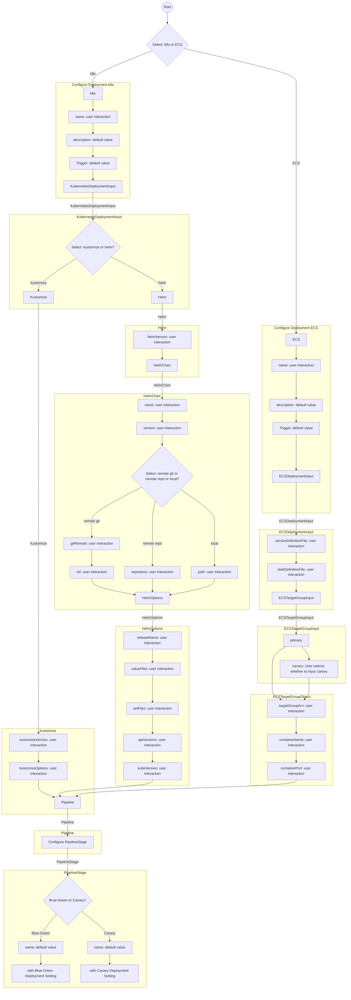
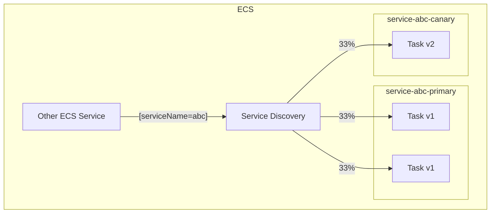
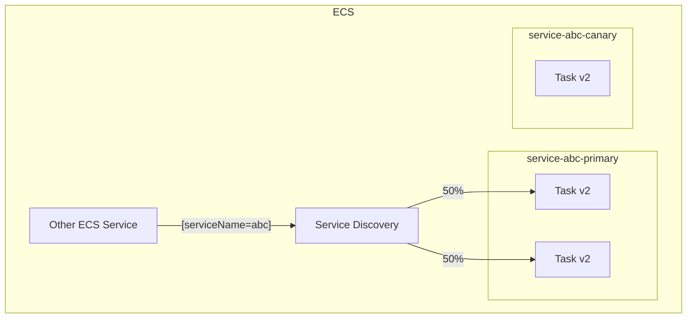
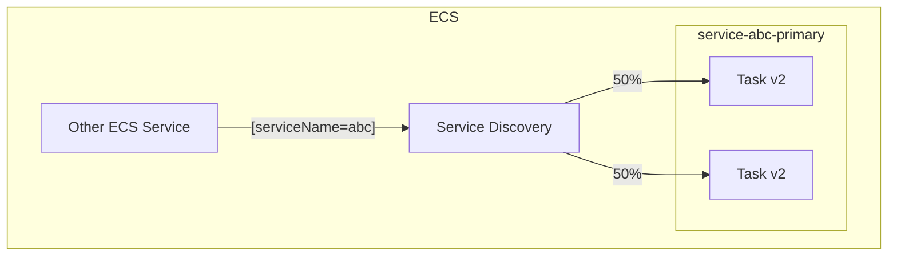
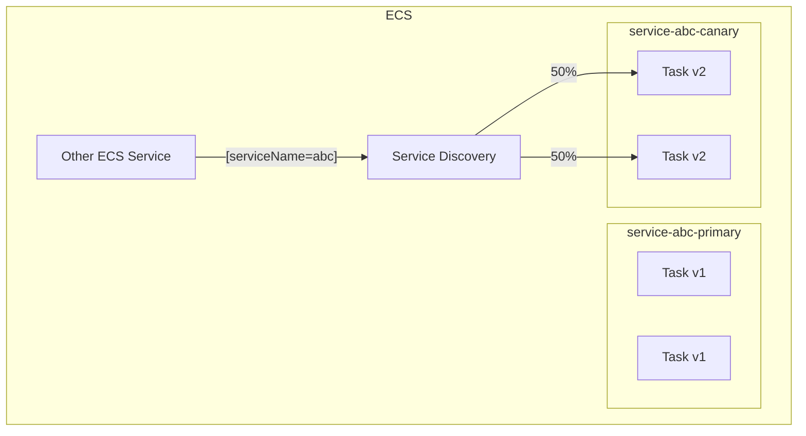
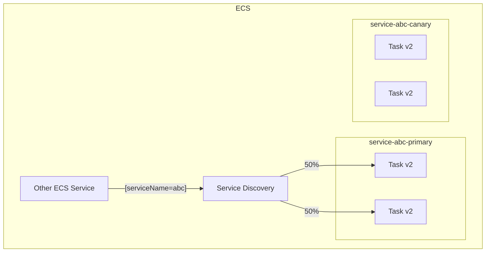
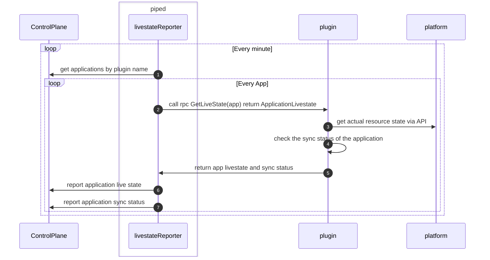
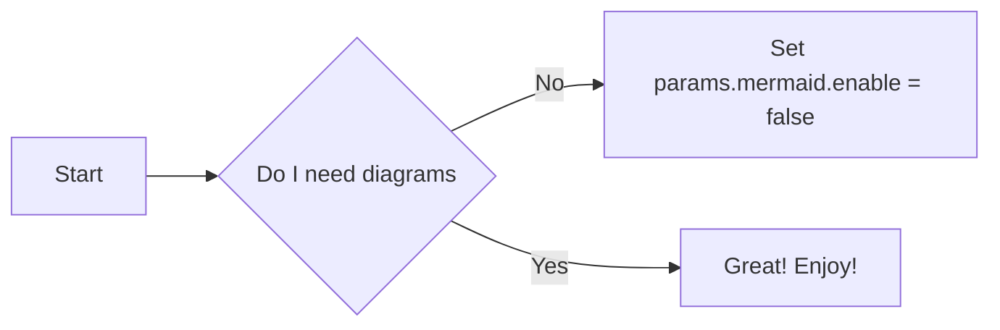

<a id="doc-af845d0f968403498938fb66"></a>

# pipe-cd/pipecd / docs/content/en/docs-v1.0.x/user-guide/managing-application/rolling-back-a-deployment.md

Upstream: https://github.com/pipe-cd/pipecd/blob/ff572e076613076a2b93683b02be769f55c6531d/docs/content/en/docs-v1.0.x/user-guide/managing-application/rolling-back-a-deployment.md

Commit: `ff572e076613076a2b93683b02be769f55c6531d`

Retrieved: 2026-10-01T15:26:32.605437+00:00

Kind: official-document

Raw SHA256: `95656871af5f805f56d440226d8688e00193a71bf2955378474a1f101a5f6af2`

Source text below is untrusted reference content. Acquisition does not verify technical claims.

License status: UPSTREAM_NOTICES_CAPTURED_PER_FILE_REVIEW_REQUIRED. See this repository's captured license files.

---

---
title: "Rolling back a deployment"
linkTitle: "Rolling back a deployment"
weight: 6
description: >
  This page describes when a deployment is rolled back automatically and how to manually roll back a deployment.
---

Rollbacks allow you to revert your application to a previous stable state when something goes wrong during deployment. PipeCD supports both automatic and manual rollbacks, giving you flexibility in handling deployment failures.

## Automatic rollback
You can automate rollbacks by enabling the `autoRollback` field in your application configuration:

```yaml
spec:
  pipeline:
    stages:
      - name: K8S_CANARY_ROLLOUT
      - name: K8S_PRIMARY_ROLLOUT
  autoRollback: true
```

When `autoRollback` is enabled, the deployment will be rolled back if any of the following conditions are met:

- A deployment pipeline stage fails
- An analysis stage determines that the deployment has a negative impact
- An error occurs while deploying

If a rollback is triggered, PipeCD adds a new `ROLLBACK` stage to the deployment pipeline and reverts all applied changes.

## Manual rollback

If you need to roll back a deployment that has already completed, or want to intervene during a deployment which is in-progress, you can trigger a rollback manually from the Web UI. See [cancelling a deployment](./cancelling-a-deployment/) for details on how to cancel a deployment with rollback.


<p style="text-align: center;">
A deployment being rolled back
</p>


<a id="doc-8a64eb21cdea96281bc0ec8b"></a>

# pipe-cd/pipecd / docs/content/en/docs-v1.0.x/user-guide/managing-application/secret-management.md

Upstream: https://github.com/pipe-cd/pipecd/blob/ff572e076613076a2b93683b02be769f55c6531d/docs/content/en/docs-v1.0.x/user-guide/managing-application/secret-management.md

Commit: `ff572e076613076a2b93683b02be769f55c6531d`

Retrieved: 2026-10-01T15:26:32.605437+00:00

Kind: official-document

Raw SHA256: `7e8824034390f4da549147e2a0d7c46ee9abb42b39e4581c8a423db373f1a05d`

Source text below is untrusted reference content. Acquisition does not verify technical claims.

License status: UPSTREAM_NOTICES_CAPTURED_PER_FILE_REVIEW_REQUIRED. See this repository's captured license files.

---

---
title: "Secret management"
linkTitle: "Secret management"
weight: 9
description: >
  Storing secrets safely in the Git repository.
---

GitOps workflows use Git as the single source of truth for application configurations. Storing sensitive data such as credentials, API keys, and secrets directly in Git repositories poses security risks.

PipeCD's secret management feature allows you to store encrypted secrets in your Git repository alongside application manifests. The encrypted secrets are decrypted by `piped` during deployment operations.

## Prerequisites

Before using this feature, `piped` needs to be started with a key pair for secret encryption.

You can use the following command to generate a key pair:

``` console
openssl genpkey -algorithm RSA -pkeyopt rsa_keygen_bits:2048 -out private-key
openssl pkey -in private-key -pubout -out public-key
```

Then specify them while [installing](../../../installation/install-piped/installing-on-kubernetes) `piped` with these options:

``` console
--set-file secret.data.secret-public-key=PATH_TO_PUBLIC_KEY_FILE \
--set-file secret.data.secret-private-key=PATH_TO_PRIVATE_KEY_FILE
```

Finally, enable this feature in the `piped` configuration file with the `secretManagement` field as below:

``` yaml
apiVersion: pipecd.dev/v1beta1
kind: Piped
spec:
  pipedID: your-piped-id
  ...
  secretManagement:
    type: KEY_PAIR
    config:
      privateKeyFile: /etc/piped-secret/secret-private-key
      publicKeyFile: /etc/piped-secret/secret-public-key
```

## How it works

The secret management workflow is as follows:

- Encrypt secret data using PipeCD's Web UI and store the encrypted data in Git
- `piped` automatically decrypts the encrypted secrets before performing deployment tasks

## Encrypting secret data

To encrypt secret data, navigate to the Applications page and click the "Encrypt Secret" button located in the top-left corner. Then, select a `piped` from the dropdown list, enter your secret data, and click the "ENCRYPT" button.
Copy the encrypted data to store in Git.


<p style="text-align: center;">
Applications page
</p>

<br>


<p style="text-align: center;">
The form for encrypting secret data
</p>

## Storing encrypted secrets in Git

To make encrypted secrets available to an application, specify them in the application configuration file.

- `encryptedSecrets` contains a list of the encrypted secrets.
- `decryptionTargets` contains a list of files that use one of the encrypted secrets and should be decrypted by `piped`.

``` yaml
apiVersion: pipecd.dev/v1beta1
# One of piped defined app, for example: using the Kubernetes plugin
kind: Application
spec:
  encryption:
    encryptedSecrets:
      password: encrypted-data
    decryptionTargets:
      - secret.yaml
```

## Accessing encrypted secrets

Any file in the application directory can use the `.encryptedSecrets` context to access secrets you have encrypted and stored in the application configuration.

For example:

- Accessing by a Kubernetes Secret manifest

``` yaml
apiVersion: v1
kind: Secret
metadata:
  name: simple-sealed-secret
data:
  password: "{{ .encryptedSecrets.password }}"
```

In all cases, `piped` decrypts the encrypted secrets and renders the decryption target files before using them to handle any deployment tasks.

<!-- ## Examples

- [examples/kubernetes/secret-management](https://github.com/pipe-cd/examples/tree/master/kubernetes/secret-management)
- [examples/cloudrun/secret-management](https://github.com/pipe-cd/examples/tree/master/cloudrun/secret-management)
- [examples/terraform/secret-management](https://github.com/pipe-cd/examples/tree/master/terraform/secret-management)
- [examples/ecs/secret-management](https://github.com/pipe-cd/examples/tree/master/ecs/secret-management) -->


<a id="doc-b068ead1005075d3ea1521ae"></a>

# pipe-cd/pipecd / docs/content/en/docs-v1.0.x/user-guide/managing-application/triggering-a-deployment.md

Upstream: https://github.com/pipe-cd/pipecd/blob/ff572e076613076a2b93683b02be769f55c6531d/docs/content/en/docs-v1.0.x/user-guide/managing-application/triggering-a-deployment.md

Commit: `ff572e076613076a2b93683b02be769f55c6531d`

Retrieved: 2026-10-01T15:26:32.605437+00:00

Kind: official-document

Raw SHA256: `6510113d50d5f1452a77f4e88eee379a69cf759cb06ff458750e246551f9afa7`

Source text below is untrusted reference content. Acquisition does not verify technical claims.

License status: UPSTREAM_NOTICES_CAPTURED_PER_FILE_REVIEW_REQUIRED. See this repository's captured license files.

---

---
title: "Triggering a deployment"
linkTitle: "Triggering a deployment"
weight: 4
description: >
  This page describes when a deployment is triggered automatically and how to manually trigger a deployment.
---

PipeCD uses Git as a single source of truth; all application resources are defined declaratively and immutably in Git. Whenever a developer wants to update the application or infrastructure, they will have to open a pull request to that Git repository to propose the change. The state defined in Git is the desired state for the application and infrastructure running in the cluster.

PipeCD applies these changes by triggering deployments for affected applications. Each deployment synchronizes the running resources in the cluster to match the state defined in the latest Git commit.

By default, PipeCD triggers a new deployment when you merge a pull request.
You can customize this behavior in your application configuration file (app.pipecd.yaml) to control whether and when deployments run.

For example, you can use [`onOutOfSync`](#trigger-configuration) to automatically trigger a deployment whenever PipeCD detects a configuration drift and the application enters an OUT_OF_SYNC state.

### Trigger configuration

You can configure when PipeCD triggers a new deployment. The following trigger types are available:

- `onCommit`: Triggers a deployment when new Git commits affect the application.
- `onCommand`: Triggers a deployment when the application receives a SYNC command.
- `onOutOfSync`: Triggers a deployment when the application enters an OUT_OF_SYNC state.
- `onChain`: Triggers a deployment when the application is part of a deployment chain.

For the full list of options, see [Configuration reference](./configuration-reference.md/#deploymenttrigger).

After a deployment is triggered, it is added to a queue and handled by the appropriate `piped`. At this stage, the deployment pipeline is not yet decided.
`piped` ensures that only one deployment runs per application at a time. If no deployment is currently running, `piped` selects a queued deployment and plans its pipeline.
The deployment pipeline is created based on the application configuration and the differences between the current running state and the desired state defined in the latest commit. 

For example:

- If a merged pull request updates a Deployment's container image or updates a mounted ConfigMap or Secret, `piped` decides to use the specified pipeline for a progressive deployment.
- If a merged pull request only updates the `replicas` number, `piped` decides to use a quick sync to scale the resources.

You can configure `piped` to use the [QuickSync](../../../concepts/#sync-strategy) or the specified pipeline based on the commit message by configuring [CommitMatcher](./configuration-reference.md/#commitmatcher) in the application configuration.

After the planning, the deployment will be executed as per the decided pipeline. The deployment execution including the state of each stage as well as their logs can be viewed in real time on the deployment details page on the Web UI.


<p style="text-align: center;">
A Running Deployment at the Deployment Details Page
</p>

Although the deployments are triggered automatically by default, you can also manually trigger a deployment from the Web UI.

By clicking the `SYNC` button at the application details page, a new deployment will be triggered to sync the application to the latest state of the master branch (default branch).


<p style="text-align: center;">
Application Details Page
</p>


<a id="doc-f99cae01af0a9b0b317fe4a1"></a>

# pipe-cd/pipecd / docs/content/en/docs-v1.0.x/user-guide/managing-controlplane/_index.md

Upstream: https://github.com/pipe-cd/pipecd/blob/ff572e076613076a2b93683b02be769f55c6531d/docs/content/en/docs-v1.0.x/user-guide/managing-controlplane/_index.md

Commit: `ff572e076613076a2b93683b02be769f55c6531d`

Retrieved: 2026-10-01T15:26:32.605437+00:00

Kind: official-document

Raw SHA256: `c151f2f3542e84255d97b5aa8f43a94ada1a0f3c796efceeff796aebf7b14dd0`

Source text below is untrusted reference content. Acquisition does not verify technical claims.

License status: UPSTREAM_NOTICES_CAPTURED_PER_FILE_REVIEW_REQUIRED. See this repository's captured license files.

---

---
title: "Managing Control Plane"
linkTitle: "Managing Control Plane"
weight: 4
description: >
  This guide is for administrators and operators wanting to install and configure PipeCD for other developers.
---


<a id="doc-af3f264db9991a8452864e94"></a>

# pipe-cd/pipecd / docs/content/en/docs-v1.0.x/user-guide/managing-controlplane/adding-a-project.md

Upstream: https://github.com/pipe-cd/pipecd/blob/ff572e076613076a2b93683b02be769f55c6531d/docs/content/en/docs-v1.0.x/user-guide/managing-controlplane/adding-a-project.md

Commit: `ff572e076613076a2b93683b02be769f55c6531d`

Retrieved: 2026-10-01T15:26:32.605437+00:00

Kind: official-document

Raw SHA256: `271c98aa691e1b99e281fc54d7c382d846a7ba87832a7d3d45b5a51b8a54290c`

Source text below is untrusted reference content. Acquisition does not verify technical claims.

License status: UPSTREAM_NOTICES_CAPTURED_PER_FILE_REVIEW_REQUIRED. See this repository's captured license files.

---

---
title: "Adding a project"
linkTitle: "Adding a project"
weight: 2
description: >
  This page describes how to set up a new project.
---

The control plane ops can add a new project for a team.
Project adding can be simply done from an internal web page prepared for the ops.
Because that web service is running in an `ops` pod, in order to access it, use the `kubectl port-forward` command to forward a local port to a port on the `ops` pod as following:

``` console
kubectl port-forward service/pipecd-ops 9082 --namespace={NAMESPACE}
```

Then, access to [http://localhost:9082](http://localhost:9082).

On that page, you will see the list of registered projects and a link to register new projects.
Registering a new project requires only a unique ID string and an optional description text.

Once a new project has been registered, a static admin (username, password) will be automatically generated for the project admin. You can send that information to the project admin. The project admin first uses the provided static admin information to log in to PipeCD. After that, they can change the static admin information, configure the SSO, RBAC or disable static admin user.

> **Important:** Configure RBAC before disabling the static admin user. RBAC is required for SSO login.

<a id="doc-9c950a575a6089e52a95e19e"></a>

# pipe-cd/pipecd / docs/content/en/docs-v1.0.x/user-guide/managing-controlplane/architecture-overview.md

Upstream: https://github.com/pipe-cd/pipecd/blob/ff572e076613076a2b93683b02be769f55c6531d/docs/content/en/docs-v1.0.x/user-guide/managing-controlplane/architecture-overview.md

Commit: `ff572e076613076a2b93683b02be769f55c6531d`

Retrieved: 2026-10-01T15:26:32.605437+00:00

Kind: official-document

Raw SHA256: `4be3ed83821aebdd9c1a86b5d1b355dcd2e21171bc29c9a26eeddfcd475b7561`

Source text below is untrusted reference content. Acquisition does not verify technical claims.

License status: UPSTREAM_NOTICES_CAPTURED_PER_FILE_REVIEW_REQUIRED. See this repository's captured license files.

---

---
title: "Architecture overview"
linkTitle: "Architecture overview"
weight: 1
description: >
  This page describes the architecture of control plane.
---


<p style="text-align: center;">
Component Architecture
</p>

The control plane is a centralized part of PipeCD. It contains several services as below to manage the application, deployment data and handle all requests from `piped` instances and web clients:

##### Server

`server` handles all incoming gRPC requests from `piped` instances, web clients, incoming HTTP requests such as auth callback from third party services.
It also serves all web assets including HTML, JS, CSS...
This service can be easily scaled by updating the pod number.

##### Cache

`cache` is a single pod service for caching internal data used by `server` service. Currently, this `cache` service is powered by `redis`.
You can configure the control plane to use a fully-managed redis cache service instead of launching a cache pod in your cluster.

##### Ops

`ops` is a single pod service for operating PipeCD owner's tasks.
For example, it provides an internal web page for adding and managing projects; it periodically removes the old data; it collects and saves the deployment insights.

##### Data Store

`Data store` is a storage for storing model data such as applications and deployments. This can be a fully-managed service such as GCP [Firestore](https://cloud.google.com/firestore), GCP [Cloud SQL](https://cloud.google.com/sql) or AWS [RDS](https://aws.amazon.com/rds/) (currently we choose [MySQL v8](https://www.mysql.com/) as supported relational data store). You can also configure the control plane to use a self-managed MySQL server.
When installing the control plane, you have to choose one of the provided data store services.

##### File Store

`File store` is a storage for storing stage logs, application live states. This can be a fully-managed service such as GCP [GCS](https://cloud.google.com/storage), AWS [S3](https://aws.amazon.com/s3/), or a self-managed service such as [Minio](https://github.com/minio/minio).
When installing the control plane, you have to choose one of the provided file store services.


<a id="doc-f8774ebddc3af4b557cfd305"></a>

# pipe-cd/pipecd / docs/content/en/docs-v1.0.x/user-guide/managing-controlplane/auth.md

Upstream: https://github.com/pipe-cd/pipecd/blob/ff572e076613076a2b93683b02be769f55c6531d/docs/content/en/docs-v1.0.x/user-guide/managing-controlplane/auth.md

Commit: `ff572e076613076a2b93683b02be769f55c6531d`

Retrieved: 2026-10-01T15:26:32.605437+00:00

Kind: official-document

Raw SHA256: `ef4489bbb0cc40303de24b91f8cda71b1fb378ee04576afe56e38419399d71fb`

Source text below is untrusted reference content. Acquisition does not verify technical claims.

License status: UPSTREAM_NOTICES_CAPTURED_PER_FILE_REVIEW_REQUIRED. See this repository's captured license files.

---

---
title: "Authentication and authorization"
linkTitle: "Authentication and authorization"
weight: 3
description: >
  This page describes PipeCD Authentication and Authorization.
---


### Static Admin

When the PipeCD owner [adds a new project](../adding-a-project/), an admin account will be automatically generated for the project. After that, PipeCD owner sends that static admin information including username, password strings to the project admin, who can use that information to log in to PipeCD web with the admin role.

After logging, the project admin should change the provided username and password. Or disable the static admin account after configuring the single sign-on for the project.

### Single Sign-On (SSO)

Single sign-on (SSO) allows users to log in to PipeCD by relying on a trusted third-party service.

The project can be configured to use a shared SSO configuration (shared OAuth application) instead of needing a new one. In that case, while creating the project, the PipeCD owner specifies the name of the shared SSO configuration should be used, and then the project admin can skip configuring SSO at the settings page.

**Supported service**

- GitHub
- Generic OIDC

> **Note:** In the future, we want to support such as Google Gmail, Bitbucket...

#### Github

Before configuring the SSO, you need an OAuth application of the using service. For example, GitHub SSO requires creating a GitHub OAuth application as described in this page:

https://docs.github.com/en/developers/apps/creating-an-oauth-app

The authorization callback URL should be `https://YOUR_PIPECD_ADDRESS/auth/callback`.


#### Generic OIDC

PipeCD supports any OIDC provider, with tested providers including Keycloak, Auth0, and AWS Cognito. The only supported authentication flow currently is the Authorization Code Grant.

Requirements and Troubleshooting:

- The OIDC provider must provide claims for user's roles and username.
- Roles claim value must use same values as pre-configured project RBAC Roles.
- Claims can be retrieved from the IdToken or UserInfo endpoint. The UserInfo endpoint will be used if issuer supports it.
- You can use set a custom claim key name for roles and username in the OIDC provider. Using `usernameClaimKey` and `rolesClaimKey` in the configuration. If not set, the default value will be chosen in the following order:

  - Supported Claims Key for Username (in order of priority): `username`, `preferred_username`,`name`, `cognito:username`
  - Supported Claims Key for Role (in order of priority): `groups`, `roles`, `cognito:groups`, `custom:roles`, `custom:groups`

- If no usable claims are found, `Unable to find user` error will be shown.
- If no roles are found, user can not access any resources. (If `allowStrayAsViewer` is set to `true`, user can access as a viewer)

Provider Configuration Examples:

##### Keycloak

- **Client authentication**: On
- **Valid redirect URIs**: `https://YOUR_PIPECD_ADDRESS/auth/callback`
- **Client scopes**: Add a new mapper to the `<client-id>-dedicated` scope. For instance, map Group Membership information to the groups claim (Full group path should be off).

- **Control Plane configuration**:

  ```yaml
  apiVersion: "pipecd.dev/v1beta1"
  kind: ControlPlane
  spec:
    sharedSSOConfigs:
      - name: oidc
        provider: OIDC
        oidc:
          clientId: <CLIENT_ID>
          clientSecret: <CLIENT_SECRET>
          issuer: https://<KEYCLOAK_ADDRESS>/realms/<REALM>
          redirectUri: https://<PIPECD_ADDRESS>/auth/callback
          scopes:
            - openid
            - profile
  ```

##### Okta

- **Allowed Callback URLs**: `https://YOUR_PIPECD_ADDRESS/auth/callback`
- **Control Plane configuration**:

  ```yaml
  apiVersion: "pipecd.dev/v1beta1"
  kind: ControlPlane
  spec:
    sharedSSOConfigs:
      - name: oidc
        provider: OIDC
        oidc:
          clientId: <CLIENT_ID>
          clientSecret: <CLIENT_SECRET>
          issuer: https://<OKTA_ID>.okta.com
          redirectUri: https://<PIPECD_ADDRESS>/auth/callback
          scopes:
            - openid
            - profile
            - groups
  ```

##### Auth0

- **Allowed Callback URLs**: `https://YOUR_PIPECD_ADDRESS/auth/callback`
- **Control Plane configuration**:

  ```yaml
  apiVersion: "pipecd.dev/v1beta1"
  kind: ControlPlane
  spec:
    sharedSSOConfigs:
      - name: oidc
        provider: OIDC
        oidc:
          clientId: <CLIENT_ID>
          clientSecret: <CLIENT_SECRET>
          issuer: https://<AUTH0_ADDRESS>
          redirectUri: https://<PIPECD_ADDRESS>/auth/callback
          scopes:
            - openid
            - profile
  ```

- **Roles/Groups Claims**
  For Role or Groups information mapping using Auth0 Actions, here is an example for setting `custom:roles`:

  ```javascript
  exports.onExecutePostLogin = async (event, api) => {
    let namespace = "custom";
    if (namespace && !namespace.endsWith("/")) {
      namespace += ":";
    }
    api.idToken.setCustomClaim(namespace + "roles", event.authorization.roles);
  };
  ```

##### AWS Cognito

- **Allowed Callback URLs**: `https://YOUR_PIPECD_ADDRESS/auth/callback`

- **Control Plane configuration**:

  ```yaml
  apiVersion: "pipecd.dev/v1beta1"
  kind: ControlPlane
  spec:
    sharedSSOConfigs:
      - name: oidc
        provider: OIDC
        oidc:
          clientId: <CLIENT_ID>
          clientSecret: <CLIENT_SECRET>
          issuer: https://cognito-idp.<AWS_REGION>.amazonaws.com/<USER_POOL_ID>
          redirectUri: https://<PIPECD_ADDRESS>/auth/callback
          scopes:
            - openid
            - profile
  ```

##### Custom Claims Key

In some cases, the OIDC provider may not provide the claims with the default key names like `groups`. You can set the custom claim key name for roles and username in the control plane configuration to map the claims from the OIDC provider. **To be cautious, OIDC providers can not be used if issuer discovery is not supported.**

```yaml
apiVersion: "pipecd.dev/v1beta1"
kind: ControlPlane
spec:
  sharedSSOConfigs:
    - name: oidc
      provider: OIDC
      oidc:
        clientId: <CLIENT_ID>
        clientSecret: <CLIENT_SECRET>
        issuer: https://<OIDC_ADDRESS>
        redirectUri: https://<PIPECD_ADDRESS>/auth/callback
        scopes:
          - openid
          - profile
        usernameClaimKey: username # change to your custom claim key
        rolesClaimKey: roles # change to your custom claim key
        avatarUrlClaimKey: picture # change to your custom claim key
```

(Optional) You can choose to use the avatar URL from the OIDC provider. Using `avatarUrlClaimKey` in the configuration. If not set, the default value will be chosen in the following order: `picture`, `avatar_url`

##### Custom OIDC Configuration

If you want to set your custom endpoint without using the endpoint from the issuer, you can set the `authorization_endpoint`, `token_endpoint`, `userinfo_endpoint` in the control plane configuration.

```yaml
apiVersion: "pipecd.dev/v1beta1"
kind: ControlPlane
spec:
  sharedSSOConfigs:
    - name: oidc
      provider: OIDC
      oidc:
        clientId: <CLIENT_ID>
        clientSecret: <CLIENT_SECRET>
        issuer: https://<OIDC_ADDRESS>
        redirectUri: https://<PIPECD_ADDRESS>/auth/callback
        scopes:
          - openid
          - profile
        authorization_endpoint: https://<OIDC_ADDRESS>/authorize # change to your custom endpoint
        token_endpoint: https://<OIDC_ADDRESS>/token # change to your custom endpoint
        userinfo_endpoint: https://<OIDC_ADDRESS>/userinfo # change to your custom endpoint
```

### Role-Based Access Control (RBAC)

Role-based access control (RBAC) allows restricting access on the PipeCD web-based on the roles of user groups within the project. Before using this feature, the SSO must be configured.

PipeCD provides three built-in roles:

- `Viewer`: has only permissions to view existing resources or data.
- `Editor`: has all viewer permissions, plus permissions for actions that modify state, such as manually syncing application, canceling deployment...
- `Admin`: has all editor permissions, plus permissions for updating project configurations.

#### Configuring the PipeCD's roles

The below table represents PipeCD's resources with actions on those resources.

| resource    | get | list | create | update | delete |
| :---------- | :-: | :--: | :----: | :----: | :----: |
| application |  ○  |  ○   |   ○    |   ○    |   ○    |
| deployment  |  ○  |  ○   |        |   ○    |        |
| event       |     |  ○   |        |        |        |
| piped       |  ○  |  ○   |   ○    |   ○    |        |
| project     |  ○  |      |        |   ○    |        |
| apiKey      |     |  ○   |   ○    |   ○    |        |
| insight     |  ○  |      |        |        |        |

Each role is defined as a combination of multiple policies under this format.

```
resources=RESOURCE_NAMES;actions=ACTION_NAMES
```

The `*` represents all resources and all actions for a resource.

```
resources=*;actions=ACTION_NAMES
resources=RESOURCE_NAMES;actions=*
resources=*;actions=*
```

#### Configuring the PipeCD's user groups

User Group represents a relation with a specific team (GitHub)/group (Google) and an arbitrary role. All users belong to a team/group will have all permissions of that team/group.

In case of using the GitHub team as a PipeCD user group, the PipeCD user group must be set in lowercase. For example, if your GitHub team is named `ORG/ABC-TEAM`, the PipeCD user group would be set as `ORG/abc-team`. (It follows the GitHub team URL as github.com/orgs/{organization-name}/teams/{TEAM-NAME})

> **Note:** You CANNOT assign multiple roles to a team/group. You should create a new role with suitable permissions instead.


<a id="doc-d3920b5e4cba05a9e2c5d5bb"></a>

# pipe-cd/pipecd / docs/content/en/docs-v1.0.x/user-guide/managing-controlplane/configuration-reference.md

Upstream: https://github.com/pipe-cd/pipecd/blob/ff572e076613076a2b93683b02be769f55c6531d/docs/content/en/docs-v1.0.x/user-guide/managing-controlplane/configuration-reference.md

Commit: `ff572e076613076a2b93683b02be769f55c6531d`

Retrieved: 2026-10-01T15:26:32.605437+00:00

Kind: official-document

Raw SHA256: `ed2800fe84ec3cacec8ee7631edf021dfea18f7ddff90254ec8e4effad200947`

Source text below is untrusted reference content. Acquisition does not verify technical claims.

License status: UPSTREAM_NOTICES_CAPTURED_PER_FILE_REVIEW_REQUIRED. See this repository's captured license files.

---

---
title: "Configuration reference"
linkTitle: "Configuration reference"
weight: 6
description: >
  This page describes all configurable fields in the Control Plane configuration.
---

``` yaml
apiVersion: pipecd.dev/v1beta1
kind: ControlPlane
spec:
  address: https://your-pipecd-address
  ...
```

## Control Plane Configuration

| Field | Type | Description | Required |
|-|-|-|-|
| stateKey | string | A randomly generated string used to sign oauth state. | Yes |
| datastore | [DataStore](#datastore) | Storage for storing application, deployment data. | Yes |
| filestore | [FileStore](#filestore) | File storage for storing deployment logs and application states. | Yes |
| cache | [Cache](#cache) | Internal cache configuration. | No |
| address | string | The address to the control plane. This is required if SSO is enabled. | No |
| insightCollector | [InsightCollector](#insightcollector) | Option to run collector of Insights feature. | No |
| sharedSSOConfigs | [][SharedSSOConfig](#sharedssoconfig) | List of shared SSO configurations that can be used by any projects. | No |
| projects | [][Project](#project) | List of debugging/quickstart projects. Please note that do not use this to configure the projects running in the production. | No |

## DataStore

| Field | Type | Description | Required |
|-|-|-|-|
| type | string | Which type of data store should be used. Can be one of the following values<br>`FIRESTORE`, `MYSQL`. | Yes |
| config | [DataStoreConfig](#datastoreconfig) | Specific configuration for the datastore type. This must be one of these DataStoreConfig. | Yes |

## DataStoreConfig

Must be one of the following objects:

### DataStoreFireStoreConfig

| Field | Type | Description | Required |
|-|-|-|-|
| namespace | string | The root path element considered as a logical namespace, e.g. `pipecd`. | Yes |
| environment | string | The second path element considered as a logical environment, e.g. `dev`. All pipecd collections will have path formatted according to `{namespace}/{environment}/{collection-name}`. | Yes |
| collectionNamePrefix | string | The prefix for collection name. This can be used to avoid conflicts with existing collections in your Firestore database. | No |
| project | string | The name of GCP project hosting the Firestore. | Yes |
| credentialsFile | string | The path to the service account file for accessing Firestores. | No |


### DataStoreMySQLConfig

| Field | Type | Description | Required |
|-|-|-|-|
| url | string | The address to MySQL server. Should attach with the database port info as `127.0.0.1:3307` in case you want to use another port than the default value. | Yes |
| database | string | The name of database. | No (If you set it via URL) |
| usernameFile | string | Path to the file containing the username. | No |
| passwordFile | string | Path to the file containing the password. | No |


## FileStore

| Field | Type | Description | Required |
|-|-|-|-|
| type | string | Which type of file store should be used. Can be one of the following values<br>`GCS`, `S3`, `MINIO` | Yes |
| config | [FileStoreConfig](#filestoreconfig) | Specific configuration for the filestore type. This must be one of these FileStoreConfig. | Yes |

## FileStoreConfig

Must be one of the following objects:

### FileStoreGCSConfig

| Field | Type | Description | Required |
|-|-|-|-|
| bucket | string | The bucket name. | Yes |
| credentialsFile | string | The path to the service account file for accessing GCS. | No |

### FileStoreS3Config

| Field | Type | Description | Required |
|-|-|-|-|
| bucket | string | The AWS S3 bucket name. | Yes |
| region | string | The AWS region name. | Yes |
| profile | string | The AWS profile name. Default value is `default`. | No |
| credentialsFile | string | The path to AWS credential file. Requires only if you want to auth by specified credential file, by default PipeCD will use `$HOME/.aws/credentials` file. | No |
| roleARN | string | The IAM role arn to use when assuming an role. Requires only if you want to auth by `WebIdentity` pattern. | No |
| tokenFile | string | The path to the WebIdentity token PipeCD should use to assume a role with. Requires only if you want to auth by `WebIdentity` pattern. | No |

### FileStoreMinioConfig

| Field | Type | Description | Required |
|-|-|-|-|
| endpoint | string | The address of Minio. | Yes |
| bucket | string | The bucket name. | Yes |
| accessKeyFile | string | The path to the access key file. | No |
| secretKeyFile | string | The path to the secret key file. | No |
| autoCreateBucket | bool | Whether the given bucket should be made automatically if not exists. | No |

## Cache

| Field | Type | Description | Required |
|-|-|-|-|
| ttl | duration | The time that in-memory cache items are stored before they are considered as stale. | Yes |

## Project

| Field | Type | Description | Required |
|-|-|-|-|
| id | string | The unique identifier of the project. | Yes |
| desc | string | The description about the project. | No |
| staticAdmin | [ProjectStaticUser](#projectstaticuser) | Static admin account of the project. | Yes |

## ProjectStaticUser

| Field | Type | Description | Required |
|-|-|-|-|
| username | string | The username string. | Yes |
| passwordHash | string | The bcrypt hashed value of the password string. | Yes |

## InsightCollector

| Field | Type | Description | Required |
|-|-|-|-|
| application | [InsightCollectorApplication](#insightcollectorapplication) | Application metrics collector. | No |
| deployment | [InsightCollectorDeployment](#insightcollectordeployment) | Deployment metrics collector. | No |

## InsightCollectorApplication

| Field | Type | Description | Required |
|-|-|-|-|
| enabled | bool | Whether to enable. Default is `true` | No |
| schedule | string | When collector will be executed. Default is `0 * * * *` | No |

## InsightCollectorDeployment

| Field | Type | Description | Required |
|-|-|-|-|
| enabled | bool | Whether to enable. Default is `true` | No |
| schedule | string | When collector will be executed. Default is `30 * * * *` | No |
| chunkMaxCount | int | The maximum number of deployment items could be stored in a chunk. Default is `1000` | No |

## SharedSSOConfig

| Field | Type | Description | Required |
|-|-|-|-|
| name | string | The unique name of the configuration. | Yes |
| provider | string | The SSO service provider. Currently, only `GITHUB` and `OIDC` is supported. | Yes |
| sessionTtl | int | The time to live of session for SSO login. Unit is `hour`. Default is 7 * 24 hours. | No |
| github | [SSOConfigGitHub](#ssoconfiggithub) | GitHub sso configuration. | No |
| oidc | [SSOConfigOIDC](#ssoconfigoidc) | OIDC sso configuration. | No |

## SSOConfigGitHub

| Field | Type | Description | Required |
|-|-|-|-|
| clientId | string | The client id string of GitHub oauth app. | Yes |
| clientSecret | string | The client secret string of GitHub oauth app. | Yes |
| baseUrl | string | The address of GitHub service. Required if enterprise. | No |
| uploadUrl | string | The upload url of GitHub service. | No |
| proxyUrl | string | The address of the proxy used while communicating with the GitHub service. | No |

## SSOConfigOIDC

| Field | Type | Description | Required |
|-|-|-|-|
| clientId | string | The client id string of OpenID Connect oauth app. | Yes |
| clientSecret | string | The client secret string of OpenID Connect oauth app. | Yes |
| issuer | string | The address of OpenID Connect service. | Yes |
| redirectUri | string | The address of the redirect URI. | Yes |
| authorizationEndpoint | string | The address of the authorization endpoint. Only set if you want to use custom authorization endpoint (still need issuer discovery). | No |
| tokenEndpoint | string | The address of the token endpoint. Only set if you want to use custom token endpoint (still need issuer discovery). | No |
| userInfoEndpoint | string | The address of the user info endpoint. Only set if you want to use custom user info endpoint (still need issuer discovery). | No |
| proxyUrl | string | The address of the proxy used while communicating with the OpenID Connect service. | No |
| scopes | []string | Scopes to request from the OpenID Connect service. Default is `openid`. Some providers may require other scopes. | No |
| usernameClaimKey | string | The key name of the claim that contains the username. If not set, the default value will be chosen in the following order: `username`, `preferred_username`, `name`, `cognito:username`. | No |
| rolesClaimKey | string | The key name of the claim that contains the roles. If not set, the default value will be chosen in the following order: `groups`, `roles`, `custom:roles`, `custom:groups`. | No |
| avatarUrlClaimKey | string | The key name of the claim that contains the avatar url. If not set, the default value will be chosen in the following order: `picture`, `avatar_url`. | No |


<a id="doc-27bf370bc2b284b5679448c4"></a>

# pipe-cd/pipecd / docs/content/en/docs-v1.0.x/user-guide/managing-controlplane/registering-a-piped.md

Upstream: https://github.com/pipe-cd/pipecd/blob/ff572e076613076a2b93683b02be769f55c6531d/docs/content/en/docs-v1.0.x/user-guide/managing-controlplane/registering-a-piped.md

Commit: `ff572e076613076a2b93683b02be769f55c6531d`

Retrieved: 2026-10-01T15:26:32.605437+00:00

Kind: official-document

Raw SHA256: `1d8fe38231cf4665e2e1276942e0664e77034c221f6fd463a651bc5318d20122`

Source text below is untrusted reference content. Acquisition does not verify technical claims.

License status: UPSTREAM_NOTICES_CAPTURED_PER_FILE_REVIEW_REQUIRED. See this repository's captured license files.

---

---
title: "Registering a piped"
linkTitle: "Registering a piped"
weight: 4
description: >
  This page describes how to register a new piped to a project.
---

The list of `piped` instances are shown in the Settings page. Anyone who has the project admin role can register a new `piped` by clicking on the `+ADD` button.

<br>


<p style="text-align: center;">
Registering a new piped
</p>


<a id="doc-9e0c1836c99b80f287a1f99b"></a>

# pipe-cd/pipecd / docs/content/en/docs-v1.0.x/user-guide/managing-piped/_index.md

Upstream: https://github.com/pipe-cd/pipecd/blob/ff572e076613076a2b93683b02be769f55c6531d/docs/content/en/docs-v1.0.x/user-guide/managing-piped/_index.md

Commit: `ff572e076613076a2b93683b02be769f55c6531d`

Retrieved: 2026-10-01T15:26:32.605437+00:00

Kind: official-document

Raw SHA256: `1a241d0afcc4e22293ba1f2c711abbb39c14f70f7e85475de6f625894a7b117e`

Source text below is untrusted reference content. Acquisition does not verify technical claims.

License status: UPSTREAM_NOTICES_CAPTURED_PER_FILE_REVIEW_REQUIRED. See this repository's captured license files.

---

---
title: "Managing Piped"
linkTitle: "Managing Piped"
weight: 3
description: >
  This guide is for administrators and operators wanting to install and configure `piped` for other developers.
---

In order to use `piped` you will need to register a `piped` through the PipeCD control plane. Check out [how to register a piped](../managing-controlplane/registering-a-piped/) if you have not already. After registering successfully, you can monitor your `piped` live state via the PipeCD console on the settings page.


<a id="doc-efd9ae16a04fdebe2a9dcbc5"></a>

# pipe-cd/pipecd / docs/content/en/docs-v1.0.x/user-guide/managing-piped/adding-a-git-repository.md

Upstream: https://github.com/pipe-cd/pipecd/blob/ff572e076613076a2b93683b02be769f55c6531d/docs/content/en/docs-v1.0.x/user-guide/managing-piped/adding-a-git-repository.md

Commit: `ff572e076613076a2b93683b02be769f55c6531d`

Retrieved: 2026-10-01T15:26:32.605437+00:00

Kind: official-document

Raw SHA256: `11d22250ff9c390597cd441854f951d57197f22df498c4a0c81265f74703d68c`

Source text below is untrusted reference content. Acquisition does not verify technical claims.

License status: UPSTREAM_NOTICES_CAPTURED_PER_FILE_REVIEW_REQUIRED. See this repository's captured license files.

---

---
title: "Adding a git repository"
linkTitle: "Adding git repository"
weight: 2
description: >
  Learn how to add a git repository in the `piped` configuration file.

---
In the `piped` configuration file, all the git repositories that you want to be tracked by the `piped` agent are specified.

A Git repository contains one or more deployable applications where each application is put inside a directory called as [application directory](../../../concepts/#application-directory).

An application directory contains an **application configuration file** as well as application manifests.
The `piped` periodically checks the new commits and fetches the needed manifests from those repositories for executing the deployment.

A single `piped` can be configured to handle one or more Git repositories.
In order to enable a new Git repository, add a new [GitRepository](../configuration-reference/#gitrepository) block to the `repositories` field in the `piped` configuration file.

For example, in the following snippet, `piped` will take the `master` branch of [pipe-cd/examples](https://github.com/pipe-cd/examples) repository as a target Git repository for deployments.

``` yaml
apiVersion: pipecd.dev/v1beta1
kind: Piped
spec:
  ...
  repositories:
    - repoId: examples
      remote: git@github.com:pipe-cd/examples.git
      branch: master
```

In most cases, you would want to deal with private git repositories. For accessing private repositories, `piped` needs a private SSH key, which can be configured while [installing](../../../installation/install-piped/installing-on-kubernetes/) with `secret.sshKey` in the Helm chart.

``` console
helm install dev-piped pipecd/piped --version={VERSION} \
  --set-file config.data={PATH_TO_PIPED_CONFIG_FILE} \
  --set-file secret.data.piped-key={PATH_TO_PIPED_KEY_FILE} \
  --set-file secret.data.ssh-key={PATH_TO_PRIVATE_SSH_KEY_FILE}
```

You can see the [git configuration reference](../configuration-reference/#git) to learn more about the configurable fields.

Currently, `piped` allows configuring only one private SSH key for all specified git repositories. For working with multiple repositories, you either have to configure the same SSH key for all of those private repositories, or use separate `piped`s for each repository. We are working on adding support for multiple SSH keys for a single `piped`.


<a id="doc-e62705d890ead403a5632780"></a>

# pipe-cd/pipecd / docs/content/en/docs-v1.0.x/user-guide/managing-piped/configuration-reference.md

Upstream: https://github.com/pipe-cd/pipecd/blob/ff572e076613076a2b93683b02be769f55c6531d/docs/content/en/docs-v1.0.x/user-guide/managing-piped/configuration-reference.md

Commit: `ff572e076613076a2b93683b02be769f55c6531d`

Retrieved: 2026-10-01T15:26:32.605437+00:00

Kind: official-document

Raw SHA256: `0d2ffe9b83b2ded24858fd9d4787a3de6e5dba9e0478d9a25f72aec6fdfc8178`

Source text below is untrusted reference content. Acquisition does not verify technical claims.

License status: UPSTREAM_NOTICES_CAPTURED_PER_FILE_REVIEW_REQUIRED. See this repository's captured license files.

---

---
title: "Configuration reference"
linkTitle: "Configuration reference"
weight: 9
description: >
  Learn about all the configurable fields in the `piped` configuration file.
---

This page describes all configurable fields for the piped (`piped.config`) configuration file in PipeCD v1.

In v1, the architecture has shifted to a plugin-based model. The old `platformProviders` have been replaced by `plugins` (which specify the tool binaries to load) and `deployTargets` (where to deploy, nested under plugins). `analysisProviders` have been moved or removed from the top level. Additionally, `chartRepositories` and `chartRegistries` have been moved from the top level and are now configured individually under `spec.plugins[].config` for the relevant platform plugins (e.g., the Kubernetes plugin).

## Example `piped.config`

```yaml
apiVersion: pipecd.dev/v1beta1
kind: Piped
spec:
  projectID: my-project
  pipedID: my-piped-id
  pipedKeyFile: /etc/piped-secret/piped-key
  apiAddress: grpc.pipecd.dev:443
  plugins:
    - name: k8s_plugin
      url: file:///path/to/k8s_plugin
      port: 8081
      deployTargets:
        - name: dev-cluster
          labels:
            env: dev
          config:
            masterURL: http://cluster-dev
            kubeConfigPath: ./kubeconfig-dev
```

## Piped Configuration

| Field | Type | Description | Required |
| --- | --- | --- | --- |
| `apiVersion` | string | `pipecd.dev/v1beta1` | Yes |
| `kind` | string | `Piped` | Yes |
| `spec.projectID` | string | The identifier of the PipeCD project where this piped belongs to. | Yes |
| `spec.pipedID` | string | The generated ID for this piped. | Yes |
| `spec.pipedKeyFile` | string | The path to the file containing the generated key string for this piped. | Yes* |
| `spec.pipedKeyData` | string | Base64 encoded string of Piped key. Either `pipedKeyFile` or `pipedKeyData` must be set. | Yes* |
| `spec.name` | string | The name of this piped. | No |
| `spec.apiAddress` | string | The address used to connect to the Control Plane's API. | Yes |
| `spec.webAddress` | string | The address to the Control Plane's Web interface. | No |
| `spec.syncInterval` | duration | How often to check whether an application should be synced. Default is `1m`. | No |
| `spec.appConfigSyncInterval` | duration | How often to check whether an application configuration file should be synced. Default is `1m`. | No |
| `spec.git` | [PipedGit](#pipedgit) | Configuration for Git executable needed for Git commands. | No |
| `spec.repositories` | [][PipedRepository](#pipedrepository) | List of Git repositories this Piped should watch. | No |
| `spec.plugins` | [][PipedPlugin](#pipedplugin) | List of architectural plugins (e.g., `k8s_plugin`, `terraform_plugin`) the Piped will run. | Yes |
| `spec.notifications` | [Notifications](#notifications) | Configurations for sending deployment notifications. | No |
| `spec.secretManagement` | [SecretManagement](#secretmanagement) | Configuration for decrypting secrets in manifests. | No |
| `spec.eventWatcher` | [PipedEventWatcher](#pipedeventwatcher) | Optional settings for event watcher. | No |
| `spec.planPreview` | [PipedPlanPreview](#pipedplanpreview) | Optional settings for plan-preview feature. | No |
| `spec.appSelector` | map[string]string | List of labels to filter all applications this piped will handle. | No |

## PipedGit

| Field | Type | Description | Required |
| --- | --- | --- | --- |
| `username` | string | The username that will be configured for `git` user. Default is `piped`. | No |
| `email` | string | The email that will be configured for `git` user. Default is `pipecd.dev@gmail.com`. | No |
| `sshConfigFilePath` | string | Where to write ssh config file. Default is `$HOME/.ssh/config`. | No |
| `host` | string | The host name. Default is `github.com`. | No |
| `hostName` | string | The hostname or IP address of the remote git server. Default is the same value with Host. | No |
| `sshKeyFile` | string | The path to the private ssh key file. This will be used to clone the source code of the specified git repositories. | No |
| `sshKeyData` | string | Base64 encoded string of SSH key. | No |
| `password` | string | The base64 encoded password for git used while cloning above Git repository via HTTPS. | No |

## PipedRepository

| Field | Type | Description | Required |
| --- | --- | --- | --- |
| `repoId` | string | Unique identifier to the repository. This must be unique in the piped scope. | Yes |
| `remote` | string | Remote address of the repository used to clone the source code. e.g. `git@github.com:org/repo.git` | Yes |
| `branch` | string | The branch will be handled. | Yes |

## PipedPlugin

Defines the external plugin binaries that this Piped agent should load to handle specific platforms.

| Field | Type | Description | Required |
| --- | --- | --- | --- |
| `name` | string | The name of the plugin (e.g., `k8s_plugin`). | Yes |
| `url` | string | Source to download the plugin binary (schemes: `file`, `https`, `oci`). | Yes |
| `port` | int | The port which the plugin listens to. | No |
| `config` | object | Configuration for the plugin. | No |
| `deployTargets` | [][PipedDeployTarget](#pipeddeploytarget) | The destination environments/clusters where the Piped is allowed to deploy applications. | No |

## PipedDeployTarget

Defines the target environments where applications can be deployed.

| Field | Type | Description | Required |
| --- | --- | --- | --- |
| `name` | string | The unique name of the deploy target. | Yes |
| `labels` | map[string]string | Attributes to identify the target (e.g., `env: production`). | No |
| `config` | object | The platform-specific connection configuration. | Yes |

## PipedEventWatcher

| Field | Type | Description | Required |
| --- | --- | --- | --- |
| `checkInterval` | duration | Interval to fetch the latest event and compare it. | No |
| `gitRepos` | [][PipedEventWatcherGitRepo](#pipedeventwatchergitrepo) | The configuration list of git repositories to be observed. | No |

## PipedEventWatcherGitRepo

| Field | Type | Description | Required |
| --- | --- | --- | --- |
| `repoId` | string | Id of the git repository. Must be unique. | Yes |
| `commitMessage` | string | The commit message used to push after replacing values. | No |
| `includes` | []string | The paths to EventWatcher files to be included. e.g. `foo/*.yaml`. | No |
| `excludes` | []string | The paths to EventWatcher files to be excluded. Prioritized over `includes`. | No |

## PipedPlanPreview

| Field | Type | Description | Required |
| --- | --- | --- | --- |
| `workerNum` | int | Number of worker goroutines processing plan-preview commands. | No |
| `commandQueueBufferSize` | int | Buffer size of the internal command channel. | No |
| `commandCheckInterval` | duration | How often to poll for new plan-preview commands. | No |
| `commandHandleTimeout` | duration | Default timeout for building each plan-preview result when the command does not specify one. | No |

## SecretManagement

| Field | Type | Description | Required |
| --- | --- | --- | --- |
| `type` | string | Which management service should be used (`KEY_PAIR`, `GCP_KMS`). | Yes |
| `config` | object | Configuration for the specified secret management type. | Yes |

## SecretManagementConfig

Must be one of the following structs based on the `type` field:

### SecretManagementKeyPair

| Field | Type | Description | Required |
| --- | --- | --- | --- |
| `privateKeyFile` | string | Path to the private RSA key file. | Yes |
| `privateKeyData` | string | Base64 encoded string of private RSA key. Either `privateKeyFile` or `privateKeyData` must be set. | No |
| `publicKeyFile` | string | Path to the public RSA key file. | Yes |
| `publicKeyData` | string | Base64 encoded string of public RSA key. Either `publicKeyFile` or `publicKeyData` must be set. | No |

### SecretManagementGCPKMS

| Field | Type | Description | Required |
| --- | --- | --- | --- |
| `keyName` | string | The key name used for decrypting the sealed secret. | Yes |
| `decryptServiceAccountFile` | string | The path to the service account used to decrypt secret. | Yes |
| `encryptServiceAccountFile` | string | The path to the service account used to encrypt secret. | Yes |

## Notifications

| Field | Type | Description | Required |
| --- | --- | --- | --- |
| `routes` | []NotificationRoute | List of notification routes. | No |
| `receivers` | []NotificationReceiver | List of notification receivers. | No |

### NotificationRoute

| Field | Type | Description | Required |
| --- | --- | --- | --- |
| `name` | string | The name of the route. | Yes |
| `receiver` | string | The name of receiver who will receive all matched events. | Yes |
| `events` | []string | List of events that should be routed to the receiver. | No |
| `ignoreEvents` | []string | List of events that should be ignored. | No |
| `groups` | []string | List of event groups that should be routed to the receiver. | No |
| `ignoreGroups` | []string | List of event groups that should be ignored. | No |
| `apps` | []string | List of applications where their events should be routed. | No |
| `ignoreApps` | []string | List of applications where their events should be ignored. | No |
| `labels` | map[string]string | List of labels where their events should be routed. | No |
| `ignoreLabels` | map[string]string | List of labels where their events should be ignored. | No |

### NotificationReceiver

| Field | Type | Description | Required |
| --- | --- | --- | --- |
| `name` | string | The name of the receiver. | Yes |
| `slack` | NotificationReceiverSlack | Configuration for slack receiver. | No |
| `webhook` | NotificationReceiverWebhook | Configuration for webhook receiver. | No |

#### NotificationReceiverSlack

Use either `hookURL` alone, or `channelID` with an OAuth token (`oauthToken`, `oauthTokenData`, or `oauthTokenFile`). Do not set both.

| Field | Type | Description | Required |
| --- | --- | --- | --- |
| `hookURL` | string | The hook URL of a Slack channel. Required when not using OAuth token. | Yes* |
| `oauthToken` | string | [The token for Slack API use.](https://api.slack.com/authentication/basics) (deprecated) | No |
| `oauthTokenData` | string | Base64 encoded string of [the token for Slack API use.](https://api.slack.com/authentication/basics) | No |
| `oauthTokenFile` | string | The path to the OAuth token file. | No |
| `channelID` | string | The channel ID which the Slack API sends to. Required when using OAuth token. | Yes* |
| `mentionedAccounts` | []string | The accounts to which slack api refers. This field supports both `@username` and `username` writing styles. | No |
| `mentionedGroups` | []string | The groups to which slack api refers. This field supports both `<!subteam^groupname>` and `groupname` writing styles. | No |

#### NotificationReceiverWebhook

| Field | Type | Description | Required |
| --- | --- | --- | --- |
| `url` | string | The URL where notification event will be sent to. | Yes |
| `signatureKey` | string | The HTTP header key used to store the configured signature in each event. Default is "PipeCD-Signature". | No |
| `signatureValue` | string | The value of signature included in header of each event request. It can be used to verify the received events. | No |
| `signatureValueFile` | string | The path to the signature value file. | No |


<a id="doc-092e59a3bb19f28f44ce2248"></a>

# pipe-cd/pipecd / docs/content/en/docs-v1.0.x/user-guide/managing-piped/configuring-a-plugin.md

Upstream: https://github.com/pipe-cd/pipecd/blob/ff572e076613076a2b93683b02be769f55c6531d/docs/content/en/docs-v1.0.x/user-guide/managing-piped/configuring-a-plugin.md

Commit: `ff572e076613076a2b93683b02be769f55c6531d`

Retrieved: 2026-10-01T15:26:32.605437+00:00

Kind: official-document

Raw SHA256: `86990f11aa63adb1652703fe2aafcbd69b75cf22e764db2b61b912a34b2ce151`

Source text below is untrusted reference content. Acquisition does not verify technical claims.

License status: UPSTREAM_NOTICES_CAPTURED_PER_FILE_REVIEW_REQUIRED. See this repository's captured license files.

---

---
title: "Configuring a Plugin"
linkTitle: "Configuring a Plugin"
weight: 2
description: >
  This page describes how to configure a plugin in PipeCD.
---

Starting PipeCD v1, you can deploy your application to multiple platforms using plugins.

A plugin represents a deployment capability (like Kubernetes, Terraform, etc.). Each plugin can have one or more `deployTargets`, where a deploy target represents the environment where your application will be deployed.

Currently, the official plugins maintained by the PipeCD Maintainers are:

- Kubernetes
- Terraform
- Analysis
- ScriptRun
- Wait
- Wait Approval

We are working towards releasing more plugins in the future.

>**Note:**
> We also have the [PipeCD Community Plugins repository](https://github.com/pipe-cd/community-plugins) for plugins made by the PipeCD Community.

A plugin is added to the `piped` configuration inside the `spec.plugins` array and providing the plugin’s executable URL, the port it should run on, and any deploy targets that belong to it. For more details, see the [configuration reference for plugins](../configuration-reference/#plugins).

```yaml
apiVersion: pipecd.dev/v1beta1
kind: Piped
spec:
  repositories:
  plugins:
    - name: plugin_name
      port: 7001
      url: url_to_plugin_binary
      deployTargets:
        - name:
          config: {}
```

Check out the latest plugin releases on [GitHub](https://github.com/pipe-cd/pipecd/releases).

---

> **Note:** Detailed configuration guides for specific plugins have been moved to the [Plugins](../../plugins/) section.


<a id="doc-e0315717fb211c44e49c9908"></a>

# pipe-cd/pipecd / docs/content/en/docs-v1.0.x/user-guide/managing-piped/configuring-event-watcher.md

Upstream: https://github.com/pipe-cd/pipecd/blob/ff572e076613076a2b93683b02be769f55c6531d/docs/content/en/docs-v1.0.x/user-guide/managing-piped/configuring-event-watcher.md

Commit: `ff572e076613076a2b93683b02be769f55c6531d`

Retrieved: 2026-10-01T15:26:32.605437+00:00

Kind: official-document

Raw SHA256: `62acbd07f9e1e4c4e5272ba1e5489667c3f4636a0c9d2ac997edbf61cb9aa88f`

Source text below is untrusted reference content. Acquisition does not verify technical claims.

License status: UPSTREAM_NOTICES_CAPTURED_PER_FILE_REVIEW_REQUIRED. See this repository's captured license files.

---

---
title: "Configuring event watcher"
linkTitle: "Configuring event watcher"
weight: 7
description: >
  This page describes how to configure `piped` to enable event watcher.
---

To enable [Event watcher](../managing-application/event-watcher/), you have to configure your `piped` at first.

## Grant write permission

The [SSH key used by `piped`](../configuration-reference/#git) must be a key with write-access because `piped` needs to commit and push to your git repository when any incoming event matches.

### Specify Git repositories to be observed

`piped` watches events only for the Git repositories specified in the `gitRepos` list.
You need to add all repositories you want to enable Event watcher.

```yaml
apiVersion: pipecd.dev/v1beta1
kind: Piped
spec:
  eventWatcher:
    gitRepos:
      - repoId: repo-1
      - repoId: repo-2
      - repoId: repo-3
```

### [optional] Specify Event watcher files `piped` will use

>NOTE: This way is valid only for defining events using [.pipe/](../managing-application/event-watcher/#use-the-pipe-directory).

If multiple `piped` instances handle a single repository, you can prevent conflicts by splitting into multiple Event watcher files and setting `includes/excludes` to specify the files that should be monitored by this `piped`.

Say for instance, if you only want the `piped` to use the Event watcher files under `.pipe/dev/`:

```yaml
apiVersion: pipecd.dev/v1beta1
kind: Piped
spec:
  eventWatcher:
    gitRepos:
      - repoId: repo-1
        commitMessage: Update values by Event watcher
        includes:
          - dev/*.yaml
```

`excludes` is prioritized if both `includes` and `excludes` are given.

See the full list of [configurable fields for event watcher](../configuration-reference/#eventwatcher) for more information.

### **OPTIONAL** Settings for git user

By default, every git commit uses `piped` as the username and **pipecd.dev@gmail.com** as the email. You can change it with the [git](../configuration-reference/#git) field.

For example:

```yaml
apiVersion: pipecd.dev/v1beta1
kind: Piped
spec:
  git:
    username: foo
    email: foo@example.com
```


<a id="doc-00e16eb2e070fc433477912a"></a>

# pipe-cd/pipecd / docs/content/en/docs-v1.0.x/user-guide/managing-piped/configuring-notifications.md

Upstream: https://github.com/pipe-cd/pipecd/blob/ff572e076613076a2b93683b02be769f55c6531d/docs/content/en/docs-v1.0.x/user-guide/managing-piped/configuring-notifications.md

Commit: `ff572e076613076a2b93683b02be769f55c6531d`

Retrieved: 2026-10-01T15:26:32.605437+00:00

Kind: official-document

Raw SHA256: `19a6871962d5d51a40a8f24459122369696110ff98fe40d6fd13b891580b315f`

Source text below is untrusted reference content. Acquisition does not verify technical claims.

License status: UPSTREAM_NOTICES_CAPTURED_PER_FILE_REVIEW_REQUIRED. See this repository's captured license files.

---

---
title: "Configuring notifications"
linkTitle: "Configuring notifications"
weight: 8
description: >
  This page describes how to configure `piped` to send notifications to external services.
---

PipeCD events (deployment triggered, planned, completed, analysis result, piped started...) can be sent to external services like Slack or a Webhook service. While forwarding those events to a chat service helps developers have a quick and convenient way to know the deployment's current status, forwarding to a Webhook service may be useful for triggering other related tasks like CI jobs.

PipeCD events are emitted and sent by the `piped` component. So all the needed configurations can be specified in the `piped` configuration file.
Notification configuration including:

- a list of `Route`s which used to match events and decide where the event should be sent to
- a list of `Receiver`s which used to know how to send events to the external service

[Notification Route](configuration-reference/#notificationroute) matches events based on their metadata like `name`, `group`, `app`, `labels`.
Below is the list of supporting event names and their groups.

| Event | Group | Supported | Description |
|-|-|-|-|
| DEPLOYMENT_TRIGGERED | DEPLOYMENT | <p style="text-align: center;"><input type="checkbox" checked disabled></p> |  |
| DEPLOYMENT_PLANNED | DEPLOYMENT | <p style="text-align: center;"><input type="checkbox" checked disabled></p> |  |
| DEPLOYMENT_STARTED | DEPLOYMENT | <p style="text-align: center;"><input type="checkbox" checked disabled></p> |  |
| DEPLOYMENT_APPROVED | DEPLOYMENT | <p style="text-align: center;"><input type="checkbox" checked disabled></p> |  |
| DEPLOYMENT_WAIT_APPROVAL | DEPLOYMENT | <p style="text-align: center;"><input type="checkbox" checked disabled></p> |  |
| DEPLOYMENT_ROLLING_BACK | DEPLOYMENT | <p style="text-align: center;"><input type="checkbox" disabled></p> | PipeCD sends a notification when a deployment is completed, while it does not send a notification when a deployment status changes to DEPLOYMENT_ROLLING_BACK because it is not a completion status. See [#4547](https://github.com/pipe-cd/pipecd/issues/4547) |
| DEPLOYMENT_SUCCEEDED | DEPLOYMENT | <p style="text-align: center;"><input type="checkbox" checked disabled></p> |  |
| DEPLOYMENT_FAILED | DEPLOYMENT | <p style="text-align: center;"><input type="checkbox" checked disabled></p> |  |
| DEPLOYMENT_CANCELLED | DEPLOYMENT | <p style="text-align: center;"><input type="checkbox" checked disabled></p> |  |
| DEPLOYMENT_TRIGGER_FAILED | DEPLOYMENT | <p style="text-align: center;"><input type="checkbox" checked disabled></p> |  |
| APPLICATION_SYNCED | APPLICATION_SYNC | <p style="text-align: center;"><input type="checkbox" disabled></p> |  |
| APPLICATION_OUT_OF_SYNC | APPLICATION_SYNC | <p style="text-align: center;"><input type="checkbox" disabled></p> |  |
| APPLICATION_HEALTHY | APPLICATION_HEALTH | <p style="text-align: center;"><input type="checkbox" disabled></p> |  |
| APPLICATION_UNHEALTHY | APPLICATION_HEALTH | <p style="text-align: center;"><input type="checkbox" disabled></p> |  |
| PIPED_STARTED | PIPED | <p style="text-align: center;"><input type="checkbox" checked disabled></p> |  |
| PIPED_STOPPED | PIPED | <p style="text-align: center;"><input type="checkbox" checked disabled></p> |  |

## Sending notifications to Slack

``` yaml
apiVersion: pipecd.dev/v1beta1
kind: Piped
spec:
  notifications:
    routes:
      # Sending all event which contains labels `env: dev` to dev-slack-channel.
      - name: dev-slack
        labels:
          env: dev
        receiver: dev-slack-channel
      # Only sending deployment started and completed events which contains
      # labels `env: prod` and `team: pipecd` to prod-slack-channel.
      - name: prod-slack
        events:
          - DEPLOYMENT_TRIGGERED
          - DEPLOYMENT_SUCCEEDED
        labels:
          env: prod
          team: pipecd
        receiver: prod-slack-channel
      - name: integration-slack
        receiver: integration-slack-api
    receivers:
      - name: dev-slack-channel
        slack:
          hookURL: https://slack.com/dev
      - name: prod-slack-channel
        slack:
          hookURL: https://slack.com/prod
      - name: integration-slack-api
        slack:
          oauthTokenData: "token"
          channelID: "testid"
      - name: hookurl-with-mentioned-accounts
        slack:
          hookURL: https://slack.com/dev,
          mentionedAccounts:
            - '@user1'
            - 'user2'
      - name: integration-slack-api-with-mentioned-accounts
        slack:
          oauthTokenData: token
          channelID: testid
          mentionedAccounts:
            - '@user1'
            - 'user2'
      - name: integration-slack-api-with-oauthTokenData-and-mentioned-groups
        slack:
          oauthTokenData: token
          channelID: testid
          mentionedGroups:
            - 'group1'
            - '<!subteam^group2>'
      - name: integration-slack-api-with-oauthTokenData-and-mentioned-both-accounts-and-groups
        slack:
          oauthTokenData: token
          channelID: testid
          mentionedAccounts:
            - 'user1'
            - '@user2'
          mentionedGroups:
            - 'groupID1'
            - '<!subteam^groupID2>'
```


<p style="text-align: center;">
Deployment was triggered, planned and completed successfully
</p>


<p style="text-align: center;">
A piped has been started
</p>

For detailed configuration, please check the [configuration reference for Notifications](configuration-reference/#notifications).

### Sending notifications to external services via webhook

``` yaml
apiVersion: pipecd.dev/v1beta1
kind: Piped
spec:
  notifications:
    routes:
      # Sending all events an external service.
      - name: all-events-to-a-external-service
        receiver: a-webhook-service
    receivers:
      - name: a-webhook-service
        webhook:
          url: {WEBHOOK_SERVICE_URL}
          signatureValue: {RANDOM_SIGNATURE_STRING}
```

For detailed configuration, please check the [configuration reference for NotificationReceiverWebhook](configuration-reference/#notificationreceiverwebhook) section.


<a id="doc-9252e93c45e8b63f5aef4a3a"></a>

# pipe-cd/pipecd / docs/content/en/docs-v1.0.x/user-guide/managing-piped/remote-upgrade-remote-config.md

Upstream: https://github.com/pipe-cd/pipecd/blob/ff572e076613076a2b93683b02be769f55c6531d/docs/content/en/docs-v1.0.x/user-guide/managing-piped/remote-upgrade-remote-config.md

Commit: `ff572e076613076a2b93683b02be769f55c6531d`

Retrieved: 2026-10-01T15:26:32.605437+00:00

Kind: official-document

Raw SHA256: `cbaa4119b245ab9096eb87f41702b27e9cced560e4ab866e113b1b9285e4b4b7`

Source text below is untrusted reference content. Acquisition does not verify technical claims.

License status: UPSTREAM_NOTICES_CAPTURED_PER_FILE_REVIEW_REQUIRED. See this repository's captured license files.

---

---
title: "Remote upgrade and remote config"
linkTitle: "Remote upgrade and remote config"
weight: 1
description: >
  This page describes how to use remote upgrade and remote config features.
---

>**NOTE:**
>
>Remote Upgrade and Remote Config features are not available right now for PipeCD versions 1.0.0 and above.
> We are working on them, and will update this page as soon as they are ready.

This page will be updated when these features are available for PipeCD v1.

<!-- ## Remote upgrade

The remote upgrade is the ability to restart the currently running `piped` with another version from the web console.
This reduces the effort involved in updating `piped` to newer versions.
All `piped` instances that are running by the provided `piped` container image can be enabled to use this feature.
It means `piped` instances running on a Kubernetes cluster, a virtual machine, a serverless service can be upgraded remotely from the web console.

In order to use this feature you must run `piped` with `/launcher` command instead of `/piped` command as usual.
Please check the [installation](../../../installation/install-piped/) guide on each environment to see the details.

After starting `piped` with the remote-upgrade feature, you can go to the Settings page then click on `UPGRADE` button on the top-right corner.
A dialog will be shown for selecting which `piped` instances you want to upgrade and what version they should run.


<p style="text-align: center;">
Select a list of piped instances to upgrade from Settings page
</p>

## Remote config

Although the remote-upgrade allows you remotely restart your `piped` instances to run any new version you want, if your `piped` is loading its config locally where `piped` is running, you still need to manually restart `piped` after adding any change on that config data. Remote-config is for you to remove that kind of manual operation.

Remote-config is the ability to load `piped` config data from a remote location such as a Git repository. Not only that, but it also watches the config periodically to detect any changes on that config and restarts `piped` to reflect the new configuration automatically.

This feature requires the remote-upgrade feature to be enabled simultaneously. Please check [Runtime Options](runtime-options.md) and the [installation](../../../installation/install-piped/) guide on each environment to know how to configure `piped` to load a remote config file.

## Summary

- By `remote-upgrade` you can upgrade your `piped` to a newer version by clicking on the web console
- By `remote-config` you can enforce your `piped` to use the latest config data just by updating its config file stored in a Git repository -->


<a id="doc-a3445cc04d343f11d19cb4b8"></a>

# pipe-cd/pipecd / docs/content/en/docs-v1.0.x/user-guide/managing-piped/runtime-options.md

Upstream: https://github.com/pipe-cd/pipecd/blob/ff572e076613076a2b93683b02be769f55c6531d/docs/content/en/docs-v1.0.x/user-guide/managing-piped/runtime-options.md

Commit: `ff572e076613076a2b93683b02be769f55c6531d`

Retrieved: 2026-10-01T15:26:32.605437+00:00

Kind: official-document

Raw SHA256: `d0172f11a1082c29e56b97ff4a5852fe350a48be5f54fb2dce6c859715da86ea`

Source text below is untrusted reference content. Acquisition does not verify technical claims.

License status: UPSTREAM_NOTICES_CAPTURED_PER_FILE_REVIEW_REQUIRED. See this repository's captured license files.

---

---
title: "Runtime Options"
linkTitle: "Runtime Options"
weight: 11
description: >
  This page describes configurable options for executing `piped` and launcher.
---

You can configure some options when running `piped` and launcher.

## Options for `piped`

```bash
Usage:
  piped run [flags]

Flags:
      --add-login-user-to-passwd                   Whether to add login user to $HOME/passwd. This is typically for applications running as a random user ID.
      --admin-port int                             The port number used to run a HTTP server for admin tasks such as metrics, healthz. (default 9085)
      --app-manifest-cache-count int               The number of app manifests to cache. The cache-key contains the commit hash. The default is 150. (default 150)     
      --cert-file string                           The path to the TLS certificate file.
      --config-aws-secret string                   The ARN of secret that contains Piped config and be stored in AWS Secrets Manager.
      --config-aws-ssm-parameter string            The name of parameter of Piped config stored in AWS Systems Manager Parameter Store. SecureString is also supported.
      --config-data string                         The base64 encoded string of the configuration data.
      --config-file string                         The path to the configuration file.
      --config-gcp-secret string                   The resource ID of secret that contains Piped config and be stored in GCP SecretManager.
      --enable-default-kubernetes-cloud-provider   Whether the default kubernetes provider is enabled or not. This feature is deprecated.
      --grace-period duration                      How long to wait for graceful shutdown. (default 30s)
  -h, --help                                       help for piped
      --insecure                                   Whether disabling transport security while connecting to control-plane.
      --launcher-version string                    The version of launcher which initialized this Piped.
      --tools-dir string                           The path to directory where to install needed tools such as kubectl, helm, kustomize. (default "~/.piped/tools")

Global Flags:
      --log-encoding string                The encoding type for logger [json|console|humanize]. (default "humanize")
      --log-level string                   The minimum enabled logging level. (default "info")
      --metrics                            Whether metrics is enabled or not. (default true)
      --profile                            If true enables uploading the profiles to Stackdriver.
      --profile-debug-logging              If true enables logging debug information of profiler.
      --profiler-credentials-file string   The path to the credentials file using while sending profiles to Stackdriver.
```

## Options for launcher

```bash
Usage:
  launcher launcher [flags]

Flags:
      --aws-secret-id string                  The ARN of secret that contains Piped config in AWS Secrets Manager service.
      --aws-ssm-parameter string              The name of parameter of Piped config stored in AWS Systems Manager Parameter Store. SecureString is also supported.
      --cert-file string                      The path to the TLS certificate file.
      --check-interval duration               Interval to periodically check desired config/version to restart Piped. Default is 1m. (default 1m0s)
      --config-data string                    The base64 encoded string of the configuration data.
      --config-file string                    The path to the configuration file.
      --config-from-aws-secret                Whether to load Piped config that is being stored in AWS Secrets Manager service.
      --config-from-aws-ssm-parameter-store   Whether to load Piped config that is being stored in AWS Systems Manager Parameter Store.
      --config-from-gcp-secret                Whether to load Piped config that is being stored in GCP SecretManager service.
      --config-from-git-repo                  Whether to load Piped config that is being stored in a git repository.
      --default-version string                The version should be run when no desired version was specified. Empty means using the same version with Launcher.
      --gcp-secret-id string                  The resource ID of secret that contains Piped config in GCP SecretManager service.
      --git-branch string                     Branch of git repository to for Piped config.
      --git-piped-config-file string          Relative path within git repository to locate Piped config file.
      --git-repo-url string                   The remote URL of git repository to fetch Piped config.
      --git-ssh-key-data string               Base64 encoded value of SSH private key to fetch Piped config from the private git repository.
      --git-ssh-key-file string               The path to SSH private key to fetch Piped config from private git repository.
      --grace-period duration                 How long to wait for graceful shutdown. (default 30s)
  -h, --help                                  help for launcher
      --home-dir string                       The working directory of Launcher.
      --insecure                              Whether disabling transport security while connecting to control-plane.
      --launcher-admin-port int               The port number used to run a HTTP server for admin tasks such as metrics, healthz.

Global Flags:
      --log-encoding string                The encoding type for logger [json|console|humanize]. (default "humanize")
      --log-level string                   The minimum enabled logging level. (default "info")
      --metrics                            Whether metrics is enabled or not. (default true)
      --profile                            If true enables uploading the profiles to Stackdriver.
      --profile-debug-logging              If true enables logging debug information of profiler.
      --profiler-credentials-file string   The path to the credentials file using while sending profiles to Stackdriver.
```


<a id="doc-ff53e2d853ebf80dae80649d"></a>

# pipe-cd/pipecd / docs/content/en/docs-v1.0.x/user-guide/managing-piped/using-pprof-in-piped.md

Upstream: https://github.com/pipe-cd/pipecd/blob/ff572e076613076a2b93683b02be769f55c6531d/docs/content/en/docs-v1.0.x/user-guide/managing-piped/using-pprof-in-piped.md

Commit: `ff572e076613076a2b93683b02be769f55c6531d`

Retrieved: 2026-10-01T15:26:32.605437+00:00

Kind: official-document

Raw SHA256: `4e67331c96c36a67b74992b19451d77ce46671fe09fe3f30556bd53d304c38df`

Source text below is untrusted reference content. Acquisition does not verify technical claims.

License status: UPSTREAM_NOTICES_CAPTURED_PER_FILE_REVIEW_REQUIRED. See this repository's captured license files.

---

---
title: "Using Pprof in piped"
linkTitle: "Using Pprof in piped"
weight: 10
description: >
  This guide is for developers who want to use pprof for performance profiling in `piped`.
---

`piped` provides built-in support for pprof, a tool for visualization and analysis of profiling data. It's a part of the standard Go library.

In `piped`, several routes are registered to serve the profiling data in a format understood by the pprof tool. Here are the routes:

- `/debug/pprof/`: This route serves an index page that lists the available profiling data.
- `/debug/pprof/profile`: This route serves CPU profiling data.
- `/debug/pprof/trace`: This route serves execution trace data.

You can access these routes to get the profiling data. For example, to get the CPU profiling data, you can access the `/debug/pprof/profile` route.  

Note that using these features in a production environment may impact performance.  

This document explains the basic usage of [pprof](https://pkg.go.dev/net/http/pprof) in `piped`. For more detailed information or specific use cases, please refer to the official Go documentation.

## How to use pprof

1. Access the pprof index page

    ```bash
    curl http://localhost:9085/debug/pprof/
    ```

    This will return an HTML page that lists the available profiling data.

2. Get the CPU Profile

    ```bash
    curl http://localhost:9085/debug/pprof/profile > cpu.pprof
    ```

    This will save the CPU profiling data to a file named cpu.pprof. You can then analyze this data using the pprof tool:

    ```bash
    go tool pprof cpu.pprof
    ```

3. Get the Execution Trace

    ```bash
    curl http://localhost:9085/debug/pprof/trace > trace.out
    ```

    This will save the execution trace data to a file named trace.out. You can then view this trace using the go tool trace command:

    ```bash
    go tool trace trace.out
    ```

    Please replace localhost:9085 with the actual address and port of your `piped`'s admin server.


<a id="doc-7cc6fe58c1422b09be15742a"></a>

# pipe-cd/pipecd / docs/content/en/docs-v1.0.x/user-guide/observability-and-metrics/_index.md

Upstream: https://github.com/pipe-cd/pipecd/blob/ff572e076613076a2b93683b02be769f55c6531d/docs/content/en/docs-v1.0.x/user-guide/observability-and-metrics/_index.md

Commit: `ff572e076613076a2b93683b02be769f55c6531d`

Retrieved: 2026-10-01T15:26:32.605437+00:00

Kind: official-document

Raw SHA256: `559524b9eceb3675b61dc4f311dd53fbfe1cb6e1c306011f2c56b32d86ae898b`

Source text below is untrusted reference content. Acquisition does not verify technical claims.

License status: UPSTREAM_NOTICES_CAPTURED_PER_FILE_REVIEW_REQUIRED. See this repository's captured license files.

---

---
title: "Observability and Metrics"
linkTitle: "Observability and Metrics"
weight: 2
description: >
  Understand how you can get end-to-end visibility of your PipeCD deployment through a collection of various metrics. 
---

> **Note:** You must have at least one activated/running `piped` to enable using any of the following features of PipeCD. Please refer to [piped installation docs](../../installation/install-piped/) if you do not have any `piped` in your pocket.


<a id="doc-de7b0476f06cd46995ac8588"></a>

# pipe-cd/pipecd / docs/content/en/docs-v1.0.x/user-guide/observability-and-metrics/insights.md

Upstream: https://github.com/pipe-cd/pipecd/blob/ff572e076613076a2b93683b02be769f55c6531d/docs/content/en/docs-v1.0.x/user-guide/observability-and-metrics/insights.md

Commit: `ff572e076613076a2b93683b02be769f55c6531d`

Retrieved: 2026-10-01T15:26:32.605437+00:00

Kind: official-document

Raw SHA256: `d0e6b1c2aec12ef3db03838773986b2377ed8a7675e8718c949512b29a951486`

Source text below is untrusted reference content. Acquisition does not verify technical claims.

License status: UPSTREAM_NOTICES_CAPTURED_PER_FILE_REVIEW_REQUIRED. See this repository's captured license files.

---

---
title: "Insights"
linkTitle: "Insights"
weight: 994
description: >
  This page describes how to see delivery performance.
---


### Application metrics

The topmost block helps you understand how many applications your project has.

### Deployment metrics

Based on your executed deployment data, PipeCD provides charts that help you better understand the delivery performance of your organization.

You can view daily, and monthly data visualizations of your entire project, a specific application, or a group of applications that match a list of labels.

#### Deployment Frequency

How often does your application/project deploy code to production.

#### Change Failure Rate

How often deployment failures occur in production that requires an immediate remedy (fix, rollback...).

#### Lead Time for Changes

How long does it take to go from code committed to code successfully running on production.

> WIP

#### Mean Time To Restore

How long does it generally take to restore service when a service incident occurs.

> WIP


<a id="doc-1e5e1975cfb2f3c0a7d3c644"></a>

# pipe-cd/pipecd / docs/content/en/docs-v1.0.x/user-guide/observability-and-metrics/metrics.md

Upstream: https://github.com/pipe-cd/pipecd/blob/ff572e076613076a2b93683b02be769f55c6531d/docs/content/en/docs-v1.0.x/user-guide/observability-and-metrics/metrics.md

Commit: `ff572e076613076a2b93683b02be769f55c6531d`

Retrieved: 2026-10-01T15:26:32.605437+00:00

Kind: official-document

Raw SHA256: `975b01ecb22c9c8feec404ba89d60dd92d45dee9e14a118abbec8371c9c4accd`

Source text below is untrusted reference content. Acquisition does not verify technical claims.

License status: UPSTREAM_NOTICES_CAPTURED_PER_FILE_REVIEW_REQUIRED. See this repository's captured license files.

---

---
title: "Metrics"
linkTitle: "Metrics"
weight: 995
description: >
  This page describes how to enable monitoring system for collecting PipeCD's metrics.
---

PipeCD comes with a monitoring system including Prometheus, Alertmanager, and Grafana.
This page walks you through how to set up and use them.

## Monitoring overview


<p style="text-align: center;">
Monitoring Architecture
</p>

Both the Control plane and piped agent have their own "admin servers" (the default port number is 9085), which are simple HTTP servers providing operational information such as health status, running version, go profile, and monitoring metrics.

The piped agent collects its metrics and periodically sends them to the Control plane. The Control plane then compacts its resource usage and cluster information with the metrics sent by the piped agent and re-publishes them via its admin server. When the PipeCD monitoring feature is turned on, Prometheus, Alertmanager, and Grafana are deployed with the Control plane, and Prometheus retrieves metrics information from the Control plane's admin server.

Developers managing the piped agent can also get metrics directly from the piped agent and monitor them with their custom monitoring service.

## Enable monitoring system
To enable monitoring system for PipeCD, you first need to set the following value to `helm install` when [installing](../../../installation/install-control-plane/#2-preparing-control-plane-configuration-file-and-installing).

```
--set monitoring.enabled=true
```

## Dashboards

If you've already enabled monitoring system in the previous section, you can access Grafana using port forwarding:

```
kubectl port-forward -n {NAMESPACE} svc/{PIPECD_RELEASE_NAME}-grafana 3000:80
```

#### Control Plane dashboards
There are three dashboards related to Control Plane:
- Overview - usage stats of PipeCD
- Incoming Requests - gRPC and HTTP requests stats to check for any negative impact on users
- Go - processes stats of PipeCD components

#### `piped` dashboards
Visualize the metrics of `piped` registered in the Control plane.
- Overview - usage stats of piped agents
- Process - resource usage of piped agent
- Go - processes stats of piped agents.

#### Cluster dashboards
Because cluster dashboards tracks cluster-wide metrics, defaults to disable. You can enable it with:

```
--monitoring.clusterStats=true
```

There are three dashboards that track metrics for:
- Node - nodes stats within the Kubernetes cluster where PipeCD runs on
- Pod - stats for pods that make PipeCD up
- Prometheus - stats for Prometheus itself

## Alert notifications
If you want to send alert notifications to external services like Slack, you need to set an alertmanager configuration file.

For example, let's say you use Slack as a receiver. Create `values.yaml` and put the following configuration to there.

```yaml
prometheus:
  alertmanagerFiles:
    alertmanager.yml:
      global:
        slack_api_url: {YOUR_WEBHOOK_URL}
      route:
        receiver: slack-notifications
      receivers:
        - name: slack-notifications
          slack_configs:
            - channel: '#your-channel'
```

And give it to the `helm install` command when [installing](../../../installation/install-control-plane/#2-preparing-control-plane-configuration-file-and-installing).

```
--values=values.yaml
```

See [here](https://prometheus.io/docs/alerting/latest/configuration/) for more details on AlertManager's configuration.

## `piped` agent metrics

| Metric | Type | Description |
| --- | --- | --- |
| `cloudprovider_kubernetes_tool_calls_total` | counter | Number of calls made to run the tool like kubectl, kustomize. |
| `deployment_status` | gauge | The current status of deployment. 1 for current status, 0 for others. |
| `livestatestore_kubernetes_api_requests_total` | counter | Number of requests sent to kubernetes api server. |
| `livestatestore_kubernetes_resource_events_total` | counter | Number of resource events received from kubernetes server. |
| `plan_preview_command_handled_total` | counter | Total number of plan-preview commands handled at piped. |
| `plan_preview_command_handling_seconds` | histogram | Histogram of handling seconds of plan-preview commands. |
| `plan_preview_command_received_total` | counter | Total number of plan-preview commands received at piped. |

## Control plane metrics

All `piped`'s metrics are sent to the control plane so that they are also available on the control plane's metrics server.

| Metric | Type | Description |
| --- | --- | --- |
| `cache_get_operation_total` | counter | Number of cache get operation while processing. |
| `grpcapi_create_deployment_total` | counter | Number of successful CreateDeployment RPC with project label. |
| `http_request_duration_milliseconds` | histogram | Histogram of request latencies in milliseconds. |
| `http_requests_total` | counter | Total number of HTTP requests. |
| `insight_application_total` | gauge | Number of applications currently controlled by control plane. |

## Health Checking

The below components expose their endpoint for health checking.
- server
- ops
- piped
- launcher (only when you run with designating the `launcher-admin-port` option.)

The spec of the health check endpoint is as below.
- Path: `/healthz`
- Port: the same as admin server's port. 9085 by default.


<a id="doc-360abcafbee74785d82486a2"></a>

# pipe-cd/pipecd / docs/content/en/docs-v1.0.x/user-guide/terraform-provider-pipecd.md

Upstream: https://github.com/pipe-cd/pipecd/blob/ff572e076613076a2b93683b02be769f55c6531d/docs/content/en/docs-v1.0.x/user-guide/terraform-provider-pipecd.md

Commit: `ff572e076613076a2b93683b02be769f55c6531d`

Retrieved: 2026-10-01T15:26:32.605437+00:00

Kind: official-document

Raw SHA256: `55f7e747f74a44fb452932a1860ca2b3b3367a27a18b7fdd355f3873a95660b9`

Source text below is untrusted reference content. Acquisition does not verify technical claims.

License status: UPSTREAM_NOTICES_CAPTURED_PER_FILE_REVIEW_REQUIRED. See this repository's captured license files.

---

---
title: "PipeCD Terraform provider"
linkTitle: "PipeCD Terraform provider"
weight: 997
description: >
  This page describes how to manage PipeCD resources with Terraform using terraform-provider-pipecd.
---

Besides using web UI and command line tool, PipeCD community also provides Terraform module, [terraform-provider-pipecd](https://registry.terraform.io/providers/pipe-cd/pipecd/latest), which allows you to manage PipeCD resources.
This provider enables us to add, update, and delete PipeCD resources as  Infrastructure as Code (IaC). Storing resources as code in a version control system like Git repository ensures more reliability, security, and makes it more friendly for engineers to manage PipeCD resources with the power of Git leverage.

## Usage

### Setup Terraform provider
Add terraform block to declare that you use PipeCD Terraform provider. You need to input a control plane's host name and API key via provider settings or environment variables. API key is available on the web UI.

```hcl
terraform {
  required_providers {
    pipecd = {
      source  = "pipe-cd/pipecd"
      version = "0.1.0"
    }
  }
  required_version = ">= 1.4"
}

provider "pipecd" {
  # pipecd_host    = "" // optional, if not set, read from environments as PIPECD_HOST
  # pipecd_api_key = "" // optional, if not set, read from environments as PIPECD_API_KEY
}
```

### Manage `piped` agent
Add `pipecd_piped` resource to manage a `piped` agent.

```hcl
resource "pipecd_piped" "mypiped" {
  name        = "mypiped"
  description = "This is my piped"
  id          = "my-piped-id"
}
```

### Adding a new application
Add `pipecd_application` resource to manage an application.

```hcl
// CloudRun Application
resource "pipecd_application" "main" {
  kind              = "CLOUDRUN"
  name              = "example-application"
  description       = "This is the simple application"
  platform_provider = "cloudrun-inproject"
  piped_id          = "your-piped-id"
  git = {
    repository_id = "examples"
    remote        = "git@github.com:pipe-cd/examples.git"
    branch        = "master"
    path          = "cloudrun/simple"
    filename      = "app.pipecd.yaml"
  }
}
```

### You want more?

We always want to add more needed resources into the Terraform provider. Please let the maintainers know what resources you want to add by creating issues in the [pipe-cd/terraform-provider-pipecd](https://github.com/pipe-cd/terraform-provider-pipecd/) repository. We also welcome your pull request to contribute!


<a id="doc-06bf3b118dcf00b75cbb2ec0"></a>

# pipe-cd/pipecd / docs/content/en/docs/_index.md

Upstream: https://github.com/pipe-cd/pipecd/blob/ff572e076613076a2b93683b02be769f55c6531d/docs/content/en/docs/_index.md

Commit: `ff572e076613076a2b93683b02be769f55c6531d`

Retrieved: 2026-10-01T15:26:32.605437+00:00

Kind: official-document

Raw SHA256: `0c2eb0dcb22461ee6d990ca3cf3ce7e0a2bc1bf0dc4449545c7104f0b16ac9a8`

Source text below is untrusted reference content. Acquisition does not verify technical claims.

License status: UPSTREAM_NOTICES_CAPTURED_PER_FILE_REVIEW_REQUIRED. See this repository's captured license files.

---

---
title: "Welcome to PipeCD"
linkTitle: "Documentation"
weight: 1
menu:
  main:
    weight: 20
---


<a id="doc-67bbcc2346d411f4d7f9e460"></a>

# pipe-cd/pipecd / docs/content/en/search.md

Upstream: https://github.com/pipe-cd/pipecd/blob/ff572e076613076a2b93683b02be769f55c6531d/docs/content/en/search.md

Commit: `ff572e076613076a2b93683b02be769f55c6531d`

Retrieved: 2026-10-01T15:26:32.605437+00:00

Kind: official-document

Raw SHA256: `cc5c7033ff266ae0bc0a525ecc333cef47d40a95c84ee79fbca73695ae32a9d1`

Source text below is untrusted reference content. Acquisition does not verify technical claims.

License status: UPSTREAM_NOTICES_CAPTURED_PER_FILE_REVIEW_REQUIRED. See this repository's captured license files.

---

---
title: Search Results
layout: search

---


<a id="doc-564f65e92cb3cfb796a07330"></a>

# pipe-cd/pipecd / docs/rfcs/0000-template.md

Upstream: https://github.com/pipe-cd/pipecd/blob/ff572e076613076a2b93683b02be769f55c6531d/docs/rfcs/0000-template.md

Commit: `ff572e076613076a2b93683b02be769f55c6531d`

Retrieved: 2026-10-01T15:26:32.605437+00:00

Kind: official-document

Raw SHA256: `437627afe451eeccae9fcda8bf6e4c983e66f4c5085c43f87ab7489c72227544`

Source text below is untrusted reference content. Acquisition does not verify technical claims.

License status: UPSTREAM_NOTICES_CAPTURED_PER_FILE_REVIEW_REQUIRED. See this repository's captured license files.

---

- Start Date: (fill me in with today's date, YYYY-MM-DD)
- Target Version: (1.x / 2.x)

# Summary

One paragraph explanation of the feature.

# Motivation

Why are we doing this? What do we expect?

# Detailed design

Explain the design in detail including what components should be added or changed, examples of how the feature is used.

# Alternatives

What other designs have been considered? What is the impact of not doing this?

# Unresolved questions

What parts of the design are still TBD?


<a id="doc-53cdd4ef32baf2c6e51805f1"></a>

# pipe-cd/pipecd / docs/rfcs/0001-image-watcher.md

Upstream: https://github.com/pipe-cd/pipecd/blob/ff572e076613076a2b93683b02be769f55c6531d/docs/rfcs/0001-image-watcher.md

Commit: `ff572e076613076a2b93683b02be769f55c6531d`

Retrieved: 2026-10-01T15:26:32.605437+00:00

Kind: official-document

Raw SHA256: `e9eee3288f60ddc114a8df1554322cdf6c9395345cfa3b1b6f2fb4d8c2a2ba55`

Source text below is untrusted reference content. Acquisition does not verify technical claims.

License status: UPSTREAM_NOTICES_CAPTURED_PER_FILE_REVIEW_REQUIRED. See this repository's captured license files.

---

- Start Date: 2020-11-18
- Target Version: 1.0.0

# Summary
This RFC proposes adding a new feature to trigger Deployment when an image tag stored at a container registry is updated.
Similar to Flux's [Image Scan](https://docs.fluxcd.io/en/1.19.0/faq/#how-often-does-flux-check-for-new-images).

# Motivation
The canonical deployment flow with PipeCD is:

1. CI server pushes the generated image to the container registry after app-repo updated.
2. User updates the config-repo manually.

It is the User's responsibility to automate these steps to be done in a series of actions, while it is quite a bit of painful.
Therefore, we would like to solve this problem by letting Piped monitor the container registry.

# Detailed design
Piped periodically compares the image tags defined in git with the latest tags stored in the container registry, and then pushes them to git if there are any deviations.

### Usage
Note: Where `Image Provider` is the client that accesses the container registry.

First of all, the using image provider must be specified in the Piped configuration.

```yaml
apiVersion: pipecd.dev/v1beta1
kind: Piped
spec:
  imageProviders:
    - name: my-dockerhub
      type: DOCKERHUB
      # Indicates how many minutes Piped polls every.
      interval: 5m
      config:
        username: foo
        passwordFile: /etc/piped-secret/dockerhub-pass
  # Optional
  imageWatcher:
    - repoId: foo
      includes:
        - .pipe/imagewatcher-dev.yaml
```

Adding one or more ImageWatcher files at `.pipe/` directory to define what image should be watched and what file should be updated:

```yaml
apiVersion: pipecd.dev/v1beta1
kind: ImageWatcher
spec:
  targets:
    - image: gcr.io/pipecd/foo
      provider: my-gcr
      filePath: foo/deployment.yaml
      field: spec.containers[0].image
    - image: pipecd/bar
      provider: my-dockerhub
      filePath: bar/deployment.yaml
      field: spec.containers[0].image
```

If multiple Pipeds handle a single repository, we can prevent conflicts by splitting into the multiple ImageWatcher file and specifying includes/excludes in the Piped config.

### Architecture
`Image Provider` pulls respectively periodically. `Image Watcher` pulls from the git repo, compares respectively and pushes the one with differences.
Note that it uses only pure git push, does not use features that depend on Git hosting services, such as pull requests.


At the initial phase, we do polling as usual, while in the next phase, we provide a FAKE container registry to deal with the rate limit from the container registry.
The FAKE container registry is deployed at our control-plane and add a new kind of IMAGE_PROVIDER for the Piped to use. So for the big projects, they can:

- use our CLI tool to store metadata about newly created images into the FAKE container registry
- change their image providers defined in piped configuration to our IMAGE_PROVIDER kind

# Alternatives
Initialy, we were thinking it should be defined in Deployment Configuration, but it's slightly different from configuration about Deployment.
In addition to that, it is too complicated to inspect the entire git path every time.

```yaml
apiVersion: pipecd.dev/v1beta1
kind: KubernetesApp
spec:
  imageWatcher:
    targets:
    - image: gcr.io/pipecd/helloworld
      path:
        filename: deployment.yaml
        field: spec.containers[0].image
      provider: my-dockerhub
```


<a id="doc-98b5aa4ac4dd640e5cf3eb95"></a>

# pipe-cd/pipecd / docs/rfcs/0002-lambda-deployment.md

Upstream: https://github.com/pipe-cd/pipecd/blob/ff572e076613076a2b93683b02be769f55c6531d/docs/rfcs/0002-lambda-deployment.md

Commit: `ff572e076613076a2b93683b02be769f55c6531d`

Retrieved: 2026-10-01T15:26:32.605437+00:00

Kind: official-document

Raw SHA256: `1fbc407a42f81ef224af67c9e5fb7debdc1332ba9222cb0ec14b494afc396e24`

Source text below is untrusted reference content. Acquisition does not verify technical claims.

License status: UPSTREAM_NOTICES_CAPTURED_PER_FILE_REVIEW_REQUIRED. See this repository's captured license files.

---

- Start Date: 2020-12-21
- Target Version: 1.0.0

# Summary

This RFC proposes adding a new service deployment from PipeCD: AWS Lambda deployment. Similar to the current [Google clould run deployment](https://pipecd.dev/docs/feature-status/#cloudrun-deployment).

# Motivation

PipeCD aims to support wide range of deployable services, currently [Terraform deployment](https://pipecd.dev/docs/feature-status/#terraform-deployment) and [Cloud Run deployment](https://pipecd.dev/docs/feature-status/#cloudrun-deployment) are supported. Lambda deployment is the current missing piece for PipeCD's purpose.

# Detailed design

Note:
- Since the `Lambda function as container image` feature was available on AWS recently, we plan to implement PipeCD Lambda deployment based on that update.
- To simplify the implementation, the initial release of this feature will only support container images from ECR ( the AWS container registry ).

### Usage

The deployment configuration is used to customize the way to do the deployment. In case of Lambda function deployment, current common stage options (`WAIT`, `WAIT_APPROVAL`, `ANALYSIS`) are all inherited, besides with the stages for Lambda deployment itself: `LAMBDA_CANARY_ROLLOUT`, `LAMBDA_TRAFFIC_ROUTING`.

```yaml
# https://docs.aws.amazon.com/lambda/latest/dg/configuration-versions.html
apiVersion: pipecd.dev/v1beta1
kind: LambdaApp
spec:
  input:
    image: xxxxxxxxxxxx.dkr.ecr.ap-northeast-1.amazonaws.com/demoapp:v0.0.1
  pipeline:
    stages:
      # Deploy workloads of the new version.
      # But this is still receiving no traffic.
      - name: LAMBDA_CANARY_ROLLOUT
      # Change the traffic routing state where
      # the new version will receive the specified percentage of traffic.
      # This is known as multi-phase canary strategy.
      - name: LAMBDA_TRAFFIC_ROUTING
        with:
          newVersion: 10
      # Optional: We can also add an ANALYSIS stage to verify the new version.
      # If this stage finds any not good metrics of the new version,
      # a rollback process to the previous version will be executed.
      - name: ANALYSIS
      # Change the traffic routing state where
      # thre new version will receive 100% of the traffic.
      - name: LAMBDA_TRAFFIC_ROUTING
        with:
          newVersion: 100
```

### Architecture

Just as current Cloud Run but under `pkg/cloudprovider/lambda` package.

# Alternatives

Lambda function could also be deployed via source code by 2 steps method:
1. Configure piped to be able to clone the source of Lambda function ( on the same repo which deployment be handled by piped or via remote git repo ).
2. Compress the source code and deploy with [SAM](https://docs.aws.amazon.com/serverless-application-model/latest/developerguide/serverless-sam-cli-command-reference.html) or using [aws-sdk](https://github.com/aws/aws-lambda-go) ( piped handle the deployment ).

The deployment configuration sample as bellow:

In case of source code for Lambda function is on the same repo handled by Piped
```yaml
apiVersion: pipecd.dev/v1beta1
kind: LambdaApp
spec:
  input:
    # Lambda code sourced from the same Git repository.
    path: lambdas/helloworld
```

In case of using difference git repo for lambda function source versioning
```yaml
apiVersion: pipecd.dev/v1beta1
kind: LambdaApp
spec:
  input:
    # Lambda code sourced from another Git repository.
    git: git@github.com:org/source-repo.git
    path: lambdas/helloworld
    ref: v1.0.0
```

# Unresolved questions

Currently, PipeCD team plans to implement this feature using the newly arrived `Lambda function as container images` feature of AWS ( as mentioned on #Detailed Design ). Since this feature is new ( even on AWS ), not all languages are supported to be deployed as container images currently.


<a id="doc-61adf68d03c8a5d48c38d1cc"></a>

# pipe-cd/pipecd / docs/rfcs/0003-sql-datastore.md

Upstream: https://github.com/pipe-cd/pipecd/blob/ff572e076613076a2b93683b02be769f55c6531d/docs/rfcs/0003-sql-datastore.md

Commit: `ff572e076613076a2b93683b02be769f55c6531d`

Retrieved: 2026-10-01T15:26:32.605437+00:00

Kind: official-document

Raw SHA256: `dc416beb9d7930efab12b120249fbe07d89b3f82492a1448a489fef57e782535`

Source text below is untrusted reference content. Acquisition does not verify technical claims.

License status: UPSTREAM_NOTICES_CAPTURED_PER_FILE_REVIEW_REQUIRED. See this repository's captured license files.

---

- Start Date: 2021-02-22
- Target Version: 1.0.0

# Summary

This RFC proposes adding SQL database as datastore for PipeCD Control-plane. Currently, we're considering between PostgreSQL and MySQL for those NoSQL support features.

# Motivation

The background of this proposal is we are going to add complex queries and more indexes to the control-plane datastore for some new features of PipeCD, the current in-use NoSQL datastore is blocking those requirements.

# Detailed design

As mention in the motivation section, the root cause of this change is: we're going to add complex queries with those indexes to the datastore of PipeCD control-plane. The use-case of those queries requires:
- easy way to pagination query result
- easy way to ordering query result
- easy way to add indexes for future adding queries

Besides, to keep `simplicity on installing` characteristic of PipeCD, the chosen must be:
- easy to be installed on cloud provider environment (GCP, AWS, etc)
- can use the updated version easily

We're using NoSQL for now because of its schemaless characteristic is good for the deployment process, so we focus on NoSQL support features on the chosen SQL database. In order to accomplish the schema flexibility on SQL database, we use a JSON field to store our model data containing fluctuant structure fields, just some stable fields like ID, CreatedAt, UpdatedAt will be explicitly declared while defining the table schema.

The sample table creates commands for the `project` model and `application` model (other models than project model is as same as the application) as below.

```sql
# PostgreSQL
CREATE TABLE projects (
  id UUID PRIMARY KEY,
  data JSONB NOT NULL,
  disabled BOOL NOT NULL,
  created_at BIGINT NOT NULL,
  updated_at BIGINT NOT NULL
);
CREATE TABLE applications (
  id UUID PRIMARY KEY,
  project_id UUID NOT NULL,
  data JSONB NOT NULL,
  disabled BOOL NOT NULL,
  created_at BIGINT NOT NULL,
  updated_at BIGINT NOT NULL
);

# MySQL
CREATE TABLE projects (
  id BINARY(16) PRIMARY KEY,
  data JSON NOT NULL,
  disabled BOOL NOT NULL,
  created_at INT(11) NOT NULL,
  updated_at INT(11) NOT NULL
) ENGINE=InnoDB;

CREATE TABLE applications (
  id BINARY(16) PRIMARY KEY,
  project_id BINARY(16) NOT NULL,
  data JSON NOT NULL,
  disabled BOOL NOT NULL,
  created_at INT(11) NOT NULL,
  updated_at INT(11) NOT NULL
) ENGINE=InnoDB;
```

Note:
- Both Jsonb and Json point to the type of storing JSON data in those databases. The key difference is that Json data is stored as an exact copy of the JSON input text, whereas Jsonb stores data in a decomposed binary form. Jsonb seems a better choice since it supports indexing with significant performance increases.
- Save those data redundantly (both as table columns and as attributes of the JSON data) to reduce model object initialization costs.
# Alternatives

Currently, we consider between MySQL and PostgreSQL for those support for NoSQL features, PostgreSQL has a longer time in this field. Some considering factors:
- ability to index a specific attribute of the JSON field
- supported operators on specific JSON field
- performance of query operation on indexed JSON field
- able to keep the advantage of schemaless pattern

## Ability to index a specific attribute of the JSON field

We have 2 points which have to be considered.

1. UUID as primary keys should not affect queries performance

While MySQL does not have UUID data type, since we're using `application side UUID generate` pattern, (which mean to MySQL, those ids are true random UUID) store those ids under `VARCHAR(32)` data type is costly for both read and write operation due to the indexes does not work, using `UUID_TO_BIN` & `BIN_TO_UUID` with `swap_flag` and store data under `BINARY(16)` would help.

From MySQL docs
```
  o If swap_flag is 0, the two-argument form is equivalent to the
    one-argument form. The binary result is in the same order as the
    string argument.

  o If swap_flag is 1, the format of the return value differs: The
    time-low and time-high parts (the first and third groups of
    hexadecimal digits, respectively) are swapped. This moves the more
    rapidly varying part to the right and can improve indexing
    efficiency if the result is stored in an indexed column.

```

PostgreSQL has UUID type to store this kind of data and support it as primary key as well.

MySQL: 👍 PostgreSQL: 👍👍

2. Create indexes for JSON attributes without affecting the schemaless advantage

For MySQL, we could use `CREATE INDEX` to create secondary indexes on generated columns which stored JSON attributes as an indirect way to indexes JSON attributes.
In order to keep the advantage of the schemaless pattern, we will use `virtual generated columns` instead of `stored generated columns` (which will physically store along with other columns of table). __The virtual generated columns wouldn't be generated on READ as long as we keep all generated columns as part of some secondary indexes__, which reduce the cost of recomputing from READ operation (note that computing virtual columns value cost on WRITE remains).

Sample secondary indexes creation commands as follow

```sql
mysql> CREATE INDEX idx ON applications ( ( CAST( data->>"$.name" AS CHAR(10) ) ) );
# OR
mysql> CREATE INDEX idy ON applications ( (JSON_VALUE(data, '$.name' RETURNING CHAR(10))) );
```

ref:
- https://dev.mysql.com/doc/refman/8.0/en/create-table-secondary-indexes.html
- https://dev.mysql.com/doc/refman/8.0/en/create-index.html

For PostgreSQL, we also have `CREATE INDEX` statement for this task too. The good thing is, PostgreSQL treats indexes for JSON attributes as same as indexes for normal columns so that we don't have to worry about generated columns or something else be added to our schema.

Sample indexes creation commands as follow

```sql
postgres=> CREATE INDEX idx ON test.applications ((data->>'name'));
```

ref: https://www.postgresql.org/docs/13/datatype-json.html

Since both MySQL and PostgreSQL have multi-columns indexes, it's okay if we want to add index to multi attributes of JSON data.

MySQL: 👍 PostgreSQL: 👍

## Supported operators on specific JSON field

For our use-case, we plan to only focus on search function across attributes of JSON data and will always get back full JSON column data instead of just part (JSON object which contains only necessary keys or raw values) of it. Both MySQL and PostgreSQL search functions work with indexed attributes of JSON by using `->>` or `->` operator to specific attribute for `where` condition.

In case of using MySQL, though it had been noted on [the docs](https://dev.mysql.com/doc/refman/8.0/en/json-search-functions.html#function_json-value) that `JSON_VALUE()` equal to `CAST(JSON_UNQUOTE(JSON_EXTRACT(json_doc, path)))` or `CAST(json_doc->>path)`, we have to use exactly `where condition` which matches the `index expression` in order to make indexes work.

With the above defined `applications` table
```sql
mysql> SELECT data FROM applications;
+---------------------------------------------------------------+
| data                                                          |
+---------------------------------------------------------------+
| {"attr": "value_1", "name": "app-1", "tags": ["test"]}        |
| {"attr": "value_2", "name": "app-2", "tags": ["app"]}         |
| {"attr": "value_3", "name": "app-3", "tags": ["app", "test"]} |
+---------------------------------------------------------------+
mysql> CREATE INDEX idx ON applications ((CAST(data->>"$.name" AS CHAR(10))));
mysql> CREATE INDEX idy ON applications ( (JSON_VALUE(data, '$.name' RETURNING CHAR(10))) );
...
mysql> EXPLAIN SELECT data->>"$.name" FROM applications WHERE CAST(data->>'$.name' AS CHAR(10)) = 'app-1';
+----+-------------+--------------+------------+------+---------------+------+---------+-------+------+----------+-------+
| id | select_type | table        | partitions | type | possible_keys | key  | key_len | ref   | rows | filtered | Extra |
+----+-------------+--------------+------------+------+---------------+------+---------+-------+------+----------+-------+
|  1 | SIMPLE      | applications | NULL       | ref  | idx           | idx  | 13      | const |    1 |   100.00 | NULL  |
+----+-------------+--------------+------------+------+---------------+------+---------+-------+------+----------+-------+
1 row in set, 1 warning (0.00 sec)

mysql> EXPLAIN SELECT data->>"$.name" FROM applications WHERE JSON_VALUE(data, '$.name' RETURNING CHAR(10)) = 'app-1';
+----+-------------+--------------+------------+------+---------------+------+---------+-------+------+----------+-------+
| id | select_type | table        | partitions | type | possible_keys | key  | key_len | ref   | rows | filtered | Extra |
+----+-------------+--------------+------------+------+---------------+------+---------+-------+------+----------+-------+
|  1 | SIMPLE      | applications | NULL       | ref  | idy           | idy  | 43      | const |    1 |   100.00 | NULL  |
+----+-------------+--------------+------------+------+---------------+------+---------+-------+------+----------+-------+
1 row in set, 1 warning (0.00 sec)
```

note: indexing using `JSON_VALUE` costs more than `CAST` (key_len value is longer) and may cost more disk usage.

MySQL: 👍 PostgreSQL: 👍

## Text search operations on specific JSON field

For future functions which require text search on JSON field, in case we use `LIKE` operator for text comparison, it looks like both MySQL and PostgreSQL queries do not use normal indexes on JSON attributes.

```sql
mysql> EXPLAIN SELECT data->>"$.name" FROM applications FORCE INDEX (idx) WHERE CAST(data->>'$.name' AS CHAR(10)) = 'app-1';
+----+-------------+--------------+------------+------+---------------+------+---------+-------+------+----------+-------+
| id | select_type | table        | partitions | type | possible_keys | key  | key_len | ref   | rows | filtered | Extra |
+----+-------------+--------------+------------+------+---------------+------+---------+-------+------+----------+-------+
|  1 | SIMPLE      | applications | NULL       | ref  | idx           | idx  | 13      | const |    1 |   100.00 | NULL  |
+----+-------------+--------------+------------+------+---------------+------+---------+-------+------+----------+-------+
1 row in set, 1 warning (0.00 sec)

mysql> EXPLAIN SELECT data->>"$.name" FROM applications FORCE INDEX (idx) WHERE CAST(data->>'$.name' AS CHAR(10)) LIKE 'app-%';
+----+-------------+--------------+------------+------+---------------+------+---------+------+------+----------+-------------+
| id | select_type | table        | partitions | type | possible_keys | key  | key_len | ref  | rows | filtered | Extra       |
+----+-------------+--------------+------------+------+---------------+------+---------+------+------+----------+-------------+
|  1 | SIMPLE      | applications | NULL       | ALL  | NULL          | NULL | NULL    | NULL |    6 |   100.00 | Using where |
+----+-------------+--------------+------------+------+---------------+------+---------+------+------+----------+-------------+
1 row in set, 1 warning (0.00 sec)

mysql> EXPLAIN SELECT data->>"$.name" FROM applications FORCE INDEX (idy) WHERE JSON_VALUE(data, '$.name' RETURNING CHAR(10)) LIKE 'app-%';
+----+-------------+--------------+------------+------+---------------+------+---------+------+------+----------+-------------+
| id | select_type | table        | partitions | type | possible_keys | key  | key_len | ref  | rows | filtered | Extra       |
+----+-------------+--------------+------------+------+---------------+------+---------+------+------+----------+-------------+
|  1 | SIMPLE      | applications | NULL       | ALL  | NULL          | NULL | NULL    | NULL |    6 |   100.00 | Using where |
+----+-------------+--------------+------------+------+---------------+------+---------+------+------+----------+-------------+
1 row in set, 1 warning (0.00 sec)
```

PostgreSQL tends to use Seq Scan for this kind of task.

```sql
# set enable_seqscan=false;
postgres=> explain select data from test.applications where data->>'name' like 'app-%';
                                   QUERY PLAN                                    
---------------------------------------------------------------------------------
 Seq Scan on applications  (cost=10000000000.00..10000000001.05 rows=1 width=32)
   Filter: ((data ->> 'name'::text) ~~ 'app-%'::text)
 JIT:
   Functions: 4
   Options: Inlining true, Optimization true, Expressions true, Deforming true
(5 rows)
# set enable_seqscan=true;
postgres=> explain select data from test.applications where data->>'name' like 'app-%';
                         QUERY PLAN                          
-------------------------------------------------------------
 Seq Scan on applications  (cost=0.00..1.04 rows=1 width=32)
   Filter: ((data ->> 'name'::text) ~~ 'app-%'::text)
(2 rows)
```

To resolve this issue, MySQL provides `FULLTEXT` index and PostgreSQL provides `GIN` index.

For MySQL, the `FULLTEXT` index requires a physically stored column (`STORED GENERATED COLUMN` in case of JSON attribute indexes) to be used, which means __if we want to add it to a not yet existed column/JSON attribute, we have to use ALTER TABLE statement__. Otherwise, an error will be raised as follow
```sql
# MySQL v8
mysql> CREATE FULLTEXT INDEX idz ON applications ((CAST(data->>'$.name' AS CHAR(10))));
ERROR 3759 (HY000): Fulltext functional index is not supported.
```
Another option is to create a `stored generated column` that shadows value from an extra attribute of JSON data, then we could create indexes (FULLTEXT or normal) on that column for search features.

For PostgreSQL, looks like we do not have an critical issue which this feature
```sql
postgres=> CREATE INDEX idf ON test.applications USING GIN(data);
CREATE INDEX
postgres=> \d test.applications
               Table "test.applications"
   Column   |  Type   | Collation | Nullable | Default 
------------+---------+-----------+----------+---------
 id         | uuid    |           | not null | 
 project_id | uuid    |           | not null | 
 data       | jsonb   |           | not null | 
 disabled   | boolean |           | not null | 
 created_at | bigint  |           | not null | 
 updated_at | bigint  |           | not null | 
Indexes:
    "applications_pkey" PRIMARY KEY, btree (id)
    "idf" gin (data)
```

MySQL: 👍 PostgreSQL: 👍👍

## Performance of query operation on indexed JSON field

For queries which uses search function on indexed JSON fields and without using JOIN (in our use-case)

- For read queries, MySQL has a bit advantage due to its fast read-only characteristic. Besides, in case all virtual generated columns are secondary indexed columns, generated column values are materialized in the records of the index, which means MySQL will not recalculate virtual generated columns on query.
- For write queries, PostgreSQL has a bit advantage due to MySQL cost on calculating virtual generated columns on each writes.

MySQL: 👍 PostgreSQL: 👍
## Able to keep advantage of schemaless pattern

Yes, for both 🎉

# Unresolved questions

Currently, we have 2 points which need to investigate more
## The support of each cloud providers

With GCP and AWS (for now), since it's not the native service of those cloud providers, we have to use them fully-managed SQL services (SQL for GCP and RDS for AWS).\
Besides, both AWS and GCP support the latest versions of PostgreSQL(v13) and MySQL(v8), but other cloud providers such as Azure only support up-to-date MySQL(v8) and a little behind PostgreSQL(v11).

MySQL: 👍👍 PostgreSQL: 👍
## Community supports

In case `PostgreSQL` is chosen, there is no official driver for golang currently, we have a list of candidates: [pgx](https://github.com/jackc/pgx), [go-pg/pg](https://github.com/go-pg/pg).\
`MySQL` is better in that field since it has a wider range of users/services and also has an official golang driver.

MySQL: 👍👍 PostgreSQL: 👍


<a id="doc-2c56a7c557a8d76ae060e56f"></a>

# pipe-cd/pipecd / docs/rfcs/0004-ecs-deployment.md

Upstream: https://github.com/pipe-cd/pipecd/blob/ff572e076613076a2b93683b02be769f55c6531d/docs/rfcs/0004-ecs-deployment.md

Commit: `ff572e076613076a2b93683b02be769f55c6531d`

Retrieved: 2026-10-01T15:26:32.605437+00:00

Kind: official-document

Raw SHA256: `c0cda47ad980ff127f24a67f07ba967bbd3883d482737e6eab85528cd5c895dc`

Source text below is untrusted reference content. Acquisition does not verify technical claims.

License status: UPSTREAM_NOTICES_CAPTURED_PER_FILE_REVIEW_REQUIRED. See this repository's captured license files.

---

- Start Date: 2021-05-19
- Target Version: 1.0.1

# Summary

This RFC proposes adding a new service deployment from PipeCD: AWS ECS deployment.

# Motivation

PipeCD aims to support a wide range of deployable services, currently, [Terraform deployment](https://pipecd.dev/docs/feature-status/#terraform-deployment) and [Lambda deployment](https://pipecd.dev/docs/feature-status/#lambda-deployment) are supported. ECS deployment meets a lot of requests we received.

# Detailed design

Before start, suppose we have a map of ECS's keywords which corresponds to the related keywords in other platform
| ECS  | Common use |
|---|---|
| Container | Generic Container |
| Task Definition | Define the way how ECS should handle containers |
| Task | The instantiation of a task definition within a ECS cluster (related to Pod in k8s) |
| Service | Contains information that ECS to run and maintain a specified number of instances of a task definition simultaneously in an ECS cluster (related to Deployment in k8s) |
| Task Set | Contains information that allows an ECS service to run multiple versions of an application via variations in the task definition associated with it (related to ReplicaSet in k8s) |

In the simplest case, to enable deploy containers on to an AWS ECS cluster, we need:
- Container's image
- Task Definition which has to be registered with the AWS ECS service (it will be versioned)
- Service which will be "applied" to AWS ECS cluster, the service has versioned taskDefinitionArn information so that ECS cluster could deploy as defined

Note:
- No TaskSet is required because the "deployments" are handled by ECS itself.
- To enable customize the deployment process, we have to take a look at the [ECS Deployment Controller](https://docs.aws.amazon.com/AmazonECS/latest/APIReference/API_DeploymentController.html). There are 3 types of controller are supported currently: `ECS`, `CODE_DEPLOY` and `EXTERNAL`. In case of PipeCD, we requires users to defined there ECS Applications' deployments configuration to use `EXTERNAL`.

With `EXTERNAL` deployment controller is used and required by PipeCD workflow, the above simplest case will be changed to:
- Container's image
- Task Definition which registered with AWS ECS service
- Service which has to define 3 most important spec: `DesiredCount`, `SchedulingStrategy` and `DeploymentController` which always be set to `EXTERNAL`. The `service.TaskDefinitionArn` should be set to null and it's unable to changed in case deployment controller of type `EXTERNAL` is used.
- TaskSet required to create Task with specified TaskDefinition, those Task will be controlled by Service after created (as it's replica set function). 

Insprised by the [AWS Blue/Green deployments with ECS External Deployment Controller](https://aws.amazon.com/blogs/containers/blue-green-deployments-with-the-ecs-external-deployment-controller/), in case of PipeCD's AWS ECS deployments, all current common stages (`WAIT`, `WAIT_APPROVAL`, `ANALYSIS`) are inherited, besides with stages for ECS deployment such as `ECS_SYNC`, `ECS_CANARY_ROLLOUT`, `ECS_TRAFFIC_ROUTING` and `ECS_CLEAN`.

- `ECS_SYNC` simply applies a service definition and a task definition.
- `ECS_CANARY_ROLLOUT` deploys workloads of the new version.
- `ECS_TRAFFIC_ROUTING` changes the configuration of the load balancer (you have to prepare and configure it in `.pipe.yaml` to enable using this stage) in order to change the traffic routing state.
- `ECS_CLEAN` remove old version workloads.

A simplest case (`ECS_SYNC` strategy), `.pipe.yaml` for PipeCD ECS Application would look like:

```yaml
apiVersion: pipecd.dev/v1beta1
kind: ECSApp
spec:
  input:
    serviceDefinition: path/to/servicedef.yaml
    taskDefinition: path/to/taskdef.yaml
    targetGroups:
      primary:
        targetGroupArn: {PRIMARY_TARGET_GROUP_ARN}
        containerName: service
        containerPort: 80
```

In case of canary release strategy

```yaml
apiVersion: pipecd.dev/v1beta1
kind: ECSApp
spec:
  input:
    serviceDefinition: path/to/servicedef.json
    taskDefinition: path/to/taskdef.json
    targetGroups:
      primary:
        targetGroupArn: {PRIMARY_TARGET_GROUP_ARN}
        containerName: service
        containerPort: 80
      canary:
        targetGroupArn: {CANARY_TARGET_GROUP_ARN}
        containerName: service
        containerPort: 80
  pipeline:
    stages:
      # Deploy the workloads of CANARY variant, the number of workload
      # for CANARY variant is equal to 10% of PRIMARY's workload.
      # But this is still receiving no traffic.
      - name: ECS_CANARY_ROLLOUT
        with:
          scale: 10%
      # Change the traffic routing state where
      # the CANARY workloads will receive the specified percentage of traffic.
      # This is known as multi-phase canary strategy.
      - name: ECS_TRAFFIC_ROUTING
        with:
          canary: 20
      # Optional: We can also add an ANALYSIS stage to verify the new version.
      # If this stage finds any not good metrics of the new version,
      # a rollback process to the previous version will be executed.
      - name: ANALYSIS
      # Update the workload of PRIMARY variant to the new version.
      - name: ECS_PRIMARY_ROLLOUT
      # Change the traffic routing state where
      # the PRIMARY workloads will receive 100% of the traffic.
      - name: ECS_TRAFFIC_ROUTING
        with:
          primary: 100
      # Destroy all workloads of CANARY variant.
      - name: ECS_CANARY_CLEAN
```

In case of blue/green release strategy

```yaml
apiVersion: pipecd.dev/v1beta1
kind: ECSApp
spec:
  input:
    serviceDefinition: path/to/servicedef.json
    taskDefinition: path/to/taskdef.json
    targetGroups:
      primary:
        targetGroupArn: {PRIMARY_TARGET_GROUP_ARN}
        containerName: service
        containerPort: 80
      canary:
        targetGroupArn: {CANARY_TARGET_GROUP_ARN}
        containerName: service
        containerPort: 80
  pipeline:
    stages:
      # Deploy the workloads of CANARY variant with the number of
      # workload for CANARY variant is the same as PRIMARY variant.
      # But this is still receiving no traffic.
      - name: ECS_CANARY_ROLLOUT
        with:
          scale: 100%
      # Change the traffic routing state where
      # the CANARY workloads will receive 100% of the traffic.
      - name: ECS_TRAFFIC_ROUTING
        with:
          canary: 100
      # Optional: We can also add an ANALYSIS stage to verify the new version.
      # If this stage finds any not good metrics of the new version,
      # a rollback process to the previous version will be executed.
      - name: ANALYSIS
      # Update the workload of PRIMARY variant to the new version.
      - name: ECS_PRIMARY_ROLLOUT
      # Change the traffic routing state where
      # the PRIMARY workloads will receive 100% of the traffic.
      - name: ECS_TRAFFIC_ROUTING
        with:
          primary: 100
      # Destroy all workloads of CANARY variant.
      - name: ECS_CANARY_CLEAN
```

# Unresolved questions

Service auto scaling is not supported when using an external deployment controller.


<a id="doc-385de4cf691ac4eac67dcd81"></a>

# pipe-cd/pipecd / docs/rfcs/0005-plan-preview.md

Upstream: https://github.com/pipe-cd/pipecd/blob/ff572e076613076a2b93683b02be769f55c6531d/docs/rfcs/0005-plan-preview.md

Commit: `ff572e076613076a2b93683b02be769f55c6531d`

Retrieved: 2026-10-01T15:26:32.605437+00:00

Kind: official-document

Raw SHA256: `b0a8a02fcece94b891cfec742209a983bb28d5e1515f22aac7b8f329a7b3ecb2`

Source text below is untrusted reference content. Acquisition does not verify technical claims.

License status: UPSTREAM_NOTICES_CAPTURED_PER_FILE_REVIEW_REQUIRED. See this repository's captured license files.

---

- Start Date: 2021-06-18
- Target Version: 0.11.0

# Summary

This RFC proposes adding the ability to preview the deployment plan against a given commit before merging.
That helps developers review the pull request with a better experience and more confidence to approve it to trigger the actual deployments.

# Motivation

The mission of a CI/CD system is providing to developers the feedback related to the changes as quickly as possible.
Until now, PipeCD was only focusing on the feedback when the deployment is started running and after its completion, it also means after the commit got merged into the deployment branch.
Recently, we have received a lot of requests from our users that they wish they could have more feedback at the time pull request is created to help them review the pull request with more confidence.
So PipeCD team thinks it is time to find a way to provide the feedback earlier: during PR reviewing, before merging.

# Detailed design

Before going into the designing section, we will take a look at what feedback the developers want to have while reviewing the pull request.
Probably, there are many things else, but the following ones are considered currently:
- what application will be deployed after the pull request got merged
- what deployment strategy (`QUICK_SYNC` or `PIPELINE_SYNC`) will be used
- what resources will be added, deleted, or modified

And here are some real scenarios:

- Developer makes a pull request to update infrastructure code which are managed by Terraform, then they want to preview the `terraform plan` result when the pull request is created. It shows them that once the pull request gets merged which infrastructure component will be updated, destroyed or what will be newly created.
- Developer makes a pull request to update the using version of a remote Helm chart. In that case, Git's diff just shows a single line of version number change. Reviewing some kind of that pull request becomes hader. And they wish they could see the full list of resource changes.

Interacting with the pull request is the responsibility of a CI system, not CD system like PipeCD. So PipeCD will not interact directly with the pull request but provide a way for the CI job to fetch the plan-preview result. Specifically, we will add a new `plan-preview` command to our `pipectl` tool. That command communicates with PipeCD's control plane to retrieve the plan-preview result.

Then, developers can add a new CI job into their Git repository. The CI system triggers that job when a new pull request is created or updated to run `pipectl plan-preview` against the head commit of the pull request.

Although the developer can check the plan-preview result from the log of the CI job, we think the best way to send the feedback to the developer is directly commenting its content to their pull request. So we recommend doing that in your CI job. For GitHub users, PipeCD team will also provide a GitHub action that helps you enable this feature quickly and seamlessly.

**Architecture design:**


1. CI job or user runs `pipectl plan-preview` to request a plan-preview result for the head commit of the pull request.
2. Server lists all pipeds that are configured to handle the repository and emits a command for each piped into the datastore.
3. Piped fetches the unhandled commands to handle.
4. Piped generates plan-preview result based on the change between head commit and base commit.
5. Piped reports to control plane that command was handled and sends the plan-preview result to control plane.
6. Server marks the command in the datastore as handled and stores the plan-preview result into the filestore. 
7. After sending the plan-preview request, CI job waits and periodically checks the command result.
8. CI job logs the plan-preview result and comments its content on the pull request.

# Questions:

Q: What kind of application can have this feature?

A: All. (Kubernetes, Terraform, CloudRun, Lambda, Amazon ECS...)

# Unresolved questions

None.


<a id="doc-db1f90bc8ada144e0942a0e8"></a>

# pipe-cd/pipecd / docs/rfcs/0006-ada-dynamic.md

Upstream: https://github.com/pipe-cd/pipecd/blob/ff572e076613076a2b93683b02be769f55c6531d/docs/rfcs/0006-ada-dynamic.md

Commit: `ff572e076613076a2b93683b02be769f55c6531d`

Retrieved: 2026-10-01T15:26:32.605437+00:00

Kind: official-document

Raw SHA256: `648917415aa2e0d9a91a600ee41b7245ef6262882c2e0bc3b1590630fe59a1eb`

Source text below is untrusted reference content. Acquisition does not verify technical claims.

License status: UPSTREAM_NOTICES_CAPTURED_PER_FILE_REVIEW_REQUIRED. See this repository's captured license files.

---

- Start Date: 2021-08-23
- Target Version: 0.16.0

# Summary
This RFC proposes supporting a new approach of Automated Deployment Analysis using dynamic data.

# Motivation
The current version of ADA supports only the solution based on static rules.
However, it is a bit tough to use when those thresholds change dynamically depending on the time of year or time of day.
Therefore, it's nice to analyze by comparing it with the metrics of currently running or from previous deployments, without specifying threshold.

# Detailed design
This proposal only focuses on analysis by metrics. We can think analysises by others like logs, https separately because we use different configuration fields for them.
This section covers what to compare and how to compare them.

## What to compare
There are two types of strategies:
- Canary Analysis
- Previous Analysis

### Canary Analysis

In Canary Analysis, it compares Canary and Baseline (or Primary if Baseline isn't launched).
The user needs to prepare a query for Canary and a query for Baseline.
For how to generate the queries, we discuss later.


NOTE: Although we can compare Canary with Primary, we recommend comparing with Baseline. We have to mention that on our documentation.

### Previous Analysis

In Previous Analysis, it compares the metrics of the previous Primary deployment with the metrics of the current Primary.
This is quite useful if you can't prepare the Canary variant for some reasons.
To do that, it needs to save the start time of the ANALYSIS stage. It fetches the previous metrics using it.


For those whose monitoring system's retension is short, in the future, it's good to store metrics during the the previous analysis in Filestore.

## How to compare
PipeCD uses [Mann–Whitney U test](https://en.wikipedia.org/wiki/Mann%E2%80%93Whitney_U_test), a nonparametric statistical test to check for a significant difference between the metrics.
For each interval, it computes the score and ends with failure immediately if the result was out of the marginal range.

### How to implement Mann–Whitney U test

We can implement it in Go based on [the Kayenta implementation](https://github.com/spinnaker/kayenta/blob/master/kayenta-judge/src/main/scala/com/netflix/kayenta/judge/classifiers/metric/MannWhitneyClassifier.scala#L33-L55) because that algorithm is relatevely simple.
[Kayenta](https://github.com/spinnaker/kayenta) is an independent component of Spinnaker. But it requires JVM and Redis to run.
If we embed Kayenta into Piped image, the image size will become larger. And we want to keep Piped run as a stateless component instead of depending on any external database like Redis.

## Strategies
From this version, we look to add four strategies.

- `THRESHOLD`: The static analysis strategy that we have used so far.
- `PREVIOUS`: The newly added strategy that compares the current version of Primary and the previous Primary.
- `CANARY_BASELINE`: The newly added strategy that compares the running Canary variant and the Baseline variant.
- `CANARY_PRIMARY`(not recommended): The newly added strategy that compares the running Canary variant and the Primary variant.

`THRESHOLD` only checks if the query result falls within the statically specified range, whereas others compare the two collections of time-series data then check for deviation.
Therefore, the those configuration fields are slightly different each other.

## Configuration
The newly added configuration fields are the following. All are optional, so no breaking change happens for those who use static ADA already.

| Field | Type | Description | Required |
|-|-|-|-|
| strategy | string | The strategy name. One of `THRESHOLD` or `PREVIOUS` or `CANARY_BASELINE` or `CANARY_PRIMARY` is available. Defaults to `THRESHOLD`. | No |
| deviation | string | The stage fails on deviation in the specified direction. One of `LOW` or `HIGH` or `EITHER` is available. This can be used only for `PREVIOUS`, `CANARY_BASELINE` or `CANARY_PRIMARY`. Defaults to `EITHER`. | No |
| baselineArgs | map[string][string] | The custom arguments to be populated for the Baseline query. They can be reffered as `{{ .VariantArgs.xxx }}`. | No |
| canaryArgs | map[string][string] | The custom arguments to be populated for the Canary query. They can be reffered as `{{ .VariantArgs.xxx }}`. | No |
| primaryArgs | map[string][string] | The custom arguments to be populated for the Primary query. They can be reffered as `{{ .VariantArgs.xxx }}`. | No |

### Args
To generate queries for the specific variants, we offer the two types of args that are passed into a query, built-in and custom args.

**Built-in args**

One of the most useful built-in arg is `{{ .Variant.Name }}`. With it, we can easily distinguish variants like `foo{variant="{{ .Variant.Name }}"}`

In the future, we plan to add more built-in args like `{{ .Variant.K8s.PodName }}` and `{{ .Variant.K8s.ServiceName }}` and so on.

**Custom args**

Other than built-in args, we can set custom one. With `baselineArgs` and `canaryArgs` etc, we can feel free to set args, and they can be reffered as `{{ .VariantArgs }}`.
You can see the examples on the next section.

### Examples
This section shows some examples for each strategies.

**The `THRESHOLD` strategy:**

```yaml
apiVersion: pipecd.dev/v1beta1
kind: KubernetesApp
spec:
  pipeline:
    stages:
      - name: K8S_PRIMARY_ROLLOUT
      - name: ANALYSIS
        with:
          duration: 30m
          metrics:
            - provider: my-prometheus
              interval: 10m
              expected:
                max: 0.1
              query: rate(cpu_usage_total{app="foo"}[10m])
```

We can configure it as usual. No additional configuration needed.

Note that the `expected` field can be used only for this `THRESHOLD` strategy.

**The `PREVIOUS` strategy:**

```yaml
apiVersion: pipecd.dev/v1beta1
kind: KubernetesApp
spec:
  pipeline:
    stages:
      - name: K8S_PRIMARY_ROLLOUT
      - name: ANALYSIS
        with:
          duration: 30m
          metrics:
            - strategy: PREVIOUS
              provider: my-prometheus
              interval: 10m
              deviation: HIGH
              query: rate(cpu_usage_total{app="foo"}[10m])
```

**The `CANARY_BASELINE` strategy:**

`CANARY_PRIMARY` will look almost the same.

```yaml
apiVersion: pipecd.dev/v1beta1
kind: KubernetesApp
spec:
  pipeline:
    stages:
      - name: K8S_CANARY_ROLLOUT
        with:
          replicas: 20%
      - name: K8S_BASELINE_ROLLOUT
        with:
          replicas: 20%
      - name: ANALYSIS
        with:
          duration: 30m
          metrics:
            - strategy: CANARY_BASELINE
              provider: my-prometheus
              interval: 10m
              deviation: HIGH
              query: rate(cpu_usage_total{app="foo", variant="{{ .BuiltInArgs.Variant.Name }}"}[10m])
      - name: K8S_PRIMARY_ROLLOUT
      - name: K8S_CANARY_CLEAN
      - name: K8S_BASELINE_CLEAN
```

**The pattern of using custom args:**

You can reffer the defined custom args by using `{{ .VariantArgs.xxx }}`.

```yaml
      - name: ANALYSIS
        with:
          duration: 30m
          metrics:
            - strategy: CANARY_BASELINE
              provider: my-prometheus
              interval: 10m
              deviation: HIGH
              query: rate(cpu_usage_total{app="foo", bar="{{ .VariantArgs.bar }}"}[10m])
              baselineArgs:
                bar: 1
              canaryArgs: 
                bar: 2
```

**The pattern of using custom args in AnalysisTemplate:**

```yaml
apiVersion: pipecd.dev/v1beta1
kind: AnalysisTemplate
spec:
  metrics:
    http_error_rate:
      strategy: CANARY_BASELINE
      provider: my-prometheus
      interval: 10m
      deviation: HIGH
      query: |
        sum without(status) (rate(http_requests_total{status=~"5.*", job="{{ .AppArgs.Name }}", bar="{{ .VariantArgs.bar }}"}[10m]))
        /
        sum without(status) (rate(http_requests_total{job="{{ .AppArgs.Name }}, bar="{{ .VariantArgs.bar }}"}[10m]))
      baselineArgs:
        bar: baz
      canaryArgs:
        bar: quz
```

Originally, AnalysisTemplate was made for commonalizing ADA settings between applications. However this time, we're attempting to add a brand new template to commonalize ADA settings between variants.
In order to prevent users from being confused, we add new variable groups `{{ .BuiltInArgs }}`, `{{ .VariantArgs }}`, and `{{ .AppArgs }}` (former `{{ .App }}`).

**Breaking changes**

For those who are using AnalysisTemplate, a couple of breaking changes will happen.

- `{{ .App.Name }}` will be `{{ .BuiltInArgs.App.Name }}`
- `{{ .K8s.Namespace }}` will be `{{ .BuiltInArgs.App.K8s.Namespace }}`
- The name of the configuration field that specify args will be changed as:

```yaml
- template: 
     name: http_error_rate
     appArgs: # former "args"
       foo: bar
```

# Unresolved questions
There are a couple of unresolved questions.

### About how to store previous deployment metrics
Is Filestore really the best place to store? No considerations on storing Users metrics in Control-plane?

(8/26 updates) For now we settled on not supporting to store metrics. In the future, we plan to do it for those whose monitoring system's retension is short.

### About query templating
Alternatively, if we provide just `{{ .Variant }}` variable like Harness CV, the ANALYSIS configuration may be more simple.
Users have to prepare just one query for each metric like:

```yaml
apiVersion: pipecd.dev/v1beta1
kind: KubernetesApp
spec:
  pipeline:
    stages:
      - name: ANALYSIS
        with:
          duration: 30m
          dynamic:
            metrics:
              - provider: prometheus-dev
                interval: 5m
                expected:
                  max: 0.1
                query: |
                  sum without(status) (rate(http_requests_total{status=~"5.*", job="foo", variant="{{ .Variant }}"}[10m]))
                  /
                  sum without(status) (rate(http_requests_total{job="foo", variant="{{ .Variant }}"}[10m]))
      - name: K8S_PRIMARY_ROLLOUT
```

However, we could lose a kind of flexibility. Users have to configure their monitoring system to have variant labels.
For example, for Prometheus, some kind of relabel_configs is needed like:

```yaml
      - job_name: kube-state-metrics
        kubernetes_sd_configs:
          - role: endpoints
        relabel_configs:
          - source_labels: [__meta_kubernetes_service_annotation_pipecd_dev_variant]
            action: keep
            regex: variant
```

(8/30 updates) we settled on offering both built-in args (like `{{ .Variant }}`) and custom args (like `{{ .Variant.CustomArgs }}`).

### About static ADA
Does it need to still have the static ADA feature?
If Previous Analysis goes well, it could be fine to make it deprecated because the Previous Analysis is a high level feature that wraps the static ADA.

(8/26 updates) static ADA is needed for some users who want to evaluate Canary but don't want to launch Baseline. The strategy `CanaryWithPrimary` sometimes makes wrong result due to the amount of traffic, etc.


<a id="doc-6af5fa9ad19432b5c50eb0fe"></a>

# pipe-cd/pipecd / docs/rfcs/0007-deployment-chain.md

Upstream: https://github.com/pipe-cd/pipecd/blob/ff572e076613076a2b93683b02be769f55c6531d/docs/rfcs/0007-deployment-chain.md

Commit: `ff572e076613076a2b93683b02be769f55c6531d`

Retrieved: 2026-10-01T15:26:32.605437+00:00

Kind: official-document

Raw SHA256: `914f25d6b5a765a2667652e3ad73c8c44dd9d1240d5614f0580eefe9890c9f7d`

Source text below is untrusted reference content. Acquisition does not verify technical claims.

License status: UPSTREAM_NOTICES_CAPTURED_PER_FILE_REVIEW_REQUIRED. See this repository's captured license files.

---

- Start Date: 2021-11-03
- Target Version: 0.22.0

# Summary
This RFC introduces a new way to enable users to connect multiple applications to a complex deployment pipeline. It can bring to users the ability to roll out to multiple clusters gradually or promote across environments.

# Motivation
With the current supporting deployment, our users have to define their application as one of the supporting application's kinds (K8s, Terraform, CloudRun, Lambda, ECS), they can still define multiple PipeCD applications as parts of their application and trigger them one by one, but it's a bit difficult for them to control the deployment chain smoothly.


Use-case <1>: chain of deployments contains multiple applications cross kinds

Another typical use-case is when users want to build up some kind of chain such as deploy application to the development environment, then if it's done successfully, deploy that application to the staging and then the production environment.


Use-case <2>: chain of deployments contains application deployed across multiple environments

Or a variant of that requirement, when users want to roll out their applications to their cluster one by one based on its region. As the same below image, the order of the rolling out deployment should be flex, supports both sequential and parallel.


Use-case <3>: chain of deployments contains application deployed across multiple regions

All the above requirements share the same thing in the context, that is: it can be done by users' deployment for their applications as PipeCD applications one by one and make trigger those deployments manually via console or make trigger via pull requests to those application configurations separately, but this all manual stub are tedious and difficult to manage smoothly. With this new __PipeCD deployment chain__ feature, all of those manual steps will be replaced, to keep the good point of using a CD system.

# Detailed design
The idea is to keep the PipeCD application deployment as a unit of deployment as is, but add __a way to enable users to manipulate a deployment chain based on the state of the last successfully run deployment__.

A canonical flow would look as below:
1. Users trigger to run their first application (the first application in their deployment chain) via the web console or pull requests as usual
2. Deploy the first triggered application in the deployment chain
3. In case the trigger for the first application in the deployment chain satisfied some conditions (such as containing configured commit message) the piped will send a trigger command to trigger the deployment chain to the control-plane, since all those applications are shared in the same project, this trigger should be valid
4. Control-plane gets deployment events triggered by the first application's piped and makes sync deployment commands for all listed applications
5. Pipeds which handle deployment for all triggered applications fetch sync command and deploy its application once the conditions are satisfied


## Configuration

At the step (3), to configure the deployment chain and trigger it via triggering the first applications (in the deployment chain), we introduce a new configuration section to the deployment configuration named `postSync` which contains configurations of actions that the in charge piped should do after the deployment triggered.

The configuration would look like:

```yaml
apiVersion: pipecd.dev/v1beta1
kind: Terraform
spec:
  input:
    ...
  pipeline:
    ...
  trigger:
    onOutOfSync:
      disable: true # default is `true`
    onCommand:
      disable: false # default is `false`
    onCommit:
      disable: false # default is `false`
      paths:
        - manifests/deployment.yaml
    onChain:
      disable: false # default is `false`
  postSync:
    chain:
      applications:
        - name: app2
          labels:
            - app: 2 # will match all app2-1, app2-2, app2-3 which share label (app: 2)
        - name: app3
          kind: Kubernetes
          labels:
            - app: 3 # will match all app which share label (app: 3)
      conditions:
        - commitPrefix: “xx”
        - ...
```

The newly added configuration fields as follow:

### postSync.chain

| Field | Type | Description | Required |
|-|-|-|-|
| applications | []Application | The list of applications which should be triggered once deployment of this application rolled out successfully. | Yes |
| conditions | []Condition | The list of conditions to control when would the in charge piped of this application should trigger deployment chain. | No |

### Application

A set of filters, use to decide which application (PipeCD application) should be triggered to deploy as part of the deployment chain. If multiple filters are set, manipulate those filters by `AND` operator.

| Field | Type | Description | Required |
|-|-|-|-|
| name | string | The name of PipeCD application, application name is not unique in PipeCD datastore | No |
| kind | string | One of PipeCD supporting application kinds (Kubernetes, ECS,...) | No |
| labels | []Label | The list of PipeCD application's labels | No |

### Condition

| Field | Type | Description | Required |
|-|-|-|-|
| commitPrefix | string | The prefix of the commit message that used to trigger running one deployment chain | Yes |

The above configuration will provide a deployment chain as follow


## More examples regards known use-cases

The above configuration contains sample for a completely flexsible deployment chain (multiple applications with difference kinds deployed across environment). For clarity, here are some examples for each known use-cases listed in [above section](#motivation)

### Use-case <1>: chain of deployments contains multiple applications cross kinds


In this examples, users create 3 applications which are: Infra (name: infra, kind: terraform), X (name: x, kind: cloudrun), Y (name: y, kind: kubernetes).

Application `Infra` (the first application of the chain) configuration:

```yaml
apiVersion: pipecd.dev/v1beta1
kind: TerraformApp
name: infra
spec:
  input:
    ...
  pipeline:
    ...
  postSync:
    chain:
      applications:
        - name: x
          kind: CloudrunApp
        - name: y
          kind: KubernetesApp
      conditions:
        - commitPrefix: “Trigger chain”
```

Application `x` configuration:
```yaml
apiVersion: pipecd.dev/v1beta1
kind: CloudrunApp
name: x
spec:
  pipeline:
    ...
```

Application `y` configuration:
```yaml
apiVersion: pipecd.dev/v1beta1
kind: KubernetesApp
name: y
spec:
  pipeline:
    ...
```

### Use-case <2>: chain of deployments contains application deployed across multiple environments


In this examples, users create 3 applications which are: X-1 (name: x, kind: kubernetes, env: dev), X-2 (name: x, kind: kubernetes, env: stag), X-3 (name: x, kind: kubernetes, env: prod).

Application `X-1` (the first application of the chain) configuration:
```yaml
apiVersion: pipecd.dev/v1beta1
kind: KubernetesApp
name: x
spec:
  pipeline:
    ...
  postSync:
    chain:
      applications:
        - name: x
          labels:
            - env: stag # need to add labels <env:stag> to application X-2 to separate it with others.
        - name: x
          labels:
            - env: prod # need to add labels <env:prod> to application X-3 to separate it with others.
      conditions:
        - commitPrefix: “Trigger chain”
```

Application `X-2` configuration:
```yaml
apiVersion: pipecd.dev/v1beta1
kind: KubernetesApp
name: x
labels:
  - env: stag
spec:
  pipeline:
    ...
```

Application `X-3` configuration:
```yaml
apiVersion: pipecd.dev/v1beta1
kind: KubernetesApp
name: x
labels:
  - env: prod
spec:
  pipeline:
    ...
```

### Use-case <3>: chain of deployments contains application deployed across multiple regions


In this examples, users create 4 applications which are: X-x (name: x, kind: kubernetes, region: region-x), X-a (name: x, kind: kubernetes, region: region-a), X-b (name: x, kind: kubernetes, region: region-b), X-c (name: x, kind: kubernetes, region: region-c)

Application `X-x` (the first application of the chain) configuration:
```yaml
apiVersion: pipecd.dev/v1beta1
kind: KubernetesApp
name: x
spec:
  pipeline:
    ...
  postSync:
    chain:
      applications:
        - name: x # since all required applications have the same name `x`
      conditions:
        - commitPrefix: “Trigger chain”
```

Applications `X-a`, `X-b`, `X-c` configuration:
```yaml
apiVersion: pipecd.dev/v1beta1
kind: KubernetesApp
name: x
spec:
  pipeline:
    ...
```

Note:
- All labels in the above examples are users' defined labels, not specified by PipeCD.
- In use-case <3>, the `X-x` application will be triggered first, and after it's deployed successfully, `X-a`, `X-b` and `X-c` will be triggered and rolling out at the same time (deployment run in parallel).

## Web view

For the next step, we will postpone the implementation for `deployment chain` page, everything around application and deployment are remained since the main thing that changed due to tasks for this feature are mainly on the server side. To make users have a more clear view to know which deployment is in deployment chain and which is just a single triggered lets add one more stage to the deployment plan of the first deployment in the chain


This stage will be added in the planning step by the piped in charge for the first deployment in chain. Piped will base on the `postSync.chain.conditions` to decide should add this stage or not.

For the next phase, we can add a new page called `deployment chain` which use the `postSync.chain.applications` and build up the view of the deployment chain for better visualization


With this approach, we can
- have a place where the can configure the deployment chain directly (the deployment configuration YAML of the first application in the chain), we can review it and manage it on Git as other current deployment configuration
- all pipeds that are in charge to deploy applications in the deployment chain only need to care about the deployment of its controlling applications, everything else will be triggered via sync command on the control-plane side, so no need to change anything about execution and no extra shared information across applications/piped's configuration is required
- separate a trigger that starts running a single deployment for a specified application with the trigger which starts a whole deployment chain (via the `postSync.chain.conditions` configuration)
- ensure only trigger deployment for an application in case conditions are satisfied: for those applications which depend on the first application of the chain, postSync only run when the application deployment run successfully, for those applications which in the chain, only when the depends on application marked as synced and there is a sync command for it on the control-plane (we may need to ensure synced implementation for all application kinds).
- we can postpone the implementation of the web UI for this deployment chain and address it later (when we have more resources for the console web view).

## Things to concern

In case the deployment chain is triggered, if applications in the chain require different commit-ish to deploy, if the commit that triggers deploy the first application of the deployment chain only contains all changes required to roll out a new version for the first application, how should we do to let piped in charge for other applications in the deployment chain know the commit-ish it should use to deploy its application?


This issue can be avoided by ensuring all changes required for all applications are provided in the same commit but it is tricky and hard for users to keep that way. Besides, if the applications' configurations are stored in separated repositories from start, the commit-ish for those changes are always different. We may need to require users to ensure all changes for applications will be provided in the same commit (in case of using single configuration repo) or make changes for each to be triggered application as the last commit of their configuration repository to avoid that issue.


<a id="doc-40d3f4bd9ed7c41ff3ba8e65"></a>

# pipe-cd/pipecd / docs/rfcs/0008-simplify-datastore.md

Upstream: https://github.com/pipe-cd/pipecd/blob/ff572e076613076a2b93683b02be769f55c6531d/docs/rfcs/0008-simplify-datastore.md

Commit: `ff572e076613076a2b93683b02be769f55c6531d`

Retrieved: 2026-10-01T15:26:32.605437+00:00

Kind: official-document

Raw SHA256: `a0d3cf3e8da71ed1f98bbd59d636cdd1d411b4c1bfba0a085bb6827964f70b57`

Source text below is untrusted reference content. Acquisition does not verify technical claims.

License status: UPSTREAM_NOTICES_CAPTURED_PER_FILE_REVIEW_REQUIRED. See this repository's captured license files.

---

- Start Date: 2021-12-19
- Target Version: 0.24.0
- Status: DEPRECATED (Discontinued as of v0.53.0)

# Summary

> **⚠️ DEPRECATED NOTICE:** This RFC describes the FileDB feature which has been **discontinued** as of PipeCD v0.53.0. The implementation was removed due to maintenance complexity and reliability concerns. PipeCD now exclusively supports **Firestore** and **MySQL** as datastore backends.

This RFC introduces a way to host your own PipeCD control-plane without datastore. Refer to the PipeCD [control-plane architecture overview](https://pipecd.dev/docs/operator-manual/control-plane/architecture-overview/) for more information about what is PipeCD datastore.

# Motivation

As mentioned in the PipeCD [control-plane architecture overview](https://pipecd.dev/docs/operator-manual/control-plane/architecture-overview/), PipeCD control-plane is the place where to store states for all deployment agents (we called it Piped), and other model objects to control PipeCD business logic. All of those objects are stored by `Data Store` which is a fully-managed service such as GCP Firestore, GCP CloudSQL, AWS RDS(or Aurora) as recommended, or a self-hosted MySQL database instance (as we do in [quickstart example](https://pipecd.dev/docs/quickstart/)). The problem with the current implementation is even we can use the external managed service as a datastore and can easily configure that way, we still need to configure/prepare for that component. PipeCD team wants to reduce as much extra setup as possible to make PipeCD simpler and easier to get started with. In this RFC, we share an idea about archiving the above requirement, that is: using the filestore component for both stage logs and model objects storing. This idea is possible because the models of PipeCD are designed in a way where we can store objects as is and just update the object itself, do not need to join or use complicated database features.

# Detailed design

As mentioned above, the current implementation of PipeCD allows us to just store objects as is, and from the reading side, we do not use complicated queries with `join` or something like that, which means we can simply write data objects to files directly. The remaining problems are:
1. How to ensure the correctness to avoid data corruption, data loss, inconsistency from being handled by concurrent processes.
2. How should we index/store the data objects so that we can read stored data fast enough to not make our users anger because of the slow response console.

## To handle (1) we have two approaches:
- Achieve by implement __lock__
- Achieve by avoid concurrent processes data as much as possible

### Achieve by implement lock

The most important thing to keep in mind while implement lock is to ensure there is always only ONE lock for each data object, and there will be only ONE process, which can hold the lock.
With that note to keep in mind, we may have some approaches to go this way:
- Create a single ambassador for write <1>
- Using external service which controls locks (pessimistic locking) <2>
- Using version field as data object properties and check for the version before write (optimistic locking) <3>

#### <1> Create a single ambassador for write

Use a single process to handling lock, we can achieve that by introducing a new PipeCD component which only handle data writing. This new component works as a proxy for the current datastore component, and we have to keep it always be singleton.


Cons:

    - Downtime due to single point of failure.
    - Performance on writing since there is only one writer which handles all PipeCD components write operations.
    - Have one more component which we need to handle ourself.

#### <2> Using external service which controls locks (pessimistic locking)

Use an external service or Cache (the current Cache component) to store lock for all objects. Whenever we need to write (create or update) objects, add one more step to ask the lock controlling service to get a lock for the object.
This approach is known as pessimistic locking.

Pros:

    - PipeCD's objects have unique id which can be used as the key for lock in Cache or external service easily.
    - Already have a Cache component as a part of the control-plane, so we don't need to increase the number of components.

Cons:

    - Rely on an external system that holds the lock for all actors.
      Even in case we just use the current Cache component, it's designed to be faultable, it can be down but not affect the whole system.
      Making it controls locks means the Cache is a must and becomes a high availability component -> increase the cost of operating.
    - In some cases, when the lock isn't released successfully, such as owner/writer faulted before free the lock on objects, we have to implement timeout or such -> increase the complexity and maintain cost to the system.

#### <3> Using version field as data object properties (optimistic locking)

Use a version field in record to ensure that correct version was used before writing.

Pros:

    - Simple to implement since we only need to verify the version whenever we need to write.

Cons:

    - Depends on which file store being used, the filestore has to support sync state between regions/environment. Currently, only GCS is supporting features to implement this.

### Achieve by avoid concurrent processes data as much as possible

The idea is to split data to ensure that each file is only owned by one writer


Pros:

    - Simple to implement, since PipeCD data model is simple, we prepared for single writer already.

Cons:

    - Must keep a single writer for each object (or file in case we separate object to multiple files) and narrow down the number of possible features we can do.

This is the most possible way to implement currently. 👌

## To handle (2), there are some things we have to be aware of
- Filter option interface <1>
- Query bulk (fetch list) and query by id (fetch single object) <2>
- Read complex object which required to fetch multiple files then build up before return <3>

#### <1> Filter option interface

To unify with other datastore which be supported as PipeCD datastore (GCP firestore and MySQL), we plan to keep the ListOptions interface. Besides, this change should only affect the datastore layer, and we can change the application/API layer a bit to adopt this filestore database, but should not be too much. With this kind of requirement, we will have to add logic to the filestore database, which will fetch all objects in pagination and then filter by the conditions requested by clients (pipectl or web or piped). This may affect the performance and API latency compared to the database used pattern, but we can reduce the affection by using Cache.

#### <2> Query bulk (fetch list) and quere by id (fetch single object)

Since we will use filestore as PipeCD database, we should implement filestore with hot & cold storage separated pattern - storage called hot or cold defined based on: How often do the objects be updated? or the update frequency.

Objects such as: deployment, command, event, deployment-chain, etc are only be created once and once they finished their life time (state or status changed to SUCCESS|FAILURE|CANCELLED), they will no more be updated. Those kinds of objects should be stored in `chunk` and mostly will be used to shown as list from deployment list view, for example.

On the opposite side, objects like piped, project, application, etc have fewer numbers and are updated frequently throughout their lifetime; they should therefore be stored in hot storage.

To implement this hot & cold storage pattern, we will
- Introduce another storage controller to the ops. It will intervaly fetch file objects from hot storage, migrate objects to the cold storage in some conditions (based on objects state and timestamp)
- Make data objects in cold storage stored in 2 different ways for 2 different purposes
    + In chunk: used when request to get a list of objects (fetch bulk)
    + In individual files: just like we stored in the hot storage, used when request to get object by id (fetch single object)


#### <3> Read complex object which required to fetch multiple files then build up before return

For objects of `applications` model, we may need to treat them a bit differently from others. The object of applications model contains properties with different updating rates, for instance

- The applicationId, projectId, piped (which handle this application), kind are only be touched when creating object, mostly not been changed throughout object's lifetime. They should be counted as application basic info.
- The application name, labels, and source repository are updated a little more often, but not too much. They should be counted as application info, users likely change those properties manually while using PipeCD.
- The applications deploying status, sync state, most recently triggered/deployed deployment references, etc are the most frequently updated, they will be updated by piped which handles this application any time based on the events while deploying this application's deployments.

To store object for applications model, we plan to split it to 3 parts based on its updating rates. As a consequence, when we need to read objects of applications model, we need to fetch its 3 parts and build up in the datastore layer before return.

With the above splitting application models idea implemented, we will have the file structure for the hot storage looks like this.


# Things to concern

We have to keep in mind to avoid complex objects which possible be updated by multiple writers, which limits the number of possibilities we can choose when designing the feature.

Another thing to concern is when we face a case that requires reading a list of objects from the hot storage, and the number of objects is big enough, the API latency may get too high. Need to investigate the limitation for network filestore read/write.


<a id="doc-fd7e1e13589f1f07cee0bc15"></a>

# pipe-cd/pipecd / docs/rfcs/0009-control-plane-without-k8s.md

Upstream: https://github.com/pipe-cd/pipecd/blob/ff572e076613076a2b93683b02be769f55c6531d/docs/rfcs/0009-control-plane-without-k8s.md

Commit: `ff572e076613076a2b93683b02be769f55c6531d`

Retrieved: 2026-10-01T15:26:32.605437+00:00

Kind: official-document

Raw SHA256: `65c9f89acfd8a6900ff56c2fae5668ceb82c583ff5903755b59ce428c8e25671`

Source text below is untrusted reference content. Acquisition does not verify technical claims.

License status: UPSTREAM_NOTICES_CAPTURED_PER_FILE_REVIEW_REQUIRED. See this repository's captured license files.

---

- Start Date: 2022-01-18
- Target Version: 0.41.3

# Summary

Support install PipeCD control plane on other platform which is not k8s

# Motivation

Currently, we can deploy the control plane to Kubernetes cluster, but some developers that would like to introduce PipeCD can not prepare Kubernetes environments. Hence we want to support installing PipeCD control plane on platforms other than Kubernetes.

# Detailed design

## 1. Control Plane on docker-compose
    ### Note:
    - Developers can deploy the control plane on a single machine.
    - Developers do not have to prepare a datastore and a filestore by themselves or they can easily use a database or a filestore on local machine.
    ### Production Architecture
    - Port-forward from docker-compose to your machine to enable external client access to pipecd-gateway container.
    
    
    
## 2. Control Plane on managed container services (ex. ECS)
    ### Note:
    - PipeCD gives the abstract architecture for ECS.
        - Give a [sample repository](https://github.com/pipe-cd/control-plane-aws-ecs-terraform-demo) that describes an architecture by using Terraform. 
        - The architectures are different by each project, so create your best architecture with refering to this repository and docker-compose file.
    - They can easily use the managed database or storage system on cloud as datastore and filestore.
    
    ### Production Architecture on ECS
    
    
    Note:
    - Devide a pipecd-server and a pipecd-ops to different services because they have the same port and have different authorization.
    - Pay attention to brocking public access to S3.
        - Add IAM role to ECS to access S3.
    - Make two types of target groups for both HTTP and gRPC. Use HTTPS for ALB listeners because gRPC listeners need HTTPS.
    - Set up before containers start to run so that PipeCD can use config files and encryption keys. You can choose from 3 options as below.
        - Use Secrets Manager as config store.
        ```
        # get configuration files from private S3 bucket via aws-cli
        echo $CONTROL_PLANE_CONFIG >> control_plane_config.yaml
        # replace datastore endpoint (if you use terraform, you can replace by using variables)
        sed -i -e s/pipecd-mysql/${var.db_instance_address}/ control-plane-config.yaml
        # You must set an encryption key to the environment value
        echo $ENCRYPTION_KEY >> encryption-key
        # replace cache endpoint (if you use terraform, you can replace by using variables)
        pipecd server \
        --insecure-cookie=true \
        --cache-address=${var.redis_host}:6379 \
        --config-file=control-plane-config.yaml \
        --enable-grpc-reflection=false \
        --encryption-key-file=encryption-key \
        --log-encoding=humanize --metrics=true;
        ```
        - Use Parameter Store as config store (Attention: Envoy config has over 4096 characters, so you can not use Parameter Store as envoy config file store.)
        - Use S3 as config store. (Attention: install aws-cli to the pipecd-server container to get configuration files from private s3 bucket)
        ```
        # get configuration files from private S3 bucket via aws-cli
        apk add aws-cli
        aws s3 cp s3://namba-pipecd-control-plane-config/control-plane-config.yaml ./
        ```

# Alternatives

Control Plane without container image
    - This alternative supports deploying the control plane as a binary such as piped.
    - It is stressful for developers to set up networking by themselves.

2. Abolish envoy and use ALB instead of envoy for access distribution
    - We must move the configuration for envoy to ALB.
    - We must make the same number of target groups as pipecd-server has.


<a id="doc-109e0cce002e81671c5c2b7d"></a>

# pipe-cd/pipecd / docs/rfcs/0010-custom-stage.md

Upstream: https://github.com/pipe-cd/pipecd/blob/ff572e076613076a2b93683b02be769f55c6531d/docs/rfcs/0010-custom-stage.md

Commit: `ff572e076613076a2b93683b02be769f55c6531d`

Retrieved: 2026-10-01T15:26:32.605437+00:00

Kind: official-document

Raw SHA256: `551d6e8cf6c251a5d1fc2119b10cd9298f2b5bcfa7a7acad804a0a316a227275`

Source text below is untrusted reference content. Acquisition does not verify technical claims.

License status: UPSTREAM_NOTICES_CAPTURED_PER_FILE_REVIEW_REQUIRED. See this repository's captured license files.

---

- Start Date: 2023-02-20
- Target Version: 0.41.4

# Summary

This RFC introduces a new way to enable users to use “custom stages” that users defined in their pipelines.

# Motivation

Currently, users can use only stages that PipeCD have already defined. But some users want to define new stages by their use-cases as bellow. 

- Deploying infrastructure by tools other than that PipeCD supports (terraform and kubernetes) such as SAM, cloud formation….
- Running End to End tests
- Interacting with external systems
- Performing database migrations

# Detailed design

## Application Configuration

Users can include custom stages that users defined in a pipeline.

```yaml
apiVersion: pipecd.dev/v1beta1
kind: Lambda
spec:
  name: wait-approval
  labels:
    env: example
    team: product
  pipeline:
    stages:
      - name: CUSTOM_STAGE
        desc: "sum deploy"
        runs:
         - "sam build"
         - "sam deploy -g"
```

Users can also use custom stages with default stages.
```yaml
apiVersion: pipecd.dev/v1beta1
kind: KubernetesApp
spec:
  name: wait-approval
  labels:
    env: example
    team: product
  pipeline:
    stages:
      - name: K8S_CANARY_ROLLOUT
        with:
          replicas: 10%
      - name: WAIT_APPROVAL
        with:
          approvers:
            - nghialv
      - name: CUSTOM_WEB_HOOK
        runs:
          - "curl https://hooks.slack.com"
      - name: K8S_PRIMARY_ROLLOUT
      - name: K8S_CANARY_CLEAN
```

## Variable/Secret Management

Users can use [encrypted-secret]([https://pipecd.dev/docs/user-guide/managing-application/secret-management/](https://pipecd.dev/docs/user-guide/managing-application/secret-management/)) and environment variables in scripts as bellow.

```yaml
apiVersion: pipecd.dev/v1beta1
kind: LambdaApp
spec:
  encryptedSecrets:
    password: encrypted-secrets
  pipeline:
    stages:
      - name: CUSTOM_STAGE
        env:
          AWS_PROFILE: default
        runs:
          - "echo {{ .encryptedSecrets.password }} | sudo -S su"
          - "sam build"
          - "sam deploy -g --profile $AWS_PROFILE"
```

## Binary Management

When PipeCD runs script, it find commands in the specified directory (~/.piped/tools). The field externalBinary can manage these command binaries. If command binaries are not in the directory or command version is different from specified version, PipeCD downloads commands by installScript. The install script is run in a temporary directory that PipeCD creates.

Enumerate external binaries that users want to use in a piped configuration file. They can use {{ .BinDir }} that is replacement of the directory (~/.piped/tools) where binary script should be installed and {{ .Version }} that is replacement of the value of the field `version` .

```yaml
apiVersion: pipecd.dev/v1beta1
kind: Piped
spec:
  ...
  externalBinaries:
    - command: "sam"
      version: 1.7.3
      installScript: |
        wget https://github.com/aws/aws-sam-cli/releases/download/v{{ .Version }}/aws-sam-cli-macos-arm64.pkg
        echo {{ .encryptedSecrets.password }} | sudo -S installer -pkg aws-sam-cli-macos-arm64.pkg -target {{ .BinDir }}
        mv sam sam-{{ .Version }}
```

Note: If you install a binary in the above way, the name of the command includes the version like `sam-1.7.3 build`

# Alternatives
## How to define custom stages?
1. Add bin executer to exisisting XXX_SYNC
- Must implement for every app kind.
- What app kind is SAM app?

2. Add QUICK_SYNC stage
- It's a stage with a lot of freedom, but it's inconsistent with the use cases being narrowed down.

3. Add OtherApp to manage custom stages
Users can define quick sync jobs by themselves. After PipeCD detect a new commit, PipeCD runs scripts users defined. This application is not related with platform providers, so the kind of application is “CustomApp”

```yaml
apiVersion: pipecd.dev/v1beta1
kind: OtherApp
spec:
  runs:
    - "sam build"
    - "sam deploy -g"
```

Users can make a pipeline that is composed of custom stages that users defined. They can also use stages (WAIT, WAIT_APPROVAL, ANALYSIS, ROLLBACK)that are not related with platform providers.

- Users can define quick sync without a pipeline.
- But it is difficult to understand of the meaning of "OtherApp". Every applications' kind shouold be either of platform providers.

## Where users define custom stage
1. Define custom stages only in a piped config file and refer defined stage name in an application config file.

piped config file

```yaml
apiVersion: pipecd.dev/v1beta1
kind: Piped
spec:
  ...
  platformProviders:
    - name: sam-app
      type: CUSTOM
  customStages:
    - name: SAM_DEPLOY     
      runs:
        - "sam build"
        - "sam deploy -g --profile {{ .AWS_PROFILE }}"
    externalBinary:
      - command: "sam"
        version: 1.7.3
        installScript: |
          wget https://github.com/aws/aws-sam-cli/releases/download/v{{ .Version }}/aws-sam-cli-macos-arm64.pkg
          echo {{ .encryptedSecrets.password }} | sudo -S installer -pkg aws-sam-cli-macos-arm64.pkg -target {{ .BinDir }}
          mv sam sam-{{ .Version }}
```

application config file

```yaml
apiVersion: pipecd.dev/v1beta1
kind: CustomApp
spec:
  pipelines:
    - name: SAM_DEPLOY
     encryptedSecrets:
        password: encrypted-secrets
      variables:
        AWS_PROFILE: default
    - name: WAIT_APPROVAL
```

- It is difficult to edit custom stage setting because piped config should be placed where developers can not access easily.

1. Define custom stages only in an application config file

application config file

```yaml
apiVersion: pipecd.dev/v1beta1
kind: CustomApp
spec:
  pipelines:
    - name: CUSTOM_STAGE
      id: sum-deploy   
      encryptedSecrets:
        password: encrypted-secrets
      variables:
        AWS_PROFILE: default
      runs:
        - "sam build"
        - "sam deploy -g --profile {{ .AWS_PROFILE }}"
      externalBinary:
        - command: "sam"
          version: 1.7.3
          installScript: |
            wget https://github.com/aws/aws-sam-cli/releases/download/v{{ .Version }}/aws-sam-cli-macos-arm64.pkg
            echo {{ .encryptedSecrets.password }} | sudo -S installer -pkg aws-sam-cli-macos-arm64.pkg -target {{ .BinDir }}
            mv sam sam-{{ .Version }}
    - name: WAIT_APPROVAL
      with:
        approvers:
          - nghialv
```

- The application config file will be large and complicated as the number of custom stages increase.
- Users must write custom stage configurations in every application config file.


<a id="doc-6307a5d9039a924590d7ddbb"></a>

# pipe-cd/pipecd / docs/rfcs/0011-pipectrl-init.md

Upstream: https://github.com/pipe-cd/pipecd/blob/ff572e076613076a2b93683b02be769f55c6531d/docs/rfcs/0011-pipectrl-init.md

Commit: `ff572e076613076a2b93683b02be769f55c6531d`

Retrieved: 2026-10-01T15:26:32.605437+00:00

Kind: official-document

Raw SHA256: `4c2c15962736d2988a872c04542394a8bf8e7a4bddbcfc70fbd16104386b5fc5`

Source text below is untrusted reference content. Acquisition does not verify technical claims.

License status: UPSTREAM_NOTICES_CAPTURED_PER_FILE_REVIEW_REQUIRED. See this repository's captured license files.

---

- Start Date: 2023-11-14
- Target Version: 1.45.1

# Summary

To simplify the creation of a configuration file using the pipectl init command.

# Motivation

Easily accept new users by making it easy to adopt pipecd when using it for the first time.  
Also, build in the ability to easily migrate from the configuration files of users using other CD tools to PipeCD.

# Detailed design

pipectl init command will be added to the pipectl command.
The pipectl init command will have 3 features.

1. Create a configuration file from scratch
2. Create a configuration file from an existing configuration file
3. Create a configuration file from an existing configuration file of another CD tool

I think it would be better to split the Release by feature.

## 1. Create a configuration file from scratch

This feature creates a configuration file by allowing the user to interactively enter information.
It is supposed to set only the minimum required setting values.
Users are expected to add complex settings themselves.
Even the minimum necessary values can be used to try out the system at hand, and the skeleton reduces the time and effort required for subsequent setups.

### Setting values

https://pipecd.dev/docs-v0.45.x/user-guide/configuration-reference/
Think about the necessary settings from the above

#### Target Application
Kubernetes Application

#### Supported setting values

The definition of init type is as follows

- interactive
  - user input
- default value
  - Set default value
- omit
  - Do not add in init

| init type | setting value | Field | Type | Description | Required |
| -- | -- | -- | -- | -- | -- |
| interactive | free-text entry | name | string | The application name. | Yes (if you want to create PipeCD application through the application configuration file) |
| omit | none | labels | map[string]string | Additional attributes to identify applications. | No |
| default value | init application | description | string | Notes on the Application. | No |
| refs KubernetesDeploymentInput |   | input | https://pipecd.dev/docs-v0.45.x/user-guide/configuration-reference/#kubernetesdeploymentinput | Input for Kubernetes deployment such as kubectl version, helm version, manifests filter… | No |
| default value | onCommit | trigger | https://pipecd.dev/docs-v0.45.x/user-guide/configuration-reference/#deploymenttrigger | Configuration for trigger used to determine should we trigger a new deployment or not. | No |
| omit | none | planner | https://pipecd.dev/docs-v0.45.x/user-guide/configuration-reference/#deploymentplanner | Configuration for planner used while planning deployment. | No |
| omit | none | commitMatcher | https://pipecd.dev/docs-v0.45.x/user-guide/configuration-reference/#commitmatcher | Forcibly use QuickSync or Pipeline when commit message matched the specified pattern. | No |
| omit | none | quickSync | https://pipecd.dev/docs-v0.45.x/user-guide/configuration-reference/#kubernetesquicksync | Configuration for quick sync. | No |
| refs Pipeline |   | pipeline | https://pipecd.dev/docs-v0.45.x/user-guide/configuration-reference/#pipeline | Pipeline for deploying progressively. | No |
| omit | none | service | https://pipecd.dev/docs-v0.45.x/user-guide/configuration-reference/#kubernetesservice | Which Kubernetes resource should be considered as the Service of application. Empty means the first Service resource will be used. | No |
| omit | none | workloads | []https://pipecd.dev/docs-v0.45.x/user-guide/configuration-reference/#kubernetesworkload | Which Kubernetes resources should be considered as the Workloads of application. Empty means all Deployment resources. | No |
| omit | none | trafficRouting | https://pipecd.dev/docs-v0.45.x/user-guide/configuration-reference/#kubernetestrafficrouting | How to change traffic routing percentages. | No |
| omit | none | encryption | https://pipecd.dev/docs-v0.45.x/user-guide/configuration-reference/#secretencryption | List of encrypted secrets and targets that should be decrypted before using. | No |
| omit | none | attachment | https://pipecd.dev/docs-v0.45.x/user-guide/configuration-reference/#attachment | List of attachment sources and targets that should be attached to manifests before using. | No |
| omit | none | timeout | duration | The maximum length of time to execute deployment before giving up. Default is 6h. | No |
| omit | none | notification | https://pipecd.dev/docs-v0.45.x/user-guide/configuration-reference/#deploymentnotification | Additional configuration used while sending notification to external services. | No |
| omit | none | postSync | https://pipecd.dev/docs-v0.45.x/user-guide/configuration-reference/#postsync | Additional configuration used as extra actions once the deployment is triggered. | No |
| omit | none | variantLabel | https://pipecd.dev/docs-v0.45.x/user-guide/configuration-reference/#kubernetesvariantlabel | The label will be configured to variant manifests used to distinguish them. | No |
| omit | none | eventWatcher | []https://pipecd.dev/docs-v0.45.x/user-guide/configuration-reference/#eventwatcher | List of configurations for event watcher. | No |
| omit | none | driftDetection | https://pipecd.dev/docs-v0.45.x/user-guide/configuration-reference/#driftdetection | Configuration for drift detection. | No |

KubernetesDeploymentInput

| init type | setting value | Field | Type | Description | Required |
| -- | -- | -- | -- | -- | -- |
| omit | none | manifests | []string | List of manifest files in the application directory used to deploy. Empty means all manifest files in the directory will be used. | No |
| omit | none | kubectlVersion | string | Version of kubectl will be used. Empty means the version set on piped config or default version will be used. | No |
| interactive | user selects kustomize or helm Free text only if user selects kustomize | kustomizeVersion | string | Version of kustomize will be used. Empty means the default version will be used. | No |
| interactive | user selects kustomize or helm Free text only if user selects kustomize | kustomizeOptions | map[string]string | List of options that should be used by Kustomize commands. | No |
| interactive | user selects kustomize or helm Free text only if user selects kustomize | helmVersion | string | Version of helm will be used. Empty means the default version will be used. | No |
| interactive | user selects kustomize or helm refs HelmChart only if user select helm | helmChart | HelmChart | Where to fetch helm chart. | No |
| interactive | user selects kustomize or helm refs HelmOptions only if user select helm | helmOptions | HelmOptions | Configurable parameters for helm commands. | No |
| omit | none | namespace | string | The namespace where manifests will be applied. | No |
| omit | none | autoRollback | bool | Automatically reverts all deployment changes on failure. Default is true. | No |
| omit | none | autoCreateNamespace | bool | Automatically create a new namespace if it does not exist. Default is false. | No |

HelmChart

| init type | setting value | Field | Type | Description | Required |
| -- | -- | -- | -- | -- | -- |
| interactive | user selects remote git or remote repo local free text only if  user selects remote git | gitRemote | string | Git remote address where the chart is placing. Empty means the same repository. | No |
| interactive | user selects remote git or remote repo local free text only if  user selects remote git | ref | string | The commit SHA or tag value. Only valid when gitRemote is not empty. | No |
| interactive | user selects remote git or remote repo local free text only if  user selects local | path | string | Relative path from the repository root to the chart directory. | No |
| interactive | user selects remote git or remote repo local free text only if  user selects remote repo | repository | string | The name of a registered Helm Chart Repository. | No |
| interactive | free-text entry | name | string | The chart name. | No |
| interactive | free-text entry | version | string | The chart version. | No |

HelmOptions

| init type | setting value | Field | Type | Description | Required |
| -- | -- | -- | -- | -- | -- |
| interactive | free-text entry | releaseName | string | The release name of helm deployment. By default, the release name is equal to the application name. | No |
| interactive | free-text entry | valueFiles | []string | List of value files should be loaded. Only local files stored under the application directory or remote files served at the http(s) endpoint are allowed. | No |
| interactive | free-text entry | setFiles | map[string]string | List of file path for values. | No |
| interactive | free-text entry | apiVersions | []string | Kubernetes api versions used for Capabilities.APIVersions. | No |
| interactive | free-text entry | kubeVersion | string | Kubernetes version used for Capabilities.KubeVersion. | No |

Pipeline

| Field | Type | Description | Required |
| -- | -- | -- | -- |
| stages | []PipelineStage | List of deployment pipeline stages. | No |

PipelineStage

| init type | setting value | Field | Type | Description | Required |
| -- | -- | -- | -- | -- | -- |
| omit | none | id | string | The unique ID of the stage. | No |
| interactive | user select bluegreen or canary | name | string | One of the provided stage names. | Yes |
| omit | none | desc | string | The description about the stage. | No |
| omit | none | timeout | duration | The maximum time the stage can be taken to run. | No |
| interactive | user select bluegreen or canary | with | StageOptions | Specific configuration for the stage. This must be one of these StageOptions. | No |

Pipeline stage is user-selectable
bluegreen or canary
Discussion on adding a progressive delivery is open to debate.

For bluegreen, refer to the following to set the default value
https://github.com/pipe-cd/examples/blob/master/kubernetes/bluegreen/app.pipecd.yaml#L8-L29

In the case of canary, set the default value referring to the following
https://github.com/pipe-cd/examples/blob/master/kubernetes/canary/app.pipecd.yaml#L8-L22

#### Target Application
ECS Application

#### Supported setting values

| init type | setting value | Field | Type | Description | Required |
| -- | - | -- | -- | -- | -- |
| interactive | free-text entry | name | string | The application name. | Yes if you set the application through the application configuration file |
| omit | none | labels | map[string]string | Additional attributes to identify applications. | No |
| default value | init application | description | string | Notes on the Application. | No |
| refs ECSDeploymentInput |   | input | ECSDeploymentInput | Input for ECS deployment such as path to TaskDefinition, Service… | No |
| default value | onCommit | trigger | DeploymentTrigger | Configuration for trigger used to determine should we trigger a new deployment or not. | No |
| omit | none | planner | DeploymentPlanner | Configuration for planner used while planning deployment. | No |
| omit | none | quickSync | ECSQuickSync | Configuration for quick sync. | No |
| refs Pipeline |  | pipeline | Pipeline | Pipeline for deploying progressively. | No |
| omit | none | encryption | SecretEncryption | List of encrypted secrets and targets that should be decrypted before using. | No |
| omit | none | attachment | Attachment | List of attachment sources and targets that should be attached to manifests before using. | No |
| omit | none | timeout | duration | The maximum length of time to execute deployment before giving up. Default is 6h. | No |
| omit | none | notification | DeploymentNotification | Additional configuration used while sending notification to external services. | No |
| omit | none | postSync | PostSync | Additional configuration used as extra actions once the deployment is triggered. | No |
| omit | none | eventWatcher | []EventWatcher | List of configurations for event watcher. | No |

ECSDeploymentInput

| init type | setting value | Field | Type | Description | Required |
| -- | -- | -- | -- | -- | -- |
| interactive | free text entry | serviceDefinitionFile | string | The path ECS Service configuration file. Allow file in both yaml and json format. The default value is service.json. See here for parameters. | No |
| interactive | free text entry | taskDefinitionFile | string | The path to ECS TaskDefinition configuration file. Allow file in both yaml and json format. The default value is taskdef.json. See here for parameters. | No |
| refs ECSTargetGroupInput |   | targetGroups | ECSTargetGroupInput | The target groups configuration, will be used to routing traffic to created task sets. | Yes (if you want to perform progressive delivery) |

ECSTargetGroupInput

| init type | setting value | Field | Type | Description | Required |
| -- | -- | -- | -- | -- | -- |
| interactive | refs ECSTargetGroupObject | primary | ECSTargetGroupObject | The PRIMARY target group, will be used to register the PRIMARY ECS task set. | Yes |
| interactive | refs ECSTargetGroupObject | canary | ECSTargetGroupObject | The CANARY target group, will be used to register the CANARY ECS task set if exist. It’s required to enable PipeCD to perform the multi-stage deployment. | No |

ECSTargetGroupObject

| init type | setting value | Field | Type | Description | Required |
| -- | -- | -- | -- | -- | -- |
| interactive | free text entry | targetGroupArn | string | The name of the container (as it appears in a container definition) to　associate with the load balancer | Yes |
| interactive | free text entry | containerName | string | The full Amazon Resource Name (ARN) of the Elastic Load Balancing target group or groups associated with a service or task set. | Yes |
| interactive | free text entry | containerPort | int | The port on the container to associate with the load balancer. | Yes |
| omit | none | LoadBalancerName | string | The name of the load balancer to associate with the Amazon ECS service or task set. | No |

Pipeline

| Field | Type | Description | Required |
| -- | -- | -- | -- |
| stages | []PipelineStage | List of deployment pipeline stages. | No |

PipelineStage

| init type | setting value | Field | Type | Description | Required |
| -- | -- | -- | -- | -- | -- |
| omit | none | id | string | The unique ID of the stage. | No |
| interactive | user select bluegreen or canary | name | string | One of the provided stage names. | Yes |
| omit | none | desc | string | The description about the stage. | No |
| omit | none | timeout | duration | The maximum time the stage can be taken to run. | No |
| interactive | user select bluegreen or canary | with | StageOptions | Specific configuration for the stage. This must be one of these StageOptions. | No |

Pipeline stage is user-selectable
bluegreen or canary
Discussion on adding a progressive delivery is open to debate.

For bluegreen, refer to the following to set the default value
https://github.com/pipe-cd/examples/blob/master/ecs/bluegreen/app.pipecd.yaml#L26-L54

In the case of canary, set the default value referring to the following
https://github.com/pipe-cd/examples/blob/master/ecs/canary/app.pipecd.yaml#L26-L53

### flowchart

This is a simple flowchart diagram.


## 2. Create a configuration file from an existing configuration file

Read deployment.yaml or service.yaml for k8s, or taskdef.yaml or taskdef.yaml for ECS, and make app.pipecd.yaml.
Use a generative AI to create.

It would be better to use the OpenAI API.
If possible, it would be more accurate to support only gpt4-turbo.
But it would be better to support gpt3-turbo as well.
gpt3 is more open to unpaid users.

## 3. Create a configuration file from an existing configuration file of another CD tool

Read the configuration file of the CD tool and make app.pipecd.yaml.
Use a generative AI to create.

It would be better to use the OpenAI API.
If possible, it would be more accurate to support only gpt4-turbo.
But it would be better to support gpt3-turbo as well.
gpt3 is more open to unpaid users.

## command

command

```bash
$ pipectl init
```

### option

| option | shortnames | value | required |
|--|--|--|--|
| type | t | scratch or existing or migrate | Yes |
| path | p | input by user | Yes(If the user selects existing or migrate.) |
| app | a | k8s or ECS | Yes |
| name | n | input by user | Yes |
| configration | c | none or kustomize or helm | Yes(If the user selects app to 'k8s'.) |
| kustomize-version | kv | input by user | No |
| kustomize-options | ko | input by user e.g. [xxx,yyy,zzz] | No |
| helm-version | hv | input by user | No |
| git-remote | gr | input by user | No |
| git-ref | grf | input by user | No |
| git-repository | grp | input by user | No |
| git-path | gp | input by user | No |
| helm-chart-name | hcn | input by user | No |
| helm-chart-version | hcv | input by user | No |
| helm-release-name | hrn | input by user | No |
| helm-value-files | hvf | input by user e.g. [xxx,yyy,zzz] | No |
| helm-set-files | hsf | input by user e.g. [xxx,yyy,zzz] | No |
| helm-api-versions | hav | input by user e.g. [xxx,yyy,zzz] | No |
| helm-kube-version | hkuv | input by user | No |
| service-definition-file | sdf | input by user | Yes(If the user selects app to 'ECS'.) |
| task-definition-file | tdf | input by user | Yes(If the user selects app to 'ECS'.) |
| primary-target-group-arn | ptga | input by user | Yes(If the user selects app to 'ECS'.) |
| primary-container-port | pcp | input by user | Yes(If the user selects app to 'ECS'.) |
| primary-container-name | pcn | input by user | Yes(If the user selects app to 'ECS'.) |
| canary-target-group-arn | ctga | input by user | No |
| canary-container-port | ccp | input by user | No |
| canary-container-name | ccn | input by user | No |
| pipeline | pl | bluegreen or canary | Yes |

# Unresolved questions

## How to have pipeline specified
The current design assumes that if the user selects bluegreen or canary, a default pipeline will be created.  
But it may be better to set up the pipeline interactively at each step.  
In this case, it is difficult to know how to terminate the step-by-step interaction.  


<a id="doc-adefdf8b4f382826986d8926"></a>

# pipe-cd/pipecd / docs/rfcs/0011-script-run-stage.md

Upstream: https://github.com/pipe-cd/pipecd/blob/ff572e076613076a2b93683b02be769f55c6531d/docs/rfcs/0011-script-run-stage.md

Commit: `ff572e076613076a2b93683b02be769f55c6531d`

Retrieved: 2026-10-01T15:26:32.605437+00:00

Kind: official-document

Raw SHA256: `cd9fb06e22244b07f4bd6e1d5eab0e14719734ca27e3d7ab600967b02ce43878`

Source text below is untrusted reference content. Acquisition does not verify technical claims.

License status: UPSTREAM_NOTICES_CAPTURED_PER_FILE_REVIEW_REQUIRED. See this repository's captured license files.

---

- Start Date: (fill me in with today's date, YYYY-MM-DD)
- Target Version: (1.x / 2.x)

# Summary

This RFC introduces a new way to enable users to use "script run stages” that users can execute any commands in their pipelines.

# Motivation

Currently, users can use only stages that PipeCD has already defined. However some users want to define new stages by their use-cases as below. 

- Deploying infrastructure by tools other than that PipeCD supports (terraform and kubernetes) such as SAM, cloud formation….
- Running End to End tests
- Interacting with external systems
- Performing database migrations
- notifying the deployed result

`CUSTOM_SYNC` is implemented for the above use-cases, but it is for sync. 
So more simply, some users want to execute commands.

# Detailed design

## feature

1. execute any commands in their pipeline.

```yaml
apiVersion: pipecd.dev/v1beta1
kind: LambdaApp
spec:
  encryptedSecrets:
    password: encrypted-secrets
  pipeline:
    stages:
      - name: SCRIPT_RUN
        with:
            env:
              AWS_PROFILE: default
            runs:
              - "echo {{ .encryptedSecrets.password }} | sudo -S su"
              - "sam build"
              - "sam deploy -g --profile $AWS_PROFILE"
```

2. combine with other stage

Compared to CUSTOM_SYNC, this stage can be combined with other stage.
For example, 

```yaml
apiVersion: pipecd.dev/v1beta1
kind: KubernetesApp
spec:
  pipeline:
    stages:
      - name: K8S_CANARY_ROLLOUT
        with:
          replicas: 10%
      - name: WAIT_APPROVAL
        with:
          timeout: 30m
      - name: K8S_PRIMARY_ROLLOUT
      - name: K8S_CANARY_CLEAN
      - name: SCRIPT_RUN
        with:
            env:
              SLACK_WEBHOOK_URL: ""
            runs:
              - "curl -X POST -H 'Content-type: application/json' --data '{"text":"successfully deployed!!"}' $SLACK_WEBHOOK_URL"
```

## when to rollback

Users can define commands to execute with `onRollback` when rolling back.
If `onRollback` is not set, nothing to execute when rolling back.

```yaml
apiVersion: pipecd.dev/v1beta1
kind: KubernetesApp
spec:
  pipeline:
    stages:
      - name: SCRIPT_RUN
        with:
          env:
            SLACK_WEBHOOK_URL: ""
          runs:
            - "curl -X POST -H 'Content-type: application/json' --data '{"text":"successfully deployed!!"}' $SLACK_WEBHOOK_URL"
          onRollback:
            - "curl -X POST -H 'Content-type: application/json' --data '{"text":"failed to deploy: rollback"}' $SLACK_WEBHOOK_URL"
```

**SCRIPT_RUN stage also rollbacks**. Execute the command to rollback SCRIPT_RUN to the point where the deployment was canceled or failed.
When there are multiple SCRIPT_RUN stages to be rolled back, they are executed in the same order as SCRIPT_RUN on the pipeline.

For example, consider when deployment proceeds in the following order from 1 to 7.

1. K8S_CANARY_ROLLOUT
2. WAIT
3. SCRIPT_RUN
4. K8S_PRIMARY_ROLLOUT
5. SCRIPT_RUN
6. K8S_CANARY_CLEAN
7. SCRIPT_RUN

Then
- If 4 is canceled or fails while running, only SCRIPT_RUN of 3 will be rolled back.
- If 6 is canceled or fails while running, only SCRIPT_RUNs 3 and 5 will be rolled back.


## prepare environment for execution

Commands are executed on the container of piped or on the host OS(standalone).

## CUSTOM_SYNC in the future

"CUSTOM_SYNC" stage will be deprecated because the "SCRIPT_RUN" has also similar features.
I expect users to use "SCRIPT_RUN" for executing any command before or after other stages.


# Alternatives

## What's the difference between "CUSTOM_SYNC" and "SCRIPT_SYNC"?

"CUSTOM_SYNC" is one of the stages to **sync**, but "SCRIPT_RUN" is the stage to **execute commands**.

## How about other CD tools?

### Argo

#### strategy

- **execute command with another k8s resources**
#### details
Resource Hooks 
https://argo-cd.readthedocs.io/en/stable/user-guide/resource_hooks/#resource-hooks
> Hooks are ways to run scripts before, during, and after a Sync operation. Hooks can also be run if a Sync operation fails at any point.

- There are four points to execute command.
	- PreSync: before sync
	- Sync: during sync
	- PostSync: after sync
	- SyncFaill: failed to sync
- **To execute command, ArgoCD applys k8s resources such as Job or Pod, [[Argo Workflows]] ...**
- users set some annotations and ArgoCD detects them to control the order to execute command
	- e.g. https://argo-cd.readthedocs.io/en/stable/user-guide/resource_hooks/#using-a-hook-to-send-a-slack-message

#### pros/cons

**pros**
- can separate respolibility for delivery and executing any command

**cons**
- users need to prepare and manage the resource to execute any command

### FluxCD
- There is no functions to realize that

### Flagger

#### strategy
- Call api set as webhooks on each points and execute command on the api
- Flagger just call api registerd as webhooks.

#### details

**Webhooks**
https://fluxcd.io/flagger/usage/webhooks/#load-testing
>Flagger will call each webhook URL and determine from the response status code (HTTP 2xx) if the canary is failing or not.

- There are some webhook points.
	- confirm-rollout
	- pre-rollout
	- rollout
	- confirm-traffic-increase
	- confirm-promotion
	- post-rollout
	- rollback
	- event
- Flagger calls webhooks on each points.
	- e.g. load testing with Flagger: https://fluxcd.io/flagger/usage/webhooks/#load-testing
- if users want to execute command with webhook, set the command text to `metadata` section and prepare webhook handler to execute cmd parsed from metadata.

#### pros/cons

**pros**
- can separate respolibility for delivery and executing any command

**cons**
- users need to prepare api for the webhooks.


# Unresolved questions

- It might be better to change from alpine to debian and so on to provide users popular commands (e.g. curl) by default.
- It might be better to add `runsOnRollback` on each sync stage if users want to control when rollback.
This is a just idea.


<a id="doc-e60a0a4bf5ff9f239b055446"></a>

# pipe-cd/pipecd / docs/rfcs/0012-ecs-not-under-elb.md

Upstream: https://github.com/pipe-cd/pipecd/blob/ff572e076613076a2b93683b02be769f55c6531d/docs/rfcs/0012-ecs-not-under-elb.md

Commit: `ff572e076613076a2b93683b02be769f55c6531d`

Retrieved: 2026-10-01T15:26:32.605437+00:00

Kind: official-document

Raw SHA256: `5e31b6e1615767971f42ccf73f21cc793d84a280c37dbd107b0cd21120c91670`

Source text below is untrusted reference content. Acquisition does not verify technical claims.

License status: UPSTREAM_NOTICES_CAPTURED_PER_FILE_REVIEW_REQUIRED. See this repository's captured license files.

---

- Start Date: 2023-11-16
- Target Version: 0.46.0

# Summary

To support prgoressive delivery for ECS services accessed via ECS Service Discovery.

# Motivation

<!-- Why are we doing this? What do we expect? -->

- Currently, PipeCD requires ELB & Target Groups for ECS.
- However, some ECS services are not accessed via ELB, instead directly from other ECS services using ECS Service Discovery.
  - e.g. in a service mesh or gRPC backend services(gRPC is not supported by ALB)
- We'll provide progressive delivery for them too.

# Detailed design

<!-- Explain the design in detail including what components should be added or changed, examples of how the feature is used. -->

## ECS access types

There are 4 types of ECS deployment targets. We focus on (3) here.

| No. | type                                 | supported by PipeCD        | use case example                                       |
| --- | ------------------------------------ | -------------------------- | ----------------------------------------------- |
| 1   | a standalone task                    | Yes (only QuickSync)       | jobs                                            |
| 2   | a service under ELB                  | Yes (called `application`) | frontend services                               |
| 3   | a service with ECS Service Discovery | Not yet                    | internal services in a simple service mesh      |
| 4   | a service in App Mesh                | Not yet                    | internal services in a complicated service mesh |

- PipeCD needs to handle them in different ways because they have different ways of access and deployments.
- We focus on (3) in this CFP and Issue #4616 because there are some users facing such cases now.
  - However, we consider extensibility for other types like (4)App Mesh and [ECS Service Connect](https://docs.aws.amazon.com/AmazonECS/latest/developerguide/service-connect.html).

## Pipeline Stages

- We use existing stages of ECS as below.
  - `ECS_SYNC` (for QuickSync)
  - `ECS_CANARY_ROLLOUT`
  - `ECS_PRIMARY_ROLLOUT`
  - `ECS_TRAFFIC_ROUTING`
  - `ECS_CANARY_CLEAN`
- The reason for that is simplicity.  If we add new stages like `ECS_CANARY_ROLLOUT_SERVICE_DISCOVERY`, there'll be too many stages as deployment targets increase, which will make users & PipeCD developers confuse which stages to use.
- The stages will behave slightly different from the current as follows.

## Deployment Flows

- We'll support 3 types of deployments as current.
  - (A) QuickSync
  - (B) Canary [(flowchart)](#canary)
  - (C) Blue/Green [(flowchart)](#bluegreen)
- NOTE: In Canary and Blue/Green, tasks will start to receive traffic while rollout right after deployments, unlike current ECS deployments.
  - That's because ECS Service Discovery automatically register new tasks to the namespace right after deployments.
      <!-- - We would not deregister new tasks from Service Discovery right after the registration, because that would lead to bugs. -->
  - Therefore, in `ECS_CANARY_ROLLOUT` `ECS_PRIMARY_ROLLOUT`, we'll deregister the tasks from Service Discovery in order to stop receiving traffic.
  - alternatives and why not adopted:
    - *not deregister the tasks and start to receive traffic in rollout stages*
      - That would prevent flexible pipelines because rollout stages will have multiple responsibilities.
    - *turn off the Service Discovery option while rollout and turn it on after the deployment*
      - That will reboot tasks.

### (A) QuickSync Flow

| stage      | what's executed                         |
| ---------- | --------------------------------------- |
| `ECS_SYNC` | simply update the primary service tasks |

- the same as the current process.

### (B) Canary Flow

| stage                 | what's executed                                                                                       |
| --------------------- | ----------------------------------------------------------------------------------------------------- |
| `ECS_CANARY_ROLLOUT` (`scale:xx`)  | create the secondary service (if not exist^1) & tasks, and deregister them from Service Discovery^2 |
| `ECS_TRAFFIC_ROUTING`  (`canary:yy`) | register the secondary to Service Discovery^3 (at least 1 task)                                                        |
| `ECS_PRIMARY_ROLLOUT` | update the primary service tasks, and automatically register them to Service Discovery^4                |
| `ECS_TRAFFIC_ROUTING` (`primary:100`) | deregister the secondary from Service Discovery                                                       |
| `ECS_CANARY_CLEAN`    | delete the secondary service & tasks                                                                  |

- ^1: If there are multi `ECS_CANARY_ROLLOUT` stages, the service will not be recreated after the first `ECS_CANARY_ROLLOUT` stage.
- ^2: The target namespace service is the same as the primary service.
- ^3: We can't route traffic to the secondary strictly based on the `canary` value.
  - We only adjust n of primary/canary tasks under Service Discovery.
  - That's because [ECS Service Discovery does not support weighted routing](https://docs.aws.amazon.com/cloud-map/latest/dg/services-values.html#service-creating-values-routing-policy).
- ^4: We need to keep the primary/canary ratio by registering/deregistering.

### (C) Blue/Green Flow

| stage                                    | what's executed                                                                                                                                                              |
| ---------------------------------------- | ---------------------------------------------------------------------------------------------------------------------------------------------------------------------------- |
| `ECS_CANARY_ROLLOUT`<br>(`scale:100`)    | create the secondary service (if not exist) & tasks, and deregister them from Service Discovery |
| `ECS_TRAFFIC_ROUTING`<br>(`canary:100`)  | (1) register the secondary to Service Discovery <br> (2) deregister the primary from Service Discovery                                                                        |
| `ECS_PRIMARY_ROLLOUT`                    | update the primary service tasks, and deregister them from Service Discovery ^1                                                                                                |
| `ECS_TRAFFIC_ROUTING`<br>(`primary:100`) | (1) register the primary to Service Discovery <br> (2) deregister the secondary from Service Discovery                                                                       |
| `ECS_CANARY_CLEAN`                       | delete the secondary service & tasks                                                                                                                                         |

- ^1 : to prevent the primary from receiving traffic before `ECS_TRAFFIC_ROUTING` is started.

## Config

We add one config as below:

| key                        | description                                 | values                                                          | default |
| -------------------------- | ------------------------------------------- | --------------------------------------------------------------- | ------- |
| `spec:input:ecsAccessType` | to determine which 'ECS access type' to use | `ELB`, `ECS_SERVICE_DISCOVERY` (`APP_MESH` in the future) ^1 | `ELB`^2   |

- ^1: We don't need `STANDALONE` option for `ecsAccessType` because it's determined by whether `spec:input:serviceDefinitionFile` is configured.
- ^2: In order to prevent users who use ELB now from beging affected.
- Users don't need to configure `spec:input:targetGroups` when not selecting `ELB` for `ecsAccessType`.
- Users don't need to configure `ecsAccessType` when not selecting `ECSApp` as `kind`.

# Unresolved questions

- Right now we would not support cases that a ECS service is accessed from both ELB and other ECS services . They are not common.
  - <https://docs.aws.amazon.com/AmazonECS/latest/developerguide/service-discovery.html>
    > You can configure service discovery for a service that's behind a load balancer, but service discovery traffic is always routed to the task and not the load balancer.
  
# Further info

- App Mesh would be supported by PipeCD in the similar way. ref:
  [Create a pipeline with canary deployments for Amazon ECS using AWS App Mesh](https://aws.amazon.com/jp/blogs/containers/create-a-pipeline-with-canary-deployments-for-amazon-ecs-using-aws-app-mesh/)

# Appendix: Flowcharts

## Canary

### (0) Before deployment


### (1) Canary Rollout (scale:50)


### (2) Traffic Routing (canary:33)



### (3) Primary Rollout


### (4) Traffic Routing (primary:100)



### (5) Canary Clean



## Blue/Green

### (0) Before deployment


### (1) Canary Rollout (scale:100)


### (2) Traffic Routing (canary:100)



### (3) Primary Rollout


### (4) Traffic Routing (primary:100)



### (5) Canary Clean


<a id="doc-424d3e085747399bcad21ab5"></a>

# pipe-cd/pipecd / docs/rfcs/0013-export-deployment-traces-with-otlp.md

Upstream: https://github.com/pipe-cd/pipecd/blob/ff572e076613076a2b93683b02be769f55c6531d/docs/rfcs/0013-export-deployment-traces-with-otlp.md

Commit: `ff572e076613076a2b93683b02be769f55c6531d`

Retrieved: 2026-10-01T15:26:32.605437+00:00

Kind: official-document

Raw SHA256: `ecae13011db5c031a984074561520bb9b90cb61df1b8641c8c313bc96eaf93ef`

Source text below is untrusted reference content. Acquisition does not verify technical claims.

License status: UPSTREAM_NOTICES_CAPTURED_PER_FILE_REVIEW_REQUIRED. See this repository's captured license files.

---

- Start Date: 2024-06-13
- Target Version: 0.49.0

# Summary

This RFC proposes a new feature to export the OpenTelemetry Trace with deployment and stage spans.

# Motivation

We want to investigate deployment performances, such as the time to complete each deployment or stage.
We have `deployment_status` metrics for now, but this metric has one metric for each deployment status, and the count of metrics variety only glows larger.
When we save all histories of such metrics, we need more storage as time goes on since the completed deployments have a 0/1 value for each status.
Conversely, if we save the histories only while it's running, we have to fill the metrics with the last value or zero to get some statistics for deployments.

So, I propose to separate the metrics to get some statistics and the traces to get deployment performances.
This RFC proposes the latter, the traces, to get deployment performances.

In this RFC, control plane managers are considered users to collect traces.
If we want to implement the method of allowing piped managers to collect traces, we need another RFC or implementation.
It may use the [autoexport package](https://pkg.go.dev/go.opentelemetry.io/contrib/exporters/autoexport@v0.52.0), which allows piped managers to configure an export destination with environment variables.

# Detailed design

## Architecture

Collect spans at piped
→ send to pipecd-gateway envoy
→ proxies to OpenTelemetry Collector
→ send anywhere with exporters

## How to authorize piped at OpenTelemetry Collector

Envoy has a feature that authorizes incoming requests with an external authorizer.
ref; [External Authorization](https://www.envoyproxy.io/docs/envoy/latest/intro/arch_overview/security/ext_authz_filter).

We can use this filter by implementing [Authorization Service](https://github.com/envoyproxy/envoy/blob/d79f6e8d453ee260e9094093b8dd31af0056e67b/api/envoy/service/auth/v3/external_auth.proto#L29-L34) and some configuration to tell Envoy to use this service.
Then, the OpenTelemetry Collector only receives authorized requests.

At the piped, we configure the OpenTelemetry gRPC exporter with the authorization header, the same as piped requests to control plane requests.

## Traces planned to collect

I plan to collect traces/spans tagged with these values.
These are not secret values, but help investigate deployment performance and problems.

- project ID
- piped ID
- application ID
- application Kind
- deployment ID
- stage Name
- stage ID

## How to use these traces

We can send traces anywhere from OpenTelemetry Collector and use any hosting to collect/view them.
This section contains sample views of traces collected with Jaeger and its usage.

P.S.
The sample images in this section are from Jaeger UI. These traces are sent directly to Jaeger from Piped, so it's not implemented the way this RFC proposes. But it's enough to take sample images.

### How to configure to send traces you want
Users can set the Helm values to configure the OpenTelemetry Collector.
This sample configuration sends traces to the OTLP receiver running at `otlp.example.com:4317`.

```yaml
opentelemetry-collector:
    exporters:
      otlp:
        endpoint: otlp.example.com:4317

    service:
      pipelines:
        traces:
          exporters:
            - otlp
```

### Detail view of deployment trace
In Jaeger UI, we can see a detailed view of a deployment.
With this view, we can inspect which stage takes much time.
In this case, it's QuickSync, so there is one and only one stage, and it takes about 20 seconds.


### Timeline view of multiple deployment traces
In Jaeger UI, we can see multiple traces in one graph.
Each point in this graph represents the duration of the trace and the time it occurred.
With this graph, we can see the performances of multiple deployments.
In this case, many deployments occurred at the same time, and there are performance impacts. At the leftmost point of the graph, there is a deployment with a duration below 25 seconds. At the rightmost point, there are many deployments with durations over 30 seconds.


# Alternatives

Another way is to implement a custom client to send traces to the control plane. Then, the control plane sends them to the OpenTelemetry Collectors.
It's harder to maintain because we have to maintain not only the custom client but also the control plane proxy implementation.
With this RPC's proposed method, we can only maintain envoy config and authentication mechanisms.


<a id="doc-e2a686cc1fa714976af2346a"></a>

# pipe-cd/pipecd / docs/rfcs/0014-multi-cluster-deployment-for-k8s.md

Upstream: https://github.com/pipe-cd/pipecd/blob/ff572e076613076a2b93683b02be769f55c6531d/docs/rfcs/0014-multi-cluster-deployment-for-k8s.md

Commit: `ff572e076613076a2b93683b02be769f55c6531d`

Retrieved: 2026-10-01T15:26:32.605437+00:00

Kind: official-document

Raw SHA256: `507335b9dc57f9e5a33b998fbf4f334e5d19bf686ba4d567eb11a7e96ed4e929`

Source text below is untrusted reference content. Acquisition does not verify technical claims.

License status: UPSTREAM_NOTICES_CAPTURED_PER_FILE_REVIEW_REQUIRED. See this repository's captured license files.

---

- Start Date: 2024-07-25
- Target Version: 0.49.0

# Summary

This RFC proposes a new feature for k8s app to deploy resources into multi-cluster.

# Motivation

# Usecase
- case 1. When applying the same manifest to multiple clusters for redundant configuration
- case 2. When applying manifest with some patches applied to multiple clusters for redundant configuration
- case 3. Blue/Green Deployment across clusters

# Detailed design

## Overview

We propose the feature to apply the manifests to multiple-clusters in one application.


## How it works

### Register Application with multiple platform providers

On the application register part, we can choose multiple platform providers.
At first, we add the first platform provider.
If we want to use the feature for deploying multi-cluster, we can set more platform providers. This is optional.
Only the platform providers specified here can be configured for multi-target.


Also, we can check the list of platform providers on the piped list page to verify the platform providers.


### QickSync

Piped asynchronously applies the resources to each environment based on the platform provider and resourceDir specified by the user.

For example, consider deploying a microservice called `microservice-a` to the clusters called `cluster-hoge`, `cluster-fuga`.
At first, we will prepare one application with one `app.pipecd.yaml` and some manifests like this.
Set the item `multiTarget` in spec.input of app.pipecd.yaml, and set the dir containing the manifests you want to deploy and the platform provider to which you want to deploy.
This will deploy to `cluster-hoge` and `cluster-fuga` at the same time when quickSync is executed.

```
microservice-a
└── prd
    ├── app.pipecd.yaml
    ├── base
    │   ├── deployment.yaml
    │   ├── kustomization.yaml
    │   └── service.yaml
    ├── cluster-hoge
    │   └── kustomization.yaml
    └── cluster-fuga
        └── kustomization.yaml
```

```app.pipecd.yaml
apiVersion: pipecd.dev/v1beta1
kind: KubernetesApp
spec:
  name: microservice-a
  labels:
    env: prd
    team: product
  quickSync:
    prune: true
  input:
    multiTarget:
      - targetID: hoge
        provider:
          name: cluster-hoge # platform provider name
        manifests: ./cluster-hoge # the resource dir
        kubectlVersion: 1.30
        kustomizeDir: ./cluster-hoge
        kustomizeVersion: v5.4.3
        kustomizeOptions:
          enable-helm: ""
          load-restrictor: "LoadRestrictionsNone"
      - targetID: fuga
        provider:
          name: cluster-fuga # platform provider name
        kubectlVersion: 1.30
        kustomizeDir: ./cluster-fuga
        kustomizeVersion: v5.4.3
        kustomizeOptions:
          enable-helm: ""
          load-restrictor: "LoadRestrictionsNone"
```

**Rollback**

Similarly, when rolling back, multiple environments are rolled back at the same time based on the information specified in `multiTarget`.
If at least one of the rollback processes succeeds, we consider the rollback successful.
This ensures that the rollback is executed for other environments even if one of the deployment environments is inaccessible.

```app.pipecd.yaml
apiVersion: pipecd.dev/v1beta1
kind: KubernetesApp
spec:
  name: microservice-a
  labels:
    env: prd
    team: product
  quickSync:
    prune: true
  input:
    multiTarget:
      - targetID: hoge
        provider:
          name: cluster-hoge # platform provider name
        manifests: ./cluster-hoge # the resource dir
        kubectlVersion: 1.30
        kustomizeDir: ./cluster-hoge
        kustomizeVersion: v5.4.3
        kustomizeOptions:
          enable-helm: ""
          load-restrictor: "LoadRestrictionsNone"
      - targetID: fuga
        provider:
          name: cluster-fuga # platform provider name
        kubectlVersion: 1.30
        kustomizeDir: ./cluster-fuga
        kustomizeVersion: v5.4.3
        kustomizeOptions:
          enable-helm: ""
          load-restrictor: "LoadRestrictionsNone"
```


### PipelineSync


Piped asynchronously applies to each environment based on the platform provider and resourceDir specified by the user for each stage.

For example, consider deploying a microservice called `microservice-a` to the clusters called `cluster-hoge`, `cluster-fuga`.
At first, we will prepare one application with one `app.pipecd.yaml` and some manifests like this.
Set the item `multiTarget` in spec.input of app.pipecd.yaml, and set the dir containing the manifests you want to deploy and the platform provider to which you want to deploy.
Also, set the item `multiTarget` in each stage config.
This allows applications to be applied to multiple environments at the same time when one stage is executed.

```
microservice-a
└── prd
    ├── app.pipecd.yaml
    ├── base
    │   ├── deployment.yaml
    │   ├── kustomization.yaml
    │   └── service.yaml
    ├── cluster-hoge
    │   └── kustomization.yaml
    └── cluster-fuga
        └── kustomization.yaml
```

```
apiVersion: pipecd.dev/v1beta1
kind: KubernetesApp
spec:
  name: microservice-a
  labels:
    env: prd
    team: product
  quickSync:
    prune: true
  input:
    multiTarget:
      - targetID: hoge
        provider:
          name: cluster-hoge # platform provider name
        manifests: ./cluster-hoge # the resource dir
        kubectlVersion: 1.30
        kustomizeDir: ./cluster-hoge
        kustomizeVersion: v5.4.3
        kustomizeOptions:
          enable-helm: ""
          load-restrictor: "LoadRestrictionsNone"
      - targetID: fuga
        provider:
          name: cluster-fuga # platform provider name
        kubectlVersion: 1.30
        kustomizeDir: ./cluster-fuga
        kustomizeVersion: v5.4.3
        kustomizeOptions:
          enable-helm: ""
          load-restrictor: "LoadRestrictionsNone"
  pipeline:
    stages:
      - name: K8S_CANARY_ROLLOUT
        with:
          replicas: 10%
          multiTarget:
            - targetID: hoge
            - targetID: fuga
...
```

**Rollback**

When rolling back, multiple environments are rolled back at the same time based on the information specified in `spec.input.multiTarget`.
If at least one of the rollback processes succeeds, we consider the rollback successful.
This ensures that the rollback is executed for other environments even if one of the deployment environments is inaccessible.


#### Stages to be supported

We introduce the feature into the stages where changes are made to resources on the cluster.

- K8S_PRIMARY_ROLLOUT
- K8S_CANARY_ROLLOUT
- K8S_CANARY_CLEAN
- K8S_BASELINE_ROLLOUT
- K8S_BASELINE_CLEAN
- K8S_TRAFFIC_ROUTING

### How to check the stage progress of each platform provider in the deployment

Users can check stage logs for each platform provider.
In the future, we will consider visualizing the deployment environment status for each platform provider.


### Livestate View & Drift Detection


Currently, a livestate store exists for each platform provider.
Both Livestate View and drift detection use the values ​​obtained from the livestate store based on the appID.
Also, application : platform provider = 1:1 relationship is assumed.

So we propose the improvement to obtain the all state from each platform provider using appID, like aggregation.
This achieves a relationship of application : platform provider = 1 : N.

**Livestate View**

Show livestate of all platform providers deployed by app.

**Drift Detection**

Performs Drift Detection based on the livestate of all platform providers deployed by the app.

### [option] Improve kubeconfig setup on piped

Currently, we need to prepare the kubeconfig file manually.
But it would be nice to prepare it automatically.

It might realize it by using cloud vender feature, for example using Workload Identity on GKE, or IRSA on EKS.
It means piped get kubeconfig when it starts by using them.

# Alternatives

## Idea: Execute Stages in parallel within a pipeline


### UX

- When registering an application
    - Prepare manifests for each clusters and one app.pipecd.yaml & register on UI.
    - Dir structure

```
    - /prd
        - app.pipecd.yaml
        - /base
        - /cluster-hoge
        - /cluster-fuga
```

- When deploying
    - Sync all clusters corresponding to prd.

- When rolling back
    - Roll back in the all previous state.

### Pros & Cons

**Pros**

- Only one app setting is required.
- You can operate WaitApproval for all clusters in one place.
- Flexisible stage pipeline.

**Cons**

- By realizing “parallel execution of stages”, the scheduler mechanism becomes complicated.

# Idea: Deploy to multiple Platform Providers internally


This is already implemented as PoC↓
- https://github.com/pipe-cd/pipecd/pull/3790
- https://github.com/pipe-cd/pipecd/pull/3854

## UX

- When registering an application
    - Prepare manifests for each clusters and one app.pipecd.yaml & register on UI.
    - Dir structure

```
    - /prd
        - app.pipecd.yaml
        - /base
        - /cluster-hoge
        - /cluster-fuga
```

- When deploying
    - Sync all clusters corresponding to prd.

- When rolling back
    - Roll back in the all previous state.

### Pros & Cons

**Pros**

- Only one app setting is required.
- You can operate WaitApproval for all clusters in one place.

**Cons**

- Cannot support cases where you want to change the number of replicas for only some clusters.

# Idea: Create a stage to sync apps


### UX

- When registering an application
    - Prepare one app.pipecd.yaml as a root application with sync app stage.
    - Prepare manifests and app.pipecd.yaml for each clusters and & register on UI.
    - Dir structure

```
        - /prd
            - app.pipecd.yaml
            - /base
            - /cluster-hoge
                - app.pipecd.yaml
            - /cluster-fuga
                - app.pipecd.yaml
```

- When deploying
    - Sync all clusters corresponding to prd when triggering the root app.
    - If you want to sync clusters partially, sync them as the each application.

- When rolling back
    - Roll back in the all previous state.
    - You can select the following behavior by setting the stage.
        - Rollback if any app fails
        - Rollback if all apps fail
    - If the deployments of the applications triggered by the sync app stage are successful, start rollback to the previous commit.
    - If the deployments of the applications triggered by the sync app stage are in progress, cancel it.

### Pros & Cons

**Pros**

- It is possible to sync the whole or partially.
- Deployment pipelines can be configured for each environment.

**Cons**

- It takes time to set the App config.
- Need a mechanism to trigger application rollback.
- You need to OK Wait Approval for each App.
- Deployment Chain already exists as a similar function.


<a id="doc-c0927dbeb03ebbb1d6a6ead9"></a>

# pipe-cd/pipecd / docs/rfcs/0015-pipecd-plugin-arch-meta.md

Upstream: https://github.com/pipe-cd/pipecd/blob/ff572e076613076a2b93683b02be769f55c6531d/docs/rfcs/0015-pipecd-plugin-arch-meta.md

Commit: `ff572e076613076a2b93683b02be769f55c6531d`

Retrieved: 2026-10-01T15:26:32.605437+00:00

Kind: official-document

Raw SHA256: `4404fad9f5d880f5e0ceff64475c50475039f9cb031656ec9383494363ca4c08`

Source text below is untrusted reference content. Acquisition does not verify technical claims.

License status: UPSTREAM_NOTICES_CAPTURED_PER_FILE_REVIEW_REQUIRED. See this repository's captured license files.

---

- Start Date: 2024-10-01
- Target Version: 1.0

# Summary

This can be consider as the biggest step forward to make PipeCD fit its vision: The one CD for all.

# Motivation

Up to this time, PipeCD archived several goals as its defined design in the initial stage, which included "being a consistent interface which can be used to make progressive delivery process easy for many application platforms". As its goal, the PipeCD currently supports 5 kind of application platforms, which are Kubernetes, ECS, Terraform, Lambda, and Cloud Run. But we want it not just like that, we want to make PipeCD support progressive delivery for whatever application platforms the market use today.

To achieve that goal, there is only one way, which enables PipeCD to accept new platforms as plugin of the piped agent, which can free the limit of what platform PipeCD could support as a CD system.

Also, with the power of plugin architecture, PipeCD can allow multi-versions of the same platform plugin, say the same plugin for CD on Kubernetes, but one is built-in and the other implemented by other developers. That is the future of PipeCD, and the maintainer team wants to bring it to.

# Detailed design

At the time this RFC is writen, there was serveral issues created on PipeCD main repo for tracking the plugin architecture tasks. This RFC summarizes the decisions the maintainer team has agreed to regarding the design of the PipeCD plugin architecture.

After this line in the documentation, pipedv1 is a mention to plugin-arch piped, while pipedv0 is a mention to up-to-now piped.

## The approach

We agreed that pipedv0 will be supported as least until the end of 2025, which mean we have to find a way to ensure our single PipeCD control plane can work with both pipedv0 and pipedv1 at the same time. That leads to this issue at [pipecd/issues/5252](https://github.com/pipe-cd/pipecd/issues/5252).

The key point of the control plane supports both pipedv0 and v1 approach is: platform related concepts like platform provider and kind are remained on the data model (for pipedv0), but we don't adding logic based on those concepts anymore. Pipedv1 logic will be built only around the plugins.

As at this point, we have migration plan for platform related concepts in configuration as below

### Migration process

**Requirement**
- No downtime
- The timing of Piped updates can be freely decided by each Project's Piped administrator

**Implementation Policy**
- Pre-migrate the data so that pipedv1 can build logic using the newly added data

**Ideas for Implementation**

There are some ways to do migration for now.
We will consider the way during the development.

Ideas.
1. Have users perform migration using commands like pipectl before updating to pipedv1
2. Implement a migration worker on the ops side to update the application data regularly

### For platform provider

Instead of Platform Provider, we plan to introduce the config for the plugin and define deployTargets.

**piped config**
```yaml
apiVersion: pipecd.dev/v1beta1
kind: Piped
spec:
...
  plugin:
    - name: k8s_plugin
      port: 8081
      deployTargets:
        - name: dev
          labels: 
            env: dev
          config: # depends on plugins
            masterURL: http://cluster-dev
            kubeConfigPath: ./kubeconfig-dev
```

```golang
type PipedDeployTarget struct {
	Name   string                     `json:"name"`
	Labels map[string]string          `json:"labels,omitempty"`
	Config json.RawMessage            `json:"config"`
}
```

We also plan to deploy the app to multiple targets at once in a multicluster feature for k8s.
So, we define `DeployTargets` as an array in Application and Deployment.

**Application**

```proto
message Application {
    reserved 3;
    ...
    // TODO: Add validation for this field.
    string platform_provider = 15;
    // 
    repeated string deploy_targets = 16;
    ...
}
```

**Deployment**

```proto
message Deployment {
    reserved 4;
    ...
    // The name of platform provider where to deploy this application.
    // This must be one of the provider names registered in the piped.
    string platform_provider = 11;
    
    repeated string deploy_targets = 12;
}
```

#### For the backward compatibility

Before updating the piped, users should migrate the current data on DB.
The pipedv1 uses `Platform Provider` instead of `Deploy Target`.

### For kind

Instead of Kind, we plan to introduce the label to represent the application kind.

```yaml
apiVersion: pipecd.dev/v1beta1
kind: Application
metadata:
  labels:
    kind: KUBERNETES # <- like this
spec:
  name: myApp
```

For the builtin plugins, we define 5 labels as string.
- KUBERNETES
- ECS
- LAMBDA
- CLOUDRUN
- TERRAFORM

#### For the backward compatibility

Before updating the piped, users should migrate the current data on DB.
The pipedv1 uses `Application.Labels["kind"]` instead of `Application.Kind`.

### The protocol

The protocol means to protocol used to connect between piped and its plugins.
As at the starting point, we had 2 options
- WASM
- gRPC

For less study maintaining cost, we choose gRPC. Also, other components connections in PipeCD system used gRPC as well.


Sample piped plugins configuration

```yaml
apiVersion: pipecd.dev/v1beta1
kind: Piped
spec:
...
  plugin:
    - name: k8s_plugin
      port: 8081
      sourceURL: # http or local path
      deployTargets:
        - name: dev
          labels:
            env: dev
          config: # depends on plugins
```

Boostrap flow:
- Start piped (as entrypoint of piped pod container for example)
- Piped loads plugins' configuration
- Piped pull plugins from sourceURL and places it to piped plugins dir
- Piped starts plugins with plugins configuration passed at this point
- Plugins start its grpc servers
- Plugins ping and send status ready to piped plugin management grpc server
-> ready to be used at this point

In case of failure:
- Piped failured: Restart containers / taskset as piped is the entrypoint
- Plugins failured:
  - Ping failed -> piped will be notified that plugins are not working
  - Based on piped logic, will restart the failured plugins (plugin management grpc logic)

Left over question: In case of using launcher to managing piped, and the piped failured, the launcher will restart the piped, not the plugins, in that case, how should we manage the plugins' instances effectively?

### The configuration

The configuration which up-to-now placed in piped and application (kind specific) manifests will be rearrangement as below


We need futher discussion on this but currently, we agreed to separate configuration as piped context and plugin context as above.

### The interfaces

The Piped agent has serveral main features, which are

- Plan and execute deployment
- Calculate the plan preview result
- Calculate the drift between live and "git source" manifests
- Fetch and build the state of the live manifest
- Insight feature

Across these features, we have to support 5 kinds of platforms (up to now), and each deployment we have serveral kind of stages, which are

- K8s stages
- Cloud run stages
- Terraform stages
- ECS stages
- Lambda stages
- Wait stage
- Wait approval stage
- Analysis stage
- Script run stage
- Custom sync stage (deprecated)

Based on the requirement, we would create plugins based on 3 big interfaces

- Deployment interface: response to how deployment should be done (include: plan, execute deployment tasks)
- LiveState interface: response to fetch and build state of live manifest
- Drift interface: response to calculate the drift between 2 given manifests (live - git or running - target)

Plugin can choose how and which interface it implement such as

- K8s plugin can implement all 3 interfaces
- Wait approval plugin can implement only Deployment interface (since it has nothing to deal with livestate and drift features)

Also, we may need support interface which implemented in piped side (optional) for tasks such as: Decrypt piped secret.

### The running flow

# Unresolved questions

What parts of the design are still TBD?

There are still many areas for improvement, and we welcome your ideas and suggestions.


<a id="doc-37b8acb5570699448ee4c8c1"></a>

# pipe-cd/pipecd / docs/rfcs/0016-livestate-feature-for-plugin-architecture.md

Upstream: https://github.com/pipe-cd/pipecd/blob/ff572e076613076a2b93683b02be769f55c6531d/docs/rfcs/0016-livestate-feature-for-plugin-architecture.md

Commit: `ff572e076613076a2b93683b02be769f55c6531d`

Retrieved: 2026-10-01T15:26:32.605437+00:00

Kind: official-document

Raw SHA256: `799c3730b01384fb39e2d03f2147f224b31e34965a8b66e40d94fc3dc0f44b2e`

Source text below is untrusted reference content. Acquisition does not verify technical claims.

License status: UPSTREAM_NOTICES_CAPTURED_PER_FILE_REVIEW_REQUIRED. See this repository's captured license files.

---

- Start Date: 2024-11-25
- Target Version: 1.0

# Summary

This is the part of the PipeCD plugin architecture.
Especially, this for the livestate feature.

# Motivation

Currently, PipeCD provides the feature that we can check the current deployed resources.
Also it supports for k8s, ECS for now. 
we want to provide the way to implement it for the specific platform in the plugin architecture.

# Detailed design

## Overview

## Livestatestore

**The purpose of the component**

- Livestatestore is used to store the actual resource state.
- This is used by three components below.
    - livestate reporter
    - detector
    - controller
      - pass it to the executor.Input and use it on the k8s stage

**Modification idea**

We decided not to implement this component to keep the plugin implementation as simple as possible.

We had the concerns to decide so but after that we could allow them to reflect another ideas.
- The pressure to the platform API (such as k8s, ecs...)
  - -> We allow it because the platform API usually scale automatically.

- The delay of the livestate view on the Web UI compared to the current speed especially k8s app case "updated by 5s".
  - -> We allow it because each deployment for the one application don't finish such a short time.

Also for detector, we decided to create livestate and sync status at one time in the plugin side.
For controller (k8s stage's pruning), we decided to get the livestate for every pruning.

## Livestatereporter

**The purpose of the component**

- Livestatereporter sends the application state to the Control Plane
- Currently, There are livestatereporters for each platform provider

**Modification idea**

- piped side
  - Every minute, piped does below
    - List apps by plugin name
    - Get the app livestate and sync status from the plugin via gRPC call e.g. `GetLivestate(app)`
    - Send them to the Control Plane
- plugin side
  - Create the livestates and sync statuses grouped by deployTarget from the platform and return to the piped.
- Control Plane side
  - Receive and store the livestates and sync statuses




<a id="doc-91c41cf8958cd3e5c1cbfce8"></a>

# pipe-cd/pipecd / docs/rfcs/0017-deployment-trace.md

Upstream: https://github.com/pipe-cd/pipecd/blob/ff572e076613076a2b93683b02be769f55c6531d/docs/rfcs/0017-deployment-trace.md

Commit: `ff572e076613076a2b93683b02be769f55c6531d`

Retrieved: 2026-10-01T15:26:32.605437+00:00

Kind: official-document

Raw SHA256: `77ea8a5df4ef3bc97c1c6818d6023329832d88f2cd61cc721fed01ea976aa7d3`

Source text below is untrusted reference content. Acquisition does not verify technical claims.

License status: UPSTREAM_NOTICES_CAPTURED_PER_FILE_REVIEW_REQUIRED. See this repository's captured license files.

---

- Start Date: 2025-03-03
- Target Version: 1.0

# Summary

This is the design for PipeCD Deployment Trace feature

# Motivation

To fulfill the gap between CI & CD. The PipeCD Deployment Trace feature aims to give developers who work with application code modification, a way to quickly access and manage their deployments, which are triggered by the change they made.

This gap is naturally born due to the disconnect between CI & CD, application/source repo & manifest repo.

# Detailed design

## The UI/UX


The trace page will be added to the PipeCD web console. It's a list of deployment trace item, which each item contains:

- Deployment Trace Info: Information of commit that trigger the current deployments
- List of deployments triggered by the commit

## Architecture

Glance of Deployment Trace model object

```proto
message DeploymentTrace {
    string id = 1 [(validate.rules).string.min_len = 1];
    string project_id = 2 [(validate.rules).string.min_len = 1];

    // Information of the commit that trigger this deployment trace.
    string title = 3;
    string commit_message = 4;
    string commit_hash = 5 [(validate.rules).string.min_len = 1];
    string commit_url = 6 [(validate.rules).string.min_len = 1];
    int64 commit_timestamp = 7 [(validate.rules).int64.gte = 0];
    string author = 8;

    int64 created_at = 101 [(validate.rules).int64.gte = 0];
    int64 updated_at = 102 [(validate.rules).int64.gte = 0];
}
```

The idea is to use `commit_hash` to the reference keys to link between a deployment trace with all deployments triggred by the same change in application repo (commit_hash referrenced commit). Once we could built the deploymen trace object that contains commit_hash and add `commit_hash` value to deployment model objects, we can query for deployment trace and show it to the UI.

The deployment model will add one field like this

```proto
message Deployment {
    ...
    // The commit hash of the deployment trace, which contains this deployment.
    string deployment_trace_commit_hash = 50;
    ...
}
```

How we build the data for Deployment Trace object?

This feature is built based on [the EventWatcher feature](https://pipecd.dev/docs/user-guide/event-watcher/) of PipeCD.


To build Deployment Trace model, we need to update the logic in the flow

(1) When an event submmitted, along with create an Event object, a Deployment Trace object will be created at the same time. The event should contain the commit_hash of triggered commit (from application repo), and users have to submit that value in order to use DeploymentTrace feature.

(3) While applying changes to manifest repo, add commit_hash of the triggered commit on application repo (source code repo) as trailer of manifest repo manifest change commit

(5) On trigger deployment, add application repo (source code repo) commit_hash stored as trailer of manifest repo commit (at (3)) as `deployment_trace_commit_hash` value in deployment model

# Think to concern

The implementation of DeploymentTrace feature solves the issue of unknow which deployments are triggered by a given application source code change from developer point of view. I think it's good enough at the moment but left from unresolved questions

1. Since deployment trace based on event watcher feature, and it's based on piped pull model, if there are multiple events sent at once, only the last submited event could be actually triggers deployments. This is not direct issue created by DeploymentTrace, but the root cause is because of PipeCD pull model on handling ControlPlane <-> Piped communication.

2. TBD


<a id="doc-20d684c50b35e22de04825c9"></a>

# pipe-cd/pipecd / docs/rfcs/0018-material-ui-upgrade-v7.md

Upstream: https://github.com/pipe-cd/pipecd/blob/ff572e076613076a2b93683b02be769f55c6531d/docs/rfcs/0018-material-ui-upgrade-v7.md

Commit: `ff572e076613076a2b93683b02be769f55c6531d`

Retrieved: 2026-10-01T15:26:32.605437+00:00

Kind: official-document

Raw SHA256: `8d6aab42beab4cf0192b6bfc635457017e20489db0ec7e36061d70430feedf68`

Source text below is untrusted reference content. Acquisition does not verify technical claims.

License status: UPSTREAM_NOTICES_CAPTURED_PER_FILE_REVIEW_REQUIRED. See this repository's captured license files.

---

- Start Date: 2025-04-25
- Target Version: 1.0

# Summary

Currently, our installed Material-UI library is at v4, but the latest version, v7, offers significant improvements and benefits.

# Motivation

Material-UI v4 is no longer actively maintained, making it harder to address bugs, security issues, or compatibility with modern tools.

More over, Upgrading to Material-UI v7 provides the following benefits:

- **Improved Performance**: Optimized components and reduced bundle size for faster rendering.
- **Modern Features**: Access to new components and hooks introduced in v5, v6, and v7.
- **Long-Term Support**: Continued updates, bug fixes, and security patches for the latest version.
- **Improved Theming**: More flexible and powerful theming capabilities.
- **Compatibility**: Align with the latest React versions and ecosystem tools.
- **Community and Ecosystem**: The community and ecosystem have largely moved to newer versions, making it easier to find resources.

# Detailed design

To upgrade from Material-UI v4 to v7, the following steps will be taken:

## Step 1: Upgrade from v4 to v5

1. **Upgrade Dependencies to v5**:

   - Make sure React version 17.0.0 and above
   - Update typescript

2. **Resolve Breaking Changes**:

   - Review the [v4 to v5 migration guide](https://mui.com/material-ui/migration/migration-v4/) for breaking changes and migration instruction
   - Update imports, component props, and theming configurations as per the migration guide.
   - Run codemods using: 

   ```bash
   npx @mui/codemod@latest v5.0.0/preset-safe <path>
   ```

3. **Update Theming**:

   - Replace the legacy `createMuiTheme` with `createTheme`.
   - Update theme configuration to align with the new API.

4. **Test and Validate**

## Step 2: Upgrade from v5 to v6

1. **Upgrade Dependencies to v6**:

2. **Resolve Breaking Changes**:

   - Review the [v5 to v6 migration guide](https://mui.com/material-ui/migration/migration-v5/) for breaking changes.
   - Update imports, component props, and theming configurations as per the migration guide.

3. **Test and Validate**

## Step 3: Upgrade from v6 to v7

1. **Upgrade Dependencies to v7**:

2. **Resolve Breaking Changes**:

   - Review the [v6 to v7 migration guide](https://mui.com/material-ui/migration/migration-v6/) for breaking changes.
   - Update imports, component props, and theming configurations as per the migration guide.

3. **Test and Validate**

<a id="doc-7a6ba28338ffae94c5a2059b"></a>

# pipe-cd/pipecd / docs/rfcs/0019-redux-replacement.md

Upstream: https://github.com/pipe-cd/pipecd/blob/ff572e076613076a2b93683b02be769f55c6531d/docs/rfcs/0019-redux-replacement.md

Commit: `ff572e076613076a2b93683b02be769f55c6531d`

Retrieved: 2026-10-01T15:26:32.605437+00:00

Kind: official-document

Raw SHA256: `0a6ecef3bc48889bb30012a03bb0eef67f0128f221b84b89ee19bb0a66df5844`

Source text below is untrusted reference content. Acquisition does not verify technical claims.

License status: UPSTREAM_NOTICES_CAPTURED_PER_FILE_REVIEW_REQUIRED. See this repository's captured license files.

---

- Start Date: 2025-04-27
- Target Version: 1.0

# Summary

This RFC proposes replacing Redux with `react-query` and `react context` to simplify the codebase, improve developer experience, and reduce boilerplate.

# Motivation

The current use of Redux introduces significant boilerplate and complexity, which can be simplified by adopting modern alternatives like React Context, hooks, and react-query. The key motivations for this change are:

- **Reduced Boilerplate**: Redux requires actions, reducers, and middleware, which can be replaced with simpler patterns using React Context and hooks.
- **Improved Developer Experience**: React Context and hooks provide a more intuitive API, making state management easier to understand and maintain.
- **Optimized Data Fetching**: react-query offers powerful features like caching, background updates, and automatic retries, which are not natively available in Redux.
- **Modern Best Practices**: React Context and hooks align with modern React development practices, reducing the need for external dependencies.
- **Performance Improvements**: By leveraging react-query for data fetching and caching, we can reduce unnecessary re-renders and improve application performance.
- **Simplified Codebase**: Removing Redux will reduce the overall complexity of the codebase, making it easier for new developers to onboard and contribute.

# Detailed design

## What should be removed:

- **Thunk Middleware**: Remove the middleware used for handling side effects in Redux.
- **Redux Context**: Eliminate the Redux provider and related context setup.
- **Module Folder**: Remove the folder containing Redux logic, including actions, reducers, and selectors.

## What should be added:

- **React Context**: Create custom contexts and providers for managing authentication state.
- **React Query**: Use `react-query` for handling API calls and caching authentication-related data.

## New Web Folder Structure

The updated folder structure will be as follows:

```
src/
├── api/          # Define all API service functions
├── queries/      # Add custom hooks for querying and mutating resources using `react-query`
├── contexts/     # Implement custom React contexts and providers for managing state
```

### Current Resources

With the new folder structure, the codebase will be organized around specific resources. The following resources are currently available in the project:

- **api-keys**
- **applications**
- **client**
- **commands**
- **deployments**
- **deploymentTraces**
- **events**
- **insight**
- **me**
- **piped**
- **project**
- **stage-log**

## Testing

Changing Redux to the new state management solution will require updating numerous tests. The following points should be considered for testing:

### Specific Areas tests need to be updated

- **Queries**:
  - Add tests for custom hooks in the `queries` folder to validate data fetching and caching behavior.
- **Components**:
  - Update tests for components that consume data from React Context or `react-query`.
- **Pages**:
  - Verify that pages render correctly and handle state changes properly.
- **Utility Functions**:
  - Update tests for utility functions that interact with Redux or API calls.

### Test Coverage

- Ensure that test coverage remains high by adding tests for all new features and changes.

# Unresolved questions

This design is complete, and no unresolved questions remain.


<a id="doc-78def3cb6f723262416fbcb2"></a>

# pipe-cd/pipecd / docs/rfcs/0020-cancel-plan-preview.md

Upstream: https://github.com/pipe-cd/pipecd/blob/ff572e076613076a2b93683b02be769f55c6531d/docs/rfcs/0020-cancel-plan-preview.md

Commit: `ff572e076613076a2b93683b02be769f55c6531d`

Retrieved: 2026-10-01T15:26:32.605437+00:00

Kind: official-document

Raw SHA256: `a0c1d8a586155d586ba5ebc60c1ac80e2acaa161a399b2464c20933e2027f2a9`

Source text below is untrusted reference content. Acquisition does not verify technical claims.

License status: UPSTREAM_NOTICES_CAPTURED_PER_FILE_REVIEW_REQUIRED. See this repository's captured license files.

---

- Start Date: 2025-09-17
- Target Version: 1.x

# Summary

Cancel Plan Preview Command is a command to cancel `plan-preview` commands that have not been picked up by piped to execute. Piped will continue to pull plan preview commands from control plane but will not execute them if there is a cancel plan preview command.

# Motivation

Currently, users can start plan preview commands but cannot cancel them. Therefore, we have the following two motivations to introduce a cancel plan preview command:

- Plan preview commands, especially terraform related plan preview commands, can be long running. This becomes a bottleneck especially when there are large number of commands but only a few number of piped agents to execute them. Cancelling the plan preview commands will shorten the queue of commands thereby saving resources and time.

- In the future we would like to have a generic way to cancel all types of commands. Exploring how to cancel plan preview command helps us developers to explore how to build a generic cancel command feature which could be extended to other commands.

# Detailed design

In this iteration of the cancel plan preview command, we limit ourselves to only trigger the cancel plan preview command using a github action. The following points describe how each component will handle the cancel plan preview command:

- Github Action: 
    - A new cancel-plan-preview github action will make a blocking call to pipectl to create a cancel plan preview command. This will contain the detail necessary to find the plan preview command to cancel, such as the head commit of the pull request.

- Pipectl: 
    - Makes a rpc tp create a cancel plan preview command. 
    - Periodically checks for the command result.

- Control Plane: 
    - Creates cancel plan preview commands for each piped configured to handle the repository and stores in the datastore.
    - Marks the command handled when Piped reports that the command was handled. 

- Piped:
    - Pulls and stores plan preview and cancel plan preview commands just like it pulls and stores any/every other command.
    - Before executing any plan preview command, Piped checks if there is a cancel plan preview command. If there is a cancel plan preview command then Piped does not execute the plan preview command. Piped reports to the control plane that the command was cancelled and sends the cancelled result to control plane.
    - If there is no cancel plan preview command, then the piped agent follows the process described in (Plan Preview RFC)[./0005-plan-preview.md]. 

The target version of piped agent for the cancel plan preview command is version 1. 

# Alternatives

- We rejected an idea to have a UI page to list all the currently running plan preview commands and let the users cancel the plan preview commands from there. The main motivation behind this idea was to address the difficulty in finding the PRs which are currently running the plan preview commands. This idea is not completely rejected, we want to first address how the plan preview is mostly used. We would possibly revisit this idea in the future in the context of a generic cancel command.

- We rejected an idea where the user would have to manually specify details of the plan preview command so that the cancel plan preview command could find the plan preview command to cancel it. We rejected this idea in favour of using github actions because github actions already provide us with this detail making it the most efficient method for users to trigger a cancel plan preview command.

# Unresolved questions

In this iteration, we do not cancel commands that piped is already executing. In a future iteration we would explore how to cancel commands that a piped is executing.


<a id="doc-deb2d18dcc48127eb3ddeb4f"></a>

# pipe-cd/pipecd / docs/themes/docsy/CONTRIBUTING.md

Upstream: https://github.com/pipe-cd/pipecd/blob/ff572e076613076a2b93683b02be769f55c6531d/docs/themes/docsy/CONTRIBUTING.md

Commit: `ff572e076613076a2b93683b02be769f55c6531d`

Retrieved: 2026-10-01T15:26:32.605437+00:00

Kind: official-document

Raw SHA256: `db6de6918a5509d8f0d4719dd273e2832c533e75c2ec87874e0c28472e0b10b9`

Source text below is untrusted reference content. Acquisition does not verify technical claims.

License status: UPSTREAM_NOTICES_CAPTURED_PER_FILE_REVIEW_REQUIRED. See this repository's captured license files.

---

# How to Contribute

We'd love to accept your patches and contributions to this project. There are
just a few small guidelines you need to follow.

## Contributor License Agreement

Contributions to this project must be accompanied by a Contributor License
Agreement. You (or your employer) retain the copyright to your contribution;
this simply gives us permission to use and redistribute your contributions as
part of the project. Head over to <https://cla.developers.google.com/> to see
your current agreements on file or to sign a new one.

You generally only need to submit a CLA once, so if you've already submitted one
(even if it was for a different project), you probably don't need to do it
again.

## Code reviews

All submissions, including submissions by project members, require review. We
use GitHub pull requests for this purpose. Consult
[GitHub Help](https://help.github.com/articles/about-pull-requests/) for more
information on using pull requests.

## Community Guidelines

This project follows
[Google's Open Source Community Guidelines](https://opensource.google.com/conduct/).

## How to contribute

See the [contribution
guidelines](https://www.docsy.dev/docs/contribution-guidelines/)
in the Docsy user guide.


<a id="doc-cc5f68a2e095633897519d6e"></a>

# pipe-cd/pipecd / docs/themes/docsy/LICENSE

Upstream: https://github.com/pipe-cd/pipecd/blob/ff572e076613076a2b93683b02be769f55c6531d/docs/themes/docsy/LICENSE

Commit: `ff572e076613076a2b93683b02be769f55c6531d`

Retrieved: 2026-10-01T15:26:32.605437+00:00

Kind: license

Raw SHA256: `c71d239df91726fc519c6eb72d318ec65820627232b2f796219e87dcf35d0ab4`

Source text below is untrusted reference content. Acquisition does not verify technical claims.

License status: UPSTREAM_NOTICES_CAPTURED_PER_FILE_REVIEW_REQUIRED. See this repository's captured license files.

---

````text
                                 Apache License
                           Version 2.0, January 2004
                        http://www.apache.org/licenses/

   TERMS AND CONDITIONS FOR USE, REPRODUCTION, AND DISTRIBUTION

   1. Definitions.

      "License" shall mean the terms and conditions for use, reproduction,
      and distribution as defined by Sections 1 through 9 of this document.

      "Licensor" shall mean the copyright owner or entity authorized by
      the copyright owner that is granting the License.

      "Legal Entity" shall mean the union of the acting entity and all
      other entities that control, are controlled by, or are under common
      control with that entity. For the purposes of this definition,
      "control" means (i) the power, direct or indirect, to cause the
      direction or management of such entity, whether by contract or
      otherwise, or (ii) ownership of fifty percent (50%) or more of the
      outstanding shares, or (iii) beneficial ownership of such entity.

      "You" (or "Your") shall mean an individual or Legal Entity
      exercising permissions granted by this License.

      "Source" form shall mean the preferred form for making modifications,
      including but not limited to software source code, documentation
      source, and configuration files.

      "Object" form shall mean any form resulting from mechanical
      transformation or translation of a Source form, including but
      not limited to compiled object code, generated documentation,
      and conversions to other media types.

      "Work" shall mean the work of authorship, whether in Source or
      Object form, made available under the License, as indicated by a
      copyright notice that is included in or attached to the work
      (an example is provided in the Appendix below).

      "Derivative Works" shall mean any work, whether in Source or Object
      form, that is based on (or derived from) the Work and for which the
      editorial revisions, annotations, elaborations, or other modifications
      represent, as a whole, an original work of authorship. For the purposes
      of this License, Derivative Works shall not include works that remain
      separable from, or merely link (or bind by name) to the interfaces of,
      the Work and Derivative Works thereof.

      "Contribution" shall mean any work of authorship, including
      the original version of the Work and any modifications or additions
      to that Work or Derivative Works thereof, that is intentionally
      submitted to Licensor for inclusion in the Work by the copyright owner
      or by an individual or Legal Entity authorized to submit on behalf of
      the copyright owner. For the purposes of this definition, "submitted"
      means any form of electronic, verbal, or written communication sent
      to the Licensor or its representatives, including but not limited to
      communication on electronic mailing lists, source code control systems,
      and issue tracking systems that are managed by, or on behalf of, the
      Licensor for the purpose of discussing and improving the Work, but
      excluding communication that is conspicuously marked or otherwise
      designated in writing by the copyright owner as "Not a Contribution."

      "Contributor" shall mean Licensor and any individual or Legal Entity
      on behalf of whom a Contribution has been received by Licensor and
      subsequently incorporated within the Work.

   2. Grant of Copyright License. Subject to the terms and conditions of
      this License, each Contributor hereby grants to You a perpetual,
      worldwide, non-exclusive, no-charge, royalty-free, irrevocable
      copyright license to reproduce, prepare Derivative Works of,
      publicly display, publicly perform, sublicense, and distribute the
      Work and such Derivative Works in Source or Object form.

   3. Grant of Patent License. Subject to the terms and conditions of
      this License, each Contributor hereby grants to You a perpetual,
      worldwide, non-exclusive, no-charge, royalty-free, irrevocable
      (except as stated in this section) patent license to make, have made,
      use, offer to sell, sell, import, and otherwise transfer the Work,
      where such license applies only to those patent claims licensable
      by such Contributor that are necessarily infringed by their
      Contribution(s) alone or by combination of their Contribution(s)
      with the Work to which such Contribution(s) was submitted. If You
      institute patent litigation against any entity (including a
      cross-claim or counterclaim in a lawsuit) alleging that the Work
      or a Contribution incorporated within the Work constitutes direct
      or contributory patent infringement, then any patent licenses
      granted to You under this License for that Work shall terminate
      as of the date such litigation is filed.

   4. Redistribution. You may reproduce and distribute copies of the
      Work or Derivative Works thereof in any medium, with or without
      modifications, and in Source or Object form, provided that You
      meet the following conditions:

      (a) You must give any other recipients of the Work or
          Derivative Works a copy of this License; and

      (b) You must cause any modified files to carry prominent notices
          stating that You changed the files; and

      (c) You must retain, in the Source form of any Derivative Works
          that You distribute, all copyright, patent, trademark, and
          attribution notices from the Source form of the Work,
          excluding those notices that do not pertain to any part of
          the Derivative Works; and

      (d) If the Work includes a "NOTICE" text file as part of its
          distribution, then any Derivative Works that You distribute must
          include a readable copy of the attribution notices contained
          within such NOTICE file, excluding those notices that do not
          pertain to any part of the Derivative Works, in at least one
          of the following places: within a NOTICE text file distributed
          as part of the Derivative Works; within the Source form or
          documentation, if provided along with the Derivative Works; or,
          within a display generated by the Derivative Works, if and
          wherever such third-party notices normally appear. The contents
          of the NOTICE file are for informational purposes only and
          do not modify the License. You may add Your own attribution
          notices within Derivative Works that You distribute, alongside
          or as an addendum to the NOTICE text from the Work, provided
          that such additional attribution notices cannot be construed
          as modifying the License.

      You may add Your own copyright statement to Your modifications and
      may provide additional or different license terms and conditions
      for use, reproduction, or distribution of Your modifications, or
      for any such Derivative Works as a whole, provided Your use,
      reproduction, and distribution of the Work otherwise complies with
      the conditions stated in this License.

   5. Submission of Contributions. Unless You explicitly state otherwise,
      any Contribution intentionally submitted for inclusion in the Work
      by You to the Licensor shall be under the terms and conditions of
      this License, without any additional terms or conditions.
      Notwithstanding the above, nothing herein shall supersede or modify
      the terms of any separate license agreement you may have executed
      with Licensor regarding such Contributions.

   6. Trademarks. This License does not grant permission to use the trade
      names, trademarks, service marks, or product names of the Licensor,
      except as required for reasonable and customary use in describing the
      origin of the Work and reproducing the content of the NOTICE file.

   7. Disclaimer of Warranty. Unless required by applicable law or
      agreed to in writing, Licensor provides the Work (and each
      Contributor provides its Contributions) on an "AS IS" BASIS,
      WITHOUT WARRANTIES OR CONDITIONS OF ANY KIND, either express or
      implied, including, without limitation, any warranties or conditions
      of TITLE, NON-INFRINGEMENT, MERCHANTABILITY, or FITNESS FOR A
      PARTICULAR PURPOSE. You are solely responsible for determining the
      appropriateness of using or redistributing the Work and assume any
      risks associated with Your exercise of permissions under this License.

   8. Limitation of Liability. In no event and under no legal theory,
      whether in tort (including negligence), contract, or otherwise,
      unless required by applicable law (such as deliberate and grossly
      negligent acts) or agreed to in writing, shall any Contributor be
      liable to You for damages, including any direct, indirect, special,
      incidental, or consequential damages of any character arising as a
      result of this License or out of the use or inability to use the
      Work (including but not limited to damages for loss of goodwill,
      work stoppage, computer failure or malfunction, or any and all
      other commercial damages or losses), even if such Contributor
      has been advised of the possibility of such damages.

   9. Accepting Warranty or Additional Liability. While redistributing
      the Work or Derivative Works thereof, You may choose to offer,
      and charge a fee for, acceptance of support, warranty, indemnity,
      or other liability obligations and/or rights consistent with this
      License. However, in accepting such obligations, You may act only
      on Your own behalf and on Your sole responsibility, not on behalf
      of any other Contributor, and only if You agree to indemnify,
      defend, and hold each Contributor harmless for any liability
      incurred by, or claims asserted against, such Contributor by reason
      of your accepting any such warranty or additional liability.

   END OF TERMS AND CONDITIONS

   APPENDIX: How to apply the Apache License to your work.

      To apply the Apache License to your work, attach the following
      boilerplate notice, with the fields enclosed by brackets "[]"
      replaced with your own identifying information. (Don't include
      the brackets!)  The text should be enclosed in the appropriate
      comment syntax for the file format. We also recommend that a
      file or class name and description of purpose be included on the
      same "printed page" as the copyright notice for easier
      identification within third-party archives.

   Copyright [yyyy] [name of copyright owner]

   Licensed under the Apache License, Version 2.0 (the "License");
   you may not use this file except in compliance with the License.
   You may obtain a copy of the License at

       http://www.apache.org/licenses/LICENSE-2.0

   Unless required by applicable law or agreed to in writing, software
   distributed under the License is distributed on an "AS IS" BASIS,
   WITHOUT WARRANTIES OR CONDITIONS OF ANY KIND, either express or implied.
   See the License for the specific language governing permissions and
   limitations under the License.

````


<a id="doc-c614b0231c2bd7c789e9aef3"></a>

# pipe-cd/pipecd / docs/themes/docsy/README.md

Upstream: https://github.com/pipe-cd/pipecd/blob/ff572e076613076a2b93683b02be769f55c6531d/docs/themes/docsy/README.md

Commit: `ff572e076613076a2b93683b02be769f55c6531d`

Retrieved: 2026-10-01T15:26:32.605437+00:00

Kind: official-document

Raw SHA256: `5e69ed106c9ed6d4c6723c0156bdd330ddace6910aa37fda69cf06846d3558ae`

Source text below is untrusted reference content. Acquisition does not verify technical claims.

License status: UPSTREAM_NOTICES_CAPTURED_PER_FILE_REVIEW_REQUIRED. See this repository's captured license files.

---

# Docsy 

Docsy is a [Hugo](https://gohugo.io/) theme for technical documentation sets, providing simple navigation, site structure, and more.

This is not an officially supported Google product. This project is actively being maintained.

## Prerequisites

The following are basic prerequisites for using Docsy in your site:

- Install a recent release of the Hugo "extended" version (we recommend version 0.53 or later). If you install from the 
  [release page](https://github.com/gohugoio/hugo/releases), make sure you download the `_extended` version 
  which supports SCSS.

- Install `PostCSS` so that the site build can create the final CSS assets. You can install it locally by running 
  the following commands from the root directory of your project:

  ```
  sudo npm install -D --save autoprefixer
  sudo npm install -D --save postcss-cli
  ```

## Example and usage

You can find an example project that uses Docsy in the [Docsy Example Project repo](https://github.com/google/docsy-example).The Docsy Example Project is hosted at [https://example.docsy.dev/](https://example.docsy.dev/). For real-life examples of sites that use Docsy (and their source repos), see our [Examples](https://www.docsy.dev/docs/examples/) page.

To use the Docsy theme for your own site:

  - (Recommended) Use the [example project](https://github.com/google/docsy-example),
     which includes the Docsy theme as a submodule, as a template to create your project.
    You can customize this pre-configured basic site into your own Docsy themed site. 
    [Learn more...](https://github.com/google/docsy-example)
  
  - Add Docsy to your existing Hugo site repo's `themes` directory. You can either add Docsy as a Git submodule, or 
    clone the Docsy theme into your project.

See the [Docsy Getting Started Guide](https://docsy.dev/docs/getting-started/) for 
details about the various usage options.

## Documentation

Docsy has its own user guide (using Docsy, of course!) with lots more information about using the theme, which you can find at [https://docsy.dev/](https://docsy.dev/). Alternatively you can use Hugo to generate and serve a local copy of the guide (also useful for testing local theme changes), making sure you have installed all the prerequisites listed above:

```
git clone --recurse-submodules --depth 1 https://github.com/google/docsy.git
cd docsy/userguide/
hugo server --themesDir ../..
```

Note: you need the `themesDir` flag when running Hugo because the site files are inside the theme repo.

## Contributing 

Please read [CONTRIBUTING.md](https://github.com/google/docsy/blob/master/CONTRIBUTING.md) for details on our code of conduct, and the process for submitting pull requests to us.
See also the list of [contributors](https://github.com/google/docsy/graphs/contributors) who participated in this project.

## License 

This project is licensed under the Apache License 2.0 - see the [LICENSE.md](https://github.com/google/docsy/blob/master/LICENSE) file for details


<a id="doc-be5680f050f2400dfa20fff9"></a>

# pipe-cd/pipecd / docs/themes/docsy/assets/stubs/new-page-template.md

Upstream: https://github.com/pipe-cd/pipecd/blob/ff572e076613076a2b93683b02be769f55c6531d/docs/themes/docsy/assets/stubs/new-page-template.md

Commit: `ff572e076613076a2b93683b02be769f55c6531d`

Retrieved: 2026-10-01T15:26:32.605437+00:00

Kind: official-document

Raw SHA256: `465f90da82feefdd6d323d198ba77b89d6fe9ed3e5517ca899001c878a8a14d8`

Source text below is untrusted reference content. Acquisition does not verify technical claims.

License status: UPSTREAM_NOTICES_CAPTURED_PER_FILE_REVIEW_REQUIRED. See this repository's captured license files.

---

---
title: "Long Page Title"
linkTitle: "Short Nav Title"
weight: 100
description: >-
     Page description for heading and indexes.
---

## Heading

Edit this template to create your new page.

* Give it a good name, ending in `.md` - e.g. `getting-started.md`
* Edit the "front matter" section at the top of the page (weight controls how its ordered amongst other pages in the same directory; lowest number first).
* Add a good commit message at the bottom of the page (<80 characters; use the extended description field for more detail).
* Create a new branch so you can preview your new file and request a review via Pull Request.


<a id="doc-c386aa7e0361082d59ea74dc"></a>

# pipe-cd/pipecd / docs/themes/docsy/layouts/_default/list.rss.xml

Upstream: https://github.com/pipe-cd/pipecd/blob/ff572e076613076a2b93683b02be769f55c6531d/docs/themes/docsy/layouts/_default/list.rss.xml

Commit: `ff572e076613076a2b93683b02be769f55c6531d`

Retrieved: 2026-10-01T15:26:32.605437+00:00

Kind: official-document

Raw SHA256: `84aac4321fc5796eabc56f8de4a6c8255c9a1972a56146fcd57a8cfae4d01cd4`

Source text below is untrusted reference content. Acquisition does not verify technical claims.

License status: UPSTREAM_NOTICES_CAPTURED_PER_FILE_REVIEW_REQUIRED. See this repository's captured license files.

---

<rss version="2.0" xmlns:atom="http://www.w3.org/2005/Atom">
  <channel>
    <title>{{ .Site.Title }} – {{ .Title }}</title>
    <link>{{ .Permalink }}</link>
    <description>Recent content {{ if ne  .Title  .Site.Title }}{{ with .Title }}in {{.}} {{ end }}{{ end }}on {{ .Site.Title }}</description>
    <generator>Hugo -- gohugo.io</generator>{{ with .Site.LanguageCode }}
    <language>{{.}}</language>{{end}}{{ with .Site.Author.email }}
    <managingEditor>{{.}}{{ with $.Site.Author.name }} ({{.}}){{end}}</managingEditor>{{end}}{{ with .Site.Author.email }}
    <webMaster>{{.}}{{ with $.Site.Author.name }} ({{.}}){{end}}</webMaster>{{end}}{{ with .Site.Copyright }}
    <copyright>{{.}}</copyright>{{end}}{{ if not .Date.IsZero }}
    <lastBuildDate>{{ .Date.Format "Mon, 02 Jan 2006 15:04:05 -0700" | safeHTML }}</lastBuildDate>{{ end }}
    {{ with .OutputFormats.Get "RSS" }}
	  {{ printf "<atom:link href=%q rel=\"self\" type=%q />" .Permalink .MediaType | safeHTML }}
    {{ end }}
    {{ if not $.Section }}
      {{ $sections := .Site.Params.rss_sections | default (slice "blog") }}
      {{ .Scratch.Set "rss_pages" (first 50 (where $.Site.RegularPages "Type" "in" $sections )) }}
    {{ else }}
      {{ if $.Parent.IsHome }}
        {{ .Scratch.Set "rss_pages" (first 50 (where $.Site.RegularPages "Type" $.Section )) }}
      {{ else }}
        {{ .Scratch.Set "rss_pages" (first 50 $.Pages) }}
      {{ end }}
    {{ end }}
    {{ range (.Scratch.Get "rss_pages")  }}
    <item>
      <title>{{ .Section | title }}: {{ .Title }}</title>
      <link>{{ .Permalink }}</link>
      <pubDate>{{ .Date.Format "Mon, 02 Jan 2006 15:04:05 -0700" | safeHTML }}</pubDate>
      {{ with .Site.Author.email }}<author>{{.}}{{ with $.Site.Author.name }} ({{.}}){{end}}</author>{{end}}
      <guid>{{ .Permalink }}</guid>
      <description>
        {{ $img := (.Resources.ByType "image").GetMatch "*featured*" }}
        {{ with $img }}
        {{ $img := .Resize "640x" }}
        {{ printf "<![CDATA[]]>" $img.Permalink $img.Width $img.Height | safeHTML }}
        {{ end }}
        {{ .Content | html }}
      </description>
    </item>
    {{ end }}
  </channel>
</rss>


<a id="doc-5439a293eb3b1482fd07dd4f"></a>

# pipe-cd/pipecd / docs/themes/docsy/layouts/shortcodes/readfile.md

Upstream: https://github.com/pipe-cd/pipecd/blob/ff572e076613076a2b93683b02be769f55c6531d/docs/themes/docsy/layouts/shortcodes/readfile.md

Commit: `ff572e076613076a2b93683b02be769f55c6531d`

Retrieved: 2026-10-01T15:26:32.605437+00:00

Kind: official-document

Raw SHA256: `809f53de573b316fc55caf262fc18c48e84f93e88d58cea9c13e667660c3a40c`

Source text below is untrusted reference content. Acquisition does not verify technical claims.

License status: UPSTREAM_NOTICES_CAPTURED_PER_FILE_REVIEW_REQUIRED. See this repository's captured license files.

---

{{$file := .Get "file"}}
{{- if eq (.Get "markdown") "true" -}}
{{- $file  | readFile | markdownify -}}
{{- else if  (.Get "highlight") -}}
{{-  highlight ($file  | readFile) (.Get "highlight") "" -}}
{{- else -}}
{{ $file  | readFile | safeHTML }}
{{- end -}}


<a id="doc-5f73ff1200775e75927d1f8c"></a>

# pipe-cd/pipecd / docs/themes/docsy/userguide/CONTRIBUTING.md

Upstream: https://github.com/pipe-cd/pipecd/blob/ff572e076613076a2b93683b02be769f55c6531d/docs/themes/docsy/userguide/CONTRIBUTING.md

Commit: `ff572e076613076a2b93683b02be769f55c6531d`

Retrieved: 2026-10-01T15:26:32.605437+00:00

Kind: official-document

Raw SHA256: `7e65a305344a9c8c02fa901eae0a5498d2262a883c734fe75bcf3f9359dd519e`

Source text below is untrusted reference content. Acquisition does not verify technical claims.

License status: UPSTREAM_NOTICES_CAPTURED_PER_FILE_REVIEW_REQUIRED. See this repository's captured license files.

---

# How to Contribute

We'd love to accept your patches and contributions to this project. There are
just a few small guidelines you need to follow.

## Contributor License Agreement

Contributions to this project must be accompanied by a Contributor License
Agreement. You (or your employer) retain the copyright to your contribution;
this simply gives us permission to use and redistribute your contributions as
part of the project. Head over to <https://cla.developers.google.com/> to see
your current agreements on file or to sign a new one.

You generally only need to submit a CLA once, so if you've already submitted one
(even if it was for a different project), you probably don't need to do it
again.

## Code reviews

All submissions, including submissions by project members, require review. We
use GitHub pull requests for this purpose. Consult
[GitHub Help](https://help.github.com/articles/about-pull-requests/) for more
information on using pull requests.

## Community Guidelines

This project follows
[Google's Open Source Community Guidelines](https://opensource.google.com/conduct/).


<a id="doc-c6c734a19261bf8ca2fe44bd"></a>

# pipe-cd/pipecd / docs/themes/docsy/userguide/LICENSE

Upstream: https://github.com/pipe-cd/pipecd/blob/ff572e076613076a2b93683b02be769f55c6531d/docs/themes/docsy/userguide/LICENSE

Commit: `ff572e076613076a2b93683b02be769f55c6531d`

Retrieved: 2026-10-01T15:26:32.605437+00:00

Kind: license

Raw SHA256: `c71d239df91726fc519c6eb72d318ec65820627232b2f796219e87dcf35d0ab4`

Source text below is untrusted reference content. Acquisition does not verify technical claims.

License status: UPSTREAM_NOTICES_CAPTURED_PER_FILE_REVIEW_REQUIRED. See this repository's captured license files.

---

````text
                                 Apache License
                           Version 2.0, January 2004
                        http://www.apache.org/licenses/

   TERMS AND CONDITIONS FOR USE, REPRODUCTION, AND DISTRIBUTION

   1. Definitions.

      "License" shall mean the terms and conditions for use, reproduction,
      and distribution as defined by Sections 1 through 9 of this document.

      "Licensor" shall mean the copyright owner or entity authorized by
      the copyright owner that is granting the License.

      "Legal Entity" shall mean the union of the acting entity and all
      other entities that control, are controlled by, or are under common
      control with that entity. For the purposes of this definition,
      "control" means (i) the power, direct or indirect, to cause the
      direction or management of such entity, whether by contract or
      otherwise, or (ii) ownership of fifty percent (50%) or more of the
      outstanding shares, or (iii) beneficial ownership of such entity.

      "You" (or "Your") shall mean an individual or Legal Entity
      exercising permissions granted by this License.

      "Source" form shall mean the preferred form for making modifications,
      including but not limited to software source code, documentation
      source, and configuration files.

      "Object" form shall mean any form resulting from mechanical
      transformation or translation of a Source form, including but
      not limited to compiled object code, generated documentation,
      and conversions to other media types.

      "Work" shall mean the work of authorship, whether in Source or
      Object form, made available under the License, as indicated by a
      copyright notice that is included in or attached to the work
      (an example is provided in the Appendix below).

      "Derivative Works" shall mean any work, whether in Source or Object
      form, that is based on (or derived from) the Work and for which the
      editorial revisions, annotations, elaborations, or other modifications
      represent, as a whole, an original work of authorship. For the purposes
      of this License, Derivative Works shall not include works that remain
      separable from, or merely link (or bind by name) to the interfaces of,
      the Work and Derivative Works thereof.

      "Contribution" shall mean any work of authorship, including
      the original version of the Work and any modifications or additions
      to that Work or Derivative Works thereof, that is intentionally
      submitted to Licensor for inclusion in the Work by the copyright owner
      or by an individual or Legal Entity authorized to submit on behalf of
      the copyright owner. For the purposes of this definition, "submitted"
      means any form of electronic, verbal, or written communication sent
      to the Licensor or its representatives, including but not limited to
      communication on electronic mailing lists, source code control systems,
      and issue tracking systems that are managed by, or on behalf of, the
      Licensor for the purpose of discussing and improving the Work, but
      excluding communication that is conspicuously marked or otherwise
      designated in writing by the copyright owner as "Not a Contribution."

      "Contributor" shall mean Licensor and any individual or Legal Entity
      on behalf of whom a Contribution has been received by Licensor and
      subsequently incorporated within the Work.

   2. Grant of Copyright License. Subject to the terms and conditions of
      this License, each Contributor hereby grants to You a perpetual,
      worldwide, non-exclusive, no-charge, royalty-free, irrevocable
      copyright license to reproduce, prepare Derivative Works of,
      publicly display, publicly perform, sublicense, and distribute the
      Work and such Derivative Works in Source or Object form.

   3. Grant of Patent License. Subject to the terms and conditions of
      this License, each Contributor hereby grants to You a perpetual,
      worldwide, non-exclusive, no-charge, royalty-free, irrevocable
      (except as stated in this section) patent license to make, have made,
      use, offer to sell, sell, import, and otherwise transfer the Work,
      where such license applies only to those patent claims licensable
      by such Contributor that are necessarily infringed by their
      Contribution(s) alone or by combination of their Contribution(s)
      with the Work to which such Contribution(s) was submitted. If You
      institute patent litigation against any entity (including a
      cross-claim or counterclaim in a lawsuit) alleging that the Work
      or a Contribution incorporated within the Work constitutes direct
      or contributory patent infringement, then any patent licenses
      granted to You under this License for that Work shall terminate
      as of the date such litigation is filed.

   4. Redistribution. You may reproduce and distribute copies of the
      Work or Derivative Works thereof in any medium, with or without
      modifications, and in Source or Object form, provided that You
      meet the following conditions:

      (a) You must give any other recipients of the Work or
          Derivative Works a copy of this License; and

      (b) You must cause any modified files to carry prominent notices
          stating that You changed the files; and

      (c) You must retain, in the Source form of any Derivative Works
          that You distribute, all copyright, patent, trademark, and
          attribution notices from the Source form of the Work,
          excluding those notices that do not pertain to any part of
          the Derivative Works; and

      (d) If the Work includes a "NOTICE" text file as part of its
          distribution, then any Derivative Works that You distribute must
          include a readable copy of the attribution notices contained
          within such NOTICE file, excluding those notices that do not
          pertain to any part of the Derivative Works, in at least one
          of the following places: within a NOTICE text file distributed
          as part of the Derivative Works; within the Source form or
          documentation, if provided along with the Derivative Works; or,
          within a display generated by the Derivative Works, if and
          wherever such third-party notices normally appear. The contents
          of the NOTICE file are for informational purposes only and
          do not modify the License. You may add Your own attribution
          notices within Derivative Works that You distribute, alongside
          or as an addendum to the NOTICE text from the Work, provided
          that such additional attribution notices cannot be construed
          as modifying the License.

      You may add Your own copyright statement to Your modifications and
      may provide additional or different license terms and conditions
      for use, reproduction, or distribution of Your modifications, or
      for any such Derivative Works as a whole, provided Your use,
      reproduction, and distribution of the Work otherwise complies with
      the conditions stated in this License.

   5. Submission of Contributions. Unless You explicitly state otherwise,
      any Contribution intentionally submitted for inclusion in the Work
      by You to the Licensor shall be under the terms and conditions of
      this License, without any additional terms or conditions.
      Notwithstanding the above, nothing herein shall supersede or modify
      the terms of any separate license agreement you may have executed
      with Licensor regarding such Contributions.

   6. Trademarks. This License does not grant permission to use the trade
      names, trademarks, service marks, or product names of the Licensor,
      except as required for reasonable and customary use in describing the
      origin of the Work and reproducing the content of the NOTICE file.

   7. Disclaimer of Warranty. Unless required by applicable law or
      agreed to in writing, Licensor provides the Work (and each
      Contributor provides its Contributions) on an "AS IS" BASIS,
      WITHOUT WARRANTIES OR CONDITIONS OF ANY KIND, either express or
      implied, including, without limitation, any warranties or conditions
      of TITLE, NON-INFRINGEMENT, MERCHANTABILITY, or FITNESS FOR A
      PARTICULAR PURPOSE. You are solely responsible for determining the
      appropriateness of using or redistributing the Work and assume any
      risks associated with Your exercise of permissions under this License.

   8. Limitation of Liability. In no event and under no legal theory,
      whether in tort (including negligence), contract, or otherwise,
      unless required by applicable law (such as deliberate and grossly
      negligent acts) or agreed to in writing, shall any Contributor be
      liable to You for damages, including any direct, indirect, special,
      incidental, or consequential damages of any character arising as a
      result of this License or out of the use or inability to use the
      Work (including but not limited to damages for loss of goodwill,
      work stoppage, computer failure or malfunction, or any and all
      other commercial damages or losses), even if such Contributor
      has been advised of the possibility of such damages.

   9. Accepting Warranty or Additional Liability. While redistributing
      the Work or Derivative Works thereof, You may choose to offer,
      and charge a fee for, acceptance of support, warranty, indemnity,
      or other liability obligations and/or rights consistent with this
      License. However, in accepting such obligations, You may act only
      on Your own behalf and on Your sole responsibility, not on behalf
      of any other Contributor, and only if You agree to indemnify,
      defend, and hold each Contributor harmless for any liability
      incurred by, or claims asserted against, such Contributor by reason
      of your accepting any such warranty or additional liability.

   END OF TERMS AND CONDITIONS

   APPENDIX: How to apply the Apache License to your work.

      To apply the Apache License to your work, attach the following
      boilerplate notice, with the fields enclosed by brackets "[]"
      replaced with your own identifying information. (Don't include
      the brackets!)  The text should be enclosed in the appropriate
      comment syntax for the file format. We also recommend that a
      file or class name and description of purpose be included on the
      same "printed page" as the copyright notice for easier
      identification within third-party archives.

   Copyright [yyyy] [name of copyright owner]

   Licensed under the Apache License, Version 2.0 (the "License");
   you may not use this file except in compliance with the License.
   You may obtain a copy of the License at

       http://www.apache.org/licenses/LICENSE-2.0

   Unless required by applicable law or agreed to in writing, software
   distributed under the License is distributed on an "AS IS" BASIS,
   WITHOUT WARRANTIES OR CONDITIONS OF ANY KIND, either express or implied.
   See the License for the specific language governing permissions and
   limitations under the License.

````


<a id="doc-fbde274418d5a7ef55b20dd0"></a>

# pipe-cd/pipecd / docs/themes/docsy/userguide/content/en/about/_index.md

Upstream: https://github.com/pipe-cd/pipecd/blob/ff572e076613076a2b93683b02be769f55c6531d/docs/themes/docsy/userguide/content/en/about/_index.md

Commit: `ff572e076613076a2b93683b02be769f55c6531d`

Retrieved: 2026-10-01T15:26:32.605437+00:00

Kind: official-document

Raw SHA256: `521d9c4cf88925b3666169c907ea19875db07416d593123b9056828a452dfe1b`

Source text below is untrusted reference content. Acquisition does not verify technical claims.

License status: UPSTREAM_NOTICES_CAPTURED_PER_FILE_REVIEW_REQUIRED. See this repository's captured license files.

---

---
title: About Docsy
linkTitle: About
menu:
  main:
    weight: 10
    pre: <i class='fas fa-info-circle'></i>
layout: docs
---

{}

Docsy is a pre-configured Hugo theme that provides the core features and behaviors needed to create a technical documentation site. Use Docsy to set up your documentation website, including an optional Blog section, and then spend your time focusing on authoring technical content. Depending on how you choose to configure Docsy and whether you use a hosting service that supports continuous builds, you can even just add your Markdown or HTML content file into a folder on your source repository, and then sit back while it automatically gets added to your site - complete with updated menus.

Read on to find out more, or visit our [documentation](/docs/) to get started!
{}

{}
## So what’s a technical documentation site?

A technical documentation site is a website that your users can visit to find the documentation for your technical project.  Your documentation set contains all the information you think your users might need to engage with your project, from overviews that help them understand what the project is for, to instructions for specific tasks. Depending on the size of the project, a documentation set can be a page or two or an entire “book” with different types of information.

**Most users don’t want to have to spend much time looking at docs - they want to try your great project!** So how do you make sure your technical documentation set gives users what they need to easily understand your project and get things done? We think a good technical documentation set should be:

*   **Reliable**: Is it true?
*   **Comprehensive**: Does it have all the information your target users might need?
*   **Well-organized and navigable**: Can the user find the information they need? Are similar types of information (all the information about a feature, all your reference information) grouped together?

If you have users around the world, you might also want to provide your content in multiple languages, and if you have an open source project, you’ll probably want your users to be able to contribute to the docs.

Once you have your content, you use a technical documentation site to publish your technical documentation set online for your users. In addition to your documentation, your site might also contain material like contact information, a blog, or information about how to contribute to the project.
{}

{}
## How does Docsy help?

Particularly when working with open source projects, it can be difficult to figure out how to turn all your product knowledge into a website that helps and engages your users. **Enter Docsy!**

Docsy gives you a theme for the [Hugo](https://gohugo.io/) static site generator, an established open source tool that builds ready-to-serve websites from a set of theme and content files. The Docsy theme provides you with useful stuff for a technical documentation site that *isn’t* your own content:

<table>
  <tr>
   <td><strong>Page layouts optimized for different content types</strong>
   </td>
   <td>Navigation, page menus, headers, landing pages, blog snippets, feedback links - you just provide the content.
   </td>
  </tr>
  <tr>
   <td><strong>Autogenerated navigation</strong>
   </td>
   <td>Organize your docs in logical folders and get instantly updated navigation to help your users find them.
   </td>
  </tr>
  <tr>
   <td><strong>Language switchers</strong>
   </td>
   <td>Builds on Hugo’s multi-language support to make it easy to create a site in multiple languages.
   </td>
  </tr>
  <tr>
   <td><strong>Feedback, contribution, and contact links</strong>
   </td>
   <td>Let your users file issues and edit docs with a single click, or follow contact links to join you on Slack, Twitter, or mailing lists.
   </td>
  </tr>
  <tr>
   <td><strong>Custom shortcodes</strong>
   </td>
   <td>Reusable snippets of HTML you can use to create alerts, image boxes, landing page blocks, and more.
   </td>
  </tr>
  <tr>
   <td><strong>Easy customization</strong>
   </td>
   <td>Use the theme as-is for a basic, clean design, or update a file or two to get your own look.
   </td>
  </tr>
  <tr>
   <td><strong>Simple previews and deployment</strong>
   </td>
   <td>Because Docsy is a Hugo theme, you get all the advantages of building with Hugo - simple, fast local previews, and, depending on your deployment options, continuous deployment from Github or other Git providers.
   </td>
  </tr>
</table>

### Simple authoring and publishing

Author your content in the Markdown or HTML and then immediately test it with Hugo's local server. Once you are ready to
publish, add that content to your project and deploy it to your site using any of Hugo’s supported options. 
[Learn more...](/docs/deployment/)

### Built-in integration with common tools

The Docsy template currently includes built-in integration with the following tools:

* [**GitHub**](https://github.com): Get in-page links directly to your GitHub repo and provide your users with a
   convenient pathway to providing feedback, opening issues, and even suggesting changes through Pull Requests.
* [**Google Analytics**](https://analytics.google.com/analytics/web/): Easily connect your Google Analytics account to your 
   site.
* [**Google Custom Search**](https://cse.google.com/cse/): Use Google Custom Search for in-site search queries, or 
  configure your site to search the web.
* [**Algolia DocSearch**](https://community.algolia.com/docsearch/): Let your users search your site with Algolia DocSearch.
* [**Lunr**](https://lunrjs.com/): Local indexing and search for your site without the need for external search services.

### Make it your own

You can configure the Docsy theme as much or as little as you like, anything from changing the colours and images to adding your own type of page layout. [Learn more...](/docs/adding-content/lookandfeel/)

### Get organized

We believe a well-organized documentation set can really help your users find the information they need, when they need it - whether it’s a “Hello World” tutorial when they’re starting out or a single core task they need to do to finish a complicated app. We also believe that having well-organized docs help you create comprehensive docs, as it’s easier to see when you’re missing something important. [Learn more...](/docs/best-practices/organizing-content/)

Docsy also provides autogenerated site navigation based on how you organize your source files, so once you’ve organized your docs in folders in Github or other source control, you’ve got menus for your users to quickly reach the doc they need. [Learn more...](/docs/adding-content/navigation/)


### Keep up to date

Spend time setting up your technical documentation site once, and then focus on what you do best. We work closely with 
the Hugo team and have individuals actively maintaining the Docsy theme. You can easily get and 
apply Docsy updates to your site, as well as open feature requests to improve the 
template, or even add new behaviors. [Learn more...](/docs/updating/)


### Focus on great content

Because Docsy helps you create and serve a well-organized, navigable technical documentation set, it frees you up to create and maintain great reliable, comprehensive content that your users can enjoy and trust.
{}
{}
## What's next for Docsy?

Docsy is an open source project and we love getting patches and contributions to make Docsy and its docs even better. We hope to continue to make improvements to the theme along with the Docsy community.

Visit our [Issues](https://github.com/google/docsy/issues) to see what we're currently working on. If there's something you'd like to see in Docsy, please create an issue yourself - or assign yourself an issue if you'd like to fix or add something! See our [contribution guidelines](/docs/contribution-guidelines/) for more information.

You can find out how to update your site to the latest version of Docsy in [Keeping the theme up to date](/docs/updating/).
{}


<a id="doc-eaa56216a4f9ff0399ceb0c6"></a>

# pipe-cd/pipecd / docs/themes/docsy/userguide/content/en/community/_index.md

Upstream: https://github.com/pipe-cd/pipecd/blob/ff572e076613076a2b93683b02be769f55c6531d/docs/themes/docsy/userguide/content/en/community/_index.md

Commit: `ff572e076613076a2b93683b02be769f55c6531d`

Retrieved: 2026-10-01T15:26:32.605437+00:00

Kind: official-document

Raw SHA256: `e66e25a09931512f4d685e518e7e4ede97d3c954a546336f26ce54b47750ceb0`

Source text below is untrusted reference content. Acquisition does not verify technical claims.

License status: UPSTREAM_NOTICES_CAPTURED_PER_FILE_REVIEW_REQUIRED. See this repository's captured license files.

---

---
title: Community
menu:
  main:
    weight: 40
    pre: <i class='fas fa-users'></i>
---

<!--add blocks of content here to add more sections to the community page -->


<a id="doc-1d11aef403d575a2691e1ad3"></a>

# pipe-cd/pipecd / docs/themes/docsy/userguide/content/en/docs/Adding content/Shortcodes/index.md

Upstream: https://github.com/pipe-cd/pipecd/blob/ff572e076613076a2b93683b02be769f55c6531d/docs/themes/docsy/userguide/content/en/docs/Adding content/Shortcodes/index.md

Commit: `ff572e076613076a2b93683b02be769f55c6531d`

Retrieved: 2026-10-01T15:26:32.605437+00:00

Kind: official-document

Raw SHA256: `1cd87af72167c11345d31c9a3d45c000f9db5c273649a89a18b9e9a46dc2f7ad`

Source text below is untrusted reference content. Acquisition does not verify technical claims.

License status: UPSTREAM_NOTICES_CAPTURED_PER_FILE_REVIEW_REQUIRED. See this repository's captured license files.

---

---
title: "Docsy Shortcodes"
linkTitle: "Docsy Shortcodes"
date: 2017-01-05
weight: 5
description: >
  Use Docsy's Hugo shortcodes to quickly build site pages.
resources:
- src: "**spruce*.jpg"
  params:
    byline: "Photo: Bjørn Erik Pedersen / CC-BY-SA"
---

Rather than writing all your site pages from scratch, Hugo lets you define and use [shortcodes](https://gohugo.io/content-management/shortcodes/). These are reusable snippets of content that you can include in your pages, often using HTML to create effects that are difficult or impossible to do in simple Markdown. Shortcodes can also have parameters that let you, for example, add your own text to a fancy shortcode text box. As well as Hugo's [built-in shortcodes](https://gohugo.io/content-management/shortcodes/), Docsy provides some shortcodes of its own to help you build your pages.

## Shortcode blocks

The theme comes with a set of custom  **Page Block** shortcodes that can be used to compose landing pages, about pages, and similar.

These blocks share some common parameters:

height
: A pre-defined height of the block container. One of `min`, `med`, `max`, `full`, or `auto`. Setting it to `full` will fill the Viewport Height, which can be useful for landing pages.

color
: The block will be assigned a color from the theme palette if not provided, but you can set your own if needed. You can use all of Bootstrap's color names, theme color names or a grayscale shade. Some examples would be `primary`, `white`, `dark`, `warning`, `light`, `success`, `300`, `blue`, `orange`. This will become the **background color** of the block, but text colors will adapt to get proper contrast.

### blocks/cover

The **blocks/cover** shortcode creates a landing page type of block that fills the top of the page.

```html

<div class="mx-auto">
	<a class="btn btn-lg btn-primary mr-3 mb-4" href="">
		Learn More <i class="fas fa-arrow-alt-circle-right ml-2"></i>
	</a>
	<a class="btn btn-lg btn-secondary mr-3 mb-4" href="https://example.org">
		Download <i class="fab fa-github ml-2 "></i>
	</a>
	<p class="lead mt-5">This program is now available in <a href="#">AppStore!</a></p>
	<div class="mx-auto mt-5">
		
	</div>
</div>

```

Note that the relevant shortcode parameters above will have sensible defaults, but is included here for completeness.

{}
> Using the bracket styled shortcode delimiter, `>}}`, tells Hugo that the inner content is HTML/plain text and needs no further processing. Changing the delimiter to `%}}` means Hugo will treat the content as Markdown. You can use both styles in your pages.
{}


| Parameter        | Default    | Description  |
| ---------------- |------------| ------------|
| title | | The main display title for the block. | 
| image_anchor | |
| height | | See above.
| color | | See above. 
| byline | Byline text on featured image. |


To set the background image, place an image with the word "background" in the name in the page's [Page Bundle](/docs/adding-content/content/#page-bundles). For example, in our the example site the background image in the home page's cover block is [`featured-background.jpg`](https://github.com/google/docsy-example/tree/master/content/en), in the same directory.

{}
If you also include the word **featured** in the image name, e.g. `my-featured-background.jpg`, it will also be used as the Twitter Card image when shared.
{}

For available icons, see [Font Awesome](https://fontawesome.com/icons?d=gallery&m=free).

### blocks/lead

The **blocks/lead** block shortcode is a simple lead/title block with centred text and an arrow down pointing to the next section.

```go-html-template
{}
TechOS is the OS of the future. 

Runs on **bare metal** in the **cloud**!
{}
```

| Parameter        | Default    | Description  |
| ---------------- |------------| ------------|
| height | | See above.
| color | | See above. 

### blocks/section

The **blocks/section** shortcode is meant as a general-purpose content container. It comes in two "flavors", one for general content and one with styling more suitable for wrapping a horizontal row of feature sections.

The example below shows a section wrapping 3 feature sections.


```go-html-template

{}
The new **TechOS** operating system is an open source project. It is a new project, but with grand ambitions.
Please follow this space for updates!
{}
{}
We do a [Pull Request](https://github.com/gohugoio/hugo/pulls) contributions workflow on **GitHub**. New users are always welcome!
{}
{}
For announcement of latest features etc.
{}

```

| Parameter        | Default    | Description  |
| ---------------- |------------| ------------|
| height | | See above.
| color | | See above. 
| type  | | Specify "section" if you want a general container,  omit this parameter if you want this section to contain a horizontal row of features.

### blocks/feature

```go-html-template

{}
We do a [Pull Request](https://github.com/gohugoio/hugo/pulls) contributions workflow on **GitHub**. New users are always welcome!
{}

```

| Parameter        | Default    | Description  |
| ---------------- |------------| ------------|
| title | | The title to use.
| url | | The URL to link to.
| icon | | The icon class to use.


### blocks/link-down

The **blocks/link-down** shortcode creates a navigation link down to the next section. It's meant to be used in combination with the other blocks shortcodes.

```go-html-template

<div class="mx-auto mt-5">
	
</div>
```

| Parameter        | Default    | Description  |
| ---------------- |------------| ------------|
| color | info | See above. 

## Shortcode helpers

###  alert

The **alert** shortcode creates an alert block that can be used to display notices or warnings.

```go-html-template
{}
This is a warning.
{}

```

Renders to:

{}
This is a warning.
{}

| Parameter        | Default    | Description  |
| ---------------- |------------| ------------|
| color | primary | One of the theme colors, eg `primary`, `info`, `warning` etc.

###  pageinfo

The **pageinfo** shortcode creates a text box that you can use to add banner information for a page: for example, letting users know that the page contains placeholder content, that the content is deprecated, or that it documents a beta feature.

```go-html-template
{}
This is placeholder content.
{}

```

Renders to:

{}
This is placeholder content
{}

| Parameter        | Default    | Description  |
| ---------------- |------------| ------------|
| color | primary | One of the theme colors, eg `primary`, `info`, `warning` etc.


###  imgproc

The **imgproc** shortcode finds an image in the current [Page Bundle](/docs/adding-content/content/#page-bundles) and scales it given a set of processing instructions.


```go-html-template

Norway Spruce Picea abies shoot with foliage buds.

```


Norway Spruce Picea abies shoot with foliage buds.


The example above has also a byline with photo attribution added. When using illustrations with a free license from [WikiMedia](https://commons.wikimedia.org/) and similar, you will in most situations need a way to attribute the author or licensor. You can add metadata to your page resources in the page front matter. The `byline` param is used by convention in this theme:


```yaml
resources:
- src: "**spruce*.jpg"
  params:
    byline: "Photo: Bjørn Erik Pedersen / CC-BY-SA"
```


| Parameter        | Description  |
| ----------------: |------------|
| 1 | The image filename or enough of it to identify it (we do Glob matching)
| 2 | Command. One of `Fit`, `Resize` or `Fill`. See [Image Processing Methods](https://gohugo.io/content-management/image-processing/#image-processing-methods).
| 3 | Processing options, e.g. `400x450`. See [Image Processing Options](https://gohugo.io/content-management/image-processing/#image-processing-methods).

### swaggerui

The `swaggerui` shortcode can be placed anywhere inside a page with the [`swagger` layout](https://github.com/google/docsy/tree/master/layouts/swagger); it renders [Swagger UI](https://swagger.io/tools/swagger-ui/) using any OpenAPI YAML or JSON file as source. This can be hosted anywhere you like, for example in your site's root [`/static` folder](/docs/adding-content/content/#adding-static-content).

```yaml
---
title: "Pet Store API"
type: swagger
weight: 1
description: Reference for the Pet Store API
---


```

You can customize Swagger UI's look and feel by overriding Swagger's CSS or by editing and compiling a [Swagger UI dist](https://github.com/swagger-api/swagger-ui) yourself and replace `themes/docsy/static/css/swagger-ui.css`.

### iframe

With this shortcode you can embed external content into a Docsy page as an inline frame (`iframe`) - see: https://www.w3schools.com/tags/tag_iframe.asp

| Parameter        | Default    | Description  |
| ---------------- |------------| ------------|
| src | | URL of external content
| width | 100% | Width of iframe
| tryautoheight | true | If true the shortcode tries to calculate the needed height for the embedded content using JavaScript, as described here: https://stackoverflow.com/a/14618068. This is only possible if the embedded content is [on the same domain](https://stackoverflow.com/questions/22086722/resize-cross-domain-iframe-height). Note that even if the embedded content is on the same domain, it depends on the structure of the content if the height can be calculated correctly.
| style | min-height:98vh; border:none; | CSS styles for the iframe. `min-height:98vh;` is a backup if `tryautoheight` doesn't work. `border:none;` removes the border from the iframe - this is useful if you want the embedded content to look more like internal content from your page.
| sandbox | false | You can switch the sandbox completely on by setting `sandbox = true` or allow specific functionality with the common values for the iframe parameter `sandbox` defined in the [HTML standard](https://www.w3schools.com/tags/att_iframe_sandbox.asp).
| name | iframe-name | Specify the [name of the iframe](https://www.w3schools.com/tags/att_iframe_name.asp).
| id | iframe-id | Sets the ID of the iframe.
| class |  | Optional parameter to set the classes of the iframe.
| sub | Your browser cannot display embedded frames. You can access the embedded page via the following link: | The text displayed (in addition to the embedded URL) if the user's browser can't display embedded frames.

{}
You can only embed external content from a server when its `X-Frame-Options` is not set or if it specifically allows embedding for your site. See https://developer.mozilla.org/en-US/docs/Web/HTTP/Headers/X-Frame-Options for details.

There are several tools you can use to check if a website can be embedded via iframe - e.g.: https://gf.dev/x-frame-options-test. Be aware that when this test says "Couldn’t find the X-Frame-Options header 
in the response headers." you __CAN__ embed it, but when the test says "Great! X-Frame-Options header was found in the HTTP response headers as highlighted below.", you __CANNOT__ - unless it has been explicitly enabled for your site.
{}

## Tabbed panes

Sometimes it's very useful to have tabbed panes when authoring content. One common use-case is to show multiple syntax highlighted code blocks that showcase the same problem, and how to solve it in different programming languages. As an example, the table below shows the language-specific variants of the famous `Hello world!` program one usually writes first when learning a new programming language from scratch:


  
#include <stdio.h>
#include <stdlib.h>

int main(void)
{
  puts("Hello World!");
  return EXIT_SUCCESS;
}


#include <iostream>

int main()
{
  std::cout << "Hello World!" << std::endl;
}


package main
import "fmt"
func main() {
  fmt.Printf("Hello World!\n")
}


class HelloWorld {
  static public void main( String args[] ) {
    System.out.println( "Hello World!" );
  }
}


fun main(args : Array<String>) {
    println("Hello, world!")
}


print "Hello world"


<?php
echo 'Hello World!';
?>


print("Hello World!")


puts "Hello World!"


object HelloWorld extends App {
  println("Hello world!")
}



The Docsy template provides two shortcodes `tabpane` and `tab` that let you easily create tabbed panes. To see how to use them, have a look at the following code block, which renders to a pane with three tabs:

```go-html-template

  
    Welcome!
  
  
    Herzlich willkommen!
  
  
    Karibu sana!
  

```

This code translates to the tabbed pane below, showing a `Welcome!` greeting in English, German or Swahili:



Welcome!


Herzlich willkommen!


Karibu sana!



### Shortcode details

Tabbed panes are implemented using two shortcodes:

* The `tabpane` shortcode, which is the container element for the tabs. This shortcode can optionally held the named parameters `lang` and/or `highlight`. The values of these optional parameters are passed on as second `LANG` and third `OPTIONS` arguments to Hugo's built-in [`highlight`](https://gohugo.io/functions/highlight/) function which is used to render the code blocks of the individual tabs. In case the header text of the tab equals the `language` used in the tab's code block (as in the first tabbed pane example above), you may specify `langEqualsHeader=true` in the surrounding `tabpane` shortcode. Then, the header text of the individual tab is automatically set as `language` parameter of the respective tab.
* The various `tab` shortcodes which actually represent the tabs you would like to show. We recommend specifying the named parameter `header` for each text in order to set the header text of each tab. If needed, you can additionally specify the named parameters `lang` and `highlight` for each tab. This allows you to overwrite the settings given in the parent `tabpane` shortcode. If the language is neither specified in the `tabpane` nor in the `tab`shortcode, it defaults to Hugo's site variable `.Site.Language.Lang`.

## Card panes

When authoring content, it's sometimes very useful to put similar text blocks or code fragments on card like elements, which can be optionally presented side by side. Let's showcase this feature with the following sample card group which shows the first four Presidents of the United States:
















Docsy supports creating such card panes via different shortcodes:

* The `cardpane` shortcode which is the container element for the various cards to be presented.
* The `card` shortcodes, with each shortcode representing an individual card. While cards are often presented inside a card group, a single card may stand on its own, too. A `card` shortcode can held text, images or any other arbitrary kind of markdown or HTML markup as content. If your content is programming code, you are advised to make use of the `card-code` shortcode, a special kind of card with code-highlighting and other optional features like line numbers, highlighting of certain lines, ….

### Shortcode `card` (for text, images, …)

As stated above, a card is coded using one of the shortcode `card` or `card-code`.
If your content is any kind of text other than programming code, use the universal `card`shortcode. The following code sample demonstrates how to code a card element:

```go-html-template

Imagine there's no heaven, It's easy if you try<br/>
No hell below us, above us only sky<br/>
Imagine all the people living for today…

…

```
This code translates to the left card shown below, showing the lyrics of John Lennon's famous song `Imagine`. A second explanatory card element to the right indicates and explains the individual components of a card:



Imagine there's no heaven, It's easy if you try<br/>
No hell below us, above us only sky<br/>
Imagine all the people living for today…

Imagine there's no countries, it isn't hard to do<br/>
Nothing to kill or die for, and no religion too<br/>
Imagine all the people living life in peace…

Imagine no possessions, I wonder if you can<br/>
No need for greed or hunger - a brotherhood of man<br/>
Imagine all the people sharing all the world… 

You may say I'm a dreamer, but I'm not the only one<br/>
I hope someday you'll join us and the world will live as one


  **Content**: inner content of the shortcode, this may be formatted text, images, videos, … . If the extension of your page file equals `.md`, markdown format is expected, otherwise, your content will be treated as plain HTML.



While the main content of the card is taken from the inner markup of the `card` shortcode, the optional elements `footer`, `header`, `title`, and `subtitle` are all specified as named parameters of the shortcode.

### Shortcode `card-code` (for programming code)

In case you want to display programming code on your card, a special shortcode `card-code` is provided for this purpose. The following sample demonstrates how to code a card element with the famous `Hello world!`application coded in C:

```go-html-template

#include <stdio.h>
#include <stdlib.h>

int main(void)
{
  puts("Hello World!");
  return EXIT_SUCCESS;
}

```

This code translates to the card shown below:


#include <stdio.h>
#include <stdlib.h>

int main(void)
{
  puts("Hello World!");
  return EXIT_SUCCESS;
}


<br/>The `card-code` shortcode can optionally held the named parameters `lang` and/or `highlight`. The values of these optional parameters are passed on as second `LANG` and third `OPTIONS` arguments to Hugo's built-in [`highlight`](https://gohugo.io/functions/highlight/) function which is used to render the code block presented on the card.

### Card groups

Displaying two ore more cards side by side can be easily achieved by putting them between the opening and closing elements of a `cardpane` shortcode.
The general markup of a card group resembles closely the markup of a tabbed pane:

```go-html-template

  
    Content card 1
  
  
    Content card 2
  
  
    Content card 3
  

```

Contrary to tabs, cards are presented side by side, however. This is especially useful it you want to compare different programming techniques (traditional vs. modern) on two cards, like demonstrated in the example above:



File[] hiddenFiles = new File("directory_name")
  .listFiles(new FileFilter() {
    public boolean accept(File file) {
      return file.isHidden();
    }
  });


File[] hiddenFiles = new File("directory_name")
  .listFiles(File::isHidden);




<a id="doc-23f7486caf51942c4d42872f"></a>

# pipe-cd/pipecd / docs/themes/docsy/userguide/content/en/docs/Adding content/_index.md

Upstream: https://github.com/pipe-cd/pipecd/blob/ff572e076613076a2b93683b02be769f55c6531d/docs/themes/docsy/userguide/content/en/docs/Adding content/_index.md

Commit: `ff572e076613076a2b93683b02be769f55c6531d`

Retrieved: 2026-10-01T15:26:32.605437+00:00

Kind: official-document

Raw SHA256: `05ae34bdd8cb44a63afac5c95f6aa34000c3f88740202e4a07450a4d06e9dc21`

Source text below is untrusted reference content. Acquisition does not verify technical claims.

License status: UPSTREAM_NOTICES_CAPTURED_PER_FILE_REVIEW_REQUIRED. See this repository's captured license files.

---

---
title: "Content and Customization"
linkTitle: "Content and Customization"
weight: 3
description: >
  How to add content to and customize your Docsy site.
---


<a id="doc-4e702dd171fad06cf4bb28a7"></a>

# pipe-cd/pipecd / docs/themes/docsy/userguide/content/en/docs/Adding content/content.md

Upstream: https://github.com/pipe-cd/pipecd/blob/ff572e076613076a2b93683b02be769f55c6531d/docs/themes/docsy/userguide/content/en/docs/Adding content/content.md

Commit: `ff572e076613076a2b93683b02be769f55c6531d`

Retrieved: 2026-10-01T15:26:32.605437+00:00

Kind: official-document

Raw SHA256: `581cc6a5996efefe9fbe7a3f9b4fea703eb420dfbdfff1ec99a1d4164afaa07b`

Source text below is untrusted reference content. Acquisition does not verify technical claims.

License status: UPSTREAM_NOTICES_CAPTURED_PER_FILE_REVIEW_REQUIRED. See this repository's captured license files.

---

---
title: "Adding Content"
linkTitle: "Adding Content"
weight: 1
description: >
  Add different types of content to your Docsy site.
---

So you've got a new Hugo website with Docsy, now it's time to add some content! This page tells you how to use the theme to add and structure your site content. 

## Content root directory

You add content for your site under the **content root directory** of your Hugo site project - either `content/` or a [language-specific](/docs/language/) root like `content/en/`. The main exception here is static files that you don't want built into your site: you can find out more about where you add these below in [Adding static content](#adding-static-content). The files in your content root directory are typically grouped in subdirectories corresponding to your site's sections and templates, which we'll look at in [Content sections and templates](#content-sections-and-templates).

You can find out more about Hugo directory structure in [Directory Structure Explained](https://gohugo.io/getting-started/directory-structure/#directory-structure-explained).

## Content sections and templates

Hugo builds your site pages using the content files you provide plus any templates provided by your site's theme. These templates (or *"layouts"* in Hugo terminology) include things like your page's headers, footers, navigation, and links to stylesheets: essentially, everything except your page's specific content. The templates in turn can be made up of *partials*: little reusable snippets of HTML for page elements like headers, search boxes, and more.

Because most technical documentation sites have different sections for different types of content, the Docsy theme comes with the [following templates](https://github.com/google/docsy/tree/master/layouts) for top-level site sections that you might need:

* [`docs`](https://github.com/google/docsy/tree/master/layouts/docs) is for pages in your site's Documentation section.
* [`blog`](https://github.com/google/docsy/tree/master/layouts/blog) is for pages in your site's Blog.
* [`community`](https://github.com/google/docsy/tree/master/layouts/community) is for your site's Community page.

It also provides a [default "landing page" type of template](https://github.com/google/docsy/tree/master/layouts/_default) with the site header and footer, but no left nav, that you can use for any other section. In this site and our example site it's used for the site [home page](/) and the [About](/about/) page.

Each top-level **section** in your site corresponds to a **directory** in your site content root. Hugo automatically applies the appropriate **template** for that section, depending on which folder the content is in. For example, this page is in the `docs` subdirectory of the site's content root directory `content/en/`, so Hugo automatically applies the `docs` template. You can override this by explicitly specifying a template or content type for a particular page.

If you've copied the example site, you already have appropriately named top-level section directories for using Docsy's templates, each with an index page ( `_index.md` or `index.html`) page for users to land on. These top-level sections also appear in the example site's [top-level menu](/docs/adding-content/navigation/#top-level-menu). 

### Custom sections

If you've copied the example site and *don't* want to use one of the provided content sections, just delete the appropriate content subdirectory. Similarly, if you want to add a top-level section, just add a new subdirectory, though you'll need to specify the layout or content type explicitly in the [frontmatter](#page-frontmatter) of each page if you want to use any existing Docsy template other than the default one. For example, if you create a new directory `content/en/amazing` and want one or more pages in that custom section to use Docsy's `docs` template, you add `type: docs` to the frontmatter of each page:

```yaml
---
title: "My amazing new section"
weight: 1
type: docs
description: >
  A special section with a docs layout.
---
```

Alternatively, create your own page template for your new section in your project's `layouts` directory based on one of the existing templates.

You can find out much more about how Hugo page layouts work in [Hugo Templates](https://gohugo.io/templates/). The rest of this page tells you about how to add content and use each of Docsy's templates.

### Alternative site structure

As noted above, by default your site has a home page (using the `_default` layout), a docs section under `/docs/`, a blog section under `/blog/` and a community section under `/community/`.   [The type](https://gohugo.io/content-management/types/) of each section (which determines the layout it uses) matches its directory name.

In some cases, you may want to have a different directory structure, but still make use of Docsy's layouts. A common example is for a "docs site", where most of the pages (including the home page) use the docs layout, or perhaps you'd rather have a `/news/` directory treated with the blog layout.

Since Hugo 0.76, this has become practical without copying layouts to your site, or having to specify `type: blog` on every single page by making use of [target specific cascading front matter](https://gohugo.io/content-management/front-matter/#target-specific-pages).

For example, for the `/news/` section, you can specify the following front matter in the index page which will change the type of the section and everything below it to "blog":

```yaml
---
title: "Latest News"
linkTitle: "News"
menu:
  main:
    weight: 30

cascade:
- type: "blog"
---
```

If you want to create a "docs" site, specifying something like the following in the top level `_index.md` will set all top level sections to be treated as "docs", except for "news":

```yaml
---
title: "My Wonderful Site"

cascade:
- type: "blog"
  toc_root: true
  _target:
    path: "/news/**"
- type: "docs"
  _target:
    path: "/**"
---
```

Note the addition of `toc_root` here.  Setting that to true for a section causes it to be treated as a separate part of the site, with its own left hand navigation menu.

An example docs-based site that uses this technique can be found at the [mostly docs](https://github.com/gwatts/mostlydocs/) repo.

## Page frontmatter

Each page file in a Hugo site has metadata frontmatter that tells Hugo about the page. You specify page frontmatter in TOML, YAML, or JSON (our example site and this site use YAML). Use the frontmatter to specify the page title, description, creation date, link title, template, menu weighting, and even any resources such as images used by the page. You can see a complete list of possible page frontmatter in [Front Matter](https://gohugo.io/content-management/front-matter/).

For example, here's the frontmatter for this page:

```yaml
---
title: "Adding Content"
linkTitle: "Adding Content"
weight: 1
description: >
  Add different types of content to your Docsy site.
---
```

The minimum frontmatter you need to provide is a title: everything else is up to you! However, if you leave out the page weight, your [navigation](/docs/adding-content/navigation) may get a little disorganized. You may also want to include `description` since Docsy uses that to generate the meta `description` tag used by search engines. See [Search Engine Optimization (SEO) meta tags]() for details.


## Page contents and markup

By default you create pages in a Docsy site as simple [Markdown or HTML files](https://gohugo.io/content-management/formats/) with [page frontmatter](#page-frontmatter), as described above. Versions of Hugo before 0.60 use [BlackFriday](https://github.com/russross/blackfriday) as its Markdown parser. From 0.60, Hugo uses [Goldmark](https://github.com/yuin/goldmark/) as its Markdown parser by default.

{}
If you've been using earlier versions of Hugo, you may need to make some small changes to your site to work with the current Markdown parser. In particular, if you cloned an earlier version of our example site, add the following to your `config.toml` to allow Goldmark to render raw HTML as well as Markdown:

```
[markup]
  [markup.goldmark]
    [markup.goldmark.renderer]
      unsafe = true
```

Alternatively, if you want to continue using Blackfriday, you can follow the instructions in the [Hugo documentation](https://gohugo.io/getting-started/configuration-markup#blackfriday) to change the Markdown parser.
{}

In addition to your marked-up text, you can also use Hugo and Docsy's [shortcodes](/docs/adding-content/shortcodes): reusable chunks of HTML that you can use to quickly build your pages. Find out more about shortcodes in [Docsy Shortcodes](/docs/adding-content/shortcodes).

{}
Hugo also supports adding content using other markups using [external parsers as helpers](https://gohugo.io/content-management/formats/#additional-formats-through-external-helpers). For example, you can add content in RST using `rst2html` as an external parser (though be aware this does not support all flavors of RST, such as Sphinx RST). Similarly, you can use `asciidoctor` to parse Asciidoc files, or `pandoc` for other formats.

External parsers may not be suitable for use with all deployment options, as you'll need to install the external parser and run Hugo yourself to generate your site (so, for example, you won't be able to use [Netlify's continuous deployment feature](/docs/deployment/#deployment-with-netlify)). In addition, adding an external parser may cause performance issues building larger sites.
{}

### Working with links

Hugo lets you specify links using normal Markdown syntax, though remember that you need to specify links relative to your site's root URL, and that relative URLs are left unchanged by Hugo in your site's generated HTML.

Alternatively you can use Hugo's helper [`ref` and `relref` shortcodes](https://gohugo.io/content-management/cross-references/) for creating internal links that resolve to the correct URL. However, be aware this means your links will not appear as links at all if a user views your page outside your generated site, for example using the rendered Markdown feature in GitHub's web UI.

You can find (or add!) tips and gotchas for working with Hugo links in [Hugo Tips](/docs/best-practices/site-guidance).

### Content style

We don't mandate any particular style for your page contents. However, if you'd like some guidance on how to write and format clear, concise technical documentation, we recommend the [Google Developer Documentation Style Guide](https://developers.google.com/style/), particularly the [Style Guide Highlights](https://developers.google.com/style/highlights).

## Page bundles

You can create site pages as standalone files in their section or subsection directory, or as folders where the content is in the folder's index page. Creating a folder for your page lets you [bundle](https://gohugo.io/content-management/page-bundles/) images and other resources together with the content. 

You can see examples of both approaches in this and our example site. For example, the source for this page is just a standalone file `/content/en/docs/adding-content.md`. However the source for [Docsy Shortcodes](/docs/adding-content/shortcodes/) in this site lives in `/content/en/docs/adding-content/shortcodes/index.md`, with the image resource used by the page in the same `/shortcodes/` directory. In Hugo terminology, this is called a *leaf bundle* because it's a folder containing all the data for a single site page without any child pages (and uses `index.md` without an underscore).

You can find out much more about managing resources with Hugo bundles in [Page Bundles](https://gohugo.io/content-management/page-bundles/).

## Adding docs and blog posts

The template you'll probably use most often is the [`docs` template](https://github.com/google/docsy/blob/master/layouts/docs/baseof.html) (as used in this page) or the very similar [`blog` template](https://github.com/google/docsy/blob/master/layouts/blog/baseof.html). Both these templates include:

* a left nav
* GitHub links (populated from your site config) for readers to edit the page or create issues
* a page menu

as well as the common header and footer used by all your site's pages. Which template is applied depends on whether you've added the content to the `blog` or `docs` content directory. You can find out more about how the nav and page menu are created in [Navigation and Search](/docs/adding-content/navigation/). 

### Organizing your documentation

While Docsy's top-level sections let you create site sections for different types of content, you may also want to organize your docs content within your `docs` section. For example, this site's `docs` section directory has multiple subdirectories for **Getting Started**, **Content and Customization**, and so on. Each subdirectory has an `_index.md` (it could also be an `_index.html`), which acts as a section index page and tells Hugo that the relevant directory is a subsection of your docs.

Docsy's `docs` layout gives you a left nav pane with an autogenerated nested menu based on your `docs` file structure. Each standalone page or subsection `_index.md` or `_index.html`  page in the `docs/` directory gets a top level menu item, using the link name and `weight` metadata from the page or index. 

To add docs to a subsection, just add your page files to the relevant subdirectory. Any pages that you add to a subsection in addition to the subsection index page will appear in a submenu (look to the left to see one in action!), again ordered by page `weight`. Find out more about adding Docsy's navigation metadata in [Navigation and Search](/docs/adding-content/navigation/)

If you've copied the example site, you'll already have some suggested subdirectories in your `docs` directory, with guidance for what types of content to put in them and some example Markdown pages. You can find out more about organizing your content with Docsy in [Organizing Your Content](/docs/best-practices/organizing-content/).

#### Docs section landing pages

By default a docs section landing page (the `_index.md` or `_index.html` in the section directory) uses a layout that adds a formatted list of links to the pages in the section, with their frontmatter descriptions. The [Content and Customization](/docs/adding-content/) landing page in this site is a good example.

To display a simple bulleted list of links to the section's pages instead, specify `simple_list: true` in the landing page's frontmatter:

```
---
title: "Simple List Page"
simple_list: true
weight: 20
---
```

To display no links at all, specify `no_list: true` in the landing page's frontmatter:

```
---
title: "No List Page"
no_list: true
weight: 20
---
```

### Organizing your blog posts

Docsy's `blog` layout also gives you a left nav menu (like the `docs` layout), and a list-type index page for your blog that's applied to `/blog/_index.md` and automatically displays snippets of all your recent posts in reverse chronological order. 

To create different blog categories to organize your posts, create subfolders in `blog/`. For instance, in our [example site](https://github.com/google/docsy-example/tree/master/content/en/blog) we have `news` and `releases`. Each category needs to have its own `_index.md` or `_index.html` landing page file specifying the category title for it to appear properly in the left nav and top-level blog landing page. Here's the index page for `releases`:

```
---
title: "New Releases"
linkTitle: "Releases"
weight: 20
---
```

To add author and date information to blog posts, add them to the page frontmatter:

```
---
date: 2018-10-06
title: "Easy documentation with Docsy"
linkTitle: "Announcing Docsy"
description: "The Docsy Hugo theme lets project maintainers and contributors focus on content, not on reinventing a website infrastructure from scratch"
author: Riona MacNamara
resources:
- src: "**.{png,jpg}"
  title: "Image #:counter"
  params:
    byline: "Photo: Riona MacNamara / CC-BY-CA"
---
```

If you've copied the example site and you don't want a blog section, or want to link to an external blog instead, just delete the `blog` subdirectory.


## Working with top-level landing pages.

Docsy's [default page template](https://github.com/google/docsy/blob/master/layouts/docs/baseof.html) has no left nav and is useful for creating a home page for your site or other "landing" type pages.

### Customizing the example site pages

If you've copied the example site, you already have a simple site landing page in `content/en/_index.html`. This is made up of Docsy's provided Hugo shortcode [page blocks](/docs/adding-content/shortcodes/#shortcode-blocks).

To customize the large landing image, which is in a [cover](/docs/adding-content/shortcodes/#blockscover) block, replace the `content/en/featured-background.jpg` file in your project with your own image (it can be called whatever you like as long as it has `background` in the file name). You can remove or add as many blocks as you like, as well as adding your own custom content. 

The example site also has an About page in `content/en/about/_index.html` using the same Docsy template. Again, this is made up of [page blocks](/docs/adding-content/shortcodes/#shortcode-blocks), including another background image in `content/en/about/featured-background.jpg`. As with the site landing page, you can replace the image, remove or add blocks, or just add your own content.

### Building your own landing pages

If you've just used the theme, you can still use all Docsy's provided [page blocks](/docs/adding-content/shortcodes/#shortcode-blocks) (or any other content you want) to build your own landing pages in the same file locations.

## Adding a community page

The `community` landing page template has boilerplate content that's automatically filled in with the project name and community links specified in `config.toml`, providing your users with quick links to resources that help them get involved in your project. The same links are also added by default to your site footer.

```toml
[params.links]
# End user relevant links. These will show up on left side of footer and in the community page if you have one.
[[params.links.user]]
	name = "User mailing list"
	url = "https://example.org/mail"
	icon = "fa fa-envelope"
        desc = "Discussion and help from your fellow users"
[[params.links.user]]
	name ="Twitter"
	url = "https://example.org/twitter"
	icon = "fab fa-twitter"
        desc = "Follow us on Twitter to get the latest news!"
[[params.links.user]]
	name = "Stack Overflow"
	url = "https://example.org/stack"
	icon = "fab fa-stack-overflow"
        desc = "Practical questions and curated answers"
# Developer relevant links. These will show up on right side of footer and in the community page if you have one.
[[params.links.developer]]
	name = "GitHub"
	url = "https://github.com/google/docsy"
	icon = "fab fa-github"
        desc = "Development takes place here!"
[[params.links.developer]]
	name = "Slack"
	url = "https://example.org/slack"
	icon = "fab fa-slack"
        desc = "Chat with other project developers"
[[params.links.developer]]
	name = "Developer mailing list"
	url = "https://example.org/mail"
	icon = "fa fa-envelope"
        desc = "Discuss development issues around the project"
``` 

If you're creating your own site and want to add a page using this template, add a `/community/_index.md` file in your content root directory. If you've copied the example site and *don't* want a community page, just delete the `/content/en/community/` directory in your project repo.

## Adding static content

You may want to serve some non-Hugo-built content along with your site: for example, if you have generated reference docs using Doxygen, Javadoc, or other doc generation tools. 

To add static content to be served "as-is", just add the content as a folder and/or files in your site's `static` directory. When your site is deployed, content in this directory is served at the site root path. So, for example, if you have added content at `/static/reference/cpp/`, users can access that content at `http://{server-url}/reference/cpp/` and you can link to pages in this directory from other pages at `/reference/cpp/{file name}`.

You can also use this directory for other files used by your project, including image files. You can find out more about serving static files, including configuring multiple directories for static content, in [Static Files](https://gohugo.io/content-management/static-files/).

## RSS feeds

Hugo will, by default, create an RSS feed for the home page and any section. For the main RSS feed you can control which sections to include by setting a site param in your `config.toml`. This is the default configuration:

```toml
rss_sections = ["blog"]
```
To disable all RSS feeds, add the following to your `config.toml`:

```toml
disableKinds = ["RSS"]
```

{}
If you have enabled our [print feature](/docs/adding-content/print/) or otherwise specified section-level output formats in `config.toml`, make sure that `"RSS"` is listed as an output format, otherwise you won't get section-level RSS feeds (and your blog section won't get a nice orange RSS button). Your `config.toml` specification overrides the Hugo default [output formats](https://gohugo.io/templates/output-formats/) for sections, which are HTML and RSS.

```toml
[outputs]
section = [ "HTML", "RSS", "print" ]
```
{}

## Sitemap

Hugo creates a `sitemap.xml` file for your generated site by default: for example, [here's the sitemap](/sitemap.xml) for this site.

You can configure the frequency with which your sitemap is updated, your sitemap filename, and the default page priority in your `config.toml`:

```toml
[sitemap]
  changefreq = "monthly"
  filename = "sitemap.xml"
  priority = 0.5
```

To override any of these values for a given page, specify it in page frontmatter:

```yaml
---
title: "Adding Content"
linkTitle: "Adding Content"
weight: 1
description: >
  Add different types of content to your Docsy site.
sitemap:
  priority: 1.0
---
```

To learn more about configuring sitemaps, see [Sitemap Template](https://gohugo.io/templates/sitemap-template/).


<a id="doc-e69b7ffe05b2f3ec534f0ddb"></a>

# pipe-cd/pipecd / docs/themes/docsy/userguide/content/en/docs/Adding content/feedback.md

Upstream: https://github.com/pipe-cd/pipecd/blob/ff572e076613076a2b93683b02be769f55c6531d/docs/themes/docsy/userguide/content/en/docs/Adding content/feedback.md

Commit: `ff572e076613076a2b93683b02be769f55c6531d`

Retrieved: 2026-10-01T15:26:32.605437+00:00

Kind: official-document

Raw SHA256: `8cebd839b61688b6214581347cd9ec9ca8708a9dfc25dc2e53c87d3f2275a619`

Source text below is untrusted reference content. Acquisition does not verify technical claims.

License status: UPSTREAM_NOTICES_CAPTURED_PER_FILE_REVIEW_REQUIRED. See this repository's captured license files.

---

---
title: "Analytics, User Feedback, SEO"
date: 2019-06-05
weight: 8
description: >
  Add Google Analytics tracking to your site, use the "was this page helpful?" widget data, disable the widget on a single
  page or all pages, and change the response text. See what data is used to create the `meta description` tag for SEO.
---

## Adding Analytics

The Docsy theme contains built-in support for [Google Analytics](https://analytics.google.com/analytics/web/) via Hugo's [internal template](https://gohugo.io/templates/internal/#google-analytics), which is included in the theme. Once you set Analytics up as described below, usage information for your site (such as page views) is sent to your Google Analytics account.

### Setup

1. Ensure you have [set up a Google Analytics property](https://support.google.com/analytics/answer/1042508) for your site: this gives you an Analytics ID to add to your config, which Docsy in turn adds to all your site's pages.
1. Open `config.toml`.
1. Enable Google Analytics by setting the Tracking ID property to your site's Analytics ID.

        [services.googleAnalytics]
        id = "UA-00000000-0"

1. Save and close `config.toml`.
1. Ensure that your site is built with `HUGO_ENV="production"`, as Docsy only adds Analytics tracking to production-ready sites. You can specify this variable as a command line flag to Hugo: 

    ```
    $ env HUGO_ENV="production" hugo
    ```

    Alternatively, if you're using Netlify, you can specify it as a Netlify [deployment setting](https://www.netlify.com/docs/continuous-deployment/#build-environment-variables) in `netlify.toml` or the Netlify UI, along with the Hugo version.


## User Feedback

By default Docsy puts a "was this page helpful?" feedback widget at the bottom of every
documentation page, as shown in Figure 1.

<figure>
  
  <figcaption>Figure 1. The feedback widget, outlined in red</figcaption>
</figure>

After clicking **Yes** the user should see a response like Figure 2. You can configure the
response text in `config.toml`.

<figure>
  
  <figcaption>
    Figure 2. An example <b>Yes</b> response
  </figcaption>
</figure>

### How is this data useful?

When you have a lot of documentation, and not enough time to update it all, you can use the
"was this page helpful?" feedback data to help you decide which pages to prioritize. In general,
start with the pages with a lot of pageviews and low ratings. "Low ratings" in this context
means the pages where users are clicking **No** --- the page wasn't helpful --- more often than
**Yes** --- the page was helpful. You can also study your highly-rated pages to develop hypotheses
around why your users find them helpful.

In general, you can develop more certainty around what patterns your users find helpful or
unhelpful if you introduce isolated changes in your documentation whenever possible. For example,
suppose that you find a tutorial that no longer matches the product. You update the instructions,
check back in a month, and the score has improved. You now have a correlation between up-to-date
instructions and higher ratings. Or, suppose you study your highly-rated pages and discover that
they all start with code samples. You find 10 other pages with their code samples at the bottom,
move the samples to the top, and discover that each page's score has improved. Since
this was the only change you introduced on each page, it's more reasonable to believe that
your users find code samples at the top of pages helpful. The scientific method, applied to
technical writing, in other words!

### Setup

1. Open `config.toml`.
1. Ensure that Google Analytics is enabled, as described [above](#setup).
1. Set the response text that users see after clicking **Yes** or **No**.

        [params.ui.feedback]
        enable = true
        yes = 'Glad to hear it! Please <a href="https://github.com/USERNAME/REPOSITORY/issues/new">tell us how we can improve</a>.'
        no = 'Sorry to hear that. Please <a href="https://github.com/USERNAME/REPOSITORY/issues/new">tell us how we can improve</a>.'
1. Save and close `config.toml`.

### Access the feedback data

This section assumes basic familiarity with Google Analytics. For example, you should know how
to check pageviews over a certain time range and navigate between accounts if you have access to
multiple documentation sites.

1. Open Google Analytics.
1. Open **Behavior** > **Events** > **Overview**.
1. In the **Event Category** table click the **Helpful** row. Click **view full report** if
   you don't see the **Helpful** row.
1. Click **Event Label**. You now have a page-by-page breakdown of ratings.

Here's what the 4 columns represent:

* **Total Events** is the total number of times that users clicked *either* **Yes** or **No**.
* **Unique Events** provides a rough indication of how frequently users are rating your pages per
  session. For example, suppose your **Total Events** is 5000, and **Unique Events** is 2500.
  This means that you have 2500 users who are rating 2 pages per session.
* **Event Value** isn't that useful.
* **Avg. Value** is the aggregated rating for that page. The value is always between 0 
  and 1. When users click **No** a value of 0 is sent to Google Analytics. When users click 
  **Yes** a value of 1 is sent. You can think of it as a percentage. If a page has an
  **Avg. Value** of 0.67, it means that 67% of users clicked **Yes** and 33% clicked **No**.

[events]: https://developers.google.com/analytics/devguides/collection/analyticsjs/events
[PR]: https://github.com/google/docsy/pull/1/files

The underlying Google Analytics infrastructure that stores the "was this page helpful?" data is 
called [Events][events]. See [docsy pull request #1][PR] to see exactly
what happens when a user clicks **Yes** or **No**. It's just a `click` event listener that
fires the Google Analytics JavaScript function for logging an Event, disables the **Yes** and
**No** buttons, and shows the response text.

### Disable feedback on a single page

Add `hide_feedback: true` to the page's front matter.

### Disable feedback on all pages

Set `params.ui.feedback.enable` to `false` in `config.toml`:

    [params.ui.feedback]
    enable = false

## Search Engine Optimization meta tags

Check out Google's [Search Engine Optimization (SEO) Starter Guide](https://developers.google.com/search/docs/beginner/seo-starter-guide) for how to optimize your site for SEO.

Google [recommends](https://developers.google.com/search/docs/beginner/seo-starter-guide?hl=en%2F#descriptionmeta) using the `description` meta tag to tell search engines what your page is about. The Docsy theme creates and populates this meta tag for you in the `layouts/partials/head.html` file:

```html
{{ if .Page.Description }}
  <meta name="description" content="{{ .Page.Description }}">
{{ else }}
  {{ $desc := (.Page.Content | safeHTML | truncate 150) }}
  <meta name="description" content="{{ $desc }}">
{{ end }}
```

`.Page.Description` is the text from the `description` [frontmatter field](). If the page's frontmatter does not have a `description`, the first 150 characters of the page content is used instead.

For example, if your front matter `description` is:

```markdown
---
description: >
  Add Google Analytics tracking to your site.
---
```

Then the meta `description` tag on the rendered page is:

```html
<meta name="description" content="Add Google Analytics tracking to your site.">
```

You can add additional meta tags to your own copy of the `head-end.html` partial. See [Customizing templates]() for more information.


<a id="doc-5b4221d8d5c2661afc8fcfc2"></a>

# pipe-cd/pipecd / docs/themes/docsy/userguide/content/en/docs/Adding content/iconsimages.md

Upstream: https://github.com/pipe-cd/pipecd/blob/ff572e076613076a2b93683b02be769f55c6531d/docs/themes/docsy/userguide/content/en/docs/Adding content/iconsimages.md

Commit: `ff572e076613076a2b93683b02be769f55c6531d`

Retrieved: 2026-10-01T15:26:32.605437+00:00

Kind: official-document

Raw SHA256: `72c4783e2b6239c2c331ff379877cd9c2b2c43bec51eca49e5c7d3210462e5a4`

Source text below is untrusted reference content. Acquisition does not verify technical claims.

License status: UPSTREAM_NOTICES_CAPTURED_PER_FILE_REVIEW_REQUIRED. See this repository's captured license files.

---

---
title: "Logos and Images"
linkTitle: "Logos and Images"
date: 2017-01-05
weight: 6
description: >
  Add and customize logos, icons, and images in your project.
---

## Add your logo

Add your project logo as `assets/icons/logo.svg` in your project. This overrides the default Docsy logo in the theme. If you don't want a project logo, set `navbar_logo` to `false` (or delete the variable) in your `config.toml`:

```
navbar_logo = false
```

If you decide at a later stage that you'd like to add a logo to your navbar, you can set the parameter to `true`:

```
navbar_logo = true
```

{}
Your logo is included in the default Docsy navbar as an inline SVG with the following CSS styling (from [`_nav.scss`](https://github.com/google/docsy/blob/master/assets/scss/_nav.scss)):

```
svg {
    display: inline-block;
    margin: 0 10px;
    height: 30px;
}
```

To ensure your logo displays correctly, you may want to resize it, ensure it doesn't have height and width attributes so that its size is fully responsive, or override the default styling with your own CSS.
{}

## Add your favicons

The easiest way to do this is to create a set of favicons via http://cthedot.de/icongen (which lets you create a huge range of icon sizes and options from a single image) and/or [https://favicon.io](https://favicon.io), and put them in your site project's `static/favicons` directory. This will override the default favicons from the theme.

Note that https://favicon.io  doesn't create as wide a range of sizes as Icongen but *does* let you quickly create favicons from text: if you want to create text favicons you can use this site to generate them, then use Icongen to create more sizes (if necessary) from your generated `.png` file.

If you have special favicon requirements, you can create your own `layouts/partials/favicons.html` with your links.

## Add images

### Landing pages

Docsy's [`blocks/cover` shortcode](/docs/adding-content/shortcodes/#blocks-cover) make it easy to add large cover images to your landing pages. The shortcode looks for an image with the word "background" in the name inside the landing page's [Page Bundle](https://gohugo.io/content-management/page-bundles/) - so, for example, if you've copied the example site, the landing page image in `content/en/_index.html` is `content/en/featured-background.jpg`.

You specify the preferred display height of a cover block container (and hence its image) using the block's `height` parameter.  For a full viewport height, use `full`: 

```html

...

```

For a shorter image, as in the example site's About page, use one of `min`, `med`, `max` or `auto` (the actual height of the image):

```html

...

```

### Other pages

To add inline images to other pages, use the [`imgproc` shortcode](/docs/adding-content/shortcodes/#imgproc). Alternatively, if you prefer, just use regular Markdown or HTML images and add your image files to your project's `static` directory. You can find out more about using this directory in [Adding static content](/docs/adding-content/content/#adding-static-content).

## Images used on this site

Images used as background images in this site are in the [public domain](https://commons.wikimedia.org/wiki/User:Bep/gallery#Wed_Aug_01_16:16:51_CEST_2018) and can be used freely. The porridge image in the example site is by <a href="https://pixabay.com/users/iha31-560629/?utm_source=link-attribution&amp;utm_medium=referral&amp;utm_campaign=image&amp;utm_content=531209">iha31</a> from <a href="https://pixabay.com/?utm_source=link-attribution&amp;utm_medium=referral&amp;utm_campaign=image&amp;utm_content=531209">Pixabay</a>.


<a id="doc-81e9049e8388552eb88fd53d"></a>

# pipe-cd/pipecd / docs/themes/docsy/userguide/content/en/docs/Adding content/lookandfeel.md

Upstream: https://github.com/pipe-cd/pipecd/blob/ff572e076613076a2b93683b02be769f55c6531d/docs/themes/docsy/userguide/content/en/docs/Adding content/lookandfeel.md

Commit: `ff572e076613076a2b93683b02be769f55c6531d`

Retrieved: 2026-10-01T15:26:32.605437+00:00

Kind: official-document

Raw SHA256: `b1623d01af7d1ae3a33466b0efcc3f5ed6243965e94ca1a2d0762223752a3844`

Source text below is untrusted reference content. Acquisition does not verify technical claims.

License status: UPSTREAM_NOTICES_CAPTURED_PER_FILE_REVIEW_REQUIRED. See this repository's captured license files.

---

---
title: "Look and Feel"
linkTitle: "Look and Feel"
date: 2017-01-05
weight: 2
description: >
  Customize colors, fonts, and more for your site.
---

By default, a site using Docsy has the theme's default fonts, colors, and general look and feel. However, if you want your own color scheme (and you probably will!) you can very easily override the theme defaults with your own project-specific values - Hugo will look in your project files first when looking for information to build your site. Also because Docsy uses Bootstrap 4 and SCSS for styling, you can override just single values in its special SCSS project variables file, or do more serious customization by creating your own versions of entire SCSS files.

## Color palette and other styles 

To quickly change your site's colors, add SCSS variable project overrides to `assets/scss/_variables_project.scss`. A simple example changing the primary and secondary color to two shades of purple:

```scss
$primary: #390040;
$secondary: #A23B72;
```

* See `assets/scss/_variables.scss` in the theme for color variables etc. that can be set to change the look and feel.
* Also see available variables in Bootstrap 4: https://getbootstrap.com/docs/4.0/getting-started/theming/ and https://github.com/twbs/bootstrap/blob/v4-dev/scss/_variables.scss

The theme has features such as rounded corners and gradient backgrounds enabled by default. These can also be toggled in your project variables file:

```scss
$enable-gradients: true;
$enable-rounded: true;
$enable-shadows: true;
```

{}
PostCSS (autoprefixing of CSS browser-prefixes) is not enabled when running in server mode (it is a little slow), so Chrome is the recommended choice for development.
{}

Also note that any SCSS import will try the project before the theme, so you can -- as one example -- create your own `_assets/scss/_content.scss` and get full control over how your Markdown content is styled.

## Fonts

The theme uses [Open Sans](https://fonts.google.com/specimen/Open+Sans) as its primary font. To disable Google Fonts and use a system font, set this SCSS variable in `assets/scss/_variables_project.scss`:

```scss
$td-enable-google-fonts: false;
```

To configure another Google Font:

```scss
$google_font_name: "Open Sans";
$google_font_family: "Open+Sans:300,300i,400,400i,700,700i";
```

Note that if you decide to go with a font with different weights (in the built-in configuration this is `300` (light), `400` (medium) and `700` (bold)), you also need to adjust the weight related variables, i.e. variables starting with `$font-weight-`.

## CSS utilities

For documentation of available CSS utility classes, see the [Bootstrap Documentation](https://getbootstrap.com/). This theme adds very little on its own in this area. However, we have added some color state CSS classes that can be useful in a dynamic context:

* `.-bg-<color>`
* `.-text-<color>`

You can use these classes, for example, to style your text in an appropriate color when you don't know if the `primary` color is dark or light, to ensure proper color contrast. They are also useful when you receive the color code as a [shortcode](/docs/adding-content/shortcodes/) parameter.

The value of `<color>` can be any of the color names, `primary`, `white`, `dark`, `warning`, `light`, `success`, `300`, `blue`, `orange` etc.

When you use `.-bg-<color>`, the text colors will be adjusted to get proper contrast:

```html
<div class="-bg-primary p-3 display-4">Background: Primary</div>
<div class="-bg-200 p-3 display-4">Background: Gray 200</div>
```

<div class="-bg-primary p-3 display-4 w-75">Background: Primary</div>
<div class="-bg-200 p-3 display-4 mb-5 w-50 w-75">Background: Gray 200</div>

`.-text-<color>` sets the text color only:

```html
<div class="-text-blue pt-3 display-4">Text: Blue</div>
```

<div class="-text-blue pt-3 display-4">Text: Blue</div>

## Code highlighting with Chroma

With Hugo version 0.60 and higher, you can choose from a range of code block highlight and colour styles using [Chroma](https://github.com/alecthomas/chroma) that are applied to your fenced code blocks by default. If you copied a recent `config.toml` your site uses Tango (like this site), otherwise the Hugo default is Monokai. You can switch to any of the [available Chroma styles](https://xyproto.github.io/splash/docs/all.html) (including our Docsy default Tango) using your `config.toml`:

```toml
[markup]
  [markup.goldmark]
    [markup.goldmark.renderer]
      unsafe = true
  [markup.highlight]
      # See a complete list of available styles at https://xyproto.github.io/splash/docs/all.html
      style = "tango"
 ```

By default code highlighting styles are not applied to code blocks without a specified language, instead you get Docsy's default style of grey with black text. If you would like the code highlighting style to apply to all code blocks, even without a language, uncomment or add the following line under `[markup.highlight]` in your `config.toml`.

```toml
# Uncomment if you want your chosen highlight style used for code blocks without a specified language
guessSyntax = "true"
```

You can find out more about code highlighting in Hugo with Chroma in [Syntax Highlighting](https://gohugo.io/content-management/syntax-highlighting/).

## Code highlighting with Prism

Optionally, you can enable Prism syntax highlighting in your `config.toml`:

```toml
# Enable syntax highlighting and copy buttons on code blocks with Prism
prism_syntax_highlighting = true
```

When this option is enabled your site uses [Prism](https://prismjs.com/index.html) instead of Chroma for code block highlighting.

Prism is a popular open source syntax highlighter which supports over 200 [languages](https://prismjs.com/index.html#supported-languages) and various [plugins](https://prismjs.com/index.html#plugins).

Docsy includes JavaScript and CSS files for a basic Prism configuration, which supports:

* Code blocks styled with the Prism `Default` theme
* Copy to clipboard buttons on code blocks
* Syntax highlighting for a number of common languages, as specified in the following Prism download link:

```none
    https://prismjs.com/download.html#themes=prism&languages=markup+css+clike+javascript+bash+c+csharp+cpp+go+java+markdown+python+scss+sql+toml+yaml&plugins=toolbar+copy-to-clipboard    
```

### Code blocks with no language

By default Prism code highlighting styles are not applied to code blocks without a specified language, instead you get Docsy's default style of grey with black text. To apply Prism styling to code blocks with no language or a language not supported by Prism, specify `none` as the language after your triple backticks.

### Extending Prism for additional languages or plugins

If the included Prism configuration is not sufficient for your requirements, and you want to use additional languages or plugins you can replace the included files with your own.

1. Download your own Prism JS and CSS files from <https://prismjs.com/download.html>
2. Replace the included Prism JS and CSS with the files you downloaded:
    * Copy the Javascript file to `static/js/prism.js`
    * Copy the CSS file to `static/css/prism.css`

## \\(\LaTeX\\) support with \\(\KaTeX\\)

[\\(\LaTeX\\)](https://www.latex-project.org/) is a high-quality typesetting system for the production of technical and scientific documentation. Due to its excellent math typesetting capabilities, \\(\TeX\\) became the de facto standard for the communication and publication of scientific documents, especially if these documents contain a lot of mathematical formulae. Designed and mostly written by Donald Knuth, the initial version was released in 1978. Dating back that far, \\(\LaTeX\\) has `pdf` as its primary output target and is not particularly well suited for producing HTML output for the Web. Fortunately, with [\\(\KaTeX\\)](https://katex.org/) there exists a fast and easy-to-use JavaScript library for \\(\TeX\\) math rendering on the web, which was integrated into the Docsy theme.

With \\(\KaTeX\\) support enabled in Docsy, you can include complex mathematical formulae into your web page, either inline or centred on its own line. Since \\(\KaTeX\\) relies on server side rendering, it produces the same output regardless of your browser or your environment. Formulae can be shown either inline or in display mode:

### Inline formulae

The following code sample produces a text line with three inline formulae:

```tex
When \\(a \ne 0\\), there are two solutions to \\(ax2 + bx + c= 0\\) and they are \\(x = {-b \pm \sqrt{b^2-4ac} \over 2a}.\\)
```

When \\(a \ne 0\\), there are two solutions to \\(ax2 + bx + c= 0\\) and they are \\(x = {-b \pm \sqrt{b^2-4ac} \over 2a}.\\)

### Formulae in display mode

The following code sample produces an introductory text line followed by a formula numbered as `(1)` residing on her own line:

```tex
The probability of getting \\(k\\) heads when flipping \\(n\\) coins is:
$$\tag*{(1)} P(E) = {n \choose k} p^k (1-p)^{n-k}$$
```

The probability of getting \\(k\\) heads when flipping \\(n\\) coins is:
$$\tag*{(1)}  P(E) = {n \choose k} p^k (1-p)^{n-k}$$

{}
This [wiki page](https://en.wikibooks.org/wiki/LaTeX/Mathematics) provides in-depth information about typesetting mathematical formulae using the \\(\LaTeX\\) typesetting system.
{}

### Enabling and configuring \\(\LaTeX\\) support

To enable/disable \\(\KaTeX\\) support inside the Docsy theme, update `config.toml`:

```toml
[params.katex]
enable = true
```

Additionally, you can customize various \\(\KaTeX\\) options inside `config.toml`, if needed:

```toml
[params.katex]
# enable/disable KaTeX support
enable = true
# Element(s) scanned by auto render extension. Default: document.body
html_dom_element = "document.body"

[params.katex.options]
# If true (the default), KaTeX will throw a ParseError when it encounters an
# unsupported command or invalid LaTeX. If false, KaTeX will render unsupported
# commands as text, and render invalid LaTeX as its source code with hover text
# giving the error, in the color given by errorColor.
throwOnError = false
errorColor = "#CD5C5C"

# This is a list of delimiters to look for math, processed in the same order as
# the list. Each delimiter has three properties:
#   left:    A string which starts the math expression (i.e. the left delimiter).
#   right:   A string which ends the math expression (i.e. the right delimiter).
#   display: Whether math in the expression should be rendered in display mode.
[[params.katex.options.delimiters]]
  left = "$$"
  right = "$$"
  display = true
[[params.katex.options.delimiters]]
  left = "$"
  right = "$"
  display = false
[[params.katex.options.delimiters]]
  left = "\\("
  right = "\\)"
  display = false
[[params.katex.options.delimiters]]
  left = "\\["
  right = '\\]'
  display = true
```

For a complete list of options and their detailed description, have a look at the documentation of \\({\KaTeX}'s\\) [Rendering API options](https://katex.org/docs/autorender.html#api) and of \\({\KaTeX}'s\\) [configuration options](https://katex.org/docs/options.html).

### Display of Chemical Equations and Physical Units

[mhchem](https://www.ctan.org/pkg/mhchem) is a \\(\LaTeX\\) package for typesetting chemical molecular formulae and equations. Fortunately, \\(\KaTeX\\) provides the `mhchem` [extension](https://github.com/KaTeX/KaTeX/tree/master/contrib/mhchem) that makes the `mhchem` package accessible when authoring content for the web. Since this extension was integrated into the Docsy theme, you can write beautiful chemical equations easily once `mhchem` support is enabled inside your `config.toml`:

```toml
[params.katex]
enable = true

[params.katex.mhchem]
enable = true
```

With `mhchem` extension enabled, you can easily include chemical equations into your page. The equations can be shown either inline or can reside on its own line. The following code sample produces a text line including a chemical equation:

```mhchem
*Precipitation of barium sulfate:* \\(\ce{SO4^2- + Ba^2+ -> BaSO4 v}\\)
```

*Precipitation of barium sulfate:* \\(\ce{SO4^2- + Ba^2+ -> BaSO4 v}\\)

More complex equations, like the one shown in the code sample below, should be displayed on their own line:

```mhchem
$$\tag*{(2)} \ce{Zn^2+  <=>[+ 2OH-][+ 2H+]  $\underset{\text{amphoteric hydroxide}}{\ce{Zn(OH)2 v}}$  <=>[+ 2OH-][+ 2H+]  $\underset{\text{tetrahydroxozincate}}{\ce{[Zn(OH)4]^2-}}$}$$
```

$$\tag*{(2)} \ce{Zn^2+  <=>[+ 2OH-][+ 2H+]  $\underset{\text{amphoteric hydroxide}}{\ce{Zn(OH)2 v}}$  <=>[+ 2OH-][+ 2H+]  $\underset{\text{tetrahydroxozincate}}{\ce{[Zn(OH)4]^2-}}$}$$

{}
The [manual](https://mhchem.github.io/MathJax-mhchem/) for mchem’s input syntax provides in-depth information about typesetting chemical formulae and physical units using the `mhchem` tool.
{}

Use of `mhchem` is not limited to the authoring of chemical equations, using the included `\pu` command, pretty looking physical units can be written with ease, too. The following code sample produces two text lines with four numbers plus their corresponding physical units:

```mhchem
* Scientific number notation: \\(\pu{1.2e3 kJ}\\) or \\(\pu{1.2E3 kJ}\\) \\
* Divisions: \\(\pu{123 kJ/mol}\\) or \\(\pu{123 kJ//mol}\\)
```

* Scientific number notation: \\(\pu{1.2e3 kJ}\\) or \\(\pu{1.2E3 kJ}\\)
* Divisions: \\(\pu{123 kJ/mol}\\) or \\(\pu{123 kJ//mol}\\)

For a complete list of options when authoring physical units, have a look at the [section](https://mhchem.github.io/MathJax-mhchem/#pu) on physical units in the `mhchem` documentation.

## Diagrams with Mermaid

[Mermaid](https://mermaid-js.github.io) is a Javascript library for rendering simple text definitions to useful diagrams in the browser.  It can generate a variety of different diagram types, including flowcharts, sequence diagrams, class diagrams, state diagrams, ER diagrams, user journey diagrams, Gantt charts and pie charts.

With Mermaid support enabled in Docsy, you can include the text definition of a Mermaid diagram inside a code block, and it will automatically be rendered by the browser as soon as the page loads.

The great advantage of this is anyone who can edit the page can now edit the diagram - no more hunting for the original tools and version to make a new edit.

For example, the following defines a simple flowchart:

````

````

Automatically renders to:


To enable/disable Mermaid, update `config.toml`:

```toml
[params.mermaid]
enable = true
```

You also need to disable the `guessSyntax` from markup highlighting in `config.toml`  for Mermaid to work:

```toml
[markup]
  [markup.highlight]
      guessSyntax = "false"
```

You can also update settings for Mermaid, such as themes, padding, etc:

```toml
[params.mermaid]
enable = true
theme = "neutral"

[params.mermaid.flowchart]
diagramPadding = 6
```

See the [Mermaid documentation](https://mermaid-js.github.io/mermaid/#/Setup?id=mermaidapi-configuration-defaults) for a list of defaults that can be overridden.

Settings can also be overridden on a per-diagram basis by making use of the `%%init%%` header at the start of the diagram definition.  See the [Mermaid theming documentation](https://mermaid-js.github.io/mermaid/#/theming?id=themes-at-the-local-or-current-level).

## UML Diagrams with PlantUML

[PlantUML](https://plantuml.com/en/) is an alternative to Mermaid that lets you quickly create UML diagrams, including sequence diagrams, use case diagrams, and state diagrams. Unlike Mermaid diagrams, which are entirely rendered in the browser, PlantUML uses a PlantUML server to create diagrams. You can use the provided default demo server (not recommended for production use), or run a server yourself. PlantUML offers a wider range of image types than Mermaid, so may be a better choice for some use cases.

Diagrams are defined using a simple and intuitive language. ([see PlantUML Language Reference Guide](https://plantuml.com/en/guide)).

The following example shows a use case diagram:

````
```plantuml
participant participant as Foo
actor       actor       as Foo1
boundary    boundary    as Foo2
control     control     as Foo3
entity      entity      as Foo4
database    database    as Foo5
collections collections as Foo6
queue       queue       as Foo7
Foo -> Foo1 : To actor 
Foo -> Foo2 : To boundary
Foo -> Foo3 : To control
Foo -> Foo4 : To entity
Foo -> Foo5 : To database
Foo -> Foo6 : To collections
Foo -> Foo7: To queue
```
````

Automatically renders to:

```plantuml
participant participant as Foo
actor       actor       as Foo1
boundary    boundary    as Foo2
control     control     as Foo3
entity      entity      as Foo4
database    database    as Foo5
collections collections as Foo6
queue       queue       as Foo7
Foo -> Foo1 : To actor 
Foo -> Foo2 : To boundary
Foo -> Foo3 : To control
Foo -> Foo4 : To entity
Foo -> Foo5 : To database
Foo -> Foo6 : To collections
Foo -> Foo7: To queue
```

To enable/disable PlantUML, update `config.toml`:

```
[params.plantuml]
enable = true
```

Other optional settings are:
```
[params.plantuml]
enable = true
theme = "default"

#Set url to plantuml server 
#default is http://www.plantuml.com/plantuml/svg/
svg_image_url = "https://www.plantuml.com/plantuml/svg/"

```

## MindMap support with MarkMap

[MarkMap](https://markmap.js.org/) is a Javascript library for rendering simple text definitions to MindMap in the browser.

For example, the following defines a simple MindMap:

````
```markmap
# markmap

## Links

- <https://markmap.js.org/>
- [GitHub](https://github.com/gera2ld/markmap)

## Related

- [coc-markmap](https://github.com/gera2ld/coc-markmap)
- [gatsby-remark-markmap](https://github.com/gera2ld/gatsby-remark-markmap)

## Features

- links
- **inline** ~~text~~ *styles*
- multiline
  text
- `inline code`
-
    ```js
    console.log('code block');
    ```
- Katex - $x = {-b \pm \sqrt{b^2-4ac} \over 2a}$
```
````

Automatically renders to:

```markmap
# markmap

## Links

- <https://markmap.js.org/>
- [GitHub](https://github.com/gera2ld/markmap)

## Related

- [coc-markmap](https://github.com/gera2ld/coc-markmap)
- [gatsby-remark-markmap](https://github.com/gera2ld/gatsby-remark-markmap)

## Features

- links
- **inline** ~~text~~ *styles*
- multiline
  text
- `inline code`
-
    ```js
    console.log('code block');
    ```
- Katex - $x = {-b \pm \sqrt{b^2-4ac} \over 2a}$
```

To enable/disable MarkMap, update `config.toml`:

```toml
[params.markmap]
enable = true
```

## Customizing templates

### Add code to head or before body end

If you need to add some code (CSS import, cookie consent, or similar) to the `head` section on every page, add the `head-end.html` partial to your project:

```
layouts/partials/hooks/head-end.html
```

And add the code you need in that file. Your partial code is automatically included just before the end of the theme partial [`head.html`](https://github.com/google/docsy/blob/master/layouts/partials/head.html). The theme version of [`head-end.html`](https://github.com/google/docsy/blob/master/layouts/partials/hooks/head-end.html) is empty.


Similarly, if you want to add some code right before the `body` end, create your own version of the following file:

```
layouts/partials/hooks/body-end.html
```

Any code in this file is included automatically at the end of the theme partial [`scripts.html`](https://github.com/google/docsy/blob/master/layouts/partials/head.html).

Both `head.html` and `scripts.html` are then used to build Docsy's [base page layout](https://github.com/google/docsy/blob/master/layouts/_default/baseof.html), which is used by all the other page templates:

```html
<!doctype html>
<html lang="{{ .Site.Language.Lang }}" class="no-js">
  <head>
    {{ partial "head.html" . }}
  </head>
  <body class="td-{{ .Kind }}">
    <header>
      {{ partial "navbar.html" . }}
    </header>
    <div class="container-fluid td-default td-outer">
      <main role="main" class="td-main">
        {{ block "main" . }}{{ end }}
      </main>
      {{ partial "footer.html" . }}
    </div>
    {{ partialCached "scripts.html" . }}
  </body>
</html>
```


<a id="doc-06030e9426a0ad7c94f2e5b1"></a>

# pipe-cd/pipecd / docs/themes/docsy/userguide/content/en/docs/Adding content/navigation.md

Upstream: https://github.com/pipe-cd/pipecd/blob/ff572e076613076a2b93683b02be769f55c6531d/docs/themes/docsy/userguide/content/en/docs/Adding content/navigation.md

Commit: `ff572e076613076a2b93683b02be769f55c6531d`

Retrieved: 2026-10-01T15:26:32.605437+00:00

Kind: official-document

Raw SHA256: `f5dce2904dd055532632cc94367a61a63f81347426a7f26fcd519e33d229653e`

Source text below is untrusted reference content. Acquisition does not verify technical claims.

License status: UPSTREAM_NOTICES_CAPTURED_PER_FILE_REVIEW_REQUIRED. See this repository's captured license files.

---

---
title: "Navigation and Search"
date: 2017-01-05
weight: 3
description: >
   Customize site navigation and search for your Docsy site.
---

## Top-level menu

The top level menu (the one that appears in the top navigation bar for the entire site) uses your site's [`main` menu](https://gohugo.io/content-management/menus/). All Hugo sites have a `main` menu array of menu entries, accessible via the `.Site.Menus` site variable and populatable via page front matter or your site's `config.toml`. 

To add a page or section to this menu, add it to the site's `main` menu in either `config.toml` or in the destination page's front matter (in `_index.md` or `_index.html` for a section, as that's the section landing page). For example, here's how we added the Documentation section landing page to the main menu in this site:

```yaml
---
title: "Welcome to Docsy"
linkTitle: "Documentation"
menu:
  main:
    weight: 20
    pre: <i class='fas fa-book'></i>
---
```

The menu is ordered from left to right by page `weight`. So, for example, a section index or page with `weight: 30` would appear after the Documentation section in the menu, while one with `weight: 10` would appear before it.

If you want to add a link to an external site to this menu, add it in `config.toml`, specifying the `weight`.

```yaml
[[menu.main]]
    name = "GitHub"
    weight = 50
    url = "https://github.com/google/docsy/"
```

### Adding icons to the top-level menu

As described in the [Hugo docs](https://gohugo.io/content-management/menus/#add-non-content-entries-to-a-menu), you can add icons to the top-level menu by using the pre and/or post parameter for main menu items defined in your site's `config.toml` or via page front matter. For example, the following configuration adds the GitHub icon to the GitHub menu item, and a **New!** alert to indicate that this is a new addition to the menu.

```yaml
[[menu.main]]
    name = "GitHub"
    weight = 50
    url = "https://github.com/google/docsy/"
    pre = "<i class='fab fa-github'></i>"
    post = "<span class='alert'>New!</span>" 
```

You can find a complete list of icons to use in the [FontAwesome documentation](https://fontawesome.com/icons?d=gallery&p=2). Docsy includes the free FontAwesome icons by default.

### Adding a version drop-down

If you add some `[params.versions]` in `config.toml`, the Docsy theme adds a
version selector drop down to the top-level menu.

You can find out more in the guide to 
[versioning your docs](/docs/adding-content/versioning/).

### Adding a language drop-down

If you configure more than one language in `config.toml`, the Docsy theme adds a language selector drop down to the top-level menu. Selecting a language takes the user to the translated version of the current page, or the home page for the given language.

You can find out more in [Multi-language support](/docs/language/).

## Section menu

The section menu, as shown in the left side of the `docs` section, is automatically built from the `content` tree. Like the top-level menu, it is ordered by page or section index `weight` (or by page creation `date` if `weight` is not set), with the page or index's `Title`, or `linkTitle` if different, as its link title in the menu. If a section subfolder has pages other than `_index.md` or `_index.html`, those pages will appear as a submenu, again ordered by `weight`. For example, here's the metadata for this page showing its `weight` and `title`:

```yaml
---
title: "Navigation and Search"
linkTitle: "Navigation and Search"
date: 2017-01-05
weight: 3
description: >
  Customize site navigation and search for your Docsy site.
---
```

To hide a page or section from the left navigation menu, set `toc_hide: true` in the front matter. 

To hide a page from the section summary on a [docs section landing page](), set `hide_summary: true` in the front matter. If you want to hide a page from both the TOC menu and the section summary list, you need to set both `toc_hide` and `hide_summary` to `true` in the front matter.

```yaml
---
title: "My Hidden Page"
weight: 99
toc_hide: true
hide_summary: true
description: >
  Page hidden from both the TOC menu and the section summary list.
---
```

### Section menu options

By default, the section menu shows the current section fully expanded all the way down. This may make the left nav too long and difficult to scan for bigger sites. Try setting site parameter `ui.sidebar_menu_compact = true` in `config.toml`.

With the compact menu (`.ui.sidebar_menu_compact = true`), only the current page's ancestors, siblings and direct descendants are shown. You can use the optional parameter `.ui.ul_show` to set a desired menu depth to always be visible. For example, with `.ui.ul_show = 1` the first menu level is always displayed.

As well as the completely expanded and compact menu options, you can also create a foldable menu by setting the site parameter `ui.sidebar_menu_foldable = true` in `config.toml`. The foldable menu lets users expand and collapse menu sections by toggling arrow icons beside the section parents in the menu.

On large sites (default: > 2000 pages) the section menu is not generated for each page, but cached for the whole section. The HTML classes for marking the active menu item (and menu path) are then set using JS. You can adjust the limit for activating the cached section menu with the optional parameter `.ui.sidebar_cache_limit`.

### Add icons to the section menu

You can add icons to the section menu in the sidebar by setting the `icon` parameter in the page front matter (e.g. `icon: fas fa-tools`). 

You can find a complete list of icons to use in the [FontAwesome documentation](https://fontawesome.com/icons?d=gallery&p=2). Docsy includes the free FontAwesome icons by default.

Out of the box, if you want to use icons, you should define icons for all items on the same menu level in order to ensure an appropriate look. If the icons are used in a different way, individual CSS adjustments are likely necessary.

### Add manual links to the section menu

By default the section menu is entirely generated from your section's pages. If you want to add a manual link to this menu, such as a link to an external site or a page in a different section of your site, you can do this by creating a *placeholder page file* in the doc hierarchy with the appropriate weight and some special parameters in its metadata (frontmatter) to specify the link details. 

To create a placeholder page, create a page file as usual in the directory where you want the link to show up in the menu, and add a `manualLink` parameter to its metadata. If a page has `manualLink` in its metadata, Docsy generates a link for it in the section menu for this page and in the section index (the list of the child pages of a section on a landing page - see [description in the Docsy docs](/docs/adding-content/content/#docs-section-landing-pages)), but the link destination is replaced by the value of `manualLink`. The link text is the `title` (or `linkTitle` if set) of your placeholder page. You can optionally also set the `title` attribute of the link with the parameter `manualLinkTitle` and a link target with `manualLinkTarget` - for example if you want an external link to open in a new tab you can set the link target to `_blank`. Docsy automatically adds `rel=noopener` to links that open new tabs as a security best practice.

 You can also use `manualLink` to add an additional cross reference to another existing page of your site. For internal links you can choose to use the parameter `manualLinkRelref` instead of `manualLink` to use the built-in Hugo function [relref](https://gohugo.io/functions/relref/ "External link to official Hugo Docs"). If `relref` can't find a unique page in your site, Hugo throws a error message.

 {}
 Although all generated menu and landing page links based on your placeholder file are set according to the parameters `manualLink` or `manualLinkRelref`, Hugo still generates a regular HTML site page for the file, albeit one with no generated links to it. To avoid confusion if users accidentally land on a generated placeholder page, we recommend specifying the URL for the external link in the normal content and / or page description of the page.
 {}

## Breadcrumb navigation

Breadcrumb navigation is enabled by default. To disable breadcrumb navigation, set site param `ui.breadcrumb_disable = true` in `config.toml`.

## Site search options

Docsy offers multiple options that let your readers search your site content, so you can pick one that suits your needs. You can choose from:

* [Google Custom Search Engine](#configure-search-with-a-google-custom-search-engine) (GCSE), the default option, which uses Google's index of your public site to generate a search results page.
* [Algolia DocSearch](#configure-algolia-docsearch), which uses Algolia's indexing and search mechanism, and provides an organized dropdown of search results when your readers use the search box. Algolia DocSearch is free for public documentation sites.
* [Local search with Lunr](#configure-local-search-with-lunr), which uses Javascript to index and search your site without the need to connect to external services. This option doesn't require your site to be public.

If you enable any of these search options in your `config.toml`, a search box displays in the right of your top navigation bar. By default a search box also displays at the top of the section menu in the left navigation pane, which you can disable if you prefer, or if you're using a search option that only works with the top search box.

Be aware that if you accidentally enable more than one search option in your `config.toml` you may get unexpected results (for example, if you have added the `.js` for Algolia DocSearch, you'll get Algolia results if you enable GCSE search but forget to disable Algolia search).

### Disabling the sidebar search box

By default, the search box appears in both the top navigation bar and at the top of the sidebar left navigation pane. If you don't want the sidebar search box, set `sidebar_search_disable` to `true` in `config.toml`:

```
sidebar_search_disable = true
```

## Configure search with a Google Custom Search Engine

By default Docsy uses a [Google Custom Search Engine](https://cse.google.com/cse/all) (GCSE) to search your site. To enable this feature, you'll first need to make sure that you have built and deployed [a production version of your site](/docs/deployment#build-environments-and-indexing), as otherwise your site won't be crawled and indexed.

### Setting up site search

1.  Create a Google Custom Search Engine for your deployed site by clicking **New search engine** on the [Custom Search page](https://cse.google.com/cse/all) and following the instructions. Make a note of the ID for your new search engine.
1.  Add any further configuration you want to your search engine using the **Edit search engine** options. In particular you may want to do the following:

    * Select **Look and feel**. Change from the default **Overlay** layout to **Results only**, as this option means your search results are embedded in your search page rather than appearing in a separate box. Click **Save** to save your changes.
    * Edit the default result link behavior so that search results from your site don't open in a new tab. To do this, select **Search Features** - **Advanced** - **Websearch Settings**. In the **Link Target** field, type "\_parent". Click **Save** to save your changes.
    
{}
Your site search results should show up within a couple of days. If it takes longer than that, you can manually request that your site is indexed by [submitting a sitemap through the Google Search Console](https://support.google.com/webmasters/answer/183668?hl=en).
{}

### Adding the search page

Once you have your search engine set up, you can add the feature to your site:

1. Ensure you have a Markdown file in `content/en/search.md` (and one per other languages if needed) to display your search results. It only needs a title and `layout: search`, as in the following example:

    ```
    ---
    title: Search Results
    layout: search
    ---
    ```

1. Add your Google Custom Search Engine ID to the site params in `config.toml`. You can add different values per language if needed.

    ```
    # Google Custom Search Engine ID. Remove or comment out to disable search.
    gcs_engine_id = "011737558837375720776:fsdu1nryfng"
    ```

### Disabling GCSE search

If you don't specify a Google Custom Search Engine ID for your project and haven't enabled any other search options, the search box won't appear in your site. If you're using the default `config.toml` from the example site and want to disable search, just comment out or remove the relevant line.

## Configure Algolia DocSearch

As an alternative to GCSE, you can use [Algolia DocSearch](https://community.algolia.com/docsearch/) with this theme. Algolia DocSearch is free for public documentation sites.

### Sign up for Algolia DocSearch

Complete the form at [https://community.algolia.com/docsearch/#join-docsearch-program](https://community.algolia.com/docsearch/#join-docsearch-program).

If you are accepted to the program, you will receive the JavaScript code to add to your documentation site from Algolia by email.

### Adding Algolia DocSearch

1. Enable Algolia DocSearch in `config.toml`.

    ```
    # Enable Algolia DocSearch
    algolia_docsearch = true
    ```

2. Remove or comment out any GCSE ID in `config.toml` and ensure local search is set to `false` as you can only have one type of search enabled. See [Disabling GCSE search](#disabling-gcse-search).

3. Disable the sidebar search in `config.toml` as this is not currently supported for Algolia DocSearch. See [Disabling the sidebar search box](#disabling-the-sidebar-search-box).

3. Add the JavaScript code provided to you by Algolia to the head and body of every page on your site. See [Add code to head or before body end](/docs/adding-content/lookandfeel/#add-code-to-head-or-before-body-end) for details.

4. Update the `inputSelector` field in the body end Javascript with the appropriate CSS selector (e.g. `.td-search-input` to use the default CSS from this theme).

When you've completed these steps the Algolia search should be enabled on your site. Search results are displayed as a drop-down under the search box, so you don't need to add any search results page.

## Configure local search with Lunr

[Lunr](https://lunrjs.com/) is a Javascript-based search option that lets you index your site and make it searchable without the need for external, server-side search services. This is a good option particularly for smaller or non-public sites.

To add Lunr search to your Docsy site:

1. Enable local search in `config.toml`.

    ```
    # Enable local search
    offlineSearch = true
    ```

2. Remove or comment out any GCSE ID in `config.toml` and ensure Algolia DocSearch is set to `false`, as you can only have one type of search enabled. See [Disabling GCSE search](#disabling-gcse-search).

Once you've completed these steps, local search is enabled for your site and results appear in a drop down when you use the search box.

{}
If you're [testing this locally](/docs/deployment/#serving-your-site-locally) using Hugo’s local server functionality, you need to build your `offline-search-index.xxx.json` file first by running `hugo`. If you have the Hugo server running while you build `offline-search-index.xxx.json`, you may need to stop the server and restart it in order to see your search results.
{}

### Changing the summary length of the local search results

You can customize the summary length by setting `offlineSearchSummaryLength` in `config.toml`.

```
#Enable offline search with Lunr.js
offlineSearch = true
offlineSearchSummaryLength = 200
```

### Changing the maximum result count of the local search

You can customize the maximum result count by setting `offlineSearchMaxResults` in `config.toml`.

```
#Enable offline search with Lunr.js
offlineSearch = true
offlineSearchMaxResults = 25
```

### Changing the width of the local search results popover

The width of the search results popover will automatically widen according to the content.

If you want to limit the width, add the following scss into `assets/scss/_variables_project.scss`.

```scss
body {
    .popover.offline-search-result {
        max-width: 460px;
    }
}
```

### Excluding pages from local search results

To exclude pages from local search results, add `exclude_search: true` to the the frontmatter of each page:

```yaml
---
title: "Index"
weight: 10
exclude_search: true
---
```


<a id="doc-62403695ad71bed264face2f"></a>

# pipe-cd/pipecd / docs/themes/docsy/userguide/content/en/docs/Adding content/print.md

Upstream: https://github.com/pipe-cd/pipecd/blob/ff572e076613076a2b93683b02be769f55c6531d/docs/themes/docsy/userguide/content/en/docs/Adding content/print.md

Commit: `ff572e076613076a2b93683b02be769f55c6531d`

Retrieved: 2026-10-01T15:26:32.605437+00:00

Kind: official-document

Raw SHA256: `63d9c9c830908b9781324502cf7c33ec0cdbb41ea5a8ec35bb1a3122a1ba9a53`

Source text below is untrusted reference content. Acquisition does not verify technical claims.

License status: UPSTREAM_NOTICES_CAPTURED_PER_FILE_REVIEW_REQUIRED. See this repository's captured license files.

---

---
title: "Print Support"
linkTitle: "Print Support"
weight:  7
description: >
     Making it easier to print entire sections of documentation.
---

Individual documentation pages print well from most browsers as the layouts have been styled to omit navigational chrome from the printed output.

On some sites, it can be useful to enable a "print entire section" feature (as seen in this user guide).  Selecting this option renders the entire current top-level section (such as Content and Customization for this page) with all of its child pages and sections in a format suited to printing, complete with a table of contents for the section.

To enable this feature, add the "print" output format in your site's `config.toml` file for the "section" type:

```toml
[outputs]
section = [ "HTML", "RSS", "print" ]
```

The site should then show a "Print entire section" link in the right hand navigation.

## Further Customization

### Disabling the ToC

To disable showing the the table of contents in the printable view, set the `disable_toc` param to `true`, either in the page front matter, or in `config.toml`:

```toml
[params.print]
disable_toc = true
```


## Layout hooks

A number of layout partials and hooks are defined that can be used to customize the printed format.  These can be found in `layouts/partials/print`.

Hooks can be defined on a per-type basis.  For example, you may want to customize the layouts of heading for "blog" pages vs "docs". This can be achieved by creating `layouts/partials/print/page-heading-<type>.html` - eg. `page-heading-blog.html`.  It defaults to using the page title and description as a heading.

Similarly, the formatting for each page can be customized by creating `layouts/partials/print/content-<type>.html`.


<a id="doc-dcb82b2a9deb023c019491b2"></a>

# pipe-cd/pipecd / docs/themes/docsy/userguide/content/en/docs/Adding content/repository-links.md

Upstream: https://github.com/pipe-cd/pipecd/blob/ff572e076613076a2b93683b02be769f55c6531d/docs/themes/docsy/userguide/content/en/docs/Adding content/repository-links.md

Commit: `ff572e076613076a2b93683b02be769f55c6531d`

Retrieved: 2026-10-01T15:26:32.605437+00:00

Kind: official-document

Raw SHA256: `6f364df08ab001525ee7a8b2c5167398a5475794cec165c9ee14cd5aff7a660d`

Source text below is untrusted reference content. Acquisition does not verify technical claims.

License status: UPSTREAM_NOTICES_CAPTURED_PER_FILE_REVIEW_REQUIRED. See this repository's captured license files.

---

---
title: "Repository Links"
linkTitle: "Repository Links"
weight: 9
description: >
  Help your users interact with your source repository.
---

The Docsy [docs and blog layouts](/docs/adding-content/content/#adding-docs-and-blog-posts) include links for readers to edit the page or create issues for your docs or project via your site's source repository. The current generated links for each docs or blog page are:

* **Edit this page**: Brings the user to an editable version of the page content in their fork (if available) of your docs repo. If the user doesn't have a current fork of your docs repo, they are invited to create one before making their edit. The user can then create a pull request for your docs.
* **Create child page**: Brings the user to a create new file form in their fork of your docs repo.  The new file will be located as a child of the page they clicked the link on.  The form will be pre-populated with a template the user can edit to create their page.  You can change this by adding `assets/stubs/new-page-template.md` to your own project.
* **Create documentation issue**: Brings the user to a new issue form in your docs repo with the name of the current page as the issue's title.
* **Create project issue** (optional): Brings the user to a new issue form in your project repo. This can be useful if you have separate project and docs repos and your users want to file issues against the project feature being discussed rather than your docs.

This page shows you how to configure these links using your `config.toml` file.

Currently Docsy supports only GitHub repository links "out of the box". If you are using another repository such as Bitbucket and would like generated repository links, feel free to [add a feature request or update our theme](/docs/contribution-guidelines/).

## Link configuration

There are four variables you can configure in `config.toml` to set up links, as well as one in your page metadata.

### `github_repo`

The URL for your site's source repository. This is used to generate the **Edit this page**, **Create child page**, and **Create documentation issue** links.

```toml
github_repo = "https://github.com/google/docsy"
```

### `github_subdir` (optional)

Specify a value here if your content directory is not in your repo's root directory. For example, this site is in the `userguide` subdirectory of its repo. Setting this value means that your edit links will go to the right page.

```toml
github_subdir = "userguide"
```

### `github_project_repo` (optional)

Specify a value here if you have a separate project repo and you'd like your users to be able to create issues against your project from the relevant docs. The **Create project issue** link appears only if this is set.

```toml
github_project_repo = "https://github.com/google/docsy"
```

### `github_branch` (optional)

Specify a value here if you have would like to reference a different branch for the other github settings like **Edit this page** or **Create project issue**.

```toml
github_branch = "release"
```

### `github_url` (optional)

Specify a value for this **in your page metadata** to set a specific edit URL for this page, as in the following example:

```yaml
---
title: "Example Page"
linkTitle: "Example Page"
date: 2017-01-05
github_url: "https://github.com/MyUsername/myrepo/edit/main/README.md"
description: >
  An example page.
---
```

This can be useful if you have page source files in multiple Git repositories, or require a non-GitHub URL.  Pages using this value have **Edit this page** links only.


<a id="doc-5d7f6ef67ce248f28ccd9cad"></a>

# pipe-cd/pipecd / docs/themes/docsy/userguide/content/en/docs/Adding content/taxonomy.md

Upstream: https://github.com/pipe-cd/pipecd/blob/ff572e076613076a2b93683b02be769f55c6531d/docs/themes/docsy/userguide/content/en/docs/Adding content/taxonomy.md

Commit: `ff572e076613076a2b93683b02be769f55c6531d`

Retrieved: 2026-10-01T15:26:32.605437+00:00

Kind: official-document

Raw SHA256: `9bf9f492e44aae03a65d6ea0a11ed8443abb0adec7ac255f5a1bf1b8b5ba6b8b`

Source text below is untrusted reference content. Acquisition does not verify technical claims.

License status: UPSTREAM_NOTICES_CAPTURED_PER_FILE_REVIEW_REQUIRED. See this repository's captured license files.

---

---
title: "Taxonomy Support"
linkTitle: "Taxonomy Support"
weight: 10
tags: ["Tagging", "Structuring Content", "Labelling"]
categories: ["Taxonomies"]
description: >
  Structure the content using taxonomies like tags, categories, labels.
---

Docsy supports Hugo's Taxonomies (see: https://gohugo.io/content-management/taxonomies/) in its docs and blog section. You can see the default layout and can test the behavior of the generated links on this page. 

## Terminology

To understand the usage of taxonomies you should understand the following terminology:

Taxonomy
: a categorization that can be used to classify content - e.g.: Tags, Categories, Projects, People

Term
: a key within the taxonomy - e.g. within projects: Project A, Project B

Value
: a piece of content assigned to a term - e.g. a page of your site, that belongs to a specific project

A example taxonomy for a movie website you can find in the official Hugo docs: https://gohugo.io/content-management/taxonomies/#example-taxonomy-movie-website

## Parameters

There are various parameter to control the functionality of taxonomies in the `config.toml`.

By default taxonomies for `tags` and `categories` are enabled in Hugo (see: https://gohugo.io/content-management/taxonomies/#default-taxonomies). In Docsy taxonomies are __disabled__ by default in the `config.toml`:

```toml
disableKinds = ["taxonomy", "taxonomyTerm"]
```

If you want to enable taxonomies in Docsy you have to delete (or comment out) this line in your projects `config.toml`. Then the taxonomy pages for `tags` and `categories` will be generated by Hugo. If you want to use other taxonomies you have to define them in your `config.toml`. If you want to use beside your own taxonomies also the default taxonomies `tags` and `categories`, you also have to define them beside your own taxonomies. You need to provide both the plural and singular labels for each taxonomy.

With the following example you define a additional taxonomy `projects` beside the default taxonomies `tags` and `categories`:

```toml
[taxonomies]
tag = "tags"
category = "categories"
project = "projects"
```

You can use the following parameters in your projects `config.toml` to control the output of the assigned taxonomy terms for each article resp. page of your docs and/or blog section in Docsy or a "tag cloud" in Docsy's right sidebar:

```toml
[params.taxonomy]
taxonomyCloud = ["projects", "tags"] # set taxonomyCloud = [] to hide taxonomy clouds
taxonomyCloudTitle = ["Our Projects", "Tag Cloud"] # if used, must have same lang as taxonomyCloud
taxonomyPageHeader = ["tags", "categories"] # set taxonomyPageHeader = [] to hide taxonomies on the page headers
```

The settings above would only show a taxonomy cloud for `projects` and `tags` (with the headlines "Our Projects" and "Tag Cloud") in Docsy's right sidebar and the assigned terms for the taxonomies `tags` and `categories` for each page. 

To disable any taxonomy cloud you have to set the Parameter `taxonomyCloud = []` resp. if you doesn't want to show the assigned terms you have to set `taxonomyPageHeader = []`. 

As default the plural label of a taxonomy is used as it cloud title. You can overwrite the default cloud title with `taxonomyCloudTitle`. But if you do so, you have to define a manual title for each enabled taxonomy cloud (`taxonomyCloud` and `taxonomyCloudTitle` must have the same length!). 

If you doesn't set the parameters `taxonomyCloud` resp. `taxonomyPageHeader` the taxonomy clouds resp. assigned terms for all defined taxonomies will be generated.
## Partials

The by default used partials for displaying taxonomies are so defined, that you should be able to use them also easily in your own layouts.

### taxonomy_terms_article

The partial `taxonomy_terms_article` shows all assigned terms of an given taxonomy (partial parameter `taxo`) of an article respectively page (partial parameter `context`, most of the time the current page or context `.`).

Example usage in `layouts/docs/list.html` for the header of each page in the docs section:

```go-html-template
{{ $context := . }}
{{ range $taxo, $taxo_map := .Site.Taxonomies }}
  {{ partial "taxonomy_terms_article.html" (dict "context" $context "taxo" $taxo ) }}
{{ end }}
```

This will gave you for each in the current page (resp. context) defined taxonomy a list with all assigned terms:
```html
<div class="taxonomy taxonomy-terms-article taxo-categories">
  <h5 class="taxonomy-title">Categories:</h5>
  <ul class="taxonomy-terms">
    <li><a class="taxonomy-term" href="//localhost:1313/categories/taxonomies/" data-taxonomy-term="taxonomies"><span class="taxonomy-label">Taxonomies</span></a></li>
  </ul>
</div>
<div class="taxonomy taxonomy-terms-article taxo-tags">
  <h5 class="taxonomy-title">Tags:</h5>
  <ul class="taxonomy-terms">
    <li><a class="taxonomy-term" href="//localhost:1313/tags/tagging/" data-taxonomy-term="tagging"><span class="taxonomy-label">Tagging</span></a></li>
    <li><a class="taxonomy-term" href="//localhost:1313/tags/structuring-content/" data-taxonomy-term="structuring-content"><span class="taxonomy-label">Structuring Content</span></a></li>
    <li><a class="taxonomy-term" href="//localhost:1313/tags/labelling/" data-taxonomy-term="labelling"><span class="taxonomy-label">Labelling</span></a></li>
  </ul>
</div>
```

### taxonomy_terms_cloud

The partial `taxonomy_terms_cloud` shows all used terms of an given taxonomy (partial parameter `taxo`) for your site (partial parameter `context`, most of the time the current page or context `.`) and with the parameter `title` as headline.

Example usage in partial `taxonomy_terms_clouds` for showing all defined taxonomies and its terms:

```go-html-template
{{ $context := . }}
{{ range $taxo, $taxo_map := .Site.Taxonomies }}
  {{ partial "taxonomy_terms_cloud.html" (dict "context" $context "taxo" $taxo "title" ( humanize $taxo ) ) }}
{{ end }}
```

As an example this will gave you for following HTML markup for the taxonomy `categories`:
```html
<div class="taxonomy taxonomy-terms-cloud taxo-categories">
  <h5 class="taxonomy-title">Cloud of Categories</h5>
  <ul class="taxonomy-terms">
    <li><a class="taxonomy-term" href="//localhost:1313/categories/category-1/" data-taxonomy-term="category-1"><span class="taxonomy-label">category 1</span><span class="taxonomy-count">3</span></a></li>
    <li><a class="taxonomy-term" href="//localhost:1313/categories/category-2/" data-taxonomy-term="category-2"><span class="taxonomy-label">category 2</span><span class="taxonomy-count">1</span></a></li>
    <li><a class="taxonomy-term" href="//localhost:1313/categories/category-3/" data-taxonomy-term="category-3"><span class="taxonomy-label">category 3</span><span class="taxonomy-count">2</span></a></li>
    <li><a class="taxonomy-term" href="//localhost:1313/categories/category-4/" data-taxonomy-term="category-4"><span class="taxonomy-label">category 4</span><span class="taxonomy-count">6</span></a></li>
  </ul>
</div>
```

### taxonomy_terms_clouds

The partial `taxonomy_terms_clouds` is a wrapper for the partial `taxonomy_terms_cloud` with the only parameter `context` (most of the time the current page or context `.`) and checks the taxonomy parameters of you projects `config.toml` to loop threw all listed taxonomies in the parameter `taxonomyCloud` resp. all defined taxonomies of your page, if `taxonomyCloud` isn't set.

## Multi language support for taxonomies

The taxonomy terms associated content gets only counted and linked WITHIN the language! The control parameters for the taxonomy support can also get assigned language specific.

<a id="doc-b27ae4f2589ad15d12c22095"></a>

# pipe-cd/pipecd / docs/themes/docsy/userguide/content/en/docs/Adding content/versioning.md

Upstream: https://github.com/pipe-cd/pipecd/blob/ff572e076613076a2b93683b02be769f55c6531d/docs/themes/docsy/userguide/content/en/docs/Adding content/versioning.md

Commit: `ff572e076613076a2b93683b02be769f55c6531d`

Retrieved: 2026-10-01T15:26:32.605437+00:00

Kind: official-document

Raw SHA256: `d53b9ccdaf0deb60cd6887699a312111ef25e8203369a6e0306476395d5bd669`

Source text below is untrusted reference content. Acquisition does not verify technical claims.

License status: UPSTREAM_NOTICES_CAPTURED_PER_FILE_REVIEW_REQUIRED. See this repository's captured license files.

---

---
title: "Doc Versioning"
date: 2020-02-02
weight: 4
description: >
   Customize navigation and banners for multiple versions of your docs.
---

Depending on your project's releases and versioning, you may want to let your
users access previous versions of your documentation. How you deploy the
previous versions is up to you. This page describes the Docsy features that you
can use to provide navigation between the various versions of your docs and
to display an information banner on the archived sites.

## Adding a version drop-down menu

If you add some `[params.versions]` in `config.toml`, the Docsy theme adds a 
version selector drop down to the top-level menu. You specify a URL and a name 
for each version you would like to add to the menu, as in the following example:

```
# Add your release versions here
[[params.versions]]
  version = "master"
  url = "https://master.kubeflow.org"

[[params.versions]]
  version = "v0.2"
  url = "https://v0-2.kubeflow.org"

[[params.versions]]
  version = "v0.3"
  url = "https://v0-3.kubeflow.org"
```

Remember to add your current version so that users can navigate back!

The default title for the version drop-down menu is **Releases**. To change the
title, change the `version_menu` parameter in `config.toml`:

```
version_menu = "Releases"
```

You can read more about Docsy menus in the guide to
[navigation and search](/docs/adding-content/navigation/).

## Displaying a banner on archived doc sites

If you create archived snapshots for older versions of your docs, you can add a 
note at the top of every page in the archived docs to let readers know that
they’re seeing an unmaintained snapshot and give them a link to the latest 
version.

For example, see the archived docs for 
[Kubeflow v0.6](https://v0-6.kubeflow.org/docs/):

<figure>
  
  <figcaption>Figure 1. The banner on the archived docs for Kubeflow v0.6
  </figcaption>
</figure>

To add the banner to your doc site, make the following changes in your
`config.toml` file:

1. Set the `archived_version` parameter to `true`:

    ```
    archived_version = true
    ```

1. Set the `version` parameter to the version of the archived doc set. For
  example, if the archived docs are for version 0.1:

    ```
    version = "0.1"
    ```

1. Make sure that `url_latest_version` contains the URL of the website that you
  want to point readers to. In most cases, this should be the URL of the latest 
  version of your docs:

    ```
    url_latest_version = "https://your-latest-doc-site.com"
    ```


<a id="doc-1b21a3d07e3251e0e70b108e"></a>

# pipe-cd/pipecd / docs/themes/docsy/userguide/content/en/docs/Best practices/_index.md

Upstream: https://github.com/pipe-cd/pipecd/blob/ff572e076613076a2b93683b02be769f55c6531d/docs/themes/docsy/userguide/content/en/docs/Best practices/_index.md

Commit: `ff572e076613076a2b93683b02be769f55c6531d`

Retrieved: 2026-10-01T15:26:32.605437+00:00

Kind: official-document

Raw SHA256: `8ff0c8c20823c490ff1f55b2bfc7c1f8830c8c791734f29e6d78cce5c903a793`

Source text below is untrusted reference content. Acquisition does not verify technical claims.

License status: UPSTREAM_NOTICES_CAPTURED_PER_FILE_REVIEW_REQUIRED. See this repository's captured license files.

---

---
title: "Best Practices"
weight: 9
description: >
  Optional guidance and recommendations about organizing, authoring, and managing your technical documentation.
---

Use this section to learn about some of the best practices around creating technical documentation with Docsy.


<a id="doc-bed10296aef098d477540be1"></a>

# pipe-cd/pipecd / docs/themes/docsy/userguide/content/en/docs/Best practices/organizing-content.md

Upstream: https://github.com/pipe-cd/pipecd/blob/ff572e076613076a2b93683b02be769f55c6531d/docs/themes/docsy/userguide/content/en/docs/Best practices/organizing-content.md

Commit: `ff572e076613076a2b93683b02be769f55c6531d`

Retrieved: 2026-10-01T15:26:32.605437+00:00

Kind: official-document

Raw SHA256: `388a698b947dbe73a3dd168cf866c274c0378ad7cdcb7d4240c3f5ba0bba8b66`

Source text below is untrusted reference content. Acquisition does not verify technical claims.

License status: UPSTREAM_NOTICES_CAPTURED_PER_FILE_REVIEW_REQUIRED. See this repository's captured license files.

---

---
title: "Organizing Your Content"
linkTitle: "Organizing Your Content"
weight: 9
description: >
  Optional guidance and recommendations on how to organize your documentation site.
---

If you have a look at our [Example Site](https://example.docsy.dev/about/), you'll see that we've organized 
the Documentation section into a number of subsections, each with some recommendations about what you might put 
in that section.

## Do I need to use this structure?

Absolutely not! The site structure in the Example Site was created to meet the needs of large docsets for large
products with lots of features, potential tasks, and reference elements. For a simpler docset (like this one!),
it's fine to just structure your docs around specific features that your users need to know about.  Even for larger
documentation sets, you may find that the structure isn't useful "as is", or that you don't need to use all the 
section types. 

We do recommend that (as we've done here) you provide at least:

* An **Overview** of the product (either on the docs landing page or a separate Overview page) that tells the user 
  why they should be interested in your project.
* A **Getting Started** page.
* Some **Examples**.

You may also want to create some tasks/how-tos for your project's features. Feel free to copy this Docsy user guide 
site or even just the docs section instead if you like this simpler structure better. 

{}
If you want to copy this guide, be aware that its [source files](https://github.com/google/docsy/tree/master/userguide) are *inside* the Docsy theme repo, and so it doesn't have its own `themes/` directory: instead, we run `hugo server --themesDir ../..` to use Docsy from its parent directory. You may want to either copy the site and [add a `themes/` directory with Docsy](/docs/getting-started/#option-2-use-the-docsy-theme-in-your-own-site), or just copy the `docs/` folder into your existing site's content root.
{}

[Learn more about how Hugo and Docsy use folders and other files to organize your site](/docs/adding-content/content/#organizing-your-documentation).

## Why this structure?

We based the Example Site structure on our own experiences creating (and using) large documentation sets for
different types of project and on user research carried out on some of our bigger sites. In user studies we saw that 
users cared most about and immediately looked for a Get Started or Getting Started section 
(so they could, well, get started), and some examples to explore and copy, so we made those into prominent top-level doc 
sections in our site. Users also wanted to find "recipes" that they could easily look up to perform specific tasks and 
put together to create their own applications or projects, so we suggest that you add this kind of content as Tasks. 
Other content types such as conceptual docs, reference docs, and end-to-end tutorials are less important for all doc sets, 
particularly for smaller projects. We emphasize in our Example Site that these sections are optional.

We hope to improve the Example Site structure further as we learn more about how users interact with technical 
documentation, particularly for Open Source projects.

## Writing style guide

This guide and the example site just address how to organize your documentation content into pages and sections. For some guidance on how to organize and write the content in each page, we recommend the 
[Google Developer Documentation Style Guide](https://developers.google.com/style/), particularly the 
[Style Guide Highlights](https://developers.google.com/style/highlights).


<a id="doc-3d8bd2b6ef976fb148912901"></a>

# pipe-cd/pipecd / docs/themes/docsy/userguide/content/en/docs/Best practices/site-guidance.md

Upstream: https://github.com/pipe-cd/pipecd/blob/ff572e076613076a2b93683b02be769f55c6531d/docs/themes/docsy/userguide/content/en/docs/Best practices/site-guidance.md

Commit: `ff572e076613076a2b93683b02be769f55c6531d`

Retrieved: 2026-10-01T15:26:32.605437+00:00

Kind: official-document

Raw SHA256: `811d015f9ad1c2592b5d9edf5dbc80a1ac3f2cb18d461ff112f65a2efe34a55a`

Source text below is untrusted reference content. Acquisition does not verify technical claims.

License status: UPSTREAM_NOTICES_CAPTURED_PER_FILE_REVIEW_REQUIRED. See this repository's captured license files.

---

---
title: "Hugo Content Tips"
linkTitle: "Hugo Content Tips"
weight: 9
description: >
  Tips for authoring content for your Docsy-themed Hugo site.
---

Docsy is a theme for the [Hugo](https://gohugo.io/) static site 
generator. If you're not already familiar with Hugo and, in particular, its version of Markdown, this page provides some 
useful tips and potential gotchas for adding and editing content for your site. Feel free to add your own!

## Nested lists

Hugo currently uses the [Blackfriday](https://github.com/russross/blackfriday) Markdown processor, which can be 
sensitive when it come to content that's deeply nested in a list. In particular, be aware that
[this known issue](https://github.com/russross/blackfriday/issues/329) can surface if or when you have multiple authors and
other contributors who might mix 'tabs' and 'spaces' when indenting lists, or fail to indent properly.

An additional factor here is that because GitHub uses a different Markdown processor, GitHub markdown and the editor UI may
render some nested lists properly, while Blackfriday might render that same content poorly. For example, the count in a
numbered list might restart, or your nested content within a list is not indented 
(shows as a peer element instead of a nested child element). You may want to recommend in your contribution guidelines
([as we do](/docs/contribution-guidelines/#contributing-to-these-docs)) that contributors preview their content with Hugo
(or use Netlify's preview feature for PRs if that's your chosen deployment tool) to ensure their content renders correctly
with Blackfriday.

{}
[Per comments on the known issue](https://github.com/russross/blackfriday/issues/329#issuecomment-277602856), some
users have found that using 4 spaces instead of a 'tab' results in consistent behavior. For example, consider
configuring your local editor to use 4 spaces when the **Tab** key is pressed.
{}

## Linking

By default, regular relative URLs in links are left unchanged by Hugo (they're still relative links in your site's generated HTML), hence some hardcoded relative links like `[relative cross-link](../../peer-folder/sub-file.md)` might behave unexpectedly compared to how they work on your local file system. You may find it helpful to use some of Hugo's built-in [link shortcodes](https://gohugo.io/content-management/cross-references/#use-ref-and-relref) to avoid broken links in your generated site. For example a `` link in Hugo will actually
find and automatically link to your file named `filename.md`. 

Note, however, that `ref` and `relref` links don't work with `_index` or `index` files (for example, this site's [content landing page](/docs/adding-content/)): you'll need to use regular Markdown links to section landing or other index pages. Specify these links relative to the site's root URL, for example: `/docs/adding-content/`.

[Learn more about linking](/docs/adding-content/content/#working-with-links). 


<a id="doc-5aef7aaf39dbdff4efaeb5b2"></a>

# pipe-cd/pipecd / docs/themes/docsy/userguide/content/en/docs/Contribution guidelines/_index.md

Upstream: https://github.com/pipe-cd/pipecd/blob/ff572e076613076a2b93683b02be769f55c6531d/docs/themes/docsy/userguide/content/en/docs/Contribution guidelines/_index.md

Commit: `ff572e076613076a2b93683b02be769f55c6531d`

Retrieved: 2026-10-01T15:26:32.605437+00:00

Kind: official-document

Raw SHA256: `0d99d170abddf027f22e3c2e406d479a430a04038b59fc560175d13add5dec6c`

Source text below is untrusted reference content. Acquisition does not verify technical claims.

License status: UPSTREAM_NOTICES_CAPTURED_PER_FILE_REVIEW_REQUIRED. See this repository's captured license files.

---

---
title: "Contribution Guidelines"
linkTitle: "Contribution Guidelines"
weight: 9
description: >
  How to contribute to Docsy
---

Docsy is an open source project and we love getting patches and contributions to make Docsy and its docs even better.

## Contributing to Docsy

The Docsy theme itself lives in <https://github.com/google/docsy>.

### Contributor License Agreement

Contributions to this project must be accompanied by a Contributor License
Agreement. You (or your employer) retain the copyright to your contribution;
this simply gives us permission to use and redistribute your contributions as
part of the project. Head over to <https://cla.developers.google.com/> to see
your current agreements on file or to sign a new one.

You generally only need to submit a CLA once, so if you've already submitted one
(even if it was for a different project), you probably don't need to do it
again.

### Code reviews

All submissions, including submissions by project members, require review. We
use GitHub pull requests for this purpose. Consult
[GitHub Help](https://help.github.com/articles/about-pull-requests/) for more
information on using pull requests.

### Previewing your changes

As Docsy is a theme rather than a site, you can't serve the theme directly to check your changes work. Instead use your updated local theme in a local copy of the Docsy example site (copy or make your changes in the `themes/docsy` directory) and [preview](/docs/deployment/) from there. Alternatively, clone the [Docsy theme repo](https://github.com/google/docsy) and test your changes in a local copy of this site, as described [below](#previewing-your-changes-locally).

### Community guidelines

This project follows
[Google's Open Source Community Guidelines](https://opensource.google.com/conduct/).

### Creating issues

Alternatively, if there's something you'd like to see in Docsy (or if you've found something that isn't working the way you'd expect), but you're not sure how to fix it yourself, please create an [issue](https://github.com/google/docsy/issues).

## Contributing to these docs

This user guide is, like our example site, a Docsy site that uses the Hugo static site generator. We welcome updates to the docs!

We use [Netlify](https://www.netlify.com/) to manage the deployment of the site and provide previews of doc updates. The instructions here assume you're familiar with basic GitHub workflows.

### Quick start with Netlify

1. Fork the [Docsy repo](https://github.com/google/docsy) on GitHub: this site's files live in the `userguide` subdirectory.
1. Make your changes and send a pull request (PR).
1. If you're not yet ready for a review, add "WIP" to the PR name to indicate 
  it's a work in progress. (**Don't** add the Hugo property 
  "draft = true" to the page front matter, because that prevents the 
  auto-deployment of the content preview described in the next point.)
1. Wait for the automated PR workflow to do some checks. When it's ready,
  you should see a comment like this: **deploy/netlify — Deploy preview ready!**
1. Click **Details** to the right of "Deploy preview ready" to see a preview
  of your updates.
1. Continue updating your doc and pushing your changes until you're happy with 
  the content.
1. When you're ready for a review, add a comment to the PR, and remove any
  "WIP" markers.

### Updating a single page

If you've just spotted something you'd like to change while using the docs, Docsy has a shortcut for you:

1. Click **Edit this page** in the top right hand corner of the page.
1. If you don't already have an up to date fork of the project repo, you are prompted to get one - click **Fork this repository and propose changes** or **Update your Fork** to get an up to date version of the project to edit. The appropriate page in your fork is displayed in edit mode.
1. Follow the rest of the [Quick start with Netlify](#quick-start-with-netlify) process above to make and preview your changes.


### Previewing your changes locally

If you want to run your own local Hugo server to preview your changes as you work:

1. Follow the instructions in [Getting started](/docs/getting-started) to install Hugo and any other tools you need.
1. Fork the [Docsy](https://github.com/google/docsy) repo into your own project, then create a local copy using `git clone`. Don’t forget to use `--recurse-submodules` or you won’t pull down some of the code you need to generate a working site.

    ```
    git clone --recurse-submodules --depth 1 https://github.com/google/docsy.git
    ```

1. Change to the `userguide` directory and run the following Hugo command to build the site and start the Hugo server.
   Note that you need the `themesDir` flag because the site files are inside the theme repo.

    ```
    cd userguide
    hugo server --themesDir ../..
    ```
    
    By default your site will be available at http://localhost:1313/. Now that you're serving your site locally, Hugo will watch for changes to the content and automatically refresh your site.
   
1. Continue with the usual GitHub workflow to edit files, commit them, push the
  changes up to your fork, and create a pull request.

### Creating an issue

If there's something you'd like to see in the docs, but you're not sure how to fix it yourself, please create an issue in [this repository](https://github.com/google/docsy). You can also create an issue about a specific page by clicking the **Create Issue** button in the top right hand corner of the page.


<a id="doc-5605077c6ce393321a93137a"></a>

# pipe-cd/pipecd / docs/themes/docsy/userguide/content/en/docs/Deployment/_index.md

Upstream: https://github.com/pipe-cd/pipecd/blob/ff572e076613076a2b93683b02be769f55c6531d/docs/themes/docsy/userguide/content/en/docs/Deployment/_index.md

Commit: `ff572e076613076a2b93683b02be769f55c6531d`

Retrieved: 2026-10-01T15:26:32.605437+00:00

Kind: official-document

Raw SHA256: `de6d70aa9312daa25103e9f1c73971cf6253ebf63dc70a6f67dce824e4b65d9d`

Source text below is untrusted reference content. Acquisition does not verify technical claims.

License status: UPSTREAM_NOTICES_CAPTURED_PER_FILE_REVIEW_REQUIRED. See this repository's captured license files.

---

---
title: "Previews and Deployment"
linkTitle: "Previews and Deployment"
weight: 7
description: >
  Deploying your Docsy site.
---

There are multiple possible options for deploying a Hugo site, including Netlify, Firebase Hosting, Bitbucket with Aerobatic, and more; you can read about them all in [Hosting and Deployment](https://gohugo.io/hosting-and-deployment/). Hugo also makes it easy to deploy your site locally for quick previews of your content.

## Serving your site locally

Depending on your deployment choice you may want to serve your site locally during development to preview content changes. To serve your site locally:

1.  Ensure you have an up to date local copy of your site files cloned from your repo. Don't forget to use `--recurse-submodules` or you won't pull down some of the code you need to generate a working site.

    ```
    git clone --recurse-submodules --depth 1 https://github.com/my/example.git
    ```
   
    {}
If you've just added the theme as a submodule in a local version of your site and haven't committed it to a repo yet,  you must get local copies of the theme's own submodules before serving your site.
    
    git submodule update --init --recursive
    {}

1.  Ensure you have the tools described in [Prerequisites and installation](/docs/getting-started/#prerequisites-and-installation) installed on your local machine, including `postcss-cli` (you'll need it to generate the site resources the first time you run the server).
1.  Run the `hugo server` command in your site root. By default your site will be available at http://localhost:1313/.

Now that you're serving your site locally, Hugo will watch for changes to the content and automatically refresh your site. If you have more than one local git branch, when you switch between git branches the local website reflects the files in the current branch.

## Build environments and indexing

By default, Hugo sites built with `hugo` (rather than served locally with `hugo server`) have the Hugo build environment `production`. Deployed Docsy sites with `production` builds can be indexed by search engines, including [Google Custom Search Engines](/docs/adding-content/navigation/#configure-search-with-a-google-custom-search-engine). Production builds also have optimized JavaScript and CSS for live deployment (for example, minified JS rather than the more legible original source).

If you do not want your deployed site to be indexed by search engines (for example if you are still developing your live site), or if you want to build a development version of your site for offline analysis, you can set your Hugo build environment to something else such as `development` (the default for local deploys with `hugo server`), `test`, or another environment name of your choice.

The simplest way to set this is by using the `-e` flag when specifying or running your `hugo` command, as in the following example:

```
hugo -e development
```


## Deployment with Netlify

We recommend using [Netlify](https://www.netlify.com/) as a particularly simple way to serve your site from your Git provider (GitHub, GitLab, or BitBucket), with [continuous deployment](https://www.netlify.com/docs/continuous-deployment/), previews of the generated site when you or your users create pull requests against the doc repo, and more. Netlify is free to use for Open Source projects, with premium tiers if you require greater support.

Before deploying with Netlify, make sure that you've pushed your site source to your chosen GitHub (or other provider) repo, following any setup instructions in [Using the theme](/docs/getting-started/#using-the-theme).

Then follow the instructions in [Host on Netlify](https://gohugo.io/hosting-and-deployment/hosting-on-netlify/) to set up a Netlify account (if you don't have one already) and authorize access to your GitHub or other Git provider account. Once you're logged in:

1. Click **New site from Git**.
1. Click your chosen Git provider, then choose your site repo from your list of repos.
1. In the **Deploy settings** page:
   1. For your **Build command**, specify `cd themes/docsy && git submodule update -f --init && cd ../.. && hugo`. You need to specify this rather than just `hugo` so that Netlify can use the theme's submodules. If you don't want your site to be indexed by search engines, you can add an environment flag to specify a non-`production` environment, as described in [Build environments and indexing](/#build-environments-and-indexing).
   1. Click **Show advanced**. 
   1. In the **Advanced build settings** section, click **New variable**. 
   1. Specify `HUGO_VERSION` as the **Key** for the new variable, and `0.53` or later as its **Value**. 
1. Click **Deploy site**.

{}
Netlify uses your site repo's `package.json` file to install any JavaScript dependencies (like `postcss`) before building your site. If you haven't just copied our example site's version of this file, make sure that you've specified all our [prerequisites](/docs/getting-started/#install-postcss).

For example, if you want to use a version of `postcss-cli` later than version 8.0.0, you need to ensure that your `package.json` also specifies `postcss` separately:

```
  "devDependencies": {
    "autoprefixer": "^9.8.6",
    "postcss-cli": "^8.0.0",
    "postcss": "^8.0.0"
  }
```
{}

Alternatively, you can follow the same instructions but specify your **Deploy settings** in a [`netlify.toml` file](https://docs.netlify.com/configure-builds/file-based-configuration/) in your repo rather than in the **Deploy settings** page. You can see an example of this in the [Docsy theme repo](https://github.com/google/docsy/blob/master/netlify.toml) (though note that the build command here is a little unusual because the Docsy user guide is *inside* the theme repo).

If you have an existing deployment you can view and update the relevant information by selecting the site from your list of sites in Netlify, then clicking **Site settings** - **Build and deploy**. Ensure that **Ubuntu Xenial 16.04** is selected in the **Build image selection** section - if you're creating a new deployment this is used by default. You need to use this image to run the extended version of Hugo.


<a id="doc-2dfbbeb1beac42cc83de1a3e"></a>

# pipe-cd/pipecd / docs/themes/docsy/userguide/content/en/docs/Examples/_index.md

Upstream: https://github.com/pipe-cd/pipecd/blob/ff572e076613076a2b93683b02be769f55c6531d/docs/themes/docsy/userguide/content/en/docs/Examples/_index.md

Commit: `ff572e076613076a2b93683b02be769f55c6531d`

Retrieved: 2026-10-01T15:26:32.605437+00:00

Kind: official-document

Raw SHA256: `4c8d73bae47c4dd926256bc99bdbcc88547220498a495edc40766c81098510d2`

Source text below is untrusted reference content. Acquisition does not verify technical claims.

License status: UPSTREAM_NOTICES_CAPTURED_PER_FILE_REVIEW_REQUIRED. See this repository's captured license files.

---

---
title: "Examples"
weight: 8
description: >
  Some examples of Docsy in action!
---

One of the best ways to see what Docsy can do, and learn how to configure a site with it, is to see some real projects. In addition to our provided Docsy Example Project, there are several live sites already using the theme. Please add your own examples once you've got a production site up and running with Docsy!

## Docsy theme examples

Example sites that have low to no customization:

| Site  | Repo (if public)  |
|---|---|
| [This Docsy documentation site](/docs) | https://github.com/google/docsy |
| ["Goldydocs" - a Docsy example site](https://example.docsy.dev) | https://github.com/google/docsy-example  |
| https://www.kubeflow.org/  | https://github.com/kubeflow/website  |
| https://agones.dev/site/ | https://github.com/googleforgames/agones/tree/master/site |
| https://googlecontainertools.github.io/kpt/ | https://github.com/GoogleContainerTools/kpt/tree/master/docs | 
| [Navidrome Music Server](https://www.navidrome.org) | https://github.com/navidrome/website | 
| https://docs.agilebase.co.uk/ | https://github.com/okohll/abdocs | 
| https://jvmperf.net/ | https://github.com/cchesser/java-perf-workshop | 
| [gRPC](https://www.grpc.io/) | https://github.com/grpc/grpc.io |
| [tekton.dev](https://tekton.dev/) | https://github.com/tektoncd |
| [fluxcd.io](https://fluxcd.io) | https://github.com/fluxcd/website |
| [Graphviz](https://graphviz.org) | https://gitlab.com/graphviz/graphviz.gitlab.io |
| [Cloudpods](https://www.cloudpods.org) | https://github.com/yunionio/docs |
| [Selenium](https://www.selenium.dev/) | https://github.com/SeleniumHQ/seleniumhq.github.io |
| [fission.io](https://fission.io/) | https://github.com/fission/fission.io |

## Customized Docsy examples

Example sites that include a moderate to high amount of customization:

| Site  | Repo (if public)  |
|---|---|
| [Knative](https://knative.dev) | https://github.com/knative/docs and https://github.com/knative/website |
| [Apache Airflow](https://airflow.apache.org/) | https://github.com/apache/airflow-site/ |
| [Docsy Just Docs](https://docsyjustdocs.netlify.com/) | https://github.com/LisaFC/justdocs |
| [Thunderhead Engineering Product Support](https://support.thunderheadeng.com/) | https://gitlab.com/tecidev/support (private) |
| [Kubernetes](https://kubernetes.io) | https://github.com/kubernetes/website |
| [XLT](https://xltdoc.xceptance.com/) | https://github.com/Xceptance/xlt-documentation |


<a id="doc-571531d05e51a2abccd97c3e"></a>

# pipe-cd/pipecd / docs/themes/docsy/userguide/content/en/docs/Getting started/_index.md

Upstream: https://github.com/pipe-cd/pipecd/blob/ff572e076613076a2b93683b02be769f55c6531d/docs/themes/docsy/userguide/content/en/docs/Getting started/_index.md

Commit: `ff572e076613076a2b93683b02be769f55c6531d`

Retrieved: 2026-10-01T15:26:32.605437+00:00

Kind: official-document

Raw SHA256: `15adae9f0e18bca7db894d1924059227a9aa7049db9f4eeac478c8b707ff353e`

Source text below is untrusted reference content. Acquisition does not verify technical claims.

License status: UPSTREAM_NOTICES_CAPTURED_PER_FILE_REVIEW_REQUIRED. See this repository's captured license files.

---


---
title: "Getting Started"
linkTitle: "Getting Started"
weight: 2
date: 2018-07-30
description: >
  This page tells you how to get started with the Docsy theme, including installation and basic configuration.
---


## Prerequisites and installation

### Use our Docker image

We provide a Docker image that you can use to run and test your Docsy site
locally, without having to install all Docsy's dependencies.

You can see how to get started with this approach by following our [Docker
Quickstart tutorial](quickstart-docker). If you don't want to use Docker,
follow the instructions below to install Hugo and PostCSS.

### Install Hugo 

You need a [recent **extended** version](https://github.com/gohugoio/hugo/releases) (we recommend version 0.75.0 or later) of [Hugo](https://gohugo.io/) to do local builds and previews of sites (like this one) that use Docsy. If you install from the release page, make sure to get the `extended` Hugo version, which supports [SCSS](https://sass-lang.com/documentation/file.SCSS_FOR_SASS_USERS.html); you may need to scroll down the list of releases to see it. 

For comprehensive Hugo documentation, see [gohugo.io](https://gohugo.io/).

#### Linux

Be careful using `sudo apt-get install hugo`, as it [doesn't get you the `extended` version for all Debian/Ubuntu versions](https://gohugo.io/getting-started/installing/#debian-and-ubuntu), and may not be up-to-date with the most recent Hugo version.

If you've already installed Hugo, check your version:

```
hugo version
```
If the result is `v0.75` or earlier, or if you don't see `Extended`, you'll need to install the latest version. You can see a complete list of Linux installation options in [Install Hugo](https://gohugo.io/getting-started/installing/#linux). The following shows you how to install Hugo from the release page:
    
1.  Go to the [Hugo releases](https://github.com/gohugoio/hugo/releases) page.
2.  In the most recent release, scroll down until you find a list of
    **Extended** versions.
3.  Download the latest extended version (`hugo_extended_0.5X_Linux-64bit.tar.gz`).
4.  Create a new directory:

        mkdir hugo

5.  Extract the files you downloaded to `hugo`.

6.  Switch to your new directory:

        cd hugo

7.  Install Hugo:

        sudo install hugo /usr/bin    

#### macOS

Install Hugo using [Brew](https://gohugo.io/getting-started/installing/#homebrew-macos).

#### As an `npm` module

You can install Hugo as an `npm` module using [`hugo-bin`](https://www.npmjs.com/package/hugo-bin). This adds `hugo-bin` to your `node_modules` folder and adds the dependency to your `package.json` file.  To install the extended version of Hugo:

```
npm install hugo-extended --save-dev
```

See the [`hugo-bin` documentation](https://www.npmjs.com/package/hugo-bin) for usage details.

### Install PostCSS

To build or update your site's CSS resources, you also need [`PostCSS`](https://postcss.org/) to create the final assets. If you need to install it, you must have a recent version of [NodeJS](https://nodejs.org/en/) installed on your machine so you can use `npm`, the Node package manager. By default `npm` installs tools under the directory where you run [`npm install`](https://docs.npmjs.com/cli/v6/commands/npm-install#description):

```
sudo npm install -D autoprefixer
sudo npm install -D postcss-cli
```

Starting in [version 8 of `postcss-cli`](https://github.com/postcss/postcss-cli/blob/master/CHANGELOG.md), you must also separately install `postcss`:

```
sudo npm install -D postcss
```

Note that versions of `PostCSS` later than 5.0.1 will not load `autoprefixer` if installed [globally](https://flaviocopes.com/npm-packages-local-global/), you must use a local install.

## Using the theme

To use the Docsy Hugo theme, you have a couple of options:

*   **Copy and edit the source for the [Docsy example site](https://github.com/google/docsy-example).** This approach gives you a skeleton structure for your site, with top-level and documentation sections and templates that you can modify as necessary. The example site uses Docsy as a [Git submodule](https://git-scm.com/book/en/v2/Git-Tools-Submodules), so it's easy to [keep up to date](/docs/updating/).
*   **Build your own site using the Docsy theme.** Specify the [Docsy theme](https://github.com/google/docsy) like any other [Hugo theme](https://gohugo.io/themes/) when creating or updating your site. With this option, you'll get Docsy look and feel, navigation, and other features, but you'll need to specify your own site structure. 

### Option 1: Copy the Docsy example site

The [Example Site](https://example.docsy.dev) gives you a good starting point for building your docs site and is
pre-configured to use the Docsy theme as a Git submodule. You can copy the Example Site either by:

*  [Using the GitHub UI](#using-the-github-ui)
*  [Using the command line](#using-the-command-line)

#### Using the GitHub UI

This is the simplest approach, as the Docsy example site repo is a [template repository](https://github.blog/2019-06-06-generate-new-repositories-with-repository-templates/). To create your own copy of the Docsy example site repo:

1. Go to the [repo page](https://github.com/google/docsy-example) and click **Use this template**.

1. Type your chosen name for your new repository in the **Repository name** field. You can also add an optional **Description**.

1. Click **Create repository from template** to create your new repository. Congratulations, you now have a Docsy site repo!

1. To test your copied site locally with Hugo, or make local edits, you'll also need to make a local copy of your new repository. To do this, use `git clone`, replacing `https://github.com/my/example.git` with your repo's web URL (don't forget to use `--recurse-submodules` or you won't pull down some of the code you need to generate a working site):

    <pre>
    git clone --recurse-submodules --depth 1 <em>https://github.com/my/example.git</em>
    </pre>

You can now edit your local versions of the site's source files. To preview your site, go to your site root directory and run `hugo server` ([see the known issues on MacOS](#known-issues)). By default, your site will be available at http://localhost:1313/. To push changes to your new repo, go to your site root directory and use `git push`.

#### Using the command line

To copy the example site:

1.  Make a local working copy of the example site directly using `git clone`:

        git clone https://github.com/google/docsy-example.git
    
1. Switch to the root of the cloned project, for example:

        cd docsy-example

1. Get local copies of the project submodules so you can build and run your site locally:

        git submodule update --init --recursive
    
1. Build your site:
    
        hugo server
    
1. Preview your site in your browser at: http://localhost:1313/. You can use `Ctrl + c` to stop the Hugo server whenever you like.
   [See the known issues on MacOS](#known-issues).

1. Now that you have a site running, you can push it to a new repository:

   1. [Create a new repository in GitHub](https://help.github.com/en/articles/create-a-repo) 
      for your site with your chosen repo name. For clarity you may also want to rename the root 
      directory (`docsy-example`) of your working copy to match, though everything will still 
      work even if you don't.

   1. Configure 
      [`origin`](https://help.github.com/en/articles/configuring-a-remote-for-a-fork)
      in your project. From your site's root directory, set the URL for `origin` to your new 
      repo (otherwise you'll be trying to push changes to `google/docsy` rather than to your repo):

            git remote set-url origin https://github.com/MY-SITE/EXAMPLE.git


   1. Verify that your remote is configured correctly by running:
      
            git remote -v
 
	   
   1. Push your Docsy site to your repository:

            git push -u origin master

### Option 2: Use the Docsy theme in your own site

Specify the [Docsy theme](https://github.com/google/docsy) like any other Hugo theme when creating or updating your site. This gives you all the theme-y goodness but you'll need to specify your own site structure.  You can either use the theme as a submodule (our recommended approach for easy updates), or just clone the theme into your project's `themes` subdirectory.

Whichever approach you use, for simplicity we recommend copying and editing our [example site configuration](#basic-site-configuration) for your project, or you may get Hugo errors for missing parameters and values when you try to build your site.

#### Using the Docsy theme as a submodule

Adding Docsy as a Git submodule is our recommended approach for using the theme, as it means your project
always refers to the Docsy repo version at your chosen revision, rather than you having your own copy in 
your repo that may result in merge conflicts when you try to update it. This is the approach used by our
[example project](https://github.com/google/docsy-example).


To create a new Hugo site project and then add the Docs theme as a submodule, run the following commands from your project's root directory. 

```shell
hugo new site myproject
cd myproject
git init
git submodule add https://github.com/google/docsy.git themes/docsy
echo 'theme = "docsy"' >> config.toml
git submodule update --init --recursive
```

To add the Docsy theme to an existing site, run the following commands from your project's root directory:

```
git submodule add https://github.com/google/docsy.git themes/docsy
echo 'theme = "docsy"' >> config.toml
git submodule update --init --recursive
```

#### Cloning the Docsy theme to your project's `themes` subdirectory

If you don't want to use a submodules (for example, if you want to customize and maintain your  own copy of the theme directly, or your deployment choice requires you to include a copy of the theme in your repository), you can clone the theme into your project.


To clone Docsy into your project's `theme` folder, run the following commands from your project's root directory:

```
cd themes
git clone https://github.com/google/docsy
```

If you want to build and/or serve your site [locally](/docs/deployment/#serving-your-site-locally), you also need to get local copies of the theme’s own submodules:

```
git submodule update --init --recursive
```

For more information, see [Theme Components](https://gohugo.io/hugo-modules/theme-components/) on the [Hugo](https://gohugo.io) site.

#### Preview your site

To build and preview your site locally:

```
cd myproject
hugo server
```
    
By default, your site will be available at http://localhost:1313/. [See the known issues on MacOS](#known-issues).

## Basic site configuration

Site-wide configuration details and parameters are defined in your project's `config.toml` file. These include your chosen Hugo theme (Docsy, of course!), project name, community links, Google Analytics configuration, and Markdown parser parameters. See the examples with comments in [`config.toml` in the example project](https://github.com/google/docsy-example/blob/master/config.toml) for how to add this information. **We recommend copying this `config.toml` and editing it even if you're just using the theme and not copying the entire Docsy example site**.

The Docsy example site comes with some defaults you may want to remove or customize straight away:

### Internationalization

The Docsy example site supports content in English, Norwegian and Farsi. You can find out more about how Docsy supports multi-language content in [Multi-language support](/docs/language/).

If you don't intend to translate your site, you can remove the language switcher by removing the following lines from `config.toml`:

```
[languages.no]
title = "Docsy"
description = "Docsy er operativsystem for skyen"
languageName ="Norsk"
contentDir = "content/no"
time_format_default = "02.01.2006"
time_format_blog = "02.01.2006"

[languages.fa]
title = "اسناد گلدی"
description = "یک نمونه برای پوسته داکسی"
languageName ="فارسی"
contentDir = "content/fa"
time_format_default = "2006.01.02"
time_format_blog = "2006.01.02"
```

To remove the translated source files, delete both the `docsy-example/content/no` and the  `docsy-example/content/fa` directory.

### Search

By default, the Docsy example site uses its own [Google Custom Search Engine](https://cse.google.com/cse/all). To disable this site search, delete or comment out the following lines:

```
# Google Custom Search Engine ID. Remove or comment out to disable search.
gcs_engine_id = "011737558837375720776:fsdu1nryfng"
```

To use your own Custom Search Engine, replace the value in the `gcs_engine_id` with the ID of your own search engine. Or [choose another search option](/docs/adding-content/navigation/#site-search-options).

## Known issues

### MacOS

#### Errors: `too many open files` or `fatal error: pipe failed`

By default, MacOS permits a small number of open File Descriptors. For larger sites, or when you're simultaneously running multiple applications,
you might receive one of the following errors when you run [`hugo server`](https://gohugo.io/commands/hugo_server/) to preview your site locally:

* POSTCSS v7 and earlier:

  ```
  ERROR 2020/04/14 12:37:16 Error: listen tcp 127.0.0.1:1313: socket: too many open files
  ```
* POSTCSS v8 and later:

  ```
  fatal error: pipe failed
  ```

##### Workaround

To temporarily allow more open files:

1. View your current settings by running:

   ```
   sudo launchctl limit maxfiles
   ```

2. Increase the limit to `65535` files by running the following commands. If your site has fewer files, you can set choose to set lower soft (`65535`) and 
   hard (`200000`) limits. 
   
   ```shell
   sudo launchctl limit maxfiles 65535 200000
   ulimit -n 65535
   sudo sysctl -w kern.maxfiles=200000
   sudo sysctl -w kern.maxfilesperproc=65535
   ```

Note that you might need to set these limits for each new shell. 
[Learn more about these limits and how to make them permanent](https://www.google.com/search?q=mac+os+launchctl+limit+maxfiles+site%3Aapple.stackexchange.com&oq=mac+os+launchctl+limit+maxfiles+site%3Aapple.stackexchange.com).

### Windows Subsystem for Linux (WSL)

If you're using WSL, ensure that you're running `hugo` on a Linux mount of the filesystem, rather than a Windows one, otherwise you may get unexpected errors.

## What's next?

* [Add content and customize your site](/docs/adding-content/)
* Get some ideas from our [Example Site](https://github.com/google/docsy-example) and other [Examples](/docs/examples/).
* [Publish your site](/docs/deployment/).


<a id="doc-5846466c826a3355496d8d3c"></a>

# pipe-cd/pipecd / docs/themes/docsy/userguide/content/en/docs/Getting started/quickstart-docker.md

Upstream: https://github.com/pipe-cd/pipecd/blob/ff572e076613076a2b93683b02be769f55c6531d/docs/themes/docsy/userguide/content/en/docs/Getting started/quickstart-docker.md

Commit: `ff572e076613076a2b93683b02be769f55c6531d`

Retrieved: 2026-10-01T15:26:32.605437+00:00

Kind: official-document

Raw SHA256: `69f38c70f2fc4fd9a155000317fbed9fafd2c028c4a81125cc708792f0778601`

Source text below is untrusted reference content. Acquisition does not verify technical claims.

License status: UPSTREAM_NOTICES_CAPTURED_PER_FILE_REVIEW_REQUIRED. See this repository's captured license files.

---


---
title: "Docker Quickstart"
linkTitle: "Docker Quickstart"
weight: 3
date: 2018-07-30
description: >
  This page helps you to setup and run a local Docsy site with Docker in 5 minutes. 
---

## Install the prerequisites

1. On Mac and Windows, download and install [Docker
   Desktop](https://www.docker.com/get-started).  On Linux, install [Docker
   engine](https://docs.docker.com/engine/install/#server) and [Docker
   compose](https://docs.docker.com/compose/install/).
   
   The installation may require you to reboot your computer for the changes to
   take effect. 

1. [Install git](https://github.com/git-guides/install-git).

## Create your repository from the docsy-example template

The docsy-example repository provides a basic site structure that you can use
as starting point to create your own documentation.

1. Use the [docsy-example template](https://github.com/google/docsy-example)
   to [create your own repository](https://docs.github.com/en/github/creating-cloning-and-archiving-repositories/creating-a-repository-from-a-template).

1. Download the code to your local machine by [cloning your newly created
   repository](https://docs.github.com/en/github/creating-cloning-and-archiving-repositories/cloning-a-repository).

1. Change your working directory to the newly created folder:

   ```bash
   cd docsy-example
   ```

## Build and run the container

The docsy-example repository includes a
[Dockerfile](https://docs.docker.com/engine/reference/builder/) that you can
use to run your site.

1. Build the docker image:

   ```bash
   docker-compose build
   ```

1. Run the built image:

   ```bash
   docker-compose up
   ```

1. Open the address `http://localhost:1313` in your web browser to load the
   docsy-example homepage. You can now make changes to the source files, those
   changes will be live-reloaded in your browser.

## Cleanup

To cleanup your system and delete the container image follow the next steps.

1. Stop Docker Compose with **Ctrl + C**.

1. Remove the produced images

   ```bash
   docker-compose rm
   ```

## What's next?

* Learn about [basic setup and configurations for Docsy](/docs/getting-started/).
* [Add content and customize your site](/docs/adding-content/)
* [Publish your site](/docs/deployment/).


<a id="doc-7f318ae8a46f5b06dd4e42ff"></a>

# pipe-cd/pipecd / docs/themes/docsy/userguide/content/en/docs/Language/_index.md

Upstream: https://github.com/pipe-cd/pipecd/blob/ff572e076613076a2b93683b02be769f55c6531d/docs/themes/docsy/userguide/content/en/docs/Language/_index.md

Commit: `ff572e076613076a2b93683b02be769f55c6531d`

Retrieved: 2026-10-01T15:26:32.605437+00:00

Kind: official-document

Raw SHA256: `7ce166e25ed8bbdbf9be49c723f85a8cf3369ed6750c0a14749c202f48e41b5e`

Source text below is untrusted reference content. Acquisition does not verify technical claims.

License status: UPSTREAM_NOTICES_CAPTURED_PER_FILE_REVIEW_REQUIRED. See this repository's captured license files.

---

---
title: "Multi-language Support"
linkTitle: "Multi-language Support"
weight: 7
description: >
  Support multiple languages in your site.
---

If you'd like to provide site content in multiple languages, the Docsy theme and Hugo make it easy to both add your translated content and for your users to navigate between language versions.

## Content and configuration

To add content in multiple languages, you first need to define the available languages in a `languages` section in your site configuration. Each language can have its own language-specific configuration. For example, the Docsy Example Site config specifies that it provides content in English and Norwegian, and that the language version visitors will see by default is English:

```toml
contentDir = "content/en"
defaultContentLanguage = "en"
defaultContentLanguageInSubdir = false
...
[languages]
[languages.en]
title = "Docsy"
description = "Docsy does docs"
languageName ="English"
# Weight used for sorting.
weight = 1
[languages.no]
title = "Docsy"
description = "Docsy er operativsystem for skyen"
languageName ="Norsk"
contentDir = "content/no"
time_format_default = "02.01.2006"
time_format_blog = "02.01.2006"
```

Any setting not defined in a `[languages]` block will fall back to the global value for that setting: so, for example, the content directory used for the site above will be `content/en` unless the user selects the Norwegian language option.

Once you've updated your site config, you create a content root directory for each language version in your source repo, such as  `content/en` for English text, and add your [content](/docs/adding-content/content/) as usual. See the [Hugo Docs](https://gohugo.io/content-management/multilingual) on multi-language support for more information.

{}
If there's any possibility your site might be translated into other languages, consider creating your site with your content in a language-specific subdirectory, as it means you don't need to move it if you add another language.
{}

For adding multiple language versions of other site elements such as button text, see the [internationalization bundles](#internationalization-bundles) section below.

## Selecting a language

If you configure more than one language in `config.toml`, the Docsy theme adds a language selector drop down to the top-level menu. Selecting a language takes the user to the translated version of the current page, or the home page for the given language.

## Internationalization bundles

All UI strings (text for buttons etc.) are bundled inside `/i18n` in the theme, with a `.toml` file for each language. 

If your chosen language isn't currently in the theme and you create your own `.toml` file for all the common UI strings (for example, if you translate the UI text into Japanese and create a copy of `en.toml` called `jp.toml`), we recommend you do this **in the theme** rather than in your own project, so it can be reused by others. Any additional strings or overridden values can be added to your project's `/i18n` folder.

{}
Run `hugo server --i18n-warnings` when doing translation work, as it will give you warnings on what strings are missing.
{}


<a id="doc-d9c31c74cf9e28da01acd986"></a>

# pipe-cd/pipecd / docs/themes/docsy/userguide/content/en/docs/Updating/_index.md

Upstream: https://github.com/pipe-cd/pipecd/blob/ff572e076613076a2b93683b02be769f55c6531d/docs/themes/docsy/userguide/content/en/docs/Updating/_index.md

Commit: `ff572e076613076a2b93683b02be769f55c6531d`

Retrieved: 2026-10-01T15:26:32.605437+00:00

Kind: official-document

Raw SHA256: `d6c5251b9745722b9ba00487c12f7045a0bf1212e4b8f48c4712ace959ba0cfe`

Source text below is untrusted reference content. Acquisition does not verify technical claims.

License status: UPSTREAM_NOTICES_CAPTURED_PER_FILE_REVIEW_REQUIRED. See this repository's captured license files.

---

---
title: "Updating Docsy"
linkTitle: "Updating Docsy"
weight: 8
description: >
 Keeping the theme up to date.
---

We hope to continue to make improvements to the theme [along with the Docsy community](/docs/contribution-guidelines/). 
If you have cloned the example site (or are otherwise using the theme as a submodule), you can update the Docsy theme
yourself. 

Updating Docsy means that your site will build using the latest version of Docsy at `HEAD` and include 
all the new commits or changes that have been merged since the point in time that you initially added the Docsy 
submodule, or last updated. Updating won't affect any modifications that you made in your own project to 
[override the Docsy look and feel](/docs/adding-content/lookandfeel/), as your overrides 
don't modify the theme itself. For details about what has changed in the theme, see the list of 
[Docsy commits](https://github.com/google/docsy/commits/master).

Depending on how you chose to use Docsy, follow the corresponding steps to update the theme:

## Update a Docsy submodule

If you are using the Docsy theme as a submodule in your project (for example, if you've copied our example site), you update the submodule:

1. Navigate to the root of your local project, then run:

        git submodule update --remote

    
1. Add and then commit the change to your project:

        git add themes/
        git commit -m "Updating theme submodule"


1. Push the commit to your project repo. For example, run:

        git push origin master

    
## Update your Docsy clone

If you [cloned the Docsy theme](/docs/getting-started/#cloning-the-docsy-theme-to-your-projects-themes-subdirectory) into
the `themes` folder in your project, then you use the `git pull` command:

1. Navigate to the `themes` directory in your local project:

        cd themes

1. Ensure that `origin` is set to `https://github.com/google/docsy.git`:

        git remote -v

1. Update your local clone:

        git pull origin master

If you have made any local changes to the cloned theme, you must manually resolve any merge conflicts.


<a id="doc-566a1eb986b97129d510439f"></a>

# pipe-cd/pipecd / docs/themes/docsy/userguide/content/en/docs/_index.md

Upstream: https://github.com/pipe-cd/pipecd/blob/ff572e076613076a2b93683b02be769f55c6531d/docs/themes/docsy/userguide/content/en/docs/_index.md

Commit: `ff572e076613076a2b93683b02be769f55c6531d`

Retrieved: 2026-10-01T15:26:32.605437+00:00

Kind: official-document

Raw SHA256: `a02f98f43c61f31243cc5008f76018996e89345a3023f3650e6f14f4a0429561`

Source text below is untrusted reference content. Acquisition does not verify technical claims.

License status: UPSTREAM_NOTICES_CAPTURED_PER_FILE_REVIEW_REQUIRED. See this repository's captured license files.

---


---
title: "Welcome to Docsy"
linkTitle: "Documentation"
menu:
  main:
    weight: 20
    pre: <i class='fas fa-book'></i>
---

Welcome to the Docsy theme user guide! This guide shows you how to get started creating technical documentation sites using Docsy, including site customization and how to use Docsy's blocks and templates.

## What is Docsy?

Docsy is a theme for the [Hugo](https://gohugo.io/) static site generator that's specifically designed for technical 
documentation sets and has a lot of best practices built in. Use Docsy to get a working and reliable documentation 
site up and running fast, and then get back to focusing on great content for your users. 
[Learn more about Docsy](/about).

In addition to the theme itself, we provide an [example site](https://github.com/google/docsy-example) that uses lots of Docsy features and has a useful skeleton site structure (with advice for what to put in it!) for a large technical documentation set. You can copy the entire site and edit it for your own projects, or just explore the site and its source to see what Docsy can do. The site you're currently reading also uses Docsy and is a useful example of a smaller Docsy docset: feel free to copy it or borrow from it if it suits your needs better than the "big" example.

Docsy itself does **not** provide:

* **Source hosting and management**: Our theme and site source files live on [GitHub](https://github.com/), which is the simplest approach for most projects. However, you can also keep your project files in [GitLab](https://about.gitlab.com/), [BitBucket](https://bitbucket.org/product), locally, or wherever you like. Be aware that where your source files live may affect the Docsy features you can use (such as letting users file documentation issues) and site deployment options.
* **Site deployment**: You can find out about deployment options in [Previews and Deployment](./deployment/). This site uses [Netlify](https://www.netlify.com/). 

Docsy also doesn't actually generate your site's HTML files: that's Hugo's job! Hugo takes your Markdown or HTML doc source files and Docsy's theme files and builds them into a static site for deployment. You can find out more about Hugo and how it works in the [Hugo documentation](https://gohugo.io/documentation/).

## Is Docsy for me?

Docsy is particularly useful for medium to large technical documentation sets with 20+ pages of docs and/or multiple types of docs and pages: tutorials, reference documentation, blog posts, community pages, and so on.

If you have a smaller project with only a couple of pages of documentation and hence simpler navigation needs, Docsy may be too heavyweight a solution for you. Instead, consider:

* A simpler Hugo or Jekyll theme: find out what's available in Github Pages' [built-in Jekyll options](https://pages.github.com/themes/) and the [Hugo theme gallery](https://themes.gohugo.io/).
* A good README file that tells users what your project does and links to some examples.

If you have a very large documentation project, our example site structure may not be sufficient either, though you can still use our theme, possibly with heavier customization.

If you'd like to use Docsy's layouts but prefer to use Jekyll, [vsoch](https://github.com/vsoch) has created a [Docsy Jekyll port](https://github.com/vsoch/docsy-jekyll) that includes many of Docsy's features (though as this is a separate project it won't be automatically updated along with Docsy).

## Ready to get started?

Find out how to build and serve your first site in [Getting Started](./getting-started/). Or visit the [example site](https://example.docsy.dev) and [its repo](https://github.com/google/docsy-example) and start exploring!


<a id="doc-a9f751660d7ad8959c1433d9"></a>

# pipe-cd/pipecd / docs/themes/docsy/userguide/content/en/search.md

Upstream: https://github.com/pipe-cd/pipecd/blob/ff572e076613076a2b93683b02be769f55c6531d/docs/themes/docsy/userguide/content/en/search.md

Commit: `ff572e076613076a2b93683b02be769f55c6531d`

Retrieved: 2026-10-01T15:26:32.605437+00:00

Kind: official-document

Raw SHA256: `c2f34768d811344befa115a986c58bfd3f41db63c1e14e2595044b54ce5274ae`

Source text below is untrusted reference content. Acquisition does not verify technical claims.

License status: UPSTREAM_NOTICES_CAPTURED_PER_FILE_REVIEW_REQUIRED. See this repository's captured license files.

---

---
title: Search Results
layout: search
---


<a id="doc-b7eea81b608fda964a2eb18f"></a>

# pipe-cd/pipecd / docs/themes/docsy/userguide/layouts/sitemap.xml

Upstream: https://github.com/pipe-cd/pipecd/blob/ff572e076613076a2b93683b02be769f55c6531d/docs/themes/docsy/userguide/layouts/sitemap.xml

Commit: `ff572e076613076a2b93683b02be769f55c6531d`

Retrieved: 2026-10-01T15:26:32.605437+00:00

Kind: official-document

Raw SHA256: `10c79db10a2ab28300c2037dd67f719f8b44726a5564a6d3787a5f69131619cb`

Source text below is untrusted reference content. Acquisition does not verify technical claims.

License status: UPSTREAM_NOTICES_CAPTURED_PER_FILE_REVIEW_REQUIRED. See this repository's captured license files.

---

{{ printf "<?xml version=\"1.0\" encoding=\"utf-8\" standalone=\"yes\" ?>" | safeHTML }}
<urlset xmlns="http://www.sitemaps.org/schemas/sitemap/0.9"
  xmlns:xhtml="http://www.w3.org/1999/xhtml">
  {{ range .Data.Pages }}
  <url>
    <loc>https://www.docsy.dev{{ .Permalink }}</loc>{{ if not .Lastmod.IsZero }}
    <lastmod>{{ safeHTML ( .Lastmod.Format "2006-01-02T15:04:05-07:00" ) }}</lastmod>{{ end }}{{ with .Sitemap.ChangeFreq }}
    <changefreq>{{ . }}</changefreq>{{ end }}{{ if ge .Sitemap.Priority 0.0 }}
    <priority>{{ .Sitemap.Priority }}</priority>{{ end }}{{ if .IsTranslated }}{{ range .Translations }}
    <xhtml:link
                rel="alternate"
                hreflang="{{ .Lang }}"
                href="{{ .Permalink }}"
                />{{ end }}
    <xhtml:link
                rel="alternate"
                hreflang="{{ .Lang }}"
                href="{{ .Permalink }}"
                />{{ end }}
  </url>
  {{ end }}
</urlset>


<a id="doc-49aaa2819e35a856818ecec8"></a>

# pipe-cd/pipecd / examples/README.md

Upstream: https://github.com/pipe-cd/pipecd/blob/ff572e076613076a2b93683b02be769f55c6531d/examples/README.md

Commit: `ff572e076613076a2b93683b02be769f55c6531d`

Retrieved: 2026-10-01T15:26:32.605437+00:00

Kind: official-document

Raw SHA256: `c9e501109c61c505aca4a837151bbcdd55a3458947e1f2e087fc7450cc5c21a4`

Source text below is untrusted reference content. Acquisition does not verify technical claims.

License status: UPSTREAM_NOTICES_CAPTURED_PER_FILE_REVIEW_REQUIRED. See this repository's captured license files.

---

# Examples

This directory is synced to https://github.com/pipe-cd/examples repository.
Please use that repository instead of this directory.


<a id="doc-27dae8a8718cba935c69c4ee"></a>

# pipe-cd/pipecd / examples/README.remote.md

Upstream: https://github.com/pipe-cd/pipecd/blob/ff572e076613076a2b93683b02be769f55c6531d/examples/README.remote.md

Commit: `ff572e076613076a2b93683b02be769f55c6531d`

Retrieved: 2026-10-01T15:26:32.605437+00:00

Kind: official-document

Raw SHA256: `e406d145cc1ad5d47c2654b1efb6ba21b2cdf29b65d74573e6cdc11b73d72402`

Source text below is untrusted reference content. Acquisition does not verify technical claims.

License status: UPSTREAM_NOTICES_CAPTURED_PER_FILE_REVIEW_REQUIRED. See this repository's captured license files.

---

# Examples

A repository that contains some examples for PipeCD.

**NOTE**: This repository is automatically synced from the examples directory of [pipe-cd/pipecd](https://github.com/pipe-cd/pipecd/tree/master/examples) repository. If you want to make a pull request, please send it to [pipe-cd/pipecd](https://github.com/pipe-cd/pipecd) repository.

</br>

This repository contains examples for both versions of PipeCD:

- [`v0/`](./v0/) - examples for PipeCD v0.
- [`v1/`](./v1/) - examples for PipeCD v1, which uses the plugin architecture.


<a id="doc-65c97ee3c35020e7c5a27d79"></a>

# pipe-cd/pipecd / examples/v0/README.md

Upstream: https://github.com/pipe-cd/pipecd/blob/ff572e076613076a2b93683b02be769f55c6531d/examples/v0/README.md

Commit: `ff572e076613076a2b93683b02be769f55c6531d`

Retrieved: 2026-10-01T15:26:32.605437+00:00

Kind: official-document

Raw SHA256: `924abe5760c7720f4f2537a63482f7312cdf83d6824cbd3e66aa674671386165`

Source text below is untrusted reference content. Acquisition does not verify technical claims.

License status: UPSTREAM_NOTICES_CAPTURED_PER_FILE_REVIEW_REQUIRED. See this repository's captured license files.

---

# Examples

A repository contains some examples for PipeCD.

**NOTE**: This repository is automatically synced from the examples directory of [pipe-cd/pipecd](https://github.com/pipe-cd/pipecd/tree/master/examples) repository. If you want to make a pull request, please send it to [pipe-cd/pipecd](https://github.com/pipe-cd/pipecd) repository.

</br>

### Kubernetes Applications

| Running on Play | Name                                                                        | Description |
|-----------------|-----------------------------------------------------------------------------|-------------|
| [link](https://play.pipecd.dev/applications/558401f0-8a35-494a-a9ba-dd0afe79824e?project=play) | [simple](https://github.com/pipe-cd/examples/tree/master/kubernetes/simple) | Deploy plain-yaml manifests in application directory without using pipeline. |
| -- | [helm-local-chart](https://github.com/pipe-cd/examples/tree/master/kubernetes/helm-local-chart) | Deploy a helm chart sourced from the same Git repository. |
| [link](https://play.pipecd.dev/applications/36347720-8f03-417d-8465-094f7d4eb4b1?project=play) | [helm-remote-chart](https://github.com/pipe-cd/examples/tree/master/kubernetes/helm-remote-chart) | Deploy a helm chart sourced from a [Helm Chart Repository](https://helm.sh/docs/topics/chart_repository/). |
| [link](https://play.pipecd.dev/applications/f7fc49cf-71e1-4932-8ba4-8863eeace077?project=play) | [helm-remote-git-chart](https://github.com/pipe-cd/examples/tree/master/kubernetes/helm-remote-git-chart) | Deploy a helm chart sourced from another Git repository. |
| [link](https://play.pipecd.dev/applications/a01c3ebb-89d2-4569-bef7-d659412daa11?project=play) | [kustomize-local-base](https://github.com/pipe-cd/examples/tree/master/kubernetes/kustomize-local-base) | Deploy a kustomize package that just uses the local bases from the same Git repository. |
| -- | [kustomize-remote-base](https://github.com/pipe-cd/examples/tree/master/kubernetes/kustomize-remote-base) | Deploy a kustomize package that uses remote bases from other Git repositories. |
| [link](https://play.pipecd.dev/applications/374119cd-f3a8-47f2-93db-99f58855e5a4?project=play) | [canary](https://github.com/pipe-cd/examples/tree/master/kubernetes/canary) | Deloyment pipeline with canary strategy. |
| -- | [canary-by-config-change](https://github.com/pipe-cd/examples/tree/master/kubernetes/canary-by-config-change) | Deployment pipeline with canary strategy when ConfigMap was changed. |
| -- | [canary-patch](https://github.com/pipe-cd/examples/tree/master/kubernetes/canary-patch) | Demonstrate how to customize manifests for Canary variant using [patches](https://pipecd.dev/docs/user-guide/configuration-reference/#kubernetescanaryrolloutstageoptions) option. |
| [link](https://play.pipecd.dev/applications/b8575010-9619-4141-bb0e-6d58ee5d09c9?project=play) | [bluegreen](https://github.com/pipe-cd/examples/tree/master/kubernetes/bluegreen) | Deployment pipeline with bluegreen strategy. This also contains a manual approval stage. |
| -- | [mesh-istio-canary](https://github.com/pipe-cd/examples/tree/master/kubernetes/mesh-istio-canary) | Deployment pipeline with canary strategy by using Istio for traffic routing.  |
| -- | [mesh-istio-bluegreen](https://github.com/pipe-cd/examples/tree/master/kubernetes/mesh-istio-bluegreen) | Deployment pipeline with bluegreen strategy by using Istio for traffic routing. |
| -- | [mesh-smi-canary](https://github.com/pipe-cd/examples/tree/master/kubernetes/mesh-smi-canary) | Deployment pipeline with canary strategy by using SMI for traffic routing. |
| -- | [mesh-smi-bluegreen](https://github.com/pipe-cd/examples/tree/master/kubernetes/mesh-smi-bluegreen) | Deployment pipeline with bluegreen strategy by using SMI for traffic routing. |
| [link](https://play.pipecd.dev/applications/72dbd53e-a90a-41b3-8503-44af2edeb507?project=play) | [wait-approval](https://github.com/pipe-cd/examples/tree/master/kubernetes/wait-approval) | Deployment pipeline that contains a manual approval stage. |
| -- | [multi-steps-canary](https://github.com/pipe-cd/examples/tree/master/kubernetes/multi-steps-canary) | Deployment pipeline with multiple canary steps. |
| [link](https://play.pipecd.dev/applications/913a0bde-1f38-41e3-9f56-75910b8988a9?project=play) | [analysis-by-metrics](https://github.com/pipe-cd/examples/tree/master/kubernetes/analysis-by-metrics) | Deployment pipeline with analysis stage by metrics. |
| -- | [analysis-by-http](https://github.com/pipe-cd/examples/tree/master/kubernetes/analysis-by-http) | Deployment pipeline with analysis stage by running http requests. |
| -- | [analysis-by-log](https://github.com/pipe-cd/examples/tree/master/kubernetes/analysis-by-log) | Deployment pipeline with analysis stage by checking logs. |
| -- | [analysis-with-baseline](https://github.com/pipe-cd/examples/tree/master/kubernetes/analysis-with-baseline) | Deployment pipeline with analysis stage by comparing baseline and canary. |
| -- | [secret-management](https://github.com/pipe-cd/examples/tree/master/kubernetes/secret-management) | Demonstrate how to manage sensitive data by using [Secret Management](https://pipecd.dev/docs/user-guide/secret-management/) feature. |

### Terraform Applications

| Running on Play | Name                                                                        | Description |
|-----------------|-----------------------------------------------------------------------------|-------------|
| [link](https://play.pipecd.dev/applications/ece10473-0cdb-4fec-96a1-a3df8f2e3c6e?project=play) | [simple](https://github.com/pipe-cd/examples/tree/master/terraform/simple) |  Automatically applies when any changes were detected.  |
| -- | [local-module](https://github.com/pipe-cd/examples/tree/master/terraform/local-module) | Deploy application that using local terraform modules from the same Git repository. |
| -- | [remote-module](https://github.com/pipe-cd/examples/tree/master/terraform/remote-module) | Deploy application that using remote terraform modules from other Git repositories. |
| [link](https://play.pipecd.dev/applications/4726503e-68e0-40a0-b9cb-9761567f4745?project=play) | [wait-approval](https://github.com/pipe-cd/examples/tree/master/terraform/wait-approval) | Deployment pipeline that contains a manual approval stage. |
| -- | [autorollback](https://github.com/pipe-cd/examples/tree/master/terraform/auto-rollback) |  Automatically rollback the changes when deployment was failed.  |
| [link](https://play.pipecd.dev/applications/33b9b73b-acf2-4cd4-9e0c-ab2e9fad86d1?project=play) | [secret-management](https://github.com/pipe-cd/examples/tree/master/terraform/secret-management) | Demonstrate how to manage sensitive data by using [Secret Management](https://pipecd.dev/docs/user-guide/secret-management/) feature. |

### Cloud Run Applications

| Running on Play | Name                                                                        | Description |
|-----------------|-----------------------------------------------------------------------------|-------------|
| [link](https://play.pipecd.dev/applications/64eee87f-7fae-4760-81cc-c6e66f1b48c9?project=play) | [simple](https://github.com/pipe-cd/examples/tree/master/cloudrun/simple) | Quick sync by rolling out the new version and switching all traffic to it. |
| [link](https://play.pipecd.dev/applications/845613b4-f997-4682-9529-98f089480394?project=play) | [canary](https://github.com/pipe-cd/examples/tree/master/cloudrun/canary) | Deployment pipeline with canary strategy. |
| [link](https://play.pipecd.dev/applications/c1fcbca1-c3ed-41f6-b8d9-0a1ee28df5c3?project=play) | [wait-approval](https://github.com/pipe-cd/examples/tree/master/cloudrun/wait-approval) | Deployment pipeline that contains a manual approval stage. |
| -- | [analysis](https://github.com/pipe-cd/examples/tree/master/cloudrun/analysis) | Deployment pipeline that contains an analysis stage. |
| -- | [secret-management](https://github.com/pipe-cd/examples/tree/master/cloudrun/secret-management) | Demonstrate how to manage sensitive data by using [Secret Management](https://pipecd.dev/docs/user-guide/secret-management/) feature. |

### Lambda Applications

| Running on Play | Name                                                                        | Description |
|-----------------|-----------------------------------------------------------------------------|-------------|
| -- | [simple](https://github.com/pipe-cd/examples/tree/master/lambda/simple) | Quick sync by rolling out the new version and switching all traffic to it. |
| -- | [canary](https://github.com/pipe-cd/examples/tree/master/lambda/canary) | Deployment pipeline with canary strategy. |
| -- | [analysis](https://github.com/pipe-cd/examples/tree/master/lambda/analysis) | Deployment pipeline that contains an analysis stage. |
| -- | [secret-management](https://github.com/pipe-cd/examples/tree/master/lambda/secret-management) | Demonstrate how to manage sensitive data by using [Secret Management](https://pipecd.dev/docs/user-guide/secret-management/) feature. |

### ECS Applications

| Running on Play | Name                                                                        | Description |
|-----------------|-----------------------------------------------------------------------------|-------------|
| -- | [simple](https://github.com/pipe-cd/examples/tree/master/ecs/simple) | Quick sync by rolling out the new version and switching all traffic to it. |
| -- | [canary](https://github.com/pipe-cd/examples/tree/master/ecs/canary) | Deployment pipeline with canary strategy. |
| -- | [bluegreen](https://github.com/pipe-cd/examples/tree/master/ecs/bluegreen) | Deployment pipeline with blue-green strategy. |
| -- | [standalone-task](https://github.com/pipe-cd/examples/tree/master/ecs/standalone-task) | Deployment pipeline for an ECS standalone task (no service required). |
| -- | [secret-management](https://github.com/pipe-cd/examples/tree/master/ecs/secret-management) | Demonstrate how to manage sensitive data by using [Secret Management](https://pipecd.dev/docs/user-guide/managing-application/secret-management/) feature. |
| -- | [attachment](https://github.com/pipe-cd/examples/tree/master/ecs/attachment) | Demonstrate how to manage insensitive data and import it into application manifests while deployment using [Attachment](https://pipecd.dev/docs/user-guide/managing-application/manifest-attachment/) feature. |


<a id="doc-e1cc2f066f420c9287a312bd"></a>

# pipe-cd/pipecd / examples/v0/lambda/custom-sync-sam/README.md

Upstream: https://github.com/pipe-cd/pipecd/blob/ff572e076613076a2b93683b02be769f55c6531d/examples/v0/lambda/custom-sync-sam/README.md

Commit: `ff572e076613076a2b93683b02be769f55c6531d`

Retrieved: 2026-10-01T15:26:32.605437+00:00

Kind: official-document

Raw SHA256: `0e5a1659ac98e659a311c45d0e93823e330e4a306c2dd9c4476df2678699dba7`

Source text below is untrusted reference content. Acquisition does not verify technical claims.

License status: UPSTREAM_NOTICES_CAPTURED_PER_FILE_REVIEW_REQUIRED. See this repository's captured license files.

---

# custom sync example using AWS Serverless Application Model(SAM)

## create sam project in this directory
```
sam init
```

<a id="doc-07260a042faa7626cb6d2e4d"></a>

# pipe-cd/pipecd / examples/v1/README.md

Upstream: https://github.com/pipe-cd/pipecd/blob/ff572e076613076a2b93683b02be769f55c6531d/examples/v1/README.md

Commit: `ff572e076613076a2b93683b02be769f55c6531d`

Retrieved: 2026-10-01T15:26:32.605437+00:00

Kind: official-document

Raw SHA256: `903c9ebc15a408fc8c978731d0a46be4c9be266c018ba4de17a19e04a666a7fd`

Source text below is untrusted reference content. Acquisition does not verify technical claims.

License status: UPSTREAM_NOTICES_CAPTURED_PER_FILE_REVIEW_REQUIRED. See this repository's captured license files.

---

# PipeCD v1 examples

Examples for PipeCD v1, which uses the plugin architecture.

**NOTE**: This directory is automatically synced from the examples directory of [pipe-cd/pipecd](https://github.com/pipe-cd/pipecd/tree/master/examples) repository. If you want to make a pull request, please send it to [pipe-cd/pipecd](https://github.com/pipe-cd/pipecd) repository.

</br>

Examples are being added here. See [`../v0/`](../v0/) for the PipeCD v0 examples in the meantime.


<a id="doc-7ed3cd12261c3b00f49041a6"></a>

# pipe-cd/pipecd / hack/oidc/README.md

Upstream: https://github.com/pipe-cd/pipecd/blob/ff572e076613076a2b93683b02be769f55c6531d/hack/oidc/README.md

Commit: `ff572e076613076a2b93683b02be769f55c6531d`

Retrieved: 2026-10-01T15:26:32.605437+00:00

Kind: official-document

Raw SHA256: `5d49ae7c1b6f76b610b634e1eb0669e72eb9f99430a377f879e285d6dd9d6b91`

Source text below is untrusted reference content. Acquisition does not verify technical claims.

License status: UPSTREAM_NOTICES_CAPTURED_PER_FILE_REVIEW_REQUIRED. See this repository's captured license files.

---

# 🔐 Testing OIDC with Keycloak

This setup provides a ready-to-use local Keycloak instance for testing OIDC authentication flows. It includes realm import automation, default test users, client roles, realm roles, group-based mappings, and preconfigured mappers.

---

## 📦 Dependencies

- Docker
- docker-compose (v2+ recommended)
- `envsubst` (usually part of GNU `gettext`)

## ✅ How to Run

1. Run a local KeyCloak

```bash
make setup-local-oidc
```

Then, you will receive an example config of `sharedSSOConfigs`.

(Optional) You may override the following environment variables:

```bash
PIPECD_CONTROL_PLANE_ADDRESS=http://localhost:8080 \
LOCAL_KEYCLOAK_ADDRESS=http://192.168.1.100:8081 \
make setup-local-oidc
```

2. Run a Control Plane with the `sharedSSOConfigs` you received.

3. Add a project via the Owner Page, and login with the static admin, and add a User Group, and then logout. See [Adding a Project](https://pipecd.dev/docs/user-guide/managing-controlplane/adding-a-project/).

4. Login with OIDC

## ⚙️ Default Configuration

| Item                       | Value                                                   |
| -------------------------- | ------------------------------------------------------- |
| Realm Name                 | `pipecd-test-realm`                                     |
| Admin Console              | `http://localhost:8081/` or `http://<private-ip>:8081/` |
| Default Admin User         | `admin` / `password`                                    |
| Imported Users             | `Admin`, `Editor`, `Viewer` (all password: `password`)  |
| Default PipeCD OIDC Client | `pipecd-keycloak`                                       |
| Issuer URL                 | `http://<private-ip>:8081/realms/pipecd-test-realm`     |
| Redirect URI(PipeCD)       | `http://localhost:8080/auth/callback`                   |
| Imported Groups            | `Admin`, `Editor`, `Viewer`                             |
| Imported Realm Roles       | `Admin`, `Editor`, `Viewer`                             |
| Imported Client Roles      | `Admin`, `Editor`, `Viewer`                             |

### ⚠️ Note

- This configuration is for **local testing only**.
- The default `issuer` uses the host's **private IP** and port 8081 (injected via shell).
- If you plan to use **HTTPS**, be sure to configure HTTPS endpoints for both Keycloak and PipeCD.
  - You can read more about [PipeCD Keycloak Connecting Issues](https://github.com/pipe-cd/pipecd/issues/5770#issuecomment-2888943178)

---

## 👥 Roles and Groups

This test realm demonstrates **three types of role-based access control**:

| Type        | Description                         | Example Claim  |
| ----------- | ----------------------------------- | -------------- |
| Realm Role  | Assigned at realm level             | `realm_roles`  |
| Client Role | Specific to OIDC client             | `client_roles` |
| Group Role  | Inferred from user group membership | `groups`       |

### 🛠️ Switching `rolesClaimKey` in PipeCD config

You can control which claim is used by PipeCD via:

```yaml
rolesClaimKey: realm_roles | client_roles | groups
```

For example:

```yaml
rolesClaimKey: client_roles
```

### 🔧 `realm.json` Customization

There are two main ways to customize the `realm.json` used in this setup: via the Keycloak admin console or by directly editing the JSON file.

---

#### 🖥️ Using the Keycloak Console

- You can modify users, roles, groups, clients, and token mappers via the Keycloak admin UI (`http://localhost:8081/`).
- After making changes in the console, **don't forget to export your updated realm** if you want to persist or version-control it.

---

#### 📝 Editing `realm.json` Directly

You can also edit the `realm.json` file manually if you prefer Git-based configuration.

Here are the key sections:

| Purpose      | Path                              | Description                                              |
| ------------ | --------------------------------- | -------------------------------------------------------- |
| Users        | `users[*]`                        | Define test users with username, password, roles, groups |
| Realm Roles  | `roles.realm[*]`                  | Define realm-level roles (e.g. `Admin`, `Viewer`)        |
| Client Roles | `roles.client.pipecd-keycloak[*]` | Define roles specific to the OIDC client                 |
| Groups       | `groups[*]`                       | Define user groups with assigned roles                   |

#### 🔄 Role Mappings

| Type                | Path                            | Description                                        |
| ------------------- | ------------------------------- | -------------------------------------------------- |
| Realm Role Mapping  | `scopeMappings[*]`              | Maps realm roles to the client                     |
| Token Claim Mapping | `clients[*].protocolMappers[*]` | Controls how user info appears in ID/access tokens |

Example claim mappers included:

- `client_roles`
- `realm_roles`
- `groups`

Each claim is already mapped to the corresponding token via `protocolMappers`.

To change role usage in your app (e.g. PipeCD), update:

```yaml
rolesClaimKey: realm_roles | client_roles | groups
```


<a id="doc-9fbbb1eca37392968a41f26d"></a>

# pipe-cd/pipecd / manifests/README.md

Upstream: https://github.com/pipe-cd/pipecd/blob/ff572e076613076a2b93683b02be769f55c6531d/manifests/README.md

Commit: `ff572e076613076a2b93683b02be769f55c6531d`

Retrieved: 2026-10-01T15:26:32.605437+00:00

Kind: official-document

Raw SHA256: `8da5f71e944c630a368ba8c4a930e080a95a0635339c7f5a411ef68a24cc3a75`

Source text below is untrusted reference content. Acquisition does not verify technical claims.

License status: UPSTREAM_NOTICES_CAPTURED_PER_FILE_REVIEW_REQUIRED. See this repository's captured license files.

---

# Manifests

PipeCD uses [Helm](https://helm.sh/) to managing its manifests.

This directory contains PipeCD chart templates which be used to generate the usable manifests. \
The REAL usable PipeCD charts are published on [PipeCD Org packages](https://github.com/orgs/pipe-cd/packages?tab=packages&q=chart).


<a id="doc-a13a7269bdf1f3c3fce5108f"></a>

# pipe-cd/pipecd / pkg/app/ops/firestoreindexensurer/README.md

Upstream: https://github.com/pipe-cd/pipecd/blob/ff572e076613076a2b93683b02be769f55c6531d/pkg/app/ops/firestoreindexensurer/README.md

Commit: `ff572e076613076a2b93683b02be769f55c6531d`

Retrieved: 2026-10-01T15:26:32.605437+00:00

Kind: official-document

Raw SHA256: `313e740eb2011dd0b658ea3d2dc6708c6c4943f3a86b0c4b388c7f7e80365ea8`

Source text below is untrusted reference content. Acquisition does not verify technical claims.

License status: UPSTREAM_NOTICES_CAPTURED_PER_FILE_REVIEW_REQUIRED. See this repository's captured license files.

---

# Firestore index ensurer developers guide
This package automatically creates the needed composite indexes for Google Firestore.
It's based on well-defined JSON file named `indexes.json`, which is obtained by running the following, with the `__name__` field removed:

```
gcloud firestore indexes composite list --format=json --sort-by=name
```

For details for this command: https://cloud.google.com/sdk/gcloud/reference/firestore/indexes/composite/list

<a id="doc-ca01aad6e93c466e996c0e70"></a>

# pipe-cd/pipecd / pkg/app/pipedv1/plugin/ecs/README.md

Upstream: https://github.com/pipe-cd/pipecd/blob/ff572e076613076a2b93683b02be769f55c6531d/pkg/app/pipedv1/plugin/ecs/README.md

Commit: `ff572e076613076a2b93683b02be769f55c6531d`

Retrieved: 2026-10-01T15:26:32.605437+00:00

Kind: official-document

Raw SHA256: `0d09b54ccf6f729208338dc8d0c2a108d786a1b3328f55744b10063b974e5cfb`

Source text below is untrusted reference content. Acquisition does not verify technical claims.

License status: UPSTREAM_NOTICES_CAPTURED_PER_FILE_REVIEW_REQUIRED. See this repository's captured license files.

---

# AWS ECS plugin

## Overview

ECS plugin supports the Deployment for AWS ECS.

> [!CAUTION]
> Currently, this is alpha status.

### Quick sync

Quick sync rolls out the new version and switches all traffic to it immediately.

It will be planned in one of the following cases:
- no pipeline was specified in the application configuration file
- the application is a standalone task (pipeline sync is not supported for standalone tasks)

For example, the application configuration below is missing the pipeline field. This means any pull request that touches the application will trigger a quick sync deployment.

```yaml
apiVersion: pipecd.dev/v1beta1
kind: Application
spec:
  plugins:
    ecs:
      input:
        serviceDefinitionFile: servicedef.yaml
        taskDefinitionFile: taskdef.yaml
        targetGroups:
          primary:
            targetGroupArn: arn:aws:elasticloadbalancing:ap-northeast-1:XXXX:targetgroup/ecs-lb/YYYY
            containerName: web
            containerPort: 80
```

### Pipeline sync

You can configure the pipeline to enable a progressive deployment with a strategy like canary or blue-green.

ECS plugin defines two variants for each application: primary (aka stable) and canary.
- `primary` runs the current version of code and configuration.
- `canary` runs the proposed change of code or configuration.

Once the deployment is completed, only the `primary` variant should remain.

These are the provided stages for ECS plugin you can use to build your pipeline:

- `ECS_SYNC`: sync ECS service with given task definition (used for quick sync)
- `ECS_PRIMARY_ROLLOUT`: roll out the new task set as PRIMARY variant
- `ECS_CANARY_ROLLOUT`: roll out the new task set as CANARY variant (serves no traffic initially when using ELB)
- `ECS_CANARY_CLEAN`: clean up task sets of CANARY variant
- `ECS_TRAFFIC_ROUTING`: route traffic between PRIMARY and CANARY task sets
- `ECS_ROLLBACK`: rollback to the previous task set (automatically added when `autoRollback` is enabled)

## Directory Structure

```
ecs/
├── main.go         # Plugin entrypoint
├── config/         # Configuration types for piped, deploy targets, application, and stages
├── deployment/     # Stage execution and pipeline planning
├── provider/       # AWS ECS API client and resource operations
├── livestate/      # Live state fetcher (reports current state of ECS resources)
└── planpreview/    # Plan preview (shows diff before deployment)
```

## How to Build & Run

### Build

Build the ECS plugin binary using the `build/plugin` Makefile target from the repository root:

```bash
# Build all plugins (including ecs)
make build/plugin

# Build only the ECS plugin
make build/plugin PLUGINS=ecs
```

The binary will be placed at `~/.piped/plugins/ecs` by default.

### Run

Configure your piped to load the ECS plugin by adding it to the piped config:

```yaml
apiVersion: pipecd.dev/v1beta1
kind: Piped
spec:
  plugins:
  - name: ecs
    port: 7003 # any unused port
    url: file:///home/<user>/.piped/plugins/ecs
    deployTargets:
      - name: production
        config:
          region: us-east-1
```

Then start piped as usual. The plugin process will be launched automatically by piped on the specified port.

> [!NOTE]
> If you build the plugin manually with `go build` and place the binary at a custom path, piped may use a previously cached binary instead. Pass `--force-plugin-redownload` when starting piped to ensure it picks up your locally built binary:
> ```bash
> piped --force-plugin-redownload ...
> ```

## How to Test

### Unit tests

Unit tests use mocks for all AWS API calls and do not require real AWS credentials. Run them from the repository root:

```bash
go test ./pkg/app/pipedv1/plugin/ecs/...
```

### Integration tests

To test against a real AWS environment, build and run piped with the plugin pointing to a real ECS cluster. The plugin resolves credentials in the following order:

1. `credentialsFile` + `profile` in deploy target config: explicit credentials file and profile
2. `tokenFile` + `roleARN` in deploy target config: OIDC web identity role assumption
3. AWS default credential chain: env vars, `~/.aws/credentials`, instance metadata

The simplest approach for local development is to rely on the default credential chain by setting environment variables:

```bash
export AWS_ACCESS_KEY_ID=<your-access-key-id>
export AWS_SECRET_ACCESS_KEY=<your-secret-access-key>
export AWS_REGION=<your-region>
```

## Plugin Configuration

### Piped Config

```yaml
apiVersion: pipecd.dev/v1beta1
kind: Piped
spec:
  plugins:
  - name: ecs
    port: 7003 # any unused port
    url: file:///path/to/.piped/plugins/ecs # or remoteUrl(TBD)
    deployTargets:
      - name: production
        config:
          region: us-east-1
```

| Field | Type | Description | Required |
|-|-|-|-|
| deployTargets | [][DeployTargetConfig](#deploytargetconfig) | The config for the destinations to deploy applications | Yes |

#### DeployTargetConfig

| Field | Type | Description | Required |
|-|-|-|-|
| name | string | The name of the deploy target. | Yes |
| labels | map[string]string | The labels of the deploy target. | No |
| config | [ECSDeployTargetConfig](#ecsdeploytargetconfig) | The configuration of the deploy target for ECS plugin. | No |

##### ECSDeployTargetConfig

| Field | Type | Description | Required |
|-|-|-|-|
| region | string | The AWS region where the ECS cluster is located (e.g., `us-west-2`). | Yes |
| profile | string | The AWS profile to use from the credentials file. If empty, uses the default profile. | No |
| credentialsFile | string | The path to the AWS shared credentials file (e.g., `~/.aws/credentials`). If empty, uses the default location. | No |
| roleARN | string | The IAM role ARN to assume when accessing AWS resources. Required when assuming a role across accounts. | No |
| tokenFile | string | The path to the OIDC token file for web identity federation. Required when `roleARN` is set for OIDC-based authentication. | No |

### Application Config

```yaml
apiVersion: pipecd.dev/v1beta1
kind: Application
spec:
  plugins:
    ecs: # same name as the one defined in `spec.plugins[].name`
      input:
        ...
      quickSync:
        ...
  pipeline:
    stages:
      ...
```

| Field | Type | Description | Required |
|-|-|-|-|
| input | [ECSDeploymentInput](#ecsdeploymentinput) | Input for ECS deployment such as task definition file, service definition file, target groups... | No |
| quickSync | [ECSSyncStageOptions](#ecssyncstageoptions) | Options for the quick sync. | No |

#### ECSDeploymentInput

| Field | Type | Description | Required |
|-|-|-|-|
| taskDefinitionFile | string | The path to the task definition file (YAML/JSON). Default is `taskdef.json`. | No |
| serviceDefinitionFile | string | The path to the service definition file (YAML/JSON). Required for service-based deployments. | No |
| runStandaloneTask | bool | Whether to run the task as a standalone task without creating/updating an ECS service. Only Quick Sync is supported for standalone tasks. Default is `false`. | No |
| clusterArn | string | The ARN of the ECS cluster where the task and service will be deployed. | No |
| launchType | string | The launch type on which to run the task. Valid values: `EC2`, `FARGATE`. Default is `FARGATE`. | No |
| accessType | string | How the ECS service is accessed. Valid values: `ELB`, `SERVICE_DISCOVERY`. Default is `ELB`. | No |
| awsvpcConfiguration | [ECSVpcConfiguration](#ecsvpcconfiguration) | The VPC configuration for running ECS tasks. Required for `FARGATE` launch type or `EC2` with `awsvpc` network mode. | No |
| targetGroups | [ECSTargetGroups](#ecstargetgroups) | The load balancer target groups for the ECS service. Required when `accessType` is `ELB`. | No |

#### ECSVpcConfiguration

| Field | Type | Description | Required |
|-|-|-|-|
| subnets | []string | List of VPC subnet IDs where tasks will be launched. Maximum 16 subnets. | Yes |
| assignPublicIp | string | Whether to assign a public IP address to the task's ENI. Valid values: `ENABLED`, `DISABLED`. | No |
| securityGroups | []string | List of security group IDs associated with the task's ENI. Maximum 5 security groups. If not specified, the default security group for the VPC will be used. | No |

#### ECSTargetGroups

| Field | Type | Description | Required |
|-|-|-|-|
| primary | [ECSTargetGroup](#ecstargetgroup) | The target group for the primary service. | No |
| canary | [ECSTargetGroup](#ecstargetgroup) | The target group for the canary service. Required to enable canary/blue-green deployment strategy. | No |

##### ECSTargetGroup

| Field | Type | Description | Required |
|-|-|-|-|
| targetGroupArn | string | The ARN of the target group. | No |
| containerName | string | The name of the container to associate with the target group. | No |
| containerPort | int | The port on the container to associate with the target group. | No |

### Stage Config

```yaml
pipeline:
  stages:
    - name: ECS_CANARY_ROLLOUT
      with:
        ...
    - name: ECS_PRIMARY_ROLLOUT
    - name: ECS_TRAFFIC_ROUTING
      with:
        ...
    - name: ECS_CANARY_CLEAN
```

#### `ECS_SYNC`

| Field | Type | Description | Required |
|-|-|-|-|
| recreate | bool | Whether to recreate the service. Enabling this will stop all running tasks before creating a new task set. Default is `false`. | No |

#### `ECS_PRIMARY_ROLLOUT`

No configuration options.

#### `ECS_CANARY_ROLLOUT`

| Field | Type | Description | Required |
|-|-|-|-|
| scale | float | The percentage of tasks to run as canary relative to the current primary workload (0-100). | No |

#### `ECS_CANARY_CLEAN`

No configuration options.

#### `ECS_ROLLBACK`

No configuration options. This stage is automatically appended to the pipeline when `autoRollback` is enabled in the application configuration. It restores the ECS service to the previous task set.

#### `ECS_TRAFFIC_ROUTING`

| Field | Type | Description | Required |
|-|-|-|-|
| primary | int | The percentage of traffic to route to the primary variant. If set, canary receives `100 - primary` percent. | No |
| canary | int | The percentage of traffic to route to the canary variant. If set, primary receives `100 - canary` percent. | No |


<a id="doc-7fce4e53bbe48833a97933b2"></a>

# pipe-cd/pipecd / pkg/app/pipedv1/plugin/kubernetes/README.md

Upstream: https://github.com/pipe-cd/pipecd/blob/ff572e076613076a2b93683b02be769f55c6531d/pkg/app/pipedv1/plugin/kubernetes/README.md

Commit: `ff572e076613076a2b93683b02be769f55c6531d`

Retrieved: 2026-10-01T15:26:32.605437+00:00

Kind: official-document

Raw SHA256: `ee1b2f10fe254a64d96c72ce65bfb968792002122d1b96a6d67f633706a7933d`

Source text below is untrusted reference content. Acquisition does not verify technical claims.

License status: UPSTREAM_NOTICES_CAPTURED_PER_FILE_REVIEW_REQUIRED. See this repository's captured license files.

---

# Kubernetes plugin

## Overview

Kubernetes plugin supports the Deployment for Kubernetes.

> [!CAUTION] 
> Currently, this is alpha status.

### Quick sync

Quick sync just applies all the defined manifiests to sync the application.

It will be planned in one of the following cases:
- no pipeline was specified in the application configuration file
- `pipeline` was specified but the PR did not make any changes on workload (e.g. Deployment's pod template) or config (e.g. ConfigMap, Secret)

For example, the application configuration as below is missing the pipeline field. This means any pull request touches the application will trigger a quick sync deployment.

``` yaml
apiVersion: pipecd.dev/v1beta1
kind: Application
spec:
  plugins: 
    kubernetes:
      input:
        helmChart:
          name: helloworld
          path: /path/to/chart
          version: v0.3.0
```

In another case, even when the pipeline was specified, a PR that just changes the Deployment's replicas number for scaling will also trigger a quick sync deployment.

### Pipeline sync

You can configure the pipeline to enable a progressive deployment with a strategy like canary, blue-green.

To enable customization, Kubernetes plugin defines three variants for each application: primary (aka stable), baseline and canary.
- `primary` runs the current version of code and configuration.
- `baseline` runs the same version of code and configuration as the primary variant. (Creating a brand-new baseline workload ensures that the metrics produced are free of any effects caused by long-running processes.)
- `canary` runs the proposed change of code or configuration.

Depending on the configured pipeline, any variants can exist and receive the traffic during the deployment process but once the deployment is completed, only the `primary` variant should be remained.

These are the provided stages for Kubernetes plugin you can use to build your pipeline:

- `K8S_SYNC`
  - sync application to the state specified in the target Git commit without any progressive strategy
- `K8S_PRIMARY_ROLLOUT`
  - update the primary resources to the state defined in the target commit
- `K8S_CANARY_ROLLOUT`
  - generate canary resources based on the definition of the primary resource in the target commit and apply them
- `K8S_CANARY_CLEAN`
  - remove all canary resources
- `K8S_BASELINE_ROLLOUT`
  - generate baseline resources based on the definition of the primary resource in the target commit and apply them
- `K8S_BASELINE_CLEAN`
  - remove all baseline resources

## Plugin Configuration

### Piped Config

```yaml
apiVersion: pipecd.dev/v1beta1
kind: Piped
spec:
  plugins:
  - name: kubernetes
    port: 7002 # any unused port
    url: file:///path/to/.piped/plugins/kubernetes # or remoteUrl(TBD)
    deployTargets:
      ...
```

| Field | Type | Description | Required |
|-|-|-|-|
| deployTargets | [][DeployTargetConfig](#DeployTargetConfig) | The config for the destinations to deploy applications | Yes |

#### DeployTargetConfig

| Field | Type | Description | Required |
|-|-|-|-|
| name | string | The name of the deploy target. | Yes |
| labels | string | The labes of the deploy target. | No |
| config | [KubernetesDeployTargetConfig](#KubernetesDeployTargetConfig) | The configuration of the deploy target for k8s plugin. | No |

##### KubernetesDeployTargetConfig

| Field | Type | Description | Required |
|-|-|-|-|
| masterURL | string | The master URL of the kubernetes cluster. Empty means in-cluster. | No |
| kubectlVersion | string | Version of kubectl which will be used to connect to your cluster. Empty means the [default version](https://github.com/pipe-cd/pipecd/blob/master/pkg/app/pipedv1/plugin/kubernetes/toolregistry/registry.go#L25) will be used. | No |
| kubeConfigPath | string | The path to the kubeconfig file. Empty means in-cluster. | No |

### Application Config

``` yaml
apiVersion: pipecd.dev/v1beta1
kind: Application
spec:
...
  plugins:
    kubernetes: # same name as the one defined in `spec.plugins[].name`
      input:
      service:
      workloads:
      variantLabel:
```

| Field | Type | Description | Required |
|-|-|-|-|
| input | [KubernetesDeploymentInput](#kubernetesdeploymentinput) | Input for Kubernetes deployment such as kubectl version, helm version, manifests filter... | No |
| service | [K8sResourceReference](#K8sResourceReference) | Which Kubernetes resource should be considered as the Service of application. Empty means the first Service resource will be used. | No |
| workloads | [][K8sResourceReference](#K8sResourceReference) | Which Kubernetes resources should be considered as the Workloads of application. Empty means all Deployment resources. | No |
| variantLabel | [KubernetesVariantLabel](#kubernetesvariantlabel) | The label will be configured to variant manifests used to distinguish them. | No |

#### KubernetesDeploymentInput

| Field | Type | Description | Required |
|-|-|-|-|
| manifests | []string | List of manifest files in the application directory used to deploy. Empty means all manifest files in the directory will be used. | No |
| kubectlVersion | string | Version of kubectl will be used. Empty means the version set on [piped config](#KubernetesDeployTargetConfig) or [default version](https://github.com/pipe-cd/pipecd/blob/master/pkg/app/pipedv1/plugin/kubernetes/toolregistry/registry.go#L25) will be used. | No |
| kustomizeVersion | string | Version of kustomize will be used. Empty means the [default version](https://github.com/pipe-cd/pipecd/blob/master/pkg/app/pipedv1/plugin/kubernetes/toolregistry/registry.go#L26) will be used. | No |
| kustomizeOptions | map[string]string | List of options that should be used by Kustomize commands. | No |
| helmVersion | string | Version of helm will be used. Empty means the [default version](https://github.com/pipe-cd/pipecd/blob/master/pkg/app/pipedv1/plugin/kubernetes/toolregistry/registry.go#L27) will be used. | No |
| helmChart | [HelmChart](#helmchart) | Where to fetch helm chart. | No |
| helmOptions | [HelmOptions](#helmoptions) | Configurable parameters for helm commands. | No |
| namespace | string | The namespace where manifests will be applied. | No |
| autoCreateNamespace | bool | Automatically create a new namespace if it does not exist. Default is `false`. | No |

##### HelmChart

| Field | Type | Description | Required |
|-|-|-|-|
| path | string | Relative path from the repository root to the chart directory. | No |
| name | string | The chart name. | No |
| version | string | The chart version. | No |

##### HelmOptions

| Field | Type | Description | Required |
|-|-|-|-|
| releaseName | string | The release name of helm deployment. By default, the release name is equal to the application name. | No |
| setValues | map[string]string | List of values. | No |
| valueFiles | []string | List of value files should be loaded. Only local files stored under the application directory or remote files served at the http(s) endpoint are allowed. | No |
| setFiles | map[string]string | List of file path for values. | No |
| apiVersions | []string | Kubernetes api versions used for Capabilities.APIVersions. | No |
| kubeVersion | string | Kubernetes version used for Capabilities.KubeVersion. | No |

#### K8sResourceReference

| Field | Type | Description | Required |
|-|-|-|-|
| kind | string | The kind name of resources. | No |
| name | string | The name of resources. | No |

#### KubernetesVariantLabel

| Field | Type | Description | Required |
|-|-|-|-|
| key | string | The key of the label. Default is `pipecd.dev/variant`. | No |
| primaryValue | string | The label value for PRIMARY variant. Default is `primary`. | No |
| canaryValue | string | The label value for CANARY variant. Default is `canary`. | No |
| baselineValue | string | The label value for BASELINE variant. Default is `baseline`. | No |

### Stage Config

```yaml
apiVersion: pipecd.dev/v1beta1
kind: Application
spec:
...
  pipeline:
    stages:
      - name: K8S_SYNC
        with:
          ...
      - name: K8S_PRIMARY_ROLLOUT
        with:
          ...
      - name: K8S_CANARY_ROLLOUT
        with:
          ...
      - name: K8S_CANARY_CLEAN
        with:
          ...
      - name: K8S_BASELINE_ROLLOUT
        with:
          ...
      - name: K8S_BASELINE_CLEAN
        with:
          ...        
```

#### `K8S_SYNC`

| Field | Type | Description | Required |
|-|-|-|-|
| addVariantLabelToSelector | bool | Whether the PRIMARY variant label should be added to manifests if they were missing. | No |
| prune | string | Whether the resources that are no longer defined in Git should be removed or not. | No |

#### `K8S_PRIMARY_ROLLOUT`

| Field | Type | Description | Required |
|-|-|-|-|
| suffix | string | Suffix that should be used when naming the PRIMARY variant's resources. Default is "primary". | No |
| createService | bool | Whether the PRIMARY service should be created. | No |
| addVariantLabelToSelector | bool | Whether the PRIMARY variant label should be added to manifests if they were missing. | No |
| prune | string | Whether the resources that are no longer defined in Git should be removed or not. | No |

#### `K8S_CANARY_ROLLOUT`

| Field | Type | Description | Required |
|-|-|-|-|
| replicas | int | How many pods for CANARY workloads. Default is `1` pod. Alternatively, can be specified a string suffixed by "%" to indicate a percentage value compared to the pod number of PRIMARY. | No |
| suffix | string | Suffix that should be used when naming the CANARY variant's resources. Default is `canary`. | No |
| createService | bool | Whether the CANARY service should be created. Default is `false`. | No |
| Patches | [][K8sResourcePatch](#K8sResourcePatch) | List of patches used to customize manifests for CANARY variant. | No |

#### K8sResourcePatch

| Field | Type | Description | Required |
|-|-|-|-|
| target | [K8sResourcePatchTarget](#K8sResourcePatchTarget) | Which manifest, which field will be the target of patch operations. | Yes |
| ops | [][K8sResourcePatchOp](#K8sResourcePatchOp) | List of operations should be applied to the above target. | No |

##### K8sResourcePatchTarget

| Field | Type | Description | Required |
|-|-|-|-|
| kind | string | The resource kind. e.g. `ConfigMap` | Yes |
| name | string | The resource name. e.g. `config-map-name` | Yes |
| documentRoot | string | In case you want to manipulate the YAML or JSON data specified in a field of the manfiest, specify that field's path. The string value of that field will be used as input for the patch operations. Otherwise, the whole manifest will be the target of patch operations. e.g. `$.data.envoy-config` | No |

##### K8sResourcePatchOp

| Field | Type | Description | Required |
|-|-|-|-|
| op | string | The operation type. This must be one of `yaml-replace`, `yaml-add`, `yaml-remove`, `json-replace`, `text-regex`. Default is `yaml-replace`. | No |
| path | string | The path string pointing to the manipulated field. For yaml operations it looks like `$.foo.array[0].bar`. | No |
| value | string | The value string whose content will be used as new value for the field. | No |


#### `K8S_CANARY_CLEAN`

| Field | Type | Description | Required |
|-|-|-|-|

#### `K8S_BASELINE_ROLLOUT`

| Field | Type | Description | Required |
|-|-|-|-|
| replicas | int | How many pods for BASELINE workloads. Default is `1` pod. Alternatively, can be specified a string suffixed by "%" to indicate a percentage value compared to the pod number of PRIMARY | No |
| suffix | string | Suffix that should be used when naming the BASELINE variant's resources. Default is `baseline`. | No |
| createService | bool | Whether the BASELINE service should be created. Default is `false`. | No |

#### `K8S_BASELINE_CLEAN`

| Field | Type | Description | Required |
|-|-|-|-|


<a id="doc-2ee41546be55ce108d0299eb"></a>

# pipe-cd/pipecd / pkg/app/pipedv1/plugin/kubernetes_multicluster/README.md

Upstream: https://github.com/pipe-cd/pipecd/blob/ff572e076613076a2b93683b02be769f55c6531d/pkg/app/pipedv1/plugin/kubernetes_multicluster/README.md

Commit: `ff572e076613076a2b93683b02be769f55c6531d`

Retrieved: 2026-10-01T15:26:32.605437+00:00

Kind: official-document

Raw SHA256: `00c25110d8aa5b777557ec5b81111a03c8c754e00ea9a4cf2bdc998f9aeaee59`

Source text below is untrusted reference content. Acquisition does not verify technical claims.

License status: UPSTREAM_NOTICES_CAPTURED_PER_FILE_REVIEW_REQUIRED. See this repository's captured license files.

---

# Kubernetes Multicluster Plugin

## Overview

The Kubernetes Multicluster plugin supports deploying applications across multiple Kubernetes clusters from a single pipeline definition. It handles sync state, traffic routing, and rollback across all target clusters.

> [!CAUTION]
> Currently, this is alpha status.

### Quick sync

Quick sync applies manifests to all target clusters immediately, without a pipeline.

It will be planned in one of the following cases:
- no pipeline was specified in the application configuration file
- the sync was triggered manually with the quick sync option

### Pipeline sync

You can configure a pipeline to deploy progressively across clusters with stages like canary rollout, traffic routing, primary rollout, and baseline comparison.

The plugin defines three variants for each application: primary, canary, and baseline.
- `primary` runs the current stable version.
- `canary` runs the proposed change and receives a configurable percentage of traffic.
- `baseline` runs the same version as primary, used as a comparison target for canary analysis.

Once deployment completes, only the `primary` variant remains across all clusters.

These are the stages provided by the Kubernetes Multicluster plugin:

- `K8S_MULTI_SYNC`: sync all target clusters with the current manifests (used for quick sync)
- `K8S_MULTI_PRIMARY_ROLLOUT`: roll out the new version as the PRIMARY variant to all target clusters
- `K8S_MULTI_CANARY_ROLLOUT`: roll out the new version as the CANARY variant to all target clusters
- `K8S_MULTI_CANARY_CLEAN`: remove CANARY variant resources from all target clusters
- `K8S_MULTI_BASELINE_ROLLOUT`: roll out the current version as the BASELINE variant to all target clusters
- `K8S_MULTI_BASELINE_CLEAN`: remove BASELINE variant resources from all target clusters
- `K8S_MULTI_TRAFFIC_ROUTING`: route traffic between PRIMARY, CANARY, and BASELINE variants across all target clusters
- `K8S_MULTI_ROLLBACK`: rollback all target clusters to the previous state (automatically added when `autoRollback` is enabled)

## Directory Structure

```
kubernetes_multicluster/
├── main.go         # Plugin entrypoint
├── config/         # Configuration types for piped, deploy targets, application, and stages
├── deployment/     # Stage execution and pipeline planning
├── provider/       # Kubernetes API client, manifest loading, kubectl/kustomize/helm wrappers
├── livestate/      # Live state fetcher (reports current resource state across clusters)
├── planpreview/    # Plan preview (shows diff before deployment)
├── toolregistry/   # Tool registry for kubectl, kustomize, and helm binaries
├── docs/           # Static assets for the README (screenshots, diagrams)
└── example/        # Example application configurations
```

## How to Build & Run

### Build

Build the plugin binary using the `build/plugin` Makefile target from the repository root:

```bash
# Build all plugins (including kubernetes_multicluster)
make build/plugin

# Build only the kubernetes_multicluster plugin
make build/plugin PLUGINS=kubernetes_multicluster
```

The binary will be placed at `~/.piped/plugins/kubernetes_multicluster` by default.

### Run

Configure your piped to load the plugin by adding it to the piped config:

```yaml
apiVersion: pipecd.dev/v1beta1
kind: Piped
spec:
  plugins:
  - name: kubernetes_multicluster
    port: 7002 # any unused port
    url: file:///home/<user>/.piped/plugins/kubernetes_multicluster
    deployTargets:
      - name: cluster1
        config:
          kubeConfigPath: /path/to/kubeconfig/for/cluster1
      - name: cluster2
        config:
          kubeConfigPath: /path/to/kubeconfig/for/cluster2
```

See [Plugin Configuration](#plugin-configuration) for all available fields.

Then start piped as usual. The plugin process will be launched automatically on the specified port.

> [!NOTE]
> If you build the plugin manually with `go build` and place the binary at a custom path, piped may use a previously cached binary instead. Pass `--force-plugin-redownload` when starting piped to ensure it picks up your locally built binary:
> ```bash
> piped --force-plugin-redownload ...
> ```

### Prepare clusters locally

To test locally with [kind](https://kind.sigs.k8s.io/):

```sh
kind create cluster --name cluster1
kind export kubeconfig --name cluster1 --kubeconfig /path/to/kubeconfig/for/cluster1

kind create cluster --name cluster2
kind export kubeconfig --name cluster2 --kubeconfig /path/to/kubeconfig/for/cluster2
```

Refer to [cmd/controlplane/README.md](../../../../../cmd/controlplane/README.md) to set up the PipeCD control plane, and [cmd/pipedv1/README.md](../../../../../cmd/pipedv1/README.md) to run piped locally.

## How to Test

### Unit tests

Run unit tests from the repository root:

```bash
make test/go MODULES=pkg/app/pipedv1/plugin/kubernetes_multicluster
```

The plugin has its own `go.mod`, so `go test ./...` from the repo root will not work. The Makefile target handles the module boundary correctly. Tests use [envtest](https://book.kubebuilder.io/reference/envtest) to spin up a real Kubernetes API server in memory — no external cluster is needed.

### Integration tests

To test against real clusters, build and run piped with the plugin pointing to real clusters. Set `kubeConfigPath` in each deploy target config to point to your kubeconfig file — the plugin passes it directly to kubectl. If `kubeConfigPath` is empty, kubectl falls back to its own defaults (e.g. `~/.kube/config` or in-cluster config).

The simplest approach for local development is to use kind clusters as shown above.

## Examples

There are example application configurations under `./example`:

| Name | Description |
|------|-------------|
| [simple](./example/simple/) | Deploy the same resources to multiple clusters. |
| [multi-sources-template-none](./example/multi-sources-template-none/) | Deploy different resources to each cluster. |

## Plugin Configuration

### Piped Config

```yaml
apiVersion: pipecd.dev/v1beta1
kind: Piped
spec:
  plugins:
  - name: kubernetes_multicluster
    port: 7002
    url: file:///path/to/.piped/plugins/kubernetes_multicluster
    deployTargets:
      - name: cluster1
        config:
          masterURL: https://127.0.0.1:61337
          kubeConfigPath: /path/to/kubeconfig/for/cluster1
          kubectlVersion: 1.32.0
      - name: cluster2
        config:
          masterURL: https://127.0.0.1:62082
          kubeConfigPath: /path/to/kubeconfig/for/cluster2
```

| Field | Type | Description | Required |
|-|-|-|-|
| deployTargets | [][DeployTargetConfig](#deploytargetconfig) | List of Kubernetes clusters to deploy to. | Yes |
| config | [KubernetesPluginConfig](#kubernetespluginconfig) | Plugin-level config for Helm chart repositories and registries. | No |

#### KubernetesPluginConfig

| Field | Type | Description | Required |
|-|-|-|-|
| chartRepositories | [][HelmChartRepository](#helmchartrepository) | Helm chart repositories to add on startup. | No |
| chartRegistries | [][HelmChartRegistry](#helmchartregistry) | Helm chart registries to log in to on startup. | No |

#### HelmChartRepository

| Field | Type | Description | Required |
|-|-|-|-|
| type | string | Repository type. Only `HTTP` is supported. Default is `HTTP`. | No |
| name | string | Name of the Helm chart repository. | No |
| address | string | URL of the Helm chart repository. | No |
| username | string | Username for HTTP basic authentication. | No |
| password | string | Password for HTTP basic authentication. | No |
| insecure | bool | Skip TLS certificate checks. Default is `false`. | No |

#### HelmChartRegistry

| Field | Type | Description | Required |
|-|-|-|-|
| type | string | Registry type. Only `OCI` is supported. Default is `OCI`. | No |
| address | string | Address of the OCI registry. | Yes |
| username | string | Username for registry authentication. | No |
| password | string | Password for registry authentication. | No |

#### DeployTargetConfig

| Field | Type | Description | Required |
|-|-|-|-|
| name | string | Name of the deploy target. | Yes |
| labels | map[string]string | Labels for the deploy target. | No |
| config | [KubernetesDeployTargetConfig](#kubernetesdeploytargetconfig) | Cluster-specific configuration. | No |

##### KubernetesDeployTargetConfig

| Field | Type | Description | Required |
|-|-|-|-|
| masterURL | string | The API server URL of the Kubernetes cluster. Empty means in-cluster. | No |
| kubeConfigPath | string | Path to the kubeconfig file. Empty means in-cluster. | No |
| kubectlVersion | string | Version of kubectl to use. Piped downloads it automatically via the tool registry. | No |
| appStateInformer | [KubernetesAppStateInformer](#kubernetesappstateinformer) | Configuration for the resource state watcher. | No |

##### KubernetesAppStateInformer

| Field | Type | Description | Required |
|-|-|-|-|
| namespace | string | Only watch this namespace. Empty means watch all namespaces. | No |
| includeResources | [][KubernetesResourceMatcher](#kubernetesresourcematcher) | Additional resource types to watch. | No |
| excludeResources | [][KubernetesResourceMatcher](#kubernetesresourcematcher) | Resource types to exclude from watching. | No |

##### KubernetesResourceMatcher

| Field | Type | Description | Required |
|-|-|-|-|
| apiVersion | string | The API version of the resource (e.g. `apps/v1`). | No |
| kind | string | The kind of the resource. Empty means all kinds. | No |

### Application Config

```yaml
apiVersion: pipecd.dev/v1beta1
kind: Application
spec:
  plugins:
    kubernetes_multicluster:
      input:
        ...
      quickSync:
        ...
  pipeline:
    stages:
      ...
```

| Field | Type | Description | Required |
|-|-|-|-|
| input | [KubernetesDeploymentInput](#kubernetesdeploymentinput) | Input for deployment such as manifests, kubectl version, helm/kustomize options. | No |
| quickSync | [K8sSyncStageOptions](#k8s_multi_sync) | Options for the quick sync stage. | No |
| workloads | [][K8sResourceReference](#k8sresourcereference) | Which resources are treated as the application workload. Empty means all Deployments. | No |
| service | [K8sResourceReference](#k8sresourcereference) | Which resource is treated as the Service. Empty means the first Service found. | No |
| variantLabel | [KubernetesVariantLabel](#kubernetesvariantlabel) | The label used to distinguish variant resources. | No |
| trafficRouting | [KubernetesTrafficRouting](#kubernetestrafficrouting) | Traffic routing method. Default is PodSelector. | No |

#### KubernetesDeploymentInput

| Field | Type | Description | Required |
|-|-|-|-|
| manifests | []string | Manifest files to deploy. Empty means all files in the app directory. | No |
| kubectlVersion | string | Version of kubectl to use. | No |
| kustomizeVersion | string | Version of kustomize to use. | No |
| kustomizeOptions | map[string]string | Options to pass to kustomize commands. | No |
| helmVersion | string | Version of helm to use. | No |
| helmChart | [InputHelmChart](#inputhelmchart) | Where to fetch the Helm chart from. | No |
| helmOptions | [InputHelmOptions](#inputhelmoptions) | Options to pass to helm commands. | No |
| namespace | string | Namespace to apply manifests to. | No |
| autoCreateNamespace | bool | Automatically create the namespace if it does not exist. Default is `false`. | No |
| multiTargets | [][KubernetesMultiTarget](#kubernetesmultitarget) | Per-cluster overrides for manifests and tool versions. | No |

#### KubernetesMultiTarget

Allows setting per-cluster manifest overrides within a single deployment input.

| Field | Type | Description | Required |
|-|-|-|-|
| target | [KubernetesMultiTargetDeployTarget](#kubernetesmultitargetdeploytarget) | Identifies the deploy target this override applies to. | Yes |
| manifests | []string | Manifest files to use for this cluster. Empty means use the top-level manifests. | No |
| kubectlVersion | string | kubectl version override for this cluster. | No |
| kustomizeDir | string | Kustomize directory override for this cluster. | No |
| kustomizeVersion | string | Kustomize version override for this cluster. | No |
| kustomizeOptions | map[string]string | Kustomize options override for this cluster. | No |

#### KubernetesMultiTargetDeployTarget

| Field | Type | Description | Required |
|-|-|-|-|
| name | string | Name of the deploy target. | Yes |
| labels | map[string]string | Labels to match against deploy target labels. | No |

#### InputHelmChart

| Field | Type | Description | Required |
|-|-|-|-|
| path | string | Path to the local chart directory (relative to the app directory). | No |
| gitRemote | string | Git remote URL of the chart repository. | No |
| ref | string | Commit SHA or tag for the remote git chart. | No |
| repository | string | Name of an added Helm chart repository. | No |
| name | string | Name of the chart in the repository. | No |
| version | string | Version of the chart. | No |

#### InputHelmOptions

| Field | Type | Description | Required |
|-|-|-|-|
| releaseName | string | Helm release name. Default is the application name. | No |
| setValues | map[string]string | Values to set with `--set`. | No |
| valueFiles | []string | Value files to load with `-f`. | No |
| setFiles | map[string]string | File paths for values with `--set-file`. | No |
| apiVersions | []string | Kubernetes API versions for `helm template --api-versions`. | No |
| kubeVersion | string | Kubernetes version for `Capabilities.KubeVersion`. | No |

#### KubernetesVariantLabel

| Field | Type | Description | Required |
|-|-|-|-|
| key | string | Label key. Default is `pipecd.dev/variant`. | No |
| primaryValue | string | Label value for the PRIMARY variant. Default is `primary`. | No |
| canaryValue | string | Label value for the CANARY variant. Default is `canary`. | No |
| baselineValue | string | Label value for the BASELINE variant. Default is `baseline`. | No |

#### KubernetesTrafficRouting

| Field | Type | Description | Required |
|-|-|-|-|
| method | string | Traffic routing method. `podselector` or `istio`. Default is `podselector`. | No |
| istio | [IstioTrafficRouting](#istiotrafficrouting) | Istio-specific configuration. Required when method is `istio`. | No |

#### IstioTrafficRouting

| Field | Type | Description | Required |
|-|-|-|-|
| editableRoutes | []string | Routes in the VirtualService that can be modified. Empty means all routes. | No |
| host | string | The service host. | No |
| virtualService | [K8sResourceReference](#k8sresourcereference) | Reference to the VirtualService resource. Empty means the first VirtualService found. | No |

#### K8sResourceReference

| Field | Type | Description | Required |
|-|-|-|-|
| kind | string | Kind of the Kubernetes resource. | No |
| name | string | Name of the Kubernetes resource. | No |

### Stage Config

```yaml
pipeline:
  stages:
    - name: K8S_MULTI_CANARY_ROLLOUT
      with:
        replicas: 10%
    - name: K8S_MULTI_TRAFFIC_ROUTING
      with:
        canary: 10
    - name: K8S_MULTI_PRIMARY_ROLLOUT
    - name: K8S_MULTI_CANARY_CLEAN
```

#### `K8S_MULTI_SYNC`

| Field | Type | Description | Required |
|-|-|-|-|
| addVariantLabelToSelector | bool | Add the PRIMARY variant label to manifest selectors if missing. Default is `false`. | No |
| prune | bool | Remove resources no longer defined in Git. Default is `false`. | No |
| multiTargets | []string | Limit this stage to a subset of deploy targets by name. Empty means all targets. | No |

#### `K8S_MULTI_PRIMARY_ROLLOUT`

| Field | Type | Description | Required |
|-|-|-|-|
| suffix | string | Suffix for PRIMARY variant resource names. Default is `primary`. | No |
| createService | bool | Create a Service for the PRIMARY variant. Default is `false`. | No |
| addVariantLabelToSelector | bool | Add the PRIMARY variant label to selectors if missing. Default is `false`. | No |
| prune | bool | Remove resources no longer defined in Git. Default is `false`. | No |
| multiTargets | []string | Limit this stage to a subset of deploy targets by name. Empty means all targets. | No |

#### `K8S_MULTI_CANARY_ROLLOUT`

| Field | Type | Description | Required |
|-|-|-|-|
| replicas | int or string | Number of canary pods. Integer for absolute count, string with `%` for percentage of primary. Default is `1`. | No |
| suffix | string | Suffix for CANARY variant resource names. Default is `canary`. | No |
| createService | bool | Create a Service for the CANARY variant. Default is `false`. | No |
| patches | [][K8sResourcePatch](#k8sresourcepatch) | Patches to customize manifests for the CANARY variant. | No |
| multiTargets | []string | Limit this stage to a subset of deploy targets by name. Empty means all targets. | No |

#### `K8S_MULTI_CANARY_CLEAN`

| Field | Type | Description | Required |
|-|-|-|-|
| multiTargets | []string | Limit this stage to a subset of deploy targets by name. Empty means all targets. | No |

#### `K8S_MULTI_BASELINE_ROLLOUT`

| Field | Type | Description | Required |
|-|-|-|-|
| replicas | int or string | Number of baseline pods. Integer for absolute count, string with `%` for percentage of primary. Default is `1`. | No |
| suffix | string | Suffix for BASELINE variant resource names. Default is `baseline`. | No |
| createService | bool | Create a Service for the BASELINE variant. Default is `false`. | No |
| multiTargets | []string | Limit this stage to a subset of deploy targets by name. Empty means all targets. | No |

#### `K8S_MULTI_BASELINE_CLEAN`

| Field | Type | Description | Required |
|-|-|-|-|
| multiTargets | []string | Limit this stage to a subset of deploy targets by name. Empty means all targets. | No |

#### `K8S_MULTI_TRAFFIC_ROUTING`

| Field | Type | Description | Required |
|-|-|-|-|
| all | string | Route all traffic to one variant. `primary`, `canary`, or `baseline`. | No |
| primary | int | Percentage of traffic to route to the PRIMARY variant. | No |
| canary | int | Percentage of traffic to route to the CANARY variant. | No |
| baseline | int | Percentage of traffic to route to the BASELINE variant. | No |
| multiTargets | []string | Limit this stage to a subset of deploy targets by name. Empty means all targets. | No |

#### `K8S_MULTI_ROLLBACK`

No configuration options. This stage is automatically appended to the pipeline when `autoRollback` is enabled. It restores all target clusters to the state before the deployment started.

#### K8sResourcePatch

| Field | Type | Description | Required |
|-|-|-|-|
| target | [K8sResourcePatchTarget](#k8sresourcepatchtarget) | The resource to patch. | Yes |
| ops | [][K8sResourcePatchOp](#k8sresourcepatchop) | The patch operations to apply. | Yes |

#### K8sResourcePatchTarget

| Field | Type | Description | Required |
|-|-|-|-|
| kind | string | Kind of the resource to patch. | No |
| name | string | Name of the resource to patch. | No |
| documentRoot | string | Field path within the resource to use as the patch target. Empty means the whole manifest. | No |

#### K8sResourcePatchOp

| Field | Type | Description | Required |
|-|-|-|-|
| op | string | Operation type. Currently only `yaml-replace` is supported. Default is `yaml-replace`. | No |
| path | string | JSONPath to the field to replace (e.g. `$.spec.replicas`). | Yes |
| value | string | New value for the field. | Yes |


<a id="doc-9e4c9313e9c483c7fb63b180"></a>

# pipe-cd/pipecd / pkg/app/pipedv1/plugin/wait/README.md

Upstream: https://github.com/pipe-cd/pipecd/blob/ff572e076613076a2b93683b02be769f55c6531d/pkg/app/pipedv1/plugin/wait/README.md

Commit: `ff572e076613076a2b93683b02be769f55c6531d`

Retrieved: 2026-10-01T15:26:32.605437+00:00

Kind: official-document

Raw SHA256: `1f12b54fca0663abdf2534c254119451cb98362b0fa5efb7912e16c4cea67e13`

Source text below is untrusted reference content. Acquisition does not verify technical claims.

License status: UPSTREAM_NOTICES_CAPTURED_PER_FILE_REVIEW_REQUIRED. See this repository's captured license files.

---

# WAIT stage plugin

## Overview

`WAIT` stage is a stage that waits for the specified duration and then proceeds to the next stage.

cf. The spec is almost the same as pipedv0:
https://pipecd.dev/docs-v0.52.x/user-guide/managing-application/customizing-deployment/adding-a-wait-stage/

## Plugin Configuration

```yaml
apiVersion: pipecd.dev/v1beta1
kind: Piped
spec:
  plugins:
  - name: wait
    port: 7002 # any unused port
    url: file:///path/to/.piped/plugins/wait # or remoteUrl(TBD)
```

`config` and `deployTargets` are not supported.

## Application Configuration

### WAIT stage options

| Field | Type | Description | Required | Default |
|-|-|-|-|-|
| duration | duration | The duration to wait. e.g. 30s | Yes | |


<a id="doc-583994628f1200e1d1fa8b8e"></a>

# pipe-cd/pipecd / pkg/plugin/sdk/LICENSE

Upstream: https://github.com/pipe-cd/pipecd/blob/ff572e076613076a2b93683b02be769f55c6531d/pkg/plugin/sdk/LICENSE

Commit: `ff572e076613076a2b93683b02be769f55c6531d`

Retrieved: 2026-10-01T15:26:32.605437+00:00

Kind: license

Raw SHA256: `c95bae1d1ce0235ecccd3560b772ec1efb97f348a79f0fbe0a634f0c2ccefe2c`

Source text below is untrusted reference content. Acquisition does not verify technical claims.

License status: UPSTREAM_NOTICES_CAPTURED_PER_FILE_REVIEW_REQUIRED. See this repository's captured license files.

---

````text
                                 Apache License
                           Version 2.0, January 2004
                        http://www.apache.org/licenses/

   TERMS AND CONDITIONS FOR USE, REPRODUCTION, AND DISTRIBUTION

   1. Definitions.

      "License" shall mean the terms and conditions for use, reproduction,
      and distribution as defined by Sections 1 through 9 of this document.

      "Licensor" shall mean the copyright owner or entity authorized by
      the copyright owner that is granting the License.

      "Legal Entity" shall mean the union of the acting entity and all
      other entities that control, are controlled by, or are under common
      control with that entity. For the purposes of this definition,
      "control" means (i) the power, direct or indirect, to cause the
      direction or management of such entity, whether by contract or
      otherwise, or (ii) ownership of fifty percent (50%) or more of the
      outstanding shares, or (iii) beneficial ownership of such entity.

      "You" (or "Your") shall mean an individual or Legal Entity
      exercising permissions granted by this License.

      "Source" form shall mean the preferred form for making modifications,
      including but not limited to software source code, documentation
      source, and configuration files.

      "Object" form shall mean any form resulting from mechanical
      transformation or translation of a Source form, including but
      not limited to compiled object code, generated documentation,
      and conversions to other media types.

      "Work" shall mean the work of authorship, whether in Source or
      Object form, made available under the License, as indicated by a
      copyright notice that is included in or attached to the work
      (an example is provided in the Appendix below).

      "Derivative Works" shall mean any work, whether in Source or Object
      form, that is based on (or derived from) the Work and for which the
      editorial revisions, annotations, elaborations, or other modifications
      represent, as a whole, an original work of authorship. For the purposes
      of this License, Derivative Works shall not include works that remain
      separable from, or merely link (or bind by name) to the interfaces of,
      the Work and Derivative Works thereof.

      "Contribution" shall mean any work of authorship, including
      the original version of the Work and any modifications or additions
      to that Work or Derivative Works thereof, that is intentionally
      submitted to Licensor for inclusion in the Work by the copyright owner
      or by an individual or Legal Entity authorized to submit on behalf of
      the copyright owner. For the purposes of this definition, "submitted"
      means any form of electronic, verbal, or written communication sent
      to the Licensor or its representatives, including but not limited to
      communication on electronic mailing lists, source code control systems,
      and issue tracking systems that are managed by, or on behalf of, the
      Licensor for the purpose of discussing and improving the Work, but
      excluding communication that is conspicuously marked or otherwise
      designated in writing by the copyright owner as "Not a Contribution."

      "Contributor" shall mean Licensor and any individual or Legal Entity
      on behalf of whom a Contribution has been received by Licensor and
      subsequently incorporated within the Work.

   2. Grant of Copyright License. Subject to the terms and conditions of
      this License, each Contributor hereby grants to You a perpetual,
      worldwide, non-exclusive, no-charge, royalty-free, irrevocable
      copyright license to reproduce, prepare Derivative Works of,
      publicly display, publicly perform, sublicense, and distribute the
      Work and such Derivative Works in Source or Object form.

   3. Grant of Patent License. Subject to the terms and conditions of
      this License, each Contributor hereby grants to You a perpetual,
      worldwide, non-exclusive, no-charge, royalty-free, irrevocable
      (except as stated in this section) patent license to make, have made,
      use, offer to sell, sell, import, and otherwise transfer the Work,
      where such license applies only to those patent claims licensable
      by such Contributor that are necessarily infringed by their
      Contribution(s) alone or by combination of their Contribution(s)
      with the Work to which such Contribution(s) was submitted. If You
      institute patent litigation against any entity (including a
      cross-claim or counterclaim in a lawsuit) alleging that the Work
      or a Contribution incorporated within the Work constitutes direct
      or contributory patent infringement, then any patent licenses
      granted to You under this License for that Work shall terminate
      as of the date such litigation is filed.

   4. Redistribution. You may reproduce and distribute copies of the
      Work or Derivative Works thereof in any medium, with or without
      modifications, and in Source or Object form, provided that You
      meet the following conditions:

      (a) You must give any other recipients of the Work or
          Derivative Works a copy of this License; and

      (b) You must cause any modified files to carry prominent notices
          stating that You changed the files; and

      (c) You must retain, in the Source form of any Derivative Works
          that You distribute, all copyright, patent, trademark, and
          attribution notices from the Source form of the Work,
          excluding those notices that do not pertain to any part of
          the Derivative Works; and

      (d) If the Work includes a "NOTICE" text file as part of its
          distribution, then any Derivative Works that You distribute must
          include a readable copy of the attribution notices contained
          within such NOTICE file, excluding those notices that do not
          pertain to any part of the Derivative Works, in at least one
          of the following places: within a NOTICE text file distributed
          as part of the Derivative Works; within the Source form or
          documentation, if provided along with the Derivative Works; or,
          within a display generated by the Derivative Works, if and
          wherever such third-party notices normally appear. The contents
          of the NOTICE file are for informational purposes only and
          do not modify the License. You may add Your own attribution
          notices within Derivative Works that You distribute, alongside
          or as an addendum to the NOTICE text from the Work, provided
          that such additional attribution notices cannot be construed
          as modifying the License.

      You may add Your own copyright statement to Your modifications and
      may provide additional or different license terms and conditions
      for use, reproduction, or distribution of Your modifications, or
      for any such Derivative Works as a whole, provided Your use,
      reproduction, and distribution of the Work otherwise complies with
      the conditions stated in this License.

   5. Submission of Contributions. Unless You explicitly state otherwise,
      any Contribution intentionally submitted for inclusion in the Work
      by You to the Licensor shall be under the terms and conditions of
      this License, without any additional terms or conditions.
      Notwithstanding the above, nothing herein shall supersede or modify
      the terms of any separate license agreement you may have executed
      with Licensor regarding such Contributions.

   6. Trademarks. This License does not grant permission to use the trade
      names, trademarks, service marks, or product names of the Licensor,
      except as required for reasonable and customary use in describing the
      origin of the Work and reproducing the content of the NOTICE file.

   7. Disclaimer of Warranty. Unless required by applicable law or
      agreed to in writing, Licensor provides the Work (and each
      Contributor provides its Contributions) on an "AS IS" BASIS,
      WITHOUT WARRANTIES OR CONDITIONS OF ANY KIND, either express or
      implied, including, without limitation, any warranties or conditions
      of TITLE, NON-INFRINGEMENT, MERCHANTABILITY, or FITNESS FOR A
      PARTICULAR PURPOSE. You are solely responsible for determining the
      appropriateness of using or redistributing the Work and assume any
      risks associated with Your exercise of permissions under this License.

   8. Limitation of Liability. In no event and under no legal theory,
      whether in tort (including negligence), contract, or otherwise,
      unless required by applicable law (such as deliberate and grossly
      negligent acts) or agreed to in writing, shall any Contributor be
      liable to You for damages, including any direct, indirect, special,
      incidental, or consequential damages of any character arising as a
      result of this License or out of the use or inability to use the
      Work (including but not limited to damages for loss of goodwill,
      work stoppage, computer failure or malfunction, or any and all
      other commercial damages or losses), even if such Contributor
      has been advised of the possibility of such damages.

   9. Accepting Warranty or Additional Liability. While redistributing
      the Work or Derivative Works thereof, You may choose to offer,
      and charge a fee for, acceptance of support, warranty, indemnity,
      or other liability obligations and/or rights consistent with this
      License. However, in accepting such obligations, You may act only
      on Your own behalf and on Your sole responsibility, not on behalf
      of any other Contributor, and only if You agree to indemnify,
      defend, and hold each Contributor harmless for any liability
      incurred by, or claims asserted against, such Contributor by reason
      of your accepting any such warranty or additional liability.

   END OF TERMS AND CONDITIONS

   APPENDIX: How to apply the Apache License to your work.

      To apply the Apache License to your work, attach the following
      boilerplate notice, with the fields enclosed by brackets "[]"
      replaced with your own identifying information. (Don't include
      the brackets!)  The text should be enclosed in the appropriate
      comment syntax for the file format. We also recommend that a
      file or class name and description of purpose be included on the
      same "printed page" as the copyright notice for easier
      identification within third-party archives.

   Copyright [yyyy] [name of copyright owner]

   Licensed under the Apache License, Version 2.0 (the "License");
   you may not use this file except in compliance with the License.
   You may obtain a copy of the License at

       http://www.apache.org/licenses/LICENSE-2.0

   Unless required by applicable law or agreed to in writing, software
   distributed under the License is distributed on an "AS IS" BASIS,
   WITHOUT WARRANTIES OR CONDITIONS OF ANY KIND, either express or implied.
   See the License for the specific language governing permissions and
   limitations under the License.


````


<a id="doc-b3c8530b4741b046f3b722d4"></a>

# pipe-cd/pipecd / pkg/plugin/sdk/README.md

Upstream: https://github.com/pipe-cd/pipecd/blob/ff572e076613076a2b93683b02be769f55c6531d/pkg/plugin/sdk/README.md

Commit: `ff572e076613076a2b93683b02be769f55c6531d`

Retrieved: 2026-10-01T15:26:32.605437+00:00

Kind: official-document

Raw SHA256: `e5f9245dac0bc38dbe829137749a4af24aee344b160473e75db06a0af8d79bb5`

Source text below is untrusted reference content. Acquisition does not verify technical claims.

License status: UPSTREAM_NOTICES_CAPTURED_PER_FILE_REVIEW_REQUIRED. See this repository's captured license files.

---

# piped-plugin-sdk-go

This directory is synced to https://github.com/pipe-cd/piped-plugin-sdk-go repository.
Please use that repository instead of this directory.


<a id="doc-f18f31b201269b4e43256763"></a>

# pipe-cd/pipecd / pkg/plugin/sdk/README.remote.md

Upstream: https://github.com/pipe-cd/pipecd/blob/ff572e076613076a2b93683b02be769f55c6531d/pkg/plugin/sdk/README.remote.md

Commit: `ff572e076613076a2b93683b02be769f55c6531d`

Retrieved: 2026-10-01T15:26:32.605437+00:00

Kind: official-document

Raw SHA256: `2d266e56e12487faa09cc08390d0520aa16562b6114de1ee413907271abbdc87`

Source text below is untrusted reference content. Acquisition does not verify technical claims.

License status: UPSTREAM_NOTICES_CAPTURED_PER_FILE_REVIEW_REQUIRED. See this repository's captured license files.

---

# Piped Plugin SDK for Go

This repository contains the SDK for developing piped plugins.

## Note on Creating Issues and Pull Requests

Issues for this repository are managed in [pipe-cd/pipecd](https://github.com/pipe-cd/pipecd/issues). Please create issues there if you have any questions or feature requests.

This repository is automatically synced from the [`pkg/plugin/sdk` directory in the pipe-cd/pipecd repository](https://github.com/pipe-cd/pipecd/tree/master/pkg/plugin/sdk). To contribute, please submit pull requests to the [pipe-cd/pipecd](https://github.com/pipe-cd/pipecd) repository.


<a id="doc-c3ddeb63b570c3d4e5722e9f"></a>

# pipe-cd/pipecd / quickstart/README.md

Upstream: https://github.com/pipe-cd/pipecd/blob/ff572e076613076a2b93683b02be769f55c6531d/quickstart/README.md

Commit: `ff572e076613076a2b93683b02be769f55c6531d`

Retrieved: 2026-10-01T15:26:32.605437+00:00

Kind: official-document

Raw SHA256: `cbc4f235a07782aaf42d6cacb2f57a377957bc3b74c17271b6cdd9325ab3a278`

Source text below is untrusted reference content. Acquisition does not verify technical claims.

License status: UPSTREAM_NOTICES_CAPTURED_PER_FILE_REVIEW_REQUIRED. See this repository's captured license files.

---

## Quickstart

This directory contains configuration files for `control-plane` and `piped` for [Quickstart](https://pipecd.dev/docs/quickstart) Guide.


### Quickstart with raw manifests

1. create namespace `pipecd`

```
kubectl create namespace pipecd
```

2. deploy Control Plane to the namespace: pipecd

```
kubectl apply -n pipecd -f ./manifests/control-plane.yaml
```

3. create piped on the Web UI

4. overwrite some values in quickstart/manifests/piped.yaml

| placeholder | description |
| ---- | ---- |
| <YOUR_PIPED_ID> | piped id |
| <YOUR_PIPED_KEY> | base64-encoded piped key |

5. deploy piped to the namespace: pipecd

```
kubectl apply -n pipecd -f ./manifests/piped.yaml
```

**About the Manifests**

The manifests directory contains raw Kubernetes manifests files. The 2 files are built using `helm template` command.

For `control-plane.yaml`

```shell
$ helm template controlplane oci://ghcr.io/pipe-cd/chart/controlplane --version v0.57.0 -n pipecd -f quickstart/controlplane-values.yaml
```

For `piped.yaml`

```shell
$ helm template piped oci://ghcr.io/pipe-cd/chart/piped --version v0.48.6 -n pipecd --set quickstart.enabled=true --set quickstart.pipedId=\<YOUR_PIPED_ID\> --set quickstart.pipedKeyData=\<YOUR_PIPED_KEY_DATA\>
```


<a id="doc-c73491b97af0a09555ec5eef"></a>

# pipe-cd/pipecd / tool/piped-base-okd/README.md

Upstream: https://github.com/pipe-cd/pipecd/blob/ff572e076613076a2b93683b02be769f55c6531d/tool/piped-base-okd/README.md

Commit: `ff572e076613076a2b93683b02be769f55c6531d`

Retrieved: 2026-10-01T15:26:32.605437+00:00

Kind: official-document

Raw SHA256: `836283e4afcdf038469aa1691a7862c5cdb382fa8b92594ff38b86999ff02324`

Source text below is untrusted reference content. Acquisition does not verify technical claims.

License status: UPSTREAM_NOTICES_CAPTURED_PER_FILE_REVIEW_REQUIRED. See this repository's captured license files.

---

# piped-base-okd
This directory contains the Piped docker image packing with [nss_wrapper](https://cwrap.org/nss_wrapper.html) to add the logged-in UID to "passwd" at runtime without having to directly modify `/etc/passwd`.
This mainly aims to workaround to deal with some issues due to random UID on OpenShift less than 4.2.

For more why it got needed, see: https://github.com/pipe-cd/pipecd/issues/1905


<a id="doc-4a534cf0dab53faad7a19d19"></a>

# pipe-cd/pipecd / web/README.md

Upstream: https://github.com/pipe-cd/pipecd/blob/ff572e076613076a2b93683b02be769f55c6531d/web/README.md

Commit: `ff572e076613076a2b93683b02be769f55c6531d`

Retrieved: 2026-10-01T15:26:32.605437+00:00

Kind: official-document

Raw SHA256: `1d61b4c8f43ba03cc108463103819b9c55606dd9e3e35ced1a6643d1d610fc22`

Source text below is untrusted reference content. Acquisition does not verify technical claims.

License status: UPSTREAM_NOTICES_CAPTURED_PER_FILE_REVIEW_REQUIRED. See this repository's captured license files.

---

# PipeCD web

## Directory structure

```bash
src
├── __fixtures__ # dummy models
├── api # API clients
├── components # shared components
│  └── comp-name
│     ├── comp-name # component's components
│     ├── index.tsx
│     ├── index.test.ts
│     └── index.stories.ts
├── constants # shared constants
├── contexts # shared react contexts
├── hooks # shared hooks
├── mocks # API mock files
│  └── services
├── queries # react query modules
│  └── module-name
│     ├── query-hook.ts # use query hook
│     └── mutation-hook.ts # use mutation hook
├── styles # shared styles
├── types # application types
└── utils # utils files
```

## Development

### Prerequisites

- [NodeJS v24.10.0 or later](https://nodejs.org/en/)
- [Yarn](https://yarnpkg.com/)

### Running with Mocks(msw)

First time running, you need to install dependencies.

```bash
make update/web-deps
```

We use `msw` for mocking API, so you can see UI without running API server.

```bash
make run/web
```

The app will be available at http://localhost:9090.

### Connect Real API server
If you want to connect to a real API server, additional settings on the `.env` file are needed.

First, create your own `.env` file based on the `.env.example` file.

```bash
cp .env.example .env
```

Add your API endpoint to the `.env` file like this:

```
API_ENDPOINT=https://{API_ADDRESS}
```

Set `ENABLE_MOCK` to false explicitly.

```
ENABLE_MOCK=false
```

If the API server has authorization by cookie, set `API_COOKIE` to the cookie you have already obtained through other clients
(typically you need to send some kind of request from an authenticated client and peek at the request header in some way).

```
API_COOKIE={COOKIE}
```

Take Chrome for example;
1. Access to the existing UI.
2. Open the developer tools and go to the network panel.
3. Find the `GetMe` request and select it.
4. Copy the whole value of the `Cookie` in "Request Headers" and paste it to `API_COOKIE={COOKIE}` in the `.env` file.


TIP: If you don't want to step up (or don't have) a PipeCD controlplane API server, you can login to [https://play.pipecd.dev](https://play.pipecd.dev/login?project=play) and use its API with your authenticated account.


<a id="doc-add9b0311caf97c6d36d02f4"></a>

# pipe-cd/pipecd / web/public/README.md

Upstream: https://github.com/pipe-cd/pipecd/blob/ff572e076613076a2b93683b02be769f55c6531d/web/public/README.md

Commit: `ff572e076613076a2b93683b02be769f55c6531d`

Retrieved: 2026-10-01T15:26:32.605437+00:00

Kind: official-document

Raw SHA256: `0ed8c5da481f4fe96730172aea67e2d15f4ca1f28aa32c0642b652d12ed9109d`

Source text below is untrusted reference content. Acquisition does not verify technical claims.

License status: UPSTREAM_NOTICES_CAPTURED_PER_FILE_REVIEW_REQUIRED. See this repository's captured license files.

---

## dev public folder

This folder only used for development.
